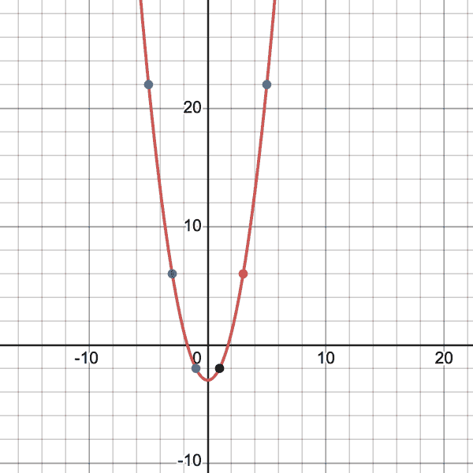
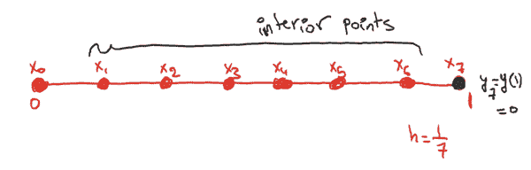

# 第十三章。人工智能和偏微分方程

《壮志凌云 2》（2022 年电影）中的第一场景展示了 Maverick（汤姆·克鲁斯）操纵一架实验军用飞机，并将其推向声速的 10 倍（10 马赫），然后在大约 10.2 马赫时失去稳定性。到目前为止，最快的非虚构有人飞行器可以达到 6.7 马赫（图 13-1）。无论是真实的速度还是虚拟的（尚未实现），看到物理学、数学和工程学共同将这些飞机放入空中，特别是它们壮观的空中机动，都是令人着迷的。在观看 Maverick 令人敬畏的空战和 10 马赫的场景时，会想起一些偏微分方程（PDEs）：

###### 图 13-1。有史以来最快的有人飞行器（[*图片来源*](https://migflug.com/jetflights/the-10-fastest-aircraft-in-the-world/)或需要类似于这个的无版权图片）

**波动传播的波动方程**：想象声速、空气中声波的传播，以及由于空气温度和密度的变化而导致不同高度声速的变化。

**Navier Stokes 方程用于流体动力学**：想象流体流动、气流隧道和湍流。

**燃烧的 G 方程**：想象飞机发动机中的燃烧和飞机尾部喷出的火焰。

**材料弹性方程**：想象飞机机翼板、升力、机翼板的屈曲（在压缩下发生的应力平面外移动的过程图 13-2），由于负载引起，这反过来降低了机翼的承载能力。当承载能力低于设计极限时，故障就会发生。

###### 图 13-2。飞机的屈曲（[*图片来源*](https://c1.staticflickr.com/8/7605/27273400154_3fa64e11bd_b.jpg)）。

PDE 模拟也会让人想起：想象一下飞行路径模拟，机组人员在计算机屏幕上实时观看 Maverick 的飞行过程并与他交谈。

清单还在继续。我们在这里声称我们之所以让飞机飞行是因为我们写下并解决了 PDE 吗？不是。航空博物馆讲述了莱特兄弟的故事、*他们的实验*以及航空工业的发展。科学和实验是相辅相成的。我们想要宣称的是，我们可以发明、改进和优化各种设计，因为有了微分方程和数学。

# 什么是偏微分方程？

PDE 是一个等式，意味着左边等于右边，涉及到一个多变量函数以及它的任何偏导数。函数关于某个变量的偏导数衡量了函数相对于该变量的变化率。普通微分方程（ODEs）是那些只涉及一个变量的函数的方程，比如只有时间、只有空间等（与多个变量相反）及其导数。动态系统是一个非常重要的 ODE，描述了我们关心的系统状态随时间的演变，比如一个粒子系统或商业环境中客户的状态。ODE 涉及系统状态的时间导数，动态规定为系统状态、系统物理参数和时间的函数。ODE 看起来像 <math alttext="StartFraction d ModifyingAbove x With right-arrow left-parenthesis t right-parenthesis Over d t EndFraction equals f left-parenthesis ModifyingAbove x With right-arrow left-parenthesis t right-parenthesis comma a left-parenthesis t right-parenthesis comma t right-parenthesis"><mrow><mfrac><mrow><mi>d</mi><mover accent="true"><mi>x</mi> <mo>→</mo></mover><mrow><mo>(</mo><mi>t</mi><mo>)</mo></mrow></mrow> <mrow><mi>d</mi><mi>t</mi></mrow></mfrac> <mo>=</mo> <mi>f</mi> <mrow><mo>(</mo> <mover accent="true"><mi>x</mi> <mo>→</mo></mover> <mrow><mo>(</mo> <mi>t</mi> <mo>)</mo></mrow> <mo>,</mo> <mi>a</mi> <mrow><mo>(</mo> <mi>t</mi> <mo>)</mrow> <mo>,</mo> <mi>t</mi> <mo>)</mo></mrow></mrow></math> 。我们将在本章多次讨论动态系统。大多数情况下，如果我们能够将 PDE 转化为 ODE 系统，或者甚至转化为动力系统，那么问题基本上就解决了。

自然没有给我们确定性函数，也没有给我们用来产生我们周围观察到的世界并能准确测量的联合概率分布。到目前为止，它一直保守这些秘密。然而，它确实给了我们一些方法来测量、评估或制定关于*事物如何相对于彼此变化*的法则，这正是偏微分方程所代表的。因为*事物如何变化*实际上就是导数。

解决偏微分方程的目标是撤销微分算子，以便我们可以恢复函数而不带有任何导数。因此，我们寻找偏微分方程代表的微分算子的精确或近似逆（或伪逆）。积分可以撤销导数，因此偏微分方程的解表示通常涉及一些核函数对 PDE 的输入数据（其参数、初始和/或边界条件）的积分。随着本章的发展，我们将详细阐述这一点。

人们通常将 ODE 和 PDE 分类为*类型*。我对此的看法是，除非我们恰好在个人工作中处理这些特殊的 ODE 或 PDE，并且这些的解对人类的未来有直接和立即的影响，否则我们不应该让自己困惑于*分类*。当你在本章中遇到某种类型，比如非线性抛物线或反向随机，接受这个名称然后直接理解我试图表达的观点。甚至不要尝试谷歌这些术语。这就像你谷歌你的症状，互联网告诉你明天就会死一样。自己小心。

# 用微分方程建模

微分方程模拟了现实世界中无数的现象，从空气湍流到星系的运动，再到纳米尺度材料的行为，再到金融工具的定价，再到与对手和多个玩家的游戏，再到人口流动和增长。典型的偏微分方程课程跳过了建模步骤，因此我们最终研究的偏微分方程似乎是突如其来的，但事实并非如此。偏微分方程的来源和分析解决它们一样重要。通常，偏微分方程表达了一些守恒定律，比如能量、质量、动量等与我们特定应用相关的守恒定律。许多偏微分方程是守恒陈述的表达，看起来像：

*时间内数量的变化率=增益-损失*

现在当我们有一个有界域时，偏微分方程在域的*内部*起作用，但我们需要伴随*边界条件*，告诉我们域的边界发生了什么。如果域是无界的，那么我们需要*远场条件*，告诉我们当<math alttext="x right-arrow normal infinity"><mrow><mi>x</mi> <mo>→</mo> <mi>∞</mi></mrow></math>时发生了什么。我们使用极限符号来写这些条件。如果偏微分方程在时间上有导数，那么我们需要一些初始时间条件或结束时间条件。我们需要多少这些条件取决于偏微分方程的阶数。将这些视为我们需要解决多少方程以解决多少未知数。未知数是偏微分方程的*积分常数*。当我们解决偏微分方程时，我们寻求有关函数的信息，给出其导数的信息。为了消除这些导数并恢复函数，我们必须*积分*偏微分方程，沿途获得积分常数。我们需要边界和/或远场条件来解决这些常数。

## 不同尺度的模型

忠实模拟自然的现实模型需要考虑所有重要变量以及它们的相互作用，有时在不同尺度的空间和时间。编写数学模型的方程需要一些工作。一旦制定，它们就是优雅的，将大量信息压缩成几行方程。这些方程涉及函数、它们的导数和模型的参数，通常比制定方程更难解决。此外，如果两个模型描述不同尺度上相同的现象，比如一个在原子尺度上（快速摆动的分子）和另一个在更大尺度上，比如在微观或宏观尺度（我们观察到的尺度），那么这两个模型的方程看起来会非常不同，甚至可能依赖于不同科学领域的物理定律。例如，想象一下描述分子水平上气体运动（粒子速度、位置、作用于其上的力等）以及如何将其与在宏观尺度观察到的气态系统的热力学联系起来。或者想想原子如何结合形成晶体结构，以及这些结构如何转化为材料性质，比如导电性、渗透性、脆性等。自然的问题是，我们是否可以在不同尺度上成功地调和这样的模型？更准确地说，如果我们将一个模型的极限取到另一个模型的范围，我们会得到相同的结果吗？这些都是分析师要解决的问题类型。调和不同尺度模型验证了它们，并统一了数学和科学的不同领域。

## 偏微分方程的参数

我们为一个模型写下的偏微分方程通常涉及参数。这些参数与我们建模的物理系统的属性有关。例如，对于热方程

<math alttext="dollar-sign u Subscript t Baseline left-parenthesis ModifyingAbove x With right-arrow comma t right-parenthesis equals alpha normal upper Delta u left-parenthesis ModifyingAbove x With right-arrow comma t right-parenthesis comma dollar-sign"><mrow><msub><mi>u</mi> <mi>t</mi></msub> <mrow><mo>(</mo> <mover accent="true"><mi>x</mi> <mo>→</mo></mover> <mo>,</mo> <mi>t</mi> <mo>)</mo></mrow> <mo>=</mo> <mi>α</mi> <mi>Δ</mi> <mi>u</mi> <mrow><mo>(</mo> <mover accent="true"><mi>x</mi> <mo>→</mo></mover> <mo>,</mo> <mi>t</mi> <mo>)</mo></mrow> <mo>,</mo></mrow></math>

参数<math alttext="alpha"><mi>α</mi></math>是*扩散系数*，这是一个物理常数，取决于扩散物质的性质和其扩散到的介质的性质。我们通常从实验获得的参考表中获取这些值。它们对工程目的非常重要。当我们的方程模拟现实时，我们必须使用从这些真实实验或观测数据中导出的参数值。但实验和观测数据通常存在噪声，缺失值，未解释的异常值，以及各种数学模型的困难。很多时候，我们甚至没有我们方程中的参数的实验值。实验可能很昂贵（想想大型强子对撞机）甚至不可能。因此，我们必须使用间接方式*学习*参数值，基于实验、观测和计算机模拟值的可访问组合的一些其他变量。从历史上看，许多这些参数值是*手动调整*的，以适应某些期望的结果，这是不好的！我们应该对进入模拟的参数值的选择有明确的理由。我们将看到机器学习如何帮助 PDEs 在从数据中学习参数值。

## 在 PDE 中改变一件事可能是一件大事

如果你在大学里上过偏微分方程（PDEs）课程，请回想一下你学过的最简单的方程，也许是在一个类似图 13-3 中的棒上的热扩散方程。如果你没有学过 PDEs，不要担心它的细节。热方程的公式是：

<math alttext="dollar-sign u Subscript t Baseline left-parenthesis x comma t right-parenthesis equals alpha normal upper Delta u left-parenthesis x comma t right-parenthesis period dollar-sign"><mrow><msub><mi>u</mi> <mi>t</mi></msub> <mrow><mo>(</mo> <mi>x</mi> <mo>,</mo> <mi>t</mi> <mo>)</mo></mrow> <mo>=</mo> <mi>α</mi> <mi>Δ</mi> <mi>u</mi> <mrow><mo>(</mo> <mi>x</mi> <mo>,</mo> <mi>t</mi> <mo>)</mo></mrow> <mo>.</mo></mrow></math>

在这里，<math alttext="u left-parenthesis x comma t right-parenthesis"><mrow><mi>u</mi> <mo>(</mo> <mi>x</mi> <mo>,</mo> <mi>t</mi> <mo>)</mo></mrow></math>表示棒上点*x*处和时间*t*处的温度，操作符<math alttext="normal upper Delta"><mi>Δ</mi></math>是*x*的二阶导数（所以<math alttext="normal upper Delta u left-parenthesis x comma t right-parenthesis equals u Subscript x x Baseline left-parenthesis x comma t right-parenthesis"><mrow><mi>Δ</mi> <mi>u</mi> <mrow><mo>(</mo> <mi>x</mi> <mo>,</mo> <mi>t</mi> <mo>)</mo></mrow> <mo>=</mo> <msub><mi>u</mi> <mrow><mi>x</mi><mi>x</mi></mrow></msub> <mrow><mo>(</mo> <mi>x</mi> <mo>,</mo> <mi>t</mi> <mo>)</mo></mrow></mrow></math>），因为棒只有一维，如果忽略其厚度。在更高维度中，操作符<math alttext="normal upper Delta"><mi>Δ</mi></math>是每个维度中二阶导数的总和。

现在让我们将域从一个棒改变成一个奇怪形状的板：不是正方形、圆形或椭圆形，而是一些不规则的形状，例如，比较图 13-3 和图 13-4。我们在初级 PDE 课程中学到的适用于棒的真实解的公式，在奇怪的板上不再适用。情况变得更糟。我们不仅通过改变域失去了对解析解的访问：当我们尝试用新域数值解微分方程时，新的几何形状突然使事情复杂化。现在我们必须找到一个离散网格，准确地描绘出新域的形状及其所有细节，然后我们必须在该网格上计算一个数值解，使其满足域内的方程，并满足沿着看起来奇怪的边界的边界条件。

###### 图 13-3。在棒上研究热扩散对于那些学过 PDEs 的人来说是容易的，无论是在分析上还是在数值上（[图片来源](https://commons.wikimedia.org/wiki/File:Steel-Dowel-Pins.jpg)）。

###### 图 13-4。研究不规则几何形状上的热扩散并不容易（[图片来源](https://www.theapollobox.com/product/sku590002/irregular-shaped-ceramic-plate)）。

这在 PDE 中很正常：改变一点微小的东西，突然我们学到的所有数学方法可能就不再适用了。这些变化包括：

+   改变域的形状，

+   改变边界条件的类型，

+   在系数中引入空间或时间依赖性（参数），

+   引入非线性，

+   引入更多导数项（高阶）,*等等*

+   引入更多变量（更高维度）

这令人沮丧的一面使许多学生不愿专攻 PDE（没有人想成为只擅长一种方程的专家，这种方程可能与现实建模相去甚远）。我们不想被打消积极性。我们想看到全局图景。自然现象非常多样化，因此我们必须接受 PDE 及其解决方法的变化作为我们理解和预测自然的探索的一部分。此外，PDE 是一个庞大而古老的领域。已经在统一许多线性和非线性偏微分方程家族的方法上取得了许多进展，并且在这一过程中发现了许多强大的分析。现状是 PDE 是一个非常有用的领域，它没有，也可能永远不会有，一个统一的理论。

一般来说，非线性 PDE 比线性 PDE 更困难，高阶 PDE 比低阶 PDE 更困难，高维 PDE 比低维 PDE 更困难，PDE 系统比单个 PDE 更困难，我们无法为大多数 PDE 编写显式解的公式，许多 PDE 只在*弱*形式下满足。许多 PDE 的解随时间演变会产生奇点（想想波动方程和激波）。开发 PDE 理论的数学家花费时间证明 PDE 的解的*存在*，并试图理解这些解的*正则性*，即它们在实际拥有涉及 PDE 的导数方面有多好。这些使用了许多高级微积分方法，寻找积分的估计（上下界的不等式）。

## AI 可以介入吗？

如果我们有方法可以考虑 PDE 的变化、域的几何形状、边界条件和参数范围的变化，类似于实际的物理问题，那不是很棒吗？许多行业和科学领域都将目光投向 AI 和深度学习，以解决长期存在的问题或为其带来新的启示。过去十年在计算非常高维问题的解决方案方面取得的巨大进步有潜力改变许多被维度诅咒束缚的领域。这样的转变将对 PDE 和整个人类产生深远影响，因为 PDE 及其解锁的大量科学。

在本章的其余部分，我们强调微分方程社区在传统方法中遇到的障碍，以及如何将真实和嘈杂的数据拟合到他们的模型中。然后我们说明了机器学习如何帮助绕过或减轻这些困难。我们还区分了两个问题：

1.  AI 对 PDE 有什么作用？

1.  PDEs 对 AI 有什么作用？

在为 PDE 提供服务时，我们需要确保机器学习的标志性特征——*训练函数、损失函数和优化*设置清晰，以及监督学习的标签或目标。将 PDE 的成熟领域融入到机器学习环境中并不是非常直接。理想情况下，我们需要建立从 PDE 到其解决方案的映射。这需要一些暂停和思考。

# 数值解非常有价值

编写描述自然现象的数学模型，以方程描述涉及变量如何相互作用，只是第一步。我们需要解决这些方程。

分析解比数值解更难，因为模型越接近自然，方程就越复杂。即使分析方法无法为解提供公式，它们仍然为解的重要属性提供了宝贵的见解。数值解比分析解更容易，因为它们涉及将连续方程离散化，将我们从连续函数的领域转移到离散数字的领域，或者从无限维函数空间转移到有限维向量空间（线性代数），这是我们的计算机建立的。数值解为模型的真实分析解提供了宝贵的见解，并且在可用时易于与实验观察进行测试。它们也易于调整，因此对实验设计是很好的辅助。

我们可以在任何尺度上设计数值解，但当我们尝试实施和计算我们的数值方案时，维度的诅咒会困扰我们。在许多情况下，为了模拟系统自然演化的一秒钟，需要大量的计算能力，因此必须进行大量的维度降低和简化假设，这使我们离真实解的良好近似更远。令人沮丧的是，这已经成为常态而非例外。

## 连续函数 vs 离散函数

函数<math alttext="f left-parenthesis x right-parenthesis equals x squared minus 3"><mrow><mi>f</mi> <mrow><mo>(</mo> <mi>x</mi> <mo>)</mo></mrow> <mo>=</mo> <msup><mi>x</mi> <mn>2</mn></msup> <mo>-</mo> <mn>3</mn></mrow></math>在整个实数线上是连续的<math alttext="left-parenthesis negative normal infinity comma normal infinity right-parenthesis"><mrow><mo>(</mo> <mo>-</mo> <mi>∞</mi> <mo>,</mo> <mi>∞</mi> <mo>)</mo></mrow></math>。当我们为机器处理的数值方案离散化它时，首先，定义域不能再是整个实数线，因为机器尚不能概念化无限域。因此，我们的第一个近似是将定义域大幅缩减到某个有限区间[-N,N]，其中 N 是一个大数。我们的第二个近似是将这个有限区间离散化，再次大幅减少，从一个连续区间[-N,N]到仅有限的一组点。如果我们使用许多点，那么我们的网格将更加精细，我们的近似将更好，但计算成本会增加。假设我们只使用 6 个点来离散化区间[-5,5]：-5，-3，-1，1，3，5，那么我们的连续函数将被减少为一个只有六个条目的向量：

<math alttext="dollar-sign StartLayout 1st Row 1st Column f left-parenthesis x right-parenthesis 2nd Column equals x squared minus 3 is continuous on left-parenthesis negative normal infinity comma normal infinity right-parenthesis 2nd Row 1st Column ModifyingAbove discrete f With right-arrow 2nd Column Start 6 By 1 Matrix 1st Row  left-parenthesis negative 5 right-parenthesis squared minus 3 2nd Row  left-parenthesis negative 3 right-parenthesis squared minus 3 3rd Row  left-parenthesis negative 1 right-parenthesis squared minus 3 4th Row  1 squared minus 3 5th Row  3 squared minus 3 6th Row  5 squared minus 3 EndMatrix equals Start 6 By 1 Matrix 1st Row  22 2nd Row  6 3rd Row  negative 2 4th Row  negative 2 5th Row  6 6th Row  22 EndMatrix EndLayout dollar-sign"><mtable displaystyle="true"><mtr><mtd columnalign="right"><mrow><mi>f</mi> <mo>(</mo> <mi>x</mi> <mo>)</mo></mrow></mtd> <mtd columnalign="left"><mrow><mo>=</mo> <msup><mi>x</mi> <mn>2</mn></msup> <mo>-</mo> <mn>3</mn> <mtext>is</mtext> <mtext>continuous</mtext> <mtext>on</mtext> <mrow><mo>(</mo> <mo>-</mo> <mi>∞</mi> <mo>,</mo> <mi>∞</mi> <mo>)</mo></mrow></mrow></mtd></mtr> <mtr><mtd columnalign="right"><mover accent="true"><mrow><mtext>discrete</mtext><mtext>f</mtext></mrow> <mo>→</mo></mover></mtd> <mtd columnalign="left"><mrow><mo>=</mo> <mfenced close=")" open="("><mtable><mtr><mtd><mrow><msup><mrow><mo>(</mo><mo>-</mo><mn>5</mn><mo>)</mo></mrow> <mn>2</mn></msup> <mo>-</mo> <mn>3</mn></mrow></mtd></mtr> <mtr><mtd><mrow><msup><mrow><mo>(</mo><mo>-</mo><mn>3</mn><mo>)</mo></mrow> <mn>2</mn></msup> <mo>-</mo> <mn>3</mn></mrow></mtd></mtr> <mtr><mtd><mrow><msup><mrow><mo>(</mo><mo>-</mo><mn>1</mn><mo>)</mo></mrow> <mn>2</mn></msup> <mo>-</mo> <mn>3</mn></mrow></mtd></mtr> <mtr><mtd><mrow><msup><mn>1</mn> <mn>2</mn></msup> <mo>-</mo> <mn>3</mn></mrow></mtd></mtr> <mtr><mtd><mrow><msup><mn>3</mn> <mn>2</mn></msup> <mo>-</mo> <mn>3</mn></mrow></mtd></mtr> <mtr><mtd><mrow><msup><mn>5</mn> <mn>2</mn></msup> <mo>-</mo> <mn>3</mn></mrow></mtd></mtr></mtable></mfenced> <mo>=</mo> <mfenced close=")" open="("><mtable><mtr><mtd><mn>22</mn></mtd></mtr> <mtr><mtd><mn>6</mn></mtd></mtr> <mtr><mtd><mrow><mo>-</mo> <mn>2</mn></mrow></mtd></mtr> <mtr><mtd><mrow><mo>-</mo> <mn>2</mn></mrow></mtd></mtr> <mtr><mtd><mn>6</mn></mtd></mtr> <mtr><mtd><mn>22</mn></mtd></mtr></mtable></mfenced></mrow></mtd></mtr></mtable></math>

图 13-5 显示了连续函数及其仅有六个点的极不充分的近似。

###### 图 13-5。将连续函数离散化为仅有六个点的向量。我们失去了点之间所有连续的丰富信息。

# 我们仍然需要离散化导数

我们可以通过在一个区间中选择点来离散化一个函数*f(x)*，就像我们之前所做的那样。微分方程包含*函数的导数*，比如<math alttext="f Subscript x Baseline comma normal upper Delta f"><mrow><msub><mi>f</mi> <mi>x</mi></msub> <mo>,</mo> <mi>Δ</mi> <mi>f</mi></mrow></math>，而不仅仅是函数。因此，我们必须离散化导数，或者找到其他方法将问题从函数空间（如连续空间）降维到向量空间（这样我们就可以使用线性代数和计算机进行计算）。有限差分和有限元是两种流行的微分方程离散化方法。我们将很快介绍它们，以及基于随机漫步的概率蒙特卡洛方法。

数值解的简单性之一是，当我们离散化时，我们进行了近似，将无限连续减少为有限的点集，失去了在有限点集之间的所有无限详细信息。也就是说，我们牺牲了高分辨率。对于某些方程，有分析方法可以帮助我们准确量化通过离散化失去了多少信息，并通过将离散网格的大小趋近于零的极限来帮助我们回到准确的分析解。

离散连续函数及涉及它们的方程具有优势：易于访问。我们可以教高中生如何数值解描述杆中热量扩散的热方程（本章后面会讨论），但在他们完成大学微积分和线性代数课程之前，我们无法教他们如何解析解决它。这就是为什么我们必须在孩子很小的时候教他们如何对现实生活中的问题建模和计算数值解。数值解的简单性和计算的力量有助于解决各种人类问题，这应该成为我们教育体系的优先事项。我怀疑自然并不希望我们在计算周围世界如何运作之前建立和解开疯狂复杂的数学理论。我也怀疑自然并不像某些数学理论那样复杂（尽管它们仍然以自身的方式有趣，即使只是作为逻辑和推理规则能引导我们走多远的练习）。

## 我的博士论文中的 PDE 主题

我的博士论文故事展示了数学理论和数值方法之间的巨大差异。这也是本章某些主题的良好原型。在我的博士论文中，我研究了一个数学模型，描述了原子在薄晶体表面的阶梯状表面上不同级别之间扩散和跳跃的方式。这对材料科学界和设计我们电子设备中所需微型部件的工程师很有用。随着时间的推移，晶体的形状会因其表面上原子的移动而发生变化。最终，晶体会放松成某种稳定的形状。

立即离散化并进行计算机模拟

当我写下这些方程时，我能够进行计算机模拟，展示晶体形状随时间的演变。这是我研究过的偏微分方程之一（并不是你应该关心它或知道其中的函数指的是什么）：

<math alttext="dollar-sign u Subscript t Baseline left-parenthesis h comma t right-parenthesis equals minus u squared left-parenthesis u cubed right-parenthesis Subscript h h h h Baseline where h element-of left-bracket 0 comma 1 right-bracket comma t element-of left-bracket 0 comma normal infinity right-parenthesis dollar-sign"><mrow><msub><mi>u</mi> <mi>t</mi></msub> <mrow><mo>(</mo> <mi>h</mi> <mo>,</mo> <mi>t</mi> <mo>)</mo></mrow> <mo>=</mo> <mo>-</mo> <msup><mi>u</mi> <mn>2</mn></msup> <msub><mrow><mo>(</mo><msup><mi>u</mi> <mn>3</mn></msup> <mo>)</mo></mrow> <mrow><mi>h</mi><mi>h</mi><mi>h</mi><mi>h</mi></mrow></msub> <mtext>where</mtext> <mi>h</mi> <mo>∈</mo> <mrow><mo>[</mo> <mn>0</mn> <mo>,</mo> <mn>1</mn> <mo>]</mo></mrow> <mo>,</mo> <mi>t</mi> <mo>∈</mo> <mrow><mo></mo> <mn>0</mn> <mo>,</mo> <mi>∞</mi> <mo>)</mo></mrow></mrow></math>

对于训练有素的人来说，这是一个高度非线性的四阶方程：未知函数*u*既平方又立方。它的立方体在空间中出现了四个导数，我们可以将其视为距我们想要评估的函数有四个度的距离。[图 13-6 展示了我在空间中使用有限差分（我们将很快讨论有限差分）对我的 PDE 进行离散化，以及其边界条件（在点 0 和 1 处的函数值）。

###### 图 13-6。离散微分方程及其连续模拟。

通常，方程非线性程度越高，它就越不愿意服从标准的分析技术。我仍然需要进行数学分析，并证明数值模拟显示的形状确实是方程要求解决方案采取的方式，也就是说，它是*分析解，也是自然在可能的其他解决方案中选择的方式。我不得不花费接下来的两年时间只做这件事。我得出的结论是，对于一个物理上不现实的*一维晶体*，我在一个微小的案例中得出了一个微小的证明！我必须将我的方程减少到只有一个维度，才能够对其进行任何数学分析。

维度的诅咒

一个始终存在的主题是问题的维度性：即使我进行了少于一个下午的数值模拟，我也只能对一维域上的方程进行模拟。当我尝试进行模拟以建模放置在平面上的现实薄膜实验晶体时，也就是说，当我必须将二维表面离散化而不是一维段时，离散点的数量从一维段上的 100 个跳到了二维表面上的 100,000 个。当时我的电脑无法数值求解在一维情况下只需几秒钟的相同方程。诚然，我当时还不够复杂，无法在大学服务器上进行计算或使用并行计算（我不知道当时是否已经发明了分布式云计算）。这就是维度的诅咒。随着维度数量的增加，计算开销呈指数级增长。现在让我们想想那些在开始时就具有高维度域的方程，比如用于量子粒子系统的薛定谔方程，用于定价金融工具的 Black Scholes 方程，或者用于动态规划的 Hamilton-Jacobi-Bellman 方程，该方程模拟多人游戏或资源分配问题。那么想象一下维度的诅咒的程度。

问题的几何形状

我们之前提到过但值得重复的另一个主题是：域的形状很重要，无论是对于分析还是数值计算。在我不切实际的一维情况下，我使用了一个段作为方程的定义域。在二维情况下，我有更多选择：矩形（具有规则网格的优势），圆形（具有径向对称性的优势），或者任何其他通常没有名称的现实非规则形状。对于分析来说，矩形和圆形域是最容易的（对于我的特定方程来说不是，但对于其他更简单的方程如线性方程来说是）。对于模拟，这些也很好。但是当域的形状不规则时，这是大多数现实事物的情况，如果我们想忠实地捕捉域，我们需要在不规则部分放置更多的离散点。维度的诅咒再次显现：更多的点意味着更长的向量和更大的输入矩阵用于计算。

模拟你关心的事物

结束我的博士故事，直到我完成学位后的十年，我才看到了一个真实的薄膜金晶体，就像我当时正在研究的那个，当时我的朋友在她的实验室里向我展示了一个薄膜金晶体。回想起来，也许我应该从那里开始，通过*看到*我试图模拟的真实生活中的东西。我的现在的优先事项有所不同，我总是首先询问自己是否关心我试图模拟的东西，我选择工作的模型有多接近现实，以及思考分析解是否值得为这个特定应用付出时间和精力。

## 离散化和维度的诅咒

研究偏微分方程的数学家喜欢连续世界，但机器喜欢离散世界。数学家喜欢分析函数，但机器喜欢计算函数。为了调和这两者，使机器能够帮助数学家，反之亦然，我们可以离散化我们的连续方程。如何做到？首先，我们离散化方程的定义域，创建一个离散网格。我们选择网格的类型（规则或不规则）以及精细程度。然后我们离散化微分方程本身，使用四种流行的方法之一：

+   **有限差分**：确定性，适用于离散化时间，一维或相对规则的空间几何。

+   有限元：确定性，适用于离散化更复杂的空间几何结构，也适用于随时间变化的空间几何结构。

+   变分或能量方法：这类似于有限元，但适用于一组更窄的偏微分方程。它们应该具有一个“变分原理”或一个“能量形式”，即，PDE 本身应该等价于“∇E（u）= 0”对于某个能量函数 E（u）（将函数映射到实数线）。我能获得博士学位的原因是我纯粹凭运气为我的 PDE 发现了这样一个能量函数。就像微积分函数的最小值出现在“∇f（x→）= 0”的点处一样，能量函数的最小值出现在“∇E（u）= 0”的“函数”处，但当然我们需要定义如何对“泛函”进行导数运算。

+   蒙特卡洛方法：概率性的，从离散化 PDE 开始，然后利用这一点设计一个适当的随机游走方案，使我们能够在域中的某一点“聚合”解决方案。

这些方法中的“有限”一词强调了这个过程将我们从函数的连续无限维空间转移到有限维向量空间。

如果我们用于离散化的网格太细，它会捕捉更多的分辨率，但我们最终会得到高维向量和矩阵。记住这种维度的诅咒，以及以下内容：神经网络的流行之所以飙升是因为它们似乎有一种神奇的能力来克服维度的诅咒。我们很快会看到这一点。

## 有限差分

我们使用有限差分来数值逼近偏微分方程中出现的函数的导数。例如，粒子的速度是其位置矢量在时间上的导数，粒子的加速度是其位置矢量在时间上的两个导数。

在有限差分逼近中，我们用域中离散点处的函数值的线性组合替换导数。回想一下，一个导数测量函数的变化率。两个导数测量凹度。更高阶导数测量更多一些科学家偶尔使用的东西。函数在一个点处的导数与其在该点附近的值如何相互比较之间的联系是相当直观的。这些逼近的数学理由依赖于微积分中的泰勒定理：

<math alttext="dollar-sign f left-parenthesis x right-parenthesis equals f left-parenthesis x Subscript i Baseline right-parenthesis plus f prime left-parenthesis x Subscript i Baseline right-parenthesis left-parenthesis x minus x Subscript i Baseline right-parenthesis plus StartFraction f double-prime left-parenthesis x Subscript i Baseline right-parenthesis Over 2 EndFraction left-parenthesis x minus x Subscript i Superscript 2 Baseline right-parenthesis plus StartFraction f Superscript left-parenthesis 3 right-parenthesis Baseline left-parenthesis x Subscript i Baseline right-parenthesis Over 3 factorial EndFraction left-parenthesis x minus x Subscript i Baseline right-parenthesis cubed plus ellipsis plus StartFraction f Superscript left-parenthesis n right-parenthesis Baseline left-parenthesis x Subscript i Baseline right-parenthesis Over n factorial EndFraction left-parenthesis x minus x Subscript i Baseline right-parenthesis Superscript n Baseline plus error term comma dollar-sign"><mrow><mi>f</mi> <mrow><mo>(</mo> <mi>x</mi> <mo>)</mo></mrow> <mo>=</mo> <mi>f</mi> <mrow><mo>(</mo> <msub><mi>x</mi> <mi>i</mi></msub> <mo>)</mo></mrow> <mo>+</mo> <msup><mi>f</mi> <mo>'</mo></msup> <mrow><mo>(</mo> <msub><mi>x</mi> <mi>i</mi></msub> <mo>)</mo></mrow> <mrow><mo>(</mo> <mi>x</mi> <mo>-</mo> <msub><mi>x</mi> <mi>i</mi></msub> <mo>)</mo></mrow> <mo>+</mo> <mfrac><mrow><msup><mi>f</mi> <mrow><mo>'</mo><mo>'</mo></mrow></msup> <mrow><mo>(</mo><msub><mi>x</mi> <mi>i</mi></msub> <mo>)</mo></mrow></mrow> <mn>2</mn></mfrac> <mrow><mo>(</mo> <mi>x</mi> <mo>-</mo> <msubsup><mi>x</mi> <mi>i</mi> <mn>2</mn></msubsup> <mo>)</mo></mrow> <mo>+</mo> <mfrac><mrow><msup><mi>f</mi> <mrow><mo>(</mo><mn>3</mn><mo>)</mo></mrow></msup> <mrow><mo>(</mo><msub><mi>x</mi> <mi>i</mi></msub> <mo>)</mo></mrow></mrow> <mrow><mn>3</mn><mo>!</mo></mrow></mfrac> <msup><mrow><mo>(</mo><mi>x</mi><mo>-</mo><msub><mi>x</mi> <mi>i</mi></msub> <mo>)</mo></mrow> <mn>3</mn></msup> <mo>+</mo> <mo>⋯</mo> <mo>+</mo> <mfrac><mrow><msup><mi>f</mi> <mrow><mo>(</mo><mi>n</mi><mo>)</mo></mrow></msup> <mrow><mo>(</mo><msub><mi>x</mi> <mi>i</mi></msub> <mo>)</mo></mrow></mrow> <mrow><mi>n</mi><mo>!</mo></mrow></mfrac> <msup><mrow><mo>(</mo><mi>x</mi><mo>-</mo><msub><mi>x</mi> <mi>i</mi></msub> <mo>)</mo></mrow> <mi>n</mi></msup> <mo>+</mo> <mtext>error</mtext> <mtext>term</mtext> <mo>,</mo></mrow></math>

其中误差项取决于下一个阶导数在我们尝试使用多项式逼近的点附近的“xi”处的“f（n+1）（xi）”有多好。泰勒定理近似了一个足够好的函数在一个点附近的多项式，其系数由该点处函数的导数确定。函数在一个点处具有的导数越多，它就越好，它在该点附近的行为就越像一个多项式。

现在让我们离散化一个一维区间[a，b]，然后写出定义在该区间上的函数*f(x)*的导数的有限差分逼近。我们可以使用 n+1 个等间距点来离散化[a，b]，因此网格大小为 h = (b-a)/n。我们现在可以在任何这些离散点上评估*f*。如果我们关心某点附近的值 x_i，我们定义 f_{i+1} = f(x_i + h)，f_{i+2} = f(x_i + 2h)，f_{i-1} = f(x_i - h)，等等。在接下来的内容中，h 很小，因此一个 O(h²)方法（或更高阶的 h）比一个 O(h)方法更准确：

1.  一阶导数的 O(h)精度的前向差分逼近（使用 2 个点）：（添加图片）

    <math alttext="dollar-sign f prime left-parenthesis x Subscript i Baseline right-parenthesis almost-equals StartFraction f Subscript i plus 1 Baseline minus f Subscript i Baseline Over h EndFraction dollar-sign"><mrow><msup><mi>f</mi> <mo>'</mo></msup> <mrow><mo>(</mo> <msub><mi>x</mi> <mi>i</mi></msub> <mo>)</mo></mrow> <mo>≈</mo> <mfrac><mrow><msub><mi>f</mi> <mrow><mi>i</mi><mo>+</mo><mn>1</mn></mrow></msub> <mo>-</mo><msub><mi>f</mi> <mi>i</mi></msub></mrow> <mi>h</mi></mfrac></mrow></math>

1.  一阶导数的 O(h)精度的后向差分逼近（使用 2 个点）：（添加图片）

    <math alttext="dollar-sign f prime left-parenthesis x Subscript i Baseline right-parenthesis almost-equals StartFraction f Subscript i Baseline minus f Subscript i minus 1 Baseline Over h EndFraction dollar-sign"><mrow><msup><mi>f</mi> <mo>'</mo></msup> <mrow><mo>(</mo> <msub><mi>x</mi> <mi>i</mi></msub> <mo>)</mo></mrow> <mo>≈</mo> <mfrac><mrow><msub><mi>f</mi> <mi>i</mi></msub> <mo>-</mo><msub><mi>f</mi> <mrow><mi>i</mi><mo>-</mo><mn>1</mn></mrow></msub></mrow> <mi>h</mi></mfrac></mrow></math>

1.  中心差分逼近的 O(h²)精度，适用于高达四阶的导数（使用 2 个点，平均前向和后向差分）：（添加图片）

    <math alttext="dollar-sign StartLayout 1st Row 1st Column f prime left-parenthesis x Subscript i Baseline right-parenthesis 2nd Column almost-equals StartFraction f Subscript i plus 1 Baseline minus f Subscript i minus 1 Baseline Over 2 h EndFraction 2nd Row 1st Column f double-prime left-parenthesis x Subscript i Baseline right-parenthesis 2nd Column almost-equals StartFraction f Subscript i plus 1 Baseline minus 2 f Subscript i Baseline plus f Subscript i minus 1 Baseline Over h squared EndFraction 3rd Row 1st Column f triple-prime left-parenthesis x Subscript i Baseline right-parenthesis 2nd Column almost-equals StartFraction f Subscript i plus 2 Baseline minus 2 f Subscript i plus 1 Baseline plus 2 f Subscript i minus 1 Baseline minus f Subscript i minus 2 Baseline Over 2 h cubed EndFraction 4th Row 1st Column f Superscript left-parenthesis 4 right-parenthesis Baseline left-parenthesis x Subscript i Baseline right-parenthesis 2nd Column almost-equals StartFraction f Subscript i plus 2 Baseline minus 4 f Subscript i plus 1 Baseline plus 6 f Subscript i Baseline minus 4 f Subscript i minus 1 Baseline plus f Subscript i minus 2 Baseline Over h Superscript 4 Baseline EndFraction EndLayout dollar-sign"><mtable displaystyle="true"><mtr><mtd columnalign="right"><mrow><msup><mi>f</mi> <mo>'</mo></msup> <mrow><mo>(</mo> <msub><mi>x</mi> <mi>i</mi></msub> <mo>)</mo></mrow></mrow></mtd> <mtd columnalign="left"><mrow><mo>≈</mo> <mfrac><mrow><msub><mi>f</mi> <mrow><mi>i</mi><mo>+</mo><mn>1</mn></mrow></msub> <mo>-</mo><msub><mi>f</mi> <mrow><mi>i</mi><mo>-</mo><mn>1</mn></mrow></msub></mrow> <mrow><mn>2</mn><mi>h</mi></mrow></mfrac></mrow></mtd></mtr> <mtr><mtd columnalign="right"><mrow><msup><mi>f</mi> <mrow><mo>'</mo><mo>'</mo></mrow></msup> <mrow><mo>(</mo> <msub><mi>x</mi> <mi>i</mi></msub> <mo>)</mo></mrow></mrow></mtd> <mtd columnalign="left"><mrow><mo>≈</mo> <mfrac><mrow><msub><mi>f</mi> <mrow><mi>i</mi><mo>+</mo><mn>1</mn></mrow></msub> <mo>-</mo><mn>2</mn><msub><mi>f</mi> <mi>i</mi></msub> <mo>+</mo><msub><mi>f</mi> <mrow><mi>i</mi><mo>-</mo><mn>1</mn></mrow></msub></mrow> <msup><mi>h</mi> <mn>2</mn></msup></mfrac></mrow></mtd></mtr> <mtr><mtd columnalign="right"><mrow><msup><mi>f</mi> <mrow><mo>'</mo><mo>'</mo><mo>'</mo></mrow></msup> <mrow><mo>(</mo> <msub><mi>x</mi> <mi>i</mi></msub> <mo>)</mo></mrow></mrow></mtd> <mtd columnalign="left"><mrow><mo>≈</mo> <mfrac><mrow><msub><mi>f</mi> <mrow><mi>i</mi><mo>+</mo><mn>2</mn></mrow></msub> <mo>-</mo><mn>2</mn><msub><mi>f</mi> <mrow><mi>i</mi><mo>+</mo><mn>1</mn></mrow></msub> <mo>+</mo><mn>2</mn><msub><mi>f</mi> <mrow><mi>i</mi><mo>-</mo><mn>1</mn></mrow></msub> <mo>-</mo><msub><mi>f</mi> <mrow><mi>i</mi><mo>-</mo><mn>2</mn></mrow></msub></mrow> <mrow><mn>2</mn><msup><mi>h</mi> <mn>3</mn></msup></mrow></mfrac></mrow></mtd></mtr> <mtr><mtd columnalign="right"><mrow><msup><mi>f</mi> <mrow><mo>(</mo><mn>4</mn><mo>)</mo></mrow></msup> <mrow><mo>(</mo> <msub><mi>x</mi> <mi>i</mi></msub> <mo>)</mo></mrow></mrow></mtd> <mtd columnalign="left"><mrow><mo>≈</mo> <mfrac><mrow><msub><mi>f</mi> <mrow><mi>i</mi><mo>+</mo><mn>2</mn></mrow></msub> <mo>-</mo><mn>4</mn><msub><mi>f</mi> <mrow><mi>i</mi><mo>+</mo><mn>1</mn></mrow></msub> <mo>+</mo><mn>6</mn><msub><mi>f</mi> <mi>i</mi></msub> <mo>-</mo><mn>4</mn><msub><mi>f</mi> <mrow><mi>i</mi><mo>-</mo><mn>1</mn></mrow></msub> <mo>+</mo><msub><mi>f</mi> <mrow><mi>i</mi><mo>-</mo><mn>2</mn></mrow></msub></mrow> <msup><mi>h</mi> <mn>4</mn></msup></mfrac></mrow></mtd></mtr></mtable></math>

1.  中心差分逼近的 O(h⁴)精度，适用于高达四阶的导数：

    <math alttext="dollar-sign StartLayout 1st Row 1st Column f prime left-parenthesis x Subscript i Baseline right-parenthesis 2nd Column almost-equals StartFraction minus f Subscript i plus 2 Baseline plus 8 f Subscript i plus 1 Baseline minus 8 f Subscript i minus 1 Baseline plus f Subscript i minus 2 Baseline Over 12 h EndFraction 2nd Row 1st Column f double-prime left-parenthesis x Subscript i Baseline right-parenthesis 2nd Column almost-equals StartFraction minus f Subscript i plus 2 Baseline plus 16 f Subscript i plus 1 Baseline minus 30 f Subscript i Baseline plus 16 f Subscript i minus 1 Baseline minus f Subscript i minus 2 Baseline Over 12 h squared EndFraction 3rd Row 1st Column f triple-prime left-parenthesis x Subscript i Baseline right-parenthesis 2nd Column almost-equals StartFraction minus f Subscript i plus 3 Baseline plus 8 f Subscript i plus 2 Baseline minus 13 f Subscript i plus 1 Baseline plus 13 f Subscript i minus 1 Baseline minus 8 f Subscript i minus 2 Baseline plus f Subscript i minus 3 Baseline Over 8 h cubed EndFraction 4th Row 1st Column f Superscript left-parenthesis 4 right-parenthesis Baseline left-parenthesis x Subscript i Baseline right-parenthesis 2nd Column almost-equals StartFraction minus f Subscript i plus 3 Baseline plus 12 f Subscript i plus 2 Baseline minus 39 f Subscript i plus 1 Baseline plus 56 f Subscript i Baseline minus 39 f Subscript i minus 1 Baseline plus 12 f Subscript i minus 2 Baseline minus f Subscript i minus 3 Baseline Over 6 h Superscript 4 Baseline EndFraction EndLayout dollar-sign"><mtable displaystyle="true"><mtr><mtd columnalign="right"><mrow><msup><mi>f</mi> <mo>'</mo></msup> <mrow><mo>(</mo> <msub><mi>x</mi> <mi>i</mi></msub> <mo>)</mo></mrow></mrow></mtd> <mtd columnalign="left"><mrow><mo>≈</mo> <mfrac><mrow><mo>-</mo><msub><mi>f</mi> <mrow><mi>i</mi><mo>+</mo><mn>2</mn></mrow></msub> <mo>+</mo><mn>8</mn><msub><mi>f</mi> <mrow><mi>i</mi><mo>+</mo><mn>1</mn></mrow></msub> <mo>-</mo><mn>8</mn><msub><mi>f</mi> <mrow><mi>i</mi><mo>-</mo><mn>1</mn></mrow></msub> <mo>+</mo><msub><mi>f</mi> <mrow><mi>i</mi><mo>-</mo><mn>2</mn></mrow></msub></mrow> <mrow><mn>12</mn><mi>h</mi></mrow></mfrac></mrow></mtd></mtr> <mtr><mtd columnalign="right"><mrow><msup><mi>f</mi> <mrow><mo>'</mo><mo>'</mo></mrow></msup> <mrow><mo>(</mo> <msub><mi>x</mi> <mi>i</mi></msub> <mo>)</mo></mrow></mrow></mtd> <mtd columnalign="left"><mrow><mo>≈</mo> <mfrac><mrow><mo>-</mo><msub><mi>f</mi> <mrow><mi>i</mi><mo>+</mo><mn>2</mn></mrow></msub> <mo>+</mo><mn>16</mn><msub><mi>f</mi> <mrow><mi>i</mi><mo>+</mo><mn>1</mn></mrow></msub> <mo>-</mo><mn>30</mn><msub><mi>f</mi> <mi>i</mi></msub> <mo>+</mo><mn>16</mn><msub><mi>f</mi> <mrow><mi>i</mi><mo>-</mo><mn>1</mn></mrow></msub> <mo>-</mo><msub><mi>f</mi> <mrow><mi>i</mi><mo>-</mo><mn>2</mn></mrow></msub></mrow> <mrow><mn>12</mn><msup><mi>h</mi> <mn>2</mn></msup></mrow></mfrac></mrow></mtd></mtr> <mtr><mtd columnalign="right"><mrow><msup><mi>f</mi> <mrow><mo>'</mo><mo>'</mo><mo>'</mo></mrow></msup> <mrow><mo>(</mo> <msub><mi>x</mi> <mi>i</mi></msub> <mo>)</mo></mrow></mrow></mtd> <mtd columnalign="left"><mrow><mo>≈</mo> <mfrac><mrow><mo>-</mo><msub><mi>f</mi> <mrow><mi>i</mi><mo>+</mo><mn>3</mn></mrow></msub> <mo>+</mo><mn>8</mn><msub><mi>f</mi> <mrow><mi>i</mi><mo>+</mo><mn>2</mn></mrow></msub> <mo>-</mo><mn>13</mn><msub><mi>f</mi> <mrow><mi>i</mi><mo>+</mo><mn>1</mn></mrow></msub> <mo>+</mo><mn>13</mn><msub><mi>f</mi> <mrow><mi>i</mi><mo>-</mo><mn>1</mn></mrow></msub> <mo>-</mo><mn>8</mn><msub><mi>f</mi> <mrow><mi>i</mi><mo>-</mo><mn>2</mn></mrow></msub> <mo>+</mo><msub><mi>f</mi> <mrow><mi>i</mi><mo>-</mo><mn>3</mn></mrow></msub></mrow> <mrow><mn>8</mn><msup><mi>h</mi> <mn>3</mn></msup></mrow></mfrac></mrow></mtd></mtr> <mtr><mtd columnalign="right"><mrow><msup><mi>f</mi> <mrow><mo>(</mo><mn>4</mn><mo>)</mo></mrow></msup> <mrow><mo>(</mo> <msub><mi>x</mi> <mi>i</mi></msub> <mo>)</mo></mrow></mrow></mtd> <mtd columnalign="left"><mrow><mo>≈</mo> <mfrac><mrow><mo>-</mo><msub><mi>f</mi> <mrow><mi>i</mi><mo>+</mo><mn>3</mn></mrow></msub> <mo>+</mo><mn>12</mn><msub><mi>f</mi> <mrow><mi>i</mi><mo>+</mo><mn>2</mn></mrow></msub> <mo>-</mo><mn>39</mn><msub><mi>f</mi> <mrow><mi>i</mi><mo>+</mo><mn>1</mn></mrow></msub> <mo>+</mo><mn>56</mn><msub><mi>f</mi> <mi>i</mi></msub> <mo>-</mo><mn>39</mn><msub><mi>f</mi> <mrow><mi>i</mi><mo>-</mo><mn>1</mn></mrow></msub> <mo>+</mo><mn>12</mn><msub><mi>f</mi> <mrow><mi>i</mi><mo>-</mo><mn>2</mn></mrow></msub> <mo>-</mo><msub><mi>f</mi> <mrow><mi>i</mi><mo>-</mo><mn>3</mn></mrow></msub></mrow> <mrow><mn>6</mn><msup><mi>h</mi> <mn>4</mn></msup></mrow></mfrac></mrow></mtd></mtr></mtable></math>

**<math alttext="上标 k 的 h 的 O 左括号"><mrow><mi>O</mi> <mo>(</mo> <msup><mi>h</mi> <mi>k</mi></msup> <mo>)</mo></mrow></math> 是什么意思？** 这是*h*的数值逼近的阶数。当我们用数值逼近替换导数时，就会产生误差。 <math alttext="上标 k 的 h 的 O 左括号"><mrow><mi>O</mi> <mo>(</mo> <msup><mi>h</mi> <mi>k</mi></msup> <mo>)</mo></mrow></math> 告诉我们我们产生了多少误差。显然，这取决于网格*h*的大小。误差应该随着网格更细而变小。为了推导这种误差界限，我们使用 f(x+h), f(x-h), f(x+2h), f(x-2h)等的泰勒展开，以及这些的线性组合来确定所需导数的逼近和我们的有限差分逼近的*h*阶。为了使用泰勒展开，我们假设我们正在处理的函数在我们评估它们的点上*确实具有所需数量的导数*。这意味着我们假设我们的函数足够好，以允许这些导数评估。如果函数在这些点附近有奇点，那么我们需要找到解决方法，比如在奇点附近使用更细的网格。

### 例子：让我们在[0,1]上解决<math alttext="y 双撇左括号 x 右括号 等于 1"><mrow><msup><mi>y</mi> <mrow><mo>'</mo><mo>'</mo></mrow></msup> <mrow><mo>(</mo> <mi>x</mi> <mo>)</mo></mrow> <mo>=</mo> <mn>1</mn></mrow></math>，带有边界条件 y(0)=-1 和 y(1)=0。这是一维有界域上的二阶线性常微分方程。

这个例子很简单，因为解析解非常容易。我们只需对方程积分两次，恢复函数而不带其导数<math alttext="y 左括号 x 右括号 等于 0.5 x 平方 加 c 1 x 加 c 2"><mrow><mi>y</mi> <mrow><mo>(</mo> <mi>x</mi> <mo>)</mo></mrow> <mo>=</mo> <mn>0</mn> <mo>.</mo> <mn>5</mn> <msup><mi>x</mi> <mn>2</mn></msup> <mo>+</mo> <msub><mi>c</mi> <mn>1</mn></msub> <mi>x</mi> <mo>+</mo> <msub><mi>c</mi> <mn>2</mn></msub></mrow></math>，其中 c 是积分常数。我们将两个边界条件代入以找到 c，并获得解析解<math alttext="y 左括号 x 右括号 等于 0.5 x 平方 加 0.5 x 减 1"><mrow><mi>y</mi> <mrow><mo>(</mo> <mi>x</mi> <mo>)</mo></mrow> <mo>=</mo> <mn>0</mn> <mo>.</mo> <mn>5</mn> <msup><mi>x</mi> <mn>2</mn></msup> <mo>+</mo> <mn>0</mn> <mo>.</mo> <mn>5</mn> <mi>x</mi> <mo>-</mo> <mn>1</mn></mrow></math>。然而，这个例子的重点是展示如何使用有限差分来计算*数值解*，而不是解析解，因为对于许多其他微分方程，解析解是不可用的，所以我们最好擅长这个。我们首先离散化域[0,1]。我们可以使用任意多的点。点数越多，我们需要处理的维度就越高，但分辨率会更好。我们只使用八个点，因此网格大小为*h=1/7*（图 13-7）。我们的连续[0,1]区间现在缩减为八个点（0,1/7,2/7,3/7,4/7,5/7,6/7,1）。

###### 图 13-7。使用八个离散点离散化单位区间，这等同于七个间隔。步长（或网格大小）为*h=1/7*。

接下来，我们离散化微分方程。我们可以使用任何有限差分方案来离散化二阶导数。让我们选择<math alttext="上标 h 平方的 O 左括号"><mrow><mi>O</mi> <mo>(</mo> <msup><mi>h</mi> <mn>2</mn></msup> <mo>)</mo></mrow></math> 中心差分，因此离散化的微分方程变为：

<math alttext="dollar-sign StartFraction y Subscript i plus 1 Baseline minus 2 y Subscript i Baseline plus y Subscript i minus 1 Baseline Over h squared EndFraction equals 1 for i equals 1 comma 2 comma 3 comma 4 comma 5 comma 6 period dollar-sign"><mrow><mfrac><mrow><msub><mi>y</mi> <mrow><mi>i</mi><mo>+</mo><mn>1</mn></mrow></msub> <mo>-</mo><mn>2</mn><msub><mi>y</mi> <mi>i</mi></msub> <mo>+</mo><msub><mi>y</mi> <mrow><mi>i</mi><mo>-</mo><mn>1</mn></mrow></msub></mrow> <msup><mi>h</mi> <mn>2</mn></msup></mfrac> <mo>=</mo> <mn>1</mn> <mtext>for</mtext> <mi>i</mi> <mo>=</mo> <mn>1</mn> <mo>,</mo> <mn>2</mn> <mo>,</mo> <mn>3</mn> <mo>,</mo> <mn>4</mn> <mo>,</mo> <mn>5</mn> <mo>,</mo> <mn>6</mn> <mo>.</mo></mrow></math>

请注意，微分方程仅在域的*内部*有效，这就是为什么我们在写其离散模拟时不包括 i=0 和 i=7 的原因。我们从边界条件中得到 i=0 和 i=7 处的值：<math alttext="y 0 equals negative 1"><mrow><msub><mi>y</mi> <mn>0</mn></msub> <mo>=</mo> <mo>-</mo> <mn>1</mn></mrow></math> 和 <math alttext="y 7 equals 0"><mrow><msub><mi>y</mi> <mn>7</mn></msub> <mo>=</mo> <mn>0</mn></mrow></math>。现在，我们有一个六个未知数的六个方程的系统，<math alttext="y 1 comma y 2 comma y 3 comma y 4 comma y 5 comma y 6"><mrow><msub><mi>y</mi> <mn>1</mn></msub> <mo>,</mo> <msub><mi>y</mi> <mn>2</mn></msub> <mo>,</mo> <msub><mi>y</mi> <mn>3</mn></msub> <mo>,</mo> <msub><mi>y</mi> <mn>4</mn></msub> <mo>,</mo> <msub><mi>y</mi> <mn>5</mn></msub> <mo>,</mo> <msub><mi>y</mi> <mn>6</mn></msub></mrow></math>：

<math alttext="dollar-sign StartLayout 1st Row 1st Column Blank 2nd Column y 2 minus 2 y 1 minus 1 equals 1 slash 49 2nd Row 1st Column Blank 2nd Column y 3 minus 2 y 2 plus y 1 equals 1 slash 49 3rd Row 1st Column Blank 2nd Column y 4 minus 2 y 3 plus y 2 equals 1 slash 49 4th Row 1st Column Blank 2nd Column y 5 minus 2 y 4 plus y 3 equals 1 slash 49 5th Row 1st Column Blank 2nd Column y 6 minus 2 y 5 plus y 4 equals 1 slash 49 6th Row 1st Column Blank 2nd Column 0 minus 2 y 6 plus y 5 equals 1 slash 49 EndLayout dollar-sign"><mtable displaystyle="true"><mtr><mtd columnalign="left"><mrow><msub><mi>y</mi> <mn>2</mn></msub> <mo>-</mo> <mn>2</mn> <msub><mi>y</mi> <mn>1</mn></msub> <mo>-</mo> <mn>1</mn> <mo>=</mo> <mn>1</mn> <mo>/</mo> <mn>49</mn></mrow></mtd></mtr> <mtr><mtd columnalign="left"><mrow><msub><mi>y</mi> <mn>3</mn></msub> <mo>-</mo> <mn>2</mn> <msub><mi>y</mi> <mn>2</mn></msub> <mo>+</mo> <msub><mi>y</mi> <mn>1</mn></msub> <mo>=</mo> <mn>1</mn> <mo>/</mo> <mn>49</mn></mrow></mtd></mtr> <mtr><mtd columnalign="left"><mrow><msub><mi>y</mi> <mn>4</mn></msub> <mo>-</mo> <mn>2</mn> <msub><mi>y</mi> <mn>3</mn></msub> <mo>+</mo> <msub><mi>y</mi> <mn>2</mn></msub> <mo>=</mo> <mn>1</mn> <mo>/</mo> <mn>49</mn></mrow></mtd></mtr> <mtr><mtd columnalign="left"><mrow><msub><mi>y</mi> <mn>5</mn></msub> <mo>-</mo> <mn>2</mn> <msub><mi>y</mi> <mn>4</mn></msub> <mo>+</mo> <msub><mi>y</mi> <mn>3</mn></msub> <mo>=</mo> <mn>1</mn> <mo>/</mo> <mn>49</mn></mrow></mtd></mtr> <mtr><mtd columnalign="left"><mrow><msub><mi>y</mi> <mn>6</mn></msub> <mo>-</mo> <mn>2</mn> <msub><mi>y</mi> <mn>5</mn></msub> <mo>+</mo> <msub><mi>y</mi> <mn>4</mn></msub> <mo>=</mo> <mn>1</mn> <mo>/</mo> <mn>49</mn></mrow></mtd></mtr> <mtr><mtd columnalign="left"><mrow><mn>0</mn> <mo>-</mo> <mn>2</mn> <msub><mi>y</mi> <mn>6</mn></msub> <mo>+</mo> <msub><mi>y</mi> <mn>5</mn></msub> <mo>=</mo> <mn>1</mn> <mo>/</mo> <mn>49</mn></mrow></mtd></mtr></mtable></math>

因此，我们现在从连续世界转移到线性代数世界：

<math alttext="dollar-sign Start 6 By 6 Matrix 1st Row 1st Column negative 2 2nd Column 1 3rd Column 0 4th Column 0 5th Column 0 6th Column 0 2nd Row 1st Column 1 2nd Column negative 2 3rd Column 1 4th Column 0 5th Column 0 6th Column 0 3rd Row 1st Column 0 2nd Column 1 3rd Column negative 2 4th Column 1 5th Column 0 6th Column 0 4th Row 1st Column 0 2nd Column 0 3rd Column 1 4th Column negative 2 5th Column 1 6th Column 0 5th Row 1st Column 0 2nd Column 0 3rd Column 0 4th Column 1 5th Column negative 2 6th Column 1 6th Row 1st Column 0 2nd Column 0 3rd Column 0 4th Column 0 5th Column 1 6th Column negative 2 EndMatrix Start 6 By 1 Matrix 1st Row  y 1 2nd Row  y 2 3rd Row  y 3 4th Row  y 4 5th Row  y 5 6th Row  y 6 EndMatrix equals Start 6 By 1 Matrix 1st Row  1 slash 49 plus 1 2nd Row  1 slash 49 3rd Row  1 slash 49 4th Row  1 slash 49 5th Row  1 slash 49 6th Row  1 slash 49 EndMatrix dollar-sign"><mrow><mfenced close=")" open="("><mtable><mtr><mtd><mrow><mo>-</mo> <mn>2</mn></mrow></mtd> <mtd><mn>1</mn></mtd> <mtd><mn>0</mn></mtd> <mtd><mn>0</mn></mtd> <mtd><mn>0</mn></mtd> <mtd><mn>0</mn></mtd></mtr> <mtr><mtd><mn>1</mn></mtd> <mtd><mrow><mo>-</mo> <mn>2</mn></mrow></mtd> <mtd><mn>1</mn></mtd> <mtd><mn>0</mn></mtd> <mtd><mn>0</mn></mtd> <mtd><mn>0</mn></mtd></mtr> <mtr><mtd><mn>0</mn></mtd> <mtd><mn>1</mn></mtd> <mtd><mrow><mo>-</mo> <mn>2</mn></mrow></mtd> <mtd><mn>1</mn></mtd> <mtd><mn>0</mn></mtd> <mtd><mn>0</mn></mtd></mtr> <mtr><mtd><mn>0</mn></mtd> <mtd><mn>0</mn></mtd> <mtd><mn>1</mn></mtd> <mtd><mrow><mo>-</mo> <mn>2</mn></mrow></mtd> <mtd><mn>1</mn></mtd> <mtd><mn>0</mn></mtd></mtr> <mtr><mtd><mn>0</mn></mtd> <mtd><mn>0</mn></mtd> <mtd><mn>0</mn></mtd> <mtd><mn>1</mn></mtd> <mtd><mrow><mo>-</mo> <mn>2</mn></mrow></mtd> <mtd><mn>1</mn></mtd></mtr> <mtr><mtd><mn>0</mn></mtd> <mtd><mn>0</mn></mtd> <mtd><mn>0</mn></mtd> <mtd><mn>0</mn></mtd> <mtd><mn>1</mn></mtd> <mtd><mrow><mo>-</mo> <mn>2</mn></mrow></mtd></mtr></mtable></mfenced> <mfenced close=")" open="("><mtable><mtr><mtd><msub><mi>y</mi> <mn>1</mn></msub></mtd></mtr> <mtr><mtd><msub><mi>y</mi> <mn>2</mn></msub></mtd></mtr> <mtr><mtd><msub><mi>y</mi> <mn>3</mn></msub></mtd></mtr> <mtr><mtd><msub><mi>y</mi> <mn>4</mn></msub></mtd></mtr> <mtr><mtd><msub><mi>y</mi> <mn>5</mn></msub></mtd></mtr> <mtr><mtd><msub><mi>y</mi> <mn>6</mn></msub></mtd></mtr></mtable></mfenced> <mo>=</mo> <mfenced close=")" open="("><mtable><mtr><mtd><mrow><mn>1</mn> <mo>/</mo> <mn>49</mn> <mo>+</mo> <mn>1</mn></mrow></mtd></mtr> <mtr><mtd><mrow><mn>1</mn> <mo>/</mo> <mn>49</mn></mrow></mtd></mtr> <mtr><mtd><mrow><mn>1</mn> <mo>/</mo> <mn>49</mn></mrow></mtd></mtr> <mtr><mtd><mrow><mn>1</mn> <mo>/</mo> <mn>49</mn></mrow></mtd></mtr> <mtr><mtd><mrow><mn>1</mn> <mo>/</mo> <mn>49</mn></mrow></mtd></mtr> <mtr><mtd><mrow><mn>1</mn> <mo>/</mo> <mn>49</mn></mrow></mtd></mtr></mtable></mfenced></mrow></math>

解决这个系统相当于*求逆*上面的三对角矩阵，这是我们二阶导数算子的离散模拟。在连续世界中，我们*积分*微分算子以恢复*y(x)*，在离散世界中，我们*求逆*离散算子以恢复离散值<math alttext="y Subscript i"><msub><mi>y</mi> <mi>i</mi></msub></math>。在使用更多点离散化域时，请记住维度的诅咒。

显然，我们必须将离散值<math alttext="y Subscript i"><msub><mi>y</mi> <mi>i</mi></msub></math>与它们的精确对应物<math alttext="y left-parenthesis x Subscript i Baseline right-parenthesis"><mrow><mi>y</mi> <mo>(</mo> <msub><mi>x</mi> <mi>i</mi></msub> <mo>)</mo></mrow></math>进行比较，以查看我们仅使用八个离散点执行的有限差分方案的性能（图 13-8）。图 13-9 显示了数值解（仅使用四个离散点）与精确解析解的图形。

###### 图 13-8\. 在每个离散点比较数值解和精确解析解。

###### 图 13-9\. 数值解的图形（仅使用四个离散点）与精确解析解的对比（实线）。

现在我们可以使用有限差分来离散化*任何*任意阶或类型的微分方程，在任何维度的域上。我们所要做的就是离散化域并决定有限差分方案，以近似域内所有离散点处的导数。

### 示例：在区间<math alttext="x element-of left-parenthesis 0 comma 1 right-parenthesis"><mrow><mi>x</mi> <mo>∈</mo> <mo>(</mo> <mn>0</mn> <mo>,</mo> <mn>1</mn> <mo>)</mo></mrow></math>的内部离散化一维热方程<math alttext="u Subscript t Baseline equals alpha u Subscript x x"><mrow><msub><mi>u</mi> <mi>t</mi></msub> <mo>=</mo> <mi>α</mi> <msub><mi>u</mi> <mrow><mi>x</mi><mi>x</mi></mrow></msub></mrow></math>。这是一维有界空间域上的二阶线性偏微分方程。

这里，u=u(x,t)是两个变量的函数，因此我们的离散化方案应该涉及两个坐标。我们可以只在空间中离散化并保持时间连续，只在时间中离散化并保持空间连续，或者在空间和时间中都离散化。我们总是有多个数值路径。选择是好的。如果我们在空间和时间中都离散化，那么我们最终得到一个代数方程组。如果我们只在空间中离散化而不在时间中离散化，那么我们最终得到一个常微分方程组。由于 PDE 是线性的，因此离散化系统也是线性的。

让我们写出一个完整的离散方案：为了在空间中离散化，让我们使用二阶中心差分。为了在时间中离散化，让我们使用向前差分：

<math alttext="dollar-sign StartFraction u Subscript i comma j plus 1 Baseline minus u Subscript i comma j Baseline Over s EndFraction equals StartFraction u Subscript i plus 1 comma j Baseline minus 2 u Subscript i comma j Baseline plus u Subscript i minus 1 comma j Baseline Over h squared EndFraction for i equals 1 comma 2 comma ellipsis comma n and j equals 1 comma 2 comma ellipsis dollar-sign"><mrow><mfrac><mrow><msub><mi>u</mi> <mrow><mi>i</mi><mo>,</mo><mi>j</mi><mo>+</mo><mn>1</mn></mrow></msub> <mo>-</mo><msub><mi>u</mi> <mrow><mi>i</mi><mo>,</mo><mi>j</mi></mrow></msub></mrow> <mi>s</mi></mfrac> <mo>=</mo> <mfrac><mrow><msub><mi>u</mi> <mrow><mi>i</mi><mo>+</mo><mn>1</mn><mo>,</mo><mi>j</mi></mrow></msub> <mo>-</mo><mn>2</mn><msub><mi>u</mi> <mrow><mi>i</mi><mo>,</mo><mi>j</mi></mrow></msub> <mo>+</mo><msub><mi>u</mi> <mrow><mi>i</mi><mo>-</mo><mn>1</mn><mo>,</mo><mi>j</mi></mrow></msub></mrow> <msup><mi>h</mi> <mn>2</mn></msup></mfrac> <mtext>for</mtext> <mi>i</mi> <mo>=</mo> <mn>1</mn> <mo>,</mo> <mn>2</mn> <mo>,</mo> <mo>⋯</mo> <mo>,</mo> <mi>n</mi> <mtext>and</mtext> <mi>j</mi> <mo>=</mo> <mn>1</mn> <mo>,</mo> <mn>2</mn> <mo>,</mo> <mo>⋯</mo></mrow></math>

在这样的方程中，*u(x,t)* 在某个初始时间可以被确定（*u(x,0)=g(x)*），我们想要知道 *u(x,t)* 随时间的演变。在上面的数值方案中，下标 *j* 代表离散时间，因此未知数是 <math alttext="u Subscript i comma j plus 1"><msub><mi>u</mi> <mrow><mi>i</mi><mo>,</mo><mi>j</mi><mo>+</mo><mn>1</mn></mrow></msub></math>。

（完成这部分）

## 有限元

有限元方法与有限差分方法不同，因为它们是基于 PDE 的*弱形式*而不是直接操作 PDE。弱形式是*加权和平均*的，因此我们考虑积分和分部积分。我们很快会回到这个问题。

在讨论有限元的一般概念之前，让我们稍微观察一下图 13-10：这显示了在圆形域上的 PDE 的有限元解。域的离散化使用三角形网格，解似乎被分段线性函数逼近。我们可以使用其他多边形形状的网格，我们可以使用比分段线性更*平滑*的函数，如分段二次或更高次多项式。更平滑的代价是更多的计算。

###### 图 13-10。在圆形域上的有限元解[(图片来源)](https://commons.wikimedia.org/wiki/File:Finite_element_solution.svg)。

让我们演示有限元方法如何给出以下 PDE 的数值近似解：

<math alttext="dollar-sign StartLayout 1st Row 1st Column Blank 2nd Column minus normal upper Delta u left-parenthesis x comma y right-parenthesis equals f left-parenthesis x comma y right-parenthesis for left-parenthesis x comma y right-parenthesis element-of normal upper Omega subset-of double-struck upper R squared 2nd Row 1st Column Blank 2nd Column u left-parenthesis x comma y right-parenthesis equals 0 for left-parenthesis x comma y right-parenthesis element-of b o u n d a r y Subscript normal upper Omega Baseline EndLayout dollar-sign"><mtable displaystyle="true"><mtr><mtd columnalign="left"><mrow><mo>-</mo> <mi>Δ</mi> <mi>u</mi> <mrow><mo>(</mo> <mi>x</mi> <mo>,</mo> <mi>y</mi> <mo>)</mo></mrow> <mo>=</mo> <mi>f</mi> <mrow><mo>(</mo> <mi>x</mi> <mo>,</mo> <mi>y</mi> <mo>)</mo></mrow> <mtext>for</mtext> <mrow><mo>(</mo> <mi>x</mi> <mo>,</mo> <mi>y</mi> <mo>)</mo></mrow> <mo>∈</mo> <mi>Ω</mi> <mo>⊂</mo> <msup><mi>ℝ</mi> <mn>2</mn></msup></mrow></mtd></mtr> <mtr><mtd columnalign="left"><mrow><mi>u</mi> <mrow><mo>(</mo> <mi>x</mi> <mo>,</mo> <mi>y</mi> <mo>)</mo></mrow> <mo>=</mo> <mn>0</mn> <mtext>for</mtext> <mrow><mo>(</mo> <mi>x</mi> <mo>,</mo> <mi>y</mi> <mo>)</mo></mrow> <mo>∈</mo> <mi>b</mi> <mi>o</mi> <mi>u</mi> <mi>n</mi> <mi>d</mi> <mi>a</mi> <mi>r</mi> <msub><mi>y</mi> <mi>Ω</mi></msub></mrow></mtd></mtr></mtable></math>

这是泊松方程（出现在静电学中）。没有时间演变。f(x,y)是指定的，我们正在寻找一个未知函数 u(x,y)，它在整个边界上为零，并且其二阶导数 <math alttext="u Subscript x x"><msub><mi>u</mi> <mrow><mi>x</mi><mi>x</mi></mrow></msub></math> 和 <math alttext="u Subscript y y"><msub><mi>u</mi> <mrow><mi>y</mi><mi>y</mi></mrow></msub></math> 加起来为*-f(x,y)*。这个 PDE 已经被广泛研究，我们有其解析解的公式，但我们只对使用有限元方法进行数值逼近感兴趣。

为此，我们将使用一个存在于*无限*维空间中的未知函数*u(x,y)*的近似，使用一个存在于*有限*维空间中的已知函数。有限维空间仅由*有限多个线性无关函数*张成。我们可以选择这些*基函数*，以确保我们的选择使我们的计算非常容易。我们通常选择分段线性函数或分段多项式函数，每个*最小支持在网格上*。这意味着基函数仅在网格的一个或两个相邻元素的顶部为非零，而在其他地方为零。因此，涉及该函数在 PDE 的整个域上的积分将简化为在网格的一个或两个元素上的积分。

在选择这些*基函数*之后，每个基函数都支持在少量网格元素上，我们通过这些简单且局部支持的基函数的线性组合来近似真实解*u(x,y)*：

<math alttext="dollar-sign u left-parenthesis x comma y right-parenthesis almost-equals u 1 b a s i s 1 left-parenthesis x comma y right-parenthesis plus u 2 b a s i s 2 left-parenthesis x comma y right-parenthesis plus ellipsis u Subscript n Baseline b a s i s Subscript n Baseline left-parenthesis x comma y right-parenthesis dollar-sign"><mrow><mi>u</mi> <mrow><mo>(</mo> <mi>x</mi> <mo>,</mo> <mi>y</mi> <mo>)</mo></mrow> <mo>≈</mo> <msub><mi>u</mi> <mn>1</mn></msub> <mi>b</mi> <mi>a</mi> <mi>s</mi> <mi>i</mi> <msub><mi>s</mi> <mn>1</mn></msub> <mrow><mo>(</mo> <mi>x</mi> <mo>,</mo> <mi>y</mi> <mo>)</mo></mrow> <mo>+</mo> <msub><mi>u</mi> <mn>2</mn></msub> <mi>b</mi> <mi>a</mi> <mi>s</mi> <mi>i</mi> <msub><mi>s</mi> <mn>2</mn></msub> <mrow><mo>(</mo> <mi>x</mi> <mo>,</mo> <mi>y</mi> <mo>)</mo></mrow> <mo>+</mo> <mo>⋯</mo> <msub><mi>u</mi> <mi>n</mi></msub> <mi>b</mi> <mi>a</mi> <mi>s</mi> <mi>i</mi> <msub><mi>s</mi> <mi>n</mi></msub> <mrow><mo>(</mo> <mi>x</mi> <mo>,</mo> <mi>y</mi> <mo>)</mo></mrow></mrow></math>

现在我们必须找到线性组合的常数<math alttext="u Subscript i"><msub><mi>u</mi> <mi>i</mi></msub></math>。因此，我们将问题从在连续介质中解决未知函数*u(x,y)*降低到解决未知系数向量<math alttext="left-parenthesis u 1 comma u 2 comma ellipsis comma u Subscript n Baseline right-parenthesis"><mrow><mo>(</mo> <msub><mi>u</mi> <mn>1</mn></msub> <mo>,</mo> <msub><mi>u</mi> <mn>2</mn></msub> <mo>,</mo> <mo>⋯</mo> <mo>,</mo> <msub><mi>u</mi> <mi>n</mi></msub> <mo>)</mo></mrow></math>。我们必须选择它们，使得近似<math alttext="u 1 e l e m e n t 1 left-parenthesis x comma y right-parenthesis plus u 2 e l e m e n t 2 left-parenthesis x comma y right-parenthesis plus ellipsis u Subscript n Baseline e l e m e n t Subscript n Baseline left-parenthesis x comma y right-parenthesis"><mrow><msub><mi>u</mi> <mn>1</mn></msub> <mi>e</mi> <mi>l</mi> <mi>e</mi> <mi>m</mi> <mi>e</mi> <mi>n</mi> <msub><mi>t</mi> <mn>1</mn></msub> <mrow><mo>(</mo> <mi>x</mi> <mo>,</mo> <mi>y</mi> <mo>)</mo></mrow> <mo>+</mo> <msub><mi>u</mi> <mn>2</mn></msub> <mi>e</mi> <mi>l</mi> <mi>e</mi> <mi>m</mi> <mi>e</mi> <mi>n</mi> <msub><mi>t</mi> <mn>2</mn></msub> <mrow><mo>(</mo> <mi>x</mi> <mo>,</mo> <mi>y</mi> <mo>)</mo></mrow> <mo>+</mo> <mo>⋯</mo> <msub><mi>u</mi> <mi>n</mi></msub> <mi>e</mi> <mi>l</mi> <mi>e</mi> <mi>m</mi> <mi>e</mi> <mi>n</mi> <msub><mi>t</mi> <mi>n</mi></msub> <mrow><mo>(</mo> <mi>x</mi> <mo>,</mo> <mi>y</mi> <mo>)</mo></mrow></mrow></math>满足 PDE，在某种意义上。我们有*n*个未知数，所以我们必须写*n*个方程并解决一个*n*个未知数的系统。我们从 PDE 或*其弱形式*中得到这些。为了得到 PDE 的弱形式，我们将其乘以一个函数*v(x,y)*，在整个域上积分，然后使用*分部积分*来摆脱高阶导数。记住我们有的导数越少，我们就越接近未知函数。让我们一步一步来做：

原始 PDE 是：

<math alttext="dollar-sign StartLayout 1st Row 1st Column Blank 2nd Column minus normal upper Delta u left-parenthesis x comma y right-parenthesis equals f left-parenthesis x comma y right-parenthesis for left-parenthesis x comma y right-parenthesis element-of normal upper Omega subset-of double-struck upper R squared 2nd Row 1st Column Blank 2nd Column u left-parenthesis x comma y right-parenthesis equals 0 for left-parenthesis x comma y right-parenthesis element-of b o u n d a r y Subscript normal upper Omega Baseline EndLayout dollar-sign"><mtable displaystyle="true"><mtr><mtd columnalign="left"><mrow><mo>-</mo> <mi>Δ</mi> <mi>u</mi> <mrow><mo>(</mo> <mi>x</mi> <mo>,</mo> <mi>y</mi> <mo>)</mo></mrow> <mo>=</mo> <mi>f</mi> <mrow><mo>(</mo> <mi>x</mi> <mo>,</mo> <mi>y</mi> <mo>)</mo></mrow> <mtext>for</mtext> <mrow><mo>(</mo> <mi>x</mi> <mo>,</mo> <mi>y</mi> <mo>)</mo></mrow> <mo>∈</mo> <mi>Ω</mi> <mo>⊂</mo> <msup><mi>ℝ</mi> <mn>2</mn></msup></mrow></mtd></mtr> <mtr><mtd columnalign="left"><mrow><mi>u</mi> <mrow><mo>(</mo> <mi>x</mi> <mo>,</mo> <mi>y</mi> <mo>)</mo></mrow> <mo>=</mo> <mn>0</mn> <mtext>for</mtext> <mrow><mo>(</mo> <mi>x</mi> <mo>,</mo> <mi>y</mi> <mo>)</mo></mrow> <mo>∈</mo> <mi>b</mi> <mi>o</mi> <mi>u</mi> <mi>n</mi> <mi>d</mi> <mi>a</mi> <mi>r</mi> <msub><mi>y</mi> <mi>Ω</mi></msub></mrow></mtd></mtr></mtable></math>

将 PDE 乘以一个函数*v(x,y)*并在整个域上积分。这是 PDE 的*弱形式*，因为它以积分形式满足，而不是逐点形式：

<math alttext="dollar-sign minus integral Underscript normal upper Omega Endscripts normal upper Delta u left-parenthesis x comma y right-parenthesis v left-parenthesis x comma y right-parenthesis d x d y equals integral Underscript normal upper Omega Endscripts f left-parenthesis x comma y right-parenthesis v left-parenthesis x comma y right-parenthesis d x d y dollar-sign"><mrow><mo>-</mo> <msub><mo>∫</mo> <mi>Ω</mi></msub> <mi>Δ</mi> <mi>u</mi> <mrow><mo>(</mo> <mi>x</mi> <mo>,</mo> <mi>y</mi> <mo>)</mo></mrow> <mi>v</mi> <mrow><mo>(</mo> <mi>x</mi> <mo>,</mo> <mi>y</mi> <mo>)</mo></mrow> <mi>d</mi> <mi>x</mi> <mi>d</mi> <mi>y</mi> <mo>=</mo> <msub><mo>∫</mo> <mi>Ω</mi></msub> <mi>f</mi> <mrow><mo>(</mo> <mi>x</mi> <mo>,</mo> <mi>y</mi> <mo>)</mo></mrow> <mi>v</mi> <mrow><mo>(</mo> <mi>x</mi> <mo>,</mo> <mi>y</mi> <mo>)</mo></mrow> <mi>d</mi> <mi>x</mi> <mi>d</mi> <mi>y</mi></mrow></math>

注意算子<math alttext="normal upper Delta equals normal nabla period normal nabla"><mrow><mi>Δ</mi> <mo>=</mo> <mi>∇</mi> <mo>.</mo> <mi>∇</mi></mrow></math>，两个导数算子的点积。通过分部积分，我们可以通过将一个导数移到积分内的另一个函数来摆脱其中一个导数。这并非免费：在这个过程中，它会带上一个负号和另一个作用于域边界的积分项。域边界上的新积分积分了两个反导数的乘积。边界项需要外法向量到边界<math alttext="ModifyingAbove n With right-arrow"><mover accent="true"><mi>n</mi> <mo>→</mo></mover></math>：

<math alttext="dollar-sign integral Underscript normal upper Omega Endscripts normal nabla u left-parenthesis x comma y right-parenthesis period normal nabla v left-parenthesis x comma y right-parenthesis d x d y minus integral Underscript b o u n d a r y Subscript normal upper Omega Baseline Endscripts v left-parenthesis x comma y right-parenthesis normal nabla u left-parenthesis x comma y right-parenthesis period ModifyingAbove n With right-arrow d s equals integral Underscript normal upper Omega Endscripts f left-parenthesis x comma y right-parenthesis v left-parenthesis x comma y right-parenthesis d x d y dollar-sign"><mrow><msub><mo>∫</mo> <mi>Ω</mi></msub> <mi>∇</mi> <mi>u</mi> <mrow><mo>(</mo> <mi>x</mi> <mo>,</mo> <mi>y</mi> <mo>)</mo></mrow> <mo>.</mo> <mi>∇</mi> <mi>v</mi> <mrow><mo>(</mo> <mi>x</mi> <mo>,</mo> <mi>y</mi> <mo>)</mo></mrow> <mi>d</mi> <mi>x</mi> <mi>d</mi> <mi>y</mi> <mo>-</mo> <msub><mo>∫</mo> <mrow><mi>b</mi><mi>o</mi><mi>u</mi><mi>n</mi><mi>d</mi><mi>a</mi><mi>r</mi><msub><mi>y</mi> <mi>Ω</mi></msub></mrow></msub> <mi>v</mi> <mrow><mo>(</mo> <mi>x</mi> <mo>,</mo> <mi>y</mi> <mo>)</mo></mrow> <mi>∇</mi> <mi>u</mi> <mrow><mo>(</mo> <mi>x</mi> <mo>,</mo> <mi>y</mi> <mo>)</mo></mrow> <mo>.</mo> <mover accent="true"><mi>n</mi> <mo>→</mo></mover> <mi>d</mi> <mi>s</mi> <mo>=</mo> <msub><mo>∫</mo> <mi>Ω</mi></msub> <mi>f</mi> <mrow><mo>(</mo> <mi>x</mi> <mo>,</mo> <mi>y</mi> <mo>)</mo></mrow> <mi>v</mi> <mrow><mo>(</mo> <mi>x</mi> <mo>,</mo> <mi>y</mi> <mo>)</mo></mrow> <mi>d</mi> <mi>x</mi> <mi>d</mi> <mi>y</mi></mrow></math>

我们可以选择*v(x,y)=0*在边界上，这样整个边界项就消失了：

<math alttext="dollar-sign integral Underscript normal upper Omega Endscripts normal nabla u left-parenthesis x comma y right-parenthesis period normal nabla v left-parenthesis x comma y right-parenthesis d x d y equals integral Underscript normal upper Omega Endscripts f left-parenthesis x comma y right-parenthesis v left-parenthesis x comma y right-parenthesis d x d y dollar-sign"><mrow><msub><mo>∫</mo> <mi>Ω</mi></msub> <mi>∇</mi> <mi>u</mi> <mrow><mo>(</mo> <mi>x</mi> <mo>,</mo> <mi>y</mi> <mo>)</mo></mrow> <mo>.</mo> <mi>∇</mi> <mi>v</mi> <mrow><mo>(</mo> <mi>x</mi> <mo>,</mo> <mi>y</mi> <mo>)</mo></mrow> <mi>d</mi> <mi>x</mi> <mi>d</mi> <mi>y</mi> <mo>=</mo> <msub><mo>∫</mo> <mi>Ω</mi></msub> <mi>f</mi> <mrow><mo>(</mo> <mi>x</mi> <mo>,</mo> <mi>y</mi> <mo>)</mo></mrow> <mi>v</mi> <mrow><mo>(</mo> <mi>x</mi> <mo>,</mo> <mi>y</mi> <mo>)</mo></mrow> <mi>d</mi> <mi>x</mi> <mi>d</mi> <mi>y</mi></mrow></math>

现在我们用有限维近似替换*u(x,y)*：

<math alttext="dollar-sign integral Underscript normal upper Omega Endscripts normal nabla left-parenthesis u 1 b a s i s 1 left-parenthesis x comma y right-parenthesis plus u 2 b a s i s 2 left-parenthesis x comma y right-parenthesis plus ellipsis u Subscript n Baseline b a s i s Subscript n Baseline left-parenthesis x comma y right-parenthesis right-parenthesis period normal nabla v left-parenthesis x comma y right-parenthesis d x d y equals integral Underscript normal upper Omega Endscripts f left-parenthesis x comma y right-parenthesis v left-parenthesis x comma y right-parenthesis d x d y comma dollar-sign"><mrow><msub><mo>∫</mo> <mi>Ω</mi></msub> <mi>∇</mi> <mrow><mo>(</mo> <msub><mi>u</mi> <mn>1</mn></msub> <mi>b</mi> <mi>a</mi> <mi>s</mi> <mi>i</mi> <msub><mi>s</mi> <mn>1</mn></msub> <mrow><mo>(</mo> <mi>x</mi> <mo>,</mo> <mi>y</mi> <mo>)</mo></mrow> <mo>+</mo> <msub><mi>u</mi> <mn>2</mn></msub> <mi>b</mi> <mi>a</mi> <mi>s</mi> <mi>i</mi> <msub><mi>s</mi> <mn>2</mn></msub> <mrow><mo>(</mo> <mi>x</mi> <mo>,</mo> <mi>y</mi> <mo>)</mo></mrow> <mo>+</mo> <mo>⋯</mo> <msub><mi>u</mi> <mi>n</mi></msub> <mi>b</mi> <mi>a</mi> <mi>s</mi> <mi>i</mi> <msub><mi>s</mi> <mi>n</mi></msub> <mrow><mo>(</mo> <mi>x</mi> <mo>,</mo> <mi>y</mi> <mo>)</mo></mrow> <mo>)</mo></mrow> <mo>.</mo> <mi>∇</mi> <mi>v</mi> <mrow><mo>(</mo> <mi>x</mi> <mo>,</mo> <mi>y</mi> <mo>)</mo></mrow> <mi>d</mi> <mi>x</mi> <mi>d</mi> <mi>y</mi> <mo>=</mo> <msub><mo>∫</mo> <mi>Ω</mi></msub> <mi>f</mi> <mrow><mo>(</mo> <mi>x</mi> <mo>,</mo> <mi>y</mi> <mo>)</mo></mrow> <mi>v</mi> <mrow><mo>(</mo> <mi>x</mi> <mo>,</mo> <mi>y</mi> <mo>)</mo></mrow> <mi>d</mi> <mi>x</mi> <mi>d</mi> <mi>y</mi> <mo>,</mo></mrow></math>

等价于：

<math alttext="dollar-sign integral Underscript normal upper Omega Endscripts left-parenthesis u 1 normal nabla b a s i s 1 left-parenthesis x comma y right-parenthesis plus u 2 normal nabla b a s i s 2 left-parenthesis x comma y right-parenthesis plus ellipsis u Subscript n Baseline normal nabla b a s i s Subscript n Baseline left-parenthesis x comma y right-parenthesis right-parenthesis period normal nabla v left-parenthesis x comma y right-parenthesis d x d y equals integral Underscript normal upper Omega Endscripts f left-parenthesis x comma y right-parenthesis v left-parenthesis x comma y right-parenthesis d x d y dollar-sign"><mrow><msub><mo>∫</mo> <mi>Ω</mi></msub> <mrow><mo>(</mo> <msub><mi>u</mi> <mn>1</mn></msub> <mi>∇</mi> <mi>b</mi> <mi>a</mi> <mi>s</mi> <mi>i</mi> <msub><mi>s</mi> <mn>1</mn></msub> <mrow><mo>(</mo> <mi>x</mi> <mo>,</mo> <mi>y</mi> <mo>)</mo></mrow> <mo>+</mo> <msub><mi>u</mi> <mn>2</mn></msub> <mi>∇</mi> <mi>b</mi> <mi>a</mi> <mi>s</mi> <mi>i</mi> <msub><mi>s</mi> <mn>2</mn></msub> <mrow><mo>(</mo> <mi>x</mi> <mo>,</mo> <mi>y</mi> <mo>)</mo></mrow> <mo>+</mo> <mo>⋯</mo> <msub><mi>u</mi> <mi>n</mi></msub> <mi>∇</mi> <mi>b</mi> <mi>a</mi> <mi>s</mi> <mi>i</mi> <msub><mi>s</mi> <mi>n</mi></msub> <mrow><mo>(</mo> <mi>x</mi> <mo>,</mo> <mi>y</mi> <mo>)</mo></mrow> <mo>)</mo></mrow> <mo>.</mo> <mi>∇</mi> <mi>v</mi> <mrow><mo>(</mo> <mi>x</mi> <mo>,</mo> <mi>y</mi> <mo>)</mo></mrow> <mi>d</mi> <mi>x</mi> <mi>d</mi> <mi>y</mi> <mo>=</mo> <msub><mo>∫</mo> <mi>Ω</mi></msub> <mi>f</mi> <mrow><mo>(</mo> <mi>x</mi> <mo>,</mo> <mi>y</mi> <mo>)</mo></mrow> <mi>v</mi> <mrow><mo>(</mo> <mi>x</mi> <mo>,</mo> <mi>y</mi> <mo>)</mo></mrow> <mi>d</mi> <mi>x</mi> <mi>d</mi> <mi>y</mi></mrow></math>

就是这样：我们可以选择*n*个不同的函数作为*v(x,y)*，得到*n*个未知数的*n*个不同方程（<math alttext="u Subscript i"><msub><mi>u</mi> <mi>i</mi></msub></math> 是未知数）。一个共同的主题是，每次我们都可以选择，我们选择那些不会使我们的计算变得复杂的东西。*v(x,y)*的最简单选择是我们已经有的*n*个基函数，因为这些在相互积分时产生许多抵消（*正交性*），并且在与自身积分时产生数字 1（*正规性*）。我们最初选择的基函数形成了一组*正交归一*的函数。一切都是为了让我们的生活更轻松。因此，这*n*个方程是：

<math alttext="dollar-sign StartLayout 1st Row 1st Column Blank 2nd Column integral Underscript normal upper Omega Endscripts left-parenthesis u 1 normal nabla b a s i s 1 left-parenthesis x comma y right-parenthesis plus u 2 normal nabla b a s i s 2 left-parenthesis x comma y right-parenthesis plus ellipsis u Subscript n Baseline normal nabla b a s i s Subscript n Baseline left-parenthesis x comma y right-parenthesis right-parenthesis period normal nabla b a s i s 1 left-parenthesis x comma y right-parenthesis d x d y equals integral Underscript normal upper Omega Endscripts f left-parenthesis x comma y right-parenthesis b a s i s 1 left-parenthesis x comma y right-parenthesis d x d y 2nd Row 1st Column Blank 2nd Column integral Underscript normal upper Omega Endscripts left-parenthesis u 1 normal nabla b a s i s 1 left-parenthesis x comma y right-parenthesis plus u 2 normal nabla b a s i s 2 left-parenthesis x comma y right-parenthesis plus ellipsis u Subscript n Baseline normal nabla b a s i s Subscript n Baseline left-parenthesis x comma y right-parenthesis right-parenthesis period normal nabla b a s i s 2 left-parenthesis x comma y right-parenthesis d x d y equals integral Underscript normal upper Omega Endscripts f left-parenthesis x comma y right-parenthesis b a s i s 2 left-parenthesis x comma y right-parenthesis d x d y 3rd Row 1st Column Blank 2nd Column  ellipsis 4th Row 1st Column Blank 2nd Column integral Underscript normal upper Omega Endscripts left-parenthesis u 1 normal nabla b a s i s 1 left-parenthesis x comma y right-parenthesis plus u 2 normal nabla b a s i s 2 left-parenthesis x comma y right-parenthesis plus ellipsis u Subscript n Baseline normal nabla b a s i s Subscript n Baseline left-parenthesis x comma y right-parenthesis right-parenthesis period normal nabla b a s i s Subscript n Baseline left-parenthesis x comma y right-parenthesis d x d y equals integral Underscript normal upper Omega Endscripts f left-parenthesis x comma y right-parenthesis b a s i s Subscript n Baseline left-parenthesis x comma y right-parenthesis d x d y EndLayout dollar-sign"><mtable displaystyle="true"><mtr><mtd columnalign="left"><mrow><msub><mo>∫</mo> <mi>Ω</mi></msub> <mrow><mo>(</mo> <msub><mi>u</mi> <mn>1</mn></msub> <mi>∇</mi> <mi>b</mi> <mi>a</mi> <mi>s</mi> <mi>i</mi> <msub><mi>s</mi> <mn>1</mn></msub> <mrow><mo>(</mo> <mi>x</mi> <mo>,</mo> <mi>y</mi> <mo>)</mo></mrow> <mo>+</mo> <msub><mi>u</mi> <mn>2</mn></msub> <mi>∇</mi> <mi>b</mi> <mi>a</mi> <mi>s</mi> <mi>i</mi> <msub><mi>s</mi> <mn>2</mn></msub> <mrow><mo>(</mo> <mi>x</mi> <mo>,</mo> <mi>y</mi> <mo>)</mo></mrow> <mo>+</mo> <mo>⋯</mo> <msub><mi>u</mi> <mi>n</mi></msub> <mi>∇</mi> <mi>b</mi> <mi>a</mi> <mi>s</mi> <mi>i</mi> <msub><mi>s</mi> <mi>n</mi></msub> <mrow><mo>(</mo> <mi>x</mi> <mo>,</mo> <mi>y</mi> <mo>)</mo></mrow> <mo>)</mo></mrow> <mo>.</mo> <mi>∇</mi> <mi>b</mi> <mi>a</mi> <mi>s</mi> <mi>i</mi> <msub><mi>s</mi> <mn>1</mn></msub> <mrow><mo>(</mo> <mi>x</mi> <mo>,</mo> <mi>y</mi> <mo>)</mo></mrow> <mi>d</mi> <mi>x</mi> <mi>d</mi> <mi>y</mi> <mo>=</mo> <msub><mo>∫</mo> <mi>Ω</mi></msub> <mi>f</mi> <mrow><mo>(</mo> <mi>x</mi> <mo>,</mo> <mi>y</mi> <mo>)</mo></mrow> <mi>b</mi> <mi>a</mi> <mi>s</mi> <mi>i</mi> <msub><mi>s</mi> <mn>1</mn></msub> <mrow><mo>(</mo> <mi>x</mi> <mo>,</mo> <mi>y</mi> <mo>)</mo></mrow> <mi>d</mi> <mi>x</mi> <mi>d</mi> <mi>y</mi></mrow></mtd></mtr> <mtr><mtd columnalign="left"><mrow><msub><mo>∫</mo> <mi>Ω</mi></msub> <mrow><mo>(</mo> <msub><mi>u</mi> <mn>1</mn></msub> <mi>∇</mi> <mi>b</mi> <mi>a</mi> <mi>s</mi> <mi>i</mi> <msub><mi>s</mi> <mn>1</mn></msub> <mrow><mo>(</mo> <mi>x</mi> <mo>,</mo> <mi>y</mi> <mo>)</mo></mrow> <mo>+</mo> <msub><mi>u</mi> <mn>2</mn></msub> <mi>∇</mi> <mi>b</mi> <mi>a</mi> <mi>s</mi> <mi>i</mi> <msub><mi>s</mi> <mn>2</mn></msub> <mrow><mo>(</mo> <mi>x</mi> <mo>,</mo> <mi>y</mi> <mo>)</mo></mrow> <mo>+</mo> <mo>⋯</mo> <msub><mi>u</mi> <mi>n</mi></msub> <mi>∇</mi> <mi>b</mi> <mi>a</mi> <mi>s</mi> <mi>i</mi> <msub><mi>s</mi> <mi>n</mi></msub> <mrow><mo>(</mo> <mi>x</mi> <mo>,</mo> <mi>y</mi> <mo>)</mo></mrow> <mo>)</mo></mrow> <mo>.</mo> <mi>∇</mi> <mi>b</mi> <mi>a</mi> <mi>s</mi> <mi>i</mi> <msub><mi>s</mi> <mn>2</mn></msub> <mrow><mo>(</mo> <mi>x</mi> <mo>,</mo> <mi>y</mi> <mo>)</mo></mrow> <mi>d</mi> <mi>x</mi> <mi>d</mi> <mi>y</mi> <mo>=</mo> <msub><mo>∫</mo> <mi>Ω</mi></msub> <mi>f</mi> <mrow><mo>(</mo> <mi>x</mi> <mo>,</mo> <mi>y</mi> <mo>)</mo></mrow> <mi>b</mi> <mi>a</mi> <mi>s</mi> <mi>i</mi> <msub><mi>s</mi> <mn>2</mn></msub> <mrow><mo>(</mo> <mi>x</mi> <mo>,</mo> <mi>y</mi> <mo>)</mo></mrow> <mi>d</mi> <mi>x</mi> <mi>d</mi> <mi>y</mi></mrow></mtd></mtr> <mtr><mtd columnalign="left"><mo>⋯</mo></mtd></mtr> <mtr><mtd columnalign="left"><mrow><msub><mo>∫</mo> <mi>Ω</mi></msub> <mrow><mo>(</mo> <msub><mi>u</mi> <mn>1</mn></msub> <mi>∇</mi> <mi>b</mi> <mi>a</mi> <mi>s</mi> <mi>i</mi> <msub><mi>s</mi> <mn>1</mn></msub> <mrow><mo>(</mo> <mi>x</mi> <mo>,</mo> <mi>y</mi> <mo>)</mo></mrow> <mo>+</mo> <msub><mi>u</mi> <mn>2</mn></msub> <mi>∇</mi> <mi>b</mi> <mi>a</mi> <mi>s</mi> <mi>i</mi> <msub><mi>s</mi> <mn>2</mn></msub> <mrow><mo>(</mo> <mi>x</mi> <mo>,</mo> <mi>y</mi> <mo>)</mo></mrow> <mo>+</mo> <mo>⋯</mo> <msub><mi>u</mi> <mi>n</mi></msub> <mi>∇</mi> <mi>b</mi> <mi>a</mi> <mi>s</mi> <mi>i</mi> <msub><mi>s</mi> <mi>n</mi></msub> <mrow><mo>(</mo> <mi>x</mi> <mo>,</mo> <mi>y</mi> <mo>)</mo></mrow> <mo>)</mo></mrow> <mo>.</mo> <mi>∇</mi> <mi>b</mi> <mi>a</mi> <mi>s</mi> <mi>i</mi> <msub><mi>s</mi> <mi>n</mi></msub> <mrow><mo>(</mo> <mi>x</mi> <mo>,</mo> <mi>y</mi> <mo>)</mo></mrow> <mi>d</mi> <mi>x</mi> <mi>d</mi> <mi>y</mi> <mo>=</mo> <msub><mo>∫</mo> <mi>Ω</mi></msub> <mi>f</mi> <mrow><mo>(</mo> <mi>x</mi> <mo>,</mo> <mi>y</mi> <mo>)</mo></mrow> <mi>b</mi> <mi>a</mi> <mi>s</mi> <mi>i</mi> <msub><mi>s</mi> <mi>n</mi></msub> <mrow><mo>(</mo> <mi>x</mi> <mo>,</mo> <mi>y</mi> <mo>)</mo></mrow> <mi>d</mi> <mi>x</mi> <mi>d</mi> <mi>y</mi></mrow></mtd></mtr></mtable></math>

最后，我们解决了* n *方程* n *未知数的系统，我们将其设置为线性代数形式：

<math alttext="dollar-sign Start 4 By 4 Matrix 1st Row 1st Column integral Underscript normal upper Omega Endscripts normal nabla b a s i s 1 left-parenthesis x comma y right-parenthesis period normal nabla b a s i s 1 left-parenthesis x comma y right-parenthesis d x d y 2nd Column integral Underscript normal upper Omega Endscripts normal nabla b a s i s 2 left-parenthesis x comma y right-parenthesis period normal nabla b a s i s 1 left-parenthesis x comma y right-parenthesis d x d y 3rd Column  ellipsis 4th Column integral Underscript normal upper Omega Endscripts normal nabla b a s i s Subscript n Baseline left-parenthesis x comma y right-parenthesis period normal nabla b a s i s 1 left-parenthesis x comma y right-parenthesis d x d y 2nd Row 1st Column integral Underscript normal upper Omega Endscripts normal nabla b a s i s 1 left-parenthesis x comma y right-parenthesis period normal nabla b a s i s 2 left-parenthesis x comma y right-parenthesis d x d y 2nd Column integral Underscript normal upper Omega Endscripts normal nabla b a s i s 2 left-parenthesis x comma y right-parenthesis period normal nabla b a s i s 2 left-parenthesis x comma y right-parenthesis d x d y 3rd Column  ellipsis 4th Column integral Underscript normal upper Omega Endscripts normal nabla b a s i s Subscript n Baseline left-parenthesis x comma y right-parenthesis period normal nabla b a s i s 2 left-parenthesis x comma y right-parenthesis d x d y 3rd Row 1st Column  ellipsis 2nd Column  ellipsis 3rd Column  ellipsis 4th Column  ellipsis 4th Row 1st Column integral Underscript normal upper Omega Endscripts normal nabla b a s i s 1 left-parenthesis x comma y right-parenthesis period normal nabla b a s i s Subscript n Baseline left-parenthesis x comma y right-parenthesis d x d y 2nd Column integral Underscript normal upper Omega Endscripts normal nabla b a s i s 2 left-parenthesis x comma y right-parenthesis period normal nabla b a s i s Subscript n Baseline left-parenthesis x comma y right-parenthesis d x d y 3rd Column  ellipsis 4th Column integral Underscript normal upper Omega Endscripts normal nabla b a s i s Subscript n Baseline left-parenthesis x comma y right-parenthesis period normal nabla b a s i s Subscript n Baseline left-parenthesis x comma y right-parenthesis d x d y EndMatrix Start 4 By 1 Matrix 1st Row  u 1 2nd Row  u 2 3rd Row   ellipsis 4th Row  u Subscript n Baseline EndMatrix equals Start 4 By 1 Matrix 1st Row  integral Underscript normal upper Omega Endscripts f left-parenthesis x comma y right-parenthesis b a s i s 1 left-parenthesis x comma y right-parenthesis d x d y 2nd Row  integral Underscript normal upper Omega Endscripts f left-parenthesis x comma y right-parenthesis b a s i s 2 left-parenthesis x comma y right-parenthesis d x d y 3rd Row   ellipsis 4th Row  integral Underscript normal upper Omega Endscripts f left-parenthesis x comma y right-parenthesis b a s i s Subscript n Baseline left-parenthesis x comma y right-parenthesis d x d y EndMatrix dollar-sign"><mrow><mfenced close=")" open="("><mtable><mtr><mtd><mrow><msub><mo>∫</mo> <mi>Ω</mi></msub> <mi>∇</mi> <mi>b</mi> <mi>a</mi> <mi>s</mi> <mi>i</mi> <msub><mi>s</mi> <mn>1</mn></msub> <mrow><mo>(</mo> <mi>x</mi> <mo>,</mo> <mi>y</mi> <mo>)</mo></mrow> <mo>.</mo> <mi>∇</mi> <mi>b</mi> <mi>a</mi> <mi>s</mi> <mi>i</mi> <msub><mi>s</mi> <mn>1</mn></msub> <mrow><mo>(</mo> <mi>x</mi> <mo>,</mo> <mi>y</mi> <mo>)</mo></mrow> <mi>d</mi> <mi>x</mi> <mi>d</mi> <mi>y</mi></mrow></mtd> <mtd><mrow><msub><mo>∫</mo> <mi>Ω</mi></msub> <mi>∇</mi> <mi>b</mi> <mi>a</mi> <mi>s</mi> <mi>i</mi> <msub><mi>s</mi> <mn>2</mn></msub> <mrow><mo>(</mo> <mi>x</mi> <mo>,</mo> <mi>y</mi> <mo>)</mo></mrow> <mo>.</mo> <mi>∇</mi> <mi>b</mi> <mi>a</mi> <mi>s</mi> <mi>i</mi> <msub><mi>s</mi> <mn>1</mn></msub> <mrow><mo>(</mo> <mi>x</mi> <mo>,</mo> <mi>y</mi> <mo>)</mo></mrow> <mi>d</mi> <mi>x</mi> <mi>d</mi> <mi>y</mi></mrow></mtd> <mtd><mo>⋯</mo></mtd> <mtd><mrow><msub><mo>∫</mo> <mi>Ω</mi></msub> <mi>∇</mi> <mi>b</mi> <mi>a</mi> <mi>s</mi> <mi>i</mi> <msub><mi>s</mi> <mi>n</mi></msub> <mrow><mo>(</mo> <mi>x</mi> <mo>,</mo> <mi>y</mi> <mo>)</mo></mrow> <mo>.</mo> <mi>∇</mi> <mi>b</mi> <mi>a</mi> <mi>s</mi> <mi>i</mi> <msub><mi>s</mi> <mn>1</mn></msub> <mrow><mo>(</mo> <mi>x</mi> <mo>,</mo> <mi>y</mi> <mo>)</mo></mrow> <mi>d</mi> <mi>x</mi> <mi>d</mi> <mi>y</mi></mrow></mtd></mtr> <mtr><mtd><mrow><msub><mo>∫</mo> <mi>Ω</mi></msub> <mi>∇</mi> <mi>b</mi> <mi>a</mi> <mi>s</mi> <mi>i</mi> <msub><mi>s</mi> <mn>1</mn></msub> <mrow><mo>(</mo> <mi>x</mi> <mo>,</mo> <mi>y</mi> <mo>)</mo></mrow> <mo>.</mo> <mi>∇</mi> <mi>b</mi> <mi>a</mi> <mi>s</mi> <mi>i</mi> <msub><mi>s</mi> <mn>2</mn></msub> <mrow><mo>(</mo> <mi>x</mi> <mo>,</mo> <mi>y</mi> <mo>)</mo></mrow> <mi>d</mi> <mi>x</mi> <mi>d</mi> <mi>y</mi></mrow></mtd> <mtd><mrow><msub><mo>∫</mo> <mi>Ω</mi></msub> <mi>∇</mi> <mi>b</mi> <mi>a</mi> <mi>s</mi> <mi>i</mi> <msub><mi>s</mi> <mn>2</mn></msub> <mrow><mo>(</mo> <mi>x</mi> <mo>,</mo> <mi>y</mi> <mo>)</mo></mrow> <mo>.</mo> <mi>∇</mi> <mi>b</mi> <mi>a</mi> <mi>s</mi> <mi>i</mi> <msub><mi>s</mi> <mn>2</mn></msub> <mrow><mo>(</mo> <mi>x</mi> <mo>,</mo> <mi>y</mi> <mo>)</mo></mrow> <mi>d</mi> <mi>x</mi> <mi>d</mi> <mi>y</mi></mrow></mtd> <mtd><mo>⋯</mo></mtd> <mtd><mrow><msub><mo>∫</mo> <mi>Ω</mi></msub> <mi>∇</mi> <mi>b</mi> <mi>a</mi> <mi>s</mi> <mi>i</mi> <msub><mi>s</mi> <mi>n</mi></msub> <mrow><mo>(</mo> <mi>x</mi> <mo>,</mo> <mi>y</mi> <mo>)</mo></mrow> <mo>.</mo> <mi>∇</mi> <mi>b</mi> <mi>a</mi> <mi>s</mi> <mi>i</mi> <msub><mi>s</mi> <mn>2</mn></msub> <mrow><mo>(</mo> <mi>x</mi> <mo>,</mo> <mi>y</mi> <mo>)</mo></mrow> <mi>d</mi> <mi>x</mi> <mi>d</mi> <mi>y</mi></mrow></mtd></mtr> <mtr><mtd><mo>⋮</mo></mtd> <mtd><mo>⋮</mo></mtd> <mtd><mo>⋯</mo></mtd> <mtd><mo>⋮</mo></mtd></mtr> <mtr><mtd><mrow><msub><mo>∫</mo> <mi>Ω</mi></msub> <mi>∇</mi> <mi>b</mi> <mi>a</mi> <mi>s</mi> <mi>i</mi> <msub><mi>s</mi> <mn>1</mn></msub> <mrow><mo>(</mo> <mi>x</mi> <mo>,</mo> <mi>y</mi> <mo>)</mo></mrow> <mo>.</mo> <mi>∇</mi> <mi>b</mi> <mi>a</mi> <mi>s</mi> <mi>i</mi> <msub><mi>s</mi> <mi>n</mi></msub> <mrow><mo>(</mo> <mi>x</mi> <mo>,</mo> <mi>y</mi> <mo>)</mo></mrow> <mi>d</mi> <mi>x</mi> <mi>d</mi> <mi>y</mi></mrow></mtd> <mtd><mrow><msub><mo>∫</mo> <mi>Ω</mi></msub> <mi>∇</mi> <mi>b</mi> <mi>a</mi> <mi>s</mi> <mi>i</mi> <msub><mi>s</mi> <mn>2</mn></msub> <mrow><mo>(</mo> <mi>x</mi> <mo>,</mo> <mi>y</mi> <mo>)</mo></mrow> <mo>.</mo> <mi>∇</mi> <mi>b</mi> <mi>a</mi> <mi>s</mi> <mi>i</mi> <msub><mi>s</mi> <mi>n</mi></msub> <mrow><mo>(</mo> <mi>x</mi> <mo>,</mo> <mi>y</mi> <mo>)</mo></mrow> <mi>d</mi> <mi>x</mi> <mi>d</mi> <mi>y</mi></mrow></mtd> <mtd><mo>⋯</mo></mtd> <mtd><mrow><msub><mo>∫</mo> <mi>Ω</mi></msub> <mi>∇</mi> <mi>b</mi> <mi>a</mi> <mi>s</mi> <mi>i</mi> <msub><mi>s</mi> <mi>n</mi></msub> <mrow><mo>(</mo> <mi>x</mi> <mo>,</mo> <mi>y</mi> <mo>)</mo></mrow> <mo>.</mo> <mi>∇</mi> <mi>b</mi> <mi>a</mi> <mi>s</mi> <mi>i</mi> <msub><mi>s</mi> <mi>n</mi></msub> <mrow><mo>(</mo> <mi>x</mi> <mo>,</mo> <mi>y</mi> <mo>)</mo></mrow> <mi>d</mi> <mi>x</mi> <mi>d</mi> <mi>y</mi></mrow></mtd></mtr></mtable></mfenced> <mfenced close=")" open="("><mtable><mtr><mtd><msub><mi>u</mi> <mn>1</mn></msub></mtd></mtr> <mtr><mtd><msub><mi>u</mi> <mn>2</mn></msub></mtd></mtr> <mtr><mtd><mo>⋮</mo></mtd></mtr> <mtr><mtd><msub><mi>u</mi> <mi>n</mi></msub></mtd></mtr></mtable></mfenced> <mo>=</mo> <mfenced close=")" open="("><mtable><mtr><mtd><mrow><msub><mo>∫</mo> <mi>Ω</mi></msub> <mi>f</mi> <mrow><mo>(</mo> <mi>x</mi> <mo>,</mo> <mi>y</mi> <mo>)</mo></mrow> <mi>b</mi> <mi>a</mi> <mi>s</mi> <mi>i</mi> <msub><mi>s</mi> <mn>1</mn></msub> <mrow><mo>(</mo> <mi>x</mi> <mo>,</mo> <mi>y</mi> <mo>)</mo></mrow> <mi>d</mi> <mi>x</mi> <mi>d</mi> <mi>y</mi></mrow></mtd></mtr> <mtr><mtd><mrow><msub><mo>∫</mo> <mi>Ω</mi></msub> <mi>f</mi> <mrow><mo>(</mo> <mi>x</mi> <mo>,</mo> <mi>y</mi> <mo>)</mo></mrow> <mi>b</mi> <mi>a</mi> <mi>s</mi> <mi>i</mi> <msub><mi>s</mi> <mn>2</mn></msub> <mrow><mo>(</mo> <mi>x</mi> <mo>,</mo> <mi>y</mi> <mo>)</mo></mrow> <mi>d</mi> <mi>x</mi> <mi>d</mi> <mi>y</mi></mrow></mtd></mtr> <mtr><mtd><mo>⋮</mo></mtd></mtr> <mtr><mtd><mrow><msub><mo>∫</mo> <mi>Ω</mi></msub> <mi>f</mi> <mrow><mo>(</mo> <mi>x</mi> <mo>,</mo> <mi>y</mi> <mo>)</mo></mrow> <mi>b</mi> <mi>a</mi> <mi>s</mi> <mi>i</mi> <msub><mi>s</mi> <mi>n</mi></msub> <mrow><mo>(</mo> <mi>x</mi> <mo>,</mo> <mi>y</mi> <mo>)</mo></mrow> <mi>d</mi> <mi>x</mi> <mi>d</mi> <mi>y</mi></mrow></mtd></mtr></mtable></mfenced></mrow></math>

请记住，我们知道函数*f(x,y)*、所有基函数和域<math alttext="normal upper Omega"><mi>Ω</mi></math>，所以我们要做的就是解方程组。这个系统是*稀疏*的，因为大多数这些积分为零。出于这个原因，我们选择了支持较小的基函数。我们永远不想解一个*密集*的方程组。

当然，我们对有限元有许多问题和丰富的文献来处理这些问题：

+   所有 PDE 都有一个允许我们做这样事情的弱形式吗？（是的，因为我们总是可以将 PDE 与*v*函数相乘并进行部分积分，但有些 PDE 比其他 PDE 具有更好的结构来进行简化计算）。

+   PDE 的*能量形式*或*变分原理*与之相关吗？（是的，它们相关。查找里兹方法。我们在运筹学和变分微积分章节中暗示了这一点，当我们将最小化能量泛函与解 PDE 联系起来时。在这里要记住的一件事是，大多数 PDE 具有弱形式，但并非所有 PDE 都有能量最小化形式。我获得博士学位的一个原因是我发现了我正在研究的 PDE 的能量形式。这完全是偶然。我所做的只是一个幸运的*弱形式*，然后是部分积分。就像我们在本节中所做的那样。在这个生活中，试错是被低估的）。

+   Sobolov 空间是怎么回事，为什么我们在 PDE 的高级课程中学习它们？（因为我们需要将我们的函数*u*、*v*和基函数设置在适当的*函数空间*中，告诉我们我们正在使用的所有计算和近似是有效的。例如，我们不希望包含我们的函数及其导数的涉及积分爆炸）。

+   我们可以使用非均匀网格来调整域的更详细部分，比如图 13-11 中的部分吗？（是的，我们讨论中的内容并不严格依赖于均匀网格）。

###### 图 13-11。一个具有非均匀三角形网格的二维域[*(图片来源)*](https://commons.wikimedia.org/wiki/File:Example_of_2D_mesh.png)。

+   我们需要多少基函数？（和我们的网格元素一样多）。

+   在什么条件下，近似解会收敛到真实解？（欢迎来到有限元分析）。

+   这在应用中如何使用？（一直在使用。它始于力学和结构设计：载荷、应力和应变；但现在有限元方法被用来*数值*解决各种具有复杂几何空间域的 PDE）。

+   可能出什么问题？（一如既往，维度的诅咒。我们需要更多的网格元素以获得更高的分辨率，因此我们最终需要解决的方程组随着网格元素数量的增加呈指数增长。不好。理想情况下，我们希望网格在不需要详细的地方不详细，并在域的更有趣的部分更详细）。

+   还有什么可能使事情复杂化？（对于*域随时间演变*的 PDE，我们需要相应随时间演变的网格）。

+   AI 能帮助学习给定几何和 PDE 的适当网格吗？（是的，我们将在本章中很快看到这一点）。

在继续之前，我们注意到有限元方法是一个有限维度的网格依赖方法，用于近似 PDE 的解。在本章的后面，我们将学习无网格神经网络方法。

## 变分或能量方法

一些偏微分方程在某种意义上非常特殊，因为它们的解最小化了一个能量泛函。我们说这样的偏微分方程具有*变分原理*。泊松方程，我们刚刚使用有限元方法解决的方程之一，就是这些幸运的偏微分方程之一。当一个偏微分方程具有变分原理时，它为我们打开了另一条理解其解的途径，通过研究它恰好最小化的能量泛函。

让我们写出泊松方程及其解最小化的能量泛函，而不深入讨论为什么会这样：

<math alttext="dollar-sign StartLayout 1st Row 1st Column Blank 2nd Column normal upper Delta u left-parenthesis x comma y right-parenthesis equals f left-parenthesis x comma y right-parenthesis for left-parenthesis x comma y right-parenthesis element-of normal upper Omega subset-of double-struck upper R squared 2nd Row 1st Column Blank 2nd Column u left-parenthesis x comma y right-parenthesis equals 0 for left-parenthesis x comma y right-parenthesis element-of b o u n d a r y Subscript normal upper Omega Baseline EndLayout dollar-sign"><mtable displaystyle="true"><mtr><mtd columnalign="left"><mrow><mi>Δ</mi> <mi>u</mi> <mrow><mo>(</mo> <mi>x</mi> <mo>,</mo> <mi>y</mi> <mo>)</mo></mrow> <mo>=</mo> <mi>f</mi> <mrow><mo>(</mo> <mi>x</mi> <mo>,</mo> <mi>y</mi> <mo>)</mo></mrow> <mtext>for</mtext> <mrow><mo>(</mo> <mi>x</mi> <mo>,</mo> <mi>y</mi> <mo>)</mo></mrow> <mo>∈</mo> <mi>Ω</mi> <mo>⊂</mo> <msup><mi>ℝ</mi> <mn>2</mn></msup></mrow></mtd></mtr> <mtr><mtd columnalign="left"><mrow><mi>u</mi> <mrow><mo>(</mo> <mi>x</mi> <mo>,</mo> <mi>y</mi> <mo>)</mo></mrow> <mo>=</mo> <mn>0</mn> <mtext>for</mtext> <mrow><mo>(</mo> <mi>x</mi> <mo>,</mo> <mi>y</mi> <mo>)</mo></mrow> <mo>∈</mo> <mi>b</mi> <mi>o</mi> <mi>u</mi> <mi>n</mi> <mi>d</mi> <mi>a</mi> <mi>r</mi> <msub><mi>y</mi> <mi>Ω</mi></msub></mrow></mtd></mtr></mtable></math><math alttext="dollar-sign upper E left-parenthesis u left-parenthesis x comma y right-parenthesis right-parenthesis equals integral Underscript normal upper Omega Endscripts StartAbsoluteValue normal nabla u left-parenthesis x comma y right-parenthesis EndAbsoluteValue squared plus 2 f left-parenthesis x comma y right-parenthesis d x d y period dollar-sign"><mrow><mi>E</mi> <mrow><mo>(</mo> <mi>u</mi> <mrow><mo>(</mo> <mi>x</mi> <mo>,</mo> <mi>y</mi> <mo>)</mo></mrow> <mo>)</mo></mrow> <mo>=</mo> <msub><mo>∫</mo> <mi>Ω</mi></msub> <msup><mrow><mo>|</mo><mi>∇</mi><mi>u</mi><mrow><mo>(</mo><mi>x</mi><mo>,</mo><mi>y</mi><mo>)</mo></mrow><mo>|</mo></mrow> <mn>2</mn></msup> <mo>+</mo> <mn>2</mn> <mi>f</mi> <mrow><mo>(</mo> <mi>x</mi> <mo>,</mo> <mi>y</mi> <mo>)</mo></mrow> <mi>d</mi> <mi>x</mi> <mi>d</mi> <mi>y</mi> <mo>.</mo></mrow></math>

现在我们可以利用这一新知识来数值近似求解 PDE：寻找能量泛函的近似最小化方案。类似于有限元方法，我们将我们的无限维解<u>(x, y)</u>投影到有限维空间，我们可以选择基元素：

<math alttext="dollar-sign u left-parenthesis x comma y right-parenthesis almost-equals u 1 b a s i s 1 left-parenthesis x comma y right-parenthesis plus u 2 b a s i s 2 left-parenthesis x comma y right-parenthesis plus ellipsis u Subscript n Baseline b a s i s Subscript n Baseline left-parenthesis x comma y right-parenthesis dollar-sign"><mrow><mi>u</mi> <mrow><mo>(</mo> <mi>x</mi> <mo>,</mo> <mi>y</mi> <mo>)</mo></mrow> <mo>≈</mo> <msub><mi>u</mi> <mn>1</mn></msub> <mi>b</mi> <mi>a</mi> <mi>s</mi> <mi>i</mi> <msub><mi>s</mi> <mn>1</mn></msub> <mrow><mo>(</mo> <mi>x</mi> <mo>,</mo> <mi>y</mi> <mo>)</mo></mrow> <mo>+</mo> <msub><mi>u</mi> <mn>2</mn></msub> <mi>b</mi> <mi>a</mi> <mi>s</mi> <mi>i</mi> <msub><mi>s</mi> <mn>2</mn></msub> <mrow><mo>(</mo> <mi>x</mi> <mo>,</mo> <mi>y</mi> <mo>)</mo></mrow> <mo>+</mo> <mo>⋯</mo> <msub><mi>u</mi> <mi>n</mi></msub> <mi>b</mi> <mi>a</mi> <mi>s</mi> <mi>i</mi> <msub><mi>s</mi> <mi>n</mi></msub> <mrow><mo>(</mo> <mi>x</mi> <mo>,</mo> <mi>y</mi> <mo>)</mo></mrow></mrow></math>

我们必须再次解出数字<u_1, u_2, ..., u_n>。为了做到这一点，我们将近似的 u(x, y)代入能量泛函的公式中。由于我们知道所有的基元素，这现在是<u_1, u_2, ..., u_n>的*函数*，我们可以使用标准微积分方法来最小化。完成！

这种方法相当通用，并将我们顺利引入变分微积分，这是关于寻找泛函的最优解而不是函数的，就像在正常微积分中一样。

## 蒙特卡洛方法

我们现在习惯于将大脑转换为概率思维，以解决确定性问题。我们用随机梯度下降来最小化损失函数，相乘大矩阵，对大矩阵进行随机奇异值分解，图上的随机游走来识别社区，排名网页等等。蒙特卡洛方法最著名的入门示例有：

1.  通过在单位正方形内生成许多随机点<x_random, y_random>，并找到落在半径为 1 的内切四分之一圆内的比例：<x_random² + y_random² ≤ 1>。现在我们可以估计落入四分之一圆内的概率：

    <math alttext="dollar-sign StartLayout 1st Row 1st Column Blank 2nd Column upper P r o b left-parenthesis point inside the quarter circle right-parenthesis 2nd Row 1st Column Blank 2nd Column equals StartFraction area of quarter circle of radius 1 Over area of unit square EndFraction 3rd Row 1st Column Blank 2nd Column equals StartFraction pi Over 4 EndFraction 4th Row 1st Column Blank 2nd Column almost-equals StartFraction number of times point is inside the quarter circle Over total number of points generated EndFraction period EndLayout dollar-sign"><mtable displaystyle="true"><mtr><mtd columnalign="left"><mrow><mi>P</mi> <mi>r</mi> <mi>o</mi> <mi>b</mi> <mo>(</mo> <mtext>point</mtext> <mtext>inside</mtext> <mtext>the</mtext> <mtext>quarter</mtext> <mtext>circle</mtext> <mo>)</mo></mrow></mtd></mtr> <mtr><mtd columnalign="left"><mrow><mo>=</mo> <mfrac><mrow><mtext>area</mtext><mtext>of</mtext><mtext>quarter</mtext><mtext>circle</mtext><mtext>of</mtext><mtext>radius</mtext><mtext>1</mtext></mrow> <mrow><mtext>area</mtext><mtext>of</mtext><mtext>unit</mtext><mtext>square</mtext></mrow></mfrac></mrow></mtd></mtr> <mtr><mtd columnalign="left"><mrow><mo>=</mo> <mfrac><mi>π</mi> <mn>4</mn></mfrac></mrow></mtd></mtr> <mtr><mtd columnalign="left"><mrow><mo>≈</mo> <mfrac><mrow><mtext>number</mtext><mtext>of</mtext><mtext>times</mtext><mtext>point</mtext><mtext>is</mtext><mtext>inside</mtext><mtext>the</mtext><mtext>quarter</mtext><mtext>circle</mtext></mrow> <mrow><mtext>total</mtext><mtext>number</mtext><mtext>of</mtext><mtext>points</mtext><mtext>generated</mtext></mrow></mfrac> <mo>.</mo></mrow></mtd></mtr></mtable></math>

1.  通过生成随机点<math alttext="left-parenthesis x Subscript r a n d o m Baseline comma y Subscript r a n d o m Baseline right-parenthesis"><mrow><mo>(</mo> <msub><mi>x</mi> <mrow><mi>r</mi><mi>a</mi><mi>n</mi><mi>d</mi><mi>o</mi><mi>m</mi></mrow></msub> <mo>,</mo> <msub><mi>y</mi> <mrow><mi>r</mi><mi>a</mi><mi>n</mi><mi>d</mi><mi>o</mi><mi>m</mi></mrow></msub> <mo>)</mo></mrow></math>，其中<math alttext="a less-than-or-equal-to x Subscript r a n d o m Baseline less-than-or-equal-to b"><mrow><mi>a</mi> <mo>≤</mo> <msub><mi>x</mi> <mrow><mi>r</mi><mi>a</mi><mi>n</mi><mi>d</mi><mi>o</mi><mi>m</mi></mrow></msub> <mo>≤</mo> <mi>b</mi></mrow></math>和<math alttext="0 less-than-or-equal-to y Subscript r a n d o m Baseline less-than-or-equal-to max left-parenthesis f right-parenthesis"><mrow><mn>0</mn> <mo>≤</mo> <msub><mi>y</mi> <mrow><mi>r</mi><mi>a</mi><mi>n</mi><mi>d</mi><mi>o</mi><mi>m</mi></mrow></msub> <mo>≤</mo> <mo form="prefix" movablelimits="true">max</mo> <mrow><mo>(</mo> <mi>f</mi> <mo>)</mo></mrow></mrow></math>，来估计非负连续函数*f(x)*在区间[a,b]上的积分<math alttext="integral Subscript a Superscript b Baseline f left-parenthesis x right-parenthesis d x"><mrow><msubsup><mo>∫</mo> <mrow><mi>a</mi></mrow> <mi>b</mi></msubsup> <mi>f</mi> <mrow><mo>(</mo> <mi>x</mi> <mo>)</mo></mrow> <mi>d</mi> <mi>x</mi></mrow></math>。积分的值是*f*图形下的面积。我们可以通过找到随机点位于*f(x)*图形下的比例来估计它，或者<math alttext="y Subscript r a n d o m Baseline less-than-or-equal-to f left-parenthesis x Subscript r a n d o m Baseline right-parenthesis"><mrow><msub><mi>y</mi> <mrow><mi>r</mi><mi>a</mi><mi>n</mi><mi>d</mi><mi>o</mi><mi>m</mi></mrow></msub> <mo>≤</mo> <mi>f</mi> <mrow><mo>(</mo> <msub><mi>x</mi> <mrow><mi>r</mi><mi>a</mi><mi>n</mi><mi>d</mi><mi>o</mi><mi>m</mi></mrow></msub> <mo>)</mo></mrow></mrow></math>：

    <math alttext="dollar-sign StartLayout 1st Row 1st Column Blank 2nd Column upper P r o b left-parenthesis point under the graph of f right-parenthesis 3rd Column equals StartFraction area under the graph of f Over total area of the rectangle EndFraction 2nd Row 1st Column Blank 2nd Column equals StartFraction integral Subscript a Superscript b Baseline f left-parenthesis x right-parenthesis d x Over left-parenthesis b minus a right-parenthesis times m a x left-parenthesis f right-parenthesis EndFraction 3rd Row 1st Column Blank 2nd Column almost-equals StartFraction number of times point is under the graph of f Over total number of points generated EndFraction EndLayout dollar-sign"><mtable displaystyle="true"><mtr><mtd columnalign="left"><mrow><mi>P</mi> <mi>r</mi> <mi>o</mi> <mi>b</mi> <mo>(</mo> <mtext>point</mtext> <mtext>under</mtext> <mtext>the</mtext> <mtext>graph</mtext> <mtext>of</mtext> <mtext>f</mtext> <mo>)</mo></mrow></mtd> <mtd columnalign="right"><mrow><mo>=</mo> <mfrac><mrow><mtext>area</mtext><mtext>under</mtext><mtext>the</mtext><mtext>graph</mtext><mtext>of</mtext><mtext>f</mtext></mrow> <mrow><mtext>total</mtext><mtext>area</mtext><mtext>of</mtext><mtext>the</mtext><mtext>rectangle</mtext></mrow></mfrac></mrow></mtd></mtr> <mtr><mtd columnalign="left"><mrow><mo>=</mo> <mfrac><mrow><msubsup><mo>∫</mo> <mrow><mi>a</mi></mrow> <mi>b</mi></msubsup> <mi>f</mi><mrow><mo>(</mo><mi>x</mi><mo>)</mo></mrow><mi>d</mi><mi>x</mi></mrow> <mrow><mo>(</mo><mi>b</mi><mo>-</mo><mi>a</mi><mo>)</mo><mo>×</mo><mi>m</mi><mi>a</mi><mi>x</mi><mo>(</mo><mi>f</mi><mo>)</mo></mrow></mfrac></mrow></mtd></mtr> <mtr><mtd columnalign="left"><mrow><mo>≈</mo> <mfrac><mrow><mtext>number</mtext><mtext>of</mtext><mtext>times</mtext><mtext>point</mtext><mtext>is</mtext><mtext>under</mtext><mtext>the</mtext><mtext>graph</mtext><mtext>of</mtext><mtext>f</mtext></mrow> <mrow><mtext>total</mtext><mtext>number</mtext><mtext>of</mtext><mtext>points</mtext><mtext>generated</mtext></mrow></mfrac></mrow></mtd></mtr></mtable></math>

解决确定性问题的这种随机方法被称为*蒙特卡罗*方法，因为它们涉及重复的机会游戏，并计算特定结果的比例，就像在摩纳哥的蒙特卡洛赌场赌博一样。它们也可以被称为*拉斯维加斯大道*方法。这类似于*随机对照试验*来回答确定性问题，例如评估某种药物对给定人群的影响。回答相同问题的另一种方法是完全确定性的观察性研究，其中控制所有疑似混杂变量，并评估药物干预的效果。

现在假设我们有一个确定性的 PDE，并且我们想使用随机数值试验（蒙特卡洛）来找到它的解决方案。为了说明这是如何工作的，让我们使用一个简单的 PDE：

<math alttext="dollar-sign StartLayout 1st Row 1st Column Blank 2nd Column normal upper Delta u left-parenthesis x comma y right-parenthesis equals 0 for left-parenthesis x comma y right-parenthesis in the unit square subset-of double-struck upper R squared comma 2nd Row 1st Column Blank 2nd Column u left-parenthesis x comma y right-parenthesis equals g left-parenthesis x comma y right-parenthesis for left-parenthesis x comma y right-parenthesis element-of b o u n d a r y Subscript s q u a r e Baseline period EndLayout dollar-sign"><mtable displaystyle="true"><mtr><mtd columnalign="left"><mrow><mi>Δ</mi> <mi>u</mi> <mrow><mo>(</mo> <mi>x</mi> <mo>,</mo> <mi>y</mi> <mo>)</mo></mrow> <mo>=</mo> <mn>0</mn> <mtext>for</mtext> <mrow><mo>(</mo> <mi>x</mi> <mo>,</mo> <mi>y</mi> <mo>)</mo></mrow> <mtext>in</mtext> <mtext>the</mtext> <mtext>unit</mtext> <mtext>square</mtext> <mo>⊂</mo> <msup><mi>ℝ</mi> <mn>2</mn></msup> <mo>,</mo></mrow></mtd></mtr> <mtr><mtd columnalign="left"><mrow><mi>u</mi> <mrow><mo>(</mo> <mi>x</mi> <mo>,</mo> <mi>y</mi> <mo>)</mo></mrow> <mo>=</mo> <mi>g</mi> <mrow><mo>(</mo> <mi>x</mi> <mo>,</mo> <mi>y</mi> <mo>)</mo></mrow> <mtext>for</mtext> <mrow><mo>(</mo> <mi>x</mi> <mo>,</mo> <mi>y</mi> <mo>)</mo></mrow> <mo>∈</mo> <mi>b</mi> <mi>o</mi> <mi>u</mi> <mi>n</mi> <mi>d</mi> <mi>a</mi> <mi>r</mi> <msub><mi>y</mi> <mrow><mi>s</mi><mi>q</mi><mi>u</mi><mi>a</mi><mi>r</mi><mi>e</mi></mrow></msub> <mo>.</mo></mrow></mtd></mtr></mtable></math>

让我们首先使用均匀网格离散化域，然后为内部网格点和边界条件编写 PDE 的有限差分方案：

<math alttext="dollar-sign StartLayout 1st Row 1st Column Blank 2nd Column StartFraction u Subscript i plus 1 comma j Baseline minus 2 u Subscript i comma j Baseline plus u Subscript i minus 1 comma j Baseline Over h squared EndFraction plus StartFraction u Subscript i comma j plus 1 Baseline minus 2 u Subscript i comma j Baseline plus u Subscript i comma j minus 1 Baseline Over h squared EndFraction equals 0 2nd Row 1st Column Blank 2nd Column when left-parenthesis i comma j right-parenthesis corresponds to an interior grid point comma 3rd Row 1st Column Blank 2nd Column u Subscript i prime comma j Sub Superscript prime Subscript Baseline equals g Subscript i prime comma j Sub Superscript prime Subscript Baseline when left-parenthesis i prime comma j prime right-parenthesis corresponds to a boundary point period EndLayout dollar-sign"><mtable displaystyle="true"><mtr><mtd columnalign="left"><mrow><mfrac><mrow><msub><mi>u</mi> <mrow><mi>i</mi><mo>+</mo><mn>1</mn><mo>,</mo><mi>j</mi></mrow></msub> <mo>-</mo><mn>2</mn><msub><mi>u</mi> <mrow><mi>i</mi><mo>,</mo><mi>j</mi></mrow></msub> <mo>+</mo><msub><mi>u</mi> <mrow><mi>i</mi><mo>-</mo><mn>1</mn><mo>,</mo><mi>j</mi></mrow></msub></mrow> <msup><mi>h</mi> <mn>2</mn></msup></mfrac> <mo>+</mo> <mfrac><mrow><msub><mi>u</mi> <mrow><mi>i</mi><mo>,</mo><mi>j</mi><mo>+</mo><mn>1</mn></mrow></msub> <mo>-</mo><mn>2</mn><msub><mi>u</mi> <mrow><mi>i</mi><mo>,</mo><mi>j</mi></mrow></msub> <mo>+</mo><msub><mi>u</mi> <mrow><mi>i</mi><mo>,</mo><mi>j</mi><mo>-</mo><mn>1</mn></mrow></msub></mrow> <msup><mi>h</mi> <mn>2</mn></msup></mfrac> <mo>=</mo> <mn>0</mn></mrow></mtd></mtr> <mtr><mtd columnalign="left"><mrow><mtext>when</mtext> <mtext>(i,j)</mtext> <mtext>corresponds</mtext> <mtext>to</mtext> <mtext>an</mtext> <mtext>interior</mtext> <mtext>grid</mtext> <mtext>point</mtext> <mo>,</mo></mrow></mtd></mtr> <mtr><mtd columnalign="left"><mrow><msub><mi>u</mi> <mrow><msup><mi>i</mi> <mo>'</mo></msup> <mo>,</mo><msup><mi>j</mi> <mo>'</mo></msup></mrow></msub> <mo>=</mo> <msub><mi>g</mi> <mrow><msup><mi>i</mi> <mo>'</mo></msup> <mo>,</mo><msup><mi>j</mi> <mo>'</mo></msup></mrow></msub> <mtext>when</mtext> <mtext>(i',j')</mtext> <mtext>corresponds</mtext> <mtext>to</mtext> <mtext>a</mtext> <mtext>boundary</mtext> <mtext>point</mtext> <mo>.</mo></mrow></mtd></mtr></mtable></math>

目标是使用上述数值方案找到网格的每个内部点的<math alttext="u Subscript i comma j"><msub><mi>u</mi> <mrow><mi>i</mi><mo>,</mo><mi>j</mi></mrow></msub></math>。这将是该特定内部点真实解*u(x,y)*的数值估计。让我们解出<math alttext="u Subscript i comma j"><msub><mi>u</mi> <mrow><mi>i</mi><mo>,</mo><mi>j</mi></mrow></msub></math>：

<math alttext="dollar-sign StartLayout 1st Row 1st Column Blank 2nd Column u Subscript i comma j Baseline equals one-fourth u Subscript i plus 1 comma j Baseline plus one-fourth u Subscript i minus 1 comma j Baseline plus one-fourth u Subscript i comma j plus 1 Baseline plus one-fourth u Subscript i comma j minus 1 Baseline 2nd Row 1st Column Blank 2nd Column when left-parenthesis i comma j right-parenthesis corresponds to an interior grid point comma 3rd Row 1st Column Blank 2nd Column u Subscript i prime comma j Sub Superscript prime Subscript Baseline equals g Subscript i prime comma j Sub Superscript prime Subscript Baseline when left-parenthesis i prime comma j prime right-parenthesis corresponds to a boundary point period EndLayout dollar-sign"><mtable displaystyle="true"><mtr><mtd columnalign="left"><mrow><msub><mi>u</mi> <mrow><mi>i</mi><mo>,</mo><mi>j</mi></mrow></msub> <mo>=</mo> <mfrac><mn>1</mn> <mn>4</mn></mfrac> <msub><mi>u</mi> <mrow><mi>i</mi><mo>+</mo><mn>1</mn><mo>,</mo><mi>j</mi></mrow></msub> <mo>+</mo> <mfrac><mn>1</mn> <mn>4</mn></mfrac> <msub><mi>u</mi> <mrow><mi>i</mi><mo>-</mo><mn>1</mn><mo>,</mo><mi>j</mi></mrow></msub> <mo>+</mo> <mfrac><mn>1</mn> <mn>4</mn></mfrac> <msub><mi>u</mi> <mrow><mi>i</mi><mo>,</mo><mi>j</mi><mo>+</mo><mn>1</mn></mrow></msub> <mo>+</mo> <mfrac><mn>1</mn> <mn>4</mn></mfrac> <msub><mi>u</mi> <mrow><mi>i</mi><mo>,</mo><mi>j</mi><mo>-</mo><mn>1</mn></mrow></msub></mrow></mtd></mtr> <mtr><mtd columnalign="left"><mrow><mtext>when</mtext> <mtext>(i,j)</mtext> <mtext>corresponds</mtext> <mtext>to</mtext> <mtext>an</mtext> <mtext>interior</mtext> <mtext>grid</mtext> <mtext>point</mtext> <mo>,</mo></mrow></mtd></mtr> <mtr><mtd columnalign="left"><mrow><msub><mi>u</mi> <mrow><msup><mi>i</mi> <mo>'</mo></msup> <mo>,</mo><msup><mi>j</mi> <mo>'</mo></msup></mrow></msub> <mo>=</mo> <msub><mi>g</mi> <mrow><msup><mi>i</mi> <mo>'</mo></msup> <mo>,</mo><msup><mi>j</mi> <mo>'</mo></msup></mrow></msub> <mtext>when</mtext> <mtext>(i',j')</mtext> <mtext>corresponds</mtext> <mtext>to</mtext> <mtext>a</mtext> <mtext>boundary</mtext> <mtext>point</mtext> <mo>.</mo></mrow></mtd></mtr></mtable></math>

这就是我们如何解释上述方程对于随机行走设置的：如果我们在边界上，那么我们知道解，它是 <math alttext="u Subscript i prime comma j Sub Superscript prime Subscript Baseline equals g Subscript i prime comma j prime"><mrow><msub><mi>u</mi> <mrow><msup><mi>i</mi> <mo>'</mo></msup> <mo>,</mo><msup><mi>j</mi> <mo>'</mo></msup></mrow></msub> <mo>=</mo> <msub><mi>g</mi> <mrow><msup><mi>i</mi> <mo>'</mo></msup> <mo>,</mo><msup><mi>j</mi> <mo>'</mo></msup></mrow></msub></mrow></math> 。因此，遵循 PDE 方案指导进行行走的随机行走者将在边界点收集他的奖励 <math alttext="g Subscript i prime comma j prime"><msub><mi>g</mi> <mrow><msup><mi>i</mi> <mo>'</mo></msup> <mo>,</mo><msup><mi>j</mi> <mo>'</mo></msup></mrow></msub></math> 。此外，在内部网格点（i，j）处的解 <math alttext="u Subscript i comma j"><msub><mi>u</mi> <mrow><mi>i</mi><mo>,</mo><mi>j</mi></mrow></msub></math> 是四个周围网格点的解的无权平均值。因此，如果一个随机行走者从内部网格点（i，j）开始，我们将给他 0.25 的概率漫步到他的四个相邻点中的任意一个，然后到它们的相邻点，直到他碰到一个边界网格点（i'，j'），在那里他收集他的奖励 <math alttext="g Subscript i prime comma j prime"><msub><mi>g</mi> <mrow><msup><mi>i</mi> <mo>'</mo></msup> <mo>,</mo><msup><mi>j</mi> <mo>'</mo></msup></mrow></msub></math> 。这只是 PDE 方案的一个探索，以某种方式为我们提供了有关哪个边界点对解 <math alttext="u Subscript i comma j"><msub><mi>u</mi> <mrow><mi>i</mi><mo>,</mo><mi>j</mi></mrow></msub></math> 有贡献的微小信息。如果我们重复这个过程很多次，比如一千次，都从相同的网格点（i，j）开始，我们想要找到数值解的地方，那么我们可以计算随机行走者最终到达每个边界点的比例：

<math alttext="dollar-sign p r o b left-parenthesis ending up at point left-parenthesis i prime comma j Superscript prime Baseline right-parenthesis right-parenthesis almost-equals StartFraction number of times random walker ended up at point left-parenthesis i prime comma j Superscript prime Baseline right-parenthesis Over total number of random walks starting at left-parenthesis i comma j right-parenthesis EndFraction dollar-sign"><mrow><mi>p</mi> <mi>r</mi> <mi>o</mi> <mi>b</mi> <mrow><mo>(</mo> <mtext>ending</mtext> <mtext>up</mtext> <mtext>at</mtext> <mtext>point</mtext> <mrow><mo>(</mo> <msup><mi>i</mi> <mo>'</mo></msup> <mo>,</mo> <msup><mi>j</mi> <mo>'</mo></msup> <mo>)</mo></mrow> <mo>)</mo></mrow> <mo>≈</mo> <mfrac><mrow><mtext>number</mtext><mtext>of</mtext><mtext>times</mtext><mtext>random</mtext><mtext>walker</mtext><mtext>ended</mtext><mtext>up</mtext><mtext>at</mtext><mtext>point</mtext><mo>(</mo><msup><mi>i</mi> <mo>'</mo></msup> <mo>,</mo><msup><mi>j</mi> <mo>'</mo></msup> <mo>)</mo></mrow> <mrow><mtext>total</mtext><mtext>number</mtext><mtext>of</mtext><mtext>random</mtext><mtext>walks</mtext><mtext>starting</mtext><mtext>at</mtext><mtext>(i,j)</mtext></mrow></mfrac></mrow></math>

这将为我们提供他从所有边界点预期奖励的估计，这正是我们正在寻找的数值解：每个边界值在内部点的解中扮演什么角色。因此，PDE 的数值解是：

<math alttext="dollar-sign u Subscript i comma j Baseline equals sigma-summation Underscript left-parenthesis i prime comma j Superscript prime Baseline right-parenthesis Endscripts p r o b left-parenthesis ending up at point left-parenthesis i prime comma j Superscript prime Baseline right-parenthesis right-parenthesis g Subscript i prime comma j prime dollar-sign"><mrow><msub><mi>u</mi> <mrow><mi>i</mi><mo>,</mo><mi>j</mi></mrow></msub> <mo>=</mo> <msub><mo>∑</mo> <mrow><mo>(</mo><msup><mi>i</mi> <mo>'</mo></msup> <mo>,</mo><msup><mi>j</mi> <mo>'</mo></msup> <mo>)</mo></mrow></msub> <mi>p</mi> <mi>r</mi> <mi>o</mi> <mi>b</mi> <mrow><mo>(</mo> <mtext>ending</mtext> <mtext>up</mtext> <mtext>at</mtext> <mtext>point</mtext> <mrow><mo>(</mo> <msup><mi>i</mi> <mo>'</mo></msup> <mo>,</mo> <msup><mi>j</mi> <mo>'</mo></msup> <mo>)</mo></mrow> <mo>)</mo></mrow> <msub><mi>g</mi> <mrow><msup><mi>i</mi> <mo>'</mo></msup> <mo>,</mo><msup><mi>j</mi> <mo>'</mo></msup></mrow></msub></mrow></math>

这是一种非常巧妙的获得数值解的方法，不涉及解线性方程组（可能非常庞大和不可取）。当我们关心仅在少数点找到解而不是在整个网格找到解时，这也非常出色。

当然，对于每个 PDE，我们必须设计正确的数值方案，以及随机行走者的转移概率。例如，如果 PDE 中有与二阶导数相乘的系数，那么随机行走者不会以 0.25 的等概率漫步到他的四个相邻点中的每一个。系数会为每个相邻点引入权重，因此我们调整每个转移概率。

在理论上，我们必须证明行走者最终会碰到边界，并且以这种方式获得的数值解会收敛到 PDE 的真实解析解。我们还必须获得关于随机行走停止时间（平均值）、数值解收敛速度有多快，以及以这种方式获得的数值解在准确性、计算成本和收敛速度方面与从有限差分或有限元获得的解相比如何的分析估计。

使用蒙特卡洛方法，有时我们从另一个角度开始。我们设计一个涉及不同过程和转移速率的模拟，模拟某些物理现象（例如系统中相互作用的粒子），然后我们对其进行平均，并转变为编写涉及手头系统描述符的偏微分方程。这与从偏微分方程开始然后设计一个颗粒尺度的蒙特卡洛模拟来解决它的过程完全相反。我们接下来讨论这一点。

# 一些统计力学：奇妙的主方程

我最喜欢的偏微分方程之一是来自统计力学的*主方程*，因为它是少数能够让我们从以概率描述系统的原子或分子尺度（粒子系统）转变到以确定性描述系统的宏观尺度的偏微分方程之一。可以合理地期望，底层的原子过程和转变导致了在宏观尺度上观察到的行为。向我介绍统计力学的非常聪明的人告诉我：*我们整个生活经验不就是一些庞大的基础化学反应的集体行为的结果吗？*

从原子概率的主方程转变为观察量的确定性偏微分方程是干净的，不会让我们感到欺骗或做出模糊的假设，或者让我们有两个完全不相关的模型，一个在宏观尺度，另一个在原子尺度，彼此毫无关联。

主方程跟踪统计系统（一些粒子）在某个特定时间处于某种状态的概率的演变。我们通过减去损失并考虑不同状态之间的转移速率来计算系统状态的概率的变化率：

<math alttext="dollar-sign StartLayout 1st Row 1st Column StartFraction normal partial-differential upper P left-parenthesis h comma t right-parenthesis Over normal partial-differential t EndFraction 2nd Column equals sigma-summation Underscript h Superscript prime Baseline Endscripts upper P left-parenthesis h prime comma t right-parenthesis upper T left-parenthesis h prime right-arrow h right-parenthesis minus upper P left-parenthesis h comma t right-parenthesis upper T left-parenthesis h right-arrow h Superscript prime Baseline right-parenthesis comma 2nd Row 1st Column Blank 2nd Column colon equals upper L upper P comma EndLayout dollar-sign"><mtable displaystyle="true"><mtr><mtd columnalign="right"><mfrac><mrow><mi>∂</mi><mi>P</mi><mo>(</mo><mi>h</mi><mo>,</mo><mi>t</mi><mo>)</mo></mrow> <mrow><mi>∂</mi><mi>t</mi></mrow></mfrac></mtd> <mtd columnalign="left"><mrow><mo>=</mo> <munder><mo>∑</mo> <msup><mi>h</mi> <mo>'</mo></msup></munder> <mi>P</mi> <mrow><mo>(</mo> <msup><mi>h</mi> <mo>'</mo></msup> <mo>,</mo> <mi>t</mi> <mo>)</mo></mrow> <mi>T</mi> <mrow><mo>(</mo> <msup><mi>h</mi> <mo>'</mo></msup> <mo>→</mo> <mi>h</mi> <mo>)</mo></mrow> <mo>-</mo> <mi>P</mi> <mrow><mo>(</mo> <mi>h</mi> <mo>,</mo> <mi>t</mi> <mo>)</mo></mrow> <mi>T</mi> <mrow><mo>(</mo> <mi>h</mi> <mo>→</mo> <msup><mi>h</mi> <mo>'</mo></msup> <mo>)</mo></mrow> <mo>,</mo></mrow></mtd></mtr> <mtr><mtd columnalign="left"><mrow><mo>:</mo> <mo>=</mo> <mi>L</mi> <mi>P</mi> <mo>,</mo></mrow></mtd></mtr></mtable></math>

其中<math alttext="上 T 左括号 h 右箭头 h prime 右括号"><mrow><mi>T</mi> <mo>(</mo> <mi>h</mi> <mo>→</mo> <msup><mi>h</mi> <mo>'</mo></msup> <mo>)</mo></mrow></math>和<math alttext="上 T 左括号 h prime 右箭头 h 右括号"><mrow><mi>T</mi> <mo>(</mo> <msup><mi>h</mi> <mo>'</mo></msup> <mo>→</mo> <mi>h</mi> <mo>)</mo></mrow></math>是从状态*h*到*h’*和反之的转移速率。我们使用底层的物理假设或对系统的观察来计算这些转移速率，例如原子的蒸发和凝结速率，扩散速率，*等等*。

现在我们可以利用主方程为系统的确定性描述符编写偏微分方程，通过计算它们的期望值。期望值将我们从概率量转换为确定性量。这是我们计算的方法：

<math alttext="dollar-sign mathematical left-angle f mathematical right-angle equals sigma-summation Underscript h Endscripts f upper P left-parenthesis h comma t right-parenthesis equals sigma-summation Underscript h Endscripts f StartFraction e Superscript minus upper H left-parenthesis h right-parenthesis slash upper K upper T Baseline Over upper Z EndFraction comma dollar-sign"><mrow><mrow><mo>〈</mo> <mi>f</mi> <mo>〉</mo></mrow> <mo>=</mo> <msub><mo>∑</mo> <mi>h</mi></msub> <mi>f</mi> <mi>P</mi> <mrow><mo>(</mo> <mi>h</mi> <mo>,</mo> <mi>t</mi> <mo>)</mo></mrow> <mo>=</mo> <msub><mo>∑</mo> <mi>h</mi></msub> <mi>f</mi> <mfrac><msup><mi>e</mi> <mrow><mo>-</mo><mi>H</mi><mo>(</mo><mi>h</mi><mo>)</mo><mo>/</mo><mi>K</mi><mi>T</mi></mrow></msup> <mi>Z</mi></mfrac> <mo>,</mo></mrow></math>

其中 H(h)是总能量，Z 是配分函数。表达式<math alttext="分数 e 上标负 H 左括号 h 右括号除 KT 上方除 Z"><mfrac><msup><mi>e</mi> <mrow><mo>-</mo><mi>H</mi><mo>(</mo><mi>h</mi><mo>)</mo><mo>/</mo><mi>K</mi><mi>T</mi></mrow></msup> <mi>Z</mi></mfrac></math>在统计力学中非常常见，它表达了高能量状态指数上更不可能发生的直观观念，意味着系统更倾向于低能量，并且更倾向于向降低总能量的状态演化。

# 期望值与对 Monte Carlo 模拟的 N 次重复平均值比较

这个期望值<math alttext="数学左角 f 数学右角"><mrow><mo>〈</mo> <mi>f</mi> <mo>〉</mo></mrow></math>与蒙特卡洛模拟相关：它等同于蒙特卡洛模拟重复*N*次后*f*的均值的极限<math alttext="上 N 右箭头正无穷"><mrow><mi>N</mi> <mo>→</mo> <mi>∞</mi></mrow></math>。

现在我们可以计算感兴趣量的期望变化率，比如表示晶体剖面（由原子组成）在某个位置*i*处的高度的<math alttext="h Subscript i"><msub><mi>h</mi> <mi>i</mi></msub></math>，使用主方程：

<math alttext="dollar-sign StartFraction d mathematical left-angle h Subscript i Baseline mathematical right-angle Over d t EndFraction equals sigma-summation Underscript h Endscripts h Subscript i Baseline StartFraction normal partial-differential upper P Over normal partial-differential t EndFraction equals sigma-summation Underscript h Endscripts h Subscript i Baseline upper L upper P period dollar-sign"><mrow><mfrac><mrow><mi>d</mi><mo>〈</mo><msub><mi>h</mi> <mi>i</mi></msub> <mo>〉</mo></mrow> <mrow><mi>d</mi><mi>t</mi></mrow></mfrac> <mo>=</mo> <msub><mo>∑</mo> <mi>h</mi></msub> <msub><mi>h</mi> <mi>i</mi></msub> <mfrac><mrow><mi>∂</mi><mi>P</mi></mrow> <mrow><mi>∂</mi><mi>t</mi></mrow></mfrac> <mo>=</mo> <msub><mo>∑</mo> <mi>h</mi></msub> <msub><mi>h</mi> <mi>i</mi></msub> <mi>L</mi> <mi>P</mi> <mo>.</mo></mrow></math>

如果系统是封闭的，也就是说，如果我们能够用*h*及其对空间和时间的导数来表达右侧，那么我们就可以得到期望高度剖面的运动方程。如果系统不是封闭的，那么我们必须做一个近似以关闭系统。最好做一个物理上合理的近似，比如系统接近平衡，否则我们的努力将是无用的。

最后一步是对离散运动方程进行粗粒化，以获得描述晶体剖面的连续 PDE 模型。这一步将我们从有限差分方案转移到连续 PDE，这与我们通过有限差分学习的离散化过程相反。使用这个过程，得到的 PDE 直接从原子过程中出现。这样的 PDE 通常看起来像：

<math alttext="dollar-sign h Subscript t Baseline left-parenthesis ModifyingAbove x With right-arrow comma t right-parenthesis equals upper F left-parenthesis h left-parenthesis ModifyingAbove x With right-arrow comma t right-parenthesis comma t semicolon ModifyingAbove omega With right-arrow right-parenthesis dollar-sign"><mrow><msub><mi>h</mi> <mi>t</mi></msub> <mrow><mo>(</mo> <mover accent="true"><mi>x</mi> <mo>→</mo></mover> <mo>,</mo> <mi>t</mi> <mo>)</mo></mrow> <mo>=</mo> <mi>F</mi> <mrow><mo>(</mo> <mi>h</mi> <mrow><mo>(</mo> <mover accent="true"><mi>x</mi> <mo>→</mo></mover> <mo>,</mo> <mi>t</mi> <mo>)</mo></mrow> <mo>,</mo> <mi>t</mi> <mo>;</mo> <mover accent="true"><mi>ω</mi> <mo>→</mo></mover> <mo>)</mo></mrow></mrow></math>

其中<math alttext="ModifyingAbove omega With right-arrow"><mover accent="true"><mi>ω</mi> <mo>→</mo></mover></math>是系统的物理参数集。

在本章的后续部分，我们将学习如何使用图神经网络直接从粒子系统模拟宏观尺度的自然现象。这将绕过我们在本节中所做的写 PDE 的过程。网络的输入将是粒子及其相互作用和相互作用速率，输出将是整个系统的时间演变（视频或图的时间序列）。

# 解决方案作为基础随机过程的期望

对于某些类型的 PDE，找到解决方案的一个巧妙方法是将它们制定为某些基础随机过程的期望：我们模拟适当随机过程的随机路径，然后计算期望。这使我们能够在任何给定的空间-时间位置评估解决方案。

要学习如何做到这一点，我们需要研究*费曼-卡克公式*和*伊藤微积分*（帮助我们找到依赖于时间的随机变量函数的导数）。这些将 PDE 和概率很好地联系在一起。

费曼-卡克公式（我们不会写）提供了一种实用的方法来解决一些被维度诅咒困扰的 PDE。例如，在量化金融中，我们可以使用费曼-卡克公式高效计算解决方案，以定价股票期权的布莱克-斯科尔斯方程。在量子化学中，我们可以用它来解决薛定谔方程。

# 转换 PDE

这里的想法很简单：也许在一个转换后的空间中解决 PDE 问题会比在当前空间中更容易（无论是分析还是数值解）。因此，我们以某种方式对其进行转换，并期望最好的结果。

## 傅里叶变换

傅里叶变换是从*x*空间到频率<math alttext="xi"><mi>ξ</mi></math>空间的积分变换：

<math alttext="dollar-sign upper F period upper T left-parenthesis f left-parenthesis x right-parenthesis right-parenthesis equals ModifyingAbove f With caret left-parenthesis xi right-parenthesis equals StartFraction 1 Over StartRoot 2 pi EndRoot EndFraction integral Subscript negative normal infinity Superscript normal infinity Baseline e Superscript minus i xi x Baseline f left-parenthesis x right-parenthesis d x dollar-sign"><mrow><mi>F</mi> <mo>.</mo> <mi>T</mi> <mrow><mo>(</mo> <mi>f</mi> <mrow><mo>(</mo> <mi>x</mi> <mo>)</mo></mrow> <mo>)</mo></mrow> <mo>=</mo> <mover accent="true"><mi>f</mi> <mo>^</mo></mover> <mrow><mo>(</mo> <mi>ξ</mi> <mo>)</mo></mrow> <mo>=</mo> <mfrac><mn>1</mn> <msqrt><mrow><mn>2</mn><mi>π</mi></mrow></msqrt></mfrac> <msubsup><mo>∫</mo> <mrow><mo>-</mo><mi>∞</mi></mrow> <mi>∞</mi></msubsup> <msup><mi>e</mi> <mrow><mo>-</mo><mi>i</mi><mi>ξ</mi><mi>x</mi></mrow></msup> <mi>f</mi> <mrow><mo>(</mo> <mi>x</mi> <mo>)</mo></mrow> <mi>d</mi> <mi>x</mi></mrow></math>

逆傅里叶变换撤销了傅里叶变换，并将我们从频率<math alttext="xi"><mi>ξ</mi></math>空间带回到*x*空间：

<math alttext="dollar-sign upper F period upper T Superscript negative 1 Baseline left-parenthesis ModifyingAbove f With caret left-parenthesis xi right-parenthesis right-parenthesis equals f left-parenthesis x right-parenthesis equals StartFraction 1 Over StartRoot 2 pi EndRoot EndFraction integral Subscript negative normal infinity Superscript normal infinity Baseline e Superscript i xi x Baseline ModifyingAbove f With caret left-parenthesis xi right-parenthesis d x dollar-sign"><mrow><mi>F</mi> <mo>.</mo> <msup><mi>T</mi> <mrow><mo>-</mo><mn>1</mn></mrow></msup> <mrow><mo>(</mo> <mover accent="true"><mi>f</mi> <mo>^</mo></mover> <mrow><mo>(</mo> <mi>ξ</mi> <mo>)</mo></mrow> <mo>)</mo></mrow> <mo>=</mo> <mi>f</mi> <mrow><mo>(</mo> <mi>x</mi> <mo>)</mo></mrow> <mo>=</mo> <mfrac><mn>1</mn> <msqrt><mrow><mn>2</mn><mi>π</mi></mrow></msqrt></mfrac> <msubsup><mo>∫</mo> <mrow><mo>-</mo><mi>∞</mi></mrow> <mi>∞</mi></msubsup> <msup><mi>e</mi> <mrow><mi>i</mi><mi>ξ</mi><mi>x</mi></mrow></msup> <mover accent="true"><mi>f</mi> <mo>^</mo></mover> <mrow><mo>(</mo> <mi>ξ</mi> <mo>)</mo></mrow> <mi>d</mi> <mi>x</mi></mrow></math>

有许多函数的傅里叶变换表格供我们方便使用。当这些不可用时，我们就求助于数值方法。由于傅里叶变换及其逆变换对于许多应用非常重要，比如频率分析、信号调制和滤波，因此已经专门开发了用于快速计算的算法。

以下是关于傅里叶变换的一些重要事项：

1.  它将一个函数分解为其频率分量：函数的傅里叶变换告诉我们函数具有每个频率的多少。函数*f(x)*的频率谱是其傅里叶变换的绝对值：<math alttext="StartAbsoluteValue upper F left-parenthesis xi right-parenthesis EndAbsoluteValue"><mrow><mo>|</mo> <mi>F</mi> <mo>(</mo> <mi>ξ</mi> <mo>)</mo> <mo>|</mo></mrow></math>。

1.  它有一个逆变换，允许我们在*x*空间和频率空间<math alttext="xi"><mi>ξ</mi></math>之间来回移动。

1.  它将*x*空间中两个函数的卷积转换为频率<math alttext="xi"><mi>ξ</mi></math>空间中函数的乘积：<math alttext="upper F period upper T period left-parenthesis f asterisk g left-parenthesis x right-parenthesis right-parenthesis equals upper F period upper T period left-parenthesis f left-parenthesis x right-parenthesis right-parenthesis times upper F period upper T period left-parenthesis g left-parenthesis x right-parenthesis right-parenthesis equals ModifyingAbove f With caret left-parenthesis xi right-parenthesis ModifyingAbove g With caret left-parenthesis xi right-parenthesis"><mrow><mi>F</mi> <mo>.</mo> <mi>T</mi> <mo>.</mo> <mrow><mo>(</mo> <mi>f</mi> <mo>*</mo> <mi>g</mi> <mrow><mo>(</mo> <mi>x</mi> <mo>)</mo></mrow> <mo>)</mo></mrow> <mo>=</mo> <mi>F</mi> <mo>.</mo> <mi>T</mi> <mo>.</mo> <mrow><mo>(</mo> <mi>f</mi> <mrow><mo>(</mo> <mi>x</mi> <mo>)</mo></mrow> <mo>)</mo></mrow> <mo>×</mo> <mi>F</mi> <mo>.</mo> <mi>T</mi> <mo>.</mo> <mrow><mo>(</mo> <mi>g</mi> <mrow><mo>(</mo> <mi>x</mi> <mo>)</mo></mrow> <mo>)</mo></mrow> <mo>=</mo> <mover accent="true"><mi>f</mi> <mo>^</mo></mover> <mrow><mo>(</mo> <mi>ξ</mi> <mo>)</mo></mrow> <mover accent="true"><mi>g</mi> <mo>^</mo></mover> <mrow><mo>(</mo> <mi>ξ</mi> <mo>)</mo></mrow></mrow></math>。当尝试为 PDE 找到解析解时，这是有帮助的：在*x*空间中解 PDE 归结为在<math alttext="xi"><mi>ξ</mi></math>空间中解代数方程或更简单的微分方程，然后使用傅里叶逆变换回到*x*空间。许多情况下，我们要反转两个傅里叶变换的乘积，因此解最终变成*x*空间中的卷积。如果您之前遇到过用于解析解的*Green 函数*，这是到达它们的一种方法。

1.  它将*x*上的微分变为<math alttext="i xi"><mrow><mi>i</mi> <mi>ξ</mi></mrow></math>的乘法，因此<math alttext="upper F period upper T period left-parenthesis u Subscript x Baseline left-parenthesis x right-parenthesis right-parenthesis equals i xi upper F period upper T period left-parenthesis u left-parenthesis x right-parenthesis right-parenthesis equals i xi ModifyingAbove u With caret left-parenthesis xi right-parenthesis"><mrow><mi>F</mi> <mo>.</mo> <mi>T</mi> <mo>.</mo> <mrow><mo>(</mo> <msub><mi>u</mi> <mi>x</mi></msub> <mrow><mo>(</mo> <mi>x</mi> <mo>)</mo></mrow> <mo>)</mo></mrow> <mo>=</mo> <mi>i</mi> <mi>ξ</mi> <mi>F</mi> <mo>.</mo> <mi>T</mi> <mo>.</mo> <mrow><mo>(</mo> <mi>u</mi> <mrow><mo>(</mo> <mi>x</mi> <mo>)</mo></mrow> <mo>)</mo></mrow> <mo>=</mo> <mi>i</mi> <mi>ξ</mi> <mover accent="true"><mi>u</mi> <mo>^</mo></mover> <mrow><mo>(</mo> <mi>ξ</mi> <mo>)</mo></mrow></mrow></math>，以及<math alttext="upper F period upper T period left-parenthesis u Subscript x x Baseline left-parenthesis x right-parenthesis right-parenthesis equals minus xi squared upper F period upper T period left-parenthesis u left-parenthesis x right-parenthesis right-parenthesis equals minus xi squared ModifyingAbove u With caret left-parenthesis xi right-parenthesis"><mrow><mi>F</mi> <mo>.</mo> <mi>T</mi> <mo>.</mo> <mrow><mo>(</mo> <msub><mi>u</mi> <mrow><mi>x</mi><mi>x</mi></mrow></msub> <mrow><mo>(</mo> <mi>x</mi> <mo>)</mrow> <mo>)</mo></mrow> <mo>=</mo> <mo>-</mo> <msup><mi>ξ</mi> <mn>2</mn></msup> <mi>F</mi> <mo>.</mo> <mi>T</mi> <mo>.</mo> <mrow><mo>(</mo> <mi>u</mi> <mrow><mo>(</mo> <mi>x</mi> <mo>)</mo></mrow> <mo>)</mo></mrow> <mo>=</mo> <mo>-</mo> <msup><mi>ξ</mi> <mn>2</mn></msup> <mover accent="true"><mi>u</mi> <mo>^</mo></mover> <mrow><mo>(</mo> <mi>ξ</mi> <mo>)</mo></mrow></mrow></math>。摆脱导数是巨大的。这意味着原始空间中的微分方程变成了傅里叶空间中的代数方程。

1.  这是一个线性变换，因此我们可以将其分别应用于 PDE 中的每一项。这使我们能够无缝解决具有恒定系数的线性 PDE。对于具有非恒定系数的线性 PDE（其中参数取决于空间），如果我们愿意用这些系数的级数展开来解决问题，我们仍然可以使用傅里叶变换。一旦我们写出级数，就必须调查它们的收敛性。

1.  我们用它来证明神经网络的通用逼近定理*(Hornik 等人，1989)*。

1.  我们可以用它来加速卷积神经网络*(Mathieu 等人，2013)*。

1.  将 PDE 表示为傅里叶空间中是方便的，如果我们想要训练神经网络来学习 PDE 解决方案。

也有一些*不太*方便的事情：

+   许多函数具有复值傅里叶变换。我们只是学习复分析并接受这一点。

+   并非所有函数都有傅里叶变换。涉及的积分在无限域上操作，因此如果积分中没有函数补偿以快速衰减为零，积分会发散（使傅里叶变换无用）。傅里叶变换的核是<math alttext="e Superscript minus i xi x Baseline equals cosine left-parenthesis xi x right-parenthesis minus i sine left-parenthesis xi x right-parenthesis"><mrow><msup><mi>e</mi> <mrow><mo>-</mo><mi>i</mi><mi>ξ</mi><mi>x</mi></mrow></msup> <mo>=</mo> <mo form="prefix">cos</mo> <mrow><mo>(</mo> <mi>ξ</mi> <mi>x</mi> <mo>)</mo></mrow> <mo>-</mo> <mi>i</mi> <mo form="prefix">sin</mo> <mrow><mo>(</mo> <mi>ξ</mi> <mi>x</mi> <mo>)</mo></mrow></mrow></math>。这以频率<math alttext="xi"><mi>ξ</mi></math>振荡，永远不会衰减为零。

+   即使对于其逆傅里叶变换存在（帮助我们找到 PDE 的解析解）的函数，有时我们也不知道它们的公式。在这些情况下，我们将无法使用这种方法编写明确的解析解。这是许多解析方法的常见问题。

它们有[海森堡不确定性原理](http://math.uchicago.edu/~may/REU2021/REUPapers/Dubey.pdf) *不确定性原理的研究始于沃纳·海森堡的论点，即不可能同时确定自由粒子的位置和动量到任意精度。在量子力学中，位置的波函数是动量的波函数的傅里叶变换。：傅里叶不确定性原理最常见的用途是描述系统稳定性和可测性之间的自然权衡，特别是量子力学系统。假设 f(x)是粒子位置为 x 的概率，f(ξ)是其动量为ξ的概率，海森堡的不等式给出了这两个概率分布必须有多分散的下限。物理假设是位置和动量由傅里叶变换相关联。|f|2L2 ≤ 4π · |(x - xo)f|L2 · |(ξ - ξo)f|L2\. 从定性上讲，这意味着一个狭窄的函数具有宽广的傅里叶变换，而一个宽广的函数具有狭窄的傅里叶变换。在任一域中，一个更宽广的函数意味着数据分布广泛，因此总是存在一定的不确定性。*

# 傅里叶变换与傅里叶级数

我们不应将傅里叶变换与傅里叶正弦和余弦级数混淆。函数<math alttext="sine x"><mrow><mo form="prefix">sin</mo> <mi>x</mi></mrow></math>没有傅里叶变换，但其傅里叶正弦级数本身就是。

## 拉普拉斯变换

拉普拉斯变换使我们能够转换比傅里叶变换更广泛的函数类，因为它的核<math alttext="e Superscript minus s t"><msup><mi>e</mi> <mrow><mo>-</mo><mi>s</mi><mi>t</mi></mrow></msup></math>以指数速度衰减为零（指数中没有复值*i*来搞乱事情）。拉普拉斯变换作用于定义在<math alttext="left-bracket 0 comma normal infinity right-parenthesis"><mrow><mo>[</mo> <mn>0</mn> <mo>,</mo> <mi>∞</mi> <mo>)</mo></mrow></math>上的函数，因此在偏微分方程中，我们使用它来转换时间变量，或者如果其他变量的范围是<math alttext="left-bracket 0 comma normal infinity right-parenthesis"><mrow><mo>[</mo> <mn>0</mn> <mo>,</mo> <mi>∞</mi> <mo>)</mo></mrow></math>。因此，我们不直接在时间域中解决 PDE，而是对其进行拉普拉斯变换，用*s*域中解决它，然后再将其逆拉普拉斯变换回时间域。

拉普拉斯变换的公式是：

<math alttext="dollar-sign upper L period upper T period left-parenthesis f left-parenthesis t right-parenthesis right-parenthesis equals ModifyingAbove f With caret left-parenthesis s right-parenthesis equals integral Subscript 0 Superscript normal infinity Baseline e Superscript minus s t Baseline f left-parenthesis t right-parenthesis d t dollar-sign"><mrow><mi>L</mi> <mo>.</mo> <mi>T</mi> <mo>.</mo> <mrow><mo>(</mo> <mi>f</mi> <mrow><mo>(</mo> <mi>t</mi> <mo>)</mo></mrow> <mo>)</mo></mrow> <mo>=</mo> <mover accent="true"><mi>f</mi> <mo>^</mo></mover> <mrow><mo>(</mo> <mi>s</mi> <mo>)</mo></mrow> <mo>=</mo> <msubsup><mo>∫</mo> <mn>0</mn> <mi>∞</mi></msubsup> <msup><mi>e</mi> <mrow><mo>-</mo><mi>s</mi><mi>t</mi></mrow></msup> <mi>f</mi> <mrow><mo>(</mo> <mi>t</mi> <mo>)</mo></mrow> <mi>d</mi> <mi>t</mi></mrow></math>

逆拉普拉斯变换的公式是：

<math alttext="dollar-sign upper L period upper T period Superscript negative 1 Baseline left-parenthesis ModifyingAbove f With caret left-parenthesis s right-parenthesis right-parenthesis equals f left-parenthesis t right-parenthesis equals StartFraction 1 Over 2 pi i EndFraction integral Subscript c minus i normal infinity Superscript c plus i normal infinity Baseline e Superscript s t Baseline ModifyingAbove f With caret left-parenthesis s right-parenthesis d s dollar-sign"><mrow><mi>L</mi> <mo>.</mo> <mi>T</mi> <msup><mo>.</mo> <mrow><mo>-</mo><mn>1</mn></mrow></msup> <mrow><mo>(</mo> <mover accent="true"><mi>f</mi> <mo>^</mo></mover> <mrow><mo>(</mo> <mi>s</mi> <mo>)</mo></mrow> <mo>)</mo></mrow> <mo>=</mo> <mi>f</mi> <mrow><mo>(</mo> <mi>t</mi> <mo>)</mo></mrow> <mo>=</mo> <mfrac><mn>1</mn> <mrow><mn>2</mn><mi>π</mi><mi>i</mi></mrow></mfrac> <msubsup><mo>∫</mo> <mrow><mi>c</mi><mo>-</mo><mi>i</mi><mi>∞</mi></mrow> <mrow><mi>c</mi><mo>+</mo><mi>i</mi><mi>∞</mi></mrow></msubsup> <msup><mi>e</mi> <mrow><mi>s</mi><mi>t</mi></mrow></msup> <mover accent="true"><mi>f</mi> <mo>^</mo></mover> <mrow><mo>(</mo> <mi>s</mi> <mo>)</mo></mrow> <mi>d</mi> <mi>s</mi></mrow></math>

就像傅里叶变换一样，有许多函数的拉普拉斯变换表格供我们方便计算。

我们关心拉普拉斯变换对 PDE 中涉及的（时间）导数的作用。它最好消除它们，否则 PDE 如何让我们更接近其解？它确实做到了：

+   <math alttext="upper L period upper T left-parenthesis u Subscript t Baseline left-parenthesis x comma t right-parenthesis right-parenthesis equals s ModifyingAbove u With caret left-parenthesis x comma s right-parenthesis minus u left-parenthesis x comma 0 right-parenthesis"><mrow><mi>L</mi> <mo>.</mo> <mi>T</mi> <mrow><mo>(</mo> <msub><mi>u</mi> <mi>t</mi></msub> <mrow><mo>(</mo> <mi>x</mi> <mo>,</mo> <mi>t</mi> <mo>)</mo></mrow> <mo>)</mo></mrow> <mo>=</mo> <mi>s</mi> <mover accent="true"><mi>u</mi> <mo>^</mo></mover> <mrow><mo>(</mo> <mi>x</mi> <mo>,</mo> <mi>s</mi> <mo>)</mo></mrow> <mo>-</mo> <mi>u</mi> <mrow><mo>(</mo> <mi>x</mi> <mo>,</mo> <mn>0</mn> <mo>)</mo></mrow></mrow></math>。

+   <math alttext="upper L period upper T left-parenthesis u Subscript t t Baseline left-parenthesis x comma t right-parenthesis right-parenthesis equals s squared ModifyingAbove u With caret left-parenthesis x comma s right-parenthesis minus s u left-parenthesis x comma 0 right-parenthesis minus u Subscript t Baseline left-parenthesis x comma 0 right-parenthesis"><mrow><mi>L</mi> <mo>.</mo> <mi>T</mi> <mrow><mo>(</mo> <msub><mi>u</mi> <mrow><mi>t</mi><mi>t</mi></mrow></msub> <mrow><mo>(</mo> <mi>x</mi> <mo>,</mo> <mi>t</mi> <mo>)</mo></mrow> <mo>)</mo></mrow> <mo>=</mo> <msup><mi>s</mi> <mn>2</mn></msup> <mover accent="true"><mi>u</mi> <mo>^</mo></mover> <mrow><mo>(</mo> <mi>x</mi> <mo>,</mo> <mi>s</mi> <mo>)</mo></mrow> <mo>-</mo> <mi>s</mi> <mi>u</mi> <mrow><mo>(</mo> <mi>x</mi> <mo>,</mo> <mn>0</mn> <mo>)</mo></mrow> <mo>-</mo> <msub><mi>u</mi> <mi>t</mi></msub> <mrow><mo>(</mo> <mi>x</mi> <mo>,</mo> <mn>0</mn> <mo>)</mo></mrow></mrow></math> .

请注意，我们通常知道 PDE 的初始条件<math alttext="u left-parenthesis x comma 0 right-parenthesis"><mrow><mi>u</mi> <mo>(</mo> <mi>x</mi> <mo>,</mo> <mn>0</mn> <mo>)</mo></mrow></math>和<math alttext="u Subscript t Baseline left-parenthesis x comma 0 right-parenthesis"><mrow><msub><mi>u</mi> <mi>t</mi></msub> <mrow><mo>(</mo> <mi>x</mi> <mo>,</mo> <mn>0</mn> <mo>)</mo></mrow></mrow></math>，因此上述变换确实消除了对时间的导数。

我们还关心卷积到乘法的性质，这样我们可以通过逆拉普拉斯变换将*s*中的代数表达式转换回*t*空间中的 PDE 解。请注意，这是一个有限卷积，从*0*到*t*，而不是从<math alttext="negative normal infinity"><mrow><mo>-</mo> <mi>∞</mi></mrow></math>到<math alttext="normal infinity"><mi>∞</mi></math>，就像在傅立叶变换的情况下一样：

+   <math alttext="upper L period upper T period left-parenthesis left-parenthesis f asterisk g right-parenthesis left-parenthesis t right-parenthesis right-parenthesis equals ModifyingAbove f With caret left-parenthesis s right-parenthesis ModifyingAbove g With caret left-parenthesis s right-parenthesis"><mrow><mi>L</mi> <mo>.</mo> <mi>T</mi> <mo>.</mo> <mrow><mo>(</mo> <mrow><mo>(</mo> <mi>f</mi> <mo>*</mo> <mi>g</mi> <mo>)</mo></mrow> <mrow><mo>(</mo> <mi>t</mi> <mo>)</mo></mrow> <mo>)</mo></mrow> <mo>=</mo> <mover accent="true"><mi>f</mi> <mo>^</mo></mover> <mrow><mo>(</mo> <mi>s</mi> <mo>)</mo></mrow> <mover accent="true"><mi>g</mi> <mo>^</mo></mover> <mrow><mo>(</mo> <mi>s</mi> <mo>)</mo></mrow></mrow></math> 其中 <math alttext="left-parenthesis f asterisk g right-parenthesis left-parenthesis t right-parenthesis equals integral Subscript 0 Superscript t Baseline f left-parenthesis tau right-parenthesis g left-parenthesis t minus tau right-parenthesis d tau equals integral Subscript 0 Superscript t Baseline f left-parenthesis t minus tau right-parenthesis g left-parenthesis tau right-parenthesis d tau period"><mrow><mrow><mo>(</mo> <mi>f</mi> <mo>*</mo> <mi>g</mi> <mo>)</mo></mrow> <mrow><mo>(</mo> <mi>t</mi> <mo>)</mo></mrow> <mo>=</mo> <msubsup><mo>∫</mo> <mn>0</mn> <mi>t</mi></msubsup> <mi>f</mi> <mrow><mo>(</mo> <mi>τ</mi> <mo>)</mo></mrow> <mi>g</mi> <mrow><mo>(</mo> <mi>t</mi> <mo>-</mo> <mi>τ</mi> <mo>)</mo></mrow> <mi>d</mi> <mi>τ</mi> <mo>=</mo> <msubsup><mo>∫</mo> <mn>0</mn> <mi>t</mi></msubsup> <mi>f</mi> <mrow><mo>(</mo> <mi>t</mi> <mo>-</mo> <mi>τ</mi> <mo>)</mo></mrow> <mi>g</mi> <mrow><mo>(</mo> <mi>τ</mi> <mo>)</mo></mrow> <mi>d</mi> <mi>τ</mi> <mo>.</mo></mrow></math>

类似于傅立叶变换，拉普拉斯变换是一个线性算子，因此最适合用于线性 PDEs。

# 将 PDEs 简化为代数方程或 ODEs

傅里叶变换、拉普拉斯变换以及其他一些变换，如汉克尔变换和梅林变换，能够消除 PDE 中某些变量（时间、空间等）的导数。我们剩下的是一个代数方程，如果变换作用于 PDE 中涉及的所有变量，或者是一个普通微分方程（ODE），如果变换作用于除一个变量之外的所有变量。希望这里的代数方程或 ODE 比原始 PDE 更容易解决，并且我们可以利用代数、数值和 ODE 的已知方法来解决变换变量中的新方程。我们将在解算符的下一节中看到这种工作方式的一个简单示例。

# 解算符

现在我们将通过两个简单但具有信息性的示例来说明上述变换方法，同时展示解决 PDE 的解算符背后的思想。这些例子相当一般化，更重要的是为利用神经网络解决 PDE 奠定了基础。此外，这两个示例都有明确的解析解，因此我们可以使用它们来测试解决 PDE 的近似或迭代方法（包括神经网络方法）。

第一个示例使用具有恒定系数的一维热方程在无限域上（这是时间相关的），第二个示例使用具有恒定系数的二维泊松方程在具有简单几何形状的有界域上（这不是时间相关的，解在时间上是静态的）。

## 使用热方程的示例

无限一维杆上的热方程如下：

<math alttext="dollar-sign StartLayout 1st Row 1st Column Blank 2nd Column u Subscript t Baseline left-parenthesis x comma t right-parenthesis equals alpha u Subscript x x Baseline left-parenthesis x comma t right-parenthesis for x element-of double-struck upper R comma t element-of left-parenthesis 0 comma normal infinity right-parenthesis 2nd Row 1st Column Blank 2nd Column u left-parenthesis x comma 0 right-parenthesis equals u 0 left-parenthesis x right-parenthesis for x element-of double-struck upper R period EndLayout dollar-sign"><mtable displaystyle="true"><mtr><mtd columnalign="left"><mrow><msub><mi>u</mi> <mi>t</mi></msub> <mrow><mo>(</mo> <mi>x</mi> <mo>,</mo> <mi>t</mi> <mo>)</mo></mrow> <mo>=</mo> <mi>α</mi> <msub><mi>u</mi> <mrow><mi>x</mi><mi>x</mi></mrow></msub> <mrow><mo>(</mo> <mi>x</mi> <mo>,</mo> <mi>t</mi> <mo>)</mo></mrow> <mtext>for</mtext> <mi>x</mi> <mo>∈</mo> <mi>ℝ</mi> <mo>,</mo> <mi>t</mi> <mo>∈</mo> <mrow><mo>(</mo> <mn>0</mn> <mo>,</mo> <mi>∞</mi> <mo>)</mo></mrow></mrow></mtd></mtr> <mtr><mtd columnalign="left"><mrow><mi>u</mi> <mrow><mo>(</mo> <mi>x</mi> <mo>,</mo> <mn>0</mn> <mo>)</mo></mrow> <mo>=</mo> <msub><mi>u</mi> <mn>0</mn></msub> <mrow><mo>(</mo> <mi>x</mi> <mo>)</mo></mrow> <mtext>for</mtext> <mi>x</mi> <mo>∈</mo> <mi>ℝ</mi> <mo>.</mo></mrow></mtd></mtr></mtable></math>

由于这个 PDE 在*x*的无限域上定义，我们必须指定远场条件（没有边界，因此我们必须指定当<mi>x</mi>→∞和<mi>x</mi>→-∞时我们认为解函数*u(x,t)*是什么样子）。让我们假设这些极限为零。

为简单起见，让我们假设参数<mi>α</mi>是常数，这样我们就可以应用傅里叶变换。当将这种变换（关于*x*）应用于 PDE 时，我们设法消除*x*中的导数，并将 PDE 简化为只有时间导数的常微分方程：

<math alttext="dollar-sign StartLayout 1st Row 1st Column Blank 2nd Column ModifyingAbove u With caret Subscript t Baseline left-parenthesis xi comma t right-parenthesis equals minus alpha xi squared ModifyingAbove u With caret left-parenthesis xi comma t right-parenthesis for xi element-of double-struck upper R comma t element-of left-parenthesis 0 comma normal infinity right-parenthesis 2nd Row 1st Column Blank 2nd Column ModifyingAbove u With caret left-parenthesis xi comma 0 right-parenthesis equals ModifyingAbove u With caret Subscript 0 Baseline left-parenthesis xi right-parenthesis for xi element-of double-struck upper R period EndLayout dollar-sign"><mtable displaystyle="true"><mtr><mtd columnalign="left"><mrow><msub><mover accent="true"><mi>u</mi> <mo>^</mo></mover> <mi>t</mi></msub> <mrow><mo>(</mo> <mi>ξ</mi> <mo>,</mo> <mi>t</mi> <mo>)</mo></mrow> <mo>=</mo> <mo>-</mo> <mi>α</mi> <msup><mi>ξ</mi> <mn>2</mn></msup> <mover accent="true"><mi>u</mi> <mo>^</mo></mover> <mrow><mo>(</mo> <mi>ξ</mi> <mo>,</mo> <mi>t</mi> <mo>)</mo></mrow> <mtext>for</mtext> <mi>ξ</mi> <mo>∈</mo> <mi>ℝ</mi> <mo>,</mo> <mi>t</mi> <mo>∈</mo> <mrow><mo>(</mo> <mn>0</mn> <mo>,</mo> <mi>∞</mi> <mo>)</mo></mrow></mrow></mtd></mtr> <mtr><mtd columnalign="left"><mrow><mover accent="true"><mi>u</mi> <mo>^</mo></mover> <mrow><mo>(</mo> <mi>ξ</mi> <mo>,</mo> <mn>0</mn> <mo>)</mo></mrow> <mo>=</mo> <msub><mover accent="true"><mi>u</mi> <mo>^</mo></mover> <mn>0</mn></msub> <mrow><mo>(</mo> <mi>ξ</mi> <mo>)</mo></mrow> <mtext>for</mtext> <mi>ξ</mi> <mo>∈</mo> <mi>ℝ</mi> <mo>.</mo></mrow></mtd></mtr></mtable></math>

现在我们可以轻松地使用常微分方程中的变量分离方法（让我们不要去烦恼细节），在傅里叶空间中获得解决方案：

<math alttext="dollar-sign ModifyingAbove u With caret left-parenthesis xi comma t right-parenthesis equals e Superscript minus alpha xi squared t Baseline ModifyingAbove u With caret Subscript 0 Baseline left-parenthesis xi right-parenthesis dollar-sign"><mrow><mover accent="true"><mi>u</mi> <mo>^</mo></mover> <mrow><mo>(</mo> <mi>ξ</mi> <mo>,</mo> <mi>t</mi> <mo>)</mo></mrow> <mo>=</mo> <msup><mi>e</mi> <mrow><mo>-</mo><mi>α</mi><msup><mi>ξ</mi> <mn>2</mn></msup> <mi>t</mi></mrow></msup> <msub><mover accent="true"><mi>u</mi> <mo>^</mo></mover> <mn>0</mn></msub> <mrow><mo>(</mo> <mi>ξ</mi> <mo>)</mo></mrow></mrow></math>

我们需要在*x*空间中的解决方案而不是在傅里叶空间中，因此我们对上述表达式进行逆傅里叶变换，并利用了在*x*空间和傅里叶空间之间转换时乘法变为卷积的知识。因此，在*x*空间中的解决方案是：

<math alttext="dollar-sign u left-parenthesis x comma t right-parenthesis equals upper F period upper T period Superscript negative 1 Baseline left-parenthesis e Superscript minus alpha xi squared t Baseline ModifyingAbove u With caret Subscript 0 Baseline left-parenthesis xi right-parenthesis right-parenthesis equals upper F period upper T period Superscript negative 1 Baseline left-parenthesis e Superscript minus alpha xi squared t Baseline right-parenthesis asterisk u 0 left-parenthesis x right-parenthesis equals StartFraction 1 Over StartRoot 4 pi alpha t EndRoot EndFraction e Superscript minus StartFraction x squared Over 4 alpha t EndFraction Baseline asterisk u 0 left-parenthesis x right-parenthesis equals integral Subscript negative normal infinity Superscript normal infinity Baseline StartFraction 1 Over StartRoot 4 pi alpha t EndRoot EndFraction e Superscript minus StartFraction left-parenthesis s minus x right-parenthesis squared Over 4 alpha t EndFraction Baseline u 0 left-parenthesis s right-parenthesis d s equals integral Subscript negative normal infinity Superscript normal infinity Baseline k e r n e l left-parenthesis s comma x semicolon t semicolon alpha right-parenthesis u 0 left-parenthesis s right-parenthesis d s dollar-sign"><mrow><mi>u</mi> <mrow><mo>(</mo> <mi>x</mi> <mo>,</mo> <mi>t</mi> <mo>)</mo></mrow> <mo>=</mo> <mi>F</mi> <mo>.</mo> <mi>T</mi> <msup><mo>.</mo> <mrow><mo>-</mo><mn>1</mn></mrow></msup> <mrow><mo>(</mo> <msup><mi>e</mi> <mrow><mo>-</mo><mi>α</mi><msup><mi>ξ</mi> <mn>2</mn></msup> <mi>t</mi></mrow></msup> <msub><mover accent="true"><mi>u</mi> <mo>^</mo></mover> <mn>0</mn></msub> <mrow><mo>(</mo> <mi>ξ</mi> <mo>)</mo></mrow> <mo>)</mo></mrow> <mo>=</mo> <mi>F</mi> <mo>.</mo> <mi>T</mi> <msup><mo>.</mo> <mrow><mo>-</mo><mn>1</mn></mrow></msup> <mrow><mo>(</mo> <msup><mi>e</mi> <mrow><mo>-</mo><mi>α</mi><msup><mi>ξ</mi> <mn>2</mn></msup> <mi>t</mi></mrow></msup> <mo>)</mo></mrow> <mo>*</mo> <msub><mi>u</mi> <mn>0</mn></msub> <mrow><mo>(</mo> <mi>x</mi> <mo>)</mo></mrow> <mo>=</mo> <mfrac><mn>1</mn> <msqrt><mrow><mn>4</mn><mi>π</mi><mi>α</mi><mi>t</mi></mrow></msqrt></mfrac> <msup><mi>e</mi> <mrow><mo>-</mo><mfrac><msup><mi>x</mi> <mn>2</mn></msup> <mrow><mn>4</mn><mi>α</mi><mi>t</mi></mrow></mfrac></mrow></msup> <mo>*</mo> <msub><mi>u</mi> <mn>0</mn></msub> <mrow><mo>(</mo> <mi>x</mi> <mo>)</mo></mrow> <mo>=</mo> <msubsup><mo>∫</mo> <mrow><mo>-</mo><mi>∞</mi></mrow> <mi>∞</mi></msubsup> <mfrac><mn>1</mn> <msqrt><mrow><mn>4</mn><mi>π</mi><mi>α</mi><mi>t</mi></mrow></msqrt></mfrac> <msup><mi>e</mi> <mrow><mo>-</mo><mfrac><msup><mrow><mo>(</mo><mi>s</mi><mo>-</mo><mi>x</mi><mo>)</mo></mrow> <mn>2</mn></msup> <mrow><mn>4</mn><mi>α</mi><mi>t</mi></mrow></mfrac></mrow></msup> <msub><mi>u</mi> <mn>0</mn></msub> <mrow><mo>(</mo> <mi>s</mi> <mo>)</mo></mrow> <mi>d</mi> <mi>s</mi> <mo>=</mo> <msubsup><mo>∫</mo> <mrow><mo>-</mo><mi>∞</mi></mrow> <mi>∞</mi></msubsup> <mi>k</mi> <mi>e</mi> <mi>r</mi> <mi>n</mi> <mi>e</mi> <mi>l</mi> <mrow><mo>(</mo> <mi>s</mi> <mo>,</mo> <mi>x</mi> <mo>;</mo> <mi>t</mi> <mo>;</mo> <mi>α</mi> <mo>)</mo></mrow> <msub><mi>u</mi> <mn>0</mn></msub> <mrow><mo>(</mo> <mi>s</mi> <mo>)</mo></mrow> <mi>d</mi> <mi>s</mi></mrow></math>

以上计算的要点是：

*PDE 的解 u(x,t)是一些核函数<mrow><mi>k</mi> <mo>(</mo> <mi>s</mi> <mo>,</mo> <mi>x</mi> <mo>;</mo> <mi>t</mi> <mo>;</mo> <mi>α</mi> <mo>)</mo></mrow>对解的初始状态<mrow><msub><mi>u</mi> <mn>0</mn></msub> <mrow><mo>(</mo> <mi>s</mi> <mo>)</mo></mrow></mrow>的积分。*

此外，*PDE 的解算子将给定的输入数据，即参数<math alttext="alpha"><mi>α</mi></math>和初始状态<math alttext="u 0 left-parenthesis x right-parenthesis"><mrow><msub><mi>u</mi> <mn>0</mn></msub> <mrow><mo>(</mo> <mi>x</mi> <mo>)</mo></mrow></mrow></math>，映射到我们正在寻找的解 u(x,t)的输出，通过将初始状态与某个取决于 PDE 参数（以及其对空间和时间的依赖性）的核函数进行积分。*

了解这个核的公式，或使用神经网络来近似它，可以解锁给定 PDE 的解。然后我们说神经网络*学习了 PDE 的解算子*。

在我们简单的例子中，我们利用线性和恒定系数来融入傅立叶变换方法和卷积，当回到实空间时，我们有幸得到了积分核的显式解析公式，即，<math alttext="k left-parenthesis s comma x semicolon t semicolon alpha right-parenthesis equals StartFraction 1 Over StartRoot 4 pi alpha t EndRoot EndFraction e Superscript minus StartFraction left-parenthesis s minus x right-parenthesis squared Over 4 alpha t EndFraction"><mrow><mi>k</mi> <mrow><mo>(</mo> <mi>s</mi> <mo>,</mo> <mi>x</mi> <mo>;</mo> <mi>t</mi> <mo>;</mo> <mi>α</mi> <mo>)</mo></mrow> <mo>=</mo> <mfrac><mn>1</mn> <msqrt><mrow><mn>4</mn><mi>π</mi><mi>α</mi><mi>t</mi></mrow></msqrt></mfrac> <msup><mi>e</mi> <mrow><mo>-</mo><mfrac><msup><mrow><mo>(</mo><mi>s</mi><mo>-</mo><mi>x</mi><mo>)</mo></mrow> <mn>2</mn></msup> <mrow><mn>4</mn><mi>α</mi><mi>t</mi></mrow></mfrac></mrow></msup></mrow></math>，因此不需要近似。有趣的是，这个核来自于一个时间相关的高斯函数<math alttext="upper G a u s s i a n left-parenthesis x semicolon t semicolon alpha right-parenthesis equals StartFraction 1 Over StartRoot 4 pi alpha t EndRoot EndFraction e Superscript minus StartFraction x squared Over 4 alpha t EndFraction"><mrow><mi>G</mi> <mi>a</mi> <mi>u</mi> <mi>s</mi> <mi>s</mi> <mi>i</mi> <mi>a</mi> <mi>n</mi> <mrow><mo>(</mo> <mi>x</mi> <mo>;</mo> <mi>t</mi> <mo>;</mo> <mi>α</mi> <mo>)</mo></mrow> <mo>=</mo> <mfrac><mn>1</mn> <msqrt><mrow><mn>4</mn><mi>π</mi><mi>α</mi><mi>t</mi></mrow></msqrt></mfrac> <msup><mi>e</mi> <mrow><mo>-</mo><mfrac><msup><mi>x</mi> <mn>2</mn></msup> <mrow><mn>4</mn><mi>α</mi><mi>t</mi></mrow></mfrac></mrow></msup></mrow></math>，随着时间的推移扩散开来。将其与解的初始状态进行卷积会产生平滑效果，使任何初始振荡和尖峰变得平滑。我们观察到这种平滑效果在任何我们可以可视化的扩散过程中，比如空气中的烟雾扩散，或液体中染料的扩散，物质会平滑地扩散直到我们得到一个均匀的介质。

## 使用泊松方程的示例

有界域上的泊松方程如下：

<math alttext="dollar-sign StartLayout 1st Row 1st Column Blank 2nd Column negative normal nabla period left-parenthesis a left-parenthesis ModifyingAbove x With right-arrow right-parenthesis normal nabla u left-parenthesis ModifyingAbove x With right-arrow right-parenthesis right-parenthesis equals f left-parenthesis ModifyingAbove x With right-arrow right-parenthesis for ModifyingAbove x With right-arrow element-of upper D 2nd Row 1st Column Blank 2nd Column u left-parenthesis ModifyingAbove x With right-arrow right-parenthesis equals 0 for ModifyingAbove x With right-arrow at the boundary of upper D period EndLayout dollar-sign"><mtable displaystyle="true"><mtr><mtd columnalign="left"><mrow><mo>-</mo> <mi>∇</mi> <mo>.</mo> <mrow><mo>(</mo> <mi>a</mi> <mrow><mo>(</mo> <mover accent="true"><mi>x</mi> <mo>→</mo></mover> <mo>)</mo></mrow> <mi>∇</mi> <mi>u</mi> <mrow><mo>(</mo> <mover accent="true"><mi>x</mi> <mo>→</mo></mover> <mo>)</mo></mrow> <mo>)</mo></mrow> <mo>=</mo> <mi>f</mi> <mrow><mo>(</mo> <mover accent="true"><mi>x</mi> <mo>→</mo></mover> <mo>)</mo></mrow> <mtext>for</mtext> <mover accent="true"><mi>x</mi> <mo>→</mo></mover> <mo>∈</mo> <mi>D</mi></mrow></mtd></mtr> <mtr><mtd columnalign="left"><mrow><mi>u</mi> <mrow><mo>(</mo> <mover accent="true"><mi>x</mi> <mo>→</mo></mover> <mo>)</mo></mrow> <mo>=</mo> <mn>0</mn> <mtext>for</mtext> <mover accent="true"><mi>x</mi> <mo>→</mo></mover> <mtext>at</mtext> <mtext>the</mtext> <mtext>boundary</mtext> <mtext>of</mtext> <mtext>D.</mtext></mrow></mtd></mtr></mtable></math>

当<math alttext="a left-parenthesis ModifyingAbove x With right-arrow right-parenthesis"><mrow><mi>a</mi> <mo>(</mo> <mover accent="true"><mi>x</mi> <mo>→</mo></mover> <mo>)</mo></mrow></math>是常数且定义域是二维时，变成：

<math alttext="dollar-sign StartLayout 1st Row 1st Column Blank 2nd Column minus a normal upper Delta u left-parenthesis x comma y right-parenthesis equals f left-parenthesis x comma y right-parenthesis for left-parenthesis x comma y right-parenthesis element-of upper D subset-of double-struck upper R squared 2nd Row 1st Column Blank 2nd Column u left-parenthesis x comma y right-parenthesis equals 0 for left-parenthesis x comma y right-parenthesis at the boundary of upper D comma EndLayout dollar-sign"><mtable displaystyle="true"><mtr><mtd columnalign="left"><mrow><mo>-</mo> <mi>a</mi> <mi>Δ</mi> <mi>u</mi> <mrow><mo>(</mo> <mi>x</mi> <mo>,</mo> <mi>y</mi> <mo>)</mo></mrow> <mo>=</mo> <mi>f</mi> <mrow><mo>(</mo> <mi>x</mi> <mo>,</mo> <mi>y</mi> <mo>)</mo></mrow> <mtext>for</mtext> <mrow><mo>(</mo> <mi>x</mi> <mo>,</mo> <mi>y</mi> <mo>)</mo></mrow> <mo>∈</mo> <mi>D</mi> <mo>⊂</mo> <msup><mi>ℝ</mi> <mn>2</mn></msup></mrow></mtd></mtr> <mtr><mtd columnalign="left"><mrow><mi>u</mi> <mo>(</mo> <mi>x</mi> <mo>,</mo> <mi>y</mi> <mo>)</mo> <mo>=</mo> <mn>0</mn> <mtext>for</mtext> <mo>(</mo> <mi>x</mi> <mo>,</mo> <mi>y</mi> <mo>)</mo> <mtext>at</mtext> <mtext>the</mtext> <mtext>boundary</mtext> <mtext>of</mtext> <mtext>D,</mtext></mrow></mtd></mtr></mtable></math>

在这里，我们可以像处理热方程（具有恒定系数的线性方程）一样，在*x*和*y*上使用傅立叶变换，但让我们改用格林函数方法。我们可以将 PDE 的右侧视为在连续脉冲聚集的位置（x，y）处的强度 f（x，y）的聚合。我们需要*Dirac delta measure* <math alttext="delta Subscript left-parenthesis x comma y right-parenthesis Baseline left-parenthesis s comma p right-parenthesis"><mrow><msub><mi>δ</mi> <mrow><mo>(</mo><mi>x</mi><mo>,</mo><mi>y</mi><mo>)</mo></mrow></msub> <mrow><mo>(</mo> <mi>s</mi> <mo>,</mo> <mi>p</mi> <mo>)</mo></mrow></mrow></math> 来在数学上表达脉冲的概念。这在域上的任何地方都是零，除了在点*(x，y)*处是无穷大，它在域上的总测度被归一化为 1。这里的理念是，我们可以解决只有在特定位置有脉冲的 PDE，然后从中聚合原始解决方案。可以推测，仅将脉冲作为右侧的 PDE 比将给定函数作为右侧的 PDE 更容易解决，因此我们将从脉冲 PDE 的解决方案*G（x，y；s，p）*构建出解决方案*u（x，y）*。更重要的是，使用格林函数允许我们获得输入数据的解的积分表示形式，该积分表示形式是针对一个核（即格林函数）的。带有脉冲右侧的 PDE 是：

<math alttext="dollar-sign StartLayout 1st Row 1st Column Blank 2nd Column minus a normal upper Delta upper G left-parenthesis s comma p semicolon x comma y right-parenthesis equals delta Subscript left-parenthesis x comma y right-parenthesis Baseline left-parenthesis s comma p right-parenthesis for left-parenthesis s comma p right-parenthesis element-of upper D subset-of double-struck upper R squared 2nd Row 1st Column Blank 2nd Column upper G left-parenthesis s comma p semicolon x comma y right-parenthesis equals 0 for left-parenthesis s comma p right-parenthesis at the boundary of upper D period EndLayout dollar-sign"><mtable displaystyle="true"><mtr><mtd columnalign="left"><mrow><mo>-</mo> <mi>a</mi> <mi>Δ</mi> <mi>G</mi> <mrow><mo>(</mo> <mi>s</mi> <mo>,</mo> <mi>p</mi> <mo>;</mo> <mi>x</mi> <mo>,</mo> <mi>y</mi> <mo>)</mo></mrow> <mo>=</mo> <msub><mi>δ</mi> <mrow><mo>(</mo><mi>x</mi><mo>,</mo><mi>y</mi><mo>)</mo></mrow></msub> <mrow><mo>(</mo> <mi>s</mi> <mo>,</mo> <mi>p</mi> <mo>)</mo></mrow> <mtext>for</mtext> <mrow><mo>(</mo> <mi>s</mi> <mo>,</mo> <mi>p</mi> <mo>)</mo></mrow> <mo>∈</mo> <mi>D</mi> <mo>⊂</mo> <msup><mi>ℝ</mi> <mn>2</mn></msup></mrow></mtd></mtr> <mtr><mtd columnalign="left"><mrow><mi>G</mi> <mo>(</mo> <mi>s</mi> <mo>,</mo> <mi>p</mi> <mo>;</mo> <mi>x</mi> <mo>,</mo> <mi>y</mi> <mo>)</mo> <mo>=</mo> <mn>0</mn> <mtext>for</mtext> <mo>(</mo> <mi>s</mi> <mo>,</mo> <mi>p</mi> <mo>)</mo> <mtext>at</mtext> <mtext>the</mtext> <mtext>boundary</mtext> <mtext>of</mtext> <mtext>D.</mtext></mrow></mtd></mtr></mtable></math>

现在让我们写：

<math alttext="dollar-sign f left-parenthesis x comma y right-parenthesis equals integral Underscript upper D Endscripts f left-parenthesis s comma p right-parenthesis delta Subscript left-parenthesis x comma y right-parenthesis Baseline left-parenthesis s comma p right-parenthesis d s d p comma dollar-sign"><mrow><mi>f</mi> <mrow><mo>(</mo> <mi>x</mi> <mo>,</mo> <mi>y</mi> <mo>)</mo></mrow> <mo>=</mo> <msub><mo>∫</mo> <mi>D</mi></msub> <mi>f</mi> <mrow><mo>(</mo> <mi>s</mi> <mo>,</mo> <mi>p</mi> <mo>)</mo></mrow> <msub><mi>δ</mi> <mrow><mo>(</mo><mi>x</mi><mo>,</mo><mi>y</mi><mo>)</mo></mrow></msub> <mrow><mo>(</mo> <mi>s</mi> <mo>,</mo> <mi>p</mi> <mo>)</mo></mrow> <mi>d</mi> <mi>s</mi> <mi>d</mi> <mi>p</mi> <mo>,</mo></mrow></math>

以及 PDE 为：

<math alttext="dollar-sign StartLayout 1st Row 1st Column Blank 2nd Column minus a normal upper Delta u left-parenthesis x comma y right-parenthesis equals integral Underscript upper D Endscripts f left-parenthesis s comma p right-parenthesis delta Subscript left-parenthesis x comma y right-parenthesis Baseline left-parenthesis s comma p right-parenthesis d s d p for left-parenthesis x comma y right-parenthesis element-of upper D subset-of double-struck upper R squared 2nd Row 1st Column Blank 2nd Column u left-parenthesis x comma y right-parenthesis equals 0 for left-parenthesis x comma y right-parenthesis at the boundary of upper D period EndLayout dollar-sign"><mtable displaystyle="true"><mtr><mtd columnalign="left"><mrow><mo>-</mo> <mi>a</mi> <mi>Δ</mi> <mi>u</mi> <mrow><mo>(</mo> <mi>x</mi> <mo>,</mo> <mi>y</mi> <mo>)</mo></mrow> <mo>=</mo> <msub><mo>∫</mo> <mi>D</mi></msub> <mi>f</mi> <mrow><mo>(</mo> <mi>s</mi> <mo>,</mo> <mi>p</mi> <mo>)</mo></mrow> <msub><mi>δ</mi> <mrow><mo>(</mo><mi>x</mi><mo>,</mo><mi>y</mi><mo>)</mo></mrow></msub> <mrow><mo>(</mo> <mi>s</mi> <mo>,</mo> <mi>p</mi> <mo>)</mo></mrow> <mi>d</mi> <mi>s</mi> <mi>d</mi> <mi>p</mi> <mtext>for</mtext> <mrow><mo>(</mo> <mi>x</mi> <mo>,</mo> <mi>y</mi> <mo>)</mo></mrow> <mo>∈</mo> <mi>D</mi> <mo>⊂</mo> <msup><mi>ℝ</mi> <mn>2</mn></msup></mrow></mtd></mtr> <mtr><mtd columnalign="left"><mrow><mi>u</mi> <mo>(</mo> <mi>x</mi> <mo>,</mo> <mi>y</mi> <mo>)</mo> <mo>=</mo> <mn>0</mn> <mtext>for</mtext> <mo>(</mo> <mi>x</mi> <mo>,</mo> <mi>y</mi> <mo>)</mo> <mtext>at</mtext> <mtext>the</mtext> <mtext>boundary</mtext> <mtext>of</mtext> <mtext>D.</mtext></mrow></mtd></mtr></mtable></math>

让我们用<math alttext="delta Subscript left-parenthesis x comma y right-parenthesis Baseline left-parenthesis s comma p right-parenthesis"><mrow><msub><mi>δ</mi> <mrow><mo>(</mo><mi>x</mi><mo>,</mo><mi>y</mi><mo>)</mo></mrow></msub> <mrow><mo>(</mo> <mi>s</mi> <mo>,</mo> <mi>p</mi> <mo>)</mo></mrow></mrow></math>替换积分中的<math alttext="minus a normal upper Delta upper G left-parenthesis s comma p semicolon x comma y right-parenthesis"><mrow><mo>-</mo> <mi>a</mi> <mi>Δ</mi> <mi>G</mi> <mo>(</mo> <mi>s</mi> <mo>,</mo> <mi>p</mi> <mo>;</mo> <mi>x</mi> <mo>,</mo> <mi>y</mi> <mo>)</mo></mrow></math>：

<math alttext="dollar-sign StartLayout 1st Row 1st Column Blank 2nd Column minus a normal upper Delta u left-parenthesis x comma y right-parenthesis equals integral Underscript upper D Endscripts minus a normal upper Delta upper G left-parenthesis s comma p semicolon x comma y right-parenthesis f left-parenthesis s comma p right-parenthesis d s d p for left-parenthesis x comma y right-parenthesis element-of upper D subset-of double-struck upper R squared 2nd Row 1st Column Blank 2nd Column u left-parenthesis x comma y right-parenthesis equals 0 for ModifyingAbove x With right-arrow at the boundary of upper D period EndLayout dollar-sign"><mtable displaystyle="true"><mtr><mtd columnalign="left"><mrow><mo>-</mo> <mi>a</mi> <mi>Δ</mi> <mi>u</mi> <mrow><mo>(</mo> <mi>x</mi> <mo>,</mo> <mi>y</mi> <mo>)</mo></mrow> <mo>=</mo> <msub><mo>∫</mo> <mi>D</mi></msub> <mo>-</mo> <mi>a</mi> <mi>Δ</mi> <mi>G</mi> <mrow><mo>(</mo> <mi>s</mi> <mo>,</mo> <mi>p</mi> <mo>;</mo> <mi>x</mi> <mo>,</mo> <mi>y</mi> <mo>)</mo></mrow> <mi>f</mi> <mrow><mo>(</mo> <mi>s</mi> <mo>,</mo> <mi>p</mi> <mo>)</mo></mrow> <mi>d</mi> <mi>s</mi> <mi>d</mi> <mi>p</mi> <mtext>for</mtext> <mrow><mo>(</mo> <mi>x</mi> <mo>,</mo> <mi>y</mi> <mo>)</mo></mrow> <mo>∈</mo> <mi>D</mi> <mo>⊂</mo> <msup><mi>ℝ</mi> <mn>2</mn></msup></mrow></mtd></mtr> <mtr><mtd columnalign="left"><mrow><mi>u</mi> <mrow><mo>(</mo> <mi>x</mi> <mo>,</mo> <mi>y</mi> <mo>)</mo></mrow> <mo>=</mo> <mn>0</mn> <mtext>for</mtext> <mover accent="true"><mi>x</mi> <mo>→</mo></mover> <mtext>at</mtext> <mtext>the</mtext> <mtext>boundary</mtext> <mtext>of</mtext> <mtext>D.</mtext></mrow></mtd></mtr></mtable></math>

现在让我们假设我们有正确的条件来交换微分和积分：

<math alttext="dollar-sign StartLayout 1st Row 1st Column Blank 2nd Column minus a normal upper Delta u left-parenthesis x comma y right-parenthesis equals minus a normal upper Delta left-parenthesis integral Underscript upper D Endscripts upper G left-parenthesis s comma p semicolon x comma y right-parenthesis f left-parenthesis s comma p right-parenthesis d s d p right-parenthesis for left-parenthesis x comma y right-parenthesis element-of upper D subset-of double-struck upper R squared 2nd Row 1st Column Blank 2nd Column u left-parenthesis x comma y right-parenthesis equals 0 for left-parenthesis x comma y right-parenthesis at the boundary of upper D period EndLayout dollar-sign"><mtable displaystyle="true"><mtr><mtd columnalign="left"><mrow><mo>-</mo> <mi>a</mi> <mi>Δ</mi> <mi>u</mi> <mrow><mo>(</mo> <mi>x</mi> <mo>,</mo> <mi>y</mi> <mo>)</mo></mrow> <mo>=</mo> <mo>-</mo> <mi>a</mi> <mi>Δ</mi> <mrow><mo>(</mo> <msub><mo>∫</mo> <mi>D</mi></msub> <mi>G</mi> <mrow><mo>(</mo> <mi>s</mi> <mo>,</mo> <mi>p</mi> <mo>;</mo> <mi>x</mi> <mo>,</mo> <mi>y</mi> <mo>)</mo></mrow> <mi>f</mi> <mrow><mo>(</mo> <mi>s</mi> <mo>,</mo> <mi>p</mi> <mo>)</mo></mrow> <mi>d</mi> <mi>s</mi> <mi>d</mi> <mi>p</mi> <mo>)</mo></mrow> <mtext>for</mtext> <mrow><mo>(</mo> <mi>x</mi> <mo>,</mo> <mi>y</mi> <mo>)</mo></mrow> <mo>∈</mo> <mi>D</mi> <mo>⊂</mo> <msup><mi>ℝ</mi> <mn>2</mn></msup></mrow></mtd></mtr> <mtr><mtd columnalign="left"><mrow><mi>u</mi> <mo>(</mo> <mi>x</mi> <mo>,</mo> <mi>y</mi> <mo>)</mo> <mo>=</mo> <mn>0</mn> <mtext>for</mtext> <mo>(</mo> <mi>x</mi> <mo>,</mo> <mi>y</mi> <mo>)</mo> <mtext>at</mtext> <mtext>the</mtext> <mtext>boundary</mtext> <mtext>of</mtext> <mtext>D.</mtext></mrow></mtd></mtr></mtable></math>

最后，这使我们能够将解*u（x，y）*表示为：

<math alttext="dollar-sign u left-parenthesis x comma y right-parenthesis equals integral Underscript upper D Endscripts upper G left-parenthesis x comma y semicolon s comma p semicolon a right-parenthesis f left-parenthesis s comma p right-parenthesis d s d p dollar-sign"><mrow><mi>u</mi> <mrow><mo>(</mo> <mi>x</mi> <mo>,</mo> <mi>y</mi> <mo>)</mo></mrow> <mo>=</mo> <msub><mo>∫</mo> <mi>D</mi></msub> <mi>G</mi> <mrow><mo>(</mo> <mi>x</mi> <mo>,</mo> <mi>y</mi> <mo>;</mo> <mi>s</mi> <mo>,</mo> <mi>p</mi> <mo>;</mo> <mi>a</mi> <mo>)</mo></mrow> <mi>f</mi> <mrow><mo>(</mo> <mi>s</mi> <mo>,</mo> <mi>p</mi> <mo>)</mo></mrow> <mi>d</mi> <mi>s</mi> <mi>d</mi> <mi>p</mi></mrow></math>

请注意，我们在*G*中明确了 G 对*a*的依赖关系，因为在神经网络设置中学习 PDE 的解算子时，物理参数*a*将成为网络输入的一部分。如果参数*a=a(s,p)*不是常数，那么我们将写成*G(x,y;s,p;a(s,p))*。类似于前面示例的讨论，上述计算的要点是：

*PDE 的解*u（x，y）*是某个核函数的积分，本例中是格林函数<math alttext="upper G left-parenthesis s comma p semicolon x comma y semicolon a right-parenthesis"><mrow><mi>G</mi> <mo>(</mo> <mi>s</mi> <mo>,</mo> <mi>p</mi> <mo>;</mo> <mi>x</mi> <mo>,</mo> <mi>y</mi> <mo>;</mo> <mi>a</mi> <mo>)</mo></mrow></math> 对 PDE 的右侧<math alttext="f left-parenthesis s comma p right-parenthesis"><mrow><mi>f</mi> <mo>(</mo> <mi>s</mi> <mo>,</mo> <mi>p</mi> <mo>)</mo></mrow></math> 的积分。*

此外，PDE 的解算子将给定的输入数据（在本例中为参数 a 和 PDE 的右手边 f(x, y)）映射到我们正在寻找的解 u(x, y)的输出，通过将右手边函数与依赖于 PDE 参数的某个核函数进行积分（以及其对空间的依赖）。在我们的情况下，解算子的核是 PDE 的 Green 函数，我们恰好知道它适用于具有简单几何形状的域上的 Poisson 方程，但在更复杂的情况下则不知道。再次强调，了解这个核的公式，或者使用神经网络来近似它，可以解锁给定 PDE 的解。

## 固定点迭代

固定点迭代对于构建显式解以及证明某些幸运的 PDE 的存在性和唯一性非常有用。这是一种简单而通用的方法，因此绝对是我们工具箱中必不可少的。我们将把它写下来，然后立即应用它来表示*动力系统*的解作为一个级数。动力系统是描述粒子或一群粒子（系统）随时间演化的常微分方程。同样，我们希望神经网络学习动力系统的解算子，这与我们上面的讨论是一致的。此外，将固定点迭代级数表示的解与神经网络表示并列是很好的。请记住，在许多数学设置中，我们可以用多种方式表示相同的解。固定点迭代级数是加法的，而神经网络表示是组合的。此外，神经网络似乎有优势，可以表示整个 PDE 家族的解算子和更广泛的多样性，这在这个领域是一种梦想成真。

固定点迭代旨在找到一个函数的不动点，或者一个函数映射回自身的点 x*：f(x*) = x*。这并不是一项简单的任务，因为 f 通常是非线性的，大多数情况下我们不知道给定函数是否存在这样的点。与非线性方程一样，迭代方法避免了“一次性”解决方案，而是提出了一系列点，希望在正确条件下收敛到期望的解，即函数的不动点。

### 它是如何工作的？

固定点迭代的步骤如下：

+   x0 是起始点，然后

+   xi+1 = f(xi)。

就是这样。我们的序列<math alttext="StartSet x 0 comma x 1 comma x 2 ellipsis EndSet"><mrow><mo>{</mo> <msub><mi>x</mi> <mn>0</mn></msub> <mo>,</mo> <msub><mi>x</mi> <mn>1</mn></msub> <mo>,</mo> <msub><mi>x</mi> <mn>2</mn></msub> <mo>⋯</mo> <mo>}</mo></mrow></math>是通过连续应用*f*生成的，看起来像<math alttext="StartSet x 0 comma f left-parenthesis x 0 right-parenthesis comma f left-parenthesis f left-parenthesis x 0 right-parenthesis right-parenthesis comma f left-parenthesis f left-parenthesis f left-parenthesis x 0 right-parenthesis right-parenthesis right-parenthesis comma period period period EndSet"><mrow><mo>{</mo> <msub><mi>x</mi> <mn>0</mn></msub> <mo>,</mo> <mi>f</mi> <mrow><mo>(</mo> <msub><mi>x</mi> <mn>0</mn></msub> <mo>)</mo></mrow> <mo>,</mo> <mi>f</mi> <mrow><mo>(</mo> <mi>f</mi> <mrow><mo>(</mo> <msub><mi>x</mi> <mn>0</mn></msub> <mo>)</mo></mrow> <mo>)</mo></mrow> <mo>,</mo> <mi>f</mi> <mrow><mo>(</mo> <mi>f</mi> <mrow><mo>(</mo> <mi>f</mi> <mrow><mo>(</mo> <msub><mi>x</mi> <mn>0</mn></msub> <mo>)</mo></mrow> <mo>)</mo></mrow> <mo>)</mo></mrow> <mo>,</mo> <mo>.</mo> <mo>.</mo> <mo>.</mo> <mo>}</mo></mrow></math>。在*f*和<math alttext="x 0"><msub><mi>x</mi> <mn>0</mn></msub></math>的正确条件下，这个序列会收敛到*f*的一个不动点<math alttext="x Superscript asterisk"><msup><mi>x</mi> <mo>*</mo></msup></math>（所以<math alttext="f left-parenthesis x Superscript asterisk Baseline right-parenthesis equals x Superscript asterisk"><mrow><mi>f</mi> <mrow><mo>(</mo> <msup><mi>x</mi> <mo>*</mo></msup> <mo>)</mo></mrow> <mo>=</mo> <msup><mi>x</mi> <mo>*</mo></msup></mrow></math>）。

请注意，根据*f*和起始点，这个序列的渐近行为可以是以下任何一种：

+   收敛到极限<math alttext="x Superscript asterisk"><msup><mi>x</mi> <mo>*</mo></msup></math>：如果 FPI 收敛，那么它捕获了一个不动点（对于一个连续函数*f*，如果 FPI 收敛，那么极限必须是*f*的不动点）。

+   发散到<math alttext="normal infinity"><mi>∞</mi></math>：序列增长无限制

+   周期性行为：序列在两个或更多值之间振荡。

+   混沌行为：序列表现得不规律，没有任何模式。

与不动点迭代相关的定理断言，不动点迭代的起始点<math alttext="x 0"><msub><mi>x</mi> <mn>0</mn></msub></math>的选择对于是否收敛到一个不动点很重要。

### 我们如何用它来解 ODEs 和 PDEs？

本章我们关注的是找到微分方程的解，这些解是函数。因此，我们首先会重新表述一个 PDE，使得它的解*u*满足一个看起来像*F(u)=u*的方程（注意这里的*F*是一个*算子*而不是一个*函数*），使其适合于一个不动点迭代设置，然后我们将应用上述相同的逻辑并构建一个*函数*序列，希望在正确的条件下，收敛到*算子*的不动点<math alttext="u Superscript asterisk"><msup><mi>u</mi> <mo>*</mo></msup></math>，这就是我们正在寻找的 PDE 的解。请注意，在前面的讨论中，我们构建了一个*数字*序列（而不是函数），希望在正确的条件下，收敛到一个*函数*（而不是算子）的不动点。

让我们使用*动力系统*设置来演示这一点。这是描述空间中点的时间演变的最重要、最普遍和最深入研究的常微分方程之一。它易于理解，因为通常是一阶的，只有一个导数需要消除，但在一般情况下是非线性的，因此难以理解。人们习惯于在线性系统附近对动力系统进行线性化研究其线性化行为。这通常对非线性行为具有启发性，但两者不应混淆。对于线性化系统了解很多，对于非线性系统了解很少，因此我们需要同等关注非线性系统。在本节中，我们不进行线性化。相反，我们使用固定点迭代构造的级数来近似解。

知道点的初始状态<math alttext="ModifyingAbove u With right-arrow left-parenthesis t 0 right-parenthesis equals ModifyingAbove u With right-arrow Subscript 0"><mrow><mover accent="true"><mi>u</mi> <mo>→</mo></mover> <mrow><mo>(</mo> <msub><mi>t</mi> <mn>0</mn></msub> <mo>)</mo></mrow> <mo>=</mo> <msub><mover accent="true"><mi>u</mi> <mo>→</mo></mover> <mn>0</mn></msub></mrow></math>，一个解轨迹<math alttext="ModifyingAbove u With right-arrow left-parenthesis t right-parenthesis"><mrow><mover accent="true"><mi>u</mi> <mo>→</mo></mover> <mrow><mo>(</mo> <mi>t</mi> <mo>)</mo></mrow></mrow></math>跟踪其所有未来状态。函数<math alttext="ModifyingAbove f With right-arrow left-parenthesis ModifyingAbove u With right-arrow left-parenthesis t right-parenthesis comma a left-parenthesis t right-parenthesis comma t right-parenthesis"><mrow><mover accent="true"><mi>f</mi> <mo>→</mo></mover> <mrow><mo>(</mo> <mover accent="true"><mi>u</mi> <mo>→</mo></mover> <mrow><mo>(</mo> <mi>t</mi> <mo>)</mo></mrow> <mo>,</mo> <mi>a</mi> <mrow><mo>(</mo> <mi>t</mi> <mo>)</mo></mrow> <mo>,</mo> <mi>t</mi> <mo>)</mo></mrow></mrow></math>指定了演变：

<math alttext="dollar-sign StartLayout 1st Row 1st Column Blank 2nd Column StartFraction d ModifyingAbove u With right-arrow left-parenthesis t right-parenthesis Over d t EndFraction equals ModifyingAbove f With right-arrow left-parenthesis ModifyingAbove u With right-arrow left-parenthesis t right-parenthesis comma a left-parenthesis t right-parenthesis comma t right-parenthesis 2nd Row 1st Column Blank 2nd Column ModifyingAbove u With right-arrow left-parenthesis t 0 right-parenthesis equals ModifyingAbove u With right-arrow Subscript 0 EndLayout dollar-sign"><mtable displaystyle="true"><mtr><mtd columnalign="left"><mrow><mfrac><mrow><mi>d</mi><mover accent="true"><mi>u</mi> <mo>→</mo></mover><mrow><mo>(</mo><mi>t</mi><mo>)</mo></mrow></mrow> <mrow><mi>d</mi><mi>t</mi></mrow></mfrac> <mo>=</mo> <mover accent="true"><mi>f</mi> <mo>→</mo></mover> <mrow><mo>(</mo> <mover accent="true"><mi>u</mi> <mo>→</mo></mover> <mrow><mo>(</mo> <mi>t</mi> <mo>)</mo></mrow> <mo>,</mo> <mi>a</mi> <mrow><mo>(</mo> <mi>t</mi> <mo>)</mo></mrow> <mo>,</mo> <mi>t</mi> <mo>)</mo></mrow></mrow></mtd></mtr> <mtr><mtd columnalign="left"><mrow><mover accent="true"><mi>u</mi> <mo>→</mo></mover> <mrow><mo>(</mo> <msub><mi>t</mi> <mn>0</mn></msub> <mo>)</mo></mrow> <mo>=</mo> <msub><mover accent="true"><mi>u</mi> <mo>→</mo></mover> <mn>0</mn></msub></mrow></mtd></mtr></mtable></math>

我们需要消除一个关于时间的导数，因此我们对时间积分一次：

<math alttext="dollar-sign ModifyingAbove u With right-arrow left-parenthesis t right-parenthesis equals ModifyingAbove u With right-arrow Subscript 0 Baseline plus integral Subscript t 0 Superscript t Baseline ModifyingAbove f With right-arrow left-parenthesis ModifyingAbove u With right-arrow left-parenthesis s right-parenthesis comma a left-parenthesis s right-parenthesis comma s right-parenthesis d s dollar-sign"><mrow><mover accent="true"><mi>u</mi> <mo>→</mo></mover> <mrow><mo>(</mo> <mi>t</mi> <mo>)</mo></mrow> <mo>=</mo> <msub><mover accent="true"><mi>u</mi> <mo>→</mo></mover> <mn>0</mn></msub> <mo>+</mo> <msubsup><mo>∫</mo> <mrow><msub><mi>t</mi> <mn>0</mn></msub></mrow> <mi>t</mi></msubsup> <mover accent="true"><mi>f</mi> <mo>→</mo></mover> <mrow><mo>(</mo> <mover accent="true"><mi>u</mi> <mo>→</mo></mover> <mrow><mo>(</mo> <mi>s</mi> <mo>)</mo></mrow> <mo>,</mo> <mi>a</mi> <mrow><mo>(</mo> <mi>s</mi> <mo>)</mo></mrow> <mo>,</mo> <mi>s</mi> <mo>)</mo></mrow> <mi>d</mi> <mi>s</mi></mrow></math>

现在让我们以适合固定点迭代的形式重新写上述积分方程：我们将整个右手边视为一个运算符，其输入为<math alttext="ModifyingAbove u With right-arrow left-parenthesis t right-parenthesis"><mrow><mover accent="true"><mi>u</mi> <mo>→</mo></mover> <mrow><mo>(</mo> <mi>t</mi> <mo>)</mo></mrow></mrow></math>，

<math alttext="dollar-sign ModifyingAbove u With right-arrow left-parenthesis t right-parenthesis equals upper F left-parenthesis ModifyingAbove u With right-arrow left-parenthesis t right-parenthesis right-parenthesis period dollar-sign"><mrow><mover accent="true"><mi>u</mi> <mo>→</mo></mover> <mrow><mo>(</mo> <mi>t</mi> <mo>)</mo></mrow> <mo>=</mo> <mi>F</mi> <mrow><mo>(</mo> <mover accent="true"><mi>u</mi> <mo>→</mo></mover> <mrow><mo>(</mo> <mi>t</mi> <mo>)</mo></mrow> <mo>)</mo></mrow> <mo>.</mo></mrow></math>

现在我们可以生成序列<math alttext="StartSet ModifyingAbove u With right-arrow Subscript 0 Baseline left-parenthesis t right-parenthesis comma ModifyingAbove u With right-arrow Subscript 1 Baseline left-parenthesis t right-parenthesis comma ModifyingAbove u With right-arrow Subscript 2 Baseline left-parenthesis t right-parenthesis comma ModifyingAbove u With right-arrow Subscript 3 Baseline left-parenthesis t right-parenthesis comma ellipsis EndSet"><mrow><mo>{</mo> <msub><mover accent="true"><mi>u</mi> <mo>→</mo></mover> <mn>0</mn></msub> <mrow><mo>(</mo> <mi>t</mi> <mo>)</mo></mrow> <mo>,</mo> <msub><mover accent="true"><mi>u</mi> <mo>→</mo></mover> <mn>1</mn></msub> <mrow><mo>(</mo> <mi>t</mi> <mo>)</mo></mrow> <mo>,</mo> <msub><mover accent="true"><mi>u</mi> <mo>→</mo></mover> <mn>2</mn></msub> <mrow><mo>(</mo> <mi>t</mi> <mo>)</mo></mrow> <mo>,</mo> <msub><mover accent="true"><mi>u</mi> <mo>→</mo></mover> <mn>3</mn></msub> <mrow><mo>(</mo> <mi>t</mi> <mo>)</mo></mrow> <mo>,</mo> <mo>⋯</mo> <mo>}</mo></mrow></math>，它收敛到解<math alttext="ModifyingAbove u With right-arrow left-parenthesis t right-parenthesis"><mrow><mover accent="true"><mi>u</mi> <mo>→</mo></mover> <mrow><mo>(</mo> <mi>t</mi> <mo>)</mo></mrow></mrow></math>，在所有时间或有限时间内，在*f*的正确条件下。该序列看起来像：

+   <math alttext="ModifyingAbove u With right-arrow Subscript 0 Baseline left-parenthesis t right-parenthesis equals ModifyingAbove u With right-arrow Subscript 0 Baseline left-parenthesis t right-parenthesis"><mrow><msub><mover accent="true"><mi>u</mi> <mo>→</mo></mover> <mn>0</mn></msub> <mrow><mo>(</mo> <mi>t</mi> <mo>)</mo></mrow> <mo>=</mo> <msub><mover accent="true"><mi>u</mi> <mo>→</mo></mover> <mn>0</mn></msub> <mrow><mo>(</mo> <mi>t</mi> <mo>)</mo></mrow></mrow></math>

+   <math alttext="ModifyingAbove u With right-arrow Subscript 1 Baseline left-parenthesis t right-parenthesis equals upper F left-parenthesis ModifyingAbove u With right-arrow Subscript 0 Baseline left-parenthesis t right-parenthesis right-parenthesis equals ModifyingAbove u With right-arrow Subscript 0 Baseline plus integral Subscript t 0 Superscript t Baseline ModifyingAbove f With right-arrow left-parenthesis ModifyingAbove u With right-arrow Subscript 0 Baseline left-parenthesis s right-parenthesis comma a left-parenthesis s right-parenthesis comma s right-parenthesis d s"><mrow><msub><mover accent="true"><mi>u</mi> <mo>→</mo></mover> <mn>1</mn></msub> <mrow><mo>(</mo> <mi>t</mi> <mo>)</mo></mrow> <mo>=</mo> <mi>F</mi> <mrow><mo>(</mo> <msub><mover accent="true"><mi>u</mi> <mo>→</mo></mover> <mn>0</mn></msub> <mrow><mo>(</mo> <mi>t</mi> <mo>)</mo></mrow> <mo>)</mo></mrow> <mo>=</mo> <msub><mover accent="true"><mi>u</mi> <mo>→</mo></mover> <mn>0</mn></msub> <mo>+</mo> <msubsup><mo>∫</mo> <mrow><msub><mi>t</mi> <mn>0</mn></msub></mrow> <mi>t</mi></msubsup> <mover accent="true"><mi>f</mi> <mo>→</mo></mover> <mrow><mo>(</mo> <msub><mover accent="true"><mi>u</mi> <mo>→</mo></mover> <mn>0</mn></msub> <mrow><mo>(</mo> <mi>s</mi> <mo>)</mo></mrow> <mo>,</mo> <mi>a</mi> <mrow><mo>(</mo> <mi>s</mi> <mo>)</mo></mrow> <mo>,</mo> <mi>s</mi> <mo>)</mo></mrow> <mi>d</mi> <mi>s</mi></mrow></math>

+   <math alttext="ModifyingAbove u With right-arrow Subscript 2 Baseline left-parenthesis t right-parenthesis equals upper F left-parenthesis ModifyingAbove u With right-arrow Subscript 1 Baseline left-parenthesis t right-parenthesis right-parenthesis equals ModifyingAbove u With right-arrow Subscript 0 Baseline plus integral Subscript t 0 Superscript t Baseline ModifyingAbove f With right-arrow left-parenthesis ModifyingAbove u With right-arrow Subscript 1 Baseline left-parenthesis s right-parenthesis comma a left-parenthesis s right-parenthesis comma s right-parenthesis d s"><mrow><msub><mover accent="true"><mi>u</mi> <mo>→</mo></mover> <mn>2</mn></msub> <mrow><mo>(</mo> <mi>t</mi> <mo>)</mo></mrow> <mo>=</mo> <mi>F</mi> <mrow><mo>(</mo> <msub><mover accent="true"><mi>u</mi> <mo>→</mo></mover> <mn>1</mn></msub> <mrow><mo>(</mo> <mi>t</mi> <mo>)</mo></mrow> <mo>)</mo></mrow> <mo>=</mo> <msub><mover accent="true"><mi>u</mi> <mo>→</mo></mover> <mn>0</mn></msub> <mo>+</mo> <msubsup><mo>∫</mo> <mrow><msub><mi>t</mi> <mn>0</mn></msub></mrow> <mi>t</mi></msubsup> <mover accent="true"><mi>f</mi> <mo>→</mo></mover> <mrow><mo>(</mo> <msub><mover accent="true"><mi>u</mi> <mo>→</mo></mover> <mn>1</mn></msub> <mrow><mo>(</mo> <mi>s</mi> <mo>)</mo></mrow> <mo>,</mo> <mi>a</mi> <mrow><mo>(</mo> <mi>s</mi> <mo>)</mo></mrow> <mo>,</mo> <mi>s</mi> <mo>)</mo></mrow> <mi>d</mi> <mi>s</mi></mrow></math>

+   <math alttext="ModifyingAbove u With right-arrow Subscript 3 Baseline left-parenthesis t right-parenthesis equals upper F left-parenthesis ModifyingAbove u With right-arrow Subscript 2 Baseline left-parenthesis t right-parenthesis right-parenthesis equals ModifyingAbove u With right-arrow Subscript 0 Baseline plus integral Subscript t 0 Superscript t Baseline ModifyingAbove f With right-arrow left-parenthesis ModifyingAbove u With right-arrow Subscript 2 Baseline left-parenthesis s right-parenthesis comma a left-parenthesis s right-parenthesis comma s right-parenthesis d s"><mrow><msub><mover accent="true"><mi>u</mi> <mo>→</mo></mover> <mn>3</mn></msub> <mrow><mo>(</mo> <mi>t</mi> <mo>)</mo></mrow> <mo>=</mo> <mi>F</mi> <mrow><mo>(</mo> <msub><mover accent="true"><mi>u</mi> <mo>→</mo></mover> <mn>2</mn></msub> <mrow><mo>(</mo> <mi>t</mi> <mo>)</mo></mrow> <mo>)</mo></mrow> <mo>=</mo> <msub><mover accent="true"><mi>u</mi> <mo>→</mo></mover> <mn>0</mn></msub> <mo>+</mo> <msubsup><mo>∫</mo> <mrow><msub><mi>t</mi> <mn>0</mn></msub></mrow> <mi>t</mi></msubsup> <mover accent="true"><mi>f</mi> <mo>→</mo></mover> <mrow><mo>(</mo> <msub><mover accent="true"><mi>u</mi> <mo>→</mo></mover> <mn>2</mn></msub> <mrow><mo>(</mo> <mi>s</mi> <mo>)</mo></mrow> <mo>,</mo> <mi>a</mi> <mrow><mo>(</mo> <mi>s</mi> <mo>)</mo></mrow> <mo>,</mo> <mi>s</mi> <mo>)</mo></mrow> <mi>d</mi> <mi>s</mi></mrow></math>

等等...

### 简单但非常有启发性的例子

最好的例子是那些简单到有多种解决方法的例子。同时看到多种解决方法有助于巩固新学习方法的要点。考虑非常简单的一维线性动力系统：

<math alttext="dollar-sign StartLayout 1st Row 1st Column Blank 2nd Column StartFraction d u left-parenthesis t right-parenthesis Over d t EndFraction equals u left-parenthesis t right-parenthesis 2nd Row 1st Column Blank 2nd Column u left-parenthesis 0 right-parenthesis equals 1 period EndLayout dollar-sign"><mtable displaystyle="true"><mtr><mtd columnalign="left"><mrow><mfrac><mrow><mi>d</mi><mi>u</mi><mo>(</mo><mi>t</mi><mo>)</mo></mrow> <mrow><mi>d</mi><mi>t</mi></mrow></mfrac> <mo>=</mo> <mi>u</mi> <mrow><mo>(</mo> <mi>t</mi> <mo>)</mo></mrow></mrow></mtd></mtr> <mtr><mtd columnalign="left"><mrow><mi>u</mi> <mo>(</mo> <mn>0</mn> <mo>)</mo> <mo>=</mo> <mn>1</mn> <mo>.</mo></mrow></mtd></mtr></mtable></math>

解决这个问题的第一种方法是通过变量分离，将所有包含 *u(t)* 的内容放在方程的一边，将所有仅包含 *t* 的内容放在另一边：

<math alttext="dollar-sign StartFraction d u left-parenthesis t right-parenthesis Over u left-parenthesis t right-parenthesis EndFraction equals d t dollar-sign"><mrow><mfrac><mrow><mi>d</mi><mi>u</mi><mo>(</mo><mi>t</mi><mo>)</mo></mrow> <mrow><mi>u</mi><mo>(</mo><mi>t</mi><mo>)</mo></mrow></mfrac> <mo>=</mo> <mi>d</mi> <mi>t</mi></mrow></math>

现在我们可以从 *0* 积分到 *t*：

<math alttext="dollar-sign integral Subscript 0 Superscript t Baseline StartFraction d u left-parenthesis s right-parenthesis Over u left-parenthesis s right-parenthesis EndFraction equals integral Subscript 0 Superscript t Baseline d s dollar-sign"><mrow><msubsup><mo>∫</mo> <mrow><mn>0</mn></mrow> <mi>t</mi></msubsup> <mfrac><mrow><mi>d</mi><mi>u</mi><mo>(</mo><mi>s</mi><mo>)</mo></mrow> <mrow><mi>u</mi><mo>(</mo><mi>s</mi><mo>)</mo></mrow></mfrac> <mo>=</mo> <msubsup><mo>∫</mo> <mrow><mn>0</mn></mrow> <mi>t</mi></msubsup> <mi>d</mi> <mi>s</mi></mrow></math>

我们得到 <math alttext="ln left-parenthesis u left-parenthesis t right-parenthesis right-parenthesis equals t"><mrow><mo form="prefix">ln</mo> <mo>(</mo> <mi>u</mi> <mo>(</mo> <mi>t</mi> <mo>)</mo> <mo>)</mo> <mo>=</mo> <mi>t</mi></mrow></math> 因此我们使用变量分离方法解决我们简单的动力系统，得到解 <math alttext="u left-parenthesis t right-parenthesis equals e Superscript t"><mrow><mi>u</mi> <mrow><mo>(</mo> <mi>t</mi> <mo>)</mo></mrow> <mo>=</mo> <msup><mi>e</mi> <mi>t</mi></msup></mrow></math>（可以说是数学中最重要的函数）。现在让我们使用不动点迭代构造一系列函数，并看它是否收敛到动力系统的解 <math alttext="u left-parenthesis t right-parenthesis equals e Superscript t"><mrow><mi>u</mi> <mrow><mo>(</mo> <mi>t</mi> <mo>)</mo></mrow> <mo>=</mo> <msup><mi>e</mi> <mi>t</mi></msup></mrow></math>：

+   <math alttext="u 0 left-parenthesis t right-parenthesis equals 1"><mrow><msub><mi>u</mi> <mn>0</mn></msub> <mrow><mo>(</mo> <mi>t</mi> <mo>)</mo></mrow> <mo>=</mo> <mn>1</mn></mrow></math>

+   <math alttext="u 1 left-parenthesis t right-parenthesis equals upper F left-parenthesis u 0 left-parenthesis t right-parenthesis right-parenthesis equals u 0 left-parenthesis t right-parenthesis plus integral Subscript 0 Superscript t Baseline u 0 left-parenthesis s right-parenthesis d s equals 1 plus integral Subscript 0 Superscript t Baseline 1 d s equals 1 plus t"><mrow><msub><mi>u</mi> <mn>1</mn></msub> <mrow><mo>(</mo> <mi>t</mi> <mo>)</mo></mrow> <mo>=</mo> <mi>F</mi> <mrow><mo>(</mo> <msub><mi>u</mi> <mn>0</mn></msub> <mrow><mo>(</mo> <mi>t</mi> <mo>)</mo></mrow> <mo>)</mo></mrow> <mo>=</mo> <msub><mi>u</mi> <mn>0</mn></msub> <mrow><mo>(</mo> <mi>t</mi> <mo>)</mo></mrow> <mo>+</mo> <msubsup><mo>∫</mo> <mrow><mn>0</mn></mrow> <mi>t</mi></msubsup> <msub><mi>u</mi> <mn>0</mn></msub> <mrow><mo>(</mo> <mi>s</mi> <mo>)</mo></mrow> <mi>d</mi> <mi>s</mi> <mo>=</mo> <mn>1</mn> <mo>+</mo> <msubsup><mo>∫</mo> <mrow><mn>0</mn></mrow> <mi>t</mi></msubsup> <mn>1</mn> <mi>d</mi> <mi>s</mi> <mo>=</mo> <mn>1</mn> <mo>+</mo> <mi>t</mi></mrow></math>

+   <math alttext="u 2 left-parenthesis t right-parenthesis equals upper F left-parenthesis u 1 left-parenthesis t right-parenthesis right-parenthesis equals u 0 left-parenthesis t right-parenthesis plus integral Subscript 0 Superscript t Baseline u 1 left-parenthesis s right-parenthesis d s equals 1 plus integral Subscript 0 Superscript t Baseline 1 plus s d s equals 1 plus t plus StartFraction t squared Over 2 EndFraction"><mrow><msub><mi>u</mi> <mn>2</mn></msub> <mrow><mo>(</mo> <mi>t</mi> <mo>)</mo></mrow> <mo>=</mo> <mi>F</mi> <mrow><mo>(</mo> <msub><mi>u</mi> <mn>1</mn></msub> <mrow><mo>(</mo> <mi>t</mi> <mo>)</mo></mrow> <mo>)</mo></mrow> <mo>=</mo> <msub><mi>u</mi> <mn>0</mn></msub> <mrow><mo>(</mo> <mi>t</mi> <mo>)</mo></mrow> <mo>+</mo> <msubsup><mo>∫</mo> <mrow><mn>0</mn></mrow> <mi>t</mi></msubsup> <msub><mi>u</mi> <mn>1</mn></msub> <mrow><mo>(</mo> <mi>s</mi> <mo>)</mo></mrow> <mi>d</mi> <mi>s</mi> <mo>=</mo> <mn>1</mn> <mo>+</mo> <msubsup><mo>∫</mo> <mrow><mn>0</mn></mrow> <mi>t</mi></msubsup> <mn>1</mn> <mo>+</mo> <mi>s</mi> <mi>d</mi> <mi>s</mi> <mo>=</mo> <mn>1</mn> <mo>+</mo> <mi>t</mi> <mo>+</mo> <mfrac><msup><mi>t</mi> <mn>2</mn></msup> <mn>2</mn></mfrac></mrow></math>

+   <math alttext="u 3 left-parenthesis t right-parenthesis equals upper F left-parenthesis u 2 left-parenthesis t right-parenthesis right-parenthesis equals u 0 left-parenthesis t right-parenthesis plus integral Subscript 0 Superscript t Baseline u 2 left-parenthesis s right-parenthesis d s equals 1 plus integral Subscript 0 Superscript t Baseline 1 plus s plus StartFraction s squared Over 2 EndFraction d s equals 1 plus t plus StartFraction t squared Over 2 EndFraction plus StartFraction t cubed Over 3 factorial EndFraction"><mrow><msub><mi>u</mi> <mn>3</mn></msub> <mrow><mo>(</mo> <mi>t</mi> <mo>)</mo></mrow> <mo>=</mo> <mi>F</mi> <mrow><mo>(</mo> <msub><mi>u</mi> <mn>2</mn></msub> <mrow><mo>(</mo> <mi>t</mi> <mo>)</mo></mrow> <mo>)</mo></mrow> <mo>=</mo> <msub><mi>u</mi> <mn>0</mn></msub> <mrow><mo>(</mo> <mi>t</mi> <mo>)</mo></mrow> <mo>+</mo> <msubsup><mo>∫</mo> <mrow><mn>0</mn></mrow> <mi>t</mi></msubsup> <msub><mi>u</mi> <mn>2</mn></msub> <mrow><mo>(</mo> <mi>s</mi> <mo>)</mo></mrow> <mi>d</mi> <mi>s</mi> <mo>=</mo> <mn>1</mn> <mo>+</mo> <msubsup><mo>∫</mo> <mrow><mn>0</mn></mrow> <mi>t</mi></msubsup> <mn>1</mn> <mo>+</mo> <mi>s</mi> <mo>+</mo> <mfrac><msup><mi>s</mi> <mn>2</mn></msup> <mn>2</mn></mfrac> <mi>d</mi> <mi>s</mi> <mo>=</mo> <mn>1</mn> <mo>+</mo> <mi>t</mi> <mo>+</mo> <mfrac><msup><mi>t</mi> <mn>2</mn></msup> <mn>2</mn></mfrac> <mo>+</mo> <mfrac><msup><mi>t</mi> <mn>3</mn></msup> <mrow><mn>3</mn><mo>!</mo></mrow></mfrac></mrow></math>

+   继续： <math alttext="u Subscript n Baseline left-parenthesis t right-parenthesis equals upper F left-parenthesis u Subscript n minus 1 Baseline left-parenthesis t right-parenthesis right-parenthesis equals u 0 left-parenthesis t right-parenthesis plus integral Subscript 0 Superscript t Baseline u Subscript n minus 1 Baseline left-parenthesis s right-parenthesis d s equals 1 plus t plus StartFraction t squared Over 2 EndFraction plus StartFraction t cubed Over 3 factorial EndFraction plus ellipsis plus StartFraction t Superscript n Baseline Over n factorial EndFraction"><mrow><msub><mi>u</mi> <mi>n</mi></msub> <mrow><mo>(</mo> <mi>t</mi> <mo>)</mo></mrow> <mo>=</mo> <mi>F</mi> <mrow><mo>(</mo> <msub><mi>u</mi> <mrow><mi>n</mi><mo>-</mo><mn>1</mn></mrow></msub> <mrow><mo>(</mo> <mi>t</mi> <mo>)</mo></mrow> <mo>)</mo></mrow> <mo>=</mo> <msub><mi>u</mi> <mn>0</mn></msub> <mrow><mo>(</mo> <mi>t</mi> <mo>)</mo></mrow> <mo>+</mo> <msubsup><mo>∫</mo> <mrow><mn>0</mn></mrow> <mi>t</mi></msubsup> <msub><mi>u</mi> <mrow><mi>n</mi><mo>-</mo><mn>1</mn></mrow></msub> <mrow><mo>(</mo> <mi>s</mi> <mo>)</mo></mrow> <mi>d</mi> <mi>s</mi> <mo>=</mo> <mn>1</mn> <mo>+</mo> <mi>t</mi> <mo>+</mo> <mfrac><msup><mi>t</mi> <mn>2</mn></msup> <mn>2</mn></mfrac> <mo>+</mo> <mfrac><msup><mi>t</mi> <mn>3</mn></msup> <mrow><mn>3</mn><mo>!</mo></mrow></mfrac> <mo>+</mo> <mo>⋯</mo> <mo>+</mo> <mfrac><msup><mi>t</mi> <mi>n</mi></msup> <mrow><mi>n</mi><mo>!</mo></mrow></mfrac></mrow></math>

当 <math alttext="n right-arrow normal infinity"><mrow><mi>n</mi> <mo>→</mo> <mi>∞</mi></mrow></math> 时，不动点迭代收敛到级数

<math alttext="dollar-sign u Subscript normal infinity Baseline left-parenthesis t right-parenthesis equals 1 plus t plus StartFraction t squared Over 2 EndFraction plus StartFraction t cubed Over 3 factorial EndFraction plus ellipsis plus StartFraction t Superscript n Baseline Over n factorial EndFraction plus ellipsis equals sigma-summation Underscript n equals 0 Overscript normal infinity Endscripts StartFraction t Superscript n Baseline Over n factorial EndFraction dollar-sign"><mrow><msub><mi>u</mi> <mi>∞</mi></msub> <mrow><mo>(</mo> <mi>t</mi> <mo>)</mo></mrow> <mo>=</mo> <mn>1</mn> <mo>+</mo> <mi>t</mi> <mo>+</mo> <mfrac><msup><mi>t</mi> <mn>2</mn></msup> <mn>2</mn></mfrac> <mo>+</mo> <mfrac><msup><mi>t</mi> <mn>3</mn></msup> <mrow><mn>3</mn><mo>!</mo></mrow></mfrac> <mo>+</mo> <mo>⋯</mo> <mo>+</mo> <mfrac><msup><mi>t</mi> <mi>n</mi></msup> <mrow><mi>n</mi><mo>!</mo></mrow></mfrac> <mo>+</mo> <mo>⋯</mo> <mo>=</mo> <msubsup><mo>∑</mo> <mrow><mi>n</mi><mo>=</mo><mn>0</mn></mrow> <mi>∞</mi></msubsup> <mfrac><msup><mi>t</mi> <mi>n</mi></msup> <mrow><mi>n</mi><mo>!</mo></mrow></mfrac></mrow></math>

这是 <math alttext="u left-parenthesis t right-parenthesis equals e Superscript t"><mrow><mi>u</mi> <mrow><mo>(</mo> <mi>t</mi> <mo>)</mrow> <mo>=</mo> <msup><mi>e</mi> <mi>t</mi></msup></mrow></math> 的幂级数展开，与我们使用变量分离得到的解相同（尽管形式不同）。很酷。

当我们使用这种迭代方式构造动力系统的解，或者将 PDE 重新表述为动力系统，或者适合不动点迭代的方式（*u=F(u)*），我们称之为*皮卡迭代*。它简单并且在步骤中到达解（当它收敛时）。

### 复杂在哪里？

为什么我们不使用*皮卡迭代*来构建*所有*动力系统和*所有*我们能够重构成适合固定点迭代的形式的偏微分方程的解？和往常一样，答案是维度的诅咒。即使对于我们非常简单的*一维*和线性示例，每个皮卡迭代步骤都涉及评估一个积分，对于更复杂的问题，我们必须进行数值评估。例如，对于代表许多粒子的演化和相互作用的动力系统，这个过程会乘以粒子的数量。总体而言，在 ODE 和 PDE 文献中，只有有限数量的情况下，可以为高维设置提供实用算法。

### 最近的成功！

话虽如此，最近一种基于皮卡迭代找到高维非线性拟线性抛物型 PDE 和反向随机微分方程的显式解的方法在找到现实生活中物理学和金融应用中出现的高维 PDE 的显式解方面取得了相当成功。[该论文（2017 年）](https://arxiv.org/abs/1708.03223)的摘要很有见地：*抛物型偏微分方程（PDEs）和反向随机微分方程（BSDEs）是物理学和金融工程模型中的关键要素。特别是，抛物型 PDE 和 BSDE 是金融衍生品定价和对冲的最先进工具。在这些应用中出现的 PDE 和 BSDE 通常是高维和非线性的。由于这些 PDE 和 BSDE 的显式解通常不可用，因此解决这些 PDE 和 BSDE 的近似方法是一个非常活跃的研究课题。在最近的文章[E, W., Hutzenthaler, M., Jentzen, A., and Kruse, T. Linear scaling algorithms for solving high-dimensional nonlinear parabolic differential equations. arXiv:1607.03295 (2017)]中，我们提出了一系列基于皮卡逼近和多层蒙特卡洛方法的近似方法，并在对半线性热方程的精确解的适当正则性假设下表明，计算复杂度受到<math alttext="upper O left-parenthesis d epsilon Superscript minus left-parenthesis 4 plus delta right-parenthesis Baseline right-parenthesis"><mrow><mi>O</mi> <mo>(</mo> <mi>d</mi> <msup><mi>ϵ</mi> <mrow><mo>-</mo><mo>(</mo><mn>4</mn><mo>+</mo><mi>δ</mi><mo>)</mo></mrow></msup> <mo>)</mo></mrow></math>的限制，其中 d 是问题的维度，<math alttext="delta element-of left-parenthesis 0 comma normal infinity right-parenthesis"><mrow><mi>δ</mi> <mo>∈</mo> <mo>(</mo> <mn>0</mn> <mo>,</mo> <mi>∞</mi> <mo>)</mo></mrow></math>，而<math alttext="epsilon element-of left-parenthesis 0 comma normal infinity right-parenthesis"><mrow><mi>ϵ</mi> <mo>∈</mo> <mo>(</mo> <mn>0</mn> <mo>,</mo> <mi>∞</mi> <mo>)</mo></mrow></math>是所需的精度。在本文中，我们通过数值模拟测试了这种算法在物理学和金融中出现的各种 100 维非线性 PDE 的适用性，展示了逼近精度与运行时间的关系。这些 100 维示例 PDE 的模拟结果在精度和速度方面非常令人满意。此外，我们还从文献中提供了其他非线性 PDE 和 BSDE 的逼近方法的综述。*

### 为 PDE 的深度学习做准备

在离开这一部分之前，让我们为解决 ODE 和 PDE 在深度学习背景下的情况，特别是*深度算子网络*，做好准备。我们将保留我们的一维动力系统示例，但这次我们强调对物理参数*a(t)*的依赖，并通过在时间上增加另一个显式依赖，使其稍微更一般化：

<math alttext="dollar-sign StartLayout 1st Row 1st Column Blank 2nd Column StartFraction d u left-parenthesis t right-parenthesis Over d t EndFraction equals ModifyingAbove f With right-arrow left-parenthesis u left-parenthesis t right-parenthesis comma a left-parenthesis t right-parenthesis comma t right-parenthesis 2nd Row 1st Column Blank 2nd Column ModifyingAbove u With right-arrow left-parenthesis t 0 right-parenthesis equals ModifyingAbove u With right-arrow Subscript 0 EndLayout dollar-sign"><mtable displaystyle="true"><mtr><mtd columnalign="left"><mrow><mfrac><mrow><mi>d</mi><mi>u</mi><mo>(</mo><mi>t</mi><mo>)</mo></mrow> <mrow><mi>d</mi><mi>t</mi></mrow></mfrac> <mo>=</mo> <mover accent="true"><mi>f</mi> <mo>→</mo></mover> <mrow><mo>(</mo> <mi>u</mi> <mrow><mo>(</mo> <mi>t</mi> <mo>)</mo></mrow> <mo>,</mo> <mi>a</mi> <mrow><mo>(</mo> <mi>t</mi> <mo>)</mo></mrow> <mo>,</mo> <mi>t</mi> <mo>)</mo></mrow></mrow></mtd></mtr> <mtr><mtd columnalign="left"><mrow><mover accent="true"><mi>u</mi> <mo>→</mo></mover> <mrow><mo>(</mo> <msub><mi>t</mi> <mn>0</mn></msub> <mo>)</mo></mrow> <mo>=</mo> <msub><mover accent="true"><mi>u</mi> <mo>→</mo></mover> <mn>0</mn></msub></mrow></mtd></mtr></mtable></math>

在这之前，我们对时间进行一次积分：

<math alttext="dollar-sign u left-parenthesis t right-parenthesis equals u 0 plus integral Subscript t 0 Superscript t Baseline f left-parenthesis u left-parenthesis s right-parenthesis comma a left-parenthesis s right-parenthesis comma s right-parenthesis d s dollar-sign"><mrow><mi>u</mi> <mrow><mo>(</mo> <mi>t</mi> <mo>)</mo></mrow> <mo>=</mo> <msub><mi>u</mi> <mn>0</mn></msub> <mo>+</mo> <msubsup><mo>∫</mo> <mrow><msub><mi>t</mi> <mn>0</mn></msub></mrow> <mi>t</mi></msubsup> <mi>f</mi> <mrow><mo>(</mo> <mi>u</mi> <mrow><mo>(</mo> <mi>s</mi> <mo>)</mo></mrow> <mo>,</mo> <mi>a</mi> <mrow><mo>(</mo> <mi>s</mi> <mo>)</mo></mrow> <mo>,</mo> <mi>s</mi> <mo>)</mo></mrow> <mi>d</mi> <mi>s</mi></mrow></math>

神经网络的目的是将数据作为输入，对其进行处理，然后给我们一个我们关心的输出。对于常微分方程或偏微分方程，当然我们关心的输出是解<u(t)>。让我们将这个解写成某个运算符*G*的输出，该运算符将常微分方程或偏微分方程的给定数据作为输入。在我们的动力系统案例中，输入数据是表示动力系统物理参数的函数*a(t)*。请注意，我们不需要输入动力系统右侧函数*f*。这在训练数据中是隐含的，现在看起来像是*(训练输入，训练输出)*= <math alttext="left-parenthesis a left-parenthesis t right-parenthesis comma u left-parenthesis t right-parenthesis right-parenthesis"><mrow><mo>(</mo> <mi>a</mi> <mo>(</mo> <mi>t</mi> <mo>)</mo> <mo>,</mo> <mi>u</mi> <mo>(</mo> <mi>t</mi> <mo>)</mo> <mo>)</mo></mrow></math>。通过不输入*f*，我们在某种程度上在说：我不关心这种行为来自哪个精确形式的常微分方程或偏微分方程，但我能够*学习*系统正在做什么。这就是机器学习的典范：无需编码系统遵守的规则，模型仍然可以模拟它，只要观察到足够多的实例。

我们可以将解<u(t)>等于上述积分方程中的解算符 G 写成<math alttext="u left-parenthesis t right-parenthesis equals upper G left-parenthesis a left-parenthesis t right-parenthesis right-parenthesis"><mrow><mi>u</mi> <mo>(</mo> <mi>t</mi> <mo>)</mo> <mo>=</mo> <mi>G</mi> <mo>(</mo> <mi>a</mi> <mo>(</mo> <mi>t</mi> <mo>)</mo> <mo>)</mo></mrow></math>，其中*解算符 G*将使用神经网络进行学习。请记住这个符号和思想，直到本章后面讨论神经运算符网络时。将<math alttext="u left-parenthesis t right-parenthesis equals upper G left-parenthesis a left-parenthesis t right-parenthesis right-parenthesis"><mrow><mi>u</mi> <mo>(</mo> <mi>t</mi> <mo>)</mo> <mo>=</mo> <mi>G</mi> <mo>(</mo> <mi>a</mi> <mo>(</mo> <mi>t</mi> <mo>)</mo> <mo>)</mo></mrow></math>代入上述积分方程中，我们发现要学习的解算符，它满足使用神经网络的条件：

<math alttext="dollar-sign upper G left-parenthesis a left-parenthesis t right-parenthesis right-parenthesis equals u 0 plus integral Subscript t 0 Superscript t Baseline f left-parenthesis upper G left-parenthesis a left-parenthesis s right-parenthesis right-parenthesis comma a left-parenthesis s right-parenthesis comma s right-parenthesis d s period dollar-sign"><mrow><mi>G</mi> <mrow><mo>(</mo> <mi>a</mi> <mrow><mo>(</mo> <mi>t</mi> <mo>)</mo></mrow> <mo>)</mo></mrow> <mo>=</mo> <msub><mi>u</mi> <mn>0</mn></msub> <mo>+</mo> <msubsup><mo>∫</mo> <mrow><msub><mi>t</mi> <mn>0</mn></msub></mrow> <mi>t</mi></msubsup> <mi>f</mi> <mrow><mo>(</mo> <mi>G</mi> <mrow><mo>(</mo> <mi>a</mi> <mrow><mo>(</mo> <mi>s</mi> <mo>)</mo></mrow> <mo>)</mo></mrow> <mo>,</mo> <mi>a</mi> <mrow><mo>(</mo> <mi>s</mi> <mo>)</mo></mrow> <mo>,</mo> <mi>s</mi> <mo>)</mo></mrow> <mi>d</mi> <mi>s</mi> <mo>.</mo></mrow></math>

我们刚刚写了一个积分方程，我们不会对其进行任何操作。它只是展示了我们关心的实体*G(a(t))*满足的*真实*属性。在上面的讨论中，我们使用了 Picard 的迭代来近似这个方程，在深度学习的新时代中，我们使用深度运算网络来近似它（更多内容即将介绍）。这种深度学习方法在计算上更有效，如果我们包括傅立叶变换来加快计算速度。此外，深度学习方法更广泛，它适用于更多的偏微分方程和常微分方程，而不仅仅是动力系统。动力系统很容易积分一次并获得一个让我们更接近解决方案的表示，而对于许多常微分方程和偏微分方程来说并非如此。

### 网格独立性和不同分辨率

最后一点：神经网络学习我们动力系统解决方案的输入和输出对看起来像：*(训练输入，训练输出)*= <math alttext="左括号 a 左括号 t 右括号 逗号 u 左括号 t 右括号 右括号"><mrow><mo>(</mo> <mi>a</mi> <mo>(</mo> <mi>t</mi> <mo>)</mo> <mo>,</mo> <mi>u</mi> <mo>(</mo> <mi>t</mi> <mo>)</mo> <mo>)</mo></mrow></math> 。由于机器只接受数值而不是函数，我们在实现时必须离散化。这里有一件很漂亮的事情，区分了*作用于函数的算子*和*作用于点的函数*，并赋予神经算子网络其*网格独立性*特征：*a(t)*和*u(t)*不必在相同的*t*值上离散化。我们只关心将一个函数映射到另一个函数，因此我们可以将离散化的*a(t)*看作映射到另一个向量的向量，该向量是离散化的*u(t)*，不一定在相同的点上，甚至不一定是相同大小的。出于同样的原因，我们可以在给定分辨率下训练网络，然后在*另一个*分辨率下进行预测。这对于常微分方程和偏微分方程领域非常有用，因为数值解的质量一直受到所使用的离散化分辨率的限制。

# PDE 的 AI

在调查解决 PDE 的主要关注点和基本方法之后，我们终于准备讨论 AI 与 PDE 的关系，而不仅仅是在这里或那里暗示或设定其舞台。我们希望区分深度学习进入 PDE 社区的几种不同方式：

+   深度学习学习 PDE 的物理参数值

+   深度学习学习二维和三维网格，用于数值模拟和实体建模

+   深度学习学习 PDE 的解算子：神经网络学习两个*无限维*空间之间的映射

+   深度学习绕过 PDE，直接从观察数据中模拟自然现象（粒子系统及其相互作用）

## 深度学习学习物理参数值

我们可以使用神经网络推断 PDE 模型的参数及其不确定性。我们可以从实验中获取训练数据（真实的或通过模拟已知参数的众所周知现象）。这些训练数据将带有参数值标签，因此神经网络将学习将某个 PDE 的初始设置映射到适当的参数值，从而产生更准确的建模结果。在历史上，无法直接测量的参数必须被猜测或手动调整以适应某些观察到的行为，这种做法破坏了整个建模过程。深度学习的这种简单应用极大地帮助了 PDE 建模社区，因为它为他们的结果带来了更多的真实性。我们现在可以从实验的标记图像、录音以及其他非结构化或非常高维的数据中学习参数值。一旦训练完成，神经网络可以估计具有相似设置的任何输入数据的参数和不确定性。这篇海报有一个很好而简单的例子，使用深度学习来预测 G 方程（模拟燃烧过程）的速度场参数：[基于物理非线性火焰模型的贝叶斯推断](https://openreview.net/attachment?id=WppGnva0Qm0&name=conference_poster)。

## 深度学习学习网格

我们在本章中学到，生成网格是有限元方法的一个组成部分，有限元方法又为模拟具有复杂域几何形状的自然现象的各种 PDE 提供了数值解。底层网格的质量会影响数值解的质量。网格越精细，就越有可能捕捉到真实解，但也会增加计算成本。一个理想的网格应该在数值解与真实解之间的误差可能较大的地方密集，而在误差较小的地方粗糙，从而在保持精度的同时保持整体计算成本可控（图 13-12）。

###### 图 13-12\. 左侧为非均匀网格，右侧为均匀网格。网格需要在误差较大的地方更细致（[图片来源](https://arxiv.org/pdf/2004.07016.pdf)）。

如果给定一个偏微分方程（PDE）、其定义域几何形状、边界条件和参数值作为输入，我们可以训练一个神经网络自动生成一个理想的网格，预测在定义域的每个位置的网格元素的密度分布，这将是非常好的。这正是[MeshingNet(2020)](https://arxiv.org/pdf/2004.07016.pdf)所做的。

在 MeshingNet 之前，网格学习是通过昂贵的多步有限元解和误差估计器来完成的。相比之下，MeshingNet 依赖于类似的问题来预测新问题的理想网格。它从一个初始均匀和粗糙的网格开始，并预测用于细化的非均匀网格密度。作为深度学习的标志，MeshingNet 在不同几何域中的各种控制 PDE、边界条件和参数下都有很好的泛化能力。

MeshingNet 的输入是控制 PDE、PDE 参数、定义域几何形状和边界条件，输出是整个定义域上的区域上限分布 A(X)。输入和输出之间的映射是高度非线性的，因此通过神经网络学习，神经网络已经展示出表达许多种非线性关系的出色能力。

为了构建训练数据集，MeshingNet 团队使用标准有限元求解器在高密度均匀网格上计算高精度解。他们还对低密度均匀网格进行相同的计算以获得较低精度的解。然后他们通过在这些解之间进行插值来计算一个误差分布 E(X)。他们使用 E(X)作为指导来细化 A(X)。他们通过结合不同几何形状、不同参数和边界条件来丰富训练数据。

### 用于三维网格的深度学习

三维网格（图 13-13）对计算机图形、娱乐行业的动画和实体建模非常有用。从给定的三维数据点集合中重建纹理和逼真的表面也是非常有价值的。传统方法包括 Delaunay 三角剖分和 Voronoi 图，它们使用三角形网格对点进行插值。然而，当坐标中存在噪声时，得到的表面会过于粗糙，需要数据预处理。

###### 图 13-13\. 三维网格 [(图片来源)](https://commons.wikimedia.org/wiki/File:Dolphin_triangle_mesh.png)。

深度学习正在生成更高质量的三维网格，例如，[Deep Hybrid Self-Prior for Full 3D Mesh Generation(2021)](https://arxiv.org/pdf/2108.08017.pdf)和[Pixel To Mesh (2018)](https://openaccess.thecvf.com/content_ECCV_2018/papers/Nanyang_Wang_Pixel2Mesh_Generating_3D_ECCV_2018_paper.pdf)，它们通过不断变形椭球从单色图像中生成三维三角形网格中的三维形状。

## 利用深度学习来逼近 PDE 的解算子

我们在本章中已经多次开始讨论这个问题。我们不想使用深度学习来增强 PDE 的现有方法，比如从数据中学习物理参数值，或者学习数值方法的更好网格，我们想要学习 PDE 的解算子。这将 PDE 的输入，如其域、物理参数、解的初始/最终状态和/或边界条件，直接映射到其解。我们可以将其视为：

*PDE 的解=函数（PDE 的物理参数、域、边界条件、初始条件等）*

我们想要构建一个神经网络来逼近这个函数。实际上，这是一个操作符，而不是通常意义上的函数，因为它将函数映射到其他函数。这里的警告是，微分算子及其逆映射*无限维空间*到*无限维空间*，有时是线性的，比如从泊松方程的*右侧*到解的映射，大多数情况下是非线性的，比如从泊松方程的*参数*到解的映射。相比之下，我们在整本书中学到的神经网络的输入和输出是有限维的（输入和输出是向量、图像、图形等）。这些神经网络能够逼近*有限维空间*之间的*函数映射*。它们有一个强大的通用逼近定理，并在实际应用中取得了许多成功（如果对隐藏层的宽度和深度没有约束，我们可以使用神经网络以任意精度逼近任何连续函数）。为了类比地使用深度学习来解决 PDE，我们必须回答两个问题：

1.  神经网络能够逼近无限维空间之间的映射吗？也就是说，它们能够逼近任何非线性连续泛函（网络的输入将是一个函数或一组函数，输出将是一个实数）或非线性算子（网络的输入将是一个函数或一组函数，输出将是另一个函数）吗？答案是*是*！就像有关*神经网络函数*的通用逼近定理一样，*神经网络算子*也有通用逼近定理。具有单个隐藏层的神经网络可以准确逼近任何非线性连续泛函或算子。此外，神经网络能够学习整个 PDE 族的解算子，而不是传统的解 PDE 方法，后者一次只能解决给定 PDE 的一个实例。

1.  在实践中如何实现这一点？对于有限维情况，神经网络中的一个节点线性组合输入向量的有限维特征（或上一层的输出），添加偏置项，应用非线性激活函数，然后将结果传递给下一层。在无限维情况下，我们不再有有限数量的条目进行线性组合，类似的做法是对输入函数的一些可学习核（乘法器函数）进行积分（对于数值积分，我们必须在有限多个点上采样，将积分转换为加法），添加偏置函数（可选），应用非线性激活函数，然后将结果传递给下一层。下一层将对上一层节点结果的倍数进行相加，并将它们与上一层节点结果的可学习核进行积分，依此类推。一个这样做的例子看起来像：

<math alttext="dollar-sign u Subscript n plus 1 Baseline left-parenthesis x right-parenthesis equals sigma left-parenthesis integral Underscript upper D Endscripts k e r n e l left-parenthesis x comma s comma a left-parenthesis x right-parenthesis comma a left-parenthesis s right-parenthesis semicolon omega right-parenthesis u Subscript n Baseline left-parenthesis s right-parenthesis d s plus upper W u Subscript n Baseline left-parenthesis x right-parenthesis right-parenthesis comma dollar-sign"><mrow><msub><mi>u</mi> <mrow><mi>n</mi><mo>+</mo><mn>1</mn></mrow></msub> <mrow><mo>(</mo> <mi>x</mi> <mo>)</mo></mrow> <mo>=</mo> <mi>σ</mi> <mrow><mo>(</mo> <msub><mo>∫</mo> <mi>D</mi></msub> <mi>k</mi> <mi>e</mi> <mi>r</mi> <mi>n</mi> <mi>e</mi> <mi>l</mi> <mrow><mo>(</mo> <mi>x</mi> <mo>,</mo> <mi>s</mi> <mo>,</mo> <mi>a</mi> <mrow><mo>(</mo> <mi>x</mi> <mo>)</mo></mrow> <mo>,</mo> <mi>a</mi> <mrow><mo>(</mo> <mi>s</mi> <mo>)</mo></mrow> <mo>;</mo> <mi>ω</mi> <mo>)</mo></mrow> <msub><mi>u</mi> <mi>n</mi></msub> <mrow><mo>(</mo> <mi>s</mi> <mo>)</mo></mrow> <mi>d</mi> <mi>s</mi> <mo>+</mo> <mi>W</mi> <msub><mi>u</mi> <mi>n</mi></msub> <mrow><mo>(</mo> <mi>x</mi> <mo>)</mo></mrow> <mo>)</mo></mrow> <mo>,</mo></mrow></math>

在这里，我们通过一定数量的全局积分、与核函数的局部线性变换以及与非线性激活函数的组合迭代地到达解*u(x)*。迭代过程中的核函数参数是<math alttext="omega"><mi>ω</mi></math>和*W*的条目。神经网络通过训练从带有 PDE 解的标记数据中学习这些参数，通过最小化损失函数。类似于有限维情况，神经算子网络通过将在整个域上全局作用的线性积分算子与非线性激活函数组合来逼近非线性算子。上述迭代公式还包括一个局部线性乘数，在我们离散化时变为矩阵（检查这一点）。

### 神经算子网络学习我们推导出的解算子

让我们暂停一下，将上述表达式与我们为以下三种情况推导出的真实解算子进行比较：热方程、泊松方程和动力系统。我们可以很容易地将神经算子迭代过程适应到上述三种情况中的每一种：

+   对于一维空间中具有恒定系数的热方程，解算子将初始状态和 PDE 的物理参数（恒定）映射到解*u(x,t)*，我们很幸运地对所有涉及的量都有明确的公式：

<math alttext="dollar-sign upper G left-parenthesis u 0 left-parenthesis x right-parenthesis comma a right-parenthesis equals u left-parenthesis x comma t right-parenthesis equals integral Subscript negative normal infinity Superscript normal infinity Baseline StartFraction 1 Over StartRoot 4 pi a t EndRoot EndFraction e Superscript minus StartFraction left-parenthesis s minus x right-parenthesis squared Over 4 a t EndFraction Baseline u 0 left-parenthesis s right-parenthesis d s equals integral Subscript negative normal infinity Superscript normal infinity Baseline k e r n e l left-parenthesis s comma x semicolon t semicolon a right-parenthesis u 0 left-parenthesis s right-parenthesis d s dollar-sign"><mrow><mi>G</mi> <mrow><mo>(</mo> <msub><mi>u</mi> <mn>0</mn></msub> <mrow><mo>(</mo> <mi>x</mi> <mo>)</mo></mrow> <mo>,</mo> <mi>a</mi> <mo>)</mo></mrow> <mo>=</mo> <mi>u</mi> <mrow><mo>(</mo> <mi>x</mi> <mo>,</mo> <mi>t</mi> <mo>)</mo></mrow> <mo>=</mo> <msubsup><mo>∫</mo> <mrow><mo>-</mo><mi>∞</mi></mrow> <mi>∞</mi></msubsup> <mfrac><mn>1</mn> <msqrt><mrow><mn>4</mn><mi>π</mi><mi>a</mi><mi>t</mi></mrow></msqrt></mfrac> <msup><mi>e</mi> <mrow><mo>-</mo><mfrac><msup><mrow><mo>(</mo><mi>s</mi><mo>-</mo><mi>x</mi><mo>)</mo></mrow> <mn>2</mn></msup> <mrow><mn>4</mn><mi>a</mi><mi>t</mi></mrow></mfrac></mrow></msup> <msub><mi>u</mi> <mn>0</mn></msub> <mrow><mo>(</mo> <mi>s</mi> <mo>)</mo></mrow> <mi>d</mi> <mi>s</mi> <mo>=</mo> <msubsup><mo>∫</mo> <mrow><mo>-</mo><mi>∞</mi></mrow> <mi>∞</mi></msubsup> <mi>k</mi> <mi>e</mi> <mi>r</mi> <mi>n</mi> <mi>e</mi> <mi>l</mi> <mrow><mo>(</mo> <mi>s</mi> <mo>,</mo> <mi>x</mi> <mo>;</mo> <mi>t</mi> <mo>;</mo> <mi>a</mi> <mo>)</mo></mrow> <msub><mi>u</mi> <mn>0</mn></msub> <mrow><mo>(</mo> <mi>s</mi> <mo>)</mo></mrow> <mi>d</mi> <mi>s</mi></mrow></math>

在这种情况下，神经算子网络通过以下迭代来逼近真实算子：

<math alttext="dollar-sign upper G left-parenthesis u 0 left-parenthesis x right-parenthesis comma a right-parenthesis equals u left-parenthesis x comma t right-parenthesis almost-equals u Subscript n plus 1 Baseline left-parenthesis x comma t right-parenthesis equals sigma left-parenthesis integral Underscript upper D Endscripts k e r n e l left-parenthesis s comma x semicolon t semicolon a semicolon omega right-parenthesis u Subscript n Baseline left-parenthesis s right-parenthesis d s plus upper W u Subscript n Baseline left-parenthesis x right-parenthesis right-parenthesis dollar-sign"><mrow><mi>G</mi> <mrow><mo>(</mo> <msub><mi>u</mi> <mn>0</mn></msub> <mrow><mo>(</mo> <mi>x</mi> <mo>)</mo></mrow> <mo>,</mo> <mi>a</mi> <mo>)</mo></mrow> <mo>=</mo> <mi>u</mi> <mrow><mo>(</mo> <mi>x</mi> <mo>,</mo> <mi>t</mi> <mo>)</mo></mrow> <mo>≈</mo> <msub><mi>u</mi> <mrow><mi>n</mi><mo>+</mo><mn>1</mn></mrow></msub> <mrow><mo>(</mo> <mi>x</mi> <mo>,</mo> <mi>t</mi> <mo>)</mo></mrow> <mo>=</mo> <mi>σ</mi> <mrow><mo>(</mo> <msub><mo>∫</mo> <mi>D</mi></msub> <mi>k</mi> <mi>e</mi> <mi>r</mi> <mi>n</mi> <mi>e</mi> <mi>l</mi> <mrow><mo>(</mo> <mi>s</mi> <mo>,</mo> <mi>x</mi> <mo>;</mo> <mi>t</mi> <mo>;</mo> <mi>a</mi> <mo>;</mo> <mi>ω</mi> <mo>)</mo></mrow> <msub><mi>u</mi> <mi>n</mi></msub> <mrow><mo>(</mo> <mi>s</mi> <mo>)</mo></mrow> <mi>d</mi> <mi>s</mi> <mo>+</mo> <mi>W</mi> <msub><mi>u</mi> <mi>n</mi></msub> <mrow><mo>(</mo> <mi>x</mi> <mo>)</mo></mrow> <mo>)</mo></mrow></mrow></math>

+   对于二维空间中具有零边界条件和恒定系数的泊松方程，解算子将 PDE 的右侧*f*和其物理参数（恒定）映射到解*u(x,y)*，只有对于某些简单的几何形状，我们才有所有涉及的数量的明确公式（我们这里没有写出）：

<math alttext="dollar-sign upper G left-parenthesis f left-parenthesis x comma y right-parenthesis comma a right-parenthesis equals u left-parenthesis x comma y right-parenthesis equals integral Underscript upper D Endscripts upper G r e e n upper F u n c t i o n left-parenthesis x comma y semicolon s comma p semicolon a right-parenthesis f left-parenthesis s comma p right-parenthesis d s d p dollar-sign"><mrow><mi>G</mi> <mrow><mo>(</mo> <mi>f</mi> <mrow><mo>(</mo> <mi>x</mi> <mo>,</mo> <mi>y</mi> <mo>)</mo></mrow> <mo>,</mo> <mi>a</mi> <mo>)</mo></mrow> <mo>=</mo> <mi>u</mi> <mrow><mo>(</mo> <mi>x</mi> <mo>,</mo> <mi>y</mi> <mo>)</mo></mrow> <mo>=</mo> <msub><mo>∫</mo> <mi>D</mi></msub> <mi>G</mi> <mi>r</mi> <mi>e</mi> <mi>e</mi> <mi>n</mi> <mi>F</mi> <mi>u</mi> <mi>n</mi> <mi>c</mi> <mi>t</mi> <mi>i</mi> <mi>o</mi> <mi>n</mi> <mrow><mo>(</mo> <mi>x</mi> <mo>,</mo> <mi>y</mi> <mo>;</mo> <mi>s</mi> <mo>,</mo> <mi>p</mi> <mo>;</mo> <mi>a</mi> <mo>)</mo></mrow> <mi>f</mi> <mrow><mo>(</mo> <mi>s</mi> <mo>,</mo> <mi>p</mi> <mo>)</mo></mrow> <mi>d</mi> <mi>s</mi> <mi>d</mi> <mi>p</mi></mrow></math>

在这种情况下，神经算子网络通过以下迭代来逼近真实算子：

<math alttext="dollar-sign upper G left-parenthesis f left-parenthesis x comma y right-parenthesis comma a right-parenthesis equals u left-parenthesis x comma y right-parenthesis almost-equals u Subscript n plus 1 Baseline left-parenthesis x comma y right-parenthesis equals sigma left-parenthesis integral Underscript upper D Endscripts k e r n e l left-parenthesis x comma y comma s comma p comma a semicolon omega right-parenthesis u Subscript n Baseline left-parenthesis s comma p right-parenthesis d s d p plus upper W u Subscript n Baseline left-parenthesis x comma y right-parenthesis right-parenthesis dollar-sign"><mrow><mi>G</mi> <mrow><mo>(</mo> <mi>f</mi> <mrow><mo>(</mo> <mi>x</mi> <mo>,</mo> <mi>y</mi> <mo>)</mo></mrow> <mo>,</mo> <mi>a</mi> <mo>)</mo></mrow> <mo>=</mo> <mi>u</mi> <mrow><mo>(</mo> <mi>x</mi> <mo>,</mo> <mi>y</mi> <mo>)</mo></mrow> <mo>≈</mo> <msub><mi>u</mi> <mrow><mi>n</mi><mo>+</mo><mn>1</mn></mrow></msub> <mrow><mo>(</mo> <mi>x</mi> <mo>,</mo> <mi>y</mi> <mo>)</mo></mrow> <mo>=</mo> <mi>σ</mi> <mrow><mo>(</mo> <msub><mo>∫</mo> <mi>D</mi></msub> <mi>k</mi> <mi>e</mi> <mi>r</mi> <mi>n</mi> <mi>e</mi> <mi>l</mi> <mrow><mo>(</mo> <mi>x</mi> <mo>,</mo> <mi>y</mi> <mo>,</mo> <mi>s</mi> <mo>,</mo> <mi>p</mi> <mo>,</mo> <mi>a</mi> <mo>;</mo> <mi>ω</mi> <mo>)</mo></mrow> <msub><mi>u</mi> <mi>n</mi></msub> <mrow><mo>(</mo> <mi>s</mi> <mo>,</mo> <mi>p</mi> <mo>)</mo></mrow> <mi>d</mi> <mi>s</mi> <mi>d</mi> <mi>p</mi> <mo>+</mo> <mi>W</mi> <msub><mi>u</mi> <mi>n</mi></msub> <mrow><mo>(</mo> <mi>x</mi> <mo>,</mo> <mi>y</mi> <mo>)</mo></mrow> <mo>)</mo></mrow></mrow></math>

+   对于一维动力系统，解算子将 ODE 的物理参数（函数）映射到解*u(t)*，我们有一个隐式积分方程来满足它：

<math alttext="dollar-sign upper G left-parenthesis a left-parenthesis t right-parenthesis right-parenthesis equals u left-parenthesis t right-parenthesis equals u 0 plus integral Subscript t 0 Superscript t Baseline f left-parenthesis upper G left-parenthesis a left-parenthesis s right-parenthesis right-parenthesis comma a left-parenthesis s right-parenthesis comma s right-parenthesis d s period dollar-sign"><mrow><mi>G</mi> <mrow><mo>(</mo> <mi>a</mi> <mrow><mo>(</mo> <mi>t</mi> <mo>)</mo></mrow> <mo>)</mo></mrow> <mo>=</mo> <mi>u</mi> <mrow><mo>(</mo> <mi>t</mi> <mo>)</mo></mrow> <mo>=</mo> <msub><mi>u</mi> <mn>0</mn></msub> <mo>+</mo> <msubsup><mo>∫</mo> <mrow><msub><mi>t</mi> <mn>0</mn></msub></mrow> <mi>t</mi></msubsup> <mi>f</mi> <mrow><mo>(</mo> <mi>G</mi> <mrow><mo>(</mo> <mi>a</mi> <mrow><mo>(</mo> <mi>s</mi> <mo>)</mo></mrow> <mo>)</mo></mrow> <mo>,</mo> <mi>a</mi> <mrow><mo>(</mo> <mi>s</mi> <mo>)</mo></mrow> <mo>,</mo> <mi>s</mi> <mo>)</mo></mrow> <mi>d</mi> <mi>s</mi> <mo>.</mo></mrow></math>

在这种情况下，神经算子网络通过以下迭代来逼近真实算子：

<math alttext="dollar-sign upper G left-parenthesis a left-parenthesis t right-parenthesis right-parenthesis equals u left-parenthesis t right-parenthesis almost-equals u Subscript n plus 1 Baseline left-parenthesis t right-parenthesis equals sigma left-parenthesis integral Subscript t 0 Superscript t Baseline k e r n e l left-parenthesis t comma s comma a left-parenthesis t right-parenthesis comma a left-parenthesis s right-parenthesis semicolon omega right-parenthesis u Subscript n Baseline left-parenthesis s right-parenthesis d s plus upper W u Subscript n Baseline left-parenthesis t right-parenthesis right-parenthesis dollar-sign"><mrow><mi>G</mi> <mrow><mo>(</mo> <mi>a</mi> <mrow><mo>(</mo> <mi>t</mi> <mo>)</mo></mrow> <mo>)</mo></mrow> <mo>=</mo> <mi>u</mi> <mrow><mo>(</mo> <mi>t</mi> <mo>)</mo></mrow> <mo>≈</mo> <msub><mi>u</mi> <mrow><mi>n</mi><mo>+</mo><mn>1</mn></mrow></msub> <mrow><mo>(</mo> <mi>t</mi> <mo>)</mo></mrow> <mo>=</mo> <mi>σ</mi> <mrow><mo>(</mo> <msubsup><mo>∫</mo> <mrow><msub><mi>t</mi> <mn>0</mn></msub></mrow> <mi>t</mi></msubsup> <mi>k</mi> <mi>e</mi> <mi>r</mi> <mi>n</mi> <mi>e</mi> <mi>l</mi> <mrow><mo>(</mo> <mi>t</mi> <mo>,</mo> <mi>s</mi> <mo>,</mo> <mi>a</mi> <mrow><mo>(</mo> <mi>t</mi> <mo>)</mo></mrow> <mo>,</mo> <mi>a</mi> <mrow><mo>(</mo> <mi>s</mi> <mo>)</mo></mrow> <mo>;</mo> <mi>ω</mi> <mo>)</mo></mrow> <msub><mi>u</mi> <mi>n</mi></msub> <mrow><mo>(</mo> <mi>s</mi> <mo>)</mo></mrow> <mi>d</mi> <mi>s</mi> <mo>+</mo> <mi>W</mi> <msub><mi>u</mi> <mi>n</mi></msub> <mrow><mo>(</mo> <mi>t</mi> <mo>)</mo></mrow> <mo>)</mo></mrow></mrow></math>

*在这里，一个数据点是一个三元组(t, a(t), G(a(t)))，因此一个特定的输入 a 可能会出现在多个具有不同 t 值的数据点中。例如，一个大小为 10,000 的数据集可能只从 100 个 a(t)轨迹中生成，并且每个轨迹对 100 个 t 位置进行评估。(解释这个)*

观察上述三种不同情境时要注意的一点是，神经算子网络只需要输入和输出数据，而不需要了解底层的 PDE。关于 PDE 的知识隐含在训练数据中。有了这个想法，让我们强调神经算子网络的*输入输出*形式：

*PDE 的解 <math alttext="almost-equals"><mo>≈</mo></math> learned_operator(PDE 的物理参数，域，边界条件，初始条件，_ 等)*。

### 重要的问题

当我们超越这本书去扩展我们对神经算子网络的了解时，我们必须将以下问题作为我们的指南：

对于给定的 PDE，网络的输入和输出是什么？

我们在热方程、泊松方程和动力系统的简单情境中解决了这些问题。

神经算子的架构示例是什么？

图 13-14 显示了[DeepONet](https://arxiv.org/pdf/1910.03193.pdf)的输入和输出结构。输入是一个离散化的对(t,a(t))，输出是一个离散的 G(a(t))。

###### 图 13-14\.（使用正确的标签重新制作此图，标签为 G,u,a 和 t）（A）学习算子 G(a(t))的网络接受两个输入<math alttext="left-parenthesis a left-parenthesis t 1 right-parenthesis comma a left-parenthesis t 2 right-parenthesis comma ellipsis comma a left-parenthesis t Subscript m Baseline right-parenthesis right-parenthesis"><mrow><mo>(</mo> <mi>a</mi> <mrow><mo>(</mo> <msub><mi>t</mi> <mn>1</mn></msub> <mo>)</mo></mrow> <mo>,</mo> <mi>a</mi> <mrow><mo>(</mo> <msub><mi>t</mi> <mn>2</mn></msub> <mo>)</mo></mrow> <mo>,</mo> <mo>⋯</mo> <mo>,</mo> <mi>a</mi> <mrow><mo>(</mo> <msub><mi>t</mi> <mi>m</mi></msub> <mo>)</mo></mrow> <mo>)</mo></mrow></math>和 t。（B）训练数据的示意图[(*图片来源*)](https://arxiv.org/pdf/1910.03193.pdf)。

我们如何处理输入在维度上存在如此巨大差异的事实，比如同时具有有限维和无限维？

换句话说，在训练和推断过程中，我们如何离散化涉及的有限维（如时间和空间）和无限维量（解函数、参数函数、边界条件、初始条件等）？请注意，对于学习有限维映射的神经网络，输入（表格、图像、音频文件、图形、自然语言文本）始终具有相同的维度，被预处理为具有相同的维度，或者网络本身逐个处理输入的固定维度部分。

我们如何避免许多 PDE 解决方法中的常见陷阱，这些方法最终取决于离散化？

神经操作器网络在哪种意义上是无网格的，并且能够将其学习的参数推广到其他不同于训练过的离散化的情况？这里的重大进展在于神经操作器网络是离散化不变的，它们在不同的离散化之间共享相同的网络参数。这意味着它们的输出不依赖于底层的离散化，并且可以与不同的网格表示一起使用。

我们如何加快神经操作器中涉及的积分的计算时间，并使其成本更低？

我们引入傅立叶变换。傅立叶神经网络加速了计算所涉及积分的过程，将输入转换为傅立叶空间。这利用了快速傅立叶变换方法。我们将在下一小节讨论的傅立叶神经网络实现了这一点。

神经操作器网络如何处理涉及数百或数千个变量的高维 PDE？

金融市场模型（Black Scholes）、涉及多个参与代理的博弈论设置（Hamilton Jacobi Bellman），或者涉及多粒子的物理系统，都是非常高维的。在每个维度上的离散化会使本来就很大的问题在计算上变得更加庞大，直到现在，这些优雅的 PDE 的任何实际实现都是不可行的。2018 年的文章[*使用深度学习解决高维微分方程*](https://www.pnas.org/doi/epdf/10.1073/pnas.1718942115)，我们很快也会讨论，使用 AI 技术来解决这些 PDE，但是将该文章的方法与深度神经操作器设置进行比较会更好。

### 傅立叶神经网络

加州理工学院最近开源了其傅立叶神经网络，用于解决偏微分方程，其方法在文章[*参数化偏微分方程的傅立叶神经操作器（2021）*](https://arxiv.org/pdf/2010.08895.pdf)中有所说明。这些网络可以近似高度非线性、高频模式和能量衰减缓慢的 PDE 的解算符。

傅立叶神经网络中的每一层都对其输入数据应用快速傅立叶变换，然后是线性变换，然后是逆傅立叶变换。这导致准线性的计算复杂度，即 O(n 多项式(log(n)))的顺序，并使模型对数据的空间分辨率不变（尽管仍需要均匀网格）。

图 13-15 显示了傅立叶神经网络的架构。

###### 图 13-15. 傅立叶神经网络的架构（*图片来源*）。

输入是物理参数 a(x)，输出是 PDE 解 u(x)。

+   从输入 a(x)开始。

+   通过一个浅度全连接的神经网络 P 将其提升到更高维度的通道空间：v0(x) = P(a(x))。

+   应用几个傅立叶层的积分算子和激活函数。在这些层中，我们：应用傅立叶变换 F.T；对较低的傅立叶模式应用线性变换 R 并滤除较高的模式；应用逆傅立叶变换 <math alttext="上 F 周期上 T 负 1"><mrow><mi>F</mi> <mo>.</mo> <msup><mi>T</mi> <mrow><mo>-</mo><mn>1</mn></mrow></msup></mrow></math> 。在底部：应用局部线性变换 W。

+   通过神经网络 Q 将结果投影回目标维度。最后输出 u(x) = Q(vT(x))，这是通过局部变换 Q 对 v 进行的投影，Q 也由一个浅度全连接的神经网络参数化。

+   最后输出 u(x)。

文章展示了各种重要的 PDE 的方法：

+   伯格斯方程

+   达西流

+   Navier-Stokes 方程

+   在其他方法发散的湍流流动区域中进行。

傅立叶神经网络是网格不变的，因此可以在较低分辨率上进行训练，并在较高分辨率上进行评估，而不需要看到任何更高分辨率的数据（零样本超分辨率）。

由于数据驱动方法依赖于数据的质量和数量，我们需要通过其他方法解决实际 PDE 来生成神经算子网络的输入和输出的训练对。为此，作者指出：为了学习具有 <math alttext="粘度等于 1e 负 4 的 Navier-Stokes 方程"><mrow><mi>v</mi> <mi>i</mi> <mi>s</mi> <mi>c</mi> <mi>o</mi> <mi>s</mi> <mi>i</mi> <mi>t</mi> <mi>y</mi> <mo>=</mo> <mn>1</mn> <msup><mi>e</mi> <mrow><mo>-</mo><mn>4</mn></mrow></msup></mrow></math> ，我们需要生成 N = 10000 个训练对 <math alttext="left-parenthesis a left-parenthesis x right-parenthesis comma u left-parenthesis x right-parenthesis right-parenthesis"><mrow><mo>(</mo> <mi>a</mi> <mo>(</mo> <mi>x</mi> <mo>)</mo> <mo>,</mo> <mi>u</mi> <mo>(</mo> <mi>x</mi> <mo>)</mo> <mo>)</mo></mrow></math> 使用数值求解器。对于更具挑战性的 PDE，生成甚至少量的训练样本可能非常昂贵。未来的方向将是将神经算子与数值求解器结合起来，以减轻对数据的要求。

### 运算符的通用逼近定理陈述

假设<math alttext="σ"><mi>σ</mi></math>是一个连续非多项式函数，X 是 Banach 空间，<math alttext="K1 是 X 的子集"><mrow><msub><mi>K</mi> <mn>1</mn></msub> <mo>⊂</mo> <mi>X</mi></mrow></math>，<math alttext="K2 是 R^d 的紧集"><mrow><msub><mi>K</mi> <mn>2</mn></msub> <mo>⊂</mo> <msup><mi>ℝ</mi> <mi>d</mi></msup></mrow></math>是两个紧集，V 是<math alttext="C(K1)中的紧集"><mrow><mi>C</mi> <mo>(</mo> <msub><mi>K</mi> <mn>1</mn></msub> <mo>)</mo></mrow></math>中的紧集，G 是一个非线性连续算子，将 V 映射到<math alttext="C(K2)中"><mrow><mi>C</mi> <mo>(</mo> <msub><mi>K</mi> <mn>2</mn></msub> <mo>)</mo></mrow></math>。那么对于任意<math alttext="ϵ大于 0"><mrow><mi>ϵ</mi> <mo>></mo> <mn>0</mn></mrow></math>，存在正整数 n，p，m，常数<math alttext="ci^k, xi_i^k, theta_i^k, xi_k, omega_k, x_j, i=1,...,n, k=1,...,p, j=1,...,m"><mrow><msubsup><mi>c</mi> <mi>i</mi> <mi>k</mi></msubsup> <mo>,</mo> <msubsup><mi>ξ</mi> <mrow><mi>i</mi><mo>,</mo><mi>j</mi></mrow> <mi>k</mi></msubsup> <mo>,</mo> <msubsup><mi>θ</mi> <mi>i</mi> <mi>k</mi></msubsup> <mo>,</mo> <msub><mi>ξ</mi> <mi>k</mi></msub> <mo>∈</mo> <mi>ℝ</mi> <mo>,</mo> <msub><mi>ω</mi> <mi>k</mi></msub> <mo>∈</mo> <msup><mi>ℝ</mi> <mi>d</mi></msup> <mo>,</mo> <msub><mi>x</mi> <mi>j</mi></msub> <mo>∈</mo> <msub><mi>K</mi> <mn>1</mn></msub> <mo>,</mo> <mi>i</mi> <mo>=</mo> <mn>1</mn> <mo>,</mo> <mo>⋯</mo> <mo>,</mo> <mi>n</mi> <mo>,</mo> <mi>k</mi> <mo>=</mo> <mn>1</mn> <mo>,</mo> <mo>⋯</mo> <mo>,</mo> <mi>p</mi> <mo>,</mo> <mi>j</mi> <mo>=</mo> <mn>1</mn> <mo>,</mo> <mo>⋯</mo> <mo>,</mo> <mi>m</mi></mrow></math>，使得

<math alttext="dollar-sign StartAbsoluteValue upper G left-parenthesis u right-parenthesis left-parenthesis y right-parenthesis minus sigma-summation Underscript k equals 1 Overscript p Endscripts sigma-summation Underscript i equals 1 Overscript n Endscripts c Subscript i Superscript k Baseline sigma left-parenthesis sigma-summation Underscript j equals 1 Overscript m Endscripts xi Subscript i j Superscript k Baseline u left-parenthesis x Subscript j Baseline right-parenthesis plus theta Subscript i Superscript k Baseline right-parenthesis sigma left-parenthesis omega Subscript k Baseline period y plus xi Subscript k Baseline right-parenthesis EndAbsoluteValue less-than epsilon dollar-sign"><mrow><mrow><mo>|</mo> <mi>G</mi> <mrow><mo>(</mo> <mi>u</mi> <mo>)</mo></mrow> <mrow><mo>(</mo> <mi>y</mi> <mo>)</mo></mrow> <mo>-</mo></mrow> <msubsup><mo>∑</mo> <mrow><mi>k</mi><mo>=</mo><mn>1</mn></mrow> <mi>p</mi></msubsup> <msubsup><mo>∑</mo> <mrow><mi>i</mi><mo>=</mo><mn>1</mn></mrow> <mi>n</mi></msubsup> <msubsup><mi>c</mi> <mi>i</mi> <mi>k</mi></msubsup> <mi>σ</mi> <mrow><mo>(</mo> <msubsup><mo>∑</mo> <mrow><mi>j</mi><mo>=</mo><mn>1</mn></mrow> <mi>m</mi></msubsup> <msubsup><mi>ξ</mi> <mrow><mi>i</mi><mi>j</mi></mrow> <mi>k</mi></msubsup> <mi>u</mi> <mrow><mo>(</mo> <msub><mi>x</mi> <mi>j</mi></msub> <mo>)</mo></mrow> <mo>+</mo> <msubsup><mi>θ</mi> <mi>i</mi> <mi>k</mi></msubsup> <mo>)</mo></mrow> <mi>σ</mi> <mrow><mo>(</mo> <msub><mi>ω</mi> <mi>k</mi></msub> <mo>.</mo> <mi>y</mi> <mo>+</mo> <msub><mi>ξ</mi> <mi>k</mi></msub> <mo>)</mo></mrow> <mrow><mo>|</mo> <mo><</mo> <mi>ϵ</mi></mrow></mrow></math>

对于所有<math alttext="u 属于 V"><mrow><mi>u</mi> <mo>∈</mo> <mi>V</mi></mrow></math>和<math alttext="y 属于 K2"><mrow><mi>y</mi> <mo>∈</mo> <msub><mi>K</mi> <mn>2</mn></msub></mrow></math>成立。请注意，这个逼近定理只使用神经网络中的一个隐藏层，但没有指定这个层有多少节点。在应用中，就像在有限维情况下一样，我们使用多个层。

不要被大词汇和希腊字母吓到。这个定理告诉我们的是，我们有理论基础来制定一个神经网络算子，并期望它能很好地逼近 PDE 解算子。即使我们可能永远不会知道 PDE 解算子的确切公式，我们构建的算子神经网络作为一个很好的代理。这就是我们都热爱逼近定理的原因，应该永远感激那些找到它们的数学家们。

我们已经在固定点迭代的*加法*逼近解的背景下提到过这一点，值得再次提到：无论是逼近有限维空间之间的映射还是无限维空间之间的映射，神经网络都使用*简单函数的组合*（线性组合或线性积分算子与非线性激活函数组合）来逼近复杂函数、泛函或算子。这与传统的逼近方法不同，传统的逼近是*加法*的，而不是组合的。

### 我们如何拓展并深入了解更多技术细节？

要深入研究神经算子网络，关于这个主题的三个重要出版物是：

1.  [*DeepONet: Learning nonlinear operators for identifying differential equations based on the universal approximation theorem of operators (2020)*](https://arxiv.org/pdf/1910.03193.pdf)

1.  [*Neural Operator: Graph Kernel Network for Partial Differential Equations (2020)*](https://arxiv.org/pdf/2003.03485.pdf)

1.  [*Fourier Neural Operator For Parametric PDEs (2021)*](https://arxiv.org/pdf/2010.08895.pdf)

## 高维微分方程的数值解

微分方程是普遍的，它们可以模拟我们几乎可以想到的任何事物，包括我们的日常通勤和交通情况。暴露于微分方程然后*不考虑*我们所处的每种情况是否符合某种微分方程是很困难的。也就是说，自从微分方程领域诞生以来，维度的诅咒一直困扰着这个领域，并阻碍了许多实际应用。这就是为什么许多初级 PDE 课程误导性地只关注一维和二维微分方程，好像那就是全部了。如果 AI 被赋予一个不那么花哨的名字，肯定不会出现在任何电影中，那就是：*高维数据的处理、计算和分析*。这并不是贬低 AI，因为处理、计算和分析高维数据正是人类每天所做的事情，前提是我们为其增加了创造性的维度（在 AI 中这将转化为生成模型）。因此，深度学习结果被证明是寻找*非常*高维微分方程的数值解的合适设置。这是 2018 年文章[Solving High Dimensional Differential Equations Using Deep Learning (2018)](https://www.pnas.org/doi/epdf/10.1073/pnas.1718942115)的重点，该文章涉及具有数百甚至数千维的 PDE。通过这种方式，我们可以同时包括所有参与者、资产、资源或粒子，而不是人为地设计关于它们相互作用和联系的假设。作者考虑了多个高维 PDE，包括 Hamilton-Jacobi-Bellman 方程（每个相互作用代理的最佳策略是什么，涉及数百个代理？）和 Black-Scholes 方程（基于 100 个基础资产，尚未发生违约的情况下，欧洲索赔的公平价格是多少？）

当我们将深度学习设置作为模型的基础时，例如用于计算高维 PDE 的解时，我们必须首先问的问题是我们的深度学习网络的输入和输出是什么。对于任何解为*u(x,t)*的 PDE，理想情况下我们会输入*x*和*t*，输出*u(x,t)*。在这种情况下，*x*可以是一个极高维度的向量。如果*x*的条目具有任何固有的随机性，比如金融市场资产的价格，那么我们必须将它们建模为这样，如果我们不这样做，那么我们通常是在假设某种平均值。最重要的是，对于许多现实情况，我们可以将*x*作为*X*，一个随机过程进行输入。我们必须在数学上定义这一点。

上述文章中的一个重要步骤是在将*X*输入到近似解梯度的神经网络之前，将高维 PDE 重新表述为反向随机微分方程。为了掌握这里所需的基本数学，我们必须定义：

1.  布朗运动（见第十一章）

1.  随机过程（见第十一章）

1.  随机微分方程（这超出了本书的范围）

1.  将非线性抛物型 PDE 与随机 PDE 相关联（这超出了本书的范围）

1.  反向随机微分方程（这超出了本书的范围）

我们必须回答一个问题：为什么在训练网络之前我们必须将偏微分方程重新表述为随机形式？这种形式给我们带来了什么优势？这超出了本书的范围，但现在你知道要寻找什么以及要问什么问题了。

最后，这种方法为解决许多高维微分方程打开了大门，但也存在一些限制。该方法无法应用于量子多体问题，因为处理[泡利不相容原理](https://en.wikipedia.org/wiki/Pauli_exclusion_principle)的困难。

## 直接从数据模拟自然现象

在本章中，我们曾经讨论过粒子系统：我们使用统计力学框架描述了粒子尺度系统状态的概率，然后用这些概率编写了描述系统在宏观尺度上时间演变的偏微分方程。

在本节中，我们将解释最近基于神经网络的模型如何模拟粒子系统并预测其演变，而不需要编写任何偏微分方程。换句话说，我们绕过了偏微分方程，将其替换为从数据中学习。

为了跟踪某个粒子系统（如水或沙）在颗粒尺度上的演变，我们需要知道每个粒子在每个时间步长*t*的位置矢量<math alttext="ModifyingAbove p With right-arrow Subscript i Baseline left-parenthesis t right-parenthesis"><mrow><msub><mover accent="true"><mi>p</mi> <mo>→</mo></mover> <mi>i</mi></msub> <mrow><mo>(</mo> <mi>t</mi> <mo>)</mo></mrow></mrow></math>。这些位置的变化取决于粒子与其邻居之间的局部和远程相互作用（如能量和动量交换），这些相互作用既受系统的物理性质影响，也受重力、温度、力、磁场等外部影响的影响。我们可以训练一个神经网络来学习一个给定时间点（输入）的粒子系统状态与未来某个时间点的所有粒子位置（或速度或加速度）之间的映射，而不是为这些相互作用编写明确的方程，并将它们与粒子的位置、速度和/或加速度联系起来。图网络非常适合模拟粒子系统，因为每个粒子及其状态可以是一个节点，边及其特征可以模拟特定粒子之间的相互作用。

我们强调并评论了一项最近的工作中的一般思想，该工作学习了这样一个映射：[使用图网络学习复杂物理学（2020 年，谷歌 DeepMind 和斯坦福大学）](https://arxiv.org/pdf/2002.09405.pdf)

首先，我们需要训练数据

我们可以从观察或模拟某个粒子系统的轨迹数据集中生成输入（某个时间点的粒子系统及其特征）和目标（稍后时间点每个粒子的加速度）对：例如，从一个 1000 步长的轨迹中，团队生成 995 对，以过去 5 个状态为条件。在数据集中，我们只需要位置矢量，可以使用有限差分推导出速度和加速度矢量。数据集通常包含 1000 个训练、100 个验证和 100 个测试轨迹，每个轨迹模拟了 300-2000 个时间步长，根据各种材料达到稳定平衡所需的平均持续时间进行调整。

接下来，我们需要构建从输入到输出（网络组件）的映射。

从整数时间 t 的某个状态开始系统 <math alttext="upper X Superscript t Baseline equals left-parenthesis ModifyingAbove x With right-arrow Subscript 0 Superscript t Baseline comma ellipsis comma ModifyingAbove x With right-arrow Subscript upper N Superscript t Baseline right-parenthesis"><mrow><msup><mi>X</mi> <mi>t</mi></msup> <mo>=</mo> <mrow><mo>(</mo> <msubsup><mover accent="true"><mi>x</mi> <mo>→</mo></mover> <mn>0</mn> <mi>t</mi></msubsup> <mo>,</mo> <mo>⋯</mo> <mo>,</mo> <msubsup><mover accent="true"><mi>x</mi> <mo>→</mo></mover> <mi>N</mi> <mi>t</mi></msubsup> <mo>)</mo></mrow></mrow></math>，其中每个 N 个粒子的 <math alttext="ModifyingAbove x With right-arrow Subscript i Superscript t"><msubsup><mover accent="true"><mi>x</mi> <mo>→</mo></mover> <mi>i</mi> <mi>t</mi></msubsup></math> 代表其在时间 t 的状态（包括其位置 <math alttext="ModifyingAbove p With right-arrow Subscript i Superscript t"><msubsup><mover accent="true"><mi>p</mi> <mo>→</mo></mover> <mi>i</mi> <mi>t</mi></msubsup></math> 和其他特性，如质量，材料属性等）。

接下来，学习一个表示状态的地图 <math alttext="upper X Superscript t Baseline equals left-parenthesis ModifyingAbove x With right-arrow Subscript 0 Superscript t Baseline comma ellipsis comma ModifyingAbove x With right-arrow Subscript upper N Superscript t Baseline right-parenthesis"><mrow><msup><mi>X</mi> <mi>t</mi></msup> <mo>=</mo> <mrow><mo>(</mo> <msubsup><mover accent="true"><mi>x</mi> <mo>→</mo></mover> <mn>0</mn> <mi>t</mi></msubsup> <mo>,</mo> <mo>⋯</mo> <mo>,</mo> <msubsup><mover accent="true"><mi>x</mi> <mo>→</mo></mover> <mi>N</mi> <mi>t</mi></msubsup> <mo>)</mo></mrow></mrow></math> 作为图 G = (节点，边，全局属性，也可以作为节点特征包含)。节点嵌入 <math alttext="ModifyingAbove n o d e With right-arrow Subscript i Baseline equals f u n c t i o n left-parenthesis ModifyingAbove x With right-arrow Subscript i Baseline right-parenthesis"><mrow><msub><mover accent="true"><mrow><mi>n</mi><mi>o</mi><mi>d</mi><mi>e</mi></mrow> <mo>→</mo></mover> <mi>i</mi></msub> <mo>=</mo> <mi>f</mi> <mi>u</mi> <mi>n</mi> <mi>c</mi> <mi>t</mi> <mi>i</mi> <mi>o</mi> <mi>n</mi> <mrow><mo>(</mo> <msub><mover accent="true"><mi>x</mi> <mo>→</mo></mover> <mi>i</mi></msub> <mo>)</mo></mrow></mrow></math> 是粒子状态的学习函数（使用多层感知器）。添加有向边以创建粒子节点之间可能相互作用的路径。边的嵌入 <math alttext="ModifyingAbove e With right-arrow Subscript i comma j Baseline equals f u n c t i o n left-parenthesis ModifyingAbove r With right-arrow Subscript i comma j Baseline right-parenthesis"><mrow><msub><mover accent="true"><mi>e</mi> <mo>→</mo></mover> <mrow><mi>i</mi><mo>,</mo><mi>j</mi></mrow></msub> <mo>=</mo> <mi>f</mi> <mi>u</mi> <mi>n</mi> <mi>c</mi> <mi>t</mi> <mi>i</mi> <mi>o</mi> <mi>n</mi> <mrow><mo>(</mo> <msub><mover accent="true"><mi>r</mi> <mo>→</mo></mover> <mrow><mi>i</mi><mo>,</mo><mi>j</mi></mrow></msub> <mo>)</mo></mrow></mrow></math> 是对应粒子的成对属性的学习函数（使用多层感知器），例如它们位置之间的位移，弹簧常数等等。

然后学习一个图到图的映射：通过 M 步学习的消息传递计算节点之间的相互作用，生成一系列更新的潜在图，<math alttext="upper G equals left-parenthesis upper G 1 comma ellipsis comma upper G Subscript upper M Baseline right-parenthesis"><mrow><mi>G</mi> <mo>=</mo> <mo>(</mo> <msub><mi>G</mi> <mn>1</mn></msub> <mo>,</mo> <mo>⋯</mo> <mo>,</mo> <msub><mi>G</mi> <mi>M</mi></msub> <mo>)</mo></mrow></math>。然后返回最终图。消息传递允许信息通过边在节点之间传播，并且遵守约束。这样，系统的复杂动态通过节点之间的学习消息传递在它们的局部邻域内近似。此外，最终图具有与第一个图相同的结构，但具有潜在不同的节点、边和图级属性。

然后，学习一个从最终图到提取系统动态的矩阵的映射（多层感知器），例如，粒子加速度的矩阵<math alttext="upper Y equals left-parenthesis ModifyingAbove p With right-arrow double-prime Subscript 1 Baseline comma ModifyingAbove p With right-arrow double-prime Subscript 2 Baseline comma ellipsis comma ModifyingAbove p With right-arrow double-prime Subscript upper N right-parenthesis"><mrow><mi>Y</mi> <mo>=</mo> <mo>(</mo> <msubsup><mover accent="true"><mi>p</mi> <mo>→</mo></mover> <mn>1</mn> <mrow><mo>'</mo><mo>'</mo></mrow></msubsup> <mo>,</mo> <msubsup><mover accent="true"><mi>p</mi> <mo>→</mo></mover> <mn>2</mn> <mrow><mo>'</mo><mo>'</mo></mrow></msubsup> <mo>,</mo> <mo>⋯</mo> <mo>,</mo> <msubsup><mover accent="true"><mi>p</mi> <mo>→</mo></mover> <mi>N</mi> <mrow><mo>'</mo><mo>'</mo></mrow></msubsup> <mo>)</mo></mrow></math>。最后，使用 Y 中的加速度的 Euler 积分器更新粒子的位置和速度。这反过来将系统的状态更新为<math alttext="upper X Superscript t plus 1"><msup><mi>X</mi> <mrow><mi>t</mi><mo>+</mo><mn>1</mn></mrow></msup></math>。

这样的模型不仅限于材料和粒子系统，还可以模拟具有许多相互作用代理人的系统，例如机器人控制系统。这是朝着真实模拟复杂现象迈出的一大步，对科学和工程领域具有重要价值。

# 动态规划的 Hamilton-Jacobi-Bellman PDE

Hamilton-Jacobi-Bellman 方程是另一个偏微分方程，其解决方案在经济学、运筹学和金融领域中打开了许多可能性，*只要*我们能够在高维度中解决它。简而言之，我们正在寻找一个*最佳策略*（如投资策略），以确保在*一定时间段内*有一些*最小*的实施成本。理想情况下，我们希望包括数百或数千个相互作用的代理人，例如所有投资银行的金融资产，而不是缩小到不切实际的*代理人*模型。这就是在本章前面看到的使用神经网络为高维度 PDE 找到数值解的地方。

从数学上讲，哈密尔顿-雅可比-贝尔曼偏微分方程非常丰富：它结合了动力系统（<math alttext="StartFraction normal partial-differential x left-parenthesis t right-parenthesis Over d t EndFraction equals f left-parenthesis x left-parenthesis t right-parenthesis comma a left-parenthesis t right-parenthesis comma t right-parenthesis"><mrow><mfrac><mrow><mi>∂</mi><mi>x</mi><mo>(</mo><mi>t</mi><mo>)</mo></mrow> <mrow><mi>d</mi><mi>t</mi></mrow></mfrac> <mo>=</mo> <mi>f</mi> <mrow><mo>(</mo> <mi>x</mi> <mrow><mo>(</mo> <mi>t</mi> <mo>)</mo></mrow> <mo>,</mo> <mi>a</mi> <mrow><mo>(</mo> <mi>t</mi> <mo>)</mo></mrow> <mo>,</mo> <mi>t</mi> <mo>)</mo></mrow></mrow></math>），偏微分方程（偏导数和等式）以及优化（*max*或*min*问题）。当我们学会如何从现实世界应用中推导出这个偏微分方程时，尝试理解它，找到它的解，并分析这些解（存在性，唯一性，平滑性等），我们会获得大量数学知识。

此外，这个偏微分方程直接与人工智能中的强化学习相关，但是与以马尔可夫决策过程为基础的概率强化学习不同，我们考虑以确定性动态规划的方式来思考强化学习。

在动态规划设置中，相互作用代理的状态，捆绑在一个向量<math alttext="ModifyingAbove x With right-arrow left-parenthesis t right-parenthesis"><mrow><mover accent="true"><mi>x</mi> <mo>→</mo></mover> <mrow><mo>(</mo> <mi>t</mi> <mo>)</mo></mrow></mrow></math>中，随时间演变，我们需要找到一种优化策略，引发这个动态系统的特殊解：在给定时间段内产生最小成本。思路是这样的：一种特定的时间依赖策略影响动态系统的行为，进而影响产生的成本。所有这些都是数学量。

理查德·贝尔曼（1920-1984）对动态规划领域（在给定时间段内找到演变系统的最佳策略）的贡献是无价的。我们很快将遇到贝尔曼最优性原理，实际上，正是他创造了“维度诅咒”这个术语。这个原理非常有帮助，因为它将在考虑的时间段内涉及的优化问题分解为更小的子问题，然后我们可以以递归方式解决这些问题。

### 确定性和随机设置中的贝尔曼方程

在确定性动态规划设置中，有：

+   离散时间贝尔曼方程：我们可以通过选择当前时间步骤*k*处的最佳策略（或控制或政策）<math alttext="a Subscript k"><msub><mi>a</mi> <mi>k</mi></msub></math>来找到从当前时间到最终时间的值函数，以便当前成本加上下一个时间步骤的值函数最小化。这是一个递归过程：

<math alttext="dollar-sign upper V a l u e left-parenthesis ModifyingAbove x With right-arrow Subscript k Baseline comma n right-parenthesis equals min Underscript ModifyingAbove a With right-arrow Subscript k Baseline Endscripts left-parenthesis upper C o s t left-parenthesis ModifyingAbove x With right-arrow Subscript k Baseline comma ModifyingAbove a With right-arrow Subscript k Baseline right-parenthesis plus upper V a l u e left-parenthesis ModifyingAbove x With right-arrow Subscript k plus 1 Baseline comma n minus 1 right-parenthesis right-parenthesis dollar-sign"><mrow><mi>V</mi> <mi>a</mi> <mi>l</mi> <mi>u</mi> <mi>e</mi> <mrow><mo>(</mo> <msub><mover accent="true"><mi>x</mi> <mo>→</mo></mover> <mi>k</mi></msub> <mo>,</mo> <mi>n</mi> <mo>)</mo></mrow> <mo>=</mo> <msub><mo form="prefix" movablelimits="true">min</mo> <msub><mover accent="true"><mi>a</mi> <mo>→</mo></mover> <mi>k</mi></msub></msub> <mrow><mo>(</mo> <mi>C</mi> <mi>o</mi> <mi>s</mi> <mi>t</mi> <mrow><mo>(</mo> <msub><mover accent="true"><mi>x</mi> <mo>→</mo></mover> <mi>k</mi></msub> <mo>,</mo> <msub><mover accent="true"><mi>a</mi> <mo>→</mo></mover> <mi>k</mi></msub> <mo>)</mo></mrow> <mo>+</mo> <mi>V</mi> <mi>a</mi> <mi>l</mi> <mi>u</mi> <mi>e</mi> <mrow><mo>(</mo> <msub><mover accent="true"><mi>x</mi> <mo>→</mo></mover> <mrow><mi>k</mi><mo>+</mo><mn>1</mn></mrow></msub> <mo>,</mo> <mi>n</mi> <mo>-</mo> <mn>1</mn> <mo>)</mo></mrow> <mo>)</mo></mrow></mrow></math>

其中*n*是最终时间步骤，离散时间动态是

<math alttext="dollar-sign ModifyingAbove x With right-arrow Subscript k plus 1 Baseline equals ModifyingAbove f With right-arrow left-parenthesis ModifyingAbove x With right-arrow Subscript k Baseline comma ModifyingAbove a With right-arrow Subscript k Baseline right-parenthesis dollar-sign"><mrow><msub><mover accent="true"><mi>x</mi> <mo>→</mo></mover> <mrow><mi>k</mi><mo>+</mo><mn>1</mn></mrow></msub> <mo>=</mo> <mover accent="true"><mi>f</mi> <mo>→</mo></mover> <mrow><mo>(</mo> <msub><mover accent="true"><mi>x</mi> <mo>→</mo></mover> <mi>k</mi></msub> <mo>,</mo> <msub><mover accent="true"><mi>a</mi> <mo>→</mo></mover> <mi>k</mi></msub> <mo>)</mo></mrow></mrow></math>

因此

<math alttext="dollar-sign upper V a l u e left-parenthesis ModifyingAbove x With right-arrow Subscript k Baseline comma n right-parenthesis equals min Underscript ModifyingAbove a With right-arrow Subscript k Baseline Endscripts left-parenthesis upper C o s t left-parenthesis ModifyingAbove x With right-arrow Subscript k Baseline comma ModifyingAbove a With right-arrow Subscript k Baseline right-parenthesis plus upper V a l u e left-parenthesis ModifyingAbove f With right-arrow left-parenthesis ModifyingAbove x With right-arrow Subscript k Baseline comma ModifyingAbove a With right-arrow Subscript k Baseline right-parenthesis comma n minus 1 right-parenthesis right-parenthesis dollar-sign"><mrow><mi>V</mi> <mi>a</mi> <mi>l</mi> <mi>u</mi> <mi>e</mi> <mrow><mo>(</mo> <msub><mover accent="true"><mi>x</mi> <mo>→</mo></mover> <mi>k</mi></msub> <mo>,</mo> <mi>n</mi> <mo>)</mo></mrow> <mo>=</mo> <msub><mo form="prefix" movablelimits="true">min</mo> <msub><mover accent="true"><mi>a</mi> <mo>→</mo></mover> <mi>k</mi></msub></msub> <mrow><mo>(</mo> <mi>C</mi> <mi>o</mi> <mi>s</mi> <mi>t</mi> <mrow><mo>(</mo> <msub><mover accent="true"><mi>x</mi> <mo>→</mo></mover> <mi>k</mi></msub> <mo>,</mo> <msub><mover accent="true"><mi>a</mi> <mo>→</mo></mover> <mi>k</mi></msub> <mo>)</mo></mrow> <mo>+</mo> <mi>V</mi> <mi>a</mi> <mi>l</mi> <mi>u</mi> <mi>e</mi> <mrow><mo>(</mo> <mover accent="true"><mi>f</mi> <mo>→</mo></mover> <mrow><mo>(</mo> <msub><mover accent="true"><mi>x</mi> <mo>→</mo></mover> <mi>k</mi></msub> <mo>,</mo> <msub><mover accent="true"><mi>a</mi> <mo>→</mo></mover> <mi>k</mi></msub> <mo>)</mo></mrow> <mo>,</mo> <mi>n</mi> <mo>-</mo> <mn>1</mn> <mo>)</mo></mrow> <mo>)</mo></mrow></mrow></math>

每个离散时间步骤*k*处的优化器<math alttext="ModifyingAbove a With right-arrow Subscript k"><msub><mover accent="true"><mi>a</mi> <mo>→</mo></mover> <mi>k</mi></msub></math>序列构成了整个时间段的最优策略（或策略或控制），保证了最小总成本，就像在强化学习中一样。

+   *连续时间*贝尔曼方程，即哈密尔顿-雅可比-贝尔曼偏微分方程。

在*随机*最优控制设置中，还有贝尔曼方程的随机版本。这在投资银行、调度和路径问题中广泛适用。在随机框架中，我们需要找到一个引导基础随机过程到达某个期望最终状态的最优控制输入（策略或政策），并且成本最小。例如，考虑这样一个问题：我们需要执行一个金融订单，最小化实施成本，并在一定时间内完成。我们可以首先对基础资产的短期动态进行建模，然后在时间和状态空间中进行离散化。这使我们能够在每个时间步执行给定数量的股票，条件是我们必须在给定时间段内执行所有股票。我们寻找告诉我们，在每个时间点我们可以采取的所有可能行动中，哪一个是最优的，让我们达到我们想要的位置的策略。

在第十一章中，我们将贝尔曼方程与强化学习联系起来。这是在具有价值函数的马尔可夫决策过程的背景下完成的：

<math alttext="dollar-sign upper V a l u e left-parenthesis ModifyingAbove s With right-arrow right-parenthesis equals max Underscript states and actions Endscripts double-struck upper E left-parenthesis r e w a r d 0 plus gamma upper V a l u e left-parenthesis ModifyingAbove s With right-arrow prime right-parenthesis right-parenthesis dollar-sign"><mrow><mi>V</mi> <mi>a</mi> <mi>l</mi> <mi>u</mi> <mi>e</mi> <mrow><mo>(</mo> <mover accent="true"><mi>s</mi> <mo>→</mo></mover> <mo>)</mo></mrow> <mo>=</mo> <msub><mo form="prefix" movablelimits="true">max</mo> <mrow><mtext>states</mtext><mtext>and</mtext><mtext>actions</mtext></mrow></msub> <mi>𝔼</mi> <mrow><mo>(</mo> <mi>r</mi> <mi>e</mi> <mi>w</mi> <mi>a</mi> <mi>r</mi> <msub><mi>d</mi> <mn>0</mn></msub> <mo>+</mo> <mi>γ</mi> <mi>V</mi> <mi>a</mi> <mi>l</mi> <mi>u</mi> <mi>e</mi> <mrow><mo>(</mo> <msup><mover accent="true"><mi>s</mi> <mo>→</mo></mover> <mo>'</mo></msup> <mo>)</mo></mrow> <mo>)</mo></mrow></mrow></math>

在确定性动态规划设置中，价值函数的类似方程是哈密尔顿雅可比贝尔曼 PDE。在写出其公式之前，这是我们需要注意的语言：

1.  最小化成本函数：在这个世界上还有更常见的目标吗？

1.  选择最优控制或最优策略：这是我们正在寻找的最小化器，它控制着动态系统。

1.  价值函数：在考虑的时间段内的总最小成本。

1.  贝尔曼最优性原理：一个非常有帮助的原理，让我们能够简化优化问题。

1.  时间反向解：从期望的结果开始，逆向地、最优地工作到初始状态。在这种情况下，逆向解是更容易理解的。因为我们知道最终目标，我们立即排除了不会导致它的所有路径，从前一个时间步开始，节省了我们探索许多无用路径的时间。另一方面，如果我们向前解决问题，从时间间隔的开始开始，那么我们就没有*接近*期望结果的优势，因此我们必须浪费时间和计算资源来探索更多无用的路径。

### 大局观

最终的问题是：我们现在必须做什么（初始状态是<math alttext="ModifyingAbove x With right-arrow left-parenthesis t Subscript i n i t i a l Baseline right-parenthesis"><mrow><mover accent="true"><mi>x</mi> <mo>→</mo></mover> <mrow><mo>（</mo> <msub><mi>t</mi> <mrow><mi>i</mi><mi>n</mi><mi>i</mi><mi>t</mi><mi>i</mi><mi>a</mi><mi>l</mi></mrow></msub> <mo>）</mo></mrow></mrow></math>和时间相关的策略<math alttext="ModifyingAbove a With right-arrow left-parenthesis t right-parenthesis"><mrow><mover accent="true"><mi>a</mi> <mo>→</mo></mover> <mrow><mo>（</mo> <mi>t</mi> <mo>）</mo></mrow></mrow></math>），以便以最经济的方式（实现策略成本函数的最小值）将我们带到我们想要到达的地方（<math alttext="ModifyingAbove x With right-arrow left-parenthesis t Subscript f i n a l Baseline right-parenthesis"><mrow><mover accent="true"><mi>x</mi> <mo>→</mo></mover> <mrow><mo>（</mo> <msub><mi>t</mi> <mrow><mi>f</mi><mi>n</mi><mi>a</mi><mi>l</mi></mrow></msub> <mo>）</mo></mrow></mrow></math>）？

涉及的数量有：

1.  <math alttext="ModifyingAbove x With right-arrow left-parenthesis t right-parenthesis"><mrow><mover accent="true"><mi>x</mi> <mo>→</mo></mover> <mrow><mo>（</mo> <mi>t</mi> <mo>）</mo></mrow></mrow></math>是描述动态系统状态的向量。

1.  策略（或政策或控制）<math alttext="ModifyingAbove a With right-arrow left-parenthesis t right-parenthesis"><mrow><mover accent="true"><mi>a</mi> <mo>→</mo></mover> <mrow><mo>（</mo> <mi>t</mi> <mo>）</mo></mrow></mrow></math>：我们需要设计这个策略，以便调用一个状态<math alttext="ModifyingAbove x With right-arrow left-parenthesis t right-parenthesis"><mrow><mover accent="true"><mi>x</mi> <mo>→</mo></mover> <mrow><mo>（</mo> <mi>t</mi> <mo>）</mo></mrow></mrow></math>，使某个成本函数最小化。也就是说，如果我们将我们正在寻找的特殊<math alttext="ModifyingAbove a With right-arrow left-parenthesis t right-parenthesis"><mrow><mover accent="true"><mi>a</mi> <mo>→</mo></mover> <mrow><mo>（</mo> <mi>t</mi> <mo>）</mo></mrow></mrow></math>输入到动态系统中，输出<math alttext="ModifyingAbove x With right-arrow left-parenthesis t right-parenthesis"><mrow><mover accent="true"><mi>x</mi> <mo>→</mo></mover> <mrow><mo>（</mo> <mi>t</mi> <mo>）</mo></mrow></mrow></math>将最小化成本函数。

1.  成本函数 <math alttext="upper C o s t left-parenthesis ModifyingAbove x With right-arrow left-parenthesis t right-parenthesis comma ModifyingAbove a With right-arrow left-parenthesis t right-parenthesis comma t Subscript i n i t i a l Baseline comma t Subscript f i n a l Baseline right-parenthesis"><mrow><mi>C</mi> <mi>o</mi> <mi>s</mi> <mi>t</mi> <mo>(</mo> <mover accent="true"><mi>x</mi> <mo>→</mo></mover> <mrow><mo>(</mo> <mi>t</mi> <mo>)</mo></mrow> <mo>,</mo> <mover accent="true"><mi>a</mi> <mo>→</mo></mover> <mrow><mo>(</mo> <mi>t</mi> <mo>)</mo></mrow> <mo>,</mo> <msub><mi>t</mi> <mrow><mi>i</mi><mi>n</mi><mi>i</mi><mi>t</mi><mi>i</mi><mi>a</mi><mi>l</mi></mrow></msub> <mo>,</mo> <msub><mi>t</mi> <mrow><mi>f</mi><mi>i</mi><mi>n</mi><mi>a</mi><mi>l</mi></mrow></msub> <mo>)</mo></mrow></math> 是由于实施策略（或政策或控制）而产生的成本：这是由某个终端成本在 <math alttext="t Subscript f i n a l"><msub><mi>t</mi> <mrow><mi>f</mi><mi>i</mi><mi>n</mi><mi>a</mi><mi>l</mi></mrow></msub></math> 处以及从 <math alttext="t Subscript i n i t i a l"><msub><mi>t</mi> <mrow><mi>i</mi><mi>n</mi><mi>i</mi><mi>t</mi><mi>i</mi><mi>a</mi><mi>l</mi></mrow></msub></math> 过渡到 <math alttext="t Subscript f i n a l"><msub><mi>t</mi> <mrow><mi>f</mi><mi>i</mi><mi>n</mi><mi>a</mi><mi>l</mi></mrow></msub></math> 的增量成本（积分）组成。增量成本取决于系统的当前状态和当前控制。

1.  值函数 <math alttext="upper V a l u e left-parenthesis ModifyingAbove x With right-arrow left-parenthesis t Subscript i n i t i a l Baseline right-parenthesis comma t Subscript i n i t i a l Baseline comma t Subscript f i n a l Baseline right-parenthesis"><mrow><mi>V</mi> <mi>a</mi> <mi>l</mi> <mi>u</mi> <mi>e</mi> <mo>(</mo> <mover accent="true"><mi>x</mi> <mo>→</mo></mover> <mrow><mo>(</mo> <msub><mi>t</mi> <mrow><mi>i</mi><mi>n</mi><mi>i</mi><mi>t</mi><mi>i</mi><mi>a</mi><mi>l</mi></mrow></msub> <mo>)</mo></mrow> <mo>,</mo> <msub><mi>t</mi> <mrow><mi>i</mi><mi>n</mi><mi>i</mi><mi>t</mi><mi>i</mi><mi>a</mi><mi>l</mi></mrow></msub> <mo>,</mo> <msub><mi>t</mi> <mrow><mi>f</mi><mi>i</mi><mi>n</mi><mi>a</mi><mi>l</mi></mrow></msub> <mo>)</mo></mrow></math> 是通过实施最小化策略 <math alttext="ModifyingAbove a With right-arrow Superscript asterisk Baseline left-parenthesis t right-parenthesis"><mrow><msup><mover accent="true"><mi>a</mi> <mo>→</mo></mover> <mo>*</mo></msup> <mrow><mo>(</mo> <mi>t</mi> <mo>)</mo></mrow></mrow></math> 获得的特定时间段内的最小成本，该策略进一步指定了使用系统动态信息的状态 <math alttext="ModifyingAbove x With right-arrow Superscript asterisk Baseline left-parenthesis t right-parenthesis"><mrow><msup><mover accent="true"><mi>x</mi> <mo>→</mo></mover> <mo>*</mo></msup> <mrow><mo>(</mo> <mi>t</mi> <mo>)</mo></mrow></mrow></math>。

### Hamilton-Jacobi-Bellman PDE

这些是涉及的方程和公式：

<math alttext="dollar-sign StartLayout 1st Row 1st Column Blank 2nd Column StartFraction d ModifyingAbove x left-parenthesis t right-parenthesis With right-arrow Over d t EndFraction equals ModifyingAbove f With right-arrow left-parenthesis ModifyingAbove x With right-arrow left-parenthesis t right-parenthesis comma ModifyingAbove a With right-arrow left-parenthesis t right-parenthesis comma t right-parenthesis 2nd Row 1st Column Blank 2nd Column upper C o s t left-parenthesis ModifyingAbove x With right-arrow left-parenthesis t right-parenthesis comma ModifyingAbove a With right-arrow left-parenthesis t right-parenthesis comma t Subscript i n i t i a l Baseline comma t Subscript f i n a l Baseline right-parenthesis equals upper C o s t Subscript f i n a l Baseline left-parenthesis ModifyingAbove x With right-arrow left-parenthesis t Subscript f i n a l Baseline right-parenthesis comma t Subscript f i n a l Baseline right-parenthesis plus integral Subscript t Subscript i n i t i a l Baseline Superscript t Subscript f i n a l Baseline Baseline upper C o s t Subscript i n c r e m e n t a l Baseline left-parenthesis ModifyingAbove x With right-arrow left-parenthesis s right-parenthesis comma ModifyingAbove a With right-arrow left-parenthesis s right-parenthesis right-parenthesis d s 3rd Row 1st Column Blank 2nd Column upper V a l u e left-parenthesis ModifyingAbove x With right-arrow left-parenthesis t Subscript i n i t i a l Baseline right-parenthesis comma t Subscript i n i t i a l Baseline comma t Subscript f i n a l Baseline right-parenthesis equals min Underscript ModifyingAbove a With right-arrow left-parenthesis t right-parenthesis Endscripts upper C o s t left-parenthesis ModifyingAbove x With right-arrow left-parenthesis t right-parenthesis comma ModifyingAbove a With right-arrow left-parenthesis t right-parenthesis comma t Subscript i n i t i a l Baseline comma t Subscript f i n a l Baseline right-parenthesis EndLayout dollar-sign"><mtable displaystyle="true"><mtr><mtd columnalign="left"><mrow><mfrac><mrow><mi>d</mi><mover accent="true"><mrow><mi>x</mi><mo>(</mo><mi>t</mi><mo>)</mo></mrow> <mo>→</mo></mover></mrow> <mrow><mi>d</mi><mi>t</mi></mrow></mfrac> <mo>=</mo> <mover accent="true"><mi>f</mi> <mo>→</mo></mover> <mrow><mo>(</mo> <mover accent="true"><mi>x</mi> <mo>→</mo></mover> <mrow><mo>(</mo> <mi>t</mi> <mo>)</mo></mrow> <mo>,</mo> <mover accent="true"><mi>a</mi> <mo>→</mo></mover> <mrow><mo>(</mo> <mi>t</mi> <mo>)</mo></mrow> <mo>,</mo> <mi>t</mi> <mo>)</mo></mrow></mrow></mtd></mtr> <mtr><mtd columnalign="left"><mrow><mi>C</mi> <mi>o</mi> <mi>s</mi> <mi>t</mi> <mrow><mo>(</mo> <mover accent="true"><mi>x</mi> <mo>→</mo></mover> <mrow><mo>(</mo> <mi>t</mi> <mo>)</mo></mrow> <mo>,</mo> <mover accent="true"><mi>a</mi> <mo>→</mo></mover> <mrow><mo>(</mo> <mi>t</mi> <mo>)</mo></mrow> <mo>,</mo> <msub><mi>t</mi> <mrow><mi>i</mi><mi>n</mi><mi>i</mi><mi>t</mi><mi>i</mi><mi>a</mi><mi>l</mi></mrow></msub> <mo>,</mo> <msub><mi>t</mi> <mrow><mi>f</mi><mi>i</mi><mi>n</mi><mi>a</mi><mi>l</mi></mrow></msub> <mo>)</mo></mrow> <mo>=</mo> <mi>C</mi> <mi>o</mi> <mi>s</mi> <msub><mi>t</mi> <mrow><mi>f</mi><mi>i</mi><mi>n</mi><mi>a</mi><mi>l</mi></mrow></msub> <mrow><mo>(</mo> <mover accent="true"><mi>x</mi> <mo>→</mo></mover> <mrow><mo>(</mo> <msub><mi>t</mi> <mrow><mi>f</mi><mi>i</mi><mi>n</mi><mi>a</mi><mi>l</mi></mrow></msub> <mo>)</mo></mrow> <mo>,</mo> <msub><mi>t</mi> <mrow><mi>f</mi><mi>i</mi><mi>n</mi><mi>a</mi><mi>l</mi></mrow></msub> <mo>)</mo></mrow> <mo>+</mo> <msubsup><mo>∫</mo> <mrow><msub><mi>t</mi> <mrow><mi>i</mi><mi>n</mi><mi>i</mi><mi>t</mi><mi>i</mi><mi>a</mi><mi>l</mi></mrow></msub></mrow> <msub><mi>t</mi> <mrow><mi>f</mi><mi>i</mi><mi>n</mi><mi>a</mi><mi>l</mi></mrow></msub></msubsup> <mi>C</mi> <mi>o</mi> <mi>s</mi> <msub><mi>t</mi> <mrow><mi>i</mi><mi>n</mi><mi>c</mi><mi>r</mi><mi>e</mi><mi>m</mi><mi>e</mi><mi>n</mi><mi>t</mi><mi>a</mi><mi>l</mi></mrow></msub> <mrow><mo>(</mo> <mover accent="true"><mi>x</mi> <mo>→</mo></mover> <mrow><mo>(</mo> <mi>s</mi> <mo>)</mo></mrow> <mo>,</mo> <mover accent="true"><mi>a</mi> <mo>→</mo></mover> <mrow><mo>(</mo> <mi>s</mi> <mo>)</mo></mrow> <mo>)</mo></mrow> <mi>d</mi> <mi>s</mi></mrow></mtd></mtr> <mtr><mtd columnalign="left"><mrow><mi>V</mi> <mi>a</mi> <mi>l</mi> <mi>u</mi> <mi>e</mi> <mrow><mo>(</mo> <mover accent="true"><mi>x</mi> <mo>→</mo></mover> <mrow><mo>(</mo> <msub><mi>t</mi> <mrow><mi>i</mi><mi>n</mi><mi>i</mi><mi>t</mi><mi>i</mi><mi>a</mi><mi>l</mi></mrow></msub> <mo>)</mo></mrow> <mo>,</mo> <msub><mi>t</mi> <mrow><mi>i</mi><mi>n</mi><mi>i</mi><mi>t</mi><mi>i</mi><mi>a</mi><mi>l</mi></mrow></msub> <mo>,</mo> <msub><mi>t</mi> <mrow><mi>f</mi><mi>i</mi><mi>n</mi><mi>a</mi><mi>l</mi></mrow></msub> <mo>)</mo></mrow> <mo>=</mo> <munder><mo form="prefix" movablelimits="true">min</mo> <mrow><mover accent="true"><mi>a</mi> <mo>→</mo></mover><mrow><mo>(</mo><mi>t</mi><mo>)</mo></mrow></mrow></munder> <mi>C</mi> <mi>o</mi> <mi>s</mi> <mi>t</mi> <mrow><mo>(</mo> <mover accent="true"><mi>x</mi> <mo>→</mo></mover> <mrow><mo>(</mo> <mi>t</mi> <mo>)</mo></mrow> <mo>,</mo> <mover accent="true"><mi>a</mi> <mo>→</mo></mover> <mrow><mo>(</mo> <mi>t</mi> <mo>)</mo></mrow> <mo>,</mo> <msub><mi>t</mi> <mrow><mi>i</mi><mi>n</mi><mi>i</mi><mi>t</mi><mi>i</mi><mi>a</mi><mi>l</mi></mrow></msub> <mo>,</mo> <msub><mi>t</mi> <mrow><mi>f</mi><mi>i</mi><mi>n</mi><mi>a</mi><mi>l</mi></mrow></msub> <mo>)</mo></mrow></mrow></mtd></mtr></mtable></math>

贝尔曼最优性原理告诉我们关于值函数（最优成本）在特殊轨迹 <math alttext="ModifyingAbove x With right-arrow Superscript asterisk Baseline left-parenthesis t right-parenthesis"><mrow><msup><mover accent="true"><mi>x</mi> <mo>→</mo></mover> <mo>*</mo></msup> <mrow><mo>(</mo> <mi>t</mi> <mo>)</mo></mrow></mrow></math> 对应于优化策略 <math alttext="ModifyingAbove a With right-arrow Superscript asterisk Baseline left-parenthesis t right-parenthesis"><mrow><msup><mover accent="true"><mi>a</mi> <mo>→</mo></mover> <mo>*</mo></msup> <mrow><mo>(</mo> <mi>t</mi> <mo>)</mo></mrow></mrow></math> 的行为非常有价值：在指定时间间隔内的值是如果我们沿着特殊轨迹 <math alttext="ModifyingAbove x With right-arrow Superscript asterisk Baseline left-parenthesis t right-parenthesis"><mrow><msup><mover accent="true"><mi>x</mi> <mo>→</mo></mover> <mo>*</mo></msup> <mrow><mo>(</mo> <mi>t</mi> <mo>)</mo></mrow></mrow></math> 对应于优化策略 <math alttext="ModifyingAbove a With right-arrow Superscript asterisk Baseline left-parenthesis t right-parenthesis"><mrow><msup><mover accent="true"><mi>a</mi> <mo>→</mo></mover> <mo>*</mo></msup> <mrow><mo>(</mo> <mi>t</mi> <mo>)</mo></mrow></mrow></math> ，值的总和。这使我们能够将长时间间隔上的优化问题分解为在更短时间间隔上的优化问题的递归：

<math alttext="dollar-sign upper V a l u e left-parenthesis ModifyingAbove x With right-arrow Superscript asterisk Baseline left-parenthesis t Subscript i n i t i a l Baseline right-parenthesis comma t Subscript i n i t i a l Baseline comma t Subscript f i n a l Baseline right-parenthesis equals upper V a l u e left-parenthesis ModifyingAbove x With right-arrow Superscript asterisk Baseline left-parenthesis t Subscript i n i t i a l Baseline right-parenthesis comma t Subscript i n i t i a l Baseline comma t Subscript i n t e r m e d i a t e Baseline right-parenthesis plus upper V a l u e left-parenthesis ModifyingAbove x With right-arrow Superscript asterisk Baseline left-parenthesis t Subscript i n t e r m e d i a t e Baseline right-parenthesis comma t Subscript i n t e r m e d i a t e Baseline comma t Subscript f i n a l Baseline right-parenthesis dollar-sign"><mrow><mi>V</mi> <mi>a</mi> <mi>l</mi> <mi>u</mi> <mi>e</mi> <mrow><mo>(</mo> <msup><mover accent="true"><mi>x</mi> <mo>→</mo></mover> <mo>*</mo></msup> <mrow><mo>(</mo> <msub><mi>t</mi> <mrow><mi>i</mi><mi>n</mi><mi>i</mi><mi>t</mi><mi>i</mi><mi>a</mi><mi>l</mi></mrow></msub> <mo>)</mo></mrow> <mo>,</mo> <msub><mi>t</mi> <mrow><mi>i</mi><mi>n</mi><mi>i</mi><mi>t</mi><mi>i</mi><mi>a</mi><mi>l</mi></mrow></msub> <mo>,</mo> <msub><mi>t</mi> <mrow><mi>f</mi><mi>i</mi><mi>n</mi><mi>a</mi><mi>l</mi></mrow></msub> <mo>)</mo></mrow> <mo>=</mo> <mi>V</mi> <mi>a</mi> <mi>l</mi> <mi>u</mi> <mi>e</mi> <mrow><mo>(</mo> <msup><mover accent="true"><mi>x</mi> <mo>→</mo></mover> <mo>*</mo></msup> <mrow><mo>(</mo> <msub><mi>t</mi> <mrow><mi>i</mi><mi>n</mi><mi>i</mi><mi>t</mi><mi>i</mi><mi>a</mi><mi>l</mi></mrow></msub> <mo>)</mo></mrow> <mo>,</mo> <msub><mi>t</mi> <mrow><mi>i</mi><mi>n</mi><mi>i</mi><mi>t</mi><mi>i</mi><mi>a</mi><mi>l</mi></mrow></msub> <mo>,</mo> <msub><mi>t</mi> <mrow><mi>i</mi><mi>n</mi><mi>t</mi><mi>e</mi><mi>r</mi><mi>m</mi><mi>e</mi><mi>d</mi><mi>i</mi><mi>a</mi><mi>t</mi><mi>e</mi></mrow></msub> <mo>)</mo></mrow> <mo>+</mo> <mi>V</mi> <mi>a</mi> <mi>l</mi> <mi>u</mi> <mi>e</mi> <mrow><mo>(</mo> <msup><mover accent="true"><mi>x</mi> <mo>→</mo></mover> <mo>*</mo></msup> <mrow><mo>(</mo> <msub><mi>t</mi> <mrow><mi>i</mi><mi>n</mi><mi>t</mi><mi>e</mi><mi>r</mi><mi>m</mi><mi>e</mi><mi>d</mi><mi>i</mi><mi>a</mi><mi>t</mi><mi>e</mi></mrow></msub> <mo>)</mo></mrow> <mo>,</mo> <msub><mi>t</mi> <mrow><mi>i</mi><mi>n</mi><mi>t</mi><mi>e</mi><mi>r</mi><mi>m</mi><mi>e</mi><mi>d</mi><mi>i</mi><mi>a</mi><mi>t</mi><mi>e</mi></mrow></msub> <mo>,</mo> <msub><mi>t</mi> <mrow><mi>f</mi><mi>i</mi><mi>n</mi><mi>a</mi><mi>l</mi></mrow></msub> <mo>)</mo></mrow></mrow></math>

利用贝尔曼原理，我们可以推导出值函数满足的哈密尔顿-雅可比-贝尔曼 PDE。这个 PDE 推广了一个旧的用于最优控制的哈密尔顿-雅可比 PDE。这个 PDE 的解包含非常有价值的信息：假设我们在*任何时间 t* 遇到系统，不仅仅是在其初始状态 <math alttext="t Subscript i n i t i a l"><msub><mi>t</mi> <mrow><mi>i</mi><mi>n</mi><mi>i</mi><mi>t</mi><mi>i</mi><mi>a</mi><mi>l</mi></mrow></msub></math>，那么我们可以通过解哈密尔顿-雅可比-贝尔曼方程计算值函数直到期望的最终成本。

<math alttext="dollar-sign minus StartFraction normal partial-differential upper V a l u e Over normal partial-differential t EndFraction equals min Underscript ModifyingAbove a With right-arrow left-parenthesis t right-parenthesis Endscripts left-parenthesis left-parenthesis StartFraction normal partial-differential upper V a l u e Over normal partial-differential ModifyingAbove x With right-arrow EndFraction right-parenthesis Superscript upper T Baseline ModifyingAbove f With right-arrow left-parenthesis ModifyingAbove x With right-arrow left-parenthesis t right-parenthesis comma ModifyingAbove a With right-arrow left-parenthesis t right-parenthesis right-parenthesis plus upper C o s t Subscript i n c r e m e n t a l Baseline left-parenthesis ModifyingAbove x With right-arrow left-parenthesis t right-parenthesis comma ModifyingAbove a With right-arrow left-parenthesis t right-parenthesis right-parenthesis right-parenthesis dollar-sign"><mrow><mo>-</mo> <mfrac><mrow><mi>∂</mi><mi>V</mi><mi>a</mi><mi>l</mi><mi>u</mi><mi>e</mi></mrow> <mrow><mi>∂</mi><mi>t</mi></mrow></mfrac> <mo>=</mo> <msub><mo form="prefix" movablelimits="true">min</mo> <mrow><mover accent="true"><mi>a</mi> <mo>→</mo></mover><mrow><mo>(</mo><mi>t</mi><mo>)</mo></mrow></mrow></msub> <mrow><mo>(</mo> <msup><mrow><mo>(</mo><mfrac><mrow><mi>∂</mi><mi>V</mi><mi>a</mi><mi>l</mi><mi>u</mi><mi>e</mi></mrow> <mrow><mi>∂</mi><mover accent="true"><mi>x</mi> <mo>→</mo></mover></mrow></mfrac><mo>)</mo></mrow> <mi>T</mi></msup> <mover accent="true"><mi>f</mi> <mo>→</mo></mover> <mrow><mo>(</mo> <mover accent="true"><mi>x</mi> <mo>→</mo></mover> <mrow><mo>(</mo> <mi>t</mi> <mo>)</mo></mrow> <mo>,</mo> <mover accent="true"><mi>a</mi> <mo>→</mo></mover> <mrow><mo>(</mo> <mi>t</mi> <mo>)</mo></mrow> <mo>)</mo></mrow> <mo>+</mo> <mi>C</mi> <mi>o</mi> <mi>s</mi> <msub><mi>t</mi> <mrow><mi>i</mi><mi>n</mi><mi>c</mi><mi>r</mi><mi>e</mi><mi>m</mi><mi>e</mi><mi>n</mi><mi>t</mi><mi>a</mi><mi>l</mi></mrow></msub> <mrow><mo>(</mo> <mover accent="true"><mi>x</mi> <mo>→</mo></mover> <mrow><mo>(</mo> <mi>t</mi> <mo>)</mo></mrow> <mo>,</mo> <mover accent="true"><mi>a</mi> <mo>→</mo></mover> <mrow><mo>(</mo> <mi>t</mi> <mo>)</mo></mrow> <mo>)</mo></mrow> <mo>)</mo></mrow></mrow></math>

根据最终时间条件：

<math alttext="dollar-sign upper V a l u e left-parenthesis ModifyingAbove x With right-arrow left-parenthesis t Subscript f i n a l Baseline right-parenthesis comma t Subscript f i n a l Baseline right-parenthesis equals upper C o s t Subscript f i n a l Baseline left-parenthesis ModifyingAbove x With right-arrow left-parenthesis t Subscript f i n a l Baseline right-parenthesis comma t Subscript f i n a l Baseline right-parenthesis dollar-sign"><mrow><mi>V</mi> <mi>a</mi> <mi>l</mi> <mi>u</mi> <mi>e</mi> <mrow><mo>(</mo> <mover accent="true"><mi>x</mi> <mo>→</mo></mover> <mrow><mo>(</mo> <msub><mi>t</mi> <mrow><mi>f</mi><mi>i</mi><mi>n</mi><mi>a</mi><mi>l</mi></mrow></msub> <mo>)</mo></mrow> <mo>,</mo> <msub><mi>t</mi> <mrow><mi>f</mi><mi>i</mi><mi>n</mi><mi>a</mi><mi>l</mi></mrow></msub> <mo>)</mo></mrow> <mo>=</mo> <mi>C</mi> <mi>o</mi> <mi>s</mi> <msub><mi>t</mi> <mrow><mi>f</mi><mi>i</mi><mi>n</mi><mi>a</mi><mi>l</mi></mrow></msub> <mrow><mo>(</mo> <mover accent="true"><mi>x</mi> <mo>→</mo></mover> <mrow><mo>(</mo> <msub><mi>t</mi> <mrow><mi>f</mi><mi>i</mi><mi>n</mi><mi>a</mi><mi>l</mi></mrow></msub> <mo>)</mo></mrow> <mo>,</mo> <msub><mi>t</mi> <mrow><mi>f</mi><mi>i</mi><mi>n</mi><mi>a</mi><mi>l</mi></mrow></msub> <mo>)</mo></mrow></mrow></math>

这是值函数<math alttext="upper V a l u e left-parenthesis ModifyingAbove x With right-arrow left-parenthesis t right-parenthesis comma t comma t Subscript f i n a l Baseline right-parenthesis"><mrow><mi>V</mi> <mi>a</mi> <mi>l</mi> <mi>u</mi> <mi>e</mi> <mo>(</mo> <mover accent="true"><mi>x</mi> <mo>→</mo></mover> <mrow><mo>(</mo> <mi>t</mi> <mo>)</mo></mrow> <mo>,</mo> <mi>t</mi> <mo>,</mo> <msub><mi>t</mi> <mrow><mi>f</mi><mi>i</mi><mi>n</mi><mi>a</mi><mi>l</mi></mrow></msub> <mo>)</mo></mrow></math>的一阶 PDE。同样，这是从时间*t*开始在状态<math alttext="ModifyingAbove x With right-arrow left-parenthesis t right-parenthesis"><mrow><mover accent="true"><mi>x</mi> <mo>→</mo></mover> <mrow><mo>(</mo> <mi>t</mi> <mo>)</mo></mrow></mrow></math>控制系统的最优成本，直到时间<math alttext="t Subscript f i n a l"><msub><mi>t</mi> <mrow><mi>f</mi><mi>i</mi><mi>n</mi><mi>a</mi><mi>l</mi></mrow></msub></math>。我们知道在<math alttext="t Subscript f i n a l"><msub><mi>t</mi> <mrow><mi>f</mi><mi>i</mi><mi>n</mi><mi>a</mi><mi>l</mi></mrow></msub></math>时的最终值函数，我们正在寻找时间*t*时的值函数，即<math alttext="upper V a l u e left-parenthesis ModifyingAbove x With right-arrow left-parenthesis t right-parenthesis right-parenthesis"><mrow><mi>V</mi> <mi>a</mi> <mi>l</mi> <mi>u</mi> <mi>e</mi> <mo>(</mo> <mover accent="true"><mi>x</mi> <mo>→</mo></mover> <mrow><mo>(</mo> <mi>t</mi> <mo>)</mo></mrow> <mo>)</mo></mrow></math>。因此，我们*逆向解决*这个 PDE，从<math alttext="t Subscript f i n a l"><msub><mi>t</mi> <mrow><mi>f</mi><mi>i</mi><mi>n</mi><mi>a</mi><mi>l</mi></mrow></msub></math>开始，直到<math alttext="t Subscript i n i t i a l"><msub><mi>t</mi> <mrow><mi>i</mi><mi>n</mi><mi>i</mi><mi>t</mi><mi>i</mi><mi>a</mi><mi>l</mi></mrow></msub></math>结束。

### 解决哈密尔顿-雅可比-贝尔曼 PDE

如果我们能够解决哈密尔顿-雅可比-贝尔曼偏微分方程，那么我们就知道最优控制<math alttext="ModifyingAbove a With right-arrow Superscript asterisk Baseline left-parenthesis t right-parenthesis"><mrow><msup><mover accent="true"><mi>a</mi> <mo>→</mo></mover> <mo>*</mo></msup> <mrow><mo>(</mo> <mi>t</mi> <mo>)</mo></mrow></mrow></math>，这将产生从当前状态<math alttext="ModifyingAbove x With right-arrow Superscript asterisk Baseline left-parenthesis t Subscript i n i t i a l Baseline right-parenthesis"><mrow><msup><mover accent="true"><mi>x</mi> <mo>→</mo></mover> <mo>*</mo></msup> <mrow><mo>(</mo> <msub><mi>t</mi> <mrow><mi>i</mi><mi>n</mi><mi>i</mi><mi>t</mi><mi>i</mi><mi>a</mi><mi>l</mi></mrow></msub> <mo>)</mo></mrow></mrow></math>到最终期望状态<math alttext="ModifyingAbove x With right-arrow Superscript asterisk Baseline left-parenthesis t Subscript f i n a l Baseline right-parenthesis"><mrow><msup><mover accent="true"><mi>x</mi> <mo>→</mo></mover> <mo>*</mo></msup> <mrow><mo>(</mo> <msub><mi>t</mi> <mrow><mi>f</mi><mi>i</mi><mi>n</mi><mi>a</mi><mi>l</mi></mrow></msub> <mo>)</mo></mrow></mrow></math>的最少成本（或最有益）轨迹。

汉密尔顿-雅可比-贝尔曼 PDE 通常没有平滑解，因此我们必须满足于*弱*或*广义*解。这是许多 PDE 的共同主题，研究 PDE 理论的人几乎专注于发展广义解并理解它们存在的函数空间（如 Sobolov 空间等）。汉密尔顿雅可比贝尔曼 PDE 的广义解的经典例子，我们只是简单提及而不详细解释，包括粘性解和极小极大解。

人工智能对汉密尔顿-雅可比-贝尔曼方程的广泛文献做出的贡献是在非常高维度中进行数值求解，如数百或数千维。价值函数是基础资产或贡献代理的状态向量<math alttext="ModifyingAbove x With right-arrow left-parenthesis t right-parenthesis"><mrow><mover accent="true"><mi>x</mi> <mo>→</mo></mover> <mrow><mo>(</mo> <mi>t</mi> <mo>)</mo></mrow></mrow></math>的函数，如果这些很多，那么 PDE 就是非常高维的。我们之前引用的论文[*使用深度学习解决高维 PDE*](https://www.pnas.org/doi/epdf/10.1073/pnas.1718942115)，讨论了汉密尔顿-雅可比-贝尔曼方程的数值解，以及其他重要且具有广泛影响的高维 PDE。

术语*Hopf formulas*通常与汉密尔顿-雅可比 PDE 的解相关联。对于一类无粘汉密尔顿-雅可比类型 PDE，Darbon 和 Osher [克服控制理论和其他领域中某些汉密尔顿-雅可比方程维度诅咒的算法（2016）](https://arxiv.org/abs/1605.01799) 基于 Hopf formulas 开发了一种高维汉密尔顿-雅可比 PDE 的有效算法。

### 动态规划和强化学习

在一些领域中，使用神经网络学习动态规划的最佳策略被称为强化学习，而在其他领域中被称为*神经动态规划*。神经网络和搭载它的机器学会预测当前和未来的动作如何影响长期累积成本或奖励，即该时间段的价值。我们当前和每日的投资策略如何影响我们的年度表现？我们的第一步和随后的国际象棋走法如何影响游戏的整体结果？价值函数是遵循每个（离散或连续）时间步骤的最佳策略所对应的成本和奖励的总和。

神经网络在训练过程中需要历史数据的输入和输出。输入是状态和该状态下允许的所有潜在动作，输出是价值（总成本和奖励）。训练后，例如对于一个正在制定如何处理每个客户的业务模型，神经网络学会将客户的状态作为输入，并输出下一个动作序列，以最大化长期价值。查看[神经动态规划（1996）](http://athenasc.com/ndpbook.xhtml) D. P. Bertsekas 和 J. N. Tsitsiklis，了解神经动态规划和利用人工神经网络逼近贝尔曼方程中价值函数的更早但全面的解释。这对于减少维度的影响非常有用：我们不需要存储和评估整个高维函数，只需要存储神经网络的参数。

# AI 的 PDE？

前一节强调了动态规划和贝尔曼方程与人工智能的强化学习密切相关。

此外，PDE 领域有一整套分析工具，研究各种函数、它们所在的空间、弱解和强解，以及各种意义上的收敛。如果有任何领域有能力解锁神经网络在近似许多数据生成过程中的成功秘密，无论是联合概率分布还是确定性函数，那将是 PDE 领域。我们需要用定理和最终有助于设计和架构优化的数学严谨来支持神经网络。神经网络的神奇能力需要在分析的镜头下，以及来自 PDE 及其解的分析工具，是前进的一种有希望的方式。例如，Sobolev 训练（Czarnecki，Osindero，Jaderberg，Swirszcz，Pascanu；2017）（添加示例）

# 在偏微分方程中的其他考虑

在强调本章主题时，我们大多数时间都远离了著名的偏微分方程，以强调这些主题适用于远不止研究过的微分方程和应用。本科课程主要涉及仅涉及两个变量（x，y）或（x，t）的函数的线性 PDE。学生们要么被误导，认为这就是所有重要的内容，要么感到困惑：非线性 PDE 呢？以及所有高维应用呢？PDE 系统呢？这些课程还倾向于专注于热方程（抛物线）、波动方程（双曲线）、拉普拉斯方程（椭圆）以及一些数值解和模拟（有限差分、有限元和蒙特卡洛）。这些以最简单的形式呈现：线性的、一维、二维或三维的，在具有规则几何形状的域上定义，给本科生们一种错误的印象，即这些 PDE 是可能出现在应用中的所有方程的基础。它们还在*类型*之间提供了人为的区分：椭圆型、抛物型和双曲型，好像有一个完整的理论包括每种类型。分析解方法是狭窄的，仅关注简单解的叠加原理（由于线性性），这导致了傅立叶级数和变换（实际上这是一件非常好的事情）。神经网络扩大了范围，以近似使用简单函数的组合而不是加法来解非线性方程。

本科 PDE 课程的设置都很好，但它们并没有真正反映 PDE 的现实：不是在理论上，也不是在数值上，甚至不是在它们的广泛适用性上。学生毕业时会感到，如果给他们一个全新的 PDE，他们不知道该怎么处理，因为它与他们在入门 PDE 课程中学到的任何内容都不匹配（我可以告诉你首先要做什么，当然是在谷歌搜索之后：离散化并模拟它；这将让你对其解的行为有深刻的了解）。

也就是说，有一些一般的思考方式可以将 PDEs（偏微分方程）组合在一起（建模），这几乎总是与物理学中的一些守恒定律相关，并且进行它们的分析（理论-解的存在性、唯一性和敏感性分析以及*弱解*），并找到实际的解析或数值解（表示公式、格林函数、变换方法和数值解）。

首先，每个研究领域都有自己的微分方程，用于模拟其关心的现象，例如：

+   在流体动力学中，我们研究纳维-斯托克斯方程（以及其他方程）。这是一个非线性的 PDE 系统。纳维-斯托克斯 PDE 考虑了流体的速度、压力、密度、应力、可压缩性以及作用在其上的力。该方程表达了质量守恒和动量守恒。方程的解描述了粘性流体的运动。

+   在经济和金融领域，我们研究布莱克-斯科尔斯方程（以及其他方程）。

+   在人口动态学中，我们研究洛特卡-沃尔特拉捕食者-猎物方程（以及其他方程）。

+   在广义相对论中，我们研究爱因斯坦场方程（以及其他方程）。

当偏微分方程模拟随时间演化的现象时，可能会有更高级的演化驱动因素，这些因素可以更深入地了解偏微分方程解及其性质：倾向于减少能量。在数学上，当在 PDE 的解处评估能量泛函的*导数*时，结果为负数。通过理解这些能量泛函、它们的*导数*以及它们作用的函数空间，我们学到了很多数学知识。我们使用许多相对容易的*能量估计*来证明各种非线性 PDE 的解的存在性。通过能量方法研究 PDE 的正确设置是*Sobolov 函数空间*。变分法关注能量泛函的最大值或最小值（统称为极值）。这对于非线性 PDE 的理论是基础的。作为能量泛函的极小值出现的 PDE 被称为*欧拉-拉格朗日方程*。

# 总结和展望

这一章向我们介绍了 PDE 与人工智能的关系。PDE 具有无与伦比的能力来模拟自然和社会现象。解开它们的解决方案为许多领域打开了许多可能性。我们强调了许多获得这些解决方案的困难，如维度诅咒、网格生成、嘈杂数据，以及 AI 如何帮助解决这些问题。

还有很多工作要做。为了开发物理信息智能机器，我们需要建立新的框架、数据集、标准化基准和可扩展和稳健系统的新严格数学。

有许多重要的 PDE 主题我们没有涉及，比如不适定的反问题，我们需要从部分或完全观察其解中学习 PDE 的参数或初始数据。物理信息神经网络对于这类问题非常有效和高效。

在哈密顿-雅可比-贝尔曼方程的背景下，我们只是随意提到了粘性解和霍普夫-拉克斯公式。在 PDE 的存在性方法方面，除了固定点迭代外，还有某些 PDE 类型的极小极大方法。例如，我们没有提到椭圆和抛物线 PDE 的单调性或最大值原理。

我们在这一章节中留下一个思考的问题：*PDE 是否会推动我们朝着更智能的代理前进？*以及[这篇 2021 年的文章](https://www.brown.edu/research/projects/crunch/sites/brown.edu.research.projects.crunch/files/uploads/Nature-REviews_GK.pdf)，在这篇文章中，作者们提出了*物理信息机器学习（2021 年）*的观点，我们将神经网络与物理定律相结合，以利用两者的优势，并在许多科学环境中弥补大数据集或嘈杂数据的缺失。以下是文章中的一句引用：*这样的网络可以通过强制执行物理定律（例如，在连续时空域的随机点）获得额外信息进行训练。这种物理信息学习通过神经网络或其他基于核的回归网络集成（嘈杂）数据和数学模型，并通过它们实现。此外，可能可以设计专门的网络架构，以自动满足一些物理不变量，以获得更好的准确性、更快的训练和改进的泛化能力。*
