# 第一章 基础数学和微积分复习

我们将开始第一章，介绍数字是什么，以及变量和函数在笛卡尔坐标系上是如何运作的。然后我们将讨论指数和对数。之后，我们将学习微积分的两个基本运算：导数和积分。

在我们深入探讨基本数学的应用领域，如概率、线性代数、统计学和机器学习之前，我们可能需要复习一些基本数学和微积分概念。在您放下这本书并尖叫逃跑之前，请不要担心！我将以一种您可能在大学里没有学到的方式呈现如何计算函数的导数和积分。我们有 Python 在我们这边，而不是铅笔和纸。即使您对导数和积分不熟悉，您也不需要担心。

我将尽可能紧凑和实用地讨论这些主题，只关注对我们以后章节有帮助的内容和属于“基本数学”范畴的内容。

# 这不是一个完整的数学速成课程！

这绝不是高中和大学数学的全面复习。如果您想要这样的内容，可以查看伊万·萨沃夫（请原谅我的法语）的《数学和物理无废话指南》。前几章包含了我见过的最好的高中和大学数学速成课程。理查德·埃尔韦斯博士的《数学 1001》也有一些很棒的内容，并且解释得很简洁。

# 数论

数字是什么？我承诺在这本书中不会太过哲学，但数字不是我们定义的构造吗？为什么我们有 0 到 9 这些数字，而不是更多的数字？为什么我们有分数和小数，而不只是整数？我们思考数字以及为什么以某种方式设计它们的数学领域被称为数论。

*数论*可以追溯到古代，当时数学家研究不同的数字系统，它解释了为什么我们今天接受它们的方式。以下是您可能认识的不同数字系统：

自然数

这些是数字 1、2、3、4、5……等等。这里只包括正数，它们是已知最早的系统。自然数如此古老，以至于原始人在骨头和洞穴墙壁上刻划记号来记录。

整数

除了自然数，后来还接受了“0”的概念；我们称这些为“整数”。巴比伦人还开发了有用的空“列”占位符的概念，用于大于 9 的数字，比如“10”、“1,000”或“1,090”。这些零表示该列没有值。

整数

整数包括正整数、负整数以及 0。我们可能认为它们理所当然，但古代数学家深深不信任负数的概念。但是当你从 3 中减去 5 时，你得到-2。这在财务方面特别有用，我们在衡量利润和损失时使用。公元 628 年，一位名叫布拉马古普塔的印度数学家展示了为什么负数对于算术的进展是必要的，因此整数得到了认可。

有理数

任何可以表示为分数的数字，比如 2/3，都是有理数。这包括所有有限小数和整数，因为它们也可以表示为分数，比如 687/100 = 6.87 和 2/1 = 2。它们被称为*有理数*，因为它们是*比率*。有理数很快被认为是必要的，因为时间、资源和其他数量并非总是可以用离散单位来衡量。牛奶并非总是以加仑为单位。我们可能需要将其测量为加仑的部分。如果我跑了 12 分钟，实际上跑了 9/10 英里，我就不能被迫以整英里为单位来衡量。

无理数

无理数不能表示为分数。这包括著名的<math alttext="pi"><mi>π</mi></math>，某些数字的平方根，如<math alttext="StartRoot 2 EndRoot"><msqrt><mn>2</mn></msqrt></math>，以及欧拉数<math alttext="e"><mi>e</mi></math>，我们稍后会学习到。这些数字有无限多的小数位，比如 3.141592653589793238462…

无理数背后有一个有趣的历史。希腊数学家毕达哥拉斯相信所有数字都是有理数。他如此坚信这一点，以至于他创立了一个崇拜数字 10 的宗教。“祝福我们，神圣的数字，你生成了神和人！”他和他的追随者会这样祈祷（为什么“10”如此特别，我不知道）。有一个传说，他的一个追随者希帕索斯通过演示根号 2 证明了并非所有数字都是有理数。这严重干扰了毕达哥拉斯的信仰体系，他回应是将希帕索斯溺死在海中。

无论如何，我们现在知道并非所有数字都是有理数。

实数

实数包括有理数和无理数。在实际操作中，当你进行任何数据科学工作时，你可以将你处理的任何小数视为实数。

复数和虚数

当你对负数取平方根时，就会遇到这种数字类型。虽然虚数和复数在某些类型的问题中具有相关性，但我们大多数时候会避开它们。

在数据科学中，你会发现你的大部分（如果不是全部）工作将使用整数、自然数、整数和实数。虚数可能会在更高级的用例中遇到，比如矩阵分解，我们将在第四章中涉及。

# 复数和虚数

如果你想了解虚数，YouTube 上有一个很棒的播放列表*虚数是真实的*，链接在[YouTube](https://oreil.ly/bvyIq)。

# 运算顺序

希望你熟悉*运算顺序*，这是你解决数学表达式中每个部分的顺序。简要回顾一下，记住你要先计算括号中的部分，然后是指数，接着是乘法、除法、加法和减法。你可以通过 PEMDAS（请原谅我亲爱的阿姨莎莉）这个记忆法来记住运算顺序，对应的是括号、指数、乘法、除法、加法和减法的顺序。

举个例子，考虑这个表达式：

<math alttext="2 times StartFraction left-parenthesis 3 plus 2 right-parenthesis squared Over 5 EndFraction minus 4" display="block"><mrow><mn>2</mn> <mo>×</mo> <mfrac><msup><mrow><mo>(</mo><mn>3</mn><mo>+</mo><mn>2</mn><mo>)</mo></mrow> <mn>2</mn></msup> <mn>5</mn></mfrac> <mo>-</mo> <mn>4</mn></mrow></math>

首先我们计算括号中的部分（3 + 2），结果为 5：

<math alttext="2 times StartFraction left-parenthesis bold 5 right-parenthesis squared Over 5 EndFraction minus 4" display="block"><mrow><mn>2</mn> <mo>×</mo> <mfrac><msup><mrow><mo>(</mo><mn mathvariant="bold">5</mn><mo>)</mo></mrow> <mn>2</mn></msup> <mn>5</mn></mfrac> <mo>-</mo> <mn>4</mn></mrow></math>

接下来我们解决指数，我们可以看到是对刚刚求和的 5 进行平方。结果是 25：

<math alttext="2 times StartFraction bold 25 Over 5 EndFraction minus 4" display="block"><mrow><mn>2</mn> <mo>×</mo> <mfrac><mn mathvariant="bold">25</mn> <mn>5</mn></mfrac> <mo>-</mo> <mn>4</mn></mrow></math>

接下来是乘法和除法。这两者的顺序可以交换，因为除法也是乘法（使用分数）。让我们继续将 2 乘以<math alttext="分数 25 除以 5"><mfrac><mn>25</mn> <mn>5</mn></mfrac></math>，得到<math alttext="分数 50 除以 5"><mfrac><mn>50</mn> <mn>5</mn></mfrac></math>：

<math alttext="StartFraction 50 Over 5 EndFraction minus 4" display="block"><mrow><mfrac><mn>50</mn> <mn>5</mn></mfrac> <mo>-</mo> <mn>4</mn></mrow></math>

接下来我们将进行除法运算，将 50 除以 5，得到 10：

<math alttext="bold 10 negative 4" display="block"><mrow><mn mathvariant="bold">10</mn> <mo>-</mo> <mn>4</mn></mrow></math>

最后，我们进行任何加法和减法。当然，<math alttext="10 减 4"><mrow><mn>10</mn> <mo>-</mo> <mn>4</mn></mrow></math> 将给我们 6：

<math alttext="10 minus 4 equals 6" display="block"><mrow><mn>10</mn> <mo>-</mo> <mn>4</mn> <mo>=</mo> <mn>6</mn></mrow></math>

毫无疑问，如果我们要在 Python 中表示这个，我们将打印一个值`6.0`，如示例 1-1 所示。

##### 示例 1-1\. 在 Python 中解决一个表达式

```py
my_value = 2 * (3 + 2)**2 / 5 - 4

print(my_value) # prints 6.0
```

这可能很基础，但仍然至关重要。在代码中，即使在没有它们的情况下得到正确的结果，也是一个很好的实践，在复杂表达式中大量使用括号，这样你就能控制评估顺序。

这里我将表达式的分数部分用括号括起来，有助于将其与示例 1-2 中的其余部分区分开。

##### 示例 1-2\. 在 Python 中利用括号来提高清晰度

```py
my_value = 2 * ((3 + 2)**2 / 5) - 4

print(my_value) # prints 6.0
```

虽然这两个示例在技术上都是正确的，但后者对于我们这些容易混淆的人来说更清晰。如果你或其他人对你的代码进行更改，括号提供了一个易于参考的操作顺序，以防止更改引起错误。

# 变量

如果你用 Python 或其他编程语言做过一些脚本编写，你就知道什么是变量。在数学中，*变量*是一个未指定或未知数字的命名占位符。

你可能有一个表示任意实数的变量*x*，你可以将该变量乘以 3 而不声明它是什么。在示例 1-3 中，我们从用户那里获取一个变量输入*x*，并将其乘以 3。

##### 示例 1-3\. 在 Python 中一个变量，然后进行乘法

```py
x = int(input("Please input a number\n"))

product = 3 * x

print(product)
```

对于某些变量类型，有一些标准变量名。 如果这些变量名和概念对您不熟悉，不用担心！ 但是一些读者可能会认识到我们使用 theta <math alttext="theta"><mi>θ</mi></math>表示角度，beta <math alttext="beta"><mi>β</mi></math>表示线性回归中的参数。 希腊符号在 Python 中会使变量名尴尬，所以我们可能会在 Python 中将这些变量命名为`theta`和`beta`，如示例 1-4 所示。

##### 示例 1-4\. Python 中的希腊变量名

```py
beta = 1.75
theta = 30.0
```

还要注意，变量名可以被标为下标，以便可以使用多个变量名的实例。 对于实际目的，只需将这些视为单独的变量。 如果你遇到变量*x*[1]，*x*[2]和*x*[3]，只需将它们视为示例 1-5 中所示的三个单独的变量。

##### 示例 1-5\. 在 Python 中表示带下标的变量

```py
x1 = 3  # or x_1 = 3
x2 = 10 # or x_2 = 10
x3 = 44 # or x_3 = 44
```

# 函数

*函数*是定义两个或更多变量之间关系的表达式。 更具体地说，函数接受*输入变量*（也称为*定义域变量*或*自变量*），将它们插入表达式中，然后产生一个*输出变量*（也称为*因变量*）。

考虑这个简单的线性函数：

<math alttext="y equals 2 x plus 1" display="block"><mrow><mi>y</mi> <mo>=</mo> <mn>2</mn> <mi>x</mi> <mo>+</mo> <mn>1</mn></mrow></math>

对于任何给定的 x 值，我们使用该*x*解决表达式以找到*y*。 当*x* = 1 时，*y* = 3。 当*x* = 2 时，*y* = 5。 当*x* = 3 时，*y* = 7 等等，如表 1-1 所示。

表 1-1\. y = 2x + 1 的不同值

| x | 2x + 1 | y |
| --- | --- | --- |
| 0 | 2(0) + 1 | 1 |
| 1 | 2(1) + 1 | 3 |
| 2 | 2(2) + 1 | 5 |
| 3 | 2(3) + 1 | 7 |

函数很有用，因为它们模拟了变量之间的可预测关系，比如在*x*温度下我们可以期待多少火灾*y*。 我们将使用线性函数在第五章中执行线性回归。

你可能会看到的另一个约定是将因变量*y*明确标记为*x*的函数，例如<math alttext="f left-parenthesis x right-parenthesis"><mrow><mi>f</mi> <mo>(</mo> <mi>x</mi> <mo>)</mo></mrow></math>。 因此，我们可以将一个函数表达为<math alttext="y equals 2 x plus 1"><mrow><mi>y</mi> <mo>=</mo> <mn>2</mn> <mi>x</mi> <mo>+</mo> <mn>1</mn></mrow></math>，也可以表达为：

<math alttext="f left-parenthesis x right-parenthesis equals 2 x plus 1" display="block"><mrow><mi>f</mi> <mo>(</mo> <mi>x</mi> <mo>)</mo> <mo>=</mo> <mn>2</mn> <mi>x</mi> <mo>+</mo> <mn>1</mn></mrow></math>

示例 1-6 展示了我们如何在 Python 中声明一个数学函数并进行迭代。

##### 示例 1-6\. 在 Python 中声明线性函数

```py
def f(x):
    return 2 * x + 1

x_values = [0, 1, 2, 3]

for x in x_values:
    y = f(x)
    print(y)
```

当处理实数时，函数的一个微妙但重要的特征是它们通常具有无限多个 x 值和相应的 y 值。 问问自己：我们可以通过函数<math alttext="y equals 2 x plus 1"><mrow><mi>y</mi> <mo>=</mo> <mn>2</mn> <mi>x</mi> <mo>+</mo> <mn>1</mn></mrow></math>放入多少个 x 值？ 不仅仅是 0、1、2、3…为什么不是 0、0.5、1、1.5、2、2.5、3，如表 1-2 所示？

表 1-2\. y = 2x + 1 的不同值

| x | 2x + 1 | y |
| --- | --- | --- |
| 0.0 | 2(0) + 1 | 1 |
| 0.5 | 2(.5) + 1 | 2 |
| 1.0 | 2(1) + 1 | 3 |
| 1.5 | 2(1.5) + 1 | 4 |
| 2.0 | 2(2) + 1 | 5 |
| 2.5 | 2(2.5) + 1 | 6 |
| 3.0 | 2(3) + 1 | 7 |

或者为什么不对*x*进行四分之一步？或者十分之一的步长？我们可以使这些步长无限小，有效地显示<math alttext="y equals 2 x plus 1"><mrow><mi>y</mi> <mo>=</mo> <mn>2</mn> <mi>x</mi> <mo>+</mo> <mn>1</mn></mrow></math>是一个*连续函数*，对于每个可能的*x*值，都有一个*y*值。这使我们可以很好地将我们的函数可视化为一条线，如图 1-1 所示。

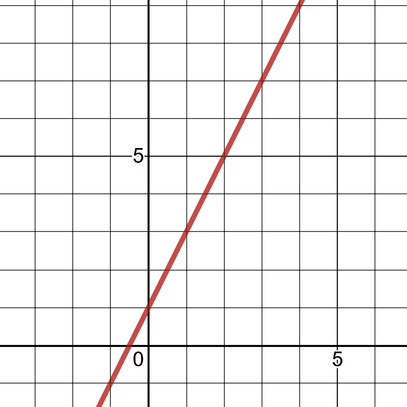

###### 图 1-1\. 函数 y = 2x + 1 的图形

当我们在二维平面上绘制两个数轴（每个变量一个）时，这被称为*笛卡尔平面*、*x-y 平面*或*坐标平面*。我们追踪给定的 x 值，然后查找相应的 y 值，并将交点绘制为一条线。请注意，由于实数（或小数，如果您喜欢）的性质，存在无限多个*x*值。这就是为什么当我们绘制函数*f*(*x*)时，我们得到一条没有中断的连续线。这条线上有无限多个点，或者该线的任何部分上都有无限多个点。

如果您想使用 Python 绘制这个函数，有许多绘图库可供选择，从 Plotly 到 matplotlib。在本书中，我们将使用 SymPy 来执行许多任务，而我们将首先使用它来绘制函数。SymPy 使用 matplotlib，因此请确保您已安装该软件包。否则，它将在控制台上打印一个丑陋的基于文本的图形。之后，只需使用`symbols()`将*x*变量声明给 SymPy，声明您的函数，然后像示例 1-7 和图 1-2 中所示那样绘制它。

##### 示例 1-7\. 使用 SymPy 在 Python 中绘制线性函数

```py
from sympy import *

x = symbols('x')
f = 2*x + 1
plot(f)
```

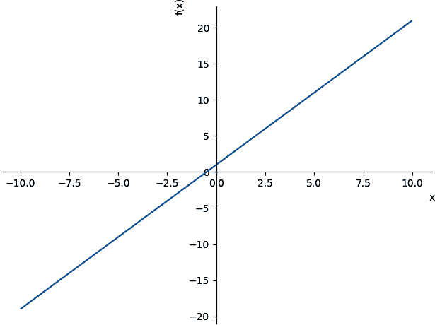

###### 图 1-2\. 使用 SymPy 绘制线性函数

示例 1-8 和图 1-3 是另一个示例，展示了函数<math alttext="f left-parenthesis x right-parenthesis equals x squared plus 1"><mrow><mi>f</mi> <mrow><mo>(</mo> <mi>x</mi> <mo>)</mo></mrow> <mo>=</mo> <msup><mi>x</mi> <mn>2</mn></msup> <mo>+</mo> <mn>1</mn></mrow></math>。

##### 示例 1-8\. 绘制指数函数

```py
from sympy import *

x = symbols('x')
f = x**2 + 1
plot(f)
```

注意在图 1-3 中，我们得到的不是一条直线，而是一个光滑、对称的曲线，称为抛物线。它是连续的，但不是线性的，因为它不会产生直线上的数值。像这样的曲线函数在数学上更难处理，但我们将学习一些技巧，使其变得不那么糟糕。

# 曲线函数

当一个函数是连续的但是曲线的，而不是线性的和直的时，我们称之为*曲线函数*。

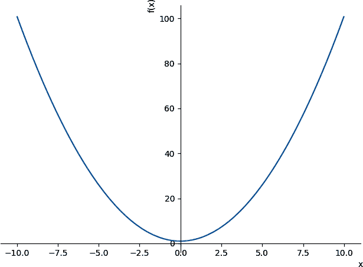

###### 图 1-3\. 使用 SymPy 绘制指数函数

注意函数利用多个输入变量，而不仅仅是一个。例如，我们可以有一个具有独立变量*x*和*y*的函数。注意*y*不像之前的例子中那样是依赖的。

<math alttext="f left-parenthesis x comma y right-parenthesis equals 2 x plus 3 y" display="block"><mrow><mi>f</mi> <mo>(</mo> <mi>x</mi> <mo>,</mo> <mi>y</mi> <mo>)</mo> <mo>=</mo> <mn>2</mn> <mi>x</mi> <mo>+</mo> <mn>3</mn> <mi>y</mi></mrow></math>

由于我们有两个独立变量（*x*和*y*）和一个因变量（*f*(*x*,*y*)的输出），我们需要在三维上绘制这个图形，以产生一组值的平面，而不是一条线，如示例 1-9 和图 1-4 所示。

##### 示例 1-9。在 Python 中声明具有两个独立变量的函数

```py
from sympy import *
from sympy.plotting import plot3d

x, y = symbols('x y')
f = 2*x + 3*y
plot3d(f)
```

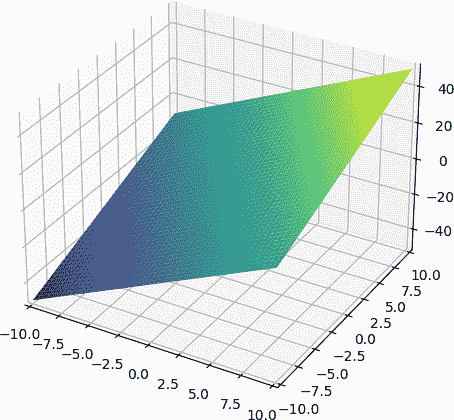

###### 图 1-4。使用 SymPy 绘制三维函数

无论你有多少个独立变量，你的函数通常只会输出一个因变量。当你解决多个因变量时，你可能会为每个因变量使用单独的函数。

# 求和

我承诺在这本书中不使用充满希腊符号的方程。然而，有一个是如此常见和有用，我不涵盖它会疏忽大意。一个*求和*被表示为一个 sigma<math alttext="normal upper Sigma"><mi>Σ</mi></math>，并将元素相加。

例如，如果我想迭代数字 1 到 5，将每个数字乘以 2，然后求和，这里是我如何使用求和表达这个过程。示例 1-10 展示了如何在 Python 中执行这个过程。

<math alttext="sigma-summation Underscript i equals 1 Overscript 5 Endscripts 2 i equals left-parenthesis 2 right-parenthesis 1 plus left-parenthesis 2 right-parenthesis 2 plus left-parenthesis 2 right-parenthesis 3 plus left-parenthesis 2 right-parenthesis 4 plus left-parenthesis 2 right-parenthesis 5 equals 30" display="block"><mrow><munderover><mo>∑</mo> <mrow><mi>i</mi><mo>=</mo><mn>1</mn></mrow> <mn>5</mn></munderover> <mn>2</mn> <mi>i</mi> <mo>=</mo> <mrow><mo>(</mo> <mn>2</mn> <mo>)</mo></mrow> <mn>1</mn> <mo>+</mo> <mrow><mo>(</mo> <mn>2</mn> <mo>)</mo></mrow> <mn>2</mn> <mo>+</mo> <mrow><mo>(</mo> <mn>2</mn> <mo>)</mo></mrow> <mn>3</mn> <mo>+</mo> <mrow><mo>(</mo> <mn>2</mn> <mo>)</mo></mrow> <mn>4</mn> <mo>+</mo> <mrow><mo>(</mo> <mn>2</mn> <mo>)</mo></mrow> <mn>5</mn> <mo>=</mo> <mn>30</mn></mrow></math>

##### 示例 1-10。在 Python 中执行求和

```py
summation = sum(2*i for i in range(1,6))
print(summation)
```

请注意，*i*是一个占位符变量，代表我们在循环中迭代的每个连续索引值，我们将其乘以 2，然后全部求和。当你迭代数据时，你可能会看到像<math alttext="x Subscript i"><msub><mi>x</mi> <mi>i</mi></msub></math>这样的变量，表示在索引*i*处的集合中的元素。

# range()函数

回想一下，在 Python 中，`range()`函数是以结束为准的，也就是说，如果你调用`range(1,4)`，它将迭代数字 1、2 和 3。它排除 4 作为上限。

*n*也常用来表示集合中的项数，比如数据集中的记录数。这里有一个例子，我们迭代一个大小为*n*的数字集合，将每个数字乘以 10，然后求和：

<math alttext="sigma-summation Underscript i equals 1 Overscript n Endscripts 10 x Subscript i" display="block"><mrow><munderover><mo>∑</mo> <mrow><mi>i</mi><mo>=</mo><mn>1</mn></mrow> <mi>n</mi></munderover> <mn>10</mn> <msub><mi>x</mi> <mi>i</mi></msub></mrow></math>

在示例 1-11 中，我们使用 Python 在四个数字的集合上执行这个表达式。请注意，在 Python（以及大多数编程语言）中，我们通常从索引 0 开始引用项目，而在数学中我们从索引 1 开始。因此，在我们的`range()`中通过从 0 开始迭代来相应地进行移位。

##### 示例 1-11。在 Python 中对元素求和

```py
x = [1, 4, 6, 2]
n = len(x)

summation = sum(10*x[i] for i in range(0,n))
print(summation)
```

这就是求和的要点。简而言之，求和<math alttext="normal upper Sigma"><mi>Σ</mi></math>表示“将一堆东西加在一起”，并使用索引*i*和最大值*n*来表达每次迭代输入到总和中。我们将在本书中看到这些。

# 指数

*指数*将一个数字乘以自身指定次数。当你将 2 提升到三次方（用 3 作为上标表示为 2³），这就是将三个 2 相乘：

<math alttext="2 cubed equals 2 asterisk 2 asterisk 2 equals 8" display="block"><mrow><msup><mn>2</mn> <mn>3</mn></msup> <mo>=</mo> <mn>2</mn> <mo>*</mo> <mn>2</mn> <mo>*</mo> <mn>2</mn> <mo>=</mo> <mn>8</mn></mrow></math>

*底数*是我们正在进行指数运算的变量或值，*指数*是我们将基值相乘的次数。对于表达式<math alttext="2 cubed"><msup><mn>2</mn> <mn>3</mn></msup></math>，2 是底数，3 是指数。

指数具有一些有趣的性质。假设我们将<math alttext="x squared"><msup><mi>x</mi> <mn>2</mn></msup></math>和<math alttext="x cubed"><msup><mi>x</mi> <mn>3</mn></msup></math>相乘。观察当我用简单的乘法展开指数然后合并为单个指数时会发生什么：

<math alttext="x squared x cubed equals left-parenthesis x asterisk x right-parenthesis asterisk left-parenthesis x asterisk x asterisk x right-parenthesis equals x Superscript 2 plus 3 Baseline equals x Superscript 5" display="block"><mrow><msup><mi>x</mi> <mn>2</mn></msup> <msup><mi>x</mi> <mn>3</mn></msup> <mo>=</mo> <mrow><mo>(</mo> <mi>x</mi> <mo>*</mo> <mi>x</mi> <mo>)</mo></mrow> <mo>*</mo> <mrow><mo>(</mo> <mi>x</mi> <mo>*</mo> <mi>x</mi> <mo>*</mo> <mi>x</mi> <mo>)</mo></mrow> <mo>=</mo> <msup><mi>x</mi> <mrow><mn>2</mn><mo>+</mo><mn>3</mn></mrow></msup> <mo>=</mo> <msup><mi>x</mi> <mn>5</mn></msup></mrow></math>

当我们将具有相同底数的指数相乘在一起时，我们简单地将指数相加，这被称为*乘法法则*。请注意，所有相乘指数的底数必须相同才能应用乘法法则。

接下来让我们探讨除法。当我们将<math alttext="x squared"><msup><mi>x</mi> <mn>2</mn></msup></math>除以<math alttext="x Superscript 5"><msup><mi>x</mi> <mn>5</mn></msup></math>时会发生什么？

<math display="block"><mtable displaystyle="true"><mtr><mtd columnalign="right"><mfrac><msup><mi>x</mi> <mn>2</mn></msup> <msup><mi>x</mi> <mn>5</mn></msup></mfrac></mtd></mtr></mtable></math> <math display="block"><mtable displaystyle="true"><mtr><mtd columnalign="right"><mfrac><mrow><mi>x</mi><mo>*</mo><mi>x</mi></mrow> <mrow><mi>x</mi><mo>*</mo><mi>x</mi><mo>*</mo><mi>x</mi><mo>*</mo><mi>x</mi><mo>*</mo><mi>x</mi></mrow></mfrac></mtd></mtr></mtable></math> <math display="block"><mtable displaystyle="true"><mtr><mtd columnalign="right"><mfrac><mn>1</mn> <mrow><mi>x</mi><mo>*</mo><mi>x</mi><mo>*</mo><mi>x</mi></mrow></mfrac></mtd></mtr></mtable></math> <math display="block"><mtable displaystyle="true"><mtr><mtd columnalign="right"><mrow><mfrac><mn>1</mn> <msup><mi>x</mi> <mn>3</mn></msup></mfrac> <mo>=</mo> <msup><mi>x</mi> <mrow><mo>-</mo><mn>3</mn></mrow></msup></mrow></mtd></mtr></mtable></math>

如您所见，当我们将<math alttext="x squared"><msup><mi>x</mi> <mn>2</mn></msup></math>除以<math alttext="x Superscript 5"><msup><mi>x</mi> <mn>5</mn></msup></math>时，我们可以在分子和分母中消去两个*x*，留下<math alttext="StartFraction 1 Over x cubed EndFraction"><mfrac><mn>1</mn> <msup><mi>x</mi> <mn>3</mn></msup></mfrac></math>。当一个因子同时存在于分子和分母中时，我们可以消去该因子。

那么<math alttext="x Superscript negative 3"><msup><mi>x</mi> <mrow><mo>-</mo><mn>3</mn></mrow></msup></math>呢？这是一个引入负指数的好时机，这是在分数的分母中表示指数运算的另一种方式。举例来说，<math alttext="StartFraction 1 Over x cubed EndFraction"><mfrac><mn>1</mn> <msup><mi>x</mi> <mn>3</mn></msup></mfrac></math> 就等同于<math alttext="x Superscript negative 3"><msup><mi>x</mi> <mrow><mo>-</mo><mn>3</mn></mrow></msup></math>：

<math alttext="StartFraction 1 Over x cubed EndFraction equals x Superscript negative 3" display="block"><mrow><mfrac><mn>1</mn> <msup><mi>x</mi> <mn>3</mn></msup></mfrac> <mo>=</mo> <msup><mi>x</mi> <mrow><mo>-</mo><mn>3</mn></mrow></msup></mrow></math>

将乘法法则联系起来，我们可以看到它也适用于负指数。为了理解这一点，让我们用另一种方式来解决这个问题。我们可以通过将<math alttext="x Superscript 5"><msup><mi>x</mi> <mn>5</mn></msup></math> 的“5”指数变为负数，然后与<math alttext="x squared"><msup><mi>x</mi> <mn>2</mn></msup></math> 相乘来表示这两个指数的除法。当你加上一个负数时，实际上是在执行减法。因此，指数乘法法则将这些相乘的指数相加仍然成立，如下所示：

<math display="block"><mrow><mfrac><msup><mi>x</mi> <mn>2</mn></msup> <msup><mi>x</mi> <mn>5</mn></msup></mfrac> <mo>=</mo> <msup><mi>x</mi> <mn>2</mn></msup> <mfrac><mn>1</mn> <msup><mi>x</mi> <mn>5</mn></msup></mfrac> <mo>=</mo> <msup><mi>x</mi> <mn>2</mn></msup> <msup><mi>x</mi> <mrow><mo>-</mo><mn>5</mn></mrow></msup> <mo>=</mo> <msup><mi>x</mi> <mrow><mn>2</mn><mo>+</mo><mn>-5</mn></mrow></msup> <mo>=</mo> <msup><mi>x</mi> <mrow><mo>-</mo><mn>3</mn></mrow></msup></mrow></math>

最后但同样重要的是，你能想明白为什么任何底数的指数为 0 时结果是 1 吗？

<math alttext="x Superscript 0 Baseline equals 1" display="block"><mrow><msup><mi>x</mi> <mn>0</mn></msup> <mo>=</mo> <mn>1</mn></mrow></math>

获得这种直觉的最好方法是推理任何数除以自己都是 1。如果你有<math alttext="StartFraction x cubed Over x cubed EndFraction"><mfrac><msup><mi>x</mi> <mn>3</mn></msup> <msup><mi>x</mi> <mn>3</mn></msup></mfrac></math>，代数上显然可以简化为 1。但是这个表达式也等于<math alttext="x Superscript 0"><msup><mi>x</mi> <mn>0</mn></msup></math>：

<math><mrow><mn>1</mn> <mo>=</mo> <mfrac><msup><mi>x</mi> <mn>3</mn></msup> <msup><mi>x</mi> <mn>3</mn></msup></mfrac> <mo>=</mo> <msup><mi>x</mi> <mn>3</mn></msup> <msup><mi>x</mi> <mrow><mo>-</mo><mn>3</mn></mrow></msup> <mo>=</mo> <msup><mi>x</mi> <mrow><mn>3</mn><mo>+</mo><mn>-3</mn></mrow></msup> <mo>=</mo> <msup><mi>x</mi> <mn>0</mn></msup></mrow></math>

根据传递性质，即如果*a* = *b*且*b* = *c*，则*a* = *c*，我们知道<math alttext="x Superscript 0 Baseline equals 1"><mrow><msup><mi>x</mi> <mn>0</mn></msup> <mo>=</mo> <mn>1</mn></mrow></math>。

现在，对于分数指数怎么办？它们是表示根的另一种方式，比如平方根。简要回顾一下，<math alttext="StartRoot 4 EndRoot"><msqrt><mn>4</mn></msqrt></math> 问“什么数乘以自己会得到 4？”当然是 2。请注意，<math alttext="4 Superscript 1 slash 2"><msup><mn>4</mn> <mrow><mn>1</mn><mo>/</mo><mn>2</mn></mrow></msup></math> 和<math alttext="StartRoot 4 EndRoot"><msqrt><mn>4</mn></msqrt></math> 是相同的：

<math alttext="4 Superscript 1 slash 2 Baseline equals StartRoot 4 EndRoot equals 2" display="block"><mrow><msup><mn>4</mn> <mrow><mn>1</mn><mo>/</mo><mn>2</mn></mrow></msup> <mo>=</mo> <msqrt><mn>4</mn></msqrt> <mo>=</mo> <mn>2</mn></mrow></math>

立方根类似于平方根，但它们寻找一个数，使其乘以自身三次得到一个结果。8 的立方根表示为 <math alttext="RootIndex 3 StartRoot 8 EndRoot"><mroot><mn>8</mn> <mn>3</mn></mroot></math> ，问“什么数乘以自身三次得到 8？” 这个数将是 2，因为 <math alttext="2 asterisk 2 asterisk 2 equals 8"><mrow><mn>2</mn> <mo>*</mo> <mn>2</mn> <mo>*</mo> <mn>2</mn> <mo>=</mo> <mn>8</mn></mrow></math> 。在指数中，立方根表示为一个分数指数，<math alttext="RootIndex 3 StartRoot 8 EndRoot"><mroot><mn>8</mn> <mn>3</mn></mroot></math> 可以重新表示为 <math alttext="8 Superscript 1 slash 3"><msup><mn>8</mn> <mrow><mn>1</mn><mo>/</mo><mn>3</mn></mrow></msup></math> ：

<math alttext="8 Superscript 1 slash 3 Baseline equals RootIndex 3 StartRoot 8 EndRoot equals 2" display="block"><mrow><msup><mn>8</mn> <mrow><mn>1</mn><mo>/</mo><mn>3</mn></mrow></msup> <mo>=</mo> <mroot><mn>8</mn> <mn>3</mn></mroot> <mo>=</mo> <mn>2</mn></mrow></math>

为了将其完整地回到原点，当你将 8 的立方根乘三次时会发生什么？这将撤销立方根并产生 8\. 或者，如果我们将立方根表示为分数指数 <math alttext="8 Superscript 1 slash 3"><msup><mn>8</mn> <mrow><mn>1</mn><mo>/</mo><mn>3</mn></mrow></msup></math> ，清楚地表明我们将指数相加以获得指数 1\. 这也撤销了立方根：

<math alttext="RootIndex 3 StartRoot 8 EndRoot asterisk RootIndex 3 StartRoot 8 EndRoot asterisk RootIndex 3 StartRoot 8 EndRoot equals 8 Superscript one-third Baseline times 8 Superscript one-third Baseline times 8 Superscript one-third Baseline equals 8 Superscript one-third plus one-third plus one-third Baseline equals 8 Superscript 1 Baseline equals 8" display="block"><mrow><mroot><mn>8</mn> <mn>3</mn></mroot> <mo>*</mo> <mroot><mn>8</mn> <mn>3</mn></mroot> <mo>*</mo> <mroot><mn>8</mn> <mn>3</mn></mroot> <mo>=</mo> <msup><mn>8</mn> <mfrac><mn>1</mn> <mn>3</mn></mfrac></msup> <mo>×</mo> <msup><mn>8</mn> <mfrac><mn>1</mn> <mn>3</mn></mfrac></msup> <mo>×</mo> <msup><mn>8</mn> <mfrac><mn>1</mn> <mn>3</mn></mfrac></msup> <mo>=</mo> <msup><mn>8</mn> <mrow><mfrac><mn>1</mn> <mn>3</mn></mfrac><mo>+</mo><mfrac><mn>1</mn> <mn>3</mn></mfrac><mo>+</mo><mfrac><mn>1</mn> <mn>3</mn></mfrac></mrow></msup> <mo>=</mo> <msup><mn>8</mn> <mn>1</mn></msup> <mo>=</mo> <mn>8</mn></mrow></math>

最后一个性质：一个指数的指数将把指数相乘。这被称为*幂规则*。因此 <math alttext="left-parenthesis 8 cubed right-parenthesis squared"><msup><mrow><mo>(</mo><msup><mn>8</mn> <mn>3</mn></msup> <mo>)</mo></mrow> <mn>2</mn></msup></math> 将简化为 <math alttext="8 Superscript 6"><msup><mn>8</mn> <mn>6</mn></msup></math> ：

<math alttext="left-parenthesis 8 cubed right-parenthesis squared equals 8 Superscript 3 times 2 Baseline equals 8 Superscript 6" display="block"><mrow><msup><mrow><mo>(</mo><msup><mn>8</mn> <mn>3</mn></msup> <mo>)</mo></mrow> <mn>2</mn></msup> <mo>=</mo> <msup><mn>8</mn> <mrow><mn>3</mn><mo>×</mo><mn>2</mn></mrow></msup> <mo>=</mo> <msup><mn>8</mn> <mn>6</mn></msup></mrow></math>

如果你对这个为什么持怀疑态度，尝试展开它，你会发现总和规则变得清晰：

<math alttext="left-parenthesis 8 cubed right-parenthesis squared equals 8 cubed 8 cubed equals 8 Superscript 3 plus 3 Baseline equals 8 Superscript 6" display="block"><mrow><msup><mrow><mo>(</mo><msup><mn>8</mn> <mn>3</mn></msup> <mo>)</mo></mrow> <mn>2</mn></msup> <mo>=</mo> <msup><mn>8</mn> <mn>3</mn></msup> <msup><mn>8</mn> <mn>3</mn></msup> <mo>=</mo> <msup><mn>8</mn> <mrow><mn>3</mn><mo>+</mo><mn>3</mn></mrow></msup> <mo>=</mo> <msup><mn>8</mn> <mn>6</mn></msup></mrow></math>

最后，当我们有一个分数指数的分子不是 1 时，比如 <math alttext="8 Superscript two-thirds"><msup><mn>8</mn> <mfrac><mn>2</mn> <mn>3</mn></mfrac></msup></math> ，那意味着什么？那是取 8 的立方根然后平方。看一下：

<math alttext="8 Superscript two-thirds Baseline equals left-parenthesis 8 Superscript one-third Baseline right-parenthesis squared equals 2 squared equals 4" display="block"><mrow><msup><mn>8</mn> <mfrac><mn>2</mn> <mn>3</mn></mfrac></msup> <mo>=</mo> <msup><mrow><mo>(</mo><msup><mn>8</mn> <mfrac><mn>1</mn> <mn>3</mn></mfrac></msup> <mo>)</mo></mrow> <mn>2</mn></msup> <mo>=</mo> <msup><mn>2</mn> <mn>2</mn></msup> <mo>=</mo> <mn>4</mn></mrow></math>

是的，无理数可以作为指数，如 <math alttext="8 Superscript pi"><msup><mn>8</mn> <mi>π</mi></msup></math> ，这是 687.2913\. 这可能感觉不直观，这是可以理解的！为了节约时间，我们不会深入探讨这一点，因为这需要一些微积分。但基本上，我们可以通过用有理数近似来计算无理指数。这实际上是计算机所做的，因为它们只能计算到有限的小数位数。

例如 <math alttext="pi"><mi>π</mi></math> 有无限多位小数。但如果我们取前 11 位数字，3.1415926535，我们可以将 <math alttext="pi"><mi>π</mi></math> 近似为一个有理数 31415926535 / 10000000000\. 确实，这给出了大约 687.2913，这应该与任何计算器大致匹配：

<math display="block"><mrow><msup><mn>8</mn> <mi>π</mi></msup> <mo>≈</mo> <msup><mn>8</mn> <mfrac><mn>31415926535</mn> <mn>10000000000</mn></mfrac></msup> <mo>≈</mo> <mn>687.</mn> <mn>2913</mn></mrow></math>

# 对数

*对数*是一个数学函数，它找到一个特定数字和底数的幂。起初听起来可能不那么有趣，但实际上它有许多应用。从测量地震到调节立体声音量，对数随处可见。它也经常出现在机器学习和数据科学中。事实上，对数将成为第六章中逻辑回归的关键部分。

通过问“2 的*多少次方*等于 8？”来开始你的思考。数学上表达这个问题的一种方式是使用*x*作为指数：

<math alttext="2 Superscript x Baseline equals 8" display="block"><mrow><msup><mn>2</mn> <mi>x</mi></msup> <mo>=</mo> <mn>8</mn></mrow></math>

我们直观地知道答案，<math alttext="x 等于 3"><mrow><mi>x</mi> <mo>=</mo> <mn>3</mn></mrow></math>，但我们需要一种更优雅的方式来表达这个常见的数学运算。这就是<math alttext="l o g 左括号 右括号"><mrow><mi>l</mi> <mi>o</mi> <mi>g</mi> <mo>(</mo> <mo>)</mo></mrow></math>函数的作用。

<math alttext="l o g 2 Baseline 8 equals x" display="block"><mrow><mi>l</mi> <mi>o</mi> <msub><mi>g</mi> <mn>2</mn></msub> <mn>8</mn> <mo>=</mo> <mi>x</mi></mrow></math>

正如在前面的对数表达式中所看到的，我们有一个底数为 2，正在寻找一个幂以给出 8。更一般地，我们可以将一个变量指数重新表达为一个对数：

<math display="block"><mtable displaystyle="true"><mtr><mtd columnalign="right"><mrow><msup><mi>a</mi> <mi>x</mi></msup> <mo>=</mo> <mi>b</mi></mrow></mtd></mtr></mtable></math> <math display="block"><mtable displaystyle="true"><mtr><mtd columnalign="right"><mrow><mi>l</mi> <mi>o</mi> <msub><mi>g</mi> <mi>a</mi></msub> <mi>b</mi> <mo>=</mo> <mi>x</mi></mrow></mtd></mtr></mtable></math>

代数上讲，这是一种隔离*x*的方法，这对于解出*x*很重要。示例 1-12 展示了我们如何在 Python 中计算这个对数。

##### 示例 1-12\. 在 Python 中使用对数函数

```py
from math import log

# 2 raised to what power gives me 8?
x = log(8, 2)

print(x) # prints 3.0
```

当你在像 Python 这样的平台上的`log()`函数中不提供一个底数参数时，它通常会有一个默认的底数。在一些领域，比如地震测量中，对数的默认底数是 10。但在数据科学中，对数的默认底数是自然常数<math alttext="e"><mi>e</mi></math>。Python 使用后者，我们很快会谈到<math alttext="e"><mi>e</mi></math>。

就像指数一样，对数在乘法、除法、指数运算等方面有几个性质。为了节省时间和专注力，我将在表 1-3 中简要介绍这一点。关键的思想是对数找到一个给定底数的指数，使其结果为某个特定数字。

如果你需要深入了解对数的性质，表 1-3 显示了指数和对数的行为，你可以用作参考。

表 1-3\. 指数和对数的性质

| 运算符 | 指数性质 | 对数性质 |
| --- | --- | --- |
| 乘法 | <math alttext="x Superscript m Baseline times x Superscript n Baseline equals x Superscript m plus n"><mrow><msup><mi>x</mi> <mi>m</mi></msup> <mo>×</mo> <msup><mi>x</mi> <mi>n</mi></msup> <mo>=</mo> <msup><mi>x</mi> <mrow><mi>m</mi><mo>+</mo><mi>n</mi></mrow></msup></mrow></math> | <math alttext="l o g left-parenthesis a times b right-parenthesis equals l o g left-parenthesis a right-parenthesis plus l o g left-parenthesis b right-parenthesis"><mrow><mi>l</mi> <mi>o</mi> <mi>g</mi> <mo>(</mo> <mi>a</mi> <mo>×</mo> <mi>b</mi> <mo>)</mo> <mo>=</mo> <mi>l</mi> <mi>o</mi> <mi>g</mi> <mo>(</mo> <mi>a</mi> <mo>)</mo> <mo>+</mo> <mi>l</mi> <mi>o</mi> <mi>g</mi> <mo>(</mo> <mi>b</mi> <mo>)</mo></mrow></math> |
| 除法 | <math alttext="StartFraction x Superscript m Baseline Over x Superscript n Baseline EndFraction equals x Superscript m minus n"><mrow><mfrac><msup><mi>x</mi> <mi>m</mi></msup> <msup><mi>x</mi> <mi>n</mi></msup></mfrac> <mo>=</mo> <msup><mi>x</mi> <mrow><mi>m</mi><mo>-</mo><mi>n</mi></mrow></msup></mrow></math> | <math alttext="l o g left-parenthesis StartFraction a Over b EndFraction right-parenthesis equals l o g left-parenthesis a right-parenthesis minus l o g left-parenthesis b right-parenthesis"><mrow><mi>l</mi> <mi>o</mi> <mi>g</mi> <mrow><mo>(</mo> <mfrac><mi>a</mi> <mi>b</mi></mfrac> <mo>)</mo></mrow> <mo>=</mo> <mi>l</mi> <mi>o</mi> <mi>g</mi> <mrow><mo>(</mo> <mi>a</mi> <mo>)</mo></mrow> <mo>-</mo> <mi>l</mi> <mi>o</mi> <mi>g</mi> <mrow><mo>(</mo> <mi>b</mi> <mo>)</mo></mrow></mrow></math> |
| 指数运算 | <math alttext="left-parenthesis x Superscript m Baseline right-parenthesis Superscript n Baseline equals x Superscript m n"><mrow><msup><mrow><mo>(</mo><msup><mi>x</mi> <mi>m</mi></msup> <mo>)</mo></mrow> <mi>n</mi></msup> <mo>=</mo> <msup><mi>x</mi> <mrow><mi>m</mi><mi>n</mi></mrow></msup></mrow></math> | <math alttext="l o g left-parenthesis a Superscript n Baseline right-parenthesis equals n times l o g left-parenthesis a right-parenthesis"><mrow><mi>l</mi> <mi>o</mi> <mi>g</mi> <mrow><mo>(</mo> <msup><mi>a</mi> <mi>n</mi></msup> <mo>)</mo></mrow> <mo>=</mo> <mi>n</mi> <mo>×</mo> <mi>l</mi> <mi>o</mi> <mi>g</mi> <mrow><mo>(</mo> <mi>a</mi> <mo>)</mo></mrow></mrow></math> |
| 零指数 | <math alttext="x Superscript 0 Baseline equals 1"><mrow><msup><mi>x</mi> <mn>0</mn></msup> <mo>=</mo> <mn>1</mn></mrow></math> | <math alttext="l o g left-parenthesis 1 right-parenthesis equals 0"><mrow><mi>l</mi> <mi>o</mi> <mi>g</mi> <mo>(</mo> <mn>1</mn> <mo>)</mo> <mo>=</mo> <mn>0</mn></mrow></math> |
| 倒数 | <math alttext="x Superscript negative 1 Baseline equals StartFraction 1 Over x EndFraction"><mrow><msup><mi>x</mi> <mrow><mo>-</mo><mn>1</mn></mrow></msup> <mo>=</mo> <mfrac><mn>1</mn> <mi>x</mi></mfrac></mrow></math> | <math alttext="l o g left-parenthesis x Superscript negative 1 Baseline right-parenthesis equals l o g left-parenthesis StartFraction 1 Over x EndFraction right-parenthesis equals minus l o g left-parenthesis x right-parenthesis"><mrow><mi>l</mi> <mi>o</mi> <mi>g</mi> <mrow><mo>(</mo> <msup><mi>x</mi> <mrow><mo>-</mo><mn>1</mn></mrow></msup> <mo>)</mo></mrow> <mo>=</mo> <mi>l</mi> <mi>o</mi> <mi>g</mi> <mrow><mo>(</mo> <mfrac><mn>1</mn> <mi>x</mi></mfrac> <mo>)</mo></mrow> <mo>=</mo> <mo>-</mo> <mi>l</mi> <mi>o</mi> <mi>g</mi> <mrow><mo>(</mo> <mi>x</mi> <mo>)</mo></mrow></mrow></math> |

# 欧拉数和自然对数

在数学中经常出现的一个特殊数字叫做欧拉数<math alttext="e"><mi>e</mi></math>。它类似于圆周率<math alttext="pi"><mi>π</mi></math>，约为 2.71828。<math alttext="e"><mi>e</mi></math>被广泛使用，因为它在数学上简化了许多问题。我们将在指数和对数的背景下讨论<math alttext="e"><mi>e</mi></math>。

## 欧拉数

在高中时，我的微积分老师在几个指数问题中展示了欧拉数。最后我问道，“Nowe 先生，<math alttext="e"><mi>e</mi></math>到底是什么？它从哪里来？”我记得对涉及兔子种群和其他自然现象的解释从未完全满足过我。我希望在这里给出一个更令人满意的解释。

这是我喜欢发现欧拉数的方式。假设你向某人借出$100，年利率为 20%。通常，利息将每月复利，因此每月的利息将为<math alttext=".20 slash 12 equals .01666"><mrow><mo>.</mo> <mn>20</mn> <mo>/</mo> <mn>12</mn> <mo>=</mo> <mo>.</mo> <mn>01666</mn></mrow></math>。两年后贷款余额将是多少？为了简单起见，假设贷款在这两年内不需要还款（也没有还款）。

将我们迄今学到的指数概念汇总（或者可能翻出一本金融教科书），我们可以得出一个计算利息的公式。它包括了起始投资*P*的余额*A*，利率*r*，时间跨度*t*（年数），以及期数*n*（每年的月数）。以下是公式：

<math alttext="upper A equals upper P times left-parenthesis 1 plus StartFraction r Over n EndFraction right-parenthesis Superscript n t" display="block"><mrow><mi>A</mi> <mo>=</mo> <mi>P</mi> <mo>×</mo> <msup><mrow><mo>(</mo><mn>1</mn><mo>+</mo><mfrac><mi>r</mi> <mi>n</mi></mfrac><mo>)</mo></mrow> <mrow><mi>n</mi><mi>t</mi></mrow></msup></mrow></math>

如果我们每个月复利，贷款将增长到$148.69，如下所计算：

<math display="block" class="mathml_bottom_space"><mrow><mi>A</mi> <mo>=</mo> <mi>P</mi> <mo>×</mo> <msup><mrow><mo>(</mo><mn>1</mn><mo>+</mo><mfrac><mi>r</mi> <mi>n</mi></mfrac><mo>)</mo></mrow> <mrow><mi>n</mi><mi>t</mi></mrow></msup></mrow></math> <math display="block" class="mathml_bottom_space"><mrow><mn>100</mn> <mo>×</mo> <msup><mrow><mo>(</mo><mn>1</mn><mo>+</mo><mfrac><mrow><mn>.20</mn></mrow> <mn>12</mn></mfrac><mo>)</mo></mrow> <mrow><mn>12</mn><mo>×</mo><mn>2</mn></mrow></msup> <mo>=</mo> <mn>148.6914618</mn></mrow></math>

如果你想在 Python 中尝试这个，请使用示例 1-13 中的代码。

##### 示例 1-13。在 Python 中计算复利

```py
from math import exp

p = 100
r = .20
t = 2.0
n = 12

a = p * (1 + (r/n))**(n * t)

print(a) # prints 148.69146179463576
```

但如果我们每天复利呢？那时会发生什么？将*n*更改为 365：

<math display="block" class="mathml_bottom_space"><mrow><mi>A</mi> <mo>=</mo> <mi>P</mi> <mo>×</mo> <msup><mrow><mo>(</mo><mn>1</mn><mo>+</mo><mfrac><mi>r</mi> <mi>n</mi></mfrac><mo>)</mo></mrow> <mrow><mi>n</mi><mi>t</mi></mrow></msup></mrow></math> <math display="block" class="mathml_bottom_space"><mrow><mn>100</mn> <mo>×</mo> <msup><mrow><mo>(</mo><mn>1</mn><mo>+</mo><mfrac><mrow><mn>.20</mn></mrow> <mn>365</mn></mfrac><mo>)</mo></mrow> <mrow><mn>365</mn><mo>×</mo><mn>2</mn></mrow></msup> <mo>=</mo> <mn>149.</mn> <mn>1661279</mn></mrow></math>

哎呀！如果我们每天复利而不是每月，我们将在两年后多赚 47.4666 美分。如果我们贪心，为什么不每小时复利呢？下面将显示这样做是否会给我们更多？一年有 8,760 小时，所以将*n*设为该值：

<math display="block" class="mathml_bottom_space"><mrow><mi>A</mi> <mo>=</mo> <mi>P</mi> <mo>×</mo> <msup><mrow><mo>(</mo><mn>1</mn><mo>+</mo><mfrac><mi>r</mi> <mi>n</mi></mfrac><mo>)</mo></mrow> <mrow><mi>n</mi><mi>t</mi></mrow></msup></mrow></math> <math display="block" class="mathml_bottom_space"><mrow><mn>100</mn> <mo>×</mo> <msup><mrow><mo>(</mo><mn>1</mn><mo>+</mo><mfrac><mrow><mn>.20</mn></mrow> <mn>8760</mn></mfrac><mo>)</mo></mrow> <mrow><mn>8760</mn><mo>×</mo><mn>2</mn></mrow></msup> <mo>=</mo> <mn>149.</mn> <mn>1817886</mn></row></math>

啊，我们多挤出了大约 2 美分的利息！但我们是否正在经历收益递减？让我们尝试每分钟复利一次！请注意，一年有 525,600 分钟，所以让我们将该值设为*n*：

<math display="block" class="mathml_bottom_space"><mrow><mi>A</mi> <mo>=</mo> <mi>P</mi> <mo>×</mo> <msup><mrow><mo>(</mo><mn>1</mn><mo>+</mo><mfrac><mi>r</mi> <mi>n</mi></mfrac><mo>)</mo></mrow> <mrow><mi>n</mi><mi>t</mi></mrow></msup></mrow></math> <math display="block" class="mathml_bottom_space"><mrow><mn>100</mn> <mo>×</mo> <msup><mrow><mo>(</mo><mn>1</mn><mo>+</mo><mfrac><mrow><mn>.20</mn></mrow> <mn>525600</mn></mfrac><mo>)</mo></mrow> <mrow><mn>525600</mn><mo>×</mo><mn>2</mn></mrow></msup> <mo>=</mo> <mn>149.</mn> <mn>1824584</mn></mrow></math>

好的，我们只是在越来越频繁地复利时获得了越来越小的一分钱。所以，如果我继续使这些周期无限小，直到连续复利，这会导致什么？

让我向你介绍欧拉数 <math alttext="e"><mi>e</mi></math> ，约为 2.71828。这是连续复利的公式，“连续”意味着我们不停地复利：

<math alttext="upper A equals upper P times e Superscript r t" display="block"><mrow><mi>A</mi> <mo>=</mo> <mi>P</mi> <mo>×</mo> <msup><mi>e</mi> <mrow><mi>r</mi><mi>t</mi></mrow></msup></mrow></math>

回到我们的例子，让我们计算在连续复利两年后我们贷款的余额：

<math display="block"><mrow><mi>A</mi> <mo>=</mo> <mi>P</mi> <mo>×</mo> <msup><mi>e</mi> <mrow><mi>r</mi><mi>t</mi></mrow></msup></mrow></math> <math display="block"><mrow><mi>A</mi> <mo>=</mo> <mn>100</mn> <mo>×</mo> <msup><mi>e</mi> <mrow><mo>.</mo><mn>20</mn><mo>×</mo><mn>2</mn></mrow></msup> <mo>=</mo> <mn>149.</mn> <mn>1824698</mn></mrow></math>

考虑到每分钟复利使我们得到了 149.1824584 的余额，这并不太令人惊讶。当我们连续复利时，这使我们非常接近 149.1824698 的值。

通常在 Python、Excel 和其他平台中使用 `exp()` 函数时，你会将 <math alttext="e"><mi>e</mi></math> 作为指数的底数。你会发现 <math alttext="e"><mi>e</mi></math> 如此常用，它是指数和对数函数的默认底数。

示例 1-14 使用 `exp()` 函数在 Python 中计算连续利息。

##### 示例 1-14\. 在 Python 中计算连续利息

```py
from math import exp

p = 100 # principal, starting amount
r = .20 # interest rate, by year
t = 2.0 # time, number of years

a = p * exp(r*t)

print(a) # prints 149.18246976412703
```

那么我们从哪里得到这个常数 <math alttext="e"><mi>e</mi></math>？比较复利利息公式和连续利息公式。它们在结构上看起来相似，但有一些差异：

<math display="block"><mtable displaystyle="true"><mtr><mtd columnalign="right"><mrow><mi>A</mi> <mo>=</mo> <mi>P</mi> <mo>×</mo> <msup><mrow><mo>(</mo><mn>1</mn><mo>+</mo><mfrac><mi>r</mi> <mi>n</mi></mfrac><mo>)</mo></mrow> <mrow><mi>n</mi><mi>t</mi></mrow></msup></mrow></mtd></mtr></mtable></math> <math display="block"><mtable displaystyle="true"><mtr><mtd columnalign="right"><mrow><mi>A</mi> <mo>=</mo> <mi>P</mi> <mo>×</mo> <msup><mi>e</mi> <mrow><mi>r</mi><mi>t</mi></mrow></msup></mrow></mtd></mtr></mtable></math>

更具体地说，<math alttext="e"><mi>e</mi></math> 是表达式 <math alttext="left-parenthesis 1 plus StartFraction 1 Over n EndFraction right-parenthesis Superscript n"><msup><mrow><mo>(</mo><mn>1</mn><mo>+</mo><mfrac><mn>1</mn> <mi>n</mi></mfrac><mo>)</mo></mrow> <mi>n</mi></msup></math> 随着 *n* 不断增大而趋近于无穷大的结果。尝试使用越来越大的 *n* 值进行实验。通过使其变得越来越大，你会注意到一些事情：

<math display="block" class="mathml_bottom_space"><msup><mrow><mo>(</mo><mn>1</mn><mo>+</mo><mfrac><mn>1</mn> <mi>n</mi></mfrac><mo>)</mo></mrow> <mi>n</mi></msup></math> <math display="block" class="mathml_bottom_space"><mrow><msup><mrow><mo>(</mo><mn>1</mn><mo>+</mo><mfrac><mn>1</mn> <mn>100</mn></mfrac><mo>)</mo></mrow> <mn>100</mn></msup> <mo>=</mo> <mn>2.70481382942</mn></mrow></math> <math display="block" class="mathml_bottom_space"><mrow><msup><mrow><mo>(</mo><mn>1</mn><mo>+</mo><mfrac><mn>1</mn> <mn>1000</mn></mfrac><mo>)</mo></mrow> <mn>1000</mn></msup> <mo>=</mo> <mn>2.71692393224</mn></mrow></math> <math display="block" class="mathml_bottom_space"><mrow><msup><mrow><mo>(</mo><mn>1</mn><mo>+</mo><mfrac><mn>1</mn> <mn>10000</mn></mfrac><mo>)</mo></mrow> <mn>10000</mn></msup> <mo>=</mo> <mn>2.71814592682</mn></mrow></math> <math display="block" class="mathml_bottom_space"><mrow><msup><mrow><mo>(</mo><mn>1</mn><mo>+</mo><mfrac><mn>1</mn> <mn>10000000</mn></mfrac><mo>)</mo></mrow> <mn>10000000</mn></msup> <mo>=</mo> <mn>2.71828169413</mn></mrow></math>

随着*n*的增大，收益递减，最终收敛到约为 2.71828 的值，这就是我们的值<math alttext="e"><mi>e</mi></math>。您会发现这个<math alttext="e"><mi>e</mi></math>不仅用于研究人口及其增长，还在数学的许多领域中发挥着关键作用。

本书后面将使用欧拉数来构建第三章中的正态分布和第六章中的逻辑回归。

## 自然对数

当我们以<math alttext="e"><mi>e</mi></math>作为对数的底数时，我们称之为*自然对数*。根据平台的不同，我们可能会使用`ln()`来表示自然对数，而不是`log()`。因此，为了找到幂次为<math alttext="e"><mi>e</mi></math>的 10，我们不再表达自然对数为<math alttext="l o g Subscript e Baseline Baseline 10"><mrow><mi>l</mi> <mi>o</mi> <msub><mi>g</mi> <mi>e</mi></msub> <mn>10</mn></mrow></math>，而是简写为<math alttext="l n left-parenthesis 10 right-parenthesis"><mrow><mi>l</mi> <mi>n</mi> <mo>(</mo> <mn>10</mn> <mo>)</mo></mrow></math>：

<math alttext="l o g Subscript e Baseline Baseline 10 equals l n left-parenthesis 10 right-parenthesis" display="block"><mrow><mi>l</mi> <mi>o</mi> <msub><mi>g</mi> <mi>e</mi></msub> <mn>10</mn> <mo>=</mo> <mi>l</mi> <mi>n</mi> <mrow><mo>(</mo> <mn>10</mn> <mo>)</mo></mrow></mrow></math>

然而，在 Python 中，自然对数由`log()`函数指定。正如前面讨论的，`log()`函数的默认底数是<math alttext="e"><mi>e</mi></math>。只需将底数的第二个参数留空，它将默认使用<math alttext="e"><mi>e</mi></math>作为底数，如示例 1-15 所示。

##### 示例 1-15。在 Python 中计算 10 的自然对数

```py
from math import log

# e raised to what power gives us 10?
x = log(10)

print(x) # prints 2.302585092994046
```

我们将在本书中的许多地方使用<math alttext="e"><mi>e</mi></math>。请随意使用 Excel、Python、Desmos.com 或您选择的任何其他计算平台进行指数和对数的实验。制作图表，熟悉这些函数的外观。

# 极限

正如我们在欧拉数中看到的，当我们永远增加或减少一个输入变量时，输出变量不断接近一个值但永远不会达到它时，一些有趣的想法会出现。让我们正式探索这个想法。

看看这个函数，在图 1-5 中绘制：

<math alttext="f left-parenthesis x right-parenthesis equals StartFraction 1 Over x EndFraction" display="block"><mrow><mi>f</mi> <mrow><mo>(</mo> <mi>x</mi> <mo>)</mo></mrow> <mo>=</mo> <mfrac><mn>1</mn> <mi>x</mi></mfrac></mrow></math>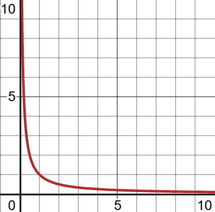

###### 图 1-5。一个永远接近 0 但永远不会达到 0 的函数

我们只考虑正*x*值。注意随着*x*不断增加，*f(x)*越来越接近 0。有趣的是，*f(x)*实际上永远不会达到 0。它只是永远不断地接近。

因此，这个函数的命运是，当*x*永远延伸到无穷大时，它将不断接近 0 但永远不会达到 0。我们表达一个永远被接近但永远不被达到的值的方式是通过一个极限：

<math alttext="limit Underscript x right-arrow normal infinity Endscripts StartFraction 1 Over x EndFraction equals 0" display="block"><mrow><munder><mo movablelimits="true" form="prefix">lim</mo> <mrow><mi>x</mi><mo>→</mo><mi>∞</mi></mrow></munder> <mfrac><mn>1</mn> <mi>x</mi></mfrac> <mo>=</mo> <mn>0</mn></mrow></math>

我们读这个的方式是“当 x 趋近于无穷大时，函数 1/x 趋近于 0（但永远不会达到 0）。”你会经常看到这种“趋近但永远不触及”的行为，特别是当我们深入研究导数和积分时。

使用 SymPy，我们可以计算当*x*趋近于无穷大时，<math alttext="f left-parenthesis x right-parenthesis equals StartFraction 1 Over x EndFraction"><mrow><mi>f</mi> <mrow><mo>(</mo> <mi>x</mi> <mo>)</mo></mrow> <mo>=</mo> <mfrac><mn>1</mn> <mi>x</mi></mfrac></mrow></math>会趋近于什么值（示例 1-16）。注意，<math alttext="normal infinity"><mi>∞</mi></math>在 SymPy 中用`oo`巧妙表示。

##### 示例 1-16。使用 SymPy 计算极限

```py
from sympy import *

x = symbols('x')
f = 1 / x
result = limit(f, x, oo)

print(result) # 0
```

正如你所见，我们也是通过这种方式发现了欧拉数<math alttext="e"><mi>e</mi></math>。这是将*n*永远延伸到无穷大的函数的结果：

<math display="block" class="mathml_bottom_space"><mrow><munder><mo movablelimits="true" form="prefix">lim</mo> <mrow><mi>n</mi><mo>→</mo><mi>∞</mi></mrow></munder> <msup><mrow><mo>(</mo><mn>1</mn><mo>+</mo><mfrac><mn>1</mn> <mi>n</mi></mfrac><mo>)</mo></mrow> <mi>n</mi></msup> <mo>=</mo> <mi>e</mi> <mo>=</mo> <mn>2.</mn> <mn>71828169413</mn> <mo>...</mo></mrow></math>

有趣的是，当我们在 SymPy 中使用极限计算欧拉数（如下面的代码所示）时，SymPy 立即将其识别为欧拉数。我们可以调用`evalf()`以便实际显示它作为一个数字：

```py
from sympy import *

n = symbols('n')
f = (1 + (1/n))**n
result = limit(f, n, oo)

print(result) # E
print(result.evalf()) # 2.71828182845905
```

# 导数

让我们回到谈论函数，并从微积分的角度来看待它们，首先是导数。*导数*告诉我们函数的斜率，它有助于衡量函数在任意点的变化率。

我们为什么关心导数？它们经常在机器学习和其他数学算法中使用，特别是在梯度下降中。当斜率为 0 时，这意味着我们处于输出变量的最小值或最大值。当我们进行线性回归（第五章）、逻辑回归（第六章）和神经网络（第七章）时，这个概念将会很有用。

让我们从一个简单的例子开始。让我们看看图 1-6 中的函数<math alttext="f left-parenthesis x right-parenthesis equals x squared"><mrow><mi>f</mi> <mrow><mo>(</mo> <mi>x</mi> <mo>)</mo></mrow> <mo>=</mo> <msup><mi>x</mi> <mn>2</mn></msup></mrow></math>。在*x = 2*处曲线有多“陡峭”？

请注意，我们可以在曲线的任意点测量“陡峭度”，并且可以用切线来可视化这一点。将*tangent line*想象成“刚好触及”曲线的直线在给定点。它还提供了给定点的斜率。您可以通过创建一条与该 x 值和函数上的一个*非常接近*的相邻 x 值相交的线来粗略估计给定 x 值处的切线。

取*x* = 2 和附近值*x* = 2.1，当传递给函数<math alttext="f left-parenthesis x right-parenthesis equals x squared"><mrow><mi>f</mi> <mrow><mo>(</mo> <mi>x</mi> <mo>)</mo></mrow> <mo>=</mo> <msup><mi>x</mi> <mn>2</mn></msup></mrow></math>时，将得到*f*(2) = 4 和*f*(2.1) = 4.41，如图 1-7 所示。通过这两点的结果线的斜率为 4.1。

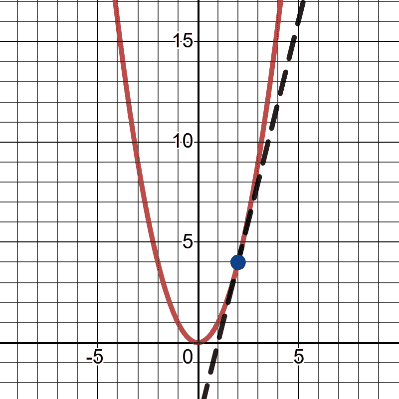

###### 图 1-6\. 观察函数某一部分的陡峭程度

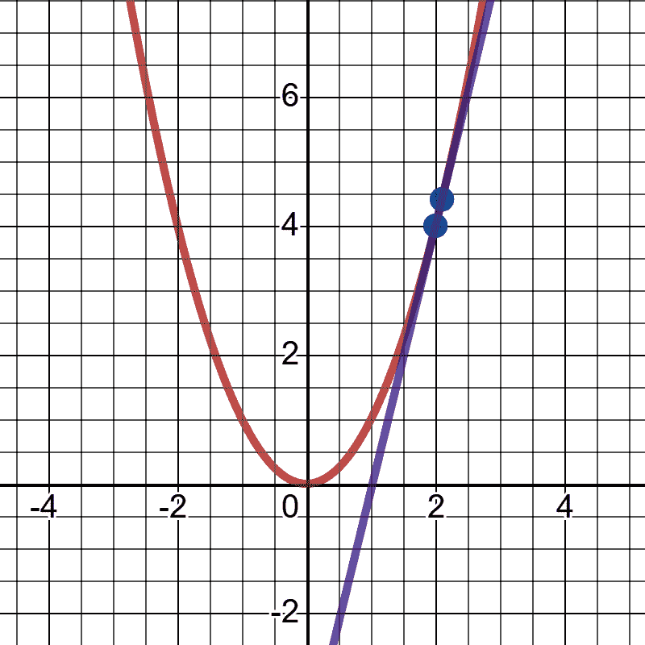

###### 图 1-7\. 计算斜率的粗略方法

使用简单的上升-下降公式，您可以快速计算两点之间的斜率<math alttext="m"><mi>m</mi></math>：

<math display="block" class="mathml_bottom_space"><mrow><mi>m</mi> <mo>=</mo> <mfrac><mrow><msub><mi>y</mi> <mn>2</mn></msub> <mo>-</mo><msub><mi>y</mi> <mn>1</mn></msub></mrow> <mrow><msub><mi>x</mi> <mn>2</mn></msub> <mo>-</mo><msub><mi>x</mi> <mn>1</mn></msub></mrow></mfrac></mrow></math> <math display="block" class="mathml_bottom_space"><mrow><mi>m</mi> <mo>=</mo> <mfrac><mrow><mn>4.</mn><mn>41</mn><mo>-</mo><mn>4.</mn><mn>0</mn></mrow> <mrow><mn>2.</mn><mn>1</mn><mo>-</mo><mn>2.</mn><mn>0</mn></mrow></mfrac></mrow></math> <math display="block" class="mathml_bottom_space"><mrow><mi>m</mi> <mo>=</mo> <mn>4.1</mn></mrow></math>

如果我将两点之间的*x*步长变得更小，比如*x* = 2 和*x* = 2.00001，这将导致*f*(2) = 4 和*f*(2.00001) = 4.00004，这将非常接近实际斜率 4。因此，步长越小，接近函数中给定点的斜率值就越接近。就像数学中许多重要概念一样，当我们接近无限大或无限小的值时，我们会发现一些有意义的东西。

示例 1-17 展示了 Python 中实现的导数计算器。

##### 示例 1-17\. Python 中的导数计算器

```py
def derivative_x(f, x, step_size):
    m = (f(x + step_size) - f(x)) / ((x + step_size) - x)
    return m

def my_function(x):
    return x**2

slope_at_2 = derivative_x(my_function, 2, .00001)

print(slope_at_2) # prints 4.000010000000827
```

现在好消息是有一种更干净的方法可以计算函数上任何位置的斜率。我们已经在使用 SymPy 绘制图形，但我将向您展示它如何使用符号计算的魔力来执行导数等任务。

当遇到类似<math alttext="f left-parenthesis x right-parenthesis equals x squared"><mrow><mi>f</mi> <mrow><mo>(</mo> <mi>x</mi> <mo>)</mo></mrow> <mo>=</mo> <msup><mi>x</mi> <mn>2</mn></msup></mrow></math>的指数函数时，导数函数将使指数成为乘数，然后将指数减 1，留下导数<math alttext="StartFraction d Over d x EndFraction x squared equals 2 x"><mrow><mfrac><mi>d</mi> <mrow><mi>d</mi><mi>x</mi></mrow></mfrac> <msup><mi>x</mi> <mn>2</mn></msup> <mo>=</mo> <mn>2</mn> <mi>x</mi></mrow></math>。 <math alttext="StartFraction d Over d x EndFraction"><mfrac><mi>d</mi> <mrow><mi>d</mi><mi>x</mi></mrow></mfrac></math>表示*关于 x 的导数*，这意味着我们正在构建一个以 x 值为目标的导数，以获得其斜率。因此，如果我们想要在*x* = 2 处找到斜率，并且我们有导数函数，我们只需将该 x 值代入即可获得斜率：

<math display="block"><mtable displaystyle="true"><mtr><mtd columnalign="right"><mrow><mi>f</mi> <mrow><mo>(</mo> <mi>x</mi> <mo>)</mo></mrow> <mo>=</mo> <msup><mi>x</mi> <mn>2</mn></msup></mrow></mtd></mtr></mtable></math> <math display="block"><mtable displaystyle="true"><mtr><mtd columnalign="right"><mrow><mfrac><mi>d</mi> <mrow><mi>d</mi><mi>x</mi></mrow></mfrac> <mi>f</mi> <mrow><mo>(</mo> <mi>x</mi> <mo>)</mo></mrow> <mo>=</mo> <mfrac><mi>d</mi> <mrow><mi>d</mi><mi>x</mi></mrow></mfrac> <msup><mi>x</mi> <mn>2</mn></msup> <mo>=</mo> <mn>2</mn> <mi>x</mi></mrow></mtd></mtr></mtable></math> <math display="block"><mtable displaystyle="true"><mtr><mtd columnalign="right"><mrow><mfrac><mi>d</mi> <mrow><mi>d</mi><mi>x</mi></mrow></mfrac> <mi>f</mi> <mrow><mo>(</mo> <mn>2</mn> <mo>)</mo></mrow> <mo>=</mo> <mn>2</mn> <mrow><mo>(</mo> <mn>2</mn> <mo>)</mo></mrow> <mo>=</mo> <mn>4</mn></mrow></mtd></mtr></mtable></math>

如果你打算学习这些规则来手动计算导数，那么有很多关于微积分的书籍可供参考。但也有一些很好的工具可以为您符号性地计算导数。Python 库 SymPy 是免费且开源的，很好地适应了 Python 语法。示例 1-18 展示了如何在 SymPy 中计算<math alttext="f left-parenthesis x right-parenthesis equals x squared"><mrow><mi>f</mi> <mrow><mo>(</mo> <mi>x</mi> <mo>)</mo></row> <mo>=</mo> <msup><mi>x</mi> <mn>2</mn></msup></mrow></math>的导数。

##### 示例 1-18. 在 SymPy 中计算导数

```py
from sympy import *

# Declare 'x' to SymPy
x = symbols('x')

# Now just use Python syntax to declare function
f = x**2

# Calculate the derivative of the function
dx_f = diff(f)
print(dx_f) # prints 2*x
```

哇！通过在 SymPy 中使用`symbols()`函数声明变量，然后可以继续使用普通的 Python 语法声明函数。之后可以使用`diff()`来计算导数函数。在示例 1-19 中，我们可以将导数函数转换回普通的 Python，简单地将其声明为另一个函数。

##### 示例 1-19. Python 中的导数计算器

```py
def f(x):
    return x**2

def dx_f(x):
    return 2*x

slope_at_2 = dx_f(2.0)

print(slope_at_2) # prints 4.0
```

如果你想继续使用 SymPy，你可以调用`subs()`函数，将*x*变量与值`2`交换，如示例 1-20 所示。

##### 示例 1-20\. 使用 SymPy 中的替换功能

```py
# Calculate the slope at x = 2
print(dx_f.subs(x,2)) # prints 4
```

## 偏导数

在本书中，我们将遇到另一个概念*偏导数*，我们将在第 5、6 和 7 章中使用它们。这些是对具有多个输入变量的函数的导数。

这样想吧。与其在一维函数上找到斜率，我们有多个方向上关于多个变量的斜率。对于每个给定变量的导数，我们假设其他变量保持不变。看一下<math alttext="f left-parenthesis x comma y right-parenthesis equals 2 x cubed plus 3 y cubed"><mrow><mi>f</mi> <mrow><mo>(</mo> <mi>x</mi> <mo>,</mo> <mi>y</mi> <mo>)</mo></mrow> <mo>=</mo> <mn>2</mn> <msup><mi>x</mi> <mn>3</mn></msup> <mo>+</mo> <mn>3</mn> <msup><mi>y</mi> <mn>3</mn></msup></mrow></math> 的三维图，你会看到我们有两个变量的两个方向上的斜率。

让我们看看函数<math alttext="f left-parenthesis x comma y right-parenthesis equals 2 x cubed plus 3 y cubed"><mrow><mi>f</mi> <mrow><mo>(</mo> <mi>x</mi> <mo>,</mo> <mi>y</mi> <mo>)</mo></mrow> <mo>=</mo> <mn>2</mn> <msup><mi>x</mi> <mn>3</mn></msup> <mo>+</mo> <mn>3</mn> <msup><mi>y</mi> <mn>3</mn></msup></mrow></math> 。*x*和*y*变量分别得到它们自己的导数<math alttext="StartFraction d Over d x EndFraction"><mfrac><mi>d</mi> <mrow><mi>d</mi><mi>x</mi></mrow></mfrac></math> 和 <math alttext="StartFraction d Over d y EndFraction"><mfrac><mi>d</mi> <mrow><mi>d</mi><mi>y</mi></mrow></mfrac></math> 。这些代表在多维表面上关于每个变量的斜率值。在处理多个维度时，我们在技术上将这些称为“斜率”*梯度*。这些是*x*和*y*的导数，接着是用 SymPy 计算这些导数的代码：

<math display="block"><mtable displaystyle="true"><mtr><mtd columnalign="right"><mrow><mi>f</mi> <mrow><mo>(</mo> <mi>x</mi> <mo>,</mo> <mi>y</mi> <mo>)</mo></mrow> <mo>=</mo> <mn>2</mn> <msup><mi>x</mi> <mn>3</mn></msup> <mo>+</mo> <mn>3</mn> <msup><mi>y</mi> <mn>3</mn></msup></mrow></mtd></mtr></mtable></math> <math display="block"><mtable displaystyle="true"><mtr><mtd columnalign="right"><mrow><mfrac><mi>d</mi> <mrow><mi>d</mi><mi>x</mi></mrow></mfrac> <mn>2</mn> <msup><mi>x</mi> <mn>3</mn></msup> <mo>+</mo> <mn>3</mn> <msup><mi>y</mi> <mn>3</mn></msup> <mo>=</mo> <mn>6</mn> <msup><mi>x</mi> <mn>2</mn></msup></mrow></mtd></mtr></mtable></math> <math display="block"><mtable displaystyle="true"><mtr><mtd columnalign="right"><mrow><mfrac><mi>d</mi> <mrow><mi>d</mi><mi>y</mi></mrow></mfrac> <mn>2</mn> <msup><mi>x</mi> <mn>3</mn></msup> <mo>+</mo> <mn>3</mn> <msup><mi>y</mi> <mn>3</mn></msup> <mo>=</mo> <mn>9</mn> <msup><mi>y</mi> <mn>2</mn></msup></mrow></mtd></mtr></mtable></math>

示例 1-21 和 图 1-8 展示了我们如何分别使用 SymPy 计算 *x* 和 *y* 的偏导数。

##### 示例 1-21\. 使用 SymPy 计算偏导数

```py
from sympy import *
from sympy.plotting import plot3d

# Declare x and y to SymPy
x,y = symbols('x y')

# Now just use Python syntax to declare function
f = 2*x**3 + 3*y**3

# Calculate the partial derivatives for x and y
dx_f = diff(f, x)
dy_f = diff(f, y)

print(dx_f) # prints 6*x**2
print(dy_f) # prints 9*y**2

# plot the function
plot3d(f)
```

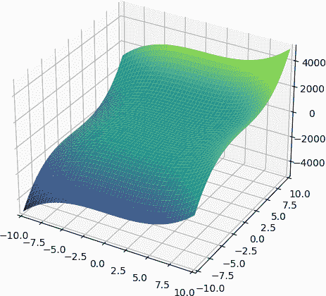

###### 图 1-8\. 绘制三维指数函数

因此对于 (*x*,*y*) 值（1,2），相对于 *x* 的斜率为 <math alttext="6 left-parenthesis 1 right-parenthesis equals 6"><mrow><mn>6</mn> <mo>(</mo> <mn>1</mn> <mo>)</mo> <mo>=</mo> <mn>6</mn></mrow></math>，相对于 *y* 的斜率为 <math alttext="9 left-parenthesis 2 right-parenthesis squared equals 36"><mrow><mn>9</mn> <msup><mrow><mo>(</mo><mn>2</mn><mo>)</mo></mrow> <mn>2</mn></msup> <mo>=</mo> <mn>36</mn></mrow></math>。

## 链式法则

在 第七章 中，当我们构建神经网络时，我们将需要一种特殊的数学技巧，称为链式法则。当我们组合神经网络层时，我们将不得不解开每一层的导数。但现在让我们通过一个简单的代数示例来学习链式法则。假设你有两个函数：

<math display="block"><mtable displaystyle="true"><mtr><mtd columnalign="right"><mrow><mi>y</mi> <mo>=</mo> <msup><mi>x</mi> <mn>2</mn></msup> <mo>+</mo> <mn>1</mn></mrow></mtd></mtr></mtable></math> <math display="block"><mtable displaystyle="true"><mtr><mtd columnalign="right"><mrow><mi>z</mi> <mo>=</mo> <msup><mi>y</mi> <mn>3</mn></msup> <mo>-</mo> <mn>2</mn></mrow></mtd></mtr></mtable></math>

注意这两个函数是相互关联的，因为第一个函数中的 *y* 是输出变量，但在第二个函数中是输入变量。这意味着我们可以将第一个函数的 *y* 替换为第二个函数的 *z*，如下所示：

<math alttext="z equals left-parenthesis x squared plus 1 right-parenthesis cubed minus 2" display="block"><mrow><mi>z</mi> <mo>=</mo> <msup><mrow><mo>(</mo><msup><mi>x</mi> <mn>2</mn></msup> <mo>+</mo><mn>1</mn><mo>)</mo></mrow> <mn>3</mn></msup> <mo>-</mo> <mn>2</mn></mrow></math>

那么 *z* 对 *x* 的导数是多少呢？我们已经有了用 *x* 表示 *z* 的替换。让我们使用 SymPy 在 示例 1-24 中计算出来。

##### 示例 1-24\. 求 *z* 对 *x* 的导数

```py
from sympy import *

z = (x**2 + 1)**3 - 2
dz_dx = diff(z, x)
print(dz_dx)

# 6*x*(x**2 + 1)**2
```

因此，我们对*z*关于*x*的导数是<math alttext="6 x left-parenthesis x squared plus 1 right-parenthesis squared"><mrow><mn>6</mn> <mi>x</mi> <msup><mrow><mo>(</mo><msup><mi>x</mi> <mn>2</mn></msup> <mo>+</mo><mn>1</mn><mo>)</mo></mrow> <mn>2</mn></msup></mrow></math>：

<math display="block"><mtable displaystyle="true"><mtr><mtd columnalign="right"><mrow><mfrac><mrow><mi>d</mi><mi>z</mi></mrow> <mrow><mi>d</mi><mi>x</mi></mrow></mfrac> <mrow><mo>(</mo> <msup><mrow><mo>(</mo><msup><mi>x</mi> <mn>2</mn></msup> <mo>+</mo><mn>1</mn><mo>)</mo></mrow> <mn>3</mn></msup> <mo>-</mo> <mn>2</mn> <mo>)</mo></mrow></mrow></mtd></mtr></mtable></math> <math display="block"><mtable displaystyle="true"><mtr><mtd columnalign="right"><mrow><mo>=</mo> <mn>6</mn> <mi>x</mi> <msup><mrow><mo>(</mo><msup><mi>x</mi> <mn>2</mn></msup> <mo>+</mo><mn>1</mn><mo>)</mo></mrow> <mn>2</mn></msup></mrow></mtd></mtr></mtable></math>

但是看这个。让我们重新开始，采用不同的方法。如果我们分别对*y*和*z*函数求导，然后将它们相乘，也会得到*z*关于*x*的导数！让我们试试：

<math alttext="StartFraction d y Over d x EndFraction left-parenthesis x squared plus 1 right-parenthesis equals 2 x" display="block"><mrow><mfrac><mrow><mi>d</mi><mi>y</mi></mrow> <mrow><mi>d</mi><mi>x</mi></mrow></mfrac> <mrow><mo>(</mo> <msup><mi>x</mi> <mn>2</mn></msup> <mo>+</mo> <mn>1</mn> <mo>)</mo></mrow> <mo>=</mo> <mn>2</mn> <mi>x</mi></mrow></math><math alttext="StartFraction d z Over d y EndFraction left-parenthesis y cubed minus 2 right-parenthesis equals 3 y squared" display="block"><mrow><mfrac><mrow><mi>d</mi><mi>z</mi></mrow> <mrow><mi>d</mi><mi>y</mi></mrow></mfrac> <mrow><mo>(</mo> <msup><mi>y</mi> <mn>3</mn></msup> <mo>-</mo> <mn>2</mn> <mo>)</mo></mrow> <mo>=</mo> <mn>3</mn> <msup><mi>y</mi> <mn>2</mn></msup></mrow></math><math alttext="StartFraction d z Over d x EndFraction equals left-parenthesis 2 x right-parenthesis left-parenthesis 3 y squared right-parenthesis equals 6 x y squared" display="block"><mrow><mfrac><mrow><mi>d</mi><mi>z</mi></mrow> <mrow><mi>d</mi><mi>x</mi></mrow></mfrac> <mo>=</mo> <mrow><mo>(</mo> <mn>2</mn> <mi>x</mi> <mo>)</mo></mrow> <mrow><mo>(</mo> <mn>3</mn> <msup><mi>y</mi> <mn>2</mn></msup> <mo>)</mo></mrow> <mo>=</mo> <mn>6</mn> <mi>x</mi> <msup><mi>y</mi> <mn>2</mn></msup></mrow></math>

好的，<math alttext="6 x y squared"><mrow><mn>6</mn> <mi>x</mi> <msup><mi>y</mi> <mn>2</mn></msup></mrow></math>看起来可能不像<math alttext="6 x left-parenthesis x squared plus 1 right-parenthesis squared"><mrow><mn>6</mn> <mi>x</mi> <msup><mrow><mo>(</mo><msup><mi>x</mi> <mn>2</mn></msup> <mo>+</mo><mn>1</mn><mo>)</mo></mrow> <mn>2</mn></msup></mrow></math>，但那只是因为我们还没有替换*y*函数。这样做，整个<math alttext="StartFraction d z Over d x EndFraction"><mfrac><mrow><mi>d</mi><mi>z</mi></mrow> <mrow><mi>d</mi><mi>x</mi></mrow></mfrac></math>导数将用*x*而不用*y*来表示。

<math alttext="StartFraction d z Over d x EndFraction equals 6 x y squared equals 6 x left-parenthesis x squared plus 1 right-parenthesis squared" display="block"><mrow><mfrac><mrow><mi>d</mi><mi>z</mi></mrow> <mrow><mi>d</mi><mi>x</mi></mrow></mfrac> <mo>=</mo> <mn>6</mn> <mi>x</mi> <msup><mi>y</mi> <mn>2</mn></msup> <mo>=</mo> <mn>6</mn> <mi>x</mi> <msup><mrow><mo>(</mo><msup><mi>x</mi> <mn>2</mn></msup> <mo>+</mo><mn>1</mn><mo>)</mo></mrow> <mn>2</mn></msup></mrow></math>

现在我们看到我们得到了相同的导数函数<math alttext="6 x left-parenthesis x squared plus 1 right-parenthesis squared"><mrow><mn>6</mn> <mi>x</mi> <msup><mrow><mo>(</mo><msup><mi>x</mi> <mn>2</mn></msup> <mo>+</mo><mn>1</mn><mo>)</mo></mrow> <mn>2</mn></msup></mrow></math>！

这就是*链式法则*，它表示对于给定的函数*y*（具有输入变量*x*）组合到另一个函数*z*（具有输入变量*y*）中，我们可以通过将两个相应的导数相乘来找到*z*关于*x*的导数：

<math alttext="StartFraction d z Over d x EndFraction equals StartFraction d z Over d y EndFraction times StartFraction d y Over d x EndFraction" display="block"><mrow><mfrac><mrow><mi>d</mi><mi>z</mi></mrow> <mrow><mi>d</mi><mi>x</mi></mrow></mfrac> <mo>=</mo> <mfrac><mrow><mi>d</mi><mi>z</mi></mrow> <mrow><mi>d</mi><mi>y</mi></mrow></mfrac> <mo>×</mo> <mfrac><mrow><mi>d</mi><mi>y</mi></mrow> <mrow><mi>d</mi><mi>x</mi></mrow></mfrac></mrow></math>

示例 1-25 展示了 SymPy 代码，进行了这种比较，显示链式法则的导数等于替换函数的导数。

##### 示例 1-25\. 使用链式法则计算导数 dz/dx，但仍然得到相同的答案

```py
from sympy import *

x, y = symbols('x y')

# derivative for first function
# need to underscore y to prevent variable clash
_y = x**2 + 1
dy_dx = diff(_y)

# derivative for second function
z = y**3 - 2
dz_dy = diff(z)

# Calculate derivative with and without
# chain rule, substitute y function
dz_dx_chain = (dy_dx * dz_dy).subs(y, _y)
dz_dx_no_chain = diff(z.subs(y, _y))

# Prove chain rule by showing both are equal
print(dz_dx_chain) # 6*x*(x**2 + 1)**2
print(dz_dx_no_chain) # 6*x*(x**2 + 1)**2
```

链式法则是训练神经网络的关键部分，通过适当的权重和偏差。我们可以跨越每个节点乘以导数，而不是以嵌套的洋葱方式解开每个节点的导数，这在数学上要容易得多。

# 积分

导数的相反是*积分*，它找到给定范围下曲线下的面积。在第二章和第三章，我们将找到概率分布下的面积。虽然我们不会直接使用积分，而是使用已经被积分的累积密度函数，但了解积分如何找到曲线下的面积是很好的。附录 A 包含了在概率分布上使用这种方法的示例。

我想采用一种直观的方法来学习积分，称为黎曼和，这种方法可以灵活适应任何连续函数。首先，让我们指出，在一条直线下的范围内找到面积是很容易的。假设我有一个函数<math alttext="f left-parenthesis x right-parenthesis equals 2 x"><mrow><mi>f</mi> <mo>(</mo> <mi>x</mi> <mo>)</mo> <mo>=</mo> <mn>2</mn> <mi>x</mi></mrow></math>，我想找到在 0 和 1 之间线下的面积，如图 1-9 中所阴影部分所示。

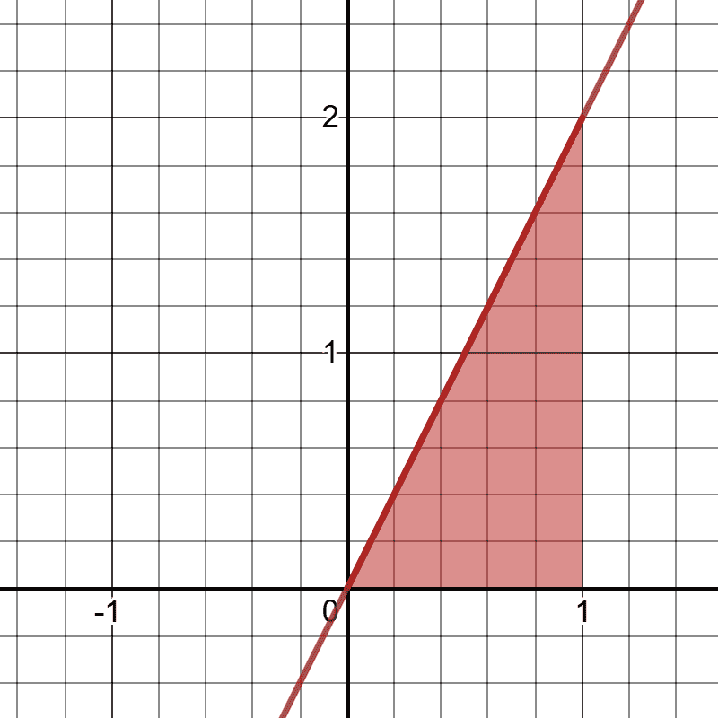

###### 图 1-9\. 计算线性函数下的面积

请注意，我正在计算线和 x 轴之间的面积，在 x 范围为 0.0 到 1.0。如果你记得基本几何公式，一个三角形的面积*A*是<math alttext="upper A equals one-half b h"><mrow><mi>A</mi> <mo>=</mo> <mfrac><mn>1</mn> <mn>2</mn></mfrac> <mi>b</mi> <mi>h</mi></mrow></math>，其中*b*是底边的长度，*h*是高度。我们可以直观地看到<math alttext="b equals 1"><mrow><mi>b</mi> <mo>=</mo> <mn>1</mn></mrow></math>和<math alttext="h equals 2"><mrow><mi>h</mi> <mo>=</mo> <mn>2</mn></mrow></math>。因此，根据公式计算，我们得到了我们的面积为 1.0：

<math display="block"><mtable displaystyle="true"><mtr><mtd columnalign="right"><mrow><mi>A</mi> <mo>=</mo> <mfrac><mn>1</mn> <mn>2</mn></mfrac> <mi>b</mi> <mi>h</mi></mrow></mtd></mtr></mtable></math> <math display="block"><mtable displaystyle="true"><mtr><mtd columnalign="right"><mrow><mi>A</mi> <mo>=</mo> <mfrac><mn>1</mn> <mn>2</mn></mfrac> <mo>*</mo> <mn>1</mn> <mo>*</mo> <mn>2</mn></mrow></mtd></mtr></mtable></math> <math display="block"><mtable displaystyle="true"><mtr><mtd columnalign="right"><mrow><mi>A</mi> <mo>=</mo> <mn>1</mn></mrow></mtd></mtr></mtable></math>

那还不错，对吧？但是让我们看一个难以计算面积的函数：<math alttext="f left-parenthesis x right-parenthesis equals x squared plus 1"><mrow><mi>f</mi> <mrow><mo>(</mo> <mi>x</mi> <mo>)</mo></mrow> <mo>=</mo> <msup><mi>x</mi> <mn>2</mn></msup> <mo>+</mo> <mn>1</mn></mrow></math>。在 0 到 1 之间的阴影部分的面积是多少？参见图 1-10。

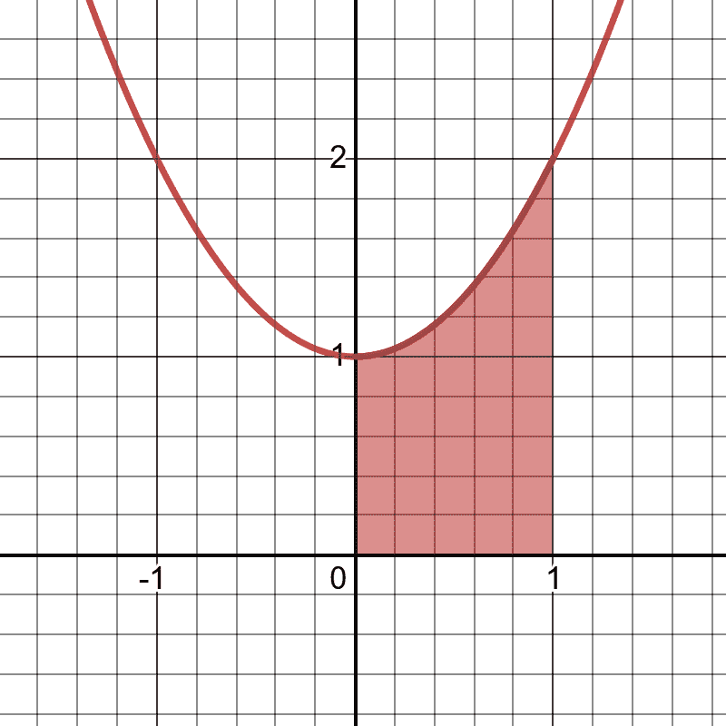

###### 图 1-10。计算非线性函数下的面积并不那么直接

再次，我们只对 x 范围在 0 到 1 之间的曲线下方和 x 轴上方的面积感兴趣。这里的曲线不给我们一个清晰的几何公式来计算面积，但是这里有一个聪明的小技巧可以做。

如果我们在曲线下方放置五个相等长度的长方形，如图 1-11 所示，其中每个长方形的高度从 x 轴延伸到中点触及曲线的位置，会发生什么？

长方形的面积是<math alttext="upper A equals length times width"><mrow><mi>A</mi> <mo>=</mo> <mtext>length</mtext> <mo>×</mo> <mtext>width</mtext></mrow></math>，因此我们可以轻松地计算长方形的面积。这样做会给我们一个好的曲线下面积的近似值吗？如果我们放置 100 个长方形呢？1,000 个？100,000 个？随着长方形数量的增加和宽度的减小，我们是否会越来越接近曲线下的面积？是的，我们会，这又是一个我们将某物增加/减少至无穷以接近实际值的情况。

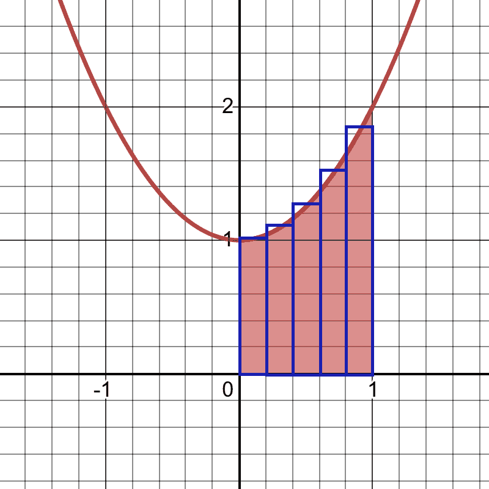

###### 图 1-11。放置长方形以近似曲线下的面积

让我们在 Python 中试一试。首先，我们需要一个近似积分的函数，我们将其称为`approximate_integral()`。参数`a`和`b`将分别指定*x*范围的最小值和最大值。`n`将是要包含的矩形数，`f`将是我们要积分的函数。我们在示例 1-26 中实现该函数，然后使用它来积分我们的函数<math alttext="f left-parenthesis x right-parenthesis equals x squared plus 1"><mrow><mi>f</mi> <mrow><mo>(</mo> <mi>x</mi> <mo>)</mo></mrow> <mo>=</mo> <msup><mi>x</mi> <mn>2</mn></msup> <mo>+</mo> <mn>1</mn></mrow></math>，使用五个矩形，在 0.0 和 1.0 之间。

##### 示例 1-26。Python 中的积分近似

```py
def approximate_integral(a, b, n, f):
    delta_x = (b - a) / n
    total_sum = 0

    for i in range(1, n + 1):
        midpoint = 0.5 * (2 * a + delta_x * (2 * i - 1))
        total_sum += f(midpoint)

    return total_sum * delta_x

def my_function(x):
    return x**2 + 1

area = approximate_integral(a=0, b=1, n=5, f=my_function)

print(area) # prints 1.33
```

所以我们得到了一个面积为 1.33。如果我们使用 1,000 个矩形会发生什么？让我们在示例 1-27 中试一试。

##### 示例 1-27。Python 中的另一个积分近似

```py
area = approximate_integral(a=0, b=1, n=1000, f=my_function)

print(area) # prints 1.333333250000001
```

好的，我们在这里得到了更多的精度，并获得了更多的小数位数。在示例 1-28 中展示了一百万个矩形的情况？

##### 示例 1-28。Python 中的另一个积分近似

```py
area = approximate_integral(a=0, b=1, n=1_000_000, f=my_function)

print(area) # prints 1.3333333333332733
```

好的，我认为我们在这里得到了一个递减的回报，并收敛于值<math display="inline"><mrow><mn>1.</mn> <mover><mn>333</mn> <mo>¯</mo></mover></mrow></math>，其中“.333”部分是永远重复的。如果这是一个有理数，很可能是 4/3 = <math display="inline"><mrow><mn>1.</mn> <mover><mn>333</mn> <mo>¯</mo></mover></mrow></math>。随着矩形数量的增加，近似值开始在越来越小的小数处达到其极限。

现在我们对我们试图实现的目标和原因有了一些直觉，让我们用 SymPy 做一个更精确的方法，它恰好支持有理数，在示例 1-29 中进行。

##### 示例 1-29。使用 SymPy 执行积分

```py
from sympy import *

# Declare 'x' to SymPy
x = symbols('x')

# Now just use Python syntax to declare function
f = x**2 + 1

# Calculate the integral of the function with respect to x
# for the area between x = 0 and 1
area = integrate(f, (x, 0, 1))

print(area) # prints 4/3
```

太棒了！所以实际面积是 4/3，这正是我们之前的方法收敛的地方。不幸的是，普通的 Python（以及许多编程语言）只支持小数，但像 SymPy 这样的计算代数系统给我们提供了精确的有理数。我们将在第二章和第三章中使用积分来找到曲线下的面积，尽管我们将让 scikit-learn 来为我们完成这项工作。

# 结论

在本章中，我们介绍了一些我们将在本书中其余部分中使用的基础知识。从数论到对数和微积分积分，我们强调了一些与数据科学、机器学习和分析相关的重要数学概念。您可能会对为什么这些概念有用有疑问。接下来会解释！

在我们继续讨论概率之前，花点时间再浏览一下这些概念，然后做以下练习。当您在阅读本书的过程中逐步应用这些数学思想时，您可以随时回顾本章并根据需要进行刷新。

# 练习

1.  值 62.6738 是有理数还是无理数？为什么？

1.  计算表达式：<math alttext="10 Superscript 7 Baseline 10 Superscript negative 5"><mrow><msup><mn>10</mn> <mn>7</mn></msup> <msup><mn>10</mn> <mrow><mo>-</mo><mn>5</mn></mrow></msup></mrow></math>

1.  计算表达式：<math alttext="81 Superscript one-half"><msup><mn>81</mn> <mfrac><mn>1</mn> <mn>2</mn></mfrac></msup></math>

1.  计算表达式：<math alttext="25 Superscript three-halves"><msup><mn>25</mn> <mfrac><mn>3</mn> <mn>2</mn></mfrac></msup></math>

1.  假设没有还款，一个$1,000 的贷款在 5%的利率下每月复利 3 年后价值多少？

1.  假设没有还款，一个$1,000 的贷款在 5%的利率下连续复利 3 年后价值多少？

1.  对于函数<math alttext="f left-parenthesis x right-parenthesis equals 3 x squared plus 1"><mrow><mi>f</mi> <mrow><mo>(</mo> <mi>x</mi> <mo>)</mo></mrow> <mo>=</mo> <mn>3</mn> <msup><mi>x</mi> <mn>2</mn></msup> <mo>+</mo> <mn>1</mn></mrow></math>在*x* = 3 处的斜率是多少？

1.  对于函数<math alttext="f left-parenthesis x right-parenthesis equals 3 x squared plus 1"><mrow><mi>f</mi> <mrow><mo>(</mo> <mi>x</mi> <mo>)</mo></mrow> <mo>=</mo> <mn>3</mn> <msup><mi>x</mi> <mn>2</mn></msup> <mo>+</mo> <mn>1</mn></mrow></math>在*x*在 0 和 2 之间的曲线下的面积是多少？

答案在附录 B 中。
