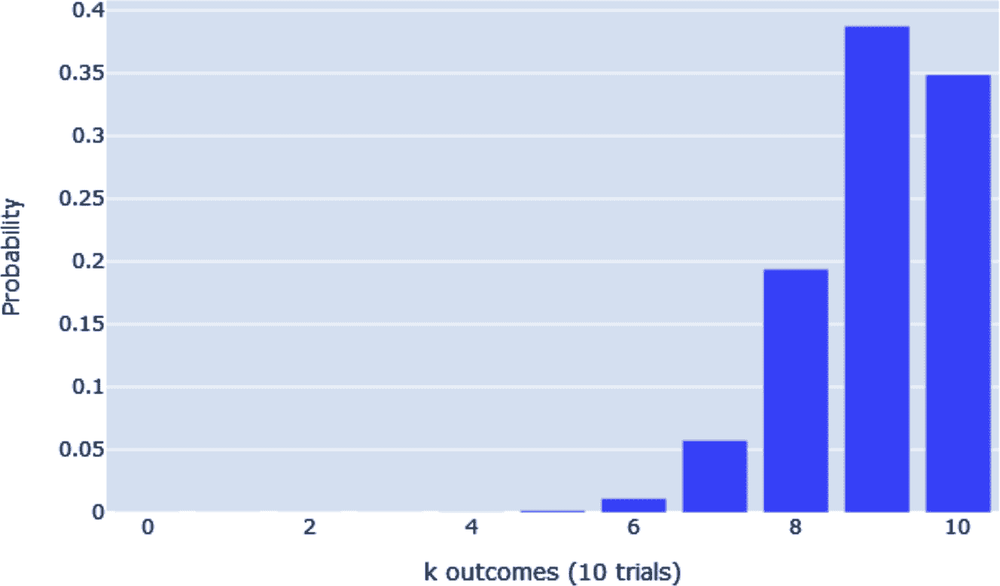
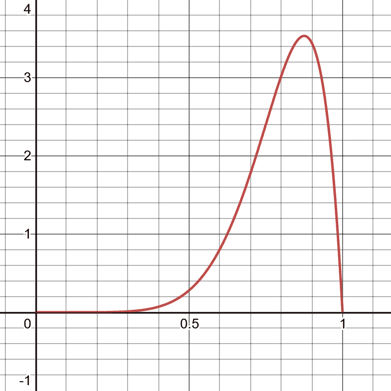
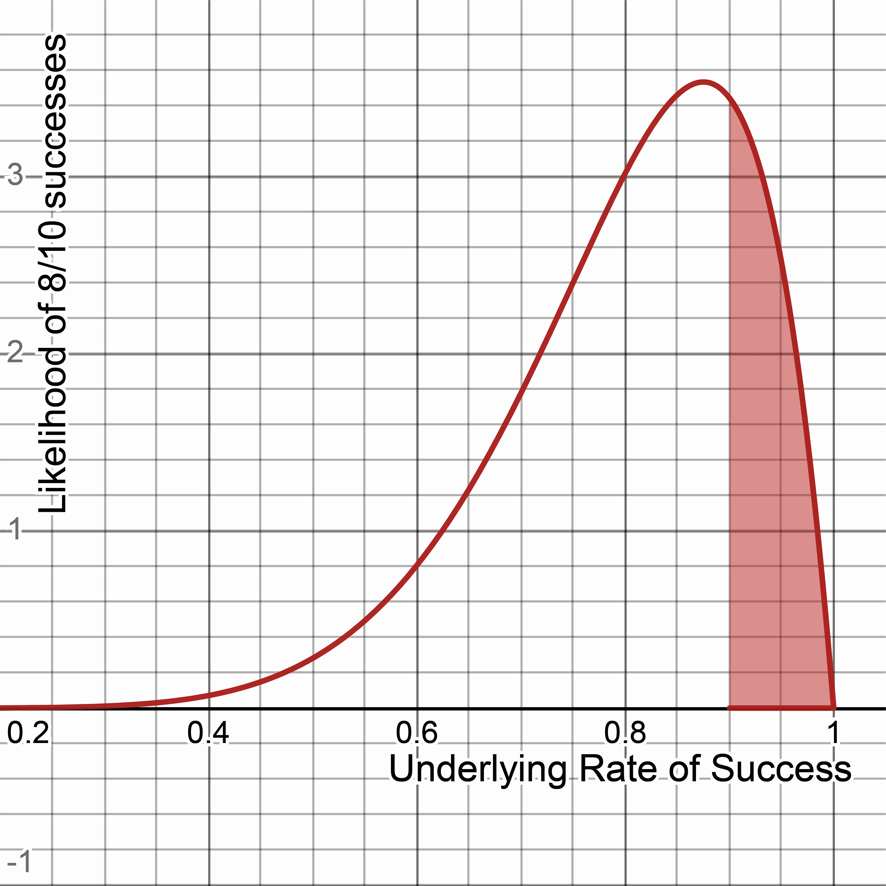
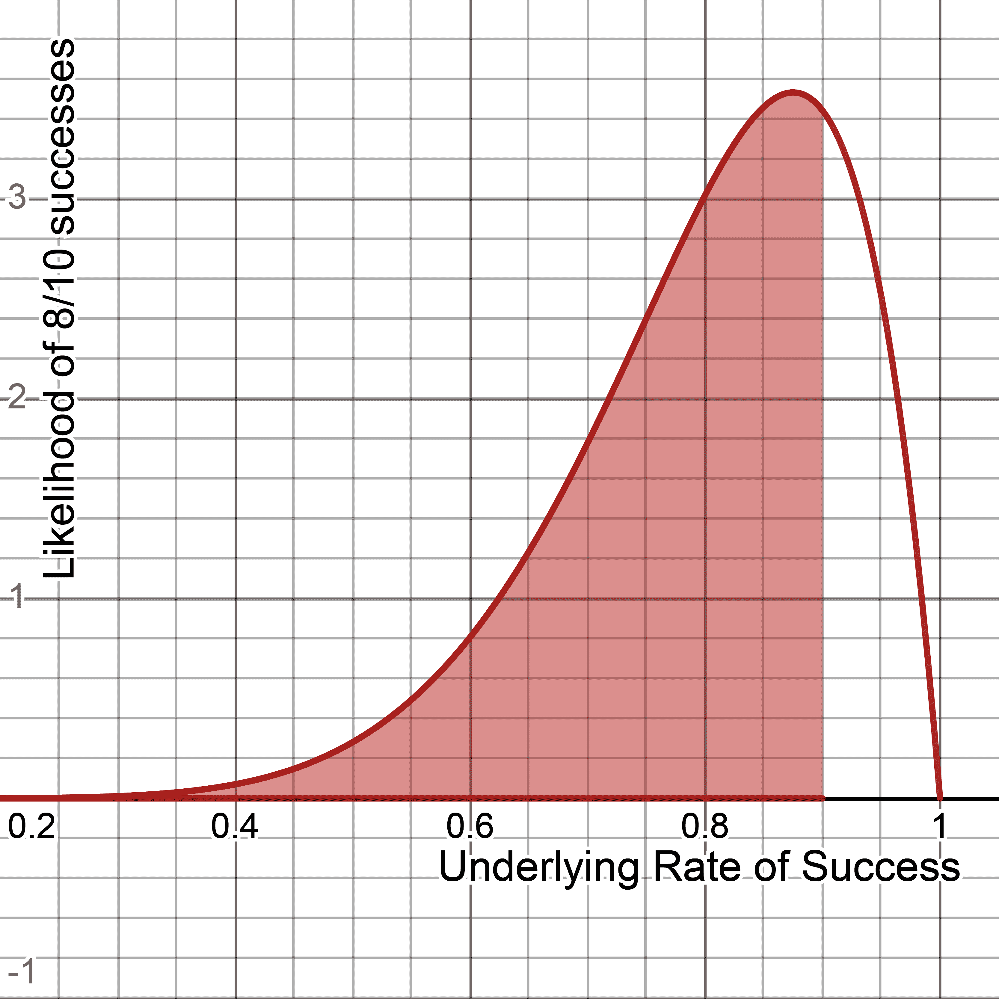
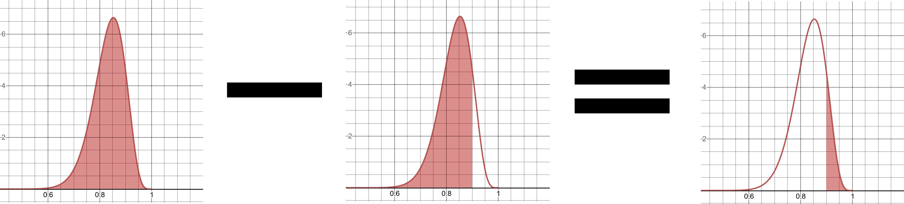
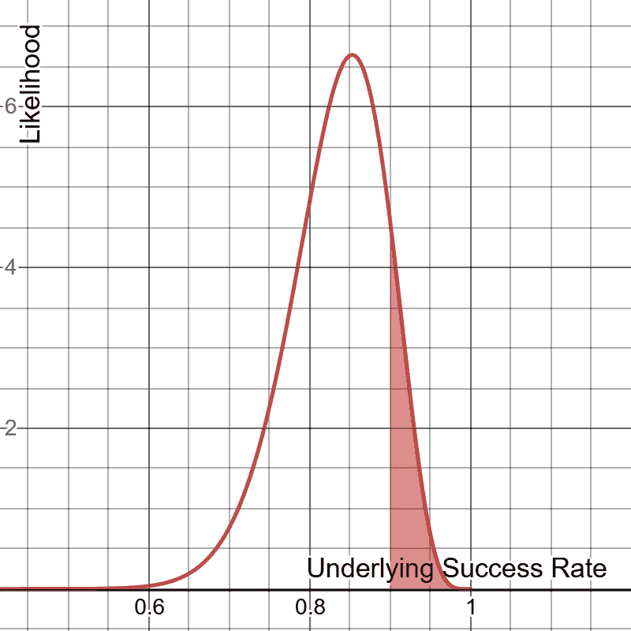
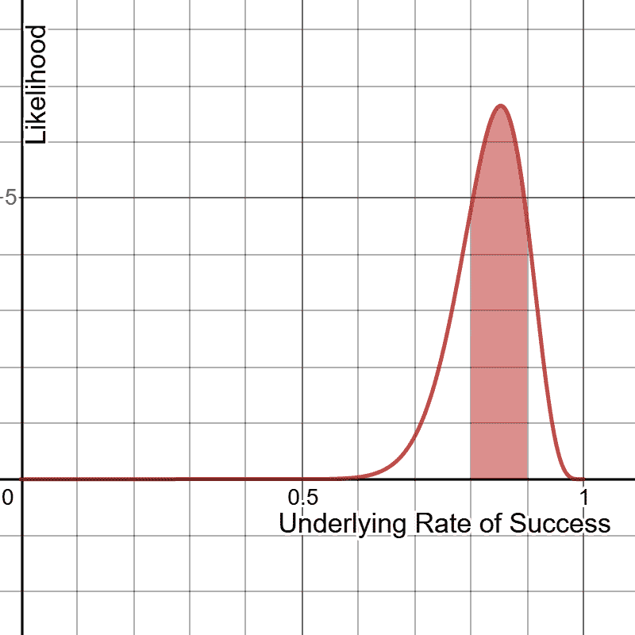
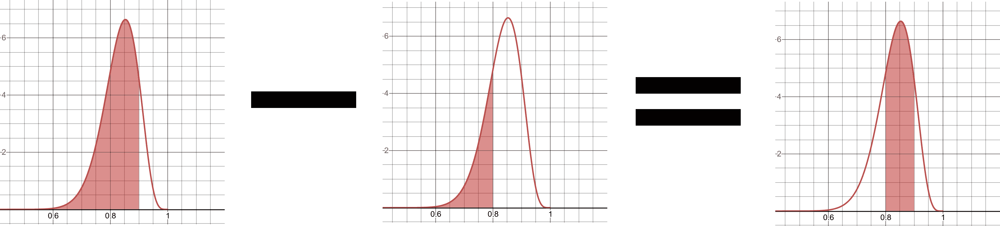

# 第二章：概率

当你想到概率时，你会想到什么图像？也许你会想到与赌博相关的例子，比如中彩票的概率或者用两个骰子得到一对的概率。也许是预测股票表现、政治选举结果，或者你的航班是否会准时到达。我们的世界充满了我们想要衡量的不确定性。

或许这是我们应该关注的词：不确定性。我们如何衡量我们不确定的事物？

最终，概率是理论研究事件发生的确定性的学科。它是统计学、假设检验、机器学习以及本书中其他主题的基础学科。很多人认为概率理所当然，并假设他们理解它。然而，它比大多数人想象的更加微妙和复杂。虽然概率的定理和思想在数学上是正确的，但当我们引入数据并涉足统计学时，情况就变得更加复杂。我们将在第四章中讨论统计学和假设检验。

在本章中，我们将讨论什么是概率。然后我们将涵盖概率数学概念、贝叶斯定理、二项分布和贝塔分布。

# 理解概率

*概率*是我们相信事件发生的强度，通常以百分比表示。以下是一些可能需要概率回答的问题：

+   在 10 次公平抛硬币中，我得到 7 次正面的可能性有多大？

+   我赢得选举的机会有多大？

+   我的航班会晚点吗？

+   我有多大把握说一个产品有瑕疵？

表达概率最流行的方式是以百分比形式，“我的航班晚点的可能性是 70%”。我们将这种概率称为<math alttext="upper P left-parenthesis upper X right-parenthesis"><mrow><mi>P</mi> <mo>(</mo> <mi>X</mi> <mo>)</mo></mrow></math>，其中*X*是感兴趣的事件。然而，在处理概率时，你更可能看到它以小数形式表示（在这种情况下为 0.70），它必须介于 0.0 和 1.0 之间：

<math><mrow><mi>P</mi> <mo>(</mo> <mi>X</mi> <mo>)</mo> <mo>=</mo> <mn>.70</mn></mrow></math>

*可能性*类似于概率，很容易混淆这两者（许多词典也是如此）。在日常对话中，你可以随意使用“概率”和“可能性”这两个词。然而，我们应该明确这些区别。概率是关于量化尚未发生事件的预测，而可能性是衡量已经发生事件的频率。在统计学和机器学习中，我们经常使用可能性（过去）的形式来预测概率（未来）。

需要注意的是，事件发生的概率必须严格在 0%和 100%之间，或者 0.0 和 1.0 之间。逻辑上，这意味着事件*不*发生的概率是通过从 1.0 中减去事件发生的概率来计算的：

<math display="block"><mtable displaystyle="true"><mtr><mtd columnalign="right"><mrow><mi>P</mi> <mo>(</mo> <mi>X</mi> <mo>)</mo> <mo>=</mo> <mn>.70</mn></mrow></mtd></mtr></mtable></math> <math display="block"><mtable displaystyle="true"><mtr><mtd columnalign="right"><mrow><mi>P</mi> <mo>(</mo> <mtext>not</mtext> <mi>X</mi> <mo>)</mo> <mo>=</mo> <mn>1</mn> <mo>-</mo> <mn>.70</mn> <mo>=</mo> <mn>.30</mn></mrow></mtd></mtr></mtable></math>

这是概率和可能性之间的另一个区别。事件的所有可能互斥结果的概率（意味着只能发生一个结果，而不是多个）必须总和为 1.0 或 100%。然而，可能性不受此规则约束。

或者，概率可以表示为*赔率*<math alttext="upper O left-parenthesis upper X right-parenthesis"><mrow><mi>O</mi> <mo>(</mo> <mi>X</mi> <mo>)</mo></mrow></math>，例如 7:3，7/3 或<math display="inline"><mrow><mn>2.</mn> <mover><mn>333</mn> <mo>¯</mo></mover></mrow></math>。

要将赔率<math alttext="upper O left-parenthesis upper X right-parenthesis"><mrow><mi>O</mi> <mo>(</mo> <mi>X</mi> <mo>)</mo></mrow></math>转换为比例概率<math alttext="upper P left-parenthesis upper X right-parenthesis"><mrow><mi>P</mi> <mo>(</mo> <mi>X</mi> <mo>)</mo></mrow></math>，请使用以下公式：

<math alttext="upper P left-parenthesis upper X right-parenthesis equals StartFraction upper O left-parenthesis upper X right-parenthesis Over 1 plus upper O left-parenthesis upper X right-parenthesis EndFraction" display="block"><mrow><mi>P</mi> <mrow><mo>(</mo> <mi>X</mi> <mo>)</mo></mrow> <mo>=</mo> <mfrac><mrow><mi>O</mi><mo>(</mo><mi>X</mi><mo>)</mo></mrow> <mrow><mn>1</mn><mo>+</mo><mi>O</mi><mo>(</mo><mi>X</mi><mo>)</mo></mrow></mfrac></mrow></math>

因此，如果我有一个赔率为 7/3，我可以像这样将其转换为比例概率：

<math display="block"><mtable displaystyle="true"><mtr><mtd columnalign="right"><mrow><mi>P</mi> <mrow><mo>(</mo> <mi>X</mi> <mo>)</mo></mrow> <mo>=</mo> <mfrac><mrow><mi>O</mi><mo>(</mo><mi>X</mi><mo>)</mo></mrow> <mrow><mn>1</mn><mo>+</mo><mi>O</mi><mo>(</mo><mi>X</mi><mo>)</mo></mrow></mfrac></mrow></mtd></mtr></mtable></math> <math display="block"><mtable displaystyle="true"><mtr><mtd columnalign="right"><mrow><mi>P</mi> <mrow><mo>(</mo> <mi>X</mi> <mo>)</mo></mrow> <mo>=</mo> <mfrac><mfrac><mn>7</mn> <mn>3</mn></mfrac> <mrow><mn>1</mn><mo>+</mo><mfrac><mn>7</mn> <mn>3</mn></mfrac></mrow></mfrac></mrow></mtd></mtr></mtable></math> <math display="block"><mtable displaystyle="true"><mtr><mtd columnalign="right"><mrow><mi>P</mi> <mo>(</mo> <mi>X</mi> <mo>)</mo> <mo>=</mo> <mn>.7</mn></mrow></mtd></mtr></mtable></math>

相反，您可以通过将事件发生的概率除以它不会发生的概率来将赔率转换为概率：

<math display="block"><mtable displaystyle="true"><mtr><mtd columnalign="right"><mrow><mi>O</mi> <mrow><mo>(</mo> <mi>X</mi> <mo>)</mo></mrow> <mo>=</mo> <mfrac><mrow><mi>P</mi><mo>(</mo><mi>X</mi><mo>)</mo></mrow> <mrow><mn>1</mn><mo>-</mo><mi>P</mi><mo>(</mo><mi>X</mi><mo>)</mrow></mfrac></mrow></mtd></mtr></mtable></math> <math display="block"><mtable displaystyle="true"><mtr><mtd columnalign="right"><mrow><mi>O</mi> <mrow><mo>(</mo> <mi>X</mi> <mo>)</mo></mrow> <mo>=</mo> <mfrac><mrow><mn>.70</mn></mrow> <mrow><mn>1</mn><mo>-</mo><mn>.70</mn></mrow></mfrac></mrow></mtd></mtr></mtable></math> <math display="block"><mtable displaystyle="true"><mtr><mtd columnalign="right"><mrow><mi>O</mi> <mrow><mo>(</mo> <mi>X</mi> <mo>)</mo></mrow> <mo>=</mo> <mfrac><mn>7</mn> <mn>3</mn></mfrac></mrow></mtd></mtr></mtable></math>

## 概率与统计

有时人们会将*概率*和*统计*这两个术语混为一谈，虽然混淆这两个学科是可以理解的，但它们确实有区别。*概率*纯粹是关于事件发生的可能性，不需要数据。另一方面，*统计*则无法在没有数据的情况下存在，并利用数据来发现概率，并提供描述数据的工具。

想象一下预测骰子掷出 4 的结果（这是骰子的单数形式）。用纯粹的概率思维方法来解决这个问题，一个人简单地说骰子有六个面。我们假设每个面都是等可能的，所以掷出 4 的概率是 1/6，或 16.666%。

然而，一个狂热的统计学家可能会说：“不！我们需要掷骰子来获取数据。如果我们能掷出 30 次或更多次，而且我们掷得越多，就越好，那么我们才能有数据来确定掷出 4 的概率。” 如果我们假设骰子是公平的，这种方法可能看起来很愚蠢，但如果不是呢？如果是这样，收集数据是发现掷出 4 的概率的唯一方法。我们将在第三章中讨论假设检验。

# 概率数学

当我们处理一个事件的单一概率<math alttext="upper P left-parenthesis upper X right-parenthesis"><mrow><mi>P</mi> <mo>(</mo> <mi>X</mi> <mo>)</mo></mrow></math>，即所谓的*边际概率*时，这个概念是相当直观的，如前所述。但当我们开始结合不同事件的概率时，就变得不那么直观了。

## 联合概率

假设你有一枚公平的硬币和一枚公平的六面骰子。你想找出硬币翻转为正面和骰子掷出 6 的概率。这是两个不同事件的两个单独概率，但我们想找出这两个事件同时发生的概率。这被称为*联合概率*。

将联合概率视为一个 AND 运算符。我想找出翻转为正面和掷出 6 的概率。我们希望这两个事件同时发生，那么我们如何计算这个概率？

一枚硬币有两面，一个骰子有六面，所以正面的概率是 1/2，六的概率是 1/6。两个事件同时发生的概率（假设它们是独立的，稍后会详细讨论！）就是简单地将两者相乘：

<math display="block"><mtable displaystyle="true"><mtr><mtd columnalign="right"><mrow><mi>P</mi> <mo>(</mo> <mi>A</mi> <mtext>AND</mtext> <mi>B</mi> <mo>)</mo> <mo>=</mo> <mi>P</mi> <mo>(</mo> <mi>A</mi> <mo>)</mo> <mo>×</mo> <mi>P</mi> <mo>(</mo> <mi>B</mi> <mo>)</mo></mrow></mtd></mtr></mtable></math> <math display="block"><mtable displaystyle="true"><mtr><mtd columnalign="right"><mrow><mi>P</mi> <mrow><mo>(</mo> <mtext>heads</mtext> <mo>)</mo></mrow> <mo>=</mo> <mfrac><mn>1</mn> <mn>2</mn></mfrac></mrow></mtd></mtr></mtable></math> <math display="block"><mtable displaystyle="true"><mtr><mtd columnalign="right"><mrow><mi>P</mi> <mrow><mo>(</mo> <mn>6</mn> <mo>)</mo></mrow> <mo>=</mo> <mfrac><mn>1</mn> <mn>6</mn></mfrac></mrow></mtd></mtr></mtable></math> <math display="block"><mtable displaystyle="true"><mtr><mtd columnalign="right"><mrow><mi>P</mi> <mrow><mo>(</mo> <mtext>heads</mtext> <mtext>AND</mtext> <mtext>6</mtext> <mo>)</mo></mrow> <mo>=</mo> <mfrac><mn>1</mn> <mn>2</mn></mfrac> <mo>×</mo> <mfrac><mn>1</mn> <mn>6</mn></mfrac> <mo>=</mo> <mfrac><mn>1</mn> <mn>12</mn></mfrac> <mo>=</mo> <mn>.08</mn> <mover><mn>333</mn> <mo>¯</mo></mover></mrow></mtd></mtr></mtable></math>

这很容易理解，但为什么会这样呢？许多概率规则可以通过生成所有可能的事件组合来发现，这源自离散数学中的排列组合知识领域。对于这种情况，生成硬币和骰子之间的每种可能结果，将正面（H）和反面（T）与数字 1 到 6 配对。请注意，我在我们得到正面和一个 6 的结果周围放了星号“*”：

```py
H1  H2  H3  H4  H5  *H6*  T1  T2  T3  T4  T5  T6
```

抛硬币和掷骰子时有 12 种可能的结果。我们感兴趣的只有一个，即“H6”，即得到一个正面和一个 6。因为只有一个结果符合我们的条件，而有 12 种可能的结果，所以得到一个正面和一个 6 的概率是 1/12。

与其生成所有可能的组合并计算我们感兴趣的组合，我们可以再次使用乘法作为找到联合概率的快捷方式。这被称为*乘法规则*：

<math display="block"><mtable displaystyle="true"><mtr><mtd columnalign="right"><mrow><mi>P</mi> <mo>(</mo> <mi>A</mi> <mtext>AND</mtext> <mi>B</mi> <mo>)</mo> <mo>=</mo> <mi>P</mi> <mo>(</mo> <mi>A</mi> <mo>)</mo> <mo>×</mo> <mi>P</mi> <mo>(</mo> <mi>B</mi> <mo>)</mo></mrow></mtd></mtr></mtable></math> <math display="block"><mtable displaystyle="true"><mtr><mtd columnalign="right"><mrow><mi>P</mi> <mrow><mo>(</mo> <mtext>正面</mtext> <mtext>AND</mtext> <mtext>6</mtext> <mo>)</mo></mrow> <mo>=</mo> <mfrac><mn>1</mn> <mn>2</mn></mfrac> <mo>×</mo> <mfrac><mn>1</mn> <mn>6</mn></mfrac> <mo>=</mo> <mfrac><mn>1</mn> <mn>12</mn></mfrac> <mo>=</mo> <mn>.08</mn> <mover><mn>333</mn> <mo>¯</mo></mover></mrow></mtd></mtr></mtable></math>

## 并集概率

我们讨论了联合概率，即两个或多个事件同时发生的概率。但是如果是事件 A 或 B 发生的概率呢？当我们处理概率的 OR 运算时，这被称为*并集概率*。

让我们从*互斥*事件开始，即不能同时发生的事件。例如，如果我掷一个骰子，我不能同时得到 4 和 6。我只能得到一个结果。对于这些情况的并集概率很容易。我只需将它们相加即可。如果我想找到掷骰子得到 4 或 6 的概率，那将是 2/6 = 1/3：

<math display="block"><mtable displaystyle="true"><mtr><mtd columnalign="right"><mrow><mi>P</mi> <mrow><mo>(</mo> <mn>4</mn> <mo>)</mo></mrow> <mo>=</mo> <mfrac><mn>1</mn> <mn>6</mn></mfrac></mrow></mtd></mtr></mtable></math> <math display="block"><mtable displaystyle="true"><mtr><mtd columnalign="right"><mrow><mi>P</mi> <mrow><mo>(</mo> <mn>6</mn> <mo>)</mo></mrow> <mo>=</mo> <mfrac><mn>1</mn> <mn>6</mn></mfrac></mrow></mtd></mtr></mtable></math> <math display="block"><mtable displaystyle="true"><mtr><mtd columnalign="right"><mrow><mi>P</mi> <mrow><mo>(</mo> <mtext>4</mtext> <mtext>OR</mtext> <mtext>6</mtext> <mo>)</mo></mrow> <mo>=</mo> <mfrac><mn>1</mn> <mn>6</mn></mfrac> <mo>+</mo> <mfrac><mn>1</mn> <mn>6</mn></mfrac> <mo>=</mo> <mfrac><mn>1</mn> <mn>3</mn></mfrac></mrow></mtd></mtr></mtable></math>

非互斥事件又是什么呢，即可以同时发生的事件？让我们回到抛硬币和掷骰子的例子。得到正面或 6 的概率是多少？在你尝试将这些概率相加之前，让我们再次生成所有可能的结果，并突出显示我们感兴趣的结果：

```py
*H1*  *H2*  *H3*  *H4*  *H5*  *H6*  T1  T2  T3  T4  T5  *T6*
```

这里我们感兴趣的是所有正面的结果以及 6 的结果。如果我们将我们感兴趣的 12 个结果中的 7 个进行比例，7/12，我们得到一个正确的概率为<math alttext=".58 ModifyingAbove 333 With bar"><mrow><mo>.</mo> <mn>58</mn> <mover><mn>333</mn> <mo>¯</mo></mover></mrow></math>。

但是如果我们将正面和 6 的概率相加会发生什么？我们得到一个不同（并且错误！）的答案：<math alttext="period ModifyingAbove 666 With bar"><mrow><mo>.</mo> <mover><mn>666</mn> <mo>¯</mo></mover></mrow></math>：

<math display="block"><mrow><mi>P</mi> <mrow><mo>(</mo> <mi>h</mi> <mi>e</mi> <mi>a</mi> <mi>d</mi> <mi>s</mi> <mo>)</mo></mrow> <mo>=</mo> <mfrac><mn>1</mn> <mn>2</mn></mfrac></mrow></math> <math display="block"><mrow><mi>P</mi> <mrow><mo>(</mo> <mn>6</mn> <mo>)</mo></mrow> <mo>=</mo> <mfrac><mn>1</mn> <mn>6</mn></mfrac></mrow></math> <math display="block"><mrow><mi>P</mi> <mrow><mo>(</mo> <mtext>heads</mtext> <mtext>OR</mtext> <mtext>6</mtext> <mo>)</mo></mrow> <mo>=</mo> <mfrac><mn>1</mn> <mn>2</mn></mfrac> <mo>+</mo> <mfrac><mn>1</mn> <mn>6</mn></mfrac> <mo>=</mo> <mfrac><mn>4</mn> <mn>6</mn></mfrac> <mo>=</mo> <mover><mn>.666</mn> <mo>¯</mo></mover></mrow></math>

为什么会这样？再次研究硬币翻转和骰子结果的组合，看看是否能找到一些可疑之处。注意当我们将概率相加时，我们在“H6”和“T6”中都重复计算了得到 6 的概率！如果这不清楚，请尝试找出得到正面或掷骰子得到 1 至 5 的概率：

<math display="block"><mrow><mi>P</mi> <mrow><mo>(</mo> <mi>h</mi> <mi>e</mi> <mi>a</mi> <mi>d</mi> <mi>s</mi> <mo>)</mo></mrow> <mo>=</mo> <mfrac><mn>1</mn> <mn>2</mn></mfrac></mrow></math> <math display="block"><mrow><mi>P</mi> <mrow><mo>(</mo> <mtext>1</mtext> <mtext>through</mtext> <mtext>5</mtext> <mo>)</mo></mrow> <mo>=</mo> <mfrac><mn>5</mn> <mn>6</mn></mfrac></mrow></math> <math display="block"><mrow><mi>P</mi> <mrow><mo>(</mo> <mtext>heads</mtext> <mtext>OR</mtext> <mtext>1</mtext> <mtext>through</mtext> <mtext>5</mtext> <mo>)</mo></mrow> <mo>=</mo> <mfrac><mn>1</mn> <mn>2</mn></mfrac> <mo>+</mo> <mfrac><mn>5</mn> <mn>6</mn></mfrac> <mo>=</mo> <mfrac><mn>8</mn> <mn>6</mn></mfrac> <mo>=</mo> <mn>1.</mn> <mover><mn>333</mn> <mo>¯</mo></mover></mrow></math>

我们得到了 133.333%的概率，这显然是不正确的，因为概率必须不超过 100%或 1.0。问题在于我们重复计算结果。

如果你思考足够长时间，你可能会意识到在并集概率中消除重复计数的逻辑方法是减去联合概率。这被称为*概率求和规则*，确保每个联合事件只计算一次：

<math display="block"><mtable displaystyle="true"><mtr><mtd columnalign="right"><mrow><mi>P</mi> <mo>(</mo> <mi>A</mi> <mtext>OR</mtext> <mi>B</mi> <mo>)</mo> <mo>=</mo> <mi>P</mi> <mo>(</mo> <mi>A</mi> <mo>)</mo> <mo>+</mo> <mi>P</mi> <mo>(</mo> <mi>B</mi> <mo>)</mo> <mo>-</mo> <mi>P</mi> <mo>(</mo> <mi>A</mi> <mtext>AND</mtext> <mi>B</mi> <mo>)</mo></mrow></mtd></mtr></mtable></math> <math display="block"><mtable displaystyle="true"><mtr><mtd columnalign="right"><mrow><mi>P</mi> <mo>(</mo> <mi>A</mi> <mtext>OR</mtext> <mi>B</mi> <mo>)</mo> <mo>=</mo> <mi>P</mi> <mo>(</mo> <mi>A</mi> <mo>)</mo> <mo>+</mo> <mi>P</mi> <mo>(</mo> <mi>B</mi> <mo>)</mo> <mo>-</mo> <mi>P</mi> <mo>(</mo> <mi>A</mi> <mo>)</mo> <mo>×</mo> <mi>P</mi> <mo>(</mo> <mi>B</mi> <mo>)</mo></mrow></mtd></mtr></mtable></math>

回到我们计算抛硬币或掷骰子得到正面或 6 的概率的例子，我们需要从并集概率中减去得到正面或 6 的联合概率：

<math display="block"><mtable displaystyle="true"><mtr><mtd columnalign="right"><mrow><mi>P</mi> <mrow><mo>(</mo> <mi>h</mi> <mi>e</mi> <mi>a</mi> <mi>d</mi> <mi>s</mi> <mo>)</mo></mrow> <mo>=</mo> <mfrac><mn>1</mn> <mn>2</mn></mfrac></mrow></mtd></mtr></mtable></math> <math display="block"><mtable displaystyle="true"><mtr><mtd columnalign="right"><mrow><mi>P</mi> <mrow><mo>(</mo> <mn>6</mn> <mo>)</mo></mrow> <mo>=</mo> <mfrac><mn>1</mn> <mn>6</mn></mfrac></mrow></mtd></mtr></mtable></math> <math display="block"><mtable displaystyle="true"><mtr><mtd columnalign="right"><mrow><mi>P</mi> <mo>(</mo> <mi>A</mi> <mtext>OR</mtext> <mi>B</mi> <mo>)</mo> <mo>=</mo> <mi>P</mi> <mo>(</mo> <mi>A</mi> <mo>)</mo> <mo>+</mo> <mi>P</mi> <mo>(</mo> <mi>B</mi> <mo>)</mo> <mo>-</mo> <mi>P</mi> <mo>(</mo> <mi>A</mi> <mo>)</mo> <mo>×</mo> <mi>P</mi> <mo>(</mo> <mi>B</mi> <mo>)</mo></mrow></mtd></mtr></mtable></math> <math display="block"><mtable displaystyle="true"><mtr><mtd columnalign="right"><mrow><mi>P</mi> <mrow><mo>(</mo> <mtext>heads</mtext> <mtext>OR</mtext> <mtext>6</mtext> <mo>)</mo></mrow> <mo>=</mo> <mfrac><mn>1</mn> <mn>2</mn></mfrac> <mo>+</mo> <mfrac><mn>1</mn> <mn>6</mn></mfrac> <mo>-</mo> <mrow><mo>(</mo> <mfrac><mn>1</mn> <mn>2</mn></mfrac> <mo>×</mo> <mfrac><mn>1</mn> <mn>6</mn></mfrac> <mo>)</mo></mrow> <mo>=</mo> <mn>.58</mn> <mover><mn>333</mn> <mo>¯</mo></mover></mrow></mtd></mtr></mtable></math>

请注意，这个公式也适用于互斥事件。如果事件是互斥的，只允许发生一个结果*A*或*B*，那么联合概率*P*(*A* AND *B*)将为 0，因此从公式中消除。然后你只需简单地对事件求和，就像我们之前做的那样。

总之，当你有两个或更多不是互斥的事件之间的并集概率时，请确保减去联合概率，以免概率被重复计算。

## **条件概率和贝叶斯定理**

一个容易让人困惑的概率主题是*条件概率*的概念，即在事件 B 发生的情况下事件 A 发生的概率。通常表示为<math alttext="upper P left-parenthesis upper A GIVEN upper B right-parenthesis"><mrow><mi>P</mi> <mo>(</mo> <mtext>A</mtext> <mtext>GIVEN</mtext> <mtext>B</mtext> <mo>)</mo></mrow></math>或<math alttext="upper P left-parenthesis upper A vertical-bar upper B right-parenthesis"><mrow><mi>P</mi> <mo>(</mo> <mtext>A|B</mtext> <mo>)</mo></mrow></math>。

假设一项研究声称 85%的癌症患者喝咖啡。你对这个说法有何反应？这是否让你感到惊慌，想要放弃你最喜爱的早晨饮料？让我们首先将其定义为条件概率<math alttext="upper P left-parenthesis Coffee given Cancer right-parenthesis"><mrow><mi>P</mi> <mo>(</mo> <mtext>Coffee</mtext> <mtext>given</mtext> <mtext>Cancer</mtext> <mo>)</mo></mrow></math>或<math alttext="upper P left-parenthesis Coffee vertical-bar Cancer right-parenthesis"><mrow><mi>P</mi> <mo>(</mo> <mtext>Coffee|Cancer</mtext> <mo>)</mo></mrow></math>。这代表了患癌症的人中喝咖啡的概率。

在美国，让我们将这与被诊断患有癌症的人的百分比（根据*cancer.gov*为 0.5%）和喝咖啡的人的百分比（根据*statista.com*为 65%）进行比较：

<math display="block"><mtable displaystyle="true"><mtr><mtd columnalign="right"><mrow><mi>P</mi> <mo>(</mo> <mtext>Coffee</mtext> <mo>)</mo> <mo>=</mo> <mn>.65</mn></mrow></mtd></mtr></mtable></math> <math display="block"><mtable displaystyle="true"><mtr><mtd columnalign="right"><mrow><mi>P</mi> <mo>(</mo> <mtext>Cancer</mtext> <mo>)</mo> <mo>=</mo> <mn>.005</mn></mrow></mtd></mtr></mtable></math> <math display="block"><mtable displaystyle="true"><mtr><mtd columnalign="right"><mrow><mi>P</mi> <mo>(</mo> <mtext>Coffee|Cancer</mtext> <mo>)</mo> <mo>=</mo> <mn>.85</mn></mrow></mtd></mtr></mtable></math>

嗯……稍微研究一下这些数字，问问咖啡是否真的是问题所在。再次注意，任何时候只有 0.5%的人口患有癌症。然而，65%的人口定期喝咖啡。如果咖啡会导致癌症，我们难道不应该有比 0.5%更高的癌症数字吗？难道不应该接近 65%吗？

这就是比例数字的狡猾之处。它们在没有任何给定上下文的情况下可能看起来很重要，而媒体头条肯定可以利用这一点来获取点击量：“新研究揭示 85%的癌症患者喝咖啡”可能会这样写。当然，这很荒谬，因为我们将一个常见属性（喝咖啡）与一个不常见属性（患癌症）联系起来。

人们很容易被条件概率搞混，因为条件的方向很重要，而且两个条件被混淆为相等。"在你是咖啡饮用者的情况下患癌症的概率"不同于"在你患癌症的情况下是咖啡饮用者的概率"。简单来说：很少有咖啡饮用者患癌症，但很多癌症患者喝咖啡。

如果我们对研究咖啡是否会导致癌症感兴趣，我们实际上对第一个条件概率感兴趣：即咖啡饮用者患癌症的概率。

<math display="block"><mtable displaystyle="true"><mtr><mtd columnalign="right"><mrow><mi>P</mi> <mo>(</mo> <mtext>咖啡|癌症</mtext> <mo>)</mo> <mo>=</mo> <mn>.85</mn></mrow></mtd></mtr></mtable></math> <math display="block"><mtable displaystyle="true"><mtr><mtd columnalign="right"><mrow><mi>P</mi> <mo>(</mo> <mtext>癌症|咖啡</mtext> <mo>)</mo> <mo>=</mo> <mo>?</mo></mrow></mtd></mtr></mtable></math>

我们如何翻转条件？有一个强大的小公式叫做*贝叶斯定理*，我们可以用它来翻转条件概率：

<math display="block"><mrow><mi>P</mi> <mrow><mo>(</mo> <mi>A</mi><mtext>|</mtext><mi>B</mi> <mo>)</mo></mrow> <mo>=</mo> <mfrac><mrow><mi>P</mi><mo>(</mo><mi>B</mi><mtext>|</mtext><mi>A</mi><mo>)</mo><mi>P</mi><mo>(</mo><mi>A</mi><mo>)</mo></mrow> <mrow><mi>P</mi><mo>(</mo><mi>B</mi><mo>)</mo></mrow></mfrac></mrow></math>

如果我们将已有的信息代入这个公式，我们就可以解出咖啡饮用者患癌症的概率：

<math display="block"><mtable displaystyle="true"><mtr><mtd columnalign="right"><mrow><mi>P</mi> <mrow><mo>(</mo> <mi>A</mi><mtext>|</mtext><mi>B</mi> <mo>)</mo></mrow> <mo>=</mo> <mfrac><mrow><mi>P</mi><mo>(</mo><mi>B</mi><mtext>|</mtext><mi>A</mi><mo>)</mo><mo>*</mo><mi>P</mi><mo>(</mo><mi>A</mi><mo>)</mo></mrow> <mrow><mi>P</mi><mo>(</mo><mi>B</mi><mo>)</mo></mrow></mfrac></mrow></mtd></mtr></mtable></math> <math display="block"><mtable displaystyle="true"><mtr><mtd columnalign="right"><mrow><mi>P</mi> <mrow><mo>(</mo> <mtext>癌症|咖啡</mtext> <mo>)</mo></mrow> <mo>=</mo> <mfrac><mrow><mi>P</mi><mo>(</mo><mtext>咖啡|癌症</mtext><mo>)</mo><mo>*</mo><mi>P</mi><mo>(</mo><mtext>咖啡</mtext><mo>)</mo></mrow> <mrow><mi>P</mi><mo>(</mo><mtext>癌症</mtext><mo>)</mo></mrow></mfrac></mrow></mtd></mtr></mtable></math> <math display="block"><mtable displaystyle="true"><mtr><mtd columnalign="right"><mrow><mi>P</mi> <mrow><mo>(</mo> <mtext>癌症|咖啡</mtext> <mo>)</mo></mrow> <mo>=</mo> <mfrac><mrow><mn>.85</mn><mo>*</mo><mo>.</mo><mn>005</mn></mrow> <mrow><mn>.65</mn></mrow></mfrac> <mo>=</mo> <mn>.0065</mn></mrow></mtd></mtr></mtable></math>

如果你想在 Python 中计算这个问题，请查看示例 2-1。

##### 示例 2-1\. 在 Python 中使用贝叶斯定理

```py
p_coffee_drinker = .65
p_cancer = .005
p_coffee_drinker_given_cancer = .85

p_cancer_given_coffee_drinker = p_coffee_drinker_given_cancer *
    p_cancer / p_coffee_drinker

# prints 0.006538461538461539
print(p_cancer_given_coffee_drinker)
```

因此，某人在是咖啡饮用者的情况下患癌症的概率仅为 0.65%！这个数字与某人在患癌症的情况下是咖啡饮用者的概率（85%）非常不同。现在你明白为什么条件的方向很重要了吗？贝叶斯定理就是为了这个原因而有用。它还可以用于将多个条件概率链接在一起，根据新信息不断更新我们的信念。

如果你想更深入地探讨贝叶斯定理背后的直觉，请参考附录 A。现在只需知道它帮助我们翻转条件概率。接下来让我们讨论条件概率如何与联合和并集操作相互作用。

# 朴素贝叶斯

贝叶斯定理在一种常见的机器学习算法——朴素贝叶斯中扮演着核心角色。乔尔·格鲁斯在他的书《从零开始的数据科学》（O'Reilly）中对此进行了介绍。

## 联合和条件概率

让我们重新审视联合概率以及它们与条件概率的相互作用。我想找出某人是咖啡饮用者且患有癌症的概率。我应该将<math alttext="upper P left-parenthesis Coffee right-parenthesis"><mrow><mi>P</mi> <mo>(</mo> <mtext>咖啡</mtext> <mo>)</mo></mrow></math>和<math alttext="upper P left-parenthesis Cancer right-parenthesis"><mrow><mi>P</mi> <mo>(</mo> <mtext>癌症</mtext> <mo>)</mo></mrow></math>相乘吗？还是应该使用<math alttext="upper P left-parenthesis Coffee vertical-bar Cancer right-parenthesis"><mrow><mi>P</mi> <mo>(</mo> <mtext>咖啡|癌症</mtext> <mo>)</mo></mrow></math>代替<math alttext="upper P left-parenthesis Coffee right-parenthesis"><mrow><mi>P</mi> <mo>(</mo> <mtext>咖啡</mtext> <mo>)</mo></mrow></math>？我应该使用哪一个？

<math display="block"><mtable displaystyle="true"><mtr><mtd columnalign="right"><mrow><mtext>选项</mtext> <mtext>1:</mtext></mrow></mtd></mtr></mtable></math> <math display="block"><mtable displaystyle="true"><mtr><mtd columnalign="right"><mrow><mi>P</mi> <mo>(</mo> <mtext>咖啡</mtext> <mo>)</mo> <mo>×</mo> <mi>P</mi> <mo>(</mo> <mtext>癌症</mtext> <mo>)</mo> <mo>=</mo> <mn>.65</mn> <mo>×</mo> <mn>.005</mn> <mo>=</mo> <mn>.00325</mn></mrow></mtd></mtr></mtable></math> <math display="block"><mtable displaystyle="true"><mtr><mtd columnalign="right"><mrow><mtext>选项</mtext> <mtext>2:</mtext></mrow></mtd></mtr></mtable></math> <math display="block"><mtable displaystyle="true"><mtr><mtd columnalign="right"><mrow><mi>P</mi> <mo>(</mo> <mtext>咖啡|癌症</mtext> <mo>)</mo> <mo>×</mo> <mi>P</mi> <mo>(</mo> <mtext>癌症</mtext> <mo>)</mo> <mo>=</mo> <mn>.85</mn> <mo>×</mo> <mn>.005</mn> <mo>=</mo> <mn>.00425</mn></mrow></mtd></mtr></mtable></math>

如果我们已经确定我们的概率仅适用于患癌症的人群，那么使用<math alttext="upper P left-parenthesis Coffee vertical-bar Cancer right-parenthesis"><mrow><mi>P</mi> <mo>(</mo> <mtext>Coffee|Cancer</mtext> <mo>)</mo></mrow></math> 而不是<math alttext="upper P left-parenthesis Coffee right-parenthesis"><mrow><mi>P</mi> <mo>(</mo> <mtext>Coffee</mtext> <mo>)</mo></mrow></math> 是不是更有意义？前者更具体，适用于已经建立的条件。因此，我们应该使用<math alttext="upper P left-parenthesis Coffee vertical-bar Cancer right-parenthesis"><mrow><mi>P</mi> <mo>(</mo> <mtext>Coffee|Cancer</mtext> <mo>)</mo></mrow></math>，因为<math alttext="upper P left-parenthesis Cancer right-parenthesis"><mrow><mi>P</mi> <mo>(</mo> <mtext>Cancer</mtext> <mo>)</mo></mrow></math> 已经是我们联合概率的一部分。这意味着某人患癌症并且是咖啡饮用者的概率为 0.425%：

<math display="block"><mrow><mi>P</mi> <mo>(</mo> <mtext>Coffee</mtext> <mtext>and</mtext> <mtext>Cancer</mtext> <mo>)</mo> <mo>=</mo> <mi>P</mi> <mo>(</mo> <mtext>Coffee|Cancer</mtext> <mo>)</mo> <mo>×</mo> <mi>P</mi> <mo>(</mo> <mtext>Cancer</mtext> <mo>)</mo> <mo>=</mo> <mn>.85</mn> <mo>×</mo> <mn>.005</mn> <mo>=</mo> <mn>.00425</mn></mrow></math>

这种联合概率也适用于另一个方向。我可以通过将<math alttext="upper P left-parenthesis Cancer vertical-bar Coffee right-parenthesis"><mrow><mi>P</mi> <mo>(</mo> <mtext>Cancer|Coffee</mtext> <mo>)</mo></mrow></math> 和<math alttext="upper P left-parenthesis Coffee right-parenthesis"><mrow><mi>P</mi> <mo>(</mo> <mtext>Coffee</mtext> <mo>)</mo></mrow></math> 相乘来找到某人是咖啡饮用者且患癌症的概率。正如你所看到的，我得到了相同的答案：

<math display="block"><mrow><mi>P</mi> <mo>(</mo> <mtext>Cancer|Coffee</mtext> <mo>)</mo> <mo>×</mo> <mi>P</mi> <mo>(</mo> <mtext>Coffee</mtext> <mo>)</mo> <mo>=</mo> <mn>.0065</mn> <mo>×</mo> <mn>.65</mn> <mo>=</mo> <mn>.00425</mn></mrow></math>

如果我们没有任何条件概率可用，那么我们能做的最好就是将<math alttext="upper P left-parenthesis Coffee Drinker right-parenthesis"><mrow><mi>P</mi> <mo>(</mo> <mtext>Coffee</mtext> <mtext>Drinker</mtext> <mo>)</mo></mrow></math> 和<math alttext="upper P left-parenthesis Cancer right-parenthesis"><mrow><mi>P</mi> <mo>(</mo> <mtext>Cancer</mtext> <mo>)</mo></mrow></math> 相乘，如下所示：

<math display="block"><mrow><mi>P</mi> <mo>(</mo> <mtext>Coffee</mtext> <mtext>Drinker</mtext> <mo>)</mo> <mo>×</mo> <mi>P</mi> <mo>(</mo> <mtext>Cancer</mtext> <mo>)</mo> <mo>=</mo> <mn>.65</mn> <mo>×</mo> <mn>.005</mn> <mo>=</mo> <mn>.00325</mn></mrow></math>

现在想想这个：如果事件 A 对事件 B 没有影响，那么这对条件概率*P*(*B*|*A*)意味着什么？这意味着*P*(*B*|*A*) = *P*(*B*)，也就是说事件 A 的发生不会影响事件 B 发生的可能性。因此，我们可以更新我们的联合概率公式，无论这两个事件是否相关，都可以是：

<math display="block"><mrow><mi>P</mi> <mo>(</mo> <mi>A</mi> <mtext>AND</mtext> <mi>B</mi> <mo>)</mo> <mo>=</mo> <mi>P</mi> <mo>(</mo> <mi>B</mi> <mo>)</mo> <mo>×</mo> <mi>P</mi> <mo>(</mo> <mi>A</mi><mtext>|</mtext><mi>B</mi> <mo>)</mo></mrow></math>

最后让我们谈谈并集和条件概率。如果我想计算发生事件 A 或事件 B 的概率，但事件 A 可能会影响事件 B 的概率，我们更新我们的求和规则如下：

<math display="block"><mrow><mi>P</mi> <mo>(</mo> <mi>A</mi> <mtext>OR</mtext> <mi>B</mi> <mo>)</mo> <mo>=</mo> <mi>P</mi> <mo>(</mo> <mi>A</mi> <mo>)</mo> <mo>+</mo> <mi>P</mi> <mo>(</mo> <mi>B</mi> <mo>)</mo> <mo>-</mo> <mi>P</mi> <mo>(</mo> <mi>A</mi><mtext>|</mtext><mi>B</mi> <mo>)</mo> <mo>×</mo> <mi>P</mi> <mo>(</mo> <mi>B</mi> <mo>)</mo></mrow></math>

作为提醒，这也适用于互斥事件。如果事件 A 和事件 B 不能同时发生，则求和规则*P*(*A*|*B*) × *P*(*B*)将得到 0。

# 二项分布

在本章的其余部分，我们将学习两种概率分布：二项分布和贝塔分布。虽然我们在本书的其余部分不会使用它们，但它们本身是有用的工具，对于理解在一定数量的试验中事件发生的方式至关重要。它们也将是理解我们在第三章中大量使用的概率分布的好起点。让我们探讨一个可能在现实场景中发生的用例。

假设你正在研发一种新的涡轮喷气发动机，并进行了 10 次测试。结果显示有 8 次成功和 2 次失败：

+   ✓ ✓ ✓ ✓ ✓ ✘ ✓ ✘ ✓ ✓

你原本希望获得 90%的成功率，但根据这些数据，你得出结论你的测试只有 80%的成功率。每次测试都耗时且昂贵，因此你决定是时候回到起点重新设计了。

然而，你的一位工程师坚持认为应该进行更多的测试。“唯一确定的方法是进行更多的测试，”她辩称。“如果更多的测试产生了 90%或更高的成功率呢？毕竟，如果你抛硬币 10 次得到 8 次正面，这并不意味着硬币固定在 80%。”

你稍微考虑了工程师的论点，并意识到她有道理。即使是一个公平的硬币翻转也不会总是有相同的结果，尤其是只有 10 次翻转。你最有可能得到五次正面，但也可能得到三、四、六或七次正面。你甚至可能得到 10 次正面，尽管这极不可能。那么，如何确定在底层概率为 90%的情况下 80%成功的可能性？

一个在这里可能相关的工具是*二项分布*，它衡量了在*n*次试验中，*k*次成功可能发生的概率，给定了*p*的概率。

从视觉上看，二项分布看起来像图 2-1。

在这里，我们看到了在 10 次试验中每个柱子代表的*k*次成功的概率。这个二项分布假设了一个 90%的概率*p*，意味着成功发生的概率为 0.90（或 90%）。如果这是真的，那么我们在 10 次试验中获得 8 次成功的概率为 0.1937。在 10 次试验中获得 1 次成功的概率极低，为 0.000000008999，这就是为什么柱子几乎看不见。

我们还可以通过将八次或更少成功的柱子相加来计算八次或更少成功的概率。这将给我们八次或更少成功的概率为 0.2639。



###### 图 2-1\. 一个二项分布

那么我们如何实现二项分布呢？我们可以相对容易地从头开始实现（如在附录 A 中分享的），或者我们可以使用像 SciPy 这样的库。示例 2-2 展示了我们如何使用 SciPy 的`binom.pmf()`函数（*PMF*代表“概率质量函数”）来打印从 0 到 10 次成功的二项分布的所有 11 个概率。

##### 示例 2-2\. 使用 SciPy 进行二项分布

```py
from scipy.stats import binom

n = 10
p = 0.9

for k in range(n + 1):
    probability = binom.pmf(k, n, p)
    print("{0} - {1}".format(k, probability))

# OUTPUT:

# 0 - 9.99999999999996e-11
# 1 - 8.999999999999996e-09
# 2 - 3.644999999999996e-07
# 3 - 8.748000000000003e-06
# 4 - 0.0001377809999999999
# 5 - 0.0014880347999999988
# 6 - 0.011160260999999996
# 7 - 0.05739562800000001
# 8 - 0.19371024449999993
# 9 - 0.38742048900000037
# 10 - 0.34867844010000004
```

正如你所看到的，我们提供*n*作为试验次数，*p*作为每次试验成功的概率，*k*作为我们想要查找概率的成功次数。我们迭代每个成功次数*x*与我们将看到该数量成功的相应概率。正如我们在输出中看到的，最可能的成功次数是九。

但是，如果我们将八个或更少成功的概率相加，我们会得到 0.2639。这意味着即使基础成功率为 90%，我们也有 26.39%的机会看到八个或更少的成功。所以也许工程师是对的：26.39%的机会并非没有，而且确实可能。

然而，在我们的模型中我们确实做了一个假设，接下来我们将讨论与 beta 分布相关的内容。

# 从头开始的二项分布

转到附录 A 了解如何在没有 scikit-learn 的情况下从头开始构建二项分布。

# Beta 分布

我在使用二项分布的引擎测试模型时做了什么假设？我是否假设了一个参数为真，然后围绕它构建了整个模型？仔细思考并继续阅读。

我的二项分布可能存在问题的地方在于我*假设*了基础成功率为 90%。这并不是说我的模型毫无价值。我只是展示了如果基础成功率为 90%，那么在 10 次试验中看到 8 个或更少的成功的概率为 26.39%。所以工程师当然没有错，可能存在一个基础成功率为 90%的情况。

但让我们反过来思考这个问题：如果除了 90%之外还有其他基础成功率可以产生 8/10 的成功呢？我们能否用基础成功率 80%？70%？30%？来看到 8/10 的成功？当我们固定 8/10 的成功时，我们能探索概率的概率吗？

与其创建无数个二项分布来回答这个问题，我们可以使用一个工具。*Beta 分布*允许我们看到在给定*alpha*成功和*beta*失败的情况下事件发生的不同基础概率的可能性。

给出八次成功和两次失败的 beta 分布图表如图 2-2 所示。



###### 图 2-2\. Beta 分布

# Desmos 上的 Beta 分布

如果你想与 beta 分布互动，可以在[这里](https://oreil.ly/pN4Ep)找到 Desmos 图表。

请注意，x 轴表示从 0.0 到 1.0（0%到 100%）的所有基础成功率，y 轴表示在八次成功和两次失败的情况下给定该概率的可能性。换句话说，beta 分布允许我们看到在 8/10 成功的情况下概率的概率。把它看作是一种元概率，所以花点时间理解这个概念！

还要注意，贝塔分布是一个连续函数，这意味着它形成了一个十进制值的连续曲线（与二项分布中整洁且离散的整数相对）。这将使得贝塔分布的数学运算稍微困难，因为 y 轴上的给定密度值不是概率。我们通过曲线下的面积来找到概率。

贝塔分布是一种*概率分布*，这意味着整个曲线下的面积为 1.0，或者 100%。要找到概率，我们需要找到一个范围内的面积。例如，如果我们想评估 8/10 次成功将产生 90%或更高成功率的概率，我们需要找到 0.9 和 1.0 之间的面积，即 0.225，如图 2-3 中所阴影部分所示。



###### 图 2-3\. 90%到 100%之间的面积，为 22.5%

就像我们使用二项分布一样，我们可以使用 SciPy 来实现贝塔分布。每个连续概率分布都有一个*累积密度函数（CDF）*，用于计算给定 x 值之前的面积。假设我想计算到 90%（0.0 到 0.90）的面积，如图 2-4 中所阴影部分所示。



###### 图 2-4\. 计算到 90%（0.0 到 0.90）的面积

使用 SciPy 的`beta.cdf()`函数非常简单，我需要提供的唯一参数是 x 值，成功次数*a*和失败次数*b*，如示例 2-3 所示。

##### 示例 2-3\. 使用 SciPy 进行贝塔分布

```py
from scipy.stats import beta

a = 8
b = 2

p = beta.cdf(.90, a, b)

# 0.7748409780000001
print(p)
```

根据我们的计算，底层成功概率为 90%或更低的概率为 77.48%。

我们如何计算成功概率为 90%或更高的概率，如图 2-5 中所阴影部分所示？


###### 图 2-5\. 成功概率为 90%或更高的情况

我们的累积密度函数只计算边界左侧的面积，而不是右侧。想想我们的概率规则，对于概率分布，曲线下的总面积为 1.0。如果我们想找到一个事件的相反概率（大于 0.90 而不是小于 0.90），只需从 1.0 中减去小于 0.90 的概率，剩下的概率将捕获大于 0.90 的情况。图 2-6 说明了我们如何进行这种减法。



###### 图 2-6\. 找到成功概率大于 90%的概率

示例 2-4 展示了我们如何在 Python 中计算这种减法操作。

##### 示例 2-4\. 在贝塔分布中进行减法以获得正确的面积

```py
from scipy.stats import beta

a = 8
b = 2

p = 1.0 - beta.cdf(.90, a, b)

# 0.22515902199999993
print(p)
```

这意味着在 8/10 次成功的引擎测试中，成功率为 90% 或更高的概率只有 22.5%。但成功率低于 90% 的概率约为 77.5%。我们在这里的胜算不高，但如果我们感觉幸运，我们可以通过更多的测试来赌那 22.5% 的机会。如果我们的首席财务官为 26 次额外测试提供资金，结果是 30 次成功和 6 次失败，我们的贝塔分布将如 图 2-7 所示。



###### 图 2-7\. 30 次成功和 6 次失败后的贝塔分布

注意我们的分布变得更窄，因此更有信心地认为成功率在一个更小的范围内。不幸的是，我们达到 90% 成功率最低的概率已经减少，从 22.5% 降至 13.16%，如 例子 2-5 所示。

##### 例子 2-5\. 具有更多试验的贝塔分布

```py
from scipy.stats import beta

a = 30
b = 6

p = 1.0 - beta.cdf(.90, a, b)

# 0.13163577484183708
print(p)
```

此时，最好离开并停止做测试，除非你想继续赌博对抗那 13.16% 的机会，并希望峰值向右移动。

最后，我们如何计算中间的面积？如果我想找到成功率在 80% 和 90% 之间的概率，如 图 2-8 所示，该怎么办？



###### 图 2-8\. 成功率在 80% 和 90% 之间的概率

仔细考虑一下你可能如何处理这个问题。如果我们像在 图 2-9 中那样，从 .80 后面的面积中减去 .90 后面的面积会怎样？



###### 图 2-9\. 获取 .80 和 .90 之间的面积

这会给我们提供 .80 和 .90 之间的面积吗？是的，它会，并且会产生一个 .3386 或 33.86% 的概率。这是我们如何在 Python 中计算它的方法（例子 2-6）。

##### 例子 2-6\. 使用 SciPy 计算贝塔分布中间区域

```py
from scipy.stats import beta

a = 8
b = 2

p = beta.cdf(.90, a, b) - beta.cdf(.80, a, b)

# 0.33863336200000016
print(p)
```

贝塔分布是一种迷人的工具，用于根据有限的观察来衡量事件发生与不发生的概率。它使我们能够推理关于概率的概率，并且我们可以在获得新数据时更新它。我们也可以将其用于假设检验，但我们将更加强调使用正态分布和 T 分布来进行这种目的，如 第三章 中所述。

# 从头开始的贝塔分布

要了解如何从头开始实现贝塔分布，请参考 附录 A。

# 结论

在本章中，我们涵盖了很多内容！我们不仅讨论了概率的基础知识、逻辑运算符和贝叶斯定理，还介绍了概率分布，包括二项式分布和贝塔分布。在下一章中，我们将讨论更著名的分布之一，正态分布，以及它与假设检验的关系。

如果你想了解更多关于贝叶斯概率和统计的知识，一本很棒的书是*Bayesian Statistics the Fun Way*，作者是 Will Kurt（No Starch Press）。还可以在 O’Reilly 平台上找到互动的[Katacoda 场景](https://oreil.ly/OFbai)。

# 练习

1.  今天有 30%的降雨概率，你的雨伞订单准时到达的概率为 40%。你渴望今天在雨中散步，但没有雨伞你无法做到！

    下雨的概率和你的雨伞到达的概率是多少？

1.  今天有 30%的降雨概率，你的雨伞订单准时到达的概率为 40%。

    只有在不下雨或者你的雨伞到达时，你才能出门办事。

    不下雨或者你的雨伞到达的概率是多少？

1.  今天有 30%的降雨概率，你的雨伞订单准时到达的概率为 40%。

    然而，你发现如果下雨，你的雨伞准时到达的概率只有 20%。

    下雨的概率和你的雨伞准时到达的概率是多少？

1.  你从拉斯维加斯飞往达拉斯的航班上有 137 名乘客预订了座位。然而，这是拉斯维加斯的一个星期天早上，你估计每位乘客有 40%的可能性不会出现。

    你正在努力计算要超售多少座位，以免飞机空飞。

    至少有 50 名乘客不会出现的概率有多大？

1.  你抛了一枚硬币 19 次，其中 15 次是正面，4 次是反面。

    你认为这枚硬币有可能是公平的吗？为什么？

答案在附录 B 中。
