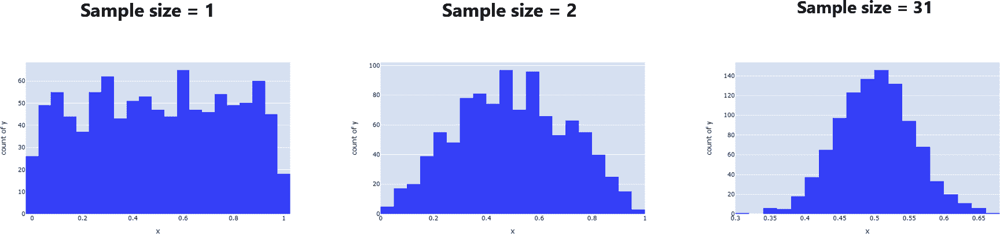
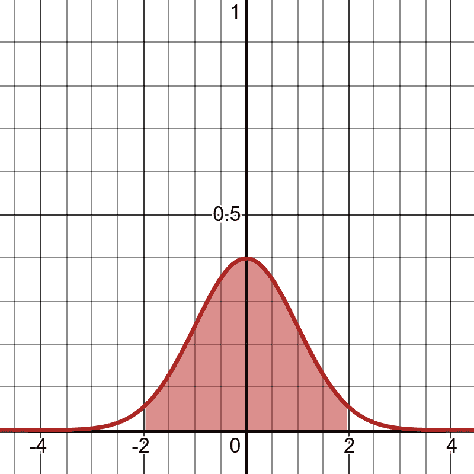
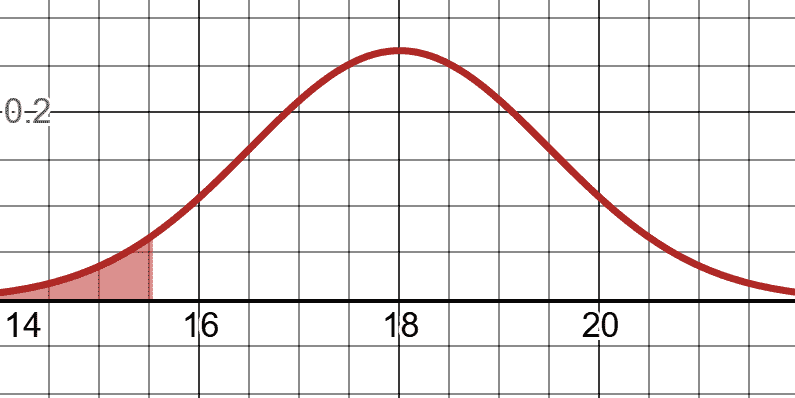

# 第三章。描述性和推断性统计

*统计学*是收集和分析数据以发现有用发现或预测导致这些发现发生的原因的实践。概率在统计学中经常起着重要作用，因为我们使用数据来估计事件发生的可能性。

统计学可能并不总是受到赞誉，但它是许多数据驱动创新的核心。机器学习本身就是一种统计工具，寻找可能的假设来相关不同变量之间的关系。然而，即使对于专业统计学家来说，统计学也存在许多盲点。我们很容易陷入数据所说的内容，而忘记了要问数据来自何处。随着大数据、数据挖掘和机器学习加速推动统计算法的自动化，这些问题变得更加重要。因此，拥有扎实的统计学和假设检验基础非常重要，这样你就不会把这些自动化处理当作黑匣子。

在本节中，我们将介绍统计学和假设检验的基础知识。从描述性统计开始，我们将学习总结数据的常见方法。之后，我们将进入推断统计，试图根据样本揭示总体属性。

# 什么是数据？

定义“数据”可能看起来有些奇怪，因为我们都使用并认为理所当然。但我认为有必要这样做。如果你问任何人数据是什么，他们可能会回答类似于“你知道的...数据！就是...你知道的...信息！”而不会深入探讨。现在它似乎被宣传为至关重要的事物。不仅是真相的来源...还有智慧！这是人工智能的燃料，人们相信你拥有的数据越多，你就拥有的真相就越多。因此，你永远不可能拥有足够的数据。它将揭示重新定义你的业务策略所需的秘密，甚至可能创造人工通用智能。但让我提供一个关于数据是什么的实用观点。数据本身并不重要。数据的分析（以及它是如何产生的）是所有这些创新和解决方案的驱动力。

想象一下，如果你拿到一张一个家庭的照片。你能根据这张照片揭示这个家庭的故事吗？如果你有 20 张照片呢？200 张照片？2,000 张照片？你需要多少张照片才能了解他们的故事？你需要他们在不同情况下的照片吗？一个人和一起的照片？和亲戚朋友在一起的照片？在家里和工作中的照片？

*数据*就像照片一样；它提供了故事的快照。连续的现实和背景并没有完全捕捉到，也没有驱动这个故事的无限数量的变量。正如我们将讨论的，数据可能存在偏见。它可能存在缺口，缺少相关变量。理想情况下，我们希望有无限量的数据捕捉无限数量的变量，有如此之多的细节，我们几乎可以重新创造现实并构建替代现实！但这可能吗？目前，不可能。即使将全球最强大的超级计算机组合在一起，也无法接近以数据形式捕捉整个世界的全部内容。

因此，我们必须缩小范围，使我们的目标变得可行。父亲打高尔夫球的几张战略照片可以很容易地告诉我们他是否擅长高尔夫。但是仅凭照片来解读他的整个人生故事？那可能是不可能的。有很多东西是无法在快照中捕捉到的。这些实际问题也应该在处理数据项目时应用，因为数据实际上只是捕捉特定时间的快照，只捕捉到了它所针对的内容（就像相机一样）。我们需要保持我们的目标集中，这有助于收集相关和完整的数据。如果我们的目标过于宽泛和开放，我们可能会遇到虚假发现和不完整数据集的问题。这种实践，被称为*数据挖掘*，有其时机和地点，但必须小心进行。我们将在本章末重新讨论这个问题。

即使目标明确，我们仍然可能在数据方面遇到问题。让我们回到确定几张战略照片是否能告诉我们父亲是否擅长高尔夫的问题。也许如果你有一张他挥杆中的照片，你就能看出他的动作是否正确。或者也许如果你看到他在一个洞位上欢呼和击掌，你可以推断他得了一个好成绩。也许你只需拍一张他的记分卡的照片！但重要的是要注意所有这些情况都可能是伪造的或脱离了上下文。也许他在为别人欢呼，或者记分卡不是他的，甚至是伪造的。就像这些照片一样，数据并不能捕捉到背景或解释。这是一个非常重要的观点，因为数据提供线索，而不是真相。这些线索可以引导我们找到真相，也可能误导我们得出错误的结论。

这就是为什么对数据来源感到好奇是如此重要的技能。询问数据是如何创建的，由谁创建的，以及数据未捕捉到什么。很容易陷入数据所说的内容而忘记询问数据来自何处。更糟糕的是，有广泛的观点认为可以将数据填入机器学习算法中，并期望计算机解决所有问题。但正如谚语所说，“垃圾进，垃圾出”。难怪根据 VentureBeat 的数据，只有[13%的机器学习项目成功](https://oreil.ly/8hFrO)。成功的机器学习项目对数据进行了思考和分析，以及产生数据的过程。

# 描述性统计与推断性统计

当你听到“统计学”这个词时，你会想到什么？是计算平均值、中位数、众数、图表、钟形曲线和其他用于描述数据的工具吗？这是统计学最常被理解的部分，称为*描述性统计*，我们用它来总结数据。毕竟，浏览百万条数据记录还是对其进行总结更有意义？我们将首先涵盖统计学的这一领域。

*推断性统计*试图揭示关于更大总体的属性，通常基于样本。它经常被误解，比描述性统计更难理解。通常我们对研究一个太大以至无法观察的群体感兴趣（例如，北美地区青少年的平均身高），我们必须仅使用该群体的少数成员来推断关于他们的结论。正如你所猜测的那样，这并不容易做到。毕竟，我们试图用一个可能不具代表性的样本来代表一个总体。我们将在探讨过程中探讨这些警告。

# 总体、样本和偏差

在我们深入研究描述性和推断性统计之前，将一些定义和与之相关的具体示例联系起来可能是一个好主意。

*总体*是我们想要研究的特定感兴趣的群体，比如“北美地区所有 65 岁以上的老年人”，“苏格兰所有金毛猎犬”，或者“洛斯阿尔托斯高中目前的高中二年级学生”。请注意我们对定义总体的边界。有些边界很宽泛，涵盖了广阔地理区域或年龄组的大群体。其他则非常具体和小，比如洛斯阿尔托斯高中的高中二年级学生。如何确定总体的定义取决于你对研究感兴趣的内容。

*样本*是总体的一个理想随机和无偏子集，我们用它来推断总体的属性。我们经常不得不研究样本，因为调查整个总体并不总是可能的。当然，如果人口小且易接触，那么获取一些人口是更容易的。但是测量北美地区所有 65 岁以上的老年人？那不太可能实际可行！

# 总体可以是抽象的！

需要注意的是，人口可以是理论的，而不是实际可触及的。在这些情况下，我们的人口更像是从抽象事物中抽取的样本。这里是我最喜欢的例子：我们对一个机场在下午 2 点到 3 点之间起飞的航班感兴趣，但在那个时间段内的航班数量不足以可靠地预测这些航班的延误情况。因此，我们可能将这个人口视为从所有在下午 2 点到 3 点之间起飞的理论航班中抽取的样本。

这类问题是为什么许多研究人员借助模拟生成数据的原因。模拟可能是有用的，但很少是准确的，因为模拟只捕捉了有限的变量，并且内置了假设。

如果我们要根据样本推断人口的属性，那么样本尽可能随机是很重要的，这样我们才不会扭曲我们的结论。这里举个例子。假设我是亚利桑那州立大学的一名大学生。我想找出美国大学生每周观看电视的平均小时数。我走出宿舍，开始随机询问路过的学生，几个小时后完成了数据收集。问题在哪里？

问题在于我们的学生样本可能存在*偏见*，这意味着它通过过度代表某一群体而牺牲其他群体来扭曲我们的发现。我的研究将人口定义为“美国的大学生”，而不是“亚利桑那州立大学的大学生”。我只是在一个特定大学对学生进行调查，代表整个美国的所有大学生！这真的公平吗？

不太可能全国各地的大学都具有相同的学生属性。如果亚利桑那州立大学的学生比其他大学的学生观看电视时间更长怎么办？使用他们来代表整个国家难道不会扭曲结果吗？也许这是可能的，因为在亚利桑那州的坦佩市通常太热了，所以看电视是一种常见的消遣（据说，我会知道；我在凤凰城住了很多年）。其他气候较温和的地方的大学生可能会进行更多的户外活动，看电视时间更少。

这只是一个可能的变量，说明用一个大学的学生样本来代表整个美国的大学生是一个不好的主意。理想情况下，我应该随机调查全国各地不同大学的大学生。这样我就有了更具代表性的样本。

然而，偏见并不总是地理性的。假设我竭尽全力在全美各地调查学生。我策划了一个社交媒体活动，在 Twitter 和 Facebook 上让各大学分享调查，这样他们的学生就会看到并填写。我收到了数百份关于全国学生电视习惯的回复，觉得我已经征服了偏见的野兽...或者我真的做到了吗？

如果那些足够在社交媒体上看到投票的学生也更有可能看更多电视呢？如果他们在社交媒体上花很多时间，他们可能不介意娱乐性的屏幕时间。很容易想象他们已经准备好在另一个标签上流媒体 Netflix 和 Hulu！这种特定类型的偏见，即特定群体更有可能加入样本的偏见，被称为*自我选择偏差*。

糟糕！你就是赢不了，是吗？如果你足够长时间地考虑，数据偏差似乎是不可避免的！而且通常确实如此。许多*混杂变量*，或者我们没有考虑到的因素，都会影响我们的研究。数据偏差问题昂贵且难以克服，而机器学习尤其容易受到影响。

克服这个问题的方法是真正随机地从整个人口中选择学生，他们不能自愿地加入或退出样本。这是减轻偏见的最有效方法，但正如你所想象的那样，这需要大量协调的资源。

好了，关于人口、样本和偏差的讨论就到此为止。让我们继续进行一些数学和描述性统计。只要记住，数学和计算机不会意识到数据中的偏差。这取决于你作为一名优秀的数据科学专业人员来检测！始终要问关于数据获取方式的问题，然后仔细审查该过程可能如何使数据产生偏差。

# 机器学习中的样本和偏差

这些与抽样和偏差有关的问题也延伸到机器学习领域。无论是线性回归、逻辑回归还是神经网络，都会使用数据样本来推断预测。如果数据存在偏差，那么它将引导机器学习算法做出有偏见的结论。

这方面有许多记录的案例。刑事司法一直是机器学习的一个棘手应用，因为它一再显示出在每个意义上都存在偏见，由于数据集中存在少数族群，导致对少数族群进行歧视。2017 年，沃尔沃测试了训练过捕捉鹿、麋鹿和驯鹿数据集的自动驾驶汽车。然而，它在澳大利亚没有驾驶数据，因此无法识别袋鼠，更不用说理解它们的跳跃动作了！这两个都是有偏见数据的例子。

# 描述性统计

描述性统计是大多数人熟悉的领域。我们将介绍一些基础知识，如均值、中位数和众数，然后是方差、标准差和正态分布。

## 均值和加权均值

*均值*是一组值的平均值。这个操作很简单：将值相加，然后除以值的数量。均值很有用，因为它显示了观察到的一组值的“重心”在哪里。

均值的计算方式对于人口和样本是相同的。示例 3-1 展示了八个值的样本以及如何在 Python 中计算它们的均值。

##### 示例 3-1\. 在 Python 中计算均值

```py
# Number of pets each person owns
sample = [1, 3, 2, 5, 7, 0, 2, 3]

mean = sum(sample) / len(sample)

print(mean) # prints 2.875
```

正如你所看到的，我们对八个人关于他们拥有的宠物数量进行了调查。样本的总和为 23，样本中的项目数为 8，因此这给我们一个均值为 2.875，因为 23/8 = 2.875。

你将看到两个版本的均值：样本均值<math alttext="x overbar"><mover><mi>x</mi> <mo>¯</mo></mover></math>和总体均值<math alttext="mu"><mi>μ</mi></math>如此表达：

<math display="block"><mtable displaystyle="true"><mtr><mtd columnalign="right"><mrow><mover><mi>x</mi> <mo>¯</mo></mover> <mo>=</mo> <mfrac><mrow><msub><mi>x</mi> <mn>1</mn></msub> <mo>+</mo><msub><mi>x</mi> <mn>2</mn></msub> <mo>+</mo><msub><mi>x</mi> <mn>3</mn></msub> <mo>+</mo><mo>.</mo><mo>.</mo><mo>.</mo><mo>+</mo><msub><mi>x</mi> <mi>n</mi></msub></mrow> <mi>n</mi></mfrac> <mo>=</mo> <munderover><mo>∑</mo></munderover> <mfrac><msub><mi>x</mi> <mi>i</mi></msub> <mi>n</mi></mfrac></mrow></mtd></mtr></mtable></math> <math display="block"><mtable displaystyle="true"><mtr><mtd columnalign="right"><mrow><mi>μ</mi> <mo>=</mo> <mfrac><mrow><msub><mi>x</mi> <mn>1</mn></msub> <mo>+</mo><msub><mi>x</mi> <mn>2</mn></msub> <mo>+</mo><msub><mi>x</mi> <mn>3</mn></msub> <mo>+</mo><mo>.</mo><mo>.</mo><mo>.</mo><mo>+</mo><msub><mi>x</mi> <mi>n</mi></msub></mrow> <mi>N</mi></mfrac> <mo>=</mo> <munderover><mo>∑</mo></munderover> <mfrac><msub><mi>x</mi> <mi>i</mi></msub> <mi>N</mi></mfrac></mrow></mtd></mtr></mtable></math>

回想一下求和符号<math alttext="sigma-summation"><mo>∑</mo></math>表示将所有项目相加。*n*和*N*分别代表样本和总体大小，但在数学上它们表示相同的东西：项目的数量。对于称为样本均值<math alttext="x overbar"><mover><mi>x</mi> <mo>¯</mo></mover></math>（“x-bar”）和总体均值<math alttext="mu"><mi>μ</mi></math>（“mu”）的命名也是如此。无论是<math alttext="x overbar"><mover><mi>x</mi> <mo>¯</mo></mover></math>还是<math alttext="mu"><mi>μ</mi></math>都是相同的计算，只是根据我们处理的是样本还是总体而有不同的名称。

均值可能对你来说很熟悉，但关于均值有一些不太为人知的东西：均值实际上是一种称为*加权均值*的加权平均值。我们通常使用的均值给予每个值相同的重要性。但我们可以操纵均值，给每个项目赋予不同的权重：

<math alttext="weighted mean equals StartFraction left-parenthesis x 1 dot w 1 right-parenthesis plus left-parenthesis x 2 dot w 2 right-parenthesis plus left-parenthesis x 3 dot w 3 right-parenthesis plus period period period left-parenthesis x Subscript n Baseline dot w Subscript n Baseline right-parenthesis Over w 1 plus w 2 plus w 3 plus period period period plus w Subscript n Baseline EndFraction" display="block"><mrow><mtext>weighted</mtext> <mtext>mean</mtext> <mo>=</mo> <mfrac><mrow><mrow><mo>(</mo><msub><mi>x</mi> <mn>1</mn></msub> <mo>·</mo><msub><mi>w</mi> <mn>1</mn></msub> <mo>)</mo></mrow><mo>+</mo><mrow><mo>(</mo><msub><mi>x</mi> <mn>2</mn></msub> <mo>·</mo><msub><mi>w</mi> <mn>2</mn></msub> <mo>)</mo></mrow><mo>+</mo><mrow><mo>(</mo><msub><mi>x</mi> <mn>3</mn></msub> <mo>·</mo><msub><mi>w</mi> <mn>3</mn></msub> <mo>)</mo></mrow><mo>+</mo><mo>.</mo><mo>.</mo><mo>.</mo><mrow><mo>(</mo><msub><mi>x</mi> <mi>n</mi></msub> <mo>·</mo><msub><mi>w</mi> <mi>n</mi></msub> <mo>)</mo></mrow></mrow> <mrow><msub><mi>w</mi> <mn>1</mn></msub> <mo>+</mo><msub><mi>w</mi> <mn>2</mn></msub> <mo>+</mo><msub><mi>w</mi> <mn>3</mn></msub> <mo>+</mo><mo>.</mo><mo>.</mo><mo>.</mo><mo>+</mo><msub><mi>w</mi> <mi>n</mi></msub></mrow></mfrac></mrow></math>

当我们希望某些值对均值的贡献大于其他值时，这将会很有帮助。一个常见的例子是对学术考试进行加权以得出最终成绩。如果你有三次考试和一次期末考试，我们给予每次考试 20%的权重，期末考试 40%的权重，我们如何表达它在示例 3-2 中。

##### 示例 3-2. 在 Python 中计算加权均值

```py
# Three exams of .20 weight each and final exam of .40 weight
sample = [90, 80, 63, 87]
weights = [.20, .20, .20, .40]

weighted_mean = sum(s * w for s,w in zip(sample, weights)) / sum(weights)

print(weighted_mean) # prints 81.4
```

我们通过相应的乘法对每个考试分数进行加权，而不是通过值计数进行除法，而是通过权重总和进行除法。权重不必是百分比，因为用于权重的任何数字最终都将被比例化。在示例 3-3 中，我们对每个考试赋予“1”的权重，但对最终考试赋予“2”的权重，使其比考试的权重大一倍。我们仍然会得到相同的答案 81.4，因为这些值仍然会被比例化。

##### 示例 3-3\. 在 Python 中计算加权平均值

```py
# Three exams of .20 weight each and final exam of .40 weight
sample = [90, 80, 63, 87]
weights = [1.0, 1.0, 1.0, 2.0]

weighted_mean = sum(s * w for s,w in zip(sample, weights)) / sum(weights)

print(weighted_mean) # prints 81.4
```

## 中位数

*中位数*是一组有序值中间最靠近的值。您按顺序排列值，中位数将是中间的值。如果您有偶数个值，您将平均两个中间值。我们可以看到在示例 3-4 中，我们样本中拥有的宠物数量的中位数为 7：

```py
0, 1, 5, *7*, 9, 10, 14
```

##### 示例 3-4\. 在 Python 中计算中位数

```py
# Number of pets each person owns
sample = [0, 1, 5, 7, 9, 10, 14]

def median(values):
    ordered = sorted(values)
    print(ordered)
    n = len(ordered)
    mid = int(n / 2) - 1 if n % 2 == 0 else int(n/2)

    if n % 2 == 0:
        return (ordered[mid] + ordered[mid+1]) / 2.0
    else:
        return ordered[mid]

print(median(sample)) # prints 7
```

当数据被*异常值*或与其他值相比极端大和小的值所扭曲时，中位数可以成为均值的有用替代。这里有一个有趣的轶事来理解为什么。1986 年，北卡罗来纳大学教堂山分校地理学毕业生的年起薪平均值为$250,000。其他大学平均为$22,000。哇，UNC-CH 一定有一个了不起的地理学项目！

但实际上，为什么北卡罗来纳大学的地理学项目如此赚钱呢？嗯...迈克尔·乔丹是他们的毕业生之一。确实，有史以来最著名的 NBA 球员之一，确实是从北卡罗来纳大学获得地理学学位的。然而，他开始他的职业生涯是打篮球，而不是学习地图。显然，这是一个造成了巨大异常值的混杂变量，它严重扭曲了收入平均值。

这就是为什么在受异常值影响较大的情况下（例如与收入相关的数据）中，中位数可能比均值更可取。它对异常值不太敏感，并严格根据它们的相对顺序将数据划分到中间，而不是准确地落在数字线上。当您的中位数与均值非常不同时，这意味着您的数据集具有异常值。

## 众数

*众数*是出现频率最高的一组值。当您的数据重复时，想要找出哪些值出现最频繁时，它就变得很有用。

当没有任何值出现超过一次时，就没有众数。当两个值出现的频率相等时，数据集被认为是*双峰的*。在示例 3-5 中，我们计算了我们的宠物数据集的众数，果然我们看到这是双峰的，因为 2 和 3 都出现最多（并且相等）。

##### 示例 3-5\. 在 Python 中计算众数

```py
# Number of pets each person owns
from collections import defaultdict

sample = [1, 3, 2, 5, 7, 0, 2, 3]

def mode(values):
    counts = defaultdict(lambda: 0)

    for s in values:
        counts[s] += 1

    max_count = max(counts.values())
    modes = [v for v in set(values) if counts[v] == max_count]
    return modes

print(mode(sample)) # [2, 3]
```

在实际应用中，除非您的数据重复，否则众数不经常使用。这通常在整数、类别和其他离散变量中遇到。

## 方差和标准差

当我们开始讨论方差和标准差时，这就变得有趣起来了。方差和标准差让人们感到困惑的一点是，对于样本和总体有一些计算差异。我们将尽力清楚地解释这些差异。

### 总体方差和标准差

在描述数据时，我们经常对测量平均值和每个数据点之间的差异感兴趣。这让我们对数据的“分布”有了一种感觉。

假设我对研究我的工作人员拥有的宠物数量感兴趣（请注意，我将这定义为我的总体，而不是样本）。我的工作人员有七个人。

我取得他们拥有的所有宠物数量的平均值，我得到 6.571。让我们从每个值中减去这个平均值。这将展示给我们每个值距离平均值有多远，如表 3-1 所示。

表 3-1. 我的员工拥有的宠物数量

| Value | Mean | Difference |
| --- | --- | --- |
| 0 | 6.571 | -6.571 |
| 1 | 6.571 | -5.571 |
| 5 | 6.571 | -1.571 |
| 7 | 6.571 | 0.429 |
| 9 | 6.571 | 2.429 |
| 10 | 6.571 | 3.429 |
| 14 | 6.571 | 7.429 |

让我们在数轴上用“X”表示平均值来可视化这一点，见图 3-1。


###### 图 3-1. 可视化我们数据的分布，其中“X”是平均值

嗯...现在考虑为什么这些信息有用。这些差异让我们了解数据的分布情况以及值距离平均值有多远。有没有一种方法可以将这些差异合并成一个数字，快速描述数据的分布情况？

你可能会想要取这些差异的平均值，但当它们相加时，负数和正数会互相抵消。我们可以对绝对值求和（去掉负号并使所有值为正）。一个更好的方法是在求和之前对这些差异进行平方。这不仅消除了负值（因为平方一个负数会使其变为正数），而且放大了较大的差异，并且在数学上更容易处理（绝对值的导数不直观）。之后，对平方差异取平均值。这将给我们*方差*，一个衡量数据分布范围的指标。

这里是一个数学公式，展示如何计算方差：

<math alttext="population variance equals StartFraction left-parenthesis x 1 minus m e a n right-parenthesis squared plus left-parenthesis x 2 minus m e a n right-parenthesis squared plus period period period plus left-parenthesis x Subscript n Baseline minus m e a n right-parenthesis squared Over upper N EndFraction" display="block"><mrow><mtext>population</mtext> <mtext>variance</mtext> <mo>=</mo> <mfrac><mrow><msup><mrow><mo>(</mo><msub><mi>x</mi> <mn>1</mn></msub> <mo>-</mo><mi>m</mi><mi>e</mi><mi>a</mi><mi>n</mi><mo>)</mo></mrow> <mn>2</mn></msup> <mo>+</mo><msup><mrow><mo>(</mo><msub><mi>x</mi> <mn>2</mn></msub> <mo>-</mo><mi>m</mi><mi>e</mi><mi>a</mi><mi>n</mi><mo>)</mo></mrow> <mn>2</mn></msup> <mo>+</mo><mo>.</mo><mo>.</mo><mo>.</mo><mo>+</mo><msup><mrow><mo>(</mo><msub><mi>x</mi> <mi>n</mi></msub> <mo>-</mo><mi>m</mi><mi>e</mi><mi>a</mi><mi>n</mi><mo>)</mo></mrow> <mn>2</mn></msup></mrow> <mi>N</mi></mfrac></mrow></math>

更正式地，这是总体的方差：

<math alttext="sigma squared equals StartFraction sigma-summation left-parenthesis x Subscript i Baseline minus mu right-parenthesis squared Over upper N EndFraction" display="block"><mrow><msup><mi>σ</mi> <mn>2</mn></msup> <mo>=</mo> <mfrac><mrow><mo>∑</mo><msup><mrow><mo>(</mo><msub><mi>x</mi> <mi>i</mi></msub> <mo>-</mo><mi>μ</mi><mo>)</mo></mrow> <mn>2</mn></msup></mrow> <mi>N</mi></mfrac></mrow></math>

在 Python 中计算我们宠物示例的总体方差在示例 3-6 中展示。

##### 示例 3-6. 在 Python 中计算方差

```py
# Number of pets each person owns
data = [0, 1, 5, 7, 9, 10, 14]

def variance(values):
    mean = sum(values) / len(values)
    _variance = sum((v - mean) ** 2 for v in values) / len(values)
    return _variance

print(variance(data))  # prints 21.387755102040813
```

因此，我的办公室员工拥有的宠物数量的方差为 21.387755。好的，但这到底意味着什么？可以合理地得出结论，更高的方差意味着更广泛的分布，但我们如何将其与我们的数据联系起来？这个数字比我们的任何观察结果都要大，因为我们进行了大量的平方和求和，将其放在完全不同的度量标准上。那么我们如何将其压缩回原来的尺度？

平方的反面是平方根，所以让我们取方差的平方根，得到*标准差*。这是将方差缩放为以“宠物数量”表示的数字，这使得它更有意义：

<math alttext="sigma equals StartRoot StartFraction sigma-summation left-parenthesis x Subscript i Baseline minus mu right-parenthesis squared Over upper N EndFraction EndRoot" display="block"><mrow><mi>σ</mi> <mo>=</mo> <msqrt><mfrac><mrow><mo>∑</mo><msup><mrow><mo>(</mo><msub><mi>x</mi> <mi>i</mi></msub> <mo>-</mo><mi>μ</mi><mo>)</mo></mrow> <mn>2</mn></msup></mrow> <mi>N</mi></mfrac></msqrt></mrow></math>

要在 Python 中实现，我们可以重用`variance()`函数并对其结果进行`sqrt()`。现在我们有了一个`std_dev()`函数，如示例 3-7 所示。

##### 示例 3-7\. 在 Python 中计算标准差

```py
from math import sqrt

# Number of pets each person owns
data = [0, 1, 5, 7, 9, 10, 14]

def variance(values):
    mean = sum(values) / len(values)
    _variance = sum((v - mean) ** 2 for v in values) / len(values)
    return _variance

def std_dev(values):
    return sqrt(variance(values))

print(std_dev(data))  # prints 4.624689730353898
```

运行示例 3-7 中的代码，你会看到我们的标准差约为 4.62 只宠物。因此，我们可以用我们开始的尺度来表示我们的扩散，这使得我们的方差更容易解释。我们将在第五章中看到标准差的一些重要应用。

# 为什么是平方？

关于方差，如果<math alttext="sigma squared"><msup><mi>σ</mi> <mn>2</mn></msup></math>中的指数让你感到困扰，那是因为它提示你对其进行平方根运算以获得标准差。这是一个小小的提醒，告诉你正在处理需要进行平方根运算的平方值。

### 样本方差和标准差

在前一节中，我们讨论了总体的方差和标准差。然而，当我们为样本计算这两个公式时，我们需要应用一个重要的调整：

<math display="block"><mtable displaystyle="true"><mtr><mtd columnalign="right"><mrow><msup><mi>s</mi> <mn>2</mn></msup> <mo>=</mo> <mfrac><mrow><mo>∑</mo><msup><mrow><mo>(</mo><msub><mi>x</mi> <mi>i</mi></msub> <mo>-</mo><mover><mi>x</mi> <mo>¯</mo></mover><mo>)</mo></mrow> <mn>2</mn></msup></mrow> <mrow><mi>n</mi><mo>-</mo><mn>1</mn></mrow></mfrac></mrow></mtd></mtr></mtable></math> <math display="block"><mtable displaystyle="true"><mtr><mtd columnalign="right"><mrow><mi>s</mi> <mo>=</mo> <msqrt><mfrac><mrow><mo>∑</mo><msup><mrow><mo>(</mo><msub><mi>x</mi> <mi>i</mi></msub> <mo>-</mo><mover><mi>x</mi> <mo>¯</mo></mover><mo>)</mo></mrow> <mn>2</mn></msup></mrow> <mrow><mi>n</mi><mo>-</mo><mn>1</mn></mrow></mfrac></msqrt></mrow></mtd></mtr></mtable></math>

你注意到了区别吗？当我们对平方差值求平均时，我们除以*n*-1 而不是总项目数*n*。为什么要这样做？我们这样做是为了减少样本中的任何偏差，不低估基于我们的样本的总体方差。通过在除数中计算少一个项目的值，我们增加了方差，因此捕捉到了样本中更大的不确定性。

如果我们的宠物数据是一个样本，而不是一个总体，我们应相应地进行调整。在示例 3-8 中，我修改了之前的`variance()`和`std_dev()` Python 代码，可选择提供一个参数`is_sample`，如果为`True`，则从方差的除数中减去 1。

##### 示例 3-8\. 计算样本的标准差

```py
from math import sqrt

# Number of pets each person owns
data = [0, 1, 5, 7, 9, 10, 14]

def variance(values, is_sample: bool = False):
    mean = sum(values) / len(values)
    _variance = sum((v - mean) ** 2 for v in values) /
      (len(values) - (1 if is_sample else 0))

    return _variance

def std_dev(values, is_sample: bool = False):
    return sqrt(variance(values, is_sample))

print("VARIANCE = {}".format(variance(data, is_sample=True))) # 24.95238095238095
print("STD DEV = {}".format(std_dev(data, is_sample=True))) # 4.99523582550223
```

请注意，在示例 3-8 中，我的方差和标准差与之前将它们视为总体而不是样本的示例相比有所增加。回想一下，在示例 3-7 中，将其视为总体时，标准差约为 4.62。但是在这里将其视为样本（通过从方差分母中减去 1），我们得到的值约为 4.99。这是正确的，因为样本可能存在偏差，不完全代表总体。因此，我们增加方差（从而增加标准差）以增加对值分布范围的估计。较大的方差/标准差显示出较大范围的不确定性。

就像均值（样本为 <math alttext="x overbar"><mover><mi>x</mi> <mo>¯</mo></mover></math>，总体为 <math alttext="mu"><mi>μ</mi></math>），你经常会看到一些符号表示方差和标准差。样本和均值的标准差分别由*s*和<math alttext="sigma"><mi>σ</mi></math>指定。这里再次是样本和总体标准差的公式：

<math display="block"><mtable displaystyle="true"><mtr><mtd columnalign="right"><mrow><mi>s</mi> <mo>=</mo> <msqrt><mfrac><mrow><mo>∑</mo><msup><mrow><mo>(</mo><msub><mi>x</mi> <mi>i</mi></msub> <mo>-</mo><mover><mi>x</mi> <mo>¯</mo></mover><mo>)</mo></mrow> <mn>2</mn></msup></mrow> <mrow><mi>n</mi><mo>-</mo><mn>1</mn></mrow></mfrac></msqrt></mrow></mtd></mtr></mtable></math> <math display="block"><mtable displaystyle="true"><mtr><mtd columnalign="right"><mrow><mi>σ</mi> <mo>=</mo> <msqrt><mfrac><mrow><mo>∑</mo><msup><mrow><mo>(</mo><msub><mi>x</mi> <mi>i</mi></msub> <mo>-</mo><mi>μ</mi><mo>)</mo></mrow> <mn>2</mn></msup></mrow> <mi>N</mi></mfrac></msqrt></mrow></mtd></mtr></mtable></math>

方差将是这两个公式的平方，撤销平方根。因此，样本和总体的方差分别为<math alttext="s squared"><msup><mi>s</mi> <mn>2</mn></msup></math>和<math alttext="sigma squared"><msup><mi>σ</mi> <mn>2</mn></msup></math>： 

<math display="block"><mtable displaystyle="true"><mtr><mtd columnalign="right"><mrow><msup><mi>s</mi> <mn>2</mn></msup> <mo>=</mo> <mfrac><mrow><mo>∑</mo><msup><mrow><mo>(</mo><msub><mi>x</mi> <mi>i</mi></msub> <mo>-</mo><mover><mi>x</mi> <mo>¯</mo></mover><mo>)</mo></mrow> <mn>2</mn></msup></mrow> <mrow><mi>n</mi><mo>-</mo><mn>1</mn></mrow></mfrac></mrow></mtd></mtr></mtable></math> <math display="block"><mtable displaystyle="true"><mtr><mtd columnalign="right"><mrow><msup><mi>σ</mi> <mn>2</mn></msup> <mo>=</mo> <mfrac><mrow><mo>∑</mo><msup><mrow><mo>(</mo><msub><mi>x</mi> <mi>i</mi></msub> <mo>-</mo><mi>μ</mi><mo>)</mo></mrow> <mn>2</mn></msup></mrow> <mi>N</mi></mfrac></mrow></mtd></mtr></mtable></math>

再次，平方有助于暗示应该取平方根以获得标准差。

## 正态分布

在上一章中我们提到了概率分布，特别是二项分布和贝塔分布。然而，最著名的分布是正态分布。*正态分布*，也称为*高斯分布*，是一种对称的钟形分布，大部分质量集中在均值附近，其传播程度由标准差定义。两侧的“尾巴”随着远离均值而变得更细。

图 3-2 是金毛犬体重的正态分布。请注意，大部分质量集中在 64.43 磅的均值附近。


###### 图 3-2\. 一个正态分布

### 发现正态分布

正态分布在自然界、工程、科学和其他领域中经常出现。我们如何发现它呢？假设我们对 50 只成年金毛犬的体重进行抽样，并将它们绘制在数轴上，如图 3-3 所示。


###### 图 3-3\. 50 只金毛犬体重的样本

请注意，我们在中心附近有更多的值，但随着向左或向右移动，我们看到的值越来越少。根据我们的样本，看起来我们很不可能看到体重为 57 或 71 磅的金毛犬。但体重为 64 或 65 磅？是的，这显然很可能。

有没有更好的方法来可视化这种可能性，以查看我们更有可能从人群中抽样到哪些金毛犬的体重？我们可以尝试创建一个*直方图*，它根据相等长度的数值范围将值分组（或“箱”），然后使用柱状图显示每个范围内的值的数量。在图 3-4 中，我们创建了一个将值分组为 0.5 磅范围的直方图。

这个直方图并没有显示出数据的任何有意义的形状。原因是因为我们的箱太小了。我们没有足够大或无限的数据量来有意义地在每个箱中有足够的点。因此，我们必须使我们的箱更大。让我们使每个箱的长度为三磅，如图 3-5 所示。


###### 图 3-4\. 一张金毛犬体重的直方图


###### 图 3-5\. 一个更有意义的直方图

现在我们有了进展！正如你所看到的，如果我们将箱的大小调整得恰到好处（在本例中，每个箱的范围为三磅），我们开始在数据中看到一个有意义的钟形。这不是一个完美的钟形，因为我们的样本永远不会完全代表人群，但这很可能是我们的样本遵循正态分布的证据。如果我们使用适当的箱大小拟合一个直方图，并将其缩放为面积为 1.0（这是概率分布所需的），我们会看到一个粗略的钟形曲线代表我们的样本。让我们在图 3-6 中将其与我们的原始数据点一起展示。

看着这个钟形曲线，我们可以合理地期望金毛寻回犬的体重最有可能在 64.43（均值）左右，但在 55 或 73 时不太可能。比这更极端的情况变得非常不太可能。


###### 图 3-6。拟合到数据点的正态分布

### 正态分布的性质

正态分布具有几个重要的属性，使其有用：

+   它是对称的；两侧在均值处完全镜像，这就是中心。

+   大部分质量在均值周围的中心。

+   它具有由标准偏差指定的传播（狭窄或宽广）。

+   “尾部”是最不可能的结果，并且无限接近于零，但永远不会触及零。

+   它类似于自然和日常生活中的许多现象，甚至由于中心极限定理而概括了非正态问题，我们很快会谈论到。

### 概率密度函数（PDF）

标准偏差在正态分布中起着重要作用，因为它定义了它的“扩散程度”。实际上，它是与均值一起的参数之一。创建正态分布的*概率密度函数（PDF）*如下：

<math alttext="f left-parenthesis x right-parenthesis equals StartFraction 1 Over sigma EndFraction asterisk StartRoot 2 pi EndRoot asterisk e Superscript minus one-half left-parenthesis StartFraction x minus mu Over sigma EndFraction squared right-parenthesis" display="block"><mrow><mi>f</mi> <mrow><mo>(</mo> <mi>x</mi> <mo>)</mo></mrow> <mo>=</mo> <mfrac><mn>1</mn> <mi>σ</mi></mfrac> <mo>*</mo> <msqrt><mrow><mn>2</mn> <mi>π</mi></mrow></msqrt> <mo>*</mo> <msup><mi>e</mi> <mrow><mo>-</mo><mfrac><mn>1</mn> <mn>2</mn></mfrac><mrow><mo>(</mo><msup><mfrac><mrow><mi>x</mi><mo>-</mo><mi>μ</mi></mrow> <mi>σ</mi></mfrac> <mn>2</mn></msup> <mo>)</mo></mrow></mrow></msup></mrow></math>

哇，这真是一个冗长的话题，不是吗？我们甚至在第一章中看到我们的朋友欧拉数<math alttext="e"><mi>e</mi></math>和一些疯狂的指数。这是我们如何在 Python 中表达它的示例 3-9。

##### 示例 3-9。Python 中的正态分布函数

```py
# normal distribution, returns likelihood
def normal_pdf(x: float, mean: float, std_dev: float) -> float:
    return (1.0 / (2.0 * math.pi * std_dev ** 2) ** 0.5) *
        math.exp(-1.0 * ((x - mean) ** 2 / (2.0 * std_dev ** 2)))
```

这个公式中有很多要解开的内容，但重要的是它接受均值和标准偏差作为参数，以及一个 x 值，这样你就可以查找给定值的可能性。

就像第二章中的贝塔分布一样，正态分布是连续的。这意味着要获取一个概率，我们需要积分一系列*x*值以找到一个区域。

实际上，我们将使用 SciPy 来为我们进行这些计算。

### 累积分布函数（CDF）

对于正态分布，垂直轴不是概率，而是数据的可能性。要找到概率，我们需要查看一个给定范围，然后找到该范围下曲线的面积。假设我想找到金毛寻回犬体重在 62 到 66 磅之间的概率。图 3-7 显示了我们要找到面积的范围。


###### 图 3-7。测量 62 到 66 磅之间概率的 CDF

我们已经在第二章中用贝塔分布完成了这个任务，就像贝塔分布一样，这里也有一个累积密度函数（CDF）。让我们遵循这种方法。

正如我们在上一章中学到的，CDF 提供了给定分布的给定 x 值的面积*直到*。让我们看看我们的金毛寻回犬正态分布的 CDF 是什么样子，并将其与 PDF 放在图 3-8 中进行参考。


###### 图 3-8\. PDF 与其 CDF 并排

注意两个图之间的关系。CDF 是一个 S 形曲线（称为 Sigmoid 曲线），它在 PDF 中投影到该范围的面积。观察图 3-9，当我们捕捉从负无穷到 64.43（均值）的面积时，我们的 CDF 显示的值恰好为.5 或 50%！


###### 图 3-9\. 金毛寻回犬体重的 PDF 和 CDF，测量均值的概率

这个区域的面积为 0.5 或 50%，这是由于我们正态分布的对称性，我们可以期望钟形曲线的另一侧也有 50%的面积。

要在 Python 中使用 SciPy 计算到 64.43 的面积，使用`norm.cdf()`函数，如示例 3-10 所示。

##### 示例 3-10\. Python 中的正态分布 CDF

```py
from scipy.stats import norm

mean = 64.43
std_dev = 2.99

x = norm.cdf(64.43, mean, std_dev)

print(x) # prints 0.5
```

就像我们在第二章中所做的那样，我们可以通过减去面积来演绎地找到中间范围的面积。如果我们想找到 62 到 66 磅之间观察到金毛寻回犬的概率，我们将计算到 66 的面积并减去到 62 的面积，如图 3-10 所示。


###### 图 3-10\. 寻找中间范围的概率

在 Python 中使用 SciPy 进行这个操作就像在示例 3-11 中所示的两个 CDF 操作相减一样简单。

##### 示例 3-11\. 使用 CDF 获取中间范围概率

```py
from scipy.stats import norm

mean = 64.43
std_dev = 2.99

x = norm.cdf(66, mean, std_dev) - norm.cdf(62, mean, std_dev)

print(x) # prints 0.4920450147062894
```

你应该发现在 62 到 66 磅之间观察到金毛寻回犬的概率为 0.4920，或者大约为 49.2%。

## 逆 CDF

当我们在本章后面开始进行假设检验时，我们会遇到需要查找 CDF 上的一个区域然后返回相应 x 值的情况。当然，这是对 CDF 的反向使用，所以我们需要使用逆 CDF，它会翻转轴，如图 3-11 所示。

这样，我们现在可以查找一个概率然后返回相应的 x 值，在 SciPy 中我们会使用`norm.ppf()`函数。例如，我想找到 95%的金毛寻回犬体重在以下。当我使用示例 3-12 中的逆 CDF 时，这很容易做到。


###### 图 3-11\. 逆 CDF，也称为 PPF 或分位数函数

##### 示例 3-12\. 在 Python 中使用逆 CDF（称为`ppf()`）

```py
from scipy.stats import norm

x = norm.ppf(.95, loc=64.43, scale=2.99)
print(x) # 69.3481123445849
```

我发现 95%的金毛寻回犬体重为 69.348 磅或更少。

你也可以使用逆 CDF 生成遵循正态分布的随机数。如果我想创建一个模拟，生成一千个真实的金毛寻回犬体重，我只需生成一个介于 0.0 和 1.0 之间的随机值，传递给逆 CDF，然后返回体重值，如示例 3-13 所示。

##### 示例 3-13\. 从正态分布生成随机数

```py
import random
from scipy.stats import norm

for i in range(0,1000):
    random_p = random.uniform(0.0, 1.0)
    random_weight = norm.ppf(random_p,  loc=64.43, scale=2.99)
    print(random_weight)
```

当然，NumPy 和其他库可以为您生成分布的随机值，但这突出了逆 CDF 很方便的一个用例。

# 从头开始实现 CDF 和逆 CDF

要学习如何在 Python 中从头开始实现 CDF 和逆 CDF，请参考附录 A。

## Z 分数

将正态分布重新缩放，使均值为 0，标准差为 1 是很常见的，这被称为*标准正态分布*。这样可以轻松比较一个正态分布的扩展与另一个正态分布，即使它们具有不同的均值和方差。

特别重要的是，标准正态分布将所有 x 值表示为标准差，称为*Z 分数*。将 x 值转换为 Z 分数使用基本的缩放公式：

<math alttext="dollar-sign z equals StartFraction x minus mu Over sigma EndFraction dollar-sign"><mrow><mi>z</mi> <mo>=</mo> <mfrac><mrow><mi>x</mi><mo>-</mo><mi>μ</mi></mrow> <mi>σ</mi></mfrac></mrow></math>

这是一个例子。我们有两个来自两个不同社区的房屋。社区 A 的平均房屋价值为$140,000，标准差为$3,000。社区 B 的平均房屋价值为$800,000，标准差为$10,000。

<math display="block"><mrow><msub><mi>μ</mi> <mi>A</mi></msub> <mo>=</mo> <mn>140,000</mn></mrow></math> <math display="block"><mrow><msub><mi>μ</mi> <mi>B</mi></msub> <mo>=</mo> <mn>800,000</mn></mrow></math> <math display="block"><mrow><msub><mi>σ</mi> <mi>A</mi></msub> <mo>=</mo> <mn>3,000</mn></mrow></math> <math display="block"><mrow><msub><mi>σ</mi> <mi>B</mi></msub> <mo>=</mo> <mn>10,000</mn></mrow></math>

现在我们有两个来自每个社区的房屋。社区 A 的房屋价值为$150,000，社区 B 的房屋价值为$815,000。哪个房屋相对于其社区的平均房屋更昂贵？

<math display="block"><mrow><msub><mi>x</mi> <mi>A</mi></msub> <mo>=</mo> <mn>150,000</mn></mrow></math> <math display="block"><mrow><msub><mi>x</mi> <mi>B</mi></msub> <mo>=</mo> <mn>815,000</mn></mrow></math>

如果我们将这两个值用标准差表示，我们可以相对于每个社区的均值进行比较。使用 Z 分数公式：

<math display="block"><mtable displaystyle="true"><mtr><mtd columnalign="right"><mrow><mi>z</mi> <mo>=</mo> <mfrac><mrow><mi>x</mi><mo>-</mo><mtext>mean</mtext></mrow> <mrow><mtext>standard</mtext><mtext>deviation</mtext></mrow></mfrac></mrow></mtd></mtr></mtable></math> <math display="block"><mtable displaystyle="true"><mtr><mtd columnalign="right"><mrow><msub><mi>z</mi> <mi>A</mi></msub> <mo>=</mo> <mfrac><mrow><mn>150000</mn><mo>-</mo><mn>140000</mn></mrow> <mn>3000</mn></mfrac> <mo>=</mo> <mn>3.</mn> <mover><mn>333</mn> <mo>¯</mo></mover></mrow></mtd></mtr></mtable></math> <math display="block"><mtable displaystyle="true"><mtr><mtd columnalign="right"><mrow><msub><mi>z</mi> <mi>B</mi></msub> <mo>=</mo> <mfrac><mrow><mn>815000</mn><mo>-</mo><mn>800000</mn></mrow> <mn>10000</mn></mfrac> <mo>=</mo> <mn>1.5</mn></mrow></mtd></mtr></mtable></math>

因此，A 社区的房屋实际上相对于其社区要昂贵得多，因为它们的 Z 分数分别为<math display="inline"><mrow><mn>3.</mn> <mover><mn>333</mn> <mo>¯</mo></mover></mrow></math>和 1.5。

下面是我们如何将来自具有均值和标准差的给定分布的 x 值转换为 Z 分数，反之亦然，如示例 3-14 所示。

##### 示例 3-14\. 将 Z 分数转换为 x 值，反之亦然

```py
def z_score(x, mean, std):
    return (x - mean) / std

def z_to_x(z, mean, std):
    return (z * std) + mean

mean = 140000
std_dev = 3000
x = 150000

# Convert to Z-score and then back to X
z = z_score(x, mean, std_dev)
back_to_x = z_to_x(z, mean, std_dev)

print("Z-Score: {}".format(z))  # Z-Score: 3.333
print("Back to X: {}".format(back_to_x))  # Back to X: 150000.0
```

`z_score()`函数将接受一个 x 值，并根据均值和标准差将其按标准偏差进行缩放。`z_to_x()`函数将接受一个 Z 分数，并将其转换回 x 值。研究这两个函数，你可以看到它们的代数关系，一个解决 Z 分数，另一个解决 x 值。然后，我们将一个 x 值为 8.0 转换为<math display="inline"><mrow><mn>3.</mn> <mover><mn>333</mn> <mo>¯</mo></mover></mrow></math>的 Z 分数，然后将该 Z 分数转换回 x 值。

# 推断统计学

我们迄今为止所涵盖的描述性统计学是常见的。然而，当我们涉及推断统计学时，样本和总体之间的抽象关系得以充分发挥。这些抽象的微妙之处不是你想要匆忙通过的，而是要花时间仔细吸收。正如前面所述，我们作为人类有偏见，很快就会得出结论。成为一名优秀的数据科学专业人员需要你抑制那种原始的欲望，并考虑其他解释可能存在的可能性。推测没有任何解释，某一发现只是巧合和随机的也是可以接受的（也许甚至是开明的）。

首先让我们从为所有推断统计学奠定基础的定理开始。

## 中心极限定理

正态分布之所以有用的原因之一是因为它在自然界中经常出现，比如成年金毛犬的体重。然而，在自然人口之外的更迷人的背景下，它也会出现。当我们开始从人口中抽取足够大的样本时，即使该人口不遵循正态分布，正态分布仍然会出现。

假设我正在测量一个真正随机且均匀的人口。0.0 到 1.0 之间的任何值都是同等可能的，没有任何值有任何偏好。但当我们从这个人口中抽取越来越大的样本，计算每个样本的平均值，然后将它们绘制成直方图时，会发生一些有趣的事情。在示例 3-15 中运行这段 Python 代码，并观察图 3-12 中的图表。

##### 示例 3-15\. 在 Python 中探索中心极限定理

```py
# Samples of the uniform distribution will average out to a normal distribution.
import random
import plotly.express as px

sample_size = 31
sample_count = 1000

# Central limit theorem, 1000 samples each with 31
# random numbers between 0.0 and 1.0
x_values = [(sum([random.uniform(0.0, 1.0) for i in range(sample_size)]) / \
    sample_size)
            for _ in range(sample_count)]

y_values = [1 for _ in range(sample_count)]

px.histogram(x=x_values, y = y_values, nbins=20).show()
```


###### 图 3-12\. 取样本均值（每个大小为 31）并绘制它们

等等，当作为 31 个一组的均匀随机数取样然后求平均时，为什么会大致形成正态分布？任何数字都是等可能的，对吧？分布不应该是平坦的而不是钟形曲线吗？

发生了什么呢？样本中的单个数字本身不会产生正态分布。分布将是平坦的，其中任何数字都是等可能的（称为*均匀分布*）。但当我们将它们作为样本分组并求平均时，它们形成一个正态分布。

这是因为*中心极限定理*，它表明当我们对一个人口取足够大的样本，计算每个样本的均值，并将它们作为一个分布绘制时，会发生有趣的事情：

1.  样本均值的平均值等于总体均值。

1.  如果总体是正态的，那么样本均值将是正态的。

1.  如果总体不是正态分布，但样本量大于 30，样本均值仍然会大致形成正态分布。

1.  样本均值的标准差等于总体标准差除以*n*的平方根：

<math alttext="dollar-sign sample standard deviation equals StartFraction population standard deviation Over StartRoot sample size EndRoot EndFraction dollar-sign"><mrow><mtext>sample</mtext> <mtext>standard</mtext> <mtext>deviation</mtext> <mo>=</mo> <mfrac><mrow><mtext>population</mtext><mtext>standard</mtext><mtext>deviation</mtext></mrow> <msqrt><mrow><mtext>sample</mtext><mtext>size</mtext></mrow></msqrt></mfrac></mrow></math>

为什么上述所有内容很重要？这些行为使我们能够根据样本推断出关于人口的有用信息，即使对于非正态分布的人口也是如此。如果你修改前面的代码并尝试较小的样本量，比如 1 或 2，你将看不到正态分布出现。但当你接近 31 或更多时，你会看到我们收敛到一个正态分布，如图 3-13 所示。



###### 图 3-13。较大的样本量接近正态分布

三十一是统计学中的教科书数字，因为这时我们的样本分布通常会收敛到总体分布，特别是当我们测量样本均值或其他参数时。当你的样本少于 31 个时，这时你必须依赖 T 分布而不是正态分布，随着样本量的减小，正态分布的尾部会变得越来越厚。我们稍后会简要讨论这一点，但首先让我们假设在谈论置信区间和检验时，我们的样本至少有 31 个。

## 置信区间

你可能听过“置信区间”这个术语，这经常让统计新手和学生感到困惑。*置信区间*是一个范围计算，显示我们有多大信心相信样本均值（或其他参数）落在总体均值的范围内。

*基于 31 只金毛猎犬的样本，样本均值为 64.408，样本标准差为 2.05，我有 95%的信心总体均值在 63.686 和 65.1296 之间。* 我怎么知道这个？让我告诉你，如果你感到困惑，回到这段话，记住我们试图实现什么。我有意突出了它！

我首先选择一个*置信水平（LOC）*，这将包含所需概率的总体均值范围。我希望有 95%的信心，我的样本均值落在我将计算的总体均值范围内。这就是我的 LOC。我们可以利用中心极限定理并推断出总体均值的这个范围是什么。首先，我需要*关键 z 值*，这是在标准正态分布中给出 95%概率的对称范围，如图 3-14 中所示。

我们如何计算包含 0.95 面积的对称范围？这作为一个概念比作为一个计算更容易理解。你可能本能地想使用 CDF，但随后你可能会意识到这里有更多的变动部分。

首先，您需要利用逆 CDF。从逻辑上讲，为了获得中心对称区域的 95%面积，我们将切掉剩余 5%面积的尾部。将剩余的 5%面积分成两半，每个尾部将给我们 2.5%的面积。因此，我们想要查找 x 值的面积是 0.025 和 0.975，如图 3-15 所示。



###### 图 3-14。标准正态分布中心的 95%对称概率


###### 图 3-15。我们想要给出面积为 0.025 和 0.975 的 x 值

我们可以查找面积为 0.025 和面积为 0.975 的 x 值，这将给出包含 95%面积的中心范围。然后我们将返回包含这个区域的相应下限和上限 z 值。请记住，我们在这里使用标准正态分布，因此它们除了是正/负之外是相同的。让我们按照 Python 中示例 3-16 中所示的方式计算这个。

##### 示例 3-16。检索关键的 z 值

```py
from scipy.stats import norm

def critical_z_value(p):
    norm_dist = norm(loc=0.0, scale=1.0)
    left_tail_area = (1.0 - p) / 2.0
    upper_area = 1.0 - ((1.0 - p) / 2.0)
    return norm_dist.ppf(left_tail_area), norm_dist.ppf(upper_area)

print(critical_z_value(p=.95))
# (-1.959963984540054, 1.959963984540054)
```

好的，所以我们得到了±1.95996，这是我们在标准正态分布中心捕获 95%概率的关键 z 值。接下来，我将利用中心极限定理来产生*误差边界（E）*，这是样本均值周围包含在该置信水平下的总体均值的范围。回想一下，我们的 31 只金毛猎犬样本的均值为 64.408，标准差为 2.05。计算这个误差边界的公式是：

<math display="block"><mtable displaystyle="true"><mtr><mtd columnalign="right"><mrow><mi>E</mi> <mo>=</mo> <mo>±</mo> <msub><mi>z</mi> <mi>c</mi></msub> <mfrac><mi>s</mi> <msqrt><mi>n</mi></msqrt></mfrac></mrow></mtd></mtr></mtable></math> <math display="block"><mtable displaystyle="true"><mtr><mtd columnalign="right"><mrow><mi>E</mi> <mo>=</mo> <mo>±</mo> <mn>1.95996</mn> <mo>*</mo> <mfrac><mrow><mn>2.05</mn></mrow> <msqrt><mn>31</mn></msqrt></mfrac></mrow></mtd></mtr></mtable></math> <math display="block"><mtable displaystyle="true"><mtr><mtd columnalign="right"><mrow><mi>E</mi> <mo>=</mo> <mo>±</mo> <mn>0.72164</mn></mrow></mtd></mtr></mtable></math>

如果我们将这个误差边界应用于样本均值，最终我们就得到了置信区间！

<math display="block"><mrow><mn>95%</mn> <mtext>confidence interval</mtext> <mo>=</mo> <mn>64.408</mn> <mo>±</mo> <mn>0.72164</mn></mrow></math>

这里是如何在 Python 中从头到尾计算这个置信区间的，详见示例 3-17。

##### 示例 3-17\. 在 Python 中计算置信区间

```py
from math import sqrt
from scipy.stats import norm

def critical_z_value(p):
    norm_dist = norm(loc=0.0, scale=1.0)
    left_tail_area = (1.0 - p) / 2.0
    upper_area = 1.0 - ((1.0 - p) / 2.0)
    return norm_dist.ppf(left_tail_area), norm_dist.ppf(upper_area)

def confidence_interval(p, sample_mean, sample_std, n):
    # Sample size must be greater than 30

    lower, upper = critical_z_value(p)
    lower_ci = lower * (sample_std / sqrt(n))
    upper_ci = upper * (sample_std / sqrt(n))

    return sample_mean + lower_ci, sample_mean + upper_ci

print(confidence_interval(p=.95, sample_mean=64.408, sample_std=2.05, n=31))
# (63.68635915701992, 65.12964084298008)
```

因此，解释这个的方式是“基于我的 31 只金毛犬体重样本，样本均值为 64.408，样本标准差为 2.05，我有 95%的信心总体均值在 63.686 和 65.1296 之间。” 这就是我们描述置信区间的方式。

这里还有一件有趣的事情要注意，就是在我们的误差边界公式中，*n* 变大时，我们的置信区间变得更窄！这是有道理的，因为如果我们有一个更大的样本，我们对于总体均值落在更小范围内的信心就更大，这就是为什么它被称为置信区间。

这里需要注意的一个警告是，为了使这个工作起效，我们的样本大小必须至少为 31 个项目。这回到了中心极限定理。如果我们想将置信区间应用于更小的样本，我们需要使用方差更高的分布（更多不确定性的更胖尾巴）。这就是 T 分布的用途，我们将在本章末讨论它。

在第五章中，我们将继续使用线性回归的置信区间。

## 理解 P 值

当我们说某事是*统计显著*时，我们指的是什么？我们经常听到这个词被随意地使用，但在数学上它意味着什么？从技术上讲，这与一个叫做 p 值的东西有关，这对许多人来说是一个难以理解的概念。但我认为当你将 p 值的概念追溯到它的发明时，它会更有意义。虽然这只是一个不完美的例子，但它传达了一些重要的思想。

1925 年，数学家罗纳德·费舍尔在一个聚会上。他的同事穆里尔·布里斯托尔声称她能通过品尝来区分是先倒茶还是先倒牛奶。对这一说法感到好奇，罗纳德当场设置了一个实验。

他准备了八杯茶。四杯先倒牛奶，另外四杯先倒茶。然后他把它们呈现给他的鉴赏家同事，并要求她识别每一杯的倒入顺序。令人惊讶的是，她全部正确识别了，这种情况发生的概率是 70 分之 1，或者 0.01428571。

这个 1.4%的概率就是我们所谓的*p 值*，即某事发生的概率是偶然而非因为一个假设的解释。不深入组合数学的兔子洞，穆里尔完全猜对杯子的概率是 1.4%。这到底告诉了你什么？

当我们设计一个实验，无论是确定有机甜甜圈是否导致体重增加，还是住在电力线附近是否导致癌症，我们总是要考虑到随机运气起了作用的可能性。就像穆里尔仅仅通过猜测正确识别茶杯的概率为 1.4%一样，总是有一种可能性，即随机性给了我们一个好手牌，就像老虎机一样。这有助于我们构建我们的*零假设（H[0])*，即所研究的变量对实验没有影响，任何积极的结果只是随机运气。*备择假设（H[1])* 提出所研究的变量（称为*控制变量*) 导致了积极的结果。

传统上，统计显著性的阈值是 5%或更低的 p 值，即 0.05。由于 0.014 小于 0.05，这意味着我们可以拒绝零假设，即穆里尔是随机猜测的。然后我们可以提出备择假设，即穆里尔有特殊能力判断是先倒茶还是牛奶。

现在，这个茶会的例子没有捕捉到的一点是，当我们计算 p 值时，我们捕捉到了所有该事件或更罕见事件的概率。当我们深入研究下一个使用正态分布的例子时，我们将解决这个问题。

## 假设检验

过去的研究表明，感冒的平均恢复时间为 18 天，标准偏差为 1.5 天，并且符合正态分布。

这意味着在 15 到 21 天之间恢复的概率约为 95%，如图 3-16 和示例 3-18 所示。


###### 图 3-16。在 15 到 21 天之间有 95%的恢复机会。

##### 示例 3-18。计算在 15 到 21 天之间恢复的概率

```py
from scipy.stats import norm

# Cold has 18 day mean recovery, 1.5 std dev
mean = 18
std_dev = 1.5

# 95% probability recovery time takes between 15 and 21 days.
x = norm.cdf(21, mean, std_dev) - norm.cdf(15, mean, std_dev)

print(x) # 0.9544997361036416
```

我们可以从剩下的 5%概率推断出，恢复需要超过 21 天的概率为 2.5%，而少于 15 天的概率也为 2.5%。记住这一点，因为这将在后面至关重要！这驱动了我们的 p 值。

现在假设一个实验性新药物被给予了一个由 40 人组成的测试组，他们从感冒中恢复需要平均 16 天，如图 3-17 所示。


###### 图 3-17。服用药物的一组人恢复需要 16 天。

这种药物有影响吗？如果你思考足够长时间，你可能会意识到我们所问的是：这种药物是否显示出统计上显著的结果？或者这种药物没有起作用，16 天的恢复只是与测试组的巧合？第一个问题构成了我们的备择假设，而第二个问题构成了我们的零假设。

我们可以通过两种方式来计算这个问题：单尾检验和双尾检验。我们将从单尾检验开始。

### 单尾检验

当我们进行*单尾检验*时，通常使用不等式来构建零假设和备择假设。我们假设围绕着总体均值，并说它要么大于/等于 18（零假设 <math alttext="upper H 0"><msub><mi>H</mi> <mn>0</mn></msub></math> ），要么小于 18（备择假设 <math alttext="upper H 1"><msub><mi>H</mi> <mn>1</mn></msub></math> ）：

<math display="block"><mrow><msub><mi>H</mi> <mn>0</mn></msub> <mo>:</mo> <mtext>总体</mtext> <mtext>均值</mtext> <mo>≥</mo> <mn>18</mn></mrow></math> <math display="block"><mrow><msub><mi>H</mi> <mn>1</mn></msub> <mo>:</mo> <mtext>总体</mtext> <mtext>均值</mtext> <mo><</mo> <mn>18</mn></mrow></math>

要拒绝我们的零假设，我们需要表明服用药物的患者的样本均值不太可能是巧合的。由于传统上认为小于或等于.05 的 p 值在统计上是显著的，我们将使用这个作为我们的阈值（图 3-17）。当我们在 Python 中使用逆 CDF 计算时，如图 3-18 和示例 3-19 所示，我们发现大约 15.53 是给我们左尾部分.05 面积的恢复天数。



###### 图 3-18\. 获取其后面 5%面积的 x 值

##### 示例 3-19\. 获取其后面 5%面积的 x 值的 Python 代码

```py
from scipy.stats import norm

# Cold has 18 day mean recovery, 1.5 std dev
mean = 18
std_dev = 1.5

# What x-value has 5% of area behind it?
x = norm.ppf(.05, mean, std_dev)

print(x) # 15.53271955957279
```

因此，如果我们在样本组中实现平均 15.53 天或更少的恢复时间，我们的药物被认为在统计上足够显著地显示了影响。然而，我们的恢复时间的样本均值实际上是 16 天，不在这个零假设拒绝区域内。因此，如图 3-19 所示，统计显著性测试失败了。


###### 图 3-19\. 我们未能证明我们的药物测试结果在统计上是显著的

到达那个 16 天标记的面积是我们的 p 值，为.0912，并且我们在 Python 中计算如示例 3-20 所示。

##### 示例 3-20\. 计算单尾 p 值

```py
from scipy.stats import norm

# Cold has 18 day mean recovery, 1.5 std dev
mean = 18
std_dev = 1.5

# Probability of 16 or less days
p_value = norm.cdf(16, mean, std_dev)

print(p_value) # 0.09121121972586788
```

由于.0912 的 p 值大于我们的统计显著性阈值.05，我们不认为药物试验是成功的，并且未能拒绝我们的零假设。

### 双尾检验

我们之前进行的测试称为单尾检验，因为它只在一个尾部寻找统计显著性。然而，通常更安全和更好的做法是使用双尾检验。我们将详细说明原因，但首先让我们计算它。

要进行*双尾检验*，我们将零假设和备择假设构建在“相等”和“不相等”的结构中。在我们的药物测试中，我们会说零假设的平均恢复时间为 18 天。但我们的备择假设是平均恢复时间不是 18 天，这要归功于新药物：

<math display="block"><mrow><msub><mi>H</mi> <mn>0</mn></msub> <mo>:</mo> <mtext>总体</mtext> <mtext>均值</mtext> <mo>=</mo> <mn>18</mn></mrow></math> <math display="block"><mrow><msub><mi>H</mi> <mn>1</mn></msub> <mo>:</mo> <mtext>总体</mtext> <mtext>均值</mtext> <mo>≠</mo> <mn>18</mn></mrow></math>

这有一个重要的含义。我们构建我们的备择假设不是测试药物是否改善感冒恢复时间，而是是否有*任何*影响。这包括测试它是否增加了感冒的持续时间。这有帮助吗？记住这个想法。

自然地，这意味着我们将 p 值的统计显著性阈值扩展到两个尾部，而不仅仅是一个。如果我们正在测试 5% 的统计显著性，那么我们将其分割，并将每个尾部分配 2.5%。如果我们的药物的平均恢复时间落在任一区域内，我们的测试将成功，并拒绝零假设（图 3-20）。


###### 图 3-20\. 双尾检验

下尾和上尾的 x 值分别为 15.06 和 20.93，这意味着如果我们低于或高于这些值，我们将拒绝零假设。这两个值是使用图 3-21 和示例 3-21 中显示的逆 CDF 计算的。记住，为了得到上尾，我们取 .95 然后加上显著性阈值的 .025 部分，得到 .975。


###### 图 3-21\. 计算正态分布中心 95% 的区域

##### 示例 3-21\. 计算 5% 统计显著性范围

```py
from scipy.stats import norm

# Cold has 18 day mean recovery, 1.5 std dev
mean = 18
std_dev = 1.5

# What x-value has 2.5% of area behind it?
x1 = norm.ppf(.025, mean, std_dev)

# What x-value has 97.5% of area behind it
x2 = norm.ppf(.975, mean, std_dev)

print(x1) # 15.060054023189918
print(x2) # 20.93994597681008
```

药物测试组的样本均值为 16，16 既不小于 15.06 也不大于 20.9399。因此，就像单尾检验一样，我们仍然未能拒绝零假设。我们的药物仍然没有显示出任何统计显著性，也没有任何影响，如图 3-22 所示。


###### 图 3-22\. 双尾检验未能证明统计显著性

但是 p 值是什么？这就是双尾检验变得有趣的地方。我们的 p 值将捕捉不仅仅是 16 左侧的区域，还将捕捉右尾的对称等效区域。由于 16 比均值低 4 天，我们还将捕捉高于 20 的区域，即比均值高 4 天（图 3-23）。这是捕捉事件或更罕见事件的概率，位于钟形曲线的两侧。


###### 图 3-23\. p 值添加对称侧以获得统计显著性

当我们将这两个区域相加时，我们得到一个 p 值为 .1824。这远大于 .05，因此绝对不符合我们的 p 值阈值为 .05（示例 3-22）。

##### 示例 3-22\. 计算双尾 p 值

```py
from scipy.stats import norm

# Cold has 18 day mean recovery, 1.5 std dev
mean = 18
std_dev = 1.5

# Probability of 16 or less days
p1 = norm.cdf(16, mean, std_dev)

# Probability of 20 or more days
p2 = 1.0 -  norm.cdf(20, mean, std_dev)

# P-value of both tails
p_value = p1 + p2

print(p_value) # 0.18242243945173575
```

那么为什么在双尾检验中还要添加对称区域的相反侧？这可能不是最直观的概念，但首先记住我们如何构建我们的假设：

<math display="block"><mrow><msub><mi>H</mi> <mn>0</mn></msub> <mo>:</mo> <mtext>总体</mtext> <mtext>均值</mtext> <mo>=</mo> <mn>18</mn></mrow></math> <math display="block"><mrow><msub><mi>H</mi> <mn>1</mn></msub> <mo>:</mo> <mtext>总体</mtext> <mtext>均值</mtext> <mo>≠</mo> <mn>18</mn></mrow></math>

如果我们在“等于 18”与“不等于 18”的情况下进行测试，我们必须捕捉两侧任何等于或小于的概率。毕竟，我们试图证明显著性，这包括任何同样或更不可能发生的事情。我们在只使用“大于/小于”逻辑的单尾检验中没有这种特殊考虑。但当我们处理“等于/不等于”时，我们的兴趣范围向两个方向延伸。

那么双尾检验有什么实际影响？它如何影响我们是否拒绝零假设？问问自己：哪一个设定了更高的阈值？你会注意到，即使我们的目标是表明我们可能减少了某些东西（使用药物减少感冒恢复时间），重新构建我们的假设以显示任何影响（更大或更小）会创建一个更高的显著性阈值。如果我们的显著性阈值是小于或等于 0.05 的 p 值，我们的单尾检验在 p 值 0.0912 时更接近接受，而双尾检验则是大约两倍的 p 值 0.182。

这意味着双尾检验更难拒绝零假设，并需要更强的证据来通过测试。还要考虑这一点：如果我们的药物可能加重感冒并使其持续时间更长呢？捕捉这种可能性并考虑该方向的变化可能会有所帮助。这就是为什么在大多数情况下双尾检验更可取。它们往往更可靠，不会偏向于某一个方向的假设。

我们将在第五章和第六章再次使用假设检验和 p 值。

# T 分布：处理小样本

让我们简要讨论如何处理 30 个或更少的较小样本；当我们在第五章进行线性回归时，我们将需要这个。无论是计算置信区间还是进行假设检验，如果样本中有 30 个或更少的项目，我们会选择使用 T 分布而不是正态分布。*T 分布*类似于正态分布，但尾部更胖，以反映更多的方差和不确定性。图 3-24 显示了一个正态分布（虚线）和一个自由度为 1 的 T 分布（实线）。


###### 图 3-24。T 分布与正态分布并列；请注意更胖的尾部。

样本大小越小，T 分布的尾部就越胖。但有趣的是，在接近 31 个项目后，T 分布几乎无法与正态分布区分开来，这很好地反映了中心极限定理的思想。

示例 3-23 展示了如何找到 95%置信度的*临界 t 值*。当样本量为 30 或更少时，您可以在置信区间和假设检验中使用这个值。概念上与关键 z 值相同，但我们使用 T 分布而不是正态分布来反映更大的不确定性。样本量越小，范围越大，反映了更大的不确定性。

##### 示例 3-23\. 用 T 分布获取临界值范围

```py
from scipy.stats import t

# get critical value range for 95% confidence
# with a sample size of 25

n = 25
lower = t.ppf(.025, df=n-1)
upper = t.ppf(.975, df=n-1)

print(lower, upper)
-2.063898561628021 2.0638985616280205
```

请注意，`df`是“自由度”参数，正如前面所述，它应该比样本量少一个。

# 大数据考虑和得克萨斯神枪手谬误

在我们结束本章之前，最后一个想法。正如我们所讨论的，随机性在验证我们的发现中起着如此重要的作用，我们总是要考虑到它的可能性。不幸的是，随着大数据、机器学习和其他数据挖掘工具的出现，科学方法突然变成了一种倒退的实践。这可能是危险的；请允许我演示一下，从加里·史密斯的书*标准偏差*（Overlook Press）中借鉴一个例子。

假设我从一副公平的牌中抽取四张牌。这里没有游戏或目标，只是抽取四张牌并观察它们。我得到两个 10，一个 3 和一个 2。我说：“这很有趣，我得到两个 10，一个 3 和一个 2。这有意义吗？接下来我抽的四张牌也会是两个连续的数字和一对吗？这里的潜在模型是什么？”

看到我做了什么吗？我拿了完全随机的东西，不仅寻找了模式，而且试图从中建立一个预测模型。这里微妙发生的是，我从未把得到这四张具有特定模式的牌作为我的目标。我是在它们发生*之后*观察到它们。

这正是数据挖掘每天都会遇到的问题：在随机事件中找到巧合的模式。随着大量数据和快速算法寻找模式，很容易找到看起来有意义但实际上只是随机巧合的东西。

这也类似于我朝墙壁开枪。然后我在弹孔周围画一个靶子，然后邀请朋友过来炫耀我的惊人射击技巧。荒谬，对吧？嗯，很多数据科学家每天都在比喻性地做这件事，这就是*得克萨斯神枪手谬误*。他们开始行动而没有目标，偶然发现了一些罕见的东西，然后指出他们发现的东西在某种程度上具有预测价值。

问题在于大数定律表明罕见事件很可能会发生；我们只是不知道是哪些。当我们遇到罕见事件时，我们会突出显示甚至推测可能导致它们的原因。问题在于：某个特定人赢得彩票的概率极低，但总会有人*赢得*彩票。当有人赢得彩票时，我们为什么会感到惊讶？除非有人预测了赢家，否则除了一个随机的人走运之外，没有发生任何有意义的事情。

这也适用于相关性，我们将在第五章中学习。在具有数千个变量的庞大数据集中，很容易找到具有 0.05 p 值的统计显著性发现吗？当然！我会找到成千上万个这样的发现。我甚至会展示证据表明[尼古拉斯·凯奇电影的数量与一年中溺水的人数相关](https://oreil.ly/eGxm0)。

因此，为了防止得到德克萨斯神枪手谬误并成为大数据谬论的受害者，请尝试使用结构化的假设检验并为此目标收集数据。如果您使用数据挖掘，请尝试获取新鲜数据以查看您的发现是否仍然成立。最后，始终考虑事情可能是巧合的可能性；如果没有常识性的解释，那么很可能是巧合。

我们学会了在收集数据之前进行假设，但数据挖掘是先收集数据，然后进行假设。具有讽刺意味的是，我们在开始时更客观，因为我们会寻找数据来有意识地证明和反驳我们的假设。

# 结论

我们在本章学到了很多，你应该为走到这一步感到自豪。这可能是本书中较难的主题之一！我们不仅学习了从平均值到正态分布的描述性统计，还解决了置信区间和假设检验的问题。

希望你能稍微不同地看待数据。数据是某种东西的快照，而不是对现实的完全捕捉。单独的数据并不是很有用，我们需要背景、好奇心和分析数据来源的地方，然后我们才能对其进行有意义的洞察。我们讨论了如何描述数据以及根据样本推断更大人口的属性。最后，我们解决了一些数据挖掘中可能遇到的谬论，以及如何通过新鲜数据和常识来纠正这些谬论。

如果您需要回顾本章内容，不要感到难过，因为需要消化的内容很多。如果您想在数据科学和机器学习职业中取得成功，进入假设检验的思维模式也很重要。很少有从业者将统计和假设检验概念与机器学习联系起来，这是不幸的。

理解性和可解释性是机器学习的下一个前沿，因此在阅读本书的其余部分和职业生涯中继续学习和整合这些想法。

# 练习

1.  你购买了一卷 1.75 毫米的线材用于你的 3D 打印机。你想测量线材直径与 1.75 毫米的实际接近程度。你使用卡钳工具在卷轴上抽取了五次直径值：

    1.78, 1.75, 1.72, 1.74, 1.77

    计算这组数值的均值和标准差。

1.  一家制造商表示 Z-Phone 智能手机的平均使用寿命为 42 个月，标准差为 8 个月。假设服从正态分布，一个随机的 Z-Phone 使用寿命在 20 到 30 个月之间的概率是多少？

1.  我怀疑我的 3D 打印机线材的平均直径不是广告中宣传的 1.75 毫米。我用我的工具抽取了 34 个测量值。样本均值为 1.715588，样本标准差为 0.029252。

    我整个线轴的均值的 99% 置信区间是多少？

1.  你的营销部门开始了一项新的广告活动，并想知道它是否影响了销售。过去销售额平均为每天 $10,345，标准差为 $552。新的广告活动持续了 45 天，平均销售额为 $11,641。

    这次广告活动是否影响了销售？为什么？（使用双尾检验以获得更可靠的显著性。）

答案在附录 B 中。
