# 第五章：线性回归

数据分析中最实用的技术之一是通过观察数据点拟合一条直线，以展示两个或更多变量之间的关系。*回归*试图将一个函数拟合到观察数据中，以对新数据进行预测。*线性回归*将一条直线拟合到观察数据中，试图展示变量之间的线性关系，并对尚未观察到的新数据进行预测。

看一张线性回归的图片可能比阅读描述更有意义。在图 5-1 中有一个线性回归的例子。

线性回归是数据科学和统计学的中流砥柱，不仅应用了我们在前几章学到的概念，还为后续主题如神经网络（第七章）和逻辑回归（第六章）奠定了新的基础。这种相对简单的技术已经存在了两百多年，当代被称为一种机器学习形式。

机器学习从业者通常采用不同的验证方法，从数据的训练-测试分割开始。统计学家更有可能使用像预测区间和相关性这样的指标来进行统计显著性分析。我们将涵盖这两种思维方式，以便读者能够弥合这两个学科之间日益扩大的鸿沟，从而最好地装备自己。

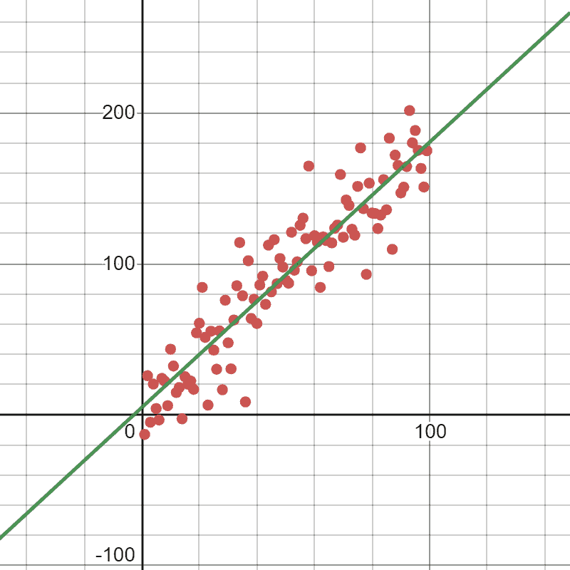

###### 图 5-1 线性回归的示例，将一条直线拟合到观察数据中

# 一个基本的线性回归

我想研究狗的年龄与它看兽医的次数之间的关系。在一个虚构的样本中，我们有 10 只随机的狗。我喜欢用简单的数据集（真实或其他）来理解复杂的技术，这样我们就能了解技术的优势和局限性，而不会被复杂的数据搞混。让我们将这个数据集绘制成图 5-2 所示。

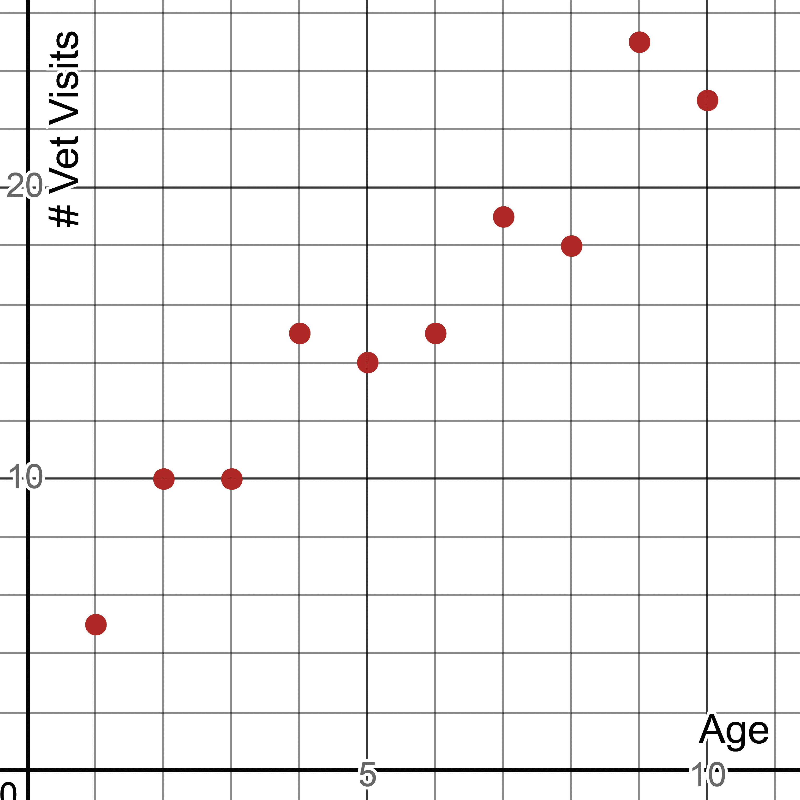

###### 图 5-2 绘制了 10 只狗的样本，显示它们的年龄和看兽医的次数

我们可以清楚地看到这里存在着*线性相关性*，意味着当这些变量中的一个增加/减少时，另一个也以大致相同的比例增加/减少。我们可以在图 5-3 中画一条线来展示这样的相关性。

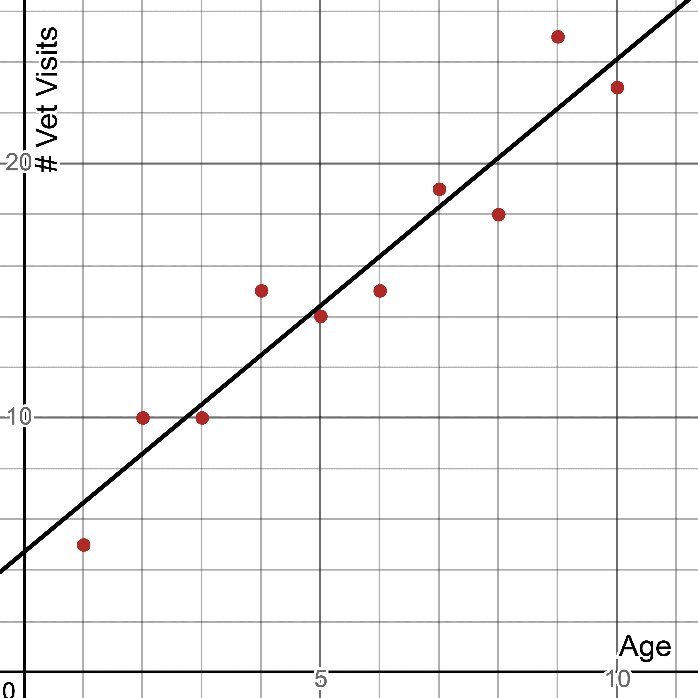

###### 图 5-3 拟合我们数据的一条线

我将在本章后面展示如何计算这条拟合线。我们还将探讨如何计算这条拟合线的质量。现在，让我们专注于执行线性回归的好处。它使我们能够对我们以前没有见过的数据进行预测。我的样本中没有一只 8.5 岁的狗，但我可以看着这条线估计这只狗一生中会有 21 次兽医就诊。我只需看看当*x* = 8.5 时，*y* = 21.218，如图 5-4 所示。另一个好处是我们可以分析可能存在关系的变量，并假设相关的变量之间是因果关系。

现在线性回归的缺点是什么？我不能期望每个结果都会*完全*落在那条线上。毕竟，现实世界的数据是嘈杂的，从不完美，也不会遵循一条直线。它可能根本不会遵循一条直线！在那条线周围会有误差，点会在线的上方或下方。当我们谈论 p 值、统计显著性和预测区间时，我们将在数学上涵盖这一点，这些内容描述了我们的线性回归有多可靠。另一个问题是我们不应该使用线性回归来预测超出我们拥有数据范围之外的情况，这意味着我们不应该在*x* < 0 和*x* > 10 的情况下进行预测，因为我们没有这些值之外的数据。

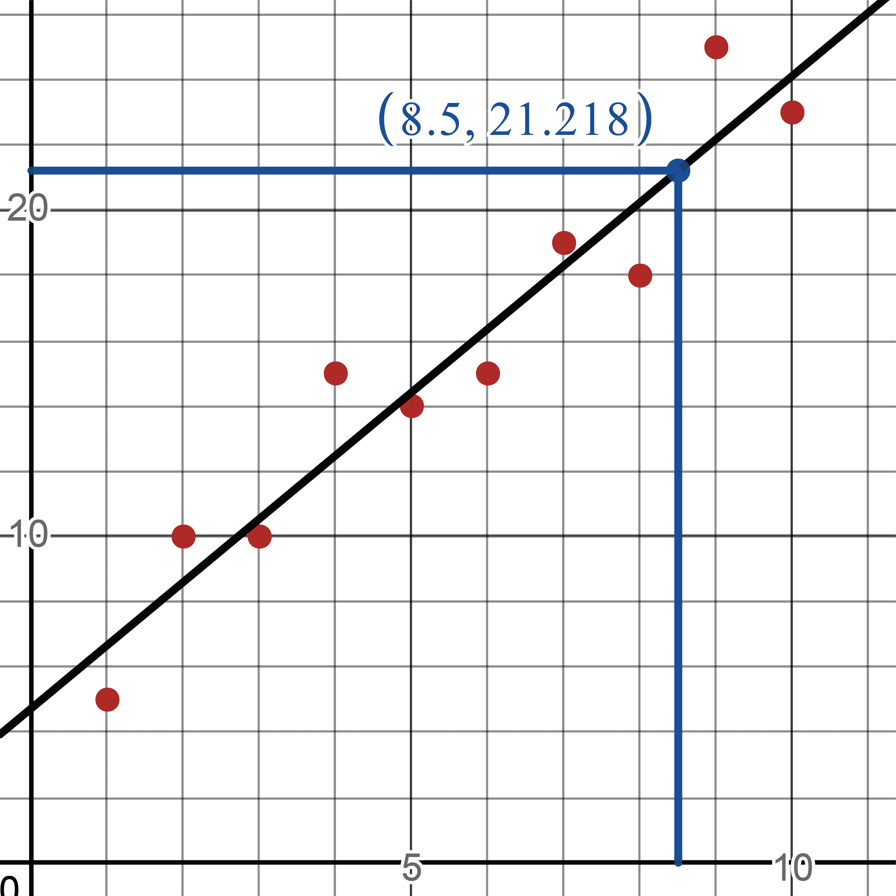

###### 图 5-4。使用线性回归进行预测，看到一个 8.5 岁的狗预测将有约 21.2 次兽医就诊

# 不要忘记抽样偏差！

我们应该质疑这些数据以及它们是如何抽样的，以便检测偏见。这是在单个兽医诊所吗？多个随机诊所？通过使用兽医数据是否存在自我选择偏见，只调查拜访兽医的狗？如果这些狗是在相同的地理位置抽样的，那会不会影响数据？也许在炎热的沙漠气候中的狗更容易因中暑和被蛇咬而去看兽医，这会使我们样本中的兽医就诊次数增加。

正如在第三章中讨论的那样，将数据视为真理的神谕已经变得时髦。然而，数据只是从一个总体中抽取的样本，我们需要对我们的样本有多好地代表性进行判断。对数据的来源同样感兴趣（如果不是更多），而不仅仅是数据所说的内容。

### 使用 SciPy 进行基本线性回归

在本章中，我们有很多关于线性回归要学习的内容，但让我们从一些代码开始执行我们已经了解的内容。

有很多平台可以执行线性回归，从 Excel 到 Python 和 R。但在本书中，我们将坚持使用 Python，从 scikit-learn 开始为我们完成工作。我将在本章后面展示如何“从头开始”构建线性回归，以便我们掌握像梯度下降和最小二乘这样的重要概念。

示例 5-1 是我们如何使用 scikit-learn 对这 10 只狗进行基本的、未经验证的线性回归的样本。我们使用 Pandas 获取[这些数据](https://oreil.ly/xCvwR)，将其转换为 NumPy 数组，使用 scikit-learn 进行线性回归，并使用 Plotly 在图表中显示它。

##### 示例 5-1\. 使用 scikit-learn 进行线性回归

```py
import pandas as pd
import matplotlib.pyplot as plt
from sklearn.linear_model import LinearRegression

# Import points
df = pd.read_csv('https://bit.ly/3goOAnt', delimiter=",")

# Extract input variables (all rows, all columns but last column)
X = df.values[:, :-1]

# Extract output column (all rows, last column)
Y = df.values[:, -1]

# Fit a line to the points
fit = LinearRegression().fit(X, Y)

# m = 1.7867224, b = -16.51923513
m = fit.coef_.flatten()
b = fit.intercept_.flatten()
print("m = {0}".format(m))
print("b = {0}".format(b))

# show in chart
plt.plot(X, Y, 'o') # scatterplot
plt.plot(X, m*X+b) # line
plt.show()
```

首先，我们从[GitHub 上的这个 CSV](https://bit.ly/3cIH97A)导入数据。我们使用 Pandas 将两列分离为*X*和*Y*数据集。然后，我们将`LinearRegression`模型拟合到输入的*X*数据和输出的*Y*数据。然后我们可以得到描述我们拟合线性函数的*m*和*b*系数。

在图中，您将确实看到一条拟合线穿过这些点，如图 5-5 所示。

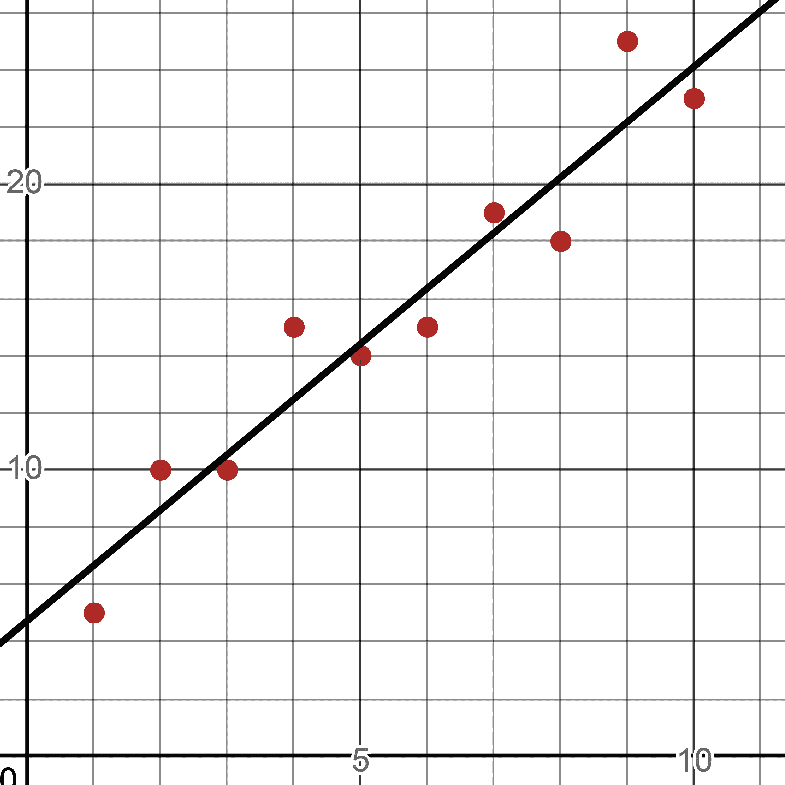

###### 图 5-5\. SciPy 将拟合一条回归线到您的数据

是什么决定了最佳拟合线到这些点？让我们接下来讨论这个问题。

# 残差和平方误差

统计工具如 scikit-learn 如何得出适合这些点的线？这归结为机器学习训练中的两个基本问题：

+   什么定义了“最佳拟合”？

+   我们如何得到那个“最佳拟合”呢？

第一个问题有一个相当确定的答案：我们最小化平方，或更具体地说是平方残差的和。让我们来详细解释一下。画出任何一条穿过点的线。*残差*是线和点之间的数值差异，如图 5-6 所示。

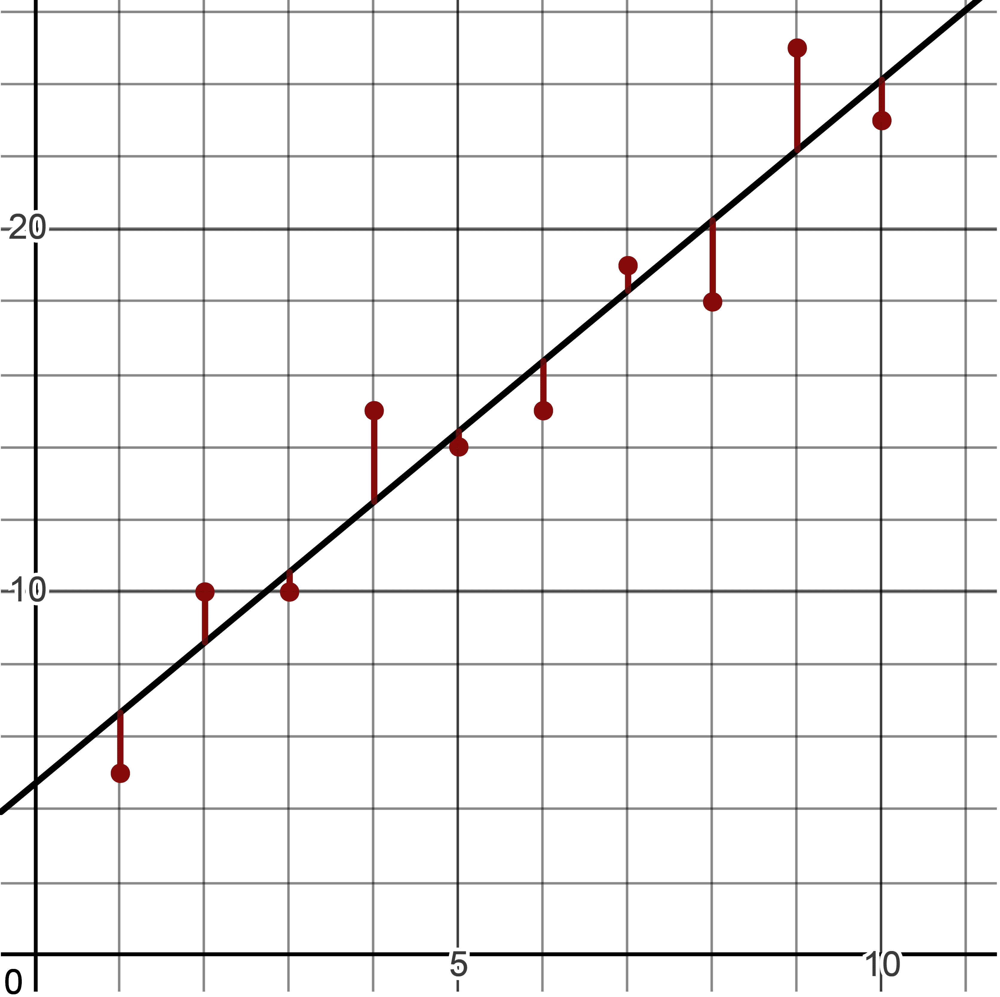

###### 图 5-6\. 残差是线和点之间的差异

线上方的点将具有正残差，而线下方的点将具有负残差。换句话说，它是预测 y 值（来自线）与实际 y 值（来自数据）之间的减去差异。残差的另一个名称是*误差*，因为它反映了我们的线在预测数据方面有多么错误。

让我们计算这 10 个点与线*y* = 1.93939*x* + 4.73333 之间的差异，以及示例 5-2 中每个点的残差和示例 5-3。

##### 示例 5-2\. 计算给定线和数据的残差

```py
import pandas as pd

# Import points
points = pd.read_csv('https://bit.ly/3goOAnt', delimiter=",").itertuples()

# Test with a given line
m = 1.93939
b = 4.73333

# Calculate the residuals
for p in points:
    y_actual = p.y
    y_predict = m*p.x + b
    residual = y_actual - y_predict
    print(residual)
```

##### 示例 5-3\. 每个点的残差

```py
-1.67272
1.3878900000000005
-0.5515000000000008
2.5091099999999997
-0.4302799999999998
-1.3696699999999993f
0.6909400000000012
-2.2484499999999983
2.812160000000002
-1.1272299999999973
```

如果我们要通过我们的 10 个数据点拟合一条直线，我们很可能希望尽可能地减小这些残差，使线和点之间的间隙尽可能小。但是我们如何衡量“总体”呢？最好的方法是采用*平方和*，简单地对每个残差进行平方，或者将每个残差相乘，然后将它们求和。我们取每个实际的 y 值，并从中减去从线上取得的预测 y 值，然后对所有这些差异进行平方和。

一个直观的思考方式如图 5-7 所示，我们在每个残差上叠加一个正方形，每条边的长度都是残差。我们将所有这些正方形的面积相加，稍后我们将学习如何通过确定最佳*m*和*b*来找到我们可以实现的最小和。

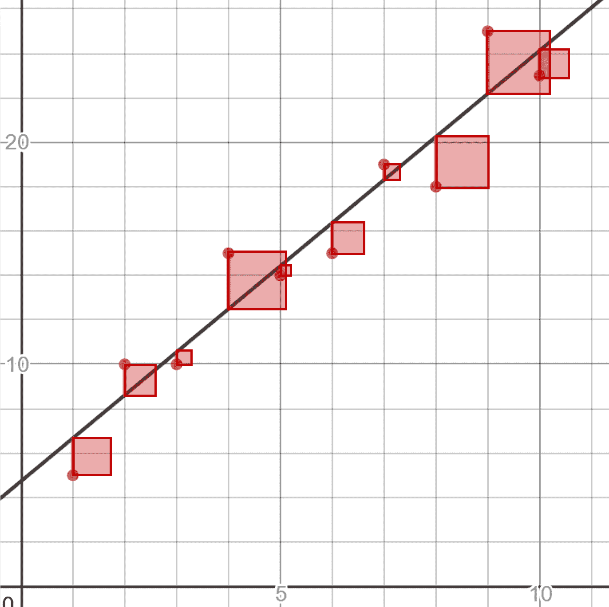

###### 图 5-7\. 可视化平方和，即所有正方形的面积之和，其中每个正方形的边长等于残差

让我们修改我们在示例 5-4 中的代码来找到平方和。

##### 示例 5-4\. 计算给定直线和数据的平方和

```py
import pandas as pd

# Import points
points = pd.read_csv("https://bit.ly/2KF29Bd").itertuples()

# Test with a given line
m = 1.93939
b = 4.73333

sum_of_squares = 0.0

# calculate sum of squares
for p in points:
    y_actual = p.y
    y_predict = m*p.x + b
    residual_squared = (y_predict - y_actual)**2
    sum_of_squares += residual_squared

print("sum of squares = {}".format(sum_of_squares))
# sum of squares = 28.096969704500005
```

下一个问题是：如何找到能产生最小平方和的*m*和*b*值，而不使用像 scikit-learn 这样的库？让我们接着看。

# 寻找最佳拟合直线

现在我们有一种方法来衡量给定直线与数据点的质量：平方和。我们能够使这个数字越低，拟合就越好。那么如何找到能产生*最小*平方和的正确*m*和*b*值呢？

我们可以采用几种搜索算法，试图找到解决给定问题的正确值集。你可以尝试*蛮力*方法，随机生成*m*和*b*值数百万次，并选择产生最小平方和的值。这种方法效果不佳，因为即使找到一个体面的近似值也需要无尽的时间。我们需要一些更有指导性的东西。我将为你整理五种技术：闭式方程、矩阵求逆、矩阵分解、梯度下降和随机梯度下降。还有其他搜索算法，比如爬山算法（在附录 A 中有介绍），但我们将坚持使用常见的方法。

## 闭式方程

一些读者可能会问是否有一个公式（称为*闭式方程*）通过精确计算来拟合线性回归。答案是肯定的，但仅适用于只有一个输入变量的简单线性回归。对于具有多个输入变量和大量数据的许多机器学习问题，这种奢侈是不存在的。我们可以使用线性代数技术进行扩展，我们很快将讨论这一点。我们还将借此机会学习诸如随机梯度下降之类的搜索算法。

对于只有一个输入和一个输出变量的简单线性回归，以下是计算*m*和*b*的闭式方程。示例 5-5 展示了如何在 Python 中进行这些计算。

<math display="block"><mtable displaystyle="true"><mtr><mtd columnalign="right"><mrow><mi>m</mi> <mo>=</mo> <mfrac><mrow><mi>n</mi><mo>∑</mo><mrow><mi>x</mi><mi>y</mi></mrow><mo>-</mo><mo>∑</mo><mi>x</mi><mo>∑</mo><mi>y</mi></mrow> <mrow><mi>n</mi><mo>∑</mo><msup><mi>x</mi> <mn>2</mn></msup> <mo>-</mo><msup><mrow><mo>(</mo><mo>∑</mo><mi>x</mi><mo>)</mo></mrow> <mn>2</mn></msup></mrow></mfrac></mrow></mtd></mtr></mtable></math> <math display="block"><mtable displaystyle="true"><mtr><mtd columnalign="right"><mrow><mi>b</mi> <mo>=</mo> <mfrac><mrow><mo>∑</mo><mi>y</mi></mrow> <mi>n</mi></mfrac> <mo>-</mo> <mi>m</mi> <mfrac><mrow><mo>∑</mo><mi>x</mi></mrow> <mi>n</mi></mfrac></mrow></mtd></mtr></mtable></math>

##### 示例 5-5\. 计算简单线性回归的*m*和*b*

```py
import pandas as pd

# Load the data
points = list(pd.read_csv('https://bit.ly/2KF29Bd', delimiter=",").itertuples())

n = len(points)

m = (n*sum(p.x*p.y for p in points) - sum(p.x for p in points) *
    sum(p.y for p in points)) / (n*sum(p.x**2 for p in points) -
    sum(p.x for p in points)**2)

b = (sum(p.y for p in points) / n) - m * sum(p.x for p in points) / n

print(m, b)
# 1.9393939393939394 4.7333333333333325
```

这些用于计算*m*和*b*的方程式是从微积分中推导出来的，如果您有兴趣发现公式的来源，我们稍后在本章中将使用 SymPy 进行一些微积分工作。目前，您可以插入数据点数*n*，并迭代 x 和 y 值来执行刚才描述的操作。

今后，我们将学习更适用于处理大量数据的现代技术。闭式方程式往往不适用于大规模应用。

# 计算复杂度

闭式方程式不适用于较大数据集的原因是由于计算机科学中称为*计算复杂度*的概念，它衡量算法在问题规模增长时所需的时间。这可能值得熟悉一下；以下是关于这个主题的两个很棒的 YouTube 视频：

+   [“P vs. NP 和计算复杂度动物园”](https://oreil.ly/TzQBl)

+   [“大 O 符号是什么？”](https://oreil.ly/EjcSR)

## 逆矩阵技术

今后，我有时会用不同的名称交替使用系数*m*和*b*，分别为<math alttext="beta 1"><msub><mi>β</mi> <mn>1</mn></msub></math>和<math alttext="beta 0"><msub><mi>β</mi> <mn>0</mn></msub></math>，这是您在专业世界中经常看到的惯例，所以现在可能是一个毕业的好时机。

虽然我们在第四章中专门致力于线性代数，但在您刚接触数学和数据科学时，应用它可能有点令人不知所措。这就是为什么本书中的大多数示例将使用纯 Python 或 scikit-learn。但是，在合适的情况下，我会加入线性代数，以展示线性代数的实用性。如果您觉得这一部分令人不知所措，请随时继续阅读本章的其余部分，稍后再回来。

我们可以使用转置和逆矩阵，我们在第四章中介绍过，来拟合线性回归。接下来，我们根据输入变量值矩阵<math alttext="upper X"><mi>X</mi></math>和输出变量值向量<math alttext="y"><mi>y</mi></math>计算系数向量<math alttext="b"><mi>b</mi></math>。在不深入微积分和线性代数证明的兔子洞中，这是公式：

<math alttext="b equals left-parenthesis upper X Superscript upper T Baseline dot upper X right-parenthesis Superscript negative 1 Baseline dot upper X Superscript upper T Baseline dot y" display="block"><mrow><mi>b</mi> <mo>=</mo> <msup><mrow><mo>(</mo><msup><mi>X</mi> <mi>T</mi></msup> <mo>·</mo><mi>X</mi><mo>)</mo></mrow> <mrow><mo>-</mo><mn>1</mn></mrow></msup> <mo>·</mo> <msup><mi>X</mi> <mi>T</mi></msup> <mo>·</mo> <mi>y</mi></mrow></math>

你会注意到在矩阵<math alttext="upper X"><mi>X</mi></math>上执行了转置和逆操作，并与矩阵乘法结合。这是我们在 NumPy 中执行此操作的方式，在例子 5-6 中得到我们的系数*m*和*b*。

##### 例 5-6\. 使用逆矩阵和转置矩阵拟合线性回归

```py
import pandas as pd
from numpy.linalg import inv
import numpy as np

# Import points
df = pd.read_csv('https://bit.ly/3goOAnt', delimiter=",")

# Extract input variables (all rows, all columns but last column)
X = df.values[:, :-1].flatten()

# Add placeholder "1" column to generate intercept
X_1 = np.vstack([X, np.ones(len(X))]).T

# Extract output column (all rows, last column)
Y = df.values[:, -1]

# Calculate coefficents for slope and intercept
b = inv(X_1.transpose() @ X_1) @ (X_1.transpose() @ Y)
print(b) # [1.93939394, 4.73333333]

# Predict against the y-values
y_predict = X_1.dot(b)
```

这并不直观，但请注意我们必须在*X*列旁边堆叠一个“列”为 1 的列。原因是这将生成截距<math alttext="beta 0"><msub><mi>β</mi> <mn>0</mn></msub></math>系数。由于这一列全为 1，它实际上生成了截距而不仅仅是一个斜率<math alttext="beta 1"><msub><mi>β</mi> <mn>1</mn></msub></math>。

当你有大量数据和大量维度时，计算机可能开始崩溃并产生不稳定的结果。这是矩阵分解的一个用例，我们在线性代数的第四章中学到了。在这种特定情况下，我们取我们的矩阵*X*，附加一个额外的列 1 来生成截距<math alttext="beta 0"><msub><mi>β</mi> <mn>0</mn></msub></math>就像以前一样，然后将其分解为两个组件矩阵*Q*和*R*：

<math alttext="upper X equals upper Q dot upper R" display="block"><mrow><mi>X</mi> <mo>=</mo> <mi>Q</mi> <mo>·</mo> <mi>R</mi></mrow></math>

避免更多的微积分兔子洞，这里是我们如何使用*Q*和*R*来在矩阵形式*b*中找到 beta 系数值：

<math alttext="b equals upper R Superscript negative 1 Baseline dot upper Q Superscript upper T Baseline dot y" display="block"><mrow><mi>b</mi> <mo>=</mo> <msup><mi>R</mi> <mrow><mo>-</mo><mn>1</mn></mrow></msup> <mo>·</mo> <msup><mi>Q</mi> <mi>T</mi></msup> <mo>·</mo> <mi>y</mi></mrow></math>

而例子 5-7 展示了我们如何在 Python 中使用 NumPy 使用前述*QR*分解公式执行线性回归。

##### 例 5-7\. 使用 QR 分解执行线性回归

```py
import pandas as pd
from numpy.linalg import qr, inv
import numpy as np

# Import points
df = pd.read_csv('https://bit.ly/3goOAnt', delimiter=",")

# Extract input variables (all rows, all columns but last column)
X = df.values[:, :-1].flatten()

# Add placeholder "1" column to generate intercept
X_1 = np.vstack([X, np.ones(len(X))]).transpose()

# Extract output column (all rows, last column)
Y = df.values[:, -1]

# calculate coefficents for slope and intercept
# using QR decomposition
Q, R = qr(X_1)
b = inv(R).dot(Q.transpose()).dot(Y)

print(b) # [1.93939394, 4.73333333]
```

通常，*QR*分解是许多科学库用于线性回归的方法，因为它更容易处理大量数据，并且更稳定。我所说的*稳定*是什么意思？[*数值稳定性*](https://oreil.ly/A4BWJ)是算法保持错误最小化的能力，而不是在近似中放大错误。请记住，计算机只能工作到某个小数位数，并且必须进行近似，因此我们的算法不应随着这些近似中的复合错误而恶化变得重要。

# 感到不知所措吗？

如果你觉得这些线性代数示例中的线性回归让人不知所措，不要担心！我只是想提供一个线性代数实际用例的曝光。接下来，我们将专注于其他你可以使用的技术。

## 梯度下降

*梯度下降*是一种优化技术，利用导数和迭代来最小化/最大化一组参数以达到目标。要了解梯度下降，让我们进行一个快速的思想实验，然后在一个简单的例子中应用它。

### 关于梯度下降的思想实验

想象一下，你在一个山脉中夜晚拿着手电筒。你试图到达山脉的最低点。在你迈出一步之前，你可以看到你周围的斜坡。你朝着斜坡明显向下的方向迈步。对于更大的斜坡，你迈出更大的步伐，对于更小的斜坡，你迈出更小的步伐。最终，你会发现自己在一个斜率为 0 的低点，一个值为 0。听起来不错，对吧？这种使用手电筒的方法被称为*梯度下降*，我们朝着斜坡向下的方向迈步。

在机器学习中，我们经常将我们将遇到的所有可能的平方损失总和视为多山的地形。我们想要最小化我们的损失，并且我们通过导航损失地形来实现这一点。为了解决这个问题，梯度下降有一个吸引人的特点：偏导数就像是那盏手电筒，让我们能够看到每个参数（在这种情况下是*m*和*b*，或者<math alttext="beta 0"><msub><mi>β</mi> <mn>0</mn></msub></math>和<math alttext="beta 1"><msub><mi>β</mi> <mn>1</mn></msub></math>）的斜率。我们朝着*m*和*b*的斜率向下的方向迈步。对于更大的斜率，我们迈出更大的步伐，对于更小的斜率，我们迈出更小的步伐。我们可以通过取斜率的一部分来简单地计算这一步的长度。这一部分被称为我们的*学习率*。学习率越高，它运行得越快，但精度会受到影响。但学习率越低，训练所需的时间就越长，需要更多的迭代。

决定学习率就像在选择蚂蚁、人类或巨人来踏下斜坡。蚂蚁（小学习率）会迈出微小的步伐，花费不可接受的长时间才能到达底部，但会准确无误地到达。巨人（大学习率）可能会一直跨过最小值，以至于无论走多少步都可能永远无法到达。人类（适度学习率）可能具有最平衡的步幅，在速度和准确性之间找到正确的平衡，以到达最小值。

### 先学会走再学会跑

对于函数<math alttext="f left-parenthesis x right-parenthesis equals left-parenthesis x minus 3 right-parenthesis squared plus 4"><mrow><mi>f</mi> <mrow><mo>(</mo> <mi>x</mi> <mo>)</mo></mrow> <mo>=</mo> <msup><mrow><mo>(</mo><mi>x</mi><mo>-</mo><mn>3</mn><mo>)</mo></mrow> <mn>2</mn></msup> <mo>+</mo> <mn>4</mn></mrow></math>，让我们找到产生该函数最低点的 x 值。虽然我们可以通过代数方法解决这个问题，但让我们使用梯度下降来做。

这是我们试图做的可视化效果。如图 5-8 所示，我们希望“步进”*x*朝向斜率为 0 的最小值。

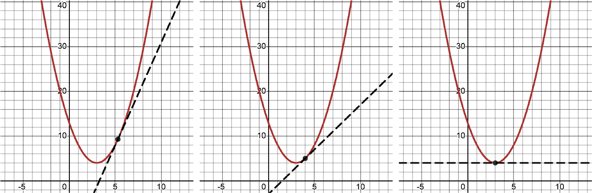

###### 图 5-8\. 朝向斜率接近 0 的局部最小值迈进

在示例 5-8 中，函数`f(x)`及其对*x*的导数为`dx_f(x)`。回想一下，我们在第一章中讨论了如何使用 SymPy 计算导数。找到导数后，我们继续执行梯度下降。

##### 示例 5-8\. 使用梯度下降找到抛物线的最小值

```py
import random

def f(x):
    return (x - 3) ** 2 + 4

def dx_f(x):
    return 2*(x - 3)

# The learning rate
L = 0.001

# The number of iterations to perform gradient descent
iterations = 100_000

 # start at a random x
x = random.randint(-15,15)

for i in range(iterations):

    # get slope
    d_x = dx_f(x)

    # update x by subtracting the (learning rate) * (slope)
    x -= L * d_x

print(x, f(x)) # prints 2.999999999999889 4.0
```

如果我们绘制函数（如图 5-8 所示），我们应该看到函数的最低点明显在*x* = 3 处，前面的代码应该非常接近这个点。学习率用于在每次迭代中取斜率的一部分并从 x 值中减去它。较大的斜率将导致较大的步长，而较小的斜率将导致较小的步长。经过足够的迭代，*x*将最终到达函数的最低点（或足够接近），其中斜率为 0。

### 梯度下降和线性回归

现在你可能想知道我们如何将其用于线性回归。嗯，这个想法是一样的，只是我们的“变量”是*m*和*b*（或<math alttext="beta 0"><msub><mi>β</mi> <mn>0</mn></msub></math>和<math alttext="beta 1"><msub><mi>β</mi> <mn>1</mn></msub></math>）而不是*x*。原因在于：在简单线性回归中，我们已经知道 x 和 y 值，因为这些值作为训练数据提供。我们需要解决的“变量”实际上是参数*m*和*b*，因此我们可以找到最佳拟合线，然后接受一个*x*变量来预测一个新的 y 值。

我们如何计算*m*和*b*的斜率？我们需要这两者的偏导数。我们要对哪个函数求导？记住我们试图最小化损失，这将是平方和。因此，我们需要找到我们的平方和函数对*m*和*b*的导数。

我像示例 5-9 中所示实现了这两个*m*和*b*的偏导数。我们很快将学习如何在 SymPy 中执行此操作。然后我执行梯度下降来找到*m*和*b*：100,000 次迭代，学习率为 0.001 就足够了。请注意，您将学习率设得越小，速度就越慢，需要的迭代次数就越多。但如果设得太高，它将运行得很快，但近似度较差。当有人说机器学习算法正在“学习”或“训练”时，实际上就是在拟合这样一个回归。

##### 示例 5-9\. 执行线性回归的梯度下降

```py
import pandas as pd

# Import points from CSV
points = list(pd.read_csv("https://bit.ly/2KF29Bd").itertuples())

# Building the model
m = 0.0
b = 0.0

# The learning Rate
L = .001

# The number of iterations
iterations = 100_000

n = float(len(points))  # Number of elements in X

# Perform Gradient Descent
for i in range(iterations):

    # slope with respect to m
    D_m = sum(2 * p.x * ((m * p.x + b) - p.y) for p in points)

    # slope with respect to b
    D_b = sum(2 * ((m * p.x + b) - p.y) for p in points)

    # update m and b
    m -= L * D_m
    b -= L * D_b

print("y = {0}x + {1}".format(m, b))
# y = 1.9393939393939548x + 4.733333333333227
```

嗯，不错！那个近似值接近我们的闭式方程解。但有什么问题吗？仅仅因为我们通过最小化平方和找到了“最佳拟合直线”，这并不意味着我们的线性回归就很好。最小化平方和是否保证了一个很好的模型来进行预测？并不完全是这样。现在我向你展示了如何拟合线性回归，让我们退一步，重新审视全局，确定给定的线性回归是否是首选的预测方式。但在我们这样做之前，这里有一个展示 SymPy 解决方案的更多绕路。

### 使用 SymPy 进行线性回归的梯度下降

如果你想要得到这两个关于平方和函数的导数的 SymPy 代码，分别为 *m* 和 *b*，这里是 示例 5-10 中的代码。

##### 示例 5-10\. 计算 *m* 和 *b* 的偏导数

```py
from sympy import *

m, b, i, n = symbols('m b i n')
x, y = symbols('x y', cls=Function)

sum_of_squares = Sum((m*x(i) + b - y(i)) ** 2, (i, 0, n))

d_m = diff(sum_of_squares, m)
d_b = diff(sum_of_squares, b)
print(d_m)
print(d_b)

# OUTPUTS
# Sum(2*(b + m*x(i) - y(i))*x(i), (i, 0, n))
# Sum(2*b + 2*m*x(i) - 2*y(i), (i, 0, n))
```

你会看到分别为 *m* 和 *b* 的两个导数被打印出来。请注意 `Sum()` 函数将迭代并将项相加（在这种情况下是所有数据点），我们将 *x* 和 *y* 视为查找给定索引 *i* 处值的函数。

在数学符号中，其中 *e*(*x*) 代表平方和损失函数，这里是 *m* 和 *b* 的偏导数：

<math display="block"><mtable displaystyle="true"><mtr><mtd columnalign="right"><mrow><mi>e</mi> <mrow><mo>(</mo> <mi>x</mi> <mo>)</mo></mrow> <mo>=</mo> <munderover><mo>∑</mo> <mrow><mi>i</mi><mo>=</mo><mn>0</mn></mrow> <mi>n</mi></munderover> <mrow><mo>(</mo> <mrow><mo>(</mo> <mi>m</mi> <msub><mi>x</mi> <mi>i</mi></msub> <mo>+</mo> <mi>b</mi> <mo>)</mo></mrow> <mo>-</mo> <msub><mi>y</mi> <mi>i</mi></msub></mrow> <msup><mrow><mo>)</mo></mrow> <mn>2</mn></msup></mrow></mtd></mtr></mtable></math> <math display="block"><mtable displaystyle="true"><mtr><mtd columnalign="right"><mrow><mfrac><mi>d</mi> <mrow><mi>d</mi><mi>m</mi></mrow></mfrac> <mi>e</mi> <mrow><mo>(</mo> <mi>x</mi> <mo>)</mo></mrow> <mo>=</mo> <munderover><mo>∑</mo> <mrow><mi>i</mi><mo>=</mo><mn>0</mn></mrow> <mi>n</mi></munderover> <mrow><mn>2</mn> <mrow><mo>(</mo> <mi>b</mi> <mo>+</mo> <mi>m</mi> <msub><mi>x</mi> <mi>i</mi></msub> <mo>-</mo> <msub><mi>y</mi> <mi>i</mi></msub> <mo>)</mo></mrow> <msub><mi>x</mi> <mi>i</mi></mrow></mrow></mrow></mtd></mtr></mtable></math> <math display="block"><mtable displaystyle="true"><mtr><mtd columnalign="right"><mrow><mfrac><mi>d</mi> <mrow><mi>d</mi><mi>b</mi></mrow></mfrac> <mi>e</mi> <mrow><mo>(</mo> <mi>x</mi> <mo>)</mo></mrow> <mo>=</mo> <munderover><mo>∑</mo> <mrow><mi>i</mi><mo>=</mo><mn>0</mn></mrow> <mi>n</mi></munderover> <mrow><mo>(</mo> <mn>2</mn> <mi>b</mi> <mo>+</mo> <mn>2</mn> <mi>m</mi> <msub><mi>x</mi> <mi>i</mi></msub> <mo>-</mo> <mn>2</mn> <msub><mi>y</mi> <mi>i</mi></msub> <mo>)</mo></mrow></mrow></mtd></mtr></mtable></math>

如果你想应用我们的数据集并使用梯度下降执行线性回归，你将需要执行一些额外的步骤，如示例 5-11 所示。我们需要替换`n`、`x(i)`和`y(i)`的值，迭代所有数据点以计算`d_m`和`d_b`的导数函数。这样就只剩下`m`和`b`变量，我们将使用梯度下降寻找最优值。

##### 示例 5-11\. 使用 SymPy 解决线性回归

```py
import pandas as pd
from sympy import *

# Import points from CSV
points = list(pd.read_csv("https://bit.ly/2KF29Bd").itertuples())

m, b, i, n = symbols('m b i n')
x, y = symbols('x y', cls=Function)

sum_of_squares = Sum((m*x(i) + b - y(i)) ** 2, (i, 0, n))

d_m = diff(sum_of_squares, m) \
    .subs(n, len(points) - 1).doit() \
    .replace(x, lambda i: points[i].x) \
    .replace(y, lambda i: points[i].y)

d_b = diff(sum_of_squares, b) \
    .subs(n, len(points) - 1).doit() \
    .replace(x, lambda i: points[i].x) \
    .replace(y, lambda i: points[i].y)

# compile using lambdify for faster computation
d_m = lambdify([m, b], d_m)
d_b = lambdify([m, b], d_b)

# Building the model
m = 0.0
b = 0.0

# The learning Rate
L = .001

# The number of iterations
iterations = 100_000

# Perform Gradient Descent
for i in range(iterations):

    # update m and b
    m -= d_m(m,b) * L
    b -= d_b(m,b) * L

print("y = {0}x + {1}".format(m, b))
# y = 1.939393939393954x + 4.733333333333231
```

如示例 5-11 所示，对我们的偏导数函数都调用`lambdify()`是个好主意，将它们从 SymPy 转换为优化的 Python 函数。这将使计算在执行梯度下降时更快。生成的 Python 函数由 NumPy、SciPy 或 SymPy 检测到的其他数值库支持。之后，我们可以执行梯度下降。

最后，如果你对这个简单线性回归的损失函数感兴趣，示例 5-12 展示了 SymPy 代码，将`x`、`y`和`n`的值代入我们的损失函数，然后将`m`和`b`作为输入变量绘制出来。我们的梯度下降算法将我们带到了损失景观中的最低点，如图 5-9 所示。

##### 示例 5-12\. 绘制线性回归的损失函数

```py
from sympy import *
from sympy.plotting import plot3d
import pandas as pd

points = list(pd.read_csv("https://bit.ly/2KF29Bd").itertuples())
m, b, i, n = symbols('m b i n')
x, y = symbols('x y', cls=Function)

sum_of_squares = Sum((m*x(i) + b - y(i)) ** 2, (i, 0, n)) \
    .subs(n, len(points) - 1).doit() \
    .replace(x, lambda i: points[i].x) \
    .replace(y, lambda i: points[i].y)

plot3d(sum_of_squares)
```

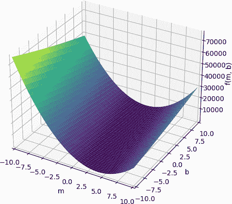

###### 图 5-9\. 简单线性回归的损失景观

# 过拟合和方差

你猜猜看：如果我们真的想最小化损失，即将平方和减少到 0，我们会怎么做？除了线性回归还有其他选择吗？你可能得出的一个结论就是简单地拟合一个触及所有点的曲线。嘿，为什么不只是连接点并用它来做预测，如图 5-10 所示？这样就得到了 0 的损失！

真糟糕，为什么我们要费力进行线性回归而不是做这个呢？嗯，记住我们的大局目标不是最小化平方和，而是在新数据上做出准确的预测。这种连接点模型严重*过拟合*，意味着它将回归形状调整得太精确到预测新数据时表现糟糕。这种简单的连接点模型对远离其他点的异常值敏感，意味着它在预测中具有很高的*方差*。虽然这个例子中的点相对接近一条直线，但在其他具有更广泛分布和异常值的数据集中，这个问题会更严重。因为过拟合增加了方差，预测结果将会到处都是！

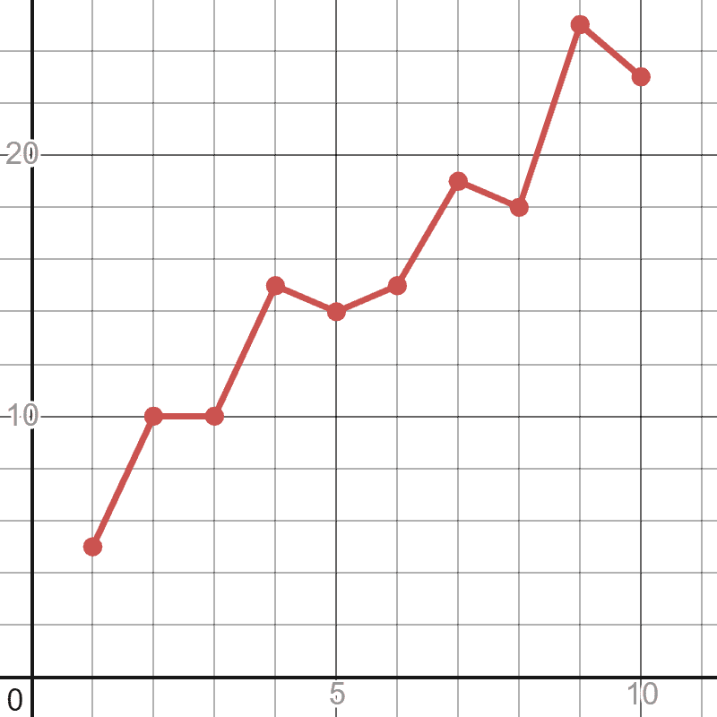

###### 图 5-10\. 通过简单连接点执行回归，导致损失为零

# 过拟合就是记忆

当有人说回归“记住”了数据而不是泛化它时，他们在谈论过拟合。

正如你所猜测的，我们希望在模型中找到有效的泛化，而不是记忆数据。否则，我们的回归模型简单地变成了一个数据库，我们只是查找数值。

在机器学习中，你会发现模型中添加了偏差，而线性回归被认为是一个高度偏置的模型。这与数据中的偏差不同，我们在第三章中有详细讨论。*模型中的偏差*意味着我们优先考虑一种方法（例如，保持一条直线），而不是弯曲和完全适应数据。一个有偏差的模型留有一些余地，希望在新数据上最小化损失以获得更好的预测，而不是在训练数据上最小化损失。我想你可以说，向模型添加偏差可以抵消*过拟合*，或者说对训练数据拟合较少。

你可以想象，这是一个平衡的过程，因为这是两个相互矛盾的目标。在机器学习中，我们基本上是在说，“我想要将回归拟合到我的数据，但我不想拟合得*太多*。我需要一些余地来预测新数据的不同之处。”

# 套索回归和岭回归

线性回归的两个比较流行的变体是套索回归和岭回归。岭回归在线性回归中添加了进一步的偏差，以一种惩罚的形式，因此导致它对数据拟合较少。套索回归将尝试边缘化嘈杂的变量，这在你想要自动删除可能不相关的变量时非常有用。

然而，我们不能仅仅将线性回归应用于一些数据，进行一些预测，并假设一切都没问题。即使是一条直线的线性回归也可能过拟合。因此，我们需要检查和缓解过拟合和欠拟合，以找到两者之间的平衡点。除非根本没有平衡点，否则你应该完全放弃该模型。

# 随机梯度下降

在机器学习的背景下，你不太可能像之前那样在实践中进行梯度下降，我们在所有训练数据上进行训练（称为*批量梯度下降*）。在实践中，你更有可能执行*随机梯度下降*，它将在每次迭代中仅对数据集的一个样本进行训练。在*小批量梯度下降*中，会使用数据集的多个样本（例如，10 或 100 个数据点）进行每次迭代。

为什么每次迭代只使用部分数据？机器学习从业者引用了一些好处。首先，它显著减少了计算量，因为每次迭代不必遍历整个训练数据集，而只需部分数据。第二个好处是减少过拟合。每次迭代只暴露训练算法于部分数据，使损失景观不断变化，因此不会稳定在损失最小值。毕竟，最小化损失是导致过拟合的原因，因此我们引入一些随机性来创建一点欠拟合（但希望不要太多）。

当然，我们的近似变得松散，所以我们必须小心。这就是为什么我们很快会谈论训练/测试拆分，以及其他评估我们线性回归可靠性的指标。

示例 5-13 展示了如何在 Python 中执行随机梯度下降。如果将样本大小改为大于 1，它将执行小批量梯度下降。

##### 示例 5-13。执行线性回归的随机梯度下降

```py
import pandas as pd
import numpy as np

# Input data
data = pd.read_csv('https://bit.ly/2KF29Bd', header=0)

X = data.iloc[:, 0].values
Y = data.iloc[:, 1].values

n = data.shape[0]  # rows

# Building the model
m = 0.0
b = 0.0

sample_size = 1  # sample size
L = .0001  # The learning Rate
epochs = 1_000_000  # The number of iterations to perform gradient descent

# Performing Stochastic Gradient Descent
for i in range(epochs):
    idx = np.random.choice(n, sample_size, replace=False)
    x_sample = X[idx]
    y_sample = Y[idx]

    # The current predicted value of Y
    Y_pred = m * x_sample + b

    # d/dm derivative of loss function
    D_m = (-2 / sample_size) * sum(x_sample * (y_sample - Y_pred))

    # d/db derivative of loss function
    D_b = (-2 / sample_size) * sum(y_sample - Y_pred)
    m = m - L * D_m  # Update m
    b = b - L * D_b  # Update b

    # print progress
    if i % 10000 == 0:
        print(i, m, b)

print("y = {0}x + {1}".format(m, b))
```

当我运行这个时，我得到了一个线性回归 *y* = 1.9382830354181135*x* + 4.753408787648379。显然，你的结果会有所不同，由于随机梯度下降，我们实际上不会收敛到特定的最小值，而是会停留在一个更广泛的邻域。

# 随机性是坏事吗？

如果这种随机性让你感到不舒服，每次运行一段代码都会得到不同的答案，那么欢迎来到机器学习、优化和随机算法的世界！许多进行近似的算法都是基于随机性的，虽然有些非常有用，但有些可能效果不佳，正如你所预期的那样。

很多人把机器学习和人工智能看作是一种能够给出客观和精确答案的工具，但事实并非如此。机器学习产生的是带有一定不确定性的近似值，通常在生产中没有基本事实。如果不了解它的工作原理，机器学习可能会被滥用，不承认其非确定性和近似性质是不妥的。

虽然随机性可以创造一些强大的工具，但也可能被滥用。要小心不要使用种子值和随机性来 p-hack 一个“好”结果，并努力分析你的数据和模型。

# 相关系数

看看这个散点图 图 5-11 以及它的线性回归。为什么线性回归在这里效果不太好？

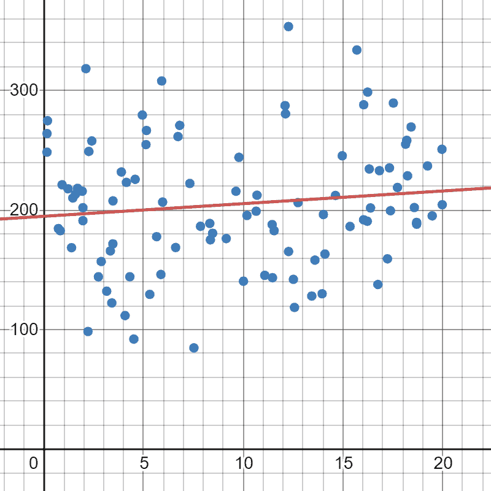

###### 图 5-11。具有高方差的数据的散点图

这里的问题是数据具有很高的方差。如果数据极为分散，它将使方差增加到使预测变得不太准确和有用的程度，导致大的残差。当然，我们可以引入更偏向的模型，如线性回归，以不那么容易弯曲和响应方差。然而，欠拟合也会削弱我们的预测，因为数据如此分散。我们需要数值化地衡量我们的预测有多“偏离”。

那么如何对这些残差进行整体测量呢？你又如何了解数据中方差的糟糕程度呢？让我向你介绍*相关系数*，也称为*皮尔逊相关系数*，它以-1 到 1 之间的值来衡量两个变量之间关系的强度。相关系数越接近 0，表示没有相关性。相关系数越接近 1，表示强*正相关*，意味着一个变量增加时，另一个变量成比例增加。如果接近-1，则表示强*负相关*，这意味着一个变量增加时，另一个成比例减少。

请注意，相关系数通常表示为*r*。在图 5-11 中高度分散的数据具有相关系数 0.1201。由于它比 1 更接近 0，我们可以推断数据之间关系很小。

这里是另外四个散点图，显示它们的相关系数。请注意，点越接近一条线，相关性越强。点更分散会导致相关性较弱。

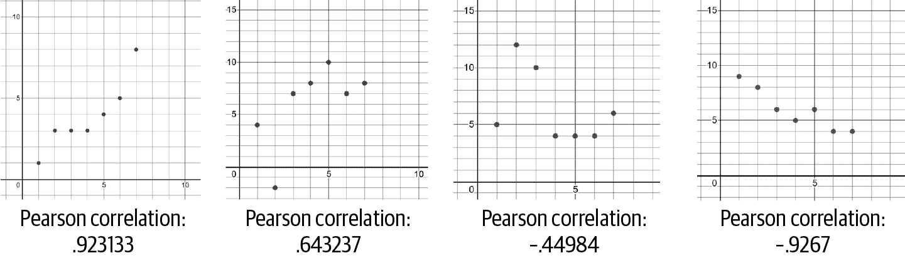

###### 图 5-12。四个散点图的相关系数

可以想象，相关系数对于查看两个变量之间是否存在可能的关系是有用的。如果存在强正负关系，它将对我们的线性回归有所帮助。如果没有关系，它们可能只会添加噪音并损害模型的准确性。

我们如何使用 Python 计算相关系数？让我们使用之前使用的简单[10 点数据集](https://bit.ly/2KF29Bd)。分析所有变量对之间的相关性的快速简单方法是使用 Pandas 的`corr()`函数。这使得轻松查看数据集中每对变量之间的相关系数，这种情况下只会是`x`和`y`。这被称为*相关矩阵*。在示例 5-14 中查看。

##### 示例 5-14。使用 Pandas 查看每对变量之间的相关系数

```py
import pandas as pd

# Read data into Pandas dataframe
df = pd.read_csv('https://bit.ly/2KF29Bd', delimiter=",")

# Print correlations between variables
correlations = df.corr(method='pearson')
print(correlations)

# OUTPUT:
#           x         y
# x  1.000000  0.957586
# y  0.957586  1.000000
```

正如您所看到的，`x`和`y`之间的相关系数`0.957586`表明这两个变量之间存在强烈的正相关性。您可以忽略矩阵中`x`或`y`设置为自身且值为`1.0`的部分。显然，当`x`或`y`设置为自身时，相关性将完美地为 1.0，因为值与自身完全匹配。当您有两个以上的变量时，相关性矩阵将显示更大的网格，因为有更多的变量进行配对和比较。

如果您更改代码以使用具有大量变化的不同数据集，其中数据分散，您将看到相关系数下降。这再次表明了较弱的相关性。

# 统计显著性

这里还有线性回归的另一个方面需要考虑：我的数据相关性是否巧合？在第三章中，我们研究了假设检验和 p 值，我们将在这里用线性回归扩展这些想法。

让我们从一个基本问题开始：我是否可能由于随机机会在我的数据中看到线性关系？我们如何能够确信这两个变量之间的相关性是显著的而不是巧合的 95%？如果这听起来像第三章中的假设检验，那是因为它就是！我们不仅需要表达相关系数，还需要量化我们对相关系数不是偶然发生的信心。

与我们在第三章中使用药物测试示例中所做的估计均值不同，我们正在基于样本估计总体相关系数。我们用希腊字母符号<math alttext="rho"><mi>ρ</mi></math>（Rho）表示总体相关系数，而我们的样本相关系数是*r*。就像我们在第三章中所做的那样，我们将有一个零假设<math alttext="upper H 0"><msub><mi>H</mi> <mn>0</mn></msub></math>和备择假设<math alttext="upper H 1"><msub><mi>H</mi> <mn>1</mn></msub></math>：

<math display="block"><mrow><msub><mi>H</mi> <mn>0</mn></msub> <mo>:</mo> <mi>ρ</mi> <mo>=</mo> <mn>0</mn> <mtext>(意味着</mtext> <mtext>没有</mtext> <mtext>关系)</mtext></mrow></math> <math display="block"><mrow><msub><mi>H</mi> <mn>1</mn></msub> <mo>:</mo> <mi>ρ</mi> <mo>≠</mo> <mn>0</mn> <mtext>(关系</mtext> <mtext>存在)</mtext></mrow></math>

我们的零假设<math alttext="upper H 0"><msub><mi>H</mi> <mn>0</mn></msub></math>是两个变量之间没有关系，或更技术性地说，相关系数为 0。备择假设<math alttext="upper H 1"><msub><mi>H</mi> <mn>1</mn></msub></math>是存在关系，可以是正相关或负相关。这就是为什么备择假设被定义为<math alttext="rho not-equals 0"><mrow><mi>ρ</mi> <mo>≠</mo> <mn>0</mn></mrow></math>，以支持正相关和负相关。

让我们回到我们的包含 10 个点的数据集，如图 5-13 所示。我们看到这些数据点是多大概率是偶然看到的？它们恰好产生了看起来是线性关系？

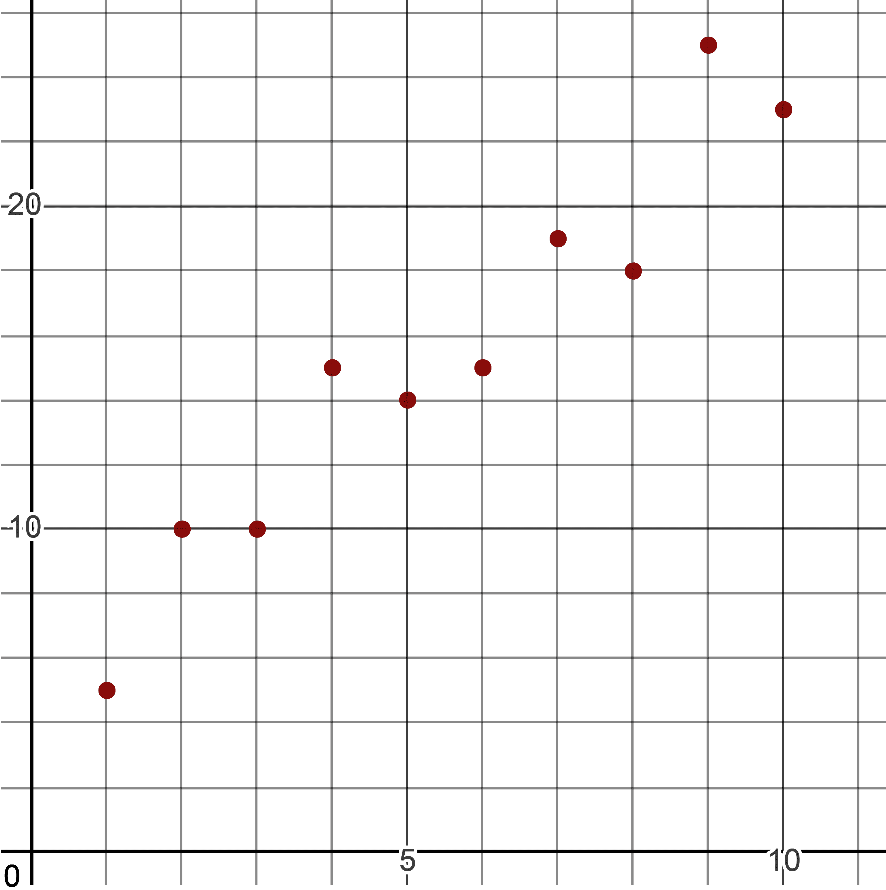

###### 图 5-13\. 这些数据看起来具有线性相关性，我们有多大可能性是随机机会看到的？

我们已经在示例 5-14 中计算了这个数据集的相关系数为 0.957586。这是一个强有力的正相关。但是，我们需要评估这是否是由于随机运气。让我们以 95%的置信度进行双尾检验，探讨这两个变量之间是否存在关系。

我们在第三章中讨论了 T 分布，它有更厚的尾部以捕捉更多的方差和不确定性。我们使用 T 分布而不是正态分布进行线性回归的假设检验。首先，让我们绘制一个 T 分布，95%的临界值范围如图 5-14 所示。考虑到我们的样本中有 10 条记录，因此我们有 9 个自由度（10-1=9）。

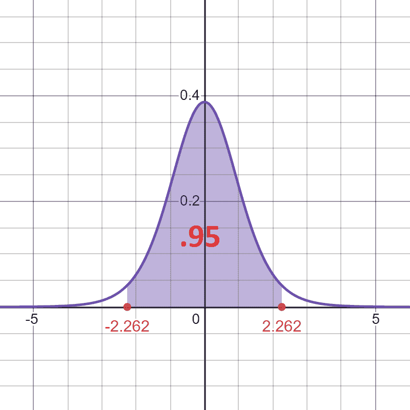

###### 图 5-14\. 9 个自由度的 T 分布，因为有 10 条记录，我们减去 1

临界值约为±2.262，我们可以在 Python 中计算如示例 5-16 所示。这捕捉了我们 T 分布中心区域的 95%。

##### 示例 5-16\. 从 T 分布计算临界值

```py
from scipy.stats import t

n = 10
lower_cv = t(n-1).ppf(.025)
upper_cv = t(n-1).ppf(.975)

print(lower_cv, upper_cv)
# -2.262157162740992 2.2621571627409915
```

如果我们的检验值恰好落在（-2.262，2.262）的范围之外，那么我们可以拒绝我们的零假设。要计算检验值*t*，我们需要使用以下公式。再次，*r*是相关系数，*n*是样本大小：

<math display="block"><mrow><mi>t</mi> <mo>=</mo> <mfrac><mi>r</mi> <msqrt><mfrac><mrow><mn>1</mn><mo>-</mo><msup><mi>r</mi> <mn>2</mn></msup></mrow> <mrow><mi>n</mi><mo>-</mo><mn>2</mn></mrow></mfrac></msqrt></mfrac></mrow></math><math display="block"><mrow><mi>t</mi> <mo>=</mo> <mfrac><mrow><mn>.957586</mn></mrow> <msqrt><mfrac><mrow><mn>1</mn><mo>-</mo><msup><mn>.957586</mn> <mn>2</mn></msup></mrow> <mrow><mn>10</mn><mo>-</mo><mn>2</mn></mrow></mfrac></msqrt></mfrac> <mo>=</mo> <mn>9.339956</mn></mrow></math>

让我们在 Python 中将整个测试放在一起，如示例 5-17 所示。如果我们的检验值落在 95%置信度的临界范围之外，我们接受我们的相关性不是偶然的。

##### 示例 5-17\. 测试看起来线性的数据的显著性

```py
from scipy.stats import t
from math import sqrt

# sample size
n = 10

lower_cv = t(n-1).ppf(.025)
upper_cv = t(n-1).ppf(.975)

# correlation coefficient
# derived from data https://bit.ly/2KF29Bd
r = 0.957586

# Perform the test
test_value = r / sqrt((1-r**2) / (n-2))

print("TEST VALUE: {}".format(test_value))
print("CRITICAL RANGE: {}, {}".format(lower_cv, upper_cv))

if test_value < lower_cv or test_value > upper_cv:
    print("CORRELATION PROVEN, REJECT H0")
else:
    print("CORRELATION NOT PROVEN, FAILED TO REJECT H0 ")

# Calculate p-value
if test_value > 0:
    p_value = 1.0 - t(n-1).cdf(test_value)
else:
    p_value = t(n-1).cdf(test_value)

# Two-tailed, so multiply by 2
p_value = p_value * 2
print("P-VALUE: {}".format(p_value))
```

这里的检验值约为 9.39956，明显超出了（-2.262，2.262）的范围，因此我们可以拒绝零假设，并说我们的相关性是真实的。这是因为 p 值非常显著：0.000005976。这远低于我们的 0.05 阈值，因此这几乎不是巧合：存在相关性。p 值如此之小是有道理的，因为这些点强烈地类似于一条线。这些点随机地如此靠近一条线的可能性极小。

图 5-15 展示了一些其他数据集及其相关系数和 p 值。分析每一个。哪一个可能对预测最有用？其他数据集存在什么问题？

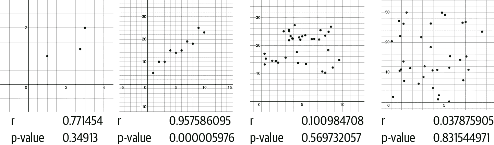

###### 图 5-15。不同数据集及其相关系数和 p 值

现在你有机会对来自图 5-15 的数据集进行分析后，让我们来看看结果。左侧图具有很高的正相关性，但只有三个数据点。数据不足显著提高了 p 值，达到 0.34913，并增加了数据发生偶然性的可能性。这是有道理的，因为只有三个数据点很可能会看到一个线性模式，但这并不比只有两个点好，这两个点只会连接一条直线。这提出了一个重要的规则：拥有更多数据将降低你的 p 值，特别是如果这些数据趋向于一条线。

第二幅图就是我们刚刚讨论的内容。它只有 10 个数据点，但形成了一个线性模式，我们不仅有很强的正相关性，而且 p 值极低。当 p 值如此之低时，你可以确定你正在测量一个经过精心设计和严格控制的过程，而不是某种社会学或自然现象。

图 5-15 中右侧的两幅图未能确定线性关系。它们的相关系数接近于 0，表明没有相关性，而 p 值不出所料地表明随机性起了作用。

规则是这样的：拥有更多数据且一致地类似于一条线，你的相关性的 p 值就会更显著。数据越分散或稀疏，p 值就会增加，从而表明你的相关性是由随机机会引起的。

# 决定系数

让我们学习一个在统计学和机器学习回归中经常见到的重要指标。*决定系数*，称为<math alttext="r squared"><msup><mi>r</mi> <mn>2</mn></msup></math>，衡量一个变量的变异有多少是由另一个变量的变异解释的。它也是相关系数<math alttext="r"><mi>r</mi></math>的平方。当<math alttext="r"><mi>r</mi></math>接近完美相关（-1 或 1）时，<math alttext="r squared"><msup><mi>r</mi> <mn>2</mn></msup></math>接近 1。基本上，<math alttext="r squared"><msup><mi>r</mi> <mn>2</mn></msup></math>显示了两个变量相互作用的程度。

让我们继续查看我们从图 5-13 中的数据。在示例 5-18 中，使用我们之前计算相关系数的数据框代码，然后简单地对其进行平方。这将使每个相关系数相互乘以自己。

##### 示例 5-18。在 Pandas 中创建相关性矩阵

```py
import pandas as pd

# Read data into Pandas dataframe
df = pd.read_csv('https://bit.ly/2KF29Bd', delimiter=",")

# Print correlations between variables
coeff_determination = df.corr(method='pearson') ** 2
print(coeff_determination)

# OUTPUT:
#           x         y
# x  1.000000  0.916971
# y  0.916971  1.000000
```

决定系数为 0.916971 被解释为*x*的变异的 91.6971%由*y*（反之亦然）解释，剩下的 8.3029%是由其他未捕获的变量引起的噪音；0.916971 是一个相当不错的决定系数，显示*x*和*y*解释彼此的方差。但可能有其他变量在起作用，占据了剩下的 0.083029。记住，相关性不等于因果关系，因此可能有其他变量导致我们看到的关系。

# 相关性不代表因果关系！

需要注意的是，虽然我们非常强调测量相关性并围绕其构建指标，请记住*相关性不代表因果关系*！你可能以前听过这句口头禅，但我想扩展一下统计学家为什么这么说。

仅仅因为我们看到*x*和*y*之间的相关性，并不意味着*x*导致*y*。实际上可能是*y*导致*x*！或者可能存在第三个未捕获的变量*z*导致*x*和*y*。也可能*x*和*y*根本不相互导致，相关性只是巧合，因此我们测量统计显著性非常重要。

现在我有一个更紧迫的问题要问你。计算机能区分相关性和因果关系吗？答案是“绝对不！”计算机有相关性的概念，但没有因果关系。假设我加载一个数据集到 scikit-learn，显示消耗的水量和我的水费。我的计算机，或包括 scikit-learn 在内的任何程序，都不知道更多的用水量是否导致更高的账单，或更高的账单是否导致更多的用水量。人工智能系统很容易得出后者的结论，尽管这是荒谬的。这就是为什么许多机器学习项目需要一个人来注入常识。

在计算机视觉中，这也会发生。计算机视觉通常会对数字像素进行回归以预测一个类别。如果我训练一个计算机视觉系统来识别牛，使用的是牛的图片，它可能会轻易地将场地与牛进行关联。因此，如果我展示一张空旷的场地的图片，它会将草地标记为牛！这同样是因为计算机没有因果关系的概念（牛的形状应该导致标签“牛”），而是陷入了我们不感兴趣的相关性中。

# 估计的标准误差

衡量线性回归整体误差的一种方法是*SSE*，或者*平方误差和*。我们之前学过这个概念，其中我们对每个残差进行平方并求和。如果<math alttext="ModifyingAbove y With caret"><mover accent="true"><mi>y</mi> <mo>^</mo></mover></math>（读作“y-hat”）是线上的每个预测值，而<math alttext="y"><mi>y</mi></math>代表数据中的每个实际 y 值，这里是计算公式：

<math alttext="upper S upper S upper E equals sigma-summation left-parenthesis y minus ModifyingAbove y With caret right-parenthesis squared" display="block"><mrow><mi>S</mi> <mi>S</mi> <mi>E</mi> <mo>=</mo> <mo>∑</mo> <msup><mrow><mo>(</mo><mi>y</mi><mo>-</mo><mover accent="true"><mi>y</mi> <mo>^</mo></mover><mo>)</mo></mrow> <mn>2</mn></msup></mrow></math>

然而，所有这些平方值很难解释，所以我们可以使用一些平方根逻辑将事物重新缩放到它们的原始单位。我们还将所有这些值求平均，这就是*估计的标准误差（<math alttext="upper S Subscript e"><msub><mi>S</mi> <mi>e</mi></msub></math>)*的作用。如果*n*是数据点的数量，示例 5-19 展示了我们如何在 Python 中计算标准误差<math alttext="upper S Subscript e"><msub><mi>S</mi> <mi>e</mi></msub></math>。

<math alttext="upper S Subscript e Baseline equals StartFraction sigma-summation left-parenthesis y minus ModifyingAbove y With caret right-parenthesis squared Over n minus 2 EndFraction" display="block"><mrow><msub><mi>S</mi> <mi>e</mi></msub> <mo>=</mo> <mfrac><mrow><mo>∑</mo><msup><mrow><mo>(</mo><mi>y</mi><mo>-</mo><mover accent="true"><mi>y</mi> <mo>^</mo></mover><mo>)</mo></mrow> <mn>2</mn></msup></mrow> <mrow><mi>n</mi><mo>-</mo><mn>2</mn></mrow></mfrac></mrow></math>

##### 示例 5-19。计算估计的标准误差

```py
Here is how we calculate it in Python:

import pandas as pd
from math import sqrt

# Load the data
points = list(pd.read_csv('https://bit.ly/2KF29Bd', delimiter=",").itertuples())

n = len(points)

# Regression line
m = 1.939
b = 4.733

# Calculate Standard Error of Estimate
S_e = sqrt((sum((p.y - (m*p.x +b))**2 for p in points))/(n-2))

print(S_e)
# 1.87406793500129
```

为什么是<math alttext="n minus 2"><mrow><mi>n</mi> <mo>-</mo> <mn>2</mn></mrow></math>而不是像我们在第三章中的许多方差计算中所做的<math alttext="n minus 1"><mrow><mi>n</mi> <mo>-</mo> <mn>1</mn></mrow></math>？不深入数学证明，这是因为线性回归有两个变量，而不只是一个，所以我们必须在自由度中再增加一个不确定性。

你会注意到估计的标准误差看起来与我们在第三章中学习的标准差非常相似。这并非偶然。这是因为它是线性回归的标准差。

# 预测区间

正如前面提到的，线性回归中的数据是从一个总体中取样得到的。因此，我们的回归结果只能和我们的样本一样好。我们的线性回归线也沿着正态分布运行。实际上，这使得每个预测的 y 值都像均值一样是一个样本统计量。事实上，“均值”沿着这条线移动。

还记得我们在第二章中讨论方差和标准差吗？这些概念在这里也适用。通过线性回归，我们希望数据以线性方式遵循正态分布。回归线充当我们钟形曲线的“均值”，数据围绕该线的分布反映了方差/标准差，如图 5-16 所示。

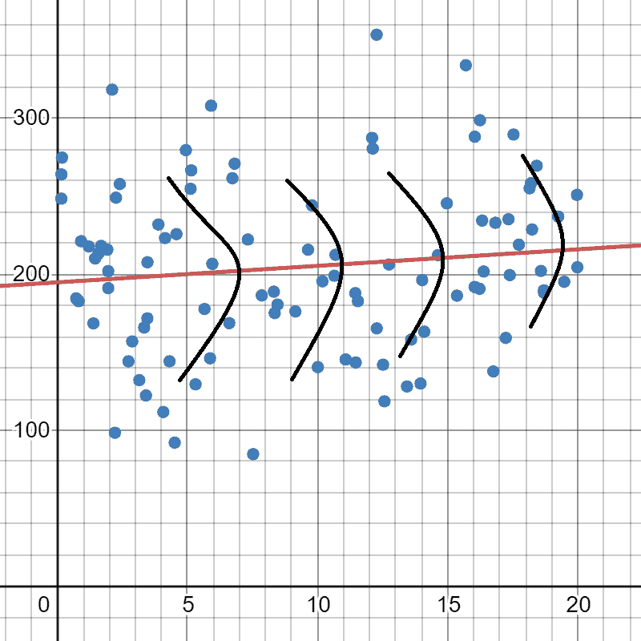

###### 图 5-16。线性回归假设正态分布遵循该线

当我们有一个正态分布遵循线性回归线时，我们不仅有一个变量，还有第二个变量引导着分布。每个*y*预测周围都有一个置信区间，这被称为*预测区间*。

让我们通过兽医示例重新带回一些背景，估计一只狗的年龄和兽医访问次数。我想知道一个 8.5 岁狗的兽医访问次数的 95%置信度的预测区间。这个预测区间的样子如图 5-17 所示。我们有 95%的信心，一个 8.5 岁的狗将有 16.462 到 25.966 次兽医访问。

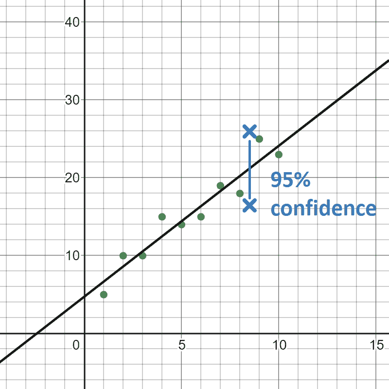

###### 图 5-17。一个 8.5 岁狗的 95%置信度的预测区间

我们如何计算这个？我们需要得到误差边界，并在预测的 y 值周围加减。这是一个涉及 T 分布的临界值以及估计标准误差的庞大方程。让我们来看一下：

<math alttext="upper E equals t Subscript .025 Baseline asterisk upper S Subscript e Baseline asterisk StartRoot 1 plus StartFraction 1 Over n EndFraction plus StartFraction n left-parenthesis x 0 plus x overbar right-parenthesis squared Over n left-parenthesis sigma-summation x squared right-parenthesis minus left-parenthesis sigma-summation x right-parenthesis squared EndFraction EndRoot" display="block"><mrow><mi>E</mi> <mo>=</mo> <msub><mi>t</mi> <mtext>.025</mtext></msub> <mo>*</mo> <msub><mi>S</mi> <mi>e</mi></msub> <mo>*</mo> <msqrt><mrow><mn>1</mn> <mo>+</mo> <mfrac><mn>1</mn> <mi>n</mi></mfrac> <mo>+</mo> <mfrac><mrow><mi>n</mi><msup><mrow><mo>(</mo><msub><mi>x</mi> <mn>0</mn></msub> <mo>+</mo><mover accent="true"><mi>x</mi> <mo>¯</mo></mover><mo>)</mo></mrow> <mn>2</mn></msup></mrow> <mrow><mi>n</mi><mrow><mo>(</mo><mo>∑</mo><msup><mi>x</mi> <mn>2</mn></msup> <mo>)</mo></mrow><mo>-</mo><msup><mrow><mo>(</mo><mo>∑</mo><mi>x</mi><mo>)</mo></mrow> <mn>2</mn></msup></mrow></mfrac></mrow></msqrt></mrow></math>

我们感兴趣的 x 值被指定为<math alttext="x 0"><msub><mi>x</mi> <mn>0</mn></msub></math>，在这种情况下是 8.5。这是我们如何在 Python 中解决这个问题的，如示例 5-20 所示。

##### 示例 5-20。计算一只 8.5 岁狗的兽医访问预测区间

```py
import pandas as pd
from scipy.stats import t
from math import sqrt

# Load the data
points = list(pd.read_csv('https://bit.ly/2KF29Bd', delimiter=",").itertuples())

n = len(points)

# Linear Regression Line
m = 1.939
b = 4.733

# Calculate Prediction Interval for x = 8.5
x_0 = 8.5
x_mean = sum(p.x for p in points) / len(points)

t_value = t(n - 2).ppf(.975)

standard_error = sqrt(sum((p.y - (m * p.x + b)) ** 2 for p in points) / (n - 2))

margin_of_error = t_value * standard_error * \
                  sqrt(1 + (1 / n) + (n * (x_0 - x_mean) ** 2) / \
                       (n * sum(p.x ** 2 for p in points) - \
                            sum(p.x for p in points) ** 2))

predicted_y = m*x_0 + b

# Calculate prediction interval
print(predicted_y - margin_of_error, predicted_y + margin_of_error)
# 16.462516875955465 25.966483124044537
```

哎呀！这是很多计算，不幸的是，SciPy 和其他主流数据科学库都不会做这个。但如果你倾向于统计分析，这是非常有用的信息。我们不仅基于线性回归创建预测（例如，一只 8.5 岁的狗将有 21.2145 次兽医访问），而且实际上能够说出一些远非绝对的东西：一个 8.5 岁的狗会在 16.46 到 25.96 次之间访问兽医的概率为 95%。很棒，对吧？这是一个更安全的说法，因为它涵盖了一个范围而不是一个单一值，因此考虑了不确定性。

# 训练/测试分割

我刚刚进行的这个分析，包括相关系数、统计显著性和决定系数，不幸的是并不总是由从业者完成。有时候他们处理的数据太多，没有时间或技术能力这样做。例如，一个 128×128 像素的图像至少有 16,384 个变量。你有时间对每个像素变量进行统计分析吗？可能没有！不幸的是，这导致许多数据科学家根本不学习这些统计指标。

在一个[不知名的在线论坛](http://disq.us/p/1jas3zg)上，我曾经看到一篇帖子说统计回归是手术刀，而机器学习是电锯。当处理大量数据和变量时，你无法用手术刀筛选所有这些。你必须求助于电锯，虽然你会失去可解释性和精度，但至少可以扩展到更多数据上进行更广泛的预测。话虽如此，抽样偏差和过拟合等统计问题并没有消失。但有一些实践方法可以用于快速验证。

# 为什么 scikit-learn 中没有置信区间和 P 值？

Scikit-learn 不支持置信区间和 P 值，因为这两种技术对于高维数据是一个悬而未决的问题。这只强调了统计学家和机器学习从业者之间的差距。正如 scikit-learn 的一位维护者 Gael Varoquaux 所说，“通常计算正确的 P 值需要对数据做出假设，而这些假设并不符合机器学习中使用的数据（没有多重共线性，与维度相比有足够的数据）....P 值是一种期望得到很好检查的东西（在医学研究中是一种保护）。实现它们会带来麻烦....我们只能在非常狭窄的情况下给出 P 值[有少量变量]。”

如果你想深入了解，GitHub 上有一些有趣的讨论：

+   [*https://github.com/scikit-learn/scikit-learn/issues/6773*](https://github.com/scikit-learn/scikit-learn/issues/6773)

+   [*https://github.com/scikit-learn/scikit-learn/issues/16802*](https://github.com/scikit-learn/scikit-learn/issues/16802)

如前所述，[statsmodel](https://oreil.ly/8oEHo) 是一个为统计分析提供有用工具的库。只是要知道，由于前述原因，它可能不会适用于更大维度的模型。

机器学习从业者用于减少过拟合的基本技术之一是一种称为*训练/测试分割*的实践，通常将 1/3 的数据用于测试，另外的 2/3 用于训练（也可以使用其他比例）。*训练数据集*用于拟合线性回归，而*测试数据集*用于衡量线性回归在之前未见数据上的表现。这种技术通常用于所有监督学习，包括逻辑回归和神经网络。图 5-18 显示了我们如何将数据分割为 2/3 用于训练和 1/3 用于测试的可视化。

# 这是一个小数据集

正如我们将在后面学到的，有其他方法可以将训练/测试数据集分割为 2/3 和 1/3。如果你有一个这么小的数据集，你可能最好使用 9/10 和 1/10 与交叉验证配对，或者甚至只使用留一交叉验证。查看“训练/测试分割是否必须是三分之一？” 以了解更多。

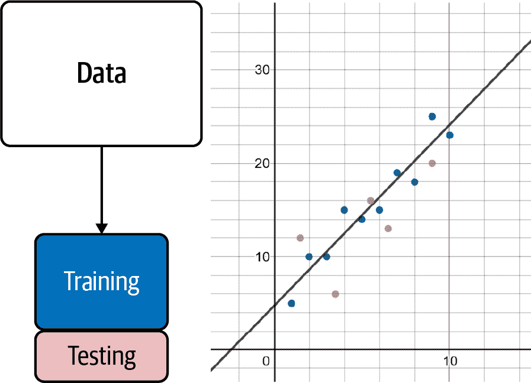

###### 图 5-18\. 将数据分割为训练/测试数据—使用最小二乘法将线拟合到训练数据（深蓝色），然后分析测试数据（浅红色）以查看预测在之前未见数据上的偏差

示例 5-21 展示了如何使用 scikit-learn 执行训练/测试分割，其中 1/3 的数据用于测试，另外的 2/3 用于训练。

# 训练即拟合回归

记住，“拟合”回归与“训练”是同义词。后者是机器学习从业者使用的词语。

##### 示例 5-21\. 在线性回归上进行训练/测试分割

```py
import pandas as pd
from sklearn.linear_model import LinearRegression
from sklearn.model_selection import train_test_split

# Load the data
df = pd.read_csv('https://bit.ly/3cIH97A', delimiter=",")

# Extract input variables (all rows, all columns but last column)
X = df.values[:, :-1]

# Extract output column (all rows, last column)
Y = df.values[:, -1]

# Separate training and testing data
# This leaves a third of the data out for testing
X_train, X_test, Y_train, Y_test = train_test_split(X, Y, test_size=1/3)

model = LinearRegression()
model.fit(X_train, Y_train)
result = model.score(X_test, Y_test)
print("r²: %.3f" % result)
```

注意，`train_test_split()`将获取我们的数据集（*X* 和 *Y* 列），对其进行洗牌，然后根据我们的测试数据集大小返回我们的训练和测试数据集。我们使用`LinearRegression`的`fit()`函数来拟合训练数据集`X_train`和`Y_train`。然后我们使用`score()`函数在测试数据集`X_test`和`Y_test`上评估<math alttext="r squared"><msup><mi>r</mi> <mn>2</mn></msup></math>，从而让我们了解回归在之前未见过的数据上的表现。测试数据集的<math alttext="r squared"><msup><mi>r</mi> <mn>2</mn></msup></math>值越高，表示回归在之前未见过的数据上表现越好。具有更高数值的数字表示回归在之前未见过的数据上表现良好。

我们还可以在每个 1/3 折叠中交替使用测试数据集。这被称为*交叉验证*，通常被认为是验证技术的黄金标准。图 5-20 显示了数据的每个 1/3 轮流成为测试数据集。

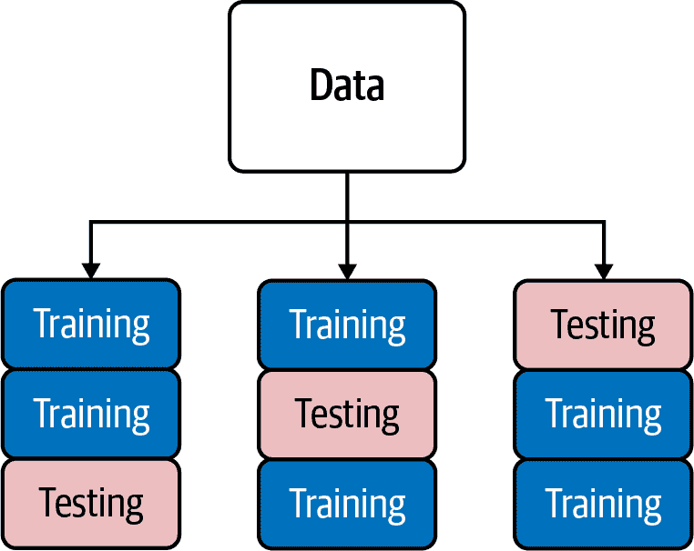

###### 图 5-20\. 三折交叉验证的可视化

示例 5-22 中的代码展示了跨三个折叠进行的交叉验证，然后评分指标（在本例中为均方和 [MSE]）与其标准偏差一起平均，以展示每个测试的一致性表现。

##### 示例 5-22\. 使用三折交叉验证进行线性回归

```py
import pandas as pd
from sklearn.linear_model import LinearRegression
from sklearn.model_selection import KFold, cross_val_score

df = pd.read_csv('https://bit.ly/3cIH97A', delimiter=",")

# Extract input variables (all rows, all columns but last column)
X = df.values[:, :-1]

# Extract output column (all rows, last column)\
Y = df.values[:, -1]

# Perform a simple linear regression
kfold = KFold(n_splits=3, random_state=7, shuffle=True)
model = LinearRegression()
results = cross_val_score(model, X, Y, cv=kfold)
print(results)
print("MSE: mean=%.3f (stdev-%.3f)" % (results.mean(), results.std()))
```

当你开始关注模型中的方差时，你可以采用*随机折叠验证*，而不是简单的训练/测试拆分或交叉验证，重复地对数据进行洗牌和训练/测试拆分无限次，并汇总测试结果。在示例 5-23 中，有 10 次随机抽取数据的 1/3 进行测试，其余 2/3 进行训练。然后将这 10 个测试结果与它们的标准偏差平均，以查看测试数据集的表现一致性。

有什么问题？这在计算上非常昂贵，因为我们要多次训练回归。

##### 示例 5-23\. 使用随机折叠验证进行线性回归

```py
import pandas as pd
from sklearn.linear_model import LinearRegression
from sklearn.model_selection import cross_val_score, ShuffleSplit

df = pd.read_csv('https://bit.ly/38XwbeB', delimiter=",")

# Extract input variables (all rows, all columns but last column)
X = df.values[:, :-1]

# Extract output column (all rows, last column)\
Y = df.values[:, -1]

# Perform a simple linear regression
kfold = ShuffleSplit(n_splits=10, test_size=.33, random_state=7)
model = LinearRegression()
results = cross_val_score(model, X, Y, cv=kfold)

print(results)
print("mean=%.3f (stdev-%.3f)" % (results.mean(), results.std()))
```

因此，当你时间紧迫或数据量过大无法进行统计分析时，训练/测试拆分将提供一种衡量线性回归在未见过的数据上表现如何的方法。

# 训练/测试拆分并不保证结果

值得注意的是，仅仅因为你应用了机器学习的最佳实践，将训练和测试数据拆分，这并不意味着你的模型会表现良好。你很容易过度调整模型，并通过一些手段获得良好的测试结果，但最终发现在现实世界中并不奏效。这就是为什么有时候需要保留另一个数据集，称为*验证集*，特别是当你在比较不同模型或配置时。这样，你对训练数据的调整以获得更好的测试数据性能不会泄漏信息到训练中。你可以使用验证数据集作为最后一道防线，查看是否过度调整导致你对测试数据过拟合。

即使如此，你的整个数据集（包括训练、测试和验证）可能一开始就存在偏差，没有任何拆分可以减轻这种情况。Andrew Ng 在他与 [DeepLearning.AI 和 Stanford HAI 的问答环节](https://oreil.ly/x23SJ) 中讨论了这个问题，他通过一个例子说明了为什么机器学习尚未取代放射科医生。

# 多元线性回归

在本章中，我们几乎完全专注于对一个输入变量和一个输出变量进行线性回归。然而，我们在这里学到的概念应该基本适用于多变量线性回归。像<math alttext="r squared"><msup><mi>r</mi> <mn>2</mn></msup></math>、标准误差和置信区间等指标可以使用，但随着变量的增加变得更加困难。示例 5-24 是一个使用 scikit-learn 进行的具有两个输入变量和一个输出变量的线性回归示例。

##### 示例 5-24。具有两个输入变量的线性回归

```py
import pandas as pd
from sklearn.linear_model import LinearRegression

# Load the data
df = pd.read_csv('https://bit.ly/2X1HWH7', delimiter=",")

# Extract input variables (all rows, all columns but last column)
X = df.values[:, :-1]

# Extract output column (all rows, last column)\
Y = df.values[:, -1]

# Training
fit = LinearRegression().fit(X, Y)

# Print coefficients
print("Coefficients = {0}".format(fit.coef_))
print("Intercept = {0}".format(fit.intercept_))
print("z = {0} + {1}x + {2}y".format(fit.intercept_, fit.coef_[0], fit.coef_[1]))
```

当模型变得充斥着变量以至于开始失去可解释性时，就会出现一定程度的不稳定性，这时机器学习实践开始将模型视为黑匣子。希望你相信统计问题并没有消失，随着添加的变量越来越多，数据变得越来越稀疏。但是，如果你退后一步，使用相关矩阵分析每对变量之间的关系，并寻求理解每对变量是如何相互作用的，这将有助于你努力创建一个高效的机器学习模型。

# 结论

在这一章中我们涵盖了很多内容。我们试图超越对线性回归的肤浅理解，并且不仅仅将训练/测试分割作为我们唯一的验证方式。我想向你展示割刀（统计学）和电锯（机器学习），这样你可以判断哪种对于你遇到的问题更好。仅在线性回归中就有许多指标和分析方法可用，我们涵盖了其中一些以了解线性回归是否可靠用于预测。你可能会发现自己处于一种情况，要么做出广泛的近似回归，要么使用统计工具仔细分析和整理数据。你使用哪种方法取决于情况，如果你想了解更多关于 Python 可用的统计工具，请查看[statsmodel 库](https://oreil.ly/8oEHo)。

在第六章中涵盖逻辑回归时，我们将重新审视<math alttext="r squared"><msup><mi>r</mi> <mn>2</mn></msup></math>和统计显著性。希望这一章能让你相信有方法可以有意义地分析数据，并且这种投资可以在成功的项目中产生差异。

# 练习

提供了一个包含两个变量*x*和*y*的数据集[这里](https://bit.ly/3C8JzrM)。

1.  执行简单的线性回归，找到最小化损失（平方和）的*m*和*b*值。

1.  计算这些数据的相关系数和统计显著性（95%置信度）。相关性是否有用？

1.  如果我预测*x*=50，那么*y*的预测值的 95%预测区间是多少？

1.  重新开始你的回归，并进行训练/测试分割。随意尝试交叉验证和随机折叠验证。线性回归在测试数据上表现良好且一致吗？为什么？

答案在附录 B 中。
