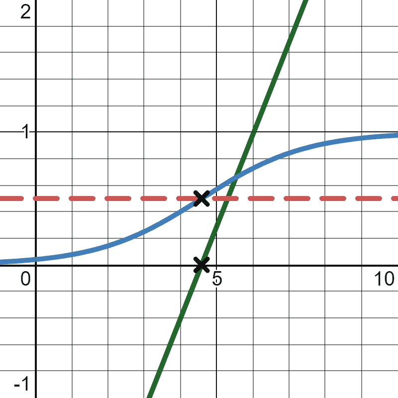

# 第六章 逻辑回归和分类

在本章中，我们将介绍*逻辑回归*，一种根据一个或多个自变量预测结果概率的回归类型。这反过来可以用于*分类*，即预测类别而不是像线性回归那样预测实数。

我们并不总是对将变量表示为*连续*感兴趣，其中它们可以表示无限数量的实数十进制值。有些情况下，我们更希望变量是*离散*的，或者代表整数、布尔值（1/0，真/假）。逻辑回归是在一个离散的输出变量上进行训练的（二进制 1 或 0）或一个分类数字（整数）。它输出一个概率的连续变量，但可以通过阈值转换为离散值。

逻辑回归易于实现，并且相对抗干扰和其他数据挑战。许多机器学习问题最好通过逻辑回归来解决，提供比其他类型的监督式机器学习更实用和更高性能的解决方案。

就像我们在第五章中讨论线性回归时所做的那样，我们将尝试在统计学和机器学习之间找到平衡，使用两个学科的工具和分析。逻辑回归将整合我们从本书中学到的许多概念，从概率到线性回归。

# 理解逻辑回归

想象一下，发生了一起小型工业事故，你正在尝试了解化学物质暴露的影响。有 11 名患者暴露于不同小时数的化学物质中（请注意这是虚构数据）。一些患者出现了症状（值为 1），而另一些没有出现症状（值为 0）。让我们在图 6-1 中绘制它们，其中 x 轴是暴露的小时数，y 轴是他们是否出现了症状（1 或 0）。


###### 图 6-1。绘制患者在* x *小时暴露后是否出现症状（1）或未出现症状（0）

患者在多长时间后开始出现症状？很容易看到，几乎在四小时后，我们立即从患者不出现症状（0）转变为出现症状（1）。在图 6-2 中，我们看到相同的数据带有一个预测曲线。


###### 图 6-2。四小时后，我们看到患者开始出现症状的明显跳跃

对这个样本进行粗略分析，我们可以说，暴露时间少于四小时的患者几乎不可能出现症状，但暴露时间超过四小时的患者出现症状的概率为 100%。在这两组之间，大约在四小时左右立即跳跃到出现症状。

当然，在现实世界中，没有什么是如此清晰明了的。假设你收集了更多数据，在范围的中间有一些患者表现出症状与不表现症状的混合，如图 6-3 所示。


###### 图 6-3\. 中间存在一些表现出症状（1）和不表现症状（0）的患者混合

解释这一点的方式是，随着每小时的暴露，患者表现出症状的概率逐渐增加。让我们用一个*逻辑函数*或一个 S 形曲线来可视化这一点，其中输出变量被挤压在 0 和 1 之间，如图 6-4 所示。


###### 图 6-4\. 将逻辑函数拟合到数据上

由于中间点的重叠，当患者表现出症状时没有明显的分界线，而是从 0%概率逐渐过渡到 100%概率（0 和 1）。这个例子展示了*逻辑回归*如何产生一个曲线，表示属于真实类别（患者表现出症状）的概率在一个独立变量（暴露小时数）上。

我们可以重新利用逻辑回归，不仅预测给定输入变量的概率，还可以添加一个阈值来预测它是否属于该类别。例如，如果我得到一个新患者，并发现他们暴露了六个小时，我预测他们有 71.1%的机会表现出症状，如图 6-5 所示。如果我的阈值至少为 50%的概率表现出症状，我将简单地分类为患者将表现出症状。


###### 图 6-5\. 我们可以预期一个暴露了六个小时的患者有 71.1%的可能表现出症状，因为这大于 50%的阈值，我们预测他们将表现出症状

# 进行逻辑回归

那么我们如何进行逻辑回归呢？让我们首先看看逻辑函数，并探索其背后的数学。

## 逻辑函数

*逻辑函数*是一个 S 形曲线（也称为*sigmoid 曲线*），对于给定的一组输入变量，产生一个在 0 和 1 之间的输出变量。因为输出变量在 0 和 1 之间，它可以用来表示概率。

这是一个输出一个输入变量*x*的概率*y*的逻辑函数：

<math display="block"><mrow><mi>y</mi> <mo>=</mo> <mfrac><mrow><mn>1.0</mn></mrow> <mrow><mn>1.0</mn><mo>+</mo><msup><mi>e</mi> <mrow><mo>-</mo><mo>(</mo><msub><mi>β</mi> <mn>0</mn></msub> <mo>+</mo><msub><mi>β</mi> <mn>1</mn></msub> <mi>x</mi><mo>)</mo></mrow></msup></mrow></mfrac></mrow></math>

请注意，这个公式使用了欧拉数<math alttext="e"><mi>e</mi></math>，我们在第一章中讨论过。*x*变量是独立/输入变量。<math alttext="beta 0"><msub><mi>β</mi> <mn>0</mn></msub></math>和<math alttext="beta 1"><msub><mi>β</mi> <mn>1</mn></msub></math>是我们需要解决的系数。

<math alttext="beta 0"><msub><mi>β</mi> <mn>0</mn></msub></math> 和 <math alttext="beta 1"><msub><mi>β</mi> <mn>1</mn></msub></math> 被打包在一个类似于线性函数的指数中，你可能会记得它看起来与 <math alttext="y equals m x plus b"><mrow><mi>y</mi> <mo>=</mo> <mi>m</mi> <mi>x</mi> <mo>+</mo> <mi>b</mi></mrow></math> 或 <math alttext="y equals beta 0 plus beta 1 x"><mrow><mi>y</mi> <mo>=</mo> <msub><mi>β</mi> <mn>0</mn></msub> <mo>+</mo> <msub><mi>β</mi> <mn>1</mn></msub> <mi>x</mi></mrow></math> 相同。这并非巧合；逻辑回归实际上与线性回归有着密切的关系，我们将在本章后面讨论。实际上，<math alttext="beta 0"><msub><mi>β</mi> <mn>0</mn></msub></math> 是截距（在简单线性回归中我们称之为<math alttext="b"><mi>b</mi></math>），<math alttext="beta 1"><msub><mi>β</mi> <mn>1</mn></msub></math> 是*x*的斜率（在简单线性回归中我们称之为<math alttext="m"><mi>m</mi></math>）。指数中的这个线性函数被称为对数几率函数，但现在只需知道整个逻辑函数产生了我们需要在 x 值上输出移动概率的 S 形曲线。

要在 Python 中声明逻辑函数，使用`math`包中的`exp()`函数声明*e*指数，如示例 6-1 所示。

##### 示例 6-1\. Python 中用于一个自变量的逻辑函数

```py
import math

def predict_probability(x, b0, b1):
    p = 1.0 / (1.0 + math.exp(-(b0 + b1 * x)))
    return p
```

让我们绘制一下看看它是什么样子，并假设*Β*[0] = –2.823 和 *Β*[1] = 0.62。我们将在示例 6-2 中使用 SymPy，输出图形显示在图 6-6 中。

##### 示例 6-2\. 使用 SymPy 绘制逻辑函数

```py
from sympy import *
b0, b1, x = symbols('b0 b1 x')

p = 1.0 / (1.0 + exp(-(b0 + b1 * x)))

p = p.subs(b0,-2.823)
p = p.subs(b1, 0.620)
print(p)

plot(p)
```


###### 图 6-6\. 一个逻辑函数

在一些教科书中，你可能会看到逻辑函数被这样声明：

<math alttext="p equals StartFraction e Superscript beta 0 plus beta 1 x Baseline Over 1 plus e Superscript beta 0 plus beta Baseline 1 x Baseline EndFraction" display="block"><mrow><mi>p</mi> <mo>=</mo> <mfrac><msup><mi>e</mi> <mrow><msub><mi>β</mi> <mn>0</mn></msub> <mo>+</mo><msub><mi>β</mi> <mn>1</mn></msub> <mi>x</mi></mrow></msup> <mrow><mn>1</mn><mo>+</mo><msup><mi>e</mi> <mrow><msub><mi>β</mi> <mn>0</mn></msub> <mo>+</mo><mi>β</mi><mn>1</mn><mi>x</mi></mrow></msup></mrow></mfrac></mrow></math>

不要为此担心，因为这是相同的函数，只是代数上表达不同。注意，像线性回归一样，我们也可以将逻辑回归扩展到多于一个输入变量（<math alttext="x 1 comma x 2 comma period period period x Subscript n Baseline"><mrow><msub><mi>x</mi> <mn>1</mn></msub> <mo>,</mo> <msub><mi>x</mi> <mn>2</mn></msub> <mo>,</mo> <mo>.</mo> <mo>.</mo> <mo>.</mo> <msub><mi>x</mi> <mi>n</mi></msub></mrow></math>），如此公式所示。我们只需添加更多的<math alttext="beta Subscript x"><msub><mi>β</mi> <mi>x</mi></msub></math> 系数：

<math alttext="p equals StartFraction 1 Over 1 plus e Superscript minus left-parenthesis beta 0 plus beta 1 x 1 plus beta 2 x 2 plus period period period beta Super Subscript n Superscript x Super Subscript n Superscript right-parenthesis Baseline EndFraction" display="block"><mrow><mi>p</mi> <mo>=</mo> <mfrac><mn>1</mn> <mrow><mn>1</mn><mo>+</mo><msup><mi>e</mi> <mrow><mo>-</mo><mo>(</mo><msub><mi>β</mi> <mn>0</mn></msub> <mo>+</mo><msub><mi>β</mi> <mn>1</mn></msub> <msub><mi>x</mi> <mn>1</mn></msub> <mo>+</mo><msub><mi>β</mi> <mn>2</mn></msub> <msub><mi>x</mi> <mn>2</mn></msub> <mo>+</mo><mo>.</mo><mo>.</mo><mo>.</mo><msub><mi>β</mi> <mi>n</mi></msub> <msub><mi>x</mi> <mi>n</mi></msub> <mo>)</mo></mrow></msup></mrow></mfrac></mrow></math>

## 拟合逻辑曲线

如何将逻辑曲线拟合到给定的训练数据集？首先，数据可以包含任意混合的十进制、整数和二进制变量，但输出变量必须是二进制（0 或 1）。当我们实际进行预测时，输出变量将在 0 和 1 之间，类似于概率。

数据提供了我们的输入和输出变量值，但我们需要解出<math alttext="beta 0"><msub><mi>β</mi> <mn>0</mn></msub></math>和<math alttext="beta 1"><msub><mi>β</mi> <mn>1</mn></msub></math>系数以拟合我们的逻辑函数。回想一下我们在 Chapter 5 中如何使用最小二乘法。然而，在这里不适用这种方法。相反，我们使用*最大似然估计*，顾名思义，最大化给定逻辑曲线输出观测数据的可能性。

要计算最大似然估计，实际上没有像线性回归那样的封闭形式方程。我们仍然可以使用梯度下降，或者让一个库来为我们做这件事。让我们从库 SciPy 开始涵盖这两种方法。

### 使用 SciPy

SciPy 的好处在于，模型通常具有一套标准化的函数和 API，这意味着在许多情况下，您可以复制/粘贴您的代码，然后在模型之间重复使用它。在 Example 6-3 中，您将看到我们的患者数据上执行的逻辑回归。如果您将其与我们在 Chapter 5 中的线性回归代码进行比较，您将看到在导入、分离和拟合数据方面几乎完全相同的代码。主要区别在于我使用`LogisticRegression()`作为我的模型，而不是`LinearRegression()`。

##### 示例 6-3。在 SciPy 中使用普通逻辑回归

```py
import pandas as pd
from sklearn.linear_model import LogisticRegression

# Load the data
df = pd.read_csv('https://bit.ly/33ebs2R', delimiter=",")

# Extract input variables (all rows, all columns but last column)
X = df.values[:, :-1]

# Extract output column (all rows, last column)
Y = df.values[:, -1]

# Perform logistic regression
# Turn off penalty
model = LogisticRegression(penalty='none')
model.fit(X, Y)

# print beta1
print(model.coef_.flatten()) # 0.69267212

# print beta0
print(model.intercept_.flatten()) # -3.17576395
```

在 SciPy 中运行模型后，我得到一个逻辑回归，其中*β*[0] = –3.17576395，*β*[1] = 0.69267212。当我绘制这个图时，应该看起来很好，就像在 Figure 6-7 中显示的那样。


###### 图 6-7。绘制逻辑回归

这里有几件事情需要注意。当我创建`LogisticRegression()`模型时，我没有指定`penalty`参数，这会选择像`l1`或`l2`这样的正则化技术。虽然这超出了本书的范围，但我在以下注释“学习关于 SciPy 参数”中包含了简要见解，以便您手边有有用的参考资料。

最后，我将`flatten()`系数和截距，这些系数和截距出来时是多维矩阵，但只有一个元素。*Flattening*意味着将一组数字的矩阵折叠成较小的维度，特别是当元素少于维度时。例如，我在这里使用`flatten()`来将嵌套在二维矩阵中的单个数字提取出来作为单个值。然后我有了我的<math alttext="beta 0"><msub><mi>β</mi> <mn>0</mn></msub></math>和<math alttext="beta 1"><msub><mi>β</mi> <mn>1</mn></msub></math>系数。

# 学习关于 SciPy 参数

SciPy 在其回归和分类模型中提供了许多选项。不幸的是，由于这不是一本专门关注机器学习的书籍，没有足够的带宽或页面来覆盖它们。

然而，SciPy 文档写得很好，逻辑回归页面在[这里](https://oreil.ly/eL8hZ)找到。

如果很多术语都很陌生，比如正则化和`l1`和`l2`惩罚，还有其他很棒的 O’Reilly 书籍探讨这些主题。我发现其中一本更有帮助的书是由 Aurélien Géron 撰写的*Hands-On Machine Learning with Scikit-Learn, Keras, and TensorFlow*。

### 使用最大似然和梯度下降

正如我在整本书中所做的，我旨在提供关于从头开始构建技术的见解，即使库可以为我们完成。有几种方法可以自己拟合逻辑回归，但所有方法通常都转向最大似然估计（MLE）。MLE 最大化了给定逻辑曲线输出观测数据的可能性。这与平方和不同，但我们仍然可以应用梯度下降或随机梯度下降来解决它。

我会尽量简化数学术语，并尽量减少线性代数的内容。基本上，这个想法是找到使我们的逻辑曲线尽可能接近这些点的<math alttext="beta 0"><msub><mi>β</mi> <mn>0</mn></msub></math>和<math alttext="beta 1"><msub><mi>β</mi> <mn>1</mn></msub></math>系数，表明它最有可能产生这些点。如果你还记得第二章中我们学习概率时，我们通过将多个事件的概率（或可能性）相乘来组合它们。在这个应用中，我们正在计算我们会看到所有这些点的可能性，对于给定的逻辑回归曲线。

应用联合概率的概念，每个患者都有一个基于拟合的逻辑函数的可能性，如图 6-8 所示。


###### 图 6-8\. 每个输入值在逻辑曲线上都有相应的可能性

我们从逻辑回归曲线上方或下方获取每个点的可能性。如果点在逻辑回归曲线下方，我们需要从 1.0 中减去结果概率，因为我们也想最大化假阳性。

给定系数*β*[0] = –3.17576395 和*β*[1] = 0.69267212，示例 6-4 展示了我们如何在 Python 中计算这些数据的联合概率。

##### 示例 6-4\. 计算给定逻辑回归观察到所有点的联合概率

```py
import math
import pandas as pd

patient_data = pd.read_csv('https://bit.ly/33ebs2R', delimiter=",").itertuples()

b0 = -3.17576395
b1 = 0.69267212

def logistic_function(x):
    p = 1.0 / (1.0 + math.exp(-(b0 + b1 * x)))
    return p

# Calculate the joint likelihood
joint_likelihood = 1.0

for p in patient_data:
    if p.y == 1.0:
        joint_likelihood *= logistic_function(p.x)
    elif p.y == 0.0:
        joint_likelihood *= (1.0 - logistic_function(p.x))

print(joint_likelihood) # 4.7911180221699105e-05
```

这里有一个数学技巧，我们可以用来压缩那个`if`表达式。正如我们在第一章中讨论的，当你将任何数的幂设为 0 时，结果总是 1。看看这个公式，并注意指数中对真（1）和假（0）情况的处理：

<math display="block"><mrow><mtext>joint likelihood</mtext> <mo>=</mo> <munderover><mo>∏</mo> <mrow><mi>i</mi><mo>=</mo><mn>1</mn></mrow> <mi>n</mi></munderover> <msup><mrow><mo>(</mo><mfrac><mrow><mn>1.0</mn></mrow> <mrow><mn>1.0</mn><mo>+</mo><msup><mi>e</mi> <mrow><mo>-</mo><mo>(</mo><msub><mi>β</mi> <mn>0</mn></msub> <mo>+</mo><msub><mi>β</mi> <mn>1</mn></msub> <msub><mi>x</mi> <mi>i</mi></msub> <mo>)</mo></mrow></msup></mrow></mfrac> <mo>)</mo></mrow> <msub><mi>y</mi> <mi>i</mi></msub></msup> <mo>×</mo> <msup><mrow><mo>(</mo><mfrac><mrow><mn>1.0</mn></mrow> <mrow><mn>1.0</mn><mo>+</mo><msup><mi>e</mi> <mrow><mo>-</mo><mo>(</mo><msub><mi>β</mi> <mn>0</mn></msub> <mo>+</mo><msub><mi>β</mi> <mn>1</mn></msub> <msub><mi>x</mi> <mi>i</mi></msub> <mo>)</mo></mrow></msup></mrow></mfrac> <mo>)</mo></mrow> <mrow><mn>1.0</mn><mo>-</mo><msub><mi>y</mi> <mi>i</mi></msub></mrow></msup></mrow></math>

要在 Python 中实现这一点，将`for`循环中的所有内容压缩到示例 6-5 中。

##### 示例 6-5\. 在不使用`if`表达式的情况下压缩联合概率计算

```py
for p in patient_data:
    joint_likelihood *= logistic_function(p.x) ** p.y * \
                        (1.0 - logistic_function(p.x)) ** (1.0 - p.y)
```

我到底做了什么？注意这个表达式有两个部分，一个是当<math alttext="y 等于 1"><mrow><mi>y</mi> <mo>=</mo> <mn>1</mn></mrow></math>时，另一个是当<math alttext="y 等于 0"><mrow><mi>y</mi> <mo>=</mo> <mn>0</mn></mrow></math>时。当任何数被提升到指数 0 时，结果将为 1。因此，无论*y*是 1 还是 0，它都会导致另一侧的条件评估为 1 并且在乘法中没有影响。我们可以用数学表达式完全表达我们的`if`表达式。我们无法对使用`if`的表达式进行导数，所以这将很有帮助。

请注意，计算机可能会因为乘以多个小小数而不堪重负，这被称为*浮点下溢*。这意味着随着小数变得越来越小，可能会在乘法中发生，计算机在跟踪那么多小数位数时会遇到限制。有一个巧妙的数学技巧可以解决这个问题。你可以对要相乘的每个小数取`log()`，然后将它们相加。这要归功于我们在第一章中介绍的对数的加法性质。这样更加数值稳定，然后你可以调用`exp()`函数将总和转换回来得到乘积。

让我们修改我们的代码，使用对数加法而不是乘法（参见示例 6-6）。请注意，`log()`函数默认为基数*e*，虽然任何基数在技术上都可以工作，但这是首选，因为<math alttext="e 上标 x"><msup><mi>e</mi> <mi>x</mi></msup></math>是其自身的导数，计算上更有效率。

##### 示例 6-6\. 使用对数加法

```py
# Calculate the joint likelihood
joint_likelihood = 0.0

for p in patient_data:
    joint_likelihood += math.log(logistic_function(p.x) ** p.y * \
                                 (1.0 - logistic_function(p.x)) ** (1.0 - p.y))

joint_likelihood = math.exp(joint_likelihood)
```

要用数学符号表示前面的 Python 代码：

<math display="block"><mrow><mtext>joint likelihood</mtext> <mo>=</mo> <munderover><mo>∑</mo> <mrow><mi>i</mi><mo>=</mo><mn>1</mn></mrow> <mi>n</mi></munderover> <mi mathvariant="italic">log</mi> <mrow><mo>(</mo> <msup><mrow><mo>(</mo><mfrac><mrow><mn>1.0</mn></mrow> <mrow><mn>1.0</mn><mo>+</mo><msup><mi>e</mi> <mrow><mo>-</mo><mo>(</mo><msub><mi>β</mi> <mn>0</mn></msub> <mo>+</mo><msub><mi>β</mi> <mn>1</mn></msub> <msub><mi>x</mi> <mi>i</mi></msub> <mo>)</mo></mrow></msup></mrow></mfrac> <mo>)</mo></mrow> <msub><mi>y</mi> <mi>i</mi></msub></msup> <mo>×</mo> <msup><mrow><mo>(</mo><mn>1.0</mn><mo>-</mo><mfrac><mrow><mn>1.0</mn></mrow> <mrow><mn>1.0</mn><mo>+</mo><msup><mi>e</mi> <mrow><mo>-</mo><mo>(</mo><msub><mi>β</mi> <mn>0</mn></msub> <mo>+</mo><msub><mi>β</mi> <mn>1</mn></msub> <msub><mi>x</mi> <mi>i</mi></msub> <mo>)</mo></mrow></msup></mrow></mfrac> <mo>)</mo></mrow> <mrow><mn>1.0</mn><mo>-</mo><msub><mi>y</mi> <mi>i</mi></msub></mrow></msup> <mo>)</mo></mrow></mrow></math>

你想要计算前述表达式中的<math alttext="beta 0"><msub><mi>β</mi> <mn>0</mn></msub></math>和<math alttext="beta 1"><msub><mi>β</mi> <mn>1</mn></msub></math>的偏导数吗？我觉得不会。这太复杂了。天哪，在 SymPy 中表达那个函数本身就是一大口水！看看示例 6-7 中的内容。

##### 示例 6-7\. 在 SymPy 中表达逻辑回归的联合似然

```py
joint_likelihood = Sum(log((1.0 / (1.0 + exp(-(b + m * x(i)))))**y(i) * \
	(1.0 - (1.0 / (1.0 + exp(-(b + m * x(i))))))**(1-y(i))), (i, 0, n))
```

所以让我们让 SymPy 为我们做<math alttext="beta 0"><msub><mi>β</mi> <mn>0</mn></msub></math>和<math alttext="beta 1"><msub><mi>β</mi> <mn>1</mn></msub></math>的偏导数。然后我们将立即编译并使用它们进行梯度下降，如示例 6-8 所示。

##### 示例 6-8\. 在逻辑回归上使用梯度下降

```py
from sympy import *
import pandas as pd

points = list(pd.read_csv("https://tinyurl.com/y2cocoo7").itertuples())

b1, b0, i, n = symbols('b1 b0 i n')
x, y = symbols('x y', cls=Function)
joint_likelihood = Sum(log((1.0 / (1.0 + exp(-(b0 + b1 * x(i))))) ** y(i) \
	* (1.0 - (1.0 / (1.0 + exp(-(b0 + b1 * x(i)))))) ** (1 - y(i))), (i, 0, n))

# Partial derivative for m, with points substituted
d_b1 = diff(joint_likelihood, b1) \
		   .subs(n, len(points) - 1).doit() \
		   .replace(x, lambda i: points[i].x) \
		   .replace(y, lambda i: points[i].y)

# Partial derivative for m, with points substituted
d_b0 = diff(joint_likelihood, b0) \
		   .subs(n, len(points) - 1).doit() \
		   .replace(x, lambda i: points[i].x) \
		   .replace(y, lambda i: points[i].y)

# compile using lambdify for faster computation
d_b1 = lambdify([b1, b0], d_b1)
d_b0 = lambdify([b1, b0], d_b0)

# Perform Gradient Descent
b1 = 0.01
b0 = 0.01
L = .01

for j in range(10_000):
    b1 += d_b1(b1, b0) * L
    b0 += d_b0(b1, b0) * L

print(b1, b0)
# 0.6926693075370812 -3.175751550409821
```

在计算<math alttext="beta 0"><msub><mi>β</mi> <mn>0</mn></msub></math>和<math alttext="beta 1"><msub><mi>β</mi> <mn>1</mn></msub></math>的偏导数后，我们将 x 值和 y 值以及数据点数*n*代入。然后我们使用`lambdify()`来编译导数函数以提高效率（它在幕后使用 NumPy）。之后，我们执行梯度下降，就像我们在第五章中所做的那样，但由于我们试图最大化而不是最小化，我们将每次调整添加到<math alttext="beta 0"><msub><mi>β</mi> <mn>0</mn></msub></math>和<math alttext="beta 1"><msub><mi>β</mi> <mn>1</mn></msub></math>中，而不是像最小二乘法中那样减去。

如您在示例 6-8 中所看到的，我们得到了*β*[0] = –3.17575 和*β*[1] = 0.692667。这与我们之前在 SciPy 中得到的系数值非常相似。

正如我们在第五章中学到的那样，我们也可以使用随机梯度下降，每次迭代只对一个或少数几个记录进行采样。这将延伸增加计算速度和性能的好处，同时防止过拟合。在这里再次覆盖将是多余的，所以我们将继续前进。

# 多变量逻辑回归

让我们尝试一个使用多个输入变量进行逻辑回归的示例。表 6-1 展示了一个虚构数据集中一些就业保留数据的样本（完整数据集在[这里](https://bit.ly/3aqsOMO)）。

表 6-1。就业保留数据样本

| 性别 | 年龄 | 晋升次数 | 工龄 | 是否离职 |
| --- | --- | --- | --- | --- |
| 1 | 32 | 3 | 7 | 0 |
| 1 | 34 | 2 | 5 | 0 |
| 1 | 29 | 2 | 5 | 1 |
| 0 | 42 | 4 | 10 | 0 |
| 1 | 43 | 4 | 10 | 0 |

此数据集中有 54 条记录。假设我们想要用它来预测其他员工是否会离职，这里可以使用逻辑回归（尽管这不是一个好主意，稍后我会详细说明原因）。回想一下，我们可以支持多个输入变量，如下公式所示：

<math alttext="y equals StartFraction 1 Over 1 plus e Superscript minus left-parenthesis beta 0 plus beta 1 x 1 plus beta 2 x 2 plus period period period beta Super Subscript n Superscript x Super Subscript n Superscript right-parenthesis Baseline EndFraction" display="block"><mrow><mi>y</mi> <mo>=</mo> <mfrac><mn>1</mn> <mrow><mn>1</mn><mo>+</mo><msup><mi>e</mi> <mrow><mo>-</mo><mo>(</mo><msub><mi>β</mi> <mn>0</mn></msub> <mo>+</mo><msub><mi>β</mi> <mn>1</mn></msub> <msub><mi>x</mi> <mn>1</mn></msub> <mo>+</mo><msub><mi>β</mi> <mn>2</mn></msub> <msub><mi>x</mi> <mn>2</mn></msub> <mo>+</mo><mo>.</mo><mo>.</mo><mo>.</mo><msub><mi>β</mi> <mi>n</mi></msub> <msub><mi>x</mi> <mi>n</mi></msub> <mo>)</mo></mrow></msup></mrow></mfrac></mrow></math>

我将为每个变量`sex`、`age`、`promotions`和`years_employed`创建<math alttext="beta"><mi>β</mi></math>系数。输出变量`did_quit`是二进制的，这将驱动我们正在预测的逻辑回归结果。因为我们处理多个维度，所以很难可视化我们的逻辑曲线所代表的曲线超平面。因此，我们将避免可视化。

让我们来点有趣的。我们将使用 scikit-learn，但创建一个交互式 shell，我们可以用来测试员工。示例 6-9 展示了代码，当我们运行它时，将执行逻辑回归，然后我们可以输入新员工以预测他们是否会离职。会出什么问题呢？我相信没有。我们只是根据人们的个人属性进行预测并做出相应决策。我相信一切都会好的。

（如果不清楚，我是在开玩笑）。

##### 示例 6-9。对员工数据进行多变量逻辑回归

```py
import pandas as pd
from sklearn.linear_model import LogisticRegression

employee_data = pd.read_csv("https://tinyurl.com/y6r7qjrp")

# grab independent variable columns
inputs = employee_data.iloc[:, :-1]

# grab dependent "did_quit" variable column
output = employee_data.iloc[:, -1]

# build logistic regression
fit = LogisticRegression(penalty='none').fit(inputs, output)

# Print coefficients:
print("COEFFICIENTS: {0}".format(fit.coef_.flatten()))
print("INTERCEPT: {0}".format(fit.intercept_.flatten()))

# Interact and test with new employee data
def predict_employee_will_stay(sex, age, promotions, years_employed):
    prediction = fit.predict([[sex, age, promotions, years_employed]])
    probabilities = fit.predict_proba([[sex, age, promotions, years_employed]])
    if prediction == [[1]]:
        return "WILL LEAVE: {0}".format(probabilities)
    else:
        return "WILL STAY: {0}".format(probabilities)

# Test a prediction
while True:
    n = input("Predict employee will stay or leave {sex},
        {age},{promotions},{years employed}: ")
    (sex, age, promotions, years_employed) = n.split(",")
    print(predict_employee_will_stay(int(sex), int(age), int(promotions),
          int(years_employed)))
```

图 6-9 显示了员工是否被预测会离职的结果。员工的性别为“1”，年龄为 34 岁，晋升 1 次，公司工作了 5 年。果然，预测是“将离开”。


###### 图 6-9。预测 34 岁员工，1 次晋升和 5 年工作经验是否会离职

请注意，`predict_proba()`函数将输出两个值，第一个是 0（假）的概率，第二个是 1（真）的概率。

您会注意到`sex`、`age`、`promotions`和`years_employed`的系数按照这个顺序显示。通过系数的权重，您可以看到`sex`和`age`在预测中起到很小的作用（它们的权重接近 0）。然而，`promotions`和`years_employed`具有显著的权重分别为`-2.504`和`0.97`。这个玩具数据集的一个秘密是，如果员工每两年没有晋升就会离职，我制造了这个模式，我的逻辑回归确实捕捉到了这个模式，您也可以尝试对其他员工进行测试。然而，如果您超出了它训练的数据范围，预测可能会开始失效（例如，如果放入一个 70 岁的员工，三年没有晋升，很难说这个模型会做出什么，因为它没有关于那个年龄的数据）。

当然，现实生活并不总是如此干净。一个在公司工作了八年，从未晋升过的员工很可能对自己的角色感到满意，不会很快离开。如果是这种情况，年龄等变量可能会发挥作用并被赋予权重。然后当然我们可能会担心其他未被捕捉到的相关变量。查看以下警告以了解更多信息。

# 谨慎对人进行分类！

一个快速而肯定地让自己陷入困境的方法是收集关于人们的数据，并随意地用它来做预测。不仅可能引发数据隐私问题，还可能出现法律和公关问题，如果模型被发现具有歧视性。像种族和性别这样的输入变量可能在机器学习训练中被赋予权重。之后，这些人口统计学数据可能会导致不良结果，比如不被录用或被拒绝贷款。更极端的应用包括被监视系统错误标记或被拒绝刑事假释。还要注意，看似无害的变量，比如通勤时间，已被发现与歧视性变量相关联。

在撰写本文时，已有多篇文章引用机器学习歧视作为一个问题：

+   Katyanna Quach，[“AI 错误识别为被禁止捣乱者而拒绝青少年进入滑冰场”](https://oreil.ly/boUcW)，*The Register*，2021 年 7 月 16 日。

+   Kashmir Hill, [“算法错误地指控”](https://oreil.ly/dOJyI), *纽约时报*, 2020 年 6 月 24 日。

随着数据隐私法律的不断发展，谨慎处理个人数据是明智的。考虑自动决策将如何传播以及如何造成伤害。有时最好的做法是让“问题”保持原样，继续手动处理。

最后，在这个员工留存的例子中，想想这些数据是从哪里来的。是的，我虚构了这个数据集，但在现实世界中，你总是要质疑数据是如何生成的。这个样本是从多长时间内得出的？我们要回溯多久来寻找已经离职的员工？什么构成了留下的员工？他们现在是当前员工吗？我们怎么知道他们不会马上离职，从而成为一个假阴性？数据科学家很容易陷入分析数据所说的内容，但不质疑数据来源和内置的假设。

获取这些问题的答案的最佳方法是了解预测用途。是用来决定何时提升人员以留住他们吗？这会产生一种循环偏见，促使具有一组属性的人员晋升吗？当这些晋升开始成为新的训练数据时，这种偏见会得到确认吗？

这些都是重要的问题，甚至可能是令人不快的问题，会导致不必要的范围渗入项目中。如果你的团队或领导不欢迎对项目进行这种审查，考虑让自己担任一个不同的角色，让好奇心成为一种优势。

# 理解对数几率

此时，是时候讨论逻辑回归及其数学构成了。这可能有点令人眩晕，所以在这里要花点时间。如果你感到不知所措，随时可以稍后回顾这一部分。

从 20 世纪开始，数学家一直对将线性函数的输出缩放到 0 和 1 之间感兴趣，因此对于预测概率是有用的。对数几率，也称为对数函数，适用于逻辑回归的这一目的。

记得之前我指出指数值 <math alttext="beta 0 plus beta 1 x"><mrow><msub><mi>β</mi> <mn>0</mn></msub> <mo>+</mo> <msub><mi>β</mi> <mn>1</mn></msub> <mi>x</mi></mrow></math> 是一个线性函数吗？再看看我们的逻辑函数：

<math display="block"><mrow><mi>p</mi> <mo>=</mo> <mfrac><mrow><mn>1.0</mn></mrow> <mrow><mn>1.0</mn><mo>+</mo><msup><mi>e</mi> <mrow><mo>-</mo><mo>(</mo><msub><mi>β</mi> <mn>0</mn></msub> <mo>+</mo><msub><mi>β</mi> <mn>1</mn></msub> <mi>x</mi><mo>)</mo></mrow></msup></mrow></mfrac></mrow></math>

这个被提升到 *e* 的线性函数被称为 *对数几率* 函数，它取得了感兴趣事件的对数几率。你可能会说，“等等，我看不到 `log()` 或几率。我只看到一个线性函数！” 请耐心等待，我会展示隐藏的数学。

举个例子，让我们使用之前的逻辑回归，其中*Β*[0] = -3.17576395，*Β*[1] = 0.69267212。在六小时后出现症状的概率是多少，其中<math alttext="x equals 6"><mrow><mi>x</mi> <mo>=</mo> <mn>6</mn></mrow></math>？我们已经知道如何做到这一点：将这些值代入我们的逻辑函数：

<math display="block"><mrow><mi>p</mi> <mo>=</mo> <mfrac><mrow><mn>1.0</mn></mrow> <mrow><mn>1.0</mn><mo>+</mo><msup><mi>e</mi> <mrow><mo>-</mo><mo>(</mo><mo>-</mo><mn>3.17576395</mn><mo>+</mo><mn>0.69267212</mn><mo>(</mo><mn>6</mn><mo>)</mo><mo>)</mo></mrow></msup></mrow></mfrac> <mo>=</mo> <mn>0.727161542928554</mn></mrow></math>

我们将这些值代入并输出概率为 0.72716。但让我们从赔率的角度来看这个问题。回想一下，在第二章中我们学习了如何从概率计算赔率：

<math display="block"><mrow><mtext>赔率</mtext> <mo>=</mo> <mfrac><mi>p</mi> <mrow><mn>1</mn><mo>-</mo><mi>p</mi></mrow></mfrac></mrow></math><math display="block"><mrow><mtext>赔率</mtext> <mo>=</mo> <mfrac><mrow><mn>.72716</mn></mrow> <mrow><mn>1</mn><mo>-</mo><mn>.72716</mn></mrow></mfrac> <mo>=</mo> <mn>2.66517246407876</mn></mrow></math>

因此，在六小时时，患者出现症状的可能性是不出现症状的 2.66517 倍。

当我们将赔率函数包装在一个自然对数（以*e*为底的对数）中时，我们称之为*对数几率函数*。这个公式的输出就是我们所说的*对数几率*，之所以这样命名...令人震惊...是因为我们取了赔率的对数：

<math display="block"><mrow><mtext>对数几率</mtext> <mo>=</mo> <mi>log</mi> <mo>(</mo> <mfrac><mi>p</mi> <mrow><mn>1</mn><mo>-</mo><mi>p</mi></mrow></mfrac> <mo>)</mo></mrow></math><math display="block"><mrow><mtext>对数几率</mtext> <mo>=</mo> <mi>log</mi> <mo>(</mo> <mfrac><mrow><mn>.72716</mn></mrow> <mrow><mn>1</mn><mo>-</mo><mn>.72716</mn></mrow></mfrac> <mo>)</mo> <mo>=</mo> <mn>0.98026877</mn></mrow></math>

我们在六小时时的对数几率为 0.9802687。这意味着什么，为什么我们要关心呢？当我们处于“对数几率领域”时，比较一组赔率相对容易。我们将大于 0 的任何值视为支持事件发生的赔率，而小于 0 的任何值则反对事件发生。对数几率为-1.05 与 0 的距离与 1.05 相同。然而，在普通赔率中，这些等价值分别为 0.3499 和 2.857，这并不容易解释。这就是对数几率的便利之处。

# 赔率和对数

对数和赔率有着有趣的关系。当赔率在 0.0 和 1.0 之间时，事件是不利的，但大于 1.0 的任何值都支持事件，并延伸到正无穷。这种缺乏对称性很尴尬。然而，对数重新调整了赔率，使其完全线性，其中对数几率为 0.0 表示公平的赔率。对数几率为-1.05 与 0 的距离与 1.05 相同，因此比较赔率更容易。

Josh Starmer 有一个[很棒的视频](https://oreil.ly/V0H8w)讲述了赔率和对数之间的关系。

记得我说过我们逻辑回归公式中的线性函数<math alttext="beta 0 plus beta 1 x"><mrow><msub><mi>β</mi> <mn>0</mn></msub> <mo>+</mo> <msub><mi>β</mi> <mn>1</mn></msub> <mi>x</mi></mrow></math>是我们的对数几率函数。看看这个：

<math display="block"><mrow><mtext>log-odds</mtext> <mo>=</mo> <msub><mi>β</mi> <mn>0</mn></msub> <mo>+</mo> <msub><mi>β</mi> <mn>1</mn></msub> <mi>x</mi></mrow></math> <math display="block"><mrow><mtext>log-odds</mtext> <mo>=</mo> <mo>-</mo> <mn>3.17576395</mn> <mo>+</mo> <mn>0.69267212</mn> <mo>(</mo> <mn>6</mn> <mo>)</mo></mrow></math> <math display="block"><mrow><mtext>log-odds</mtext> <mo>=</mo> <mn>0.98026877</mn></mrow></math>

这与我们先前计算的值 0.98026877 相同，即在*x* = 6 时逻辑回归的赔率，然后取其`log()`！那么这之间有什么联系？是什么将所有这些联系在一起？给定逻辑回归*p*的概率和输入变量*x*，就是这样：

<math alttext="l o g left-parenthesis StartFraction p Over 1 minus p EndFraction right-parenthesis equals beta 0 plus beta 1 x" display="block"><mrow><mi>l</mi> <mi>o</mi> <mi>g</mi> <mrow><mo>(</mo> <mfrac><mi>p</mi> <mrow><mn>1</mn><mo>-</mo><mi>p</mi></mrow></mfrac> <mo>)</mo></mrow> <mo>=</mo> <msub><mi>β</mi> <mn>0</mn></msub> <mo>+</mo> <msub><mi>β</mi> <mn>1</mn></msub> <mi>x</mi></mrow></math>

让我们将对数几率线与逻辑回归一起绘制，如图 6-10 所示。



###### 图 6-10。对数几率线转换为输出概率的逻辑函数

每个逻辑回归实际上都由一个线性函数支持，而该线性函数是一个对数几率函数。请注意，在图 6-10 中，当对数几率在线上为 0.0 时，逻辑曲线的概率为 0.5。这是有道理的，因为当我们的赔率为 1.0 时，概率将为 0.50，如逻辑回归所示，而对数几率将为 0，如线所示。

从赔率的角度看逻辑回归的另一个好处是我们可以比较一个 x 值和另一个 x 值之间的效果。假设我想了解暴露于化学物质六小时和八小时之间我的赔率变化有多大。我可以取六小时和八小时的赔率，然后将两个赔率相对于彼此进行比较，得到一个*赔率比*。这不应与普通赔率混淆，是的，它是一个比率，但不是赔率比。

让我们首先找出分别为六小时和八小时的症状概率：

<math display="block"><mrow><mi>p</mi> <mo>=</mo> <mfrac><mrow><mn>1.0</mn></mrow> <mrow><mn>1.0</mn><mo>+</mo><msup><mi>e</mi> <mrow><mo>-</mo><mo>(</mo><msub><mi>β</mi> <mn>0</mn></msub> <mo>+</mo><msub><mi>β</mi> <mn>1</mn></msub> <mi>x</mi><mo>)</mo></mrow></msup></mrow></mfrac></mrow></math><math display="block"><mrow><msub><mi>p</mi> <mn>6</mn></msub> <mo>=</mo> <mfrac><mrow><mn>1.0</mn></mrow> <mrow><mn>1.0</mn><mo>+</mo><msup><mi>e</mi> <mrow><mo>-</mo><mo>(</mo><mo>-</mo><mn>3.17576395</mn><mo>+</mo><mn>0.69267212</mn><mo>(</mo><mn>6</mn><mo>)</mo><mo>)</mo></mrow></msup></mrow></mfrac> <mo>=</mo> <mn>0.727161542928554</mn></mrow></math><math display="block"><mrow><msub><mi>p</mi> <mn>8</mn></msub> <mo>=</mo> <mfrac><mrow><mn>1.0</mn></mrow> <mrow><mn>1.0</mn><mo>+</mo><msup><mi>e</mi> <mrow><mo>-</mo><mo>(</mo><mo>-</mo><mn>3.17576395</mn><mo>+</mo><mn>0.69267212</mn><mo>(</mo><mn>8</mn><mo>)</mo><mo>)</mo></mrow></msup></mrow></mfrac> <mo>=</mo> <mn>0.914167258137741</mn></mrow></math>

现在让我们将这些转换为几率，我们将其声明为<math alttext="o Subscript x"><msub><mi>o</mi> <mi>x</mi></msub></math>：

<math display="block"><mrow><mi>o</mi> <mo>=</mo> <mfrac><mi>p</mi> <mrow><mn>1</mn><mo>-</mo><mi>p</mi></mrow></mfrac></mrow></math><math display="block"><mrow><msub><mi>o</mi> <mn>6</mn></msub> <mo>=</mo> <mfrac><mrow><mn>0.727161542928554</mn></mrow> <mrow><mn>1</mn><mo>-</mo><mn>0.727161542928554</mn></mrow></mfrac> <mo>=</mo> <mn>2.66517246407876</mn></mrow></math><math display="block"><mrow><msub><mi>o</mi> <mn>8</mn></msub> <mo>=</mo> <mfrac><mrow><mn>0.914167258137741</mn></mrow> <mrow><mn>1</mn><mo>-</mo><mn>0.914167258137741</mn></mrow></mfrac> <mo>=</mo> <mn>10.6505657200694</mn></mrow></math>

最后，将两个几率相互对比作为一个几率比值，其中 8 小时的几率为分子，6 小时的几率为分母。我们得到一个约为 3.996 的数值，这意味着我们的症状出现的几率随着额外两小时的暴露增加了近四倍：

<math display="block"><mrow><mtext>odds ratio</mtext> <mo>=</mo> <mfrac><mrow><mn>10.6505657200694</mn></mrow> <mrow><mn>2.66517246407876</mn></mrow></mfrac> <mo>=</mo> <mn>3.99620132040906</mn></mrow></math>

你会发现这个几率比值为 3.996 的数值在任何两小时范围内都成立，比如 2 小时到 4 小时，4 小时到 6 小时，8 小时到 10 小时等等。只要是两小时的间隔，你会发现几率比值保持一致。对于其他范围长度，它会有所不同。

# R-平方

我们在第五章中已经涵盖了线性回归的许多统计指标，我们将尝试对 logistic 回归做同样的事情。我们仍然担心许多与线性回归相同的问题，包括过拟合和方差。事实上，我们可以借鉴并调整几个线性回归的指标，并将它们应用于 logistic 回归。让我们从<math alttext="upper R squared"><msup><mi>R</mi> <mn>2</mn></msup></math>开始。

就像线性回归一样，给定 logistic 回归也有一个<math alttext="upper R squared"><msup><mi>R</mi> <mn>2</mn></msup></math>。如果你回忆一下第五章，<math alttext="upper R squared"><msup><mi>R</mi> <mn>2</mn></msup></math>表示一个给定自变量解释因变量的程度。将这应用于我们的化学暴露问题，我们想要衡量化学暴露小时数解释症状出现的程度是有意义的。

实际上并没有关于如何计算 logistic 回归的<math alttext="upper R squared"><msup><mi>R</mi> <mn>2</mn></msup></math> 的最佳方法的共识，但一种被称为麦克法登伪<math alttext="upper R squared"><msup><mi>R</mi> <mn>2</mn></msup></math> 的流行技术紧密模仿了线性回归中使用的<math alttext="upper R squared"><msup><mi>R</mi> <mn>2</mn></msup></math>。我们将在以下示例中使用这种技术，以下是公式：

<math alttext="upper R squared equals StartFraction left-parenthesis log likelihood right-parenthesis minus left-parenthesis log likelihood fit right-parenthesis Over left-parenthesis log likelihood right-parenthesis EndFraction" display="block"><mrow><msup><mi>R</mi> <mn>2</mn></msup> <mo>=</mo> <mfrac><mrow><mo>(</mo><mtext>log</mtext><mtext>likelihood</mtext><mo>)</mo><mo>-</mo><mo>(</mo><mtext>log</mtext><mtext>likelihood</mtext><mtext>fit</mtext><mo>)</mo></mrow> <mrow><mo>(</mo><mtext>log</mtext><mtext>likelihood</mtext><mo>)</mo></mrow></mfrac></mrow></math>

我们将学习如何计算“对数似然拟合”和“对数似然”，以便计算<math alttext="upper R squared"><msup><mi>R</mi> <mn>2</mn></msup></math>。

我们不能像线性回归那样在这里使用残差，但我们可以将结果投影回逻辑曲线，如图 6-11 所示，并查找它们在 0.0 和 1.0 之间的相应可能性。


###### 图 6-11\. 将输出值投影回逻辑曲线

然后我们可以取这些可能性的`log()`并将它们相加。这将是拟合的对数似然（示例 6-10）。就像我们计算最大似然一样，我们通过从 1.0 中减去“假”可能性来转换“假”可能性。

##### 示例 6-10\. 计算拟合的对数似然

```py
from math import log, exp
import pandas as pd

patient_data = pd.read_csv('https://bit.ly/33ebs2R', delimiter=",").itertuples()

b0 = -3.17576395
b1 = 0.69267212

def logistic_function(x):
    p = 1.0 / (1.0 + exp(-(b0 + b1 * x)))
    return p

# Sum the log-likelihoods
log_likelihood_fit = 0.0

for p in patient_data:
    if p.y == 1.0:
        log_likelihood_fit += log(logistic_function(p.x))
    elif p.y == 0.0:
        log_likelihood_fit += log(1.0 - logistic_function(p.x))

print(log_likelihood_fit) # -9.946161673231583
```

使用一些巧妙的二进制乘法和 Python 推导，我们可以将那个`for`循环和`if`表达式整合成一行，返回`log_likelihood_fit`。类似于我们在最大似然公式中所做的，我们可以使用一些真假病例之间的二进制减法来在数学上消除其中一个。在这种情况下，我们乘以 0，因此相应地将真或假情况应用于总和（示例 6-11）。

##### 示例 6-11\. 将我们的对数似然逻辑整合成一行

```py
log_likelihood_fit = sum(log(logistic_function(p.x)) * p.y +
                         log(1.0 - logistic_function(p.x)) * (1.0 - p.y)
                         for p in patient_data)
```

如果我们要用数学符号来表达拟合的可能性，它会是这个样子。注意<math alttext="f left-parenthesis x Subscript i Baseline right-parenthesis"><mrow><mi>f</mi> <mo>(</mo> <msub><mi>x</mi> <mi>i</mi></msub> <mo>)</mo></mrow></math>是给定输入变量<math alttext="x Subscript i"><msub><mi>x</mi> <mi>i</mi></msub></math>的逻辑函数：

<math display="block"><mrow><mtext>log likelihood fit</mtext> <mo>=</mo> <munderover><mo>∑</mo> <mrow><mi>i</mi><mo>=</mo><mn>1</mn></mrow> <mi>n</mi></munderover> <mrow><mo>(</mo> <mi mathvariant="italic">log</mi> <mrow><mo>(</mo> <mi>f</mi> <mrow><mo>(</mo> <msub><mi>x</mi> <mi>i</mi></msub> <mo>)</mo></mrow> <mo>)</mo></mrow> <mo>×</mo> <msub><mi>y</mi> <mi>i</mi></msub> <mo>)</mo></mrow> <mo>+</mo> <mrow><mo>(</mo> <mi mathvariant="italic">log</mi> <mrow><mo>(</mo> <mn>1.0</mn> <mo>-</mo> <mi>f</mi> <mrow><mo>(</mo> <msub><mi>x</mi> <mi>i</mi></msub> <mo>)</mo></mrow> <mo>)</mo></mrow> <mo>×</mo> <mrow><mo>(</mo> <mn>1</mn> <mo>-</mo> <msub><mi>y</mi> <mi>i</mi></msub> <mo>)</mo></mrow> <mo>)</mo></mrow></mrow></math>

如在示例 6-10 和 6-11 中计算的，我们的拟合对数似然为-9.9461。我们需要另一个数据点来计算<math alttext="上限 R 平方"><msup><mi>R</mi> <mn>2</mn></msup></math>：即估计不使用任何输入变量，只使用真实病例数除以所有病例数（实际上只留下截距）。请注意，我们可以通过将所有 y 值相加<math alttext="sigma-summation y Subscript i"><mrow><mo>∑</mo> <msub><mi>y</mi> <mi>i</mi></msub></mrow></math>来计算症状病例的数量，因为只有 1 会计入总和，而 0 不会。这是公式：

<math alttext="log likelihood equals StartFraction sigma-summation y Subscript i Baseline Over n EndFraction times y Subscript i Baseline plus left-parenthesis 1 minus StartFraction sigma-summation y Subscript i Baseline Over n EndFraction right-parenthesis times left-parenthesis 1 minus y Subscript i Baseline right-parenthesis" display="block"><mrow><mtext>log</mtext> <mtext>likelihood</mtext> <mo>=</mo> <mfrac><mrow><mo>∑</mo><msub><mi>y</mi> <mi>i</mi></msub></mrow> <mi>n</mi></mfrac> <mo>×</mo> <msub><mi>y</mi> <mi>i</mi></msub> <mo>+</mo> <mrow><mo>(</mo> <mn>1</mn> <mo>-</mo> <mfrac><mrow><mo>∑</mo><msub><mi>y</mi> <mi>i</mi></msub></mrow> <mi>n</mi></mfrac> <mo>)</mo></mrow> <mo>×</mo> <mrow><mo>(</mo> <mn>1</mn> <mo>-</mo> <msub><mi>y</mi> <mi>i</mi></msub> <mo>)</mo></mrow></mrow></math>

这是应用于示例 6-12 中的公式的 Python 等效展开。

##### 示例 6-12\. 患者的对数似然

```py
import pandas as pd
from math import log, exp

patient_data = list(pd.read_csv('https://bit.ly/33ebs2R', delimiter=",") \
     .itertuples())

likelihood = sum(p.y for p in patient_data) / len(patient_data)

log_likelihood = 0.0

for p in patient_data:
    if p.y == 1.0:
        log_likelihood += log(likelihood)
    elif p.y == 0.0:
        log_likelihood += log(1.0 - likelihood)

print(log_likelihood) # -14.341070198709906
```

为了整合这个逻辑并反映公式，我们可以将那个`for`循环和`if`表达式压缩成一行，使用一些二进制乘法逻辑来处理真假病例（示例 6-13）。

##### 示例 6-13\. 将对数似然整合成一行

```py
log_likelihood = sum(log(likelihood)*p.y + log(1.0 - likelihood)*(1.0 - p.y) \
	for p in patient_data)
```

最后，只需将这些值代入并获得你的<math alttext="上限 R 平方"><msup><mi>R</mi> <mn>2</mn></msup></math>：

<math display="block"><mrow><msup><mi>R</mi> <mn>2</mn></msup> <mo>=</mo> <mfrac><mrow><mtext>(对数似然)</mtext><mo>-</mo><mtext>(拟合对数似然)</mtext></mrow> <mrow><mo>(</mo><mtext>对数似然</mtext><mo>)</mo></mrow></mfrac></mrow></math><math display="block"><mrow><msup><mi>R</mi> <mn>2</mn></msup> <mo>=</mo> <mfrac><mrow><mo>-</mo><mn>0.5596</mn><mo>-</mo><mo>(</mo><mo>-</mo><mn>9.9461</mn><mo>)</mo></mrow> <mrow><mo>-</mo><mn>0.5596</mn></mrow></mfrac> <msup><mi>R</mi> <mn>2</mn></msup> <mo>=</mo> <mn>0.306456</mn></mrow></math>

下面是 Python 代码，显示在示例 6-14 中，完整计算<math alttext="上 R 平方"><msup><mi>R</mi> <mn>2</mn></msup></math>。

##### 示例 6-14\. 计算逻辑回归的<math alttext="上 R 平方"><msup><mi>R</mi> <mn>2</mn></msup></math>

```py
import pandas as pd
from math import log, exp

patient_data = list(pd.read_csv('https://bit.ly/33ebs2R', delimiter=",") \
                                .itertuples())

# Declare fitted logistic regression
b0 = -3.17576395
b1 = 0.69267212

def logistic_function(x):
    p = 1.0 / (1.0 + exp(-(b0 + b1 * x)))
    return p

# calculate the log likelihood of the fit
log_likelihood_fit = sum(log(logistic_function(p.x)) * p.y +
                         log(1.0 - logistic_function(p.x)) * (1.0 - p.y)
                         for p in patient_data)

# calculate the log likelihood without fit
likelihood = sum(p.y for p in patient_data) / len(patient_data)

log_likelihood = sum(log(likelihood) * p.y + log(1.0 - likelihood) * (1.0 - p.y) \
	for p in patient_data)

# calculate R-Square
r2 = (log_likelihood - log_likelihood_fit) / log_likelihood

print(r2)  # 0.306456105756576
```

好的，所以我们得到一个<math alttext="上 R 平方"><msup><mi>R</mi> <mn>2</mn></msup></math> = 0.306456，那么化学暴露时间是否能解释某人是否出现症状？正如我们在第五章中学到的线性回归一样，拟合不好的情况下<math alttext="上 R 平方"><msup><mi>R</mi> <mn>2</mn></msup></math>会接近 0.0，而拟合较好的情况下会接近 1.0。因此，我们可以得出结论，暴露时间对于预测症状是一般般的，因为<math alttext="上 R 平方"><msup><mi>R</mi> <mn>2</mn></msup></math>为 0.30645。除了时间暴露之外，肯定还有其他变量更好地预测某人是否会出现症状。这是有道理的，因为我们观察到的大多数数据中，有很多患者出现症状和没有出现症状的混合，如图 6-12 所示。


###### 图 6-12\. 我们的数据中间有很多方差，因此我们的数据有一个中等的<math alttext="上 R 平方"><msup><mi>R</mi> <mn>2</mn></msup></math>为 0.30645

但是如果我们的数据中有一个明确的分界线，其中 1 和 0 的结果被清晰地分开，如图 6-13 所示，我们将有一个完美的<math alttext="上 R 平方"><msup><mi>R</mi> <mn>2</mn></msup></math>为 1.0。


###### 图 6-13\. 这个逻辑回归有一个完美的<math alttext="上 R 平方"><msup><mi>R</mi> <mn>2</mn></msup></math>为 1.0，因为根据暴露时间预测的结果有一个清晰的分界线

# P-值

就像线性回归一样，我们并不因为有一个<math alttext="上 R 平方"><msup><mi>R</mi> <mn>2</mn></msup></math>就结束了。我们需要调查我们看到这些数据是因为偶然还是因为实际关系的可能性。这意味着我们需要一个 p 值。

为了做到这一点，我们需要学习一个称为*卡方分布*的新概率分布，标记为<math alttext="卡方"><msup><mi>χ</mi> <mn>2</mn></msup></math>分布。它是连续的，在统计学的几个领域中使用，包括这个！

如果我们取标准正态分布中的每个值（均值为 0，标准差为 1）并平方，那将给我们一个自由度为 1 的<math alttext="卡方"><msup><mi>χ</mi> <mn>2</mn></msup></math>分布。对于我们的目的，自由度将取决于我们逻辑回归中有多少参数<math alttext="n"><mi>n</mi></math>，这将是<math alttext="n 减 1"><mrow><mi>n</mi> <mo>-</mo> <mn>1</mn></mrow></math>。你可以在图 6-14 中看到不同自由度的例子。


###### 图 6-14。不同自由度的<math alttext="卡方"><msup><mi>χ</mi> <mn>2</mn></msup></math>分布

由于我们有两个参数（暴露时间和是否出现症状），我们的自由度将为 1，因为<math alttext="2 减 1 等于 1"><mrow><mn>2</mn> <mo>-</mo> <mn>1</mn> <mo>=</mo> <mn>1</mn></mrow></math>。

我们需要在前一小节关于 R²中计算的对数似然拟合和对数似然。这是产生我们需要查找的<math alttext="卡方"><msup><mi>χ</mi> <mn>2</mn></msup></math>值的公式：

<math alttext="chi squared equals 2 left-parenthesis log likelihood fit right-parenthesis minus left-parenthesis log likelihood right-parenthesis" display="block"><mrow><msup><mi>χ</mi> <mn>2</mn></msup> <mo>=</mo> <mn>2</mn> <mrow><mo>(</mo> <mtext>log</mtext> <mtext>likelihood</mtext> <mtext>fit</mtext> <mo>)</mo></mrow> <mo>-</mo> <mrow><mo>(</mo> <mtext>log</mtext> <mtext>likelihood</mtext> <mo>)</mo></mrow></mrow></math>

然后我们取该值并从<math alttext="卡方"><msup><mi>χ</mi> <mn>2</mn></msup></math>分布中查找概率。这将给我们我们的 p 值：

<math alttext="p hyphen value equals chi left-parenthesis 2 left-parenthesis left-parenthesis log likelihood fit right-parenthesis minus left-parenthesis log likelihood right-parenthesis right-parenthesis" display="block"><mrow><mtext>p-value</mtext> <mo>=</mo> <mtext>chi</mtext> <mo>(</mo> <mn>2</mn> <mo>(</mo> <mo>(</mo> <mtext>log</mtext> <mtext>likelihood</mtext> <mtext>fit</mtext> <mo>)</mo> <mo>-</mo> <mo>(</mo> <mtext>log</mtext> <mtext>likelihood</mtext> <mo>)</mo> <mo>)</mo></mrow></math>

示例 6-15 展示了我们拟合的逻辑回归的 p 值。我们使用 SciPy 的`chi2`模块使用卡方分布。

##### 示例 6-15。计算给定逻辑回归的 p 值

```py
import pandas as pd
from math import log, exp
from scipy.stats import chi2

patient_data = list(pd.read_csv('https://bit.ly/33ebs2R', delimiter=",").itertuples())

# Declare fitted logistic regression
b0 = -3.17576395
b1 = 0.69267212

def logistic_function(x):
    p = 1.0 / (1.0 + exp(-(b0 + b1 * x)))
    return p

# calculate the log likelihood of the fit
log_likelihood_fit = sum(log(logistic_function(p.x)) * p.y +
                         log(1.0 - logistic_function(p.x)) * (1.0 - p.y)
                         for p in patient_data)

# calculate the log likelihood without fit
likelihood = sum(p.y for p in patient_data) / len(patient_data)

log_likelihood = sum(log(likelihood) * p.y + log(1.0 - likelihood) * (1.0 - p.y) \
                     for p in patient_data)

# calculate p-value
chi2_input = 2 * (log_likelihood_fit - log_likelihood)
p_value = chi2.pdf(chi2_input, 1) # 1 degree of freedom (n - 1)

print(p_value)  # 0.0016604875618753787
```

所以我们有一个 p 值为 0.00166，如果我们的显著性阈值为 0.05，我们说这些数据在统计上是显著的，不是随机事件。

# 训练/测试拆分

如第五章中所述，我们可以使用训练/测试拆分来验证机器学习算法。这是评估逻辑回归性能的更机器学习方法。虽然依赖传统统计指标如<math alttext="上限 R 平方"><msup><mi>R</mi> <mn>2</mn></msup></math>和 p 值是个好主意，但当你处理更多变量时，这变得不太实际。这时再次用到了训练/测试拆分。回顾一下，图 6-15 展示了一个三折交叉验证交替测试数据集。


###### 图 6-15。一个三折交叉验证，交替将数据集的每个第三部分作为测试数据集

在示例 6-16 中，我们对员工留存数据集执行逻辑回归，但将数据分成三部分。然后我们交替将每个部分作为测试数据。最后，我们用平均值和标准差总结三个准确性。

##### 示例 6-16。执行带有三折交叉验证的逻辑回归

```py
import pandas as pd
from sklearn.linear_model import LogisticRegression
from sklearn.model_selection import KFold, cross_val_score

# Load the data
df = pd.read_csv("https://tinyurl.com/y6r7qjrp", delimiter=",")

X = df.values[:, :-1]
Y = df.values[:, -1]

# "random_state" is the random seed, which we fix to 7
kfold = KFold(n_splits=3, random_state=7, shuffle=True)
model = LogisticRegression(penalty='none')
results = cross_val_score(model, X, Y, cv=kfold)

print("Accuracy Mean: %.3f (stdev=%.3f)" % (results.mean(), results.std()))
```

我们还可以使用随机折叠验证、留一交叉验证以及我们在第五章中执行的所有其他折叠变体。说完这些，让我们谈谈为什么准确率是分类的一个糟糕的度量。

# 混淆矩阵

假设一个模型观察到名为“迈克尔”的人离职。捕获名字作为输入变量的原因确实值得怀疑，因为一个人的名字是否会影响他们是否离职是可疑的。然而，为了简化例子，让我们继续。该模型随后预测任何名为“迈克尔”的人都会离职。

现在这就是准确率失效的地方。我有一百名员工，其中一个名叫“迈克尔”，另一个名叫“山姆”。迈克尔被错误地预测会离职，而实际上是山姆离职了。我的模型准确率是多少？是 98%，因为在一百名员工中只有两次错误预测，如图 6-16 所示。


###### 图 6-16\. 预测名为“迈克尔”的员工会离职，但实际上是另一名员工离职，给我们带来了 98%的准确率

尤其对于数据不平衡的情况，其中感兴趣的事件（例如，员工离职）很少见，准确率指标对于分类问题是极其误导的。如果供应商、顾问或数据科学家试图通过准确性来销售分类系统，请要求一个混淆矩阵。

*混淆矩阵*是一个网格，将预测与实际结果进行对比，显示出真正的正例、真正的负例、假正例（I 型错误）和假负例（II 型错误）。这里是一个在图 6-17 中呈现的混淆矩阵。


###### 图 6-17\. 一个简单的混淆矩阵

通常，我们希望对角线值（从左上到右下）更高，因为这些反映了正确的分类。我们想评估有多少被预测会离职的员工实际上确实离职（真正的正例）。相反，我们也想评估有多少被预测会留下的员工实际上确实留下（真正的负例）。

其他单元格反映了错误的预测，其中一个被预测会离职的员工最终留下（假正例），以及一个被预测会留下的员工最终离职（假负例）。

我们需要将准确率指标分解为针对混淆矩阵不同部分的更具体的准确率指标。让我们看看图 6-18，它添加了一些有用的指标。

从混淆矩阵中，我们可以得出除准确率之外的各种有用的指标。我们可以清楚地看到精确度（正面预测的准确性）和灵敏度（识别出的正面率）都为 0，这意味着这个机器学习模型在正面预测上完全失败。


###### 图 6-18\. 在混淆矩阵中添加有用的指标

示例 6-17 展示了如何在 SciPy 中使用混淆矩阵 API 对具有训练/测试拆分的逻辑回归进行操作。请注意，混淆矩阵仅应用于测试数据集。

##### 示例 6-17。在 SciPy 中为测试数据集创建混淆矩阵

```py
import pandas as pd
from sklearn.linear_model import LogisticRegression
from sklearn.metrics import confusion_matrix
from sklearn.model_selection import train_test_split

# Load the data
df = pd.read_csv('https://bit.ly/3cManTi', delimiter=",")

# Extract input variables (all rows, all columns but last column)
X = df.values[:, :-1]

# Extract output column (all rows, last column)\
Y = df.values[:, -1]

model = LogisticRegression(solver='liblinear')

X_train, X_test, Y_train, Y_test = train_test_split(X, Y, test_size=.33,
    random_state=10)
model.fit(X_train, Y_train)
prediction = model.predict(X_test)

"""
The confusion matrix evaluates accuracy within each category.
[[truepositives falsenegatives]
 [falsepositives truenegatives]]

The diagonal represents correct predictions,
so we want those to be higher
"""
matrix = confusion_matrix(y_true=Y_test, y_pred=prediction)
print(matrix)
```

# 贝叶斯定理和分类

你还记得第二章中的贝叶斯定理吗？你可以使用贝叶斯定理引入外部信息来进一步验证混淆矩阵的发现。图 6-19 展示了对一千名患者进行疾病测试的混淆矩阵。


###### 图 6-19。用于识别疾病的医学测试的混淆矩阵

我们被告知对于存在健康风险的患者，将成功识别 99%（敏感性）。使用混淆矩阵，我们可以数学上验证这一点：

<math display="block"><mrow><mtext>sensitivity</mtext> <mo>=</mo> <mfrac><mn>198</mn> <mrow><mn>198</mn><mo>+</mo><mn>2</mn></mrow></mfrac> <mo>=</mo> <mn>.99</mn></mrow></math>

但是如果我们颠倒条件呢？那么测试结果为阳性的人中有多少百分比存在健康风险（精确度）？虽然我们在颠倒条件概率，但在这里我们不必使用贝叶斯定理，因为混淆矩阵为我们提供了所有我们需要的数字：

<math display="block"><mrow><mtext>precision</mtext> <mo>=</mo> <mfrac><mn>198</mn> <mrow><mn>198</mn><mo>+</mo><mn>50</mn></mrow></mfrac> <mo>=</mo> <mn>.798</mn></mrow></math>

好吧，79.8%并不算糟糕，这是测试为阳性的人中实际患有疾病的百分比。但请问自己...我们对数据做了什么假设？它是否代表人口？

一些快速研究发现 1%的人口实际上患有这种疾病。在这里有机会使用贝叶斯定理。我们可以考虑实际患有疾病的人口比例，并将其纳入我们的混淆矩阵结果中。然后我们发现了一些重要的东西。

<math display="block"><mrow><mi>P</mi> <mrow><mo>(</mo> <mtext>如果阳性则存在风险</mtext> <mo>)</mo></mrow> <mo>=</mo> <mfrac><mrow><mi>P</mi><mo>(</mo><mtext>如果存在风险则阳性</mtext><mo>)</mo><mo>×</mo><mi>P</mi><mtext>(存在风险)</mtext></mrow> <mrow><mi>P</mi><mo>(</mo><mtext>阳性</mtext><mo>)</mo></mfrac></mrow></math><math display="block"><mrow><mi>P</mi> <mrow><mo>(</mo> <mtext>如果阳性则存在风险</mtext> <mo>)</mo></mrow> <mo>=</mo> <mfrac><mrow><mn>.99</mn><mo>×</mo><mn>.01</mn></mrow> <mrow><mn>.248</mn></mrow></mfrac></mrow></math><math display="block"><mrow><mi>P</mi> <mo>(</mo> <mtext>如果阳性则存在风险</mtext> <mo>)</mo> <mo>=</mo> <mn>.0339</mn></mrow></math>

当我们考虑到只有 1%的人口存在风险，并且我们测试的患者中有 20%存在风险时，接受阳性测试的人存在风险的概率为 3.39%！为什么从 99%下降到了这个数字？这只是展示了我们如何容易被高概率欺骗，这种概率只在特定样本中高，比如供应商的一千名测试患者。因此，如果这个测试只有 3.39%的概率成功识别真正的阳性，我们可能不应该使用它。

# 接收器操作特性/曲线下面积

当我们评估不同的机器学习配置时，可能会得到数十、数百或数千个混淆矩阵。这些可能很繁琐，因此我们可以用一个*接收器操作特性（ROC）曲线*来总结所有这些，如图 6-20 所示。这使我们能够看到每个测试实例（每个由一个黑点表示）并找到真正例和假正例之间的一个令人满意的平衡。

我们还可以通过为每个模型创建单独的 ROC 曲线来比较不同的机器学习模型。例如，如果在图 6-21 中，我们的顶部曲线代表逻辑回归，底部曲线代表决策树（这是本书中没有涵盖的一种机器学习技术），我们可以并排看到它们的性能。*曲线下面积（AUC）*是选择使用哪个模型的良好指标。由于顶部曲线（逻辑回归）的面积更大，这表明它是一个更优秀的模型。


###### 图 6-20\. 接收器操作特性曲线


###### 图 6-21\. 通过它们各自的 ROC 曲线比较两个模型的曲线下面积（AUC）

要将 AUC 作为评分指标使用，请在 scikit-learn API 中将`scoring`参数更改为使用`roc_auc`，如在示例 6-18 中所示进行交叉验证。

##### 示例 6-18\. 使用 AUC 作为 scikit-learn 参数

```py
# put Scikit_learn model here

results = cross_val_score(model, X, Y, cv=kfold, scoring='roc_auc')
print("AUC: %.3f (%.3f)" % (results.mean(), results.std()))
# AUC: 0.791 (0.051)
```

# 类别不平衡

在我们结束本章之前，还有一件事情需要讨论。正如我们之前在讨论混淆矩阵时看到的那样，*类别不平衡*，即当数据在每个结果类别中没有得到平等表示时，是机器学习中的一个问题。不幸的是，许多感兴趣的问题都存在不平衡，比如疾病预测、安全漏洞、欺诈检测等等。类别不平衡仍然是一个没有很好解决方案的问题。然而，你可以尝试一些技术。

首先，你可以做一些明显的事情，比如收集更多数据或尝试不同的模型，以及使用混淆矩阵和 ROC/AUC 曲线。所有这些都将有助于跟踪糟糕的预测并主动捕捉错误。

另一种常见的技术是复制少数类别中的样本，直到它在数据集中得到平等的表示。你可以在 scikit-learn 中这样做，如示例 6-19 所示，在进行训练-测试拆分时传递包含类别值的列的`stratify`选项，它将尝试平等地表示每个类别的数据。

##### 示例 6-19\. 在 scikit-learn 中使用`stratify`选项来平衡数据中的类别

```py
X, Y = ...
X_train, X_test, Y_train, Y_test =  \
	train_test_split(X, Y, test_size=.33, stratify=Y)
```

还有一类算法称为 SMOTE，它会生成少数类的合成样本。然而，最理想的方法是以一种利用异常检测模型的方式解决问题，这些模型专门设计用于寻找罕见事件。它们寻找异常值，但不一定是分类，因为它们是无监督算法。所有这些技术超出了本书的范围，但值得一提，因为它们*可能*为给定问题提供更好的解决方案。

# 结论

逻辑回归是预测数据概率和分类的主力模型。逻辑回归可以预测不止一个类别，而不仅仅是真/假。你只需构建单独的逻辑回归模型，模拟它是否属于该类别，产生最高概率的模型即为胜者。你可能会发现，大部分情况下，scikit-learn 会为你完成这一点，并在数据具有两个以上类别时进行检测。

在本章中，我们不仅介绍了如何使用梯度下降和 scikit-learn 拟合逻辑回归，还涉及了统计学和机器学习方法的验证。在统计学方面，我们涵盖了<math alttext="上限 R 平方"><msup><mi>R</mi> <mn>2</mn></msup></math>和 p 值，而在机器学习方面，我们探讨了训练/测试拆分、混淆矩阵和 ROC/AUC。

如果你想了解更多关于逻辑回归的知识，可能最好的资源是 Josh Starmer 的 StatQuest 播放列表关于逻辑回归的视频。我必须感谢 Josh 在协助本章某些部分方面的工作，特别是如何计算逻辑回归的<math alttext="上限 R 平方"><msup><mi>R</mi> <mn>2</mn></msup></math>和 p 值。如果没有其他，观看他的视频也是为了那些[出色的开场曲](https://oreil.ly/tueJJ)！

一如既往，你将发现自己在统计学和机器学习两个世界之间徘徊。目前许多书籍和资源都从机器学习的角度讨论逻辑回归，但也尝试寻找统计学资源。两种思维方式各有优劣，只有适应两者才能取得胜利！

# 练习

提供了一个包含三个输入变量`RED`、`GREEN`和`BLUE`以及一个输出变量`LIGHT_OR_DARK_FONT_IND`的数据集，链接在[这里](https://bit.ly/3imidqa)。这将用于预测给定背景颜色（由 RGB 值指定）是否适合使用浅色/深色字体（分别为 0/1）。

1.  对上述数据执行逻辑回归，使用三折交叉验证和准确率作为评估指标。

1.  生成一个混淆矩阵，比较预测和实际数据。

1.  选择几种不同的背景颜色（你可以使用像[这个](https://bit.ly/3FHywrZ)这样的 RGB 工具），看看逻辑回归是否明智地为每种颜色选择浅色（0）或深色（1）字体。

1.  根据前面的练习，你认为逻辑回归对于预测给定背景颜色的浅色或深色字体有效吗？

答案在附录 B 中。
