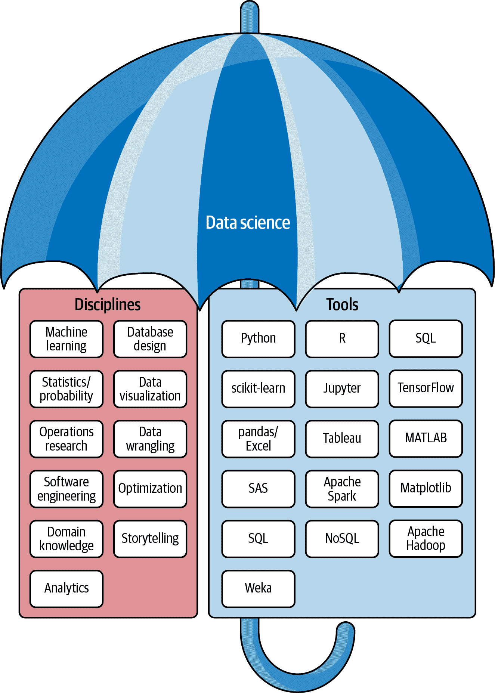

# 第八章 职业建议与前行之路

随着本书的结束，评估接下来该怎么做是个不错的主意。你学习并整合了广泛的应用数学主题：微积分、概率论、统计学和线性代数。然后，你将这些技术应用于实际应用，包括线性回归、逻辑回归和神经网络。在本章中，我们将讨论如何在前进的同时利用这些知识，航行在数据科学职业这个奇特、激动人心且多样化的领域中。我将强调拥有方向和明确的目标的重要性，而不是仅仅死记工具和技术，而缺乏实际问题的解决方案。

由于我们正在远离基础概念和应用方法，这一章的语调将与书中其余部分有所不同。你可能期待了解如何将这些数学建模技能以专注和实际的方式应用于你的职业生涯。然而，如果你希望在数据科学职业中取得成功，你将需要学习一些更硬的技能，比如 SQL 和编程，以及发展专业意识的软技能。后者尤为重要，这样你就不会在数据科学这个变幻莫测、看不见的市场力量盲目地中迷失方向。

我不会假设我知道你的职业目标或你希望通过这些信息实现什么。但我会打几个保险，因为你正在阅读这本书。我想象你可能对数据科学职业感兴趣，或者你已经在数据分析方面工作，并希望系统化你的分析知识。也许你来自软件工程背景，希望掌握人工智能和机器学习。也许你是某种项目经理，发现你需要了解数据科学或人工智能团队的能力，以便据此进行范围确定。也许你只是一个好奇的专业人士，想知道数学如何在实际层面上有用，而不仅仅是学术上的。

我将尽力满足所有这些群体的关切，并希望总结出一些对大多数读者有用的职业建议。让我们从重新定义数据科学开始。我们已经客观地研究了它，并将在职业发展和该领域的未来的背景下进行讨论。

# 作者是否在讲故事？

在像这样的任务中很难不显得像轶事，我在这里分享了自己的经验（以及他人的经验），而不是像我在第三章中提倡的大规模、控制的调查和研究。但是我要说的是：我在财富 500 强世界工作了十多年，看到了数据科学运动对组织的转变。我在世界各地的许多技术会议上发表演讲，并听取了无数同行的反应，“这种情况也发生在我们身上！”我阅读了许多博客和受人尊敬的出版物，从*华尔街日报*到*福布斯*，我学会了认识到流行期望与现实之间的脱节。我特别关注各行各业的权威人士、领导者和追随者，以及他们如何通过数据科学和人工智能来制定或跟随市场。目前，我在南加州大学教授和指导人工智能在安全关键应用中的利益相关者，涉及航空安全和安全项目。

我只是把简历放在这里，来展示虽然我没有进行正式的调查和研究，也许我正在整理轶事信息，但我在所有这些信息源中找到了持续的叙述。Vicki Boykis，Tumblr 的敏锐的机器学习工程师，写了[一篇博客文章分享了与我类似的发现](https://oreil.ly/vm8Vp)，我强烈建议你阅读一下。你可以带着怀疑的心态接受我的发现，但要密切关注你自己工作环境中正在发生的事情，并识别你的管理层和同事们认同的假设。

# 重新定义数据科学

数据科学是分析数据以获得可操作洞见。实际上，它是将不同与数据相关的学科融合在一起的一个整体：统计学、数据分析、数据可视化、机器学习、运筹学、软件工程……只是举几个例子。几乎任何涉及数据的学科都可以被标志为“数据科学”。这种缺乏明确定义对该领域造成了问题。毕竟，任何缺乏定义的事物都容易被解释，就像一幅抽象艺术品一样。[这就是为什么人力资源部门在“数据科学家”职位发布时感到困惑，因为它们往往七零八落](https://oreil.ly/NHnbu)。图 8-1 显示了一个涵盖不同学科和工具的伞形图，可以归入数据科学的范畴。



###### 图 8-1\. 数据科学的伞形图

我们是如何到达这一步的？一个像数据科学这样缺乏定义的东西如何在企业世界中成为如此有吸引力的力量？最重要的是，它的定义（或缺乏定义）如何影响你的职业生涯？这些都是我们在本章讨论的重要问题。

这就是为什么我告诉我的客户，*数据科学*的更好定义是具备统计学、机器学习和优化技能的软件工程。如果去掉这四个学科中的任何一个（软件工程、统计学、机器学习和优化），数据科学家的表现就会受到威胁。大多数组织在界定使数据科学家有效的技能集方面一直存在困难，但提供的定义应该能带来清晰度。尽管有些人可能认为软件工程是一个有争议的要求，但考虑到行业发展的方向，我认为这是非常必要的。我们将在后面讨论这一点。

但首先，理解数据科学的最佳方式是追溯这个术语的历史。

# 数据科学的简史

我们可以追溯数据科学一直到统计学的起源，早在[17 世纪甚至 8 世纪](https://oreil.ly/tYPB5)。为了简洁起见，让我们从 1990 年代开始。分析师、统计学家、研究员、“量化分析师”和数据工程师通常拥有不同的角色。工具堆栈通常包括电子表格、R、MATLAB、SAS 和 SQL。

当然，在 2000 年后，事情开始迅速改变。互联网和连接设备开始产生大量数据。随着 Hadoop 的诞生，谷歌推动分析和数据收集达到了前所未有的高度。随着 2010 年的临近，谷歌的高管们[坚信统计学家将在接下来的十年中拥有“性感”的工作](https://oreil.ly/AZgfM)。接下来发生的事情证明了他们的预见。

2012 年，《*哈佛商业评论*》推广了这个称为数据科学的概念，并宣称它是[“21 世纪最性感的工作”](https://oreil.ly/XYbrf)。在《*哈佛商业评论*》文章之后，许多公司和企业工作者争相填补数据科学的空白。管理顾问们则准备好向财富 500 强领导者传授如何将数据科学引入他们的组织中。SQL 开发人员、分析师、研究员、量化分析师、统计学家、工程师、物理学家以及众多其他专业人士纷纷将自己重新打造为“数据科学家”。科技公司感到传统的角色名称如“分析师”、“统计学家”或“研究员”听起来过时，因此将这些角色改称为“数据科学家”。

自然地，财富 500 强公司的管理层受到 C 级高管的压力，要跟上数据科学的潮流。最初的理由是正在收集大量数据，因此大数据正在成为一种趋势，需要数据科学家从中获取洞见。在此期间，“数据驱动”这个词成为各行各业的格言。企业界相信，与人不同，数据是客观和无偏的。

# 提醒：数据不是客观和无偏的！

直到今天，许多专业人士和管理者都陷入了数据客观和无偏见的谬误中。希望在阅读本书后，您知道这简直是不可能的，需要有关此事的提醒，请参阅第三章。

公司的管理层和人力资源，在无法与 FAANG（Facebook、Amazon、Apple、Netflix 和 Google）抢购的专业深度学习博士竞争的情况下，仍然承受着数据科学的压力，他们做出了一个有趣的举动。他们把现有的分析师、SQL 开发人员和 Excel 高手重新打造成“数据科学家”。Google 的首席决策科学家 Cassie Kozyrkov 在 2018 年的 Hackernoon 博客文章中描述了这个公开的秘密：

> 在我担任每一个*数据科学家*职称的时候，实际上我早在重新品牌的 HR 官员对员工数据库进行小小的整形手术之前，已经在用另一种名字做同样的工作了。我的职责丝毫没有改变。我不是个例外；我的社交圈子里到处都是曾经的统计学家、决策支持工程师、量化分析师、数学教授、大数据专家、商业智能专家、分析主管、研究科学家、软件工程师、Excel 高手、小众博士幸存者……所有这些人都是今天自豪的数据科学家。

从技术上讲，数据科学并不排除这些专业人士中的任何一个，因为他们都在使用数据来获取洞见。当然，科学界也有些反对意见，他们不愿意把数据科学正式认定为一门真正的科学。毕竟，你能想到一门不使用数据的科学吗？2011 年，现任 Google TensorFlow 主管的 Pete Warden 在一篇 O’Reilly 文章中对数据科学运动进行了有趣的辩护。他也清楚地阐述了反对者对缺乏定义的论点：

> [关于数据科学缺乏定义的问题] 可能是最深刻的反对意见，也是最有力的一条。对于数据科学的范围内外界限，尚无广泛接受的界定。它只是统计学的时尚重新包装吗？我不这么认为，但我也没有一个完整的定义。我相信最近数据的丰富使世界上发生了一些新的事情，当我四处看时，我看到有共同特征的人们，他们不适合传统的分类。这些人往往超越主导企业和机构世界的狭窄专业领域，处理从查找数据、大规模处理、可视化到撰写成故事的一切。他们似乎首先从数据告诉他们的内容开始，并选择追随有趣的线索，而不是传统科学家的方法，先选择问题然后找数据来阐明。

Pete 讽刺地也无法给数据科学提供一个定义，但他清楚地阐述了为什么数据科学是有缺陷但有用的。他还强调了研究放弃科学方法，转而采用曾经被摒弃的数据挖掘等实践的转变，我们在第三章中谈到过。

数据科学在《哈佛商业评论》文章发表几年后发生了有趣的转变。也许这更像是与人工智能和机器学习的合并，而不是一个转变。无论如何，当机器学习和深度学习在 2014 年左右成为头条新闻时，数据被称为创造人工智能的“燃料”。这自然地扩大了数据科学的范围，并与 AI/机器学习运动相结合。特别是，ImageNet 挑战激发了对 AI 的新兴兴趣，并引发了机器学习和深度学习的复兴。Waymo 和特斯拉等公司承诺几年内推出自动驾驶汽车，这得益于深度学习的进步，进一步推动了媒体头条新闻和夏令营的报名。

这种对神经网络和深度学习的突然兴趣产生了一个有趣的副作用。像决策树、支持向量机和逻辑回归这样的回归技术，几十年来一直隐藏在学术界和专业统计领域中，随着深度学习的光环走进了公众的视野。与此同时，像 scikit-learn 这样的库降低了进入该领域的门槛。这带来了一个隐藏的成本，即创建了一些不理解这些库或模型如何工作但仍然使用它们的数据科学专业人士。

由于数据科学的学科发展速度比对其定义的感知需求快得多，一个数据科学家的角色往往是完全不确定的。我曾经遇到过几位在财富 500 强公司担任数据科学家职位的人。有些人在编码方面非常熟练，甚至可能有软件工程背景，但对统计显著性一无所知。还有一些人局限于使用 Excel，几乎不懂 SQL，更不用说 Python 或 R 了。我曾经遇到过自学了一些 scikit-learn 函数的数据科学家，很快发现自己陷入困境，因为那是他们所知道的全部。

那么这对你意味着什么呢？在这样一个充斥着术语和混乱的环境中，你如何才能蓬勃发展呢？一切都取决于你对什么类型的问题或行业感兴趣，并且不要急于依赖雇主来定义角色。你不必成为数据科学家才能从事数据科学。有很多领域可以利用你现在拥有的知识为你带来优势。你可以成为分析师、研究员、机器学习工程师、顾问、咨询师，以及许多其他不一定称为数据科学家的角色。

但首先，让我们讨论一些你可以继续学习并在数据科学就业市场上找到优势的方法。

# 发现你的优势

实际数据科学专业人士需要的不仅仅是统计和机器学习的理解。在大多数情况下，期望数据能够轻松地用于机器学习和其他项目是不现实的。相反，你会发现自己在追寻数据来源、编写脚本和软件、抓取文档、抓取 Excel 工作簿，甚至创建自己的数据库。至少 95%的编码工作与机器学习或统计建模无关，而是创建、移动和转换数据以便使用。

此外，你还需要了解你的组织的全局视角和动态。你的管理者可能会在定义你的角色时做出一些假设，识别这些假设非常重要，这样你才能意识到它们对你的影响。当你依赖你的客户和领导的行业专业知识时，你应该在提供技术知识并表达可行性方面发挥作用。让我们来看看你可能需要的一些硬技能和软技能。

## SQL 熟练度

*SQL*，也称为*结构化查询语言*，是一种用于检索、转换和写入表数据的查询语言。*关系数据库*是组织数据的最常见方式，将数据存储到表中，这些表像 Excel 中的 VLOOKUP 一样相互连接。MySQL、Microsoft SQL Server、Oracle、SQLite 和 PostgreSQL 等关系数据库平台都支持 SQL。正如你可能注意到的，SQL 和关系数据库紧密耦合，以至于“SQL”经常用于关系数据库的品牌营销，例如“MySQL”和“Microsoft SQL Server”。

示例 8-1 是一个简单的 SQL 查询，从`CUSTOMER`表中检索`CUSTOMER_ID`和`NAME`字段，条件是`STATE`为`'TX'`。

##### 示例 8-1\. 一个简单的 SQL 查询

```py
SELECT CUSTOMER_ID, NAME
FROM CUSTOMER
WHERE STATE = 'TX'
```

简而言之，作为数据科学专业人士，没有 SQL 的熟练技能很难有所成就。企业使用数据仓库，而 SQL 几乎总是检索数据的手段。`SELECT`、`WHERE`、`GROUP BY`、`ORDER BY`、`CASE`、`INNER JOIN` 和 `LEFT JOIN` 这些 SQL 关键字都应该很熟悉。更好的是，了解子查询、派生表、公共表表达式和窗口函数，以充分利用你的数据。

# 厚颜无耻的自荐：作者有一本 SQL 书！

我曾为 O'Reilly 写过一本入门级的 SQL 书，名为[*Getting Started with SQL*](https://oreil.ly/K2Na9)。它只有一百多页，可以在一天内完成。书中涵盖了基本内容，包括连接和聚合，以及创建自己的数据库。该书使用 SQLite，可以在不到一分钟内设置好。

还有 O'Reilly 出版的其他出色的 SQL 书籍，包括 Alan Beaulieu 的《Learning SQL, 3rd Ed.》和 Alice Zhao 的《SQL Pocket Guide, 4th Ed.》。在速读完我那一百页的入门手册之后，也可以查看这两本书。

SQL 在让 Python 或其他编程语言轻松访问数据库方面也非常关键。如果你想从 Python 向数据库发送 SQL 查询，你可以将数据作为 Pandas DataFrames、Python 集合和其他结构返回。

示例 8-2 展示了使用 SQLAlchemy 库在 Python 中运行简单 SQL 查询。它以命名元组的形式返回记录。只需确保下载这个[SQLite 数据库文件](https://bit.ly/3F8heTS)并放置在你的 Python 项目中，然后运行`pip install sqlalchemy`。

##### 示例 8-2\. 使用 SQLAlchemy 在 Python 中运行 SQL 查询

```py
from sqlalchemy import create_engine, text

engine = create_engine('sqlite:///thunderbird_manufacturing.db')
conn = engine.connect()

stmt = text("SELECT * FROM CUSTOMER")
results = conn.execute(stmt)

for customer in results:
    print(customer)
```

### 关于 Pandas 和 NoSQL 呢？

我经常收到关于与 SQL 的“替代品”（如 NoSQL 或 Pandas）的问题。事实上，这些并不是替代品，而是数据科学工具链中其他地方的不同工具。以 Pandas 为例，在示例 8-3 中，我可以创建一个 SQL 查询，从表`CUSTOMER`中提取所有记录并将它们放入 Pandas 的`DataFrame`中。

##### 示例 8-3\. 将 SQL 查询导入到 Pandas DataFrame 中

```py
from sqlalchemy import create_engine, text
import pandas as pd

engine = create_engine('sqlite:///thunderbird_manufacturing.db')
conn = engine.connect()

df = pd.read_sql("SELECT * FROM CUSTOMER", conn)
print(df) # prints SQL results as DataFrame
```

SQL 被用来在关系数据库和我的 Python 环境之间建立桥梁，并将数据加载到 Pandas 的`DataFrame`中。如果我有需要使用 SQL 处理的复杂计算任务，通过 SQL 在数据库服务器上执行要比在本地计算机上使用 Pandas 更高效。简单来说，Pandas 和 SQL 可以共同工作，而不是竞争技术。

NoSQL 也是如此，包括像 Couchbase 和 MongoDB 这样的平台。虽然一些读者可能会有不同意见并提出合理的论点，但我认为将 NoSQL 与 SQL 进行比较就像是在比较苹果和橙子。是的，它们都存储数据并提供查询功能，但我不认为它们是竞争关系。它们针对不同的用例具有不同的特性。NoSQL 代表“不仅仅是 SQL”，更适合存储非结构化数据，如图片或自由格式的文本文章。SQL 更适合存储结构化数据。SQL 比 NoSQL 更积极地维护数据完整性，尽管以计算开销和较低的可扩展性为代价。

## 编程熟练度

通常，许多数据科学家并不擅长编程，至少不像软件工程师那样。然而，掌握编程技能变得越来越重要。这提供了获得优势的机会。学习面向对象编程、函数式编程、单元测试、版本控制（例如 Git 和 GitHub）、Big-O 算法分析、密码学以及其他你遇到的相关计算机科学概念和语言特性。

为什么呢？假设你创建了一个有前途的回归模型，比如逻辑回归或神经网络，基于一些给定的样本数据。你请求内部 IT 部门的程序员将其“插入”到现有软件中。

他们警惕地看着你的提议。“我们需要用 Java 重写这个，而不是 Python，”他们不情愿地说道。“你的单元测试在哪里？”另一个问道。“你没有定义任何类或类型吗？我们必须重新设计这段代码使其面向对象。”除此之外，他们不理解你的模型的数学，并担心它在未见过的数据上表现不佳。由于你没有定义单元测试（这在机器学习中并不直接），他们不确定如何验证你的模型的质量。他们还问两个代码版本（Python 和 Java）如何管理？

你开始感到不在自己的领域内，并说，“我不明白为什么 Python 脚本不能直接插入。”其中一人沉思片刻后回答道，“我们可以使用 Flask 创建一个 web 服务，避免重新用 Java 编写。但是，其他问题并没有消失。我们接下来必须担心可扩展性和高访问量对 web 服务的影响。等等…也许我们可以部署到微软 Azure 云上作为一个虚拟机规模集，但我们仍然必须设计后端。看，无论你如何处理，这都必须重新设计。”

这正是为什么许多数据科学家的工作从不离开他们的笔记本电脑。事实上，将机器学习投入生产已经变得如此难以捉摸，以至于它已经成为近年来的一个独角兽和热门话题。数据科学家和软件工程师之间存在巨大的鸿沟，因此自然而然地，数据科学专业人员现在也要成为软件工程师。

这可能听起来令人不知所措，因为数据科学的范围已经很广泛，涵盖了许多学科和要求。但是，这并不意味着你需要学习 Java。你可以成为一名有效的软件工程师，使用 Python（或者你喜欢的任何就业语言），但你必须擅长它。学习面向对象编程、数据结构、函数式编程、并发编程和其他设计模式。两本解决这些问题的好书包括 Luciano Ramalho 的《流畅的 Python，第二版》（O’Reilly）和 Al Sweigart 的《Python 基础进阶》（No Starch）。

之后，学习解决实际任务，包括数据库 API、[web 服务](https://oreil.ly/gN9e7)、[JSON 解析](https://oreil.ly/N8uef)、[正则表达式](https://oreil.ly/IyD2P)、[网页抓取](https://oreil.ly/9oWWb)、[安全和加密](https://oreil.ly/oxliO)、云计算（Amazon Web Services、Microsoft Azure）以及其他任何有助于你在建立系统时提高生产力的东西。

正如前文所述，你精通的编程语言不一定非得是 Python。它可以是其他语言，但建议选择那些普遍使用和具有就业能力的语言。目前具有较高就业能力的语言包括 Python、R、Java、C# 和 C++。Swift 和 Kotlin 在苹果和安卓设备上占据主导地位，它们都是出色的、得到很好支持的语言。尽管这些语言大多数不是数据科学的主流，学习至少另外一门语言以增加曝光是有帮助的。

# 锚定偏差与首选编程语言

对技术专业人士而言，对技术和平台产生偏爱和情感投入是很常见的，特别是对编程语言。请不要这样做！这种部落主义是没有生产力的，它忽略了每种编程语言服务不同质量和用例的现实。另一个现实是，一些编程语言流行而另一些不流行，通常原因与语言设计的优点无关。如果一家大公司不支付其支持费用，它的生存机会就很渺茫。

我们在第三章讨论了不同类型的认知偏差。另一个是[锚定偏差](https://oreil.ly/sXNh0)，它指出我们可能会偏爱第一次学到的东西，比如一门编程语言。如果你感觉有义务学习一门新语言，要开放心态，给它一个机会！没有完美的语言，重要的是它能完成任务。

但是，如果语言的支持情况堪忧，比如它处于维护状态，没有更新，或者缺乏企业支持者，就要小心了。例如，微软的[VBA](https://oreil.ly/B8c5A)，Red Hat 的[Ceylon](https://oreil.ly/LJdw4)，以及[Haskell](https://oreil.ly/ASnnN)。

## 数据可视化

另一项你应该具备一定程度熟练度的技术技能是数据可视化。能够轻松制作图表、图形和绘图，不仅能向管理层讲述故事，还能帮助自己的数据探索工作。你可以用 SQL 命令总结数据，但有时柱状图或散点图能够更快地让你了解数据。

当涉及到选择数据可视化工具时，这个问题就变得更加难以回答，因为选择太多，而且分散。如果你在传统办公环境中工作，Excel 和 PowerPoint 通常是首选的可视化工具，你知道吗？它们完全可以胜任！虽然我不是所有事情都用它们，但它们确实能完成绝大多数任务。需要在小/中型数据集上绘制散点图？或者直方图？没问题！只需将数据复制/粘贴到 Excel 工作簿中，几分钟内就能生成一个。这对于一次性图形可视化非常方便，在这种情况下使用 Excel 毫无羞耻感。

然而，有些情况下，你可能希望脚本化创建图表，以便重复使用或与你的 Python 代码集成。[matplotlib](https://matplotlib.org)已经是一段时间以来的首选，当你的平台是 Python 时，很难避免。[Seaborn](https://seaborn.pydata.org)在 matplotlib 之上提供了一个包装器，使其更易于使用常见的图表类型。SymPy，在本书中我们经常使用的库，使用 matplotlib 作为其后端。然而，有些人认为 matplotlib 非常成熟，已经接近遗留状态。类似[Plotly](https://plotly.com/python)的库已经崭露头角，使用起来非常愉快，它基于 JavaScript 的[D3.js 库](https://d3js.org)。就个人而言，我在[Manim](https://www.manim.community)方面取得了成功。它产生的 3Blue1Brown 风格的可视化效果非常出色，给客户带来了“哇！”的感觉，而且考虑到它具有的动画功能，其 API 使用起来令人惊讶地简单。然而，这是一个年轻的库，尚未成熟，这意味着每个发布版本的演变可能会导致代码变更。

探索所有这些解决方案不会有错，如果雇主/客户没有偏好，可以找到最适合自己的一个。

商业许可证平台如[Tableau](https://www.tableau.com/products/desktop)在某种程度上还算不错。他们致力于创建专门用于可视化的专有软件，并创建了一个拖放界面，使其对非技术用户也可访问。Tableau 甚至有一篇标题为[“让你的组织中每个人都成为数据科学家”](https://oreil.ly/kncmP)的白皮书，这并没有解决之前提到的数据科学家定义问题。我发现 Tableau 的挑战在于它只擅长可视化，并需要昂贵的许可证。虽然你可以在[TabPy](https://tableau.github.io/TabPy/docs/about.html)中部分集成 Python，但除非雇主想使用 Tableau，否则你可能会选择使用之前提到的功能强大的开源库。

# 软件许可证可能涉及政治问题。

想象一下，你创建了一个 Python 或 Java 应用程序，请求用户输入一些信息，检索和处理不同的数据源，运行一些高度定制的算法，然后呈现可视化和显示结果的表格。经过几个月的辛苦工作后，在会议上展示出来，但是其中一位经理举手发问：“为什么不直接在 Tableau 中完成这个任务呢？”

对于一些经理来说，这是一个难以接受的现实，他们花费了数千美元购买企业软件许可证，而您来了，使用一个更强大（尽管使用起来更复杂）且没有许可成本的开源解决方案。您可以强调 Tableau 不支持您必须创建的这些算法或集成工作流程。毕竟，Tableau 只是可视化软件。它不是一个从头开始编码的平台，无法创建定制的高度量身定制的解决方案。

领导层通常被告知 Tableau、Alteryx 或其他商业工具可以做到一切。毕竟，他们为此花了大量的钱，而且可能供应商给了他们一个很好的销售演示。自然地，他们想要为这些成本辩护，并希望尽可能多的人使用许可证。他们可能还花了额外的预算培训员工使用该软件，并希望其他人能够维护您的工作。

对此要敏感。如果管理层要求您使用他们支付的工具，请探索是否可以让其发挥作用。但如果在您特定的任务中存在限制或严重的可用性妥协，请在一开始就礼貌地提出来。

## 了解您的行业

让我们比较两个行业：视频流媒体（例如 Netflix）和航空航天防务（例如洛克希德·马丁）。它们有共同之处吗？几乎没有！两者都是技术驱动型公司，但一个是为消费者提供电影流媒体，另一个是制造带弹药的飞机。

当我在人工智能和系统安全方面提供建议时，我首先指出这两个行业对风险的容忍度有很大不同。一个电影流媒体公司可能会吹嘘他们拥有一个能学习推荐给消费者电影的 AI 系统，但当它给出一个糟糕的推荐时，情况有多严重？最坏的情况是消费者可能会稍感失望，浪费了两个小时观看他们不喜欢的电影。

但是航空航天防务公司呢？如果一架战斗机上搭载了自动射击目标的 AI，如果它出错了会有多严重？现在我们谈论的是人类生命，而不是电影推荐！

这两个行业的风险容忍度差距很大。自然地，航空航天防务公司在实施任何实验性系统时都会更为保守。这意味着官僚主义和安全工作组会评估并阻止他们认为风险不可接受的任何项目，这是理所当然的。然而，有趣的是，在硅谷初创公司中，AI 在像电影推荐这样的低风险应用中取得了成功，这引发了防务工业高管和领导层的 FOMO（“错失良机的恐惧”）。这可能是因为这两个领域之间的风险容忍度差距没有被充分强调。

当然，在这两个行业之间的风险严重程度之间有着广泛的谱系，“恼怒的用户”和“人类生命的丧失”之间。银行可能会使用 AI 来确定谁有资格获得贷款，但这带来了在歧视某些人口统计学特征方面的风险。刑事司法系统在假释和监视系统中尝试使用 AI，但也遇到了同样的歧视问题。[社交媒体可能使用 AI](https://oreil.ly/VoK95)来确定哪些用户发布的内容是可接受的，但当它压制“无害”内容（虚假阳性）时，会激怒其用户，也会让立法者感到不满，因为“有害”内容没有被压制（虚假阴性）。

这表明了了解自己所在行业的必要性。如果你想要做大量的机器学习，你可能会希望在低风险行业工作，其中虚假阳性和虚假阴性不会危及或激怒任何人。但如果这些都不吸引你，你想要从事像[自动驾驶汽车](https://oreil.ly/sOYs6)、航空和医学等更大胆的应用，那么期望你的机器学习模型会被频繁拒绝。

在这些高风险行业中，如果需要特定的博士学位或其他正式证书，不要感到意外。即使拥有专业的博士学位，虚假阳性和虚假阴性也不会神奇地消失。如果你不想追求这种专业化，你可能最好学习除了机器学习之外的其他工具，包括软件工程、优化、统计学和业务规则系统/启发式方法。

## 有效的学习

在 2008 年的单口喜剧特别节目中，喜剧演员布莱恩·雷根将自己对不读报纸的人的缺乏好奇心与那些读报纸的人进行了对比。指出头版新闻故事永远不会完结，他说他没有兴趣翻到指定的页面去找出它的结局。“经过九年的审判，陪审团最终做出了继续在第 22 页第 C 栏上继续的裁决……我想我永远也不会知道，”他轻蔑地开玩笑说。然后他与那些翻页的人进行对比，喊道，“我想学习！我想成为一个学习者！”

尽管布莱恩·雷根可能本意是自嘲，也许他在某些方面是对的。仅仅为了学习而学习一个主题几乎没有动力，而且对于缺乏兴趣并不总是一件坏事。如果你拿起一本微积分教科书，没有学习它的目的，你可能最终会感到沮丧和挫败。你需要有一个项目或目标，如果你觉得某个主题无趣，为什么要去学习它呢？就我个人而言，当我允许自己对我认为无关紧要的主题失去兴趣时，这是非常解放的。更令人惊讶的是，我的工作效率飙升了。

这并不意味着你不应该保持好奇心。然而，那里有如此多的信息，优先考虑你学习的内容是一项无价的技能。你可以问为什么某些东西有用，如果你得不到一个直接的答案，那就允许自己继续前进！所有人都在谈论自然语言处理吗？这并不意味着你非得去做！大多数企业根本不需要自然语言处理，所以说它不值得你的努力和时间是可以的。

无论你在工作中有项目还是为了自学而自主创建项目，都应该有具体的目标。只有*你*可以决定什么值得学习，你可以摒弃在追求你感兴趣和相关的事物时可能产生的焦虑。

## 从业者与顾问

这可能是一种概括，但有两种类型的知识专家：从业者和顾问。为了找到你的优势，辨别你想成为哪种类型，并相应地调整你的职业发展。

在数据科学和分析领域，从业者们编写代码、创建模型、搜寻数据，并试图直接创造价值。顾问就像顾问，告诉管理层他们的目标是否合理，帮助制定战略，并提供方向。有时候，从业者可以逐步成为顾问。有时候，顾问从未是从业者。每种角色都有其利弊。

从业者可能喜欢编码、进行数据分析，并执行直接能够创造价值的具体工作。从业者的好处在于他们实际上开发并拥有硬技能。然而，沉迷于代码、数学和数据很容易让人失去大局观，并与组织和行业的其他部分脱节。我经常听到经理抱怨的一个常见问题是，他们的数据科学家想要解决他们认为有趣但对组织没有价值的问题。我也听到从业者抱怨，他们想要曝光和上升空间，但感觉在组织中被束缚和隐藏。

顾问在某些方面确实有一个更轻松的工作。他们向经理们提供建议和信息，并帮助企业提供战略方向。他们通常不是编写代码或搜寻数据的人，但他们帮助管理层雇佣那些从事这些工作的人。他们的职业风险是不同的，因为他们不必担心满足冲刺期限、处理代码错误或者模型运行不良的问题，就像从业者们那样。但是他们确实需要担心保持知识更新、可信和相关性。

要成为一个有效的顾问，您必须真正了解并掌握其他人不了解的知识。这必须是与客户需求密切相关的关键信息。要保持相关性，您每天都必须阅读，寻找并综合他人忽视的信息。仅仅熟悉机器学习、统计学和深度学习是不够的。您还必须关注客户所在的行业以及其他行业，追踪谁在成功谁在失败。您还必须学会将正确的解决方案与正确的问题匹配，在一个许多人寻找银弹的商业环境中。为了做到这一切，您必须成为一个有效的沟通者，并以帮助客户为目标分享信息，而不仅仅是展示自己的知识。

顾问面临的最大风险是提供错误的信息。一些顾问非常善于将责任推向外部因素，比如“行业内没有人预见到这一点”或“这是一个六西格玛事件！”意味着一个不希望发生的事件出现的概率是五亿分之一，但却发生了。另一个风险是没有从业者的硬技能，并且与业务技术层面脱节。这就是为什么定期在家练习编码和建模，或者至少将技术书籍作为阅读的一部分是个好主意。

最后，一个好的顾问努力成为客户与他们最终目标之间的桥梁，经常填补存在的巨大知识空白。这不是为了计费最大小时数和编造繁忙工作，而是真正识别客户的困扰，并帮助他们安心入睡。

当项目计划基于工具而非问题时，项目成功的可能性很低。这意味着作为顾问，您必须磨练自己的倾听技巧，并识别客户难以提出甚至回答的问题。如果一家主要快餐连锁店聘请您协助“AI 战略”，而您看到他们的人力资源部门急于聘请深度学习人才，您的工作就是问，“您试图解决深度学习中的哪些问题？”如果得不到明确答案，您需要鼓励管理层退后一步，评估他们真正面临的行业问题。他们是否存在员工排班效率低下的问题？嗯，他们不需要深度学习，他们需要线性规划！对于一些读者而言，这可能显得很基础，但如今许多管理人员往往难以进行这些区分。我曾多次遇到将其线性规划解决方案品牌化为 AI 的供应商和顾问，这在语义上可以与深度学习混淆。

# 数据科学职位需注意事项

要理解数据科学职位市场，可能需要将其与一部深刻的美国电视作品进行比较。

在 2010 年，有一部美国电视剧*Better Off Ted*。其中一集名为“Jabberwocky”（第 1 季，第 12 集），深刻揭示了企业行话的某种本质。在节目中，主角泰德（Ted）在公司虚构了一个名为“Jabberwocky”的项目来隐藏资金。由此引发了一连串滑稽的结果，他的经理、CEO，最终整个公司都开始“参与”这个“Jabberwocky”项目，甚至都不知道这究竟是什么。局面逐渐升级，成千上万的员工假装在“Jabberwocky”上工作，而没有人停下来问他们究竟在做什么。原因在于：没有人愿意承认自己不了解这个重要事务，处于不在圈内、无知的状态。

*Jabberwocky 效应*是一个轶事性理论，即一个行业或组织可以不定义清楚一个流行词或项目，却能持续推广它。组织会周期性地陷入这种行为中，允许术语在没有明确定义的情况下循环流传，并且群体行为使得模糊性得以存在。常见的例子包括区块链、人工智能、数据科学、大数据、比特币、物联网、量子计算、NFT、以“数据驱动”为核心的技术、云计算和“数字颠覆”。即使是具体、备受关注且特定的项目，也可能变成只有少数人理解却被广泛讨论的神秘流行词。

要阻止 Jabberwocky 效应，你必须成为促进有效对话的催化剂。对项目或倡议的方法和手段感到好奇（而不仅仅是品质或结果）。在角色选择时，公司是因为担心错过机会（FOMO）而雇佣你去做“Jabberwocky”，还是因为他们实际上有特定和实用的需求？做出这种判断可以决定你是否与公司匹配良好，顺利前行，还是在职业生涯中遇到沉闷的障碍。

在这种背景下，让我们现在来考虑一下在数据科学岗位中需要注意的几个事项，从角色定义开始。

## 角色定义

假设你被聘为数据科学家。面试进行得很顺利。你问了一些关于角色的问题，得到了直接的回答。你被提供了一份工作，而最重要的是，你应该知道自己将要从事哪些项目。

你总是希望进入一个角色清晰定义、目标明确的岗位。不应该猜测自己该做什么。更好的情况是，你应该有一个明确愿景的领导层，理解业务需求。你成为明确定义目标的执行者，并了解你的客户。

相反，如果你被聘用是因为部门想要“数据驱动”或在“数据科学”中拥有竞争优势，这是一个警告信号。很有可能你将被负担着寻找问题并销售任何低成本的解决方案。当你寻求战略指导时，你会被告知将“机器学习”应用于业务。但当然，当你只有一把锤子时，一切都开始看起来像钉子。数据科学团队感到压力要在甚至没有目标或问题的情况下提供解决方案（例如机器学习）。一旦发现问题，获得利益相关者的支持和资源对齐就变得困难，重点开始从一个低成本的解决方案转移到另一个低成本的解决方案。

问题在于你是基于流行词被聘用的，而不是基于功能。不良的角色定义往往会传播到下面讨论的其他问题。让我们转向组织的关注点。

## 组织的专注和支持

另一个需要注意的因素是组织在特定目标上的对齐程度以及所有各方是否全力支持。

自从数据科学的兴起以来，许多组织进行了重组，成立了一个中央数据科学团队。高管的愿景是让数据科学团队流动，提供建议，并帮助其他部门实现数据驱动，并采用机器学习等创新技术。他们还可能被要求消除部门之间的数据孤岛。虽然这在理论上听起来是个好主意，但许多组织发现这充满挑战。

原因在于：管理层成立了一个数据科学团队，但缺乏明确的目标。因此，这个团队的任务是寻找需要解决的问题，而不是有权力解决已知问题。正如所述，这就是为什么数据科学团队以先有解决方案（例如机器学习），而后有目标而闻名。他们尤其不适合成为消除数据孤岛的推动力，因为这完全超出了他们的专业领域。

# 打破数据孤岛是 IT 的工作！

在组织中使用数据科学团队“打破数据孤岛”是错误的。数据孤岛往往是由于缺乏数据仓库基础设施，各部门将其数据存储在电子表格和秘密数据库中，而不是集中和支持的数据库中。

如果数据孤岛被视为问题，你需要服务器、云实例、认证的数据库管理员、安全协议以及 IT 工作组来把所有这些整合起来。数据科学团队通常没有必要的专业知识、预算和组织权力来完成这项任务，除非是在非常小的公司里。

一旦发现问题，获得利益相关者的支持和资源对齐是困难的。如果发现机会，需要强大的领导力来做以下几点：

+   明确定义目标和路线图

+   获得预算来收集数据并支持基础设施

+   获得数据访问权限并协商数据所有权

+   包括利益相关者的支持和领域知识

+   从利益相关者那里预算时间和会议

在数据科学团队被聘用之后，这些要求要比之前更难实现，因为数据科学团队的角色是在对现有情况做出反应的基础上确定和预算的。如果高层领导没有对所有必要方方面面的资源和支持做好对齐，数据科学项目就不会成功。这就是为什么有无数的文章指责组织没有准备好数据科学，从[*哈佛商业评论*](https://oreil.ly/IlicW)到[*MIT 斯隆评论*](https://oreil.ly/U9C9F)。

最好是在组织上与其客户处于同一部门的数据科学团队进行工作。信息、预算和沟通更自由和紧密地共享。这样，减少了跨部门政治的紧张局势，因为将所有人置于同一团队而非政治竞争之中。

# 数据访问是具有政治性的

组织对其数据保持保护并非秘密，但这并不仅仅是出于安全或不信任的考虑。数据本身是一种极具政治性的资产，许多人甚至不愿意向自己的同事提供访问权限。同一组织内部的部门出于这个原因也不愿意共享数据：他们不希望其他人来做他们的工作，更不希望他们做错。解释数据可能需要*他们*全职专业知识，也需要*他们*的领域知识。毕竟，他们的数据就是他们的业务！如果你请求访问*他们*的数据，那就是在要求介入*他们*的业务。

此外，数据科学家可能高估了解释外部数据集所需的能力和领域专业知识。要克服这一障碍，你必须与每个具有专业知识的合作伙伴建立信任和支持，协商知识转移，如果需要，让他们在项目中扮演重要角色。

## 足够的资源

另一个需要警惕的风险是没有得到足够的资源来完成工作。被投入到一个角色中而没有必要的支持是很困难的。当然，适应性和善于利用资源是一种宝贵的特质。但即使是最能打的软件工程师/数据科学家明星也很快会发现自己超出了自己的能力范围。有时候你需要花钱来购买必需的东西，而你的雇主却没有预算。

假设你需要一个数据库来进行预测工作。你与第三方数据库的连接很差，经常出现宕机和断开连接的情况。你最不想听到的就是“让它工作”，但这就是你的处境。你考虑在本地复制数据库，但为此你需要每天存储 40 GB 的数据，因此需要一个服务器或云实例。现在，你显然已经超出了自己的能力范围，一个数据科学家成为一个没有 IT 预算的 IT 部门！

在这些情况下，你必须考虑如何在不损害项目的情况下省去一些步骤。你能否仅保留最新的滚动数据并删除其余数据？你能否创建一些错误处理的 Python 脚本，在断开连接时重新连接，并将数据分批处理，以便从上一批次的最后成功点重新开始？

如果这个问题和解决方案听起来很具体，是的，我确实遇到过这种情况，而且这确实有效！能够提出解决方案并简化流程，而不增加更多成本，是令人满意的事情。但不可避免地，对于许多数据项目，你可能需要数据管道、服务器、集群、基于 GPU 的工作站以及其他桌面电脑无法提供的计算资源。换句话说，这些东西是需要成本支持的，而你的组织可能无法为它们预算。

# **数学建模在哪里？**

如果你想知道为什么你被聘请来做回归、统计、机器学习和其他应用数学，结果却发现自己在做独行的 IT 工作，那在当前的企业氛围中并不罕见。

然而，你正在处理数据，这本质上可能会导致类似 IT 的工作。重要的是确保你的技能仍然与工作和所需的结果相匹配。我们将在本章的其余部分讨论这一点。

## **合理的目标**

这是一个需要特别注意的问题。在充满炒作和远大承诺的环境中，很容易遇到不切实际的目标。

有些情况下，经理聘请数据科学家，并期望他们毫不费力地为组织增加指数级的价值。如果组织仍在进行手工操作，并且到处都有自动化的机会，这当然是可能的。例如，如果组织所有工作都在电子表格中进行，并且预测纯粹是猜测，那么对于数据科学专业人员来说，将流程优化为数据库，并使用简单的回归模型取得进展，这是一个很好的机会。

另一方面，如果组织聘请数据科学家将机器学习应用到他们的软件中，特别是识别图像中的对象，那就更加困难了。一个了解情况的数据科学家必须向管理层解释，这是一个至少会花费数十万美元的努力！不仅需要收集图片，还必须[雇佣人工来标记图像中的对象](https://oreil.ly/ov7S5)。而这仅仅是收集数据的第一步！

数据科学家通常要花费他们最初的 18 个月向管理层解释为什么他们尚未交付成果，因为他们仍在努力收集和清洗数据，这占据了机器学习工作的 95%。管理层可能对此感到幻灭，因为他们陷入了一个普遍的叙事中，即机器学习和人工智能将消除手工流程，但事实上他们发现自己只是将一套手工流程换成了另一套：获得标记数据。

因此要警惕那些設置不合理目標的環境，尤其是當其他人向管理層承諾了“EASY 按鈕”的時候，要找到外交的方式來管理期望。來自其他值得信賴的商業期刊和高額管理咨詢公司的聲稱認為超智能 AI 即將來臨。缺乏技術專業知識的經理人可能會成為這種炒作敘述的受害者。

# 惠誰？

拉丁語表達“cui bono”意思是“誰受益？”當您試圖理解 Jabberwocky 效應時，這是一個很好的問題。當媒體宣傳有關人工智能的故事時，誰從中受益？無論您的答案是什麼，媒體也會從點擊和廣告收入中受益。高額管理咨詢公司圍繞“AI 戰略”創建更多計費時間。晶片製造商可以推廣深度學習以銷售更多顯卡，而雲平台可以為機器學習項目銷售更多數據存儲和 CPU 時間。

所有這些方面有什麼共同點？不僅是他們將 AI 作為銷售產品的手段，而且他們對客戶的長期成功沒有利益。他們在賣的是單位，而不是項目結果，就像在淘金熱時賣鏟子一樣。

不過，我不是在說這些媒體和供應商的動機是不道德的。他們的員工的工作是為公司賺錢並養活家庭。宣傳其產品的主張甚至可能是合法和可實現的。但是，不能否認一旦宣傳了一個主張，要撤回它是很困難的，即使它被認為是無法實現的。許多企業可能會轉向並重新指定他們的努力，而不是承認他們的主張沒有實現。因此，只需注意這種動態，並始終問“cui bono？”

## 與現有系統競爭

這種警告可能屬於“合理目標”的一部分，但我認為這種情況非常普遍，足以獨立成類別。一種微妙但存在問題的角色類型是與實際上沒有問題的現有系統競爭。這些情況可能出現在工作環境中，缺乏工作且需要忙碌起來的地方。

幾年前，您的雇主與供應商簽訂合同安裝了一個銷售預測系統。現在您的經理要求您通過增加 1%的準確性來改進預測系統。

您看到這裡的統計問題了嗎？如果您讀過第三章，1%不應該在統計上感到顯著，隨機性可以輕易給您帶來這 1%，而您本人無需任何努力。相反，隨機性可能會朝相反的方向擺動，市場力量超出您的控制範圍，可以抵消您實施的任何努力。一個糟糕的銷售季度和公司市場中的競爭對手等因素可能使收入減少-3%，而不是您無可避免的 p-hack 的 1%。

这里的主要问题除了工作的冗余外，还有结果不在你的影响范围内。这可能会变得不太理想。如果你要与一个没有问题、没有自动化的现有系统竞争，那么你将会面临困难时期。如果可能的话，当你遇到这种项目时，最好逃之夭夭。

## 一个角色并不是你期望的那样

当你开始一个角色，并发现它并不是你期望的那样时，你会怎么做？例如，你被告知你的角色将是统计和机器学习，但实际上你发现自己在做类似 IT 工作，因为组织的数据基础根本不足以进行机器学习。

你也许能够制作柠檬水。当然，你可以接受你的数据科学家角色转变为 IT 角色，并且在此过程中获得一些数据库和编程技能。你甚至可能成为驻场 SQL 专家或技术大师，这样职业上会更加舒适。当你简化企业的数据操作和工作流程时，你正在为未来更复杂的应用做好准备。当你的运营顺利进行时，你可以分配时间学习和在你感兴趣的领域中职业生涯成长。

另一方面，如果你期望做统计分析和机器学习，但最终发现自己在调试损坏的电子表格、Microsoft Access 和 VBA 宏，那么你可能会感到失望。在这种情况下，至少要成为变革的倡导者。推动现代化工具的使用，主张使用 Python 和现代数据库平台，如 MySQL 甚至 SQLite。如果你能做到这一点，那么至少你将站在一个允许更多创新的平台上，并且离应用本书中的概念更近一步。这也将有益于组织，因为支持和工具的灵活性将会增加，而 Python 人才比 Microsoft Access 和 VBA 等过时技术更容易找到。

# 你梦想的工作不存在吗？

虽然你总是可以放弃一个角色，但一定要评估你的期望是否真实可行。你正在追求的尖端技术也许太尖端了吗？

以自然语言处理为例。例如，你想使用深度学习构建聊天机器人。然而，实际上做这种工作的公司并不多，因为大多数公司并不真正需要聊天机器人。为什么呢？因为聊天机器人目前还不够成熟。虽然像[OpenAI 进行了有趣的研究，如 GPT-3](https://openai.com/blog/gpt-3-apps)，但大部分仍然只是有趣的研究。最终，GPT-3 只是基于概率的模式识别器，将单词链接在一起，因此它没有常识。有研究证明了这一点，包括[纽约大学的 Gary Marcus 的一些研究](https://oreil.ly/fxakC)。

这意味着，创建具有更广泛应用的聊天机器人仍然是一个未解决的问题，并且对大多数企业来说还没有形成价值主张。如果自然语言处理是你真正想追求的领域，而且你发现与职业机会存在脱节，你最好的选择可能是进入学术界进行研究。虽然像 Alphabet 这样的公司进行类似学术研究，但许多员工都是从学术界过来的。

所以，在你探索职场时，请保持对期望的现实态度。如果你的期望超出了职场能提供的范围，强烈考虑学术路线。当你所追求的工作类型经常要求博士学位或特定的学术证书，并且这成为你实现梦想工作的障碍时，你也应该考虑这条路线。

# Where Do I Go Now?

现在我们已经覆盖了数据科学的格局，接下来我们该去哪里？数据科学的未来又是什么？

首先，考虑担任数据科学家职称的负担。这意味着隐含要求具备知识的无边界性，主要是由于定义缺乏标准化的限制性。如果我们从过去 10 年观察数据科学运动中学到了任何东西，那就是定义很重要。数据科学家正在演变成为精通统计学、优化和机器学习的软件工程师。甚至可能不再拥有“数据科学家”这个职称。尽管这比“21 世纪最性感职位”宣布时的要求更为广泛，但具备这些技能正在变得必要。

另一种选择是专注于更专业的职称，过去几年这种情况越来越多见。像计算机视觉工程师、数据工程师、数据分析师、研究员、运筹分析师和顾问/咨询师这样的角色正在回归。我们看到数据科学家角色的数量减少，这一趋势可能在未来 10 年继续，主要是由于角色专业化。遵循这种趋势当然是一个选择。

需要注意的是，劳动市场已经发生了巨大变化，这就是为什么你需要本章列出的竞争优势。尽管在 2014 年，数据科学家被视为独角兽，拥有六位数的薪水，但如今任何公司的数据科学家职位很容易收到数百甚至数千份申请，而薪水可能只有五位数。数据科学学位和短期培训班已经创造了大量的数据科学专业人才供给。因此，争取市场标榜为数据科学家或数据科学家总体职位的工作非常具有竞争性。这就是为什么追求分析师、运筹研究和软件开发者等角色并不一定是一个坏主意！Vicki Boykis，Tumblr 的机器学习工程师，在她的[博客文章“数据科学现在不同了”](https://oreil.ly/vm8Vp)中或许表达得最好：

> 记住最终目标……是要超过那些正在攻读数据科学学位、参加训练营和通过教程学习的人群。
> 
> 你想要踏入门槛，*获得与数据相关的职位*，并朝着你梦寐以求的工作迈进，同时尽可能多地了解科技行业的情况。
> 
> 不要陷入分析的瘫痪。选择一小部分内容并从那里开始。做一些小事。学到一些小东西，建立一些小东西。告诉其他人。记住，你在数据科学方面的第一份工作可能不会是数据科学家。

# 结论

这是本书中与其他章节不同的一章，但如果你想要在数据科学职场中航行并有效地应用本书中的知识，它是很重要的。当你发现大部分工作将把你引向其他工作时，可能会感到困惑，因为你已经学习了统计工具和机器学习。当这种情况发生时，抓住机会继续学习和提升技能。当你将基本的数学知识与编程和软件工程的熟练程度结合起来时，你的价值将因为理解 IT 和数据科学之间的差距而增加数十倍。

记住要摒弃炒作，倾向于实际解决方案，不要陷入技术视野而被市场力量所蒙蔽。了解管理和领导动机，以及人们普遍的动机。理解事物的*为什么*而不仅仅是*如何*。要好奇一个技术或工具是如何解决问题的*为什么*，而不仅仅是它的技术方面是*如何*操作的。

学习不是为了学习本身，而是为了发展能力，并将正确的工具与正确的问题匹配起来。学习的最有效方法之一是选择一个你觉得有趣的问题（而不是工具！）。解决这个问题会引发对其他事物的好奇心，然后又是另一个，再接着是另一个。你心中有一个目标，所以继续朝着正确的兔子洞深入，并知道何时从其他兔子洞中抽身而出。采取这种方法绝对是有益的，你会惊讶于在短时间内能获得多少专业知识。
