# 第一章：数据湖介绍

数据驱动的决策正在改变我们的工作和生活方式。从数据科学、机器学习和高级分析到实时仪表盘，决策者需要数据来帮助做出决策。像 Google、Amazon 和 Facebook 这样的公司是以数据驱动为主导的巨头，正在通过利用数据来接管传统业务。金融服务组织和保险公司一直以来都是数据驱动的，量化分析和自动交易处于领先地位。物联网正在改变制造业、交通运输、农业和医疗保健。从各个行业的政府和公司到非营利组织和教育机构，数据被视为一个游戏规则的改变者。人工智能和机器学习正在渗透我们生活的方方面面。世界正在因为其潜力而狂热地消耗数据。我们甚至为这种狂热有一个术语：*大数据*，由 Gartner 的 Doug Laney 根据三个 V（容量、多样性和速度）定义，后来他又添加了第四个 V，也是我认为最重要的 V——真实性。

随着如此多的多样性、数量和速度，旧系统和流程已经无法支持企业的数据需求。对于高级分析和人工智能来说，数据的真实性是一个更大的问题，因为在统计和机器学习模型中，“GIGO”（垃圾进 = 垃圾出）原则更加关键，几乎不可能判断数据是否有误导致了错误的决策，还是模型本身存在问题。

为了支持这些努力并解决这些挑战，数据管理正在发生革命，涉及数据的存储、处理、管理和提供给决策者的方式。大数据技术实现了比传统数据管理基础设施可能的规模性和成本效率的数量级增长。自服务正在取代过去精心设计和劳动密集型方法，过去需要 IT 专业人员创建良好治理的数据仓库和数据集市，但需要数月才能进行任何更改。

*数据湖* 是一种大胆的新方法，它利用大数据技术的力量，与自服务的灵活性结合起来。今天，大多数大型企业都已经部署了或正在部署数据湖。

这本书是基于与一百多个组织的讨论而写成的，这些组织涵盖了从新型数据驱动公司如 Google、LinkedIn 和 Facebook 到政府和传统企业的数据湖计划、分析项目、经验和最佳实践。该书旨在面向正在考虑构建数据湖、正在构建数据湖或已经构建了数据湖但难以提高其生产力和广泛采纳的 IT 高管和从业者。

什么是数据湖？我们为什么需要它？它与我们已有的有什么不同？本章节提供了一个简要概述，将在接下来的章节中详细展开。为了保持摘要简洁，我不打算在这里详细解释和探讨每个术语和概念，而是将深入讨论留到后续章节。

数据驱动的决策正在风靡。从数据科学、机器学习和高级分析到实时仪表盘，决策者们都需要数据来帮助做出决策。这些数据需要一个家，而数据湖是创建这个家的首选解决方案。这个术语是由 Pentaho 的首席技术官詹姆斯·迪克森（James Dixon）发明并首次描述的，他在他的[博客](https://jamesdixon.wordpress.com/2010/10/14/pentaho-hadoop-and-data-lakes/)中写道：“如果你把数据集市比作装瓶水的商店——经过清洁、包装和结构化，方便消费——那么数据湖则是一个更 *自然* 状态的大水体。数据湖的内容从源头流入填满湖泊，并供湖泊的 *各种用户* 检查、潜入或取样。”我用斜体强调了关键点，它们是：

+   数据是以其原始形式和格式 (*自然* 或原始数据) 存在。

+   数据被 *各种用户* 使用（即大型用户群体访问和可访问）。

本书关注如何构建一个数据湖，将原始（以及经过处理的）数据带给业务分析师的大型用户群体，而不仅仅是用于 IT 驱动的项目。使原始数据可供分析师进行自助服务分析的原因在于，自助服务已成为数据民主化的重要巨大趋势。它始于使用自助可视化工具如 Tableau 和 Qlik（有时被称为 *数据发现* 工具），让分析师能够分析数据而不必从 IT 获取帮助。自助服务的趋势继续发展，包括帮助分析师整理数据以进行分析的数据准备工具，帮助分析师找到他们需要的数据的目录工具以及帮助进行高级分析的数据科学工具。对于通常被称为数据科学的更高级分析，一个名为数据科学家的新用户类别也通常把数据湖作为他们的主要数据来源。

当然，自助服务面临的一个大挑战是治理和数据安全。每个人都同意数据必须保持安全，但在许多受监管的行业中，有指定的数据安全政策必须实施，而且给分析师访问所有数据是非法的。甚至在一些非受监管的行业中，这被认为是一个坏主意。问题变成了，我们如何在不违反内部和外部数据合规法规的情况下向分析师提供数据？这有时被称为数据民主化，并将在后续章节中详细讨论。

# 数据湖成熟度

数据湖是一个相对较新的概念，因此定义您可能观察到的成熟阶段，并清楚阐明这些阶段之间的区别是非常有用的：

+   *数据水坑*基本上是使用大数据技术构建的单一用途或单一项目数据集市。这通常是采用大数据技术的第一步。数据水坑中的数据加载是为单个项目或团队的目的而进行的。通常情况下，这些数据是众所周知且深入理解的。采用大数据技术而不是传统数据仓库的原因是为了降低成本并提供更好的性能。

+   *数据池*是数据水坑的集合。它可能类似于设计不佳的数据仓库，实际上是共同放置的数据集合，或者它可能是现有数据仓库的卸载。虽然技术成本较低且可扩展性更好是明显且有吸引力的优点，但这些结构仍需要高水平的 IT 参与。此外，数据池将数据限制为仅满足项目需要的数据，并且仅用于需要该数据的项目。考虑到高 IT 成本和有限的数据可用性，数据池实际上并未帮助我们实现数据使用民主化或推动业务用户的自助服务和数据驱动决策的目标。

+   *数据湖*与数据池在两个重要方面有所不同。首先，它支持自助服务，业务用户能够找到并使用他们想要的数据集，无需依赖 IT 部门的帮助。其次，它旨在包含业务用户可能会需要的数据，即使当前没有项目需要使用这些数据。

+   *数据海洋*扩展了自助服务数据和数据驱动的决策到所有企业数据，无论数据是否加载到数据湖中。

图 1-1 展示了这些概念之间的区别。随着成熟度从水坑到池塘再到湖泊再到海洋的增长，数据量和用户数量有时会显著增长。使用模式从高度依赖 IT 的互动转变为自助服务，数据也扩展到超出当前项目所需的范围。

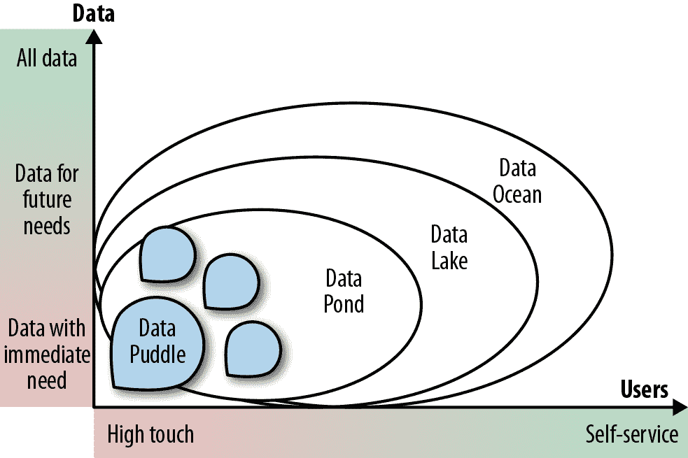

###### 图 1-1\. 成熟度的四个阶段

数据池和数据湖之间的关键区别在于焦点。数据池提供了相对于现有的关系型数据仓库和数据集市更廉价和更可扩展的技术替代方案。而后者侧重于运行例行、生产就绪的查询，数据湖使业务用户能够利用数据自主做出决策，通过使用各种新类型的数据和工具进行自由分析和实验，正如图 1-2 所示。

在深入探讨如何创建成功的数据湖之前，让我们更仔细地看看导致其之前的两个成熟阶段。

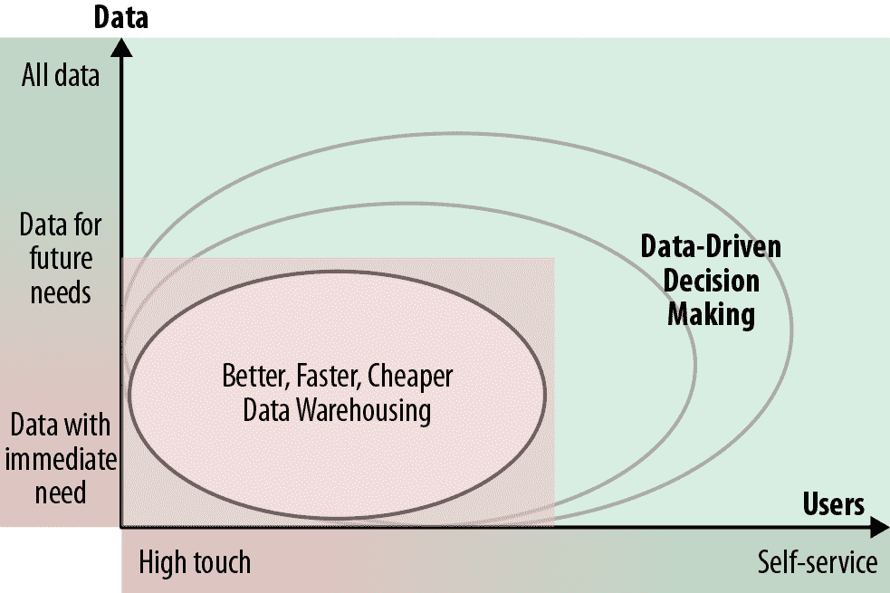

###### 图 1-2\. 数据湖的价值主张

## 数据池

数据池通常为一个小而专注的团队或专业用例构建。这些“池子”是由单个团队拥有的中等规模的数据集合，通常由业务单位在云中使用影子 IT 构建。在数据仓库时代，每个团队习惯为其项目构建关系型数据集市。构建数据池的过程非常相似，只是使用了大数据技术。通常，数据池是为需要大数据强大规模支持的项目而构建的。许多高级分析项目，如那些专注于客户流失或预测性维护的项目，属于这一类别。

有时，数据池被构建来帮助 IT 处理自动化计算密集和数据密集的流程，比如详细介绍的数据抽取、转换和加载（ETL）卸载，其中所有的转换工作从数据仓库或昂贵的 ETL 工具转移到大数据平台上。另一个常见的用途是为单个团队提供一个工作区，称为*沙盒*，供数据科学家进行实验。

数据池通常范围小、数据种类有限；它们由小型、专用的数据流填充，并且构建和维护它们需要高度技术的团队或者 IT 的深度参与。

## 数据池

数据池是数据小块的集合。正如您可以将数据小块视为使用大数据技术构建的数据集市，您可以将数据池视为使用大数据技术构建的数据仓库。它可能是有机地形成的，随着更多小块被添加到大数据平台。创建数据池的另一种流行方法是作为数据仓库卸载的一部分。与 ETL 卸载不同，后者使用大数据技术执行一些处理以填充数据仓库所需，这里的想法是将数据仓库中的所有数据加载到大数据平台中。其愿景通常是最终摆脱数据仓库以节省成本并提高性能，因为与关系数据库相比，大数据平台要便宜得多且可扩展性更强。然而，仅仅卸载数据仓库并不能使分析师访问原始数据。因为数据仓库所遵循的严格架构和治理依然存在，组织无法解决数据仓库的所有挑战，比如长期且昂贵的变更周期、复杂的转换以及作为所有报告基础的手工编码。最后，分析师通常不喜欢从经过精细调整的、具有闪电般快速查询的数据仓库转移到预测性较差得多的大数据平台，虽然在大数据平台上大批量查询可能比数据仓库中快，但更典型的小查询可能需要几分钟。图 1-3 展示了数据池的一些典型局限性：缺乏预测性、敏捷性和访问原始未经处理数据的能力。

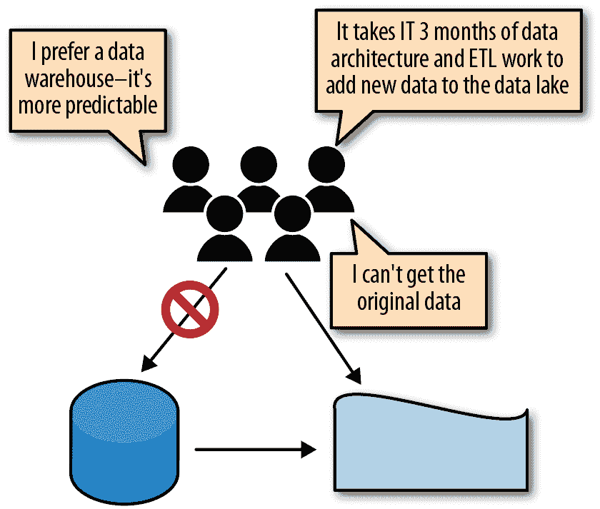

###### 图 1-3\. 数据仓库卸载的缺点

# 创建成功的数据湖

那么，成功的数据湖需要什么？与任何项目一样，将其与公司的业务策略对齐，并获得高管赞助和广泛支持至关重要。此外，基于与部署数据湖的数十家公司的讨论，可以确定三个关键前提条件：

+   正确的平台

+   正确的数据

+   正确的接口

## 正确的平台

像 Hadoop 和云解决方案（如 Amazon Web Services (AWS)、Microsoft Azure 和 Google Cloud Platform）这样的大数据技术是数据湖的最流行平台。这些技术共享一些重要优势：

体积

这些平台被设计为扩展性外扩——换句话说，可以在不显著降低性能的情况下无限扩展。

成本

我们一直有能力在相对便宜的存储介质上存储大量数据，比如磁带、WORM 磁盘和硬盘。但直到大数据技术出现之前，我们才有能力以如此低廉的成本存储和处理大量数据，通常是商业关系数据库成本的十分之一至百分之一。

多样性

这些平台使用文件系统或对象存储，允许它们存储各种文件：Hadoop HDFS，MapR FS，AWS 的简单存储服务（S3），等等。不像关系型数据库需要预定义数据结构（*写入时模式*），文件系统或对象存储并不关心你写入了什么。当然，要想有意义地处理数据，你需要知道它的模式，但那只有在使用数据时才需要。这种方法被称为*读取时模式*，是大数据平台的重要优势之一，促成了所谓的“无摩擦摄入”。换句话说，数据可以在不经任何处理的情况下加载，这与关系型数据库不同，后者必须将数据转换为数据库所期望的模式和格式后才能加载。

未来的保障

因为我们的需求和所处的世界在变化，确保我们拥有的数据能够帮助未来的需求变得至关重要。今天，如果数据存储在关系型数据库中，只能由该关系型数据库访问。另一方面，Hadoop 和其他大数据平台非常模块化。同一个文件可以被各种处理引擎和程序使用——从 Hive 查询（Hive 提供对 Hadoop 文件的 SQL 接口）到 Pig 脚本，再到 Spark 和自定义 MapReduce 作业，各种不同的工具和系统都可以访问和使用同一个文件。由于大数据技术正在迅速发展，这使人们对任何未来项目仍能访问数据湖中的数据充满信心。

## 正确的数据

今天企业收集的大部分数据都被丢弃了。少部分被汇总并保存在数据仓库中几年，但大多数详细的操作数据、机器生成的数据和旧历史数据要么被汇总，要么完全被丢弃。这使得进行分析变得困难。例如，如果分析人员认识到一些传统上被丢弃的数据的价值，可能需要数月甚至数年才能积累足够的数据历史来进行有意义的分析。因此，数据湖的承诺在于能够尽可能地存储大量数据以供将来使用。

所以，数据湖有点像一个存钱罐（Figure 1-4）——你经常不知道为什么要保存数据，但你希望以防一天需要。此外，因为你不知道如何使用数据，所以过早地转换或处理它是没有意义的。你可以将它看作是带着你的存钱罐在不同国家旅行，在当地货币的国家增加货币，并将内容保留在其原生货币中，直到你决定在哪个国家使用这些钱；然后你可以将所有钱转换为该货币，而不是每次过境时都不必要地转换资金（并支付转换费用）。总结一下，目标是*尽可能以其原生格式保存数据*。

###### 图 1-4\. 数据湖就像一个存钱罐，让你以其原生或原始格式保存数据。

获取正确数据的另一个挑战是*数据孤岛*。不同部门可能囤积他们的数据，一是因为提供数据困难且昂贵，二是因为在政治和组织上不愿意分享。在典型企业中，如果一个组需要另一个组的数据，它必须解释需要哪些数据，然后拥有数据的组必须实施 ETL 作业以提取和打包所需数据。这是昂贵、困难且耗时的，因此团队可能会尽可能推迟数据请求，然后尽可能长时间地提供数据。这种额外工作常被用作不分享数据的借口。

有了数据湖，因为湖通过无摩擦摄取原始数据（基本上是按原样摄取），这种挑战（和借口）消失了。一个良好治理的数据湖也是集中化的，并为组织内的人们提供获取数据的透明流程，因此所有权不再是障碍。

## **正确的界面**

一旦我们拥有了正确的平台并加载了数据，我们进入了数据湖更为困难的部分，这也是大多数公司失败的地方——选择正确的界面。为了获得广泛采用并享受帮助业务用户做出数据驱动决策的好处，公司提供的解决方案必须是自助服务的，这样他们的用户可以在不需要 IT 帮助的情况下找到、理解和使用数据。IT 简直无法扩展以支持如此庞大的用户群体和如此多样化的数据。

启用自助服务有两个方面：为用户提供适合其专业水平的数据，确保用户能够找到正确的数据。

### 为用户提供适合其专业水平的数据是另一个挑战。

为了使数据湖得到广泛采用，我们希望所有人，从数据科学家到业务分析师，都能使用它。然而，考虑到这些具有不同需求和技能水平的不同受众时，我们必须小心确保将正确的数据提供给正确的用户群体。

例如，分析师通常没有使用原始数据的技能。原始数据通常具有太多细节，太精细，并且经常存在太多质量问题，以至于难以轻松使用。例如，如果我们收集来自使用不同应用程序的不同国家的销售数据，那么该数据将以不同的格式和不同的字段（例如，一个国家可能有销售税而另一个国家没有）以及不同的计量单位（例如，磅对公斤，美元对欧元）的形式出现。

为了让分析师使用这些数据，必须对其进行*协调* —— 将其放入相同的架构中，并使用相同的字段名称和计量单位 —— 并且通常还需要将其聚合到每日产品或每客户的销售额。换句话说，分析师想要“熟制”的准备好的餐点，而不是原始数据。

数据科学家则完全相反。对他们来说，处理过的数据往往会丢失他们正在寻找的重要信息。例如，如果他们想要看看两种产品一起购买的频率，但他们能获取的唯一信息是按产品的日常总量计算，数据科学家将会陷入困境。他们就像需要原材料来制作他们烹饪或分析杰作的厨师。

我们将在本书中看到如何通过设置多个*区域*来满足不同的需求，这些区域包含满足特定要求的数据。例如，原始区域或着陆区包含输入到数据湖中的原始数据，而生产区或黄金区包含高质量的、受管理的数据。我们将快速查看“组织数据湖”中的区域；更详细的讨论可以在第七章中找到。

### 获取数据

我与大多数公司交流的情况是，它们都正在采用“购物数据”的范式，分析师使用类似于[Amazon.com-style](http://Amazon.com-style)的界面来查找、理解、评价、注释和消费数据。这种方法的优势多种多样，包括：

一个熟悉的界面

大多数人对在线购物都很熟悉，并且喜欢使用关键词搜索和使用分类、评分和评论，因此他们不需要或只需要很少的培训。

分类搜索

搜索引擎被优化用于多层次搜索。当可能的搜索结果数量很大而用户试图找到正确结果时，多层次搜索非常有帮助。例如，如果你在亚马逊搜索烤面包机（图 1-5），多层次搜索将列出制造商、烤面包机是否需要接受贝果、需要烤多少片面包等选项。类似地，当用户搜索合适的数据集时，多层次搜索可以帮助他们指定数据集中希望的属性、数据集的类型和格式、保存数据集的系统、数据集的大小和新鲜度、拥有数据集的部门、数据集的权限以及任何其他有用的特征。

排名和排序

根据特定标准选择正确资产的能力，这是由搜索引擎广泛支持的，并且对于选择合适的资产非常重要。

上下文搜索

随着目录变得更加智能，使用语义理解分析师正在寻找的数据资产的能力将变得更加重要。例如，一个销售人员寻找客户时，可能实际上是在寻找潜在客户，而技术支持人员寻找客户时可能实际上是在寻找现有客户。

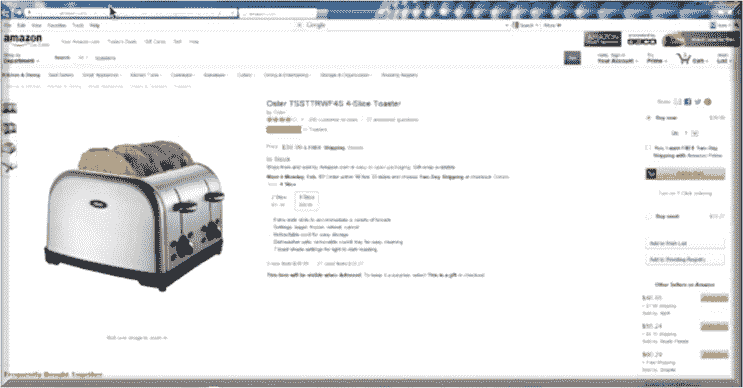

###### 图 1-5\. 一个在线购物界面

## 数据污泥

虽然数据湖始终以良好的意图开始，有时候它们会走错方向，最终成为*数据污泥*。数据污泥是一个数据池，它已经扩展到数据湖的大小，但由于缺乏自助服务和治理设施，未能吸引广泛的分析师社区。在最好的情况下，数据污泥像数据池一样使用，而在最坏的情况下，根本不被使用。通常情况下，虽然各个团队在其项目中使用湖的小区域（图 1-6 中的白色数据池区域），但大部分数据是黑暗的、未记录的和无法使用的。

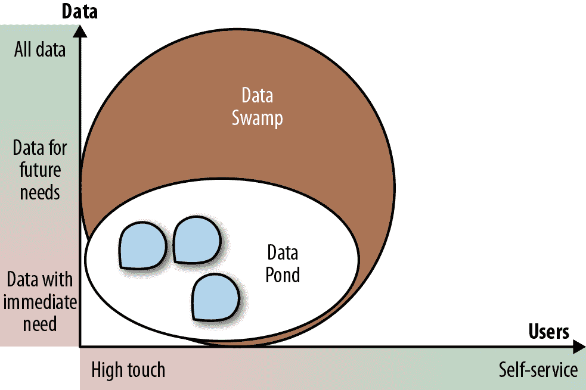

###### 图 1-6\. 一个数据污泥

当数据湖首次出现时，许多公司急忙购买 Hadoop 集群并填充原始数据，但并没有清晰地理解如何利用这些数据。这导致了大量数据污泥的形成，其中包含数百万个文件，总计几十 PB 的数据，但却无法对这些数据做出任何意义上的解释。

只有最复杂的用户能够导航这些沼泽地，通常是通过开辟他们和他们的团队可以利用的小水洼。此外，治理规定禁止在不保护敏感数据的情况下向广大用户开放沼泽地。由于没有人能告诉哪些数据是敏感的，用户无法获得访问权限，数据很大程度上保持不可用和未使用。一位数据科学家与我分享了他的经历，他的公司建立了一个数据湖，将湖中所有数据加密以保护它，并要求数据科学家证明他们想要的数据不是敏感的，然后才会解密并允许他们使用。这被证明是一个进退两难的局面：因为所有东西都被加密了，我跟他谈过的那位数据科学家什么也找不到，更不用说证明它不是敏感的了。结果，没有人在使用这个数据湖（或者正如他所说的，这个沼泽地）。

# 数据湖成功的路线图

现在我们知道数据湖成功所需及其需要避免的陷阱，那么我们如何开始建设一个数据湖呢？通常，公司按照以下流程进行：

1.  搭建基础设施（启动和运行 Hadoop 集群）。

1.  组织数据湖（为各种用户社区创建使用区域并摄入数据）。

1.  为自助服务设置数据湖（创建数据资产目录，设置权限，并提供分析师使用的工具）。

1.  开放数据湖给用户使用。

## 建立数据湖

当我在 2015 年开始写这本书时，大多数企业正在使用开源或商业的 Hadoop 分布式在本地构建数据湖。到 2018 年，至少一半的企业要么完全在云中构建他们的数据湖，要么构建混合数据湖，既在本地又在云中。许多公司还拥有多个数据湖。所有这些多样性正在推动公司重新定义数据湖的概念。现在我们看到了*逻辑数据湖*的概念：跨多个异构系统的虚拟数据湖层。底层系统可以是 Hadoop、关系型数据库或 NoSQL 数据库，在本地或云中。

图 1-7 比较了这三种方法。它们都提供了用户查询数据资产的目录。这些数据资产要么已经在 Hadoop 数据湖中，要么被提供给它，分析师可以使用它们。

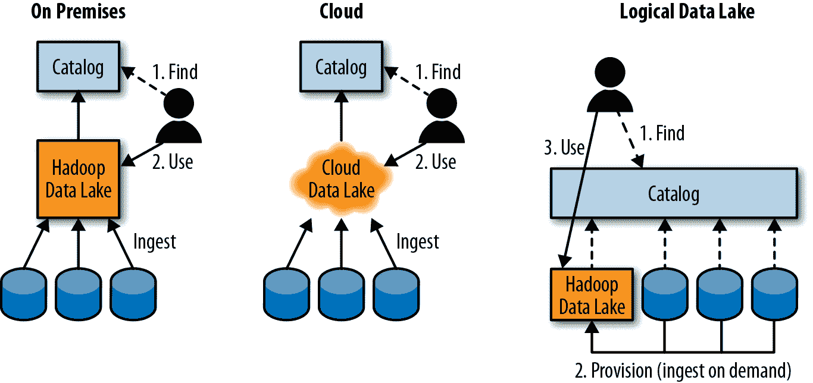

###### 图 1-7\. 不同的数据湖架构

## 组织数据湖

我遇到的大多数数据湖大致都是按照不同区域组织的：

+   *原始*或*着陆*区，数据被摄入并尽可能保持其原始状态。

+   *金牌*或*生产*区，存放清洁、加工后的数据。

+   一个*开发*或*工作*区域，更多技术型用户如数据科学家和数据工程师在此进行工作。这个区域可以按用户、项目、主题或其他方式进行组织。一旦工作区中进行的分析工作被产品化，它就会移动到金区。

+   一个*敏感*区域，包含敏感数据。

图 1-8 展示了这种组织形式。

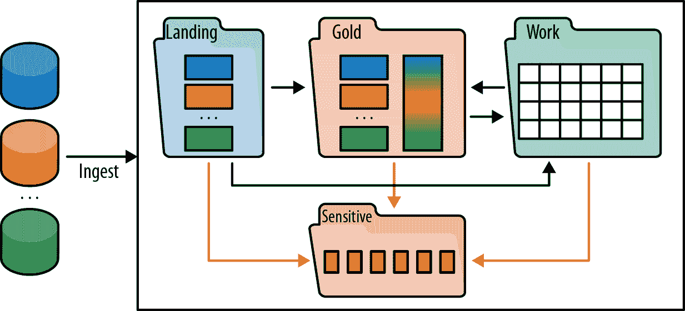

###### 图 1-8\. 典型数据湖的区域

多年来，数据治理团队的普遍看法是，无论数据位于何处或用途如何，都应该受到相同的治理。然而，近年来，来自 Gartner 的行业分析师们开始推广*多模式 IT*的概念——基本上是治理应反映数据使用和用户社区的需求。这种方法已被数据湖团队广泛采纳，不同的区域具有不同的治理级别和服务级别协议（SLA）。例如，金区的数据通常受到严格的治理，具有良好的策展和文档化，以及质量和新鲜度的 SLA，而工作区的数据则有较少的治理（主要确保没有敏感数据），其 SLA 可能会因项目而异。

不同的用户群体自然而然地倾向于不同的区域。业务分析师主要在金区使用数据，数据工程师在原始区（将其转换为用于金区生产的数据）处理数据，数据科学家则在工作区进行实验。尽管每个区域都需要一定的治理来确保敏感数据被检测和保护，但数据监护人员主要关注敏感区域和金区的数据，以确保其符合公司和政府的法规要求。图 1-9 展示了不同区域的治理级别和不同用户群体。

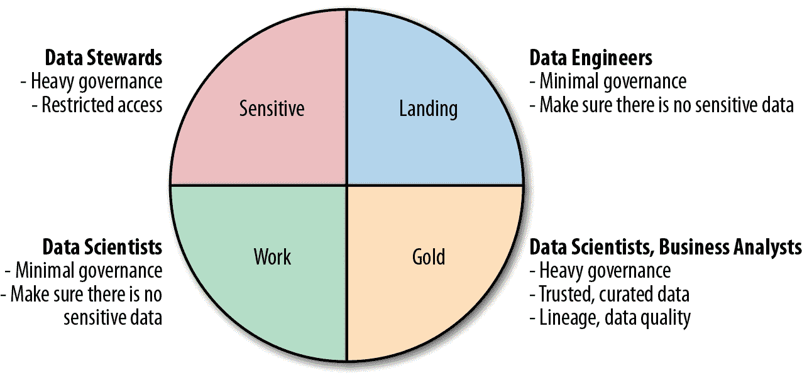

###### 图 1-9\. 区域治理期望

## 设置自助数据湖

无论是业务分析师、数据分析师还是数据科学家，通常都要经历四个步骤来完成他们的工作。这些步骤在图 1-10 中有所展示。

###### 图 1-10\. 分析的四个阶段

第一步是*查找和理解*数据。一旦找到合适的数据集，他们需要*提供*数据，即获取对其的访问权限。一旦拥有数据，他们通常需要*准备*数据，即清理并将其转换为适合分析的格式。最后，他们需要使用数据来回答问题或创建可视化和报告。

理论上，前三个步骤是可选的：如果数据被分析师所熟知并理解，分析师已经可以访问该数据，并且数据已经适合进行分析，那么分析师可以直接进行最后一步。然而实际情况是，大量研究显示，前三个步骤通常占据了典型分析师时间的 80%，其中最大的开销（60%）发生在第一步中，即查找和理解数据（例如参见 Boris Evelson 的《通过融合大数据和商业智能提升您的业务洞察力》，Forrester Research，2015 年 3 月 25 日）。

让我们逐步分析这些，以便让你更好地了解每个阶段发生了什么。

### 查找和理解数据

为什么在企业中找到数据如此困难？因为可用数据的种类和复杂性远远超出了人类记忆的能力。想象一个非常小的数据库，只有一百个表（一些数据库有数千甚至数万个表，因此这确实是一个非常小的现实生活数据库）。现在想象每个表都有一百个字段——对于大多数数据库来说，特别是数据倾向于去规范化的分析数据库来说，这是一个合理的假设。这给我们带来了 10,000 个字段。有人能记住 10,000 个字段的含义以及这些字段所在的表，并且在使用数据进行新事物时随时跟踪它们，这有多现实呢？

现在想象一下一个企业有几千（或者几十万）个数据库，大多数比我们假设的有 10,000 个字段的数据库大一个数量级。我曾经与一个只有 5,000 名员工的小银行合作过，但他们设法创建了 13,000 个数据库。我只能想象一个有数十万名员工的大银行可能有多少数据库。我说“只能想象”的原因是因为在我职业生涯的 30 年里，我与数百个大型企业合作过，他们无法告诉我他们有多少个数据库——更不用说有多少个表或字段了。

希望这能让你对分析师在寻找数据时面临的挑战有所了解。

一个典型的项目涉及到分析员“四处打听”，看看是否有人曾经使用过某种特定类型的数据。他们被人引荐来引荐去，直到偶然发现某个数据集曾被他人在其项目中使用过。通常情况下，他们不知道这是否是最佳的数据集可供使用，数据集是如何生成的，甚至数据是否可信。然后，他们面临着一个令人痛苦的选择，要么使用这个数据集，要么再继续打听一段时间，也许找不到更好的选择。

一旦决定使用数据集，他们会花费大量时间尝试解读数据集中包含的意义。有些数据显而易见（例如客户姓名或账号），而其他数据则比较神秘（例如客户代码 1126 代表什么？）。因此，分析师还要花费更多时间寻找能帮助他们理解数据的人。我们称这种信息为“部落知识”。换句话说，知识通常是存在的，但它散布在整个部落中，并且必须通过痛苦、漫长和容易出错的发现过程重新组装起来。

幸运的是，有一些新的*分析师众包*工具正在通过收集部落知识来解决这个问题，该过程允许分析师使用由业务术语组成的简单描述文档化数据集，并建立搜索索引来帮助他们找到所需内容。这些工具已经在谷歌和 LinkedIn 等现代数据驱动公司进行了定制开发。由于在这些公司中数据非常重要且“每个人都是分析师”，因此对问题的认识和为解决方案作出贡献的意愿要高得多，而在传统企业中则低得多。当数据集刚刚创建时，文档化就变得容易得多，因为信息是新鲜的。然而，即使在谷歌，虽然一些热门数据集已经有了很好的文档化，但仍然存在大量暗数据或未文档化的数据。

在传统企业中，情况更为糟糕。除非这些数据集（文件和表格）被使用，否则分析师永远不会对数百万个现有数据集进行文档化，但如果不文档化，这些数据集就永远不会被找到和使用。唯一的实际解决方案是将众包与自动化结合起来。Waterline Data 是我和我的团队开发的工具，用于提供这样的解决方案。它采用从分析师工作的数据集中众包收集的信息，并将其应用于所有其他暗数据集。该过程称为*指纹识别*：该工具遍历企业中的所有结构化数据，为每个字段添加唯一标识符，并在分析师对字段进行注释或标记时，寻找类似字段并为其提供标签建议。当分析师搜索数据集时，他们既可以看到由分析师标记的数据集，也可以看到由工具自动标记的数据集，并有机会接受或拒绝这些建议的标签。然后，该工具应用机器学习（ML）根据用户反馈改进其自动标记。

核心思想是，单靠人工注释无法胜任数据的广度和复杂性，而纯自动化注释又无法靠谱，因为数据具有独特且不可预测的特征——因此，必须将二者结合起来以达到最佳效果。Figure 1-11 说明了这种良性循环。

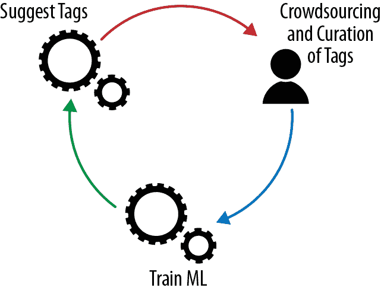

###### 图 1-11。利用人类知识和机器学习

### 访问和供应数据

一旦确定了正确的数据集，分析员需要能够使用它们。传统上，分析员在开始或加入项目时被授予访问权限。然后很少会被收回，因此老成员最终会获得对企业中可能有用的几乎所有数据的访问权限，而新人几乎没有访问权限，因此无法找到或使用任何数据。为了解决数据湖中的数据访问问题，企业通常会选择以下两个极端之一：要么向所有人授予对所有数据的完全访问权限，要么除非分析员能证明有需求，否则所有访问权限都会受到限制。在某些情况下，授予完全访问权限是可行的，但在受监管的行业中则不然。为了使其更可接受，企业有时会去识别敏感数据，但这意味着他们必须做一些可能没有人需要的数据摄取工作。此外，随着法规的变化，可能需要去识别的数据会越来越多（这个话题将在后续章节中深入讨论）。

更实际的方法是在元数据目录中发布所有数据集的信息，这样分析员可以找到有用的数据集，然后根据需要申请访问权限。这些请求通常包括访问的理由、需要数据的项目以及所需的访问时长。这些请求会被路由到所需数据的数据管理员那里。如果他们批准访问权限，访问权限将会被授予一段时间。这段时间可以延长，但不是无限期的，从而消除了传统的访问问题。新的请求也可能会触发去识别敏感数据的工作，但现在只有在需要时才会进行。

数据的供应或物理访问可以通过多种方式授予：

+   用户可以被授予对整个数据集的读取权限。

+   如果只需要部分访问权限，可以创建一个仅包含适合用户数据的文件副本（并保持更新），或者创建一个仅包含分析员应看到的字段和行的 Hive 表或视图。

+   如果需要，可以生成一个去识别版本的数据集，用随机生成的等效信息替换敏感信息，这样所有应用程序仍然能够运行，但不会泄漏敏感数据。

### 准备数据

有时，数据是完全干净且可以立即用于分析的。不幸的是，大多数情况下，数据需要经过处理才能使其适合分析。数据准备通常涉及以下操作：

塑形

选择要处理的字段和行的子集，将多个文件和表合并成一个（联接），转换和聚合，分桶化（例如，从离散值到范围或桶的转换，例如将 0 到 18 岁的人放入“青少年”桶，将 19 到 25 岁的人放入“青年”桶等），将变量转换为特征（例如，将年龄转换为一个特征，如果一个人超过 65 岁则值为 0，否则为 1），以及许多其他可能的步骤。

清洗

填补缺失值（例如，从名字猜测缺失的性别或在地址数据库中查找地址），纠正错误值，解决冲突数据，将计量单位和代码规范化为常见的单位等。

混合

将不同的数据集调整到相同的模式、相同的计量单位、相同的代码等。

从这些例子中可以看出，数据准备涉及到大量复杂的工作和思考。自动化至关重要，以利用通过转换所学到的经验，并避免在成千上万个表格和数据集上重复相同的繁琐步骤。

最常见的数据准备工具是 Excel。不幸的是，Excel 并不适用于数据湖大小，但是大量新工具为大规模数据集提供了类似 Excel 的功能。例如，Trifacta 应用复杂的机器学习技术来建议转换，并帮助分析员准备数据。许多大型供应商也推出了数据准备工具，像 Tableau 和 Qlik 等分析供应商也在他们的工具中增强了数据准备功能。

### 分析和可视化

一旦数据准备好，就可以进行分析。分析范围从创建简单的报告和可视化到复杂的高级分析和机器学习。这是一个非常成熟的领域，数百家供应商为各种类型的分析提供解决方案。特别是对于 Hadoop 数据湖，Arcadia Data、AtScale 等公司提供本地运行并利用 Hadoop 处理能力的分析和可视化工具。

# 数据湖架构

最初，我与大多数公司的交谈中他们认为他们会拥有一个包含所有数据的庞大的本地数据湖。随着他们的理解和最佳实践的发展，大多数企业意识到单一的去中心化点并不理想。在数据主权法规（例如，禁止将数据带出德国）和组织压力之间，多个数据湖通常被证明是更好的解决方案。此外，随着公司意识到支持大规模并行集群的复杂性，并且因为无法找到和雇佣有经验的 Hadoop 和其他大数据平台管理员而感到沮丧，他们开始选择由亚马逊、微软、谷歌等公司的专家管理大部分硬件和平台组件的基于云的数据湖。

## 公共云中的数据湖

除了访问大数据技术专业知识和快速部署时间的好处外，存储成本低和云计算的弹性特性使其成为实施数据湖的极具吸引力的选择。由于大量数据被存储以备将来使用，因此将其尽可能廉价地存储是有意义的。这与通过亚马逊等提供的各种存储层级支持的成本优化可能性很好地配合：访问速度从高速到冰川级别不等，而慢速访问媒体的价格显著便宜。

此外，云计算的弹性允许在需要时按需启动非常大的集群。与本地集群相比，后者具有固定大小并将数据存储在附加存储中（尽管正在探索具有网络附加存储的新架构）。这意味着随着节点存满数据，需要添加新节点仅用于存储。此外，如果分析负载 CPU 密集且需要更多计算能力，则即使可能仅需短时间使用，也需要添加节点。

在云中，您只需支付所需的存储空间（即不必购买额外的计算节点来获取更多存储空间），并且可以短时间内启动大型集群。例如，如果您有一个 100 节点的本地集群和一个需要 50 小时的作业，则购买和安装 1000 节点仅为了使此作业运行更快是不划算的。然而，在云中，您支付的计算能力大约为 100 节点 50 小时的费用，与 1000 节点 5 小时的费用相当。这是弹性计算的巨大优势。

## 逻辑数据湖

企业意识到单一集中式数据湖并不是一个好的解决方案后，逻辑数据湖的理念开始流行起来。采用这种方法，不是将所有数据加载到数据湖中以备将来可能需要，而是通过集中目录或数据虚拟化软件向分析师提供数据访问。

逻辑数据湖解决了完整性和冗余性问题，如图 1-12 所示。

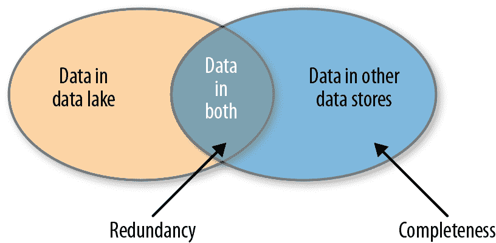

###### 图 1-12\. 完整性和冗余性问题

这些问题可以总结如下：

完整性

分析师如何找到最佳数据集？如果分析师只能找到已经存在于数据湖中的数据，那么没有被摄取到数据湖中的其他数据将无法找到或使用（如图 1-12 中右侧的弯月区域所示）。

冗余性

如果我们将所有数据摄入数据湖，数据源和数据湖之间将存在冗余（如图 1-12 中两个圆的重叠区域所示）。有了多个数据湖，为了实现完整性，我们需要将相同的数据摄入每个数据湖中。

更糟糕的是，企业中已经存在大量冗余。传统上，在启动新项目时，最便捷和政治上简单的方法是由项目团队启动新的数据集市，从其他来源或数据仓库复制数据，并添加自己的独特数据。这比研究现有数据集市并与当前所有者和用户协商共享使用要容易得多。因此，存在大量几乎相同的数据集市。如果我们将所有这些数据集市中的数据盲目加载到数据湖中，我们的数据湖中将存在极高水平的冗余。

我见过的解决完整性和冗余挑战的最佳方法涉及一些简单的规则：

+   要解决完整性问题，请创建所有数据资产的目录，以便分析师可以找到并请求企业中可用的任何数据集。

+   要解决冗余问题，请按照图 1-13 所示的过程进行操作：

    +   存储在数据湖中没有存储在其他地方的数据。

    +   如果需要，将存储在其他系统中的数据带入数据湖，并在需要时保持同步。

    +   将每个数据集仅一次性地为所有用户引入。

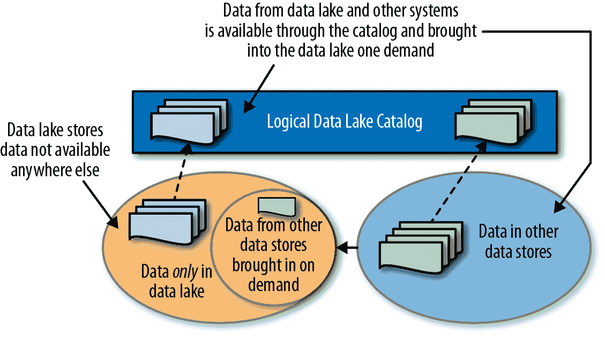

###### 图 1-13\. 管理逻辑数据湖中的数据

### 虚拟化与基于目录的逻辑数据湖

*虚拟化*（有时也称为*联邦化*或 EII，用于*企业信息集成*）是上世纪 80 年代开发的一种技术，并经过几代改进直到 2010 年代。它基本上创建了一个虚拟视图或表，隐藏了物理表的位置和实现方式。在图 1-14 中，通过连接来自不同数据库的两个表创建了一个视图。然后，查询将查询该视图，并由数据虚拟化系统决定如何访问和连接这两个数据库中的数据。

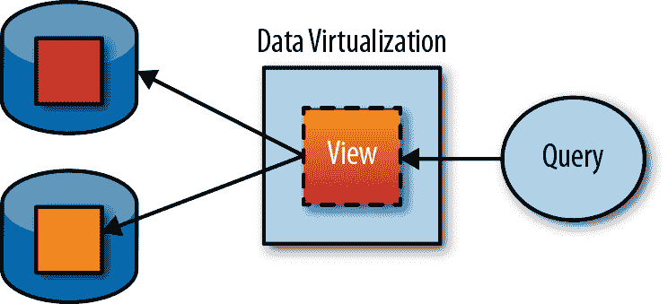

###### 图 1-14\. 通过视图创建自定义数据集

尽管这项技术对某些用例效果很好，在逻辑数据湖中，为了实现完整性，需要将每个数据集发布为虚拟表，并在底层表模式更改时保持更新。

即使解决了发布每个数据资产的初始问题，视图仍然存在重大问题：

+   创建虚拟视图并不会使数据更容易找到。

+   从多个异构系统中联接数据是复杂且计算密集型的，通常会对系统造成巨大的负载和长时间的执行周期。这些所谓的*分布式联接*，涉及到内存容量不足的表，是出名的资源密集型。

相比之下，在基于目录的方法中，仅发布关于每个数据集的元数据，以便使其可找到。然后将数据集配置到同一系统（例如 Hadoop 集群）以在本地处理，如图 1-15 所示。

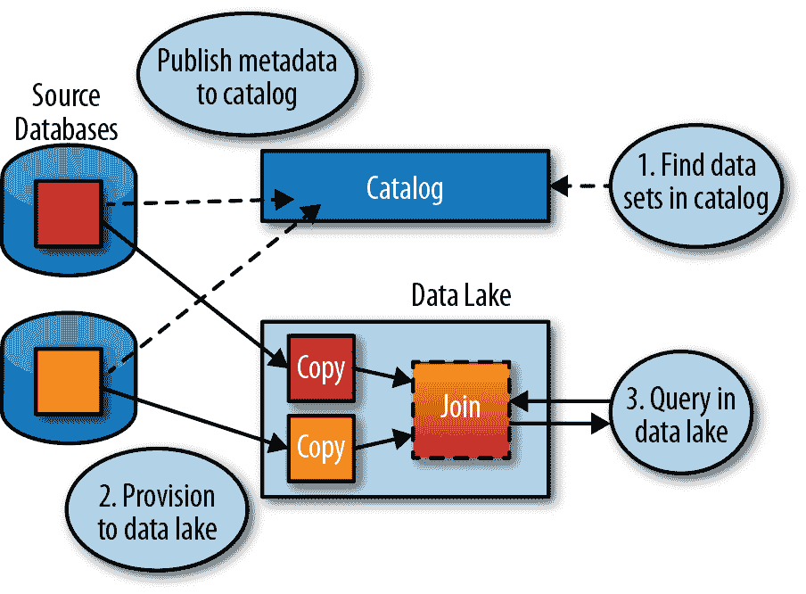

###### 图 1-15\. 通过目录提供元数据

除了使所有数据对分析师可查找和可访问之外，企业目录还可以作为访问、治理和审计的单一访问点，如图 1-16 所示。顶部，没有集中目录，对数据资产的访问处处都有，难以管理和跟踪。底部，有了集中的目录，所有访问请求都通过目录。按需授予特定时间段的访问权限，并由系统进行审计。

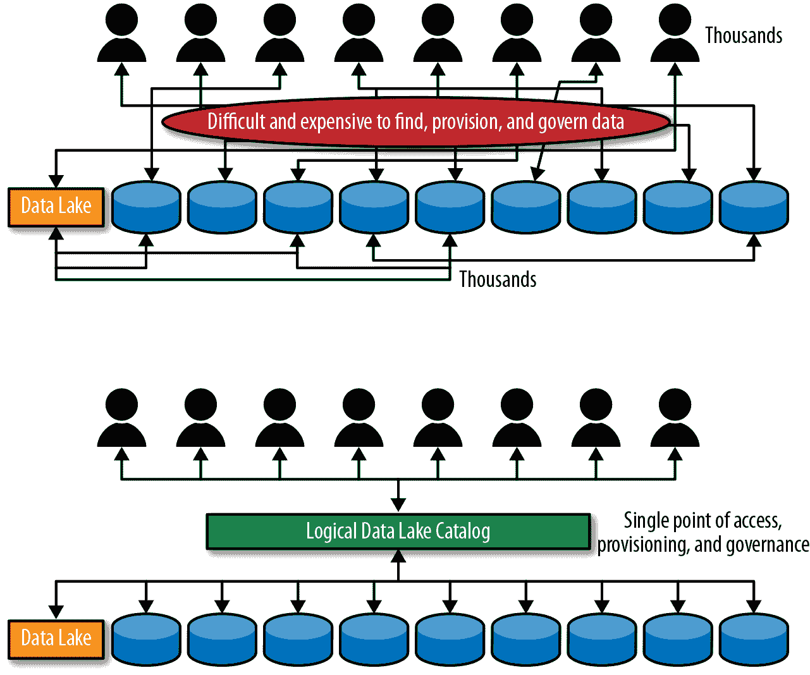

###### 图 1-16\. 数据配置和治理通过目录

# 结论

总之，获取正确的平台，加载正确的数据，并通过技能和需求适当的界面组织和设置为自助服务，是创建成功的数据湖的关键。在本书的其余部分，我们将探讨如何完成这些任务。
