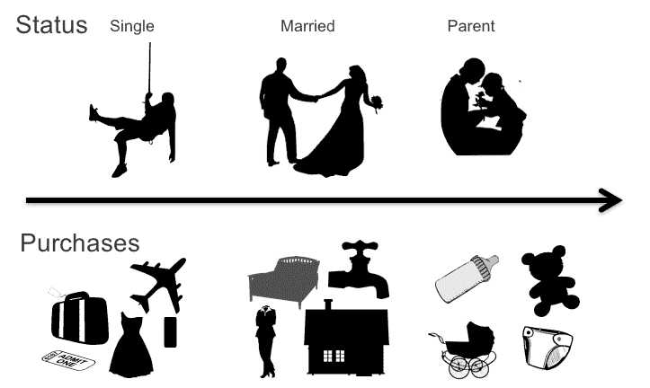

# 第二章：历史视角

数据已存在很长时间。首先是视觉形式：洞穴壁画、特定排列的土堆。一旦人类发展出书写系统，他们开始用它们来记录事物：许多古代泥板和手稿似乎包含清单、账簿、买卖和债务的记录。后来，更多的通用数据被收集并出版在年鉴和百科全书中：最长的河流、最高的山脉、最深的湖泊、人口最多的国家、平均降雨量、最高和最低温度等等。我们似乎对测量、计数、比较和追踪有着无尽的迷恋。传统上，这种测量和计数过程是费时且手动的，因此我们发明了机器来帮助我们。最终，这些机器演变成了现代计算机。

很早就显而易见，计算机具有远远超出人类的计数、测量和存储信息的能力。然而，计算机在其他方面也非常擅长，比如应用逻辑和执行业务流程。在计算机早期，大部分关注点都集中在程序和逻辑上。数据被认为是程序的产物，只有原始存储它的程序才能访问并理解它。

为了使数据对人类更易访问，程序员开发了*报告*，将数据打包成人类可读的形式。如果分析师想以不同方式查看数据，他们必须提出请求并等待开发人员创建新的报告。

# 自助数据驱动力——数据库的诞生

自助数据革命的第一步是电子表格。它允许非开发人员直接处理数据。分析师第一次能够自行处理数据并将其操纵成他们想要的形状。一旦这只神灯被释放出来，就无法将其收回。但尽管电子表格迅速成为最常见的决策支持工具，它们无法扩展到大量数据，并且只能解决分析师希望解决的问题的一小部分。

与此同时，公司开始意识到数据而非应用程序才是最宝贵的资产。丢失数据意味着业务将停滞不前。数据必须被精心管理，确保一致性，并进行备份。不再让每个程序都自行开发这些能力，而是通过一种新的系统类别提取和提供，这类系统称为*数据库管理系统*（DBMS）。这些系统不包含编程逻辑，专注于数据管理。

早期系统仍然与应用程序紧密耦合，并需要应用逻辑来理解数据，但随着关系数据库的出现，数据和应用程序之间的分离逐渐得到制度化。

关系型数据库管理系统（RDBMSs）允许用户明确描述数据到数据库中。用户创建一个*模式*—一组可供人类阅读的表格和字段。而不是总是通过程序获取数据，RDBMSs 的用户能够直接查询数据。最终，一种称为结构化查询语言（SQL）的标准语言出现，并成为数据库的*通用语言*。使用这种语言，用户可以编写自己的查询并对数据进行分析。

虽然现在可以直接分析应用程序使用的数据，但大多数数据库模式仍然设计用于支持应用程序。由于从磁盘读写数据比在内存中处理数据慢几个数量级，一种称为*规范化*的模式设计技术将数据分解为尽可能小的块，以确保每个数据库更新尽可能少地写入数据。这对于更新和检索特定数据片段（例如单个客户的信息）效果良好，但在进行大规模分析（例如查看客户所有活动）时效率极低，因为需要连接多个表。

关于关系型数据库理论和模式设计已经写了很多书籍，所以我在这里只介绍关系、主键和外键以及规范化的关键概念。关系数据库包含具有列和行的表格。想象一下，试图将您对客户的所有信息存储在一个表格中—您将有不同客户属性的列，如姓名、地址、年龄、性别等等。现在想象一下，您还想跟踪每位客户的订单。您可以添加新的列用于订单号、日期、金额和其他订单属性。如果每位客户只有一个订单，您将为每位客户及其订单拥有一行。但如果客户下了多个订单呢？您现在是否为每个订单都有一行？这意味着所有客户数据将为每个订单复制一次，如在表 2-1 所示。如果一个客户有一千个订单，他们的数据将被复制一千次。更糟糕的是，如果他们的信息发生变化—例如客户搬家或结婚后更改姓名，您将不得不更新这一千条记录。显然，这不是一种非常有效的方法。

表 2-1\. *客户订单表*

| **姓名** | **性别** | **婚姻状况** | **邮政编码** | **订单号码** | **金额** | **日期** |
| --- | --- | --- | --- | --- | --- | --- |
| 玛丽·吴 | 女 | 已婚 | 94301 | 2123123 | 987.19 | 7/12/18 |
| 玛丽·吴 | 女 | 已婚 | 94301 | 2221212 | 12.20 | 9/2/18 |
| 玛丽·吴 | 女 | 已婚 | 94301 | 2899821 | 5680.19 | 10/15/18 |
| 汤姆·琼斯 | 男 | 单身 | 93443 | 2344332 | 1500.00 | 9/12/18 |

在关系数据库中解决此问题的解决方案称为*规范化*。这是一种将表分解为较小表以避免重复信息的方法。例如，我们可以将客户信息存储在一张表中，将所有客户的所有订单存储在另一张表中。然后，为了确定哪些订单属于哪些客户，我们会生成一个*键*，比如`顾客 _ID`，并将其作为`顾客`表和`订单`表的一部分，使得每个订单都包含对应于`顾客`表中记录的`顾客 _ID`值的`顾客 _ID`值。`顾客`表中的`顾客 _ID`列(Table 2-2)将被称为*主键*，因为它唯一标识客户，而`订单`表中的`顾客 _ID`列(Table 2-3)将被称为*外键*，因为它引用了`顾客`表中的`顾客 _ID`列。主键预期是唯一的，例如，`顾客`表中的顾客 ID 将唯一标识每个客户，而外键预期是主键的一个适当子集。如果我们在`订单`表中有一个不对应于`顾客`表中任何`顾客 _ID`值的`顾客 _ID`值，我们就有了所谓的*孤立的*外键，将无法确定哪位客户下了该订单。主键和外键之间的这种对应关系称为*参照完整性*。请注意，通过将数据分解为单独的`顾客`和`订单`表，我们可以在`顾客`表中仅存储一次客户信息，而不管每个客户下了多少订单。

Table 2-2\. *顾客表*

| **顾客 _ID** | **姓名** | **性别** | **婚姻状况** | **邮政编码** |
| --- | --- | --- | --- | --- |
| 112211 | Mary Ng | F | 已婚 | 94301 |
| 299821 | Tom Jones | M | 单身 | 93443 |

Table 2-3\. *订单表*

| **顾客 _ID** | **订单号** | **金额** | **日期** |
| --- | --- | --- | --- |
| 112211 | 2123123 | 987.19 | 7/12/18 |
| 112211 | 2221212 | 12.20 | 9/2/18 |
| 112211 | 2899821 | 56.80.19 | 10/15/18 |
| 299821 | 2344332 | 1500.00 | 9/12/18 |
| 299821 | 2554322 | 11.99 | 9/13/18 |

为了确定例如，已婚客户与未婚客户下了多少订单，查询将必须通过执行称为*联接*的 SQL 操作从`订单`和`顾客`表中组合数据。它看起来会像这样：

```
select customers.marital_status, sum(orders.total) as total_sales from customers 
join orders on
customers.customer_id = orders.customer_id group by customers.marital_status
```

此查询将返回每种婚姻状况的订单总数，通过将两个表联接在一起，如 Table 2-4 所示。

Table 2-4\. *已婚和单身顾客的总订单数*

| **婚姻状况** | **总销售额** |
| --- | --- |
| 已婚 | 2,221,222.12 |
| 单身 | 102,221,222.18 |

虽然连接非常强大和灵活，但计算成本高昂。对于将数据规范化为数十甚至数百个表的较大系统而言，为每个查询执行所需的所有连接可能会使高度规范化的操作性数据库陷入困境。为了解决这个问题，开发出了一个新的解决方案。其思想是完全将数据与应用程序分离，并实际上将多个应用程序的数据合并到一个系统中，并将该系统用于分析。

# 分析的必要性——数据仓库的诞生

最初的愿景是创建一个“仓库”，用于存储企业的所有数据和历史信息，并使其可供分析使用。1990 年，沃尔玛创建了其现今著名的数据仓库，通过管理物流，帮助其主导零售界，并引发了分析黄金时代。很快，每个企业都意识到可以从数据中获得巨大的价值，并希望利用它来击败竞争对手。同样重要的是，企业们意识到，如果不投资于分析，竞争对手可能会压垮它们。突然之间，每个人都在建立数据仓库。不幸的是，与许多由恐惧和希望驱动而非充分的用例和业务需求推动的跨数年、数百万美元项目一样，这些项目中许多都是惊人的、广为人知的失败案例。

幸运的是，行业从这些失败中吸取了教训，并继续创新和改进。为了优化这些分析平台，针对特定用例开发了各种专业技术，解决了高效存储和分析大量数据的问题：将大型数据仓库拆分为数据集市，发明利用硬件优化处理查询的设备，并使用列存储和内存数据库。随着时间的推移，开发了大量工具生态系统，用于创建和管理数据仓库、管理数据质量，并跟踪数据模型和元数据。一些较为突出的技术包括：

+   抽取、转换、加载（ETL）和抽取、加载、转换（ELT）工具

+   数据质量（DQ）和分析工具

+   数据建模工具

+   业务词汇表

+   元数据存储库

+   数据治理工具

+   主数据管理（MDM）系统

+   企业信息集成（EII）、数据联合和数据虚拟化工具

此外，还开发了用于创建报告和分析的工具，包括：

+   报告工具

+   在线分析处理（OLAP）工具

+   商业智能（BI）工具

+   数据可视化工具

+   高级分析工具

在接下来的部分中，我们将看看其中一些工具。

# 数据仓库生态系统

图 2-1 说明了数据通过数据仓库生态系统的流动。后续章节将探讨每个组件的功能和数据流。这些工具不是本书的主题，但必须理解并置于上下文中，以便了解今天大多数组织中的数据处理流程及我们试图用数据湖复制或替代的功能。


###### 图 2-1. 数据仓库生态系统中的数据流

除了数据流之外，数据仓库生态系统还有丰富的元数据流，以及许多特定于元数据的工具，如图 2-2 所示。后续章节将描述各种工具之间的元数据流。生态系统中面向最终用户的两个组件位于图表顶部：业务词汇表和各种报表工具。广泛的 IT 人员群体——ETL 开发人员、数据和系统架构师、数据建模者、数据管理员、报表和 BI 开发人员以及数据库管理员——使用其余工具确保最终用户获取其报告和分析数据。请注意，我没有包括一般的管理、备份、管理和其他与数据仓库无关的工具，并简化了一些组件——例如，我将数据剖析归入 DQ，ETL 中的血统等等。


###### 图 2-2. 数据仓库生态系统中的元数据流

## 数据存储与查询

数据库是数据仓库的核心。通常，它是为分析型处理而优化的关系型数据库：大型、长时间查询；聚合；以及多表连接。数据库通常经过大量索引和调优，以确保对最常见的查询有最佳的性能。

### 维度建模和星型模式

当关系型数据库用于支持操作系统和应用程序时，数据通常存储在高度规范化的数据模型中。规范化的数据模型试图创建最小冗余和最少字段的表；这使得更新非常迅速。

例如，表示销售的表可能除了一些用于产品、买家、零售位置等生成的键之外几乎不包含任何信息。为了找到有用的信息，例如与零售位置对应的城市，必须将该表与另一表进行昂贵的计算。

另一方面，大多数数据仓库更青睐*去规范化*的数据模型，其中每个表尽可能包含多个相关属性。这样，所有信息可以通过一次数据遍历进行处理。

接下来，因为数据仓库通常包含来自许多来源和应用程序的数据，每个都有自己的架构，因此需要将这些来源的数据规范化，以转换为单一模式。数据仓库常用的数据模型是由 Ralph Kimball 和 Margy Ross 在 1996 年的《数据仓库工具包》第一版中引入的*星型模式*。该模式包括一组*维度*和*事实*表。

维度表代表正在分析的实体：在销售背景下，可能存在包含客户所有属性（姓名、地址等）的客户维度表，包含所有时间属性（日期、财政年度等）的时间维度表，以及包含所有产品属性（制造商、型号、价格等）的产品维度表。

事实表包含涉及维度的所有活动。例如，交易事实表中每个订单的每一行都会有一条记录。记录中包含来自客户维度表的客户关键字，该客户下订单的时间维度表的时间关键字，以及产品维度表中所订购产品的产品关键字，以及交易本身的属性（订单和行项目 ID、数量、付款价格等）。表的结构通过图 2-3 进行符号表示。将数据组织成星型模式后，即使是如 Oracle、IBM DB2 和 Microsoft SQL Server 等通用关系数据库也能够实现合理的性能，而且现在许多数据库还包括了处理星型模式连接的专门查询优化。


###### 图 2-3\. 简单星型模式中的表

### 缓慢变化维度

为了进行准确的数据分析，有必要随时间追踪个人的状态。这确保了每个交易都对应于交易时个人的状态。由于个人的状态不经常变化，因此开发了一种特殊的结构来表示这些变化：*缓慢变化维度*。这一概念也由 Kimball 和 Ross 在《数据仓库工具包》中引入。

缓慢变化维度的目标是随时间跟踪维度实体（例如个人）的状态，以便与实体状态相对应的交易（或事实）反映出长期分析中的状态，从而使分析更加准确。

本节通过描述最常见的缓慢变化维度类型来阐述基本概念，该类型通过创建多条记录来跟踪历史数据。这被称为类型 2 维度。

假设我们有一个商店，该商店记录了客户购买及其人口统计信息。在我们的示例中，假设玛丽是一个单身人士，在该商店购物已有五年时间。五年后，玛丽结婚成为房主；两年后成为父母。她继续在该店购物。

在图 2-4 中，玛丽年份 1-5 的购买反映了可能由单个人完成的购买；年份 5-7 反映了一个房主的购买；随后的年份反映了一个新父母的购买。



###### 图 2-4\. 具有慢变化维度的购物数据

如果没有慢变化维度，我们在客户表中只会有一个玛丽的单一记录，反映她当前作为一个家长的状态（见图 2-5）。因此，如果我们分析有多少有孩子的人在昂贵的旅行或运动装备上花了多少钱，我们会错误地将她年份 1-7 的购买（作为一个没有孩子的人）归因于她当前的类别。


###### 图 2-5\. 没有慢变化维度的购物数据

然而，借助专门捕获交易时个人状态的慢变化维度的帮助，客户表将对玛丽的每次状态变化都有不同的记录，如图 2-6 所示。因此，当分析玛丽的购买时，它们将被归因于具有正确状态的人。


###### 图 2-6\. 每次状态变化都会在客户维度表中为玛丽创建一个新记录，字段包括记录有效性的开始和结束日期

由于慢变化维度给 ETL 作业和分析查询增加了如此多的复杂性，只有最关键属性的历史（例如前面示例中的家庭状态）被跟踪。这意味着如果未跟踪的属性之一变得关键，其演变历史将不可用。

### 大规模并行处理（MPP）系统

使用大量并行计算机集群作为单个数据库的替代方法，这些计算机对最终用户或 BI 工具呈现为单个数据库。在开发了这种 MPP 技术后，Teradata 迅速成为最大数据仓库的首选数据库。通过使用专有的硬件、软件和网络协议，Teradata 数据仓库能够实现业界无与伦比的可扩展性，这一优势在 Hadoop 出现之前是无法匹敌的。由于 Teradata 能够并行操作计算机，因此不需要用户按照特定方式对数据建模。相反，它依赖于其查询优化器以尽可能高效的方式执行复杂查询。

### 数据仓库（DW）设备

DW 设备试图解决的问题是将运行在专有硬件和软件上的高性能数据库，比标准的现成数据库更容易部署和管理。IBM Netezza 就是这种 DW 设备的一个很好的例子。虽然不如诸如 Teradata 和 IBM DB2 等 MPP 系统可扩展，但这些设备更容易部署和调优，并且可以满足大多数数据仓库和数据集市的需求。

### 列存储

关系数据库将数据建模为包含行（有时称为记录）和列（有时称为字段）的表。例如，假设您有一个`Customers`表，其中有 300 列，每列包含有关客户的数据，例如`姓名`，`地址`，`年龄`，`第一次购买日期`等。传统的关系数据库将每行数据存储在一起，因此所有关于第一个客户的信息都被存储，然后是所有关于第二个客户的信息，依此类推。为了存储 300 个属性，每个属性的平均大小为 5 字节，数据库需要使用 1,500 字节，或者大约 1.5 KB，来存储每个用户。如果有一百万个客户，数据库至少需要 1.5 TB 的存储空间来存储所有客户数据（实际上，需要更多的存储空间，因为记录不会整齐地适配到磁盘块中，并且还有底层数据结构和索引占用的空间）。如果用户想要知道年龄小于 30 岁的客户数量，数据库将不得不读取表中的每条记录，换句话说，它将不得不读取所有的 1.5 TB。

*列存储*数据库将每列的所有数据一起存储，而不是将每行的所有数据一起存储。例如，它会将每位客户的年龄与记录标识符一起存储在相同的存储块中，指示这个值属于哪个客户记录。如果年龄占用 2 个字节，记录标识符占用 6 个字节，那么数据库每个字段需要 8 个字节，或者对于一百万个客户需要 8 GB。由于只需读取 8 GB 即可回答“30 岁以下客户有多少”的问题，它能够比原来快约 200 倍。当然，这仅对于需要少数列的查询性能有所改进。如果查询想要返回单个用户的所有信息（全部 300 列），行存储数据库只需读取一个块，而列存储数据库则需要读取 300 个块。换句话说，列存储数据库用于非常特定的查询模式，而关系模型则更通用。一些知名的竖直数据库包括 Sybase IQ 和 Vertica。

### 内存数据库

尽管传统上内存访问速度比磁盘快几个数量级，但也更昂贵。因此，数据库开发的大部分工作集中在优化磁盘访问上。正如我的斯坦福数据库教授 Gio Wiederhold 喜欢重复的那样，“任何一位合格的数据库工程师都会计算块读取次数。”大量工作投入到通过优化磁盘访问、缓存和预缓存、创建索引以减少块读取次数等来最小化这些块读取次数。

随着内存价格下降并且在内存中存储更大量数据变得实际可行，第一批设计用于在内存中保留和处理数据的数据库系统应运而生。TimesTen 就是其中的先驱之一；正如其名称所示，它试图通过专注于在内存中存储和处理数据来实现传统基于磁盘系统 10 倍的性能。最近，像 SAP 的 HANA 系统和 Apache Spark 项目等厂商也再次推动内存数据库的发展。

## 加载数据——数据集成工具

一个重要的事情要记住是数据仓库中的数据是从应用程序和操作系统加载的。因此，首要任务是用数据加载数据仓库。

有各种方法、工具和技术可以实现这一点。

### ETL

ETL 技术已经存在 20 多年了。大多数现代 ETL 工具是作为数据仓库运动的一部分在 1990 年代中期至晚期开发的。当关系数据库用于支持操作系统和应用程序时，数据通常存储在高度归一化的数据模型中。我们不会详细讨论这些细节，这些内容在大多数关系数据库书籍中都有描述，但归一化数据模型试图创建具有最小冗余量和最少字段数量的表，因此更新非常快速。另一方面，正如我们在“维度建模和星型模式”中看到的那样，大多数数据仓库倾向于非归一化数据模型，其中每个表包含尽可能多的相关属性，因此所有信息可以通过数据的单次通过来处理。

来自操作系统的数据可能包含不同格式和表示的多个表中的客户信息。ETL 工具的工作是将各种表示转换为一个共同的客户维度，就像我们在图 2-3 中看到的那样，并确保来自不同系统的同一客户记录用于创建或更新客户维度中的单个客户记录（图 2-7）。这样的维度称为*符合维度*，因为客户维度将所有传入的数据符合到一个单一的格式，并且相同的客户将在不同系统中的各种记录中被识别。在图 2-7 中，操作系统使用两个表存储客户数据。此外，这些表有不同的客户信息表示。例如，名字和姓氏在不同的字段中，有出生日期而不是年龄，并且每个客户保存多个地址。ETL 工具的任务是通过将名字连接到一个字段中，从出生日期计算年龄，并选择最佳地址并将其连接成一个字符串来将此表示转换为数据仓库客户维度表期望的表示。


###### 图 2-7\. ETL 工具从多个表中提取数据以创建客户维度

此外，由于数据仓库通常包含来自许多不同源和应用程序的数据，每个都有其自己的模式，因此来自这些源的数据必须被归一化并转换为单一模式。

### ETL 与 ELT

多年来，Teradata 和其他高端数据库供应商鼓励其客户使用其数据库引擎来执行所需的转换，而不是将其留给 ETL 工具处理。他们认为只有像他们的这样高度可扩展的系统才能处理其数据仓库的体积和复杂性。这个处理过程被称为 ELT（提取、加载、转换）。换句话说，数据以其原样加载到数据仓库中，然后使用数据库引擎将其转换为正确的表示形式（图 2-8）。


###### 图 2-8\. ETL 与 ELT 的比较

### 联合、EII 和数据虚拟化工具

当数据来自多个系统时，数据仓库的方法是将所有数据汇总到一个地方，将其集成到单一的符合模式中，然后用于分析查询。另一种方法是在多个系统之间创建逻辑或虚拟模式，然后针对该虚拟模式发出查询。这种方法有许多名称，最常见的是联合、企业信息集成（EII）和数据虚拟化。比使用数据仓库更适合的主要情况包括：

+   当面对数据必须保持更新时。因为这些工具针对原始源执行查询，所以结果始终是最新的，而数据仓库通常有一定的滞后取决于刷新频率。

+   当数据访问不频繁时。为可能只会被使用一年甚至更少的数据建立非常昂贵的数据仓库并不划算。

+   当合规性和数据驻留条款可能限制数据从一个源位置复制到目标位置时。

另一方面，这种方法有几个重要的缺点：

劳动密集型的手动过程

虚拟表必须手动定义在不同系统之间。

架构和逻辑变更

尽管架构更改可能导致加载数据仓库的 ETL 作业中断，但仅会影响最新数据，大部分数据仍然可用于分析。使用数据虚拟化工具时，架构更改可能会导致查询中断，并使所有数据在修复查询之前都不可用。

性能

某些涉及多个系统的查询（称为*联合查询*）存在显著的性能挑战。例如，复杂的多表连接和跨多个数据库的相关子查询执行时间比所有表都在同一数据库时要长得多。此外，虽然数据仓库可以通过额外的索引和调整进行分析优化，但操作源系统通常不能在不减慢其设计用途的操作的情况下优化分析查询。

频率

每个查询在每次运行时都有效执行完整的集成作业。因此，如果对虚拟模式有大量查询，一次性提取数据并将其存储在数据仓库中，然后在那里进行查询会更有利。这样做大大减少了源系统的负载，并且在计算上比每次读取和集成源表要更有效。一些数据虚拟化工具通过在某些临时区域缓存数据来减少浪费，但总体而言，如果访问频率非常高且数据新鲜度不是关键问题，数据仓库可能是更好的选择。

随着数据量和多样性的持续增长，数据虚拟化工具通过改进查询优化和增加内存处理和缓存来跟上发展。

图 2-9 说明了数据仓库方法与数据虚拟化方法的比较。在顶部图表中，在 ETL 过程中将来自不同数据库的两个表合并，并将结果持久化为数据仓库中的一个表。然后，所有查询都针对这个表执行。在底部图表中，通过数据虚拟化创建虚拟视图，而数据仍然物理上存储在原始数据库中。


###### 图 2-9\. 数据仓库与虚拟化方法的比较

## 组织和管理数据

数据仓库的规模和复杂性促使开发了多种工具来组织它们、检查数据质量并管理访问权限。本节最后解释了这些工具的目的和基本操作。

### 数据质量工具

数据质量是数据管理中的一门成熟学科。它涉及定义质量规则，将这些规则应用于数据以检测违规（通常称为异常），并修复这些异常。数据质量是一个广泛的话题，已经有很多书籍专门讨论这个问题，因此本节仅提供一个旨在传达一般方法的快速总结。

数据质量规则有多种形式和大小，但通常可以分为几个主要类别：

标量

应用于特定值。例如，`Name`是必填字段并且应该有值；`Salary`应该是一个数字；`Age`应该在 0 到 150 之间。

字段级别

应用于字段中的所有值。最常见的例子与字段的唯一性有关（例如，`Customer_ID`应该是唯一的）和字段的密度（例如，`Name`不能为空），但也可能存在其他规则，比如`Income`应该在*X*到*Y*的范围内。虽然其中一些规则，如密度规则，可能看起来是多余的，例如，`Name`不为空可以通过标量测试来表达，但在字段级别执行的优势在于我们可以提供公差；例如，我们可以容忍高达 10%的客户姓名为空。

记录级别

应用于单个记录的所有字段。例如，我们可以指定如果 `US_CITIZEN` 字段为 `True`，则 `Social_Security_Number` 字段不应为空，或者 JSON 文件中 `Orders` 记录中的根元素应有确切的三个子元素。

数据集（表/文件）级别

应用于整个数据集。这些情况并不常见，通常涉及记录数量。例如，包含传感器数据的数据集应每小时至少有一个事件。

跨数据集级别

应用于数据集。在关系系统中，参照完整性规则非常常见。它们基本上规定主键应该是唯一的，并且外键字段不应该有任何不存在于主键字段中的值：`select count(distinct order_id) from orders where fulfilled = 1` 应该与 `select count(distinct order_id) from shipments` 相同，或者文件 1 中的行数应该小于或等于文件 2 中的行数。

一些数据质量规则可以通过程序固定，而另一些则需要手动干预。例如，一个缺失的客户姓名可以在主客户列表中查找，或者缺失的性别可以从称谓或名字中推断出来。另一方面，有时无法通过程序修复数据质量问题。在这种情况下，数据需要手动修复，或者根据正在处理的项目以不同方式进行修复。例如，如果帐户号码的交易缺少一位数字，负责筛选数据的分析师可能需要手动搜索帐户，查看可能匹配的帐户，并查看帐户历史记录以确定该日期的该金额是否有交易。如果客户收入信息丢失且分析师无法获取，则可能决定删除缺失收入值的记录，将收入视为 0，或者用平均收入替换缺失的收入值，具体取决于他们正在处理的项目类型。

在没有数据质量规则的情况下，*数据剖析*是一种自动收集关于数据统计信息的技术，然后确定其质量的技术。剖析工具通常会读取所有数据，并针对每个字段跟踪哪些类型的值有多少（字符串、数字、日期），有多少空值（`NULL`），最小和最大值，以及每个字段的最频繁值和其他统计信息取决于字段类型。使用剖析的优点在于它不需要设计任何质量规则，并且分析师可以使用结果来确定数据在他们正在处理的具体项目中的质量。例如，如果`Age`字段大部分为空，但对于特定项目不需要，数据集可能具有可接受的质量水平。尽管几乎所有数据质量工具都包括剖析，但剖析也被各种其他工具使用，从数据准备到数据发现等各个方面。

流行的剖析和数据质量工具包括 IBM 信息分析器，Informatica DQ，SAS DataFlux 等等。

### MDM 系统

一种特殊类别的数据质量工具称为主数据管理系统，用于创建各种实体的*主列表*：主要是客户，但也包括产品（称为产品信息管理或 PIM 系统），供应商等等。这些是非常复杂的系统，它们从一个或多个系统获取数据，将数据协调到一个通用的架构和表示（计量单位，代码等），并执行所谓的*实体解析*：找到适用于同一实体的多个记录。例如，一些系统可能有同一客户的多条记录，因为重复数据输入，收购（一个客户公司收购另一个公司，它们成为一个单一客户），人为错误或其他多种原因。此外，不同的系统可能使用不同的标识客户的方法——一个可能使用税号，另一个依赖于姓名和地址，第三个使用帐号号码。调和所有这些是 MDM 系统的工作。

一旦识别出同一实体的记录，通常会发现它们包含冲突信息——地址不同，姓名拼写略有不同等等。因此，MDM 系统的另一个任务是修复这些冲突，可以自动进行或触发手动干预，以创建*黄金记录*：每个实体应使用的正确记录。

MDM 供应商包括传统供应商如 IBM，Oracle 和 Informatica，以及一些提供机器学习能力来自动化过程的下一代供应商，如 Tamr。

### 数据建模工具

数据建模工具用于创建关系模式。理论上，数据建模师可以使用诸如 Erwin 和 IBM InfoSphere Data Architect 之类的工具来创建物理、逻辑和语义模型，但在实践中，大多数时候这些工具用于创建数据的实体关系模型，包含主键和外键（也称为参照完整性约束）。

模式设计是运营数据库中非常重要的活动。设计良好的模式可以提高数据库性能，而设计不良的模式则会减慢速度——有时会显著减慢。模式必须根据使用情况设计：如果是运营模式，它必须良好规范化，并优化以处理许多小事务；如果是数据仓库模式，则应使用维度设计来优化分析查询。模式设计师还必须考虑可理解性和可扩展性。模式会改变，设计良好的模式通常很容易通过添加新列来改变，而设计不良的模式则经常需要昂贵的重构。

在本章的早些时候，我们讨论了参照完整性和规范化。由于它是一个核心概念，所有关系数据库都提供了执行参照完整性的设施。不幸的是，为了做到这一点，每当在我们之前的示例中的`Orders`表中添加新订单时，数据库必须检查`Customers`表，以确保`Orders`表中的`Customer_ID`存在于`Customers`表中，如果值不存在，就中止或拒绝事务。这给`Orders`表的更新增加了显著的性能开销。这也使得处理订单的所有应用程序变得复杂，因为它们需要一种处理此类拒绝事务的方法。在实践中，我没有见过任何执行参照完整性的生产数据库。相反，关于主键和外键的信息保存在数据建模工具中，数据质量工具用于检查参照完整性。

### 元数据存储库

元数据存储库包含跨数据资产的技术元数据（关于数据的数据）。元数据是手动收集的或通过与各种其他工具（如 ETL 工具、BI 工具等）集成来收集的。元数据存储库有三种主要用例：

寻找数据资产

例如，数据架构师可能想知道哪些数据库中的哪些表包含`Customer_ID`。

追踪血统   跟踪血统（来源）

许多法规要求企业记录数据资产的血统——换句话说，这些资产的数据来源以及它是如何生成或转换的。

影响分析

如果开发人员在一个复杂的生态系统中进行更改，总是有破坏某些东西的危险。影响分析允许开发人员在进行更改之前，看到所有依赖于特定字段或集成作业的数据资产。

元数据存储库供应商包括 IBM、Informatica、ASG Rochade 等许多其他公司。然而，这些供应商正在迅速被称为*数据目录*的新产品类别所取代，该类产品在第八章中有详细介绍 Chapter 8。

### 数据治理工具

数据治理工具记录、记录，有时管理治理政策。这些工具通常定义每个数据资产的*数据监护人*是谁。数据监护人负责确保数据资产正确，记录其目的和血统，并为它们定义访问和生命周期管理策略。

在某些公司中，数据监护人可以是一个全职、专职的角色。在其他公司中，这一角色可能分配给直接与数据相关的业务责任人员。组织结构也各不相同：一些数据监护人属于正式的数据治理组织，通常由首席数据官（CDO）管理，而其他人则属于功能团队、业务单位或者更少见的 IT 部门。例如，销售数据的数据监护人可能是销售运营团队的成员。

数据监护常常是复杂且跨职能的。例如，每个销售组可能有自己的客户关系管理（CRM）系统和自己的数据监护人，而将所有系统的销售和客户数据汇总到一个数据仓库中可能也会有自己的数据监护人。数据治理工具最重要的功能是识别谁对什么负责，以便可以咨询他们并授权访问和其他数据政策。

一旦所有权已记录，推出数据治理程序的下一步是记录数据治理政策。广义上讲，这些政策通常包括以下几个方面：

访问控制和敏感数据法规合规性

谁可以看到什么。对于敏感数据和符合相关法规的情况尤为重要。例如，信用卡行业有定义如何处理敏感信用卡数据的支付卡行业（PCI）法规，美国医疗行业有称为《健康保险便携性和责任法案》（HIPAA）的政府法规，以及任何拥有欧洲客户的公司必须遵守的新法规《通用数据保护条例》（GDPR）。

文档管理或元数据管理

每个数据集需要记录的内容，通常包括数据血统和再次强调的法规合规性。对于金融行业，Basel III 合规要求在规则 BCBS 239 中有详细记录，要求公司报告的所有财务结果都要维护详细的血统。

数据生命周期管理

保留政策、备份政策等。

数据质量管理

可接受的质量水平及应使用的数据质量规则。

业务词汇表

数据代表的各种术语。术语表组织和记录这些术语：通常包含每个术语的官方名称和描述以及它们的数据表示（例如，“利润”术语可能描述利润如何计算，而“客户状态”术语可能描述法律状态列表及其如何分配）。

## 数据的消费

一旦数据加载并可用，分析师可以用它来生成报告，运行特别分析，并创建仪表板。有大量此类工具可用，包括许多开源和免费产品。

从历史上看，这些工具曾分为报告工具（如 Crystal Reports 和 Jasper Reports，生成可打印报告）、BI 工具（如 Business Objects 和 Cognos，创建特别报告和图表）以及 OLAP 工具（如创建内存立方体并允许用户“切片和切块”或分析各种维度的工具）。这些立方体可以在内存中构建（例如 ArborSoft/Hyperion）或按需从关系数据库构建（也称为 ROLAP；例如 MicroStrategy）。最终，大多数这些功能都整合到一个工具中，因此像 MicroStrategy 这样的工具现在提供所有这些功能。

这些工具的第一代设计供开发人员创建报告、仪表板或 OLAP 立方体，并让分析师使用这些工件。在 2000 年代，新一代产品如 Tableau 和 Qlik 凭借提供分析师简单工具的方式，让他们直接处理数据表和文件，而无需等待 IT 编写报告，开始占据主导地位。这引领了我们将在第六章中广泛探讨的自助式分析时代。

### 高级分析

多年来，高级分析已在许多行业中存在。从工程到保险再到金融，统计模型和预测模型被用来衡量风险和模拟现实场景。许多自然科学领域，从人类学到物理学，都使用统计学来衡量、推断和预测。华尔街的量化分析师几十年来一直在构建自动化交易模型。保险精算师已经模拟风险和概率超过一个世纪。一个名为数据挖掘的计算机科学分支已经存在超过 20 年。围绕提供统计和高级分析专业工具的数十亿美元产业已经蓬勃发展，包括诸如 SAS、MATLAB、SPSS（现在是 IBM 的一部分）等供应商。

传统上，高级分析主要是统计学家和科学家的领域，但现在正在逐渐走向主流。像 Excel 这样的流行消费者软件现在已经包括了基本的统计功能，比如常规回归。更重要的是，许多面向消费者的应用展示了预测或统计模型。从像[Zillow.com](http://zillow.com)这样使用统计模型计算房屋价值的房地产网站，到信用评分应用和金融管理软件模拟储蓄和退休收入，人们在日常生活中越来越多地遇到预测分析的结果，并开始思考如何将其应用于他们的商业生活中。

越来越多关于“公民数据科学家”的讨论——基本上是指商业分析师在解决问题时应用高级分析，而不需要聘请统计学家和专业数据科学家。就像现在很多高中都教授编程一样，大多数分析师已经习惯使用 Excel 宏、SQL 查询，甚至简单的脚本语言，高级分析正在逐步从“高级”走向普及。

# 结论

这段关于数据和数据管理技术的简要历史将我们带到了 2010 年代初期。在下一章中，我们将讨论大数据现象及其对数据管理实践所带来的颠覆。
