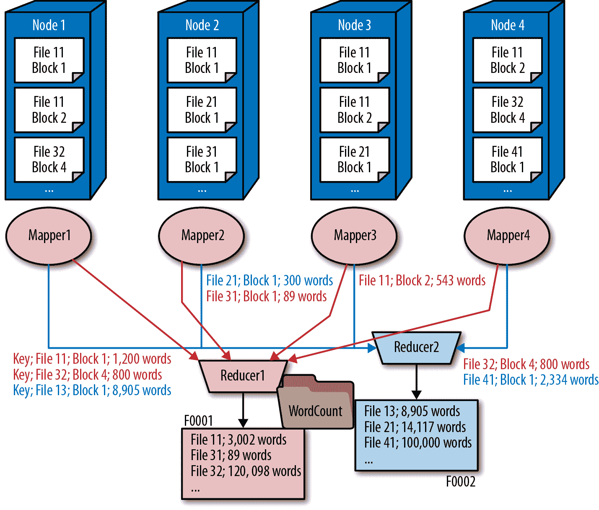

# 第三章：大数据与数据科学简介

大数据的流行可以追溯到 2004 年发表的一篇研究论文：[《MapReduce: Simplified Data Processing on Large Clusters》](https://ai.google/research/pubs/pub62)，由 Jeffrey Dean 和 Sanjay Ghemawat 撰写。在这篇 13 页的论文（包括源代码）中，Google 的两位工程师解释了公司如何通过一种全新的基于大规模并行集群的算法，将其庞大的索引需求降低到合理的处理要求。MapReduce 的基本思想是将工作分解为可以并行运行的“映射器”和处理映射器输出的“减少器”。第一个操作称为“映射”，因为它将输入数据的每个元素“映射”到一个函数上，将输出留给减少器处理。

例如，要统计集群中所有节点上所有文档中的单词数，假设每个文档存储在单个节点上，我们可以有成千上万个并行运行的映射器，生成每个文档及其单词计数的列表，并将该列表发送给减少器。然后，减少器将创建包含所有文档及其单词计数的主列表，并通过将所有文档的所有计数相加来计算总单词计数（图 3-1）。假设磁盘比网络慢得多，映射器读取文档比发送总数给减少器慢得多，这个程序将在大型集群中非常好地扩展，而且性能几乎没有明显的下降。

###### 图 3-1。MapReduce 的基本架构

# Hadoop 领导历史性的大数据转型

虽然 Google 没有发布其内部的 MapReduce 工具，但受论文启发的开发者创建了一个名为 Hadoop 的免费开源实现，它很快成为各个组织处理大数据的核心工具。

## Hadoop 文件系统

MapReduce 需要一个特殊的文件系统来高效提供数据，而最流行的就是 Hadoop 文件系统（HDFS）。它是一个大规模并行、高可用、自我修复的文件系统。然而，它并未试图实现关系模型（尽管后来在其之上构建了类似 SQL 的接口）。相反，与当时正在成长的许多其他 NoSQL 数据库一样，HDFS 是一种复杂的键值存储系统。

它会为每个块创建多个副本（默认情况下为三个副本），并将这些副本存储在不同的节点上。这样，如果一个节点失效，仍然可以使用另外两个副本，并且在检测到故障后，会将该块复制到第三个节点，而不会影响可用性。多个副本还有助于负载均衡，因为我们可以选择将工作发送到包含数据的最不繁忙的节点。例如，在图 3-2 中，文件 11 存储在不同的节点上。它有两个块。块 1 存储在节点 1、2 和 3 上，而块 2 存储在节点 1、3 和 4 上。在处理文件时，可以在存储块 1 的任何节点上执行块 1 的工作，选择最不繁忙的节点。类似地，可以在存储块 2 的三个节点中的任何一个上执行块 2 的工作。如果其中一个节点（例如节点 3）损坏或变得不可用，HDFS 仍然可以访问存储在节点 3 上的每个块的另外两个副本，并确保在其他仍然运行的节点上为最初存储在节点 3 上的块创建替代副本。

###### 图 3-2\. HDFS 中分布式存储的示例

## 如何处理和存储在 MapReduce 作业中的交互

在我们之前的计算单词示例中，将创建一个作业，其中包含所有文件中所有块的列表，并且作业管理器将将每个块的工作发送到包含它的最少负载节点，从而平衡集群中的负载。当然，为了创建文件列表，我们现在必须从块中重新组装文件。假设这对于单个节点来说太多了，我们可以有多个减少者来处理工作。为了确保同一个减少者获得单个文件的所有块，我们将利用 MapReduce 的*shuffle*步骤，其中映射器的输出包含键和值，并且对键应用洗牌函数，以便将所有具有相同键的工作发送到同一个减少者。例如，我们可以使用一个哈希函数，该函数获取文件名并返回 0 或 1，例如通过添加文件名中所有字母的 ASCII 值并除以 2 来执行此操作。所有名称哈希为 0 的文件的输出都会发送到减少者 1，而名称哈希为 1 的文件的输出则会发送到减少者 2。

当存在多个 Reducer 时，为了创建单个文件，我们需要将所有 Reducer 引导到一个单独的 Reducer，将最终输出组合成一个文件，增加了复杂性和处理时间。相反，为了优化多个并行工作的 Reducer，大多数 MapReduce 作业生成多个文件，通常在同一个目录中。为了实现这一点，大多数 Hadoop 组件处理目录而不是文件。例如，Pig 脚本、Hive 和其他项目期望目录作为输入而不是文件，并将该目录中的所有文件视为单个“逻辑”文件。在图 3-3 中，创建了一个名为*WordCount*的文件夹，包含两个 Reducer 输出的文件。文件的名称通常是自动生成的，因此它们没有实际意义，也从不直接使用，除非内部程序代码需要读取它们。所有工作都在*WordCount*文件夹上进行，将其视为单个逻辑文件。这等同于连接文件夹中的所有文件。

###### 图 3-3\. Hadoop 中的 Mapper、Reducer 和文件存储

因为大部分工作在块级别进行，Hadoop 通常具有较大的块大小，默认为 64 或 128 MB。由于一个块只能存储一个文件，这使得 Hadoop 不适合存储小文件 —— 一个 1 KB 的文件仍然需要整个 64 或 128 MB 的块。为了优化存储，*序列文件* 被引入。序列文件是键/值对的集合，通常用于将大量小文件存储在一个大文件中，使用较小文件的名称作为键和内容作为值。

虽然非常高效和优雅，MapReduce 要求开发人员仔细思考他们的逻辑并正确划分工作。如果工作没有正确分布，作业可能会遭受显著的性能下降。例如，如果我们有 1,000 个 mapper 运行在一个 1,000 节点的集群上，其中 999 个 mapper 花费 5 分钟运行，但最后一个 mapper 花费 5 小时，整个作业仍然需要 5 小时才能完成。

## Schema on Read

在关系数据库中，表的模式（列的列表、它们的名称和它们的类型）在创建表时被定义。当数据插入表中时，它必须符合这个预定义的结构。这要求对模式管理采取非常正式和谨慎的方法，因为如果数据不符合表的模式，它将无法被插入或存储在数据仓库中。事实上，没有任何地方可以插入它，因为插入它将需要定义一个与数据匹配的模式。

由于 HDFS 是一个文件系统（对用户来说基本上看起来像是 Linux 文件系统），它可以存储各种类型的数据。当然，为了进行任何处理，数据必须具有模式或结构。为此，Hadoop 采用“读时模式”方法——它在读取数据时应用模式。例如，用户可以为 HDFS 中的文件定义一个外部 Hive 表。当查询该表时，Hive 将尝试将文件中的数据映射到表定义中，赋予其一个模式。如果数据与模式定义不匹配，则查询将失败。然而，与关系数据库不同的是，数据仍然存储在 HDFS 中并得以保存。只是在应用正确的模式之前无法使用。由于这种方法，可以轻松地向 HDFS 添加数据，无需任何检查和无需定义任何模式。

## Hadoop 项目

Hadoop 已经衍生出一个丰富的项目生态系统，涵盖从数据摄入到管理和管理的所有内容。表 3-1 和 3-2 涵盖了一些传统上包含在 Hadoop 发行版中最受欢迎的项目。大多数是开源的，尽管 Cloudera 和 MapR 的某些组件需要商业订阅（在 Table 3-1 中用 * 标示）。

Table 3-1\. *与 Hadoop 和 HDFS 相关的热门本地工具*

|   | **Apache Hadoop** | **Cloudera** | **Hortonworks（包括 IBM、Microsoft Azure 和 Pivotal）** | **MapR** |
| --- | --- | --- | --- | --- |
| **摄入** | Sqoop, Flume |   | NiFi |   |
| **关系接口/数据库** | Hive | Hive, Impala* | Hive | Hive, Drill |
| **NoSQL** | HBase | HBase, Kudu | HBase | MapRDB（HBase 的变种） |
| **安全** | Ranger | Sentry* | Ranger |   |
| **治理** | Atlas | Navigator* | Atlas | Resells Waterline* |
| **文件系统** | HDFS | HDFS | HDFS | MapR-FS |

Table 3-2\. *与 Hadoop 和 HDFS 相关的热门云工具*

|   | **AWS** | **Azure** | **Google Cloud Platform** |
| --- | --- | --- | --- |
| **摄入** | Kinesis | 事件中心 | Cloud Pub/Sub |
| **集成** | Glue | ADF | Cloud Dataflow |
| **关系接口/数据库** | Hive, Presto, RedShift, Aurora | Hive | Cloud Spanner |
| **NoSQL** | DynamoDB | AzureNoSQL | Bigtable |
| **安全** |   | 安全中心 |   |
| **治理** | Glue | Azure 治理 |   |
| **文件系统** | EBS, EFS | ADLS | ECFS |
| **对象存储** | S3 | Blob 存储 | GCS |

Hadoop 生态系统中最重要的发展之一是*Spark*，这是一个概念的扩展，比 MapReduce 提供了更快的速度和更大的灵活性。随着网络速度的提高，Spark 起源于 UC Berkeley 的 AMPLab 于 2009 年，并成为 Apache 顶级项目。它得到了 Databricks 的商业支持，并包含在每个 Hadoop 发行版中。

Spark 的核心思想是在计算机集群上创建一个大的内存数据集。如果 HDFS 努力在集群中创建一个单一的持久性文件系统，那么 Spark 有效地在集群中创建一个大的内存空间。Spark 的核心是弹性分布式数据集（RDD），对于使用 Spark 的程序来说，它看起来像一个单一的数据集。

另一个 Spark 的改进是对旧的 MapReduce 模型的泛化。不再是由单一的包含映射器、分组器和减少器的管道（可能并行运行多个实例）组成，而是复杂的管道可以通过多个不同阶段的多个实例传递数据。例如，Spark 可以轻松地将一个减少器的输出传递给另一个减少器，在 Hadoop 中则需要繁琐的手动编码，并且读写磁盘时速度缓慢。

尽管 Spark 是用 Scala 编写的，但也可以通过 Java、Python、R 和其他语言的接口使用，以及 SparkSQL，它是基于称为 DataFrame 的抽象层的 RDD 的 SQL 接口。

# 数据科学

很多分析是*描述性*的：它们回顾过去发生的事情，并依赖人类专家来审查历史并做出关于未来的决策。有时人类在这方面做得很好，但有时却不尽如人意。他们常常依赖直觉和个人经验，并很少有机会验证他们的决定。想象一下，如果你能在事情发生之前就*预测*会发生什么，并根据历史数据验证它？或者如果你能在大规模推广之前在小部分用户中实际测试这些事物呢？

数据科学的理念是根据以数据形式表示的事实信息来进行行动建议。甚至这个学科的名称也显示了其基本原则。当我询问起“数据科学”这一术语的创始人 DJ Patil 时，为什么要这样称呼，他告诉我他如何在 LinkedIn 开展了一个新的团队，专注于使用数据和高级分析来回答关于 LinkedIn 用户体验和业务的各种问题。为了决定如何称呼这个团队，他们发布了三个不同的招聘广告，描述他们正在寻找的人才。这三个广告都是同一个职位和同一个工作描述，首选经验要求相同，发布在同一个招聘网站上。唯一的区别在于名称：“数据科学家”，“数据分析师”和“数据工程师”。吸引最多申请者的广告是“数据科学家”，因此他们将团队命名为“数据科学”。

这是一个很好的例子，通常被称为*A/B*或*分割测试*：你在不同的人群中尝试 A 和 B，并严格测量哪个更好，然后再做出决定。像 LinkedIn 和 Google 这样的数据驱动型公司，在发布任何代码之前，都要加入仪器，以便测量其效果。他们还会在几个不同的市场上测试新功能，然后再将其推广给更广泛的用户群体。

数据科学的核心是数学（特别是统计学）、计算机科学（尤其是数据处理和机器学习）以及领域或业务知识的结合。领域知识对于数据科学家来说至关重要，因为它帮助他们理解需要解决的问题、哪些数据是相关的，以及如何解释结果。有很多书籍和文章专注于数据科学的技术方面，但在本书中，我们将关注大企业实践的数据科学。为了介绍核心概念，我将重印一下 Veijko Krunic 的下面这篇文章，他向大企业咨询如何开始实践数据科学。

# 您的分析组织应该关注哪些问题？

**Veljko Krunic** 是一名独立顾问和培训师，帮助客户从数据科学和大数据中获得最佳业务结果。他曾与从财富前十到初创企业的组织合作，指导它们完成大数据和分析解决方案的整个生命周期，从早期概念验证到改进关键任务系统。他曾在 Hortonworks、VMware 的 SpringSource 部门以及 Red Hat 的 JBoss 部门工作过。他在科罗拉多大学博尔德分校获得了计算机科学博士学位和工程管理硕士学位，专注于战略规划和质量科学中的应用统计学。他还是一名 Six Sigma Master Black Belt。

许多公司正在对大数据和数据科学进行投资，并且理所当然地期望获得显著的业务利益。同时，由此产生的大数据系统和数据科学方法可能是近年来进入企业市场的最复杂技术之一。努力的规模使得很难将您采用的工具和技术与组织的目标相匹配。

作为一名高管，您将接触到大量新技术和概念。您可能已经被诸如深度学习、HMM、贝叶斯网络、GLM、SVM 等术语轰炸过。在大数据基础设施方面，您可能听说过 Spark、HDFS、MapReduce、HBase、Cassandra、Hadoop、Impala、Storm、Hive、Flink 等术语，以及许多其他技术。截至 2018 年底，Hortonworks Hadoop 发行版单独包含 26 个 Apache 项目，而 Apache 软件基金会有超过 300 个活跃项目，其中许多与数据相关。还有数百种商业产品在生态系统中争夺一席之地。在这些噪音中很容易迷失方向，即使是您技术训练有素的员工也可能感到不知所措。很难找到一位数据科学家或架构师在所有这些领域都具有优秀（甚至是强大的实践者级别）的技能。更可能的情况是系统的各个部分的知识分散在团队不同成员之间。甚至可能是团队第一次进行类似您现在正在做的项目。

这篇文章旨在让您集中精力回答作为一名高管需要解决的重要问题。您如何知道自己正在引导项目走向最佳的商业成功之路，而不仅仅是按照团队已有知识决定的方向前进？当没有任何一个人精通项目涵盖的所有领域时，您如何确保投资于将带来最佳回报的领域？您如何避免进行不幸的“知识扑克”游戏，其中假设各个团队成员持有项目成功所需的牌，但实际上没有人确切知道团队共同知道什么，以及项目的完整范围是否被覆盖？

前面提到的技术对许多项目至关重要。然而，如果在与数据科学和大数据团队交流时，您听到的只有这些术语，您应该问自己是否正确关注了整个系统，或者您的团队是否过于专注于系统的某些组件而忽视了整体系统。特别是，焦点是在您作为高管需要的事务上，还是在您的团队了解（或希望学习）的事务上？考虑工程与您的业务之间的关系，并侧重于最终结果，这就是“整体系统工程”的学科。

如果你的团队没有专注于整体系统，这并不是他们的错。可以公正地说，目前整个行业普遍缺乏对系统的关注。大多数演示文稿、聚会和营销材料只关注成功分析堆栈的一小部分技术。在系统工程方面投入的时间远远不足。至于这一点，我们在社区中甚至有多少讨论大数据系统是为*业务*目的而设计的*系统*的简单但基本的概念？

作为关注系统各部分的当前倾向的例子，目标是在备选方法之间做出正确选择，许多墨水被浪费在讨论单个机器学习方法的相对优势和劣势上。这些是重要的战术决策，但你的工作是在你了解你的战略之前避免被技术决策困住。

举个例子来说，MNIST 数据集呈现了一个分类问题：计算机应该将手写数字分类为 0 到 9 的数字。这可能是当今计算机视觉中使用最广泛的数据集，用于测试在从课堂项目到主要互联网公司的设置中开发的计算机视觉算法。从 1998 年到 2016 年，分类准确率从使用相对简单的*k*-最近邻算法达到的错误率 2.4%改进到 0.21%（使用深度神经网络集成）。¹ 18 年来，一些机器学习领域最聪明的人努力将错误率提高了 2.19%。这是一个显著的改进，例如，允许计算机扫描仪自动读取大多数信封上写的地址，而不是人类几乎需要查看每个信封。

然而，当你在运行一个商业项目时，你不会对单一分类算法的行为感兴趣。你需要问的根本问题是：“这个*x*%的差异是否显著促进了项目的成功？”有时会，有时不会。有时你不需要人类已知的最佳分类方法；你可能更多受益于简单地收集可能产生更好总体结果的额外数据源。

系统工程的现实是，避免你无法恢复的大坑比在两个竞争对手（无论是方法还是产品）之间做出最佳选择更为重要得多。当然，如果你没有对系统的特定部分做出最佳决策，你可能会给你的竞争对手带来显著优势，这样的错误甚至可能在未来毁了你。但在“未来”成为问题之前，你必须首先有能力开发一个可行的产品，可以开始在那条道路上前行。

尽管大数据和数据科学确实为企业带来了重要的新元素，但它们并没有显著改变系统工程的最佳实践。作为一名高管，在与你的数据科学团队会面后，如果你能够清晰而简洁地回答以下问题，那么你正在朝着开发一个可行产品的良好方向前进：

1.  他们所谈论的数据科学概念与你的业务有何关联？

1.  你的组织是否准备根据分析结果采取行动？（仅仅因为你完成了分析并不意味着商业结果会神奇地出现——只有在根据分析结果采取适当的商业行动时，商业结果才会出现。在项目开始和整个过程中，你需要清楚地了解你的组织可以采取哪些商业行动。）

1.  你的机器学习系统的哪一部分应该投资，以获取最大的“回报率”？

1.  如果团队需要进行更多研究来回答之前的问题，那么这些研究究竟是什么，他们预期获得的可能答案范围是什么，以及完成这些研究所需的事项（尝试方法的时间、额外数据等）？

成功的关键在于区分你是否正在进行能够产生可预测结果（或一系列可能结果）的系统工程努力，还是一项研究项目，其结果可能很好，但并非完全可预测或市场化。虽然在商业和行业中两者都有存在的空间，但你绝对不应该混淆这两种类型的项目。而且你还应该引导你的团队，使其专注于执行正确类型的项目。无法清晰回答前述问题是一个主要的警示信号，直到你能够“完美”回答这些问题之前，更好的方法并不会对你有太大帮助。

整个系统工程的过程超出了本书的范围，但有一个关键组成部分，如果你应用了这里建议的技术，你将能够做到正确。那个关键组成部分是意识到需要理解你的数据，并且了解你的数据是一个非平凡的挑战。

一些团队犯了一个错误，即认为仅仅因为将数据记录在某个数据库或数据湖中，他们就自动成为了数据专家。从这个前提出发，似乎将所有注意力都集中在“其他更重要的问题”上是合理的。然而，现实是，编目和解释现代企业数据是一个复杂的问题，组织必须在数据治理上进行重大投资才能完成这些任务。实际上，如果你有错误的数据，将分类提高 2.19%并不一定有帮助。如果你使用的是错误的数据或者误解了你的数据，你必须尽快改变方向。幸运的是，你可能能够重复利用你在工具上的投资。

找到并实施适合您数据的正确方法是系统工程的关键方面，应在项目开始阶段评估该方法，以确保您走在正确的道路上。

# 机器学习

*机器学习*指的是根据数据训练计算机程序构建统计模型的过程。这是一个非常广泛和深刻的主题，我们在这里无法充分涵盖；本节仅旨在简要介绍机器学习的基本概念。

机器学习可以是有监督的或者是无监督的。*有监督*机器学习涉及将训练数据输入以创建模型。例如，如果我们想预测特定区域房屋的价格，我们可以将历史销售数据输入模型，并创建一个能够准确预测其他类似房屋价值的公式。

多年来，已有各种机器学习算法，这些算法被深入理解和信任。虽然有成千上万的算法并且它们总是可以改进，但最常见的算法，如线性回归，甚至在常见工具如 Microsoft Excel 中也是可以找到的。机器学习的难点通常不在于模型，而在于数据。

没有正确的数据，模型会变得*不稳定*。如果模型在测试数据上表现良好，但在实际场景中不能准确预测结果，就称其为不稳定。一个常见的技术是将历史数据随机分成两组，一组用于训练模型（训练数据集），另一组用于应用模型（测试数据集），以查看其是否能准确预测结果。这可能会捕捉到一些问题，但如果整个数据集有偏差，当模型应用于真实世界数据时仍然会是不稳定的。此外，模型训练时的条件可能会发生变化，模型可能不再适用。这称为“模型漂移”。例如，在房屋价格预测中，新的道路或新的商业可能会显著影响价格，因此我们需要重新训练模型以融入这些新信息。

总的来说，创建良好模型的关键在于拥有正确的特征——决定结果的模型输入。想象一下，在我们的房屋定价示例中，如果没有考虑学校质量，同一条街上两个相同的房子但在学区边界的对立面可能会有显著不同的价格，如果一个学校比另一个显著好。无论我们有多少数据来训练我们的模型，如果缺少这个变量，我们将无法准确预测房价。即使我们拥有正确的特征，我们也必须拥有具有代表性的数据。例如，如果我们所有的数据都来自表现类似的学区，模型将被训练忽略学校成绩，因为它们不会在房价中产生任何变化。为了准确训练模型，我们需要来自高、低表现学区的代表性混合数据。特征工程是每个数据科学家必须执行的最关键任务之一。

不仅拥有正确的数据很重要，而且数据质量也应该很高。与常规分析不同，常规分析中数据问题通常会导致不合理的结果，但在机器学习中，除非数据使模型不稳定，否则很难发现糟糕的数据。例如，在我们的情况中，如果学区信息损坏或错误，只要训练数据集和测试数据集都一致损坏，我们可能能够建立一个稳定的模型，但是在真实数据中，这些信息没有损坏，模型可能就毫无用处了。

*非监督学习*是指未经过训练的机器学习。例如，客户分群通常使用非监督机器学习完成。程序会提供一组客户和大量不同的人口统计信息，然后将数据分成“相似”的客户组。与监督学习一样，如果在糟糕的数据上进行分群，可能会产生不可靠的结果，而且很难发现例如你产生了 10 万名客户中的 7 个分群都有问题。由于模型往往非常复杂，以至于人类难以理解，*可解释性*已成为机器学习中的一个重要主题。

## 可解释性

曾经我与一位数据科学家进行过一次有趣的讨论，他告诉我他被聘请进行客户分群。当他向客户展示了模型的结果时，市场副总裁从同一个分组中挑选出两个客户记录，并问为什么这两个客户被归为一组。数据科学家无法解释结果，只能重述他训练模型的过程，然后副总裁宣布如果没有人能向他解释，他不会投资数十万美元用于基于此分群的市场活动。

解释性不仅仅是好奇心或调试的帮助。这是信任的一个根本问题。分析用户经常被要求证明他们使用的模型不会做出不适当或非法的决定。歧视是其中一个棘手的领域。想象一下一个镇，其中一个民族平均收入大约是另一个民族的四分之一。模型是否应被允许将种族作为一个变量来考虑？大多数人（以及反歧视法律）可能会说不。但是，如果我们基于收入做出决定呢？收入更高的人可能会在当地银行或商店获得更高的信用额度；这似乎是公平和常识的体现。然而，如果我们不知道申请信用时人们的真实收入水平怎么办？大多数商店信用申请不要求提供所得税单或工资单的复印件。此外，一些人可能参与零工经济，即使他们的家庭收入非常高，也没有正式收入，而其他人可能没有信用历史或分数可用于验证目的。该怎么办？

一个聪明的数据科学家可能会被诱惑从申请人的姓和名来推断种族，并将该镇该种族的平均收入与申请人报告的收入进行交叉参考。如果推断的收入和报告的收入相差甚远，申请过程将需要额外的信用检查。这是否合法？我们现在是在通过种族歧视吗？信贷官员又如何知道“计算机”为何要求额外的信用检查？如果数据科学家并非有意检查种族，而是算法盲目地发现了姓名与收入水平之间的相关性呢？

这些问题需要解释性。是哪些变量导致了这个决定？这些变量的值是多少？这是一个困难但有前景的机器学习领域。学术界以及像 FICO 这样的机器学习公司正在进行大量工作。

## 变更管理

由于现实世界很少保持不变，一度代表其的模型可能会失去其预测能力。这被称为*模型漂移*。由于模型的输出是预测性的，因此很难判断预测有多准确，因此模型是否仍然相关直到实际事件发生。因此，持续监控是保持模型准确运行的关键。如果检测到漂移，模型需要重新基于新数据进行训练。甚至数据本身也可能会漂移。例如，在像油田这样的恶劣条件下的物联网传感器可能会出问题。其中一些可能会开始喷出错误数据，这些数据不能影响模型的结果。必须检查这些数据漂移中的异常值，以确保错误数据不会破坏模型。

不幸的是，将现有模型重新运行在新数据上可能不会产生稳定的模型，因为模型不会反映可能影响结果的任何新变量。例如，曾经在一个社区准确预测房价的模型可能并未考虑到新的高速公路正在该社区建设中，而且这个高速公路的接近会显著影响房价。在这种情况下，除非将这个新变量（新高速公路的接近度）添加到模型中，否则模型可能无法准确预测房价。简言之，人们必须定期建立新模型或使用最合适的当前机器学习算法重新训练现有模型。

# 结论

高级分析、机器学习、预测分析、推荐引擎——这些技术应用广泛，但还有许多挑战需要克服，这些技术非常有前景。它已经改变了我们的生活，应用从自动驾驶汽车，到大大改进的语音识别和视觉识别技术，再到寻找基因密码中的疾病信号，读取物联网信号以提供预测性维护，或者预测我们的房屋价值。所有这些都依赖于数据——而获取数据的更好地方又何处比企业数据湖更好呢？

¹ 请参阅[*http://yann.lecun.com/exdb/mnist/*](http://yann.lecun.com/exdb/mnist/)和[*http://rodrigob.github.io/are_we_there_yet/build/classification_datasets_results.html*](http://rodrigob.github.io/are_we_there_yet/build/classification_datasets_results.html)。
