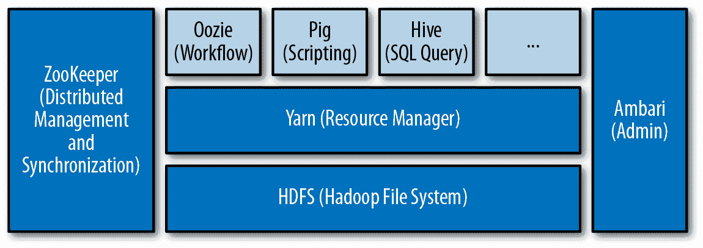
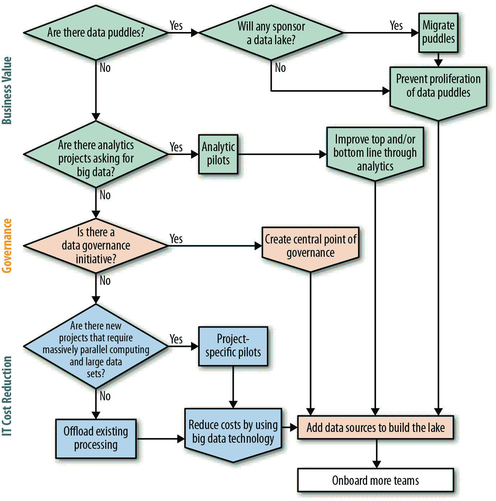

# 第四章：开始建立数据湖

正如前一章所讨论的，数据湖的承诺在于以一种最大化可用性和可访问性的方式存储企业数据，以支持分析和数据科学。但是，最佳的起步方式是什么呢？本章讨论了企业建立数据湖的各种路径。

Apache Hadoop 是一个经常用于此目的的开源项目。虽然在云中有许多其他替代品，但基于 Hadoop 的数据湖能很好地展示它们的优势，因此我们将以 Hadoop 作为例子。我们将从回顾其定义和支持数据湖的一些关键优势开始。

# Hadoop 的定义与优势

Hadoop 是一个大规模并行存储和执行平台，自动化了构建高度可伸缩和可用的集群的许多困难方面。它拥有自己的分布式文件系统 HDFS（尽管一些 Hadoop 发行版如 MapR 和 IBM 提供了自己的文件系统来替代 HDFS）。HDFS 自动在集群上复制数据，以实现高并行性和可用性。例如，如果 Hadoop 使用默认的三倍复制因子，则将每个数据块存储在三个不同的节点上。这样，当作业需要数据块时，调度程序可以选择使用三个不同的节点，并根据正在运行的其他作业以及数据位置等信息决定哪个节点最佳。此外，如果其中一个三个节点失败，系统会动态重新配置自身，以创建每个曾经位于该节点上的数据块的另一个副本，并在其余两个节点上运行当前作业。

正如我们在前一章中看到的，MapReduce 是一个运行在 Hadoop 之上的编程模型，利用 HDFS 创建大规模并行应用程序。它允许开发人员创建两种类型的函数，称为 mapper 和 reducer。Mapper 并行处理数据以计算结果，并将结果流向 reducer，用于最终输出数据。例如，一个统计文件中单词数量的程序可以有一个 mapper 函数，读取文件中的一个数据块，计算单词数量，并输出文件名及其在该数据块中计数的单词数。Reducer 将从 mapper 接收到的单词计数流，并在输出最终计数之前将文件的各个数据块合并。一个中间服务称为 *排序与洗牌* 确保将同一文件的单词计数路由到同一个 reducer。Hadoop 的美妙之处在于，单个 MapReduce 作业无需知道或担心数据的位置优化，也不需要关注哪些节点失败并正在恢复——Hadoop 会在背后透明地处理所有这些事务。

Apache Spark，它随每个 Hadoop 发行版一起提供，提供了一个能够在内存中跨多个节点处理大量数据的执行引擎。Spark 比 MapReduce 更高效且更易编程，非常适合于即席或接近实时处理，并且像 MapReduce 一样利用由 HDFS 提供的数据本地性来优化处理。Spark 还带有一系列有用的模块，如 SparkSQL，为 Spark 程序提供了 SQL 接口，并通过 DataFrame 支持异构数据源的通用处理。

然而，Hadoop 的主要吸引力在于，正如 图 4-1 所示，它是一个完整的平台和生态系统，包括开源和专有工具，解决各种各样的使用案例。最突出的项目包括：

Hive

与 Hadoop 文件类似的 SQL 接口

Spark

内存中执行系统

Yarn

分布式资源管理器

Oozie

工作流系统

###### 图 4-1\. 一个样例 Hadoop 架构

Hadoop 的几个特性使其作为长期数据存储和管理平台具有吸引力。这些特性包括：

极限可扩展性

大多数企业的数据都是在不断增长的，通常呈指数增长。这种增长意味着需要更多的计算能力来处理数据。Hadoop 设计上能够通过简单地增加更多节点来保持扩展（通常被称为“横向扩展”）。它被应用在全球一些最大的集群中，如雅虎和 Facebook。

成本效益

Hadoop 设计用于与现成的低成本硬件配合使用；运行在 Linux 之上；并使用许多免费的开源项目。这使得它非常具有成本效益。

模块化

传统的数据管理系统是单体化的。例如，在传统的关系数据库中，数据只能通过关系查询来访问，因此如果有人开发出更好的数据处理工具或更快的查询引擎，它无法利用现有的数据文件。关系数据库管理系统（RDBMSs）还需要严格的模式控制——在添加任何数据之前，必须预定义数据的结构（称为模式），并且如果数据发生变化，必须谨慎更改该结构。这种方法被称为“写入时模式”。另一方面，Hadoop 从头开始设计成模块化的，因此同一个文件可以被任何应用程序访问。例如，一个文件可以被 Hive 访问以执行关系查询，或者被自定义的 MapReduce 作业访问以进行一些重型分析。这种模块化使得 Hadoop 作为长期管理数据的平台非常有吸引力，因为新的数据管理技术可以通过开放接口使用存储在 Hadoop 中的数据。

松散的模式耦合，或者“读取时模式”

与传统关系型数据库不同，Hadoop 在写入数据时不会强制执行任何类型的模式。这使得所谓的*无摩擦摄入*成为可能——数据可以在不进行任何检查或处理的情况下被摄入。由于我们不一定知道数据将如何被使用，使用无摩擦摄入使我们能够避免处理和策划我们可能不需要的数据，并且可能会在未来的应用程序中处理不正确。将数据保留在其原始或原始状态，并在需求和用例明确时进行工作要好得多。

如果你正在为数据建立一个长期存储和分析系统，你希望它具有成本效益、高度可扩展和可用性。你还希望添加数据时需要的工作量最小化，并希望系统具有可扩展性，以支持未来的技术、应用和项目。从前文简要讨论中可以看出，Hadoop 完全符合这些要求。

# 防止数据水坑的扩散

随着大数据的热潮，有许多供应商和系统集成商在市场上向企业推广即时价值。这些人经常承诺快速投资回报（ROI），提供基于云的解决方案。对于许多商业团队来说，他们的项目在 IT 工作队列中停滞不前，他们厌倦了为优先级和关注而战，或者发现他们的 IT 团队缺乏完成他们要求的技能，这可能看起来像是梦想成真。几周或几个月后，他们得到了多年来一直要求 IT 部门完成的项目。

许多这些项目开始并产生快速胜利，导致其他团队进行类似的项目。很快，许多业务组都有了自己的“影子 IT”和自己的小 Hadoop 集群（有时被称为数据水坑），无论是在本地还是云中。这些单一用途的集群通常很小，并且是使用系统集成商（SIs）或企业开发人员熟悉的任何技术构建的，并且加载了可能或可能不严格来源的数据。

开源技术的不幸现实是，它仍然不够稳定，也不够标准化，以支持这种大规模扩散。一旦系统集成商（SIs）离开，第一个主要技术挑战出现——作业无法运行，库需要升级，技术不再兼容——这些数据水坑最终被遗弃或者被交还给 IT 部门。此外，由于数据水坑造成了信息孤岛，难以重新利用其中的数据以及在该数据上进行的工作的结果。

为了防止这种情况发生，许多企业更喜欢提前做好准备，建立一个集中的数据湖。然后，当业务团队决定他们需要 Hadoop 时，计算资源和项目所需的数据已经在数据湖中准备好了。通过提供预装数据的托管计算资源，同时通过自助服务赋予用户自主权，企业数据湖为企业提供了两全其美的最佳选择：支持难以维护的组件（通过 Hadoop 平台和数据供应），并免除在开展项目前等待 IT 的困扰。

虽然这是一个合理的防御策略，有时也是必要的，但要充分利用大数据所能提供的一切，它应该与下一节中描述的策略之一相结合。

# 利用大数据的优势

在本节中，我们将涵盖数据湖采用的一些最流行的场景。对于那些业务领导推动大数据广泛采用的公司来说，数据湖通常由 IT 部门建立，以防止数据小水坑（使用不同技术构建的小型独立集群，通常是由不再参与项目的系统集成商建立）的泛滥。

对于试图引入大数据的公司，有几种流行的方法：

+   首先将一些现有功能转移到 Hadoop，然后添加更多数据并扩展到数据湖。

+   从数据科学计划开始，展示出色的投资回报率，然后将其扩展为完整的数据湖。

+   从头开始建立数据湖作为治理的中心点。

哪一种适合你？这取决于公司在大数据采用过程中的阶段、你的角色以及我们将在本节中研究的许多其他考虑因素。

## 以数据科学为先导

确定一个影响公司业务前景的高能见度数据科学计划是一个非常吸引人的策略。*数据科学*是将高级分析和机器学习应用于数据的通用术语。通常，作为战略必要性起步的数据仓库最终支持报告和运营分析。因此，虽然数据仓库仍然对运行业务至关重要，但它们大多被视为必要的开销，而不是战略性投资。因此，它们没有得到尊重、认可或资金优先级。许多数据仓库和分析团队将数据科学视为能够显著影响业务和业务前景，重新成为战略重要性的一种方式。

将数据科学引入组织的最实际方法是找到一个高度可见的问题：

+   定义清晰且理解透彻

+   可以展示快速、可衡量的好处

+   可通过机器学习或高级分析解决

+   需要团队能够轻松获取的数据

+   如果不应用数据科学技术，将会非常困难或耗时很长

虽然寻找这样的项目可能看起来令人生畏，但大多数组织通常能够识别出许多知名的、高能见度的问题，可以快速展示好处，满足前两个要求。

对于第三个要求，通常可以通过两种方式识别出一个好的候选项目：通过搜索行业网站和出版物，了解其他公司如何使用机器学习解决类似问题，或者通过聘请经验丰富的顾问，他们可以推荐哪些问题适合机器学习或高级分析。一旦选择了一个或多个候选项目，并且确定了需要训练模型或应用其他机器学习技术的数据，就可以从获取的便利性角度审查数据集。这通常取决于数据的所有者，了解数据的人员的访问权限，以及获取数据的技术挑战。

不同行业常见的数据科学驱动项目的一些示例包括：

金融服务

治理、风险管理和合规（GRC），包括投资组合风险分析和确保符合众多法规（巴塞尔 3 号、了解你的客户、反洗钱等）；欺诈检测；分支位置优化；自动化交易

医疗保健

治理和合规，医学研究，患者护理分析，物联网医疗设备，可穿戴设备，远程医疗

制药

基因组研究，过程制造优化

制造业

收集物联网设备信息，质量控制，预防性维护，工业 4.0

教育

招生，学生成功

零售

价格优化，购买建议，购买倾向

广告科技

自动出价，交易所

一旦确定了问题，大多数组织会投资于一个小型的 Hadoop 集群，无论是在本地还是在云端（取决于数据的敏感性）。他们会引入数据科学顾问，经过流程，迅速产生显示数据湖价值的结果。

通常会执行两到三个这样的项目，然后利用它们的成功来证明数据湖的必要性。这有时被称为“施乐帕克”模型。施乐成立了加州帕洛阿尔托研究中心（PARC）来研究“未来的办公室”于 1970 年。1971 年，一位 PARC 研究员制造了第一台激光打印机，这成为施乐业务的主要支柱多年。但尽管 PARC 发明了许多其他改变行业的技术，没有一种技术像激光打印机那样成功地被施乐在如此大规模上成功商业化。将数据科学实验与 PARC 进行比较的重点在于突出数据科学的结果本质上是不可预测的。例如，一个长期而复杂的项目可能会产生一个稳定的预测模型，其成功预测率很高，或者模型可能只会产生轻微的改善（例如，如果模型成功率为 60%，比随机选择结果的成功率高出 10%）。基本上，在一些低 hanging-fruit 项目上的初步成功并不能保证许多其他数据科学项目的大规模成功。

这种为未来投资的方法听起来不错。构建一个大型数据湖，加载数据，并宣布胜利，这种方法可能非常诱人。不幸的是，我曾经与许多公司交谈过，它们正是按照这种模式进行的：它们进行了一些数据科学试点项目，很快就取得了惊人的成果。它们利用这些试点项目来确保获得数百万美元的数据湖预算，建立了大型集群，加载了几百万吉字节的数据，但现在却在努力增加使用率或展示额外的价值。

如果选择走分析路线，请考虑以下几点建议，这是许多 IT 和数据科学领导者与我分享的：

+   保持一个非常有前景的数据科学项目流水线，当您继续建设数据湖时，您将能够执行这些项目，以展示更多的价值。理想情况下，确保您可以在每个季度展示一个有价值的洞察，直到数据湖建设完成。

+   尽快将数据湖从最初的数据科学用例扩展到更广泛的用途，比如将其他工作负载移入湖中，从 ETL 到治理再到简单的 BI 和报告工作。

+   不要试图一下子解决所有问题。继续建设集群并添加数据源，同时继续展示更多的价值。

+   专注于让更多部门、团队和项目使用数据湖。

总之，数据科学是一种非常有吸引力的方式来利用数据湖。它通常会影响顶线，通过商业洞察的价值创造 ROI，并提高数据的价值意识以及数据团队提供的服务的知名度。建立成功的数据湖的关键在于确保团队能够持续生产这样有价值的洞察，直到数据湖多样化到更多用例，并为广泛的团队和项目创造可持续的价值。

## 策略 1：卸载现有功能

大数据技术最引人注目的好处之一是其成本，可以比类似性能和容量的关系数据仓库低 10 倍或更多。由于数据仓库的大小只会增加，并且 IT 预算通常包括扩展的成本，因此将一些处理从数据仓库卸载而不是扩展数据仓库非常具有吸引力。这种方法的优势在于不需要业务赞助，因为成本通常完全由 IT 预算承担，并且因为项目的成功主要依赖于 IT：卸载应对业务用户来说是透明的。

将 ETL（提取、转换、加载）的*T*部分卸载到大数据系统中是最常见的处理任务。

Teradata 是大型大规模并行数据仓库的主要提供商。多年来，Teradata 一直倡导将数据仓库的加载过程视为 ELT（提取和加载数据到 Teradata 的数据仓库，然后使用 Teradata 强大的多节点引擎进行转换）。这种策略被广泛采用，因为一般的 ETL 工具无法有效处理需要转换的大量数据。另一方面，大数据系统可以轻松处理这些数据量，并且具有非常高的成本效益。因此，Teradata 现在主张在大数据框架（特别是 Hadoop）中进行转换，然后将数据加载到 Teradata 的数据仓库以执行查询和分析。

另一种常见的做法是将非表格数据的处理移至 Hadoop。许多现代数据来源，从网页日志到 Twitter 供稿，都不是表格化的。与关系数据的固定列和行不同，它们具有复杂的数据结构和各种记录。这些类型的数据可以在 Hadoop 中以其原生格式进行非常高效的处理，而不需要转换为关系格式并上传到数据仓库以供关系查询处理。

第三类常被转移到大数据平台的处理是实时或流式处理。像 Spark 这样的新技术允许在内存中进行多节点大规模并行处理数据，而 Kafka 则是一种消息队列系统，使得对数据进行实时分析、复杂事件处理（CEP）和仪表板非常有吸引力。

最后，大数据解决方案可以以比传统技术低得多的成本扩展现有项目。我曾与一家公司交流，他们将一些复杂的欺诈检测处理移至 Hadoop。Hadoop 能够以与关系数据库相同的计算资源成本，处理 10 倍更多的数据，速度也快 10 倍，从而创建数量级更准确的模型和检测。

移动到数据湖的好处的一个例子涉及一家大型设备制造商，其设备每天将其日志发送到工厂（这些称为“呼叫家庭日志”）。制造商过去会处理日志，并仅将 2%的数据存储在关系数据库中，用于预测建模。模型预测设备何时会失败，何时需要维护等等。每当日志格式或内容发生变化，或分析师需要其他数据用于其预测模型时，开发人员必须更改处理逻辑，分析师必须等待几个月以收集足够的数据才能运行新的分析。使用 Hadoop，这家公司能够以远低于之前仅存储 2%数据成本的价格存储所有日志文件。由于分析师现在可以访问所有数据，无论多久以前的数据，他们可以快速为内部数据质量倡议以及面向客户的数据部署新的分析。

当 IT 团队将这种自动化处理转移到大数据框架并积累大量数据集时，他们面临将这些数据提供给数据科学家和分析师的压力。要从自动化处理转向数据湖，他们通常需要经历以下步骤：

+   添加未被自动作业处理的数据，创建一个全面的数据湖。

+   为非程序员提供数据访问权限，使他们能够创建数据可视化、报告、仪表板和 SQL 查询。

+   为了促进分析师的采用，提供全面的可搜索目录。

+   自动化管理数据访问、敏感数据处理、数据质量和数据生命周期管理的策略。

+   通过设置优先执行和资源管理方案，确保自动作业的服务级别协议（SLAs）不受分析师工作的影响。

## 策略 2：为新项目建立数据湖

不是将现有功能卸载到大数据平台，一些公司使用它来支持新的运营项目，例如数据科学、高级分析、处理来自物联网设备的机器数据和日志，或者社交媒体客户分析。这些项目通常由数据科学团队或业务线团队推动，并经常作为数据小湖开始，即小型、单一目的的大数据环境。随着越来越多的用例被添加，它们最终演变成成熟的数据湖。

在许多方面，从新的运营项目开始的路径与为现有项目卸载过程类似。新项目的优势在于它为公司创造了新的显著价值。缺点是它需要额外的预算。此外，即使与数据湖无关，项目失败也可能影响企业对大数据技术的看法，并对其采用产生负面影响。

## 策略 3：建立中央治理点

随着越来越多的政府和行业法规以及愈加严格的执法，治理正在成为许多企业的主要关注点。治理旨在为用户提供符合政府和公司法规的安全管理数据访问。它通常包括对敏感和个人数据、数据质量、数据生命周期、元数据和数据传承的管理。(第六章 将对此主题进行更详细的讨论。) 由于治理确保企业遵守政府和公司法规，而这些法规适用于企业中的所有系统，因此治理要求企业实施和维护一致的政策。不幸的是，对于大多数企业来说，跨使用不同技术的异构系统，并由不同团队管理且具有不同优先级的系统实施和维护一致的治理政策是一个严峻的问题。

数据治理专业人士有时认为大数据和 Hadoop 是一个遥远的、未来的问题。他们认为他们首先必须为传统系统实施数据治理政策，然后再解决新技术的问题。虽然这种方法并非没有优点，但它忽略了使用 Hadoop 作为成本效益平台为企业提供集中治理和合规性的机会。

传统上，治理要求说服负责传统系统的团队投入有限的人力资源来改装其系统，以符合治理政策，并且将昂贵的计算资源用于执行与这些政策相关的规则、检查和审计。通常，告诉负责传统系统的团队将其数据导入 Hadoop，以便一套标准的工具可以实施一致的治理政策，会更为简单和经济高效。这种方法具有以下优点：

+   数据可以通过一套标准的数据质量技术和统一的数据质量规则进行概述和处理。

+   标准的数据安全工具可以检测和处理敏感数据。

+   保留和 eDiscovery 功能可以在各系统中以统一的方式实现。

+   合规报告可以针对单一统一系统进行开发。

此外，基于文件的大数据系统如 Hadoop，非常适合 *双模态 IT* 的理念，该方法建议创建不同区域，具有不同程度的治理。通过为原始数据和干净数据保持分开的区域，数据湖支持同一群集中的各种治理程度。

## 对您来说哪种方式是正确的？

这些方法中的任何一种都可以导致成功的数据湖。你应该选择哪一种？通常取决于你的角色、预算以及你能招募的盟友。通常情况下，使用你控制的预算来启动一个数据湖是最容易的。然而，无论从哪里开始，要让数据湖起飞并保持可持续性，你都需要一个计划，说服企业中的分析师开始在他们的项目中使用它。

如果你是 IT 高管或者大数据的倡导者，图 4-2 中的决策树应该帮助你制定数据湖战略。

在高层次上，需要采取的步骤如下：

1.  确定是否有任何数据水坑（即业务团队是否在他们自己的 Hadoop 集群上使用？）。

    1.  如果有的话，是否有任何项目愿意转移到集中式集群？

        1.  如果是这样，使用项目成本来为集中式集群辩护。

        1.  如果没有，为了避免数据水坑的泛滥，理由充足地建设一个数据湖。可以使用先前的泛滥（例如数据集市，报告数据库）作为例子。如果你无法获得批准，那就等着水坑出问题吧——时间不会太长。

    1.  如果没有数据水坑，是否有团队正在寻求大数据和/或数据科学？如果没有，你能说服他们赞助吗？

1.  找到低 hanging fruit。尝试识别低风险、高可见性的项目。

1.  尝试为每个团队安排多个项目和多个团队，以最大化成功的机会。

1.  沿着数据科学/分析的路线走：

    1.  如果没有团队准备赞助一个大数据项目，是否有数据治理倡议？如果有，试图提出并获得单一治理点路线的批准。

    1.  否则，审查顶级项目，并识别任何需要大规模并行计算和大数据集，并且使用 Hadoop 更具成本效益的项目。

1.  最后，找到现有的工作负载进行卸载。

###### 图 4-2\. 数据湖策略决策树

# 结论

有很多方法可以实现数据湖。虽然每种情况都不同，但成功的部署通常会分享几个特征：明确和有计划的计划，招募热情的早期采用者，并展示即时价值。
