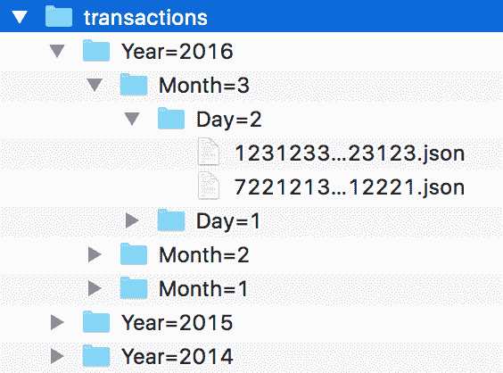
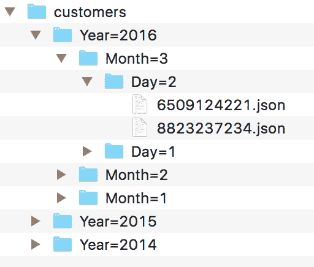
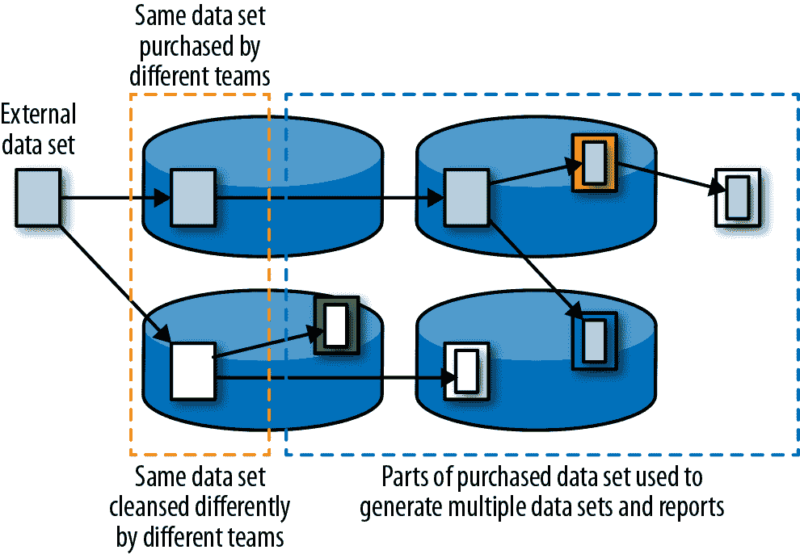
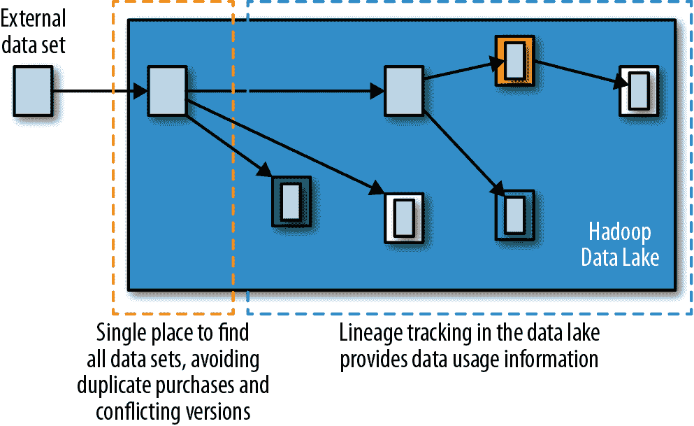
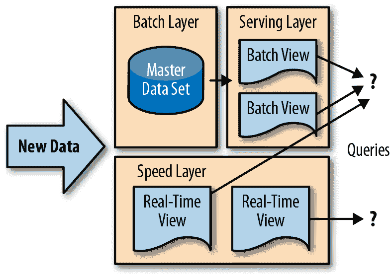
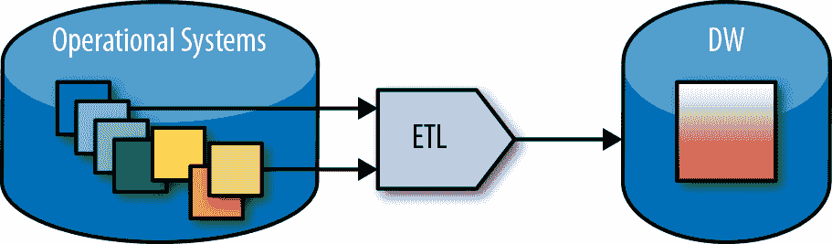
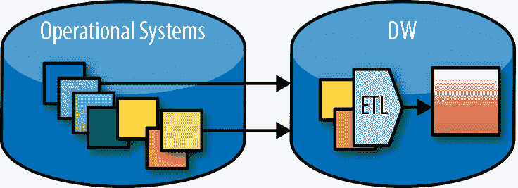
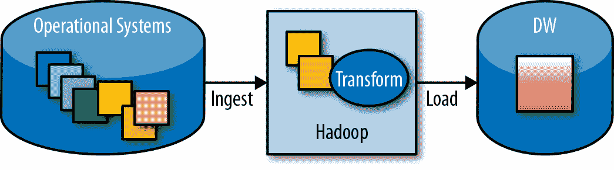
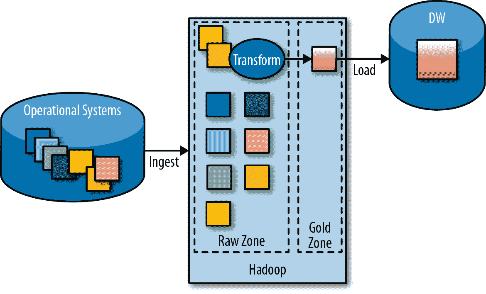
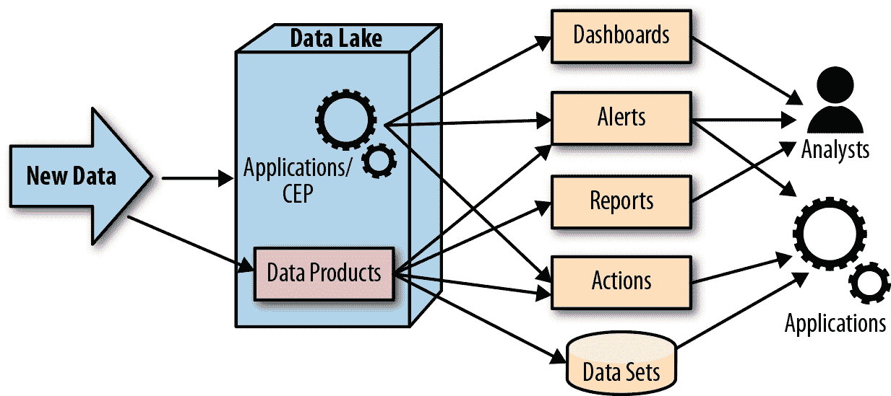

# 第五章：从数据池/大数据仓库到数据湖

尽管三十多年前引入时，数据仓库被设想为提供企业数据的历史存储的手段，使其可用于各种新的分析，但大多数数据仓库最终成为仅用于最关键分析的生产级数据存储库。这些数据仓库大多数无法处理它们所包含的大量和多样化的数据。像 Teradata 这样的一些高端系统能够提供令人钦佩的可伸缩性，但成本非常高昂。大量时间和精力花费在调整数据仓库系统的性能上。因此，任何变更——无论是新查询还是模式变更——都必须经过详尽的架构审查和漫长的批准和测试过程。加载数据仓库的 ETL 作业同样精心设计和调优，任何新数据都需要更改这些作业，并进行类似复杂的审查和测试流程。这种做法阻碍了即席查询，并且抑制了模式变更，导致数据仓库缺乏灵活性。

数据湖试图通过引入极限可扩展性、灵活性、未来保障和最终用户自服务，来实现企业数据存储库的原始承诺。在本章中，我们将更详细地探讨数据池——使用大数据技术实施的数据仓库，并解释这些池（或涵盖它们的数据湖）如何提供组织目前使用传统数据仓库的功能。

数据湖是企业数据的理想存储库，因为它们以适当的方式托管不同类型的数据，可以被同一大规模并行可互操作系统内的不同处理系统用于不同目的。我们将讨论向数据仓库难以或不可能添加的数据的添加、将数据湖与数据源集成以及将数据湖中的数据与其他系统消耗的问题。

# 数据仓库的基本功能

由于许多数据湖旨在补充甚至取代数据仓库，并且数据仓库通常是企业中最容易、最大、最好的数据源，因此了解它们以特定方式执行任务的原因以及数据湖如何受到这些限制，以及在大数据技术中可以使用什么技术来解决这些挑战非常重要。

数据仓库的最初愿景是为未来使用托管（或存储）所有历史数据。随着概念的正式化，数据仓库变成了高度管理的系统，具有精心控制的模式和耗时的变更过程。现代数据仓库通常专注于支持来自多个来源的大量历史数据的分析。为了实现这一目标，数据架构师需要确保：

+   数据被组织以促进高性能分析。通常通过创建星型模式的维度建模来实现。此外，由于成本和性能的影响，数据仓库通常无法保留完整的历史数据，必须聚合或存档旧数据。

+   多个系统的数据可以以一致的方式进行分析。这是通过使用包括符合尺寸、协调和规范化等技术，将来自不同系统的数据集成为一致表示来实现的。

+   以确保历史分析准确性的方式管理变更。通常使用称为慢变维的技术实现，详细描述在第二章中。

+   确保数据干净和一致。这是通过使用数据质量工具和技术来实现的，也在第二章中讨论过。

正如前几章所述，ETL（抽取、转换、加载）过程用于将数据从源系统转换为可加载到数据仓库中的形式。这种转换可以在数据仓库外部或内部完成。外部解决方案利用多种已有几十年历史的 ETL 工具。内部解决方案将原始源数据加载到数据仓库中，并使用由数据仓库执行的 SQL 脚本应用转换，这种技术称为 ELT（抽取、加载[到目标数据仓库]、转换）。在两种情况下，数据质量工具经常与 ETL 工具集成，并作为过程的一部分执行。

由于基于大数据技术的数据池或湖具有高度可扩展性和成本效益，因此它可以轻松克服数据仓库的性能和数据量限制。因此，良好的性能不需要像大多数数据仓库那样进行维度建模或汇总旧数据。然而，关于历史分析，许多数据仓库的挑战仍然适用。这些挑战包括：

+   为分析建模数据

+   将来自不同系统的数据集成到一个公共表示中

+   管理变更而不丢失数据的历史记录

数据池或数据湖是存储未来使用并进行大规模分析的理想场所，但其使用像 Hadoop 这样的大数据技术也使其成为转换大量数据的好地方。数据池通常通过执行创建数据仓库模式所需的转换（称为 ETL 卸载）而开始生命周期。它们通过为分析提供原始和转换后的数据仓库数据，最终扩展以包括来自原始数据仓库中不含的外部或内部源数据，并发展成为完整的数据湖。

在我们研究数据池如何处理上述挑战之前，让我们再次从传统数据仓库的背景下看看这些问题。

## 用于分析的维度建模

正如我们在第二章中看到的，当关系数据库用于支持操作系统和企业资源管理（ERM）以及客户关系管理（CRM）等应用时，数据通常存储在高度规范化的数据模型中。操作系统倾向于进行许多小的读写操作。这部分活动是规范化数据模型的原因之一，它试图创建具有最小冗余和最小字段数的表。除了使更新和读取非常快外，规范化还消除了数据不一致的风险。

相比之下，大多数数据仓库倾向于使用去规范化的数据模型，每个表包含尽可能多的相关属性。这使得可以通过一次数据遍历处理分析应用程序所需的所有信息。此外，数据仓库通常从许多来源和应用程序接收数据，每个来源都有其自己的模式，这些不同来源的数据必须转换为单一的通用模式。

这个主题在第二章中有详细论述，但作为简短的复习，数据仓库常用的一种流行数据模型是星型模式，包含代表被分析实体的维度表（例如客户、时间、产品）和代表涉及这些维度的活动的一个或多个事实表（例如已下订单）。

难点在于数据的来源通常以不同的方式表示相同的信息：例如，一个可能将每个地址拆分为多个字段（如街道、城市和州），而另一个则将地址存储在单个字段中。类似地，一些系统可能保留出生日期，而其他系统则为每位客户存储年龄。在这种情况下，需要将数据转换为数据仓库使用的格式。例如，所有地址字段可能需要连接起来，或者可以根据出生日期计算一个人的当前年龄。如果所有来源系统的数据都保留在相同的维度表中，并采用相同的目标格式，这些表就称为*符合*的表。

## 整合来自不同来源的数据

大多数现代 ETL 工具是大约二十年前作为数据仓库运动的一部分开发的，旨在将来自不同操作系统的数据，其具有不同模式和表示，转换为单一的通用模式。因此，ETL 工具解决的第一个挑战是将来自操作系统偏好的规范化模式的记录转换为数据仓库偏好的去规范化模式，正如前一节所述。

第二个挑战是将来自许多不同操作应用程序的数据转换为单一的公共模式和表示法——这是在该部分提到的“符合”数据。我们在第二章中看到了一个例子，展示了如何使用 ETL 作业将操作系统对客户数据的表示转换为数据仓库期望的客户维度表的表示（参见图 2-7）。

数据仓库通常包含来自许多不同来源和应用程序的数据，每个都有自己的模式，并且来自所有这些来源的数据必须以不同的方式标准化和转换为数据仓库的首选模式，使用每个源系统的不同 ETL 过程。这导致必须维护和版本化的 ETL 脚本数量迅速增加。

## 保留历史数据的慢变维度

数据仓库中的大部分维度数据都是相当静态的（客户数据、零售或地理位置数据等）。然而，随着时间的推移，这些数据可能会发生变化，为了准确的数据分析，有必要跟踪这些变化。为了在考虑历史数据时表示维度变化，已经开发出了一种特殊的结构，称为*慢变维度*。这确保在数据某些方面发生变化（婚姻或工作状态、地址等）时，正确的状态被考虑进分析中。关于数据仓库中慢变维度的详细使用已在第二章中描述。

## 数据仓库作为历史存储库的局限性

遗留系统和数据仓库，因为存储和处理成本高昂，企业被迫将历史数据保留在比最近数据更粗粒度的级别上。例如，数据仓库可能保留过去三年的单个交易，过去七年的每日总数，以及超过七年的数据的月度总数。这引发了一系列问题：

+   数据聚合会丢失很多有用的细节，从而限制了可以进行的分析类型。

+   大多数历史分析必须以粗粒度进行（在我们的例子中，可能是每日或每月的级别，这取决于分析是否超过七年的时间）。

+   编写考虑不同粒度级别的报告和查询是复杂且容易出错的。

+   管理这个系统并将数据移动到各种粒度级别会增加处理和管理开销。

大多数高级分析应用程序可以从拥有更多历史数据中受益。即使是简单的分析和历史趋势，在给定更多历史数据时，都能给出更完整的图像，无论是在持续时间还是属性数量上。

像 Hadoop 这样的可扩展和成本效益的存储和执行系统允许企业以最精细的粒度存储和分析其历史数据，从而提高分析结果的丰富性和准确性。

例如，欺诈检测算法依赖于分析大量的交易来识别欺诈模式。一项[广为人知的案例研究](https://on.wsj.com/2RMdspZ)描述了 Visa 如何开始使用 Hadoop 进行欺诈检测，并从使用单一模型分析 40 个属性的客户交易的 2%转变为使用 18 个模型分析 500 个属性的所有交易，从而使公司能够识别数十亿美元的欺诈交易。

# 转向数据池

现在我们已经讨论了在传统数据仓库中工作的挑战，我们可以探讨如何通过数据池或数据仓库和数据池的组合来解决这些问题。在本节中，我们将讨论为有效摄入和处理数据组织数据的替代方法，以及如何保留历史记录（传统上使用维度表实现）。

## 在数据池中保留历史记录

让我们首先检查如何在数据池中使用分区保留历史记录，以及这种方法在跟踪缓慢变化的维度方面的局限性。接下来讨论一种新方法，即使用快照来解决这个问题。

在数据池中，随着数据的摄取，通常会存储在多个文件或分区中。每个摄取批次通常加载到一个单独的文件夹中。所有文件夹中的所有文件都被视为单个“逻辑”文件或表。Hive，作为 Hadoop 数据最流行的 SQL 接口，有一个称为 *分区表* 的特殊结构来处理这些文件。分区表允许 Hive 根据分区结构智能优化查询。

图 5-1 展示了用于每日加载交易数据的典型分区模式。一个 *transactions* 目录包含所有的交易。文件按年份组织（例如，*/transactions/Year=2016*），在每年内按月份组织（例如，*/transactions/Year=2016/Month=3* 包含了所有 2016 年 3 月的交易），在每月内按日份组织（例如，*/transactions/Year=2016/Month=3/Day=2* 包含了 2016 年 3 月 2 日的所有交易）。由于 Hadoop 进行大量并行处理，为了避免对单个文件的竞争，它会在 */transactions/Year=2016/Month=3/Day=2* 目录生成多个文件。这些文件会合并成一个当天的交易文件。

###### 图 5-1\. Hive 中分区表的目录结构

在 Hive 中，用户会创建一个单独的表（比如，`all_transactions`），关联到*transactions*文件夹，并指定分区键（`Year`、`Month`、`Day`）。这个`all_transactions`表会包含*transactions*文件夹下所有文件中的数据。例如，SQL 语句`select * from all_transactions`会返回表中的所有行，实际上是返回*transactions*文件夹下每个子文件夹中每个文件的每一条记录，从目录树中最旧的文件开始，比如*/transactions/Year=2014/Month=1/Day=1/99312312311333.json*，到最新的，比如*/transactions/Year=2016/Month=3/Day=2/722121344412221.json*。

此外，`Field``=``Value`的命名约定（例如，`Year=2016`）允许 Hive 智能地将每个查询定向到可能包含所需数据的文件。例如，一个 SQL 查询`select * from all_transactions where Year = 2016 and Month = 3 and Day=2`会仅读取*/transactions/Year=2016/Month=3/Day=2*文件夹中的数据文件，而不是读取所有文件夹中的所有文件，然后再过滤出 2016 年 3 月 2 日的交易记录。

## 在数据池中实现逐渐变化的维度

现在，我们必须处理维度或参考数据，比如客户的婚姻状况或其他生活变化。如果我们从使用逐渐变化维度的数据仓库加载维度表，我们可以将更改记录—新客户和经历状态变化的客户—加载到单独的文件或附加到包含所有客户数据的单个文件中，因为所有处理客户状态变化的工作都已经完成。

然而，如果我们直接从操作系统加载数据，我们需要一种识别变化的方法。数据仓库使用的技术，创建逐渐变化的维度，会使数据池中的摄入和分析变得复杂。每次读取可能不仅向主数据表中添加记录，还向维度数据中添加记录。更糟糕的是，在后续的分析中，读取必须将一个表中的时间数据与另一个表中的正确记录进行关联。

### 去规范化属性以保留状态

另一种选择是将数据去规范化，并将所有重要属性添加到包含交易数据的文件中。例如，当我们从操作系统加载交易时，我们会在交易时添加有关客户人口统计、婚姻状况等信息。这样可以避免昂贵和复杂的连接操作。为了节省空间和处理能力，我们可以优化，仅在状态信息重要时添加属性—换句话说，我们可以仅添加数据仓库中逐渐变化的维度所需的字段。

这种方法的主要缺点是，将这些属性包含在与交易数据一起的数据集中，使它们可以与该特定数据集中的数据一起使用，但不能与其他数据一起使用。例如，我们可能有一个用于退货的单独数据集，一个用于保修的单独数据集等。要应用此技术，我们必须将所有客户属性添加到每个数据集中，从而增加存储和处理成本，并增加数据接收过程的复杂性。当引入新的客户属性或更改现有属性的使用时，我们还必须记住更新所有这些数据集。

### 使用快照保留状态

另一种选择是每天摄取最新版本的数据。为支持这一点，我们将有一个维度数据的目录树，但每天的文件夹不是数据集的一部分（一个分区），而是数据集的完整版本或快照。换句话说，在图 5-2 中的*/customers/Year=2016/Month=3/Day=2*文件夹将包含文件，这些文件连接后将得到 2016 年 3 月 2 日客户数据集的版本。

###### 图 5-2\. 维度表的分区文件夹

要获得客户记录的适当表示，我们必须将每个*transactions*记录与同一日期的*customers*记录连接起来。例如，如果我们为我们的*transactions*和*customers*数据集创建了 Hive 表，我们将使用 SQL 查询在客户 ID 和交易日期上进行连接（例如，`all_transactions.customer_id = customers.customer_id and transactions.Year = customers.Year and transactions.Month = customers.Month and transactions.Day = customers.Day`）以获取交易时客户状态。

查看所有数据的最简单方法是创建一个包含文件夹中所有文件的 Hive 表。但是，如果由于某种原因无法使用 Hive 或类似工具，则必须编写自定义代码，将*transactions*数据集的每个分区与*customers*数据集的相应快照相关联，以确保我们在交易时考虑的是客户数据的正确状态。

尽管这是一种昂贵的跟踪变化的方式，因为我们必须每天存储完整的客户数据，但它比创建缓慢变化的维度具有几个优点。首先，摄取是直接的，可以使用像 Sqoop 这样的简单工具。其次，快照保留了客户的所有属性的历史记录（而缓慢变化的维度仅跟踪一些属性）。此外，这种方法不要求我们在重要属性更改时每次分配一个新的客户关键字，这使得进行某些与客户相关的分析更加容易，比如随时间推移了解我们实际有多少真实客户。快照方法的最后一个优势是，如果某个时刻存储变得过于昂贵，那么可以将这个快照树转换为仅捕获缓慢变化维度的数据集。

# 将数据池扩展为数据湖——加载不在数据仓库中的数据

如今企业中的大多数数据都被丢弃，因为尚未知道其业务用例。没有明确的业务价值，就没有预算来支付数据保留的成本；而且在没有明确的用例的情况下，也不清楚创建什么模式来存储数据，或者如何转换或清洗数据。数据湖范式使得能够廉价地保留这些数据，并利用 Hadoop MapReduce 或 Spark 的可伸缩计算模型进行高效处理。

## 原始数据

正如我们之前讨论的，数据仓库仅保留干净、标准化的数据。不幸的是，很多重要信息在标准化过程中丢失了。问题包括：

数据广度

典型情况下，操作系统比数据仓库具有更多的属性。只有最关键和最常见的属性才会最终出现在数据仓库中。这样做的主要原因是为了减少存储和处理所有属性的成本，以及与加载任何内容到数据仓库相关的管理、ETL 开发和其他成本。

利用数据湖的可伸缩性和成本效益，可以存储和处理更多的信息。而且通过无摩擦的摄取（新数据加载时不经过任何处理），可以消除直到需要使用这些数据时才进行的 ETL 开发成本。

原始或原始数据

在数据仓库中，所有数据都被视为相同，并转换为单一格式。例如，一些系统可能指示薪水未知的字段使用`NULL`值或非法值如`-1`，但由于许多数据库无法对`NULL`字段执行聚合操作，并且`-1`不是合法的薪水，这些值可能会在 ETL 过程中或作为单独的数据清洗步骤中被替换为默认值，例如`0`。数据科学家们更倾向于能区分那些真的没有收入和那些收入未知的人——比如，他们可以将未知收入替换为该人群的平均收入，以创建更精确的模型。（这种变化被称为*数据插值*，是常规的分析活动。）

数据湖通常同时保留原始数据和处理后的数据，为分析人员提供选择。

非表格格式

大量的大数据（例如，社交媒体数据如 Twitter feeds）不是以表格格式存在，而是以文档形式（例如 JSON 或 XML）、列格式（例如 Parquet）、日志文件（例如 Apache 日志格式）或许多其他专用表示形式存在。因此，它不能轻易转换为关系型数据仓库模式。

因为数据湖通常是使用 Hadoop 等大数据技术构建的，它可以轻松容纳非表格格式。事实上，这些格式很受欢迎，并且在 Hive、Spark 和许多其他大数据项目中处理得很好。

## 外部数据

外部数据在数十年来一直是一个价值数十亿美元的行业。从尼尔森评级到 Equifax、TransUnion 和 Experian 信用报告，从晨星评级到邓白氏商业信息到彭博和道琼斯的金融交易，企业多年来一直在购买和利用外部数据。最近，数据来源和数据提供者的范围扩展到包括 Twitter 和 Facebook 等社交媒体公司，以及通过[Data.gov](http://data.gov)和其他门户网站提供的免费政府数据。

企业面临外部数据的重大挑战，包括：

数据质量

质量问题涵盖了从不正确和缺失的数据到不同供应商提供的冲突数据。数据质量仍然是将外部数据整合到决策过程中的主要障碍。

许可成本

数据成本高昂。更糟糕的是，在许多企业中，同一数据被不同的部门多次购买，因为没有简单的方法共享数据集或知道公司是否已经购买了特定的数据集。

知识产权

数据提供商向数据提供订阅，许多要求客户在停止订阅时从其系统中删除所有数据。通常这不仅包括原始购买的数据集，还包括使用该数据生成的任何数据集。为了实现这一点，企业需要知道数据的位置以及数据的使用方式。

如 图 5-3 所示，两个不同团队可以购买相同的外部数据集，向供应商支付两次费用。每个团队都以不同的方式解决质量问题，并且生成的数据用于各种数据集和报告中，这导致生态系统中存在冲突的信息。更糟糕的是，谱系信息通常丢失，因此企业无法找到数据使用的所有实例，或者追溯数据回到原始数据集。

###### 图 5-3\. 两个不同团队购买和使用相同外部数据集

Hadoop 数据湖可以成为一个集中加载外部数据、解决质量问题、管理原始和清洁版本访问权限以及跟踪数据使用情况的中心位置。一个简单的方法是创建一个文件夹层次结构来存放外部数据，例如 */Data/External/<vendor_name>/<data_set_name>*。因此，例如，如果公司从 CreditSafe 购买信用评级数据，可以将这些数据放置在 */Data/External/CreditSafe/CreditRatings* 中。可以使用额外的文件夹来捕获更多细节。例如，2016 年的英国数据可以放在 */Data/External/CreditSafe/CreditRatings/UK/2016* 中。如果组织中的任何人需要 2016 年英国的信用评级，他们在购买数据集之前就会知道去哪里找，如 图 5-4 所示。

###### 图 5-4\. 统一地存放外部数据以避免重复购买

这种方法的一个缺点是，不同供应商可能提供相似的信息——因此，寻找特定年份的英国信用评级的分析师需要检查每个供应商的文件夹，看看他们需要的数据是否已经可用。然而，如果我们改为按主题组织数据（例如 */Data/External/CreditRatings/UK/2016/CreditSafe*），我们会遇到其他挑战。供应商的数据集并不总是与预定义的主题很好地对齐，并且可能包含额外的属性。例如，*CreditRatings* 数据集可能还包含人口统计数据。如果另一位分析师想要从 CreditSafe 购买人口统计数据，公司可能最终会支付两次这笔数据费用。即使有人注意到公司已经有了这些数据，它们也必须存储在两个分区中。

另外，数据所有者（为组织购买数据的部门）可能需要其他信息，如供应商 ID 或名称，以唯一标识数据集，但这些信息很难在一个固定的文件夹层次结构中捕获。

一个更加优雅和高效的方法是创建一个*目录*，用于捕捉外部数据集的多个方面，通过属性、标签和描述。例如，目录中的所有数据集都可以具有共同的属性，如*供应商*和*所属部门*，以及每个数据集特有的属性，如*国家*和*年份*。这样，数据集可以物理上存放在组织希望存放它们的任何地方，但仍然可以通过它们的属性找到它们。此外，因为目录通常捕捉数据集的所有属性或字段，分析师们可以很容易地找到相关的数据集，无论他们想要用它们做什么目的。

## 物联网（IoT）和其他流数据

数据湖特别适用于社交媒体和网络日志中的人类互动数据。这些数据通常远远超过典型的商业交易数据，无论是在数量还是复杂性上。数据湖对于来自数字物联网设备的自动数据尤为吸引人。因为机器可以比人类更快地产生数据，机器生成的数据预计将超过人类生成的数据，并且预计将成为未来的主要数据来源。从计算设备到飞机、医疗设备和电梯等大多数复杂机器都会生成在出现问题时发送回工厂的日志文件。越来越多地，这些数据被实时流回用于自动监控。这些数据用于监控和解决问题，以及使机器更智能化。从自动驾驶汽车到自动温控，智能机器越来越多地使用数据和分析来自我管理其操作。

尽管实时监控是实时执行的，但在没有与历史数据进行比较之前，很难解释实时行为。例如，要识别意外或异常行为，我们首先必须建立正常行为的基线，这需要分析历史数据并将其与我们实时观察到的情况进行比较。如果发生故障，将需要立即处理。此外，导致故障的行为——有时是在许多天、月甚至年内——应该被分析以寻找线索，目的是理解、检测和预防将来的这类故障。由于数据湖是保存这些历史记录的理想场所，已经开发了许多方法和架构来结合实时数据处理和历史分析。

在以下文章中，大数据先锋迈克尔·豪森布拉斯讨论了实时数据湖的一些最佳实践。

# 实时数据湖

**迈克尔·豪森布拉斯**是一位长期致力于大数据的前瞻者和实践者，他于 2008 年首次接触 Hadoop 和其他大数据技术。目前，迈克尔在 Mesosphere 负责 DevOps 关系。他是 Mesos 和 Drill 的 Apache 贡献者，曾是 MapR 在 EMEA 的首席数据工程师。

传统上，数据湖与静态数据相关联。无论数据本身是机器生成的（例如日志文件）还是手动生成的数据集（例如电子表格），基本思想是引入自助数据探索方法，使业务相关的数据集在整个组织中可用。

越来越多地需要考虑流数据源，无论是在移动设备、受限设备（如传感器）还是简单的人类在线交互（例如嵌入式客户支持聊天）的情况下：在所有这些情况下，数据通常应该在到达时进行处理。这与数据集静态地表现为转储并以批处理方式处理的想法形成鲜明对比。问题在于，如何构建这样的实时数据湖（暂时用此术语）？构建它们的指导性架构考虑因素是什么，以便即时获取可操作的洞察力？

在过去几年中，提出了几种主要的架构，允许同时处理静态和运动数据，实现大规模处理。值得注意的是，Nathan Marz 提出了 Lambda 架构的术语，用于描述一种通用的、可扩展的、容错的数据处理架构，基于他在 BackType 和 Twitter 上分布式数据处理系统的经验。Lambda 架构旨在满足对硬件故障和人为错误具有容忍性，并能为需要低延迟读取和更新的广泛工作负载和用例提供服务的系统需求。它结合了跨越所有（历史）事实的*批处理层*和用于实时数据的*速度层*。您可以在[*http://lambda-architecture.net*](http://lambda-architecture.net)了解更多相关信息。

另一个相关且相关的架构是*Kappa 架构*，由[杰伊·克雷普斯](https://oreil.ly/2LSEdqz)于 2014 年引入。其核心是分布式日志，比 Lambda 架构更为简单。用于实现实时数据湖的其他架构变体可以在马丁·克莱普曼的优秀著作[*《设计数据密集型应用》*](http://dataintensive.net/)（O’Reilly）中找到。

无论选择何种架构，最终您都需要为实施部分选择具体的技术。在这里，我将它们分为三类，您可能最终会至少选择每类中的一种技术：

+   数据存储：HDFS、HBase、Cassandra、Kafka

+   处理引擎：Spark、Flink、Beam

+   交互：Zeppelin/Spark notebook、Tableau/Datameer

最后但同样重要，在数据湖场景中，来源追溯至关重要。能够了解数据集（或数据流）的来源及其内容，并访问其他相关元数据，对于数据科学家正确选择和解释数据，以及提供结果的可信度测量至关重要。

实时数据湖已成功应用于多个领域，包括金融行业（从诈骗检测到奖励计划）、电信和零售。大多数组织从一个小而专注的应用程序开始，从结果中学习，并继续将这些应用程序特定的数据集扩展为跨不同部门和应用程序的数据湖，为组织提供既能在技术和人员用户方面扩展的数据基础设施。技术方面的可扩展性由数据基础设施的属性满足，包括在商品硬件上扩展的能力以及处理和存储系统的固有分布特性。然而，人员方面可能会更具挑战性。首先，缺乏元数据可能会将数据湖变成数据沼泽。此外，数据科学家、数据工程师和开发人员之间的顺畅互动值得特别关注。类似于[DevOps 哲学](http://itrevolution.com/book/the-phoenix-project/)，需要建立分享和共同责任的文化。

# Lambda 架构

让我们更详细地看看 Michael Hausenblas 描述的 Lambda 架构。它结合了相同数据的实时和批处理处理，如图 5-5 所示。

###### 图 5-5\. Lambda 架构

传入的实时数据流存储在主数据批处理层中，并在速度层的内存缓存中保留。来自主数据集的数据随后被索引并通过批处理视图提供，而速度层中的实时数据则通过实时视图公开。

批处理和实时视图可以独立或合并查询，以回答任何历史或实时问题。这种架构非常适合于 Hadoop 数据湖，其中 HDFS 用于存储主数据集，Spark 或 Storm 形成速度层，HBase 可以作为服务层，而 Hive 创建可以查询的视图。

要了解更多关于 Lambda 架构的信息，请参阅《大数据：可扩展实时数据系统的原理与最佳实践》（Nathan Marz 和 James Warren 著，Manning 出版社）。

# 数据转换

在使用运营数据进行分析时，由于多种原因进行转换可能会很有用：

协调

不同来源的数据被转换成共同的格式或架构。这要求数据架构师理解并仔细映射每个来源系统的每个属性到这个共同的架构中。由于需要协调数据的工作量很大，实际上，大多数分析架构只包含很小一部分属性；大多数属性都被丢弃了。

实体解析和对账

来自不同来源的同一实体的不同实例（例如客户）需要被识别为指向同一个实例。例如，同一客户的姓名和地址在不同系统中可能略有不同，必须被识别和匹配。一旦一个实体被解析并且所有实例被分组在一起，任何冲突必须被解决（例如，不同来源可能为同一客户有不同的地址，冲突解决涉及决定保留哪个地址）。

性能优化

在某些系统中，例如关系数据库，一些架构可以促进更快的分析查询。星形架构，正如本章早些时候提到的，是一种常见的优化方案。

幸运的是，在数据湖中，由于只有在读取数据时强加模式（并且不像写入数据时那样强制执行，如第三章中描述的那样），操作数据可以按原样从各种来源摄入，并根据需要进行调和以供分析使用。我们不再丢弃我们现在无法调和的属性，而是将它们保留在数据湖中，直到我们需要它们并且可以证明我们可以进行这项工作为止。

实体解析可以采取相同的方法。与其费力费钱地协调来自不同系统的所有实体并解决所有属性的冲突，我们只解决我们项目所需的实体，并且仅考虑我们关心的属性的冲突。然后我们可以根据项目最合适的方式来解决它们。例如，通常实体解析可能集中于查找客户的当前地址。但是，如果我们正在为旧金山 49 人橄榄球队的促销活动确定目标客户，那么拥有客户的所有过去地址将是一个巨大的优势。我们的冲突解决将集中于确定一个人是否曾经住在旧金山，而不是试图弄清他们当前的地址。

最后，由于 Hadoop 是如此强大的转换引擎，并且可以在分析期间高效执行需要重大转换的大规模查询，因此出于性能原因，我们将不再频繁地将数据转换为适合分析的架构。

然而，有趣的是，Hadoop 经常被用于执行转换以供应其他系统，比如数据仓库。正如前面所述，这个将运营数据转换为数据仓库所需的分析模式的过程是一种 ETL 卸载的形式。运营数据被按原样摄取到 Hadoop 中，然后转换和加载到数据仓库中。一个实用的方法是将所有或大部分运营数据摄取到数据湖中，而不仅仅是数据仓库需要的数据。然后可以使用其中的一部分数据加载数据仓库，而所有数据都可以用于数据湖的分析和数据科学。此外，如果这些数据稍后需要添加到数据仓库中，它已经存在于数据湖中。

图 5-6 到 5-9 说明了纯 ETL 卸载向更通用的数据湖的扩展。我们从 图 5-6 中所示的传统数据仓库（DW）设计开始，其中使用 ETL 工具从运营系统中提取数据，将其转换为数据仓库模式，并将其加载到数据仓库中。

###### 图 5-6\. 传统 ETL 过程

多年来，高端数据库供应商鼓励他们的客户使用他们的数据库引擎进行转换（在 第二章 中讨论的 ELT 模型以及 图 5-7 中显示的），而不是交给外部的 ETL 工具来做。这些供应商认为，只有像他们这样高度可伸缩的系统才能处理数据仓库的容量和复杂性。

###### 图 5-7\. ELT 过程

在 ETL 卸载中，使用 MapReduce 或 Spark 构建的基于 Hadoop 的 ETL 作业或现有项目之一（如 Hive、Pig 或 Sqoop）取代了 ETL 工具或数据仓库在 ELT 中的工作，如 图 5-8 所示。运营数据被摄入 Hadoop 中，然后按所需的模式转换并加载到数据仓库中。

###### 图 5-8\. 使用 Hadoop 进行 ETL 卸载

此时，Hadoop 包含用于加载数据仓库的原始源数据，格式与原来相同。如果我们也添加其余的运营数据，那么我们就开始了一个包含着原始（原始）数据的着陆区的数据湖，以及包含着清洁和转换数据的经过策划或金牌区，如 图 5-9 所示。

###### 图 5-9\. 一个 Hadoop ETL 卸载项目，包含原始、清洁和转换数据

# 目标系统

数据湖中的数据可以被多种目标系统消费。这些系统通常是数据仓库、专业分析数据库和数据集市，但信息的使用者也可以是诸如 ERP 或 CRM 以及实时应用程序的运营应用，甚至是希望为其模型获取原始数据的数据科学家。

我们将检查以下目标系统的消耗范式：

+   数据仓库

+   运营数据存储（ODSs）

+   实时应用程序和数据产品

## 数据仓库

我们在前一节中已经讨论了 ETL 卸载。由湖中运行的卸载 ETL 作业生成的数据通常通过创建文件进行加载，这些文件可以使用本地数据库实用程序进行批量加载，或者创建简单的 ETL 作业，只加载数据而不进行任何转换。

## 运营数据存储

运营数据存储用于 consoli、清洗和规范数据。它解决了 ELT 方法的一个缺点，即 ELT 作业干扰和影响分析作业的性能。通过将所有处理移动到独立的 ODS 中，企业可以保护分析查询免受由 ELT 作业减速的影响。虽然数据湖可以用来向 ODS 提供处理过的数据，但实际上它是 ODS 的一个非常有吸引力的替代品，并且提供的数据还可以保留在数据湖中，供分析使用。在许多方面，将 Hadoop 或其他大数据平台用作 ODS 是 ETL 卸载的自然延伸。在这种配置中，更多的功能，如数据质量和主数据管理，被卸载到 Hadoop，结果被分发到其他以前从 ODS 获取数据的数据系统。

## 实时应用程序和数据产品

实时应用程序处理传入的数据流。存在各种行业特定的用例，用于处理实时信息，从自动库存补充到健康监控。数据产品是数据科学家创建的统计模型的生产部署。数据产品可以实时处理数据或批处理处理数据。

我们可以将实时应用程序和数据产品的输出大致归类为几类，如图 5-10 所示：

仪表盘

这些显示系统的当前状态。股票行情、实时选举结果以及机场到达和离开显示是实时仪表板的示例。随着实时事件的处理，状态会持续更新。

自动化操作

在处理事件时，根据特定条件，这些系统会自动响应。这也被称为*复杂事件处理*（CEP），可以控制从工厂操作到库存管理、自动补货、运输物流和气候控制的各种情况。这种类型的数据产品通常用于执行自动股票交易或广告拍卖竞标，其中可以在几秒钟内进行数百万次竞标。

警报和通知

这些系统是人力密集型流程（需要员工不断监控仪表板）和编写复杂自动程序的替代方案，用于处理任何可能的条件。许多实时系统通过自动化增强人类智能，指定通知条件，并在触发这些条件时向人类用户发送通知。这些条件可以从简单的条件（例如，当温度达到某个点时，在控制面板上弹出警告）到非常复杂的条件（例如，当网站流量超过这一天和这一年这个时间段正常流量的 20%时，向管理员发送电子邮件）。

数据集

数据产品经常执行生成数据集的批量操作，例如通过进行客户分群生成电子邮件营销活动的客户列表，或生成估算房价的报告。

###### 图 5-10\. 数据湖处理结果

# 结论

如本章所述，数据湖可以作为数据仓库的吸引替代方案，并可以包含一些现有的遗留系统和流程，如 ETL 和 ODS。然而，数据湖真正的力量和令人惊叹的价值在于，当其用于解决企业中出现的不同需求时，如高级分析、临时分析和业务用户自助服务，这些内容将在后续章节中涵盖。这段旅程并不简单，但数据湖的处理能力、集中和共享数据与处理的好处，以及大数据的经济效益都是非常引人注目的，使其非常值得。
