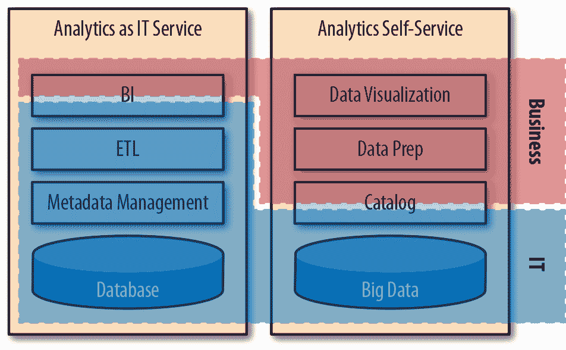
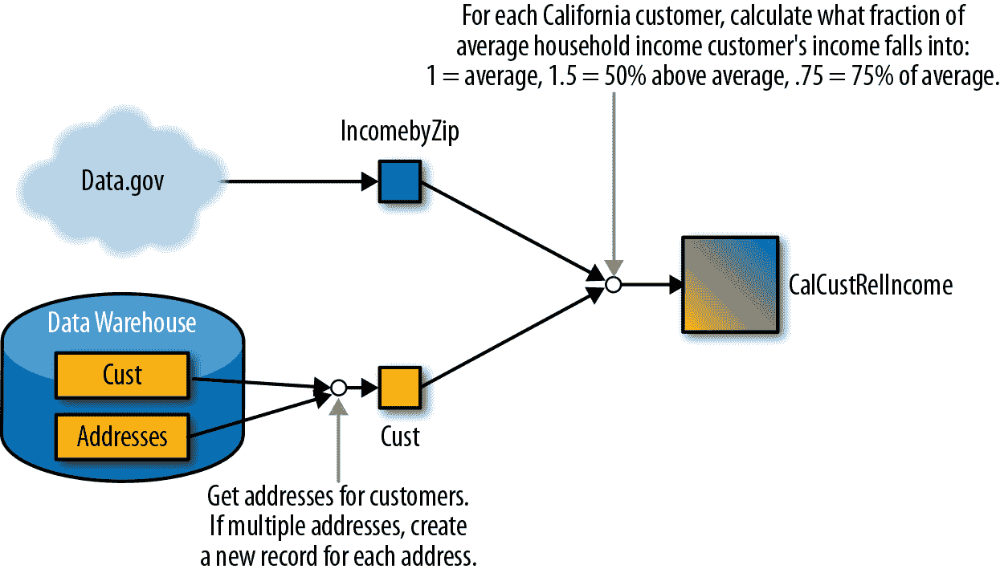
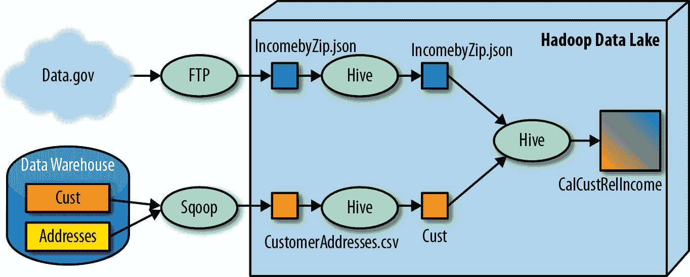
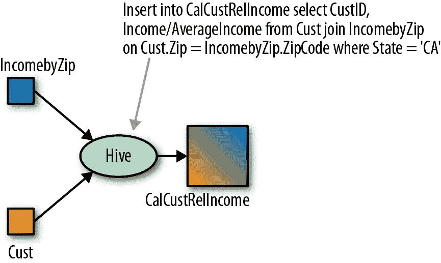
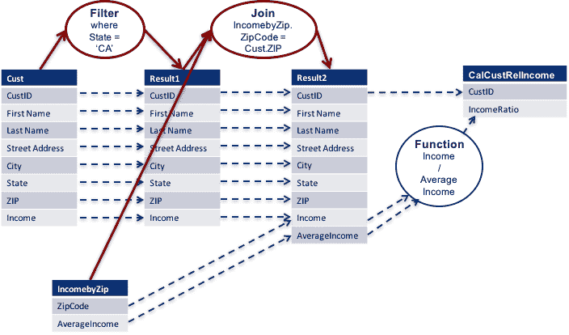
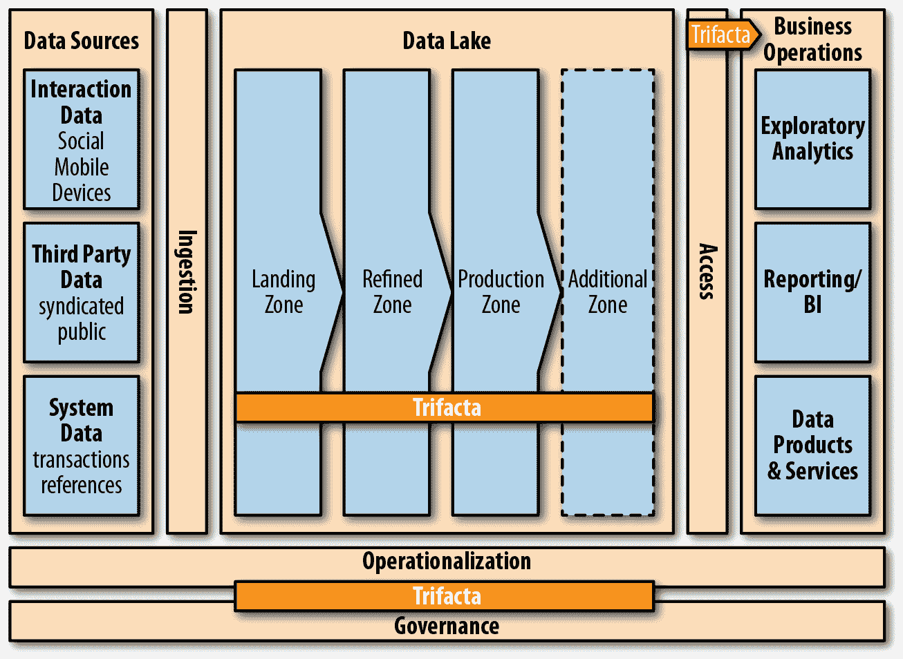

# 第六章：为自助服务进行优化

数据的力量只有在决策者能够基于数据采取行动时才能实现。过去，业务用户必须等待专家准备数据和运行分析。这有效地阻止了许多有价值的查询进行，并经常导致延迟、错误和误解。

我曾与一位来自领先医学研究医院的医生交谈过，他利用了一周的假期学习了 SQL 课程。他解释说，他对特定的医疗治疗方案的效力感到担忧，但在没有证明变更安全的情况下，他无法更改方案。他花了一年的时间试图向 IT 解释他想要的内容——等待几周以接收数据集，意识到它们不是他要找的，请求更多数据，再等待，然后投入更多时间，最终发现这些数据也不是他需要的。最终，他对此感到非常沮丧，于是决定学习 SQL 课程，以便自己探索数据。在应用了他新获得的知识的两周内，他能够找到所需的数据，以改善治疗方案。这只是展示自助服务价值以及分析师能够取得的惊人突破的众多故事之一。

本章深入探讨了一个组织如何重新考虑其收集、标记和共享数据的方式，以实现赋予业务用户所需的自助服务模型。我们将探讨诸如帮助用户在数据湖中找到有用数据、建立数据正确性和价值的信任以及帮助用户进行自己的分析等问题。如果没有建立对数据的这种信任，业务分析师将不愿意使用现有数据进行决策，或者最终做出错误的决策。

# 自助服务的开端

过去的经验法则是数据仓库的第一组需求总是错误的——这是众所周知的数据仓库 1.0 问题。为了开始通向一个正常运作的数据仓库的旅程，IT 必须建立第一代架构，以及相应的报告。这为用户提供了一个具体的东西，以弄清他们真正需要什么，从而使 IT 能够生成“真正”的需求。除了少数几个高级用户外，大多数分析师没有直接处理数据的技能或工具。

IT 给用户带来的长时间响应，像我之前故事中的那位医生一样，源于对数据日益增长的兴趣和请求的数量。我们目睹了应用程序生成的数据量和从外部提供者获取的数据量的激增，以及业务用户希望能够在几乎实时的速度下利用这些数据的期望的同时增加。这两者同时增加的数据量和用户期望使得 IT 难以跟上步伐。

然而，新一代的分析师、主题专家（SME）和决策者比以往任何一代都更懂技术和计算机，因为他们在数字时代成长，并且大多数人在高中或大学课程中接触过编程。这一代用户更希望“自助服务”地访问数据；他们想要自己找到、理解和使用数据。此外，云技术使得业务用户能够绕过 IT 部门，自行提供运行分析所需的基础设施。

在本章中，我们将对比旧的方法和新的自助服务方法。在旧方法中，IT 部门为业务分析师提供分析服务，他们为业务用户执行分析。而现在，业务用户希望能够自行进行分析，避免不必要的复杂性，我将称执行分析的人为分析师——这可能包括任何人，从拥有正式分析师职称的人员，到自行进行分析的业务用户，再到进行高级分析的数据科学家。

虽然以前的 ETL 版本的数据建模和商业智能（BI）工具是为程序员和架构师设计的，新一代工具则专为高级用户直接访问而设计。过去，专家大多数工作是：

+   数据建模师为数据仓库设计了模式。

+   ETL 开发人员创建了 ETL 作业，从源应用程序中提取数据，转换数据，并将其加载到数据仓库中。

+   数据质量分析师创建了验证作业来检查数据的正确性。

+   BI 开发人员创建报告和在线分析处理（OLAP）立方体，用户可以对其进行切片和切块。

+   元数据架构师创建了业务术语词汇表，试图捕捉各种数据元素的含义，并创建了元数据存储库，试图跟踪企业中的数据。

分析师唯一可以执行的分析是通过语义层，例如 Business Objects Universes，允许最终用户使用高级预构建结构（如*客户*和*订单*）来组合数据，同时隐藏了实际数据操作的复杂性。例如，用户可以将客户和订单的业务对象添加到报告中，并能够查看每个客户的订单。虽然非常便利，但这种方法受制于 IT 工作人员创建的任何业务对象。任何变更都需要多人审核和批准，有时需要数月时间。

自助服务数据探索和可视化工具（如 Tableau、Power BI 和 Qlik）已颠覆了这种脆弱的情况。分析师现在使用自助服务数据准备工具（如 Excel、Trifacta 和 Paxata）直接将数据转换为所需的形式。

此外，自助服务目录工具（如 Waterline Data 和 IBM Watson Catalog）现在允许分析师自行注释、查找和理解数据集，无需从 IT 请求。

图 6-1 展示了在自助服务分析环境中，分析师依赖 IT 的程度以及对 IT 的负荷显著减少的情况。今天可用的自助服务工具几乎都是以分析师为目标用户开发的，并且通常不需要 IT 参与部署和使用（其中一个例外是跨越 IT 和业务的目录工具，通常由 IT 管理但由分析师使用）。然而，底层数据基础设施仍然完全掌握在 IT 手中，这保持了数据的稳定性。

###### 图 6-1\. 通过自助服务分析减轻 IT 负担并支持分析师

# 业务分析师们

不幸的是，今天大多数企业并不真正支持自助服务模型，因为数据仓库并未设计用于处理大量的临时查询和分析。正如我们之前讨论的那样，它们都精心调整以支持关键生产报告和分析。允许数百甚至数千用户发布随机且有时形式不完整的查询将干扰这些功能。此外，分析通常需要将数据仓库中的数据与其他数据集结合，但向数据仓库添加任何内容都是一个昂贵且漫长的过程，需要大量的设计工作、架构和安全批准以及 ETL 开发。

因此，在许多企业中，数据湖的主要目的之一是创建一个能够实现自助服务的环境。要理解自助服务，我们需要审视典型业务分析师的工作流程（图 6-2）。

###### 图 6-2\. 业务分析师的工作流程

如同我们在第一章中看到的那样，分析师首先必须*找到并理解*所需的数据。接下来的步骤是*准备*数据，即以可用的形式和格式获取它。然后，数据需要*准备*进行分析。这可能涉及合并、过滤、聚合、修复数据质量问题等等。一旦数据形状正确，分析师可以使用数据发现和可视化工具*分析*它。

我们将在此处详细查看此工作流程的前三个步骤，以及识别数据中建立信任的重要问题。

## 找到并理解数据——企业文档化

分析师希望使用他们熟悉的业务术语来搜索数据（例如，“我需要包括年度支出、年龄和位置在内的客户人口统计数据”），而数据集和字段通常通过晦涩的技术名称公开。这使得分析师在寻找和理解数据方面面临巨大挑战。为了弥合这一差距，许多企业正在投资于数据目录，将业务术语或标签与数据集及其字段关联起来，使分析师能够快速使用这些标签找到数据集，并通过查看与每个字段关联的标签来理解这些数据集。通常，多个数据集包含分析师需要的数据，因此下一步是选择使用哪一个。在做出选择时，分析师通常会考虑数据的完整性、准确性和可信度（我们将在下一节考虑建立对数据的信任问题）。

尽管目录对于为业务分析师提供自助服务至关重要，但建立和维护它们也具有挑战性。这是因为在大多数企业中，关于数据在何处、哪些数据集用于什么目的以及数据意味着什么的知识都锁在人们的脑中——这通常被称为“部落知识”。

没有目录的情况下，为了找到用于特定问题的数据集，分析师必须四处打听，直到找到可以指导他们的人员——如果他们幸运的话，可能是一个主题专家——帮助他们找到正确的数据。尽管如此，找到 SME（主题专家）可能很困难，所以分析师可能会遇到告诉他们使用了类似问题的数据集的人，然后在不真正了解它们是如何处理或它们来自何处的情况下使用该数据集。

这有点像用你的项目来玩俄罗斯轮盘赌——这就像询问周围是否有人知道可能了解你右侧疼痛的医生，然后遇到有人说他们右侧有疼痛并服用了特定的药物，然后你服用了他们的药物。不仅可能他们的药物不适合你，而且你不知道这是什么、它来自哪里，或者它有多老。即使找到了一个声称知道你疼痛情况的医生，你也不知道这个医生是否有资格来诊断它。不用说，无论是应用于身体还是数据处理，这都是一个非常痛苦（玩笑意味），耗时且容易出错的过程。

在这个 Google、Yelp 和 Wikipedia 时代，我们有一个优势，那就是习惯通过众包来获取知识。企业也已经开始将类似的方法应用于分析师从头脑中获取数据的众包部落知识，这样他们头脑中的信息可以被记录在词汇表和元数据存储库中。然而，这些努力是耗时的，并且遇到两个障碍。首先，只有最重要的数据得到了记录——通常称为*关键数据元素*（CDEs）。这些通常包括在主数据列表中找到的描述字段，例如客户和产品属性，以及核心交易字段，例如订单 ID、日期和金额。其次，即使对于关键数据元素，存储库也很快变得过时，因为数据集、业务流程和规则的变化以及技术的进步。

克服这些挑战的最佳实践是：

+   将所有部落知识进行众包，并向所有人提供

+   自动标注数据集

十年前，分析通常由专门的员工执行，他们将所有时间都花在与数据打交道，因此关于数据的知识集中在分析和数据架构团队中。在今天的企业中，决策需要的人员都会进行分析。再加上数据的激增，这使得更难以找到了解数据的专业人员。SME 通常不是全职工作或正式角色。一些企业已经开发了正式的数据管理框架，在这些框架中，人们被分配全职或更常见的兼职责任来管理数据，即确保其被适当使用，符合政府和内部规定，并保持高质量水平。然而，大多数 SME 甚至大多数官方数据管理者并没有得到帮助其他团队的报酬，但仍然期望完成他们的主要工作。SME 经常对这种角色感到不满，并不喜欢一遍又一遍地向不同的团队解释同样的材料。分析师已经知道通过午餐或其他激励手段贿赂 SMEs 以换取他们的时间和知识。但在这样的午餐结束时，分析师可能只得到了他们所需知识的一部分，并且如果幸运的话，可能已经得到了指向其他 SME 的线索。这导致了更昂贵的午餐！

由于企业开始认识到中小企业（SMEs）及其知识的价值，它们正在尝试各种激励众包的方法。一些最佳实践包括：

+   尽可能简化和高效化 SMEs 记录知识的过程。通常，通过创建术语表或术语分类体系来实现这一目标，并让 SMEs 使用这些术语标记数据集，而不是为每个字段撰写详细的描述。

+   进一步通过“民间分类法”（folksonomy）提升标签的效果，允许 SMEs 使用他们熟悉的术语作为标签，而不是强迫他们学习强加的分类体系（无论是自行开发的还是行业标准，如金融服务的 FIBO）。例如，美国分析师可能寻找“first name”和“last name”，而欧洲分析师则寻找“given name”和“family name”。虽然这些只是简单的同义词，有时术语还具有额外的内涵和语义。例如，一个企业可能认为“due date”和“default date”是相同的，而另一个企业可能有一个“宽限期”，因此“default date”就是“due date plus grace period”。不同地理位置、企业、功能和收购所引入的多样性和复杂性令人震惊。

+   鼓励 SMEs 分享他们的知识，通过公开认可他们的工作，从游戏化和徽章到项目简单的认可，表明他们已经帮助过的项目。

+   方便查找该询问哪些数据集的人。这不仅帮助分析师找到正确的联系人，还鼓励 SMEs 记录他们的数据集，从而避免每次都需要向新用户解释。例如，当 Google 实施了可搜索的目录，用户可以找到每个数据集的 SMEs 时，他们发现经常使用的数据集很快得到了记录，因为 SMEs 厌倦了回答问题。

+   通过让与 SMEs 交谈的分析师轻松记录他们学到的东西作为标签和注释，以便将来保留并避免再次打扰 SMEs，使知识迅速传播并得到制度化，这可能是最有效的技术。

尽管众包 SMEs 的知识是迈向自助服务的重要一步，但企业中的数据量庞大，手动记录所有内容是不现实的。因此，通常只有少数几个广为人知且经常使用的数据集得到充分记录，而大多数数据则保持在黑暗之中。这也导致了新数据集的问题，可能不会立即得到记录，因此分析师可能无法找到这些数据。

这个问题的答案是自动化。新工具有效地结合了众包和自动化，进行“自动化数据发现”——基于 SMEs 和分析师提供的标签对数据集进行自动标记和注释。这些工具利用人工智能（AI）和机器学习识别和自动标记黑暗数据集中的元素，以便分析师可以找到并使用它们。Waterline Data 的智能数据目录和 IBM 的 Watson 数据目录就是这种方法的良好示例。目录在第八章中有更详细的探讨，见 ch08.xhtml#cataloging_the_data_lake。

## 建立信任

一旦分析师找到相关的数据集，下一个问题是数据是否可信。虽然分析师有时可以访问干净、可信、经过策划的数据集，但更多情况下他们必须独立判断是否可以信任这些数据。信任通常基于三个支柱：

+   数据质量—数据集的完整性和清洁度如何

+   Lineage（又称来源）—数据的来源

+   管理—谁创建了数据集，以及为什么创建

### 数据质量

数据质量是一个广泛而复杂的主题。在实践中，质量可以定义为数据符合政策的程度，这些政策可以从简单（例如，客户姓名字段不应为空）到复杂（例如，根据购买地点正确计算销售税）。最常见的数据质量规则包括：

完整性

该字段不为空。

数据类型

该字段为正确类型（例如，年龄是一个数字）。

范围

该字段位于指定范围内（例如，年龄在 0 至 125 之间）。

格式

该字段具有特定格式（例如，美国邮政编码由五位数字、九位数字或五位数字后跟连字符和四位数字组成）。

基数

该字段具有特定数量的唯一值。（例如，如果一个美国州名字段有超过 50 个唯一值，我们就知道有问题。我们可能还不知道每个值是否都是合法的州名，但如果我们已经有了每个合法的州名的表示，检查基数就足以进行健全检查，以捕捉任何非法名称，因为它们会将值的数量推高到 50 以上。）

选择性

该字段的值是唯一的（例如，客户 ID 在客户列表中应是唯一的）。

参照完整性

该字段的值位于参考值集中。（例如，所有客户状态代码都是合法的，订单列表中的每个客户 ID 都指向客户列表中的一个客户。对于某些值，如州名，我们可能可以通过基数检查来进行检查，但客户状态代码可能会对我们如何对待客户、收取费用等方面产生重大影响，因此在确保每个客户具有合法状态代码时，检查每个值非常重要。）

检查数据质量的最常见方法称为*数据概要分析*。这种方法涉及读取每个字段中的数据并计算指标，例如空字段数（完整性）、唯一值数（基数）、唯一值百分比（选择性），以及检查数据类型、范围和格式，并执行参照完整性检查。

除了基本数据概要分析外，还可以定义自定义规则来验证数据的特定方面。概要分析的优点在于可以自动和普遍地对所有字段进行，然后由考虑是否使用数据集来确定质量水平的分析员进行审查。另一方面，自定义规则必须手动设计、实施并应用于相关数据集。

### 血统（来源）

虽然数据质量检查告诉分析员数据的好坏程度，但数据血统告诉他们数据的来源。例如，来自 CRM 系统的客户数据比来自专门数据市场的客户列表更可靠，因为前者是客户数据的记录系统，而后者可能是某个地理区域或人口统计的客户子集，并可能包含修改或过时的客户数据。

在一些行业中，如金融服务业，数据血统作为法规合规的一部分是必需的。例如，巴塞尔银行监督委员会的规则 239 要求金融服务公司向审计员展示用于财务报告的数据的血统。因此，如果黄金区的数据用于财务报告，有必要记录其血统并保持更新。

表示数据血统存在许多挑战，特别是系统标识和转换逻辑方面。由于数据经过多个系统和工具，很难确定不同工具是在指同一系统还是不同系统。此外，由于不同工具以不同方式表达它们的转换——有些可视化，有些使用编程语言，有些使用查询语言或脚本——因此很难以统一的方式表示所有已执行的转换。

首先看看标识。想象一下，一个 Hadoop 文件是使用名为 Sqoop 的开源 Hadoop 实用程序创建的，该实用程序使用 Java 数据库连接（JDBC）执行关系数据库查询，并将结果加载到文件中。然而，另一个 Hadoop 文件是通过读取相同数据库中同一表的数据创建的，使用的是一个使用开放数据库连接（ODBC）接口的 ETL 工具。也许没有程序化的方法能够识别这两个文件都是从同一个数据库中提取的。此外，因为 Sqoop 可能执行一个自由格式的查询，可能无法识别 Sqoop 最终读取的是与 ETL 工具相同的表。

ETL 工具的一个卖点是，如果所有转换都由单个工具执行，那么该工具解决了标识问题，并且可以使用该 ETL 工具本地使用的任何表示来轻松表示技术血统。然而，如果您的企业像大多数企业一样使用多个 ETL 工具，则必须解决标识问题以及表示问题。有许多表示血统的方法，具体取决于目标受众。例如，业务分析师更喜欢描述使用业务术语和简单解释生成数据的业务级血统。大多数技术用户更喜欢显示用于生成目标数据集的具体代码或该代码的严格等效图形表示的技术血统。

技术血统具有挑战性，因为数据集可能通过多个步骤使用各种程序、编程语言、脚本和工具生成。需要考虑技术血统的两个方面：粒度和转换表示。

您可能会遇到两种粒度级别：

数据集级别的粒度

各种数据集之间的血统关系通常被捕获和表示为*有向图*。换句话说，获取或转换数据的每个步骤都显示为一个节点或框，箭头显示数据通过这些节点的单向流动。经常，用于生成数据集的程序也被表示为图上的节点，而不是详细的代码片段。

字段级别的粒度

每个字段的血统都被捕获并表示为一个有向图，通常不同节点表示不同的变换。有时，这种血统级别与数据集级别合并为单一图，用户可以在界面上从数据集级别钻取到特定目标数据集的字段级别。

还有两种可能看到的转换表示：

规范化表示

所有变换都被转换为一个共同的表示。这很困难，因为数据集可能使用各种过程和声明性语言生成，因此翻译可能复杂（甚至不可能）。

原始表示

所有变换都以原始语言或脚本呈现。这也是有挑战性的，因为可能使用复杂软件生成数据集，仅从逻辑上提取生成数据集时使用的代码可能非常困难。

让我们举个例子。假设我们有两个 Hadoop 文件：一个从数据仓库下载，包含完整的客户列表及其地址；另一个来自名为[Data.gov](http://Data.gov)的公共网站，提供每个邮政编码的平均收入。

下载文件后，我们基于文件所在目录创建了两个 Hive 表——`Cust`和`IncomebyZip`——以提供关系（SQL）接口。然后，我们执行 SQL 查询，从`Cust`表中选择加利福尼亚客户，并与`IncomebyZip`表进行连接，生成最终表`CalCustRelIncome`，该表根据他们家庭收入与其邮政编码平均收入的比较对每位客户进行评级。

这个流程的业务血统将看起来像图 6-3。它会跳过所有中间步骤和细节，并提供英语（或其他语言）的描述作为标注，记录每个主要步骤的完成情况。当然，用口头方式描述业务级别的问题是，必须有人编写它们，而且更具挑战性的是，在代码发生变化时进行维护。另一方面，这些描述可能是向业务分析师解释数据集生成方式的唯一实用方式。

###### 图 6-3\. 业务级血统

更技术性的数据集表示在图 6-4 中有所体现。它给出了主要步骤的相对高层视图以及数据来源。但是，它并不提供操作的详细信息。例如，如果我们没有将目标表称为`CalCustRelIncome`，则无法从数据集级血统推断出只选择了`Cust`表中的加利福尼亚客户。

###### 图 6-4\. 数据集级技术血统

有时可以向此谱系添加更多细节，例如指向显示 Sqoop 查询的 Sqoop 节点或显示 Hive 查询的 Hive 节点，如图 6-5 所示。

###### 图 6-5\. 添加数据集级转换节点的详细信息

现在让我们看看如何将这个单一的 Hive 查询以图形方式表示为字段级别的谱系，使用规范化的图形表示，如图 6-6 所示。

###### 图 6-6\. 字段级技术谱系

在图 6-6 中，使用虚线蓝线表示字段级别的操作，使用实线深红线表示数据集操作。如果一个字段只是从源复制到目标，则用虚线蓝线表示从源字段到目标字段。如果涉及操作，则用蓝色椭圆表示，并使用虚线蓝线表示操作的输入和输出。集合操作的输入和输出（在红色椭圆中）通过实线红线表示在操作和特定数据集之间。单个 Hive SQL 查询表示为三个步骤或节点：

过滤节点

对`Cust` Hive 表应用过滤器，仅选择加利福尼亚客户。

连接节点

将第一个操作的结果与`IncomebyZip` Hive 表合并，根据其邮政编码为每个客户添加`AverageIncome`。

函数节点

提取将进入`CalCustRelIncome` Hive 表的字段，并通过将客户的收入除以平均收入来计算每个客户的`IncomeRatio`。由于计算是作为查询的一部分直接进行的，所以该函数没有名称，并由执行所需计算的代码表示。

要生成此图表，谱系系统必须能够解析和理解 Hive SQL，并将其分解为单独的操作。这是一项相当复杂的工作，特别是因为用户可能选择编写 Java MapReduce 程序或 Pig 脚本，或使用其他一些难以或无法规范化表示的选项，而不是使用 SQL 等声明性语言。

### 管理

信任有很强的社会层面。分析师依赖口口相传来找到可信赖的 SME。就像一些博客作者、YouTuber 和行业专家通过建立可信度和庞大的追随者群体脱颖而出一样，现代数据湖中某些用户的注释和策划可能比其他人更可信。这些受信任的用户可能有数据的组织责任，他们可能是官方的数据管理者，或者是广受认可和尊重的专家。即使在拥有成熟治理结构和官方指定数据管理者的组织中，有些数据管理者可能比其他人更具知识，有时分析师可以比官方的数据管理者更了解和掌握洞察力，尤其是关于他们创建或经常使用的数据集。为了解决专业知识的分散和非官方特性，一些企业正在转向像 TripAdvisor 和 Yelp 这样的消费者网站使用的范例，通过允许用户评价信息是否有帮助和准确来识别可信的评论者。

## 配置

一旦确定了正确的数据集，分析师需要将其提供供使用，或者“配置”它。配置有两个方面：获取使用数据的权限和获取访问数据的物理访问权限。

数据湖面临的一个重大挑战是决定将访问权限授予哪些分析师访问哪些数据。在某些行业中，让每个人都能访问所有数据是完全可以接受的，并解决了第一个问题。然而，大多数行业处理大量敏感数据。数据集可能包含个人可识别信息（PII）、财务信息如信用卡和账户号码，以及业务敏感信息如订单大小和折扣。

传统的访问控制方法为每个用户创建一个账户，并可能将用户添加到一个或多个组中，并为每个数据集或字段指定特定用户和组的访问权限。例如，所有美国市场分析师可能会访问美国销售数据，但不会访问欧盟销售数据。当在美国新雇佣了一个市场分析师时，他们将被添加到美国市场分析师组，并获得访问美国销售数据的权限。如果他们转到不同的团队或加入不同的项目，他们的权限和组成员资格将需要重新审查。当接收到新的数据集时，安全团队和数据管理者必须找出谁应该访问它。这种方法存在许多问题：

+   这非常耗时。大公司可能一直在雇佣人员或在项目之间调动人员。通常是一位成本高且责任重大的人需要找出应该让谁访问什么内容。

+   存在大量历史包袱，因为转移到另一个项目的人可能在一段时间内仍然对旧团队负责。分析师有时会因为访问已经与其工作无关且不应访问的数据而拥有访问权限。

+   有很多数据，有时很难正确判断谁应该访问哪些数据。

理想情况下，分析员应该能够请求访问他们需要的数据。但是，如果他们无法在没有访问权限的情况下找到数据，我们就陷入了一个进退两难的境地。

这种解决方案是一种更灵活的访问控制方法，一些企业开始采用。它们创建元数据目录，使分析员能够找到任何数据集而无需访问它。一旦确定了正确的数据集，分析员请求访问它们，数据管理员或数据所有者决定是否授予访问权限，持续多久，以及数据的哪些部分。一旦访问期限到期，可以自动撤销访问权限或请求延期。

这种方法有很多优势：

+   在有人请求此数据集之前，无需进行检测和保护数据集内的敏感数据。

+   分析员可以在数据湖中找到任何数据，包括新加入的数据集，而无需访问它。

+   数据管理者和所有者不必投入时间来确定谁应该访问哪些数据，除非真正需要进行项目。

+   访问请求可能需要理由，创建请求者和数据集的审计轨迹。

+   可以授权访问数据集的部分内容，并限定特定的时间段。

+   始终清楚哪些数据集正在使用，因此数据质量和治理工作可以集中在这些数据集上。例如，ETL 作业只能更新当前正在使用的数据集，敏感数据去识别和数据质量规则可能仅应用于这些数据集。

我们将在第八章中更详细地讨论目录，并在第九章中深入探讨访问控制和供应。

## 为分析准备数据

虽然一些数据可以直接使用，但更多时候需要一些准备工作。准备工作可能只是选择适当的数据子集，或者可能涉及复杂的清洗和转换过程，将数据转换为正确的形式。最常见的数据准备工具是 Microsoft Excel。不幸的是，Excel 有显著的限制，使其难以处理大数据湖文件。幸运的是，新公司如 Alteryx、Datameer、Paxata 和 Trifacta，以及更成熟的数据集成供应商如 Informatica 和 Talend，已经推出了更好的可扩展工具。甚至一些数据可视化供应商，如 Tableau 和 Qlik，也正在将常见的数据准备功能整合到其工具中。Excel 也在进化中，微软正在为在 Azure 中运行的 Excel 开发 Hadoop 接口。

由于传统的数据仓库设计用于执行相对狭窄和预定义类型的分析，它们依赖于由 IT 开发的经过充分测试和优化的 ETL 作业，用于将数据转换为单一的公共模式并加载它。任何数据质量问题都会以同样的方式为每个人解决，并且所有数据都会转换为一组公共的度量和表示。所有分析师都不得不使用这种一刀切的方法。

现代的自助服务分析，尤其是数据科学，更加灵活和探索性。分析师可以利用数据仓库中更多可用的数据，通常会寻找原始或原始数据进行处理，以适应其特定的需求和用例。

创建“合适用途”的数据对于 IT 部门来说几乎是不可能的任务。幸运的是，一组称为*数据准备*或*数据整理*工具变得流行起来，使分析师能够轻松将原始数据转换为适合分析的格式，而无需深入的技术技能。这些数据准备工具为分析师提供了类似电子表格的视觉界面。Bertrand Cariou 的以下文章描述了数据整理的不同用例，并描述了现代数据准备工具之一 Trifacta 如何提供复杂的机器学习接口，尝试基于用户的数据选择自动推荐操作。

# 数据湖中的数据整理

***Bertrand Cariou** 是 Trifacta 的高级合作伙伴营销总监。在 Informatica 以及其他一些美国和欧洲公司，Bertrand 专注于使数据可访问和可用。*

“数据整理”一词通常用于描述商业专业人士（如业务分析师、数据分析师和数据科学家）在准备数据以供分析之前所做的初步准备工作。数据整理因此可以成为本书其他地方描述的“自助服务”的一部分。然而，我们也看到越来越多的数据整理由数据工程师完成，以促进他们的工作并改善与业务用户的协作。无论谁执行这项任务，数据整理都是将多样化的数据从其原始格式转换为结构化和可消费的格式，供业务智能、统计建模工具和机器学习使用，或者向业务应用提供数据。通过我的公司提供的机器学习驱动的新工具，例如[Trifacta](https://www.trifacta.com/)，大大简化了数据准备的工作，通过提供建议和与用户互动来加速和自动化数据整理，以满足他们特定的数据驱动需求。

## 将数据准备置于 Hadoop 环境中

数据准备位于数据存储和处理层（如 Hadoop、Spark 和其他数据计算引擎）以及后续过程中使用的可视化或统计应用程序之间。

如图 Figure 6-7，数据整理发生在分析工作流的各个环节中：

探索性准备

数据湖中的数据整理通常发生在区域内或在区域之间移动时。用户可以访问原始和精炼数据，将其组合和结构化，用于他们的探索工作，或者定义他们想要自动化并定期运行的新转换规则。

数据准备也可用于轻量级摄取，将外部数据源（如电子表格和关系数据）引入数据湖中已有的数据，以进行探索和清洗。

消费

在生产区域进行整理通常是将数据传递到商业洞察层。这可以通过基于 SQL 的 BI 工具完成，或者通过导出数据到文件格式（例如 CSV、JSON 或 Tableau 数据提取格式）以供包括 Tableau、SAS 或 R 在内的分析工具进一步使用。

运营化

除了数据转换的实际工作外，数据准备工具还在运营化层内使用，团队可以定期安排数据准备作业并控制其执行。

###### 图 6-7\. Trifacta 生态系统

解决方案内的所有数据访问、转换和交互都已记录，并提供给数据治理工具，因此管理员可以了解数据的来源。

## 数据准备常见用例

数据准备工具的使用可分类为三种主要场景（具有变体），可能通过由业务团队或 IT 团队组织的自动化受益。以下是数据整理的三个常见用例及相应的 Trifacta 客户示例摘要。

### 应用场景：自助式分析或业务应用的自动化

对于这类倡议，业务团队管理分析流程，从初始数据摄取到最终数据消耗，包括数据准备。通常，他们的最终目标是为了合规目的或聚合不同数据而创建“主报告”。在这些倡议中，IT 组织负责设置数据湖和数据摄取，以便业务团队可以处理自己的数据需求，并安排数据准备任务，无需 IT 参与。

### 客户示例

PepsiCo 需要优化其零售销售预测，这涉及将零售商销售点（POS）数据与内部交易信息相结合。对于 PepsiCo 来说，主要挑战来自于每个零售商提供的不同格式，通过自动生成的报告或电子邮件附件提供。通过 Trifacta，业务分析团队承担了将零售商数据引入 PepsiCo 数据湖的责任，可以探索和定义数据转换方式，并可以根据需求执行作业或通过常规调度以向下游应用程序或流程提供可消费的结果。Trifacta 从用户的互动中学习，提供即时反馈，以更好地指导他们在规模上构建、丰富和验证数据。

### 用例：IT 运营准备

在这种情况下，数据专家——通常是数据分析师或数据工程师——自行设计准备工作，然后测试、验证并按规模运行规则，以产生期望的结果。在最终用户创建操作工作流后，IT 团队通常会将其集成到企业工作负载中。

### 客户案例

一家大型欧洲银行需要从其网站提取聊天日志以改进客户服务，以及分析产品和服务需求。该银行使用 Trifacta 将这些复杂的格式转换为更广泛的客户 360 计划中的离散属性，该计划还包含其他数据渠道。在这种情况下，团队提供了他们创建的数据整理规则，以便 IT 能够一致地组合各种数据流。

### 用例：探索性分析和机器学习

正如其名称所示，探索性分析利用数据探索业务的各个方面，并使用临时数据准备工具探索数据，调查使用案例，找到相关的第三方数据，验证假设，在数据中发现模式，或生成数据集供数据科学家建模。

### 客户案例

一家成熟的营销分析提供商聚合并检验客户数据，为其客户提供分析输出，从而帮助客户衡量、预测和优化营销工作的影响。每个客户具有不同的数据来源和格式。Trifacta 帮助加快客户数据的发现和转换过程，以创建结构化和干净的数据集。例如，Trifacta 使用机器学习自动发现数据，在熟悉的网格界面中结构化数据，识别可能无效的数据，并建议最佳的清洁和转换数据的方法。

# 分析和可视化

现在有很多出色的自助数据可视化和分析工具。Tableau 和 Qlik 已经存在多年，还有许多较小的供应商，如 Arcadia Data 和 AtScale，专门为大数据环境提供高质量、易于使用的功能。Donald Farmer 的以下文章讨论了商业智能中的自助服务趋势。

# 自助式商业智能的新世界

**Donald Farmer** 是 Qlik 公司创新与设计副总裁。他在数据战略方面的工作已有近 30 年，国际上发表了大量关于高级分析和创新战略的著作和演讲。

在过去几年里，业务用户与 IT 的关系发生了显著变化。这种变化的起因与 iPhone、iPad 以及被称为 Bring Your Own Device（自带设备）的现象有关。BYOD，通常缩写为这样，是对用户现在比 IT 能提供的更好的技术和更快的升级有了战略性响应或战术性调整的认识。这一新现实在数据分析领域也有所体现。与设备自带的现象有明显的类似之处，业务分析师已经接受了自助式商业智能。在自助服务中，用户可以构建自己的解决方案，甚至可以选择自己的工具，“无论是否得到 IT 的许可”，正如分析公司 Gartner 所指出的。

过去，IT 部门必须为企业提供报告基础设施、仪表板和分析。只有 IT 团队能够部署所需的昂贵存储和计算能力。只有 IT 了解从数据中提取和 consolidaing 数据或构建分析模型涉及的技术问题。非常重要的是，只有 IT 能够保护数据和相关分析，确保正确的人拥有正确的洞察力。商业智能的工作流程遵循经典的生命周期模型：IT 收集需求，构建解决方案，将其部署到生产环境，并开始下一轮需求收集。

事实上，这种由 IT 主导的模型始终存在着一个“黑暗面”。随着开发人员为了越来越敏捷的业务而奋力推进生命周期，财务和营销部门的分析师简单地使用 Excel 作为一个足够好的工具。他们经常从报告中导出数据进行进一步分析，有时他们也能访问源数据。Excel 是有效的，但不强大。它的安全性缺失，再加上业务用户的习惯，导致组织内部产生了较差的分析甚至是机密数据。

自助式 BI 工具不仅将这种黑暗面带入了光明中，而且将其带入了企业分析的主流。从 2000 年代中期开始，随着 64 位计算成为常态，诸如 QlikView、Tableau 和 Microsoft 的 PowerPivot 等应用程序为任何业务用户提供了强大的分析能力。这些工具将 ETL 生命周期和数据模型构建集成到一个简单的环境中。它们使用优雅的可视化方式使用户能够轻松有效地发现模式并传达见解。通过使用内存存储和压缩，相同的工具可以将数据容量和计算能力带到桌面，这些功能曾经只能在精心管理的服务器房间中获得。正如俗话所说，拥有这种力量也带来了巨大的责任，但设计良好的自助式应用程序也可以帮助解决这个问题。

这种业务用户权力的转变带来了许多变化，特别是在分析工作流程和 IT 角色方面。

## 新的分析工作流程

如前所述，用于分析应用程序和报告的工作流程曾经是经典应用生命周期的一种变体：需求、设计、部署和新需求。然而，自助服务使得业务分析师了解自己的需求并开发自己的解决方案，因此这个过程可能显得有些零散。需求随时可能发生变化。例如，前端设计的微调（例如向图表添加新元素）可能会改变数据提取过程。分析师可能会部署并分享一个半成品解决方案以便推动进展。

与其将这种敏捷、临时的过程视为生命周期，我认为将其描绘为一个供应链更为有用，其中数据作为原材料流经多个流程，每个步骤都增加了价值。供应链的巨大优势在于，有时可以为了效率而合并步骤。例如，将食物从农场送到餐桌时，批发商不仅可以转售，还可以洗涤和部分准备一些蔬菜。同样，供应链的每个步骤可以简单地是操作性的（从农场到市场的运输），也可以在进行时增加价值，例如按大小或质量等级进行分类。

在业务分析供应链中，数据作为原材料，业务用户可以从任何可用的地方获取数据。自助服务工具通常提供简单的向导、脚本或视觉环境，用于查看、连接、 consoli data 或清理数据。通常这个阶段被称为数据混合——或者更有诗意地称为数据梳理。然而，与传统的 ETL 过程不同，传统的 ETL 过程在任何分析工作之前从源中加载数据仓库模型，混合和梳理可以在分析过程之前、过程中或（使用分析应用程序作为源）甚至之后发生。

对于使用自助工具的业务分析师来说，混合数据*是*一种分析过程。当他们在可视化中看到初步结果时，他们会随着工作对数据有更好的理解。然后，他们修改他们的脚本或数据向导，以便以不同的方式查看数据，或者启用更好的可视化。这里有一个重要的区别。在传统的数据仓库生命周期中，ETL 填充了一个模型，然后驱动分析。该模型可以是星型模式或需要专业设计和工程技能的复杂 OLAP 模型。在自助供应链中，模型仍然存在，但用户可能甚至没有意识到它。通常情况下，业务分析师不是一个有意识的建模者。

当业务分析师与数据湖一起工作时，这种新方法的灵活性尤为重要。在传统模型中，通过复杂的关系源和昂贵的存储，数据经常通过非常复杂的过程进行转换，以使其以对存储和查询都有效的形式呈现。例如，ETL 和 OLAP 需要相当的技能。

另一方面，数据湖可以轻松存储大量数据。有了按需模式的灵活性，就没有必要在单个数据仓库中建模所有情况。只要能向业务分析师呈现有效的语义（他们永远不应被要求编写 MapReduce！）和合理的性能，他们就可以使用数据湖和自助工具。

## 从“门卫”到“店主”

在这一点上，我们应该考虑 IT 的角色。重要的是要说，IT 可能仍然会提供至关重要的情报。企业数据仓库仍将在我们身边，用于年度财务报告、税务分析和人力资源。IT 在未来几年仍然需要他们的 OLAP 和 ETL 技能。他们也需要 MapReduce 技能！

当然，IT 在分析供应链中扮演着重要角色。至少，IT 必须通过强大的网络、存储和数据源来“保持灯火通明”，使这一过程成为可能。然而，它的角色远不止如此。

正如我们所见，过去，IT 团队提供了整个分析生命周期，因为他们是唯一能够提供的人。此外，他们保证系统安全，并根据需要和许可提供“数据访问”。IT 部门非常认真地承担起这个“门卫”的角色，他们可能会这样做，以至于商业分析师经常对他们对重要数据的有限访问感到沮丧。

对 IT 门卫的这种挫折导致了专业紧张，并频繁地导致正是控制措施本意避免的未管理数据共享的“黑暗面”。电子表格失控了，因为这是分析师留给他们的唯一工具，而 IT 无法封锁它们。

随着自助服务的到来，我们需要一种新的方法。IT 团队必须从“门卫”转变为“店主”。

一个守门人关心的是如何阻止错误的人进入。而一个店主则邀请合适的人进入，准备、展示和供应商店的商品，鼓励其适当的使用。在 IT 术语中，数据供应团队可以构建供业务用户自服务的数据源和模型。与其打开大门让用户访问源系统，一个有效的团队可以为用户提供经过清理、合并甚至匿名化处理的数据，以便进行有效的分析和良好的治理。IT 不需要为特定用例准备每个数据源：业务分析师使用他们的工具在数据供应链上为自己提供这些解决方案。

## 自助服务的治理

在这种供应链模型中，IT 团队充当店主的角色，他们在安全和数据治理方面仍然发挥着重要作用。他们可以采取的最重要措施之一是为用户提供设计良好的自助服务工具。

一个设计良好、企业级的自助应用不仅为业务用户提供强大而简单的工具，还必须具备强大的服务器架构，可以部署在云端或本地，为 IT 部门提供必要的洞察力和监督权，以管理系统的使用。

IT 的监督工作包括管理部署、用户权限、服务器性能和扩展能力。一个设计良好的应用程序所提供的洞察力包括了解分析师使用的数据源、他们与谁分享他们的应用程序和可视化内容，以及数据的准备和刷新方式。

请记住，IT 仍然提供关键的分析服务，比如财务报告。他们仍然是内部核心的守门人。但是，商业分析的许多工作可以通过更轻松的方式处理——仍然安全、受控——采用新的供应方法，不仅更具敏捷性，而且更易于与业务其他部门合作。

# 结论

如果利用数据做出更好的决策是现代企业成功的关键，那么依赖于 IT 构建的僵化分析和数据仓库的旧实践是跟不上的。利用数据做出更好的决策的唯一实际方法是使分析师能够自行进行分析，而无需在每个项目中都涉及 IT（从而使 IT 成为瓶颈并减慢事务进展）。正如您在本章中看到的那样，从数据可视化工具到数据准备工具和数据目录等新一代分析和数据基础设施工具已经出现，使分析师能够在不涉及 IT 的情况下处理数据。可以将提供搜索、溯源和信任的方法构建到数据湖中，供所有用户使用。
