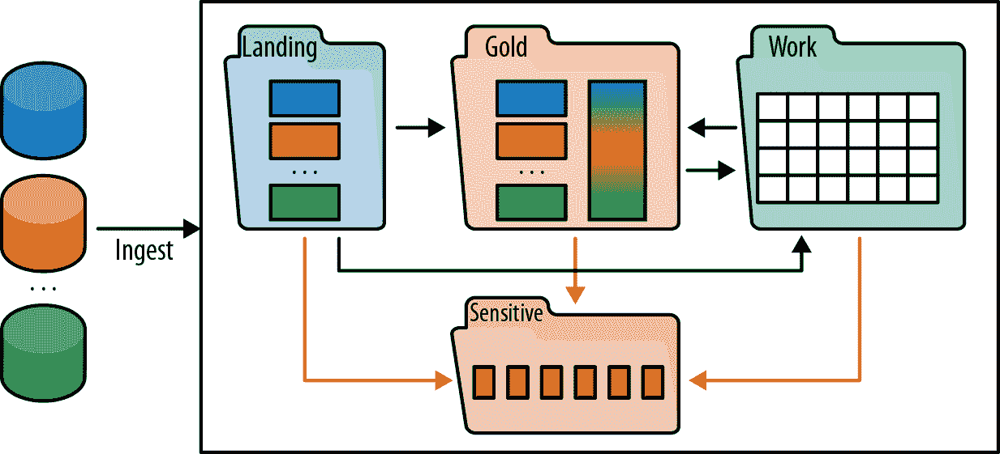
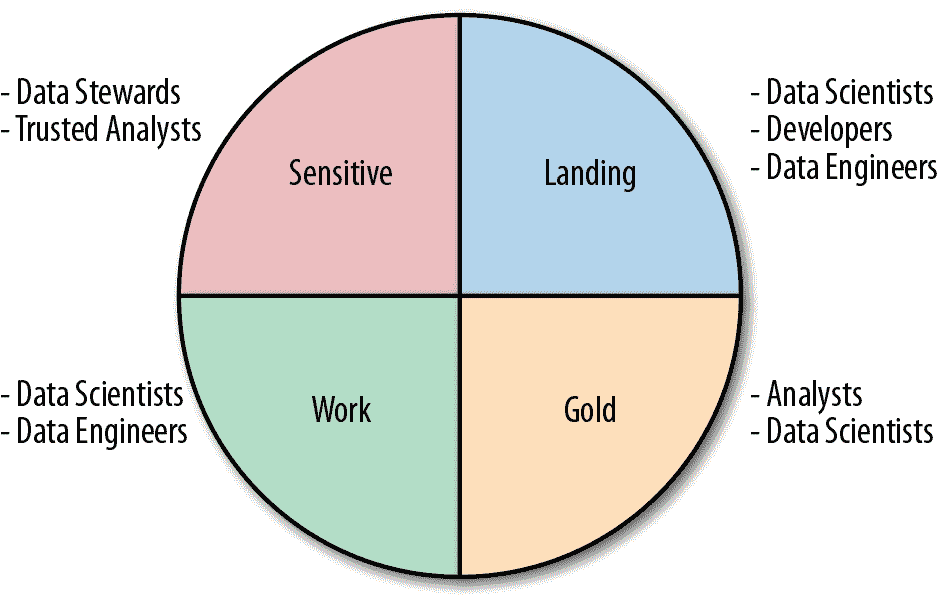
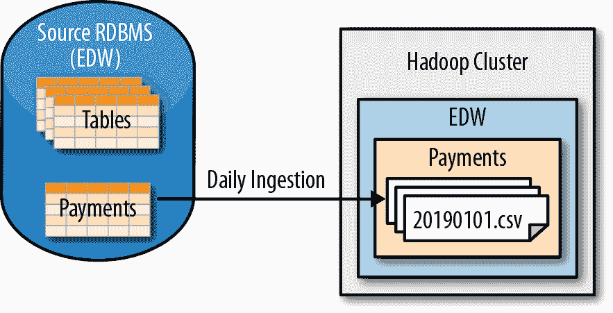
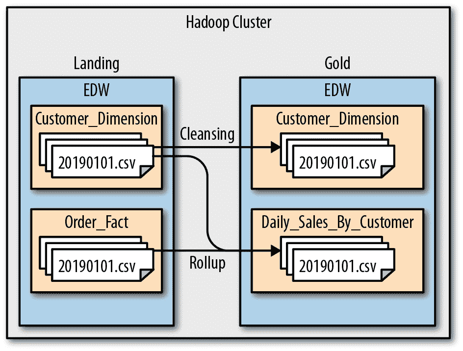
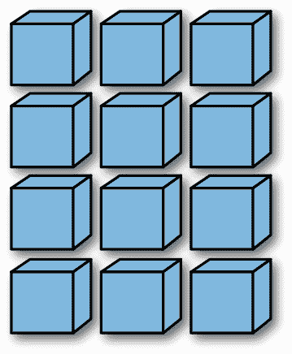
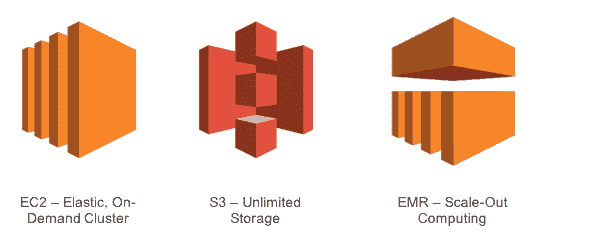
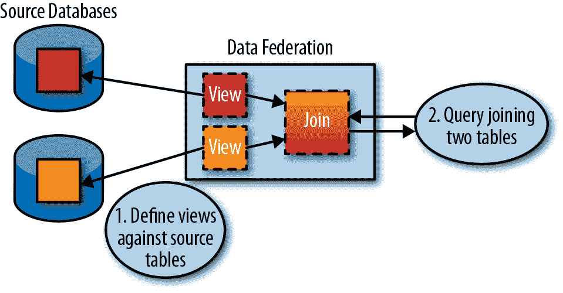
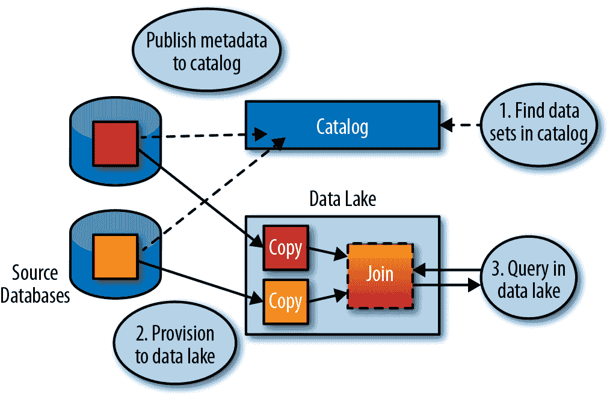
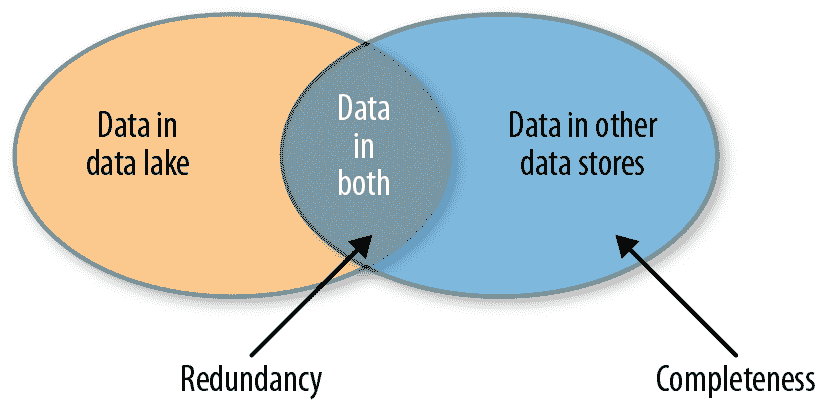
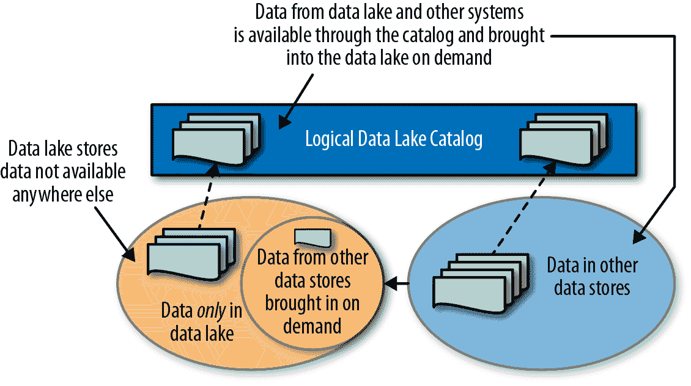

# 第七章：设计数据湖

有许多方法可以组织数据湖中的数据。在本章中，我们将从如何将数据湖组织为区域开始。然后，我们将比较和对比本地和云数据湖。最后，我们将讨论虚拟数据湖，它在提供与物理数据湖等效功能的同时，最小化资源使用和维护数据湖的开销。

# 组织数据湖

一旦建立了数据湖，分析师需要一种方法来查找和理解其包含的数据。考虑到大多数企业中数据种类的广泛多样性（我与一家大型零售商交谈时得知，其数据湖中有超过 30,000 个数据源，并且每个源可能提供数百甚至数千个表），这是一项艰巨的任务。即使分析师找到了正确的数据集，他们也需要知道是否可以信任数据。最后，为了使用户能够自由地在湖中漫游，必须识别和保护敏感数据，以免意外泄露。所有这些任务都属于数据治理的范畴。

在数据仓库化的旧时代，数据治理是由大型数据监护人、数据架构师和数据工程师团队实施的。变更必须经过仔细审查和批准。数据质量、数据访问、敏感数据管理以及数据治理的其他方面都经过深思熟虑和管理。但在自助服务时代，这种方法无法扩展。事实上，数据科学的探索性和敏捷性与传统数据治理的自上而下、谨慎的风格存在冲突。

针对数据使用速度的加快，企业已经开始应用*双模数据治理*的概念，由[Gartner](https://www.gartner.com/it-glossary/bimodal/)定义如下：“双模是管理两种分离但一致的工作风格的实践：一种专注于可预测性，另一种专注于探索。”为了支持这种双模式方法，数据湖通常被划分为多个区域，具有不同程度的治理。在本节中，我们将介绍将数据湖组织为区域的最佳实践，帮助用户了解数据的治理级别，并保护敏感数据。

图 7-1 反映了一个非常普遍的数据湖集群架构。来自外部源的数据首先加载到原始或着陆区域，其中以反映其来源（例如时间和来源）的文件夹进行归档，而不进行进一步处理。然后，根据需要，这些数据被复制到金区域，进行清洗、筛选和聚合；工作区域，用户运行其项目的地方；或敏感区域，保护应保护的数据保存在加密卷中。

###### 图 7-1。数据湖划分为工作空间或区域的示例

不同的数据湖用户通常使用专用区域，如 图 7-2 所示。

###### 图 7-2\. 不同的用户使用不同的区域

## 着陆区或原始区

着陆区，有时也称为 *原始* 或 *暂存* 区，用于存放原始摄入的数据。 IT 团队通常创建命名约定，以识别数据的来源。例如，所有摄入的原始数据通常保存在单个文件夹中（例如，*/Landing*）。在该文件夹中，通常会按来源创建子文件夹（例如，*/Landing/EDW* 或 */Landing/Twitter*），在这些子文件夹中，还会按表或其他分组创建另一个文件夹（例如，*/Landing/EDW/Customer_dimension* 或 */Landing/Twitter/Mybrand1*）。

如果表周期性反映，可以为每次加载新数据创建一个分区（例如，*/Landing/EDW/Customer_dimension/20190101.csv* 或 */Landing/Twitter/Mybrand1/20190101.json* 表示 2019 年 1 月 1 日加载的数据）。为了避免非常大的文件夹，可以创建更复杂的文件夹树，例如，每年和每月创建一个文件夹，并将该月的分区作为文件（例如，*/Landing/EDW/Customer_dimension/2019/01/20190101.csv* 或 */Landing/Twitter/Mybrand1/2019/01/20190101.json*）。 图 7-3 展示了典型的文件夹层次结构。

###### 图 7-3\. 将原始或着陆数据摄入到文件夹和文件中

通常，只有高度技术的开发人员、数据工程师和数据科学家可以访问着陆区。一般来说，着陆区的用户必须有充分的理由进行自己的数据处理和处理。

分析师通常需要更干净的数据，并使用来自下一个 **金区** 描述的数据。

## 金区

黄金区域经常反映着着陆区域，但包含清洁、丰富和其他处理过的原始数据的版本。有时这个区域也被称为*prod*，表示其中的数据已经可以投入生产，或者称为*cleansed*，表示数据已经通过数据质量工具和/或策划流程进行了清理，如第二章所述。为生产使用准备数据通常类似于创建数据仓库的 ETL 作业——数据被和谐化并标准化为符合维度或主列表，例如主客户或产品列表。操作可能涉及将名字的姓、名和中间名转换为一个字段；将千克转换为磅；将本地代码转换为通用代码；联接和聚合数据集；或者进行更复杂的清洁工作，如地址验证、从其他来源填补缺失信息、解决从不同数据源加载的冲突信息、检测和替换非法值等。这通常使用自定义脚本或专业的数据准备、数据质量或 ETL 工具完成。事务数据也经常进行清洁和汇总；例如，个别交易可以聚合为每日总数。然而，与数据仓库不同的是，可能存在许多相同数据的版本，供不同的分析模型使用，需要不同的处理方法。像着陆区域一样，黄金区域通常采用每个源的文件夹系统（例如*/Gold/EDW*或*/Gold/Twitter*），这些顶级文件夹包含每个表格或其他分组的文件夹（例如*/Gold/EDW/Customer_dimension*或*/Gold/Twitter/Mybrand1*）。

如果有汇总或派生文件，则这些文件也会放在子文件夹中（例如*/Gold/EDW/Daily_Sales_By_Customer*或*/Gold/Twitter/BrandTwitterSummary*）。

然后，这些文件夹可能会按日期进一步细分，类似于着陆区域。图 7-4 展示了创建黄金区域库的一些处理过程。

###### 图 7-4\. 将黄金或 prod 数据组织成文件夹和文件

这通常是最受欢迎的区域。大多数非开发人员局限于此区域。开发人员和数据科学家也更喜欢使用清洁数据，以避免额外工作，除非有强制性理由要求他们自行清洁。

为了使黄金区域更易访问，IT 工作人员通常使用 Hive、Impala、Drill 或其他十几种系统为黄金区域中的每个文件创建 SQL 视图。类似 SQL 的访问使得黄金区域成为大多数报告和 BI 分析的自然起点，因为即使不熟悉 SQL 的分析师也通常可以使用带有 Hive 或其他 SQL 接口的标准 BI 工具。

黄金区通常由 IT 部门而不是用户自己管理，并且文档化得最好，可以通过目录结构和命名约定或通过 HCatalog（围绕 Hive Metastore 开发的数据字典，正在越来越多地被其他项目使用）来实现。

数据通常直接从黄金区读取，但如果需要进行更改，则会复制到工作区以进行修改。如果生成的数据集需要与更广泛的受众共享或用于产品化的持续运营，则会将其复制回黄金区，并开发生产强度流程以保持其更新。

## 工作区

大部分分析工作发生在工作区，也称为*dev*或*projects*区。该区域通常结构化以反映企业的组织结构。通常由开发人员、数据科学家和数据工程师管理，尽管分析师经常使用它来为其项目执行自服务数据准备。

工作区通常按项目和用户文件夹进行组织，如下所示：

+   顶层文件夹通常每个项目有一个文件夹（例如，*/Projects/Customer_Churn*），然后包含子文件夹以反映项目的详细信息。

+   用户文件夹通常位于某个公共目录中，每个用户有一个文件夹（例如，*/Users/fjones112*），为每个用户提供私人空间。

这些个人用户和项目文件夹包含工作的中间和最终结果。这通常是数据湖中文档化最少的部分。不幸的是，这也经常是最大的部分，因为数据科学项目具有探索性质，并经常需要大量的实验。典型的数据科学项目可能在找到良好模型或放弃方法之前创建数百个实验文件。

## 敏感区

有时会创建敏感区，用于保存包含特别重要需要保护免受未经授权查看者查看的数据文件，无论是因为法规要求还是业务需求。通常，只有数据管理员和其他授权人员可以访问敏感区的数据。例如，HR 人员可能访问员工数据，财务员工可能访问财务数据等。通常通过基于标签的策略和 Active Directory 组合完成此操作（我们将在接下来的两章中更详细地讨论访问管理）。

敏感区可以包含明确加密的数据或利用透明加密，详细描述在第九章中。关于组织敏感区的最佳实践有几种方法：

+   在敏感区域的每个敏感文件都有加密副本，黄金区域有带有删除或加密的敏感字段的明文副本。尽管删除数据可能会影响到连接不同数据集的能力——例如，如果`Tax_ID`是员工和受扶养人之间的连接键，仅仅删除它将使这两个数据集无法连接——但存在不同的加密技术可以保护数据同时保持可连接性。请参阅第九章获取更多信息。

+   仅在明确需要的情况下临时提供对加密文件的访问权限。

+   如果需要对分析使用敏感数据，则可以应用下面讨论的去识别过程对数据进行匿名化。

### 去识别

去识别是用类似虚构数据替换实际敏感数据的过程，以保持原始数据的属性。例如，可以将女性西班牙裔的名字替换为不同的女性西班牙裔名字，以保护个体的身份，但仍允许数据科学家从名称中推断缺失的性别和族裔信息如果有必要的话。

类似地，如果需要进行地理分析，则地址可以被替换为实际地址周围一定距离内的随机有效地址。有时会变得复杂，因为某些地区人口密集，因此可以通过在实际地址周围约 10 英里内使用任何地址来实现匿名化，而其他地区人口稀少，10 英里半径内可能只有少数人居住。为了解决这个问题，引入了“队列”概念，通过地理接近或地理类型（取决于正在进行的分析类型——例如，农田 vs. 郊区 vs. 国家公园），在队列所涵盖的整个区域内随机分配地址。

数据去识别的一个困难部分是保持一致性。通常需要用相同的值替换所有文件中的同一值，以便在处理的一部分中可以进行连接（例如，可以识别多个文件中的同一客户）。这增加了复杂性，因为系统必须维护真实值到随机生成值的映射。数据去识别也很脆弱，因为一个可能被身份解析系统轻松处理的单字母拼写错误可能会导致去识别系统生成完全不同的两个值。最后，它也很脆弱，因为如果入侵者可以访问去识别软件，他们可以通过它运行一系列常见姓名，得到所有文件的值映射表。

另一个考虑因素是对于某些类型的文件来说，识别敏感数据可能非常困难。例如，电子健康记录（EHR）是一个可能包含多达 60,000 个元素的 XML 文件。查找潜在的敏感元素并重新生成文件以屏蔽或去识别它们是非常困难的。在这种情况下，公司通常发现只需在敏感区域保持加密值更容易。

# 多个数据湖

企业建设数据湖有多种原因。一些起初是由业务部门或项目团队创建的单项目数据小池，逐渐发展成为数据湖。一些开始作为 IT 的 ETL 卸载项目，并在途中吸引了额外的用户和分析用例。另一些则由 IT 和分析团队共同设计，从一开始就作为集中式数据湖。还有一些是由业务团队在云端创建的影子 IT，他们不想等待正式的 IT 团队。

不管它们的起源如何，大多数企业最终都会拥有多个数据湖。因此问题变成了，应该将这些合并为一个，还是保持分开？与大多数事物一样，这两种方法都有利弊。

## 保持数据湖分开的优势

分开数据湖的原因是历史和组织上的，而不是技术上的。典型的原因包括：

法规限制

在受管制的行业和个人数据方面，法规限制通常禁止来自不同来源或地理位置的数据合并或混合。例如，欧盟有非常严格的数据隐私指导方针，每个国家的实施方式都有所不同。医疗机构通常也有非常严格的数据共享指导方针。

组织障碍

有时在数据共享方面存在组织障碍，主要围绕预算和控制。在战斗激烈的业务部门之间进行共同数据湖的融资，并决定共同的技术和标准可能是一个无法逾越的挑战，因为他们的目标和需求差异很大。

可预测性

将用于高价值生产负载的数据湖与用于诸如数据科学实验等临时探索用途的数据湖分开可以帮助确保前者的性能和响应时间可预测。

## 合并数据湖的优势

如果您不受前一节提到的法规或业务要求的限制，应该尝试将您的组织限制在一个单一的大型数据湖中。这样做的几个原因是：

优化资源使用

如果不是两个拥有 100 个节点的数据湖，而是创建一个拥有 200 个节点的数据湖，你可能会得到更好的响应时间。例如，如果原始数据湖每个都运行了一个需要在 100 个节点上花费 10 分钟的作业，理论上你可能可以在 200 个节点上每个作业运行 5 分钟。实际上，集群通常会使用节点子集执行多个作业，因此对于高度利用的集群，平均性能可能会保持差不多不变，因为现在将有两倍多的作业竞争两倍多的节点。然而，你将获得能够将所有 200 个节点投入到关键和时间敏感作业中的能力。如果不同的湖泊具有不同的、不重叠的使用模式（例如，一个在美国工作时间最繁忙，而另一个在印度工作时间繁忙），或者使用是零散的，那么通过合并这两个湖泊，你可能会获得相当多的性能优势。

行政和运营成本

当一个湖泊增长两倍时，通常不需要一个两倍大的团队来管理它。当然，同一个团队可以管理多个湖泊，但如果湖泊存在于组织和控制问题的情况下，每个组织往往会为其自己的团队提供员工，以便控制其自身的命运。这种重复会增加成本。

减少数据冗余

由于这两个湖泊都属于同一企业，很可能两个湖泊中包含大量冗余数据。通过合并湖泊，可以消除这种情况并减少存储的数据量。数据冗余也意味着摄取的冗余，即相同的数据从同一源头提取和摄入多次，因此通过整合，可以减轻源头和网络的负载。

重复使用

合并湖泊将使企业更容易重用一个项目完成的工作于其他项目中。这包括脚本、代码、模型、数据集、分析结果，以及任何可以在数据湖中生成的内容。

企业项目

一些团队在企业范围内工作，可能需要来自不同组织的数据。这些项目将极大地受益于拥有一个单一的集中式数据湖，而不是需要从多个湖泊合并数据。

# 云数据湖

在过去的十年里，云计算一直在不可阻挡地向前推进。许多新应用现在采用托管软件即服务（SaaS）模型交付。像亚马逊、微软和谷歌这样的顶级云供应商正以令人难以置信的速度增长（亚马逊现在从其云服务获得的收入比零售销售更多），而其他供应商也在积极尝试进入这一领域。在云计算周围所有这些激动人心的事情中，自然会问是否它也是数据湖的一个好选择。实际上，它是一个很好的选择。

基于云的数据湖提供了许多优势。其中之一是有人负责设置和维护基础设施，因此您不必为企业雇佣专门的专家。计算基础设施由他人管理并保持更新。尽管支持水平和成本各不相同，您可以查看选项并根据您和您的 IT 团队需要的帮助程度做出选择——如果发现选择的计划不完全适合，可以在不雇佣或解雇任何人的情况下进行更改。

云计算的最重要优势之一是根据需求提供新资源，包括计算和存储资源——您可以在需要时创建和使用所需的计算能力。这被称为*弹性计算*。此外，云提供商还提供不同价格和性能特征的各种存储类型，并根据需要无缝地在不同存储类别之间移动数据。为了帮助您理解这些技术对数据湖的优势，让我们将本地数据湖与基于云的数据湖进行比较。

在本地数据湖中，存储和计算能力均由节点数量固定并受其支配，如图 7-5 所示。

###### 图 7-5\. 本地固定大小的 Hadoop 集群

虽然有灵活的解耦存储和计算资源的方式，但是在可以利用的计算能力上有硬性边界，并且存储数据的成本可能很高，尤其是如果数据被复制一两次用于容错。

让我们将其与今天最流行的云平台之一——亚马逊网络服务(Amazon Web Services, AWS)构建的数据湖进行比较。在其众多服务中，亚马逊提供了简单存储服务(Simple Storage Service, S3)的可扩展对象存储、带有弹性计算云(Elastic Compute Cloud, EC2)的可扩展计算资源以及能够在分配的资源上执行作业的弹性 MapReduce(EMR)（见图 7-6）。

###### 图 7-6\. 亚马逊弹性云数据湖的提供

与本地数据湖不同，基于云的数据湖提供了几乎无限且非常便宜的 S3 存储。考虑到您正在保存可能暂时不会使用或可能永远不会使用的数据，存储成本非常重要。此外，计算资源不受集群节点数量的限制。

使用 EC2，您可以启动任意规模的集群来运行您的作业，并仅按实际使用时间付费。例如，假设您建立了一个 100 节点的本地集群来运行某个作业大约 2 小时。如果这个作业每天运行一次，而集群的其余负载较小，这些节点将会闲置长达每天 22 小时。使用 EC2，您可以动态地启动一个 100 节点的集群，运行 2 小时，然后关闭它，这样您只需支付运行时长的费用。

然而——更令人兴奋的是——以相同的价格，您还可以启动一个 1,000 节点的集群，并仅用 12 分钟完成这个作业（假设它按比例扩展）。这就是弹性计算的美妙之处，所有主要云供应商都支持这一功能。您可以根据需要创建和支付所需的计算资源，因此可以动态创建巨型集群来执行最具挑战性的作业，而无需永久支付这些资源。

尽管云数据湖具有诸多优势，但也存在云数据湖可能不是最佳解决方案的情况：

+   不是所有数据都可以出于法规原因放在云中。

+   将数据上传到基于云的数据湖可能是一个挑战。公司通常会将磁盘或磁带发送给其公共云供应商，以本地加载其初始数据，并随后使用网络进行增量上传。

+   云数据湖容易受到网络中断和互联网供应商故障的影响。因此，在需要百分之百可用性的情况下，如医院的医疗设备或工厂的工业控制，云数据湖可能过于冒险。诚然，大多数用于分析的历史数据可能不需要如此高的服务级别协议，但某些数据湖支持实时数据流，并可用于实时和历史分析。

+   对于需要大量数据和持续计算资源的项目来说，成本可能是禁忌的。云成本对于需要某些计算节点数量的短暂使用情况来说更为有利，可以在不需要时缩减规模。虽然大多数数据湖使用案例只需要这种弹性支持，但如果您的计算需求更为持续，云可能不是最佳选择。

# 虚拟数据湖

一个越来越流行的方法是创建一个*虚拟*数据湖。换句话说，不要维护多个数据湖或将它们合并为一个集中的数据湖，为什么不将它们呈现给用户作为一个单一的数据湖，同时分别管理其架构细节呢？实现这一目标有两种主要方式：使用数据联邦和使用企业目录。

## 数据联邦

数据联合至少存在了 20 年。IBM 的 DataJoiner 产品于 1990 年代初引入，创建了一个“虚拟”数据库，其表实际上是多个数据库中物理表的视图。DataJoiner 的用户会针对这些虚拟表发出 SQL 查询，DataJoiner 将其翻译为针对不同数据库执行的查询，并将结果组合并呈现给用户，正如 图 7-7 所示。¹

###### 图 7-7\. 虚拟数据库示例

DataJoiner 最终演变为 IBM InfoSphere Federation Server，并受到 Denodo、Tibco Composite、Informatica 等产品的竞争。这些产品的现代版本支持 RESTful APIs，并且可以与应用程序、文件系统以及数据库进行交互。然而，这些产品的核心都是设计为创建一个虚拟数据库，该数据库在底层可以从不同的系统中提取数据，并使其看起来像是单个表格。

将这项技术应用于数据湖面临着几个重大挑战。最大的挑战是必须手动配置每个虚拟表，并将其映射到物理数据集，无论是文件还是表格。在通过无摩擦摄入加载数百万文件的数据湖中，这简直是不切实际的。然后是传统的分布式连接问题：从不同物理系统组合或连接大数据集需要非常复杂的查询优化以及大量的内存和计算能力。最后是模式维护问题：当模式发生变化时，虚拟表也必须进行更新。由于模式仅在读取数据时应用（所谓的“模式读取”），用户可能不知道模式已经更改，直到他们的查询失败。即使如此，问题可能并不明确，可能是由模式更改、数据问题、人为错误或这些因素的任何组合引起的。

## 大数据虚拟化

正如数据湖作为应对数据量和数据种类急剧增长的一种方式出现一样，大数据虚拟化将大数据的模式读取、模块化和未来证明原则应用到数据虚拟化的新方法中，以应对企业中庞大的数据量和多样化数据的挑战。这种新方法的核心是一个虚拟文件系统，将物理数据源表示为虚拟文件夹，将物理数据集表示为虚拟数据集。这种方法与数据湖中的分期区域的组织方式类似，如本章前面描述的那样。这种虚拟化允许数据保留在其原始数据源中，同时向其他业务用户公开。

由于这样的虚拟文件系统可能非常庞大，并且潜在地包含数百万个数据集，因此需要一个搜索机制来查找和导航这些数据集。这个角色通常由数据目录扮演，它展示了企业中包括数据湖在内的所有数据。通过这种方法，目录中只包含元数据（描述数据的信息），因此用户可以快速找到他们需要的数据集。一旦找到数据集，可以通过将其复制到用户的项目区域或授予用户在原地访问权限的方式进行供应。Figure 7-8 展示了这一过程。

###### 图 7-8\. 虚拟数据湖

因为 Figure 7-8 中的两个表都已复制到同一物理系统中，因此连接是本地的，更容易实现且执行速度更快。供应可以涉及一个批准流程，用户请求在一段时间内访问并指定业务理由。请求经过数据所有者审查和批准，然后数据被复制过去。最后，数据的副本由 ETL 工具、客户脚本或连接到关系数据库的开源工具（如 Sqoop）保持更新，执行用户指定的 SQL 查询，并创建包含查询结果的 HDFS 文件。

因为目录是在数据湖中查找和提供数据的主要接口，它为构建虚拟数据湖提供了非常优雅的解决方案。当用户查找数据集时，它们实际上并不关心数据的物理位置——它看起来都一样，并且可以以完全相同的方式找到。智能供应系统可以提供支持，所以如果用户想要在工具中使用数据集，它可以在原地提供（即直接在工具中打开），而如果需要将其与其他数据集连接或修改，则可以透明地复制到物理数据湖中并在那里访问。

## 消除冗余

一个物理数据湖的两个挑战是完整性和冗余。如图 7-9 所示，只有当企业中的所有数据加载到数据湖中时，才能保证完整性。然而，这导致了大量的冗余，因为所有数据现在至少存储在两个地方。虽然有人可能会认为传统上数据仓库包含与操作系统相同的数据，但那种情况有不同的要求，因为数据通常在加载到数据仓库之前会进行转换。它会改变以符合一个通用模式，去正规化，并与其他系统的数据合并。因此，虽然数据更多或更少是相同的，但它们结构非常不同，用途也不同。另一方面，在数据湖中，如果我们实现无摩擦的摄入，登陆区域的数据通常是源数据的精确副本，完全是冗余的。我们最终会保留多个完全相同的数据副本，不管有没有人在使用它，并继续支付维护这些副本的代价。  

  

###### 图 7-9\. 数据湖带来的挑战  

虚拟数据湖有助于缓解这个问题，因为只有在需要为特定项目时才将数据带入数据湖中。换句话说，数据湖中只有一份数据副本（在原始源中），除非有人需要在数据湖中处理它。一旦项目结束，并且不再需要这些数据，可以安全地将其删除以节省存储空间，或者至少停止更新副本，直到有人需要，并且再次更新它（图 7-10）。采用这种模型，大部分经常使用的数据将会在数据湖中并得到积极维护，只有很少使用或从未使用过的数据才不会在数据湖中。第一次加载非常大的文件或在长时间不使用后更新它们可能会有一定的延迟，但这种折衷是不必支付计算和存储资源来处理所有不使用的数据。

  

###### 图 7-10\. 虚拟湖对一致性和冗余的影响  

不幸的是，冗余并没有止步于数据湖。过去 15 年来，数据汇集点和其他项目特定的数据库如雨后春笋般涌现。一个典型的数据相关项目从为数据库服务器提供服务开始，从其他系统加载数据，稍作修改，然后通过加载最新数据保持数据更新。一些企业拥有成千上万甚至数百万这样的数据库。例如，我曾与一家有 5000 名员工和 13000 个数据库的小银行合作过。所有这些数据库都需要花费，包括硬件和软件成本、管理成本、备份成本等等。更糟糕的是，随着时间的推移，这些最初相同的数据库的部分内容不可避免地会有所分歧，无论是由于人为错误、ETL 逻辑差异、作业或系统故障还是其他因素。因此，许多公司花费时间争论为什么财务、销售和营销对同一关键指标有不同的数字，以及应该使用或信任谁的数字（剧透警告——通常是财务赢得最后胜利）。

许多企业已经着手进行合理化的旅程，试图合并几乎相同的数据库，淘汰不必要的数据库，并使分歧的数据库趋同；企业目录是这一旅程的第一步。通过记录数据存放在何处、来源及使用者，目录可以帮助识别冗余和未使用的数据。

一些可以通过目录识别的常见模式包括：

+   两个几乎相同的数据汇集点，具有少量附加测量和属性。可以通过将两者的唯一测量和属性添加到组合数据汇集点中，将它们合并为一个单一的数据汇集点，从而减少存储和管理成本。此外，现在每个数据汇集点的用户都可以访问以前在另一个数据汇集点中的所有字段。

+   曾用于报告的数据库，但目前仅作为另一个数据库的暂存数据库。它可以完全被淘汰，并且可以直接从上游系统填充它所填充的数据库。

+   完全未使用的数据库正在生成没有人使用的报告和仪表板。这可以简单地被淘汰。

# 结论

虽然数据湖架构有许多选择，但许多企业开始意识到云的弹性和虚拟数据湖的效率的吸引力。接下来，我们将探讨数据目录如何帮助企业创建数据湖，并将其扩展为虚拟数据湖。

¹ 更多详细信息可在 Piyush Gupta 和 E. T. Lin 撰写的论文["DataJoiner: A Practical Approach to Multi-database Access"](https://ieeexplore.ieee.org/document/331706)中找到。
