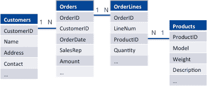
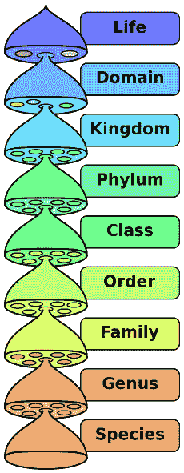
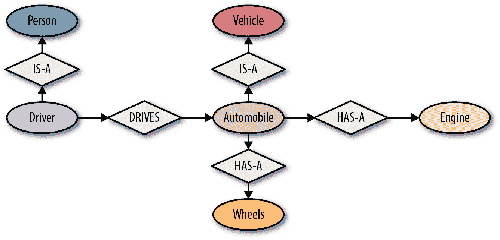
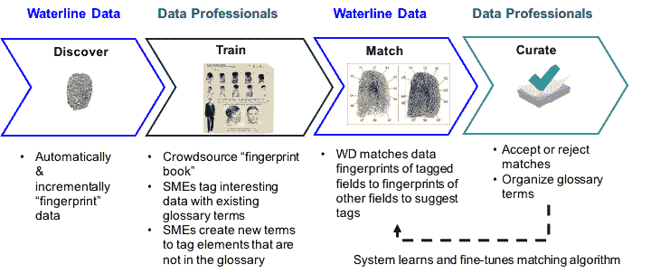
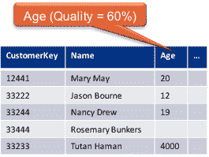

# 第八章：数据湖的分类

数据湖往往具有一些特征，使得它们难以，如果不是不可能的话，进行导航。它们包含大量的数据集。字段名称通常是神秘的，并且某些类型的数据集（例如从在线评论收集的分隔文件和非结构化数据）可能根本没有标题行。即使是标记良好的数据集，其名称也可能不一致，并且具有不同的命名约定。几乎不可能猜测不同文件中可能称为何种属性的名称，因此也就不可能找到这些属性的所有实例。

因此，数据需要在湖中摄入或创建新数据集时进行记录，或者经过广泛的手动检查，这两种选择对于大数据系统中典型的规模和多样性都不可扩展或可管理。

数据目录通过使用一致的业务术语对字段和数据集进行标记，并提供一种类似购物的界面来解决这个问题，允许用户通过描述他们所寻找的内容（使用他们习惯的业务术语）来查找数据集，并通过使用业务术语的标签和描述来理解这些数据集中的数据。在本章中，我们将探讨数据目录的许多用途，并快速查看今天市场上的一些数据目录产品。

# 数据组织

虽然在 第七章 中描述的目录结构和命名约定可以帮助分析师导航大数据集群，但这还不够。以下是它们的不足之处：

+   没有搜索功能。分析师必须浏览到正确的目录，这在他们知道自己想要什么时候是有效的，但当他们仅仅在探索可能的成千上万的来源/文件夹时，这是不切实际的。

+   Hadoop 实用工具像 Hue 允许用户查看文件的初始小片段，但这可能不足以理解大文件内部的内容。为了决定一个文件是否适合他们的项目，分析师可能需要更清楚地了解其包含的内容。例如，是否有纽约的数据？有多少条推文？订单金额是多少？如果分析师正在寻找诸如年龄之类的客户人口统计数据，仅仅预览文件的几行并看到一些年龄数据，并不能告诉他们这些数据是否适用于足够数量的客户。

+   分析师还需要能够确定文件的来源。并非所有数据都可以信任。有些可能来自于失败的数据科学实验，有些可能来自于系统存在显著不一致性的数据，而另一些数据则来自于经过精心策划和信任的来源。文件位于着陆区、黄金区还是工作区？根据分析师的需求，原始数据或经过清洗的数据可能都可以使用。如果数据存储在某人的工作文件夹中，分析师可能需要仔细研究文件描述或与文件或项目所有者交流。同样重要的是了解数据的处理过程。有些属性可能已经经过策划并按照分析师的需求进行了处理，而其他属性可能需要不同的处理方式，并且需要从原始文件中获取。

解决这些缺点的方法与每个图书馆的组织和目录化方式一样，企业需要组织和目录化它们的数据集。

多年来，为分析而寻找合适的输入数据一直是一个未解决的问题（我在这个领域已经工作了超过 30 年）。在本节的其余部分，我们将探讨使用元数据注释和描述数据的不同方法，以增强可查性，并看看词汇表、分类法和本体论如何用于描述、组织和搜索数据集。

接下来，在下一节中，我们将考虑自动化如何帮助。考虑到数据湖中文件的数量庞大，并且通常会存在许多年来人们无视或绕过旨在记录和跟踪数据的流程和程序的情况，目录化过程必须尽可能自动化，并且无论使用何种工具，都必须使分析师能够轻松地记录笔记并使用有意义的业务术语标记字段和数据集。

## 技术元数据

为了帮助描述数据集，我们转向*元数据*或关于数据的数据。例如，在关系数据库中，表定义指定了元数据，包括表名、列名、描述、数据类型、长度等等。然后，表行中的实际值被视为数据。不幸的是，数据与元数据之间的界限很模糊。考虑以下示例（表 8-1），一个名为`Sales`的表，其中包含不同年份产品 ID 的季度和月度销售数据（以百万计）。

表 8-1\. *销售表*

| **ProdID** | **Year** | **Q1** | **Q2** | **Q3** | **Q4** | **Jan** | **Feb** | **Mar** | **…** |
| --- | --- | --- | --- | --- | --- | --- | --- | --- | --- |
| X11899 | 2010 | 5 | 4.5 | 6 | 9 | 1.1 | 1.9 | 2.2 | … |
| F22122 | 2010 | 1.2 | 3.5 | 11 | 1.3 | .2 | .3 | .6 | … |
| X11899 | 2011 | 6 | 6 | 6.5 | 7 | 4.5 | 2 | .5 | … |
| … | … | … | … | … | … | … | … | … | … |

在这个例子中，字段名 `ProdID`、`Year`、`Q1`、`Q2`、`Q3`、`Q4`、`Jan`、`Feb` 等都是元数据，而实际的产品 ID（`X11899`、`F22122`）、年份（`2010`、`2011`）和销售金额是数据。如果分析师正在寻找产品的季度销售数据，通过查看元数据，他们可以知道应该能在这个表中找到它。同样，如果他们正在寻找月度销售数据，他们也知道可以在表中找到相关信息。

但是，我们可以设计与下文显示的相同的表格（表 8-2）。

表 8-2\. *具有更复杂元数据的销售表*

| **ProductID** | **Year** | **Period** | **SalesAmount** |
| --- | --- | --- | --- |
| X11899 | 2010 | Q1 | 5 |
| X11899 | 2010 | Q2 | 4.5 |
| F22122 | 2010 | Q3 | 11 |
| X11899 | 2011 | Q1 | 6 |
| X11899 | 2010 | 一月 | 1.1 |
| X11899 | 2010 | 二月 | 1.9 |
| X11899 | 2010 | 三月 | 2.2 |
| … | … | … | … |

而不是为每个期间单独列出一个列，我们现在为每个期间列出一行。`Period` 列指定我们正在查看的期间是季度（`Q1..Q4`）还是月份（`Jan..Dec`）。尽管两个表包含完全相同的信息且可以互换使用，但在这个例子中，季度编号和月份是数据，而不是元数据。

当然，实际生活比这个简化的例子要复杂得多。就像字段名称可以晦涩或误导一样，数据也可以如此。例如，在实际生活中，第二个表更可能使用代码，并且可能看起来像表 8-3。

表 8-3\. *具有更复杂数据的销售表*

| **ProductID** | **Year** | **Period_Type** | **Period** | **SalesAmount** |
| --- | --- | --- | --- | --- |
| X11899 | 2010 | Q | 1 | 5 |
| X11899 | 2010 | Q | 2 | 4.5 |
| F22122 | 2010 | Q | 3 | 11 |
| X11899 | 2011 | Q | 1 | 6 |
| X11899 | 2010 | M | 1 | 1.1 |
| X11899 | 2010 | M | 2 | 1.9 |
| X11899 | 2010 | M | 3 | 2.2 |
| … | … | … | … | … |

这里，`Period_Type`为 `M` 表示“月”，相关的 `Period` 值为 `2` 表示二月，而 `Period_Type`为 `Q` 表示“季度”，相关的 `Period` 值为 `2` 表示年度的第二季度。对该表进行分析不会显示月份名称，尽管一位聪明的分析师可能能从元数据中推断（看到 `Period_Type` 是 `M` 或 `Q`，以及 `M` 的数量是 `Q` 的三倍）他们正在查看的是月度和季度销售数据。

正如这个例子所说明的，数据和元数据之间没有明确的界限，根据架构设计，相同的信息可以作为数据或元数据进行捕捉。仅依赖元数据无法告知后者表包含哪些种类的期间，寻找月度销售数据的分析师不会知道这个表是否会对他们有帮助，直到查看数据并看到期间包含月份为止。

### 数据分析

由于研究每个表格以理解其包含的内容显著减慢了找到正确表格的过程，*分析*常被用来弥合数据与元数据之间的差距。例如，如果分析人员无需查看数据就能知道`Period`字段包含`Q1..Q4`和`Jan..Dec`的值，他们会立即意识到该表格中可能包含季度和月度销售数据。分析会分析每一列的数据，帮助我们更全面地理解数据及其质量，正如我们在第六章中讨论的那样。除了最频繁的值及其计数外，它还计算：

基数

每个字段中有多少个唯一值。例如，如果两个表格是等价的，则`ProductID`和`Year`列的基数应该在两个表格中相同。

选择性

每个字段值的唯一性。这是通过将字段的基数除以行数来计算的。选择性为 1 或 100%意味着该列中的每个值都是唯一的。

密度

每列中有多少个`NULL`（或缺失值）。密度为 1 或 100%意味着没有`NULL`，而 0%的密度意味着该字段只包含`NULL`（即为空）。

范围、均值和标准差

对于数值字段，计算最小值和最大值，以及均值和标准差。

格式频率

一些数据具有非常独特的格式——例如，美国邮政编码要么是五位数字，要么是九位数字，或者是五位数字后跟一个短划线和四位数字。格式可以帮助识别字段中所包含数据的类型。

通过分析获取的统计信息，以及其他元数据（如字段、表格和文件的名称），被称为*技术元数据*。虽然这有助于我们理解数据的性质，但并不能解决可发现性的问题。事实上，更加糟糕的是，技术元数据通常是简称或者晦涩难懂——例如，就像表格 8-1 中的列被称为`Q1`和`Q2`，而不是`First_Quarter`和`Second_Quarter`，`Year`列可能仅仅被称为`Y`；分析人员因此很难搜索到它，因为`Y`可能代表`Yield`、`Yes`、`Year`或者其他任何东西。

### 分析层次数据

分析数据时，表格数据的分析结果非常直观——统计数据针对每一列进行汇总，涵盖所有行，但是对于像 JSON 或 XML 文件这样的层次数据则更加复杂。

尽管格式可能不同，但在概念上，JSON 文件与表格文件表示相同的数据。例如，订单可以被表示为关系数据库中一组表，或者一组通过所谓的*主键-外键关系*相互关联的表格文件。在图 8-1 中，有四个表用于存储订单、客户和产品的信息。主键-外键关系用线条连接主键字段和外键字段表示，一对多的关系用 1:*N* 表示，这意味着例如在`Customers`表中的每个`CustomerID`可能在`Orders`表中有多个相同`CustomerID`的订单。



###### 图 8-1\. 实体关系图

相同的信息可能以 JSON 格式呈现，其中层次结构表示关系数据库中由主键和外键表达的关系。与四个不同的表不同，单个 JSON 文件将捕获所有属性和关系。以下片段捕获了订单的所有信息。请注意，不需要`CustomerID`和`ProductID`来关联订单、客户和产品。客户信息嵌入在`Order`记录中，产品信息嵌入在`OrderLine`中，依此类推：

```
{"Order"
  {
    "OrderID" : "123R1",
    "Customer" {
      "Name" : "Acme Foods", "Address" : "20 Main St, Booville, MD",
      "Contact" : "Zeke Gan", ...
    }
    "OrderLine" {
      "LineNumber" : "1",
      "Product" {
        "Model" : "XR1900E", "Weight": "20",
        "Description" : "The XR1900E is the latest ...", ...
      }
    "Quantity" : 1,
    ...
  }
}
```

由于两种情况中的信息实际上是相同的，通常会使用一种称为*剪切*的简单过程来从分层文件中提取字段。例如，可以使用其完整分层名称`Order.Customer.Name`来提取客户名称。此名称是一个 XPATH 表达式（XPATH 是用于访问 XML 文档特定部分的查询语言）；剪切基本上为分层文件中的每个唯一 XPATH 表达式创建一个唯一字段。

剪切的一个问题是所谓的“有损性”——在将数据转换为表格格式时会丢失信息。例如，如果一个订单有两个客户和三个订单行项目，没有简单的方法可以保留这些信息。我们是将三个订单行项目归属于第一个客户，还是每个客户都归属于各自的订单行项目？我们是将一些归属于一个客户，一些归属于另一个客户吗？这里没有简单或通用的正确答案。

大多数分析工具，如 Informatica 和 IBM 的工具，要求分层文件在进行分析之前必须明确地被剪切或转换为表格格式，而像 Trifacta、Paxata 或 Waterline Data 这样针对非关系型大数据环境开发的现代工具可以原生地非损失地分析分层数据，或者至少会自动地对分层数据进行剪切。

## 业务元数据

为了帮助分析师找到数据，我们转向*业务元数据*，即关于数据的业务级描述。这些可以采用多种形式。

### 术语表、分类学和本体论

业务元数据通常包含在词汇表、分类法和本体论中。业务词汇表是业务术语及其定义的高度形式化（通常是分层次）列表。一些业务词汇表是分类法，一些是本体论，还有一些只是没有太多语义严谨的分组结构。关于分类法和本体论的区别，有许多激烈的讨论。我的目标在于给你介绍这两者的风格，而不是支持任何一方。有了这个理念，你可以将分类法视为对象的层次结构，其中子类是父类的子类。这也被称为*是-一个*（读作“izah”）关系。图 8-2 展示了我们大多数人在生物课上学习的生物分类法。



###### 图 8-2\. 生物分类学

本体论通常比分类法更为复杂，并支持对象之间的任意关系。例如，除了*是-一个*关系之外，还包括对象和属性之间的*有-一个*关系（例如，汽车有引擎）。作为另一个关系的例子，驾驶员*驾驶*汽车。图 8-3 展示了可能与汽车相关的本体论片段，其中汽车有轮子和引擎，并且是车辆的子类。



###### 图 8-3\. 车辆本体论的一部分

### 行业本体论

已为不同行业开发了许多标准本体论。[ACORD](https://www.acord.org/) 是一个保险行业组织，拥有超过 8,000 个成员组织，帮助保险公司以标准方式交换数据。为了描述正在交换的数据，ACORD 开发了一个业务词汇表，描述了其表单中的每个元素，涵盖了保险业务的许多方面。另一个例子是由两个受尊敬的行业组织——对象管理组织（OMG）和企业数据委员会（EDM）开发的 [金融业务本体论（FIBO）](http://bit.ly/2UJ9nF5)。

公司也可以制定自己的标准。我在 IBM 工作时，我们开发了许多行业模型，其中包括特定行业本体论和相应的分析数据模型。

### 民间分类法

行业标准本体论的挑战在于，虽然它们非常适合上下文搜索，但通常非常复杂，有成千上万个术语，难以跟踪所有元素。此外，采用标准本体论需要对业务团队进行大量的培训，以使用标准术语。

*民间分类法* 是一种非常不严格的结构，试图代表员工对其数据的看法。民间分类法不会培训分析师使用严格的定义，而是收集当前术语，将它们组织成连贯的层次结构，并将其用作业务元数据。

另一个挑战是不同的群体可能对相同的事物有不同的名称。例如，市场营销可能将一个字段称为*prospect name*，销售可能称之为*opportunity name*，而支持可能称之为*customer name*。一些系统可能将这些分别表示为专门用于前景、机会和客户的三个不同数据集，而其他系统则可能将它们合并在一个单一的数据集中，并通过标志指示这是何种类型的联系。

为了避免混淆，不同的群体可以使用不同的民间分类法来使用他们习惯的术语搜索相同的数据。在 Waterline Data，我们选择通过创建不同领域的标签或术语来支持这一点，将一些领域专门用于特定群体，并在多个群体之间共享其他领域。

# 标记

一旦我们有了词汇表、分类法、民间分类法或本体论，为了使用它们来查找数据集，我们必须为这些数据集分配适当的术语和概念。这个过程被称为*标记*，它包括将业务术语与包含这些术语表示的字段或数据集相关联。例如，我们早期在技术元数据的示例中的`Period`字段可能会被标记为`Number_of_Quarter`和`Month`这两个反映其内容的业务术语。分析师们可以通过搜索“month”、“quarter”或“quarter number”来找到它。这个标记过程对于构建目录至关重要。

然而，要能够标记数据集，分析师或数据监护人必须了解它。由于在任何大型企业中没有一个人甚至一个团队知道并理解每一个数据集，这项工作必须在企业众多的数据监护人、数据分析师和其他主题专家之间进行众包。

许多公司，如 Google、Facebook 和 LinkedIn，都有目录，数据监护人和分析师可以手动标记数据集。还有来自公司如 Alation、Informatica 和 Waterline Data 的产品支持这种标记，并允许数据的使用者评分数据集、添加评论等。

我们在第六章中探讨了通过众包部落知识的想法，并将在本章后面看一些可用于编目的产品。

## 自动编目

尽管手动打标签和众包是必要的，但通常这些过程并不足够，并且耗时太长。企业可能拥有数百万个数据集，其中包含数亿个字段，即使每个字段在几分钟内就能打标签（实际上，有时这需要几小时的调查和讨论），我们仍然需要数亿分钟，或数千人年的工作！显然，这是不切实际的。通过与 Google、LinkedIn 和其他组织的团队讨论，我了解到，仅依赖手动流程最终只会给最受欢迎的数据集打标签，导致大量数据集“黑暗”。

如第六章所述，这个问题的解决方案是自动化。新工具利用 AI 和机器学习来识别和自动标记和注释暗数据集中的元素（基于 SME 和分析师提供的标签），以便分析师可以找到并使用这些数据集。Waterline Data 的智能数据目录和 Alation 可能是这种方法的最佳例子。Alation 试图从字段名称中推断字段的含义，并自动解释各种字段名缩写，而 Waterline Data 则根据字段名称（如果有的话）、字段内容和字段上下文自动为字段打标签，因此它尝试为甚至缺少标题（字段名称）的文件打标签。

我们将以 Waterline Data 为例，说明自动目录编制。该工具可以在 Hadoop 集群和关系型数据库中进行爬取，并对每个字段进行指纹识别（指纹是字段属性的集合，包括名称、内容和特征）。然后在分析人员处理不同文件和表格时，允许他们为字段打标签。你可以将其想象成创建“通缉”海报。

Waterline Data 的 AI 驱动分类引擎称为亚里士多德，然后利用这些指纹以及字段上下文自动为未打标签的字段分配标签。上下文是由同一数据集中的其他标签决定的。例如，如果一个数字字段包含从 000 到 999 的三位数，如果它旁边有一个信用卡号码，它很可能是信用卡验证代码；但如果它位于一个所有其他标签都涉及医疗程序属性的表中，则具有完全相同数据的字段很不可能是信用卡验证代码。

最后，分析人员可以接受或拒绝这些推断的标签，如图 8-4 所示，从而训练 Waterline Data 的 AI 引擎。



###### 图 8-4\. 自动标记，由人类分析师批准

该过程极大地减少了手动打标签数据集的需求，因此一旦数据集被编目，新数据集就能被找到。

# 逻辑数据管理

虽然标签是分析师使用熟悉的业务术语查找数据的好方法，但它们也提供了企业数据的一致“逻辑”视图。数据监护人员和分析师现在可以创建一致的政策，适用于所有数据资产，而无需跟踪不同数据集和系统中不同字段的称呼。从数据保护到数据质量，现代数据管理工具正在采用基于标签的政策作为自动化的方式，这些政策在传统上是手动、易错、劳动密集且脆弱的技术，导致数据项目进展缓慢并阻碍了自助服务。

## 敏感数据管理和访问控制

数据治理团队的一个重要关注点是如何管理敏感数据。有许多行业特定和国家特定的法规来管理和保护个人或敏感信息，比如欧洲的 GDPR、美国的 HIPAA 以及国际上的 PCI。此外，公司通常也会维护自己的内部“机密”信息清单，这些信息必须受到保护。我们将受监管合规性和访问限制的任何数据称为*敏感数据*。为了管理敏感数据，企业必须首先对其进行目录化（即找出存储位置），然后通过限制访问或对数据进行掩码来保护它。

传统上，安全管理员必须手动保护每个字段。例如，如果数据库中有一个表，其中包含社会安全号码（SSN）的列，管理员必须找出这一点，并手动创建一个规则，仅允许授权用户访问该字段。如果由于某种原因用户开始将 SSN 放入不同的字段（比如`Notes`字段），直到有人注意到并创建新的规则来保护它，那个字段就会保持不受保护。相反，像 Apache Ranger 和 Cloudera Sentry 这样的现代安全系统依赖于所谓的*基于标签的安全*。这些系统不是为特定数据集和字段定义数据访问和数据掩码策略，而是为特定标签定义策略，然后将这些策略应用于具有这些标签的任何数据集或字段。（有关管理访问的详细讨论，请参阅第九章。）

### 自动化和手动审核

如果没有自动化的敏感数据管理方法，新收集到数据湖的数据集无法在经过人工审查并确定其是否包含敏感信息之前释放供使用。为推动此过程，一些公司尝试创建“隔离区”，新数据集全部进入并留在那里，直到经过人工审查并获得一般使用的认可。尽管隔离区方法合乎逻辑，但这些公司报告称在处理隔离数据集时出现了显著的积压。这是因为该过程耗时且容易出错——这种问题通常由于没有预算进行这类工作而恶化，因为大多数数据集并未立即用于任何项目。不幸的是，这种忽视导致了恶性循环。由于隔离区中的文件对任何人都不可访问，因此它们不可查找，分析师也无法影响策划的顺序。

使用自动敏感数据检测可以实现更加优雅的解决方案。隔离区域的数据集可以通过目录软件自动扫描，并自动标记其包含的敏感数据类型。基于标签的安全性可以应用于自动限制对这些文件的访问或者去标识化敏感数据。

作为额外的预防措施，可以根据需求手动审查数据集，而不是自动提供数据集。这种系统应用自动标记，并将数据集的元数据添加到目录中以便找到数据集。一旦分析师找到想要使用的数据集，该数据集就会经过手动策划以验证标签的正确性，并对任何敏感数据进行去标识化。通过这种方式，虽然所有数据集都是可查找和可用的，但数据监护团队有限的资源会花费在有用的文件和资助项目上。

最后，随着数据集的提供，可以遵守数据主权法律和其他法规。例如，如果英国的分析师要求访问德国数据，而不是将数据传输到英国，他们可能会被允许访问当地的德国数据湖。

## 数据质量

数据质量是本书的其他章节中涵盖的广泛主题。在本章中，我们将重点讨论使用目录捕获和传达有关数据质量的信息。目录在这方面带来的一些重要创新包括能够应用基于标签的数据质量规则，并测量数据集的注释质量和策划质量。

### 基于标签的数据质量规则

较简单的编目技术会为每个物理字段在每个物理表或文件中硬编码数据质量和敏感度规则。更现代化的编目系统，特别是具有自动标记功能的编目系统，允许数据质量专家和数据监护人员定义和应用特定标签的数据质量规则。其核心思想是定义规则，然后将这些规则应用到任何带有该标签的字段上。例如，如果我们为`Age`创建数据质量规则，规定其应该是 0 到 125 之间的数字，我们可以将其应用于任何带有`Age`标签的字段，并计算不符合 0 到 125 之间数字的行数。然后，可以将质量得分捕获为不符合质量规则的行数的百分比。在 图 8-5 中，五行中只有三行符合数据质量规则，因此质量水平为 60%。



###### 图 8-5\. 数据质量水平

下面的部分涵盖了衡量数据质量的其他方式。

### 注释质量

注释质量是指数据集的注释比例。例如，如果每个字段都有一个标签，则注释质量为 100%；如果只有一半的字段有标签，则为 50%，依此类推。注意，注释质量可以同时考虑手动和自动建议的标签。除了标签，还可以包括数据集是否有描述、是否有血统（导入的、手动指定的或自动建议的）、以及是否填充了必需的属性（如主权）。

### 修订质量

修订质量是指有多少标签已被人工批准或修订。最终关注的是可信度，手动修订的数据集通常比自动注释的数据集更可信。

与注释质量不同的是，修订质量不会将自动建议的标签视为“有效”，除非数据监护人员或其他授权用户已经批准。修订质量还可以反映数据集是否有描述和血统（导入的、手动指定的或自动建议的），以及如果血统是自动建议的，则是否已由管理员批准。

### 数据集质量

数据集质量可以总结另外三种质量类型：基于标签的数据质量、注释质量和修订质量。再次强调的是可信度问题；关键在于将所有测量结果融合为一个具有实际意义的单一值。这方面没有最佳实践或公式。方法范围从仅考虑修订标签的质量到试图反映数据质量的每个方面。

例如，如果我们仅考虑策划标签的质量，如果每个字段都有一个质量水平为 100%的策划标签，那么数据集的质量水平可以说是 100%。如果只有一半的字段有策划标签，并且这些字段的平均质量为 80%，那么数据集的质量水平为 40%，依此类推。

然而，即使数据集具有完美形式的字段和相应的标签，如果我们不知道它来自哪里，我们真的可以信任它吗？如果答案是否定的，那么我们如何在单一的衡量中归一化数据的质量和血统的质量？这是一个困难的问题，大多数公司选择（采取了简单的方法）简单地使用不同的属性来反映数据质量或可信度的不同方面。事实上，这是我推荐的解决方案：聚合所有字段的基于标签的质量，以生成数据集级别的一个值，并保持注释和策划质量分开。不要试图提出一个可以反映所有三个因素的公式。

# 关联不同的数据

数据科学工作的一个挑战是，它通常需要数据科学家和数据工程师将以前从未组合过的数据组合起来。然后找到数据的挑战不仅是找到包含所需数据的数据集，还要能够判断这些数据集是否可以组合。这有两个方面：

+   这些数据集能够连接吗？换句话说，有没有一种方法可以正确地将一个数据集中的数据与另一个数据集中的数据相关联？例如，假设一位数据科学家找到了一个包含个人人口统计信息（包括姓名）的好数据集，但是希望将其与人们的收入相关联。搜索收入数据可能会返回多个数据集，但其中哪些可以与人口统计数据相关联？如果任何一个收入数据集包含姓名和地址信息，那将是一个很好的开始。如果没有一个数据集包含该数据，但其中一些包含社会安全号码（SSNs），则数据科学家随后可以搜索一个既包含 SSNs 又包含姓名和地址的数据集，并使用该数据集将收入和人口统计数据集连接在一起。

+   连接能产生有意义的结果吗？即使前面的数据科学家找到了一些可以连接的数据集，如果这些数据集包含非重叠的数据怎么办？例如，如果它们分别包含美国客户的人口统计信息和欧盟客户的收入信息，即使它们都包含姓名和地址，重叠部分将非常少。

为了有用，目录应该帮助用户找到相关的数据并估计组合它的有用性。有几种方法可以实现这一点：

字段名称

在许多设计良好的系统中，假定具有相同名称的字段包含相同的数据，因此分析人员经常在需要连接的表中寻找具有相同名称的列。然而，在较大的系统中，这通常并非如此，并且依赖字段名称可能会导致在具有不同命名约定的不同系统之间产生错误结果。此外，如果没有实际运行连接，也无法确定连接的有用性。

主键和外键

在关系型数据库中，表通过键相关联。这些称为主键-外键（PKFK）或引用完整性关系。举例来说，假设你有一个包含客户信息的表。这个表将有一个主键来唯一标识每个客户，而所有其他表将使用这个键引用该客户。其他表中引用客户表主键的列称为外键。PKFK 关系通常在实体关系（ER）图中捕获，使用如 Erwin Data Modeler（ERwin）或 IDERA 的 ER/Studio 等数据建模工具创建。尽管大多数生产系统避免这些约束因为它们引入的开销，但 PKFK 关系通常也被声明为关系型数据库中的引用完整性约束。PKFK 关系是确保连接返回良好结果的一种好方法。不幸的是，这些关系通常仅在单个系统内可用，并且不能帮助关联跨系统的数据。

使用情况

可以从数据使用中获取有用的连接，例如通过查看现有的连接数据的工件，如数据库视图、ETL 作业和报表。它们还可以通过扫描数据库 SQL 日志来推断哪些查询用于连接数据。尽管这些工件通常通过名称和描述提供某些连接的上下文，并且通常保证连接将生成有用的结果，但 SQL 查询可能不会提供有关为何连接数据以及连接是否成功的信息。

标签

最困难的连接通常是从未进行过的连接，特别是跨不同系统和不同数据格式的连接。目录可以通过帮助用户识别具有相同标签的数据集来极大地帮助这一努力。有时可以通过分析获取的技术元数据来估计连接的有用性，或者可能需要实际执行连接并分析结果。

# 建立血统

目录需要回答的一个关键问题是分析员是否可以信任数据，而知道数据来源是其中的一个重要部分。这被称为数据的*血统*或*来源*（有关血统的详细讨论可见第六章）。目录的一个工作是显示数据资产的血统，并填补血统缺失的地方。

大多数 BI 工具（如 Tableau 和 Qlik）都会捕获指示可视化和报告创建方式的血统信息。同样，大多数 ETL 工具（如 Informatica、IBM InfoSphere 和 Talend）在移动和转换数据时会自动捕获血统信息。然而，许多高级分析是通过 R 和 Python 脚本完成的，许多数据转换和移动是通过 FTP、Pig 或 Python 编写的脚本以及开源 Hadoop 工具（如 Sqoop 和 Flume）完成的。这些工具不会捕获或暴露数据的血统信息。由于只有追溯到源头时血统信息才有用，因此填补这些空白至关重要。一些工具尝试通过抓取系统日志（Cloudera Navigator）、对开源系统进行仪器化以报告血统（Apache Atlas）、要求用户为他们编写的每个作业手动提供血统信息（Apache Falcon），或者通过检查文件内容（IBM InfoSphere Discovery 和 Waterline Data）或 SQL 日志（Manta 和 Alation）来推断血统信息来填补缺失的血统信息。

如你所见，确实没有一种单一的方式可以获得所有的血统信息，但目录负责从可能的地方导入这些信息并将其全部串联起来。 "串联" 指的是连接不同的血统段的过程。例如，一张表可能已经通过 Informatica 的 ETL 工具从 Oracle 数据仓库中摄取到 Parquet 格式的数据湖文件中，然后与通过 Python 脚本从 Twitter 源生成的 JSON 文件进行连接，以创建一个新的 Hive 表，然后被数据准备工具用来创建一个 CSV 文件，最终被加载到数据集市中的表中，再由 BI 工具生成报告。为了全面了解报告中数据的来源，所有这些步骤都需要连接或串联起来。如果任何一步缺失，分析员将无法将报告追溯到原始来源——Oracle 数据仓库和 Twitter 源。

如这个假设性例子所示，数据经常会经过多种工具的多次变更。另一个问题是，即使有源流信息，它通常是用生成数据的工具的语言表达的——而不是所有分析师都精通所有工具。为了能够解释数据经历了什么，分析师需要将步骤以业务术语记录下来。这被称为*业务源流*。不幸的是，今天大多数企业并没有一个地方来捕捉和跟踪业务源流。每个作业和步骤可能会有记录，但通常是在工具内部完成（例如，作为脚本的注释），或者在开发者的笔记本、Excel 文件或维基中完成。目录提供了一个吸引人的场所来集合这样的源流文档，并且使其对数据的使用者可用。

# 数据供应

一旦确认了正确的数据集或数据集合，用户就希望在其他工具中使用它们。为了支持这一点，目录通常提供数据供应选项。数据供应可能就像使用特定工具打开数据集那样简单——例如，如果分析师找到包含销售信息的数据集，他们可能希望在他们喜爱的 BI 工具中打开它以可视化和分析数据。同样地，如果数据科学家或数据工程师发现了一个有趣的原始数据集，他们可能希望在他们喜爱的数据准备工具中打开它。这类似于使用 Mac Finder 或 Microsoft Explorer 查找文件，右键单击文件，然后弹出“打开方式”菜单，列出可以用于该文件的所有程序。由于有多种工具可以用于数据，你应该确保供应能力是可扩展的，并且可以配置为用户可能希望使用的任何工具。

另一个供应操作涉及获取数据访问权。使用数据目录的一个巨大优势是，它使得数据可以被发现，而无需用户直接访问。这意味着当用户找到他们需要的数据时，他们必须在使用之前请求访问权限。访问请求可能只需发送电子邮件给数据所有者，请求将用户添加到访问控制组，以便他们可以直接访问数据；或者可能会复杂到创建一个工单，并启动一个长期的批准工作流程，将数据导入数据湖中。访问管理和摄取将在第九章中详细讨论。

# 构建目录的工具

几家供应商提供数据目录工具，包括 Waterline Smart Data Catalog、Informatica Enterprise Data Catalog、Alation、IBM Watson Knowledge Catalog、AWS Glue 和 Apache Atlas（由 Hortonworks 及其合作伙伴开发）。在选择供应商时，应考虑几个重要的能力：

+   本地大数据处理以实现性能和可伸缩性

+   自动化数据发现和分类

+   与其他企业元数据存储库和单平台目录的集成

+   用户友好性

第一个考虑因素是是否支持本地大数据处理工具，如 Hadoop 或 Spark。数据湖是企业中最大的数据系统，需要大型节点集群的组合能力来处理和目录其包含的数据。Hadoop 的整个关键不仅在于提供一个成本效益的数据存储场所（多年来我们一直有这样的场所），还在于提供一个成本效益的数据*处理*场所。试图在不利用 Hadoop 处理能力的情况下目录 Hadoop 规模的数据是行不通的。虽然一些可用工具是专为 Hadoop 设计的，比如 Alation 和 Collibra 等，但另一些工具如 Cloudera Navigator 或 AWS Glue 则是为关系数据库设计的，要求数据加载到 RDBMS 中或者有专有引擎在 Hadoop 之外运行，不能扩展以处理数据湖规模。

另一个问题是数据湖中数据的范围和复杂性使得人类无法手动对所有数据进行分类或标记业务元数据。因此，需要采用自动化方法来完成此分类。虽然所有提到的工具都允许分析师以某种方式标记数据，但像 Waterline Data 这样的一些工具提供了一个自动发现引擎，从分析师标记中学习，并自动分类其他数据集。

当然，Hadoop 数据湖只是企业数据生态系统的一部分，因此必须与其余的治理基础设施集成。许多企业可能已经在大量元数据投资，需要将其整合到新的数据湖中。有几种工具提供企业数据存储库。虽然 Hadoop 可能是处理 Hadoop 内部数据和其他来源数据的最可扩展和成本效益最高的平台，但像 Cloudera Navigator 或 AWS Glue 这样的单平台解决方案具有限制性，并且不能满足企业需求。

最后，许多元数据解决方案是为 IT 和治理专家设计的。为了被广泛采用，库存解决方案必须直观且可供非技术分析师使用，通常无需太多培训，如果有的话。面向业务分析师的用户界面有助于提供一个清晰的视图，显示业务术语和描述，而不是填入大量技术细节。对于某些用户来说，技术细节当然是必要的，并且应该易于访问，但不应该强加给业务用户。一些目录通过具有不同基于角色的视图来实现此目标，而其他则提供业务视图，并提供了一种让技术用户深入查看技术细节的方式。

## 工具比较

表 8-4 总结了一些数据目录产品的功能。基本上有三组工具：

+   企业目录工具试图对企业中所有数据进行目录化。

+   单平台目录工具专注于特定平台。

+   传统/关系型的编目工具不提供本地的大数据支持。这些工具不能在 Hadoop 或其他大数据环境中本地运行，并且需要关系接口（如 Hive）来有意义地编目大数据。它们有时被放置在数据池中（一个构建在大数据平台上的数据仓库，如第五章中所述），但不能支持以本地 Hadoop 文件格式存储大量原始数据的数据湖。

Table 8-4\. *目录工具比较*

|   | **大数据支持** | **标记** | **企业** | **面向业务分析师的用户界面** |
| --- | --- | --- | --- | --- |
| **企业** |
| Waterline Data | 本地 | 自动化 | Y | Y |
| Informatica Enterprise Data Catalog | 本地 | 手动 | Y | Y |
| **单一平台** |
| Cloudera Navigator | 本地 | 手动 |   |   |
| Apache Atlas | 本地 | 手动 |   |   |
| AWS Glue | 本地 | 手动 |   |   |
| IBM Watson Catalog | 本地 | 自动化 |   | Y |
| **传统/关系型** |
| Alation | 仅 Hive | 手动 | Y | Y |
| Collibra | 仅 Hive | 手动 | Y | Y |

# 数据海洋

如果目录提供位置透明度，那么我们是否甚至需要数据湖呢？为什么不将*所有*数据编目并提供在所谓的“数据海洋”中？一些企业正在着手进行这样雄心勃勃的项目，但这些项目的范围和复杂性非常惊人，可能需要数年的专注努力。然而，这种替代方案非常吸引人，可以避免频繁移动和复制数据，因此一些早期采用者愿意踏上这个旅程。此外，当前的监管环境要求数据透明性，规定数据隐私，并规定数据的适当使用，这是强制企业在数据编目中创建单一的可见性、治理和审计点的强大动力。监管合规和数据海洋的努力是协同的，并且经常手牵手工作。

# 结论

数据目录是数据湖和企业数据生态系统的一个组成部分。随着数据呈指数级增长并且数据使用渗透到业务的各个方面，有一种自动化编目数据的方式并使用户能够找到、理解和信任数据，这是通向数据驱动决策的必要第一步。
