# 第九章：管理数据访问

本章描述了向分析师提供数据湖中数据访问的挑战，并提出了几种最佳实践。数据湖在几个方面与传统数据存储不同：

载入

数据集、用户和变更的数量非常庞大。

无摩擦地摄取

因为数据湖将数据存储以备将来尚未确定的分析使用，通常在摄取数据时不进行或仅进行最少的处理。

加密

通常存在政府或内部法规要求保护敏感或个人信息，但这些数据又需要用于分析。

工作的探索性质

很多数据科学工作无法被 IT 员工预料到。数据科学家通常不知道在庞大而多样化的数据存储中有什么可用的内容。这为传统方法创建了一个进退两难的局面：如果分析师找不到他们无权访问的数据，他们就无法请求访问权限。

最简单的访问模式是为所有分析师提供对所有数据的访问权限。不幸的是，如果数据受到政府法规的约束（例如包含个人可识别信息或信用卡信息的情况），或者被版权保护并限制访问（例如因特定或有限用途而从外部来源购买或获取的数据），或者被公司认为是竞争或其他原因敏感和关键的信息，这是无法做到的。大多数公司都有他们认为敏感的数据——从商业机密到客户列表再到工程设计和财务信息。因此，除了一组主要处理公共数据、研究数据和非敏感内部数据的有限项目外，通常不可能向所有人提供对数据湖中所有数据的完全访问权限。

# 授权或访问控制

授权是管理数据访问的常见方式。它涉及明确地分配权限，以执行特定的*操作*（如读取或更新）和特定的*数据资产*（如文件和表），给特定的*分析师*。为了简化这一过程，安全管理员通常创建*角色*（权限集合）并将这些角色分配给分析师群体。

大多数遗留系统提供其自身的内部授权机制。由于越来越多的公司选择在云中使用更多的应用程序而不是使用单一供应商提供的单一集成应用程序，单点登录（SSO）系统变得非常流行。通过单点登录，用户只需登录一次，他们的凭据就能被所有应用程序和系统支持。

不幸的是，这种方法存在几个挑战。特别是：

+   预测数据分析师在项目中所需的数据是非常困难的。

+   除非分析师能访问数据，否则他们无法确定他们是否需要这些数据。

+   维护授权可能需要高昂的成本，这些成本可能分摊在多个时间段和活动中：

    +   每当新员工入职时，安全管理员需要提供适当的授权。

    +   当员工更改角色或项目时，安全管理员需要提供新的权限并撤销旧的权限。

    +   当出现新的数据集时，安全管理员需要确定所有可能需要访问该数据集的用户。

    +   当分析师需要一个包含敏感数据的数据集时，需要创建一个相应的数据集的版本，以删除或去标识化敏感数据。

挑战如此巨大，以至于一些企业不得不监控访问日志，以确保分析师只能访问适当的数据。不幸的是，这种方法只能在事后发现问题，无法防止人员有意使用错误的数据，也无法帮助他们意外地避免使用错误的数据。想要更加积极主动的企业采取各种方法来应对这些挑战，包括：

+   使用基于标签的数据访问策略

+   通过删除、加密或用生成的随机数据替换来去标识化敏感数据，并向所有人授予对这些去标识化数据集的访问权限。

+   通过创建一个仅包含元数据的目录来实现自助访问管理，分析师可以从数据集所有者或安全管理员那里找到所有可用的数据集，然后请求访问相关的数据集。

我们将在接下来的章节中探讨这些不同的访问控制方法。

# 基于标签的数据访问策略

传统的访问控制是基于物理文件和文件夹的。例如，Hadoop 文件系统（HDFS）支持典型的 Linux 访问控制列表（ACLs）。"设置文件访问控制列表"（`-setfacl`）命令允许管理员或文件所有者指定哪些用户和用户组可以对特定文件或文件夹进行什么样的访问。例如，如果一个文件包含工资信息，管理员可以使用以下命令使人力资源（HR）部门的用户能够阅读它：

```
hdfs dfs -setfacl -m group:human_resources:r-- /salaries.csv
```

这条命令基本上表示任何*human_resources*组中的用户都可以读取*salaries.csv*文件。

当然，如果一个数据湖包含数百万个文件，手动为每个文件设置权限显然是不太实际的。因此，管理员通常会设置文件夹，并为所有文件夹或文件夹树中的所有文件授予访问权限。例如，他们可以创建一个*hr_sensitive*文件夹，并允许*hr*组中的任何用户读取该文件夹中的任何文件。通常这种方法是足够的，但它也带来一些重大挑战，包括：

+   需要支持反映组织实际情况的复杂权限方案

+   需要确定和设置每个文件的权限

+   需要检测和处理模式变更

大型企业中的组织实际情况通常非常复杂。例如，如果我们决定，与其给予所有 HR 用户查看 *hr_sensitive* 文件夹中所有数据的权限，我们希望只有来自特定部门的 HR 用户可以查看该部门的数据，那么我们需要创建多个子文件夹——每个部门一个（例如 *human_resources/engineering*、*human_resources/sales* 等），并为每个部门创建一个单独的组（例如 *hr_engineering*、*hr_sales* 等）。

所有进入数据湖的新文件都必须进行检查，以确定谁应该访问它。一种方法是将所有新数据隔离，直到数据管理者或安全分析师能够审核它，例如将其保存在单独的文件夹中——一个检疫区，如 图 9-1 所示。有时，公司可能会采取捷径，假设例如来自 HR 应用的任何数据只能由 HR 访问。但总的来说，对于数以百万计的文件，手动完成这项任务是不可能的。然而，公司不能冒险将数据对所有人开放，直到有人确定其内容及其应访问者。


###### 图 9-1\. 检疫区的手动审核

虽然这在摄入数据方面有一些可行性，尤其是如果很少添加新类型的数据到集合中，但这对于在数据湖中创建的数据并不实际。如果必须将数据湖中创建的任何新文件隔离，直到有人手动检查并确定访问控制策略，那么数据湖中的工作将会完全停滞。

在某些 Hadoop 发行版中实施的一个更加优雅的解决方案是基于标签的安全性。例如，Cloudera Navigator 和 Apache Ranger（作为 Hortonworks Hadoop 发行版的一部分提供）支持基于标签的策略。使用这些工具，安全管理员可以设置使用标签的策略，而不是为每个文件和文件夹单独指定 ACL。虽然你仍然需要一个检疫区，分析员可以简单地给文件和文件夹打上标签，而不是为每一个手动创建 ACL，如 图 9-2 所示。

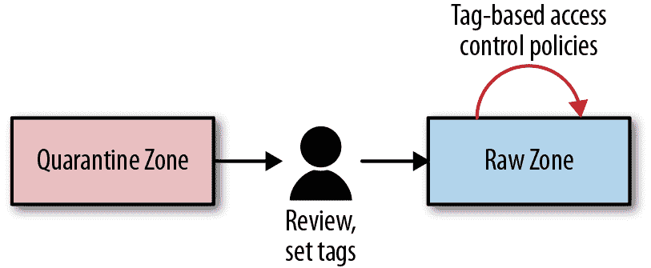

###### 图 9-2\. 基于标签策略的检疫过程

这些标签可以在本地目录工具（如 Cloudera Navigator 和 Apache Atlas）中设置，并且会被策略访问控制工具（如 Apache Ranger）自动捕捉。例如，[Hortonworks Ranger 教程](http://bit.ly/2MTK809) 展示了如何为任何标记为 `PII`（个人身份信息）的文件设置策略，无论其位于何处。

基于标签的访问控制策略方法还解决了反映复杂组织现实的挑战，因为你不再试图在文件夹结构中反映它。相反，文件和文件夹可以随意存放，策略可以任意复杂，并依赖于多个标签。例如，要根据部门来细化访问控制策略，你只需为文件添加包含部门名称（`工程`、`销售`等）的标签，并为每个标签组合（例如，`人力资源`和`工程`、`人力资源`和`销售`）创建单独的策略。你无需创建新文件夹、移动数据，或重写依赖于旧文件夹结构的应用程序。

标签提供了一种强大的管理和组织数据的方式。事实上，使用标签，你甚至不需要一个单独的隔离区域。相反，新接收的文件可以在摄取过程中标记为“隔离”，并且可以创建策略来限制除数据监护人外的任何人访问这些文件。数据监护人随后可以审核这些文件，使用适当的敏感数据标签进行标记，最后移除隔离标签，正如在图 9-3 中所示。

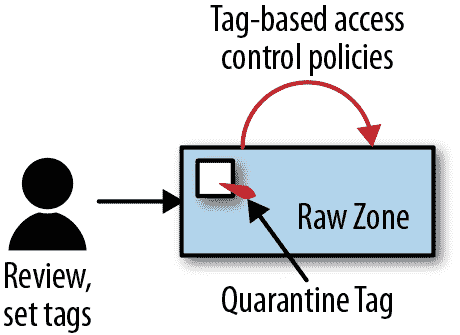

###### 图 9-3\. 使用标签隔离文件

虽然基于标签的安全性解决了围绕数据的组织挑战并加快了手动审核流程，但标签与数据湖的前提存在直接冲突。在数据湖中，数据存储在未来未确定的情况下，并通过无摩擦摄入加载，而无需任何处理。无摩擦摄入使数据加载快速，并对源系统施加最小的压力，但也使得很难弄清楚你刚刚接收到了什么样的数据，以及它是否敏感，无论是传统意义上还是公司特定意义上。

此外，分析人员可能会因为大量的新数据而感到不知所措，并且失去及时处理隔离项目的能力。检测敏感数据是一项具有挑战性的任务。分析人员如何确切地知道一个百万行文件中的某些行（也许成千上万！）没有包含社会安全号码或其他敏感标识符，而这些行刚好存储在一个名为`Notes`的字段中？查看前几百行可能不会显示任何内容——事实上，有些列可能完全为空——而对整个数据集进行大规模查询将需要时间，并且可能需要脚本编写或开发专门的工具。

即使分析员能够编写和运行检测敏感数据所需的脚本，模式和数据变化仍然是一个额外的挑战。如果新文件进来，分析员没有在其中找到任何敏感信息，那么后续对该文件的更改（新的分区）可能会包含额外的字段，这些字段确实包含敏感数据，或者这些数据可能被添加到最初不敏感的字段中。

处理敏感数据和访问控制管理的唯一实际解决方案是自动化。像 Informatica、Waterline Data 和 Dataguise 这样的工具会扫描所有新文件——新摄取的文件、之前摄取文件的新分区以及在数据湖中创建的新文件——并自动检测敏感数据并标记文件，如图 9-4 所示。然后将这些标记导出到本地目录工具，如 Apache Atlas，以用于执行基于标记的策略。

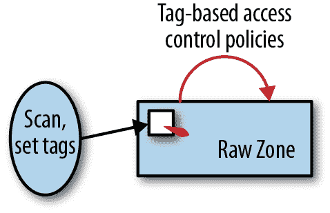

###### 图 9-4\. 自动标记敏感数据

# 去识别敏感数据

一旦识别出敏感数据，就可以限制对其的访问。不幸的是，这意味着这些数据无法用于分析。相反，企业通常会加密敏感数据，并允许所有人访问加密的数据集。可以应用不同形式的加密，包括：

+   透明加密

+   显式加密

+   去识别

为了描述这些内容，我们假设有一个数据集——简单起见，我们假设它是表格的——其中包含医疗保健提供者的一些患者信息（参见图 9-5）。

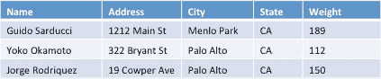

###### 图 9-5\. 患者信息数据集的示例

*透明加密*（例如 Cloudera Navigator 提供的）会在写入时自动对数据进行磁盘加密，并在读取时自动解密，如图 9-6 所示。这是为了防止有人访问或复制原始磁盘卷，并一字节一字节地读取以重建数据文件，从而避开所有访问控制。

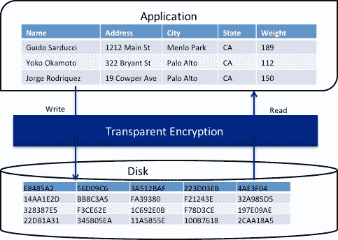

###### 图 9-6\. 透明加密

然而，透明加密无法阻止具有文件读取权限的分析员查看敏感数据。出于这个原因，企业通常部署*显式加密*，并单独加密每个值，如图 9-7 所示。尽管这看起来很简单——有许多开源加密功能可用，并且提供加密的各种工具，如 Dataguise、Informatica、IBM、Privitar、Vormetric 等——但它使敏感数据完全无法使用，正如图中所示。

这给试图使用数据集的数据科学家带来了真正的问题。正如在第一章中提到的，我采访的一位数据科学家告诉我，在他的公司，除非能证明属性不敏感，否则数据湖中的所有数据都会被加密。这位数据科学家对这种做法并不赞同。他反问道：“如果我找不到或查看属性，我如何能证明它不是敏感的？”

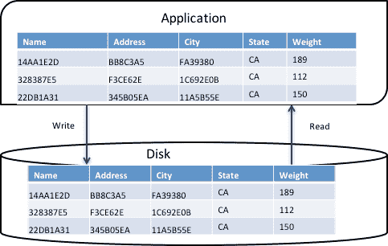

###### 图 9-7\. 明确的加密使数据无法使用。

即使只加密真正敏感的属性，这些属性通常编码着数据科学家用来推导模型变量的重要信息。例如，在一个数据集中包含人名但性别信息缺失的情况下，通常可以通过名字推断出性别。有时还可以通过名字的首尾字母推断出种族。如果名字被加密，就无法推导出这些信息。同样，虽然加密地址信息是必要的，但它阻止了地理分析。为了在保护个人隐私的同时实现这些分析，开发了一类称为“去识别”或“匿名化”的技术。这些技术用随机生成的值替换敏感信息，保留原始数据值的重要特征。例如，一个民族名字可以用反映相同种族的随机名字替换，地址可以用 10 英里范围内的其他有效地址替换，如图 9-8 所示。

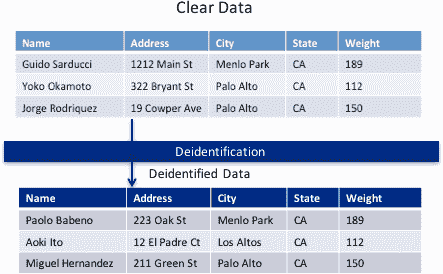

###### 图 9-8\. 数据去识别

同样，包括 Dataguise、Privitar、IBM InfoSphere Optim 和 Informatica 在内的多个工具提供这些功能。

虽然在许多情况下，去识别或加密敏感数据是有效的解决方案，但有时分析师需要访问真实数据。此外，即使没有敏感数据，大多数企业也将数据访问分隔化，并仅按需提供。由于数据科学本质上是探索性的，很难预测分析师需要哪些数据。即使是简单的分析也需要理解可用数据和获取访问权限。作为非常高维护、严密管理权限与无需管理的自由访问之间的折中，公司正在转向自服务访问管理。

## 数据主权与法规合规性

为了遵守区域、国家和行业的数据保护法规，需要收集更多关于数据集的信息，并存储在其元数据中。例如，为了遵守数据主权法，重要的是要知道数据集来自哪个国家，更重要的是，它包含哪个国家公民的数据。而不是为每个物理数据集硬编码政策，可以制定策略，例如，指定德国数据不能在欧盟之外复制。

数据谱系，在 第六章 中详细讨论，还可以用于追踪数据源的原始国家。Figure 9-9 说明了这种工作原理。对于每个数据集，我们创建一个`Provenance`属性，用于记录数据集的来源。例如，对于源自美国的数据集，此属性将设置为`USA`。如果通过合并多个其他数据集创建数据集，则将每个数据来源的来源添加到`Provenance`属性中。因此，如果从美国的 CRM 系统和德国的 ERP 系统加载数据到英国的数据仓库，然后再加载到法国的数据湖中，最终数据集的`Provenance`属性将包含`USA`、`Germany`、`UK`和`France`的值。然后，策略可以指定，如果`Provenance`属性包含`Germany`，则将适用某些规则。

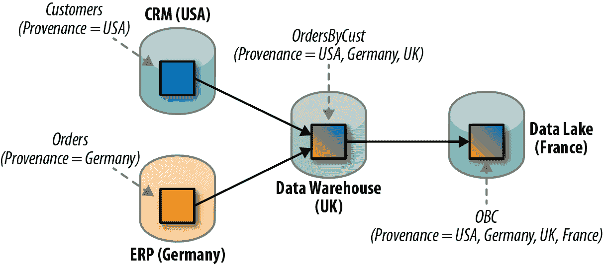

###### Figure 9-9\. 追溯来源

类似地，第八章中描述的“技术元数据”中的分析可以用来确定数据集中任何地址的来源。考虑到图表 9-10 和 9-11 中的表格。第一个是一个`Customers`表，包含客户的姓名和地址，而第二个表格包含了在`Country`字段中具有特定值的`Customers`表中的行数，这是通过分析确定的。

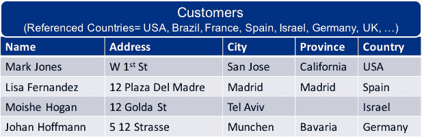

###### Figure 9-10\. 分配具有国家来源的属性

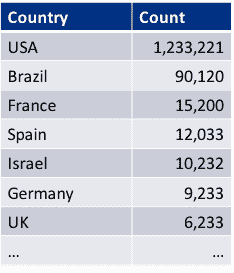

###### Figure 9-11\. 每个国家的行数统计

然后可以创建并填充一个`Referenced Countries`属性（最好是通过程序自动填充），填充的值来自`Country`列的分析结果。并且可以制定一个策略，例如，如果数据集具有`Referenced Countries`属性并且其中包含`Germany`作为条目，则应适用特定规则。这种方法可以遵守像德国和中国等国家的数据主权法，禁止将其公民的数据移出该国。

除了对数据来源的关注之外，许多法规还规定特定数据集的使用限制。例如，GDPR 规定客户数据只能用于收集它的业务目的，任何额外的使用需要明确的客户同意。所有这些信息都需要被捕捉和存储在某个地方，以便在授予数据访问权限时进行考虑，而数据目录则是存储和管理这些信息的理想地点。

# 自助访问管理

尽管积极和自动保护敏感数据是合理的，并且通常是政府法规要求的，但访问控制通常超出敏感数据，需要考虑在组织中谁应该访问什么数据。例如，许多公司不会将客户为其产品支付的价格与销售团队和管理层以外的人员分享，也不会与项目团队外的人员分享即将推出的产品的工程设计等。正如我们所见，管理这种访问可以在创建新文件时积极进行，也可以在用户添加到数据湖、更改项目或更改职责时按需进行，使用自助访问管理。

数据湖的前提是保留未来尚未确定用途的数据。显而易见的问题是，在未来谁需要访问哪些数据以及为什么会变得非常困难。另一方面，如果分析师们无法访问数据并且不知道其存在，他们将永远无法找到并使用它。自助访问管理与数据目录结合解决了这个问题，使所有数据都能被找到。这个系统通过在某人实际需要数据进行项目时移交访问控制和数据屏蔽决策来解决这个问题。该系统提供了几个独特的特点和好处：

+   分析师可以探索（搜索和浏览）可能提供给他们的所有数据集的元数据。

+   分析师可以向数据集所有者申请访问权限。

+   数据集的所有者决定谁可以访问它，以何种方式以及多长时间。

+   所有请求、理由和权限都会被跟踪以供安全审计目的。

图 9-12 到图 9-15 展示了一个自助访问管理和数据提供系统。具体步骤如下：

1.  数据所有者将数据资产发布到目录（图 9-12）。此时，分析师们能够找到数据，但无权读取或更改。

    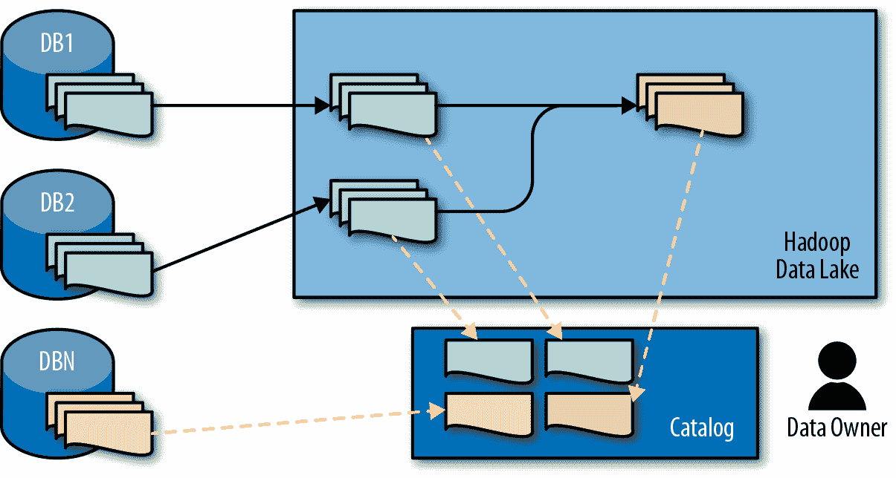

    ###### 图 9-12\. 发布数据

1.  数据分析师在目录中找到数据集（图 9-13）。由于分析师无权访问数据，因此必须在元数据上进行搜索。这也是为什么拥有良好的元数据和业务级描述非常重要，正如前一章所述。

    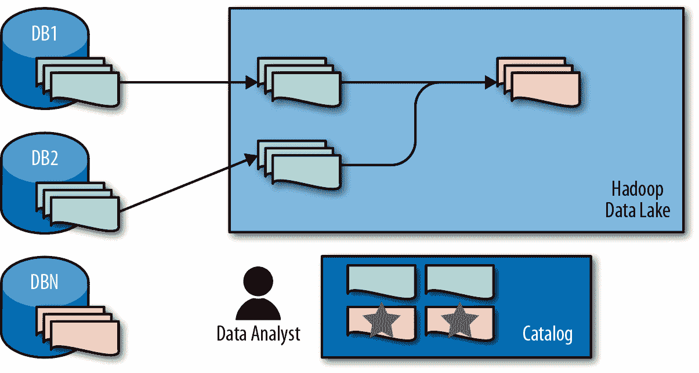

    ###### Figure 9-13\. 分析师找到数据

1.  分析师从数据所有者那里请求访问（Figure 9-14）。分析师可以使用目录查找数据，但无法访问它；他们必须向数据所有者请求许可才能使用。这样，数据所有者完全控制谁使用数据以及原因。

    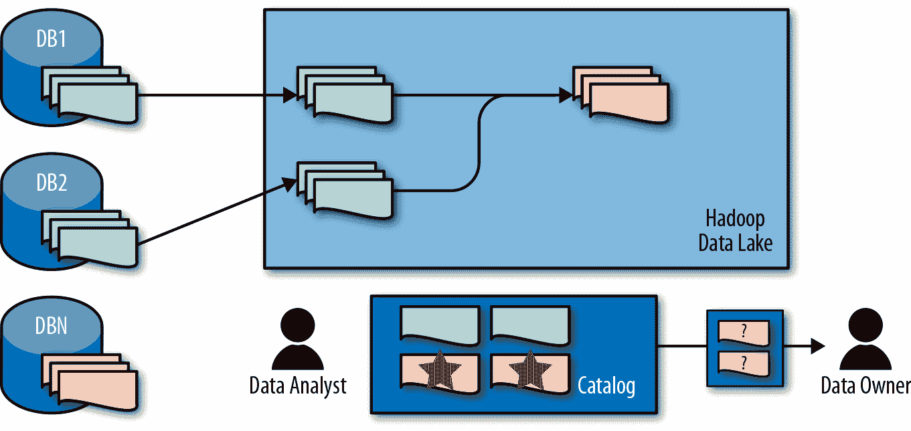

    ###### Figure 9-14\. 分析师请求访问

1.  数据所有者批准了请求（Figure 9-15）。

    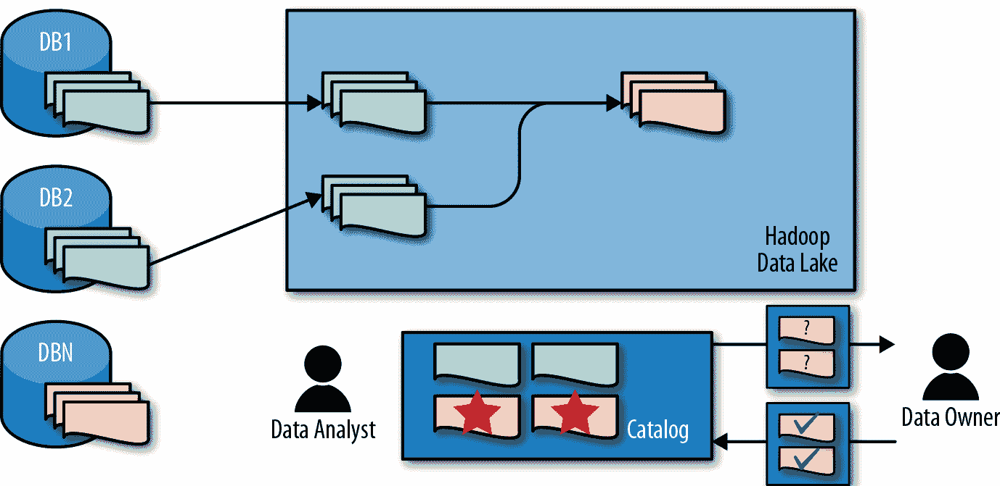

    ###### Figure 9-15\. 访问请求已批准

1.  数据集被提供（供应）给分析师（Figure 9-16）。这可以通过多种方式完成，从给分析师访问源系统到将数据复制到分析师的个人工作区域。该过程还可能包括脱敏步骤以掩盖敏感数据。关键在于，仅在请求数据集并且确实有业务理由时才执行这项工作。

    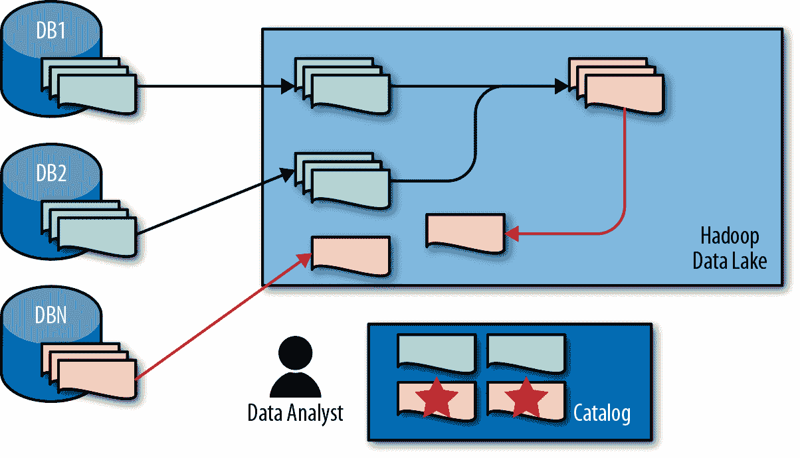

    ###### Figure 9-16\. 请求的数据集被提供给数据湖，并提供给数据分析师

采用这种方法有很多优势。正如我为这本书采访的一位大型企业的 IT 高管所解释的那样：

> 人们害怕分享数据，除非他们能确保它被适当地使用。通过让他们决定谁可以使用数据以及如何使用，我们创造了一个他们感到安全分享数据的环境。在我们实施这种自助服务方法之前，获取数据需要数月的上下管理层的谈判。每个人总是尽可能地要求一切，以确保他们不必再经历谈判的痛苦和延迟。这让数据所有者对请求者真正的需求感到不信任，并迫使他们实施严格的审查流程，请求者必须提供非常详细的需求和理由，导致更多的工作和更多的延迟。在这样的环境中几乎不可能探索数据。
> 
> 通过自助访问管理，请求者可以在甚至发出访问请求之前就研究目录中的数据集，并找出他们需要的内容，因此请求减少了很多，即使在进行请求时，由于分析师已经在目录中进行了相当广泛的探索并找到了适合目的的数据，请求的数据量也大大减少。最后，由于访问请求相当自动化，额外的请求也是快速和简单的。

简而言之，这种自助服务流程让数据所有者控制谁使用他们的数据，并使分析师能够探索数据集并快速获取访问权限。此外，通过为特定时间段授予数据访问权限，这种方法消除了管理所有可能数据集权限所需的维护工作，以及项目结束后分析师可能保留的遗留访问权限，以防万一他们可能需要。采用自助服务方法，他们可以简单地提交另一个请求，以快速恢复访问权限。

一旦获得授权，可以以多种方式向分析师提供对数据的物理访问，具体取决于数据集的性质和项目的需求。授予访问权限的一种流行方式是为数据集创建外部 Hive 表。外部 Hive 表不复制或更改数据集，并且可以通过可忽略的计算成本（因为它们只是元数据定义）进行创建或删除。然后向分析师授予访问外部 Hive 表的权限。

对于某些项目，分析师可能希望复制文件或创建自己的 Hive 表（例如，使用告知 Hive 解析和解释数据的不同输入格式）。在这种情况下，他们可以获得数据集的副本或被授予对数据集本身的读取访问权限。

## 配置数据

上一节介绍了自助数据访问的好处，并概述了数据配置的概述。数据配置是构建数据湖的重要部分，并值得进行更深入的讨论。如图 9-17 所示，它包括四个步骤。


###### 图 9-17. 数据配置步骤

第一步是由想要访问数据集的分析师完成。请求通常描述：

+   需要哪些数据（哪个数据集以及是整个数据集还是部分数据集）

+   谁需要访问权限（需要访问数据的用户或组列表）

+   项目（所需数据的项目）

+   访问数据的业务理由（为何需要数据）

+   数据需要多长时间（访问权限撤销后的时间段）

+   如何配置它（用户是否应该在原地获取数据，或者是否应将其复制到指定的数据库或数据湖）

如果数据将被复制，请求还应明确说明：

+   数据应放在何处

+   是否应该是私有副本还是可以共享的

+   是否应该是一次性快照还是应该保持更新

+   访问权限到期后是否应保持更新或删除

通常通过像 ServiceNow 或 Jira 这样的标准案例跟踪系统或使用像 Pegasystems 或 Eccentex 这样的 BPM/工作流/案例管理系统进行申请。跟踪系统将请求路由到数据所有者或管理者。在某些情况下，可能会实施自动批准规则——例如，如果请求者属于某个特定组，可以自动批准审批。如果需要将数据复制到其他地方，则目标系统的管理员可能需要签署该请求。

逻辑可能会变得更复杂。例如，如果请求者在源数据处有访问权限，但希望将其复制到其他地方，则只有目标管理员可能需要批准该请求。相反，如果请求者请求共享副本，并且数据已经存在于目标系统中，则只有源数据管理者可能需要批准，因为目标系统不会使用额外的存储空间。

跟踪系统还提供了单一访问点和审计功能，因此公司可以记录谁使用了什么，以及出于什么目的。这不仅是良好的数据安全卫生习惯，而且通常是像 GDPR 这样的外部法规要求。

由于数据是从其他地方复制过来的，所以大部分时间请求的数据不会被修改，而是用来创建一个新的数据集。因此，共享这些数据给多个请求者非常有吸引力。数据被复制到一个预定义的位置（通常是在着陆区或原始区），只要有任何未处理的请求者，就会保持更新。

让我们通过一个分配场景来进行工作。想象一下，我们有一个数据仓库，其中有一个名为`Customers`的表，如图 9-18 所示，是一个小矩形。名为 Fred 的用户请求从 6 月 1 日到 8 月 5 日通过数据湖中的共享副本访问该表。

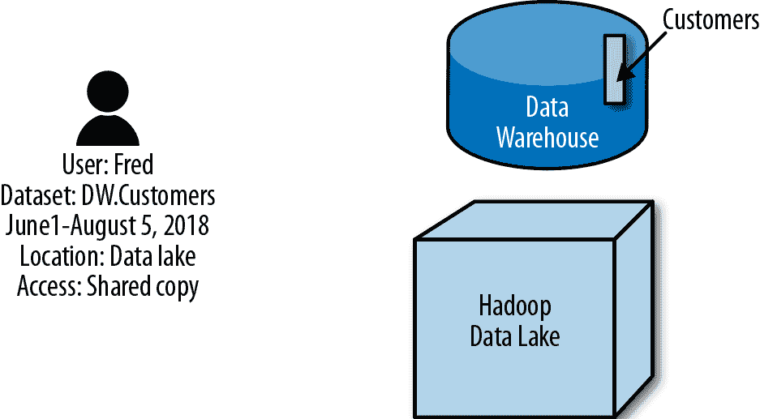

###### 图 9-18\. 用户请求访问数据仓库中的数据集

假设请求被批准，表将在 6 月 1 日如图 9-19 所示的暂存区标准路径中被复制。表中的所有数据将被复制到一个目录，其名称与复制时的日期相匹配。

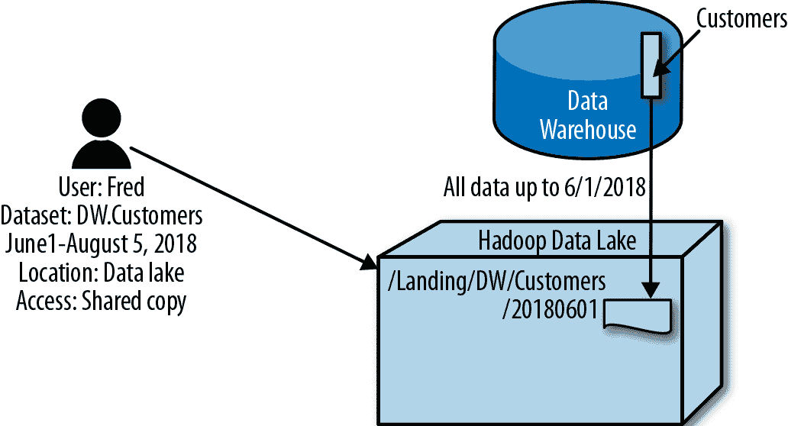

###### 图 9-19\. 数据集已分配到数据湖

第二天，仅复制自初始副本以来发生的更改到新目录。其名称将反映那一天（在本例中是 6 月 2 日），如图 9-20 所示。

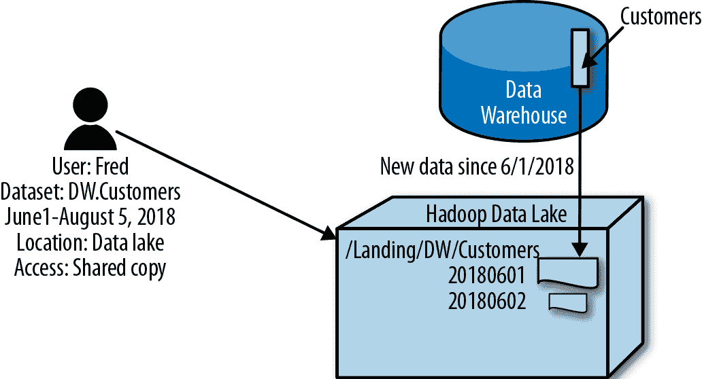

###### 图 9-20\. 数据湖已从数据仓库中更新为最新更改

这将持续到请求在 2018 年 8 月 5 日到期。

现在想象一下，另一个用户曼迪从 6 月 15 日到 7 月 15 日请求相同的表格，如图 9-21 所示。

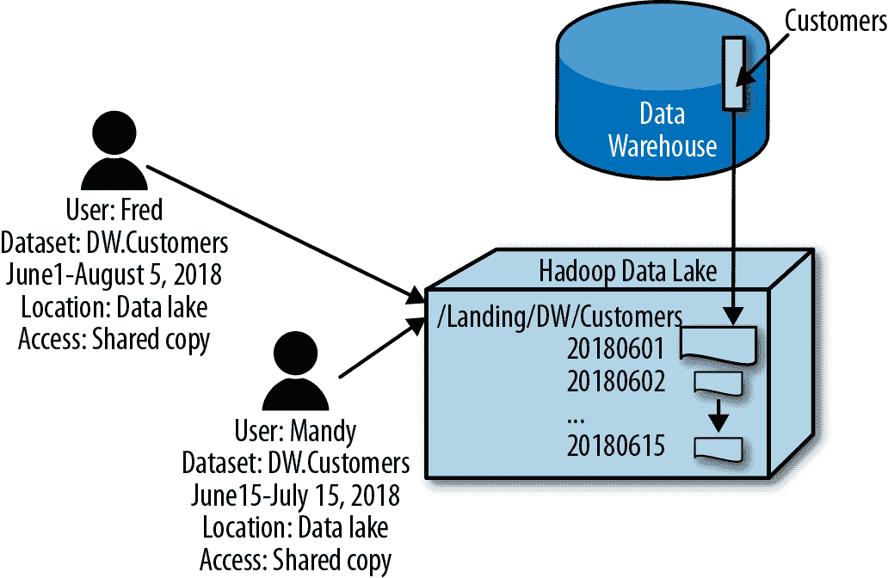

###### 图 9-21。另一个用户请求相同的数据集。

如果她的请求得到批准，在 6 月 15 日，曼迪将获得对*/Landing/DW/Customers*的访问——一个`Customers`表的共享副本，如图 9-22 所示。曼迪将继续在 7 月 14 日之前保持访问权限。

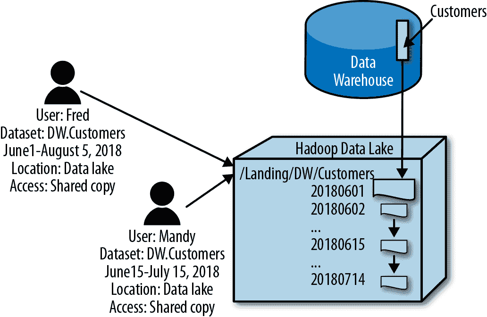

###### 图 9-22。两个用户将使用同一个预设表的副本。

在 7 月 15 日，曼迪的访问将到期，弗雷德将再次成为这个数据集的唯一用户，如图 9-23 所示。

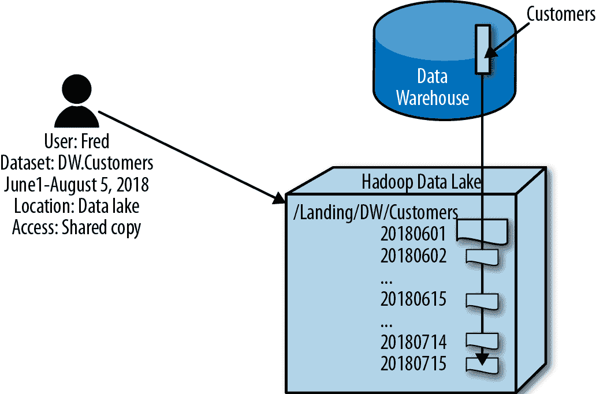

###### 图 9-23。第二个用户的访问权过期后，再次只有一个用户可以访问数据集。

弗雷德将继续使用这个数据集直到 8 月 4 日，数据集将继续更新，如图 9-24 所示。

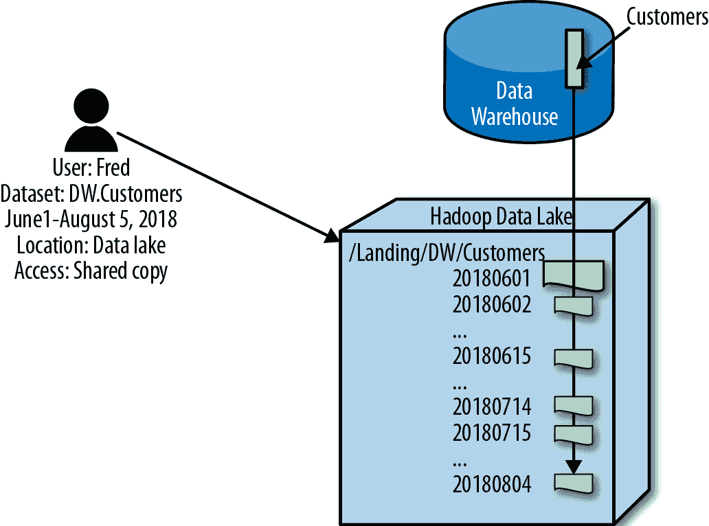

###### 图 9-24。只要还有任何用户使用它，数据集将继续更新。

然后，在 8 月 5 日，弗雷德的访问权将到期，这个数据集将没有用户。更新将停止，直到有新用户请求它，如图 9-25 所示，或者系统可能以较少频率（比如每月）继续更新它。

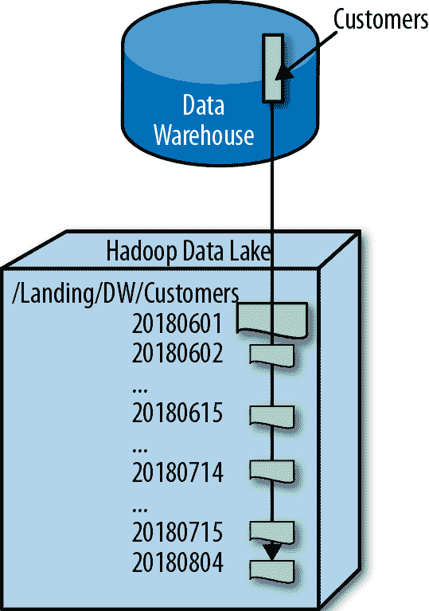

###### 图 9-25。当没有更多用户使用数据集时，更新将停止。

如果一个新用户请求这个表格，它将更新到 8 月 5 日（更新停止时）和访问请求日期之间添加的任何数据——例如，8 月 15 日的情况。这样，8 月 15 日的文件夹将包含 8 月 5 日到 15 日之间所有的更新，如图 9-26 所示。

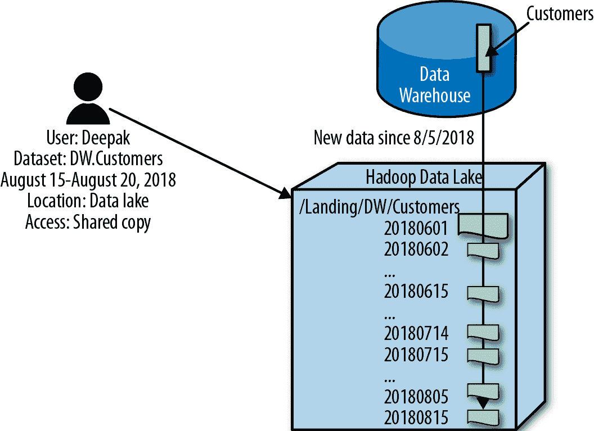

###### 图 9-26。一旦有新用户使用它，数据集将被更新。

有时，将每天的批处理数据保存在以该日期命名的单独文件夹中是有益的。这有助于工具如 Hive（Hadoop 上的 SQL）决定针对哪些分区执行查询。在这种情况下，数据仍然可以在 8 月 15 日全部加载，但每天的变更会在单独的分区中创建，例如图 9-27 所示。尽管所有变更都是在 8 月 15 日提取的，每天的变更（例如基于更改时间戳）都存储在单独的文件夹中—8 月 6 日的变更存放在*20180806*文件夹中，8 月 7 日的变更存放在*20180807*文件夹中，依此类推。

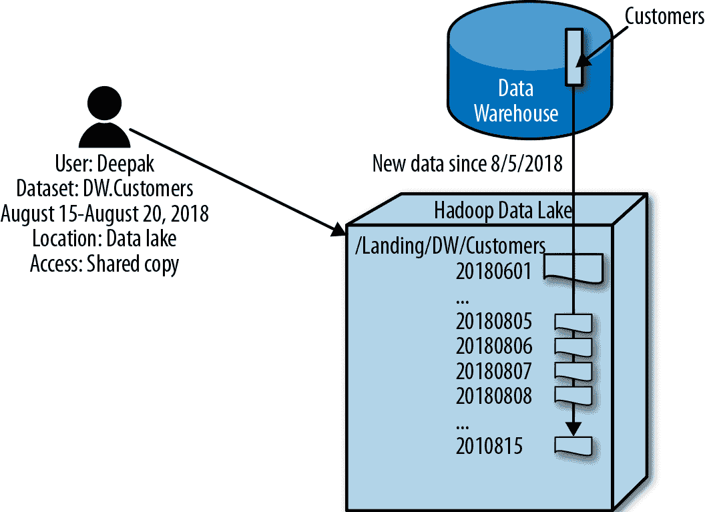

###### 图 9-27\. 每天的更新可以保存在单独的分区中

# 结论

访问控制是数据湖中最关键的方面之一，必须做好。通过结合自动化、按需自助授权技术和积极的敏感数据管理，您的组织可以有效和高效地管理对庞大且快速变化的数据集的访问。
