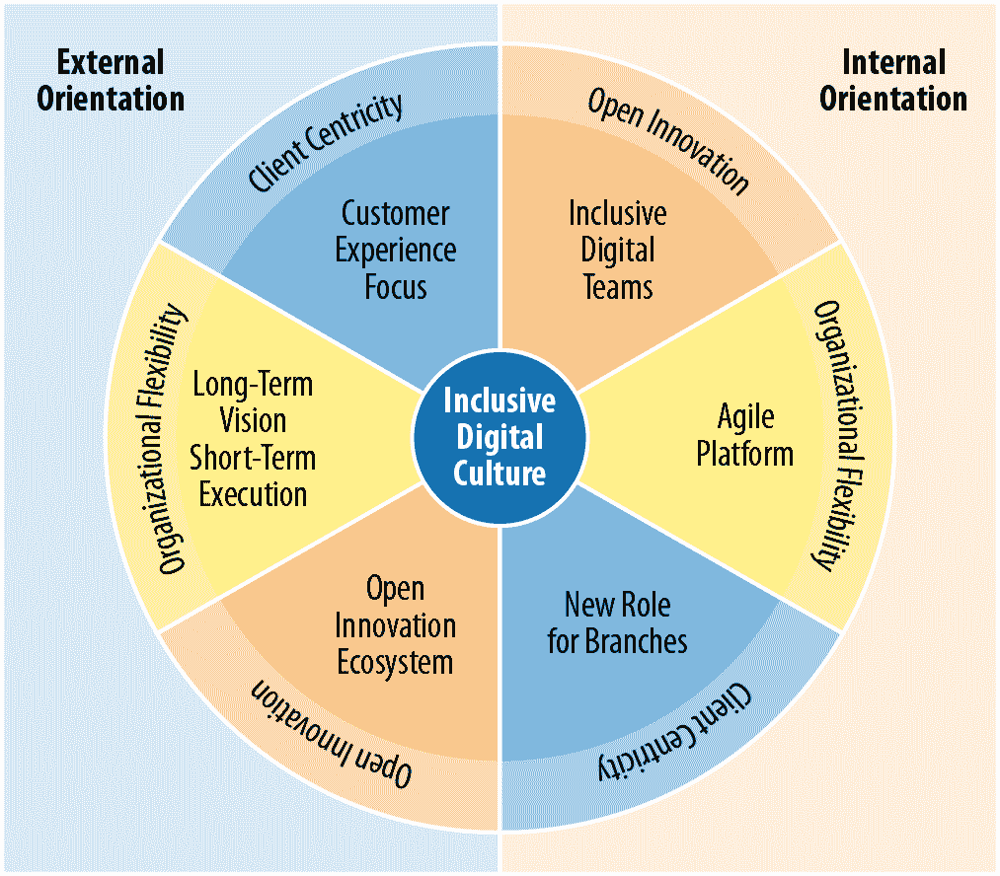
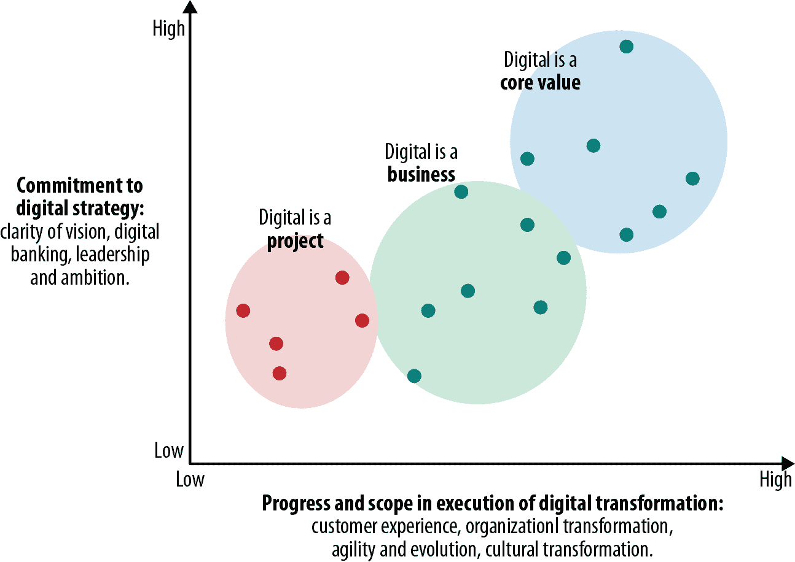
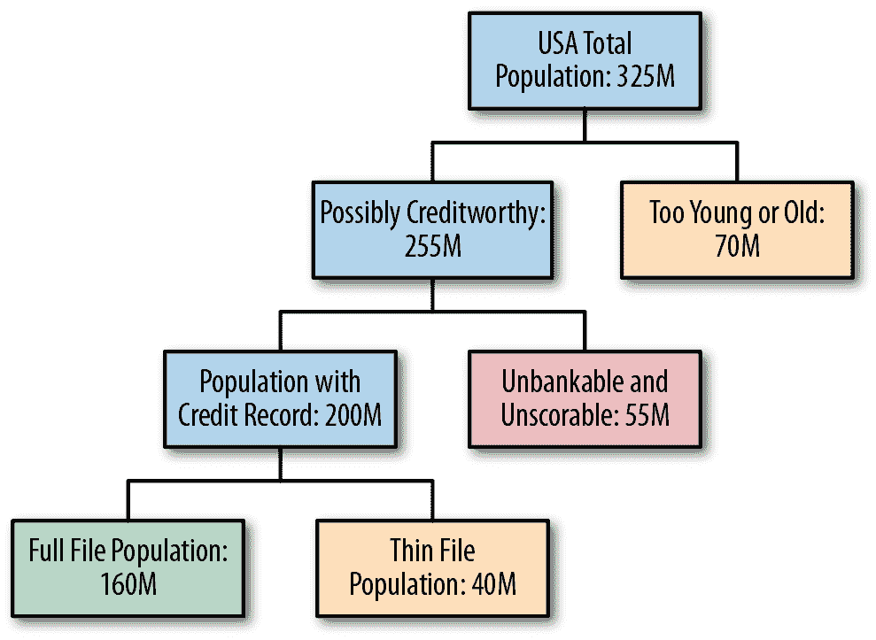
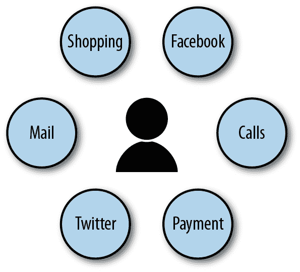
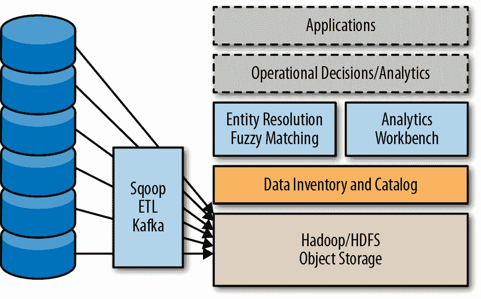
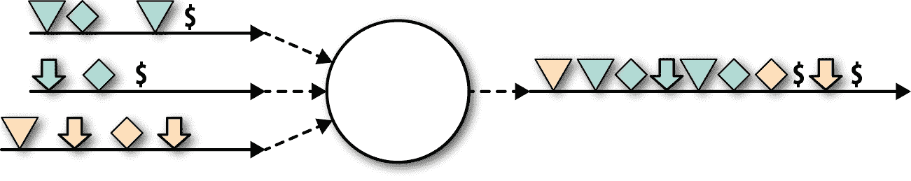

# 第十章：行业特定视角

本章包含来自各行业数据专家的关于数据湖实施的一系列文章。其中一篇文章由于作者未能获得披露其从属关系的许可而匿名发布，其他文章则完全归属于作者。虽然本书的其余部分侧重于通过与从业者的多次讨论获得的最佳实践和成功数据湖的特征，但本章侧重于行业特定内容。每篇文章由不同的行业专家撰写，并回答以下一些或所有问题：

为什么？

这些文章概述了推动不同行业采用大数据湖的主要倡议。

为什么现在？

什么改变了以实现这些解决方案？Hadoop、大数据、数据科学或数据湖如何改变了方程式？

接下来会发生什么？

作者认为行业在采用大数据和分析方面的未来如何？数据将如何改变他们的行业？

首先，你将听到负责 FICO 高级分析和在伯克利教授数据科学的 Jari Koister 的发言。Jari 的文章着重于提升业务成果。接下来是 Simeon Schwartz 的文章，专注于在 Schwab 和其他大型金融服务组织中利用大数据进行治理和合规性。

接下来，你将听到一位大型保险公司的大数据负责人的发言，然后是由 Brett Goldstein 撰写的关于智能城市的文章，他曾领导芝加哥市和芝加哥警察局的分析工作。

最后，你将听到旧金山大学的首席信息官 Opinder Bawa 的发言，他曾担任加州大学旧金山分校医学院和波士顿市医院首席信息官，在医学研究中运用分析。

还有许多其他例子和故事可以分享，但我觉得这些内容已经较为全面地展示了可能的情况。

# 金融服务中的大数据

**Jari Koister**目前担任 FICO 决策管理套件（DMS）的副总裁，这是一个面向金融及其他行业的多种分析和优化驱动解决方案的平台。Jari 领导产品战略、规划、执行和研究；他还负责先进分析和人工智能研究，并将其整合到 DMS 中。旨在提供能够使 FICO 及其客户的解决方案成功且竞争力不断增强的能力。此前，Jari 曾在 Salesforce.com、Twitter 和 Oracle 领导产品和工程团队，还曾在 Ericsson 和 HP Laboratories 领导研究团队。Jari 在瑞典皇家理工学院获得分布式系统博士学位，并担任加州大学伯克利分校数据科学项目的教授。

## 消费者、数字化和数据正在改变我们所知的金融业

一波颠覆正在冲击金融和银行业。消费者期望新的互动方式，数字银行正在颠覆许多子领域，面临更多欺诈风险暴露，也承受着在传统市场之外扩展业务的压力……变革的列表还在继续。同时，风险管理正成为金融机构日益关注的核心和战略性领域，并且出于保护消费者免受不慎决策和暴露的原因，监管水平也在增加。

消费者的期望在前所未有的情况下变得更多样化、选择更多，而且他们的声音也比以往更清晰。他们比过去更加信息化，并且更信任他们的同龄人。消费者可以更容易地找到并获得新产品，例如信用卡。他们通过多个渠道与银行进行互动，并且无论使用哪个渠道，他们都期望广泛的功能和及时的答复。他们周游世界，并期望他们的银行跟上并支持他们，而不是设置障碍。他们了解情况并比较产品和服务。像千禧一代和所谓的“未开发银行”等客户细分并不依附于大银行，而是开放于新的选择。

与此同时，银行正在数字化。用户期望能够在大部分业务中在线完成，而无需进入实体分支机构。话虽如此，他们期望使用数字媒体的响应速度能够与直接与银行服务人员工作相匹配或超越。他们希望能够在线申请信用和交易股票，存款支票，并且提取或转移资金。顾客希望体验简单而没有摩擦的服务，否则他们会把业务带到其他地方去。数字化还改变了银行的营销方式和与消费者的联系方式。数字营销和口碑变得更加关键，而实体分支的角色则相对较小。

新的用户期望和数字银行的浪潮要求银行重新思考如何提供服务。这也迫使他们重新思考如何减少开销并消除消费者互动中的摩擦。这些变化也使银行面临更多欺诈的机会，这既因服务的性质，也因这些服务如何向客户提供。例如，在线贷款批准需要新的客户识别方式。需要视网膜扫描、在线指纹或图像来确保在线贷款接收者确实是他们声称的人。

访问银行服务，甚至它们的提供，也受到新技术的影响，例如移动支付、区块链以及像印度这样快速发展国家的国家倡议。印度旨在减少欺诈的倡议包括称为[Aadhaar 卡](https://en.wikipedia.org/wiki/Aadhaar)的普遍国家身份证和用于构建金融服务的 IndiaStack API。

新的和扩展的数据集允许更高效地分析市场和客户的特征和需求。这种分析使银行能够在保持自身风险水平低的同时，为消费者提供更具吸引力的提案。

竞争新业务还促使金融服务向先前未服务的消费者和人口群体提出提案。然而，他们可能缺少传统上认为必要的背景数据来吸引客户。在历史上，那些没有提供“正确”数据的人，比如计算信用评分的数据，通常会被认为是不可接受的信贷或贷款风险。有了新的数据来源和新的预测模型，银行可以计算出新的评分，从而使他们能够向这些客户提供可接受风险和盈利的提案。

这些例子说明了为什么风险分析对金融机构日益重要和战略性。它们对于管理与投资组合管理、信用风险、货币风险、运营风险等相关的风险至关重要。金融机构通过使用新的风险评估模型和新的数据来源更积极地管理风险。通过创建新模型，他们可以增加收入、降低成本、减少风险并提高效率。

银行和金融领域的这一新时代需要更广泛和更好的数据来源，并由大数据和分析时代的新数据来源推动。它推动数据孤岛的打破和数据访问在组织内部的民主化。数据湖的概念在这一进化过程中起着核心作用，数据湖的价值与组织将数据和洞察力转化为更好决策的能力密切相关。

## 拯救银行

上述变化带来了对传统银行的许多威胁，但也为新兴者和颠覆者带来了机会。数字银行业务既有外部影响，也有内部影响，正如 图 10-1 所示。

###### 图 10-1\. 数字文化的两面

外部因素要求消费者体验进行 drast 的更改。客户生命周期的所有方面都必须越来越以客户为中心，包括客户获取、入职和保留。银行必须保持对外部因素的开放态度，设计并执行灵活的策略，以迅速适应技术和客户需求的变化。

这些外部因素反过来驱动了内部需求。改变银行的外部视图需要一个依赖于强大、可扩展架构和复杂技术的数据智能创新文化。这需要更敏捷和适应性的方法来开发概念、产品和服务。随着市场的变化，银行必须变化，新产品必须在几个月或几个季度内推出，而不是几年内。

随着与客户的互动变化，分行的角色也发生变化。在极端情况下，分行因客户使用数字设备进行互动而变得过时，例如通过其手机摄像头扫描存款支票。在其他模式中，分行仍然对营销、支持和高端服务（如私人银行）非常重要。

当然，数据在启用内部因素并最终导致外部因素变化中起着至关重要的作用。数据湖是实现许多所需变化的机制，因此数据湖可以极大地影响银行的业务战略。

通过自动化流程并利用数据为客户确定最佳优惠，数字银行可以将运营成本降低一个数量级，与传统银行相比。这种显著的成本降低可以使机构能够以盈利的方式向传统上利润较少的客户推出新产品，并提高客户满意度。它们还可以将较低的成本转化为现有客户的新利益，有助于保留这些客户。另一种方法是将新的更加细致的风险模型应用于投资，以获取健康的利润。无论采用哪种策略，数据在识别、评估和实施这些产品中发挥着重要作用。

数据湖策略的广度可以有所不同。它可以仅限于少数核心数据集，并逐渐增长，也可以从一开始就涉及广泛的数据集成。一些金融机构可能在方法上更为保守，而另一些则包含能够获取的所有数据。有些可能以更谨慎、分阶段和慎重的方式引入变化，而另一些则大胆地颠覆组织运作方式。不同步伐和策略的原因可能从快速改变文化的困难到希望在利用新机会的同时保护当前核心业务。一些金融机构，例如桑坦德银行及其全资在线 Openbank 子公司，对其现有业务采取渐进的方法，但通过新成立的部门实施颠覆性方法。

图 10-2 展示了数字转型的各个阶段。

###### 图 10-2\. 数字战略和执行成熟度

与此同时，欺诈案件数量和复杂程度都在增加。尽管由于技术进步如芯片卡的普及，一般交易欺诈有所减少，但其他类型的欺诈正在上升。随着在线商务的普及，身份欺诈也在增长。随着新的资金转移方式的推出，反洗钱运动也受到了更多关注。新型欺诈案件以快速的速度不断涌现，这要求我们迅速开发新的欺诈检测和预防方法。更多的数据和新技术需要在这些方法的开发中加以利用。

同时，欺诈检测需要对消费者更加友好。在识别信用卡或身份欺诈时出现的误报对良好的客户体验极为不利。谁愿意因为信用卡被拒绝而无法支付刚刚在外国享用的餐点呢？同样地，数字银行因怀疑身份欺诈而拒绝客户进行操作可能会导致非常不好的公众舆论。

数据的使用存在着不当使用的风险，可能是有意或完全无意的，因为数据中的错误或失误。如 GDPR 等新法规旨在保护消费者。尽管金融机构希望利用手头的数据优化产品并做出自动化决策，但他们也需要遵守这些新法规。

核心问题在于，向数字银行的转变导致了新类型的服务的出现，对提供金融服务的银行或任何机构来说，这既是威胁也是机遇。数据对于高效地创建和管理金融产品的各个方面至关重要，包括数字营销、风险分析、产品风险优化、高效的支付收款以及欺诈检测。

## 新数据带来的新机会

新数据的可用性使银行能够创建更加符合客户需求和风险管理角度的新产品。基于这些数据推动的复杂解决方案权衡多个属性，如风险、客户需求、盈利能力和市场份额。这是一种双赢，因为消费者可以获得有价值的服务，而银行也拥有新的收入来源。

通过采用新的身份识别和欺诈处理方式，银行可以提供数字化的贷款和信用申请方式，提高了速度和客户满意度。客户可以在不需要访问分行的情况下完成在线申请。符合正确财务标准的申请通常在几分钟内得到批准，资金也经常可以即时存入账户。

信用评分是确定消费者是否会偿还其债务的首选方法。历史上，信用评分计算需要支付历史记录、未偿债务清单、最近信用查询历史等信息。银行工作人员会彻底分析结果，以确定风险和盈利水平。对于消费者具有特定信用分数（如 550 或 710）的风险已经被充分理解。但现在，银行希望将评分应用于缺乏传统信用评分足够数据的更广泛人群。这被称为“金融包容性问题”，不仅是发展中国家的问题；在美国也存在。正如图 10-3 所示，美国 3.25 亿人口中有 5500 万人无法评分，面临被认为不可银行化的障碍。他们最终为基本的日常金融服务（如兑现支票或使用信用购买大件消费品）支付过高的费用。

###### 图 10-3\. 可银行化人口分类

在印度等其他国家，无法使用传统方法评估信用价值的人口比例甚至更大。美国的比例大约为 17%。在印度，大约有 19%，即 2.5 亿人口无法评分。印度的另一个大部分人口，约 7 亿人，也被视为非信用申请者。前面提到的阿达尔（Aadhaar）旨在使更大一部分人口参与金融系统。为了能够向这些大规模人群提供信贷，银行正在考虑使用额外的数据来源，如账单支付数据，以及社交网络、手机数据、零售购买、教育和公共记录等非金融数据，来确定信用价值。这些计算需要综合和分析多种数据来源，最终通过消费者交付机制来实现数据分析结果的操作化。在收集、集中存储和使用这些各种数据中，还存在重大的隐私问题。

更多且更多样化的数据使分析师能够显著改进这些风险模型。总的来说，许多改进和策略取决于许多数据源的可用性和使用情况，其中一些可能是新的，而其他则是以前未使用或未充分使用的。数据湖在允许扩展用于向全球更广泛人群提供金融服务的数据的任何架构中都是重要组成部分。

风险分析的一些主要好处包括：¹

+   通过引入风险差异化的优惠和有针对性的活动，提高利息收入。这些措施通常可以增加 5-15%的收入。

+   降低销售和运营成本，因为从风险和政策的角度来看，预筛选更加高效。这可能会增加生产力 15–50%。

+   通过风险聚类和早期预警系统减少风险。这些系统通常会减少贷款损失 10–30%。

+   通过模型的更好校准和精细化来提高资本效率。这通常会减少风险加权资产 10–15%。

金融机构希望更多地了解客户在他们提供的所有服务以及更广泛领域中的活动。他们希望像行业观察者所称的*360 度客户视图*（图 10-4）。这可能包括财务交易、财务状况、购买、电子邮件、支持电话、社交媒体发布以及任何其他被跟踪的互动。通过更全面地了解客户活动，公司可以提供更好的营销、更好的服务和更好的客户体验。这种视图自然涉及多个数据源，并要求银行和金融机构打破当前存在的数据孤岛。数据湖是实现这种数据共享的技术基础，同时有效管理数据并遵守适用的法规。

###### 图 10-4\. 客户 360 度视图

然而，这些服务可能容易受到新类型的申请欺诈的攻击。数据和算法的可用性使银行能够部署利用人脸识别、指纹甚至语音识别的欺诈技术。如果没有新的反欺诈措施，欺诈水平可能会抵消这些服务所带来的收入。

## 利用数据湖的关键流程

我已经概述了银行和金融服务在节省成本和应对新机遇方面的一些关键方向、机会和风险。这两者背后有一些共同主题。它们都依赖于数据的可用性和复杂使用，以及金融机构传统上未曾使用的数据来源。尽管银行在高效利用各个数据孤岛的数据方面表现出色，但现在它们需要将数据整合起来，利用多个数据源高效地实现他们的目标。许多银行实际上正在创建数据湖，或者至少在通过创建大量数据池的道路上向数据湖迈进。

许多金融机构拥有大量孤立的数据源。合并这些孤立部门是一项艰巨的任务，可能需要大量投资却没有相应的好处。金融行业非常熟悉“决策”概念。决策决定了客户的结果，如信用额度增加、贷款批准和收款行动。决策通常对收入和风险产生重大影响。但它们可以通过 A/B 测试、跟踪和治理进行优化。挑战在于通过处理数据湖中的分散数据来高效地做出决策。

银行对此采取了许多不同的方法。一些明确创建数据湖，目的是处理数据问题的复杂性。其他人则有机地发展数据水坑，打算在以后某个时刻将其组织成一个湖。最后，有些人认识到他们需要数据，但可能没有明确的战略来从孤立的数据集合转变为对底线产生影响的更好决策。

我建议有三个主要组成部分可以将数据湖从无法使用的状态转变为可进行决策的状态。这个提议并不具有革命性，而是从一组无组织、常常理解不清楚的数据转变为被编目、整合和准备好供数据科学、数据处理，最终实现操作决策的状态。数据科学和数据处理有助于在迭代循环中准备数据以供决策使用。关键在于编目和决策开发的整合，使数据易于访问、识别、检测和追溯。

第 10-5 图 强调了这种数据湖解决方案的中心架构。显然，组织需要从所有正在使用的众多数据源中摄取和检索数据。我认为成功准备数据以支持决策的三个必要组成部分是数据清单和编目、实体解析和模糊匹配，以及分析和建模。

###### 第 10-5 图。数字银行中分析和决策的数据湖支撑

### 数据清单和编目

这第一步确定数据，自动发现架构，匹配字段，确定和追踪血统等。它提供了数据湖中创建的所有数据的概述。它还帮助组织和理解数据，以便可以有效地发现和处理。

在从数据湖中提取价值的重要步骤之一是连接不同的数据源。然而，并不是所有数据集都有一个共同的键可以进行连接。相反，很可能没有这样的键，我们需要找到其他方法来解析实体（在所有数据源中识别相同的实体，例如同一客户）。这就是下一个流程的任务：实体解析和模糊匹配。

### 实体解析和模糊匹配

让我们考虑一个没有共同数据记录键的三个数据源的示例。每个数据源记录了一些用户行为。一个可能是网站活动，另一个是电子邮件活动，第三个是销售点交易。用户可能在每个数据源中使用不同的身份标识方式。他们甚至可能有不同的地址或拼写错误的地址，使用昵称或故意混淆的名称，提供不同的电子邮件地址等等。

图 10-6 描述了这些数据来源作为三个分开的事件时间轴，这些事件可能在某些时刻导致购买。我们的目标是通过识别哪些事件属于同一消费者，即使数据不同、不完整或错误，来创建一个合并的时间轴。这个合并的时间轴将使我们能够创建更精确的预测模型，因为我们有更多相关的数据可以帮助改进模型。

###### 图 10-6。从不同多渠道数据到 360 度视图

实体解析和模糊匹配可以在数据来源之间执行这种映射。我认为这种映射对于从数据湖中提取价值至关重要。

### 分析和建模

一个强大的分析工作台，具备数据整理、探索结构化和非结构化数据、在大数据集上查询以及机器学习的能力，当然是充分利用数据湖的关键组成部分。最终，直到将数据洞察转化为银行客户的运营决策之前，您才能真正提取出实际价值。建模和实施决策的架构超出了本文的范围，但在这里概述的基础是金融机构为运营决策做好准备的一种方式。

# 金融服务中数据湖的附加值

**西蒙·施瓦茨**是 OMS 全国保险的数据与分析总监，前查尔斯·施瓦布分布式数据服务的管理董事，他在关系型、半结构化（NoSQL）和大数据产品领域支持数据和数据库技术。在加入施瓦布之前，西蒙曾担任 Centerpost Communication 的运营副总裁，并开展数据管理解决方案咨询业务。

金融行业可以通过数据湖在多种方式上改善其服务和收益，同时应对当前时代的诸多挑战。合规性、营销和效率都可以通过数据湖迈向新的台阶。

合规性是受益于数据湖自动化和标准化的最显而易见的领域。金融服务领域的公司根据监管要求和产品、业务线数量频繁和定期进行审计。合规性和风险管理需要大规模的企业范围内努力。需要一个跨越所有现有技术的企业数据资产的虚拟数据湖来支持这些倡议。

合规性的一个相关示例是访问验明和认证，这是一个常见的流程，用于记录系统和数据不存在未经授权的访问，并跟踪所有现有和变更的访问授权。为确保所有访问确实经过授权，并且公司具有这些授权的验证记录，相关方必须审查和签署每一种凭据类型、技术和供应商提供的每一片现有托管数据，定期进行这些签署（验明过程）。每个应用程序供应商可能针对其产品提供专门的点解决方案，平台供应商可能针对多应用程序提供技术平台堆栈背后的解决方案，因此单一的企业范围方法需要对所有信息进行统一视图——基本上是提供一致方法来收集和比较服务器、数据资产类型和访问级别信息的虚拟数据湖。尽管这是一项庞大的工作，但许多因素正在增加其可行性，其中包括：

+   廉价的计算能力。

+   通过虚拟化、仪器化和自动化，现代基础设施的部署速度和便利性。

+   软件开发速度的巨大提升。

一旦数据湖技术就位，并结合现代分析的进步，金融服务行业将获得许多其他好处。这些好处包括能够快速创建、使用和管理基于企业信息的快速洞察解决方案。数据湖还能更好地跟踪信息使用情况，例如资源利用监督和技术资产管理。

在营销方面，数据湖可能会从包含有关客户及其与公司产品互动的重要见解（内部和外部）中受益，以理解和影响客户行为。例如，在网站上，营销可以衡量客户进行交易的时间、原因和位置（在网站和页面上），他们可以追踪交易前的活动、点击次数、中断交易的百分比、客户在做出决策点前走过的路径、浏览器内的活动等。另一个例子可能是完成新账户申请：可以调查潜在客户中止申请的地点、原因和时间长短，以及他们何时以及以何种速率退出流程。这可以帮助公司改善申请体验，增加收入，并减少在获取可能因账户创建过程中流失的潜在客户所需的直接成本。技术体验的一个例子涉及决定何时“超时”客户：等待时间过长可能会影响安全性，而超时时间过短可能会强迫用户重新登录，从而产生糟糕的用户体验。通过对网站进行仪器化和分析用户行为，公司可以使用数据而非猜测来回答这些及其他问题，允许体验定制化，看到结果，并对运营结果和客户满意度产生重大影响。

简而言之，随着企业变得越来越被仪器化、跟踪和测量，数据湖正在使得在业务、IT 和合规性方面实现更高效率和效果成为可能。

# 保险业中的数据湖

*下一篇文章的作者是一家主要保险公司的大数据远见者。他们分享了他们的观点，但未能透露其从属关系。*

任何保险组织的基础核心是对风险的评估。分析和核保原则是在向客户签发保单和确保流动性以履行理赔时基于对风险的评估。这种评估对于保险政策请求者同样有益。如果个人能更好地评估其风险暴露，他们就能在需要的保障类型上做出正确的决策。

对于保险公司，效率通常是指根据个人的财务背景建议适当的保额和可负担的保费，并及时签发保单的能力。我没有提到客户服务，因为我认为它是任何企业的支柱：无论是销售咖啡还是寿险保单，如果客户对您提供的服务不满意，您就无法在今天竞争激烈的营销环境中生存下去。

数十年来，核保过程由于数字化格式中缺乏有价值的多样化数据点以及缺乏廉价的分析平台而发展缓慢。在过去五年中，随着大数据技术在廉价商品硬件上的出现，这种情况发生了显著变化。一些行业参与者正好奇地探索使用先进的预测建模技术重新编写核保规则的新方法，这些技术具备分析大量不同数据元素的能力。这一最新技术组合有助于提高效率、降低成本、为理赔管理提供更好的框架，并检测欺诈行为。这些技术通过向消费者提供个性化产品来推动产品创新。

另一项正在追赶并被用作战略变革载体的革命性技术是物联网（IoT），一些保险公司正在采纳并看到其价值。大数据分析快速采纳的一个关键因素是它与连接设备的直接联系，收集数据点并将其转化为可操作的分析信息。

例如，物联网可以使保险提供商及被保人在健康领域受益。通过监测个人的健康、生命体征和整体健康状况，设备可以满足个人对健康相关指标的需求，同时为保险公司提供宝贵的数据，以更好地分析发病率和死亡率。这为开发针对各种风险类别的创新产品提供了机会，这些产品在过去可能不在考虑范围之内。

尽管这些发展令人兴奋，但我个人认为技术对行业的影响并非是灾难性的；相反，它总是产生涟漪效应。再次以健康为例。在数字化医疗和生物测定记录上，美国政府投入了数十亿美元的补贴。像[精准医学计划](https://ghr.nlm.nih.gov/primer/precisionmedicine/initiative)这样的项目旨在建立一个统一的全球平台，公共和私营公司可以安全高效地共享客户的医疗记录。在不久的将来，这本身将有助于弥合消费者、医疗行业和保险公司之间的鸿沟。更广泛的影响将是为无保险和超出探索风险类别的人引入产品和服务。

这里的可能性无限，看到这种综合数据集为整个城市、社区、州、国家，甚至整个大陆提供的趋势将会是令人惊叹的，所有这些都是为了关注人类福祉。

# 智慧城市

**布雷特·戈尔德斯坦**是 Ekistic Ventures 的联合创始人兼管理合伙人，这是一群致力于解决城市问题的人，他们正在培育一系列颠覆性公司，为关键的城市问题提供新解决方案。他曾担任芝加哥市的首席数据官（CDO）和首席信息官（CIO），之前是一名警察，并在芝加哥警察局担任分析主管。2013 年，布雷特策划并编辑了《超越透明度：开放数据与市民创新的未来》（Code for America 出版），这是一部关于开放数据潜力的选集，旨在重塑居民与政府之间的关系。除了在 Ekistic Ventures 的工作外，布雷特还担任芝加哥大学城市科学的高级研究员和特别顾问。他为全球各地的政府、大学和主要公司提供建议，指导如何利用数据更好地理解城市生态系统。

多年来，我们一直听说大数据有潜力引领“智慧城市”的时代，其中技术帮助提高生活质量、减少犯罪并优化支出和资源。然而，建设智慧城市的第一步需要我们将数据汇集到数据湖中，并为预测分析优化这些信息。

作为芝加哥市的首席数据官（CDO），后来是首席信息官（CIO），我推动了将数据从成千上万的数据孤岛中“解放”出来，并整合到一个数据湖中的工作。传统上，数据被备份到磁带上，并最终被删除。通过使用支持灵活模式架构的廉价大数据技术——特别是我们的情况下，是 MongoDB 数据存储——城市能够轻松地从所有不同的系统中加载原始数据。然后，它扫描数据集以获取地理空间信息并创建位置索引。目标是了解数据位置，并记录元数据，以便在适当的项目出现时可以使用数据。

将来自不同系统的数据加载到一个系统中带来了各种挑战，从获取数据访问权限到映射不同的坐标系统。大多数城市问题是超地方性的，因此创建位置索引非常关键，使数据湖能够回答诸如：

+   警车在哪里？

+   在一个社区中有哪些坑洞？

+   一个问题建筑的确切位置是什么？

虽然知道事物的位置至关重要，但数据湖还可以用于预测分析，例如预测哪些地方最有可能发生骚乱，哪些垃圾箱需要维修，以及街道多久会出现坑洞。芝加哥数据湖取得最大胜利的时刻是在其被用来为北约行动创建情境感知平台 WindyGrid 时——这是芝加哥历史上最重要的事件之一。

城市面临的问题并不新鲜，但在当前的大数据技术世代之前，实际解决方案难以得到。Excel 是一个很好的工具，但无法扩展以处理实时流向今天智能城市的海量信息。关系系统可以扩展到足够的规模，但从不同系统中结合和协调数据过于困难和昂贵。有了提供廉价存储和灵活架构的大数据技术，现在可以跨多个不同系统、多种不同格式结合数据，并投资于提取、协调和清理仅针对特定项目所需的部分。大数据的可扩展性使得可以实施数十亿 GPS 事件的物联网项目，而能够以经济的方式存储和处理大量数据对于预算紧张的城市来说是一个重大进展。例如，能够重复使用旧机器并利用不同硬件廉价构建 Hadoop 集群是一个重要的节省成本的进步。

当我们仍在解决数据存储和管理问题的同时，我们开始从被动的反应式分析和响应转向积极的预测性分析和响应。预防性维护就是一个例子：我们可以在路面出现坑洼之前修复道路，而不是等到坑洼形成后再进行修复。随着传感器数据的快速涌入——关于当地气候、空气污染、服务交付等等——智能城市正在变成现实，并且有效地利用这些数据需要超地域的数据和决策方法。通过从更智能的数据架构开始，特别是数据湖，我们可以进一步进行复杂的分析和机器学习。

同时，城市必须尊重透明度和可解释性，避免黑箱算法的诱惑。重要的是不仅仅信任数据驱动的结果，而是理解它们背后的原因。只有这样，我们才能进入真正智能城市的时代。

# 医疗大数据

**Opinder Bawa** 是旧金山大学（USF）的信息技术和首席信息官，负责机构范围内的技术部署和创新。之前，他曾担任加州大学旧金山分校（UCSF）的首席技术官，以及 UCSF 医学院的首席信息官。在这些角色中，他在研究、教育和患者护理的创新技术解决方案规划和交付中发挥了领导作用。Opinder 还曾担任波士顿医学中心的首席技术官和 SCO 集团的高级副总裁，领导其全球软件产品线和客户服务。他在纽约市立大学获得了计算机科学学士学位，并在凤凰城大学获得了工商管理硕士学位。

任何行业的转型过程通常需要 30 至 50 年才能完成，生命科学行业也不例外。每一个转型时期都由催化剂启动。2010 年《患者保护和平价医疗法案》是生命科学行业最近一次转型的催化剂。正如过去半个世纪多次证明的那样，技术将继续作为促使行业转型的核心，我们国家的医疗保健系统也将如此。

当今和未来医疗保健中可能是最重要的一个方面是识别有前景的新疗法、验证治疗方案以及为不太有前途的药物尽快终止开发决策的临床试验。随着生命科学行业接近这一变革的第二个十年，并审视即将到来的格局，明显的是，成功进行未来临床试验及其结果将需要颠覆行业或大幅提高其供应链效率的技术，涉及从识别和招募（及留住）患者到数据收集、核心分析和早期干预潜在对象的各个领域。

尖端数据分析解决方案使生命科学公司能够自动化临床试验供应链的最关键部分，从而以前难以想象的方式实现重要结果。数据分析能够创建精密调校的引擎，推动患者产生的数据的收集、整理、分析和报告。

将数据收集和分析置于这种变革体验的核心并不过分。如果你回顾一下 USF 的 William Bosl 博士的工作，他能够在仅三个月大的婴儿中[识别出自闭症](http://bit.ly/2tbNT8c)，或者研究如何在实时情况下识别足球场上的球员脑震荡，你将能够一窥数据和分析改变世界的潜力。由 UCSF 的 Jeff Olgin 博士领导的另一项[研究](https://www.health-eheartstudy.org/)反映了这一潜力，该研究旨在通过招募史上前所未有的 10 万患者，使用最先进的技术进行数据和分析，显著改进著名的 Framingham 心脏研究。

随着生命科学行业进入当前技术转型的第二阶段，力求增长和成功的领先临床试验公司将进一步接纳数据分析行业领袖提供的临床试验供应链解决方案。这些解决方案将开始聚焦于高效临床试验带来的早期干预，最终改变整体医疗保健实践方式。

¹ 另见 Rajdeep Dash 等人的《风险分析进入高峰期》，McKinsey & Company，2017 年 6 月。
