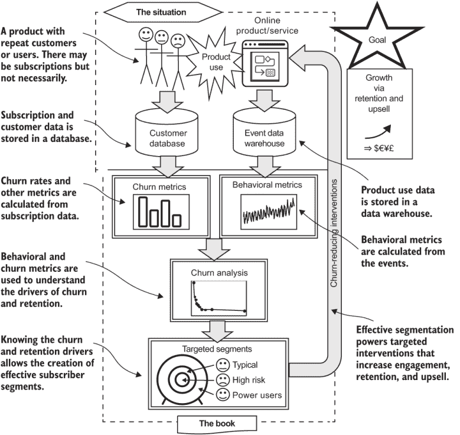
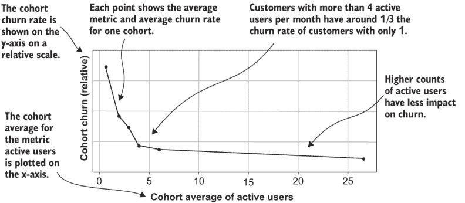
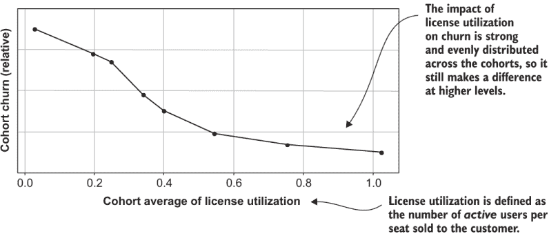
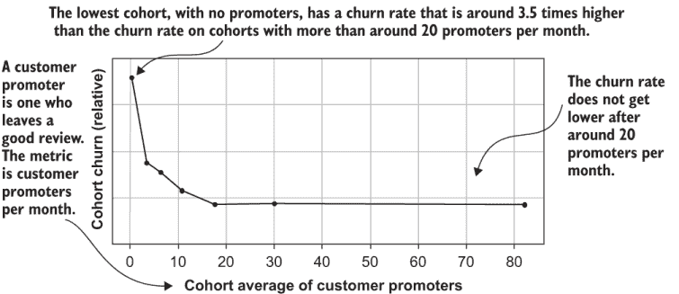
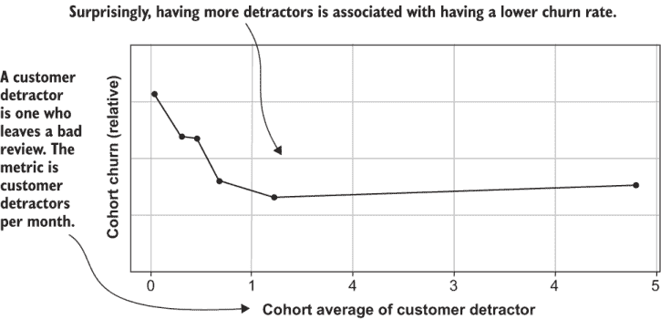
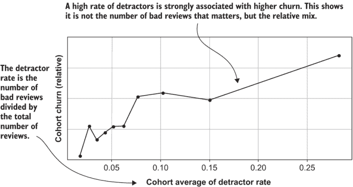
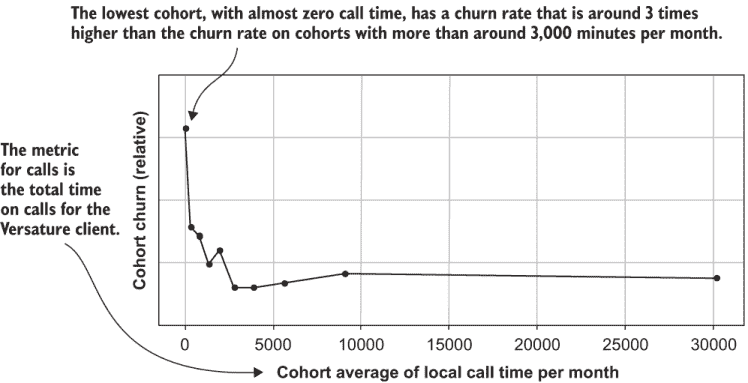
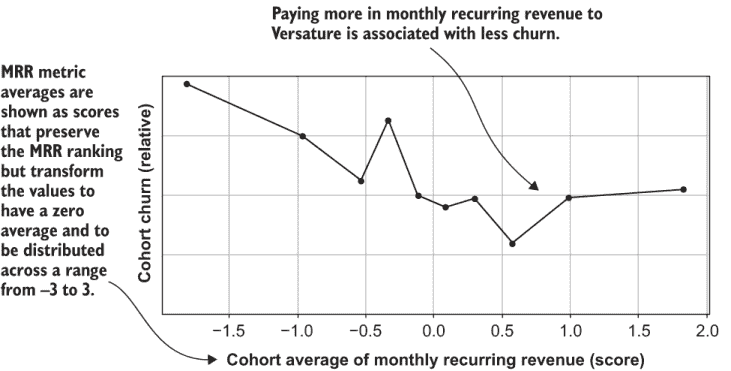
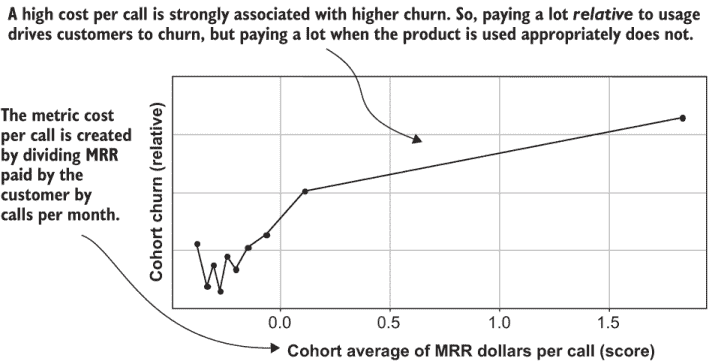

# 1 客户流失的世界

什么是客户流失？我们为什么要与之抗争？数据如何帮助？简而言之，你为什么在读这本书？如果你在读这本书，你很可能

+   数据分析师、数据科学家或机器学习工程师

+   为一个提供具有重复客户或用户的产品或服务的组织工作

或者，也许你正在学习以获得那些工作之一，或者即使这不是你的工作，你也在填补这样的角色。

这些服务通常通过订阅销售，但你的组织不需要销售订阅来利用这本书。你所需要的是拥有重复客户或用户的产品，以及让他们不断回归的愿望。这本书教授了许多与订阅相关的技术，但在每种情况下，我都展示了相同的概念如何应用于零售和其他非订阅场景。

为了最大限度地利用这本书，你应该具备数据分析编程的背景。如果你是这样的，那么准备好在思考客户和数据的方式上实现突破性的突破。这不是你通常关于数据分析和数据科学的书籍，因为，正如你将学到的，通常的方法不适用于客户流失。但你不需要数据科学学位就能利用这本书：我会回顾足够的基础知识，以便任何有少量编程经验的人都能取得很好的成果。考虑到这一点，我称你，读者，为数据人员，因为这本书是从与数据工作的人的角度来写的。话虽如此，这本书充满了来自现实案例研究的商业洞察，所以即使你不编程，你也可以从阅读这本书中获得很多，然后在将理论付诸实践时将这本书交给你的开发者。这本书提供了关于客户流失和数据的手动方法。

如果你与一个提供现场服务的组织合作，你可能对客户流失了如指掌，并想继续进行防止流失的斗争。但我在此需要为那些刚开始的人提供背景信息；即使你已经了解客户流失，我在我们开始之前也需要澄清一些常见的误解。

本章的组织结构如下：

+   第 1.1-1.3 节为本书的其余部分提供了背景：什么是客户流失，如何对抗它，为什么对抗客户流失很难，以及为什么我选择了本书的主题。

+   第 1.4-1.6 节使理论具体化。我描述了这些策略适用的商业环境以及不同公司需要处理的数据。

+   第 1.7-1.8 节通过审视书中提到的案例研究来使理论生动起来。到本书结束时，你将准备好为自己的产品或服务创造那些类型的成果。

## 1.1 你为什么在读这本书

任何服务的首要目标是通过营销和销售增加客户或用户数量以实现增长。（这对盈利性和非盈利性企业都适用。）当客户离开时，它会抵消公司的增长，甚至可能导致收缩。

定义：流失——当客户停止使用服务或取消订阅。

大多数服务提供商专注于获取。但为了成功，服务还必须努力最小化流失。如果不持续、主动地解决流失问题，产品或服务就无法达到其全部潜力。

“流失”这个词起源于“流失率”这个术语，它指的是在一定时期内离开客户的比例，我们将在后面更详细地讨论。这导致客户或用户群体随时间变化，这也是为什么“流失”这个词有道理的原因。这个词最初的意思是“激烈地移动”（例如搅拌黄油）。在商业环境中，现在“流失”既可以用作动词——“客户正在流失”或“客户流失了”——也可以用作名词——“客户是流失者”或“报告上季度的流失情况”。

如果你更愿意看到事情积极的一面，那么没有从服务中流失的客户也可以用积极的方式来表述。在这种情况下，人们会谈论客户保留。

定义：客户保留——保持客户使用服务并续订他们的订阅（如果有订阅）。客户保留是流失的对立面。

降低流失率等同于提高客户保留率，这两个术语在很大程度上是可以互换的。当目标被表述为保留更多客户更长时间时，除了挽救那些有流失风险的客户外，还应该关注保持客户的参与度。甚至有可能向最积极参与的客户推销更高级的服务版本，通常价格更高。挽救流失、增加参与度和提升销售都是具有重复客户互动的服务的重要目标。这些目标之间的区别在于关注点的不同，而不是意图上的差异。

吸收：尽管有各种具有重复客户的产品和服务，但使用数据来对抗流失、增加参与度、保留和提升销售的技巧是单一的。

本书为您提供了解决参与度和提升销售以及有效地使用数据在任何类型的重复用户互动场景中对抗流失的技能。

### 1.1.1 典型的流失场景

如果你在一个创建订阅产品的组织中工作，你的情况可能类似于图 1.1 顶部的示例。关键要素如下：

+   产品或服务是定期提供和使用的。

+   客户与产品互动。

+   客户可能订阅产品或服务。订阅通常（但不总是）需要付费。

+   订阅可以被终止或取消，这被称为演退。如果没有订阅，当客户停止使用产品时，他们就会发生演退。

+   客户和订阅（如果有）的时机、价格和付款被记录在数据库中，通常是事务数据库。

+   当客户使用或与产品或服务互动时，这些事件通常会被跟踪并存储在数据仓库中。

在第 1.4 节中，我们将探讨各种符合这种描述的产品。如果你的场景并不完全像这样，但有一些相似元素，那也是可以的。如第 1.5 节所述，本书中的技术也适用于相关情况。所描述的只是最常见的情况。

在整本书中，我交替使用订阅者、客户和用户这些术语。它们有略微不同的含义，但通常，相同的概念适用（一个订阅者有订阅，一个客户支付，一个用户可能两者都不做，但你仍然希望他们回来）。本书中的技术适用于你与客户关系的任何情况。如果我用一个与你产品不相关的角色举例，那么你应该在心理上替换一个适合你产品的角色。

### 1.1.2 本书的内容

图 1.1 展示了本书中的技术是如何协同工作的。以下描述了过程中的每一步：

1.  演退测量——使用订阅数据来识别演退并创建演退指标。演退率是演退指标的一个例子。订阅数据库还允许识别已经演退和续订的客户以及他们确切的续订时间；这些数据对于进一步分析是必需的。

1.  行为测量——使用事件数据仓库来创建总结每个订阅者相关事件的指标。创建行为指标是一个关键步骤，它允许在数据仓库中的事件得到解释。

1.  演退分析——使用识别的演退和续订的行为指标。演退分析确定了哪些订阅者行为预示着续订，哪些预示着演退，并且可以为每个订阅者创建演退风险预测。

    在这个阶段，除了订阅者数据库和事件数据仓库之外，还可以将其他信息来源纳入分析（图 1.1 中未显示）。这些包括关于个人消费者（年龄、教育等）的客户或用户的人口统计信息，以及关于企业订阅者（行业、员工数量等）的企业信息统计。

图 1.1 演退数据对抗演退的思维模型

1.  分段——根据他们的特征和风险，将客户划分为组合了他们的风险水平、他们的行为和任何其他显著特征的组或细分市场。这些细分市场针对干预措施，旨在最大化订阅者生命周期和服务参与度。

1.  干预——利用从客户流失分析中得出的见解和订阅者细分规则，制定和执行降低客户流失率的干预措施，包括电子邮件营销、电话营销和培训。另一种长期干预措施是对产品或服务进行更改，客户流失分析的信息对此也很有用。

    这是推动期望结果（增长！）的关键步骤。关于干预措施类型的更多信息将在下一节开始，并在本书的其余部分提供，但我只以一般方式介绍干预措施。这就是为什么图 1.1 将干预措施部分地显示在本书的范围之外。

我将在每一章中回溯到图 1.1，以明确说明本章涵盖的过程的哪个部分。

## 1.2 打击客户流失

写这本书的一个动机来自于尝试降低客户流失率的挑战。话虽如此，我的座右铭是“少承诺，多交付”。我将从降低客户流失率可能有多么困难的角度开始提醒。稍后，我会展示那些不完美的选项仍然可以对你的客户流失率和用户参与度产生重大影响。

### 1.2.1 降低客户流失率的干预措施

公司使用五种主要策略来降低客户流失率。我在这里总结它们，并在本书的其余部分进行更深入的讨论：

+   产品改进——产品经理和工程师（对于软件）以及制作人、人才和其他内容创作者（对于媒体）通过改变产品功能或内容来降低客户流失率，从而提高客户获得的效用或享受。这可能包括添加新功能和新内容，或者重新包装以确保用户找到产品或服务的最佳部分。这是降低客户流失率的主要、最直接的方法。

    另一种（软件）方法是增加粘性，这大致意味着修改产品以增加客户转向替代产品的成本。通过提供难以复制或难以从一个系统转移到另一个系统的有价值功能来增加转换成本。

+   参与活动——营销人员通过将订阅者引导到最受欢迎的内容和功能的大规模通讯来降低客户流失率。这更多的是营销的教育功能，而不是传统营销。记住，订阅者已经可以访问并了解服务的情况，所以承诺不会有帮助。尽管如此，营销人员经常使用这个功能，因为他们擅长制作有效的通讯。

+   一对一客户互动——客户成功和支持代表通过确保客户采用产品并在他们需要时提供帮助来防止客户流失。而客户支持是传统上帮助客户的部门；在许多组织中，客户成功是一个新的、独立的职能：它被明确设计为更具主动性。客户支持在客户请求帮助时帮助客户；客户成功试图检测需要帮助的客户，并在他们请求之前与他们取得联系。客户成功还负责客户入职并确保他们完成所有必要的操作以充分利用产品。

+   适当定价——如果服务不是免费的，销售部门（如果有的话）可能是阻止客户流失的最后一招。账户经理可以降低价格或更改订阅条款，管理客户可以降价到更便宜版本的过程。对于没有销售部门的消费产品，拥有类似权限的客户支持代表通常承担这一角色。一种更主动的方法是在一开始就适当调整销售：更好地销售对客户最优的产品版本，而不是尽可能销售最昂贵的版本。这可能会损害每次销售的短期收益；但如果做得正确，它可以减少客户流失并最终提高客户的终身价值。

+   定位收购——你获取客户的渠道可能产生具有不同保留率和客户流失质量的客户。如果是这样，专注于最好的渠道是有意义的。与其试图让现有客户保持更长时间，不如尝试找到更好的客户来替代他们。这是减少客户流失最不直接的方法，并且受到限制，因为大多数产品无法从其首选渠道获得无限数量的客户。尽管如此，它是一个重要的工具，如果你能利用它，你应该这样做。

所有这些方法在数据驱动下最为有效，这意味着你的组织根据对可用数据的正确解读来选择目标和定制策略。以数据驱动为导向并不要求你拥有一定数量或类型的数据或特定的技术。本书的重点是正确使用可用数据，无论你从事哪种类型的产品，或最终采用何种干预措施来减少客户流失。

吸取经验：在与客户流失作斗争时，以数据驱动为导向意味着基于对可用数据的合理解读来设计产品变更、客户干预和收购策略。

有一点需要注意：干预和服务修改是实现降低客户流失和延长客户保留目标的关键最后一步。然而，如何执行干预超出了本书的范围。与数据分析技术不同，影响订阅者行为的干预措施通常特定于订阅服务的类型。没有一种适合所有情况的干预措施。此外，通常不是数据人员而是其他人（例如产品设计师或营销人员）进行这些干预。

吸收要点：有一些关于减少客户流失干预的一般原则，但这些需要根据每个产品的具体情况来定制。

形成干预的环境不仅包括产品或内容的特定特征，还包括用于实施干预的技术和资源。要充分涵盖干预措施，可能需要另一本书（甚至每个行业都有一本单独的书），而且这将是一本面向商业经理的书，而不是像这本书这样的技术书籍。感兴趣的读者可以在商业部分寻找“客户成功”相关的书籍，或者更具体地说，在产品设计、营销、客户支持等部分下寻找。本书中的工具和技术将彻底改变你在这些领域的每一个产品表现，但不要期望数据人员能做所有的事情！

### 1.2.2 为什么客户流失难以对抗

现在你已经知道了目标和可用的策略，我将向你介绍你将面临的困难。这些困难促使我在下一节中提出如何使用数据来对抗客户流失的建议。

客户流失难以预防

坏消息是人们（大多数情况下）是理性的且自私的，你的客户已经了解你的产品。为了长期且可靠地减少客户流失，你必须要么提高你产品提供的价值，要么降低成本。回想一下你上次流失的原因，什么会阻止你流失？更好的内容和服务？也许吧。更低的价格？可能。一个改进的用户界面呢？可能不会，除非用户界面一开始就非常糟糕。而且，更频繁的产品相关电子邮件通知会阻止你流失吗？再次，可能不会，除非它们包含你认为有价值的信息。（那个价值词又出现了！）

要减少客户流失，你需要增加价值，但这样做比最初让人们注册要困难得多。因为你的客户已经知道服务是什么样的，营销或销售代表做出的承诺不会引起太大的反响。作为数据人员，你可能会被要求提供“一劳永逸的方法”来减少客户流失，但这里有一个坏消息。

吸收要点：如果“一劳永逸的方法”意味着低成本且可靠的方法，那么没有一劳永逸的方法可以减少客户流失！

用著名创业公司首席执行官和风险投资家本·霍洛维茨的话来说，“对于这个问题，没有银弹，只有铅弹。”他在他的创业回忆录《艰难的事业的艰难之处》（Harper Business，2014 年）中谈到的是在创业公司中提供有竞争力的软件功能，但我认为这同样适用于对抗客户流失。这意味着通常没有快速的“一劳永逸”的解决方案；你持续不断地需要做艰苦的工作，提高你提供给订阅者的价值。我并不是说订阅服务的问题的简单解决方案从不存在。但这类问题通常由产品经理和内容制作人等人员解决。当服务转向数据人员寻求帮助以减少流失时，低垂的果实通常已经被摘取。如果数据人员发现了简单的解决方案，这表明那些创建服务的人没有做好他们的工作。（你可能会找到简单的解决方案，但你不应该。）

当然，另一种选择是降低服务的成本。但降低货币成本对于付费服务来说是一种核选项；收入流失或降级销售可能比完全流失要好，但这仍然是流失。

警告：降价是针对客户流失的“钻石子弹”：它总是有效，但你负担不起。

正如你在下一章中将会看到的，大多数服务将降级销售视为另一种形式的流失。

预测客户流失并不奏效（很好）

现在我们来谈谈数据科学家工具箱中的常用工具：使用机器学习系统进行预测。预测客户流失不奏效有两个原因。首先，也是最重要的，预测流失风险对于大多数减少流失的干预措施没有帮助。因为没有一种适合所有情况的干预措施，流失干预措施需要根据除流失可能性之外的因素进行针对性。这与像垃圾邮件或欺诈检测等其他领域不同，那里的是/否预测足以让你选择行动。如果你将一封电子邮件分类为垃圾邮件，你将其放入垃圾邮件文件夹——完成！但如果你预测一个客户有流失风险，那么你该怎么办呢？

为了减少流失，你可以运行一场电子邮件活动来推广产品功能的用途。但这样的活动应该针对不使用该功能的用户，而不是发送给所有有流失风险的用户。用不适当的内容填满用户的收件箱只会将他们赶走，而不是拯救他们！流失风险预测可以作为客户成功团队选择一对一干预客户的变量，但即便如此，它也只定义目标的一个变量。

这可能会让你感到失望。为了减少客户流失，仅仅部署一个能够赢得数据科学竞赛的人工智能系统是不够的。如果你提供了一份预测客户流失的分析，但没有提供更多可操作的信息，企业将无法轻松地使用它，甚至可能根本无法使用。当我说预测客户流失并不是用数据对抗客户流失的重点时，请相信我。这是我刚开始在这个领域工作时必须学习的重要课程之一。

TAKEAWAY 并不存在一种适合所有情况的客户流失干预措施，因此预测有流失风险的客户对于减少客户流失只有一点帮助。

第二个原因是，即使是最先进的机器学习，也很难以高精度预测客户流失。如果你回想起你上次流失行为时的行为，原因很容易理解：你可能没有充分利用产品，但由于你太忙或者花了一些时间研究替代方案，所以取消订阅花费了很长时间。也许你无法下定决心，或者你忘记了。如果一个预测系统在那个时期观察你的行为，它可能会标记你为有风险，并在你下定决心和找到时间取消订阅的整个过程中都是错误的。流失的时刻受到太多外部因素的影响，难以预测。

除了影响时间的外部因素外，由于效用或享受是一种根本上的主观体验，客户流失也难以预测。即使在相同的情况下，流失的可能性也会因人而异。这对于消费者服务尤为重要，因为客户流失通常最难预测。对于商业产品，客户往往比较理性。但无论是客户还是你，都没有足够的信息来对他们使用产品的成本效益进行精确分析。

最后，与保留相比，客户流失通常较为罕见；对于任何保持运营的付费订阅来说，都必须如此。因为客户流失罕见，无论你如何预测，误报预测都很常见。

考虑到所有这些因素，客户流失预测不可避免地相对粗糙。如果你在一个过去预测客户流失的项目上工作，并发现它很容易以高精度预测，那么你可能是在流失发生得太晚时进行预测，那时它已经不可操作（参见第四章）。在第九章中，我将提供关于客户流失预测准确性的数据，以及构成准确与不准确客户流失预测的因素。现在，我希望我已经给出了足够的轶事证据，以表明高度准确的预测通常是不可能的。

TAKEAWAY 外部因素、主观性、不完整的信息和稀缺性使得准确预测客户流失变得困难。

减少客户流失是团队努力的结果。

防止客户流失最困难的一点是，这并不是任何人的职责，也就是说，没有人或职能可以单独完成这项工作。考虑一下上一节中描述的客户流失减少策略：产品改进、参与活动、客户成功与支持、销售和定价。这些职能涵盖了典型组织超过一半的部门！这意味着客户流失减少将面临沟通和协调的问题。如果放任不管，不同团队可能会采取不协调的方法来降低客户流失率。例如，产品和营销团队决定专注于推动不同功能或内容的利用率，这将是适得其反的。而且，这些方法可能基于有限或错误的信息。因为他们不是数据专家（记住，那是指你），所以不能保证独立团队做出的选择是正确数据驱动的。

**要点** 多个团队之间的沟通不畅和缺乏协调可能会使客户流失减少的努力陷入风险。

此外，在典型情况下，数据人员无法单方面采取措施来降低客户流失率。降低客户流失率取决于业务不同领域的专家采取的行动，而不是那些处理数据的人员。这些同事各不相同，我暂且称他们为“业务人员”，因为没有更好的称呼。我并不是暗示数据人员不属于业务团队；但数据人员通常没有直接责任对具体的业务成果（如收入）负责，而那些其他角色的人通常有。从数据人员的角度来看，业务是数据分析结果的最终用户。

**要点** 数据人员的目的是让业务人员在减少客户流失的干预措施上更加有效。

### 1.2.3 优秀的客户指标：对抗客户流失的武器

客户流失难以对抗，因为业务的不同部分以不同的方式负责减少客户流失。所有这些团队都有不同的工具和方法，他们可能不会在情况和策略上达成一致。此外，每种减少客户流失的方法都需要企业针对最有可能做出反应的客户进行干预。因此，为了对抗客户流失，企业需要一套共享的事实或规则，以理解客户及其与产品的互动。

将数据变成对抗客户流失的武器的最佳方式是利用数据产生有效的客户测量，并将这些测量结果交给业务中的客户流失斗士。正如我们将在第三章中全面探讨的那样，客户的测量被称为指标。

**定义** 客户指标——对每位客户单独进行的任何测量。

以一个简单的例子来说，一个指标可以是这样：每个月每位客户使用软件功能或观看某个系列节目的次数。但并非每个指标都适合用于对抗客户流失。

**要点**：为了使客户指标在对抗客户流失方面变得出色，它应该具备以下特点：（1）易于业务理解；（2）与客户流失和保留明显相关，因此可以清楚地知道一个健康的客户是什么样的；（3）以有助于针对干预措施提高参与度的客户细分方式；（4）对业务的多项功能（产品、营销、支持等）都有用。

继续使用简单的例子，你可能会发现像“每月使用（查看）产品功能超过五次的客户，其流失率是每月只使用一次或更少的客户的一半。”这样的业务规则。使用或查看更多特定功能的事情并不复杂，关于流失的发现使得一个健康的客户显而易见。每个业务部分都可以用这样的事实以不同的方式使用。产品创造者会知道该功能正在提供价值，可以复制它或使其更容易找到。营销可以设计一场活动来吸引用户使用该功能。而当客户成功/支持人员与客户交谈时，他们可以询问客户是否在使用该功能，如果客户没有使用，可以鼓励他们尝试使用。

这听起来可能很简单，但提出看似简单却具有可操作性的发现实际上比听起来更难。有些发现可能会误导（例如，参见 1.8.2 节中的例子），更常见的问题是存在太多的潜在指标和规则。那么挑战就在于为业务找到一组简洁的指标。所以，仅仅因为你在寻找易于理解的事实和规则，并不意味着你的工作会容易！

我是通过经历那些指标并不出色的情境，得出了对提供优秀客户指标的重视。当我刚开始时，情况通常是这样的：在我们开始分析客户流失之前，公司选择了客户指标，并将它们用作预测模型的输入。我经常发现客户指标设计得不好，并不适合预测和理解客户流失，因此预测模型的结果不佳，没有人使用它。但他们继续使用这些平庸的指标，因为他们需要用于细分的测量。那时，我脑海中突然有了灵感。数据分析应该专注于确保指标对客户流失非常出色，因为这就是人们将用来完成他们工作的事情。我知道作为一个数据专家，我可以比业务人士更好地创建客户指标——你也可以。

我将教授你的方法类似于传统的统计或科学分析。受过统计训练的数据人员可能会发现这种方法比计算机科学家更自然。过程是迭代测试不同的客户指标，分析它们与客户流失以及彼此之间的关系，并评估它们的可解释性和在细分和干预方面的有用性。你找到最佳的指标集，这就是向业务交付的主要成果。你也将处于良好的位置来运行预测模型，如后续章节所述的附加用例。

取得成果：数据分析项目向业务交付的主要成果是一套客户指标。

## 1.3 为什么这本书不同

到现在为止，你可能已经怀疑这不是你通常关于数据科学或数据分析的书。我现在会解释这些差异，让你知道可以期待什么。

### 1.3.1 实用且深入

表 1.1 总结了本书与该领域典型书籍的不同之处。

表 1.1 本书与其他数据分析书籍的比较

| 本书 | 大多数关于数据分析的书籍 |
| --- | --- |
| 从开始到结束的一个场景，包括应用 | 涉及许多不同的场景，但省略了实际细节 |
| 专注于理解数据和设计指标（即特征工程） | 专注于算法 |
| 通过迭代过程从原始数据创建数据集 | 使用固定的基准数据集 |
| 强调可解释性、简洁性和敏捷性 | 强调最大化准确性或其他技术指标 |

本书专注于一件事：使用数据来对抗客户流失的实用方法。相比之下，大多数数据分析书籍涵盖了广泛的使用案例，强调统计和计算机科学算法。尽管如此，第 1.5 节解释说，有一系列与客户流失相似的使用案例，并且可以使用相同的技巧。但本书专注于客户流失，以便学习变得容易；一旦你成为专家，修改技巧到相关场景就不会很难。

在典型的数据分析书籍中，重点是教授算法。用于展示技术的数据集是已给出的，被称为基准数据集。本书从原始数据开始，创建一个分析数据集，这是工作的很大一部分。我将解释几个统计/机器学习算法，达到可以使用它们的水平，但不会教授很多理论。相反，重点是教授整个过程，包括在现实世界场景中应用结果。

现实世界中的数据问题与训练数据的不同之处在于，在现实世界中，工作永远不会结束：一旦一项关于客户流失的分析完成，就会创建新的产品功能或内容，需要重新分析。或者，可能出现一种全新的数据来增强原始数据。此外，商业环境也在不断变化，如竞争和不断变化的经济状况。这些变化可能需要重新分析，即使产品没有修改。

要在这个环境中取得成功，使用数据的过程必须是简洁和敏捷的。简洁意味着使用最少的数量数据以及最少的分析步骤来完成工作。敏捷意味着快速有效地应对变化。实现简洁和敏捷具有重要的后果。我将在整本书中回到这些主题，但就目前而言，这里有两大要点。

**要点**：你的目标是向商业人士提供可操作的知识。倾听他们的意见，并首先尝试回答他们的问题。不要对每个假设或评估指标进行详尽的测试。

**要点**：编写代码来自动化这个过程。这使得适应不可避免的修正或变更请求变得容易得多。

由于需要与商业人士沟通以应对客户流失，当数据分析提供可操作的知识时，数据分析师的分析达到最大影响。因此，本书将告诉你如何以非技术人员能够理解的方式传达分析结果。这意味着使用相对简单的可视化，并避免使用技术术语，而是使用通用语言。我甚至建议在解释分析时进行简化（但在分析过程中不要走捷径）。在整个书中，我给出了我发现的有效的解释策略的具体例子。

数据和指标设计（又称特征工程）的重要性

许多在数据科学或数据分析课程中学习的人，当他们开始在一家公司或真实的研究项目中工作时，会感到惊讶：他们需要的不是在 CSV 文件或数据库表中等待他们的数据，而是需要通过算法运行的数据。大多数现实世界项目涉及从多个数据库或系统中定位和合并数据，这个过程是项目工作中很大的一部分（通常超过一半）。在学术数据科学中，这个过程被称为特征工程，但鉴于需要与商业人士沟通，我将坚持使用“指标设计”这个术语（更多关于这一点在第三章中介绍）。

另一个常见的误解是，算法或分析方法的选取是影响模型准确性的最重要因素。允许数据进行分析的总结指标（在学术界称为数据特征）是整个过程中最重要的部分，即使在关注准确性的情况下也是如此。

一些学术倾向的数据人员可能会认为准备数据既低效又不值得他们去做，将其视为苦差事。但在准备数据时，必须做出许多小决策，其中一些决策可能会对结果产生巨大影响，尤其是如果这些决策没有正确做出，或者不是数据人员期望的方式。

警告：将数据准备任务委托给另一个团队风险极高。

最后，我想补充说，根据我的经验，理解和设计指标是整个过程中最有乐趣、最具创造性的部分！在我看来，这确实是数据科学中的“真正科学”：通过实验从你的数据中学习，而不仅仅是运行别人的算法。在我的书中，这绝不是苦差事！

### 1.3.2 模拟案例研究

为了实现其目标，本书围绕一个深入的案例研究展开。你将从客户和事件数据的数据库开始，并使用它来完成实际客户流失斗争过程中的所有步骤：计算客户流失率，通过创建和分析指标来理解客户行为，发现客户行为与流失之间的关系，并利用所有这些知识来设计可用于针对性干预的细分市场（或者如果真的是你的公司，可以用于针对性干预）。

由于客户数据敏感，我无法分发真实的客户和产品数据以支持你的学习。相反，本书包含一个高度逼真的客户模拟，你可以使用它来生成自己的数据。我还会经常将案例研究与真实公司（在第 1.7 节中描述）进行比较。你会发现你从模拟中获得的结果与实际情况惊人地相似。模拟的代码以及设置和运行它的说明可以在本书的网站上找到（[www.manning.com/books/fighting-churn-with-data](http://www.manning.com/books/fighting-churn-with-data)）和本书的 GitHub 仓库中（[`github.com/carl24k/fight-churn`](https://github.com/carl24k/fight-churn)）。

注意：设置开发环境、运行模拟和代码的最新说明始终位于本书 GitHub 仓库根目录下的 README 页面。设置说明不包括在本书中。

我将在介绍真实案例研究之后，在第 1.7.4 节中告诉你更多关于你将要模拟和研究的公司的信息。但首先，为了使案例研究具有背景，我想更广泛地谈谈本书适用的公司类型和数据。

## 1.4 具有重复用户交互的产品

对于那些还不熟悉这个领域的人来说，我将总结当前具有重复用户交互或订阅的产品世界的情况。订阅和重复付款商业模式绝对不是新事物；订阅新闻服务至少自 16 世纪以来就存在了，而保险费的重复支付是在 17 世纪确立的。20 世纪见证了第二次工业革命带来的各种公用事业重复付款服务的普及：首先是水、煤气、电力和电话服务；而在 20 世纪末，有线电视、移动电话服务和当然还有互联网服务。这些服务都是基于消费者和提供商之间的重复付款关系。所有这些关系都可以被称为订阅。

当我们想到订阅时，我们通常想到的是定期支付的固定费用，尽管订阅服务可以在消费者和提供商之间收取三种类型的付款：

+   重复付款——每个服务期间相同金额的固定付款

+   基于使用量的付款——根据某些计量单位支付所使用的服务费用

+   一次性付款——通常包括设置费用，但也包括对服务或一次性（应用内）购买的临时（非重复）升级费用

这些服务有时是预先付款（每个服务期开始时）和有时是事后付款（服务提供后）。但所有这些服务都有一个共同点，那就是消费者和服务提供商之间的持续关系。

21 世纪见证了订阅服务的新一轮爆炸式增长，这些服务大多通过互联网提供，并使用云计算平台创建（或至少管理）。这些新产品的其中一个重要特征是它们通常具有更多的选择性。虽然 20 世纪的重复付款服务选择很少或没有（许多公用事业仍然是受监管的垄断），但在 21 世纪的订阅方面，我们有各种各样的选择。通常有可供选择的其他服务，比如从一家流媒体音乐服务切换到另一家。此外，还可以有实现相同目的的替代手段，例如企业开发自己的软件而不是通过订阅购买。最后，许多现代订阅是我们可以不用的东西（当你可以在商店购物时，你还需要那个食品配送订阅吗？）。

在以下章节中，我将描述今天存在的各种订阅方式的广泛多样性。我们将在本书的其余部分考虑这些商业模式。

### 1.4.1 付费消费者产品

大多数人都熟悉消费者订阅服务。这些产品通常每月费用适中（低于一顿昂贵的餐食），价格通常以“99”结尾（9.99、49.99、99.99 等）。如今，大多数消费者通过这种方式获得很多娱乐，并且出现了各种额外的产品：

+   桌面软件（文字处理器、电子表格、图形创建工具、防病毒程序等），以前通过永久许可证销售

+   新类型的软件即服务（身份盗窃保护、云存储、家庭安全视频监控等）

+   物理产品盒（剃须和个人护理用品、餐食、手工艺品、礼物等）

+   个人服装商品（包括服装和手表）

这些产品通常被称为企业对消费者服务（B2C）。另一个相关术语是直接面向消费者（D2C），它通常指的是在不捆绑其他有线或卫星娱乐套餐的情况下向消费者销售视频娱乐。（在撰写本文时，许多电视频道只能通过有线或卫星订阅获得，但流媒体服务是 D2C。）

### 1.4.2 企业对企业服务

从市场价值来看，企业订阅服务是一个巨大的市场细分。这些通常被称为企业对企业（B2B）产品。从 Salesforce 开始，它在 2000 年代创建了第一个基于云的客户关系管理（CRM）系统，这个市场已经爆炸式增长。现在，几乎所有面向企业的新的软件产品都提供作为服务（软件即服务，简称 SaaS）。同时，由于云部署和升级的效率，现有的本地软件产品已经开始转向新的模式。这些产品因为商业产品不回避复杂的合同（实际上，它们似乎更倾向于复杂的合同）而展现出令人眼花缭乱的支付条款。最知名的 B2B 订阅类别包括

+   CRM —SaaS 用于协调销售团队和市场营销互动

+   企业资源规划（ERP）—SaaS 用于会计、物流和生产

+   订阅式业务管理（SBM）—SaaS 用于管理订阅（也可按订阅方式销售）

+   人力资源管理（HR）—SaaS 用于管理员工，包括招聘

+   支持问题跟踪系统（ITS）—SaaS 用于跟踪和管理客户支持互动或工单

+   桌面软件—电子表格、文字处理器、电子邮件、插图程序等，通过多用户订阅销售

+   云计算资源—云服务器、存储、数据库和内容分发网络（CDNs）

+   商业智能（BI）—用于查询和可视化各种类型数据的工具

+   安全产品—病毒防护、密码管理器、网络监控以及其他确保个人计算机和公司系统安全的工具

这个简短的列表并不能公正地反映当今企业使用的各种 SaaS 产品。几乎每家现代 SaaS 公司都依赖于一系列其他 SaaS 产品来提供运行运营非核心部分的软件。典型的 SaaS 公司仅使用内部软件工程师来创建服务中独特的东西；几乎运营的每个其他部分都是使用由其他 SaaS 企业提供的软件来运行的，并且基于订阅付费。这包括之前列出的标准应用程序，以及为特定垂直领域的公司设计的 SaaS 产品：

+   大多数在线新闻或媒体服务使用软件来管理评论和讨论，但这种服务并非由这些公司创建——他们专注于创造内容。

+   支持特定垂直领域的信息服务过去只在金融和法律行业很常见，但现在房地产、能源、制造和农业等行业也有垂直特定的信息服务。

+   服务可用于管理特定行业或垂直领域的发票和应付账款功能。

这些只是来自一个非常大且多样化的类别中的几个例子。

### 1.4.3 广告支持的媒体和应用程序

自从互联网的早期，最常见的商业模式（如果不是最常见的）就是提供免费媒体内容（阅读材料、视频、音乐等），但在之前、期间和/或之后显示广告。使用此类产品不需要正式订阅，因此这种场景与图 1.1 中的场景有一些重要区别。没有订阅数据库，尽管另一个数据库可能跟踪用户配置文件信息，用于选择广告。虽然从消费者那里获取价值的方式不同，但这些服务与常规付费消费者服务具有相同的自由裁量性质，并且对流失有同样的明显担忧：服务希望他们的用户（广告观看者）继续回来。

正如我将解释的，没有订阅的情况下，流失可以简单地定义为客户长时间消失。这类产品也可以从本书中教授的流失分析技术中受益，只要某种形式的事件数据仓库能够跟踪用户在多个会话中的活动。

吸取经验：在多个会话中跟踪用户事件是使用本书中技术的一个基本要求。

### 1.4.4 消费者信息订阅

另一种新颖的订阅类型是在订阅中提供免费信息，例如 YouTube 订阅或电子邮件更新。这是广告支持媒体模型的变体，其中内容仍然是广告支持的，但提供商创建了通过免费订阅来升级体验的选项。这种订阅通常意味着消费者同意通过推送到他们的收件箱或视频流的新信息来接收产品更新。在这种情况下，关系的结构符合图 1.1 中的典型场景，但订阅没有固定支付；相反，广告收入来自事件。

### 1.4.5 免费增值商业模式

免费增值提供是指任何具有免费版本和付费或高级服务级别的订阅服务。对于某些服务，免费版本可能是时间限制的，给用户一个“先试后买”的机会。对于其他服务，可能可以永久使用免费服务级别。另一种常见类型是免费版本带有广告（如 1.4.3 节所述）和没有广告的付费版本。

就流失而言，免费增值服务就像没有免费级别的服务一样，但有两种不同的流失类型：来自高级服务的流失和来自服务免费级别的流失。免费级别使用非订阅、基于活动的流失分析技术进行分析。还有从免费服务级别到付费服务级别的过渡，称为免费试用转换，可以使用与流失相同的分析技术（见 1.5 节）。

### 1.4.6 应用内购买模型

免费增值模型的一种变体是那些可以永久免费使用（或只需支付相对较小的一次性费用即可永久使用）的产品，但提供多种方式在使用过程中通过一次性支付来升级体验。这正在成为在线游戏中的主导模式。玩游戏是免费的，但如果你想为你的角色获得一个酷炫的外观、更好的武器或快速提升到更高等级的捷径，那将需要你付费！

这是一种符合图 1.1 模型但无需订阅的场景。相反，一个事务型数据库跟踪一次性购买（以及如果存在初始费用，则应用程序的原价购买）。流失可以定义为用户（客户）变得不活跃；只要用户行为可以在使用会话之间追踪，本书中提到的所有常规技术都适用。

## 1.5 非订阅流失场景

本书重点关注来自订阅的显性流失，但相同的方法适用于各种其他常见商业场景。我将在下面简要解释这些场景，但为了简单起见，我将主要教授针对订阅流失的技术。在你掌握这些技术之后，你应该能够轻松地将所学知识应用于其他场景。

### 1.5.1 不活跃作为流失

对于免费层级的免费增值服务，用户的不活跃状态可以被视为流失，同样的情况也适用于没有明确订阅的 APP 或广告支持的产品。您可以选择一个时间窗口，在这个时间窗口内，用户必须与服务互动（例如一个月或三个月）。那么，流失就被定义为长时间不活跃的用户。与图 1.1 中的典型场景相比，没有订阅交易数据库，只有事件数据仓库。但只要满足一个关键要求：用户行为必须在不同的活动或会话中持续跟踪。

### 1.5.2 免费试用转换

如 1.4.5 节所述，免费增值模型提供免费和付费两个级别的服务。由于免费级别和付费订阅级别都有相似的行为数据，因此分析从免费服务到付费服务的转换与从付费服务到流失的分析一样容易。这本质上与流失相反，但场景看起来与图 1.1 中的相似，因此可以使用相同的分析技术。

### 1.5.3 升级/降级销售

添加新服务或升级到更高成本的计划被称为升级销售，而移除服务或升级到更低成本的计划（不导致流失）被称为降级销售。与流失一样，行为数据和用户特征可以分析以确定最可能导致升级销售或降级销售的场景。然而，额外的挑战是可能存在不同的升级/降级销售选项需要分析。在实践中，然而，对于升级/降级销售进行额外的分析通常是多余的。大多数情况下，最有可能购买某种形式升级销售的客户是那些通过流失分析确定的最佳客户，而那些最有可能转移到更低成本计划（降级销售）的客户也最有可能流失。

升级销售也常常与跨越特定的使用阈值相关，例如企业软件许可证销售的用户数量（座位数）或移动电话服务中的数据量（千兆字节）。在这种情况下，深入分析是不必要的：只需查看一个相关的使用指标，你就能知道谁是升级销售的候选人。

### 1.5.4 其他是/否（二元）客户预测

客户退订是一个存在是或否答案的预测问题的例子。在统计学和数据科学中，这被称为二元结果，指的是两种可能性。本书中的方法可以不加修改地应用于几乎任何涉及预测未来客户状态且可以表述为是/否问题的情境。例如，任何类型的保险政策是否会导致索赔（医疗、汽车等），以及借款人是否会违约。这里的一个注意事项是，本书倾向于关注罕见的结果（这也适用于保险索赔和贷款违约）。如果是/否结果同样常见，可以使用略微不同的方法，主要是在准确度测量方面（见第九章）。

### 1.5.5 客户活动预测

假设一个订阅者继续使用服务，分析该订阅者未来可能的行为是合理的。这对于产生收入的用户行为尤为重要，例如，订阅者将使用预付费功能的程度；或者用户将消费多少内容，以及为广告支持服务产生的广告收入。

本书中的大多数技术也适用于此类分析，但有一个主要的前提是，对于退订，我们使用建模两种状态或二元结果（退订与继续）的技术，而对于活动预测，我们使用建模数值结果的技术。如果你已经在数据科学或统计学方面受过训练，那么将本书中的方法适应于预测实值并不太难，但这种扩展不会在本书中涵盖。

### 1.5.6 非退订用例

一个与退订非常不同且本书不会涵盖的用例是产品推荐系统。这些是具有广泛产品或内容选择场景，目标是根据之前的选项推荐最合适的产品的场景。然而，本书中的技术也适用于客户在基本、标准和高级订阅计划等少量产品中进行选择的情况。对于物理或媒体产品的庞大目录，你应该查阅关于推荐系统专门书籍或资源。

## 1.6 客户行为数据

考虑到包括周期性客户/用户交互在内的产品和服务种类繁多，这些交互可能采取的形式也更为多样。一个章节中的一节不可能列出所有可能性的详尽列表，所以这只是一个介绍。几乎在软件中发生或可以被软件跟踪的任何事情都可以被认为是交互或事件。

定义：事件——在对抗退订的背景下，数据仓库跟踪的任何用户交互或结果。事件是带时间戳的，并涉及单个账户或用户。

### 1.6.1 常见产品类别的客户事件

我将通过列出常见产品类别的典型客户事件来具体讨论数据。它们共同的特点是它们都指的是在任何时间可能发生给单个客户或用户的个别事件。对于某些事件，事件在特定时间对特定用户发生的事实可能就是唯一可用的信息；对于其他事件，事件的相关细节会与事件一起跟踪。以下是一些典型的客户事件：

+   软件——指的是任何软件产品（SaaS），也可以指具有软件界面的其他类型的产品：

    +   登录——登录应用程序通常被视为一个事件。

    +   用户界面（UI）交互——用户界面中的几乎所有点击或输入都可以被视为一个事件。事件通常包括对 UI 部分的详细引用。

    +   文档/记录操作——包括创建、编辑、更新和删除记录或文档，这些在应用程序数据库中跟踪。事件可以包括有关文档类型和具体文档字段的详细信息，如果适用。

    +   批量处理——许多应用程序包括用户定期运行的过程。每个处理的项都可以被视为一个事件，或者批量作业本身也可以是一个事件。

+   社交网络——专门的社会网络以及具有社交功能的产品：

    +   点赞——表示用户喜欢他们看到的内容是与社会网络互动中最普遍的一种。

    +   发布——分享网络支持的任何类型媒体。

    +   分享——通常是一个专门的文章，指的是另一个用户的帖子。

    +   连接——与其他用户建立联系通常是参与的最重要形式，因为它丰富了未来的用户体验。

+   电信（简称 telco）——提供移动或固定位置电信产品和服务的服务提供商：

    +   通话——进行语音或视频通话。通常，通话事件会跟踪通话时长和通话类型。

    +   数据——数据使用通常与数据量一起跟踪。

    +   应用程序——使用应用程序，特别是使用哪个应用程序。

    +   添加/移除设备——更新设备是使用服务生命周期中的一个重要事件。

+   物联网（IoT）——由连接的设备组成的产品：

    +   地理空间——关于设备移动的事件，包括位置和速度。

    +   传感器——传感器接收到的数据可以包括来自传感器的几乎所有类型的信息。

    +   设备——与传感器类似，设备活动可以指几乎任何类型的活动，包括特定于设备的信息。

+   媒体——任何提供任何类型预先录制或实时流媒体的产品，包括视频、音频、图像和文本，不仅用于娱乐，也用于教育和专业培训：

    +   查看/播放——在特定媒体服务上播放媒体是最常见的事件，通常包括播放了什么媒体以及播放了多少的详细信息。这包括阅读新闻和书籍的文章或页面。

    +   浏览时间 —查看页面或其他内容并明确捕捉所花费的时间。

    +   点赞 —通过点赞（或给出差评）来表示媒体偏好是一个重要的媒体事件。

+   游戏 —任何游戏产品：

    +   游戏 —在玩游戏时通常会生成许多事件，包括确切玩过的部分、持续时间等信息。

    +   等级和分数 —许多游戏包括分数或其他形式的“等级”，达到这些等级通常会被作为一个事件进行跟踪。

+   零售 —允许购买单独选择商品的购物网站或服务，这些商品可以是实物或数字产品：

    +   查看 —查看产品可以作为一个事件进行跟踪，包括查看的产品详情。

    +   搜索 —搜索产品目录可以作为一个事件进行跟踪，包括用于搜索的关键词。

    +   添加到购物车 —将产品添加到购物车可以作为一个事件进行跟踪。

    +   退货 —退货也被视为一个事件，并包括产品详情。

+   盒装配送 —定期向客户配送精选（通常是实物）产品的服务：

    +   配送 —每个盒子的成功配送是一个重要事件，以及配送过程中出现的任何失败或困难。跟踪的信息通常包括盒子的类型（当有多个时）和到达所需的时间。

    +   退货 —许多盒装服务允许退货，这是一个重要的用户不满意的事件。

    +   零售 —大多数盒装配送产品也包括零售选项，因此所有零售事件也都相关。

一些事件类别会跨越各种产品和服务。以下是一些例子：

+   金融 —所有非免费产品和服务都会发生金融事件：

    +   定期付款 —这些事件很常见，通常被视为非事件，但它们会被跟踪，并且当它们不发生时，通常比发生时更重要。

    +   非定期购买 —零售网站上所有的销售，包括在游戏或订阅服务中进行的任何额外或应用内购买。

    +   超额费用 —当用户超过阈值时产生的费用。

+   支持 —无论客户通过电话、电子邮件、聊天还是搜索支持/帮助文档来寻求帮助时：

    +   工单 —支持工单或案例，通常带有开启和关闭时间以及广泛的详细信息。

    +   电话/电子邮件/聊天 —客户与支持代表之间的任何互动，可能包括互动的全文。

    +   文档 —使用在线文档资源可以作为一个 UI 事件进行跟踪。

+   计划 —任何具有实际订阅的产品或服务的订阅计划相关事件：

    +   计划变更 —计划变更的时间/日期可以作为一个事件进行跟踪。

    +   账单变更 —更改信用卡或其他支付方式的事件，以及切换账单详情，如月度与年度账单。

    +   取消——是的，取消产品或服务也被视为一个事件。但请注意，当我们谈论将取消作为事件时，我们是在谈论取消更改被输入系统的时间，而不是服务合同结束的时间，即使用户还有剩余时间。因此，取消事件并不等同于流失。流失发生在订阅者完成当前期限而没有注册新期限时，通常允许一个短暂的宽限期。因此，取消事件并不一定意味着将发生流失，因为客户仍然可能在很长时间过去之前重新签约。这种情况经常发生，因此，取消行为应被视为一个表明可能发生流失的事件，但这仍然不是确定的结论。

注意，许多产品或服务包含来自多个类别的活动；例如，任何具有软件用户界面的产品都会收集软件事件，而许多产品即使不是专门或主要的社会网络产品，也具有社交网络功能（例如，游戏）。

### 1.6.2 最重要的活动

在讨论了这么多事件类型之后，你可能想知道哪些类型是最重要的，这是有充分理由的。在如此多的多样性中，保持专注是很重要的。对此没有硬性规则，但我可以提供一些一般性指南，以为本书的其余部分提供讨论框架。明确地说，确定哪些事件是最重要的，是本书进行分析的主要目的之一，因为这对每个产品或服务都是不同的。这只是一个预览，我们将在稍后深入探讨。

核心观点是，最重要的活动是那些最接近客户实现服务目标或目的的活动。这听起来可能有些模糊，但一些例子应该能使其变得清晰：

+   软件产品通常有一个目标（例如，编写文档）。因此，创建文档比仅仅登录更重要。一般来说，登录事件远不如直接参与实现产品目标的事件重要。

+   许多 B2B 软件产品用于赚钱，因此，如果有可能衡量从事件中可能赚取多少收入，那么这些事件就是最重要的。例如，如果一个产品是用于跟踪销售的 CRM 系统，那么关闭的交易及其价值可能是最重要的事件类型。通常，产品与客户赚钱的业务并不那么接近，但你仍然应该关注与商业成功相关的事件。例如，如果产品是电子邮件营销工具，打开的电子邮件是重要的事件。

+   对于大多数媒体服务来说，目的是享受媒体，因此播放内容通常很重要，更具体地说，是享受内容的指标，如观看整个内容、点赞或分享。但你永远无法直接衡量享受，因为它是一种主观状态。

+   对于约会服务来说，目的是去约会，因此实际会面可能比搜索、查看个人资料或在线互动等重要。这提出了一个挑战，因为服务上的成功定义明确，但事件发生在线下。

+   对于游戏来说，目的是为了娱乐。与媒体一样，主观感受难以衡量，因此最重要的可能事件可能是达到分数和等级或与朋友的社会互动。

与此要点相关的许多重要注意事项，我只提到了几个，但事实依然如此。

**要点**：寻找尽可能接近使用服务所创造价值的的事件，即使这些价值无法直接衡量。

本书剩余部分是关于将严谨性带入这种简单直觉。

## 1.7 案例研究：对抗客户流失

几家公司出现在本书的案例研究中。它们都使用数据以有区别的方式解决其客户流失问题。本节介绍了它们，并提供了例子，使上一节的数据讨论更加具体。

### 1.7.1 Klipfolio

Klipfolio 是一个数据分析云应用，可在网络浏览器、电视监视器和移动设备上构建和共享实时业务仪表板和报告。Klipfolio 通过提供关键绩效指标（KPI）和最重要指标的可视化，帮助公司保持对业务的了解和控制。Klipfolio 相信赋予人们随时随地使用和理解数据的能力，消除未知，使他们更具竞争力。Klipfolio 的在线应用程序订阅销售给企业。像大多数 B2B SaaS 产品一样，价格取决于用户数量和多种额外功能。大多数订阅按月或按年计费，直到订阅者取消。

作为一家极其数据驱动的公司（其产品都关乎数据！），Klipfolio 对使用数据来对抗客户流失和增加客户参与度充满热情。它很早就发现，通过降价和折扣来吸引客户保持关系并不值得——客户在折扣到期后往往会流失。通过分析使用和流失模式，Klipfolio 发现，如果组织中的只有一个人使用该产品，客户就有流失的风险，因此关键指标变成了每个账户的活跃用户数。公司还发现，如果客户没有完全采用产品，在订阅初期就有很高的流失风险，因此它通过其支持团队实施了入职电话和前三个月的免费支持。Klipfolio 还意识到，一些客户的终身价值太低，不足以证明其合理性。为了解决这个问题，它重新配置了其定价和包装，以反映其计划和服务功能的更盈利版本。

你将在本书中了解到 Klipfolio 如何使用他们的数据来实现这些成果。现在，我们先快速查看一些公司的活动数据。由于该产品允许创建 Klips 和仪表板，最常见的事件是查看仪表板、编辑 Klip 和保存 Klip。此外，还有一些与 Klips 相关的社会功能事件，如分享。捕获了超过 80 个不同的事件；最常见的事件列在表 1.2 中。Klipfolio 的事件还识别了每个公司内的个人用户，其中一些事件，如会话时长，包含额外的数据。

表 1.2 最常见的 Klipfolio 客户事件

| 查看仪表板 | 切换方向 |
| --- | --- |
| 切换标签页 | 今日活跃账户 |
| Klip 编辑器 | 退出 Klip 编辑器 |
| 从仪表板编辑 Klip | 添加 Klip 遮罩 |
| 在编辑器中保存 Klip | 重新配置数据源 |

### 1.7.2 Broadly

广泛地改变了本地服务企业的发展方式。它通过强大的客户体验，帮助成千上万的本地服务企业每天吸引、保留并“惊艳”他们的客户。该公司致力于通过帮助他们吸引和捕捉潜在客户、通过电子邮件和短信简化沟通、监控其在线存在以及通过一个应用程序收集评论，将本地企业与现代消费者连接起来。像大多数 B2B SaaS 公司一样，Broadly 根据购买者的规模以及用户数量等因素提供不同计划的订阅服务。订阅服务可以按月或按年销售，并包括各种附加产品。

由于 Broadly 的产品促进了与客户的沟通和联系，它重视与客户互动的重要性。Broadly 拥有一支客户成功经理（CSMs）团队，他们与在产品上遇到困难客户提供帮助。CSMs 使用指标来引导与客户的对话：由指标提出的优势和劣势成为谈话的要点。Broadly 还使用的一种策略是关注客户参与度和风险中等的客户：公司不试图帮助那些尚未登录的客户，而是专注于那些显示出一些使用迹象但低于目标使用水平的客户。Broadly 还发现，影响客户保留的最重要因素之一是客户将 Broadly 与其公司预订系统集成。现在，CSMs 在可能的情况下帮助进行集成。Broadly 还使用电子邮件活动来推动对新产品功能的兴趣和采用。

Broadly 产品的最重要的方面之一是寻找客户并说服客户对业务进行评价。因此，客户数据包括添加客户、请求客户评价以及客户评价是正面还是负面的事件。SaaS 产品捕获了 60 多个不同的事件，其中最常见的 10 个事件列于表 1.3 中。

表 1.3 最常见的 Broadly 客户事件

| 交易添加 | 跟进电子邮件发送 |
| --- | --- |
| 请求展示 | 评价请求决策 |
| 客户添加 | 客户推广者 |
| 感谢电子邮件发送 | 请求完成 |
| 精准定位更新 | 页面浏览（路径：/add_customer） |

### 1.7.3 Versature

Versature 通过为商业提供基于云的统一通信解决方案，正在颠覆加拿大的电信行业。在全国范围内受到客户和合作伙伴的信任，Versature 是一家获奖公司，它通过卓越、成本效益的技术和基于加拿大的支持来提高行业标准。企业利用 Versature 的统一通信套餐，套餐根据用户数量、通话量和其它在线通信服务来制定。大多数客户都订阅了每月续订的服务。

对客户流失的系统研究和对抗始于 20 世纪末的电信公司，紧随去监管化之后。作为一个在去监管化市场中诞生的电信提供商，Versature 从第一天起就专注于客户成功，重点是防止客户流失。由于每年都有负的净流失率，它经历了稳定增长。在客户生命周期早期就识别出有风险的客户，大大减少了可控的流失，并允许 Versature 的 CSMs 在与客户达到无法挽回的点之前进行价值驱动的对话。

Versature 的服务结合了传统的电信呼叫功能以及额外的数字功能，如名为 Sonar 的客户可访问的行政门户，名为 Insights 的呼叫数据管理服务，以及与 Google Chrome 和 Salesforce 等数字产品的集成。客户事件是传统电信呼叫与软件事件（如登录和页面浏览）的组合。Versature 前 10 个最常见的活动列于表 1.4 中。

表 1.4 最常见的 Versature 客户事件

| 本地电话 | Sonar 登录 |
| --- | --- |
| Sonar 页面浏览 | 国际电话 |
| 加拿大电话 | Sonar 呼叫中心支持 |
| 免费电话 | 会议电话号码 |
| 美国电话 | 会议电话 |

淘汰案例研究和隐私保护

本书描述的公司都慷慨地允许自己被分析，并提供了他们的数据以展示技术。然而，这些公司在撰写本书时都在营业，并且有保护其运营信息战略需求的。因此，可能对许多读者有吸引力的详细信息仍然被保留。特别是，本书任何地方都没有报告任何实际公司的淘汰率：

+   所有关于淘汰计算的数值示例（如第二章中的示例）都是用于说明目的而随机生成的数据。

+   所有通过分析找到与淘汰相关的关系的图表（如下一节和后续章节中的图表）显示的是相对淘汰率，而不是实际淘汰率。

本书其他被掩盖的信息类型包括描绘或可用于推导有关案例研究公司客户基础或定价的信息的事实和数字，当此类信息尚未通过其他公共信息来源获得时。

还请注意，在本书的生产过程中，没有访问案例研究公司客户的任何个人可识别信息（PII）。本书的重点是匿名行为分析，不涉及 PII。尽管某些 PII（如地理信息）在某些淘汰分析中可能有用（见第十章），但本书的这些部分仅使用模拟数据来展示。

### 1.7.4 社交网络模拟

通过实例学习新技术是最好的方法，因此本书围绕一系列示例组织，这些示例将引导你通过淘汰案例研究。但是，真实的淘汰案例研究涉及关于产品和客户敏感的数据，因此无法在书中找到真实的数据集。相反，你将通过模拟客户和产品数据集的案例研究来学习使用数据对抗淘汰的技术。

模拟的产品是一个简单的社交网络。模拟中有八个事件，它们列在表 1.5 中。这些包括您在任何广告支持的社会网络服务中都能找到的最常见事件：交朋友、发布、点赞、点踩等等——当然，还有查看广告。模拟设计得如此之好，以至于模拟客户这些事件的发生与客户的模拟流失和续订之间有现实的关系。您将在整本书中发现这些关系。

表 1.5 社交网络模拟中的事件

| 查看广告 | 新朋友 |
| --- | --- |
| 点踩 | 发布 |
| 点赞 | 回复 |
| 消息 | 取消好友 |

警告：不要将本书中社交网络模拟的任何结果作为您自己产品或服务的预期指南。这些示例使用一组看起来很真实的数据，目的是为了演示在真实数据上使用的方法，但仅此而已。它们不能被期望预测任何真实产品或服务的任何结果。

更多关于如何运行生成社交网络案例研究数据的模拟的信息可以在本书 GitHub 仓库的 README 页面找到：[`github.com/carl24k/fight-churn`](https://github.com/carl24k/fight-churn)。

## 1.8 优秀客户指标案例研究

在进入第二章的技术细节之前，我将向您展示一些使用本书中技术得到的结果示例。我必须警告您，您将无法立即得出这样的发现；您必须学习这些技术来准备您的数据（第 2-4 章），然后您才能开始第五章中的客户流失分析。

正如我在事件讨论中提到的，与服务提供的价值最相关的行为最为重要。但选择要进行的测量也非常关键。以下是我发现特别有效的三个指标，用于对抗客户流失：

+   利用率——指标显示客户使用了多少服务。如果服务对某些类型的用途有限制，则利用率指标显示客户占用了允许量的百分比。

+   成功——指标显示用户在具有不同结果的活动中有多成功。

+   单位成本——与客户为消耗或使用的服务数量支付的价格相关的指标。

如果您没有完全理解这些案例研究示例中的每个细节，请不要担心；这是对本书其余部分的一个快速预览！详细信息将在后面的章节中介绍。

### 1.8.1 利用率

在上一节中介绍，Klipfolio 是一个用于构建和共享实时业务仪表板的云数据分析应用程序。这些仪表板可以由多个用户创建，任何允许一个订阅上有多个用户的产品的常见指标是活跃用户数量。图 1.2 展示了 Klipfolio 客户每月活跃用户数量与流失率之间的关系。

图 1.2 使用了一种称为指标群体的技术来展示行为与流失率之间的关系。你将在本书中看到很多这样的图表，并学习如何创建它们，但到目前为止，我将简要解释这种技术是如何工作的。

图 1.2 Klipfolio 流失率与活跃用户

给定一组客户和每月活跃用户数量等指标，客户根据该指标上的测量结果被组织成不同的群体。通常使用 10 个群体，因此第一个群体包含该指标方面排名后 10% 的客户，第二个群体包含下一个 10%，直到最后一个群体，它包含该指标方面排名前 10% 的客户。一旦形成群体，你就可以计算每个群体中流失的客户百分比。结果以图 1.2 所示的图表形式显示。图表中的每个点对应一个群体，点的 x 值由群体中客户的指标平均值给出，点的 y 值由群体中的流失百分比（流失率）给出。

如侧边栏中提到的隐私保护所述，本书中的案例研究流失率图表不显示实际的流失率，只显示群体之间的相对差异。然而，指标群体图表的底部始终设置为零流失率，因此可以用来比较相对流失率。例如，如果一个点比另一个点离图表底部近一半，这意味着该群体中的流失率是另一个群体的二分之一。

转到细节及其含义，图 1.2 显示，最低群体每月的活跃用户数不到 1 人（多个月份的平均值），而最高群体每月的平均活跃用户数超过 25 人。在流失率方面，每月活跃用户数最低的群体中的流失率大约是每月活跃用户数最高的群体中流失率的 8 倍。同时，大多数的流失率差异发生在每月大约 1 到 5 个活跃用户之间。

虽然测量活跃用户数量是应对流失的好指标，但图 1.3 展示的甚至更好。这是通过将活跃用户数除以用户已购买的座位数计算出的许可证利用率指标。许多 SaaS 产品是按“座位”销售的，这意味着允许的用户数量（这被称为许可座位数）。如果将活跃用户数除以许可座位数，得到的指标衡量的是客户对座位许可证的利用率百分比。

图 1.3 的结果显示，许可证利用率是应对流失的有效指标。许可证利用率最低的人群的平均利用率略高于 0，而最高的人群的许可证利用率约为 1.0。最低的人群的流失率大约是最高人群的 7 倍，且流失率在各个群体中或多或少连续变化。与图 1.2（显示流失率和每月活跃用户数）相比，没有达到一个利用率更高就不再有差别的水平。这使得许可证利用率在理解客户健康状况方面比单独的活跃用户更有效。

![图 1.3 Klipfolio 流失率与许可证利用率]

如将在后续章节中进一步解释，每月活跃用户数在区分流失风险方面效果较差，因为它混淆了与流失相关的两个不同潜在因素：销售给客户的座位数有多少以及典型用户活跃的频率。利用率是衡量用户相对活跃程度的指标，与销售的座位数无关。许可证利用率通常有助于根据客户的参与度和流失风险对客户进行细分。

### 1.8.2 成功率

在上一节中介绍，Broadly 是一个在线服务，帮助企业管理其在线存在感，包括评论。Broadly 客户的一个重要指标是业务被正面评论或推广的次数。图 1.4 展示了 Broadly 客户每月促进者数量与流失率之间的关系。在图中，每月促进者数量最少的人群（平均每月仅略高于零个促进者）的流失率大约是拥有最多促进者人群的 4 倍；大多数的流失减少发生在每月 0 到 20 个促进者之间。这对于一个重要事件来说是一个明显的关联，也容易理解为什么拥有促进者的客户更有可能继续使用 Broadly 服务：获得正面评论是使用 Broadly 的企业的主要目标之一！

![图 1.4 Broadly 流失率与客户促进者数量]

对于 Broadly 的客户来说，与推广者数量相关的一个重要事件是负面评论的数量，或者说业务被负面评论的次数。图 1.5 显示了 Broadly 客户每月负面评论数量与流失率之间的关系。每月负面评论数量最少（略高于零）的群体，其流失率大约是每月负面评论数量最多（平均略少于 5 条）的群体的 2 倍；大多数的流失减少发生在每月 0 到 1 条负面评论之间。

图 1.5 Broadly 流失率与客户负面评论者

虽然这种关系看起来与图 1.4 中显示的客户推广者关系非常相似，但似乎有什么地方不对劲？获得负面评论是件坏事，并且可能是 Broadly 客户不希望看到的结果，那么为什么有负面评论与降低的流失率相关联呢？

要理解为什么更多的负面事件（如负面评论）与更低的流失率相关联，查看 Broadly 客户另一个更好的指标可能有所帮助。如果你将负面评论的数量除以总评论数（推广者加负面评论），那么结果就是负面评论者的百分比，我称之为负面评论率。图 1.6 显示了流失率与负面评论率之间的关系。这可能是你期望的产品事件与客户负面体验之间的关系：负面评论率越高，流失率越高，并且这种关系非常显著。

图 1.6 Broadly 流失率与负面评论率

那么，为什么在图 1.5 中查看负面评论数量时，关系表明更多的负面评论者是有益的，而在图 1.6 中查看负面评论率时，更多的负面评论者却是不利的呢？答案是，图 1.5 中的总负面评论数量与图 1.4 中显示的总推广者数量相关，因为总体上收到很多评论的 Broadly 客户很可能同时收到很多正面和负面评论。当你以图 1.5 中的简单方式查看负面评论数量与流失率之间的关系时，它混淆了两个驱动该指标的基本因素：有很多评论（这是好的）和有高比例的负面评论（这是不好的）。当单独分析负面评论的比例时，你得到图 1.6 中显示的更有用的结果。这说明了为什么成功率和失败率对于理解流失率如此有效。

### 1.8.3 单位成本

在上一节中介绍的 Versature 为企业提供电信服务。作为一个统一通信提供商，其许多重要事件都是带有存储在每个事件附加字段中的通话时长。图 1.7 显示了 Versature 客户在通话总时长与客户流失率之间的关系。在本地通话方面，最低群体实际上几乎没有通话，其流失率大约是每月有数千次本地通话的客户群体的三倍。

图 1.7 Versature 流失率与本地通话

当试图理解客户流失时，重要的是不仅要考虑客户使用的服务量，还要考虑他们支付的金额。月度经常性收入（MRR）是计算客户为使用订阅服务支付金额的标准指标：它是客户每月为使用服务支付的可重复金额，但不包括任何设置费或非正常费用。（我将在第三章中详细介绍 MRR 及其计算方法。）客户的支付金额也可以通过指标群体方法进行分析，以寻找与客户流失的关系，这在图 1.8 中为 Versature 所示。

图 1.8 Versature 流失率与月度经常性收入（价格）分数

图 1.8 中的指标群体图做了一些新的尝试。它不是直接显示群体的平均 MRR，而是在每次 MRR 测量转换为分数后显示平均数。如果你熟悉曲线评分的概念，指标分数就是同样的想法：测量值从一种尺度转换到另一种尺度，但顺序保持不变。如果一个群体，比如指标底部的 10%，如果将其转换为分数，那么这个群体仍然是同一组客户，并且该群体的流失率完全相同。这意味着将指标转换为分数只会影响群体在群体图水平轴上的位置，而不会影响点的垂直位置，即流失率。当在水平轴上重新缩放以使结果更容易理解时，将指标转换为分数。我将在第三章中详细介绍指标分数，并教你如何计算它们。

图 1.8 中的队列客户流失率表明，月均收入（MRR）也与客户流失有关，尽管其关联性不如打电话那么强。不同队列的客户流失率并不完全一致，最低队列的客户流失率仅比最高流失队列低约一半或三分之一。但这也是一个让你停下来思考图表所展示内容的情况：支付更多的人流失得更少。这是你预期的吗？这可能会令人惊讶，但实际上相当普遍，尤其是在商业产品中。这是因为商业产品以更高的价格卖给大客户，而大客户由于相互关联的原因流失得更少。他们有更多的员工，所以当涉及到像打电话或使用软件这样的产品使用时，支付更多产品费用的客户通常也会更多地使用产品。图 1.8 中显示的支付更高 MRR（月均收入）的客户较低的流失率与图 1.7 中显示的通话次数更多的客户的较低流失率有关。

图 1.9 展示了另一个衡量客户支付金额与客户流失之间关系的指标：将月均收入（MRR）指标除以每月通话次数的指标。这产生了一个衡量指标，即客户每次通话的成本。我称这个指标为单位成本指标，因为它解释了客户为他们的钱所获得的服务量。

图 1.9 Versature 客户流失与每月每通话价格对比

与图 1.8 一样，图 1.9 以分数而不是美元为单位显示队列平均数。单位成本指标的客户流失率图表明，当支付与所使用服务的数量相关时，支付更多的客户确实流失得更多。在单位成本最高的队列中，其流失率大约是单位成本最低队列的六倍。这类价值指标对于理解客户流失的原因至关重要，也是将在后续章节中深入探讨的重要主题。

这些例子应该能让你对本书的走向有一个大致的了解。在下一章中，你将从基础知识开始，学习如何识别客户流失并计算客户流失率。

## 摘要

+   “客户流失”这个术语是在订阅产品背景下出现的，意味着用户停止使用或取消服务。

+   客户流失也适用于所有客户或用户在较长时间内反复与产品互动的产品和服务，无论是否存在正式的订阅或任何形式的支付。

+   近年来，消费者和企业可选择的在线服务数量急剧增加。这些服务的可选择性意味着客户流失是一个需要不断解决的问题。

+   数据分析能力较强的人经常被召集来帮助理解导致客户流失的原因以及可以采取哪些措施来减少客户流失。

+   在线产品和服务的跟踪广泛涵盖了用户与服务之间的各种互动，通常统称为事件。这些事件的历史是应对顾客流失的主要数据来源之一。

+   顾客流失（churn）并不是仅靠预测模型就能帮助实现目标（减少流失）的情况，因为减少流失的干预措施取决于了解流失的原因。

+   为了帮助减少顾客流失，数据人员应该创建尽可能好的顾客指标。

+   优秀的顾客指标具有以下特点：

    +   易于被商业人士理解

    +   与顾客流失和保留明显相关，因此一个健康的顾客形象显而易见

    +   以有助于针对性干预的方式细分顾客，这样可以增加参与度

    +   在商业的多个职能中都有用（例如，产品、营销、支持等）
