# 2 测量流失

本章涵盖

+   识别流失账户和计算流失率

+   根据月度经常性收入计算净留存率和流失率

+   在月度和年度测量之间转换流失率

你已经了解到，流失率是衡量每月或每年退出客户的比例的度量。如果你没有正确测量流失，那么采取任何措施都会更加困难。本章教你多个适合不同业务场景的流失定义，以及如何从订阅数据库中高效地计算它们。回顾第一章中引入的整体书籍场景，本章重点介绍图 2.1 中突出的过程。

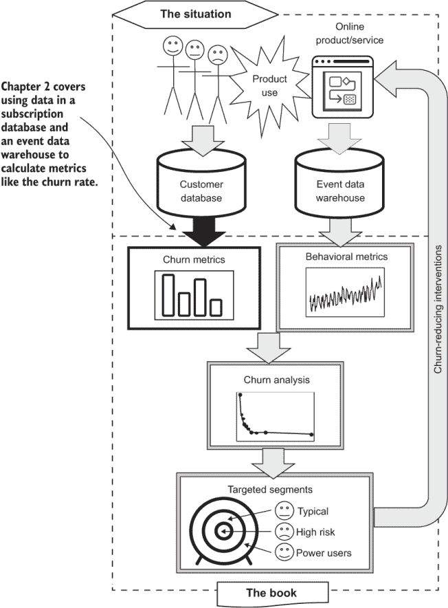

图 2.1 本章主题在利用数据对抗流失的过程中

计算流失率实际上并不是火箭科学，但你确实需要了解一些中级 SQL 和几个代数方程。有几个因素使得计算流失率变得非同寻常。部分挑战在于复杂性，另一个挑战则是后勤。计算流失率的复杂性在于一个账户在其生命周期内可能有多个订阅，包括以下内容：

+   账户可以多次流失并再次注册。这对于所有订阅产品和服务都是正确的。

+   对于许多订阅服务，账户可以同时持有多个不同产品的订阅。这在 B2B 产品和服务中尤为常见。

通常，订阅或账户上没有字段或标志表明“这是流失”。相反，流失是每个账户在特定时间点的动态状态，必须在此时刻确定。就此而言，如果账户或订阅上有字段或标志表明它是流失，那么你很可能是需要计算它的人，因为你就是数据人员——对吗？

在计算流失率时也存在后勤挑战：首先，数据是敏感的。对于任何订阅产品或服务，订阅数据库是其最有价值的资产之一。订阅数据库通常包含订阅者的个人可识别信息（PII）和公司的敏感财务信息。这不是你希望提取并留存在不安全位置的数据。第二个陷阱是随着成功而来的：如果你的产品或服务成功，这些数据量会很大。出于这两个原因，从数据库中提取数据进行处理并不是一个好主意。

那么问题就是，计算客户流失需要动态逻辑，但你最好在数据库中完成需要做的事情，而不是提取数据。因此，我将向你展示如何使用多部分 SQL 语句来计算客户流失，并将结果作为 SELECT 语句的输出（公平地说，我称这些 SQL 程序）。这是本书中反复出现的一个最佳实践：尽可能在数据库或数据仓库中完成工作，仅在必要时提取减少的数据。如果你习惯于在 Python 这样的过程语言中进行这种逻辑和计算，这可能会显得有些陌生，甚至令人沮丧。虽然可以在 Python 中完成这些任务，但这种方法与本书中教授的数据库方法相比，可扩展性差得多。一旦你习惯了使用多部分 SQL 程序在数据库中处理数据，你可能会 wonder how you ever got by without it!

本章的组织结构如下：

+   第 2.1 节在你开始编码之前，通过图表和几个方程式展示了客户流失的概念。

+   第 2.2 节展示了典型的订阅数据库的外观；你将在客户流失计算中使用该示例数据库结构。

+   第 2.3 节从净保留率开始进行客户流失计算，这是一个与客户流失相关的常见指标。（还有一个相关的净流失率测量，但正如我将解释的，人们很少使用它。）净保留率首先出现，因为它在概念上很简单，计算起来最容易，并且对于简单的订阅场景来说足够了。

+   第 2.4 节教你标准客户流失率的计算方法，它更普遍适用，但比净保留率稍微复杂一些。

+   第 2.5 节考虑了在没有订阅但客户对产品或服务有重复使用的情况下的客户流失计算。这些技术适用于广告或应用内购买产品。

+   第 2.6 节涵盖了收入流失率的测量，称为月度经常性收入（MRR）流失率；它适用于复杂的订阅服务。

+   第 2.7 节解释了如何将一年的客户流失率转换为月度流失率，反之亦然。

用于数据驱动的客户流失应对代码

本书的所有源代码都可在本书的网站上找到（[www.manning.com/books/fighting-churn-with-data](http://www.manning.com/books/fighting-churn-with-data)）和本书的 GitHub 仓库中（[`github.com/carl24k/fight-churn`](https://github.com/carl24k/fight-churn)）。本书的列表在文件夹/listings 中。请参阅仓库的 README 页面以获取详细的设置说明。总之，你需要执行以下步骤来运行本书中的代码列表：

1.  安装 Python 和 Postgres。我还推荐安装免费的 GUI 工具来与之一起使用。如果你已经是这些工具的专家，那么使用你喜欢的工具；如果不是，请严格按照 README 中的设置说明操作。

1.  使用 `fight-churn/data-generation/churndb.py` 创建数据库模式。

1.  使用 `fight-churn/data-generation/churnsim.py` 生成模拟数据并将其保存到 Postgres 模式中。

模拟通常运行大约 10 分钟，在 6 个月内为虚构社交网络生成约 15,000 名客户。模拟创建了他们所有的订阅和事件，例如交朋友、发布帖子、查看广告以及点赞和不喜欢帖子。关于模拟的更多细节将在本书中提供。

在创建数据库并生成数据后，有一个名为 `run_churn_listing.py` 的 Python 包装程序，您可以使用它来运行本书中的所有列表。这对于第 2-4 章中的 SQL 列表很有帮助，因为脚本会处理变量和连接到数据库等细节；包装程序也用于第五章开始的 Python 函数。命令行参数控制运行哪个列表。例如，要运行列表 2.1，您使用此程序：

```
fight-churn/listings/run_churn_listing.py —chapter 2 —listing 1
```

或者，如果您想用另一种方法运行列表，所有列表都按章节组织在 fight-churn/listings/ 下的文件夹中。例如，列表 2.1 位于文件 fight-churn/listings/chap2/listing_2_1_net_retention.sql 中。SQL 列表都存储为包含以 `%` 开头的绑定变量的模板；它们不包含特定参数，如日期或事件名称。在运行查询之前，您需要替换这些变量的值。包装脚本 `run_churn_listing.py` 会为您处理这些。

在 SQL 列表中使用绑定变量，以便它们可以轻松重新配置以在除提供的模拟以外的数据集上运行。如果您想使用自己的数据而不是模拟，首先执行以下操作（在按照 README 中解释的说明安装 Python 和 Postgres 之后）：

1.  使用 `fight-churn/data-generation/churndb.py` 创建一个模式。通过编辑该可执行文件并设置文件顶部附近的变量 `schema_name` 来设置模式名称。

1.  加载您的订阅、事件和模式事件表。（如何操作的细节超出了本书的范围，但各种免费工具使将数据加载到 Postgres 数据库变得相当容易。）

1.  列表包装程序从存储在 JSON 文件 fight-churn/listings/conf/churnsim_listings.json 中的参数运行。要使用不同的参数运行列表，您必须创建该 JSON 文件的自己的版本。对于每个章节和列表，都有参数块，参数以键值对的形式存储。您可以将这些设置为适合您自己的数据集的适当值。

1.  使用包装程序和额外的参数 `—schema` `<your_schema>` 运行列表。

关于安装和使用的更多详细信息请参阅 README。

## 2.1 损耗率的定义

图 2.2 阐述了客户流失的概念：两个圆代表不同时间点的订阅者池。每个圆的面积代表订阅者的数量或他们支付的总金额；后者在订阅者支付不同金额时使用。但无论客户流失是基于订阅者数量还是收入金额，概念是相同的。客户流失是顶部的向下新月形：起始圆中不与底部（结束）圆重叠的部分，即那些不再使用服务的订阅者。为了完整地描述，两个圆之间的重叠部分是保留的订阅者，而结束圆底部向上新月形（不与顶部圆重叠）代表新获得的订阅者。请注意，通常两个圆的大小并不完全相同。

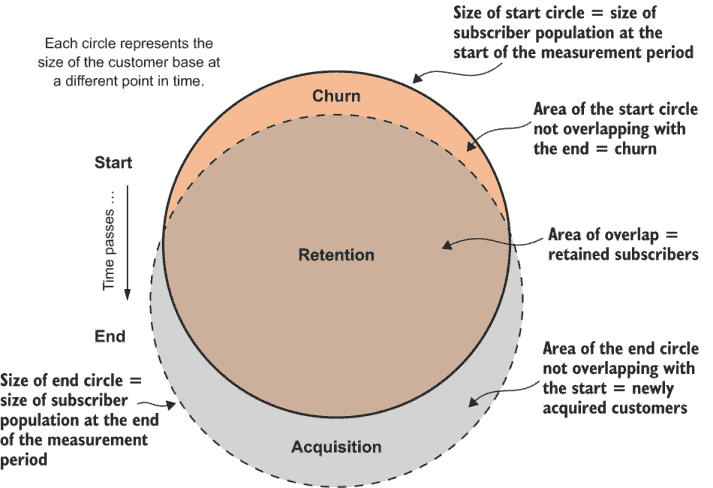

图 2.2 客户流失维恩图，显示一个增长中的订阅服务，其中获取量大于流失量

### 2.1.1 计算客户流失率和客户保留率

接下来，我将向您展示如何将图 2.2 中的定性图像转换为公式。客户流失率定义为起始订阅者（起始圆）离开服务（顶部新月形）的比例。在方程中，这表示为

| 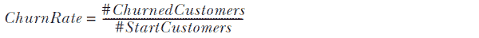 | 公式 2.1 |
| --- | --- |

其中 #StartCustomers 表示起始圆的面积，而 #ChurnedCustomers 表示流失新月形的面积。图 2.3 展示了一个简单的示例。

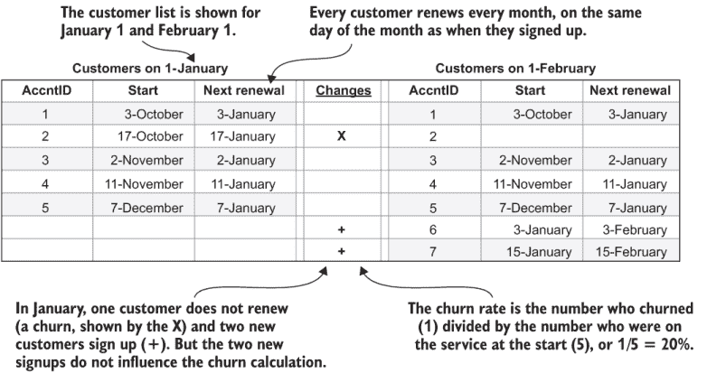

图 2.3 客户流失率计算简化示例

该产品在 1 月份只有五名客户，所有客户都在每月的同一日进行续订。在 1 月份，一名客户没有续订，两名新客户注册，因此 2 月份有六名客户。

公式 2.2 显示了 1 月份的客户流失率计算：

| 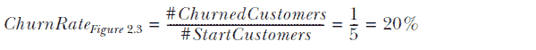 | 公式 2.2 |
| --- | --- |

注意，客户流失率不使用最终的总订阅者数或新获得的订阅者数。查看图 2.2 以了解原因：客户流失率是起始圆中未被结束圆覆盖的部分，但结束圆的大小取决于保留和新订阅者获取的数量。新订阅者的获取是一个极其重要的主题，但它是一个独立的问题，因为它来自不同的过程集合，所以它不包含在本书中。因此，客户流失率仅基于与起始订阅者的流失相关。如果客户流失率是按最终订阅者池的面积来划分的，那么它将是不连贯的，因为这会混合两个池的部分，并混淆获取和保留对订阅者池大小的贡献。

客户保留率在公式 2.3 中定义：

| 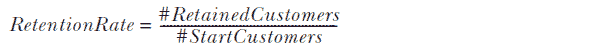 | 公式 2.3 |
| --- | --- |

使用图 2.3 中的示例，客户保留率为

| 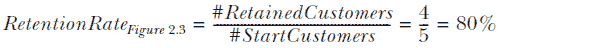 | 方程式 2.4 |
| --- | --- |

### 2.1.2 流失率和保留率之间的关系

这里有一个关于流失率和保留率的重要事实：它们以非常精确的方式相互关联，是同一枚硬币的两面。看看图 2.2 中起始圆的部分。整个起始圆要么是流失部分，要么是保留部分，由这个方程式表示：

| 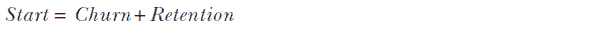 | 方程式 2.5 |
| --- | --- |

现在进行一些代数操作。如果你将方程式 2.5 的两边除以起始订阅者，你会得到

|  | 方程式 2.6 |
| --- | --- |

接下来，将方程式 2.6 中的流失率和保留率的定义替换为方程式 2.1 和 2.3，并记住任何数除以自身等于 1，或 100%。这个方程式显示了以下关系：

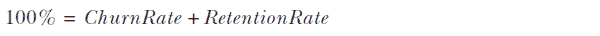

最后，这些术语可以被重新排列以得出结论：

| 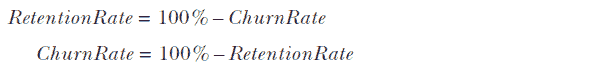  | 方程式 2.7 |
| --- | --- |

方程式 2.7 也可以通过查看图 2.2 来理解。流失和保留共同构成了起始圆，因此这两个比例的总和必须等于整个圆，即 100%。

摘要：保留率可以从流失率中轻松计算出来，反之亦然。你查看哪个测量值是个人偏好的问题。

大多数组织使用流失率进行减少流失的内部讨论。保留率通常用于向外界（例如，投资者）报告，当重点是要积极（“杯子是半满的”）时。

## 2.2 订阅数据库

正如我在第一章中描述的，订阅产品或服务通常有一个数据库来跟踪订阅的开始和结束时间，本书中的例子通常假设正在使用订阅数据库。如果你的业务没有订阅数据库，因为它是一个免费或广告支持的产品，第 2.5 节展示了如何在没有订阅的情况下计算流失率，但我建议你阅读这一节以及随后的章节，因为它们构建了必要的概念和技术。

表 2.1 显示了典型订阅数据库表的关键元素。

表 2.1 一个典型的订阅数据表

| 列 | 数据类型 | 是否必需 |
| --- | --- | --- |
| `subscription_id` | `integer` or `char` | Yes |
| `account_id` | `integer` or `char` | Yes |
| `product_id` | `integer` or `char` | Yes |
| `start_date` | `date` | Yes |
| `end_date` | `date` | No |
| `mrr` | `double precision` | Maybe |

实际上，通常有更多的字段，但为了说明目的，这个订阅数据模型包含了一些你可能在生产环境中期望找到的核心字段：

+   订阅 ID——每个订阅的唯一标识符。

+   账户 ID——账户持有者或用户的标识符。这些在账户级别上是唯一的，但在订阅表中并不假定是唯一的。通常，账户可以持有多个订阅。

+   产品 ID —— 订阅的唯一产品的标识符。此数据模型使用每个订阅一个产品，但如前所述，账户可以持有多个产品。如果订阅服务只提供单一产品，可能没有产品字段；但公平地说，这应该被视为一个必填字段，因为计划增长的单一产品服务通常会推出新的产品。

+   开始日期 —— 每个订阅都必须在某个日期开始。这些是简单的日期，没有时间。

+   结束日期 —— 订阅可能有或没有结束日期。如果没有结束日期，则假定订阅将持续到明确取消。

+   每月周期性收入（MRR）——付费订阅关联着一定数量的周期性每月收入。

总结来说，订阅是一种向客户销售的产品，它从特定的开始日期开始，并按指定周期性费用进行。正如所讨论的，可能会有一个结束日期，也可能没有。

注意：带有结束日期的订阅通常被称为期限订阅，从开始日期到结束日期之间的时间称为期限。持续无限期（直到取消）的订阅通常被称为常青订阅。

注意，包含此信息的数据库表可能不被称为“订阅”。如果你在一家使用客户关系管理（CRM）系统跟踪交易的 B2B 公司工作，你的公司可能将此信息存储为“机会”；或者，如果你的公司使用旨在跟踪多产品订阅提供的订阅业务管理（SBM）产品，该表可能被称为“产品”`“费率”`“计划”。但只要所有必需的数据元素都可用，你就有了计算流失所需的一切。注意，对于任何销售付费订阅服务的公司，MRR 可以被视为一个必填字段，尽管如果存在折扣或免费试用（例如，基本级别的免费增值订阅），它可能为零。

杂乱的订阅数据库

在这本书的整个过程中，你将反复看到一个主题，那就是算法被设计来处理数据库中保存的订阅的不规则性，也称为杂乱或未清理的订阅数据。杂乱的订阅数据可以有多种形式：同一账户的重复项、不属于真实账户的条目、在所谓的连续订阅条款（如时长和价格）中的不一致性、订阅之间的意外间隔，以及结束日期在开始日期之前的情况，仅举几例。

如果你仍然是一名学生或者从未在商业环境中工作过，那么这可能会让你感到惊讶，甚至恼怒，因为一些我使用的算法可能比你预期的或认为必要的要复杂。但我可以向你保证，这些复杂性在大多数情况下是必要的。

在现实世界中，干净的订阅数据库很少见；杂乱的订阅数据库是常态。你可能还没有意识到的一个问题是，只需要一小部分杂乱数据就足以使某些算法出错，其影响范围可能远不止是数据有问题的账户。

（继续）

如果你处理的是干净的数据，请对帮助处理杂乱数据的其他人的技术有耐心，并且可以自由地简化算法以适应更简单的情况。如果你处理的是杂乱的订阅数据，请放心：你并不孤单。本书中的技术应该能帮助你理解订阅者参与度和降低流失率。（但不要期望我为你清理数据！我是一个数据科学家，不是魔术师……）

## 2.3 基本流失计算：网络保留

我从网络保留开始，因为它是最容易计算的流失指标，尽管我也会向你展示它并不总是最有用的。图 2.2 展示了当圆圈代表收入时的保留率。像所有流失和保留度量一样，网络保留是在特定时期内（通常是一年）测量的。网络保留率（NRR）是指公司在期末从最初存在的订阅者那里仍然收到的重复性收入的比率。

注意：如果你的订阅产品是免费的（没有付费的重复性收入），你仍然应该阅读这一节。网络保留计算可以用来计算常规（基于账户）的流失，并且它比第 2.4 节中提出的更通用的流失公式更简单。

像所有流失度量一样，网络保留忽略了在时间期间通过注册获得的新收入。另一方面，关于网络保留的一个重要事实是，如果发生这种情况，它包括保留的订阅者的收入变化。这可以发生在任何具有多个产品计划、临时折扣或定价计划变化（大多数付费订阅）的产品或服务中。我将忽略这些细节，专注于教授网络保留和流失的计算；你将在接下来的章节中了解这些不同的情况。

### 2.3.1 网络保留计算

网络保留在方程 2.8 中定义：

|  | 方程 2.8 |
| --- | --- |

这是对保留率的定义与方程 2.2 中的定义略有不同。图 2.4 将图 2.3 中的例子扩展到包括两种不同计划类型和不同的 MRR：每月 9.99 美元的标准计划和每月 29.99 美元的豪华计划。在图中，一位豪华计划的客户流失，两位新客户注册，一位客户从标准计划转为豪华计划。这个例子显示了与图 2.3 中基于计数的流失计算的重要差异：

+   因为流失计算是基于 MRR 的，所以当客户流失时，付费更多的客户对比率的影响更大。

+   对于没有流失的客户，MRR 的变化也会影响这个比率。

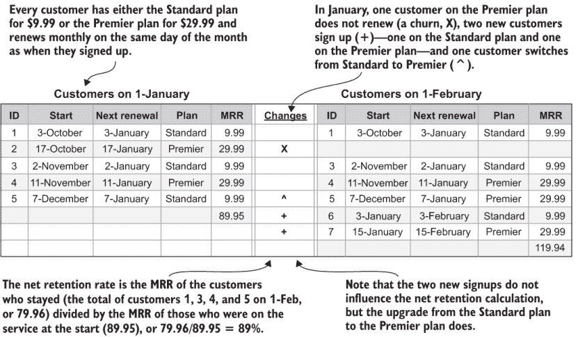

图 2.4 净保留率计算的简化示例

参考图 2.4 和方程式 2.8 的示例：净保留率的分子是所有剩余客户的 MRR，包括切换到高级计划的客户，或$79.96。起始时所有客户的 MRR 是$89.95，因此净保留率由以下公式给出

|  | 方程式 2.9 |
| --- | --- |

此外，还有一个与净保留率相关的流失度量，定义为 100%减去净保留率。方程式 2.10 显示了从净保留率定义净流失：

|  | 方程式 2.10 |
| --- | --- |

净保留率是唯一更常以保留率而不是流失率引用的与流失相关的度量。这在一定程度上是由于多价格订阅中出现的场景，特别是出现负净流失的可能性（另一方面，净保留率始终为正）。在下一节中，你将学习如何使用 SQL 计算净保留率，以及本书中关于 PostgreSQL 使用的更多细节。

### 2.3.2 SQL 净保留率计算

作为本书中的第一个 SQL 程序，我将简要介绍常见的表表达式（CTEs）。本书中的这个 SQL 程序以及所有其他程序都使用 CTEs，这是 ANSI SQL 的一个相对较新的扩展。CTEs 允许在查询中定义中间的、临时的表，按照它们出现的顺序。与其他临时表的语法相比，CTEs 更加简洁。数据库中的临时表是`SELECT`语句的结果，这些结果被保存在数据库中，可以在同一整体 SQL 语句或程序中的进一步`SELECT`中使用。然而，临时结果不会在当前执行之外持久化。

我使用 CTEs 来教授这些技术，因为它们允许清晰、逐步展示程序逻辑。 (我将其称为 SQL 程序，而不是常用术语 SQL 语句，后者暗示逻辑更短、更简单。)以下是对列表 2.1 的高层次概述，该列表展示了我们的第一个 SQL 程序，与图 2.2 中的流失图相关：

1.  设置测量的起始和结束时间。

1.  确定起始时的订阅者和总收入（如图 2.2 中的顶部圆圈）。

1.  确定结束时的订阅者和总收入（如图 2.2 中的底部圆圈）。

1.  确定保留的订阅者和他们的收入（如图 2.2 中两个圆圈的交集）。

1.  将保留的订阅者收入除以起始订阅者收入（方程式 2.2）。

关于此程序（以及其他所有程序）的另一点是，通常我会查看你可能遇到的难度最大或最复杂的使用案例。这也意味着它可能对于某些场景来说功能过于强大，但我更愿意让一些用户根据自己的判断简化程序，而不是省略对许多其他人有帮助的指导。特别是，该程序假设订阅者可以持有多个具有不同持续收入的订阅产品。如果你的订阅只有一个产品和一个价格以及/或没有付费的持续收入，你可以使用相同的 SQL，但将 MRR 的总和替换为账户数量的计数。如果你的服务只有定期订阅，你可以删除关于空结束日期的情况。（如第 2.2 节所述，定期订阅在订阅创建时有一个定义的结束日期。）该程序的 SQL 在列出 2.1 中显示。

注意：列出 2.1 中的日期变量使用配置参数设置，因此在书籍的可下载代码中，它们以以`%`开头的绑定变量形式出现。列出显示了变量绑定后的 SQL。对于书籍中的所有 SQL 列表也是如此。

列出 2.1：净保留 SQL 程序

```
WITH
date_range AS (                                                            ①
    SELECT '2020-03-01'::date AS start_date, '2020-04-01'::date AS end_date
), 
start_accounts AS                                                          ②
(
    SELECT  account_id, SUM(mrr) AS total_mrr                              ③
    FROM subscription s INNER JOIN date_range d ON
        s.start_date<= d.start_date                                        ④
        AND (s.end_date>d.start_date or s.end_date is null)
    GROUP BY account_id                                                    ⑤
),
end_accounts AS                                                            ⑥
(
    SELECT account_id, SUM(mrr) AS total_mrr                               ③
    FROM subscription s INNER JOIN date_range d ON
        s.start_date<= d.end_date                                          ⑦
        AND (s.end_date>d.end_date or s.end_date is null)
    GROUP BY account_id                                                    ⑤
), 
retained_accounts AS                                                       ⑧
(
    SELECT s.account_id, SUM(e.total_mrr) AS total_mrr                     ⑨
    FROM start_accounts s 
    INNER JOIN end_accounts *e* ON s.account_id=e.account_id                 ⑩
    GROUP BY s.account_id                                                  ⑤
),
start_mrr AS (                                                             ⑪
    SELECT SUM (start_accounts.total_mrr) AS start_mrr
    FROM start_accounts
), 
retain_mrr AS (                                                            ⑫
    SELECT SUM(retained_accounts.total_mrr) AS retain_mrr
    FROM retained_accounts
)
SELECT 
retain_mrr /start_mrr  AS net_mrr_retention_rate,                          ⑬
    1.0 - retain_mrr /start_mrr AS net_mrr_churn_rate,                     ⑭
start_mrr,                                                                 ⑮
retain_mrr
FROM start_mrr, retain_mrr
```

① 设置程序计算流失的周期。

② 包含所有在开始日期活跃的账户 ID 及其在开始日期的总 MRR 的 CTE。

③ 使用聚合求和，以便当存在多个订阅时，SELECT 返回总数。

④ 在指定日期活跃的准则：开始日期在或早于该日期，结束日期在或晚于该日期或为空。

⑤ 使用聚合的 GROUP BY 函数，因此 SELECT 对每个账户的总 MRR 进行求和。

⑥ 包含所有在结束日期活跃的账户 ID 及其在结束日期的总 MRR 的 CTE。

⑦ 在指定日期活跃的准则：开始日期在或早于该日期，结束日期在或晚于该日期或为空。

⑧ 包含所有未流失（保留）的账户的 CTE。

⑨ 使用聚合求和，以便当存在多个订阅时，SELECT 返回总数。

⑩ 内连接的结果是包含在开始和结束日期都活跃的账户，这意味着它们被保留了。

⑪ 求和所有在开始日期活跃的账户的总 MRR。

⑫ 求和所有保留的账户的总 MRR。

⑬ 净保留公式：保留账户的 MRR 除以开始时的 MRR。

⑭ 净 MRR 流失公式：1.0 减去净保留率。

⑮ 包含结果组成部分，以显示 MRR 是如何产生的。

以下列表描述了程序中的每个 CTE 以及最终的`SELECT`语句，以及每个 CTE 在计算中扮演的角色，编号根据在列出 2.1 之前概述的计算策略步骤：

1.  `date_range`—一个包含计算开始和结束日期的单行表。

1.  `start_accounts`—一个表，其中每行对应于在开始时活跃的每个账户。此表是通过根据账户在流失测量开始时活跃的条件从订阅表中选择的，这意味着它持有订阅（其中订阅开始日期在流失测量开始日期之前，订阅结束日期在流失开始日期之后，或者没有订阅结束日期）。

1.  `end_accounts`—一个表，其中每行对应于在流失测量结束时活跃的每个账户。被认为是活跃的条件与起始账户相同，使用流失测量结束日期作为标准。

1.  `retained_accounts`—一个表，其中每行对应于在开始和结束时都活跃的每个账户。此表是通过在`start_accounts`表和`end_accounts`表之间基于账户 ID 进行标准连接创建的。

1.  `start_mrr`—一个包含起始流失测量时总 MRR 的单一行表，以清晰起见。

1.  `retained_mrr`—一个包含所有保留账户总 MRR 的单一行表，以清晰起见。

1.  最终`SELECT`语句——从`start_mrr`和`retained_mrr`表中获取结果，并通过将值插入方程 2.2 和 2.3 来计算最终结果。

这就是如何从典型的订阅数据库中通过 SQL 计算净保留率和净流失率（由方程 2.5 和 2.6 描述）的方法。

此 SQL 程序在本书网站上的代码生成的模拟数据集（[www.manning.com/books/fighting-churn-with-data](http://www.manning.com/books/fighting-churn-with-data)）和 GitHub 仓库（[`github.com/carl24k/fight-churn`](https://github.com/carl24k/fight-churn)）中进行了测试，并生成了图 2.5 所示的结果。你应该按照 README 中的说明运行列表 2.1。如果你没有自己产品或服务的数据，你可以在模拟数据集上运行代码；说明在仓库根目录的 README 中。如果你已经生成了模拟数据，那么可以通过执行包装程序`run_churn_listing.py`并使用如下参数来运行列表 2.1：

```
fight-churn/listings/run_churn_listing.py —chapter 2 —listing 1
```

包装程序会打印出它正在运行的 SQL 语句，最终结果看起来与图 2.5 相似。此图以及本章中所有 SQL 输出均以表格格式显示，就像在 SQL 工具中运行查询时会出现的结果一样。如果你使用 GitHub 上提供的 Python 框架运行列表 2.1，结果将以一行文本的形式打印出来。此外，请注意，你的结果可能会有所不同，因为底层数据是随机模拟的。


图 2.5 在模拟数据集上运行列表 2.1 的结果

本书中对 PostgreSQL（又称 Postgres）的使用

本书展示了所有使用经过测试和运行在 PostgreSQL 11 上的代码的示例。我选择 PostgreSQL 11 是因为它在撰写本书时是 PostgreSQL 的最新版本，它是一个具有现代功能且易于展示所教授概念的流行开源数据库。如果你在一家使用其他数据库的公司工作，将本书中的 SQL 转换为你使用的版本不应该太难。主要问题可能是 CTEs，它们将不得不转换为临时表或子查询。如果你是学生或刚开始学习这些技术并且可以自己选择数据库，我强烈建议你使用 PostgreSQL 来简化你在学习过程中使用本书代码的方式。

当然，PostgreSQL 没有大数据仓库的能力；虽然公共表表达式易于阅读，但它们可能在计算上很昂贵。因此，这种安排仅适用于具有相对较少客户的服务和产品。本书中的公司案例研究都有数万到大约 10 万客户，PostgreSQL 容易满足需求。根据你使用的硬件和你投入的性能调优工作量，PostgreSQL 应该能够很好地扩展到数百万客户的分析。如果你有 1000 万或更多的客户，你可能会最终使用专门为大数据架构的数据仓库产品。幸运的是，大多数现代数据仓库（如 Redshift 和 Presto）都支持带有公共表表达式的 SQL，因此本书中的技术可以直接转换。尽管如此，如果你是第一次学习本书中的技术，我强烈建议你在笔记本电脑上适合的 PostgreSQL 数据库上进行学习。

### 2.3.3 解释净留存率

以下场景可能会发生并影响你对净留存率的解释：

+   所有订阅（包括免费订阅）支付相同。

+   多种订阅价格，有两种情况：

    +   标准情况——流失和降价销售超过提升销售。

    +   负增长率案例——提升销售超过流失和降价销售。

如果所有订阅者支付完全相同，并且没有任何订阅者改变他们支付的金额，本节中计算的 MRR 流失和留存率与第 2.1 节中描述的基于订阅者数量的流失和留存率完全相同。看看图 2.2 中的圆圈：如果每个人都支付完全相同，那么基于订阅者 MRR 的圆面积与基于订阅者数量的圆面积完全成比例，这种比例在开始和结束时都是相同的。如果服务是免费的且 MRR 为零，情况也是一样的：净留存率和派生流失与基于订阅者数量的流失计算相同，尽管在这种情况下，你将不得不修改列表 2.1 中的 SQL 以使用计数聚合而不是 MRR 的总和。

另一方面，当订阅者支付金额变化时，净留存率和基于收入的客户流失率与基于订阅者计数的留存率和客户流失率不同。这是因为随着时间的推移，个别订阅者支付的金额可能会变化，因此如果图 2.2 中的圆圈代表收入，圆圈的大小有四种变化方式。这种更复杂的场景在图 2.6 中得到了说明，该图展示了包含升级销售和降级销售的 MRR 留存率和客户流失。订阅者收入可能变化的四种方式是

+   订阅者获取

+   订阅者流失

+   升级销售（保留的订阅者转为更高重复收入）

+   降级销售（保留的订阅者转为更低重复收入）

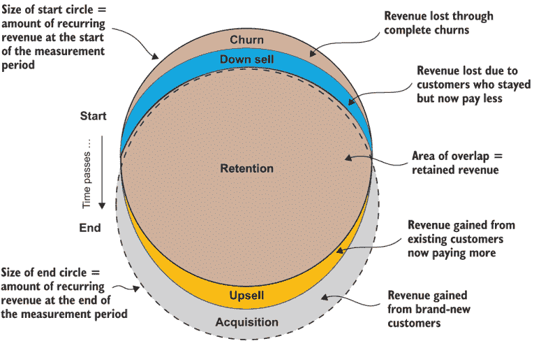

图 2.6 升级销售和降级销售下的收入留存率和客户流失

基于收入的净留存率和净客户流失率与基于订阅者计数的（标准）客户流失率不同。保留订阅者中的升级销售的影响可以有效地抵消客户流失，而保留订阅者中的降级销售可以有效地增加客户流失。

**要点** 净留存率之所以被称为“净”，是因为它结合了客户流失、升级销售和降级销售的影响。

净留存率的这种净化特性使其在对抗客户流失方面不如其他客户流失定义那样有用。这是因为包括降级销售和升级销售并不相同，将它们混淆会混淆问题。将降级销售纳入客户流失计算是合理的，因为那是最初存在的收入部分，但由于客户流失而丢失。升级销售的收入来自“不同的蛋糕”——如图 2.6 所示的最终收入循环——因此，净留存率衡量标准不再是整体部分之间的比率。此外，折扣的到期是合同价格的变化，与客户满意度无关。

**警告** 升级销售和折扣到期会降低净留存率中的明显客户流失率，这使得它成为客户流失的更不具体测量，对抗客户流失的作用也较小。下文所述的标准（基于计数）客户流失和 MRR 客户流失是更具体的客户流失测量方法，更受欢迎。

净留存率并不是对抗客户流失的最有用指标，但它仍然引人注目，因为以下关于客户流失报告实践的事实。

**提示** 净留存率是向订阅公司外部投资者报告客户流失的首选指标。

为什么在报告中偏好净保留率？有两个原因：一个善良的原因是，作为一个运营指标，净保留率将流失、升级和降级总结成一个方便的数字，这个数字可以说是对外部投资者最重要的。一个稍微有些牵强的原因是，当升级高于降级时，净流失率（从 100%减去净保留率得到）小于忽略收入变化的（基于计数）标准流失率。正如我刚才解释的，净收入变化（升级和折扣到期减去降级）实际上隐藏了真正的潜在流失率。对于许多公司来说，报告净保留率而不是更具体的流失率测量是一种更好的投资者关系和轻微的业务基础模糊的做法。在极端情况下，来自升级的收入池的增加可能大于降级和流失减少收入池的综合负面效应。这是一个罕见但高度理想的场景，被称为负流失。

定义 负流失——当升级带来的收入增加大于降级和流失的综合负面效应时。

这意味着保留的订阅者的收入大于起始订阅者的收入，即使在考虑到流失和降级之后。因此，净保留率大于 100%。如果根据第 2.1.2 节中的方程 2.6 计算净流失率，结果将是负数。请注意，这并不是标准流失率的真正负值——标准流失率只能是一个正数（或者可能是零，对于没有订阅者取消服务的服务）。如前所述，这不是与数据对抗流失的最有用流失率测量，因为它掩盖了实际流失的真正程度，但向投资者报告时却非常令人印象深刻！

## 2.4 标准账户流失

标准的基于账户的流失率具有最简单的含义，因为它不受升级、降级和折扣到期的影响。它总是简单地指完全取消服务的客户比例。

定义 标准流失——基于客户数量的流失率测量。也简称为流失率。

标准流失率通常被称为账户流失率，因为它指的是可能持有多个订阅的账户持有者的完全流失。因此，对于标准流失率来说，一个取消了一个订阅但保留了另一个订阅的账户持有者不被视为流失。（这将被视为降级，我将在下一节中重新讨论。）在 B2B 领域，标准流失率也被称为标志流失率，因为每个账户持有者都是一个公司（一个标志）。

在本节中，我将展示如何直接计算流失率，而不是从留存率计算。直接计算需要使用称为外连接的 SQL 功能。确实，流失率可以通过使用类似于用于净留存的内连接来从账户留存率计算，但能够使用外连接识别流失账户是一项你以后需要的技能。因为外连接不是基本的 SQL 功能，所以我将在 2.4.2 节中回顾外连接，在那之前，我将在 2.4.1 节中概述查询。

### 2.4.1 标准流失率定义

在考虑细节之前，让我们首先根据图 2.2 和公式 2.1 回顾计算标准流失率的步骤：

1.  设置测量的起始和结束时间。

1.  识别并计数起始时的订阅者（如图 2.2 中的顶部圆圈）。

1.  识别结束时的订阅者（如图 2.2 中的底部圆圈）。

1.  识别并计数流失的订阅者（如图 2.2 中的向上向下凸起的月亮形状）。

1.  将流失数量除以起始账户数量（公式 2.1）。

### 2.4.2 用于流失计算的外连接

从起始和结束账户中通过外连接选择了流失账户。我将简要回顾外连接，以便让不熟悉它们的读者了解。

内连接是更常见的连接类型，例如在`account_id`上连接以创建列表 2.1 中的`retained_accounts` CTE。它返回所有匹配的行（根据连接字段），并为匹配返回两个表中的所需字段。外连接不同，因为它不仅返回匹配的行，还返回一个表中的所有行。连接返回来自第二个表的匹配行，但对于第一个表中没有匹配行的行，它使用 null 填充第二个表的字段。这被称为左外连接，因为总是选择第一个表中的所有行，这在`join`语句的左侧。（还有一个右外连接，它在保持所有行的表方面与左外连接相反，甚至还有一个全外连接，它返回两个表的所有行。但对于流失来说，左外连接就足够了。）

使用外连接来查找流失账户，因为目的是找到起始时存在但结束时不再存在的账户。如果你进行内连接，它会匹配起始和结束时都存在的账户，而这些正是需要移除的账户。左外连接返回起始时存在的所有账户，而不仅仅是流失的账户，这就是为什么选择流失账户的 CTE 也需要一个`WHERE`子句。它只选择来自连接的、`end_accounts`中的`account_id`为 null 的账户，这意味着它只选择那些在`start_accounts` CTE 中匹配的`account_id`不在`end_account` CTE 中的行。

TAKEAWAY 外连接可以用来查找不满足连接条件的行，这使得它们在识别客户流失时非常有用。

再次查看图 2.2 中的客户流失图：它还提供了内部和外部连接逻辑的说明（这显示在图 2.7 中）。保留账户是开始和结束账户的交集，通过内部连接选择。流失账户，左外部连接，通过从起始账户中移除所有在末尾与 `WHERE` 子句匹配的记录来找到，选择 `WHERE` 子句中 `end account_id` 为 `NULL` 的记录。（因此，获得的账户将是右外部连接，`WHERE` 子句选择为空起始 `account_id`，但本书中的技术不需要这样做。）

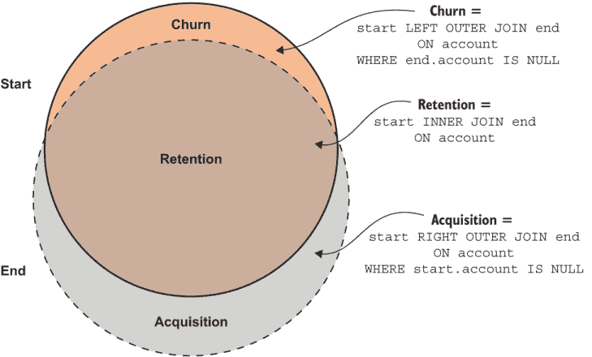

图 2.7 显示内部和外部连接的客户计算

### 2.4.3 使用 SQL 进行标准客户流失率计算

标准客户流失率计算的 SQL 代码如列表 2.2 所示。对于前三个 CTE，它与列表 2.1 中的净保留查询相同，它创建了包含测量开始和结束账户的临时表。但找到账户后，它创建了一个流失账户的表，而不是保留账户的表。

列表 2.2 标准（基于账户）客户流失 SQL 程序

```
WITH
date_range AS (                                                            ①
    SELECT  '2020-03-01'::date AS start_date, '2020-04-01'::date AS end_date
), 
start_accounts AS                                                          ②
(
    SELECT DISTINCT account_id                                             ③
    FROM subscription s INNER JOIN date_range d ON
        s.start_date<= d.start_date                                        ④
        AND (s.end_date>d.start_date or s.end_date is null)
),
end_accounts AS                                                            ⑤
(
    SELECT DISTINCT account_id                                             ③
    FROM subscription s INNER JOIN date_range d ON
        s.start_date<= d.end_date                                          ④
        AND (s.end_date>d.end_date or s.end_date is null)
), 
churned_accounts AS                                                        ⑥
(
    SELECT s.account_id
    FROM start_accounts s 
    LEFT OUTER JOIN end_accounts *e* ON                                      ⑦
    s.account_id=e.account_id                                              ⑧
    WHERE e.account_id is null                                             ⑨
),
start_count AS (                                                           ⑩
    SELECT     COUNT(*) AS n_start FROM start_accounts
), 
churn_count AS (                                                           ⑪
    SELECT     COUNT(*) AS n_churn FROM churned_accounts
)
SELECT 
n_churn::float/n_start::float 
        AS churn_rate,                                                     ⑫
    1.0-n_churn::float/n_start::float 
        AS retention_rate,                                                 ⑬
n_start,                                                                   ⑭
n_churn                                                                    ⑭
FROM start_count, churn_count
```

① 设置 SQL 计算客户流失率的周期

② 包含开始时所有活跃账户 ID 的 CTE

③ 使用唯一查询，因为不能假设每个账户只有一个订阅

④ 在给定日期上活跃的准则：开始日期在或早于该日期，结束日期在日期之后或为 NULL。

⑤ 包含结束时所有活跃账户 ID 的 CTE

⑥ 包含所有流失账户账户 ID 的 CTE：那些在开始时活跃但在结束时不再活跃的账户

⑦ 外连接包括开始时的所有记录，因为它是一个左外部连接。

⑧ 连接操作查找与账户 ID 匹配的记录，对于没有匹配的末尾账户，用 NULL 填充。

⑨ 移除没有流失的记录，因为这些记录的 e.account_id 不是 NULL。只有那些在 start_accounts CTE 中但不在 end_accounts CTE 中的账户保留。

⑩ 计算开始时活跃的账户数量

⑪ 计算流失账户的数量

⑫ 流失率公式：流失数量/起始数量

⑬ 保留率公式：1 − *c*hurn rate

⑭ 打印计算组件以显示如何产生流失率

以下描述程序中的每个 CTE 以及最终的 `SELECT` 语句，以及每个 CTE 在与 2.4.1 节中描述的步骤相关的计算中所起的作用：

1.  `date_range`—一个包含计算开始和结束日期的行的表。这是步骤 1。

1.  `start_accounts`—一个包含在开始时活跃的每个账户的行。这个表是通过根据账户在流失测量开始时活跃的条件从订阅表中选择的创建的。这是步骤 2。

1.  `end_accounts`—一个包含流失测量结束时每个活跃账户的行。被认为是活跃的条件与开始账户相同，使用流失测量结束日期作为标准。这是步骤 3。

1.  `churned_accounts`—一个包含在开始时活跃但在结束时不再活跃的每个账户的行。这个表是通过在 `start_accounts` 表和 `end_accounts` 表之间基于账户 ID 的外连接创建的，并使用 `WHERE` 子句删除了结束 `account_id` 不为 null 的账户。这是步骤 4。

1.  `start_count`—一个包含一行，汇总了流失测量开始时总账户数的表，以清晰起见。

1.  `churn_count`—一个包含在测量期间流失的总账户数的行，以清晰起见。

1.  最终 `SELECT` 语句 —从 `start_count` 和 `churn_count` 表中获取结果，通过将值代入方程 2.1 和 2.2 来计算最终结果。这是步骤 5，程序中的最后一步。

现在你已经知道了如何从典型的订阅数据库中通过 SQL 计算由方程 2.1 和 2.2 描述的流失率和留存率。列表 2.2 在书籍网站上的代码生成的模拟数据集（[www.manning.com/books/fighting-churn-with-data](http://www.manning.com/books/fighting-churn-with-data)）和 GitHub 仓库（[`github.com/carl24k/fight-churn`](https://github.com/carl24k/fight-churn)）上进行了测试，并生成了图 2.7 所示的结果。你应该按照 README 中的说明运行列表 2.2。在设置好环境（详情见 README）后，使用以下命令运行列表：

```
fight-churn/listings/run_churn_listing.py —chapter 2 —listing 2
```

与图 2.5 相比，图 2.5 显示了使用列表 2.1 计算的净留存结果，图 2.8 显示了相同的流失率，但计算的不是收入，而是从账户中计算得出的。这是预期的，因为模拟为每个客户使用相同的 MRR。

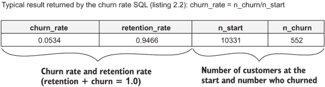

图 2.8 运行列表 2.2 在模拟数据集上的结果

### 2.4.4 何时使用标准流失率

当所有订阅者支付相似金额或订阅免费时，标准流失率用作主要运营指标。如果所有订阅者支付完全相同（意味着没有折扣或任何变化，或产品是免费的），则可以使用净留存查询或标准流失率查询来计算标准流失率。但如果存在适度的定价变化，或者有临时折扣，那么你应该使用本节中给出的标准流失计算方法。

如您稍后所见，标准客户流失率在客户流失分析中也扮演着特殊角色。因为客户流失分析使用的是旨在预测客户（订阅持有者）流失的模型，一个正确校准的预测客户流失模型应该能够重现标准账户客户流失率。然而，对于客户支付金额有显著差异的订阅或广泛使用折扣的订阅，标准客户流失率并不是最佳客户流失率；对于这些场景，你应该使用 MRR 客户流失率，这在第 2.6 节中介绍。

**总结**：如果存在适度的定价差异，包括折扣，那么你应该使用标准的客户流失计算方法。为此，适度的定价差异意味着大多数客户支付的价格接近相同，但可能会有一些客户处于较旧的计划、折扣或货币转换效应。

## 2.5 非订阅产品的基于事件的活动客户流失

在第一章中，我告诉你们，对抗客户流失不仅仅是针对订阅服务；它适用于任何有重复客户的任何产品或服务。现在，你们将学习专门针对非订阅场景的主要技术：基于客户活动计算客户流失。

基于事件的活动客户流失的概念与标准订阅客户流失相同，但你需要一个非正式的定义来区分客户是活跃的还是流失的。为了使用这些技术，你只需要一个事件数据仓库，这些事件是关于客户产品使用的时间戳事实。我将在第三章中更多关于事件数据的讨论，但为了简单起见，本节中的示例假设了一个具有事件时间戳的数据模型。

### 2.5.1 定义基于事件的活跃账户和客户流失

对于非订阅产品，最常见活跃客户的定义是客户在最近的时间窗口内使用了产品，通常是一到两个月。这一概念在图 2.9 中得到了说明。用户活动往往趋于集中，因此将活跃期视为一系列事件，任意两个连续事件之间没有大的间隔是自然的。如果超过了最大时间限制，则被视为客户流失。这样的时间限制应该足够长，以至于大多数超过限制的客户至少在一段时间内不会回来。

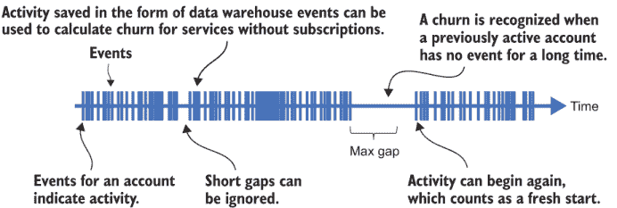

图 2.9 事件发生频率定义了活跃期和客户流失。

基于事件的活跃客户的其他标准可能包括以下内容：

+   只有当客户发生某些特定事件时，才认为他们是活跃的。

+   只有当客户拥有一定数量的事件时，才认为他们是活跃的。

+   只有当客户在最近的时间段内计算了特定的事件指标时，才认为他们是活跃的。使客户活跃（并在测试失败时流失）的特定指标示例包括零售购买的最小（或任何）支出或从广告中产生的最小收入。

这些不同的选择并没有在很大程度上改变 SQL 程序。

### 2.5.2 使用 SQL 进行活动型流失计算

计算事件引起的流失的 SQL 程序在列表 2.3 中展示。它与列表 2.2 几乎相同，只是没有使用订阅表。相反，测量开始时和结束时账户的 CTE 基于一个事件表（一个名为`event`的表）。如前所述，一个账户被认为是活跃的简单标准是它有一些最近的事件。与列表 2.2 一样，控制日期范围的参数在一个 CTE 中。

因为没有订阅的产品通常使用时间较短，列表 2.3 展示了为期一个月的流失（月度流失）。在这种情况下，另一个不同之处在于还有一个参数控制最近度的阈值。除了这些变化之外，程序的主要逻辑与列表 2.2 相同，所以这里我只是总结一下：

1.  找到在流失测量开始时活跃的账户。在开始时活跃的账户是在一段时间内有事件，这个时间窗口的结束时间是流失测量的（名义）开始时间。

1.  找到在流失测量结束时活跃的账户。这些账户在一段时间内有事件，这个时间窗口的结束时间是流失测量的结束。

1.  外连接这两组账户以找到那些在开始时活跃但在结束时不再活跃的账户。这些是流失账户。

1.  将流失账户的数量除以开始时活跃的账户数量来计算流失率。

列表 2.3 在书籍网站上的代码生成的模拟数据集（[www.manning.com/books/fighting-churn-with-data](http://www.manning.com/books/fighting-churn-with-data)）和 GitHub 仓库（[`github.com/carl24k/fight-churn`](https://github.com/carl24k/fight-churn)）上进行了测试，并生成了图 2.10 所示的结果。在设置好环境后，使用以下命令运行列表：

```
fight-churn/listings/run_churn_listing.py —chapter 2 —listing 3
```

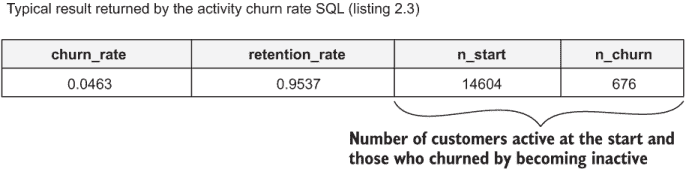

图 2.10 运行列表 2.3 在模拟数据集上的结果

与图 2.7 相比，图 2.7 展示了使用列表 2.2 计算的标准流失的结果，这个结果显示了类似的流失率，但并不完全相同。这是可以预料的，因为这些是相同的客户流失，但列表 2.3 使用稍微不同的标准来确定流失发生的时间。

列表 2.3 活动型（基于事件）流失 SQL 程序

```
WITH
date_range AS (                                                       ①
    SELECT  '2020-03-01'::TIMESTAMP AS start_date,                    ②
        '2020-04-01'::TIMESTAMP AS end_date,                          ②
        interval '1 months' AS inactivity_interval
), 
start_accounts AS                                                     ③
(
    SELECT DISTINCT account_id
    FROM event *e* INNER JOIN date_range d ON
        e.event_time>start_date-inactivity_interval
        AND e.event_time<= start_date)                                ④
start_count AS (                                                      ⑤
    SELECT     COUNT(start_accounts.*) AS n_start FROM start_accounts
), 
end_accounts AS                                                       ⑥
(
    SELECT DISTINCT account_id
    FROM event *e* INNER JOIN date_range d ON
        e.event_time>end_date-inactivity_interval
        AND e.event_time<= end_date                                   ⑦
), 
end_count AS (                                                        ⑧
    SELECT COUNT(end_accounts.*) AS n_end FROM end_accounts
), 
churned_accounts AS 
(
    SELECT DISTINCT s.account_id
    FROM start_accounts s 
    LEFT OUTER JOIN end_accounts *e* ON s.account_id=e.account_id
    WHERE e.account_id is null
),
churn_count AS (
    SELECT     COUNT(churned_accounts.*) AS n_churn
    FROM churned_accounts
)
SELECT 
n_churn::float/n_start::float AS churn_rate,
    1.0-n_churn::float/n_start::float AS retention_rate,
n_start,
n_churn
FROM start_count, end_count, churn_count
```

① 设置 SQL 计算流失的时间段

② 使用时间戳作为日期，因为事件使用时间戳

③ 此 CTE 与列表 2.2 中的相同 CTE 相似。

④ 选择在开始日期时间限制内有事件的账户

⑤ 此 CTE 与列表 2.2 中的相同 CTE 相同。

⑥ 此 CTE 与列表 2.2 中的相同 CTE 相似。

⑦ 选择在截止日期时间限制内的有事件的账户

⑧ 代码的其余部分与列表 2.2 相同。

基于订阅的流失和基于活动的流失之间的重要区别之一是，基于活动的流失需要等待每个客户知道他们是否已经流失。在订阅中，你知道订阅结束后没有替代品的第二天就是一个流失；但对于没有订阅的系统用户，你永远不知道一个事件是否是定义流失的最后一个事件，直到一段时间之后。话虽如此，在第四章中，你将看到，如果你允许订阅之间有很短的间隔（通常是几天），不计算流失，同样的逻辑也可以应用于订阅。

TAKEAWAY 你可以根据活动的最近日期来计算非订阅产品的流失率。

## 2.6 高级流失：月度经常性收入（MRR）流失

在前面的章节中，你了解到标准流失率在多价格订阅产品中可能存在问题。标准流失率忽略了降级销售，而降级销售应该是流失的一部分，而净保留包括降级销售，但也包括不应被视为流失的升级销售。为此，还有一种为这种情况设计的流失度量：MRR 流失。这是流失计算中最复杂的计算，但在存在多个订阅产品和价格时，它是最准确的。

TIP 如果你有支付广泛价格范围的客户：也就是说，你最有价值的客户支付的是最低价值客户的两倍或更多，请使用 MRR 流失。在企业 B2B 软件中，最有价值的客户可能支付的是最低价值客户的 100 倍左右，在这种情况下，MRR 流失是绝对必要的。

### 2.6.1 MRR 流失的定义和计算

MRR 流失再次是损失与起始状态之比，但现在流失率的分子是来自流失和降级销售的总体损失，而分母是客户起始时的收入。参考图 2.6，它说明了包含升级和降级销售的流失计算，MRR 流失包括完全流失导致的 MRR 直接损失（图 2.6 中的顶部向下凸起的月牙形）以及由于降级销售导致的损失（图 2.6 中的第二个向下凸起的月牙形）作为分子。它包括保留的 MRR 作为分母，但不包括升级销售的 MRR。因此，它是多价格订阅产品流失的最准确度量。

在一个方程中，MRR 流失被定义为方程 2.11 所示，而 MRR 保留则显示在方程 2.12 中。

|  | 方程 2.11 |
| --- | --- |
| 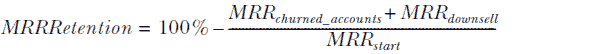 | 方程 2.12 |

在方程中，MRRchurned_accounts 表示所有流失账户的总 MRR，而 MRRdownsell 表示所有降级销售账户的 MRR 总减少。

图 2.11 展示了通过扩展 2.3.1 节中图 2.4 的示例来进行的 MRR churn 计算的一个例子。在图中，一位在 Premier 计划上的客户流失，两位新客户注册，两位客户更改了他们的计划。一位客户从 Standard 升级到 Premier，一位从 Premier 降级到 Standard。这个例子显示了 MRR churn 和净保留之间的重要区别：降价进入 MRR churn，但升价不进入。

使用方程式 2.11 并填写图 2.11 中示例的值，可以得到方程式 2.13：

|  | 方程式 2.13 |
| --- | --- |

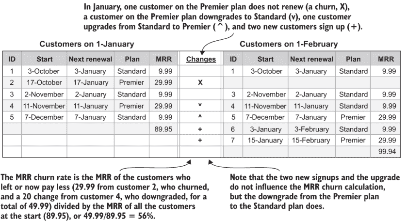

图 2.11 MRR churn 计算数据集

### 2.6.2 使用 SQL 进行 MRR churn 计算

MRR churn 计算的 SQL 代码显示在列表 2.4 中。它包括来自净保留 SQL 和标准 churn SQL 计算的元素。首先，我概述了计算步骤以及它们与 MRR churn 方程式（方程式 2.7）和降价/升价收入图（图 2.6）的关系。之后，我解释了这些步骤如何在 SQL 程序的 CTEs 中实现。计算步骤如下：

1.  设置测量的起始和结束时间。

1.  确定起始时的订阅者和总收入（图 2.6 中的顶部圆圈）。

1.  确定结束时的订阅者（图 2.6 中的底部圆圈）。

1.  确定流失的订阅者和他们的收入（图 2.6 中的顶部向下凸起的月牙形）。

1.  确定降价订阅者和降价金额（图 2.6 中的第二个向下凸起的月牙形）。

1.  将流失收入和降价订阅者收入的总额除以起始订阅者收入（方程式 2.11）。

这些步骤在 SQL 程序（列表 2.4）中作为以下 CTEs 实现：

1.  `date_range`—一个包含计算起始和结束日期的行表。这是步骤 1。

1.  `start_accounts`—一个包含在 churn 测量开始时每个活跃账户的行表。此表通过从订阅表中选择基于账户在 churn 测量开始时活跃的条件创建。这是步骤 2。

1.  `end_accounts`—一个包含在 churn 测量结束时每个活跃账户的行表。被视为活跃的条件与起始账户相同，使用 churn 测量结束日期作为标准。这是步骤 3。

1.  `churned_accounts`—一个包含在起始时活跃但在结束时不再活跃的每个账户的行表。此表通过在 `start_accounts` 表和 `end_accounts` 表之间进行外连接，并使用 `WHERE` 子句删除结束 `account_id` 不为 null 的账户创建。这是步骤 4。

1.  `downsell_accounts`—一个表，其中每行对应一个在开始和结束时都活跃但最终 MRR 低于开始的账户。这是通过在 `start_accounts` 表和 `end_accounts` 表之间进行 ID 连接以及一个 `WHERE` 子句来创建的，该子句仅选择那些最终 MRR 低于开始 MRR 的记录。这是第 5 步。

1.  `start_mrr`—一个包含挂账测量开始时总 MRR 的单行表。

1.  `churn_mrr`—一个包含挂账账户总 MRR 的单行表。

1.  `downsell_mrr`—一个包含所有保留账户总 MRR 的单行表。

1.  最终 `SELECT` 语句 — 从单行结果表 `start_mrr`、`churn_mrr` 和 `downsell_mrr` 中获取结果，通过将值插入方程 2.7 中来计算最终结果。这是第 6 步，程序中的最后一步。

列表 2.4 MRR 挂账 SQL 程序

```
WITH
date_range AS (                                                            ①
    SELECT '2020-03-01'::date AS start_date, '2020-04-01'::date AS end_date
), 
start_accounts AS                                                          ②
(
    SELECT account_id, SUM(mrr) AS total_mrr                               ③
    FROM subscription s INNER JOIN date_range d ON
        s.start_date<= d.start_date                                        ④
        AND (s.end_date>d.start_date or s.end_date is null)
    GROUP BY account_id                                                    ⑤
),
end_accounts AS                                                            ⑥
(
    SELECT account_id, SUM(mrr) AS total_mrr                               ⑦
    FROM subscription s INNER JOIN date_range d ON
        s.start_date<= d.end_date                                          ④
        AND (s.end_date>d.end_date or s.end_date is null)
    GROUP BY account_id                                                    ⑧
), 
churned_accounts AS                                                        ⑨
(
    SELECT s.account_id, SUM(s.total_mrr) 
        AS total_mrr                                                       ⑩
    FROM start_accounts s 
    LEFT OUTER JOIN end_accounts *e* ON                                      ⑪
    s.account_id=e.account_id
    WHERE e.account_id is null                                             ⑫
    GROUP BY s.account_id                                                  ⑩
),
downsell_accounts AS                                                       ⑬
(
    SELECT s.account_id, s.total_mrr-e.total_mrr
        AS downsell_amount                                                 ⑭
    FROM start_accounts s 
    INNER JOIN end_accounts *e* ON s.account_id=e.account_id                 ⑮
    WHERE e.total_mrr<s.total_mrr                                          ⑯
),
start_mrr AS (                                                             ⑰
    SELECT SUM (start_accounts.total_mrr) AS start_mrr
    FROM start_accounts
), 
churn_mrr AS (                                                             ⑱
    SELECT     SUM(churned_accounts.total_mrr) AS churn_mrr
    FROM churned_accounts
), 
downsell_mrr AS (                                                          ⑲
    SELECT coalesce(SUM(downsell_accounts.downsell_amount),0.0) 
        AS downsell_mrr                                                    ⑳
    FROM downsell_accounts
)
SELECT 
    (churn_mrr+downsell_mrr) /start_mrr AS mrr_churn_rate,                 ㉑
start_mrr,                                                                 ㉒
churn_mrr, 
downsell_mrr
FROM start_mrr, churn_mrr, downsell_mrr
```

① 设置 SQL 计算挂账的时间段

② 包含活跃账户及其开始时 MRR 的 CTE

③ 在存在多个订阅的情况下使用汇总总和

④ 在给定日期上活跃的准则

⑤ 对总和进行 GROUP BY 聚合

⑥ 包含活跃账户及其最终 MRR 的 CTE

⑦ 在存在多个订阅的情况下使用汇总总和

⑧ 对总和进行 GROUP BY 聚合

⑨ 包含所有挂账账户 ID 的 CTE

⑩ 在存在多个订阅的情况下汇总总 MRR

⑪ 通过账户 ID 匹配记录，并在不匹配时填充 null。

⑫ 移除存在非空 e.account_id 的记录

⑬ 包含所有降级账户的 CTE

⑭ 根据定义，降级金额是正数。

⑮ 内连接选择开始和结束时都活跃的账户。

⑯ WHERE 条件选择最终支付更少的账户。

⑰ 汇总所有在开始时活跃的账户的总 MRR

⑱ 汇总所有挂账账户的总 MRR

⑲ 包含降级导致的 MRR 总减少的 CTE

⑳ 如果没有降级，则 Coalesce 用零填充。

㉑ MRR 挂账公式

㉒ 打印计算组件

列表 2.4 在书籍网站上代码生成的模拟数据集（[www.manning.com/books/fighting-churn-with-data](http://www.manning.com/books/fighting-churn-with-data)）以及书籍的 GitHub 仓库（[`github.com/carl24k/fight-churn`](https://github.com/carl24k/fight-churn)）上进行了测试，并生成了图 2.12 所示的结果。您应按照 GitHub 上的 README 指示运行列表 2.4。在设置好环境（详情见 README）后，使用以下命令运行列表：

```
fight-churn/listings/run_churn_listing.py —chapter 2 —listing 4
```

与图 2.7 所示的标准流失率计算结果相比，这个结果显示了相同的流失率。这是可以预料的，因为模拟为每位客户使用了完全相同的 MRR，所以模拟没有降价销售或导致其与标准计算不同的原因。尽管如此，模拟代码可以被扩展以包括可变的 MRR，这将使这个练习更有趣。我鼓励你作为练习这样做。


图 2.12 在模拟数据集上运行列表 2.4 的结果

### 2.6.3 MRR 流失率 vs. 账户流失率 vs. 净（留存）流失率

到目前为止，你已经了解了三种不同的流失率公式：

+   从净留存率计算得出的净流失率

+   标准的（基于账户的）流失率

+   MRR 流失率

你也已经了解了每种通常适用于哪种情况：

+   净留存率和流失率——作为向投资者报告的操作指标。基于净留存的流失率在所有订阅者支付相同（或所有订阅者不支付）时等同于标准流失率。

+   标准流失率——用于应对订阅者支付金额大致相同，但价格和折扣可能存在一些差异，这可能会使净留存率的解释复杂化。

+   MRR 流失率——用于应对不同订阅者支付金额差异较大的情况。

有一种相当常见的情况不适用于使用 MRR 流失率，那就是对于具有低于月度计划的年度计划的订阅。订阅者可以锁定一个低利率，但通过预付全年来承诺整个年份。这通常对订阅业务是有益的，因为如果做得正确，它会导致订阅者的终身价值更高，这一点将在第八章中解释。然而，当订阅者从月度计划切换到年度计划时，这会被视为降价销售，此类变化会对报告的流失率产生负面影响。在这种情况下，可能最好使用标准流失率。

当不同类型的账户的 MRR 之间存在真正巨大的差异时，MRR 流失率最为合适：在 B2B 软件销售中，大账户可以轻松支付比小账户多 10 倍或更多的金额。对于具有此类价格差异的公司，这三个流失率指标之间通常存在一致的关系。

总结：标准流失率 > MRR 流失率 > 净流失率

你可能会预期 MRR 流失率通常会比标准流失率指标高，因为 MRR 流失率包括了降价销售的影响，而标准流失率则不包括。然而，正如我将在后面的章节中讨论的，几乎总是情况是，支付更多费用的账户比支付较少费用的多价格产品账户流失得更少。如果你不从事这样的产品，这可能会显得有些矛盾，因为按照付费更多的逻辑，应该会让客户更不满意。然而，在 B2B 产品中，更高的价格往往属于使用产品更多（有更多用户）的大型公司订阅者，而大型公司几乎总是比小型公司更稳定。此外，支付更多费用的公司往往更愿意长期使用产品，因为他们在购买前有更长的考虑过程，并且在订阅产品的设置和运营上投入更多。因此，计算所有订阅者平等的标准化流失率几乎总是高于 B2B 产品的 MRR 流失率。

从净留存率计算出的净流失率几乎总是所有流失率指标中最小的。这是因为，除了反映大型公司订阅者的低流失率外，它还将保留账户中的升级销售计入流失率。正如之前提到的，当升级销售超过降价销售和流失时，从净留存率计算出的净流失率甚至可能是负数。

## 2.7 流失率测量转换

到目前为止，计算假设你想要计算一个月的流失率。正如我提到的，可以计算任何时间段的流失率，大多数 B2B 产品订阅将流失率计算为年度数字，以更好地反映订阅的典型长度。这很好，因为计算是相同的，使用相同的代码计算年度流失率就像改变一年中相隔一年的起始和结束日期一样简单。但假设一家公司想要计算年度流失率，但运营时间不到一年，或者由于其他原因在数据库中只有不到一年的数据？这不是问题，因为你可以将较短时间（如一个月）的流失率转换为较长时间（如一年）的流失率。但是，一个月内测量的流失率和一年内测量的流失率之间的关系并不完全直接。

揭秘：年度流失率不是月度流失率的 12 倍。本节展示了不同时间框架下流失率测量之间的关系，以及如何将一个月内的流失率测量转换为年度流失率，反之亦然。

### 2.7.1 生存分析（高级）

注意，本节包含很多方程式。如果你不喜欢数学，可以跳到下一节开始处显示的答案。

理解每月和年度流失率之间关系的关键是，将保留客户视为幸存者，并观察他们在多个月份中的存活情况。术语“幸存者”来自生物学中的种群研究，这正是这种分析起源的地方，但将保留客户视为在流失如死亡的过程中的幸存者是合理的。这如图 2.13 所示，展示了如果存在每月流失率，以及等价的每月保留率（为流失率的倒数），如图中所述，初始订阅者池会发生什么。图 2.13 展示了左侧的一个简单具体例子，以及右侧的相同过程用代数方程表示。

下面是如何在一年中演变流失过程，从 100 个账户和 10%（0.1）的流失率开始，如图 2.13 的左侧所示：

1.  在第一个月初，有 100 个订阅者。在第一个月中，100 × 0.1 = 10 个客户流失，剩下 90 个。这相当于 100 乘以保留率 0.9。

1.  在第二个月初，有 90 个订阅者，在第二个月中，90 × 0.1 = 9 个客户流失，剩下 81 个。这相当于原始的 100 乘以保留率的平方，因为 81 = 100 × 0.81 = 100 × 0.9²。

    注意，因为流失率是流失账户的百分比，如果一开始账户较少，那么流失的账户也会较少，尽管流失率是相同的。

1.  在第三个月初，有 81 个订阅者，在第三个月中，81 × 0.1 ≈ 8 个客户流失，剩下 73 个。这相当于原始的 100 乘以保留率的立方，因为 73 = 100 × 0.73 ≈ 100 × 0.9³。

1.  在随后的几个月中持续的模式是，12 个月后，剩下 100 × 0.9¹² = 28 个客户。


图 2.13 每月流失率下账户一年的存活情况

从方程（图 2.13 的右侧）来看，这是前几个月每月的过程，然后展示这种一般模式：

1.  在第一个月初，有 N 个订阅者，但根据流失率的定义，在第一个月中，cN 个客户流失。月底剩余的订阅者数为(1 − c)*N*或 rN。

1.  在第二个月初，有 rN = (1 − c)*N*个账户，在一个月中流失*c*(1 − c)*N*个。两个月后剩余的账户数为起始数(1 − c)*N*减去流失数*c*(1 − c)*N*，即(1 − c)*N* − *c*(1 − c)*N*。

    工作出代数并证明从保留率的定义来看，这并不太难。

    (1 − c)*N* − [*c*(1 − c)*N* = (1 − c)*N* × (1 − c) = (1 − c)² *N*

    和

    (1 − c)² *N* = r² *N*

1.  在第三个月初，有 *r*² *N* = (1 − *c*)² *N* 的账户，并且在一个月内有 *c*(1 − *c*)² *N* 的账户流失。三个月后剩余的账户数是起始数 (1 − *c*)² *N* 减去流失的账户数 *c*(1 − *c*)² *N*，或者 (1 − *c*)² *N* − *c*(1 − *c*)² *N*。

    计算代数并不困难，可以证明从保留率的定义

    (1 − *c*)² *N* − [*c*(1 − *c*)²]*N* = (1 − *c*)² *N* × (1 − *c*) = (1 − *c*)³ *N*

    并且

    (1 − *c*)³ *N* = *r*³ *N*

1.  在随后的月份中持续的模式是，经过 *x* 个月后，有

    *r*^(*x*) *N* = (1 − *c*)^(*x*) *N*

这表明在多个月份中保留的账户数量等于保留率的次方乘以起始账户数量。

### 2.7.2 流失率转换

保留率的跨月关系是将月度流失率转换为年度测量的关键。在前一节中，我向你展示了在一个月流失率为 c，月度保留率为 r = (1 − *c*) 的情况下，一年后保留的客户数量是

*N*[*year*] = *r*¹²*N*

因此，一年的保留率，用 *R* 表示，是

| *R* = *r*¹² | 方程式 2.14 |
| --- | --- |

方程式 2.14 展示了如何将月度保留率 r 转换为年度保留率 R。这直接来自定义，因为一年后保留的客户数量必须等于起始数量乘以年度保留率。同样，从定义中，你知道年度流失率，我用 C 表示，必须等于 100% 减去年度保留率。因此，年度流失率 C 必须等于

| *C* = 100% − *R**C* = 100% − *r*¹²*C* = 100% − (1 − *c*)¹² | 方程式 2.15 |
| --- | --- |

简而言之，年度流失率等于 1 减去 1 减去月度流失率的十二次方。这听起来很复杂，但用保留率来理解就很容易了。年度保留率是月度保留率的十二次方。

**要点**：要将月度流失率转换为年度，使用年度保留率是月度保留率的十二次方的这一事实，以及保留率是 1 减去流失率。

注意，年度保留率低于月度保留率，因为将小于 1 的数提高到任何次方都会进一步减小它。这很合理，因为一年中流失的账户必须比一个月中多：订阅者有 12 倍更长的时间流失。另一方面，年度流失率必须大于月度流失率，因为有更多的时间流失。

那么如何将年度流失率的测量转换为月度呢？我不会深入所有细节，但反向关系是相同的。如果你参考方程式 2.14 并对等式的两边取十二次方根，你会得到

| 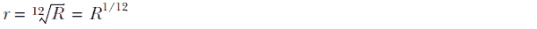 | 方程式 2.16 |
| --- | --- |

公式 2.16 展示了如何将年度流失率 R 转换为月度流失率 r。我使用符号表示一个数的十二次方根是通过将该数提高到十二次方（1/12）的幂来实现的。如果您不熟悉根运算，请回忆一下，一个数*x*的平方根是那个数，当它平方时给出 x。十二次方根定义类似：一个数*x*的十二次方根是那个数，当它提高到十二次方时给出 x。不用担心，没有人会在头脑中计算十二次方根和幂，但在任何编程语言中这都是小菜一碟。取十二次方根等同于将一个数提高到 1/12 的幂，这是大多数编程语言中实现此类根的方式。

对于年度留存率的测量，等效月度留存率只是年度测量的十二次方根。同样，此方程从年度测量计算等效月度流失率：

| 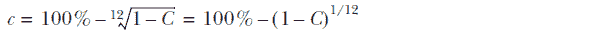 | 公式 2.17 |
| --- | --- |

公式 2.17 展示了如何将年度流失率 C 转换为月度流失率 c。

**总结**：要将年度客户流失率转换为月度流失率，可以使用以下事实：月度留存率是年度留存率的十二次方根，而留存率是 1 减去流失率。

### **2.7.3**：在 SQL 中转换任何流失率测量窗口

您可以轻松地将任何流失率测量窗口转换为任何其他测量窗口的等效流失率。如果您需要测量订阅数据库中数据少于一年的公司的流失率，这是一个很好的技巧。您可以使用可用的所有数据（无论是 2 个月、6 个月还是 10 个月）来计算流失率，然后将结果转换为年度流失率。我不会深入细节，但对于任何流失率测量，c'在 p 天内超过任何时间段的等效年度流失率 C：

| *C* = 100% − (1 − *c*')^(365/p) | 公式 2.18 |
| --- | --- |

在这种情况下，所测量的留存率（1 − *c*'）被提高到的是 365 除以时间周期长度 p。如果 p 是 1 个月，这将减少到（大约）12。同样，可以从任何 p 天的时间段的流失率 c'中计算出月度流失率 c，使用公式 2.19：

| *c* = 100% − (1 − *c*')^((365/12)[*p*]) | 公式 2.19 |
| --- | --- |

回到从订阅数据库中计算流失率的计算，从任何时间段的流失率测量中很容易计算出月度和年度流失率。列表 2.5 显示了必要的 SQL `SELECT` 语句，假设与列表 2.2 中常规流失率计算相同的公共表表达式，除了`date_range` CTE 中的开始和结束日期可以是任何日期（即结束日期在开始日期之后）。此 SQL 通过动态计算时间周期 p 作为`SELECT`语句的一部分来实现公式 2.13 和 2.14。

**列表 2.5**：不均匀时间段的流失率 SQL `SELECT` 语句

```
SELECT 
    n_start,                                                                ①
    n_churn,                                                                ②
n_churn::float/n_start::float AS measured_churn,                            ③
end_date-start_date AS period_days,                                         ④
1.0-POWER(1.0-n_churn::float/n_start::float,365.0/(end_date-start_date)::float) 
        AS annual_churn,                                                    ⑤
1.0-POWER(1.0-n_churn::float/n_start::float,(365.0/12.0)/(end_date-start_date)::float)
        AS monthly_churn                                                    ⑥
```

① 如列表 2.2 所示的起始订阅者数量

② 如列表 2.2 所示的客户流失订阅者数量

③ 标准客户流失率计算（公式 2.1）

④ 显示开始日期和结束日期之间的天数差异

⑤ 公式 2.13

⑥ 公式 2.14

列表 2.5 中使用 `SELECT` 语句的结果示例显示在图 2.14 中。在这种情况下，因为测量周期在一个月到一年之间，等效年度客户流失率高于测量的客户流失率，而等效月度客户流失率低于测量的客户流失率。

列表 2.5 在书籍网站上提供的代码生成的模拟数据集上进行了测试（[www.manning.com/books/fighting-churn-with-data](http://www.manning.com/books/fighting-churn-with-data)）以及在 GitHub 仓库（[`github.com/carl24k/fight-churn`](https://github.com/carl24k/fight-churn)）中，并生成了图 2.14 中所示的结果。你应该通过使用这个列表包装脚本（与章节早期相同的命令），将列表参数更改为 `—listing` `5` 来运行列表 2.5：

```
fight-churn/listings/run_churn_listing.py —chapter 2 —listing 5
```

与图 2.8 相比，图 2.8 显示了使用列表 2.2 计算的标准客户流失率的结果，这个结果衡量了 92 天的客户流失率（这是一个假设的例子，假设有 92 天的数据来计算年度客户流失率）。结果包括月度客户流失率和年度化客户流失率。月度客户流失率与图 2.8 中的结果相似，但并不完全相同——这个月度客户流失率是整个 92 天的平均月度流失率。

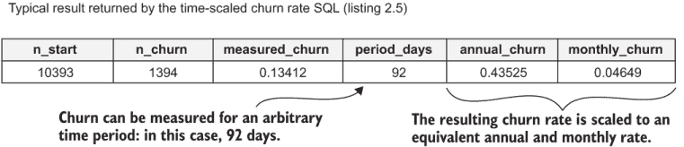

图 2.14 运行列表 2.5 在模拟数据集上的结果

### 2.7.4 选择客户流失率测量窗口

既然你有选择，你可能想知道应该选择什么时间段来衡量客户流失率。一般来说，你应该选择一个接近典型订阅续订期限的时间段来衡量客户流失率（如果有订阅的话）。然后，如果你需要以其他方式报告客户流失，你可以使用本节中的方法来扩展测量。

吸收要点：消费者订阅的客户流失率通常按月度率衡量，而商业订阅的客户流失率按年度率衡量。

如果你以与典型订阅不同的时间段来衡量客户流失率，可能会出现问题。如果你的订阅主要是按月或按年进行，问题会有所不同。

首先考虑年度订阅的情况。如果你的订阅主要是年度的，并且你在一月内测量客户流失率，你必须确保你选择的月份大约有年度续订的十二分之一。否则，客户流失率的测量将会存在偏差。对于许多企业来说，大多数续订都集中在特定季节；如果情况如此，并且你在一年中的其他时间测量客户流失率，你将看到人为降低的客户流失率。相反，如果你在恰好有大量年度客户需要续订的月份测量客户流失率，你可能会通过在短时间内看到大部分年度的客户流失而计算出人为高的客户流失率。

如果你的订阅主要是月度的，并且你在一年的时间里测量客户流失率，那么客户流失率的计算将错过在两个日期之间开始和流失的账户。为了说明这一点，请注意，本章中所有的客户流失率计算都只检查了两个日期的账户，而在两个日期之间活跃的账户将被忽略。这导致了对客户流失率的低估。一般来说，如果你使用的时间周期长于最短的订阅，这会成为一个问题。

警告：在不同于典型订阅长度的时间窗口内测量客户流失率可能会导致客户流失率计算错误。

### 2.7.5 季节性和客户流失率

在上一节中，我警告过你，使用不同于典型订阅长度的时间框架来计算客户流失率可能会引起问题。在计算客户流失率时，还有另一种类型的问题需要注意，这主要适用于月度客户流失率的计算：季节性。

定义：季节性——在一年中的特定时间发生的变动。

许多订阅业务在客户流失率上有季节性变化，如果你使用月度时间窗口来测量客户流失率，你可能会发现由于季节性影响，客户流失率在一年中上下波动。挑战在于，当你开始尝试降低客户流失率时，如果你不纠正季节性影响，你可能很难知道你在客户流失率上看到的变化是由于你的客户流失率降低努力还是季节性变化。

警告：如果你使用月度客户流失率，季节性可能会使评估客户流失率降低措施的影响变得困难。

对于年度测量，季节性问题较少，因为年度流失率测量总是包括一年中的每个季节。如果你在 1 月份进行一次年度流失率测量，然后在 2 月份进行另一次年度流失率测量，两次年度流失率测量都包括每个季节：两个相隔一个月的年度流失率测量之间的差异反映了该月流失率与一年前同一月的流失率之间的差异，因此流失率的变动已经控制了季节性。（如果许多年度续订发生在某个季节，那么这个季节可能是流失率显著变化的时期；在其余年份，流失率的变动较小，因为续订次数较少。但业务中合同续订的关键季节并不等同于季节性。）

如果你使用月度流失率，你会怎么做？首先，尽可能多地测量过去几年的月度流失率，并尝试确定是否存在显著的季节性模式。你需要至少两年的历史数据来查看是否存在季节性模式；仅有一年的数据，你无法判断一个模式是否为季节性的，或者它是否有其他原因。

如果你确实有季节性模式，那么你有几种选择来纠正它。处理季节性的临时方法是只是意识到季节性趋势，并寻找其他导致流失率变化的变化，这些变化来自减少流失的努力或商业环境的改变，这些变化比通常的季节性变化要大得多。如果你受过统计学训练，你可以通过使用时间序列分析的正确技术来严格地做到这一点。这种高级统计学超出了本书的范围，但如果你对《Ruey S. Tsay 的金融时间序列分析》（第 3 版，Wiley，2010）感兴趣，可以参考。有一些处理流失率季节性的方法不需要高级统计学，但它们涉及稍微复杂一些的流失率计算，并且至少需要两年的数据。在这里详细讨论这些内容太多，但我可以给你一些想法。

计算一个控制季节性的流失率的方法之一是在按月订阅上进行年度流失率计算，但使用按月订阅的年度流失率来解决问题。回想一下，在上一节中，你了解到如果你在按月订阅上进行年度流失率计算，你会错过年中注册并流失的账户。一个解决方案是，你不再查看两年间每个日期活跃的所有账户，而是查看每个日期前一年内活跃的所有账户。这个过程如下：

1.  找出在第一年任何时间活跃的所有账户。

1.  找出在第二年任何时间活跃的所有账户。

1.  通过比较这两个集合使用外部连接来找出流失账户。

1.  将失去的账户数量除以第一年的账户数量。

这样计算的流失率是一个年度流失率，不会错过年中流失，并包括所有季节。如果你一个月（或一个季度）后重复计算，流失率的变化反映了该月（或该季度）的流失与一年前同一时间的流失之间的差异。它考虑了季节性。

这种方法的一个缺点是它允许在任何一年内的新注册，并且客户不会被计算为流失。如果你有很多账户流失后又重新注册，你应该坚持使用常规的月度流失率计算，并不同样处理季节性。

另一种处理月度流失率季节性的相对简单方法是，每月计算月度流失率，然后为了比较目的对季度（或一年）进行平均。而不是比较一个月的流失率与下一个月，这可能会受到季节性的影响，而是比较去年 12 个月的月度流失率的平均值与上一年 12 个月的月度流失率的平均值。或者比较过去三个月的平均流失率与一年前同一三个月的平均流失率。这样你就可以看到你去年为改善流失率所做的一切是否对一年前同一季度的流失率产生了影响。因为你在比较同一季度，所以控制了季节性。你可以用这种方法来比较一个月，将一个月与一年前同一个月进行比较，这也控制了季节性。此外，请注意，将一个日历月的流失率与一年前同一期间的流失率进行比较，只需要 13 个月的数据，所以这可能是新公司最好的选择。

## 摘要

+   流失率衡量在一定时间内有多少订阅者和/或多少收入从一项服务中流失。

+   流失率和留存率根据留存加流失等于 100%的关系可以互换。

+   可以使用 SQL 在订阅数据库上计算不同版本的流失率。

+   外连接在 SQL 中用于识别流失的账户。

+   标准流失率衡量取消订阅的账户数量，不受促销和降价的影响。标准流失率对于价格相差不远或可能有折扣的订阅产品最有用。

+   净留存率包括促销和降级的双重影响，这使得它对于对抗流失不那么有用，但它是一个流行的报告指标。

+   如果所有订阅者支付相同（或什么都不支付），净留存率等于标准留存率，净流失率等于标准流失率。

+   MRR 流失率包括降级的影响，但不包括升级，是衡量订阅者支付广泛价格时的流失率的最佳指标，这在 B2B 产品中很常见。

+   对于非订阅产品，可以通过定义客户在最近时间段内发生事件时为活跃客户，基于事件数据来衡量挂失率。然后，挂失率计算为两个不同日期上活跃账户集合之间的差异。

+   在任何时间段内测量的挂失率都可以转换为任何其他时间段的等效挂失率。

+   挂失率通过保留率的生存分析从一段时间转换为另一段时间，然后保留率再转换回挂失率。

+   要转换挂失率，将相应的保留率提高到某个幂次以增加时间段；使用保留率的根来减少时间段。

+   挂失率通常按月度比率衡量消费者产品，按年度比率衡量商业产品。

+   如果你在与典型订阅长度不同的时间尺度上测量挂失率，可能会出现问题。

+   对于月度挂失率，在解释挂失率的变化时，季节性可能成为一个问题。
