# 3 测量客户

本章涵盖

+   测量客户事件的计数、平均值和总和

+   在指标上运行 QA 测试

+   选择指标的时间段和时间戳

+   测量客户使用服务的时间长度

+   测量订阅指标

如果你正在运营一个与用户或客户有重复互动的产品或服务，那么你应该在数据仓库中收集这些互动的数据。在这个背景下，互动指的是用户与产品、服务或平台之间的互动。（也可以包括通过平台介导的其他用户之间的互动。）通常将这些互动简称为事件，因为数据仓库中跟踪的互动通常都有一个时间戳，告诉你它们发生的时间。

定义：事件——关于用户行为的任何事实，存储在数据仓库中，并带有特定的时间戳。

我不会教你如何收集这些数据，但我会教你如何有效地利用这些数据。使用原始数据对抗流失的第一步是将事件数据转换为一系列总结事件并共同描绘用户行为轮廓的测量值。这些测量值通常被称为行为指标，或简称指标。

定义：指标——对用户行为的任何总结性测量。指标也有时间戳，尽管它们总结的是超过一个时间点的行为。

将相关事件转换为测量是必要的，因为每个事件就像一个大画面中的一个微小点：单独来看，一个事件通常意义不大。但尽管我们需要从每个单独的互动中退出来，我们不会退得太远。每个测量都是针对每个客户单独进行的，并且在他们作为客户的整个生命周期中反复进行。这是因为用户参与度和流失是每个个体的动态过程，你需要观察这些指标在订阅者生命周期中的变化，以了解订阅者参与度。

为了教授这个主题，我假设你已经收集了事件，但还没有对它们进行行为测量。如果你没有自己的数据，这本书的可下载代码中有一个模拟程序为你生成人工数据，以便你在代码上运行。请参阅[www.manning.com/books/fighting-churn-with-data](http://www.manning.com/books/fighting-churn-with-data)和[`github.com/carl24k/fight-churn/tree/master/data-generation`](https://github.com/carl24k/fight-churn/tree/master/data-generation)中的代码以及 README 文件中的详细说明。运行脚本安装模式（`fight-churn/` `data-generation/churndb.py`），然后运行在虚构社交网络上生成客户、订阅和事件的模拟（`fight-churn/data-generation/churnsim.py`）。如果你已经生成了用于运行第二章示例的数据，那么你已经准备好了！

如果你正在与一个活的产品或服务合作，并且已经进行行为测量，你将学习一些关于指标和检查数据质量的技术的新想法；将现有的测量应用于分析不会很难。如果你在一个活的服务中工作，但尚未收集数据，你将获得关于收集何种数据的卓越理解。与本书的整体场景相关，本章涵盖了从事件数据仓库计算行为指标（图 3.1，在第一章中解释）。

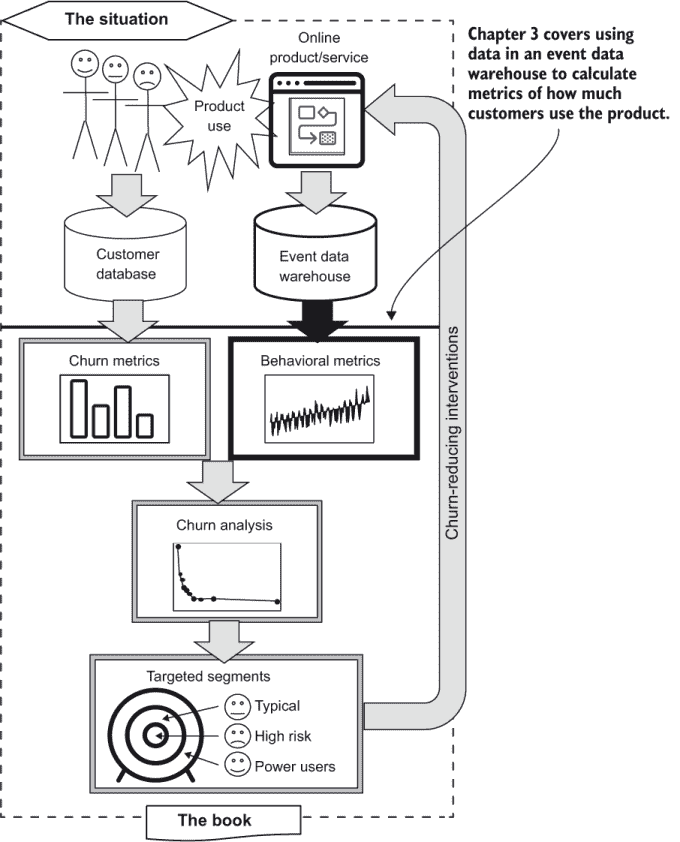

图 3.1 本章在用数据对抗流失的过程中的位置

这是一个很大的章节，不仅从长度上讲：良好的行为指标是成功流失分析中最重要的一步，本章解释了许多可能阻止你获得最佳结果的陷阱：

+   在 3.1 节中，我们从一个关于从事件制作行为指标的概念的简要概述开始。

+   3.2 节介绍了一个典型或最小的事件数据仓库数据库模式，该模式用于本书其余部分的 SQL 程序。

+   从 3.3 节开始，你将学习最通用的行为指标：在特定时间窗口内测量的计数、平均值和总和。我还教你一些关于测量遵循每周周期和指标测量时间戳的最佳实践。

+   在 3.4-3.6 节中，你将学习更多关于如何计算 3.3 节中引入的指标的实际细节。

除了学习如何计算指标外，学习通过运行质量保证（QA）测试来检查结果也是合适的。这是必要的，因为数据仓库中的客户事件数据通常不可靠。这种不可靠性可能以不同的方式表现出来；例如，事件在网络传输到数据仓库之前可能会丢失。一般来说，事件数据不会受到很多审查，因此进行流失分析的数据人员可能是第一个检查事件数据字段是否正确的人。

+   3.7 节介绍了针对指标的时序 QA 测试。QA 揭示了常见的挑战：并非所有事件都同样频繁，因此没有单一的时间框架适用于所有类型的事件。

+   3.8 节展示了关于事件的一些基本 QA，有助于澄清事件频率的情况。

+   在 3.9 节中，我向你展示如何使用事件 QA 解决选择指标时间框架的问题。

注意：这次讨论的顺序与实际应用不符。通常，你首先进行事件 QA，然后计算指标，但我想先展示指标的样子，然后再深入 QA 的细节。

在本章的结尾，我们转换了方向：

+   在第 3.10 节中，你将学习如何对每个客户进行一项重要的测量：他们在当前订阅（或在没有订阅的情况下，当前参与）中的客户时长。这被称为客户或账户任期（而非年龄），以免与客户的实际年龄混淆。

+   第 3.11 节介绍了一种从订阅中提取数据并将其转换为与其他行为指标可比较的指标的技术。

特征工程与指标设计

接受过数据科学、机器学习或统计学培训的人将我刚才描述的主题称为特征工程。特征工程这个术语的问题在于它很容易与软件产品功能和通过软件工程创建这些功能混淆。相反，我将坚持使用商业用户能够理解的语言，并将这个过程称为指标设计。

警告：术语“特征工程”对于没有接受过数据科学、机器学习或统计学培训的人来说可能会感到困惑。在与您的商业同事交谈时，请避免使用该术语；改用指标设计。这在软件公司尤其如此。

## 3.1 从事件到指标

在本节中，我首先介绍将事件转换为指标的概念，而不需要任何代码，然后向您展示 SQL。想象一下，你正在收集数据仓库中的登录事件，并希望将其转换为可用的信息。对于每个用户，你有一系列事件，如图 3.2 的上半部分所示。首先，我们只关注单个事件的系列：登录。在典型的在线产品场景中，有许多类型的事件，事件可以随时发生。对于某些类型的事件，甚至可以同时发生多个事件。为了找到订阅者的可比较指标，使用时间段进行测量，如图 3.2 的下半部分所示。

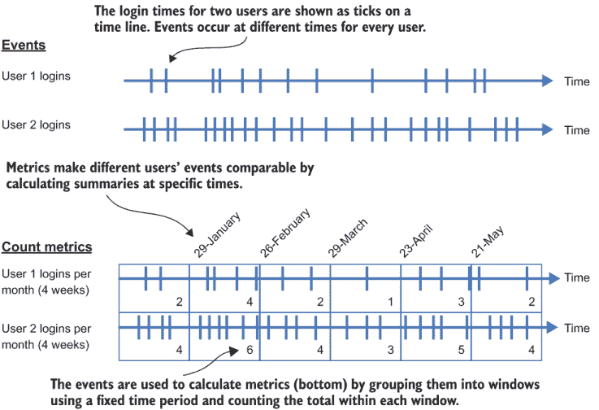

图 3.2 事件转换为时间窗口指标

在这个上下文中，时间段指的是一个时间范围（一个开始时间和一个结束时间），用于测量数据。但这些时间段是相对于每个测量的观测时间来定义的，因此时间段通常用其持续时间或长度来描述。

定义：时间段——在基于事件的指标计算中，用于测量的事件的时间窗口。时间段以其持续时间来描述，因为每个测量（开始和结束时间）的具体窗口是相对于测量日期确定的。

例如，图 3.2 中具有四周周期的指标在四个周长的窗口内进行重复测量。指标计算可能是计算每个结果窗口中的事件数量，或者可以使用更复杂的测量，如本章后面所述。我将所有指标周期定义为偶数周；我在第 3.4.1 节中解释了原因。

还请注意，这些指标是在周期结束后的一天计算的，因此事件观察是完整的。例如，在 1 月 29 日，您可以计算涵盖 1 月 1 日至 28 日的四周内每个订阅者的登录次数。然后，在 2 月 26 日，您可以测量从 1 月 29 日至 2 月 25 日的四周内的登录次数，依此类推。我将在 3.4.2 节中详细讨论这个问题。

## 3.2 事件数据仓库架构

本章探讨了如何使用代码计算指标；但为了打下基础，我需要解释事件如何在数据仓库中存储。数据仓库有很多种类型，我假设您可以使用 SQL 查询数据仓库。只要数据量不是很大，您可以使用事务 SQL 数据库作为事件数据仓库。本书中的示例是在 Postgres（或 PostgreSQL）中生成的。

表 3.1 展示了典型事件数据架构的关键元素。此架构用于所有与事件相关的 SQL 代码列表。（有关如何使用此架构设置数据库以及如何用模拟数据填充数据库的详细说明，请参阅本书的可下载代码。）以下此类表典型的最小字段集包括：

+   `account_id`—账户持有人或用户的标识符，用于将事件追踪回创建它们的客户。

+   `event_type_id`—由于事件通常有多种类型，这是到描述类型的单独表的键外键。

+   `event_time`—一个时间戳，每个事件都必须有。

表 3.2 展示了一个相关的事件类型表，以便事件的字符串名称不会重复（出于性能原因，这是数据库或数据仓库中的标准做法）。总之，事件是发生在某人（账户 ID）身上（事件类型 ID）的某事（事件时间）。以下附加字段也可以包含在此类表中，但不是必需的：

+   `event_id`—事件在数据仓库中可能包含或不包含唯一标识符。对于分析来说，这并不相关，因为事件通常没有唯一约束。

+   `user_id`—用户 ID 可以存在（除了账户 ID 之外），尤其是在有多个个人与单个账户关联的服务中。

+   `event_data`—事件通常有许多可选数据字段，这些字段提供了关于事件的额外信息。这些字段通常是数字，但也可能包括文本信息。

如果您熟悉数据仓库，您会看到事件架构与任何事实表架构非常典型，只是事件的数据字段是可选的（在某些类型的数据仓库中通常需要这些数字字段）。

表 3.1 典型事件数据架构

| 列 | 类型 | 备注 |
| --- | --- | --- |
| `account_id` | `integer` 或 `char` |  |
| `event_type_id` | `integer` 或 `char` | `event_type_name` 的键 |
| `event_time` | `timestamp` |  |
| `event_id` | `integer` 或 `char` | 可选 |
| `user_id` | `integer` 或 `char` | 可选 |
| `event_data_1` | `float` 或 `char` | 可选 |
| `. . .` |  |  |
| `event_data_n` | `float` 或 `char` | 可选 |

表 3.2 典型事件类型数据模式

| 列 | 类型 | 备注 |
| --- | --- | --- |
| `event_type_name` | `char` | 唯一 |
| `event_type_id` | `integer` 或 `char` | `event_type_name` 的键 |

## 3.3 在一个时间周期内计数事件

图 3.3 是图 3.2 中场景的延续：它显示了基于表 3.1 中事件模式计算一个账户和一个事件的指标细节。表中的每个事件都映射到一个对应的时间段，总计数是该时间段的结果。因为时间段不重叠，每个事件只计算一次。对于每个事件和账户都会重复计算，如果你打算手动或甚至在电子表格中做这项工作，将会很繁琐。幸运的是，SQL 提供了一种简洁的语言来表达和实现此类计算。

在大规模上进行这些计算涉及你在第二章中看到的一个挑战：这些数据可能很大。就像计算流失率一样，我们使用 SQL 在数据仓库中完成所有工作，而不是提取数据然后在 Python 这样的编程语言中处理它。

注意：这又是一个你可能习惯于在过程性语言中执行此类计算的地方，但我要求你保留判断，并学习 SQL 如何成为此类计算的有力工具。

列表 3.1 显示了在单一时间框架内计数事件数量的 SQL（如图 3.2 所示）。查询的主要步骤如下：

1.  使用公共表表达式（CTE，在第二章中介绍）设置测量日期。

1.  选择具有正确类型的时间框架内的所有事件。

1.  按账户聚合计数事件。

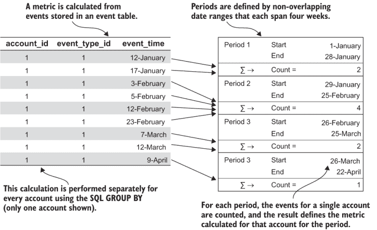

图 3.3 从事件模式进行指标计算

如果你创建了模拟的社会网络数据集，它包括用户喜欢帖子的一个事件。列表 3.1 显示了计数这些事件的查询，图 3.4 展示了结果。对于在指标计算率前 28 天内对任何帖子进行过点赞的每个账户，都有一个计数。

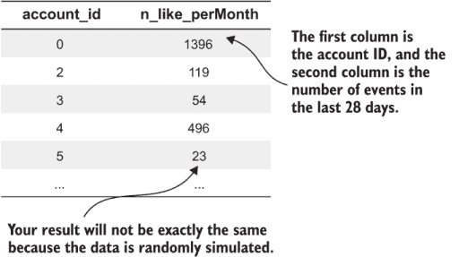

图 3.4 展示了在模拟的社会网络数据集上执行事件计数 SQL（列表 3.1）的结果。你的结果将不同，因为数据是随机模拟的。

列表 3.1 在时间窗口内计数事件数量

```
WITH calc_date AS (                                           ①
    SELECT '2020-05-06'::timestamp  AS the_date   
) 
SELECT account_id, COUNT(*) AS n_like_permonth                ②
FROM event *e* INNER JOIN calc_date d ON
    e.event_time <= d.the_date                                ③
    AND e.event_time > d.the_date - interval '28 day'         ④
INNER JOIN event_type t ON t.event_type_id=e.event_type_id
WHERE t.event_type_name='like'                                ⑤
GROUP BY account_id;                                          ⑥
```

① 此 CTE 设置了用于计算测量的日期。

② 选择账户、日期和计数

③ 设置测量的周期

④ 使用“大于但不等于”避免重复计数。

⑤ 选择我们进行测量的事件

⑥ GROUP BY 聚合函数为每个账户产生一个测量值。

运行列表 3.1 以查看你自己的数据结果。如果你已经生成了默认的模拟数据集并按照 README 文件中指定的设置配置了环境，你可以使用以下命令运行列表：

```
fight-churn/listings/run_churn_listing.py —chapter 3 —listing 1
```

包装程序在连接到数据库、执行查询并打印一些结果之前打印 SQL。如果你不想使用包装程序，列表 3.1 的源代码可以在书籍代码的 fight-churn/listings/chap3 中找到。请注意，列表代码存储为带有绑定变量（以 `%` 开头）的模板；你可以修改绑定变量，并使用你选择的 SQL 工具运行查询。你的结果将类似于图 3.4，但并不完全相同，因为数据是随机模拟的。

如果你熟悉 SQL，你可能会对那个查询有一些疑问：为什么我在窗口的末尾使用“小于或等于”的日期条件，但在查询的末尾使用“大于且不等于”？为什么不使用“between”语法？这是为了避免在重复测量时在边界上重复计算任何事件。一个相关的问题可能是为什么我不使用 SQL 窗口函数来计算结果。原因是 SQL 窗口函数通常在固定数量的记录上操作，但给定日期范围内的活动数量是不固定的。窗口的边界是由日期条件设置的，而不是窗口中的事件数量。

## 3.4 指标周期定义的细节

现在你已经知道了如何计算指标，我将讨论选择指标周期。这些细节可能看起来微不足道，但你可能会惊讶它们对分析有效性的影响有多大。

### 3.4.1 周行为周期

你可能想知道为什么我使用了四周期的指标测量，而不是日历月份。为了理解这一点，你需要意识到人类活动遵循一个周周期，因此你的数据仓库中的事件也可能遵循一个周周期。如果你的产品是人们用于工作的事物，那么大多数事件将在周一至周五发生，而周六和周日将会有较少的事件。另一方面，如果你的产品是人们用于休闲的事物，如观看视频或玩游戏，那么最频繁的使用将在周五至周日，而周一至周四可能相对较慢。

使用定义为偶数周的周期指标的原因是，每个用于计算的测量窗口都有相同数量的高使用日和低使用日。例如，想象一个周末使用量最高的消费者产品。有五个周末的月份看起来比只有四个周末的月份有大约 20% 的更多事件。但认为这代表实际使用量的增加是错误的，因为这是由测量窗口不均匀的事实造成的。

**技巧**：大多数人类行为遵循每周周期。因此，对于使用一个月或更短周期的指标，最好使用 7 天的倍数时间窗口进行测量。

Klipfolio 上的用户行为是每周行为周期的完美例子。Klipfolio 是一家软件即服务（SaaS）公司，允许企业创建其关键指标的在线仪表板（在第一章中介绍）。图 3.5 展示了 Klipfolio 每日仪表板查看次数的每周周期，它显示了商业对商业（B2B）软件使用的每周周期。很明显，在工作日使用量显著更高，而在周末使用量则慢得多：平均而言，工作日比周末有 40%更多的仪表板查看次数。

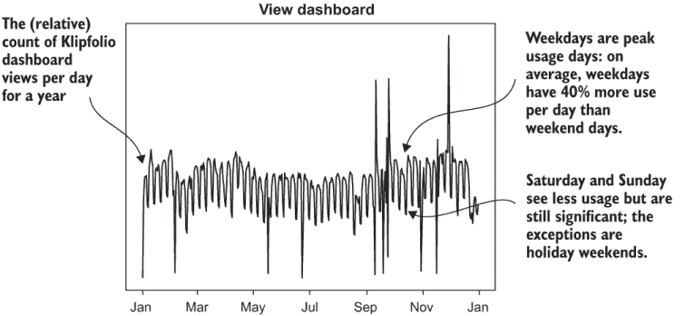

图 3.5 Klipfolio 每日总仪表板查看次数

话虽如此，请注意，在偶数周进行测量对于小测量窗口来说很重要：如果测量周期超过大约 12 周，那么增加或减少一个周末不会产生太大影响。例如，对于一年的测量，没有必要选择 52 周，或 364 天，而不是 365 天。

### 3.4.2 指标测量的时间戳

另一个重要的问题是测量如何进行时间戳。

**定义** 时间戳——代表指标的单个日期和时间，该指标是在时间窗口内的事件上进行的计算。

这样的测量需要有一个时间戳来表示它们覆盖的时期，因为你会反复进行测量并分析它们随时间的变化。一个看似微不足道但实际上很微妙的问题是以下内容。假设你测量登录次数：

+   你测量从 1 月 1 日到 1 月 28 日（包括）的所有事件。

+   你在 1 月 29 日进行测量。

你应该用哪一天的时间戳来标记那个测量？

1.  1 月 1 日

1.  1 月 28 日

1.  1 月 29 日

1.  一些其他选项

最佳实践是在测量周期结束后立即用日期/时间标记指标：在这种情况下，对于 1 月 1 日至 28 日的测量，午夜是 1 月 29 日。这是一个惯例，它可能看起来是任意的，但错误的选择会导致不希望出现的复杂情况。有几个原因你需要同步测量以在某个时间点创建客户的快照。如果在观察窗口结束时标记时间戳，那么创建同步快照就最容易，因为那时你只需选择相同时间戳的所有指标。

**要点**：对于行为指标的时间戳，最佳选择是客户测量时的时间日期，假设它是实时计算，尽可能早的时间。即使测量是在稍后的日期计算的，这也适用。

替代方案的问题如下：

+   如果你在单个分析中使用不同长度的窗口，以窗口的开始日期作为时间戳会导致问题。在这种情况下，你需要从时间戳加上时间周期计算同步日期。

+   你进行测量的时间不是一个好的时间戳，因为它可能是几天或几个月之后，这引入了不确定性。

+   使用测量期最后一天（午夜）作为时间戳是微妙地误导性的，因为它暗示你可以在还有一天剩余的情况下观察到整个周期的测量值。如果你在测量完成前 24 小时进行时间戳，然后需要与其他数据源同步测量值，可能会引入微小的错误。

这种在测量后一天的时期使用时间戳的惯例可能一开始会有些令人困惑，因为许多人使用月初作为日历月的测量时间戳，即使测量是在下一个月的第一天进行的。（这可能会使习惯于这种思维方式的其他组织成员感到困惑。）同样，使用四周期而不是日历月也是如此。但是四周“月份”和测量后一天的时间戳有助于分析，我建议将其作为最佳实践。

## 3.5 在不同时间点进行测量

要理解客户流失，你需要比较他们在生命周期不同点的客户行为测量值。这需要比你刚刚学到的稍微高级一点的指标计算技术。

### 3.5.1 重叠测量窗口

要比较客户行为测量值随客户生命周期变化的情况，你需要定期在时间上重复计算指标。然而，图 3.2 中显示的简单方法存在问题：如果你真的遵循这种方法，你将每四周只更新一次指标。四周的测量间隔并不非常动态。在四周内可能发生很多事情，你可能需要更频繁地检查客户的行为。图 3.6 说明了解决方案。答案是更频繁地重复四周测量：在这种情况下，每周。

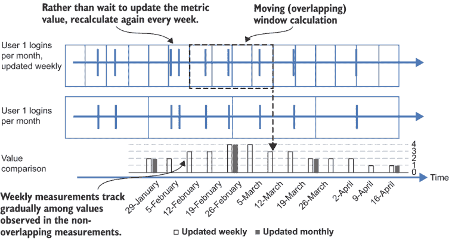

图 3.6 使用重叠时间窗口计算指标

如图 3.6 所示，产生的四周窗口重叠。您还可以看到，测量值逐渐跟踪图 3.2 中显示的月度测量值。对于用户 1，前四周的非重叠测量值是 2，4，2。重叠的测量值包括值为 3 的中间点：2，3，4，3，2，代表过渡期。

图 3.6 中展示的计算细节在图 3.7 中展示了前四个周期。由于计算窗口重叠，第四期的结束日期正好是第一期结束日期后的四周。此外，每个事件都是多个周期计数的一部分。使用每周错开一周的四周窗口，每个事件将在四个周期中被计数，尽管这一点在图 3.7 的简略示例中并不明显。但就像非重叠周期的示例计算（图 3.7）一样，每个事件都是根据周期（的开始和结束日期）映射到时间周期中的，每个周期的结果是总计数。对于非重叠周期来说，这不是你想要手动进行的计算！但是，令人惊讶的是，用于重叠周期指标计算的 SQL 并不比计算非重叠周期更复杂。

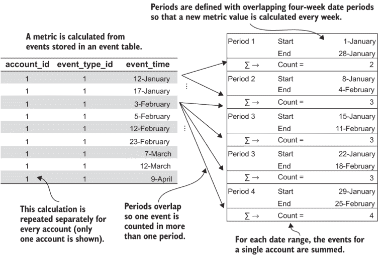

图 3.7 使用重叠时间窗口的简单指标计算

列表 3.2 展示了实现此类测量的 SQL，以及模拟流失数据集的示例结果如图 3.8 所示。与单日查询的结果（列表 3.1 和图 3.4）不同，现在每个账户都有多个结果，但只显示了其中几个。此外，每个测量都带有测量周期结束时间的戳记。

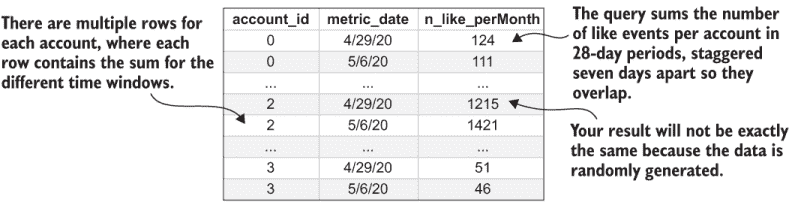

图 3.8 使用 SQL（列表 3.2）在模拟社交网络数据集类似事件上的多日期事件计数结果

列表 3.2 中的主要步骤基本上与列表 3.1 相同，但现在 SQL 在日期范围内工作：

1.  选择用于测量的日期序列。这些日期比预期的周期大小更接近。

1.  对于每个测量日期，选择与该测量相关的时间段内的事件。

1.  按账户和测量日期对事件进行聚合计数。

对于步骤 1，列表 3.2 中的 SQL 使用了`generate_series`函数来创建一个包含计算日期列表的 CTE。通过将这个包含指标日期的列表包含在事件表的连接中，你可以在`SELECT`和`GROUP BY`语句中都包含测量日期，从而为每个账户和每个测量日期计算计数。因此，查询一次计算整个测量日期序列的指标。

列表 3.2 使用重叠窗口计算指标

```
WITH date_vals AS (                                         ①
    SELECT i::timestamp AS metric_date 
    FROM generate_series('2020-01-29', '2020-04-16', 
    '7 day'::interval) i                                    ②
)
SELECT account_id, metric_date, COUNT(*) 
    AS n_like_per_month                                      ③
FROM event *e* INNER JOIN date_vals d                          ④
    ON e.event_time < metric_date                            ⑤
    AND e.event_time >= metric_date - interval '28 day'      ⑤
INNER JOIN event_type t ON t.event_type_id=e.event_type_id
WHERE t.event_type_name='like'
GROUP BY account_id, metric_date                             ⑥
ORDER BY account_id, metric_date;                            ⑦
```

① 指标计算窗口的结束日期的 CTE

② 生成一系列值的 Postgres 函数

③ 选择账户、时间和测量

④ 通过 date_vals CTE 连接来设置日期

⑤ 事件在测量日期前后四周内。

⑥ 账户 ID 和日期都包含在 GROUP BY 子句中。

⑦ 对结果进行排序以提高可读性

运行列表 3.2 以查看结果。如果你使用模拟流失数据和 Python 包装程序，请运行以下命令：

```
fight-churn/listings/run_churn_listing.py —chapter 3 —listing 2
```

运行列表 3.2 的结果应该类似于图 3.8，但由于模拟中的随机性，并不完全相同。

generate_series 函数的替代方案

在本书的代码示例中，我使用 Postgres 函数`generate_series`来创建等间隔的日期序列。然而，其他数据库系统可能不支持此函数。可以通过创建一个常规（永久）表并在一次性加载中填充所需的日期序列来实现相同的目标。此外，如果您在互联网上搜索“XXX 上的 generate_series 替代方案”，其中 XXX 是您选择的数据库或数据仓库，您可能会找到特定于系统的实现。我为非 Postgres 用户缺乏通用性表示歉意，但`generate_series`函数对于教学很有用，因为它只需要一行简短的代码。

### 3.5.2 时间度量指标测量

在本书中，我通常使用每周更新的测量值来展示技术，这与第 3.4 节中提到的原因相同：人类行为通常遵循每周周期。但对于典型客户生命周期非常短（少于几个月）的产品，可能需要更频繁地更新测量值。

TIP 对于典型客户生命周期为几个月或更短的产品，您可能需要每天更新指标。但对于客户典型生命周期为几个月或更长的产品，通常每周计算一次指标就足够了。

对于客户生命周期甚至更长的产品，可能只需要每月更新一次测量值（或每四周一次）。这取决于您根据具体情况做出的判断；它与典型客户看到产品价值（或未能看到价值）并决定流失（或不流失）所需的时间有关。无论如何，所有相同的分析技术都适用，只是时间尺度不同。大多数人高估了这些测量值实时（频繁）更新的需求。通常，保留和流失之战是在几周、几个月或几年中进行的；它不太可能归结为快速的信息和干预。

另一个重要的问题是何时进行测量。如前所述，消费者产品通常在周末使用最为频繁，而商业产品则在工作日使用最为频繁。因此，通常最好在周一或周二午夜进行消费者产品的测量，以便捕捉到最新的周末活动。对于商业产品，最好在周末进行测量，无论是周六还是周日，以便测量结果反映最新的完整工作周。

TIP 每周周一或周二午夜测量用于娱乐的产品，以捕捉整个上一个周末的活动。周五或周六午夜测量用于工作的产品，以捕捉整个上一个五天的工作周。

### 3.5.3 保存度量测量值

查看列表 3.2 和图 3.8 中的查询结果，你可能认为这种测量会产生大量数据。没问题！你有一个数据仓库，对吧？度量计算应该被插入回数据仓库进行存储，以备后续分析。表 3.3 展示了存储度量的典型模式。与度量相关的 SQL 代码列表使用此模式。（请参阅本书的代码，以获取有关如何设置具有此模式的数据库以及如何用模拟数据填充它的详细说明。）以下是一些典型字段：

+   `account_id`—账户持有者或用户的标识符。账户 ID 是追踪度量回到创建它们的客户所必需的。这是复合主键的第一部分。

+   `metric_name_id`—度量通常有多种类型，通常有一个外键指向一个描述类型的单独表。这是复合主键的第二部分。

+   `metric_time`—每个度量都必须有一个时间戳，如 3.5.1 节所述。这是复合主键的第三和最后一部分。

+   `value`—度量的数值。

+   `user_id`—除了账户 ID 之外，用户 ID 可能存在于与单个账户关联多个个人的服务中。

此外，还有一个相关的度量名称表（如表 3.4 所示），以确保度量的字符串名称不会重复（出于性能原因，这是数据库或数据仓库中的标准做法）。度量的模式与事件的模式（表 3.1）类似，这是有道理的，因为两者都是数据仓库中的事实表。

度量和事件之间的重要区别之一是，度量应该有一个由 `account_id`、`metric_name_id` 和 `metric_time` 字段组成的复合主键。这意味着账户、度量以及测量时间的组合必须是唯一的：在任何给定时间，每个账户只有一个测量值。度量与事件模式之间的另一个区别是，虽然事件可以没有数据字段或与每个操作相关联的任意组合的数据字段，但度量始终只有一个数据字段：度量值。

表 3.3 典型度量数据模式

| 列 | 类型 | 备注 |
| --- | --- | --- |
| `account_id` | `integer` 或 `char` | 复合主键 1 |
| `metric_name_id` | `integer` 或 `char` | 复合主键 2；`metric_name` 的外键 |
| `metric_time` | `timestamp` | 复合主键 3 |
| `value` | `float` |  |
| `user_id` | `integer` 或 `char` | 可选 |

如果您的数据仓库支持直接将`SELECT`语句的结果插入数据仓库，那么保存度量结果很容易，如列表 3.3 所示。列表 3.3 中的代码与列表 3.2 中的代码相同，只是添加了`INSERT`关键字，将其转换为 SQL `INSERT`语句。如果您的数据库不支持`INSERT` `SELECT`语句，那么常规做法是将列表 3.2 中的查询结果保存到以分隔符（逗号分隔值）分隔的文本文件中，然后使用数据仓库提供的任何机制将该文件加载回数据仓库。

表 3.4 关联的度量名称数据模式

| 列 | 类型 | 备注 |
| --- | --- | --- |
| `metric_name` | `char` | 唯一 |
| `metric_name_id` | `integer` 或 `char` | `metric_name` 的键 |

列表 3.3 将度量计算插入数据仓库

```
WITH date_vals AS (                                          ①
    SELECT i::timestamp AS metric_date 
    FROM generate_series('2020-01-29', '2020-04-16', '7 day'::interval) i
)
INSERT INTO metric 
  (account_id,metric_time,metric_name_id,metric_value)       ②
SELECT account_id, metric_date, 0,
    COUNT(*) AS metric_value                                 ③
FROM event *e* INNER JOIN date_vals d                          ④
    ON e.event_time < metric_date 
    AND e.event_time >= metric_date - interval '28 day'
INNER JOIN event_type t ON t.event_type_id=e.event_type_id
WHERE t.event_type_name='post'
GROUP BY account_id, metric_date;
```

① 此 CTE 包含计算日期。

② 将 SELECT 的结果插入度量表

③ 包含度量值的 ID，我们假设为 0

④ SELECT 语句的其余部分与列表 3.2 相同。

运行列表 3.3 并查看它是否写入您自己的数据库模式。如果您正在使用模拟数据和 Python 包装程序，请使用以下命令

```
fight-churn/listings/run_churn_listing.py —chapter 3 —listing 3
```

注意，除了 Python 包装程序打印的行之外，没有其他输出。结果是数据已保存到数据库中。您应该通过针对度量表的查询来选择结果：例如，`SELECT` `*` `FROM` `metric` `limit` `10;`。此类查询的结果应类似于图 3.8 中的示例。

请记住，您只能运行此列表一次，除非您更改配置或从数据库中清除结果。在为特定日期特定账户插入一个度量值的结果后，您不能为相同的账户和日期重新插入新的结果。如果您为新的度量值插入值，您还需要一次性将度量名称表（表 3.4）中的名称插入。此语句对任何具有基本 SQL 知识的人来说都很短且众所周知，但为了完整性，示例代码在列表 3.4 中给出。

如果您使用列表 3.3 插入了一个度量值，您还必须通过运行列表 3.4 来插入名称，以便运行本章后面的列表。使用 Python 包装程序和参数`—listing` `4`运行列表 3.4，或者通过您选择的 SQL 工具进行等效插入。请注意，您不应两次插入相同的度量名称或 ID。（在关系型数据库中，键约束应防止这种情况。在关系型数据库中的最佳实践是首先插入度量名称，并在度量表上使用外键约束来防止加载没有名称的度量。）

列表 3.4 将度量名称插入数据仓库

```
INSERT INTO metric_name ('like_permonth',0) ON CONFLICT DO NOTHING;
```

在继续之前，我想提醒您注意，列表 3.3 中的指标计算没有为没有事件的账户插入零。这是事件内连接的自然产物，您可能没有注意到这一点。定义一个对于没有事件的账户产生零的计数指标并不困难，但当账户数量很大且事件很少时，存储零计数指标的性能会很差。您甚至可能最终存储了大部分零！我采取的方法是在数据仓库中不存储计数中的零；然后，在分析阶段（从下一章开始），我需要分析没有事件的账户时生成零。

### 3.5.4 保存模拟示例的指标

通过运行列表 3.3 和 3.4，您应该在数据库中插入了一个事件计数指标，用于表示点赞数量，并在 `metric_name` 表中有一个名称：`likes_permonth`。模拟社交网络数据集中还有七个其他事件：不喜欢、帖子、新朋友、解除好友、广告查看、消息和回复。这些事件的指标将用于本章和本书的其余部分中的示例，因此您在继续之前应该将它们插入到自己的数据库中。为了便于操作，列表包装程序包括了所需的列表 3.3 和 3.4 的替代版本。要运行它们，请在执行命令中添加 `—version` 标志和版本号列表。此外，您可以通过在 `—listing` 标志后列出两个数字来一起运行列表 3.3 和 3.4。要使用包装脚本运行列表 3.3 和 3.4 并插入模拟的下一个七个计数指标，请使用以下命令：

```
fight-churn/listings/run_churn_listing.py —chap 3 —listing 3 4 
   —version 2 3 4 5 6 7 8
```

在大多数系统中插入这么多指标至少需要 10 分钟，所以这是一个喝咖啡的好时机。（您可能想先运行一个，看看在您的系统上需要多长时间。）请注意，列表 3.3 和 3.4 的先前运行被认为是版本 1，所以附加指标从版本 2 开始。有关运行列表的更多说明，请参阅 GitHub 仓库根目录下的 README 文件。

## 3.6 测量事件属性的总额和平均值

到目前为止，我们只看了事件简单计数的指标；但当事件有附加字段中的数据时，您可能希望在该指标中总结这些数据。最典型的情况是事件与一个数值相关联。以下是一些最典型的情况：

+   事件在时间上有一个持续时间，例如会话长度或某些媒体的播放。

+   事件有一个货币价值，例如零售购买或超额费用。

在这种情况下，最常见的指标之一如下：

+   所有事件的总体价值

+   每个事件的平均值

这些（以及许多其他）都可以使用类似的 SQL 计算，如列表 3.5 所示，假设事件有一个名为`time_spent`的字段。该指标表示每个用户在四周期间此类会话中花费的总时间。指标计算的步骤如下：

1.  选择测量日期的序列。

1.  对于每个测量日期，选择与该测量相关的时间窗口内的活动。

1.  对按账户和测量日期分组的活动求`time_spent`字段的和。

SQL 几乎与事件计数指标的列表 3.2 相同。唯一的区别在于`SELECT`语句，而不是使用`COUNT(*)`聚合函数来计数事件数量，SQL 使用聚合函数`SUM(time_spent)`来计算`time_spent`字段的总量。

Versature（在第一章中介绍）是一家为企业提供统一电信服务提供商。作为统一通信提供商，其最重要的一个事件是存储在每个事件附加字段中的通话持续时间。运行列表 3.5 在 Versature 本地呼叫事件上的几个示例输出显示在图 3.9 中。图 3.9 中的结果看起来与图 3.8 中计数指标的结果相似，但指标值不是时间窗口内事件的数量：它是这些事件中`time_spent`数量字段的总量。

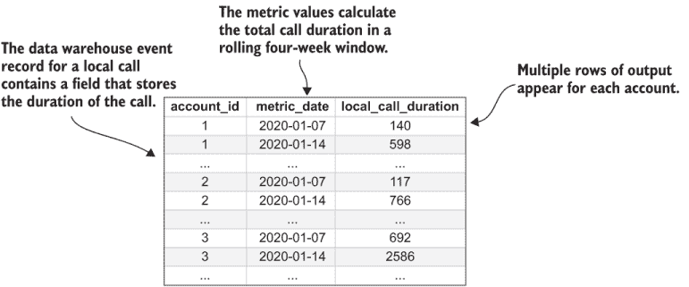

图 3.9 Versature 本地呼叫事件的 SQL 列表 3.5 的总持续时间结果

在撰写本文时，默认的模拟数据不包括事件属性，因此您无法直接在模拟数据上运行此操作。尽管如此，模拟代码可以被扩展以包括事件属性。我鼓励您这样做，然后提交一个拉取请求来分享您的工作。虽然您无法在模拟上运行列表 3.5，但它被提供作为使用包含事件属性的您自己的数据的示例。

列表 3.5 测量事件属性的总和

```
WITH date_vals AS (                                         ①
    SELECT i::timestamp AS metric_date 
    FROM generate_series('2020-01-08', '2020-12-31', '7 day'::interval) i
)
SELECT account_id, metric_date::date, 
    SUM(duration) AS local_call_duration                    ②
FROM event *e* INNER JOIN date_vals d                         ③
    ON e.event_time < metric_date 
    AND e.event_time >= metric_date - interval '28 day'
INNER JOIN event_type t ON t.event_type_id=e.event_type_id
WHERE t.event_type_name='call'                              ④
GROUP BY account_id, metric_date
ORDER BY account_id, metric_date;
```

① 此 CTE 包含计算所需的日期。

② 假设事件有一个持续时间数据字段，并对事件进行求和

③ 日期标准与列表 3.2 相同。

④ 否则，`SELECT`语句与计数指标相同。

## 3.7 指标质量保证

现在您已经学会了如何计算一些指标，我需要退一步教您一些基本技巧来检查结果。在前面的章节中，我只展示了输出结果的一些示例，但抽查几行结果并不能充分保证行为指标的质量。如果您没有注意到最后一句话，让我重复一遍。

警告：抽查几行结果并不能充分保证行为指标的质量。

为什么？你可以从几行代码中看到公式是正确的，对吧？但你的担忧不仅仅是代码的正确性，就像在普通编程项目中一样。你的担忧还包括一些账户中缺失或不良数据，而不仅仅是通过抽查几行就能发现。有许多方法可以确保行为度量的质量，我将在下面介绍几种，并就一些常见问题提出建议。

### 3.7.1 测试度量随时间变化的情况

检查度量问题的一个重要方法是通过查看结果随时间的变化情况。这可以通过一个聚合查询来完成，该查询分别对每个日期选择计数、平均值、最小值和最大值。这并不能告诉你关于度量值的所有信息，但它应该会提醒你任何重大问题，因为此类问题通常会导致这些汇总统计中的一个出现异常变动。图 3.10 展示了这种结果的示例图，该图是为模拟社交网络中的`like_per_month`度量创建的。随机模拟数据比真实的流失数据集变化更少，所以我在快速查看列表 3.6 和 3.7 中的代码后，将向您展示案例研究中的真实示例。您将看到，一个列表是一个从数据库获取数据的 SQL `SELECT`语句，另一个是一个简短的 Python 列表，用于生成图表。

列表 3.6 显示了一个查询，用于选择一个度量在整个日期范围内的计数和平均值。请注意，列表 3.6 采取了一种稍微间接的方法：

1.  创建要检查的日期的 CTE。

1.  创建要测试的度量的 CTE。

1.  使用外连接来计算结果。

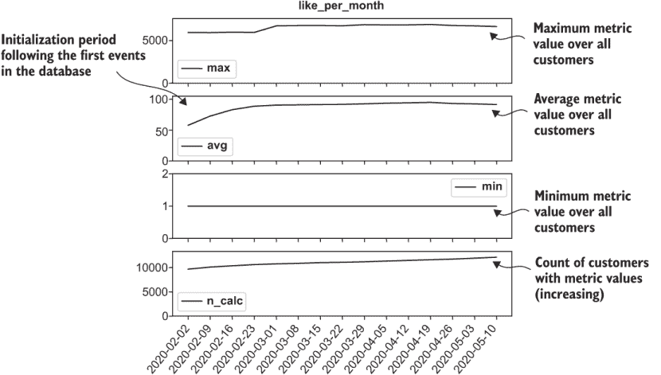

图 3.10 使用时间序列统计进行度量质量保证

可能看起来有一个更简单的替代方案，那就是在度量表上执行一个单一的聚合`SELECT`语句，按`metric_time`列进行分组。间接方法的原因是，即使在没有计算度量值的日子里也能得到结果：对于没有度量的日期，平均值为 null，计数为零。结果中的此类行使得检测没有计算任何度量的日子变得容易。相比之下，如果仅对度量表进行聚合查询，那么在没有度量值的日子里将没有任何结果。当缺失的日子在结果中不产生行时，很容易错过没有计算度量的日子。

提示：当你检查度量结果的质量时，除了检查结果是否产生不良结果外，还要使用使结果未产生时显而易见的方法。这意味着检查日期应独立于被检查的数据。

使用 Python 包装程序和以下参数在模拟数据上运行列表 3.6：

```
—chapter 3 —listing 6
```

列表 3.6 测量度量随时间变化的平均、最小、最大和计数

```
WITH
date_range AS (                                                           ①
    SELECT i::timestamp AS calc_date 
    FROM generate_series('2020-04-01', '2020-05-06', '7 day'::interval) i
), the_metric AS (                                                        ②
    SELECT * FROM metric m
    INNER JOIN metric_name n ON m.metric_name_id = n.metric_name_id
    WHERE n.metric_name = 'like_per_month'
)
SELECT calc_date,  AVG(metric_value), COUNT(the_metric.*) AS n_calc,
       MIN(metric_value), MAX(metric_value)                               ③
FROM date_range LEFT OUTER JOIN the_metric 
    ON calc_date=metric_time                                              ④
GROUP BY calc_date                                                        ⑤
ORDER BY calc_date                                                        ⑥
```

① 此 CTE 包含计算所需的日期。

② 将指标选择到 CTE 中进行最终 SELECT

③ 选择使用聚合函数计算的平均值和数量

④ 左外连接，以便查询对每一天都有一个结果

⑤ 按 calc_date 分组

⑥ 按 calc_date 排序以使结果更易读

制作图 3.10 中指标 QA 图的代码在列表 3.7 中。首先，列表 3.7 将查询结果（列表 3.6）加载到 Pandas `DataFrame` 中。之后，列表使用 `matplotlib.pyplot` 包绘制并保存图表。因为有四个几乎相同的子图，所以使用了一个辅助函数来制作每一个。

列表 3.7 随时间绘制指标 QA 统计图

```
import pandas as pd
import matplotlib.pyplot as plt
from math import ceil

def metric_qa_plot(qa_data_path, metric_name,**kwargs):     ①
   metric_data_path = qa_data_path + '_' 
      + metric_name + '.csv'                                ②
   qa_data_df=pd.read_csv(metric_data_path)                 ③
   plt.figure(figsize=(6, 6))                               ④
   qa_subplot(qa_data_df,'max',1,None)                      ⑤
   qa_subplot(qa_data_df,'avg',2,'—')
   qa_subplot(qa_data_df,'min',3,'-.')
   qa_subplot(qa_data_df,'n_calc',4,':')
   plt.title(metric_name)                                   ⑥
   plt.gca().figure.autofmt_xdate()

   save_to_path=metric_data_path.replace('.csv','.png')     ⑦
   print('Saving metric qa plot to ' + save_to_path)
   plt.savefig(save_to_path)
   plt.close()

def qa_subplot(qa_data_df, field, number, linestyle):
   plt.subplot(4, 1, number)
   plt.plot('calc_date', field, data=qa_data_df, marker='', 
      linestyle=linestyle, color='black', linewidth=2, label=field)
   plt.ylim(0, ceil(1.1 * qa_data_df[field].dropna().max()))
   plt.legend()
```

① 从 SQL 列表中获取默认参数的 kwargs

② 这是列表 3.6 保存的文件。

③ 将数据文件加载到 DataFrame 中

④ 打开一个图形

⑤ 使用辅助函数制作子图

⑥ 注释图表

⑦ 保存图表

注意，运行 Python 列表的方式与 SQL 列表相同。要运行列表 3.7，请使用以下命令对 Python 包装程序进行操作：

```
fight-churn/listings/run_churn_listing.py —chap 3 —listing 7 
```

程序打印出它保存的图形的位置。例如：

```
Saving metric qa plot to ../../../fight-churn-output/socialnet7/
socialnet7_metric_stats_over_time_like_per_month.png
```

它应该等同于图 3.10。如果您想对其他指标运行 QA，还有其他准备好的命令配置供您使用。首先，使用此命令提取所有指标的数据：

```
run_churn_listing.py —chap 3 —listing 6 —version 2 3 4 5 6 7 8
```

以下命令为其他指标生成图表：

```
run_churn_listing.py —chap 3 —listing 7 —version 2 3 4 5 6 7 8
```

### 3.7.2 指标质量保证（QA）案例研究

图 3.11 展示了在 Klipfolio 应用程序指标（当用户在 Klip 上应用图层时）上运行列表 3.6 中显示的指标 QA 查询的结果：每月 Klip 叠加事件的数量。图 3.11 显示，对于真实指标，平均数和最大值的结果不如模拟时平滑。

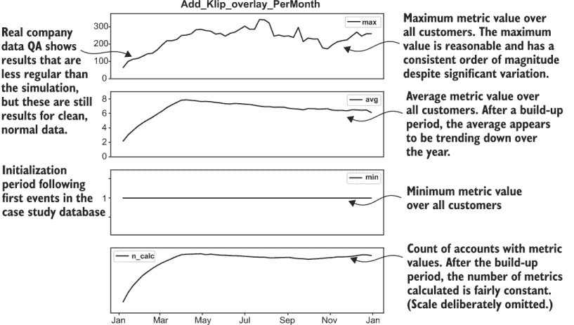

图 3.11 对 Klipfolio 健康指标的时序 QA 结果

图 3.12 展示了当出现问题时 QA 结果的一个示例：通过删除一个事件的一个月数据来模拟缺失数据。（有关常规指标 QA 的解释，请参阅图 3.11。）Broadly（在第一章中介绍）是一个以移动端为先的通讯平台，确保企业在线看起来很棒。当客户撰写正面评论时，就会发生客户推广活动，而每月的客户推广者数量是产品客户成功的重要指标。通常，对于该指标计算的平均值和数量在一年中略有变化，但数据缺失时，这两个 QA 测量值都会下降。它们会继续下降，直到指标计算窗口超过缺失数据的时期。指标的峰值通常变化更大，但在此情况下，由于缺失数据导致的下降甚至更大。

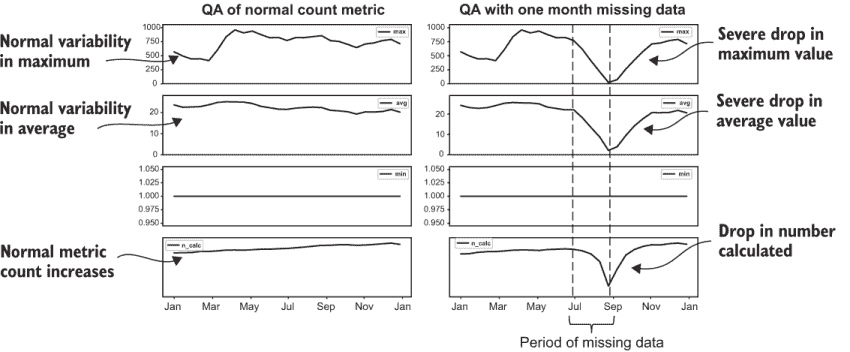

图 3.12 对具有缺失事件数据的指标进行时间序列 QA 的结果

当事件数据缺失时，一个指标的极大值、平均值和计算出的数量都会下降。如果缺失的期间更长，那么在指标测量窗口中没有事件时，这些值会达到零；实际上，用于计算指标的期间比缺失数据的期间长，因此并非所有指标都会降到零。

图 3.13 展示了 Versature 的一个 QA 结果的第二个例子，其中实际上存在错误：极端值被插入到事件属性字段中。如前所述，当客户发起本地通话时，会在数据库中记录一个本地通话事件，而过去三个月内总通话时间是对 Versature 账户的一个重要指标。通常，该指标的年均值和最大值相对稳定，年末会有所增加。但是，当持续时间字段中出现极端值时，QA 测量值都会上升。不良数据对最大值的影响最大，对平均值的影响较小。对平均值的影响几乎可以误认为是正常的变化，除了变化的突然性和不连续性。极端字段值对计算出的数量或最小值没有影响。如果极端值是负数，那么影响将表现为最小值而不是最大值。

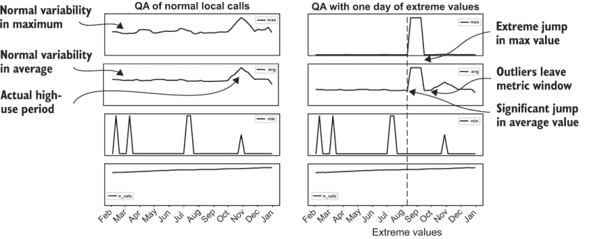

图 3.13 Versature 指标具有极端值的时间序列 QA 示例结果

图 3.13 通过展示 QA 结果（在左侧）在将几个极端的本地通话持续时间数据插入事件数据库（在右侧）前后的影响，说明了错误极端值对指标计算的影响。当事件数据字段中存在极端（正值）时，最大的影响是对最大值，对平均值的影响较小。如果极端异常值是负数，那么影响将体现在最小值上，但在此情况下最小值未受到影响。指标值的跳跃持续的时间与异常值在指标计算窗口中的持续时间相同。

### 3.7.3 检查接收指标的账户数量

QA 的另一个重要问题是每个指标占活跃账户总人口的百分比。列表 3.6 查看随着时间的推移具有该指标的账户数量，这可以显示时间异常，但它不会检测到某些账户从未为指标产生事件的情况。检查收到指标值的客户比例，并查看它是否低于或高于预期，是一个重要的测试。

列表 3.8 中的 SQL 计算了在给定时间范围内所有活跃账户中每个指标的结果的百分比。还计算了平均值、最小值和最大值。模拟社交网络运行列表 3.8 的结果示例如图 3.14 所示。大多数指标覆盖了几乎所有账户（90%+），除了`unfriend_permonth`，只有 59%的账户收到。这看起来正确吗，还是更可能是数据问题？这可能是因为你预计大多数人每天都会发布和查看广告，但不太可能频繁地删除好友。

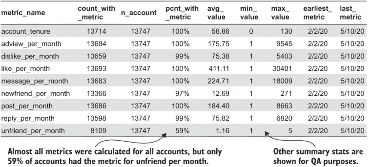

图 3.14 模拟数据集中计算具有指标的账户百分比（列表 3.8）的结果

计算具有指标的账户百分比的步骤如下：

1.  选择一个时间段。查询为该窗口进行一次整体测量（不是像列表 3.6 那样的每日计算）。

1.  计算在时间窗口内具有活跃订阅的账户数量。

1.  计算在时间窗口内具有每种类型指标的账户数量。

1.  通过将步骤 3 的结果除以步骤 2 的结果来计算具有每种类型指标的账户的百分比。

1.  在时间窗口内测量指标的其他统计数据。

列表 3.8 中的 SQL 使用了两个常见的表表达式（CTE）：

+   `date_range`—设置计算的起始和结束日期

+   `account_count`—计算在指定时间框架内活跃的账户总数

最终结果通过聚合计算具有事件的账户数量，然后除以`account_count` CTE 的结果，以获得百分比。

列表 3.8 测量具有指标的账户百分比（指标覆盖率）

```
WITH date_range AS (                                        ①
   SELECT  '2020-04-01'::timestamp AS start_date, 
      '2020-05-06'::timestamp AS end_date
), account_count AS (                                       ②
   SELECT COUNT(distinct account_id) AS n_account           ③
   FROM subscription s INNER JOIN date_range d ON
   s.start_date <= d.end_date                               ④
   and (s.end_date >= d.start_date 
      or s.end_date is null)                                ④
)
SELECT metric_name, 
   COUNT(distinct m.account_id) AS count_with_metric,       ⑤
   n_account AS n_account,                                  ⑥
   (COUNT(distinct m.account_id))::float/n_account::float 
       AS pcnt_with_metric,                                 ⑦
   AVG(metric_value) AS avg_value,                          ⑧
   MIN(metric_value) AS min_value,                          ⑨
   MAX(metric_value) AS max_value                           ⑩
   MIN(metric_time)  AS earliest_metric,
   MAX(metric_time) AS last_metric
FROM metric m CROSS JOIN account_count                      ⑪
INNER JOIN date_range ON                                    ⑫
   metric_time >= start_date
   and metric_time <= end_date
INNER JOIN metric_name  n ON m.metric_name_id = n.metric_name_id
INNER JOIN subscription s 
    ON s.account_id = m.account_id                          ⑬
    AND s.start_date <= m.metric_time
    AND (s.end_date >= m.metric_time or s.end_date is null)
GROUP BY metric_name,n_account
ORDER BY metric_name;
```

① 此 CTE 设置 QA 的起始和结束。

② 此 CTE 计算账户数量。

③ 计算具有订阅的账户数量

④ 选择所有活跃的账户

⑤ 计算具有指标值的账户数量

⑥ 来自账户计数 CTE

⑦ 将指标的计数除以订阅者的计数

⑧ 平均值的标准聚合函数

⑨ 最小值的标准聚合函数

⑩ 最大值的标准聚合函数

⑪ 交叉连接，每行重复账户计数

⑫ 限制到由日期范围 CTE 指定的时间段

⑬ 在订阅上设置连接

运行列表 3.8 以确认结果并检查所有指标是否已正确计算。如果您正在使用 Python 包装程序，请使用参数`—chapter` `3` `—listing` `8`运行它。结果保存在 CSV 文件中，应类似于图 3.14。

## 3.8 事件 QA

在上一节中，我向您展示了如何查询指标以及具有指标的账户百分比，但事件呢？如果您首先检查事件，您将更好地了解指标将提供什么，甚至可能会改变您决定计算指标的方式。（我将在下一节中展示一些实现这一点的技术。）您已经看到了如何计算一些指标，但我正在以不同于实际操作的方式教授这些内容。

小贴士：在深入计算指标之前，花些时间检查事件数据的质量。本书以混合的顺序教授步骤，以便首先展示最终结果。正确的顺序是（1）事件质量分析（本节），（2）计算指标（第 3.5 节和第 3.6 节），以及（3）指标质量分析（第 3.7 节）。

### 3.8.1 检查事件随时间的变化情况

图 3.15 演示了对事件进行简单时间序列质量分析的示例：计算所有账户每天的总事件数。您已经看到，大多数真实事件遵循每周周期（图 3.5），模拟也是为了重现这种行为。稍后我将向您展示更多案例研究的成果，但首先让我们看看生成此类图形的代码（列表 3.9）。


图 3.15 每日计数类似事件的结果（列表 3.9）在模拟数据集上

列表 3.9 利用了您在前面章节中看到的技术。使用一个包含生成日期序列（在第 3.4 节中描述）的 CTE 与事件数据进行外连接，以确保每个日期都有质量查询的结果，即使没有事件也是如此。

列表 3.9 事件每日质量检查

```
WITH
date_range AS (                                               ①
    SELECT i::timestamp AS calc_date 
    FROM generate_series('2020-01-01', '2020-12-31', '1 day'::interval) i
)
SELECT event_time::date AS event_date,                        ②
    COUNT(*) AS n_event                                       ③
      /*, SUM(optional_field) AS total _field */              ④
FROM date_range LEFT OUTER JOIN event *e* 
    ON calc_date=event_time::date                             ⑤
INNER JOIN event_type t ON t.event_type_id=e.event_type_id
WHERE t.event_type_name='like'                                ⑥
GROUP BY event_date                                           ⑦
ORDER BY event_date
```

① 此 CTE 包含计算日期。

② 将事件时间转换为日期

③ 求事件数的总和

④ 如果事件具有数值属性，则对属性求和

⑤ 对日期序列进行左连接以确保每个日期都有结果。

⑥ 选择正在检查的事件

⑦ 按计算日期分组

在模拟数据集上运行列表 3.9 以确认它是否与您的数据兼容。这样做将创建一个包含每行一个事件计数的 CSV 文件。程序会打印一行说明它所执行的操作：

```
Saving: ../../../fight-churn-output/socialnet7/socialnet7_events_per_day_like.csv
```

制作图表的脚本（如图 3.15 所示）在列表 3.10 中展示。此列表使用 Pandas `DataFrame`加载数据，并使用标准的`matplotlib.pyplot`进行绘图。为了使 x 轴上的日期可读，创建了一个使用 lambda 的过滤器，该过滤器选择以 01 结尾的日期，即每月的第一天（2020-02-01，2020-03-01 等）。将过滤后的日期列表传递给`matplotlib.pyplot`的`xticks`函数。

列表 3.10 绘制每日事件数

```
import pandas as pd
import matplotlib.pyplot as plt
from math import ceil

def event_count_plot(qa_data_path, event_name,**kwargs):
   event_data_path = qa_data_path +
       '_' + event_name + '.csv'                             ①
   qa_data_df=pd.read_csv(event_data_path)                   ②
   plt.figure(figsize=(6, 4))
   plt.plot('event_date', 'n_event', data=qa_data_df, 
       marker='', color='black', linewidth=2)                ③
   plt.ylim(0, 
       ceil(1.1*qa_data_df['n_event'].dropna().max()))       ④
   plt.title('{} event count'.format(event_name))
   plt.gca().figure.autofmt_xdate()                          ⑤
   plt.xticks(list(filter(lambda x:x.endswith(("01")),
       qa_data_df['event_date'].tolist())))                  ⑥
   plt.tight_layout()                                        ⑦
   plt.savefig(event_data_path.replace('.csv',
        '_' + event_name + '_event_qa.png'))                 ⑧
   plt.close()
```

① 列表 3.9 保存数据的路径

② 将数据读入 DataFrame

③ 绘制事件数与日期的关系图

④ 根据最大值设置 y 轴限制

⑤ 旋转 x 轴日期标签

⑥ 为 x 轴标签创建每月第一天的日期列表

⑦ 确保所有轴标签都可见

⑧ 保存结果

如果你使用 Python 包装程序，你可以一起运行列表 3.9 和 3.10 来创建数据和图表，只需一条命令即可：

```
fight-churn/listings/run_churn_listing.py —chap 3 —listing 9 10 
```

程序会打印出它保存的图形位置；它应该等同于图 3.10。如果你想对其他指标进行 QA 测试，还有其他准备好的命令配置供你使用。首先使用以下命令创建所有事件的计数：

```
run_churn_listing.py —chap 3 —listing 9 —version 2 3 4 5 6 7 8
```

注意，这可能比指标的 QA 测试花费的时间要长一些，因为它需要每天汇总事件。以下命令将为其他指标创建图表：

```
run_churn_listing.py —chap 3 —listing 10 —version 2 3 4 5 6 7 8
```

为了说明如何发现缺失的事件，图 3.16 展示了从列表 3.9 中运行 QA 查询的真实客户推广事件（当客户撰写正面评论时）的输出，以及故意删除了一个月的事件（与图 3.12 中使用的相同删除操作）。如果你花时间检查，通常很容易注意到这样的问题，尽管如果数据缺失时间较短，识别问题可能更具挑战性。

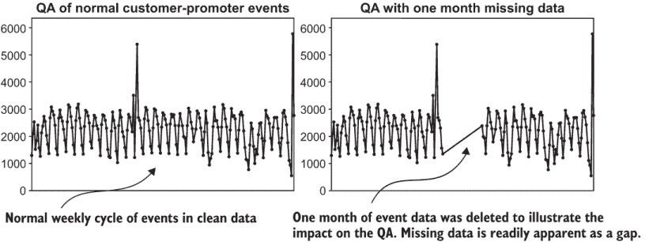

图 3.16 广泛客户推广事件每天事件计数

为了说明如何在事件字段中发现异常值，图 3.17 展示了第二个示例（针对 Versature），展示了在列表 3.9 中运行 QA 查询的输出，其中数据处于真实状态，以及故意添加极端值后的状态。这些是用于制作图 3.13 示例的相同更改。当客户拨打本地电话时，会在数据库中记录一个本地通话事件，数据库有一个存储通话持续时间的字段。事件字段中的极端值不会影响事件计数，但如果你在事件字段的和（总通话时长）或事件字段的某些其他聚合函数上绘制图表，通常很容易发现这些值。

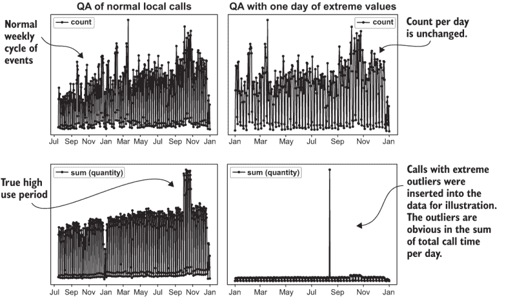

图 3.17 Versature 本地通话每天事件 QA 结果

### 3.8.2 检查每个账户的事件

对事件的重要检查之一是查看事件的总数以及每个账户的事件数量。你应该这样做来评估事件的总数和类型。这与检查具有指标的账户百分比类似，如前文所述。

本检查的输出示例如图 3.18 所示，用于社交网络模拟。该图显示，平均账户每月有大约 75 个点赞事件，但少于一个取消好友事件。这解释了为什么有较少的账户具有每月取消好友指标（图 3.13）。只有大约三分之一的账户的指标值不为零，这与每月每个账户的事件数一致。

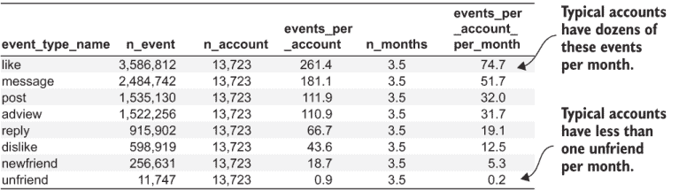

图 3.18 使用列表 3.11 按月计数每个账户的事件结果

列表 3.11 包含计算每个账户的事件数并将其转换为每月计数的 SQL 代码。计算步骤如下：

1.  选择一个时间窗口。

1.  计算在时间窗口内拥有活跃订阅的账户数量。

1.  计算时间窗口内的总事件数。

1.  将总事件数除以两次：

    1.  将总事件数除以账户数。

    1.  将总事件数除以测量的月份数。

此过程导致每个账户每月的平均事件计数。计算的起点与列表 3.8 相同，该列表计算了每个账户的指标。这里唯一的技巧是在最终的 `SELECT` 语句中，它也选择了时间框架中的月份数，并将结果除以该数。

列表 3.11 测量每个账户的平均事件数

```
WITH 
date_range AS (                                              ①
    SELECT  '2020-01-01'::timestamp AS start_date, 
        '2020-12-31'::timestamp AS end_date
), account_count AS (                                        ②
    SELECT COUNT(distinct account_id) AS n_account
    FROM subscription s INNER JOIN date_range d ON
     s.start_date <= d.end_date
    AND (s.end_date >= d.start_date or s.end_date is null)
)
SELECT event_type_name, 
    COUNT(*) AS n_event,                                     ③
    n_account AS n_account,                                  ④
    COUNT(*)::float/n_account::float 
        AS events_per_account,                               ⑤
    extract(days FROM end_date-start_date)::float/28  
        AS n_months,                                         ⑥
     (COUNT(*)::float/n_account::float)/
         (extract(days FROM end_date-start_date)::float/28.0)  
             AS events_per_account_per_month                 ⑦
FROM event *e* cross join account_count                        ⑧
INNER JOIN event_type t ON t.event_type_id=e.event_type_id
INNER JOIN date_range ON                                     ⑨
    event_time >= start_date
    AND event_time <= end_date
GROUP BY e.event_type_id,n_account,end_date, 
    start_date, event_type_name                              ⑩
ORDER BY events_per_account_per_month desc;                  ⑪
```

① 此 CTE 设置 QA 的起始和结束日期。

② 此 CTE 确定账户数量。

③ 计算总事件数

④ 从 account_count CTE 中获取账户数量

⑤ 将事件数除以账户数以获取每个账户的事件数

⑥ 将天数除以以获取四周月份的计数

⑦ 将每个账户的事件数除以月份数

⑧ 对每行重复账户数量的交叉连接

⑨ 将测量限制在所选日期范围内

⑩ GROUP BY 包括 SELECT 中所有非聚合项

⑪ 对事件进行排序，使最常见的出现在列表顶部

本节是关于 QA，即检查问题；但在这个例子中，考虑到未友好的事件数量，似乎没有问题。也许只是人们不太会频繁地取消好友关系。

当你看到每月每个账户的事件数量较少时，你需要运用你对产品的了解来判断是否是问题。在所有产品中并没有绝对的标准，因为有些产品应该看到几乎恒定的用户互动，而有些产品你可能会期望一年中只与产品互动几次。如果你没有足够的专业知识来判断每个账户的事件数量是低还是高，那么你需要与组织中的其他人交谈，并请他们帮忙。这可能是某些数据人员不想听到的建议，所以让我再重复一遍。

提示：如果你的业务知识不足以判断每月观察到的每个账户的事件数是否合理，那么你必须从组织中的某个人那里获得帮助。在你花费大量时间计算行为指标和进行流失分析之前，请这样做。

图 3.18 中的表格通常足以将此类信息传达给业务部门。如果有大量事件，你应该按频率排序，以便将最频繁的事件放在最上面，因为这些是观众最可能熟悉的事件。即使熟悉他们产品的某人可能也不知道这些罕见事件。如果事件没有直观的类型名称，这种情况在软件和互联网服务中很常见，事件可以是用户点击特定的 URL。

运行列表 3.11 以确认你自己的数据结果。如果你使用 Python 包装程序，可以通过将参数更改为`—chapter` `3` `—listing` `11`来完成此操作。结果将类似于图 3.18，但并不完全相同，因为模拟中存在随机性。

QA 的自动异常检测

值得指出的是，有方法可以自动检测本节中提到的数据质量问题。自动检测数据问题是一个称为异常检测的领域。与手动生成大量图表并逐一查看相比，我的方法相当低效！但事实是，我从未为典型的流失分析烦恼过自动异常检测。一方面，如果有几十个事件和指标（少于 100 个），查看所有这些事件并不需要很长时间。我编写了生成一组如图 3.18 所示图表的脚本，然后使用图像查看器快速浏览它们。

可视化检测异常很容易——可以说是比几乎所有算法都有效。我推荐手动方法的其他原因是，这是一种了解你数据的好方法。你可能会发现一些有用的模式或关系，如果你依赖算法，可能会错过这些。话虽如此，如果你有超过大约 100 个事件或指标，你可能需要使用完全自动化的方法，但自动异常检测超出了本书的范围。

## 3.9 选择行为测量的测量周期

假设你了解这个业务，你知道像“取消好友”这样的事件是很少发生的，所以看到每个月每个账户只有少量事件（如图 3.18 中的取消好友事件）是可以接受的。这意味着只有 59%的账户在任何给定月份获得该指标值就一切都好吗？（该结果如图 3.14 所示。）并不完全是这样。数据本身并没有问题，但测量方面可能还有改进的空间。

这里有个想法：如果一个事件很少发生，在指标定义中使用更长的时间周期。这样，你可以在测量中捕捉到更多的客户，并且可以比较更多账户的行为。记住，列表 3.2 中的指标计算只使用了 28 天（四周）的时间周期。目前来看，所有在过去 28 天内没有发生罕见类型事件的账户在指标中显示为 0。另一方面，如果你使用更长的时间周期来衡量指标，可能会有一些账户每隔几个月才发生一次事件，这些事件在 28 天周期中被遗漏，但会在更长的时间周期中被捕捉到。同时，可能会有一些账户每月发生罕见事件，如果你使用更长的时间周期，它们的指标计数将会更高。

TAKEAWAY 在制作罕见事件的指标时，使用更长的测量周期。

选择多长的周期合适？像在用数据对抗流失中做很多事情一样，没有严格的规定；只有一些指导原则。选择测量周期是在行为指标对时间变化的响应性和在捕捉罕见事件账户的敏感性之间进行权衡。行为指标的响应性意味着如果一个账户的事件水平下降或上升，该账户的指标会迅速变化。例如，如果你使用一年（365 天）的时间周期来计算指标，并且每天更新它，那么每天只有 1/365 的数据进入指标发生变化。因此，如果有人在年初事件水平较高，但水平下降到零，那么这个人需要很长时间才能使指标的值变低。总结如下：

+   短时间周期的行为指标对行为变化的响应较快，但在捕捉事件水平较低的用户账户方面较不敏感。

+   长时间周期的行为指标对行为变化的响应较慢，但在捕捉事件水平较低的用户账户方面更为敏感。

应该选择哪个周期？根据事件发生的频率，我使用一个经验法则来确定你应该观察事件的最小时间周期以制作行为指标：选择的时间周期至少是平均账户发生一次事件所需时间的两倍。但由于我在 3.4 节中提到的每周行为周期，周期不应少于一周，无论事件发生的频率如何。而且（通常）你不应该进行超过一年的行为测量（更多关于这一点将在后面讨论）。例如，如果每个账户每月发生一次事件，至少使用两个月进行测量。如果每个账户每月发生两次事件，使用一个月也是可以的。遵循这一指南，大多数账户在时间周期内至少发生一次事件的可能性很大。

TIP 指标的最小时间周期应至少是平均账户发生一次事件所需时间的两倍。

规则经验法推荐的最低观察期总结在表 3.5 中。

表 3.5 最小行为测量周期（规则经验法）

| 每月每账户的事件数 | 月份：一个事件 | 最低测量周期 |
| --- | --- | --- |
| >8 | < 0.1 | 1 week |
| 8 | 0.125 | 1 week |
| 4 | 0.25 | 2 weeks |
| 2 | 0.5 | 1 month |
| 1 | 1 | 2 months |
| 0.5 | 2 | 4 months |
| 0.333 | 3 | 6 months |
| 0.25 | 4 | 8 months |
| 0.1666 | 6 | 12 months |
| < 0.1666 | > 6 | 12 months |

表 3.5 中的行为测量规则经验法设定了一个最低标准，通常情况下，你不应该用超过一年的周期来测量行为。但在那个范围内，响应性和敏感性之间的良好权衡是什么？

对于像一个月或一年这样的固定期限订阅，行为测量应该在时间尺度上与订阅期限相似。如果你销售一年期的订阅，你可能应该使用一年的时间周期进行行为测量；如果你销售一个月的订阅，你应该使用一个月的时间周期进行行为测量。这样做的原因是为了让你的行为测量反映客户在订阅期限内从服务中获得的经验。话虽如此，服务体验可能在期限结束时最为重要，因为那时它将在客户心中更加直接，当是时候续订时。如果你想用三到六个月的时间来测量一年期订阅的行为，这是有道理的，但不要为一年期订阅使用一个月的指标。

如果产品没有固定期限的订阅呢？那么你应该旨在使用大约是典型订阅者活跃时间四分之一到一半的周期来进行行为测量。如果客户通常会在六个月内保持活跃，使用一或两个月的周期进行行为测量。如果客户通常只停留一个月，那么只需在一周或两周内进行行为测量，但必须遵守表 3.5 中显示的最低标准。这里的理由是，你应该在足够短的时间尺度上进行测量，以确保在平均客户可能考虑流失之前完成测量周期。

你应该根据事件发生的频率来调整测量周期。这是很好的建议，但它有一个问题：如果你为不同的事件选择不同的测量周期，那将会很令人困惑。这尤其在你有很多事件时更为明显。你是否必须将观察周期设置得适合你感兴趣的罕见事件？这种方法的缺点是，如果你使用一个漫长的周期来测量行为，那么在为新账户获得有效测量之前需要很长时间。在第七章中，我将展示你可以拥有两全其美的方法：在长时间内测量一些行为，在较短时间内测量其他行为，并且仍然以平均数的方式呈现它们，以便于解释。

## 3.10 测量账户期限

到目前为止，我们只考虑了基于事件的行性行为测量。但是，还有一些重要的客户测量是基于订阅而非事件。账户成为客户或活跃用户的时间长度就是这样的一个测量。我把账户成为客户的时间长度称为账户期限，而不是像账户年龄这样的东西，因为年龄可能会与人的实际年龄（或公司的年龄）混淆。

账户期限在分析流失率时很重要，因为它可以以显著的方式与流失率相关：在客户生命周期中可能存在某些点，流失最（或最不）可能发生，或者流失率可能会随着账户期限的延长而普遍降低（或增加）。在第五章中，我将向你展示如何进行这些分析；现在，你将学习如何计算账户期限。

### 3.10.1 账户期限定义

如果每个账户只有一个订阅（或如果没有正式的订阅，则为活动周期），那么计算账户期限将很容易。这是从订阅开始到期限测量时的时间长度。但在多订阅的背景下（或“混乱”的订阅中），期限计算会更复杂。你不仅想要从当前订阅开始的时间，因为客户可能有一个不间断的早期订阅序列。在这种情况下，将它们都视为一个大的订阅期限测量是有意义的。如果账户在遥远的过去活跃过，然后流失，那么这不会算作“老”客户，因为他们并没有一直活跃。如果一个老客户在长期缺席后重新注册，他们更像是一个新客户，因此期限应该只测量当前订阅。图 3.19 展示了多订阅假设情况下的账户期限定义。


图 3.19 多订阅账户的账户期限

同时，通常允许订阅之间存在小的间隔，同时仍然将其视为连续订阅以进行任职测量是个好主意。例如，假设一个账户未能续订是因为文件中的信用卡已过期；账户随后更新了卡片并在几天后再次注册。订阅中的几天或一周的间隔可能不应该改变任职测量，因为它们并不是真正的新注册客户。另一方面，如果订阅中存在数月（或更长时间）的间隔，那么将新的订阅视为客户和任职计算的全新开始是公平的。

考虑到为任职计算而将账户视为新账户所需的确切间隔量取决于业务。对于月度订阅，通常可以接受一个月的间隔。对于年度订阅，一个月或两个月的间隔，甚至多达四个月的间隔可以被认为是订阅中断的足够短的时间，仍然可以忽略不计，用于任职计算。

**定义** 账户任职——客户在其当前不间断的订阅序列或当前不间断的活动期间使用产品的时长，可能包括订阅或活动之间的相对较短的时间间隔。

图 3.19 显示，在某个观察时间点，账户正处于其第四个订阅的中间。订阅 3 和订阅 4 之间没有间隔，订阅 2 和订阅 3 之间有一个小的（允许的）间隔，而订阅 1 和订阅 2 之间有一个大的间隔。任职时间是从订阅 2 开始到观察时的时间。

基于图 3.19 中说明的任职计算的更多细节显示在图 3.20 中。任职从第一个订阅的开始为 0，每天增加 1，直到第一个订阅因流失而结束。在流失之后，任职不再定义；甚至不是零。只有当新的订阅开始时，任职才被定义并重新开始积累。任何给定日期的计算会计算自相关订阅开始日期以来的天数。与大多数指标计算一样，对于每个账户，这种计算可能很繁琐或无法手动完成。但是，SQL 再次提供了一个执行任意复杂订阅场景计算的方法。

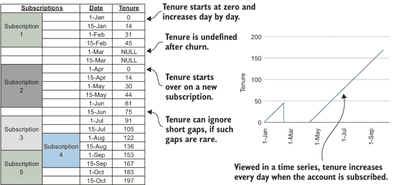

图 3.20 展示了基于图 3.19 中说明的账户任职计算示例

### 3.10.2 账户任职的递归表表达式

在多订阅情况下计算账户任职需要 SQL 的一个高级功能，称为递归公用表表达式（recursive CTEs）。正如其名称所暗示的，递归 CTEs 允许在构建结果集时递归地运行`SELECT`语句。递归 CTEs 与标准 CTEs 类似，但不同之处在于它们有两个部分：

+   一个主或“锚点”`SELECT` 语句，定义 CTE 的列并使用初始结果集填充表。

+   一个递归的 `SELECT` 语句，通过重复执行直到不再产生更多行，向 CTE 中添加更多行。递归的 `SELECT` 语句可以引用 CTE 中的当前结果集以及架构中可用的其他表。

这可能听起来很抽象，但计算来自多个订阅的账户服务期的难题将使递归 SQL 计算变得具体。以下是找到任何与当前订阅具有不间断序列且允许一个月间隔的最早订阅起始日期的递归策略：

1.  通过为每个账户选择具有最小起始日期（如果有多个当前活跃订阅）的当前活跃订阅来创建 CTE。

1.  选择具有较早起始日期和结束日期的其他相同账户订阅，这些日期在相同账户当前最早起始日期之前最多一个月。

如果步骤 2 重复进行，直到没有更早的订阅起始日期，那么 CTE 中最早起始日期的订阅就是你要找的：与当前订阅形成不间断订阅序列的任何订阅的最早起始日期。找到最早的订阅起始日期很容易适应递归 CTE 的框架。

图 3.21 展示了递归方法在图 3.19 和 3.20 中的假设多订阅场景中的操作示例。以下是通过递归找到最早起始日期的步骤：

1.  在初始化时，订阅 5 的起始日期（1-Sep）被输入到该账户的 CTE 表中，这是当前的，因为它在当前日期之前开始，并且结束日期在当前日期之后。

1.  在递归步骤的第一迭代中，订阅 4 的起始日期（1-Aug）被输入到 CTE 中，因为其结束日期在订阅 5 的起始日期之后，但起始日期更早。

1.  在递归步骤的第二迭代中，订阅 3 的起始日期（1-Jul）被输入到 CTE 中，因为其结束日期在订阅 4 的起始日期之后，但起始日期更早。

1.  在递归步骤的第三次迭代中，订阅 2 的起始日期（15-Apr）被输入到 CTE 中，因为间隔很小，并且订阅 2 的结束日期仍然足够接近订阅 3 的起始日期。

1.  在递归步骤的第四次迭代中，由于订阅 1 的结束日期与订阅 2 的起始日期相距太远，因此不再向该账户的表中输入更多行。递归 `SELECT` 语句可以为其他账户生成额外的结果，但此账户已完成。

1.  递归完成后，假设账户的 CTE 中的最小起始日期是订阅 2 的起始日期。

从那个最早日期到现在的这段时间是账户任期。这个过程通过递归 SQL 程序识别当前订阅并回溯到相应的最早开始日期，允许对任何数量的账户和订阅进行高效的账户任期计算。

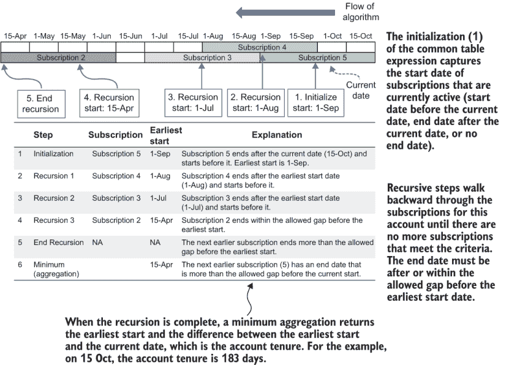

图 3.21 账户任期递归计算示例

### 3.10.3 账户任期 SQL 程序

列表 3.12 显示了执行账户任期度量的 SQL。现在您已经了解了计算策略，我将根据列表解释一些关于递归 CTE 的更多细节。首先，关于递归 CTE 的一般说明。

注意：对于所有 CTE，`RECURSIVE`关键字都出现在`WITH`关键字之后，即使第一个 CTE 可能不是递归的。

接下来是列表 3.12 的细节：

1.  第一个 CTE，`date_range`，设置了任期计算的日期。

1.  第二个 CTE，`earlier_starts`，是递归的。我选择这个名字是因为它递归地找到同一账户的订阅的较早开始日期。

    1.  `earlier_starts`的前半部分从订阅表中选择了任何当前活跃订阅的最小开始日期。为了选择活跃订阅，查询使用了通常的检查，即如果订阅在计算日期之前开始并在某个未来的日期结束（或者没有定义的结束日期），则该订阅是活跃的。

    1.  在`earlier_starts`的第一部分之后是一些重要的 SQL 关键字。

        注意：在递归 CTE 的两个部分之间是`UNION`关键字。它指定递归查询的结果与 CTE 中已有的结果合并，不重复。未使用的替代方案是`UNION ALL`，它保留重复项。

    1.  第二个，`earlier_starts`的递归部分，寻找那些开始日期更早且也满足结束日期条件的订阅。为了做到这一点，它使用订阅表和当前 CTE 结果集之间的内部连接。CTE 的递归部分通过账户 ID 进行连接，因为对较早开始日期的搜索是针对每个账户分别进行的。

1.  所有 CTE 之后的最终查询是对递归 CTE 中的结果进行聚合，选择最早开始日期以及在当前 CTE 中计算自最早开始以来的天数。

列表 3.12 使用递归 CTE 测量账户任期

```
WITH RECURSIVE date_range AS (                             ①
    SELECT '2020-07-01'::date AS calc_date                 ②
),  earlier_starts AS (
    SELECT account_id, MIN(start_date) AS start_date       ③
    FROM subscription INNER JOIN date_range  
        ON start_date <= calc_date
        AND (end_date > calc_date or end_date is null)
    GROUP BY account_id
    UNION                                                  ④
    SELECT s.account_id, s.start_date                      ⑤
    FROM subscription s INNER JOIN earlier_starts *e* 
        ON s.account_id=e.account_id                       ⑥
        AND s.start_date < e.start_date                    ⑦
        AND s.end_date >= (e.start_date-31)                ⑧

) SELECT account_id, MIN(start_date) 
    AS earliest_start,                                     ⑨
    calc_date-MIN(start_date) 
        AS subscriber_tenure_days                          ⑩
FROM earlier_starts cross join date_range                  ⑪
GROUP BY account_id, calc_date                             ⑫
ORDER BY account_id;
```

① RECURSIVE 关键字位于开头。

② 此 CTE 设置了要计算的日期。

③ 使用当前订阅的开始日期初始化

④ 将结果添加到 CTE 中，不重复

⑤ 插入新的账户 ID 和开始日期

⑥ 新记录必须是同一账户的。

⑦ 开始日期早于已输入的订阅的订阅

⑧ 新记录必须有一个在短暂间隔内的结束日期。

⑨ 对于每个账户，选择最早开始日期

⑩ 从最早开始日期到计算日期的时间

⑪ 交叉连接在每一行上重复 calc_date

⑫ `SELECT` 中所有非聚合项的 `GROUP BY`

图 3.22 展示了运行列表 3.12 的结果示例。输出显示了来自不同账户范围及其任期的 `SELECT`s。计算是在 2020 年 5 月 6 日进行的，当时最老的订阅者可以追溯到 2020 年 1 月，任期约为 100 天。对于更近的日期，有新账户，其任期仅为几天。

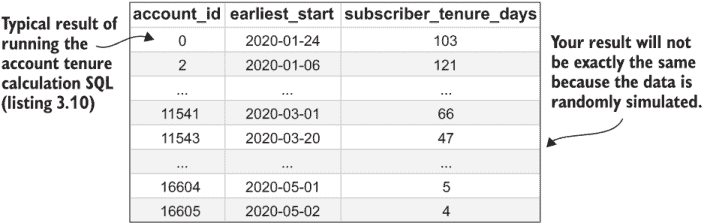

图 3.22 运行账户任期计算的结果

运行列表 3.12 并查看你自己的数据是否得到类似的结果。如果你使用的是模拟数据和 Python 包装程序，那么你需要更新列表 3.12 的参数。结果将类似于图 3.22。

列表 3.12 和图 3.22 展示了最早开始日期以说明任期计算。实际上，目标是像度量一样运行计算并将其插入到度量表中，以便在后续的度量计算和分析（将在后面的章节中讨论）中使用一系列日期的任期计算。要将账户任期计算插入到度量模式中，需要对列表 3.12 进行一些修改，使其更像其他度量计算：

+   通过在 `calc_date` CTE 中使用一系列日期，而不是仅使用一个计算日期，来对一系列日期进行计算。

+   计算日期必须放在递归 CTE `SELECT` 语句和连接中。否则，递归 CTE 保持不变。

+   在最终的 `SELECT` 中不要选择最早开始日期；相反，选择计算日期。这是插入度量表中的测量观察时间戳。

+   如果你的数据仓库支持 `INSERT` `SELECT`s，则需要相应的 `INSERT` 语句（参见列表 3.3）。

一个经过这些修改的 SQL 程序，它计算度量并将其插入到数据库中，如列表 3.13 所示。运行列表 3.13 以插入度量（我们将在后面的章节中与其他度量一起分析它）。如果你使用的是包装程序来运行列表，则命令是

```
fight-churn/listings/run_churn_listing.py —chap 3 —listing 13
```

这将账户任期测量值插入到你的本地数据库中；你需要使用 SQL 查询（或列表 3.6 中的度量 QA 查询）来检查结果。注意，与列表 3.3 一样，除非你更改配置或从数据库中清理结果，否则只能运行此列表一次。最后，将新度量（`account_tenure`）的名称插入到度量名称表中。为此，你需要重用列表 3.4。为了使这更容易完成，运行列表的代码有另一个版本的列表 3.4 参数，这些参数已经为你设置好了：重新运行列表 3.4，但将参数 `—version` `11` 添加到可执行命令中：

```
fight-churn/listings/run_churn_listing.py —chap 3 —listing 4 —version 11
```

列表 3.13 用于计算并保存账户任期作为度量的 `INSERT` `SELECT` SQL

```
WITH RECURSIVE date_vals AS (                                 ①
    SELECT i::timestamp AS metric_date                        ②
    FROM generate_series('2020-02-02', '2020-05-10', '7 day'::interval) i
),
earlier_starts AS                                             ③
(
    SELECT account_id, metric_date, 
        MIN(start_date) AS start_date                         ④
    FROM subscription INNER JOIN date_vals
        ON start_date <= metric_date                          ⑤
        AND (end_date > metric_date or end_date is null)
    GROUP BY account_id, metric_date

    UNION

    SELECT s.account_id, metric_date, s.start_date            ⑥
    FROM subscription s INNER JOIN earlier_starts e
        ON s.account_id=e.account_id
        AND s.start_date < e.start_date
        AND s.end_date >= (e.start_date-31)
)
INSERT INTO metric                                            ⑦
(account_id,metric_time,metric_name_id,metric_value)
SELECT account_id, metric_date, 8 AS metric_name_id,          ⑧
    extract(days FROM metric_date-MIN(start_date)) 
        AS metric_value                                       ⑨
FROM earlier_starts
GROUP BY account_id, metric_date
ORDER BY account_id, metric_date
```

① `RECURSIVE` 关键字位于开头。

② 此 CTE 包含计算所需的日期。

③ 此 CTE 与列表 3.12 中的基本相同。

④ 为每个日期在递归 CTE 中开始一个条目

⑤ 分别按日期应用订阅活动条件

⑥ 指标日期必须包含在递归 SELECT 中。

⑦ INSERT 语句与之前指标的语句大致相同。

⑧ 将账户使用期限指标作为指标 ID 8 输入

⑨ 使用期限的值是针对每个指标日期单独计算的。

计算非订阅产品和服务的账户使用期限

如果你正在开发一个没有订阅功能的产品（如广告支持、零售、非营利性等），仍然重要的是要分析和理解账户使用期限与流失率之间的关系。唯一的区别是，你并不是从订阅来衡量使用期限，而是从事件来决定某人使用产品的时长。如果你认为这里描述的使用期限计算方法也适用于事件，你是正确的；程序将在下一章（4.3 节）中展示。这里描述的账户使用期限算法是非订阅产品创建流失分析数据集的重要组成部分。

如果你的产品没有订阅功能，这是一个跳到第四章并了解更多信息的好时机，因为下一节是关于特定于订阅产品的指标。但请从第四章的开始部分开始：4.3 节中的技术建立在 4.1 节和 4.2 节的基础上。

## 3.11 测量 MRR 和其他订阅指标

其他重要的客户测量指标来自他们的订阅，如账户使用期限，但这些指标依赖于订阅的细节，而不仅仅是订阅的开始和结束日期。像账户使用期限测量一样，这些测量在概念上简单直接，如果每个客户只有一个（且仅有一个）订阅，就不需要太多计算。然而，正如通常情况一样，当客户在一段时间内或同一时间拥有多个订阅时，事情会变得复杂。我将展示适用于任何类型“混乱”订阅数据的一般技术，如果你认为你的数据条件允许，你可以选择简化这种方法。

### 3.11.1 将 MRR 作为指标计算

当客户为订阅付费时，总月度经常性收入（MRR）是一个重要的测量指标。你可能不会将 MRR 视为一个测量指标，而是将其视为一个简单的事实。图 3.23 说明了，每当存在多个可能具有不同价格的订阅的可能性时，MRR 是你需要在不同的时间点测量的，就像常规的行为测量一样。

由于您无法保证账户在任何给定时间拥有哪些订阅，因此您必须单独计算您感兴趣的每个点的 MRR。并且因为多个订阅的成本会累加，所以计算会汇总任何给定日期上所有活跃订阅的总 MRR。图 3.23 中的示例说明了当旧订阅结束或新订阅开始时，MRR 如何发生变化。

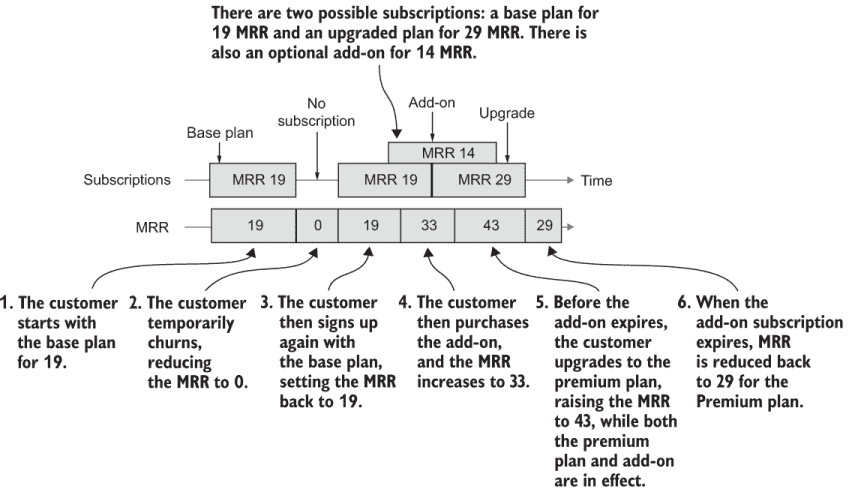

图 3.23 每月经常性收入（MRR）指标计算

该图说明了 MRR 随时间的变化：

1.  客户从基础计划开始（MRR = 19）。

1.  客户暂时流失（MRR = 0）。

1.  客户再次使用基础计划注册（MRR = 19）。

1.  客户购买了附加功能（MRR = 33）。

1.  在附加功能到期之前，客户升级到高级计划（MRR = 43）。

1.  附加订阅过期（MRR = 29）。

虽然 MRR 可以随时变化，但如果您每周计算其他行为度量（如第 3.5.1 节中建议的），那么在您进行其他指标计算的那些日期上计算所有账户的 MRR 就足够了。列表 3.14 显示了计算一系列日期上所有账户总 MRR 的 SQL 查询。计算 MRR 的策略如下：

1.  使用`generate_series`定义一个固定的测量日期序列（如果使用除 Postgres 以外的数据库，请参阅第 3.4 节侧边栏中关于生成序列函数的替代方案）。

1.  将订阅与日期连接起来，以找到每个日期上所有活跃的订阅。如果订阅的开始日期在或早于测量日期，并且结束日期在测量日期之后（或者没有结束日期），则该订阅是活跃的。

1.  使用标准聚合来汇总每个日期上所有订阅的总 MRR。

列表 3.14 计算 MRR 作为指标的 SQL

```
WITH date_vals AS (                                       ①
    SELECT i::timestamp as metric_date 
    FROM generate_series('2020-04-02', '2020-04-09', '7 day'::interval) i
)
SELECT account_id, metric_date, SUM(mrr)as total_mrr      ②
FROM subscription INNER JOIN date_vals
    ON start_date <= metric_date                          ③
    AND (end_date > metric_date or end_date is null)      ④
GROUP BY account_id, metric_date                          ⑤
```

① 此 CTE 包含计算日期。

② 对于每个账户和日期，汇总总 MRR

③ 限制到在测量日期之前开始的订阅

④ 限制到在测量日期之后结束的订阅

⑤ 在每个账户和日期上汇总总金额

列表 3.14 没有示例输出。到现在为止，您知道每个账户和日期都会有 MRR 结果。在撰写本文时，默认模拟数据仅包含每个账户的一个订阅和一个 MRR（价格）。因此，您可以运行列表 3.14，但如果您使用默认模拟数据，结果可能不会很有趣。对于真实公司，MRR 通常在不同账户之间变化，并且很少看到单个账户 MRR 的变化。这种变化仅在两个测量日期之间账户的订阅计划发生变化时才会发生。

虽然这种计算月均收入的方法可能看起来过于复杂或计算成本高昂，但它比计算基于事件的指标要快得多，因为客户通常的订阅数量比事件少。此外，将不经常变化的月均收入存储在每周（或每日）更新的表中可能看起来效率低下。这是一个合理的批评，但在实践中，这只是存储在数据仓库中的另一个指标，而数据仓库通常在整个分析过程中包含数十（或更多）个指标。将月均收入指标以与其他行为指标相同的格式存储的好处超过了任何缺点。正如下一章所展示的，这使得将月均收入与其他行为指标集成变得更加容易。

### 3.11.2 特定金额的订阅

到目前为止，在讨论订阅时，我还没有谈到订阅的具体用途细节。或者更确切地说，订阅被展示为是为了那些有名称但没有其他事实或区分细节的产品。但许多订阅是为了某些具体的东西，从订阅赋予用户一定类型产品使用固定配额的意义上来说。

例如，在 SaaS 中，订阅通常是针对一定数量的座位，这意味着允许的最大用户数。在电信和物联网（IoT）中，通常有一组固定的手机或设备，或者可能是数据或带宽配额。为了泛指订阅的这些属性，通常将订阅所针对的东西称为订阅的单位，而单位的数量是数量。

定义：单位——对于订阅，由订阅提供的特定类型的权利。数量——订阅者有权获得多少单位。

表 3.6 显示了当订阅与关联的单位和数量相关联时可以使用的扩展订阅表模式。这个订阅模式增加了一个文本字段来描述单位，以及一个数字字段来表示数量。请注意，在这个模式中，每个订阅只为单一类型的单位，但在实践中，可以一起销售多种类型的单位。如果一起销售多种类型的单位，通常在模式中以单独的订阅形式输入它们，并具有相同的开始和结束日期。在订阅业务管理软件系统的术语中，对于特定时间段内某些数量单位的单个销售通常被称为收费段、费率计划收费或仅仅是收费。

定义：收费段——对于一定数量某些单位的单一周期性合同。也称为费率计划收费或仅仅是收费。

如果使用收费段术语，则订阅被定义为相关收费段的一组。为了简单和一致性，在这本书中，我将把订阅表中此类条目称为订阅，但理解客户在任何时间点都可以有多个订阅。这主要是一个关于客户销售的各种周期性产品的部分与整体语义问题。

表 3.6 带有单位、数量和计费周期的订阅表架构

| 列 | 类型 | 备注 |
| --- | --- | --- |
| `subscription_id` | `integer` 或 `char` | 在第二章中引入的标准订阅字段 |
| `account_id` | `integer` 或 `char` |
| `product_id` | `integer` 或 `char` |
| `start_date` | `date` |
| `end_date` | `date` |
| `mrr` | `double precision` |
| `quantity` | `integer` 或 `double` | 此订阅的单位数量 |
| `units` | `char` 或 `text` | 此订阅的单位 |
| `billing_period_(months``)` | `integer` | 客户被开具发票的月份数间隔 |

### 3.11.3 将订阅单位数量作为指标计算

现在引入具有多个单位的订阅的目的在于，客户为每种单位类型订阅的数量是一个重要的指标，就像 MRR 一样。计算单位数量指标依赖于几乎相同的计算。

与 MRR 计算的一个不同之处在于，不是对 MRR 字段求和，而是对数量字段求和。并且当存在多种类型的单位时，必须有一个额外的约束来选择正确的单位：每种单位类型应该有一个度量指标。计算订阅单位数量的策略如下：

1.  使用 `generate_series` 定义一个固定的测量日期序列（如果使用除 Postgres 以外的数据库，请参阅 3.5.1 节侧边栏中关于生成序列函数的替代方案）。

1.  将订阅与日期连接起来，以找到每个日期上所有活跃的订阅。一个订阅是活跃的，如果其开始日期在或早于测量日期，并且结束日期在测量日期之后，或者如果没有结束日期。

1.  限制订阅为具有正确类型单位的订阅。

1.  使用标准聚合对每个日期上所有匹配的订阅的总数量进行求和。

计算订阅单位数量的 SQL 在列表 3.15 中显示。正如承诺的那样，它与列表 3.14 中的 MRR 指标计算类似。您可能会想知道，在求和单位数量时，我为什么使用聚合 SQL 来求总和，而不是每种单位类型只有一个订阅？实际上，数量增加是一种非常常见的附加订阅类型。如果客户需要更多单位，并且他们正处于现有订阅的中途，而不是结束原始订阅并开始新的订阅，那么通常更容易为额外单位创建一个带有自己价格和开始和结束日期的第二个订阅。这就是为什么将单位数量作为可以随时间变化的指标来计算，并使用聚合来计算指标的原因。

列表 3.15 计算总单位数量作为指标的 SQL

```
WITH date_vals AS (                                      ①
    SELECT i::timestamp as metric_date 
    FROM generate_series('2020-04-02', '2020-04-09', '7 day'::interval) i
)
SELECT account_id, metric_date, SUM(quantity) 
    AS total_seats                                       ②
FROM subscription INNER JOIN date_vals
    ON start_date <= metric_date                         ③
    AND (end_date > metric_date or end_date is null)     ④
WHERE units = 'Seat'                                     ⑤
GROUP BY account_id, metric_date                         ⑥
```

① 此 CTE 包含计算所需的日期。

② 对订阅的总数量进行求和

③ 对测量日期之前开始的订阅进行限制

④ 对测量日期之后结束的订阅的限制

⑤ 对座位单位进行限制

⑥ 对每个账户和日期进行总计

默认的模拟数据不包括订阅单位或数量，因此您无法在模拟数据上运行此操作。这个例子只是为了向您展示当您拥有包含单位数量的自己的数据时如何操作。但模拟代码可以扩展以包括这些细节：我鼓励您作为练习这样做。

### 3.11.4 将计费周期作为指标计算

表 3.5 显示了扩展的订阅表模式。在上一个部分，我们讨论了如何从订阅单位数量中创建指标。表 3.5 还有一个在查看流失时通常相关的元素：订阅的计费周期。

定义：计费周期—衡量客户被计费的频率。每月计费定义为计费周期为 1；年度计费（每 12 个月计费一次）为计费周期为 12；依此类推。

计费周期可能很重要，因为具有不同支付频率的订阅者可能会以不同的速率流失。通常情况下（但不总是如此），处于较长期限支付周期（例如年度）的人比处于较短期限支付周期（例如每月）的人流失率低。当付款在服务之前进行时，这一点尤其正确，因为客户很难或无法获得退款，因此他们不太可能在中途流失。年度计费通常伴随着折扣，以吸引客户提前支付大额款项：对于订阅业务来说，问题是提供的折扣是否由较低的流失率所证明。当我们在下一章中查看计费周期对流失的影响以及第八章中的客户终身价值时，您将学习如何回答这个问题。

计费周期可以并且应该像基于订阅的任何指标一样处理。它应该从与行为指标相同的间隔对订阅进行聚合计算，以便可以轻松地与其他指标结合进行客户流失分析。计算计费周期作为指标的 SQL 语句显示在列表 3.16 中。它与本节前面（MRR 和单位数量）显示的订阅指标有很多共同之处。关于计费周期指标的一个新颖点是，将不同订阅上的多个计费周期组合的聚合不是求和。这是因为同时有两个 12 个月（年度）计费周期，例如，并不会形成一个 24 个月的计费周期；不同订阅上的计费周期不是累加的。

在不同的计费周期上有多个订阅是罕见的。即使客户有多个订阅产品，大多数客户也会在同一个计费周期内支付单一发票。这绝对是最佳实践，因为客户更喜欢简单的计费方式！但指标计算中需要某种聚合，以确保每个账户在每个测量日期只有一个结果，即使有多个活跃的订阅。聚合的选择是最小计费周期、平均计费周期或最大计费周期。所有这些选择在所有订阅具有相同周期时都返回单个正确的计费周期，并且它们返回一个介于最小和最大计费周期之间的数值。在列表 3.16 中，我选择了最小值，因为如果客户每月收到账单（计费周期 1），他们可能表现得像一个每月收到账单的客户，即使他们还有其他按更长周期计费的产品。

列表 3.16 计算计费周期作为指标的 SQL

```
WITH date_vals AS (                                               ①
    SELECT i::timestamp as metric_date 
    FROM generate_series('2020-04-02', '2020-04-09', '7 day'::interval) i
)
SELECT account_id, metric_date, MIN(bill_period_months) 
    AS billing_period                                             ②
FROM subscription INNER JOIN date_vals
    ON start_date <= metric_date                                  ③
    AND (end_date > metric_date or end_date is null)              ④
GROUP BY account_id, metric_date                                  ⑤
```

① 此 CTE 包含计算日期。

② 对于每个账户和日期，总计总量

③ 以测量日期开始的订阅限制

④ 在测量日期之后结束的订阅限制

⑤ 每个账户和日期的总计

您可以通过遵循书中代码的说明来运行列表 3.14，但如果您使用的是默认的模拟数据，那么结果可能不太有趣。在撰写本文时，默认的模拟数据仅包括一个计费周期（每月），但它会向您显示每个账户始终有一个一个月的计费周期。话虽如此，模拟代码可以扩展以包括像变化计费周期这样的细节。我鼓励您作为练习这样做，然后提交一个拉取请求来分享您的工作。

用于自动化指标计算的软件框架

如果还不明显，我必须告诉你一些坏消息：生成和保存大量指标（如客户事件的计数、平均值和总和）会很快变得乏味。如果你有超过几种事件类型，请使用软件尽可能自动化这个过程。如果你还没有从事过这类项目，我应该警告你，这通常比你想象的要多的工作，因为不可避免的是，你不仅仅计算一次指标。你最终会在你和其他组织成员考虑不同的选择和纠正 QA 测试中发现的问题时多次计算它们。对于模拟，你不必处理所有这些，因为它只是一个简单的模拟，我已经为你设置了合理的指标。

警告 在实际案例研究中，你可能需要在测试和修复多个版本时多次计算你的指标。

吸收要点 自动化是成功迭代各种指标以对抗客户流失的关键。

运行列表的 Python 脚本是这种自动化框架的示例，但它不是针对计算指标的任务进行优化的。一个指标计算软件框架至少应包括以下特性：

+   以通用方式存储指标 SQL 程序，以便可以使用相同的 SQL 通过绑定事件 ID 作为变量和参数化选项（如指标计算中的时间周期）来计算许多不同事件上的指标

+   处理将生成的指标（包括名称）插入数据仓库的细节

+   当指标重新计算时删除旧结果

程序包装器被编写来演示各种列表，它实现了第一个目标但没有实现第二个。更高级的指标计算框架可能包括控制指标计算日期范围和自动更新数据仓库中新事件数据到达时的指标等特性。

如何设计和实现更好的指标计算框架超出了本书的范围，因为这取决于特定用例的软件工程练习。本书是关于数据分析和数据科学的。但我已经在 GitHub 仓库中发布了另一个用 Python 编写的指标计算框架的示例：[`github.com/carl24k/fight-churn/tree/master/metric-framework`](https://github.com/carl24k/fight-churn/tree/master/metric-framework)。在我决定书中的列表之前，我使用了这个框架进行客户案例研究，并且它更专注于指标。

## 摘要

+   行为测量，也称为指标，总结每个客户在某个时间点或多个时间点的事件。

+   指标通过提供行为概要使客户账户可比较。这是必要的，因为不同账户的事件发生速率和不同时间各不相同。

+   常见度量标准是在从周到一年不等的时间周期内测量的。

+   对于使用一个月或更短时间周期的测量，最好使用七天的倍数，因为几乎所有的人类活动都遵循每周周期。

+   常见度量标准包括

    +   事件计数

    +   事件属性（如持续时间、美元价值或大小）的平均值

    +   事件属性（如持续时间、美元价值或大小）的总计（总和）

+   所有常见度量标准都可以使用聚合 SQL `SELECT`语句计算。

+   所有事件和度量标准都需要进行质量保证（QA）测试，因为事件数据并不总是可靠的，度量计算可能包含错误。

+   计算度量标准的正确程序如下：

    1.  对事件数据进行 QA 测试。

    1.  计算度量标准。

    1.  对度量标准进行 QA 测试。

+   关于度量标准的一个重要 QA 测试是计算出的度量标准数量以及平均、最小和最大值随时间的变化。

+   另一个关于度量的重要 QA 测试是，有多少百分比的活动账户的度量值不为零，以及对于所有客户，平均、最小和最大测量值是多少。

+   关于事件的一个重要 QA 测试是计算每个账户每月的平均事件数量，并确认这与业务专家的意见一致。

+   当事件很少发生时，进行事件测量的观察时间周期需要更长。

+   账户任期衡量账户在其当前订阅或活动期间作为客户的时间长度，忽略与当前不连续的较老订阅或活动期间。

+   当账户可以有多个订阅（或流失和重新注册）时，则账户任期应使用递归公用表表达式（CTE）来计算。

+   当账户可以有多个不同价格的订阅时，则月度经常性收入应基于与基于事件的指标相同频率的订阅来计算作为度量标准。

+   订阅可以赋予用户特定数量的产品或功能。这个数量被称为数量，而产品或功能被称为订阅的单位。

+   当订阅可以有不同数量和/或单位时，每个客户的单位数量应基于与基于事件的指标相同频率的订阅来计算作为度量标准。

+   订阅可以有不同计费周期，这意味着支付之间的时间长度（每月、每年等）。

+   当订阅可以有不同计费周期时，则每个客户的计费周期应基于与基于事件的指标相同频率的订阅来计算作为度量标准。
