# 4 观察续订和流失

本章涵盖

+   在流失前选择观察的提前期

+   从订阅或活动中选择观察日期

+   通过展平指标数据创建分析数据集

+   导出当前客户列表以进行细分

使用数据对抗流失的本质是从每次客户选择继续服务或流失时发生的自然实验中学习。在这个背景下，自然实验意味着一个测试你感兴趣的结果的情况，但你没有像正式实验那样设置它。这些实验是已经发生的流失和续订，结果正等待你在数据仓库中。为什么你不从这些结果中学习呢？实际上，如果你以前从未这样做过，观察这些实验和阅读结果可能会有些棘手。本章教您正确观察已经在你自己的数据中发生的客户实验的方法。

本章的场景假设您已经生成了行为指标（如第三章所述）并计算了一些类型的客户流失率测量（第二章）。本章是流失分析的准备步骤。您将收集在客户流失或继续服务时已知时间点的客户指标观察结果。与第一章中引入的整体书籍场景相关，本章重点介绍图 4.1 中突出的过程。

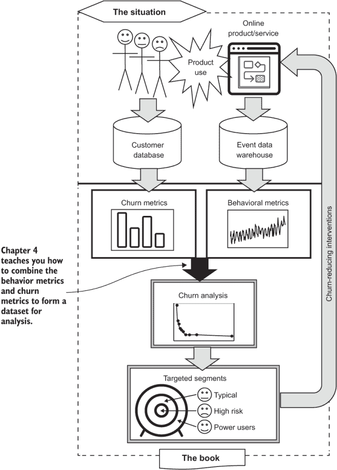

图 4.1 本章在用数据对抗流失的过程中的位置

本章的组织结构如下：

+   在 4.1 节中，我介绍了使用数据集从客户那里学习想法。

+   4.2 节讨论了在概念层面上如何选择观察结果，并介绍了提前期（lead time）的概念。

+   4.3 节展示了如何简化存在多个重叠订阅或订阅之间有间隔的数据。这极大地简化了选择观察日期的过程。

+   4.4 节将这些技术应用于没有实际订阅的产品，而是通过合并活动并应用第 4.3 节的技术来使用客户事件数据。

+   4.5 节教您如何生成一组观察日期，这些日期是在使用第 4.2 节和第 4.3 节的技术准备数据后为顾客生成的。

+   4.6 节通过教您如何将观察日期与第三章中的指标结合起来，形成分析流失的数据集。

+   4.7 节增加了一个相关技术：导出当前或最近的客户快照以用于细分。

## 4.1 数据集简介

在大多数这些场景中，从客户那里学习所面临的挑战部分是由于复杂性，部分是由于后勤考虑。观察许多客户复杂的原因在于他们都在与您的产品的旅程中处于不同的阶段。现在就查看所有客户或任何单一固定时间点是没有意义的。您希望在他们与产品的生命周期中的相同点（或几个点）观察他们，这样他们才是可比较的。如果您这样做不正确，在错误的时间观察，可能会扭曲您的分析，并在对抗流失的斗争中适得其反。本章将向您介绍如何在客户生命周期中挑选合适的观察点。

然后，在所有客户的观察点，您都会捕捉到所有指标在那个时间点的快照。（上一章中的指标计算都是在一系列时间序列中运行的，以便实现这一点。）这个客户快照的组合集合被称为客户观察数据集，或简单地称为数据集。如果您还不熟悉这个术语，数据集在数据科学和统计学中用于特定分析的数据集合。

**定义** 数据集——对一组您感兴趣分析的情境（事实）和结果的简要总结。通常，数据集是一个单张表格（或文件），每一行都有相同数量的列，并且每一行都包含一个情境和结果的完整信息。

当一组数据被称为数据集时，这意味着数据被组织在一个表格中，每一行都有相同数量的列。每一行都包含一个实例或现象观察的完整信息（意味着不同的行是不同的观察），每一列对应于关于该情况的一种事实（通常是测量或指标）。当您创建数据集时，您确保没有缺失字段或空（空）值。您必须为缺失的测量提供合理的默认值或排除包含缺失数据的观察。

**定义** 流失分析数据集——每一行代表一个面临流失或留存决策的客户的数据集。结果是他们的行为。这些情境的事实是客户的行为指标测量（以及可能关于他们的其他数据）。

创建此数据集的后勤挑战与第二章和第三章中相同：数据是敏感的，并且可能很大，因此如果您能在数据库或数据仓库中完成所有数据处理，那就更好了。像前几章一样，使这成为可能的方法是编写简短的 SQL 程序并将关键结果保存在数据仓库中。最终，可以有效地提取一个简洁的数据集，其中只包含尽可能少的敏感信息，以便进行进一步分析。

## 4.2 如何观察客户

为了观察客户流失或继续使用产品时发生的自然实验，你需要首先询问何时进行观察。首先，我们以抽象层面考虑这个问题（代码将在后面的章节中介绍）。

### 4.2.1 观察提前期

何时观察客户是一个简单的问题，对吧？在客户流失时观察客户，难道不是这个目的吗？并不完全是这样。这样思考一下：当客户流失时，一个媒体分享应用客户的用户行为指标会是什么样子？登录？零。下载？零。点赞？零。因为他们已经流失，他们在产品上的所有行为都应该已经停止。在客户已经流失时观察他们并不很有帮助。此外，在有人流失后，你几乎没有机会让他们再次注册：你更有可能在他们在做出决定之前影响他们。

吸收要点：在客户流失前说服客户留下比在客户流失后重新注册更容易。因此，流失前的时间段是分析的重点。

在客户流失前观察客户。对！我称之为在观察时具有观察提前期的客户，这意味着在真正感兴趣的事情（续订或流失）之前进行观察。在客户流失前应该观察多久：在他们流失前一天？也许吧，但更有可能的是，你应该观察他们在流失前更长时间的行为。这是因为，通常，客户在流失前的行为会发生变化。这如图 4.2 中的假设例子所示。

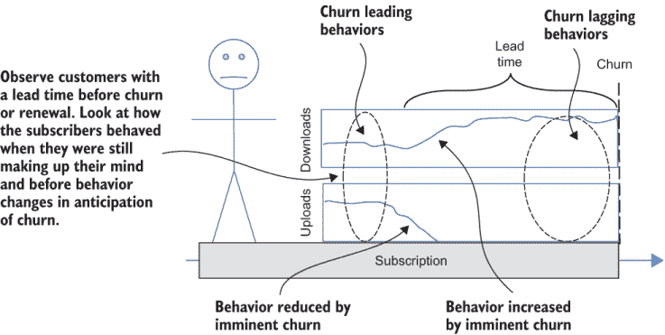

图 4.2 流失前的时间段和客户行为

如果有人计划流失，在流失前的时期，某些行为可能会减少，而其他行为可能会增加。以一个假设的文件共享服务为例，在流失前，上传可能会完全停止，因为客户不想浪费时间贡献任何其他东西。相反，他们会在服务结束前专注于下载内容。作为另一个例子，登录在流失前的时期可能会增加，然后变为零。

对于某些产品，这类行为的变化可以在客户流失前的一段时间内轻易地识别出可能流失的客户。但是，由即将发生的流失引起的行为仍然不是你想要观察的，因为那并不能告诉你客户最初为什么选择流失。你想要观察的是客户在决定流失之前的状态，因为那时你正在观察客户在做出决定时的样子。这很重要，因为当客户还在做决定时，你最有机会影响他们！我再次强调这个观点。

**要点**：分析的目标是识别和理解仍在权衡是否流失的客户，因为那时你影响他们的机会最大。

你如何知道客户是否还在权衡是否流失或继续使用产品？除非你有预知能力，否则你无法确切知道。你必须观察客户在合理预期他们正在考虑下一次续订的时间，而不是在最后一次续订后立即，也不是在即将到来的续订前，他们可能会流失。所需的时间取决于服务类型，但一般来说，承诺期限越长，服务越昂贵，提前期就应该越长：

+   对于月度订阅，在月度续订前一周到两周观察客户，或者在当前月份的一半到四分之三处。

+   对于消费者或小型企业的年度订阅，在年度续订前大约一个月观察客户。

+   对于与大型企业的年度订阅，在续订前观察客户的时间从两个月到四个月不等；90 天是典型的时间。

对于非订阅产品，你不需要选择提前期。你选择一系列定期间隔的观察日期，就像订阅产品一样。但由于没有续订，你无法确定何时有人可能考虑取消。

### 4.2.2 观察续订和流失的序列

当你创建数据集时，你不想只观察流失的客户。你还想观察续订的客户。这样，你可以比较流失和续订，并在分析中看到差异。而且，你不想只选择少数续订：为了分析的目的，你想要选择足够的续订，以便观察数据集中的续订观察与真实的保留率相匹配。

**要点**：对于流失分析数据集，尽量使数据集中的续订比例与真实的保留率相匹配。流失应在数据集中按真实流失率的比例存在。

例如，如果你有 5%的流失率（churn rate）和 95%的保留率（retention rate），你希望观察到的数据集也大约有 5%的流失和 95%的续订。这可能听起来安排起来很复杂，但实际上很简单：你只需观察每个账户的每次续订以及流失情况。这样，你观察到的续订和流失的比例将与你的真实流失率大致相同。

如果订阅没有固定期限或自动续订，观察应根据每次付款到期的时间进行。付款通常在订阅开始后固定时间段内到期：对于大多数消费者订阅，通常是每月一次。为了与有提前期的流失观察保持一致，你应在每次续订或付款前应用相同的提前期。图 4.3 说明了这种情况。

订阅有定期支付（例如，每月）并持续到取消为止。选择的观察日期是每次付款到期前的提前期。订阅最终在最后一个付费月份结束后结束，流失观察是在该月结束前的提前期进行的；那时客户正在做出最终决定是否流失或续费。这就是为什么本节标题为“观察续费和流失序列”的原因。通常，您会在他们续费时观察每个账户多次，而在他们流失时只观察一次。


图 4.3 支付周期日期、提前期和观察序列

如果您的产品有在不同续费或支付周期上的订阅怎么办？例如，许多产品既有月度计划也有年度计划。有多种处理方式，但我的建议是假设所有客户都在相同的续费或支付周期上，以相同的频率观察所有客户。要选择的观察频率是最常见的支付或续费周期。通常，这是您用来报价流失的周期，所以选择应该是显而易见的：

+   对于报告每月流失率的消费者订阅，即使有些客户续费或支付年度合同，也要每月观察客户。

+   对于报告年度流失率的商业订阅，即使有些客户支付或续费按月或季度计划，也要每年观察客户。

记住：当不确定时，如果根据特定时期（每月、每季度或每年）计算您的流失率最有意义，那么这可能就是观察产品整个生命周期中订阅者的正确时期。

如果您这么想，从某种意义上说，在年中观察年度客户是没有意义的，因为他们那时没有机会流失，而且他们可能也没有在考虑这个问题。但如果你每年只观察一次年度客户，这会使得在数据中重现流失和续费率变得复杂，同时也使得解释年度计划和月度计划的影响变得更加困难。（我将在第五章学习如何分析计划的流失影响时进一步解释。）

### 4.2.3 从订阅创建数据集的概述

现在，我将介绍创建实际订阅数据集的步骤；没有订阅的情况在 4.4 节中介绍。整个过程的概述如图 4.4 所示。过程的起点是第二章中描述的订阅数据以及您在第三章中创建并在数据仓库中保存的指标。

图 4.4 中展示的主要步骤如下：

1.  识别客户目前订阅的一个或多个正在进行的订阅（没有流失）。这些被称为持续进行的活跃期。

1.  识别每个客户订阅一个或多个订阅的时间段以及这些时间段何时以流失结束。这些被称为以流失结束的活跃期。

1.  使用这些活跃期，根据上一节中描述的支付或续订周期和提前期，为每个客户选择观察日期序列。跟踪这些观察中哪些是在实际流失前的提前期内进行的。

1.  使用观察日期序列来选择数据仓库中保存的指标。指标值，连同流失和观察细节，在一个数据集中选择，每个客户每行数据集为一个观察。

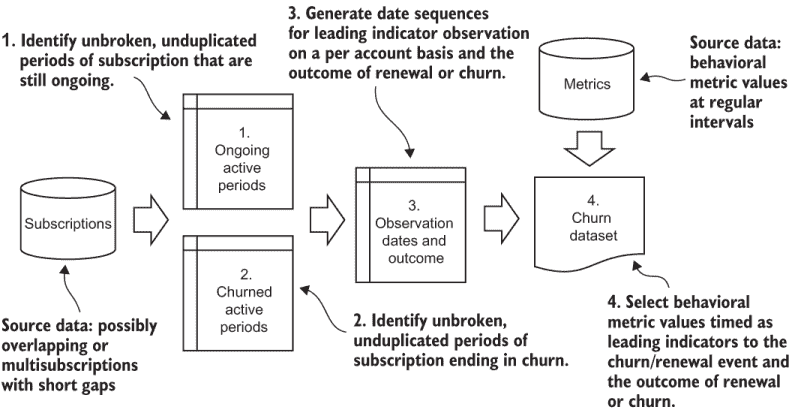

图 4.4 从订阅中创建数据集的四个步骤流程

我刚刚提到了一个将在整个过程中使用的重要新概念。

定义 活跃期 —— 指订阅者至少有一个活跃订阅的时间段。订阅之间可以有小的间隔，而不会打断活跃期。

第 4.3 节提供了此过程步骤 1 和 2 的详细信息：创建活跃期。第 4.4 节偏离主题，解释了对于没有实际订阅的产品，此过程有何不同。第 4.5 节继续并解释此过程的第 3 步：选择观察日期。最后，第 4.6 节讨论了最终步骤：将指标数据与观察日期合并并导出数据集。

## 4.3 从订阅中识别活跃期

在此过程阶段的目标是在适当的时间对您的订阅者进行定期观察，以了解他们为何流失。第一步是处理由订阅中的冗余或不规则性引起的问题。这些问题与你在第三章学习如何计算账户期限时遇到的问题相同。某些客户可能有多个订阅，这样客户活跃的有效期可能比任何单个订阅都要长，而且个人订阅之间可能有短间隔，这些间隔你可能不想视为流失。此外，当有多个产品或存在基础产品和附加产品时，一些客户可能同时拥有多个订阅。这些额外订阅的日期可能不会与主要订阅对齐。

如果您的订阅产品没有这个步骤旨在处理的任何复杂性，您可以跳到第 4.5 节。为了明确，只有当您产品的订阅已经保证由每个账户的单个、不重叠的周期组成，且没有无意中产生的间隔时，才跳过本节。

### 4.3.1 活跃期

活跃期间，如图 4.5 所示，是指账户通过一个或多个单独的订阅持续订阅的一段时间。在图 4.5 中，总共有七个单独的订阅，按照它们的开始时间顺序编号。活跃期间与订阅的不同之处在于，活跃期间合并了任何多个订阅并忽略了短暂的间隔。每个账户一次只能处于一个活跃期间，活跃期间之间的任何间隔都代表真正的流失，随后在稍后的日期重新订阅。

注意：如果一个账户不在活跃期间，则最后一个活跃期间的结束即为流失。

在图 4.5 中，第一个活跃期间是一个简单的单一订阅。图中的第 2 期是一个由三个主要订阅（编号 2、3 和 5）组成的复杂活跃期间的例子。在订阅 2 和 3 之间有一个短暂的间隔——短到不应该被视为流失。订阅 3 和 5 对齐，因此没有间隔；还有一个附加订阅（编号 4），它在订阅 3 的中间开始，在订阅 5 的中间结束。所有这些都符合构成一个活跃期间的条件。第 3 期是一个活跃期间正在进行的例子；这是当订阅没有结束日期或在分析时结束日期在未来的情况。

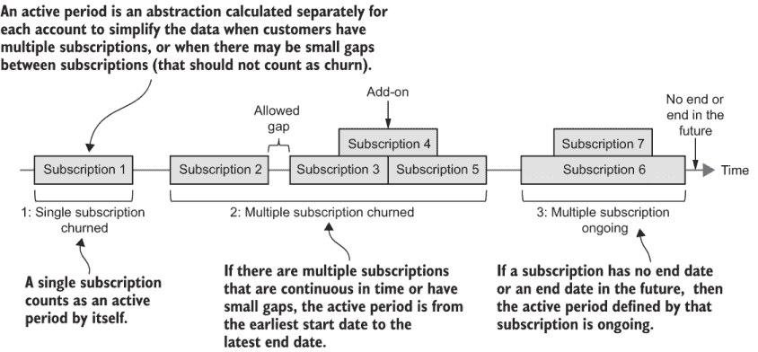

图 4.5 从多个订阅中确定活跃期间

### 4.3.2 存储活跃期间的架构

活跃期间只是形成数据集过程的一步，将它们存储在数据库中很方便。或者，您可能选择将本章中所有简短程序合并成一个大型程序，该程序生成数据集而不需要任何永久存储。因为这本书通过简短程序教授每个步骤，所以我将结果存储在表中。存储活跃期间的所需模式如图 4.1 所示。它在某些方面与存储订阅的模式（第二章，表 2.1）相似，因为每条记录都有一个账户 ID 和开始日期，这是必需的，还有一个日期是流失日期，它像订阅的结束日期一样可以为空。但是，活跃期间记录与订阅有一些重要的不同：

+   对于一个活跃期间，`account_id`和`start_date`的组合必须是唯一的，因此它们应该作为表上的复合键或索引来实现。

+   活跃期间没有与订阅相关的任何细节，如产品或 MRR。

（如果您需要关于如何在多个订阅的上下文中计算 MRR 等指标的帮助，请参阅第 3.10 节。）

备注：`account_id` 和 `start_date` 的约束可以作为一个表约束实现，但还有一个隐含的约束必须通过应用程序逻辑实现。对于每个账户，活跃周期的开始日期和流失日期必须定义非重叠的时间段，并且每个账户只能有一个没有流失日期的活跃周期：当前活跃周期。

表 4.1 活跃周期表架构

| 列 | 类型 | 备注 |
| --- | --- | --- |
| `account_id` | `integer` 或 `char` | 不为空；复合键 |
| `start_date` | `date` | 不为空；复合键 |
| `churn_date` | `date` | 可为空 |

### 4.3.3 查找正在进行的活跃周期

我首先向您展示如何找到仍在进行的活跃周期，因为这与找到已经结束的活跃周期更容易。对于正在进行的活跃周期，您不需要找到流失日期，因为您知道它们不会以流失结束：这只是找到开始日期的问题。看看图 4.5，回想一下您在 3.10 节中学到的账户租期计算（见图 3.19-3.21）。找到正在进行的活跃周期的开始日期基本上与找到每个账户的租期相同（即今天为止的每个账户的租期）。唯一的区别是，所需的结果是客户积极订阅的周期开始日期，而不是他们作为积极订阅者的时长。与计算账户租期一样，您需要找到的不仅仅是当前订阅的开始，还要找到最老的、与当前订阅重叠或形成连续序列的订阅。

列表 4.1 展示了一个简短的 SQL 程序，用于计算当前正在进行的活跃周期。再次注意，结果仅仅是一个列表，列出了目前正处于活跃订阅中的所有账户以及它们进入任何当前连续活跃订阅的最早开始日期。这与上一章中描述的，使用递归公用表表达式（CTE）进行的账户租期计算相同，但我会再次讲解，作为快速回顾。这个过程通过以下 `SELECT` 语句实现：

1.  一个 CTE 包含控制何时以及如何找到活跃周期的参数。

1.  一个两部分的递归 CTE 找到活跃订阅的序列。

    +   初始化 `SELECT` 语句找出所有当前活跃的账户。

    +   递归 `SELECT` 语句找出与当前找到的订阅重叠或与当前订阅连续但更早的早期订阅。

1.  一个聚合 `SELECT` 语句找出每个账户的任何订阅的最早开始日期。

因为这个结果被保存并与其他以流失结束的活跃周期的结果合并，所以最终的 `SELECT` 语句包括一个 `INSERT` 语句，将结果保存到名为 `active_period` 的表中。

列表 4.1 当前正在进行的活跃周期

```
WITH RECURSIVE active_period_params AS                                     ①
(
    SELECT interval 7  AS allowed_gap,                                     ②
    '2020-05-10'::date AS calc_date                                        ③
),
active AS                                                                  ④
(

    SELECT distinct account_id, min(start_date) 
        AS start_date                                                      ⑤
    FROM subscription INNER JOIN active_period_params 
        ON start_date <= calc_date
        AND (end_date > calc_date or end_date is null)
    GROUP BY account_id

    UNION

    SELECT s.account_id, s.start_date                                      ⑥
    FROM subscription s 
    CROSS JOIN active_period_params 
    INNER JOIN active *e* ON s.account_id=e.account_id                       ⑦
        AND s.start_date < e.start_date                                    ⑧
        AND s.end_date >= (e.start_date-allowed_gap)::date                 ⑨

) 

INSERT INTO active_period (account_id, start_date, churn_date)             ⑩
SELECT account_id, min(start_date) AS start_date, NULL::date AS churn_date ⑪
FROM active
GROUP BY account_id, churn_date                                            ⑫
```

① 此 CTE 包含常量参数。

② 在流失前的最大无订阅时间

③ 考虑的最新日期

④ 这与计算账户任期（第三章）相同

⑤ 使用每个当前订阅的开始初始化递归 CTE

⑥ 在递归过程中插入新的账户 ID 和开始日期

⑦ 新记录必须属于同一账户。

⑧ 新记录是为开始时间更早的订阅

⑨ 新记录必须有一个在允许的间隔内的结束日期。

⑩ 将结果保存到 active_period 表中

⑪ 选择最早的开始日期和为流失日期选择 null

⑫ 按 account_id 分组；流失日期必须在 GROUP BY 中

按照书中可下载代码的说明运行列表 4.1，代码位于 [www.manning.com/books/fighting-churn-with-data](https://www.manning.com/books/fighting-churn-with-data) 或 [`github.com/carl24k/fight-churn`](https://github.com/carl24k/fight-churn)。它已预配置为在默认模拟数据集上运行。（数据模拟的说明在 README 页面中。）设置好你的环境后，使用以下命令运行列表 4.1：

```
fight-churn/listings/run_churn_listing.py —chapter 4 —listing 1
```

包装程序 `run_churn_listing` 打印它正在运行的 SQL。但请注意，列表 4.1 在数据库中执行插入操作，因此不会产生任何输出。要查看结果，请使用你选择的 SQL 查询方法运行查询（参见 README 获取建议）；例如：

```
SELECT * FROM active_period ORDER BY account_id, start_date;
```

图 4.6 显示了在默认模拟数据集上运行列表 4.1 的结果，然后使用类似于上一个的 `SELECT` 语句查看结果。如果你有大量数据，请使用 `LIMIT` 子句，但对于默认模拟，你可能不需要它。结果包含在模拟开始附近开始的账户，以及模拟结束时添加的账户。由于对 `active_period` 表的约束，你只能运行列表 7.1 一次，而无需删除表中已有的数据。

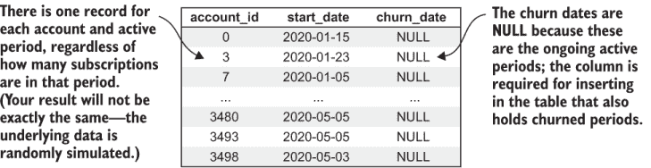

图 4.6 运行列表 4.1 的活动期结果

### 4.3.4 寻找以流失结束的活动期

找到以流失结束的活动期可能是本书中最先进的 SQL 程序。但这个程序并不比你所见过的任何程序更难；它只是结合了你已经掌握的其他技术：第二章中用于计算流失的外连接技术，以及第三章中（并在上一节中回顾）用于找到任何订阅最早开始时间并持续到另一个订阅的递归 CTE。

寻找所有流失的算法基于第二章中用于计算流失率的示例外连接方法，但它并不完全相同。它从观察开始，即每次流失都必须对应一个订阅的结束日期。进一步来说，如果一个订阅的结束日期没有通过相同账户的新订阅进行其他扩展，那么这个结束日期就是一个流失。

定义延期——另一个在先前订阅结束之前或允许的间隔期内开始，并且具有未来结束日期的订阅。延期延长了活跃期。这种延期定义仅适用于当前算法的讨论，并不是贸易中一般使用的术语。

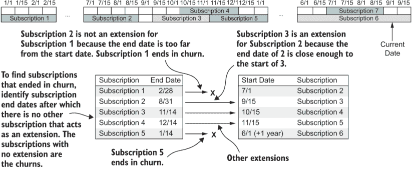

图 4.7 从结束日期和延期中查找流失

延期之所以被称为延期，是因为它延长了先前订阅的结束日期，并防止该结束日期发生流失。关键是流失是一个没有延期的结束日期。图 4.7 提供了一个通过考虑结束日期和延期来查找流失的例子。它基于图 4.5 中所示的订阅序列。为了识别一个账户的流失，你使用以下步骤：

1.  识别该账户所有订阅的结束日期。（没有结束日期的订阅不能是流失，所以忽略它们。）这限于在当前日期结束的时间段内的结束日期，并且可以追溯到你在寻找流失时感兴趣的最早日期。

1.  识别所有延长这些结束日期的延期。这些是在其他订阅结束日期之前或允许的间隔时间内开始，并在未来较晚结束的订阅。

1.  选择没有延期的结束日期。这些就是流失。在 SQL 中，使用外连接来处理有延期的结束日期，并选择步骤 1 中的那些订阅，在外连接上使用`null`，以及步骤 2 中的延期订阅。这些结束日期对应于以流失结束的活跃期。

图 4.8 显示了查找流失及其对应开始日期的完整过程。它包括首先通过考虑结束日期和延期来查找流失，然后查找以流失结束的活跃期的开始日期。这发生在两个额外的步骤（4 和 5）中：

1.  开始日期的查找方式与持续活跃期的开始日期（以及账户任期计算）相同：使用递归 CTE 来搜索越来越早的开始日期。

1.  从在流失结束的订阅之前的订阅中取最小开始日期（如果有）。

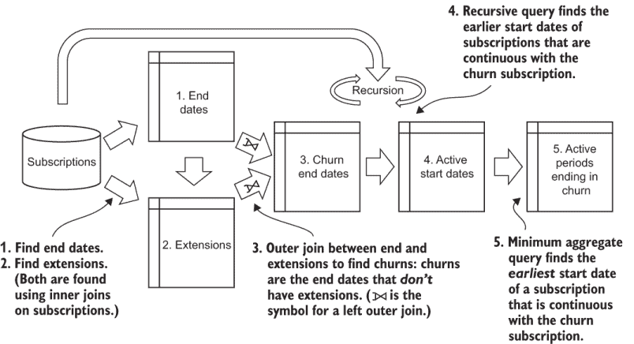

图 4.8 寻找流失和相应的活跃期开始日期的过程

列表 4.2 是查找以流失结束的活跃期的 SQL 程序。它包括四个 CTE：

+   `active_period_params`—包含定义程序何时查找流失以及订阅之间允许的最大间隔（不被视为流失）的固定常数。

+   `end_dates`—包含所有在所需时间段内有结束日期的订阅。为了方便下一步操作，它还计算了可以延长此结束日期的最大日期：结束日期加上参数中定义的允许的间隔。

+   `extensions`—包含所有具有另一个扩展其订阅（扩展）的订阅结束日期。这是任何在最大扩展日期（在`end_dates` CTE 中计算）之前开始且具有未来结束日期或`null`结束日期的匹配账户的订阅。

+   `churns`—一个递归 CTE，执行算法的关键计算：

    +   初始化`SELECT`语句是结束日期和扩展的外连接，它只选择没有扩展的结束日期。这些是取消订阅。

    +   递归的`SELECT`语句找到在相同账户的取消订阅之前的订阅的较早开始日期；这些中的最早的是活跃期的开始。

列表 4.2 中的最后一个`SELECT`语句以与列表 4.1 中活跃期仍然活跃的方式找到每个结束日期对应的最低开始日期。它还包含`INSERT`语句，将此结果与`active_period`表中的持续活跃期一起保存。关键的是，没有扩展的订阅的结束日期是取消订阅日期。

列表 4.2 以取消订阅结束的活跃期

```
WITH RECURSIVE active_period_params AS                        ①
(

    SELECT INTERVAL '14 day' AS allowed_gap,                  ②
           '2020-05-10'::date AS observe_end,                 ③
           '2020-02-09'::date AS observe_start                ④

),
end_dates AS                                                  ⑤
(

    SELECT distinct account_id, start_date, end_date,         ⑥
        (end_date + allowed_gap)::date AS extension_max       ⑦
    FROM subscription INNER JOIN active_period_params 
        ON end_date between observe_start 
        AND observe_end                                       ⑧

), 
extensions AS                                                 ⑨
(

    SELECT distinct e.account_id, e.end_date                  ⑩
    FROM end_dates *e* INNER JOIN subscription s 
        ON e.account_id = s.account_id
        AND s.start_date <= e.extension_max                   ⑪
        AND (s.end_date > e.end_date 
            OR s.end_date is null)                            ⑫

),
churns AS                                                     ⑬
(

    SELECT e.account_id, e.start_date, 
        e.end_date AS churn_date                              ⑭
    FROM end_dates *e* LEFT OUTER JOIN extensions *x*             ⑮
    ON e.account_id = x.account_id                            ⑯
        AND e.end_date = x.end_date
    WHERE x.end_date is null                                  ⑰

    UNION

    SELECT s.account_id, s.start_date, e.churn_date           ⑱
    FROM subscription s 
    CROSS JOIN active_period_params
    INNER JOIN churns *e* ON s.account_id=e.account_id
        AND s.start_date < e.start_date
        AND s.end_date >= (e.start_date-allowed_gap)::date

) 
INSERT INTO active_period 
    (account_id, start_date, churn_date)                      ⑲
SELECT account_id, min(start_date) AS start_date, 
    churn_date                                                ⑳
FROM churns
GROUP BY account_id, churn_date
```

① 此 CTE 持有常量参数。

② 在取消订阅前的最大无订阅时间

③ 用于查找取消订阅的最新日期

④ 用于查找取消订阅的最早日期

⑤ 此 CTE 包含每个账户的唯一开始和结束日期。

⑥ 如果多个订阅有相同的结束日期，则使用 DISTINCT

⑦ 账户应重新注册以避免取消订阅的日期

⑧ 限制在检查取消订阅期间的结束日期

⑨ 此 CTE 包含扩展结束日期的订阅。

⑩ 如果多个订阅有相同的日期，则使用 DISTINCT

⑪ 其他订阅必须从扩展期结束的日期开始。

⑫ 其他订阅必须有一个在原始结束日期之后的结束日期。

⑬ 此 CTE 识别取消订阅并找到周期开始日期。

⑭ 订阅的结束日期是取消订阅日期。

⑮ 通过外连接识别取消订阅

⑯ 连接结束日期和扩展

⑰ 识别没有扩展的取消订阅

⑱ 递归 SELECT 找到最早开始日期。

⑲ 将结果插入到 active_periods 表中

⑳ 选择每个取消订阅的最小开始日期

按照本书可下载代码中的说明运行列表 4.2。如果您运行了其他列表，那么现在您知道如何通过更改包装程序的参数为`—chapter 4 —listing 2`来做这件事。请注意，列表 4.2 执行数据库插入操作，就像列表 4.1 一样。它不会产生任何输出（运行列表的代码打印正在运行的 SQL）。要查看运行列表 4.2 后的结果，运行如下查询：

```
SELECT * FROM active_period WHERE churn_date is not null ORDER BY account_id, start_date;
```

图 4.9 展示了在默认模拟数据集上运行列表 4.2 的结果，然后使用类似于之前的`SELECT`语句查看结果。如果你有大量数据，请使用`LIMIT`子句，但对于默认模拟，你可能不需要它。活跃期结束时的活跃期开始于模拟时间的所有部分，并且长度各异。由于`active_period`表的约束，你只能运行此 SQL 一次，而无需删除表中已有的数据。

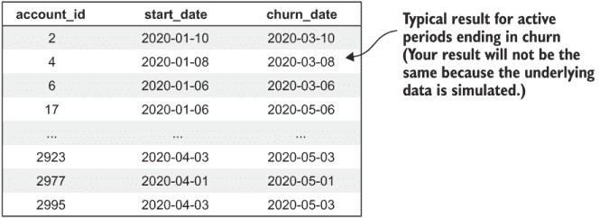

图 4.9 运行列表 4.2 的活跃期结束时的结果

## 4.4 为非订阅产品识别活跃期

从第一章开始，我就一直在告诉你，本书中分析流失的技术适用于没有实际订阅的产品，如广告支持的媒体、带有应用内购买的 APP 和零售网站。现在（终于）我将解释如何计算这些账户的活跃期。我等到现在是因为，到这个时候，你已经学到了必要的技巧。

### 4.4.1 活跃期定义

在第二章中，我提到，理解非订阅产品流失的关键是计算反映个人账户在产品上活跃的时期的活跃期，类似于订阅。在这种情况下，流失被定义为账户在超过一些最大允许时间后变得不活跃。你应该选择这个时间限制，以便大多数变得不活跃的人不会回来，或者如果他们回来了，也应该公平地将其视为一个新的开始。

图 4.10 展示了从事件中派生的活跃期的概念。目的是为每个账户找到一组事件，其中没有事件之间的间隔超过允许的间隔。一旦计算出这样的活跃期，就可以像订阅一样计算流失率。此外，本书中描述的所有分析技术都可以应用，无需任何其他修改。

定义：从事件中派生的活跃期——一个用户至少有一个事件的时间段。事件之间可以有间隔，但不超过限制，不会打断活跃期。从事件中派生的活跃期的定义与从多个订阅中派生的活跃期的定义相似。

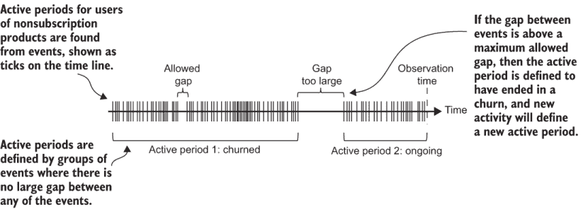

图 4.10 从事件中派生的活跃期

基本思路是这样的：在上一个部分，我展示了如何使用 SQL 算法处理账户在一段时间内可能拥有多个订阅的情况。找到这些订阅中任何一个的最早开始日期以及订阅序列何时结束是必要的。所有这些关于订阅的计算还包括一个允许的间隔，以防客户在订阅之间有短暂的空档期。如果你这么想，这正是确定账户活跃期间所需进行的计算。订阅和事件都需要分组，以确保组内没有任何订阅/事件之间的间隔超过允许的间隔。唯一的区别是，订阅有一个持续时间（订阅的结束日期在开始日期之后），但事件是在一个特定的时间点。一个类似于从订阅中查找活跃期间的算法也可以用来从事件中查找活跃期间。

但是，订阅和事件之间有一个重要的区别，这会影响该算法的性能，如果不是逻辑：账户通常一次只有一到几个订阅，但账户可以有非常大量的事件。换句话说，订阅通常是小数据，而事件通常是大数据。因此，直接将上一节中提到的活跃期间算法应用于事件可能不是一个好主意。相反，进行简化：定义一个活跃周为账户在这七天内发生任何事件的七天。

定义：活跃周——一个账户在七天内至少有一个事件的七天周期。

第一步是计算所有账户哪些周是活跃的。这可以通过使用聚合查询并保存结果来完成。这个简单的第一步减少了后续步骤所需的数据量。如果你的用户通常每周有 100 个事件（例如），那么在聚合之后，表示活动数据的大小就减少到原来的百分之一。如果客户每周有 1,000 个事件……（你明白我的意思）。

当然，这样的活跃期间只能精确到聚合步骤中定义的每周间隔，以识别流失日期。这些活跃期间并不能告诉你用户何时变得活跃或流失的确切日期或时间。如果你认为每周的周期对于找到活跃期间的开始和结束不够精确，可以切换到每日聚合。这样你就可以在计算中获得每日的精确度，这是每周精确度的七倍。如果这对你的数据规模和运行过程的系统来说没问题，那就没问题。这是在所需的时间精度和拥有的数据规模以及可用的计算资源之间的一种权衡。我将继续使用假设每周聚合周期的例子，因为这通常是精度和计算成本之间最好的折衷方案。

### 4.4.2 从事件形成数据集的过程

在计算完活跃周之后，你可以使用持续活跃期算法（列表 4.1）和已流失活跃期算法（列表 4.2）对活跃周进行处理，而不是使用订阅来创建流失分析数据集。因为这些算法旨在合并连续的订阅，它们也可以合并活跃周，你可以选择在形成活跃周时允许没有间隔（或任何数量的周组成的间隔）。（如果你选择使用活跃日，而不是活跃周，你可以运行相同的算法，以天为单位，允许的间隔定义为天数。）运行列表 4.1 和 4.2 的结果就是你要找的：账户在连续时间段内发生事件（每周至少一次）的日期。这些活跃期已知在过去已经结束流失或一直持续到目前。图 4.11 说明了从事件形成流失数据集的完整过程。

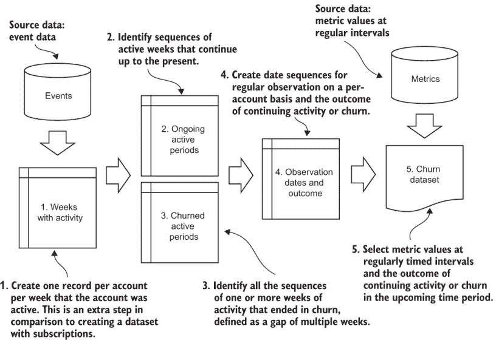

图 4.11 基于事件的活动周期查找过程

如果你将形成事件数据集的过程（图 4.11）与上一节中形成订阅数据集的过程进行比较，唯一的区别是在开始时多了一步：将事件分组到活动周。因为其余的过程是相同的，所以每周分组是唯一需要的新代码。

### 4.4.3 计算活跃周的 SQL

因为存储了有活动的周，你需要创建一个数据库表来保存它们，使用表 4.2 中显示的架构。这与你之前看到的订阅和活跃期架构类似。对于活跃周，结束日期与开始日期是冗余的，因为开始日期唯一地标识了固定长度周期的结束日期。但包括结束日期允许上一节中用于订阅的 SQL 程序与活跃周一起工作，而不改变查询的逻辑。

表 4.2 活跃周表架构

| 列 | 类型 | 备注 |
| --- | --- | --- |
| `account_id` | `integer`或`char` | 不为空；复合键 |
| `start_date` | `date` | 不为空；复合键 |
| `end_date` | `date` | 不为空 |

列表 4.3 提供了将事件分组到周活动的 SQL 语句。这个技术对于任何了解聚合`GROUP BY`查询的人来说都是众所周知的，因为查询的主要逻辑是按照一周的时间段定义事件组。列表 4.3 中唯一值得注意的技术是使用生成序列函数来选择日期。

列表 4.3 将事件分组到周活动的代码

```
WITH periods AS 
(                                                           ①
    SELECT i::timestamp AS period_start, 
        i::timestamp + '7 day'::interval AS period_end 
    FROM generate_series('2020-02-09', '2020-05-10', '7 day'::interval) i
)
INSERT INTO active_week 
    (account_id, start_date, end_date)                      ②
SELECT account_id, 
period_start::date,                                         ③
period_end::date                                            ③
FROM event INNER JOIN periods 
    ON event_time>=period_start                             ④
    AND event_time < period_end                             ⑤
GROUP BY account_id, period_start, period_end               ⑥
```

① 此 CTE 包含一系列周间隔。

② 将结果插入到`active_periods`表

③ 序列中每个周期的开始和结束

④ 事件时间大于或等于周期开始。

⑤ 事件时间必须严格小于周期结束。

⑥ 按`account ID`和周期日期分组

按照书中可下载代码的说明运行列表 4.3。使用包装程序，将参数更改为 `—chapter 4 —listing 3`。请注意，列表 4.3 在数据库中执行插入操作，就像列表 4.1 和 4.2 一样，因此不会产生任何输出。（运行列表的代码会打印正在运行的 SQL 语句。）要查看运行列表 4.3 后的结果，请运行类似以下的查询：

```
SELECT * FROM active_week ORDER BY account_id, start_date;
```

图 4.12 显示了在默认模拟数据集上运行列表 4.3 的结果，然后使用类似于之前的 `SELECT` 语句查看结果。如果你有大量数据，请使用 `LIMIT` 子句，但对于默认模拟通常不需要。请注意，GitHub 仓库中保存的代码没有设置为从活跃周计算活跃期。我鼓励你自己进行这些修改。

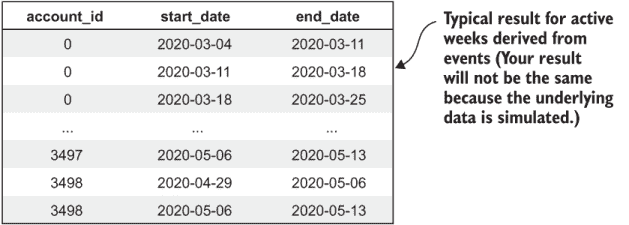

图 4.12 运行列表 4.3 的示例输出

在计算活跃周并将它们保存到表中之后，你可以使用列表 4.1 和 4.2 中的相同程序来查找活跃期。将这些程序修改为使用 `active_week` 表（表 4.2）而不是订阅表（表 2.1）。一旦从活跃周计算出活跃期，这些就可以在第二章的标准流失计算（列表 2.2）中替代订阅使用。

注意：要使用列表 4.1 和 4.2 中的程序，并使用从活动而非订阅中得出的活跃周，请通过将连接中的 `subscription` 表替换为 `active_period` 表来修改代码；不需要进行其他更改。

注意：要使用列表 2.2 中的程序计算从活动而非订阅中的流失率，请通过将连接中的订阅表替换为 `active_period` 表来修改代码；此外，`active_period` 中的 `churn_date` 列替换了 `subscription` 表中的 `end_date` 列。

## 4.5 选择观察日期

你的目标是定期在适当的时间观察你的订阅者，以了解他们为何会流失。一旦订阅（或事件）被划分为活跃期（无论来自订阅还是活动），下一步就是为每个账户选择实际的观察日期。

### 4.5.1 平衡流失和非流失观察

正如我在第 4.2 节中描述的，这个想法不仅是在账户流失时观察账户，还要在账户没有流失时对账户进行快照。当数据集中的流失和非流失观察与流失率和续订率成比例时，流失分析效果最佳。实现这一目标的方法是观察每个账户在计算流失率时使用的相同周期周期。此外，请记住，观察是提前进行的。正如第 4.2 节中所述，提前期被设计得如此之短，以至于在客户可能已经决定是否流失或留下之前进行观察。这个过程之前在图 4.3 中已经说明，并在图 4.13 中重现。

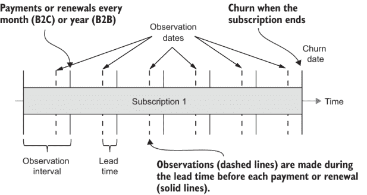

图 4.13 重述：支付周期日期、提前期和观察序列

如所示，除了在客户流失前观察客户外，在整个订阅期间应定期进行观察。这些观察应以与组织衡量其流失频率相同的频率进行，这通常与客户续订（对于定期订阅）或支付账单（对于常青订阅）的频率相同：B2B（商业）产品的年度频率和 B2C（消费者）或 SMB（小型和中型企业）产品的月度频率。为了与流失观察保持一致，这些观察在每次支付或续订前都使用提前期。

### 4.5.2 观察日期选择算法

考虑图 4.13，选择观察日期的详细算法如下：

1.  从每个账户每个活跃期间的起始日期开始。

1.  对于首次观察：

    1.  将你将进行观察的周期时间间隔（例如，一个月）分别加到所有账户和活跃期间的起始日期上。对于订阅，这通常是下一次支付或续订日期。

    1.  减去提前期以找到每个活跃期间的首次观察日期。

    1.  如果此观察日期之后发生流失，将其标记为流失观察，这意味着如果活跃期间在这次观察和下一次观察期间结束流失，那么这是流失前的最后一次观察。

1.  对于每个账户的第二次观察：

    1.  将观察期的时间加倍加到每个账户的起始日期上。

    1.  减去提前期。

    1.  如果此观察日期之后发生流失，将其标记为流失观察。

    1.  对每个账户重复步骤 3，将添加到起始日期的周期数递增（并且始终减去提前期），直到下一个观察日期超出活跃期。

图 4.14 展示了运行算法选择每月观察日期的示例，其中有两个账户，提前期为七天。它表明在初始计算之后，每个账户都会在每月的同一天重复观察。如果有月度付款或订阅续订，日期会被安排在每月付款前一周。如果这是一个年度订阅的产品，观察日期将每年在同一天。再次强调，观察会被安排在年度续订（或付款）之前有提前期，提前期会更长——一到三个月，如第 4.2 节所述，但原理是相同的。

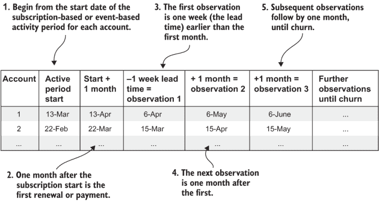

图 4.14 观察日期选择算法示意图

要为每个账户选择观察日期，从每个活跃期的起始日期开始，加上观察周期（在这个例子中是一个月），再减去提前期（一周），以得到第一个观察日期。要得到第二个观察日期，将观察周期加两次，再减去提前期，加到起始日期上。要得到第三个观察日期，将观察周期加三次，再减去提前期，依此类推。

### 4.5.3 观察日期 SQL 程序

因为观察日期被存储，至少暂时如此，所以你需要为它们创建另一个表。表 4.3 展示了用于存储观察日期的架构。此表包含账户 ID 和观察日期，这两者共同定义了表上的复合主键，以及一个额外的列：一个逻辑值，用于跟踪观察是否是导致流失的活跃期结束时的最后一个观察。

观察日期表架构

| 列 | 类型 | 备注 |
| --- | --- | --- |
| `account_id` | `integer` 或 `char` | Not null; compound key |
| `observation_date` | `date` | Not null; compound key |
| `is_churn` | `logical` | Not null |

列表 4.4 提供了生成观察日期的 SQL 程序。它假设存在一个 `active_period` 表，其中包含从订阅中定义的周期。生成观察日期的 SQL 程序使用递归 CTE，创建观察日期的递归策略如下：

1.  初始化递归 CTE，为每个 `active_period` 设置一个观察：

    1.  选择第一个观察日期为起始日期后的一个观察间隔，减去提前期。

    1.  在观察上设置计数器为 1。这用于计算后续观察的时间。

    1.  设置一个布尔值，指示流失日期是否在观察日期和下一个观察日期之间，这将是在此观察日期之后的观察间隔。

1.  递归地插入每个活跃期的额外观察日期到 CTE 中：

    1.  计数器加一。

    1.  新的观察日期是从起始日期加上新的计数器值乘以观察周期，再减去提前期计算得出的。

    1.  在每个观测上设置一个布尔指示符，以便紧接活跃期结束（流失）的观测被设置为 true。

    1.  当满足以下条件之一时退出递归：

        +   下一个观测日期是在活跃期结束之后。

        +   下一个观测日期是在考虑的整体周期结束之后。

观测日期的 SQL 程序仅使用两个 CTE：一个用于设置常数参数，另一个用于递归。在此递归过程之后，结果被插入到观测表中。列表 4.4 中的 SQL 程序使用一个月的观测间隔和一周的提前时间。

列表 4.4 观测日期的 SQL

```
WITH RECURSIVE observation_params AS                                    ①
(                                                                       ②

    SELECT interval '1 month' AS obs_interval,                          ③
           interval '1 week'  AS lead_time,                             ④
           '2020-02-09'::date AS obs_start,                             ⑤
           '2020-05-10'::date AS obs_end                                ⑤

),
observations AS                                                         ⑥
(

    SELECT account_id,                                                  ⑦
    start_date,
    1 AS obs_count,                                                     ⑧
    (start_date+obs_interval-lead_time)::date 
        AS obs_date,                                                    ⑨
    CASE 
        WHEN churn_date >= (start_date +   obs_interval-lead_time)::date 
           AND churn_date <  (start_date + 2*obs_interval-lead_time)::date 
        THEN true 
        ELSE false 
    END AS is_churn                                                     ⑩
    FROM active_period INNER JOIN observation_params
    ON (churn_date > (obs_start+obs_interval-lead_time)::date 
        OR churn_date is null)                                          ⑪

  UNION                                                                 ⑫

  SELECT o.account_id, 
      o.start_date,
      obs_count+1 AS obs_count,                                         ⑬
      (o.start_date+(obs_count+1)*obs_interval-lead_time)::date 
          AS obs_date,                                                  ⑭
      CASE 
          WHEN churn_date >= (o.start_date + 
                              (obs_count+1)*obs_interval-lead_time)::date
          AND churn_date  <  (o.start_date + 
                              (obs_count+2)*obs_interval-lead_time)::date
          THEN true 
          ELSE false 
      END AS is_churn                                                   ⑮
  FROM observations o INNER JOIN observation_params
  ON  ( o.start_date+(obs_count+1)*obs_interval-lead_time)::date 
      <= obs_end                                                        ⑯
  INNER JOIN active_period s 
      ON s.account_id=o.account_id                                      ⑰
      AND ( o.start_date+(obs_count+1)* obs_interval-lead_time)::date 
          >= s.start_date                                               ⑱
      AND ((o.start_date+(obs_count+1)*obs_interval-lead_time)::date  
          <  s.churn_date or churn_date is null)
) 
INSERT INTO observation (account_id, observation_date, is_churn)
SELECT distinct account_id, obs_date, is_churn
FROM observations
INNER JOIN observation_params ON obs_date BETWEEN obs_start AND obs_end
```

① RECURSIVE 关键字位于开头。

② 此 CTE 保持常数参数。

③ 观测之间相隔一个月的日历月。

④ 观测是在提前七天进行。

⑤ 观测是在这些日期之间进行的。

⑥ 此递归 CTE 包含观测日期的序列。

⑦ 初始化每个账户的第一个观测记录

⑧ 计数器用于确定后续的观测日期

⑨ 观测是在开始后一个周期，减去提前时间。

⑩ 如果流失发生在观测和下一个周期之间，则将 is_churn 设置为 true。

⑪ 跳过流失发生在第一次观测之前的案例。

⑫ 递归的 SELECT 添加了额外的观测。

⑬ 每次新的观测增加计数器一次

⑭ 开始时间加上计数器乘以间隔，减去提前时间

⑮ 如果流失发生在观测和下一个周期之间，则将 is_churn 设置为 true。

⑯ 如果观测会超过日期限制，则不要添加观测。

⑰ 通过账户与上一个结果进行连接

⑱ 为继续的订阅周期添加新的观测。

按照书中可下载代码的说明运行列表 4.4。使用包装程序，将参数更改为 `—chapter 4 —listing 4`。请注意，与列表 4.1-4.3 一样，列表 4.4 在数据库中执行插入操作，因此不会产生任何输出。（运行列表的代码会打印正在运行的 SQL。）要查看运行列表 4.4 后的结果，请运行如下查询：

```
SELECT * FROM observation ORDER BY account_id, observation_date;
```

图 4.15 显示了在默认模拟数据集上运行列表 4.4 的结果，然后使用类似于前面的 `SELECT` 语句查看结果。如果你有大量数据，请使用 `LIMIT` 子句，但对于默认模拟通常不需要。`is_churn = TRUE` 的观测是在流失日期之前立即发生的。对于每个账户，观测日期按照观测间隔均匀分布，如指定。

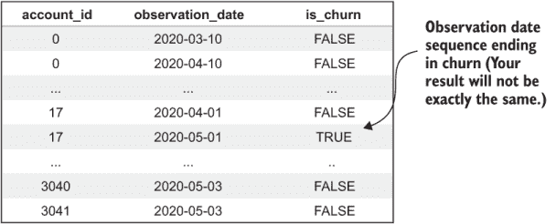

图 4.15 运行列表 4.4 的示例输出

你可能会想知道为什么列表 4.4 中的 SQL 程序保持一个计数器并将其乘以观测期持续时间来计算每个观测日期。这导致代码中反复出现以下表达式：

```
  (o.start_date+(obs_count+1)*obs_interval-lead_time)::date
```

另一种选择是将观察期添加到最后一次观察日期。虽然将观察期按顺序添加到日期会更简单，但这样做会导致月末日期处理不当：例如，如果起始日期是 31 日。那么当二月到来时，月份的天数会变成 28 日。这就是数据库在将月份加到 1 月 31 日时定义的结果。但是当下一个月到来时，如果算法简单地添加观察期，它不会将日期回移到 31 日；它会使用 3 月 28 日，并在随后的月份继续使用 28 日。在非闰年，所有月末续订都会在二月之后移至 28 日。

通过将观察期乘以并添加到每个观察的起始日期，31 日的续订被视为每个月有 31 天的 31 日。尽管在天数较少的月份中会相应地调整，但它不会改变后续月份的结果。

## 4.6 导出流失数据集

创建数据集的最终步骤是从观察日期选择所有账户的指标。原则上，这很简单，但像往常一样，还有一些复杂的情况。

提取数据集的一个重要部分是将数据从数据库表的传统格式转换为分析数据集的格式，这在图 4.16 中有说明。在分析数据集中，你必须安排数据，使得每一行对应一个账户的单次观察（无论是流失了还是未流失），每一列对应一个行为指标。然而，在数据库表中，数据是归一化的，因此所有指标的值都在一个单独的列中，另一个列标识了给定行中的哪些指标。在数据库中，单个账户在单个日期的行为快照分布在许多行中。这通常被称为宽数据与长数据。分析数据集是宽的，因为它有多个列用于所有不同的变量；数据库表是长的，因为数据都堆叠在一个列中。将数据从长转换为宽通常被称为数据展平，这就是创建流失数据集必须做的事情。（对于那些已经看到在电子表格中使用 Pivot 函数进行数据旋转的人来说，这也被称为数据旋转。）

### 4.6.1 数据集创建 SQL 程序

在标准 SQL 中进行数据旋转有一个技巧；如果你知道它，可以随意跳过。如果你不知道，准备好要么喜欢它要么讨厌它，但我保证你会再次使用这个技巧！

你可以使用 `GROUP BY` 聚合将如图 4.16 所示的度量表这样的高维表展平为宽数据集，其中将每个账户的单独度量行分组到每个日期的一行中。你可能已经看到了使用聚合函数（如求和或平均值）将多行合并为一行的用法。聚合函数也可以用于从多行中选择特定值并将每个值放入特定的列中，这是展平所需进行的转换。


![图 4.16 展平高维数据为宽数据]

列表 4.5 展示了将数据展平的技巧。它使用了多个 `SUM` 聚合函数，每个函数对应于你想要从高维表展平到宽表的每个度量指标。为了从列中获取所需的值（而不是向其添加任何内容），你需要在每个 `SUM` 函数内放置一个 `CASE` 语句，以从高维表中仅选择一种类型的度量值。一系列这样的 `SELECT` 语句在 `GROUP BY` 聚合内执行，有效地将高维数据展平为宽表。这样做可能不太美观，但它确实有效！

另一个复杂的问题是，你可能并不是每天都为你的账户计算度量指标。我建议你每周只计算一次度量指标。如果你遵循我的建议并且不每天计算度量指标，那么在创建数据集时，你需要选择那些不一定在观察当天存在的度量指标。这导致在 `SELECT` 中使用日期范围来选择度量指标。

列表 4.5 中的最后一个技巧是处理在观察日期附近没有为账户计算度量指标的情况。回想一下，在第三章中，计数和平均值度量指标被定义为当账户没有事件时，不存储任何度量值。这意味着对于这类度量指标，列表 4.5 中的 `JOIN` 语句可能没有任何值。但有一个度量指标始终有值，无论账户的事件如何：账户使用期限。

账户使用期限必须始终有一个值，对于有活跃订阅或处于活跃使用期间的用户来说更是如此。账户使用期限始终有值的事实意味着列表 4.5 中的 `JOIN` 操作始终为每个账户在观察日期周围找到至少一个度量指标。那么其他度量指标呢？`CASE` 语句的逻辑意味着任何其他被展平的度量指标都将填充为零，这有效地处理了这些类型度量指标的缺失值问题。

**警告**：如果你在每次计算时都不使用账户使用期限度量指标或至少一个保证每个账户每次计算都有值的度量指标，那么列表 4.5 中的查询可能会丢弃没有度量指标的账户观察结果。这个问题可以通过度量指标和观察结果之间的外连接来解决，但我的建议是在你的分析中包含账户使用期限。  

列表 4.5 使用 CTE 来保存常量参数，包括一个指标计算间隔。`INNER JOIN` 语句使用指标间隔来选择在观测日期前七天内计算的最后指标。

注意：列表 4.5 的输出还包括账户 ID 和观测日期。尽管这些信息对于分析不是必需的，但这种描述性数据对于数据质量检查通常很有用。

在下一章中，你将花费更多时间了解如何检查以这种方式提取的数据集的质量。

列表 4.5 数据集创建的 SQL

```
WITH observation_params AS                                                 ①
(
    SELECT interval  interval '7 day'  
        AS metric_period,                                                  ②
    '2020-02-09'::timestamp AS obs_start,                                  ③
    '2020-05-10'::timestamp AS obs_end                                     ③
)
SELECT m.account_id, o.observation_date, is_churn,                         ④
SUM(CASE WHEN metric_name_id=0 THEN metric_value ELSE 0 END) 
    AS like_per_month,                                                     ⑤
SUM(CASE WHEN metric_name_id=1 THEN metric_value ELSE 0 END) 
    AS newfriend_per_month,
SUM(CASE WHEN metric_name_id=2 THEN metric_value ELSE 0 END) 
    AS post_per_month,
SUM(CASE WHEN metric_name_id=3 THEN metric_value ELSE 0 END) 
    AS adview_feed_per_month,
SUM(CASE WHEN metric_name_id=4 THEN metric_value ELSE 0 END) 
    AS dislike_per_month,
SUM(CASE WHEN metric_name_id=5 THEN metric_value ELSE 0 END) 
    AS unfriend_per_month,
SUM(CASE WHEN metric_name_id=6 THEN metric_value ELSE 0 END) 
    AS message_per_month,
SUM(CASE WHEN metric_name_id=7 THEN metric_value ELSE 0 END) 
    AS reply_per_month,
SUM(CASE WHEN metric_name_id=8 THEN metric_value ELSE 0 END) 
    AS account_tenure,
FROM metric m INNER JOIN observation_params
    ON metric_time between obs_start and obs_end                           ⑥
INNER JOIN observation o ON m.account_id = o.account_id
    AND m.metric_time > (o.observation_date - metric_period)::timestamp    ⑦
    AND m.metric_time <= o.observation_date::timestamp
GROUP BY m.account_id, metric_time, 
    observation_date, is_churn                                             ⑧
ORDER BY observation_date,m.account_id 
```

① 此 CTE 保存常量参数。

② 指标计算的频率：每七天一次

③ 在此日期范围内形成观测值

④ 每个账户每天一个观测值；包括流失标志

⑤ 将 CASE 语句的结果求和以简化数据

⑥ 通过观测参数连接以限制整体日期范围

⑦ 在观测值上连接，选择最新的指标

⑧ 使用 SUM/CASE 聚合模式的 GROUP BY

按照书中可下载代码的说明运行列表 4.5。使用包装程序，将参数更改为 `—chapter 4 —listing 5`。列表 4.5 以一个包含结果的 `SELECT` 语句结束。如果你使用 GitHub 仓库中的代码运行它，它会为你保存结果到一个 CSV 文件中。包装程序会打印出文件的路径；例如：

```
Saving: ../../../fight-churn-output/socialnet/socialnet_dataset.csv 
```

图 4.17 展示了运行列表 4.5 的结果示例。它跳过一些行以跟踪几个账户通过数据集；数据集观测值按日期排列，因此单个账户的记录分散在整个数据集中。

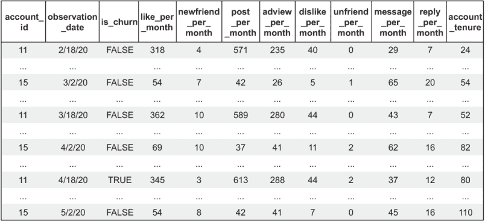

图 4.17 运行列表 4.5 的示例输出

注意，列表 4.5 是硬编码到固定数量的指标，具有预定义的名称，因此列表 4.5 只适用于默认的模拟数据集。如果你想在你的数据上运行列表 4.5，你需要修改它，使其反映你创建的具体指标。然而，更好的选择是使用一个脚本来自动化这一步骤，该脚本根据数据库中的任何指标生成正确的 SQL。书中代码中也包含了一个执行此操作的函数，但不是在列表中：数据集导出文件夹中包含一个脚本，用于清理结果表，并使用自定义生成的指标简化脚本作为本章所有列表的结束。README 文档中提供了有关如何配置和运行该程序的更多信息。

账户键对齐问题

本节中的代码假设你可以简单地将用于创建活跃期间的订阅中的账户 ID 与用于创建指标的活动中使用的账户 ID 相链接。不幸的是，订阅数据库和事件数据仓库通常是不同的系统。为了简化问题，本书将它们表示为位于一个共同的数据库中，并使用一个共同的账户 ID 集。为了让你为现实世界可能遇到的情况做好准备，我将解释一些你可能遇到的实际问题，如果你的订阅（观察）和事件（指标）数据位于两个不同的系统中。

你不能在不同的系统上运行像列表 4.5 那样的程序。你必须要么让包含指标的系统的观察日期可用，要么让包含订阅和观察日期的系统的指标可用。通常，从包含订阅的系统生成活跃期间数据并将其加载到包含指标的系统中，然后从包含指标的系统的活跃期间生成观察日期是最简单的。这是容易的部分。

当两个系统中的账户 ID 不匹配且需要映射时，事情会变得更加困难。必须创建一个查找表，其中每一行都有两个系统中账户的唯一匹配标识符。这种映射可以用作列表 4.5 中的额外内部连接。这并不太难，但真正的问题出现在无法创建完美映射的情况下，导致账户被删除、重复或两者兼而有之。例如，这可能会发生在事件数据通过电子邮件跟踪，而订阅通过某种数据库主键跟踪，并且有包含订阅的电子邮件，但这些电子邮件与事件数据不可靠地匹配的情况下。在业务环境中，如果部门级别有订阅，而事件数据通过用户跟踪，但某些用户被分配到多个部门或没有部门，也可能出现问题的另一种版本。除非你参与过大量的提取-转换-加载（ETL）管道，否则你可能不会想到这种映射问题可能会发生。我向你保证，它们非常常见。如果你发现自己处于这种情况，至少你并不孤单！

无论如何，我无法教给你一个总是能解决这类问题的技巧。我的方法是放弃不完整的记录，而不是试图修复它们，只要最终你拥有足够的数据进行分析即可。好消息是，你的数据不必完美才能使用！在我看来，如果数据有 90%是好的，那么它就是干净的；即使有些许杂乱，仍然可以使用。

对于受影响的数据来说，重要的是它在大体上是随机的，就受影响的客户类型而言。例如，如果所有流失的客户都使用一个特定的产品功能或来自一个销售渠道，那么你在这些群体上的结果将会不准确。但如果只有少数账户随机流失，或者随机地分布在所有产品功能和销售渠道中，那么你就不必担心。我们将在后面的章节中回顾一些从数据集中删除问题记录的额外方法，但你的最佳选择是在一开始就尽可能准确地获取映射。只是不要期望它完美无缺。

## 4.7 导出当前客户进行分段

本章教了你如何准备一个数据集来分析你的客户。但最终，你也会想要采取一些行动来尝试减少流失。正如我在第一章中解释的，有各种可能的策略来减少流失。从数据的角度来看，所有减少流失的方法都有一个共同点：你必须使用数据来挑选最合适的客户进行目标定位。这通常被称为分段。

**定义** 分段——根据一组标准选择一组客户。

现在，你将学习一种技术，通过制作当前客户的快照来为分段打下基础。更多关于分段的内容将在后面的章节中介绍。

### 4.7.1 选择活跃账户和度量

分段和针对干预措施定位客户的第一步是制作一个快照，显示你的客户当前的表现。这与当前客户集及其度量值的数据集相同，但没有历史记录。这比构建历史数据集简单。

**要点** 仅包含当前客户的数据库用于客户分段。

列表 4.6 展示了一个 SQL `SELECT`语句，用于创建一个适合分段的当前客户数据集。它使用了两个技巧：首先，一个 CTE 使用`MAX`聚合选择带有度量值的最新日期。你也可以简单地硬编码一个日期，但可能最带有任何度量值的最新日期就是你更新数据的最后一天。然后列表 4.6 使用了你在上一节中学到的扁平化聚合技巧。这就是全部内容！运行 SQL 并检查结果是否与列表 4.5 相似，但所有账户都在一个日期上观察：最新的。

列表 4.6 选择当前活跃账户

```
with metric_date AS                                               ①
(
    SELECT  max(metric_time) AS last_metric_time FROM metric
)
SELECT m.account_id, metric_time,
SUM(CASE WHEN metric_name_id=0 THEN metric_value ELSE 0 END)      ②
    AS like_per_month,
SUM(CASE WHEN metric_name_id=1 THEN metric_value ELSE 0 END) 
    AS newfriend_per_month,
SUM(CASE WHEN metric_name_id=2 THEN metric_value ELSE 0 END) 
    AS post_per_month,
SUM(CASE WHEN metric_name_id=3 THEN metric_value ELSE 0 END) 
    AS adview_feed_per_month,
SUM(CASE WHEN metric_name_id=4 THEN metric_value ELSE 0 END) 
    AS dislike_per_month,
SUM(CASE WHEN metric_name_id=5 THEN metric_value ELSE 0 END) 
    AS unfriend_per_month,
SUM(CASE WHEN metric_name_id=6 THEN metric_value ELSE 0 END) 
    AS message_per_month,
SUM(CASE WHEN metric_name_id=7 THEN metric_value ELSE 0 END) 
    AS reply_per_month, 
SUM(CASE WHEN metric_name_id=8 THEN metric_value ELSE 0 END) 
    AS account_tenure,
FROM metric m INNER JOIN metric_date 
    ON metric_time =last_metric_time                              ③
INNER JOIN subscription s 
    ON m.account_id=s.account_id                                  ④
WHERE s.start_date <= last_metric_time
AND (s.end_date >=last_metric_time or s.end_date is null)
GROUP BY m.account_id, metric_time
ORDER BY m.account_id
```

① 这个 CTE 选择了带有度量值的最新日期。

② 这就是与列表 4.5 一起教授的扁平化聚合。

③ 仅选择单日度量

④ 通过连接订阅来确保客户当前活跃

列出 4.6 还使用订阅表上的连接来确保这些客户仍然处于活跃订阅状态。在第三章中计算指标时，代码从未检查过客户是否活跃，因此可能会有已经淘汰但仍在指标时间段内有事件的客户条目。从指标计算的角度来看，结果只是额外的一些记录，所以我没有麻烦展示如何防止这些指标被保存。但在历史数据集中，我确保每个观察结果都对应一个活跃客户。但对于当前客户列表，你需要确保你只获取活跃订阅者的数据，订阅表上的连接处理了这个细节。

**注意**：在实际操作中，列出 4.6 时必须包括账户名称或电子邮件，或任何必要的标识符，以将账户与其他用于与客户进行干预的系统（如电子邮件营销和客户关系管理系统）联系起来。我在这个模拟示例中省略了这些细节。

### 4.7.2 按指标细分客户

现在你已经有一个当前客户列表以及他们所有的指标，细分行为是直接的。如果你将列出 4.6 的输出给业务同事，他们可能会知道该怎么做：在电子表格中打开它，并使用过滤功能探索和选择基于指标的不同的行为轮廓的客户。你还可以通过在列出 4.6 的`SELECT`语句中放入标准来定义细分。困难的部分是知道应该选择什么值来定义细分，以及首先应该关注哪些行为。为了以数据驱动的方式进行，你需要真正理解这些行为如何与淘汰和参与度相关联，这就是下一章的主题。

## 摘要

+   淘汰分析数据集是客户行为快照的表格，包括已经淘汰和未淘汰的客户。

+   淘汰领先指标是在客户尚未做出决定时表明淘汰可能性很高的行为。淘汰领先指标通常是抗淘汰工作的重点。

+   淘汰滞后指标是客户在已经决定淘汰后通常会采取的行为。淘汰滞后行为通常不是淘汰的根本原因。

+   为了将分析集中在淘汰领先指标上，在实际淘汰发生之前，对淘汰客户的客户行为快照进行了提前的领先时间处理。

+   观察淘汰所需的时间通常在消费者产品淘汰前几周，对于商业产品则是一到三个月。

+   确保数据集中的淘汰和非淘汰客户样本大致按实际淘汰率和续订率成比例，这一点很重要。

+   对于续订的客户，行为快照的生成频率与流失测量频率相同：通常对于消费产品是每月一次，对于商业产品是每年一次。这确保了数据集中流失的比例大致与流失率相匹配。

+   对于订阅产品，在续订或付款日期之前，会对未流失的客户进行行为快照，同时也有一个提前量。

+   创建流失分析数据集的第一步是确定每个客户的活动期，即客户在短时间内至少有一个订阅（对于订阅产品）或至少有一个事件（对于非订阅产品）。

+   对于非订阅产品，事件首先被聚合到周，作为一个单一指标来表示每个账户在该周是否有任何事件。通过活跃周找到活跃期。

+   找到活跃期后，根据活跃期的开始，为每个账户按顺序选择观测日期。

+   数据集是通过将观测日期与先前计算的指标合并来创建的。

+   在创建数据集时，指标会被展平，这意味着它们从所有指标都在一列的格式转换为每个指标都在自己一列的格式。
