# 5 通过指标理解客户流失和行为

本章涵盖

+   使用群体分析展示客户流失与指标之间的关系

+   使用数据集统计来总结客户行为的范围

+   将指标从其正常尺度转换为分数

+   从群体分析中移除无效观察

+   根据指标和客户流失定义客户细分

如果你需要使用统计学来理解你的实验，那么你应该已经做了更好的实验。

—欧内斯特·卢瑟福，1908 年诺贝尔化学奖获得者，以其发现放射性衰变而被称为“核物理之父”

是时候做你来的目的了：理解为什么你的客户会流失以及是什么让他们保持活跃。尽管花了些时间，但你在第三章和第四章学到的数据集是接下来工作的基础。你可能期望我现在会深入一些严肃的统计学或机器学习来进行分析。然而，我想将你的注意力引到页面顶部的引言，这是我最喜欢的科学家的名言。

这句话暗示，如果你使用统计学来分析实验，那么可能存在某些问题。在大数据和数据科学的时代，这可能会听起来像是异端。但我邀请你保持你的判断，并考虑卢瑟福想要表达的意思。首先，他是在一个科学家组装电学实验室设备的时代当物理学家。如果你的实验装置中有很多噪声，你可以通过在许多实验中平均结果来使用统计学来处理它，但也许你应该花更多的时间设置一个使用更少噪声设备的实验。对于一个 21 世纪的数据分析师来说，这意味着你应该花很多时间清理数据以获得更好的结果，这是完全正确的。但这能证明诋毁统计学的合理性吗？

也许我过分解读了卢瑟福的建议，但我想这其中有更深层次的意义。这也可能意味着，如果一个实验的结果并不是明显地证实了假设，那么你不必费心用统计学来查看是否可以使结果看起来更好。相反，提出一个更好的假设——一个真正能解释你所试图理解的事情的假设。为了达到这个目标，你应该设计实验来寻找强烈驱动结果的解释，而不是二级影响。如果这样的假设是正确的，实验的定性结果可以从结果图的一瞥中读取。

结果表明，对于客户流失分析和用户参与度来说，最重要的结果通常是这样的：当你看到它时，你就会知道，而且你不需要统计。此外，这个客户流失的特性将使得与组织中非技术性的商业人士沟通变得容易。在客户流失分析和行为度量指标的情况下，寻找与客户流失有强烈关系的度量，如果你找不到，就继续寻找。

**要点**你正在寻找与客户流失有强烈关系的行为度量。当你找到它时，你会看到结果，而不需要使用统计。

话虽如此，本书的第三部分，我将教授用于客户流失的统计和机器学习方法。这并不是我认为统计和机器学习没有用武之地；问题在于侧重点。此外，我目前不会使用统计和机器学习，但我没有说不会用到数学；我在本章和随后的章节中会教授一些必要的数学知识。

从本书的整体主题来看，本章的主题在图 5.1 中被突出显示。本章假设你已经使用第二章的技术测量了客户流失率，使用第三章的技术创建了行为度量，并在第四章中创建了一个数据集。本章是所有内容开始整合的地方！

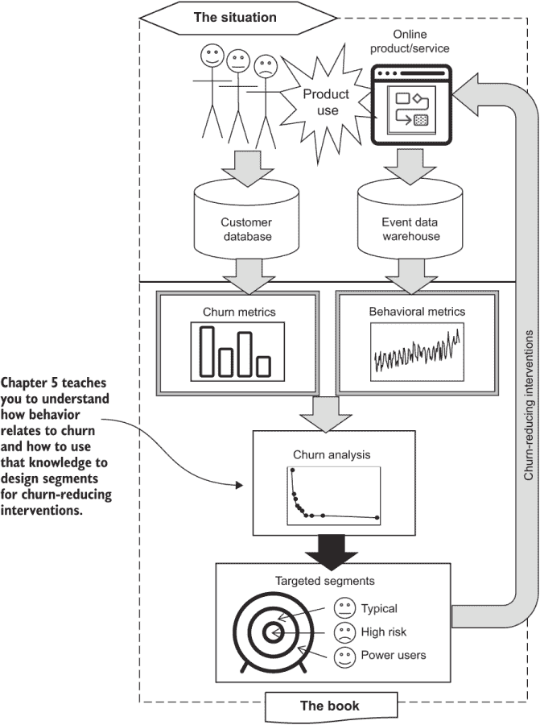

图 5.1 本章在用数据对抗客户流失的过程中的位置

下面是如何组织本章的：

+   第 5.1 节介绍了我认为的度量群体技术，它允许你调查可能与客户流失相关的行为的影响。我通过案例研究中的例子来演示这一技术，以展示典型的结果是什么样的。

+   在第 5.2 节中，我向你展示如何通过总结数据集中的所有行为来看到客户行为的整体图景。你在数据集摘要中找到的内容对于完善你的群体分析是有用的。

+   第 5.3 节教授另一种辅助技术，称为评分，这是一种将客户度量转换为提高分析质量的方法。这里没有统计，但该节包含了一些方程式。

+   在第 5.4 节中，我讨论了何时以及如何删除使群体分析难以解释的无效或不希望的数据。

+   第 5.5 节介绍了如何使用群体分析来定义客户细分。

## 5.1 度量群体分析

群体分析是一种分析客户流失（以及其他行为）如何依赖于行为和订阅度量值的方法，就像第三章所教授的那样。

**定义**以下定义适用于本章：

+   群体是一组具有相似性（在特定意义上，所有这些个体在相对较小的范围内都有一个特定的度量）的个人。

+   度量群体是由在某个度量上具有相似值的客户群体定义的。

+   群体分析是对不同群体在其他测量标准（不是用于定义群体的那个）上的比较——可能是另一个指标。

+   流失率群体分析是对不同指标群体流失率的比较。

我通常使用“群体分析”这个术语来简化，但除非明确说明，否则这些分析都是基于流失的指标群体分析。你将在本书的其余部分看到很多群体分析，因此我将在查看用于计算和绘制结果的 Python 代码之前，花时间介绍这个概念。在你学习了概念和代码之后，我将通过一些实际案例研究来展示结果。

### 5.1.1 群体分析背后的理念

可能任何流失调查的最基本假设是，使用产品较多的用户比使用产品较少或根本不使用的用户更不可能流失。使用常见的产品行为来形成群体的流失群体分析是对该假设的测试。图 5.2 展示了这个想法。如果活跃客户比不活跃客户流失率低，那么活跃客户群体应该比不活跃客户群体有更低的流失率。你可以通过根据客户的活跃程度将客户分为群体，然后测量每个群体的流失率来检验这个假设。如果一个活动与较低的流失率相关，你应该发现最活跃群体的流失率最低，较不活跃群体的流失率较高，而最不活跃群体的流失率最高。图 5.2 展示了这个理想场景的三组。

**要点** 如果使用产品较少的客户流失率较低，那么相对不活跃的客户群体应该比相对活跃的客户群体有更高的流失率。

需要注意的一个重要观点是，在较不活跃和较活跃的群体中找到相对较高的和较低的流失率比期望所有活跃客户都不流失，所有不活跃客户都流失更现实。流失涉及很多明显的随机性：有时，你的最佳客户会离开，而最差的客户会留下，原因只有他们自己知道。比较群体的流失率（平均值）是有意义的，但你不能期望所有客户都表现出完全相同的流失行为。

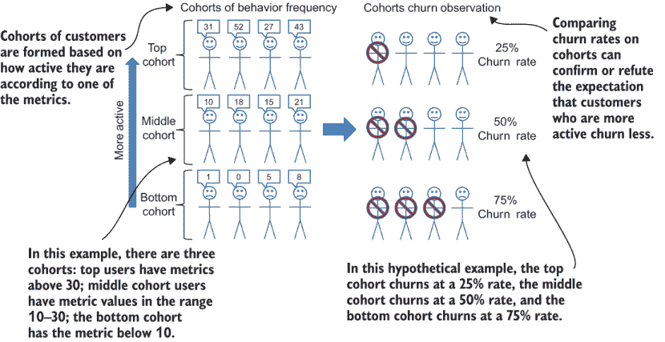

图 5.2 指标群体的概念

接下来，考虑在实际情况中，如何进行群体分析，考虑到你在第四章中创建的数据集。当你完成那一章时，你创建了一个数据集，这是一个包含大量数据的大表格，每一行代表一个特定日期上客户的观察结果，包括多个指标以及客户在该日期是否流失或续订。在单个指标上进行的指标群体分析过程，如图 5.3 所示，如下进行：

1.  从一个包含客户观察数据的完整数据集开始，这些数据包括感兴趣的指标以及客户是否流失。如果客户续订，某些客户可能被考虑多次。假设数据是通过第四章中描述的过程创建的，数据最有可能按日期和账户 ID 排序。

1.  使用指标和表示流失或非流失的变量，按指标对这些观察结果进行排序。在队列分析的其余部分，账户的身份和观察日期被忽略。

1.  将观察结果按预选的等大小组分组到队列中。在实际的队列分析中，通常使用 10 个队列，因此每个队列包含 10%的数据。（在图 5.1 和图 5.2 所示的简单示例中，只使用了三个队列。）请注意，您事先并不决定队列的边界在哪里；队列之间的边界是分析的结果。

1.  对于每个队列，进行两个计算：

    +   队列中所有观察结果的指标平均值

    +   队列观察中流失的百分比

1.  在 x 轴上用平均指标值，在 y 轴上用流失率绘制平均指标值和流失率图。

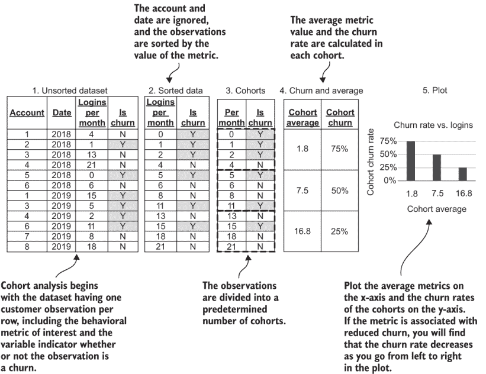

图 5.3 指标队列分析示例

可能会令您惊讶的是，客户身份和观察日期在队列分析中并不重要。因为我们的数据集通常包含大多数客户的多个观察结果，所以同一个客户通常会在您的队列中出现多次。有时，一个客户在一个队列中会出现多次；在其他时候，同一个客户出现在不同的队列中。尽管这种情况可能令人困惑，但这是有道理的：您正在研究这样一个假设，即指标所代表的行为与流失有关，而不是客户身份或观察时间与流失有关。

话虽如此，您可能不想向您的业务同事解释这个细节，因为它可能会导致混淆。如侧边栏“分析队列随时间的变化”中更详细地讨论的那样（第 5.1.4 节），您可以测试观察的行为和时间是否都重要，但到目前为止，我们继续探索行为本身是否相关。

**要点** 指标队列是客户指标和流失的观察结果组；它们不同于客户组，因为一个客户可以被观察多次。

**警告** 理解一个客户可以在队列分析中出现多次是很重要的，但您可能不应该向您的业务同事解释这个事实，因为他们可能会觉得困惑。

### 5.1.2 使用 Python 进行队列分析

图 5.4 显示了使用 Python 执行并绘制的模拟数据集的队列分析。度量是每月帖子数，绘制在 x 轴上：该度量值的队列平均值范围从接近 0 到超过 175。流失率绘制在 y 轴上，范围从大约 0.02 到 0.12。流失率在队列中急剧下降，因此行为与模拟社交网络的流失率有预期的关系。

图 5.4 中模拟数据所显示的图案在真实的流失案例研究中极为常见。随着向上移动到底层队列，流失率迅速下降，但流失率的下降速度减慢，甚至可能在顶层队列中趋于平稳。这种模式使得很容易识别度量的健康水平。对于模拟中的每月帖子数，超过 25 是健康的，因为在此点之后，进一步的增加对流失率没有可观察的影响。

我将在 5.1.3 节中展示真实的案例研究，但首先，让我们看看执行队列分析的代码。列表 5.1 显示了一个使用 Pandas `DataFrame` 执行单个度量队列分析的 Python 函数。该函数具有以下输入：

+   `data_set_path` — 一个字符串变量给出的数据集文件路径

+   `metric_to_plot` — 要创建队列图的度量名称，由一个字符串变量给出

+   `ncohort` — 要使用的队列数量，由一个整型变量给出

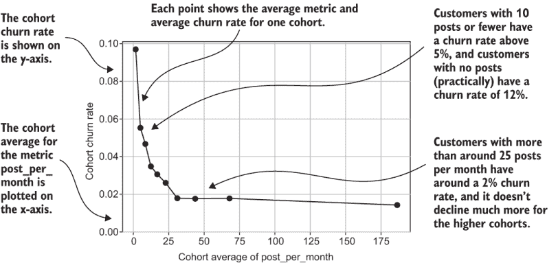

图 5.4 每月帖子数模拟客户数据集的队列分析

给定这些输入，您创建队列图的主要步骤如下：

1.  将数据集加载到 Pandas `DataFrame` 对象中，并设置 `DataFrame` 索引。

1.  使用 `DataFrame` 成员函数 `qcut` 将观测值划分为队列。此函数返回一个序列。序列长度与观测值的数量相同，序列值是表示分组分配的整数。

1.  使用 `DataFrame` 函数 `groupby` 和传递 `qcut` 结果（组标识符的序列）作为参数，计算平均度量值和平均流失率。

1.  从平均值和流失率中创建一个新的 `DataFrame`。

1.  使用 `matplotlib.pyplot` 绘制结果，并在保存之前添加适当的标签。

注意，此过程与 5.1.1 节中示例问题的解决方案有一个重要区别：而不是通过排序数据、形成队列和使用您的逻辑计算平均值，代码依赖于 Pandas `DataFrame.qcut` 和 `DataFrame.groupby` 函数。`qcut` 是基于分位数离散化的缩写，这是我们所形成的队列组的术语，明确地基于分位数的概念。

定义：分位数是当数据被分成相等的组时，作为分割点出现的一个值，每个组包含相同比例的总观测数。十分位数是当数据被分成 10 组时，每个组包含 10% 的数据。百分位数是当数据被分成 100 组时，每个组包含 1% 的数据。

第一个十分位数是将数据按指标组织时，将前 10% 的数据与后 10% 的数据分开的指标值。第二个十分位数是将第二个 10% 的数据与第三个 10% 的数据分开的指标值，依此类推。在数学语境中，离散意味着分开（或不连续）。这些组是离散的，因为它们的成员资格要么全部要么没有（不是指秘密或隐藏的离散）。`qcut` 函数被称为基于分位数离散化，因为数据是根据分位数的值被分成离散组的。

列表 5.1 Python 中的指标队列

```
import pandas as pd
import matplotlib.pyplot as plt
import os

def cohort_plot(data_set_path, metric_to_plot, ncohort=10):
   assert os.path.isfile(data_set_path),
      '"{}" is not a valid path'.format(data_set_path)                 ①
   churn_data = pd.read_csv(data_set_path,
      index_col=[0,1])                                                 ②
   groups = pd.qcut(churn_data[metric_to_plot], ncohort, 
      duplicates='drop')                                               ③
   cohort_means = 
      churn_data.groupby(groups)[metric_to_plot].mean()                ④
   cohort_churns = 
      churn_data.groupby(groups)['is_churn'].mean()                    ⑤
   plot_frame = pd.DataFrame({metric_to_plot: cohort_means.values, 
      'churn_rate': cohort_})                                          ⑥
   plt.figure(figsize=(6, 4))                                          ⑦
   plt.plot(metric_to_plot, 'churn_rate', data=plot_frame,marker='o', 
             linewidth=2,label=metric_to_plot)                         ⑧
   plt.xlabel('Cohort Average of  "%s"' % metric_to_plot)              ⑨
   plt.ylabel('Cohort Churn Rate (%)'
   plt.grid()
   plt.gca().set_ylim(bottom=0)
   save_path = data_set_path.replace('.csv', '_' + 
      metric_to_plot + '_churn_corhort.png')
   plt.savefig(save_path)                                              ⑩
   print('Saving plot to %s' % save_path)
   plt.close()
```

① 检查数据集路径

② 将数据集加载到 Pandas DataFrame 对象中并设置索引

③ 将数据分组并返回一系列的组编号

④ 计算队列指标的均值

⑤ 计算队列的流失率

⑥ 打开一个新的图形

⑦ 从队列中创建一个新的 DataFrame

⑧ 绘制队列流失率与队列指标平均值的对比图

⑨ 添加坐标轴标签

⑩ 保存并关闭图形

编写自己的算法与使用现成的模块函数

如果您还在计算机科学或编程课程中，您可能会认为使用像 `DataFrame.qcut` 这样的函数来实现算法是作弊，因为通常，计算机科学教育是关于编写自己的算法。或者，您可能认为在这类书中使用这样的函数是作弊，因为书籍应该教会您编写算法。然而，在这种情况下，使用 Pandas 算法是最佳实践。

如果您还没有注意到，在分析流失率时，有很多工作要做，而且无需重新发明轮子，即通过编写将数据分组到组中的算法。同样，使用 `DataFrame.groupby` 函数计算平均值和流失率也是如此；当标准模块函数正好满足您的需求时，就没有必要编写自己的逻辑。我在整本书中都采用这种方法，总是试图通过使用标准模块中的算法来实现目标。

由于 `DataFrame.qcut` 和 `DataFrame.groupby` 函数在算法中执行主要步骤，列表 5.1 的一半内容都关注于结果的绘制。因为这是本书中的第一个绘图代码，我想简要提及在分析中清楚地标注所有生成的图表和图形的重要性。

警告：清楚地标注您分析产生的所有图表。与您分享分析的商业人士可能不熟悉细节，如果您没有清楚地标注结果，他们可能难以理解这些图表。

标注结果也有助于您以后回顾分析时记住结果的意义，尤其是如果您有很多事件和指标。您可能需要筛选数十个甚至数百个群体图，如果您没有在过程中构建清晰的注释，这将是不可能的。

如果您还没有这样做，请运行列表 5.1 以使用您自己的数据测试它。假设您已经设置了您的环境（说明在本书 GitHub 仓库中的 README 文件中，网址为[`github.com/carl24k/fight-churn`](https://github.com/carl24k/fight-churn)），并且正在使用 Python 包装程序，请使用以下命令运行列表 5.1：

```
fight-churn/listings/run_churn_listing.py —chapter 5 —listing 1
```

结果应该是一个看起来像图 5.4 的群体图（cohort plot）的.png 文件。

### 5.1.3 产品使用群体

图 5.5 展示了从真实案例研究中得出的第一个群体分析示例，显示了 Broadly 客户的指标群体中的流失情况。对于 Broadly 的客户来说，一个重要的事件是更新的在线评论数量，因此计算了每月更新的评论数量作为指标。

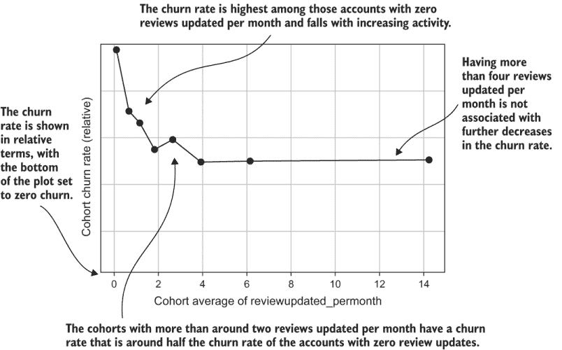

图 5.5 广泛的指标（每月更新的在线评论）的群体流失分析

因为这个图展示了本书中第一个真正的指标群体流失案例研究，所以我需要提出一个重要的观点，这个观点适用于本书中所有基于真实公司（而非模拟）的其他研究：图 5.5 并没有在 y 轴上显示实际的流失率百分比。相反，y 轴没有标签，流失率被描述为相对的。实际的流失率被省略，以保护案例研究中公司的隐私和商业利益，但您仍然可以看到群体之间流失差异的重要性，因为群体图的底部始终固定在零流失。因此，点与图表底部之间的距离显示了群体的相对流失率。

对于 Broadly 的指标，流失率在第一个群体中最高，并在前五个群体中下降；顶部三个群体（图表右侧，具有最高指标值）的流失率大约是底部群体的半数。你可以通过注意到它大约是图表底部距离的一半，使用等间距的网格线，来判断顶部群体的流失率大约是底部群体的一半。（为了精确起见，图 5.5 顶部群体的流失率略高于底部群体的半数。）图 5.5 中另一个值得注意的点是，流失率的下降发生在每月大约零次评论更新和每月四次评论更新之间的群体之间；每月四次评论更新后，流失率没有进一步下降。

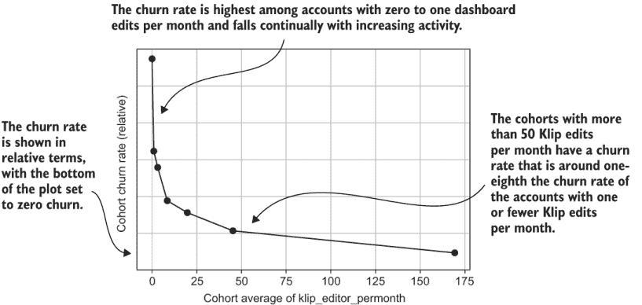

图 5.6 Klipfolio 指标（每月仪表盘编辑次数）的流失率群体分析

图 5.6 展示了 Klipfolio 的另一个指标流失率案例研究。此图显示了使用 Klipfolio 客户计算的指标仪表盘每月编辑次数的指标群体分析案例。与图 5.5 类似，流失率以相对尺度显示，图表底部固定为零流失率。在这种情况下，顶部群体的流失率是底部群体的几分之一（大约 10%）。

图 5.7 展示了另一个使用 Versature 每月总本地通话时间指标的指标流失率示例。此图描绘了另一个重要行为指标与流失率之间相当典型的关系。每月总本地通话时间超过 2,500 次的群体，其流失率大约是底部群体的三分之一，而底部群体几乎不打电话。在零和 2,500 之间，流失率有所下降，之后流失率似乎略有上升但并不显著。


图 5.7 Versature 每月本地通话时间指标的流失率群体分析

观察图 5.7 中本地通话（而非流失率）的分布，请注意，大多数群体在图表左侧的低范围内被压缩。实际上，七个群体占据了图的一部分（0 到 5,000 次通话之间的区域）。此图显示，通话次数最多的群体比其他群体通话次数多得多，因此即使是第二高的群体，平均通话次数也少于三分之一。这个例子展示了一个偏斜的行为指标。

定义：一个偏斜的指标是指顶部群体包含的值比下一个最接近的群体高几倍。通常，大多数较低群体的平均值在一个相对较小的范围内。

偏斜在度量指标中是一个重要的概念，我将在 5.2.1 节中解释。偏斜可能会在分析中引起问题，首先就是 5.6 图有点难以阅读。大部分空间都被前两个队列占据了；其他的则挤在一起。这种安排是度量值分布偏斜的自然结果，因为顶级队列的数值远高于其他队列。当你尝试理解指标之间的关系时，偏斜也会引起另一个问题，正如第六章所述。因此，我在 5.3 节中介绍了称为评分指标的技术。

我想提醒你注意 5.5、5.6 和 5.7 图中队列换率分析的另一个特点：它们都具有相同的整体形状，前几个队列的队列换率迅速下降；对于更高队列，换率大致保持恒定。这种结果是常见的，这也是为什么图 5.4 中显示的模拟被设计成那样的原因。

换率随着行为减少然后趋于平稳，这既有用又是一个问题。它有用，因为很容易识别出该指标的健康发展水平：换率停止下降的水平。它是一个问题，因为到了某个点，该指标就不再帮助你理解换率或根据换率风险细分客户。在干预以减少换率方面，让用户采取更多特定行动在某个点之后就没有区别了。如果你想解释那些指标值较高的客户之间的换率差异并减少这些客户的换率，你需要做些其他事情。在第六章和第七章中，你将学习创建与换率保持强关系的指标的技术，即使是在顶级队列中也是如此。

### 5.1.4 账户使用期限的队列

另一种常见的队列分析类型是查看基于客户成为客户的时间长度的换率——我称之为账户使用期限。这种形式的队列分析是最常见的，所以如果你看到过基于队列的换率分析，它很可能是基于使用期限的。

这种类型的队列分析与度量指标队列分析相同，只是它查看的是账户使用期限而不是行为。此外，你通常预期会发现，长期客户不太可能流失，而新客户更有可能流失。使用账户使用期限进行的队列分析是对该假设的检验。因为账户使用期限是作为账户指标计算的，所以这种类型的队列分析使用与 5.1.3 节中行为度量指标队列分析中使用的完全相同的代码进行。

图 5.8 显示了 Klipfolio 账户使用期限队列分析的结果。结果相当典型：

+   新客户（平均使用期限约为一个月）的换率低于长期客户。

+   在年度前半段，churn 率上升，在第三队列中大约高出三分之一。

+   在半年至一年之间，客户的 churn 率下降。但在第一年结束时，客户的 churn 率上升。

+   在第一年（平均任期超过 365 天的队列）之后，churn 率较低，并且呈下降趋势，以至于任期最长的队列（大约四年）的 churn 率比最新队列低约三分之一。

虽然基于任期的队列分析在 churn 文献中是最常见的形式，但我图 5.8 中展示的分析略有不同。定义账户任期队列和执行此分析的最常见方式是按客户注册的时间分组：月份、季度或年份。在最初队列分配之后，每个队列中剩余客户的数量会随着时间的推移而跟踪，并用于推导出不同时间点的每个队列的 churn 率。相比之下，我展示的方法是独立观察客户，观察的频率由他们自己的续订周期决定，并从所有在任期测量上具有相似值的观察中形成队列。

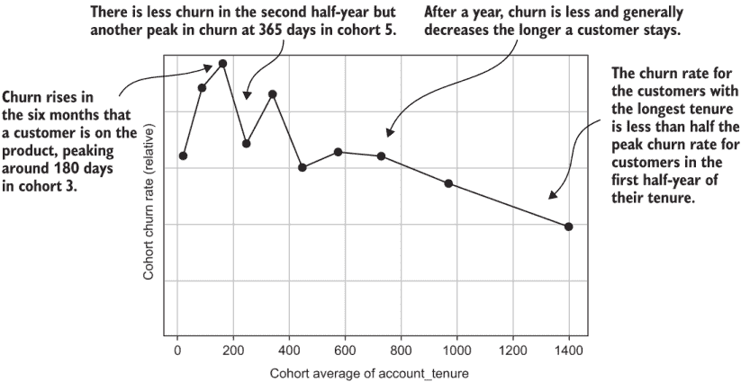

图 5.8 Klipfolio 账户任期 churn 队列分析

这种方法的一个优点是，对于更成熟的（任期较长的）队列，churn 率是在更大的客户池中估计的，因为较老的队列结合了在不同时间注册的客户。一个潜在的缺点是，这种队列分析没有显示给定任期的队列 churn 率如何随时间变化，因为任期队列分析方法是混合了在不同时间注册的客户的观察结果。

分析队列随时间的变化

通常，对于在几个月内注册的相同任期的客户，churn 率没有显著差异。任何差异可能是由随机变化或季节性驱动的。但如果你等待一年或更长时间，churn 模式可能会发生相当大的变化。

要检查 churn 与某个指标之间的关系是否发生了变化，我建议使用第四章中的方法为不同时期创建不同的数据集，然后比较不同队列分析的结果。例如，您可以创建一个只包含过去一年观察结果的数据集，以及另一个来自前一年观察结果的数据集。（使用一年期的数据集应该可以控制季节性。）如果您在不同数据集的队列 churn 率之间看到显著差异，那么 churn 与任期之间的关系在这两年之间发生了变化。当您的产品或营销策略的变化导致不同时间段内客户行为不同时，可以使用这种方法。为每个时间段创建一个数据集，并比较来自不同数据集的队列分析。（有关所需观察数的最小数量的讨论，请参阅第 5.1.6 节。）

### 5.1.5 账单周期队列分析

基于客户订阅的指标可以通过群体分析进行评估。图 5.9 展示了 Broadly 客户在每月或年度计费周期内的流失和订阅计费分析。该图展示了两个群体，因为计费周期只有两个不同的值，在图表中以 1 和 12 的点出现，因为计费周期是以月份来衡量的。Broadly 的客户显示出典型的模式：年度计费的客户流失率显著低于每月计费的客户。

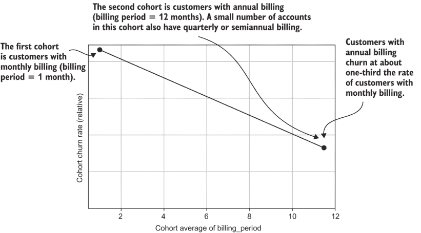

图 5.9 Broadly 客户按月度和年度计费周期进行的流失群体分析

图 5.9 中的结果基于月度流失率，因为进行了月度观察。以这种方式分析年度客户可能看起来有些奇怪，然而，因为年度客户每年只有一次流失的机会。另一种可能的方法是对年度和月度客户进行单独的指标群体分析，然后每年观察一次年度客户。如果你有很多年度客户，这种技术可以工作，但通常是个问题，因为你对年度客户的观察远少于对月度客户的观察。因此，你可能没有足够的年度客户观察数据来进行单独的行为分析。

要理解年度客户行为，最好是将年度和月度客户结合起来。你可能认为每年观察一次年度客户并将他们与月度客户合并到一个数据集中（通过改变数据集构建的逻辑）是个好主意。但这样年度客户似乎会有更高的流失率；通过每年观察一次，你隐含地计算了他们群体的年度流失率。想象一下图 5.9 显示年度客户的流失率高于月度客户。如果你每年观察一次年度计费客户并想与他们进行比较，你必须将月度客户的流失率转换为年度，从而显示真实的关系：月度计费客户的年度流失率更高。最佳选择是观察每月和年度客户的混合群体，并每月进行观察。

### 5.1.6 最小群体大小

在使用群体分析流失问题时，每个群体中观察到的数量是一个重要的问题。你需要每个群体中有足够的观察数据，这样当你估计群体的流失率时，估计结果更有可能是准确的。记得从第一章的讨论中，流失受到许多你不知道和影响的随机因素的影响。当你根据指标估计群体的流失率时，结果的一部分是由于指标的影响，另一部分是由于所有其他因素。想法是，你需要大量的观察数据来使所有那些“其他因素”相互抵消并显示出指标的影响。多少是“大量”取决于具体情况，但一个简单的经验法则是，你应该在每个群体中有 200 到 300 个观察数据，最好是几千个。

**要点**：每个群体至少应有 200 到 300 个观察数据，最好是几千个。

注意，我在谈论每个群体中应该有多少观察数据，而不是有多少客户。如果你有 500 个客户，每月续订，并且你观察他们的行为（指标和流失）六个月，你将有大约 3,000 个观察数据。如果你形成 10 个群体，每个群体将有 300 个观察数据，那么你应该没问题。问题是，最小群体大小出现在年度续订时：如果你有 500 个客户，年度续订，一年后，你只有 500 个观察数据。

如果你每个群体中的观察数据太少，你应该做的第一件事是使用更少的群体。以 500 个观察数据的例子来说，你可以形成三个群体，167 个、167 个和 166 个。至少你每个群体中会有超过 100 个观察数据，如果不是你想要的几百个。然后你的群体将代表你正在分析的指标的低、中、高三个水平。

**警告**：在群体分析中，有足够的观察数据在少数几个群体中比有大量群体更重要。相应地减少群体的数量。

如果你每个群体中的观察数据仍然少于 200 个，你将进入一个危险区域，其中随机事件的噪声可能会压倒你在基于指标的群体中寻找的信号。如果你的流失率相对较高——两位数以上（大于 20%），大约 100 个观察数据可能仍然有效。这是因为如果流失率相当高，随机因素对流失率的影响可能相对较小。但是，当流失率低（低于 10%）时，与指标的影响相比，随机外部因素更有可能变得重要。所以如果你的流失率低，你需要更多的观察数据来抵消噪声并揭示趋势。如果你的流失率低，你不应该在每个群体至少有 200 个观察数据之前尝试进行分析，最好是更多。

另一条经验法则是分析中至少要有 100 个客户流失。例如，如果你的客户流失率是 5%，你应该有大约 2,000 个观察值（因为要从 5%的客户流失率中得到 100 个客户流失观察值，你需要有 100 / 0.05 = 2,000 个观察值）。通常，观察值和客户流失的下限不是问题；大多数公司最初专注于客户获取，只有在运营一段时间后才会考虑客户流失。但是，各种问题可能会限制观察值的数量，例如数据仓库中事件的历史较短，你应该意识到这些限制。

吸收要点：如果你的数据中客户流失少于 100 例，你应该专注于获取新客户，并通过调查和焦点小组了解他们的观点。在如此少的例子中，从数据中理解客户流失将很困难。

这些粗略的指南更多地基于实践经验，而不是严格的统计。第八章和第十章讨论了一些你可以用来更好地回答关于样本大小问题的统计方法。

### 5.1.7 显著和不显著的群体差异

到目前为止，我只展示了客户指标与客户流失明显相关的案例。然而，不可避免的是，你将测试一些指标，并发现没有显著的结果。图 5.10 显示了云通信服务提供商 Versature 的一个例子。在这种情况下，指标是客户购买的扩展单元数量。客户流失率没有明显的趋势：底部群体与顶部群体的客户流失率大致相同，中间群体的客户流失率上下波动，但从未显著偏离平均水平。这种行为与客户流失无关。

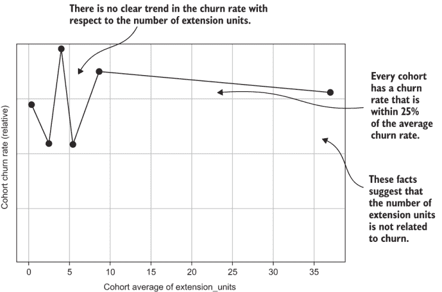

图 5.10 当客户流失差异不显著时的群体分析

其他情况不太明确，但并非明显无关。在第八章中，我将讨论如何更严格地使用统计方法来回答这些问题，但你通常可以在没有统计的情况下做出合理的判断。如果你试图决定一个指标是否与客户流失相关，首先要问的问题是是否有其他指标与客户流失有更明显的关系。

吸收要点：如果你不确定一个指标是否与客户流失相关，首先询问是否有其他明显的指标与客户流失有很强的关系。如果有，关注这些指标，尝试在保留策略中使用这些知识，稍后再处理有疑问的案例。

唯一需要担心的是边缘案例：

+   当你只有少数与客户流失强相关的指标时

+   当一个特定的指标预期与客户流失相关，并且基于这种预期已经制定了保留或参与策略时

在这种情况下，你应该查看流失率的变化是否在队列之间一致，以及最低和最高流失率队列之间的差异是否显著。如果流失率通常从高到低（或从低到高）变化，并且最高和最低之间的差异至少是 1.5 倍，那么可以合理地认为你发现了一个可能对流失率有意义的关联。

最后，你应该考虑与流失率相关的业务原因：

+   该度量衡是否衡量与产品的有用性或客户满意度密切相关的因素？

+   或者，这些度量衡是否与产品的核心特性无关？

如果你坚信这个度量衡应该很重要，你可以给你的分析留有疑问，并在你拥有更多数据时重新检查结果。另一方面，如果数据不支持一个宠爱的理论，不要尝试太久；这是一个数据驱动的例子。

最后，请注意，显著性问题与样本大小有关，这在第 5.1.6 节中讨论过：如果你有很多样本，你更有可能看到有意义的关系。更高级的方法在第八章和第十章中用于研究这些问题。

### 5.1.8 大多数客户度量衡为零的度量衡队列

在队列分析中，你可能会遇到的一个问题是，即使你有很多观察值，你仍然可能对感兴趣的度量衡没有结果。这种情况可能发生在事件很少发生时，即使你在很长的时间内进行了测量（如第三章所述）。图 5.11 显示了 Klipfolio 的一个示例度量衡队列分析。大多数账户在所讨论的度量衡上为零：用户查看仪表板时每月进行的导向切换次数。在这种情况下，只有三个队列是由 Python 函数`DataFrame.qcut`形成的，尽管队列的参数被设置为 10。

图 5.11 中的队列图仍然显示出与流失率的关系，但图表看起来并不完全符合预期。如果你知道原因，你会知道没有问题，但你将不得不向你的业务同事解释为什么只有三个队列。在第 5.4 节中，我向你展示了如何通过去除不想要的观察值来改进这类分析。

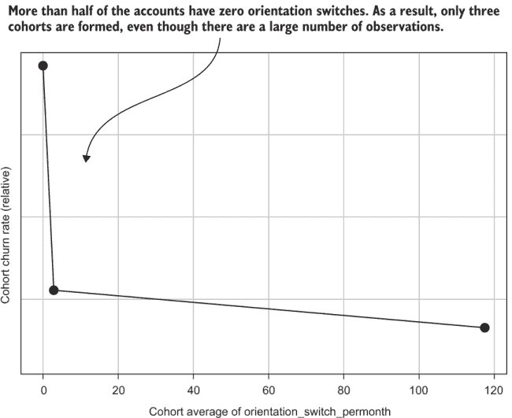

图 5.11 大多数观察值为零的队列分析

如果一个事件很少发生，并且对于大多数客户来说该度量衡的值为零，那么这个度量衡与流失率的关系可能不如更多账户参与的行为那样显著。在某种程度上，你应该忽略罕见事件，专注于常见事件。当然，如果所讨论的行为与少数账户的流失率有重要关系，可能会有例外情况。处理罕见行为度量衡的另一种方法是，如第六章所述，将它们组合在行为组中。

### 5.1.9 因果关系：这些度量衡是否导致了流失率？

现在你已经知道如何发现行为指标与客户流失之间的关系，并且你对这些关系何时重要有了很好的感觉。但你可能想知道因果关系（如果你还没有，现在是开始的好时机）。因果关系提出了以下问题：

+   如果你看到当指标值高时客户流失率降低，那么所讨论的事件和行为是否导致了客户留存？

+   指标（事件发生的低频次）的值低是否会导致客户流失？

不幸的是，这些问题没有简单的答案。高级统计学可以用来分析因果关系问题，但这些技术超出了本书的范围。就这一点而言，我不建议使用高级方法来理解客户流失的因果关系，因为这需要一种简约、敏捷的分析（第一章）。

我对因果关系的处理方法如下：客户流失或不流失是因为他们从使用产品或服务中获得效用或享受。在这里，我指的是经济意义上的效用和主观愉悦。如果指标的背后的行为是向客户提供效用，那么可以说这个行为既导致了留存也导致了流失。如果事件不是提供效用的行为，而是在过程中发生的事情，那么可以说这个事件和指标与客户参与和留存相关，但不是原因。

你如何知道哪个事件为顾客提供了效用？你应该依靠你对产品的了解和常识（如果你不知道，可以尝试与一些客户交谈）。话虽如此，如果你认为某个事件为顾客提供了效用，但发现它与流失和留存只有微弱的关联，你可能需要重新考虑你的信念——这是数据驱动的另一个例子。

TAKEAWAY 您需要依靠对商业知识的了解来判断与客户流失相关的指标是导致留存和流失，还是仅与留存和流失相关联。要导致客户流失，事件必须与客户从产品中获得效用或享受紧密相关。

在分析客户流失相关数据时，区分导致留存或流失的指标和事件与相关联的指标和事件之间的区别并不太大，但在制定留存策略时，这种区别却很大。如果你认为某个事件或指标与留存相关，但不是导致留存的原因，那么尝试鼓励客户采取该特定行动是没有意义的。

WARNING 如果你不认为某个事件是导致客户留存和流失的原因，不要尝试鼓励客户采取该行动，即使它与流失有很强的关联。

## 5.2 总结客户行为

到现在为止，您已经了解了如何根据您的指标执行流失的指标群体分析。您也看到了一些可能导致结果难以解释的问题。一个问题就是指标可能存在偏斜，这可能会使群体分析难以阅读和比较。另一个可能出现的问题是，大多数账户指标的结果为零的罕见事件。这些问题相当典型，并不一定错误，但如果它们非常极端，您可以采取一些措施。首先，为了帮助诊断这些问题并确保当它们发生时您不会感到惊讶，我将向您展示如何通过制作数据集的摘要来检查这类问题。

数据集摘要有助于您检查问题，也是了解您的客户展现出的整体行为范围的好方法。这种理解将帮助您规划客户细分和干预措施，以增加参与度。

### 5.2.1 理解指标的分布

数据集的摘要是一组对数据集内容的测量——一组对您指标的指标。数据集摘要中的结果可以很好地说明您客户行为的范围和多样性。它还可以帮助您在花费时间进行分析之前发现数据中的许多问题。

小贴士：在开始对流失进行群体分析之前，您应该计算一组摘要统计量并解决任何数据问题。我首先教您群体分析，是为了向您展示为什么您需要一个初步的摘要。

指标的分布是统计学家和分析人员用来描述这类属性的工具——诸如最小值、最大值和典型值等。

定义：一个指标的分布是指关于一个指标对客户取值的整体事实集合。理解分布意味着在适当的细节水平上了解诸如有多少客户具有该指标、典型值是什么以及最小值和最大值是什么等事实。

图 5.12 展示了模拟社会网络数据集的此类摘要。本节末尾的表 5.1 简要解释了摘要统计量，这些统计量对于已经学习过统计学课程的人来说应该是熟悉的。如果您需要更多信息，许多文本和在线资源提供了对这些措施的深入解释。

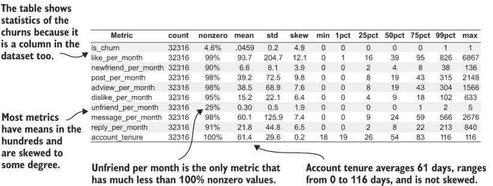

图 5.12 社会网络模拟数据集的摘要统计示例

下面是关于图 5.12 中数据集摘要的一些关键点：

1.  大多数指标在几乎所有账户中都有非零值，除了“每月取消好友”指标，它只显示 25% 的账户的值。

1.  指标事件计数通常在数百，最大事件计数在数千。例外的是“取消好友”和“新好友”，两者都较为罕见。

1.  大多数指标在程度上有偏斜；计数较高的事件有更高的偏斜。

1.  账户留存期的统计数据显示，所有账户都有一个测量值，因为非零测量值（第 2 列）为 100%。平均值为 61 天，账户留存期的偏斜为 0.2，表明它在其平均值周围分布得或多或少是均匀的。

1.  该表格还显示了数据集中的流失统计信息：4.6%的观测值是流失。

真实的流失案例研究数据在指标的分布和偏斜方面通常相似，但真实公司的数据通常有更多的指标，其中只有一小部分账户具有非零值。（我故意在模拟中放入一个，以便你在保持模拟简洁的同时学习。）

表 5.1 指标分布汇总统计 *(续)*

| 汇总统计 | 说明 |
| --- | --- |
| 非零百分比 | 数据集中指标非零的观测值百分比——这是检查行为多么罕见的重要检查。 |
| 平均值 | 指标典型值的度量（也称为平均值）。它是通过将所有观测值上的指标相加，然后除以观测值数量来计算的。 |
| 标准差 | 一个度量指标值如何变化的量度，即所有值是否相对接近典型值。当许多值远离典型值时，会出现高标准差。有时，通过值与平均值的标准差来引用指标值是方便的。例如，如果平均值是 20，标准差是 5，那么一个指标观测值为 25 就被说成是高于平均值 1 个标准差。在这种情况下，30 就被称为高于平均值 2 个标准差，依此类推。这种术语是有用的，因为它传达了指标观测值与典型值相比的感觉，而不需要你记住每个指标的典型值。 |
| 偏斜 | 一个统计量度，用于衡量指标分布的对称性或倾斜程度。这种倾斜性在本章前面的群体分析中出现过。如果偏斜为零，则低值和高值对称地分布在平均值周围。如果偏斜为正，则高于平均值的指标观测值多于低于平均值的观测值。如果偏斜为负，则情况相反：低于平均值的观测值多于高于平均值的观测值。（在典型的行为指标中，你不太可能看到这种结果。）一般来说，偏斜低于 3 或 4 并不显著，但偏斜为 5 或更大的指标显著倾斜。 |
| 分位数（1%，5%，等等） | 分位数是找到低于该值的固定百分比的观测值所需的度量值。例如，1% 分位数是观测值中有 1%的值小于该度量值的值；其他 99%的观测值具有大于 1%分位数的值。5% 分位数是观测值中有 5%小于该值，有 95%大于该值的度量值。这种模式适用于所有更高的分位数。查看摘要中的分位数序列是了解客户值在什么范围内的百分比的好方法。如果你看到登录的 25 分位数是 20，登录的 75 分位数是 100，那么 50%的客户（75 - 25 = 50）的登录次数在 20 到 100 之间。 |
| 中位数（50% 分位数） | 一个度量值的典型值的另一种度量，如平均值。中位数是观测值中一半大于一半小于的值（等同于 50% 分位数）。当数据包含极端异常值时——当度量值有高偏斜时，中位数比平均值更能衡量度量的典型值。极端异常值会提高平均值但不会提高中位数，因此中位数总是反映中间的客户。 |
| 最小值和最大值 | 观测到的任何客户的最低和最高值。 |

正态和厚尾分布

在著名的正态（钟形曲线）分布中，大约三分之二的所有值都在平均值的一个标准差范围内，几乎所有值都在平均值的三个标准差范围内。如果平均值是 20，标准差是 5，那么三个标准差就是 3 * x * 5 = 15。在这种情况下，大多数观测值都在 5 到 35 之间（因为 20 - 15 = 5，20 + 15 = 35）。对于正态分布，具有比平均值 5 个或更多标准差值的值极为罕见。

但行为度量通常比正态分布有更多的异常值，所以这些关系可能不会在你的数据中成立。比正态分布有更多极端异常值的分布通常被称为厚尾分布。分布的尾部是极端值，如果尾部很厚，那么就会有大量的极端观测值。对于你自己的大多数度量值，不到三分之二的观测值将位于平均值的一个标准差范围内，而更多的观测值将更远；可能只有三分之一的观测值将位于平均值的一个标准差范围内。对于大多数产品，行为度量值在平均值 5 到 10 个标准差（或更多）之外是很常见的。

### 5.2.2 在 Python 中计算数据集摘要统计量

在数据集上执行一系列摘要测量是数据分析中的常见任务，因此 Python 的 Pandas 模块已经提供了一个函数来完成这项任务——`DataFrame.describe`。此函数为数据集中的每一列计算一组测量值。回想一下，数据集的每一列都包含一个指标的观测值。调用 `describe` 函数会产生每个指标的摘要统计量集合。

列表 5.2 展示了一个完整的程序，它使用 Pandas 函数并添加了一些字段到摘要中，我认为这对于理解客户行为很有用。列表 5.2 中的主要步骤如下：

1.  在给定路径的情况下，将数据集加载到 Pandas `DataFrame` 中。

1.  调用 Pandas 函数 `DataFrame.describe` 以获取基本摘要。基本摘要包括平均值、标准差、最小值和最大值，以及第 25、50 和 75 个百分位数。摘要数据作为另一个 Pandas `DataFrame` 返回。

1.  计算一些额外的统计量，并将它们添加到摘要结果中。这些额外的统计量包括

    +   使用 Pandas 函数 `DataFrame.skew` 计算偏度

    +   使用 Pandas 函数 `DataFrame.quantile` 计算第 1 和第 99 个百分位数

    +   每个指标的零观测值的百分比，这是通过一个小技巧计算的：将列转换为布尔类型并求和得到非零值的计数；然后除以行数将其转换为百分比

1.  最终结果的列按更合理的顺序重新排序。

1.  结果被保存。

列表 5.2 将在本章的后面再次使用，因为这些摘要统计量对于进一步分析你的数据集是必需的。

列表 5.2 展示了客户流失分析数据集的统计信息

```
import pandas as pd
import os

def dataset_stats(data_set_path):
   assert os.path.isfile(data_set_path),
      '"{}" is not a valid path'.format(data_set_path)                  ①
   churn_data = 
      pd.read_csv(data_set_path,index_col=[0,1])                        ②

   if 'is_churn' in churn_data:
      churn_data['is_churn']=
         churn_data['is_churn'].astype(float)                           ③

   summary = churn_data.describe()                                      ④
   summary = summary.transpose()                                        ⑤

   summary['skew'] = churn_data.skew()                                  ⑥
   summary['1%'] = churn_data.quantile(q=0.01)                          ⑦
   summary['99%'] = churn_data.quantile(q=0.99)                         ⑧
   summary['nonzero'] = churn_data.astype(bool).sum(axis=0) / 
                        churn_data.shape[0]                             ⑨

   summary = summary[ ['count','nonzero','mean','std','skew','min','1%',
                       '25%','50%','75%','99%','max']]                  ⑩
   summary.columns = summary.columns.str.replace("%", "pct")

   save_path = data_set_path.replace('.csv', '_summarystats.csv')
   summary.to_csv(save_path,header=True)
   print('Saving results to %s' % save_path)
```

① 检查数据集路径

② 将数据加载到 Pandas DataFrame 对象中并设置索引

③ 将流失指标转换为浮点数

④ 提供一组标准摘要统计量

⑤ 将指标放在行中，结果更容易阅读。

⑥ 使用标准数据集函数测量偏度

⑦ 使用分位数函数测量第 1 个百分位数

⑧ 使用分位数函数测量第 99 个百分位数

⑨ 计算非零值的比例

⑩ 重新排序列

你应该自己运行列表 5.2 上的模拟数据集。假设你正在使用 Python 包装程序，将参数更改为

```
fight-churn/listings/run_churn_listing.py —chapter 5 —listing 2
```

运行列表 5.2 的典型结果如图 5.12 所示；你的结果可能有所不同，因为数据是随机模拟的。

### 5.2.3 筛选稀有指标

在创建数据集摘要统计信息后，你应该检查有多少账户在所有指标上都有非零值。在这个时候，你应该已经为描述在第三章中的罕见指标选择了更长的观察窗口。如果你仍然有一些指标，其中只有一小部分账户有非零值，那么这可能就是你能做到的最好了。如果是这样，我建议你从数据集和分析中删除那些少于大约 5%非零值的指标。确切的截止点取决于你有多少“好的”指标。如果你有很多指标，其中大多数账户都有非零值，你应该使用更高的阈值——可能是 10%。另一方面，如果你有很多罕见事件和零值的指标，你可能想为这种筛选使用较低的阈值，例如 1%。

如果你发现这些罕见指标中的一个与流失有很强的相关性，或者你知道它对业务特别感兴趣，你可以对此方法做出例外。指导这一方法的原则是简约：如果一个指标只适用于一小部分账户，那么它可能不太有用，即使它与流失和保留有很强的关系。

### 5.2.4 将业务纳入数据质量保证

在生成数据集摘要统计信息后，是让组织中的业务人员参与质量保证的好时机。我建议你与代表你业务不同部分的人进行一到多次会议，并与他们一起审查摘要统计信息。你应该在他们看到你的队列分析结果之前这样做。我首先教你如何进行队列分析，这样你就可以在花费时间进行更多数据质量保证之前做一些实际的流失分析，但你应该首先进行质量保证，然后进行流失分析。

与业务利益相关者的这种审查是一个机会，可以确认数据质量良好的人知道这一点。特别是，你想要询问业务代表，指标值的分布是否符合他们的预期。指标低于他们预期的账户百分比是否更高，或者最大值是否高于他们预期的？在将关于流失的发现与业务分享之前获取这些信息很重要，因为如果你的数据集需要额外的纠正或修改，你的发现可能会改变。

警告：在分享队列分析结果之前，完成对数据的质量保证检查，包括与业务审查摘要统计信息。如果你分享的队列分析后来因数据质量问题需要撤回，你可能会失去业务的信任。

## 5.3 评分指标

当我们查看 5.1 节中的队列分析时，我们发现一个问题，即对于某些指标，大多数队列仅占据指标总范围的很小一部分。在 5.2 节中，你了解到可以通过查看数据集摘要中的指标偏斜统计来识别这种类型的分布。在本节中，你将学习评分指标的技术，以便在您的指标高度偏斜时提高队列分析的可解释性。在第六章中，你将了解到指标分数还有其他重要的用途，因此本节是一个介绍。

评分与数据归一化

如果你受过统计学或数据科学的训练，你可能知道我所说的评分就是数据的归一化或标准化。我发现商界人士觉得这些术语令人畏惧且令人困惑。我发现将整个过程称为评分，将转换后的数据称为分数而不是归一化数据，效果更好。商界人士似乎觉得这些术语更容易与之相关联。因此，我使用这些术语而不是传统的统计语言来描述这个过程。

### 5.3.1 指标分数背后的理念

指标分数背后的理念是，它是你最初使用的指标的缩放版本。在这种情况下，缩放意味着分数将位于与原始指标不同的数字范围内。

定义 指标分数（或简称分数）是指标的缩放版本。

重新缩放还意味着较大的指标观测值总是转换为较大的分数，并且具有相同指标的两位客户最终会得到相同的分数。因此，如果按指标值从大到小对客户进行排序，然后按指标分数对相同的客户进行排序，顺序将完全相同。从您的指标创建的队列也将与基于分数的队列完全相同。图 5.13 说明了这个过程。

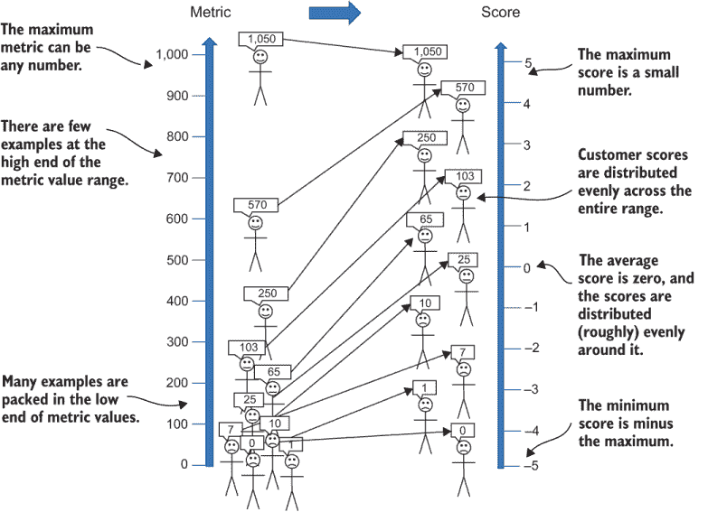

图 5.13 将指标映射到分数

分数具有一些特性，使它们对进一步分析您的指标和流失率很有用。以下是一些这些特性的例子：

+   而指标可以取任何值，但分数总是小数，可以是正数或负数，但接近于零。典型的分数是-1、0 或 1。一个分数的极端值可能是 3 或 5，因此分数的典型范围大约在-5 到 5 之间，无论原始指标的取值范围如何。

+   如果指标是偏斜的，分数就不会那么偏斜。等价地，指标可以有许多接近零的观测值和少量很大的值，但分数值将在分数占据的整个范围内（大约-5 到 5）更加均匀地分布。

+   平均分数始终为零，无论原始指标的均值是多少。通过查看分数，你可以一眼看出客户在指标上的表现是否平均，即使你不知道指标的均值。

+   指标得分的标准差始终为 1。这个特性很有用，因为你还可以知道给定得分与平均值的距离。得分为 1 表示客户的原始指标比平均值高一个标准差，得分为-1 表示客户的原始指标比平均值低一个标准差。

这些特性使得得分对于查看客户指标和流失很有用。你将在本书的后面部分了解指标得分的更多有用特性。

### 5.3.2 指标得分算法

现在你将查看用于从指标计算得分的公式。你可以使用算法根据数据确定一个得分公式，而不是一个单一的公式。图 5.14 说明了这个步骤，总结如下：

1.  通过检查偏斜统计量（第 5.2 节）来确定指标是否显著偏斜。一个典型的阈值认为当偏斜超过 4 时是显著的，尽管你可以根据你的偏好调整阈值。此外，你必须确认指标的最小值（在任何转换之前）为零。如果指标没有显著偏斜或具有负值，则跳到步骤 4。

1.  将偏斜的客户指标加 1，这样原来事件计数为零的客户现在有 1，原来有 1 的客户现在有 2，依此类推。

1.  对所有偏斜的指标取对数。通常使用自然对数（以 e 为底），但对数底数并不重要。

1.  计算在此过程此点的指标值的平均值和标准差。如果指标没有偏斜，这些值就是原始指标。如果指标有偏斜，使用 1 加上原始客户指标的对数。

1.  从所有值中减去平均值。

1.  将所有值除以标准差。结果是得分。

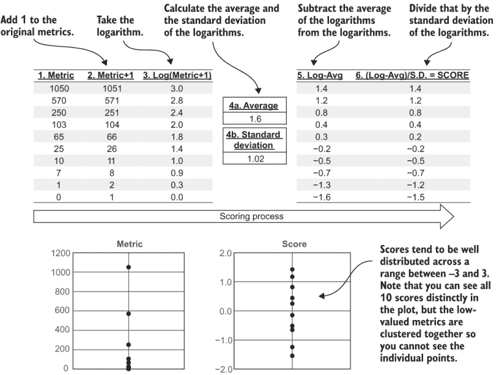

图 5.14 示例得分计算

取对数是使数据不那么偏斜的关键步骤。两个数字之间的数量级差异在它们的结果对数中变成了小的差异。但只能对正数取对数，这就是为什么你需要检查最小值是否为零，然后加 1。（关于负指标的解决方案在第七章中介绍。）

从平均值中减去并除以标准差可以使最终得分的平均值变为 0，标准差变为 1。这个推导在统计学教科书中有详细说明，但你可以通过注意以下内容来理解它：

+   平均值是通过将所有指标相加然后除以观测数来计算的。如果你从每个观测值中减去一个特定的数，新的平均值将减少你减去的量。如果你从每个观测值中减去原始平均值，新的平均值必须是零。

+   假设平均值为零，标准差为任何数；然后除以标准差。原本等于标准差的观测值现在值为 1，因为它就是标准差；然后它被除以相同的数。实际上，在除以原始标准差之后，每个观测值都被转换为一个值，这个值是观测值与平均值的距离的标准差数。这个结果与指标具有标准差为 1 是相同的。

从单个指标创建分数与计算公式 5.1 中的公式相同：

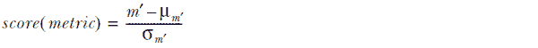

其中

| 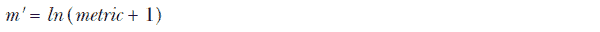 | 公式 5.1 |
| --- | --- |

在公式 5.1 中，*μm¢* 表示 *m ¢* 分布的均值，*σm¢* 是 *m ¢* 分布的标准差，*ln* 是自然对数函数。如果指标不是偏斜的，则使用原始指标代替 *m ¢*。

### 5.3.3 在 Python 中计算指标分数

列表 5.3 展示了一个实现分数计算的 Python 函数。请注意，此函数计算数据集中所有指标的分数，而不仅仅是单个指标。列表 5.3 中的 `metric_scores` 函数有以下输入：

+   `data_set_path`—一个字符串变量，指向保存文件中的数据集路径

+   `skew_thresh`—确定一个指标是否应被视为偏斜的阈值

给定这些输入，计算分数的主要步骤如下：

1.  将数据集加载到 Pandas `DataFrame` 对象中，设置 `DataFrame` 索引，并创建一个副本。分数将写入副本。

1.  删除换行指示列，因为它不会被转换为分数；在分数计算后，它将按原样重新附加。

1.  加载由列表 5.2 保存的数据集统计文件。

1.  使用汇总统计，通过比较偏斜统计量与阈值来确定哪些列显著偏斜。

1.  对于每个显著偏斜的列，加 1，然后取对数。

1.  对于所有列，减去平均值，然后除以标准差。

1.  重新附加换行指示列。生成的 `DataFrame` 将被保存。

关于列表 5.3 需要注意的一点是，它没有遵循第 5.1 节中关于使用标准 Python 函数的建议。此列表没有使用标准的 Python Pandas 函数来计算分数；虽然有一个，但列表 5.3 没有使用它，因为标准的 Pandas 函数不包括对偏斜变量取对数的选项。

列表 5.3 计算指标分数的 Python

```
import pandas as pd
import numpy as np

def metric_scores(data_set_path,skew_thresh=4.0):

   assert os.path.isfile(data_set_path),
      '"{}" is not a valid path'.format(data_set_path)            ①
   churn_data = 
      pd.read_csv(data_set_path,index_col=[0,1])                  ②
   data_scores = churn_data.copy()                                ③
   data_scores.drop('is_churn',axis=1)                            ④

   stat_path = data_set_path.replace('.csv', 
      '_summarystats.csv'))                                       ⑤
   assert os.path.isfile(stat_path),
      'You must running listing 5.2 first to generate stats'
   stats = pd.read_csv(stat_path,index_col=0)                     ⑥
   stats=stats.drop('is_churn')                                   ⑦
   skewed_columns=(stats['skew']>skew_thresh) & 
                  (stats['min'] >= 0)                             ⑧
   skewed_columns=skewed_columns[skewed_columns]                  ⑨

   for col in skewed_columns.keys():                              ⑩
       data_scores[col]=np.log(1.0+data_scores[col])              ⑪
       stats.at[col,'mean']=data_scores[col].mean()               ⑫
       stats.at[col,'std']=data_scores[col].std()

   data_scores=(data_scores-stats['mean'])/stats['std']           ⑬
   data_scores['is_churn']=churn_data['is_churn']                 ⑭

   score_save_path=
       data_set_path.replace('.csv','_scores.csv')                ⑮
   print('Saving results to %s' % score_save_path)
   data_scores.to_csv(score_save_path,header=True)
```

① 检查数据集路径

② 将数据集加载到 Pandas DataFrame 对象中

③ 在数据的副本上工作以计算分数

④ 换行列不应转换为分数。

⑤ 检查汇总统计文件

⑥ 加载汇总统计

从汇总统计中删除掉换行行

⑧ 为偏斜的列创建一个布尔序列

⑨ 移除低于阈值的列的条目

⑩ 遍历偏斜的列

⑪ 将偏斜的列转换为原始值的对数

⑫ 记录新的均值和标准差

⑬ 减去均值并除以标准差

⑭ 将原始数据集中的 is_churn 列添加回来

⑮ 保存指标的分数版本

如果你正在遵循本章中的示例，你应该自己运行列表 5.3 在模拟数据集上。假设你正在使用 Python 包装程序，将参数设置为`—chapter` `5` `—listing` `3`。这个操作将在输出目录中创建文件 socialnet_dataset_scores.csv。运行列表的包装程序会打印输出目录。

如果你想要检查分数数据集与原始数据集的不同之处，一个选项是将其在文本编辑器或电子表格中打开。你应该能够看到所有指标都是小数（接近零），并且既有正数也有负数。更好的选项是重新运行数据集摘要程序（列表 5.2）在新数据集上。你可以通过在 Python 包装程序中添加参数`—version` `2`来运行数据集摘要列表的第二版，因此使用以下参数运行包装程序：

```
—chapter 5 —listing 2 —version 2 
```

包装程序将结果保存到名为 socialnet_dataset_scores_summary.csv 的文件中。如果你检查结果文件，所有指标都应该像图 5.15 中显示的那样：

+   均值是一个接近零的小舍入误差。在图 5.15 中，均值为-2.65E-16，这意味着 10 的负 16 次方（一个非常小的数）。

+   标准差为 1。

+   最小值和最大值分别约为-4 和 4。

+   尽管原始指标严重偏斜（图 5.12 中的 15.5），但评分实际上没有偏斜。

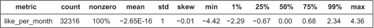

图 5.15 模拟数据集分数数据集中一个指标的摘要统计示例

### 5.3.4 使用评分指标进行队列分析

当你从原始数据集中创建了分数数据集后，你可以按照 5.1 节中学到的方法进行队列分析，使用相同的代码。如果你回顾一下 5.1.2 节中的列表 5.1，你会发现队列分析函数中根本不在乎数据是原始指标（在其自然尺度上）还是转换尺度上的评分指标。还要记住，由于将指标转换为分数保留了按指标排序的客户顺序，因此使用分数进行队列分析只会改变数据在队列图水平轴上的分布方式。

你应该使用 Python 包装程序对社交网络模拟的评分指标运行自己的队列分析。你可以使用以下参数运行队列图列表的第二版（列表 5.1）：

```
—chapter 5 —listing 1 —version 2  
```

结果看起来像图 5.16，其中水平轴被重新标记为从-1.5 到 1.5（群组平均值）的分数。每个群组的流失率与图 5.4 中显示的相同。但是，在转换为分数后，群组的定位在图中分布得更均匀。同时，分数指标群组中每个点的流失率与原始群组中的一个的流失率相匹配。

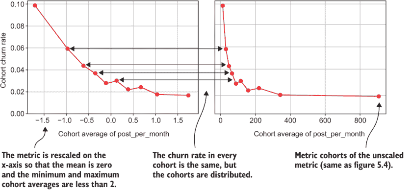

图 5.16 从模拟中得到的分数指标群组分析

图 5.17 展示了比较 Broadly（一个帮助企业管理其在线存在的服务）一个指标在其自然尺度上及其作为分数的群组流失率图的示例。对于 Broadly 的客户来说，一个重要的事件是添加新的交易，并计算了每月新增交易量的指标。每月新增交易量的指标高度倾斜，统计值为 23。因此，当使用该指标的自然尺度制作群组图时，除了一个群组外，所有群组都位于整个图大约八分之一宽的水平范围内。群组平均值介于 0 到 250 之间，最高群组的平均值是 2,300。相比之下，基于指标分数的群组在大约-1.5 到 2.0 的分数之间分布得更加均匀。此外，现在很清楚群组与平均值的比较，这个平均值是 0。前三组低于平均值，大部分的流失率降低都是从最低群组到接近平均值的群组。

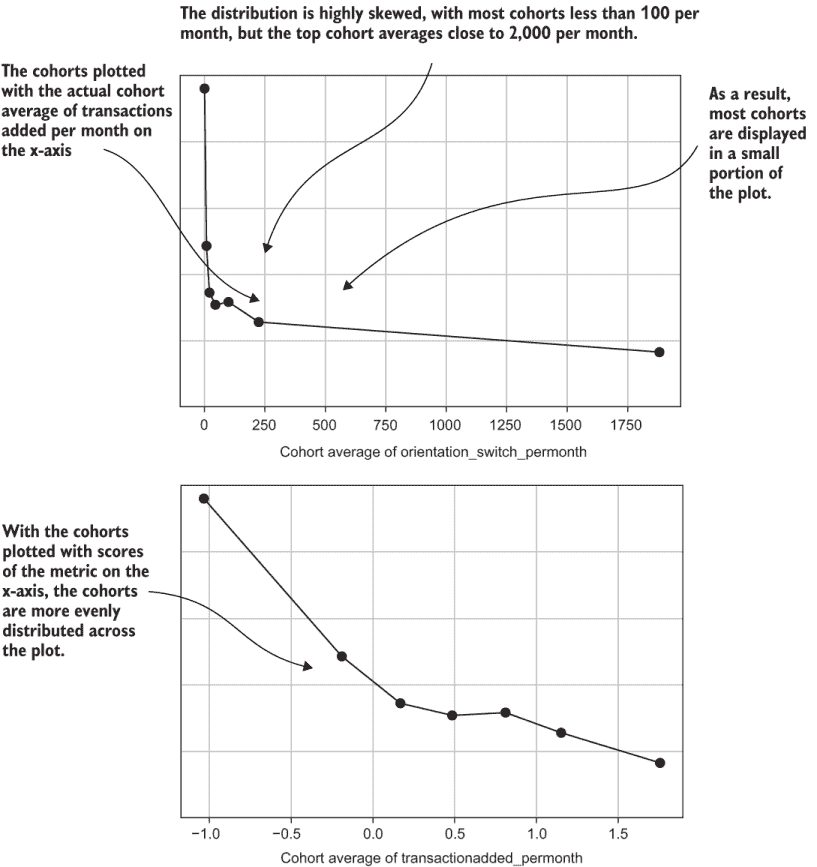

图 5.17 Broadly 每月新增交易量分数指标和流失率示例

**要点**：使用分数指标群组的群组分析使得很容易看到群组与平均指标值的关系，这个值总是等于零的分数。

### 5.3.5 每月经常性收入（MRR）的群组分析

在第三章中，你学习了每月经常性收入（MRR）应该作为一个指标来计算，但到目前为止，我们还没有查看过任何关于它的群组分析结果。现在我将演示 MRR 群组分析的典型结果，使用的是在第 5.3.4 节中介绍的指标分数技术。我演示 MRR 和流失率的群组分析使用分数有两个原因：

+   MRR 对于企业对企业（B2B）产品通常高度倾斜，因为最大的客户，可能是大型企业，通常支付的价格比最小的客户，可能是单一业主企业，高出许多倍。

+   以分数形式呈现这一群组分析，可以保持案例研究中定价信息的保密性。

图 5.18 显示了分数 MRR 流失率分析的结果。但在你查看结果之前，停下来思考一下你期望的结果是什么。（好吧，你们中的一些人可能还记得第一章中的答案。）支付更多费用的客户群组的流失率会是

+   高于支付较少的客户流失率吗？

+   低于支付较少的客户流失率吗？

+   大约与支付较少的客户的流失率相同吗？

图 5.18 显示答案是 B：平均支付更多的客户群体流失率较低，尽管趋势有点嘈杂。高支付客户群体的流失率大约比最低支付群体低三分之一到一半。

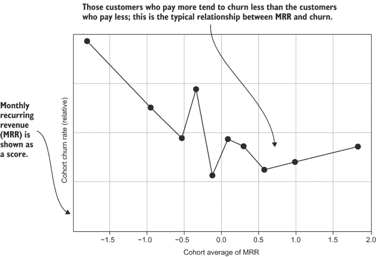

图 5.18 Versature 的 MRR 得分和客户流失率示例

这个结果可能会让你感到惊讶。通常的想法是高价格会让客户不太满意，因此他们流失率更高。然而，情况通常相反。平均而言，支付更多的客户通常流失率较低，原因有很多。支付更多客户流失率较低的第一个原因是被动流失。被动流失（也称为非自愿流失）发生在客户没有表明流失意愿的情况下（因此得名被动）。被动流失最常见的情况是支付卡过期或可用余额不足。因为支付更多的客户通常在更高的计划级别注册，他们通常有更多的钱，因此不太可能遇到这些问题。（为了减少被动流失，大多数公司会多次尝试信用卡直到交易成功，但这种减少流失的方法超出了本书的范围。）

第二个通常更重要的原因是，MRR 较高的客户流失率较低，尤其是在商业产品方面：商业产品以更高的价格卖给大客户，而大客户由于与规模相关的多个原因流失较少。大公司有更多的员工，所以在产品使用方面，如打电话或使用软件，大客户通常使用更多的可用服务。此外，大企业客户在建立系统时投入更多，因此不太可能放弃投资。你可能惊讶地发现，同样的模式通常也适用于消费产品。注册更昂贵计划的客户往往投入更多并更频繁地使用产品，因此他们的流失率比注册低成本计划的客户低。

MRR 与较低的客户流失率相关，但并非原因。如果你看到这种关系，不要试图提高 MRR 来降低客户流失率。这种理解在直觉上是不令人满意的，因为为某物支付过多应该是导致客户流失的原因，而得到一个好的交易应该是导致客户保留的原因。更好地理解客户支付与客户流失之间关系的方法是使用不同的指标——该指标反映客户获得的价值而不是他们支付的价值。这些主题是第六章和第七章的主要主题之一。

## 5.4 移除不需要或不正确的观察值

另一种应该成为您群体分析工具包中的有用技术是从群体分析中移除不想要的观察结果。尽管您已经尽力进行质量保证和清理数据，但某些观察结果可能无效（坏数据），或者它们可能不是无效的，但您不希望它们存在，因为它们会使您的群体分析更难理解。我将向您展示两个激励性的案例研究，其中一些观察结果被从群体分析中移除，以及一个执行移除操作的 Python 函数。

### 5.4.1 从流失分析中移除非付费客户

您可能需要从分析中移除一些观察结果的一个常见场景是，您既有付费客户又有非付费客户。不需要付费的客户可能处于临时免费试用阶段，或者他们可能属于某些特殊客户类别，例如永久免费使用产品的合作伙伴。您可能也有类似的情况，即一些客户支付的费用远低于普通客户支付的费用。非付费（或低付费）客户的问题在于，由于产品对他们来说不花钱，他们往往不会流失，但他们不一定大量使用产品。因此，非付费客户与行为和流失之间的正常关系不存在，如果您有超过少量非付费客户，他们可能会破坏您分析的结果。

图 5.19 通过向 Versature 的 MRR 和本地通话观察结果中添加模拟的非付费客户来展示免费客户的影响，这些观察结果在 5.3.5 节中进行分析。这些非付费客户不是真实的；它们是随机生成的观察结果，具有 $0 MRR。模拟的非付费客户被分配了一个本地通话指标，这个指标也是随机生成的，位于真实客户的底部两个十分位。添加了足够的模拟非付费客户，以占总数据的 15%。当群体图重新生成时，如图 5.19 所示，它们由于非付费客户的存在而严重扭曲，指标与流失之间的关系似乎不太显著。

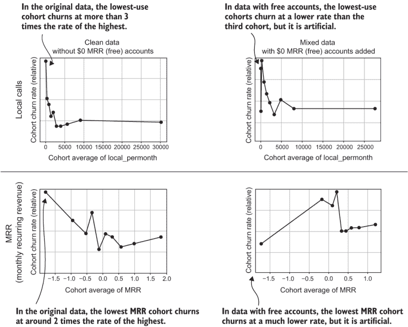

图 5.19 添加到 Versature 订阅数据中的 $0 MRR (免费) 测试的影响

如果你有一些客户付款，而有些客户不付款，在尝试进行群体分析或后续章节中描述的其他分析之前，你应该移除不付款的客户。理想情况下，你可能在生成观测值时（如第四章所述）通过使用基于客户使用的计划的某种 SQL 逻辑来移除此类客户。但是，多个订阅的存在可能会使这种方法变得复杂。一个客户可能有某些$0 MRR 订阅，而其他订阅则附加了费用，因此为了确保客户没有支付任何费用，你必须使用第三章中计算的 MRR 指标。这个例子说明了为什么在生成数据集之后可能需要移除此类客户。5.4.2 节中的 Python 程序展示了如何做到这一点。

### 5.4.2 基于 Python 中的指标阈值移除观测值

从客户流失分析中移除观测值的一种方法是为一个指标定义一个最小值，为一个指标定义一个最大值，或者两者都定义。任何指标值低于最小值或高于最大值的观测值都可以被移除，从而生成一个新的数据集，它是原始数据集的子集。

列表 5.4 展示了执行这些操作的 Python 函数。函数`remove_invalid`具有以下输入：

+   `data_set_path`—一个字符串变量，指定保存数据集的文件路径。

+   `min_valid`—一个包含任何要筛选的指标的最低有效值的字典。条目假定是键值对，其中键是指标的名称（一个字符串），值是应用于筛选该指标的最低值。可以通过这种方式指定任意数量的标准。

+   `max_valid`—一个包含任何要筛选的指标的最高有效值的字典。条目假定是键值对，其中键是指标的名称（一个字符串），值是应用于筛选该指标的最高值。可以通过这种方式指定任意数量的标准。

+   `save_path`—一个文件路径，用于保存分数。

给定这些输入，以下是要创建一个新数据集的主要步骤，其中无效观测值已被移除：

1.  将数据集加载到 Pandas `DataFrame`对象中，设置`DataFrame`索引，并创建一个副本。清洗后的数据被写入`DataFrame`的副本中。

1.  对于在`min_valid`字典参数中指定的每个指标，从`DataFrame`中移除那些值低于最小值的观测值。

1.  对于在`max_valid`字典参数中指定的每个指标，从`DataFrame`中移除那些值高于最大值的观测值。

1.  将结果`DataFrame`保存到文件中。

在本章前面提到的图 5.19 中，展示了使用此算法的一个示例。图的左侧是由列表 5.4 清洗的数据集生成的；图 5.19 的右侧是由原始未清洗数据生成的。

列表 5.4 移除无效观测值

```
import pandas as pd
import os

def remove_invalid(data_set_path,min_valid=None,max_valid=None):
   assert os.path.isfile(data_set_path),
      '"{}" is not a valid path'.format(data_set_path)              ①
   churn_data = 
      pd.read_csv(data_set_path,index_col=[0,1])                    ②
   clean_data = churn_data.copy()                                   ③

   if min_valid and isinstance(min_valid,dict):
      for metric in min_valid.keys():                               ④
          if metric in clean_data.columns.values:                   ⑤
              clean_data=clean_data[clean_data[metric] > 
                         min_valid[metric]]                         ⑥
          else:
              print('metric %s not in dataset %s' % (metric,data_set_path))

   if max_valid and isinstance(max_valid,dict):
      for metric in max_valid.keys():                               ⑦
          if metric in clean_data.columns.values:                   ⑤
              clean_data=clean_data[clean_data[metric] < 
                         max_valid[metric]]                         ⑧
          else:
              print('metric %s not in dataset %s' % (metric,data_set_path))
   score_save_path=
      data_set_path.replace('.csv','_cleaned.csv')                  ⑨
   print('Saving results to %s' % score_save_path)
   clean_data.to_csv(score_save_path,header=True)
```

① 检查数据集路径

② 将数据加载到 Pandas DataFrame 中，设置索引

③ 创建原始 DataFrame 的副本

④ 对用于清理的变量进行迭代，以最小值结束

⑤ 确认该指标是否在 DataFrame 中

⑥ 移除指标小于最小值的行

⑦ 对用于清理的变量进行迭代，以最大值结束

⑧ 移除指标大于最大值的行

⑨ 将生成的 DataFrame 保存到文件中

本书所用的模拟数据集不包含任何免费试用用户或其他需要移除的不必要数据，因此没有可以运行列表 5.4 的示例。

### 5.4.3 从罕见指标分析中移除零测量值

在另一种情况下，你可能想要从群体分析中移除观测值，当指标衡量的是一个罕见事件时，结果大多数客户在该指标上为零。这种情况在第 5.1.7 节中有所说明。列表 5.4 中的函数提供了一个简单的方法来查看当你只考虑有该事件（以及在指标上有非零值）的客户时，群体看起来像什么。

图 5.20 显示了 Klipfolio 的方向切换事件的分析，包括有和没有零指标计数客户的情况。

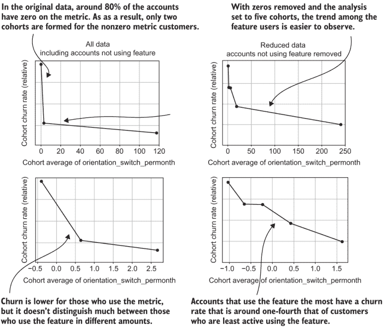

图 5.20 Klipfolio 稀有行为的群体

没有零指标客户的版本是通过在数据集上运行列表 5.4 来创建的，以移除在指标上为零的客户，然后保存。之后，由于只有大约 25% 的观测值剩余，因此使用了五个区间进行群体分析。

### 5.4.4 解离行为：与增加流失率相关的指标

到目前为止，我已经向你展示了与减少流失率相关的行为的群体分析。你可能想知道与增加流失率相关的行为。我把这些行为称为解离行为。

定义：解离行为是一种客户行为，这种行为越频繁地发生，导致客户流失的风险就越高。

我没有避免解离行为来对案例研究进行积极解读。事实是，在流失案例研究中，解离行为很少见，并且通常无法用你迄今为止学到的简单计数和平均指标来检测。一方面，产品创造者的工作是创建吸引人的功能，因此如果创造者正在做他们的工作，解离行为应该是罕见的。通常，甚至没有使用产品的客户比执行解离行为的客户有更高的流失率。因此，如果存在解离行为，它们与流失率的关系可能很弱，并且很容易被忽视。

吸收：解离行为通常与增加的流失率显示出较弱的关系——通常小于使用产品即使是一小部分所带来的流失率减少。

图 5.21 展示了 Klipfolio（一个用于商业仪表板的 SaaS 产品）的一个不活跃功能的例子。案例研究显示了两种版本的群体分析。一种版本包括所有客户，包括那些不使用产品或功能的人，另一种版本只包括使用该功能的客户。如果你包括所有客户，你可能会错过该功能是不活跃的。群体分析最显著的特点是，不使用该功能的客户具有最高的流失率。很容易忽略使用该功能的客户流失率会随着使用频率的增加而略有上升。当不使用该功能的客户从分析中去除后，使用该功能的用户中流失率的上升变得更加明显。


图 5.21 Klipfolio 不活跃行为的群体

考虑到所有因素，图 5.21 中显示的不活跃功能用户的流失增加与第 5.1 节中展示的使用主要产品功能相关的流失减少相比是微不足道的。这种结果对于用简单指标测量的不活跃行为来说是典型的。在第七章中，你将学习创建检测更显著不活跃行为的先进技术。

你的直觉可能认为不活跃行为一定是坏事，即客户不喜欢的那种体验。但我见过一些情况，其中不活跃行为是好的，例如当这种行为有助于完成产品目的，而用户正好得到了他们想要的东西时。当产品对某些用户只有一个目的并且该目的可以完成时，也可能发生不活跃行为。一个常见的例子是观看热门视频系列。如果只有一个热门系列，人们在看完了每一集后可能会流失。在这种情况下，观看最佳内容会导致流失。创作者必须制作更多同样受欢迎的内容来改变这种模式。为了得出这样的结论，你需要运用你的商业知识。通常，人们知道一个功能或内容是否好，无需流失分析（但如果你不确定，可以调查用户）。

## 5.5 通过群体分析对客户进行分段

现在你已经知道了如何通过群体分析来理解客户行为和流失。在对抗流失的下一步，是利用你所学的知识来对客户进行分段并规划干预措施。在第六章和第七章中，你将更深入地了解你的客户，但你现在无需再等待就可以开始行动。正如我在第一章中提到的，我不会详细介绍不同类型的客户干预措施，因为它们针对的是每个公司的产品和环境。但是，基于流失数据创建客户分段的基于数据的程序几乎是通用的。

### 5.5.1 分段过程

我合作过的多数公司发现客户群体划分相当直接，因此这个解释比较简短。主要步骤如下：

1.  使用当前客户数据集（你可以在第四章末尾学习如何创建）来创建群体。不要使用你进行群体分析的原始数据集。

1.  客户群体划分通常由将要进行客户干预的业务人员通过电子表格进行。在一个大型公司中，可能会使用商业智能系统。

1.  通过根据你的群体分析结果选择指标水平，定义一个处于流失风险的客户群体。假设该指标是一个与较低流失率相关的较高值，那么处于风险中的客户是那些指标低于你选择的水平的客户。

1.  如果需要，可以将生成的客户名单加载到另一个系统中，例如电子邮件营销工具或客户关系管理系统。

这个程序很简单，但在设置群体标准时有一些细微差别。

### 5.5.2 选择群体标准

你可以使用一些策略来设定一个指标水平，以定义一个客户群体。一种常见的方法是根据流失风险设定指标水平，例如，选择所有流失风险高于一定水平的客户，如根据群体分析结果所建议的。假设你的群体分析显示，不使用产品的客户流失率为 20%，而在某个指标水平上，风险降低到 5%。为了定义一个处于风险中的客户群体，你选择一个流失风险显著高于最低流失率的指标水平。例如，你可能选择流失率为 10%的指标值。另一种策略是选择一个指标水平，在这个水平上，通过增加使用量所实现的流失减少量最大（假设存在这样的水平，详见第 5.1 节）。

许多公司也对特定干预措施中将要处理的客户数量有一定的资源预算或其他限制。定义群体的另一种方法是选择在某种行为上度量最低的 500 名客户。当处于风险中的客户数量大于你的资源时，你需要对努力进行分级，这种方法是有意义的。为了创建这样的群体，根据感兴趣的指标对当前客户数据集进行排序，并从列表底部（或顶部）选择预定的客户数量。

使用干预措施（如电子邮件、电话或培训）来针对处于某些中间风险水平的客户也是常见的。

**总结**：通常情况下，你不会对最不活跃的客户进行干预以减少客户流失。

这种推理是，最高风险（最低使用）的客户可能会如此疏离，以至于干预措施将没有效果，将是浪费的。当干预措施与成本相关联或您认为不想要的沟通可能会进一步疏离客户时，这种考虑尤为重要。

## 汇总

+   队列分析比较基于单个指标测量的客户观察组的流失率。

+   指标队列分析通常显示，使用产品更多的客户流失较少。

+   每个队列至少应有 200 到 300 个观察值，最好有数千个。如果您没有很多客户观察值，请使用较少的队列。

+   队列分析可以应用于订阅指标，如服务期限、MRR 和账单周期。

+   数据集的统计摘要包括对数据集中每个指标所采取的一系列度量（如平均值、最小值和最大值）。

+   数据集的统计摘要是对您数据质量保证的良好检查，并且可以提醒您需要调整队列分析的某些条件。在进行队列分析之前，您应该检查一组汇总统计量。

+   在执行队列分析之前，您应该与业务人员讨论数据集的汇总统计量，并纠正任何数据问题。

+   当大多数观察值都在一个较小的范围内，但相对较少的观察值却非常大时，指标就会偏斜。

+   从指标创建的分数是对每个指标观察值的重新缩放，使得重新缩放后的值位于接近零的小范围内。但根据分数排序的观察值顺序与根据指标排序的顺序相同。（较大的指标值总是映射到较高的分数。）

+   当一个指标偏斜时，使用该指标分数的队列分析比使用未转换的指标更容易阅读。

+   如果非付费用户与付费客户混合在一起，您应该在执行队列分析之前移除非付费用户。非付费用户往往不会流失，无论他们使用产品的程度如何，因此会扭曲队列分析中的关系。

+   对于基于罕见事件的指标，您可能希望移除具有零指标值的客户，以便队列反映具有事件的客户之间的差异。

+   疏离行为是那些执行该行为越多的客户流失率越高的行为。

+   疏离行为很少在简单的行为计数指标中显现；通常，您必须从队列分析中移除非用户，才能看到这些行为的队列分析趋势。

+   通过根据队列分析的结果选择最小指标水平，您可以找到有风险的客户细分，以进行干预。
