# 6 客户行为之间的关系

本章涵盖了

+   分析成对度量的关系

+   计算相关系数矩阵

+   计算相关度量分数的平均值

+   使用度量平均值细分客户

+   通过聚类发现度量群组

对于大多数产品和服务的分析，分析单个度量与流失率的相关性只是使用数据减少流失的开始，但不是结束。本章教你如何解决一个常见问题：拥有大量可用于对抗流失的数据。在大数据时代，一些公司收集了大量关于他们的客户信息。这应该使得使用数据对抗流失变得更容易，对吧？并不完全是这样。

许多客户行为密切相关，因此基于这些行为的度量具有相似的相关性。在典型公司的数据库事件和度量中进行的客户群体流失分析可能不会只给你几个客户群体流失图：你可能会有几十个或更多。这实际上可能比好的情况造成更多的困惑。当度量的行为不是给用户带来愉悦或效用具体行为时，那么与流失率的关系只是关联而不是因果关系。当你有很多与流失相关但不是因果关系的度量时，你没有一个很好的方法来理解它们是如何共同作用的。

为了有效地使用数据对抗流失，你需要做的不仅仅是理解单个客户行为与流失率的关系。你需要理解客户行为之间的关系。当你这样做而不是仅仅看单个行为与流失率的关系时，你可以看看行为群体与流失率的关系。这样，你将拥有过多数据的问题转变为一种资产，因为行为群体往往比单个行为更能清晰地显示出与流失率的关系。

本章的组织结构如下：

+   在第 6.1 节中，本章从一些案例研究开始，展示行为相关性的含义，然后教你如何使用 Python 以及称为相关矩阵的东西来计算你自己的数据中的相关性，这是观察大量度量之间相关性的一种重要方式。

+   在第 6.2 节中，你将学习一种形成相关行为度量分数平均值的技术，然后使用平均分数来分析流失率。这是你将使用的关键技术，用于减少与流失相关的大量度量所引起的信息过载。

+   最后，在第 6.3 节中，你将学习一种使用称为聚类算法的算法在大型数据集中自动找到相关度量组的技术。通过掌握这些技术，你将准备好处理具有大量相关度量和行为的庞大数据集，以便在对抗流失的斗争中更加有效。

行为分组与维度缩减

如果你接受过数据科学或统计学的正规培训，你可能会认识到这一章节涵盖了降维的概念和实践，并且是线性代数的一个快速课程。但是，由于需要将概念传达给商业人士，我将其称为行为分组，它用简单的英语描述了关键结果。如果你接受过正规培训，你也会发现我坚持使用一种基本且直观的降维方法，但我想要提醒你，不要将这种方法视为“简化”的方法。采取的方法是有意为之的简单。虽然它从通常的统计意义上来说不是最优的，但它优化了可解释性。它对于面对混乱的数据和不断变化的问题（流失是非平稳的）的鲁棒性和样本外预测性能也非常出色。根据我的经验，使用更复杂的方法从降维中提取最大信息并不会导致在流失预测中的性能更好。对于感兴趣的读者，这一章节以一个侧边栏结束，比较了本章中使用的方法与使用主成分分析（PCA）进行标准降维得到的结果。

## 6.1 行为之间的相关性

如果你认为有两种客户行为是相关的，首先从客观上测量它们是如何相关的。最实际的方法是通过测量相关性来完成，这是本节的主题。你将了解客户行为之间的相关性意味着什么，并将在案例研究中看到客户行为数据的演示。然后，你将学习如何计算和可视化成对指标之间的相关性，以及数据集中所有指标之间的相关性。

### 6.1.1 指标对之间的相关性

当一个在第一个指标上有高值的客户也在第二个指标上有高值，而一个在第一个指标上有低值的客户也在第二个指标上有低值时，我们说这两个指标或行为是相关的。你也可以通过说第一个指标的增加与第二个指标的增加相关联来描述相关性，在这种意义上，如果一个客户增加了一种行为，他们也有可能增加另一种行为（以及相关的指标）。

定义：一对指标或行为之间的相关性是衡量一个指标或行为增加（或减少）与另一个指标或行为增加（或减少）之间一致性的度量。

这就是相关性的概念。还有一种称为相关系数的相关性度量，通常也简单地称为相关性。

定义：相关系数是衡量相关性的一个度量，其范围可以从-1.0 到 1.0：

+   1.0 的相关性意味着一个指标的增加总是与另一个指标相同的增加相关联。

+   负相关意味着当一个指标增加时，另一个指标会减少。

当增加是 1:1（第一个指标增加 1 对应第二个指标增加 1）时，最容易想象 1.0 的相关性，但相关性相同的情况下，也可以是任何比例（1:2、2:1 等等）。这就是为什么相关性取决于两个指标之间关联的一致性，而不是比例的精确大小。相关性也可以存在于任何测量单位或刻度的两个指标之间（登录、下载、查看等）。

注意：关系的一致性意味着一个指标的一定程度的增加会导致另一个指标按特定比例成比例增加。

图 6.1 展示了不同相关程度的指标对示例，这些示例来自前面章节中介绍的公司案例研究。散点图通过在每个轴上绘制每个观察值作为一个点来显示两个不同指标的价值。图 6.1 中的每个点代表数据集中单个观察值中的两个指标；这些点的完整集合是这两个指标的所有成对值。

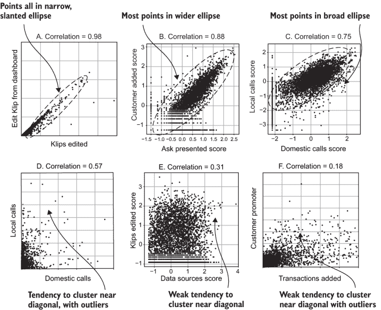

图 6.1 Klipfolio、Broadly 和 Versature 的案例研究，展示了不同程度的正相关

图 6.1A 显示了相关性超过 0.95（确切地说为 0.98）的高度相关指标。在实践中，你永远不会看到两个指标之间有 1.0 的相关性（除非你意外地计算了两次相同的指标），但你可能会看到像图 6.1A 中那样高度相关的指标。这些是 Klipfolio 仪表板编辑器中的紧密相关指标。（Klipfolio 在第一章中介绍，是一种用于企业仪表板的 SaaS 产品。）

当你绘制一组高度相关的观察值时，它们会排列成几乎对角线的线。在 1.0 的相关性下，点将精确地位于对角线上。

超过 0.7 的相关性测量被认为是高度相关。图 6.1B 显示了 Broadly 中客户增加数和展示请求数这对指标，它们的相关性为 0.88。（Broadly 在第一章中介绍，帮助企业管理其在线存在。）图 6.1C 显示了 Versature 的本地通话和国内通话指标分数，这显示了中等程度的高度相关性（0.75）。（Versature 在第一章中介绍，提供基于云的企业通信解决方案。）对于相对高度相关的指标，这些散点图中的点往往位于某种斜向的椭圆或椭圆形中。

大约在 0.3 到 0.7 范围内的相关性测量被认为是适度相关的，并在图 6.1D 和图 6.1E 中展示。图 6.1D 是 0.57 的适度相关性，展示了 Versature 的本地和国内通话的相同两个指标。在这种情况下，指标是在其自然尺度上显示的，而不是作为分数。请注意，指标分数与基础指标的相关性显著更高。正如第五章所述，当指标有偏斜时，这种情况经常发生。

吸收要点 指标分数通常比其自然尺度上的基础指标具有更高的相关性，尤其是在指标严重偏斜时。这是在分析中使用指标分数的另一个重要原因。

图 6.1E 展示了 Klipfolio 的两个具有较弱但仍然适中的相关性（0.31）的指标。这些是数据源数量和编辑的 Klip 数量指标。在适度相关的指标的散点图中，点倾向于靠近对角线，但结构较少。图 6.1F 展示了 Broadly 的两个具有更弱相关性（0.18）的指标。这些是添加交易数量和客户推广者（给出正面评价的客户）数量指标。交易数量更多的企业往往有更多的推广者，但关系较弱，并且有许多异常值：一些观察值在一个指标上很高，而在另一个指标上很低，导致点靠近两个轴。

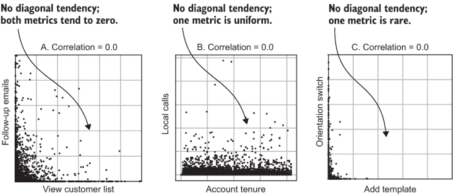

图 6.2 Klipfolio、Broadly 和 Versature 的零相关性案例研究

图 6.2 展示了具有零相关性或接近零相关性的指标示例；这些通常被称为不相关。尽管具有高相关性的指标的散点图通常看起来很相似，但在低相关性和接近零相关性的指标中存在更多多样性。图 6.2A 展示了 Broadly 的两个具有精确 0.0 相关性的指标。这些指标用于查看客户列表和发送跟进邮件。在这种情况下，两者之间没有关系，点倾向于靠近原点（在两个轴上均匀分布）。图 6.2B 展示了 Versature 的本地通话和账户期限指标。账户期限在 x 轴上均匀分布到最大值，但与本地通话次数没有关系。图 6.2C 展示了 Klipfolio 的一个示例，其中添加模板和切换方向的指标之间存在接近零的相关性。添加模板的指标很少见，因此大多数观察值在该轴上的值接近零，并且与另一个指标（方向切换）没有关系。

图 6.3 展示了你在数据中不太可能看到的相关性模式。案例研究中没有可用的示例，因此这些是通过在本书网站上提供的代码（[www.manning.com/books/fighting-churn-with-data](http://www.manning.com/books/fighting-churn-with-data)）和本书的 GitHub 仓库（[`github.com/carl24k/fight-churn/tree/master/data-generation`](https://github.com/carl24k/fight-churn/tree/master/data-generation)）中使用的代码进行模拟数据生成的。图 6.3A 展示了一个示例，其中两个行为指标都位于非零范围内，几乎没有异常值和偏斜，但仍然没有相关性。此类指标的散点图中的点倾向于位于球体中，这是统计学教科书中不相关指标的典型例子。但令人惊讶的是，在客户行为中很少看到这种情况。通常，当两个客户指标几乎没有零值和极端值时，它们之间会有某种程度的相关性。

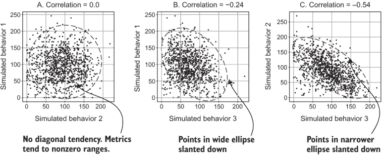

图 6.3 展示了从模拟数据中得出的罕见行为相关性

在图中，6.3B 和 6.3C 分别展示了低度和中度的负相关性示例。与正相关类似，散点图中的点倾向于位于一个椭圆中，但在这个例子中，椭圆是斜向右下方倾斜的，而不是向左上方倾斜。这表明一种行为的增加与另一种行为的减少相关联。

在基于客户事件的计数指标之间观察到负相关性是很少见的，因为通常拥有更多事件的客户会做更多的事情。话虽如此，还有其他类型的更高级的行为指标（参见下一章），这些指标可以与数据集中的其他指标有负相关性。

### 6.1.2 使用 Python 调查相关性

列表 6.1 展示了一个简短的 Python 程序，用于创建散点图和相关性测量，类似于上一节中展示的内容。该程序假设数据集是使用第四章中的代码（特别是列表 4.1、4.2、4.4 和 4.5）创建并保存的。列表 6.1 的大部分内容处理了加载数据集和带有注释的散点图的细节。

相关性是通过 Pandas 函数 `Series.corr` 的单个调用计算的。如果你想知道相关性系数是如何计算的，网上和统计学教科书中有许多资源（例如，搜索“皮尔逊相关性系数”）。散点图是通过调用 Matplotlib 函数 `pyplot.scatter` 创建的。与之前的绘图示例一样，提供详细的标签和注释对于图表非常重要，这样你的商业同事就能知道他们在看什么（并且当你稍后再次查看时，你可以记住你绘制了什么）。

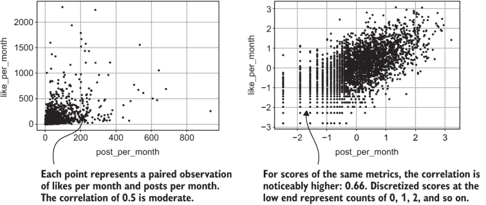

图 6.4 展示了在模拟指标上运行列表 6.1 的结果，显示了每月点赞数和每月发帖数的得分

图 6.4 显示了在默认模拟数据集上运行列表 6.1 的结果。你应该亲自尝试一对度量。假设你已经设置了你的环境（GitHub 仓库中书籍的 README 中的说明，[`github.com/carl24k/fight-churn`](https://github.com/carl24k/fight-churn)），并且你正在使用 Python 包装程序，使用以下命令运行列表 6.1：

```
fight-churn/listings/run_churn_listing.py —chapter 6 —listing 1 —version 1 2
```

这应该会给你一个包含度量 post_per_month 和 like_per_month 之间散点图的 .png 文件，其外观类似于图 6.4。你也可以通过运行带有版本参数的替代版本（最多到 16）来检查不同度量对的结果：

```
—version 3 4 5 6 7 8 9 10 11 12 13 14 15 16 
```

该命令生成了每月帖子数作为得分和自然尺度度量的配对图。这只是从数据集中所有可能的配对图中的一小部分，但它将展示可能的关联模式的一些多样性，以及当度量转换为得分时产生的差异。

列表 6.1 分析度量对的关联性

```
import pandas as pd
import matplotlib.pyplot as plt
import os

def metric_pair_plot(data_set_path):
   assert os.path.isfile(data_set_path),
      '"{}" is not a valid path'.format(data_set_path)                ①
   churn_data = 
      pd.read_csv(data_set_path,index_col=[0,1])                      ②

   met1_series = churn_data[metric1]                                  ③
   met2_series = churn_data[metric2]

   corr = met1_series.corr(met2_series)                               ④

   plt.scatter(met1_series, met2_series, marker='.')                  ⑤

   plt.xlabel(metric1)                                                ⑥
   plt.ylabel(metric2)
   plt.title('Correlation = %.2f' % corr)                             ⑦

   plt.tight_layout()                                                 ⑧
   plt.grid()
   save_name = 
      data_set_path.replace('.csv','_'+metric1+'_vs_'+metric2+'.png')
   plt.savefig(save_name)                                             ⑨
   print('Saving plot to %s' % save_name)
   plt.close()
```

① 检查数据集路径

② 将数据集加载到 DataFrame 中

③ 选择将要分析的度量

④ 计算两个序列之间的相关性

⑤ 从两个序列制作散点图

⑥ 添加轴标签

⑦ 在标题中打印相关测量值

⑧ 调整布局以适应标签和标题

⑨ 将图形保存为 .png 格式

### 6.1.3 理解通过相关矩阵度量集之间的相关性

散点图对于理解你感兴趣的度量对之间的关系很有用，但它们是调查大量度量对之间相关性的低效方式。这是因为如果你有相当数量的度量，组合的数量会大得多（对于数学爱好者，对于 N 个度量，有 N × (N - 1) / 2 种组合，如后面所示）。你将在下一节学习一种更有效的方法来查看数据集中的大量相关性；这被称为相关矩阵。矩阵是一个表格（数据），其中所有条目都是数字，相关矩阵是数据集中所有相关性的表格。也就是说，相关矩阵中的每个条目都是两个度量之间的相关系数。

定义：相关矩阵是数据集中所有度量之间的成对相关系数的表格。

图 6.5 展示了从简单数据集中创建相关矩阵的示例。该数据集模拟了五个度量，即每月事件（点赞、阅读、回复、发送和撰写）的计数，在一个消息应用中。这些度量被转换为分数，因为这样可以显示更多的相关性。每一对度量都有自己的关系，可以通过散点图和单独的相关计算来研究。为了在一个单一矩阵中显示所有相关性，度量被放置在表格的行和列中（相同的顺序）。每一对度量之间的相关性被输入到表格中该对度量的交叉点上。这样，每个相关性都可以在单个表格中查找。

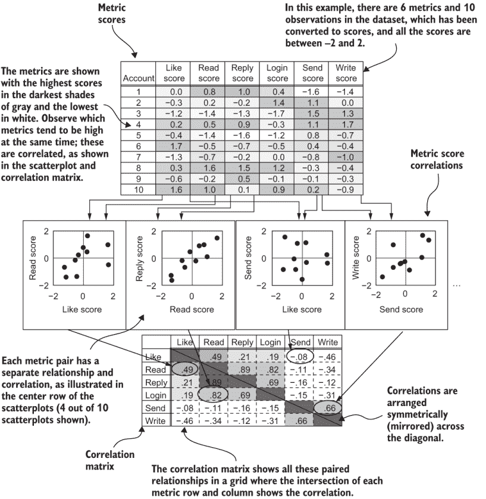

图 6.5 一个相关矩阵（底部）总结了数据集中所有度量之间的成对相关性（顶部）。

注意：相关矩阵通常按值着色，因为这样可以更容易地通过视觉识别高和低相关性；着色相关矩阵通常被称为热图。

本书中的相关矩阵是灰度图，因此可以打印，但我建议在其他所有情况下（无论是自己的分析还是向同事展示）都使用全色热图。

因为度量位于相关矩阵的行和列中，所以对于每一对度量，矩阵中都有两个交叉点。这些交叉点在从左上角到右下角穿过矩阵的对角线两侧是对称的。有两种处理这种冗余的方法：显示每个条目两次，或者省略一半的矩阵。最常见的方法是显示每个条目两次；因此，相关矩阵在对角线上是对称的。这可以更容易地找到你想要的关联，因为无论你从行还是从列开始，你都能以相同速度找到条目。另一种方法是省略对角线以上或以下的一半矩阵。这会导致更干净的外观，更适合演示。此外，每个度量在相关矩阵中都有一个与自身的交叉点，并且这个交叉点位于矩阵的对角线上，因为度量在行和列中的顺序是相同的。

根据定义，每个度量与其自身的相关性为 1.0。尽管这个信息没有用，但对于涉及相关矩阵的算法来说在数学上是必要的。但在演示中显示矩阵中的对角线 1.0 可能会分散注意力，因此可以省略。

### 6.1.4 案例研究相关矩阵

图 6.6 展示了 Klipfolio 案例研究中的相关矩阵，以热图的形式呈现。大约有 70 个指标，它们被排序以显示不同类型指标之间高度相关的关联。有六个高度相关的指标组。最大的单个组包括使用产品最常见方式的指标。还有五个其他较小的指标组，它们与产品的其他方面相关，有些指标与任何其他指标的相关性不强。这种结构相当典型，尽管并不总是有这么多定义良好的组。产生这种顺序的技术将在列表 6.4 中展示。

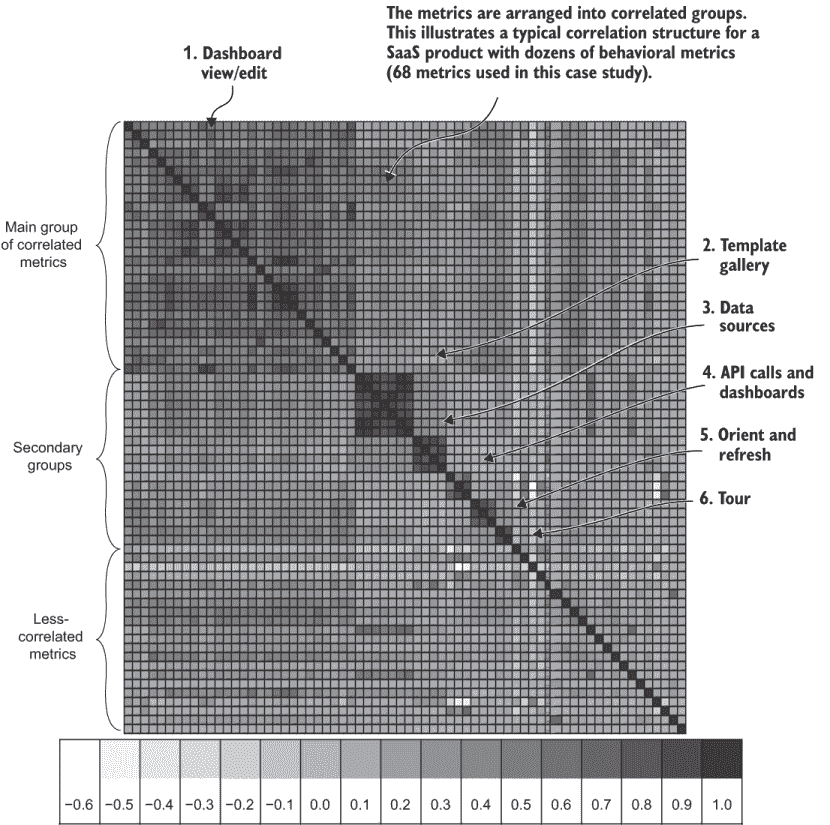

图 6.6 Klipfolio 的指标相关性，按顺序显示高度相关的关联

图 6.7 展示了 Klipfolio 案例研究中的相关矩阵，指标按字母顺序排列。这些指标与图 6.6 中的指标相同；只是顺序不同。图 6.6 中组织良好的矩阵比图 6.7 中按字母顺序排列的矩阵结构更明显。但像图 6.7 这样的结构是你第一次查看热图（列表 6.2）时更有可能看到的。指标的字母顺序揭示了一个结构，其中以相同单词开头的指标通常相关。尽管如此，还有很多例外，因此相关组不像图 6.6 中那样明显。

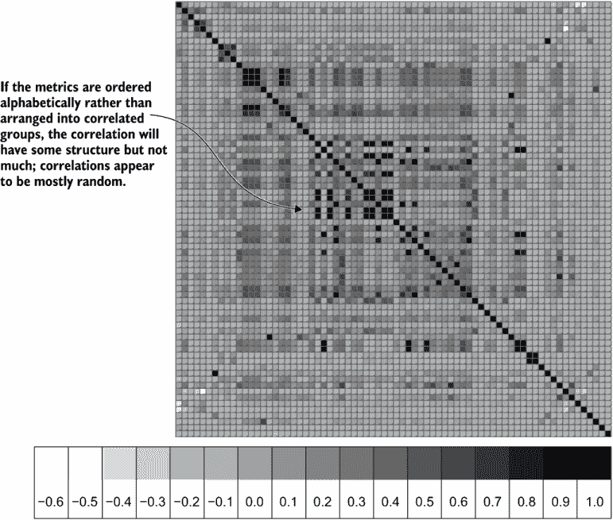

图 6.7 Klipfolio 的相关矩阵，显示按字母顺序排列的指标

### 6.1.5 在 Python 中计算相关矩阵

列表 6.2 是一个简短的 Python 程序，用于创建如图 6.6 和 6.7 所示的相关矩阵。在模拟数据集上运行列表 6.2 的结果如图 6.8 所示。该程序假设使用第四章中的代码创建并保存了一个数据集。回想一下，这个数据集是一个表格，每行有一个客户的观察结果，每列有一个指标。列表 6.1 的大部分内容处理加载数据集和保存结果的细节。格式化将在后面描述的免费电子表格中进行。

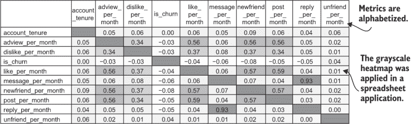

图 6.8 在模拟数据集上运行列表 6.2 的结果

在列表 6.2 中，通过调用 Pandas `Dataframe.corr`函数计算相关矩阵。请注意，列表 6.2 并不试图创建如图 6.6 和 6.7 中的示例那样的热图图像；该函数在将相关矩阵数据保存到逗号分隔的(.csv)文件后停止。这样做的原因是在 Python 中为大量指标制作热图并不实用。如果有超过 15 到 20 个指标，热图图像必须非常大，或者指标名称和相关性值太小而无法阅读（参见图 6.6 和 6.7 中的示例）。

TIP 在静态图像中探索大型相关性热图并不实用。你绝对应该仔细检查相关性热图，但通常在电子表格应用程序中查看它更容易。固定指标名称的行和列，使矩阵可滚动，并使用条件格式化添加热图颜色。对于演示，你可以导出各种格式版本。

列表 6.2 在 Python 中计算数据集的相关矩阵

```
import pandas as pd
import os

def dataset_correlation_matrix(data_set_path):

   assert os.path.isfile(data_set_path),
      '"{}" is not a valid path'.format(data_set_path)                   ①
   churn_data = 
      pd.read_csv(data_set_path,index_col=[0,1])                         ②

   churn_data = 
      churn_data.reindex(sorted(churn_data.columns), axis=1)             ③

   corr_df = churn_data.corr()                                           ④
   save_name = data_set_path.replace('.csv', '_correlation_matrix.csv') 
   corr_df.to_csv(save_name)                                             ⑤
   print('Saved correlation matrix to' + save_name)
```

① 检查路径

② 将数据集加载到 DataFrame 中并设置索引

③ 按字母顺序排序列

④ 使用 Dataframe.corr 函数计算相关矩阵

⑤ 以 .csv 格式保存相关矩阵

你应该运行列表 6.2 并确认它在你自己的数据集上给出相似的结果。如果你正在使用包装程序来运行列表，到现在你应该知道这意味着将命令行参数更改为 `—chapter` `6` `—listing` `2`。程序将数据保存为 .csv 文件（其位置将由包装程序打印出来）。

## 6.2 平均行为指标组

假设你有 5 或 10 个客户行为，其中指标中度到高度相关。你该怎么办？处理高度相关指标的基础技术是将相关指标的得分平均在一起。

### 6.2.1 为什么你要平均相关指标得分

在客户流失分析和客户细分中单独处理多个相关指标存在两个相互关联的问题：

+   你在两个不同的群体分析中观察到的客户流失关系在整合意义上是没有的，因为无法理解不同群体在不同指标上的客户是如何相互关联的。如果一个特定客户在一个指标上位于第三个群体，而在另一个相关活动中位于第六个群体，这意味着什么？将它们平均在一起是一种处理方法，这将在下面解释。

+   信息过载来自于查看过多的指标。记住，行为指标通常不衡量直接导致客户流失或保留的东西。更常见的是，你的行为指标仅与客户流失相关。给定与客户流失相关的大量指标（但不是因果），无法知道哪些指标和事件最重要。

在将相关指标得分平均后，它们在客户细分中的客户流失分析中通常更容易使用。正如上一章所解释的，将许多客户合并成群体以形成群体，可以通过平均掉影响行为的个体情况来显示指标对客户流失的影响。同样，将一组指标的平均值进一步减少随机变化，使客户流失与一系列行为之间的基本关系更加清晰。

将不同的指标分数平均在一起意味着什么？记住，不同的指标通常意味着完全不同的事物，比如登录和编辑文档或观看视频并点赞。将登录和编辑平均在一起有意义吗？因为可能编辑的次数会比登录的次数多，这会导致不平衡。将内容的观看和点赞平均在一起有意义吗？观看的次数可能会比点赞的次数多，所以这样的平均可能没有意义。如果不同的指标有货币价值或时间这样的单位，问题会更严重。在电信的背景下，总通话时长和超额费用的平均值意味着什么？实际上，这根本不是问题；这是将指标转换为分数的另一个优势。

**总结**：因为每个指标分数衡量的是客户相对于平均水平的地位，所以将不同类型指标的分数平均在一起是可以的。

当使用原始单位时，如果这些指标指的是不同的事物，将不同类型的指标平均在一起是没有意义的。但使用分数时则没有问题：平均分数描述了这些不同指标所关联的整体活动区域。如果某人在使用 SaaS 产品的登录和编辑方面都高于平均水平，那么称他们为整体上高于平均水平的用户是公平的。如果某人在流媒体视频产品的观看和点赞方面低于平均水平，那么将他们视为整体上低于平均水平的用户是有意义的。如果某人在电信产品中的通话次数低于平均水平，而在超额费用方面高于平均水平，如果你平均这些分数，他们只是一个普通用户。

事实上，一组指标的平均分数通常比单独的分数更有用。这是因为不同的指标提供了不同的方式来观察同一活动区域，它们可以相互替代。如果一个客户没有使用某个特定的产品功能，而是使用了一个相关的功能，平均分数会捕捉到这两种情况。如果你只依赖单一指标，你可能会错过某些客户的某些活动。如果一个客户在一个指标上得分高而在另一个指标上得分低，在一个客户流失群体中他们可能属于低风险群体，而在另一个群体中则属于高风险群体。通过将这两个指标的平均值结合起来，你可以得到一个更全面的总体活动图景。

### 6.2.2 使用权重矩阵（加载矩阵）平均分数

将相关度量指标分组求平均值是一个简单的概念，但实现起来有点棘手，因为你可能要对许多指标和观测值进行此类操作。你将使用一种技术，在权重矩阵中编码组，以跟踪哪些指标属于哪些组以及形成平均值所需的权重。回想一下，矩阵只是一个所有条目都是数字的表格。在这个上下文中，权重意味着乘法因子，1/n，需要将总和转换为平均值。这个权重矩阵被称为加载矩阵。

定义：加载矩阵是一个表格，用于应用权重到度量指标上，以便形成平均值。

加载矩阵不仅跟踪每个组中的度量指标，还提供了平均计算的高效实现（下一节将详细介绍）。我将通过一个只有少量度量指标的示例来引导你。对于像示例这样的玩具问题，这项技术可能看起来过于复杂，但它可以很好地扩展到数十个甚至数百个度量指标和大型数据集。

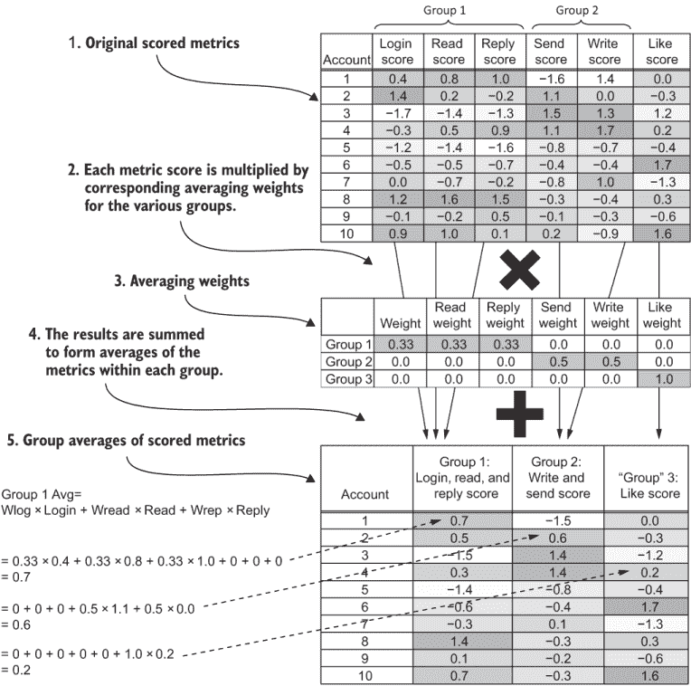

图 6.9 使用权重矩阵将相关度量指标分组求平均的过程

图 6.9 演示了对于具有 10 个观测值和 6 个度量指标的小数据集的平均值技术，继续图 6.5 的示例。以下是它是如何工作的：

1.  登录、阅读和回复事件的度量指标被合并到一个组中，因为它们高度相关。发送和写入的度量指标被合并到另一个组中，而点赞的度量指标则保持不变。这些决策是由检查小的相关矩阵驱动的。（在本章的后面部分，你将学习如何自动在具有大量度量指标的数据集中发现组。）

1.  加载矩阵的定义形状是度量指标的数量乘以组的数量（例如，三乘以五）。在示例中，权重矩阵显示组按行排列，度量指标按列排列；在实践中，通常以另一种方式存储（度量指标按行排列，组按列排列），但下一节将详细介绍。

1.  每个组的行都包含用于从适当的度量指标形成平均值的权重，以及其他组的零值。形成平均值的权重是组中度量指标数量的倒数：

    +   对于对应于第 1 组的行，登录、阅读和回复三个列中的权重均为 1/3（0.33），其他列中的权重为零。为了形成第 1 组，将 0.33 的权重应用于登录、阅读和回复事件的得分。对于其他度量指标，其位置显示为零，表示这些指标在第 1 组中未使用。

    +   对于对应于第 2 组的行，写入和发送两个列中的权重为 1/2（0.5），其他列中的权重为零。

    +   对于对应于第 3 组（点赞）的行，权重列中有一个 1。

1.  为了计算组平均值，每个账户的指标乘以每个组的权重，然后将结果相加。

1.  结果之和是每个组的平均值。

### 6.2.3 加载矩阵案例研究

图 6.10 显示了为模拟社交网络数据创建的加载矩阵。创建了两个组：

+   广告查看、点赞和帖子的指标组：最常见的三个指标

+   消息和回复的指标组

如果你查看图 6.8 中的相关矩阵，你可以很容易地让自己相信这些组中的指标彼此之间以及与其他指标的相关性很高，而与其他指标的相关性较低。（自动发现组的正式方法将在本章后面介绍。）

在这一点上，我必须提醒你注意图 6.10 的一个你预料不到的特征：实际加载矩阵中的权重略高于 1/N，其中 N 是该组中的指标数量。

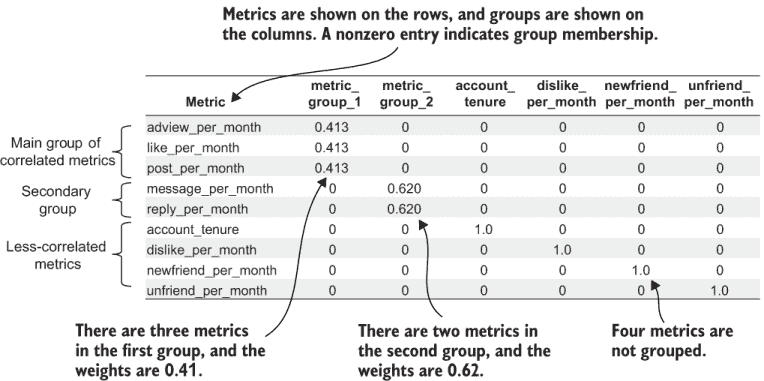

图 6.10 模拟案例研究的加载矩阵

加载矩阵仍然从相关分数中形成平均值，但权重略高于 1/N。我之前没有提到这个细节，因为其含义相同，并且当用 1/*N*权重解释时，概念更清晰。对于三个指标组，权重是 0.41 而不是 0.33；对于两个指标组，权重是 0.62 而不是 0.5。推理的细节在 6.3.3 节中解释（这与调整组合分数的标准差有关）。

图 6.11 显示了 Klipfolio 案例研究中创建的实际加载矩阵。现在矩阵以指标为行，组为列显示；这是图 6.9 中视图的转置。（图 6.9 展示了转置的加载矩阵，以便权重在视觉上与数据列对齐，用于说明目的。）将指标排列在行中，将组排列在列中的原因在图 6.11 中很清楚：通常指标比组多得多，因此这样阅读更容易。将指标沿行排列也是平均计算的正确方向，下一节将展示这一点。

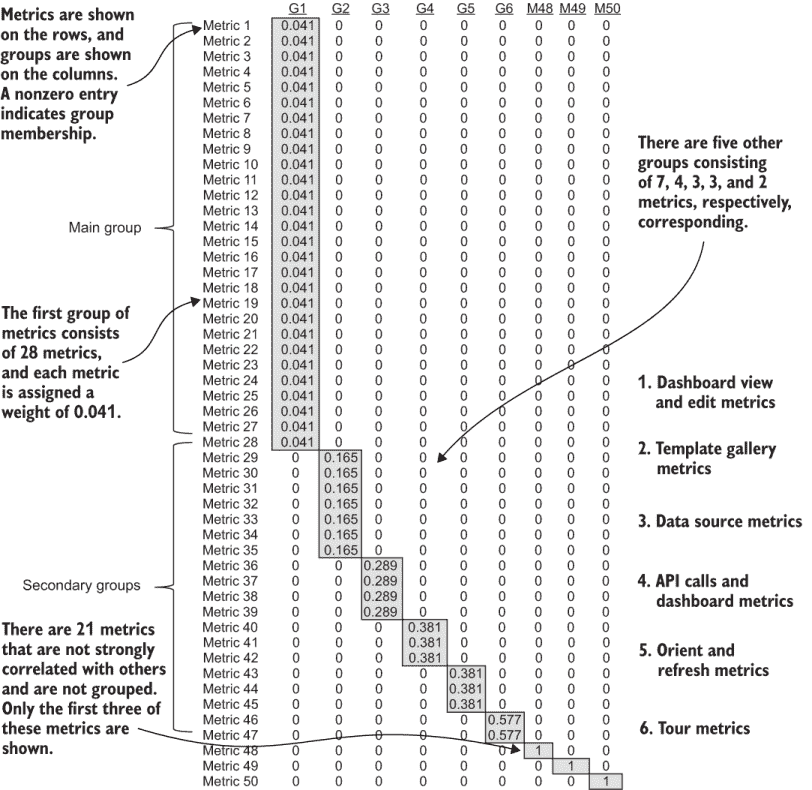

图 6.11 Klipfolio 案例研究的加载矩阵

在图中，你可以看到平均权重也不完全是 1/*N*：第一个指标组包含 28 个指标，因此每个指标分配的权重为 0.041，但 1/28 = 0.0357。还有五个其他组，每个组包含不到 10 个指标，它们在矩阵中的加权条目略高于 1/N。还有一些几十个其他指标，它们的相关性不足以被分组；这些在图 6.11 中只部分显示。

### 6.2.4 在 Python 中应用加载矩阵

列表 6.3 展示了将加载矩阵应用于数据集以计算平均分数的代码。列表的大部分内容是常规的数据集读取和结果保存，这次还读取了一个加载矩阵（由列表 6.4 创建）。列表的核心是以下这一行：

```
grouped_ndarray = np.matmul(ndarray_2group, load_mat_ndarray)
```

那一行执行了数据与加载矩阵的矩阵乘法，这完成了上一节中描述的平均计算。

定义 矩阵乘法是对两个矩阵进行操作以创建结果矩阵的过程。结果矩阵的第一行中的每个元素是通过将第一个矩阵的第一行与第二个矩阵的每一列相乘，然后对每一列的结果进行求和得到的；结果矩阵的第二行是通过将第一个矩阵的第二行与第二个矩阵的所有列依次相乘并求和得到的，依此类推。

注意，为了使矩阵乘法生效，第一个矩阵的列数必须等于第二个矩阵的行数；当加载矩阵的行包含指标时，这个条件得到满足。

列表 6.3 在 Python 中将加载矩阵应用于数据集

```
import pandas as pd
import numpy as np
import os

def apply_metric_groups(data_set_path):
   score_save_path=
      data_set_path.replace('.csv','_scores.csv')                 ①
   assert os.path.isfile(score_save_path),
      'Run listing 5.3 to save metric scores first'
   score_data = 
     pd.read_csv(score_save_path,index_col=[0,1])                 ②

   data_2group = score_data.drop('is_churn',axis=1)               ③

   load_mat_path = data_set_path.replace('.csv', '_load_mat.csv')
   assert os.path.isfile(load_mat_path),
      'Run listing 6.4 to save a loading matrix first'
   load_mat_df = pd.read_csv(load_mat_path, index_col=0)          ④

   load_mat_ndarray = load_mat_df.to_numpy()                      ⑤

   ndarray_2group = 
      data_2group[load_mat_df.index.values].to_numpy()            ⑥
   grouped_ndarray = 
      np.matmul(ndarray_2group, load_mat_ndarray)                 ⑦
   churn_data_grouped
      = pd.DataFrame(grouped_ndarray,
                     columns=load_mat_df.columns.values, 
                     index=score_data.index)                      ⑧

   churn_data_grouped['is_churn'] = 
      score_data['is_churn']                                      ⑨
   save_path = data_set_path.replace('.csv', '_groupscore.csv')
   churn_data_grouped.to_csv(save_path,header=True)               ⑩
   print('Saved grouped data to ' + save_path)
```

① 列表 5.3 保存了这些分数数据。

② 将文件重新加载到 DataFrame 中并设置索引

③ 现在移除了流失指示器；这返回了一个副本。

④ 从文件中读取加载矩阵

⑤ 将加载矩阵转换为 NumPy 数组

⑥ 将数据列重新排列为加载矩阵行的顺序

⑦ 使用 ndarray 上的矩阵乘法进行分组

⑧ 从 ndarray 结果创建 DataFrame

⑨ 添加回流失状态列

⑩ 保存结果

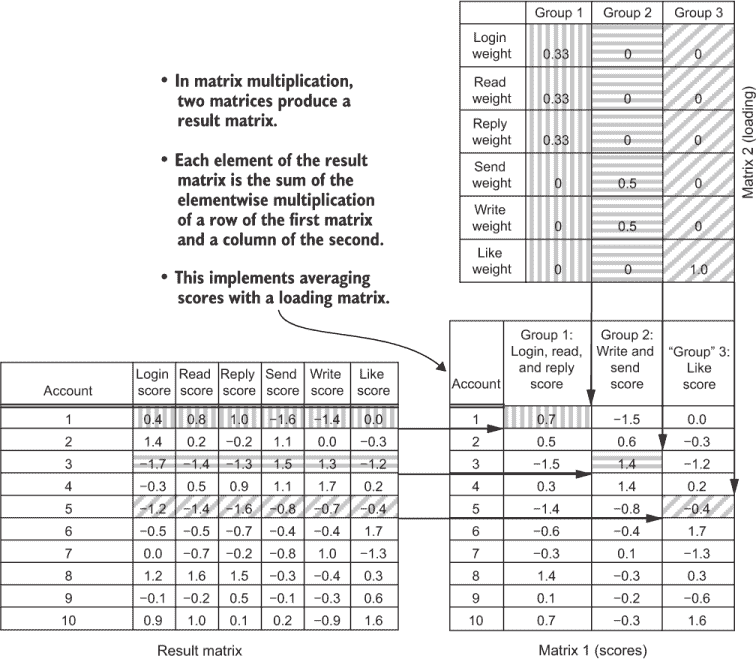

图 6.12 矩阵乘法是通过加载矩阵实现分数平均的操作。

图 6.12 阐述了矩阵乘法定义的平均分数。这个定义可能听起来很复杂，但它正是你在上一节中学到的：

+   账户 1 的第一个平均分数是通过将数据中的账户 1 行与第一列的第一组加载权重相乘并求和得到的。

+   账户 1 的第二个平均分数是通过将数据中的账户 1 行与第二列的第二组加载权重相乘得到的，依此类推。

矩阵乘法是将加载权重应用于计算大型数据集中任何数量指标和组的平均值的简洁且高效的方法。

到目前为止，你可能想要在数据上运行列表 6.3 并查看结果，但你可能想知道加载矩阵是从哪里得到的。你确实应该这样想，因为我首先在教你如何使用加载矩阵，以便你理解其目的。下一节将向你展示如何从头创建一个加载矩阵。请耐心等待：你将看到一些案例研究，以进一步证明使用加载矩阵分组指标的有用性，然后在第 6.3 节中，你将学习如何运行代码来创建一个加载矩阵。然后你可以回来，使用你创建的加载矩阵运行列表 6.3。

### 6.2.5 指标组平均分数的客户流失群体分析

一旦将相关指标分组为相关行为的平均分数，就可以对平均组进行客户流失分析。为此不需要编写新的代码。步骤如下：

1.  使用列表 6.3 并将分组分数保存到新的数据集文件中。它将具有与原始数据集相同的名称，但现在以`group_scores`结尾。

1.  使用列表 5.1 通过替换新文件名和变量名`metric_group_1`（对于第一组）以及依此类推（详情请见列表 6.3）从分组数据集中创建一个客户群体图。

图 6.13 展示了 Klipfolio 主要指标组查看和编辑仪表板的结果。这是在图 6.6 的相关矩阵和图 6.11 的加载矩阵中首次展示的组。在第五章中介绍了客户流失群体分析，因此我将简要总结其主要特点。每个点代表一个由分数的十分之一定义的客户群体。垂直轴显示群体中的客户流失率，以相对比例表示，图表底部固定为零。如果一个群体距离图表底部的距离是另一个群体的两倍，那么它的流失率也是另一个群体的两倍。

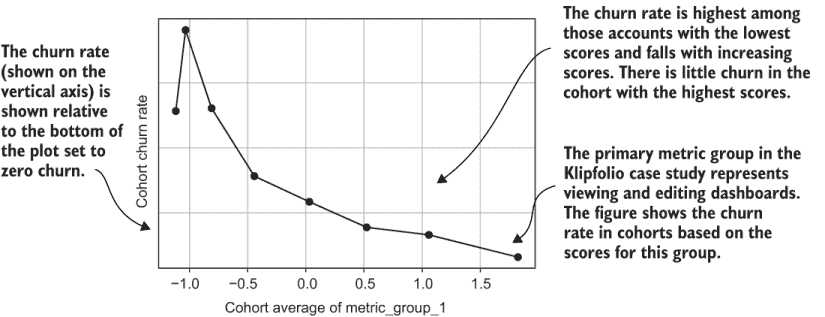

图 6.13 Klipfolio 主要指标组流失率客户群体分析

图 6.13 显示，Klipfolio 主要指标组的平均分数与客户流失之间存在强大的关联：平均分数最高的群体流失率低于较低群体流失率的十分之一。这种关系的另一个优点是流失率持续下降，直到最高群体。这个分数组的平均数与流失率的关系比上一章图 5.6 中展示的个别行为与流失率的关系更强。

图 6.14 展示了针对 Broadly 主要指标组分数的平均值的流失客户分析示例。所有相关指标组都与向系统中添加客户和交易、请求客户进行评论和推荐以及这些请求的结果相关。基于此分数组的客户分析是另一个与流失有强烈关系的例子。在这种情况下，顶级客户组的流失率大约是底层客户组流失率的七分之一。

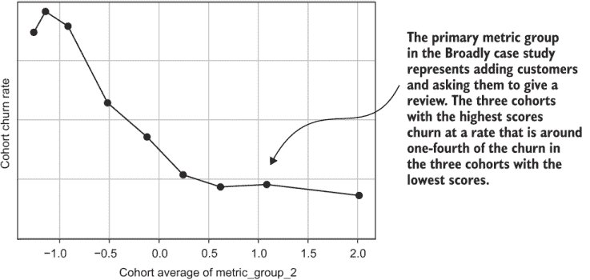

图 6.14 广泛的指标组分数的流失客户分析

图 6.13 和 6.14 都表明，在实际案例研究中，指标分数组的平均值往往比单个指标更能有效地显示与流失的关系。你自己的结果可能不会显示如此强烈的结果，但仍然最好是分析相关度量的组。这是因为它避免了过多指标的信息过载。

**要点** 对于相关度量，最好使用平均分数而不是单个指标来分析流失客户。

## 6.3 发现相关度量的组

你现在知道如何计算指标组的平均值，但还有最后一件事：我没有解释如何在大型数据集中找到这些指标组。对于只有几个指标的简单情况，你可能可以通过查看相关矩阵来识别指标组。这就是图 6.5 和 6.9 例子中使用的小数据集的情况。但是，如果你有一个包含数十个指标（或更多）的相关矩阵，如案例研究（图 6.7）中的那样，那就不会那么简单了。幸运的是，有一个标准算法可以为你完成这项工作。

### 6.3.1 按聚类相关性分组度量

你用来寻找相关度量组的方法被称为聚类算法。

**定义** 聚类算法是基于数据自动将相似项目分组在一起的过程。

技术上，聚类算法的流程与度量项目之间相似性的测量方法是不同的。为了将度量分组在一起，你会使用相关系数；相关系数越高，度量越相似。你将使用的聚类过程称为层次聚类。

**定义** 层次聚类是一种贪婪的、聚合的聚类算法：

+   聚合意味着算法通过自下而上的方式组合相似的项目。从仅两个相似元素开始形成组，随着算法的进行，更多元素被添加到形成更大的相似项目组。

+   贪婪意味着算法通过选择最相似的两个元素来工作，在这两个元素被分组后，每个阶段都会将下一个最相似的项目分组。

+   在这个上下文中，“分层”指的是贪婪聚合意味着项目之间存在结构或层次。有两个最相似的项目，然后是下一个最相似的项目，依此类推。

图 6.15 展示了分层聚类，继续展示图 6.5、6.9 和 6.12 中所示的小数据集示例。算法从图 6.5 中的相关系数矩阵开始，找到任何两个指标之间的最高相关系数（图 6.15.1）。两个最相关的指标形成一个分组：这是阅读和回复消息指标之间的 0.93 相关系数。

分层聚类算法的第二步（图 6.15.2）是创建一个加载矩阵，将原始数据集转换为一个新的数据集，其中两个最相关的指标被分组，但所有其他指标仍然保持独立。这个加载矩阵比指标少一个列，因为只有一个指标分组。算法的第三步（图 6.15 中没有展示）是使用新的加载矩阵创建数据集的新版本，按照上一节中展示的程序进行。分层聚类算法的第四步（图 6.15.3）是在前两个指标分组后计算数据的新相关系数矩阵。

拥有一个新的相关系数矩阵后，算法开始新的迭代：寻找下一个最高的相关系数。在示例中，下一个最高的相关系数是登录指标与上一步创建的阅读和回复分组指标的 0.77 相关系数（图 6.15.3）。在加载矩阵的新迭代中，将登录指标添加到第一个分组（图 6.15.4），从而得到新的数据集和相关系数矩阵版本（图 6.15.5），依此类推。

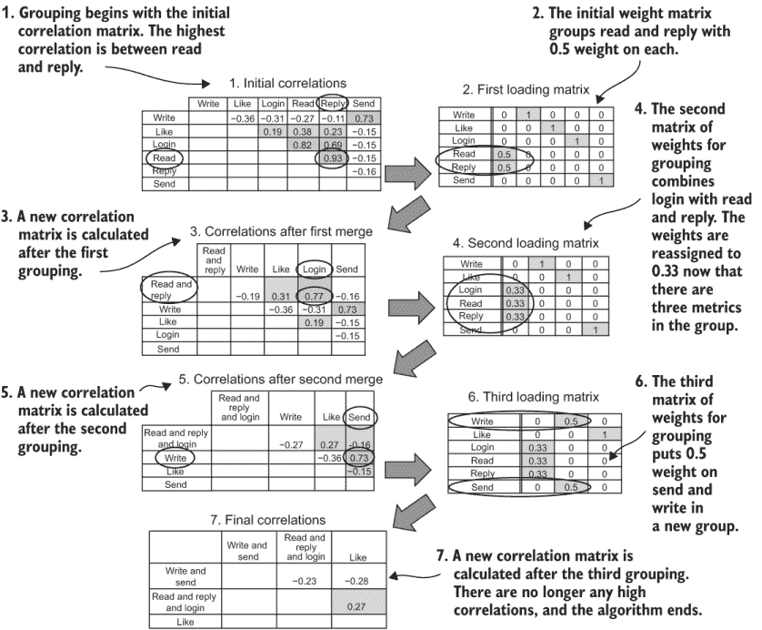

图 6.15 通过聚类相关系数发现指标分组

当足够多的指标被分组，以至于没有剩下任何中等或高度相关的指标时，算法停止。算法应该停止尝试分组的精确相关系数水平是一个控制分组水平的参数。通常，你将阈值设置在中等的相关系数水平。我在进行的分析中通常将其设置为 0.5 或 0.6。我将在第 6.3.3 节中提供更多关于如何设置此参数的细节。现在，让我们看看图 6.15 中的示例是如何结束的。登录、阅读和回复在一个分组中，而写作和发送在另一个分组中（图 6.15.6），剩余的相关系数（图 6.15.7）都在-0.28 和 0.27 之间；这些只是弱相关，因此算法停止。算法的结果是产生图 6.9 中首次展示的加载矩阵。（图 6.15.6 是图 6.9 中加载矩阵的转置和稍微重新排序的版本。）

回顾一下，以下是层次聚类算法在每一步的工作方式：

1.  识别最高的相关性。

1.  更新加载矩阵，将两个最相关的元素分组在一起。

1.  使用原始分数数据集的加载矩阵创建一个新的分组数据集。

1.  计算一个新的相关性矩阵。

1.  重复步骤 1 至 4，直到所有剩余的相关性都低于一个预定的阈值。

大数据集的层次聚类和相关性计算的效率

你可能会在其他参考资料中读到层次聚类效率低下且不适合大数据。但这里有一个关键的区别：即使你的数据很大，相关性矩阵也不是大数据！影响层次聚类运行时间的大小是数据集中度量指标的数量，而不是客户（观察）的数量。每一步都会减少一个度量指标的数量，所以最大迭代次数是度量指标的数量。对于更大的数据集使用层次聚类没有问题。

如果你确实有很多客户（很多观察），你会发现计算相关性矩阵实际上是成本最高的步骤。如果你的数据真的很大，你应该考虑优化或近似相关性矩阵的计算，而不用担心层次聚类。正如你将在下一节中看到的，你实际上只计算一次相关性矩阵。我对算法的解释将其呈现为在每一步重新计算相关性矩阵，但在实践中，每一步的相关性矩阵可以通过加载矩阵推导出来（这个细节超出了本书的范围）。

### 6.3.2 Python 中的聚类相关性

现在你已经知道了基于相关性矩阵的层次聚类是如何工作的，你就可以学习实现它的 Python 代码了。列表 6.4 展示了程序。剧透：代码使用了预写的开源包函数来实现聚类。列表 6.4 主要关注准备输入使其为包函数做好准备，并接收包函数的输出，将这些输出转换为所需的加载矩阵。整个过程被分解为三个步骤，这些步骤在列表 6.4 中是独立的函数。我将逐一解释它们。

列表 6.4 中的实际聚类是在函数`find_correlation_clusters`中进行的。SciPy 在`scipy.cluster.hierarchy`包中提供了一个层次聚类的实现，包含两个函数：`linkage`和`fcluster`。`linkage`函数是真正执行工作的函数。它可以在原始数据集上工作，也可以在数据集中点之间距离的预计算测量上工作，这就是列表 6.4 中发生的情况。但`linkage`函数的结果实际上不是聚类；相反，`linkage`函数返回数据点之间距离关系结构的描述，这就是算法名称中提到的距离层次。

我不会解释层次表示的细节，因为还有一个函数可以将结果传递进去以获取你想要的聚类：那就是`fcluster`。`fcluster`函数接受来自`linkage`的层次描述和一个截止阈值来形成聚类。在我们的情况下，这个阈值是我们认为高度相关的相关截止值。`fcluster`的结果是以`numpy` `Series`形式为原始项目分配的聚类。

列表 6.4：在 Python 中查找指标分组和创建加载矩阵

```
import pandas as pd
import numpy as np
import os
from collections import Counter
from scipy.cluster.hierarchy import linkage, fcluster              ①
from scipy.spatial.distance import squareform                      ①

def find_correlation_clusters(corr,corr_thresh):
   dissimilarity = 1.0 − *c*orr                                      ②

   diss_thresh = 1.0 − *c*orr_thresh                                 ③

   hierarchy = linkage(squareform(dissimilarity), 
                       method='single')                            ④

   labels = fcluster(hierarchy, diss_thresh, 
                     criterion='distance')                         ⑤
   return labels

def relabel_clusters(labels,metric_columns):
   cluster_count = Counter(labels)                                 ⑥

   cluster_order = {cluster[0]: idx for idx, cluster in            ⑦
                    enumerate(cluster_count.most_common())}

   relabeled_clusters = [cluster_order[l] 
                           for l in labels]                        ⑧

   relabeled_count = Counter(relabeled_clusters)                   ⑨

   labeled_column_df = pd.DataFrame({'group': relabeled_clusters, 
      'column': metric_columns}).sort_values( 
      ['group', 'column'], ascending=[True, True])                 ⑩
   return labeled_column_df, relabeled_count

def make_load_matrix(labeled_column_df,metric_columns,relabeled_count, corr):
   load_mat = np.zeros((len(metric_columns), 
      len(relabeled_count)))                                       ⑪

   for row in labeled_column_df.iterrows():                        ⑫
      orig_col = metric_columns.index(row[1][1])
       if relabeled_count[row[1][0]]>1:                            ⑬
            load_mat[orig_col, row[1][0]] = 1.0/(np.sqrt(corr) * 
               float(relabeled_count[row[1][0]])  )                ⑭
       else:
            load_mat[orig_col, row[1][0]] = 1.0                    ⑮

    is_group = load_mat.astype(bool).sum(axis=0) > 1               ⑯
    column_names=
       ['metric_group_{}'.format(d + 1) 
          if is_group[d]                                           ⑰
          else 
             labeled_column_df.loc[                                ⑱
                labeled_column_df['group']==d,'column'].item()
                                    for d in range(0, load_mat.shape[1])]
   loadmat_df = pd.DataFrame(load_mat, 
      index=metric_columns, columns=column_names)                  ⑲

   loadmat_df['name'] = loadmat_df.index                           ⑳

   sort_cols = list(loadmat_df.columns.values)                     ㉑

   sort_order = [False] * loadmat_df.shape[1]                      ㉒

   sort_order[-1] = True                                           ㉓

   loadmat_df = loadmat_df.sort_values(sort_cols, 
      ascending=sort_order)                                        ㉔

   loadmat_df = loadmat_df.drop('name', axis=1)                    ㉕
   return loadmat_df

def find_metric_groups(data_set_path,group_corr_thresh=0.5):
   score_save_path=
      data_set_path.replace('.csv','_scores.csv')                  ㉖
   assert os.path.isfile(score_save_path),
      'You must run listing 5.3 to save metric scores first'
   score_data = pd.read_csv(score_save_path,index_col=[0,1])
   score_data.drop('is_churn',axis=1,inplace=True)
   metric_columns = list(score_data.columns.values)                ㉗

   labels =                                                        ㉘
      find_correlation_clusters(score_data.corr(), group_corr_thresh)
   labeled_column_df, relabeled_count = 
      relabel_clusters(labels,metric_columns)
   loadmat_df = make_load_matrix(labeled_column_df, metric_columns, 
      relabeled_count,group_corr_thresh)
   save_path = data_set_path.replace('.csv', '_load_mat.csv')
   print('saving loadings to ' + save_path)
   loadmat_df.to_csv(save_path)

   group_lists=                                                    ㉙
      ['|'.join(labeled_column_df[labeled_column_df['group']==g]['column'])
                    for g in set(labeled_column_df['group'])]
   save_path = data_set_path.replace('.csv', '_groupmets.csv')
   print('saving metric groups to ' + save_path)
   pd.DataFrame(group_lists,                                       ㉚
               index=loadmat_df.columns.values,
                columns=['metrics']).to_csv(save_path)
```

① 导入执行层次聚类的 SciPy 函数

② 聚类使用不相似性，因此反转相关矩阵

③ 阈值参数也被反转。

④ 计算指标之间相对距离的顺序

⑤ 根据层次和阈值确定分组

⑥ 计算每个聚类中元素的数量

⑦ 找到聚类成员数的顺序

⑧ 按顺序创建聚类标签的新序列

⑨ 从重新标记的聚类中创建新的计数

⑩ 创建一个 DataFrame，列出每个指标的分组

⑪ 创建一个空的（零）矩阵来存储平均权重

⑫ 在加载矩阵中输入每个指标的权重

⑬ 选择加载矩阵中是分组的那些列

⑭ 使用方程 6.3（第 6.3.3 节）获取权重

⑮ 对于未分组的指标，权重简单地是 1.0。

⑯ 创建一个布尔序列，显示哪些列是分组

⑰ 为分组创建名称`metric_group_n`

⑱ 否则，将原始指标名称输入列表中。

⑲ 从加权矩阵创建 DataFrame

⑳ 从 DataFrame 索引列创建名称列

㉑ 创建一个列的列表，该列表按行排序

㉒ 按降序排序大部分列

㉓ 按升序排序名称列

㉔ 按顺序排序加载矩阵以进行可解释性

㉕ 删除名称列，因为它用于排序

㉖ 重新加载列表 5.3 创建的分数

㉗ 创建原始指标列的列表

㉘ 计算分组分配

㉙ 创建一个列出每个组中指标的列

㉚ 保存加载矩阵

将数据输入到聚类算法中并不那么困难。最重要的细节是`linkage`函数是编写来处理基于差异性的数据的，但到目前为止，我们考虑的是相关性，这是一种相似性的度量。解决方案如下：你从 1.0 减去相关性，那么原本是相似性度量的指标现在变成了差异性度量。这意味着什么？考虑：最高的相关性（最大的相似性）是 1.0，减去 1.0 后变成了 0.0。现在这是两个项目之间最不相似的情况。从相关性角度来说最不相似的是-1.0，但减去 1.0 后变成了 2.0（1 - -1 = 1 + 1 = 2）；现在这是最不相似的情况。在用于 SciPy 函数`linkage`和`fcluster`之前，相关矩阵和相关阈值都通过逐元素减去 1.0 进行转换。这就是运行聚类算法所需的所有准备工作。

很遗憾，聚类算法的结果并不完全符合你的期望。你想要的是一个加载矩阵，并且按照特定的顺序排列。当最大的组别排在最前面，并且按照大小顺序降序排列时，这最容易理解。`fcluster`函数返回了分配给各个组的聚类，但它们在大小上并没有任何特定的顺序。在调用`linkage`和`fcluster`之后，后处理有两个主要部分：首先是排序和重新标记聚类，然后是创建加载矩阵。

列表 6.4 中的第二个函数`relabel_clusters`是后处理的第一步。为了排序和重新标记聚类，使用 Python 的`set`来找到唯一的聚类，并使用 Python 的`Counter`来统计`fcluster`结果中每个标签的出现次数。`Counter`对象还有一个实用函数，可以按最常见到最不常见的顺序遍历元素：这就是函数`Counter.most_common`。在找到重新标记的聚类名称后，结果被保存在一个新的标签`Series`中。创建了两个对象来表示聚类以供后续使用：一个两列的`DataFrame`，列出了原始指标及其所在的组，以及一个新创建的`Counter`对象，用于统计新的标签。

列表 6.4 中的第三个函数`make_load_matrix`是最后一步。加载矩阵初始化为正确大小的零`ndarray`：行数是指标的数目，列数是组的数目。`relabel_clusters`函数创建了一个`DataFrame`，列出了每个指标及其组。这被用来遍历指标，并在加载矩阵中相应的组下填充适当的条目。这个`ndarray`被转换成一个`DataFrame`，使用指标名称作为索引。

加载矩阵中每个条目的权重是通过将 1.0 除以组内元素的数量来计算的：代码中是`relabeled_count[row[1][0]]`中的组内元素数量。`relabeled_count`是一个计数器对象，`row[1][0]`选择适当的元素。但在权重计算的分子中还有一个额外的项，即用于聚类的相关阈值平方根：`np.sqrt(corr)`。正如我在 6.2.3 节首次向您展示加载矩阵时提到的，这个额外项使得权重略高于 1/N。我将在解释完算法后，在下节解释这个选择的原因。

函数`make_load_matrix`的其余部分按照使读取最简单的顺序对加载矩阵进行排序：最大的组首先，然后是第二大的，依此类推。在每个组内，指标按名称的字母顺序排序。这是通过使用 Pandas 的`DataFrame.sort_values`和适当的参数来实现的。`sort_values`函数接受一个要排序的列的列表和一个布尔值列表，表示每一列是升序还是降序。指标的名称被添加为一个列（之前是索引），并且所有列都被用于排序。组权重的列首先，并按降序排序，而名称的列最后，并按升序排序。因为表示组成员的列是从大到小排序的，这实现了加载矩阵的期望排序：从大到小分组，并在每个组内按字母顺序排序。此外，列被标记为一个标签（metric_goup_x，其中*x*是组的编号，或者当组只是一个单一指标时，就是指标名称）。

执行所有步骤的主要函数位于列表 6.4 的末尾：`find_metric_groups`。此函数加载一个数据集，然后调用算法中的其他步骤。`find_metric_groups`返回加载矩阵作为结果，默认选项是将它保存到.csv 文件中。请注意，程序只输出一个简单的确认信息，表明它正在运行以及结果保存的位置。


图 6.16 运行列表 6.4 在默认模拟数据集上的结果（图 6.10 的再现）

如果你使用模拟数据，那么打开文件在电子表格或文本编辑器中时，得到的加载矩阵应该看起来像图 6.16 中的那样。存在两组度量指标：一组是相互关联的最常见行为（包括发帖、查看广告和点赞），另一组是阅读和回复消息的小组。账户时长、不喜欢和取消好友关系的度量指标相关性不足，因此它们没有进入任何一组。请注意，权重不是标准的平均值的 1/*N*，而是使用方程 6.3（第 6.3.2 节）进行修改，以使平均值本身作为分数。

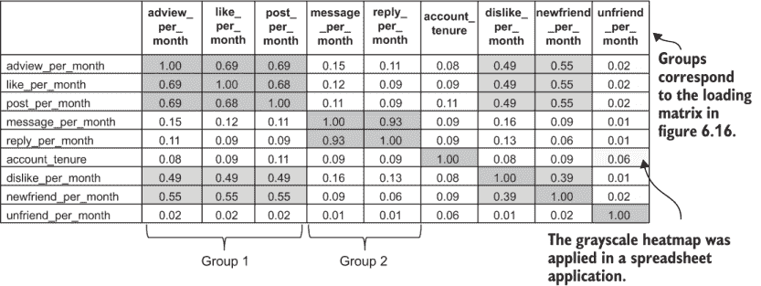

图 6.17 模拟数据的有序相关矩阵

现在你有了加载矩阵，你可以生成一个有序相关矩阵，如图 6.6 所示。对于模拟数据集，这个结果在图 6.17 中显示。从有序相关热图中，你可以看到两组之间的高相关性以及其他度量指标之间的低相关性。图 6.17 是通过运行列表 6.5 并在电子表格中对结果数据进行格式化创建的。

列表 6.5 显示，创建有序矩阵的代码几乎与创建常规相关矩阵的代码完全相同。唯一的区别是，在计算相关矩阵之前，你读取加载矩阵并按加载矩阵中度量指标的顺序重新排序数据集列。重新排序是一行代码，因为你已经费心将加载矩阵正确地按组排序：只需重用那个顺序即可。

列表 6.5 创建有序相关矩阵

```
import pandas as pd
import os

def ordered_correlation_matrix(data_set_path):

   churn_data = pd.read_csv(                                           ①
      data_set_path.replace('.csv','_scores.csv'),index_col=[0,1])

   load_mat_df = pd.read_csv(                                          
      data_set_path.replace(‘.csv’, ‘_load_mat.csv’), index_col=0)
   churn_data=churn_data[load_mat_df.index.values]                     ②

   corr = churn_data.corr()                                            ③

   save_name =                                                         ④
      data_set_path.replace('.csv', '_ordered_correlation_matrix.csv')
   corr.to_csv(save_name)
   print('Saved correlation matrix to ' + save_name)
```

① 加载保存的分数

② 将数据集列重新排序为加载矩阵行的顺序

③ 计算相关矩阵

④ 保存结果

### 6.3.3 加载使分数平均值为分数的矩阵权重

关于加载矩阵的一个技术细节我还没有解释，这与加载矩阵中应该使用的确切权重有关。上一节提到的要点是，你不需要在加载矩阵中使用精确的 1/N 权重。我第一次教你加载矩阵的概念时说 1/*N*，是为了让你更容易地理解这个概念，而这个概念并没有改变：加载矩阵的转换仍然代表对度量指标分数取平均值。但权重需要稍作调整。

1/N 是当平均中的所有数字具有相同的尺度或单位时，制作等权重的平均值的正确权重。但与分数不同，因为分数没有自然单位。（注意，如果你不喜欢方程，这将是跳到下一节的好时机，在你阅读了要点之后。）

要点：加载矩阵中的权重将略高于 1/N，但意义仍然是相同的。

使用 1/*N*权重来平均分数的问题在于，这样得到的指标分数的平均值就不再是分数了。这意味着什么？分数被定义为指标的缩放版本，并且具有一些特定的属性：平均（均值）分数是 0，分数的标准差是 1。这些事实使得分数具有可比性。

好消息是，如果你用任何等权重的平均分，这些分数的平均值（平均数）仍然会是零。但坏消息是，这些分数平均的标准差不会是 1，而是小于 1.0。具体小多少取决于你平均了多少个指标以及它们的相关性如何。但我会教你们如何修改加载矩阵中的权重，使得平均分数具有（几乎）应有的 1.0 标准差。这种调整使得平均数仍然是一个分数，无论你平均了多少个指标。

首先，我需要提醒你们什么是方差：方差是标准差的平方。当标准差是 1 时，方差也是 1（因为 1 的平方是 1）。在接下来的内容中，我用σ表示标准差，用σ²表示方差；这是希腊字母 sigma，在数学书中，它是表示标准差和方差的常用字母。关于标准差的一个特点是，当你对指标或其他变量求和时，每个指标都有自己的标准差，求和的标准差不会保持不变；它们会根据权重进行缩放求和。这个关系用方差来理解更容易，这就是为什么我要提醒你们什么是方差。我会展示如何得到具有各自方差的指标求和的方差。假设你通过乘以每个指标的权重来形成一个平均数，加权指标和的方差由方程 6.1 给出：

| σ²(*wx*[1] + *wx*[2] + ... + *wx*[*N*]) = *Σ*[*ij*] *w*²*σ*[*i*] *σ*[*j*] *c*[*ij*] | 方程 6.1 |
| --- | --- |

在方程 6.1 中，符号*Σ*[*ij*] ... 是所有不同元素索引的求和的简写（在代码中，这就像在双层循环中添加求和一样）。方程 6.1 所说的就是，指标求和的方差是所有标准差成对乘积的求和，乘以成对的相关系数。这有点复杂，但希望这能让你明白为什么指标求和的标准差只有在某些条件下才会是 1。现在，我将展示这些条件是什么。然而，首先，我将做一些简化：

+   在我们的情况下，所有标准差都是 1，因为它们都是分数，所以项*σ*[*i/j*]消失。

+   你不知道所有指标之间的相关性 *c*[*ij*] 究竟是什么，但你确实知道这一点：如果你将它们分组在一起取平均值，那么它们高度相关。它们可能具有至少与你的相关性阈值一样高的个体相关性。因此，而不是使用 *c*[*ij*] ，我用 *c*[*thresh*] 来近似它，这是形成聚类的阈值。

通过这些简化，方差方程 6.1 大约在方程 6.2 中给出：

| σ²(*wx*[1] + *wx*[2] + ... + *wx*[*N*]) ≈ *N*² *w*² | 方程 6.2 |
| --- | --- |

在成对相关性的和中存在 *N*² 项；这就是方程 6.2 中的 *N*² 的来源。方程 6.2 是一个近似值，因为相关性实际上并不是 *c*[*thresh*]（最明显的是每个指标的自我相关性都是 1），但它足够接近。下一步是解方程以找到使方差（以及标准差）等于 1 的权重 w。结果在方程 6.3 中给出：

| 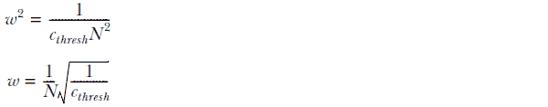 | 方程 6.3 |
| --- | --- |

在所有方程之后，有一个相当直接的变化：在加载矩阵中使平均值时，不再使用 1/*N* 作为权重，而是将 1/*N* 乘以一个额外的因子，这个因子是 1/ *c*[*thresh*] 的平方根，这是聚类算法中使用的相关性阈值。因为相关性阈值小于 1（通常在 0.5 或 0.6 左右），所以它的倒数大于 1（通常在 1 和 2 之间），平方根不会改变这一点。因此，你用来平均分数的权重将比标准平均中的 1/*N* 略大。这是一个技术细节，但通过这种调整保持你的平均分数作为分数，会使你的分析更容易解释，因为你的指标分数的标准差仍然为 1。

### 6.3.4 运行指标分组和分组队列分析列表

现在你有了加载矩阵（通过运行列表 6.4 生成），你可以返回并运行列表 6.3。列表 6.3 将加载矩阵应用于分数数据集以创建分组平均分数。请注意，运行列表 6.3 只会产生一行输出，显示它在运行，而实际结果将是一个新的 .csv 数据集（结果打印出保存的位置）。图 6.18 显示了运行列表 6.3 保存的数据集的小样本。列标题显示的是组号，而不是指标名称。

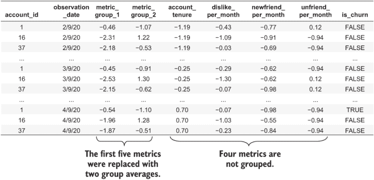

图 6.18 运行列表 6.3 的默认模拟数据集的结果

当你有一个分组指标的数据集时，也是尝试使用分组指标进行队列分析（列表 5.1）的时候了。这是在第 6.2.4 节中演示的技术。为此，你可以通过将`—chapter` `5` `—listing` `1` `—version` `3`参数传递给 Python 包装程序来运行列表 5.1 的另一个版本。图 6.19 显示了在模拟数据中的主要相关指标组上运行队列分析的结果。分组指标显示出与客户流失的强烈关系。（因为数据集是随机模拟的，你的结果可能不会完全相同。）

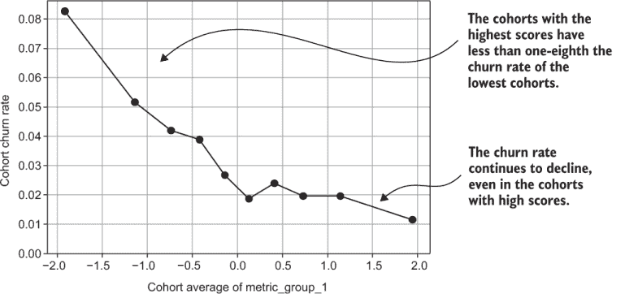

图 6.19 运行列表 5.1 在默认模拟数据集生成的第一组指标上的结果

### 6.3.5 选择聚类相关性阈值

在解释聚类算法时，我提到了聚类相关性的阈值；回想一下，这个阈值决定了何时将指标分组在一起或分开。我没有详细解释如何设置这个参数，因为我想让你在学习技术细节之前先了解分组是如何工作的。但聚类阈值参数对于行为分组成功至关重要。如果你将此参数设置得太低，那么你可能会得到一个包含所有指标的大组，即使它们之间并不都相关。而且，如果你将相关性阈值参数设置得太高，那么强相关的指标仍然不会分组，你最终会得到（几乎）与最初指标数量一样多的组数。

不幸的是，没有一种适用于所有情况的最佳值，所以你可能需要做一些实验。我也不建议任何分组度量来评估你的选择。相反，我建议你了解业务（或者从了解业务的人那里了解）以及相关性矩阵告诉你关于业务的信息。然后问问自己：分组在一起的指标是否合理？如果将更多指标分组在一起或分开，分组是否更有意义和/或更有用？

例如，假设你知道一些指标通常与一个产品特性或内容区域相关联。在这种情况下，合理地调整参数（如果需要的话）将它们分成自己的组或防止它们被分开是有道理的。（这是一个使用你的先验知识来指导分析的一个例子。）另一方面，如果相关性矩阵告诉你某些活动高度相关，但你的某些商业同事希望你将它们分开以形成更多的组，这可能只是他们的一厢情愿的想法或办公室政治在影响决策。使用你的先验知识来帮助决定关键时刻，但不要忽视你分析的结果！

在设置我自己的分析中的相关性水平时，以下是一些我常用的经验法则：

+   你通常应该将相关阈值参数设置在中等或较高相关性的水平，范围在 0.4 到 0.7 之间——永远不要设置在非常高的或很低的相关性，也就是说，不要超过 0.8 或低于 0.3。

+   通常最好从较低的水平开始，阈值值为 0.5 或更低，并将所有（或大多数）度量指标分组到一个大组中：

    如果每个度量指标都与其他至少几个度量指标有高相关性（> 0.7），那么你可能应该将它们全部分组到一个组中。这可能适用于没有广泛特征或内容的较小产品，或者如果你跟踪的事件变化不大。

+   在 0.5 到 0.7 的范围内使用简单的二分搜索：如果 0.5 看起来太低，尝试 0.6（0.5 和 0.7 之间的一半）。如果 0.6 仍然看起来太低，尝试 0.65（0.6 和 0.7 之间的一半）；如果 0.6 太高，尝试 0.55，以此类推。你很快就会耗尽可能的范围，并感觉到最佳值所在的位置。

    使用手动搜索，而不是算法——我从未找到一种始终有效的停止标准。无论如何，搜索通常不会花费很长时间。

+   使用彩色编码的相关热图和美学标准（真诚地）：对角线上的正方形图案看起来井然有序（见图 6.7），但如果你在任何方向上走得太远（相关性过多或过少），就会破坏对称性。一旦你做了几次，这就会变得相当直观。

+   最大的挑战是，有时相关性的微小变化会对分组产生不成比例的影响。这意味着阈值在 0.01 或 0.02 的小幅度变化偶尔会对组数产生重大影响，可能从只有 1 或 2 组变为 5 或 10 组。

    在我的研究中，我编写了一个分组算法的替代版本，如列表 6.4 所示，其中参数是生成的块数。它使用算法搜索来返回具有所需组数的分组。这是一个很好的编程练习，我留给你们去尝试；如果你因为对微小变化的反应不规则而难以找到相关阈值，这将很有帮助。但只有在你已经足够实验，对选择什么有很好的想法时，你才能使用这种方法（选择块数）。

在第八章中，当我们查看统计数据时，你会了解更多关于这个主题的内容。当你使用统计分析时，如果你使用过高的相关性阈值错误地分组行为，可能会出现一些真正的问题。但，到目前为止，你已经知道足够的信息来处理你自己的数据。

## 6.4 向商业人士解释相关度量组

本章展示了以下内容：

+   理解你度量指标之间相关性的重要性

+   如何发现相关度量指标组

+   如何对度量组平均分数进行客户流失分析

本章相当技术性，你可能学到了一些新术语：相关性矩阵、加载矩阵和聚类（更不用说真正的怪物——层次聚类了！）。现在让我们深呼吸，思考如何向你的业务同事解释所有这些。如果你只是出于教育目的阅读这本书，这不是问题，但如果你试图在商业环境中应用这些技术，这是一个非常大的问题。

本章中的概念并不难理解，但有很多技术细节和术语。我建议从简单开始，并确保用你自己的公司实际数据解释每个概念。你可以省略完成所有事情的具体细节，只传达最终结果。

吸收要点：你的任务是尽可能让业务同事远离术语。所以不要试图用术语让他们印象深刻！相反，尝试将事情简化为共同语言。

这是我通常在第一次向商业听众展示案例研究结果时的处理方式：

1.  在开始之前，询问业务人士他们了解多少统计学知识。你应该根据他们的知识水平调整你的解释。以下内容，我将假设一个平均的业务用户群体，他们没有接受过任何统计学培训，但也不害怕统计学。

1.  通过展示你从业务数据中创建的散点图（如图 6.1 所示）来教（或提醒）每个人什么是相关性。使用“相关性”这个词与业务人士交流是可以的（也是必要的），但你可能应该放弃“系数”这个词。即使是非数学人士，当他们知道哪些产品行为是一起发生的时，也容易理解相关性。向他们展示散点图和相关性数字，是在给他们提供一种全新的方式来看待他们已经知道的东西。

1.  展示热图，组织（在你形成组之后）并且格式上与图 6.5 中的类似（除了使用全色）。我尽量避免在商人面前使用“矩阵”这个词，所以我通常只是将其描述为相关性热图，而不是相关性矩阵。在他们了解了单个相关性之后，他们通常也能理解热图所展示的整体模式。同样，这是展示他们已经直觉上知道的东西，所以他们喜欢（而且热图看起来很酷！）。

1.  向他们展示形成这些组的指标，既可以通过在热图中概述它们（见图 6.5），也可以通过给他们列出每个组中包含哪些指标。你需要解释这些组是自动形成的，并且基于数据（他们必须理解你并没有选择这些组）。不要试图解释算法的细节。但如果组里有一些相对技术性的人，你可以提到它是一个聚类算法：

    他们可能会对此进行辩论，这是有益的。如果他们以合理的方式挑战分组，你可能想尝试调整第 6.3.4 节中描述的阈值。但确保他们意识到你不能（或者至少不应该）手动选择组。

1.  向他们展示对分组指标进行的群体行为分析，以及它与对单个指标（如果有很多的话，则仅选择单个指标）的群体分析如何比较。

就这样！你已经完成了。特别是，你不需要与商业人士讨论以下术语或算法：

+   矩阵（无论是相关矩阵还是加载矩阵）

+   加载

+   矩阵乘法

+   聚类（甚至更糟，层次聚类）

层次聚类与主成分分析比较

如果你学习过统计学或数据科学，你很可能学过一种称为主成分分析（PCA）的技术。PCA 与层次聚类（HC）相似，因为它通过乘以加载矩阵来减少数据集中指标的数量。但 PCA 的加载矩阵是通过与 HC 不同的技术推导出来的。PCA 具有统计学家喜欢的某些良好属性，但由于它对客户流失不太有用，并且它产生的加载对于大多数人来说太难解释，所以它超出了本书的范围。然而，HC 和 PCA 产生的加载有很多共同之处，如图所示。

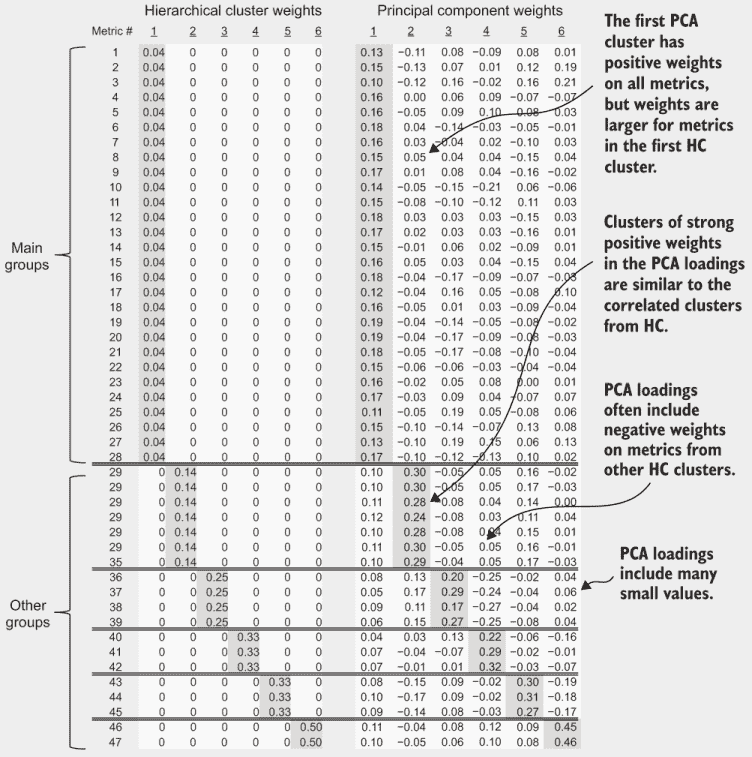

层次聚类（HC）和主成分分析（PCA）的加载矩阵比较

此图是通过计算 PCA 加载矩阵并按与 HC 组相同的顺序排列指标创建的。当在相同的数据上运行时，HC 发现的块通常与 PCA 加载矩阵中高权重的聚类相似。你可以看到，这两个算法正在捕捉数据的一些相同的基本属性。但是，PCA 加载矩阵既有正权数也有负权数，加载矩阵中的每个条目都不为零。如何解释 PCA 加载矩阵的细节超出了本书的范围。

（继续）

一个需要注意的重要点是，由于 PCA 矩阵既有负权重也有正权重，因此得到的分组度量不仅仅是平均值，还包括（评分）度量之间的差异。两个订阅度量之间的差异意味着一个派生度量，当其中一个度量值高而另一个低时，该度量值高，而平均或总度量值在两个度量值都高时才高。评分订阅度量之间的差异不太直观，但可能很重要，因为它们衡量一个行为超过另一个行为多少。例如，如果你对一个电信服务中的本地通话和国际通话进行了评分度量，差异将显示订阅者是更多还是更少地进行国际或本地通话。这样的差异对于理解参与度可能很重要，但由具有负条目的载荷矩阵产生的评分度量之间的差异很难解释。下一章将教授捕捉行为之间差异信息的技术，以便商业人员和数据人员都能容易理解。

## 摘要

+   正相关是指当一个度量值高时，总是与另一个度量值高相关联，或者当一个度量值增加时，总是与另一个度量值增加相关联。

+   负相关是指当一个度量值增加时，与另一个度量值减少相关联。在事件客户行为度量中，负相关很少见。

+   相关系数是介于-1 和 1 之间的相关性的统计度量，其中 1 表示完美的正相关，而-1 表示完美的负相关。

+   相关系数衡量两个度量值之间关系的一致性，但对关系所暗示的比率不敏感。等价地，度量的单位或刻度对相关性无关紧要。

+   成对度量散点图是可视化数据中单个相关性的好方法，但可能存在太多对需要查看。

+   相关系数矩阵是一个包含数据集中所有成对相关系数的表格，并且是探索大量相关性的有效方式。

+   当度量值高度相关时，你可以通过平均相关度量的分数来提高客户流失分析。

+   载荷矩阵是一个用于平均度量的权重的表格。它在平均分数的计算中使用。

+   载荷矩阵与数据集的矩阵乘法是执行分组度量平均的有效操作。

+   在使用载荷矩阵平均度量分数后，你可以使用平均分数进行客户流失的行为群体分析。这通常比单个度量给出更强的结果。

+   聚类是指根据数据中相关项之间的相似度度量将它们分组在一起。

+   层次聚类是一种可以将相关度量分组在一起的算法。该算法在相关性的阈值处停止，以便所有高度相关的度量都被分组在一起。

+   运行层次聚类后，您使用结果创建一个负载矩阵。
