# 7 使用高级度量标准细分客户

本章涵盖

+   由其他度量标准的比率构成的度量标准

+   将行为作为总量的百分比来衡量的度量标准

+   显示行为随时间变化的度量标准

+   从长周期到短周期的公制转换，反之亦然

+   多用户账户的度量标准

+   选择要使用的比率

你已经通过事件和订阅衍生出的度量标准了解了大量关于理解流失的知识。你已经看到，简单的行为测量对于细分可能面临流失风险且参与度水平不同的客户非常有用。但你同时也看到了简单行为度量标准的一些局限性。

许多简单的度量标准是相关的，相关性产生的原因是拥有大量产品相关事件的客户往往也有许多其他事件。相关性使得难以判断哪些类型的行为最重要。这个问题比缺乏细化更深。在本章中，你将了解到度量标准之间的相关性可能会让你误解行为的影响。一个具有负面性质（在从客户那里夺走效用和乐趣的意义上）的行为，当它与提供效用和乐趣的其他行为相关联时，可能会看起来增强了参与度。

此外，你可能对行为之间的关系有所好奇。许多关于流失的常见假设都询问行为组合是否具有大于其部分之和的效果。例如，你可能想知道，对于文档编辑和文件共享应用程序的用户来说，即使他们不分享，创建大量文档是否更好，或者是否更好的做法是用户分享他们所创建的一切，即使他们没有创建很多。另一个尚未解决的问题是在时间上行为的变化是否告诉你任何信息。例如，使用激增是否表明客户正在变得更加投入，或者在他们流失之前进行最后一次狂欢的迹象？如果你认为你在第三章中学到的简单行为度量标准无法回答这些问题，你是正确的。

从本书开头概述的主题来看，本章与图 7.1 中显示的所有领域相关。行为度量标准和流失分析一起呈现，这可以产生关于为减少流失策略对客户进行细分的思想。

在本章中，你将创建一种度量标准，它允许你理解复杂的行为组合，并了解它们对你客户流失和保留情况所传达的信息。我称这种度量标准为比率度量标准。

定义 比率度量标准是指通过将一个度量标准与另一个度量标准的比率计算出的任何客户度量标准；等价地，一个度量标准被另一个度量标准除。

本章的组织结构如下：

+   7.1 节教你主要的比率度量标准技术，并包括几个案例研究来激发其使用并展示典型结果。

+   第 7.2 节教您如何制作从部分到整体的比率指标，这使得比率成为总体的百分比。

+   第 7.3 节涵盖了两个不同时间点的单一指标的比率，这衡量了行为的变化，通常以百分比表示。本节还涵盖了一个衡量客户不活跃时间量的指标。

+   第 7.4 节转向非比率高级指标：本节涵盖了像流失率一样扩展指标测量时间周期。这允许您快速估计指标，使用较短的测量窗口为新客户进行估计，但仍为经验丰富的用户提供更好的估计。

+   第 7.5 节教您如何对多用户系统进行测量（当多个个人共享一个产品的一个订阅或账户时）。

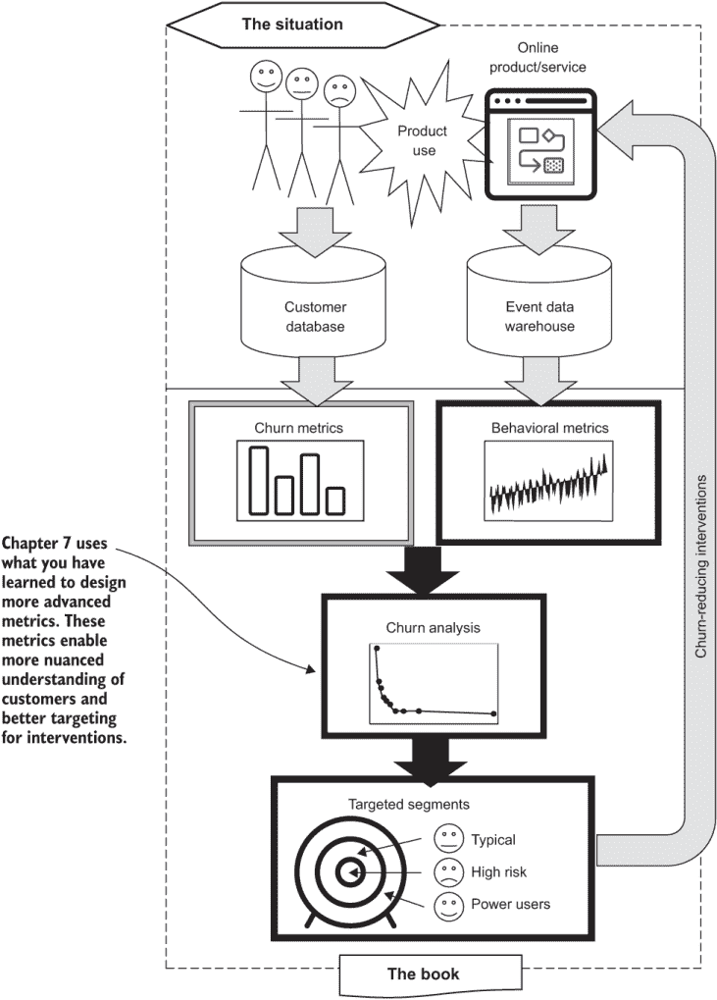

图 7.1 第七章的主题包括行为指标、流失分析以及订阅者细分。

## 7.1 比率指标

您即将学习本书中最重要的单一技术（如果我只选一个的话）：使用其他行为测量的比率指标。这些指标提供了强大且易于理解的客户行为解释。

### 7.1.1 何时使用比率指标及其原因

图 7.2 提供了一个案例研究，说明了何时需要更仔细地观察两个指标之间的关系。该图重现了第五章中 Versature（一家提供集成云通信服务的提供商）的一些群体分析。在图中，支付更高月费的客户流失率相对较低。这个图可能违背了您认为支付更多对客户参与度是坏事的感觉。同时，图 7.2 显示，支付更多与通话次数的增加高度相关——这是您在第六章中学到的分析方法。当然，通话次数多的客户流失率低于通话次数少的客户，这与月度经常性收入（MRR）相比，与流失率的关系更紧密。

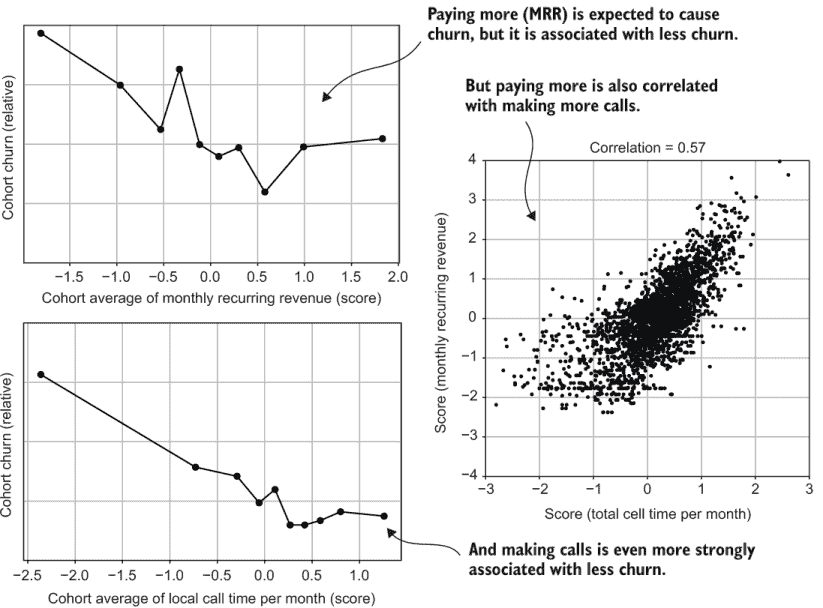

图 7.2 比率指标的案例研究

支付更多（更高的 MRR）看起来像是在减少流失，原因是，通常情况下，支付更多的客户也会进行更多的通话——足以证明支付更高 MRR 的合理性。但是，对于支付更多但通话不足以证明更高 MRR 合理性的客户怎么办？这些客户可能面临的最大流失风险，但在单独查看 MRR 和通话的指标中并未显现。为了找到支付更多但通话不多（并查看他们是否以更高的比率流失）的客户，您需要创建一个第三项指标，以捕捉前两个指标之间的关系：前两个指标的比率。

定义：比率指标是通过取两个其他指标值的比率而制作的指标。新指标中的每个值都是一项指标的值除以另一项指标的值。

在接下来的章节中，我将解释如何计算此类度量以及为什么，并试图说服你这是最好的方法。现在，让我们从结果开始。

如果你取一个客户支付的金额（MRR）并将其除以他们打的电话数量，结果是平均通话成本——这是衡量客户支付的单位成本的一种度量，类似于汽油或牛奶的每加仑或每升价格。不同之处在于，MRR 与通话的比率是一个有效的重复单元成本，而不是合同成本，因为产品不是按通话计费和包装给客户的。

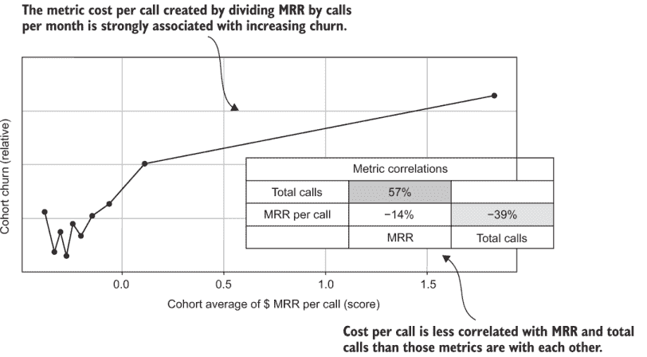

图 7.3 Versature 的按通话成本流失群体分析案例研究

图 7.3 显示了为 Versature 客户执行的按通话成本流失群体分析，使用 MRR 每通话作为度量。这个度量显示了随着度量值的增加，流失率与度量值之间有很强的关系。确实，支付更多的客户流失得更多，但你需要用比率度量来衡量这个结果。图 7.3 还显示了 MRR 每通话度量与创建它的 MRR 和通话度量之间的相关性。MRR 每通话与通话的相关性较弱（负相关），与 MRR 实际上没有相关性。所有这些事实使 MRR 每通话成为理解客户参与和流失的一个很好的度量。在第 7.1.2 节中，你将学习如何计算这样的比率度量，并使用你在整本书中使用的流失模拟数据来练习这样做。

**要点**：从 MRR 与客户实现的一些成果的比率中创建了一个有效的重复单元成本度量。重复单元成本度量通常显示随着单元成本的提高而增加的流失率。相比之下，简单的重复成本度量（MRR）通常显示随着成本的提高而减少的流失率，这是由于与使用产品获得的效用或享受的相关性。

图 7.4 显示了社交网络模拟案例研究中的一个情况，类似于图 7.2 和图 7.3 中的情况。你预计一个度量——每月查看的广告数量——是糟糕的，因为大多数人不喜欢看广告。但是当你运行流失群体分析时，你会发现人们看的广告越多，流失得越少。同时，你会发现查看广告与发帖相关，发帖多的客户流失率低。

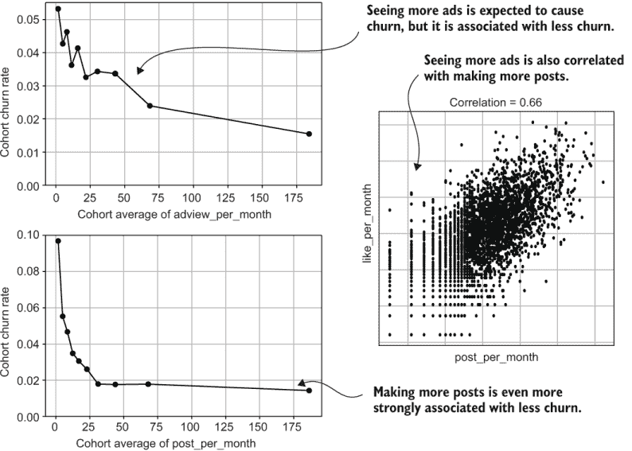

图 7.4 模拟案例研究场景激励比率度量

在进入下一节之前，你应该使用模拟的流失数据以及本书 GitHub 仓库中的代码（[`GitHub.com/carl24k/fight-churn`](https://GitHub.com/carl24k/fight-churn)）重现图 7.4 中的结果。这项任务是本章代码练习的第一步。通过重现图 7.4 中的图表，你可以确认你的数据和度量已经准备好迎接接下来的内容。

你应该在第三章中计算出每月查看的广告和每月发布的帖子度量。如果你当时没有计算这些度量，在按照存储库的 README 文件中解释的设置好环境之后，你可以使用以下命令通过 Python 包装程序计算所有度量：

```
fight-churn/listings/run_churn_listing.py —chapter 3 —listing 3 4 —version 1 2 3 4 5 6 7 8
```

如果你运行了第五章中的列表代码，你应该已经创建了一个类似于图 7.4 所示的每月帖子群体分析。如果没有，你现在可以通过使用参数`—chapter` `5` `—listing` `1`运行 Python 包装程序来完成。要创建一个针对每月查看的广告的新群体分析，你可以通过添加参数`—version` `3`运行列表 5.1 的另一个版本。总的来说，需要添加的参数是`—chapter` `5` `—listing` `1` `—version` `3`。

与第六章（列表 6.1）中重新创建度量对散点图相同。你可以使用参数`—chapter` `6` `—listing` `1` `—version` `2`重新运行 Python 包装程序，以重新创建类似于图 7.4 中的散点图。

### 7.1.2 如何计算比率度量

现在你已经知道了比率度量的定义，是时候深入了解如何计算它了。比率度量的计算通过一小部分示例数据（图 7.5）进行说明。当我提到你将一个度量除以另一个度量时，我是字面意思。你从已经保存在数据库中的两个度量开始。为了计算比率度量，你需要匹配这两个度量，按账户和日期进行匹配；假设你已经在所有相同的日期计算并保存了其他两个度量，如第三章所示。对于每个账户和日期，比率是那个日期和账户的度量值除以相同日期和账户的另一个度量值。这个过程并不复杂，尽管你需要注意以下两个“陷阱”：

+   分母度量（你正在除以的度量）必须大于零。

+   分子度量可以是零，但不应该是负数。到目前为止，我们还没有查看可以取负值的度量，但在第 7.3 节中你会看到一些。如果你从自己的数据中创建度量，比如可以同时为正或负的货币金额之和，你可能已经有一些可以取负值的度量。

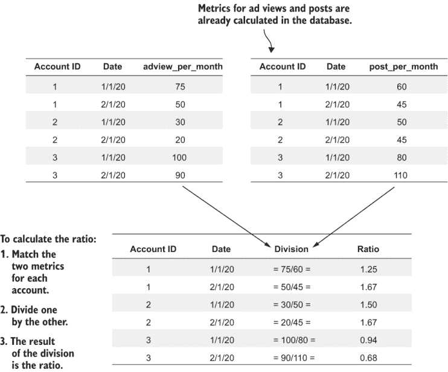

图 7.5 比率度量计算机制

如果比率分母中的度量对一个账户为零，则比率未定义。如果你在任何程序语言中尝试除以零，将会得到错误。而且如果任一度量有时可能是负数，比率在数学上是可行的，但它缺乏两个其他测量值比率的通常意义：一个单位成本或一个事件相对于另一个事件的比率。否则，计算比率相当直接。

列表 7.1 提供了一个简短的 SQL 程序，用于计算比率指标，图 7.6 展示了输出的一小部分。列表 7.1 中显示的简短 SQL 程序还返回了指标的分子和分母，以供说明。否则，列表 7.1 中的计算策略与图 7.5 非常相似：两个常见的表表达式（CTEs）选择将要形成比率的两个指标的值。最后的 `SELECT` 语句是一个左外连接（LEFT OUTER JOIN），其中分母位于左侧。因此，当分母可用时，将计算任何账户的比率指标。让我们先看看图。

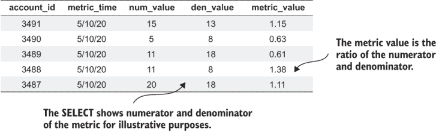

图 7.6 运行列表 7.1 的输出

SQL 使用 `CASE` 语句作为计算的一部分，以防止分母中的零指标。如果您使用第三章中提到的计数指标，您不会存储零，但防止除以零是最佳实践，以防您处理从其他系统导入的指标。当您使用 `CASE` 语句时，零分母指标会产生零比率。该结果将与零分子产生的结果相同，这在数学上是正确的，并产生零。话虽如此，如果您没有存储分子指标的零，您将不会产生比率，但您仍然会在您的流失分析数据集中为任何未获得比率的账户填充零（如第四章所述）。

注意：缺失值或比率的任一指标为零的账户在流失分析数据集中将获得零指标。

您应该运行列表 7.1 并确认您的结果与图 7.6 类似。如果您使用包装程序运行列表，请使用参数 `—chapter` `7` `—listing` `1` 如此操作：

```
fight-churn/listings/run_churn_listing.py —chapter 7 —listing 1 
```

列表 7.1 SQL 比率指标计算

```
WITH num_metric AS (
    SELECT account_id, metric_time, metric_value AS num_value
    FROM metric m INNER JOIN metric_name n ON n.metric_name_id=m.metric_name_id
    AND n.metric_name = 'adview_per_month'                    ①
    AND metric_time BETWEEN '2020-04-01' AND '2020-05-10'
), den_metric AS (
    SELECT account_id, metric_time, metric_value AS den_value
    FROM metric m INNER JOIN metric_name n ON n.metric_name_id=m.metric_name_id
    AND n.metric_name = 'post_per_month'                      ②
    AND metric_time BETWEEN '2020-04-01' 
        AND '2020-05-10'                                      ③
)
SELECT d.account_id, d.metric_time, 
    num_value, den_value,                                     ④
    CASE WHEN den_value > 0                                   ⑤
        THEN COALESCE(num_value,0.0)/den_value                ⑥
        ELSE 0                                                ⑦
    END AS metric_value
FROM den_metric d  LEFT OUTER JOIN num_metric n               ⑧
    ON n.account_id=d.account_id
    AND n.metric_time=d.metric_time;
```

① 选择分子的指标

② 选择分母的指标

③ 匹配分子和分母的日期范围

④ 选择用于说明的分子和分母值

⑤ 当分母不为正数时，比率是未定义的。

⑥ 计算比率；对于零分子进行合并

⑦ 当分母缺失时填充零

⑧ 左外连接（LEFT OUTER JOIN）在分母可用时总是产生结果。

您还需要将结果保存到数据库中以便继续示例，但由于列表 7.1 选择指标的分母和分子以供说明，因此它不适合将指标插入到数据库中。列表框架中的预写 SQL 语句执行此操作：insert_7_1_ratio_metric.sql（与 listing_7_1_ratio_metric.sql 相同，只是在 SQL 文件名中使用 insert 而不是 listing）。要运行为插入结果设计的列表 7.1 版本，请向运行列表的脚本的参数中添加 `—insert` 标志。如果您使用 Python 包装程序运行列表，则命令如下：

```
fight-churn/listings/run_churn_listing.py —chapter 7 —listing 1 —insert
```

该插入显示了它使用的 SQL，但它不会打印任何结果。您应该创建自己的 `SELECT` 语句来验证结果，或者更好的是，运行第三章中的度量标准质量保证查询（列表 3.6）以查看结果的时间总结。这种学习和然后将度量标准插入数据库的模式将在本章中重复：

+   书中展示的列表包括额外的列以供说明之用。

+   如果需要将度量标准保存到数据库中以遵循示例，则存储库中的列表的第二个版本执行插入操作。您可以通过在包装脚本命令中添加 `—insert` 标志来运行它。

+   列表的示例版本路径类似于 listings/chap7/listing_7_，而写入数据库的列表版本路径类似于 listings/chap7/insert_7_。

将新的每篇帖子广告度量标准保存到数据库后，您应该分析其相关性及其与流失率的关系。记住，要运行队列分析，您首先需要使用 SQL 重新导出您的流失率数据集。导出包含您新度量标准（以及您在本章中创建的所有其他度量标准）的数据集的代码显示在列表 7.2 中，这是列表 4.5 的更新版本。

您应该运行列表 7.2 以保存一个新的数据集，该数据集允许您在新指标每篇帖子广告上运行队列分析。如果您不记得列表 7.2 的工作方式，请回顾第四章，特别是列表 4.5；它们是完全相同的。不用担心您还没有创建列表 7.2 中的所有度量标准；您将在本章中创建它们。目前，您未创建的任何度量标准将在数据集中用零填充。

列表 7.2 导出包含第七章度量的数据集

```
WITH observation_params AS                                       ①
(
    SELECT  interval '7' AS metric_period,
    '2020-03-01'::timestamp AS obs_start,
    '2020-05-10'::timestamp AS obs_end
)
SELECT m.account_id, o.observation_date, is_churn,
SUM(CASE WHEN metric_name_id=0 THEN metric_value ELSE 0 END)
    AS like_per_month,
SUM(CASE WHEN metric_name_id=1 THEN metric_value ELSE 0 END)
    AS newfriend_per_month,
SUM(CASE WHEN metric_name_id=2 THEN metric_value ELSE 0 END)
    AS post_per_month,
SUM(CASE WHEN metric_name_id=3 THEN metric_value ELSE 0 END)
    AS adview_per_month,
SUM(CASE WHEN metric_name_id=4 THEN metric_value ELSE 0 END)
    AS dislike_per_month,
SUM(CASE WHEN metric_name_id=5 THEN metric_value ELSE 0 END)
    AS unfriend_per_month,
SUM(CASE WHEN metric_name_id=6 THEN metric_value ELSE 0 END)
    AS message_per_month,
SUM(CASE WHEN metric_name_id=7 THEN metric_value ELSE 0 END)
    AS reply_per_month,
SUM(CASE WHEN metric_name_id=8 THEN metric_value ELSE 0 END)
    AS account_tenure,
SUM(CASE WHEN metric_name_id=21 THEN metric_value ELSE 0 END) 
    AS adview_per_post,                                          ②
SUM(CASE WHEN metric_name_id=22 THEN metric_value ELSE 0 END)
    AS reply_per_message,
SUM(CASE WHEN metric_name_id=23 THEN metric_value ELSE 0 END)
    AS like_per_post,
SUM(CASE WHEN metric_name_id=24 THEN metric_value ELSE 0 END)
    AS post_per_message,
SUM(CASE WHEN metric_name_id=25 THEN metric_value ELSE 0 END)
    AS unfriend_per_newfriend,
SUM(CASE WHEN metric_name_id=27 THEN metric_value ELSE 0 END)
    AS dislike_pcnt, 
SUM(CASE WHEN metric_name_id=28 THEN metric_value ELSE 0 END)
    AS unfriend_per_newfriend_scaled,
SUM(CASE WHEN metric_name_id=30 THEN metric_value ELSE 0 END)
    AS newfriend_pcnt_chng,
SUM(CASE WHEN metric_name_id=31 THEN metric_value ELSE 0 END)
    AS days_since_newfriend,
SUM(CASE WHEN metric_name_id=33 THEN metric_value ELSE 0 END)
    AS unfriend_28day_avg_84day_obs,
SUM(CASE WHEN metric_name_id=34 THEN metric_value ELSE 0 END)
    AS unfriend_28day_avg_84day_obs_scaled
FROM metric m INNER JOIN observation_params
ON metric_time BETWEEN obs_start AND obs_end    
INNER JOIN observation o ON m.account_id = o.account_id
    AND m.metric_time > (o.observation_date - metric_period)::timestamp    
    AND m.metric_time <= o.observation_date::timestamp
GROUP BY m.account_id, metric_time, observation_date, is_churn    
ORDER BY observation_date, m.account_id
```

① 此列表与列表 4.5 的起始相同。

② 新度量标准从这里开始。

创建新版本的数据集后，您可以运行队列分析以查看其与流失率的关系。列表版本是 `—chapter` `5` `—listing` `1` `—version` `5`。使用这些参数运行 Python 包装程序以创建队列图。

图 7.7 显示了这些分析典型的结果：每篇帖子广告的比例越高，与流失率相关，而不是与保留率相关。这一结果证实了直觉，即看到更多的广告在客户满意度方面付出代价（或者更确切地说，证实了模拟被设计得更多广告观看会降低满意度）。但要看到看到更多广告的负面影响，您必须将度量标准从与其他导致客户满意度的行为的相关性中分离出来。图 7.7 还显示了新的 adview_per_post 度量标准与原始的每月广告数和每月帖子数之间的相关性。每篇帖子的广告数与观看广告有弱正相关，与观看帖子有中度的负相关。（您可以通过在您的新数据集上重新运行列表 6.2 来检查。）

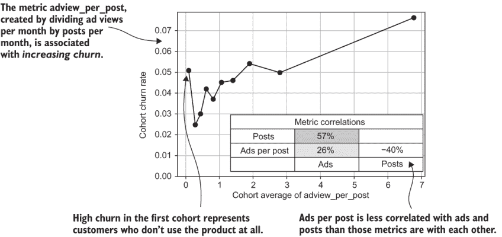

图 7.7 关于指标 adview_per_post、流失和相关性分析的模拟案例研究

图 7.7 中的相关性对于许多比率指标来说是典型的。比率与分子指标呈正相关是自然的，因为当分子较大时，比率往往较大。比率与分母指标呈负相关也是正常的，因为所有其他条件相同，较大的分母会导致较低的比率。然而，精确的结果取决于两个指标之间关系的本质。如果您查看真实的案例研究，您会发现结果与图 7.3 和图 7.7 中显示的典型场景有很大的不同。

### 7.1.3 比率指标案例研究示例

比率指标不仅在您认为会导致脱节的指标存在时有用，而且在您有两个行为交互与客户参与和流失相关时也很有用。通过交互，我指的是两个指标之间的关系很重要的情况——不是两个指标的大小，而是哪一个比另一个大或小。本节包含一些来自案例研究的更多示例，以展示这种交互。

两个指标之比在某个场景中很重要，这个场景涉及效率。许多行为之间存在一种关系，其中一个事件在过程中导致另一个事件，并且过程结束时发生的事件越多，效果越好。图 7.8 展示了 SaaS 服务 Broadly 的一个例子，该服务帮助企业管理其在线存在。Broadly 跟踪客户和交易，交易总是跟随客户注册，因此客户数量和交易数量之间的相关性（0.93）是自然的。每个客户的交易比率高通常对业务有利；它也可能与 Broadly 平台上的参与和成功相关。图 7.8 显示，在 Broadly 上，每个客户的交易比率高于平均水平的业务（得分大于 0.0）的流失率显著低于交易比率低于平均水平的业务。这样的业务可能更成功，因此它们不太可能与 Broadly 有更多的互动，导致更高的客户参与和更低的流失率。

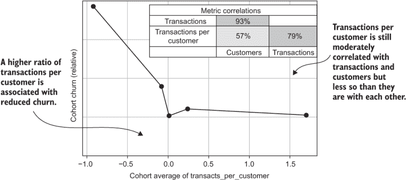

图 7.8 案例研究：展示 Broadly 的每个客户的交易比率分析

**要点**：如果一个事件在过程中的另一个事件之后，那么下游事件上的指标与先导事件上的指标之比可以被视为该过程的效率度量。

图 7.9 展示了 Broadly 使用另一个比率进行的流失率案例研究：评论请求接受率。向客户请求评论是 Broadly 最重要用途之一，客户接受此类请求的比率是使用产品的效率度量。这个比率也可以被视为成功率，因为每次尝试该活动要么成功要么失败。

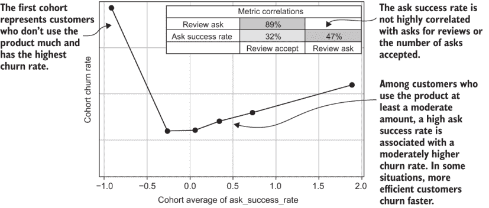

图 7.9 展示了 Broadly 评论请求接受率群体分析的案例研究

图 7.9 可能会让你感到惊讶，因为它显示，除了拥有最高流失率的底层群体外，成功率增加与流失率增加之间显示出适度相关。这种模式对于一种不参与的行为（在第三章中介绍）是典型的。底层群体是那些没有一种或两种行为的群体，因为他们没有指标。但对于使用产品的客户来说，更高的评论请求接受率与更高的流失概率相关联，这可能令人惊讶，因为你可能会预期更成功的客户流失更少。但这种情况可能发生在具有特定目的的产品上。如果客户更快地取得成功，这可能会加速他们的流失。在这种情况下，大多数使用 Broadly 的企业需要一定数量的评论来让自己看起来更好。当它有足够的评论时，企业可能面临更高的流失风险，因为它们已经实现了目标，不再认为 Broadly 有用。对于 Broadly 的客户来说，流失风险最高的情况是客户很少使用产品（底层群体）。

吸收要点：两个事件指标的比率，其中一个事件代表第一个事件的成功结果，定义了一个成功率指标。

Klipfolio 是一家 SaaS 公司，它允许企业创建其关键指标的在线仪表板。图 7.10 展示了 Klipfolio 另一种效率率的案例研究：每月仪表板编辑次数除以保存次数。在这种情况下，这个比率可能更准确地描述为不效率率，因为大量编辑而没有大量保存可能表明用户需要付出更多努力才能达到他们想要保存的可以接受的结果。图 7.10 显示，这类不效率（比率分数高）的客户实际上比在这方面更有效率（更低的比率分数）的 Klipfolio 用户面临更高的流失风险。

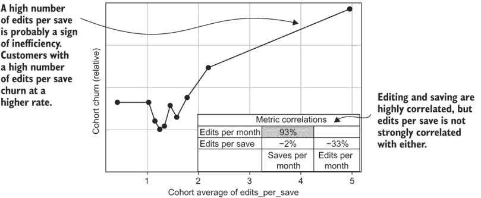

图 7.10 展示了 Klipfolio 编辑/保存比率群体分析的案例研究

我希望这些例子能给你一些关于你可以使用比率指标的广泛情况的启示。它们是强大的工具！接下来的几节将教你一些不同、更专业的比率。在本章末尾，我将回到这样一个问题：何时所有这些类型的比率都是合适的，以及如何找到对你特定情况有用的比率指标。

### 7.1.4 模拟社交网络的其他比率指标

在继续之前，尝试在模拟社交网络上使用更多比率指标。关于当你有很多指标时如何选择比率，我将在第 7.6 节中详细说明。现在，我只想说，以下这一组指标测试了一些有趣的关系：

+   每条消息的回复数

+   每篇帖子的点赞数

+   每条消息的帖子数

+   每个新好友的取消好友数

所有这些指标都有 7.1 列表的准备版本，您可以在 Python 包装程序中使用以下命令运行：

```
run_churn_listing.py —chapter 7 —listing 1 —insert —version  2 3 4 5
```

重要提示：您必须已经根据第 7.1.2 节中的说明计算了比率的基础指标。

然后，作为一个练习，检查这些新的比率指标与额外的指标群体图如何与以下 Python 包装程序中的命令相关联：

```
run_churn_listing.py —chapter 5 —listing 1 —version 11 12 13 14 15 16
```

你可以在第八章中了解更多关于这些额外指标如何帮助你分析和预测流失率的信息。

## 7.2 总指标百分比

百分比是比率的特殊案例：分子是某一部分的测量，分母是分母中该事物的整体数量。当只有两种可能的结果时，百分比指标可以用来制作一个更可解释的比率版本。一组百分比指标可以用来分析一组相关指标之间的关系，其中每个指标测量一种特定类型的一般行为。

### 7.2.1 计算总指标百分比

图 7.11 说明了虚构的流媒体服务和您可能想要制作测量总指标百分比的典型情况。该服务有四种内容类型：动作、喜剧、戏剧和浪漫。对于具有一个主要活动和子类别的任何产品，每个活动区域的周期性计数指标通常与其他活动区域高度相关；使用服务较多的客户倾向于在所有区域都使用得更多。理解活动的相对数量是否与客户参与度和流失率相关的方法是为每个类别计算一个额外的比率指标：该类别中的活动除以所有类别中的总活动。如图 7.11 所示，所有类别的总数正好是所有类别的所有事件数，百分比是每个类别中活动的相对比例。

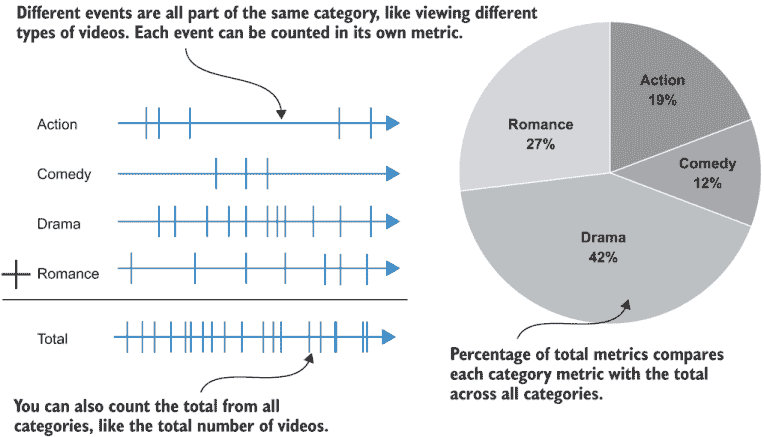

图 7.11 一个虚构的内容流服务的总指标百分比

总指标百分比是一种特殊的比率指标，因为它像其他任何类型的比率指标一样计算（参见表 7.1）。使百分比指标与众不同的地方在于，比率中的分母是代表类别的其他指标的总量。为了制作这些比率，您需要的只是（除了列表 7.1 之外）一个合适的总量作为分母。

TAKEAWAY 总指标百分比揭示了与一组密切相关、高度相关的活动的相对平衡。

您已经接触到了从其他度量中计算比率的度量值的概念，这里还有一个领域，这个技巧非常有用。如果您需要计算一个作为比率分母的不同类别的总和的度量值，您可以求和您打算在分子中使用的所有度量值的值。这种计算策略，总结在图 7.12 中，与比率度量值的计算相似，因为其他度量值的账户和计算日期必须匹配。一个重要的区别是，其他度量值的总和可以作用于多个其他度量值。图 7.11 显示了四个内容区域的四个度量值，在真实的流媒体服务中可能有更多。其他例子可以是不同类别的总购买量和不同地区的呼叫量；参见 7.2.2 节中的示例。

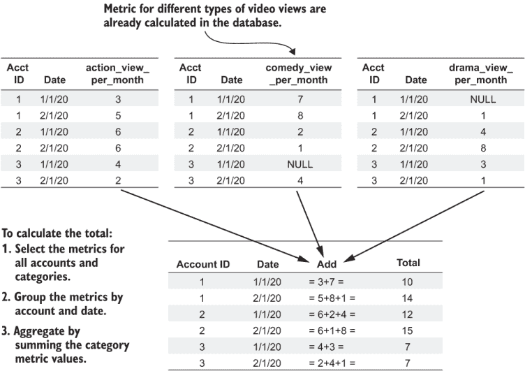

图 7.12 总度量值计算百分比

列出 7.3 的计算其他度量值总和的 SQL 语句，它显示了 GitHub 仓库中 churn 模拟的账户的总点赞和不喜欢。图 7.13 显示了典型的输出。请注意，列出 7.3 为了说明目的选择了度量值的字符串聚合。总度量值的 SQL 语句比图 7.12 中的计算简单：当度量值以列表形式提供时，SQL 语句使用按日期和账户分组的`SUM`聚合。这种方法比使用 CTEs 进行比率度量值（由图 7.12 暗示）更容易。更简单的方法是可能的，因为度量值的顺序并不重要，SQL 提供了标准的`SUM`聚合。

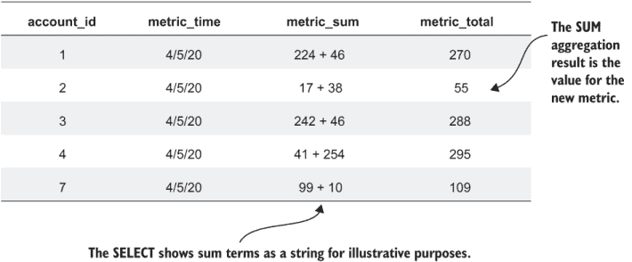

图 7.13 在 GitHub 仓库的默认模拟数据集上运行列表 7.3 的输出

您可能会想知道是否可以直接通过将进入其他度量值的事件总和起来来计算其他度量值的总和——通过`SELECT`来计数多个事件类型而不是分别计数不同的事件类型。答案是您可以这样做并得到相同的结果。添加预先计算的类别度量值的优势在于，如果您的数据集很大，它可能比重新计数基础事件的总数要快得多。但话虽如此，添加预先计算的度量值会在您度量值计算顺序中引入一个依赖。您将不得不决定在您的特定情况下什么最有意义。

列表 7.3 度量值总和

```
SELECT account_id, metric_time,
    STRING_AGG(metric_value::text,'+') AS metric_sum,     ①
SUM(metric_value) AS metric_total                         ②
FROM metric m INNER JOIN metric_name n 
    ON n.metric_name_id=m.metric_name_id                  ③
AND n.metric_name in 
    ('like_per_month', 'dislike_per_month)                ④
WHERE metric_time BETWEEN '2020-01-01' AND '2020-02-01'
GROUP BY metric_time, account_id                          ⑤
```

① STRING 用于说明正在求和的度量值。

② 使用 GROUP BY 聚合计算总和

③ 使用 INNER JOIN；可用的度量值将包含在总和内。

④ 列出对总和有贡献的度量值

⑤ 按日期和账户汇总结果

您应该在本书 GitHub 仓库中提供的代码创建的模拟数据集上运行列表 7.3。如果您正在使用 Python 包装程序，请使用以下参数运行它：

```
—chapter 7 —listing 3
```

您的输出不会完全相同，因为模拟数据是随机生成的。请注意，列表 7.3 为了说明目的选择了被求和的指标的字符串聚合。为了计算此类指标并将其保存到数据库中，您必须删除`SELECT`中的该部分，并在`insert`语句中选择指标的 ID。

列表代码文件夹中的预写 SQL 版本列表 7.3 执行插入操作。（插入版本的路径相同，但文件名以`insert_7_3`开头而不是`listing_7_3`。）通过在运行列表的参数中添加`—insert`标志来运行插入 SQL 语句；您需要保存的结果来继续示例。该列表显示了它使用的 SQL，但不会打印结果。您应该创建自己的`SELECT`语句来验证结果或运行第三章中的`metric_qa`代码（列表 3.6）。

在保存总体指标后，您仍然需要创建将作为总体百分比的比率指标。为此，再次使用列表 7.1（比率指标）。已经准备了一个带有参数的列表 7.1 的额外版本：分子指标是名为`dislikes_per_month`的指标，分母是使用列表 7.3 的插入版本创建的新指标（命名为`total_opinions`）。在运行列表 7.1 时，通过添加参数`—version` `2` `—insert`来运行该插入语句。所有参数如下：

```
fight-churn/listings/run_churn_listing.py —chapter 7 —listing 1 —version 2 —insert
```

### 7.2.2 具有两个指标的总体指标案例研究百分比

在模拟中创建完总点赞和点踩的指标以及模拟客户点踩百分比的新的指标后，你应该为该指标完成一个新的客户流失群体分析。为了进行点踩百分比的群体分析，请按照以下步骤操作：

1.  重新运行列表 7.2 以导出包含您新指标的版本的数据集到.csv 文件，使用参数`—chapter` `7` `—listing` `2`。

1.  重新运行列表 5.1 以使用版本参数 6、7 和 8 创建新的群体分析：`—chapter` `5` `listing` `1` `—version` `6` `7` `8`。该代码将运行三个指标的群体分析：每月点赞数、每月点踩数和点踩百分比。所有参数如下

```
—chapter 5 —listing 1 —version 6 7 8.
```

图 7.14 显示了此分析的典型结果。每月点赞数和每月点踩数与降低的流失率相关，并且相互关联，但点踩百分比显示较高百分比点踩的流失风险增加。此分析的结果在定性上类似于第 7.1.1 节中介绍的广告查看分析。在那个分析中，减少参与度的行为与增加参与度的行为相关联，比率指标使这一事实变得明显。不同之处在于，这次您使用的是百分比而不是简单的比率。

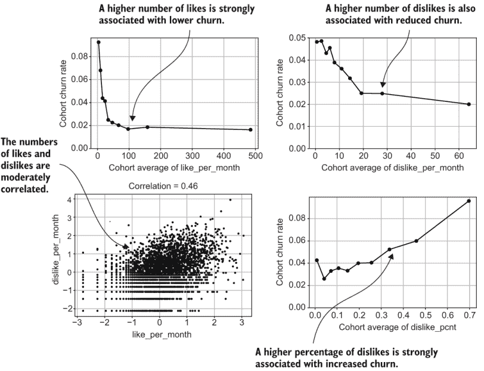

图 7.14 百分比点踩模拟案例研究，说明了使用总体指标的百分比

如果你认为使用简单的比例（不喜欢和喜欢的比例）结果不会有太大差异，你是正确的。那么为什么还要费心使用百分比呢？我之所以推荐在这种情况下使用百分比而不是简单的比例，是因为可解释性。因为喜欢和不喜欢构成一个类别，用百分比来描述这种关系更直观。我的建议是，当两个指标是整体的一部分（例如喜欢和不喜欢）时，使用百分比比例；当两个指标不是整体的一部分时（例如广告观看次数和帖子），使用简单比例。

**要点**：当两个指标是整体的一部分时，百分比比例比简单比例更易解释。

对于 Broadly 也有类似的案例研究。如图 7.15 所示，这个案例研究展示了客户每月推广者、客户批评者和批评者百分比的指标结果。当客户留下正面评论时，就会发生客户推广者事件，因此这个事件预计会给使用 Broadly 的企业带来价值，并使客户不太可能流失，如图 7.15 所示。当客户留下负面评论时，就会发生批评者事件，这预计会令使用 Broadly 的企业感到不悦，但它似乎也与降低流失率有关。图 7.15 还显示了批评者百分比的流失群体结果，这是通过将批评者数量除以推广者和批评者总数得到的比率。批评者百分比越高，与流失率的相关性就越强，而在研究期间，批评者百分比最低的企业——大约 2%——几乎没有流失。

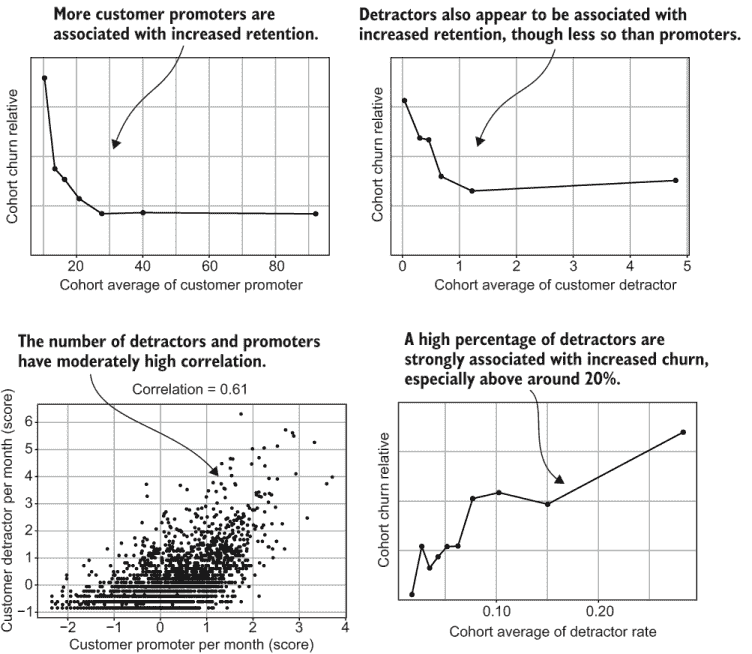

图 7.15 消费者批评者百分比案例研究

### 7.2.3 多指标情况下的总指标百分比案例研究

总指标百分比对于使两个类别的比例更易解释是有用的。但是，当有多个子类别共同构成一个整体时，总指标百分比的优势就更加明显。图 7.16 展示了 Versature 这个综合电信服务提供商的例子。Versature 在四个地理区域提供服务，如图 7.16 中标记为 1 至 4。图 7.16 中的相关矩阵显示，所有四个地区的每月通话次数中等至高度相关。

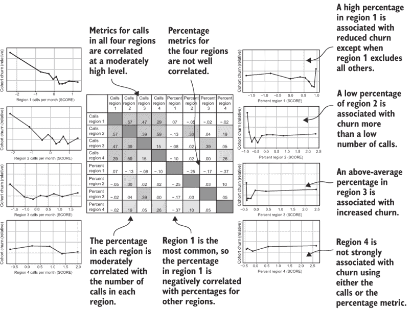

图 7.16 Versature 的区域百分比案例研究

由于四个区域电话数量的相关性，试图通过使用简单的计数指标来分析流失率只能告诉你一件事：客户打更多的电话会减少流失率。但总指标百分比（如图 7.16 右侧所示）可以提供更多信息。在区域 1，当百分比较高但不是最高时，发生最低的流失率。区域 1 拥有最多的电话，但当客户只在区域 1 打电话时，这些电话似乎导致较低的参与度。区域 2 和 3 显示出与流失率的关系，其中区域内的适度电话百分比是最佳的；要么太少要么太多都会导致更高的流失率。

如图 7.16 所示，所有四个区域中总指标百分比的相互关联性较弱。由于区域 1 在整体上拥有最多的电话，区域 1 的百分比与其他百分比指标之间显示出较弱到中等的负相关性：区域 1 的高百分比通常意味着其他区域留下的电话很少。其他三个区域的总指标百分比相互之间以及与电话量指标的相关性较弱，这表明这些指标为理解客户参与度和流失率提供了新的信息（与电话量中的信息不同）。

## 7.3 测量变化指标

到目前为止，你已经查看了一些在测量时客户行为的测量结果。但行为的变化可以为你提供关于参与度的额外线索。为了理解客户行为的变化如何与参与度和流失率相关联，你需要创建一些专门为此目的而设计的更多指标，然后使用你已经学到的相同技术来分析变化测量结果。

### 7.3.1 测量活动水平的变化

由于你已经计算了基于日期序列的指标，通过查看客户的指标并比较当前值与之前值，很容易看出客户的行为是否在变化。如果指标上升，你知道行为在增加；如果指标下降，行为在减少。这就是为什么你需要在不同的时间点计算指标的原因之一。但如果你想了解变化与流失率和参与度之间的关系，你需要将变化视为另一个自然实验，并比较行为增加的客户与行为减少的客户。为此，你需要代表变化的指标；然后你可以应用你学到的群组分析技术。

表示变化的度量是一个派生度量，表示你感兴趣的主要度量的变化。因为你已经学习了如何从其他度量中制作度量，所以这个想法可能不会像你在拿起这本书之前那样让你觉得陌生。图 7.17 说明了测量两个账户登录次数变化的假设场景，并引入了百分比变化作为度量的概念。

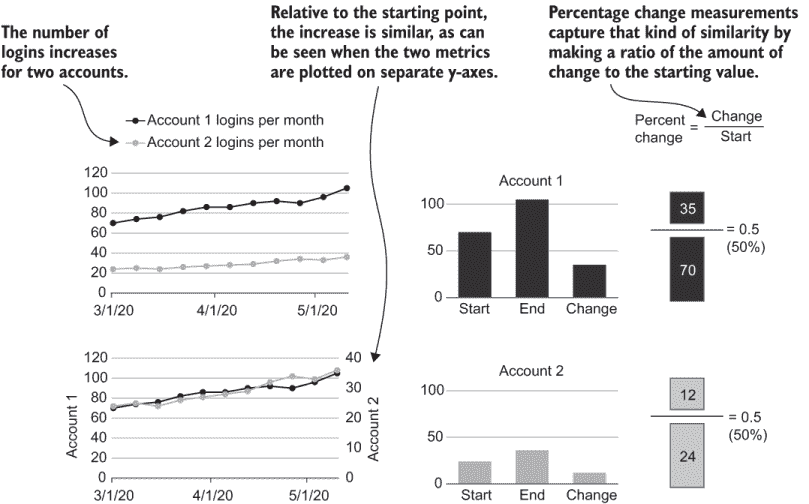

图 7.17 使用百分比变化度量对两个假设账户的分析

**定义**：百分比变化是一个比率，它将度量随时间的变化除以该时期开始时度量的值。

假设有两个账户的登录次数不同；一个账户的登录次数远多于另一个账户。还假设这两个账户每月的登录次数都在增加。如果你查看登录次数随时间的变化，你可能会发现变化的大小对于一开始登录次数较多的账户更大。也就是说，度量变化的大小与度量的水平相关。因为变化的大小通常与度量的起始水平相关，所以简单的差值不是表示变化的最佳度量。如果你查看每个账户都有自己 y 轴刻度的图表中的登录次数变化，你可以看到这种结果。如果你允许每个账户有自己的刻度，相对变化可以看作是相同的。因为你已经了解到使用比率是一种重新缩放度量以强调相对数量的方法，你可能已经看到了这个例子的发展方向。

这种比率计算使得变化测量与度量在开始时的水平高低相关性较低。图 7.17 显示，对于这两个账户，百分比变化是相同的，这表明尽管起始点有很大的不同，它们的增长相似。方程 7.1 展示了百分比变化的数学公式定义。

| 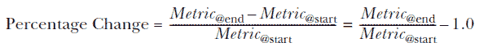  | 方程 7.1 |
| --- | --- |

在方程 7.1 中，*度量*[*@start*]表示测量窗口开始时的度量，而*度量*[*@end*]表示结束时的度量。方程 7.1 还展示了一个简化：百分比变化实际上是开始时度量与结束时度量的比值，减去 1.0，因为分数可以分解为结束时度量与开始时度量的比值，减去开始时度量与自身的比值。这种简化基于任何数除以自身等于 1.0 的事实。

**要点**：使用百分比变化度量来查看行为是否发生变化。在分析中直接不包括（旧的）度量起始值或绝对变化值；这些值与结束度量值所捕获的整体活动水平相关。

为了使这个例子更具体，图 7.18 显示了百分比变化作为指标的详细计算。此图继续了图 7.17 中的登录的假设例子，但有一个重要区别：像其他所有指标一样，这个指标是在一系列日期上重复计算的。这种计算有时被称为滚动百分比变化计算。

在图 7.18 中，使用了四周的时间段。对于每一周，计算都应用方程 7.1 于该周的指标（作为最终指标）和四周前的指标（作为起始指标）。如图 7.18 的右侧所示，得到的滚动百分比变化测量值不是恒定的；它们根据基础指标的精确波动而波动。在两个指标相当一致的示例期间，四周百分比变化增加的范围从大约 5%到大约 25%。

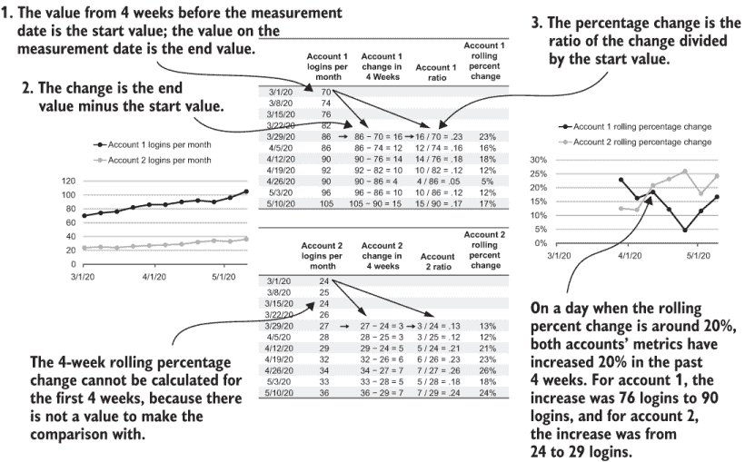

图 7.18 滚动百分比变化指标的计算

图 7.19 显示了计算百分比变化（列表 7.4）的 SQL 语句的示例输出。该图显示，这个指标对本书来说有新的内容：负值。如果你在阅读这本书之前就熟悉百分比变化，这个事实就不会感到惊讶。如果你对这个术语是新的，那么负百分比变化意味着在测量期间所讨论的指标已经下降。回想一下方程 7.1，百分比变化是

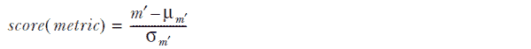

当最终指标小于起始指标且分数小于 1.0 时，因此在减去 1 之后，百分比变化变为负值。

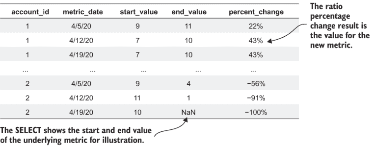

图 7.19 运行列表 7.4 的输出，显示负结果

因为百分比变化是比率指标减去 1.0，所以列表 7.4 与计算常规比率指标相似。列表 7.4 与常规比率计算之间的区别是

+   分子和分母来自同一个指标，而不是两个不同的指标。

+   分母指标（起始值）是从早于结束值的时间（例如四周）选择的。（这个选择必须在`JOIN`和`SELECT`语句中考虑到。）

+   在列表 7.4（百分比变化）中，最终计算中从比率中减去了数字 1。

列表 7.4 指标百分比变化

```
WITH end_metric AS (                                             ①
    SELECT account_id, metric_time, metric_value AS end_value
    FROM metric m INNER JOIN metric_name n 
        ON n.metric_name_id=m.metric_name_id
    AND n.metric_name = 'new_friend_per_month'
    AND metric_time BETWEEN '2020-04-01' AND '2020-05-10'
), start_metric AS (                                             ②
    SELECT account_id, metric_time, metric_value AS start_value
    FROM metric m INNER JOIN metric_name n 
        ON n.metric_name_id=m.metric_name_id
    AND n.metric_name = 'new_friend_per_month'                   ③
    AND metric_time BETWEEN                                      ④
        ('2020-04-01'::timestamp -interval '4 week')
        AND ('2020-05-10'::timestamp -interval '4 week')
)
SELECT s.account_id, s.metric_time + interval '4 week',
    start_value, end_value,                                      ⑤
    COALESCE(end_value,0.0)/start_value - 1.0 
        AS percent_change                                        ⑥
FROM start_metric s LEFT OUTER JOIN end_metric *e*                 ⑦
    ON s.account_id=e.account_id
    AND e.metric_time
        =(s.metric_time + interval '4 week')                     ⑧ 
WHERE start_value > 0                                            ⑨
```

① 此 CTE 选择所有分子指标。

② 此 CTE 选择所有分母指标。

③ 分子和分母使用相同的指标

④ 对分母的日期进行变化周期的偏移

⑤ 使用最近指标的时期作为比率

⑥ 根据方程 7.1 的百分比变化

⑦ 左外连接；如果最终指标为 NULL，变化为-100%。

⑧ JOIN 调整起始和结束之间的偏移

⑨ 防止除以零错误

还要注意，列表 7.4 为了说明目的选择了计算中使用的起始值和结束值。如果你将百分比变化作为要保存到数据库的指标来计算，你必须省略说明列，并包含一个带有指标 ID 的`INSERT`语句。你应该以通常的方式使用 Python 包装程序运行列表 7.4 以查看类似于图 7.19 的输出，然后重新运行带有`—insert`标志的列表 7.4 以将其保存到数据库，如下所示：

```
fight-churn/listings/run_churn_listing.py —chapter 7 —listing 4 —insert
```

你可能想知道是否在列表 7.4 中使用`start_value`作为`COALESCE`的第二个参数会更合理，以便当`end_value`为空时，计算结果返回`0`。但请注意，由于`WHERE`子句，`start_value`必须大于`0`。然后，如果没有`end_value`，变化被定义为-100%，因为你从某个东西（非零的`start_value`）变成了没有东西，因此`end_value`周围的`COALESCE`给出了正确的结果。

你应该对你新朋友的百分比变化指标进行群体分析。步骤与你在 7.1 节中看到的基本相同：

1.  重新运行列表 7.2 以重新导出数据集，包括新指标。

1.  使用参数`—version` `9`运行列表 5.1 以绘制新朋友百分比变化的分析图。所有参数如下：

```
 —chapter 5 —listing 1 —version 9
```

图 7.20 显示了这种分析的典型结果。发现每月新朋友数量显著下降的群体，其流失风险增加。

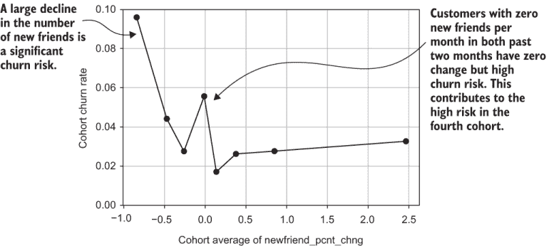

图 7.20 显示了流失案例研究中每月朋友百分比变化的模拟结果

### 7.3.2 具有极端异常值（厚尾）的指标得分

百分比变化指标的问题在于这些指标可能具有极端值。由于模拟数据通常比真实人类行为不那么极端，因此这个问题并不明显。实际上，当分母较小时（小于 1），任何比率都可能具有极端值，因为此时比率的值变得相当大。但对于大多数常见的比率，这个问题并不存在，因为像单位成本和交易每客户这样的效率度量受到业务性质的限制，并且百分比必须按设计在 0%到 100%之间。当客户在某个指标上的值较低，而他们的下一次测量值较大时，百分比变化可以非常大。但如果客户从一个高指标值下降到零（或接近零），指标会变得极端负吗？并不完全是这样：最低可能的百分比变化测量值是-100%，因为这是任何非零指标变为零时的百分比变化。

图 7.21 显示了来自社交网络模拟和 Versature 案例研究的百分比变化指标的分布测量。要重现案例研究的统计数据，请使用以下 Python 包装程序：

1.  重新运行列表 7.2，使用参数`—chapter 7 —listing 2`导出包含您新指标的 CSV 文件版本。

1.  重新运行列表 5.2，使用参数`—chapter 5 —listing 2 —version 2`保存数据集摘要统计表的表格。

您的结果将包括图 7.21 第一行显示的模拟指标百分比变化在新朋友中的统计数据。模拟的值并不太极端，因为百分比变化是针对四周期的，模拟客户的变化并不大。尽管如此，最大值是 1,200%，这意味着至少有一个客户从每月一个新朋友增加到每月 12 个新朋友；最小值如承诺的那样是-100%。

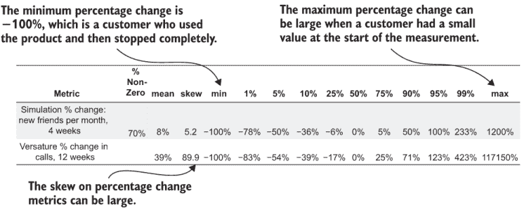

图 7.21 Versature 通话百分比变化统计

Versature 案例研究指标更接近你从真实客户数据中期望看到的情况：最小值也是-100%，最大值是 117,150%。这是 11,000 倍的增长！在数据集中某个地方有一个客户，三个月前每月只有一个通话，12 周后变成了 11,715 个通话——这是一个大客户在百分比变化测量开始时开始服务的极端案例。变化的第 99 百分位数是 423%，这意味着 99%的客户增加次数小于 4.23 倍。

另一个需要注意的重要点是，中位数变化为 0%（如图 7.21 中 50%列所示的第 50 百分位数）。增加通话次数的客户数量与减少通话次数的客户数量大致相同。这种情况通常出现在百分比变化指标中。如果你只看平均值，可能不会意识到这一点，因为平均值通常大于 0%。这在图 7.20 中 Versature 的百分比变化指标和模拟百分比变化指标中都是如此。当正负变化指标的客户数量相等时，平均数大于 0%的原因是正百分比变化测量值可能远大于负百分比变化测量值。

在图 7.21 中还有其他需要注意的事情是模拟数据和实际数据在 5 和 90 附近的偏斜。你可能还记得第五章，偏斜意味着大多数指标值都聚集在一起，但有几个值远远超出。5 的偏斜被认为是中等偏斜；90 的偏斜是高度偏斜。当一个指标高度偏斜时，你应该将其转换为分数，以便更容易理解你的群体分析（参见第五章）。

但是存在问题。如果一个度量是零或负数，你不能使用偏斜度量版本的得分变换，但百分比变化通常是零和负数。为了解决这个问题，你可以使用另一个得分公式，我称之为肥尾公式，因为它在正负两个方向都有极端异常值时将度量转换为得分。具有正负极端值条件被称为肥尾，因为尾巴指的是分布的极端。当一个分布是正态分布或具有瘦尾巴时，最极端的值相对于分布的中间部分并不是太极端。如果一个度量的分布具有肥尾，极端值离中间范围更远，并且有更多的极端值。

方程 7.2 展示了肥尾得分公式：


其中

| 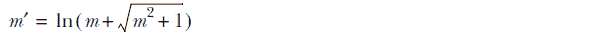 | 方程 7.2 |
| --- | --- |

方程 7.2 的格式与第五章中的得分公式（方程 5.1）相同：你将变换度量，然后减去平均值，并除以变换度量的标准差。在方程 7.2 中，μm ¢代表变换度量 m ¢的分布的平均值，σm ¢代表变换度量的标准差。

在肥尾得分公式中的度量变换与常规得分公式只有一点点的不同：方程 7.2 的第二部分说明变换后的度量 m ¢是通过取原始度量 m 的对数加上原始度量平方的平方根再加 1 来创建的。回想一下，在第五章的得分公式中，你使用了原始度量对数加 1（没有平方或取平方根）。

肥尾得分公式对负值也适用，因为当原始度量 m 为负时，平方根中的项总是正的，并且绝对值略大于负项。负值最终成为接近零的小数，而正值则被推远。在应用对数函数后，减去平均值并除以变换变量的标准差。

方程 7.2 的后半部分带有对数，也被称为科学家和数学家所知的双曲正弦逆变换，这是一个很长的名字，你不必记住。这种变换用于某些类型的工程和几何计算。无论你叫它什么，肥尾得分变换是处理具有极端值的度量的一个很好的技巧。

**要点**：使用肥尾变换从具有正负极端值的度量中创建得分。

列表 7.5 更新列表 5.3，包括肥尾分数转换。 (我在第五章中跳过了这个附加的复杂性，因为我们没有查看需要它的指标。) 扩展的列表执行所有相同的事情，并且它还额外检查了具有负值的偏斜列。如果有这样的列，除了对偏斜和非偏斜列的常规分数转换外，还会应用由公式 7.2 定义的分数公式。

注意：为了简化，省略了对肥尾指标进行的另一个测试，即检查统计量 kurtosis 的高值，这是一个旨在检测肥尾分布的测量。在流失案例中，肥尾指标也是偏斜的。

列表 7.5 使用肥尾分数进行评分

```
import pandas as pd
import numpy as np
import os

def transform_skew_columns(data,skew_col_names):                  ①
    for col in skew_col_names:
        data[col] = np.log(1.0+data[col])                         ②

def transform_fattail_columns(data,fattail_col_names):            ③
    for col in fattail_col_names:                                 ④
        data[col] = np.log(data[col] + 
                    np.sqrt(np.power(data[col],2) + 1.0))         ⑤

def fat_tail_scores(data_set_path, 
                    skew_thresh=4.0,**kwargs):                    ⑥

   churn_data = 
       pd.read_csv(data_set_path,index_col=[0,1])                 ⑦
   data_scores = churn_data.copy()
   data_scores.drop('is_churn',inplace=True, axis=1)

   stat_path = data_set_path.replace('.csv', '_summarystats.csv')
   assert os.path.isfile(stat_path),'You must running listing 5.2 first to generate stats'
   stats = pd.read_csv(stat_path,index_col=0)
   stats.drop('is_churn',inplace=True)

   skewed_columns=(stats['skew']>skew_thresh) & (stats['min'] >= 0)
   transform_skew_columns(data_scores,skewed_columns[skewed_columns].keys())

   fattail_columns=(stats['skew']>skew_thresh) 
       & (stats['min'] < 0)                                       ⑧

   transform_fattail_columns(data_scores,
                             fattail_columns[fattail_columns].keys())

   mean_vals = data_scores.mean()                                 ⑨
   std_vals = data_scores.std()
   data_scores=(data_scores-mean_vals)/std_vals
   data_scores['is_churn']=churn_data['is_churn']

   score_save_path=data_set_path.replace('.csv','_scores.csv')
   data_scores.to_csv(score_save_path,header=True)

    print('Saving results to %s' % score_save_path)
    param_df = pd.DataFrame(
        {'skew_score': skewed_columns,                            ⑩
         'fattail_score': fattail_columns,
         'mean': mean_vals,
         'std': std_vals}
    )
    param_save_path=data_set_path.replace('.csv','_score_params.csv')
    param_df.to_csv(param_save_path,header=True)
    print('Saving params to %s' % param_save_path)
```

① 包含了列表 5.3 中的偏斜数据转换

② 偏斜分数的转换

③ 对肥尾数据的新的转换

④ 遍历所有具有肥尾的列

⑤ 应用肥尾分数公式（公式 7.2）

⑥ 使用 kwargs 忽略默认的列表参数

⑦ 这段代码的大部分与列表 5.3 相同。

⑧ 当偏斜高且存在负值时，肥尾分数

⑨ 这个缩放与列表 5.3 相同。

⑩ 保存转换的列和参数

你可以通过对 Python 包装程序进行以下调用来在自己的数据上尝试列表 7.5：

1.  如果还没有这样做，使用`—insert`标志运行列表 7.4 以保存新的指标。

1.  重新运行列表 7.2，使用参数`—chapter 7 —listing 2`来重新创建你的保存的数据集。这个数据集包括你的新的百分比变化率指标。

1.  运行列表 7.5，使用参数`—chapter 7 —listing 5`来创建分数数据集。

1.  重新运行列表 5.2，版本 2，使用参数`—chapter 5 —listing 2 —version 2`来检查分数的统计数据。

图 7.22 展示了使用 Versature 数据的通话百分比变化率分析。对于这个案例研究，指标是每月通话数量的百分比变化，测量过去 12 周的数据。通话数量减少最多的群体显示出较高的流失风险。因为这个指标是在比观察流失前的时间更长的时间段内测量的，所以这个指标可能不是流失的领先指标，正如第四章所讨论的。也就是说，如果客户在续约前两周，你看到他们的使用量比三个月前大幅下降，那么他们很可能已经决定流失。另一方面，在续约前还有两周的时间，如果存在问题，可能还有时间解决。

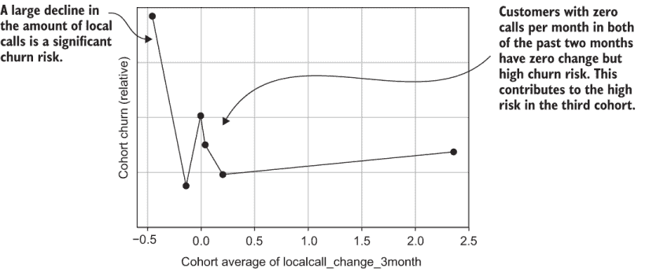

图 7.22 Versature 通话百分比变化率流失群体案例研究

### 7.3.3 测量自上次活动以来的时间

百分比变化是了解用户行为是否下降或增加的好方法。一个有用的相关测量是自上次活动以来时间。自上次活动以来时间不是行为变化量的测量，而是将客户的当前行为与过去行为进行比较。特别是，自上次活动以来时间区分了新不活跃的客户和可能已经长时间不活跃的客户。

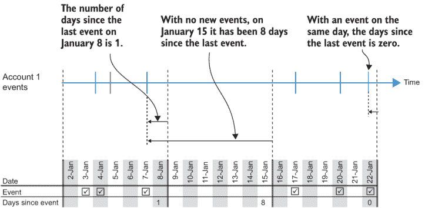

图 7.23 测量自上次活动以来时间：一个事件

图 7.23 通过一个账户的事件序列的简单示例说明了该概念。每次计算指标时，自上次活动以来时间是指测量日期之前最近的事件与测量日期之间的时间差。如果客户在测量当天有事件，则指标为零。如果客户在一段时间内没有事件，则指标每天增加一，直到发生另一个事件。

与我们使用的所有指标一样，自上次活动以来时间手动计算会非常繁琐。幸运的是，使用 SQL CTE 和聚合进行计算并不困难。图 7.24 显示了 SQL 计算自最后事件以来天数典型输出的一个示例。请注意，为了说明目的，此输出包括`SELECT`语句中的最后事件日期。

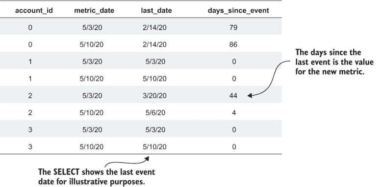

图 7.24 运行列表 7.4 的输出。对于每个账户和日期，选择最后事件的日期进行说明；指标值是从最后事件到测量日期的天数。

列表 7.6 提供了计算自最后事件以来时间的 SQL 程序。基本策略是在事件时间上使用`MAX`聚合（限制在测量日期之前的事件）以找到所有最近的事件。最近的事件日期存储在一个公用表表达式（CTE）中。之后，该指标是事件日期与测量日期之间的差异。使这个计算变得复杂的是，与所有指标一样，计算是在一系列测量日期上同时进行的。查询不仅为每个账户找到一个最后事件日期，而是为每个账户找到一系列最后事件日期。

您应该在模拟数据集上运行列表 7.6，按照 Python 包装程序的习惯模式进行，并确认输出类似于图 7.24。按照惯例，要将指标插入数据库，您需要删除说明（额外）列，并在插入语句中包含指标名称 ID。GitLab 存储库有一个可以运行的列表版本，您可以通过将`—insert`标志作为参数传递给运行列表的程序来运行，如下所示：

```
fight-churn/listings/run_churn_listing.py —chapter 7 —listing 6 —insert
```

列表 7.6 用于测量自事件以来时间的 SQL

```
WITH date_vals AS (                                                       ①
  SELECT i::date AS metric_date
    FROM generate_series('2020-05-03', '2020-05-10', '7 day'::interval) i
),
last_event AS (                                                           ②
    SELECT account_id, metric_date, 
        MAX(event_time)::date AS last_date                                ③
    FROM event *e* INNER JOIN date_vals d
    ON e.event_time::date <= metric_date                                  ④
    INNER JOIN event_type t 
        ON t.event_type_id=e.event_type_id
    WHERE t.event_type_name='like'                                        ⑤
    GROUP BY account_id, metric_date                                      ⑥
)
SELECT account_id, metric_date, 
last_date,                                                                ⑦
metric_date - last_date AS days_since_event                               ⑧
FROM last_event
```

① 用于计算指标的日期序列的 CTE

② 用于临时结果的 CTE：最后事件的日期

③ 使用 MAX 聚合选择最后一个日期

④ 使用每个测量日期的上一个事件的日期。

⑤ 选择要测量的事件

⑥ 对每个账户和日期进行汇总

⑦ 选择最后事件的日期进行说明。

⑧ 结果是自上次事件以来的天数。

在运行插入指标的 7.6 版本后，您可以重新生成数据集并在其上运行群体流失分析。总的来说，Python 包装程序的运行次数

1.  使用插入标志运行 7.6 列表以保存新指标：`—chapter` `7` `—listing` `6` `—insert`。

1.  重新运行 7.2 列表以重新导出数据集：`—chapter` `7` `—listing` `2`。

1.  使用 5.1 列表的第 10 版运行新的群体分析：`—chapter` `5` `—listing` `1` `—version` `10`。

图 7.25 显示了群体分析的结果。自上次新朋友事件以来超过五天的差距与流失风险的增加相关。风险的增加是渐进的，但对于自事件以来时间最长的群体来说，这种增加变得相当显著。

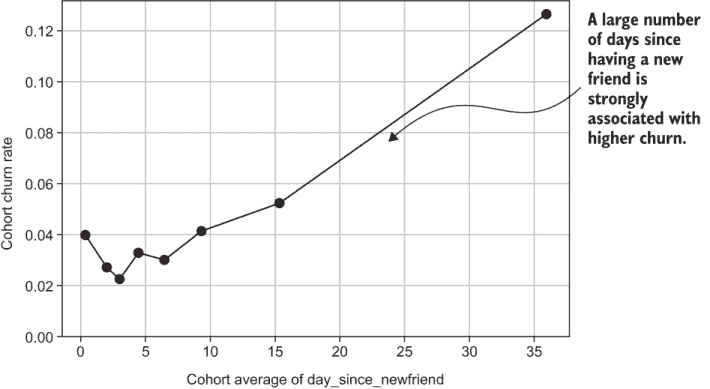

图 7.25 流失和自上次新朋友事件以来的天数案例研究

图 7.26 显示了 Klipfolio 自上次仪表板编辑以来的天数流失群体分析。在实际情况研究中，自上次编辑以来的天数是流失风险的显著预测因素：风险在第一个月大幅增加。与模拟数据不同，在活动时间最长的群体中，风险仅适度增加。

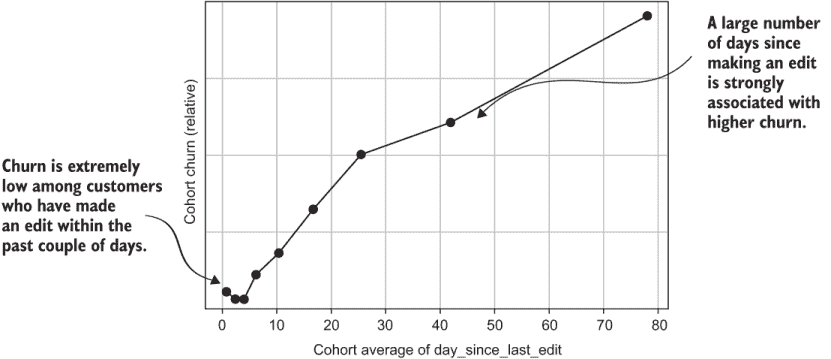

图 7.26 Klipfolio 的流失和自上次仪表板编辑以来的天数案例研究

当客户长时间不活跃时，他们可能会忘记订阅。在这种情况下，一些从业者认为，最好的减少流失策略是不采取任何行动，让沉睡的狗继续沉睡，不提醒客户他们有订阅。虽然这是一个合理的假设，但也是一种有些可疑的商业策略，依赖于人们忘记你以提高你的保留率。无论如何，图 7.26 并没有表明，自上次行动以来时间越长，流失风险就越低。对于考虑这种方法的任何公司来说，是否对那些已经走得很远的人进行干预会有正的投资回报，这是一个必须通过实证回答的问题。

## 7.4 指标时间段的缩放

在第三章中，当您学习了如何计算行为指标时，我建议您根据事件的频率对简单指标的指标测量窗口进行缩放，对于更罕见的事件使用更长的测量窗口。这个建议是好的，但它引入了一些问题：

+   为不同事件选择不同的测量窗口将会令人困惑。

+   如果您为罕见事件使用较长的测量周期，您必须等待很长时间才能正确观察您的客户。如果您还想制作像第 7.3 节中介绍的那样百分比变化的指标，这个问题会变得更加严重。

本节介绍了通过将一个时间框架的测量扩展到另一个时间框架来解决这两个问题的缩放技术。这些技术与你在第二章中学到的客户流失率缩放类似，但它们在度量指标方面的工作方式略有不同。

### 7.4.1 将较长的指标缩放到较短的引用周期

使用不同的测量周期来测量不同的指标可能会让人困惑，尤其是如果你有很多事件。当所有测量都在同一尺度上时，比较行为更容易。

**警告** 报告大量在不同时间尺度上测量的指标会让人困惑。

你如何将这些建议与第三章中建议使用长时间框架来测量罕见事件的建议相协调？很简单：你可以使用不同于你进行测量的窗口的时间尺度来描述你的行为测量。图 7.27 说明了这个概念。本质上，你将描述这个指标作为一个每月的平均计数，而不是多个月份的总计数。

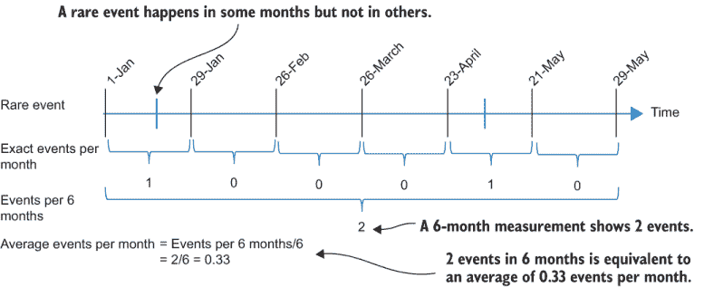

图 7.27 引用长期计数指标作为短期平均数

你可以测量一年期内的行为，例如，但通过将一年内测量的数量除以 12 来将其转换为月度值，因为每月的平均事件数是每年事件数除以 12。这个想法与缩放客户流失度量（第二章）相同，但数学更简单。你不需要任何关于生存率的复杂推理来缩放标准行为指标。这次，技术是直接的乘法和除法。

**总结** 不要混淆你进行平均行为测量的时间周期与你选择描述行为的时间周期。这两个时间周期不必相同。你可以在一个时间尺度上描述所有你的指标，即使这些指标是在不同长度的时窗内测量的。

公式 7.3 展示了将测量期间内任何时间周期的事件计数（*TMeasure*）转换为描述行为时任何其他时间周期的平均数所需的乘法和除法。

| 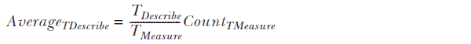  | 公式 7.3 |
| --- | --- |

将公式应用到简单的年度测量与月度描述的例子中，比率是四周描述周期除以 52 周测量周期，或者说是十三分之一。或者如果你喜欢用天数来计算，那就是 30.4（平均每月天数）除以一年中的 365 天，或者说是十三分之一。记住，无论这些单位是天数、月份还是年，你都必须使用相同的单位来描述描述和计数的时间周期。

更好的是，你可以在测量时即时计算缩放吗？列表 7.7 展示了一个按周期行为测量的事件（如列表 3.2），该事件自动将测量扩展到月度描述周期的平均值。

公式 7.3 也适用于事件属性总和的指标，例如在某个活动上花费的总时间。但缩放不是必要的；实际上，如果指标是事件属性的平均值，那么缩放是不正确的。例如，如果事件是在应用内购买，并且你想制作平均购买金额的指标，这个指标不依赖于你测量时间的长度，因为事件属性的平均值被定义为每个事件的测量，即使你可以测量更长的时间框架。

警告：不要对事件属性值的平均值进行时间缩放。只有计数或总和的指标应该进行缩放。

您应像往常一样使用 Python 包装程序运行列表 7.7（使用参数 `—chapter` `7` `—listing` `7`）。图 7.28 显示了典型结果。

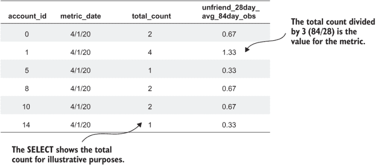

图 7.28 列表 7.7 的示例输出

列表 7.7 缩放每个账户的事件数量指标

```
WITH date_vals AS (                                         ①
     SELECT i::timestamp AS metric_date 
     FROM generate_series('2017-12-31', '2017-12-31', '7 day'::interval) i
)
SELECT account_id, metric_date,  COUNT(*) AS total_count,
(28)::float/(84)::float * COUNT(*) AS n                     ②
FROM event *e* INNER JOIN date_vals d
ON e.event_time <= metric_date 
AND e.event_time > metric_date - interval '84 day'          ③
INNER JOIN event_type t ON t.event_type_id=e.event_type_id
WHERE t.event_type_name='unfriend'
GROUP BY account_id, metric_date
GROUP BY account_id, metric_date;
```

① 此 SQL 与列表 3.2 大致相同。

② 计数已从 84 天缩放到 28 天周期（公式 3.1）。

③ 84 天内的计数

注意，列表 7.7 包含一个用于说明目的的总计数列。要将此类指标插入数据库，您需要删除该列，用指标名称 ID 替换它，并添加一个 `INSERT` 语句。像往常一样，存储库还包含一个可插入的指标版本，您可以通过在执行命令中添加 `—insert` 标志来运行它，如下所示：

```
fight-churn/listings/run_churn_listing.py —chapter 7 —listing 7 —insert
```

在将列表 7.7 中的 unfriend_per_month 指标插入数据库后，执行以下步骤以检查您的结果：

1.  通过重新运行列表 7.2 并使用以下参数来重新生成数据集：`—chapter` `7` `—listing` `2`。

1.  通过重新运行列表 5.2 并使用以下参数来重新运行数据集摘要统计：`—chapter` `5` `—listing` `2` `—version` `1`。

图 7.29 展示了原始 unfriend_ per_month 指标和新的平均每月 unfriend 指标（在 84 天内测量，`unfriend_28day_avg_84day_obs`）的典型结果。平均覆盖了具有非零测量的 50% 的账户，但原始计数仅覆盖了 26% 的账户。同时，平均值和百分位数相似，不是三倍之大，因为指标是在三倍长的时间框架内测量的。实际上，新的指标略低：不仅平均值较低，而且分布的分位数也较低。想想这是为什么。（你将在第 7.4.2 节中找到答案。）

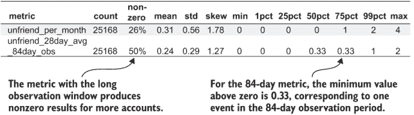

图 7.29 比较在短时间和长时间期间测量的罕见模拟事件的统计数据

使用比描述期更长的观察期来衡量指标的好处之一是，这种方式估计的指标在客户活动出现暂时性变化时具有鲁棒性。例如，如果你用一个月的时间来衡量某些行为，一个客户休假两周可能会显得活动水平较低。同样，一些客户可能会经历一段短暂而强烈的活跃期。在两种情况下，如果你在三个月的时间里衡量平均行为，这些暂时性的变化就不会产生太大的影响。

但使用长观察期作为指标的一个缺点是，指标不再反映行为的最新变化。使用长观察期时，当行为发生变化时，这种变化在指标中登记的时间会更长。处理这种情况的最佳方式是，在大多数行为中使用长观察窗口指标，并结合一些衡量行为百分比变化的指标。这样，你既有对行为平均水平的稳定估计，也有几个可以迅速揭示最近变化的指标。

在长时间框架内衡量行为指标的一个其他重要问题是衡量新账户。这个问题在任何测量窗口中都存在，但当测量窗口较长时，问题会加剧。如果一个账户只使用了很短的服务时间（低于测量期的任期），那么这个测量是不有效的。假设一个老客户每月只登录一次，因此他们是产品的轻度用户，有流失的风险。一个昨天加入的新客户在过去一个月内也可能只登录过一次，但这并不等同于老客户每月只登录一次。

注意：对新客户进行的事件计数测量与在整个测量期间都存在的正常账户不可比。

这种情况通常适用于在首次续订时进行测量的客户。对于月度续订订阅，你的数据集中客户的首次测量是在续订前两周到三周进行的，这是由于在续订前观察客户所使用的提前期（如第四章所述）。如果你使用四周的指标测量周期，新客户只有整个周期的半到四分之三，他们的指标可能被低估。如果你使用超过一个月的指标观察期，这个问题会加剧。首次续订至关重要，因此你不希望犯这类错误。

### 7.4.2 为新账户估计指标

如前所述，任何在几周或几个月内测量的指标对于没有使用产品那么长时间的新账户都是无效的。幸运的是，你有一个简单直接的方法来处理这个问题，这个方法与你在 7.4.1 节中学到的平均技术一致：你可以使用比描述平均时间更短的时间段来估计平均数。这种技术与在长时间段计算平均值并将其描述为较短时间段的方法类似，但方向相反。图 7.30 说明了这个概念。

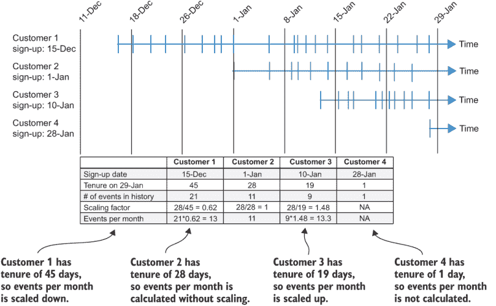

图 7.30 使用短期历史估计长期指标

理念如下：假设一个账户已经使用产品两周，每月有 10 次登录。你不知道它在四周后会有多少次登录，但你可以做出一个合理的猜测——四周后，登录次数应该是两周后的两倍。这个理念可以扩展到将任何较短时间段的测量扩展到估计较长时间段的平均值。

一个重要的注意事项是针对新客户：如果一个账户在第一天登录一次，那么在 28 天后估计它会有 28 次登录是否合理？表面上看起来是合理的，但实际上并不合理。问题在于，如果你从一个很短的时间段开始估计，比如一天，那么估计将是不稳定的，并且会波动。假设一个客户在第一天登录一次后，你估计他每月有 28 次登录。但在第二天，客户没有登录，所以你的估计变成了 14 次。（两天登录一次意味着 28 天会有 14 次登录。）这种活动在一天之内对 logins_per_month 指标的估计产生了很大的波动。这种波动性在仅基于几天数据的估计中是正常的；通常至少需要 5 到 10 天的数据，这种估计才会稳定下来。在第三章中，你了解到大多数客户行为遵循每周周期，所以一般来说，你应该使用以下规则：

+   在观察到至少一周的行为，最好是两周的行为之前，不要对一个月的平均数进行估计。

+   同样，如果你正在制作平均数来估计季度或年度的计数和总计，你应该在观察到感兴趣的行为至少一个月之后才估计指标。

公式 7.4 提供了为新账户估计计数指标所需的数学和逻辑，这还包括你在 7.4.1 节中学到的平均计数缩放。公式 7.4 中的 Count Tmeasure 指的是实际的事件跟踪计数，公式 7.3 中有三个时间周期参数：

+   Tmin 是账户获得此指标估计的最短期限（对于月度指标是一到两周，对于年度指标是两到三个月）。

+   Tdescribe 是用来描述平均时间周期（四周）的。

+   Tmeasure 是用于测量的时间周期（对于老客户）。

在公式 7.4 中，根据订阅者任期有三个情况：

+   如果任期小于 Tmin，则不计算任何指标值。

+   如果任期大于 Tmin 但小于描述指标的时期，计数将按描述期与账户任期的比率进行缩放。这个计数是估计的平均值。

+   如果任期大于描述期，计数将按描述期与测量期的比率进行缩放。这个计数是在更长的时间内计算的平均值。

*如果任期 < Tmin*

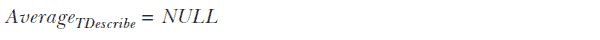

*Else If Tmin <= tenure <= Tdescribe*

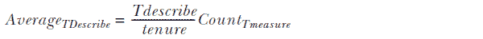

*Else*

| 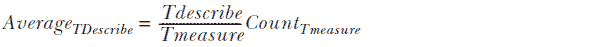 | 公式 7.4 |
| --- | --- |

公式 7.4 的第三个情况与公式 7.3 相同。此公式在第二个情况下添加了逻辑，使用账户任期。

列表 7.8 提供了实现公式 7.4 作为指标的 SQL 代码。这个指标与之前看到的任何指标都略有不同：它使用账户任期指标（假设已保存在数据库中），同时，它还对事件进行计数。保存的账户任期指标定义了新事件计数指标将计算日期序列，任期值进入逻辑和缩放。

你可能预期在列表 7.8 中会有一个 `IF` 或 `CASE` 语句来实现公式 7.4 中的逻辑。相反，这种逻辑在两个不同的地方实现：

+   对于任期低于最小值的账户，应该没有结果的情况是通过 `WHERE` 子句约束实现的，即任期指标值必须高于最小值。

+   通过在缩放公式的分母中使用 `LEAST` 函数来实现任期低于描述期和高于描述期的情况之间的差异：

    +   当任期低于描述期时，它是 `LEAST` 函数的结果，任期是缩放的分母（第二种情况）。

    +   当任期高于描述期时，描述期是 `LEAST` 函数的结果，描述期是缩放项的分母。

只要描述期长于最小任期，这种逻辑就会起作用，这在使用此类指标时应是这种情况。

列表 7.8：使用新的账户估计的缩放计数指标

```
SELECT m.account_id, metric_time, 
    m.metric_value AS tenure_metric,                              ①
    COUNT(*) AS count_unscaled,                                   ②
    (28/ LEAST(84,m.metric_value))  AS scaling,                   ③
    (28/ LEAST(84,m.metric_value))  * COUNT(*) 
        AS message_permonth_84day_avg                             ④
FROM event *e* INNER JOIN metric m                                  ⑤
    ON m.account_id = e.account_id                                ⑥
    AND event_time <= metric_time
    AND event_time >  metric_time-interval '84 days'              ⑦
INNER JOIN event_type t ON t.event_type_id=e.event_type_id
INNER JOIN metric_name  n ON m.metric_name_id = n.metric_name_id
WHERE t.event_type_name='unfriend_per_month'                      ⑧
    AND n.metric_name='account_tenure'                            ⑨
    AND metric_value >= 14                                        ⑩
GROUP BY m.account_id, metric_time, metric_value                  ⑪
GROUP BY m.account_id, metric_time, metric_value
```

① 选择先前计算的任期指标

② 计算事件数量

③ 计算缩放乘数（公式 3.2）

④ 缩放乘以原始计数

⑤ 内连接仅计算有任期的账户的指标。

⑥ 在账户 ID 上进行连接

⑦ 限制事件到适当的时间范围

⑧ 计算指标的相应事件

⑨ 账户任期的指标 ID

⑩ 设置计算账户最低任期的最小值

⑪ 包含了 SELECT 语句的非聚合部分（必需）

您应使用 GitHub 仓库中 Python 包装程序的代码，通过参数 `—chapter` `7` `—listing` `8` 运行列表 7.8 来计算 unfriend_per_month 指标的新缩放版本。图 7.31 展示了在默认模拟数据集上列表 7.8 的典型输出。请注意，列表 7.8 除了最终的指标值外，还输出计数和缩放因子以供说明。图 7.31 还说明了落入方程 7.4 不同情况的账户：

+   一个较老的账户（ID 21）以 58 天的任期开始，这超过了描述期，但低于测量期。缩放因子始终低于 1.0，并且在任期大于 84 天的测量期后达到最小值 0.33。

+   当账户 12371 达到 14 天的任期时，它出现在结果中；此时，缩放因子为 2.0，以从 14 天的数据中估计 28 天的平均值。随着任期的增加，缩放因子下降。在 28 天的任期时，缩放因子为 1.0；此时，指标相当于精确的 28 天计数。在任期超过 28 天后，缩放因子低于 1.0。

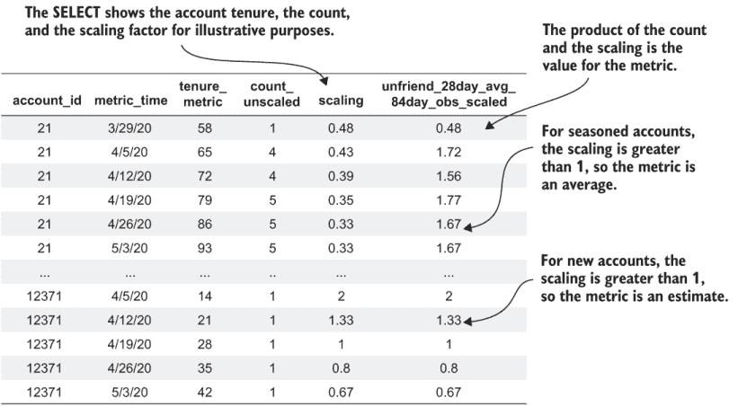

图 7.31 默认模拟数据集上列表 7.8 的样本输出

要将指标保存到数据库中，您需要删除未缩放的计数和缩放列，然后在 `INSERT` 语句中提供指标名称 ID。具有这些更改的列表版本在 GitHub 仓库中，可以通过在脚本可执行语句中添加 `—insert` 参数来运行。您应采取以下步骤：

1.  使用参数 `—chapter` `7` `—listing` `8` `—insert` 将列表 7.8 的结果保存到数据库中。

1.  通过重新运行列表 7.2 并使用参数 `—chapter` `7` `—listing` `2` 来重新生成数据集。

1.  通过重新运行列表 5.2 并使用参数 `—chapter` `5` `—listing` `2` `—version` `1` 来重新运行数据集汇总统计。

图 7.32 展示了汇总统计的典型结果。汇总统计显示，新的指标（标记为 `unfriend_28day_avg_84day_obs_scaled`）与第 7.4.1 节中教授的 12 周期指标（`unfriend_28day_avg_84day_obs`）具有相同的账户覆盖率，但指标值略高，总体上与简单的计数指标更匹配。原因是未缩放的指标通过使用较长的观察期来增加覆盖率，但没有纠正并非所有账户都有足够的任期来覆盖该观察期的事实。新的指标通过对新账户进行缩放来纠正这种情况。

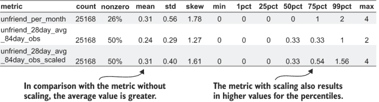

图 7.32 比较在短时间和长时间期间测量的罕见模拟事件的统计

由于你有了最终的每月取消好友数指标，你也应该重新计算它所使用的比率指标——每新增好友取消好友数——并重新检查群体分析。以下是要使用的程序参数的附加版本：

1.  计算一个新的每新增好友取消好友数指标 (`—第七章 —列表 1 —版本 7 —插入`)。

1.  通过重新运行列表 7.2 (`—第七章 —列表 2`) 来重新生成数据集。

1.  通过重新运行列表 5.1，版本 14 和 16 (`—第五章 —列表 1 —版本` `14` `16`) 来运行每月取消好友数和每新增好友取消好友数的群体分析。

现在你已经了解了基于账户期限的缩放指标，你可能期待一个案例研究来展示这种新技术在公司中的应用。我很抱歉让你失望，但我没有新的公司案例研究可以添加——因为书中所有的公司案例研究都使用了这种类型的缩放指标。我直到现在才提到这个事实，因为在你学习所有其他技术之前，这会是一个过多的信息量。

我总是使用类似于列表 7.8 的指标来对我的案例研究，因为这些指标具有许多优点，包括对账户的最高可能覆盖率以及稳健的指标估计，而不会牺牲对新账户的最佳可能估计。唯一的适度缺点是指标计算稍微复杂一些，这意味着你告诉你的业务人员这是一个平均值（而不深入细节）。

**总结**：要理解客户流失，你应该使用比描述期更长的观察期和缩放来对新账户的平均值进行可比估计的平均指标。简单的计数指标仅应用于衡量合同数量的使用，在这种情况下，合同期间的准确计数很重要。

我根据产品主要使用月度或年度订阅，使用以下标准指标进行客户流失研究：

+   对于月度订阅，使用以下参数的缩放计数指标：

    +   Tmin = 14 天（2 周）

    +   Tdescribe = 28 天（4 周）

    +   Tmeasure = 84 天（12 周）

+   对于年度订阅，使用以下参数的缩放计数指标：

    +   Tmin = 28 天（1 个月）

    +   Tdescribe = 28 天至 84 天（4-12 周，1 个月至 1 季度）

    +   Tmeasure = 365 天（1 年）

## 7.5 用户指标

你应该了解的最后一个行为度量领域是如何处理具有多个用户的产品。这些产品包括企业软件的多座位许可证和消费者产品的家庭计划。

### 7.5.1 测量活跃用户

关于多用户产品，首先要知道的是，仍然最好在订阅或账户级别理解客户流失，因为所有用户共享一个订阅；如果订阅未续订，所有用户将一起流失。

**注意**：在多用户产品中，当个别用户变得不活跃时不会发生客户流失。

如果你对分析用户健康感兴趣，你可以通过修改第四章中基于活动流失分析的技巧来执行用户活动和不活动的分析。目标仍然是理解账户层面的流失，而不是用户层面的流失，并利用有关单个用户行为的信息。

要了解单个用户行为如何影响流失，首先要回答的一个重要问题是活跃用户有多少。这个问题可以通过基于事件的指标来回答，如图 7.33 所示。这与在时间段内计数事件以创建指标类似，但不同之处在于，你计数的是产生事件的唯一用户数量。要程序化地计数活跃用户，你必须将用户标识存储在数据库或数据仓库中的事件中，这比标准事件表模式（表 7.1）需要额外的一个字段。你可能还记得第三章中提到，通常事件可以包含带有附加事件信息的可选字段，所以这种情况并不太不同。

表 7.1 带有用户 ID 的事件表

| 列 | 类型 |
| --- | --- |
| account_id | 整数或字符 |
| event_type_id | 整数或字符 |
| event_time | 时间戳 |
| user_id | 整数或字符 |

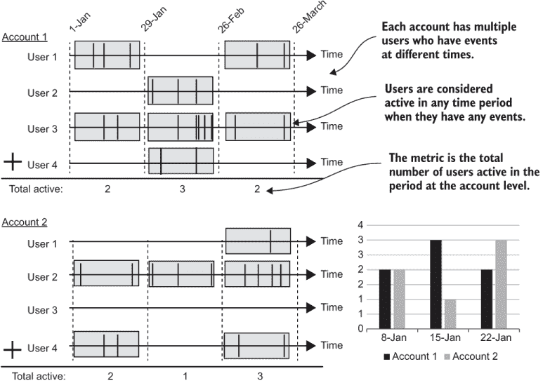

图 7.33 从事件计算活跃用户数量

列表 7.9 显示了一个简短的 SQL 程序，它将活跃用户数量作为一个指标进行计数。这个列表实际上与第三章中的简单事件计数指标几乎相同，但有一个关键的区别：不是计数事件的数量，而是对唯一用户 ID 的数量进行聚合。这个指标与标准事件计数指标之间的另一个区别是，这个指标没有指定事件类型：任何事件都表示用户活动。（当然，这个选项是可用的，如果你只想从某些事件中确定用户活动，这种改变很容易实现。）

通过对用户 ID 进行`DISTINCT`聚合，计算活跃用户数量是很容易做到的。

活跃用户计数指标与事件计数指标之间的一个微妙区别是，活跃用户的计数不应该按任期或与任期或测量周期有关的内容进行缩放。唯一活跃用户的数量是一个不按这种方式缩放的聚合指标示例。如果一个账户在四周期的前两周有两个活跃用户，并不意味着四周内会有四个活跃用户。从数学上讲，`DISTINCT`聚合不是可加的，就像`COUNT`聚合一样。

列表 7.9 计算活跃用户数量

```
WITH date_vals AS (                                       ①
     SELECT i::timestamp AS metric_date
     FROM generate_series('2018-12-01', '2018-12-31', '7 day'::interval) i
)
SELECT account_id, metric_date, 
    COUNT(DISTINCT user_id) AS n_distinct_users           ②
FROM event *e* INNER JOIN date_vals d
ON e.event_time <= metric_date                            ③
AND e.event_time > metric_date - interval '84 days'
GROUP BY account_id, metric_date                          ④
GROUP BY metric_date, account_id;
```

① 此 CTE 定义了用户将被计数的日期。

② 使用`COUNT DISTINCT`聚合计算用户数量

③ 使用`SELECT`限制查询为任何 12 周内的活动。

④ 使用`GROUP BY`来按账户级别测量用户数量。

GitHub 上的默认流失模拟不包括用户，但可以将模拟框架扩展以包括用户。如果你对这个主题感兴趣，可以考虑将框架以这种方式扩展作为练习。

### 7.5.2 活跃用户度量

图 7.34 展示了测量 Klipfolio 活跃用户数量的案例研究。该产品以多座位许可证的形式销售，因此有一个活跃用户数量的度量，如列表 7.9 所示，还有一个销售座位数的度量，使用第三章中描述的单位数量度量模式。图 7.34 显示，活跃用户数量与流失之间存在强烈的关联——这种模式现在应该很熟悉：在 1 到 4 个活跃用户之间，流失率迅速下降，但随后风险下降的速度放缓，对于拥有数十个或更多用户的客户，流失率几乎没有差异。同时，许可证用户数量似乎与流失没有强烈的关联。

许可利用是一个定义为用户数量与允许的最大用户数量之比的度量。有时，用户数量是通过创建用户账户来测量的，但对我来说，为了衡量流失，我更喜欢通过将活跃用户数量除以许可证用户数量来形成一个比率来衡量实际或活跃的许可证使用情况。图 7.34 还展示了 Klipfolio 按这种方式定义的许可证利用率的流失 cohort 分析。许可证利用与流失之间存在强烈的关联——比单独的活跃用户更强烈。随着许可证利用率的增加，流失风险的降低对于每个 cohort 来说相当连续。显然，许可证利用率是一个衡量客户参与度的有用度量。

**总结**：许可利用是活跃用户数量与允许用户数量的比率，通常是对用户或座位销售的产品的参与度的重要衡量指标。

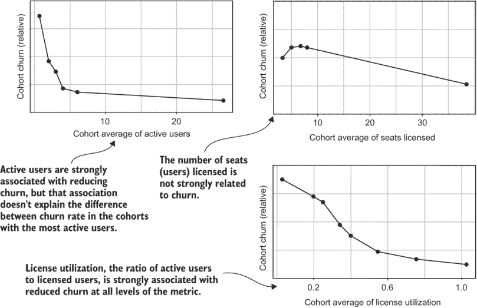

图 7.34 Klipfolio 每月活跃用户度量指标的客户流失 cohort 分析

图 7.34 展示了另一种用户度量类型，通过 Klipfolio 案例研究中的另一个例子来说明：每月每个用户的仪表板查看次数。这个比率是由每月仪表板查看次数和活跃用户数量测量的。这种类型的许多度量都是可能的。几乎任何你在账户级别测量的行为都可以通过活跃用户数量来除，从而形成一个每个用户的比率。因为大多数行为的总量与活跃用户总数相关，这种类型的比率可以产生与活跃用户数量、用户整体行为或两者都较少相关的有用度量。

## 7.6 使用哪些比率

你现在对客户流失和行为中的客户度量以及案例研究的设计和解释了解了很多。在本节中，我将结合几个主题并回答一些常见问题。

### 7.6.1 为什么使用比率，还有其他什么？

我在本章中花费了大量时间讲解比率指标，而对其他方面的内容投入的时间并不多。我教过你们，比率指标是理解客户行为之间关系的一种很好的方式，但还有其他选择吗？确实有其他选择，但根据我的经验，没有哪一种像比率指标那样有用。如果你有统计学或数据科学背景，你可能听说过交互测量。这个概念与比率类似，但不是通过将一个指标除以另一个指标，而是将两个指标相乘。

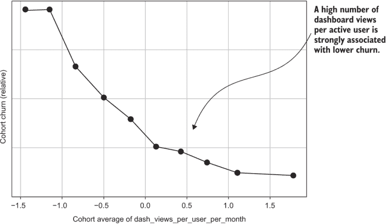

图 7.35 Klipfolio 仪表板每个用户查看的流失率分析

定义 交互指标是两个其他指标的乘积（乘法）。

交互测量，就像比率一样，是理解行为之间关系的一种方式。实际上，在经典统计学中，这种方法是理解测量之间关系的主要方法。例如，要有一个高交互项的测量值，你必须在这两个基础指标上都有高值。就像比率一样，任一指标为零意味着交互项为零。

交互项在计算机科学中有点像“与”操作。如果你有计算机科学背景，你可能正在想，你可以使用布尔运算，比如“当两个指标都高于某个特定水平时分配 1”。你可以将乘法交互视为一种更细腻的替代方案。当两个指标都高时，交互项不仅仅是`0`或`1`；它测量两个指标的实际高度。当应用于可以取负值的分数或指标时，交互项也有有趣的统计特性，因为当任一指标或另一个指标为负时，交互测量值将变为负值。

如果交互测量在统计学中如此有趣且被广泛使用，你可能想知道为什么我不推荐它们用于客户流失分析。简单的答案是，商业世界中没有人理解交互项，而比率则容易理解。也就是说，由两个其他指标相乘得到的指标，与比率相比通常具有不直观的单位。支付金额与通话次数（或观看视频数量等）的比率是每次通话（或视频等）的支付金额，但支付金额与通话次数（或任何行为）的乘积并没有一个常规的意义。

如果你上过物理课，你可能还记得不同类型数量的乘法，例如质量（千克）和距离（米），会产生组合单位，如千克米。通常，这些单位并不太容易理解。（什么是美元的称呼？）证明规则例外的情况是当一个度量是时间，另一个度量是强度度量时，比如电力销售中的千瓦时。我从未找到过解释为什么比率单位容易理解而乘法单位不容易理解的认知研究，但这个事实从每个人的经验中都很明显。我的建议是，只有在你已经有了一个明显意义的业务案例时，才使用乘法交互度量。

另一个数据科学家和统计学家熟悉的选择是从得分（减法）而不是比率（自然尺度度量）中创建度量。在第六章关于主成分分析（PCA）的侧边栏中，我指出 PCA 隐式地进行了这样的减法。想法是，如果你想了解两个度量之间的关系，你可以通过从其中一个减去另一个来查看差异，就像取比率一样。如果度量针对的是不同的事物，这种方法并不真正合理。通过从某人使用的电信产品通话次数中减去 MRR 支付的度量，你不会得到一个有意义的度量，但在将度量转换为无单位得分后这样做是可以的。你在第六章中看到了这个技巧被用来取平均组：得分显示某人是否高于平均水平（大于零）、平均水平（接近零）或低于平均水平（负数）。

通话得分与 MRR 得分的差异是衡量与支付金额相关的通话倾向的度量。因此，度量得分之间的差异可以像比率一样工作，但问题再次在于解释。你可以告诉你的业务人员你为每通电话的美元制定了度量标准，他们认为那很好；但解释从每月通话得分减去 MRR 得分的度量标准并不那么容易。当涉及到能够捕捉两种行为之间关系的可理解度量时，比率是唯一的选择。唯一的例外是如果你有理解不那么直观方法的业务技术人员。

### 7.6.2 应使用哪些比率？

我希望到这一点，你已经相信比率度量对于理解不同行为之间的关系以及它们与客户流失和客户参与度之间的关系是有用的。现在是时候更广泛地考虑要调查哪些比率了。

首先，要注意并非所有指标都能形成有用的比率。一个要求是，对于大多数客户来说，这两个指标都应该不为零（它们应该没有负值，这不太成问题）。一个简单的标准是，是否有很多客户在这两个指标上都有非零值。即使你发现与活跃度和参与度有强烈的关系，适用于少数客户的指标也不如适用于大量客户的指标有用。

在典型的数据集中，有很多事件类型可以定义比率。如果你熟悉概率和组合数学，你可能还记得，从 N 个项目中选择的可能配对数量是 N × (N - 1)。如果你有 N 个可能的指标，你可以用 N 个不同的指标选择比率的分子，剩下 N - 1 个用于分母。这样就有很多组合，这又提出了一个额外的问题：哪个指标应该放在分子，哪个应该放在分母？首先重要的是要意识到，你不应该尝试每一个可能的组合。

**警告**：不要为可能的比率创建每一个可能的指标对来检查与活跃度的关系。

原因在于，通常情况下，组合方式太多，其中大多数都没有意义。即便如此，通过检查大量指标，你仍然可能会发现一些虚假的关系，从而影响活跃度和参与度。

**定义**：一个指标与结果之间的虚假关系是指由于随机机会发生的关系，而不是由于可重复的因果关系。因此，这种关系不太可能再次发生。

如果你刚开始接触数据分析，可能会觉得奇怪，因为你可能会发现数据中存在某种并非真实的关系，但这个问题在数据科学中是众所周知的。如果你检查足够的指标，最终你可能会发现一些看似相关但实际上并不相关的指标。可以通过使用严格的准则来判断关系是强还是弱来解决这个问题，这是第八章的主题。但最好的做法是，一开始就不考虑那些看起来并不直观的关系。

**要点**：你主要考虑那些对业务人员来说直观的比率指标。

正如你所看到的，没有一条规则总是适用；你需要运用你对情况的知识。对于哪个指标应该放在分子和分母的问题，答案也是一样的：哪个更有意义。你可以尝试以下两种方法：

+   有时候，当两个指标位于一组相关活动的不同部分时，可能会存在有趣的关系（和良好的比率指标）。尝试查看相关组中最常见指标的比率（如第六章所述）；忽略那些不太常见的组员。

+   有时，不同活动领域之间存在有趣的关系。尝试测试一个相关组中最常见指标与另一个相关组中最常见指标的比率。再次，不必担心任何不太常见的指标。

表 7.2 总结了本章中涵盖的参与度和流失最常见的情况。

表 7.2 客户参与度比率指标摘要

| 名称 | 比率 | 相关性 | 信息 |
| --- | --- | --- | --- |
| 单位成本 | MRR/使用 | 在更昂贵计划上的客户通常使用产品更多。 | 单位成本显示与其他客户相比，每单位价格是高还是低。 |
| 单位价值 | 使用/MRR | 在更昂贵计划上的客户通常使用产品更多。 | 单位价值显示使用相对于支付的价格是高还是低。 |
| 利用率 | 使用/允许 | 在允许大量使用的计划上的客户通常使用得更多。 | 利用率显示使用是否接近限制。 |
| 成功率（或效率） | 成功次数/总尝试次数 | 尝试很多事情的客户通过纯粹的坚持而更成功。 | 成功率显示客户在活动中的相对成功或效率。 |
| 总计百分比 | 部分/整体 | 假设某些活动属于相互排斥的类别：使用产品较多的客户在所有类别中都使用得较多。 | 总计百分比显示客户在类别中的相对高低，除了整体使用水平之外。 |
| 百分比变化 | (当前指标/过去指标) -1.0 | 如果客户现在使用产品很多，他们可能过去也使用得很多。 | 百分比变化显示使用相对于客户自己的历史是高还是低。 |

许多有趣的比率指标没有列在表 7.2 中，所以请将此表视为说明性的，而不是详尽的。但这个表应该足以让你开始。

## 摘要

+   从其他指标的比率中创建的指标可以揭示行为平衡与流失和参与度之间的关系。

+   比率指标通常与分子和分母指标的相关性低于这些指标相互之间的相关性。

+   重复单位成本指标是使用产品的一些成本（如支付 MRR 或观看广告）与使用产品的结果（如打电话或查看内容）之间的比率。

+   流失率通常随着重复单位成本指标值的增加而增加，即使非单位重复成本指标本身（纯 MRR 或广告数量）没有显示出增加的流失率。

+   在某个过程中的下游事件与上游事件的比例可以被视为一个效率指标。例如，包括每客户的交易次数或每份文档编辑的节省量。

+   过程完成或成功结果与尝试次数的比例是成功率。接受请求率是此类指标的例子。

+   流失率会随着效率和成功率指标值的增加而增加或减少，具体取决于业务的特征。

+   总比率中的百分比是一个特殊的比率情况，其中分子是分母表示的总体总量的部分。例如，包括对不同地区拨打电话的百分比和在不同类别（动作、喜剧、戏剧等）中观看的节目百分比。

+   总比率中的百分比指标可以用来理解不同类别中行为平衡与所有类别水平相关时，与流失率和参与度之间的关系。

+   百分比变化指标是某个时间段内指标值变化的比率与该时间段开始时指标值的比率。例如，从一个月到下一个月登录次数的百分比变化。

+   百分比变化指标可以用来分析任何行为的增加或减少是否预示着未来的流失率和参与度。

+   自上次事件以来经过的时间是理解不活跃期与未来流失率之间关系的指标。

+   当产品跟踪多个用户 ID 时，可以测量活跃用户。

+   活跃用户可以用来形成各种比率指标，例如许可证利用率，这是活跃用户数与允许用户数的比率。

+   任何在时间段内测量的计数指标都可以描述为较短时间段的平均值或较长时间段的估计值。

+   单个缩放指标可以结合新账户的估计值和成熟账户的平均值。这种方法是计算用于分析流失率和参与度的计数和总指标的最佳方式。
