# 8 预测流失

本章涵盖

+   使用逻辑回归预测客户流失的概率

+   理解不同行为对流失的相对影响

+   检查你预测的校准情况

+   使用客户流失预测来估算客户生命周期和生命周期价值

到目前为止，你已经知道了分析流失和设计优秀客户指标所需的所有步骤。这些指标将允许商业人士进行有针对性的干预，以减少他们产品的流失。对于大多数产品来说，这些事情是最重要的，这就是为什么从本章（本书的第三部分）开始的技术可以被认为是特殊或额外策略：如果你需要，你可以使用它们，但它们并不总是必要的。在对抗流失的最重要的事情是，在细分客户和进行有针对性的干预时，业务应该基于数据驱动决策。

本章致力于预测客户流失的可能性，这是基于所有行为的组合。到目前为止，我已向你展示了如何通过查看队列图中的流失率来一次评估一个客户行为，以评估客户健康。但如何整合这些多个客户视角？如果一个客户在一个行为低流失风险的高队列中，但在另一个行为高流失风险的低队列中，该怎么办？考虑到客户行为之间的通常相关性，我所描述的是一个边缘情况，但了解如何处理它仍然是有益的。

一个值得了解答案的相关问题是哪种行为对客户健康和流失影响最大。不同行为的相对重要性在决定追求哪些减少流失的干预措施或产品修改时可能是一个重要的信息点。到目前为止，你只知道如何通过比较队列图中的关系来定性分析这些信息。这种方法适用于少数指标（或指标组），但如果你有很多指标，你需要一个更系统的方法。本章将教你如何使用被称为逻辑回归的统计模型来回答这些问题。

定义 逻辑回归是一个统计模型，它根据可能影响结果的多因素预测事件发生的概率。

逻辑回归经常用于评估医疗数据以发现疾病的原因。它适用于流失，因为你正在发现良好和不良客户健康的原因。因为逻辑回归是本书中唯一涵盖的回归模型，所以我有时会简称为回归。本章的设计如下：

+   第一部分（第 8.1 节）展示了逻辑回归背后的概念。

+   第 8.2 节回顾了你在整本书中使用的所有数据准备步骤，以确保你准备好运行逻辑回归算法。

+   第 8.3 节向您展示如何运行回归算法并解释结果。

+   第 8.4 节教您如何使用您创建的模型进行预测。

+   第 8.5 节解释了您在过程中可能遇到的一些陷阱和问题。

+   最后一个部分（第 8.6 节）致力于客户生命周期估计和衡量客户生命周期价值，这些都是从客户流失概率预测中得出的。

## 8.1 使用模型进行客户流失预测

对于不熟悉逻辑回归理论的读者，我将从逻辑回归理论概述开始。这些解释是针对预测流失和保留的具体案例。

### 8.1.1 使用模型进行概率预测

当我提到客户流失或保留概率预测时，我指的是为每个客户单独做出的估计，就像一个指标。但与指标不同，流失概率预测不是对已经发生的事情的测量：它是对未来可能发生的事情的概率估计，即流失。

定义 对于客户的流失概率预测是指，如果您有一个具有相同预测的客户群体，您期望根据概率给出的百分比流失。流失概率预测永远不会告诉您单个客户是否一定会流失或不会流失。

由于预测是针对特定客户的，就像一个指标一样，预测概率的定义并不是关于单个客户是否会保留或流失，这有点反直觉。理解对于单个客户来说，事情总是可能向两个方向发展。尽管我大多数时候不会提到这个事实，但预测中隐含了一个时间范围。更准确地说，预测是客户在下次续订前（在第四章中定义）的领先时间内流失的概率。这种时间范围是隐含的，因为历史数据集就是这样设计的，而这个数据集将被用来确定预测。

预测是对一组相似客户行为的陈述。即使预测一个客户有 99%的流失概率，这并不意味着他们一定会流失。这意味着在 100 个这样的客户群体中，您预计有 99 个在下次续订前的领先时间内会流失。重点是，如果您关注的是单个客户，这个客户可能最终会留下来。（如果您预测 99%的流失概率，您的数据可能存在问题；参见第 8.5 节。）同样的情况也适用于保留：如果您预测保留概率，并且您有一个假设的客户群体，其保留概率为 90%，您预计该群体中有 90%的客户会保留。

我将用预测保留概率的术语来教您所有内容，因为这种背景更容易理解。客户流失概率将从 100%减去保留概率得出。我将在第 8.1.2 节中指出为什么预测保留率更容易。

你将学习如何使用数学预测模型进行预测：逻辑回归。在这个背景下，模型意味着像真实事物一样工作，但我想要警告你不要认为模型是真实的。模型假设客户参与度和留存率以某种方式工作，但它这样做是因为这些假设适用于预测的目的，而不是因为世界就是那样的。不要怀疑。记住，模型是一个与现实紧密匹配的构造，但它的每一部分并不都是真实的，而且不是每一部分都需要完美，整个模型才有用。

### 8.1.2 参与度和留存率概率

逻辑回归在预测留存率中的第一个概念是，增加客户参与度会导致留存概率的增加。我所说的参与度是一种无法衡量的主观状态。不同的人有不同的想法，但以下是我对参与度的操作定义。

定义：参与度是一种参与和承诺的状态。

在这次讨论中，参与度意味着产品的使用，承诺意味着续订的可能性。更多的参与度应该导致更高的留存率是有道理的。现在，不要担心参与度本身是一个主观状态。

预测流失和留存的关键特征是，参与度和留存率之间的关系受到参与度效应递减的影响。即使是最活跃的客户也有可能流失。一个后果（或要求）是，客户越活跃，额外的参与度对进一步增加留存概率的影响就越小。相反也应该是真的：客户越不活跃，他们被留存的概率就越低。但即使是最不活跃的客户仍然有被留存的可能。此外，客户越不活跃，进一步减少参与度对留存概率的影响就越小。图 8.1 说明了这个概念。

在参与度和留存率的高端和低端之间的递减关系形成了一个类似于图 8.1 所示的 S 曲线。参与度中间范围的概率变化率必须达到峰值，而在极端情况下则趋于平坦。

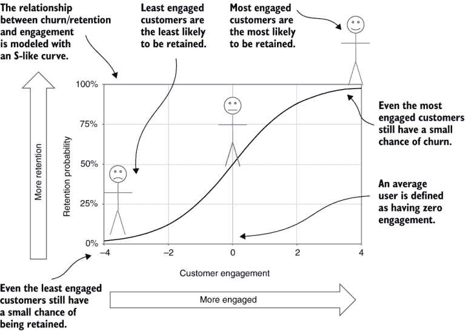

图 8.1 使用 S 曲线映射参与度到留存率

### 8.1.3 参与度和客户行为

在我解释参与度和留存率之间的关系时，我把客户的参与度比作其他任何行为指标一样，是可以衡量的。这个定义对于模型来说很好，因为按照我的框架，参与度是留存和流失的潜在驱动因素。但参与度仍然不可衡量。逻辑回归就是这样解决这个问题的：你相信参与度存在，即使你不能衡量它，所以你假设参与度可以从行为测量和流失观察中估计出来。

TAKEAWAY 客户参与度无法直接测量，但你可以通过匹配观察到的流失与 S 曲线来预测流失概率，从客户指标中估算它。

如果这个解释看起来像是循环推理，你必须接受它是一个模型；你很快就会看到它是有效的。估算客户流失和保留概率的过程包括估算每个客户参与度的中间步骤。模型假设参与度测量采取类似于指标得分的形式。参与度估算将是数字，大多数在-4 到 4 的范围内，并且客户的平均参与度将被设定为零。就像指标得分一样，正数表示高于平均的参与度，而负数表示低于平均的参与度。这个定义是任意的，因为你无法测量参与度，但它对于做出预测是方便的。

图 8.2 说明了从行为估算参与度并将其转换为保留概率估算的模型。关键概念是每个行为指标得分乘以一个参与度强度，我称之为权重，它捕捉了行为对参与度的贡献程度。权重也可以是负数，表示该行为与脱钩和增加的流失而不是保留相关。整体参与度是每个行为的贡献之和。

TAKEAWAY 客户参与度是通过一个模型估算的，该模型将参与度权重乘以每个指标的得分，然后将它们加在一起。

图 8.2 中的预测模型包括以下步骤：

1.  从所有指标的得分开始。

1.  假设每个指标都有一个权重，表示指标得分值对参与度的贡献强度。

    +   每个指标得分的参与度贡献是该指标参与度权重乘以得分值。

    +   总参与度估算是从每个指标的所有贡献中求和。

1.  在计算出总参与度后，通过应用 S 曲线到参与度估算来获取保留概率。

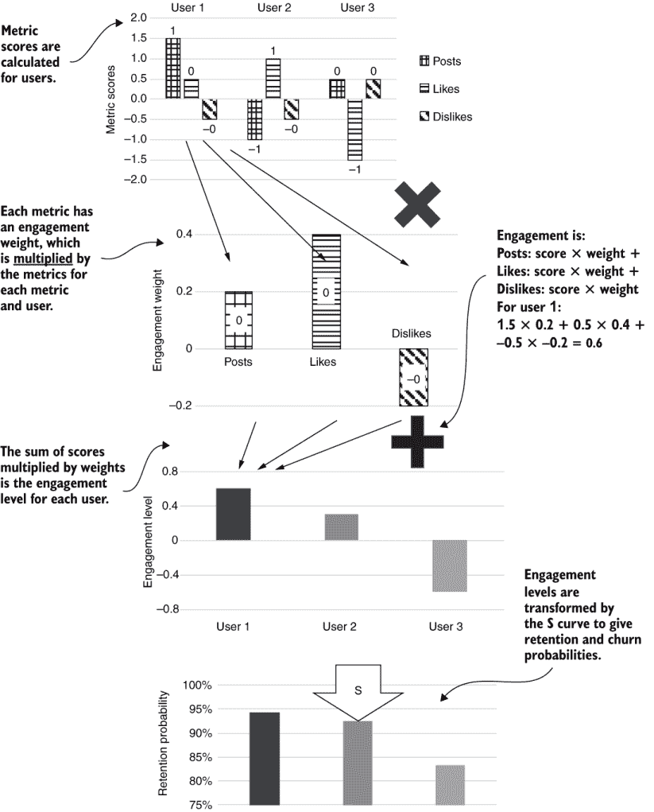

图 8.2 从指标估算参与度和流失概率

这些权重也被称为系数，因为系数是一个乘以另一个数的数字。Python 包使用术语系数，但我更喜欢权重，因为它是一个更功能性的描述（与与商人用普通英语交流的目标保持一致）。

这种从行为估算参与度的方法绕过了参与度无法测量的问题，假设参与度遵循一个简单的模型。但新的问题是，你不知道你的各种指标的参与度权重应该是多少。我建议你用一个你无法测量的东西来替换另一个你无法测量的东西——行为的参与度权重。

如果这种方法看起来像是作弊，我想再次提醒你（再次）这种情况并不是真实的；这是一个将要像真实情况一样工作的模型。寻找参与度权重的问题是由逻辑回归算法本身解决的（见第 8.3 节）。但在你学习如何运行算法并找到权重之前，你需要更多地了解如何将预测模型与你的数据细节相匹配。第 8.1.4 节展示了回归模型如何精确地匹配客户的流失率。

### 8.1.4 偏移量匹配观察到的流失率到 S 曲线

关于模型的一个重要细节是了解 S 曲线如何匹配具有特定流失率的产品。首先，回忆一下，每个指标的平均值是 0，因为这就是指标得分是如何定义的。因此，一个完全平均的用户在模型中具有零参与度。因为参与度是通过将权重乘以得分得到的，而所有得分都是 0，所以参与度也必须是零。图 8.3 说明了这个概念。

如图中所示，S 曲线的默认版本将与 0 参与度匹配 50%的保留概率（以及 50%的流失概率），因为它是对称定义的。但这个结果只有在产品的平均用户真的有 50%的保留概率时才是正确的。必须有一种方法来调整模型，以便平均用户有一个现实的保留和流失概率预测。

这个问题的解决方案来自模型的一个另一个特性。参与度和保留概率之间的 S 关系可以包括一个偏移量，以便平均用户映射到平均保留概率。偏移量意味着 S 曲线相对于默认值向左或向右移动。偏移量也被称为截距，因为偏移量决定了 S 曲线与零参与度线的交点。（截距意味着交点的值。Python 包使用截距这个术语，但我使用偏移量，因为它描述了这个数量做什么，而不仅仅是它是什么。）

在图 8.3 中，假设保留概率约为 90%。在这种情况下，S 曲线必须偏移约 2，以便具有 0（平均）参与度的用户最终具有约 90%的保留概率预测。

TAKEAWAY 逻辑回归模型包含一个偏移量，允许标准的 S 曲线匹配任何平均保留概率。

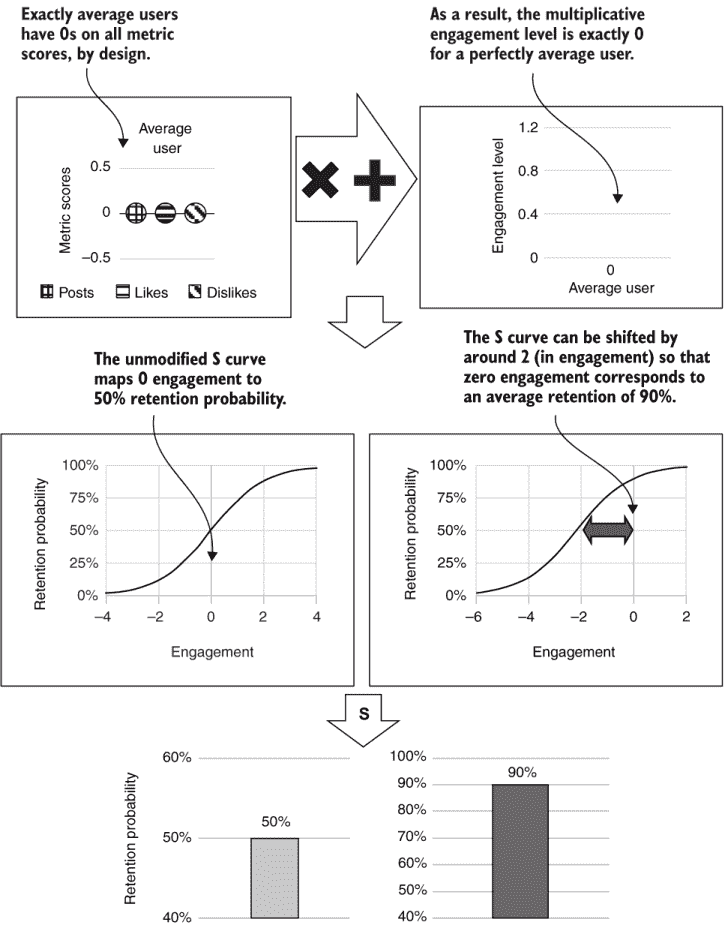

图 8.3 偏移量匹配 S 曲线到平均保留概率

再次提醒，你可能想知道如何得出这个新变量的正确值。这个问题也由逻辑回归算法解决。因此，参与度权重和 S 曲线偏移量是算法的主要输出，这就是你为客户做出现实的流失和保留概率预测所需的所有内容。

### 8.1.5 逻辑回归概率计算

现在我已经解释了所有概念，我将向你展示定义数学模型的方程组。像这本书中的其他数学一样，这个数学是为了帮助有数学倾向的人理解而设计的。如果你不是这样的人，不要担心。如果你已经理解了到目前为止解释的概念，无论你是否研究本节中的方程，你都将准备好进行预测。

这些方程使用向量（即数字列表）来表示指标和参与度权重。变量上方的横线表示它是一个向量，因此我将使用 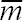 来表示一个账户所有指标分数的向量，以及 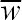 来表示所有参与度权重的向量。在这种情况下，账户的参与度 (*E*) 由方程式 8.1 给出：

| 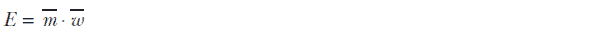  | 方程式 8.1 |
| --- | --- |

点（·）表示点积运算，它是两个向量元素逐个相乘后的结果求和。点积是我在解释如何将指标分数与参与度权重结合以获得账户的总参与度时描述的过程。给定参与度，保留概率 P 的模型其余部分为

|   | 方程式 8.2 |
| --- | --- |

其中 *E* 代表参与度，off 代表偏移量，*S*(...) 代表 S 曲线函数。方程式 8.2 中引用的 S 曲线函数由方程式 8.3 给出：

| 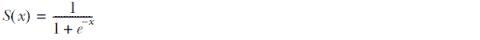  | 方程式 8.3 |
| --- | --- |

注意，方程式 8.3 中的小 *e* 代表自然对数的底数，即 *e* ≈ 2.72。但你不需要学习自然对数是什么就能理解方程式 8.3。要理解它，首先记住以下关于指数化（或取数的幂）的事实：

+   对于任何大于 1.0 的正数，如果你用正数来指数化它，它会变得更大。（关于 *e* 你需要知道的是，它是一个大于 1.0 的正数。）

+   如果你用负数来指数化这样一个数，它会变得更小，因为用负数指数化等于用正数指数化的数的倒数：*x*^(*−y*) = 1.0/*x*^(*y*).

在方程式 8.3 中，*x* 代表参与度加上偏移量，*x* 在 e 的指数化变量上有负号。负号反转了指数化的通常效果，使得当 *x* 变大时，*e* 项变小，而当 *x* 为负时，*e* 项变大。因此：

+   当 *x*（参与度）为正且 *e* 项较小时，分母接近 1，分数也趋向于 1，这对应于当参与度高时保留率达到 100%。

+   当*x*（参与度）为负且*e*项较大时，分母会变得很大，分数趋向于 0，这对应于参与度低时保留率趋向于 0%。

理解方程 8.3 与使用*e*和自然对数无关。方程 8.3 使用自然对数的底而不是其他数字的原因，与逻辑回归算法中的技术细节有关，而不是因为它有必要产生 S 曲线。

本节完成了从指标分数到预测保留概率的模型解释，从指标分数到预测保留概率。接下来你需要知道的是如何为指标制定参与度权重以及用于 S 曲线的偏移量。当你对你的数据运行逻辑回归算法时，这项任务由逻辑回归算法处理。

## 8.2 数据准备回顾

在我向你展示运行逻辑回归算法的细节之前，让我们回顾一下你为生成数据所采取的所有步骤。这次回顾将确保你的数据为接下来的步骤做好准备，并且这些步骤在你的脑海中保持清晰将有助于你在进行概率预测时。

准备的第一步是导出数据集的一个略微修改的版本。在第七章中，你尝试了几种针对罕见事件每月取消好友数的指标版本。为了避免混淆，你现在将导出一个只包含每月取消好友数最终缩放版本的指标数据集版本。在一个真实公司的案例研究中，你也会尝试不同的指标版本，然后为你的数据集选择一个子集。这个最终的数据集还省略了账户期限的测量。在真实服务中，你应该在分析中包含账户期限，但在模拟中它没有意义。因为你已经多次看到数据集的导出（在第 4.5、4.6 和 7.2 的列表中），所以我不会在书中展示这个 SQL。代码在第八章的列表文件夹中，如果你想查看的话。为了匹配本章中展示的结果，你应该使用以下命令行提取数据集的新版本，用于 Python 包装程序：

```
fight-churn/listings/run_churn_listing.py —chapter 8 —listing 0
```

图 8.4 显示了从数据库导出后的数据准备所使用的所有函数的总结。步骤如下：

1.  计算关于数据的一组汇总统计。这些汇总统计保存在一个表中（列表 5.2）。

1.  使用汇总统计将指标从它们的自然尺度转换为分数。这一步保存了数据集的第二版本，以及用于创建分数的均值和标准差表，以及用于偏斜和厚尾的转换指标（列表 7.5）。

1.  找到组合在一起的关联指标，并保存一个解释分组的加载矩阵。这个矩阵用于实现分数的平均（列表 6.4）。

1.  使用加载矩阵创建第三个也是最终的版本的数据集，其中相关的指标分数被平均（列表 6.3；我在列表 6.4 之前讲解了这一点，以便你在创建加载矩阵之前理解它）。

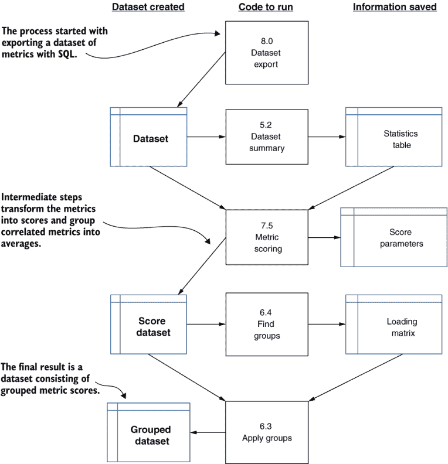

图 8.4 展示了流失率分析和预测的数据准备步骤

列表 8.1 显示了数据准备的所有步骤，如果你还没有完成所有这些步骤，你可以使用列表 8.1 来准备自己的数据。第七章没有明确告诉你重新运行你的统计数据、分数或分组。如果你按照给出的指示执行，这个列表就是为你准备的。运行列表 8.1 会在你的输出目录中创建几个项目：数据集的两个额外版本，以及三个在过程中使用的统计数据和导出参数的表格。

列表 8.1 数据准备列表合并

```
from listing_5_2_dataset_stats import dataset_stats
from listing_7_5_fat_tail_scores import fat_tail_scores
from listing_6_4_find_metric_groups import find_metric_groups
from listing_6_3_apply_metric_groups import apply_metric_groups
from listing_6_5_ordered_correlation_matrix 
   import ordered_correlation_matrix

def prepare_data(data_set_path='',group_corr_thresh=0.55):
   dataset_stats(data_set_path)                             ①
   fat_tail_scores(data_set_path)                           ②
   find_metric_groups(data_set_path,group_corr_thresh)      ③
   apply_metric_groups(data_set_path)                       ④
   ordered_correlation_matrix(data_set_path)
```

① 找出分布的平均值、偏度和分位数

② 将数据从指标转换为分数

③ 找出哪些指标是相关的，并决定哪些要分组

④ 创建一个将分组指标平均在一起的数据集

如果你还没有执行所有这些步骤，请使用 Python 包装程序和以下参数运行列表 8.1：

```
fight-churn/listings/run_churn_listing.py —chapter 8 —listing 1 
```

当你在第七章学习高级指标时，重点是新的指标动机和代码以及测试与流失率的关系。我从未使用第七章的技术展示过所有第七章指标的相关性和指标组的最终结果。图 8.5 显示了加载矩阵的结果，它总结了分组。

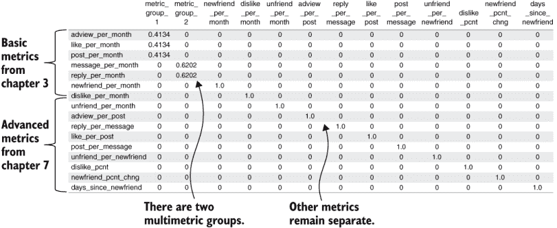

图 8.5 展示了在第七章创建的附加指标上运行指标分组算法（列表 6.4）的模拟数据集的结果

如果你使用默认参数在第七章的数据集上运行指标分组算法，你应该找到两个多指标组，其中一些指标保持独立。第一个指标组包括三个代表最常见行为的指标：发帖、点赞和查看广告。第二个组平均了包括回复在内的消息指标。那些相关性不足以进入组别的指标是取消好友关系的指标、广告点击数/帖子的高级指标、新朋友天数和新增朋友事件率的变化百分比。

如果运行你的代码返回的结果看起来像图 8.5，那么你就可以运行第 8.3.1 节中的逻辑回归示例了。如果你得到的是其他结果，最可能的原因是你没有在第七章中创建所有新的指标。为了确保你拥有所有指标，你可以使用以下两组参数来运行 Python 包装程序并立即生成它们。

包装程序的第一次运行创建了 days_since_new_friend（自新朋友以来天数）、newfriend_pcnt_chng（新朋友百分比变化）、tenure-scaled version of unfriend_per_month（按任期缩放的每月取消关注版本）以及表示总点赞和踩数（标记为意见数）的指标：

```
run_churn_listing.py —chap 7 —listing 3 4 6 8 —insert
```

第二条命令运行所有版本的比率指标以创建 adview_per_post（每篇帖子的广告查看次数）、reply_per_message（每条消息的回复次数）、like_per_post（每篇帖子的点赞次数）、unfriend_per_newfriend（每新增朋友取消关注次数）和 dislike_pcnt（踩数百分比）指标：

```
run_churn_listing.py —chap 7 —listing 1 —version 1 2 3 4 5 6 —insert
```

创建所有指标后，你应该能够运行列表 8.1 并获取图 8.5 中所示的加载矩阵。

## 8.3 拟合流失模型

现在您的数据已准备就绪，您也知道了回归预测模型的工作原理，现在是时候运行算法以获得匹配您数据的权重和偏移量。找到匹配数据的权重和偏移量被称为拟合模型。

定义：拟合统计模型意味着找到关键参数的值，使模型尽可能接近样本数据。拟合模型有时也被称为训练模型。

我将向你展示如何读取结果，然后如何创建它们。

### 8.3.1 逻辑回归结果

图 8.6 显示了在模拟流失数据集上拟合逻辑回归得到的权重和偏移量。（此结果将在您运行列表 8.2 后生成。）文件中的每一行都显示了一个指标或一组指标的测量结果。结果由以下两个数字组成：

+   参与度权重

+   对指标对保留（流失）概率的影响的测量，我称之为保留影响

参与度权重是小的数字，通常小于 1，正如我之前所建议的。这很有道理，因为参与度权重和指标得分的乘积将加起来等于总参与度，其规模类似于得分。正权重表示指标（或组）与增加的参与度相关联，而负权重表示指标与减少的保留率（增加的流失率）相关联。因此，设置模型以预测保留率使其更容易理解：表示好事的正数比负数更直观，如果你设置了模型以预测流失，所有增加参与度的东西都将有负权重。

启示：预测保留概率比预测流失概率更容易理解，因为这样，数值意义上的正权重与参与度意义上的积极结果相关联。

指标对流失的影响测量显示为保留概率的百分比变化。我将在稍后展示计算的细节，但首先，我将解释它的含义。

**定义**：一个指标或一组指标的保留影响是指它使客户在这个指标上比平均值高出一个标准差时，保留概率的差异，假设所有其他指标都是平均的。

如果一个指标的保留影响是 2%，那么在一个指标上比平均值高出一个标准差且在其他所有指标上平均的客户，其预测保留概率比平均保留概率高 2%。这个概率比平均流失概率低 2%，所以你可以用任何一种方式描述它，只要你能跟踪影响的方向。流失影响不是统计学课程中教授的标准指标，但我发现它在向商业人士解释逻辑回归模型时很有用。

**要点**：一个指标对保留和流失概率的影响对于向商业人士传达回归结果非常重要。

当你解释流失和保留影响时，请记住两件事：

+   如果一个指标低于平均值而不是高于平均值，它对流失率的影响大约是相等且相反的。

+   由于 S 曲线塑造概率预测的方式，多个高于（或低于）平均值的指标累积效应对流失率有递减的影响。对于高于平均值的指标，如果它比平均值高出超过一个标准差，那么这个指标在平均流失率上的影响将小于结果显示的两倍。

偏移量的结果是在图 8.6 底部增加了一行：偏移量列中的数字不是权重，而是偏移量的数量。

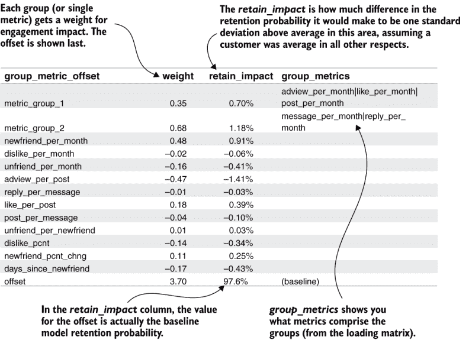

图 8.6 模拟数据集的逻辑回归输出

我之前建议，为了达到大约 90%的保留率，偏移量大约为 2。在图 8.6 中，你看到模拟保留率的偏移量为 3.7，这大约是 95.4%。在偏移量列中的数字是完美平均客户的保留概率预测。回想一下，一个完美平均客户在所有指标得分上都是零，所以在方程 8.2 中，对于概率（Pretain = S(E + off)），唯一的项就是偏移量。

注意，对于完美平均客户，预测概率为 2.4%（100% - 97.6%，图 8.6 中的保留率），但在模拟中，流失率约为 4.6%（参见第五章，图 5.12）。你可能预期一个完美平均客户的流失概率将与整体或平均流失率相等，但情况并非如此。

**注意**：对于完美平均客户的预测流失概率通常接近整体流失率，但不等于它。

这是计算流失影响的方法。如果一个客户是完美平均的，他们在所有得分上都是零，保留的概率将等于方程 8.4：

| 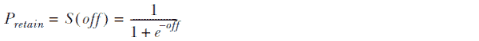  | 方程 8.4 |
| --- | --- |

另一方面，如果一个客户在所有方面都完全平均，除了在单个指标或组上比平均水平高一个标准偏差，那么权重与分数的乘积将正好等于他们在比平均水平高一个标准偏差的那个分数上的权重。在这种情况下，如果变量 w 代表参与方程中一个权重的值，方程 8.4 将导致方程 8.5：

| 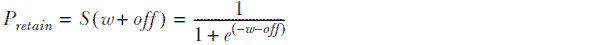  | 方程 8.5 |
| --- | --- |

活跃度影响是通过计算每个参与权重方程 8.4 和 8.5 之间的差异来计算的。

### 8.3.2 逻辑回归代码

列表 8.2 提供了逻辑回归分析的代码。这个列表远不止拟合回归，这只有两行。其余的代码准备数据，对结果进行一些分析，并保存一切。列表分为七个函数，按它们被调用的顺序描述如下：

+   `logistic_regression_analysis`（主函数）—在调用辅助函数创建数据后，该函数创建`sklearn`的`LogisticRegression`对象，并调用`fit`方法来运行模型拟合。然后它调用更多的辅助函数来分析和保存结果。

+   `prepare_data`—该函数加载保存的分组分数数据集，并分离表示活跃度的列。活跃度指示器被反转，以便表示保留。使用分组分数是一个由默认参数控制的选项，因为（在第九章中）它用于加载其他文件。

+   `save_regression_summary`—该函数创建一个`DataFrame`，其中一列是回归模型权重和偏移量，另一列是标准偏差影响。请注意，此方法（以及接下来的两个方法）有一个可选的扩展参数，用于在第九章中保存额外的版本；这是图 8.6 所示的数据表。它调用`calculate_impacts`来获取活跃度影响数值，然后从`LogisticRegression`对象中获取权重；这些值存储在一个名为`coef_`的字段中。（`coef`是系数的简称，它是一个乘以另一个数的通用术语。）然后将这些结果与度量指标和组的名称结合在一个`DataFrame`中，然后保存。

+   `calculate_impacts`—此函数使用前面描述的方程计算一个标准偏差分数对保留概率的影响。它调用偏移量的`s_curve`函数，偏移量是回归对象的变量`intercept_`，以获取基线保留概率。它还调用偏移量和权重之间的差异的`s_curve`函数，该差异存储在回归对象的变量`coef_`中。该函数的结果是保留影响的向量以及基线保留概率。

+   `s_curve`—此函数实现了方程 8.2。

+   `save_regression_model`—此函数将回归对象保存到 pickle 文件中，以便可以重新加载并用于以后的预测。

+   `save_dataset_predictions`—此函数计算在创建模型所使用的数据集中的观测值上的流失和保留概率。它使用数据集作为参数在回归对象上调用`predict_proba`函数。结果保存在一个.csv 文件中，在第 8.3.5 节中进一步解释。

您应该以常规方式使用 Python 包装程序运行列表 8.2，并使用这些参数：

```
fight-churn/listings/run_churn_listing.py —chapter 8 —listing 2
```

程序会打印几行输出，告诉你它保存了三个结果的位置，它们是

+   包含权重和一个标准差影响的文件

+   包含模型 pickle 的文件

+   包含历史流失和保留概率的文件

您应该打开汇总文件，churnsim_logreg_summary.csv，并确认它与图 8.5 相似。由于数据是随机模拟的，所以不会完全相同。我在第 8.3.5 节中更多地讨论了结果，以及如何在第 8.4 节中使用 pickle 文件。

列表 8.2 逻辑回归分析

```
import pandas as pd
import numpy as np
import os
from sklearn.linear_model import LogisticRegression
from math import exp
import pickle

def logistic_regression_analysis(data_set_path=''):
   X,y = prepare_data(data_set_path)                                  ①
   retain_reg = LogisticRegression(fit_intercept=True, 
      solver='liblinear', penalty='l1')                               ②
   retain_reg.fit(X, y)                                               ③
   save_regression_summary(data_set_path,retain_reg)                  ④
   save_regression_model(data_set_path,retain_reg)                    ⑤
   save_dataset_predictions(data_set_path,retain_reg,X)               ⑥

def prepare_data(data_set_path,ext='_groupscore',                     ⑦
                 as_retention=True):
   score_save_path = data_set_path.replace('.csv', '{}.csv'.format(ext))
   assert os.path.isfile(score_save_path), 'You must run listing 6.3 first'
   grouped_data = 
      pd.read_csv(score_save_path,index_col=[0,1])                    ⑧
   *y* = grouped_data['is_churn'].astype(np.bool)                       ⑨
   if as_retention: y=~y
   X = grouped_data.drop(['is_churn'],axis=1)                         ⑩
   return X,y

def calculate_impacts(retain_reg):                                    ⑪
   average_retain=s_curve(-retain_reg.intercept_)                     ⑫
   one_stdev_retains=np.array( 
      [ s_curve(-retain_reg.intercept_-c) 
       for c in  retain_reg.coef_[0]])                                ⑬
   one_stdev_impact = 
      one_stdev_retains - average_retain                              ⑭
   return one_stdev_impact, average_retain

def s_curve(x):    
   return 1.0 - (1.0/(1.0+exp(-x)))

def save_regression_summary(data_set_path,
                            retain_reg,ext=''):        
   one_stdev_impact,average_retain = 
      calculate_impacts(retain_reg)     
   group_lists = pd.read_csv(                                         ⑮
                             data_set_path.replace('.csv', '_groupmets.csv'),
                             index_col=0)
   coef_df = pd.DataFrame.from_dict(                                  ⑯
       {'group_metric_offset':  np.append(group_lists.index,'offset'),
        'weight': np.append(retain_reg.coef_[0],retain_reg.intercept_),
        'retain_impact' : np.append(one_stdev_impact,average_retain),
        'group_metrics' : np.append(group_lists['metrics'],'(baseline)')})
   save_path = 
      data_set_path.replace('.csv', '_logreg_summary{}.csv'.format(ext))
   coef_df.to_csv(save_path, index=False)
   print('Saved coefficients to ' + save_path)

def save_regression_model(data_set_path,retain_reg,ext=''):   
   pickle_path = 
      data_set_path.replace('.csv', '_logreg_model{}.pkl'.format(ext))
   with open(pickle_path, 'wb') as fid:
       pickle.dump(retain_reg, fid)                                   ⑰
   print('Saved model pickle to ' + pickle_path)
def save_dataset_predictions(data_set_path, 
                             retain_reg, X,ext=''):    
   predictions = retain_reg.predict_proba(X)                          ⑱
   predict_df = pd.DataFrame(predictions,                             ⑲
                             index=X.index,
                             columns=['churn_prob','retain_prob']) 
   predict_path = 
      data_set_path.replace('.csv', '_predictions{}.csv'.format(ext))
   predict_df.to_csv(predict_path,header=True)
   print('Saved dataset predictions to ' + predict_path)
```

① 调用辅助函数`prepare_data`

② 创建适合回归类型的对象

③ 根据流失数据拟合模型系数

④ 调用`save_regression_summary`以保存结果的摘要

⑤ 调用`save_regression_model`以保存回归对象

⑥ 调用`save_dataset_predictions`以进行预测

⑦ 将数据放入回归所需的形式

⑧ 加载数据集，设置索引

⑨ 分离结果并将其转换为 True 以保留

⑩ 分离指标

⑪ 平均值以上一个标准差的冲击影响

⑫ 完美平均客户的流失率

⑬ 对于每个系数，计算其影响

⑭ 影响是平均值以上一个标准差的概率差异。

⑮ 在摘要中的每个组中重用指标

⑯ 创建一个结合结果的 DataFrame

⑰ 通过 pickle 保存对象

⑱ `predict_proba`预测流失和保留

⑲ 创建新的 DataFrame 并保存预测

列表 8.2 中的`LogisticRegression`对象需要几个参数。`fit_intercept=True`告诉逻辑回归你将在模型中包含一个偏置。这是可选的，因为逻辑回归还有其他用途，你不会包含偏置。其他参数`solver='liblinear'`和`penalty='l1'`控制了用于找到权重和偏置的方法。你可以使用不同的方法来拟合模型，但本书侧重于逻辑回归在对抗流失（ churn）中的应用（我不会深入细节）。这些参数对应于称为岭回归（也称为 Tikhonov 正则化）的方法，你可以在统计学教科书或网上找到更多关于它的解释。

**定义** 岭回归是一种现代的回归参数拟合方法，当许多指标可以相互关联时表现良好。

当有大量指标可以相互关联时，岭回归表现良好，这使得它适用于典型的客户流失数据。你可以在第九章中了解更多关于岭回归和`LogisticRegression`对象参数的信息。但首先，让我们谈谈如何向你的商业同事解释回归结果。

### 8.3.3 解释逻辑回归结果

回归结果展示了哪些指标或相关指标组对客户流失和留存影响最大。这一发现对于与你的商业同事分享非常重要，因为它是对导致客户（以及不参与）与你的产品互动最多的行为或产品方面的客观估计。权重估计和留存概率影响的结果显示了相对重要性；两者讲述的是同一个关于影响最大的故事。这一结果在图 8.7 中得到了说明，该图显示了从对留存最有利到对留存最不利的权重和留存影响排序。

在图 8.7 中，你可以按权重或留存影响排序，排序顺序相同，如果你考虑 S 曲线的形状，这是有意义的。更多的参与度总是导致更高的留存概率，因此对参与度的影响（即权重所代表的）越大，对留存概率的影响就越大。


图 8.7 回归系数与留存概率影响比较

理解回归中的权重很重要，但我不建议与商业人士谈论它们。为了向你的商业同事解释不同行为对留存的影响，我建议你只使用留存概率的影响。回归使用的参与度和权重是抽象概念，并不存在，这可能会造成困惑。使用留存概率影响的优点是，留存概率是一个具体的业务指标，人们已经从留存率中理解了这一点。

在解释指标对留存和流失的影响之前，你需要确保商业人士理解以下概念：

+   概率是什么以及你的产品的客户流失率和留存率是多少。在这个领域，特别是要确保人们理解以下内容：

    +   客户流失率等同于一个概率。

    +   客户流失率和留存概率的总和为 100%。

+   标准差在一般意义上的含义。大多数人听说过标准差，但并没有具体的实际知识。他们需要理解，一个人如果比平均水平高一个标准差，就会明显高于平均水平，但并不极端。他们还需要理解，你也可以用标准差来谈论低于平均水平。

图 8.8 展示了向商业人士展示这一结果的好方法：柱状图。将保留影响放入柱状图中，可以轻松地看到相对重要性。我还建议按重要性从高到低对指标和组进行排序。用描述性名称标注指标组。

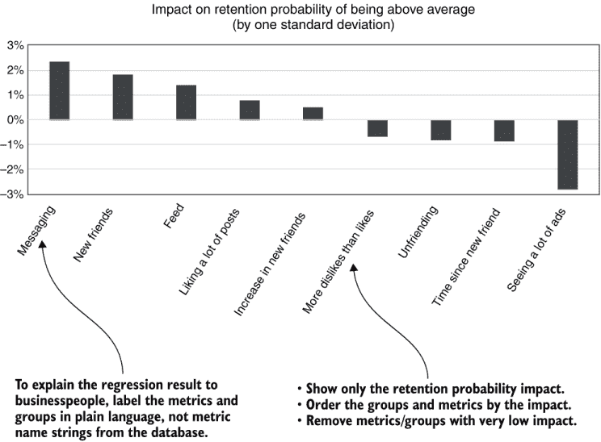

图 8.8 柱状图解释行为对客户流失概率的影响

我喜欢向商业人士展示柱状图来解释保留概率的原因是，对参与度有利的指标或行为显示为正数，而对参与度不利的指标或行为显示为负数。同时，用客户流失概率来谈论也很方便。如果你发现社交信息使用中高于平均水平一个标准差会导致保留概率增加 2%，你更有可能说这降低了客户的流失概率从 10%到 8%，而不是将保留概率从 90%提高到 92%。在客户流失概率这个更小的数字上，影响更具体。

在向商业人士展示了展示行为高于平均水平影响的柱状图后，你应该确保向他们解释以下额外的事实：

+   低于平均水平的效果与高于平均水平的效果大致相等且相反。这并不完全相等且相反，但不同指标相对影响将相同。

+   如果客户的标准差高于平均水平多个倍数，那么回报递减，这意味着每个额外的标准差高于平均水平对客户流失或保留概率的影响将更小。

+   在多个方面高于平均水平时，同样的回报递减也适用：综合流失概率降低将低于引用的保留概率影响的总和。

通常，这些点涵盖了人们的大部分疑问，并且应该给他们一个关于不同行为对保留和流失影响程度的好印象。

### 8.3.4 逻辑回归案例研究

图 8.9 展示了 Broadly 这个 SaaS 产品（帮助企业管理其在线存在）的逻辑回归案例研究的一个示例结果。案例研究中分析了大约 80 个指标。两个最大的组各包含约 20 个指标，两组在回归中都获得了强烈的正权重。五个较小的组和九个指标在分组中保持独立，其中一些指标在本书的早期案例研究中出现过，包括 account_tenure（账户期限）、billing_period（账单周期）和 detractor_rate（负面评价率）。

如图 8.9 所示，一个真实的案例研究可能包含比模拟更多的指标。尽管在模拟中分组相关指标似乎是不必要的，但在真实的案例研究中，分组相关指标是很重要的；否则，结果将包含太多指标而难以理解。在第 8.4 节中，你将看到分组对于理解具有大量指标的流失的另一种必要性。

TAKEAWAY 在回归分析中有许多指标时，分组相关指标有助于减少信息过载。

Broadly 案例研究中权重的另一个特点是，一些指标和组的权重很小，例如 0.01 或 0.03。相比之下，表中最强的参与权重约为 0.6，因此这些小权重是强大指标的 1/20 或更少，对参与度来说微不足道。这些小权重对应的是在群体分析中不会显示出与流失有显著关系的指标。你不会使用这类指标来细分客户或采取任何减少流失的措施。如果移除这些小权重，图 8.9 中的结果将更容易管理，但仍具有意义。在第九章中，你将学习如何通过使用一种同时最大化模型准确性的技术来从回归中移除小而无关的权重。

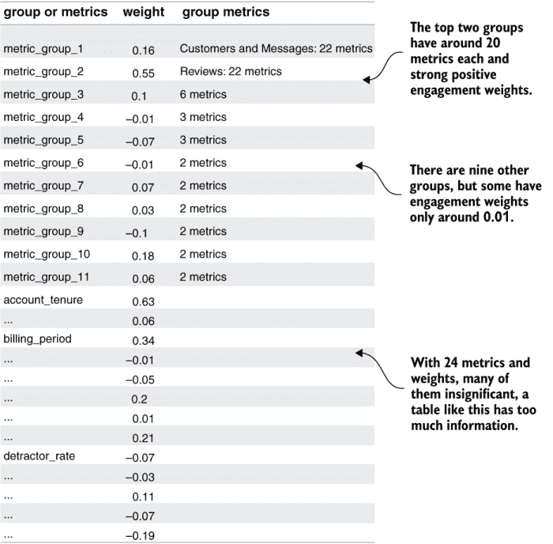

图 8.9 逻辑回归对 Broadly 的示例结果

TAKEAWAY 许多指标显示相对较小的参与权重是正常的，它们对应的是对客户流失和留存不重要的指标。

如果你的数据生成一个类似于图 8.9 的表格，在制作条形图之前，你绝对应该移除低权重的指标。第九章将展示最佳方法。

### 8.3.5 校准和历史流失概率

列表 8.2 的另一个输出是回归分析，这是将流失概率预测模型应用于数据集的结果。这不是预测，因为对已经发生的事情进行预测没有意义；数据集中的客户已经流失或保留。我将把这些输出称为数据集的流失概率而不是预测。无论如何，查看这个输出是有教育意义的，这样你就可以知道在预测活跃客户时可以期待什么。

图 8.10 显示了一个小样本，它类似于数据集，其中每一行代表一个账户和一个观测日期。但与拥有其他列的指标不同，该图有一列用于流失概率，另一列用于保留概率。此外，由于数据集由历史观测值组成，单个账户可以在不同日期上出现多次，直到它流失。

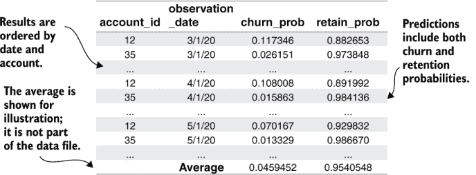

图 8.10 显示了模拟数据集的历史流失概率估计。平均值是在电子表格或分析程序中计算的（未与数据集一起保存）。

这些历史概率对于检查模型也是很有用的。预测模型的一个重要检查是它产生的预测应该与你的产品实际观察到的流失率紧密对应。这个检查被称为模型校准。

**校准**的定义是指模型产生的估计流失和保留概率与客户实际流失程度之间的一致程度。

在 8.6.2 节中，你将了解如何使用流失概率预测来估计客户终身价值，这在决定干预措施时可能是一个重要的指标。正如其名所示，客户终身价值衡量的是客户在其一生中对你的价值。只有当模型校准良好时，客户终身价值估计才会准确。对于任何关于行为对流失影响的分析也是如此：如果模型没有校准，保留的影响就不会那么有用。

校准最重要的检查是模型预测的平均流失率应该与数据中的流失率相匹配。图 8.11 重复了对模拟数据集的流失率测量，该数据集是通过运行数据集摘要函数并使用以下参数从列表 5.2 生成的：

```
run_churn_listing.py —chap 5 —listing 2
```

将图 8.10 中的平均历史概率与图 8.11 中的流失率进行比较，你可以看到这些数字非常接近，在 1/100 的百分比范围内。你应该用你自己的模拟数据集以及你为实际案例研究工作的任何数据集进行类似的比较。对于既有流失又有保留的合理数量观测值且在指标中没有极端异常值或缺失值的数据集，你应该发现数据集的流失率和平均预测值总是非常接近。

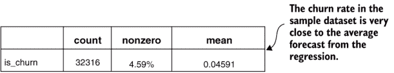

图 8.11 使用列表 5.2 生成的模拟数据集的历史客户流失概率估计

在图 8.6 中，您可以看到平均客户的流失概率为 2.4%（从 100%减去保留率，如图中所示为 97.6%），而不是 4.6%；平均客户的流失概率并不等于平均流失率。这是正常的。对于校准，您需要平均预测流失概率与实际流失率相匹配，但平均客户不必与平均流失率相匹配。事实上，异常流失概率的存在通常保证了平均客户不会有一个平均流失概率：平均客户的流失概率通常略低于流失率，就像社交网络模拟中那样。

此外，还有更高级的方法来衡量校准。例如，当您在制作流失客户群图表时将客户分为十分位，您可以在十分位中测试校准。采用这种方法，您将按预测的客户群平均预测值对客户进行排序，将他们分为 10 个客户群，然后检查每个客户群的真实流失率与客户群平均预测值相比如何。结果将告诉您您的预测模型是否很好地校准，以预测可能或不可能流失的客户（远离平均值的客户）。我不建议您定期进行这种校准检查，但这项技术是您应该了解的一个好方法。

如果您计划针对高或低流失概率的客户进行昂贵干预，您可能希望检查该级别的校准。那么，了解您的模型在估计这些客户的流失概率方面是否准确尤为重要。正如您在第九章中看到的，即使校准不完美，模型仍然可以识别出最和最不具风险的客户。

最后要注意的一点是：校准只是衡量您的模型与数据匹配程度的一个指标。第九章中介绍了衡量模型质量的其他重要指标。

## 8.4 预测客户流失概率

预测意味着对尚未发生的事情进行预测。在客户流失的背景下，预测意味着收集所有当前活跃的客户，并预测他们在下一次续订之前流失的概率。本节还涵盖了如何为使用分组指标进行细分准备数据，这是第六章中没有涉及的内容。

### 8.4.1 为预测准备当前客户数据集

预测当前客户的第一步是创建一个数据集，包括那些当前活跃的客户的最新所有指标。你在第四章学习如何提取这样的数据集以细分活跃客户时看到了如何做这件事。然后，在第七章中，你更新了数据集以包含更多指标，因此你需要更新代码来提取当前数据集，就像你更新代码在章节开头提取历史数据集一样。

列表 8.3 提供了提取第七章中创建的所有指标的代码。这个列表几乎与列表 4.6 相同，但包含更多指标。查询开头简短公用表表达式选择最新的可用日期；然后主 `SELECT` 语句使用你在第四章中（4.6 节）学到的扁平化聚合技巧。

列表 8.3 中有一个新元素：`SELECT` 限制在服务期限超过 14 天的账户。CTE `account_tenures` 选择至少有 14 天服务期限的所有账户，主 `SELECT` 中的内部连接将数据集限制在这些客户。这个约束确保在他们的指标被使用之前，客户至少被观察了几周。否则，大多数新客户由于观察期短，指标会较低。

在第七章中，你了解到服务期限较短的客户可以通过缩放获得更准确的第一月指标预测。你使用这项技术来更准确地估计罕见的指标 unfriend_per_month。对于你自己的案例研究，我建议你为所有指标使用这种模式，在这种情况下，你会匹配两周的最小观察期。（我没有要求你重新计算所有这些指标以节省时间。）

列表 8.3 修订后的当前数据集

```
WITH metric_date AS                                                  ①
(
   SELECT  max(metric_time) AS last_metric_time FROM metric
),
account_tenures AS (
   SELECT account_id, metric_value AS account_tenure
   FROM metric m INNER JOIN metric_date ON metric_time =last_metric_time
   WHERE metric_name_id = 8
   AND metric_value >= 14
)
SELECT s.account_id, metric_time,
SUM(CASE WHEN metric_name_id=0  THEN metric_value ELSE 0 END) 
    AS like_per_month,                                               ②
SUM(CASE WHEN metric_name_id=1  THEN metric_value ELSE 0 END) 
    AS newfriend_per_month,
SUM(CASE WHEN metric_name_id=2  THEN metric_value ELSE 0 END) 
    AS post_per_month,
SUM(CASE WHEN metric_name_id=3  THEN metric_value ELSE 0 END)
    AS adview_per_month,
SUM(CASE WHEN metric_name_id=4  THEN metric_value ELSE 0 END)
     AS dislike_per_month,
SUM(CASE WHEN metric_name_id=27 THEN metric_value ELSE 0 END)
     AS unfriend_per_month,                                          ③
SUM(CASE WHEN metric_name_id=6  THEN metric_value ELSE 0 END)
     AS message_per_month,
SUM(CASE WHEN metric_name_id=7  THEN metric_value ELSE 0 END)
     AS reply_per_month,
SUM(CASE WHEN metric_name_id=21 THEN metric_value ELSE 0 END)
     AS adview_per_post,                                             ④
SUM(CASE WHEN metric_name_id=30 THEN metric_value ELSE 0 END)
     AS reply_per_message,
SUM(CASE WHEN metric_name_id=31 THEN metric_value ELSE 0 END)
     AS like_per_post,
SUM(CASE WHEN metric_name_id=32 THEN metric_value ELSE 0 END)
     AS post_per_message,
SUM(CASE WHEN metric_name_id=33 THEN metric_value ELSE 0 END)
     AS unfriend_per_newfriend,
SUM(CASE WHEN metric_name_id=23 THEN metric_value ELSE 0 END)
     AS dislike_pcnt,                                                ⑤
SUM(CASE WHEN metric_name_id=24 THEN metric_value ELSE 0 END)
     AS newfriend_pcnt_chng,                                         ⑥
SUM(CASE WHEN metric_name_id=25 THEN metric_value ELSE 0 END)
     AS days_since_newfriend                                         ⑦
FROM metric m INNER JOIN metric_date d 
    ON m.metric_time =d.last_metric_time                             ⑧
INNER JOIN subscription s ON m.account_id=s.account_id
WHERE s.start_date <= d.last_metric_time                             ⑨
AND (s.end_date >=d.last_metric_time OR s.end_date IS null)
GROUP BY s.account_id, d.last_metric_time                            ⑩
ORDER BY s.account_id
```

① 这个 CTE 选择最新的日期。

② 使用扁平化聚合选择基本指标

③ 这是来自列表 7.7 的缩放指标。

④ 这是来自列表 7.1 的比率指标。

⑤ 这是来自列表 7.1 的版本 2 的百分比指标。

⑥ 这是来自列表 7.4 的百分比变化指标。

⑦ 这是来自列表 7.6 的 days_since_event 指标。

⑧ 选择最新日期的指标

⑨ 通过订阅进行 JOIN 以确保只有活跃账户。

⑩ GROUP BY 聚合操作完成了数据的扁平化。

你应该运行列表 8.3，使用 Python 包装程序和以下参数：

```
run_churn_listing.py —chap 8 —listing 3
```

运行列表 8.3 将当前客户及其指标保存到一个文件中。本章没有包含输出示例，因为到现在为止，你已经知道数据集的样子了。

在 8.1 节中，你回顾了在使用回归之前准备数据集的所有步骤（特别是参见图 8.4）。这些步骤如下：

1.  计算数据集的统计数据。

1.  使用统计数据将指标转换为分数。

1.  保存一个参数表，总结用于制作分数的参数。

1.  使用相关矩阵找到组，并创建加载矩阵。

1.  使用加载矩阵计算所有组的平均评分。

但是，当重复当前客户数据集的过程时，有一个关键的区别：你不想计算新的统计数据将指标转换为评分。你也不想创建一个新的加载矩阵来分组相关的指标。对于当前数据集，你想要重复使用你在第五章和第六章分析历史客户数据集时从中得出的相同统计数据和加载矩阵的过程。你必须为当前客户重用相同的参数和加载矩阵，以确保你放入回归中的当前客户数据集中的每一列都与你放在历史数据集中的相同列具有相同的意义。

考虑一下，如果你在当前客户数据集上计算一个新的加载矩阵，并发现不同的组数会发生什么。这可能发生在当前数据集的度量指标与历史数据集的度量指标相关性不同的情况下。你将无法将当前客户的分组度量指标映射到回归从历史数据集拟合所期望的指标。即使是用于评分的平均值和标准差也应该是在历史数据上计算得出的。因为用于缩放的均值和标准差并非来自当前客户数据，对于当前客户的评分，均值可能不是正好为零，标准差可能不是正好为一。但只要这些差异反映了当前客户与历史客户之间的真实差异，这个结果就是正确的。当前客户数据集的评分过程涉及以下四个步骤：

1.  重新加载从历史客户数据集中保存的评分参数。

1.  使用历史数据集的统计数据将当前客户指标转换为评分。

1.  重新加载从历史数据集创建的加载矩阵。

1.  使用重新加载的加载矩阵为当前客户计算平均组评分。

现在，你可以看到为什么保存评分的列表将所有这些细节都保存在表格中的第二个原因：如果你打算进行客户流失和保留概率预测，你将需要再次使用相同的信息。

**要点**：当你为预测准备当前客户数据集时，你需要重用你在最初分析历史数据集时创建的评分参数和加载矩阵。

列表 8.4 给出了评分当前客户数据集的代码。（同样，本章没有展示输出示例。）由于列表 8.4 必须重新加载由早期列表创建的大量数据，它包含一个按名称和列表编号重新加载单个数据集的功能。在加载当前客户数据集以及旧的评分参数和加载矩阵后，列表 8.4 执行以下主要步骤：

1.  通过确保数据集、得分参数和加载矩阵中命名的度量列匹配来验证输入。如果您在创建数据集的不同版本、计算统计数据和不同版本的分组时迭代，这些输入可能会不同步。

1.  使用列表 7.5 中的转换，在得分参数表中指示的列上转换偏斜和厚尾列。

1.  使用得分参数表中的平均值和标准差从度量中减去平均值并除以标准差。此任务在新的辅助函数 `score_current_data` 中完成。

1.  将缩放后的数据乘以加载矩阵以计算度量组的平均值。此步骤发生在新的辅助函数 `group_current_data` 中。

1.  保存结果。

最后一个辅助函数调用准备了一个用于细分的数据集版本，这将在列表之后进行描述。

列表 8.4 重新评分当前数据集

```
import pandas as pd
import numpy as np
import os
from listing_7_5_fat_tail_scores import 
   transform_fattail_columns, transform_skew_columns                      ①

def rescore_metrics(data_set_path=''):

   load_mat_df = reload_churn_data(data_set_path,
      'load_mat','6.4',is_customer_data=False)                            ②
   score_df = reload_churn_data(data_set_path,
      'score_params','7.5',is_customer_data=False)                        ③
   current_data = reload_churn_data(data_set_path,
      'current','8.3',is_customer_data=True)                              ④
   assert set(score_df.index.values)==set(current_data.columns.values),
       "Data does not match score params"                                 ⑤
   assert set(load_mat_df.index.values)==set(current_data.columns.values),
        "Data does not match load matrix"                                 ⑥

   transform_skew_columns(current_data,
      score_df[score_df['skew_score']].index.values)                      ⑦
   transform_fattail_columns(current_data,
      score_df[score_df['fattail_score']].index.values)                   ⑧
   scaled_data = score_current_data(current_data,score_df,data_set_path)
   grouped_data = group_current_data(scaled_data, load_mat_df,data_set_path)
   save_segment_data(grouped_data,current_data,load_mat_df,data_set_path)

def score_current_data(current_data,score_df, data_set_path):
   current_data=current_data[score_df.index.values]                       ⑨
   scaled_data=(current_data-score_df['mean']) / 
      score_df['std']                                                     ⑩
   score_save_path=data_set_path.replace('.csv','_current_scores.csv')
   scaled_data.to_csv(score_save_path,header=True)
   print('Saving score results to %s' % score_save_path)
   return scaled_data

def group_current_data(scaled_data,load_mat_df,data_set_path):
   scaled_data = scaled_data[load_mat_df.index.values]                    ⑪
   grouped_ndarray = np.matmul(scaled_data.to_numpy(), 
                               load_mat_df.to_numpy())                    ⑫
   current_data_grouped = pd.DataFrame(grouped_ndarray,                   ⑬
                                       columns=load_mat_df.columns.values,
                                       index=current_data.index)
   score_save_path=                                                       ⑭
      data_set_path.replace('.csv','_current_groupscore.csv')
   current_data_grouped.to_csv(score_save_path,header=True)
   print('Saving results to %s' % score_save_path)
   return current_data_grouped
def save_segment_data(current_data_grouped, 
                      current_data, load_mat_df, data_set_path):
   group_cols =                                                           ⑮
      load_mat_df.columns[load_mat_df.astype(bool).sum(axis=0) > 1]
   no_group_cols =                                                        ⑯
      load_mat_df.columns[load_mat_df.astype(bool).sum(axis=0) == 1]
   segment_df =                                                           ⑰
      current_data_grouped[group_cols].join(current_data[no_group_cols])
   segment_df.to_csv(data_set_path.replace('.csv',
                     '_current_groupmets_segment.csv'),header=True)

def reload_churn_data(data_set_path, suffix,
                      listing,is_customer_data):                          ⑱
   data_path = data_set_path.replace('.csv', '_{}.csv'.format(suffix))
   assert os.path.isfile(data_path),                                      ⑲
      'Run {} to save {} first'.format(listing,suffix)
   ic = [0,1] if is_customer_data else 0                                  ⑳
   churn_data = pd.read_csv(data_path, index_col=ic)
   return churn_data
```

① 导入列表 7.5 中定义的转换函数

② 使用 reload_churn_data 重新加载加载矩阵

③ 重新加载评分期间保存的参数

④ 加载使用列表 8.3 创建的当前客户数据

⑤ 检查数据与评分参数之间的一致性

⑥ 检查数据与加载矩阵之间的一致性

⑦ 转换任何被确定为偏斜的列

⑧ 转换任何被确定为厚尾的列

⑨ 确保数据集列与得分参数列匹配

⑩ 从平均值中减去并除以标准差

⑪ 确保数据集列与加载矩阵顺序匹配

⑫ 应用加载矩阵以计算平均组得分

将结果转换为 DataFrame

⑭ 保存结果

⑮ 确定分组度量列

⑯ 确定未分组的度量列

⑰ 为细分创建数据集版本

⑱ 包装验证和加载先前保存数据的步骤

⑲ 确保文件存在，如果不存在则打印消息

⑳ 客户数据文件有两个索引列。

您应按常规方式运行列表 8.4，使用 Python 包装程序，以便您可以为计算您自己的当前客户预测做好准备。以下是参数：

```
run_churn_listing.py —chap 8 —listing 4
```

### 8.4.2 为细分准备当前客户数据

在你学习关于分组度量标准时，没有涵盖的一个主题是如何创建一个将度量标准分组到平均分数中的当前客户数据集。如果你的组织中的商业人士要根据度量分数的平均值来制定干预措施，这就是你需要做的事情。如果你阅读了 8.4.1 节，你可以看到我为什么等到现在才解释它的原因：这个过程并不完全直接。现在你已经重新处理了当前数据集以进行预测，你可以重用你在那里所做的（这就是为什么这项技术被包括在列表 8.4 的最后部分）。但我不建议你使用你的预测数据集进行细分。相反，我建议以下混合版本的数据集：

+   使用分数来衡量所有度量组。

+   使用常规（自然尺度）度量标准来衡量那些未被分组的任何度量标准。

这种方法的优点是它对商业人士来说更容易使用。分组有助于减少度量标准的数量，如果你按照第六章（6.4 节）中的建议解释了分数和度量组，那么商业人士应该准备好解释和使用度量分数和组。然而，当度量标准不在其自然尺度上时，通常很难进行细分，所以如果你不需要将度量标准转换为分数进行细分，可能更好不要这么做。

给定当前的度量标准数据集、分数和加载矩阵，列表 8.4 中的辅助函数`save_segment_data`获取组列，然后添加原始未缩放的度量标准。这个函数只有几行 Pandas 操作，但它可以大大简化试图减少客户流失的商业同事的工作。

你可能会想，对于事件少于 10 个且度量标准不多于 10 个的模拟数据集，使用分组度量标准进行细分的想法并没有太多意义。常规度量标准更容易理解，分组只移除少量度量标准。对于模拟数据集，你可能是对的。但是，如果你在拥有数十（或数百）个事件和度量标准的产品或服务上工作，你的商业同事可能真的需要使用平均分数来减少来自这么多度量标准的信息过载。

### 8.4.3 使用保存的模型进行预测

在本节中，你将学习如何对当前客户进行预测。图 8.12 显示了这种输出将看起来像什么示例。它与历史客户数据集的预测输出类似，但现在，你只有一个观察日期，每个客户只有一个观察值。

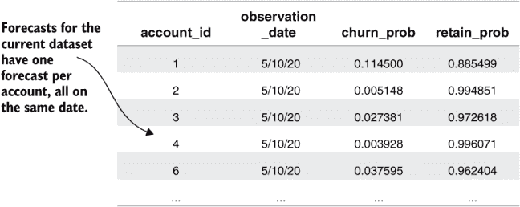

图 8.12 当前客户数据集（列表 8.5）的预测输出

第 8.5 节的第二个输出是流失预测分布的可视化显示，这种显示在图表中称为直方图（图 8.13）。直方图通过将分布划分为范围并显示每个范围内观察值的数量（通过图表上条形的高度表示）来帮助可视化分布。与群体图不同，直方图中用于划分客户观察值的范围是固定的，并且每个范围内的客户数量不同。直方图不是显示固定大小群体的平均流失率，而是显示具有特定（预测）流失率的群体的大小。

在图 8.13 中，你可以看到客户流失预测的范围在 0%到 5%之间，流失预测的客户最多。大多数客户的流失概率小于 20%，但有一小部分客户的流失概率较高（在 20%到 50%之间）。你在第七章看到肥尾分布时学习了分布尾部的术语。图 8.13 中具有较高流失概率的客户狭窄条带被称为流失概率分布的尾部。

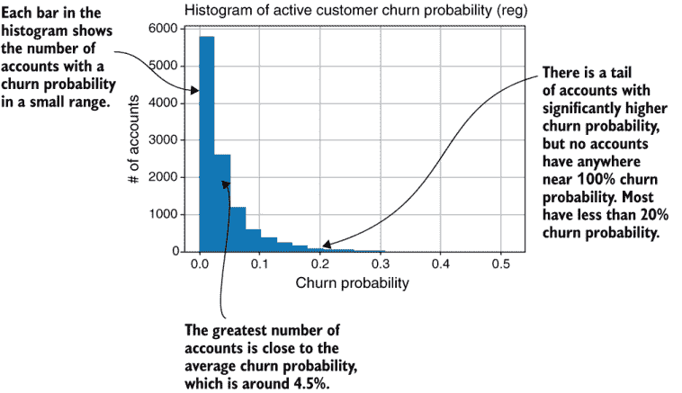

图 8.13 模拟预测和客户流失概率的分布

第 8.5 节提供了进行预测的代码。以下是主要步骤：

1.  加载由第 8.2 节保存的逻辑回归对象的 pickle。

1.  加载由第 8.4 节保存的当前客户分组分数数据集。

1.  在逻辑回归对象上调用 `predict_proba` 函数，传入客户数据集作为 NumPy `ndarray`。结果是关于客户流失和保留概率的两个列的 `ndarray` 预测。

1.  将预测保存到类似于图 8.12 所示的文件中。

1.  创建并保存一个类似于图 8.13 所示的客户流失概率直方图。直方图是在一个单独的函数中创建的。直方图函数调用 `matplotlib.pyplot` 包的 `hist` 函数，然后在保存结果为图像之前添加适当的注释。直方图的计数也保存在一个文件中。

预测的列表与拟合回归模型的列表类似，从算法任务的角度来看，它们通过单个函数调用到包对象。但大部分工作是在准备数据和分析并保存结果。

第 8.5 节：当前客户数据集上的预测

```
import pandas as pd
import os
import pickle
import matplotlib.pyplot as plt

from listing_8_4_rescore_metrics 
   import reload_churn_data                                            ①

def churn_forecast(data_set_path=''):
   pickle_path =                                                       ②
      data_set_path.replace('.csv', '_logreg_model.pkl')
   assert os.path.isfile(pickle_path), 
      'You must run listing 8.2 to save a logistic regression model first'
   with open(pickle_path, 'rb') as fid:
       logreg_model = pickle.load(fid)

   current_score_df = reload_churn_data(data_set_path,                 ③
                           'current_groupscore','8.4',is_customer_data=True)

   predictions =                                                       ④
      logreg_model.predict_proba(current_score_df.to_numpy())

   predict_df =                                                        ⑤
      pd.DataFrame(predictions, index=current_score_df.index,
                   columns=['churn_prob', 'retain_prob'])
   forecast_save_path = 
      data_set_path.replace('.csv', '_current_predictions.csv')

   print('Saving results to %s' % forecast_save_path)
   predict_df.to_csv(forecast_save_path, header=True)
   forecast_histogram(data_set_path,predict_df)                        ⑥

def forecast_histogram(data_set_path,predict_df,ext='reg')
   plt.figure(figsize=[6,4])
   n, bins,_ = plt.hist(predict_df['churn_prob'].values,               ⑦
                        bins=20)
   plt.xlabel('Churn Probability')                                     ⑧
   plt.ylabel('# of Accounts')
   plt.title(
       'Histogram of Active Customer Churn Probability ({})'.format(ext))
   plt.grid()
   plt.savefig(
      data_set_path.replace('.csv', '_{}_churnhist.png'.format(ext)), format='png')
   plt.close()
   hist_df=pd.DataFrame({'n':n,'bins':bins[1:]})                       ⑨
   hist_df.to_csv(data_set_path.replace('.csv', '_current_churnhist.csv'))
```

① 重新使用第 8.4 节中的数据加载函数。

② 使用 pickle 重新加载保存的对象模型。

③ 重新加载使用第 8.4 节创建的当前客户组分数。

④ `predict_proba` 使用模型进行预测。

⑤ 将预测保存到新的 DataFrame 中。

⑥ 调用辅助函数 `forecast_histogram`。

⑦ 创建直方图图，并返回结果数据。

⑧ 在图上提供注释。

⑨ 将直方图结果保存到文件中以便更仔细地检查。

你应该在模拟数据集上运行列表 8.5，并确认你得到的结果与图 8.12 和图 8.13 中所示的结果相似。假设你已经创建了当前客户分组度量分数（使用列表 8.4），你可以通过以下命令从列表 8.5 创建预测：

```
run_churn_listing.py —chap 8 —listing 5
```

### 8.4.4 预测案例研究

图 8.14 展示了从你在整本书中看到的案例研究中预测的流失概率的一些示例直方图。这些直方图与图 8.13 中模拟结果的基本特征相似：一个代表大多数流失概率范围的较小峰值，以及由具有更高流失概率的客户组成的尾部。

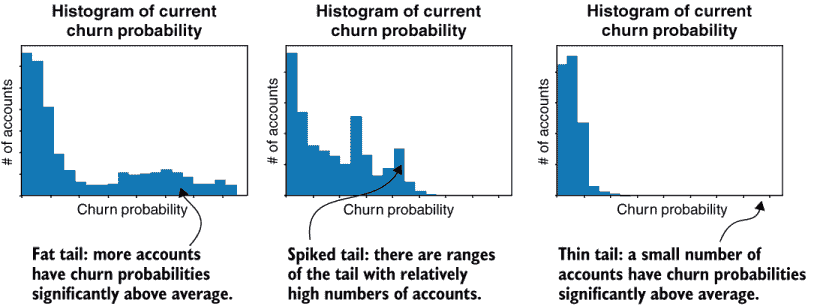

图 8.14 预测流失概率的案例研究分布

在图 8.14 中，三个案例研究展示了流失概率分布尾部出现的三种相当常见的变异形式：

+   在客户流失概率分布中，如果具有较高流失概率的客户数量足够多，以至于在直方图中可以清晰地显示出来，我们称之为“厚尾”。

+   当尾部存在某些流失概率范围，且客户数量异常高时，我们称之为“尖锐尾部”。

+   多峰分布是描述此类分布的另一种方式，尽管你通常只在直方图形状中有两个或更多高度相似的峰值时，才将流失概率分布描述为多峰。没有此类案例研究的示例可用。

+   如果大多数客户都集中在狭窄的概率范围内，但有一小部分客户的流失概率显著更高，我们称之为“薄尾”。在薄尾的情况下，这些客户数量如此之少，以至于在直方图中不可见；这时你需要查看保存的 .csv 文件，以确切了解这类客户的具体数量。

实际案例研究产生的流失概率分布通常比模拟结果（如图 8.13 所示）看起来更不光滑、更不规律。

### 8.4.5 预测校准和预测漂移

当你第一次拟合回归模型时，我向你展示了如何通过比较平均流失概率预测与历史数据集中的流失率来检查校准。你也应该检查为当前客户数据集做出的预测的校准。但在这种情况下，你不能将平均值与当前客户数据集中的流失率进行比较，因为当前客户数据集中还没有客户流失（当然）。相反，你可以通过使用你在第二章中学到的方法，将当前客户数据集中的平均预测与历史数据集中的流失率或对最近客户进行的流失测量进行比较。

**总结**：通过比较平均预测流失率与历史数据集流失概率或最近的流失率测量值（考虑到最近测量时间可能存在的季节性）来检查预测校准。

图 8.15 的顶部显示了这种比较的一个示例，针对模拟数据集。在这种情况下，它显示当前数据集上的平均流失概率预测比历史数据集中的平均流失预测和流失率低约三十分之一个百分点（4.3%与 4.6%相比）。这种差异可能看起来不多，但它是明显的，尤其是考虑到历史平均值和预测如此接近。

当你发现当前的预测与历史数据有显著差异时，你应该进一步调查以确保你理解造成差异的原因。什么可能导致这种差异？流失概率模型基于客户指标，因此如果当前的预测与历史预测不同，当前的指标必须在某些方面与历史指标不同。

**总结**：如果当前客户流失概率预测与历史流失概率预测不匹配，那一定是因为当前和历史上的指标之间存在差异。

当你发现这种类型的差异时，你可以通过比较当前指标与历史指标来调查它。最简单的方法是使用你已知的如何创建的数据集汇总统计信息。图 8.15 的底部说明了从历史数据集汇总统计信息与当前数据集汇总统计信息的比较。这种比较是在一个简单的电子表格中进行的。你可以做同样的事情或者编写自己的简短脚本。要创建当前数据集中的汇总统计信息，你可以在 Python 包装程序中运行带有参数`—chapter` `5` `—listing` `2` `—version` `4`的额外汇总统计信息列表版本。

图 8.15 中的指标比较显示，当前数据集中的客户指标平均值略高于历史数据集中客户指标的平均值（在大多数情况下约为 5%）。新朋友百分比变化指标显示很大的变化，因为它在新账户中估计为零，这是由于计算变化需要历史记录的要求。当前样本有更多具有所需历史记录的租户，导致平均值的差异。由于大多数客户指标都有积极影响，当前数据集中的指标较高解释了当前数据集较低的流失概率预测。

在模拟数据集的情况下，当前数据集和历史数据集之间平均指标的差异是正确的，但没有意义。在模拟中，该服务最近才出现，因此客户的平均服务期限正在增加。同时，大多数指标没有对最近注册的用户进行调整，因此新客户（平均而言）的指标略低。从这些考虑因素来看，可以说当前数据集上的平均流失预测是合理的，与历史预测的差异不值得担心。

对于真实产品的流失分析，如果您发现当前客户的指标与历史数据集客户显著不同，您应该进行一些额外的质量保证，以确保结果正确。如果您在当前数据集和历史数据集之间存在合法的指标差异，可以合理地得出结论，您的当前客户流失率可能与您过去看到的流失率不同。另一方面，如果由于产品或市场环境发生重大变化，您的当前客户的行为与历史客户的行为有显著不同，您应该对流失预测的可靠性持怀疑态度。您可能必须等到在当前条件下可以形成新的历史数据集，才能可靠地预测流失概率。

另一个问题是在当前数据集中存在异常值可能会导致某些流失概率与历史数据集不同，从而改变平均值。您可以通过比较总结统计中的最大值和更高百分位数来评估指标极端异常值之间的差异（如图 8.15 所示，未展示）。这个区域是另一个您在评估差异时必须运用自己判断的地方。

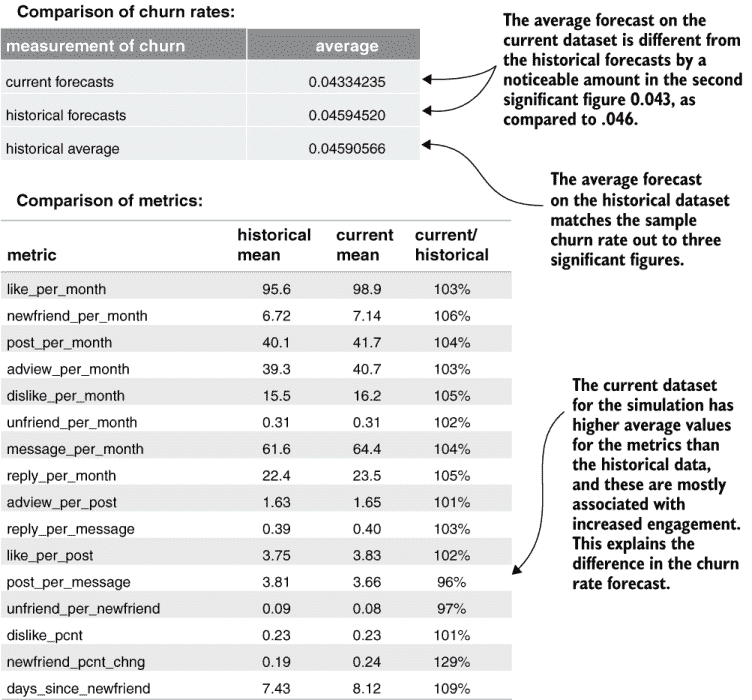

图 8.15 校准和预测漂移

## 8.5 流失预测的陷阱

您现在知道如何拟合流失概率模型，以及如何在正常情况下预测活跃客户的流失。本节涵盖了一些您应该注意的陷阱，因为它们可能会在某些情况下阻止您获得最佳结果。

### 8.5.1 相关指标

您已经了解了关于分组相关指标的知识，以及在使用客户数据集进行预测之前，您应该将这种分组作为指标群体流失分析的一部分。到目前为止，我已向您说明分组相关指标是可取的，因为它使您的结果更容易理解。但是，使用回归模型为使用分组添加了一个新的必要性：回归算法是在假设您在其中使用的指标不是高度相关的条件下设计的。因为回归不适用于指标之间的高度相关性，如果它们是高度相关的，结果可能就不合理。

**要点**：回归分析是为不相关或中等相关的指标设计的。不要在回归分析中使用高度相关的指标。

在回归分析中不使用高度相关的指标的一个原因是，这会使参与度权重更难以解释。高度相关的指标使得参与度权重更难以解释，因为当你考虑一个相关指标的客户流失概率影响时，你必须记住它通常与其他相关指标的影响一起出现。假设两个指标的相关性为 0.75。在这种情况下，如果一个客户在一个指标上的标准差高于平均水平，那么他们预期在另一个指标上的表现也会非常好。当你推理不同行为对保留率的影响时，你需要考虑这些关系。即使指标之间只有弱相关性或中等相关性，这一事实仍然成立；影响较小，因此忽略它并不成问题。

如果你以前学过回归分析，你可能记得一个叫做共线性的条件。共线性与相关性相关；它是两个指标之间或数据中某些指标组的总和之间的完全相关条件。（求和是在指标如总数的情况下，但共线性指的是某些指标相加可能导致相关对的条件，而不是你使指标总和。）共线性是一些回归算法的严重问题，可能导致它们失败。但较新的回归算法，如你在列表 8.2 中使用的岭回归，通常不会出现那种失败，即使数据包括相关或共线性的指标。

如果你在回归分析中使用高度相关的指标，会出现一个更微妙的问题。有时，如果你使用多个高度相关的指标并且没有将它们平均到组中，你可能会发现回归产生的权重与参与度和流失率之间的关系毫无意义。一些指标被分配了有利于保留率的权重，而一些指标被分配了不利于保留率的权重，但显然，所有指标都应该有类似的影响力。

图 8.16 是一个来自 Klipfolio 真实案例研究的例子，Klipfolio 是一个用于创建和共享公司指标仪表板的 SaaS 工具。该案例研究有四个版本的指标，以略微不同的方式衡量仪表板查看次数：每天仪表板查看次数、使用固定周期计算的每月仪表板查看次数、使用账户期限缩放指标周期的每月仪表板查看次数，以及每月每个用户的仪表板查看次数。这四个指标高度相关。

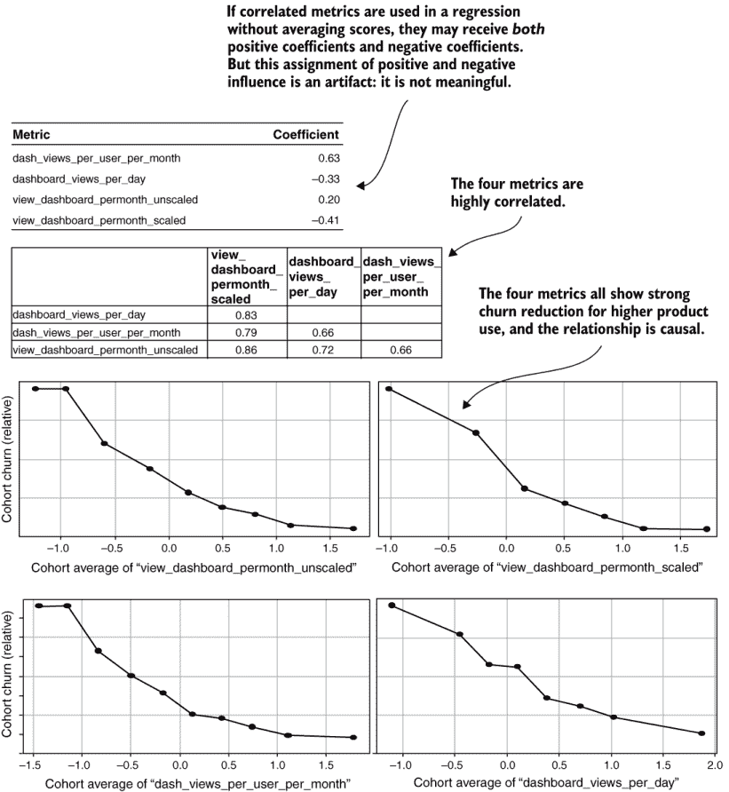

图 8.16 来自相关指标的误导性回归权重

所有四个度量在同期分析中都与保留显示出强烈的关系。通常，这些度量应该被分组到一个平均分数中，但如果这种分组没有完成，并且四个度量作为独立度量放入回归中，就会出现一个奇怪的结果：其中两个度量获得正值，表明行为增加了参与度，而另外两个度量获得负值，表明行为减少了参与度。然而，这些权重没有意义。

奇怪的是，这种模型通常与所有参与度权重都有意义的模型一样好，有时甚至更好。相反的权重是由于相关度量的参与强度之间的相关性和不平衡造成的，这些相关度量是数据中的真实模式。但通常创建这种类型的模型并不是一个好主意。你将在第九章中了解准确度比较和不可解释的机器学习模型。

这种情况发生在你使用第六章中提到的度量分组算法的高相关阈值时。通常的动机是保持相关度量分开，试图通过观察哪个回归权重最大来确定流失和保留的相对重要性。讽刺的是，这种分析可能导致无意义的权重，从而阻碍你看到有意义的关系。解决方案是使用第六章和第七章中描述的方法，将相关度量分组为平均值，然后通过形成两个度量的比率并检查比率与流失和保留的关系来调查度量之间的关系是否显著。如果比率与原始对中的任何一部分都不相关，它可以在回归中进行测试。

### 8.5.2 异常值

另一个可能阻止你在流失预测中获得最佳结果的陷阱发生在你的数据中存在极端异常值时。在第三章中，当你学习创建度量时，我向你展示了一些检测和删除包含错误或不适当数据的记录的技术。现在你将要了解一些不同的事情：如何处理数据在它是正确的测量但极端到在某些方面导致流失预测问题的情况。如果你使用用于偏斜和厚尾数据的转换将所有度量转换为分数，这种情况就不太常见。这些转换减少了异常值的问题，因为转换后的分数比原始分布的极端值要少。此外，如果你不使用这些转换，极端异常值会非常常见，这就是为什么我建议将其作为标准做法。尽管如此，我还是要提醒你两个潜在的问题，这样你就会知道迹象以及如何处理它们。

异常值可能会在模型拟合和模型拟合后的预测中引起问题。许多统计学和数据科学课程强调异常值对模型拟合造成的问题。但在大多数流失预测用例中，我在预测时看到更多与异常值相关的问题。当回归中使用的观测值较少时，异常值会导致模型拟合出现严重问题。如果你在回归中少于 100 个观测值，并且存在极端异常值，你的结果可能会受到异常值的影响。但大多数流失场景都有数千个数据点。如果你有数万个观测值，几个异常值通常对回归的影响很小。

在任何情况下，你可能会注意到预测中存在极端异常值，当你预测接近 0%或接近 100%的流失或保留概率时，你可能会看到它们。图 8.17 说明了我在说什么。

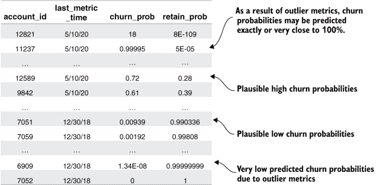

图 8.17 异常值导致的流失概率

我之前提到，账户的流失概率接近 100%的情况很少见，所以如果一个账户的流失概率预测值高于 99%（甚至 100%），那么这个结果很可能是由于一个或多个指标上的极端异常值造成的。对于预测流失概率恰好为 0%的账户也是如此。流失概率恰好为 0%或 100%是没有意义的，因为在现实世界中，总有可能客户会流失或保留。

如果你知道这些极端概率可能并不准确，最简单的方法就是忽略它们。记住，显示 100%流失概率的账户不太可能流失，但它可能仍然处于相当大的风险之中，这是值得了解的。我通常遇到的问题是极端预测可能会分散商家的注意力。商家可能会着迷于知道为什么某些账户的流失概率如此之高或如此之低，这可能会使他们怀疑模型的其他合理预测。

**要点**：在向商家展示模型结果时，极端异常值的预测可能会引起他们的困惑和怀疑。

当极端异常值是当前数据集中的真实客户时，问题在于你不能像构建历史数据集时那样移除它们。通常，对当前客户进行流失概率预测的背景是细分或其他分析，其中你需要为所有当前活跃的客户进行预测。通常，极端异常值是高风险或低风险客户；建模可能会夸大真实的风险水平。保持客户并允许你对他们的预测更加合理的解决方案被称为异常值裁剪。

**定义** 异常值裁剪是指降低极端异常值，使它们仍然接近可能值的高（或低）端，但并不那么极端。

异常值裁剪与相关概念异常值移除不同，因为在数据中异常值被保持在较低的水平。图 8.18 展示了异常值裁剪最常见的方法。异常值裁剪通过将高于 99th 百分位数的指标观测值设置为 99th 百分位数值来修改这些观测值。根据定义，这种转换只影响你应用的每个指标观测值的 1%。原本高于 99th 百分位数的值与分布中的大多数值相比仍然很高，但并不像之前那么极端。通常，异常值修剪用于高指标值，但同样的方法也可以用于低指标值。在计数指标中，极端低的指标值是不常见的，因为最小值通常是零，但它们可以出现在比率或百分比变化指标中。

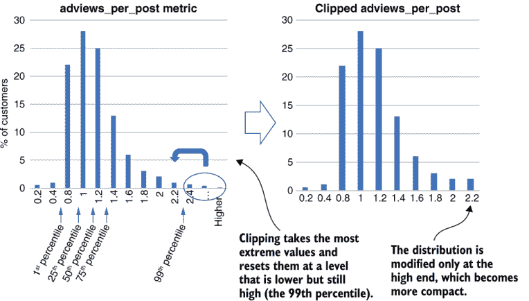

图 8.18 异常值裁剪

列表 8.6 展示了一个示例代码，你可以使用它对数据集进行异常值裁剪。在列表 8.6 中，裁剪作为将当前客户数据集转换为组分数的一部分过程进行，因此列表 8.6 是列表 8.4 的一个变体。使用的裁剪阈值是所有指标的 1st 和 99th 百分位数，这些百分位数在保存的数据集摘要统计中。裁剪发生在数据加载之后和指标转换为分数之前。否则，列表 8.6 与列表 8.4 相同。

注意，列表 8.6 裁剪了所有变量，但创建一个只裁剪你在参数中指定的选定组变量的类似函数并不困难。一般来说，只有当异常值足够极端以至于会导致不合理的预测时，才需要裁剪数据。话虽如此，在一些具有许多事件和指标的实时数据集中，很难精确地识别出哪些极端指标导致了不合理的预测。在这种情况下，快速解决方案是按照列表 8.6 所示进行，并对所有数据进行裁剪。

列表 8.6 Python 中的裁剪分数

```
import pandas as pd
import numpy as np
from listing_7_5_fat_tail_scores                                ①
   import transform_fattail_columns, transform_skew_columns
from listing_8_4_rescore_metrics 
   import reload_churn_data                                     ②

def clip_hi_cols(data, hi_vals):                                ③
   for col in hi_vals.index.values:
       data.loc[data[col] > hi_vals[col],col] 
          = hi_vals[col]                                        ④

def clip_lo_cols(data, lo_vals):                                ⑤
   for col in lo_vals.index.values:
       data.loc[data[col] < lo_vals[col],col] 
          = lo_vals[col]                                        ⑥

rescore_metrics(data_set_path):                                 ⑦

   current_data =                                               ⑧
      reload_churn_data(data_set_path,'current','8.2',is_customer_data=True)
   load_mat_df = reload_churn_data(data_set_path,
      'load_mat','6.4',is_customer_data=False)
   score_df = reload_churn_data(data_set_path,
      'score_params','7.5',is_customer_data=False)
   stats = reload_churn_data(data_set_path,
      'summarystats','5.2',is_customer_data=False) 
   stats.drop('is_churn',inplace=True)                          ⑨
   assert set(score_df.index.values)==set(current_data.columns.values),
      "Data does not match transform params"
   assert set(load_mat_df.index.values)==set(current_data.columns.values),
      "Data does not match load matrix"
   assert set(stats.index.values)==set(current_data.columns.values),
      "Data does not match summary stats"

   clip_hi_cols(current_data, stats['99pct'])                   ⑩
   clip_lo_cols(current_data, stats['1pct'])                    ⑪

   transform_skew_columns(current_data, 
      score_df[score_df['skew_score']].index.values)            ⑫

   transform_fattail_columns(current_data, 
      score_df[score_df['skew_score']].index.values)

   current_data=current_data[score_df.index.values]
   scaled_data=(current_data-score_df['mean'])/score_df['std']

   scaled_data = scaled_data[load_mat_df.index.values]
   grouped_ndarray = np.matmul(scaled_data.to_numpy(), 
                               load_mat_df.to_numpy())
   current_data_grouped = pd.DataFrame(grouped_ndarray,
                                       columns=load_mat_df.columns.values, 
                                       index=current_data.index)

   score_save_path=data_set_path.replace('.csv','_current_groupscore.csv')
   current_data_grouped.to_csv(score_save_path,header=True)
   print('Saving results to %s' % score_save_path)
```

① 重新使用胖尾和偏斜变换函数

② 重新使用加载客户流失数据的辅助函数

③ 裁剪数据中高于 hi_vals 参数值的值

④ 将高于阈值的值设置为阈值

⑤ 裁剪数据中低于 lo_vals 参数值的值

⑥ 将低于阈值的值设置为阈值

⑦ 此函数与列表 8.4 中的函数类似。

⑧ 重新加载保存的数据、加载矩阵、参数和统计信息

⑨ 不要在摘要统计中使用客户流失度量！

⑩ 裁剪高于 99th 百分位数的值

⑪ 裁剪低于 1st 百分位数的值

⑫ 此列表的其余部分与列表 8.4 相同。

如果您需要使用截断法因为您有一些极端的预测，您可能还想检查异常值是否对回归本身有显著影响。为此，您应该在创建历史数据集得分的函数中使用列表 8.6 中的截断函数。

## 8.6 客户终身价值

现在您已经了解了如何预测客户流失概率，我将向您介绍一个客户流失预测的绝佳应用：估计客户终身价值（CLV）。*CLV*的估计让您知道客户在其整个生命周期内对您有多大的价值。这些信息对于评估您的获取和保留努力的回报至关重要。可能会让您感到惊讶，但估计*CLV*的关键是客户流失率。客户流失概率预测（如您已学会如何制作的预测）允许您根据每个客户单独调整*CLV*的估计。

### 8.6.1 客户终身价值（CLV）的含义

首先要理解的是，*CLV*是对预期客户价值的预测，而不仅仅是特定客户过去付款的总和。

**客户终身价值**是指您预期客户在整个生命周期内对您的业务的价值，包括您预见的收入和成本。此预测包括未来的付款。

CLV 需要包括客户预期带来的收入以及获取和保持客户作为客户的成本，如图 8.19 所示。

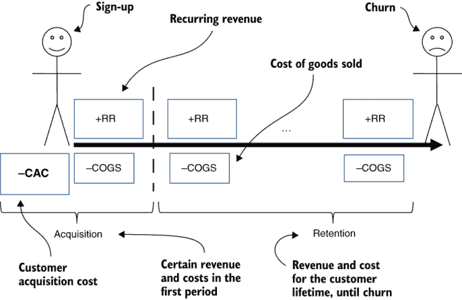

图 8.19 CLV 的组成部分

**客户获取成本**（CAC）是指获取每位客户所花费的市场营销和销售总金额。CAC 通常取决于客户是通过哪个渠道或活动获取的。销售成本（COGS）是指维护现有客户服务的总支出，包括云计算成本和提供客户支持的成本。*COGS*可能取决于客户类型。

**注意**：在本节中，假设您已了解您客户的 CAC 和*COGS*。本节的重点是 CLV 的持续部分，它取决于客户流失率。

客户在其生命周期内的收入是持续的，您之前将其称为月度持续收入（MRR）。现在，我将泛指收入为持续收入（RR），不考虑时间段，可能是每月或每年。持续收入可以包括订阅付款以及由广告、应用内购买或使用费产生的任何收入。

客户终身价值这个名字意味着它结合了客户预期生命周期内的所有成本和持续收入。您可以将*CLV*写成方程 8.6 所示的形式：

| *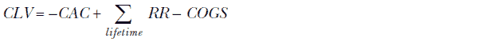*  | 方程 8.6 |
| --- | --- |

在本节中的方程中，*Σ* 符号代表其下标所指示的所有项的总和，因此 *Σ*[*lifetime*] 表示整个客户生命周期内的所有收入和成本的总和。

这就是 CLV。接下来，我需要教你们关于与 *CLV* 相关的第二个生命周期价值，它忽略了获取成本和第一期的收入和成本。

**定义** *未来生命周期价值*（FLV）是指在第一期之后的任何时间点，重复付款和维护成本的总和。

当你们在评估已经注册并试图决定保留他们的价值时，想使用 *FLV*（不包含获取成本和第一期的收入和成本）。如果你们试图决定客户注册后的价值，获取成本是不相关的（在财务术语中是沉没成本）。同样，注册的付款从未面临流失风险，因此你们忽略第一期的付款（和成本）。相反，你们只关心注册后的预期未来重复收入和成本，如方程 8.7 所示

| *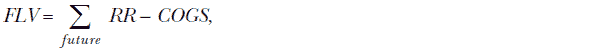*  | 方程 8.7 |
| --- | --- |

其中，求和符号 *Σ*[*future*] ... 表示未来预期的所有付款。对于图 8.19 中显示的付款和成本序列，未来的付款是指在注册期之后的付款。但这个估值在整个客户生命周期内保持不变，不考虑过去周期内的重复收入和成本。

**总结**：在任何客户生命周期的点上，*FLV* 仅基于预期的未来付款，过去所有的成本和收入被视为沉没成本或收益。

FLV 特别适用于客户流失；你们将用它来评估流失干预措施的投资回报。此外，请注意，*CLV* 和 *FLV* 之间的差异仅是获取成本和一期的重复收入（方程中的 RR）以及一期的成本（方程中的 COGS）。这两个生命周期价值计算之间的差异不是一个估计或预测，因为这些是已知量，因为你可以从你的会计系统中的数据计算出它们。相比之下，*FLV* 是对未来的一种预测或估计，因为客户的未来生命周期并不确定。因此，当你们谈论 CLV 时，重点通常在 FLV 上。

**总结**：FLV 强调了 *CLV* 的未来视角，用于保留，忽略了获取和过去的收入和成本。

由于 *FLV* 是难以估计的部分，并且与流失和保留密切相关，因此 *FLV* 将成为本章的焦点。正如我提到的，你们可以通过减去 CAC 和一期的 *COGS* 然后加上 RR（方程 8.8）从 *FLV* 中得到 *CLV*：

| *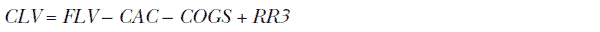*  | 方程 8.8 |
| --- | --- |

关于定义的一个需要注意的最后一点是，*COGS* 通常由方程 8.9 中定义的边际来概括：

| 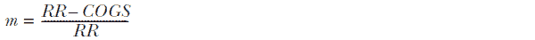  | 方程式 8.9 |
| --- | --- |

大多数公司用利润率来总结他们的成本，并且假设您知道客户的利润率。根据这个定义，您可以通过结合方程式 8.8 和 8.9 来重写*未来终身价值（FLV）*公式，得到方程式 8.10：

| *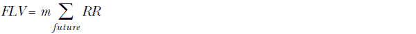*  | 方程式 8.10 |
| --- | --- |

注意事项：如果您不知道客户的利润率，不要担心，因为关于*客户终身价值（CLV）*和*未来终身价值（FLV）*的所有其他说明都适用，并且当您知道利润率时，您始终可以在 8.6.2 处添加利润率。

### 8.6.2 从流失到预期客户终身价值

要计算用于*未来终身价值（FLV）*公式（方程式 8.11）中使用的客户的预期 RR 总和，您需要估计客户的预期未来终身价值。您可能会认为估计客户的预期终身价值会很复杂，您可能需要像回到数据库一样测量流失时的平均账户期限。但只要您知道客户的流失概率，估计客户终身价值就很简单。我会先告诉你答案，然后再说服你这是正确的。如果您知道客户有一定的流失概率，客户的预期未来终身价值由方程式 8.11 给出：

| 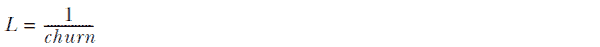  | 方程式 8.11 |
| --- | --- |

注意，在方程式 8.11 中，终身价值的单位与测量流失率的时间周期相同：月份或年份（通常是）。

摘要：用简单的话说，方程式 8.11 表明，如果流失概率是按月预测的，客户的预期终身价值是流失概率的倒数。如果流失概率是按年预测的，客户的预期终身价值是年流失概率的倒数。

如果流失概率是每月 5%，预期客户终身价值是 1.0/0.05 = 20 个月。如果流失概率是每年 30%，预期客户终身价值是 1.0/0.30 = 3.33 年。

这听起来很简单，确实如此，只要您知道客户的流失概率。以下是方程式 8.11 为什么有道理的原因：

+   如果每个客户的终身价值是 20 个月，流失率会是多少？如果每个客户每 20 个月流失一次，流失率将是 1/20，即每月 5%。

+   如果每个客户的终身价值都是三年，流失率会是多少？如果每个客户每三年流失一次，流失率将是三分之一，即每年 33%。

这些例子表明（从平均意义上讲），客户流失率是终身价值的倒数，而方程式 8.11 则是将这种关系颠倒过来。实际上，即使客户的流失概率完全相同，也不是每个客户都有相同的终身价值。许多外部因素和缺失信息阻止您完美地估计流失概率。但对于每个客户来说，预期终身价值在估计或预测的意义上是流失概率的倒数。

如果您想了解更多关于为什么预期生命周期是流失率的倒数的原因，您应该了解指数衰减模型，这是近似值推导的地方。

**注意** 如果您没有对个别客户的流失概率进行预测，可以使用方程 8.11 中的平均流失率来估计平均客户生命周期。

### 8.6.3 *CLV* 公式

下一个步骤并不是确切的*FLV*或*CLV*，而是一个中间步骤：客户生命周期的预期总利润，不包括 CAC。将预期生命周期（方程 8.11）与利润的利润率方程（方程 8.10）结合起来，得到方程 8.12：

| 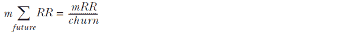 | 方程 8.12 |
| --- | --- |

预期生命周期利润（不包括获取成本）是利润率乘以 RR 除以流失率。注意，这里的 mRR 是利润率（m）乘以持续收入（RR），而不是 MRR（每月持续收入）。（这种表示方法虽然不幸，但却是标准的。）注意，从流失概率中得到的预期生命周期可能是一个不均匀的数字，通常情况下是这样的。如果月流失率是 12%，预期生命周期是 1/.12 = 8.3 个月。但是，您需要将这个生命周期乘以每期的利润来得到预期生命周期利润。这个结果是合理的，因为估计是一个平均值。在预期生命周期为 8.3 个月的例子中，没有客户会支付 8.3 期，但有些人可能支付 8 期，有些人支付 9 期，所以平均是 8.3。

还要注意，*FLV*不依赖于账户时长或客户成为客户的时间长短。无论客户在获取后是否完成了第一个周期，还是第 100 个周期，都无关紧要：预期的未来生命周期利润只取决于流失概率。（可能流失概率的预测依赖于账户时长，因此可能存在二级的间接影响。）因此，*FLV*是前瞻性的，因为账户时长只有在影响流失概率预测时才重要，而流失概率预测也是前瞻性的。

**要点** *FLV* 并不直接依赖于客户成为客户的时长。它是一个前瞻性估计。在评估保留客户的价值时，只有预期的未来收入才是重要的。

无论如何，方程 8.12 还不是*FLV*，因为它是在整个生命周期内的持续支付利润。但*FLV*应该忽略第一个支付周期的支付（因为那些支付构成了每个客户确定成本和支付的一部分）。答案是减去一期的 RR（和 COGS）以得到方程 8.13：

| 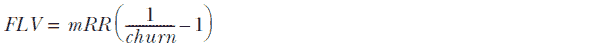 | 方程 8.13 |
| --- | --- |

另一方面，要从方程 8.12 中得到*CLV*，需要减去获取成本，从而导致方程 8.14：

| 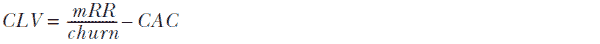 | 方程 8.14 |
| --- | --- |

警告：许多人单独使用方程 8.12 来计算*CLV*，因为它是一个简单的简化。但方程 8.12 单独并不是*CLV*或*FLV*的正确公式！由于方程 8.13 和 8.14 都从它中减去，所以方程 8.12 在这两种情况下都是高估。因为它是一个高估，所以方程 8.12 有时用于向外部投资者报告*CLV*，但不用于评估客户获取或保留的投资回报。

你应该意识到对于低流失率的公司，还需要一种额外的*FLV*形式。如果年流失率低于 20%，预计客户的寿命将超过五年。如果预计客户会停留这么长时间，那么假设他们的*FLV*是他们预期寿命所建议的全部金额是不合理的。在如此长的寿命期间，客户做出所有这些支付的风险比单纯的流失还要多。可能会发生经济衰退，或者新的竞争对手可能会改变市场，或者五年或更长时间内可能发生任何其他事情。

处理这种不确定性的方法是添加一个类似于用于评估资本投资项目的现金流量折现因子。解释公式超出了本书的范围，但它看起来像方程 8.15：

| 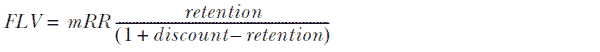  | 方程 8.15 |
| --- | --- |

方程 8.15 中的公式使用保留率而不是流失率，分母中的折现变量是公司用于评估长期投资的折现率。（如果您的公司没有这样的折现率，您可能不需要使用这个公式。）关于这种长客户寿命版本的*FLV*和*CLV*的详细信息，我推荐 Sunil Gupta 和 Donald Lehman 在《互动营销杂志》上发表的“Customers as Assets”。文章可在[www0.gsb.columbia.edu/mygsb/faculty/research/pubfiles/721/gupta_ customers.pdf](http://www0.gsb.columbia.edu/mygsb/faculty/research/pubfiles/721/gupta_customers.pdf)下载。

## 摘要

+   流失概率的预测是通过一种称为逻辑回归的模型完成的。

+   逻辑回归模型将保留率视为参与度的 S 型函数。

+   为了预测的目的，参与度被建模为一系列参与度权重与每个指标得分的乘积。

+   逻辑回归算法确定最适合数据的参与度权重。

+   如果它预测的流失概率与观察到的实际客户流失率一致，则流失预测模型是校准的。

+   你通过比较平均预测与用于创建模型的数据库中的流失率来检查预测的校准。

+   要对当前活跃的客户进行预测，你必须以与在拟合模型之前对历史客户数据集进行转换相同的方式进行当前客户数据集的转换。

+   任何客户的预期寿命等于其预测的流失概率的倒数，单位与流失概率相同（月份或年份）。

+   预期寿命可以用来估算客户终身价值（CLV）。
