# 9 预测准确性和机器学习

本章涵盖的内容

+   计算预测准确性的测量值以预测客户流失

+   在历史模拟中回测模型

+   设置最小指标贡献的回归参数

+   通过测试（交叉验证）选择回归参数的最佳值

+   使用 XGBoost 机器学习模型预测客户流失风险

+   使用交叉验证设置 XGBoost 模型的参数

你知道如何预测客户流失的概率，也知道如何检查预测的校准。预测模型的一个重要测量指标是，那些预测为高度风险客户的客户，是否真的比那些预测为安全客户的客户风险更高。这种预测性能通常被称为准确性，尽管你会看到，测量准确性的方法不止一种。

在第一章中，我告诉你，使用预测模型预测客户流失不是本书的重点，因为在许多情况下它并不有帮助。本书的重点是拥有一个好的指标集，根据行为将客户分为健康和不健康的人群。但有几个原因说明为什么拥有准确的预测流失率预测是有好处的，所以本章将完善你的技能集，并确保你在必要时能够准确预测。

有时候，准确预测客户流失风险是有用的，尤其是在干预措施特别昂贵的情况下。例如，与产品专家进行现场培训的支出将比发送电子邮件更高。如果你选择客户进行现场培训以降低流失风险，那么只选择具有高流失风险的客户是有意义的，这样你只招收具有合适风险特征的客户。或者，你可能不会选择风险最高的客户，因为它们可能已经无法挽救；通常，选择风险高于平均水平但不是最高的客户会更好。（此外，你可能还会通过特定的指标筛选客户，以确保他们将从这种假设的培训中受益。）

另一个值得你花时间准确预测客户流失的原因是，这样做可以验证你的整个数据和数据分析过程；你可以将你的预测准确性与已知的基准进行比较，正如我在本章中解释的那样。如果你发现你的流程性能低于典型水平，那么这个结果表明你需要纠正你的数据或流程的某些方面。例如，你可能需要改进你的数据清洗方式，移除无效示例，或者你可能需要计算更好的指标。另一方面，如果你发现你的分析性能位于基准的高范围内，你可以有信心你已经进行了彻底的分析，可能没有太多可以发现的。你甚至可能发现你的准确性不可思议地高，这可能会表明你需要对你的数据准备进行纠正和改进，例如增加你用来进行观察的展望期（第四章）。

本章组织如下：

+   第 9.1 节解释了衡量预测准确性的方法，并教你一些对客户流失特别有用的准确性度量。

+   第 9.2 节教你如何使用历史模拟来计算准确性度量。

+   第 9.3 节回到第八章的回归模型，并解释了你可以如何使用可选的控制参数来控制回归使用的权重数量。

+   第 9.4 节教你如何根据准确性测试结果选择回归控制参数的最佳值。

+   第 9.5 节教你如何使用名为 XGBoost 的机器学习模型来预测客户流失风险，该模型通常比回归更准确。你还将了解机器学习方法的某些陷阱，并看到来自真实案例研究的基准结果。

+   第 9.6 节涵盖了使用机器学习模型进行预测时涉及的一些实际问题。

各节相互关联，因此你应该按顺序阅读。

## 9.1 测量客户流失预测的准确性

首先，你将学习在客户流失预测的背景下准确性意味着什么以及如何衡量它。实际上，衡量客户流失预测的准确性并不简单。

### 9.1.1 为什么不使用标准的准确性度量来衡量客户流失

当你谈论预测（如客户流失概率预测）的准确性时，"准确性"这个词既有一般意义也有特定意义。首先，一般定义。

定义（在一般意义上）准确性意味着预测的正确性或真实性。

所有衡量流失预测准确率的方法都涉及将风险预测与实际流失事件进行比较，但衡量准确率的方法有很多。更令人困惑的是，有一种特定的预测准确率测量方法被称为准确率。这种测量是具体的，但它对于流失来说并不是一个有用的测量，正如你将要看到的。我将从这个测量方法开始，我将称之为标准准确率测量，以避免与准确率的更普遍含义混淆。（当我提到准确率时，我指的是这个词的普遍意义。）

图 9.1 展示了标准准确率测量。在第八章中，你学习了如何为每个客户分配流失或保留预测概率。标准准确率测量进一步假设，基于这些预测，将客户分为两组：预期保留的客户和预期流失的客户。在我解释完标准准确率测量后，我将回到如何将客户分为这两组的问题。

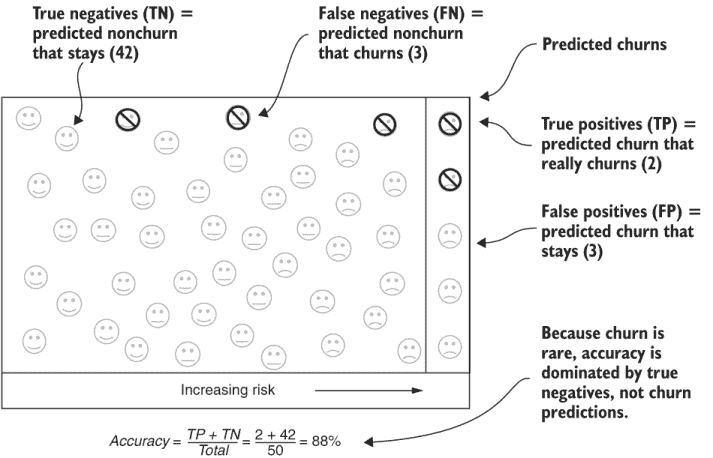

图 9.1 标准准确率测量

在将客户分为预期保留和预期流失组后，分配的类别将与实际情况进行比较。为了定义标准准确率测量，你需要使用以下术语：

+   真阳性的预测（TP）是指预测到的流失确实发生了。

+   真阴性的预测（TN）是指预测到的保留确实保持不变。

+   假阳性的预测（FP）是指预测到的流失却未发生流失。

+   假阴性的预测（FN）是指预测到的保留却发生了流失。

使用这些定义，标准准确率测量被定义为以下内容。

**定义** 标准准确率是指预测中为真阳性或真阴性的百分比。在方程中，这将是标准准确率 = (真阳性数量 + 真阴性数量) / 总数量。

标准准确率旨在表示在特定字面上的预测正确率：即类别分配中实现的比例。这听起来合理，但实际上，标准准确率不适用于衡量流失预测的有效性。在流失方面，标准准确率有两个问题：

+   流失事件很少见，因此标准准确率主要由非流失事件主导。

+   标准准确率测量的基本假设是将客户分为两组：预期流失和预期保留。但这种划分并不是客户细分用例的有用描述。

我将详细解释这些问题。

标准准确率通常受非流失客户的影响，因为流失客户很少见，所以真正的正面预测对标准准确率比率的分子部分不可能有太大影响。因此，这种测量方法并不总是能很好地展示预测是否恰当。为了说明这一点，请注意，有一种简单的方法可以获得很高的标准准确率测量值，如图 9.2 所示。如果你预测没有任何客户会流失（所有客户都属于非流失组），那么你将会有大量的真正负预测。如果你将所有真正负预测正确分配，那么得到的准确率就是保留率，你将获得一个很高的标准准确率测量值，而不需要预测任何关于流失的信息。

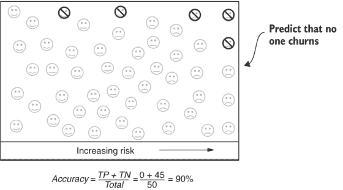

图 9.2 操纵流失的标准准确率测量

**要点**：由于流失事件很少见，因此标准准确率测量方法不适用于流失预测，因为可以通过预测没有人会流失来操纵这种测量。更普遍地说，流失客户的准确率对测量贡献很小。

对于标准准确率测量中的这种弱点，一种可能的补救措施是增加基于不仅真正正面和真正负面，还包括假正面和假负面的测量。然而，我也不推荐这种方法，因为标准准确率测量对于流失用例的不适用性还有另一种方式。计算标准准确率依赖于你将客户分为两组：预期流失客户和预期保留客户的假设。将预测分为两个互斥的组对于某些预测用例是标准的，但在客户流失的情况下很少这样做。

如本章开头所述，流失和保留预测最常见用例是选择客户进行相对昂贵的干预措施以减少流失。在这种情况下，流失或保留概率就像其他细分指标一样被使用，即组织干预措施的部门根据该指标对客户进行排序，然后使用自己的标准选择最合适的客户。例如，如果干预措施有特定的预算，那么部门可能会选择固定数量的最有可能流失或最不可能流失的客户。一种常见的策略是选择那些风险高于平均水平但仍使用产品的客户，因为这些最有可能流失且不使用产品的客户可能无法挽救。你（数据人员）并没有像标准准确率测量所假设的那样将客户分为预期流失客户和非流失客户。

**要点**：流失预测用例依赖于使用流失预测提供的排名作为细分指标，但并不涉及将客户分为两组：预期流失客户和非流失客户。

因为实际的客户流失用例依赖于模型按风险对客户进行排名的能力，而不是将他们分成两个群体本身，所以转向更准确地反映这种情况的替代（非标准）准确性测量方法更有意义。如第 9.1.2 节所述，这些测量方法也解决了标准准确性测量中由于客户流失的罕见性引起的问题。

### 9.1.2 使用 AUC 测量客户流失率预测准确性

对于客户流失率，你应该首先使用的准确性测量方法是曲线下面积（AUC），这里的曲线指的是一种称为接收者操作曲线的分析技术。这种命名是不幸的，因为 AUC 是对指标计算方式的技术描述，但并没有清楚地传达其含义。但每个人都使用这个名字，所以我们别无选择，只能继续使用；我不会再提到接收者操作曲线，因为它对于理解或应用这个指标并不是必要的。正如你将看到的，我的建议是甚至不要向你的商业同事提及这个测量方法。如果你想要更多细节，很容易在网上找到资源。

AUC 的含义比其名称简单，如图 9.3 所示总结。与标准准确性测量一样，你从一个为每个客户都进行了预测并且知道哪些客户流失的数据集开始。考虑以下测试。取一个已经流失的客户和一个没有流失的客户。如果你的模型很好，它应该预测流失客户的流失风险比未流失客户要高。如果模型确实这样做了，那么认为这次比较是成功的。现在考虑每个可能的比较。一个接一个地，将每个客户流失与每个非客户流失进行比较，看看模型是否预测了真实的客户流失具有更高的流失风险。成功预测的整体比例就是 AUC。

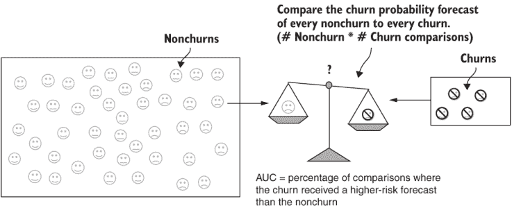

图 9.3 使用 AUC 测量准确性

定义 AUC 是模型在所有客户流失和非客户流失的成对比较中，预测客户流失比非客户流失具有更高流失风险的比较百分比。

AUC 避免了标准准确性中的问题，即预测流失并不重要，因为流失在人口中只占很小的比例。在 AUC 的计算中，准确预测流失是核心，因为每个比较都涉及一个流失客户，即使流失客户只占数据的一小部分。同时，AUC 基于风险的排名，不需要将客户人工分类为两个群体。

如果你考虑 AUC 的定义，那个测量可能涉及很多比较。成对比较的总数是流失客户数和非流失客户数的乘积。幸运的是，有一种更有效的方法来进行计算，涉及到接收者操作曲线，但我不打算教你如何使用它。相反，你将使用一个开源包来进行计算（列出 9.1）。确实，AUC 的计算成本比标准准确率指标要高，但差异并不足以引起担忧。

如果你运行列出 9.1，你将在图 9.4 中看到简短的输出——这是一个初步演示。你将在本章中使用 AUC 测量。

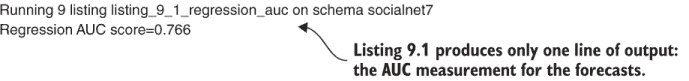

图 9.4 列出 9.1 计算预测模型 AUC 的输出

为了演示 AUC，列出 9.1 重新加载了你在第八章中保存的逻辑回归模型；它还重新加载了用于训练模型的数据库（带有标记流失和保留的历史数据集，而不是当前客户数据集）。模型的 `predict_proba` 函数用于创建预测，并将这些预测传递给来自 sklearn.metrics 包的 `roc_auc_score` 函数。你应该使用以下标准命令和这些参数在自己的保存数据和回归模型上运行列出 9.1：

```
fight-churn/listings/run_churn_listing.py —chapter 9 —listing 1 
```

列出 9.1 计算预测模型 AUC

```
import os
import pickle
from sklearn.metrics import roc_auc_score                              ①
from listing_8_2_logistic_regression import prepare_data               ②

def reload_regression(data_set_path):                                  ③
   pickle_path = data_set_path.replace('.csv', '_logreg_model.pkl')
   assert os.path.isfile(pickle_path), 'Run listing 8.2 to save a log reg model'
   with open(pickle_path, 'rb') as fid:
       logreg_model = pickle.load(fid)
   return logreg_model

def regression_auc(data_set_path):
   logreg_model = reload_regression(data_set_path)                     ④
   X,y = prepare_data(data_set_path)                                   ⑤
   predictions = logreg_model.predict_proba(X)                         ⑥
   auc_score = roc_auc_score(y,predictions[:,1])                       ⑦
   print('Regression AUC score={:.3f}'.format(auc_score))
```

① sklean 函数可以用来计算 AUC。

② 重新使用列出 8.2 中的 prepare_data 函数

③ 重新加载回归模型 pickle

④ 调用 reload_regression 函数

⑤ 调用列出 8.2 中的 prepare_data 函数

⑥ predict_proba 返回概率预测。

⑦ 调用计算 AUC 的函数

你应该会发现回归模型的 AUC 大约是 0.7，这引发了是否 0.7 是好的的问题。AUC 是一个百分比，就像准确率一样，100% 是最好的。如果你有 100% 的 AUC，所有流失客户的风险排名都会高于所有非流失客户。但你永远不会找到一个 AUC 接近那个高度的真正流失预测系统。

另一方面，考虑最坏的情况。零百分比听起来很糟糕，但这个结果意味着你将所有非流失客户排名高于流失客户。如果你这么想，这个结果倒是可以接受，因为那时你可以将你的模型作为完美的保留预测器。然而，很可能在你的模型设置中出了些问题，导致它做出了反向预测。

事实上，最差的 AUC 是 0.50，这意味着你的预测就像抛硬币一样：一半时间正确，一半时间错误。如果一个预测模型的 AUC 是 0.5，那么它的性能最差——与随机猜测相同。

摘要 AUC 范围从 0.5（相当于随机猜测，没有预测能力）到 1.0（完美地将流失客户与非流失客户进行排序）。

表 9.1 显示了您可以考虑的健康和不健康的 AUC 基准列表。一般来说，流失预测 AUC 在约 0.6 到 0.8 的范围内是健康的。如果它低于 0.6 或高于 0.8，可能存在问题，您需要检查模型中的数据。您可能不会认为高精度会引发担忧，但它可能会。我将在第 9.2.3 节中更多关于这个主题。

表 9.1 流失预测 AUC 基准

| AUC 结果 | 诊断 |
| --- | --- |
| < 0.45 | 存在问题！模型正在预测反向。检查您的数据以及计算 AUC 的代码；是否使用了预测概率结果的错误列？ |
| 0.45-0.55 | 与随机猜测（0.5）没有区别。检查您的数据。 |
| 0.55-0.6 | 优于随机猜测，但并不理想。检查您的数据，收集更好的事件，或制定更好的指标。 |
| 0.6-0.7 | 弱度可预测的流失的健康范围。 |
| 0.7-0.8 | 高度可预测的流失的健康范围。 |
| 0.8-0.85 | 极度可预测的流失。这个结果对于消费品来说可能是可疑的，通常只有具有信息性事件和高级指标的商业产品才可能实现。 |
| > 0.85 | 可能存在问题。通常，流失并不是这么可预测的，即使是对于商业产品。检查您的数据，确保您没有使用过短的领先时间来构建数据集，并且没有前瞻性事件或客户数据字段（在第 9.2.3 节中描述）。 |

**注意** 表 9.1 中的 AUC 基准仅适用于客户流失。对于其他问题域，预测 AUC 的预期范围可能更高或更低。

AUC 将在本章的其余部分中使用，但首先，你应该意识到另一种非标准的准确性度量：提升。

### 9.1.3 使用提升测量流失预测准确性

AUC 是一个有用的指标，但它有一个缺点：它是抽象的，难以解释。我建议使用另一个指标来衡量流失准确性，主要是因为它对商业人士来说很容易理解。事实上，这个指标，被称为提升，起源于市场营销。我将首先解释提升在市场营销中的通用用途，然后解释其在流失中的应用。

**定义** 提升是由于某种处理相对于基线引起的响应的相对增加。

如果访问网站的 1%的人注册了产品，而促销活动将注册率提高到 2%，那么促销活动引起的提升是 2.0（2%除以 1%）。根据这个定义，提升 1.0 表示没有改进。关于提升需要注意的一点是，它强调的是相对于基线的改进，因此它适合于测量原本就很少发生的事情的改进。对于测量预测模型的准确性，可以使用提升的一个更具体的版本，称为顶级十分位提升。

**定义** 预测流失模型的顶级十分位提升是指预测为最有可能流失的顶级十分位客户流失率与整体流失率之比。

图 9.5 说明了这个定义。顶部十分位提升类似于常规的升力测量，但基线是整体流失率，处理方式是根据模型选择了最危险的 10%的客户。

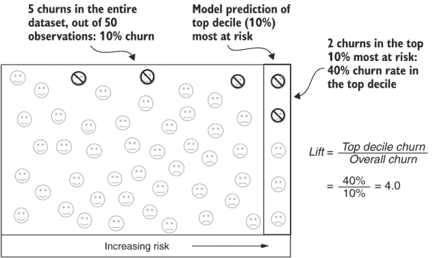

图 9.5 使用提升测量准确性

重要：因为这个定义是流失预测中最常见的提升定义，当我使用“提升”这个词时，你应该从上下文中意识到我指的是顶部十分位提升。

为什么整体流失率是基线？如果你随机猜测，这就是预测流失的准确性。如果你有 5%的流失率，如果你随机选择客户，你将发现 5%的时间会有流失。如果你能做得比随机猜测更好（提升大于 1.0），你的结果会改善。你可能会回应说你可以做得比随机猜测更好，你很可能可以，特别是如果你使用基于数据驱动指标的分段，就像你在本书中学到的那些。但关键是，整体流失率是所有公司的一个合理的基线，无论你还在做些什么。

吸收：顶部十分位提升对于测量准确性是有益的，因为它强调了从低基线预测水平上的改进。

列表 9.2 展示了如何使用 Python 计算提升，假设你已经保存了一个模型（如列表 9.1 所示）。同样，如图 9.6 所示，输出只是一个结果的简单打印，仅作为演示。

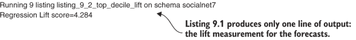

图 9.6 列表 9.2 的输出（提升）

列表 9.2 没有使用开源包来计算升力。在撰写本文时，没有开源包能进行这种计算，因此我在函数`calc_lift`中为你实现了一个。计算升力的步骤如下：

1.  验证数据以确保你有足够数量的不同预测。

1.  计算样本中的整体流失率。

1.  按照流失风险预测对预测进行排序。

1.  定位顶部十分位的位置。

1.  计算顶部十分位中的流失数量和顶部十分位流失率。结果是顶部十分位流失率除以整体流失率。

我提供的提升计算至少需要 10 个独特的值或水平来预测。如果预测不足，可能会因为数据质量差或模型指定不当而出现问题。数据质量差或模型错误最常见的表现是所有账户都得到相同的预测，但其他变体也是可能的。10 个值的准则是一个经验法则，而不是一个硬性规则。（原则上，预测应该允许你选择最有可能进行比较的 10%的客户。例如，在计算提升的目的上，只要精确的 10%的人口得到一个预测或另一个，那么模型只提供两个不同的预测也是可以接受的。10 个独特值的经验法则可以捕捉到最严重的模型或数据失败，而且精确匹配条件实际上并不必要。）

列表 9.2 计算预测模型提升

```
from listing_8_2_logistic_regression 
   import prepare_data                                       ①
from listing_9_1_regression_auc 
   import reload_regression                                  ②
import numpy

def calc_lift(y_true, y_pred):                               ③
   if numpy.unique(y_pred).size < 10:                        ④
       return 1.0
   overall_churn = sum(y_true)/len(y_true)                   ⑤
   sort_by_pred=
      [(p,t) for p,t in sorted(zip(y_pred, y_true))]         ⑥
   i90=int(round(len(y_true)*0.9))                           ⑦
   top_decile_count=
      sum([p[1] for p in sort_by_pred[i90:]])                ⑧
   top_decile_churn = 
      top_decile_count/(len(y_true)-i90)                     ⑨
   lift = top_decile_churn/overall_churn
   return lift                                               ⑩

def top_decile_lift(data_set_path):
   logreg_model = reload_regression(data_set_path)           ⑪
   X,y = prepare_data(data_set_path,as_retention=False)      ⑫
   predictions = logreg_model.predict_proba(X)
   lift = calc_lift(y,predictions[:,0])                      ⑬
   print('Regression Lift score={:.3f}'.format(lift))
```

① 使用列表 8.2 中的 prepare_data 函数

② 使用列表 9.1 中的 reload_regression 函数

③ 参数是真实流失结果和预测的序列。

④ 确保预测是有效的

⑤ 计算整体流失率

⑥ 对预测进行排序

⑦ 计算第 90 百分位的索引

⑧ 计算最十分之一的流失

⑨ 计算最十分之一的流失率

⑩ 返回最十分之一流失与整体流失的比率

⑪ 加载模型，并生成类似于列表 8.1 中的预测

⑫ 加载数据，但不将结果反转为保留

⑬ 调用提升计算函数

你应该使用以下参数运行列表 9.2 来自行检查结果：

```
fight-churn/listings/run_churn_listing.py —chapter 9 —listing 2 
```

你应该会发现回归模型在模拟数据上实现了大约 4.0 的提升。我已经提到，最小提升是 1.0，这表明你的模型并不比随机猜测好，因为它找不到比整体流失率更多的流失。提升小于 1.0 类似于 AUC 小于 0.5，这意味着你的模型在预测风险时是反向的，因为最危险的十分之一比整体样本有更少的流失。

如果最危险的十分之一客户中只包含流失的客户，你也可以推断出可能的最大提升。提升将是 100%除以整体流失率。因此，最大提升取决于整体流失率。以下是一些例子：

+   如果流失率是 20%，最大可能的提升将发生在预测的最十分之一都是流失的情况下。那么提升将是 5（100%/20% = 5）。

+   如果流失率是 5%，最大提升将出现在所有 5%的流失都在最十分之一预测组中。那么最十分之一的流失率将是 50%，提升将是 10（50%/5% = 10）。

模式是，整体流失率越高，可能的最大提升越低。你不可能接近那些最大值，但流失率和更典型提升值之间的关系是相同的。

TAKEAWAY 总体流失率越高，您应该期望的预测模型的提升效果越低。

表 9.2 列出了在真实流失率预测用例中可以期望找到的提升度基准。与 AUC 不同，提升度值的合理范围取决于流失率。如果流失率低，则更容易获得相对较大的提升度。如果流失率高（大于 10%），提升度可能较低。正如前一段所述，当流失率高时，最大提升度会降低。这一特性也适用于期望较低的提升度得分，因为您不太可能在顶部十分位找到如此多的流失率。对于低流失率产品，健康的提升度范围在 2.0 到 5.0 之间，而对于高流失率产品，健康的范围大约在 1.5 到 3.0 之间。

表 9.2 流失率预测提升度基准

| 低流失率（< 10%）提升度结果 | 高流失率（> 10%）提升度结果 | 诊断 |
| --- | --- | --- |
| < 0.8 | < 0.8 | 存在问题！模型预测方向错误。检查您的数据以及计算提升度的代码。是否使用了预测概率结果的错误列？ |
| 0.8-1.5 | 0.8-1.2 | 随机猜测（1.0），或者与随机猜测没有太大区别。检查您的数据。 |
| 1.5-2.0 | 1.2-1.5 | 优于随机猜测，但并不理想。检查您的数据，收集更好的事件，或创建新的指标。 |
| 2.0-3.5 | 1.5-2.25 | 弱可预测流失的健康范围。 |
| 3.5-5.0 | 2.25-3.0 | 高度可预测流失的健康范围。 |
| 5.0-6.0 | 3.0-3.5 | 极度可预测的流失。对于消费者产品来说，这个结果令人怀疑，通常只有具有良好事件和指标的商务产品才可能实现。 |
| > 6.0 | > 3.5 | 可能存在问题。通常，即使是对于商务产品，流失率也不应该是如此可预测的。检查您的数据，确保您没有使用过短的领先时间来构建数据集，并且没有前瞻性事件或客户数据字段（在第 9.2.3 节中描述）。 |

我喜欢在向商业人士解释准确度时使用提升度，因为这个术语直观且与他们已经理解的指标相关。但是，提升度有一个问题：它可能不稳定，尤其是在小数据集上。您用于预测的指标或模型中的微小变化可能会在结果中造成大的变化。

WARNING 提升度可能不稳定，尤其是在小数据集上。结果可能在不同时间段和预测模型之间有显著差异。为了测量提升度，您应该有数千个观察值和数百个流失率在数据集中（或更多）。流失率越低，您需要的观察值越多，以便使提升度测量稳定。

假设你只有 500 个客户观察结果和 5% 的 churn 率，因此你只有 25 个 churn。在这种情况下，提升是基于这 25 个中有多少在风险预测的前 10%，基线预期（平均）为 2.5。从顶部十分之一中增加或减少几个 churn 会对提升产生重大影响。通常，当你有数千个观察结果或更多时，你应该使用提升。AUC 避免了这类问题，因为它始终使用数据集中的每个 churn，并最大化其使用（通过将每个 churn 与每个非 churn 进行比较）。

吸取经验：使用 AUC 来评估你自己的模型准确性。使用提升来向商业人士解释 churn 准确性。

提升的另一个优点是它使预测 churn 的不精确业务听起来更有说服力。比较以下两个陈述：

+   这个模型比基线模型好三倍。

+   这个模型将 churn 率为 70% 的客户评为比 churn 率为 0% 的客户风险更高。

尽管这两个陈述都暗示了比随机猜测更高的相同水平改进，但三倍是一个比 70% 更令人印象深刻的统计数据。

## 9.2 历史准确性模拟：回测

现在你已经知道了衡量 churn 预测准确性的正确方法以及 churn 预测中的典型情况。但我忽略了一个重要细节：你应该在哪些观察结果上衡量准确性。与分析的许多部分一样，对于 churn 来说，情况略有不同。

### 9.2.1 回测的“什么”和“为什么”

之前，我通过计算使用你创建模型的相同数据集上的预测准确性来演示你学到的准确性度量方法。然而，这种演示并不是最佳实践；从某种意义上说，就像测试一个学生已经见过的题目一样，因为相同的客户观察结果被用来拟合模型。预测的最佳实践是在未用于拟合模型的观察结果上测试模型的准确性。这种类型的测试被称为样本外测试，因为它测试了算法确定模型时未在数据样本中给出的观察结果。

通常，新客户观察结果的准确性低于用于模型拟合的观察结果。样本内和样本外准确性的差异取决于许多因素。对于 churn 问题上的回归，差异通常很小；对于第 9.5 节中展示的机器学习模型，使用样本内观察结果进行测试可以导致对准确性的高估。

吸取经验：预测模型应该在未用于拟合模型的样本外数据上测试。

你需要等待看到模型在实时客户上的预测效果如何，以此来判断其准确性吗？等待是可行的，你也应该这样做，但有一个更简单的方法：在拟合模型时，保留一些观测值，然后在这些保留的观测值上测试准确性。这样你就可以看到模型在没有等待获取新客户的情况下，对新客户预测的准确性。测试完成后，你可以在不保留任何观测值的情况下，使用所有数据重新拟合模型，并使用这个最终版本对活跃客户进行真正的预测。

下一个问题是要使用哪些数据以及你应该保留多少数据用于测试。测试客户流失预测模型准确性的最现实的方法是使用历史模拟。这个过程被称为回测，如图 9.7 所示。

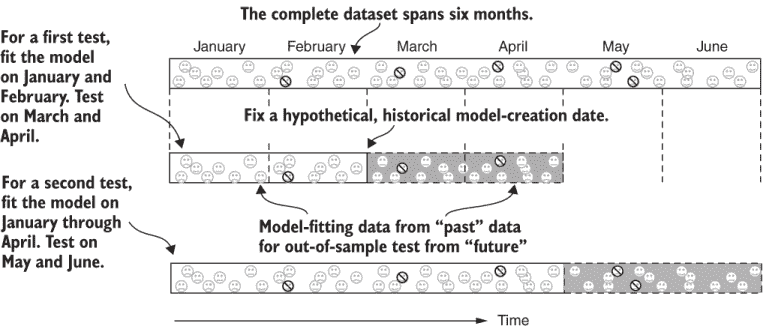

图 9.7 测量预测性能的回测过程

定义：回测是对预测模型准确性的历史模拟，就像它被反复拟合并用于在过去连续的时期内进行样本外预测一样。

下面是回测的工作原理：

1.  决定一个过去的时间点，这个时间点大约是你数据集覆盖期间的一半到三分之一的时长。

1.  使用所有对应于该日期之前时间点的观测值来拟合你的模型。

1.  使用从你选择的测试日期起一至三个月内的观测值。这个程序测试的是，如果模型在过去预测客户流失但仍然对模型拟合后进入的客户数据进行预测，其准确性会是多少。

1.  假设你拥有更多数据，将目标日期提前到测试期的末尾。

1.  通过在第一次拟合的所有数据上重新拟合模型，并加上用于测试的观测值，重复这个过程，并对下一个月到三个月进行测试。

我对客户流失预测的建议与大多数数据科学和统计学课程中所教授的内容略有不同，这些课程很少提及回测。学生们通常学习一种随机洗牌的程序来创建样本外测试，但这些测试并不关注时间因素。回测的程序起源于华尔街的金融预测。回测的创建是由于观察到市场一直在变化，因此预测模型在随机洗牌的准确性测试上的表现与在实际预测上的表现不同。基于现实历史模拟的准确性测试最能准确地估计模型如果在当时是实时运行的话，其表现会如何。

实时预测准确度与洗牌数据测试不同的原因在于，如果经济条件发生变化，例如在经济衰退开始时，衰退前的实时模型拟合可能在新衰退条件下预测效果不佳。为了使模型表现更好，新的条件必须观察一段时间；然后可以对模型进行重新拟合。但在洗牌数据测试中，就好像你拟合了一个通过观察未来事件来了解衰退的模型。这样的模型可能看起来预测效果很好，但实际结果可能会比测试更差。

同样的推理适用于客户流失预测。如果你的市场、产品或竞争在数据集覆盖的时间段内发生变化，那么在变化之后准确预测客户流失可能会很困难。如果你对数据进行洗牌，你可能会得到与当时为你的客户进行预测时不同的结果。最现实的模拟是在事件发生顺序中让模型运行并通过数据外样本进行预测。你可能不知道在观察期间驱动你的客户流失行为条件是否发生变化。但你所不知道的可能会对你造成伤害，因此回测是最佳实践。尽管我描述的历史模拟听起来很复杂，但开源包会为你处理所有细节。

### 9.2.2 回测代码

开源 Python 包提供运行历史模拟的函数，如第 9.2.1 节所述。你提供数据包你的数据和你要拟合的模型类型，并告诉它你想要将数据分成多少个测试。

图 9.8 展示了历史模拟的示例输出，包括每个外样本测试的升度和 AUC 以及平均值。对于模拟数据集，你可能会发现回测中的 AUC 和升度与样本内数据的 AUC 和升度相似，但对于真实产品数据集来说，情况可能并非如此。

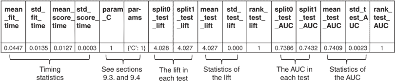

图 9.8 回测输出（列表 9.3）

在图 9.8 中，每个测试周期被称为一个分割，这指的是数据被分割成用于拟合模型的数据库和用于测试的保留数据集。

定义：分割是将数据集划分为单独的部分以进行模型拟合和测试的通用术语。

列表 9.3 包含了生成图 9.8 所示输出的 Python 代码。此列表包含了许多与第八章中回归拟合代码和第 9.1 节中讨论的准确度测量相同的元素。但来自 sklearn.model_selection 包的三个重要新类：

+   `GridSearchCV`—一个执行各种预测模型测试的实用工具。类名来源于它通过交叉验证（`GridSearchCV` 中的 `CV`）的过程专门搜索最佳模型的事实。你将在第 9.4 节中了解更多关于交叉验证的内容；现在，你使用该对象测试单个模型。

+   `TimeSeriesSplit`—一个辅助对象，告诉 `GridSearchCV` 测试应通过历史模拟进行，而不是另一种类型的测试（通常是随机洗牌）。类名为 `TimeSeriesSplit`，但我建议你坚持使用你商业同事最可能理解的原始华尔街术语：回测。

+   `scorer`—一个包装评分函数的对象。当你使用 `GridSearchCV` 的非标准评分函数时，你必须将其包装在这样的对象中。这个任务很简单：调用为此目的提供的 `make_scorer` 函数。你通过在创建 `scorer` 对象时传递评分函数作为参数。在列表 9.3 中，这种技术用于计算最高十分位的提升。

除了 `TimeSeriesSplit`，创建 `GridSearchCV` 所需的参数包括回归模型对象和一个包含两个准确度测量函数的字典。提升测量函数通过评分对象传递，AUC 评分函数作为字符串传递（因为此评分对象是 Python 标准）。

控制测试细节的其他参数包括以下内容：

+   `return_train_score`—控制是否也要测试样本内准确度（也称为训练准确度）

+   `param_grid`—测试参数以找到更好的模型（你将在第 9.4 节中了解更多关于此内容）

+   `refit`—告诉模型在所有数据上重新拟合一个最终模型（你将在第 9.4 节中这样做）

在其他方面，列表 9.3 结合了你已经看到的元素：加载数据和准备数据、创建回归模型和保存结果。需要注意的是，测试是通过在 `GridSearchCV` 上调用 `fit` 函数而不是在回归对象本身上触发的。

列表 9.3 使用 Python 时间序列交叉验证进行回测

```
import pandas as pd
from sklearn.model_selection 
   import GridSearchCV, TimeSeriesSplit                                   ①
from sklearn.metrics import make_scorer                                   ②
from sklearn.linear_model import LogisticRegression

from listing_8_2_logistic_regression 
   import prepare_data                                                    ③
from listing_9_2_top_decile_lift 
   import calc_lift                                                       ④

def backtest(data_set_path,n_test_split):

   X,y = prepare_data(data_set_path,as_retention=False)                   ⑤

   tscv = TimeSeriesSplit(n_splits=n_test_split)                          ⑥

   lift_scorer = 
      make_scorer(calc_lift, needs_proba=True)                            ⑦
   score_models = 
      {'lift': lift_scorer, 'AUC': 'roc_auc'}                             ⑧

   retain_reg = LogisticRegression(penalty='l1',                          ⑨
                                   solver='liblinear', fit_intercept=True)

   gsearch = GridSearchCV(estimator=retain_reg,                           ⑩
                          scoring=score_models, cv=tscv,
                          return_train_score=False,  param_grid={'C' : [1]}, refit=False)

   gsearch.fit(X,y)                                                       ⑪

   result_df = pd.DataFrame(gsearch.cv_results_)                          ⑫
   save_path = data_set_path.replace('.csv', '_backtest.csv')
   result_df.to_csv(save_path, index=False)
   print('Saved test scores to ' + save_path)
```

① 这些类运行测试。

② 定义了一个自定义的评分函数：提升分数

③ 重新使用列表 8.2 来重新加载数据

④ 重新使用列表 9.2 来计算提升

⑤ 加载数据，将结果作为流失标志

⑥ 创建一个控制拆分的对象

⑦ 创建一个包装提升函数的评分对象

⑧ 创建一个字典，定义评分函数

⑨ 创建一个新的 LogisticRegression 对象

⑩ 创建一个 GridSearchCV 对象

⑪ 运行测试

⑫ 将结果保存到 DataFrame 中

你应该在社交网络模拟（第八章）的自己的数据上运行列表 9.3，并确认你的结果与图 9.8 中的结果相似。使用 Python 包装程序，运行命令如下：

```
fight-churn/listings/run_churn_listing.py —chapter 9 —listing 3 
```

### 9.2.3 回测考虑事项和陷阱

对于模拟，只使用了两个测试，因为整个数据集只覆盖了六个月。如果为更大的数据集指定了更多的测试，额外的结果将作为同一文件中的额外列出现。但在回测预测流失时，通常只使用几个分割点进行测试。相比之下，你可能已经学会的随机打乱测试的程序通常需要 10 个或更多的随机测试。你应该根据你的数据样本覆盖的时间长度以及你可能会重新拟合模型的频率来选择分割点的数量。

尽管你可能乐观地认为你每个月都会重新拟合一个新的模型，但现实中，许多公司“设置后即忘”。即使你非常坚定，在你完成初步开发后，你可能一年内只重新拟合自己的模型几次。（每两个月重新拟合一次模拟模型可能是过于乐观的；我使用这个例子是为了演示目的。）此外，频繁的模型更改会让商业人士感到困惑。事实上，一些公司要求每年重新拟合生产模型，以防止当业务指标与模型输出相关联时“移动目标”。例如，如果客户支持代表的薪酬与降低流失概率相关联，那么模型必须在整个财政年度保持固定。

如果你担心使用几个分割点进行测试不如使用 10 个测试那样严格，请不要担心。这些测量应该以我在第一章中提倡的敏捷性和简约性精神来进行。使用几个测试就能告诉你是否预测得很好，或者是否需要在你的模型上做更多的工作；做更多的测试是浪费时间。此外，如果大量的测试分割意味着在模型运行时进行不切实际的模型重新拟合率，你的测试可能会高估你在现实世界中实现的准确性，而在现实世界中你重新拟合的频率较低。

在回测准确性时需要注意的一个其他陷阱是由于在数据库或数据仓库中记录时间时的错误而可能产生的负面影响。这个问题主要发生在事件、订阅或其他客户数据记录在数据库中添加时被回溯时。在这种情况下，你会计算历史指标，并使用可能不会在实时预测活跃客户时可用信息来运行测试。这种错误被称为预测中的前瞻性错误或偏差。

**定义** 前瞻性偏差是在使用在实时预测活跃客户时不会可用信息的历史模拟来估计准确性时发生的一种错误。

**警告** 事件、订阅或其他客户数据的回溯记录可能导致你的预测中出现前瞻性偏差，并使回测看起来比你在实时预测中实现的准确性更高。

解决前瞻性偏差的方法是意识到你数据库中记录的任何回溯，并在必要时，在计算指标的事件选择时使用自定义滞后来纠正它。例如，如果你知道所有事件都是在一周后加载到数据仓库中，并且回溯到事件发生的时间，你应该在计算你的指标时包括这个延迟。技巧是，当你运行历史分析时，你不会注意到一周的延迟，但当你尝试实时预测客户流失概率时，你会发现自己所有的指标都过时了一周。

## 9.3 回归控制参数

在测量你预测的准确性之后，你可能想知道是否有任何方法可以使预测更准确。我提到过的另一个问题是，回归可能导致许多小的权重出现在不重要的指标上。你有一种调整回归的方法，可以帮助解决这两个问题。

### 9.3.1 控制回归权重的强度和数量

在第八章中，我提到回归模型可能会有太多很小的权重，并且你可以移除它们。这种技术在第 9.9 图中有说明，该图显示了来自社交网络模拟（第八章中的第 8.7 图）的回归权重的相对大小。大多数权重都大于 0.1，一个权重是 0.00，两个权重是 0.01；这些 0.01 的权重是多余的。两个小的权重可能看起来不是问题，但请记住，真实数据可能有十几个或更多的更小的权重，这可能会使你和企业人士更难理解结果。


图 9.9 回归产生的小权重可以被移除。

可能看起来最简单的事情就是将这些非常小的权重设置为零。但关于哪些权重要保留，哪些要移除的决定可能并不那么明确。此外，如果移除了某些权重，其他权重也应该重新调整。回归算法有一种更原则性的方法来处理这种情况，即通过一个参数来控制算法可用于分配到所有指标的总权重。

当控制参数设置为高值时，回归权重往往较大，零的个数较少。当控制参数设置为低值时，权重往往较低，参数设置得越低，零的权重越多。精确的权重由算法优化。不幸的是，这个控制参数没有好、普遍接受的名字。因为回归只有一个相关的参数，我将称之为控制参数。方便的是，Python 代码将这个参数称为（大写）`C`，所以称之为控制参数是清晰的。

定义 回归控制参数设置回归产生的权重的大小和数量。更高的`C`设置会产生更多和更大的权重，而更低的`C`设置会产生更少和更小的权重。

Python 的命名 `C` 来自回归算法中称为成本参数的东西。它被称为成本，因为算法包括对权重大小的惩罚成本。但是文档中说明成本是 1/`C`，所以 `C` 是成本的倒数或倒数。有一个参数被称为成本，但成本对于较低的参数值更高，这很令人困惑，所以我坚持称其为控制参数，或 `C`。

### 9.3.2 使用控制参数的回归

列表 9.4 展示了使用控制参数的新版本的回归。此列表重用了列表 8.2（第八章）中的所有辅助函数，因此内容不多。唯一的区别是列表 9.4 在函数调用中取 `C` 的值，在创建对象时传递它，并将其作为扩展传递给输出文件。输出文件与列表 8.2 生成的文件相同。

您应该在您的模拟数据上运行列表 9.4。为了看到设置 `C` 参数的效果，您可以运行三个版本。这三个版本的 `C` 参数分别设置为 0.02、0.01 和 0.005。使用 Python 包装程序运行这些版本，如下所示使用 `version` 参数：

```
fight-churn/listings/run_churn_listing.py —chapter 9 —listing 4 —version 1 2 3
```

在图 9.10 中比较了运行列表 9.4 的两个版本的结果，以及原始回归（列表 8.2）的结果：

+   在原始列表中，除了一个权重外，所有权重均不为零，最大权重的绝对值为 0.68。

+   当 `C` 参数设置为 0.02 时，四个权重为零，最大权重的绝对值为 0.61。

+   当 `C` 参数设置为 0.005 时，八个权重为零，最大权重的绝对值为 0.42。

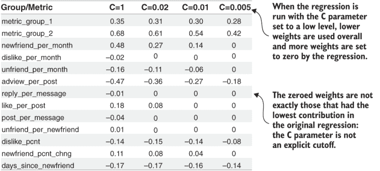

图 9.10 比较了不同控制参数 `C` 值导致的回归权重

当 `C` 参数减少时，整体模式就是这样发生的。

列表 9.4 使用控制参数 `C` 的回归

```
from sklearn.linear_model import LogisticRegression
from listing_8_2_logistic_regression 
   import prepare_data, save_regression_model                              ①
from listing_8_2_logistic_regression 
   import save_regression_summary, save_dataset_predictions

def regression_cparam(data_set_path, C_param):                             ②
   X,y = prepare_data(data_set_path)
   retain_reg = LogisticRegression( C=C_param,                             ③
                                    penalty='l1',
                                    solver='liblinear', fit_intercept=True)
   retain_reg.fit(X, y)                                                    ④
   c_ext = '_c{:.3f}'.format(C_param)                                      ⑤
   save_regression_summary(data_set_path,retain_reg,ext=c_ext)             ⑥
   save_regression_model(data_set_path,retain_reg,ext=c_ext)
   save_dataset_predictions(data_set_path,retain_reg,X,ext=c_ext)
```

① 此列表使用了列表 8.2 中的所有辅助函数。

② 回归还有一个额外的参数，C。

③ 在创建回归时传递参数

④ 按照列表 8.2 进行回归拟合

⑤ 将参数添加到结果文件名中

⑥ 调用保存函数

注意，算法对 `C` 参数设置的响应是不规则的。将 `C` 参数从 1 减少到 0.02 会从回归结果中移除两个额外的指标，而从 0.02 减少到 0.005 会再移除三个。根据算法中参数的定义，您需要考虑控制参数在 1.0（默认值）以下和零以上的变化范围，但影响随着参数的减小而以对数尺度变化。

当我说影响在对数尺度上变化时，我的意思是参数的变化必须在参数的对数中显著不同，才能在算法中产生重大影响。从 1.0 到 0.9 的变化不会太大，而从 1 到 0.1 的变化可能大约与从 0.1 到 0.01 的变化相同。在像 [1, 0.9, 0.8, ..., 0.1] 这样的线性尺度上测试 1 和 10 之间的参数范围是不高效的，因为最佳值可能低于 0.1，而且你可能在 0.9 和 0.8 这样的值之间看不到太大的变化。相反，你应该测试以除数因子递减的参数，例如除以 10：[1, 0.1, 0.01, 0.001]。你需要减小到多小才能看到正确的影响取决于你的数据。如果你想更详细地搜索参数空间，可以除以更小的因子，如 2，例如 [0.64, 0.32, 0.16, ...]。

吸收要点 当你检查 `C` 的较小值时，你必须检查比 1.0 小一个数量级的值。通常，一个大约为 1.0 的 `C` 参数会给所有（或大多数）与流失有一点关系的指标分配权重。为了减少非零权重的数量，尝试 `C` 的值如 0.1、0.01 和 0.001。

## 9.4 通过测试（交叉验证）选择回归参数

到目前为止，你可能想知道控制参数应该降低到多低。删除权重小的指标是有意义的，但应该在什么点停止？这个决定最好通过查看每个参数设置产生的准确性来做出。

### 9.4.1 交叉验证

你可以从回归中删除权重小的指标，这对准确性影响不大，这应该不会让你感到惊讶。（因为这些权重是小的，所以它们没有太大影响。）更令人惊讶的是，删除一些指标可以提高准确性。

你将尝试不同的 `C` 参数值，并使用该参数进行回测，以查看生成的模型有多准确。同时，你可以检查回归中有多少指标获得了零和非零权重。图 9.11 展示了这一过程。在机器学习和统计学中，这类过程的通用术语是交叉验证。

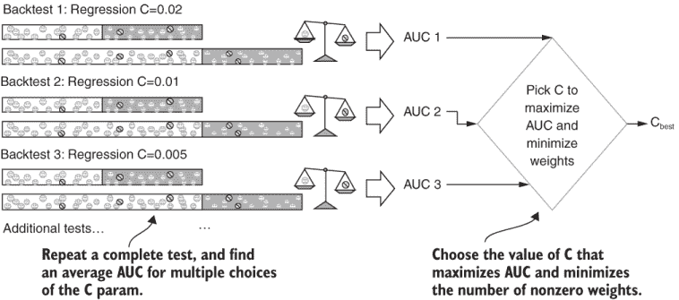

图 9.11 选择回归参数的交叉验证

定义 交叉验证是通过比较使用不同参数创建的模型的准确性和其他特征来优化预测模型的过程。

交叉验证是数据科学和机器学习中的一个常见任务，而`CV`在您之前介绍的`GridSearchCV`对象中的含义。名称中的`GridSearch`部分指的是典型的交叉验证是在一系列或多个参数序列上进行的。如果有两个参数，每个参数都有其自己的值序列，那么这两个序列的组合将定义一个网格。实际上，可以有任意数量的参数。对于回归模型，您将进行一个参数的交叉验证。稍后，您将使用更高维度的交叉验证来进行机器学习模型。

### 9.4.2 交叉验证代码

图 9.12 显示了交叉验证的主要结果，它绘制了运行回归时从`C`参数的值序列中得到的 AUC、提升和权重数量。这个结果证实了可以移除小权重指标，而准确度不会受到影响：在准确度发生任何明显变化之前，指标的数量可以从 13 减少到 9。在模拟中，当移除不那么重要的指标时，提升略有增加，但 AUC 没有增加。

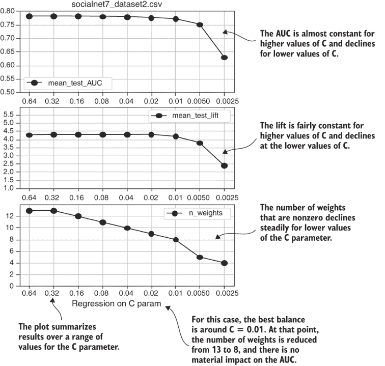

图 9.12 交叉验证结果图

列表 9.5 包含了生成图 9.12 的代码。列表中包含多个函数定义，但请注意，大部分代码是用于绘图和分析的。Python 开源包只需几行代码就处理了交叉验证。列表 9.5 中的函数如下：

+   `crossvalidate_regression`—这个主要函数执行交叉验证，几乎与列表 9.4 中的相同。最重要的区别是传递了一个`C`参数值的序列，而不是单个值。另一个区别是在`GridSearchCV`对象的`fit`函数返回后，调用辅助函数执行额外的分析和保存结果。

+   `test_n_weights`—`GridSearchCV`对象在回测中对每个参数进行模型准确性的测试，但它不会测试回归返回的权重数量。调用一个单独的循环来在每个`C`参数的序列中拟合回归，并计算非零权重的数量。这是在完整数据集上进行的，因此它不是一个回测，而是对最终模型的一个测量。

+   `plot_regression_test`—这个函数通过结合 AUC、提升和具有非零权重的指标数量，创建了图 9.12 所示的图表。

+   `one_subplot`—这个辅助函数创建并格式化每个子图。

列表 9.5 还保存了图 9.12 的结果，如图 9.13 所示。这个结果是`GridsearchCV`（如第 9.2 节所述）的输出，但不是单行，而是每个测试的`C`参数值在表中占一行。还有一个额外的列，包含测试权重数量的结果。多个参数的交叉验证输出显示，标记为 rank_test_lift 和 rank_test_AUC 的列是指具有不同参数值的模型在准确度指标上的排名。（当你在第 9.2 节首次看到这些列时，其中一些可能看起来是多余的。）

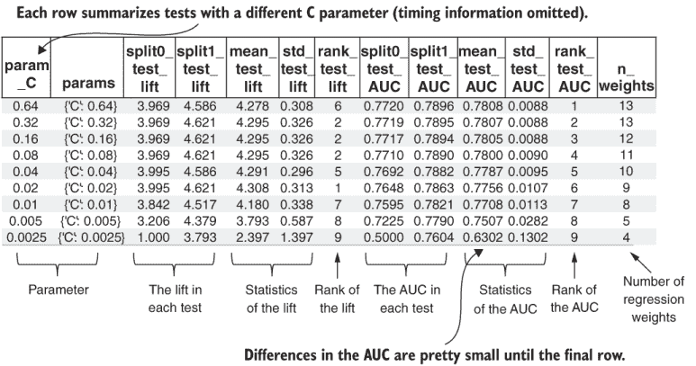

图 9.13 交叉验证结果表

您应使用以下命令行参数运行列表 9.5 以生成自己的图表，如图 9.12 所示，并生成一个类似于图 9.13 的.csv 文件：

```
fight-churn/listings/run_churn_listing.py —chapter 9 —listing 5
```

列表 9.5 回归`C`参数交叉验证

```
import pandas as pd
import ntpath
import numpy as np
from sklearn.model_selection import GridSearchCV, TimeSeriesSplit
from sklearn.metrics import make_scorer
from sklearn.linear_model import LogisticRegression
import matplotlib.pyplot as plt

from listing_8_2_logistic_regression import prepare_data
from listing_9_2_top_decile_lift import calc_lift

def crossvalidate_regression(data_set_path,
                             n_test_split):                                ①

   X,y = prepare_data(data_set_path,as_retention=False)
   tscv = TimeSeriesSplit(n_splits=n_test_split)
   score_models = {                                                        ②
      'lift': make_scorer(calc_lift, needs_proba=True), 
      'AUC': 'roc_auc'
   }
   retain_reg = LogisticRegression(penalty='l1', 
                                   solver='liblinear', fit_intercept=True)
   test_params = {'C' : [0.64, 0.32, 0.16, 0.08,                           ③
                         0.04, 0.02, 0.01, 0.005, 0.0025]}
   gsearch = GridSearchCV(estimator=retain_reg,                            ④
                          scoring=score_models, cv=tscv, 
                          verbose=1,return_train_score=False,
                          param_grid=test_params, refit=False)
   gsearch.fit(X,y)
   result_df = pd.DataFrame(gsearch.cv_results_)                           ⑤
   result_df['n_weight']= 
      test_n_weights(X,y,test_params)                                      ⑥
   result_df.to_csv(data_set_path.replace('.csv', '_crossval.csv'), index=False)
   plot_regression_test(data_set_path,result_df)                           ⑦

def test_n_weights(X,y,test_params):                                       ⑧
   n_weights=[]
   for c in test_params['C']:                                              ⑨
       lr = LogisticRegression(penalty='l1',C=c,                           ⑩
                               solver='liblinear', fit_intercept=True)
       res=lr.fit(X,~y)                                                    ⑪
       n_weights.append(
          res.coef_[0].astype(bool).sum(axis=0))                           ⑫
   return n_weights

def plot_regression_test(data_set_path, result_df):                        ⑬
   result_df['plot_C']=result_df['param_C'].astype(str)                    ⑭
   plt.figure(figsize=(4,6))
   plt.rcParams.update({'font.size':8})
   one_subplot(result_df,1,'mean_test_AUC',                                ⑮
               ylim=(0.6,0.8),ytick=0.05)
   plt.title(                                                              ⑯
      ntpath.basename(data_set_path).replace(
                                       '_dataset.csv',' cross-validation'))
   one_subplot(result_df,2,'mean_test_lift',                               ⑰
               ylim=(2, 6),ytick=0.5)
   one_subplot(result_df,3,'n_weight',                                     ⑱
               ylim=(0,int(1+result_df['n_weights'].max())),ytick=2)
   plt.xlabel('Regression C Param')                                        ⑲
   plt.savefig(data_set_path.replace('.csv', '_crossval_regression.png'))
   plt.close()
def one_subplot(result_df,plot_n,var_name,ylim,ytick):
   ax = plt.subplot(3,1,plot_n)                                            ⑳
   ax.plot('plot_C', var_name,                                             ㉑
           data=result_df, marker='o', label=var_name)
   plt.ylim(ylim[0],ylim[1])                                               ㉒
   plt.yticks(np.arange(ylim[0],ylim[1], step=ytick))                      ㉓
   plt.legend()
   plt.grid()
```

测试拆分的数量是一个参数。

② 分数函数将升力包装在评分对象中。

③ 不是测试一个 C 参数，而是测试一个列表

创建交叉验证对象，并调用 fit 方法

⑤ 将结果放入 DataFrame

添加另一个包含权重测试结果的列

使用 plot_ regression_ test 绘制一个图表

测试不同 C 参数的权重数量

9.9 循环遍历参数

使用一个 C 值创建逻辑回归

拟合模型

⑫ 计算非零权重的数量

从回归测试的结果中制作一个图表

C 参数的字符串版本，用作 x 轴

⑮ 调用辅助函数以绘制 AUC

在三个子图中的第一个上方添加标题

调用辅助函数以绘制升力

⑱ 调用辅助函数以绘制非零权重的数量

在第三个子图后添加一个 x 标签

开始由参数指定的子图

将命名变量与 C 参数的字符串版本进行绘图

根据参数设置 y 轴限制

根据参数设置刻度

### 9.4.3 回归交叉验证案例研究

图 9.14 显示了来自真实公司案例研究的回归交叉验证示例。非零权重的数量以百分比而不是计数显示；否则，这些结果与图 9.12 的阅读方式相同。

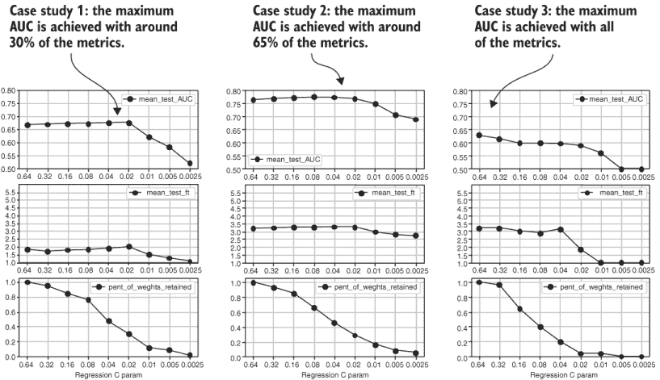

图 9.14 交叉验证案例研究结果

以下是一些案例研究结果的有趣特征：

+   预测的 AUC 范围在 0.6 到 0.8 之间。

+   预测的升力范围在 2.0 到 3.5 之间。

+   对于三个案例研究中的两个，当许多指标从回归中获得零权重时，AUC 和升力有明显的改进。（这是一个简单性也有利于准确性的明显例子。）在这些情况下，`C`参数的最佳值在约 0.02 到 0.08 的范围内。与包含所有特征相比，AUC 的改进是几个百分点。

+   对于第三次模拟，所有指标都达到了最优的 AUC；删除任何指标都会导致准确性的显著下降。

这些结果是典型的，但你在实际案例研究中可能会看到比我这里呈现的更多样性。

## 9.5 使用机器学习预测流失风险

到目前为止，你已经学习了使用回归进行预测，其中预测是通过将指标乘以一组权重来进行的。你也可以使用其他类型的预测模型来预测流失，这些模型统称为机器学习。没有官方的定义来界定什么是机器学习模型，但为了本书的目的，我使用以下定义。

定义：机器学习模型是指任何具有以下两个特征的预测算法：（1）算法通过处理样本数据来学习做出预测（与使用由人类程序员设置的规则进行预测相比），（2）算法不是回归算法。

第二个条件可能看起来很奇怪，因为回归算法显然满足第一个条件。这种区别是历史性的，因为回归方法比机器学习方法早了几十年。

### 9.5.1 XGBoost 学习模型

这本书只涵盖了一个机器学习算法——XGBoost，但拟合模型和预测的技术同样适用于你可能会考虑的多数其他算法。XGBoost 算法基于决策树的概念，如图 9.15 所示。

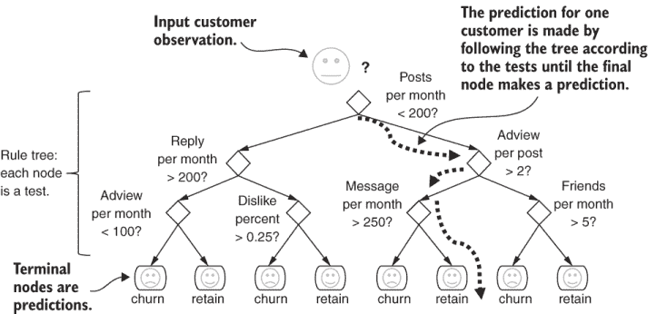

图 9.15 使用规则树进行预测

定义：决策树是一种预测结果（例如客户的流失或未流失）的算法，它由由规则或测试组成的二叉树组成。

决策树中的每个测试都只取一个指标，并检查它是否大于或小于一个预定的切割点。对于观察结果（例如客户的观察结果）的预测是通过从树的根开始并执行第一个测试来确定的。测试的结果决定了从节点到二级测试的哪个分支进行。所有测试的结果确定了一条通过树的路，并且树的每个叶子节点都有一个指定的预测。

小决策树看起来很简单，它们曾经被认为是易于理解的机器学习模型。但在实践中，对于具有许多指标的数据库，大型决策树变得难以解释。幸运的是，没有人需要阅读树中的规则来做出预测。

使用样本数据进行预测时，使用算法测试指标并确定切点以优化性能。如果回测显示结果准确，你可以使用决策树进行预测，而不必过于关注规则的实质。存在解释决策树的方法，但它们超出了本书的范围。如果你有多个指标，最好通过前面章节中展示的分组和回归方法来理解指标对客户流失可能性影响，因此我不会在解释决策树上花费时间。

除了难以解释之外，决策树在预测准确性方面也不再是尖端技术。但决策树实际上是更准确机器学习模型的构建块。一个例子是随机森林，如图 9.16 所示。

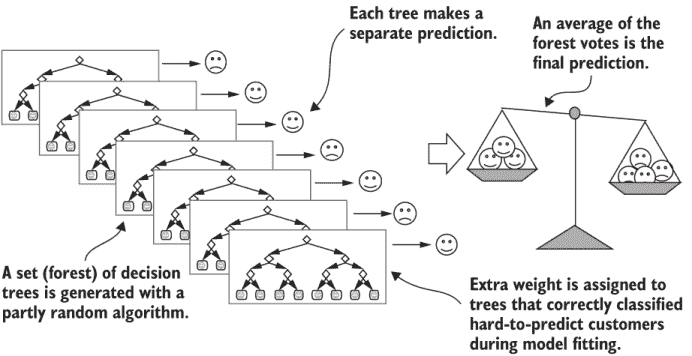

图 9.16 使用规则树森林进行预测

**定义** 随机森林是一种通过随机生成大量决策树（森林）来预测结果（如客户的流失）的算法。所有树都试图预测相同的输出，但每棵树都根据不同的学习规则进行预测。最终的预测是通过平均森林的预测得出的。

随机森林是所谓的集成预测算法的一个例子，因为最终的预测是由一组其他机器学习算法的组合得出的。集成意味着作为一个整体而不是个别评估的一组。随机森林是一种简单的集成类型，因为每一棵树在结果中都有平等的投票权，并且随机添加额外的树。提升是一种机器学习算法的名称，它在集成（如随机森林）的基础上进行了一些重要的改进。

**定义** 提升是一种机器学习集成，其中集成成员被添加以纠正现有集成的错误。

与随机森林中随机添加决策树不同，在提升集成中，你创建每一棵新树是为了纠正现有集成中做出的错误答案，而不是在正确示例上重新预测。在提升算法内部，连续生成的树用于纠正先前树未能正确分类的观察结果。此外，在投票中分配给连续树的权重是为了最好地纠正错误，而不是像随机森林中那样进行平等的投票。这些改进使得决策树提升森林比真正的随机决策树森林更准确。

XGBoost（即极端梯度提升）是一种机器学习模型，在撰写本文时，它是用于通用预测的最受欢迎和最成功的模型。XGBoost 之所以受欢迎，是因为它提供了最先进的性能，并且拟合模型的算法相对较快（与其他提升算法相比，但不如回归快）。关于 XGBoost 算法的详细信息超出了本书的范围，但网上有许多优秀的免费资源。

### 9.5.2 XGBoost 交叉验证

像 XGBoost 这样的机器学习算法可以做出准确的预测，但这种准确性伴随着一些额外的复杂性。复杂性之一是算法具有多个可选参数，您必须正确选择这些参数才能获得最佳结果。XGBoost 的可选参数包括控制单个决策树如何生成的参数，以及控制不同决策树的投票如何组合的参数。以下是 XGBoost 最重要的几个参数：

+   `max_depth`—每个决策树中规则的最高深度

+   `n_estimator`—生成决策树的数量

+   `learning_rate`—强调最佳树投票权重的程度

+   `min_child_weight`—投票中每个树的最低权重，无论其表现如何

由于没有直接选择这么多参数值的方法，因此这些值是通过样本外交叉验证来设置的。您在 9.4 节中的回归控制参数上使用了这种方法。

吸收要点：最先进的机器学习模型有如此多的参数，确保您选择最佳值的唯一方法是对大量参数进行交叉验证。也就是说，您测试每个参数的每个可能的值序列，并选择在交叉验证测试中具有最佳值的那些。

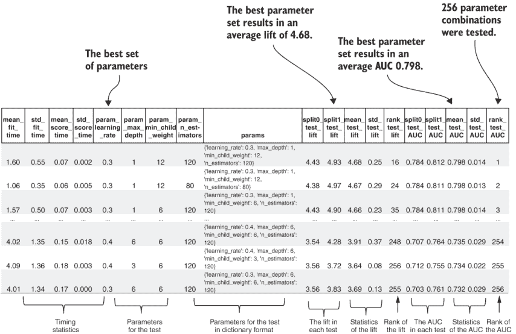

图 9.17 XGBoost 代码输出

图 9.17 显示了这样一个交叉验证结果的示例。

图 9.17 是通过在早期章节中使用的模拟社交网络数据集上运行列表 9.6 创建的。它与您看到的用于选择回归`C`参数的交叉验证结果类似，但它有更多的列和行：

+   由于有四个参数参与了测试：`max_depth`、`n_estimator`、`learning_rate`和`minimum_child_weight`，因此有四列参数。

+   输出表中有很多行——精确地说，有 256 种参数组合。当您检查列表 9.6 时，256 种参数组合的原因变得清晰：测试是在四个参数上进行的，每个参数的值序列有四个条目。组合的总数是每个参数值的数量的乘积——在这种情况下，4 × 4 × 4 × 4 = 256。

您应该在您自己的模拟数据上运行列表 9.6，使用以下常用的 Python 包装程序命令以及这些参数：

```
fight-churn/listings/run_churn_listing.py —chapter 9 —listing 6
```

如果 XGBoost 模型的交叉验证所需时间比回归模型长得多，请不要感到惊讶。有更多的参数组合需要测试，每次拟合模型时，过程都会显著变长。确切的时间可能因硬件而异，但与我相比，XGBoost 模型拟合所需的时间大约是回归模型的 40 倍。如图 9.8 所示，回归模型平均只需要几百毫秒就能拟合；图 9.17 显示 XGBoost 模型的拟合大约需要 1 到 4 秒。

注意：XGBoost 是一个独立的 Python 包，所以如果你之前没有使用过它，在运行列表 9.6 之前需要安装它。

列表 9.6 XGBoost 交叉验证

```
import pandas as pd
import pickle
from sklearn.model_selection import GridSearchCV, TimeSeriesSplit
from sklearn.metrics import make_scorer
import xgboost as xgb                                                          ①

from listing_8_2_logistic_regression import prepare_data
from listing_9_2_top_decile_lift import calc_lift

def crossvalidate_xgb(data_set_path,n_test_split):

   X,y = prepare_data(data_set_path,ext='',as_retention=False)                 ②
   tscv = TimeSeriesSplit(n_splits=n_test_split)
   score_models = {'lift': make_scorer(calc_lift, needs_proba=True), 'AUC': 'roc_auc'}

   xgb_model = xgb.XGBClassifier(objective='binary:logistic')                  ③
   test_params = { 'max_depth': [1,2,4,6],                                     ④
                   'learning_rate': [0.1,0.2,0.3,0.4],                         ⑤
                   'n_estimators': [20,40,80,120],                             ⑥
                   'min_child_weight' : [3,6,9,12]}                            ⑦

   gsearch = GridSearchCV(estimator=xgb_model,n_jobs=-1, scoring=score_models, ⑧
                          cv=tscv, verbose=1, return_train_score=False,                                   
                          param_grid=test_params,refit='AUC')                  ⑨
   gsearch.fit(X.values,y)                                                     ⑩

   result_df = pd.DataFrame(gsearch.cv_results_)                               ⑪
   result_df.sort_values('mean_test_AUC',ascending=False,inplace=True)         ⑫
   save_path = data_set_path.replace('.csv', '_crossval_xgb.csv')
   result_df.to_csv(save_path, index=False)
   print('Saved test scores to ' + save_path)

   pickle_path = data_set_path.replace('.csv', '_xgb_model.pkl')               ⑬
   with open(pickle_path, 'wb') as fid:
       pickle.dump(gsearch.best_estimator, fid)                                ⑭
   print('Saved model pickle to ' + pickle_path)
```

① 导入 XGBoost，它是一个独立的包。

② 这部分功能与列表 9.5 中的内容基本相同：回归交叉验证。

③ 创建一个用于二元结果的 XGBClassifier 对象。

④ 测试树深度从 1 到 6。

⑤ 测试学习率从 0.1 到 0.4。

⑥ 测试估计器的数量从 20 到 120。

⑦ 测试从 3 到 12 的最小权重。

⑧ 使用 XGBoost 模型对象创建 GridSearchCV 对象，并测试参数。

⑨ 在交叉验证后根据 AUC 重新拟合最佳模型。

⑩ 将值作为非 DataFrame 传递，以避免在编写此内容时的已知包问题。

⑪ 将结果转移到 DataFrame 中。

⑫ 对结果进行排序，以便最佳 AUC 值排在第一位。

⑬ 创建最佳结果的 pickle 文件。

⑭ 最佳结果位于 GridSearchCV 对象的 best_estimator 字段中。

列表 9.6 中的代码与用于回归交叉验证的列表 9.5 中的代码类似。主要步骤是

1.  准备数据。

1.  创建一个模型实例（在这个例子中，是一个 XGBoost 模型）。

1.  定义要使用的准确度测量函数（提升和 AUC）。

1.  定义要测试的参数序列。

1.  将准备好的参数传递给 GridSearchCV 对象并调用 fit 函数。

1.  保存结果（与回归交叉验证一样，没有进行额外的分析）。

列表 9.6 与列表 9.5 中的回归交叉验证之间有一个重要且稍微微妙的不同之处在于，数据集是从原始未缩放的指标创建的，并且它不使用分数或组，就像你在回归中做的那样。对于 XGBoost（或决策树通常）来说，没有理由重新缩放指标，因为规则中的切点在指标上同样有效，无论规模或偏斜如何。此外，分组相关指标不会提供任何好处；实际上，它可能会损害此类机器学习模型的性能。分组相关指标对解释有益，并避免了相关指标在回归中可能引起的问题。

另一方面，对于 XGBoost 来说，多种指标是有益的，相关性无害。（如果两个指标相关，任何一个都可以作为树中的合适规则节点。）因此，从第八章的`prepare_data`函数使用空扩展参数调用，以便它加载原始数据集而不是分组得分（默认行为）。

### 9.5.3 XGBoost 准确性与回归比较

由于 XGBoost 需要更长的时间来拟合更多的参数，你应该预期它在预测准确性方面会有所提高。这种预期在图 9.18 中得到证实，该图比较了回归和 XGBoost 模型在模拟以及第一章中介绍的公司三个真实案例研究数据集上的 AUC 和提升。AUC 的提高范围从 0.02 到 0.06，XGBoost 总是比回归产生更准确的预测。在提升方面，提高范围是 0.1 到 0.5。

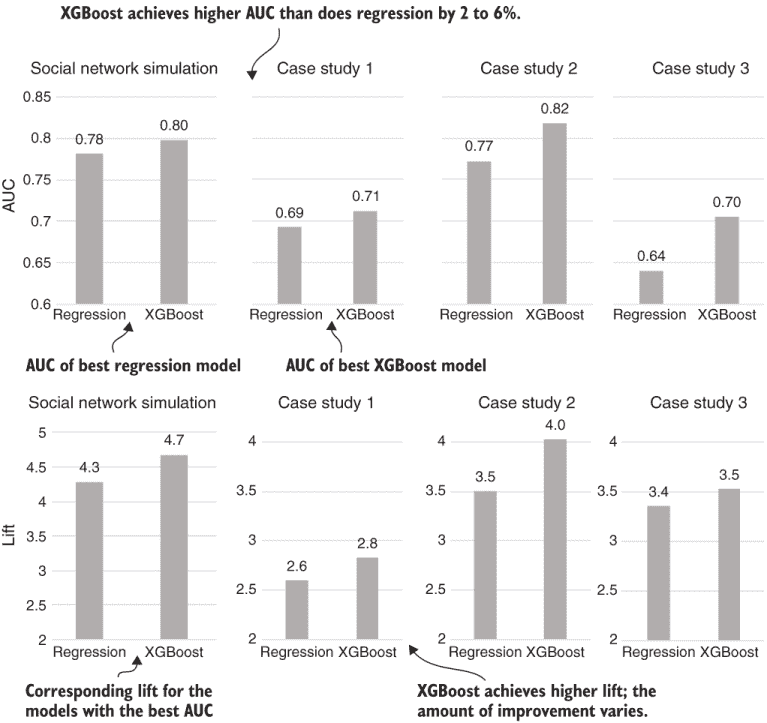

图 9.18 回归和 XGBoost 提升比较

这些改进是否显著？记住，你可能在流失预测中看到的 AUC 范围大约在 0.6 到 0.8 之间。因此，最大 AUC 比最小 AUC 高出 0.2，从相对意义上讲，AUC 提高 0.02 表示整体可能范围提高了 10%。同样，AUC 提高 0.05 表示在同类中最差和最好之间的差异的 25%，所以这些改进是显著的。尽管如此，即使使用机器学习，预测仍然不完美，这就是为什么我在第一章建议使用机器学习预测流失不太可能达到机器学习领域的一些炒作。

**总结**：尽管机器学习算法可以产生比回归更准确的预测，但由于主观性、信息不完整、稀有性和影响流失时机的额外因素，流失总是难以预测。

### 9.5.4 高级指标与基本指标比较

另一个重要的问题是，你可以将多少准确性的提高归因于你在第七章中创建高级指标所做的努力。到目前为止，你可能认为，由于高级指标在队列分析中显示出与流失的关系，它们必须提高了模型。但是，正如你想要通过展示你的模型可以预测样本外数据来验证你的数据和建模，确认你创建更多指标的工作在经验上有所贡献是有意义的。

要在模拟的社会网络数据集上进行比较，你可以在第四章的原始数据集上运行交叉验证测试命令的额外版本。也就是说，你运行的数据集不包括第七章的高级指标——你只使用第三章的基本指标。要在基本指标数据集上运行回归交叉验证，请使用以下命令：

```
fight-churn/listings/run_churn_listing.py —chapter 9 —listing 5 —version 1
```

结果是一个类似于图 9.13 所示的交叉验证表。您可能会发现，任何模型的最大精度对于基本指标数据比对于高级指标数据要低一些。如图 9.19 中的条形图所示，我使用基本指标进行的回归模拟的最大精度是 0.63；对于带有高级指标的模拟数据回归，最大 AUC 是 0.75。创建高级指标所花费的时间是值得的。事实上，使用高级指标进行的回归精度显著优于使用带有基本指标的 XGBoost，而当机器学习算法使用高级指标时，额外的改进相对较小。

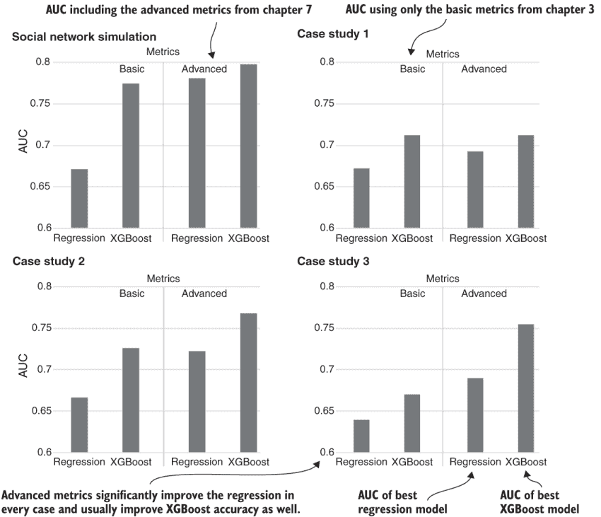

图 9.19 使用基本和高级指标比较 AUC

您可以通过运行带有这些参数的 XGBoost 交叉验证命令的第二版来对 XGBoost 模型执行相同的检查：

```
fight-churn/listings/run_churn_listing.py —chapter 9 —listing 6 —version 1
```

在这种情况下，您可能会发现 XGBoost 预测在高级指标下表现略好。我使用带有基本指标的 XGBoost 得到了 0.774 的 AUC，而带有高级指标的 XGBoost 得到了 0.797；归因于高级指标的改进是 0.023。

图 9.18 也包含了在第一章中介绍的三家真实公司案例研究中进行的预测的类似比较。这些比较显示了带有和未带有高级指标时的精度之间的不同关系。这三个案例说明了您在自己的案例研究中可能遇到的场景范围：

1.  在第一个案例研究中，高级指标显著提高了回归精度，但 XGBoost 没有获得任何改进，XGBoost 整体表现最佳。这个结果表明，您不能总是期望高级指标会提高机器学习。

1.  在第二个案例研究中，回归和 XGBoost 都因添加高级指标而显著改进。带有高级指标的回归精度与带有基本指标的 XGBoost 精度大致相同。带有高级指标的 XGBoost 精度是所有中最高的，比带有基本指标的回归提高了约 0.1。

1.  在第三个案例研究中，使用高级指标进行的回归精度高于未使用高级指标的 XGBoost。但所有中最高的精度是通过使用高级指标的 XGBoost 实现的：比基本指标和回归提高了 0.1。这个案例研究与社会网络模拟最相似。

这些案例表明，如果您将 churn 预测的高精度视为首要任务，那么机器学习和高级指标都非常重要。根据我的经验，高级指标通常可以提高回归和 XGBoost 等机器学习模型的 churn 预测精度。

## 9.6 使用机器学习预测细分客户

列表 9.6 找到了一组参数，可以生成一个高精度的机器学习模型。程序还保存了最佳模型到一个 pickle 文件中。如果您想使用该模型对活跃客户进行预测，您需要重新加载保存的模型并在活跃客户列表上使用它。代码在列表 9.7 中演示。列表 9.7 实际上与列表 9.5 相同，您使用它来使用保存的回归模型进行预测。该列表执行以下操作：

1.  重新加载保存的模型 pickle 文件

1.  加载当前客户数据集

1.  在模型上调用`predict_proba`函数，并将数据作为参数传递

1.  将结果保存为预测的 DataFrame 和总结结果的直方图

与列表 9.6 中的 XGBoost 分类类似，数据保持其原始形式，未缩放且未分组。数据准备以进行预测必须与模型训练时的数据准备方式相匹配。

列表 9.7 XGBoost 预测

```
import pandas as pd
import os
import pickle
from listing_8_4_rescore_metrics import reload_churn_data
from listing_8_5_churn_forecast import forecast_histogram

def churn_forecast_xgb(data_set_path):
   pickle_path = 
      data_set_path.replace('.csv', '_xgb_model.pkl')                   ①
   assert os.path.isfile(pickle_path), 
      'Run listing 9.6 to save an XGB model'
   with open(pickle_path, 'rb') as fid:
       xgb_model = pickle.load(fid)

   curren_df = reload_churn_data(data_set_path,                         ②
                                 'current','8.3',is_customer_data=True)
   predictions = 
      xgb_model.predict_proba(current_df.values)                        ③
   predict_df = pd.DataFrame(predictions,                               ④
                             index=current_df.index,
                             columns=['retain_prob','churn_prob'])

   forecast_save_path = 
      data_set_path.replace('.csv', '_current_xgb_predictions.csv')
   print('Saving results to %s' % forecast_save_path)
   predict_df.to_csv(forecast_save_path, header=True)

   forecast_histogram(data_set_path,                                    ⑤
                      predict_df,ext='xgb')
```

① 重新加载 pickle 文件中保存的 XGBoost 模型

② 重新加载当前客户指标数据

③ 进行预测

④ 从预测中创建 DataFrame

⑤ 列表 8.5 中的此函数生成直方图。

列表 9.7 还创建了 XGBoost 对当前客户流失预测的直方图。它没有显示，因为它与您使用相同函数为回归模型制作的流失概率预测图相似。

注意：您应该检查 XGBoost 预测的校准和分布，就像您在第八章中学习如何对回归预测进行校准一样。

对于社交网络模拟，XGBoost 预测的分布和校准与回归相似，但这种结果是巧合，不是您可以始终期望的。您不能期望 XGBoost 预测像回归预测那样校准和分布，因为 XGBoost 预测概率不是与回归预测概率相同意义上的概率。

回想一下，校准是指您的预测与事件发生的真实概率相一致的性质。另一方面，由 AUC 和提升度衡量的准确性取决于预测的排序或排名，而不是精确值。回归模型设计得使预测概率校准到样本数据，同时尽可能准确。当 XGBoost 模型给出预测概率时，它是集成决策树的加权投票。这些投票被优化以对流失风险进行排名——XGBoost 在这方面是成功的，如准确性结果所示。但集成决策树的投票并不是为了产生校准到实际流失率的预测。

吸收点：XGBoost 不一定提供校准的流失概率预测。XGBoost 模型是针对以分类流失来衡量的准确性进行优化的，而不是匹配观察到的流失率。

由于 XGBoost 模型预测的不可靠校准，XGBoost 预测不适合用于估计客户终身价值，如第八章所示。

警告：不要使用 XGBoost 预测客户终身价值或任何其他依赖于 churn 概率预测与实际 churn 概率匹配的用例。这同样适用于大多数机器学习模型：阅读你所使用的模型的文献，以确认它是否产生除了准确之外还经过校准的预测。

## 摘要

+   由于 churn 的罕见性，churn 预测的准确性不能使用标准准确性测量来衡量。

+   曲线下面积（AUC）是模型将 churn 评为比非 churn 风险更高的百分比，考虑所有 churn 和非 churn 的配对。

+   提升是 churn 风险预测中最高十分之一 churn 率与整体 churn 率的比率。

+   AUC 和提升是衡量 churn 预测准确性的良好指标。

+   应在未用于训练模型的样本上衡量准确性。

+   对于 churn，准确性应在反映产品和市场条件可能随时间变化的回测（历史）模拟中衡量。

+   本书所教授的回归模型包括一个控制参数，该参数设置权重的整体大小和非零权重的数量。

+   通过测试使用不同回归参数值的模型版本，可以找到用于回归控制参数的最佳值。

+   通过测试设置预测模型参数称为交叉验证。

+   对于回归，你选择控制参数的值，以最小化非零权重的数量并帮助或不会损害准确性。

+   通常，在回归中，可以分配零权重给大部分指标；准确性要么提高，要么不会变差。

+   机器学习模型是一个从数据（非编程）中拟合的预测模型，它不是回归模型。

+   决策树是一种简单的机器学习模型，通过分析具有度量比较规则的树来预测客户。

+   XGBoost 是一种最先进的机器学习模型，它使用决策树的集成并加权它们的预测以最大化准确性。

+   XGBoost 和其他机器学习模型有许多参数必须通过交叉验证来设置。

+   XGBoost 预测的准确性通常超过回归预测的准确性。

+   除了基本指标外，使用高级指标通常会使回归和机器学习模型的预测更准确。

+   XGBoost 的 churn 概率预测未校准到实际 churn 率，因此 XGBoost 的 churn 预测不应用于客户终身价值或其他依赖于匹配实际 churn 概率的用例。
