# 10 人口统计学和公司人口统计学

本章涵盖

+   创建包含人口统计学或公司人口统计学信息的数据库

+   将日期信息转换为区间并分析其与流失的关系

+   分析文本类别与流失之间的关系

+   使用人口统计学或公司人口统计学信息预测流失概率

+   使用人口统计学或公司人口统计学信息细分客户

现在，你已经了解了如何使用客户行为数据来细分客户，以便创建干预措施来提高参与度。这些策略是提高客户参与度和保留率最重要的策略，这也是为什么它们是本书的重点。但降低客户流失率的一种其他方法并不是关于干预现有客户：找到一开始就更有可能参与的新客户。识别那些倾向于更积极参与的客户的事实，然后集中客户获取努力，寻找更多类似客户。这些事实通常被称为人口统计数据（关于个人的数据）和公司统计数据（关于公司的数据）。为了这次讨论的目的，我使用以下定义。

定义：人口统计学是关于个人客户的实际情况，而公司人口统计学是关于作为公司的客户的实际情况。

人口统计学和公司人口统计学通常是关于客户的不变事实，或者仅偶尔变化的事实。人口统计学和公司人口统计学不包括产品使用或订阅衍生指标，但可以包括关于客户如何注册或关于客户用于访问在线服务的硬件的事实。通常，面向消费者（B2C）或直接面向消费者（D2C）的公司使用人口统计数据，而面向企业（B2B）的公司使用公司统计数据。正如你将看到的，人口统计学和公司人口统计学在通常可用的具体信息方面有所不同。但无论哪种情况，该信息的特点都是相似的，因此处理人口统计学和公司人口统计学的方法是相同的。

注意：本章使用 GitHub 仓库中书籍的社交网络模拟示例（[`github.com/carl24k/fight-churn`](https://github.com/carl24k/fight-churn)），这是一个消费者产品。因此，我通常讨论人口统计学，但同样的技术也适用于公司人口统计学。

需要注意的是，针对人口统计数据进行定位是减少客户流失最不直接的方法，因为它不能帮助你的现有客户变得更加活跃。你有时可以影响客户的行为，但你不能改变他们的人口统计或企业统计数据！此外，针对收购的定位通常影响有限，因为大多数产品和服务的客户无法仅通过一个或几个首选渠道获得。尽管如此，这种方法可以在一段时间内推动客户流失率的变化，因此尝试你所能利用的每一种方法都是值得的。

本章的组织结构如下：

+   第 10.1 节描述了典型的人口统计和企业统计数据类型以及包含它们的数据库模式，并教你如何将此类数据作为数据集的一部分提取出来。

+   第 10.2 节展示了如何使用类别队列分析单独分析文本人口统计数据字段，这与指标队列分析略有不同，因为它使用了一个新概念：置信区间。

+   第 10.3 节教你如何通过组合来处理大量的人口统计类别。

+   第 10.4 节展示了如何分析日期字段与其与客户流失的关系（在将日期转换为时间间隔后，与指标队列分析相同）。

+   第 10.5 节教你如何在数据包括人口统计数据字段时，拟合客户流失概率模型，如回归和 XGBoost。

+   第 10.6 节将第 10.5 节中的建模扩展到使用人口统计字段进行预测和细分活跃客户。

注意：本章节中没有使用任何真实个人信息。所有示例均由模拟数据创建，旨在与我所参与的真实案例研究相似。

## 10.1 人口统计和企业统计数据集

首先，我将解释我所说的“人口统计和企业统计数据”究竟是什么，以及它与你在本书大部分内容中看到的指标有何不同。然后，我将使用社交网络模拟来展示创建包含人口统计数据和指标的典型数据集的方法。

### 10.1.1 人口统计和企业统计数据的类型

表 10.1 提供了人口统计和企业统计数据的示例。尽管这个表格涵盖了最常见的例子，但还有许多其他可能性。正如你所看到的，某些类型的数据在消费者和企业中都是常见的，但形式略有不同。例如，个人有出生日期，公司有成立日期；家庭有成员数量，公司有员工数量。其他项目是针对消费者或企业的特定项目，例如个人的教育水平或公司的行业。表 10.1 还显示了列出的项目的数据类型。

表 10.1 人口统计和企业统计数据示例

| 人口统计 | 企业统计 | 数据类型 |
| --- | --- | --- |
| 出生日期 | 成立日期 | 日期 |
| 销售渠道 | 销售渠道 | 字符串 |
| 居住地 | 公司注册地或地理 | 字符串 |
| 职业 | 行业或垂直领域 | 字符串 |
| 硬件和操作系统信息 | 技术堆栈信息 | 字符串 |
| 家庭成员数量 | 员工数量 | 数量 |
| 达到的教育水平 | 公司阶段（初创公司、融资轮次或上市） | 字符串 |
| 性别 | B2B 或 B2C 商业模式 | 字符串 |

原则上，使用人口统计数据和指标来理解客户流失和细分客户之间没有太大的区别。

**总结**：为了理解客户流失并基于人口统计数据形成客户细分，您根据人口字段值形成客户群组，并比较每个客户群组的流失率。

非数值类型是相对于指标而言，在人口统计数据和公司统计数据中需要单独技术的原因。如果您正在查看数值人口统计数据，技术与方法相同，只是数据来源不同。

### **10.1.2 社交网络模拟的账户数据模型**

由于人口统计数据与每个账户相关联且很少改变，因此将其存储在单个数据库表中是标准的，该表按账户 ID 索引，如图表 10.2 所示。图表 10.2 包括一些属于社交网络模拟的人口字段：

+   **渠道**（简称销售渠道）——销售渠道指的是客户如何找到产品并注册。所有用户都通过一种方法注册，因此渠道是一个必填字段，在社交网络模拟中没有空值。在模拟的社交网络数据集中，不同的销售渠道如下：

    +   **应用商店 1**

    +   **应用商店 2**

    +   **网络注册**

+   **出生日期**——许多产品要求客户输入他们的出生日期作为他们达到（或超过）使用产品最低年龄的声明。因为所有用户都被要求输入某些信息，所以出生日期是一个必填字段，在社交网络模拟中没有空值。

+   **国家**——用户的居住国家通常可以从用户的支付信息或他们在软件中的本地化选择中推导出来。在社交网络模拟中，用户来自 20 多个国家，这些国家由两位字符代码表示（来自国际标准化组织 ISO 3166-1 alpha-2 标准）。对于社交网络模拟，国家字段可以包含缺失值（数据库中的空值）。假设这是一个可选设置；一些用户懒得设置它。

这些三个字段代表展示本章技术所需的最低集合。在实际产品中，可能存在更多字段，尽管这些字段的数目因产品领域而异。许多 B2B 公司对其客户了解很多，但对于需要最少注册要求的消费产品，人口统计数据可能很稀疏。

**表 10.2 典型账户数据模式（续**）

| 列 | 类型 | 备注 |
| --- | --- | --- |
| `account_id` | `integer` 或 `char` | 连接到订阅、事件和指标的账户 ID |
| `channel` | `char` | 客户购买应用的渠道 |
| `date_of_birth` | `date` | 客户在注册时输入的用于年龄验证的出生日期 |
| `country` | `char` | 用户居住的国家，由两个字符字符串表示 |
| `...` | `...` | ... |
| `optional fields` | `char`, `float`, `int`, 或 `date` | 可选；平台特定 |

在本节的其余部分，我将向您展示如何将数据放入这样的模式中，以便用于对抗流失。

### 10.1.3 人口统计数据集 SQL

给定一个以账户 ID 为键的人口统计数据模式，第一步是从数据库中导出它以及您通常为指标创建的数据集。这样，您可以重用所有现有的代码，显示账户何时续订以及谁已经流失。此外，您最终会将人口统计数据与指标合并到一个单一预测模型中，通过一起导出指标和人口统计字段，您将拥有所有需要的东西。

图 10.1 显示了此类数据提取的典型结果。与自第四章以来使用的数据集一样，每一行都以账户 ID、观察日期和流失指标开始。人口统计字段在这些字段之后和指标之前。

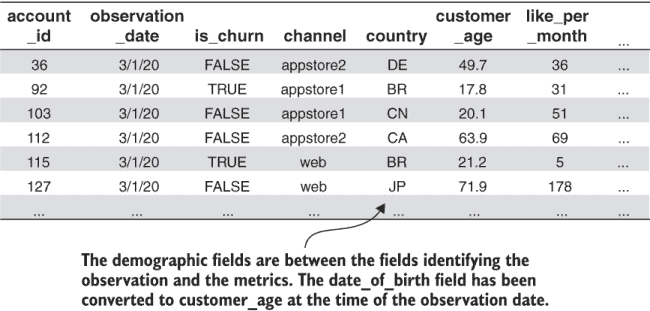

图 10.1 社交网络模拟数据集，包含人口统计字段（列表 10.1 的结果）

列表 10.1 显示了创建类似于图 10.1 所示的数据集的 SQL 语句。与数据库中的 date_of_birth 字段不同，数据集包含一个名为 customer_age 的字段。列表 10.1 介绍的新技术是将出生日期的日期字段转换为年数的时间间隔：客户的年龄。

**要点**：您将人口统计数据字段转换为时间间隔，因为这样数字间隔就可以像指标一样用于客户分析和细分。

在高层次上，转换是通过从观察日期减去人口统计数据或反之亦然来完成的：

+   当人口统计数据在过去（例如出生日期）时，您从观察日期中减去人口统计数据，结果是表示观察时人口统计字段时间的正间隔。

+   如果人口统计数据在未来（例如大学毕业日）时，从观察日期减去未来日期以保持间隔为正。然后间隔表示从观察日期到人口统计数据日期的时间。

由于出生日期在过去的日期中，列表 10.1 从观察日期中减去出生日期以获取客户的年龄。在 PostgreSQL 中，通过使用带有`'days'`参数的`date_part`函数将间隔转换为年，以获取天数间隔，然后除以 365（注意类型转换）。

列表 10.1：导出包含人口统计数据字段的数据集

```
WITH observation_params AS                                           ①
(
   SELECT  interval '%metric_interval' AS metric_period,
   '%from_yyyy-mm-dd'::timestamp AS obs_start,
   '%to_yyyy-mm-dd'::timestamp AS obs_end
)
SELECT m.account_id, o.observation_date, is_churn,
a.channel,                                                           ②
a.country,                                                           ③
date_part('day',o.observation_date::timestamp                        ④
        - a.date_of_birth::timestamp)::float/365.0 AS customer_age,
SUM(CASE WHEN metric_name_id=0 THEN metric_value else 0 END)
    AS like_per_month,
SUM(CASE WHEN metric_name_id=1 THEN metric_value else 0 END)
    AS newfriend_per_month,
SUM(CASE WHEN metric_name_id=2 THEN metric_value else 0 END)
    AS post_per_month,
SUM(CASE WHEN metric_name_id=3 THEN metric_value else 0 END)
    AS adview_per_month,
SUM(CASE WHEN metric_name_id=4 THEN metric_value else 0 END)
    AS dislike_per_month,
SUM(CASE WHEN metric_name_id=34 THEN metric_value else 0 END)
    AS unfriend_per_month,
SUM(CASE WHEN metric_name_id=6 THEN metric_value else 0 END)
    AS message_per_month,
SUM(CASE WHEN metric_name_id=7 THEN metric_value else 0 END)
    AS reply_per_month,
SUM(CASE WHEN metric_name_id=21 THEN metric_value else 0 END)
    AS adview_per_post,
SUM(CASE WHEN metric_name_id=22 THEN metric_value else 0 END)
    AS reply_per_message,
SUM(CASE WHEN metric_name_id=23 THEN metric_value else 0 END)
    AS like_per_post,
SUM(CASE WHEN metric_name_id=24 THEN metric_value else 0 END)
    AS post_per_message,
SUM(CASE WHEN metric_name_id=25 THEN metric_value else 0 END)
    AS unfriend_per_newfriend,
SUM(CASE WHEN metric_name_id=27 THEN metric_value else 0 END)
    AS dislike_pcnt,
SUM(CASE WHEN metric_name_id=30 THEN metric_value else 0 END)
    AS newfriend_pcnt_chng,
SUM(CASE WHEN metric_name_id=31 THEN metric_value else 0 END)
    AS days_since_newfriend
FROM metric m INNER JOIN observation_params
ON metric_time BETWEEN obs_start AND obs_end
INNER JOIN observation o ON m.account_id = o.account_id
   AND m.metric_time > (o.observation_date - metric_period)::timestamp
   AND m.metric_time <= o.observation_date::timestamp
INNER JOIN account a ON m.account_id = a.id                          ⑤
GROUP BY m.account_id, metric_time, observation_date, 
         is_churn, a.channel, date_of_birth, country                 ⑥
ORDER BY observation_date,m.account_id
```

① 本列表的大部分内容与列表 7.2 和 4.5 相同。

② 从账户表中获取渠道字符串

③ 从账户表中获取国家字符串

④ 从观察日期中减去出生日期

⑤ 与账户表连接

⑥ 在 GROUP BY 子句中包含人口统计数据字段

列表 10.1 的大部分内容与您之前用于提取数据集的列表相同：从观察表中选择观察日期，并通过聚合与度量指标连接，以简化数据。列表 10.1 的其他新方面如下：

+   查询在账户表（表 10.1）上执行一个`INNER` `JOIN`，以选择渠道、国家和出生日期的字段。

+   由于这些人口统计数据字段在账户表中每个账户只有一个，因此不需要对这些字段进行聚合。相反，人口统计数据字段包含在`GROUP` `BY`子句中。

您应该在社交网络模拟上运行列表 10.1 以创建本章其余部分将使用的数据集。假设您正在使用 Python 包装程序运行列表，则命令是

```
fight-churn/listings/run_churn_listing.py —chapter 10 —listing 1 
```

列表 10.1 的结果（保存在输出目录中）应类似于本节开头图 10.1。

跟踪人口统计数据和公司统计数据变化以及避免前瞻性偏差

在本节中，我描述了将人口统计数据存储为单个、不变的值。但并非所有的人口统计数据或公司统计数据都是真正不变的：人们和公司可能会搬家，公司可能会达到新的发展阶段，人们可能会达到更高的教育水平，等等。为了更好地模拟这些变化，一些公司以时间敏感的方式跟踪人口统计数据，要么通过在账户表中添加有效日期戳，要么通过在账户本身之外跟踪人口统计数据字段（在数据仓库术语中称为缓慢变化维度）。由于这些更高级的方法并不常见，我在本书中不涉及它们。如果这种情况是您的情况，列表 10.1 被修改为将人口统计数据的有效日期与观察日期连接起来。

更复杂的方法之所以可能具有优势，是因为在某些情况下，当种群字段不是静态的时将其视为静态，可能会导致使用种群字段预测客户流失时出现一种前瞻性偏差。你会在历史数据集中看到有关客户的一些信息，并配以过去流失或续订的状态，但在非历史背景下（在观察时间戳时），你不会知道这些信息。为了举例说明，从公司人口统计学的角度来看，考虑初创公司或上市公司的公司阶段。上市的公司必须成功，不太可能倒闭和流失。如果数据包括过去上市的公司，公司人口统计数据会将其识别为上市公司，因为当你创建数据集时，这是当前的状态。但只有成功的初创公司才会上市，因此数据变得有偏见。

这种偏差也可能给模型带来不切实际的预测准确性。话虽如此，这类场景通常是一个二级效应，这为通常忽略种群和公司人口统计数据的时间变化成分的做法提供了理由。

## 10.2 带有种群和公司人口统计类别的流失群体

现在你已经拥有了一个包含种群数据的数据集，你将通过比较种群群体的流失率来查看种群数据与流失之间的关系。在章节开始时，我告诉你有三种类型的种群字段：日期、数字和字符串。之前，我展示了你应该将日期转换为数值区间。在群体分析中，只有两种类型：数字和字符串。

使用数值种群数据的流失群体分析与基于指标的群体分析完全相同，我将在第 10.4 节简要展示。这一节是关于新主题，即通过使用由字符串描述的种群信息来比较群体中的流失率。

### 10.2.1 种群类别的流失率群体

这一节是关于种群类别的，所以我从定义开始。

定义：在本书中，类别是指由字符串描述的种群字段的一个可能值。

在社交网络模拟中，与频道字段关联的类别是 appstore1、appstore2 和 web。与国家字段关联的类别是两位字符代码，例如 BR、CA 和 CN。在种群字段中可能缺少一个值，因此你可以认为每个字段没有值（数据库中的 null）是一个额外的类别。

注意：对于每个种群字段，客户只能属于一个类别，或者没有类别值。

原则上，根据人口统计类别进行的流失率群体分析很简单：为每个类别定义一个群体，并计算流失率。但是，由类别和指标构成的群体之间存在重要的差异。因此，在比较由类别定义的群体的流失率时，你需要更加小心。以下是基于指标和基于类别的群体之间的一些重要差异：

+   对于指标，群体有一个由指标给出的自然顺序。在大多数情况下，类别没有有意义的顺序。因此，基于类别的群体更难解释，因为你不能将你在类别间看到的趋势用作解释流失率差异的指南。

+   对于产品使用指标，你有自然的预期，例如“使用越多，流失率越低”和“使用成本越高，流失率越高”。但对于类别来说，没有明显的预期。

+   当你定义指标群体时，你保证每个群体都有显著的观测值比例——通常是 10%或更多。而对于基于类别的群体，没有保证每个群体中可能捕获的数据的最小或最大百分比。

根据我的经验，基于人口统计的群体与基于产品使用指标的群体相比，与流失率的关系较弱。

**总结**：在根据人口统计类别对群体进行流失率比较时，你必须比根据指标对群体进行流失率比较时更加小心。

当我说“小心”时，我的意思是你需要依赖强有力的证据来确保差异是显著的。因此，你将使用一种称为置信区间的新的技术来进行比较。

### 10.2.2 流失率置信区间

为了在人口统计群体之间更小心地进行流失率比较，你不仅应该计算每个群体的流失率；你还应该估计每个群体的最佳和最坏情况下的流失率。这个过程被称为计算置信区间。

**定义**：对于像流失率这样的指标，置信区间是从流失率最佳（最低）估计到最坏（最高）估计的范围。

理解置信区间首先需要认识到你在客户上计算的流失率并不是你想要测量的流失率。考虑以下情况：

+   你想知道的是，在所有可能的、符合你群体人口统计类别的客户中，流失率会是多少。这个估计将是该类型客户未来流失的最佳估计。

+   你只能测量你看到过流失率的客户。

这种情况在图 10.2 中得到了说明。你不能确定你在过去客户中看到的流失率就是未来客户的流失率。你可能在将来看到不同的流失率。也许你在过去很幸运，得到了比平均水平更好的客户，或者情况可能正好相反；你永远不知道。但你可以期待以下两点：

+   在整个客户群体中，你将看到的流失率应该接近你在过去看到的，假设你在每个群体中观察到了合理的客户数量。

+   你看到的客户越多，你过去看到的流失率应该越接近整个群体的流失率。换句话说，你看到的客户越多，关于整个群体可能流失率范围的不确定性就越小。

因此，人们通常将置信区间视为围绕测量出的流失率的范围，这个范围被认为是最佳和最坏情况场景的中心附近（但，正如你将看到的，不一定在中心）。为了描述测量出的流失率以及最佳和最坏情况的估计，我们将使用以下定义。

定义：过去客户的测量流失率被称为期望值，它被认为是普遍流失率最可能的价值。上限置信区间是从期望流失率到最坏情况估计的范围，该范围由该范围的大小或最坏情况流失率减去期望流失率来描述。下限置信区间是从最佳情况估计到期望流失率的范围，该范围由该范围的大小或期望流失率减去最坏情况估计来描述。

图 10.2 展示了普遍流失率、你的估计以及估计的上限和下限置信区间的差异。

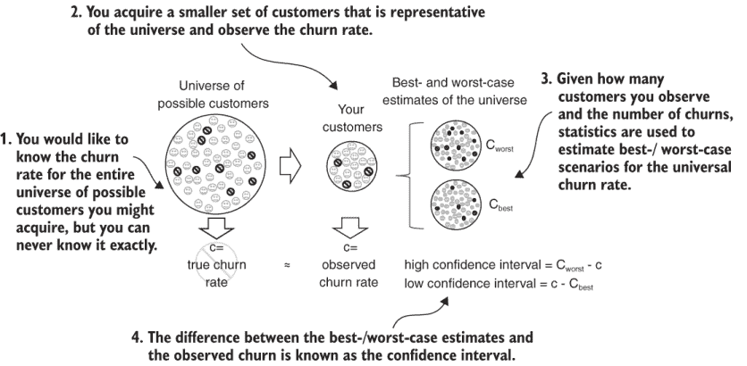

图 10.2 置信区间评估最佳和最坏情况场景。

我说每个群体的流失率应该接近这类客户的普遍流失率，假设你已经观察到了足够多的这类客户。多少算是足够，在第五章中进行了详细讨论：理想情况下，你希望观察每个类别的数千名客户，但数百名可能就足够了。

当你使用置信区间时，你所使用的客户数量将转化为置信区间的宽度。你测量的客户越多，围绕流失率的范围就越窄。在第 10.2.3 节中，你将学习如何计算置信区间并进行比较。

吸收要点：因为你不能计算普遍流失率的测量值，所以你将根据可用的数据计算普遍流失率的最佳和最坏情况估计。

### 10.2.3 使用置信区间比较人口统计群体

图 10.3 展示了使用置信区间比较人口群体示例，这是社交网络模拟中渠道类别的结果。基本思想与你在前几章中看到的度量群体图相同，但有一些显著的不同：

+   数据以柱状图的形式显示，而不是折线图。每个群体的流失率通过每个柱子的高度来表示。

+   每个柱子上方和下方都有两条线，表示置信区间的范围。在图中表示置信区间的线通常被称为误差线或触须。

+   x 轴仍然标识着群体，但现在它是一个字符串标签，显示该群体代表的类别。

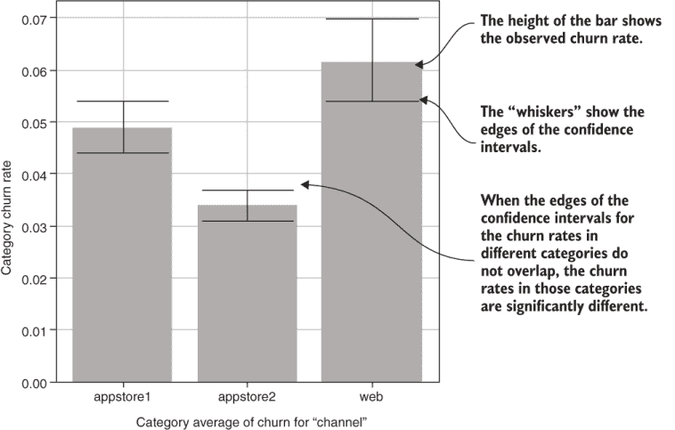

图 10.3 带有置信区间的渠道流失率（列表 10.2 的输出）

在类别群体图中，你不仅可以看到预期的普遍流失率，还可以看到最佳和最坏情况的估计，因此你应该使用置信区间作为比较类别流失率差异重要性的指南。这种技术被称为统计显著性。

定义：如果某个类别的最佳流失率（下置信区间）大于另一个类别的最坏流失率（上置信区间），则两个不同类别之间的流失率差异在统计学上具有显著性。在这种情况下，两个置信区间不会重叠。

考虑到图 10.3，你会说 appstore1 和 appstore2 类别之间的流失率差异在统计学上具有显著性，因为置信区间相距甚远。appstore2 的最坏情况流失率约为 3.5%，而 appstore1 的最佳情况流失率约为 4.5%，因此两者没有接触。

但 appstore1 和网站客户之间的流失率差异在统计学上处于边缘，因为置信区间几乎接触。网站渠道的最佳流失率约为 5.4%，而 appstore1 的最坏流失率也约为 5.4%。根据严格的定义，你可能会说这种差异在统计学上并不显著。但在实践中，统计显著性并不是一条硬性规则。如果你有理由认为差异是显著的，即使置信区间有轻微的重叠，你仍然可以采取行动来处理流失率的变化。在这种情况下，我会说 appstore2 如此不同的事实使得渠道之间的差异以及由此产生的网站和 appstore1 之间的差异更具可信度。正如你将在图 10.4 中看到的，网站和 appstore2 的流失率置信区间仅相差 0.02%，这在图中是看不出来的。但置信区间是否重叠或仅以如此小的幅度不重叠，不应影响你的解释。

TAKEAWAY 在实践中，当置信区间的边缘几乎接触或略有重叠时，流失率差异是否具有统计学意义并不是非黑即白。

列表 10.2 显示了生成图 10.3 的代码。列表 10.2 由一个主函数`category_churn_cohorts`组成，该函数调用三个辅助函数：

+   `prepare_category_data`—加载数据，并用字符串`'-na-'`填充任何缺失的类别。这个字符串清楚地标记了任何缺失类别的客户。

+   `category_churn_summary`—计算流失率及其置信区间，并将所有结果放入一个`DataFrame`中，该`DataFrame`保存为.csv 文件。（计算细节见下文。）

+   `category_churn_plot`—以条形图的形式绘制结果，显示置信区间并添加注释。通过设置条形函数的`yerr`参数添加置信区间，该参数代表*y*误差条。

列表 10.2 使用置信区间分析类别流失率

```
import pandas as pd
import matplotlib.pyplot as plt
import os
import statsmodels.stats.proportion as sp

def category_churn_cohorts(data_set_path, cat_col):                       ①
   churn_data =                                                           ②
      prepare_category_data(data_set_path,cat_col)
   summary =                                                              ③
      category_churn_summary(churn_data,cat_col,data_set_path)
   category_churn_plot(cat_col, summary, data_set_path)                   ④

def prepare_category_data(data_set_path, cat_col): 
   assert os.path.isfile(data_set_path),
      '"{}" is not a valid dataset path'.format(data_set_path)
   churn_data = pd.read_csv(data_set_path,index_col=[0,1])
   churn_data[cat_col].fillna('-na-',inplace=True)                        ⑤
   return churn_data

def category_churn_summary(churn_data,                                    ⑥
                           cat_col, data_set_path):
   summary = churn_data.groupby(cat_col).agg(                             ⑦
      {
         cat_col:'count',
         'is_churn': ['sum','mean']
      }
   )

   intervals = sp.proportion_confint(summary[('is_churn','sum')],
                                     summary[ (cat_col,'count')],
                                     method='wilson')                     ⑧

   summary[cat_col + '_percent'] = (                                      ⑨
      1.0/churn_data.shape[0]) * summary[(cat_col,'count')]

   summary['lo_conf'] = intervals[0]                                      ⑩
   summary['hi_conf'] = intervals[1]

   summary['lo_int'] =                                                    ⑪
      summary[('is_churn','mean')]-summary['lo_conf']
   summary['hi_int'] =                                                    ⑫
      summary['hi_conf'] - summary[('is_churn','mean')]
   save_path =                                                            ⑬
      data_set_path.replace('.csv', '_' + cat_col + '_churn_category.csv')
   summary.to_csv(save_path)
   return summary

def category_churn_plot(cat_col,                                          ⑭
                        summary, data_set_path):
   n_category = summary.shape[0]

   plt.figure(figsize=(max(4,.5*n_category), 4))                          ⑮
   plt.bar(x=summary.index,
           height=summary[('is_churn','mean')],                           ⑯
           yerr=summary[['lo_int','hi_int']].transpose().values,
           capsize=80/n_category)                                         ⑰
   plt.xlabel('Average Churn for  "%s"' % cat_col)                        ⑱
   plt.ylabel('Category Churn Rate')
   plt.grid()
   save_path = 
      data_set_path.replace('.csv', '_' + cat_col + '_churn_category.png')
   plt.savefig(save_path)
   print('Saving plot to %s' % save_path)
```

① 主函数用于类别分析和绘图

② 辅助函数`prepare_category_data`读取数据集。

③ 调用`category_churn_summary`进行数据分析

④ 调用`category_churn_plot`来制作图表

⑤ 用字符串`'-na-'`填充任何缺失值

⑥ 使用`category_churn_summary`分析类别

⑦ 使用 Pandas 聚合函数按类别分组数据

⑧ 计算置信区间

⑨ 将类别计数除以总行数

⑩ 将结果复制到摘要 DataFrame 中

⑪ 下置信区间 = 均值 - 下置信界限

⑫ 上置信区间 = 上置信度 - 均值

⑬ 保存结果

⑭ 使用`category_churn_plot`来绘制结果

⑮ 根据类别数量调整图表大小

⑯ 流失率百分比是条形的高度。

⑰ Y 误差条由置信区间给出。

⑱ 注释图表并保存

您应该运行 Python 包装程序来生成自己的图表，如图 10.3 所示，对于模拟数据集。包装程序的命令及其参数如下

```
fight-churn/listings/run_churn_listing.py —chapter 10 —listing 2
```

在列表 10.2 中转向队列流失率计算的细节，平均流失率是在`category_churn_summary`函数中计算的，使用 Pandas 的`DataFrame` `groupby`和`agg`函数：

```
summary = churn_data.groupby(cat_col).agg({cat_col:'count','is_churn': ['sum','mean']}) 
```

以下是对这一密集行细节的分解：

1.  `groupby`函数以类别作为分组变量被调用。此函数的结果是一个专门的`DataFrameGroupBy`对象，可以用来根据分组检索不同的结果。

1.  在分组后，通过在`DataFrameGroupBy`上调用聚合函数`agg`来找到所需的度量。`DataFrameGroupBy`要创建的结果在字典中指定，其中每个字典键是要计算聚合函数的列，键的值是一个或多个聚合函数。在这种情况下，你使用以下内容：

    ```
    {
    cat_col :'count',
    'is_churn': [
    'sum',
    'mean']
    }
    ```

    +   字典中的第一个条目表示包含类别（变量`cat_col`）的列应该通过计数进行聚合。对于每个类别，显示数据集中具有该类别的行数。

    +   字典中的第二个条目表示包含流失指标的列应该通过汇总流失数并计算均值进行聚合，这导致该类别的观察流失率。

函数调用的结果是包含每类一行以及包含三个聚合结果的列的`DataFrame`。列通过元组标记，结合列和聚合。标记为`cat_col,'count'`的列包含类别的行数，例如，而标记为`'is_churn','mean'`的列包含流失指标的均值，即流失率。

列表 10.2 中的函数`category_churn_summary`使用`statsmodels`模块计算置信区间。使用的函数是`statsmodels`.`stats` `.proportion.proportion_confint`，用于计算二元试验（从统计学的角度来看，衡量流失率就是二元试验）的百分比测量结果的置信区间。`proportion_confint`函数将每个类别的计数和流失观察数（通过选择聚合结果的`DataFrame`中的元组标记来传递）作为参数。

如本章开头所述，观察数和流失数是使用统计学计算置信区间的依据。调用`proportion_confint`时还传递了可选的方法参数`method=` `'wilson'`。计算置信区间的威尔逊方法对于流失率是最好的选择，因为它已知在二元试验（在这种情况下，流失）的事件比例较小时会产生最准确的结果。我不会详细介绍威尔逊方法如何计算置信区间，但网上有许多很好的资源。

图 10.4 显示了类别流失群体分析的数据文件输出，其中包含置信区间。此输出包含用于生成通道群体条形图（图 10.3）和更多详细信息的所有信息。在此文件中可用而条形图中不可用的重要信息是每个通道的观察百分比。大多数通过不同渠道获取客户的组织已经对通过每个渠道获取的客户百分比有很好的了解。在这种情况下，您应该将数据集中的数字与销售部门为质量保证所测量的数字进行比较（以确保数据馈送没有问题等）。

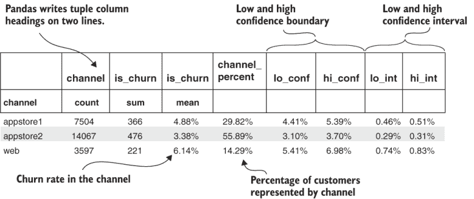

图 10.4 类别流失群体通道字段的数据输出

列表 10.2 的文件输出也显示了低置信区间和高置信区间的范围。在图 10.4 中，你可以看到高区间略大于低区间。这种不对称性是由于流失概率是一个小百分比。如果流失率为 50%，置信区间的范围将是对称的。

在模拟社交网络中，具有类别划分的另一个人口统计字段是国家。图 10.5 显示了国家类别的流失群体图。国家类别的流失群体结果与渠道的流失群体图不同，因为国家数量更多。由于一些国家只有很少一部分客户，因此一些置信区间的范围相对于流失率来说较大。实际上，由于置信区间较大，国家之间没有统计上显著的流失率差异。国家类别中的所有置信区间与其他类别的置信区间重叠很大。（图 10.5 没有显示置信区间略有重叠的案例。）

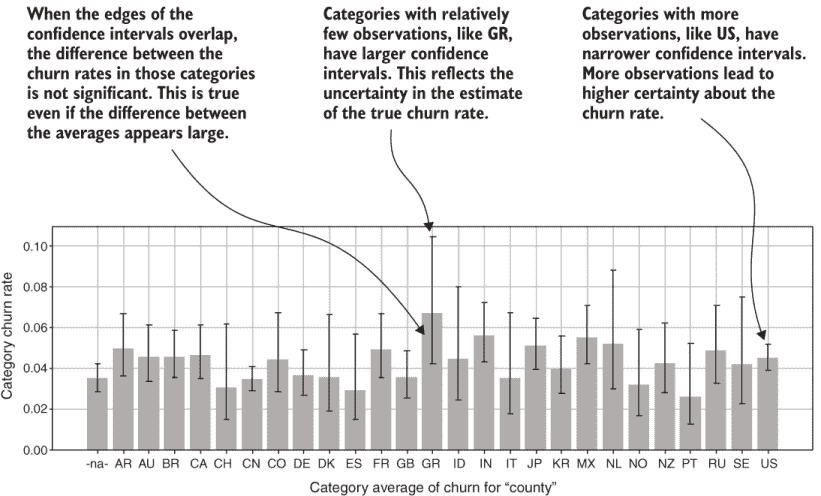

图 10.5 国家群体流失率及置信区间（列表 9.2 的输出）

图 10.6 显示了国家群体流失分析的数据文件输出。它显示大多数国家的数据不到 10%，有些国家甚至只有 1%。客户观察数量最少的国家，其流失率的置信区间最大。SE 只有 1%的观察值（236 个观察值），测量的流失率为 5.9%，置信区间的下限是 3.6%，上限是 9.7%，跨度大约为 6%。另一方面，US 代表了 15%的观察值（3,710 个观察值），观察到的流失率相似，为 5.3%，置信区间从 4.7%到 6.1%，跨度仅为 1.5%。

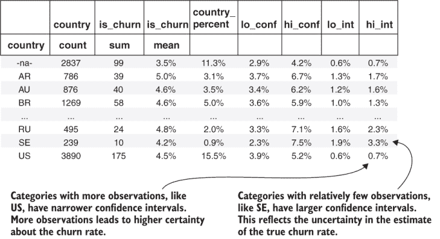

图 10.6 国家字段类别流失群体的数据输出

图 10.5 和 10.6 中的结果显示，拥有过多的类别会对进行有效的流失群体分析造成问题。第 10.3 节教你一种简单而有效的方法来处理这个问题。

置信区间的显著性水平

函数`proportion_confint`还有一个参数：显著性水平，我在代码中将其保留为默认值。如果你查看`proportion_confint`的文档，你会发现默认的显著性水平是 0.05。此参数对应于人们所说的 95%置信水平，表示真实总体流失率在最佳和最坏情况估计定义的范围内的不确定性程度。

就像统计学中的大多数事情一样，最佳和最坏情况的流失率都是估计值，显著性水平决定了这些估计值也可能错误的可能性。当人们说“95%置信度”时，他们是在说 100%减去这个显著性水平。换句话说，有 5%的可能性，真实的普遍流失率不在所声明的界限内，有 95%的可能性，普遍流失率在界限内。

将显著性水平参数降低到 0.05 以下会导致置信区间更大，或者最佳和最坏情况估计之间的差异更大。如果你使用较低的显著性水平，两个类别之间的流失率差异需要更大才能被视为具有统计学意义（通过置信区间不接触来实现）。另一方面，较高的显著性水平（大于 0.05）会使置信区间更小，这将更容易说差异具有统计学意义，但你将不太确定该类别的普遍流失率是否在所声明的界限内。

选择显著性水平和解释置信区间是统计学中的一个有争议的话题，我试图给你一些简单的最佳实践。我的建议是将显著性参数保留为默认值。原则上，你应该为具有大量类别（超过几十个）的人口统计字段使用较低的显著性水平。这样，你会在确定哪些差异是显著的时应用更严格的准则。

在第 10.3 节中，我将教你另一种处理大量类别的方法：将那些不太常见的类别分组。总的来说，我的建议是不要更改此参数。我之所以在这里提到它，是因为你可能被问及你使用什么显著性水平来计算置信区间。（答案是，你使用标准的 0.05 显著性水平。）

## 10.3 分组人口统计类别

在第 10.2.3 节中，我向你展示了如果你有很多类别，你面临的风险是罕见类别中的观察数量可能太小，无法产生有用的结果。在观察数量较少的情况下，置信区间可能会变得很大，这取决于你可用于工作的数据量。如果你有数百万客户，你甚至可以对罕见类别中的结果具有统计学意义。尽管如此，信息过载也可能是一个问题，出于这个原因，查看较少的类别也可能是有利的。

### 10.3.1 使用映射字典表示组

解决具有大量类别且代表数据小部分的难题，可以通过分组相关罕见类别来实现。例如，可以将国家分组到地区。图 10.7 通过使用 Python 字典展示了如何将国家映射到地区。图 10.7 中的字典实际上是从地区到国家列表的映射，因为这种映射是表达这种关系的更有效方式。

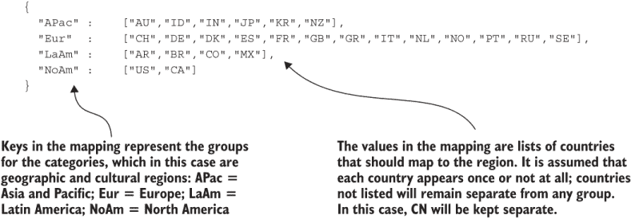

图 10.7 将分组模拟的国家类别映射到地区

基于图 10.7 的代码位于本书的 GitHub 仓库中，位于文件 fight-churn/listings/conf/socialnet_listings.json 中；请查找第十章部分以及关键字 listing_10_3_grouped_category_cohorts。我将在稍后详细介绍选择这种特定映射的原因，但现在，我将向您展示这种分组如何帮助进行类别群体分析。

### 10.3.2 分组类别群体分析

图 10.8 显示了基于地区而不是国家重新运行群体分析的结果。由于分组，现在有六个类别。如果你查看与图表一起的数据输出（图中未显示），你会看到每个新类别代表的数据不少于 10%；现在最小的类别是没有国家的客户（`-na-`），占 11%。由于观察次数增加，图 10.8 中每个类别的置信区间大小比国家单独时（图 10.5）更小。

**要点** 如果你的人口统计数据包括罕见类别，可以通过分组相关类别来简化。这种方法可以减少流失率置信区间和信息过载。

尽管置信区间较小，但图 10.8 显示在任何地区之间，流失率没有统计学上的显著差异。每个地区的流失率置信区间与其他所有置信区间显著重叠。在这个模拟数据集中没有统计学上的显著差异并不意味着你不会在自己的产品或服务中发现重要关系。

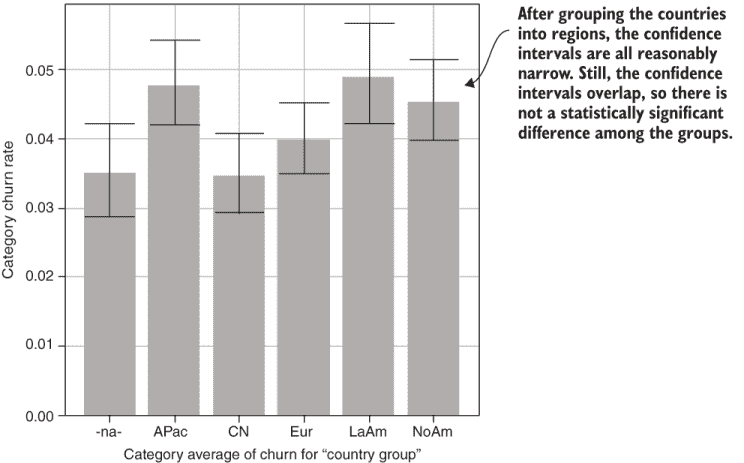

图 10.8 展示了按地区分组的国家类别群体流失情况

列表 10.3 提供了执行分组和重新运行类别群体分析的代码。此列表使用类别群体流失分析的所有辅助函数（无分组），并添加了一个新函数来执行分组：`group_category_column`。此函数有两个主要部分：

+   第一部分反转映射字典，使其成为从国家到地区的映射，而不是从地区到国家的映射。反转字典可以通过 Python 的单行表达式完成，使用双列表推导。第一个列表推导遍历曾是地区的键，第二个列表推导遍历每个键中的值，即国家。从结果中形成将旧值映射到旧键（国家到地区）的字典。

+   在映射字典被反转后，使用`DataFrame`的`apply`函数在`DataFrame`中创建一个新的列。`apply`函数接受另一个函数作为参数，该函数应用于列中的所有元素。在这种情况下，目的是查找反转字典中的值（如果存在的话）；否则，返回原始值。将此函数应用于列的结果是，将映射到区域组中的每个国家，任何不属于的国家将按原样复制。在此映射之后，列表 10.3 中的代码使用了列表 10.2 中的分析和绘图函数，这些函数对未分组的类别进行了类别队列分析。

`group_category_column`函数通过在原始列名称前添加单词 group 并为结果删除原始列来为新列命名。

列表 10.3 分组类别队列分析

```
import pandas as pd
import os

from listing_10_2_category_churn_cohorts import category_churn_summary, 
   category_churn_plot, prepare_category_data                              ①

def grouped_category_cohorts(data_set_path,                                ②
                             cat_col, groups):
   churn_data = prepare_category_data(data_set_path,cat_col)
   group_cat_col =                                                         ③
      group_category_column(churn_data,cat_col,groups)
   summary =                                                               ④
      category_churn_summary(churn_data,group_cat_col,data_set_path)
   category_churn_plot(group_cat_col, summary, data_set_path)

def group_category_column(df, cat_col, group_dict):                        ⑤
   group_lookup = {                                                        ⑥
                     value: key for key in group_dict.keys() 
                                for value in group_dict[key]
                  }
   group_cat_col = cat_col + '_group'                                      ⑦
   df[group_cat_col] = df[cat_col].apply(lambda x:                         ⑧
                                group_lookup[x] if *x* in group_lookup else x)

   df.drop(cat_col,axis=1,inplace=True)                                    ⑨
   return group_cat_col                                                    ⑩
```

① 此列表重新使用了列表 10.2 中的辅助函数。

② 主函数大部分与常规类别图相同。

③ 调用辅助函数将类别列映射到组

④ 列表 10.2 中的辅助函数分析类别。

⑤ 此函数使用映射字典将类别映射到组中。

⑥ 反转字典

⑦ 为组列创建新名称

⑧ 使用 DataFrame 的 apply 方法和 lambda 转换数据

⑨ 删除原始类别列

⑩ 返回新的列名称作为结果

您应该运行列表 10.3 以创建自己的队列分析，其中国家被分组到地区。使用通常的 Python 包装程序命令和这些参数执行此操作：

```
fight-churn/listings/run_churn_listing.py —chapter 10 —listing 3
```

您应该得到一个与图 10.8 在定性上相似的结果，但不要期望在创建自己的版本时得到每个组的具体流失率。原因是模拟中，国家与流失和参与没有关系，因此是随机的。（相信我：我知道，因为我创建了模拟。）尽管您应该得到与图 10.8 中相似大小的置信区间，但不要期望得到相同的流失率。

注意：本书大部分内容都避免了让你分析那些与客户流失无关的模拟数据，以节省你生成和探索无意义数据的时间。但在实际产品和服务的真实数据中，你应该预期会找到一些与客户保留和流失无关的事件和人口统计信息。

警告：不要将本书 GitHub 仓库中的社交网络模拟结果作为你自己的产品或服务的预期指南。这些例子是为了演示如何在真实数据上使用方法而设计的看起来很现实的数据集，但仅此而已。模拟结果不能预期预测任何真实产品或服务的任何结果。

### 10.3.3 设计分类组

现在你已经知道了如何实现用于群体分析的分类分组，我将给你一些建议，告诉你如何选择这样的分组。首先，考虑这种情况：你没有很多数据，所以你正在分组分类以在你的群体中找到足够的观察结果（这样你最终会得到围绕流失率的合理大小的置信区间）。如果这是你的情况，你没有基于你自己的数据做数据驱动决策的选择；你没有足够的数据来分析分类之间的差异，这就是问题所在。在这种情况下，你应该根据你对分类之间关系的了解来分组分类。除了国家地区示例之外，你可能想要使用的合理分组包括以下内容：

+   如果你有很多操作系统版本的分类，你可以根据主要版本将它们分组。

+   如果你有一些行业部门的分类，你可以将相关的行业分组，例如将银行和金融放在一个组中，将消费品和零售放在另一个组中。

+   如果你有一些职业的分类，你可以将相关的领域分组，例如将医生和牙医放在一个组中，将软件工程师和数据科学家放在另一个组中。

+   如果你有一些教育水平的分类，你可以将罕见的教育水平，如硕士学位、博士学位等分组。

记住，你的目标是合理地分组罕见分类，并试图了解任何关系。如果你发现了一些关系，你总是可以修改你的分组，以利用你发现的任何结构（如本节后面所述）。

还要注意，你不必盲目遵循标准的群体定义：你应该根据你产品或服务的具体细节进行定制。在我从国家到地区的映射中，我做出了以下编辑决策：

+   我没有将中国（CN）包括在亚太地区（APac）组中，因为中国本身就代表了超过 10%的数据样本，这本身就足够了。

+   我选择将墨西哥（MX）与拉丁美洲（LaAm）而不是北美（LaAm）包括在内，因为如果这是一个真实的社会网络，我预计语言和文化与参与度的关系会比地理与参与度的关系更为显著。（如果我的产品或服务与工业制造和运输有关，我可能更关注地理关系而不是文化关系。）

这些是一些你可能想要使用的考虑因素。关于这个主题的最后一项建议如下。

警告：不要过度思考你的类别分组，也不要花太多时间在上面。记住分析中需要敏捷。做一些能让你得到可管理结果的第一步，从你的业务同事那里获取反馈，然后从那里迭代。

另一方面，考虑你拥有足够的数据来为每个流失率提供狭窄的置信区间，你的问题是来自太多类别（或在你第一次尝试分组后，你得到了类似的结果）的信息过载。然后你可以采取更数据驱动的方法：

+   在未分组的类别上运行类别队列分析；然后使用第一次迭代中看到的流失率来决定在第二次迭代中使用的组：

    +   根据你的知识将相关且具有相似流失率的类别分组。

    +   在这个背景下，类似的流失率意味着这两个类别在流失率上没有统计学上的显著差异。（置信区间重叠。）

    +   如果两个流失率在统计学上存在显著差异（置信区间不重叠），即使你知道这些类别是相关的，也不要将它们分组。

+   你仍然应该使用如上所述的知识分组。不要仅仅因为两个类别在流失率或其他指标上有相似之处就分组。

你还可以使用第 10.5 节中描述的相关性分析作为评估你的组与其与其他指标关系相似性的额外方法。但正如你将看到的，你用于指标的分组算法不适用于类别，我不建议使用自动化的方法进行此类分组。

如果你有很多类别（数百或数千个）无法通过设计基于你知识的分组方案来处理，那么这些信息很可能对你的抗流失斗争没有帮助。商人们可能不会将客户细分到如此令人困惑的类别中。

## 10.4 基于日期和数字人口统计的流失分析

如我之前提到的，你应该以与度量相同的方式查看数值人口信息，在 10.1 节中，我教了你如何将日期类型的人口和企业信息轻松转换为数值区间，因此你也可以使用度量风格的队列分析来处理日期类型的人口数据。因为你在第五章中学习了如何分析数值客户数据，所以这一节将是一个简短的演示。

社交网络模拟的的人口信息包括客户在注册时输入的出生日期，并将 10.1 列表中的此日期转换为社交网络模拟数据集中的数值字段：customer_age。图 10.9 显示了在客户年龄上运行标准指标队列分析的结果。该图显示，在社交网络模拟中，客户年龄越高，流失率越高。最低年龄队列的平均年龄约为 15 岁，流失率约为 4%，而较高年龄队列（60 岁以上）的平均流失率约为 5.5%。队列间流失率的变化略有不规则，但与发现老年客户流失率更高的事实一致（与第五章和第七章中展示的行为影响相比，这种影响较弱）。

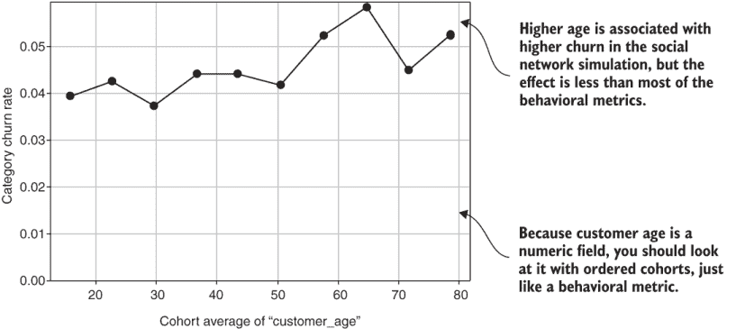

图 10.9 客户人口年龄队列分析

要从你模拟的数据中创建自己的图 10.9 版本，你必须重新使用指标队列列表 5.1（文件名为 listing_5_1_cohort_plot.py）。配置已经有一个版本，你可以按照以下方式运行：

```
run_churn_listing.py —chapter 5 —listing 1 —version 17 
```

你的结果可能与图 10.9 有所不同，因为关系并不强，数据是随机模拟的。这个例子表明，在你从数据集中提取数值格式的人口信息后，你可以像分析度量一样使用队列来分析它。

指标队列的置信区间

我根据趋势的一致性来解释指标队列，但到现在为止，你可能已经意识到你可以在指标队列图中的每个点周围添加置信区间。我通常不这样做，因为这会使图表过于杂乱，难以向商业人士展示，而且通常对于解释流失率之间的关系来说并不必要。但是，置信区间可以帮助解释趋势和显著性较弱时的指标队列图。以下是我使用过的一种策略：

1.  将度量分为三个队列。你正在比较低、中、高度量指标的客户。大型群体有助于使置信界限变窄。

1.  绘制队列平均值与置信界限，并查看置信界限是否重叠。如果置信区间重叠，则在低、中、高度量指标的客户之间存在统计学上显著的差异。

我把这个练习留给感兴趣的读者。

## 10.5 使用人口数据进行流失率预测

你已经学会了分析单个人口统计字段与其对客户流失和保留关系的技术。与指标一样，你可能想查看所有人口统计字段对流失的影响，以了解组合如何预测流失。此外，你应该测试将人口统计或公司统计数据与你的指标相结合的预测。为此，你需要将字符串形式的人口统计信息转换为等效的数值形式，因为你所学的回归和 XGBoost 预测算法仅需要数值输入。

### 10.5.1 将文本字段转换为虚拟变量

为了使用你的字符串类型人口统计信息进行预测，你需要通过一种称为虚拟变量的技术将其转换为数值数据。

定义：虚拟变量是一个二元变量，表示一个类别中的成员资格，其中`1`表示该类别中的所有客户，而`0`表示不在该类别中的所有客户。

如果你在一个计算机科学或工程项目中学习数据科学，你可能已经学过这种技术，称为独热编码。

图 10.10 显示了创建虚拟变量的过程。使用虚拟变量类似于将指标数据展平以创建数据集。在这种情况下，字符串人口统计字段在意义上是一个高数据格式，因为所有可能的类别都存储在一列中（使用字符串）。为了用原始数据中的每个唯一字符串添加一个虚拟变量列来替换字符串列，每个列是该字符串类别的虚拟变量：所有具有特定字符串的客户在该类别的列中得`1`，在其他所有列中得`0`。然后你删除原始字符串列，剩下的就是一个纯粹数值的数据集，它仍然代表与包含字符串的数据集相同的类别信息。


图 10.10 将字符串变量展平为虚拟变量列

图 10.11 显示了创建社交网络模拟的虚拟变量的结果。你可以看到，渠道和国家字符串类别的标签已从数据集中移除。取而代之的是，一组只包含零和一的新的列代表这些类别。图 10.11 还显示了按地区分组的虚拟变量列，这与之前一样。国家仍然分组，因为关于稀疏类别过多的问题同样适用于预测，就像你在单独查看国家时的情况一样。

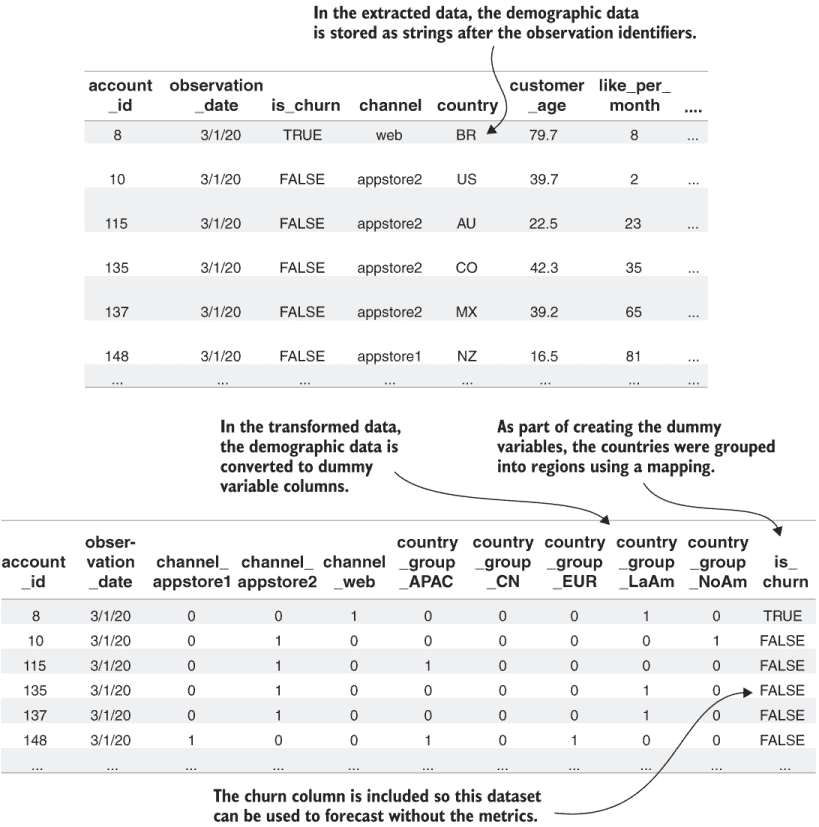

图 10.11 创建模拟社交网络数据集的虚拟变量结果

列表 10.4 提供了创建与图 10.11 中类似的数据集的代码，其中包含虚拟变量。创建虚拟变量是 Pandas `DataFrame`（称为`get_dummies`）的标准功能。此函数会自动检测数据集中所有字符串类型的列，并用适当的二进制虚拟变量替换它们。虚拟变量列的名称是通过将原始列名与类别字符串连接起来创建的。

列表 10.4 创建虚拟变量

```
import pandas as pd

from listing_10_3_grouped_category_cohorts import group_category_column    ①
def dummy_variables(data_set_path, groups={},current=False):
   raw_data = pd.read_csv(data_set_path,                                   ②
                          index_col=[0, 1])

   for cat in groups.keys():                                               ③
       group_category_column(raw_data,cat,groups[cat])                     ④

   data_w_dummies = 
      pd.get_dummies(raw_data,dummy_na=True)                               ⑤

   data_w_dummies.to_csv(                                                  ⑥
      data_set_path.replace('.csv', '_xgbdummies.csv')
   New_cols = sorted(list(set(                                             ⑦
                  data_w_dummies.columns).difference(set(raw_data.columns))))
   cat_cols = sorted(list(set(                                             ⑧
                  raw_data.columns).difference(set(data_w_dummies.columns))))
   dummy_col_df =                                                          ⑨
      pd.DataFrame(new_cols,index=new_cols,columns=['metrics'])
   dummy_col_df.to_csv(
      data_set_path.replace('.csv', '_dummies_groupmets.csv'))
   if not current:                                                         ⑩
      new_cols.append('is_churn')
   dummies_only = data_w_dummies[new_cols]                                 ⑪
   save_path =                                                             ⑫
      data_set_path.replace('.csv', '_dummies_groupscore.csv')
   print('Saved dummy variable (only) dataset ' + save_path)
   dummies_only.to_csv(save_path)

   raw_data.drop(cat_cols,axis=1,inplace=True)                             ⑬
   save_path = data_set_path.replace('.csv', '_nocat.csv')
   print('Saved no category dataset ' + save_path)
   raw_data.to_csv(save_path)
```

① 从列表 10.3 导入分组类别映射函数

② 读取原始数据

③ 映射字典的键是要映射的类别。

④ 调用分组映射函数

⑤ 使用 Pandas get_dummies 函数

⑥ 此版本的数据集用于 XGBoost 预测。

⑦ 通过集合差集确定虚拟变量列

⑧ 通过集合差集确定原始类别列

⑨ 保存列列表以与分组数据集保持一致性

⑩ 如果不是用于当前客户，则包括流失

⑪ 仅保存包含虚拟变量的数据集

⑫ 以与常规数据集一致的方式命名数据集

⑬ 保存没有人口统计类别的数据集

在列表 10.4 中调用包函数`get_dummies`不仅仅是发生的事情。首先，列表 10.4 应用了你在第 10.2 节中学到的可选的类别分组。然后，它以三个版本保存：包含原始指标和任何数值人口统计信息的部分，仅包含虚拟变量的部分，以及全部内容。每个版本都有其目的，如下所述：

+   指标和数值人口统计信息必须转换为分数并通过指标分组算法运行。此过程应在没有虚拟变量的情况下进行。

+   单独保存虚拟变量便于对虚拟变量本身进行回归分析。

+   包含所有内容的版本用于 XGBoost，它使用未转换的指标与虚拟变量一起使用。

这些点将在本章的其余部分进一步解释，但到目前为止，我将专注于解释列表 10.4 的其余部分。此代码主要是 Pandas 库的机械使用，分离数据集的部分。唯一的技巧是使用集合和与集合差异相关的操作来确定哪些列是通过创建虚拟变量而添加的。

列表 10.4 保存了具有不同文件扩展名的多个数据集版本：

+   带有后缀.dummies 的文件是仅包含虚拟变量的数据集。此文件也以后缀.groupscore 保存，因为当你使用回归代码时，将期望遵循此约定。列的列表也以后缀.groupmets 保存，因为回归代码也将期望这样做，尽管对于虚拟变量，将没有组。

+   带有后缀 .nocat 的文件是包含数值指标和人口统计字段的文件。此文件简单保存，将通过常规评分和分组运行。

+   带有后缀 .xgbdummies 的文件将由 XGBoost 交叉验证重新加载。

您应该运行列表 10.4 来创建自己的数据集版本，将字符串类别替换为虚拟变量（以及之前描述的文件）。如果您使用 Python 包装程序，请使用通常的命令形式和这些参数：

```
fight-churn/listings/run_churn_listing.py —chapter 10 —listing 4
```

您的结果应类似于图 10.11，尽管精确的账户和其人口统计数据将不同，因为数据是随机生成的。

### 10.5.2 仅使用分类虚拟变量预测流失

现在您有一个包含人口统计数据虚拟变量的数据集，尝试使用仅包含人口数据的回归模型进行流失预测是有教育意义的。这个练习旨在增加您对人口变量对流失概率综合影响的理解。正如您将看到的，如果您想要尽可能准确地预测流失，应使用人口统计数据虚拟变量和度量一起，如第 10.5.4 节所述。

如果您运行回归交叉验证，然后在最佳 `C` 参数下拟合模型，您得到的结果如图 10.12 所示。结果显示，人口统计数据虚拟变量对流失率有弱预测性。交叉验证中找到的最佳 AUC 测量值约为 0.56，最大提升值约为 1.5。如果您回忆第九章的内容，使用度量结果的回归导致了 AUC 高于 0.7 和提升高于 4.0。可以采用低 `C` 参数值，然后删除大多数虚拟变量而不会显著影响 AUC，但提升值在 `C` 参数值较高时最佳：0.32 或更高。

图 10.12 还显示了将 `C` 参数设置为 0.32 时的回归系数和保留概率的影响。两个应用商店频道的虚拟变量被分配了相当大的权重，分别转化为 1.2% 和 2.8% 的积极保留影响（减少流失）。网络频道获得零权重，这反映了它具有最高的流失率，因为其他两个频道都显示出积极的影响。在这种情况下，零权重意味着它类似于默认值或基线，而其他类别代表改进。

`get_dummies` 函数还创建了一个对于不可用的频道（`nan`）的变量，并且这个频道也获得了零权重，因为在数据集中，所有客户都分配了频道。（当设置 `na_default` 参数时，Pandas 为每个变量创建一个 `nan` 列。）这些效果与你在类别群体图（图 10.3）中看到的流失率差异一致。

图 10.12 还显示了国家组虚拟变量的系数和保留影响显著减小。在这种情况下，CN、Eur 和缺失数据有轻微的正保留影响（流失率较低），而 LaAm 和 APac 有负保留影响（流失率较高）。再次强调，这些结果与你在国家组群体图（图 10.8）中看到的结果一致。

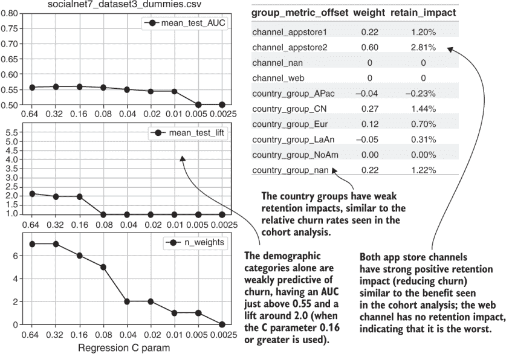

图 10.12 展示了使用虚拟类别变量数据集的回归结果

图 10.12 是从前几章的列表中创建的，已经为你准备好了配置版本来做这件事。要创建图 10.12 的回归交叉验证图，请使用以下回归交叉验证命令，版本 4：

```
fight-churn/listings/run_churn_listing.py —chapter 9 —listing 5 —version 2
```

要找到固定`C`参数为 0.32 的系数，请使用以下命令运行固定`C`值的回归：

```
fight-churn/listings/run_churn_listing.py —chapter 9 —listing 4 —version 4
```

你的交叉验证结果应该类似于图 10.12，你的渠道系数结果也应该如此，这些渠道是随机分配给客户的，但在模拟中它们会产生一致的结果。你可能因为国家组的小权重和影响而得到不同的结果，因为在模拟中它们是随机的。

### 10.5.3 将虚拟变量与数值数据结合

在前面的章节中，我提到当你使用从类别派生出的虚拟变量时，你不能使用你在度量时使用的分组类型。相反，我建议将虚拟变量与度量分开，并按常规处理度量。在本节中，我将详细介绍原因和这个过程。我首先解释一些关于涉及虚拟变量的相关性的事实，因为这有助于阐明为什么你不应该将类别虚拟变量与度量一起分组。

图 10.13 显示了社会网络模拟中与渠道和国家的相关矩阵部分，这些部分与人口统计类别相关联。（你还没有运行代码来创建这个相关矩阵，但很快你将这么做。）图 10.13 省略了与度量到度量相关性的相关矩阵部分。一个可能让你感到惊讶的显著特征是类别；每个字段的虚拟变量与其他字段的虚拟变量呈负相关。这在渠道字段中尤其如此，该字段只有三个类别，相关性低至-0.74。对于国家组，区域之间的负相关性大约为-0.2。

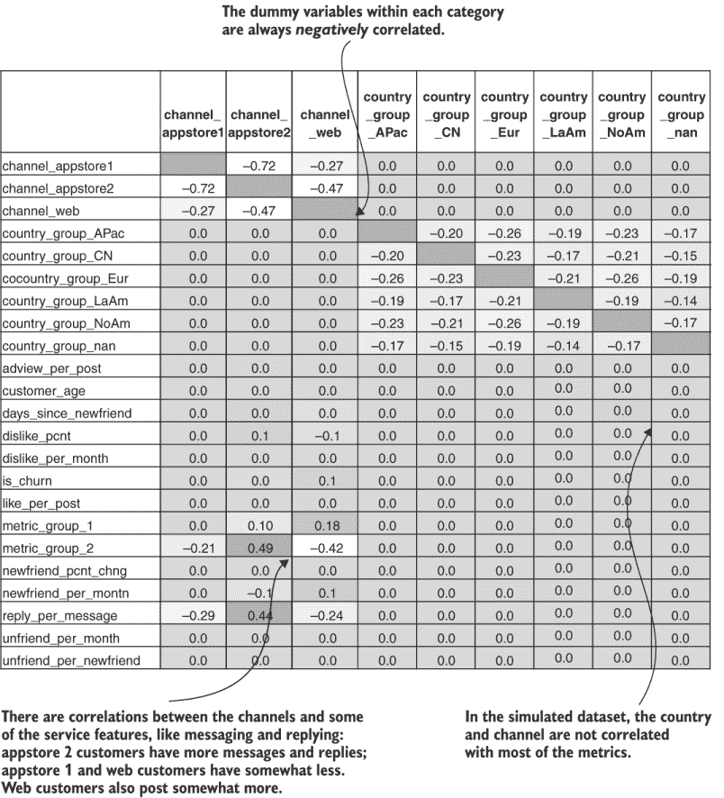

图 10.13 展示了社会网络模拟人口统计类别的相关矩阵

**负相关原因**：类别之间的负相关性是由于类别成员的排他性：如果一个客户属于一个类别，它会给该类别的虚拟变量赋予`1`，并要求他们从同一字段的其他虚拟变量中具有`0`。这种二元指标的排他性导致从相关系数的定义来看，负的测量相关性：当一个虚拟变量取高值（`1`）时，其他虚拟变量取低值（`0`）。这解释了为什么你用于指标变量的分组方式不会将同一人口字段的人口统计类别分组。该算法使用高相关性来指示变量应形成组成员。

**相关性分析**：考虑到图 10.13 的其余部分，人口统计类别虚拟变量与指标大多不相关，但有一些例外：

+   **相关性**：渠道 appstore1 和 web 与消息和回复有负相关性。

+   **正相关性**：渠道 appstore2 与消息和回复有正相关性。

+   **正相关性**：渠道 web 也与帖子有正相关性。

**分析**：当你使用人口统计类别来理解客户流失和保留时，使用虚拟变量查看相关矩阵可能是值得的，因为它可以揭示关于你的客户如何使用产品的不同群体的一些信息。但即使它们相关，你也不应将人口统计虚拟变量与你的指标组别分组。

**总结**：人口统计虚拟变量与其他指标之间的相关性可以帮助你更好地了解你的客户，但你不应将虚拟变量与其他虚拟变量或指标分组。

**回顾**：在第六章中，我建议你使用指标之间的相关性作为评估指标相关性和确定哪些应该分组的方法。但有几个原因说明这种方法不适用于从人口统计类别创建的虚拟变量：

+   **相关性系数**：你可以计算 0/1 二进制变量的相关系数，但相关系数并不适用于此目的。在统计学中，其他指标更适合测量二进制变量之间的相关性。当你用虚拟变量计算相关系数时，它并不是衡量相关性的好方法。

+   **相关性解释**：人口统计类别与使用相关性分组的行为方式不同。当两种行为（例如使用两个产品功能）相关时，通常它们是单个活动或过程的一部分。因此，用得分的平均值来表示整个过程是合理的，但这通常不适用于人口统计类别和任何其他指标。

**原因**：因此，我的建议是，如果你想使用人口统计虚拟变量来预测客户流失，你应该保持所有虚拟变量与组别分开。

**总结**：在标准准备过程中运行度量数值人口统计字段，不使用人口统计虚拟变量，然后在最后将它们与虚拟变量结合。

此结果如图 10.14 所示。

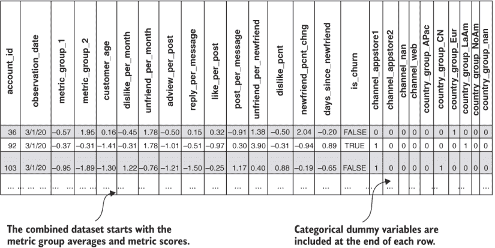

图 10.14 一个数据集中包含度量组、度量分数和类别

要创建如图 10.13 所示的自己的数据集，第一步是在具有度量数值人口统计信息的版本的数据集上运行你在早期章节中学到的数据准备过程。有一个列表配置版本为你准备，只需一个命令即可完成：

```
fight-churn/listings/run_churn_listing.py —chapter 8 —listing 1 —version 3 
```

在处理度量后，将它们与虚拟变量结合。列表 10.5 中显示的新函数是 Pandas `DataFrame` 操作的直接应用。从度量产生的组分数与虚拟变量的文件合并。合并是通过 Pandas `DataFrame` 的 `merge` 函数执行的，使用两个 `DataFrame` 的索引进行 `INNER` `JOIN`。列表 10.4 的最后一步是将列出组度量的 `DataFrame` 与虚拟变量的名称结合；这样的文件将被用于在合并数据集上运行回归的代码所期望。

列表 10.5 合并虚拟变量与分组度量分数

```
import pandas as pd

def merge_groups_dummies(data_set_path):

   dummies_path =                                                         ①
      data_set_path.replace('.csv', '_dummies_groupscore.csv')
   dummies_df =pd.read_csv(dummies_path,index_col=[0,1])
   dummies_df.drop(['is_churn'],axis=1,inplace=True)                      ②

   groups_path =                                                          ③
      data_set_path.replace('.csv', '_nocat_groupscore.csv')
   groups_df = pd.read_csv(groups_path,index_col=[0,1])

   merged_df =                                                            ④
      groups_df.merge(dummies_df,left_index=True,right_index=True)
   save_path =                                                            ⑤
      data_set_path.replace('.csv', '_groupscore.csv')
   merged_df.to_csv(save_path)
   print('Saved merged group score + dummy dataset ' + save_path)

   standard_group_metrics = pd.read_csv(                                  ⑥
      data_set_path.replace('.csv', '_nocat_groupmets.csv'),index_col=0)
   dummies_group_metrics = pd.read_csv(                                   ⑦
      data_set_path.replace('.csv', '_dummies_groupmets.csv'),index_col=0)
   merged_col_df =                                                        ⑧
      standard_group_metrics.append(dummies_group_metrics)
   merged_col_df.to_csv(data_set_path.replace('.csv', '_groupmets.csv'))
```

① 加载包含虚拟变量数据集的文件

② 删除流失列

③ 加载度量组分数

④ 合并虚拟变量和度量组分数

⑤ 将合并的文件以组分数的名称保存

⑥ 从仅度量数据中加载组度量列表

⑦ 加载虚拟变量列表

⑧ 将两个度量列表合并并保存

你应该在模拟的社会网络数据集上运行列表 10.5，为 10.5.4 节中的预测做准备。使用以下参数向 Python 包装程序发出常规命令：

```
fight-churn/listings/run_churn_listing.py —chapter 10 —listing 5
```

运行列表 10.5 后，其中一个结果应该是一个类似于你在图 10.14 中看到的数据集。现在，既然你已经创建了合并后的数据集，你可以创建一个类似于我在本节开头（图 10.13）展示的相关矩阵。使用以下命令和这些参数发出相关矩阵列表配置的版本：

```
fight-churn/listings/run_churn_listing.py —chapter 6 —listing 2 —version 3 
```

使用参数配置版本 3 运行列表 6.2 创建了如图 10.13 所示的相关矩阵的原始数据。图 10.13 的格式是在电子表格程序中完成的（如第六章所述）。

### 10.5.4 结合人口统计和度量进行客户流失预测

现在你已经创建了一个结合组度量分数和人口统计类别虚拟变量的数据集，你可以运行回归或机器学习模型来预测客户流失概率。图 10.15 显示了回归的结果。

`C`参数的交叉验证显示，在准确性受到影响之前，许多变量可以被分配为零权重。图 10.15 还显示了当`C`参数设置为 0.04 时回归产生的权重。几乎所有的人口统计虚拟变量都有零权重和保留影响（以及一些度量指标也是如此）。

图 10.15 是通过使用第九章的列表创建的。要在包含虚拟变量和度量指标的数据集上运行自己的回归，你可以使用准备好的配置版本。要运行图 10.15 中显示的回归`C`参数（列表 9.5）的交叉验证，请使用以下命令：

```
fight-churn/listings/run_churn_listing.py —chapter 9 —listing 5 —version 3 
```

要在包含虚拟变量和度量指标的数据集上运行固定`C`参数（列表 9.4）为 0.04 的回归，请使用以下命令

```
fight-churn/listings/run_churn_listing.py —chapter 9 —listing 4 —version 5 
```

这些命令产生与图 10.15 类似的结果，尽管你可能在国家群体虚拟变量上有不同的权重，因为它们在模拟中被随机分配。

你可能会想知道为什么图 10.15 中的回归系数显示渠道人口统计变量对客户流失预测没有影响，但在本章早期，无论是带有置信区间的队列流失分析还是虚拟变量的回归，都显示渠道对客户流失（和保留）有很强的预测性。这里发生了什么？回归中有什么问题吗？

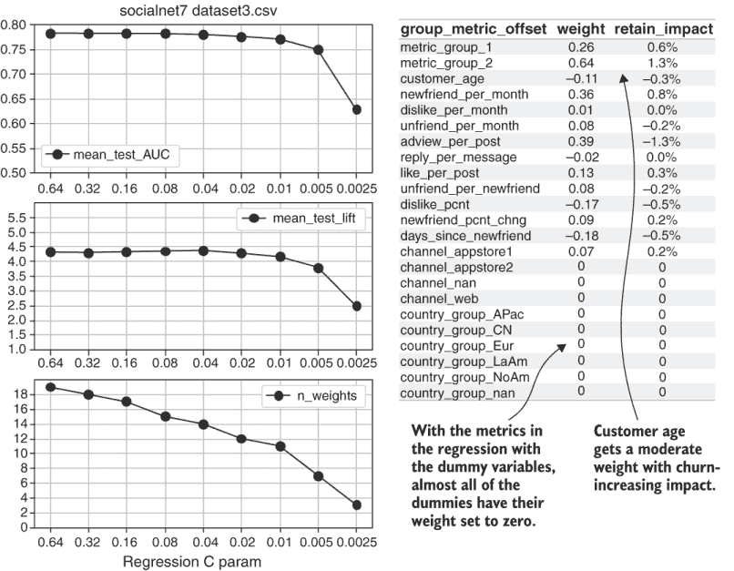

图 10.15 为结合度量分数和类别虚拟变量的数据集的回归结果

没有什么问题。当与行为指标一起考虑时，该渠道不会提供关于客户流失的额外信息，回归也发现了这一点。客户渠道与某些行为相关，在模拟中，行为导致客户流失和保留。当你单独看渠道时，它与流失率相关，但当与回归中的行为指标结合时，回归算法会自动确定最解释性的因素并去除其他因素。回归正确地确定，通过观察指标而不是渠道，客户参与度最可预测。

**要点**：人口统计类别通常与客户流失和参与度相关，因为来自不同人口统计的客户行为不同。但如果你使用详细的行为指标，你通常会发现行为是预测性预测中保留的潜在驱动因素。

我曾告诉你们，理解人口统计和公司统计是应对客户流失的次要方法，因为行为可以通过干预（有时）进行修改，但人口统计却不能（永远不能）。人口统计通常对预测客户流失没有帮助，这也是我强调在应对客户流失时理解行为与指标的原因。即使人口统计字段对预测客户流失没有用，也不会影响其在应对客户流失中的主要用途。

**要点** 如果您在群体分析中看到人口统计与保留率之间存在强烈的关系，您应该在您的获取努力中强调您最好的人口统计。即使这些相同的人口统计在包含行为指标的回归中不是预测参与度的指标，这也无关紧要。

**警告** 不要假设您自己的产品或服务的流失数据将显示与我在此处从模拟中展示的完全相同的结果。社交网络模拟是为了模仿我在研究客户流失时最常见的结果，但总会有例外，您的产品可能就是其中之一。

如果您发现您自己的人口统计在考虑了行为指标后仍然强烈预测流失，您应该检查您的数据是否可以改进。确保所有相关的客户行为都通过您的事件表示，并且您的指标充分捕捉了您的事件与流失之间的关系。与未测量的行为相关的人口统计相关性可能导致即使在包含指标的情况下，人口统计预测流失的结果。如果是这样，您最好找出这些行为是什么，以便您可以测量它们并尝试改善它们。

您还可以测试人口统计变量在像 XGBoost 这样的机器学习模型中对预测的改进程度。这种实验的结果如图 10.16 所示。人口统计变量使 XGBoost 的 AUC 增加了约 0.005，或者说增加了 1%的一半。图 10.16 还显示了回归 AUC 的改进，这个改进甚至更小（但仍然是一个改进）。

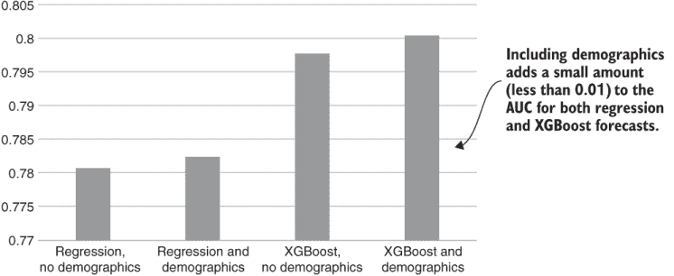

图 10.16 带有人口数据的准确度比较

**要点** 最高预测准确度来自使用人口统计数据和详细客户指标的 XGBoost。XGBoost 可能比回归更认为人口统计在预测中更有帮助。

要在图 10.16 中重现 XGBoost 的结果，您可以使用以下命令运行 XGBoost 交叉验证列表配置版本（listing_9_6_crossvalidate_xgb.py）：

```
fight-churn/listings/run_churn_listing.py —chapter 9 —listing 6 —version 2 
```

注意，列表和配置创建了包含人口统计变量的 XGBoost 的结果。如果您一直在跟随，您应该已经找到了其他模型和数据集的准确度。

## 10.6 使用人口统计数据细分现有客户

本章的最后一个主题是如何将人口统计信息作为细分客户努力的一部分。作为数据人员，您不负责定义细分或与客户互动，但您确实需要提供数据，以便业务人员能够有效地完成工作。用于细分客户的最终数据集应包括以下要素：

+   所有在最近可用日期活跃的客户

+   指标组的分数

+   未分组的指标的原生（未缩放）指标值

+   以字符串格式表示的类别人口统计信息

+   在适当的地方分组类别

+   流失预测概率（可选）

图 10.17 是一个具有所有这些特征的示例数据集。

创建这样的数据集需要几个步骤：

1.  从数据库中提取当前客户的全部指标和人口统计信息。

1.  使用历史数据中的分数参数和加载矩阵重新处理指标信息以形成组。

1.  保存一个包含所有所需特征的版本的数据集。

注意，这个过程还会创建一个为活跃客户进行流失概率预测准备好的数据集。该版本结合了所有指标的分数和数值人口统计数据，但人口统计类别的虚拟变量。

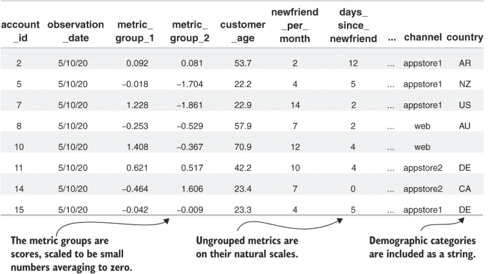

图 10.17 按指标分组得分、指标和人口统计信息对客户进行分段的示例数据集

列表 10.6 提供了提取当前活跃客户所有指标和人口统计数据的 SQL 语句。这个列表几乎与第四章和第八章中类似的列表相同，所以我只会简要解释。SQL 程序的主要部分是对指标进行聚合以简化指标。新功能是在账户表上进行连接，并选择渠道国家和出生日期。出生日期被转换为表示客户年龄的年数的时间间隔（遵循本章前面创建包含人口统计数据的历史数据集时使用的模式）。

列表 10.6 导出当前活跃客户的指标和人口统计数据

```
WITH metric_date AS                                               ①
(
   SELECT  max(metric_time) AS last_metric_time FROM metric
),
account_tenures AS (
   SELECT account_id, metric_value AS account_tenure
   FROM metric m INNER JOIN metric_date ON metric_time =last_metric_time
   WHERE metric_name_id = 8
   AND metric_value >= 14
)
SELECT s.account_id, d.last_metric_time AS observation_date,
a.channel,                                                        ②
a.country,                                                        ③
date_part('day',d.last_metric_time::timestamp                     ④
    - a.date_of_birth::timestamp)::float/365.0 AS customer_age,
SUM(CASE WHEN metric_name_id=0 THEN metric_value else 0 END)
    AS like_per_month,
SUM(CASE WHEN metric_name_id=1 THEN metric_value else 0 END)
    AS newfriend_per_month,
SUM(CASE WHEN metric_name_id=2 THEN metric_value else 0 END)
    AS post_per_month,
SUM(CASE WHEN metric_name_id=3 THEN metric_value else 0 END)
    AS adview_per_month,
SUM(CASE WHEN metric_name_id=4 THEN metric_value else 0 END)
    AS dislike_per_month,
SUM(CASE WHEN metric_name_id=34 THEN metric_value else 0 END)
    AS unfriend_per_month,
SUM(CASE WHEN metric_name_id=6 THEN metric_value else 0 END)
    AS message_per_month,
SUM(CASE WHEN metric_name_id=7 THEN metric_value else 0 END)
    AS reply_per_month,
SUM(CASE WHEN metric_name_id=21 THEN metric_value else 0 END)
    AS adview_per_post,
SUM(CASE WHEN metric_name_id=22 THEN metric_value else 0 END)
    AS reply_per_message,
SUM(CASE WHEN metric_name_id=23 THEN metric_value else 0 END)
    AS like_per_post,
SUM(CASE WHEN metric_name_id=24 THEN metric_value else 0 END)
    AS post_per_message,
SUM(CASE WHEN metric_name_id=25 THEN metric_value else 0 END)
    AS unfriend_per_newfriend,
SUM(CASE WHEN metric_name_id=27 THEN metric_value else 0 END)
    AS dislike_pcnt,
SUM(CASE WHEN metric_name_id=30 THEN metric_value else 0 END)
    AS newfriend_pcnt_chng,
SUM(CASE WHEN metric_name_id=31 THEN metric_value else 0 END)
    AS days_since_newfriend
FROM metric m INNER JOIN metric_date ON m.metric_time =d.last_metric_time
INNER JOIN account_tenures t ON t.account_id = m.account_id
INNER JOIN subscription s ON m.account_id=s.account_id
INNER JOIN account a ON m.account_id = a.id                      ⑤
WHERE s.start_date <= d.last_metric_time
AND (s.end_date >=d.last_metric_time OR s.end_date IS null)
GROUP BY s.account_id, d.last_metric_time, 
    a.channel, a.country, a.date_of_birth                        ⑥
ORDER BY s.account_id
```

① 列表的大部分内容与列表 4.6 和 8.3 相同。

② 来自账户表的渠道字符串

③ 来自账户表的国别字符串

④ 从观察日期中减去出生日期

⑤ 与账户表进行 JOIN 操作

⑥ 在 GROUP BY 子句中包含人口统计字段

您可以通过运行以下命令和这些参数在自己的模拟社交网络数据集上运行列表 10.6 来创建自己的当前客户数据集文件：

```
fight-churn/listings/run_churn_listing.py —chapter 10 —listing 6
```

列表 10.7 展示了将当前客户的原始数据转换为可用于预测和分段的版本的 Python 程序。列表 10.7 的大部分内容与第八章中看到的转换类似，并包括第七章、第八章和第十章中的几个辅助函数。但列表 10.7 还包括一些新步骤以适应人口统计数据。

列表 10.7 中的一个重要新技术是我所说的在历史数据和当前数据集中对齐虚拟变量。Pandas 的`get_dummies`函数（从列表 10.4 的`dummy_variables`调用）为数据框中的每个类别创建虚拟变量列，但历史数据集和当前数据集中的类别可能不匹配。通常，历史数据集有足够的客户观察结果，你会在几个客户中看到罕见的类别，但当前数据集将拥有更少的客户，可能不包含任何罕见类别的示例。在这种情况下，历史数据集将有一个当前数据集没有的列。这种情况会导致你在尝试在当前数据集上预测客户流失概率时失败。

如果一个类别在历史上不再使用且不再存在于当前数据集中，同样的问题会发生。如果新类别开始使用，则会出现相反的问题：历史数据集可能缺少该类别，而只有当前数据集包含它。总之，对齐类别做两件事：

+   对于历史数据集中缺失的任何类别，添加一个包含零的新虚拟变量列。这样，当前数据集在列上与历史数据集等效，零是无人参与的类别的正确分类值。

+   从当前数据集的虚拟变量中删除在历史数据集中缺失的任何类别。同样，此步骤使历史数据集和当前数据集中的列对齐。如果该类别在历史数据集中不可用，你不知道它是否以及如何预测客户流失，因此删除它是正确的预测目的。

总体而言，列表 10.7 中的主要步骤是

1.  从本章前面（列表 10.4）运行`dummy_variables`创建列表，使用当前数据集的路径。此代码保存了数据的三种版本：

    +   只有用于进一步评分和分组的数值字段

    +   只有用于稍后与分数和组合并的虚拟变量

    +   将数值字段和虚拟变量一起使用，这是 XGBoost 使用的（此文件是从`dummy_variables`函数中保存的）

1.  加载从当前数据集派生的虚拟变量。

1.  运行`align_dummies`辅助函数，该函数负责处理两组虚拟变量之间的不一致性。

1.  加载由`dummy_variables`函数从当前数据创建的仅包含数值字段的数据集。同时加载从历史数据集创建的加载矩阵和分数参数。将此当前数据集通过你在第八章中学到的重新处理步骤运行：

    1.  转换任何偏斜的列。

    1.  转换任何具有厚尾的列。

    1.  重新缩放数据，使所有字段都是接近 0 均值的分数，接近 1 的标准差。

    1.  通过使用在历史数据上创建的加载矩阵，结合任何相关的指标。

1.  将虚拟变量与指标分组和得分数据合并，并保存此版本的数据集。这个版本可以用于预测当前客户的流失概率。

1.  创建一个用于业务人员细分的数据集版本。此数据集版本结合以下元素：

    +   分组指标的得分

    +   那些未分组的原始（未转换）指标

    +   人口统计类别的原始字符串（而不是虚拟变量）

列表 10.1 准备包含人口统计字段的当前客户数据集

```
import pandas as pd

from listing_7_5_fat_tail_scores 
   import transform_fattail_columns, transform_skew_columns
from listing_8_4_rescore_metrics 
   import score_current_data, group_current_data, reload_churn_data
from listing_10_4_dummy_variables import dummy_variables
def rescore_wcats(data_set_path,categories,groups):

   current_path = data_set_path.replace('.csv', '_current.csv')

   dummy_variables(current_path,groups, current=True)                      ①
   current_dummies = reload_churn_data(data_set_path,
      'current_dummies_groupscore',  '10.7',is_customer_data=True)
   align_dummies(current_dummies,data_set_path)                            ②

   nocat_path = 
      data_set_path.replace('.csv', '_nocat.csv')                          ③
   load_mat_df = reload_churn_data(nocat_path,
                                   'load_mat','6.4',is_customer_data=False)
   score_df = reload_churn_data(nocat_path,
                                'score_params','7.5',is_customer_data=False)
   current_nocat = reload_churn_data(data_set_path,'current_nocat','10.7',is_customer_data=True)
   assert set(score_df.index.values)==set(current_nocat.columns.values),
          “Data to re-score does not match transform params”
   assert set(load_mat_df.index.values)==set(current_nocat.columns.values),
          “Data to re-score does not match loading matrix”
   transform_skew_columns(current_nocat,
      score_df[score_df['skew_score']].index.values)
   transform_fattail_columns(current_nocat,
      score_df[score_df['fattail_score']].index.values)
   scaled_data = score_current_data(current_nocat,score_df,data_set_path)
   grouped_data = group_current_data(scaled_data, load_mat_df,data_set_path)

   group_dum_df =                                                          ④
      grouped_data.merge(current_dummies,left_index=True,right_index=True)
   group_dum_df.to_csv(                                                    ⑤
      data_set_path.replace('.csv','_current_groupscore.csv'),header=True)

   current_df = reload_churn_data(data_set_path,
                                  'current','10.7',is_customer_data=True)
   save_segment_data_wcats(                                                ⑥
      grouped_data,current_df,load_mat_df,data_set_path, categories)

def align_dummies(current_data,data_set_path):

   current_groupments=pd.read_csv(                                         ⑦
      data_set_path.replace('.csv','_current_dummies_groupmets.csv'),
      index_col=0)

   new_dummies = set(current_groupments['metrics'])
   original_groupmets =                                                    ⑧
       pd.read_csv(data_set_path.replace('.csv','_dummies_groupmets.csv'),
                   index_col=0)

   old_dummies = set(original_groupmets['metrics'])
   missing_in_new = old_dummies.difference(new_dummies)                    ⑨
   for col in missing_in_new:                                              ⑩
       current_data[col]=0.0
   missing_in_old = new_dummies.difference(old_dummies)                    ⑪
   for col in missing_in_old:                                              ⑫
       current_data.drop(col,axis=1,inplace=True)

def save_segment_data_wcats(current_data_grouped, current_data,
                            load_mat_df, data_set_path, categories):
   group_cols =                                                            ⑬
      load_mat_df.columns[load_mat_df.astype(bool).sum(axis=0) > 1]
   no_group_cols =                                                         ⑭
      list(load_mat_df.columns[load_mat_df.astype(bool).sum(axis=0) == 1])
   no_group_cols.extend(categories)                                        ⑮
   segment_df =                                                            ⑯
      current_data_grouped[group_cols].join(current_data[no_group_cols])

   segment_df.to_csv(
      data_set_path.replace('.csv','_current_groupmets_segment.csv'),
      header=True)
```

① 在当前数据集上运行 dummy_variables 函数

② 调用辅助函数以将当前虚拟列与历史虚拟列对齐

③ 准备不带类别的当前数据

④ 将分组得分数据与虚拟数据合并

⑤ 使用原始数据集名称保存结果

⑥ 使用该函数准备用于细分的数据

⑦ 从文件列出当前虚拟变量创建一个集合

⑧ 从文件列出原始虚拟变量创建一个集合

⑨ 差分设置发现原始数据中有虚拟列但当前数据中没有。

⑩ 对于新数据中缺失的任何虚拟变量，添加一个零列

⑪ 差分设置发现当前数据中有虚拟列但原始数据中没有。

⑫ 在当前数据中删除但不在原始数据中的虚拟列

⑬ 分组列有多个加载矩阵条目。

⑭ 标准指标列有一个加载矩阵条目。

⑮ 将类别变量名称添加到列表中

⑯ 创建细分数据

你可以使用以下命令和这些参数使用 Python 包装程序运行列表 10.7：

```
fight-churn/listings/run_churn_listing.py —chapter 10 —listing 7
```

此代码为当前客户数据创建三个文件，用于之前描述的目的：

+   使用回归进行预测

+   使用 XGBoost 进行预测

+   通过业务人员进行细分

如果你想使用回归模型进行预测，请使用列表 8.5（文件名为 listing_8_5_churn_forecast.py），使用以下命令和这些参数：

```
fight-churn/listings/run_churn_listing.py —chapter 8 —listing 5 —version 2
```

如果你想使用 XGBoost 模型（文件名为 listing_9_7_churn_forecast_xgb.py）进行预测，请使用

```
fight-churn/listings/run_churn_listing.py —chapter 9 —listing 7 —version 2
```

关于你的业务同事将使用的客户细分数据集，重要的是要认识到，对于业务人员来说，即使与流失和保留无关，人口统计数据也很重要。例如，营销部门将需要为针对不同国家或地区的客户的不同参与活动编写不同的副本。在一个大型组织中，营销部门可能通过自己的系统访问所有这些信息，但我包括所有这些信息是为了完整性。

吸收要点：即使与参与和保留无关，人口统计信息也可能与设计客户干预措施相关。

## 摘要

+   人口和公司数据是关于客户的事实，这些事实不会随时间改变，就像度量一样。人口/公司字段的类型可以是日期、数字或字符串。

+   客户的日期类型信息可以转换为区间，并使用与度量相同的技巧进行分析。

+   要比较由人口类别字符串定义的群体中的流失率，你使用的是对流失率的最优和最差估计的置信区间。

+   当围绕其流失率的置信区间不重叠时，说不同类别中的流失率有统计学上显著的差异。

+   如果你有很多类别代表占客户人口比例很小的部分，你应该在分析之前将这些相关类别分组。

+   通常使用先验知识对人口类别进行分组，并且可以使用字典有效地表示这种映射。

+   要在回归或机器学习预测中使用人口类别，将它们转换为二元虚拟变量的列。

+   虚拟变量不与度量得分分组，但调查度量中虚拟变量之间的相关性可以提供有用的信息。

+   使用人口信息可以提高预测准确性，但通常与基于行为的度量相比，它是一个次要的贡献。
