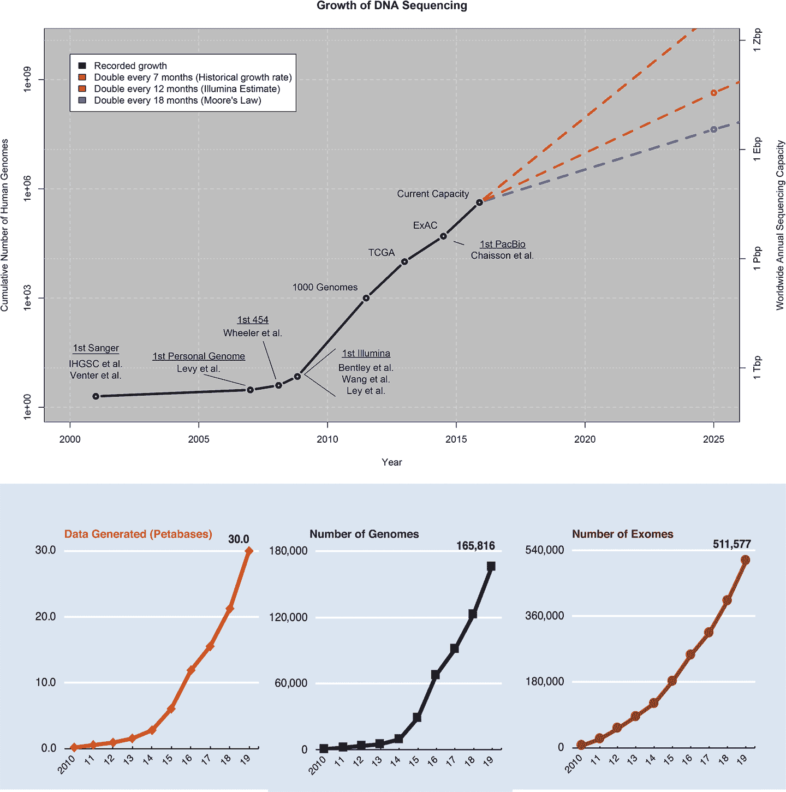
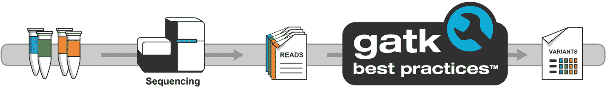
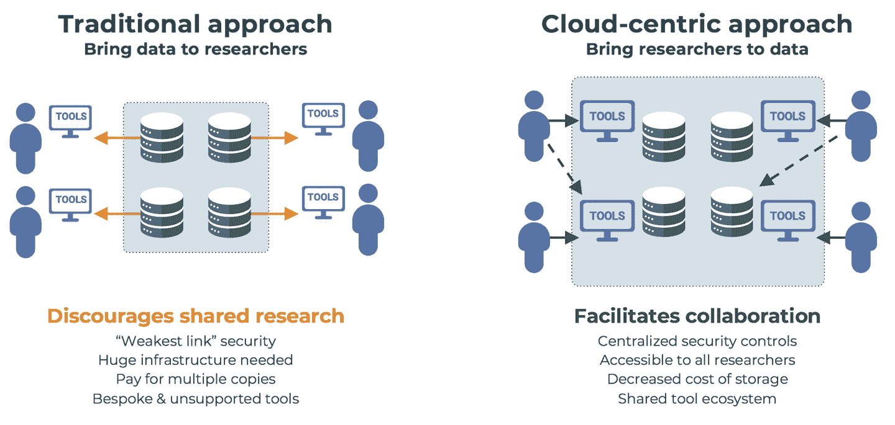
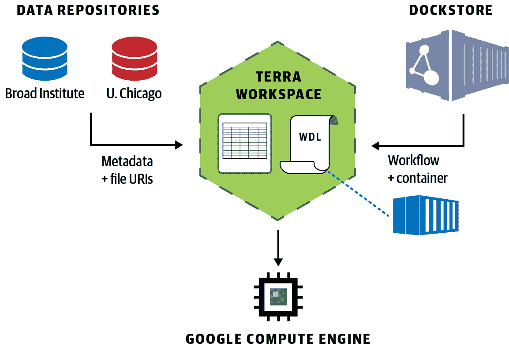

# 第一章：引言

我们生活在一个巨大机遇的时代：技术进步使得我们可以生成关于一切的详细和全面的数据，从整个基因组的序列到单个细胞的基因表达模式。我们不仅可以生成这类数据，而且生成的量还*非常庞大*。

在过去的十年中，全球测序数据量呈现惊人增长，这得益于短读取测序成本的大幅降低，这项技术在第二章中有详细介绍（图 1-1）。像长读取测序和单细胞转录组学这样的新技术近来迅速发展，承诺未来成本会继续大幅下降，并且更多地提供 ’组学实验设计的机会。

###### 图 1-1\. 记录的测序数据集增长至 2015 年及未来十年的预测增长（上图）；Broad Institute 数据生产增长（下图）。^(1)

# 生物和生命科学中大数据的机遇与挑战

任何人，从个人实验室到大型机构，很快都能生成大量的数据。截至目前，被视为大规模项目的包括数十万个基因组的全基因组序列。在未来的十年中，我们预计会看到数百万基因组和转录组的测序项目，同时还会涌现出各种新的数据类型，如高级细胞成像和蛋白质组学。这些大量的数据和多样的新数据类型的存在，承诺将使研究人员更接近回答生物学中一些最困难——尽管看似简单的问题。例如，人体内有多少种细胞类型？什么遗传变异会导致疾病？癌症是如何产生的，我们能否更早预测？因为研究本质上是一项团队运动，我们希望广泛分享即将到来的大量数据，分享我们分析这些数据的算法，并与更广泛的世界分享我们的发现。

# 基础设施挑战

对研究人员而言，由于成本下降和可用的扩展实验设计的双重机会而产生了一系列挑战。身处技术前沿并非易事，每一项新技术都伴随其自身的复杂性。你如何准确地读取穿过纳米孔时飞快移动的单个碱基？你如何在不破坏它们的情况下在三维中成像活细胞？你如何比较一个实验室的单细胞表达数据与另一个实验室的数据，同时纠正由批次效应造成的差异？这些只是在开发或优化新实验设计时我们面临的技术挑战长列表中的几个例子。

但困难并不仅限于数据生成；如果说有什么的话，那只是一个开始。当实验完成并且你手头有了数据时，你将面临一个全新的复杂世界。事实上，在"组学"研究中最具挑战性的一个方面是决定如何在数据生成后处理数据。当你的成像研究每次实验产生一太字节的数据时，你会把这些图像存储在哪里以便让它们易于访问呢？当你的全基因组测序研究生成一组包含临床和表型数据以及序列数据的复杂混合物时，你如何组织这些数据使其在你自己的团队内及在发布时对更广泛的研究社区可见呢？当你需要更新你的方法论以使用分析软件的最新版本来处理超过 100,000 个样本时，你如何扩展你的分析呢？你如何确保你的分析技术能够在不同环境、不同平台和不同组织中正常工作呢？你如何确保你的方法能够被生命科学家复现，而这些科学家往往没有或几乎没有计算机方面的正规培训呢？

在本书中，我们向你展示如何利用*公共云*——通过互联网提供的按需计算服务来解决一些基础设施挑战。但首先，让我们谈谈为何我们认为云是一个特别吸引人的解决方案，并识别可能适用的一些限制。

这并不意味着列举出所有可用选项的详尽清单；就像实验设计的景观多样，使用云在研究中也有很多种方式。相反，本书专注于利用广泛使用的工具和方法，包括由[基因组分析工具包](https://oreil.ly/6J8y5)（GATK）提供的最佳实践基因组工作流程（见图 1-2），这些工作流程使用[工作流描述语言](https://openwdl.org)（WDL）实现，可以在研究计算中常用的任何平台类型上运行。我们将向你展示如何在[Google Cloud Platform (GCP)](https://cloud.google.com)上使用它们，首先通过 GCP 自己的服务，然后通过由 Broad Institute 和 Verily 运行在 GCP 顶部的[Terra](https://terra.bio)平台。

###### 图 1-2\. GATK 提供了一系列最佳实践，用于处理各种实验设计的序列数据。

通过从这种端到端堆栈开始，您将获得基础技能，使您能够利用其他许多工作流语言、分析工具、平台和云中的选项。

# 朝向基于云的数据共享与分析生态系统

从 图 1-1 中，您可以看到数据已经以超过受尊敬的 *摩尔定律* 的速度增长，正如我们早些时候讨论的，新的生成大量数据的实验设计如雨后春笋般出现。这些数据的洪流在很多方面是推动科学计算迁移到云端的主要动力。然而，重要的是要理解，在当前形式下，公共云主要是一组低级基础设施组件，对于大多数目的而言，真正帮助研究人员管理其工作并回答他们正在调查的科学问题的是我们在这些组件之上构建的内容。这都是更大转变的一部分，利用云托管的数据、计算和可移植算法实现，以及使其更易于使用的平台、让平台互相通信的标准和一套使科学对每个人开放的概念原则。

## 云托管的数据和计算

生物学这个大数据时代的黎明面临的第一个巨大挑战在于如何使这些大型数据集对研究社区可用。传统方法如 图 1-3 所示，涉及中心化的存储库，感兴趣的研究人员必须从中央库下载数据副本，然后在其机构的本地计算环境中进行分析。然而，“把数据带给人们”的这种方法已经相当浪费（每个人都付费存储相同的数据副本），并且在我们预期的数据大规模增长（数据集数量和大小）面前无法扩展，这些数据以 *PB*（1,000 TB）为单位进行测量。

例如，在接下来的五年中，我们估计美国国家卫生研究院（NIH）和其他组织将托管超过 50 PB 的基因组数据，需要对研究社区开放访问。对于任何单个研究人员来说，花时间下载如此多的数据太多了，对于每个研究机构来说，本地托管其研究人员的数据也太多了。同样，分析基因组、成像和其他实验设计的计算要求非常显著。并非每个人都准备好具有数千个 CPU 的计算集群。

近年来显而易见的解决方案是颠覆现有模式，将“人们带到数据中来”。与其将数据存储在封闭的仓库中，我们将其托管在广泛可访问的存储库中，并直接连接到计算资源；因此，任何具有访问权限的人都可以在数据所在地进行分析，而无需转移任何数据，如图 1-3 所示。尽管这些要求（广泛访问和与存储共存的计算）可以通过多种技术解决方案实现，但最常用的是公共云基础设施。我们在第三章中详细介绍了这些内容，作为技术入门的一部分；现在，只需想象云就像任何机构的高性能计算（HPC）设施，只是通常规模更大、配置选项更加灵活，并且任何人都可以租用设备的时间。

云计算的流行选择包括 [亚马逊网络服务（AWS）](https://aws.amazon.com)，GCP 和 [微软 Azure](https://azure.microsoft.com)。每个平台都提供计算和存储的基础服务，以及更高级的服务；例如，GCP 上的 Pipelines API，在我们进行大规模分析时使用，详见第十章。

###### 图 1-3\. 数据共享模型的反转。

与传统的 HPC 集群不同，你通常会根据环境编写脚本来进行分析，而图 1-3 中提出的模型则鼓励思考分析方法的可移植性。随着多个云竞争市场份额，每个云存储和提供对多个数据集的访问，研究人员希望能够将他们的算法应用于数据所在的任何地方。因此，在过去几年中，高度可移植的工作流程语言变得流行起来，包括我们在本书中使用并在第八章中进一步探讨的 WDL，[通用工作流语言](https://www.commonwl.org)（CWL）和 [Nextflow](https://www.nextflow.io)。

## 生命科学研究平台

将研究数据迁移到云端的负面影响在于，它给研究计算的本来就不轻松的世界增加了一整套新的复杂性（或者可能是几套）。尽管一些研究人员可能已经接受过足够的培训或者个人喜好使他们能够有效地在工作中使用云服务，但这些人无疑是少数。生物医学研究社区的绝大多数成员通常并不足以处理公共云服务提供的“原始”服务，因此迫切需要开发适合研究人员需求、屏蔽操作细节的平台和界面，让这些研究人员能够专注于科学研究。

几个流行的平台提供了易于使用的网页界面，专注于为研究人员提供点击操作的方式来利用云存储和计算。例如，Terra（我们在 Chapter 11 中探讨，并贯穿整本书使用）、[Seven Bridges](https://www.sevenbridges.com)、[DNAnexus](https://www.dnanexus.com) 和 [DNAstack](https://dnastack.com) 都向研究人员提供这些先进的网络平台。

这些及类似平台可能具有不同的用户界面和不同的功能重点，但它们的核心是为用户提供一个工作空间环境。这是一个研究人员可以汇集他们的数据、元数据和分析工作流的地方，并在此过程中与他们的合作者分享。然后，工作空间的隐喻允许研究人员运行分析——例如，在 Terra 平台上，这可以是使用 WDL 进行批处理工作流，或者使用 Jupyter Notebook 进行交互式分析——而无需深入了解底层云服务的细节。我们在第 11、12 和 13 章中看到了这一过程。要点在于，这些平台使研究人员能够利用云的强大能力和规模，而无需处理底层的复杂性。

## 基础设施的标准化和重复使用

看起来研究人员可以使用多个云，多个团体在这些云平台上构建了平台，并解决了数据和计算在研究人员可以轻松访问的位置上共存的类似问题。而这背后的另一面是，我们需要这些独特的数据存储库和平台能够在不同组织之间实现互操作性。事实上，将数据和分析移至云端的一个重要希望之一是，它将打破过去使得跨多个数据集进行协作和应用分析变得困难的传统壁垒。想象一下，能够将 PB 级数据引入单一的交叉分析中，而无需担心文件的位置、如何传输它们以及如何存储它们。现在有个好消息：联邦数据分析的这一梦想已经成为现实，并且正在持续快速改善！

实现无论平台和云如何使用数据的这一愿景的关键在于标准。诸如[全球基因组与健康联盟](https://www.ga4gh.org)（GA4GH）等组织先驱性地协调了平台间通信的方式。这些标准涵盖从 CRAM、BAM 和 VCF 等文件格式（本书中将经常使用）到连接存储、计算、发现和用户身份之间的应用程序接口（API）。谈论 API 和文件格式可能听起来乏味或干燥，但现实是我们希望云平台支持共同的 API，以允许研究人员打破云平台之间的障碍并使用无论位置何在的数据。

除了标准之外，软件架构、视觉共享和组件重用是实现互操作性的另外关键驱动因素。在过去几年中，五家美国组织在 NIH 机构和项目的支持下共同开发云基础设施，并合作开发共享视野下的可互操作基础设施组件，形成了[数据生物圈](https://www.databiosphere.org)的共享愿景。这五个合作伙伴组织的技术领导者，分别是位于田纳西州纳什维尔的范德堡大学、加州大学圣克鲁斯分校（UCSC）、芝加哥大学、Broad 研究所以及 Alphabet 旗下的 Verily 公司，在 2017 年 10 月发表在[Medium 的博客文章](https://oreil.ly/hsG1B)中明确了这一开放生态系统的共享愿景。数据生物圈强调四个关键支柱：社区驱动、基于标准、模块化和开源。除了我们建议您全文阅读的宣言外，这些合作伙伴还将这些原则整合到了各自正在构建和运营的组件和服务中。

综合来看，在 GA4GH 的基于社区的标准开发以及 Data Biosphere 中的系统架构愿景和软件组件共享推动了我们的共同前进。这些协作努力的结果是，今天，您可以登录 Broad Institute 的 Terra 平台，快速从由芝加哥大学、Broad Institute 等托管的多个存储库中导入数据到 Terra 的私人工作空间，从[Dockstore 方法库](https://dockstore.org)导入工作流，并在 Google Cloud 上安全地执行分析，只需几次点击，如图 1-4 所示。

###### 图 1-4\. Data Biosphere 原则的实践：在 Terra 中跨多个数据集进行联合数据分析，使用从 Dockstore 导入并在 GCP 中执行的工作流。

明确一点，Data Biosphere 生态系统的完整愿景还远未实现。仍然存在一些重要的障碍需要克服；有些纯粹是技术上的，但其他一些则根植于驱动个人、社区和组织的实践和激励因素。例如，在元数据中形式描述数据属性的标准化需求仍然突出，这影响跨数据集的可搜索性以及联合数据分析的可行性。具体而言，如果不同数据集中等效的数据文件在元数据中的标识方式不同，就很难对来自这些数据集的样本应用联合分析了（在一个数据集中是`input_bam`，在另一个是`bam`，在第三个是`aligned_reads`）。要解决这个问题，我们需要相关研究社区齐心协力制定共同标准。技术可以用来执行选择的约定，但首先需要有人（最好是几个人）站出来制定这些标准。

作为人驱动而不是技术驱动的另一个绊脚石例子，生物医学研究显然会受益于建立机制，可以在基础设施平台之间无缝运行联合分析；例如，从云到云（Google Cloud 和 AWS），从云到本地（Google Cloud 和您机构的本地 HPC 集群），以及任何您可以想象的多平台组合。在那个主题上存在一些技术复杂性，尤其是在身份管理和安全认证方面，但一个重要的障碍是，这个概念并不总是与商业云供应商和软件提供商的商业模式对齐。更普遍地说，许多组织需要参与开发和运营这样的生态系统，这带来了从法律领域（数据使用协议、运营授权和各国隐私法律）到技术领域（基础设施互操作性、数据协调）的一系列复杂性问题。

尽管如此，过去几年取得了显著进展，我们正朝着数据生物圈的愿景迈进。尽管在各种赠款项目上直接竞争，许多组和组织正在积极合作建设互操作云基础设施组件，这表明这一愿景有着充满活力的未来。共享目标是构建可以彼此交换数据和计算的平台——允许研究人员在所选择的环境中查找、混合和匹配数据——正在变为现实。Terra 作为一个平台处于这一趋势的前沿，并且是从 [NCI](https://www.cancer.gov)、[国家人类基因组研究所（NHGRI）](https://www.genome.gov)、[国家心脏、肺和血液研究所（NHLBI）](https://www.nhlbi.nih.gov)、[人类细胞图谱计划](https://www.humancellatlas.org) 和 [Verily 的 Project Baseline](https://www.projectbaseline.com) 等项目中提供广泛的研究数据集访问的重要组成部分。这是可能的，因为这些项目正在采用 GA4GH API 和数据生物圈的常见架构原则，使它们与 Terra 和其他采纳这些标准和设计哲学的平台兼容。

# 成为 FAIR

到目前为止，在本章中，我们涵盖了很多内容，从生命科学数据的显著增长开始，以及这如何对数据下载的旧模式造成压力，并推动研究人员转向使用云来进行存储和计算的更好模式。我们还看了社区在标准化数据和计算在云上可访问方式方面的努力，以及数据生物圈的哲学如何塑造各平台共同努力，以便研究人员可以访问这些平台。

对于那些不希望重复造轮子并且有动机在尽可能多的地方重用 API、组件和架构设计的平台构建者来说，这种模型的好处是显而易见的。但是，从研究人员的角度来看，GA4GH 的这些标准和 Data Biosphere 的架构如何转化为他们研究中的改进呢？

总的来说，像 Terra 这样的平台中应用的这些标准和架构原则使研究人员能够使他们的研究更加 FAIR：易于发现、易于访问、可互操作、可重用。^(2) 我们在第十四章中会更详细地探讨这一点。但现在，思考到这些平台构建者描述的工作是为了使他们的系统、工具和数据更加 FAIR，对于研究人员同样如此。通过采用云技术、用像 WDL 这样的语言编写可移植的工作流，在 Terra 上运行分析，并在 Dockstore 上分享工作流，研究人员可以使自己的工作更加 FAIR。这使得其他研究人员可以找到和访问分析技术，进行互操作性，将分析在不同地方运行，并最终重用工具，作为开展新发现的一个基石。在全书中，我们从平台构建者和研究人员的角度回顾了 FAIR 原则。

# 总结和下一步

现在我们已经为您介绍了为何基因组学作为一门学科正在向云端转移的核心动机，让我们概述一下本书如何帮助您开始在这个新的世界中，正如在前言中所述。我们设计它作为一次旅程，引导您通过一系列技术主题的发展，最终解决上述基础设施挑战，向您展示如何在云端完成您的工作，并使其变得 FAIR。

请记住，有许多不同的方法可以解决这些挑战，使用不同的解决方案，我们仅关注一种特定的方法。然而，我们希望接下来的章节能为您在自己的工作中打下坚实的基础：

第二章 和 第三章

我们探索了生物学的基础和云计算技术。

第五章 到 第七章

我们深入探讨了 GATK 工具包以及当前适用于生殖系和体细胞突变发现的最佳实践流程。

第八章 和 第九章

我们描述了如何通过用 WDL 编写的工作流自动化您的分析并使其可移植。

第十章 和 第十一章

我们首先在 Google Cloud 上开始扩展分析，然后在 Terra 上进行。

第十二章

我们通过在 Terra 中使用 Jupyter 进行交互式分析，补充了基于工作流的分析。

第十三章 和 第十四章

我们向您展示如何在 Terra 中创建自己的工作空间，并将您学到的一切汇集起来，向您展示如何制作一个完全 FAIR 的论文。

本书结束时，我们希望您对基因组数据分析的当前最佳实践有深入了解，能够舒适地使用 WDL 表达您的分析过程，在 Terra 上能够进行工作流和交互式分析，并与合作者分享您的工作。

让我们开始吧！

^(1) Stephens ZD 等人，“大数据：天文学或基因组学？”PLoS 生物学 13(7): e1002195（2015）。*https://doi.org/10.1371/journal.pbio.1002195*。

^(2) [科学数据管理和监护的 FAIR 指导原则](https://oreil.ly/JyTlX) 由 Mark D. Wilkinson 等人撰写，这一原则集的原始出版物。
