# 第二章：基因组学概述：给这一领域的新手的入门指南

现在我们已经在第一章中为您提供了本书的广泛背景，是时候深入了解基因组学的更具体的科学背景了。在本章中，我们简要介绍了关键生物概念和相关实用信息，这些内容对于您完全理解本书中的练习是非常必要的。我们回顾了遗传学的基础知识，并逐步定义了基因组学的概念，这将框定本书的科学范围。在此框架确立之后，我们然后审视基因组学变异的主要类型，重点介绍它们在基因组中的表现形式。最后，我们讨论了在生成和处理用于基因组分析的高通量测序数据时涉及的关键过程、工具和文件格式。

根据您的背景，这可能是一个快速复习，或者它可能是您对许多这些主题的第一次介绍。最初的几个部分旨在面向在生物学、遗传学和相关生命科学方面没有接受过多正式培训的读者。如果您是生命科学的学生或专业人士，请随意浏览，直到遇到您尚不了解的内容为止。在后续章节中，我们逐步介绍更多基因组学特定的概念和工具，这些内容对所有但最经验丰富的从业者来说应该是有用的。

# 基因组学介绍

那么什么是基因组学呢？简短的回答，“它是基因组的科学”，如果您不知道基因组是什么以及为什么重要，这并没有真正帮助。因此，在我们深入讨论“如何进行基因组学”的详细内容之前，让我们退后一步，确保我们对基因组学的定义达成一致。首先，让我们复习涉及的基本概念，包括基因是什么以及它如何与 DNA 相关联。然后，我们逐步深入探讨特定定义范围内的关键数据类型和分析。请记住，这不会是所有可能被归为基因组学术语下的事物的详尽汇编，因为（a）本书并不意味着是一本科学教科书，（b）该领域仍在非常迅速地发展，有许多令人兴奋的新方法和技术正在积极开发中，因此在本书中尝试将它们编纂起来还为时过早。

## 基因作为遗传离散单元（某种程度上）

让我们从历史开始——基因。这是一个几乎普遍认可但不一定被很好理解的术语，因此值得探讨其起源并展开其演变（可以这么说）。

19 世纪关键思想家，如查尔斯·达尔文（《物种起源》的作者）和格里戈尔·孟德尔（“豌豆爱好者”），最早提到*基因*的概念。当时分子生物学还远未问世一百多年。他们需要一种方式来解释各种生物体中观察到的部分性状和组合性状的遗传模式，因此他们假设存在一种由父母传给后代的微观不可分割的粒子，并构成了物理特征的决定因素。这些假设的微粒最终在 20 世纪初由威廉·约翰森命名为*基因*。

几十年后，罗莎琳德·富兰克林、弗朗西斯·克里克和詹姆斯·沃森阐明了现在著名的*双螺旋*DNA 结构：由称为*脱氧核糖*（DNA 中的 D）的分子的重复单元组成的两条互补链，这些链在实际信息内容中携带另一种称为*核酸*（DNA 中的 NA）的分子形式。DNA 中的四种核酸，更普遍地称为*碱基*，根据它们的首字母 A、C、G 和 T 分别命名为*腺嘌呤*、*胞嘧啶*、*鸟嘌呤*和*胸腺嘧啶*。DNA 能够形成双螺旋的原因在于碱基的分子结构使得两条链可以配对：如果你把 A 碱基放在 T 碱基对面，它们的形状会吻合，就像磁铁一样吸引彼此。G 和 C 也是如此，只不过它们之间的吸引力比 A 和 T 更强，因为 G 和 C 形成三条键，而 A 和 T 只形成两条键。这种简单的生物化学互补性的含义巨大；遗憾的是，我们没有时间详细讨论所有这些，但我们留下了克里克和沃森在他们关于 DNA 结构的经典论文中的经典描述：

> 我们注意到我们假设的特异配对立即暗示了一种可能的遗传物质复制机制。

结合基因的概念和 DNA 的现实，我们发现我们所称之为基因的单元对应于我们在极长的 DNA 字符串中划定的相当短的区域。这些长串的 DNA 组成了我们的染色体，大多数人在高中生物课本中会认识到它们 X 形的波浪线。正如在图 2-1 中所示，这种 X 形状是染色体的一种压缩形式，其中 DNA 被紧密缠绕。

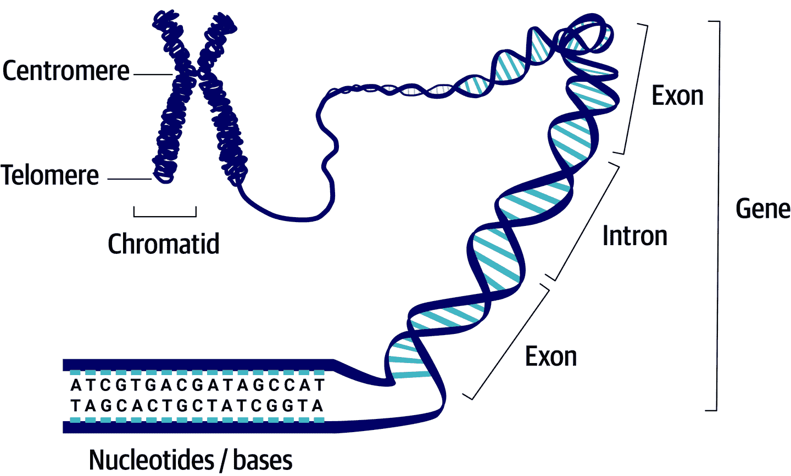

###### 图 2-1\. 染色体（此处显示为两个姐妹染色单体，每个由一条名为*脱氧核糖*（DNA 中的 D）的分子的非常长的双链 DNA 组成），其中我们划分为由外显子和内含子组成的基因。

与许多其他生物一样，人类是*二倍体*的，这意味着你有两个来自每个生物父母的染色体副本：一个从每个生物父母那里继承。因此，你有每个存在于两条染色体上的基因的两个副本，这包括大部分的基因。在少数情况下，一些基因可能存在于一个染色体上而在另一个染色体上不存在，但我们不会在这里详细讨论。对于给定的基因，你的两个副本被称为*等位基因*，它们在序列上通常并非严格相同。如果你生育一个生物子代，你会向他们传递你的 23 对染色体中的每一对中的一条染色体，并且相应地，每个基因的两个等位基因之一。在变异发现的背景下，这个等位基因的概念将非常重要，它将适用于个体变异而非整体基因。

###### 注意

虽然在流行媒体中，X 形状是染色体最常见的表现形式，但我们的染色体并不常常呈现那种形状。大部分时间它们是一种称为染色单体的杆状形式。当单个*染色单体*在细胞分裂事件之前复制时，两个相同的染色单体通过称为*着丝粒*的中心区域连接在一起，形成流行的 X 形状。要注意不要混淆姐妹染色单体（属于同一染色体）和你从每个生物父母那里继承的染色体复本。

如果我们更仔细地观察 DNA 区域的一个定义为基因的区段，我们会发现基因本身被分成称为*外显子*和*内含子*的较小区域。当特定基因被调用时，外显子是将贡献其功能的部分，而内含子将被忽略。如果你很难区分它们，请试着记住*外*显子是*外*面的部分，而*内*含子则是其*内*部的片段。

所有这些都表明基因实际上并不像我们的前辈最初设想的那样是离散的粒子。如果说有什么，染色体更接近于离散的遗传单元，至少在物理意义上是这样，因为每个染色体对应于一条未断裂的 DNA 分子。实际上，由于你继承了一个染色体副本，很多由不同基因引起的特征会一起遗传，因为它携带的所有基因之间存在物理连接。然而，染色体遗传的现实比你想象的要复杂得多。在产生卵子和精子的细胞分裂之前，父母染色体副本会配对并在一个称为*染色体重组*的过程中交换片段，这个过程会重新组合物理上连接的特征组合，这些特征组合将传递给后代。注意：生物学就是这么复杂。

现在我们已经掌握了遗传继承的基本术语和机制，让我们来看看基因实际上是做什么的。

## 生物学的中心法则：DNA 转录为 RNA，再翻译为蛋白质

这个中心法则是我们理解基因是什么以及它们如何工作的下一个层次。这个想法是，基因中编码的“蓝图”信息以 DNA 的形式转录成一个紧密相关的中间形式，称为*核糖核酸*（RNA），我们的细胞随后将其用作将氨基酸串联成蛋白质的指南。 DNA 和 RNA 之间的主要区别在于 RNA 有一种不同的核苷酸（尿嘧啶而不是胸腺嘧啶，但它仍然与腺嘌呤结合），在生物化学上它不太稳定。你可以把 DNA 看作是主蓝图，RNA 是主蓝图的工作副本。这些工作副本是细胞将用来构建蛋白质的东西。这些蛋白质的功能范围从结构组分（例如肌纤维）到代谢剂（例如消化酶），最终作为我们身体的砖块和砖匠。

整个过程称为*基因表达*（参见图 2-2）。这个理论非常合理，解释了很多——但这并不是完整的画面。作为基因表达过程的描述，这本来是正确的，但几十年来，理论一直认为信息流是严格单向和全面的。是的，你猜对了：就像基因概念一样，这事实上是有些错误的。我们后来发现生命以多种方式违反了这个长期坚持的法则：例如通过仅限于 DNA 到 RNA 以及仅限于 RNA 的途径，这些途径以多种有趣和令人费解的方式修改基因表达。还存在通向蛋白质合成的途径，没有 RNA 模板的指导，称为*非核糖体蛋白质合成*，一些细菌利用它来产生扮演各种角色的小分子，如细胞间信号传导和微生物战争（即抗生素）。再次请记住，现实比卡通版本复杂得多，尽管卡通版本仍然有助于传达主要参与者之间最常见的关系：DNA、RNA、氨基酸和蛋白质。

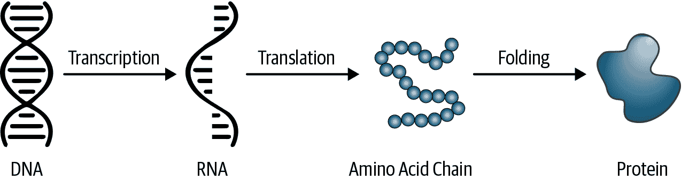

###### 图 2-2. 生物学中心法则：DNA 导致 RNA；RNA 导致氨基酸；氨基酸导致蛋白质。

那么这种关系在实践中是如何运作的呢？如何从 DNA 序列到构成蛋白质的氨基酸？首先，DNA 到 RNA 的转录利用了一个巧妙的生化技巧：正如我们之前提到的，核苷酸彼此是互补的——A 粘附于 T/U，C 粘附于 G——因此，如果你有一个读作`TACTTGATC`的 DNA 字符串，细胞可以通过将适当（即粘性的）RNA 碱基置于每个 DNA 碱基的对面来生成“信使”RNA 字符串，从而产生`AUGAACUAG`。然后，遗传密码就开始发挥作用了：每组三个字母构成一个*密码子*，对应一个氨基酸，如图 2-3 所示。一种称为*核糖体*的细胞工具读取每个密码子，并将相应的氨基酸排列起来添加到链中，最终形成蛋白质。因此，我们的极简示例序列仅编码一个非常短的氨基酸链：仅甲硫氨酸（AUG），然后是天冬氨酸（AAC）。第三个密码子（UAG）只是简单地指示核糖体停止延长链。

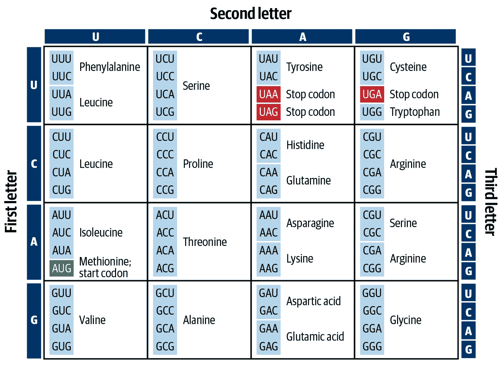

###### 图 2-3\. 遗传密码将信使 RNA 序列中的三字母密码子连接到特定的氨基酸。

我们可以详细解释这一切是如何工作的，因为这确实非常有趣，所以我们鼓励你查阅更多资料以便了解更多。目前，我们想要强调的是这种机制对 DNA 序列的依赖性：改变 DNA 序列可能导致蛋白质的氨基酸序列发生变化，从而影响其功能。因此，让我们谈谈遗传变化。

## DNA 突变的起源和后果

DNA 相当稳定，但有时会断裂（例如由于辐射或化学物质的作用），需要修复。负责修复这些断裂的酶偶尔会出错，并且会将错误的核酸（例如将 T 插入 A 的位置）并入其中。在细胞分裂期间复制 DNA 的酶也会犯错，有时这些错误会持续存在并传递给后代。除了我们在此不详细讨论的其他突变机制外，每代人从父母那里继承的 DNA 随着时间的推移会有所不同。绝大多数这些突变并不会产生任何功能效应，部分原因在于遗传密码中存在一定的冗余性：可以改变一些字母而不改变它们拼写的“单词”的含义。

然而，正如在图 2-4 中所示，一些突变确实会导致基因功能、基因表达或相关过程的改变。这些影响可能是积极的；例如，提高降解毒素的酶的效率，从而保护身体免受损害。其他则可能是消极的；例如，降低同一酶的效率。有些变化可能根据上下文具有双重影响；例如，一个众所周知的突变例子导致镰状细胞病，但同时对抗疟疾。最后，一些变化可能具有功能效果，但并不明显与直接的积极或消极结果相关，比如头发或眼睛颜色。

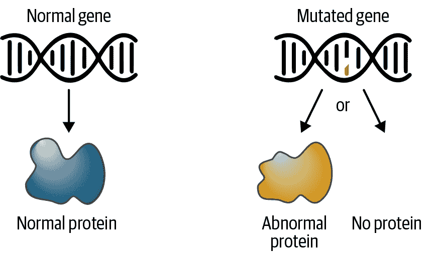

###### 图 2-4\. DNA 序列中的突变可以导致基因的蛋白质产物异常功能或完全失活。

再次强调，这个主题远比我们在这里展示的要复杂得多；我们的目标主要是说明我们为什么如此关注确定人类基因组的确切序列。

## 基因组学作为基因组内和基因组间变异的清单

现在我们已经讲解了基础知识，我们可以退后一步，重新定义基因组学。我们可以说 DNA 和基因之间的关系可以粗略地总结为“基因由 DNA 组成，但你的 DNA 总体包括基因和非基因部分。”这种表达方式有些别扭，所以我们将使用术语*基因组*来指代“你的整体 DNA”。但是如果基因组意味着“包括（但不限于）你的基因在内的所有 DNA”，那么*基因组学*应该包括“基因组的科学”涵盖什么呢？

美国的[NHGRI 网站宣称](https://oreil.ly/Fm7Tb)：

> 遗传学指的是研究基因及特定特征或条件如何从一代传递到另一代的学科。基因组学描述了一个人所有基因（基因组）的研究。

这个定义的问题（除了相当随意地省略了“不是基因的所有 DNA”）是，一旦你开始在基因组中寻找某些特定内容，它就成为了遗传学问题。例如，在所有人类基因组中，哪些基因涉及到 2 型糖尿病的发展？这是基因组学还是遗传学？从技术上讲，你需要首先查看所有基因，以便将搜索范围缩小到对研究有意义的基因。因此，“一些基因”与“所有基因”之间的区别是一个相当模糊的区分，在我们的书中至少在上下文中并不完全有用。因此，我们更为狭义地定义基因组学作为一门任务是识别基因组的内容，无论是在个体、家庭还是人群层面。从这个角度来看，基因组学的目标是产生输入到下游遗传分析中的信息，最终会产生生物学的洞见。

这一定义包括识别哪些基因组内容是个体特有的，哪些是在个体和群体之间共享的，哪些是在个体和群体之间不同的过程。与此分支相关的几个学科包括*转录组学*，它是在基因组尺度上研究基因表达的学科。术语基因组学有时被用作这些学科的总称，尽管现在更普遍地使用更通用的术语*组学*。在机会出现时，我们不会详细讨论这些学科的细节。

###### 注意

我们可以在个体意义上使用*基因组*（如“我的个人基因组”）和集体意义上使用*基因组*（如“人类基因组”）。

## 大规模基因组的挑战，按数字来看

人类基因组中大约有 30 亿个碱基对，或三个*gigabases*（GB），代表着一大批生物化学编码的信息内容。我们用来解读这些内容的技术会为一个基因组生成数亿条非常短的序列。具体来说，每个基因组大约有 4 千万条约 200 碱基的序列，这相当于每个基因组 100 GB 的文件。如果你做了计算，你会意识到这个数据集是冗余的，达到了 30 倍！这是有意的，因为数据充满了错误——有些是随机的，有些是系统性的——所以我们需要这种冗余来对我们的发现有足够的信心。在那些充满了冗余但错误的数据中，我们需要识别出四到五百万个小差异是真实的（相对于一个参考框架，我们将在下一节中讨论）。这些信息随后可以用于进行遗传分析，以确定哪些差异对特定的研究问题实际上很重要。哦，而且这只是一个人的情况；但我们可能想要将这应用到数百、数千、数万人或更多的群体中。（剧透警告：肯定更多。）

鉴于涉及的规模，我们将需要一些非常强大的程序来分析这些数据。但在我们开始处理计算方法之前，让我们深入探讨基因组变异的主题，更准确地定义我们将要寻找的内容。

# 基因组变异

*基因组变异* 可以采用多种形式，并且可以在生物体和种群的生命周期中的不同时间产生。在本节中，我们回顾描述和分类变异的方式。我们首先讨论用作变异目录共同框架的参考基因组的概念。然后，我们详细介绍基于涉及的物理变化定义的三个主要变异类别：短序列变异、拷贝数变异和结构变异。最后，我们讨论了生殖细胞变异和体细胞变异的区别，以及*de novo*突变在其中的位置。

## 作为共同框架的参考基因组

当涉及比较基因组之间的变异时，无论是在同一人体的细胞或组织之间，还是在个体、家庭或整个种群之间，几乎所有的分析都依赖于使用一个共同的基因组参考序列。

为什么？让我们看一个类似但更简单的问题。我们有三个现代句子，我们知道它们都演变自一个共同的祖先：

1.  快棕色 f*a*x 跳过了懒狗*e*。

1.  快 *_* 的狐狸跳过了*它们*的懒狗*e*。

1.  快棕色狐狸跳*s*过懒*棕色*狗。

我们希望以一种不偏向任何单一句子的方式列出它们的差异，并且对可能添加的新突变句子具有鲁棒性。因此，我们创建了一个综合的合成体，它最大程度地体现了它们的共同点，得出了这个结果：

> 快棕色狐狸跳过了懒狗 e。

我们可以将其作为一个共同的参考坐标系，用来绘制每个突变中不同的地方（即使不一定是唯一的）：

1.  第四个单词，o → a 替换；第九个单词，删除 *e*

1.  第三个单词删除；第七个单词，添加 *ir*；第九个单词，添加 *e*

1.  第五个单词 ed → s 替换；第八个单词后面的第三个单词重复出现

明显不是一个完美的方法，它给我们的并不是真正的祖先句子：我们怀疑狗原来的拼写不是这样的，我们也不确定原来的时态（*jumps* 还是 *jumped*）。但它使我们能够区分我们可以访问的人群中普遍观察到的内容与不同的内容。

我们可以在这个参考中引入尽可能多的句子，并且代表性越高，描述我们将来遇到的变异就越合适。

同样地，我们使用参考基因组来绘制个体的序列变异，相对于试图在基因组序列之间绘制差异。这使我们能够确定序列变异中哪些是普遍观察到的，哪些是特定样本、个体或群体独有的。

那么我们应该使用谁的基因组作为通用框架？在最简单的情况下，任何个体的基因组都可以用作参考基因组。然而，如果我们能够使用代表我们可能想要研究的最广泛个体群体的参考基因组，我们的分析将会产生更好的结果。

这导致了一个复杂的问题：为了使我们的参考基因组能够代表许多个体，我们需要评估每个基因组段的最常见观察到的序列，我们称之为*单倍型*。然后，我们可以使用这些信息来组成一个合成的混合序列。结果是一个在任何特定个体基因组中从未完全观察到的序列。

研究人员正试图通过使用更先进的基因组表示形式来解决这些限制，例如图形，其中节点代表不同的可能序列，它们之间的边允许您追溯给定的基因组。然而，为了我们在本书中展示的分析目的，我们使用了从科学界努力开始的高质量参考基因组，起源于人类基因组计划（HGP）。

理解普通参考的有效性受其开发过程中使用的原始样本多样性的限制是很重要的。当 HGP 在 2003 年宣布完成时，HGP 联盟发布的基因组序列实际上是基于极少数来自欧洲背景的人的合成参考。这限制了其作为非欧洲人群的参考的有效性，因为后来我们了解到，这些人群存在足够显著的差异，不能充分地映射回原始的欧洲中心参考。

自那时以来，已发布了连续的人类基因组参考“版本”，通常称为*组装*或*构建*。除了通过纯技术进步提供更高质量外，这些对普通基因组参考的更新还通过包含来自历史上少有代表的人群的更多数据，增加了其代表性。值得强调的是，这些努力来补偿基因组研究参与者选择中的历史偏见是非常必要的。确实，研究数据中的代表性缺失会导致临床结果中的实际不平等，因为它影响了我们识别个体基因组序列中有意义变异的能力，特别是对于属于少数族裔的人群。

在人类中，迄今为止最显著的改进是在所谓的*备用单倍型*的表示中取得的，这些区域在不同人群中有时会有显著不同。最新的人类参考基因组构建，正式名称为*GRCh38*（用于基因组研究联盟的人类构建 38），但通常被昵称为*Hg38*（用于人类基因组构建 38），极大地扩展了代表备用单倍型的备用（ALT）连锁体的类型。这对我们检测和分析特定于携带备用单倍型人群的基因组变异具有显著影响。

作为最后的情节转折，请注意，所有当前的标准参考基因组序列都是*单倍体*，这意味着它们只代表每个染色体（或连锁体）的一份拷贝。最直接的后果是，在*二倍体*生物（如人类，它们有两份每个体染色体的拷贝，即任何不是性染色体 X 或 Y 的染色体）中，选择最常见的以*杂合*状态出现的位点的标准表示方式（表现为两种不同等位基因；例如 A/T）很大程度上是随意的。在*多倍体*生物中显然更糟，例如许多植物，包括小麦和草莓，它们有更多的染色体拷贝。虽然可以使用[基于图的表示方法](https://oreil.ly/5BiFo)来表示参考基因组，以解决这个问题，但目前很少有基因组分析工具能够处理这种表示方式，而且在这个领域中，图基因组可能需要多年才能流行起来。

## 变异的物理分类

现在我们有了描述变异的框架，让我们来讨论我们将考虑的变异种类。我们基于它们所代表的物理变化，区分三大类变异，这些变异在图 2-5 中有所说明。*短序列变异*（单碱基变化和小插入或删除）与参考基因组相比是 DNA 序列的小变化；*拷贝数变异*是特定 DNA 片段数量的相对变化；而*结构变异*是相对于参考基因组某一 DNA 片段的位置或方向的变化。

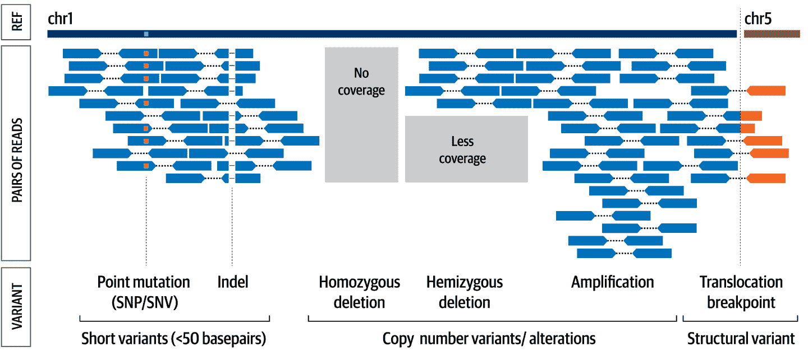

###### 图 2-5\. 通过对 DNA 物理变化分类的主要变异类型。

### 单核苷酸变异

早些时候，我们检查了混合句子：“快速棕色狐狸跳过了懒狗”。在三个句子的列表中，第一个句子使用了 *fax* 而不是 *fox*。在这里，我们可能会说在单词 fox 中发生了单个字母替换，将 *o* 替换为 *a*，因为“参考”说的是 *fox*。

当我们将这个概念应用到 DNA 序列时——例如，当我们遇到一个 G 核苷酸而不是基于参考的 A 核苷酸时，我们称之为 *单核苷酸* 变异（见 图 2-6）。关于这些变异体的确切术语存在一些差异，足够合理的是，这种差异是一个单字母替换：根据上下文的不同，我们将它们称为 *单核苷酸多态性*（SNP；发音为“snip”），这在种群遗传学中最为合适；或者称为 *单核苷酸变异*（SNV；通常完整拼写，但有时发音为“sniv”），这在癌症基因组学中更为常见。

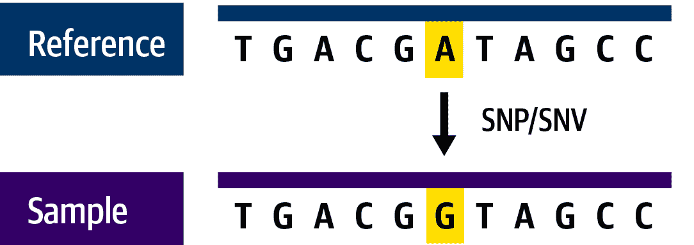

###### 图 2-6\. 单核苷酸变异。

SNV 是自然界中最常见的变异类型，因为导致它们的各种机制相当普遍，而它们的后果通常很小。生物功能往往对这些小变化具有鲁棒性，因为正如我们在概述中所看到的，遗传密码有多个密码子可以编码相同的氨基酸，所以单个碱基的变化并不总是导致蛋白质的变化。

### 插入和删除

在我们示例的第二句中，“The quick *_* fox jump*s* over the*ir* lazy dog*e*,” 我们看到了两种主要类型的小插入和删除：我们丢失了 *brown* 这个词，而 *the* 中的一个实例通过插入两个字母变成了 *their*。我们还有一个复杂的替换，*jumped* 被 *jumps* 取代，这很有趣，因为在没有额外信息的情况下，我们无法确定这种变化是在单个事件中发生的，即 *ed* 变为 *s*，还是 *ed* 先丢失，*s* 后来被添加上去。或者，*jumped* 和 *jumps* 的原始祖先可能是 *jump*，并且这两种形式后来通过独立的插入进化了！后一种情况似乎更有可能，因为它涉及更简单的事件链，但如果没有看到更多数据，我们无法确定。

应用于 DNA 序列，*indels* 是相对于参考序列的一个或多个碱基的插入或删除，如 图 2-7 所示。有趣的是，多项研究表明插入比删除更常见（至少在人类中）。尽管这一观察尚未完全解释，但可能与自然发生的移动基因元件有关，这是一种分子寄生虫，非常引人入胜，但可悲的是超出了本书的范围。

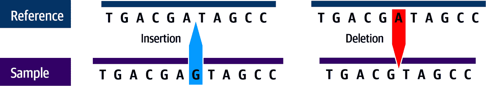

###### 图 2-7\. Indels 可以是插入（左）或删除（右）。

###### 注意

*Indel* 这个术语是通过结合 *in*sertion 和 *del*etion 创造的混合词。

自然界中观察到的大多数插入缺失（indels）都比较短，长度小于 10 个碱基，但可以插入或删除的序列的最大长度没有限制。实际上，长于几百个碱基的插入缺失通常被分类为复制数或结构变异，我们将在接下来讨论。与单核苷酸变化相比，插入缺失更可能破坏生物功能，因为它们更可能引起相位移，即添加或删除碱基改变核糖体用于读取密码子的三个字母阅读框架。这可以完全改变插入缺失后序列的意义。它们还可能在编码区域插入时导致蛋白质折叠变化，例如。

### 复制数变异

通过*复制数变异*（图 2-8），我们进入了更复杂的领域，因为这个游戏不再仅仅是“发现差异”。此前的问题是“我在这个位置看到了什么？”现在问题转变为“我在任何给定区域看到了多少个副本？”例如，我们进化文本示例中的第三句，“The quick brown fox jump*s* over the lazy *brown* dog”中有两个单词*brown*的副本。

###### 图 2-8\. 复制数变异的示例。

在生物学背景下，如果你将每个单词想象成产生蛋白质的基因，这意味着我们可以从这个句子的 DNA 中产生比其他两个更多的“Brown”蛋白质。如果所讨论的蛋白质例如对抗危险化学品有保护作用，这可能是件好事。但如果细胞中的这种蛋白质数量影响另一种蛋白质的产生，这可能是件坏事：增加其中一种蛋白质可能会打破另一种蛋白质的平衡，引起有害的连锁反应，扰乱细胞过程。

另一个案例是*等位基因比例*的改变，即同一基因的两种形式之间的平衡。想象一下，你从父亲那里继承了一个缺陷基因的副本，该基因本应修复受损的 DNA，但没关系，因为你从母亲那里继承了一个功能性的副本。单一的功能性副本足以保护你，因为它产生足够的蛋白质来修复 DNA 的任何损伤。太好了。现在想象一下，在你的一个现在良性肿瘤中，有一部分经历了复制数事件：失去了来自你母亲的功能性副本，现在你只剩下来自你父亲的破损副本，这个副本无法产生 DNA 修复蛋白质。这些细胞不再能够修复任何 DNA 断裂（这可能是随机发生的），并开始积累突变。最终，肿瘤的这部分开始增殖，并变成癌细胞。不太好。

这些被称为*剂量效应*，展示了调节细胞代谢和健康的基因途径的生物学复杂性。DNA 拷贝数可以以其他方式影响生物功能，在所有情况下，效果的严重程度取决于许多因素。

举例来说，*三体性症* 是遗传疾病，患者某些染色体多了一份。最著名的是唐氏综合征，由于染色体 21 多了一份而引起。它与多种智力和身体障碍相关，但如果得到适当支持，携带这些变异的人可以过上健康而有成效的生活。影响性染色体（X 和 Y）的三体性症通常影响较少；例如，大多数三体性 X 染色体综合征的个体在医学上没有任何问题。相比之下，影响其他染色体的几种三体性症则非常不幸地与生命不相容，并且通常会导致流产或早期婴儿死亡。

### 结构变异

这一类变异包含了拷贝数变异和大片段插入/缺失，还包括各种复制中性结构改变，如易位和倒位，详见图 2-9。

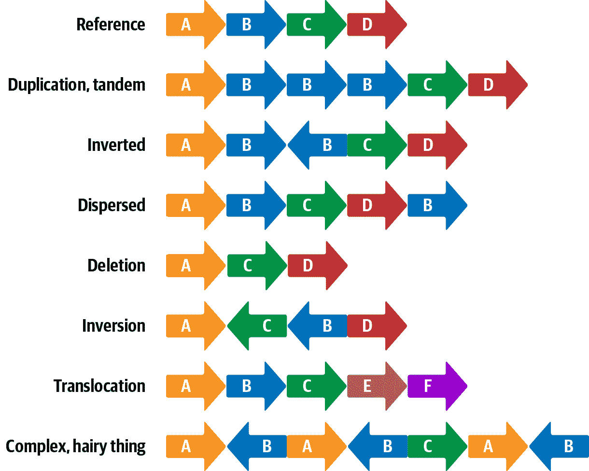

###### 图 2-9\. 结构变异示例。

正如您从图 2-9 的例子中看到的那样，*结构变异* 可能相当复杂，因为它们涵盖了基因物质的一系列物理变换。一些变异可以跨越很大距离，甚至在某些情况下影响多个染色体。我们不会在本书中涵盖结构变异，因为这仍然是一个非常活跃的发展领域，相关方法尚未确定。

## 生殖细胞系变异与体细胞突变的区别

生殖细胞系变异与体细胞突变之间的基本生物学区别对于我们处理变异发现的方式有重大影响，具体取决于分析的特定目的。理解这一点可能有些棘手，因为它与遗传和胚胎发育的概念密切相关。让我们从*生殖细胞系* 和 *体细胞* 这两个术语的定义开始。

### 生殖细胞系

*生殖细胞系* 这一术语结合了生物遗传的两个相关方面。*细胞系* 部分指的是种子的发芽概念，并不直接与微生物有关，尽管它是使我们称微生物为*细菌* 的同样概念。*系* 部分指的是所有最终成为卵子或精子的细胞都来自一个单一的*细胞系*，这是胚胎发育早期分化的细胞群体，有一个共同的祖先。

实际上，术语 *生殖系* 常被用来指代个体的整个细胞群体作为*生殖系*。因此，你的生殖系变异原则上是你的生物父母的生殖系细胞中存在的变异，通常是产生你的卵细胞和/或精子在受精之前。因此，你的生殖系变异预计存在于你身体的每一个细胞中。在实践中，受精后不久产生的变异将很难或不可能与生殖系变异区分开来。

研究人员对生殖系变异感兴趣有多种原因：诊断具有遗传成分的疾病、预测发展疾病的风险、理解身体特征的起源、绘制人类种群的起源和演化——仅限于人类领域！生物种群内的生殖系变异也在农业、改良畜牧业、生态研究甚至微生物病原体的流行病学监测中极具兴趣。

### 体细胞

术语 *体细胞* 源自希腊词 *soma*，意为*身体*。它作为一个排除性术语，用来指代所有非生殖系的细胞，如图 2-10 所示。体细胞变异是在你一生中（包括在胚胎发育期间、出生前）个体细胞中的突变事件产生的，仅存在于你身体的部分细胞中。

这些突变可以由多种因素引起，从遗传易感性到环境暴露，例如辐射、香烟烟雾和其他有害化学物质。这些突变中有很多发生在你的身体中，但仅限于一个或少数几个细胞，并没有引起明显影响。在某些情况下，这些突变可以在受影响的细胞内引起连锁反应，损害它们调节生长的能力，并导致细胞肿瘤的形成。许多肿瘤幸运地是良性的；然而，有些会变成恶性并引发负面连锁反应，推动许多额外的体细胞突变的发生，并最终导致我们归类为*癌症*的代谢疾病。

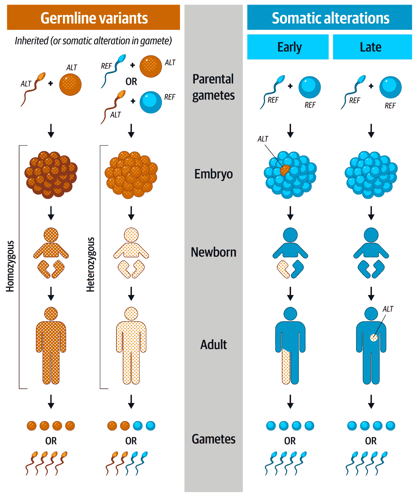

###### 图 2-10\. 人体所有细胞中均存在生殖系变异（左），而体细胞变异仅存在于部分细胞中（右）。

话虽如此，尽管癌症研究是体细胞变异分析的主要应用之一，体细胞变异的影响并不局限于肿瘤生长和癌症。它们还包括各种发育障碍，例如唐氏综合征，正如我们之前提到的，它是由染色体 21 号异常复制引起的；换句话说，是一种 CNV 形式。虽然唐氏综合征可以通过胚系遗传方式传播，但最常见的是由于胚胎发育早期发生的异常细胞分裂事件的结果。大多数情况下，这种情况发生得如此早，以至于几乎所有个体的细胞都受到影响。

这就是胚系变异和体细胞变异之间界线变得有些模糊的地方。正如我们刚刚讨论过的，你可以有一个孩子，出生时就带有在其发育早期形成的变异。就其起源而言，这是体细胞变异；然而，在分析你孩子的基因组时，它将表现为胚系变异，因为它存在于他们所有的细胞中。类似地，你可以在生活过程中的生殖细胞中获得体细胞突变；例如，如果在产生卵子或精子的细胞分裂过程中出现了问题。产生的变异明显是体细胞的起源，但如果你接下来生了一个从受影响细胞中发育出来的孩子，那么这个孩子将在其身体所有细胞中携带这些新变异。因此，就孩子而言，这些变异将是胚系变异；在这种情况下，由于孩子从你那里继承了它们，这一点就更加明显了。在这两种情况下，我们将这些变异称为拉丁语“de novo”意为“新发生”的*de novo 变异*，因为在孩子身上，它们似乎是从无中出现的。在本书中，我们将早期体细胞突变视为胚系突变。

# 高通量测序数据生成

现在我们知道我们在寻找什么了，让我们谈谈如何生成数据，以便我们能够识别和描述变异：*高通量测序*。

我们用于序列化 DNA 的技术自从 Allan Maxam、Walter Gilbert 和 Fred Sanger 的开创性工作以来已经有了巨大的发展。许多墨水，无论是电子的还是其他形式的，都用于分类[连续的浪潮或代际的测序技术](https://oreil.ly/159S1)。今天最广泛使用的技术是由 Illumina 推广的*short read*合成测序，它产生大量*reads*，即 DNA 序列字符串（最初大约 30 个碱基，现在可达大约 250 个碱基）。这通常被称为*next-generation sequencing*（NGS），与最初的*Sanger 测序*相对。然而，随着基于不同生化机制的新“第三代”技术的发展，生成更长 reads 的术语可以说已经过时了。

到目前为止，这些新技术并不直接替代 Illumina 短读取测序，在重测序应用中仍然占主导地位，但某些技术如 PacBio 和 Oxford Nanopore 已经在诸如*de novo*基因组组装等应用中得到了很好的确立。特别是 Nanopore 因其口袋大小版本 MinION 的可用性而越来越受欢迎，MinION 可以用于最小培训并通过 USB 端口连接到笔记本电脑。虽然 MinION 设备无法产生用于人类和其他大型基因组的常规分析所需的吞吐量，但它非常适合微生物检测等应用，对于这些应用来说，较小的产量已经足够。

在单细胞测序领域也发生了激动人心的进展，其中微流控设备用于分离和测序单个细胞的内容。这些通常侧重于 RNA，旨在识别例如组织间基因表达模式差异等生物现象。在这里，我们为简单起见专注于经典的 Illumina 式短读取 DNA 测序，但我们鼓励您关注该领域的最新发展。

## 从生物样本到大量读取数据

那么，我们如何使用短读取技术来测序某人的 DNA 呢？首先，我们需要收集生物材料（最常见的是血液或口腔拭子）并提取 DNA。然后，“准备 DNA 文库”，这涉及将整个 DNA 剪成相当小的片段，然后准备这些片段进行测序过程。在这个阶段，我们需要选择是测序整个基因组还是只测序子集。例如，当我们谈论*整个基因组测序*与*外显子测序*时，不同的不是*测序技术*，而是*文库制备*：即 DNA 为测序准备的方式。我们在下一节中讨论主要类型的文库及其对分析的影响。现在，让我们假设我们可以检索出所有要测序的 DNA 片段；然后，我们添加用于跟踪的分子标签和适配器序列，这些序列将使片段在测序流动池中粘在正确的位置，如图 2-11 所示。

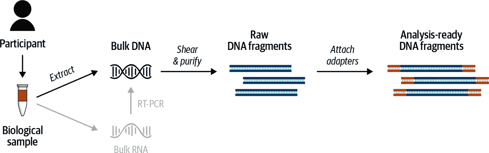

###### 图 2-11\. 大规模 DNA 文库制备过程（顶部）；大规模 RNA 替代路径（底部）。

*流动池*是一种玻璃幻灯片，其内有液道通道，在适当的试剂通过时，测序化学反应就在其中发生循环。在此过程中，您可以在 Illumina 的[在线文档](https://www.illumina.com)中了解更多信息，测序仪使用激光和摄像机来检测由单个核苷酸结合反应发出的光。每个核苷酸对应于特定的波长，因此通过捕获每个反应周期产生的图像，机器可以从每个 DNA 片段的流动池上的*读取*中读取出碱基字符串，如图 2-12 所示。

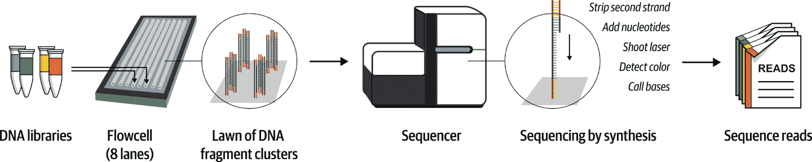

###### 图 2-12\. Illumina 短读取测序概述。

通常情况下，反应被设置为从每个 DNA 片段的每一端产生一个读取，并且生成的数据仍保持为读取对。正如您稍后在本章中将看到的，相比于单个读取，每个片段的读取对为我们提供了可以在多个方面使用的信息。

### 高通量测序数据格式

Illumina 测序仪生成的数据最初存储在一种称为 Basecall（BCL）的格式中，但通常不直接与该格式交互。大多数测序仪配置为输出[FASTQ](https://oreil.ly/NbFcD)，这是一种简单但体积庞大的文本文件格式，包含每个读取的名称（通常称为*queryname*）、其序列以及以 Phred 比例形式表示的碱基质量分数字符串，如图 2-13 所示。

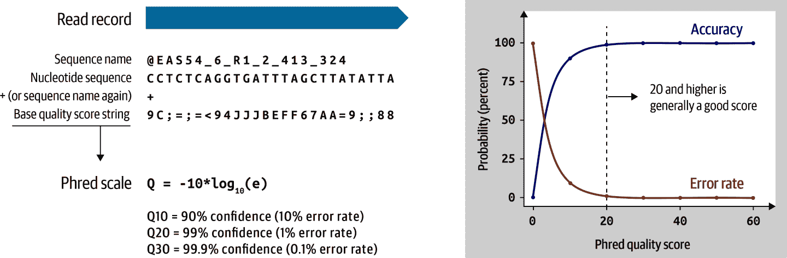

###### 图 2-13\. FASTQ 和 Phred 比例。

*Phred 比例*是用于表达非常小的量（如概率和可能性）的对数比例尺，比原始的十进制数更直观；我们将遇到的大多数 Phred 比例值在 0 到 1000 之间，并四舍五入到最接近的整数。

当读取数据映射到参考基因组时，它被转换为[序列比对映射](https://oreil.ly/1fqR5)（SAM），这是*映射*读取数据的首选格式，因为它可以包含映射和对齐信息，如图 2-14 所示。它还可以包含各种其他重要的元数据，分析程序可能需要在序列本身之上添加。与 FASTQ 类似，SAM 是一种[结构化文本文件格式](https://oreil.ly/QPcIK)，因为它包含更多信息，所以这些文件确实可能会变得非常庞大。通常会遇到这两种格式的压缩形式；FASTQ 通常只是使用 gzip 实用程序进行压缩，而 SAM 可以使用专用实用程序压缩为二进制比对映射（BAM）或 CRAM，后者提供了额外的有损压缩程度。

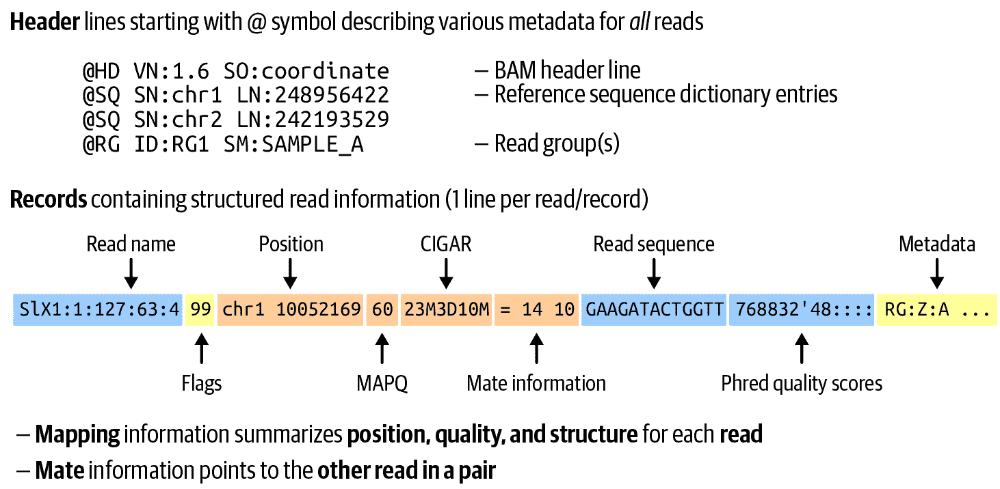

###### 图 2-14\. SAM 格式的关键元素：文件头和读取记录结构。

###### 注意

与 SAM 和 BAM 不同，CRAM 并不是一个真正的首字母缩写；它被命名为 SAM/BAM 命名模式的延伸，也是对“压缩（cram）”动词的一种玩笑，但“CR”并没有什么特别的含义。

在 SAM/BAM/CRAM 格式中，读取的局部对齐信息被编码在简洁特异性间隙对齐报告（CIGAR）字符串中。是的，某人确实希望它能够拼出“CIGAR”。简而言之，该系统使用单字母运算符表示一个或多个碱基与参考序列的对齐关系，并以数字前缀指定运算符描述的位置数，以便仅基于起始位置信息、序列和 CIGAR 字符串即可重建详细对齐信息。

例如，图 2-15 显示了一个读取序列，从一个软剪辑（忽略）碱基（1S）开始，然后是四个匹配位置（4M），一个缺失插入（1D），再两个匹配（2M），一个插入间隙（1I），最后是一个匹配（1M）。请注意，这仅仅是结构描述，并不意味着描述序列内容：在第一组匹配中（4M），第三个碱基与参考序列不匹配，因此它仅表示“在第四个位置上有一个碱基”。

###### 图 2-15\. CIGAR 字符串描述读取对齐的结构。

让我们简要回顾一下图 2-15 中显示的软剪辑，我们将其称为“忽略”。软剪辑发生在读取序列的开头和/或结尾，当映射器无法满意地对齐一个或多个碱基时。映射器基本上放弃了，并使用软剪辑符号指示这些碱基不与参考序列对齐，并且在下游分析中应该忽略。正如您将在第五章中看到的那样，一些最终出现在软剪辑中的数据是可恢复的，并且可能很有用。

###### 注意

在技术上，可以在 BAM 格式中存储读取数据，而无需包含映射信息，正如我们在第六章中所描述的那样。

长期存储大量序列数据是大型测序中心和许多资助机构关注的问题，促使各种团体提出了替代 FASTQ 和 SAM/BAM/CRAM 的格式。然而，到目前为止，没有一种能够在更广泛的社区中得到广泛采纳。

对于单个实验产生的读取数据量根据文库类型以及实验的目标覆盖度而异。*覆盖度*是一个衡量指标，总结了重叠给定参考基因组位置的读取数目。粗略地说，这反映了 DNA 文库中原始 DNA 副本的数目。如果这让你感到困惑，记住，文库制备过程涉及从生物样本中的许多细胞中分离的 DNA，并且（对于大多数文库制备技术）是随机进行碎片化的，因此对于基因组中的任何给定位置，我们预期可以获得来自多个重叠片段的读取对。

谈到文库，让我们更仔细地看看我们在这方面的选择。

## DNA 文库类型：选择正确的实验设计

准备 DNA 文库的方法多种多样，就像分子生物学试剂公司一样多。一般而言，我们可以区分出三种主要方法，这些方法决定了供测序的基因组区域以及所得数据的主要技术特性：*引物扩增*，*全基因组准备*和*靶向富集*，用于生成基因组和外显子组，如图 2-16 所示。

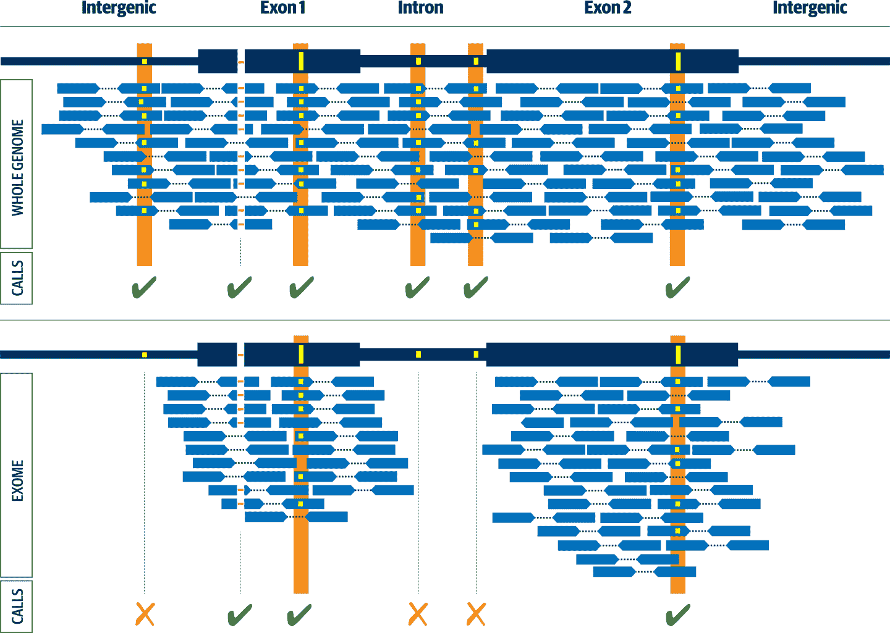

###### 图 2-16\. 全基因组（顶部）和外显子（底部）的实验设计比较。

图 2-16 中显示的全基因组文库将导致在所有区域（外显子、内含子和基因间区）的测序覆盖，而外显子文库只导致在靶向区域（通常对应外显子）的覆盖。

### 引物准备

这类 DNA 准备技术依赖于经典的聚合酶链反应（PCR）扩增（使用特定设计的引物或限制酶位点），以产生*引物*，即大量复制的 DNA 片段，其起始和终止位置相同。这意味着供测序的基因组区域通常非常小，并且依赖于我们使用引物或限制酶预先确定的起始和终止点。

这种方法在小规模实验中相当经济，并且不需要参考基因组，因此在非模式生物的研究中很受欢迎。然而，它产生的数据具有巨大的 PCR 相关技术偏差。因此，在使用 GATK 和相关工具进行变异发现分析时，这种方法的适用性非常差；因此，我们在本书中不进一步介绍它。

### 全基因组准备

正如其名称所示，整个基因组准备的目标是对整个基因组进行测序。它涉及将 DNA 通过机械剪切过程处理，将其撕裂成大量小片段，然后基于其大小“过滤”片段，通常保留 200 到 800 碱基对之间的片段。因为 DNA 样品包含许多基因组的副本，且剪切过程是随机的，我们预计生成的片段将在整个基因组上冗余铺瓦。如果我们对每个片段进行一次测序，我们应该会看到基因组中的每个碱基多次出现。

在实践中，基因组的某些部分仍然很难对测序过程开放。在我们的细胞中，我们的 DNA 并不是简单地漂浮在周围，松散展开的；它的大部分都是紧紧卷起并与蛋白质复合物包装在一起。我们可以通过生化手段松弛它到一定程度，但有些区域仍然很难“解放”。此外，染色体的某些部分，如中心粒（中间部分）和端粒（末端部分），包含大片高度重复的 DNA，这些区域很难准确测序和组装。人类基因组参考序列实际上在这些区域是不完整的，需要专门的技术来探索它们。所有这些都是说，当我们谈论整个基因组测序时，我们指的是我们可以轻松访问的所有部分。尽管如此，即使存在这些限制，整个基因组测序覆盖的领域也是巨大的。

### 靶向富集：基因组子集和外显子

靶向富集方法试图找到一个两全其美的解决方案：它们允许我们集中精力研究我们关心的基因组子集，但效率比扩增子技术更高，并且在某种程度上不太容易出现技术问题。简而言之，第一步与整个基因组准备相同：将基因组剪切成片段，但随后的过滤不是基于大小，而是基于它们是否匹配我们关心的位置。这涉及使用*诱饵*序列，它们设计得非常像 PCR 引物，但固定在表面上以*捕获*感兴趣的目标，通常是基因组子集（用于基因组子集）或所有已注释外显子（用于外显子）。结果是，我们产生了可以告诉我们关于我们成功捕获的那些区域的数据块。

这种非常流行的方法经常被忽视的一个缺点是，用于生成面板和外显子数据的商业套件制造商使用不同的诱饵集，有时在靶向区域上存在重要差异，如在图 2-17 所示。这导致批次效应，并使得比较使用不同靶向区域的独立实验结果更加困难。

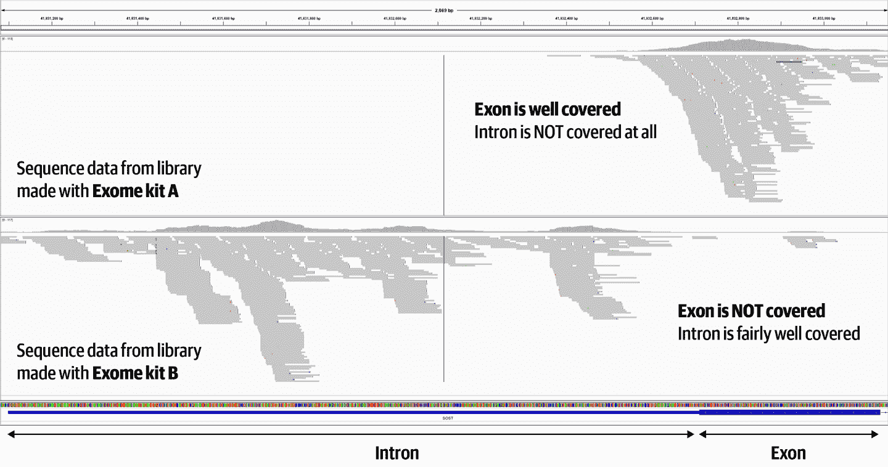

###### 图 2-17\. 不同的外显子准备试剂盒可能导致覆盖位置和数量的重要差异。

###### 注

*外显子测序*有时被称为*全外显子测序*（WES），这是一个误导性的尝试，试图将其与*全基因组测序*（WGS）进行对比。这是误导的，因为对比已经体现在名称中：外显子的重点在于它是整个基因组的*子集*。称其为整个外显子测序是多余的，甚至可以说是不准确的。

### 全基因组与外显子

那么哪种方法更好呢？我们能说的最平衡的事情是，这些方法产生了定性和定量上不同的信息，并且每种方法都有特定的限制。外显子测序因为长期以来价格比基因组便宜且速度更快而非常受欢迎，对于许多常见应用如临床诊断来说，通常足以提供必要的信息。然而，这种方法存在显著的技术问题，包括参考偏倚和覆盖率分布不均匀，这些问题会在下游分析中引入许多混淆因素。

从纯技术角度来看，WGS 产生的数据优于定向数据集。它还使我们能够发现隐藏在不编码基因的广阔基因组领域中的生物学重要序列构型。由于成本的降低，全基因组测序现在正在变得流行，尽管其缺点是产生的数据量更大，更具挑战性。例如，标准人类外显子在 50X 覆盖率下测序需要大约 5GB 的 BAM 格式存储空间，而同一人的全基因组在 30X 覆盖率下测序则需要约 120GB。

如果你以前没有处理过外显子或整个基因组，当我们谈论数据量、文件大小和覆盖率分布时，它们之间的差异可能显得有些抽象。在基因组浏览器中查看一些文件可以帮助理解这在实践中意味着什么。如图 2-18 所示，整个基因组测序数据在基因组中分布几乎均匀，而外显子测序数据则集中在局部堆积。如果你查看基因组浏览器中的覆盖率轨迹，你会看到整个基因组的覆盖率图像像是远处的山脉，而外显子的图像则像是平坦海洋中的一座火山岛。这是一种简单而令人惊讶地有效的方法，可以用肉眼区分这两种数据类型。我们将在第 4 章中向您展示如何在集成基因组浏览器（IGV）中查看测序数据。

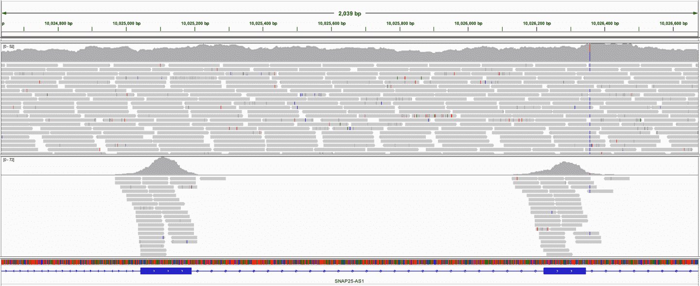

###### 图 2-18\. 整个基因组序列（WGS，上）和外显子序列（下）在基因组浏览器中的视觉外观。

本书中大多数练习使用全基因组测序数据，但我们也提供资源指导分析外显子数据，并在第十四章中进行外显子案例研究。

# 数据处理与分析

最后，我们进入计算部分！现在，你可能会认为一旦我们将序列数据转换为数字形式，真正的乐趣就开始了。然而，事情并非如此：测序仪产生的数据并不直接可用于变异发现分析：这是一大堆短读数，我们不知道它们来自原始基因组的哪里。此外，如果不加处理，偏倚和误差源可能会在下游分析中引起问题。因此，在进行基因组分析之前，我们需要应用几个预处理步骤。首先，我们将读取数据映射到参考基因组，然后应用几个数据清理操作来校正技术偏倚，使数据适合分析。接下来，我们终于能够应用我们的变异发现分析工作流程。在本节中，我们将介绍涉及基因组映射（也称为比对）和变异调用的核心概念，但将其余内容留待第六章。我们还简要触及可能影响变异发现分析的数据质量问题。

## 将读数映射到参考基因组。

理想情况下，我们希望重建我们正在研究的个体的整个基因组，以便与参考基因组进行比较，但我们没有完整的样本——它更像是一百万个碎片，正如图 2-19 所示。

实际上，标准 30X WGS 为 360 百万，标准 50X Exome 为 30 百万，根据[Lander-Waterman 方程](https://oreil.ly/NCMd4)。这就像拼图一样复杂。顺便说一句，这些片段重叠 30 到 50 次（取决于目标深度）。

因此，映射步骤的目标是将每个读数与参考基因组的特定区段匹配。输出是一个 BAM 文件，其中每个读取记录中都编码了映射和比对信息，正如“高通量测序数据生成”中所述。

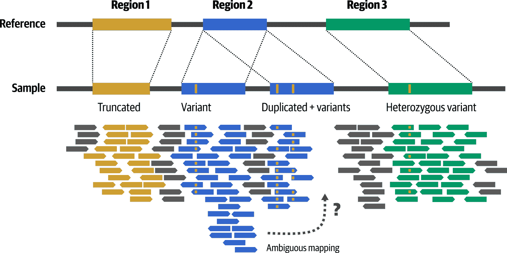

###### 图 2-19\. 序列差异引入了映射挑战和歧义。

这通常被称为*对齐*，因为它为每个读取输出详细的对齐信息，但称之为*映射*可能更合适。基因组映射算法主要设计来解决将一个非常小的字母字符串（通常约 150 到 250 个字符）与一个极大的字母字符串（人类约 30 亿，不计算替代序列）进行最佳匹配的基本问题。除了其他巧妙的技巧外，这涉及使用惩罚间隙的评分系统。然而，在生成精细的逐字母对齐时存在缺点。映射器一次处理一个读取，因此不适合处理自然发生的序列特征，如大插入和删除，通常宁愿截断读取的末端而不引入大的插入/缺失。我们在第五章中介绍 GATK 及其旗舰全基因组短变异调用器`HaplotypeCaller`时会看到一个例子。在这一点上需要理解的重要一点是，我们通常相信映射器大部分时间会将读取放置在适当的位置，但我们并不能总是信任它产生的确切序列对齐。

如图 2-19 所述，另一个复杂性是一些基因组区域是祖先区域的副本，这些副本被复制了。这些复制的序列可能更或者少地发生了分歧，这取决于复制发生的时间以及在副本中产生变异事件的数量。这使得映射的工作变得更加困难，因为竞争性副本的存在会引入歧义，不确定特定读取应该属于哪个位置。值得庆幸的是，现在大多数短读取测序都是使用成对末端测序进行的，这通过为映射器提供额外信息来帮助解决歧义。根据文库制备的协议，我们知道可以预期 DNA 片段位于某个特定大小范围内，因此映射器可以根据一对读取之间的距离评估可能的映射位置的可能性，如图 2-20 所示。对于 PacBio 和 Oxford Nanopore 等长读取测序技术，这并不适用，因为读取的长度较长，通常通过完整读取重复区域的方式减少了歧义的机会。

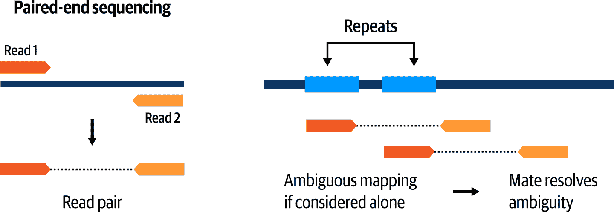

###### 图 2-20\. 成对末端测序有助于解决映射歧义。

###### 注意

在文库制备过程中产生的 DNA 片段有时被称为*插入物*，因为早期的制备技术涉及将每个片段插入称为*质粒*的小圆形 DNA 片段中。因此，相关的质量控制指标通常被称为*插入物大小*，尽管现在的文库制备不再涉及插入到质粒载体中。

正如刚才指出的那样，在我们通常进行变异调用之前，需要进行一些其他处理步骤来清理对齐的数据。我们稍后会详细介绍它们；现在，是时候终于面对这本书中几乎每一章都会跟随我们的难题了。

## 变异调用

术语*变异调用*经常被提及，并且有时用来指代整个变异发现过程。在这里，我们将其严格定义为在可用序列数据中寻找特定类型变异的步骤。这一步骤的输出是一个原始调用集或一组调用，其中每个调用都是潜在变异的个体记录，描述其位置和各种属性。这种的标准格式是 VCF，我们将在下一个侧栏中描述它。

我们用来识别变异的证据的性质因所寻找的变异类型而异。

对于短序列变异（SNV 和 indels），我们比较序列中短片段中的具体碱基。原则上，这相当简单：我们生成 reads 的堆叠，将它们与参考序列进行比较，并确定存在不匹配的位置。然后我们简单地计算支持每种等位基因的 reads 数量，以确定基因型：如果一半一半，样本是杂合的；如果全部是其中一种，样本是纯合的参考或纯合的变异。例如，IGV 中的截图图 2-22 显示了全基因组序列数据中可能的 10 碱基缺失（左侧），纯合变异 SNP（右中）和杂合变异 SNP（最右侧）。

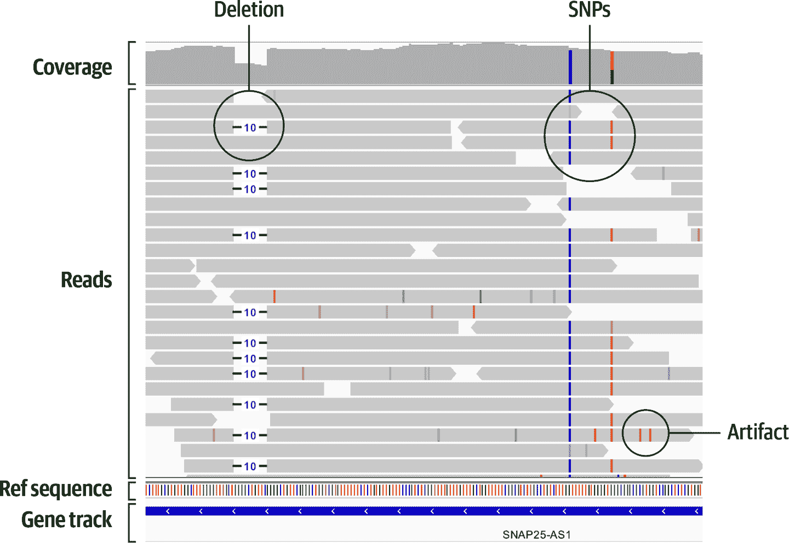

###### 图 2-22\. IGV 中 reads 的堆叠显示了几个可能的短变异。

对于拷贝数变异，我们看的是跨多个区域产生的序列 reads 的相对数量。同样，表面上这是相当简单的推理：如果基因组的一个区域在样本中是重复的，那么当我们对该样本进行测序时，会生成两倍于对该区域的对齐 reads 数目，如图 2-23 所示。

对于结构变异，我们既考虑碱基对分辨率的序列比较，也考虑序列的相对数量。

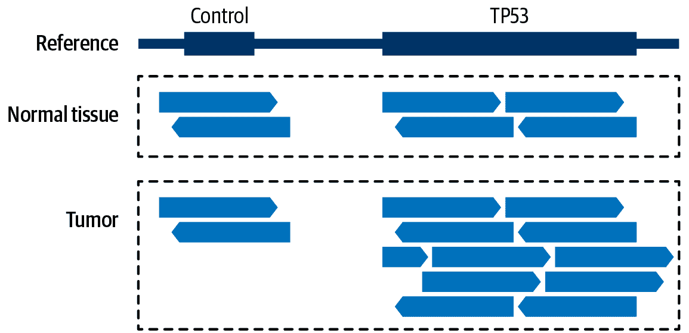

###### 图 2-23\. 覆盖量的相对量提供了复制数建模的证据。

在实践中，确保每种变异类型的过程确实更为复杂，远非我们刚刚概述的简单逻辑，主要是由于各种错误和不确定性的来源使情况变得复杂，我们很快会详述。这就是为什么我们将希望应用更健壮的统计方法，考虑到各种误差来源；一些通过经验推导的启发式方法，另一些则通过不需要事先知道数据中可能存在的错误类型的建模过程。

我们很少能够明确地说，“这个调用是正确的”或“这个调用是错误的”，因此我们用概率术语来表达结果。对于程序输出的每个变异调用，调用者将分配分数，这些分数表示我们对结果的信心有多大。在早期插入缺失的示例中，变异质量（QUAL）分数为 50 意味着“这个变异不是真实的概率为 0.001%”，第二个样本的基因型质量（GT）分数为 17 意味着“这个基因型分配错误的概率为 1.99%”。（我们在第五章中详细介绍了变异质量和基因型质量之间的区别。）

变异调用工具通常使用一些内部截断来确定何时发出变异调用或不发出依赖于这些分数。这避免了输出中充斥着明显不可能是真实的调用。然而，重要的是要理解，这些截断通常设计得非常宽容，以实现高度的敏感性。这是有利的，因为它最小化了错过真实变异的可能性，但这也意味着我们应该预期原始输出仍然包含大量假阳性。因此，我们需要在继续进行更深入的下游分析之前过滤原始的调用集。

过滤变异最终是一个分类问题：我们试图区分更可能是真实的变异和更可能是人为的变异。我们能够做出这种区分得越清晰，我们就有更好的机会在不损失太多真实变异的情况下消除大部分人为变异。因此，我们将根据每种过滤方法能够实现的有利折衷条件来评估它们，用灵敏度或召回率（我们能够识别的真实变异的百分比）和特异性或精确度（我们称之为变异的百分比实际上是真实的），如图 2-24 所示。

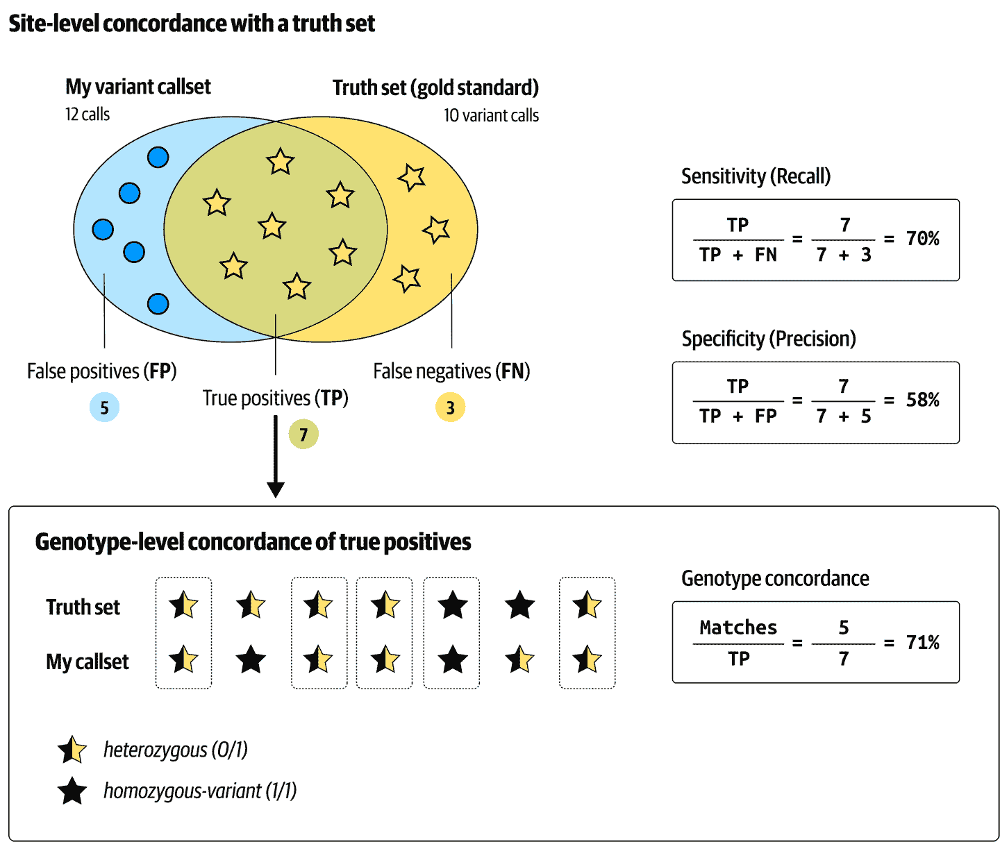

###### 图 2-24\. 变异指标速查表。

有许多方法可以过滤变异，适当选择取决于我们关注的变异类别，还取决于我们对所研究生物体基因组变异的类型和质量有多少先验知识。例如，在人类中，我们有大量的变异目录已经被先前鉴定和验证，我们可以将其作为在新样本中过滤变异调用的基础，因此我们可以使用依赖于来自同一生物体训练数据可用性的建模方法。相反，如果我们正在研究一个首次被研究的非模式生物体，我们就没有这种奢侈，将需要借助其他方法。

## 数据质量和误差来源

整个过程中会出现很多问题（图 2-25），从初始样本收集一直到应用计算算法，每个阶段都可能出现多种误差和混杂因素。让我们回顾一下最常见的问题，这些问题对于理解我们将在基因组分析过程中应用的许多程序是很重要的。

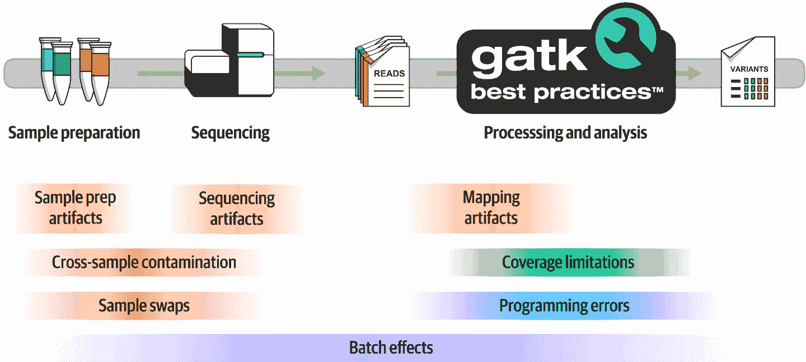

###### 图 2-25\. 变异发现中的常见误差来源。

### 污染和样品交换

在样品收集和准备的最早阶段，我们容易受到几种污染的影响。最难预防的是外源性物质的污染，尤其是在脸颊拭子和唾液样本的情况下。想想你现在口中的情况。你上次刷牙是什么时候？你午餐吃了什么？你现在有点感冒的可能性吗，也许流鼻涕？如果我们试图根据唾液样本或脸颊拭子对你的基因组进行测序，你口中的任何东西都将与你自己的 DNA 一起被测序。至少，这意味着某些产生的序列数据将是无用的噪音；在最坏的情况下，它可能导致下游分析结果的错误。

还有交叉样本污染，人们不喜欢谈论这个问题，因为这意味着设备的质量或操作人员的技能出了问题。但现实是，样本之间的交叉污染经常发生，因此在分析中应予以关注。这可能发生在初始样本收集阶段，特别是在野外不理想条件下进行采样或在文库制备步骤中。在任一情况下，人 A 的一些遗传物质最终会出现在样本 B 的管子中。当污染水平较低时，这通常不会对生殖系变异分析造成问题，但正如在第七章中所述，对于体细胞变异分析可能会产生重大影响。同样在第七章中，我们讨论了如何在体细胞短变异管道中检测和处理交叉样本污染。

最后，样本交换通常归结为标签错误 —— 要么是标签误贴在了错误的管子上，要么是手写标签字迹模糊不清 —— 或者在处理过程中处理元数据时出现错误。为了检测处理过程中发生的任何样本交换，最佳实践建议是将入站样本通过指纹识别程序，并将处理后的数据与原始指纹进行比对，以检测任何交换。

### 生化、物理和软件工件

在样本制备过程中发生的各种物理和生化效应（例如剪切和氧化）可能会导致 DNA 损伤，最终在输出数据中表现为错误序列。涉及 PCR 扩增步骤的文库制备协议会引入类似的错误，因为我们的好朋友聚合酶非常高效，但容易将错误的碱基引入。当然，有时测序机器无法准确读取 DNA 反射的光信号，从而产生低置信度的 BCL 或直接错误。因此，我们得到的数据可能并不总是最高质量的。

某些序列上下文的生化特性会影响文库制备、流式池加载和测序过程的效率。这导致某些区域产生人为膨胀的覆盖率，而其他区域的覆盖率则不足。例如，正如图 2-26 所示，我们知道富含高 GC 含量的 DNA 区域（即含有大量 G 和 C 碱基的区域）通常显示的覆盖率较低于基因组的其他部分。高度重复的区域也与覆盖率异常相关联。

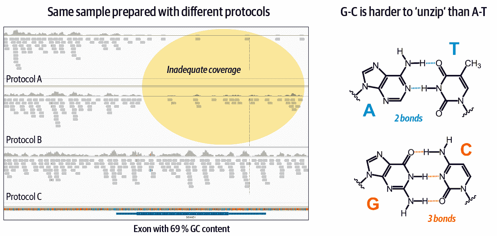

###### 图 2-26。DNA 本身的某些生化特性导致某些区域存在偏差。

然后，在数据生成后进行处理时，我们遇到了其他错误源。例如，由于基因组的生物复杂性（剧透：它很混乱），可能会导致映射工件将读取数据放在错误的位置，从而支持看似变异但实际上并不存在的变异。为了提高性能而进行的算法快捷方式可能会导致小的近似变成错误。尽管我们很遗憾地说，软件缺陷是不可避免的。

最后的关键在于批处理效应——因为我们可以处理某种程度的错误，只要它在我们比较的所有样本中保持一致，但一旦我们开始比较以不同方式处理的样本的结果，我们就会陷入危险区域。如果我们不小心，我们可能会把生物影响归因于一个在我们的样本子集中偶然存在的人为效应，这是由于它们的处理方式不同。

## 功能等效流水线规范

在变异调用之前进行的数据预处理阶段可能是基因组分析中在有效替代实施方案方面最不一致的部分。有许多方法可以“正确地”完成这个过程，这取决于您如何处理后勤方面，无论您更关心成本还是运行时间等等。对于每个步骤，都有几种可供选择的替代软件工具（一些是开源的，一些是专有的）——特别是用于映射。对于新近成立的生物信息学开发者来说，编写新的映射算法几乎是一种成年礼。

然而，这种选择丰富性也有其阴暗面。不同的实施方式可能会在下游分析中引起微妙的批处理效应，这些分析比较那些由这些不同变体流水线产生的数据集时，有时会对科学结果产生重要影响。这就是为什么历史上 Broad 研究所团队总是选择重新处理来自外部来源的基因组数据预处理的原因。他们会系统地将任何经过对齐的读取数据恢复到未映射状态，并清除任何标签或可逆修改。然后，他们会将恢复的数据通过其内部预处理流水线处理。

那种策略，由于数据量的巨大增加，已经不再可持续，尤其是在诸如[gnomAD](https://gnomad.broadinstitute.org)这样的大型聚合项目中使用的数据量增加。为了解决这个问题，Broad 研究所与北美几个最大的基因组测序和分析中心（纽约基因组中心、华盛顿大学、密歇根大学、贝勒医学院）合作，制定了标准化流水线实施的标准。其理念是，通过符合规范的流水线处理的任何数据将是兼容的，这样就可以安全地对从多个符合规范的来源聚合的数据集进行分析，而不必担心批处理效应。

该联盟发布了[功能等效规范](https://oreil.ly/_yLwF)，鼓励所有基因组中心以及任何在小规模生产数据的人采用该规范，以促进互操作性并消除联合研究中的批次效应。

# 总结和下一步计划

这就结束了我们的基因组学入门；你现在已经掌握了开始使用 GATK 和变异发现所需的所有科学知识。接下来，我们将在计算方面进行等效的介绍，通过技术入门带你了解运行涉及工具所需的关键概念和术语。
