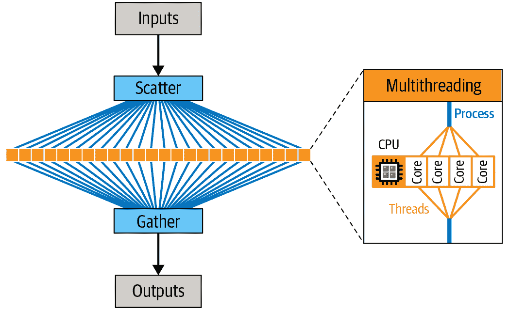
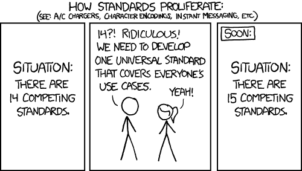
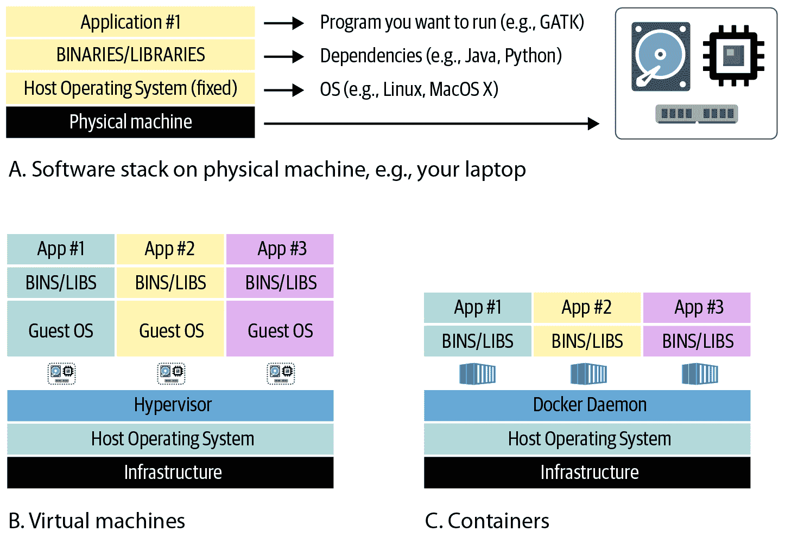
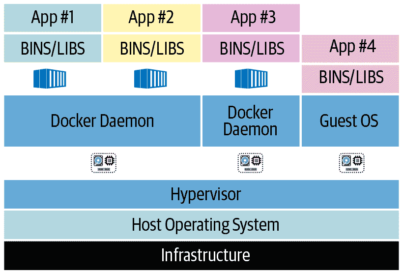
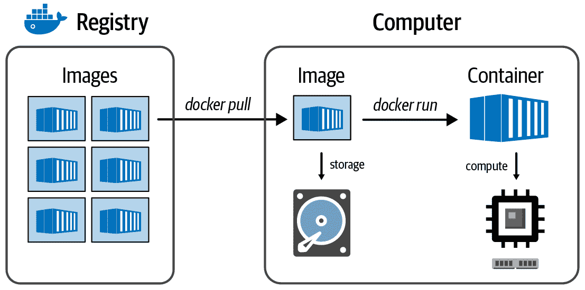
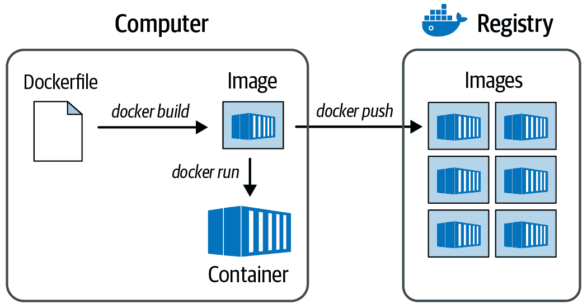

# 第三章：生命科学家的计算技术基础

在理想的世界里，当你追求研究时，你不需要太担心计算基础设施。事实上，在后面的章节中，我们会介绍一些专门设计的系统，以抽象掉计算基础设施的细枝末节，帮助你专注于科学研究。然而，在现实世界中，你会发现一定程度上无法避免某些术语和概念。投入一些精力学习它们将有助于你更高效地规划和执行工作，解决性能挑战，并以更少的努力实现更大的规模。在这一章中，我们回顾了构成最常见类型计算基础设施的基本组件，并讨论它们的优势和局限性如何指导我们在规模上高效完成工作的策略。我们还讨论了诸如并行计算和流水线处理等关键概念，这些概念在基因组学中是必不可少的，因为需要自动化和可重复性。最后，我们介绍了虚拟化技术，并提出了云基础设施的理由。

本章的前几节面向那些在信息学、编程或系统管理方面没有太多培训的读者。如果你是计算科学家或 IT 专业人员，请随意跳过，直到你遇到一些你还不知道的内容。最后两节，一起涵盖流水线处理、虚拟化和云计算，更专注于本书中我们解决的问题，应对不同背景读者都有益。

# 基础设施组件和性能瓶颈

别担心；我们不会让你详细列举计算机部件清单。相反，我们已经整理了一个关于你工作中最有可能遇到的组件、术语和概念的简短列表。针对每一个这些，我们总结了主要的性能挑战以及你可能需要考虑的使用策略。

让我们从科学计算中可能遇到的处理器类型的简要概述开始。

## 处理器硬件类型：CPU、GPU、TPU、FPGA、OMG

在其最简单的形式下，*处理器* 是计算机中执行计算的组件。有各种类型的处理器，其中最常见的是*中央处理单元*（CPU），它是一般用途计算机（包括笔记本电脑等个人电脑）的主要处理器。你笔记本电脑中的 CPU 可能有多个核心，可以更或多或少独立处理操作。

除了 CPU，你的个人电脑还有一个*图形处理单元*（GPU），用于处理屏幕上显示的图形信息。随着现代视频游戏的发展，GPU 开始受到关注，这些游戏需要极快的处理速度，以确保游戏动作的流畅视觉呈现。从本质上讲，GPU 解决方案将数学计算中涉及的矩阵和向量运算等特定类型的处理外包给了第二处理单元，后者专门处理某些类型的计算，这些计算对图形数据的应用非常高效。因此，GPU 也成为某些涉及大量矩阵或向量运算的科学计算应用的热门选择。

你应该了解的第三种处理器类型称为*现场可编程门阵列*（FPGA），尽管与*PU 命名惯例不同，但也是一种处理单元；然而，你不太可能在笔记本电脑中找到它。关于 FPGA 的有趣之处在于，与 GPU 不同，FPGA 并非为特定类型的应用而开发；相反，它们被开发为适应定制类型的计算。因此，“现场可编程”是它们名称的一部分。

在 GCP 上，你可能还会遇到一种称为*张量处理单元*（TPU）的处理器，这是谷歌为涉及张量数据的机器学习应用开发和品牌化的一种处理器。*张量*是一个数学概念，用于表示和操作与向量和矩阵相关的多层数据。考虑到向量是一个具有一维的张量，矩阵是一个具有两维的张量；更一般地，张量可以具有超过这些维度的任意数量的维度，因此它们在机器学习应用中非常受欢迎。TPU 属于一类称为[特定应用集成电路](https://oreil.ly/bz4mv)（ASIC）的处理器，这些处理器专为专用用途而设计，而不是通用用途。

现在你已经了解了基本类型的处理器，让我们来谈谈它们在典型高性能计算设置中是如何组织的。

## 计算组织的层次：核心、节点、集群和云

当你超越个人电脑，进入高性能计算领域时，你会听到人们谈论核心、节点，以及集群或云，如图 3-1 所示。让我们来回顾一下它们的含义以及它们之间的关系。

###### 图 3-1\. 计算组织的层次。

### 低级别：核心

一个*核心*是机器或节点处理器单元内最小的不可分割处理单元，可以由一个或多个核心组成。如果你的笔记本电脑或台式电脑相对较新，它的 CPU 可能至少有两个核心，因此被称为*双核*。如果有四个核心，它就是*四核*，依此类推。高端消费者机器可以拥有更多核心；例如，最新的 Mac Pro 有一个十二核的 CPU（如果我们遵循拉丁术语应称为十二核），而专业级机器上的 CPU 可以拥有数十个或数百个核心，而 GPU 通常有数千个核心。与此同时，TPU 的核心数目与消费者 CPU 相似，而 FPGA 则完全打破了模式：它们的核心是根据它们的编程方式定义的，而不是根据它们的构建方式。

### 中层：节点/机器

一个*节点*实际上只是集群或云中的一台计算机。它类似于我们日常工作中主要与之交互的笔记本电脑或台式电脑，但没有我们通常与个人计算机关联的专用监视器和外设。一个节点有时也简单地称为*机器*。

### 顶层：集群和云

集群和云都是机器/节点的集合。

一个*集群*是由节点部分网络连接在一起的 HPC 结构。如果你有权限访问一个集群，很可能是因为它属于你的机构，或者你的公司正在租用它。集群也可以称为*服务器农场*或*负载共享设施*。

一个*云*与集群不同之处在于，在其休眠状态下，其节点不是显式地网络连接在一起的。相反，它是一组独立的机器，根据需要可以进行网络连接（或不连接）。我们将在本章的最后一节中更详细地讨论这一点，同时讨论虚拟化的概念，它为我们提供了虚拟机（VM）和容器化，它为我们提供了 Docker 容器。

现在，我们转向如何有效使用给定的计算基础设施的非常普遍的问题，这通常涉及识别和解决关键的计算瓶颈。与本章的其余部分一样，深入探讨这个话题超出了本书的范围，所以我们的目标只是让你熟悉关键的概念和术语。

## 解决性能瓶颈

你会偶尔发现一些计算操作似乎很慢，需要找出如何让它们更快（如果可能的话）。可供选择的解决方案取决于你面对的瓶颈的性质。

在非常高的层次上，以下是计算机通常需要执行的主要操作（不一定是线性顺序）：

1.  从永久存储中读取一些数据到内存中

1.  让处理器执行指令，转换数据并生成结果

1.  将结果写回永久存储

### 数据存储和 I/O 操作：硬盘与固态

第 1 步和第 3 步被称为*I/O 操作*（I/O 代表输入/输出）。您可能会听到一些人将某些软件程序描述为“I/O 绑定”，这意味着程序中花费最长时间的部分是读取和写入数据到相对较慢的存储介质。这通常适用于执行简单任务的程序，比如文件格式转换，其中您只是读取一些数据并以不同的形式写出，而不进行任何真正的计算（即，几乎没有涉及数学）。在这些情况下，您可以通过使用更快的存储驱动器来加快操作速度；例如，固态驱动器（SSD）而不是硬盘驱动器（HDD）。它们之间的关键区别在于 HDD 具有称为盘片的物理磁盘和通过磁性从盘片读取数据并将数据写入盘片的臂，就像一个微型高科技唱片机一样，而 SSD 没有移动部件。这使得 SSD 不太容易发生物理故障，并且在访问数据时速度要快得多。

如果您正在使用网络基础架构，其中存储驱动器不直接连接到计算节点，您还将受到数据在网络连接上传输速度的限制。这可能由硬件因素决定，例如用于连接网络部件的电缆的种类。尽管在处理小文件时您可能不会注意到差异，但在运行整个基因组时，您肯定会注意到差异；即使在具有非常快传输速度的网络上，传输整个基因组也会消耗一些明显的时间。

### 内存：缓存或崩溃

第二步是你的程序正在获取数据并应用某种转换或计算的地方，也就是有趣的部分。对于许多应用程序，计算需要在内存中保存大量信息。在这些情况下，如果您的计算机内存不足，它可能会诉诸于*缓存*，这是一种使用本地存储空间作为真实内存替代品的方式。这使您可以继续工作，但现在您的进程变得 I/O 绑定，因为它们需要在慢存储介质之间来回复制数据，这会让您回到第一个瓶颈。在极端情况下，程序可能会无限期地停滞、无法完成或崩溃。有时，开发人员可以重写程序，使其更加智能地处理同时需要查看的信息，但当无法做到这一点时，解决方案就是简单地增加更多内存。幸运的是，与人类的记忆不同，计算机内存只是硬件，而且相对便宜。

### 专用硬件和代码优化：权衡导航

有时，程序的性质要求处理器本身进行大量的重活。例如，在广泛使用的 GATK 工具`HaplotypeCaller`中，一个操作可以计算基因型可能性；我们需要使用称为*PairHMM*的隐藏马尔可夫模型（HMM）来计算每个候选等位基因的每个序列读数的可能性（如果这一切听起来像无意义的话，请不要担心——这只是一堆基因组特定的数学）。在基因组的某些区域，这导致我们在非常多的位点上每个位点做数百万次计算。我们从性能分析测试中得知，这个工具中 PairHMM 明显是最大的瓶颈。我们可以通过一些表面级的方法减少这个瓶颈；例如，通过使程序跳过一些预测它们在无信息情况下将不必要的计算。毕竟，计算某事物的最快方式是根本不计算它。

懒惰只能让我们走到这一步，因此，要达到下一个层次，我们需要考虑我们可以（或应该）为需要完成的工作使用的处理器类型。不仅因为某些处理器运行速度比其他处理器快，还因为可以以非常特定于特定类型和架构的处理器的方式编写程序指令。如果做得好，程序在这种环境中将更加高效，因此运行速度更快。这就是我们所说的*代码优化*，更具体地说是*本地*代码优化，因为它必须用处理器“本地”理解的低级语言编写，而无需经过额外的翻译层。

在像 CPU 这样的处理器类型内部，不同的制造商（例如 Intel 和 AMD）为其产品的不同世代（例如 Intel Skylake 和 Haswell）开发了不同的*架构*，这些不同的架构提供了优化软件的机会。例如，GATK 软件包包括了几个对应于特定 Intel 处理器架构优化的 PairHMM 算法的替代实现的代码模块。当程序在 Intel 处理器上运行时，它会自动激活最合适的版本，这提供了一些有用的速度增益。

然而，硬件优化的好处在于处理器类型之间最为明显；例如，如果将某些算法的实现方式与在 FPGA 上运行相比较而实现的情况。Illumina DRAGEN 工具包（最初由 Edico Genome 开发）包括了像`HaplotypeCaller`这样的工具的实现，这些工具经过了优化，可以在 FPGA 上运行，因此比原始的 Java 软件版本快得多。

硬件优化实现的缺点在于，按定义需要专门的硬件。对于依赖于共享机构计算系统并且无法获得其他硬件的许多研究实验室来说，这可能是一个大问题。相比之下，像 GATK 这样用 Java 编写的应用程序可以运行在广泛的硬件架构上，因为 Java 虚拟机（JVM）将应用程序代码（在 Java 世界中称为*字节码*）转换为适合该机器的指令。Java 字节码与实际在机器上执行的内容之间的这种*关注分离*（SoC）称为*抽象层*，对所有参与者来说都非常方便。开发人员无需担心我们的笔记本电脑上具体的处理器型号，我们也不需要担心他们编写代码时考虑的处理器类型。这还保证软件可以轻松部署在标准的现成硬件上，使其可以被世界上任何人使用。

有时候，你需要根据你最看重的因素（包括速度、可移植性和互操作性）在同一算法的不同实现之间进行选择。其他时候，你可以同时兼得。例如，Broad Institute 的 GATK 团队已与 Illumina 的 DRAGEN 团队展开合作，两个团队正在共同努力制定统一的 DRAGEN-GATK 流水线，这将作为免费开源版本（通过 Broad 提供）和经许可的硬件加速版本（通过 Illumina 提供）提供。合作的一个关键目标是使两种实现在功能上等效——这意味着你可以运行任何版本，并在被认为是微不足道的误差范围内获得相同的结果。这将极大地使研究社区受益，因为可以将任一流水线分析的样本组合到下游分析中，而不必担心批次效应，我们在前一章节中简要讨论过的问题。

# 并行计算

当你不能更快时，就采用并行。在计算的背景下，*并行计算*或*并行性*是通过同时执行多个操作而不是顺序执行（即等待每个操作完成再开始下一个）来使程序尽快完成的一种方法。想象一下，你需要为 64 个人煮米饭，但你的电饭煲一次只能做够 4 个人吃的量。如果你需要依次煮所有批次的米饭，那将会花费整整一晚上。但如果你有八台电饭煲可以并行使用，你可以提前完成多达八倍的速度。

这是一个简单的想法，但它有一个关键要求：你必须能够将工作分解为可以独立执行的较小任务。将米饭分成部分很容易，因为米饭本身是一个离散单位的集合。但你并不总能做到这种分割：例如，一位孕妇需要九个月来孕育一个婴儿，但你不能让九个女人每人负责一个月来加快这个过程。

好消息是，大多数基因组分析更像是处理米饭而不是生婴儿——它们实际上由许多小独立操作序列组成，可以并行化。那么我们如何从煮米饭过渡到执行程序呢？

## 并行化简单分析

考虑到当您运行分析程序时，您只是告诉计算机执行一组指令。假设我们有一个文本文件，并且我们想计算其中的行数。执行此操作的指令可以简单如下：

> 打开文件；计算文件中的行数；告诉我们数量；关闭文件。

请注意，“告诉我们数量”可以意味着将其写入控制台或存储在某处以供以后使用——现在我们不要担心这个问题。

现在假设我们想知道每行的单词数。指令集如下：

> 打开文件；读取第一行；计算单词数；告诉我们数量；读取第二行；计算单词数；告诉我们数量；读取第三行；计算单词数；告诉我们数量。

一直这样做直到我们读取了所有行，最后我们可以关闭文件。这很简单直接，但是如果我们的文件有很多行，将会花费很长时间，而且可能不会充分利用我们可用的所有计算能力。因此，为了并行化这个程序并节省时间，我们只需将这组指令分割成独立的子集，就像这样：

+   打开文件；索引行。

+   读取第一行；计算单词数；告诉我们数量。

+   读取第二行；计算单词数；告诉我们数量。

+   读取第三行；计算单词数；告诉我们数量。

+   [对所有行重复。]

+   收集最终结果并关闭文件。

在这里，“读取第 *N* 行”的步骤可以并行执行，因为它们都是独立的操作。

你会注意到我们增加了一个步骤：“索引行”。这是一点预备工作，使我们能够并行执行“读取第 *N* 行”的步骤（或按任意顺序执行），因为它告诉我们有多少行以及每一行在文件中的位置。这使整个过程更加高效。正如您将在以下章节中看到的，像 GATK 这样的工具需要主数据文件（参考基因组、读取数据和变体调用）的索引文件。原因在于已经完成索引步骤，以便我们可以让程序通过它们在基因组中的位置查找特定数据块。

总之，这是一个一般的原则：你将你的线性指令集转化为若干子指令集。通常有一个子集需要首先运行，一个需要最后运行，但所有中间的子集可以同时（并行）运行，或者按照你想要的任何顺序运行。

## 从核心到集群和云：多层次并行性

那么，我们如何从电饭锅到并行化执行基因组分析程序？总体而言，并行化计算操作的行动包括将我们想要完成的工作的子集发送到多个核心进行处理。我们可以通过将工作分配到单个多核机器的核心之间分割工作，或者如果我们可以访问集群或云，则可以将工作分发到其他机器。事实上，我们可以结合这两个想法，并将工作分派给多核机器，在这些机器的每个核心中进一步分割工作。回到煮饭的例子，这就好像不是自己做饭，而是雇用一个餐饮公司为您做饭。公司把工作分配给几个人，每个人都有自己的烹饪站，有多个电饭锅。现在，您可以在同样的时间内喂更多的人！而且您甚至不需要洗碗。

无论我们想要将工作分配到单台机器的多个核心上，还是跨多台机器分配工作，我们都需要一个系统来分割工作，分派执行任务，监控任务完成情况，然后编译结果。有几种系统可以做到这一点，大致分为两类：内部或外部于分析程序本身。在第一种情况下，并行化发生在我们运行的程序“内部”：我们运行该程序的命令行，而并行化无需我们额外的“包装”。我们称之为*多线程*。在第二种情况下，我们需要使用一个单独的程序来运行该程序的多个实例的命令行。外部并行化的一个例子是编写一个脚本，分别在基因组中的每条染色体上运行给定工具，然后通过额外的合并步骤组合结果。我们称之为*散集-收集*。在下一节介绍工作流管理系统时，我们将更详细地讨论这一点。在图 3-2 中，您可以看到我们如何在分析过程中使用多线程和散集并行性。

###### 图 3-2\. 散集允许在不同的 CPU 核心上并行执行任务（在单台机器或多台机器上，具体取决于实现方式）。

## 并行性的权衡：速度、效率和成本

并行化是加速大量数据处理的一个很好的方法，但它有额外的开销。在这一点上不要过于技术化，我们只需说并行化的作业需要被管理，需要为它们保留内存，调节文件访问，收集结果等等。因此，平衡成本与收益非常重要，并避免将整体工作分解为过多的小作业。回到我们之前的例子，你不会想使用一千个只煮一粒米的小型电饭煲。它们会占用你台面上太多的空间，而且分发每一粒米并在煮好后收集它所需的时间将使并行化的任何好处都荡然无存。

更一般地说，虽然把并行视为加快速度的一种方式很诱人，但重要的是要记住，速度的印象完全取决于观察者的主观感受。实际上，每个数据片段上运行的计算并没有变得更快。我们只是同时运行更多计算，并且受到我们计算设置的并行能力（通常以节点或核心数来衡量）以及像 I/O 和网络速度这样的硬件限制的限制。更现实的是，把并行视为一种优化可用资源的方式，以便更快地完成任务，而不是让单个任务运行得更*快*。

这种区分在键盘前的人来看，这种区分可能显得很迂腐，因为经过的时间（通常称为*挂钟时间*；即“墙上时钟显示的时间”）较短。这不就是我们所理解的“更快”的方式吗？但是，从我们利用的资源的角度来看，如果我们将所有核心的计算时间相加，我们可能会发现整个作业花费的时间*更多*，因为有额外的开销。

这带来了另一个重要问题：利用这些资源的经济成本是多少？如果我们使用的是专用机器，这台机器只是坐在那里，有多个核心，而没有其他事情可做，那么并行化仍然绝对值得，即使有额外的开销。我们将希望在这台机器上对我们做的每一件事情进行大量并行化，以最大化效率。然而，当我们开始在云环境中工作，正如我们在第四章中所做的那样，并且我们需要按照使用的资源来付费时，我们将更仔细地考虑最小化挂钟时间和账单大小之间的权衡。

# 并行化用于并行化和自动化流水线

许多基因组分析涉及大量例行数据处理操作，需要并行化以提高效率，并自动化以减少人为错误。我们通过描述可由机器读取的工作流程来实现这一点，然后将其馈送到工作流程管理系统进行执行。我们将在第八章中详细讨论其实际运作，但首先让我们通过介绍基本概念、定义和关键软件组件来为此做好准备。在我们进行时，请记住，当前领域并不存在一种适合所有情况的解决方案，最终选择特定选项取决于您审查需求和可用选项。然而，我们可以确定一般原则来指导您的选择，并展示这些原则在实际中如何运作，使用由 GATK 开发团队推荐并在 Broad Institute 生产中使用的开源流水线解决方案进行演示。与本书的大部分内容一样，这里的目标不是指定使用特定软件，而是通过工作示例展示所有这些如何实际运作。

一个棘手的问题是，在生物信息学领域，我们有数十种脚本语言和工作流程管理系统可供选择——如果您看更广泛的领域，可能会有数百种。直接比较它们可能会很困难，因为它们往往是为特定类型的用户群体开发的，导致用户体验的模式非常不同。它们通常针对特定用例进行调优，有时还优化以在特定类别的基础设施上运行。我们经常看到一个解决方案对一个群体而言是首选的，但对另一个群体使用起来可能特别困难或令人沮丧。这些不同的解决方案通常也不具备互操作性，这意味着您不能将为一个工作流程管理系统编写的工作流脚本未经修改地运行在另一个系统上。这种缺乏标准化是人类已知的几乎每个研究领域的一个幽默和绝望的话题，正如在图 3-3 中所说明的那样。

###### 图 3-3\. XKCD 漫画，讨论标准的扩散（来源：https://xkcd.com/927）。

近年来，我们看到一些备受关注的倡议，如全球联盟 GA4GH 的出现，明确任务是制定共同标准并围绕一组具有互操作性作为核心价值的解决方案进行整合。例如，GA4GH 云工作组已经就其驱动项目的一小组工作流语言达成一致，包括 CWL、Nextflow 和 WDL，这些语言在本书中使用。同时，鉴于没有单一语言可能满足所有需求和偏好的认识，一些团体正在努力通过将对多种工作流语言的支持集成到其工作流管理系统中来增加互操作性。本书中使用的工作流管理系统 Cromwell 支持 WDL 和 CWL，未来还可以扩展支持其他语言。

## 工作流语言

原则上，我们可以用几乎任何编程语言编写我们的工作流；但实际上，有些编程语言比其他语言更适合描述工作流。就像自然语言一样，编程语言也展现出令人着迷的多样性，并且可以按照语法、执行方式以及支持的编程范式等方式进行分类。

从实际角度出发，我们首先要区分通用编程语言和领域特定语言（DSLs）。通用编程语言旨在可用于各种应用程序，而 DSLs 则是专门为特定领域或活动设计的，正如其名称所示。后者通常预装有特别制定的数据结构（即表示和操作数据的方式，“理解”底层信息的性质）和方便函数，作为快捷方式；例如，处理特定领域的文件格式，应用常见处理操作等。因此，如果您的需求与语言的预期范围非常匹配，尤其是在计算背景有限的情况下，DSL 可能是一个吸引人的选择，因为 DSL 通常使您能够在不必学习大量编程概念和语法的情况下完成工作。

另一方面，如果您的需求更加多样化，或者您习惯于使用通用语言的更广泛工具箱，那么您可能会感到领域特定语言的限制让您感到不适。在这种情况下，您可能更喜欢使用通用语言，尤其是那些丰富了领域特定库的通用语言，提供相关的数据结构和便利功能（例如，带有 Biopython 和相关库的 Python）。事实上，使用通用语言更有可能使您能够使用相同的语言编写数据处理任务本身，并管理操作流程，这正是许多人传统上进行此类工作的方式。然而，我们现在在这个领域看到的趋势是，一种向描述和内容分离的趋势，这体现为特别设计用于描述工作流程以及专门的工作流管理系统的 DSL 的增加采用。这种进化与推动互操作性和可移植性的努力密切相关。

## 流行的基因组学流水线语言

当我们看到那些位于生物信息学和基因组学交汇点的人群时，我们看到了各种背景、计算经验和需求的广泛范围。有些人来自软件工程背景，更喜欢功能齐全、高度结构化的语言，虽然强大但可访问性较差。有些人来自系统管理领域，认为一切问题都可以通过巧妙应用 Bash、sed 和 awk 来解决，这些在 Unix 世界中像胶带一样。在“生物”这一边，更多计算训练有素的人通常最喜欢分析师钟爱的 Python 和 R，这两者在逐渐取代老牌经典 Perl 和 MATLAB；一些人还倾向于领域特定语言。与此同时，湿实验室训练的研究人员可能在初次接触时对所有这些感到困惑。（作者注及免责声明：杰拉尔丁自认为最初感到困惑之一，曾接受传统微生物学训练，并最终在逃离湿实验室工作台时学习了 Perl 和 Python 的基础知识。剧透：这行得通了！）

根据最近的调查，基因组学空间中最受工作流程作者欢迎的语言包括 SnakeMake 和 Nextflow。这两者以其高度灵活性和易用性而闻名。同样，CWL 和 WDL 也因其专注于可移植性和计算再现性而受到青睐。在这两者中，CWL 更常被技术背景的人士偏爱，因为它具有高度的抽象和表现力。相反，WDL 一般认为更易于广泛受众接受。

最终，在选择工作流语言时，我们考虑了四个主要标准：语言支持的数据结构类型（即我们如何表示和传递信息），它如何使我们控制操作流程，它对目标读写者的可读性和可写性如何，以及它如何影响我们与他人协作的能力。无论我们选择什么，都不太可能满足每个人的需求。然而，如果我们把所有这些总结成一个建议，那就是：如果你希望你的工作流脚本在你的研究领域被广泛使用和理解，选择一种对新手开放和易于理解，同时又能够满足更高级需求的语言。当然，尽量选择一种能够在不同的工作流管理系统和计算平台上运行的语言，因为你永远不知道你或你的合作者下一步会进入什么环境。

## 工作流管理系统

许多工作流管理系统存在，但总体上它们遵循相同的基本模式。首先，工作流引擎读取并解释工作流脚本中的指令，将指令调用转换为与一系列输入相关联的可执行作业（包括数据和参数）。然后，它将每个带有其输入列表的作业发送给另一个程序，通常称为*作业调度程序*，负责在指定的计算环境上编排实际工作的执行。最后，在作业完成时，它检索生成的任何输出。大多数工作流管理系统都具有一些用于控制执行流程的内置逻辑；即它们调度作业的顺序以及确定它们如何处理错误并与计算基础设施通信。

增加分析的可移植性和互操作性的另一个重要进步是容器技术的采用，我们在本章的最后一节中详细介绍。现在，可以假设容器是一种机制，允许您封装特定任务的所有软件要求，从操作系统（OS）的最深层次到库导入、环境变量和辅助配置文件。

# 虚拟化与云

到目前为止，我们一直假设，无论您是在单台计算机上还是在集群上工作，您都在处理“真实”的物理机器，每台机器都设置有特定的操作系统和软件堆栈，如图 3-4 A 所示。不幸的是，与这种类型的系统交互有几个缺点，特别是在像机构集群这样的共享环境中。作为终端用户，您通常没有选择关于操作系统、环境和已安装的软件包。如果您需要使用一些当前不可用的东西，您可以请求管理员安装它，但他们可能会拒绝您的请求或您想要的软件包可能与现有软件不兼容。对于位于帮助台另一侧的系统管理员来说，跟踪用户需求、管理版本并处理兼容性问题可能是一件头疼的事情。这些系统需要努力进行更新和扩展。

这就是为什么大多数现代系统使用不同程度的*虚拟化*，这基本上是一种巧妙的抽象，通过虚拟机（VM）和容器使得在同一硬件上运行多个不同的软件配置成为可能，如图 3-4 B 和 C 所示。这些构造可以在许多情境下使用，包括在本地系统上选择性地（你甚至可以在笔记本电脑上使用容器！），但它们对于云基础设施来说绝对是必不可少的。

###### 图 3-4\. A) 安装在物理机上的软件堆栈；B) 托管多个 VM 的系统；C) 托管多个容器的系统。

## VM 和容器

虚拟机（VM）是一个基础设施级别的构造，包括其自己的操作系统。VM 位于运行在底层物理机实际操作系统上的虚拟化层之上。在最简单的情况下，VM 可以在单个物理机上运行，使得该物理机效果上成为多个共享底层资源的服务器。然而，最强大的系统利用多个物理机来支持 VM 层，它们之间有一个复杂的层来管理物理资源的分配。好消息是，对于终端用户来说，这并不会有任何区别——你只需要知道你可以与特定的 VM 隔离地交互，而不用担心它的底层环境。

容器在原理上类似于虚拟机，但它是一个应用级的构造，更轻量且更便携，意味着可以轻松部署到不同的站点，而虚拟机通常与特定位置的基础设施绑定。容器旨在捆绑运行特定程序或一组程序所需的所有软件。这使得在任何支持运行容器的基础设施上复制相同的分析变得更加容易，无论是从你的笔记本电脑到云平台，都不必去辛苦识别和安装所有涉及的软件依赖关系。你甚至可以在同一台机器上运行多个容器，因此如果需要运行具有不兼容系统要求的程序，可以轻松切换不同的环境。

如果你在想：“这两个听起来都很不错；我应该使用哪一个呢？”好消息是你可以同时结合使用，如图 3-5 所示。

###### 图 3-5\. 一个有三个虚拟机的系统：左边的虚拟机正在运行两个容器，为 App #1 和 App #2 提供服务；中间的虚拟机正在运行一个容器，为 App #3 提供服务；右边直接为 App #4 提供服务（没有容器）。

有几个注册表可用于共享和获取容器，包括[Docker Hub](https://hub.docker.com)，[Quay.io](https://quay.io)和[GCR](https://cloud.google.com/container-registry)，谷歌在 GCP 中的通用容器注册表。在注册表中，容器被打包成一个*镜像*。请注意，这与图片无关；这里的*镜像*一词在软件特定的语境中使用，指的是一种特殊类型的文件。你知道有时候当你需要在电脑上安装新软件时，下载的文件被称为*磁盘镜像*吗？这是因为你下载的文件是以一种格式存在，你的操作系统会把它当作是你机器上的一个物理磁盘。这基本上是一样的道理。要使用一个容器，你首先告诉 Docker 程序从注册表（例如，Docker Hub，稍后详细介绍 Docker）下载或*拉取*一个容器镜像文件，然后告诉它初始化容器，概念上等同于启动一个虚拟机。容器运行后，你可以在其中运行安装在其系统上的任何软件。你还可以根据需要安装额外的软件包或进行额外的配置。Figure 3-6 说明了容器、镜像和注册表之间的关系。

###### 图 3-6\. 注册表、镜像和容器之间的关系。

最广泛使用的容器系统品牌是由同名公司生产的 Docker。由于 Docker 的普及，人们通常会说“一个 docker”而不是“一个容器”，就像“xerox”在美国成为“复印机”的替代品一样，因为 Xerox 公司的主导地位。然而，小写*d*的`docker`也是您在本地安装以运行 Docker 容器的命令行程序。类似地，尽管将软件工具、包或分析打包到 Docker 容器中的行为应该被称为“containerizing”，但人们经常称之为“dockerizing”，比如，“我 dockerized 我的 Python 脚本”。Docker 化一个工具涉及编写一个称为 Dockerfile 的脚本，描述构建 Docker 镜像所需的所有安装和环境配置，如图 3-7 所示。

###### 图 3-7\. 创建 Docker 镜像的过程。

正如前面提到的，可以在各种环境中使用容器，包括本地机器、HPC 和云计算。一个重要的限制是，Docker 通常不允许在共享环境中使用，比如大多数机构的 HPC，因为它需要一个称为*root*的非常高级别的访问权限。在这种环境中，系统管理员会更倾向于使用*Singularity*，这是一个能达到相同效果的替代系统。幸运的是，可以在 Singularity 系统中运行 Docker 容器。

## 介绍云计算

最后，我们来到许多人都在等待的话题：云究竟是什么？令人惊讶的简单答案是，云计算就是一堆可以租用的计算机。在实践中，这意味着作为用户，您可以轻松启动一个虚拟机，并选择需要多少 RAM、存储空间和 CPU。您需要一个带有 1TB RAM 和 32 个 CPU 用于基因组装的虚拟机？没问题！大多数云中的虚拟机都运行某种形式的 Linux 作为操作系统，您可以在启动时选择，并且通常通过安全外壳（SSH）远程访问。

虽然一些虚拟机（VMs）包含免费存储空间，但这通常是暂时的，当您停止和启动虚拟机时会消失。相反，使用块存储（持久设备）来存储数据、脚本等内容在您的虚拟机上。您可以把它们想象成 USB 闪存驱动器，可以随时“插入”到您的虚拟机中。即使终止虚拟机，块存储上的文件也会安全保存。文件也可以存储在对象存储中——把它想象成更像是 Google Drive 或 Dropbox，多个虚拟机可以同时读写文件，但您通常不会把它们当作普通的文件系统使用。相反，它们更像是用于在虚拟机之间共享文件的 SSH 文件传输协议（SFTP）服务器，您可以通过实用工具在对象存储系统之间传输文件。云的最后一个基本组成部分是网络。通过虚拟网络服务，您可以控制谁可以访问您的虚拟机，严格锁定以确保只有您（或其他受信任的人）能够访问。

### 云不是松软的

当您想到云时，它们是松散、遥远和难以捉摸的，根本不是您可以触摸、感受和捕捉的实体。与其同名相比，今天大多数人直接（或间接）使用的云基础设施最终由真实的物理计算机组成，这些计算机装在巨大的数据中心中不停地闪烁。然而，与以往的计算模型不同（也符合其名称），云计算具有短暂的特性。就像云朵的出现和消失一样——突然出现、释放雨水，然后迅速消散——云计算对最终用户而言也是短暂的。云允许您作为研究人员、开发人员或分析师在需要时请求计算基础设施，在需要时使用它进行计算，然后在完成后释放所有资源。

这种方法很棒，因为它节省了时间和金钱，您可以一次性启动大量资源，完成工作后再关闭它们，节省连续运行硬件的成本。您不需要过多地考虑服务器放置在何处、它们的配置方式、硬件的健康状况、功耗或其他各种基础设施问题。这些都被从您身上“抽象化”出去，并且在您无需过多考虑的情况下得到照顾。相反，您应该关注的是您需要执行的计算工作、完成它所需的资源以及如何从时间和金钱的角度最有效地利用这些资源。

### 云基础设施和服务的演变

亚马逊于 2006 年推出了第一个广泛成功的商业公共云服务，但这个基本概念已经存在了很长时间。上世纪 60 年代，大型机通常是租用使用的，考虑到购买和运营的巨大成本，这是非常合理的做法。尽管个人电脑的发明，租用计算基础设施的概念在过去几十年中一再出现。在学术界和行业中，上世纪 90 年代和 2000 年代共享网格计算的概念是租用大型机时间的更现代等价物。团体联合建立了廉价但功能强大的基于 Linux 的高性能计算集群，通常是集中管理，并根据某种财务分割分配给多个团体。

当今的公共云在抽象级别上有所不同。因此，采用了蓬松、无定形的名称来反映这样一个事实：在云上运行大规模分析时，并不需要理解底层细节。在使用特定云服务时，你可能知道托管基础设施的大致地理位置（例如，AWS 的`us-east-1`位于北弗吉尼亚），但许多细节对你是隐藏的：你不知道有多少人正在使用你的虚拟机的基础硬件，数据中心真正的位置在哪里，网络如何设置等等。你所知道的是影响服务成本和作业执行时间的关键细节，比如有多少个 CPU 可用，虚拟机有多少 RAM，文件存储系统的正常运行时间保证，以及系统符合的法规。

现在有许多公共云提供商，即任何能够支付服务费用的人都可以使用的云服务。目前在西半球最主要的有 AWS、微软 Azure 和 GCP。每个提供商都提供类似的服务组合，从按小时（或分钟）租用的简单虚拟机，文件存储服务和网络服务到更专业的服务，比如谷歌的云 TPU 服务，用于加速机器学习操作。然而，重要的特点是这些资源作为服务提供：你根据需要使用，按小时、分钟、秒或 API 调用收费。

### 云的优缺点

许多人在讨论云计算时指出的一个主要优势是成本。建设数据中心时，固定成本是巨大的。您必须雇佣人员来安装和维护物理服务器，监视网络以防入侵，处理电力波动，备份，空调等等。说实话，这是一项繁重的工作！对于支持数百用户的数据中心，维护基础设施所需的成本可能是值得的。但许多研究人员、开发人员、分析师和其他人意识到，他们并不需要始终拥有数百台随时可用和运行的计算机，只等待任务。相反，使用云环境更合理，您可以在笔记本电脑上进行本地工作，无需大量资源，然后在分析完成时，可以扩展到数百甚至数千台机器。商业公共云允许您轻松地*扩展*您的容量，并在需要时进行大规模分析，而不是等待几周、几个月甚至几年才能完成专用本地集群的任务。同样，您无需为本地基础设施的维护支付所有时间，用于开发算法和本地完善分析。

最后，作为公共云用户，您对环境拥有完全控制权。需要特定版本的 Python 吗？是否有一个怪异的库，只有在安装了非常特定的工具链时才能编译？没问题！云允许您完全控制您的虚拟机，这是共享本地基础设施永远不允许的。即使在拥有此控制权时，遵循云供应商的最佳实践设置后，公共云解决方案由于在这些环境中专门用于安全服务的大量资源以及虚拟化所提供的用户隔离，通常比本地基础设施更安全。

尽管公共云平台令人惊叹、强大、灵活，而且在许多情况下，可以有效地节省大量资金，但也有一些需要注意的缺点。如果您希望始终处理您的测序组每月生成的固定数量的基因组，公共云可能不太吸引人，构建一个小型的本地计算环境以处理本地产生的这种非常可预测的工作负载会更有意义。当然，这是在假设您有能够充当管理员的 IT 专业人员的情况下。另一个考虑因素是专业知识。使用云计算需要一定水平的专业知识，一个毫无戒心的新手用户可能会意外使用具有弱密码的虚拟机，设置具有弱安全性的数据存储桶，以不安全的方式共享凭据，或在管理一群 Linux 虚拟机的过程中完全迷失方向。然而，即使存在这些潜在的缺陷，对于许多人来说，能够在商业云环境中灵活工作的好处通常超过了这些负面影响。

## 云服务的研究用例类别

之前章节描述的云基础组件实际上只是冰山一角。主要商业云平台上提供了许多更多的服务。事实上，有太多服务了，一些是通用的，一些是特定于某个云的，我们无法在这里详细描述。但让我们看看研究人员可能如何最常用到这些服务或云。表格 3-1 提供了一个总体概述。

表格 3-1\. 云基础设施使用类型概述

| 使用类型 | 云环境 | 描述 | 优点 | 缺点 |
| --- | --- | --- | --- | --- |
| 轻量级开发 | Google Cloud Shell | 使用一个简单启动的免费虚拟机编辑代码和脚本 |

+   免费

+   启动和登录极为简单

|

+   虚拟机极为有限

|

| 中级分析和开发 | 单个虚拟机 | 启动单个虚拟机，登录，进行开发和分析工作 |
| --- | --- | --- |

+   可以控制启动的虚拟机上的资源

+   虚拟机可以足够强大以执行实际分析

|

+   启动虚拟机需要更多配置

+   更大的虚拟机会增加成本

|

| 批量分析 | 通过批处理系统多个虚拟机 | 使用类似 AWS Batch 或 Google Cloud Pipelines API 这样的系统启动多个虚拟机并行分析数据 |
| --- | --- | --- |

+   允许并行、扩展的分析

+   工作流管理系统如 Cromwell 支持这些操作而不需要太多努力

|

+   成本和复杂性增加

|

| 框架分析 | 通过框架多个虚拟机 | 使用 Spark、Hadoop 或其他框架进行数据分析 |
| --- | --- | --- |

+   这些框架允许进行专业分析

|

+   成本和复杂性增加

|

### 轻量级开发：Google Cloud Shell

云是软件开发的绝佳场所。尽管许多研究人员可能会想要使用自己的笔记本电脑或工作站进行开发，但使用云作为主要开发环境，特别是用于测试，确实有一些非常引人注目的理由。例如，在 GCP 上，您可以从 Google Cloud 控制台中使用 Google Cloud Shell 进行轻量级开发和测试。这是一个免费（是的，*免费*！）的虚拟机，拥有一个虚拟 CPU 核心和 5 GB 存储空间，您只需点击 Web 控制台中的终端图标即可使用。这是进行轻量级编码和测试的绝佳环境；只需记得将代码从您的免费实例中复制出来（例如使用 Git），因为每周的总运行时间有限制，而且如果您一段时间不使用该服务，您的 5 GB 存储空间可能会被清理掉。尽管如此，这仍然是快速开始使用云并执行轻量级任务的绝佳选择。您只需一个 Web 浏览器，而且 GCP 工具已预先安装和配置好。许多其他您可能想要使用的工具也已经安装好，包括 Git 和 Docker，以及像 Java 和 Python 等编程语言。您将有机会在下一章的早期尝试它。

### 中级开发和分析：单个虚拟机

尽管 Google Cloud Shell 非常适合许多用途，易于使用且免费，但有时您可能需要更多的计算能力，特别是如果您想测试您的代码或在更大的规模上进行分析，因此您会启动自己的专用虚拟机。这可能是最常用的选项之一，因为它结合了灵活性和简单性：您可以自定义您的虚拟机，确保具有足够的 CPU 核心、RAM 和本地存储来完成您的目标。与 Google Cloud Shell 不同，您必须为每小时或每分钟运行此虚拟机支付费用；但是，您可以完全控制虚拟机的性质。您可以将其用于软件或算法开发，测试您的分析方法，或者在多个虚拟机上同时运行小型虚拟机群来执行分析。然而，请记住，如果您手动启动这些虚拟机，它们将预先安装的工具较少，并准备好供您使用。这使得使用 Git 和 Docker 等实用工具非常有助于将您的分析任务从一个虚拟机转移到另一个虚拟机。您将有机会在第四章到第七章中广泛使用这些工具。

### 批处理分析：通过批处理服务使用多个虚拟机

对于大多数了解这一点的用户来说，这种方法确实是最合适的选择。尽管您可以使用笔记本电脑或 Google Cloud Shell 进行软件和脚本开发，并在适当大小的硬件上测试它们，甚至可以使用一个或多个虚拟机进行测试，但如果您的目标是扩展分析，最终您可能不希望手动管理虚拟机。想象一下同时运行 10,000 个基因组比对任务；您需要能够批量处理工作、自动为您提供虚拟机，并在工作完成后自动关闭虚拟机的系统。批处理系统专门设计用于此任务；例如，Google Cloud 提供了 Google Cloud Pipelines API，您可以使用它同时提交大量批处理作业。该服务将负责启动大量虚拟机来执行您的分析，然后在收集输出文件后自动清理它们。如果您需要对大量样本进行非交互式分析，这将非常方便。您将在第八章到第十一章中看到像 Cromwell 这样的工作流引擎是如何利用这些批处理服务的，这些服务负责处理启动批处理作业的所有细节。这使得您能够更容易地专注于正在执行的分析细节，而不是涉及的基础设施。

### 框架分析：通过框架服务使用多个虚拟机

许多研究人员最终采用的方法是交互式迭代分析。在基因组学中，您可以使用批处理系统进行大规模比对和变异调用，但在获取变异的 VCF 文件后，您可能选择迁移到 Spark 集群、RStudio、Jupyter Notebook 或任何大量分析环境中进行后续分析。在第十二章中，我们探讨了在 Terra 中的运作方式，您可以利用它轻松创建用于数据处理的自定义环境，使用 Jupyter 界面进行交互式分析，生成出版物的图表，并与他人分享结果。

# 结尾与下一步

在本章中，我们完成了引导性主题，为您提供了基因组学（第二章）和计算技术（本章）的背景。我们深入探讨了计算机硬件、并行计算和虚拟化的细节，并为您展示了使用工作流执行系统在云上扩展分析的强大能力。在第四章中，我们迈出了云环境的第一步，并向您展示了如何在 GCP 上运行自己的虚拟机。
