# 第七章：GATK 体细胞变异发现的最佳实践

在本章中，我们将讨论体细胞变异的发现，主要是在癌症研究中的应用。这将引入新的挑战，相应地，也将带来新的实验和计算设计。我们从体细胞短变异开始，这些变异与生殖细胞的短变异仍然有很多共同点，但也有足够的新挑战来保持事情的趣味性。然后我们扩展视野，包括拷贝数变异，这需要与我们迄今为止采取的方法大不相同。

# 癌症基因组学中的挑战

在我们深入探讨之前，让我们明确一件事：与癌症相关的所有事情都更加困难。考虑在肿瘤甚至开始发展之前，在身体中正在发生的事情。我们体内的活细胞并非静态；它们具有新陈代谢活跃，吸收营养，进行工作，并排出废物。其中一些以各种速率分裂。酶正在解开 DNA 以转录它和/或复制并重新包装它。在单个细胞的尺度上，这些分子交易中极少有错，但因为这在数百万个细胞中随时都在发生，所以数目上积累了许多小错误，导致全面的突变。

大多数情况下，这些突变根本没有可察觉的影响。但是偶尔会出现一种突变，使受影响的细胞的代谢不稳定，导致其开始更快地分裂并产生肿瘤。但这还不是癌症；我们体内的大多数肿瘤仍然相对局限和无害。然而，有些肿瘤随后经历其他的不稳定性突变，引发一连串反应，导致癌症的发展，包括侵袭性生长，最坏的情况下还可能发生*转移*：向身体的其他部位扩散。推动这种进展的突变事件通常被称为*驱动突变*，与其他被称为*乘客突变*的突变形成对比。在癌症研究中，驱动突变通常是体细胞分析的主要焦点。

这里的困难在于随着肿瘤的进展，各种代谢功能开始崩溃，细胞失去修复受损 DNA 的能力。因此，突变事件的频率增加，变异在多种不同的细胞系中积累，产生高度异质的环境。当病理学家取样肿瘤组织时，他们得到的是多种细胞系的混合物，而不是健康组织中你所期望的主要是单克隆细胞的群体。

这对检测体细胞变异是一个巨大的问题，因为依赖于我们取样时肿瘤组织的内部状态，由驱动突变引起的变异可能仅占总基因组材料的一小部分。最直接的后果是，我们不能允许变异调用程序对我们预期发现的变异等位基因分数做出任何假设。这与生殖系情况形成了很大差异，其中变异等位基因分数应大致遵循有丝分裂体的多倍性。这就是为什么我们在体细胞与生殖系变异发现分析中使用不同的变异调用程序的原因，这些程序在底层使用不同的算法来模拟数据中的基因组变异。

此外，采样过程本身引入了混淆因素。根据病理学家的技能、肿瘤进展的阶段和生物组织类型的影响，我们可能会得到一种被健康“正常”细胞污染的肿瘤样本。相反，如果我们能够获得*匹配的正常样本*，即来自同一人的假定健康组织的样本—事实上，该样本可能受到低水平肿瘤细胞的污染，如图 7-1 所示。

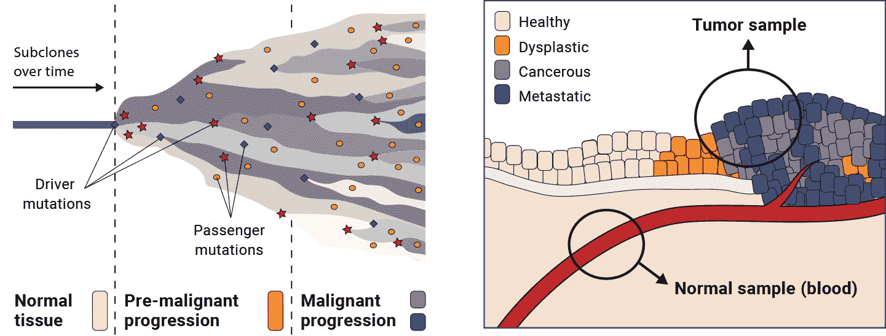

###### 图 7-1\. 肿瘤进展导致异质性（左）；取样困难（右）。

所有这些对体细胞变异分析的实际影响是，我们的工作必然对污染源和误差非常敏感，因为我们试图检测的信号远低于数据中存在的噪音，特别是在晚期癌症的情况下尤为如此。

# **体细胞短变异（SNV 和 Indels）**

让我们开始探索体细胞变异调用与短变异—SNV 和 indels。如果您已经阅读了第六章，这里涵盖的一些核心概念应该会让您感到耳熟能详，事实上，一些工具和底层算法也是相同的。与之前一样，我们将查看大量阅读材料及其确切序列，以识别替代和小插入及删除。

然而，我们实际遵循的基本实验设计却有很大不同。在生殖系变异发现中，我们主要关注的是在某些人中存在而在其他人中不存在的变异，这导致我们偏爱联合调用方法。在体细胞变异发现中，我们主要寻找的是来自同一人的样本之间的差异，因此我们将把焦点转移到另一种范式：*肿瘤-正常* 对分析。

在癌症背景下，识别体细胞短变异的最有用信息来源是将肿瘤与同一个体的健康组织样本进行比较，正如我们之前提到的，这称为*匹配正常*，通常简称为*正常*。这里的思想是，在正常样本中观察到的任何变异都是个体的生殖基因组的一部分，可以排除为背景，而在肿瘤样本中观察到的任何在正常样本中不存在的变异更可能是体细胞突变，正如图 7-2 所示。

不幸的是，一些混淆因素使情况变得更加复杂。例如，用福尔马林和石蜡保存的活检样本（FFPE，指福尔马林固定石蜡包埋），这是一种广泛使用的实验室技术，会在样本制备过程中发生生化改变，导致对肿瘤样本特定的假阳性变异调用模式。相反，正常组织中存在肿瘤细胞（无论是在取样过程中污染还是转移扩散过程中）可能会导致真正的体细胞变异被错误地认定为个体的生殖系变异。最后，正如我们之前讨论的，各种技术错误和污染源对所有高通量测序技术都会产生一定程度的影响，对体细胞变异调用的影响会更大一些。因此，我们需要应用一些强大的处理和过滤技术来减轻所有这些问题。（总体工作流程如图 7-3 所示。）

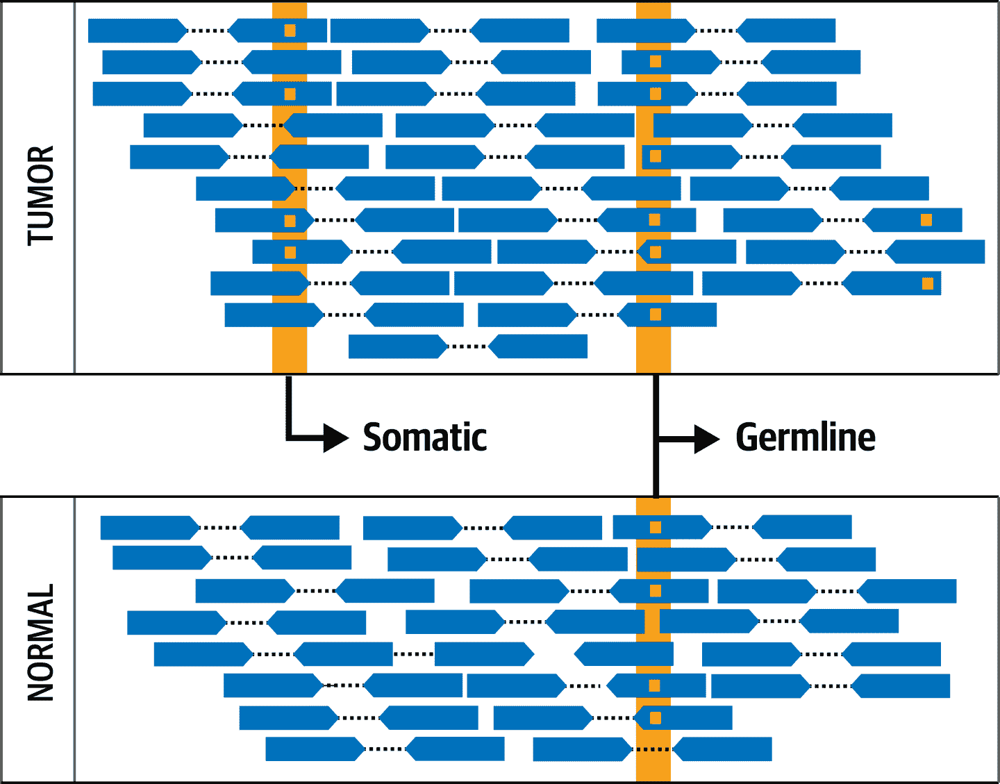

###### 图 7-2\. 肿瘤-正常比较的基本概念。

在下一小节详细介绍肿瘤-正常工作流程之前，重要的是要注意，有时候不可能对样本或一组样本应用完整的肿瘤-正常对分析，通常是因为我们没有为它们准备匹配的正常样本。当这种情况发生时，特别是因为调查者未能从参与者或患者那里收集到匹配的正常样本时，情况就会变得非常令人沮丧。这些案例突显了在进行数据收集之前，研究人员确保绘制出完整的分析方案的重要性。另一方面，在某些情况下，从生物学角度来看，获取匹配的正常样本是不可能的；例如，血液源性癌症通常能够影响身体的每个组织，因此我们不能假设任何组织样本都能构成适当的正常样本。

无论缺乏匹配正常样本的原因是什么，我们在下一小节中介绍的工作流程可以在仅进行少量修改的情况下应用于肿瘤样本，这些修改在在线 [GATK 文档](https://oreil.ly/ZgIrB) 中有详细说明。然而，您应该意识到结果必然会更加嘈杂，因为您将依赖于种群资源来排除个体自身的基因组。

## 肿瘤-正常配对分析工作流程概述

这个工作流程，如 图 7-3 所示，旨在应用于肿瘤样本及其匹配的正常样本。我们可以同样应用于全基因组数据以及外显子组数据，但是肿瘤和正常样本必须是相同的数据类型，并且经过相同的预处理工作流程，就像我们为配对的基因组变异发现所描述的那样。

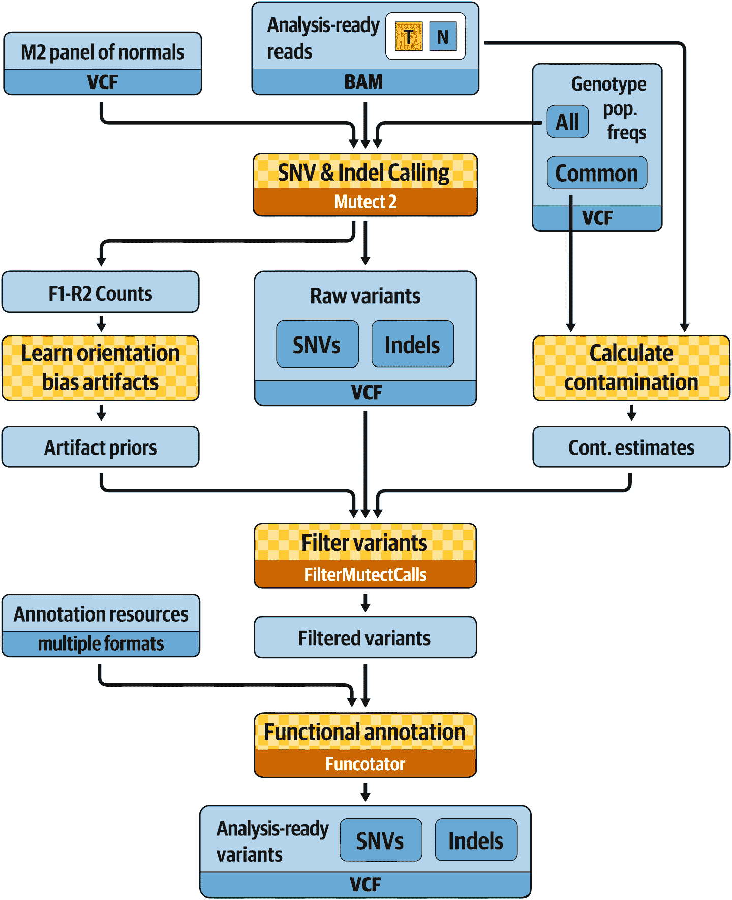

###### 图 7-3\. somatic short variant 发现的最佳实践。

主要的变异调用步骤，涉及一个名为 `Mutect2` 的工具，应用于肿瘤和正常样本，同时添加了两个重要资源：一个正常样本汇总（PoN）和一个包含先前报告的所有基因组变异的基因组种群频率数据库。 PoN 是一个资源，允许我们消除常见的技术性伪迹；我们在下一小节专门解释它的工作原理以及如何创建一个，尽管出于实际原因您不会自己运行它。我们在 “过滤 Mutect2 调用” 中讨论基因组种群频率资源。过滤过程将考虑读取方向统计、跨样本污染估计、基因型背景和与 PoN 的一致性。最后，我们对变异调用集应用功能注释，以预测候选变异的影响。

## 创建 Mutect2 PoN

PoN 是一个以 VCF 格式呈现的调用集，旨在捕获常见的重复性人工产生的变异，因此如果在我们的肿瘤数据中遇到它们，我们可以将其过滤掉。我们通过在一组与我们的肿瘤样本使用相同测序和文库准备技术生产的正常样本上运行 somatic 调用器 `Mutect2` 来生成它。这个想法是，我们要求调用器展示它可能考虑为体细胞变异的一切，排除明显的生殖变异（除非另有说明）。因为这些是正常样本，而不是肿瘤样本，我们可以合理地假设以这种方式产生的任何变异调用要么是生殖变异，要么是人工产生的。对于更有可能是人工产生的那些，我们因此可以进一步假设，如果我们在多个正常样本中看到相同的人工产生的变异，那么它们可能是由涉及的技术过程引起的，因此我们可以期望在以相同方式处理的一些肿瘤样本中看到它们出现。如果我们看到它们，我们将希望降低它们是真实体细胞变异的可能性。

###### 注意

制作 PoN 时使用的正常样本通常来自与我们分析肿瘤的人无关的人。它们可以是其他癌症研究参与者的匹配正常样本，也可以是从无关研究项目中收集的健康个体的生殖系样本，只要提供了适当的同意。参与者的背景遗传学或其来源人口并不重要；关键在于数据的技术特征。理想情况下，我们希望包括至少 40 个样本；在 Broad Institute 用于研究目的的大多数 PoN 由数百个样本组成。

我们不会在本章中运行 PoN 创建命令，因为运行时间太长。相反，我们将使用一些通用命令行演示用法。您可以在[GATK 最佳实践文档](https://oreil.ly/ZgIrB)中找到完整实现的链接。

如果我们要这样做，我们将首先在选定为 PoN 的正常样本上以肿瘤单模式运行 `Mutect2`。我们将在面板中的所有正常样本上分别执行此操作。以下命令（以及本节中的后续命令）仅为示例；稍后我们将让您在虚拟机上执行命令：

```
 gatk Mutect2 \
    -R reference.fasta \
    -I normal_1.bam \
    -O normal_1.vcf.gz \
    --max-mnp-distance 0
```

此命令将 somatic 变异调用模型应用于正常组织样本的 BAM 文件，并生成一个 VCF 文件，其中包含最有可能是人工产生的或生殖变异的调用。

###### 注意

`--max-mnp-distance 0` 设置禁用了工具将相邻 SNV 合并为多核苷酸变体的能力，以最大化 PoN 中所有正常样本之间的可比性。

接下来，我们将使用 `GenomicsDB` 整合所有每个正常样本的 VCF 文件，您可能会从有关配对调用的常规流程中认出它。当时我们在整合 GVCFs，而在这里我们使用的是常规的 VCFs，但这并没有任何区别：`GenomicsDB` 工具能够轻松处理任何类型的 VCF：

```
gatk GenomicsDBImport \
    -R reference.fasta \
    -L intervals.interval_list \
    -V normal_1.vcf.gz \
    -V normal_2.vcf.gz \
    -V normal_3.vcf.gz \
    --genomicsdb-workspace-path pon_db
```

最后，我们将提取与 PoN 目标相关的调用。默认情况下，规则是保留在两个或更多样本中观察到的任何变异调用，但低于特定频率阈值的人群资源：

```
gatk CreateSomaticPanelOfNormals \
    -R reference.fasta \
    -V gendb://pon_db \
    --germline-resource af-only-gnomad.vcf.gz \
    -O pon.vcf.gz
```

您可能会认识到 [gnomAD](https://oreil.ly/gNICj) 是我们在第六章中使用的人群资源，在单样本过滤协议中。gnomAD 数据库是一个公共资源，包含来自超过 100,000 人的变异调用，并为每个人提供每个等位基因在数据库人群中的频率。我们在这里使用该信息来评估在面板中显示在多个正常样本中的变异调用，实际上可能是一种生殖细胞变异，而不是一个经常出现的人工产物。

这将生成我们将用作 PoN 的最终 VCF。它不包括任何样本基因型；仅保留位点级别的信息。我们提供一个示例 PoN，您可以像之前一样使用 `zcat`、`grep` 和 `head` 来查看文件内部的结构（在 GATK 容器内 */home/book/data/somatic* 目录中执行此命令）：

```
# zcat resources/chr17_m2pon.vcf.gz | grep -v '##' | head -3
#CHROM  POS     ID      REF     ALT     QUAL    FILTER  INFO
chr6    29941027        .       G       A       .       .       .
chr6    29941061        .       G       C       .       .       .
```

注意，此示例 PoN 文件仅包含位于染色体 6、染色体 11 和染色体 17 内感兴趣区域的数据。

## 运行 Mutect2 对肿瘤-正常配对样本进行分析

现在您已经知道如何创建 PoN 了，让我们进入本节的主要内容，即使用我们从 1000 基因组计划的 40 个公共正常样本中为您创建的 PoN，在肿瘤-正常样本对上运行 `Mutect2`。就像在第六章中一样，我们将在我们值得信赖的 VM 上的 GATK 容器中完成这项工作，所以如果您的 VM 还没有运行，请启动它，并按照我们在第五章中所示的方式启动 GATK 容器。不过这次，我们的工作目录是 */home/book/data/somatic*，我们需要创建另一个沙盒：

```
# cd /home/book/data/somatic
# mkdir sandbox
```

我们一起对肿瘤-正常样本对运行 `Mutect2`，指定在 BAM 文件中使用 `-normal` 参数编码的正常样本名称。我们提供 PoN 和 gnomAD 基因组资源，分别使用 `-pon` 和 `--germline-resource` 参数。此外，我们指定间隔（使用 `-L` 和间隔列表文件），因为我们正在处理外显子数据：

```
# gatk Mutect2 \
    -R ref/Homo_sapiens_assembly38.fasta \
    -I bams/tumor.bam \
    -I bams/normal.bam \
    -normal HCC1143_normal \
    -L resources/chr17plus.interval_list \
    -pon resources/chr17_m2pon.vcf.gz \
    --germline-resource resources/chr17_af-only-gnomad_grch38.vcf.gz \
    -bamout sandbox/m2_tumor_normal.bam \
    -O sandbox/m2_somatic_calls.vcf.gz
```

这将运行几分钟，所以现在是伸展一下的好时机。大约五分钟后，您应该能看到来自`Mutect2`的完成消息：

```
15:07:19.715 INFO  ProgressMeter - Traversal complete. Processed 285005 total
regions in 5.0 minutes.
```

这个`Mutect2`命令生成一个包含可能变异调用的 VCF 文件以及一个 bamout 文件。你可能还记得我们在第五章中与`HaplotypeCaller`一起运行的练习中的 bamout 文件；这是同一件事。`Mutect2`是建立在与`HaplotypeCaller`大部分相同的代码上，并使用相同的基于图的重对齐技巧来提高对插入缺失的灵敏度。它们之间的主要区别在于基因分型模型。有关它们各自算法的更多信息，请参阅[GATK 网站](https://oreil.ly/Bits1)上的`Haplotype​Caller`和`Mutect2`文档。目前，只需记住`Mutect2`也会重新对齐读取，因此如果我们稍后想要查看读取数据作为变异审查过程的一部分，我们将需要 bamout。因为这是分析员在体细胞调用中非常频繁做的事情（相对而言，比对生殖细胞调用更频繁），所以我们只需系统地设置`Mutect2`命令来生成 bamout。

## 估计跨样本污染

正如我们之前概述的，鉴定体细胞突变受到低级噪音来源的影响更大，而不是生殖细胞情况。即使很小量的样本间污染（比研究人员愿意承认的情况要多）也会让呼叫者困惑，并导致大量的 FP。事实上，我们没有直接的方法来区分数据中出现的等位基因是否因为生物组织中存在真正的突变，还是因为我们的样本被来自其他人的 DNA 污染，而这个人的生殖细胞中具有这种等位基因。

我们无法直接对这种污染进行校正，但我们可以估计它对任何给定样本的影响程度。从这里开始，我们可以标记任何等于或小于污染率的等位分数观察到的突变调用。这并不意味着我们把这些调用彻底排除为假，但这确实意味着在我们进行下一个分析阶段时，我们会对这些调用持更加怀疑的态度。

要估计我们肿瘤样本中的污染率，我们首先在正常样本中识别同种异变位点，以选择在肿瘤中查看的位点，然后根据这些位点支持参考等位基因的读取比例来评估我们在肿瘤中可能有多少污染。这个想法是因为这些位点应该是同种异变的，任何参考序列的读数都必须来自于其他人通过污染事件。

为了选择我们在计算中使用的站点，我们查看了在常见变异目录中找到的双等位基因位点（这样有很大可能性它们是相关的），但是其备用等位基因频率相当低（因此不会有太多来自备用等位基因的噪声）。然后，对于该子集中的每个位点，我们进行了基于堆积的快速基因分型运行，以识别在该样本中为同种合子变体的位点。我们在肿瘤样本和匹配正常样本上都这样做：

```
# gatk GetPileupSummaries \
    -I bams/normal.bam \
    -V resources/chr17_small_exac_common_3_grch38.vcf.gz \
    -L resources/chr17_small_exac_common_3_grch38.vcf.gz \
    -O sandbox/normal_getpileupsummaries.table

# gatk GetPileupSummaries \
    -I bams/tumor.bam \
    -V resources/chr17_small_exac_common_3_grch38.vcf.gz \
    -L resources/chr17_small_exac_common_3_grch38.vcf.gz \
    -O sandbox/tumor_getpileupsummaries.table
```

这两个命令应该运行非常快。如果看到关于 `GetPileupSummaries` 工具处于 beta 评估阶段且尚未准备好投入生产的警告，可以忽略它；这是开发过程中的遗留问题，将在不久的将来移除。

###### 注意

GATK 开发人员在开始工作时往往非常谨慎，并将他们的工具标记为 alpha 或 beta 版本，以确保研究人员不会误将实验性工具误认为已完全经过审核的工具。然而，有时候当工具经过完全审核后，他们会忘记移除或更新这些标签，因此警告会比必要的时间更长地存在。如果你对特定工具的状态感到怀疑，请毫不犹豫地在 [社区支持论坛](https://oreil.ly/KmHzX) 中向支持团队提问。

每次运行都会生成一张表，总结每个被选中站点的等位基因计数以及在种群资源中注释的等位基因频率：

```
# head -5 sandbox/normal_getpileupsummaries.table
#<METADATA>SAMPLE=HCC1143_normal
contig  position        ref_count       alt_count       other_alt_count allele_frequency
chr6    29942512        7       4       0       0.063
chr6    29942517        12      4       0       0.062
chr6    29942525        13      7       0       0.063

# head -5 sandbox/tumor_getpileupsummaries.table
#<METADATA>SAMPLE=HCC1143_tumor
contig  position        ref_count       alt_count       other_alt_count allele_frequency
chr6    29942512        9       0       0       0.063
chr6    29942517        13      1       0       0.062
chr6    29942525        13      7       0       0.063
```

现在我们可以通过向计算工具提供这两张表来进行实际的估计：

```
# gatk CalculateContamination \
    -I sandbox/tumor_getpileupsummaries.table \
    -matched sandbox/normal_getpileupsummaries.table \
    -tumor-segmentation sandbox/segments.table \
    -O sandbox/pair_calculatecontamination.table 
```

该命令生成一张最终表格，告诉我们肿瘤调用集中交叉样品污染的可能率。查看文件内容后，我们发现肿瘤的污染估计率为 1.15%，误差为 0.19%：

```
$ cat sandbox/pair_calculatecontamination.table
sample  contamination   error
HCC1143_tumor   0.011485364960150258    0.0019180421331441303
```

这意味着每百个读取中可能有一个来自他人。这个百分比将有效地成为我们检测低频率体细胞事件的底线；对于任何在该等位频率或以下调用的潜在变异，我们将无法判断它们是真实存在还是由污染引起的。即使较大的等位频率也可能完全由污染引起。我们将向过滤工具提供这个表格，以便它能正确考虑污染估计。

## 过滤 Mutect2 调用

类似于`HaplotypeCaller`，`Mutect2`被设计为非常敏感，以捕获尽可能多的真阳性。因此，我们知道原始调用集将充斥各种类型的假阳性。为了过滤这些调用，我们将使用一个称为`FilterMutectCalls`的工具，该工具基于一个量过滤变异：变异是体细胞突变的概率。在内部，该工具考虑了多个因素，包括在变异调用步骤中提供的种群频率，污染估计和先前计算的读取方向统计。在计算了每个变异调用的概率后，工具然后确定了优化*F 分数*的阈值，这是整个调用集敏感性和精度的调和平均数。因此，我们只需运行这个命令即可对我们的调用集应用默认过滤：

```
# gatk FilterMutectCalls \
    -R ref/Homo_sapiens_assembly38.fasta \
    -V sandbox/m2_somatic_calls.vcf.gz \
    --contamination-table sandbox/pair_calculatecontamination.table \
    -O sandbox/m2_somatic_calls.filtered.vcf.gz \
    --stats sandbox/m2_somatic_calls.vcf.gz.stats \
    --tumor-segmentation sandbox/segments.table
```

此操作的主要输出是包含所有变异的 VCF 输出文件，并根据需要应用过滤器注释：

```
15:25:14.742 INFO  ProgressMeter - Traversal complete. Processed 333 total
variants in 0.0 minutes.
```

###### 注意

如果您想调整平衡点，您可以调整灵敏度与精度的相对权重在调和平均数中。将`-f-score-beta`参数设置为大于其默认值`1`的值会增加灵敏度，而将其设置为更低则有利于更大的精度。

好了，现在是时候在 IGV 中查看我们产生的调用了。您可能已经注意到，我们现在正在使用 hg38 参考构建，因此在尝试加载任何文件之前，我们需要调整 IGV 中的参考设置。

要加载以下文件：肿瘤和正常的原始 BAM 文件，由`Mutect2`生成的 bamout 文件以及经过过滤的调用集。根据刚才运行的命令识别文件，然后按照第四章到第六章中的相同步骤将文件复制到您的 Google Cloud Storage 存储桶中，并使用 File > URL 路径在 IGV 中加载它们。

在加载文件后，将 IGV 的视图坐标设置为`**chr17:7,666,402-7,689,550**`，如图 7-4 所示，这些坐标围绕 TP53 基因座中心。我们关注这个基因是因为它被称为肿瘤抑制因子；它被 DNA 损伤激活，并产生一种名为 p53 的蛋白质，可以修复损伤或触发杀死细胞。对这一基因的任何突变可能会干扰这个非常重要的功能，从而促使未受控制的肿瘤发展。

要详细查看这个调用，请放大输出 BAM 跟踪中的体细胞调用，使用坐标 `**chr17:7,673,333-7,675,077**`。悬停或点击变异跟踪中的灰色调用以查看注释，并尝试滚动数据以评估每个样本的覆盖量。在序列跟踪中，我们看到肿瘤中的 C 到 T 变异以红色突出显示，但正常样本中没有（图 7-4）。

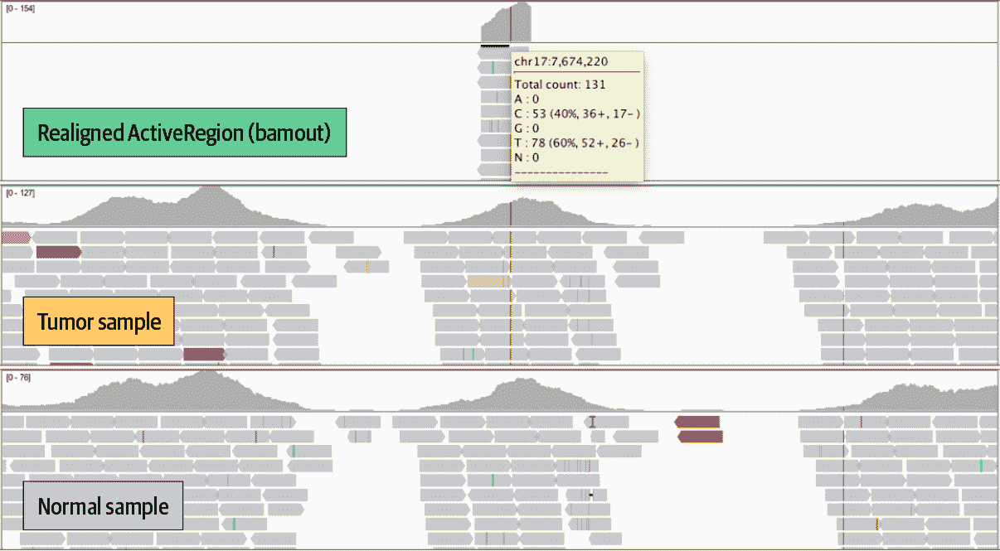

###### 图 7-4\. 在 IGV 中放大 TP53。

您如何看待这个体细胞变异调用？

## 使用 Funcotator 注释预测的功能影响

筛选体细胞突变调用可能比其生殖等价物更具挑战性。因此，用预测的功能影响和其重要性注释调用可能特别有帮助。例如，蛋白质编码区域中间的终止密码子可能比内含子中间的突变更为显著。了解这些关于您调用的信息可以帮助您确定哪些值得深入调查。

要评估功能影响，我们需要知道基因组中编码蛋白质序列的区域，以及与基因表达重要的元素对应的区域。例如，像 [GENCODE](https://www.gencodegenes.org) 这样的转录注释资源在标准化的 [Gene Transfer Format](https://oreil.ly/SDmFX)（GTF）中捕获了这些信息。GATK 团队提供了一组资源，其中包括编译的功能注释资源或数据源，适用于许多常见的功能注释需求，以及一个名为 `Funcotator` 的工具，可以使用这些数据源的信息为您的调用集进行注释。您也可以创建自己的定制数据源。此外，虽然 `Funcotator` 默认输出 VCF 格式的结果，但您也可以使其输出突变注释格式（MAF），这在癌症基因组学社区中被广泛使用。详细信息请参阅 [Funcotator 文档](https://oreil.ly/6qw0X)。

现在，让我们把 `Funcotator` 应用到我们筛选过的 `Mutect2` 调用集中：

```
# gatk Funcotator \
    --data-sources-path resources/funcotator_dataSources_GATK_Workshop_20181205/ \
    --ref-version hg38 \
    -R ref/Homo_sapiens_assembly38.fasta \
    -V sandbox/m2_somatic_calls.filtered.vcf.gz \
    -O sandbox/m2_somatic_calls.funcotated.vcf.gz \
    --output-file-format VCF
```

这个过程非常快速，生成的 VCF 文件已经根据 GENCODE 的功能数据进行了精心注释。这里是这些注释在其自然环境中的初步展示：

```
# zcat sandbox/m2_somatic_calls.funcotated.vcf.gz | grep -v '##' | head -3
#CHROM  POS     ID      REF     ALT     QUAL    FILTER  INFO    FORMAT  HCC1143_normal
HCC1143_tumor
chr17   1677390 .       A       T       .       weak_evidence
CONTQ=19;DP=23;ECNT=1;FUNCOTATION=[PRPF8|hg38|chr17|1677390|1677390|INTRON||SNP|A|A|T|
g.chr17:1677390A>T|ENST00000572621.5|-|||c.e13-
175T>A|||0.4463840399002494|CTGCCTCTCAAGGCCCCAGAA|PRPF8_ENST00000304992.10_INTRON];
GERMQ=32;MBQ=33,31;MFRL=301,311;MMQ=60,60;MPOS=22;NALOD=1.06;NLOD=3.01;POPAF=6.00;SEQQ
=1;STRANDQ=17;TLOD=4.22 GT:AD:AF:DP:F1R2:F2R1:SB       0/0:10,0:0.081:10:6,0:4,0:6,4,0,
0	0/1:9,2:0.229:11:5,1:3,1:6,3,2,0
chr17   2394409 .       G       T       .       PASS
CONTQ=93;DP=106;ECNT=1;FUNCOTATION=[MNT|hg38|chr17|2394409|2394409|INTRON||SNP|G|G|T|
g.chr17:2394409G>T|ENST00000575394.1|-|||c.e1-
6231C>A|||0.6209476309226932|TTCCTGACCAGCGCCGCCACC|MNT_ENST00000174618.4_INTRON];
GERMQ=93;MBQ=32,31;MFRL=148,177;MMQ=60,60;MPOS=14;NALOD=1.56;NLOD=10.52;POPAF=6.00;SEQQ
=93;STRANDQ=93;TLOD=30.05  GT:AD:AF:DP:F1R2:F2R1:SB       0/0:35,0:0.027:35:15,0:19,0:4,
31,0,0	0/1:53,13:0.206:66:23,5:29,8:13,40,4,9

```

现在让我们专门查看我们之前在 IGV 中查看的 TP53 突变的注释，位置在 chr17:7674220：

```
# zcat sandbox/m2_somatic_calls.funcotated.vcf.gz | grep 7674220
chr17   7674220 .       C       T       .       PASS
CONTQ=93;DP=134;ECNT=1;FUNCOTATION=[TP53|hg38|chr17|7674220|7674220|MISSENSE||SNP|C|C|T|
g.chr17:7674220C>T|ENST00000269305.8|-|7|933|c.743G>A|c.(742-
744)cGg>cAg|p.R248Q|0.5660847880299252|GATGGGCCTCCGGTTCATGCC|TP53_ENST00000445888.6_MISSENSE_
p.R248Q/TP53_ENST
00000420246.6_MISSENSE_p.R248Q/TP53_ENST00000622645.4_MISSENSE_p.R209Q/
TP53_ENST00000610292.4_MISSENSE_p.R209Q/TP53_ENST00000455263.6_MISSENSE_p.R248Q/
TP53_ENST00000610538.4_MISSENSE_p.R209Q/TP53_ENST00000620739.4_MISSENSE_p.R209Q/
TP53_ENST00000619485.4_MISSENSE_p.R209Q/TP53_ENST00000510385.5_MISSENSE_p.R116Q/
TP53_ENST00000618944.4_MISSENSE_p.R89Q/TP53_ENST000005
04290.5_MISSENSE_p.R116Q/TP53_ENST00000610623.4_MISSENSE_p.R89Q/
TP53_ENST00000504937.5_MISSENSE_p.R116Q/TP53_ENST00000619186.4_MISSENSE_p.R89Q/
TP53_ENST00000359597.8_MISSENSE_p.R248Q/TP53_ENST00000413465.6_MISSENSE_p.R248Q/
TP53_ENST00000615910.4_MISSENSE_p.R237Q/TP53_ENST00000617185.4_MISSENSE_p.R248Q];
GERMQ=93;MBQ=31,32;MFRL=146,140;MMQ=60,60;MPOS=21;NALOD=1.73;NLOD=15.33;POPA
F=6.00;SEQQ=93;STRANDQ=93;TLOD=264.54      GT:AD:AF:DP:F1R2:F2R1:SB
0/0:51,0:0.018:51:22,0:29,0:36,15,0,0   0/1:0,76:0.987:76:0,38:0,38:0,0,52,24
```

这个单核苷酸变异是一个 C-to-T 替换，预测会导致一个 *错义突变*，将精氨酸变为谷氨酰胺。错义突变会改变从基因产生的蛋白质，这可能在功能上是中性的，但也可能具有有害效应。如果我们看一下文件的其余部分，在我们的 124 个突变记录中，有 21 个被注释为 `MISSENSE`；其中有 10 个通过了所有的过滤器。这些信息应该有助于我们在分析的下一阶段确定要调查的内容。

至此，我们完成了肿瘤-正常对分析工作流程，用于发现体细胞 SNVs 和 indels！接下来，我们将详细讨论我们用于调查体细胞复制数变化的流程。

###### 注意

如果您在继续下一节之前休息，请考虑停止您的虚拟机以避免在您离开享受生活时支付费用。

# 基因组中的体细胞复制数改变

到目前为止，我们一直在专注于小变异、单核苷酸变体（SNVs）和插入/缺失变异（indels），这些变异是基于相对于参考序列特定核苷酸的存在或缺失进行特征化的。转向复制数涉及到一个重大的心理（和方法论上的！）转变，因为现在我们将要观察样本中感兴趣的相对序列量，相对于其自身进行测量（参见 Figure 7-5 和 Figure 7-6）。换句话说，我们实际上不会测量生物材料中物理存在的复制数。我们测量的是复制比，这是一种代用品，因为它是复制数变化（CNAs）的结果。作为这一过程的一部分，我们将主要使用参考基因组作为一个坐标系统，用来定义显示 CNAs 的片段。

如 Figure 7-5 所示，*复制数* 是每个位点（即基因或其他有意义的 DNA 片段）的绝对整数值复制数。复制比是每个位点的复制数与平均倍性的相对实数比率。

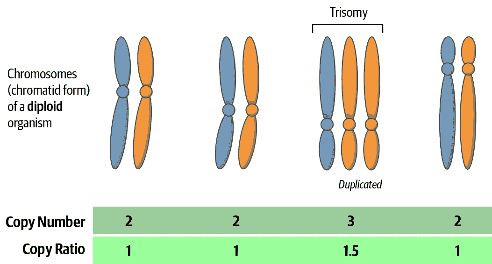

###### 图 7-5\. 复制数和复制比之间的区别。

Figure 7-6 显示了正常细胞系和癌细胞系之间基因组组成的显著对比。在这张图中，正常细胞系（事实上，大多数健康的人类细胞）任何给定染色体的复制数为 2，其复制比为 1。与此同时，在癌细胞系中，染色体之间存在大量变异；例如，染色体 7 的复制数看起来是 5，而染色体 12 的复制数是 3，我们无法准确猜测它们的复制比，因为这些改变非常广泛，我们对该基因组的平均倍性没有一个良好的了解。

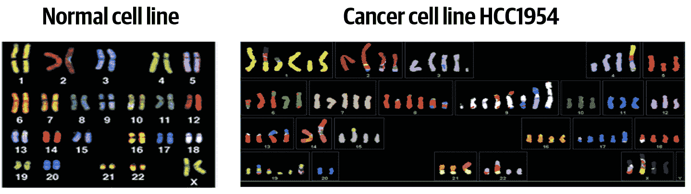

###### 图 7-6\. 光谱核型染色技术用彩色标记每对染色体，显示被放大或缺失的各种染色体片段（左右面板中的颜色不必匹配）。

好消息是，与短变异分析相比，拷贝数分析对我们之前列举的一些挑战不太敏感，因为我们对确切的序列不那么关心。然而，它对影响序列覆盖均匀性的技术偏倚更为敏感。这两点对分析设计的影响是，拥有匹配的正常样本可用性不那么重要，而拥有一个由具有紧密匹配技术配置文件的正常样本组成的 PoN 更为重要。然而，请注意，拷贝数 PoN 与用于短变异分析的 PoN 完全不同。我们将在下一节详细介绍具体内容。

## 肿瘤单样本分析工作流程概述

肿瘤体细胞拷贝数分析的标准工作流程涉及四个主要步骤（图 7-7）。首先，我们收集用于 PoN 的案例样本和任何正常样本的比例覆盖统计数据。暂时将案例样本置于一旁，我们创建一个拷贝数 PoN，捕捉到整个外显子或基因组中观察到的覆盖率系统偏移的量。然后，我们利用这些信息来对我们收集的案例样本的覆盖数据进行归一化，从而消除技术噪声并揭示数据中实际的拷贝比差异。最后，我们运行一个分割算法，识别序列的连续片段，这些片段呈现相同的拷贝比，并为那些拷贝比显著偏离均值的片段发出 CNA 调用。可选地，我们可以生成图形来在几个阶段可视化数据，这有助于解释。

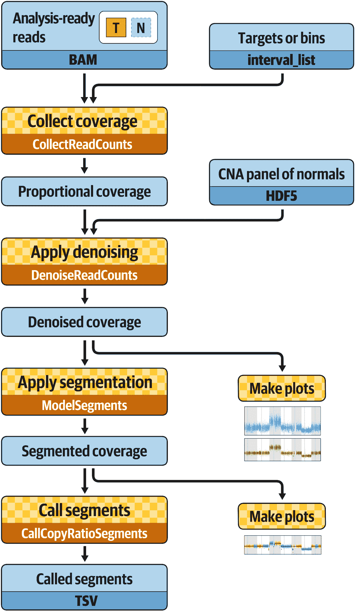

###### 图 7-7\. 肿瘤体细胞拷贝数变异发现的最佳实践工作流程。

再次强调，你将在你的虚拟机中的 GATK 容器内完成这些工作，所以确保所有设备都打开，并且你在 */home/book/data/somatic* 目录下。本节中的练习使用与第一节相同的参考基因组和一些相同的资源文件，我们将使用相同的沙盒来写输出结果。

## 收集覆盖计数

我们计算一系列间隔的*读深度*或覆盖度。在这里，我们使用外显子捕获靶向区域，因为我们正在分析外显子，但如果我们分析整个基因组，我们将切换到使用任意长度的区间。对于外显子，我们使用与捕获靶向区域对应的间隔列表，并首先添加一些填充物。

```
# gatk PreprocessIntervals \
    -R ref/Homo_sapiens_assembly38.fasta \
    -L resources/targets_chr17.interval_list \
    -O sandbox/targets_chr17.preprocessed.interval_list \
    --padding 250 \
    --bin-length 0 \
    --interval-merging-rule OVERLAPPING_ONLY 
```

在此命令中，`--interval-merging-rule` 参数控制 GATK 引擎是否应合并相邻的间隔以进行处理。在某些情况下，合并它们是有意义的，但在这种情况下，我们更喜欢将它们保持分开，以获得更细粒度的分辨率，并且我们仅合并实际重叠的间隔。

###### 注意

如果我们想为整个基因组数据生成一个区间列表，我们将运行相同的工具，但不使用目标文件，并将`--bin-length`参数设置为我们想要使用的 bin 的长度（默认设置为 100 个碱基）。

当我们有了分析就绪的区间列表时，我们可以运行读取计数收集工具，该工具通过计算每个区间内的起始读取数来运行。默认情况下，该工具以[HDF5 格式](https://oreil.ly/uP_J4)写入数据，后续工具更高效地处理，但这里我们将输出格式更改为制表符分隔值（TSV），因为这样更容易查看：

```
# gatk CollectReadCounts \
    -I bams/tumor.bam \
    -L sandbox/targets_chr17.preprocessed.interval_list \
    -R ref/Homo_sapiens_assembly38.fasta \
    -O sandbox/tumor.counts.tsv \
    --format TSV \
    -imr OVERLAPPING_ONLY
```

输出文件包括一个头部，重复列出了序列字典，然后是每个目标的计数表：

```
# head -5 sandbox/tumor.counts.tsv
@HD     VN:1.6
@SQ     SN:chr1 LN:248956422
@SQ     SN:chr2 LN:242193529
@SQ     SN:chr3 LN:198295559
@SQ     SN:chr4 LN:190214555
```

令人讨厌的是，hg38 参考构建的序列字典非常长，因为存在所有的*ALT contigs*（在第二章的基因组入门中解释）。因此，要查看我们的文件，最好使用`tail`而不是`head`：

```
# tail -5 sandbox/tumor.counts.tsv
chr17   83051485        83052048        1
chr17   83079564        83080237        0
chr17   83084686        83085575        1010
chr17   83092915        83093478        118
chr17   83094004        83094827        484
```

啊，这样更有帮助，不是吗？第一列是染色体或 contig，第二列和第三列是我们查看的目标区域的起始和结束，第四列是重叠目标的读取计数。图 7-8 提供了这种可视化的示例。

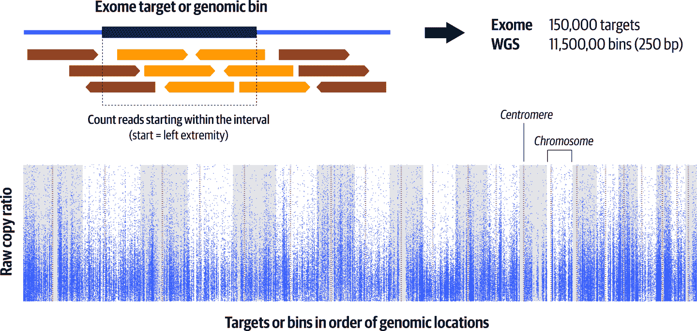

###### 图 7-8. 每个基因组目标或区段中的读取计数形成估算分段复制比率的基础，每个点表示单个目标或区段的值。

图中的每个点代表我们收集覆盖度的区间之一，按其在基因组上的位置排列。背景中的灰白条纹代表交替的染色体，虚线表示它们的着丝点位置。请注意，由于从一个到另一个的覆盖量存在巨大变异，点形成波浪状的模糊。此时，无法确信地识别任何 CNAs。

## 创建一个体细胞 CNA PoN

正如我们在第二章中讨论的那样，许多技术变异影响了测序过程，其中一些是相当系统化的——某些区域将会产生比其他区域更多的序列数据，主要是因为化学因素。我们可以通过使用一种称为奇异值分解的算法来建立正常变异看起来像什么的基线，这在概念上类似于主成分分析，并旨在从以相同方式测序和处理的正常面板中捕获系统噪声。CNA PoN 中的最小样本数应至少为 10 个正常样本，以确保工具正常运行，但最佳实践建议尽可能使用 40 个或更多的正常样本。

创建 PoN 是一项艰巨的工作，因此我们为您提供了一个，该 PoN 是从 1000 基因组计划的 40 个样本中制作的。这 40 个样本中的每一个都是通过像之前描述的那样单独运行`CollectReadCounts`工具，并且将默认输出格式设置为 HDF5 来生成的（因此在命令行中显示了*.hdf5*扩展名，在下一个代码段中显示）。然后通过对所有读数文件运行以下命令来创建面板。明确地说，我们只是以示例的形式展示这一点，因此不要尝试运行它；它不适用于我们为本书提供的数据。

```
gatk CreateReadCountPanelOfNormals \
    -I file1_clean.counts.hdf5 \
    … 
    -I file40_clean.counts.hdf5 \
    -O cnaponC.pon.hdf5
```

此命令生成的 PoN 与我们之前在本章节中为短变异部分创建的 PoN 完全不同。对于短变异流水线，PoN 只是带有注释的变异调用 VCF 文件的一种类型。然而，在这种情况下，通过聚合 40 个正常样本的读数数据生成的文件对于肉眼来说没有意义。

## 应用去噪

有了我们手头的样本读数和准备好的 PoN，我们可以运行此工作流程中最重要的一步：去噪病例样本读数。

```
# gatk DenoiseReadCounts \
    -I cna_inputs/hcc1143_T_clean.counts.hdf5 \
    --count-panel-of-normals cna_inputs/cnaponC.pon.hdf5 \
    --standardized-copy-ratios sandbox/hcc1143_T_clean.standardizedCR.tsv \
    --denoised-copy-ratios sandbox/hcc1143_T_clean.denoisedCR.tsv
```

尽管我们只运行了一个命令，但工具在内部执行了两次连续的数据转换。首先，它通过对 PoN 中记录的中位数计数进行标准化，这涉及到一个以 2 为底的对数转换，并将分布归一化到中心值为一，从而生成*拷贝比率*。然后，它利用 PoN 的主成分对这些标准化的拷贝比率应用去噪算法。

###### 注意

您可以通过调整`--number-of-eigensamples`参数来调节去噪工具的侵略程度，这会影响结果的分辨率；也就是说，生成的片段平滑度如何。使用较大的数字将产生更高程度的去噪，但可能会降低分析的灵敏度。

再次说明，输出文件实际上不太适合人类阅读，因此让我们绘制它们的内容，以了解此时数据显示的内容：

```
# gatk PlotDenoisedCopyRatios \
    --sequence-dictionary ref/Homo_sapiens_assembly38.dict \
    --standardized-copy-ratios sandbox/hcc1143_T_clean.standardizedCR.tsv \
    --denoised-copy-ratios sandbox/hcc1143_T_clean.denoisedCR.tsv \
    --minimum-contig-length 46709983 \
    --output sandbox/cna_plots \
    --output-prefix hcc1143_T_clean
```

最终的图包括第一个内部步骤产生的标准化拷贝比率和最终的去噪拷贝比率（图 7-9）。

您可以使用`gsutil`将输出的图表从您的 VM 复制到 Google 存储桶，然后从 GCP 控制台查看（或下载）它们。如果您需要关于此的复习，请参阅第四章。以下操作是从您的 VM 执行的（该 VM 已安装并配置了`gsutil`工具，并且在第四章中运行了`gatk`命令而不是您运行`gatk`命令的 Docker 容器），并将上传到您在此示例中指定的存储桶（`my-bucket`）：

```
$ export BUCKET="gs://my-bucket"
$ gsutil -m cp -R sandbox/cna_plots $BUCKET/somatic-sandbox/
```

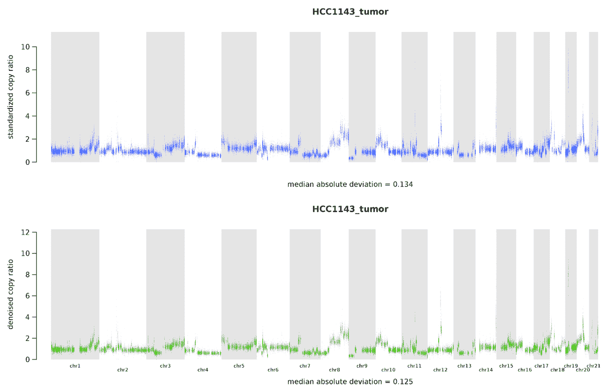

###### 图 7-9。在第一轮去噪之后显示标准化拷贝比的拷贝数变异分析图（顶部）和在第二轮完全去噪之后显示的完全去噪拷贝比（底部）。

在这些图像的书籍版本中，可能很难清楚地看到，但如果您放大您自己生成的图表，您应该能够看到第二轮图像中的数值范围比第一轮更紧凑，这显示了从一步到下一步的改进。无论如何，我们可以认为这些与在图 7-8 中显示的原始读数相比，分辨率更高。我们已经能够辨认出一些可能的拷贝数变异。

## 执行分割并调用 CNAs

现在，我们已经拥有了精心去噪的拷贝比，我们唯一需要做的就是确定哪些区域确实显示了 CNAs 的证据。为此，我们将分组具有相似拷贝比的相邻区间成为片段。然后，我们应该能够确定哪些片段的整体拷贝比支持存在与其余部分的扩增或删除。

我们使用`ModelSegments`工具完成此操作，该工具使用高斯核二元分割算法执行多维核分割。

```
# gatk ModelSegments \
    --denoised-copy-ratios sandbox/hcc1143_T_clean.denoisedCR.tsv \
    --output sandbox  \
    --output-prefix hcc1143_T_clean
```

就前面的图表而言，查看它们的最简单方法是将它们转移到您的 Google 存储桶中，并从 GCP 控制台打开（或下载）它们。此命令生成多个文件，因此我们提供的输出名称仅是我们要给将包含这些文件的新目录的名称。再次强调，输出结果并不特别用户友好，因此我们将制作一些图表来可视化结果。我们向绘图工具提供了经去噪的拷贝比（来自`DenoiseReadCounts`）、片段（来自`ModelSegments`）和参考序列字典：

```
# gatk PlotModeledSegments \
    --denoised-copy-ratios sandbox/hcc1143_T_clean.denoisedCR.tsv \
    --segments sandbox/hcc1143_T_clean.modelFinal.seg \
    --sequence-dictionary ref/Homo_sapiens_assembly38.dict \
    --minimum-contig-length 46709983 \
    --output sandbox/cna_plots \
    --output-prefix hcc1143_T_clean
```

图 7-10 显示由`PlotModelSegments`工具识别的片段。代表交替片段上的靶或箱柱的点着色为蓝色和橙色，而片段中位数则用黑色绘制。大多数片段的拷贝比约为 1，构成基线。在此背景下，我们可以观察到多个不同大小和不同拷贝比的扩增和缺失。您可能会注意到，大多数这些不符合您对于给定片段有四个拷贝而不是两个的预期数字。这是因为某些拷贝数变异发生在亚克隆群体中，这意味着只有部分取样组织受到影响。因此，效果被稀释，您可能会看到拷贝比为 1.8 而不是 2。

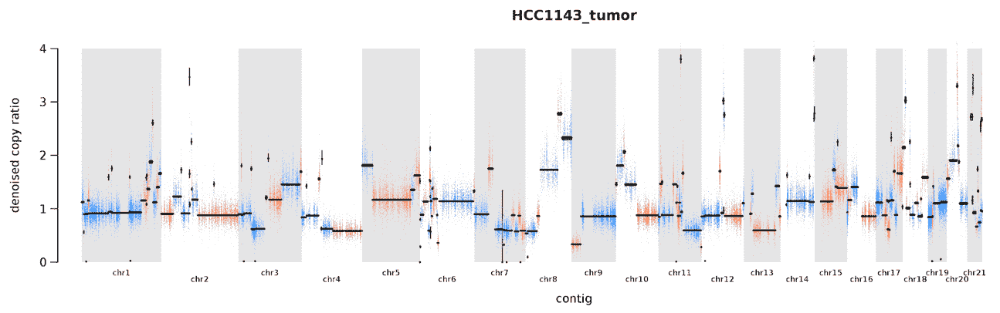

###### 图 7-10\. 基于去噪复制比例建模的分段图。

更一般地说，这个样本中似乎发生了很多事情；事实上，我们可以查看输出目录中的分割文件，看到我们为这个样本预测了 235 个分段。这在常规肿瘤样本中并不典型，尽管有些可能相当混乱；这里发生的情况是，我们正在查看从细胞系中取样的样本。癌细胞系对于教学和测试软件很方便，因为数据可以很容易地公开获取，但从生物学上讲，它们往往积累了非常高的变异数量。因此，这代表了一个极端情况。值得一提的是，您在现实世界中遇到的大多数样本可能会比这个更干净（更容易解释）。所以您有一些期待的事情！

话虽如此，即使在这样一个混乱的样本中，软件仍然可以帮助我们更清晰地了解情况。我们可以通过运行工作流程中的最后一个工具来获得最终的 CNA 调用，即确定哪些分段我们可以认为具有扩增或缺失的显著证据，具体操作如下：

```
# gatk CallCopyRatioSegments \
    -I sandbox/hcc1143_T_clean.cr.seg \
    -O sandbox/hcc1143_T_clean.called.seg
```

这个工具向由`ModelSegments`生成的分段复制比例*.cr.seg*文件添加了一列，标记了扩增（`+`）、缺失（`-`）和中性分段（`0`）：

```
# tail -5 sandbox/hcc1143_T_clean.called.seg
chrX    118974529       139746109       864     0.475183        +
chrX    139749773       139965748       28      -0.925385       -
chrX    140503468       153058699       277     -0.366860       -
chrX    153182138       153580550       47      0.658197        +
chrX    153588113       156010661       544     0.075279        0
```

就是这样；这展示了体细胞拷贝数工作流的输出。如果我们看完整的进展，您会看到我们从原始覆盖计数一直到识别出特定的缺失或扩增区域，如图 7-11 所示（使用不同的数据和仅一部分染色体）。

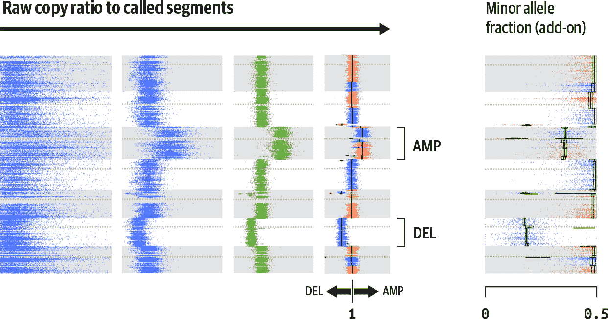

###### 图 7-11\. 从原始数据到结果的完整进展。

在图 7-11 中计算和处理的复制比例计数如前面的图所示，向右旋转 90°。最左边的面板显示了每个目标或基因组区段计算的原始复制比例计数。第二和第三个面板分别显示了标准化和去噪后的计数。第四个面板显示了分割和调用结果，包括一个整体染色体扩增（AMP）和一个缺失（DEL）。最右边的面板显示了使用下一节中概述的程序计算的次等位基因分数。

具有讽刺意味的是，这些结果并不包括实际的拷贝数，只包括每个分段的边界、其复制比例和最终调用。要获得拷贝数，您需要进行一些超出本章范围的额外工作。有关更多信息和下一步，请参阅[文档](https://oreil.ly/NXTuz)。

## 附加分析选项

我们刚刚介绍了使用 GATK 工具执行拷贝数分析的标准工作流程。这包括收集覆盖计数，使用 PoN 进行去噪，执行分割以对肿瘤案例样本建模并最终调用拷贝数改变片段。然而，你可以应用两个额外选项以进一步提高结果的质量。

### 肿瘤-正常对分析

Tumor-only workflow 可以为体细胞 CNAs 的发现提供不错且可用的结果。但是，如果你有配对的正常样本，你可以获得额外的好处！首先，你可以按照之前描述的流程在正常样本上运行工作流程，这有助于理解你正在处理的基线。在许多情况下，有配对的正常样本还可以帮助去噪过程。

欢迎自行运行这些命令。在最终的分割结果中，请注意染色体 2 和染色体 6 上可能的 CNAs。这个配对的正常样本本身来自细胞系，尽管是从健康组织而不是肿瘤中衍生出来的。即使在正常组织被作为细胞系传播时，也不罕见看到一些背景改变发生。

###### 注意

这结束了本章的练习，所以再次，记得在进入下一章之前暂停你的 VM。

### 等位复制比分析

到目前为止，我们仅使用读深度作为 CNAs 的证据，但我们也可以包括*等位复制比*：在具有杂合 SNV 的位点上，不同等位基因的复制比。这可以揭示我们案例样本的杂合性的有趣信息，这可能对生物学有重要影响，尤其是在存在*等位基因丧失*时。

通过观察案例样本中常见变异群体中的等位计数（即每个位点不同等位基因的读数），我们可以检测段的杂合性失衡。对于二倍体生物，我们预期任何杂合 SNV 表现为两种不同等位基因以相等比例存在。假设我们有 A/T 变异体；我们预期在序列读数中看到大约 50%的 A 和 50%的 T（加上一些技术变异）。在工作流程的第一步中计数读数时，我们可以实时检测这些位点。然后，我们可以将这些位点用作标记；如果我们在肿瘤中观察到这些位点并发现它们的等位比例显著偏斜，这就为我们提供了关于影响这些位点所在片段的 CNA 程度的额外信息。

如果你对探索这种额外的分析模式感兴趣，请查看 GATK 网站上的[somatic copy-number documentation](https://oreil.ly/NXTuz)。

# 总结和下一步

那么，在配对的正常工作流程和这两种体细胞分析工作流程之间，我们已经运行了大量的基因组学命令。那么，这是否意味着我们准备好进行全面的基因组分析了？

Hah, no. 现在你可以逐个运行各个工具——这在工作的不同阶段特别有用，尤其是在初始测试/评估以及故障排除时，但你也知道变异发现的最佳实践包括多个任务，涉及各种工具。相信我们，你不想为需要处理的每个样本或样本集手动运行每个任务。你会希望将这些任务串联成脚本，自动化大部分工作，以减少单调的枯燥工作以及降低人为错误的几率。所以在第八章，我们向你展示如何使用 WDL 编写工作流脚本，该脚本自动调用整个分析管道中的每个步骤。然后，我们使用一个名为 Cromwell 的工作流管理系统来运行它们，这个系统同样适用于你的笔记本电脑、集群或云平台。
