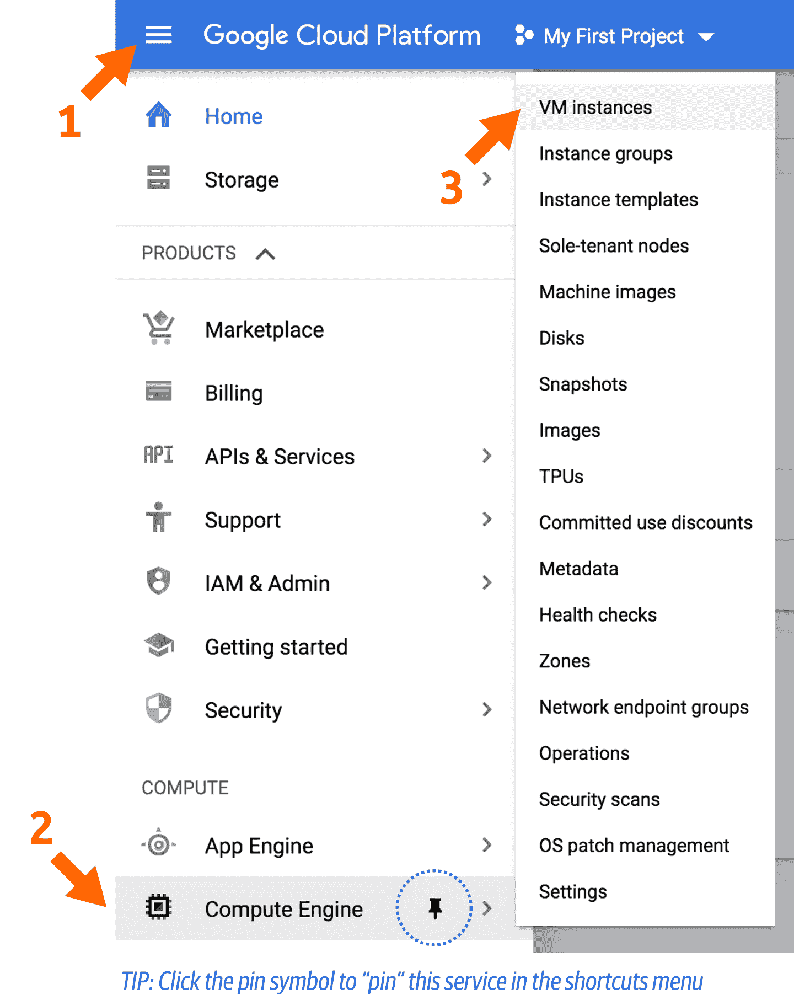

# 第四章：云中的第一步

在前两章中，我们带您了解了基因组学和计算技术的基础知识。无论您是更多地从其中一方面接触到这个领域，还是可能来自其他领域，我们的目标是确保您在两个领域都有足够的基础知识。如果是这样，欢迎！请继续保持。

我们意识到，前两章可能感觉非常被动，因为没有涉及实际操作的练习。所以好消息来了：你终于可以开始动手了。本章的重点是让你熟悉并适应本书中使用的 GCP 服务。首先，我们将带你创建一个 GCP 账号，并在 Google Cloud Shell 中运行简单命令。接下来，我们将向你展示如何在云中设置自己的虚拟机，运行 Docker，并设置你将在第五章中用于运行 GATK 分析的环境。最后，我们将向你展示如何配置 IGV 以访问 Google Cloud 存储中的数据。完成这些设置后，你将准备好进行实际的基因组学工作。

# 设置您的 Google Cloud 账号和第一个项目

您可以通过访问[*https://cloud.google.com*](https://cloud.google.com)并按照提示操作来注册 GCP 账号。我们在这里故意保持详细内容较少，因为账号设置界面可能会发生变化。但从高层次来看，您的目标是建立一个新的 Google Cloud 账号，设置一个计费账号，接受免费试用信用（如果您符合条件），并创建一个新项目，该项目与您的计费账号关联。

如果您还没有任何形式的 Google 身份，您可以使用常规电子邮件账号创建一个，不必使用 Gmail 账号。请注意，如果您的机构使用 G Suite，即使域名不是*gmail.com*，您的工作电子邮件也可能已与 Google 身份关联。

在注册后，请前往[GCP 控制台](https://oreil.ly/T4nVl)，该控制台提供了一个基于 Web 的图形界面，用于管理云资源。您可以通过纯命令行界面访问控制台提供的大部分功能。在本书中，我们会展示如何通过 Web 界面和命令行执行一些操作，具体取决于我们认为哪种方式更方便或更典型。

## 创建一个项目

让我们从创建你的第一个项目开始，这对于组织你的工作、设置计费并访问 GCP 服务是必要的。在控制台中，转到[“管理资源”](https://oreil.ly/2oA64)页面，然后在页面顶部选择创建项目。如图 4-1 所示，你需要给你的项目取一个名字，在整个 GCP 中必须是唯一的。如果你的 Google 身份关联了一个组织（如果你有一个机构/工作 G Suite 账户，通常是这种情况），你也可以选择一个组织，但如果你刚刚创建了你的账户，这可能暂时不适用于你。选择了一个组织意味着新项目将默认与该组织关联，这允许对项目进行集中管理。在这些说明中，我们假设你是第一次设置你的账户，目前没有与之关联的现有组织。


###### 图 4-1\. 创建一个新项目。

## 检查您的计费账户并激活免费信用

如果您按照前一节中概述的注册流程并激活了您的免费试用，系统将在整体账户创建过程中为您设置计费信息。您可以在[控制台的计费部分](https://oreil.ly/X8G6K)中查看您的计费信息，您也可以随时从侧边栏菜单中访问。

如果您有资格参加免费信用计划，计费概览页面上的一个面板将总结您剩余的信用额度和天数。请注意，如果您的页面显示一个蓝色的升级按钮，如图 4-2 所示，您的试用尚未开始，您需要激活它以利用该计划。您还可能在浏览器窗口顶部看到一个“免费试用状态”横幅，带有一个蓝色的激活按钮。GCP 的某个人正在努力不让您放弃免费的钱，所以点击其中任何一个按钮开始流程并获得您的免费信用。


###### 图 4-2\. 在计费控制台中总结免费试用信用额度的面板。

更一般地说，计费概览页面提供了迄今为止花费了多少钱（或信用额度）以及一些基本的预测摘要。话虽如此，重要的是要了解系统不会实时显示您的成本：在您使用可计费资源和成本更新到您的计费页面之间存在一些滞后时间。

许多转向云端的人报告说，跟踪他们的支出是整个过程中最困难的部分之一。这也是最令他们焦虑的部分，因为如果不小心，很容易在云中迅速花费大量资金。GCP 提供的一个特别有用的功能是“预算与警报”设置，如图 4-3 所示。这使您可以设置电子邮件警报，通知您（或者是您帐户上的计费管理员）当您超过某些支出阈值时。清楚地说，这不会停止任何正在运行的东西，也不会阻止您启动可能使您超出阈值的任何新工作，但至少它会让您知道您的情况。


###### 图 4-3\. 预算和警报阈值管理。

要访问计费通知功能，请在 GCP 控制台的主菜单上选择“计费”，选择您刚创建的计费账户，然后查找“预算和警报”选项。选择后，您将能够使用图 4-3 中显示的“创建预算”表单来设置新的预算。如果您希望在接近预算金额时得到警告，可以为不同百分比的预算设置多个触发器。但正如我们刚才提到的，要记住它仍然只是一个通知服务，并不会阻止您产生额外的费用。

# 在 Google Cloud Shell 中运行基本命令

现在您已经建立了您的帐户，设置了计费，并创建了您的项目，下一步是登录到您的第一个虚拟机。在这里的练习中，我们使用 Google Cloud Shell，它不需要任何配置即可开始使用，并且完全免费，尽管它带有一些重要的限制，我们稍后会讨论。

## 登录到 Cloud Shell 虚拟机

要使用 SSH 协议创建到 Cloud Shell VM 的安全连接，请点击控制台右上角的终端图标：


这会在控制台底部启动一个新面板；如果需要，您也可以将终端弹出到独立窗口。这样，您就可以访问装有适度资源的基于 Debian 的 Linux VM，包括挂载在*$HOME*上的 5 GB 免费存储（挂载在持久性磁盘上）。一些基本软件包已预安装并准备就绪，包括 Google Cloud SDK（也称为`gcloud`），它提供了丰富的基于命令行的工具集，用于与 GCP 服务进行交互。我们将在几分钟内使用它来尝试一些基本的数据管理命令。与此同时，可以随意探索这个 Debian VM，四处看看，了解安装了哪些工具。

###### 注意

请注意，每周使用配额限制您在 Cloud Shell 上运行的时间；截至目前为止，每周为 50 小时。此外，如果您不定期使用（截至目前为止为 120 天），提供免费存储空间的磁盘内容可能会被删除。

第一次登录 Cloud Shell 时，它会提示您使用上述`gcloud`实用程序指定项目 ID：

```
Welcome to Cloud Shell! Type "help" to get started.
To set your Cloud Platform project in this session use “gcloud config set project
[PROJECT_ID]”
```

您可以在控制台的主页上找到您的项目 ID，如图 4-4 所示。


###### 图 4-4\. GCP 控制台中项目 ID 的位置。

当您拥有项目 ID 时，在 Cloud Shell 中运行以下命令，将此处显示的项目 ID 替换为您自己的项目 ID：

```
genomics_book@cloudshell:~$ gcloud config set project ferrous-layout-260200
Updated property [core/project].
genomics_book@cloudshell:~ (ferrous-layout-260200)$
```

请注意，您的命令提示现在包含您的项目 ID。它非常长，因此在以后，我们将仅显示提示中的最后一个字符—在本例中为美元符号（$）—当我们演示运行命令时。例如，如果我们使用`ls`命令列出工作目录的内容，它将如下所示：

```
$ ls
README-cloudshell.txt
```

嘿，这里已经有东西了：一个*README*文件，正如名称所示，真的希望您阅读它。您可以通过运行`cat`命令来阅读它：

```
$ cat README-cloudshell.txt
```

这将显示一个欢迎消息，总结了一些使用说明和获取帮助的建议。有了这个，您已经准备好使用 Cloud Shell 开始与基本的 GCP 服务进行交互了。让我们开始吧！

## 使用 gsutil 访问和管理文件

现在我们可以访问这个非常简单启动且免费（虽然相当有限）的虚拟机，让我们使用它来查看是否可以访问本书提供的示例数据包。数据包存储在 Google Cloud Storage（GCS）中，这是一种*对象存储*（即用于存储文件）的形式，其中存储单元称为*存储桶*。您可以通过 GCP 控制台的[存储浏览器部分](https://oreil.ly/sqrkr)通过网络查看 GCS 存储桶的内容并执行基本管理任务，但界面相当有限。更强大的方法是使用`gcloud`工具，`gsutil`（Google Storage Utilities）从命令行访问。您可以通过其 GCS 路径访问存储桶，该路径只是其名称前缀为*gs://*。

例如，本书的公共存储桶路径为*gs://genomics-in-the-cloud*。您可以在云 shell 中输入以下命令来列出存储桶的内容：

```
$ gsutil ls gs://genomics-in-the-cloud
gs://genomics-in-the-cloud/hello.txt
gs://genomics-in-the-cloud/v1/
```

应该有一个名为*hello.txt*的文件。让我们使用 Unix 命令`cat`的`gsutil`版本，它允许我们读取文本文件的内容，以查看这个*hello.txt*文件包含什么：

```
$ gsutil cat gs://genomics-in-the-cloud/hello.txt
HELLO, DEAR READER!
```

您还可以尝试将文件复制到您的存储磁盘：

```
$ gsutil cp gs://genomics-in-the-cloud/hello.txt .
Copying gs://genomics-in-the-cloud/hello.txt...
/ [1 files][   20.0 B/   20.0 B]
Operation completed over 1 objects/20.0 B.
```

如果您再次使用`ls`列出工作目录的内容，您现在应该有一个*hello.txt*文件的本地副本：

```
$ ls
hello.txt README-cloudshell.txt
```

在我们使用`gsutil`的同时，如何做一些以后有用的事情呢：创建您自己的存储桶，以便您可以在 GCS 中存储输出。您需要替换这里显示的命令中的`my-bucket`，因为存储桶名称必须在整个 GCS 中是唯一的：

```
$ gsutil mb gs://my-bucket
```

如果您没有更改存储桶名称，或者尝试的名称已经被其他人使用，可能会收到以下错误消息：

```
Creating gs://my-bucket/...
ServiceException: 409 Bucket my-bucket already exists.
```

如果是这种情况，请尝试另一个更有可能唯一的名称。当您在输出中看到`Creating *name*...`并且在`gsutil`未有更多投诉后，您将知道它已成功。完成后，您将创建一个环境变量，该变量将作为存储桶名称的别名。这样，您可以节省一些输入，而且在后续命令中可以复制粘贴，而无需每次替换存储桶名称：

```
$ export BUCKET="gs://my-bucket"
```

您可以对新变量运行`echo`命令，以验证存储桶名称已正确存储：

```
$ echo $BUCKET
gs://my-bucket
```

现在，让我们帮助您熟悉使用`gsutil`。首先，将*hello.txt*文件复制到您的新存储桶中。您可以直接从原始存储桶中进行操作：

```
$ gsutil cp gs://genomics-in-the-cloud/hello.txt $BUCKET/
```

或者，您可以从本地副本中进行操作；例如，如果您进行了要保存的修改：

```
$ gsutil cp hello.txt $BUCKET/
```

最后，作为基本文件管理的另一个示例，您可以决定文件应该位于存储桶中自己的目录中：

```
$ gsutil cp $BUCKET/hello.txt $BUCKET/my-directory/
```

正如您所看到的，`gsutil`命令设置得尽可能与其原始 Unix 对应命令相似。因此，例如，您还可以使用`-r`来使`cp`和`mv`命令递归地应用于目录。对于大文件传输，您可以使用一些云规范优化来加快过程，比如`gsutil -m`选项，该选项并行传输文件。方便的是，系统通常会在终端输出中告知您何时可以利用这些优化，因此您无需在开始之前去记忆文档。


###### 图 4-5\. GCP 控制台存储浏览器。

这将打开一个相当简单的配置表单。在这里做的最重要的事情是选择一个好的名称，因为您选择的名称必须在整个 Google Cloud 中是唯一的—所以要有创意！如果您选择了一个已经在使用的名称，系统将在您单击配置表单中的“继续”时告知您，如在图 4-6 中演示的那样。


###### 图 4-6\. 给您的存储桶命名。

当您有一个唯一的名称时，系统会扩展菜单选项，让您可以继续进行下一步。这些选项允许您自定义存储位置和桶的访问控制，但目前您可以接受默认设置并单击“创建”。这将带您返回到桶列表，此时列表应包含您新创建的桶。您可以单击其名称查看其内容，但当然它仍然是空的，所以视图不会特别令人兴奋，正如 图 4-7 所示。

该界面提供了一些基本的管理选项，如删除桶和文件，以及上传文件和文件夹。请注意，您甚至可以将本地计算机中的文件和文件夹拖放到桶内容窗口中，这非常容易（试试看），但在基因组学工作中，您不太可能经常这样做。在实际环境中，您更有可能使用 `gsutil` 命令行实用程序。使用命令行路径的一个优势是可以将这些命令保存为脚本，用于溯源和在需要时重现您的步骤。


###### 图 4-7\. 查看桶内容。

## 拉取 Docker 镜像并启动容器

云 Shell 是一份不断奉送的礼物：第三章 中介绍的 Docker 应用程序已预装，因此您可以立即开始使用！我们将使用一个简单的 Ubuntu 容器来演示基本的 Docker 功能。尽管 GATK 提供了一个 Docker 镜像，并且在接下来的几章中我们会大量使用它，但我们在这里不会使用它，因为它相当庞大，启动需要一些时间。由于免费的 Cloud Shell 分配了较少的 CPU 和内存资源，我们实际上无法在其中运行任何现实分析任务。

###### 注意

在这种情况下学习如何使用 Docker 容器的第一件事是… 避开在线 Docker 文档！真的。不是因为它不好，而是因为这些文档主要是为想在云中运行 Web 应用程序的人编写的。如果这是您想要做的事情，那么恭喜您，但您正在读错书。我们在这里提供的是量身定制的指导，将教您如何使用 Docker 在容器中运行研究软件。

正如刚才所提到的，我们将使用一个非常通用的例子：一个包含 Ubuntu Linux 操作系统的镜像。这是一个官方镜像，作为公共容器镜像库 Docker Hub 的核心库的一部分提供，所以我们只需要声明它的名称。稍后您会看到，由社区贡献的镜像是以贡献者的用户名或组织名称作为前缀的。在您的 Cloud Shell 终端中（无论您的工作目录在哪里），运行以下命令从 Docker Hub 官方（认证）镜像库中检索 Ubuntu 镜像：

```
$ docker pull ubuntu
Using default tag: latest
latest: Pulling from library/ubuntu
7413c47ba209: Pull complete
0fe7e7cbb2e8: Pull complete
1d425c982345: Pull complete
344da5c95cec: Pull complete
Digest: sha256:d91842ef309155b85a9e5c59566719308fab816b40d376809c39cf1cf4de3c6a
Status: Downloaded newer image for ubuntu:latest
docker.io/library/ubuntu:latest
```

`pull`命令获取镜像并保存到您的虚拟机。容器镜像的版本由其`tag`（可以是镜像创建者想要分配的任何内容）和其`sha256`哈希值（基于镜像内容）表示。默认情况下，系统会给出可用的最新版本，因为我们没有指定特定的标签；在后续练习中，您将看到如何通过标签请求特定版本。请注意，容器镜像通常由几个模块化的*slices*组成，这些模块化的部分会分别被拉取。它们被组织得这样，下次您拉取镜像的版本时，系统将跳过任何与您已有版本相比未更改的部分。

现在让我们启动容器。有三种主要选项可以运行它，但棘手的是通常只有一种正确的方式*正如其作者所意图的*，如果文档没有指定（这种情况太常见了），很难知道那是什么。感到困惑了吗？让我们通过具体案例来澄清一下，并且你会明白为什么我们要让你经历这一瞬间的挫败和神秘感——这是为了在今后避免潜在的痛苦。

第一个选项

只需运行它！

```
$ docker run ubuntu
```

结果

稍作停顿，然后您的命令提示符又回来了。没有输出。发生了什么？实际上 Docker 启动了容器，但在这些条件下，容器没有配置*执行*任何操作，所以基本上是耸了耸肩然后再次关闭了。

第二个选项

附加命令运行：

```
$ docker run ubuntu echo "Hello World!"
Hello World!
```

结果

它回显了`Hello World!`，正如请求的那样，然后再次关闭了。好的，现在我们知道可以向容器传递命令，如果它是在其中某个地方被识别的命令，它将被执行。然后，当所有命令都已完成时，容器将关闭。有点懒，但还算合理。

第三个选项

使用`-it`选项进行交互式运行：

```
$ docker run -it ubuntu /bin/bash
root@d84c079d0623:/#
```

结果

啊哈！一个新的命令提示符（在本例中是 Bash）！但是带有不同的 shell 符号：`#`而不是`$`。这意味着容器正在运行，而且你正在其中。现在，您可以运行任何在 Ubuntu 系统上通常使用的命令，包括安装新的软件包。尝试运行一些 Unix 命令，如`ls`或`ls -la`来探索并查看容器的功能。本书的后面部分，特别是第十二章，我们将深入探讨其中的一些含义，包括如何定制并重新分发您的图像，以便以可重现的方式分享您自己的分析。

当您完成探索时，在命令提示符处输入`**exit**`（或按 Ctrl+D）来终止 shell。因为这是容器运行的主要进程，终止它将导致容器关闭并返回到 Cloud Shell 本身。清楚地说，这将关闭容器*以及当前正在运行的任何命令*。

如果你感兴趣：是的，可以在不关闭容器的情况下离开容器；这称为*分离*。要这样做，按 Ctrl+P+Q，而不是使用`exit`命令。这样，你随时可以跳回容器中——只要你能识别它。默认情况下，Docker 为您的容器分配一个全局唯一标识符（UUID）以及一个随机的易读名称（通常听起来有点傻）。您可以运行`docker ps`列出当前运行的容器，或者`docker ps -a`列出已创建的容器。这将显示一个按其容器 ID 索引的容器列表，应该看起来像这样：

```
$ docker ps -a
CONTAINER ID	IMAGE	COMMAND                 CREATED     STATUS			
PORTS		NAMES
c2b4f8a0c7a6	ubuntu	"/bin/bash"             5 minutes ago	 Up 5 minutes	
vigorous_rosalind
9336068da866	ubuntu	"echo ’Hello World!’"	8 minutes ago	Exited (0) 8 minutes ago
objective_curie
```

我们展示了最后两次 Docker 调用对应的两个条目，每个都有一个唯一标识符，即`CONTAINER ID`。我们看到 ID 为`c2b4f8a0c7a6`的当前正在运行的容器被命名为`vigorous_rosalind`，状态为`Up 5 minutes`。您可以看出另一个容器`objective_curie`不在运行，因为其状态为`Exited (0) 8 minutes ago`。我们在这里看到的名称是随机分配的（我们发誓！这有多大概率？），所以它们显然不是特别有意义的。如果同时运行多个容器，这可能会变得有点混乱，因此您需要一种更好的方法来识别它们。好消息是，您可以在初始命令的`docker run`之后立即添加`--name=*meaningful_name*`来为容器指定有意义的名称，将`*meaningful_name*`替换为您想要给容器的名称。

要进入容器，只需运行`docker attach *c2b4f8a0c7a6*`（替换为你的容器 ID），然后按 Enter，你将回到控制台（你的键盘可能标有 Return 而不是 Enter）。如果你想要能够在容器内部工作的同时在 Cloud Shell 中运行命令，可以打开第二个命令选项卡。请注意，你可以在单个 VM 上同时运行多个容器，这是容器系统的一大优势之一，但它们将竞争 VM 的 CPU 和内存资源，在 Cloud Shell 中这些资源相当有限。本章后面，我们将向你展示如何启动具备更强大能力的 VM。

## 挂载卷以从容器内部访问文件系统

完成了前面的练习后，现在你可以检索并运行任何公共存储库中共享的容器映像实例。许多常用的生物信息学工具，包括 GATK，在 Docker 容器中预先安装。其理念在于，知道如何在 Docker 容器外使用它们意味着你不需要担心正确的操作系统或软件环境。然而，我们仍然需要向你展示一个诀窍，以便真正使其对你有用：如何通过*挂载卷*从容器内部访问您机器的文件系统。

上次的最后一部分是什么意思？默认情况下，当你在容器内部时，无法访问容器外部文件系统中的任何数据。容器就像是一个封闭的盒子。虽然有办法在容器和你的文件系统之间来回复制东西，但那样很快就变得很繁琐。因此，我们将选择更简单的方法，即在容器外部建立一个链接，使其看起来就像是在容器内部。换句话说，我们要在容器的墙壁上打个洞，如图 4-8 所示。


###### 图 4-8\. 将 Google Cloud Shell VM 中的目录挂载到 Docker 容器中：本章中使用的 Ubuntu 容器（左）；在第五章介绍的 GATK 容器（右）。

例如，让我们在 Cloud Shell VM 的主目录中创建一个名为*book*的新目录，并将之前的*hello.txt*文件放入其中：

```
$ mkdir book
$ mv hello.txt book/
$ ls book
hello.txt
```

因此，这一次，让我们运行该命令通过使用`-v`参数（其中`v`表示卷），这使我们能够指定文件系统位置和容器内的挂载点来启动我们的 Ubuntu 容器：

```
$ docker run -v ~/book:/home/book -it ubuntu /bin/bash
```

命令中的`-v ~/book_data:/home/book`部分将您指定的位置链接到 Docker 容器内的路径*/home/book*目录。路径中的`/home`是容器中已存在的目录，而`book`部分可以是您选择的任何名称。现在，您文件系统中`book`目录中的所有内容都可以从 Docker 容器的*/home/book*目录访问：

```
# ls home/book
hello.txt
```

在这里，我们使用与实际位置相同的挂载点名称，因为这样更直观，但如果您希望，也可以使用不同的名称。请注意，如果您将挂载点命名为容器中该路径已存在的目录或文件的名称，则会“压制”现有路径，这意味着在挂载卷的时间内该路径将不可访问。

还有一些其他有用的 Docker 技巧需要了解，但目前这已经足够演示您将在第五章中使用的核心 Docker 功能的基本功能了。我们会在遇到更复杂的选项时详细讨论更多细节。

# 设置您自己的自定义 VM

现在，您已成功运行了一些基本的文件管理命令，并掌握了与 Docker 容器交互的技巧，是时候转向更大更好的事物了。Google Cloud Shell 环境非常适合快速开始一些轻量级编码和执行任务，但为 Cloud Shell 分配的虚拟机性能确实较低，当需要在第五章中运行真正的 GATK 分析时肯定不够用。

在本节中，我们将向您展示如何使用 Google 的 Compute Engine 服务在云中设置自己的 VM（有时称为*实例*），该服务允许您选择、配置和运行任何所需大小的 VM。

## 创建和配置您的 VM 实例

首先，进入[*计算引擎*](https://oreil.ly/sGeug)，或者通过左侧的侧边栏菜单访问页面，如图 4-9 所示。



###### 图 4-9\. 显示 VM 实例菜单项的计算引擎菜单。

点击此菜单中的 VM 实例链接，进入运行图像的概述页面。如果这是一个新帐户，您将没有任何正在运行的实例。请注意顶部有一个“创建实例”的选项。点击它，让我们一起完成只使用您所需资源创建新 VM 的过程。

接下来，在顶部菜单栏中点击“创建实例”，如图 4-10 所示。这将弹出一个配置表单，如图 4-11 所示。


###### 图 4-10\. 创建一个 VM 实例。


###### 图 4-11\. VM 实例配置面板。

按照接下来的小节中的逐步说明配置 VM。这里有大量的选项，如果您对术语不熟悉，整个过程可能会非常混乱，因此我们列出了配置表单中的最简单路径，可以让您在本书的前几章节中运行所有命令练习。请确保除非您真正知道自己在做什么，否则使用完全相同的设置。

### 为您的 VM 命名

为您的 VM 命名；例如 `genomics-book`，如图 4-12 所示。这必须在您的项目中是唯一的，但与 GCP 不同，它不需要在全局范围内唯一。一些人喜欢使用他们的用户名，以便其他有权访问项目的人员可以立即识别创建资源的人。


###### 图 4-12\. 给您的 VM 实例命名。

### 选择一个区域（重要！）和区域（不那么重要）

云的物理位置有所不同。与大多数商业云供应商一样，GCP 在世界各地维护数据中心，并为您提供选择使用哪一个的选项。区域是最高级别的地理区分，其名称相对描述准确（比如 `us-west2`，指的是洛杉矶的一个设施）。每个区域进一步分为两个或更多由单个字母指定的区域（`a`、`b`、`c` 等），对应具有自己物理基础设施（电力、网络等）的独立数据中心，尽管在某些情况下它们可能共享同一建筑物。

区域和区域的这种系统在限制像停电这样的局部问题方面发挥了重要作用，所有主要的云供应商都使用某种形式的这种策略。有关更多信息，请参阅 [这篇有趣的博客文章](https://oreil.ly/pZUl6)，作者 Kyle Galbraith 讨论了云区域和区域（在他的情况下，AWS）如何在僵尸末日事件中发挥重要作用。

###### 注意

选择特定区域和区域用于您的项目，对于处理关于人主体数据存储位置的监管限制越来越有帮助，因为它允许您指定符合规定的位置用于所有存储和计算资源。然而，一些世界上的地区目前云服务覆盖不足或者不同云供应商之间的覆盖方式不同，因此在选择供应商时您可能需要考虑可用的数据中心位置。

要为项目选择区域，您可以查阅完整的[Google Cloud 可用区域和区域](https://oreil.ly/D4Iqa)列表，并基于地理接近性做出决定。或者，您可以使用在线工具来衡量每个数据中心的网络响应时间，例如[*http://www.gcping.com*](http://www.gcping.com)。例如，如果我们从马萨诸塞州西部的桑德兰小镇运行这个测试（结果见表 4-1），我们发现从位于弗吉尼亚北部的`us-east4`区域（698 公里远）获取响应需要 38 毫秒，而从蒙特利尔的`northamerica-northeast1`区域（441 公里远）获取响应需要 41 毫秒。这表明，地理接近性并不直接与网络区域接近性相关。更为显著的例子是，我们发现与位于伦敦的`europe-west2`区域（5,353 公里远）相比，与位于洛杉矶的`us-west2`区域（4,697 公里远）相比，我们与前者的响应时间为 102 毫秒，而与后者的响应时间为 180 毫秒。

表 4-1\. 桑德兰，马萨诸塞州的地理距离和响应时间

| 区域 | 位置 | 距离（公里） | 响应时间（毫秒） |
| --- | --- | --- | --- |
| us-east4 | 美国弗吉尼亚州北部 | 698 | 38 |
| northamerica-northeast1 | 蒙特利尔 | 441 | 41 |
| europe-west2 | 伦敦 | 5,353 | 102 |
| us-west2 | 洛杉矶 | 4,697 | 180 |

这使我们回到了我们的 VM 配置。对于区域，我们将使用`us-east4`（弗吉尼亚北部），因为它是我们中最少旅行的人（杰拉尔丁）最近的一个，而对于区域，我们随意选择了`us-east4-a`。您需要确保根据前面的讨论选择*您的*区域，这对您自身的利益（它将更快）以及避免在 GATK 软件的所有 60,000 注册用户同时开始进行这些练习的不太可能事件中占据弗吉尼亚州的数据中心都很重要，尽管这是测试云计算所标榜的“弹性”的一种方式。

### 选择机器类型

在这里，您可以配置即将启动的虚拟机的资源。您可以控制 RAM 和 CPU。对于某些实例类型（在自定义选项下可用），甚至可以选择带有 GPU 的 VM，用于加速某些程序。关键是，您在此选择的内容将决定 VM 运行时间的每秒计费金额；机器越大越强大，成本就越高。页面右侧应显示在更改机器类型时，每小时和每月成本的变化情况。还请注意，您将按 VM 在线时间计费，而不是您实际使用它的时间。我们稍后会介绍限制成本的策略，但请记住这一点！

在这里选择 `n1-standard-2`；这是一台非常基础的机器，几乎不会花费太多，如图 4-13 所示。


###### 图 4-13\. 选择机器类型。

### 指定一个容器？（不需要）

我们不会填写这部分。如果您希望使用您预先选择或生成的自定义容器映像设置非常具体的设置，那么这将非常有用。实际上，我们本可以为您预配置一个容器并跳过接下来的一堆设置。但这样您就没有机会学习如何为自己做这些事情了，对吧？所以，现在，让我们跳过这个选项。

### 自定义启动磁盘

就像机器类型一样，这是另一个非常有用的设置。您可以在这里定义两件事情：您想要使用的操作系统及其版本以及您想要的磁盘空间量。前者在您需要使用特定类型和版本的操作系统时尤为重要。当然，后者在您不希望在分析进行到一半时磁盘空间用尽时尤为重要。

默认情况下，系统提供了一种特定版本的 Linux 操作系统，并配备了仅有 10 GB 的磁盘空间，如图 4-14 所示。我们需要更大的硬盘。


###### 图 4-14\. 选择启动磁盘大小和镜像。

要访问此设置菜单，请单击“更改”。这将打开一个新屏幕，显示预定义选项菜单。您还可以创建自己的自定义镜像，甚至在 [Google Cloud Marketplace](https://oreil.ly/sjiIf) 中查找更多镜像。

对于我们目前的需求，我们更喜欢 Ubuntu 18.04 LTS，这是 Ubuntu 的最新长期支持版本。它可能不像 Ubuntu 19.04 那样前沿，但是 LTS（长期支持）版本保证了在发布后的五年内对其进行安全漏洞和软件包更新的维护。这个 Ubuntu 镜像已经包含了我们需要的大部分内容，包括各种标准 Linux 工具和我们将会非常依赖的 GCP SDK 命令行工具。

在操作系统菜单中选择 Ubuntu，然后在版本菜单中选择 Ubuntu 18.04 LTS，如图 4-15 所示。


###### 图 4-15\. 选择基础镜像。

在表单底部，您可以更改启动磁盘大小以提供更多空间。如图 4-16 所示，选择 100 GB 而不是默认的 10 GB（我们即将处理的数据可能会占用大量空间）。您可以根据数据集的大小和需求进一步增加此大小。虽然在 VM 启动后无法轻松调整它，但您可以在启动后向正在运行的实例添加块存储卷的选项，将其视为插入 USB 驱动器的云等效。因此，如果您的磁盘空间不足，您不会完全陷入困境。


###### 图 4-16\. 设置启动磁盘大小。

当您完成所有这些操作后，请单击“选择”; 这将关闭屏幕并将您返回到实例创建表单，其中“启动磁盘”部分应与图 4-17 中的截图匹配。


###### 图 4-17\. 更新的启动磁盘选择。

在表单底部，单击“创建”。这会将您返回到列出 Compute Engine VM 实例的页面，包括您新创建的 VM 实例。在创建和启动实例时，您可能会看到其名称前面的旋转图标，然后当实例正在运行并且准备就绪时，会出现一个带有复选标记的绿色圆圈，如图 4-18 所示。


###### 图 4-18\. 查看 VM 状态。

voilà，您的 VM 已准备就绪。

## 登录到您的 VM 使用 SSH

在 VM 运行后，您可以通过多种方式访问它，您可以在 GCP 文档中了解详情。我们将向您展示最简单的方法，即使用 Google Cloud 控制台和内置的 SSH 终端。这种方式几乎无懈可击：一旦在 Google Cloud 控制台中看到绿色复选标记，您只需点击 SSH 选项即可打开下拉菜单，如图 4-19 所示。选择“在浏览器窗口中打开”，几秒钟后，您应该会看到一个打开到此 VM 的 SSH 终端。


###### 图 4-19\. SSH 连接 VM 的选项。

这将打开一个新窗口，其中包含一个终端，允许您从 VM 实例内运行命令，如图 4-20 所示。建立连接可能需要一分钟的时间。


###### 图 4-20\. VM 实例终端。

随意四处浏览并了解您全新的 VM；在接下来的几章中，您将花费大量时间与它亲密接触（但这是一种好方式）。

## 检查您的身份验证

您可能迫不及待地想要运行一些有趣的东西，但让我们首先确保您的帐户凭据已正确设置，以便您可以使用 GCP 命令行工具，这些工具已预先安装在我们选择的镜像上。在 SSH 终端中，运行以下命令：

```
$ gcloud init
Welcome! This command will take you through the configuration of gcloud.
Your current configuration has been set to: [default]
You can skip diagnostics next time by using the following flag:
 gcloud init --skip-diagnostics
Network diagnostic detects and fixes local network connection issues.
Checking network connection...done.                                                                                                                                   
Reachability Check passed.
Network diagnostic passed (1/1 checks passed).
Choose the account you would like to use to perform operations for
this configuration:
[1] XXXXXXXXXXX-compute@developer.gserviceaccount.com
[2] Log in with a new account
Please enter your numeric choice:
```

以 `[1]` 开头的那一行告诉您，默认情况下，GCP 会让您以服务帐户身份登录：域为 *@developer.gserviceaccount.com*。这对于在您的虚拟机内运行工具是可以的，但如果您想要能够管理资源，包括将文件复制到 GCS 存储桶中，您需要以具有相关权限的帐户进行操作。可以授予此服务帐户您在这些练习中所需的各种权限，但这将使我们深入到 GCP 帐户管理的内部，这不是我们目前想要的—我们希望尽快让您开始进行基因组学工作！因此，让我们使用在本章开头创建项目时使用的原始帐户，因为该帐户已经作为项目所有者拥有这些权限。

要使用该帐户登录，请在提示处按 2。这将触发与程序的一些交互；GCP 将警告您，在虚拟机上使用您的个人凭据是一种安全风险，因为如果您让其他人访问虚拟机，他们将能够使用您的凭据：

```
You are running on a Google Compute Engine virtual machine.
It is recommended that you use service accounts for authentication.
You can run:
 $ gcloud config set account `ACCOUNT`
to switch accounts if necessary.
Your credentials may be visible to others with access to this
virtual machine. Are you sure you want to authenticate with
your personal account?
Do you want to continue (Y/n)?
```

解决方案：不要共享对您个人虚拟机的访问权限。^(1)

如果您输入 Y 以确认，程序将会给您一个链接：

```
Go to the following link in your browser:
   https://accounts.google.com/o/oauth2/auth?redirect_uri=<...>
Enter verification code:
```

当您点击链接或将其复制粘贴到浏览器中时，您将看到一个 Google 登录页面。使用您在 GCP 中使用的相同帐户登录以获取您的身份验证代码，然后将其复制粘贴回您的终端窗口。`gcloud` 实用程序将确认您的登录身份，并要求您从您可以访问的项目列表中选择要使用的项目 ID。它还将提供设置您首选的计算和存储区域的选项，这应该与您在创建虚拟机时设置的相匹配。如果您在项目 ID 列表中看到的不是您期望的内容，您可以随时再次检查 [GCP 控制台中的资源管理页面](https://oreil.ly/T50ev)。

## 将书籍材料复制到您的虚拟机

在接下来的几章中，您将在您的虚拟机上运行真实的 GATK 命令和工作流程，因此您需要获取示例数据、源代码和一些软件包。我们将大部分内容打包在一个地方：一个名为 `genomics-in-the-cloud` 的云存储桶中。唯一分开的部分是源代码，我们在 GitHub 上提供。

首先，您将使用 `gsutil` 将数据包从存储桶复制到您的虚拟机中，`gsutil` 是我们在本章 Cloud Shell 部分中已经使用过的 GCP 存储实用程序。在您的虚拟机终端窗口中，创建一个名为 `**book**` 的新目录，然后运行 `gsutil` 命令将书籍数据包复制到与您的虚拟机关联的存储空间中：

```
$ mkdir ~/book
$ gsutil -m cp -r gs://genomics-in-the-cloud/v1/* ~/book/
```

这将复制大约 10 GB 的数据到您的 VM 存储中，因此即使使用了启用并行下载的`-m`标志，可能需要几分钟时间。正如您稍后将看到的，即使没有先复制它们，也可以直接在云存储中的文件上运行一些分析命令，但我们希望在开始时尽可能保持简单。

现在，前往[GitHub 上的公共代码库](https://oreil.ly/genomics-repo)检索源代码。我们将代码放在那里是因为它是一个非常流行的用于在*版本控制*下共享代码的平台，我们承诺为书中使用的代码提供长期维护。要在您的 VM 上获取副本，请首先使用`cd`命令移动到新创建的*book*目录，然后使用`git clone`命令复制存储库的内容：

```
$ cd ~/book
$ git clone https://github.com/broadinstitute/genomics-in-the-cloud.git code
```

这将创建一个目录（*~book/code*），其中包含我们在整本书中使用的所有示例代码。不仅如此，它将设置为一个活跃的 Git 仓库，因此你可以通过在代码目录中运行`git pull`命令来获取最新的更改，如下所示：

```
$ cd ~/book/code
$ git pull
```

现在，你应该有了最新和最好的书本代码。要了解自原始出版以来的变化，请查看代码目录中的*README*文本文件。

## 在您的 VM 上安装 Docker

您将在 VM 上使用 Docker 工作，因此让我们确保您可以运行它。如果您在终端中简单地运行`docker`命令，您将收到一个错误消息，因为 Docker 未预安装在 VM 上：

```
$ docker
Command 'docker' not found, but can be installed with:
snap install docker     # version 18.09.9, or
apt  install docker.io
See 'snap info docker' for additional versions.
```

错误消息友好地指出了如何使用预安装的`snap`软件包来修复问题，但我们实际上将使用一个稍微不同的方法来安装 Docker：我们将从 Docker 网站下载并运行一个脚本，这将大大自动化安装过程。这样，如果你需要在没有内置软件包管理器选项的地方安装 Docker，你就会知道该怎么做。

运行以下命令在 VM 上安装 Docker：

```
$ curl -sSL https://get.docker.com/ | sh 
# Executing docker install script, commit: f45d7c11389849ff46a6b4d94e0dd1ffebca
32c1 + sudo -E sh -c apt-get update -qq >/dev/null
...
Client: Docker Engine - Community
Version:           19.03.5
...
If you would like to use Docker as a non-root user, you should now consider
adding your user to the "docker" group with something like:
 sudo usermod -aG docker genomics_book
Remember that you will have to log out and back in for this to take effect!
WARNING: Adding a user to the "docker" group will grant the ability to run
        containers which can be used to obtain root privileges on the
        docker host.
        Refer to https://docs.docker.com/engine/security/security/#docker-daemon-
        attack-surface for more information.
```

这可能需要一些时间才能完成，所以让我们花点时间更详细地检查命令。首先，我们使用一个方便的小工具叫做`curl`（缩写为*Client URL*）从我们提供的 Docker 网站 URL 下载安装脚本，带有一些命令参数（`-sSL`），这些参数指示程序跟随任何重定向链接并将输出保存为文件。然后，我们使用管道字符（`|`）将该输出文件传递给第二个命令`sh`，意思是“运行我们刚刚给你的那个脚本”。输出的第一行让你知道它正在做什么：“执行 docker 安装脚本”（出于简洁起见，我们省略了前面的输出部分）。

当完成时，脚本会提示您运行接下来的示例中的`usermod`命令，以授予您无需每次使用`sudo`运行 Docker 命令的能力。调用`sudo docker`可能导致输出文件由 root 所有，使得以后难以管理或访问它们，因此执行此步骤非常重要：

```
$ sudo usermod -aG docker $USER
```

这不会产生任何输出；我们将在一分钟内测试它是否正常工作。但是，首先，您需要注销 VM，然后再次登录。这样做将使系统重新评估您的 Unix 组成员资格，这对刚刚做出的更改生效是必要的。只需在命令提示符处键入`**exit**`（或按 Ctrl+D）：

```
$ exit
```

这将关闭到您的 VM 的终端窗口。返回 GCP 控制台，在计算引擎实例列表中找到您的 VM，然后单击 SSH 重新登录。这可能感觉需要经过很多步骤，但请坚持下去；我们即将进入精彩部分。

## 设置 GATK 容器镜像

当您回到 VM 时，请通过拉取 GATK 容器来测试您的 Docker 安装，我们将在接下来的章节中使用它：

```
$ docker pull us.gcr.io/broad-gatk/gatk:4.1.3.0
4.1.3.0: Pulling from us.gcr.io/broad-gatk/gatk
ae79f2514705: Pull complete
5ad56d5fc149: Pull complete
170e558760e8: Pull complete
395460e233f5: Pull complete
6f01dc62e444: Pull complete
b48fdadebab0: Pull complete
16fb14f5f7c9: Pull complete
Digest: sha256:e37193b61536cf21a2e1bcbdb71eac3d50dcb4917f4d7362b09f8d07e7c2ae50
Status: Downloaded newer image for us.gcr.io/broad-gatk/gatk:4.1.3.0
us.gcr.io/broad-gatk/gatk:4.1.3.0
```

作为提醒，容器名称后的最后一部分是版本标签，您可以更改以获取与我们在此处指定的不同版本。请注意，如果更改版本，某些命令可能不再起作用。我们无法保证所有代码示例都将与未来兼容，特别是对于仍在积极开发中的新工具。如前所述，有关更新的材料，请参见[本书的 GitHub 存储库](https://oreil.ly/genomics-repo)。

GATK 容器镜像相当庞大，因此下载可能需要一些时间。好消息是，下次需要拉取 GATK 镜像（例如，获取另一个版本）时，Docker 只会拉取已更新的组件，因此速度会更快。

###### 注意

在这里，我们从 Google 容器存储库（GCR）中拉取 GATK 镜像，因为 GCR 与我们正在运行的 VM 位于同一网络上，因此比从 Docker Hub 拉取要快。但是，如果您在不同平台上工作，您可能会发现从 Docker Hub 上的 GATK 存储库拉取镜像更快。要这样做，请将镜像路径中的`us.gcr.io/broad-gatk`部分更改为`**broadinstitute**`。

现在，记得之前在本章中遵循的指令来启动一个挂载文件夹的容器吗？您将再次使用它来使`book`目录对 GATK 容器可访问：

```
$ docker run -v ~/book:/home/book -it us.gcr.io/broad-gatk/gatk:4.1.3.0 /bin/bash
```

您现在应该能够从容器内部浏览您在 VM 中设置的`book`目录。它将位于*/home/book*下。最后，为了双重检查 GATK 本身是否按预期工作，请尝试在运行中的容器内部的命令行中运行`gatk`命令。如果一切正常，您应该会看到一些文本输出，概述了基本的 GATK 命令行语法和一些配置选项：

```
# gatk
Usage template for all tools (uses --spark-runner LOCAL when used with a Spark tool)
   gatk AnyTool toolArgs
Usage template for Spark tools (will NOT work on non-Spark tools)
   gatk SparkTool toolArgs  [ -- --spark-runner <LOCAL | SPARK | GCS> sparkArgs ]
Getting help
   gatk --list       Print the list of available tools
   gatk Tool --help  Print help on a particular tool
Configuration File Specification
    --gatk-config-file                PATH/TO/GATK/PROPERTIES/FILE
gatk forwards commands to GATK and adds some sugar for submitting spark jobs
  --spark-runner <target>    controls how spark tools are run
    valid targets are:
    LOCAL:      run using the in-memory spark runner
    SPARK:      run using spark-submit on an existing cluster
                --spark-master must be specified
                --spark-submit-command may be specified to control the Spark submit command
                arguments to spark-submit may optionally be specified after --
    GCS:        run using Google cloud dataproc
                commands after the -- will be passed to dataproc
                --cluster <your-cluster> must be specified after the --
                spark properties and some common spark-submit parameters will be translated
                to dataproc equivalents
  --dry-run     may be specified to output the generated command line without running it
  --java-options 'OPTION1[ OPTION2=Y ... ]''   optional - pass the given string of options to 
                 the java JVM at runtime. 
                Java options MUST be passed inside a single string with space-separated values

```

我们将在 第五章 中详细讨论这一切的含义；目前，您已经设置好了在接下来的三章中运行 GATK 工具所需的环境。

## 停止您的 VM…以防止它花费您的钱

您刚刚设置完毕的 VM 将在整本书中派上用场；在接下来的几章中，您将回到这个 VM 进行许多练习。但是，只要它在运行，就会花费您积分或实际货币。处理这个问题的最简单方法是停止它：在您不活跃使用时将其暂停。

您可以根据需要重新启动它；只需一两分钟即可使其恢复运行状态，并且将保留所有环境设置、先前运行的历史记录以及本地存储中的任何数据。请注意，即使 VM 未运行，您也将为该存储空间支付一小笔费用，并且您不会因 VM 本身而被收费。在我们看来，这是非常值得的，因为您可以在任意时间回到您的 VM 并继续您离开的工作。

要停止您的 VM，在 GCP 控制台中，转到 VM 实例管理页面，如前所示。找到您的实例，单击右侧的垂直三点符号以打开控件菜单，然后选择停止，如 图 4-21 所示。该过程可能需要几分钟才能完成，但您可以安全地离开该页面。要稍后重新启动您的实例，只需按照相同的步骤，但在控件菜单中单击启动。


###### 图 4-21\. 停止、启动或删除您的 VM 实例。

或者，您可以完全删除您的 VM，但请记住，删除 VM 将同时删除所有本地存储的数据，因此请确保您首先将您关心的任何内容保存到存储桶中。

# 配置 IGV 以从 GCS 存储桶中读取数据

在进入下一章之前，还有一个小步骤：我们将安装和配置一个名为集成基因组浏览器（IGV）的基因组浏览器，它可以直接与 GCP 中的文件一起使用。这将使您能够查看序列数据和变异调用，而无需将文件复制到本地计算机。

首先，如果您尚未在本地计算机上安装 [IGV 程序](https://oreil.ly/bEPS_)，请从网站上获取并按照安装说明进行安装。如果您已经有一份副本，请考虑更新到最新版本；我们使用的是 2.7.2 版本（macOS 版本）。打开应用程序后，从顶部菜单栏中选择“查看” > “首选项”，如 图 4-22 所示。


###### 图 4-22\. 选择“首选项”菜单项。

这将打开首选项面板，如 Figure 4-23 所示。

在首选项面板中，选择“启用 Google 访问”复选框，点击保存，然后退出 IGV 并重新打开以强制刷新顶部菜单栏。现在，你应该能看到一个之前不存在的 Google 菜单项；点击它，选择登录，如 Figure 4-24 所示，使用你的 Google 帐户凭据设置 IGV。


###### Figure 4-23\. IGV 首选项面板。


###### Figure 4-24\. 选择 Google 登录菜单项。

这将在你的网络浏览器中带你到 Google 登录页面；按照提示允许 IGV 访问你的 Google 帐户的相关权限。完成后，你应该会看到一个简单显示“OK”的网页。现在切换回 IGV 并测试它是否工作。从顶部菜单中点击文件 > 从 URL 加载，如 Figure 4-25 所示，确保不要误选其他选项（它们看起来相似，所以很容易搞错）。同时确保 IGV 窗口左上角的参考下拉菜单设置为“Human hg19”。

###### 注：

如果你对人类参考的区别感到困惑，请参考关于 hg19 和 GRCh38 的笔记 “作为公共框架的参考基因组”。


###### Figure 4-25\. “从 URL 加载”菜单项。

最后，在弹出的对话窗口中输入书籍数据包中提供的样本 BAM 文件之一的 GCS 文件路径（例如 *mother.bam*，如 Figure 4-26 所示），然后点击确定。记住，你可以使用 `gsutil` 从你的虚拟机或 Cloud Shell 获取桶中的文件列表，或者你可以使用 [Google Cloud 控制台存储浏览器](https://oreil.ly/1iQmv) 浏览桶的内容。如果你使用浏览器界面获取文件路径，你需要通过去掉 URL 中桶名前的第一部分来组成 GCS 文件路径；例如，移除 *https://console.cloud.google.com/storage/browser* 并将其替换为 `**gs://**`。对于 BAM 的伴随索引文件，路径和文件名相同，但以 *.bai* 结尾。^(2)


###### Figure 4-26\. “从 URL 加载”对话框。

这将使数据作为新数据轨迹在 IGV 中可用，但默认情况下主视图中不会加载任何内容。要检查是否可以查看数据，请在搜索窗口中输入基因组坐标`**20:9,999,830-10,000,170**`，然后点击 Go。这些坐标将带您到第 20 条人类染色体上第 1 千万个 DNA 碱基的左侧边界附近±170 的位置，如图 4-27 所示，您将看到我们在此样本文件中提供的序列数据片段的左侧边缘。我们将在第五章详细解释如何解读 IGV 的视觉输出，当我们用它来研究一个真实（小）分析的结果时。


###### 图 4-27。IGV 查看位于 GCS 存储桶中的 BAM 文件。

IGV 一次只检索小片段的数据，因此除非您的互联网连接特别慢，否则传输速度应该非常快。但请注意，像所有商业云提供商一样，GCP 将对从云中传输数据收取[出口费用](https://oreil.ly/rktm2)。好消息是，这是一笔很小的费用，与您传输的数据量成比例。因此，在 IGV 中查看数据片段的成本微乎其微——大约是几分钱的级别——这绝对比将整个文件传输到离线浏览器中要划算得多！

您可以使用相同的操作方式查看其他数据文件的内容，如 VCF 文件，只要这些文件存储在 GCP 存储桶中。不幸的是，这意味着这对于存储在 VM 本地存储中的文件不起作用，因此每当您想要检查这些文件之一时，您需要先将其复制到存储桶中。您将很快熟悉`gsutil`工具。

当您打开 IGV 时，请注意最后一件事：点击 IGV 窗口工具栏中的小黄色信息气泡，它控制详细查看器的行为，如图 4-28 所示。不妨将设置从“悬停显示详细信息”改为“点击显示详细信息”。无论您选择哪种操作，都将触发一个小对话框的出现，详细显示您点击或悬停的数据部分的所有映射信息，例如序列读取时，将显示所有映射信息以及完整序列和碱基质量。您可以立即尝试加载的数据来验证。如您所见，详细显示功能本身非常方便，但在您初次接触界面时，“悬停”版本的此行为可能会有些压倒性，因此我们建议切换到“点击”模式。


###### 图 4-28。更改详细查看器的行为，从“悬停”改为“点击”。

# 总结和下一步

在本章中，我们向您展示了如何开始使用 GCP 资源，从创建帐户，使用超基本的 Cloud Shell，然后升级到您自己的自定义 VM。您学会了如何管理 GCS 中的文件，运行 Docker 容器，并管理您的 VM。最后，您检索了书籍数据和源代码，完成了设置您的自定义 VM 以与 GATK 容器一起工作，并设置了 IGV 以查看存储在存储桶中的数据。在第五章，我们将帮助您开始使用 GATK 自身，很快，您将在云中的示例数据上运行真正的基因组学工具。

^(1) 请记住，如果您为 GCP 项目中的其他用户创建帐户，他们也可以通过 SSH 连接到您的 VM。在共享项目中进一步限制对您的 VM 访问是可能的，但这超出了我们在此处简单介绍的范围。

^(2) 例如，*https://console.cloud.google.com/storage/browser/genomics-in-the-cloud/v1/data/germline/bams/mother.bam* 变成了 *gs://genomics-in-the-cloud/v1/data/germline/bams/mother.bam*。
