# 第四章：云中的第一步

在前两章中，我们带您了解了基因组学和计算技术的基本知识。我们的目标是确保您在这两个领域有足够的基础，无论您是更多地从其中一方面接触这些内容，还是从完全不同的领域来的；如果是后者，欢迎您！请继续保持耐心。

我们意识到，前两章可能感觉很被动，因为没有涉及实际操作。所以这里有个好消息：你终于可以开始实际操作了。本章旨在帮助你熟悉和适应我们在本书中使用的 GCP 服务。首先，我们将引导你创建一个 GCP 账号并在 Google Cloud Shell 中运行简单命令。之后，我们将向你展示如何在云中设置自己的虚拟机，运行 Docker，并配置环境，以便在第五章中运行 GATK 分析。最后，我们将向你展示如何配置 IGV 以访问 Google Cloud Storage 中的数据。完成这些设置后，你就可以开始进行真正的基因组学工作了。

# 设置您的 Google Cloud 账户和第一个项目

您可以通过访问[*https://cloud.google.com*](https://cloud.google.com)并按照提示操作来注册 GCP 账号。我们在这里故意不详细说明，因为账户设置界面可能会发生变化。但总体而言，您的目标是建立一个新的 Google Cloud 账户，设置一个计费账户，接受免费试用额度（如果符合条件），并创建一个新项目，将其与计费账户关联。

如果你还没有任何形式的 Google 身份，你可以使用常规电子邮件账号创建一个；你不需要使用 Gmail 账号。请记住，如果你的机构使用 G Suite，即使域名不是*gmail.com*，你的工作邮件可能已经与 Google 身份关联。

注册完成后，请访问[GCP 控制台](https://oreil.ly/T4nVl)，该控制台提供了一个基于 Web 的图形界面，用于管理云资源。您可以通过纯命令行界面访问控制台提供的大多数功能。在本书中，我们将向您展示如何通过 Web 界面和命令行执行某些操作，具体取决于我们认为哪种方式更为方便和/或典型。

## 创建一个项目

让我们开始创建你的第一个项目，这是组织你的工作、设置结算并获取 Google Cloud 平台服务所必需的。在控制台中，进入[“管理资源”](https://oreil.ly/2oA64)页面，然后在页面顶部选择“创建项目”。如图 4-1 所示，你需要为你的项目命名，这个名字必须在整个 Google Cloud 平台内是唯一的。如果你的 Google 身份关联了一个组织（如果你有一个机构或工作 G Suite 账户通常都会有这种情况），你还可以选择一个组织，但如果你刚刚创建了你的账户，这可能目前对你不适用。选择一个组织意味着新项目将默认关联到该组织，这允许对项目进行集中管理。根据本说明的目的，我们假设你是第一次设置你的账户，并且目前没有预先链接的组织与之关联。


###### 图 4-1\. 创建一个新项目。

## 检查你的结算账户并激活免费积分

如果你按照前一节中概述的注册流程并激活了你的免费试用，系统将在整个账户创建过程中为你设置了结算信息。你可以在[控制台的计费部分](https://oreil.ly/X8G6K)查看你的结算信息，在侧边栏菜单中随时访问。

如果你有资格参加免费积分计划，计费概述页面的一个面板将总结你剩余的积分和可以使用它们的天数。请注意，如果你的页面显示一个蓝色的“升级”按钮，如图 4-2，说明你的试用尚未开始，你需要激活它以利用该计划。你还可能在浏览器窗口顶部看到一个“免费试用状态”横幅，上面有一个蓝色的“激活”按钮。Google Cloud 的某位同事非常努力，不想让你放弃免费的机会，所以点击其中任何一个按钮开始这个过程，领取你的免费积分。


###### 图 4-2\. 在计费控制台中总结免费试用积分可用性的面板。

总体来说，计费概述页面提供了到目前为止你花费了多少钱（或积分）的总结，以及一些基本的预测信息。但需要明确的是，系统不会实时显示你的费用：在你使用可计费资源和费用更新到你的计费页面之间会有一些延迟。

许多转向云端的人报告说，跟踪他们的支出是这个过程中最困难的部分之一。这也是他们最焦虑的部分，因为如果不小心的话，在云端很容易很快地花掉大笔钱。GCP 提供的一个特性，我们认为在这方面特别有用的是“预算和警报”设置，如图 4-3 所示。这允许您设置电子邮件警报，当您超过某些支出阈值时，将通知您（或者是您账户上的计费管理员）。明确地说，这不会阻止任何东西运行，也不会阻止您启动任何可能使您超过阈值的新工作，但至少它会让您知道您的情况。

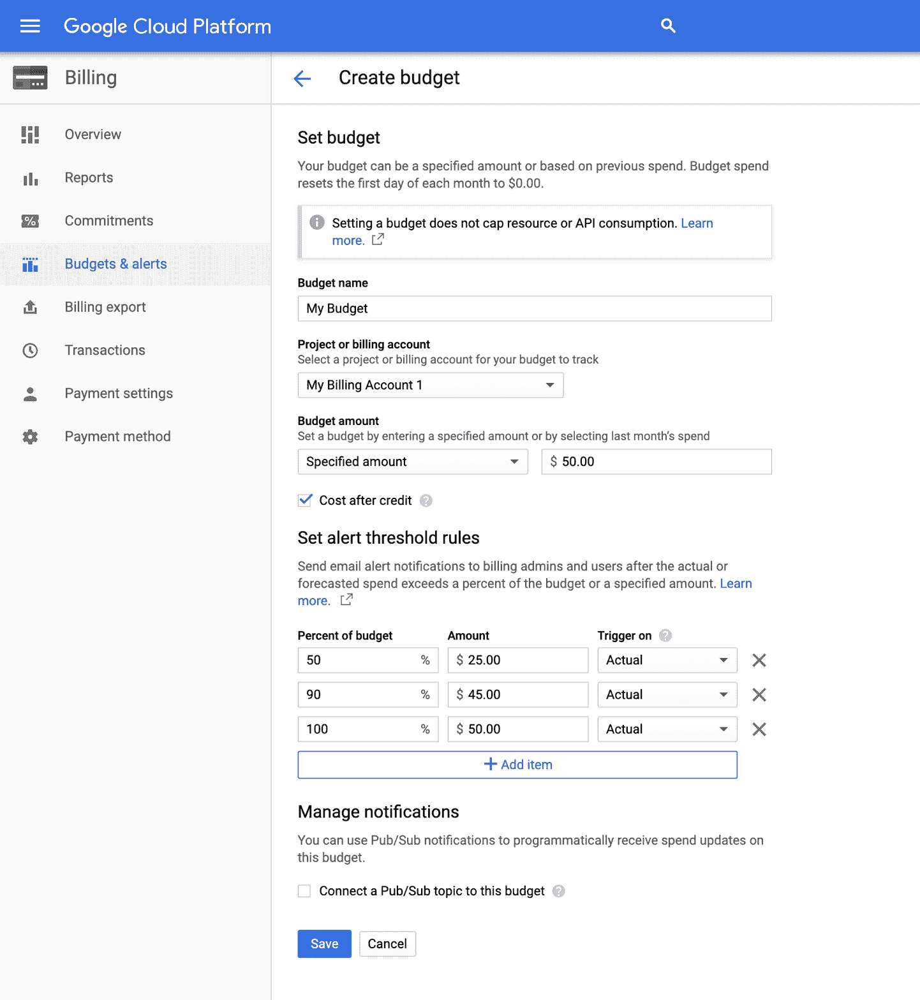

###### 图 4-3\. 预算和警报阈值管理。

要访问计费通知功能，在 GCP 控制台的主菜单上，选择计费，选择您刚刚创建的计费账户，然后查找预算和警报选项。选择后，您将能够使用图 4-3 中显示的创建预算表单来设置新的预算。如果您希望在接近预算金额时收到警告，您可以创建多个预算并为不同百分比的预算设置多个触发器。但正如我们刚才提到的，要记住它仍然只是一个通知服务，不会阻止您产生额外的费用。

# 在 Google Cloud Shell 中运行基本命令

现在您已经建立了您的账户，设置了计费方式，并创建了您的项目，下一步是登录到您的第一个虚拟机。在我们这里的练习中，我们使用的是 Google Cloud Shell，它不需要任何配置即可开始使用，而且完全免费，尽管它有一些重要的限制，我们稍后会讨论。

## 登录到 Cloud Shell 虚拟机

要使用 SSH 协议创建到 Cloud Shell 虚拟机的安全连接，在控制台右上角，点击终端图标：


这将在控制台底部启动一个新面板；如果您愿意，您也可以将终端弹出到自己的窗口中。这将为您提供对您自己的基于 Debian 的 Linux 虚拟机的 shell 访问，该虚拟机配备了适度的资源，包括 5 GB 的免费存储（挂载在*$HOME*）在持久磁盘上。一些基本软件包已经预装并准备就绪，包括 Google Cloud SDK（又名`gcloud`），它提供了一套丰富的基于命令行的工具，用于与 GCP 服务进行交互。我们将在几分钟内使用它来尝试一些基本的数据管理命令。与此同时，随意探索这个 Debian 虚拟机，四处看看，看看安装了什么工具。

###### 注意

请注意，每周使用配额限制您可以运行 Cloud Shell 的时间；截至本文撰写时，为每周 50 小时。此外，如果您不定期使用（截至本文撰写时为 120 天），则提供免费存储的磁盘内容可能会被删除。

当您首次登录 Cloud Shell 时，它会提示您使用上述`gcloud`实用程序指定项目 ID：

```
$ java -jar program.jar [program arguments]
```

您可以在控制台首页找到您的项目 ID，如图 4-4 所示。


###### 图 4-4\. 在 GCP 控制台中查找项目 ID 的位置。

当您获得项目 ID 后，在 Cloud Shell 中运行以下命令，将此处显示的项目 ID 替换为您自己的项目 ID：

```
$ gatk ToolName [tool arguments]
```

注意，您的命令提示现在包含您的项目 ID。它非常长，所以在接下来的内容中，我们只会显示提示符的最后一个字符——在本例中是美元符号（$）——当演示运行命令时。例如，如果我们使用`ls`命令列出工作目录的内容，看起来会像这样：

```
$ java -Xmx4G -XX:+PrintGCDetails -jar program.jar [program arguments]
```

嘿，这里已经有东西了：一个*README*文件，正如名称所示，真的希望您阅读它。您可以通过运行`cat`命令来阅读它：

```
$ gatk --java-options "-Xmx4G -XX:+PrintGCDetails" ToolName [tool arguments]
```

这将显示一个欢迎消息，总结了一些使用说明和获取帮助的建议。有了这些，您就可以使用 Cloud Shell 开始与基本的 GCP 服务进行交互了。让我们开始吧！

## 使用 gsutil 访问和管理文件

现在我们可以访问这个非常简单启动且免费（虽然相当有限）的 VM，让我们看看能否访问本书提供的示例数据包。数据包存储在 Google Cloud Storage（GCS）中，这是一种*对象存储*（即用于存储文件的形式），其存储单位称为*存储桶*。您可以通过 GCP 控制台的[存储浏览器部分](https://oreil.ly/sqrkr)查看 GCS 存储桶的内容并执行基本的管理任务，但接口相当有限。更强大的方法是使用命令行工具`gcloud`、`gsutil`（Google 存储实用工具）。您可以通过其 GCS 路径访问存储桶，即它们的名称前缀为*gs://*。

例如，本书的公共存储桶路径是*gs://genomics-in-the-cloud*。您可以在 Cloud Shell 中键入以下命令来列出存储桶的内容：

```
gatk MySparkTool \
    -R data/reference.fasta \
    -I data/sample1.bam \
    -O data/variants.vcf \
    -- \
    --spark-master 'local[4]'
```

应该有一个名为*hello.txt*的文件。让我们使用 Unix 命令`cat`的`gsutil`版本来查看这个*hello.txt*文件包含什么内容：

```
    --spark-runner SPARK --spark-master spark://23.195.26.187:7077
    ```

您还可以尝试将文件复制到您的存储磁盘：

```
    --spark-runner GCS --cluster my_cluster
    ```

如果再次使用`ls`列出工作目录的内容，您现在应该有*hello.txt*文件的本地副本：

```
$ docker run -v ~/book:/home/book -it us.gcr.io/broad-gatk/gatk:4.1.3.0 /bin/bash
```

当我们使用`gsutil`时，我们做些稍后会有用的事情：创建您自己的存储桶，以便您可以在 GCS 中存储输出。您需要在此处显示的命令中替换`my-bucket`，因为存储桶名称必须在整个 GCS 中是唯一的：

```
(gatk) root@ce442edab970:/gatk#
```

如果您没有更改存储桶名称，或者尝试使用已被其他人使用的名称，则可能会收到以下错误消息：

```
# ls
GATKConfig.EXAMPLE.properties   gatk-package-4.1.3.0-spark.jar  gatkdoc
README.md                       gatk-spark.jar                  gatkenv.rc
gatk                            gatk.jar                        install_R_packages.R
gatk-completion.sh              gatkPythonPackageArchive.zip    run_unit_tests.sh
gatk-package-4.1.3.0-local.jar  gatkcondaenv.yml                scripts

```

如果是这种情况，只需尝试其他更有可能是唯一的内容。当您在输出中看到`Creating *name*...`并且然后从`gsutil`没有进一步的投诉时，您就知道它起作用了。完成后，您将创建一个环境变量，该变量将作为存储桶名称的别名。这样，您就可以节省一些输入，并且可以复制和粘贴后续命令，而无需每次都替换存储桶名称：

```
# gatk
Usage template for all tools (uses --spark-runner LOCAL when used with a Spark tool)
   gatk AnyTool toolArgs
Usage template for Spark tools (will NOT work on non-Spark tools)
   gatk SparkTool toolArgs  [ -- --spark-runner <LOCAL | SPARK | GCS> sparkArgs ]
Getting help
   gatk --list       Print the list of available tools
   gatk Tool --help  Print help on a particular tool
Configuration File Specification
    --gatk-config-file             PATH/TO/GATK/PROPERTIES/FILE

gatk forwards commands to GATK and adds some sugar for submitting spark jobs

  --spark-runner <target>    controls how spark tools are run
    valid targets are:
    LOCAL:      run using the in-memory spark runner
    SPARK:      run using spark-submit on an existing cluster
                --spark-master must be specified
                --spark-submit-command may be specified to control the Spark submit command
                arguments to spark-submit may optionally be specified after --
    GCS:        run using Google cloud dataproc
                commands after the -- will be passed to dataproc
                --cluster <your-cluster> must be specified after the --
                spark properties and some common spark-submit parameters will be translated
                to dataproc equivalents
  --dry-run      may be specified to output the generated command line without running it
  --java-options 'OPTION1[ OPTION2=Y ... ]''   optional - pass the given string of options to 
                 the java JVM at runtime.
                Java options MUST be passed inside a single string with space-separated values

```

您可以在新变量上运行`echo`命令，以验证您的存储桶名称已正确存储：

```
# gatk HaplotypeCaller --help
```

现在，让我们熟悉如何使用`gsutil`。首先，将*hello.txt*文件复制到您的新存储桶中。您可以直接从原始存储桶中复制：

```
# cd /home/book/data/germline
# mkdir sandbox
```

或者，您可以从本地副本执行它；例如，如果您进行了要保存的修改：

```
# gatk HaplotypeCaller \
    -R ref/ref.fasta \
    -I bams/mother.bam \
    -O sandbox/mother_variants.vcf
```

最后，作为基本文件管理的另一个例子，您可以决定文件应该放在自己的目录中：

```
Using GATK jar /gatk/gatk-package-4.1.3.0-local.jar
Running:
   java -Dsamjdk.use_async_io_read_samtools=false -Dsamjdk.use_async_io_wri
te_samtools=true -Dsamjdk.use_async_io_wri
te_tribble=false -Dsamjdk.compression_level=2 -jar /gatk/gatk-package-4.1.3.0-
local.jar HaplotypeCaller -R ref/ref.fas
ta -I bams/mother.bam -O sandbox/mother_variants.vcf
09:47:17.371 INFO  NativeLibraryLoader - Loading libgkl_compression.so from
jar:file:/gatk/gatk-package-4.1.3.0-local.
jar!/com/intel/gkl/native/libgkl_compression.so
09:47:17.719 INFO  HaplotypeCaller - -----------------------------------------
-------------------
09:47:17.721 INFO  HaplotypeCaller - The Genome Analysis Toolkit (GATK) v4.1.3.0
09:47:17.721 INFO  HaplotypeCaller - For support and documentation go to
https://software.broadinstitute.org/gatk/
09:47:17.722 INFO  HaplotypeCaller - Executing as root@3f30387dc651 on Linux
v5.0.0-1011-gcp amd64
09:47:17.723 INFO  HaplotypeCaller - Java runtime: OpenJDK 64-Bit Server VM
v1.8.0_191-8u191-b12-0ubuntu0.16.04.1-b12
09:47:17.724 INFO  HaplotypeCaller - Start Date/Time: August 20, 2019 9:47:17 AM
UTC
```

正如您所见，`gsutil`命令设置得尽可能与其原始 Unix 版本相似。因此，例如，您也可以使用`-r`来使`cp`和`mv`命令递归应用于目录。对于大文件传输，您可以使用一些云规格优化来加快进程，例如`gsutil -m`选项，该选项并行化文件传输。方便的是，系统通常会在终端输出中通知您何时可以利用这些优化，因此您无需在开始之前去记忆文档。

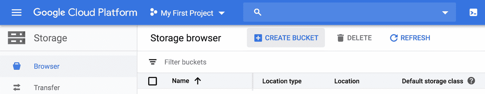

###### 图 4-5\. GCP 控制台存储浏览器。

这将打开一个相当简单的配置表单。在这里要做的最重要的事情是选择一个好的名称，因为您选择的名称必须在 Google Cloud 的所有内容中都是唯一的——所以要有创意！如果选择的名称已经被使用，系统将在您单击配置表单中的继续时通知您，如图 4-6 所示。


###### 图 4-6\. 命名您的存储桶。

当你有一个唯一的名称时，系统会允许你通过展开菜单选项来进行下一步。这些选项允许你自定义存储位置和访问控制，但目前你可以只接受默认设置并点击创建。这样做会带你回到存储桶列表，这时应该包括你新创建的存储桶。你可以点击它的名称来查看其内容——当然它还是空的，所以视图不会特别令人兴奋，正如图 4-7 所示。

界面提供了一些基本的管理选项，比如删除存储桶和文件，以及上传文件和文件夹。请注意，你甚至可以将本地计算机中的文件和文件夹拖放到存储桶内容窗口中，这非常简单（试试看），但在进行基因组学工作过程中你不会经常这样做。在现实世界中，你更可能使用`gsutil`命令行实用程序。使用命令行路径的一个优点是你可以将这些命令保存为脚本，用于溯源和在需要时重现你的步骤。


###### 图 4-7\. 查看存储桶内容。

## 拉取 Docker 镜像并启动容器

Cloud Shell 是一份持续给予的礼物：我们在第三章中介绍的 Docker 应用程序已预装，所以你可以立即开始使用！我们将使用一个简单的 Ubuntu 容器来说明基本的 Docker 功能。虽然有一个用于 GATK 的 Docker 镜像，并且在接下来的几章中我们会大量使用它，但我们在这里不会使用它，因为它相当庞大，所以启动时间稍长。在免费 Cloud Shell 中由于分配给此免费 VM 的 CPU 和内存资源较少，我们实际上无法使用它来运行任何实际的分析。

###### 注意

在这种情况下学习如何使用 Docker 容器的第一步是…好吧，避免在线的 Docker 文档！认真的。不是因为它不好，而是因为这些文档大多数是为那些想要在云中运行 Web 应用程序的人编写的。如果这是*你*想要做的事情，那么你可以自由选择，但你正在阅读错误的书。我们在这里提供的是量身定制的指导，将教会你如何使用 Docker 来运行研究软件在容器中。

正如刚才提到的，我们将使用一个非常通用的例子：一个包含 Ubuntu Linux 操作系统的镜像。这是一个官方镜像，作为公共容器镜像仓库 Docker Hub 的核心库的一部分提供，所以我们只需要声明其名称。稍后您将看到，由社区贡献的镜像以贡献者的用户名或组织名作为前缀。在 Cloud Shell 终端中（无论您的工作目录在哪里），运行以下命令从 Docker Hub 官方（认证）镜像库中检索 Ubuntu 镜像：

```
09:47:18.347 INFO  ProgressMeter - Starting traversal
09:47:18.348 INFO  ProgressMeter -        Current Locus  Elapsed Minutes
Regions Processed   Regions/Minute
09:47:22.483 WARN  InbreedingCoeff - InbreedingCoeff will not be calculated; at
least 10 samples must have called geno
types
09:47:28.371 INFO  ProgressMeter -          20:10028825              0.2
33520         200658.5
09:47:38.417 INFO  ProgressMeter -          20:10124905              0.3
34020         101709.1
09:47:48.556 INFO  ProgressMeter -          20:15857445              0.5
53290         105846.1
09:47:58.718 INFO  ProgressMeter -          20:16035369              0.7
54230          80599.5
09:48:08.718 INFO  ProgressMeter -          20:21474713              0.8
72480          86337.1
09:48:18.718 INFO  ProgressMeter -          20:55416713              1.0
185620         184482.4
```

`pull` 命令获取镜像并将其保存到您的虚拟机中。容器镜像的版本由其`tag`（可以是镜像创建者想要分配的任何内容）和其`sha256`哈希（基于镜像内容）指示。默认情况下，系统提供了可用的最新版本，因为我们没有指定特定的标签；在后面的练习中，您将看到如何通过标签请求特定版本。请注意，容器镜像通常由几个模块化的*slices*组成，可以分开拉取。它们被组织起来，以便下次拉取镜像版本时，系统会跳过与您已经拥有的版本相比未更改的任何切片。

现在让我们启动容器。有三种主要的运行选项，但棘手的是通常只有一种正确的方式*如其作者所愿*，如果文档没有明确指定（这种情况非常常见），那么很难知道哪种方式是正确的。感到困惑了吗？让我们逐步分析具体情况，你会明白为什么我们要让你经历这一短暂的沮丧和神秘感——这是为了在未来避免潜在的痛苦。

第一选项

只需运行它！

```
09:48:20.714 INFO  ProgressMeter - Traversal complete. Processed 210982 total
regions in 1.0 minutes.
09:48:20.738 INFO  VectorLoglessPairHMM - Time spent in setup for JNI call: 
0.045453468000000004
09:48:20.739 INFO  PairHMM - Total compute time in PairHMM 
computeLogLikelihoods(): 6.333675601
09:48:20.739 INFO  SmithWatermanAligner - Total compute time in java 
Smith-Waterman: 6.18 sec
09:48:20.739 INFO  HaplotypeCaller - Shutting down engine
[August 20, 2019 9:48:20 AM UTC]
org.broadinstitute.hellbender.tools.walkers.haplotypecaller.HaplotypeCaller done.
Elapsed time: 1.06 minutes.
Runtime.totalMemory()=717225984
```

结果

稍作停顿，然后您的命令提示符会回来。没有输出。发生了什么？实际上，Docker 确实启动了容器，但在这些条件下，容器没有配置*执行*任何操作，所以它基本上耸了耸肩又关闭了。

第二选项

运行附加命令：

```
# gatk ValidateSamFile \
    -R ref/ref.fasta \
    -I bams/mother.bam \
    -O sandbox/mother_validation.txt
```

结果

它像请求的那样回显`Hello World!`，然后再次关闭。好的，现在我们知道我们可以向容器传递命令，如果是容器中的某个东西识别的命令，它将被执行。然后，当所有命令都已完成时，容器将关闭。有点懒惰，但合理。

第三选项

使用`-it`选项以交互方式运行它：

```
# gatk HaplotypeCaller \
    -R ref/ref.fasta \
    -I bams/mother.bam \
    -O sandbox/mother_variants.200k.vcf \
    -L 20:10,000,000-10,200,000
```

结果

啊哈！一个新的命令提示符（在这种情况下是 Bash）！但是有一个不同的 shell 符号：`#`，而不是`$`。这意味着容器正在运行并且您在其中。现在，您可以运行任何您在 Ubuntu 系统上通常使用的命令，包括安装新的软件包。尝试运行一些 Unix 命令，如`ls`或`ls -la`来浏览并查看容器的功能。在本书的后面，特别是在第十二章，我们将详细讨论这些内容，包括如何打包和重新分发您定制的镜像，以便以可重现的方式分享您自己的分析。

当您完成浏览后，在命令提示符处键入`**exit**`（或按 Ctrl+D）以终止 shell。因为这是容器运行的主进程，终止它将导致容器关闭并返回到 Cloud Shell 本身。明确一点，这将关闭容器*及当前运行的任何命令*。

如果您好奇的话：是的，确实可以在不关闭容器的情况下离开它；这称为*分离*。为此，请按 Ctrl+P+Q，而不是使用`exit`命令。随时可以重新进入容器——前提是您能识别它。默认情况下，Docker 为您的容器分配一个通用唯一标识符（UUID）以及一个随机的人类可读名称（听起来有点傻）。您可以运行`docker ps`来列出当前运行的容器，或者`docker ps -a`来列出已创建的容器。这将显示一个由容器 ID 索引的容器列表，看起来应该像这样：

```
$ cd ~/book/data/germline/sandbox
```

我们展示了最后两次 Docker 调用对应的两个条目，每个都有一个唯一标识符，即`CONTAINER ID`。我们看到当前正在运行的容器 ID 为`c2b4f8a0c7a6`，其名称为`vigorous_rosalind`，状态为`Up 5 minutes`。您可以看出另一个名为`objective_curie`的容器不在运行，因为其状态为`Exited (0) 8 minutes ago`。这里看到的名称是随机分配的（我们发誓！几率有多大？），因此它们确实不是非常有意义的。如果您同时运行多个容器，这可能会有些令人困惑，因此您需要一种更好的方法来识别它们。好消息是，您可以在初始命令中的`docker run`之后立即添加`--name=*meaningful_name*`，用您想要给容器起的名称替换`*meaningful_name*`，这样可以给它们起一个有意义的名称。

要进入容器，只需运行 `docker attach *c2b4f8a0c7a6*`（替换您的容器 ID），然后按 Enter 键，您将发现自己回到了控制台（您的键盘可能标有 Return 而不是 Enter）。如果您希望能够在容器内部工作的同时在 Cloud Shell 中打开第二个命令选项卡，则可以这样做。请注意，您可以在单个 VM 上同时运行多个容器，这是容器系统的一个伟大优势之一，但它们将竞争 Cloud Shell VM 的 CPU 和内存资源，这在 Cloud Shell 中相对较少。本章后面我们将向您展示如何启动具有更强大功能的 VM。

## 挂载卷以访问容器内部的文件系统

完成了前面的练习后，您现在可以检索和运行任何公共存储库中共享的容器镜像的实例。许多常用的生物信息学工具，包括 GATK，在 Docker 容器中预安装。这样做的想法是，知道如何在 Docker 容器外部使用它们意味着您不需要担心拥有正确的操作系统或软件环境。然而，我们仍然需要向您展示一个技巧，以确保这对您真正有效：如何通过 *挂载卷* 从容器内部访问您计算机的文件系统。

最后一部分是什么意思？默认情况下，当您在容器内部时，无法访问容器外部文件系统上的任何数据。容器是一个封闭的盒子。有办法在容器和您的文件系统之间复制数据，但这会变得非常繁琐。因此，我们将选择更简单的路径，即在容器外的目录之间建立一个链接，使其看起来像是在容器内部。换句话说，我们将在容器墙壁上开一个洞，如 图 4-8 所示。


###### 图 4-8\. 从您的 Google Cloud Shell VM 挂载目录到 Docker 容器中：本章中使用的 Ubuntu 容器（左侧）；在 第五章 中介绍的 GATK 容器（右侧）。

例如，让我们在 Cloud Shell VM 的主目录中创建一个名为 *book* 的新目录，并将之前的 *hello.txt* 文件放入其中：

```
$ export BUCKET="gs://my-bucket"
```

所以这一次，让我们运行命令来启动我们的 Ubuntu 容器，使用 `-v` 参数（其中 `v` 表示卷），这允许我们指定文件系统位置和容器内的挂载点：

```
$ echo $BUCKET
gs://my-bucket
```

命令中的 `-v ~/book_data:/home/book` 部分将您指定的位置链接到 Docker 容器中 */home/book* 目录的路径。路径中的 */home* 是容器中已经存在的目录，而 `book` 部分可以是您选择的任何名称。现在，您文件系统中 `book` 目录中的所有内容都可以从 Docker 容器的 */home/book* 目录访问：

```
$ gsutil cp mother_variants.200k.vcf* $BUCKET/germline-sandbox/
Copying file://mother_variants.200k.vcf [Content-Type=text/vcard]...
Copying file://mother_variants.200k.vcf.idx [Content-Type=application/octet-
stream]...
- [2 files][101.1 KiB/101.1 KiB]                                               
Operation completed over 2 objects/101.1 KiB.
```

在这里，我们将挂载点的名称与实际位置相同，因为这样更直观，但如果您愿意，您也可以使用不同的名称。请注意，如果您将挂载点命名为容器中已存在路径的目录或文件名称，则将“压缩”该现有路径，这意味着只要挂载点挂载，该路径将不可访问。

还有一些其他 Docker 技巧是值得知道的，但现在这已经足够演示您将在 第五章 中使用的核心 Docker 功能。

# 设置您自己的自定义 VM

现在，您已经成功运行了一些基本的文件管理命令，并且熟悉了与 Docker 容器的交互方式，是时候转向更大更好的事情了。Google Cloud Shell 环境非常适合快速开始一些轻量级的编码和执行任务，但为 Cloud Shell 分配的 VM 实例性能确实有限，当运行真正的 GATK 分析时将不足以胜任 第五章 中的任务。

在本节中，我们将向您展示如何使用 Google 的 Compute Engine 服务在云中设置您自己的 VM（有时称为 *实例*），该服务允许您选择、配置和运行任何大小的 VM。

## 创建和配置您的 VM 实例

首先，转到 [*Compute Engine*](https://oreil.ly/sGeug) 或通过左侧边栏菜单访问该页面，如 图 4-9 所示。


###### 图 4-9\. 计算引擎菜单显示 VM 实例菜单项。

点击此菜单中的 VM 实例链接，以查看运行镜像的概述。如果这是一个新账户，您将不会有任何运行中的实例。请注意顶部有一个“创建实例”的选项。点击它，让我们一起完成创建新 VM 的过程，仅使用您需要的资源。

接下来，在顶部菜单栏中点击“创建实例”，如 图 4-10 所示。这将打开一个配置表单，如 图 4-11 所示。


###### 图 4-10\. 创建一个 VM 实例。


###### 图 4-11\. VM 实例配置面板。

按照后续子节中的逐步说明配置虚拟机。有大量的选项，如果你对术语不熟悉，这个过程可能会非常令人困惑，因此我们列出了配置表单中的最简单路径，这样您就可以在本书前几章中运行所有命令练习。请确保除非您真的知道自己在做什么，否则使用与此处完全相同的设置。

### 给你的虚拟机命名

为您的虚拟机取一个名字，例如`genomics-book`，如图 4-12 所示。这个名字必须在您的项目中是唯一的，但与存储桶名字不同，它不需要在整个 GCP 中是唯一的。有些人喜欢使用他们的用户名，这样有权限访问项目的其他人可以立即识别出是谁创建了这个资源。


###### 图 4-12\. 为你的虚拟机实例命名。

### 选择一个区域（很重要！）和一个区域（不那么重要）

云有不同的物理位置。像大多数商业云服务提供商一样，GCP 在世界许多地方都有数据中心，并为您提供选择使用哪一个的选项。区域是最高级别的地理区分，其名称相当描述性（如`us-west2`，指的是洛杉矶的设施）。每个区域进一步分为两个或多个由单个字母（`a`、`b`、`c` 等）指定的区域，这些区域对应具有自己物理基础设施的独立数据中心（电力、网络等），尽管在某些情况下它们可能共享同一建筑物。

区域和区域的系统在限制像停电这样的局部问题方面起着重要作用，所有主要的云提供商都使用这种策略的某个版本。有关此主题的更多信息，请参阅 Kyle Galbraith 关于云区域和区域（在他的情况下是 AWS）如何在僵尸启示录中发挥重要作用的[这篇有趣的博客文章](https://oreil.ly/pZUl6)。

###### 注意

选择特定区域和区域为您的项目越来越有助于处理人类数据存储的监管限制，因为它允许您指定符合条件的位置来存储所有存储和计算资源。然而，世界上一些地区尚未得到云服务的良好覆盖，或者不同云服务提供商的覆盖范围不同，因此在选择提供商时可能需要考虑可用的数据中心位置。

要为您的项目选择一个区域，您可以查看[可用的 Google Cloud 区域和区域](https://oreil.ly/D4Iqa)的完整列表，并根据地理邻近性做出决定。或者，您可以使用在线实用程序，根据网络响应时间，测量您与每个数据中心的*实际*接近程度，例如[*http://www.gcping.com*](http://www.gcping.com)。例如，如果我们从马萨诸塞州西部的小镇桑德兰运行此测试（在表 4-1 中显示结果），我们发现从位于北弗吉尼亚州北部的`us-east4`区域（距离 698 公里）获得响应需要 38 毫秒，而从位于蒙特利尔的`northamerica-northeast1`区域（距离 441 公里）获得响应需要 41 毫秒。这表明地理接近性与网络区域接近性并不直接相关。更引人注目的是，我们发现与位于伦敦的`欧洲西部 2`区域（距离 5,353 公里）相比，与位于洛杉矶的`美国西部 2`区域（距离 4,697 公里）相比，我们相当“接近”，其响应时间为 102 毫秒和 180 毫秒。

表 4-1。来自马萨诸塞州桑德兰的地理距离和响应时间

| 区域 | 位置 | 距离（公里） | 响应时间（毫秒） |
| --- | --- | --- | --- |
| 美国东部 4 | 美国弗吉尼亚州北部 | 698 | 38 |
| 北美东北部 1 | 蒙特利尔 | 441 | 41 |
| 欧洲西部 2 | 伦敦 | 5,353 | 102 |
| 美国西部 2 | 洛杉矶 | 4,697 | 180 |

这将使我们回到 VM 配置。对于区域，我们将使用`us-east4`（北弗吉尼亚州），因为它最靠近我们中最少旅行的人（杰拉尔丁），而对于区域，我们只是随机选择`us-east4-a`。您需要确保根据前面的讨论选择*您的*区域，这对您有利（速度更快），并且在所有 60,000 注册用户同时开始通过这些练习工作的不太可能事件中，避免破坏弗吉尼亚州的一个数据中心—尽管这是测试云的宏伟“弹性”的一种方式。

### 选择机器类型

在这里，您可以配置即将启动的虚拟机的资源。您可以控制 RAM 和 CPU。对于某些实例类型（在“自定义”下可用），甚至可以选择具有 GPU 的 VM，用于加速某些程序。问题在于，您在此选择的内容将决定 VM 正常运行每秒钟的计费金额；机器越大越强，成本就越高。页面的右侧应显示更改机器类型时的每小时和每月成本变化。还要注意，您的计费是基于 VM 在线时间的，而不是实际使用时间。我们稍后会介绍限制成本的策略，但请牢记这一点！

在这里选择`n1-standard-2`；这是一台相当基础的机器，几乎不会有太多成本，如图 4-13 所示。

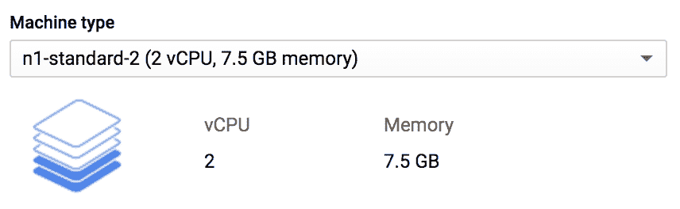

###### 图 4-13\. 选择机器类型。

### 指定一个容器？（不需要）

我们不打算填写这一部分。如果您想使用预先选择或自动生成的自定义容器镜像设置非常具体的设置，这会很有用。实际上，我们本可以为您预配置一个容器并跳过接下来的一堆设置。但这样的话，您就没有机会学习如何自己做这些事情了，对吧？所以，目前，让我们跳过这个选项吧。

### 自定义引导磁盘

像机器类型一样，这是另一个非常有用的设置。您可以在这里定义两件事情：您想要使用的操作系统及其版本，以及您想要的磁盘空间量。如果需要使用特定类型和版本的操作系统，前者尤为重要。当然，如果您不希望在分析过程中磁盘空间不足，后者也很重要。

默认情况下，系统提供了特定类型的 Linux 操作系统，伴随着仅有的 10 GB 磁盘空间，如图 4-14 所示。我们需要更大的磁盘空间。

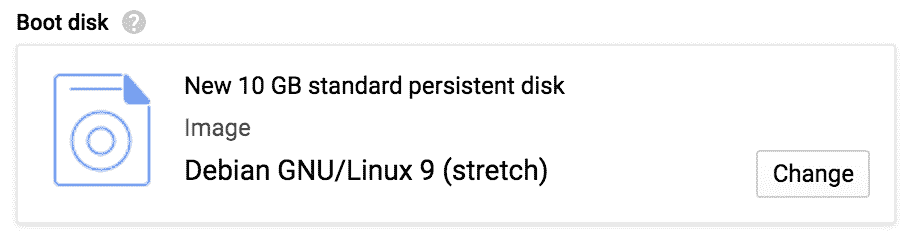

###### 图 4-14\. 选择引导磁盘大小和镜像。

要访问此设置菜单，请单击“更改”。这将打开一个新屏幕，显示预定义选项菜单。您还可以制作自己的自定义镜像，或者在[Google Cloud Marketplace](https://oreil.ly/sjiIf)中找到更多镜像。

对于我们当前的目的，我们更喜欢 Ubuntu 18.04 LTS，这是 Ubuntu 的最新长期支持版本，截至本文撰写时。虽然可能没有 Ubuntu 19.04 那么前沿，但 LTS（长期支持）版本保证了其在发布后五年内会进行安全漏洞和软件包更新维护。这个 Ubuntu 镜像已经包含了我们所需的大部分内容，已准备就绪并安装好，包括各种标准的 Linux 工具和我们将非常依赖的 GCP SDK 命令行工具。

在操作系统菜单中选择 Ubuntu，然后在版本菜单中选择 Ubuntu 18.04 LTS，如图 4-15 所示。

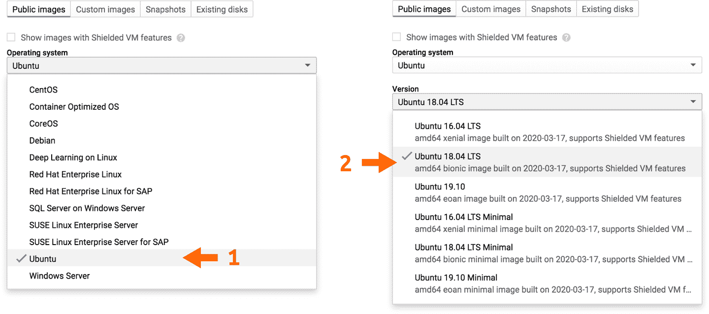

###### 图 4-15\. 选择基础镜像。

在表单底部，您可以更改**启动盘大小（Boot disk Size）**，以便为自己提供更多空间。如图 4-16 所示，选择将默认的 10 GB 更改为 100 GB（我们将要处理的数据可能会占用大量空间）。根据您的数据集大小和需求，您可以进一步增加此值。虽然在启动虚拟机后您无法轻松调整它，但您可以选择在实例运行后添加块存储卷——这就像在云中插入 USB 驱动器一样。因此，如果您的磁盘空间不足，您不会陷入困境。

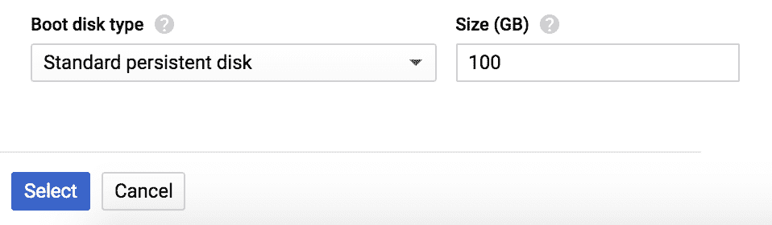

###### 图 4-16\. 设置启动盘大小。

完成所有操作后，点击“选择”；这将关闭屏幕，并将您返回到实例创建表单，其中“启动盘”部分应与图 4-17 中的截图匹配。

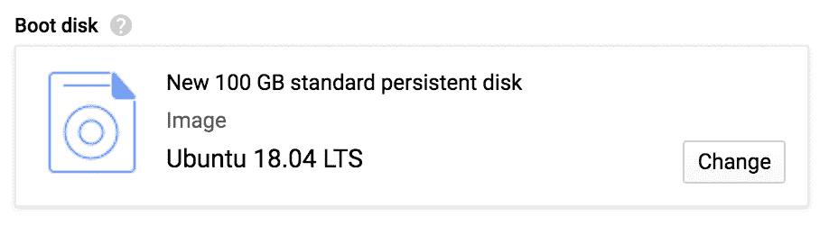

###### 图 4-17\. 更新后的启动盘选择。

在表单底部，点击“创建”。这将返回到列出 Compute Engine VM 实例的页面，包括您新创建的 VM 实例。在实例创建和启动时，您可能会看到其名称前有一个旋转图标，然后在它运行并准备好使用时会出现一个绿色圆圈和复选标记，如图 4-18 所示。

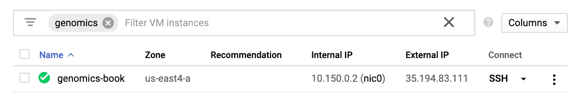

###### 图 4-18\. 查看 VM 状态。

好了，您的 VM 已准备就绪。

## 登录您的 VM 使用 SSH

在运行后，有几种方式可以访问 VM，您可以在 GCP 文档中了解。我们将向您展示最简单的方法，使用 Google Cloud 控制台和内置的 SSH 终端。它几乎无懈可击：一旦在 Google Cloud 控制台中看到绿色复选标记，您只需点击 SSH 选项即可打开下拉菜单，如图 4-19 所示。选择“在浏览器窗口中打开”，几秒钟后，您应该会看到一个 SSH 终端打开到该 VM。

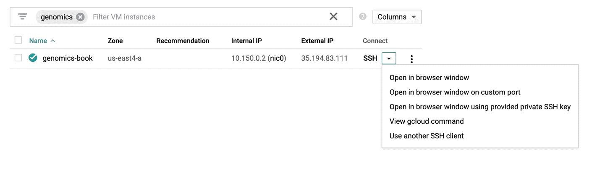

###### 图 4-19\. SSH 进入 VM 的选项。

这将打开一个新窗口，其中包含一个终端，允许您从 VM 实例内运行命令，如图 4-20 所示。建立连接可能需要一分钟时间。

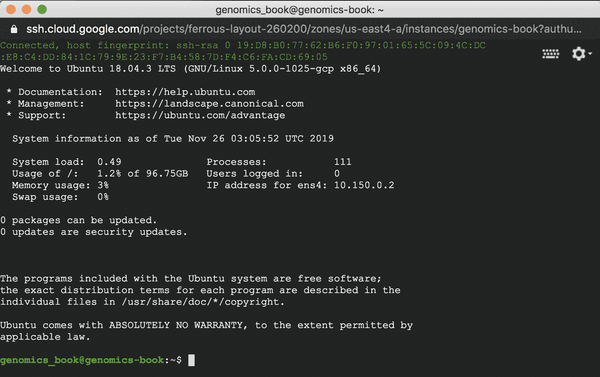

###### 图 4-20\. VM 实例终端。

随意浏览并了解您全新的 VM；在接下来的几章中，您将会花费大量时间与它一起（但是，这是一种好方法）。

## 检查您的身份验证

您可能迫不及待地想要运行一些有趣的东西，但让我们首先确保您的帐户凭据已正确设置，以便您可以使用预安装在我们选择的镜像上的 GCP 命令行工具。在 SSH 终端中，运行以下命令：

```
# gatk HaplotypeCaller \
    -R ref/ref.fasta \
    -I bams/mother.bam \
    -O sandbox/mother_variants.snippet.debug.vcf \
    -bamout sandbox/mother_variants.snippet.debug.bam \
    -L 20:10,002,000-10,003,000
```

以`[1]`开头的那行显示，默认情况下，GCP 让您使用一个服务帐户登录：域为*@developer.gserviceaccount.com*。对于在您的 VM 内运行工具来说，这没问题，但如果您想管理资源，包括将文件复制到 GCS 存储桶中，您需要以具有相关权限的帐户进行操作。可以授予此服务帐户所有您在这些练习中需要的各种权限，但这将使我们深入 GCP 帐户管理的内部，这不是我们目前想要的。因此，让我们使用在本章开始时创建项目时使用的原始帐户，因为它已经作为项目所有者具有这些权限。

要使用该帐户登录，请在提示时按 2。这将触发与程序的一些交互；GCP 将警告您在 VM 上使用个人凭据存在安全风险，因为如果您将 VM 访问权限授予他人，他们将能够使用您的凭据：

```
# zcat vcfs/motherSNP.vcf.gz | grep -v '##' | head -3
#CHROM  POS     ID      REF     ALT     QUAL    FILTER  INFO    FORMAT  NA12878
20      61098   .       C       T       465.13  .
AC=1;AF=0.500;AN=2;BaseQRankSum=0.516;ClippingRankSum=0.00;DP=44;ExcessHet=3.0103;FS=0.000;
MQ=59.48;MQRankSum=0.803;QD=10.57;ReadPosRankSum=1.54;SOR=0.603
GT:AD:DP:GQ:PL0/1:28,16:44:99:496,0,938
20      61795   .       G       T       2034.16 .       AC=1;AF=0.500;AN=2;
BaseQRankSum=-6.330e-01;ClippingRankSum=0.00;DP=60;ExcessHet=3.9794;FS=0.000;MQ=59.81;
MQRankSum=0.00;QD=17.09;ReadPosRankSum=1.23;SOR=0.723        
GT:AD:DP:GQ:PL 0/1:30,30:60:99:1003,0,1027

```

解决方案：不要共享您的个人 VM 访问权限。^(1)

如果您输入 Y 以确认，程序将提供一个链接：

```
AC=1;AF=0.500;AN=2;BaseQRankSum=0.516;ClippingRankSum=0.00;DP=44;ExcessHet=
3.0103;FS=0.000;MQ=59.48;MQRankSum=0.803;QD=10.57;ReadPosRankSum=1.54;SOR=0.603 
```

当您单击链接或将其复制并粘贴到浏览器中时，将显示 Google 登录页面。使用您用于 GCP 的相同帐户登录以获取您的身份验证代码，然后将其复制并粘贴回您的终端窗口。`gcloud`实用程序将确认您的登录身份，并要求您从您可以访问的项目列表中选择要使用的项目 ID。它还将提供设置您首选的计算和存储区域的选项，这应与您创建 VM 时设置的一致。如果在项目 ID 列表中看不到您期望的内容，您可以随时再次检查[GCP 控制台中的资源管理页面](https://oreil.ly/T50ev)。

## 将书籍材料复制到您的 VM

在接下来的几章中，您将在 VM 上运行真实的 GATK 命令和工作流程，因此需要检索示例数据、源代码和一些软件包。我们将大部分内容打包在一个地方：名为`genomics-in-the-cloud`的 Cloud Storage 存储桶中。唯一分开的部分是源代码，我们在 GitHub 上提供。

首先，您需要使用`gsutil`将数据包从存储桶复制到您的 VM 中。`gsutil`是 GCP 存储实用程序，在本章的 Cloud Shell 部分中我们已经使用过。在您的 VM 终端窗口中，创建一个名为`**book**`的新目录，然后运行`gsutil`命令将书籍数据包复制到与您的 VM 关联的存储空间中：

```
# zcat vcfs/motherSNP.giab.vcf.gz | grep -v '##' | head -3
#CHROM  POS     ID      REF     ALT     QUAL    FILTER  INFO    FORMAT  INTEGRATION
20      61098   rs6078030       C       T       50      PASS
callable=CS_CGnormal_callable,CS_HiSeqPE300xfreebayes_callable;callsetnames=CGnormal,
HiSeqPE300xfreebayes,HiSeqPE300xGATK;callsets=3;datasetnames=CGnormal,HiSeqPE300x;
datasets=2;datasetsmissingcall=10XChromium,IonExome,SolidPE50x50bp,SolidSE75bp;filt=
CS_HiSeqPE300xGATK_filt,CS_10XGATKhaplo_filt,CS_SolidPE50x50GATKHC_filt;platformnames=
CG,Illumina;platforms=2GT:PS:DP:ADALL:AD:GQ    0/1:.:542:132,101:30,25:604
20      61795   rs4814683       G       T       50      PASS
callable=CS_HiSeqPE300xGATK_callable,CS_CGnormal_callable,CS_HiSeqPE300xfreebayes_
callable;callsetnames=HiSeqPE300xGATK,CGnormal,HiSeqPE300xfreebayes,10XGATKhaplo,
SolidPE50x50GATKHC,SolidSE75GATKHC;callsets=6;datasetnames=HiSeqPE300x,CGnormal,
10XChromium,SolidPE50x50bp,SolidSE75bp;datasets
=5;datasetsmissingcall=IonExome;platformnames=Illumina,CG,10X,Solid;platforms=4
GT:PS:DP:ADALL:AD:GQ    0/1:.:769:172,169:218,205:1337
```

这将向您的虚拟机存储复制约 10 GB 的数据，因此即使使用启用并行下载的`-m`标志，可能也需要几分钟时间。正如您将在稍后看到的，即使不先复制文件，也可以直接在云存储中运行一些分析命令，但我们希望在开始时尽可能简化事务。

现在，请获取来自[GitHub 上公共代码库](https://oreil.ly/genomics-repo)的源代码。我们将代码放在那里，因为它是一个非常流行的在*版本控制*下共享代码的平台，并且我们致力于为书中使用的代码提供长期维护。要在您的虚拟机上获取副本，请首先使用`cd`命令进入新创建的*book*目录，然后使用`git clone`命令复制仓库的内容：

```
# gatk VariantFiltration \
    -R ref/ref.fasta \
    -V vcfs/motherSNP.vcf.gz \
    --filter-expression "QD < 2.0" \
    --filter-name "QD2" \
    -O sandbox/motherSNP.QD2.vcf.gz
```

这将创建一个目录（*~book/code*），其中包含我们在整本书中使用的所有示例代码。不仅如此，它将被设置为一个活跃的 Git 仓库，因此您可以在代码目录中运行`git pull`命令来获取最新的更改，如下所示：

```
# zcat sandbox/motherSNP.QD2.vcf.gz | grep -v '##' | head -3
#CHROM  POS     ID      REF     ALT     QUAL    FILTER  INFO    FORMAT  NA12878
20      61098   .       C       T       465.13  PASS
AC=1;AF=0.500;AN=2;BaseQRankSum=0.516;ClippingRankSum=0.00;DP=44;
ExcessHet=3.0103;FS=0.000;MQ=59.48;MQRankSum=0.803;QD=10.57;
ReadPosRankSum=1.54;SOR=0.603GT:AD:DP:GQ:PL  0/1:28,16:44:99:496,0,938
20      61795   .       G       T       2034.16 PASS   
AC=1;AF=0.500;AN=2;BaseQRankSum=-6.330e-01;ClippingRankSum=0.00;DP=60;
ExcessHet=3.9794;FS=0.000;MQ=59.81;MQRankSum=0.00;QD=17.09;
ReadPosRankSum=1.23;SOR=0.723        GT:AD:DP:GQ:PL	0/1:30,30:60:99:1003,0,1027

```

现在，您应该拥有书籍代码的最新版本。要查看自原出版以来发生了什么变化，请查看代码目录中的*README*文本文件。

## 在您的虚拟机上安装 Docker

您将在虚拟机上使用 Docker，因此让我们确保您可以运行它。如果您只在终端中运行命令`docker`，您会收到错误消息，因为虚拟机未预安装 Docker：

```
# gatk VariantFiltration \
    -R ref/ref.fasta \
    -V vcfs/motherSNP.vcf.gz \
    --filter-expression "QD < 2.0 || DP > 100.0" \
    --filter-name "lowQD_highDP" \
    -O sandbox/motherSNP.QD2.DP100.vcf.gz
```

错误消息友好地指出了如何通过预安装的`snap`包解决这种情况，但我们实际上将使用一种稍微不同的方式安装 Docker：我们将从 Docker 网站下载并运行一个脚本，这将在很大程度上自动化安装过程。这样，如果您发现需要在没有内置包管理器选项的地方安装 Docker，您就会知道该怎么做。

在虚拟机上运行以下命令以安装 Docker：

[PRE30]

这可能需要一点时间才能完成，因此让我们花点时间更详细地检查命令。首先，我们使用一个便捷的小工具叫做`curl`（简称为*Client URL*）从我们提供的 Docker 网站 URL 下载安装脚本，使用几个命令参数（`-sSL`）指示程序跟随任何重定向链接并将输出保存为文件。然后，我们使用管道字符（`|`）将该输出文件传递给第二个命令`sh`，这意味着“运行我们刚刚给你的那个脚本”。输出的第一行告诉您它正在做什么：“执行 docker 安装脚本”（为了简洁起见，我们省略了前面输出的部分）。

当完成后，脚本将提示您在随后的示例中运行`usermod`命令，以便允许自己每次不使用`sudo`来运行 Docker 命令时，都具备这个能力。调用`sudo docker`可能会导致输出文件由 root 所有，使得稍后难以管理或访问它们，因此执行此步骤非常重要：

[PRE31]

这不会产生任何输出；我们将在一分钟内测试它是否正常工作。但是首先，您需要注销 VM 然后重新登录。这样做将使系统重新评估您的 Unix 组成员资格，这对于您刚刚进行的更改生效是必要的。只需在命令提示符下键入`**exit**`（或按 Ctrl+D）：

[PRE32]

这将关闭连接到您的 VM 的终端窗口。返回 GCP 控制台，找到您的 VM 在 Compute Engine 实例列表中，然后单击 SSH 再次登录。可能感觉需要经历很多步骤，但坚持住；我们即将进入重要部分。

## 设置 GATK 容器镜像

当您回到 VM 后，请通过拉取 GATK 容器来测试您的 Docker 安装，这将在接下来的章节中使用：

[PRE33]

作为提醒，容器名称后面的最后一部分是版本标签，您可以更改它以获取不同于我们在此处指定的版本。请注意，如果更改版本，某些命令可能不再起作用。我们无法保证所有代码示例都能够与未来兼容，尤其是对于仍在积极开发中的新工具。如前所述，有关更新的资料，请参阅[本书的 GitHub 存储库](https://oreil.ly/genomics-repo)。

GATK 容器镜像相当大，因此下载可能需要一些时间。好消息是，下次需要拉取 GATK 镜像（例如获取另一个版本时），Docker 将仅拉取已更新的组件，因此速度会更快。

###### 注意

我们正在从 Google 容器库（GCR）中拉取 GATK 镜像，因为 GCR 与我们正在运行的 VM 在同一网络上，所以比从 Docker Hub 拉取更快。然而，如果您在不同的平台上工作，可能会发现从 Docker Hub 的 GATK 存储库拉取镜像更快。为此，请将镜像路径中的`us.gcr.io/broad-gatk`部分更改为`**broadinstitute**`。

现在，请记住您在本章前面遵循的指令来启动一个带挂载文件夹的容器？您将再次使用它，以使`book`目录对 GATK 容器可访问：

[PRE34]

您现在应该能够从容器内部浏览到您在 VM 中设置的`book`目录。它将位于*/home/book*下。最后，为了再次确认 GATK 本身是否按预期工作，请尝试在运行中的容器中从命令行运行`gatk`命令。如果一切正常，您应该会看到一些文本输出，概述基本的 GATK 命令行语法和一些配置选项：

[PRE35]

我们会在第五章中详细讨论这一切的含义；现在，你已经设置好了用于在接下来三章中运行 GATK 工具的环境。

## 暂停你的虚拟机…以防止它消耗你的资金。

你刚刚设置好的虚拟机将在本书中非常方便；在接下来的几章中，你将会回到这个虚拟机进行许多练习。然而，只要它保持运行，它就会花费你信用点或实际货币。处理这个问题最简单的方法就是将其停止：在你不主动使用它时暂停它。

你可以随时重新启动它；只需一两分钟就能重新启动它，并且它将保留所有环境设置、之前运行过的历史记录以及本地存储的任何数据。请注意，即使虚拟机没有运行且你不支付虚拟机本身的费用，你仍会因为存储而支付一小笔费用。在我们看来，为了能够随时回到虚拟机并继续你的工作，这是非常值得的便利。

要停止你的虚拟机，在 GCP 控制台中，转到虚拟机实例管理页面，如前所示。找到你的实例并点击右侧的垂直三点符号以打开控件菜单，然后选择停止，如图 4-21 所示。该过程可能需要几分钟来完成，但你可以安全地离开该页面。要稍后重新启动你的实例，只需按照同样的步骤操作，但在控件菜单中点击启动。


###### 图 4-21\. 停止、启动或删除你的虚拟机实例。

或者，你可以完全删除你的虚拟机，但请记住，删除虚拟机也会删除所有本地存储的数据，所以确保你首先将任何重要的东西保存到存储桶中。

# 配置 IGV 以从 GCS 存储桶读取数据

在你进入下一章之前，还有一个小步骤：我们将安装并配置一个名为 Integrated Genome Viewer (IGV) 的基因组浏览器，它可以直接与 GCP 中的文件一起使用。这将允许你查看序列数据和变体调用，而无需将文件复制到本地机器上。

首先，在你的本地机器上，如果尚未安装，请从[IGV 网站获取程序](https://oreil.ly/bEPS_)并按照安装说明进行安装。如果你已经有一个副本，请考虑更新到最新版本；我们使用的是 2.7.2 版本（macOS 版本）。一旦你打开应用程序，选择顶部菜单栏中的 View > Preferences，如图 4-22 所示。


###### 图 4-22\. 选择偏好设置菜单项。

在首选项面板中，选择“启用 Google 访问”复选框，点击保存，然后退出并重新打开 IGV 以强制刷新顶部菜单栏。现在您应该会看到一个之前不存在的 Google 菜单项；点击它并选择登录，如图 4-24 所示，使用您的 Google 账户凭据设置 IGV。

图 4-25\. “从 URL 加载”菜单项。

注意

###### 图 4-24\. 选择 Google 登录菜单项。

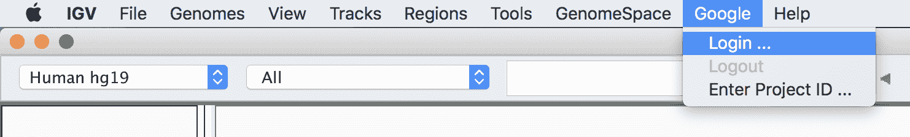

###### 

这将在您的网络浏览器中打开一个谷歌登录页面；按照提示允许 IGV 访问您谷歌账户上的相关权限。完成后，您应该会看到一个简单显示“OK”的网页。现在我们切换回到 IGV 并测试其功能是否正常。从顶部菜单选择文件 > 从 URL 加载，如图 4-25 所示，确保不要错误地选择其他选项（它们看起来很相似，很容易弄错）。同时确保 IGV 窗口左上角的参考下拉菜单已设置为“Human hg19”。

###### 图 4-26\. “从 URL 加载”对话框。

如果您对人类参考之间的区别感到困惑，请参阅关于 hg19 和 GRCh38 的“参考基因组作为共同框架”的注释。


###### 

最后，在弹出的对话框中输入我们提供的书籍数据包中一个样本 BAM 文件的 GCS 文件路径（例如*mother.bam*，如图 4-26 所示），然后点击“OK”。记住，您可以使用 `gsutil` 在您的 VM 或云 Shell 中获取存储桶中的文件列表，或者使用[Google Cloud 控制台存储浏览器](https://oreil.ly/1iQmv)浏览存储桶的内容。如果您使用浏览器界面获取文件路径，则需要通过删除 URL 的第一部分（即*https://console.cloud.google.com/storage/browser*）并用`**gs://**`替换它来组成 GCS 文件路径。对于 BAM 的伴随索引文件，文件名和路径相同，但以 *.bai* 结尾。^(2)

图 4-23\. IGV 首选项面板。

###### 这将打开首选项面板，如图 4-23 所示。

这将使数据作为新数据轨道在 IGV 中对您可用，但默认情况下主查看器中不会加载任何内容。要检查您是否可以查看数据，请在搜索窗口中输入基因组坐标 `**20:9,999,830-10,000,170**`，然后点击 Go。这些坐标将带您到第 20 条人类染色体上第 10 百万个 DNA 基地的左侧边缘 ±170，如图 4-27 所示，您将看到我们在此示例文件中提供的序列数据切片。我们在 第五章 中详细解释如何解读 IGV 的视觉输出，当我们用它来调查真实（小）分析的结果时。


###### 图 4-27\. 位于 GCS 存储桶中的 BAM 文件的 IGV 视图。

IGV 每次仅检索小片段的数据，因此传输速度应该非常快，除非您的互联网连接特别慢。然而，请记住，像所有商业云提供商一样，GCP 会对从云中传输数据收取[出口费用](https://oreil.ly/rktm2)。但好消息是，这是一个小费用，与您传输的数据量成比例。因此，在 IGV 中查看数据切片的成本微不足道——大约是几分钱的数量级，这绝对比为离线浏览整个文件而支付的费用要低得多！

您可以使用相同的操作集查看其他数据文件的内容，例如 VCF 文件，只要文件存储在 GCP 存储桶中。不幸的是，这意味着这不适用于存储在 VM 的本地存储中的文件，因此每当您想要检查其中一个文件时，您都需要先将其复制到存储桶中。您将很快与 `gsutil` 变得非常熟悉。

哦，当您打开 IGV 时，请注意最后一件事：点击 IGV 窗口工具栏中的小黄色信息气泡，该气泡控制详细查看器的行为，如图 4-28 所示。为自己做一个好事，并将设置从悬停显示详细信息更改为点击显示详细信息。您选择的任何操作都将触发一个小对话框的出现，该对话框会为您点击或悬停在数据的任何部分提供详细信息；例如，对于序列读取，它将为您提供所有映射信息以及完整的序列和碱基质量。您现在可以尝试使用刚刚加载的数据。正如您将看到的，详细显示功能本身非常方便，但当您初次接触界面时，“悬停”版本的此行为可能有些压倒性；因此，我们建议切换到“点击”版本。


###### 图 4-28\. 将详细查看器的行为从“悬停”更改为“点击”。

# 总结和下一步计划

在本章中，我们向您展示了如何开始使用 GCP 资源，从创建帐户、使用超级基础的 Cloud Shell，然后逐步过渡到自己的自定义 VM。您学会了如何管理 GCS 中的文件，运行 Docker 容器，并管理您的 VM。最后，您获取了书籍数据和源代码，完成了设置自定义 VM 以与 GATK 容器配合工作，并设置了 IGV 以查看存储在存储桶中的数据。在第五章中，我们将带您开始使用 GATK 本身，在您意识到之前，您将在云中的示例数据上运行真正的基因组学工具。

^(1) 请记住，如果您为 GCP 项目中的其他用户创建帐户，他们也将能够通过 SSH 访问您的 VM。在共享项目中进一步限制对 VM 的访问是可能的，但这超出了我们在此简单介绍的范围。

^(2) 例如，*https://console.cloud.google.com/storage/browser/genomics-in-the-cloud/v1/data/germline/bams/mother.bam* 变成 *gs://genomics-in-the-cloud/v1/data/germline/bams/mother.bam*。
