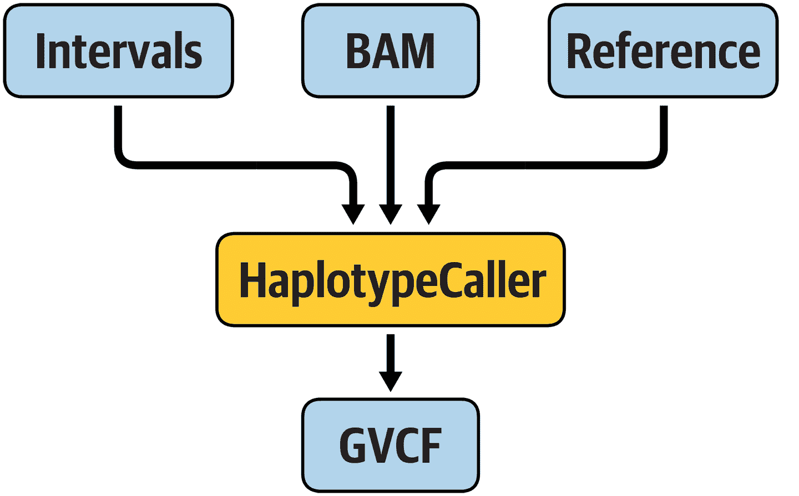
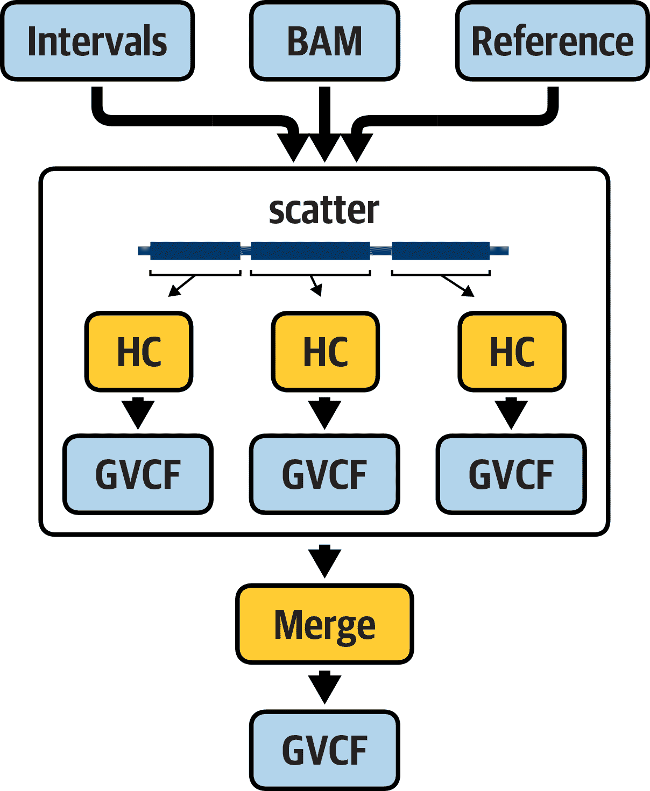
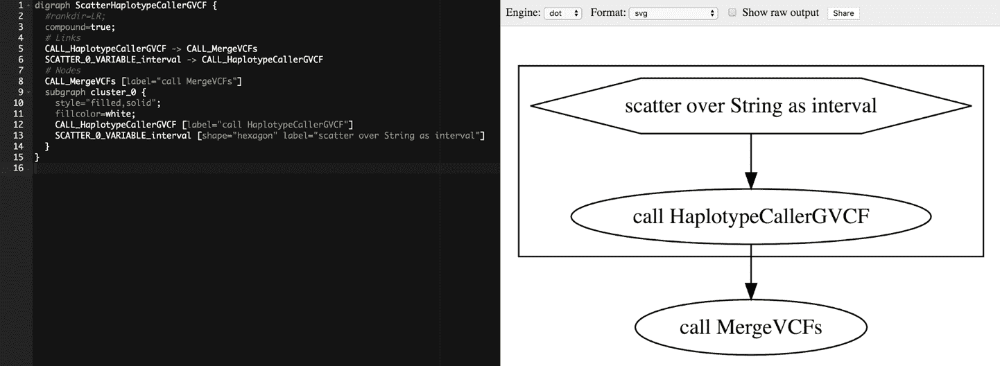

# 第八章：使用工作流自动化分析执行

到目前为止，我们一直在终端手动运行单个命令。然而，大多数基因组学工作实际上—即从原始数据到我们将进一步用于下游分析以最终产生生物学见解的浓缩信息的次生分析—涉及按照相同的顺序在所有数据上运行相同的命令。再次看看第 6 和 7 章描述的 GATK 最佳实践工作流程；想象一下为每个样本手动完成所有这些工作会有多么乏味。该领域的新手通常发现，逐步运行测试数据中涉及的命令有助于了解关键步骤、其要求及其特点—这就是为什么我们在第 6 和 7 章中向您详细介绍了这些内容—但归根结底，您希望尽可能自动化所有这些过程。自动化不仅减少了您需要做的繁琐手动工作量，还提高了分析的吞吐量，并减少了人为错误的机会。

在本章中，我们讨论了从单个命令或一次性脚本转向可重复使用的工作流的转变。我们向您展示了如何使用工作流管理系统（*Cromwell*）和语言 WDL，这两者主要因其可移植性而被选择。我们将引导您编写第一个示例工作流，执行它，并解释 Cromwell 的输出。然后，我们将使用几个更加现实的工作流再做同样的事情，运行 GATK 并使用散集-聚集并行处理。

# 介绍 WDL 和 Cromwell

您可能还记得，我们在技术概述中引入了工作流的概念（第 3 章）。当时我们指出，有许多工具选项可用于编写和运行工作流，具有各种功能、优势和劣势。我们不能告诉您*整体上最佳的选择*，因为很大程度上取决于您的特定背景和需求。出于本书的目的，我们选择了 Cromwell 和 WDL 的组合，因为它最适合我们面向的广泛受众和需求范围。

在此之前我们已经简要介绍了 WDL，但考虑到这已经是半本书之前的事情，也经历了许多变故，让我们重新概述一下主要内容。正如刚才提到的，它的全名是*Workflow Description Language*，但通常简称为 WDL（发音为“widdle”）。它是一种 DSL，通常用于基因组工作流程，在 Broad Institute 最初开发，后来演变为由名为[OpenWDL](https://openwdl.org)的公共团体推动的社区驱动开源项目。作为工作流语言，它被设计成非常适合生物信息学新手，这些人没有软件编程的正式培训，同时最大限度地提高在不同系统间的可移植性。

我们将用来实际*运行*WDL 编写的工作流的工作流管理系统是 Cromwell，这是一款在 Broad Institute 开发的开源应用程序。Cromwell 设计为能够在几乎任何现代 Java 支持的计算环境中运行，包括像 Slurm 和 SGE 这样的流行 HPC 系统，商业云平台如 GCP 和 AWS，以及运行某种 Linux 版本的任何笔记本电脑或台式电脑。这种可移植性是 Cromwell 的核心特性，旨在促进在多个机构运行相同工作流，以最大化科学研究中的协作和计算重现性。Cromwell 另一个面向可移植性的主要特性是，它支持（但不需要）使用容器来提供您想要在给定工作流的每个组件任务中运行的代码。您将有机会在本章的练习中尝试两种运行方式。

最后，在合作和互操作性精神的继续中，Cromwell 还设计支持多种工作流语言。目前，它支持 WDL 以及 CWL，另一种设计用于可移植性和计算可重现性的流行工作流语言。

Cromwell 提供两种操作模式：一次性运行模式和服务器模式。*一次性运行模式*是运行 Cromwell 的简单方法，涉及单个命令行：您提供一个工作流和一个列出工作流输入的文件，它将开始运行，执行工作流，并在工作流完成时关闭。这对于间断运行工作流非常方便，几乎没有麻烦，这也是我们在本章练习中使用的方式。*服务器模式*的操作涉及设置一个持久运行的服务器，并通过 REST API（一种编程接口）向该服务器提交工作流执行请求。

启动 Cromwell 服务器非常容易。一旦运行，它提供的功能在单次运行模式下是不可用的，其中一些我们在第十一章中介绍。然而，要安全地管理其运行，需要具备专门的技能，这是大多数个人研究人员或没有专门支持人员的小团体所不具备的。在第十一章中，我们向您介绍 Terra，这是由 Broad Institute 操作的托管系统，通过 GUI 和 API 提供对持久 Cromwell 服务器的访问。这将使您有机会在服务器模式下尝试 Cromwell，而无需自己管理服务器。

###### 注意

我们不会在本书中涵盖 Cromwell 服务器管理内容，如果您有兴趣了解更多信息，请参阅[Cromwell 文档](https://oreil.ly/8T7j8)。

无论您将其作为一次性任务还是在服务器模式下运行，Cromwell 都具有旨在提高效率和可伸缩性的有趣功能，但没有人愿意在这本书中读取一长串功能清单，因此让我们转向练习，并在适当的时候提到这些关键功能。

# 安装和设置 Cromwell

在本章中，我们将检查和执行一些用 WDL 编写的工作流程，以熟悉语言的基本结构，并了解 Cromwell 如何管理输入和输出、日志等。为了与前几章保持连贯性，我们在之前使用的 GCP Compute Engine VM 上运行 Cromwell，即在第四章和第五章中使用过的环境，不再从 GATK 容器内运行任何内容。相反，我们直接在 VM 环境中安装和运行 Cromwell。

您需要运行几个安装命令，因为 Cromwell 需要 Java，而我们使用的虚拟机上没有预安装。为此，请通过 SSH 再次登录到您的虚拟机，就像在前几章中所做的那样。请记住，您始终可以在 GCP 控制台中找到您的 VM 实例列表，直接访问[Compute Engine](https://oreil.ly/sGeug)，或者在控制台左侧的 GCP 服务菜单中点击 Compute Engine，如果您忘记了 URL。

在您的虚拟机中，在提示符下键入 `**java -version**`。您应该会得到以下输出：

```
$ java -version
Command ’java’ not found, but can be installed with:
apt install openjdk-11-jre-headless  # version 11.0.3+7-1ubuntu2~19.04.1, or
apt install default-jre              # version 2:1.11-71
apt install openjdk-8-jre-headless   # version 8u212-b03-0ubuntu1.19.04.2
apt install openjdk-12-jre-headless  # version 12.0.1+12-1
apt install openjdk-13-jre-headless  # version 13~13-0ubunt1
Ask your administrator to install one of them.
```

Cromwell 需要 Java 版本 8，因此让我们安装 `openjdk-8-jre-headless` 选项，这是一个轻量级环境，足以满足我们的需求：

```
$ sudo apt install openjdk-8-jre-headless
Reading package lists... Done
Building dependency tree      
Reading state information... Done
[...]
done.
```

这将触发安装过程，应该可以顺利完成。您可能会看到一些通知，但只要看到最终的 `done` 输出，您就应该没问题。您可以再次运行 Java 版本检查以确保安装成功：

```
$ java -version
openjdk version "1.8.0_222"
OpenJDK Runtime Environment (build 1.8.0_222-8u222-b10-1ubuntu1~19.04.1-b10)
OpenJDK 64-Bit Server VM (build 25.222-b10, mixed mode)
```

安装了 Java 后，让我们设置 Cromwell 本身，它附带一个称为 `Womtool` 的伴侣实用程序，用于语法验证和创建输入文件。它们都作为编译后的 *.jar* 文件分发，并且我们已经在书籍捆绑包中包含了一份副本，因此你不需要做任何复杂的操作，只需指向它们所在的位置即可。为了使我们的命令尽可能简洁，让我们设置一个指向它们位置的环境变量。我们称之为 *BIN* 用来表示程序的编译形式：

```
$ export BIN=~/book/bin
```

让我们检查一下是否可以运行 Cromwell，通过请求它的 `help` 输出，这将呈现出你可以给它的三个命令的摘要：`server` 和 `submit` 是我们之前讨论的服务器模式的一部分，而 `run` 是我们很快将使用的一次性模式：

```
$ java -jar $BIN/cromwell-48.jar --help
cromwell 48
Usage: java -jar /path/to/cromwell.jar [server|run|submit] [options] <args>...
 --help                   Cromwell - Workflow Execution Engine
 --version               
Command: server
Starts a web server on port 8000\.  See the web server documentation for more 
details about the API endpoints.
Command: run [options] workflow-source
Run the workflow and print out the outputs in JSON format.
 workflow-source          Workflow source file or workflow url.
 --workflow-root <value>  Workflow root.
 -i, --inputs <value>     Workflow inputs file.
 -o, --options <value>    Workflow options file.
 -t, --type <value>       Workflow type.
 -v, --type-version <value>
                          Workflow type version.
 -l, --labels <value>     Workflow labels file.
 -p, --imports <value>    A directory or zipfile to search for workflow imports.
 -m, --metadata-output <value>
                          An optional directory path to output metadata.
Command: submit [options] workflow-source
Submit the workflow to a Cromwell server.
 workflow-source          Workflow source file or workflow url.
 --workflow-root <value>  Workflow root.
 -i, --inputs <value>     Workflow inputs file.
 -o, --options <value>    Workflow options file.
 -t, --type <value>       Workflow type.
 -v, --type-version <value>
                          Workflow type version.
 -l, --labels <value>     Workflow labels file.
 -p, --imports <value>    A directory or zipfile to search for workflow imports.
 -h, --host <value>       Cromwell server URL.
```

对于 `Womtool`，也值得做同样的事情，以了解各种可用的实用命令：

```
$ java -jar $BIN/womtool-48.jar --help
Womtool 48
Usage: java -jar Womtool.jar
[validate|inputs|parse|highlight|graph|upgrade|womgraph] [options]
workflow-source
 workflow-source          Path to workflow file.
 -i, --inputs <value>     Workflow inputs file.
 -h, --highlight-mode <value>
                          Highlighting mode, one of 'html', 'console'
(used only with 'highlight' command)
 -o, --optional-inputs <value>
                          If set, optional inputs are also included in the
inputs set. Default is 'true' (used onl
y with the inputs command)
 --help                  
 --version               
Command: validate
Validate a workflow source file. If inputs are provided then 'validate'
also checks that the inputs file is a valid set of inputs for the
workflow.
Command: inputs
Generate and output a new inputs JSON for this workflow.
Command: parse
(Deprecated; WDL draft 2 only) Print out the Hermes parser’s abstract
syntax tree for the source file.
Command: highlight
(Deprecated; WDL draft 2 only) Print out the Hermes parser’s abstract
syntax tree for the source file. Requires at least one of 'html' or 'console'
Command: graph
Generate and output a graph visualization of the workflow in .dot format
Command: upgrade
Automatically upgrade the WDL to version 1.0 and output the result.
Command: womgraph
(Advanced) Generate and output a graph visualization of Cromwell’s
internal Workflow Object Model structure for this workflow in .dot format
```

在列出的功能中，你将有机会在本章中使用 `inputs`、`validate` 和 `graph`。

现在让我们检查一下，你是否已经拥有本章所提供的所有工作流文件。如果你按照第四章中的设置说明操作，你应该有一个从 GitHub 克隆的代码目录。在 *~/book/code* 下，你会看到一个名为 *workflows* 的目录，其中包含本章中你将使用的所有代码和相关文件（除了来自存储桶的数据）。你将从主目录运行命令（而不是像在早期章节中那样进入子目录），因此为了在各种命令中保持路径简短，让我们设置一个环境变量，指向工作流文件的位置：

```
$ export WF=~/book/code/workflows
```

最后，让我们谈谈文本编辑器。在接下来的练习中，除了一个例外，你只需查看和运行我们提供的预写脚本，因此，你可以下载或克隆这些文件到你的笔记本电脑，并在你喜欢的文本编辑器中打开它们来进行查看。在一个例外情况下，我们建议你修改一个 WDL 文件以破坏它，以便查看 Cromwell 的错误消息和处理行为，因此你确实需要编辑这个文件。我们会展示如何使用一个称为 `nano` 的内置 shell 文本编辑器来完成这个操作，这被认为是对不习惯使用命令行文本编辑器的人们最为可访问的选择。当然，如果你更喜欢使用 `vi` 或 `emacs` 等其他 shell 编辑器，你可以自行根据我们提供的命令进行调整。

无论你决定使用什么样的文本编辑器，请确保不要使用像 Microsoft Word 或 Google Docs 这样的*文字处理器*。这些应用程序可能会引入隐藏字符，因此不适合编辑代码文件。有了这些都明了，让我们扎紧安全带，开始处理你的第一个 WDL 工作流。

# 你的第一个 WDL：Hello World

我们从 WDL 脚本中最简单可行的工作示例开始：典型的`HelloWorld`。如果你对此不熟悉，这在编程语言的文档中是一个常见的表达方式；简而言之，这个想法是提供一个最小代码量的介绍性示例，能够产生`HelloWorld!`这个短语。实际上，我们将运行三个基本的 WDL 工作流程来展示这种功能级别，首先是绝对最小的示例，然后添加足够的代码来展示核心功能，这些功能在技术上不是必需的，但在实际使用中是需要的。

## 通过极简示例学习基本的 WDL 语法

让我们通过将*hello-world.wdl*工作流文件加载到`nano`编辑器中来查看最简单的示例：

```
$ nano $WF/hello-world/hello-world.wdl
```

正如前面提到的，`nano`是一个基本的编辑器。你可以使用键盘上的箭头键在文件中移动。要退出编辑器，请按 Ctrl+X。

这就是 WDL 中最简化的 Hello World 的样子：

```
version 1.0

workflow HelloWorld {
  call WriteGreeting
}

task WriteGreeting {
  command {
     echo "Hello World"
  }
  output {
     File output_greeting = stdout()
  }
}
```

首先，让我们忽略除了那一行中有`HelloWorld`短语的引号中的内容以外的一切。你认出那行命令了吗？没错，这是一个简单的`echo`命令；你现在可以在你的终端中运行这一行：

```
$ echo "Hello World"
Hello World
```

所以这就是我们的脚本核心中执行所需操作的命令，其他所有内容都是为了使其能够通过我们的工作流管理系统以脚本形式运行。

现在让我们详细解释这个包装。在最高级别上，我们有两个不同的段落或代码块：一个以`workflow HelloWorld`开头，另一个以`task WriteGreeting`开头，在每种情况下的大括号之间有几行代码（WDL 的原始设计者非常喜欢大括号；你会看到更多这样的情况）。我们可以这样总结它们：

```
workflow HelloWorld {...}

task WriteGreeting {...}
```

这使得我们的脚本结构变得非常清晰：`workflow`块中我们调用希望工作流程执行的动作，而`task`块中我们定义动作细节。这里我们只有一个任务，这在实际情况中并不典型，因为大多数工作流包含两个或更多任务；我们将在本节进一步讨论包含多个任务的工作流。

让我们更仔细地看一下在`WriteGreeting`任务中如何定义行动（即命令）：

```
task WriteGreeting {
  command {
     echo "Hello World"
  }
  output {
     File output_greeting = stdout()
  }
}
```

在第一行，我们声明这是一个名为`WriteGreeting`的任务。在最外层的花括号内部，我们可以将代码的结构分解为另外两个代码块：`command {...}`和`output {...}`。`command`块非常简单：它包含`echo "Hello World"`命令。所以这是相当容易理解的，对吧？一般来说，你可以在这里放置几乎任何你在终端 shell 中运行的内容，包括管道命令、多行命令，甚至像 Python 或 R 这样的“外来”代码块，只要你用[heredoc 语法](https://oreil.ly/VK1F8)进行包装。我们在第九章中提供了这种语法的示例。

与此同时，`output`块可能稍显不明显。这里的目标是定义我们计划运行的`command`块的输出。我们声明我们期望的输出将是一个`File`，我们选择称为`output_greeting`（此名称可以是任何你想要的，除了 WDL 规范中定义的保留关键字之一）。然后，在稍微棘手的部分中，我们声明输出内容本身将是发到`stdout`的任何内容。如果你对命令行术语不是很熟悉，`stdout`是*standard out*的缩写，指的是输出到终端窗口的文本输出，也就是运行命令时在终端看到的内容。默认情况下，此内容也会保存到执行目录中的文本文件中（稍后我们会查看），因此这里我们表明我们指定该文本文件作为我们命令的输出。在基因组工作流程中这样做并不是一个非常现实的事情（尽管你可能会感到惊讶…我们见过更奇怪的事情），但这就是 Hello World 的典型案例！

总之，这就是我们的`task`块的解释。现在，让我们来看看`workflow`块：

```
workflow HelloWorld {
  call WriteGreeting
}
```

好吧，这很简单。首先，我们声明我们的工作流程名称为`HelloWorld`，然后在花括号内部，我们使用`call`语句调用`WriteGreeting`任务。这意味着当我们通过 Cromwell 实际运行工作流程时，它将尝试执行`WriteGreeting`任务。让我们试试吧。

## 在您的 Google 虚拟机上使用 Cromwell 运行一个简单的 WDL

退出`nano`编辑器，按下 Ctrl+X 键返回到虚拟机的 shell 界面。你将使用位于*~/book/bin*目录下的 Cromwell *.jar*文件来启动*hello-world.wdl*工作流程，在本章的设置部分，我们将其别名为`$BIN`。这个命令是一个简单的 Java 命令：

```
$ java -jar $BIN/cromwell-48.jar run $WF/hello-world/hello-world.wdl
```

此命令调用 Java 来运行 Cromwell，使用其一次性（运行）工作流执行模式，这与本章前面介绍的持续`server`模式形成对比。因此，它只会启动，运行我们提供给`run`命令的工作流，并在完成后关闭。目前为止，没有其他内容涉及，因为我们的工作流完全是自包含的；接下来我们将讨论如何将工作流参数化以接受输入文件。

继续运行该命令。如果您已正确设置一切，您现在应该看到 Cromwell 开始向终端输出大量信息。我们在这里展示了输出的最相关部分，但我们省略了一些不相关的块（由`[...]`表示）：

```
[...]  
[2018-09-08 10:40:34,69] [info] SingleWorkflowRunnerActor: Workflow submitted
b6d224b0-ccee-468f-83fa-ab2ce7e62ab7  
[...]  
Call-to-Backend assignments: HelloWorld.WriteGreeting -> Local
[2018-09-08 10:40:37,15] [info] WorkflowExecutionActor-b6d224b0-ccee-468f-83fa-
ab2ce7e62ab7 [b6d224b0]: Starting HelloWorld.WriteGreeting
[2018-09-08 10:40:38,08] [info] BackgroundConfigAsyncJobExecutionActor
[b6d224b0HelloWorld.WriteGreeting:NA:1]: echo "Hello World"
[2018-09-08 10:40:38,14] [info] BackgroundConfigAsyncJobExecutionActor 
[...]  
[2018-09-08 10:40:40,24] [info] WorkflowExecutionActor-b6d224b0-ccee-468f-83fa-
ab2ce7e62ab7 [b6d224b0]: Workflow HelloWorld complete. Final Outputs:
{  
  "HelloWorld.WriteGreeting.output_greeting": "/home/username/cromwell-
executions/HelloWorld/b6d224b0-ccee-468f-83fa-ab2ce7e62ab7/call-
WriteGreeting/execution/stdout"  
}  
[2018-09-08 10:40:40,28] [info] WorkflowManagerActor WorkflowActor-b6d224b0-ccee-
468f-83fa-ab2ce7e62ab7 is in a terminal state: WorkflowSucceededState
[2018-09-08 10:40:45,96] [info] SingleWorkflowRunnerActor workflow finished with
status ’Succeeded’.
[...]  
[2018-09-08 10:40:48,85] [info] Shutdown finished.
```

正如您所看到的，Cromwell 的标准输出有点……嗯，冗长。Cromwell 主要设计用于作为一组相互连接的服务的一部分使用，我们在第十一章中讨论了这一点，在那里有一个专门的界面用于监视进度和输出。单次运行模式更常用于故障排除，因此开发团队选择使本地执行模式非常健谈，以帮助调试。这起初可能会让人感到有点不知所措，但别担心：我们在这里将向您展示如何解读这一切——或至少我们关心的部分。

## 解释 Cromwell 日志输出的重要部分

首先，让我们检查我们的工作流的输出是否符合预期。在终端输出中找到以下一组行：

```
WorkflowExecutionActor-b6d224b0-ccee-468f-83fa-ab2ce7e62ab7 [b6d224b0]: Workflow
HelloWorld complete. Final Outputs:
{  
  "HelloWorld.WriteGreeting.output_greeting": "/home/username/cromwell-
executions/HelloWorld/b6d224b0-ccee-468f-83fa-ab2ce7e62ab7/call-
WriteGreeting/execution/stdout"
}  
```

还没有详细讨论，但我们可以看到，这以 JSON 格式提供了生成的输出文件列表；在这种情况下，只有一个文件捕获了我们的一个`echo "Hello World"`命令的`stdout`。Cromwell 为我们提供了完全限定的路径，这意味着它包括了工作目录上面的目录结构，这真的很方便，因为它允许我们在任何需要的命令中快速复制和粘贴使用。您现在可以这样做，查看输出文件的内容，并验证它是否包含我们期望的内容：

###### 注意

请记住，在我们展示的命令中，您需要替换用户名和执行目录哈希。查找您输出中相应的行可能比定制我们的命令更容易。

```
$ cat ~/cromwell-executions/HelloWorld/b6d224b0-ccee-468f-83fa-
ab2ce7e62ab7/call-WriteGreeting/execution/stdout
Hello World
```

就是这样！所以我们知道它起作用了。

现在让我们花几分钟时间逐步查看 Cromwell 在所有这些日志输出中提供给我们的信息，以识别最相关的要点：

```
SingleWorkflowRunnerActor: Workflow submitted b6d224b0-ccee-468f-83fa-ab2ce7e62ab7
```

> = *我正在查看这个工作流并为其分配一个独特的标识符。*

Cromwell 为每个工作流运行的每个运行分配一个随机生成的唯一标识符，并在该标识符内创建一个目录，所有中间文件和最终文件都将写入其中。稍后我们将详细讨论输出目录结构的细节。现在，你真正需要知道的是，这旨在确保你永远不会覆盖相同工作流之前运行的结果，也不会在具有相同名称的不同工作流之间发生冲突：

```
Call-to-Backend assignments: HelloWorld.WriteGreeting -> Local 
```

> = *我计划将其发送到本地机器进行执行（而不是远程服务器）。*

默认情况下，Cromwell 直接在您的本地机器上运行工作流；例如，您的笔记本电脑。正如我们之前提到的，您可以配置它将作业发送到远程服务器或云服务；这在 Cromwell 的术语中称为*后端分配*（不要与换尿布搞混）：

```
Starting HelloWorld.WriteGreeting
```

> = *我现在执行`WriteGreeting`任务调用`HelloWorld`工作流。*

Cromwell 将工作流中的每个任务调用视为单独的作业进行执行，并会相应地为每个作业提供更新。如果工作流涉及多个任务调用，Cromwell 会将它们组织在队列中，并在适当时发送每个任务进行执行。我们稍后会讨论一些相关的工作原理。关于状态报告方面，可以想象，一旦我们开始运行更复杂的工作流，通过标准输出获取这些报告就显得不太实际。这就是提供界面以解析和组织所有这些信息的前端软件真正派上用场的地方；你将有机会在第十一章中体验到这一点：

```
[b6d224b0HelloWorld.WriteGreeting:NA:1]: echo "Hello World"
```

> = *这是我在此调用中实际运行的命令。*

在我们的最小化 Hello World 示例中并未包含任何变量，因此从这个特定调用中并不明显，但 Cromwell 在此输出的是将要执行的真实命令。在接下来的参数化示例中，你可以看到，如果在脚本中包含变量，日志输出将显示命令的形式，其中变量已由我们提供的输入值替换。这个完全解释的命令也会输出到执行目录以备记录：

```
[b6d224b0]: Workflow HelloWorld complete. Final Outputs:
{
"HelloWorld.WriteGreeting.output_greeting": "/home/username/cromwell-
executions/HelloWorld/b6d224b0-ccee-468f-83fa-ab2ce7e62ab7/call-
WriteGreeting/execution/stdout"
}
```

> = *我已经完成了这个工作流的运行。这是你想要的输出文件的完整路径。*

正如前面所述，以 JSON 格式提供了生成的所有输出文件的完全命名空间列表。命名空间

```
HelloWorld.WriteGreeting.output_greeting 
```

告诉我们，我们正在查看`HelloWorld`工作流中属于`WriteGreeting`任务调用输出的`output_greeting`。

输出文件的完全限定路径显示整个目录结构；让我们展开来看看每个部分对应的内容：

```
~                                       (working directory)
cromwell-executions/                    (Cromwell master directory)
 HelloWorld                             (name of our workflow)
  b6d224b0-ccee-468f-83fa-ab2ce7e62ab7  (unique identifier of the run)
   call-WriteGreeting                   (name of our task call)
    execution                           (directory of execution files)
```

这个结构中的重要部分是工作流/标识符/调用的嵌套。正如你将在下一个练习中看到的那样，任何以相同名称运行的工作流都将添加到*HelloWorld*工作流目录下，一个新的带有另一个唯一标识符的目录中。

```
SingleWorkflowRunnerActor workflow finished with status 'Succeeded'.
```

> = *哟，一切都运行正常！*

```
[2018-09-08 10:40:48,85] [info] Shutdown finished.
```

> = *我在这里完成了。再见。*

到此时，这就是你需要关心的全部内容，完成了你的第一个 Cromwell 工作流执行。做得好！

## 添加变量并通过 JSON 提供输入

好的，但是运行一个完全独立的 WDL 是不现实的，所以让我们看看如何添加变量以引入一些可以从运行到运行改变的外部输入。在`nano`编辑器中，打开代码目录中的*hello-world-var.wdl*：

```
$ nano $WF/hello-world/hello-world-var.wdl
```

有什么不同？`workflow`块完全相同，但是`WriteGreeting` `task`块中现在有更多内容：

```
task WriteGreeting {

  input {
      String greeting
  }

  command {
     echo "${greeting}"
  }

  output {
     File output_greeting = stdout()
  }
}
```

`Hello World`输入到`echo`命令的`${greeting}`已被`${greeting}`替换，并且我们现在在`command`块之前有一个新的`input`块，其中包含`String greeting`这行。这行声明了名为`greeting`的变量，并说明其值应为`String`类型；换句话说，是一个字母数字序列。这意味着我们已经对将要回显到终端的问候语进行了参数化；我们将能够指示 Cromwell 在每次运行时将什么插入命令中。

这引出了下一个问题：我们如何向 Cromwell 提供该值？我们绝对不希望直接在命令行上给出它，因为虽然这个特定案例很简单，但在将来，我们可能需要运行期望包含数十个值的工作流，其中许多比一个简单的`String`更复杂。

Cromwell 期望您以[JavaScript 对象表示法](https://www.json.org)（JSON）文本格式提供输入。JSON 具有键值对结构，允许我们为每个变量分配一个值。您可以在我们提供的*$WF/hello-world/hello-world.inputs.json*文件中看到一个例子：

```
{
 "HelloWorld.WriteGreeting.greeting": "Hello Variable World"
}
```

在这个简单的*inputs* JSON 文件中，我们通过其完全限定名称定义了我们`HelloWorld`工作流中的`greeting`变量，该名称包括工作流本身的名称（`HelloWorld`），然后是任务的名称（`WriteGreeting`），因为我们在任务级别声明了变量，然后是变量本身的名称。

要将*inputs* JSON 文件提供给 Cromwell，只需通过使用`-i`参数（简写为`--input`）添加到您的 Cromwell 命令中，如下所示：

```
$ java -jar $BIN/cromwell-48.jar run $WF/hello-world/hello-world-var.wdl \
-i $WF/hello-world/hello-world.inputs.json
```

以与您之前相同的方式查找输出；您应该看到由工作流输出的文件中的消息与 JSON 文件中的文本匹配。

Cromwell 在所有级别强制使用完全限定名称，这使得声明全局变量成为不可能。虽然这可能感觉像一种繁琐的约束，但比起另一种选择要安全得多，因为这意味着您可以在工作流的不同部分中使用相同名称的变量而不会造成冲突。在简单的工作流中，很容易跟踪变量并防止此类问题，但在具有数十个以上变量的更复杂的工作流中，这可能变得非常困难。特别是当您使用导入和子工作流来促进代码重用时，我们在第九章中详细介绍（哦，剧透）。请注意，您可以在工作流级别声明变量（并在*inputs* JSON 文件中使用输入命名语法*`WorkflowName.variable`*），但必须明确地将其传递给任何您想使用它的任务调用。稍后在本章中，您将看到此操作的示例。

## 添加另一个任务，使其成为一个适当的工作流程

现实世界的工作流通常有多个任务，并且其中一些任务依赖于其他任务的输出。在`nano`编辑器中，打开*hello-world-again.wdl*：

```
$ nano $WF/hello-world/hello-world-again.wdl
```

这是我们第三次尝试编写一个 Hello World 示例，展示了两个任务链接成一个正确的工作流：

```
version 1.0

workflow HelloWorldAgain {

  call WriteGreeting

  call ReadItBackToMe {
     input:
        written_greeting = WriteGreeting.output_greeting
  }

  output {
     File outfile = ReadItBackToMe.repeated_greeting
  }
}

task WriteGreeting {

  input { 
     String greeting
  }

  command {
     echo "${greeting}"
  }
  output {
     File output_greeting = stdout()
  }
}

task ReadItBackToMe {

  input {
     String = read_string(written_greeting)
  }

  command {
     echo "${original_greeting} to you too"
  }
  output {
     File repeated_greeting = stdout()
  }
}
```

您可以看到`workflow`块现在有更多内容；它具有指向新任务`ReadItBackToMe`的附加调用语句，并且该调用语句附有一些代码，放在花括号中，我们将其称为`input`块：

```
  call ReadItBackToMe {
     input:
        written_greeting = WriteGreeting.output_greeting
  }
```

`input`块允许我们从工作流级别传递值到特定任务调用。在这种情况下，我们引用`WriteGreeting`任务的输出，并将其分配给名为`written_greeting`的变量，以便在`ReadItBackToMe`调用中使用。

让我们来看看这个新任务定义：

```
task ReadItBackToMe {

  input {
    File written_greeting
  }

  String greeting = read_string(written_greeting)

  command {
     echo "${greeting} to you too"
  }
  output {
     File repeated_greeting = stdout()
  }
```

`read_string()`部分是 WDL 标准库中的一个函数，用于读取文本文件的内容并以单个字符串的形式返回。因此，此任务旨在将文件的内容读入`String`变量中，然后使用该变量来组成新的问候语并将其回显到`stdout`。

有鉴于此，附加到`ReadItBackToMe`调用语句的额外代码显得非常合理。我们正在调用`ReadItBackToMe`任务，并指定我们用于编写新问候语的输入文件应该是调用`Write​Greeting`任务的输出。

最后，让我们看看在这个工作流程的新版本中我们尚未检查的最后一块代码：

```
  output {
     File outfile = ReadItBackToMe.repeated_greeting
  }
```

这个工作流在工作流级别定义了一个`output`块，除了各个任务级别的`output`块。当工作流是独立运行时，这个工作流级别的输出定义是完全可选的；这更多是一种惯例而不是功能。通过定义工作流级别的输出，我们传达了我们关心工作流产生的哪些输出。话虽如此，你可以利用这个输出定义进行功能性目的；例如，当工作流将被用作嵌套子工作流时，我们需要将其输出传递给进一步的调用。你将在第九章中看到这一点。现在，尝试使用与之前工作流相同的输入 JSON 运行此工作流，然后查看执行目录，看看任务目录之间的关系以及输出位于何处。

# 你的第一个 GATK 工作流：Hello HaplotypeCaller

现在你已经牢固掌握了基本的 WDL 语法，让我们转向更现实的一组示例：实际的 GATK 流水线！我们从一个非常简单的工作流开始，以逐渐建立你对语言的熟悉度。我们希望一个工作流在单个样本 BAM 文件上线性（无并行化）运行 GATK `HaplotypeCaller`，以 GVCF 模式运行，如图 8-1 所示。



###### 图 8-1\. 一个运行 HaplotypeCaller 的假设工作流。

工作流应该接受通常所需的文件——基因组参考、输入读取和要分析的区间文件（在 GATK 看来技术上是可选的，但在这里我们通过 WDL 将其设为必需）——并输出一个根据输入文件命名的 GVCF 文件。

## 探索 WDL

为了说明所有这些，我们组合了一个通过单个任务`HaplotypeCallerGVCF`实现这些要求的 WDL 工作流。现在在`nano`编辑器中打开它：

```
$ nano $WF/hello-hc/hello-haplotypecaller.wdl
```

让我们逐步浏览脚本的主要部分，回顾我们的 HelloWorld 示例的结构：

```
version 1.0

workflow HelloHaplotypeCaller {

    call HaplotypeCallerGVCF
}

task HaplotypeCallerGVCF {

 input {
  		String docker_image
        String java_opt

        File ref_fasta
        File ref_index
        File ref_dict
        File input_bam
        File input_bam_index
        File intervals
    }

    String gvcf_name = basename(input_bam, ".bam") + ".g.vcf"

    command {
        gatk --java-options ${java_opt} HaplotypeCaller \
            -R ${ref_fasta} \
            -I ${input_bam} \
            -O ${gvcf_name} \
            -L ${intervals} \
            -ERC GVCF
    }

    output {
        File output_gvcf = "${gvcf_name}"
    }

    runtime {
        docker: docker_image
    }

}
```

为了清晰起见，将任务折叠起来，你会看到这确实是一个单任务工作流，只有一个单独的调用，`workflow`块中没有其他内容：

```
workflow HelloHaplotypeCaller {

    call HaplotypeCallerGVCF
}

task HaplotypeCallerGVCF { … }
```

所以让我们更详细地看一下`HaplotypeCallerGVCF`任务，从`command`块开始，因为最终我们将从中获取关于任务实际操作的大部分信息：

```
command {
        gatk --java-options ${java_opt} HaplotypeCaller \
            -R ${ref_fasta} \
            -I ${input_bam} \
            -O ${gvcf_name} \
            -L ${intervals} \
            -ERC GVCF
    }
```

我们看到一个经典的 GATK 命令，调用`HaplotypeCaller`以 GVCF 模式运行。它使用占位符变量来表示预期的输入文件以及输出文件。它还包括一个占位符变量，用于传递 Java 选项，例如内存堆大小，如第五章所述。到目前为止，这相当简单明了。

所有这些变量都应该在某个地方定义，所以让我们寻找它们。通常，在 `command` 块之前，在任务描述的开头进行这样的操作。这就是我们在那里看到的内容：

```
input {
        String docker_image
        String java_opt

        File ref_fasta
        File ref_index
        File ref_dict
        File input_bam
        File input_bam_index
        File intervals
    }

    String gvcf_name = basename(input_bam, ".bam") + ".g.vcf"
```

现在先忽略 `String docker_image` 行，这显示我们声明了所有输入文件的变量以及 Java 选项，但是我们没有为它们赋值。因此，任务在运行时将期望接收这些变量的值。不仅如此，它还将期望接收我们通常认为理所当然的所有辅助文件的值：`refIndex`、`refDict` 和 `inputBamIndex`，它们指的是索引和序列字典。我们没有在命令本身中包含这些文件，因为 GATK 会自动检测它们的存在（只要它们的名称符合主文件的格式约定），但我们确实需要通知 Cromwell 它们的存在，以便在运行时执行时使它们可用。

不过，有一个例外；对于输出文件，我们看到了这一行：

```
String gvcf_name = basename(input_bam, ".bam") + ".g.vcf"
```

`basename(input_bam, ".bam")` 函数是 WDL 标准库中的一个便利函数，允许我们根据输入文件的名称创建输出文件的名称。 `basename()` 函数接受输入文件的完整路径，剥离文件名前面的路径部分，并可选择剥离文件名末尾的特定字符串。在这种情况下，我们剥离了期望的 *.bam* 扩展名，然后使用行中的 `+ ".g.vcf"` 部分添加新的扩展名，以便于输出文件。

谈到输出文件，现在让我们跳到任务级别的 `output` 块：

```
output {
    File output_gvcf = "${gvcf_name}"
}
```

这也很直接；我们说明了命令将生成一个我们关心的输出文件，为了在工作流中处理它，给它命名，并提供相应的占位符变量，以便 Cromwell 在命令运行完成后能够识别正确的文件。

从技术上讲，如果你计划在具有所需程序的本地安装系统上运行此流程，这就是工作流和任务定义中所需的全部内容。然而，在这一章节中，你是在 VM 中工作，但在 GATK 容器外运行，因此 GATK 并不直接对你的工作流可用。幸运的是，Cromwell 能够利用 Docker 容器，因此我们只需要在工作流中添加一个 `runtime` 块来指定一个容器映像：

```
runtime {
    docker: docker_image
}
```

这就是为什么在我们的任务变量中有 `String docker_image` 行的原因：我们还使用了一个容器映像的占位符变量。在下一步中填写输入 JSON 时，我们将指定 `us.gcr.io/broad-gatk/gatk:4.1.3.0` 映像。然后，在启动工作流时，Cromwell 将从我们指定的映像中启动一个新的容器，并在其中运行 GATK。

在技术上，我们可以在此处硬编码映像名称，使用双引号（例如，`docker: "us.gcr.io/broad-gatk/gatk:4.1.3.0"`），但我们不建议这样做，除非您确实希望将特定脚本固定到特定版本，这显著降低了灵活性。有些人使用`latest`标签使其工作流始终运行最新可用版本的程序，但我们认为这是一个不良实践，弊大于利，因为您永远不知道最新版本可能会发生什么变化并破坏您的工作流程。

## 生成输入的 JSON

好了，我们已经过了工作流中的所有代码；现在我们需要确定在运行它时如何向工作流提供输入。在“Your First WDL: Hello World”中，我们运行了一个非常简单的工作流，首先没有任何变量输入，然后有一个输入。在单一输入情况下，我们创建了一个指定该输入的 JSON 文件。现在我们有八个输入需要指定。我们可以像以前一样继续操作——创建一个 JSON 文件并写入`HaplotypeCallerGVCF`任务期望的每个输入的名称，但有一种更简单的方法：我们将使用`Womtool inputs`命令创建一个模板 JSON。

首先，因为我们将在本章中首次写入我们关心的文件，请让我们创建一个*sandbox*目录来保持我们的输出有序：

```
$ mkdir ~/sandbox-8
```

现在，您可以运行`Womtool`命令来生成*inputs* JSON 模板文件：

```
$ java -jar $BIN/womtool-48.jar \
    inputs $WF/hello-hc/hello-haplotypecaller.wdl \
    > ~/sandbox-8/hello-haplotypecaller.inputs.json
```

因为在此命令的最后一行指定了输出文件（实际上是可选的），所以命令会将其输出写入该文件。如果一切顺利，您在终端上不应该看到任何输出。让我们看看我们刚刚创建的文件的内容：

```
$ cat ~/sandbox-8/hello-haplotypecaller.inputs.json

```

```
{
 "HelloHaplotypeCaller.HaplotypeCallerGVCF.input_bam_index": "File",
 "HelloHaplotypeCaller.HaplotypeCallerGVCF.input_bam": "File",
 "HelloHaplotypeCaller.HaplotypeCallerGVCF.ref_fasta": "File",
 "HelloHaplotypeCaller.HaplotypeCallerGVCF.ref_index": "File",
 "HelloHaplotypeCaller.HaplotypeCallerGVCF.ref_dict": "File",
 "HelloHaplotypeCaller.HaplotypeCallerGVCF.intervals": "File",
 "HelloHaplotypeCaller.HaplotypeCallerGVCF.docker_image": "String",
 "HelloHaplotypeCaller.HaplotypeCallerGVCF.java_opt": "String"
}
```

这里是：所有`HaplotypeCallerGVCF`任务期望的输入都以适当的方式列出，其中包含占位符值指示它们的类型，以 JSON 格式显示（尽管在您的情况下可能顺序不同）。现在我们只需填写这些值；这些是前六个相关文件的路径以及最后两个的运行时参数（容器镜像和 Java 选项）。在懒惰的精神下，我们提供了一个填充版本，使用我们在第五章中使用的片段数据，但是如果愿意，您也可以从在第四章下载的数据包中的其他输入中填写*inputs* JSON。这是预填充 JSON 的样子（路径相对于主目录）：

```
$ cat $WF/hello-hc/hello-haplotypecaller.inputs.json
```

```
{
"HelloHaplotypeCaller.HaplotypeCallerGVCF.input_bam_index":
"book/data/germline/bams/mother.bai",
"HelloHaplotypeCaller.HaplotypeCallerGVCF.input_bam":
"book/data/germline/bams/mother.bam",
"HelloHaplotypeCaller.HaplotypeCallerGVCF.ref_fasta":
"book/data/germline/ref/ref.fasta",
"HelloHaplotypeCaller.HaplotypeCallerGVCF.ref_index":
"book/data/germline/ref/ref.fasta.fai",
"HelloHaplotypeCaller.HaplotypeCallerGVCF.ref_dict":
"book/data/germline/ref/ref.dict",
"HelloHaplotypeCaller.HaplotypeCallerGVCF.intervals":
"book/data/germline/intervals/snippet-intervals-min.list",
"HelloHaplotypeCaller.HaplotypeCallerGVCF.docker_image": "us.gcr.io/broad-
gatk/gatk:4.1.3.0",
"HelloHaplotypeCaller.HaplotypeCallerGVCF.java_opt": "-Xmx8G"
}
```

注意，所有的值都用双引号显示，但这是一个技术性的问题，因为这些值都是`String`类型。对于其他类型，如数字、布尔值和数组，你不应该使用双引号。当然，对于字符串数组，你应该在字符串周围使用双引号，但不要在数组本身周围使用双引号，`["like","this"]`。

## 运行工作流程

要运行工作流程，我们将使用与之前相同的命令行语法。确保在你的主目录中执行此操作，以便*inputs* JSON 文件中的相对路径与数据文件的位置匹配：

```
$ java -jar $BIN/cromwell-48.jar \
    run $WF/hello-hc/hello-haplotypecaller.wdl \
    -i $WF/hello-hc/hello-haplotypecaller.inputs.json
```

正如之前提到的，Cromwell 的输出非常冗长。在这个练习中，你要找的是终端输出中类似于以下示例的行：

```
[2019-08-14 06:27:14,15] [info] BackgroundConfigAsyncJobExecutionActor
[9a6a9c97HelloHaplotypeCaller.HaplotypeCallerGVCF:NA:1]: Status change from
WaitingForReturnCode to Done
[2019-08-14 06:27:15,46] [info] WorkflowExecutionActor-9a6a9c97-7453-455c-8cd8-
be8af8cb6f7c [9a6a9c97]: Workflow HelloHaplotypeCaller complete. Final Outputs:
{
 "HelloHaplotypeCaller.HaplotypeCallerGVCF.output_gvcf": "/home/username/cromwell-
executions/HelloHaplotypeCaller/9a6a9c97-7453-455c-8cd8-be8af8cb6f7c/call-
HaplotypeCallerGVCF/execution/mother.g.vcf"
}
[2019-08-14 06:27:15,51] [info] WorkflowManagerActor WorkflowActor-9a6a9c97-7453-
455c-8cd8-be8af8cb6f7c is in a terminal state: WorkflowSucceededState
[2019-08-14 06:27:21,31] [info] SingleWorkflowRunnerActor workflow 
status ’Succeeded’.
{
 "outputs": {
   "HelloHaplotypeCaller.HaplotypeCallerGVCF.output_gvcf":
"/home/username/cromwell-executions/HelloHaplotypeCaller/9a6a9c97-7453-455c-8cd8-
be8af8cb6f7c/call-HaplotypeCallerGVCF/execution/mother.g.vcf"
workflow HelloHaplotypeCaller {
 },
 "id": "9a6a9c97-7453-455c-8cd8-be8af8cb6f7c"
}
```

这里最令人兴奋的片段是`Status change from WaitingForReturnCode to Done`和`finished with status 'Succeeded'`，它们一起意味着你的工作流已经运行完成，并且所有运行的命令都表示它们成功了。

输出的另一个令人兴奋的部分是输出路径。在下一节中，我们会稍微讨论一下为什么它们会被列出两次；现在，让我们高兴地看到 Cromwell 精确告诉我们在哪里找到我们的输出文件，这样我们就可以轻松地查看它。当然，这个特定工作流的输出是一个 GVCF 文件，所以阅读起来并不是很愉快，但重要的是文件在那里，其内容正如你所期望的那样。

我们用`head`实用程序来做这个目的；请记住，你需要将文件路径中显示的执行目录哈希（例如`9a6a9c97-7453-455c-8cd8-be8af8cb6f7c`）替换为你的输出中显示的哈希：

```
$ head ~/cromwell-executions/HelloHaplotypeCaller/9a6a9c97-7453-455c
-8cd8-be8af8cb6f7c/call-HaplotypeCallerGVCF/execution/mother.g.vcf
##fileformat=VCFv4.2
##ALT=<ID=NON_REF,Description="Represents any possible alternative allele at this
location">
##FILTER=<ID=LowQual,Description="Low quality">
##FORMAT=<ID=AD,Number=R,Type=Integer,Description="Allelic depths for the ref and
alt alleles in the order listed">
##FORMAT=<ID=DP,Number=1,Type=Integer,Description="Approximate read depth (reads
with MQ=255 or with bad mates are filtered)">
##FORMAT=<ID=GQ,Number=1,Type=Integer,Description="Genotype Quality">
##FORMAT=<ID=GT,Number=1,Type=String,Description="Genotype">
##FORMAT=<ID=MIN_DP,Number=1,Type=Integer,Description="Minimum DP observed within
the GVCF block">
##FORMAT=<ID=PGT,Number=1,Type=String,Description="Physical phasing haplotype
information, describing how the alternate alleles are phased in relation to one
another">
##FORMAT=<ID=PID,Number=1,Type=String,Description="Physical phasing ID information,
where each unique ID within a given sample (but not across samples) connects
records
within a phasing group">
```

这次运行应该很快完成，因为我们使用的间隔列表仅跨越一个短区域。在这里花费的大部分时间是 Cromwell 启动和启动容器，而 GATK 的`HaplotypeCaller`本身仅运行了极短的时间。与 Hello World 示例一样，你可能会觉得为这样一个小工作量做这么多工作有点浪费，你是对的；这就像用火箭筒打苍蝇。对于玩具示例来说，启动 Cromwell 的开销使分析本身相形见绌。当我们进行适当的全面分析时，像 Cromwell 这样的工作流管理系统才能真正展示其价值，你将在第十章和第十一章中体验到这一点。

## 中断工作流以测试语法验证和错误消息

希望到目前为止一切都按预期进行，这样您就知道成功的样子。但实际上，事情偶尔会出错，所以现在让我们看看失败的情况。具体来说，我们将看看 Cromwell 如何处理两种常见的脚本错误类型，即 WDL 语法和 `command` 块语法错误，通过在 WDL 中引入一些错误。首先，让我们复制工作流文件，以便可以自由玩耍：

```
$ cp $WF/hello-hc/hello-haplotypecaller.wdl ~/sandbox-8/hc-break1.wdl
```

现在，在您喜欢的文本编辑器中，打开新文件并在 WDL 语法中引入一个错误。例如，您可以弄乱一个变量名、一个保留关键字，或删除一个大括号来干扰块结构。在这里，我们会有点残忍，删除 `basename()` 函数调用中的第二个括号。这种小错误通常是致命的，但很容易被忽视。让我们看看运行时会发生什么：

```
$ java -jar $BIN/cromwell-48.jar \
    run ~/sandbox-8/hc-break1.wdl \
    -i $WF/hello-hc/hello-haplotypecaller.inputs.json
```

如预期的那样，工作流执行失败，并且 Cromwell 提供了一些详细的错误消息：

```
[2019-08-14 07:30:49,55] [error] WorkflowManagerActor Workflow 0891bf2c-4539-498c-
a082-bab457150baf failed (during MaterializingWorkflowDescriptorState):
cromwell.engine.workflow.lifecycle.materialization.MaterializeWorkflowDescriptorAct
or$$anon$1: Workflow input processing failed:
ERROR: Unexpected symbol (line 20, col 2) when parsing ’_gen18’.

Expected rparen, got command .
       command {
^
$e = :string

[stack trace]
[2019-08-14 07:30:49,57] [info] WorkflowManagerActor WorkflowActor-0891bf2c-4539-
498c-a082-bab457150baf is in a terminal state: WorkflowFailedState
```

其中有许多我们不关心的内容，比如堆栈跟踪，这里我们没有展示。真正重要的部分是 `Workflow input processing failed: ERROR: Unexpected symbol`。这是一个明显的暗示，表明您有语法问题。Cromwell 尝试提供更具体的信息，指出语法错误可能位于哪里；在这种情况下，它相当准确——它期望但未找到第 20 行的右括号 (`rparen`)，但请注意，有时情况并不那么明显。

当您正在积极开发新的工作流时，您可能不想每次需要测试某些新代码的语法时都通过 Cromwell 启动工作流。好消息是：您可以通过使用 `Womtool` 的 validate 命令来节省时间。这实际上是 Cromwell 在幕后运行的内容，这是一种非常轻量级的测试语法的方式。现在尝试在您的破碎工作流上运行它：

```
$ java -jar $BIN/womtool-48.jar \
    validate ~/sandbox-8/hc-break1.wdl 

ERROR: Unexpected symbol (line 20, col 2) when parsing '_gen18'.
Expected rparen, got command .
       command {
^
$e = :string
```

看到了吧？您在更短的时间内获得了 Cromwell 输出的重要部分，甚至不需要为工作流提供有效的输入。作为额外的练习，尝试引入其他 WDL 语法错误；例如，尝试删除变量声明，仅更改变量名称中的一个出现，以及拼写保留关键字如 `workflow`、`command` 或 `outputs`。这将帮助您识别验证错误并解释它们如何被 `Womtool` 报告。总之，我们强烈建议在任何新的或更新的 WDL（是的，它也适用于 CWL）上系统地使用 `Womtool validate`。

话虽如此，重要的是要理解，`Womtool` 的 WDL 语法验证只能帮助你到这一步：它无法处理你可能在运行的工具命令语法上出错之外的任何其他错误；例如，如果你搞乱了你想要运行的工具的命令语法。要查看在这种情况下会发生什么，请在你的沙盒中再复制一份原始工作流（称为 *hc-break2.wdl*），并打开它以在这次 GATK 命令中引入错误；例如，通过弄乱工具的名称，将其更改为 `HaploCaller`：

```
       command {
               gatk --java-options ${java_opt} HaploCaller \
                       -R ${refFasta} \
                       -I ${inputBam} \
                       -O ${gvcfName} \
                       -L ${intervals} \
                       -ERC GVCF
       }
```

如果你运行 `Womtool validate`，你会看到这个工作流程通过了验证；`Womtool` 愉快地报告说 `Success!` 然而，如果你真正通过 Cromwell 运行它，这个工作流程肯定会失败：

```
$ java -jar $BIN/cromwell-48.jar \
    run ~/sandbox-8/hc-break2.wdl \
    -i $WF/hello-hc/hello-haplotypecaller.inputs.json
```

滚动输出以查找显示失败消息的行：

```
[2019-08-14 07:09:52,12] [error] WorkflowManagerActor Workflow dd77316f-7c18-4eb1
-aa86-e307113c1668 failed (during ExecutingWorkflowState): Job
HelloHaplotypeCaller.HaplotypeCallerGVCF:NA:1 exited with return code 2 which has
not been declared as a valid return code. See ’continueOnReturnCode’ runtime
attribute for more details.
Check the content of stderr for potential additional information:
/home/username/cromwell-executions/HelloHaplotypeCaller/dd77316f-7c18-4eb1-aa86-
e307113c1668/call-HaplotypeCallerGVCF/execution/stderr.
[First 300 bytes]:Picked up _JAVA_OPTIONS: -Djava.io.tmpdir=/cromwell-
executions/HelloHaplotypeCaller/dd77316f-7c18-4eb1-aa86-e307113c1668/call-
HaplotypeCallerGVCF/tmp
.e6f08f65
USAGE:  <program name> [-h]
Available Programs:
```

日志行中显示 `Job HelloHaplotypeCaller.HaplotypeCallerGVCF:NA:1 exited with return code 2` 意味着 `HaplotypeCallerGVCF` 是失败的任务，具体来说，它正在运行的命令报告了一个 `2` 的退出代码。这通常表示你尝试运行的工具在某些方面出了问题——可能是语法问题、未满足的输入要求、格式错误、内存不足等等。

错误消息继续指出，你可以通过查看命令生成的标准错误 (`stderr`) 输出来了解更多信息，并且它贴心地包含了完整的文件路径，这样你可以轻松地查看其中内容。它还包括 `stderr` 日志的前几行，这有时足够了，如果工具的错误输出非常简短的话。由 GATK 产生的 `stderr` 输出属于更详细的类型。因此，在这里我们需要检查完整的 `stderr` 来找出问题所在。再次强调，请确保用你的输出中显示的用户名和执行目录哈希替换这里显示的（`dd77316f-7c18-4eb1-aa86-e307113c1668`）。

```
$ cat /home/username/cromwell-executions/HelloHaplotypeCaller/dd77316f-7c18-4eb1
-aa86-e307113c1668/call-HaplotypeCallerGVCF/execution/stderr
(...)
***********************************************************************
A USER ERROR has occurred: 'HaploCaller' is not a valid command.
Did you mean this?
       HaplotypeCaller
***********************************************************************
(...)
```

啊，看这个！我们把工具的名称写错了；谁知道呢？顺便说一句，感谢 GATK 建议更正；顺便说一句，这在 GATK4 中是新功能。

###### 注意

所有命令行工具在完成运行时都会输出一个 *返回码* 作为报告它们状态的简洁方式。根据工具的不同，返回码可能更或少有意义。传统上，返回码为 0 表示成功，而其他任何值表示失败。在某些情况下，非零返回码可能意味着运行成功；例如，Picard 工具 `ValidateSamFile` 在检查的文件中发现格式验证错误时报告非零代码。

还有其他可能出错的事情我们在这里没有涵盖，比如如果你为输入文件指定了错误的路径，或者如果你忘记在输入 JSON 中的字符串输入上加双引号。再次建议你故意制造这些错误来实验，因为这会帮助你更快速地诊断问题。

# 引入 Scatter-Gather 并行性

在本章中，我们将再介绍一个工作流示例，以补充你对 WDL 和 Cromwell 的第一次接触，因为我们真的希望你能尝试并行处理的强大之处，如果你之前没有经历过的话。所以现在我们将看一个工作流，它通过`scatter()`函数并行处理`HaplotypeCaller`任务的操作，然后在随后的步骤中合并并行作业的输出，如图 8-2 所示。



###### 图 8-2\. 并行执行 HaplotypeCaller 的工作流。

这个工作流将让你接触到散集-聚集并行处理的魔力，这是基因组学工作流的重要组成部分，特别是在云端。它还将让你有机会更详细地了解如何根据输入和输出将多个任务串联在一起的机制，比我们之前讨论的更详细。

## 探索 WDL

这是一个完整的 WDL，它将`HaplotypeCallerGVCF`的操作并行化处理在子区间上。在`nano`编辑器中，像往常一样打开它：

```
$ nano $WF/scatter-hc/scatter-haplotypecaller.wdl
```

让我们逐步走过脚本的主要部分，指出与这个工作流的线性实现相比有哪些变化：

```
version 1.0

workflow ScatterHaplotypeCallerGVCF {

 input {
        File input_bam
        File input_bam_index
        File intervals_list
    }

    String output_basename = basename(input_bam, ".bam") 

    Array[String] calling_intervals = read_lines(intervals_list)

    scatter(interval in calling_intervals) {
        call HaplotypeCallerGVCF { 
            input: 
                input_bam = input_bam,
                input_bam_index = input_bam_index,
                intervals = interval, 
                gvcf_name = output_basename + ".scatter.g.vcf"
        }
    }
    call MergeVCFs { 
        input: 
            vcfs = HaplotypeCallerGVCF.output_gvcf, 
            merged_vcf_name = output_basename + ".merged.g.vcf"
    }

    output {
        File output_gvcf = MergeVCFs.mergedGVCF
    }
}

task HaplotypeCallerGVCF {

 input {
        String docker_image
        String java_opt

        File ref_fasta
        File ref_index
        File ref_dict
        File input_bam
        File input_bam_index
        String intervals
        String gvcf_name
    }

    command {
        gatk --java-options ${java_opt} HaplotypeCaller \
            -R ${ref_fasta} \
            -I ${input_bam} \
            -O ${gvcf_name} \
            -L ${intervals} \
            -ERC GVCF 
    }

    output {
        File output_gvcf = "${gvcf_name}"
    }

 runtime {
        docker: docker_image
    }
}

task MergeVCFs {

    input {
        String docker_image
  String java_opt

        Array[File] vcfs
        String merged_vcf_name
    }

    command {
        gatk --java-options ${java_opt} MergeVcfs \
            -I ${sep=’ -I’ vcfs} \
            -O ${merged_vcf_name}
    }

    output {
        File merged_vcf = "${merged_vcf_name}"
    }

 runtime {
        docker: docker_image
    }
}
```

最明显的区别是现在`workflow`块中发生了更多的事情。这个动作的核心是这个子集（为了可读性将两个`call`块合并）：

```
scatter(intervals in calling_intervals) {
        call HaplotypeCallerGVCF { ... }
    }
    call MergeVCFs { ... }
```

以前，我们只是简单地调用了`HaplotypeCallerGVCF`任务，就是这样。现在，你会看到对`HaplotypeCallerGVCF`的调用被隶属于一个更高级别的操作，在这行下面，它打开了一个`scatter`块：

```
scatter(intervals in calling_intervals) { 
```

对于这么短的一行，它做了很多工作：这就是我们如何在指定的区间上并行执行`HaplotypeCaller`的过程，这些区间在括号中指定。`calling_intervals`变量指的是一个区间列表，`HaplotypeCallerGVCF`任务将在提供的文件中的每个区间上作为一个独立的调用运行。如果你熟悉脚本构造，这可能看起来很像一个*for 循环*，实际上它确实类似，因为它的目的是对列表中的每个元素应用相同的操作。然而，scatter 专门设计用于允许每个操作的独立执行，而 for 循环导致线性执行，其中每个操作只能在前一个操作（如果有的话）完成后才能运行。

现在你已经了解了`scatter()`指令的作用，让我们来看看`HaplotypeCallerGVCF`任务本身，从它是如何被调用的开始：

```
call HaplotypeCallerGVCF { 
            input: 
                input_bam = input_bam,
                input_bam_index = input_bam_index,
                intervals = intervals, 
                gvcf_name = output_basename + ".scatter.g.vcf"
        }
```

在工作流的先前版本中，对任务的调用只是这样：`call`关键字，然后是任务名称。在这个版本中，语句包括一个`input`块，指定了任务所需的一些变量的值：输入 BAM 文件及其索引，间隔文件，以及 GVCF 输出文件的名称。说到这一点，你会注意到我们用于生成输出名称的`basename`函数调用现在发生在这个`input`块内，而不是任务内部。如果你比较了本版本工作流中`HaplotypeCallerGVCF`任务的定义和之前版本的定义，那就是唯一的区别。让我们在几分钟后再次记住这一点。

现在让我们谈谈跟在包含`HaplotypeCallerGVCF`调用的`scatter`块后面的内容：对名为`MergeVCFs`的新任务的调用。明确一点，这个调用语句是*在*`scatter`块之外的，因此它只会运行一次：

```
call MergeVCFs { ... }
```

你可能已经根据其名称对这项任务有了一个相当好的想法，但我们假装这并不那么明显，按照逻辑路径来解密工作流程的结构。预览`MergeVCFs`任务定义，我们看到它运行的命令是一个调用名为`MergeVcfs`的工具（实际上是捆绑到 GATK4 中的 Picard 工具）。作为输入，它接受一个或多个 VCF 文件（其中 GVCF 是一个子类型），并输出一个合并后的单个文件：

```
command {
        gatk --java-options ${java_opt} MergeVcfs \
            -I ${sep=' -I' vcfs} \
            -O ${vcf_name}
    }
```

我们可以从命令参数和变量名推断出这一点，并通过查阅 GATK 网站上的`MergeVcfs`工具文档来确认。

###### 注意

这里要注意 WDL 语法的一个新点：`-I ${sep=' -I' vcfs}`的表达式是我们处理需要将列表中的项目放入命令行的相同参数的任意长度列表的方式。给定文件列表`[FileA, FileB, FileC]`，前述代码将生成命令行的以下部分：`-I FileA -I FileB -I FileC`。

`MergeVCFs`任务定义还告诉我们，此任务期望一个文件列表（在技术上表示为`Array[*File*]`）作为其主要输入。让我们看看任务在`workflow`块中是如何调用的：

```
call MergeVCFs { 
            input: 
            vcfs = HaplotypeCallerGVCF.output_gvcf, 
            merged_vcf_name = output_basename + ".merged.g.vcf"
    }
```

如果你还记得`HelloWorld​Again`工作流中的`ReadItBackToMe`任务，这可能会让你觉得很熟悉。就像我们当时所做的那样，我们通过引用`HaplotypeCallerGVCF`任务的输出来分配`vcfs`输入变量。不同之处在于，在那种情况下，我们将单个文件输出传递给单个文件输入。相反，在这里，我们引用了一个位于`scatter`块内的任务调用的输出。这到底是什么样子？

很好的问题。根据定义，`scatter`块内部对任务的每个单独调用生成其自己的单独输出。`scatter`结构的巧妙之处在于，这些单独的输出自动收集到一个列表（技术上是一个数组），名称为任务指定的输出变量。因此，在这里，虽然`HaplotypeCallerGVCF`任务的单个调用的输出值，即`HaplotypeCallerGVCF.output_gvcf`，是单个 GVCF 文件，但在`workflow`块中引用的`HaplotypeCallerGVCF.output_gvcf`的值是`scatter`块内生成的 GVCF 文件列表。当我们将该引用传递给下一个任务调用时，我们实际上是提供了作为数组的全部文件列表。

让我们通过指出一些更多的细节来完成这次探索。首先，您可能注意到我们在工作流级别的`output`块中明确声明了`MergeVCFs`调用的输出作为工作流的最终输出。这在技术上并不是必需的，但这是一种良好的实践。其次，BAM 文件、其索引和间隔文件的变量声明都被提升到了工作流的级别。对于 BAM 文件及其索引，这一举措允许我们在两个任务调用的`input`块中生成输出文件的名称，这样做除了其他优势外，如果我们想将任务定义放入公共库中，还可以给我们更多的灵活性。对于这样的情况，我们希望任务尽可能通用，并将诸如文件命名约定之类的细节留给工作流实现。至于间隔文件，我们需要在工作流级别上可用它，以便实现`scatter`块。

最后，现在您应该能够生成*inputs* JSON，根据之前的练习填写它，并使用与以前相同的设置运行工作流。我们提供了一个预填充的 JSON，如果您不想填写文件路径，可以使用它；只需确保使用*.local.inputs.json*版本，而不是我们在第十章中使用的*.gcs.inputs.json*版本。

这里是使用预填充本地输入 JSON 的 Cromwell 命令。请确保在您的主目录中执行此命令，以便*inputs* JSON 文件中的相对路径与数据文件的位置匹配。

```
$ java -jar $BIN/cromwell-48.jar \
       run $WF/scatter-hc/scatter-haplotypecaller.wdl \
       -i $WF/scatter-hc/scatter-haplotypecaller.local.inputs.json
```

当您运行此命令时，您可能会注意到散布的作业在虚拟机上并行运行。这很好，因为它意味着作业将更快完成。但是，如果您尝试在整个基因组上运行五百个散布调用会发生什么呢？将所有这些并行运行将会引起问题；即使不会直接崩溃，它也会将您的虚拟机推向磁盘交换内存的边缘。好消息是有几种解决方案。首先，您可以通过“local”后端控制允许的并行性级别，如 [在线文档](https://oreil.ly/8F4hp) 中所述。或者，您可以使用另一种专为优雅处理此类情况而设计的后端。在 第 10 章 中，我们将向您展示如何使用 Google 后端自动将并行作业发送到多个虚拟机。

## 生成可视化的图形图表

作为此练习的结尾，让我们学习应用另一个 `Womtool` 实用程序：`graph` 命令。到目前为止，我们所看到的工作流在步骤数量和总体管道方面都相当简单。在下一章节（以及现实世界中），您将会遇到更复杂的工作流，单凭代码可能很难建立起一个心理模型。这时，能够生成工作流的可视化图形将非常有帮助。`Womtool graph` 命令允许您生成一个 *.dot* 格式的图形文件，并使用通用的图形可视化工具进行查看：

```
$ java -jar $BIN/womtool-48.jar \
       graph $WF/scatter-hc/scatter-haplotypecaller.wdl \
       > ~/sandbox-8/scatter-haplotypecaller.dot
```

*.dot* 文件是一个纯文本文件，因此您可以在终端中查看它；例如：

```
$ cat ~/sandbox-8/scatter-haplotypecaller.dot
digraph ScatterHaplotypeCallerGVCF {
 #rankdir=LR;
 compound=true;
 # Links
 CALL_HaplotypeCallerGVCF -> CALL_MergeVCFs
 SCATTER_0_VARIABLE_interval -> CALL_HaplotypeCallerGVCF
 # Nodes
 CALL_MergeVCFs [label="call MergeVCFs"]
 subgraph cluster_0 {
   style="filled,solid";
   fillcolor=white;
   CALL_HaplotypeCallerGVCF [label="call HaplotypeCallerGVCF"]
   SCATTER_0_VARIABLE_interval [shape="hexagon" label="scatter over String as interval"]
 }
}
```

但是这并不直观，所以让我们将其加载到图形查看器中。有许多可用的选项，包括非常流行的开源软件包 [Graphviz](https://oreil.ly/FS_SR)。您可以在本地安装该软件包，也可以通过其 [许多在线实现](https://oreil.ly/WSMml) 之一使用它。要这样做，只需将 *.dot* 文件的内容复制到可视化应用程序的文本窗口中，它将为您生成图形图表，如 图 8-3 所示。



###### 图 8-3\. 在线 Graphviz 应用程序中可视化工作流图。

当我们像这样可视化工作流图时，通常首先查看表示工作流中任务调用的椭圆形。在这里，您可以看到我们工作流中的两个任务调用确实存在，`HaplotypeCallerGVCF` 和 `MergeVCFs`。连接椭圆形的箭头方向表示执行流程，因此在 图 8-3 中，您可以看到 `HaplotypeCallerGVCF` 的输出将成为 `MergeVCFs` 的输入。

有趣的是，对`HaplotypeCallerGVCF`的调用显示为一个框，这意味着它受到一个修改函数的控制。修改函数以六边形表示，在这里您可以看到六边形标记为“在字符串作为间隔上分散”。这一切都说得通，因为我们刚刚讨论过在这个工作流中，`HaplotypeCaller`任务的执行是在一组间隔上分散的。

在本例中，工作流程相对简单，因此图形可视化并没有告诉我们任何我们之前不知道的内容，但是当我们在下一章中处理更复杂的工作流时，图形可视化将成为我们工具箱中至关重要的一部分。

###### 注意

这就结束了本章的练习，所以不要忘记停止您的虚拟机；否则，您将仅仅为了它闲逛而支付费用。

# 总结和下一步

在本章中，我们讨论了如何将单个命令串联成一个简单的 Hello World 工作流，并在我们在第四章中设置的单个 VM 上使用 Cromwell 的一次性运行模式执行它。我们介绍了解释 Cromwell 终端输出和查找输出文件的基础知识。我们在原始的`Hello​World`工作流上进行了迭代，添加了变量和一个额外的任务。然后，我们继续研究了运行真实 GATK 命令并使用分散聚集并行性的更现实的工作流，尽管规模仍然相对较小。在此过程中，我们使用了一些关键的实用程序，如生成 JSON 模板、验证 WDL 语法、测试错误处理以及生成图形可视化。

然而，我们只是浅尝 WDL 作为工作流语言的能力，所以现在是时候转向一些更复杂的工作流了。在第九章，我们将研究两个神秘的工作流，并试图反向工程它们的功能，这将为您提供锻炼侦探技能的机会，同时学习一些在真实基因组分析工作流中使用的有用模式。
