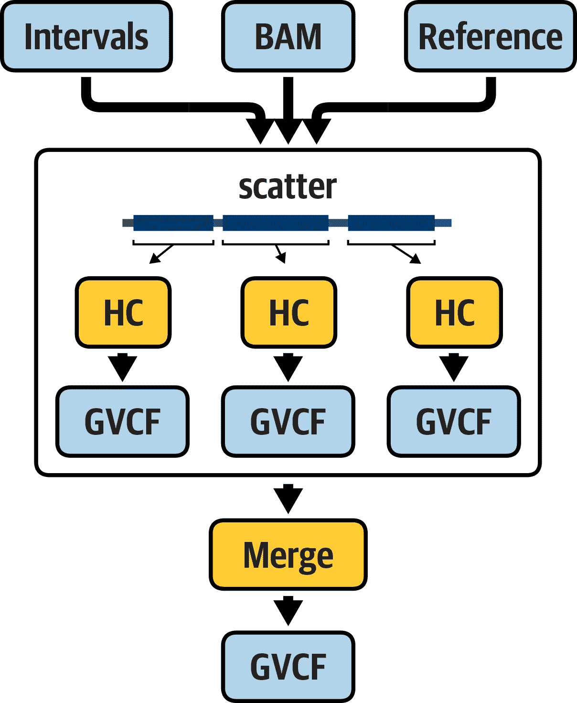

# 第八章：使用工作流自动化执行分析

到目前为止，我们一直在终端手动运行单个命令。然而，绝大多数基因组学工作——即次级分析，在此过程中我们从原始数据到精炼信息，再将其馈送到下游分析以最终产生生物洞察力——都涉及按照相同的顺序在所有数据上运行相同的命令。再次看看《GATK 最佳实践》工作流，它们在第六章和第七章中有所描述；想象一下，为每个样本手动完成这一切会是多么繁琐。这个领域的新手通常发现，逐步在测试数据上运行涉及的命令，以了解关键步骤、其要求及其怪癖，是有益的——这就是为什么我们在第六章和第七章中详细介绍了这一切的原因——但归根结底，你将希望尽可能地自动化所有这些。自动化不仅减少了您需要进行的繁琐手工工作量，还增加了分析的吞吐量，并减少了人为错误的机会。

在本章中，我们涵盖了从单个命令或一次性脚本到可重复工作流的转变。我们向您展示如何使用工作流管理系统（*Cromwell*）和语言 WDL，我们主要因其可移植性而选择。我们将引导您编写您的第一个示例工作流，执行它，并解释 Cromwell 的输出。然后，我们用几个更实际的工作流重复这个过程，这些工作流运行 GATK 并使用分散汇总并行性。

# 引入 WDL 和 Cromwell

您可能还记得，我们在技术入门指南（第三章）中介绍了工作流的概念。正如我们当时指出的，有许多工具选项可用于编写和运行工作流，具有各种特性、优势和劣势。我们无法告诉您*整体最佳选项*，因为这一决定在很大程度上取决于您的具体背景和需求。对于本书的目的，我们选择了一个选项，即 Cromwell 和 WDL 的组合，这对我们所针对的广泛受众和需求范围最为合适。

我们在那时已经简要介绍了 WDL，但让我们回顾一下主要要点，因为那已经是半本书之前的事情，沧海桑田。正如刚才提到的，它的全称是*Workflow Description Language*，但通常简称为 WDL（发音为“widdle”）。这是一种常用于基因组学工作流的 DSL，最初由 Broad Institute 开发，后来演变为一个社区驱动的开源项目，由一个名为 [OpenWDL](https://openwdl.org) 的公共团体支持。作为一种工作流语言，它旨在非常适合没有软件编程正规培训的生物信息学新手，同时最大限度地提高在不同系统间的可移植性。

我们将用于实际*运行*用 WDL 编写的工作流的工作流管理系统是 Cromwell，这是一个在 Broad Institute 开发的开源应用程序。Cromwell 设计为可在几乎任何现代支持 Java 的计算环境中运行，包括像 Slurm 和 SGE 这样的流行 HPC 系统，商业云平台如 GCP 和 AWS，以及运行在某种 Linux 版本的任何笔记本电脑或台式电脑。这种可移植性是 Cromwell 的核心特性，旨在促进在多个机构运行相同工作流，以最大程度地促进科学合作和研究中的计算再现性。Cromwell 的另一个主要面向可移植性的特性是，它支持（但不要求）使用容器来提供你想要在给定工作流的每个组件任务中运行的代码。在本章的练习中，你将有机会尝试两种运行方式。

最后，延续合作和互操作性精神，Cromwell 还设计支持多种工作流语言。目前，它支持 WDL 以及 CWL，另一种流行的工作流语言，旨在实现可移植性和计算再现性。

Cromwell 提供两种运行模式：一次性运行模式和服务器模式。*一次性运行模式*是运行 Cromwell 的简单方式，涉及一个命令行：你给它一个工作流和一个列出工作流输入的文件，它将开始运行，执行工作流，最终在工作流完成时关闭。这对于周期性地运行工作流非常方便，几乎没有麻烦，这也是我们在本章的练习中使用的方式。*服务器模式*的运行方式涉及设置一个持久性服务器，该服务器始终运行，并通过 REST API（一种编程接口）向该服务器提交工作流执行请求。

启动 Cromwell 服务器非常简单。在它运行后，它提供了在单次运行模式中不可用的功能，其中一些我们在第十一章中介绍。然而，安全地管理其运行需要一个专门的技能集，大多数没有专职支持人员的个人研究人员或小团体是不具备的。在第十一章中，我们向您介绍 Terra，这是由 Broad Institute 运营的管理系统，通过 GUI 以及 API 提供对持久性 Cromwell 服务器的访问。这将为您提供在服务器模式下尝试 Cromwell 的机会，而无需自己管理服务器。

###### 注意

我们不会在本书中涵盖 Cromwell 服务器管理，因此如果您有兴趣了解更多信息，请查看[Cromwell 文档](https://oreil.ly/8T7j8)。

无论您将其作为一次性任务还是服务器模式运行，Cromwell 都具有旨在提升效率和可扩展性的有趣功能，但是在本书中没有人想要阅读功能的详细清单，所以让我们继续进行练习，并在相关的地方提出这些关键功能。

# 安装和设置 Cromwell

在本章中，我们将检查并执行一些使用 WDL 编写的工作流，以熟悉语言的基本结构，并了解 Cromwell 如何管理输入和输出、日志等。为了与前几章保持连贯性，我们在之前的章节中（第四章和第五章）使用了 GCP Compute Engine VM 上运行 Cromwell。然而，我们不再从 GATK 容器内运行任何内容。相反，我们直接在 VM 环境中安装和运行 Cromwell。

由于 Cromwell 需要 Java，而我们使用的 VM 上没有预安装 Java，因此您需要运行一些安装命令。为此，请通过 SSH 重新登录到您的 VM，就像您在之前的章节中所做的那样。请记住，您始终可以通过直接转到[Compute Engine](https://oreil.ly/sGeug)在 GCP 控制台中找到您的 VM 实例列表，或者在控制台左侧的 GCP 服务菜单中点击 Compute Engine，如果您忘记了 URL。

在您的 VM 中，在提示符处键入`**java -version**`。您应该会得到以下输出：

```
$ export CASE1=~/book/code/workflows/mystery-1
```

Cromwell 需要 Java 版本 8，因此让我们安装`openjdk-8-jre-headless`选项，这是一个轻量级环境，足以满足我们的需求：

```
$ mkdir ~/sandbox-9
```

这将触发安装过程，应该会无错误地完成运行。您可能会看到一些通知，但只要看到最终的`done`输出，您就应该没问题了。您可以再次运行 Java 版本检查，以确保安装成功：

```
$ cat ~/sandbox-9/haplotypecaller-gvcf-gatk4.dot
$ java -jar $BIN/womtool-48.jar graph $CASE1/haplotypecaller-gvcf-gatk4.wdl \
    > ~/sandbox-9/haplotypecaller-gvcf-gatk4.dot
```

安装了 Java 后，让我们设置 Cromwell 本身，它附带一个称为`Womtool`的伴随实用程序，用于语法验证和创建输入文件。它们都作为编译好的*.jar*文件分发，并且我们已经在书籍捆绑包中包含了一个副本，因此您不需要做任何复杂的操作，只需指向它们所在的位置即可。为了尽可能缩短我们的命令，让我们设置一个环境变量来指向它们的位置。我们称之为*BIN*，代表二进制，这是一个经常用来指代程序的编译形式的术语：

```
digraph HaplotypeCallerGvcf_GATK4 {
  #rankdir=LR;
  compound=true;
  # Links
  CALL_HaplotypeCaller -> CALL_MergeGVCFs
  SCATTER_1_VARIABLE_interval_file -> CALL_HaplotypeCaller
  CALL_CramToBamTask -> CALL_HaplotypeCaller
  # Nodes
  subgraph cluster_0 {
    style="filled,dashed";
    fillcolor=white;
    CALL_CramToBamTask [label="call CramToBamTask"]
    CONDITIONAL_0_EXPRESSION [shape="hexagon" label="if (is_cram)" style="dashed" ]
  }
  CALL_MergeGVCFs [label="call MergeGVCFs"]
  subgraph cluster_1 {
    style="filled,solid";
    fillcolor=white;
    CALL_HaplotypeCaller [label="call HaplotypeCaller"]
    SCATTER_1_VARIABLE_interval_file [shape="hexagon" label="scatter over File as interval_file"]
  }
}
```

让我们检查一下能否通过请求其`help`输出来运行 Cromwell，该输出显示了您可以给它的三个命令的摘要：`server`和`submit`是我们之前讨论过的服务器模式的一部分，而`run`是我们不久将要使用的一次性模式：

```
    CramToBamTask
    HaplotypeCaller
    MergeGVCFs
    ```

对于`Womtool`，也值得做同样的事情，以了解各种可用的实用命令：

```
    call CramToBamTask {          line 68
    call HaplotypeCaller {        line 84 
    call MergeGVCFs {             line 100
    ```

在刚列出的函数中，您将有机会在本章中使用`inputs`、`validate`和`graph`。

现在让我们检查您是否拥有本章提供的所有工作流文件。如果您按照第四章中的设置说明操作，您应该有一个从 GitHub 克隆下来的代码目录。在*~/book/code*下，您将看到一个名为*workflows*的目录，其中包含本章中将要使用的所有代码和相关文件（除了来自存储桶的数据）。您将从主目录运行命令（而不是像之前章节那样进入子目录），因此为了在各种命令中保持路径尽可能简短，让我们设置一个环境变量来指向工作流文件的位置：

```
        if ( is cram ) {
          call CramToBamTask {
            input:
              input_cram = input_bam,
              ...
            }
        }

```

最后，让我们谈谈文本编辑器。在接下来的练习中，除了一个例外，您只需查看和运行我们提供的预写脚本，因此，对于查看，您只需将文件下载或克隆到您的笔记本电脑上，并在您喜欢的文本编辑器中打开它们。在一个例外情况下，我们建议您修改一个 WDL 以打破它，以查看 Cromwell 的错误消息和处理行为，因此您需要实际编辑该文件。我们将向您展示如何使用其中一个 shell 内置的文本编辑器，称为`nano`，这被认为是对于不习惯命令行文本编辑器的人来说最易于接触的之一。当然，您也可以选择使用另一个 shell 编辑器，如`vi`或`emacs`，如果选择这样做，您将需要根据自己的喜好调整我们提供的命令。

无论您决定使用什么文本编辑器，只要确保不要使用像 Microsoft Word 或 Google Docs 这样的*文字处理器*。这些应用程序可能会引入隐藏字符，因此不适合用于编辑代码文件。弄清楚这一切后，让我们做好准备，着手处理您的第一个 WDL 工作流。

# 您的第一个 WDL：Hello World

我们从最简单的可行的 WDL 脚本示例开始：典型的`HelloWorld`。如果你对此不熟悉，这在编程语言的文档中是一个常见的概念；简而言之，这个想法是提供一个包含最少量代码但能产生`HelloWorld!`短语的入门示例。我们将运行三个基本的 WDL 工作流来演示这个功能级别，从绝对最小的示例开始，然后仅添加足够的代码来展示核心功能，尽管技术上不是必需但在实际使用中需要的部分。

## 通过最简示例学习基本的 WDL 语法

通过将 *hello-world.wdl* 工作流文件加载到 `nano` 编辑器中，我们来看一下最简单的示例：

```
          scatter (interval_file in
          scattered_calling_intercals
          ) {
            ...
            call HaplotypeCaller {}
              input:
                input_am = 
          select_first([CramToBamTask.output_bam,
          input_bam]),
                ...
              }
          }

```

正如前面提到的，`nano`是一个基本的编辑器。你可以使用键盘上的箭头键在文件中移动。要退出编辑器，请按 Ctrl+X。

这是 WDL 的极简 Hello World 的样子：

```
          call MergeGVCFs {
            input:
              input_vcfs = 
          HaplotypeCalle.output_vcf,
              ...
          }

```

首先，我们先忽略除了有`HelloWorld`短语的那一行之外的所有内容，那行短语在引号内。你能认出那行命令吗？没错，它是一个简单的`echo`命令；你可以立即在你的终端上运行那行：

```
if ( is_cram ) {
    call CramToBamTask {
          input:
            input_cram = input_bam,
            ...
    }
  }
```

所以这是我们脚本核心的执行所需操作的命令，其余都是为了使其通过我们的工作流管理系统以脚本形式运行而包装的。

现在我们来分解这个包装。在最高层，我们只有两个不同的代码块：一个以`workflow HelloWorld`开头的块，另一个以`task WriteGreeting`开头的块，在每种情况下，大括号中有几行代码（WDL 的原始设计者真的很喜欢大括号；你会看到更多的）。我们可以像这样总结它们：

```
#is the input a cram file?
Boolean is_cram = sub(basename(input_bam), ".*\\.", "") == "cram"
```

这使得我们的脚本结构变得非常清晰：有两个部分组成，`workflow`块，用于调用我们希望工作流执行的操作，以及`task`块，用于定义操作的详细信息。这里我们只有一个任务，这在实际上并不典型，因为大多数工作流由两个或更多任务组成；我们在本节中进一步介绍多任务的工作流。

让我们更仔细地看一下动作——也就是命令——在`WriteGreeting`任务中是如何定义的：

```
Boolean is_cram      
```

在第一行中，我们声明这是一个名为`WriteGreeting`的任务。在最外层的大括号内，我们可以将代码结构分解为另外两个代码块：`command {...}`和`output {...}`。`command`块非常简单：它包含`echo "Hello World"`命令。所以这就很明了了，对吧？一般来说，你可以把几乎任何你想在终端运行的东西放在这里，包括管道、多行命令，甚至是像 Python 或 R 这样的“外来”代码块，只要你用[heredoc 语法](https://oreil.ly/VK1F8)包裹起来。我们在第九章提供了类似的示例。

与此同时，`output`块可能显得不那么明显。这里的目标是定义我们计划运行的`command`块的输出。我们声明我们期望输出将是一个`File`，我们选择称之为`output_greeting`（此名称可以是任何您想要的，除了 WDL 规范中定义的保留关键字之一）。然后，在稍微复杂的部分，我们声明输出内容本身将是发送到`stdout`的任何内容。如果您对命令行术语不太熟悉，`stdout`是标准输出的缩写，指的是在终端窗口中显示的文本输出，这意味着当您运行命令时在终端中看到的内容。默认情况下，此内容也会保存到执行目录中的文本文件中（我们稍后会检查），因此这里我们说的是我们指定该文本文件作为我们命令的输出。在基因组工作流中做这件事可能并不是一件非常现实的事情（尽管您可能会感到惊讶……我们见过更奇怪的事情），但这就是 Hello World 的本质！

无论如何，我们的`task`块已经解释完毕。现在，让我们看一下`workflow`块：

```
sub(basename(input_bam), ".*\\.", "") == "cram"
```

好了，这很简单。首先，我们声明我们的工作流叫做`HelloWorld`，然后，在大括号内，我们使用`call`语句调用`WriteGreeting`任务。这意味着当我们通过 Cromwell 实际运行工作流时，它将尝试执行`WriteGreeting`任务。让我们试试吧。

## 在您的 Google 虚拟机上使用 Cromwell 运行一个简单的 WDL

退出`nano`编辑器，按 Ctrl+X 返回虚拟机的 shell 界面。你将使用位于*~/book/bin*目录下的 Cromwell *.jar*文件启动*hello-world.wdl*工作流，这在本章的设置部分我们将其别名为`$BIN`。命令非常简单，是普通的 Java 命令：

```
sub(basename(input_bam), ".*\\.", "")
```

此命令调用 Java 来使用其一次性（run）工作流执行模式运行 Cromwell，我们在本章早些时候将其与持久的`server`模式进行了对比。因此，它只会启动，运行我们提供给`run`命令作为输入的工作流，并在完成后关闭。目前，没有其他涉及，因为我们的工作流完全是自包含的；接下来我们会介绍如何对工作流进行参数化，以接受输入文件。

继续运行该命令。如果您已经正确设置了一切，您现在应该看到 Cromwell 开始向终端输出大量内容。我们在这里展示了输出的最相关部分，但省略了一些不符合我们立即目的的块（用`[...]`表示）：

```
File input_bam = "gs://my-bucket/sample.bam"
```

正如您所见，Cromwell 的标准输出有点……嗯，啰嗦。Cromwell 主要设计用于作为一组相互连接的服务的一部分使用，我们在第十一章中讨论了在常规使用过程中监视进度和输出的专用界面。单次运行模式更常用于故障排除，因此开发团队选择使本地执行模式非常冗长，以帮助调试。起初可能感觉有点压倒性，但别担心：我们在这里向您展示如何解读所有内容——或者至少是我们关心的部分。

## 解释 Cromwell 日志输出的重要部分

首先，让我们检查我们的工作流输出是否符合预期。在终端输出中找到以下一组行：

```
sub("string to modify", "substring or pattern we want to replace", "replacement")
```

在此之前，我们看到这提供了一个以 JSON 格式列出的输出文件列表；在这种情况下，只有一个文件捕获了我们的一个`echo "Hello World"`命令的`stdout`。Cromwell 为我们提供了完全限定路径，这意味着它包括工作目录上面的目录结构，这非常方便，因为它允许我们在任何命令中快速复制和粘贴使用。您可以立即执行此操作，查看输出文件的内容，并验证其是否包含我们预期的内容：

###### 注

请记住，在我们展示的命令中，您需要替换用户名和执行目录哈希。在您的输出中查找相应行可能比定制我们的命令更容易。

```
    basename(input_bam)     "sample.bam"
    ```

就是这样！所以我们知道它起作用了。

现在让我们花几分钟时间浏览 Cromwell 在所有这些日志输出中为我们提供的信息，以识别最相关的要点：

```
    ".*\\."            "sample."+"bam"
    ```

> = *我正在查看此工作流并为其分配此唯一标识符。*

Cromwell 为每次工作流运行生成一个随机生成的唯一标识符，并创建一个带有该标识符的目录，在该目录中将写入所有中间和最终文件。我们稍后详细讨论输出目录结构的细节。现在，您真正需要知道的是，这是设计用来确保您永远不会覆盖同一工作流之前运行的结果，或者在具有相同名称的不同工作流之间发生冲突：

```
    ""                ""+"bam"
    ```

> = *我计划将其发送到本地机器执行（而不是远程服务器）。*

默认情况下，Cromwell 直接在您的本地机器上运行工作流；例如，您的笔记本电脑。正如我们之前提到的，您可以配置它将作业发送到远程服务器或云服务；这在 Cromwell 术语中称为*后端分配*（不要与换尿布混淆）：

```
    "bam"
    ```

> = *我现在正在执行`HelloWorld`工作流中的`WriteGreeting`任务调用。*

Cromwell 将工作流中的每个任务调用视为一个单独的执行作业，并将根据需要为每个作业提供单独的更新。如果工作流涉及多个任务调用，Cromwell 将对它们进行排队，并在适当时发送每个任务进行执行。稍后我们将讨论其工作原理的一些方面。关于状态报告方面，您可以想象，一旦我们开始运行更复杂的工作流，通过标准输出获取这些报告是相当不实际的。这就是提供界面来解析和组织所有这些信息的前端软件真正派上用场的地方；在第十一章中，您将有机会体验到这一点：

```
String sample_basename = if is_cram then basename(input_bam, ".cram") else
basename(input_bam, ".bam")
```

> = *这是我当前调用的实际命令。*

从这个特定的调用中并不明显，因为我们在最小的 Hello World 示例中没有包含任何变量，但是 Cromwell 在这里输出的是实际将要执行的命令。在接下来的参数化示例中，你可以看到，如果我们在脚本中包含一个变量，日志输出将显示命令的形式，其中变量已被我们提供的输入值替换。这完全解释的命令也会输出到执行目录以供记录：

```
if is_cram then basename(input_bam, ".cram") else basename(input_bam, ".bam")
```

> = *我已经完成了这个工作流。这是你想要的输出文件的完整路径。*

正如前面所述，这以 JSON 格式提供了所有生成的输出文件的完整命名空间的列表。命名空间

```
scatter (...) {
  ...
  call HaplotypeCaller {
      input:
        input_bam = select_first([CramToBamTask.output_bam, input_bam]),
        ...
   }
}
```

告诉我们，我们正在查看由`HelloWorld`工作流中的`WriteGreeting`任务调用输出的`output_greeting`。

输出文件的完全限定路径显示了整个目录结构；让我们展开来看看每个部分对应什么：

```
String? gatk_docker_override
String gatk_docker = select_first([gatk_docker_override, 
                                  "us.gcr.io/broad-gatk/gatk:4.1.0.0"])

```

这个结构中的重要部分是 workflow/identifier/calls 的嵌套。正如你将在下一个练习中看到的那样，具有相同名称的工作流的任何运行都将添加到*HelloWorld*工作流目录下，具有另一个唯一标识符的新目录。

```
$ export CASE2=~/book/code/workflows/mystery-2
```

> = *嘿，一切都正常工作！*

```
$ java -jar $BIN/womtool-48.jar graph $CASE2/WholeGenomeGermlineSingleSample.wdl  \
    > ~/sandbox-9/WholeGenomeGermlineSingleSample.dot
```

> = *我这里都完成了。再见。*

现在你只需关注这一点，即完成你的第一个 Cromwell 工作流执行。干得漂亮！

## 添加一个变量并通过 JSON 提供输入

好的，但是运行一个完全自包含的 WDL 是不现实的，所以让我们看看如何添加变量以引入一些可以从运行到运行变化的外部输入。在`nano`编辑器中，继续打开代码目录中的*hello-world-var.wdl*：

```
$ cat ~/sandbox-9/WholeGenomeGermlineSingleSample.dot
digraph WholeGenomeGermlineSingleSample {
 #rankdir=LR;
 compound=true;
 # Links
 CALL_UnmappedBamToAlignedBam -> CALL_BamToCram
 CALL_UnmappedBamToAlignedBam -> CALL_CollectRawWgsMetrics
 CALL_UnmappedBamToAlignedBam -> CALL_CollectWgsMetrics
 CALL_UnmappedBamToAlignedBam -> CALL_AggregatedBamQC
 CALL_UnmappedBamToAlignedBam -> CALL_BamToGvcf
 CALL_AggregatedBamQC -> CALL_BamToCram
 # Nodes
 CALL_AggregatedBamQC [label="call AggregatedBamQC";shape="oval";peripheries=2]
 CALL_BamToGvcf [label="call BamToGvcf";shape="oval";peripheries=2]
 CALL_UnmappedBamToAlignedBam [label="call
UnmappedBamToAlignedBam";shape="oval";peripheries=2]
 CALL_BamToCram [label="call BamToCram";shape="oval";peripheries=2]
 CALL_CollectRawWgsMetrics [label="call CollectRawWgsMetrics"]
 CALL_CollectWgsMetrics [label="call CollectWgsMetrics"]
}
```

有什么不同？`workflow`块完全相同，但现在`WriteGreeting` `task`块中发生了更多的事情：

```
        call ToBam.UnmappedGamToAlignedBam {
          input:
            sample_and_unmapped_bams =
        sample_and_unmapped_bams,
            ...
        }

```

`echo`命令的`Hello World`输入已被`${greeting}`替换，现在在`command`块之前有一个新的`input`块，其中包含`String greeting`的行。这行声明了名为`greeting`的变量，并声明其值应为`String`类型；换句话说，是一个字母数字序列。这意味着我们已经参数化了要回显到终端的问候语；我们将能够指示 Cromwell 在每次运行时插入到命令中的内容。

这带来了下一个问题：我们如何向 Cromwell 提供这个值？我们绝对不想直接在命令行上给出它，因为虽然这个特定情况很简单，但在未来我们可能需要运行预期需要多达数十个值的工作流，其中许多值比简单的`String`更复杂。

Cromwell 期望您以[JavaScript 对象表示法](https://www.json.org)（JSON）文本格式提供输入。JSON 具有键值对结构，允许我们为每个变量分配一个值。您可以在我们提供的*$WF/hello-world/hello-world.inputs.json*文件中看到一个示例：

```
          call AggregatedQC.AggregatedBamQC {
            input:
              base_recalibrated_bam = 
          UnmappedBamToAlignedBam.output_bam,
              ...
          }

```

在这个简单的*inputs* JSON 文件中，我们通过其完全限定名定义了来自我们`HelloWorld`工作流的`greeting`变量，该名包括工作流本身的名称(`HelloWorld`)，然后是任务(`WriteGreeting`)的名称，因为我们在任务级别声明了变量，然后是变量本身的名称。

要将*inputs* JSON 文件提供给 Cromwell，只需通过使用`-i`参数（`--input`的缩写）添加到您的 Cromwell 命令中，如下所示：

```
          call ToCram.BamToCram as BamToCram {
            input:
              input_bam = 
          UnmappedBamToAlignedBam.output_bam,
              ...
          }

```

以与之前相同的方式查找输出；您应该看到由工作流输出的消息与 JSON 文件中的文本匹配。

Cromwell 在所有级别都强制使用全限定名称，这使得不可能声明全局变量。虽然这可能感觉像一种累赘的限制，但比起允许变量在工作流的不同部分中重复命名而言，这更安全。在简单的工作流中，足以轻松跟踪变量并防止此类问题，但在有数十个以上变量的更复杂的工作流中，这可能会变得相当困难。特别是当您使用导入和子工作流来促进代码重用时，我们在第九章中介绍了这一点（哦，剧透）。请注意，您可以在工作流级别声明变量（并在*inputs* JSON 文件中使用输入命名语法*`WorkflowName.variable`*），但您需要显式地将其传递给任何想要在其中使用它的任务调用。稍后在本章中将会看到这种操作的示例。

## 添加另一个任务以使其成为适当的工作流

现实世界的工作流通常不止一个任务，并且它们的某些任务依赖于其他任务的输出。在`nano`编辑器中，打开*hello-world-again.wdl*：

```
          #QC the sample WGS metrics (stringent thresholds)
          call QC.CollectWgsMetrics as 
          CollectWgsMetrics{
            input:
              input_bam =
          UnmappedBamToAlignedBam.output_bam,
          ...
        }

```

这是我们尝试的第三次迭代的 Hello World 示例，展示了两个任务如何链接成一个正确的工作流：

```
          #QC the sample WGS metrics (common thresholds)
          call QC.CollectRawWgsMetrics as 
          CollectWgsMetrics{
            input:
              input_bam =
          UnmappedBamToAlignedBam.output_bam,
          ...
        }

```

您可以看到`workflow`块现在有更多的内容；它有一个指向新任务`ReadItBackToMe`的额外调用语句，并且该调用语句附有花括号中的代码，我们将其称为`input`块：

```
          call ToGvcf.VariantCalling as BamToGvcf {
            input:
              ...
              input_bam = 
          UnmappedBamToAlignedBam.output_bam,
              ...
          }

```

`input`块允许我们从工作流级别传递值到特定任务调用。在这种情况下，我们引用了`WriteGreeting`任务的输出，并将其分配给名为`written_greeting`的变量，以在`ReadItBackToMe`调用中使用。

让我们来看看那个新的任务定义：

```
call ToBam.UnmappedBamToAlignedBam
```

`read_string()`部分是 WDL 标准库中的一个函数，用于读取文本文件的内容并将其以单个字符串的形式返回。因此，此任务旨在将文件内容读入`String`变量中，然后使用该变量来组成新的问候语并将其回显到`stdout`。

鉴于此，附加到`ReadItBackToMe`调用语句的额外代码完全合理。我们正在调用`ReadItBackToMe`任务，并指定我们用于撰写新问候语的输入文件应该是调用`WriteGreeting`任务的输出。

最后，让我们看一看这个新版本工作流中我们还没有检查过的最后一段代码：

```
import "tasks/UnmappedBamToAlignedBam.wdl" as ToBam
```

除了各个任务级别的`output`块外，此工作流还在工作流级别定义了一个`output`块。当工作流打算单独运行时，此工作流级别的输出定义完全是可选的；这更多地是一种惯例而不是功能性的问题。通过定义工作流级别的输出，我们可以明确表达工作流生成的输出中我们关心哪些。话虽如此，你可以在功能上使用这个输出定义；例如，当工作流将用作嵌套子工作流并且我们需要将其输出传递给进一步的调用时。你将在第九章看到它的实际应用。现在，尝试使用与前一个工作流相同的输入 JSON 运行此工作流，然后查看执行目录，了解任务目录之间的关系以及输出的位置。

# 您的第一个 GATK 工作流：Hello HaplotypeCaller

现在您已经牢固掌握了基本的 WDL 语法，让我们转向一个更现实的例子集：真实的 GATK 流水线！我们从一个非常简单的工作流开始，逐步建立您对语言的熟悉度。我们希望运行 GATK `HaplotypeCaller`的工作流程是线性的（无并行化），以 GVCF 模式处理单个样本的 BAM 文件，如图 8-1 中所示。


###### 图 8-1\. 运行 HaplotypeCaller 的假设工作流程。

这个工作流应该接受通常要求的文件——基因组参考、输入读取和要分析的区间文件（在技术上 GATK 认为是可选的，但在这里我们通过 WDL 使其成为必需的）——并输出一个以输入文件命名的 GVCF 文件。

## 探索 WDL

为了说明这一切，我们通过一个单独的任务`HaplotypeCallerGVCF`编写了一个 WDL 工作流来满足这些要求。现在在`nano`编辑器中打开它：

```
call ToBam.UnmappedBamToAlignedBam
```

让我们详细讨论脚本的主要部分，回想一下我们的 HelloWorld 示例的结构：

```
# WORKFLOW DEFINITION
workflow UnmappedBamToAlignedBam {
```

为了清晰起见，折叠任务，您可以看到这确实是一个单任务工作流，只有一个单独的调用，并且在`workflow`块中没有其他操作：

```
$ java -jar $BIN/womtool-48.jar graph $CASE2/tasks/VariantCalling.wdl \
    > ~/sandbox-9/VariantCalling.dot
```

因此，让我们更详细地查看`HaplotypeCallerGVCF`任务，从`command`块开始，因为最终我们将从中获取关于任务实际操作的大部分信息：

```
call Utils.ScatterIntervalList as ScatterIntervalList 
```

我们看到一个典型的 GATK 命令，调用`HaplotypeCaller`以 GVCF 模式运行。它使用占位符变量来表示预期的输入文件以及输出文件。它还包括一个占位符变量，用于传递 Java 选项，如在第五章中描述的内存堆大小。到目前为止，这相当简单明了。

所有这些变量都应该在某处定义，所以让我们找找它们。按照惯例，我们在任务描述的开头，在 `command` 块之前这样做。这是我们在那里看到的内容：

```
import "tasks/Utilities.wdl" as Utils
```

现在暂时忽略 `String docker_image` 行，这显示我们声明了所有输入文件的变量以及 Java 选项，但我们没有为它们分配值。因此，任务将期望在运行时接收所有这些变量的值。不仅如此，它还将期望为我们经常视为理所当然的所有附属文件提供值：`refIndex`、`refDict` 和 `inputBamIndex`，它们是索引和序列字典。我们没有将这些文件包含在命令本身中，因为 GATK 自动检测它们的存在（只要它们的名称符合其主文件的格式约定），但我们需要通知 Cromwell 它们的存在，以便它在运行时可用于执行。

不过，有一个例外；对于输出文件，我们看到了这一行：

```
version 1.0

## Copyright Broad Institute, 2018
##
## This WDL defines utility tasks used for processing of sequencing data.
##
...

# Generate sets of intervals for scatter-gathering over chromosomes
task CreateSequenceGroupingTSV {
  input {
    File ref_dict
...
```

`basename(input_bam, ".bam")` 是 WDL 标准库中的便捷函数，允许我们根据输入文件的名称创建输出文件的名称。`basename()` 函数接受输入文件的完整路径，去除文件名前面的路径部分，并可选地去除文件名末尾的指定字符串。在这种情况下，我们去除了预期的 *.bam* 扩展名，然后使用行中的 `+ ".g.vcf"` 部分添加新的扩展名，以适用于输出文件。

说到输出文件，现在让我们跳到任务级别的 `output` 块：

```
task ScatterIntervalList {
  input {
    File interval_list
    Int scatter_count
    Int break_bands_at_multiples_of
  }

  command <<<
...
```

这也很直接：我们声明该命令将生成一个我们关心的输出文件，并为其命名，以便在工作流程内处理，并提供相应的占位变量，以便 Cromwell 在命令完成后可以识别正确的文件。

从技术上讲，在工作流程和任务定义中如果您计划在具有程序本地安装的系统上运行，则这就是您所需的全部内容。然而，在本章中，您是在虚拟机中工作，但在 GATK 容器外部工作，因此 GATK 不能直接用于您的工作流程。幸运的是，Cromwell 能够利用 Docker 容器，所以我们只需在工作流程中添加一个 `runtime` 块来指定容器镜像：

```
import "tasks/VariantCalling.wdl" as ToGvcf
```

这就是为什么我们在任务变量中有那一行 `String docker_image`：我们还使用一个容器镜像的占位变量。在下一步填写输入 JSON 时，我们将指定 `us.gcr.io/broad-gatk/gatk:4.1.3.0` 镜像。然后，当我们启动工作流程时，Cromwell 将从我们指定的镜像中启动一个新的容器，并在其中运行 GATK。

从技术上讲，我们可以在这里硬编码图像名称，使用双引号（例如，`docker: "us.gcr.io/broad-gatk/gatk:4.1.3.0"`），但除非您真的想将特定脚本固定到特定版本，显著降低了灵活性，否则我们不建议这样做。有些人使用`latest`标签使其工作流始终与程序的最新可用版本一起运行，但我们认为这是一个坏习惯，弊大于利，因为您永远不知道最新版本可能会改变什么并且打破您的工作流。

## 生成输入 JSON

好了，我们已经浏览了工作流中的所有代码；现在我们需要确定在运行它时如何提供工作流的输入。在“您的第一个 WDL：Hello World”中，我们运行了一个非常简单的工作流，首先没有任何变量输入，然后只有一个变量输入。在单输入情况下，我们创建了一个指定该输入的 JSON 文件。现在我们有八个需要指定的输入。我们可以像以前一样继续——创建一个 JSON 文件并写入`HaplotypeCallerGVCF`任务所需的每个输入的名称，但有一个更简单的方法：我们将使用`Womtool inputs`命令创建一个模板 JSON。

首先，因为我们将首次写入我们关心的文件，让我们创建一个*sandbox*目录来组织我们的输出：

```
call ToGvcf.VariantCalling as BamToGvcf {
    input:
      ...
      input_bam = UnmappedBamToAlignedBam.output_bam,
```

现在，您可以运行生成*inputs* JSON 模板文件的`Womtool`命令：

```
call Utils.ScatterIntervalList as ScatterIntervalList 
```

由于在此命令的最后一行指定了输出文件（实际上是可选的），该命令将其输出写入该文件。如果一切顺利，您在终端上不应该看到任何输出。让我们看看刚刚创建的文件的内容：

[PRE45]

[PRE46]

所以你看：`HaplotypeCallerGVCF`任务预期的所有输入都以适当的方式列出，并且用占位符值表示其类型，以 JSON 格式（尽管在您的情况下可能顺序不同）。现在我们只需填写这些值；这些是前六个相关文件的路径和最后两个的运行时参数（容器映像和 Java 选项）。出于懒惰精神，我们提供了一个填写好的版本，其中使用了我们在第五章中使用的片段数据，但如果您愿意，您也可以通过填写*inputs* JSON 来处理数据包中第四章下载的其他输入。这就是预填充 JSON 的样子（路径相对于主目录）：

[PRE47]

[PRE48]

请注意，所有的值都显示在双引号中，但这是一个小小的瑕疵，因为这些值都是 `String` 类型。对于其他类型，如数字、布尔值和数组，您不应该使用双引号。当然，对于字符串数组，您应该在字符串周围使用双引号，而不是在数组本身周围，`["like","this"]`。

## 运行工作流

要运行工作流，我们将使用与前面相同的命令行语法。确保在您的主目录中执行此操作，以便 *inputs* JSON 文件中的相对路径与数据文件的位置匹配：

[PRE49]

正如前面提到的，Cromwell 输出非常详细。在这个练习中，您需要查找终端输出中类似以下行的内容：

[PRE50]

这里最令人兴奋的片段是 `状态从 WaitingForReturnCode 变为 Done` 和 `完成状态为'Succeeded'`，这意味着您的工作流已经运行完成，并且所有运行的命令都表示它们运行成功。

输出的另一个令人兴奋的部分是输出的路径。在接下来的部分中，我们会稍微谈一谈为什么它们会列出两次；现在，让我们高兴地注意到 Cromwell 精确告诉我们在哪里找到我们的输出文件。当然，这个特定工作流的输出是一个 GVCF 文件，所以阅读起来并不是很愉快，但关键是文件在那里，并且它的内容是您期望看到的。

我们使用 `head` 实用程序来完成这个目的；请记住，您需要将执行目录哈希在以下示例中显示的文件路径中（`9a6a9c97-7453-455c-8cd8-be8af8cb6f7c`）替换为输出中显示的哈希值：

[PRE51]

这次运行应该很快完成，因为我们使用的间隔列表仅涵盖一个短区域。这里大部分时间花费在 Cromwell 启动和容器的启动上，而 GATK `HaplotypeCaller` 本身只运行了极短的时间。就像 Hello World 示例一样，您可能会觉得这对于如此小的工作量来说是一种过度劳动，您是对的；这就像用火箭筒打苍蝇一样。对于玩具示例，让 Cromwell 运行起来的开销远远超过了分析本身。当我们进行适当的全面分析时，像 Cromwell 这样的工作流管理系统真正显示其价值，这一点您将在第十章和第十一章中体验到。

## 打破工作流以测试语法验证和错误消息

希望到目前为止一切都如预期般顺利，这样你就知道成功是什么样子。但实际情况是，事情偶尔会出错，所以现在让我们看看失败的样子。具体来说，我们将看看 Cromwell 如何处理两种常见的脚本错误，即 WDL 语法和`command`块语法错误，通过在 WDL 中引入一些错误。首先，让我们复制工作流文件，以便可以自由玩耍：

[PRE52]

现在，在你喜欢的文本编辑器中，打开新文件并在 WDL 语法中引入一个错误。例如，你可以弄乱一个变量名、一个保留关键字，或者删除`basename()`函数调用中的第二个括号。这种小错误是致命的，但很容易被忽视。让我们看看当我们运行这个时会发生什么：

[PRE53]

正如预期的那样，工作流执行失败，Cromwell 为我们提供了一些冗长的错误消息：

[PRE54]

这里有很多我们不关心的内容，比如我们这里没有展示的堆栈跟踪。真正重要的部分是`Workflow input processing failed: ERROR: Unexpected symbol`。这是一个明显的暗示，你可能有语法问题。Cromwell 会试图给出更具体的指示，指出语法错误可能出现的位置；在这种情况下，它非常准确——它预期但没有找到第 20 行的右括号（`rparen`表示右括号）。但要注意，有时候情况并不那么明显。

当你正在积极开发一个新的工作流时，你可能不想每次需要测试一些新代码的语法时都要通过 Cromwell 启动工作流。好消息是：你可以通过使用`Womtool`的验证命令来节省时间。这实际上是 Cromwell 在幕后运行的命令，它是一个非常轻量级的方式来测试你的语法。现在就在你的出错工作流上试试吧：

[PRE55]

看到了吗？你在更短的时间内获得了 Cromwell 输出的重要部分——甚至不需要提供工作流的有效输入。作为额外的练习，尝试引入其他 WDL 语法错误；例如，尝试删除变量声明，仅在其出现中更改变量名称，并拼错`workflow`、`command`或`outputs`等保留关键字。这将帮助你识别验证错误并解释`Womtool`如何报告它们。总的来说，我们强烈建议在任何新的或更新的 WDL 上系统地使用`Womtool validate`（是的，它也适用于 CWL）。

话虽如此，重要的是要理解，`Womtool` 的 WDL 语法验证只能帮助到这一步：它不能处理其他范围之外的任何其他错误，例如，如果您搞乱了要运行的工具的命令语法。为了看看在这种情况下会发生什么，您可以在沙盒中再次复制原始工作流（将其命名为 *hc-break2.wdl*），然后打开它，这次在 GATK 命令中引入一个错误，例如，将工具名称弄错为 `HaploCaller`：

[PRE56]

如果您运行 `Womtool validate`，您会看到此工作流程通过验证顺利进行；`Womtool` 欢快地报告 `Success!` 但是如果您实际通过 Cromwell 运行它，工作流程肯定会失败：

[PRE57]

浏览输出以找到显示失败消息的行：

[PRE58]

记录中写道 `Job HelloHaplotypeCaller.HaplotypeCallerGVCF:NA:1 exited with return code 2` 表明 `HaplotypeCallerGVCF` 是失败的任务，具体来说，它运行的命令报告了退出码 `2`。这通常表示您尝试运行的工具在某些地方出现问题——可能是语法问题、未满足的输入要求、格式错误、内存不足等。

错误消息继续指出，您可以通过查看命令生成的标准错误 (`stderr`) 输出来了解更多情况，并且它还包含了完整的文件路径，以便您轻松地查看其中的内容。它还包括 `stderr` 日志的前几行，以便方便查看，如果工具的错误输出非常简短，这有时就足够了。由 GATK 生成的 `stderr` 输出较为冗长。因此，我们需要检查完整的 `stderr` 来找出问题所在。同样，请确保用您输出中显示的用户名和执行目录哈希（`dd77316f-7c18-4eb1-aa86-e307113c1668`）替换这里显示的内容：

[PRE59]

啊，看这个！我们错误地写了工具的名称；谁知道呢？顺便说一句，赞美 GATK 建议的更正；这在 GATK4 中是新功能。

###### 注意

所有命令行工具在完成运行时都会输出一个 *返回码* 作为简洁的状态报告方式。根据工具的不同，返回码可能更或少有意义。通常情况下，返回码为 0 表示成功，其他任何返回码表示失败。在某些情况下，非零返回码可能表示运行成功；例如，Picard 工具 `ValidateSamFile` 在运行成功但发现文件中存在格式验证错误时会报告非零返回码。

这里没有涵盖的其他问题可能会出错，比如如果您的输入文件路径错误，或者在输入 JSON 中忘记将字符串输入用双引号括起来。我们建议您故意制造这些错误来进行实验，因为这将帮助您更快地学会诊断问题。

# 介绍分散-聚集并行性

在本章中，我们将再次介绍一个工作流示例，以完成你对 WDL 和 Cromwell 的首次接触，因为我们真的希望你能尝试一下并行化的强大之处，如果你之前没有这样的经验的话。现在我们将看一个工作流，通过`scatter()`函数来并行化我们之前通过`HaplotypeCaller`任务运行的操作，并在随后的步骤中合并并行作业的输出，如图 8-2 所示。



###### 图 8-2\. 并行执行 HaplotypeCaller 的工作流的概念图。

这个工作流将让你体验到 scatter-gather 并行处理的魔力，这在基因组工作流中尤其重要，特别是在云端。它还将让你有机会更详细地挖掘基于输入和输出将多个任务串在一起的机制，比我们之前涵盖的更详细一些。

## 探索 WDL

这里是一个完整的 WDL，它将`HaplotypeCallerGVCF`的操作并行化处理到子集间隔中。在`nano`编辑器中，像往常一样打开它：

[PRE60]

让我们逐步了解脚本的主要部分，指出与线性实现此工作流有何不同的地方：

[PRE61]

最明显的区别是现在`workflow`块中发生了很多变化。行动的核心是这个子集（为了可读性，合并了两个`call`块）：

[PRE62]

以前，我们只是简单地调用了`HaplotypeCallerGVCF`任务，就这样。现在，你可以看到对`HaplotypeCallerGVCF`的调用被隶属于一个更高级的操作，就在这行下面，打开了一个`scatter`块：

[PRE63]

对于这样一个简短的行，它做了很多工作：这是我们如何在子集间隔上并行执行`HaplotypeCaller`的过程，这些间隔在括号中指定。`calling_intervals`变量引用一个间隔列表，而`HaplotypeCallerGVCF`任务将作为单独的调用运行在提供的文件中的每个间隔上。如果你熟悉脚本构造，这可能看起来很像一个*for 循环*，事实上，它确实类似于这种构造，其目的是对列表中的每个元素应用相同的操作。然而，scatter 是专门设计用来允许每个操作的独立执行，而 for 循环导致线性执行，其中每个操作只能在前一个（如果有的话）完成执行后才能运行。

现在你理解了`scatter()`指令的作用，让我们深入了解`HaplotypeCallerGVCF`任务本身，从它如何被调用开始：

[PRE64]

在工作流的先前版本中，对任务的调用只是关键字`call`后跟任务名称。在这个版本中，该语句包括一个`input`块，指定了任务所需的一些变量的值：输入 BAM 文件及其索引，间隔文件，以及 GVCF 输出文件的名称。说到这一点，你会注意到我们用于生成输出名称的`basename`函数调用现在发生在这个`input`块中，而不是在任务内部。如果你比较了这个版本和之前版本的`HaplotypeCallerGVCF`任务定义，这是唯一的区别。让我们心里记下这一点，因为几分钟后会再次提到。

现在让我们谈谈包含`HaplotypeCallerGVCF`调用的`scatter`块后面的内容：对一个名为`MergeVCFs`的新任务的调用。清楚地说，这个调用语句在`scatter`块之外，因此它只会运行一次。

[PRE65]

根据任务名称，你可能已经对此任务的用途有了相当好的了解，但让我们假装不是那么明显，并按照逻辑路径解读工作流的结构。预览`MergeVCFs`任务定义，我们看到它运行的命令是一个调用 GATK 命令，调用一个名为`MergeVcfs`的工具（实际上是捆绑在 GATK4 中的 Picard 工具）。作为输入，它接受一个或多个 VCF 文件（其中 GVCF 是一个子类型），并输出单个合并文件：

[PRE66]

我们可以通过命令参数和变量名称推断出这一点，并通过查阅 GATK 网站上的`MergeVcfs`工具文档进行确认。

###### 注意

在此需要注意的 WDL 语法新点：`-I ${sep=' -I' vcfs}`的形式是我们处理需要将任意长度的项目列表放入命令行，并为每个项目使用相同参数的方法。给定文件列表`[FileA, FileB, FileC]`，前面的代码将生成命令行的以下部分：`-I FileA -I FileB -I FileC`。

`MergeVCFs`任务定义还告诉我们，该任务期望一个文件列表（技术上表示为`Array[*File*]`）作为其主要输入。让我们看看任务在`workflow`块中的调用方式：

[PRE67]

如果你还记得`HelloWorld​Again`工作流中的`ReadItBackToMe`任务，这可能会让你感到熟悉。与之前一样，我们通过引用`HaplotypeCallerGVCF`任务的输出来为`vcfs`输入变量赋值。不同之处在于，在那种情况下，我们将单个文件输出传递给单个文件输入。相比之下，这里我们引用了位于`scatter`块内的任务调用的输出。这究竟是什么样子呢？

优秀的问题。根据定义，在`scatter`块内的每个单独调用任务的生成的输出都是单独的。`scatter`结构的巧妙之处在于，这些单独的输出会自动收集到一个列表（技术上是一个数组）中，列表的名称是任务指定的输出变量的名称。因此，在这里，虽然`HaplotypeCallerGVCF`任务的单个调用的输出值，即`HaplotypeCallerGVCF.output_gvcf`，是一个单个的 GVCF 文件，但在`workflow`块中引用的`HaplotypeCallerGVCF.output_gvcf`的值是在`scatter`块中生成的 GVCF 文件的列表。当我们将该引用传递给下一个任务调用时，我们实际上是将完整的文件列表作为数组提供。

让我们通过指出一些更多细节来完成这次探索。首先，您可能会注意到我们在 workflow 级别的`output`块中明确声明了`MergeVCFs`调用的输出作为工作流的最终输出。这在技术上并不是必需的，但是这是一个好的做法。其次，BAM 文件、其索引和间隔文件的变量声明都被提升到了 workflow 级别。对于 BAM 文件及其索引，这一举措使我们能够在两个任务调用的`input`块中生成输出文件的名称，这在其他方面带来了更多的灵活性，如果我们想要将我们的任务定义放入一个公共库中。对于这样的东西，我们希望任务尽可能地通用，并将诸如文件命名约定之类的细节留给工作流实现。至于间隔文件，我们需要在 workflow 级别可用它，以便实现`scatter`块。

最后，现在你应该能够生成*inputs* JSON 了，根据前面的练习填写它，并使用与以前相同的设置运行工作流。如果你想节省填写文件路径的麻烦，我们提供了一个预填充的 JSON；只需确保使用*.local.inputs.json*版本而不是*.gcs.inputs.json*，我们在第十章中使用它。

这是使用预填充本地输入 JSON 的 Cromwell 命令。确保在您的主目录中执行此命令，以使*inputs* JSON 文件中的相对路径与数据文件的位置匹配：

[PRE68]

当您运行此命令时，您可能会注意到散点作业在虚拟机上并行运行。 这很好，因为这意味着作业会更快完成。 不过，如果您尝试在整个基因组上运行五百个散点调用会发生什么呢？ 并行运行这些调用将导致问题；如果不是直接崩溃，至少会使您的虚拟机陷入困境，因为它会疯狂地将 RAM 交换到磁盘。 好消息是，针对这种情况有几种解决方案。 首先，您可以通过 “local” 后端控制 Cromwell 允许的并行性级别，如 [在线文档](https://oreil.ly/8F4hp) 中所述。 或者，您可以使用设计用于优雅处理这种情况的不同后端。 在 第十章 中，我们将向您展示如何使用 Google 后端自动将并行作业发送到多个虚拟机。

## 生成可视化的图形图表

作为这个练习的收尾，让我们学习如何应用另一个 `Womtool` 实用程序： `graph` 命令。 到目前为止，我们所看到的工作流非常简单，步骤和整体管道都很简单。 在下一章节（以及现实世界中），您将会遇到更复杂的工作流程，仅依靠代码可能难以建立起心理模型。 这时候，能够生成工作流程可视化图形将会非常有帮助。 `Womtool graph` 命令允许您生成 *.dot* 格式的图形文件，并使用通用图形可视化工具进行可视化：

[PRE69]

*.dot* 文件是一个纯文本文件，因此您可以在终端中查看它；例如：

[PRE70]

不过，这样看起来并不直观，所以让我们将其加载到图形查看器中。 有许多可用选项，包括非常流行的开源软件包 [Graphviz](https://oreil.ly/FS_SR)。 您可以在本地安装该软件包，或者通过其 [许多在线实现](https://oreil.ly/WSMml) 之一使用它。 要这样做，只需将 *.dot* 文件的内容复制到可视化应用程序的文本窗口中，它将为您生成图形图表，如 Figure 8-3 所示。


###### 图 8-3\. 在在线 Graphviz 应用程序中可视化工作流图。

当我们像这样可视化工作流图时，通常首先查看表示工作流中任务调用的椭圆形。 在这里，您可以看到我们工作流中的两个任务调用确实存在，分别是 `HaplotypeCallerGVCF` 和 `MergeVCFs`。 连接椭圆形的箭头方向表示执行流程，因此在 Figure 8-3 中，您可以看到 `HaplotypeCallerGVCF` 的输出将成为 `MergeVCFs` 的输入。

有趣的是，对`HaplotypeCallerGVCF`的调用显示为带有框，这意味着它受到修改函数的控制。修改函数表示为六边形，在这里你可以看到六边形标记为“在字符串作为间隔上进行散列”。这一切都很合理，因为我们刚刚讨论过，在这个工作流中，`HaplotypeCaller`任务的执行是在一系列间隔上进行散列的。

在这种情况下，工作流足够简单，以至于图形可视化并没有告诉我们任何我们不知道的东西，但是当我们在下一章中处理更复杂的工作流时，图形可视化将成为我们工具箱中至关重要的一部分。

###### 注意

这结束了本章的练习，所以不要忘记停止您的虚拟机；否则，您将支付仅仅让它空闲地思考存在的无意义。

# 结尾和下一步

在本章中，我们看了如何将单个命令串成一个简单的 Hello World 工作流，并在我们在第四章中设置的单个虚拟机上使用 Cromwell 的一次性运行模式执行它。我们介绍了解释 Cromwell 终端输出和查找输出文件的基础知识。我们在原始的`Hello​World`工作流上进行了迭代，添加了变量和额外的任务。然后，我们继续检查运行真实 GATK 命令并使用散集-聚集并行性的更实际的工作流，尽管规模仍然相对较小。在这一过程中，我们还练习了生成 JSON 模板、验证 WDL 语法、测试错误处理和生成图形可视化的关键实用程序。

然而，我们只是浅尝了 WDL 作为工作流语言的能力，现在是时候转向一些更复杂的工作流了。在第九章中，我们将研究两个神秘的工作流，并试图逆向工程它们的功能，这将为您提供磨练侦探技能的机会，同时学习一些在真实基因组分析工作流中使用的有用模式。
