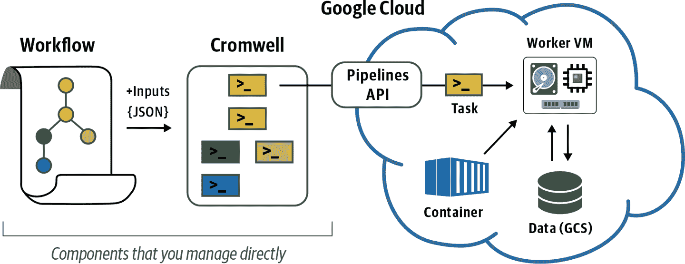
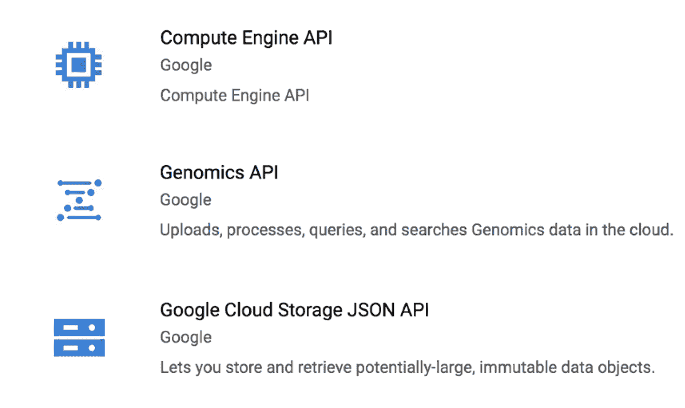
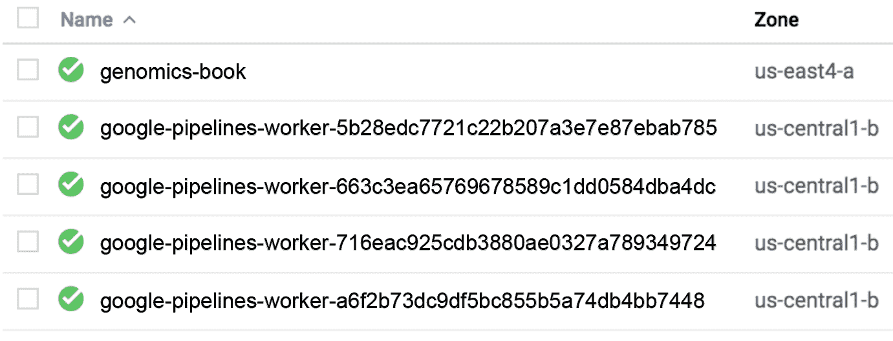
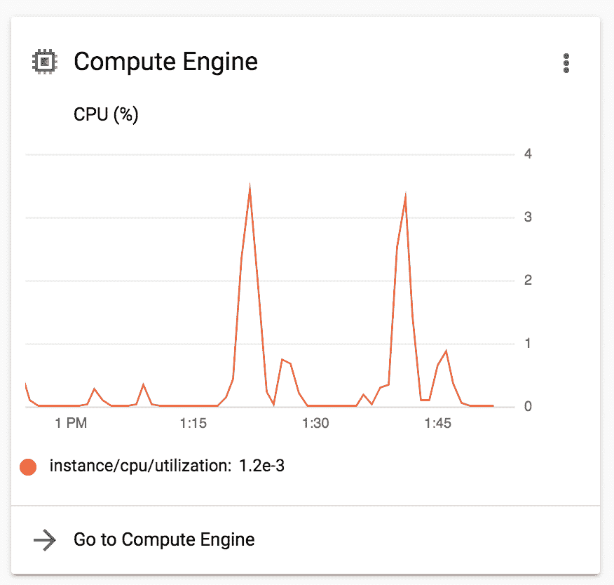
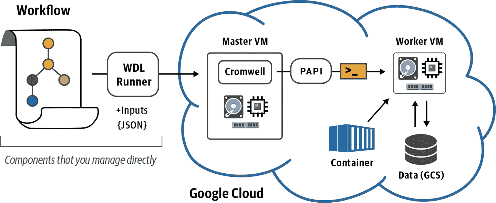
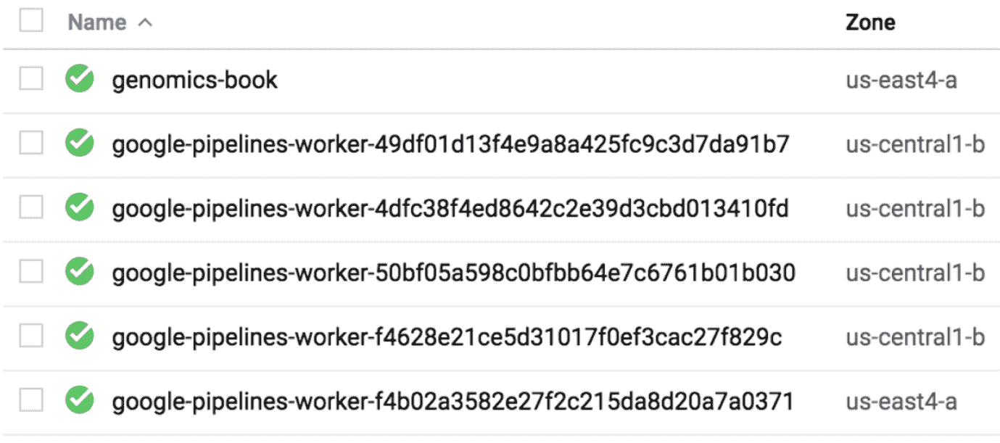
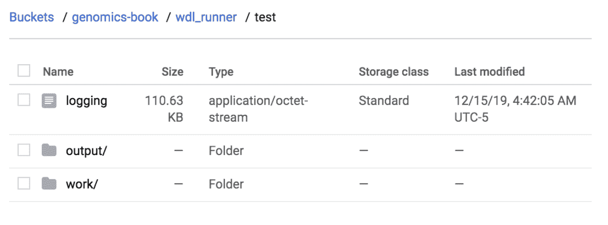

# 第十章：使用管道 API 在规模上运行单一工作流程

在第八章中，我们首次开始运行工作流程，使用了 GCP 中的自定义虚拟机设置。然而，那种单一机器的设置并不能利用云的最大优势：即按需提供看似无限数量的机器！因此，在本章中，我们使用了 GCP 提供的名为*基因组管道 API*（PAPI）的服务，它作为 GCP 计算引擎实例的作业调度程序，正好能做到这一点。

首先，我们尝试简单地更改我们虚拟机上的 Cromwell 配置，以将作业执行提交到 PAPI 而不是本地机器。接着，我们尝试一个名为`WDL_Runner`的工具，它包装了 Cromwell 并管理向 PAPI 的提交，这使得“启动并忘记”WDL 执行变得更加容易。这两个选项我们在本章的前半部分进行探讨，将为我们打开门户，使我们能够在第九章中的单一 VM 设置上无法运行的全面 GATK 流水线。在此过程中，我们还讨论了诸如运行时、成本、可移植性以及在云中运行工作流的整体效率等重要考虑因素。

# 介绍 GCP 基因组管道 API 服务

基因组管道 API 是由 GCP 运营的服务，使得可以轻松地将作业调度到 GCP 计算引擎上，而无需直接管理 VM。尽管其名称中带有“基因组”二字，但基因组管道 API 并不限于基因组研究，因此可以用于许多不同的工作负载和用例。通常，我们简称为管道 API 或 PAPI。可以按照[Google Cloud 文档](https://oreil.ly/l3OBw)中描述的方式使用 PAPI 直接执行特定的分析命令，但在本章中，我们的目标是在 Cromwell 的工作流执行上使用 PAPI，如图 10-1 所示。



###### 图 10-1。Cromwell + PAPI 操作概述。

正如在第八章中一样，我们提供了一个 WDL 描述我们的工作流程给 Cromwell 引擎，然后 Cromwell 解释工作流并生成需要执行的各个作业。新的是，我们不再让 Cromwell 将作业交给运行在其自身所在机器上的本地执行器，而是要将其指向 PAPI，如图 10-1 所示。

对于 Cromwell 发送到 PAPI 的每个作业，该服务将在 Google Compute Engine 上创建一个具有指定运行时属性（CPU、RAM 和存储）的虚拟机，设置在 WDL 中指定的 Docker 容器，将输入文件复制到虚拟机的本地磁盘，运行命令，将任何输出和日志复制到最终位置（通常是 GCS 存储桶），最后删除虚拟机并释放任何相关的计算资源。这使得快速调度一批自定义虚拟机、执行工作流任务，并在完成后获取结果变得非常简便，而无需担心管理计算资源，因为这一切都已为您处理。

###### 注意

当我们完成本书时，Google Cloud 将推出一个更新版本的服务，以新名称“Life Sciences API”发布。一旦我们有机会尝试它，我们将撰写关于新服务以及如何调整书中练习以使用它的博客文章。与此同时，我们预计基因组管道 API 将在可预见的未来继续可用。

## 在您的 Google Cloud 项目中启用基因组 API 和相关 API

要运行本章的练习，您需要在您的 Google Cloud 项目中启用三个 API：[基因组 API](https://oreil.ly/YYEiu)，[云存储 JSON API](https://oreil.ly/K9jxa) 和 [计算引擎 API](https://oreil.ly/Byzox)。您可以使用我们提供的直接链接，或者您可以转到 Google Cloud 控制台的 [APIs & Services](https://oreil.ly/tDGTi) 部分，并单击“+ 启用 API 和服务”按钮。单击该按钮将带您到 [API Library](https://oreil.ly/73Fg6)，在那里您可以通过名称搜索每个 API。如果您在搜索结果中看到具有类似名称的 API 时感到困惑，只需检查图 10-2 中显示的标志和描述即可。



###### 图 10-2\. 三个必需 API 的标志和描述：基因组 API、云存储 JSON API 和计算引擎 API。

在每个 API 的页面上，您会看到一个蓝色按钮，上面写着“Enable”或“Manage”。后者表示该 API 已在您的项目中启用，您无需采取任何措施。如果看到“Enable”按钮，请单击以启用 API。您可能会看到一条消息，指出“要使用此 API，您可能需要凭据。单击‘创建凭据’以开始。”但您可以忽略它——GCP 和 Cromwell 将处理身份验证，而无需您提供额外的凭据。

###### 注意

要使用计算引擎 API，即使使用免费信用额度，您也必须在计费部分设置支付方式。如果您按照 第四章 中的说明操作，您应该已经准备好了；但如果您直接跳到这里，请返回并按照该章节中的计费设置操作。

# 直接将 Cromwell 作业发送到 PAPI

在第八章中，我们在没有配置文件的情况下运行了 Cromwell，因此默认将所有作业发送到机器的本地执行器。现在，我们将提供一个配置文件，使 Cromwell 指向 PAPI 进行执行。

有趣的事实是，您可以配置 Cromwell 以从任何地方运行通过 PAPI 提交的作业，无论您是在笔记本电脑、本地服务器还是不同云平台的虚拟机上运行 Cromwell。在这里，我们展示了如何在您的 VM 上使用 GCP 执行此操作，前提是您已经适当地设置了（已安装 Cromwell 并通过 GCP 进行了身份验证），但基本的操作步骤和要求在其他任何地方也是相同的。

## 配置 Cromwell 以与 PAPI 通信

Cromwell 文档中有一个关于使用 GCP 的[部分](https://oreil.ly/MnckS)，其中包括一个用于在 PAPI 上运行的模板配置文件，我们已将其复制到书籍捆绑包中供您方便使用。如果您按照第四章中提供的说明操作，您可以在 VM 上的*~/book/code/config/google.conf*找到它。如果您在文本编辑器中打开*google.conf*文件，它看起来像这样：

```
$ cat ~/book/code/config/google.conf

# This is an example configuration file that directs Cromwell to execute
# workflow tasks via the Google Pipelines API backend and allows it to retrieve 
# input files from GCS buckets. It is intended only as a relatively simple example 
# and leaves out many options that are useful or important for production-scale
# work. See https://cromwell.readthedocs.io/en/stable/backends/Google/ for more
# complete documentation. 

engine {
  filesystems {
    gcs {
      auth = "application-default"
      project = "<google-billing-project-id>"
    }
  }
}

backend {
  default = PAPIv2

  providers {
    PAPIv2 {
      actor-factory = "cromwell.backend.google.pipelines.v2alpha1.PipelinesApi
      LifecycleActorFactory"
      config {
        # Google project
        project = "<google-project-id>"

        # Base bucket for workflow executions
        root = "gs://<google-bucket-name>/cromwell-execution"

        # Polling for completion backs-off gradually for slower-running jobs.
        # This is the maximum polling interval (in seconds):
        maximum-polling-interval = 600

        # Optional Dockerhub Credentials. Can be used to access private docker images.
        dockerhub {
          # account = ""
          # token = ""
        }

        # Number of workers to assign to PAPI requests
        request-workers = 3

        genomics {
          # A reference to an auth defined in the `google` stanza at the top. This auth is used
          # to create
          # Pipelines and manipulate auth JSONs.
          auth = "application-default"

          # Endpoint for APIs, no reason to change this unless directed by Google.
          endpoint-url = "https://genomics.googleapis.com/"

          # Pipelines v2 only: specify the number of times localization and delocalization 
          # operations should be attempted
          # There is no logic to determine if the error was transient or not, everything 
          # is retried upon failure
          # Defaults to 3
          localization-attempts = 3

        }

        filesystems {
          gcs {
            auth = "application-default"
            project = "<google-billing-project-id>"
            }
          }
        }

        default-runtime-attributes {
          cpu: 1
          failOnStderr: false
          continueOnReturnCode: 0
          memory: "2048 MB"
          bootDiskSizeGb: 10
          # Allowed to be a String, or a list of Strings
          disks: "local-disk 10 SSD"
          noAddress: false
          preemptible: 0
          zones: ["us-east4-a", "us-east4-b"]
        }
      }
    }
  }
}
```

我们知道如果您不习惯处理这种事情，这些信息可能有点多；好消息是，您几乎可以忽略其中的所有内容，我们将会引导您了解您确实需要关心的部分。在我们开始之前，请注意，您需要编辑并将修改后的文件保存为*my-google.conf*，存放在本章的沙盒目录*~/sandbox-10*中。现在就去创建那个目录吧。我们建议您使用与早期章节编辑文本文件相同的步骤：

```
$ mkdir ~/sandbox-10
$ cp ~/book/code/config/google.conf ~/sandbox-10/my-google.conf
```

现在设置环境变量以指向您的沙盒和相关目录：

```
$ export CONF=~/sandbox-10
$ export BIN=~/book/bin
$ export WF=~/book/code/workflows
```

在第四章中，我们还定义了一个`BUCKET`环境变量。如果您在新终端中工作，请确保重新定义此变量，因为我们稍后在本章中会用到它。在下面的命令中，用您在第四章中使用的值替换`*my-bucket*`：

```
$ export BUCKET="gs://my-bucket"
```

现在我们的环境已经设置好，我们可以开始工作了。首先，让我们确定这个配置文件之所以指向 GCP 和 PAPI 而不是其他后端的原因。现在打开您的配置文件副本吧：

```
$ nano ~/sandbox-10/my-google.conf
```

您可以看到文件中有许多关于 Google 的引用，但关键设置发生在这里：

```
backend {
  default = PAPIv2

  providers {
    PAPIv2 {
```

这里，`PAPIv2`指的是当前 PAPI 的名称和版本。

在文件的这一部分滚动深入，您会找到两个设置，项目 ID 和输出存储桶，这两个设置非常重要，因为您必须修改它们才能使此配置文件为您工作：

```
config {
        // Google project
        project = "<google-project-id>"

        // Base bucket for workflow executions
        root = "gs://<google-bucket-name>/cromwell-execution"
```

您需要替换`*google-project-id*`以指定您正在使用的 Google 项目，并替换`*google-bucket-name*`以指定 Cromwell 用于存储执行日志和输出的 GCS 位置。例如，对于我们目前使用的测试项目，填写如下所示：

```
config {
        // Google project
        project = "ferrous-layout-260200"

        // Base bucket for workflow executions
        root = "gs://my-bucket/cromwell-execution"
```

最后，在访问设置为`requester-pays`模式的 GCS 存储桶中的数据时，您还需要提供项目 ID，如第四章中讨论的那样。此配置文件中有两处出现：一处在文件开头，一处在文件末尾：

```
gcs {
      auth = "application-default"
      project = "<google-billing-project-id>"
    }
```

具体来说，您需要替换`*google-billing-project-id*`以指定用于此目的的计费项目。此设置允许您使用与计算不同的计费项目，例如，如果您使用不同的计费账户来支付不同类型的费用。在这里，我们只是使用与前面定义的相同项目：

```
gcs {
      auth = "application-default"
      project = "ferrous-layout-260200"
    }
```

请确保在文件中编辑此设置的两处出现。

编辑完文件后，请务必将其保存为本章节的沙盒目录中的*my-google.conf*，即*~/sandbox-10*。如果您愿意，可以为其指定不同的名称和/或放置在不同的位置，但然后您需要相应地在下一部分的命令行中编辑名称和路径。

## 通过 PAPI 运行散点型杂合体分析器（Scattered HaplotypeCaller）

在您可以实际运行 Cromwell `run` 命令以测试此配置之前，您还需要完成一步操作：生成一个凭据文件，Cromwell 将提供给 PAPI 用于身份验证。要执行此操作，请运行以下`gcloud`命令：

```
$ gcloud auth application-default login
```

这类似于您在第四章中运行的`gcloud init`命令，用于设置您的 VM，直至包括关于安全协议的简短讲座。按照提示通过浏览器登录并复制访问代码以完成该过程。凭据文件，系统称之为应用程序默认凭据（ADC），将在`gcloud`实用程序可以访问的标准位置中创建。您无需采取任何其他措施使其正常工作。

我们提供了一个输入的 JSON 文件，其中填充了测试文件的路径（参见*$WF/scatter-hc/scatter-haplotypecaller.gcs.inputs.json*）。您可以检查其内容；您会看到这些文件与您本地使用的文件相同，但这次我们将它们的位置指向了 GCS 中的 Cromwell（在书籍存储桶中）：

```
$ cat $WF/scatter-hc/scatter-haplotypecaller.gcs.inputs.json
```

有了这个文件，现在是时候运行以下 Cromwell 命令了：

```
$ java -Dconfig.file=$CONF/my-google.conf -jar $BIN/cromwell-48.jar \
    run $WF/scatter-hc/scatter-haplotypecaller.wdl \
    -i $WF/scatter-hc/scatter-haplotypecaller.gcs.inputs.json
```

此命令调用了我们在 第八章 中最后运行的相同工作流，*scatter-haplotypecaller.wdl*，但这次我们添加了 `-Dconfig.file` 参数来指定配置文件，这会导致 Cromwell 将工作分发给 PAPI 而不是本地机器。PAPI 然后会编排在 Compute Engine 上创建新的 VM 来执行工作。它还会负责拉取任何输入文件，并将日志和任何输出保存到你在配置文件中指定的存储桶中。最后，它会在每个 VM 完成工作后将其删除。

## 在 Google Compute Engine 上监视工作流执行

这听起来很棒，但是当你运行那个命令时，你怎么知道实际上发生了什么？像往常一样，Cromwell 会向终端输出大量信息，这些信息相当难以解析，所以让我们一起走过几种方法，来识别正在运行的内容。

首先，在日志输出的早期部分，你应该能看到 Cromwell 正确识别需要使用 PAPI。这并不是非常明显，但你会看到几行类似提到 PAPI 的内容：

```
[2019-12-14 18:37:49,48] [info] PAPI request worker batch interval is 
33333 milliseconds
```

往下滚动一点，你会找到一行引用 `Call-to-Backend assignments` 的内容，列出了工作流程中的任务调用：

```
[2019-12-14 18:37:52,56] [info] MaterializeWorkflowDescriptorActor [68271de1]:
Call-to-Backend assignments: ScatterHaplotypeCallerGVCF.HaplotypeCallerG
VCF -> PAPIv2, ScatterHaplotypeCallerGVCF.MergeVCFs -> PAPIv2
```

`-> PAPIv2` 部分表示每个任务都已被分发到 PAPI（版本 2）以进行执行。在此之后，超出通常从 WDL 和 *inputs* JSON 文件生成的命令详细列表，你会看到许多与 `PipelinesApiAsyncBackendJobExecutionActor` 相关的引用，这是 PAPI 系统中处理你的工作流执行的另一个组件。

当然，这只告诉你 Cromwell 正在将工作分发给 PAPI，并且 PAPI 在响应中做了一些事情，但你怎么知道它在做什么？最直接的方法是转到 [Compute Engine 控制台](https://oreil.ly/-mFEu)，它列出了在你的项目下运行的 VM 实例。至少，你应该看到正在使用来完成书中练习的 VM，你应该能够识别其名称。如果你在它们运行时抓住它们，可能会看到最多四个显然是机器生成名称的 VM 实例（*google-pipelines-worker-xxxxx*…），如 Figure 10-4 所示。这些是 PAPI 根据你的 Cromwell 命令创建的 VM。



###### 图 10-4\. 活动 VM 实例列表

你可能会问，为什么 PAPI 创建了多个虚拟机？作为提醒，这个工作流将调用变体分为四个单独的作业，这些作业将在不同的基因组间隔上运行。当 Cromwell 并行启动了这四个作业时，PAPI 为每个作业创建了一个单独的虚拟机。唯一一个稍后排队的工作是将四个并行作业的输出收集到一个单一任务中的合并任务。这是因为合并任务必须等待所有其他任务完成，以满足其输入依赖关系。在这种情况下，PAPI 将再次尽责完成工作并将最终输出整理到您的存储桶中。

不想过分细说，但正是云计算在这种分析中的巨大优势之一。只要你能将工作分割成独立的片段，你就可以比在本地服务器或集群上通常能承受的更大程度地并行执行。即使云计算*实际上*并非无限（抱歉，牙仙也不存在），但它确实具有非常令人印象深刻的能力，可以容纳大量的作业提交。例如，Broad Institute 经常在 Cromwell 上同时跨数千个节点运行工作流程。

###### 注意

PAPI 生成的虚拟机的区域可能与您自己创建的 VM 的区域不同，就像我们在这里的情况一样。这是因为我们没有在配置文件中明确指定区域，因此 PAPI 使用了默认值。有几种方法可以控制工作将在哪个区域完成，包括在工作流程级别或甚至在工作流程内的任务级别上，正如[Cromwell 文档中描述的那样](https://oreil.ly/2YElr)。

您还可以在[项目的主页仪表板](https://oreil.ly/ChMKK)中查看计算引擎活动的概述，如图 10-5 所示。尽管该仪表板只提供了汇总视图，但它允许您查看过去的活动，而不仅仅是当前正在运行的内容。



###### 图 10-5\. 计算引擎活动概述。

最后，您可以检查配置中指定的存储桶中的执行目录。您可以通过导航到[Cloud Storage 控制台](https://oreil.ly/1iQmv)中的存储桶，或者使用`gsutil`，如我们之前描述的那样来执行此操作。花几分钟时间探索该目录，并查看输出的结构。当您在 VM 的本地系统上运行相同的工作流程时，它应该与第八章中的情况相同。但是，请记住，存储桶中执行目录的内容并不代表 VM 实时发生的情况。同步过程会更新执行日志，并在可用时复制任何输出，该过程的间隔开始非常短，然后逐渐增加，以避免长时间运行的作业过度负担系统。这些间隔的最大长度是可定制的；您可以在我们之前使用的配置文件中查看相关代码：

```
// Polling for completion backs-off gradually for slower-running jobs.
// This is the maximum polling interval (in seconds): maximum-polling-interval = 600

```

时间间隔以秒计，因此您可以看到，默认情况下，存储桶更新之间的最大时间为 10 分钟。

工作流程可能需要最多 10 分钟才能完成。在那时，您将看到通常的`finished with status 'Succeeded'`消息，随后是以 JSON 格式列出的最终输出列表：

```
[INFO] … SingleWorkflowRunnerActor workflow finished with status 'Succeeded'.
 "outputs": {
 "ScatterHaplotypeCallerGVCF.output_gvcf": "gs://genomics-book-test-99/cromwell-
execution/ScatterHaplotypeCallerGVCF/68271de1-4220-4818-bfaa-5694551cbe81/call-
MergeVCFs/mother.merged.g.vcf"
 },
```

您应该看到，这次最终输出位于配置文件中指定的存储桶中。输出的路径结构与我们为本地执行描述的结构相同。

现在，请花点时间思考一下您刚刚取得的成就：使用大部分预配置的配置文件和仅一个命令行，您启动了一个过程，涉及整理复杂的计算资源以并行执行真实（尽管简单）的基因组工作流程。您可以使用完全相同的过程来运行全面的工作流程，如我们在第九章中解析的整个基因组分析流水线，或者您可以在我们展示几种替代选项时保持耐心。具体来说，在本章后面，我们向您展示了两种方法，这些方法涉及将 Cromwell 包装在附加层中，从而增加此系统的易用性和可扩展性。

但是，在我们跳入 Cromwell 支持的附加组件的葱郁生态系统之前，我们将稍微偏离主题，讨论在云上运行工作流程涉及的权衡和机会。

# 理解和优化工作流效率

你有没有注意到通过 PAPI 运行*scatter-haplotypecaller.wdl*工作流需要多长时间？大约 10 分钟，对吧？还记得在第八章中在您的 VM 上运行只需要多长时间吗？大约两分钟？所以让我们明确一下：在多台机器上并行运行相同的工作流比在单台机器上运行相同的作业要慢五倍。这听起来……有点可怕？

好消息是，这主要是我们运行的作业规模非常小的副产品。我们使用的一组间隔只覆盖基因组的一个小区域，而`HaplotypeCaller`本身在这样短的间隔上运行的时间非常短。当您在本地的 VM 上运行工作流时，实际上没有太多工作要做：GATK 容器映像和文件已经存在，所以实际上需要发生的只是 Cromwell 读取 WDL 并启动 GATK 命令，正如我们之前提到的，这些命令运行得很快。相比之下，当您告诉 Cromwell 将工作分派给 PAPI 时，您启动了涉及创建 VM、检索容器映像、从 GCS 本地化文件等庞大机制。所有这些都是作为更长运行时间形式出现的开销。因此，对于短任务来说，“真正工作”的总运行时间实际上被在幕后设置的时间所抹去。然而，这种设置时间大致是恒定的，因此对于运行时间更长的任务（例如，如果您在更大的基因组间隔上运行此工作流），设置时间最终只是谷歌云中的一滴水。

有了这个例子，让我们深入了解一些您需要牢记的考虑因素，无论您是计划开发自己的工作流还是仅仅在云上使用别人的工作流。

## 操作的粒度

我们这里运行的`HaplotypeCaller`工作流程旨在运行时间长得多的间隔，覆盖大量数据，因此通过 PAPI 执行它在处理大规模数据集时是完全合理的。但是，如果您的工作流的一部分涉及简单的文件格式转换和索引操作呢？那么，将几个操作合并为工作流中的单个任务可能是一个机会。我们已经在我们第二个工作流中看到了一个例子，在第九章中我们检查了`CramToBamTask` `command`块中的一个例子：

```
 command {
    set -e
    set -o pipefail

    ${samtools_path} view -h -T ${ref_fasta} ${input_cram} |
    ${samtools_path} view -b -o ${sample_name}.bam -
    ${samtools_path} index -b ${sample_name}.bam
    mv ${sample_name}.bam.bai ${sample_name}.bai
  }
```

工作流的作者本可以将这个`command`块的子集分离成单独的 WDL 任务，以最大化模块化。例如，拥有独立的 BAM 索引任务可能会在其他地方发挥作用且可重用。但是，他们正确地认识到，这样做会增加通过 PAPI 运行时的开销，因此他们在模块化和效率之间做了一些权衡。

## 时间与金钱的平衡

理解这些折衷方案的重要性很关键，不仅影响到运行管道所需的时间，还会影响到其成本。如果你大部分时间都在本地系统上工作，那些计算资源已经是预付费的，并且你主要受到分配的配额限制，可能不太习惯考虑这些问题。然而，在云上，几乎完全是按需付费，所以如果你预算有限，考虑问题是非常值得的。

例如，当将工作流程移至云端时，还有一个需要考虑的折衷方案：在执行变异调用工作流程时应该如何广泛地并行化？你可以简单地按染色体并行化，但对于整个基因组样本来说，这仍然会产生大量数据，因此每个处理过程需要很长时间，而且你无法充分利用云端并行处理的惊人能力。此外，至少在人类中，各染色体的长度差异巨大；例如，染色体 1 的长度大约是染色体 22 的五倍，所以后者会更快完成，并且其结果将在等待其他染色体处理完毕时保持不变。

更有效的方法是将染色体本身切割为不确定性区域的子区间，其中参考序列具有*N*个碱基的区域，意味着这些区域的内容是未知的，因此在这些地方中断处理是可以接受的。然后，你可以平衡区间的大小，使大多数区间的处理时间大致相同。但这仍然给你在设计列表时平均长度的区间留下了很大的自由度。你将序列切分得越细，就越早能够获得结果，因为你可以（在合理范围内）并行运行所有这些区间。然而，每个单独区间的运行时间越短，你就会越感受到涉及将工作分发到单独的虚拟机所带来的开销，更重要的是成本方面的影响。

还不确定吗？假设你定义了三百个需要每个分析三小时的区间（这些数字是虚构的，但应该接近现实情况）。对于每个区间，在实际分析开始之前的设置阶段，你将支付最多 10 分钟的虚拟机额外时间费用（哦是的，你要为那段时间付费）。那就是 300 × 10 分钟；换句话说，50 小时的虚拟机成本用于额外费用。假设你使用的是每小时大约 0.03 美元的基本机器，那就是 1.50 美元，尽管这并非世界末日。现在假设你将你的区间粒度提高 10 倍，生成 3000 个较短的区间，每个区间分析需要 18 分钟。你将支付 3000 × 10 分钟，或者 500 小时的虚拟机额外费用。现在你每个样本在额外费用上花费 15 美元。在大量样本中，这可能在你的预算中留下明显的痕迹。但我们不评判；问题是速度对*你*是否值得这些钱。

这里的要点是，云计算为你提供了很多自由空间来找到你的幸福点。

当 Broad Institute 最初将其整个基因组分析流程从本地集群迁移到 GCP 时，每个全基因组样本（30X 覆盖率）的运行成本约为 45 美元。通过工作流优化和与 GCP 工程师的合作，该研究院团队将成本降低到每个全基因组样本 5 美元。这些显著的节省转化为更低的生产成本，最终意味着每研究美元可以获得更多科学成果。

诚然，云管道确实需要大约 23 小时才能完成单个样本的运行，这比现在可用于在专用硬件上更快运行 GATK 的主流加速解决方案要长得多，例如 Illumina 的 DRAGEN 解决方案。不过，作为背景，典型情况下湿实验室侧的样本准备和测序过程通常需要大约两天时间，所以除非你从事提供紧急诊断服务的业务，分析的额外一天通常不会成为关注点。

问题在于：*处理时间并不占用你本可以用于其他事情的计算资源*。如果你需要更多的虚拟机，只需请求 PAPI 召唤它们。由于运营团队可以同时启动的工作流没有实际上限，当大批订单到来时，几乎不会出现积压的风险，除非是规模达到[gnomAD](https://oreil.ly/vHPKf)的程度，其中包含超过 10 万个外显子和 8 万个全基因组样本。那么，就需要一些提前计划和一封友好的 GCP 账户经理的礼貌邮件，这样他们可以告诉他们的运营团队做好准备。（我们想象这封邮件会这样写：“做好准备，gnomAD 即将到来。”）

###### 注意

不幸的是，由于发现影响全球计算机处理器的两个主要安全漏洞[Spectre](https://oreil.ly/fbaUw)和[Meltdown](https://oreil.ly/xwa5J)，Broad 的基于云的全基因组分析管道的成本每个样本增加到约 8 美元。使机器安全使用所需的安全补丁增加了额外开销，导致更长的运行时间，这似乎将在云供应商更换受影响硬件之前始终无法避免。然而，随着时间的推移，云上存储和计算的成本继续下降，因此我们预计 8 美元的价格会随时间而降低。

## 建议的节省成本优化策略

如果你想了解 Broad Institute 团队开发的工作流程实施细节以实现大幅节省成本，无需再看其他，直接参考第九章即可。我们所讨论的优化流水线，就是该章节中我们分析的第二个工作流程（包含子工作流和任务库）。

不要深入细节，以下是优化在 Google Cloud 上便宜运行 WDL 工作流的三种最有效策略的总结。您可以在我们在第九章中查看的 *GermlineVariantDiscovery.wdl* 任务库中看到这些策略的应用。

### 资源分配的动态调整

对于给定任务的虚拟机请求的存储量越多，成本就会越高。您可以通过仅请求最低限度的磁盘存储量来降低成本，但如何在不手动检查每个需要处理的样本的文件输入大小的情况下处理文件输入大小的变化？好消息是：有一些 WDL 函数允许您在运行时（但在请求虚拟机之前）评估输入文件的大小。然后，您可以应用一些算术（基于对任务产生的文件大小的合理假设）来计算应分配多少磁盘。例如，以下代码测量参考基因组文件的总大小，然后根据需要考虑输入 BAM 文件的一部分加上参考文件，再加上一些填充以处理输出：

```
Float ref_size = size(ref_fasta, "GB") +
size(ref_fasta_index, "GB") + size(ref_dict, "GB")
Int disk_size = ceil(((size(input_bam, "GB") + 30) / hc_scatter) + ref_size) + 20
```

查看[此博文](https://oreil.ly/P9Vxg)以详细讨论这一方法。

### 文件流传输到 GATK4 工具

这是减少任务 VM 所需磁盘空间请求的另一种好方法。通常，Cromwell 和 PAPI 将所有输入文件本地化到 VM 中作为任务执行的先决条件。然而，GATK（从版本 4.0 开始）能够直接从 GCS 流式传输数据，因此，如果你在基因组间隔上运行 GATK 工具，可以指示 Cromwell 不本地化文件，而是让 GATK 处理，它将仅检索间隔中指定的数据子集。例如，如果你在一个 300 Gb BAM 文件上并行运行 `HaplotypeCaller`，但将其操作分解为许多数量级较小的间隔，这就尤为有用。在前面的代码示例中，这就是为什么输入 BAM 文件的大小会被分割为 scatter 的宽度（即间隔的数量）。要在你的 WDL 中指示输入文件可以进行流式传输，只需为相关的输入变量在任务定义中添加以下内容：

```
parameter_meta {
    input_bam: {
      localization_optional: true
    }
  }
```

请注意，目前此功能仅适用于 GCS 中的文件，并不适用于捆绑在 GATK 中的 Picard 工具。

### 预留 VM 实例

这涉及使用称为[预留](https://oreil.ly/lep8v)的一类 VM，其使用成本比正常定价便宜得多（当前为定价的 20%）。这些折扣 VM 具有与正常 VM 相同的所有规格，但这里有个问题：Google 可以随时从你手中收回它们。其理念是这是一个备用 VM 的池子，你可以正常使用，只要资源没有短缺。如果某人突然请求与你使用相同类型的大量机器，而可用资源不足，则你正在使用的部分或所有 VM 将重新分配给他们，并且你的作业将被中止。

为了避免最常见的两个问题，不，没有（内置的）方法来保存中断前所做的任何进度；是的，你会被收取使用时间的费用。光明的一面是，PAPI 会通知 Cromwell 你的作业已被抢占，并且 Cromwell 将尝试在新的 VM 上自动重新启动它们。具体来说，Cromwell 将再次尝试使用预留 VM，最多尝试自定义数量次数（在大多数 Broad Institute 工作流中，默认为三次尝试）；然后，它将退回到使用常规（全价）VM。要控制对于给定任务你愿意允许的预留尝试次数，只需在 `runtime` 块中设置 `preemptible:` 属性。要禁用预留使用，将其设置为 0 或完全删除该行。在下面的示例中，使用 `preemptible_tries` 变量设置了预留尝试次数，以便根据需要轻松自定义，以及 Docker 容器和磁盘大小：

```
 runtime {
    docker: gatk_docker
    preemptible: preemptible_tries
    memory: "6.5 GiB"
    cpu: "2"
    disks: "local-disk " + disk_size + " HDD"
  }
```

结论呢？使用抢先式虚拟机（preemptible VMs）通常对短时间运行的作业非常值得，因为它们在完成之前被抢占的机会通常非常小，但随着作业时间的增加，胜算会变得越来越不利。

## 平台特定的优化与可移植性

所有这些优化都非常具体于在云上运行——对于其中一些优化来说，不是所有的云都适用——因此现在我们需要讨论它们对可移植性的影响。正如我们在第八章介绍工作流系统时讨论的那样，Cromwell 和 WDL 的开发关键目标之一就是可移植性：即你可以将相同的工作流在任何地方运行并获得相同的结果，而不需要处理大量软件依赖或硬件要求。计算可移植性的好处包括更容易与其他团队合作，以及让全球任何研究人员在你发表后能够重现和建立在你工作基础上的研究。

不幸的是，优化工作流以在特定平台上高效运行的过程可能会降低其可移植性。例如，较早版本的 WDL 没有包含 `localization_optional: true` 惯用法，因此为了使用 GATK 的文件流功能，工作流作者必须通过将这些输入变量声明为 `String` 类型而不是 `File` 类型来欺骗 Cromwell 以避免本地化文件。问题在哪里？结果是，生成的工作流不能在本地系统上运行，除非修改相关的变量声明。即时的可移植性失败。

引入 `localization_optional: true` 是一大进步，因为它作为工作流管理系统的一种“提示”功能。基本上，它的意思是，“嘿，如果你处于支持流式处理的情况下，你可以不必本地化这个文件，但如果不支持，请务必进行本地化。” 因此，你可以在不同地方运行相同的工作流，享受你可以的优化，并确保工作流在其他地方也能正常工作。可移植性胜利！

我们向你展示的其他优化一直都是一种无害的“提示”状态，意味着它们的存在不会影响可移植性。除了在第八章中讨论的 `docker` 属性外，Cromwell 会忽略 `runtime` 块中指定的在当前环境下不适用的任何属性，因此，即使只是在笔记本上运行工作流，你也可以安全地指定 `preemptible`、`disk` 等属性。

另一些云提供商（如 Microsoft Azure 和 AWS）有自己的类似功能的等价物，如预留 VM 实例（在 AWS 上，最接近的等价物称为 Spot Instances），但它们的行为不完全相同。因此，不可避免地会出现这样的问题：当在 AWS 上运行时，Cromwell 是否应该使用 `preemptible` 属性来控制 Spot Instances，或者提供一个单独的属性来实现这一目的。如果是后者，这会到哪一步？每个运行时属性都应该存在多种云平台的版本吗？

噢，不，*我们* 没有对此有答案。我们将会在这里加热一些爆米花并看开发人员之间的战斗。要跟踪给定 Cromwell 后端当前能做什么和不能做什么，最好的方法是查看在线的 [后端文档](https://oreil.ly/7uTh6)。现在，让我们回到讨论在 GCP 上运行 Cromwell 最便捷和可扩展的方法。

# 使用 WDL Runner 封装 Cromwell 和 PAPI 执行

提醒：请确保你可以从几乎任何地方通过 **Cromwell** 向 PAPI 提交工作流，只要你能运行 Cromwell 并连接到互联网即可。正如之前提到的，我们要求你使用 GCP VM 是因为它最大程度上减少了设置所需的步骤（运行大型工作流！），并减少了因为一些问题无法立即工作的风险。但是你绝对可以从你的笔记本电脑或者如果你感觉有点狡猾的话，从 AWS 或 Azure 的 VM 中完成同样的事情。然而，使用笔记本电脑的缺点是，在你的工作流运行期间，你需要确保笔记本保持开启（电源连接并保持连接）。对于短期运行的工作流，这可能没问题；但是对于像全基因组分析这样的大规模工作，你真的希望能够启动一个工作流然后在晚上整理好你的设备而不中断执行。

进入 *WDL Runner*。这个开源工具包作为 Cromwell 和 PAPI 的轻量级封装。通过你的一个单一命令行，WDL Runner 在 GCP 中创建一个 VM，设置一个包含配置好使用 PAPI 的 Cromwell 的容器，并通过 PAPI 提交你的工作流进行执行，如图 Figure 10-6 所示。这些听起来是不是有些耳熟？除了一些细节之外，这基本上就是你在前面章节中所做的：创建一个 VM 实例，安装 Cromwell，配置它与 PAPI 通信，并运行一个 Cromwell 命令来启动工作流。



###### 图 10-6\. WDL Runner 操作概览。

所以基本上，你可以将**WDL Runner**视为一种方式来外包所有这些工作，并实现相同的结果，而无需手动管理虚拟机。但还有更多：当工作流程完成时，**WDL Runner**会将执行日志传输到你选择的位置并删除虚拟机，因此如果你不立即关闭它，它不会继续花费你的资金。最后的点睛之笔是，**WDL Runner**还会将最终输出复制到你选择的位置，因此你无需深入到**Cromwell**的（令人讨厌的深层）执行目录中找到你关心的结果。哦，还有另一个点睛之笔：**WDL Runner**还配备了监控工具，允许你获取工作流程的状态摘要。

当然，你可以从任何地方运行**WDL Runner**，但我们建议你从虚拟机中运行，因为它就在那里，而且包含了你需要的一切。当然，你也可以从你的笔记本电脑上尝试。

## 设置**WDL Runner**

好消息：不需要进行设置！我们已经在书籍捆绑包中包含了**WDL Runner**代码的副本，可以在[GitHub 上获取](https://oreil.ly/-upHl)。**WDL Runner**的主要要求是 Python 2.7、Java 8 和`gcloud`，这些在你的虚拟机上已经都有了。

为了使路径管理更容易，我们再次使用环境变量。其中两个变量是你应该在本章前面已经定义的变量，`$WF`指向*workflows*目录，`$BUCKET`指向你的 Google 存储桶。此外，你还要创建一个`$WR_CONF`变量，指向*config*目录，以及一个`$WR_PIPE`变量，指向*WDL_Runner*流水线配置文件的位置，即*wdl_pipeline.yaml*，如下所示：

```
$ export WR_CONF=~/book/code/config
$ export WR_PIPE=~/book/wdl_runner/wdl_runner
```

顺便说一句，这不是错误；事实上，有两个嵌套的目录都被称为*wdl_runner*；更低级的一个指的是特定于*wdl_runner*的代码，而另一个指的是整个包。如果你查看后者，你会发现除了另一个名为*wdl_runner*的目录外，还有一个名为*monitoring_tools*的目录。我们来猜猜看，你有三次猜测的机会，前两次不算。

## 使用**WDL Runner**运行分散的**HaplotypeCaller**工作流

这将相当直接。需要注意的是，使用**WDL Runner**启动工作流的命令行会比直接使用**Cromwell**启动要长一些。这是因为**WDL Runner**为你提供了更多选项，比如在不需要配置文件的情况下选择存储输出位置等。下面是示例：

```
$ gcloud alpha genomics pipelines run \
      --pipeline-file $WR_PIPE/wdl_pipeline.yaml \
      --regions us-east4 \
      --inputs-from-file WDL=$WF/scatter-hc/scatter-haplotypecaller.wdl,\
 WORKFLOW_INPUTS=$WF/scatter-hc/scatter-haplotypecaller.gcs.inputs.json,\
 WORKFLOW_OPTIONS=$WR_CONF/empty.options.json \
      --env-vars WORKSPACE=$BUCKET/wdl_runner/test/work,\
 OUTPUTS=$BUCKET/wdl_runner/test/output \
      --logging $BUCKET/wdl_runner/test/logging
```

但别急着运行它！让我们简要地走一遍，这样你就知道哪些部分需要定制，哪些部分需要保持不变。

第一行告诉您这个命令主要调用了 `gcloud`，这在情况上有点有趣的转折。之前，我们运行 Cromwell 并指示它与 Google Cloud 事务通信。现在，我们调用 Google Cloud 事务来运行 Cromwell 并让它与 Google Cloud 事务通信。您可能不会完全惊讶地了解到，WDL Runner 最初是由 GCP 团队编写的。

`--pipeline-file`参数接受指向一种配置文件的路径，该配置文件预先包含了 WDL Runner 代码；如果您希望从不同的工作目录运行 WDL Runner，需要修改路径。

`--regions`参数，不出所料，控制着您希望 VM 位于的地区。有趣的是：WDL Runner 似乎需要这个参数，但它与您在最初通过 `gcloud` 认证时设置的默认 `gcloud` 设置相冲突。具体来说，该命令失败，并返回以下错误消息：

```
ERROR: (gcloud.alpha.genomics.pipelines.run) INVALID_ARGUMENT: Error: validating
pipeline: zones and regions cannot be specified together
```

要解决这个问题，您需要通过运行以下 `gcloud` 命令取消设置默认区域：

```
$ gcloud config set compute/zone ""
```

`--inputs-from-file`参数列出了工作流 WDL 文件、*inputs* JSON 文件和选项文件。选项文件允许您指定将应用于整个工作流的运行时配置设置。我们不需要指定任何内容，但由于 WDL Runner 要求我们提供一个，我们包含了一个实际上并不包含任何设置的存根文件。顺便说一句，请确保在指定文件的键值对之间（甚至逗号周围）绝对没有空白，否则命令将因为关于未识别参数的奇怪错误而失败。是的，我们尽力体验所有可能的失败，这样您就不必亲自经历了。

`--env-vars`参数列出了您希望存储执行目录和最终输出的位置；只要是以*gs://*开头的有效 GCS 路径，这些位置可以是任何您想要的东西。在这里，我们使用了 `$BUCKET` 环境变量，这是我们在第四章中最初设置的，并且我们使用了一个我们认为方便管理输出和日志的目录结构。请随意规划自己的路径，正如您所愿。`--logging`参数和前一个参数的功能相同，但用于执行日志。

当您对命令的外观满意时，请运行它，然后坐下来享受软件工作的景象。（是的，说这话确实有点像在招惹命运，是吧。）如果一切顺利，您应该会得到一个简单的单行回复，看起来像这样：

```
Running [projects/ferrous-layout-260200/operations/8124090577921753814].
```

`operations/`后面的数字（有时候还会有字母）是一个唯一标识符，即操作 ID，服务将使用它来跟踪您的提交状态。一定要把这个 ID 存放在某个地方，因为它对接下来的监控步骤至关重要。

## 监控 WDL Runner 执行

现在我们准备监视我们的工作流程提交的状态。还记得叫做 *monitoring_tools* 的不那么神秘的目录吗？是的，我们现在要用它。具体来说，我们将使用位于该目录中的名为 *monitor_wdl_pipeline.sh* 的 shell 脚本。这个脚本本身是相当典型的系统管理员工作，这意味着如果您不熟悉这种类型的代码，要解密它实在是很痛苦。然而，出乎意料的是，它非常容易使用：您只需给脚本上一步记录的操作 ID，它就会告诉您工作流程的执行情况。

然而，在您跳入之前，我们建议您打开一个新的 SSH 窗口到您的 VM，以便您可以让脚本继续运行。它被设计为持续运行，定期轮询 `gcloud` 服务，直到收到工作流程执行完成的消息（无论成功与否）。作为提醒，您可以从 [Compute Engine](https://oreil.ly/NMIIX) 控制台打开任意数量的 SSH 窗口到您的 VM。

当您在新的 SSH 窗口中时，请进入第一个 *wdl_runner* 目录，并运行以下命令，替换您从上一步保存的操作 ID：

```
$ cd ~/book/wdl_runner
$ bash monitoring_tools/monitor_wdl_pipeline.sh 7973899330424684165
Logging:
Workspace:
Outputs:
2019-12-15 09:21:19: operation not complete
No operations logs found.
There are 1 output files
Sleeping 60 seconds
```

这是您在启动 WDL Runner 命令后立即启动监视脚本时会看到的早期输出。随着时间的推移，脚本将生成新的更新，这些更新会变得越来越详细。

如果您对监视脚本输出的内容不满意，您可以像之前那样转到 Compute Engine 控制台，查看正在处理您的工作流程的虚拟机列表，如 Figure 10-7 所示。这次，您将看到多达五个新的带有机器生成名称的 VM（除了您手动创建的 VM）。



###### Figure 10-7\. 活动虚拟机实例列表（WDL Runner 提交）。

但是等等，这次为什么会有五个 VM 而不是四个？如果您感到困惑，请快速回顾一下 Figure 10-6，以刷新您对这个系统如何工作的记忆。这应该提醒您，这种情况下第五个轮子相当有用：它是控制工作的具有 Cromwell 的 VM 实例。

回到监视脚本，您最终应该看到一个以 `operation complete` 开头的更新：

```
2019-12-15 09:42:47: operation complete
```

下面会有大量的输出内容，那么您如何知道是否成功呢？您需要留意接下来的几行内容。要么您会看到类似这样的内容，然后您会松一口气：

```
Completed operation status information
 done: true
 metadata:
   events:
   - description: Worker released
```

或者您会看到在 `done: true` 后立即出现了可怕的 `error:` 行，然后您深呼吸，再深入查看错误消息的详细信息：

```
Completed operation status information
 done: true
 error:
   code: 9
   message: ’Execution failed: while running "WDL_Runner": unexpected exit status 1
was not ignored’
```

我们不会掩饰这一点：调试 Cromwell 和 PAPI 错误可能会很艰难。如果你的工作流提交出现问题，你可以在 *monitor_wdl_pipeline.sh* 脚本的输出以及保存到存储桶中的文件中找到错误信息，我们稍后会详细查看这些内容。

最后，让我们来看看存储桶中由 WDL Runner 产生的输出，如 Figure 10-8 所示。



###### 图 10-8\. WDL Runner 提交的输出。

*logging* 输出是一个文本文件，其中包含 Cromwell 的日志输出。如果你窥视其中，你会发现它与你直接运行 Cromwell 时看到的日志输出不同。这是因为这个 Cromwell 实例是在服务器模式下运行的！这很激动人心：你运行了一个 Cromwell 服务器，甚至都不知道自己在做什么。虽然你并没有真正利用服务器功能——但这是个开始。不过，Cromwell 服务器日志对于普通人来说实在太难读了，所以我们甚至不打算在这里试图去读它们。

*work* 目录只是 Cromwell 执行目录的一个副本，因此它具有你现在已经习惯的兔子洞式的结构和内容。

最后，*output* 目录是 WDL Runner 中我们非常喜欢的一个特性：该目录包含根据 WDL 中标识的文件作为工作流的最终输出的副本。这意味着如果你对结果满意，可以直接删除工作目录，无需费力去查找你关心的输出内容。当你的工作流产生大量大型中间输出时，这可以节省大量时间——或者因为不需要支付这些中间输出的存储费用而节省金钱。

总之，我们发现 WDL Runner 在快速测试工作流时非常方便，开销很小，而且仍然能够“点火并忘记”；也就是说，启动工作流，关闭笔记本电脑，然后走开（只要记录这些操作 ID！）。不过，它有一个不足之处，就是它已经有一段时间没有更新，已经与 WDL 的功能脱节；例如，它既不支持子工作流，也不支持任务导入，因为它缺少一种打包超过一个 WDL 文件的方法。此外，如果你发现自己经常启动许多工作流，你需要非常有纪律性地跟踪这些操作 ID。

在这里，我们展示了如何使用 WDL Runner 作为一个项目封装 Cromwell 的示例，而不是一个完全成熟的解决方案，并且在下一章中，我们将转向我们更喜欢的系统。然而，如果你喜欢 *wdl_runner* 的概念，请不要犹豫在项目的 [GitHub 页面](https://oreil.ly/-upHl) 上表达你的声音，以推动进一步的开发。

###### 注意

现在几点了？现在是时候再次关闭您的 VM，这次尤为重要，因为在本书的剩余练习中我们将不再使用它。如果您不打算回到以前的教程，请随时删除您的 VM。

# 总结和下一步

在本章中，我们向您展示了如何通过在 GCP 基因组学 PAPI 服务中运行工作流来利用云计算的扩展能力，首先直接从 Cromwell 命令行，然后是一个名为 WDL Runner 的轻量包装器。然而，尽管这两种方法使您能够以可扩展的方式在 GCP 中运行任意复杂度的单个工作流，但每次运行新工作流时启动和关闭一个新的 Cromwell 实例所涉及的开销非常低效，如果您计划运行大量工作流，将不利于扩展。

对于真正可扩展的工作，我们希望使用一个合适的 Cromwell 服务器，可以根据需求接收和执行任意数量的工作流，并能利用复杂功能如调用缓存。调用缓存允许 Cromwell 从失败点恢复或重新执行中断的工作流。调用缓存需要连接到数据库，并不受 WDL Runner 支持。然而，设置和管理服务器和数据库，更不用说在云环境中安全操作它们，比大多数人所能处理的技术支持负担更复杂。

因此，在下一章中，我们将向您展示一条不必承担维护负担即可享受 Cromwell 服务器强大功能的替代路径。具体来说，我们将介绍 Terra，这是一个由 Broad Institute 与 Verily 合作在 GCP 上构建和运行的生物医学研究可扩展平台。Terra 包括一个 Cromwell 服务器，您将首次用它来完整运行 GATK 最佳实践工作流。
