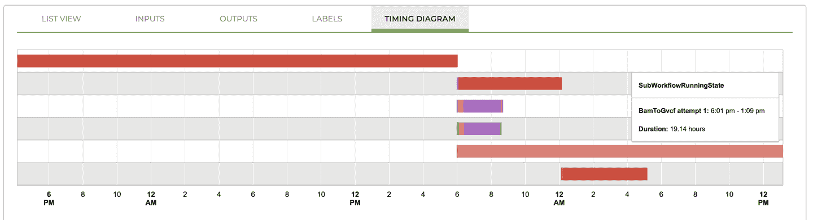

# 第十一章：在 Terra 中方便地运行多个工作流

在第十章中，我们给您带来了 Cromwell 加上 Pipelines API 组合强大能力的令人期待的第一印象。您学会了如何将单个工作流分派到 PAPI，无论是通过 Cromwell 直接操作还是通过 WDL Runner 包装器间接操作。这两种方法都使您能够快速调度任意数量的云计算资源，而无需直接管理它们，这可能是您从本书中获得的最重要的教训。然而，正如我们讨论过的那样，这两种方法都存在限制，这些限制可能会阻止您实现云提供的真正强大的可扩展性。

在本章中，我们将向您展示如何在*Terra*中使用全功能的 Cromwell 服务器，这是由 Broad Institute 运营的基于云的平台。我们将从介绍平台开始，并引导您了解在 Terra 中运行工作流的基础知识。在此过程中，您将有机会尝试调用缓存功能，该功能允许 Cromwell 服务器从故障点恢复失败或中断的工作流。有了这些经验，您将毕业于在整个基因组数据集上运行完整的 GATK 最佳实践流水线。

# 开始使用 Terra

你离体验充满乐趣的全功能 Cromwell 服务器仅有几步之遥，多亏了[Terra](https://terra.bio)，这是由 Broad Institute 与 Verily 合作运营的生物医学研究可扩展平台。Terra 旨在为研究人员提供用户友好而灵活的环境，用于在 GCP 中进行安全和可扩展的分析。在幕后，Terra 包括一个持久的 Cromwell 服务器，配置以将工作流分派到 PAPI，并配备有专用的调用缓存数据库。在表面上，它提供了一个点-and-click 界面，用于运行和监控工作流，以及为那些喜欢通过 API 与系统进行编程交互的用户。Terra 还提供了丰富的功能，用于访问和管理数据，通过 Jupyter Notebook 进行交互式分析，并通过强大的权限控制安全地进行协作。图 11-1 总结了 Terra 当前的主要功能。


###### 图 11-1. Terra 平台概览。

在本节中，我们关注通过 Web 界面进行的工作流配置、执行和监控功能，但在本章后面，我们还将深入探讨在 Jupyter 中进行的一些交互式分析。

###### 注意

我们撰写本书时，Terra 平台正在积极开发中，因此您可能会在此处的截图和实际 Web 界面中遇到差异，以及新的功能和行为。关于任何重大变更，我们将在[本书的博客](https://oreil.ly/genomics-blog)中提供更新的说明和指导。

## 创建账户

您可以免费注册[Terra 账户](https://app.terra.bio)。在浏览器窗口左上角，点击三条线符号以展开侧边菜单，并显示出使用 Google 登录按钮，如图 11-2 所示。


###### 图 11-2\. 展开的侧边菜单显示登录按钮。

###### 注意

Terra 中的菜单符号和导航模式通常与 GCP 控制台相似。每当看到相同的符号时，您可以安全地假设它们具有相同的功能。

使用您迄今为止使用的同一帐户——您用来设置 Google Cloud 平台帐户的帐户，并提交所示的注册表单，参见图 11-3。联系电子邮件地址可以与您登录时使用的电子邮件地址不同；例如，如果您使用个人账户进行工作但希望将电子邮件通知发送到工作账户。来自 Terra 的电子邮件通知主要包括有关新功能发布和服务状态（例如计划维护或事件警报）的通知。它们相对不频繁，如果您不希望收到这些通知，您可以选择退出。您在此处指定的联系电子邮件地址还将被 Terra 帮助台票务系统使用，如果您提出问题、报告错误或建议功能，系统将通过电子邮件与您联系。


###### 图 11-3\. 新用户注册表单。

您需要接受 Terra 服务条款。我们强烈建议您按照建议，使用两步验证来保护您的 Google 关联账户。请记住，Terra 的主要设计目的是支持人类患者数据分析，并包括承载由美国政府资助的数据的仓库，因此平台的安全性问题非常重要。

## 创建计费项目

完成注册过程后，您应该会进入 Terra 门户的登陆页面。页面顶部可能会显示一个广告免费积分的横幅，如图 11-4 所示。截至撰写本文时，您可以获得价值 300 美元的免费积分来试用平台（此外，您可能已经直接从 GCP 获得了积分），详细信息请参阅[Terra 用户指南](https://oreil.ly/RQQun)。Terra 是基于 GCP 构建的，当您在 Terra 上进行需要付费的工作时，GCP 将直接向您的账户计费。Broad Institute 不会为使用平台收取任何额外费用。


###### 图 11-4\. 您可能看到的广告免费积分横幅。

我们建议您利用免费信用额度的机会，不仅仅是为了信用额度本身，而且因为系统将自动设置一个计费项目，您可以立即在 Terra 中使用。这是开始使用 Terra 的最快方式；只需点击“开始试用”，接受服务条款（不要用免费信用挖比特币！），然后您就可以开始了。如果您查看[计费页面](https://app.terra.bio/#billing)，您应该会看到一个新的计费项目，其名称遵循这种模式：`fccredits-*化学元素*-*颜色*-*数字*`。

如果您没有看到横幅或者不想立即激活免费试用，您需要访问[计费页面](https://oreil.ly/WYZyl)（可从您登录的侧边菜单访问），设置一个计费账户。您可以通过点击蓝色加号符号并按照弹出的说明进行操作，连接到迄今为止使用的计费账户。请查看附带的侧边栏，详细了解连接现有计费账户以在 Terra 中使用的流程。

在设置好计费项目之后，您只需一个工作空间即可运行一些工作流程。在第十三章中，我们将向您展示如何从头开始创建自己的工作空间，但目前，您只需克隆我们为您设置的具备所有基本要素的工作空间即可。

## 克隆预配置工作空间

您可以在[图书馆展示](https://oreil.ly/RdqSW)中找到基因组云-v1 工作空间（可从左侧可展开菜单访问），或直接访问[此链接](https://oreil.ly/n7oOr)。着陆页或仪表板会提供有关其目的和内容的信息。如果您愿意，可以花一分钟阅读摘要描述，然后我们就开始工作。

此工作空间是只读的，因此您需要做的第一件事是创建一个属于您的克隆副本，因此您可以进行操作。为此，在浏览器右上角点击带有三个点的圆形符号以展开操作菜单。选择克隆，如图 11-8 所示，以打开工作空间克隆表单。


###### 图 11-8\. 克隆预配置工作空间。A) 可用操作列表；B) 克隆表单。

选择您的计费项目；这将确定 Google Cloud Platform 在您进行产生费用的工作时要计费的账户。您可以更改工作空间名称或保留原样；工作空间名称必须在计费项目内是唯一的，但不需要在 Terra 的所有空间中唯一。目前忽略授权域位；这是一个您当前不需要的可选白名单选项。

当您单击克隆工作空间按钮时，系统会自动将您带到新的工作空间。好好看看周围吧；光及之处皆为您所有。有很多东西，对吧？实际上，你知道吗，不要花太多时间四处看。让我们紧紧地专注于我们的目标，那就是通过 Terra 的 Cromwell 服务器使您能够运行工作流。

# 在 Terra 中使用 Cromwell 服务器运行工作流

好了，现在开始表演时间。前往工作空间的工作流部分，您会看到可用工作流配置列表，如图 11-9 所示（#list_of_available_workflow_configuratio)。


###### 图 11-9\. 可用工作流配置列表。

这些是同一个工作流的两个配置，您可能会从它们的名称的前半部分认出它们，*scatter-hc.* 是的，这就是您最喜欢的并行化*HaplotypeCaller*工作流。如果您好奇，这两个配置之间的关键区别在于一个设计用于单个输入样本的运行，而另一个可以运行任意数量的输入样本。听起来很令人兴奋，对吧？没错。但首先让我们专注于简单的情况。

## 在单个样本上运行工作流

在列出工作流配置的页面上，单击名为*scatter-hc.filepaths*的配置，以打开配置页面。图 11-10 所示（#viewing_the_workflow_information_summar)显示了摘要信息，包括一行简要说明和短描述。


###### 图 11-10\. 查看工作流信息摘要。

此外，摘要链接到工作流的源。如果您点击该链接，将跳转到 Broad Institute 的[方法库](https://oreil.ly/xBXrU)，这是一个工作流的内部存储库。Terra 还可以从[Dockstore](https://dockstore.org)导入工作流，正如您将在第十三章中看到的那样，但在本练习中，我们选择使用内部存储库，这在初次接触时更加方便。

回到*scatter-hc.filepaths*配置页面，查看 SCRIPT 选项卡，显示实际的工作流代码。毫无疑问，这正是我们一直在使用的同一工作流。

如图 11-11 所示（#viewing_the_workflow_scriptdot），代码显示使用*语法高亮*：根据 WDL 语言的语法对代码进行着色。在此窗口中无法编辑代码，但上述方法库包含一个代码编辑器（也带有语法高亮），可以在不太麻烦的情况下方便地进行小调整。


###### 图 11-11\. 查看工作流脚本。

现在您确定要运行哪个工作流程了，但是输入应该放在哪里呢？当您从命令行运行此工作流程时，您会将一个 JSON 文件的输入与 WDL 文件一起交给 Cromwell。您可以在此处的输入选项卡中看到功能上等效的部分，如图 11-12 所示。对于每个输入变量，您可以在最左侧列中看到任务名称，然后是在工作流脚本中定义的变量名称及其类型。最后，最右侧列包含我们为每个变量提供的属性或值。


###### 图 11-12\. 查看工作流输入。

我们已为您预填写了配置表单，因此您无需编辑任何内容，但请花点时间查看如何指定输入值。特别是对于文件变量：我们已提供了文件在 GCS 中位置的完整路径。这实际上是输入 JSON 文件内容的真实转录。事实上，正如您将在第十二章中详细了解的那样，为了设置这一切，我们只需上传 JSON 文件即可填充表单内容。

那么，您准备好点击那个大蓝色的“运行分析”按钮了吗？去吧；您应得的。一个小窗口将弹出，询问是否确认，如图 11-13 所示。按下蓝色的“启动”按钮，然后坐下来，Terra 会处理您的工作流程提交。


###### 图 11-13\. 工作流启动对话框。

在幕后，系统向内置的 Cromwell 服务器发送了一个信息包，其中包含工作流代码和输入。像往常一样，Cromwell 解析工作流并开始将单个作业分派给 PAPI，在 Google Compute Engine（GCE）上执行，如图 11-14 所示。


###### 图 11-14\. Terra 中工作流提交的概览。

与此同时，Terra 将带您进入工作空间的作业历史部分，您可以在那里监控执行并查看任何过去提交的状态——当然，前提是您有机会运行一些作业。说到这一点，当您刚刚提交的工作流程进展更进一步时，这里会有更多内容可供查看，因此让我们继续规划，稍后在本章节中再回顾作业历史。

到了这一步，假设一切顺利，您实际上只是通过 PAPI 在单个样本上重新运行了分散的*HaplotypeCaller*工作流程的先前成就。这很好，但我们的目的不是要能够同时在多个样本上运行工作流吗？是的，确实是。这就是第二个配置发挥作用的地方。

## 在数据表中运行多个样本的工作流程

让我们来看看另一个配置——名为*scatter-hc.data-table*的配置。作为提醒，您需要导航到工作流面板，然后点击该配置。您会看到与上一个配置大致相同的内容（并且源链接完全相同），但是如果您仔细观察，会发现一个重要的区别。如图 11-15 所示，该配置被设置为“使用数据表定义的输入运行工作流程”，而*.filepaths*配置被设置为“使用文件路径定义的输入运行工作流程”，并指定*book_sample*表作为数据来源，如图 11-10 所示。


###### 图 11-15\. 第二个工作流程设置为在数据表中的行上运行。

现在仔细看看输入选项卡上如何定义的输入。您有看到任何不熟悉的内容吗？对于大多数变量，直接的值（如 Docker 地址和文件路径）被看起来更像是变量的东西替换了：要么是`workspace.*`，要么是`this.*`，如图 11-16 所示。


###### 图 11-16\. 工作流输入配置引用数据表。

这确实是这些值的确切内容，它们是对某处定义的值的引用。具体而言，它们指向存储在工作空间数据部分元数据表中的值。让我们现在过去看看，看看是否能解释这一切是如何运作的。

在数据部分，您将找到一个数据资源菜单，应该看起来类似于图 11-17。在该菜单中，您应该会看到一个名为*book_sample*和另一个名为*Workspace Data*的表。我们将从*Workspace Data*表开始，假设这是最容易理解的表。


###### 图 11-17\. 在 DATA 选项卡上查看数据表菜单。

点击 Workspace Data 查看该表的内容，如图 11-18 所示。正如您所见，这是一个相当简单的键值对列表；例如，键*gatk_docker*与值`us.gcr.io/broad-gatk/gatk:4.1.3.0`相关联。与此同时，在幕后，这个*Workspace Data*表被称为*workspace*。因此，我们可以在工作流输入表单中使用表达式`workspace.gatk_docker`，如图 11-16 所示，以引用存储在*workspace*表的*gatk_docker*键下的值`us.gcr.io/broad-gatk/gatk:4.1.3.0`。


###### 图 11-18\. Workspace Data 表。

因此，*workspace*键本质上充当了你可以在同一工作区内多个配置中使用的全局变量。如果你想要轻松更新所有配置中 GATK Docker 镜像版本的话，这非常方便：只需更新*Workspace Data*表中键的值，就万事大吉了。

同样的好处也适用于资源文件，这些文件通常在项目中的多个工作流中使用，比如参考基因组文件或区间列表。考虑到长长的*gs://*文件路径可能有多麻烦，只需定义一次然后在其他地方简单地用短指针引用它们，这真是一大福音。蓝色并带下划线显示的文件名是 GCS 中位置的完整文件路径，尽管系统只显示文件名。

###### 注意

*Workspace Data*表中定义的键不需要与 WDL 中的变量名称匹配。我们倾向于在工作流中统一变量名称和键，以便更容易理解它们之间的关系，但这并不是系统的要求。如果你愿意，你可以设置一个名为*my_docker*的键，并将其作为*workspace.my_docker*提供给工作流配置中的*gatk_docker*变量。

现在让我们看看另一张表，*book_sample*。正如图 11-19 所示，这是一张更为正式的表，具有多行和多列。每一行都是一个不同的样本，由*book_sample_id*列中独特的（但非常易读的）键标识。每个样本在*input_bam*列下有一个文件路径，在*input_bam_index*列下有另一个文件路径。如果你查看这些路径，你可能会认出它们是我们在第 6 章中使用的家庭三体联合调用练习中使用的样本文件，那时候你还在 VM 中运行单个命令行。


###### 图 11-19\. *book_sample*表。

那么，我们如何将这个表的内容插入输入表单中呢？嗯，你刚学过`workspace.*something*`的语法，我们在图 11-16 中遇到过；现在是时候扩展这个课程，以阐明`this.*something*`的语法了。简而言之，这是相同的概念，只是现在指针是`this`而不是`workspace`，它将指向从*book_sample*表中取出并提交给工作流系统进行处理的任何数据行，而不是指向*Workspace Data*表。

过于抽象了？让我们举个具体的例子来说明。想象一下，你从*book_sample*表中选择了一行。这实际上产生了一个键值对列表，就像*Workspace Data*表一样：

```
book_sample_id		->    mother
input_bam      		->    gs://path/to/mother.bam
input_bam_index		->    gs://path/to/mother.bai
```

您因此可以根据列名引用每个值，这些列名已通过隔离该行的过程简化为一个简单的键。这就是`this.*input_bam*`语法的作用。它指示系统：对于您运行工作流程的每个样本行，使用该行的`*input_bam*`值作为`*input_bam*`变量的输入，以及使用此语法的每个变量。 （再次强调，名称匹配并不是必需的要求，尽管我们有意为之以保持一致性。）

好了，解释有点长，但我们知道这个系统确实让 Terra 的新手们感到困惑，所以希望这篇文章是值得的。这个功能本身肯定是值得的，因为它可以让您只需点击一下按钮就可以在任意数量的样本上启动工作流程。如果这还不够，数据表系统还有另一个好处：当您的工作流程连接到数据表作为输入时，您可以直接从数据表本身启动流程。

您想尝试一下吗？请使用复选框选择两个样本，如图 11-20 所示。


###### 图 11-20\. 直接在数据子集上启动分析。

选择样本后，单击位于所选行计数旁边的三个竖点的圆形符号。单击“打开方式…”以打开选项菜单，并选择工作流程，如图 11-21 所示。对于不适合您的数据选择的选项将显示为灰色。选择工作流程后，您将看到一个可用工作流程配置的列表。务必选择设置为使用数据表的工作流程；系统不会自动过滤掉配置为直接文件路径的工作流程。


###### 图 11-21\. 指定在所选数据上运行的工作流程。

在选择工作流程配置后，您将返回到工作流程部分。查看配置摘要时，您会发现它现在已设置为在您选择的数据子集上运行，如图 11-22 所示。


###### 图 11-22\. 配置更新后的数据选择。

第一次提交此工作流程执行请求时，系统会保存您选择的样本列表，并将该列表存储为新数据表*sample_set*中的一行。之后，每次您以这种方式对样本运行工作流程时，系统都会向*sample_set*表中添加行。请注意，您也可以自行创建样本集；在第 13 章中会看到一个示例。

###### 注意

手动选择行主要用于测试目的；这种方法不太可扩展。为了更具可扩展性，您可以选择在表中的所有行上运行工作流，或者您可以提前创建集合。要访问这些选项，只需点击表选择菜单旁边的选择数据链接。说到这个：是的，您可以在工作区中拥有多个数据表，尽管您不能同时在多个表上启动工作流。

最后，只需点击运行分析按钮，然后确认启动即可。但是这次，当您进入作业历史部分时，请留下来，这样我们就可以看看您的第一个工作流提交的情况如何。

## 监控工作流执行

当您在启动工作流后被带到作业历史页面时，您看到的是您刚刚创建的提交的摘要页面。如果您在此期间离开然后自己回到作业历史页面，您将看到一个提交列表，如图 11-23 所示。如果是这样，您需要点击其中一个以打开它，以便按照接下来的说明进行操作。


###### 图 11-23\. 作业历史中的提交列表。

提交摘要页面，如图 11-24 所示，包括返回工作流配置的链接，有关启动工作流的数据信息，以及列出单独工作流执行的表格。

表中的每一行对应工作流的一个单独运行。如果您使用数据表方法启动工作流，则数据实体列显示对应数据表中行的标识符以及表的名称。如果您像在第一个练习中那样直接在文件路径上运行工作流，则该列为空白。*工作流 ID*是系统分配的唯一跟踪号，链接到 GCS 中执行日志的位置；如果您点击它，将带您到 GCP 控制台。大多数情况下，您会忽略该链接，而是使用最左侧列中的查看链接，查看有关工作流运行的详细状态信息。


###### 图 11-24\. 工作流提交摘要页面。

继续点击一行中的查看链接以打开该工作流运行的详细信息。工作流运行详细信息页面包含大量信息，让我们一次性逐个查看。

###### 注意

截至目前，工作流运行详细信息会在一个名为作业管理器的新页面上打开，因为它使用的服务尚未完全集成到主 Terra 门户。您可能需要使用您的 Google 凭据登录以访问工作流运行详细信息页面。

首先，看一下总体状态摘要窗格，如图 11-25 所示。如果一切顺利，您将看到您的工作流从运行状态变为成功状态。


###### 图 11-25\. 工作流在 A) 运行状态和 B) 成功状态下的情况。

如果您的工作流运行失败，页面将显示额外的细节，包括任何错误消息和日志链接，如图 11-26 所示。


###### 图 11-26\. 工作流处于失败状态，显示错误摘要和失败消息。

当一切正常时，摘要窗格下方的面板，如图 11-27 所示，是您监视工作流逐步执行所需的一切资源。随着工作流的进展，任务列表将被更新，并且将填充有诸如每个任务的日志、执行目录、输入和输出的有用资源链接。需要明确的是，在任务实际开始工作之前，不会列出任务，因此当您在工作流正在运行时检查其状态时，看到的只是任务的一个子集时，请不要惊慌。


###### 图 11-27\. 任务列表和相关资源。

您可能注意到在图 11-27 中，`HaplotypeCallerGVCF`任务与`MergeVCFs`任务相比有所不同：其名称被下划线标记，并且侧面有一个看起来像一叠纸的符号。这就是散乱任务的表示方式。如图 11-28 所示，您可以将鼠标悬停在堆叠符号上，查看该步骤生成的所有*shards*的状态摘要；即散乱步骤生成的各个任务。


###### 图 11-28\. 查看散乱任务的 shard 状态。

图 11-27 中显示的面板有多个选项卡，请花点时间探索一下。我们在此面板中最喜欢的选项卡是时间图，如图 11-29 所示，它展示了每个任务运行所花费的时间。这不仅包括在用户操作阶段的时间——运行分析命令（例如，`HaplotypeCaller`），还包括在 VM 设置、拉取容器映像、本地化文件等方面所花费的时间。


###### 图 11-29\. 时间图显示了每个任务调用阶段的运行时细分。

如果您还记得在第 10 章中关于工作流效率的讨论，每个阶段都会带来一定的开销。时序图是检查这些开销的好资源。它可以帮助您识别工作流中需要解决的任何瓶颈；例如，如果您的基因组区间列表不平衡或者某个命令花费的时间远远超过预期。

想看看它如何运作？试着将鼠标悬停在着色段上，您将看到工具提示出现，指示您正在查看的阶段及其所花费的时间。例如，在图 11-29 中，我们看到右侧的黄色块，显示`HaplotypeCaller`仅用了 21 秒来运行我们用于测试的非常短的时间间隔。相比之下，拉取容器映像花了 101 秒！

最后，您可能会注意到弹出窗口中任务的名称包括*尝试 1*。这是因为工作流配置为使用可抢占实例，我们在第 10 章中讨论过优化。如果其中一个任务被抢占并重新启动，则每次运行尝试将在图表中显示为单独的线，如图 11-30 所示（这来自我们分开运行的无关工作流）。


###### 图 11-30\. 显示了被抢占调用的时间图（绿色条，位于从顶部第 2、12 和 13 行）。

表示被抢占作业的条形图显示为单一的实色，因为操作的不同阶段没有报告。因此，您通常可以清楚地看到是否存在一系列串行的抢占模式；例如，在图 11-30 中，一个作业开始然后被抢占（从顶部第 12 行），重新启动然后再次被抢占（从顶部第 13 行），然后再次成功启动。从这个例子中可以看出，即使是最短的被抢占作业也运行了近四个小时，如果您遇到连续多次作业抢占的情况，而这些作业构成管道中的瓶颈，总运行时间可能会显著增加。这突显了仔细评估使用可抢占实例可以获得的成本节约是否值得冒管道运行时间明显延长的风险的重要性。我们的经验法则是，如果我们的大规模数据处理结果将于下周交付，那就使用可抢占实例。但如果我们正在为两天后的会议展示拼命地完成演示，那就关闭它们并承担额外的成本。

## 在数据表中查找工作流输出

正如我们之前指出的，在图 11-27 中显示的工作流详细信息包括指向输出文件位置的指针。这是定位特定工作流运行输出的相当不错的方式，但在处理数百甚至*数十万*个样本时，这种方式并不适用。（是的，有些人已经达到了这个程度——这不是一个令人兴奋的时代吗？）

如果你在这种规模下工作，使用数据表会有一个更好的方法。下面是它：通过一个微小的配置技巧，你可以让系统自动将工作流输出添加到数据表中。当然，在我们要求你运行的工作流配置中启用了这个功能，所以让我们去看一下数据表，显示在图 11-31 中，看看它是否起作用了。


###### 图 11-31\. 显示新生成的 output_gvcf 列的数据表。

看！正如你在图 11-31 中所见，*book_sample*表中出现了一个名为*output_gvcf*的新列，所有我们运行工作流的样本现在都有与工作流运行产生的 GVCF 文件对应的文件路径。

那么，新列的名称从何而来？让我们返回到`scatter-hc.data-table`工作流配置，看看我们之前忽略的输出选项卡。如你在图 11-32 中所见，我们指定了输出名称，并设置将其附加到行数据，使用`this.`语法，我们之前已经描述过。你可以选择任意名称（例如，你可以改用`*this.my_gvcf*`），或者你可以点击“使用默认”以自动使用在工作流脚本中指定的变量名称，就像我们在这里所做的那样。


###### 图 11-32\. 工作流输出配置面板。

请记住，这个选项仅在你使用数据表定义工作流输入时才可用。无论哪种情况，文件写入位置都是相同的。系统默认将工作流产生的所有输出存储在一个与工作空间紧密关联的存储桶中。创建工作空间时会自动创建这个存储桶，它与工作空间具有相同的所有权权限，因此如果你与某人分享工作空间（与克隆相同的菜单），他们也能访问工作空间中的数据。然而，重要的限制是你无法在 Terra 之外修改存储桶的权限。

###### 注意

如果删除工作空间，其存储桶及其所有内容也会被删除。此外，当你克隆一个工作空间时，数据不会被复制，元数据表中的路径仍然指向数据的原始位置。这样做的好处是，你可以避免为相同数据的多个副本支付存储费用，否则你将会生成多个副本。但是，如果你认为通过克隆一个工作空间来保存数据的副本，那么，这是不可能的。

最后，你可能已经注意到在数据页面中，在左侧菜单中有一个"Files"链接，在其他地方也可以看到图 11-31 等。如果你返回到那一页并点击"Files"链接，它将打开一个类似文件系统的界面，你可以在不离开 Terra 的情况下浏览存储桶的内容，正如图 11-33 所示。


###### 图 11-33\. 文件浏览器界面显示工作空间存储桶中的工作流输出。

你甚至可以通过将它们从桌面拖放到文件浏览器中，向你的存储桶添加文件。话虽如此，如果你更喜欢，你总是可以通过 GCS 控制台访问存储桶，并通过`gsutil`与其内容交互。

## 再次运行相同的工作流来展示调用缓存功能

你以为我们已经完成了吗？还没有，我们不可能让你继续前进，而不去体验 Cromwell 的调用缓存功能。我们已经多次讲解了它的用途——让你避免运行重复的作业，并从上次失败、中断或修改的位置恢复工作流程——现在让我们看看它的实际效果。继续使用刚学到的启动流程，在一个你已经运行过的样本上再次运行工作流。当你进入作业历史页面时，当"View"链接变为可用时，点击到工作流监控详细信息。这可能需要几分钟，所以随意去拿杯茶、咖啡或其他选择的饮料——只是回来时不要把它洒在你的笔记本上。记得刷新页面；工作流状态不会自动刷新。

当你在工作流程详细页面时，导航到时序图并悬停在其中一条线的最宽条上。你会看到类似于图 11-34 的内容，报告了一个名为`CallCacheReading`的阶段大约运行了 10 秒钟。


###### 图 11-34\. 显示 CallCacheReading 阶段运行时间的时序图。

如果你将鼠标悬停在其他条上，你会发现没有与拉取容器镜像或本地化输入相关的任何阶段。这表明，当调用缓存对一个任务生效时，系统甚至不需要设置虚拟机。事实上，Cromwell 甚至不会将有关该任务的任何内容发送到 PAPI。

那么实际上会发生什么呢？好问题；让我们谈谈调用缓存在实际中是如何工作的。首先，你应该知道，每当 Cromwell 服务器成功运行一个任务调用时，它会在其数据库中存储该调用的详细记录。这包括任务的名称和所有的输入值：文件、参数、容器镜像版本等等，以及一个指向输出文件的链接。然后，下次你发送一个工作流程来运行时，它会在发送任务执行之前检查每个任务是否与其过去调用的数据库中的记录完全匹配。如果找到任何完美匹配，它将跳过该任务的执行，并简单地输出上次成功执行时链接到的输出文件的副本。图 11-35 展示了这一过程。


###### 图 11-35\. Cromwell 的调用缓存机制概览。

在这个例子中，工作流中的所有任务调用都匹配了调用缓存；换句话说，*调用缓存*（是的，你可以把它当做动词用），因此除了 Cromwell 服务器本身进行的几次文件复制操作外，实际上没有运行任何内容。如果你稍微修改`MergeVCFs`调用，然后再次运行，`HaplotypeCaller`调用会调用缓存，但`MergeVCFs`不会，因此 Cromwell 将发送该调用到 PAPI 执行。你可以尝试通过修改`MergeVCFs`使用的容器镜像版本（尝试 4.1.4.1）然后查看时序图。

###### 注意

你可以通过在工作流配置中取消选中复选框来禁用调用缓存，但是为什么你会想这么做呢？调用缓存太棒了。调用缓存...ka-ching！（因为它可以省钱。）#父亲笑话。

好了，是时候休息一下了。你感觉怎么样？此刻感觉有点头晕是正常的；毕竟，你刚刚获得了超能力。说真的，你现在可以在尽可能多的样本上运行真正复杂的基因组学工作流程。这可不是小事。然而，证据就像人们所说的那样，得看结果，所以拿起勺子，让我们迎接一些大的挑战吧。

# 在全规模下运行真正的 GATK 最佳实践管道

你还记得第九章中的神秘工作流程＃2 吗？它最终证明是 Broad Institute 的整个基因组分析流程？虽然它可能不是世界上最大的基因组学流水线（尽管它已经足够大了），它也不是世界上最快的流水线（因为它需要廉价）。但它可能只是在基因组学历史上处理了最多人类整个基因组样本的流水线（至今为止）。如果你想学习如何做一些相当标准的事情，在未来某个时候可能会有用，那么选择这个流水线是个合理的选择。

在本章的最后一节，我们将向你展示在哪里找到它，测试它，并在全尺寸人类整个基因组样本上运行它。

好消息是，这将非常简单。我们之前已经提到过，GATK 团队在[GitHub 仓库](https://oreil.ly/D0Ofp)中提供了其最佳实践工作流程，但这还不是全部；它还为所有这些工作流程提供了完全加载的 Terra 工作空间。这些最佳实践工作空间包含了填充有适当示例数据样本（通常是小型和全尺寸的样本）的数据表，以及已经连接到示例数据运行的工作流配置。你所需做的就是克隆工作空间。然后，你可以按照本章学到的步骤直接运行工作流程。（我们会在第十三章中展示如何从其他来源引入数据。）

## 查找和克隆 GATK 生发性短变异发现最佳实践工作空间

早些时候在本章中，你已经访问过[Terra 图书馆展示](https://oreil.ly/nUMy2)，找到了我们为本书创建的教程工作空间。让我们回到那里，但这次你将寻找 GATK 团队发布的真正最佳实践工作空间。截至本文撰写时，特色的生发性短变异工作空间被称为[Whole-Genome-Analysis-Pipeline](https://oreil.ly/x4Pzc)，如图 11-36 所示。这个名称可能会随着团队计划根据工具的扩展范围调整如何命名和打包这些资源而发生变化。如果你在找到合适的工作空间时遇到问题，请查看 GATK 网站的最佳实践部分，其中包含了 Terra 工作空间的相关资源列表。还请务必查看我们书籍的[博客](https://oreil.ly/genomics-blog)，我们将随时间提供更新。


###### 图 11-36\. [Whole-Genome-Analysis-Pipeline 工作空间的摘要信息](https://oreil.ly/x4Pzc)。

当找到工作空间后，按照本章前文的描述进行克隆。您会注意到仪表板提供了关于工作流程、示例数据以及如何有效使用这些资源的大量信息。它甚至包括运行工作流程在不同样本上所需的时间和成本摘要。说到这一点，让我们去看看里面有什么。

## 检查预加载数据

在克隆的工作空间中，导航到数据部分。同样，这可能会改变，但截至本文写作时，该工作空间包含两个主要数据表以及工作空间数据表。后者列出了全基因组参考文件的全尺寸版本以及整个基因组流水线中使用的其他资源。请注意，这些资源都基于 hg38 构建（更正式称为 GRCh38），因此与我们早期使用的教程工作空间中的数据不兼容。

主要数据表称为 *参与者* 和 *样本*，如 图 11-37 所示。


###### 图 11-37\. 表格列表和示例表的详细视图。

*样本* 表应该对您来说很熟悉，因为它与本章早期遇到的 *book_sample* 表是相同类型的表，只是有几列额外的内容。正如您在 图 11-36 中看到的，那里列出了两个样本：NA12878 和 NAA12878_small。它们都来自同一个研究参与者，被称为 NA12878。前者是全尺寸的全基因组测序数据集，而后者是该数据集的降采样版本。对于每个样本，我们有一列未映射的 BAM 文件（这将是工作流程的主要输入），以及其他文件，文档解释这些文件是工作流程已经在这个工作空间中运行时产生的输出。

另一方面，*参与者* 表可能是新的对您来说。它列出了研究参与者，尽管在这种情况下，只有一个人。如果您仔细查看示例表，可能会注意到其中的一个列是 *参与者*，它是一个指向参与者表中条目（该表中的 *参与者 ID*）的标识符。参与者表的目的是为您的数据提供更高级别的组织，这在您有多个研究参与者并且每个参与者可以有多个相关样本（对应不同数据类型、不同测定方法或两者）时非常有用。有了这个设置，您可以使用数据表系统来做诸如在属于参与者子集的所有样本上运行工作流的事情，例如。

作为另一个例子，`Mutect2`体细胞分析管道（在第七章中详细描述）期望看到每位患者的肿瘤样本和配对的正常样本，这些样本正式描述为样本对。如果您查看对应的 GATK 最佳实践工作区（[这个](https://oreil.ly/a8ksp)，截至撰写时），您会看到它有四个数据表将数据组织成参与者、样本、样本对和样本集合（用于在 PoN 中使用的正常样本，如第七章中描述）。该工作区中的数据表符合由 TCGA 癌症研究计划定义的*数据模型*：癌症基因组图谱。

更一般地说，您可以使用任意数量的表格来组织您的数据，并描述*数据实体*之间的关系，如参与者、样本等在结构化数据模型中的组织。在第十三章中，我们讨论了在 Terra 中构建您的数据模型的选项，并有效地使用它来节省时间和精力。

## 选择数据并配置完整规模的工作流程

正如我们之前所描述的，您可以直接进入工作区的工作流程页面，或者您可以从数据页面开始，通过选择*样本*表中的一个或两个样本来启动流程。（我们建议选择两者，这样您可以亲自体验管道测试和完整运行之间的运行时差异。）如果您选择按照之前的相同步骤操作，请点击“打开方式…”选择工作流选项，并选择预配置在此工作空间中的一个工作流程。除非自书籍出版以来有很多变化，否则这应该与我们在第九章中详细检查的工作流程相同或几乎相同。但是，您会注意到在工作流程页面上，您只能查看主要的 WDL 脚本，而不能查看包含子工作流和任务库的任何额外 WDL 文件。这是当前界面的一个限制，将在未来的工作中解决。

当我们在第九章中解剖它时，我们并没有详细查看此工作流的输入，因为当时我们专注于理解其内部管道。现在通过 Terra 界面查看它们，在工作流输入配置表单的上下文中，我们发现它只有四个必填输入，比我们迄今为止处理的更简单的工作流少。然而，这在很大程度上是对现实的一种扭曲；事实上，这四个输入中的两个表示使用结构变量捆绑在一起的更多输入，我们在第九章中遇到过这种情况。这两个结构体代表你在基因组工作流中经常遇到的两种典型输入类别。一个是参考数据的捆绑，包括基因组参考序列、相关索引文件和用于验证的已知变异资源。另一个是包含你要处理的实际数据文件的文件组。

大多数此工作流的可选输入都是任务级运行时参数和条件检查，这些都是通过它们的布尔类型轻松识别的。你可能还记得，在我们在第九章中研究的第一个工作流中，我们找到了许多定义设置如默认运行时资源分配的条件语句。这里的可选输入设置是为了在配置工作流时可以覆盖这些默认设置；例如，如果你有理由认为默认设置对你的用例不合适。然而，如果你对运行时资源分配一无所知，你可以将这些字段留空，并相信预设值足够好。

还值得快速查看“输出”选项卡，在那里你会想起这个工作流生成了大量输出，其中大部分是与质量控制相关的指标和报告。这正是我们非常感激的地方，因为将输出文件的路径写入数据表格，使得查找输出比在每个文件的 Cromwell 执行目录中查找要容易得多。值得一提的是，你最关心的输出可能是`output_bam`、`output_cram`和最重要的`output_vcf`，后者是你希望在下游分析中使用的变异调用集。

尽管如此，所有这些内容应该大部分都是预填充并且准备就绪，但在“输出”选项卡上，点击“使用默认值”设置输出映射到样本表格。

## 启动全面工作流和监控执行

言归正传，让我们运行这个东西！如前所述，点击“运行分析”，然后点击“启动”提交工作流程执行。您可以按照我们之前描述的相同步骤来监视管道的进展，但预计这将花费更长的时间！正如之前提到的，仪表板摘要包括工作流程在两个示例数据集上运行的典型运行时间，因此请确保将其用作衡量何时检查进度的指南。您还可以浏览原始工作区的作业历史记录（您从中克隆副本的那个），其中包括过去的执行，因此您可以在那里查看时序图。

您可能注意到的一个新特点是工作流程详细信息页面的列表视图会折叠子工作流程，并以下划线字体显示它们的名称，如图 11-38 所示。这类似于散列任务的表示，但缺少侧边的小堆栈图标。


###### Figure 11-38\. 主工作流程中任务调用的列表视图。

请查看此级别提供的时序图：您基本上会得到工作流程组成部分的高级摘要，如图 11-39 所示。如果您将鼠标悬停在各条线上，您将看到左侧最长的片段对应于*UnmappedBamToAlignedBam*，这是处理数据的子工作流程，接收原始未映射数据并输出准备好进行分析的 BAM 文件。接下来的三条线由主要的质量控制子工作流程*AggregatedBamQC*和两个未捆绑到子工作流程中的度量收集任务组成。下面是`BamToGvcf`变异调用子工作流程，它生成每个样本管道的最终输出，变异的 GVCF 文件。您会注意到这四个段落都在第一个段落完成时同时开始，因为它们彼此之间是独立的。这就是并行处理的实际应用！最后一个段落是*BamToCram*工作流程，它为归档目的生成已处理测序数据的 CRAM 文件版本。该段的时间安排可能看起来有些奇怪，直到您意识到它在*AggregatedBamQC*工作流程完成后立即开始。



###### Figure 11-39\. 主工作流程的时序图，显示子工作流程（实心红色条）和未捆绑到子工作流程中的单独任务（多色条）。

现在返回到列表视图，点击其中一个子工作流，例如 `BamToGvcf` 变异调用子工作流。您将看到它会像独立工作流一样在自己的页面上打开，具有自己的任务列表、时间图等，如 图 11-40 所示。


###### 图 11-40\. BamToGvcf 子工作流的工作流详情页面。

理论上，您可以无限嵌套 WDL 子工作流，只要不创建循环。但在实践中，我们尚未看到超过三级嵌套（包括任务库）的工作流。无论如何，您可以通过点击右上角的向上箭头导航回到父工作流水平。

最后，您可以检查输出是否按预期生成，无论是在作业历史视图中还是在*样本*数据表中，正如我们在本章前面描述的那样。

## 下载输出数据的选项——或者不下载

无论您是通过作业历史页面浏览工作流的输出，还是通过数据页面上的数据表或文件浏览器浏览，您都可以通过单击其名称或路径来下载任何文件。这将弹出一个小窗口，其中包括文件的预览（如果它是可读文本格式）、文件大小以及下载费用的估算，这是由于出站费用。在 图 11-41 中，我们展示了两种文件的下载窗口示例：作为流水线输入的未映射 BAM 文件列表，这是一个纯文本文件，因此可以预览；以及作为流水线的最终数据输出的 GVCF，它原本也是纯文本，但这里经过 gzip 压缩以减少存储空间，因此无法预览。对于其他压缩文件格式如 BAM 和 CRAM 文件，也同样无法预览。


###### 图 11-41\. 文件下载窗口显示 A) 未映射的 BAM 文件列表和 B) 最终的 GVCF 输出。

下载窗口提供三种下载感兴趣文件的方式。您可以转到 GCS 控制台，选择多个文件并通过浏览器下载它们。您也可以直接点击蓝色的下载按钮下载该文件，浏览器也会自动下载它。或者，您可以复制终端下载命令，其中包括文件在 GCS 中完整路径，使用命令行工具 `gsutil` 下载文件。

直接下载选项适用于您想快速查看的单个文件，特别是如果它们很小的话。例如，图 11-41 中的 1.9 KB 文本文件预计检索成本不到一分钱。如果您需要检索多个中小型文件，比如图 11-41 中的 185 MB GVCF 文件（只需两分钱？听起来合理），通常最好使用 GCP 控制台或更好地使用`gsutil`。但是，如果您发现自己需要检索大文件（多个千兆字节，多个美元），也许值得停下来重新考虑，是否真的不能在没有本地文件副本的情况下完成所需操作。例如，您计划使用 IGV 查看 BAM 和 VCF 文件来检查某些变体调用吗？请记住，您可以通过将 IGV 连接到 GCS 来实现这一点。或者，您是否想要运行另一种需要工作流程的分析，或者需要交互过程？啊，这很公平……但也许您可以继续在云端完成这项工作，而不是回到本地环境。如果您能够从原始数据一直到制作论文中将出现的图形，都能在云端完成，那岂不是太神奇了？

这不是一个空想。这已经是今天的现实——但是您需要的不仅仅是比虚拟机更好的东西，也不仅仅是不同于工作流系统的东西。您将需要一个集成环境，在云端进行交互式分析，而 Terra 也提供了这一点。

###### 注

工作流程生成的文件名使用普通的*.vcf*扩展名，而不是*.g.vcf*，后者是可选的，但推荐用于标识文件是 GVCF 而不是常规 VCF 文件。这突显了一个事实，即您很少能够仅凭文件名和扩展名就确切知道文件包含的内容及其生成方式。工作空间数据模型等数据管理框架可以通过帮助我们跟踪数据片段之间的关系来缓解这类问题。

# 总结与下一步

在过去的四章中，包括本章，我们一直在为工作流而奋斗。我们从第八章开始小规模进行，运行在单个虚拟机上的 WDL 脚本。然后，在第九章中，我们解析了真实的基因组学工作流程，以了解它们的功能和如何配置。这使我们更好地理解了这些工作流的一些要求，这些工作流被设计用来利用各种云功能，包括并行性和突发能力。

但是这让我们意识到，即使加大资源配置，我们也不能继续在单个虚拟机上运行工作流程，因此我们转而将作业分派到 PAPI 以在第十章中执行。我们尝试了两种方法：直接使用 Cromwell 和通过 WDL Runner 包装器进行，这展示了 PAPI 的强大之处，但也展示了一次只能启动单个工作流程的局限性。

最后，在本章中我们转向 Terra，以使用其内置的全功能 Cromwell 服务器。我们能够利用 Cromwell 服务器的一些最酷的功能，比如著名的调用缓存机制和时间图，而不需要为服务器维护担忧。在此过程中，我们还遇到了使用 Terra 的意外好处，主要归功于数据管理与工作流执行的集成。通过学会在数据表中的行上启动工作流程，我们现在能够轻松处理任意数量的数据。而且我们知道如何让输出自动添加到表中，所以不需要费力去查找它们。

在解释所有这些内容时，我们可能暗示应用 GATK 最佳实践到您自己的数据中现在应该只是运行我们演示的工作流程的问题。然而，在进行真正的基因组研究过程中，您通常需要执行各种不方便包装为工作流程的外围任务。无论是用于测试命令、评估结果质量还是解决错误，您都需要以更即时的方式与数据进行交互。如果您的工作职责超出了我们狭义定义的基因组学（即变异发现），包括开发和测试以回答特定科学或临床问题的假设，那情况将更是如此。

在第十二章中，我们使用了一个流行的交互式分析环境，它也对可重复科学有奇效，称为 Jupyter。我们仍然在 Terra 平台内工作，该平台为在云中提供 Jupyter 提供了可扩展的系统。
