# 第十二章：Jupyter Notebook 中的交互分析

通过本章，我们完成了在云中工作的体验。我们在第四章从 shell 中运行单个命令开始，通过第五章到第七章，逐步熟练使用 GATK 工具。然后，在第八章中，您了解了脚本化工作流，并逐步发现了更好地运行它们的方法。

然而，我们现在回到一个不可避免的事实，即基因组学中并非所有事情都可以（或者应该）作为脚本化工作流来完成。有时，您只想直接与数据交互，也许生成几个图表，并根据图表的情况确定下一步该怎么做。您可能处于项目的早期探索阶段，卡在中途需要排查一些失败的样本，或者转向深入挖掘一组人的遗传学。无论如何，您需要能够快速尝试想法，跟踪每个尝试产生的结果，并与他人分享您的工作。

在本章中，我们向您展示如何在 Terra 中使用 Jupyter Notebook 实现这些目标。我们从简要介绍 Jupyter 开始，以防您对概念和工具不熟悉。我们花费了更多时间描述 Jupyter 在 Terra 中的工作方式，重点介绍更适合于 Terra 和云环境的功能和行为。然后，在本章的实际操作部分，我们将通过一个示例笔记本指导您进行三种类型的交互式分析，直接与前几章涵盖的主题和练习相关联。

# 在 Terra 中介绍 Jupyter

如果您按照预定的顺序阅读本书，我们在第十一章介绍了 Terra，主要是让您能够使用其内置的 Cromwell 服务器以高效且规模化地运行工作流。您学会了克隆工作空间、读取工作流配置，并在预设数据集的一部分或全部上启动工作流。然而，Terra 不仅适用于运行工作流，还包括用于进行交互式分析的工具，包括一个 Jupyter 服务。在本章中，我们将向您展示如何在 Terra 中使用 Jupyter 与数据交互，并实时进行分析。您仍然会在同一个工作空间中工作，但这一次您会进入“Notebooks”选项卡，而不是“Workflows”选项卡。

在本介绍的第一部分中，我们旨在提供足够的背景和基础知识，以便如果您以前从未听说过 Jupyter，也能完成接下来的练习。如果您已经熟悉 Jupyter，请随意跳过此部分。在第二部分中，我们具体讨论了 Jupyter 在 Terra 中的工作原理，主要集中在与典型本地安装相比的不同之处。我们强烈建议您阅读它，即使您对 Jupyter 有一般的了解，因为它将帮助您更好地理解练习的关键点。

## Jupyter Notebooks 概述

简而言之，*Jupyter* 是一个应用程序，可以创建一种特殊类型的文档，将静态内容（如文本和图片）与可执行代码甚至交互式元素结合在一起。例如，本章中您将使用的教程笔记本有纯文本部分简要解释正在进行的内容，还包括*代码单元格*，其中包含完全功能的工具命令（您可以执行以在真实数据上运行 GATK）。它还包括一个集成的 IGV 模块，允许您查看命令的结果。要运行代码单元格的内容，您只需点击单元格，然后在键盘上按 Shift+Enter，或者在菜单栏上点击运行图标。命令运行时，命令的输出日志直接出现在代码单元格的下方，如图 12-1 所示。当您将运行了代码单元格的笔记本副本发送给合作者时，他们可以在文档中查看嵌入的结果。

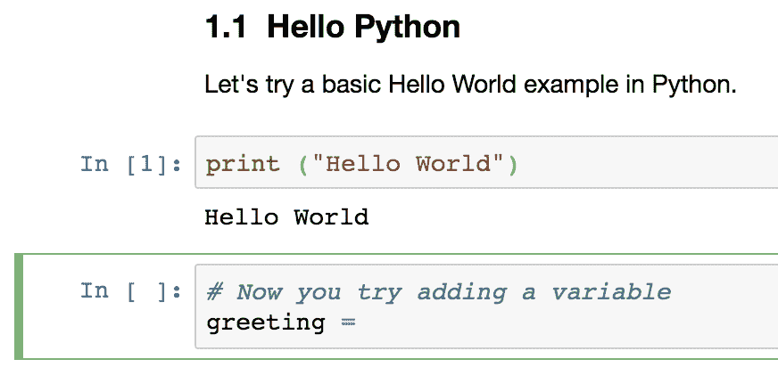

###### 图 12-1\. Jupyter 笔记本中的文档文本、代码单元格和执行输出的截图。

基本思想是将分析方法和发现结合在一个地方，以任何人都可以轻松分发的形式呈现。在某种程度上，这是传统科学论文的逻辑演进，但更好，因为它大大缩短了阅读分析方法和实际重现分析之间的路径。难以估量这一概念有多强大以及它对计算科学中发现的可重复性和再利用性所产生的巨大影响。

那么在这样一个交互式笔记本中，你可以运行什么样的代码呢？最初的概念是在名为[IPython](https://ipython.org)的环境下专门运行 Python 代码。Jupyter 项目源于 IPython，旨在将这一概念扩展到其他语言，首先是 Julia、Python 和 R，这些也体现在 Jupyter 的命名中（因此，Jupyter 的拼写中有*py*，而不是罗马神话中的 Jupiter，即雷神）。现在 Jupyter 还有支持[其他流行语言](https://oreil.ly/Pf8Or)的*kernels*，例如 Ruby。在本章的练习中，我们使用一个 Python kernel，它支持包含 R 代码，并且通过称为*Python 魔术方法*的一组精彩特性，几乎可以运行你能在 Shell 环境中运行的任何内容。在我们看来，这就像同时拥有多个世界的最好一面。

###### 注意

在通用计算中，*kernel*是操作系统核心的程序。在 Jupyter 环境中，*kernel*是解释代码单元的程序，将这些指令传递给笔记本运行的实际操作系统，并检索结果以在笔记本中显示。

Jupyter 笔记本由一个服务器应用程序支持，其需求非常简单，几乎可以在任何类型的计算基础设施上运行，包括您的笔记本电脑。此外，Jupyter 笔记本使研究人员能够封装重现其描述的分析所使用的软件环境所需的信息，使其成为分发可重现代码的绝佳工具。它还是一种越来越受欢迎的教学工具，希望通过本章的练习，这一点将变得显而易见。

Jupyter 的日益流行催生了一个丰富的附加工具和服务生态系统。例如，GCP 运营一个名为[Colaboratory](https://oreil.ly/3Tr2r)的服务，提供免费访问云端笔记本，并提供针对机器学习应用的教程材料。与此同时，Google Cloud AI 平台提供的付费服务提供预配置的虚拟机，用于运行与其他 Google Cloud 服务集成的笔记本。另一个例子是[Binder](https://mybinder.org)，一个开源社区驱动的项目，可以接受 GitHub 存储库中的任何 Jupyter 笔记本，并在交互式环境中打开它们。这些免费服务通常在它们提供的环境的计算能力方面存在限制，但对于分享工作代码、教程等来说仍然非常方便。

尽管如此，对于计算科学中的需求和偏好，单一工具实际上不可能满足全方位的需求和偏好，我们也意识到 Jupyter 笔记本确实存在一些局限性，这些局限性限制了它在特定受众中的吸引力。例如，有着高级编程经验的人通常批评缺乏像语法高亮和代码检查这样大多数现代编程工具上标准的开发功能。此外，习惯于像[RStudio](https://oreil.ly/1M5Jh)这样的探索性分析界面的数据科学家们倾向于认为主要的 Jupyter 界面过于基础，缺乏辅助功能。[JupyterLab](https://oreil.ly/RCfhB)项目旨在通过提供更丰富的界面来解决这一局限性，这一界面概念更接近于 RStudio。鉴于我们近年来在数据科学领域看到的经济投资激增，我们预计工具选择将随着时间的推移而不断改善，我们期待看到下一代界面会是什么样子。

与此同时，我们选择使用 Jupyter 是因为它对新手友好，并且支持可移植性和再现性，目前尚无与之相匹敌的支持。

## Jupyter Notebooks 在 Terra 中的工作原理

在深入细节之前，您应该知道 Terra 使用标准的 Jupyter 服务器实现，因此您将要使用的界面和核心功能基本上与其他设置中看到的一样。因此，您可以利用互联网上丰富的文档和教程来学习如何使用各种菜单选项、小部件等，这里我们不会详细介绍。

与 typcial 本地安装相比，Jupyter 笔记本在 Terra 中工作的一个真正不同之处是计算环境的设置方式。现在让我们详细讨论一下，因为这对您在多个方面的重要影响，例如，您定制环境的灵活性，以及访问数据和保存分析结果的方式。

### 概述

在 Terra 中，笔记本文档存储在您工作空间的存储桶中。当您首次打开笔记本时，Terra 会请求在 GCP 中创建一个 VM，启动一个带有 Jupyter 服务器的容器，并在该容器环境中加载您的笔记本，如图 12-2 所示。

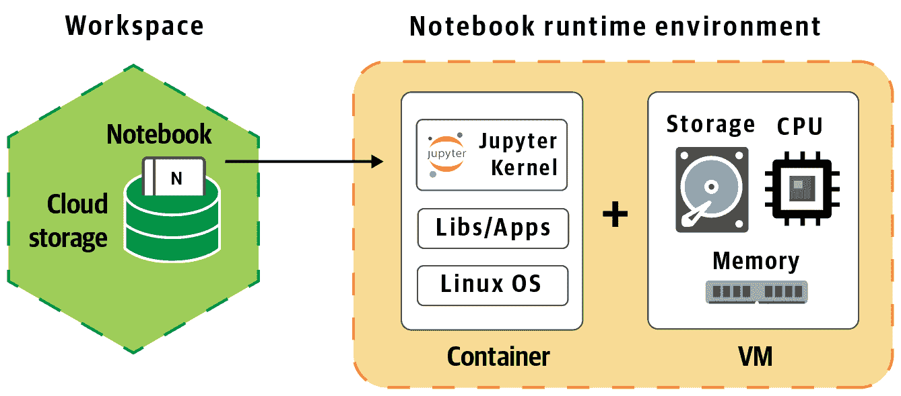

###### 图 12-2\. 在 Terra 中 Jupyter 服务的概述。

从那时起，在笔记本中运行的任何代码都将在该 VM 上的容器中执行。甚至可以在 VM 上运行安装软件包或加载库的命令，以即时自定义环境。从概念上讲，这与通过 GCP 控制台设置的 VM 类似，后续在每一章中使用，只是它最初是由 Terra 创建的，并且为您提供了 Jupyter 界面，而不是裸露的 shell 终端。

可以打开一个终端界面到笔记本，这使您能够执行动作，如列出文件和安装软件包，而无需将这些动作放入代码单元中。然而，我们建议谨慎使用此功能，主要是因为这与 Jupyter 的基本目的相悖，即在分析过程中捕获每一个有意义的操作。在这种情况下，列出目录内容可能并不具有意义，但安装软件包或导入数据则可能起到关键作用。在笔记本记录中省略此类操作可能导致工作的可重复性中断。

成本模型也是一样的；GCP 会根据 VM 运行的时间收费，即使 VM 没有在执行任何操作。好消息是，Terra 有自动功能来检测不活动状态；稍后详细讨论。基本费率取决于您选择使用的 VM 配置；默认情况下，Terra 提供基本配置以满足常见的性能需求，但您可以根据特定需求调整配置。我们稍后回到这个话题。

由 VM 加上容器及其包含的所有软件组成的整体计算环境称为*笔记本运行时*。它严格个人使用；即使您与他人共享工作区，其他人也无法访问它。在本介绍的最后部分，当您更好地理解它的工作原理时，我们会讨论分享和协作。

### 访问数据

您的笔记本运行时配备了本地存储空间。尽管存在云计算的细微差别，它基本上就像一个带有文件系统的硬盘。您可以通过笔记本中的代码单元与文件系统交互，通过 Jupyter 内置的图形文件浏览器，或通过上述支持经典命令如`ls`和`cd`的终端界面来操作。这使您可以在笔记本中使用常规文件路径运行命令，就像在您的笔记本电脑上一样。此外，有几种方法可以在不先将数据复制到本地文件系统的情况下运行命令。我们不会详细列出从笔记本访问数据的所有选项，因为那样会很无聊。相反，这里是我们最常用的几种方式的列表：

+   通过笔记本的图形文件浏览器，将桌面上的文件上传到笔记本的本地存储。

+   使用`gsutil cp`将数据从 GCS 存储桶复制到笔记本的本地存储。

+   运行支持流式处理（如 GATK4）的工具直接在 GCS 中的文件上。

+   通过使用编程接口（API）从工作区数据选项卡上的数据表中导入表格数据。

+   从 Google 的 BigQuery 数据存储服务导入表格数据。

我们将在下一节实践中向你展示如何使用第二和第三个选项，并将为学习第四和第五个选项提供附加资源的指引。

### 保存、停止和重新启动

在你使用笔记本时，系统会定期将更改保存回工作区存储桶中原始的笔记本文档。然而，除了笔记本本身外，Terra 不会自动将笔记本的本地存储中的任何文件保存回工作区。出于我们即将讨论的原因，你不能依赖笔记本运行时进行永久存储，因此你必须采取措施保存任何关心的输出文件的副本，最好保存到工作区存储桶中。我们将在“设置沙盒并将输出文件保存到工作区存储桶”中展示一个简单的方法来做到这一点。

当你完成工作并关闭笔记本时，Terra 指示 GCP 停止笔记本的运行时，但保存其状态，包括 Jupyter 容器的状态，以及你可能通过安装软件包等方式进行的任何修改，以及其本地存储分区上存在的任何文件。这样，你可以随时以最小的努力恢复工作：当你重新打开笔记本时，Terra 会重新启动虚拟机，并将笔记本的运行时恢复到其保存的状态。在 GCP 端，重新启动过程最多可能需要两分钟，但在此期间，Terra 会根据文档的最新保存状态为你提供笔记本内容的只读视图。最后，正如前一段提到的，Terra 能够检测到你不再活跃地使用笔记本（根据虚拟机空闲时间），并会自动保存笔记本并停止虚拟机，以限制你的成本。

### 自定义你的笔记本计算环境

你可能希望通过两种主要方式定制你的笔记本运行时：修改虚拟机资源分配（例如 CPU 数量、内存等）和/或修改容器中预安装的软件。

正如之前简要提到的，你可以轻松修改分配给笔记本运行时的虚拟机资源；例如，如果你需要比默认配置中包含的更多的 CPU 或内存，你可以相应地调整笔记本运行时的配置。甚至，如果你计划使用支持 Spark 的工具，你可以请求一个 Spark 集群而不是单个虚拟机。方便的是，Terra 包含一个笔记本运行时配置面板，比起等价的 GCP 接口要简单得多，你可能还记得来自第四章的内容。但真正酷的是，你可以随时进行这些操作，即使你已经开始在笔记本中工作。你只需拉起配置面板，指定你想要的内容，让系统使用新的规格重新生成你的笔记本运行时。因此，你无需费力地预测你将需要的资源类型。你可以从最小设置开始工作，然后在遇到限制时再逐步调整。

然而——这是一个重要的警告——新的运行时 *将是一个空白*，因为再生过程会使用原始容器映像进行新虚拟机的配置，并且使用空存储分区。如果你的笔记本工作主要包括运行时间较短的命令，不涉及太多计算成本，这并不是一个大问题：Jupyter 菜单中包含重新运行所有代码单元（或者到某一点之前的所有代码单元）的选项，因此你可以简单地再现先前的状态。然而，如果你的工作涉及到大量计算，重新运行可能并不轻松，这时你可能需要更好的策略。例如，你可以明确将到目前为止生成的输出保存到工作空间存储桶中，然后设置笔记本以便在下一部分工作中使用这些已保存的输出作为输入。

第二个定制点是在生成笔记本运行时时修改容器中的软件，这有点复杂，但值得花几分钟来讨论。首先，为什么要这样做呢？假设您的分析需要一些不包括在默认笔记本运行时配置中的软件包。您可以开始笔记本并进行一些安装步骤，但如果有多个需要相同配置命令的笔记本，这可能会成为一个维护头痛。如果将其中一些软件安装步骤移出笔记本并放入环境配置中，将会更容易得多。在 Terra 中，您可以通过两种方式实现这一点：您可以指定一个设置脚本，Terra 将在创建或重新生成笔记本运行时时在容器中运行它，或者您可以为运行时服务提供自定义容器镜像。或者您实际上可以结合两者：指定一个自定义容器和一个启动脚本来修改其设置。图 12-3 阐明了这些选项之间的区别。

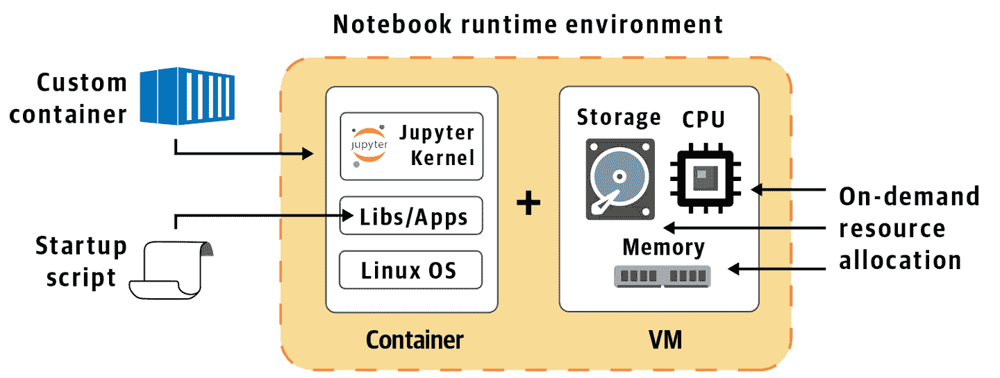

###### 图 12-3\. 自定义笔记本运行时安装软件的选项。

在即将进行的练习中，我们将向您展示如何使用启动脚本选项，因为这是功能与易用性的良好折衷：制作您自己的脚本并不困难，您可以轻松地为其他在 Terra 中使用相同内核的用户分发该脚本。自定义容器镜像选项在技术上更强大且更具可移植性，但更为复杂。如果您有兴趣了解其工作原理，请查看[Terra 上关于自定义容器的文档](https://oreil.ly/R-Grd)。

现在您知道您可以定制笔记本运行时的强大功能后，我们需要解决一个关键问题，这是我们一直小心避免提到的：您可以使用多少个笔记本运行时？您是否为所有内容使用相同的运行时，每个工作区一个，每个笔记本一个，或者您可以像在 GCP 控制台中创建 VM 实例那样随意创建新的运行时？坦率地说，答案可能会随着平台进一步成熟以及产品开发团队收集更多研究者实际需求的数据而发生变化（所以请随时提供您的意见！）。

截至目前，Terra 笔记本服务为特定计费项目内的所有工作空间提供单一笔记本运行时。明确地说，这意味着如果你在与第一个笔记本相同的计费项目中的任何工作空间中打开或创建另一个笔记本，新的笔记本将在相同的运行时环境中打开。如果你计划在两个笔记本中使用的数据、资源和软件有很大的重叠，这可能非常方便。然而，如果你正在处理配置需求完全不同的不同项目，这可能会带来主要的复杂性。在这种情况下，你可能需要考虑在不同的计费项目下开发具有不兼容要求的笔记本，因为这将为每个项目提供完全独立的笔记本运行时环境。

### 分享和协作

到此为止，你已经完成了这个介绍的最后一节，现在是时候谈谈如何与他人友好相处了。正如我们之前提到的，笔记本运行时是个人的：只有你能访问那台机器、容器和 Jupyter 服务器。如果你与合作者分享工作空间，他们打开相同的笔记本时，它将在他们自己的运行时环境中打开。因此，他们在笔记本中所做的任何工作都不会影响你的运行时环境的状态。然而，系统会自动保存他们对共享文档所做的任何更改，因此与合作者明确设置期望非常重要，他们是否可以修改笔记本，或者他们是否应该在单独的副本中工作。

此外，请注意，当有人正在使用笔记本文档时，Terra 将会*锁定*它，以避免多人同时进行冲突更改。在这种情况下，你的合作者可以在只读预览模式下打开笔记本，或者他们可以在特殊的*游乐场模式*下打开笔记本，在这种模式下，他们可以在自己的运行时环境中进行更改和运行代码，但不会保存任何更改到原始文件中，如图 12-4 所示。这可能不完全符合你可以基于 Google Docs 设想的理想协作体验，但考虑到所涉及的限制，这提供了一个合理的折衷方案。

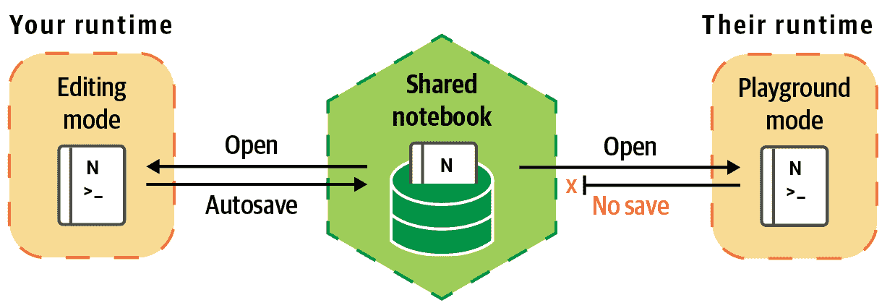

###### 图 12-4\. 在共享工作空间中，当两个人同时打开笔记本时，可以防止覆盖。

如果你在实践中对这一切如何运作感到困惑，不用担心！首先，这完全可以接受；如果有什么不清楚的地方，那是我们的错，而不是你的错。其次，好消息是：你已经到达了理论壁垒的尽头，现在是时候在真实的笔记本中进行实际练习了。

# 在 Terra 中开始使用 Jupyter

我们将使用预写的笔记本进行工作，因此您大多数时候只需运行单元格，尽管在可能的情况下，我们尝试包含一些额外的提示，以加强学习。在第十三章中，我们讨论如何从头开始创建您自己的笔记本或从外部来源导入现有笔记本。

要开始，请返回到您通过克隆原始书籍工作区创建的工作区第十一章。如果您手头没有 URL，请在[您的工作区](https://oreil.ly/bKWll)中找到它；或者如果您已删除它，则可以按照第十一章开头的相关说明再次克隆原始工作区。找到您的工作区后，打开它并转到笔记本选项卡。在那里，您将看到列出两个笔记本，如图 12-5 所示。这实际上是同一个笔记本的两个副本：一个从未运行过，另一个我们已经运行了所有内容，以便您可以看到预期的输出。

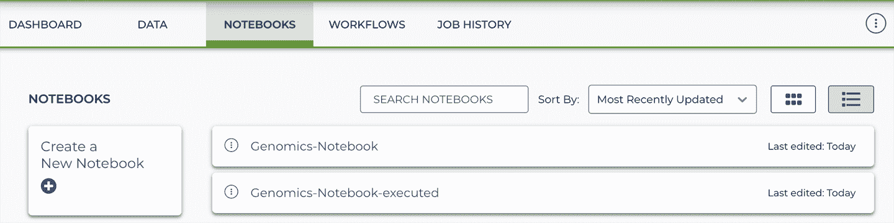

###### 图 12-5\. 笔记本选项卡显示两个笔记本副本：一个已执行，另一个没有任何之前的结果。

我们建议您仅以预览模式打开第二个，以便将其内容保留为参考，以防在另一个中遇到令人惊讶的内容，您将使用它来完成即将进行的练习。

然而，在您打开任何内容之前，我们将指导您自定义运行时配置。如果您已经开始打开其中一个笔记本，请不要惊慌；您仍然可以重新配置笔记本运行时。我们只是想节省您一点时间，因为启动新的运行时需要几分钟时间，并且我们知道，我们将会需要比默认配置提供的更多内容。

## 检查和自定义笔记本运行时配置

正如前面所述，默认情况下，Terra 为您创建的运行时环境设置了基本资源分配和一组标准软件包。只要您在适当的计费项目下的工作空间中，您可以随时查看此配置，而无需打开笔记本。要这样做，请查找笔记本运行时状态小部件，截至撰写本文时，几乎所有工作空间页面的右上角都显示了该小部件，如图 12-6 所示。


###### 图 12-6\. 笔记本运行时状态小部件。

###### 注意

我们从 Terra 产品开发团队听说过有关笔记本运行时状态小部件显示可能会在不久的将来发生变化的传言，如果情况如此，您将需要查找它，或者如果失败，可以在书的存储库中的[GitHub](https://oreil.ly/genomics-repo)上查阅相关文档。

单击右侧的齿轮图标可打开运行时配置页面。如果在当前计费项目下未对运行时进行任何自定义，则表单应显示所有默认设置，如图 12-7 所示。

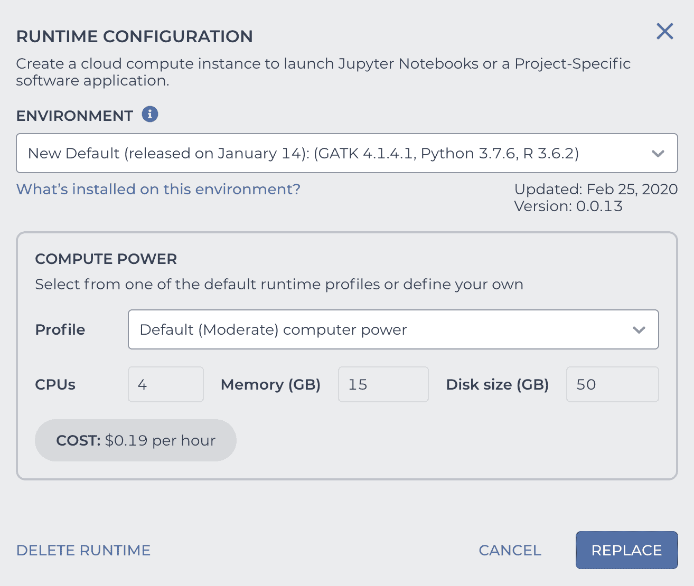

###### 图 12-7\. 默认笔记本运行时配置设置。

您可以看到一个小列表，选择默认环境，其特征是被认为是最重要的软件包。要获取安装在每个环境上的完整详细信息，请选择您感兴趣的环境，然后点击“此环境中安装了什么？”以打开详细视图。如图图 12-8 所示，该详细视图进一步分为诸如 Python、R 和工具等类别。选择 Python 或 R 将显示相应语言的运行时环境中包含的完整软件包列表。选择工具将显示运行时环境中还包含的命令行可执行工具列表。

实际上，如果选择工具，您会发现这个默认设置实际上包括 GATK，这对我们这些在基因组学领域工作的人来说是一个很好的选择，考虑到 Terra 不仅仅面向基因组学的更广泛的受众。也就是说，出于本书的目的，我们正在使用与默认配置版本不同的版本，因此我们需要进行定制。此外，我们还将要使用一个 Python 库（剧透警报），它可以在笔记本中嵌入 IGV 浏览器窗口（这太酷了）。我们可以在笔记本内部安装这两者，但正如介绍中所述，我们更喜欢使用启动脚本，在笔记本运行时创建过程中安装它们。如果您感兴趣，我们在附带的侧边栏中提供了有关所讨论脚本的更详细的内容，但如果您不感兴趣，或者您急于开始使用笔记本本身，则可以跳过它。

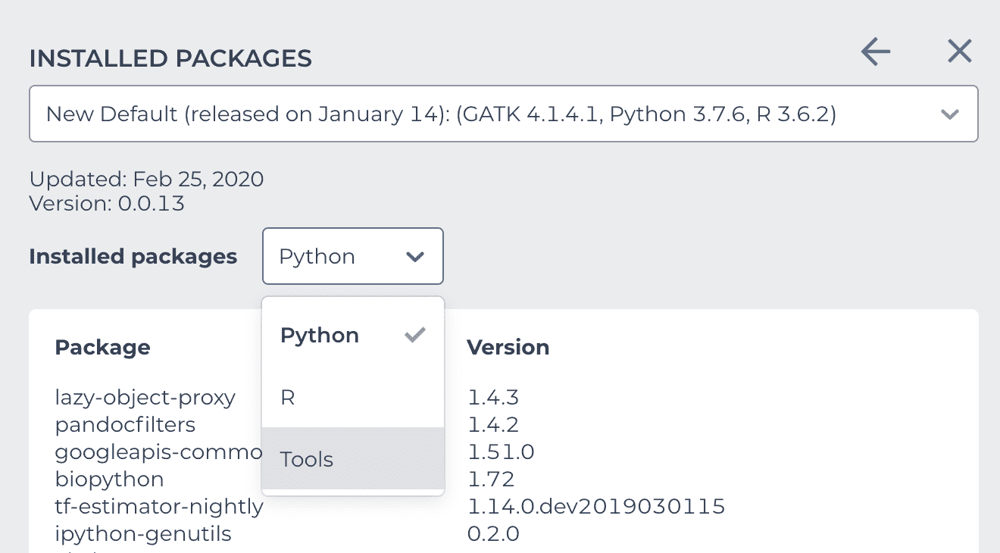

###### 图 12-8\. 默认运行时环境中安装的软件包的详细视图。

那么我们应该在哪里指定启动脚本？你可能会想要在笔记本运行时自定义页面的环境菜单中查找，甚至选择自定义环境选项，这个概念上看似正确，但实际上是错误的。那里是你用来指定替换内置 Docker 镜像的地方。相反，你需要向下看一点，到计算能力部分（在图 12-7 中显示），这里允许你修改虚拟机资源分配。该部分包括一个菜单，允许你从三个预设配置中选择，标记为提供中等、增加或高级计算能力，或者在自定义标签下提供你自己的配置。

###### 注意

坦白地说，如果这部分界面在不久的将来也有所发展，我们不会感到惊讶，因为将软件定制选项与硬件分配分组在一起并不是很合理。更不用说那些预设配置的命名了，它们就像星巴克杯子的大小名称一样不太有帮助：一旦你习惯了它们，它们看起来有点合理，但第一次踏进星巴克，你只是为了价格告诉你哪个更大而感到开心。

随意选择每个预设配置，查看它们各自的资源分配方式。当你准备好继续时，选择自定义选项以打开可编辑的配置窗口。你会看到一个之前不可用的名为“启动脚本”的新字段出现（图 12-9）。你最终可以在那里的 URI 文本框中输入启动脚本的路径（对应统一资源标识符（[uniform resource identifier](https://oreil.ly/Ltao0)）的一种，是 [URL](https://oreil.ly/jUtVr) 的近亲）。我们在书的存储桶中包含了脚本的副本，所以你可以使用这个路径：

```
gs://genomics-in-the-cloud/v1/scripts/install_GATK_4130_with_igv.sh
```

其余的资源分配将会按默认值（中等）进行，包括 4 个 CPU、15 GB 内存（RAM）和 50 GB 硬盘空间。图 12-9 展示了这个配置的外观。

作为提醒，这个启动脚本会在运行时环境中安装 GATK 版本 4.1.3.0，以及一个集成模块，使得你可以在笔记本内部使用 IGV 查看基因组数据。

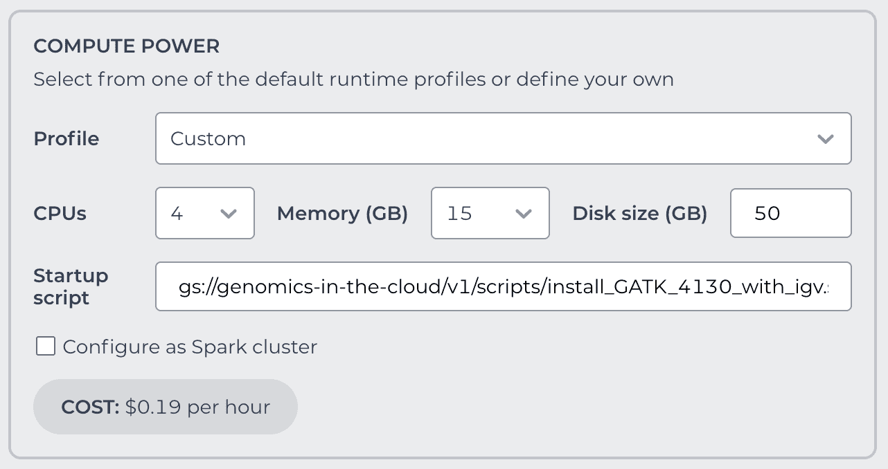

###### 图 12-9\. 计算能力部分允许你在选择自定义配置时指定一个启动脚本。

当你完成时点击“创建”按钮（如果之前已创建过运行时，则标记为“替换”），Terra 开始根据你的设置创建新的运行时环境。你可以去拿一杯喜欢的饮料或继续下一组指令，按你的喜好选择。在任何情况下，Terra 与 GCP 通信以提供你闪亮新的运行时环境时，你可能需要等待几分钟。

## 打开编辑模式的笔记本并检查内核

为了查看笔记本，你不需要等待运行时准备就绪，所以请打开教程笔记本的未运行副本。无论你的运行时是否准备就绪，Terra 最初会以预览模式打开笔记本，即笔记本是只读的。正如图 12-10 所示，预览面板顶部的菜单提供两个选项，以交互方式打开笔记本：编辑，正常工作笔记本；或者游乐场模式，无需保存任何内容进行实验，正如我们在介绍中简要讨论的那样。


###### 图 12-10\. 笔记本预览页面上显示的菜单，包括主要选项：预览、编辑和游乐场模式。

点击“编辑”并等待运行时准备就绪。当转换为编辑模式时，你会注意到标准的 Jupyter 菜单栏的出现，如图 12-11 所示。一个更微妙但同样重要的标志是菜单栏右侧的小白色框，显示“编辑模式”标签。如果你错误地打开了游乐场模式，Jupyter 菜单栏也会显示，但是白色的“编辑模式”标签将被橙色的“游乐场模式（未保存编辑）”标签替代。

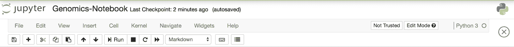

###### 图 12-11\. 标准的 Jupyter 菜单栏。

在菜单栏区域的更右侧，是标识活动内核的 Python 3 标签以及 Python 标志。你可能还记得笔记本的*内核*是解释笔记本中代码并启动每个运行单元执行的计算引擎。对于这个特定的笔记本，我们决定使用 Python 3 内核，以便使用 Python 魔术方法执行终端命令（包括像`gsutil`和 GATK 这样的程序）——这确实是一个技术术语，我们发誓。你很快就会看到它的神奇之处。

如果你想知道，是的，你可以在笔记本运行时使用 Kernel 菜单切换内核，但我们真的不建议这样做。原则上，这可能听起来很有用——例如，在子集单元格中运行不同语言的代码——但实际上却是危险的，如果不小心会造成混乱。如果你需要在同一个笔记本中使用 Python 和 R 代码，我们强烈建议使用 Python 3 内核和魔术方法命令，正如我们在这个笔记本中展示的那样。

现在是时候运行一些真实的代码单元格了！

## 运行 Hello World 单元格

让我们运行一些简单的示例，这样你就能感受一下在 Jupyter 笔记本中工作的感觉，如果你以前没有这样做过的话。我们将运行三种类型的命令来演示运行 Python 代码、R 代码以及 Python 环境下的命令行工具的语法。

### Python Hello World

这是经典的 Python Hello World 示例，使用`print()`函数并给它传递字符串`Hello World`。你可能还记得在第八章中我们在 WDL 中使用`echo "Hello World"`命令的情况。要运行该单元格，点击灰色区域中的任意位置选择单元格，然后按键盘上的 Shift+Enter，或者在页面顶部的工具栏上使用“Run”菜单运行该单元格：

```
In [1]  print("Hello World!")
```

```
Out [1] Hello World!
```

如果你想要给问候语增加一些灵活性，可以使用变量。双击单元格编辑并修改代码，如下所示，然后再次运行它：

```
In [2]  greeting = "Hello World!"
        print(greeting)
```

```
Out [2] Hello World!
```

顺便说一句，这显示了当你有一个包含多行内容的单元格时，运行它会执行单元格中的所有代码。有时，将多个命令分组到一个单元格中是有意义的，因为你总是希望运行它们所有。但是，你也可以选择将它们分成多个单元格。现在试着做一下这个。你可以通过点击页面顶部工具栏上的“+”图标或者转到“Insert”菜单向笔记本添加新单元格。前者会自动在当前活动单元格下方创建新单元格，而“Insert”菜单则可以明确选择将其添加到当前活动单元格的上方或下方。

```
In [3]  greeting = "Hello World!"
In [4]  print(greeting)
```

```
Out [4] Hello World!
```

这使你能够将变量的赋值与任务执行分开。在这个简单的例子中，这并没有太大的区别，但是当你执行更复杂的操作时，选择将哪些命令分组以及哪些命令分开变得更加重要。

现在你已经掌握了基本的操作技巧，让我们看看如何在这个 Python 笔记本中运行一些 R 代码。

### 使用 Python 魔术方法运行 R Hello World

在我们可以深入进行 Hello World 练习之前，这需要一点设置。还记得我们用来自定义笔记本运行时的启动脚本吗？在该脚本中的一个步骤是安装`rpy2`包，该包处理 Python 笔记本中的 R 代码解释，是我们在本章前面提到的魔术方法功能之一。要激活它，您首先需要导入`rpy`包并激活相应的笔记本扩展：

```
In [5]  import rpy2
        %load_ext rpy2.ipython

```

这可能需要几秒钟，此期间服务器在单元格左侧的括号中显示一个星号（`*`）以指示正在处理中。加载包后，您有两种调用魔术方法的方式：使用`%R`用于单行代码或`%%R`用于整个单元格。

这是同样基本的 Hello World 示例，但这次是在 R 中运行的，使用单行魔术方法调用：

```
In [6]  %R print ("Hello World!")
```

```
Out [6] [1] "Hello World"
```

是的，这与我们在 Python 示例中运行的代码相同，因为 R 也有一个`print()`函数。您可以通过输出显示它是 R 版本，因为输出显示为带有问候语作为单个字符串元素的数组，而 Python 版本只返回问候语的文本字符串本身。

话虽如此，将其修改为使用变量赋值会使其更加明显，说明它是 R 代码而不是 Python 代码。这次，使用`%%R`将魔术方法应用于整个单元格：

```
In [7]  %%R
        greeting <- "Hello World!"
        print(greeting)
```

```
Out [7] [1] "Hello World"
```

就是这样：您正在 Python 笔记本中运行 R 代码。当我们进行“严肃”的练习时，这将非常方便，因为我们需要使用 Python 来嵌入 IGV 浏览器（很快就会介绍！），但我们也希望稍后使用现有的 R 脚本进行绘图。现在我们可以同时享受最好的两个世界。只需记住，当您开始在自己的笔记本中使用它时，您需要包含导入`rpy2`并激活扩展的单元格。

这将我们带到我们笔记本中要运行的第三种类型的命令：像`ls`、`gsutil`和 GATK 这样的命令行工具。

### 使用 Python 魔术方法的命令行工具 Hello World

对于这个例子，没有什么需要加载的；Hello World 案例可以直接使用。我们将使用在 WDL Hello World 示例中使用过的经典`echo`命令。只需在命令前面加上一个感叹号，然后运行该单元格：

```
In [8]  ! echo "Hello World!"

Out [8] Hello World!
```

您可以以这种方式使用所有经典的 Shell 命令；例如，如果您想列出工作目录的内容，请在单元格中键入`**! ls**`并运行它。类似地，您可以以此方式运行笔记本运行环境中安装的任何命令行工具。Terra 中所有预设环境都包括`gsutil`包，因此您可以在任何 Terra 笔记本中使用这些工具。我们将在下一节中详细介绍具体示例。稍后，我们还会运行命令以运行我们的启动脚本安装的 GATK，使用相同的基本语法。

到目前为止，我们一直专注于代码单元格，但请记住，所有描述性文本单元格也是可编辑的。当然，可以双击一些单元格，看看它们的外观如何变化以显示它们处于编辑模式。尝试进行一些编辑，然后完成后，“运行”单元格（就像运行代码单元格一样），退出文本编辑模式。描述性文本单元格使用一种简单的格式标记语言称为*Markdown*，因此您可以设置标题级别，制作项目列表等。有关使用 Markdown 的更多信息，请参阅 Jupyter 项目文档中这个有用的[页面](https://oreil.ly/07KtL)。创建笔记本中的新单元格时，默认情况下会将它们设置为代码单元格，但可以通过 Cell 菜单选择 Cell Type > Markdown 将它们切换为 Markdown。

现在您对基础知识有了牢固的掌握，是时候做一些更具体于云环境和我们感兴趣的基因组学主题的工作了。

## 使用 gsutil 与 Google Cloud Storage 桶交互

在笔记本中，我们想要处理的数据大多数时间存储在 GCS 桶中，因此您首先需要学习如何访问这些数据。好消息是：您可以使用`gsutil`命令来执行我们在第四章及以后展示的所有相同操作。例如，使用`gsutil ls`列出书桶的内容：

```
In [9]  ! gsutil ls gs://genomics-in-the-cloud/

```

同样，您可以使用`gsutil cp`来*本地化*文件；也就是说，将它们从桶复制到笔记本运行时的本地存储空间。例如，使用以下命令将文件从书桶复制到笔记本运行时的*sandbox*目录：

```
In [10]  ! gsutil cp gs://genomics-in-the-cloud/hello.txt .

```

然后，您可以运行`cat`来读取本地化文件的内容。您可以在 Python 中编写这个命令，因为这是一个 Python 笔记本，但是很难超越`cat`的简洁性！

```
In [11]  ! cat hello.txt

```

正如你所看到的，这些基本上是我们在第四章中使用的相同命令，只是我们在前面加了`!`来告诉 Python 解释器将该行作为终端命令执行，而不是作为 Python 代码读取。

## 设置一个变量指向书桶中的生殖系列数据

接下来的几个练习将使用我们在书的数据捆绑包中提供的生殖系列数据。由于示例数据的路径相当长，让我们设置一个变量以更简洁的形式将其存储在笔记本中，就像我们在第五章中使用环境变量一样：

```
In [12]  GERM_DATA = "gs://genomics-in-the-cloud/v1/data/germline"

```

这是一个 Python 变量，所以当您在 shell 命令中使用它时，您需要用大括号括起来。例如，使用`gsutil`命令列出该目录的内容如下：

```
In [13]  ! gsutil ls {GERM_DATA}

```

想一想我们在这个变量周围使用花括号而不是像您可能根据我们迄今使用过的 Bash 环境变量中那样调用它为`$GERM_DATA`的做法。这里需要记住的关键点是，我们将存储桶快捷方式设置为 Python 变量，而不是 shell 环境变量。在笔记本中可以使用 shell 环境变量，但这是另一个时间的话题。

您还可以基于这个变量来组合路径以列出子目录；例如，获取 BAM 文件列表或对特定文件执行操作。对于以下每个命令，请尝试推断其功能，然后在笔记本中运行它，并将结果与您的预期进行评估。

```
In [14]  ! gsutil ls {GERM_DATA}/bams

In [15]  ! gsutil cp {GERM_DATA}/bams/mother.ba* .

In [16]  ! ls .

```

本章后面，我们还向您展示了如何在一些 Python 代码的上下文中使用相同的`GERM_DATA`变量。

## 设置一个沙盒并将输出文件保存到工作空间存储桶。

当您在笔记本中运行生成输出文件的命令时，默认情况下这些文件将保存在笔记本的本地存储空间中。然而，与您的笔记本关联的本地存储是临时的，因此您需要将任何关心的输出复制到一个 GCS 存储桶中。您可以使用任何您有写入权限的存储桶来执行此操作，但我们建议使用工作空间专用的存储桶。

为了简化将输出保存到存储桶的过程，我们喜欢做两件事：创建一个沙盒来存放我们将要生成的输出文件，并设置一个指向工作空间存储桶的变量。

让我们从*sandbox*目录开始；创建一个新目录，并将一些文件移动到那里以进行演示。这里我们仅包含命令，但不详细说明其目的或结果。我们在笔记本中提供了更多细节。在查看完整描述并在笔记本中运行命令之前，请尝试推断每个命令的功能：

```
In [17]  ! mkdir -p sandbox/

In [18]  ! mv mother.ba* sandbox/

In [19]  ! ls sandbox

```

当您的沙盒准备好后，让我们来处理工作空间存储桶。工作空间存储桶名称是一长串由字母和数字组成的机器生成序列，使用起来有些烦人。幸运的是，我们可以通过程序导入它（而不是手动在工作空间仪表板中查找），因为 Terra 将其作为系统变量提供给笔记本。为了更加简便，我们将按以下方式从该系统变量创建 Python 变量：

```
In [20]  import os
         WS_BUCKET = os.environ['WORKSPACE_BUCKET']

In [21]  print(WS_BUCKET)
```

```
Out [21] ’gs://fc-46207b9c-d593-4e7a-9057-7aca3bb5c9a7’
```

这里，我们使用 Python 命令在 Python 层级设置变量。`import os`命令允许我们在 Python 代码中与操作系统交互，而`os.environ['WORKSPACE_BUCKET']`调用则使用这一功能访问环境变量`'WORKSPACE_BUCKET'`的值，这个变量最初是由 Terra 笔记本服务为您设置的。

从这里开始，您可以将工作空间存储桶称为`WS_BUCKET`。例如，您可以使用`gsutil ls`列出其内容：

```
In [22]  ! gsutil ls -r {WS_BUCKET}

```

请注意，我们用花括号括起了`WS_BUCKET`变量，就像我们在前一节中对 germline 数据变量所做的那样。

设置完成后，每当你想把输出保存到工作空间存储桶时，只需在*sandbox*目录上运行相同的`gsutil cp`命令：

```
In [23]  ! gsutil -m cp -r sandbox {WS_BUCKET}

In [24]  ! gsutil ls {WS_BUCKET}/sandbox

```

这将整个*sandbox*目录从笔记本的本地存储复制到工作空间存储桶。请记住，如果你生成了许多大文件，这种方法可能不会很好扩展；在这种情况下，你可能需要考虑将 sandbox 分成单独的子目录来管理。承认手动同步文件到存储桶并不理想；我们期待看到这些工具的体验随着技术的发展而改进。至少笔记本文件本身是自动保存的，正如我们之前讨论的那样。

# 在嵌入的 IGV 窗口中可视化基因组数据

现在我们的笔记本已经设置好并准备就绪，让我们试试一个酷炫的技巧：在笔记本的上下文中使用 IGV 来可视化基因组数据。在之前的章节中，我们让你使用桌面版 IGV，并设置它从 GCS 获取数据。这一次，我们要做一些不同的事情：我们将使用一个称为*IGV.js*的特殊 IGV 包，在笔记本中嵌入 IGV 浏览器。当你希望将数据可视化包含在学生教程中或在报告中向合作者传达结果时，这是非常方便的，这样他们就不需要使用单独的程序。

###### 注意

*IGV.js*包有一些限制，我们稍后将进一步描述。简而言之，当它工作时非常酷，所以我们确实认为在 Jupyter 笔记本中展示如何使用它是值得的，但它并不总是无缝运行。如果你在使用过程中遇到任何困难，我们建议你回到使用桌面版 IGV，如前所述。

在这个练习中，我们将加载两个 BAM 文件：WGS 母样本，这已经是本书大部分时间的测试文件，以及同一人的外显子样本进行比较。你可能还记得在第二章（一辈子前），我们曾触及几种文库设计策略的区别，包括 WGS 和外显子测序。特别是，我们讨论了它们的覆盖率图的形状有很大不同：WGS 倾向于看起来像远处的山脉，而外显子样本则更像是散布在海洋中的一系列火山岛屿。这是一个让你亲自看到的机会，本质上是复制图 2-18 的交互形式，同时尝试*IGV.js*的集成。

## 设置嵌入式 IGV 浏览器

好消息是，在这里您不需要做太多事情。还记得您作为运行时环境定制的一部分运行的启动脚本吗？这包括安装运行 *IGV.js* 所需的所有先决条件的说明，系统在创建您的定制运行时环境时执行了这些说明。因此，我们只需执行一次导入来激活 `igv` Python 包。之后，只需按照以下代码单元格中显示的方式创建需要显示的任意数量的 IGV 浏览器即可。以下所有内容都是 Python 代码，遵循 IGV 团队在 GitHub 上 [IGV-Jupyter 仓库](https://oreil.ly/JgOtt) 中记录的指南：

```
In [25]  import igv

In [26]  IGV_Explore = igv.Browser(
             {"genome": "hg19",
             "locus": "chr20:10,025,584-10,036,143"
             }
         )

In [27]  IGV_Explore.show()

```

我们为浏览器起的名称（这里是`IGV_Explore`）完全是任意的。您可以提供其他参数来初始化浏览器，但唯一必需的是基因组参考；其他所有内容都是可选的。话虽如此，通常我们会为浏览器指定一些坐标（或感兴趣的基因名称），以便立即进行放大。

当您运行该单元格时，应该会看到一个嵌入的 IGV 浏览器，其中包括参考基因组和 RefSeq 基因轨道，但没有实际的数据轨道，如 Figure 12-12 所示。

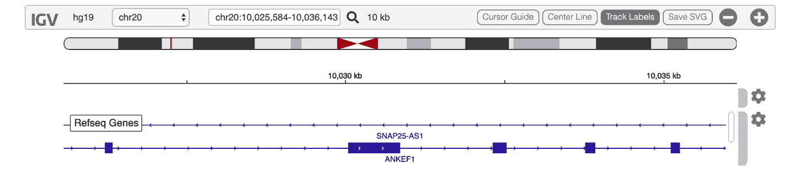

###### 图 12-12\. 新创建的 IGV 浏览器。

接下来，让我们添加我们想要比较的两个样本 BAM 文件。

## 将数据添加到 IGV 浏览器中

对于我们想要加载的每一个轨道，我们需要提供相同的元数据：轨道的名称、文件在 GCS 中的路径、格式以及相应索引文件的路径。我们使用 `load_track()` 函数向 IGV 提供这些信息：

```
In [28]  IGV_Explore.load_track(
             {
                 "name": "Mother WGS",
                 "url": GERM_DATA + "/bams/mother.bam",
                 "indexURL": GERM_DATA + "/bams/mother.bai",
                 "format": "bam"
             })

In [29]  IGV_Explore.load_track(
             {
                 "name": "Mother Exome",
                 "url": GERM_DATA + "/bams/motherNEX.bam",
                 "indexURL": GERM_DATA + "/bams/motherNEX.bai",
                 "format": "bam"
             })

```

因为这都是 Python 代码，我们可以简单地通过引用其名称 `GERM_DATA` 来使用我们为生殖细胞数据设置的 Python 变量。

###### 注意

请注意一下 Python 语法，它明确使用 `+` 运算符来连接变量和子目录字符串，以便组成指向数据文件所在位置的完整地址。这与我们之前在 `gsutil` 命令中使用的 shell 语法 `"{GERM_DATA}/bams"` 形成对比，后者是一种更为隐式的指令。如果您对 Python 不太熟悉，知道这体现了 Python 编程的一个基本原则：显式优于隐式。

当您运行两个单元格，并且它们每一个都以 `OK` 作为结果返回后，请向上滚动到浏览器，您应该会看到旋转符号，表示数据正在加载。当旋转器消失并显示数据时，在您的 IGV 浏览器中应该会有两个数据轨道：母体样本的全基因组测序和外显子版本，如 Figure 12-13 所示。

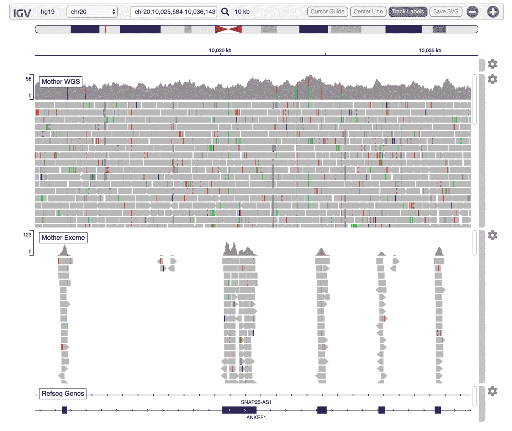

###### 图 12-13\. IGV 浏览器显示的两个序列数据轨道。

尝试缩放和拖动序列左右以查看视图，并对比这两个样本中数据分布的经典“山脉对火山岛屿”的覆盖率差异。从此开始，您可以直接通过视觉判断任何测序样本的文库设计类型。

###### 注意

在嵌入式 IGV 浏览器中加载 VCF 和 BAM 文件而不指定索引文件是可行的技术操作。为此，请省略 `"indexURL"` 行，并将其替换为 `"indexed": False`。但请注意，这样做会导致 IGV 加载数据的时间大大延长。数据加载可能需要几分钟，并且可能会看到一个弹出窗口提示页面无响应。如果出现此情况，请关闭警报并再等待一分钟。如果加载时间远远超过此时间，您可能需要回到使用 IGV 的桌面版本。

希望您同意，这是一种不错的方式，可以在分析日志或报告中包含基因组数据的视图，尽管它存在一些限制。一个限制是在初始加载数据时可能遇到的延迟；另一个是与 IGV 桌面版本相比，不是所有的显示定制选项都可用。如果没有适当的指导，身份验证可能是一个主要障碍：如果您想访问私有存储桶中的数据（包括您的工作空间存储桶！），您需要跳过涉及访问凭据的额外步骤。您可能还记得，在第四章中，您必须在 IGV 桌面版本中启用 Google 登录选项，以便查看来自私有存储桶的文件。在这里，我们将做类似的事情，只是不是通过点点点的过程，而是通过几行代码来完成。

## 设置访问令牌以查看私有数据

在前面的例子中，我们从完全公开的存储桶中读取数据，因此不需要进行任何身份验证。但是，您最终可能需要查看私有存储桶中的文件。为此，您需要设置一个访问令牌，IGV 可以使用该令牌来访问您私有存储桶中的数据。

首先，让我们使用 `gcloud auth` 生成访问令牌并将其保存到文件中：

```
In [30]  ! gcloud auth print-access-token > token.txt

```

只要此文件仅保存在笔记本的本地存储中，它就是安全的，因为您的运行环境严格个人化，其他人无法访问，即使您与他们分享工作空间或笔记本。但不要将此文件保存到您的工作空间存储桶中！保存到存储桶将使任何与您分享工作空间的人都能看到该文件。

接下来，将令牌文件的内容读入 Python 变量中。由于令牌只包含一行文本，我们可以使用 `readline()` 函数，该函数将文件的第一行读入字符串中：

```
In [31]  token_file = open("token.txt","r") 
         token = token_file.readline()

```

此时，您已经将 `token` 变量存储并准备好在需要加载存储在私有存储桶中的文件时与 IGV 一起使用。

例如，回想一下前一节中我们让你复制*mother.bam*文件及其索引到你的工作空间存储桶。即使你拥有那个存储桶，运行在你笔记本中的 IGV 进程也不知道你有权访问它。你必须明确地通过在调用`load_track()`函数时提供刚刚设置的令牌来指示它，如下所示：

```
In [32]  IGV_Explore.load_track(
             {
                "name": "Workspace bucket copy of Mother WGS",
                "url": WS_BUCKET + "/sandbox/mother.bam",
                "indexURL": WS_BUCKET + "/sandbox/mother.bai",
                "format": "bam",
                "oauthToken": token
             })

```

如你所见，我们复制了之前用于加载 BAM 文件的相同代码，但这次我们提供了工作空间存储桶中文件的路径，并添加了先前生成的令牌。如果你好奇不提供令牌会发生什么，请随意尝试删除该行（以及前一行末尾的逗号）。请注意，也可以访问由 Terra 之外的管理私有存储桶中的数据。正如我们将在第十三章中看到的那样，这需要将存储桶访问权限授予您的代理组服务帐户。

如果你有多个私有文件要加载到 IGV 浏览器中，你需要在每个轨迹定义中包含令牌。[IGV 文档](https://oreil.ly/RWDqg)指出可以设置全局 IGV 配置变量，`igv.setGoogleOauth​Token​(accessToken)`，适用于所有轨迹，但截至撰写本文时，在我们的笔记本中这并不起作用。

# 运行 GATK 命令以学习、测试或排除故障

虽然我们可以在笔记本中从可视化测序数据，但是我们已经能够通过桌面版的 IGV 实现了相当的结果。笔记本概念真正酷的地方在于，我们可以运行分析命令，然后在同一环境中可视化输出结果。

你可能会问，你可以运行什么样的分析呢？好吧，几乎任何你想运行的东西。正如我们在让你运行`gsutil`命令时所看到的，你不仅限于在 Python 笔记本中运行 Python 代码。你几乎可以运行任何你可以安装并在 shell 环境中运行的东西。

###### 注意

在这里，我们依赖于你在本章练习开始时用来初始化笔记本运行环境的启动脚本。该脚本包括下载 GATK 包并使其可用于命令行调用的说明，这些说明在为您创建环境时已执行，因此您无需自行操作。

在本节中，我们将向您展示如何在笔记本中运行 GATK 命令并在 IGV 中可视化结果。我们发现，与我们在较早的章节中采用的“分屏”方法相比，这提供了一种更加集成和无缝的体验，之前我们在虚拟机中运行 GATK 命令，然后在桌面版 IGV 中可视化结果。我们让您经历了这一切，因为我们是虐待狂，而且这也为您提供了建立基础技能的机会。通过这个过程，您对云计算的基础组件有了一定的熟悉度，这应该有助于您在运行工作流程或在笔记本中工作时理解幕后发生的事情。也许通过这个经历，您对基于笔记本的方法有了更深的理解，即使只是用于教学、测试和故障排除等目的。

为此，我们将重新访问您在第五章中之前完成的练习，这样您可以将注意力集中在*如何*进行工作，而不是分析的含义是什么。

## 运行基本的 GATK 命令：HaplotypeCaller

让我们从在整本书中都在使用的相同样本上运行`HaplotypeCaller`工具开始。您应该能够认出这个命令，我们几乎是直接从第五章中复制的：

```
In [33]  ! gatk HaplotypeCaller \
             -R {GERM_DATA}/ref/ref.fasta \
             -I {GERM_DATA}/bams/mother.bam \
             -O sandbox/mother_variants.200k.vcf.gz \
             -L 20:10,000,000-10,200,000

```

与我们在第五章中运行它的方式相比，这个命令有什么不同？现在您应该能够认出`!`在 GATK 命令之前的作用是绕过 Python 解释器并将其作为 shell 命令运行的信号。由于我们使用的是大括号而不是 `$`，因此对文件路径变量的引用也略有不同，正如前面提到的。我们还将输出的 VCF 文件以压缩的*gzip*形式写入，这是下一步中 IGV 的要求。

另一个区别是我们使用 Python 变量来存储输入文件路径的公共部分，*gs://genomics-in-the-cloud/v1/data/germline*。这一次，我们使用 GCS 中文件的路径而不是指向本地副本。我们之所以能够这样做，是因为正如我们之前多次提到的，GATK 工具能够直接从 GCS 流式传输大多数类型的文件输入。在实践中，每当 GATK 命令行解析器识别到符合条件的输入文件路径以 *gs://* 开头时，就会发生这种行为。这很棒，因为它允许我们避免将相关文件本地化到笔记本的本地存储中。顺便说一句，这也适用于直接将输出文件写入 GCS，尽管我们在这里没有演示。

在 第五章 到 第七章 中，我们要求您定位完整的数据包并使用本地文件输入运行所有 GATK 命令。我们本可以让您使用存储桶路径运行大多数命令，并依赖 GATK 的数据流功能；在您的虚拟机上完全可以正常工作。但是，我们觉得在这么早就介绍这些方面会过于复杂化云端的第一次体验。相反，我们选择让您使用本地化文件，希望随后的体验能够提供足够的熟悉感让您感觉更舒适。我们现在提出这个问题，以防您选择回到虚拟机环境工作，这样您就知道您仍然可以利用流式传输功能。而且，正如您可能还记得在 第十章 中对优化讨论中所提到的那样，在 WDL 工作流的背景下也是适用的。

当您运行该命令时，您应该看到日志输出被写入单元格下的笔记本。这在将分析的所有信息保持在一个地方方面非常好，这是 Jupyter 概念的主要优势之一。不过，如果您运行的工具输出特别冗长（如 GATK 有时可能会出现的情况），您可能会在笔记本的中间得到几页几页的日志。这时，在 Markdown 单元格中使用清晰的节标题来划分分析的不同部分特别有帮助，尤其是结合自动生成目录和侧边导航菜单的笔记本小部件时。

在 `HaplotypeCaller` 运行完成后，让我们列出 sandbox 内容以确认命令是否正常工作，并且期望创建变异调用的 VCF：

```
In [34]  ! ls sandbox/

```

是的，这就是它，还有它的索引文件。让我们在 IGV 中查看它。

## 加载数据（BAM 和 VCF）到 IGV

假设我们想要在笔记本中用 IGV 打开输出的 VCF，主要是为了进行视觉检查并将其与 BAM 文件进行比较。我们可以使用之前创建的 IGV 浏览器查看不同的 BAM 文件，但由于这是一个具有不同目的的单独练习——而且我们懒得向上滚动几页——我们将创建一个新的浏览器。

第一部分代码与之前使用的基本相同，只是我们为浏览器对象使用了不同的名称：

```
In [35]  IGV_InspectCalls = igv.Browser(
             {"genome": "hg19",
             "locus": "chr20:10,002,294-10,002,623"
             }
          )

          IGV_InspectCalls.show()

```

这将在单元格下创建一个新的浏览器，放大感兴趣的区间，但没有任何数据。因此，让我们从笔记本本地存储空间的 *sandbox* 目录中加载用 `HaplotypeCaller` 命令生成的 VCF 文件中的变异数据：

```
In [36]  IGV_InspectCalls.load_track(
             {
                "name": "Mother variants",
                "url": "files/sandbox/mother_variants.200k.vcf.gz",
                "indexURL": "files/sandbox/mother_variants.200k.vcf.gz.tbi",
                "format": "vcf"
             })

```

这是我们之前用来加载 BAM 文件的相同代码，只是这次我们将跟踪的`format`属性更改为`vcf`而不是`bam`，文件路径（`url`和`indexURL`）指向本地文件而不是指向 GCS 中的位置。

###### 注意

注意那些文件路径：你应该注意到它们并不完全是基于笔记本本地存储空间目录结构所期望的文件路径。你看到了吗？`files/`部分并不指向一个真实的目录！这是我们为了 IGV 的利益而添加的前缀，正如[IGV-Jupyter 项目文档](https://oreil.ly/JgOtt)中所述。

或者，你可以运行`gsutil cp`命令将沙盒复制到工作空间存储桶中，然后使用工作空间存储桶副本的路径加载 VCF 跟踪。但是，如果你这样做，请不要忘记包括如前一节所述的访问令牌。

最后，让我们加载原始配子数据包中的 BAM 文件及其索引。这些文件位于公共存储桶中，因此不需要指定访问令牌（但如果包括也没有什么坏处）：

```
In [37]  IGV_InspectCalls.load_track(
             {
                "name": "Mother WGS",
                "url": GERM_DATA + "/bams/mother.bam",
                "indexURL": GERM_DATA + "/bams/mother.bai",
                "format": "bam"
             })

```

结果视图显示，与您在第五章中生成的内容基本相同，只是桌面版本与*IGV.js*版本的视觉渲染之间有一些外观上的差异。

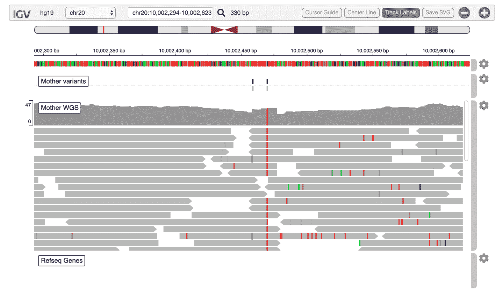

###### 图 12-14\. IGV.js 渲染的测序数据（“Mother WGS”跟踪）和由 HaplotypeCaller 生成的输出变异（“Mother variants”跟踪）。

点击查看者中的数据元素（例如，阅读或变异）以获取更多详细信息，就像我们在第五章中所做的那样。视觉显示略有不同，但基本功能相同，只是不能切换为“悬停显示”详细信息。

这里不明显的一个区别是嵌入的 IGV 窗口在组织跟踪时与桌面版 IGV 的方式有些不同。在桌面版中，变异跟踪始终自动显示在序列数据跟踪之上，而不管它们加载的顺序如何。你可以先加载一个 BAM 文件，然后加载一个 VCF 文件，但变异跟踪始终会显示在顶部。相反，在嵌入的 IGV 窗口中，跟踪显示的顺序与它们添加的顺序一致。因此，如果您首先加载 BAM 文件，那么它将显示在顶部，即使随后加载 VCF 文件也是如此。

希望这能让您了解如何在笔记本中使用嵌入的 IGV。让我们从原始的第五章课程中再进行一个练习，以练习使用这个工具并涵盖一些更小的选项。

## 在内嵌的 IGV 浏览器中排除问题的可疑变异调用

您可能还记得，在第五章中，我们更仔细地查看了这一区域的变异轨道中出现的三个 T 碱基的同型变异插入。乍一看，我们对`HaplotypeCaller`的决定持怀疑态度，因为这个调用似乎并未得到测序数据的支持。您还记得我们进行调查的第一步是什么吗？没错，我们打开了软剪接的显示，这些被映射器标记为“不可用”的序列数据片段通常默认情况下是隐藏的。现在让我们在笔记本中的 IGV 窗口中执行此操作。

正如您在 Figure 12-15 中所看到的，您可以通过单击感兴趣的轨道右侧的齿轮图标来显示轨道查看选项。现在为 Mother WGS 序列数据轨道执行此操作，并选择“显示软剪接”；然后，在菜单的右上角，单击 X 关闭它。

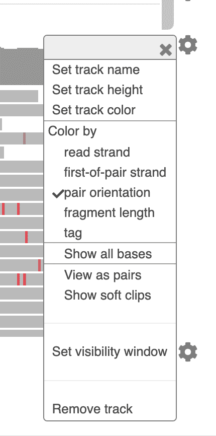

###### Figure 12-15\. “Mother WGS”序列数据轨道的显示选项菜单。

您应该看到整个区域因大量不匹配而明亮地闪烁，如 Figure 12-16 所示。

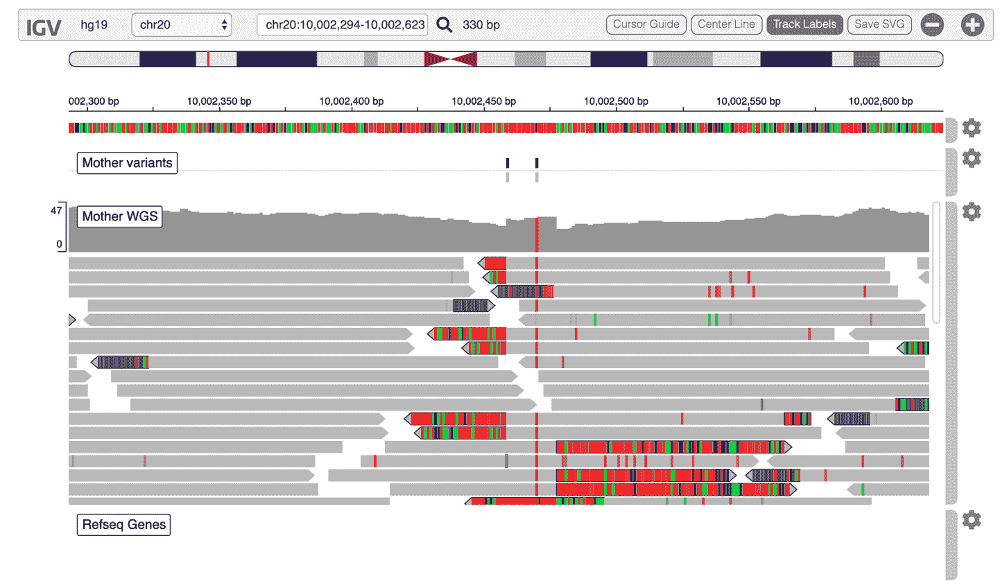

###### Figure 12-16\. 显示软剪接。

您现在知道该做什么了，对吧？可疑的插入缺失调用，大量软剪接…是的，是时候生成一个 bamout 来看看`HaplotypeCaller`在进行这个调用时是怎么想的了：

```
In [38]  ! gatk HaplotypeCaller \
             -R {GERM_DATA}/ref/ref.fasta \
             -I {GERM_DATA}/bams/mother.bam \
             -O sandbox/motherHCdebug.vcf.gz \
             -bamout sandbox/motherHCdebug.bam \
             -L 20:10,002,000-10,003,000

```

这应该运行得非常快，并产生我们感兴趣的关键输出，即显示`HaplotypeCaller`如何重新排列读取数据的 BAM 文件，正如在第五章中所解释的。让我们将该文件添加到我们的 IGV 浏览器中：

```
In [39]  IGV_InspectCalls.load_track(
             {
                "name": "Mother HC bamout",
                "url": "files/sandbox/motherHCdebug.bam",
                "indexURL": "files/sandbox/motherHCdebug.bai",
                "height": 500,
                "format": "bam"
             })

```

同样，这应该产生一个视图，虽然不完全相同，但与我们在第五章中遇到的相似。与之前一样，我们可以得出结论，考虑到重新排列的数据，`HaplotypeCaller`对插入缺失的调用是合理的。

顺便说一句，您可能注意到，在这个调用中，我们指定了轨道的高度为`"height": 500`。例如，当我们试图以减少滚动的方式展示数据的特定视图时，这可能非常有用。请随意尝试设置不同轨道的高度。

您认为这种运行和检查 GATK 命令的方法如何？我们可以通过这种方式继续在这本书中镜像所有我们在第五章到第七章中涵盖的材料，并且事实上，在公共 Terra 工作区中有几个这样的 GATK 教程笔记本，GATK 团队在其流行的国际研讨会系列中使用。我们鼓励您进一步研究这些内容。

然而，出于本书和特别是本章的目的，我们希望专注于涵盖 Jupyter 笔记本与基因组数据交互的最有用的方面。我们还有一些要向您展示的内容，所以我们需要继续前进。

下一个逻辑步骤是绘制变异数据。有许多变异数据的方面可能需要视觉探索，但我们无法覆盖所有——实际上，我们只能真正涵盖其中一个。因此，让我们来解决可视化变异上下文注释值分布的主题，这对于理解变异过滤方法很有帮助，正如我们在第五章中讨论的那样。

# 可视化变异上下文注释数据

您可能还记得，在第五章中，我们描述了使用从 GiaB 真实数据集中派生的注释（`callsets`）来理解变异上下文注释分布如何帮助我们理解变异调用质量的方法。我们使用了一种视觉方法来进行评估，其中涉及以几种方式（密度图和散点图）绘制变异上下文注释值。如果这并没有让您想起什么，或者如果您对细节感到困惑，请花几分钟时间再次阅读该部分，以刷新您的记忆。当时，我们专注于概念并仅以一般术语概述了过程，因此在这里，我们将利用这个机会向您展示如何应用关键步骤来复现图 5-8 到图 5-11 中显示的图表。

## 使用 VariantsToTable 导出感兴趣的注释

我们从以前用 GiaB 真实数据集为 Mother WGS 样本调用的 SNP 的 VCF 文件开始，已经对其进行了注释。要查看如何执行完整过程的教程，包括子集和注释步骤，请参阅这个[GATK 教程工作空间](https://oreil.ly/WGncb)。

直接操作 VCF 文件格式相当痛苦，因此在这个练习中，我们将简化操作，将我们关心的信息从 VCF 文件导出到一个制表符分隔的表格中，以便在 R 中更容易解析。为此，我们在注释过的输入 VCF 文件上运行 GATK 工具`VariantsToTable`，并提供我们感兴趣的注释列表。我们使用`-F`参数用于 INFO（站点级）注释和`-GF`用于 FORMAT（样本级）注释，其中*F*代表字段，*GF*代表基因型字段：

```
In [40]  ! gatk VariantsToTable \
		 	-V {GERM_DATA}/vcfs/motherSNP.giab.vcf.gz \
		 	-F CHROM -F POS -F QUAL \
		 	-F BaseQRankSum -F MQRankSum -F ReadPosRankSum \
		 	-F DP -F FS -F MQ -F QD -F SOR \
		 	-F giab.callsets \
		 	-GF GQ \
		 	-O sandbox/motherSNP.giab.txt

```

`VariantsToTable`命令应该非常快速地生成输出文件*motherSNP.giab.txt*。这是一个纯文本文件，所以我们可以使用`cat`查看它的片段：

```
In [41]  ! cat sandbox/motherSNP.giab.txt | head -n300

```

正如您所看到的，该工具生成了一个表格，其中每一行表示来自 VCF 的变异记录，每一列表示我们在导出命令中指定的注释。无论请求的注释是否存在（例如，同源位点没有`RankSum`注释，因为该注释仅对杂合位点计算），值都被替换为`NA`。有了这个纯文本表格，我们可以轻松地将完整的变异调用集及其注释值加载到 R DataFrame 中。

要将表格内容加载到 R DataFrame 中，我们调用`readr`库并使用其`read_delim`函数将*motherSNP.giab.txt*表格加载到`motherSNP.giab` DataFrame 对象中。请注意，R 命令前面有`%%R`符号，正如我们之前学到的，它指示笔记本内核应该解释本单元格中的所有代码为 R 代码：

```
In [42]  %%R
         library(readr)
         motherSNP.giab <- read_delim("sandbox/motherSNP.giab.txt","\t", 
                       escape_double = FALSE, 
                       col_types = cols(giab.callsets = col_character()), 
                       trim_ws = TRUE)

```

当 DataFrame 准备好时，您可以使用您喜欢的 R 函数来操纵它。正如情况所发生的那样，我们已经为您准备了一些方便的绘图函数。

## 加载 R 脚本以使绘图函数可用

我们将利用由 GATK 支持团队提供的现有 R 脚本。该脚本可在书籍存储库和存储桶中找到，定义了三个绘制函数，利用名为`ggplot2`的出色 R 库来可视化变异注释值的分布。

要在笔记本中使这些函数可用，我们可以简单地将 R 脚本内容复制到代码单元格中并运行它。但是，由于这是一个我们可能想要在多个笔记本中运行的脚本，并且我们不想维护单独的副本，让我们使用更智能的方法来导入代码。您将把 R 脚本复制到笔记本的本地存储中，然后使用 R 中的`source()`函数将 R 脚本代码加载到笔记本中：

```
In [43]  ! gsutil cp gs://genomics-in-the-cloud/v1/scripts/plotting.R .
```

```
         %R source("plotting.R") 

```

这将输出大约一页的日志，这里我们不展示。日志输出显示为红色背景，有点令人担忧，但是除非下一步失败，否则不要担心。如果遇到问题，请检查您的输出是否与笔记本的预运行副本中显示的内容不同（该副本还包含自助练习的解决方案）。如果一切正常，您现在将安装并加载了几个新的 R 包，并且绘图函数将可用。

让我们试试吧，首先是密度图。

## 制作 QUAL 的密度图使用 makeDensityPlot

`makeDensityPlot` 函数接受一个 DataFrame 和一个感兴趣的注释，生成一个密度图，这基本上是直方图的平滑版本，表示该注释的值的分布。这是我们如何使用它来复现 第 5-8 和 第 5-9 图的方法。在以下每个单元格中，第一行创建图表，然后调用其名称显示它：

```
In [44]  %%R
         QUAL_density = makeDensityPlot(motherSNP.giab, "QUAL")
         QUAL_density

```

图 12-17 中显示的 QUAL 分布在右侧有一个非常长的尾部，因此让我们通过使用可选的 `xmax` 参数将 x 轴限制在合理的最大值上来进行放大，结果呈现在 图 12-18 中：

```
In [45]  %%R
         QUAL_density_zoom = makeDensityPlot(motherSNP.giab, "QUAL", xmax=10000)
         QUAL_density_zoom

```

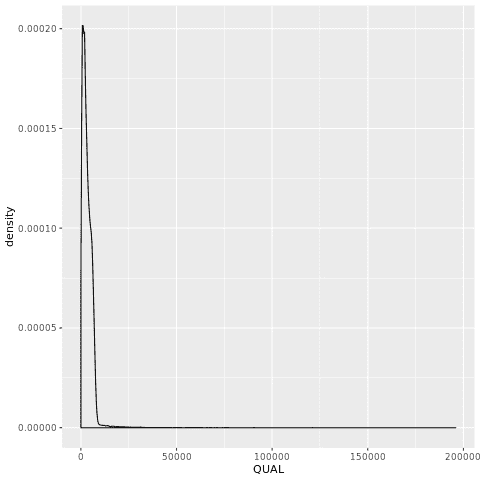

###### 图 12-17\. QUAL 分布。

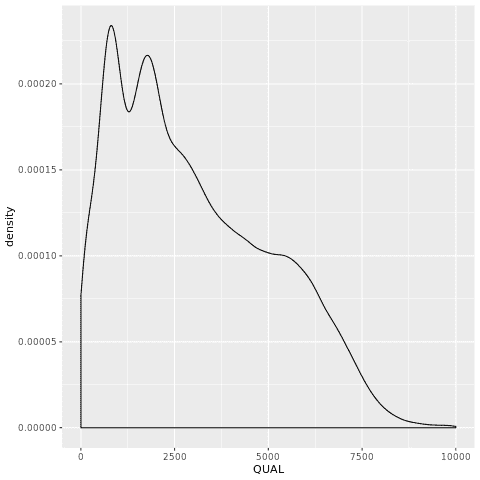

###### 图 12-18\. QUAL 密度图。

我们还可以指定一个注释来将数据组织成子集，并让函数为每个数据子集生成一个单独的密度曲线。在这里，我们使用了 `giab.callsets` 注释，它指的是在 GiaB 真值集中叫做同一变异的呼叫集数量。数字越高，我们对变异调用的信任度就越高：

```
In [46]  %%R
         QUAL_density_split = makeDensityPlot(motherSNP.giab, "QUAL", xmax=10000,
         split="giab.callsets")
         QUAL_density_split

```

图 12-19 显示了结果。

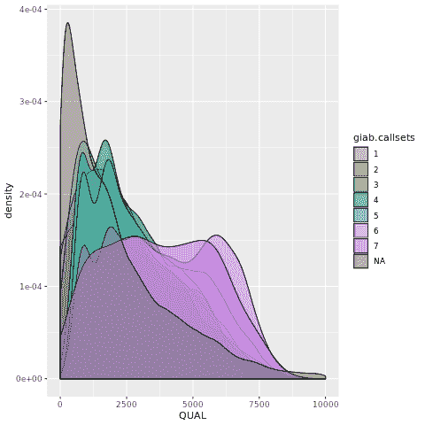

###### 图 12-19\. GiaB 从呼叫集的 QUAL 密度图。

在你完成这个工作之后，尝试为其他注释生成相同类型的图。例如，我们使用类似的命令生成了 第 5-10 图，用于 `QualByDepth` (QD) 注释。

现在让我们尝试制作散点图。每个人都喜欢一个好的散点图，对吧？

## 制作 QUAL 对 DP 的散点图

`makeScatterPlot` 函数接受一个 DataFrame 和两个感兴趣的注释，生成两个注释的 2D 散点图，其中每个数据点是一个单独的变异调用。这是我们如何使用它来复现 第 5-8 图，同时 第 12-20 图显示结果的方法：

```
In [47]  %%R
         QUAL_DP_scatterplot = makeScatterPlot(motherSNP.giab, "QUAL", "DP")
         QUAL_DP_scatterplot

```

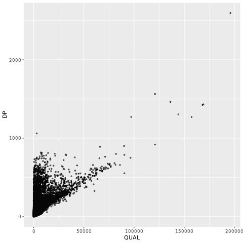

###### 图 12-20\. QUAL 对 DP 的散点图。

这个函数接受与 `makeDensityPlot` 相同的 `xmax` 参数，用于限制 x 轴上的值范围，并且还有一个新的 `ymax` 参数来限制 y 轴上的值。随时尝试使用这些参数来放大数据的子集。

你还可以使用相同的 `split` 参数将数据分割成子集，根据它们所属的子集对数据点进行着色。现在根据你在之前练习中学到的内容尝试这样做，然后尝试应用相同的原则来绘制其他注释。

最后，在我们的最后一个绘图练习中，我们将同时结合散点图和密度图绘制。

## 绘制由边缘密度图包围的散点图

`makeScatterPlotWithMarginalDensity`函数接受一个 DataFrame 和两个注释，结合其他两个函数生成横向和纵向由注释对应的密度图包围的散点图。以下是我们如何使用它来复制第五章中的图 5-11，结果显示在图 12-21 中：

```
In [48]  %%R
         QUAL_DP_comboplot = makeScatterPlotWithMarginalDensity(motherSNP.giab,
         "QUAL",
         "DP", split="giab.callsets", xmax=10000, ymax=100, ptSize=0.5, 
         ptAlpha=0.05)
         QUAL_DP_comboplot

```

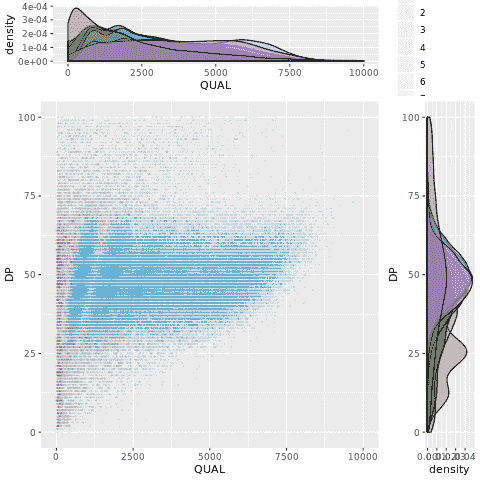

###### 图 12-21. 一张散点图和密度图。

与以往一样，我们将`giab.callsets`指定为要根据信任程度将变体数据点分组的变量。我们还设置了可选参数（`xmax`和`ymax`）以限制轴以显示数值的子集，并调整数据的显示以优化可读性（`ptSize`和`ptAlpha`）。

试着将其应用于其他注释对。请注意，某些注释可能具有负值，因此要注意，绘图函数还接受`xmin`和`ymin`参数以限制显示负值的范围。

要清楚的是，在笔记本中操作和绘制变体数据的方法有很多种。实际上，这种特定的方法在处理较大数据集时不会很有效，因为它涉及直接将可能非常庞大的表格读入内存。我们之所以选择它作为本教程的一部分，是因为它对新手来说很容易理解，并且我们的主要目标是让您对可能性有所了解，并熟悉涉及的基本机制。但是，对于大规模工作，您可能会希望使用更健壮的方法。我们建议查看[Hail](https://hail.is)，这是一个基于 Python 的、专注于遗传学的工具包，具有极好的可扩展性，并包括一套变体质量控制功能等其他功能。像一些较新的 GATK 工具一样，Hail 能够使用 Spark 并行化分析，并已用于进行像[英国生物银行](https://oreil.ly/mes1R)这样的大数据集的全基因组分析研究（GWAS）。Terra 库中有一些功能 Hail 的工作区，包括一些[教程笔记本](https://oreil.ly/-h7Zj)和一个[完整的 GWAS 示例](https://oreil.ly/Q-LJD)。

# 总结与下一步

在本章中，你学会了如何在 Terra 中使用 Jupyter 与你的数据交互。你首先学习了在云端使用笔记本的基本机制，设置你的计算环境，打开示例笔记本并运行代码单元。有了这些基础，你进行了三种交互式分析：在嵌入的 IGV 浏览器中可视化基因组数据，运行和排除 GATK 命令以及在 R 中绘制变异上下文注释数据。

这绝不是在这个环境中你可以做的所有事情的详尽目录；如果说有什么，我们只是勉强触及了可能性的表面。然而，你现在已经掌握了足够的技术和工具的基础，可以开始将自己的分析适应于 Terra 框架中运行。在第十三章，我们向你展示了如何从组成元素（数据、工具和来自不同来源的代码）组装你自己的工作空间。

^(1) 从这一点开始，我们不再展示单元格的输出。你可以将输出与 Terra 工作空间中包含的笔记本副本进行比对。此外，我们还在书的[GitHub 存储库](https://oreil.ly/genomics-repo)提供了预运行笔记本的 html 版本。
