# 第十三章：在 Terra 中组装你自己的工作空间

在第十一章和第十二章中，你学习了如何在 Terra 中使用预先准备好的工作空间来运行工作流和交互式笔记本。现在，是时候学习如何自己创建工作空间，以便在 Terra 框架内构建自己的分析了。这个领域提供了很多选项和多种有效的方法，所以我们不打算提供一个适用于所有情况的路径，而是将会介绍三种场景。

在第一个场景中，我们重新创建了[书籍教程工作空间](https://oreil.ly/n7oOr)，从基础组件开始演示如何从头开始组装工作空间的关键机制。在第二和第三个场景中，我们将向你展示如何利用现有的工作空间来最小化在启动新项目时需要做的工作量。在一个情况下，我们解释了如何向已经为特定分析设置好的现有工作空间添加数据，例如官方 GATK 最佳实践工作空间。在另一个情况下，我们演示了如何围绕从 Terra 数据库导出的数据构建分析。然而，在我们深入探讨这三种场景之前，让我们先探讨一下我们在所有三种情况下都应用的数据管理策略。

# 在工作空间内外管理数据

将工作迁移到云端最重要的一个方面之一是设计一种可持续长期使用的数据管理策略，特别是如果你希望处理作为多个项目输入的大型数据集。这是一个足够复杂的主题，以至于完整讨论超出了本书的范围，整本书都可以单独讨论这个主题。然而，花一些时间讨论一下在 Terra 环境中特别适用的几个关键考虑因素是值得的，这些因素会影响我们如何决定数据存放的位置。

## 工作空间存储桶作为数据存储库

正如你在第十一章中学到的，每个 Terra 工作空间都创建有专用的 GCS 存储桶。你可以在工作空间存储任何你想要的数据，以及你在该工作空间中运行的所有笔记本、工作流的日志和输出。然而，并没有义务将*输入*数据存储在工作空间的存储桶中。只要你能提供文件的相关指针并且能够授权给你的 Terra 帐户访问这些数据（稍后会详细讨论这一点），你可以计算存储在 GCS 任何位置的数据。

有几个重要的原因需要注意。首先，如果您打算将同一数据用作多个项目的输入，您不希望必须在每个工作空间中维护数据的副本，因为每个存储桶都会产生存储费用。相反，您可以将数据放在一个位置，并从需要使用它的任何地方指向该位置。其次，请注意，工作空间存储桶随着您的工作空间而生存和消亡：如果删除工作空间，则存储桶及其内容也将被删除。与此相关的是，当您克隆一个工作空间时，克隆仅从其父项继承笔记本目录的存储桶内容。克隆将继承父项的数据表的副本，并保留到父项存储桶中数据的链接，但不包括文件本身。这被称为对工作空间内容进行*浅复制*。如果随后删除父工作空间，则克隆的数据表中的链接将断开，您将无法再对受影响的数据进行分析。

由于这样做，我们通常建议将数据集存储在专门的*主*工作空间中，与分析工作空间分开，并且更严格的权限限制了可以修改或删除它们的人数。或者，您也可以将数据存储在您在 Terra 之外管理的存储桶中，就像我们为本书提供的示例数据所做的那样。将数据存储在 Terra 之外的优势在于，您（或者拥有存储桶计费账户的人）完全控制它。这样可以自由设置像每个文件的详细权限或者完全公开内容这样的事情，而这些在 Terra 工作空间桶目前出于安全原因是不可能的。此外，您还可以选择有意义的名称来命名您自己创建的存储桶，而不是 Terra 分配的长而抽象的名称，这些名称对人类来说不够友好。不过，如果您决定采用这种方式，您将需要启用 Terra 访问您在 Terra 之外自行管理的任何私有数据，如下一节所述。

## 访问您在 Terra 之外管理的私有数据

到目前为止，我们已经使用的数据要么位于公共存储桶中，要么位于由 Terra 管理的工作空间自己的存储桶中。然而，您最终可能需要访问位于由 Terra 不管理的私有存储桶中的数据。在那时，您将遇到一个意外的复杂性：即使您拥有该私有存储桶，您也需要经过额外的身份验证步骤，涉及到 GCP 控制台和*代理组帐户*。以下是您需要了解和执行以克服此障碍的步骤。

每当您通过 Terra 服务发出指令以执行 GCP 中的操作时，Terra 系统实际上并不使用您的个人账户。相反，它使用 Terra 为您创建的服务账户。事实上，您可以通过 Terra 为您有权访问的每个计费项目获得多个服务账户。所有这些服务账户都汇总到一个*代理组*中，Terra 使用它来管理您对各种资源的凭据。这在安全性和便利性方面都有益。

大多数情况下，您不需要了解这些内容，因为您在 Terra 内创建或管理的任何资源（如工作区及其存储桶或笔记本电脑）都会自动与您的代理组账户共享。此外，每当有人在 Terra 中与您共享资源时，相同的情况也会发生：您的代理组账户会自动包含在其中，因此您可以无缝地使用这些资源。然而，当您开始连接不受 Terra 管理的资源时，控制访问权限的 Google 系统不会自动知道您的代理组账户被允许作为您的代理。因此，您需要在 Google 权限系统中标识您的代理组账户，并指定它应该被允许执行的操作。

幸运的是，如果您知道该怎么做，这并不太困难，我们即将为您介绍最常见情况的过程：访问一个不受 Terra 控制的 GCS 存储桶。对于其他资源，该过程基本相同。

首先，您需要查找您的代理组账户标识符。有几种方法可以做到这一点。最简单的方法是在您的[Terra 用户资料](https://app.terra.bio/#profile)中查找，如图 13-1 所示。

###### 图 13-1\. 用户资料中显示的代理组标识符。

有了这个信息，您可以前往 GCS 控制台并查找您的*外部存储桶*；也就是说，您最初为第四章中的练习创建的存储桶。转到存储桶详情页面，并找到权限面板，其中列出了所有被授权以某种方式访问该存储桶的账户，如图 13-2 所示。

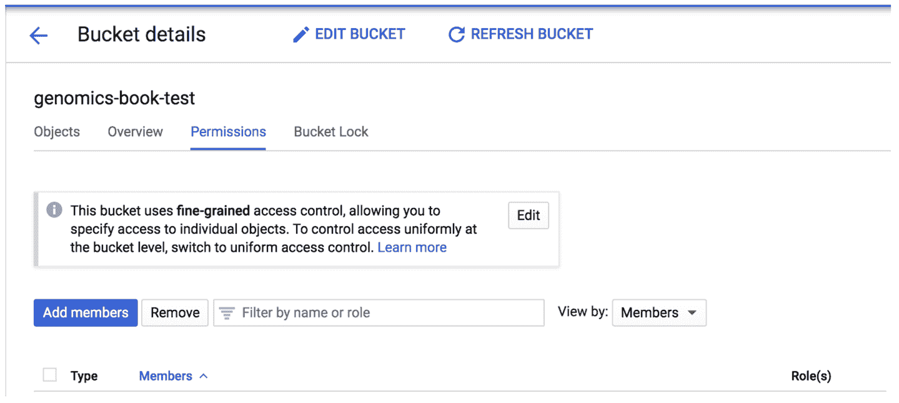

###### 图 13-2\. 显示具有访问权限的存储桶的权限面板。

点击“添加成员”按钮打开相关页面，并在“新成员”字段中添加您的宠物服务帐户标识符。在“选择角色”下拉菜单中，如有需要，请滚动选择左列中的存储服务，然后进一步选择右列中的存储对象管理员角色，如图 13-3 所示。点击保存以确认。

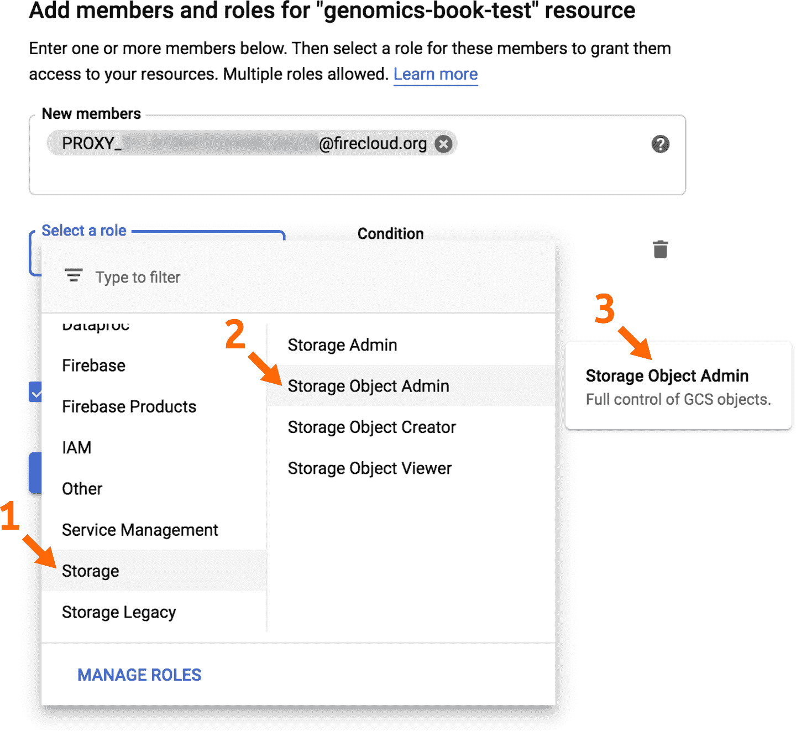

###### 图 13-3\. 向新成员授予对存储桶的访问权限。

在完成这些操作之后，您将能够从笔记本和工作流中访问外部 GCP 资源，例如不受 Terra 管理的存储桶。对于您没有管理权限的任何存储桶，您需要请求管理员代表您执行此过程。

## 访问 Terra 数据库中的数据

正如您可能从第一章的上下文设置讨论中回想起的那样，我们最初介绍的平台 Terra 包括一个[数据库](https://oreil.ly/VD6cJ)，通过该数据库可以连接到由各种组织在 GCP 上托管的数据集。其中一些数据集仅在 Terra 工作空间中提供，例如您将在本章第二和第三个场景中使用的 1000 Genomes 高覆盖数据集。您将有机会尝试几种利用这种类型数据存储库的方式。

其他数据集托管在独立的存储库中，您可以通过称为*数据浏览器*的专用界面访问这些存储库。数据浏览器使您能够基于元数据属性选择数据子集，然后将其导出到常规工作空间。我们不会详细介绍这些内容，但建议您探索该库，并尝试从[ENCODE](https://oreil.ly/lBDFN)或[NeMo](https://oreil.ly/qCWuS)存储库检索数据。这两个存储库都是完全公开的，并且具有非常不同的界面，因此它们非常适合进行导航练习。

Terra 数据库中的大多数数据集仅限于授权研究人员访问，因为它们包含受保护的健康信息，并且访问模式取决于项目主机组织。例如，像[TCGA](https://oreil.ly/Dsnm4)这样的数据集通过 dbGAP 凭据进行介入，如果您已经获得授权，您可以在 Terra 用户配置文件中链接这些凭据以自动访问。其他数据集则是在 Terra 之外进行管理，并需要与项目维护者进行交互。如果您对库中的任何数据集感兴趣，点击转到其项目页面，通常可以找到访问要求的描述。

鉴于当前库中包含的数据存储库的异质性，要有效地使用这些资源还不是件轻松的事，特别是如果您打算交叉分析多个数据集的话——这是不幸的，因为这是迁移到云的一个关键吸引点之一。这是一个正在持续发展的领域，许多组织正在积极合作，以提高这些资源的互操作性和可用性水平。我们已经看到早期采用者成功地利用这些资源进行研究，并且我们对即将到来的改进持乐观态度，这将使更广泛的调查者更容易做到这一点。

然而，现在让我们把我们的抱负降低几个档次，专注于确保基础设施到位。回到工作！

# 从基础组件重新创建教程工作空间

在本章中，我们最紧迫的目标是为您提供知识和技能，让您能够自己组装一个完整而基础的工作空间。我们选择通过让您重新创建第十一章和第十二章的教程工作空间来实现这一点，因为您在之前的章节中已经广泛使用它，并且它以相当简单的形式包含了完整工作空间的所有基本元素。在引导您完成这个过程时，我们将专注于用于引入各种组件（数据、代码等）的最常用机制，并且为了避免让您感到不知所措，我们有意选择不讨论平台上的每一个可用选项。

你准备好开始了吗？因为在本节课程中我们将让你多次检查模型工作空间，我们建议您打开两个单独的浏览器窗口（或标签页）：一个用于模型工作空间，另一个用于您即将创建的工作空间。

## 创建一个新的工作空间

在您的第二个浏览器标签页或窗口中，导航至列出您可以访问的工作空间的页面，可以通过折叠导航菜单中选择[您的工作空间](https://oreil.ly/3fL7H)，或从 Terra 登录页面选择查看工作空间。您应该在页面左上角的工作空间标题旁看到一个加号标志。现在点击它以创建一个新的空白工作空间。

###### 注意

默认情况下，此页面仅列出您自己创建的或共享给您的“我的工作空间”标签下的私人工作空间，不包括对所有人公开的工作空间。您可以通过选择其他工作空间类别标签之一来查看公共工作空间。

在弹出的工作区创建对话框中，为你的新工作区命名并选择一个计费项目，就像在之前章节克隆工作区时所做的那样。因为这是一个全新的工作区，名称和描述字段最初将是空白的。你的工作区名称必须在计费项目内是唯一的，但除此之外，在命名上有很大的自由度，包括在名称中使用空格，正如你在图 13-4 中所看到的示例。

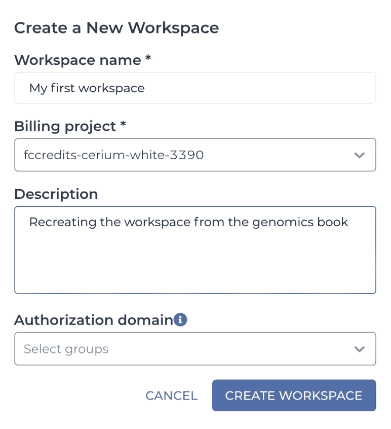

###### 图 13-4\. 创建新工作区对话框。

描述字段将显示在你的新工作区的仪表板中。为了将来参考，输入一些有用的信息是个好习惯，即使是可选的。你以后还有机会编辑它，所以不要为细节烦恼。

授权域字段允许你限制对工作区及其所有内容的访问权限，仅限于你单独定义的特定用户组。这是一个用于保护私人信息的有用功能，但我们不打算在这里演示其用法，所以请将此字段留空。如果你想了解更多关于此功能的信息，请参阅[Terra 用户指南中的文章](https://oreil.ly/ikgz9)。

点击创建按钮；然后你将被引导到全新工作区的仪表板页面。随意点击各个选项卡查看内容，但你很快会注意到，除了你提供的描述（如果提供了）和指向 Terra 为你的工作区创建的专用 GCS 存储桶的链接之外，那里没有什么可看的。你可能还会注意到小部件显示工作区每月估计成本，这对应于存储存储桶内容的成本。该成本估算不包括你可能在工作区中执行的分析产生的费用。现在，成本估算为零，因为里面什么都没有。耶？

并不是我们希望你花钱，但这个空白的工作区需要一些内容，所以让我们想办法如何加载它。因为这应该是从第十一章教程的重新创建，我们将按照相同的操作顺序进行。因此，我们的第一站将是工作流面板，设置`HaplotypeCaller`工作流。

## 将工作流添加到方法存储库并将其导入工作区

正如您可能记得的那样，在第十一章中使用的工作流程与您在之前章节中使用的`HaplotypeCaller`工作流程相同。出于教程目的，我们已经将工作流程存储在 Terra 的内部方法库中，因此您实际上可以直接查找并导入它到您的工作空间。然而，我们希望您能够导入您自己的私有工作流程，因此我们将让您存储自己的`HaplotypeCaller` WDL 的副本，并将其导入您的工作空间中。

在空白工作区中，导航到工作流面板，点击标有“查找工作流”的大框。这将打开一个对话框，列出一些示例工作流以及两个工作流程库：Dockstore 和 Broad Methods Repository。点击后者以访问方法库。

您可能需要重新登录您的 Google 账户并接受一组条款和条件。找到“创建新方法”按钮（可能被重命名为“创建新工作流”），以打开工作流创建页面。按照图 13-5 中显示的信息提供信息，替换您自己的命名空间，它可以是您的用户名或另一个对您来说可能是唯一的标识符。您可以从书中的[GitHub 仓库](https://oreil.ly/GGMoF)获取原始 WDL 文件；打开文本文件并将内容复制到 WDL 文本框中，或使用“从文件加载”链接将其上传到仓库。默认情况下，可选的文档字段将使用 WDL 文件顶部的注释文本块填充。简介框允许您添加工作流的一行摘要，而快照注释框则旨在总结上传相同工作流的新版本时发生的更改。您可以将后者留空。

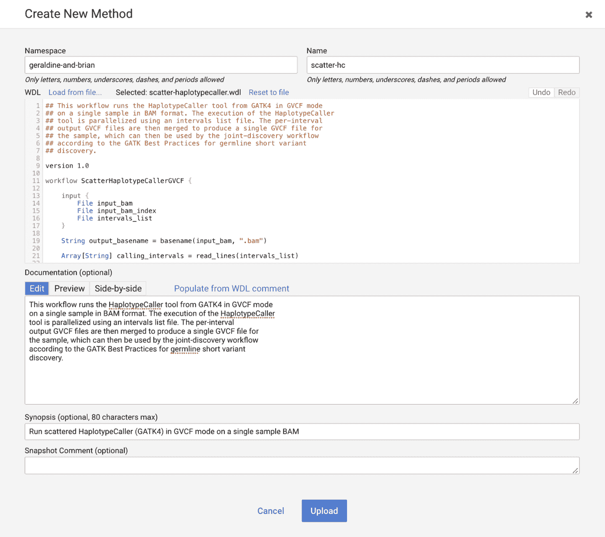

###### 图 13-5\. 广泛方法库中的创建新方法页面。

当您点击上传按钮时，系统将使用`Womtool`在后台验证您的 WDL 语法。假设一切正常，它将在您提供的命名空间下创建一个新的工作流条目，并向您显示摘要页面，如图 13-6 所示。

###### 图 13-6\. 新创建工作流程的摘要页面。

请稍等片刻，点击“权限”按钮，打开一个对话框，允许你与特定人分享你的工作流，或者完全公开它。随意选择你喜欢的任何一种方式；只需记住，如果你将你的工作空间与他人分享，只有在你这样做的情况下，他们才能查看和运行你的工作流。话虽如此，如果有需要，你随后可以回到这个页面来执行这些操作。我们现在提到这一点是因为我们经常看到人们在他们的合作者忘记分享工作流和工作空间后遇到错误。

顺便说一句，工作流摘要页面也是你在方法库中找到另一个工作流时会看到的内容，无论是通过搜索还是通过合作者分享的链接。因此，以下说明将适用于无论你是不是第一次创建工作流。

## 使用 JSON 文件快速创建配置

当你完成工作流程的分享（或不分享；我们不评判），请点击“导出到工作空间”按钮。如果弹出对话框提示你选择方法配置，请点击“使用空白配置”按钮。在下一个对话框中，提示你选择目标工作空间时，在下拉菜单中选择你的空白工作空间，然后点击“导出到工作空间”。最后，可能会出现最后一个对话框，询问你是否要“立即转到编辑页面”。点击“是”，我们发誓这是最后一个对话框了。你现在应该回到 Terra 的工作流页面，面前是你全新的工作流配置页面。

配置工作流程将会非常简单。首先，因为我们遵循第 11 章的流程（在 ch11.xhtml#running_many_workflows_conveniently_in），请确保选择“使用文件路径定义的输入运行工作流”选项（位于工作流文档摘要下方），这允许你使用文件路径设置工作流配置，而不是使用数据表。然后，转到输入页面，这个页面应该会显示一些小橙色感叹号，表示有一些输入是缺失的。事实上，所有输入都缺失，因为你使用了空白配置，而工作流本身并未指定任何默认值。

###### 注意

如果你有一个格式错误或者变量类型错误的输入（比如一个数字而不是文件），橙色感叹号也会显示出来。尝试将鼠标悬停在其中一个上面以查看错误消息；在 Terra 中，这些符号通常在你悬停时显示更多信息，有时会解决你的问题。

因此，您需要在输入页面上插入适当的文件路径和参数值。您可以在原始工作区中单独查找每个输入值并手动输入，但还有一种不那么繁琐的方法。你能猜到是什么吗？没错，让 JSON *inputs* 文件来完成所有工作。呃，我们指的是 JSON 输入文件，当然。（是的，这是个差劲的笑话，但如果它能帮助您记住您可以上传一个 JSON 文件作为输入，那么我们现在感到的羞愧也是值得的。）

因为我们之前通过 Cromwell 直接运行了相同的工作流，见第十章，在本书桶中有[一个 JSON 文件](https://oreil.ly/I5Yzl)，指定了所有必要的输入。您只需获取文件的本地副本，然后在输入页面（在“搜索输入”框的右侧）使用“拖拽或点击上传 json”选项将其包含的输入定义添加到您的配置中。这应该填充页面上的所有字段。点击保存按钮，并确认页面上没有任何橙色感叹号。

到此为止，您的工作流应该已完全配置并准备好运行。随时点击“运行分析”按钮进行测试，并按照您之前在第十一章中进行监视执行的其余步骤。

通过 Broad Methods Repository 的方式成功将 WDL 工作流导入到 Terra，并使用直接文件路径配置选项配置为在单个样本上运行。这很棒，因为这意味着您现在可以将世界上任何找到的 WDL 工作流在 Terra 中测试，假设您有正确的测试数据和一个示例 JSON 文件可用。

但是，当您成功测试工作流并希望同时启动多个样本时会发生什么？正如您在第十一章中学到的那样，这就是数据表发挥作用的地方。您刚刚重现了该章节中的第一个练习，该练习展示了您可以使用直接输入配置表单中的文件路径来运行工作流。但是，要在多个样本上启动工作流，您需要设置一个数据表，在工作区的数据页面上列出样本及其相应的文件路径。然后，您可以像该章节中的第二个练习那样配置工作流以在数据表中的行上运行。在接下来的部分中，我们将向您展示如何设置您的数据表。

## 添加数据表

请记住，我们的教程工作空间使用了一个位于 GCS 中的公共桶中的示例数据集，我们在 Terra 外部进行管理。数据页面上的*样本*表列出了每个样本，通过在各自列中的文件路径来标识，其中 BAM 文件及其关联的索引文件各自在一列中。

所以问题是，你如何在我们的空白工作空间中重新创建*样本*数据表？Terra 希望你做什么？简而言之，你需要创建一个以制表符分隔值的纯文本格式的*加载文件*。一篇[Terra 文档文章](https://oreil.ly/lONJL)详细介绍了这一点，但基本上，它是一个你保存为 TSV 格式的电子表格。这相当简单，除了一个小技巧，通常会让初次尝试的人摔倒：文件需要有包含列名的头部，并且第一列必须是每行的唯一标识符。这里有一个专业建议：与其试图从头开始创建加载文件，不如从包含数据表的任何工作空间下载一个现成的文件，并以此作为起点。在这里，我们会非常懒惰，从原始教程工作空间下载表格 TSV 文件，查看它并讨论一些关键点，然后将其不加修改地上传到我们的空白工作空间。

在你打开原始教程工作空间的浏览器标签或窗口中，导航至数据页面，并点击蓝色的“下载所有行”按钮。这应该会在你的浏览器中触发下载，由于这是一个非常小的文本文件，传输应该会立即完成。找到下载的文件并在你偏爱的电子表格编辑器中打开；我们使用 Google Sheets。

###### 注意

在查看文件内容时，你也可以使用纯文本编辑器，但我们建议在修改 TSV 加载表时使用电子表格编辑器，因为这样可以减少搞乱制表符分隔格式的风险。

正如你在图 13-7 中所看到的那样，这个文件包含了原始工作空间中样本数据表的原始内容，因此，例如，与超链接*father.bam*不同，我们在存储桶中看到了 BAM 文件的完整路径。此外，该表具有包含列名的头行，这些列名显示在工作空间中，但有一个例外：文件中第一列的名称前面有*entity*：前缀，在工作空间中则不是这样。这个小细节标志着本节的最重要的要点：包含每行唯一标识符的列必须是加载文件中列的第一列，并且它的名称必须以*_id*后缀结尾。当你将加载文件上传到 Terra 时，系统将根据该列的名称（去掉*entity*：前缀和*_id*后缀）派生出数据表的名称本身。如果你不包括按照这种模式命名的列，Terra 将拒绝你的表。清楚地说，你给加载文件的名称不会影响表的名称，因为表将在 Terra 中创建。

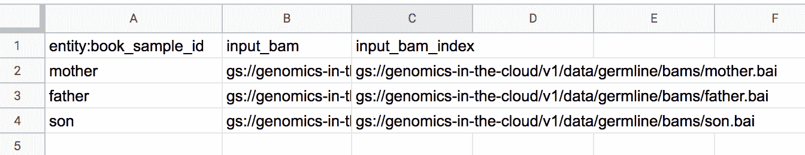

###### 图 13-7\. 从教程工作空间查看的样本数据表。

让我们在实践中尝试一下。在您的空白工作空间中，导航到数据页面，单击数据菜单上 TABLES 旁边的“+”图标，以打开 TSV 加载文件导入对话框框，如图 13-8 所示。您可以拖放文件或单击链接打开文件浏览器；使用您喜欢的任何方法来上传我们刚才查看的 TSV 文件。

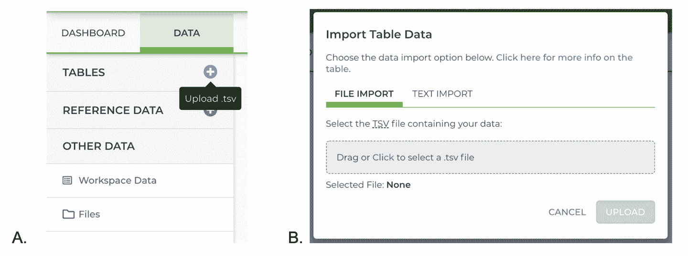

###### 图 13-8. TSV 加载文件导入 A）按钮和 B）对话框。

如果上传成功完成，您现在应该可以在数据菜单中看到示例表。单击其名称以查看其内容，并将其与原始内容进行比较：如果您没有进行任何更改，则应完全相同。

随意尝试使用此示例加载文件来测试 TSV 导入功能的行为。例如，尝试修改第一列的名称并观察结果。您还可以尝试添加更多列，包括纯文本、数字、文件路径和元素列表（使用数组格式，用方括号和逗号分隔元素）。还可以尝试修改行并创建更多行，无论是在同一个文件中添加行还是创建具有不同行的新文件。只需记住，如果您正在电子表格编辑器中编辑加载文件（正如我们推荐的那样），您需要确保将文件保存为 TSV 格式。

###### 注：

许多电子表格编辑器（包括 Microsoft Excel）将此格式称为*制表符分隔文本*，并将文件保存为*.txt*扩展名而不是*.tsv*，这完全没问题；只要内容格式正确，Terra 不会关心扩展名。

如果由于此类实验而导致您的数据页面变得有些混乱，请不要担心：您可以删除行甚至整个表格；只需选择相关复选框（使用页眉中的复选框来选择整个表格），然后单击窗口右下角出现的垃圾桶图标。唯一的限制是目前无法从表格中删除列，因此如果您想要去除不需要的列，则需要删除整个表格并重新进行上传程序。出于这个原因，在您真正的项目中工作时，特别是如果您计划随时间添加数据，将您认为是“良好”状态的表格的版本副本存储起来可能是个好主意。在 Terra 中还没有内置此功能，因此这是一个手动的过程，需要将 TSV 下载并存储在某个地方（例如工作空间存储桶）以及在其他位置外部存储，如果您想要额外谨慎的话。

在您完成与数据表的乐趣后，请转移到工作空间数据表中的资源数据。

## 填写工作空间资源数据表

正如你可能记得的，这个表格的目的是保存我们可能想要在多个工作流配置中使用的变量，比如基因组参考序列文件或者 GATK Docker 容器。这样一来，你只需要配置一次，然后在任何需要它的配置中引用该变量即可。你不仅不需要再次查找文件路径，而且如果你决定更新文件的版本或位置，只需在一个地方进行更新即可。话虽如此，你可能并不总是希望更新传播到每个资源文件或参数设置的每次使用。在设置自己的分析时，请务必仔细考虑如何管理共享资源和“默认”参数。

在实践中，这个数据表的结构非常简单，因为它只是键值对，而且它提供了一个类似表单的界面来添加和修改元素。你可以简单地使用该界面将表格的内容从原始工作区复制过来，如果你不介意手动操作的话。或者，你可以通过点击“下载所有行”链接以 TSV 格式下载原始内容，并在上传 TSV 链接中在你的工作区中不经修改地上传。你甚至可以将文件从本地文件系统拖到表格区域。随意尝试并选择最适合你的方法。有了这些，你已经完成了数据的设置，现在是时候回到工作流程了。

## 创建使用数据表的工作流配置

在你不再那么空白的工作区中，返回到工作流页面并查看列在那里的配置，但不要打开它。点击具有三个垂直堆叠圆点的圆圈，你现在可能已经认出它是 Terra 用来为特定资产（无论是工作空间、工作流还是笔记本）提供操作选项的符号。在打开的动作菜单中选择“复制工作流”，然后给复制命名，以表明它将使用数据表，就像我们在教程工作区中所做的那样。

###### 注意

目前还不能简单地在原地重命名工作流配置。如果你想要给你的工作流配置一个与教程工作区中一样明确的“文件路径”版本的名称，你需要创建另一个副本，并删除原始版本。

打开要修改以使用数据表的配置副本，并在这次将配置选项切换到“处理多个工作流程”。在下拉菜单中，选择*sample*表，并选择是选择数据子集还是采用默认行为，即在表中的所有项目上运行工作流程。现在是这项练习更繁琐的部分，即将输入页面上的输入分配连接到数据表的特定列或工作空间资源数据表中的变量。不幸的是，这次你没有可用的预填充 JSON 作为快捷方式，但值得一提的是，输入页面具有辅助自动完成功能，可以显著加快这一过程。对于每个需要连接的变量（不包括我们只是留下硬编码的几个运行时参数，你可以在原始工作区中查找），在相关文本框中开始输入`**workspace**`或`**this**`。这将显示一个上下文菜单，列出相关表的所有选项：`this`指向您在配置下拉菜单中选择的任何表，而`workspace`始终指向工作空间资源数据，其中列出了参考基因组序列、Docker 镜像等。

在输入页面上使用辅助自动完成功能的另一种方法是在相应的输入文本框中开始输入输入变量名称的一部分。如果相关数据表列或工作空间资源变量与输入变量名称相同，正如我们教程工作区的情况一样，这通常会显示出一系列匹配值。例如，在一个输入字段中输入`**ref**`将仅显示工作空间参考序列、其索引文件和字典文件。当您处理大量变量时，这种方法可能会更快，但不能保证对每个配置都有效，因为它依赖于名称是否足够匹配，这并非总是情况。有些人只是想看着世界燃烧。

继续填写输入页面，如果在任何时候遇到困难，请参考原始工作区。完成后，请确保单击保存按钮，并确认没有像之前那样留下任何感叹号。

你觉得，这个工作流程准备好启动了吗？什么。意思是，你还有一个配置任务没有完成，这在“文件路径”环节中不适用。跳转到输出页面，这需要你指定你想要对工作流程输出做什么。明确一下，这不会改变文件的写入位置；这由内置的 Cromwell 服务器为你确定，就像你在第十一章中学到的那样。这将确定输出将被添加到数据表中的*列名*。你可以点击“使用默认值”链接来简单地使用输出变量名，或者你可以指定不同的东西——要么是一个已经存在的列，要么是系统将用来创建一个新列的新名称。在我们的工作区中，我们选择使用默认值。

好了，现在你完成了。继续启动工作流程来尝试一下，然后坐下来欣喜地感受一下，你刚刚在很大程度上提升了自己的水平。有效使用数据表通常被认为是使用 Terra 最具挑战性的方面之一，而你已经掌握了。你还不是专家——当你掌握了使用多个链接数据表的技巧，比如参与者和样本集，你就会成为专家——但你已经走了大部分路。我们将在下一个场景中介绍这一点，在那里你将从 Terra 数据库导入数据到一个 GATK 最佳实践工作区中。

在我们开始之前，我们仍然需要处理教程工作区中使用的 Jupyter Notebook 部分，这部分在第十二章中使用过。但不用担心，这部分将会非常简短——如果你选择了简单的路线的话。

## 添加笔记本并检查运行环境

在你日益装备精良的工作区中，导航到笔记本页面，并猜测接下来应该是什么步骤。从技术上讲，你在这里有选择。你可以创建一个空白的新笔记本，并通过键入所有单元格来重新创建原始笔记本。要做到这一点，点击标记为“创建新笔记本”的框，然后在打开的对话框中，给它一个名称，并选择 Python 3 作为语言。然后，你可以再次通过第十二章工作，自己键入命令，而不是像上次那样只运行预先准备好的版本中的单元格。或者，你可以选择简单的路线，只需上传原始笔记本的副本，就像其他所有内容一样，它在 GitHub 存储库中都可以找到。具体来说，清除的副本和之前运行的笔记本的副本在[这里](https://oreil.ly/jbM8T)。获取文件的本地副本，并在笔记本页面上使用“拖放或点击以添加 ipynb 文件”选项将其上传到你的工作区。

无论您选择哪条路，如果您在与您用于通过第十二章进行工作的同一计费项目下创建了工作区，则无需再次定制运行时环境，因为您在计费项目内的所有工作区中运行时环境都是相同的。方便，不是吗？也许是，但这也有点懒惰；如果您真的要从头开始构建此工作区，您将需要返回并重新按照第十二章中的说明定制运行时环境。所以，享受懒惰的机会，但请记住，在不同的情境下，您可能仍然需要关注运行时环境。

当您在工作区中使用笔记本完成所有教程工作的功能方面时，请退后一步，检查您是否成功重新创建了所有功能方面的教程工作区。一切都正常吗？做得好！您现在已经了解如何从单个组件中组装自己的工作区的所有基本机制。

## 记录您的工作区并分享它

您还没有做到与原始教程工作区匹配（或超越）的唯一事情是填写仪表板中工作区描述的内容，除了您创建工作区时放入的短暂占位符之外。如果您还有一点精力，我们鼓励您在记忆尚新的时候立即完成这项工作。只需点击看起来像是仪表板页面上铅笔的编辑符号，它会打开一个包含图形工具栏和分屏预览模式的 Markdown 编辑器。

我们通常不喜欢说任何事情是不言自明的，因为这种修饰语只会让您在处理有问题的事物时感觉更糟，但这个就是最接近应得到那个标签的东西。试一试吧，点击所有按钮，看看会发生什么。在云端处理工作区描述是唯一完全免费的事情之一，在私有克隆中，它完全是无害的，所以请享受。这也是一个很好的机会，可以在您通过处理 Terra 章节的过程中写下一些关于您学到的内容的笔记，也许还有关于您未来可能会遇到的问题的警告。

最后，考虑与朋友或同事分享您的工作空间。要这样做，请单击与在第十一章中克隆教程工作空间时使用的相同的圆圈点符号。这将打开一个小对话框，在其中您可以添加他们的电子邮件地址并设置您想要给予他们的权限。点击“添加用户”，然后务必点击右下角的“保存”。如果您的接收方尚未拥有 Terra 账户，他们将收到一封邀请他们加入的电子邮件，以及指向您工作空间的链接。如果他们只想查看工作空间内容，他们无需拥有自己的计费项目。

# 从 GATK 最佳实践工作空间开始

正如您刚刚体验到的那样，从其基本组件设置新工作空间需要相当大的努力。这并不一定*困难* —— 您可能在日常工作中执行更复杂的操作 —— 但需要遵循许多小步骤，因此在您多次进行操作之前，您可能需要在整个过程中参考这些说明或您自己的笔记。

好消息是有各种机会可以采取捷径。例如，如果您只想运行由 GATK 支持团队提供的特色工作空间中的官方 GATK 最佳实践工作流程，您可以通过直接从相关工作空间开始跳过整个过程的一个部分。这些工作空间已经包含示例数据和资源数据以及工作流程本身，完全配置并准备运行。您真正需要做的只是克隆感兴趣的工作空间，并将要在数据表上运行工作流程的数据添加到其中。

在本节中，我们将详细讲解这种场景，以便您能够了解实际操作中所需的内容、潜在的复杂性以及自定义分析的选项。这种场景的经验通常适用于超出 GATK 工作空间的范围，适用于任何您可以访问已经配置了基本分析组件的工作空间的情况。我们将其视为“只需添加水”的场景，这是工具开发者希望研究人员可以适当地和尽可能少地使用其工具的一个有吸引力的模型。鉴于这样的工作空间构成了最终方法补充，它也是提高已发表论文的计算可再现性的有前景的模型。我们将在第十四章中详细讨论这一机制和其影响。现在，让我们开始处理 GATK 最佳实践工作空间。

## 复制一个 GATK 最佳实践工作空间

我们将使用[Germline-SNPs-Indels-GATK4-hg38 工作空间](https://oreil.ly/2I8RE)，展示了作为三个独立工作流实现的 GATK 最佳实践短变异发现。第一个工作流程名为`1_Processing_for_Variant_Discovery`，接受原始测序数据并输出单个样本的分析 BAM 文件。第二个工作流程`2_HaplotypeCaller_GVCF`，接受该 BAM 文件并运行变异调用以生成单个样本的 GVCF 文件。最后，第三个工作流程`3_Joint_Discovery`，接受多个 GVCF 文件并应用联合调用以生成感兴趣的队列的多样本集合。

现在导航到该工作空间并像以前其他工作空间一样克隆它。当你在克隆版中时，快速查看一下内容以熟悉它的内容。您将在仪表板中找到详细描述，在数据页面上有三个数据表和一组预定义资源，并且在工作流页面上提到的三个完全配置的工作流程。

## 检查 GATK 工作空间数据表以了解数据结构的方式

让我们更仔细地看看数据页面上的三个数据表。一个表格名为*参与者*。它包含一个显示单列名称*参与者 ID*的标题行，以及一个由我们亲爱的 NA12878 填充的单行，或者我们在本书中称之为*母亲*：

| 参与者 ID |
| --- |
| NA12878 |

这将她确定为研究的*参与者*；换句话说，这是最初采集生物样本的实际个人，以生成我们最终将分析的数据。

*参与者 ID*属性是参与者的唯一标识符，并用于索引表。如果要向表格添加属性（例如一些表型信息，如参与者的身高、体重和健康状况），它们将作为列添加到标识符的右侧。

第二个表称为*样本*，包含多个列以及标题下面的两个样本行。这个表格比前一个更复杂，主要是因为除了运行工作流所需的最小输入外，它还包含了工作流先前运行的输出。这是一个不包含这些输出的表的最简版本：

| 样本 ID | 未映射的流式细胞束`bams`列表 | 参与者 ID |
| --- | --- | --- |
| NA12878 | NA12878.ubams.list | NA12878 |
| NA12878_small | NA12878_24RG_small.txt | NA12878 |

在这个表格中，你会看到最左边的列是*sample_id*，每个样本的唯一标识符，用作该表格的索引值。快速跳到表格的另一端，最右边的列是*participant_id*。你能猜到这里发生了什么吗？没错，这是我们用来指示哪个样本属于哪个参与者的方式。*sample* 表格在回指到 *participant* 表格。这可能看起来无聊，但实际上非常重要，因为通过建立这种关系，我们使系统能够跟踪这些引用。通过两个表格之间类似的关系，我们将能够执行像配置工作流一样的任务，以便联合分析样本，而不是在每个样本上单独启动工作流。如果你觉得这很混乱，现在不用担心；我们将在后面更详细地讨论这个问题。现在只需记住，这些表格彼此连接着。

中间列 *flowcell_unmapped_bams_list* 指向从生物样本生成的测序数据。具体而言，这些数据以未映射 BAM 文件列表的形式提供，其中包含来自不同流式细胞流道的同一样本的测序数据。工作流程的数据处理部分期望提供这些数据子集的分离 BAM 文件，以便它可以分别处理这些数据的前几个步骤，然后将这些子集合并到一个包含该样本所有数据的单个文件中。

对于给定的样本，未映射的 BAM 文件列表将是 *Processing_for_Variant_Discovery* 工作流的主要输入。你可以通过查看工作流配置来验证这一点，其中输入变量 `flowcell_unmapped_bams` 设置为 `this.flowcell_unmapped_bams_list`。回想一下我们在 第十一章 中对数据表启动工作流的探索，语法读出为“对于表中的每一行，将 *flowcell_unmapped_bams_list* 列中的值传递给这个变量。”该工作流的主要输出将添加到工作区中完整表格的 *analysis_ready_bam* 列下。这一列反过来将作为 *HaplotypeCaller_GVCF* 工作流的输入，后者将其内容输出到 *gvcf* 列中。

两个样本行对应于从参与者 *NA12878* 派生的原始全基因组数据集的两个版本。在第一行中，NA12878 样本是全尺度数据集，而第二行中的 *NA12878_small* 样本是经过降采样的版本，这意味着它仅包含原始数据的一个子集。降采样版本的目的是更快速、更便宜地进行测试。

最后，第三个表称为*sample_set*，这个名字可能听起来很陌生，取决于你在第十一章中的注意程度。你还记得当你在数据表的行上运行工作流时发生了什么吗？系统会自动在新的*sample_set*表中创建一行，列出你启动工作流时使用的样本。在这个工作空间中，你可以看到一个名为*one_sample*的样本集，*samples*列下标有一个标签为*1 entity*的链接，如下所示：

| sample_set_id | samples |
| --- | --- |
| one_sample | 1 entity |

如果你点击它，会打开一个窗口，显示引用了 NA12878 样本的列表。这是表之间连接的另一个示例，我们将在很短的时间内具体利用它。

###### 注意

系统并未显示这个样本集是如何创建的，但根据我们对工作流的了解，我们可以推断在此工作空间中运行第一或第二工作流程将复制样本集的创建过程。请注意，也可以手动创建样本集；稍后我们将展示如何操作。

这里有趣的地方是，这个样本集中的*one_sample*行与其相关联的输出文件，这在第十一章运行工作流时并非如此。你能猜到这可能意味着什么吗？我们给你一个提示：*output_vcf*列包含变异调用的 VCF。明白了吗？是的，这是在样本集上运行*Joint_Discovery*工作流的结果：它以样本集中*samples*列引用的样本列表作为输入，并将其 VCF 输出附加到样本集中。这是一个有些人为的示例，因为样本集仅包含一个样本，所以稍后在本节中我们将在更实际的样本集上再次运行以带给你更有意义的体验。

现在我们已经这样分析了数据表，我们可以总结数据集的结构及其组成实体之间的关系。结果如图 13-9 所示，我们称之为*数据模型*：参与者 NA12878 有两个关联样本，NA12878 和 NA12878_small，并且一个样本集引用了 NA12878 样本。

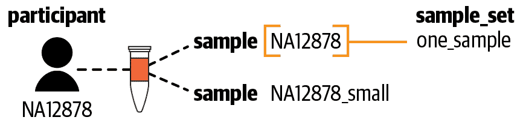

###### 图 13-9\. 数据模型——示例数据集的结构。

请注意，只有在一个参与者只有一个样本的情况下，样本标识符与参与者标识符相同才会发生。在现实的研究背景中，一个参与者可能会有多个相关样本，因此你预期会有不同的标识符。此外，你预期这两个样本数据集可能源自不同的生物样本或者是使用不同的分析方法生成，而我们知道在这种情况下，它们来自同一个样本。再次强调，这是由于示例数据的某种人为特性。在此场景的下一步中，我们将会查看一些符合更现实期望的数据。

## 了解 1000 基因组高覆盖数据集

正如我们之前讨论的，数据库提供了对由各种组织托管在几种数据库中的数据集的访问。因此，根据数据库的不同，检索数据的协议也有所不同。在这个练习中，我们从一个仅包含来自第三阶段 1000 基因组计划的 2,504 个样本的全基因组数据集的仓库中检索数据，这些数据最近由纽约基因组中心作为 [AnVIL 项目](https://oreil.ly/Z2vfO) 的一部分重新测序。这个特定的仓库只是一个包含数据表的 [公共工作空间](https://oreil.ly/195yq)，在这个规模下作为数据仓库的一种简单而有效的形式。

现在前往 1000 基因组数据工作空间，可以通过点击上面的直接链接或浏览数据库来实现。如果选择后者，请注意，如 图 13-10 所示，还有另一个 1000 基因组项目数据仓库，但它与我们所需的大不相同：那一个包含了完整 3,500 名研究参与者的低覆盖序列数据，而我们需要的是来自项目第三阶段的 2,504 名参与者的新高覆盖序列数据。

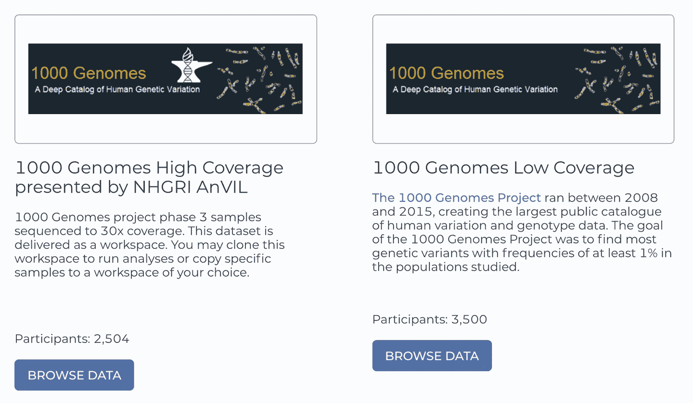

###### 图 13-10。Terra 数据库包含来自 1000 基因组计划的两个数据库。

当你在工作区时，转到数据页面查看数据表。你会看到与我们在 GATK 工作区中描述的相同的三个表：*样本*、*参与者*和*样本集*。正如预期的那样，*参与者*表列出了数据集中的 2,504 名参与者。同样，*样本*表列出了对应序列数据文件位置的路径，这些文件以 CRAM 格式提供，以及通过运行`HaplotypeCaller`流程生成的 GVCF 文件。此外，两者都包含了许多在 GATK 工作区中不存在的元数据字段，包括关于数据生成阶段（仪器类型、文库制备协议等）和研究参与者的原始人口信息。所有这些元数据的存在是一个很大的指标，表明这是一个更真实的数据集，与 GATK 工作区中的玩具示例数据相比。与此同时，*样本集*表包含了与样本集名称*1000G-high-coverage-2019-all*相关的所有 2,504 个样本的列表。

我们可以总结这个数据集的数据模型如下：每个参与者都有一个关联的样本，并且有一个参考所有样本的样本集，如图 13-11 所示。

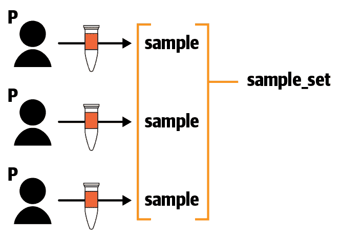

###### 图 13-11\. 1000 基因组高覆盖数据集的数据模型。

在这一点上，我们有一个坦白要做：我们花在两个工作区的数据表上的所有时间并不仅仅是数据旅游。这一切都有一个非常具体的目的，回答一个你可能已经看到或者可能没有看到的未明说的问题：它们的数据模型是否兼容？

而且好消息是是的，它们似乎是兼容的，这意味着你可以将它们的数据表合并而不会引起冲突，你应该能够对来自两个数据集的样本进行*联合数据分析*。诚然，这里的联合程度并不真正有意义，因为只有一个人的基因组信息在 GATK 工作区中，但这个基本原则同样适用于你可能想要合并到单个工作区中的其他数据集。

现在我们满意地认为我们应该能够在我们的工作区中使用数据，让我们弄清楚如何实际执行信息的传输。

## 从 1000 基因组工作区复制数据表

有两种主要方法可以做到这一点：一种是点对点的方法，另一种是基于加载文件的方法。让我们从点对点的方法开始，因为它将一些在使用加载文件时涉及的复杂性抽象化。

在 1000 基因组高覆盖工作区的数据页面上，点击*样本*表，并通过左侧选择其对应复选框选择几个样本。在表格上方找到并点击三点符号以打开操作菜单（就像你在第十一章中为工作流配置数据输入时所做的那样），然后选择“导出到工作区”，如图 13-12 所示。

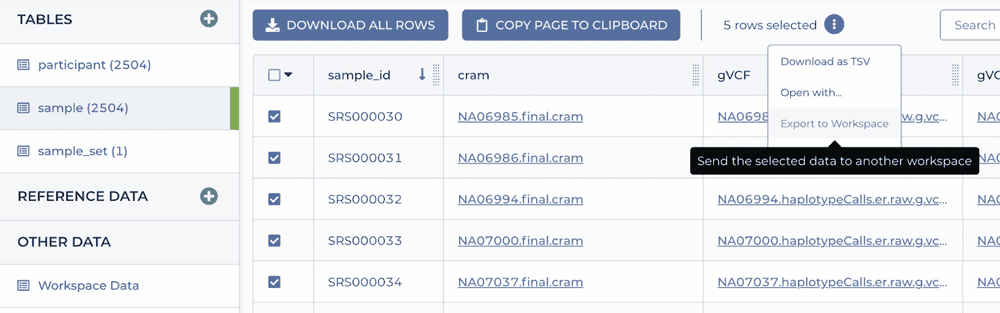

###### 图 13-12。复制数据到工作区对话框。

这应该会打开一个对话框，其中列出了样本列表和工作区选择菜单。选择你的 GATK 工作区的克隆，然后点击复制。请记住，尽管按钮似乎暗示我们要复制文件，但我们只想复制数据表中的元数据，其中包括文件在 GCS 中的位置路径。所以，请放心，你不会突然间面临大额数据存储费用的问题。

你应该看到一个确认消息，询问你是否要留在当前位置（1000 基因组工作区）还是转到你复制数据的位置（GATK 工作区）。选择后者选项，这样我们可以查看转移产生的结果。如果一切按预期工作，你应该会在*样本*表中看到你选择的样本列表。然而，在*参与者*表中，你不会看到对应的参与者列表，因为系统不会自动复制所选数据引用的其他表中的数据。唯一的例外是集合，例如我们一直在使用的样本集。如果你选择一个集合并复制它，系统也会复制集合的内容。如果你还想复制参与者，你需要作为一个单独的步骤进行，要么通过选择复选框选择感兴趣的行，要么通过使用加载文件定义参与者集合。

如果你稍微尝试一下“复制数据到工作区”的功能，你很快就会意识到，这种方法在处理大型数据集时相当有限。为什么呢？因为当你尝试选择表中的所有行时，即使使用表格左上角的复选框，系统实际上只会选择显示在页面上的项目。由于允许的最大数量为一百个项目，所以使用集合方法是你通过点和点击方法一次复制超过一百个样本的唯一选择。

现在让我们尝试基于加载文件的方法，如果你正在处理大型数据集或需要在复制数据之前进行某些调整，则这种方法具有一些优势。

## 使用 TSV 加载文件从 1000 基因组工作区导入数据

从技术上讲，你之前已经做过这个——这就是我们让你在本章早些时候复制原始书籍教程工作空间中的数据表来重新创建自己的工作空间的方式。你选择了表格，点击了“下载所有行”按钮，获取了下载的文件，然后上传到了新的工作空间。完成。所有我们的样本都属于你。

然而，这一次有点不同：涉及到几个数据表，并且其中一些表彼此有引用。因此，有一个优先顺序：你必须从没有引用其他表的表开始，因为 Terra 不能处理对尚未定义的事物的引用。例如，你不能在上传样本集之前先上传样本，因为样本集引用了这些样本。这是一个令人恼火的限制，你可以想象系统简单地为任何它不认识的引用创建一个替代对象。然而，我们需要按照当前状态来操作系统，因此底线是：顺序很重要；接受这个事实吧。

在实际操作中，为了进行这个练习，你需要从 1000 基因组工作空间下载三个数据表的 TSV 文件，如之前所述（以任意顺序），然后按照正确的顺序上传到你的 GATK 工作空间克隆中。你会问正确的顺序是什么？这里有个提示：查看数据模型在图 13-11 中的可视化表示，并根据箭头的方向做出决策。你认为呢？没错，你首先上传参与者，然后是样本，最后是样本集。现在就去做吧。

哦，等等，你在执行这个过程中遇到了一些意外的事情吗？确实：样本集有*两个*加载文件：一个定义表本身并命名它包含的样本集，标识为*entity:sample_set_id*，另一个列出每个样本集包含的成员，标识为*membership:sample_set_id*。查看它们的内容以了解它们之间的关系。它们确实有关联；因为成员 TSV 引用了实体 TSV 中定义的样本集的名称，所以你需要先上传实体列表，然后再上传成员列表。

###### 注意

处理加载文件和优先顺序规则是在 Terra 中设置数据中比较尴尬和枯燥的部分之一。我们期待未来的发展将通过提供某种向导式功能来平滑这些尖锐的边缘。

好消息是，在完成这一步之后，你应该能在你的 GATK 工作区中看到来自 1000 基因组数据集的 2504 个样本以及它们对应的参与者。然而，出现了一个问题。你能看出来吗？仔细看一下样本表中的列。当然，大部分列在两个原始表格之间是不同的，因为 GATK 工作区版本主要包含展示在工作区中的工作流输出文件，而 1000 基因组工作区版本主要包含有关数据来源的元数据。然而，它们本应该有一个共同点：GVCF 文件。你能找到它们吗？是的，它们确实都有 GVCF 文件，但它们位于不同的列中。

在原始的 GATK 工作区中，包含 GVCF 文件的列名全小写为*gvcf*，而在 1000 基因组工作区中，它是混合大小写的*gVCF*。顺便说一句，包含各自索引文件的列也有微小的差异，*gvcf_index*与*gVCF_TBI*，其中 TBI 是由一个叫 Tabix 的实用程序生成的索引格式的扩展名。

唉，真遗憾。我们本来想给你个惊喜，说：“看，现在你可以对你的 NA12878 样本进行联合调用分析，结合所有的 1000 基因组第三阶段数据。这不酷吗？”但如果 GVCF 文件在不同的列中，这个操作就行不通了（悲伤的表情）。

振作点，这是可以解决的。你还有用来上传 1000 基因组数据表的 TSV 文件，对吧？只需打开*sample* TSV 文件，并将两个列重命名为与 GATK 工作区中对应名称相匹配的名称。其他都不需要改变，只是这两个列名。然后，上传 TSV 文件，看看会发生什么：现在来自 1000 基因组样本的 GVCF 文件及其索引文件也会显示在正确的列中。危机解除！旧的列名不匹配的列仍然存在，但你可以忽略它们。事实上，你可以直接隐藏它们，以减少视觉混乱。只需点击表格右上角的齿轮图标，打开表格显示菜单。你可以取消列名前面的复选框以隐藏它们，甚至按照你的喜好重新排序它们。

###### 注意

无可否认地，你不能简单地在原地编辑列名或删除不需要的列有点烦人。导入对话框也有些受限制，我们希望能够在确认导入操作之前预览数据并获得行和列的摘要计数。我们期待随着 Terra 的成熟，界面的这些方面会有所改进。

幸运的是，我们成功地通过编辑仅两个列名来克服了这个微小的命名不匹配问题。然而，尽管看起来微不足道，这个障碍表面上只是一个很小的问题，但它实际上是一个更大问题的症结所在：在数据集的结构化和属性命名方面缺乏足够的标准化。几乎任何试图将来自不同来源的数据集进行联合的尝试，都可能迅速变成一种挫败感的练习，因为您会发现自己在处理冲突的模式和命名约定。虽然目前没有普遍适用的解决方案，但当您遇到这类问题时，将问题简化到需要协调解决的最小组件集可能会有所帮助。例如，尝试定义每个数据集的核心数据模型；也就是说，确定关键数据部分及其之间的关系。从这里开始，您可以评估使数据集兼容所需程度所需的工作量。

在我们的案例中，现在我们已经拥有所需的一切：所有样本都在样本表中定义，并在*gvcf*列中列出了一个 GVCF 文件，以及在*gvcf_index*列中列出了相应的索引文件。其他任何内容对我们接下来想要做的事情都不相关，即对工作空间中的所有样本应用联合调用。

## 在联合数据集上运行联合调用分析

要完成这个场景，我们将运行预先配置在这个工作空间中的*3_Joint_Discovery*工作流程，该工作流程应用了 GATK 最佳实践，用于对一组样本进行联合调用生殖系短变异，详见第六章。我们将在一部分样本上运行以进行测试，但我们将提供指引，以便您尝试在所有样本上运行它。无论如何，该工作流程将生成一个包含我们选择包括的样本的多样本 VCF 文件，其中包含变异调用信息。

正如我们之前承认的那样，将这称为*联合数据集*有点夸张，因为实际上我们只是将一个样本添加到 1000 基因组第 3 阶段数据中。然而，我们讨论的原则如果您现在想要将更多样本添加到此工作空间中，同样适用。例如，您可能希望使用 1000 基因组数据来填充您对小队的分析，以最大化您从联合调用中获得的好处，正如 GATK 文档建议的那样。

工作流已经配置好，现在让我们来看看它的预期。转到工作流页面，点击*3_Joint_Discovery*工作流以查看配置详细信息。首先，我们要看看工作流配置在哪个表上运行。数据选择下拉菜单显示为 Sample Set，这意味着我们需要提供来自*sample_set*表的一个样本集。该表目前包含两个样本集；一个仅列出 NA12878 样本，另一个列出我们导入工作区的完整 1000 基因组第三阶段队列。我们需要一个包含来自 1000 基因组队列的一些样本以及来自 GATK 工作区的 NA12878 样本的样本集，因此现在让我们创建一个。

###### 注意

我们将使用 25 个样本，因为这是工作流预定义配置所能容纳的数据量；一旦我们在这个规模上完成测试，我们将提供扩展的指导。

要快速创建一个测试样本集，请在步骤 1 下设置数据表选择器为*sample_set*，并在步骤 2 下点击选择数据。在打开的对话框中，选择“从所选样本创建新集合”选项。您可以选择单个样本的复选框，或者选择列顶部的复选框以选择默认显示的所有 25 个样本。当您选择了样本后，您可以使用标记为“所选样本将保存为新集合命名”的框指定样本集的名称，或者保留默认生成的名称不变。按“确定”确认并返回工作流配置页面。请注意，此时您实际上还没有创建新的样本集；您只是设置系统在按“启动”按钮时创建它。

但是不要立即按按钮！我们想向您展示另一种创建样本集的方式，不仅因为我们有点刻薄（我们确实有），还因为这样可以为您处理更复杂的情况提供装备。

在处理比单个屏幕能显示的更多样本时，创建集合的界面可能会太受限制，因此我们还将向您展示如何使用手动 TSV 方法进行此操作。这将是一个两步过程，类似于您之前所做的：使用*entity*加载文件创建一个新样本集，然后使用*membership*加载文件提供其成员列表。第一个文件非常简单，因为它只有一个列标题，*entity:sample_set_id*，以及下一行中新样本集的名称，如下所示：

| entity:sample_set_id |
| --- |
| federated-dataset |

您可以将此保存为 TSV 文件，并像之前一样上传到您的工作区，或者您可以利用图 13-13 中说明的备选选项，将两行复制并粘贴到文本字段中。令人讨厌的是，无法直接在此文本框中输入文本或编辑粘贴的内容，但这确实减少了导入过程中的几次点击。

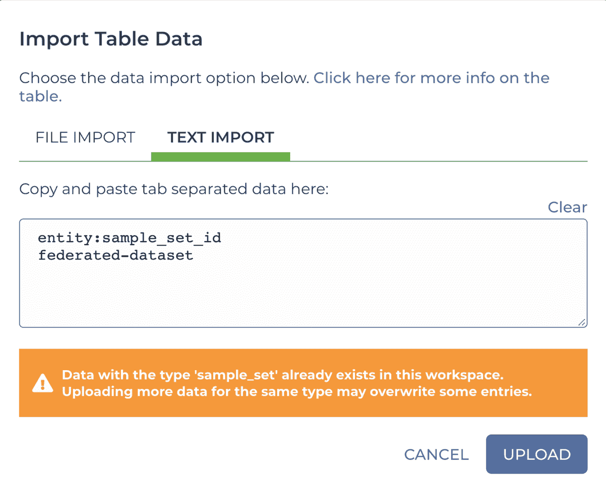

###### 图 13-13\. TSV 格式数据表内容的直接文本导入。

上传该内容将在*sample_set*表中创建一个新行，但新的样本集尚无样本与之关联。为了解决这个问题，我们需要制作一个包含我们要运行的样本列表的*membership* TSV 文件。我们喜欢从现有数据表开始，因为这样可以减少出错的可能性，特别是那些棘手的标题行。为此，请下载与样本集表对应的 TSV 文件，并在电子表格编辑器中打开*sample_set_membership.tsv*文件。如图 13-14 所示，您应该看到第二列中显示的 1000 基因组样本的完整列表，每行的第一列显示原始 1000 基因组样本集的名称。如果您滚动到文件的末尾，您还将看到来自 GATK 工作区的 NA12878 样本，该样本被分配到*one_sample*集。

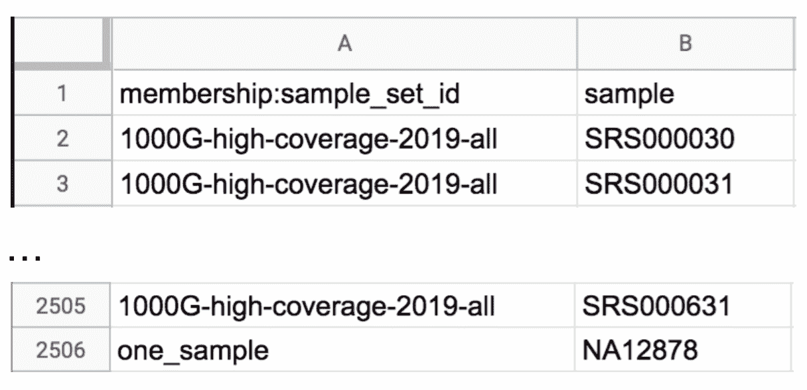

###### 图 13-14\. 成员加载文件*sample_set_membership.tsv*的起始和结束行。

我们将从中提取一部分，并将其转换为成员列表，将我们选择的样本与我们新创建的*联合数据集*样本集相关联。首先，删除属于 1000 基因组队列的样本中除 24 个之外的所有样本，以便列表中总共剩下 25 个样本。不管保留哪些样本，然后，使用您编辑器的查找和替换或重命名功能（通常在编辑菜单中找到）来更改第一列中的样本集名称为*联合数据集*，如图 13-15 所示。确保还替换 NA12878 样本的样本集名称。然后，保存并像之前一样上传文件。

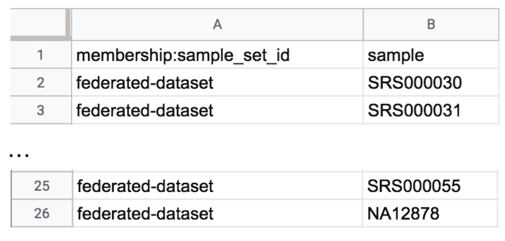

###### 图 13-15\. 更新的成员加载文件*sample_set_membership.tsv*将 25 个样本分配给*联合数据集*样本集。

上传了这个成员列表后，*sample_set* 表现在应该将这 25 个样本列为*联合数据集*样本集的成员，如图 13-16 所示。

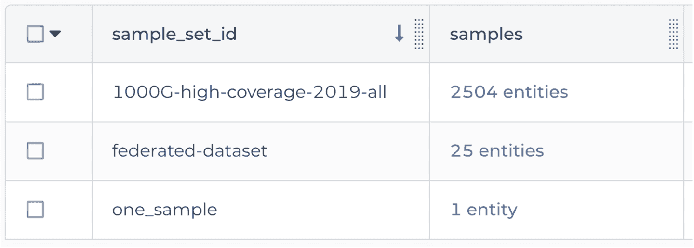

###### 图 13-16\. *sample_set* 表现在显示的三个样本集。

顺便说一句，这表明您可以通过仅上传要更新或扩展的表中部分内容的 TSV 内容来添加或修改行。您不需要每次都重现整个表。我们觉得这在不能在图形界面中创建样本集时弥补了一些不足。

###### 注

如果您想知道为什么我们只包含 GATK 工作区中全尺寸的*NA12878*样本而不是降采样的*NA12878_small*样本，那是因为它们来自同一个原始人，因此使用两者将是多余的。由于降采样样本的数据量较少，它生成的有意义结果的可能性较低，因此我们排除了它。

现在，我们有了一个样本集，列出了我们要在分析中使用的所有样本，我们可以继续下一步。在*sample_set*表中*联邦数据集*行的左侧选择复选框，然后点击“打开方式”按钮，选择工作流，最后选择*3_Joint_Discovery*以启动工作流提交。正如我们之前展示的那样，您可以选择从数据页面中的选择数据开始此过程，或者您也可以从工作流页面开始，取决于您的喜好。按照我们刚才描述的方式进行操作的优势在于现在您的工作流已经设置为在正确的样本集上运行；否则，当您到达配置页面时，您将需要使用“选择数据”菜单来完成此操作。

现在，我们只需检查配置的其余部分，从输入开始。输入字段很多，我们不会全部查看；相反，让我们专注于主要的文件输入。根据您在第六章中学到的关于联合调用的知识，您应该对您正在寻找的输入变量有一个概念：它应该是指向 GVCF 列表的一种输入变量。确实，如果您稍微向下滚动，您会找到名为*input_gvcfs*的工作流变量，如图 13-17 所示。该变量的*类型*为*Array[File]*，这意味着工作流期望我们提供一个文件列表作为输入，因此一切都符合。您还会看到为索引文件列表设置了相应的变量。

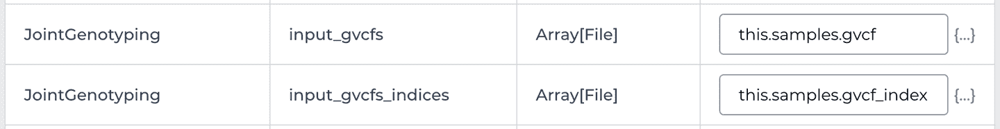

###### 图 13-17. *input_gvcfs*和*input_gvcfs_indices*变量的输入配置详细信息。

现在，如果您查看输入配置面板右侧列出的数值，您会看到*this.samples.gvcf*。这似乎既熟悉又新奇。熟悉是因为它看起来是我们之前见过和使用的*this.something*语法的一种变体，允许我们说：“对于工作流在其上运行的表的每一行，请将*something*列的内容提供给此输入变量。”在我们以前启动`HaplotypeCaller`工作流并行执行多个样本时，我们曾使用过这种语法，这种语法使得我们可以轻松地将*input_bam*变量连接到每个工作流调用的输入 BAM 文件，而无需显式指定任何文件。

然而，这也有点新鲜，因为它包含了一个额外的元素，形成了*this.other.something*语法。你能猜到那里发生了什么吗？这真的很酷；这是建立在前面章节中提到的表之间连接的回报。这种语法基本上是在说，“对于每个样本集，查找其*samples*列中的列表，然后转到*sample*表，并收集对应行中所有 GVCF 文件。”你可以使用*.other.*元素引用另一个表中的任何行列表，查询它们的特定字段，并返回相应元素的列表。这就是我们基于样本集中链接的样本列表生成输入 GVCF 文件列表的方法。作为奖励，列表生成的顺序是一致的，所以我们可以将*this.samples.gvcf*和*this.samples.gvcf_index*分配给两个不同的变量，并放心这些 GVCF 文件列表及其索引文件列表将按照相同的样本顺序排列。

这是拥有良好设计的数据模型的关键好处之一；你可以利用不同级别数据实体之间的关系。甚至可以将它们级联多层深；理论上你可以无限次数地进行*.other.*查找。有关你可以沿着这些线进行的更多示例，请查看用于体细胞最佳实践工作空间中使用的数据模型，其中每个参与者都有一个肿瘤样本和一个正常样本。在该数据模型中，另一个表列出了肿瘤-正常配对，另一个表列出了配对集。

随意浏览其余的输入配置页面。当你觉得你已经对输入如何连接有了很好的掌握时，可以前往输出页面进行最后的检查，然后再启动工作流。输出都按照*this.output_*模式设置，你应该能看到一行写着，“输出将写入到 Tables / sample_set”，这告诉你最终的 VCF 和相关输出文件将附加到样本集。这是有道理的，因为根据联合调用分析的定义，结果适用于所有包含的样本。

最后，继续启动工作流。你可以像之前的练习一样监控执行并探索结果。在 25 个样本上，我们的工作流测试运行花费了$10，并且大约耗时 10 小时（包括几次抢占）才能完成运行。迄今为止运行时间最长的步骤是`ImportGVCFs`，每个基因组的并行化段大约运行了三个小时，并且其中一半时间用于文件本地化阶段。这明显表明，该步骤非常需要优化以流式传输数据。另一个长时间运行的并行化任务是`GenotypeGVCFs`，每个并行化段大约需要一小时。最后，变异重校准步骤，这不是并行化的，大约需要两个小时。

建议再次运行此流程，使用几种不同的队列大小，并比较不同运行的时间图，以了解这个工作流程在样本数量不同的情况下时间和成本的缩放情况。您需要按照之前的指示创建新的样本集，但是可以保留您感兴趣的样本数量。确保为每个样本集起一个不同的名称，并执行实体 TSV 步骤将其添加到表中；否则，它将只更新您最初创建的样本集。如果您选择在超过我们迄今为止测试的 25 个样本的更多样本上运行工作流程，则根据工作区仪表板中*3_Joint_Discovery*工作流程输入要求中的说明，需要进行一些配置更改。简而言之，您需要为更多的样本 GVCF 分配更多的磁盘空间，使用磁盘覆盖输入变量。

事实是，这个联合发现工作流程的这个版本存在关键的扩展效率问题，包括我们刚才指出的不使用流式处理，并且不自动处理资源分配缩放。我们之所以使用它进行这个练习，是因为它方便获取，并且得到 GATK 支持团队的全面支持。坦率地说，这是观察效率低下后果的绝佳方式，这些问题看似个别不大，但在成千上万的样本规模下将导致重大困难。然而，我们不建议尝试在完整队列上运行它——事实上，在您至少进行了一些初步规模测试以评估工作流程时间和成本随样本数量增加而增加之前，我们不建议超过几百个样本。

如果您需要一个更好地适应开箱即用的解决方案，一个[此工作流程的替代版本](https://oreil.ly/WI0NE)据说能够更好地扩展，但截至本文撰写时，尚未通过 GATK 支持团队的发布流程，因此它没有得到官方支持。此外，它的输入要求不允许您直接在工作区的数据表上运行它，因为它期望一个样本映射文件，列出样本名称和 GVCF 文件，如[此示例](https://oreil.ly/mpFnK)（但有多行，每行一个样本）。要克服这个障碍，您可以基于工作区中的*样本*表创建这样一个文件，并将其添加为样本集的属性；或者如果您感到有冒险精神，甚至可以编写一个简短的 WDL 任务，在主工作流程之前运行。我们将这留给读者作为一种谚语式的练习。

这个场景最初旨在演示在运行 GATK 最佳实践时可以采用的一些快捷方式，但在过程中，你还掌握了一些额外的知识点：从不同来源组合数据时需要注意的事项，如何设置分析结果的联合数据集，以及一个精心制作的数据模型如何帮助你整合不同层次的数据。最后，你在多个全基因组样本的群体中进行了复杂的分析，毫不费力地完成了。做得好！

对于本章的最后一个场景，我们将颠倒操作顺序，看看这如何影响我们的工作空间构建过程。

# 围绕数据集构建工作空间

到目前为止，在我们的场景中，我们主要采取了一种以工具为先的方法，主要是因为我们的主要焦点是教你如何在 GCP 和 Terra 提供的云计算框架中使用一定范围的工具。因此，我们的指导模式是先设置工具，然后引入数据。但是，我们意识到实际上，很多人会采取数据为先的方法：先引入数据，然后再考虑如何应用各种工具。

在这最后一个场景中，我们将演示如何应用于与前一个场景中使用的相同的 1000 基因组数据集相同的示例。这一次，我们不再克隆 GATK 工作空间并从库中的 1000 基因组数据中提取数据，而是将克隆 1000 基因组工作空间，并从公共工具仓库 Dockstore 中导入一个 GATK 工作流。

## 克隆 1000 基因组数据工作空间

返回到数据库中的 1000 基因组高覆盖率数据工作空间，并像之前一样克隆它，指定一个名称和一个计费项目。正如我们在本章开头讨论的那样，*克隆*一个工作空间将浅层复制其内容，这意味着存储桶中的数据文件不会被复制到克隆版本中。克隆的数据表只是简单地指向原始文件的位置；通过查看克隆和原始文件的文件位置，你可以确信这一点。这相当于我们在上一个场景中执行的复制操作的结果，首先通过界面中的数据复制选项，然后通过重新使用原始工作空间的 TSV 加载文件。

###### 注意

在你的克隆版本中，可以随意替换仪表板中的一些或全部描述，以链接到原始内容，以便为你自己的笔记留出空间。

## 从 Dockstore 导入工作流

现在问题是，我们如何引入一些工作流来分析这些数据？像往常一样，在 Terra 中，您有几个选择，具体取决于您想要实现的目标。首先，您可以像以前一样简单地使用内部方法库——无论是放入您自己的工作流还是浏览公共部分，看看是否能找到您喜欢的工作流。然而，内部方法库仅由在 Terra 中进行工作的人使用，因此可能缺少许多由更广泛的生物医学社区中的其他人开发的有趣工作流。

另一个选择是简单地从另一个工作空间复制工作流；例如，您可以通过使用工作空间操作菜单（带有堆叠点的圆形图标）中的“复制到另一个工作空间”选项，从 GATK 最佳实践工作空间中复制 *3_Joint_Discovery* 工作流（原始版本或您在先前场景中使用的克隆版本）。然而，这再次限制您只能使用已经引入 Terra 的工作流。在实践中，您可能会发现一些有趣的工作流在 Terra 之外，因此我们将向您展示如何从 Dockstore 导入工作流，这是一个越来越受欢迎的针对生物医学社区的注册表，支持使用 WDL、CWL 和 Nextflow 编写的工作流。

在您的 1000 Genomes 工作空间克隆中，导航到工作流页面，并点击“查找工作流”按钮，就像您以前做过的那样。这一次，不要选择内部方法库，而是选择 Dockstore 选项。这将带您进入 Dockstore 网站，您将能够浏览一系列 WDL 工作流。在左侧菜单中，您应该看到一个写着“输入搜索词”的搜索框。输入 `**joint discovery**`，并在右侧面板查看结果列表，其中包括几个 GATK 工作流，如 图 13-18 所示。

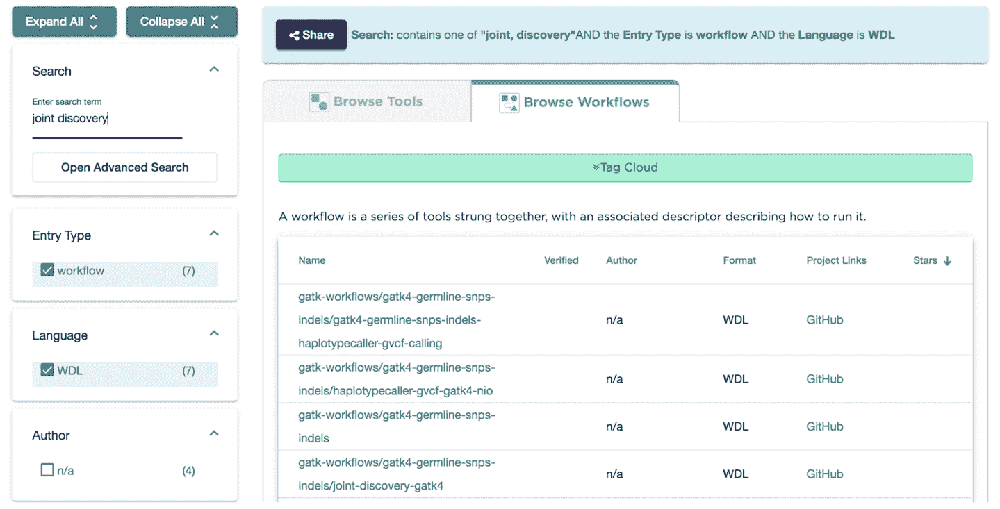

###### 图 13-18\. 在 Dockstore 中搜索“joint discovery”的搜索结果。

搜索结果中列出的一些工作流是相同工作流的不同版本，由于历史原因分别注册。不幸的是，搜索结果列表中总结的信息并未提供一种轻松区分它们的方法，因此有时您可能需要单击详细描述以了解它们的区别。

找到名为[*gatk-workflows/gatk4-germline-snps-indels/joint-discovery-gatk4*](https://oreil.ly/Kfndw)的工作流，并点击进入其详细信息页面。这个工作流的名称和描述应该会有一点熟悉的感觉，因为这实际上是你在之前场景中使用的*3_Joint_Discovery*工作流的源头。这段代码本身位于 GitHub 上，位于 gatk-workflows 组织下的一个仓库中，由 GATK 支持团队用于发布官方的 GATK 工作流。如果你在工作流详细信息页面点击“Versions”选项卡，你可以看到来自 GitHub 仓库的代码开发分支和发布版本列表。应该有一个版本被注册工作流的人标记为*default*，这相当于他们在说：“除非你知道更好的选择，否则你应该使用这个版本。”

有时看看这些内容是有趣的，以了解你感兴趣的工作流是否正在进行活跃的开发；例如，在本文写作时，我们看到默认版本在 2019 年 5 月设置为 1.1.1，但最近的工作是在 2020 年 1 月的开发分支中进行的。也许这些变更在你阅读本文时已经发布，并且一个新的默认版本已经设置。

你可以自行探索其他各种选项卡，但我们想指出几个我们认为尤其有用的，除了我们已经审查过的那些。首先是“Files”选项卡，其中引用了描述符文件下的 WDL 源文件，以及测试参数文件下的 JSON 文件。现在这些可能有点无聊，但以后会派上用场。我们非常喜欢的另一个选项卡是“DAG”选项卡，它代表*有向无环图*，指的是工作流图。这为你提供了一个与你在第九章中使用`Womtool`生成的交互式工作流可视化类似的展示，尽管显示略有不同，正如你可以在图 13-19 中看到的那样。默认情况下，这只显示工作流中的任务，这是一个非常好的方式，让你以高层次查看工作流的连接方式，而无需查看 WDL 代码。还有一个选项可以切换到由一家名为 EPAM 的公司制作的不同可视化工具，它提供了一个包括输入和输出的更精细的视图。这对于深入研究非常酷，但细节可能会有点令人不知所措。

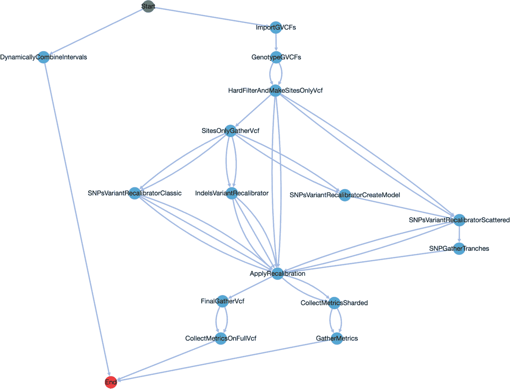

###### 图 13-19\. 在 Dockstore 的 DAG 选项卡中提供的 Joint Discovery 工作流的可视化。

当您完成在 Dockstore 界面中探索工作流详细信息时，请查找右侧菜单中标记为“启动方式”的框，其中提供了几个运行工作流的选项，包括 Terra。点击 Terra 按钮返回 Terra，并将工作流带在口袋里。在导入屏幕上询问您要将其放置在哪个工作区时，请选择 1000 个基因组工作区的克隆。您将会进入您工作区中新导入工作流的配置页面。

## 配置工作流以使用数据表

输入页面将完全空白，所以我们建议首先上传在 Dockstore 的文件选项卡中列出的示例 JSON 输入文件。是的，这就是为什么我们提到了那个无聊的选项卡。不幸的是，目前没有办法让 Terra 随着工作流本身导入该文件（这显然是一个功能请求的好时机），所以你需要下载副本，然后使用“上传 JSON”选项将其上传到工作流配置中。上传完成后，保存配置并检查输入页面上是否没有剩余的错误指示（橙色感叹号）。确保选择直接在文件路径上运行工作流的选项，然后尝试运行导入的工作流，确保一切都可以立即使用。

假设测试运行成功完成，您需要重新配置输入，以指向数据表而不是直接文件路径。这可能是整个过程中最困难的部分，因为您必须弄清楚哪些输入需要连接到数据表，哪些输入可以移动到工作空间资源表，以及哪些输入只需留在配置中。确定第一组需要的一个好方法是查看工作流文档，了解其输入需求的描述。您在现场找到的工作流中并不总是有这样的描述，但当有这样的描述时，它通常对您应该考虑作为工作流主要输入是非常启发性的。对于这个特定的工作流，由于我们刚刚在本章的大部分时间里对它进行了详细研究，所以您应该知道应该连接什么，所以现在去做吧。如果遇到困难，请记住您可以查看原始的 GATK 工作空间，以了解您的目标模型。

###### 注意

关于移动到工作空间资源表中的适当内容，这实际上只是判断和偏好的问题，因为在 Terra 看来并没有真正的技术差异。您可以简单地决定将所有内容保留在工作流中，直到导入另一个工作流并意识到它们利用相同的资源，并计划在那时将相关资源移动到工作空间数据表中。

当您设置好配置后，您将需要按照我们在前一个场景中给出的相同说明来定义一个样本集。事实上，在这一点上，剩下的工作几乎与前一个场景的最后两节完全相同，所以我们不觉得有必要再次步步指导；我们相信你可以自己完成。祝你好运！

最后，如果你感觉有点冤枉，因为我们让你导入与上一节相同的工作流程，这里有一个建议，可以让你在一个对你全新的工作流程上展示一下你的新技能。有时候，如果算法或支持资源发生了足够的变化（例如，如果有一个新的参考基因组构建），你可能需要重新执行 GVCF 调用步骤，但是提供的 1000 个基因组高覆盖数据集中的测序数据文件都是 CRAM 格式，当使用流式处理时，GATK 团队尚不推荐直接使用该格式进行数据访问。因此，您需要找到一个 CRAM 转换为 BAM 的工作流程作为预处理步骤运行，或者一个以内置 CRAM 转换为 BAM 任务开始的 GATK `Haplotype-Caller`工作流程。如果你在第九章中认真听讲的话，这应该会让你有所耳闻。

因此，请继续尝试找到适合使用 1000 个基因组数据的工作流程或工作流组合，使用我们在过去几章中提供给您的各种方法和资源。如果你真的遇到困难，请通过在[GitHub 仓库](https://oreil.ly/genomics-repo)中发布问题来告诉我们，我们将帮助您解决问题。如果很多人报告在进行伸展任务时遇到困难，我们会考虑在博客中发布逐步解决方案。

# 结束语和下一步计划

在本章中，您学习了如何在 Terra 中从各种来源（包括 Terra 内部和外部的数据和代码组件）组装自己的工作空间。我们非常强调如何考虑数据集的结构，以便使您能够充分利用 Terra 中链接数据表的强大功能，并通常结合来自不同来源的数据。您练习了从数据库导入数据并运行联合分析，包括来自 1000 基因组计划的数据，为大规模分析做好了准备。您还学会了从 Dockstore 导入工作流程，这是一个可以连接到除了 Terra 之外多个其他平台的工具和工作流程存储库。到此时，您已经具备了从云端公共或私有可用工具和数据集中组装和执行自己可扩展分析所需的全部基础。在第十四章中，即最后一章，我们将通过一个工作空间示例演示从已发表的论文复制端到端分析，以展示目前在生物医学研究中实现最佳计算可重现性的能力、障碍和展望。
