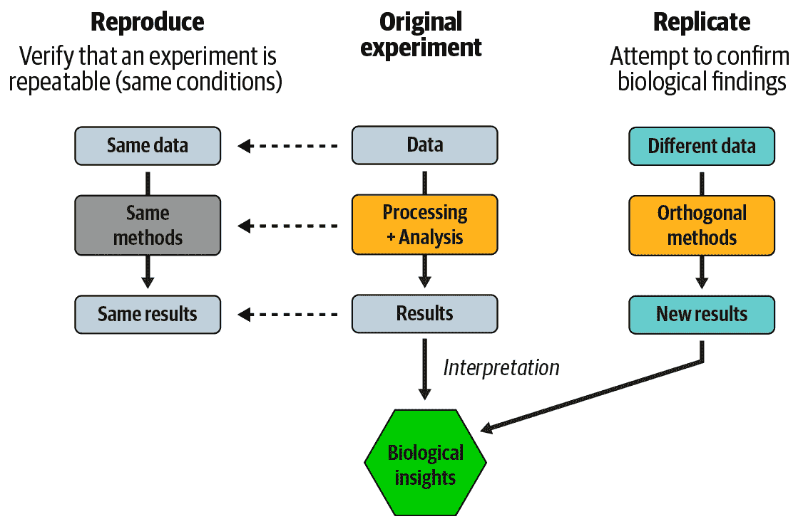
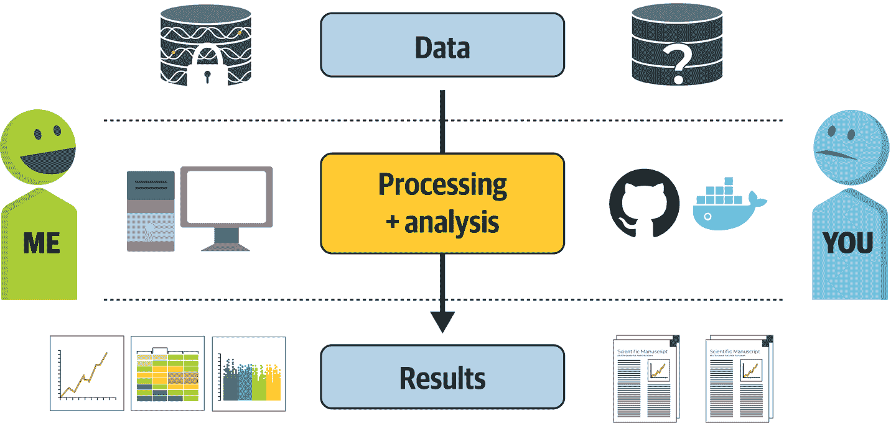
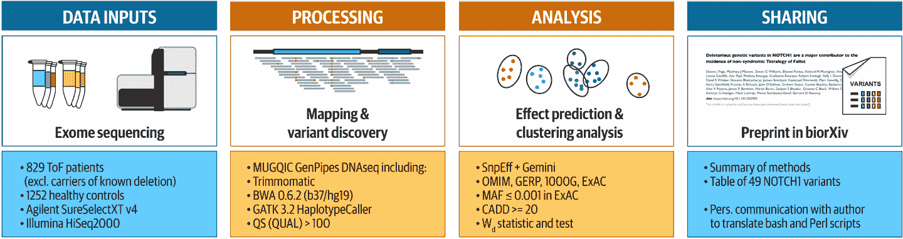
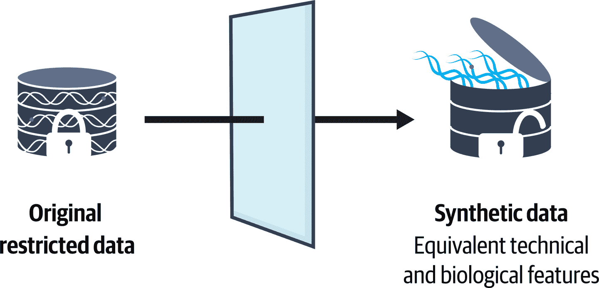
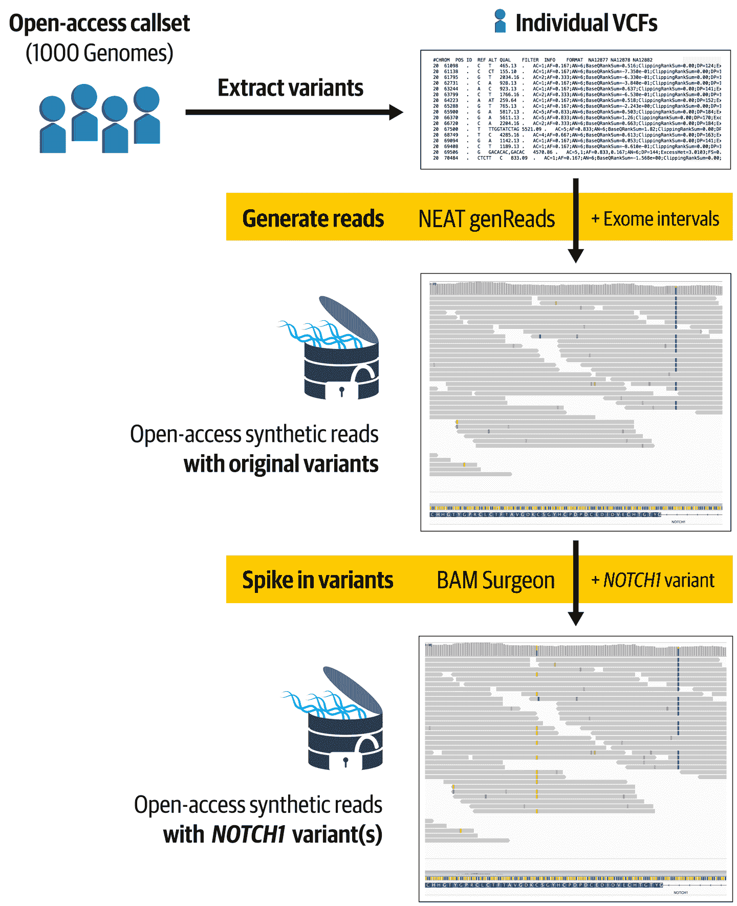
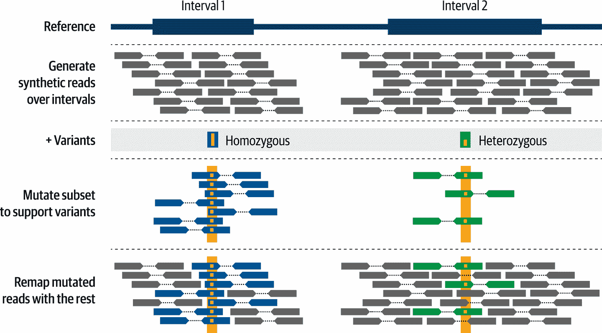
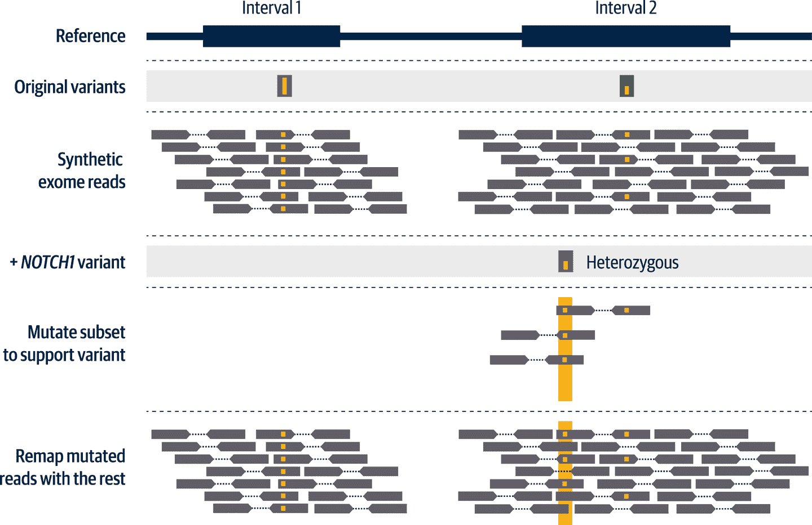
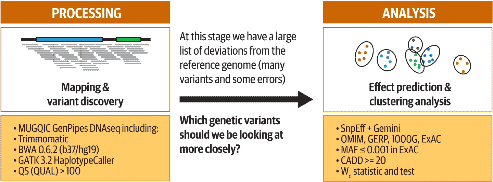
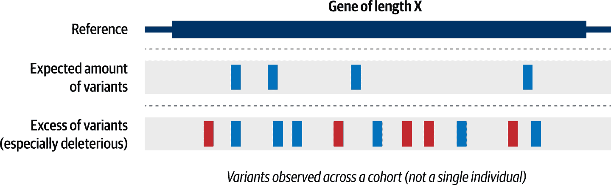
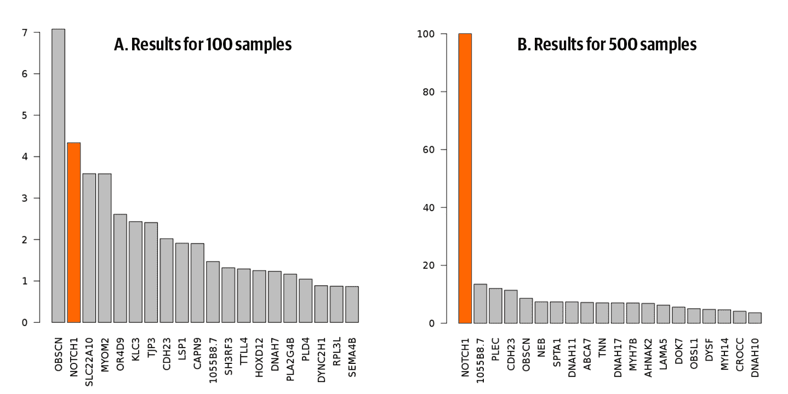

# 第十四章：制作一个完全可复制的论文

在整本书中，您已经学习如何使用一系列单独的工具和组件执行特定任务。现在，您已经掌握了完成工作所需的一切——用小片段。在这最后一章中，我们将向您展示一个案例研究，演示如何将所有组件整合到一个端到端分析中，并额外展示确保全面计算再现性的方法。

该案例研究中的挑战是复现一项研究，其中研究人员确定了某个基因对特定先天性心脏病风险的贡献。原始研究是在受控数据访问下进行的，因此挑战的第一部分是生成可以替代原始数据的合成数据集。然后，我们必须重新创建数据处理和分析，包括变异发现、效果预测、优先级排序和基于论文提供信息的聚类。最后，我们必须将这些方法应用于合成数据集，并评估我们是否能成功复制原始结果。在本章的过程中，我们从面对的挑战中得出了一些教训，这些教训应该指导您努力使自己的工作在计算上可复制。

# 案例研究概述

我们最初构思这个案例研究，是为了作为我们提议在会议上进行的一对研讨会的基础，首先是从 2018 年 10 月开始的美国人类遗传学会（ASHG）年会。我们研讨会提案的基本前提是，我们将评估在人类医学遗传学中广泛应用的基因组方法的计算再现性障碍，并教会观众如何克服这些障碍。

我们最初对可能影响基因组研究的作者和读者的一些关键挑战有一些期望，并且我们知道大多数这些挑战已经存在解决方案。因此，我们的主要目标是突出这些已知挑战的实际发生情况，并演示如何根据开放科学运动中专家推荐的方法和原则实际克服这些挑战。然后，我们将开发教育材料，最终目标是推广一套研究人员在发布自己的工作时应用的良好实践。

通过我们不久将描述的一系列情况，我们选择了一项关于一种先天性心脏病的遗传风险因素的研究，并与其主要作者之一，Matthieu J. Miossec 博士合作，以复制文中核心的计算分析（可以这么说）。在项目的过程中，我们验证了一些我们的假设，但也遇到了我们没有预料到的障碍。因此，我们学到了比我们预期的要多得多的东西，这并不是我们能想象到的最糟糕的结果。

在本章的第一部分，我们通过讨论指导我们决策的原则来为舞台设定背景，然后我们开始描述我们试图复现的研究。我们讨论了最初识别的挑战，并描述了我们应用的逻辑来解决它们。最后，我们为你提供了我们实施计划的概述，作为我们深入探讨各个项目阶段细节的序幕。^(1)

## 计算复现性与 FAIR 框架

在我们深入分析试图复现的分析具体内容之前，值得重申我们所说的*复现性*是什么意思，并确保我们将其与*复制*区分开来。我们看到这些术语有不同的用法，有时甚至可以互换，而且目前并没有明确的共识认为哪种用法是最正确的。因此，让我们在本书的范围内对其进行定义。如果你在不同的上下文中遇到这些术语，请确保了解作者的意图。

我们定义*复现性*，侧重于分析过程和结果的可重复性。当我们说我们正在复现分析时，我们试图验证如果我们通过相同的处理输入相同的输入，我们会得到与我们（或其他人）第一次得到的相同结果。这是我们在扩展他人技术工作之前通常需要做的事情，因为我们通常需要确保我们正确运行他们的分析。因此，这是科学进步的绝对重要加速器。对于培训目的来说也是至关重要的，因为当我们给学习者一个练习时，我们通常需要确保他们严格按照说明可以得到预期的结果——除非目的是展示非确定性过程。希望你在本书中找到的练习是可以复现的！

另一方面，*复制*则完全是关于确认实验结果所得的见解（向传奇的反对者卡尔·波普致歉）。要复制研究的发现，我们通常希望采用不太可能受到相同弱点或人为因素影响的不同方法，以避免简单地陷入同样的陷阱。理想情况下，我们还希望检查独立收集的数据，以避免确认从那个阶段起源的任何偏见。如果结果仍然导致我们得出相同的结论，我们可以说我们复制了原始工作的发现。

这种差异，如图 14-1 所示，归结为*管道*与*真相*。在一个案例中，我们试图验证“事情是否按预期运行”，而在另一个案例中，“是的，这就是自然的这一小部分运作方式”。

###### 图 14-1\. 分析的可重现性与研究结果的可复制性。

鉴于我们在早期章节已经提到了可重现性的核心概念，这些定义不应该听起来太离奇。例如，在第八章中，当我们介绍工作流程时，我们指出它们作为一种将复杂分析操作编码为系统化、可自动化方式的重要价值。当我们探索 Jupyter Notebook 作为一种更灵活、交互式的打包分析代码方法时，我们也触及了类似的主题。我们确信，当这两种工具在本章后期出现时，你不会感到惊讶。

然而，可重现性只是开放科学万花筒中的一个方面。当我们着手处理这个案例研究时，我们做出了有意义的决定，通过 FAIR 框架来审视它。正如我们在第一章中简要提到的那样，*FAIR*是一个缩写，代表着可发现性、可访问性、互操作性和可重复使用性。它指的是一种评估研究资产和服务开放性的框架，基于这四个特征。其基本思想很简单：所有四个支柱都是必须满足的要求，才能将一个资产视为*开放*（如*开放科学*）。例如，要认为分析是开放的，仅仅代码在技术上可重用并且与其他计算工具互操作是不够的；其他研究人员还应该能够找到这段代码并获取一个完整的工作副本。FAIR 原则的[原始发布](https://oreil.ly/JyTlX)强调了将其应用于科学数据管理目的的必要性，但也明确指出它们可以应用于各种其他类型的资产或*数字研究对象*，例如代码和工具。

虽然案例研究的大部分内容都集中在可重现性上，我们认为这与 FAIR 框架中的可重用性基本上是同义词，但在我们的各种实施决策中也会反映出其他三个 FAIR 特征。当我们回顾我们选择遵循的方法论时，我们会再次回到这一点，在本章结束时，我们会讨论这项工作的最终结果。现在是时候看一看我们选择在这个项目中展示的原始研究了。

## 原始研究和案例研究的历史

最初的研究由 Donna J. Page 博士、Matthieu J. Miossec 博士等撰写，旨在通过分析来自多个研究中心的 829 例病例和 1252 例对照的外显子组测序数据，识别与非综合征性[Fallot 四联症](https://oreil.ly/XBv-Q)相关的遗传组分。我们将在稍后更详细地介绍分析，但现在先概述一下，他们首先应用了基于 GATK 最佳实践的变异发现方法，在全样本集（包括病例和对照）中调用变异体，并使用功能效应预测识别可能的有害变异体。最后，他们进行了变异负荷分析，以识别在病例样本中与对照相比更频繁受有害变异体影响的基因。

通过这项分析，作者们发现了 49 个在*NOTCH1*基因内的有害变异体，这些变异体似乎与 Fallot 四联症先天性心脏病相关。此前其他人在患有先天性心脏病，包括 Fallot 四联症的家庭中已经发现了*NOTCH1*变异体，因此这并非完全意料之外的结果。然而，这项工作是首次将 Fallot 四联症的变异分析扩展到近千例病例样本的研究，并显示*NOTCH1*是 Fallot 四联症风险的重要贡献者。截至目前，这仍然是我们所知道的最大的非综合征性 Fallot 四联症外显子研究。

我们与 Miossec 博士讨论了我们正在为拉丁美洲几个学会的联合会议 ISCB-LA SOIBIO EMBnet 开发的基因组分析研讨会，该会议定于 2018 年 11 月在智利举行，此时手稿仍处于预印本阶段。同时，我们的团队还承诺为即将于 2018 年 10 月举行的 ASHG 2018 研讨会开发关于计算再现性的案例研究，正如前文提到的。巧合的是，Miossec 博士的预印本非常适合这两个目的，因为它典型地符合我们预期观众的需求：（1）变异发现和关联方法的经典应用案例，（2）在足够大以引起一些扩展挑战但又足够小以在大多数研究团体能力范围内的参与者队列中进行，（3）使用当时最常见的外显子组测序数据。鉴于该研究本身具有“正好合适”的特点，以及在我们最初讨论 ISCB-LA SOIBIO EMBnet 研讨会开发项目时 Miossec 博士的合作态度，我们便与他商议以他的预印本为基础开发案例研究。接下来的几个月里，我们共同努力开发了案例研究，并最终分别在 ASHG 2018 会议和 ISCB-LA SOIBIO EMBnet 2018 年会上进行了展示。

###### 注意

明确一点，选择这项研究并不旨在展示 GATK 最佳实践；从技术上讲，作者的原始实现与经典最佳实践有所偏离。此外，这并不意味着对研究的生物学有效性进行认可。在本案例研究中，我们仅关注分析的计算再现性问题。

## 评估可获得信息和关键挑战

在我们甚至选择缺血性心脏病的四联症研究之前，我们已经根据我们在科学出版方面的经验回顾了我们预计会面临的关键挑战。如图 14-2 所示，科学论文作者和读者之间存在着信息和手段的根本不对称。作为作者，您通常可以完全访问原始数据集，而在人类基因组数据的情况下，这些数据几乎总是受到数据访问和数据使用限制的约束。您拥有您的计算环境，可能通过各种硬件和软件组件进行定制，并且您有工具或代码，可以在该环境中应用于数据以生成结果。

###### 图 14-2\. 作者与读者之间信息可获得性的典型不对称性。

另一方面，当您是读者时，通常首先看到的是预印本或已发表的论文，这本身就是作者原始结果的高度加工、筛选并在某种程度上审查过的视角。从论文中，您必须向后追溯以找到应用的方法描述，这些描述通常是不完整的，就像可怕的“我们按照在线文档中描述的 GATK 最佳实践进行变异调用。”（没有版本、特定工具的指示。）如果幸运的话，在补充材料中埋藏的未格式化的 PDF 中可能包含到 GitHub 仓库中代码或脚本的链接，这些可能或可能没有文档化。如果非常幸运，您甚至可能会找到提供软件环境需求的 Docker 容器映像的参考，或者至少是用于生成此类映像的 Dockerfile。最后，您可能会发现数据受到无法克服的访问限制。您可能能够根据可用信息、代码和论文中的软件资源来拼凑分析过程，公平地说，这有时可能会被呈现得相当完善，但是没有原始数据，您无法知道结果是否符合预期。因此，当您将其应用于自己的数据时，很难知道可以信任其产生的结果有多少。

现在我们描绘了这样一个悲观的图景，我们的情况如何？嗯，在 Tetralogy of Fallot 论文的那个时候，预印本完全符合标准。Figure 14-3 总结了其中包含的方法论信息。

###### 图 14-3。总结了 Tetralogy of Fallot 论文原始预印本中提供的信息。

在数据处理早期阶段使用的方法描述（从比对到变异调用）引用了另一家机构操作的第三方流程，这显然过于模糊，无法确保准确复制工作。但积极的一面是，它确实提到了关键工具及其版本，如来自 GATK 3.2 的`HaplotypeCaller`，我们对这些工具有足够的了解，可以自行了解其要求。对于分析的后续部分，方法描述更为详细，并指向 Bash 脚本和 Perl 代码，但这些仍然无法完全独立实现。

###### 注意

剧透警告：我们极大地受益于我们的领头作者具有详细的分析方法知识；没有 Dr. Miossec 的直接帮助，我们是不可能成功的。

然而，我们遇到的困难完全可预见：我们很早就知道数据是受限访问的，并且事实证明，我们在任何时候都无法访问任何数据，甚至是为了开发目的。但不要泄气；这并不意味着项目已经失败。我们在几分钟内就能找到解决方案。

## 设计可重复实施方案

在确定了这些初始条件后，我们开始思考如何在实践中解决这个项目。我们希望使用一种方法论，不仅能够自己复制分析，还能将结果实施打包供他人复制。为此，我们遵循了贾斯汀·基茨等人在《可重复研究的实践》（加州大学出版社，2018 年）中提供的指导。你可以从他们的书中学到很多内容，这里我们无法一一涵盖，建议你去查阅。我们迅速实施的一个收获是根据以下问题分解整体工作：

1.  什么是*输入*数据，我们如何使其对他人可访问？

1.  对数据需要应用哪些（a）*处理*和（b）*分析*方法，并且如何使它们可移植？

1.  如何打包我们生成的所有资源并*分享*给他人使用？

这是一个简单而有效的框架，提醒我们我们的优先事项并指导我们的决策。在我们达成一致意见后，处理和分析方法之间的区别尤其有用。*处理* 将指所有前期数据转换、清理、格式更改等操作，通常都是相同的，通常是批量自动运行的。这大致对应于通常描述的*次级分析*。与此同时，*分析* 则指更改多、依赖于上下文的活动，如建模和聚类，通常是交互式地、基于具体案例进行的。这对应于*三级分析*。在变异调用和效应预测方面存在一些灰色地带，但我们最终决定变异调用应属于处理类别，而变异效应预测则属于分析类别。

虽然这些区别在某种程度上是任意的，但对我们来说很重要，因为我们已经决定它们将指导我们关于我们将多么密切地遵循原始研究的努力。显然，我们希望尽可能接近原来的情况，但那时我们已经知道一些信息是不完整的。显然，我们需要做出妥协来在追求完美和我们能够投入项目的努力量之间达到平衡，这显然是无限的。所以我们做了一些假设。我们假设（1）基本数据处理如对齐和变异调用应该对适应具有相当的鲁棒性，只要它以相同的方式应用于所有数据，避免批次效应，并且（2）研究核心的效应预测和变异负荷分析更关键，需要精确复制。

谨记这些指导原则，我们概述了以下实施策略：

1.  *数据输入：* 为了处理被封锁的数据，我们决定生成合成外显子数据，模拟原始数据集的属性，直到感兴趣的变体。合成数据将完全开放，因此满足了 FAIR 框架对*可访问性*和*可重用性*的要求。

1.  数据处理与分析

    1.  *处理：* 由于合成数据已经完全对齐，正如我们马上要讨论的那样，我们只需要在这个阶段实现变异调用。根据我们对原始流程的了解，我们决定使用一套组合现有和新的用 WDL 编写的工作流。WDL 的开放和便携性将使处理从 FAIR 的角度看起来是*可访问的*，*可互操作的*和*可重用的*。

    1.  *分析：* 在 Miossec 博士的帮助下，我们决定分两部分重新实施他的原始脚本：作为 WDL 工作流的变体效果预测，以及作为 Jupyter 笔记本中的 R 代码的变体负荷分析。与 WDL 工作流一样，使用 Jupyter 笔记本将使分析从 FAIR 的角度变得*可访问*、*可互操作*和*可重用*。

1.  *分享：* 我们计划在 Terra 工作空间中完成所有工作，然后与社区共享，以便完全访问数据、WDL 工作流和 Jupyter 笔记本。在 Terra 中轻松共享将有助于我们通过使我们的案例研究从 FAIR 的角度变得*可找到*和*可访问*。

做这个案例研究的原始工作的最后一个亮点是在 Terra 中完成：我们知道完成后，可以轻松克隆开发工作空间，创建一个[公共工作空间](https://oreil.ly/yj2ql)，其中包含所有工作流、笔记本和数据引用。因此，我们只需做最少的工作，即可将我们的私人开发环境转变为完全可复制的方法补充。

在接下来的两个部分中，我们将解释我们如何在实践中实现所有这些。在每个阶段，我们都会指向工作空间中开发的具体代码和数据元素，以便您能够清楚地了解我们在谈论什么。本章节不要求您运行任何内容，但请随时克隆工作空间并尝试各种工作流和笔记本。

现在，您准备好深入了解细节了吗？做好准备，系好安全带，因为我们将从事最具挑战性的部分开始：创建合成数据集。

# 生成合成数据集作为私人数据的替代品

原始分析涉及 829 个病例和 1,252 个对照，全部使用外显子测序生成，不幸的是，所有这些数据都受到我们无法轻易克服的访问限制。事实上，即使我们能够访问数据，我们肯定也无法将其与我们计划开发的教育资源一同分发。虽然仍然有用将数据用于测试，但无论如何，我们都将需要借助合成数据来完全实现我们的目标。

但等等……你问，这到底意味着什么？一般来说，这可能意味着很多事情，因此让我们在这里澄清一下，我们具体指的是*合成序列数据*：这是完全由计算机程序生成的读取序列组成的数据集。我们的想法是创建这样一个合成数据集，模仿原始数据，正如 图 14-4 所示，包括特定比例的感兴趣变体的存在，以便我们可以替换它并仍然实现我们复制分析的目标，尽管我们无法访问原始数据。

###### 图 14-4\. 用合成数据集替换不能分发的真实数据集，以模仿原始数据的特征。

让我们来谈谈实际操作中的工作原理。

## 总体方法论

使用合成基因组数据的概念并不新鲜，人们已经有一段时间在使用合成数据。例如，[ICGC-TCGA DREAM 突变挑战](https://oreil.ly/DMj28)是一系列重复的竞赛，组织者在其中提供了经过工程化的合成数据，这些数据已知带有特定变异，参与者的挑战是开发能够高度准确和具体识别这些突变的分析方法。

[多程序](https://oreil.ly/LjSJe)可以生成合成序列数据，用于此类目的；实际上，有几个程序部分开发出来就是为了支持这些挑战。基本机制是基于参考基因组的序列模拟读取，并将其输出为标准的 FASTQ 或 BAM 文件。这些工具通常接受一个 VCF 变异调用文件作为辅助输入，这会修改数据模拟算法，使得生成的序列数据支持输入 VCF 中包含的变异。还有一些程序可以将变异引入（或*spike in*）已有的序列数据中。你向工具提供一组变异，然后工具修改部分读取以支持所需的变异调用。

实际上，在早期的头脑风暴阶段，我们曾考虑简单地编辑来自 1000 基因组计划的真实样本，使其携带感兴趣的变异，并且让数据集的其余部分充当对照。这将使我们避免生成真实的合成数据。然而，我们的初步测试显示，来自低覆盖数据集的外显子数据不具备足够好的质量来满足我们的目的。当时，尚未推出在第十三章中介绍的新高覆盖数据集，而且因为该数据是使用 WGS 生成的，而不是外显子测序，因此即使有了也不适合我们使用。

因此，我们决定创建一组合成外显子，但是基于 1000 基因组第三阶段变异调用（每个项目参与者一个）来构建，以便它们具有逼真的变异模式。这本质上相当于根据先前确定的变异重构真实人群的测序数据。然后，我们会对一部分被分配为病例的合成外显子进行突变，使用 Miossec 博士等在法洛氏四联症研究中发现的变异，这些变异在论文中有详细列出。由于 1000 基因组数据集中的参与者比法洛氏四联症队列要多，这使得我们有足够的余地生成我们需要的样本。图 14-5 展示了这个过程的关键步骤。

理论上，这种方法似乎相当直接，但正如我们迅速了解到的那样，实施这一策略（特别是在我们所需的规模上）的现实并不简单。我们最终使用的软件包非常有效，而且在大多数情况下都有很好的文档支持，但是它们并不是开箱即用的。在我们的观察中，这些工具主要被精通工具开发人员用于小规模测试和基准测试，这让我们想知道高门槛努力的多少是由于目标受众是专家，而不是由于它们在普通用户中普及率有限的原因。无论如何，我们没有看到生物医学研究人员单独使用它们来提供我们在项目中克服的困难的可重复研究补充。正如我们后来讨论的那样，这进一步激励我们考虑如何利用我们所取得的结果，使其更容易让其他人采纳提供合成数据作为研究伴侣的模式。

在下一节中，我们详细介绍了如何实施这部分工作的细节，偶尔停下来围绕特定的挑战提供额外的描述，我们认为这些描述可以为其他人提供有价值的见解，或者至少为保持轻松气氛提供一丝幽默感。

###### 图 14-5\. 生成适当合成数据的实施概述。

## 从 1000 基因组参与者中检索变异数据

正如我们之前提到的，我们决定基于来自 1000 基因组计划参与者的 VCF 来进行合成数据模拟步骤。我们选择了这个数据集，因为它是最大的可用基因组学数据集，完全公开，并且在 GCS 中可以免费获取。然而，方便只是到此为止。从一开始，我们就不得不跳过一些障碍，首先是因为当时 1000 基因组变异调用是以多样本 VCF 的形式提供的，其中包含来自所有项目参与者的变异调用，按染色体分割。而我们需要的是相反的：一个包含每个项目参与者所有染色体数据的单样本 VCF。

因此，我们首先实现的是一个 WDL 工作流，根据参与者的标识符，使用 GATK 的`SelectVariants`从每个染色体文件中提取参与者的变异调用，然后使用 Picard 的`MergeGvcfs`将数据合并为该参与者的单个 VCF。听起来足够简单，对吧？是的，但这是生物信息学，所以当然事情并不那么简单。在尝试处理原始多样本 VCF 时，我们遇到了由于文件头格式不正确而导致的奇怪错误，因此我们不得不添加一个调用 Picard 的`FixVcfHeader`来修补它们。然后，在`SelectVariants`步骤之后，我们遇到了排序错误，因此我们不得不添加一个调用 Picard 的`SortVcf`来解决这些问题。我们将所有三个命令压缩到一个 WDL 步骤中，以避免进行大量来回文件复制。虽然不太美观，但它起作用了。这就成为了工作流[1_Collect-1000G-participants](https://oreil.ly/wYw54)，您可以在案例研究工作空间中看到它的运行情况。在这个工作流中的所有任务中，我们使用了标准的 GATK4 容器映像，其中也包含了 Picard 工具。

为了在我们的工作空间中运行这个流程，我们设置了来自 1000 基因组计划的最少元数据的参与者表，包括参与者标识符和他们最初所属的队列，以防后来有用（实际上并没有）。然后，我们配置了收集器工作流，以每行参与者表中的行运行，并将结果的 VCF 输出到同一行下的*sampleVcf*列中。

###### 注意

在这个工作空间中，我们不需要区分参与者和样本，因此我们决定使用一个非常简单和扁平的数据结构，只使用其中之一。当时，参与者表是强制性的，所以我们别无选择，只能使用它。如果我们今天要重新构建这个流程，我们可能会转而使用样本，以使我们的表格更直接地与其他工作空间中的内容兼容。

由于工作流程存在一些主要的低效性，因此运行时间较长（平均为 4.5 小时，100 个文件集合并行运行时为 12 小时，其中包括一些抢先停止），但它确实产生了我们所寻找的结果：每个参与者的完整个体 VCF。有了这些，我们现在可以继续下一步：生成合成数据！

## 创建基于真实人物的虚假外显子

我们希望创建合成外显子数据，以代替原始的受控访问数据集，因此我们在这里的第一个任务是选择一个具有适当功能的工具包，因为正如我们之前提到的，有很多选择，并且它们展示了相当广泛的功能。在调查了现有的选项之后，我们选择了由 Zachary Stephens 等人开发的[NEAT-genReads 工具包](https://oreil.ly/2GdMY)，这是一个开源软件包。它具有很多我们实际上不需要的功能，但似乎广受好评，并且具有我们寻找的核心功能：根据现有变异调用的输入 VCF（在我们的情况下是 1000 个基因组参与者的 VCF）生成整个基因组或外显子数据。

它是如何工作的？简而言之，该程序基于参考基因组序列模拟合成读取，并在输入 VCF 中存在变异的位置上修改某些读取中的碱基，比例与 VCF 中的基因型匹配。

图 14-6 描绘了这一过程。此外，该程序能够通过随机或基于错误模型修改读取中的其他碱基，以模拟测序错误和其他人工效应。默认情况下，该程序输出包含未对齐的合成序列数据的 FASTQ 文件，一个包含同一数据的 BAM 文件（与参考基因组对齐），以及作为真实数据集的 VCF 文件，其中包含程序引入的变异。有关此功能如何工作及其他选项的更多信息，请参阅前面引用的 GitHub 仓库以及描述 PLoS ONE 工具包的[原始出版物](https://oreil.ly/GPUGj)。

###### 图 14-6\. NEAT-genReads 根据参考基因组和变异列表创建模拟读取数据。

除了这个核心功能外，NEAT-genReads 还接受各种参数，用于控制模拟数据的不同方面。例如，您可以使用间隔文件指定应覆盖或不覆盖的区域，并指定它们的目标覆盖度。您还可以控制读取长度、片段长度等，以及用于错误和自发突变的突变率。我们利用所有这些功能，根据预印本中可用的信息尽可能地调整生成的合成数据，使其尽量接近原始研究队列。

为了实现这一点，我们开发了 WDL 工作流[*2_Generate-synthetic-reads*](https://oreil.ly/i42aY)，它接受参考基因组和变异位点文件（VCF）用于生成序列读取，并生成 BAM 文件以及真实的 VCF 文件。同样，你可以在工作空间中看到它的运行过程。

我们很乐意说，第二个工作流比第一个顺利得多，但事实并非如此。我们遇到了更多问题，这些问题似乎要么是由于数据格式不正确，要么是工具无法处理 VCF 格式规范允许的元素。例如，NEAT-genReads 不能容忍在*rsID*字段中具有多个标识符的变异记录，因此我们不得不应用 awk 命令来清理 VCF 文件，从每个记录中删除*rsID*字段的内容。另一个有趣的问题是，NEAT-genReads 在真实的 VCF 文件中发出了不完整的 VCF 头部，因此我们再次使用 Picard 的`FixVcfHeader`来解决。它有时还会发出格式不正确的读取名称，因此为了解决这个问题，我们采用了 awk 和 samtools 的不寻常组合。最后，我们还必须向 NEAT-genReads 生成的 BAM 文件中添加`readgroup`信息，这显然并未考虑到该元数据的重要性（GATK 回应：亵渎！）。

你头晕了吗？我们当然是。不过，如果你对更详细的细节不熟悉，也不要担心。最终，重点是，在你深入进行自己的分析之后，你很可能会遇到这样的事情，即使是在像 NEAT-genReads 这样的强大工具中（是的，我们真的很喜欢它，无论它有什么问题）。更糟糕的是，这种事情往往被忽略在方法描述中。想象一下，如果我们简单地写道，“我们使用 NEAT-genReads 和参数*x*、*y*和*z*来生成合成数据”，并隐瞒了工作流代码。如果你尝试在没有我们的工作流（其中包括有关问题的评论）的情况下重现这项工作，你将不得不自己重新发现和排除所有这些问题。

与此同时，这里的另一个小复杂之处在于我们找不到任何关于 NEAT-genReads 的 Docker 容器镜像，因此我们不得不自己创建一个。这时我们惊恐地意识到，我们已经写到了这本书的第十三章多一点，而我们甚至还没有向你展示如何创建你自己的 Docker 镜像。糟糕？嗯，记住，如今大多数常用工具都可以通过像[BioContainers](https://oreil.ly/pzFEd)这样的项目提供的 Docker 镜像来使用，这为社区提供了极好的服务——它们甚至接受请求。根据你的职业，很可能你可以完全依赖云来完成大部分甚至所有的工作，而无需担心创建 Docker 镜像。然而，我们不能真的让你在没有至少展示基础知识的情况下完成这本书，因此如果你确实需要打包自己的工具，你会知道该期待什么。让我们利用这个 NEAT-genReads 的揭示来在附带的侧栏中做到这一点。

我们使用侧边栏中显示的 Dockerfile 创建容器镜像，然后将其发布到 Docker Hub 的公共仓库。

为了在我们的 Terra 工作空间中运行工作流，我们配置它在参与者表的各行上运行，就像第一个工作流一样。我们将由上一个工作流的输出填充的 *sampleVcf* 列连接起来，作为这个第二个工作流的输入。最后，我们配置了两个结果输出，BAM 文件和 VCF 文件，写入表中的新列 *synthExomeBam* 和 *originalCallsVcf*，以及它们的索引文件。

就像我们的第一个工作流一样，这个也因为我们不得不添加的清理任务而存在一些低效率。它运行的时间大约与第一个相同，尽管在这段时间内它做了更多的工作：为我们运行的每个参与者产生了一个完整的外显子 BAM 文件，覆盖率和相关指标模拟了预印本中报告的法洛四联症队列外显子。我们在 IGV 中打开了一些输出的 BAM 文件，惊讶地发现我们无法轻易区分具有类似覆盖属性的合成外显子和真实外显子。

这将我们带到生成合成数据集过程的最后一步：添加感兴趣的变体。

## 改变假外显子

进入这个过程时，我们已经熟悉了由 Adam Ewing 开发的一个名为 [BAMSurgeon](https://oreil.ly/fFw0e) 的开源工具，我们的一些同事之前已成功使用它为变异调用开发工作创建测试用例。简而言之，BAMSurgeon 旨在修改现有 BAM 文件中的读取记录，引入变体等位基因，如 图 14-7 所示。该工具接受列出感兴趣变体的位置、等位基因和等位基因分数的 BED 文件（一个制表符分隔的文件格式），并相应地修改相应比例的读取。因为我们有在法洛四联症队列中确定的感兴趣变体列表，包括它们的等位基因和位置，我们认为我们应该能够将它们引入到我们的一部分合成外显子中，以重新创建案例样本的相关特征。

###### 图 14-7\. BAMSurgeon 在读取数据中引入变异。

我们将其实现为 WDL 工作流 [3_Mutate-reads-with-BAMSurgeon](https://oreil.ly/H43dN)，它接受参考基因组、一个 BAM 文件和一个列出要引入的变体的 BED 文件，并生成突变的 BAM 文件。在第一次迭代中，我们仅限于添加 SNPs，因为 BAMSurgeon 对不同类型的变体使用不同的命令。在后续工作中，社区的贡献者添加了一些逻辑到工作流中，以处理插入缺失和拷贝数变体，使用相关的 BAMSurgeon 命令。

我们在这个问题上遇到了多少麻烦？几乎没有任何麻烦，如果你能相信的话。我们唯一真正遇到的问题是当我们最初在 1000 基因组低覆盖数据上进行测试时，因为 BAMSurgeon 拒绝在序列覆盖度太低的位置添加变异。然而，当我们转而在由 NEAT-genReads 生成的可爱、丰富数据上运行（我们已经设定了 50 倍的目标覆盖度），它完美地运行起来了。

与以往一样，在我们的 Terra 工作空间中，我们配置了工作流以在*participant*表的各行上运行。然后，我们只需确定如何标记病例与对照以及如何设置哪些病例将被突变成哪种变异体。

我们意识到，在这一部分，我们过于简化了实验设计。我们最初的计划只是在一部分外显子中引入论文中列出的变异体作为病例样本，而其余的则保持不变作为对照样本。不幸的是，这种推理存在两个缺陷。

首先，并非所有病例样本在原始研究中都产生了感兴趣的变异体，因此变异体少于病例样本。此外，该列表中的许多变异体位于基因中，其变异负荷结果不太令人信服，因此我们早早决定仅专注于*NOTCH1*变异体用于本案研究。因为*NOTCH1*是论文本身的主要焦点，我们认为重现*NOTCH1*结果足以作为概念验证的证据。然而，我们确实认为我们应该保持与论文中相同的病例和对照比例。因此，许多标记为病例样本的合成外显子实际上*不会*接收到感兴趣的变异体。

第二，将一些数据与其余数据经历不同的处理步骤会使我们暴露于批次效应。如果不同处理中的某些因素导致影响分析的人工效应，该怎么办？我们需要消除这种偏倚的来源，并确保所有数据都以相同的方式处理。

为了解决这些缺陷，我们决定在任何不接收*NOTCH1*变异的外显子中引入一个中性变异体，无论其被标记为病例样本还是对照样本。为此，我们设计了一个我们预测不会产生任何影响的同义突变。

在 Terra 工作空间中，我们向*participant*表添加了一个*role*列，以便我们可以根据他们将接收的突变标记参与者为*neutral*或*case*。我们使用术语*neutral*而不是*control*，因为我们想要给自己灵活性，可以将具有中性突变的参与者作为真实的对照样本或作为不具有*NOTCH1*突变的病例样本。我们通过随机选择过程挑选出那些将成为*NOTCH1*病例样本的参与者，并在参与者表中为它们分配了*case*角色，将所有其他参与者标记为中性。

最后，我们为论文中报告的每一个*NOTCH1*变异创建了 BED 文件，以及我们设计的中性变异体。我们随机分配了个体*NOTCH1*变异体给标记为*case*的参与者，并将*neutral*变异体分配给其他所有参与者。对于每个参与者，我们在参与者表的新列*mutation*中链接了相应的 BED 文件。我们配置了 BAMSurgeon 工作流，以此字段(`this.mutation`)作为每个参与者外显子 BAM 文件中引入的变异体的输入。

尽管我们需要做适当的准备来合理分配变异体并不是一件简单的事情，但工作流程是直接而且运行速度很快（平均 0.5 小时，对于一组 100 个文件并行运行为 2.5 小时，再次包括一些抢先处理）。按计划，它为我们运行的所有参与者生成了变异的外显子 BAM 文件。我们在 IGV 中检查了几个输出的 BAM 文件，以确认确实引入了所需的变异，并且满意地看到该过程按预期运行。

## 生成确定性数据集

成功地将现有数据和工具整合到上述工作流程中后，我们现在有能力生成一个能够充分替代原始 Fallot 四联症队列的合成数据集。然而，我们不得不做出一个妥协，即将创建的外显子数量限制为 500 个，而不是我们最初计划的 2081 个，以模拟原始队列。原因？原因很俗气，让人感到痛心：我们在会议前简直没有时间了。有时候，你只能凭借手头现有的东西继续前行。

因此，我们生成了 500 个变异合成外显子，进一步在工作空间中组织为两个参与者集，富有想象力地命名为 A100 和 B500。A100 集是包含八个*NOTCH1*案例的 100 名参与者子集。B500 集是所有参与者的超集，我们为其创建了合成外显子，并包含了论文中报告的所有 49 个*NOTCH1*案例。您可能注意到，这些组成与总体 Fallot 四联症队列中*NOTCH1*案例的比例不完全匹配，但两组之间的比例相似。稍后，我们将讨论这如何影响最终结果的解释。

此时，我们已经准备好进入下一部分，尝试复制研究方法学本身。

# 重新创建数据处理和分析方法学

如果你现在已经忘记了原始研究，我们不会责怪你，所以让我们进行一个快速复习。如图 14-8 所示，Miossec 博士等人从 2081 名研究参与者的外显子测序数据开始，几乎均匀分为两组：病例，即患有先天性心脏病四联症（具体来说是一种称为*非综合征性*的类型），和对照组（未受该疾病影响的人）。他们使用基于 GATK 最佳实践的管道对外显子数据进行了相当标准的处理，主要包括与参考基因组的比对和变异调用，这些你在第六章已经是专家了。然后，他们应用了一个定制的分析，涉及预测变异的影响，以便专注于有害变异，然后尝试识别具有比随机预期更高变异负载的基因。

###### 图 14-8\. 研究的两个阶段总结：处理和分析。

关于这些程序的含义和目的，我们稍后会详细讨论。目前，我们想重点关注的概念是研究的这两个阶段之间的区别。在*处理阶段*，这可能是高度标准化和自动化的，我们主要试图清理数据并从我们面对的大量数据中提取我们认为有用的信息。这会在整个测序领域产生变异调用，即一个人的基因组与一个任意参考之间的差异长列表。这个列表本身并不提供任何真正的见解；它仍然只是数据。这就是*分析阶段*的作用所在：我们将开始对数据提出具体问题，并且如果一切顺利，产生有关我们正在调查的生物系统特定方面的见解。

我们强调这一区别，因为这是我们关于我们认为需要多接近复制原始研究中使用的确切方法的决定的关键因素。让我们深入探讨，你会明白我们的意思。

## 比对和变异发现

一开始，我们就遇到了一个重要的偏差。原始研究从 FASTQ 格式的外显子测序数据开始，必须在发生任何其他事情之前进行映射。然而，当我们生成合成外显子数据集时，我们产生了包含已经映射并准备好的测序数据的 BAM 文件。我们本可以将数据恢复到未映射状态，并从头开始运行管道，但我们选择不这样做。为什么？时间、成本和便利性，并非按照这个顺序。我们做出了有意的决定采取捷径，因为我们估计这对我们的结果影响将是最小的。根据我们的经验，只要满足一些关键要求并且数据质量合理，数据处理管道的具体实施方式并不像应用于整个数据集时一致性那样重要。但是，我们确保使用了相同的参考基因组，当然。

###### 注意

请注意前提条件；我们并不是说*什么都可以*。不幸的是，关于这个话题的全面讨论超出了本书的范围，但如果您想讨论，请在 Twitter 上联系我们。

因此，我们直接跳到处理的变异发现部分。原始研究使用了在蒙特利尔加拿大计算基因组学中心开发和运行的*GenPipes DNAseq*管道。根据我们在预印本和*GenPipes DNAseq*在线文档中找到的信息，该管道遵循了 GATK 关于种系短变异发现的最佳实践。这包括使用 GATK `HaplotypeCaller`对每个样本进行单样本变异调用，生成每个样本的 GVCF，然后联合调用所有样本。我们注意到一个偏差，即根据预印本，变异调用集过滤步骤是通过硬过滤而不是使用 VQSR 进行的。

因此，我们重新利用了手头上已有的一些 GATK 工作流，并根据我们手头可用的材料描述定制了它们的处理。这产生了两个 WDL 工作流 [*4_Call-single-sample-GVCF-GATK*](https://oreil.ly/I8CO6)（包括您最喜欢的`HaplotypeCaller`）和 [*5_Joint-call-and-hard-filter-GATK4*](https://oreil.ly/UW5kj)（包括`GenotypeGVCF`s 及其友好的特性），您可以在 Terra 工作区中找到它们。我们配置了第一个工作流以运行表中每个参与者的合成外显子 BAM 文件，并将 GVCF 输出到相应行。相比之下，我们配置了第二个工作流以样本集水平运行，接收来自集合中所有参与者的 GVCF，并为集合生成经过筛选的多样本 VCF。

在这里，我们允许自己再做一个显著的偏离：我们没有像原始研究那样使用 GATK 3.2 版本，而是使用了 GATK 4.0.9.0 版本，以便利用 GATK4 版本相比较老版本的速度和可伸缩性方面的显著改进。我们预期，考虑到我们合成数据的高质量，`HaplotypeCaller`在这些版本之间的输出几乎没有差异。我们只期望在低质量数据和基因组的低置信区域才会出现重要的差异。再次强调，这里有一些注意事项我们没有深入讨论，我们一直在整个数据集中一致地应用相同的方法。

总而言之，我们在处理阶段迅速完成了工作，部分得益于对原始方法的两次偏离。自那时以来，我们考虑过是否回头重新从头处理数据，采用更精确的原始方法重新实现，以衡量这将产生多大的差异。这并没有让我们失眠，但我们很想知道结果是否支持我们的判断。如果你把它当作一项课后作业来完成，别犹豫，告诉我们我们错得多厉害。

现在，是时候进入分析的真正有趣的部分了，我们将发现是否能够重现原始研究的主要结果。

## 变异效应预测、优先级和变异负载分析

让我们花几分钟回顾一下问题陈述，并审视这部分的实验设计，考虑到到目前为止，我们大部分时间都是略过细节的。首先，我们手头有什么，我们想要实现什么目标？我们从一个队列级别的 VCF 开始，这是每个人变异的长清单，我们希望识别与发育性心脏病变形四联症相关的基因。明确一点，我们不是试图找到与疾病相关的*特定变异*；我们正在寻找与疾病相关的*基因*，理解不同患者可能携带位于同一基因内的不同变异。使这一点困难的是变异在所有基因中自然发生，如果你足够多地观察足够的样本中的足够多变异，你很容易找到毫无意义的伪关联。

解决这个问题的第一步是缩小变异列表，尽可能多地消除它们，根据它们的普遍性，它们是否存在于对照样本中，以及它们可能具有的生物学影响类型。确实，通话集中绝大多数变异都是普通的、无聊的，和/或不太可能有任何生物学影响。我们希望优先考虑；例如，集中关注仅在病例样本中发现的罕见变异，这些变异可能对基因功能具有有害影响。

有了这个大大减少的变异列表，我们可以进行变异负荷分析，如图 14-9 所示。这涉及查找那些看起来比你期望的更频繁发生变异的基因，考虑到它们的大小。

###### 图 14-9\. 比较多个样本中基因的变异负荷。

原研究使用了一个名为`SnpEff`的工具来预测变异效应，然后使用 GEMINI 中的`vt`来根据它们的预测效应、在人群数据库中的频率以及仅在病例样本中存在的情况对变异进行优先排序。我们将其实现为一个两步骤的 WDL 工作流，[*6_ 预测变异效应-GEMINI*](https://oreil.ly/GBesI)，该工作流对两个工具使用相同的版本和命令，以及相同的人群资源。在 Terra 中，我们配置了工作流以在参与者集合级别运行，并将优先排序的变异列表输出到表中的同一行。对于这一步，我们必须为每个参与者添加一个家系文件，指定它应该被视为病例样本还是对照样本。对于给定的参与者集合，我们选择了一半的参与者，所有携带中性突变的参与者作为对照样本。然后，我们将集合中的其余参与者，包括所有携带*NOTCH1*突变的参与者，分配为病例样本。

最后，Miossec 博士帮助我们将用于聚类分析的原始 Perl 脚本改写为 R 语言，放入了一个[Jupyter 笔记本](https://oreil.ly/cRROQ)，你也可以在工作区中找到。该笔记本设置为导入 GEMINI 生成的输出文件。然后通过一系列分析步骤，最终进行了一个聚类测试，寻找病例样本中罕见有害变异的过量。该分析有每个步骤的解释文档，所以如果你想了解更多关于这个分析，请务必查看。

在工作流和笔记本中，我们非常小心地逐字复制原始分析，因为我们认为这些部分对最终结果的影响最大。

## 新实现的分析性能

那么最关键的问题是…它起作用了吗？我们能够从大海捞针中找到*NOTCH1*吗？简短的答案是，大部分是；长答案则更有趣。

正如我们之前提到的，我们最终只能在我们拥有的时间内生成了 500 个合成外显子，因此我们定义了一个包含 8 个*NOTCH1*案例的 100 参与者组，以及一个包含所有 49 个*NOTCH1*案例的 500 参与者组。尽管*NOTCH1*案例的比例高于原始数据集中的比例，但在那时对我们来说重要的是，我们的两个参与者组在大致上是成比例的。因为我们不能按照最初的计划在全尺度上测试该方法，所以我们至少能够评估结果如何相对于数据集大小按比例变化，这从早期就是一个感兴趣的点。

我们在两个参与者组上运行了完整的处理和分析工作流程，然后将两者的结果加载到笔记本中，在那里您可以看到对两组重复进行的最终聚类分析。在两种情况下，*NOTCH1*都被提出作为候选基因，但置信水平却有所不同，如图 14-10 所示。在 100 参与者组中，*NOTCH1*仅在候选基因表中排名第二，未能超越背景噪声。相比之下，在 500 参与者组中，*NOTCH1*作为毫无争议的头号候选者出现，并以显著的优势领先其他参与者。

###### 图 14-10. A) 100 参与者组和 B) 500 参与者组的聚类测试排名。

我们认为，尽管在忠实度方面做出了一些妥协，但我们能够生成符合预期的结果，因此这被视为分析的成功再现。

我们特别鼓舞人心地看到，这种方法可以用来测试统计能力的扩展，这取决于数据集的大小。我们可以轻松想象设置额外的实验，以测试观察到的扩展到更细的粒度和更大的尺度。我们还希望测试在*NOTCH1*案例相对于整体队列大小的比例变化如何影响结果，从实际观察到的比例开始。

机会多，时间少。顺便说一句，时间已经不早了；我们几乎到了最后...

# FAIR 原则的漫漫长路

鉴于我们刚刚描述的内容，现在你应该能够在 Terra 中复制法洛氏四联症的分析，并在适用时重复使用数据和/或方法。在大部分情况下，你也应该能够在 Terra 之外做到这一点，因为大多数组件可以直接在其他平台上使用。你可以下载数据以在不同平台上使用，并且 Docker 镜像和 WDL 工作流几乎可以在任何地方运行。由于笔记本环境与用于工作流的 Docker 镜像不同，可能需要更多的努力来重新使用笔记本。你可以访问有关计算环境的所有必要信息，但仍然需要独立设置一个等效的环境。我们希望随着时间的推移，这方面的情况会进一步改善；例如，想象一下如果有一种选择可以生成一个 Dockerfile，以重新创建特定笔记本的软件环境。我们还希望看到一种标准化的方法来获取 Terra 工作空间的数字对象标识符（DOI），以便在包含伴随工作空间作为补充材料的出版物中使用。这与其他人为了更容易地进行归档、检索和重复使用研究工件而进行的重要工作密切相关。然而，当制定标准时，通常情况下会变得更加复杂。

那么，为了在你自己的工作中实现计算再现性和 FAIR 性，你可以做些什么呢？在本案例研究过程中，我们指出了几个通常在您直接控制之下的关键因素。我们在它们出现的背景下讨论了许多因素，但我们认为提供一个我们认为最重要的准则总结可能会有所帮助：

开源

使用开源工具和工作流的重要性难以言表。使用开源工具在两个方面有助于保证您的工作的再现性：它确保所有人都可以访问，并增加了方法的透明度。如果由于任何原因某人无法运行完全相同的代码，他们仍然有机会阅读代码并重新实现算法。

版本控制

尽可能系统地跟踪您使用的工具、工作流和笔记本的版本是至关重要的，因为从一个版本到下一个版本的变化可能会对工具的工作方式和产生的结果产生重大影响。如果您使用其他人的工具，请记录您使用的版本，并在发布分析时包含这些信息。如果您开发自己的工具和工作流，请确保使用像 GitHub 这样的版本控制系统。在 Terra 中，工作流通过 GitHub 和 Dockstore 或通过内部方法库系统地进行版本控制。目前在 Terra 中，笔记本并没有进行版本控制，因此我们建议定期下载您的笔记本，并将其提交到像 GitHub 这样的版本控制系统中。

自动化和可移植性

当涉及到开发你将在大量数据上多次运行的分析部分时，请选择一种能够尽可能自动化并减少对特定环境依赖的方法。例如，选择像 WDL 或 CWL 这样的流水线语言，其他人可以轻松运行，而不是编写繁琐的 Bash、Python 或 R 脚本，即使你提供了代码，其他人也可能难以运行。

内置文档

对于涉及大量数据交互和判断步骤如何进行的分析，考虑提供一个 Jupyter 笔记本，重现你的分析，并在每个步骤解释发生的情况。即使你更喜欢在日常工作中提供更灵活性的环境，比如 RStudio，将成品打包为 Jupyter 笔记本也会极大地增强其可重复性和可理解性。想象一下你上次帮助新的实验室成员或同学快速掌握新的分析方法的情况；想象一下能否给他们一个逐步说明该怎么做的笔记本，而不是一堆松散的脚本和一个或许不是最新的*README*文档。

开放数据

最后，房间里的大象通常会是数据。你可能无法分享你所处理的原始数据，尤其是当涉及到受保护的人类数据时，有许多合理的理由。然而，你可以考虑使用足以展示你分析工作方式的开放获取数据。当这不是一个选择时，就像我们刚刚描述的案例研究一样，考虑是否可能使用合成数据。

这最后一点是否意味着你应该重复我们生成合成数据集的步骤？希望不是。你可以使用我们生成的免费可访问的合成外显子组数据，或者使用我们展示的工作流来创建你自己的数据。我们的工作流在目前的形式下确实不够高效，并且会受益于一些优化，以使其运行成本更低、更具可扩展性，但它们有效。而且，嘿，它们是开源的，所以请随意玩耍并提出一些改进建议！

在更广阔的视角下，我们相信这里存在一个机会，可以开发一个社区资源，以减少在这个领域中任何人需要做的重复工作量。考虑到测序数据生成的标准化程度（至少对于短读取技术来说），应该能够识别出最常用的数据类型，并生成一系列通用的合成数据集。这些数据集可以存储在云端，并与诸如 BAMSurgeon 之类的工具结合使用，研究人员可以用来重现他人的工作，或使自己的工作更容易可重现，与我们在本章中描述的思路类似。

# 最终结论

好了，我们来到了最后一章的结尾。感觉怎么样？在云端，你走过了很多路程，可以这么说。你从一个微不足道的云 Shell 开始，然后迅速转向一个更强大的虚拟机，在那里你用 GATK 运行了真正的基因组分析；首先是手动逐步，然后通过简单的 WDL 工作流和 Cromwell。你运用内在的侦探精神解密神秘的工作流程，学习如何系统地解决新工作流程的方法。接下来，你升级到使用管道 API，提升了你的工作流水平，并体验了在广阔空间中启动并行工作流的自由。然后，你跃升到 Terra，在那里你逐步揭示了工作流、笔记本、数据管理的各个层面，最终通过我们完全可重现的论文案例研究找到了自己的立足点。

根据你在本书中学到的知识，你现在可以开始在自己的工作中使用这些工具了。利用大规模托管在云端的数据集和大量的 Docker 化工具，你无需费心去安装它们。开发你自己的分析，规模化地执行它们，并与世界分享——或者只与你的实验室同事分享。无论你继续使用我们在这里为这些目的使用的具体工具，还是使用日益发展的基于云的生命科学生态系统中的其他工具，你可以放心，类似的原则和范例仍然适用。

请务必定期查看[书籍的 GitHub 仓库](https://oreil.ly/genomics-repo)，[配套博客](https://oreil.ly/genomics-blog)，以及围绕 GATK、WDL、Docker 和 Terra 的最新发展。

玩得开心，并保持可重现性！

^(1) 这个案例研究最初由 Broad Institute 的数据科学平台支持和教育团队开发。因为当时这项工作由我们其中一位（杰拉尔丁）领导，所以我们保留了第一人称复数的描述，但我们要明确其他团队成员和社区成员直接贡献了此处呈现的材料，无论是对原始研讨会的开发和交付，还是后来的材料改进。

^(2) Page 等最初于 2018 年 4 月将他们的手稿作为[生物预印本在 bioRxiv 上](https://oreil.ly/tztSW)与研究社区共享，并最终于 2018 年 11 月在同行评议的期刊*Circulation Research*上发表了这篇文章：“Whole Exome Sequencing Reveals the Major Genetic Contributors to Nonsyndromic Tetralogy of Fallot”，*https://doi.org/10.1161/CIRCRESAHA.118.313250*。
