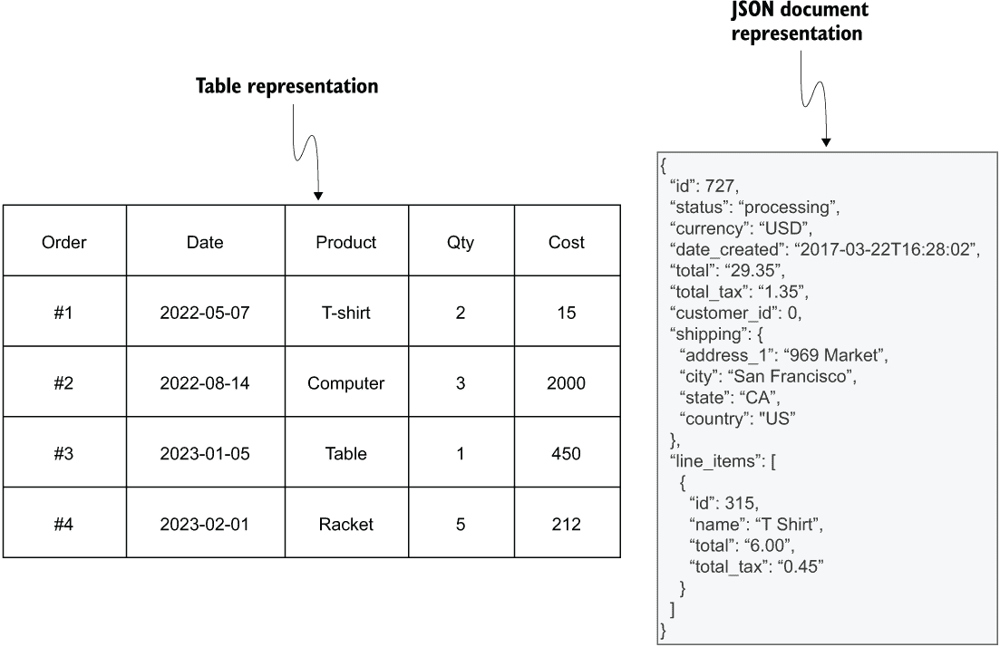
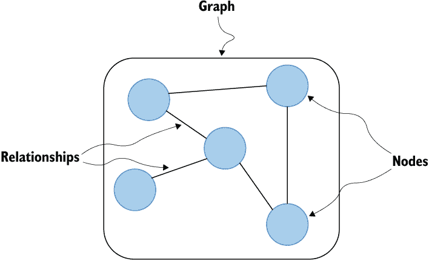
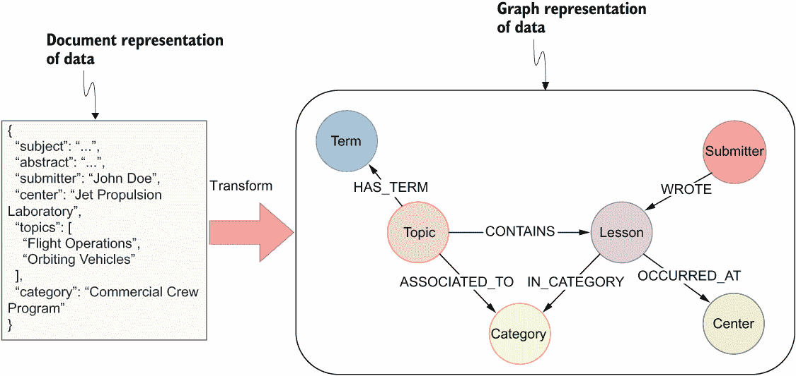
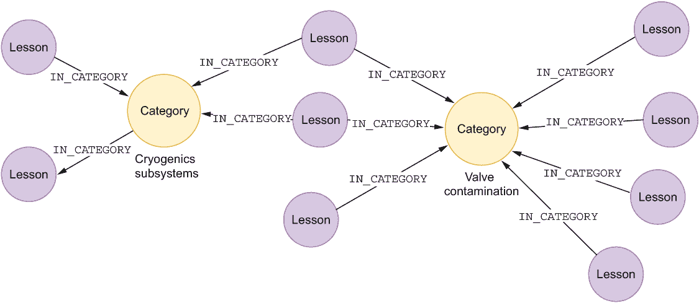
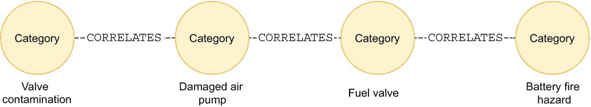
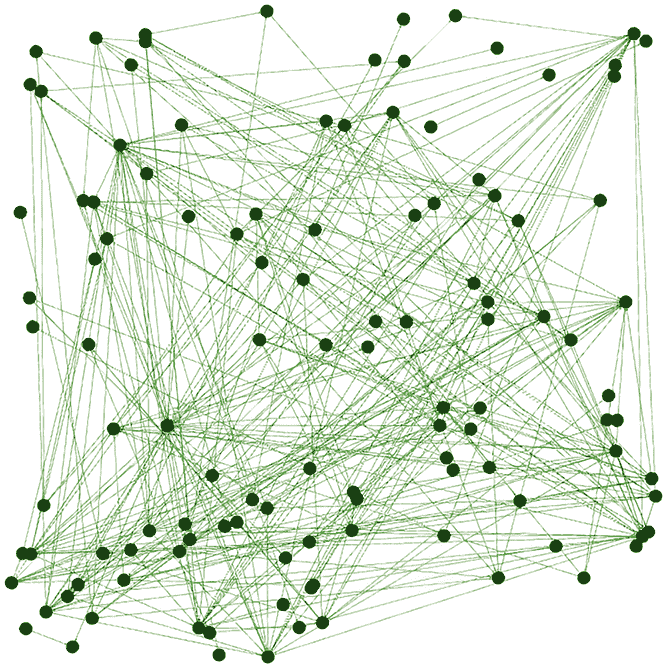
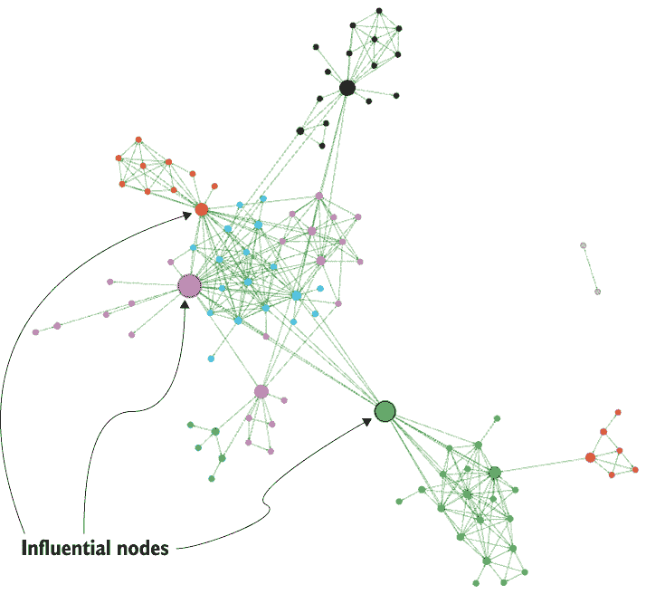
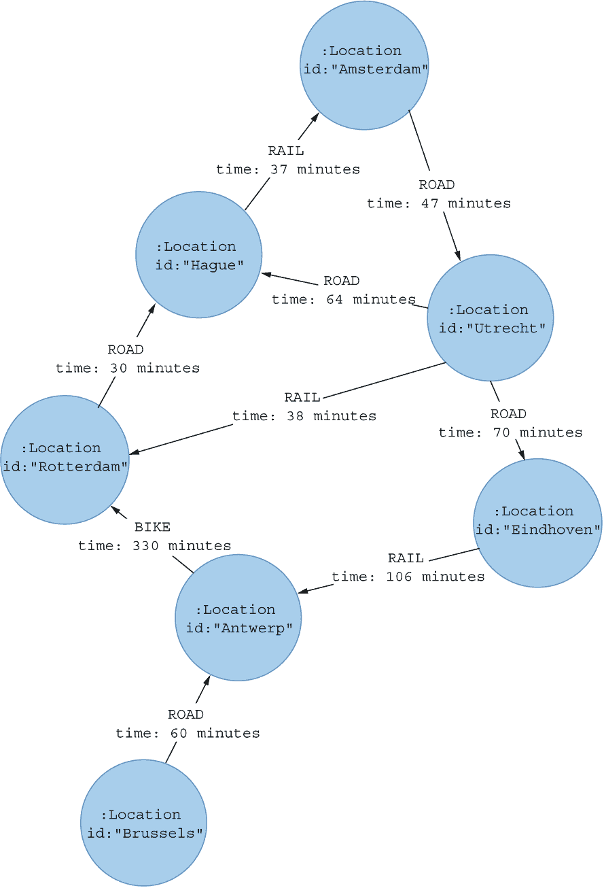
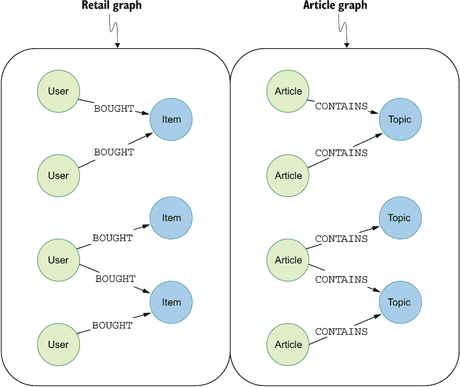
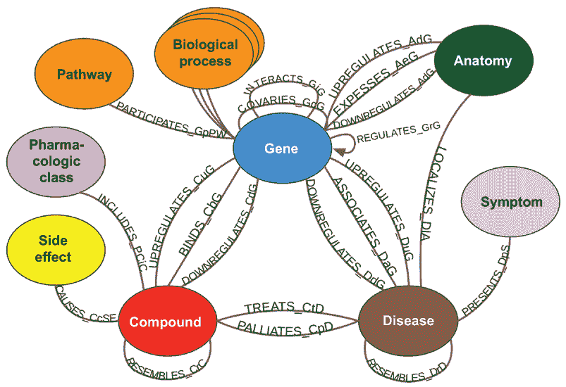

# 1 图和网络科学：简介

本章涵盖

+   介绍图建模和可视化

+   通过关系理解数据

+   识别图形化问题

如果您曾经进行过任何分析，您可能已经使用过数据表的表示，如 Excel 电子表格或 SQL 数据库。此外，如果您处理大量文档，您可能已经使用过 parquet 格式或类似 JSON 的对象来表示数据。

图 1.1 展示了订单的表格和 JSON 文档表示。例如，表格包含有关各种日期和产品的四个订单的信息。表格表示可以有效地执行聚合，如汇总总收入或计算新客户的数量。同样，文档结构可以很好地用于存储大量数据。在图 1.1 中，使用 JSON 对象存储有关在线订单的信息，例如订单状态、送货地址等。然而，为表格或文档设计的数据分析工具通常忽略了数据点之间的关系。

图 1.1 表和文档数据表示

有时，数据点之间的关系会被明确指定，例如一个人和他们与朋友的关系；而在其他情况下，关系可能是间接或隐含的，例如当数据点之间存在可以计算的相关性时。无论关系是明确还是隐含的，它们都包含了可以显著提高分析输出的数据点的额外上下文。

图 1.2 展示了一个 *图* 的小实例，它由五个通过五个 *关系* 连接的 *节点* 组成。节点或顶点可以用来表示各种现实世界实体，如人、公司或城市；然而，您也可以使用节点来表示各种概念、思想和单词。

图 1.2 数据的图形表示

在大多数可视化中，节点被描绘为圆形。关系或边用于表示节点之间的各种连接，例如人与人之间的友谊或软件架构中的依赖关系。在本书中，当我们讨论图的基本元素时，我们将使用术语 *节点* 和 *关系*。

图可以用来表示和探索大量高度连接的数据。例如，图数据库在这些场景中表现出色，因为它们天生就是为了处理实体之间复杂和多变的关系而设计的。在图论中，节点和关系构成了模型的核心，重点在于那些能够实现丰富、连接查询的连接。与关系数据库不同，图数据库执行这些查询时无需进行昂贵的连接或递归操作。这使得你可以高效地回答像“谁是朋友的朋友的朋友？”这样的问题，而不会遭受在关系模型中通常遇到的计算和空间复杂性的困扰。此外，图数据库具有灵活的模式，可以适应现实世界中数据中的变化和异常，为不断变化的企业需求提供更敏捷的解决方案。因此，从传统的关系范式转向图数据库可以消除不必要的复杂性，提高性能，并使我们能够更直观地理解我们的数据和它们之间的关系。

虽然图数据库在许多行业中的有效性是显而易见的，但它们的用途并不仅限于社交平台或电子商务领域。它们在开创性的领域，如太空探索和研究，同样可以证明其重要性。为了说明这一点，可以考虑世界上最有名的太空组织之一：NASA。NASA 的经验教训数据库([`llis.nasa.gov/`](https://llis.nasa.gov/))包含了多年来积累的数百万条记录，包括该组织如何应对困难项目及其产生的建议。这些记录对于规划未来的 NASA 项目以及其他政府和私营组织的项目都非常有价值。此外，数据库还包括关于记录教训的人员、提交教训的中心以及讨论的主题的元数据。图 1.3 中展示的这样一个 NASA 教训的示例，可以通过以下 NASA 网页访问([`llis.nasa.gov/lesson/31901`](https://llis.nasa.gov/lesson/31901))。

图 1.3 来自 NASA 经验教训数据库的一个示例记录

虽然这些记录包含大量的知识，但数据库已经增长到巨大的规模，这使得快速定位与特定情况相关的记录变得越来越困难（Marr，2017；CKO 新闻团队，2017）。最初，他们的搜索方法使用关键词信息和访问频率，这意味着被频繁查看的记录会在搜索结果中排名更高。然而，仅仅因为一个记录被频繁查看，并不意味着它包含针对特定用例的相关信息。而且，尽管关键词搜索可以显著缩小结果范围，但它仍然可能让工程师面对多达 1,000 条记录来检查相关信息。

大约在 2015 年，一位名叫大卫·梅萨（Dr. David Meza）的先生开始了一项使命，旨在寻找并开发一种更好的方法来在经验教训数据库中查找和开发相关信息。大卫在研究过程中遇到了基于图的技术和工具。有趣的是，他意识到图可视化可以使信息更加直观，更容易看到模式和观察事物在经验教训数据库中的连接方式。首先，他必须将数据建模为图。图 1.4 展示了可以用来表示经验教训记录的图模型。

图 1.4 表示经验教训记录的图模型

一条经验教训被描述为图中的一个节点。此外，大多数经验教训的元数据，如主题、类别和作者，都作为单独的节点表示。然后，节点通过关系连接起来；例如，主题与经验教训和类别通过相应的关联连接。正如你所见，图模型和可视化的力量来自于观察事物是如何连接的。

假设你对关于阀门污染类别的经验教训感兴趣，该类别在图 1.5 中作为节点表示。为了检查阀门污染类别，你可以遍历从类别到经验教训节点的关联，以访问该类别的经验教训。

图 1.5 经验教训之间的连接揭示了相关信息。

基于图的可视化有一个优点，就是它们允许你超越单个记录的视角，而是*观察经验教训是如何连接的*。这种更广阔的视角通常能让你注意到之前未曾考虑过的模式。此外，它使得搜索相关信息更加直观，因为你可以遍历经验教训之间的连接来找到你想要的信息。

通过关系检查数据可能产生的一个意想不到的后果是，你可能会看到之前未曾想到的连接。例如，尽管图中类别之间没有显式的关系，但你可能会看到通过传统分析方法可能被忽视的隐含关系。比如说，你在查看图 1.5 中的图可视化时，可能会看到单个经验教训可以属于多个类别，因此，类别可能存在重叠。基于类别的重叠，你可以计算类别对之间的相关性，并将它们表示为关系，如图 1.6 所示。

图 1.6 推断节点之间的关系

有趣的是，大卫·梅萨博士提到，他无法理解在这个例子中，阀门污染如何最终与电池火灾风险相关联。在阅读了相关课程后，他了解到以前电池存在泄漏问题。此外，电池放置得足够靠近阀门，以至于会污染它们。

这只是你可能如何发现课程之间的意外联系并深入学习的例子。知识始终存在于记录中；然而，你可能因为只关注特定的记录而错过了更大的图景。使用基于图的建模和可视化方法可以帮助你发现新的见解，这些见解在事后可能很明显，但如果你不考虑数据点周围的环境和模式，你可能会错过这些见解。

## 1.1 通过关系理解数据

虽然图形可视化对于揭示新的见解非常出色，但当数据点数量太大而无法正确可视化时，它们可能会失去价值。在处理大量数据时，你可以使用图算法来提供见解或确定图中的有趣部分，这些部分可以通过可视化进一步探索。例如，Facebook 在其平台上拥有超过十亿用户；虽然你可以通过图形可视化探索你或他人的周围环境，但要掌握图的整体结构或找到任何突出的用户却很困难。在这些情况下，你可以使用各种图算法来检查整体结构，找到高度连接的用户群，或者你可以专注于识别对信息流有重大影响的图中的重要节点。

最后，你可以使用关于节点位置或角色的信息来提高你的机器学习模型的预测能力。考虑一下像 Facebook 或 Twitter（为了本文的目的，我使用“Twitter”这个名字，而不是“X”）这样的社交平台。通过检查用户的联系来考察用户可能会提供有价值的见解；通过检查一个人的联系，你可能会了解到他们的朋友、家人和榜样。因此，节点代表平台上的用户，关系描述了他们关注的内容，就像你在 Twitter 上看到的那样。图 1.7 中的图相对较小，以便适合可视化，但你可以假设你正在处理数百万——甚至数十亿——用户。然而，即使是这样一个小图，如果没有使用图算法正确准备图可视化，提取任何有意义的信息也很困难。例如，假设你想评估图 1.7 中图的社区结构。

图 1.7 示例社交平台图

在应用了*社区检测*（也称为*聚类*）算法后，评估图的社区结构相对轻松。例如，您可以在图 1.8 中看到，有两个节点是断开的，并且与主图隔离。

图 1.8 评估图的社区结构

此外，很容易观察到中心图中的节点形成了多个社区。*社区*被定义为节点之间紧密相连的群体，类似于您可能想象的一群朋友。朋友们形成一个大部分时间都在一起玩的朋友圈；然而，群体中的一些人偶尔才会与其他人互动。例如，假设一个群组成员每周去攀岩一次。他们在攀岩活动中与其他人互动，但不会向其他群组成员介绍他们，也不会邀请他们参加自己的活动。您可能应用到朋友圈的逻辑同样适用于图中的社区。社区检测算法有助于识别图中的群体，这些群体可以用作内容或友情推荐或作为营销工具来识别和针对各种用户群体。可能存在您想要识别图中最重要的节点的情况。一种称为*中心性算法*的图算法子集旨在识别图中最重要或中心节点。*节点重要性*有几种不同的定义。在图 1.9 的视觉化中，重要性被定义为对网络信息流的影响。例如，图中的某些节点是不同社区之间唯一的连接——您可能知道他们是社交媒体影响者。由于所有社区之间的信息都通过它们流动，它们对信息流产生了很大影响。它们可以阻止信息到达其他人，或者通过战略性地选择分享信息的位置或传播虚假信息来操纵一个或另一个社区。

图 1.9 识别有影响力的节点

识别重要节点可以用来制定通过网络传播信息以进行营销的有效策略。另一个相关的策略是找到处于有利位置的节点，这些节点有更多机会完成特定任务。

最后，你可以将有关社区结构和影响力的信息作为机器学习工作流程的一部分。机器学习正成为在当今商业环境中保持竞争力的突出解决方案。采用机器学习的强大动机是完成那些用传统计算方法无法实现的任务和取得成果。如图 1.10 所示，基于图的机器学习方法可以通过探索连接来编码数据点的额外上下文，从而提高模型的准确性。

图 1.10 基于图的机器学习

节点分类和回归可以被视为一个传统的分类工作流程。唯一的区别是，你包括了描述数据点在网络中位置或角色的各种特征。同样，你可以提取不同的度量标准，这些度量标准编码了数据点在网络中的角色或位置，并将其用于聚类工作流程。此外，还有多个商业场景，你希望使用链接预测工作流程来预测未来的链接。

## 1.2 如何识别图形问题

现在，你可能正在想，“我不运营一个社交网络平台！那么图能为我提供什么？”虽然任何用例都可以被建模为图，但有一组特定的场景特别适合基于图的分析。

### 1.2.1 自引用关系

第一个场景涉及同一类型实体之间的自引用关系。在关系数据库中，*自引用*关系发生在同一表内的数据点之间。自引用关系可以建模为图中的一个节点和关系类型。图 1.11 提供了三种类型图的可视化。

图 1.11 具有自引用关系的图

图 1.11 中的三个图都由一个节点和一种关系组成。例如，社交图包含 `User` 节点和 `FRIEND` 关系，而服务依赖图包含 `Service` 节点和 `DEPENDS_ON` 关系。上一节提到了图算法在社交媒体平台上的所有应用。图算法的一个优点是它们是领域无关的，这意味着节点代表的是人、服务还是其他实体或概念无关紧要。因此，你可以在其他领域应用相同的图算法，例如在银行交易网络中，欺诈检测是一个常见的任务。或者，你可以在服务依赖图上应用相同的图算法来评估漏洞如何在图中传播，或者如何防御恶意攻击。有许多场景，其中具有自引用关系的图会非常有用：

+   优化供应链

+   欺诈检测

+   社交媒体分析

+   管理复杂的电信网络

+   网络安全

### 1.2.2 路径查找网络

另一个相当常见的图场景是发现实体或地点之间的路径或路线。你们中大多数人可能都使用过导航系统来找到旅行中的最佳路线。图 1.12 提供了比利时和荷兰城市之间交通网络的可视化。

图 1.12 交通网络

城市被表示为节点，而交通方式被表示为城市之间的关系。例如，你可以骑自行车从安特卫普到鹿特丹大约需要 330 分钟，或者乘坐火车从海牙到阿姆斯特丹需要 37 分钟。

如前所述，你可以使用交通网络根据你的要求计算最佳路线。路线可以根据不同的因素进行优化：时间、距离或成本。你还可以分析整个网络，并尝试根据网络结构预测交通拥堵模式，或者找到如果发生事故等事件会破坏整个网络的关键位置。在关系型数据库中，你必须假设必须连接的关系顺序，以找到两个实体之间的可用路径。在图 1.12 的例子中，你有三种关系选项可以选择穿越：你可以通过道路、铁路或自行车网络从一个城市到另一个城市旅行。

你可能会遇到的传统数据库的另一个问题是，你事先不知道必须穿越多少关系才能从节点 A 到达节点 B。事先不知道确切需要穿越哪些和多少关系可能会导致复杂且计算成本高昂的查询。因此，明智的做法是将你的数据视为图，因为它将帮助你减轻这两个问题。

在以下场景中，找到最佳路线可能是一种有用的策略：

+   物流和路线规划

+   基础设施管理

+   寻找最佳路径以建立新的联系

+   支付路由

### 1.2.3 二分图

图的另一个引人入胜的用例是检查间接或隐藏的关系。在前两个场景中，图只有一个节点类型。另一方面，二分图包含两种节点类型和一种关系类型。图 1.13 展示了零售图和文章图。

图 1.13 二分图

例如，一个零售图有`用户`和`商品`节点通过`购买`关系连接。二分图非常适合用于识别隐藏或间接关系。虽然客户之间没有直接关系，但你可以通过比较他们的购买模式来找到相似客户。本质上，你可以使用这种方法定义客户群体。这类图也常用于协同过滤推荐系统，其中你寻找相似客户或共同购买的产品。还有许多其他场景中，零售图非常有用，比如 Netflix 上的电影推荐或 Spotify 上的歌曲推荐。实际上，任何涉及个人对物品进行评分、购买或投票的场景都可以建模为零售图。

文章图在图 1.5 中简要提及，该图涵盖了 NASA 的学习经验数据库。再次强调，文章或主题之间没有直接联系；然而，通过使用各种数据科学技术，你可以计算文章的相似性或主题的相关性，这些都可以用于改进搜索或推荐。作为另一个例子，考虑应用商店的评论或议会成员对法律和决议的投票。例如，你可以研究议会成员投票的相似性，并将他们的记录与他们的政党关联进行比较。

### 1.2.4 复杂网络

最后一个例子是一个具有许多不同实体之间连接的复杂网络；生物医学图就是这种情况之一。图 1.14 中展示的图包含各种实体，如基因、通路、化合物和疾病。此外，图中还存在着 24 种不同类型的关系。

图 1.14 生物医学图（来源：Himmelstein 等人。根据 CC BY 4.0 许可）

解释医疗实体及其关系的所有医疗术语可能是一整本书的主题。然而，你可以观察到生物医学概念高度互联，因此非常适合图模型。生物医学图常用于表示现有知识并预测新的治疗方法、副作用等。

有趣的是，如果你在产品公司工作，你也可以构建一个高度复杂的图，表示关于你客户的全部信息。通常，你拥有关于客户的多种信息来源，如网页分析、商店信息、产品模式和 CRM 数据，你可以将这些信息结合起来创建一个完整的客户表示。然后，你可以使用这个数据配置文件来支持你公司中的分析或各种预测模型。

## 摘要

+   在你的数据模型中使用关系给你的数据提供了所需的上下文，以提供更好的分析或预测结果。

+   关系可以是显式定义的或推断的，就像各种相关性一样。

+   图由节点组成——代表实体如人、组织、地点或生物医学概念——以及关系，这些关系描述了事物是如何连接、相关、组装的等等。

+   表格或文档格式中的信息可以被建模并转换为图。

+   图可视化有助于你发现如果你单独查看数据点时可能错过的模式。

+   社区检测算法可以提供关于图结构的洞察，并找到不连接或高度连接的组。

+   中心性算法用于识别图中最重要的、关键的或最具影响力的节点。

+   图算法的输出可以用作机器学习工作流程的输入，在这些工作流程中，你可以预测新的链接或对数据点进行分类。

+   自引用图，如只包含单个节点和关系类型的社交图，非常适合基于图的分析。

+   寻径是核心图问题，即在特定约束条件下识别最优路径。

+   通常，图被用来识别数据点之间隐藏的、隐含的或间接的关系，这些关系可能没有被明确提及或显而易见。

+   图模型非常适合模拟复杂、高度连接的数据，例如生物医学图。
