# 2 表示网络结构：设计你的第一个图模型

本章涵盖

+   介绍掌握图算法和数据科学的学习路径

+   熟悉基本的图术语

+   标签属性图模型架构设计

+   从推文中提取信息

图 2.1 展示了我是如何设想成为一名多才多艺且经验丰富的图数据实践者和科学家的学习路径。这本书将带你沿着这条激动人心的道路前进。

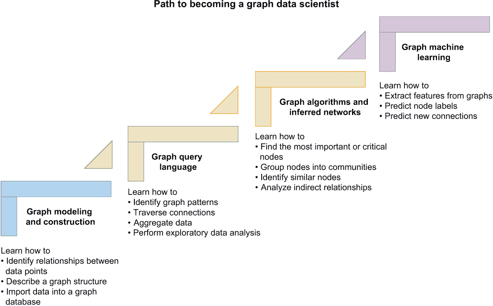

图 2.1 掌握图算法和数据科学的学习路径

图 2.1 中展示的路径采用自下而上的方法，你将首先学习如何将你领域的数据描述为图，包括建模和构建图。接下来，你将学习如何识别、检索和聚合各种图模式。一旦基础知识掌握，你将深入研究描述性图分析，这有助于你理解图当前的状态。在最后几章中，你将学习如何结合所有之前的课程并将其应用于预测图中的新模式。

学习路径包括四个主要里程碑：

+   图建模和构建

+   图查询语言

+   图算法和推断网络

+   图机器学习

第一步是识别图形化问题，并将你的数据表示为图。我在上一章已经提到了如何识别适合基于图的方法的使用案例。在本章中，你将首先学习如何描述特定的图结构以及它在不同的数据集中是如何变化的。

第一个里程碑是理解如何进行图建模并将数据集导入图数据库。虽然不同的图数据库使用不同的底层图模型，但我认为最好专注于一个并努力掌握它；否则，我可能需要用几章的篇幅来介绍图模型之间的差异。由于我希望快速进入实际应用和分析，你将学习如何仅作为*标签属性图（LPG）模型*来建模和导入数据。

与 LPG 模型交互的最广泛采用的图查询语言是*Cypher 查询语言*。Cypher 查询语言由 Neo4j 开发，并被 Amazon Neptune、AgensGraph、Katana Graph、Memgraph、RedisGraph 和 SAP HANA 采用([`opencypher.org/projects/`](https://opencypher.org/projects/))。Cypher 查询语言可以用来从 LPG 数据库中读取数据，以及导入和转换数据。在第三章中，你将学习 Cypher 的基础知识，这将使你能够构建你的第一个图。你的第一个图将代表 Twitter 社交网络，它将在第四章中用来教你如何使用 Cypher 查询语言进行探索性数据分析。了解并理解 Cypher 查询语言的语法将帮助你达到掌握图算法和数据科学的第二个里程碑，届时你将能够识别和检索图模式，遍历连接，聚合数据，并执行探索性数据分析。

第三个里程碑是介绍和理解图算法。在本书的这一部分，你将学习如何使用图算法来描述图的当前状态并提取有价值的见解。图算法有几个类别。例如，你可以使用中心性算法来识别最重要的或最有影响力的节点。另一方面，你可以使用社区检测或聚类算法来识别高度相互连接的节点组。关于图算法的一个有趣的事实是，大多数都有预定的最佳输入图形状。在实践中，你不会调整图算法以适应你的数据，而是将你的数据转换为提供正确的算法输入。你会发现，大多数中心性和社区检测算法都是设计用来接受一个包含单个节点和关系类型的图的；然而，你将经常处理包含多个节点或关系类型的图。因此，你需要学习帮助你将各种图转换为图算法期望的形状的技术。

这种想法不仅限于图算法，对于大多数传统的机器学习和数据科学算法也是正确的。数据科学和机器学习从业者知道，特征工程或数据处理代表了分析或机器学习工作流程中的大部分工作量——处理图和图算法也不例外。在执行算法之前必须进行数据转换也是我推荐使用图数据库存储数据的原因之一。大多数图数据库都有图查询语言或其他内置工具，可以帮助你以最佳方式执行所需的数据转换。第五章、第六章和第七章致力于教你各种技术，教你如何转换或*推断*最适合你想要执行的图算法的图结构。

我故意将图算法和图机器学习分为第三和第四个里程碑。从理论上讲，一些图算法也可以被称为*图机器学习工具*。本书中使用的术语*图机器学习*指的是预测或分类缺失值或未来行为的流程。另一方面，术语*图算法*用于描述描述性分析，如社区检测和中心性算法。

图机器学习背后的工作流程与传统机器学习工作流程非常相似，其中你训练一个模型来帮助你解决指定的任务。传统方法与基于图的方法之间的主要区别在于如何构建机器学习模型特征。一般来说，从图中提取机器学习模型特征有两种方法。第一种方法是采取手动方法，定义相关和预测特征。例如，你可以使用 Cypher 查询语言来描述特征或使用社区检测或中心性图算法的输出。第二种方法是利用嵌入模型，这些模型“自动”将网络结构编码为可以输入到机器学习模型中的向量。在第八章到第十一章中，你将学习如何从下游机器学习工作流程中提取和整合图特征。

作为额外收获，你将在最后一章学习如何使用自然语言处理（NLP）技术构建一个图。具体来说，你将使用命名实体识别（NER）和关系抽取（RE）工具从文本中提取相关信息，并将输出存储为图。让我们迈出掌握图算法和数据科学道路的第一步。

## 2.1 图术语

我们将从学习一些基本的图理论术语开始我们的旅程。本节旨在教你描述你手头上的图的所需语言。

### 2.1.1 有向图与无向图

图 2.2（A）是一个有向图的例子，其中关系方向起着重要作用。有向图的真实世界例子是 Twitter，用户可以关注其他用户，而这些用户不一定关注他们。在这个例子中，马克的帖子将出现在简和英格丽德的动态中。另一方面，马克将看不到简或英格丽德的任何帖子，因为他没有关注他们。图 2.2（B）显示了一个无向图，其中关系方向不是必要的。一个*无向*或*双向关系*表示两个实体之间的连接，可以在两个方向上遍历。这个例子可以用来表示 Facebook，其中只有当双方都同意时，才存在友谊关系。

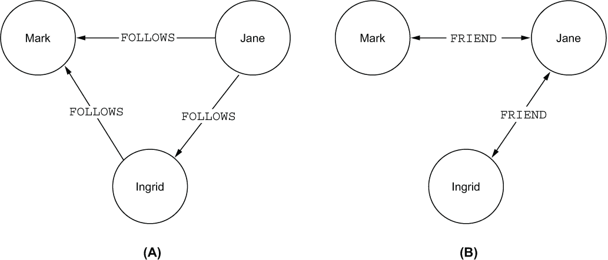

图 2.2（A）表示一个有向图；（B）表示一个无向图。

每个无向图都可以表示为有向图的观点是一个关键概念，它将在后续内容中变得相关。你可以简单地用两个方向相反的有向链接来替换每个无向连接。

在图算法的上下文中，无向关系允许双向遍历，而有向关系只允许单向遍历。例如，在图 2.3(A)中，你可以遍历从马克到简的无向连接并返回。要在有向图中模拟此功能，你需要创建两个指向相反方向的关系。在图 2.3(B)中，双向有向关系允许你从马克到简并返回。这个概念对于理解图算法的输入至关重要。

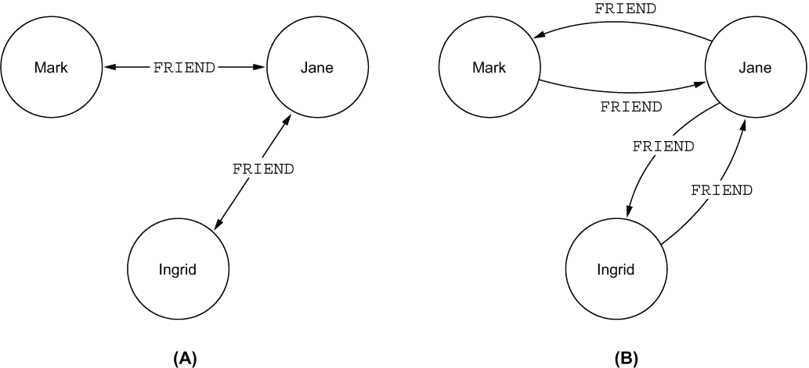

图 2.3 (A)表示一个无向图；(B)表示无向图的等价有向图。

注意 在图算法的上下文中，通常不允许在相反方向上遍历有向关系。然而，在图数据库中，Cypher 查询语言的灵活性允许遍历有向关系的两个方向，使其成为导航复杂关系数据结构的多功能工具。

### 2.1.2 加权图与无权图

在无权图中，如图 2.4(A)所示，所有关系都具有相同的强度或关联的穿越成本。在无权图中不存在更强或更弱的关系的概念。另一方面，图 2.4(B)展示了一个加权图，其中穿越关系的强度或成本被存储为属性（权重必须是数字）。在这个例子中，简和英格丽德的连接比英格丽德和马克的关系更强。根据领域不同，有时更高的权重值更好，而有时更小的权重值更受欢迎。在图 2.4(B)的例子中，较高的权重更受欢迎，因为它表明了更强的友谊关系。另一方面，在交通网络中，较小的权重值更受欢迎，这是使用加权图的典型应用，你正在寻找一对节点之间的最短加权路径。

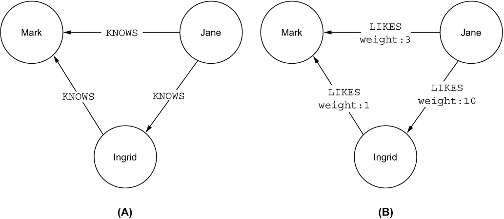

图 2.4 (A)表示一个无权图；(B)表示一个加权图。

### 2.1.3 二部图与单部图

单部图描述的是由单个类型或类别的节点组成的图。在图 2.5（A）中，你可以观察到只包含代表个人的单个类别的节点的单部图。如前所述，大多数图算法都是设计为以单部图为输入的。图 2.5（B）包含代表个人和代表一个组织的两个节点。由于存在两组节点，你可以将此图描述为二部图。此外，在二部图中，关系总是从一组节点开始，并在另一组节点结束。

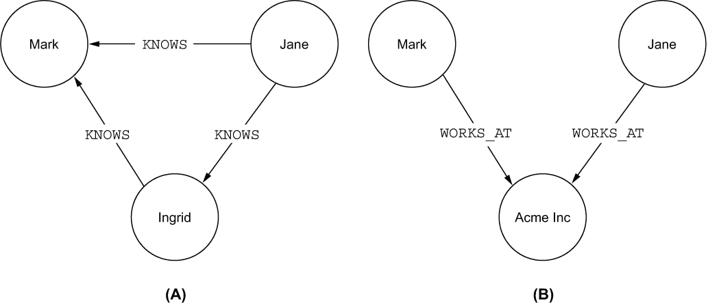

图 2.5（A）表示一个单部图；（B）表示一个二部图。

在图 2.5（B）的示例中，只有从人到组织的关联关系——而不是人与人之间或组织与组织之间的关联。二部图在现实世界中很常见；许多用户-项目交互可以表示为图。例如，在 Netflix 上，用户可以对电影进行评分。用户和电影都表示为节点，评分被描述为一种关系。另一个例子是亚马逊市场，在这里，客户可以购买各种商品。在这里，客户和产品都表示为节点，关系表示客户购买了哪些商品。

### 2.1.4 多重图与简单图

简单图，如图 2.6（A）所示，在每个方向上只允许一对节点之间有一个关系。有许多用例中，你希望在一对节点之间允许多个关系。在这些情况下，你将处理多重图。图 2.6（B）显示了多重图的一个例子。

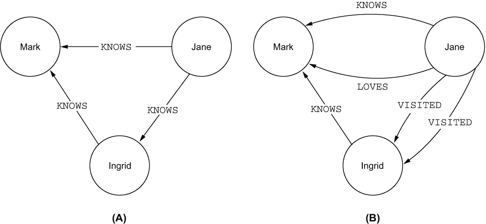

图 2.6（A）表示一个简单图；（B）表示一个多重图。

### 2.1.5 完全图

一个完全图是一个图中每个节点都与其他所有节点相连的图（见图 2.7）。

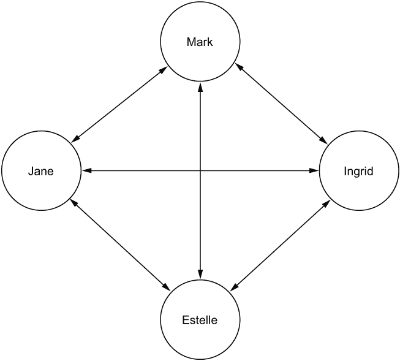

图 2.7 完全图

## 2.2 网络表示

在你学习更多关于 LPG 模型之前，你还将查看简单网络的文本表示。当你想要通过文本快速传达网络结构时，网络文本表示非常有用。我们将借鉴 Cypher 查询语言的语法。Cypher 的语法提供了使用 ASCII 艺术语法匹配图中节点和关系模式的一种视觉方式。它描述节点和关系的语法也是未来图查询语言（GQL；[`www.gqlstandards.org/home`](https://www.gqlstandards.org/home)）的基础，该语言旨在统一图模式查询语言，就像 SQL 对关系数据库所做的那样。Cypher 中节点表示的一个例子如下所示：

```
(:Person {name:"Thomas"})
```

在 Cypher 中描述节点时，用括号包围节点——例如，`(node)`。冒号用于描述节点类型或标签。在前面的例子中，节点标签被定义为`Person`。节点也可以有属性，这些属性以节点括号内的键值对表示。花括号内有一个键值对`{name:"Thomas"}`，它表示节点的名称属性。

Cypher 中的关系被方括号包围：

```
-[:FRIEND{since:2016}]->
```

与节点类似，您可以使用冒号来描述关系的类型。关系也可以在花括号内定义为键值对属性。一个关系不能在没有存在源节点和目标节点的情况下独立存在。例如，您可以使用以下语法指定一个简单的友谊网络：

```
(:Person {name:"Thomas"})-[:FRIEND {since:2016}]->(:Person {name:"Elaine"})
```

此 Cypher 语法描述了 Thomas 和 Elaine 之间的友谊关系，可以如图 2.8 所示的网络可视化。

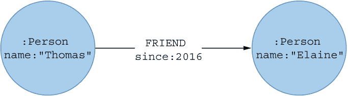

图 2.8 Thomas 和 Elaine 之间的示例友谊网络

Thomas 和 Elaine 是自 2016 年以来一直是朋友的人。如果您仔细观察，您可以在文本表示的末尾观察到关系的方向指示符。有了它，您可以区分有向和无向关系。如果您想将友谊关系描述为*无向的*，您只需省略关系方向指示符即可：

```
-[:FRIEND{since:"2016"}]-
```

我需要在这里做一个小的声明。许多图数据库不支持直接存储无向关系。然而，Cypher 查询语言支持无向查询，这意味着在查询运行时忽略关系的方向。您将在下一节中学习如何存储无向关系。

练习 2.1

尝试使用 Cypher 语法表示您与雇主之间的关系。此图模式中存在两种类型的节点：一个人和一个组织或企业。您还可以根据需要添加额外的节点或关系属性。

我可以使用以下 Cypher 语法描述我与 Manning Publications 的关系：

```
(:Person {name:"Tomaz"})-[:WRITES_FOR {since:2020}]->(:Organization {name:"Manning Publications"})
```

### 2.2.1 标签属性图模型

*标签属性图模型*（LPG）是图数据库使用的图模型之一。如前所述，我们将在这本书中仅使用 LPG 模型，因为重点是教授您如何解决和分析实际问题——而不是比较不同的图模型。在前一节中，我简要介绍了 LPG 结构，其中我介绍了 Cypher 文本表示。

节点有一种特殊的属性类型，称为**标签**，用于表示你领域中的节点角色。例如，你可以使用标签来分类节点是否代表一个人或一个组织。节点和关系都可以存储为键值对属性，例如人的名字作为节点属性或起始日期作为之前 Cypher 文本表示中的关系属性。

重要的是要注意，LPG 模型中的所有关系都是有向的，并且分配了单个类型。关系类型赋予它语义意义。到目前为止，使用的例子使用了`FRIEND`和`WRITES_FOR`作为关系类型。有趣的是，使用`WRITES_FOR`关系，连接的方向对于准确描述语义至关重要：

```
(:Person {name:"Tomaz"})<-[:WRITES_FOR {since:2020}]-(:Organization {name:"Manning Publications"})
```

如果我反转连接方向，我与 Manning Publications 的关系的语义将显著不同。另一方面，有些场景中关系方向并不那么重要：

```
(:Person {name:"Thomas"})<-[:FRIEND {since:2016}]-(:Person {name:"Elaine"})
```

在这个例子中，我反转了关系方向，语义并没有那么不同，因为友谊通常是**双向的**。我这是什么意思呢？当我与某人成为朋友时，这通常意味着他们也是我的朋友。双向关系也可以被视为**无向的**。我无法代表所有图数据库，但具体来说对于 Neo4j：当存储具有双向或无向语义的关系，如友谊时，只需要在两个人之间创建一个单一直接连接，因为这种关系也隐含了相反方向上的连接。使用 Cypher 查询语言，你可以忽略你想要遍历的关系的方向。你将通过实际示例了解更多关于这一点。

为了演示一个简单的 LPG 图模型，让我们尝试将以下信息建模为一个图：

+   托马斯 40 岁。

+   托马斯是埃莱恩的朋友。

+   托马斯是一个人。

+   埃莱恩是一个人。

在图 2.9 的例子中，我们使用节点标签来对节点进行分类，将年龄信息作为内部节点属性存储。由于友谊信息表明了两个人之间的现实世界关系，我们在我们的图中也将它建模为关系。

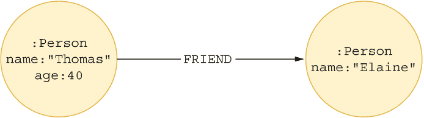

图 2.9 表示示例数据的标签属性图模型

假设你想要在图中添加关于他们的电话号码、社会保险号码和地址的信息。通常，你会将像社会保险号码这样的字面值作为节点属性存储；然而，在某些领域，你可能希望将像社会保险号码或电话号码这样的信息表示为单独的节点。一个典型的例子是欺诈检测场景，其中你感兴趣的是检查共享相同地址、社会保险号码或电话号码的客户（图 2.10）。

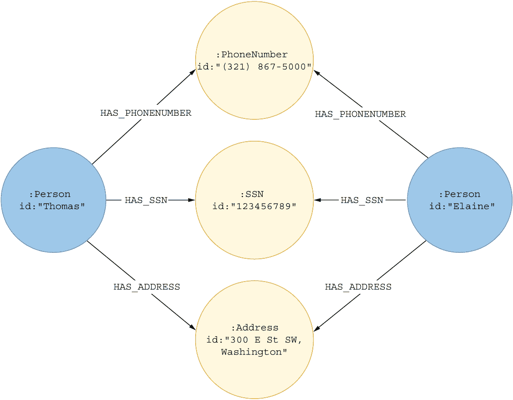

图 2.10 表示欺诈调查领域的标记属性图模型

图模型取决于你的任务，并且使用 LPG 模型，你可以将字面值既表示为内部节点属性（键值对）也可以表示为单独的节点。同样，你也可以选择将标签表示为单独的节点。一个经典的例子是使用 LPG 模型描述类层次结构。在图 2.11 中，图模式被修改以支持类层次结构的表示，这可以用于生物领域，例如。 

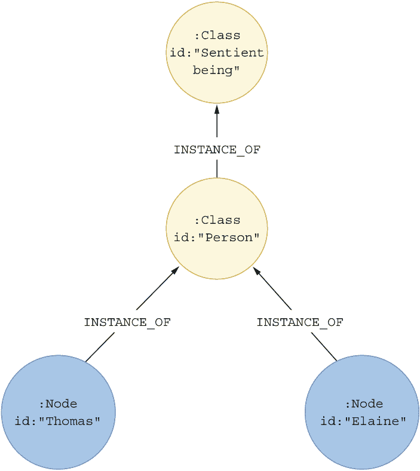

图 2.11 表示类层次结构领域的标记属性图模型

如前所述，图模型取决于你试图解决的问题。在标记属性图中，抽象级别是节点、关系、标签和属性。

在这本书中，你将使用 LPG 图数据库作为图分析的真相来源。如果你想在进一步的图分析中使用其他图模型作为真相来源，那完全没问题。然而，在这本书中，我不会详细介绍如何构建其他图模型以最佳地适应你的图分析任务。

## 2.3 设计你的第一个标记属性图模型

现在，想象一个场景，客户要求你进行 Twitter 的网络分析。客户将提供所有相关数据；你的任务是代表这些数据为图，并通过执行网络分析获得各种见解。你将使用 LPG 模型来表示 Twitter。图建模的一般方法是从你想回答的问题开始，逆向工作。不幸的是，在这个任务中并没有提出具体的问题。作为网络科学家，你的任务是尽你所能，找到尽可能多的见解。你可以从尝试描述你手头的领域开始。在 Twitter 的例子中，最基本的规定如下

+   用户可以关注其他用户（关注者网络）。

+   用户可以发布推文（用户-推文网络）。

+   用户可以从其他用户那里转发帖子（转发网络）。

在本节中，你将学习如何开发一个 LPG 图模型。

### 2.3.1 跟随者网络

在 Twitter 上，你有选择关注其他用户的选项。通过关注用户，你正在订阅他们的活动，并表明你希望在自己的信息流中看到他们的推文。关注者网络的规定如下：*用户可以关注其他用户*。

练习 2.2

作为一项练习，尝试设计跟随者图模型。一般来说，你希望将实体表示为节点。你也可以借鉴一些英语语法中的逻辑。句子的主语和宾语通常表示为节点，而动词描述了它们之间的关系。形容词可以翻译为属性。在设计图模型时，要考虑关系的方向是否具有语义价值。

设计图模型没有正确或完美的方式，但某些模型可以适用于特定场景。当你设计图模型时，尝试回答以下问题：

+   有多少种不同的节点类型存在？

+   这些节点有什么样的属性？

+   你会使用哪个属性来存储节点的唯一标识符？

+   有哪些类型的关系存在？

+   单一的关系类型是否足够准确地描述你的领域？

+   关系的方向是否具有任何语义价值？

+   属性是如何确定或量化关系的？

在关注网络规范中，句子的主语和宾语都是用户，可以表示为节点。关系可以用来表示规范句子的动词。在这里，将关注交互表示为两个用户之间的关系是有意义的。图 2.12 中的单个关系模式可以用 Cypher 的模式语法如下表示：

```
(:User{id:"Vanessa", registeredAt:"2019-03-05"})-[:FOLLOWS{since:"2020-01-01"}]->(:User{id:"Thomas", registeredAt:"2011-03-05"})
```

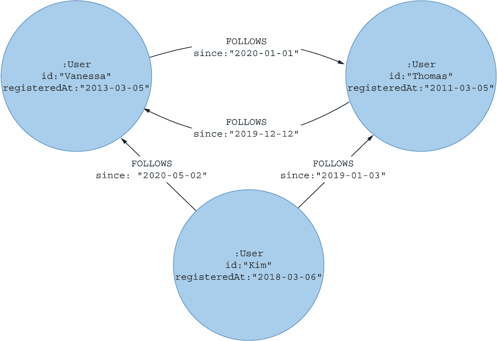

图 2.12 Twitter 关注网络模型

图 2.12 中的每个节点都附有标签`User`。节点标签用于对表示用户的节点进行分类。由于只有一个节点标签，你正在处理一个单部分网络。对于网络中的所有节点，有一个好的做法是有一个*唯一标识符*来区分节点。在 Twitter 上，你可以使用任何用户的 Twitter 昵称作为他们的唯一标识符。数据还包含用户的注册日期，你可以将其存储为节点的`registeredAt`属性。

在图 2.12 中，你可以观察到 Kim 关注了 Vanessa，但 Vanessa 没有关注 Kim。换句话说，Kim 会在她的动态中看到 Vanessa 的推文，而 Vanessa 将不会看到来自 Kim 的任何内容。你可以得出结论，关系的方向具有语义价值，因此你正在处理一个有向网络。`FOLLOWS`关系没有分配任何强度概念，这意味着 Twitter 关注网络是无权重的。然而，你知道关系的创建时间。关于关系创建日期的信息可以存储为关系属性。

在继续之前，你可以检查使用此图模型可以回答的问题或洞察。在检查社交网络时，你可能想要尝试识别影响者。评估影响者的一个简单指标是用户的直接关注者数量。一个用户拥有的关注者越多，他们的推文传播得越广；然而，你的关注者是否也有影响力则很重要。例如，一个财富 500 强 CEO 的关注可能比你的邻居更有影响力。

很可能，用于评估节点*传递性*影响的著名图算法是 PageRank。传递性关系是两个节点之间的间接关系，例如，节点 A 连接到节点 B，节点 B 连接到节点 C。在这个例子中，节点 A 与节点 C 没有直接关系，但通过节点 B 存在间接关系，这表明它们是传递性连接的。假设一位财富 500 强公司的 CEO 比你的邻居有更多的联系。在这种情况下，如果你有一位财富 500 强公司的 CEO 关注你，而不是你的邻居关注你，你将获得更多的传递性关系，从而获得更大的网络影响力。

社交网络中常用的一种分析类型是推断社区结构。在过去的几年里，使用图进行预测分析变得越来越流行。例如，有一句流行的话是：一个人的平均水平等于他/她最亲近的五个朋友。你可以利用这个假设，尝试根据用户关注的用户来预测一个人的属性。由于关注者的图包含了节点和关系的时间成分，你也可以检查网络随时间的变化，并利用这些信息来预测它未来的增长。

### 2.3.2 用户推文网络

推文是分享 Twitter 上内容的初级方式。用户推文网络的简单描述如下：一个用户可以发布一条推文。

练习 2.3

要进入设计图模型的流程，尝试开发一个描述先前规范的图模型。从长远来看，如果你拿一块白板或一本素描本，画一些基本的图模型，这将对你有益。

如果你再次尝试根据规范开发一个图模型，你可能会得到以下图模式：

```
(:User)-[:PUBLISH]->(:Tweet)
```

为了更紧凑的文本表示模型，您通常可以省略节点和关系属性。存在两种类型的节点：用户和推文。您需要添加的是它们之间的关系，以指示推文的作者。一个好的做法是尽可能具体地描述您的图模型。例如，您也可以使用更通用的标签来表示推文，如`Post`。使用更通用的标签，如果在路上被要求添加有关来自 Facebook、LinkedIn 或 Stack Overflow 的用户的信息，可能会遇到问题。每个社交媒体平台都是独特的，并生成不同的数据。例如，推文具有与 Facebook 帖子、LinkedIn 更新或 Stack Overflow 问题不同的属性。这意味着`Post`节点可能有多个可选属性和关系，其中许多在特定类型的帖子中可能未被使用，导致潜在的复杂性和低效。因此，对于不同类型的帖子，拥有特定的节点标签通常是有益的。这样，图数据库的建模更接近于它处理的具体领域数据，从而允许更高效和简单的查询。如果您遵循将图模型尽可能接近领域的指南，您最终会得到如图 2.13 所示的`User`和`Tweet`节点类型。

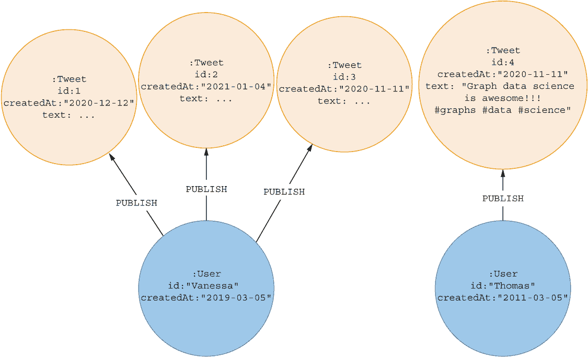

图 2.13 用户-推文网络

在上一个练习中，您已经为用户建立了一个唯一的标识符。现在，您可以做类似的事情，并假设在创建推文时为每个推文创建了一个唯一的 ID。推文的唯一标识符、创建时间和文本存储为`Tweet`节点的属性。由于存在两个不同的节点标签，您正在处理一个二分网络。在这个例子中，关系的方向并不很重要。您可以反转关系方向，并将关系类型更改为更合适的类型，如`PUBLISHED_BY`。两种方法都是正确的；您需要选择一种并坚持下去。我的偏好是使用主动语态定义关系类型，在这个例子中是`PUBLISH`。您不需要担心查询性能，因为在原生图数据库中，遍历关系的反方向没有惩罚。

图 2.14 右侧的示例展示了在开发图模型时应避免的情况。当反向关系不增加任何语义价值时，在标记属性图数据库中避免将其添加到模型中是一种良好的做法。您也不必担心从`Tweet`节点到`User`节点的转换。使用 Cypher 查询语言语法，您可以遍历任何反向关系，或者您可以完全忽略方向。


图 2.14 展示了两种图模型的比较，其中左侧模型使用单一的关系类型来捕捉所有相关信息，而右侧模型则使用相反方向上的冗余关系类型。

可能还会出现的一个问题是，为什么将推文的创建日期存储为节点属性而不是关系属性。这是一个合理的问题，而且像往常一样，这主要取决于你处理的领域。在 Twitter 宇宙中，一条推文只能有一个作者。拥有单一作者意味着一条推文将恰好有一个指向它的`PUBLISH`关系；因此，推文只创建一次。当你做出这样的决定时，你应该始终包括你想要在这个图模型上执行的查询类型。如果你考虑最基本的使用案例，即你想按天计算推文数量，将创建日期存储为推文节点属性而不是`PUBLISH`关系会更简单。你将在第三章中了解更多关于图模式查询语言的工作方式。

喜欢推文的用户将是一个例子，在这种情况下，将创建日期存储为关系属性更有意义。虽然只有单一推文作者，但许多用户可以喜欢特定的推文。为了捕捉特定用户点赞的创建时间，将创建时间信息作为关系属性存储是合理的，如图 2.15 所示。如果你想要将关于点赞的时间信息以日期数组的格式存储在`Tweet`节点上，你将失去关于在那个时间点赞的用户的信息。

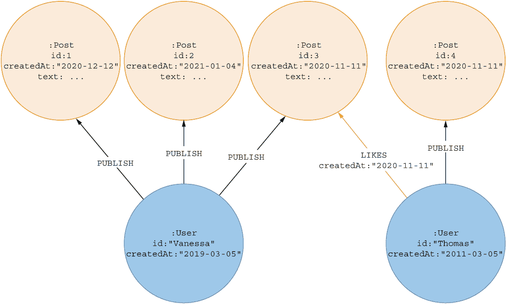

图 2.15 展示了 Twitter 帖子`LIKE`关系的一个例子，在这种情况下，将创建日期作为关系属性存储是有意义的。

从网络科学的角度来看，用户和推文之间只有`PUBLISH`关系并不那么有趣。因为每个推文只有一个指向它的关系，所以推文之间没有重叠或相似之处可以尝试分析。然而，如果你在模型中添加了`LIKES`关系，你可以分析哪些用户喜欢相同或相似的内容，并基于他们喜欢的内容创建用户段。

### 2.3.3 重新推文网络

剩下的唯一任务规范是定义一个用于重新推文的图模型。当用户对推文有强烈反应时，他们可能想要与他们的关注者分享以扩大其影响力。在这种情况下，他们可以选择重新推文原始推文。用户可以选择喜欢重新推文，而这些点赞不计入原始推文。任务规范定义如下：*用户可以从其他用户那里重新推文帖子。*

这个规范比前两个要复杂一些。你无法只是提取句子的主语和宾语，然后使用它们来描述节点。用户-推文网络已经定义，因此你可以在该基础上扩展并添加图模型中的转发。你可以选择几种图模型变体。一个简单的选项是在用户和原始推文之间添加`RETWEET`关系。

描述此模式的 Cypher 语法看起来是这样的：

```
(:User)-[:PUBLISH]->(:Tweet)<-[:RETWEETS]-(:User)
```

在这里，你正在使用用户和原始推文之间的`RETWEET`关系。这个图模式并不将转发视为实际的推文。这既不是好也不是坏——这完全取决于你的用例以及你希望通过分析实现的目标。然而，这种方法确实存在一个小问题。在 Twitter 上，转发也可能有与转发相关联的点赞，而不是与原始帖子相关联。使用 LPG 模型，你无法创建指向另一个关系的引用关系。使用图 2.16 中的图模型，你将失去将点赞附加到转发的功能。在本章的后面部分，你将从转发文本中提取信息，例如标签和提及。在那里，你将再次面临无法将标签和提及信息附加到转发关系的问题。如果 Twitter 域不允许单独的点赞（这些点赞不计入总数），那么将转发作为一个关系是有意义的。不幸的是，在处理 Twitter 域时情况并非如此。为了解决这个问题，你可以将转发视为一个单独的推文，该推文引用了原始推文。这样，你保持了图的一致性，同时仍然能够在以后添加额外的信息到转发中。

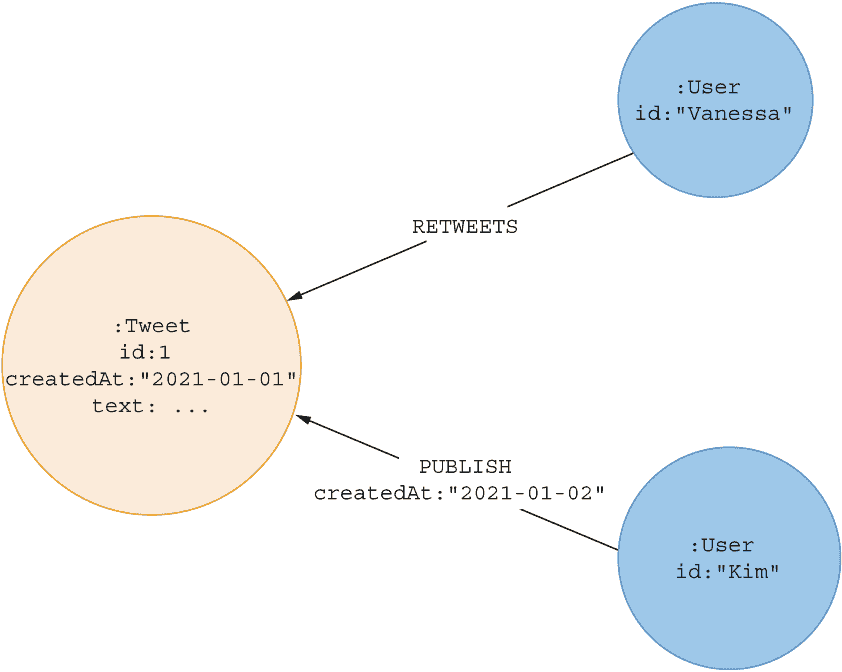

图 2.16 展示了转发网络图模型，其中定义了原始推文和转发该推文的用户之间的`RETWEET`关系

你仍然可以轻松地区分推文和转发。目前，不必担心底层数据和如何检索它。你将在下一章中了解更多关于 Twitter 数据源的信息。在 Twitter 上转发推文时，用户可以选择性地添加他们的评论。在这个例子中，我们跳过了这个场景，因为它不是规范的一部分；然而，我们将在下一章中探讨如何建模引用推文互动。转发有一个出向的`RETWEETS`关系，原始推文只能有一个入向的`RETWEETS`关系。将转发存储为单独节点的图模型（如图 2.17 所示）也允许你在分析过程中根据需要添加其他关系。再次强调，你想要评估如何使用这个图来提取洞察。记住，用户通常在强烈反应于推文内容并希望与他们的关注者分享时转发推文。你可以计算转发次数并尝试识别最受欢迎的推文主题或其作者。你也可以根据转发模式推断用户之间新的直接关系。将间接图模式转换为直接关系是网络分析中常见的中间步骤。在转发网络的情况下，你可以根据用户转发其他用户的频率推断用户之间的直接关系。

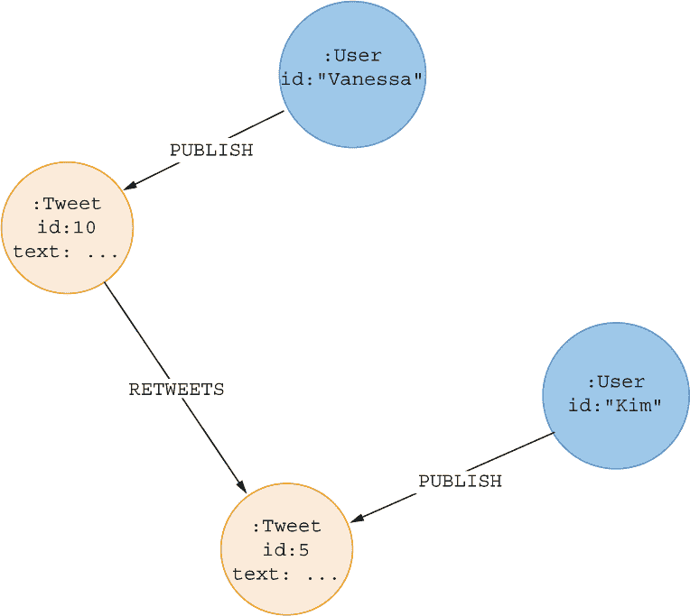

图 2.17 转发网络的图模型，其中转发被视为引用原始推文的推文

图 2.17 演示了 Vanessa 刚刚转发了 Kim 的一条推文的情况。如果你假设转发总是积极的互动，你可能会认为 Vanessa 积极推广 Kim 的推文并扩大其影响力。这种间接的放大模式可以转化为 Kim 和 Vanessa 之间的直接关系，如图 2.18 所示。

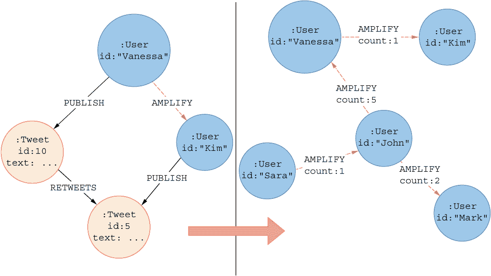

图 2.18 从间接的转发关系模式中推断新的网络

你可以使用文本表示来展示你采用了以下图模式：

```
(:User)-[:PUBLISH]->(:Tweet)<-[:RETWEETS]-(:User)
```

然后，你可以将这种间接关系模式转换为用户之间的直接关系：

```
(:User)-[:AMPLIFY]->(:User)
```

通过将间接模式转换为直接关系，你正在创建一个新的推断网络。推断关系的类型取决于你的领域用例。在这里，我选择了`AMPLIFY`类型，因为转发放大了原始推文的传播范围。新的推断`AMPLIFY`关系是单向的，因为关系的方向具有语义价值。它也是加权的，因为你可以通过计算转发的数量来量化`AMPLIFY`关系的强度。如果一个用户单次转发另一个用户的帖子，那么`AMPLIFY`关系的权重是`1`。然而，如果一个用户经常转发另一个用户的帖子，那么权重将等于转发的数量。你可以在这个推断网络中再次搜索影响者，或者尝试找到通过推广他们的内容来积极支持彼此的用户社区。

### 2.3.4 表示图模式

图形方法在数据建模中的美妙之处在于，你总是可以将新信息连接到现有图上。现在，你可以将迄今为止的所有图模型决策组合成一个单一的图模型。图 2.19 可视化了根据你对如何建模用户、他们的关注者、推文和转发的决策所遵循的合并数据。

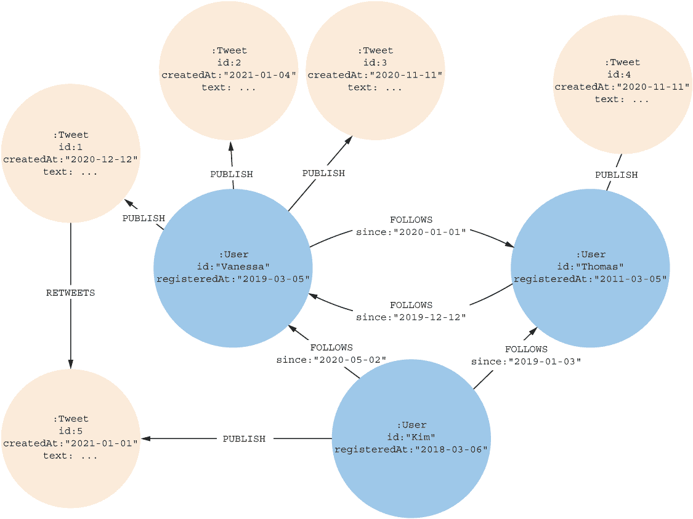

图 2.19 表示 Twitter 网络的标记属性图，其中用户可以相互关注，也可以发布和转发帖子

近年来，人们提出了表示 LPG 图模式的方法。目前还没有官方标准来展示 LPG 图模式，但我们将现在讨论可能最常见的方法。

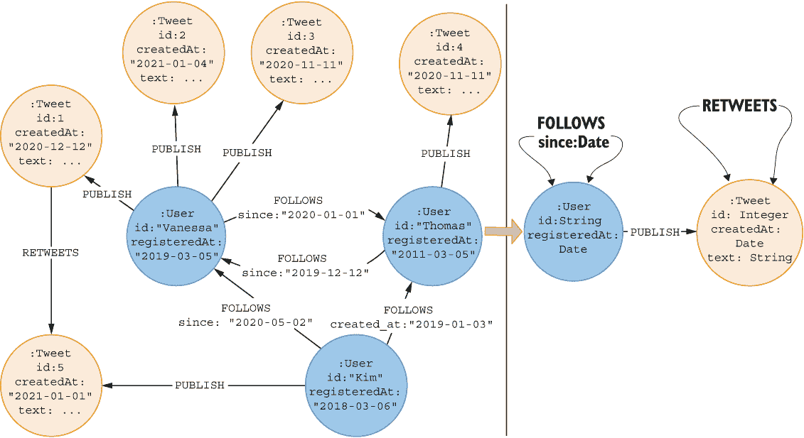

图 2.20 Twitter 社交网络图模型表示

每个节点类型或标签都表示为一个单独的节点。当前 Twitter 网络表示中存在两种不同的节点标签。你可以将它们描述为图模式表示中的两个节点，如图 2.20 所示。然后，将节点属性添加到代表每个标签的节点上。你可以选择性地添加节点属性的示例值，但我更喜欢添加它们的数据类型作为值。目前，还没有达成共识的方式来可视化节点属性是否为可选的，或者是否用作唯一标识符。具有相同标签的节点之间的关系表示为自环。自环是具有相同起始和结束节点的关联。在图 2.20 的右侧，存在两个自环。`FOLLOWS`关系从起始并指向具有`User`类型的节点。此外，`RETWEETS`关系从起始并指向具有类型`Tweet`的节点。不幸的是，再次，没有达成共识的方式来表示关系方向是否具有语义价值（即应被视为有向或无向）或不是。目前，你必须阅读随图模式可视化一起提供的详细说明。

## 2.4 从文本中提取知识

你已经学习了如何根据数据的图特征构建图模型。接下来，你将学习如何从文本中提取相关信息并将它们纳入你的知识图谱模型。为了了解你可以从推文内容中提取哪些信息，让我们看看一个示例推文。

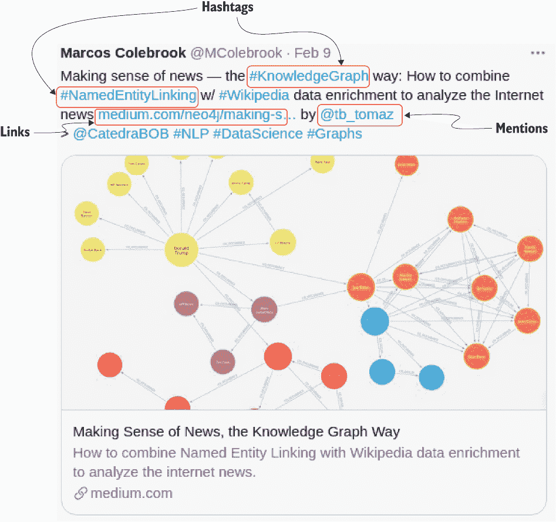

图 2.21 一个包含提及、链接和标签的示例推文

图 2.21 中的推文包含几个元素，以最大化其覆盖范围和互动性。例如，#KnowledgeGraph、#NamedEntityLinking、#Wikipedia、#NLP、#DataScience 和#Graphs 等标签是用于对内容进行分类并使其对感兴趣这些特定主题的用户可发现，从而增加其在 Twitter 平台上的可见性。链接，如 Medium 文章的 URL，提供了直接访问相关内容的途径，允许关注者深入探索该主题。提及，由@符号后跟 Twitter 用户名（例如，@tb_tomaz 和@CatedraBOB）表示，用于直接指向或引用特定个人或组织，从而在 Twitter 社区中创造对话并促进参与。

### 2.4.1 链接

你可以从推文内容中提取的第一条信息是推文中包含的任何链接。从文本中处理任何链接应该相当直接。

练习 2.4

现在你已经有一些开发标记属性图（LPG）模型的经验了，你认为在 Twitter 图模型中添加链接信息最好的方法是什么？你已经在模型中定义了推文；现在你只需要将提取的链接信息添加到它们上面。

我可以想到两种选择。你可以将 URL 存储为推文节点属性，或者将其存储为单独的节点，并在链接和推文之间添加一个关系（图 2.22）。

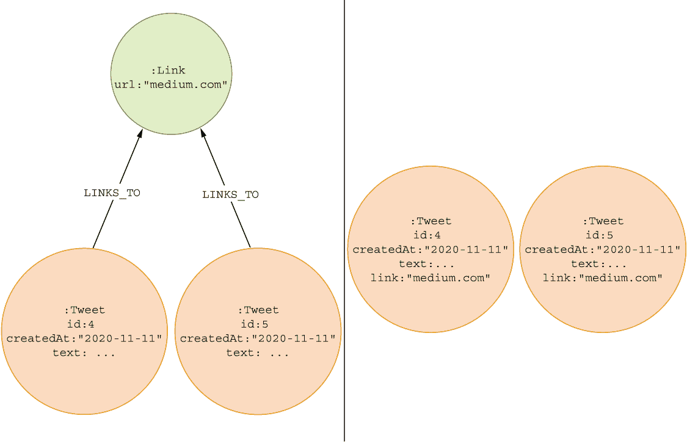

图 2.22 从推文中提取链接的两种存储选项

你认为哪种方法更好？在这两种方法中，你都有选择存储一个或多个链接的选项，因为你可以使用字符串列表作为节点属性。真正的答案取决于你的查询。你想要在分析中将具有相同链接的推文分组吗？如果你将链接作为节点属性存储，那么找到具有相同链接的推文将更加计算密集，因为你需要比较所有推文对之间的列表中的所有元素。你可以通过将链接作为单独的节点来避免这种情况。通过使用单独的节点来表示链接，你只需要遍历两个关系就可以从一个推文到达另一个推文，甚至到达具有相同链接的所有推文。如果你对将具有相同链接的节点分组感兴趣，这种方法将具有更好的可扩展性。

图模型考虑因素

当考虑是否要将信息存储为单独的节点或节点属性时，重要的是要检查这些值是否标准化。以推文中链接的例子来看。当离散值未标准化时，将信息存储为单独的节点是没有意义的。使用单独的节点来存储信息的整个目的就是为了在查询运行时允许更快的遍历。当值未标准化时，你将失去在居住在同一城市的人之间快速遍历的能力。一个经验法则是，一个现实世界的实体或概念应该作为图中的一个单独节点来表示。在下面的图中，Medium 网站被表示为三个不同的节点，如果你试图查找具有相同链接的推文，这将返回无效信息。虽然将链接信息作为节点属性并不能解决查找具有相同链接的推文的问题，但至少你不会在图中将一个现实世界的实体表示为多个节点。解决方案是清理并标准化链接信息，以便你可以将链接作为单独的节点来建模，或者将链接信息作为节点属性存储，以避免在图中将单个实体表示为多个节点。

另一个需要考虑的话题是信息的具体性。例如，假设信息非常不具体，并且从信息的角度来看没有增加多少价值，比如用户的性别。在这种情况下，最好将此信息作为节点属性存储。一个原因是你避免了拥有可以连接到图的大部分部分的节点。以性别为例，你可以有连接到图中几乎一半用户的节点。连接到图的大部分部分的节点被称为*超级节点*，你通常希望避免在图中使用它们，因为它们由于附着的众多关系而可能阻碍查询性能。

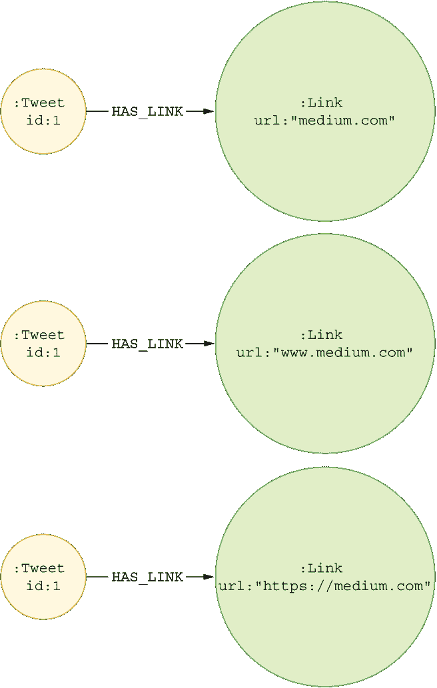

一个链接未标准化的示例图

### 2.4.2 标签

你可以从推文内容中提取的其他信息是标签。人们在推文中使用井号(#)符号在相关关键词或短语之前来对它们进行分类。一条推文可以包含许多标签；将它们作为单独的节点存储并将推文连接到它们是有意义的，如图 2.23 所示。

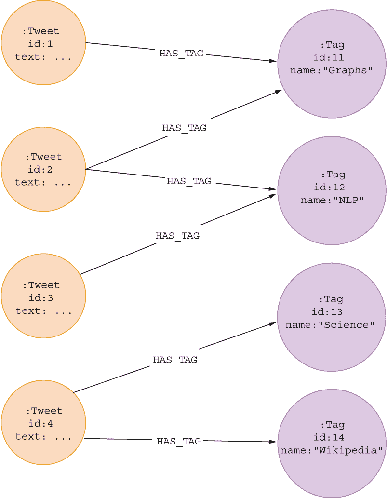

图 2.23 推文标签的图模型

一个重要的考虑因素是，你想要避免使用像`HAS`这样的通用关系类型，你可以在许多场景中使用它。你希望你的关系类型具有意义（例如，如果你从一个推文遍历`LINKS_TO`关系，你将始终到达一个`Link`节点）。同样，如果你从一个推文遍历`HAS_TAG`关系，你将始终到达一个`Tag`节点。重要的是要记住，你不想最终得到一个可以导致许多不同节点类型的关系类型。使用通用关系类型可能会阻碍图模型的表达能力，并负面对查询处理时间产生影响。

避免使用通用关系类型

假设你正在处理一个使用各种节点之间的通用`HAS`关系的 Twitter 图模型。例如，假设你想检索所有推文的标签。引擎必须扩展`Tweet`节点的所有出向`HAS`关系，并检查关系的末端节点是否为`Tag`节点。另一方面，如果你使用特定的`HAS_TAG`关系将标签连接到推文，你将避免遍历不指向`Tag`节点的关系。此外，引擎不需要检查目标节点类型，因为可以保证`HAS_TAG`关系指向`Tag`节点。因此，使用通用关系类型可能会导致查询性能变慢，因为数据库需要搜索更多的关系来找到与查询匹配的图模式。

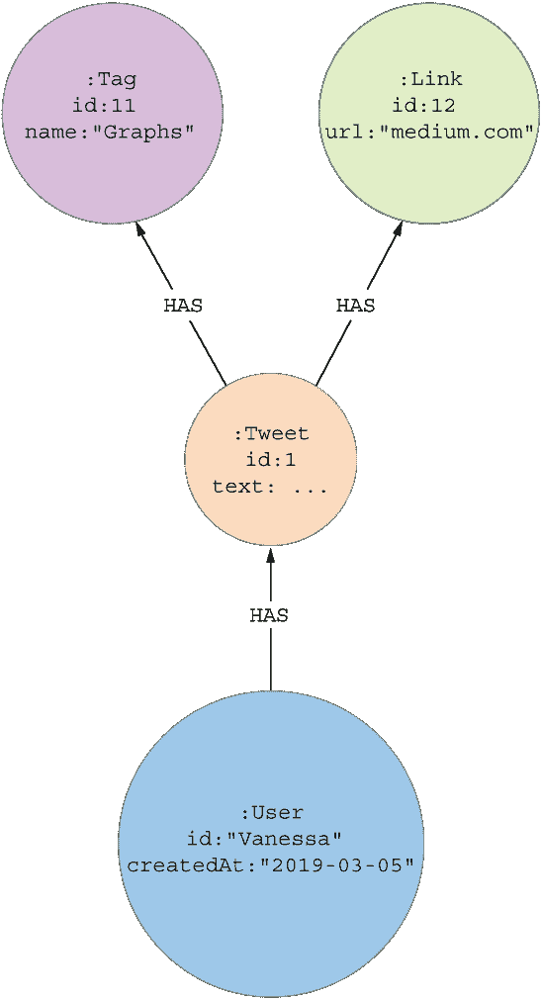

具有通用`HAS`关系的图示例

使用通用关系类型也可能阻碍图的清晰性和可维护性。在以下图例中，使用`HAS`关系来表示

推文的作者以及其标签和链接。使用通用关系类型在查询或修改图时可能会导致混淆或错误。相反，定义描述关系本质的特定关系类型可以使图更容易理解和操作，从而有助于确保图随着时间的推移保持一致和正确，因为这种模式更不容易出错。

图 2.24 中的图是一个由推文和标签节点组成的二分网络。在处理二分网络时，将其投影到单边网络是一个常见的分析工作流程步骤。例如，如果一对推文共享相同的标签，你可以假设它们以某种方式相连。这个过程与你在转发网络中看到的过程类似，其中你将间接的图模式转换为直接关系。标签和推文的二分网络转换为单边网络的过程在图 2.24 中进行了可视化。

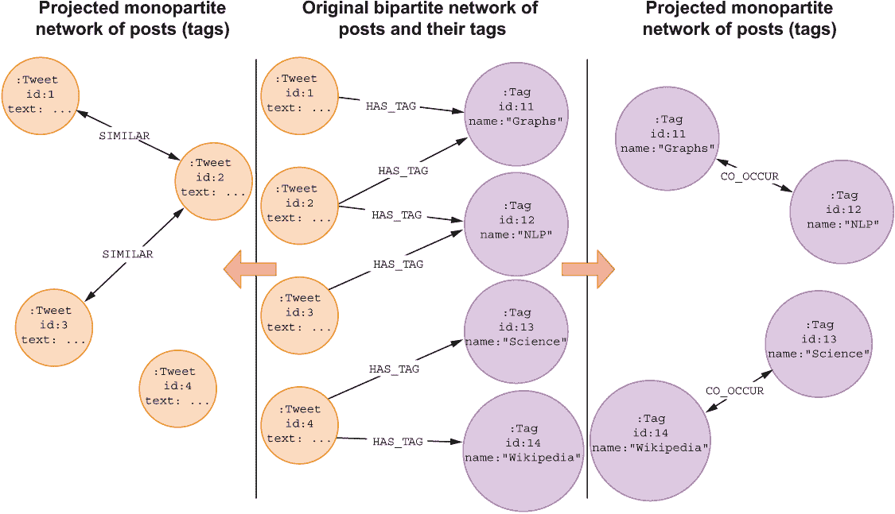

图 2.24 单边网络投影的 Twitter 标签

你可以观察到，你总是可以选择将二分网络投影到两种类型的节点上。在一个包含推文及其标签的二分网络中，你可以将其投影为推文或标签的单分网络。新推断关系命名取决于领域。我添加了推文之间的`SIMILAR`关系，因为我假设具有更多重叠标签的推文可以被认为是更相似的。另一方面，如果标签经常共同出现，它们也可以被认为是相似的。用网络的文本表示来说，你可以将以下间接图模式转换为：

```
(:Tweet)-[:HAS_TAG]->(:Tag)<-[:HAS_TAG]-(:Tweet)
```

你可以将其转换为更直接的图模式：

```
(:Tweet)-[:SIMILAR]-(:Tweet)
```

你可能已经注意到，网络分析的一个常见方法是将复杂的图模式简化为只有一种类型节点和关系的网络。这是因为大多数经典图算法，如中心性或社区检测算法，都是设计为以单分网络作为输入的。使用单分投影，关系的方向通常不包含任何语义价值。如果推文 A 与推文 B 相似，那么推文 B 也与推文 A 相似。你可以通过计算两个推文共有的标签数量来量化它们之间相似性的强度。因此，大多数推断的相似性网络都是无向和加权的，就像这个例子一样。另一方面，基于转发的先前推断的放大网络也是有向和加权的。你可以分析推文的推断相似性网络，试图找到发布相似内容的用户。请注意，你也可以结合图的其他部分的信息来推断一个新的单分网络。

### 2.4.3 提及

用户可以通过使用提及符号（@）在其推文中提及其他用户。提及可以理解为邀请评论或召唤，而在其他时候，它可以用作通知用户查看特定内容。你已经在图模式中定义了用户，因此将推文连接到被提及的用户是有意义的，如图 2.25 所示。


图 2.25 推文提及的图模型

就像标签网络一样，提及网络也是一个经典的二分网络。因此，你可以将其投影为用户或推文的单分网络（图 2.26）。例如，你可以分析哪些用户经常被共同提及，并尝试检查推断的共同提及网络的用户社区结构。你还可以检查被提及的人是否与推文互动。你还可以将提及信息与其他图中的信息结合，并检查被提及的用户在推文中出现的最常见标签。你可以使用的一种策略是将提及信息整合到关注者推荐中。


图 2.26 Twitter 提及网络折叠或单分投影

### 2.4.4 最终 Twitter 社交网络模式

设计图模型模式是一个迭代的过程。你逐渐向图模型添加了额外的信息，它逐渐变得更加丰富。当向图模型添加新数据时，建议设计一个自描述的图模式。使用自描述的图模型，你可以避免创建一个用于其他人了解图存储的信息以及如何查询它的模式手册的额外工作。最后，图模式可能会根据你将要执行的查询而改变，因为你可能想要优化特定查询的性能。如果你将迄今为止所做的所有图模型设计考虑因素放入一个单独的可视化中，你可以观察到以下图结构。

图 2.27 显示了 Twitter 网络的一个示例，其中存在四种不同的节点类型或标签。在最终的 Twitter 图模型中，有用户、推文、标签和链接节点。在这个过程中，你也介绍了六种不同类型的关系。如果你总结一下，你可以用图 2.28 中显示的图模式来表示这个示例网络。

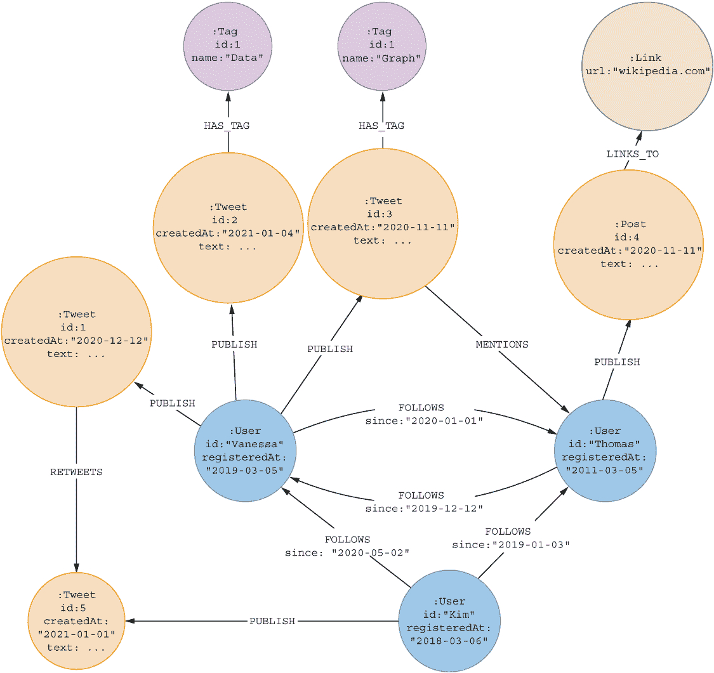

图 2.27 从文本中提取知识后的 Twitter 社交网络

你只想将那些将被实例化的推断关系添加到图模式中。推断关系和相似性网络是基于你在网络分析期间可能做出的假设创建的。你还不知道哪些推断关系将被实例化，所以现在将它们排除在图模式之外是有意义的。最终的图模式表示可以在图 2.28 中查看。

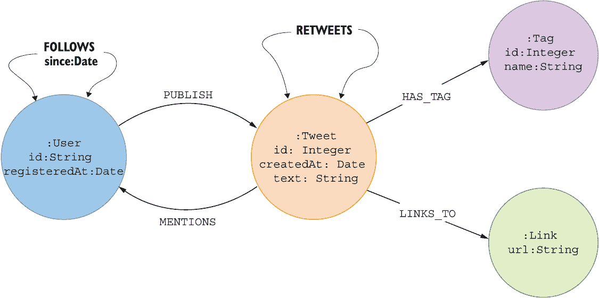

图 2.28 最终 Twitter 社交网络图模式表示

你可能已经注意到，网络分析中的一个常见主题是将间接的图模式和关系转换为直接的。使用具有专用图模式查询语言的图数据库可以使你更容易实例化这些网络转换。例如，你可以将推文之间的转发链接转换为用户之间的直接放大关系。另一个常见的场景是将二分网络转换为单分网络。单分投影被使用，因为大多数图算法都是设计用来在具有单一类型节点和关系的网络上工作的。在下一章中，你将学习 Cypher 的基础知识以及如何根据本章中推导出的图模型导入网络。

## 摘要

+   标签属性图模型由一组节点、关系、节点标签和属性表示。

+   无向关系可以从两个方向进行遍历。

+   无向图可以表示为有向图，其中每个关系都被两个指向相反方向的关系所取代。

+   关系可以被加权，其中权重表示遍历关系的强度或成本。

+   单分图只包含一个节点和一种关系类型。

+   二分图包含两组节点，并且同一组内的节点之间不存在任何关系。

+   多重图是一种允许单个节点对之间存在多个关系的图类型。

+   完全图是一种节点与其他所有节点都相连的图。

+   Cypher 语法使用括号来表示节点：`(:Node)`。

+   Cypher 中的关系用方括号表示：`()-[:RELATIONSHIP]-()`。

+   关系不能存在或表示，如果没有其相邻节点。

+   根据领域，字面值可以表示为一个单独的节点或在标签属性图模型中的一个节点属性。

+   当关系方向不增加任何语义价值时，在单方向添加关系是一种好的做法，并在使用标签属性图数据库时避免在相反方向重复添加关系。 

+   图建模是一个迭代的过程。

+   图模型可以用图模型架构可视化来表示。

+   从非结构化文本中提取结构化信息对大多数数据分析来说非常有价值。

+   将间接图模式简化为直接关系（单分图投影）是网络分析中常见的步骤。
