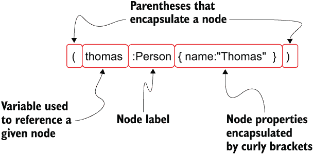
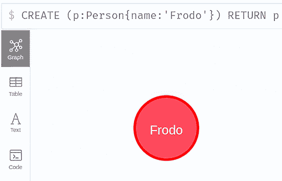
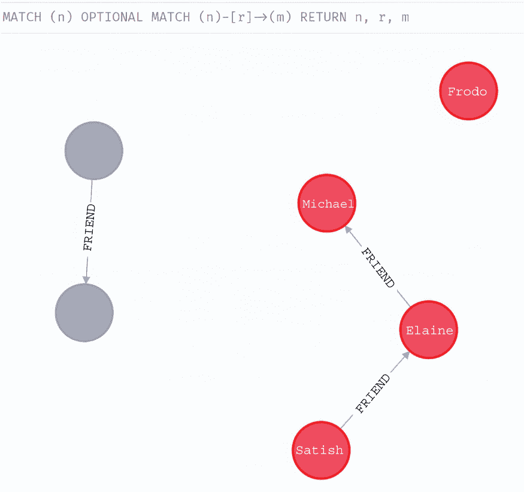
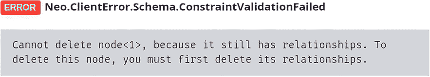
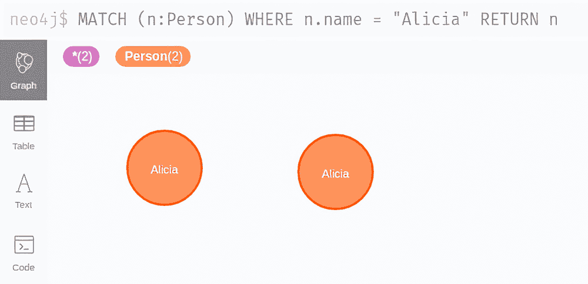
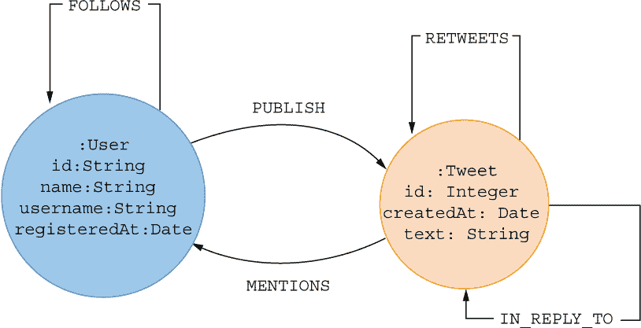
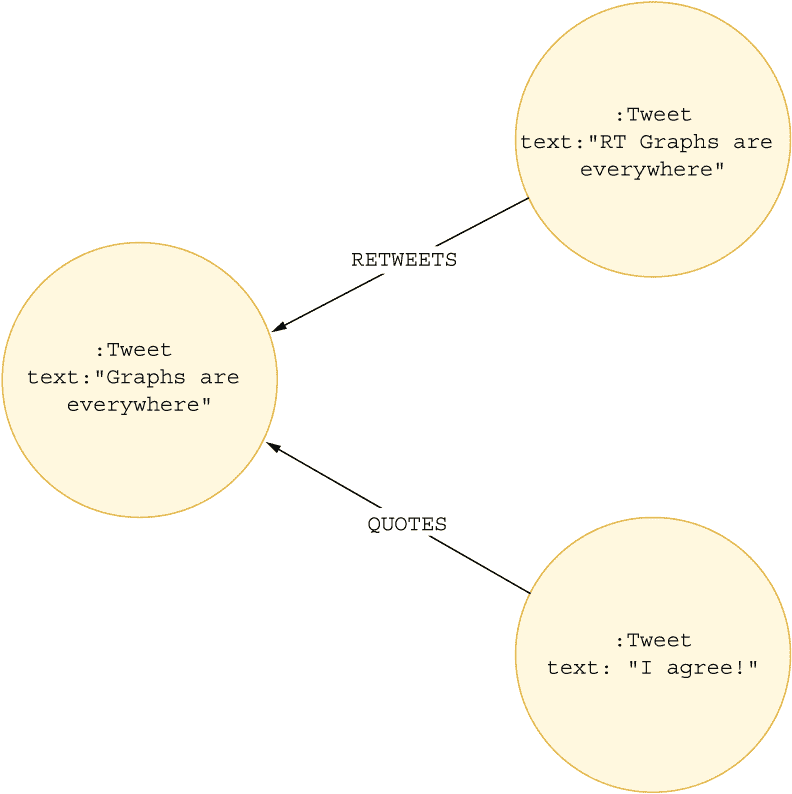

# 3 使用 Cypher 查询语言的第一步

本章涵盖

+   介绍 Cypher 查询语言语法

+   使用 Cypher 创建节点和关系

+   从数据库中匹配和检索数据

+   移除属性、删除节点和关系

+   将 CSV 导入图数据库的最佳实践

到目前为止，你已经学习了一些图论知识以及如何处理带标签的属性图建模过程。现在，你将开始学习如何通过实际案例进行网络分析。为了跟随本书中的示例，你需要设置 Neo4j 开发环境。如果你在设置过程中需要一些帮助，请参阅附录。 

本章将介绍 Cypher 查询语言子句以及将数据导入图数据库的最佳实践。首先，我将简要回顾如何使用 Cypher 查询语言语法以文本格式表示网络。如果你已经熟悉 Cypher 查询语法，你可以跳过本章的大部分内容，只需按照最后一节所示导入数据即可。记住，从上一章中，Cypher 语法使用括号来封装节点的表示。如何使用 Cypher 语法描述节点的一个快速提醒如图 3.1 所示。



图 3.1 使用 Cypher 查询语言语法表示具有标签和属性的节点

在这个例子中，我使用标签 `Person` 描述了一个节点。节点的标签总是由一个冒号引导。节点属性是括号内封装的关键值对。示例节点只有一个属性，键为 `name`，值为 `Thomas`。在 Cypher 中，你还可以在节点的开始处添加一个变量，该变量用作对特定节点的引用。你可以为引用变量选择任何名称；在这个例子中，我选择了引用变量 `thomas`。节点变量允许你在 Cypher 语句中稍后引用此特定节点，并且它仅在单个 Cypher 语句的上下文中有效。你可以使用节点变量来访问其属性和标签；在表达式中使用它；或创建与给定节点相关的新模式。在 Cypher 中，关系用方括号表示。

关系只能存在于它相邻于源节点和目标节点时。当你用 Cypher 描述一个关系时，你总是需要包括相邻的节点。每个关系都有一个单一的类型；就像节点标签一样，关系类型也是由冒号引导的。图 3.2 中的示例描述了一个具有 `FRIEND` 类型的关系。关系属性像节点属性一样描述，并且每个关系都可以分配一个变量（在这个例子中，`f`），该变量可以在 Cypher 语句中稍后用来引用给定的连接。


图 3.2 使用 Cypher 查询语言语法表示具有类型和属性的节点

注意：在 Neo4j 中，每个关系都存储为有向的。然而，在执行基于存储图上的 Cypher 查询或图算法时，您可以忽略关系的方向。在 Neo4j 中，将无向关系存储为单个有向关系是一种常见的做法。在执行 Cypher 查询时，您可以忽略关系的方向，将其视为无向的。虽然这在 Neo4j 中是一个相关方面，但一开始可能难以理解，因此在本书中，我将向您展示如何区分存储图和查询图的实用示例。

## 3.1 Cypher 查询语言子句

带着如何在 Cypher 中描述节点和关系的知识，我们现在将开始讨论 Cypher 子句。为了跟上示例，您需要准备好一个可工作的 Neo4j 环境。我建议您使用 Neo4j 浏览器来执行 Cypher 查询。再次提醒，如果您需要设置 Neo4j 环境和访问 Neo4j 浏览器的帮助，我建议您查阅附录。

### 3.1.1 CREATE 子句

您将首先学习如何使用 Cypher 创建数据。`CREATE`子句用于在图数据库中存储节点和关系。虽然 Cypher 查询语言子句不区分大小写，但为了便于阅读，建议使用大写字母编写 Cypher 子句。有关 Cypher 风格指南的更多信息，请参阅此 Neo4j 网页：[`neo4j.com/developer/cypher/style-guide/`](https://neo4j.com/developer/cypher/style-guide/)。您可以使用 Cypher 语法描述节点和关系模式来存储任何图模式。

您将首先在图中创建一个节点。以下列表中的语句创建了一个带有`Person`标签和单个节点属性的节点。

列表 3.1 存储带有标签`Person`和属性`name`（值为`Satish`）的节点的 Cypher 查询

```
CREATE (p:Person{name:'Satish'})
```

每次执行列表 3.1 中的查询，数据库中都会创建一个新的节点。`CREATE`子句不会检查图数据库中的现有数据；它盲目地遵循命令在数据库中创建新的模式。

如果您想检索创建的图元素并在 Neo4j 浏览器中可视化它们，可以使用`RETURN`子句。Cypher 查询中只能有一个`RETURN`子句，并且只能作为查询的最后一个子句。像往常一样，有一些例外情况，您可以在查询中包含多个`RETURN`子句。这些例外是并集和子查询，您将在以后学习到。

以下列表中的 Cypher 语句首先创建了一个带有`Person`标签和`name`属性的节点。

列表 3.2 创建节点并使用`RETURN`子句检索其信息的 Cypher 查询

```
CREATE (p:Person{name:'Frodo'})
RETURN p
```

创建的节点使用 `p` 变量进行引用。要从数据库中获取创建节点的信息，你可以使用 `RETURN` 子句并定义你想要检索的变量。在这个例子中，你想要检索 `p` 变量。

列表 3.2 中的 Cypher 语句在 Neo4j 浏览器中产生了如图 3.3 所示的输出。这个可视化展示了由列表 3.2 中的 Cypher 语句返回的单个节点。此外，Neo4j 浏览器还提供了一些可视化选项，如节点颜色和大小选项，以及标题定义。更多关于 Neo4j 浏览器样式的信息可以在浏览器手册中找到（[`mng.bz/j1ge`](http://mng.bz/j1ge)）。



图 3.3 列表 3.2 中 Cypher 语句的输出

练习 3.1

为了练习创建图，在图中创建一个新的带有标签 `Person` 的节点，并设置两个节点属性。第一个节点属性包含你的姓名信息，第二个节点属性包含你的年龄信息。

你可以在单个 Cypher 语句中使用多个 `CREATE` 子句。通过使用节点和关系的变量，你可以在后续的 `CREATE` 查询中修改和连接它们。

下面的列表中的 Cypher 语句演示了如何创建两个节点及其之间的关系。

列表 3.3 存储两个节点及其之间关系的 Cypher 查询

```
CREATE (elaine:Person{name:'Elaine'}), (michael:Person {name: 'Michael'})
CREATE (elaine)-[f:FRIEND]->(michael)
RETURN *
```

在第一个 `CREATE` 子句中创建了两个节点，在第二个 `CREATE` 子句中添加了它们之间的关系。虽然你可以将这两个 `CREATE` 子句合并为一个子句，但作为一个最佳实践，建议分别创建节点和关系。 

你可能已经注意到列表 3.3 中的 Cypher 语句在 `RETURN` 子句中使用了 `*` 通配符运算符。通配符运算符 `*` 将返回作用域内的所有变量。

练习 3.2

尝试创建两个节点，一个代表你自己，另一个代表你工作的组织。你可能希望使用不同的节点标签来描述一个人和一个组织。然后，在同一个 Cypher 语句中，创建一个连接你和你的雇主的关系。你可以尝试添加一个关系属性来表示你开始当前职位的日期。

记住，你只能在 Neo4j 图数据库中存储有向关系。让我们看看当你尝试在以下列表中创建无向关系时会发生什么。

列表 3.4 尝试在数据库中存储无向关系并失败的 Cypher 查询

```
CREATE (elaine:Person{name:'Elaine'}), (michael:Person {name: 'Michael'})
CREATE (elaine)-[:FRIEND]-(michael)
RETURN *
```

列表 3.4 中的 Cypher 语句失败，因为数据库中只能存储有向关系。虽然关系方向箭头在查询中似乎只是很小的一部分，但它对查询的行为有非常大的影响。

初学者中另一个常见的误解是他们忘记引用变量仅在相同的 Cypher 语句中可见。如前所述，`CREATE` 语句在向图中插入新数据之前不执行数据库查找。以下 Cypher 语句乍一看似乎是好的，但实际上相当糟糕。

列表 3.5 将两个没有标签且之间有关系的空节点存储到数据库中的 Cypher 查询

```
CREATE (ankit)-[f:FRIEND]->(elaine)
RETURN *
```

你能推断出原因吗？因为 `CREATE` 语句不执行数据库查找，并且在 Cypher 查询之间没有变量引用可见性，它只会创建我们描述的新模式。因此，列表 3.5 中的 Cypher 语句在两个没有标签且没有属性的节点之间创建了一个 `FRIEND` 关系。你必须非常小心，避免这些类型的情况。在标记属性图模型中，没有你想在数据库中存储没有任何标签的节点的情况。至少，你可以在每个节点上添加一个通用的 `Node` 标签。

注意：标记属性图模型非常灵活，允许你创建没有标签或属性的节点。然而，你应该始终努力至少为你在数据库中存储的每个节点添加一个标签。有标签的节点将有助于模型的可读性以及查询执行性能。我可以安全地说，如果你的图中没有标签的节点，那么你的模型或导入过程可能存在问题。

练习 3.3

本练习的目标是创建三个节点，并在它们之间建立两个关系。这些节点应代表你目前居住的城市、国家和大陆。在它们之间添加一个城市和国家之间的关系，以及国家与大陆之间的关系。花几分钟时间决定你想要使用的关系类型和关系的方向。

### 3.1.2 MATCH 子句

你可以使用 `MATCH` 子句在数据库中搜索现有的图模式。Cypher 是一种声明式查询语言，这意味着你只需要指定你感兴趣的模式，然后让查询引擎负责如何从数据库中检索这些模式。在上一节中，你至少创建了三个带有 `Person` 标签和不同 `name` 属性值的节点。如果你想找到一个具有特定 `name` 属性值的 `Person` 节点，你可以使用以下查询。

列表 3.6 查询并检索具有标签 `Person` 和 `name` 属性值为 `Satish` 的任何节点的 Cypher 语句

```
MATCH (p:Person {name:'Satish'})
RETURN p
```

在你编写第一个 Cypher 子句之前，首先学习如何使用 Cypher 描述节点和关系模式是至关重要的。当你知道如何描述图模式时，你可以使用`MATCH`子句从数据库中检索它。列表 3.6 中的查询使用*内联*图模式匹配。内联模式匹配使用 Cypher 模式语法来描述具有其标签和属性的节点或关系模式。与内联模式匹配相反的是使用`WHERE`子句来描述图模式。

列表 3.7 使用`WHERE`子句搜索和检索任何标签为`Person`且`name`属性值为`Satish`的节点的 Cypher 语句

```
MATCH (p)
WHERE p:Person AND p.name = 'Satish'
RETURN p
```

列表 3.7 中的查询将产生与列表 3.6 中查询完全相同的查询计划和结果。内联语法只是提高可读性的语法糖。使用`WHERE`子句，你描述了你想要检索一个标签为`Person`且`name`属性值为`Satish`的节点。我个人的偏好是使用内联图模式描述节点标签，并在`WHERE`子句中提供额外的匹配过滤器。

列表 3.8 使用内联图模式匹配与`WHERE`子句结合来描述图模式的 Cypher 语句

```
MATCH (p:Person)
WHERE p.name = 'Satish' OR p.name = 'Elaine'
RETURN p.name AS person
```

列表 3.8 中的 Cypher 语句引入了`AS`运算符。使用`AS`运算符，你可以命名或别命名一个变量引用，这允许你产生更易读的查询输出。

练习 3.4

作为练习，尝试从数据库中检索所有标签为`Person`的节点。你可以使用内联图模式描述，或者你可以使用`WHERE`子句。在`RETURN`子句中，只返回节点的`name`属性。使用`AS`运算符将`name`属性别名化，以产生更易读的列名。

你可以在一个序列中始终有多个`MATCH`子句；然而，`WHERE`子句仅适用于前面的`MATCH`子句。如果你在序列中使用多个`MATCH`子句，确保在每个`MATCH`子句之后（如果需要的话）附加一个`WHERE`子句。

列表 3.9 使用内联图模式匹配与`WHERE`子句结合来描述图模式的 Cypher 语句

```
MATCH (satish:Person)
WHERE satish.name = 'Satish'
MATCH (elaine:Person)
WHERE elaine.name = 'Elaine'
RETURN *
```

注意：`WHERE`子句只能存在于它跟随`WITH`、`MATCH`或`OPTIONAL` `MATCH`子句之后。当你连续有多个`MATCH`或`WITH`子句时，确保在每个子句之后（如果需要的话）附加`WHERE`子句。即使你在多个`MATCH`语句之后只使用一个`WHERE`子句，有时你可能会得到相同的结果，但查询性能很可能会更差。

`MATCH`子句通常用于在数据库中查找现有的节点或关系，然后使用`CREATE`或`MERGE`子句插入附加数据。例如，你可以使用`MATCH`子句来查找标签为`Person`且名字为`Elaine`和`Satish`的节点，并在它们之间创建一个新的关系。

列表 3.10 在数据库中查找两个节点并创建它们之间新的 `FRIEND` 关系的 Cypher 查询

```
MATCH (from:Person), (to:Person)
WHERE from.name = 'Satish' AND to.name = 'Elaine'
CREATE (from)-[f:FRIEND]->(to)
RETURN *
```

列表 3.10 中的语句将 `MATCH` 和 `CREATE` 子句组合起来，在数据库中的现有节点之间创建一个新的关系。

练习 3.5

如果您还没有创建一个以您的名字作为 `name` 节点属性的 `Person` 节点，请首先创建它。接下来，在单独的查询中，使用 `MATCH` 子句查找具有您名字和 `Elaine` 的 `Person` 节点，`Elaine` 也需要存在于您的数据库中，并在它们之间创建一个新的 `FRIENDS` 关系。您可以添加任何您认为合适的额外关系属性。

使用 `MATCH` 子句的一个关键概念是认识到，如果查询中的单个 `MATCH` 子句在数据库中没有找到任何与提供的模式匹配的数据，查询将返回没有结果。如果您使用单个 `MATCH` 子句从数据库中检索一个不存在的图模式，您将得到没有结果。

列表 3.11 在数据库中匹配一个不存在的图模式的 Cypher 查询

```
MATCH (org:Organization)
WHERE org.name = 'Acme Inc'
RETURN *
```

当您尝试从数据库中检索一个不存在的图模式时，您将得到没有结果，这是直观的。不那么直观的是，当您在查询中按顺序有多个 `MATCH` 子句时，如果只有一个 `MATCH` 子句尝试从数据库中检索一个不存在的模式，整个查询将返回没有结果。

列表 3.12 在数据库中匹配现有和非现有图模式的 Cypher 查询

```
MATCH (p:Person)
WHERE p.name = 'Satish'
MATCH (b:Book)
WHERE org.title = 'Catcher in the rye'
RETURN *
```

列表 3.12 中的查询首先尝试在数据库中找到一个具有 `name` 属性 `Satish` 的 `Person` 节点。您已经执行了查询的这一部分，所以您知道这个模式存在于数据库中。第二个 `MATCH` 子句尝试从数据库中检索一个不存在的模式。如果查询中的任何一个 `MATCH` 子句都没有从数据库中检索到任何模式，查询的结果将为空。

可选的匹配子句

如果您不希望查询在单个 `MATCH` 子句在数据库中找不到现有图模式时停止，您可以使用 `OPTIONAL` `MATCH` 子句。如果数据库中没有找到匹配的模式，`OPTIONAL` `MATCH` 子句将返回 `null` 值，而不是返回没有结果，其行为类似于 SQL 中的 `OUTER` `JOIN`。您可以使用 `OPTIONAL` `MATCH` 子句重写列表 3.12 中的查询，以期望和处理一个不存在的 `Organization` 模式。

列表 3.13 在数据库中匹配现有和非现有图模式的 Cypher 语句

```
MATCH (p:Person)
WHERE p.name = 'Satish'
OPTIONAL MATCH (b:Book)
WHERE b.title = 'Catcher in the rye'
RETURN *
```

通过使用列表 3.13 中所示 `OPTIONAL` `MATCH` 子句，当没有找到图模式时，语句不会返回空结果。相反，对于不存在的图模式返回 `null` 值，而匹配的模式仍然被检索。

`OPTIONAL` `MATCH` 也可以用来检索存在的节点关系。

列表 3.14 匹配数据库中现有和非现有图模式的 Cypher 语句

```
MATCH (p:Person)
WHERE p.name = 'Satish'
OPTIONAL MATCH (p)-[f:FRIEND]->(f1)
RETURN *
```

列表 3.14 中的 Cypher 语句首先匹配具有 `name` 属性值为 `Satish` 的 `Person` 节点。然后，它使用 `OPTIONAL` `MATCH` 来匹配任何出度的 `FRIENDS` 关系。如果找到 `FRIENDS` 关系，则返回关系和原始节点。然而，如果没有找到 `FRIENDS` 关系，列表 3.14 中的 Cypher 语句仍然返回具有 `name` 属性值 `Satish` 的 `Person` 节点。

练习 3.6

确定代表您自己的节点在数据库中是否有任何 `FRIENDS` 关系。首先使用 `MATCH` 子句匹配名为您的 `Person` 节点。接下来，使用 `OPTIONAL` `MATCH` 来评估节点是否有任何附加的 `FRIENDS` 关系。最后，使用 `RETURN` 子句返回指定的图模式。

### 3.1.3 `WITH` 子句

使用 `WITH` 子句，您可以在将结果传递到 Cypher 查询的下一部分之前，作为中间步骤来操作数据。在将中间数据操作传递到下一部分之前，Cypher 语句中的中间数据操作可以是一个或多个以下操作之一：

+   过滤结果

+   选择结果

+   聚合结果

+   分页结果

+   限制结果

例如，您可以使用 `WITH` 子句与 `LIMIT` 结合来限制行数。

列表 3.15 使用 `WITH` 子句限制行数的 Cypher 语句

```
MATCH (p:Person)
WITH p LIMIT 1
RETURN *
```

您还可以使用 `WITH` 子句来定义和计算中间变量。

列表 3.16 使用 `WITH` 子句计算新变量的 Cypher 语句

```
CREATE (p:Person {name: "Johann", born: 1988})
WITH p.name AS name, 2023 - p.born AS age
RETURN name, age
```

列表 3.16 中的 Cypher 语句首先创建一个具有 `name` 和 `born` 属性的 `Person` 节点。您可以使用中间的 `WITH` 子句根据约翰出生的年份计算年龄。此外，您还可以选择任何变量并将它们别名为，如列表 3.16 中的 `name` 属性示例。

如果您愿意，您还可以使用 `WITH` 子句与 `WHERE` 子句结合来根据现有或新定义的变量过滤中间结果。

列表 3.17 使用 `WITH` 子句和 `WHERE` 子句过滤结果的 Cypher 语句

```
MATCH (p:Person)
WITH p.name AS name, 2023 - p.born AS age
WHERE age > 12
RETURN name, age
```

列表 3.17 中的 Cypher 语句在 `WITH` 子句中引入了计算出的 `age` 变量。您可以使用紧随 `WITH` 子句之后的 `WHERE` 子句根据现有或新定义的变量来过滤结果。

当聚合数据时，`WITH` 子句也非常有用。在第四章中，我们将更深入地讨论数据聚合。

### 3.1.4 `SET` 子句

使用 `SET` 子句来更新节点标签以及节点和关系的属性。`SET` 子句通常与 `MATCH` 子句结合使用，以更新现有节点或关系属性。

列表 3.18 使用 `SET` 子句更新现有节点属性的 Cypher 语句

```
MATCH (t:Person)
WHERE t.name = 'Satish'
SET t.interest = 'Gardening',
    t.hungry = True
```

对于使用映射数据结构更改或突变多个属性，`SET` 子句也有特殊的语法。*映射* 数据结构起源于 Java，与 Python 中的字典或 JavaScript 中的 JSON 对象相同。

列表 3.19 使用 `SET` 子句结合映射数据结构更新多个节点属性的 Cypher 语句

```
MATCH (e:Person)
WHERE e.name = 'Elaine'
SET e += {hungry: false, pet: 'dog'}
```

注意，如果将 `SET` 子句的 `+=` 运算符替换为仅 `=`，则仅用映射中提供的那些属性覆盖所有现有属性。

练习 3.7

到现在为止，数据库中可能已经有一个名为你的名字的 `Person` 节点。使用 `SET` 子句添加额外的节点属性，例如你最喜欢的食物或你宠物的名字。

使用 `SET` 子句，你还可以向节点添加额外的标签。

列表 3.20 向现有节点添加二级标签的 Cypher 语句

```
MATCH (p:Person)
WHERE p.name = 'Satish'
SET p:Student
```

当你想为节点添加标签以实现更快和更轻松的检索时，多个节点标签是有帮助的。在列表 3.20 的例子中，你向 `Satish` 节点添加了 `Student` 标签，在接下来的练习中，你将向代表你的节点添加一个适当的标签，例如 `Student`、`Employee` 或其他。在使用多个节点标签时，一个好的指导原则是节点标签应该是语义正交的。*语义正交* 指的是节点标签不持有相同或相似的意义，并且彼此之间没有任何关系。二级节点标签用于将节点分组到不同的桶中，以便每个子集都易于访问。请注意，单个节点可以有多个二级标签；例如，一个人可以同时被雇佣和上大学。在这种情况下，你可以向它分配 `Student` 和 `Employee` 标签。然而，出于建模和性能的原因，你应该避免向单个节点添加超过几个节点标签。

在我的工作中，我也注意到在以下场景中使用多个标签是有帮助的：你预先计算一些值，并根据这些值分配额外的节点标签。例如，如果你在一个营销漏斗中与客户合作，你可以根据其漏斗阶段向节点添加二级标签。图 3.4 显示了三个 `Person` 节点；然而，所有节点都有一个二级节点标签。如果你在你的网站上有一个人的图，你可以使用二级节点标签来标记他们在营销漏斗中的位置。例如，已经完成购买的可以标记为二级 `Customer` 标签。


图 3.4 使用多个节点标签来分配客户漏斗阶段

练习 3.8

匹配代表你的 `Person` 节点（即，它具有你的名字作为 `name` 属性值）。然后，向它添加一个二级 `Reader` 标签。

### 3.1.5 REMOVE 子句

`REMOVE` 子句是 `SET` 子句的反义。它用于删除节点标签和节点以及关系的属性。删除节点属性也可以理解为将其值设置为 `null`。如果您想从名为 `Satish` 的 `Person` 节点中删除 `hungry` 属性，您可以执行以下 Cypher 查询。

列表 3.21 从数据库中现有节点中删除节点属性的 Cypher 语句

```
MATCH (t:Person)
WHERE t.name = 'Satish'
REMOVE t.hungry
```

使用 `REMOVE` 子句，您还可以从现有节点中删除标签。

列表 3.22 从数据库中现有节点中删除节点标签的 Cypher 语句

```
MATCH (t:Person)
WHERE t.name = 'Satish'
REMOVE t:Author
```

### 3.1.6 DELETE 子句

`DELETE` 子句用于在数据库中删除节点和关系。您可以使用以下 Cypher 查询首先检查您的图数据库的内容（如果图非常小）。

列表 3.23 检索数据库中所有节点和关系的 Cypher 语句

```
MATCH (n)
OPTIONAL MATCH (n)-[r]->(m)
RETURN n, r, m
```

如果您在 Neo4j 浏览器中运行列表 3.23 中的查询，您应该得到一个类似于图 3.5 的图可视化。



图 3.5 数据库中当前存储的图的视觉表示

目前数据库中只有少数节点和关系，确切数量取决于您完成了多少练习。如果您没有完成任何练习，这没关系；然而，您至少需要执行列表 3.3、3.6 和 3.10 中的 Cypher 语句，以将相关数据填充到数据库中。首先，您将删除具有 `name` 属性 `Satish` 和 `Elaine` 的 `Person` 节点之间的关系。要执行图模式删除，您必须首先使用 `MATCH` 子句找到图模式，然后使用 `DELETE` 子句将其从数据库中删除。

列表 3.24 删除具有 `name` 属性 `Satish` 和 `Elaine` 的 `Person` 节点之间关系的 Cypher 语句

```
MATCH (n:Person)-[r]->(m:Person)
WHERE n.name = 'Satish' AND m.name = 'Elaine'
DELETE r
```

在列表 3.24 中，`MATCH` 子句首先匹配从代表 Satish 的 `Person` 节点指向代表 Elaine 的节点的任何关系。请注意，您在 `MATCH` 子句中没有定义任何关系类型。当您在图模式描述中省略关系类型时，`MATCH` 子句将在描述的节点之间搜索任何类型的关系。同样，您也可以从数据库中删除节点，如下面的列表所示。

列表 3.25 从数据库中删除单个节点的 Cypher 查询

```
MATCH (n:Person)
WHERE n.name = 'Satish'
DELETE n
```

现在，如果您尝试从数据库中删除 Elaine 节点，会发生什么？

列表 3.26 从数据库中删除单个节点的 Cypher 查询

```
MATCH (n:Person)
WHERE n.name = 'Elaine'
DELETE n
```

您可能会想知道为什么您可以删除代表 Satish 的节点但不能删除代表 Elaine 的节点。幸运的是，图 3.6 中显示的错误信息非常详细：您不能删除仍然有其他节点关系的节点。



图 3.6 当您想要删除具有与其他节点现有关系的节点时发生的错误

`DETACH DELETE`子句

由于删除具有现有关系的节点是一个常见的操作，Cypher 查询语言提供了一个`DETACH DELETE`子句，它首先删除节点上所有附加的关系，然后删除节点本身。你可以尝试使用`DETACH DELETE`子句删除代表 Elaine 的节点。

列表 3.27 使用`DETACH DELETE`子句从数据库中删除单个节点及其所有关系的 Cypher 语句

```
MATCH (n:Person)
WHERE n.name = 'Elaine'
DETACH DELETE n
```

列表 3.27 中的 Cypher 语句删除了节点附加的关系以及节点本身。

练习 3.9

尝试删除代表你自己或代表名为`Michael`的`Person`节点的节点。如果给定的节点仍然存在现有关系，你必须使用`DETACH DELETE`子句先删除关系，然后删除节点。

当你在图形数据库中玩耍时可能会用到的一个 Cypher 语句是删除数据库中的所有节点和关系，希望这不是在生产环境中使用。

列表 3.28 删除数据库中所有节点和关系的 Cypher 语句

```
MATCH (n)
DETACH DELETE n
```

列表 3.28 中的查询将首先使用`MATCH`子句在数据库中查找所有节点。由于你未在节点描述中包含任何节点标签，查询引擎将返回数据库中的所有节点。使用`DETACH DELETE`子句，你指示查询引擎首先删除节点上所有附加的关系，然后删除节点本身。一旦语句执行完毕，你应该会得到一个空数据库。

### 3.1.7 `MERGE`子句

在本节中，我将假设你从一个空数据库开始。如果你数据库中仍有数据存储，请运行列表 3.28 中的查询。

`MERGE`子句可以理解为`MATCH`和`CREATE`子句的组合使用。使用`MERGE`子句，你指示查询引擎首先尝试匹配给定的图模式，如果不存在，则创建以下列表中显示的模式。

列表 3.29 使用`MERGE`子句确保数据库中存在名为`Alicia`的`Person`节点的 Cypher 查询

```
MERGE (a:Person {name:'Alicia'})
```

`MERGE`子句仅支持内联图模式描述，不能与`WHERE`子句结合使用。列表 3.29 中的语句确保数据库中存在具有`name`属性`Alicia`的`Person`节点。你可以多次运行此查询，数据库中始终只有一个名为`Alicia`的`Person`节点。可以多次运行且始终输出相同结果的语句也称为*幂等*语句。当你将数据导入图数据库时，建议使用`MERGE`子句而不是`CREATE`子句。使用`MERGE`子句，你不必担心后续的节点去重，并且可以多次运行查询而不会破坏你的数据库结构。你认为如果我们尝试使用`MERGE`子句来描述一个名为`Alicia`的`Person`节点以及额外的节点属性位置会发生什么？让我们在下面的列表中检查。

列表 3.30 Cypher 查询合并具有两个节点属性的单一节点

```
MERGE (t:Person {name:'Alicia', location:'Chicago'})
```

练习 3.10

尝试匹配和检索数据库中所有具有`Person`标签和`name`属性值为`Alicia`的节点。

通过完成练习 3.10，你可以快速观察到在图 3.7 所示的图形可视化中存在两个节点，标签为`Person`，并且具有`name`属性`Alicia`。



图 3.7 数据库中所有 Alicia 节点的可视化

数据库中有两个具有相同`name`属性的`Person`节点。我们刚才不是讨论了`MERGE`子句是幂等的吗？记住，`MERGE`子句首先尝试匹配现有的图模式，如果不存在，它才创建完整的给定图模式。当你执行列表 3.30 中的查询以合并具有两个节点属性的`Person`节点时，查询引擎首先搜索给定的模式。在那个时刻，数据库中不存在具有`name`属性`Alicia`和`location`属性`Chicago`的`Person`节点。遵循`MERGE`逻辑，然后它创建了一个具有这两个属性的新`Person`节点。

在设计图模型时，最佳实践是为每个节点标签定义一个唯一标识符。唯一标识符包括为图中的每个节点定义一个唯一的属性值。例如，如果你假设`Person`节点的`name`属性是唯一的，你可以使用以下`MERGE`子句来导入`Person`节点。

列表 3.31 Cypher 查询在唯一标识符属性上合并节点，然后向节点添加额外的属性

```
MERGE (t:Person{name:"Amy"})
ON CREATE SET t.location = "Taj Mahal", t.createdAt = datetime()
ON MATCH SET t.updatedAt = datetime()
```

`MERGE`子句后面可以跟一个可选的`ON` `CREATE` `SET`和`ON` `MATCH` `SET`。在`MERGE`子句中，你使用节点的唯一标识符来合并节点。如果在查询过程中创建了节点，你可以使用`ON` `CREATE` `SET`子句定义应该设置的额外节点属性。相反，如果具有`Person`标签和`name`属性`Amy`的节点已经在数据库中存在，那么将调用`ON` `MATCH` `SET`子句。

列表 3.31 中的 Cypher 语句将首先合并一个具有`name`属性`Amy`的`Person`节点。如果数据库中不存在具有`Person`标签和`name`属性`Amy`的节点，则`MERGE`子句将创建一个节点并调用`ON` `CREATE` `SET`子句来设置节点上的`location`和`createdAt`属性。假设提到的节点已经在数据库中存在。在这种情况下，查询引擎不会创建任何新节点，它只会更新`updatedAt`节点属性，如`ON` `MATCH` `SET`子句中所述，将当前时间作为时间。Cypher 中的`datetime()`函数返回当前时间。

非常频繁地，你的导入查询看起来会像以下列表。

列表 3.32：合并两个节点并在它们之间合并关系的 Cypher 查询

```
MERGE (j:Person{name:"Jane"})
MERGE (s:Person{name:"Samay"})
MERGE (j)-[:FRIEND]->(s)
```

当将数据导入 Neo4j 时，最频繁使用的 Cypher 结构是首先分别合并节点，然后合并它们之间的任何关系。使用`MERGE`子句，你不必担心数据重复或多次查询执行。列表 3.32 中的语句确保数据库中有三个图模式：两个描述 Jane 和 Samay 的节点以及它们之间存在的`FRIEND`关系。你可以多次运行此查询，输出始终相同。

`MERGE`子句还支持合并无向关系。你可以在`MERGE`子句中省略关系方向的事实可能会有些令人困惑。在章节的开头，我提到你只能在 Neo4j 数据库中存储有向关系。让我们看看如果你运行以下查询会发生什么。

列表 3.33：合并两个节点并在它们之间合并无向关系的 Cypher 查询

```
MERGE (j:Person{name:"Alex"})
MERGE (s:Person{name:"Andrea"})
MERGE (j)-[f:FRIEND]-(s)
RETURN *
```

你可以观察到创建了两个新的 `Person` 节点。当你使用 `MERGE` 子句描述无向关系时，查询引擎首先尝试匹配关系，而忽略方向。实际上，它在两个方向上搜索关系。如果在任何方向上节点之间没有关系，它就会创建一个新的具有任意方向的关系。能够在 `MERGE` 子句中描述无向关系，使我们能够更方便地导入无向网络。如果你假设 `FRIEND` 关系是无向的——这意味着如果 Alex 和 Andrea 是朋友，那么 Andrea 也和 Alex 是朋友——那么你应该只存储他们之间的一条有向关系，并在执行图算法或查询时将其视为无向。你将在接下来的章节中了解更多关于这种方法的信息。现在，你只需要知道，在 `MERGE` 子句中描述无向关系是可能的。

注意：在创建或导入数据到 Neo4j 时，通常希望将 Cypher 语句拆分为多个 `MERGE` 子句，并分别合并节点和关系以提高性能。在合并节点时，最佳做法是在 `MERGE` 子句中仅包含节点的唯一标识符属性，并使用 `ON MATCH SET` 或 `ON CREATE SET` 子句添加额外的节点属性。

处理关系略有不同。如果两个节点之间最多只有一个类型的关系，例如在 `FRIEND` 示例中，那么不要在 `MERGE` 子句中包含任何关系属性。相反，使用 `ON CREATE SET` 或 `ON MATCH SET` 子句来设置任何关系属性。然而，如果你的图模型在节点对之间包含多个相同类型的关系，那么在 `MERGE` 语句中仅使用关系的唯一标识符属性，并设置任何附加属性，如之前讨论的那样。

## 3.2 使用 Cypher 导入 CSV 文件

你已经学习了基本的 Cypher 子句，这将帮助你开始。现在，你将学习如何从外部源导入数据。图数据库的两种常见输入数据结构是 CSV 和 JSON 格式。在本章中，你将学习如何导入类似 CSV 的数据结构。有趣的是，处理 CSV 文件和从关系型数据库导入数据几乎相同。在这两种情况下，你都在处理一个希望有命名字段的表。在本节中，你将定义唯一约束并将 Twitter 数据集导入到 Neo4j 图数据库中。

### 3.2.1 清理数据库

在继续之前，你需要清空数据库，因为你不想保留之前示例中的随机节点。

列表 3.34 删除数据库中所有节点和关系的 Cypher 查询

```
MATCH (n)
DETACH DELETE n
```

### 3.2.2 Twitter 图模型

在上一章中，你经历了一个图模型设计过程，并开发了图 3.8 所示的图模型。没有数据限制；你只是假设你可以获取任何相关数据。就像生活中的任何事物一样，你不可能总是得到你想要的，但可能会有一些之前未考虑到的额外数据。



图 3.8 初始 Twitter 图模型，你将导入

你将首先导入用户之间的关注网络。在初始图模型中，`FOLLOWS`关系有一个`since`属性。不幸的是，Twitter API 不提供`FOLLOWS`关系的创建日期，所以你将不得不从模型中移除它。有关 Twitter API `FOLLOWS`端点的更多信息，请参阅参考（[`mng.bz/W1PW`](http://mng.bz/W1PW)）。

如果你后来发现一些假设并不成立，那么初始的图模型设计和提供的数据之间可能会有差异。这就是为什么图模型过程是迭代的。你开始时有一些假设，随着你获得更多信息，相应地改变图模型。另一方面，一个推文只能有一个作者的假设最终被证明是有效的。你没有考虑到一个用户也可以对某个推文进行回复，而不仅仅是转发。图模型已经更新，通过添加`IN_REPLY_TO`关系来支持存储推文是对另一个推文进行回复的信息。还应注意仅转发帖子与对转发添加评论之间的区别。Twitter 界面允许你通过引用推文（图 3.9）来对转发添加评论。


图 3.9 通过引用推文添加对转发的评论。

由于添加评论与仅转发帖子具有不同的语义，因此通过使用不同的关系类型来区分这两种情况是很重要的，如图 3.10 所示。



图 3.10 通过不同的关系类型区分转发和引用

通过明确区分转发和引用，你将更容易在图表中找到引用内容并分析它们的回应。例如，你可以使用自然语言处理技术来检测评论的情感，并检查哪些推文或用户最有可能收到带有积极或消极情感的评论。不幸的是，当我考虑将它们包含在我们的图表导入中时，我在抓取过程中没有获取任何引用推文，所以我们将跳过导入和分析它们。在初始导入中，你也将忽略推文的标签、提及和链接。

### 3.2.3 唯一约束

Neo4j 图形数据库模型被认为是无模式的，这意味着你可以在不定义图形模式模型的情况下添加任何类型的节点和关系。然而，你可以在你的图形模型中添加一些约束来确保数据完整性。在我的图形之旅中，我迄今为止只使用了*唯一节点属性约束*。使用唯一节点属性约束有两个好处。第一个好处是它确保给定节点属性值对于具有特定标签的所有节点都是唯一的。对于初学者来说，这个特性很有用，因为它会通知你并阻止可能破坏数据完整性的导入查询。定义唯一节点约束的另一个好处是它会自动在指定的节点属性上创建索引。通过在指定的节点属性上创建索引，你可以优化导入和分析 Cypher 查询的性能。你可以将唯一约束视为类似于关系数据库中的主键的概念，尽管不同之处在于 Neo4j 的唯一约束允许空值。

对于初始导入，你将定义两个唯一的节点约束。一个唯一约束将确保数据库中只能有一个具有特定`id`属性的`User`节点。第二个唯一约束保证具有`Tweet`标签的节点的`id`属性对于每个节点都是唯一的。

列表 3.35：定义两个唯一节点约束的 Cypher 查询

```
CREATE CONSTRAINT IF NOT EXISTS FOR (u:User) REQUIRE u.id IS UNIQUE;
CREATE CONSTRAINT IF NOT EXISTS FOR (p:Tweet) REQUIRE p.id IS UNIQUE;
```

### 3.2.4 `LOAD CSV`子句

Cypher 查询语言有一个`LOAD` `CSV`子句，它允许你打开并从 CSV 文件中检索信息。`LOAD` `CSV`子句可以检索本地 CSV 文件以及来自互联网的 CSV 文件。能够从互联网上检索 CSV 文件非常有用，因为你不必首先将 CSV 文件下载到你的本地计算机。我已经将所有相关的 CSV 文件存储在 GitHub 上（[`github.com/tomasonjo/graphs-network-science`](https://github.com/tomasonjo/graphs-network-science)），以便更容易访问。`LOAD` `CSV`子句可以加载包含或不包含标题的 CSV 文件。如果存在标题，CSV 文件的每一行都将作为可以用于后续查询的映射数据结构可用。相反，当没有标题时，行将作为列表可用。`LOAD` `CSV`子句还可以与`FIELDTERMINATOR`子句结合使用，以设置自定义的分隔符，例如，当你处理制表符分隔值格式时。

要从特定的 CSV 文件中检索信息，你可以使用以下查询。

列表 3.36：从 CSV 文件中检索并显示信息的 Cypher 查询

```
LOAD CSV WITH HEADERS FROM "https:/ /bit.ly/39JYakC" AS row
WITH row
LIMIT 5
RETURN row
```

CSV 文件必须是公开可访问的，因为`LOAD` `CSV`子句不支持任何授权支持。列表 3.36 中的语句也使用了`LIMIT`子句。正如提到的，`LIMIT`子句用于限制你想要检索的结果数量。

重要的是要注意，`LOAD` `CSV`子句将所有值作为字符串返回，并且不尝试识别数据类型。您必须在 Cypher 导入语句中将值转换为正确的数据类型。

### 3.2.5 导入 Twitter 社交网络

我已经准备了五个包含以下信息的 CSV 文件：

+   用户信息

+   关注者网络

+   关于推文及其作者的信息

+   关于帖子与用户之间的`MENTIONS`关系信息

+   关于帖子之间的`RETWEETS`关系信息

+   关于帖子之间的`IN_REPLY_TO`关系信息

将图导入拆分为多个语句是一个好习惯；我可能已经准备了一个包含所有相关信息的单个 CSV 文件。然而，将导入拆分为多个语句以提高可读性和导入性能更有意义。如果您处理的是包含数百万个节点的图，那么建议拆分节点和关系的导入。在这种情况下，您只处理数千个节点，因此不必过多担心查询优化。我的经验法则是尽可能按节点标签和关系类型拆分导入查询。

首先，您将导入用户信息到 Neo4j 中。正如所述，所有数据都在 GitHub 上公开可用，因此不需要下载任何文件。用户信息的 CSV 结构如表 3.1 所示。

表 3.1 用户 CSV 结构

| `id` | `name` | `username` | `createdAt` |
| --- | --- | --- | --- |
| 333011425 | ADEYEMO ADEKUNLE King | ADEYEMOADEKUNL2 | 2011-07-10T20:36:58 |
| 1355257214529892352 | Wajdi Alkayal | WajdiAlkayal | 2021-01-29T20:51:28 |
| 171172327 | NLP Excellence | excellenceNLP | 2021-01-29T20:51:28 |

您可以使用以下 Cypher 语句将用户信息导入 Neo4j 数据库。

列表 3.37 从 CSV 文件导入用户信息的 Cypher 查询

```
LOAD CSV WITH HEADERS FROM "https:/ /bit.ly/39JYakC" AS row
MERGE (u:User {id:row.id})
ON CREATE SET u.name = row.name,
              u.username = row.username,
              u.registeredAt = datetime(row.createdAt)
```

您本可以使用`CREATE`子句来导入用户信息。如果您从一个空数据库开始，并且信任我已经准备了一个没有重复的 CSV 文件，那么结果将是相同的。

在处理现实世界的数据集时，您通常无法承担假设数据是干净的这个奢侈。因此，编写可以处理重复或其他异常并且也是幂等的 Cypher 语句是有意义的。在列表 3.37 中的 Cypher 语句中，`LOAD` `CSV`子句首先从 GitHub 仓库中获取 CSV 信息。然后`LOAD` `CSV`遍历文件中的每一行并执行随后的 Cypher 语句。在这个例子中，它对 CSV 文件中的每一行执行`MERGE`子句与`ON` `CREATE` `SET`的组合。

练习 3.11

从数据库中检索五个随机用户以检查结果并验证用户导入过程是否正确。

目前，数据库中只有没有任何关系的节点；您将继续导入用户之间的`FOLLOWS`关系。包含关注者信息的 CSV 文件的结构如表 3.2 所示。

表 3.2 关注者 CSV 结构

| `source` | `target` |
| --- | --- |
| 14847675 | 1355257214529892352 |
| 1342812984234680320 | 1355257214529892352 |
| 1398820162732793859 | 1355257214529892352 |

关注者的 CSV 文件只有两列。源列描述起始节点 ID，目标列描述关注者关系的终点节点 ID。在处理较大的 CSV 文件时，您可以使用`IN TRANSACTIONS`子句与 Cypher 子查询结合，将导入分成几个事务，其中*x*代表批量大小。将导入分成几个事务可以避免在执行大型导入时耗尽内存的烦恼。关注者的 CSV 文件有近 25,000 行。默认情况下，`IN TRANSACTIONS`子句将每 1,000 行分割一个事务。您应该使用事务批量子句与 Cypher 子查询结合，有效地将其分成 25 个事务。由于某种原因，在 Neo4j 浏览器中使用事务批量时需要预先添加`:auto`。在其他情况下（例如，使用 Neo4j Python 驱动程序导入数据时），您不需要预先添加`:auto`运算符，如下面的列表所示。

列表 3.38 从 CSV 文件导入关注者网络的 Cypher 查询

```
:auto LOAD CSV WITH HEADERS FROM "https:/ /bit.ly/3n08lEL" AS row    ❶
CALL {                                                              ❷
  WITH row                                                          ❸
  MATCH (s:User {id:row.source})
    MATCH (t:User {id:row.target})                                  ❹
  MERGE (s)-[:FOLLOWS]->(t)                                         ❺
} IN TRANSACTIONS                                                   ❻
```

❶ 预先添加`:auto`运算符并使用 LOAD CSV 子句，如常操作

❷ 使用 CALL 子句启动 Cypher 子查询

❸ 要使用封装查询中的任何变量，您需要使用 WITH 子句显式导入它们。

❹ 匹配起始用户和源用户

❺ 合并源用户和目标用户之间的关系

❻ `IN TRANSACTIONS`子句表示子查询应每 1,000 行批量成单个事务。

列表 3.38 中的语句首先从 GitHub 上的 CSV 文件检索信息。要定义导入应分成多个事务，请使用`CALL` `{}`子句定义一个带有附加`IN TRANSACTIONS`子句的 Cypher 子查询。在封装查询中使用的任何变量都必须显式定义并使用`WITH`子句导入。Cypher 子查询中的查询步骤将为 CSV 文件中的每一行执行。对于每一行，它将匹配源和目标`User`节点。在这里，您假设所有`User`节点已经存在于数据库中。记住，如果`MATCH`子句找不到模式，它将跳过特定行的查询的其余部分执行。

在列表 3.38 中的语句中，例如，如果`MATCH`子句未找到源节点，Cypher 查询将跳过创建`FOLLOWS`关系。你可以通过使用`MERGE`子句而不是`MATCH`子句来识别源和目标`User`节点来避免这种限制。然而，有一个缺点：列表 3.38 中由`MERGE`子句创建的任何节点都只有`id`属性，没有其他信息，因为它们来自包含用户信息的 CSV 文件中缺失。

一旦确定了源节点和目标节点，查询将合并它们之间的`FOLLOWS`关系。使用`MERGE`子句，你确保数据库中从源到目标`User`节点的`FOLLOWS`关系恰好只有一个。这样，你就不必担心输入 CSV 文件中的重复或多次运行查询。另一个关键考虑因素是 Twitter 域中`FOLLOWS`关系的方向具有语义值。例如，如果用户 A 关注用户 B，这并不意味着用户 B 也关注用户 A。因此，你需要在`MERGE`子句中添加关系方向指示符，以确保正确导入关系。

注意：当你使用`MATCH`子句在 Cypher 导入查询中识别节点时，请注意，在导入过程中不会创建任何额外的节点。因此，在导入过程中也会跳过数据库中不存在的节点之间的关系。

练习 3.12

从数据库中检索五个`FOLLOWS`关系以验证导入过程。

接下来，你将导入推文及其作者。推文的 CSV 结构如表 3.3 所示。

表 3.3 Twitter 帖子 CSV 结构

| `id` | `text` | `createdAt` | `author` |
| --- | --- | --- | --- |
| 12345 | 示例文本 | 2021-06-01T08:53:22 | 134281298 |
| 1399649667567 | 图数据科学很酷！ | 2021-06-01T08:53:18 | 54353345 |
| 13996423457567 | 探索社交网络 | 2021-06-01T08:45:23 | 4324323 |

Tweets CSV 文件的`id`列描述了将用作唯一标识符的 Twitter 帖子 ID。该文件还包括文本、创建日期以及作者 ID。CSV 文件中有 12,000 行，因此你将再次使用`CALL` `{}`子句与`IN` `TRANSACTIONS`子句结合用于批量处理。

列表 3.39 从 CSV 文件导入推文的 Cypher 查询

```
:auto LOAD CSV WITH HEADERS FROM "https:/ /bit.ly/3y3ODyc" AS row
CALL {                                                 ❶
  WITH row                                             ❷
  MATCH (a:User{id:row.author})                        ❸
  MERGE (p:Tweet{id:row.id})                           ❹
  ON CREATE SET p.text = row.text,
                p.createdAt = datetime(row.createdAt)
    MERGE (a)-[:PUBLISH]->(p)                          ❺
} IN TRANSACTIONS                                      ❻
```

❶ 使用 CALL 子句开始 Cypher 子查询

❷ 在 WITH 子句中显式导入行变量

❸ 匹配作者用户节点

❹ 合并推文节点并设置其他属性

❺ 合并用户与推文之间的关系

❻ 使用`IN TRANSACTIONS`子句来指示事务批量处理

如果你仔细观察，你会发现列表 3.39 中的查询结构与列表 3.38 中的查询相似。当你将任何关系导入数据库时，你很可能会匹配或合并源节点和目标节点，然后将它们连接起来。在第一步中，查询匹配`User`节点。接下来，你使用`MERGE`子句创建`Tweet`节点。尽管所有`Tweet`节点都需要创建，因为数据库中事先没有这些节点，但我仍然喜欢使用`MERGE`子句来保持查询的幂等性。这对用户来说是最好的体验，并且是一种优秀的实践。最后，创建用户和推文之间的关系。

练习 3.13

为了验证导入过程，检索三个随机`Tweet`节点的`text`属性。

现在你已经将推文和用户导入数据库，你可以导入推文和用户之间的`MENTIONS`关系。`MENTIONS`关系表示用户在其帖子中标记了另一个用户。包含此信息的 CSV 文件的结构如表 3.4 所示。

表 3.4 Mentions CSV 结构

| `post` | `user` |
| --- | --- |
| 333011425 | 134281298 |
| 1355257214529892352 | 54353345 |
| 171172327 | 4324323 |

导入查询相对简单。首先，使用`MATCH`子句识别推文和提到的用户，然后`MERGE`它们之间的关系。

列表 3.40 从 CSV 文件导入`MENTIONS`关系的 Cypher 查询

```
LOAD CSV WITH HEADERS FROM "https:/ /bit.ly/3tINZ6D" AS row
MATCH (t:Tweet {id:row.post})    ❶
MATCH (u:User {id:row.user})     ❷
MERGE (t)-[:MENTIONS]->(u);      ❸
```

❶ 匹配推文节点

❷ 匹配提到的用户节点

❸ 合并推文与用户之间的关系

在最后两个导入查询中，你将导入额外的`RETWEETS`和`IN_REPLY_OF`关系。这两个 CSV 文件的结构相同，如表 3.5 所示。

表 3.5 Retweets 和 In Reply To CSV 文件结构

| `source` | `target` |
| --- | --- |
| 14847675 | 1355257214529892352 |
| 1342812984234680320 | 1355257214529892352 |
| 1398820162732793859 | 1355257214529892352 |

首先导入`RETWEETS`关系，如列表 3.41 所示。

列表 3.41 从 CSV 文件导入推文关系的 Cypher 查询

```
LOAD CSV WITH HEADERS FROM "https:/ /bit.ly/3QyDrRl" AS row
MATCH (source:Tweet {id:row.source})    ❶
MATCH (target:Tweet {id:row.target})    ❷
MERGE (source)-[:RETWEETS]->(target);   ❸
```

❶ 匹配源推文

❷ 匹配目标推文

❸ 合并源推文和目标推文之间的推文关系

向数据库添加关系的查询结构主要识别源节点和目标节点，然后在两者之间添加连接。在确定是否使用`MATCH`或`MERGE`来识别节点时必须特别小心。如果你使用`MATCH`子句，则不会创建任何新节点，因此在导入过程中将忽略任何尚未在数据库中同时包含源节点和目标节点的关联。另一方面，如果你使用`MERGE`子句，可能会得到只有`id`但没有`text`属性或甚至没有与之关联的作者的`Tweet`节点。使用`MERGE`子句添加关系，你可以确保源节点和目标节点之间恰好有一个该类型的关系，无论底层数据中的连接出现多少次或导入查询运行多少次。有选项可以更改查询以导入一对节点之间超过一个关系类型，同时仍然使用`MERGE`子句。

练习 3.14

匹配数据库中一对推文之间的五个`RETWEETS`关系。然后，检查原始推文和被转发推文的内容。

最后的导入语句导入了`IN_REPLY_TO`关系，如下所示。它的结构几乎与导入`RETWEETS`关系相同：只是关系类型发生了变化。

列表 3.42 从 CSV 文件导入`IN_REPLY_TO`关系的 Cypher 查询

```
LOAD CSV WITH HEADERS FROM "https:/ /bit.ly/3b9Wgdx" AS row
MATCH (source:Tweet {id:row.source})       ❶
MATCH (target:Tweet {id:row.target})       ❷
MERGE (source)-[:IN_REPLY_TO]->(target);   ❸
```

❶ 匹配源推文

❷ 匹配目标推文

❸ 合并源推文和目标推文之间的回复关系

恭喜你，你已经将初始 Twitter 图导入 Neo4j！Neo4j 有一个特殊的程序，允许你检查和可视化数据库中存储的图模式。

列表 3.43 模式内省程序

```
CALL db.schema.visualization()
```

如果你运行 Neo4j 浏览器中指定的 3.43 列表中的模式内省程序，你应该会得到图 3.11 所示的方案可视化。


图 3.11 基于存储图生成的图模式可视化

如果你得到完全相同的图模式可视化，你就可以学习更多关于分析 Cypher 查询和图算法的知识，这些内容我们在下一章中会介绍。如果生成的模式不相同，请重新运行所有导入查询。

## 3.3 练习解决方案

练习 3.1 的解决方案如下。

列表 3.44 创建一个带有`Person`标签和`name`、`age`属性的节点的 Cypher 语句

```
CREATE (p:Person{name:'Tomaz', age: 34})
```

练习 3.2 的解决方案如下。

列表 3.45 创建代表员工及其雇主的两个节点，然后在这两个节点之间创建一个`EMPLOYED_BY`关系的 Cypher 语句

```
CREATE (p:Person{name:'Tomaz'}), (o:Organization {name: "Acme Inc"})
CREATE (p)-[e:EMPLOYED_BY]->(o)
RETURN *
```

练习 3.3 的解决方案如下。

列表 3.46 创建代表你居住的城市、国家和大陆的三个节点，然后使用`IS_IN`关系将它们连接起来

```
CREATE (city:City {name: "Grosuplje"}),
       (country: Country {name: "Slovenia"}),
       (continent: Continent {name: "Europe"})
CREATE (city)-[i1:IS_IN]->(country)
CREATE (country)-[u2:IS_IN]->(continent)
RETURN *
```

使用不同的节点和关系类型是可以的，因为练习没有指定你应该使用任何标签或类型。

练习 3.4 的解决方案如下。

列表 3.47 检索所有 `Person` 节点的 `name` 属性

```
MATCH (p:Person)
RETURN p.name AS name
```

练习 3.5 的解决方案如下。

列表 3.48 在代表你自己的节点和 Elaine 之间创建 `FRIENDS` 关系

```
MATCH (t:Person {name:'Tomaz'}), (e:Person {name:'Elaine'})
CREATE (t)-[f:FRIENDS]->(e)
RETURN *
```

练习 3.6 的解决方案如下。

列表 3.49 使用 `OPTIONAL MATCH` 来识别是否有任何连接到代表你自己的节点的 `FRIENDS` 关系

```
MATCH (t:Person {name:'Tomaz'})
OPTIONAL MATCH (t)-[f:FRIENDS]->(e)
RETURN *
```

练习 3.7 的解决方案如下。

列表 3.50 使用 `SET` 子句添加节点属性

```
MATCH (t:Person{name:'Tomaz'})
SET t.favouriteFood = 'Steak'
RETURN t
```

练习 3.8 的解决方案如下。

列表 3.51 使用 `SET` 子句添加一个二级 `Reader` 标签

```
MATCH (t:Person{name:'Tomaz'})
SET t:Reader
RETURN t
```

练习 3.9 的解决方案如下。

列表 3.52 删除代表你自己的节点

```
MATCH (t:Person{name:'Tomaz'})
DETACH DELETE t
```

练习 3.10 的解决方案如下。

列表 3.53 检索所有带有标签 `Person` 和名称属性 `Alicia` 的节点

```
MATCH (n:Person)
WHERE n.name = 'Alicia'
RETURN n
```

练习 3.11 的解决方案如下。

列表 3.54 检索五个 `User` 节点

```
MATCH (u:User)
WITH u
LIMIT 5
RETURN u
```

练习 3.12 的解决方案如下。

列表 3.55 检索五个 `FOLLOWS` 关系

```
MATCH (u:User)-[f:FOLLOWS]->(u2:User)
WITH u, f, u2
LIMIT 5
RETURN *
```

练习 3.13 的解决方案如下。

列表 3.56 检索三个随机 `Tweet` 节点的 `text` 属性

```
MATCH (t:Tweet)
WITH t.text AS text
LIMIT 3
RETURN text
```

练习 3.14 的解决方案如下。

列表 3.57 比较原始推文及其转发的文本

```
MATCH (retweet:Tweet)-[:RETWEETS]->(original:Tweet)
WITH original.text AS originalText, retweet.text AS retweetText
LIMIT 3
RETURN text
```

## 摘要

+   Cypher 语法使用圆括号，()，来封装一个节点。

+   Cypher 语法使用方括号，[]，来封装一个关系。

+   一个关系不能独立存在，需要用相邻节点来描述。

+   在 Neo4j 中，所有关系都存储为有向的，尽管在查询时你可以忽略方向。

+   不建议创建任何没有节点标签的节点。

+   使用 `CREATE` 子句来创建数据。

+   `MATCH` 子句用于识别数据库中的现有模式。

+   可以将 `WHERE` 子句与 `MATCH` 或 `WITH` 子句结合使用，以指定各种过滤器。

+   如果 `MATCH` 子句找不到指定的图模式，整个 Cypher 语句将返回无结果。

+   当你不确定数据库中是否存在图模式时，可以使用 `OPTIONAL` `MATCH`，但你仍然想在查询输出中返回其他变量。

+   `WITH` 子句可以用于在 Cypher 语句中过滤、聚合、选择、分页或限制中间行。

+   `SET` 子句用于添加节点属性和标签。

+   `REMOVE` 子句用于删除节点属性和标签。

+   `DELETE` 子句用于删除节点和关系。

+   如果你想要删除具有现有关系模式的节点，你需要使用 `DETACH` `DELETE` 子句。

+   `MERGE` 子句是 `MATCH` 和 `CREATE` 子句的组合，确保指定的图模式存在于数据库中。

+   `MERGE` 子句常用于数据导入，因为它允许进行幂等查询和自动去重。

+   在 Neo4j 中，您可以定义唯一约束，以确保特定节点标签的指定节点属性具有唯一值。

+   建议分别将节点和关系导入数据库，以提高性能和提升数据质量。

+   您可以使用`db.schema.visualization()`过程轻松评估现有数据的图模式。
