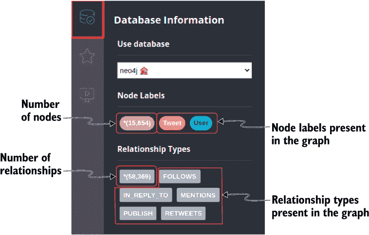
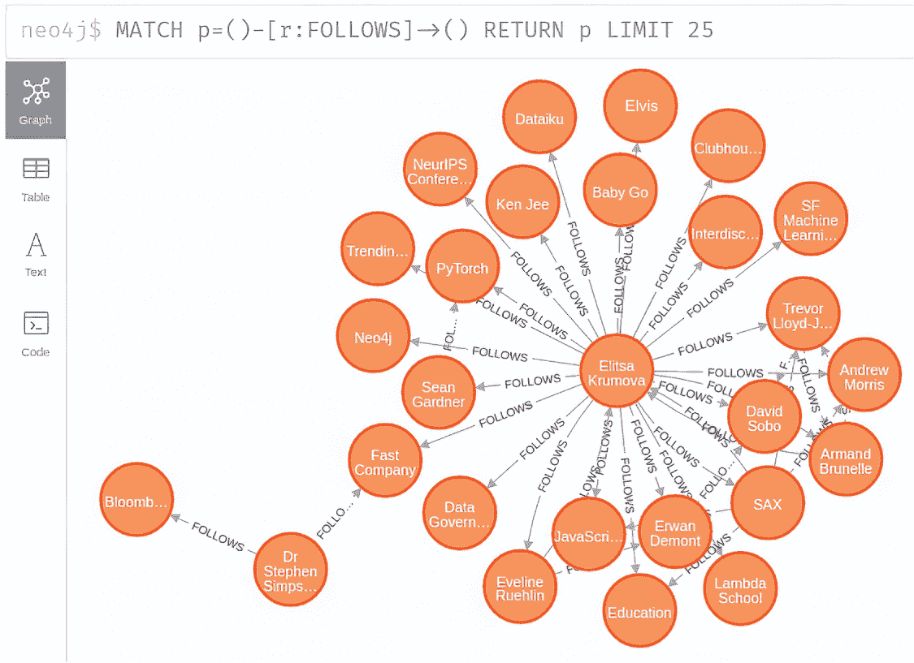
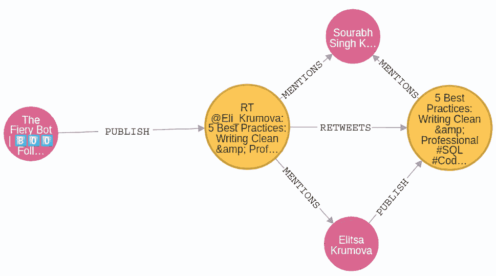

# 4 探索性图分析

本章节涵盖

+   使用 Cypher 查询语言探索图

+   使用 Cypher 查询语言聚合数据

+   使用存在子查询根据图模式进行过滤

+   使用计数子查询统计图模式

+   在使用单个 Cypher 语句中的多个子句时处理查询基数

本章节将教会你如何使用 Cypher 查询语言对导入的 Twitter 社交网络进行探索性数据分析。想象你正在担任社交媒体顾问，并希望尽可能多地发现洞察。正如任何分析一样，你首先从探索性数据分析开始，以了解你正在处理的数据概览。

我将展示我是如何收集数据的，以便你了解在本章中你将工作的数据。导入的 Twitter 社交网络是通过官方 Twitter API 检索的。我抓取了属于`NLP`或`Knowledge` `graph`主题的推文。当时，我有关于被提及或发布推文的推文和用户的信息。接下来，我抓取了图中用户的其他元数据，例如他们的注册日期和关注关系。导入的 Twitter 子图中的所有用户都发布过推文或被提及过。我没有包括所有关注者，因为这会导致图爆炸，最终网络将包含几百万用户。

探索性图分析的一部分是统计网络中节点和关系的数量。对于 Twitter 网络，了解创建推文的时序也非常重要。在本章中，你将学习如何使用 Cypher 查询语言聚合基于时间的信息。作为探索性分析的最后一部分，你将检查数据集中的一些有趣节点，例如发布最多推文或被提及最多的用户。

现在我们已经概述了本章你将学习的内容，让我们从一些实际例子开始。要跟随本章中的例子，你必须有一个 Neo4j 数据库实例，并且已经按照第三章所述导入 Twitter 网络数据。

## 4.1 探索 Twitter 网络

探索性分析的目标是了解数据集，并教你 Cypher 查询语法，这将允许你聚合和过滤数据。我建议你使用 Neo4j 浏览器环境，它可以用来开发 Cypher 查询，并以表格和图形可视化的形式返回查询结果。

如果你打开 Neo4j 浏览器并选择右上角的数据库标签，它将显示一个简单的报告，指示数据库中节点和关系的数量和类型，如图 4.1 所示。



图 4.1 Neo4j 浏览器数据库报告

在第三章中展示的 Twitter 数据上传之后，数据库中应该总共有 15,654 个节点。正如你所知，节点被标记为 `Tweet` 或 `User`。此外，还有 58,369 个连接分布在四种关系类型中。左侧工具栏中的节点标签和关系类型都是可点击的。例如，如果你点击 `FOLLOWS` 关系类型，工具将生成一个返回 25 个 `FOLLOWS` 关系样本的 Cypher 语句。

列表 4.1 生成的用于可视化 25 个 `FOLLOWS` 关系的 Cypher 查询

```
MATCH p=()-[r :FOLLOWS]->()
RETURN p LIMIT 25;
```

列表 4.1 中生成的语句返回结果作为 *路径* 数据对象。一系列连接的节点和关系可以用路径数据类型表示。Cypher 查询语法允许通过变量名引用路径，类似于节点和关系变量。

通过执行生成的 Cypher 语句，你应该得到与图 4.2 中所示类似的可视化。



图 4.2 关注者网络的一个子图

练习 4.1

作为练习，生成一个 Cypher 语句来可视化样本 `RETWEETS` 关系。你可以在左侧工具栏中点击关系类型，或者可以使用列表 4.1 中的语句作为模板并相应地更改关系类型。

## 4.2 使用 Cypher 查询语言聚合数据

聚合和计数数据点是所有数据分析的基础。在图分析中，你将首先学习如何计数各种图模式，如节点和关系的数量。如果你已经对关系数据库和 SQL 查询语言有一些经验，你会发现 Cypher 在聚合数据时遵循类似的语法。你将学习的第一个聚合函数是 `count()` 函数，它用于计数 `MATCH` 子句生成的行或值。

要计算数据库中节点的数量，你可以执行以下 Cypher 语句。

列表 4.2 计算节点数量

```
MATCH (n)                           ❶
RETURN count(n) AS numberOfNodes;   ❷
```

❶ 匹配数据库中的所有节点

❷ 返回节点的总数

图中总共有 15,654 个节点。`count()` 函数有两种变体：

+   `count(*)`—返回由 Cypher 语句生成的行数

+   `count(variable or expression)`—返回由表达式生成的非空值的数量

为了测试 `count()` 函数的两个变体，你需要计算用户节点的数量以及它们 `registeredAt` 属性的非空值。

列表 4.3 计算用户节点数量及其 `registeredAt` 属性的非空值

```
MATCH (u:User)
RETURN count(*) AS numberOfRows,
       count(u.registeredAt) AS numberOfUsersWithRegisteredAtDate
```

表 4.1 显示了列表 4.3 的结果。

表 4.1 列表 4.3 中 Cypher 语句的结果

| `numberOfRows` | `numberOfUsersWithRegisteredAtDate` |
| --- | --- |
| 3,594 | 3,518 |

图中有 3,594 个`User`节点，但其中只有 3,518 个具有非空的`registeredAt`属性。图中缺少 76 个用户的注册日期信息。在准备数据集摘要时，你通常将缺失值的数量以比率而不是绝对数的形式呈现。在 Neo4j 中，你必须小心，因为当你用整数除以整数时，结果也将是整数。为了避免这个问题，你可以将其中一个变量转换为浮点数据类型。

执行以下 Cypher 语句以评估`User`节点`registeredAt`属性非空值的比率。

列表 4.4 计算`registeredAt`节点属性非空值的比率

```
MATCH (u:User)                                                            ❶
WITH count(*) AS numberOfRows,
     count(u.registeredAt) AS usersWithRegisteredAtDate                   ❷
RETURN toFloat(usersWithRegisteredAtDate) / numberOfRows * 100 AS result  ❸
```

❶ 匹配数据库中的所有用户

❷ 计算所有用户数量以及非空`registeredAt`属性的数量

❸ 将其中一个变量转换为浮点型以避免除以两个整数

你会看到 97.88%的用户具有非空的`registeredAt`属性值。如果你在列表 4.4 中忘记将`usersWithRegisteredAtDate`或`numberOfRows`转换为浮点型，结果将是 0。

注意：在 Neo4j 中，当你将一个整数值除以另一个整数值时，结果也将是整型数据。如果你想结果为浮点型，例如在列表 4.4 中的比率示例，你需要使用`toFloat()`函数将其中一个变量转换为浮点型。

练习 4.2

计算缺失值的比率，即`Tweet`节点`createdAt`节点属性的百分比，结果应该是非空值的比率除以推文的计数。

练习 4.2 的正确答案是`Tweet`节点的`createdAt`属性没有缺失值。

就像你可能从其他数据项目中习惯的那样，你通常更频繁地按特定值聚合或计数值。对于熟悉 SQL 聚合的人来说，你可以在`GROUP BY`语句中定义分组键。*分组键*是用于将值分组到聚合函数中的非聚合表达式。Cypher 中的聚合与 SQL 中的聚合不同。在 Cypher 中，你不需要显式指定分组键。一旦在 Cypher 语句中使用任何聚合函数，`WITH`或`RETURN`子句中的所有非聚合列都成为分组键。使用 Cypher 查询语言时，分组键是隐式定义的，因为你不需要在聚合函数之后显式添加`GROUP BY`语句。

假设你想要按节点标签分组计算节点数量。提取节点标签的函数是`labels()`。你只需要提供`labels()`函数作为分组键，并配合一个将计算节点数量的聚合函数。

列表 4.5 按标签计数节点

```
MATCH (n)
RETURN labels(n) AS labels,
       count(n) AS count;
```

表 4.2 显示了每个标签的节点数量。

表 4.2 按标签计数节点

| `labels` | `count` |
| --- | --- |
| ["用户"] | 3594 |
| ["推文"] | 12060 |

目前，图中只有两种类型的节点。你可以观察到列表 4.5 中的 Cypher 语句返回了节点标签列表。列表数据类型表示你可以在单个节点上拥有多个标签。在网络分析中，当你想要通过标记相关节点子集来加速后续查询时，分配二级节点标签是有帮助的。如前所述，你可能注意到缺少`GROUP BY`语句。在 Cypher 中，你不需要显式指定分组键。一旦使用聚合函数，所有非聚合结果列都成为分组键。

注意：使用 Cypher 查询语言，分组键是隐式定义的，这意味着在`WITH`或`RETURN`子句中的所有非聚合列自动成为分组键。

练习 4.3

按关系类型计数关系数量。要按类型分组计数关系数量，你首先需要使用 Cypher 语法描述一个关系模式。请注意，没有相邻节点的描述，你不能描述一个关系。因为你对计数所有关系类型感兴趣，所以在 Cypher 模式中你不能指定任何节点标签或关系类型。在语句的最后部分，你使用`type()`函数提取关系类型，并将其与`count()`聚合函数结合作为分组键。

练习 4.3 的解决方案生成了表 4.3 所示的输出。

表 4.3 按类型分组的关系的计数

| `relationshipType` | `count` |
| --- | --- |
| `PUBLISH` | 12,060 |
| `FOLLOWS` | 24,888 |
| `RETWEETS` | 8,619 |
| `MENTIONS` | 12,379 |
| `IN_REPLY_TO` | 423 |

`PUBLISH`关系的数量与`Tweet`节点数量相同。在 Twitter 社交网络中，一个`TWEET`恰好有一个作者，由`PUBLISH`关系表示。

有趣的是，在 12,060 条推文中，有 8,619 条是转发，423 条是回复。只有大约 30%的推文是原创内容。这并不罕见；例如，Joshua Hawthorne 等人（2013 年）的研究表明，尽管普通用户每条推文的转发数量不高，但更受欢迎的账户获得了大量的转发。此外，当研究人员检查前美国总统的推文时（Minot 等人，2021 年），转发的数量至少比通常高一个数量级。因此，由于重要账户的推文转发量很大，平台上转发的数量比原创推文多。

有一点令人惊讶的是，提及的数量比推文多。我没有手动解析提及的信息，因为这些信息是由官方 Twitter API 自动提供的。我还注意到，当用户转发其他用户的推文时，他们会被自动提及。

练习 4.4

检查转发的文本并与原始推文的文本进行比较。使用 `LIMIT` 子句将结果数量限制为 1。

练习 4.4 的解决方案生成了表 4.4 中所示的输出。

表 4.4 推文和转发文本的单个比较

| `retweetText` | `originalText` |
| --- | --- |
| RT @Eli_Krumova: 5 Best Practices: Writing Clean & Professional #SQL #Code https://t.co/Y4DepLfOOn v/ @SourabhSKatoch #DataScience #AI #ML... | 5 Best Practices: Writing Clean & Professional #SQL #Code https://t.co/Y4DepLfOOn v/ @SourabhSKatoch #DataScience #AI #ML #MachineLearning #IoT #IIoT #IoTPL #Python #RStats #Cloud #CyberSecurity #Serverless #RPA #NLP #programming #coding #100DaysOfCode #DEVCommunity #CodeNewbie https://t.co/ma03V8btZBhttps://t.co/TOnwwHgaHQ |

一个立即明显的事情是，转发文本被截断到固定长度，并且并不总是包含原始推文的完整文本。另一个更微妙的不同之处在于，转发文本以 RT 开头，后面跟着原始作者的昵称。看起来 Twitter 自动在转发中添加原始用户的昵称，并将其视为提及——我之前并不知道这种情况。在深入研究图算法之前，始终进行探索性图分析是一个好的实践，以发现此类异常。

练习 4.5

对于那些更倾向于视觉的人来说，尝试可视化一个图模式，其中用户从另一个用户那里转发了帖子。包括原始和被转发推文的 `MENTION` 关系。遵循以下提示来帮助你构建所需的 Cypher 语句：

+   匹配一个描述转发、原始推文及其作者的图模式。

+   使用 `WITH` 子句与 `LIMIT` 子句结合，将结果限制为单个描述的模式。

+   分别匹配原始和被转发推文的 `MENTION` 关系。

+   在 Neo4j 浏览器中可视化网络最简单的方法是返回一个或多个路径对象。

这个练习稍微复杂一些，所以请一步一步地构建最终的 Cypher 语句。你可以在每一步之后检查结果，以确保你正确地描述了所需的图模式。练习 4.5 的解决方案在 Neo4j 浏览器中产生了图 4.3 所示的网络可视化。



图 4.3 默认情况下，转发也会提及原始推文作者。

### 4.2.1 时间聚合

与任何数据集一样，了解数据点的时序至关重要。`User` 和 `Tweet` 节点都包含 datetime 属性。首先，你将评估推文的时间窗口。你可以使用 `min()` 和 `max()` 函数对 datetime 属性进行操作，以获取最早和最后日期值。

列表 4.6 获取推文的最早和最后创建日期值

```
MATCH (n:Tweet)
RETURN min(n.createdAt) AS earliestDate, max(n.createdAt) as lastDate
```

数据集中的第一条推文是在 2016 年 8 月 12 日，最后一条是在 2021 年 6 月 1 日。第一条和最后一条推文之间有五年的时间跨度。虽然这个信息不错，但并不非常具有描述性。为了更好地感受时间窗口，你将计算按年份分布的推文分布。

在 Cypher 中，日期时间属性的行为像一个对象。你可以使用以下 Cypher 语法来访问日期时间属性，如年份和月份。

列表 4.7 提取日期时间属性

```
MATCH (t:Tweet)
WITH t LIMIT 1
RETURN t.createdAt.year AS year,
       t.createdAt.month AS month,
       t.createdAt.day AS day,
       t.createdAt.epochSeconds AS epochSeconds;
```

表 4.5 显示了此样本推文的日期时间属性。

表 4.5 样本推文的日期时间属性

| `year` | `month` | `day` | `epochSeconds` |
| --- | --- | --- | --- |
| 2021 | 6 | 1 | 1622537602 |

你可以使用日期时间属性与聚合函数结合使用。

练习 4.6

计算按创建年份分组的推文分布。记住，Cypher 使用隐式分组键聚合，所以你只需要在`RETURN`语句中添加`year`列和`count`运算符。

练习 4.6 的解决方案在表 4.6 中产生输出。

表 4.6 按创建日期分布的推文

| `year` | `count` |
| --- | --- |
| 2021 | 12029 |
| 2020 | 19 |
| 2019 | 6 |
| 2018 | 3 |
| 2016 | 3 |

即使第一条推文和最后一条推文之间的时间窗口是五年，几乎所有推文都是在 2021 年创建的。让我们进一步深入分析。

练习 4.7

结合使用`MATCH`子句和`WHERE`子句来选择所有在 2021 年创建的推文。你可以像过滤其他节点属性一样过滤日期时间属性。在下一步中，计算推文按创建月份的分布。使用创建年份和月份作为分组键。

到现在为止，你可能已经养成了在`RETURN`或`WITH`子句中添加分组键作为非聚合值的习惯。此外，你只需要小心使用`WHERE`子句来匹配仅在 2021 年创建的推文。

练习 4.7 的解决方案在表 4.7 中产生输出。

表 4.7 按创建日期分布的推文

| `year` | `month` | `count` |
| --- | --- | --- |
| 2021 | 6 | 2695 |
| 2021 | 5 | 8507 |
| 2021 | 4 | 376 |
| 2021 | 3 | 432 |
| 2021 | 2 | 8 |
| 2021 | 1 | 11 |

大约 93%（12,060 条中的 11,202 条）的推文是在 2021 年 5 月和 6 月创建的。

练习 4.8

在你继续本章的其余部分之前，我想向你提出一个挑战。你能准备一个 Cypher 语句，返回创建推文数量最高的前四天吗？虽然你没有看到这个具体的例子，但你已经有了一些使用构建此 Cypher 语句所需的所有子句的经验。以下是一些应该有帮助的提示：

+   首先匹配所有推文。

+   使用创建年份、月份和日期作为分组键，以及`count()`聚合。

+   使用`ORDER BY`子句按计数降序排序结果。

+   使用`LIMIT`子句仅返回前四天。

练习 4.8 旨在测试你对 Cypher 中的隐式分组聚合的理解，并使用之前讨论的一些子句。请花几分钟时间尝试自己解决它。我建议你在查询的每一步之后返回结果，以确定你是否走上了正确的道路。

练习 4.8 的解决方案在表 4.8 中产生输出。

表 4.8 按创建日期分布的推文

| `year` | `month` | `day` | `count` |
| --- | --- | --- | --- |
| 2021 | 5 | 31 | 6185 |
| 2021 | 6 | 1 | 2695 |
| 2021 | 5 | 30 | 1847 |
| 2021 | 5 | 28 | 62 |

有趣的是，你从一个五年的时间窗口开始，通过逐步深入挖掘，最终将其缩小到只有四天。数据集中大部分推文都是在 5 月 30 日和 6 月 1 日之间创建的。这些信息将帮助你评估在这个时间框架内推文和提及的数量。

## 4.3 过滤图模式

现在，你将更深入地研究提及的网络。你已经知道有 12,379 个`MENTIONS`关系，但现在，你想要确定被提及的不同用户数量。你将如何构造 Cypher 语句来检索被提及的不同用户数量？作为一个初学者，我的第一个想法是使用以下语句。

列表 4.8 计算被提及的用户出现的次数

```
MATCH (u:User)<-[:MENTIONS]-(:Tweet)
RETURN count(u) AS countOfMentionedUsers;
```

初看，列表 4.8 中的语句似乎是有效的。你匹配了被提及的用户，然后返回了用户的计数。但是`count()`函数并不计算不同用户的数量；它计算用户变量非空的出现次数。你实际上计算了包含`User`节点从`Tweet`节点起源的`MENTIONS`关系的图模式的数量，即 12,379。计算被提及的不同用户数量的方法之一是使用`distinct`前缀。以下列表中显示的`distinct`前缀用于计算引用变量或表达式的唯一值的数量。

列表 4.9 计算被提及的不同用户数量

```
MATCH (u:User)<-[:MENTIONS]-(:Tweet)
RETURN count(u) AS numberOfOccurences,
       count(distinct u) AS numberOfDistinctUsers;
```

表 4.9 显示了列表 4.9 的结果。

表 4.9 推文中提及的不同用户出现的次数和计数

| `numberOfOccurences` | `numberOfDistinctUsers` |
| --- | --- |
| 12,379 | 1,632 |

总共有 1,632 个不同的用户至少被提及一次。在进行任何查询聚合时，您还必须考虑到查询的基数以及您实际在计算什么。"基数" 是操作输入流中的行或记录数。Cypher 对每行输入执行特定操作。在列表 4.9 中，`MATCH` 子句产生了 12,379 行。这些行随后被用作 `count` 操作的输入。使用 `count(u)` 操作符，您计算 `u` 引用变量的非空值数量。由于 `MATCH` 子句将为 `u` 变量产生无空值，因此 `count(u)` 操作的结果是 12,379。

注意：查询的基数也会影响其性能。您希望将基数保持在尽可能低，以实现最佳执行速度。在 Neo4j 中，您可以在 Cypher 语句前加上 `PROFILE` 子句来比较查询的性能。有关 `PROFILE` 子句的更多信息，请参阅文档：http://mng.bz/84pD。

您无需展开所有 `MENTIONS` 关系以获取至少在一条推文中被提及的用户列表。使用 `WHERE` 子句中的 *存在性子查询*，您可以在图模式上过滤。存在性子查询可用于确定指定的模式在图中至少存在一次。您可以将其视为与图模式结合的 `WHERE` 子句的扩展或升级，其中您可以在子查询中引入新的引用变量，甚至使用其他子句，如 `MATCH`。子查询以大括号 `{}` 开头和结尾。您可以使用外部查询中的任何变量来描述图模式；然而，在子查询中引入的任何新变量都不会传递到主查询中。

列表 4.10 计算推文中被提及的不同用户数量

```
MATCH (n:User)
WHERE EXISTS { (n)<-[:MENTIONS]-() }
RETURN count(n) AS numberOfDistinctUsers;
```

列表 4.10 中的 Cypher 语句产生的不同用户数量与列表 4.9 中的查询结果相同，并且性能也更好。列表 4.10 中使用的语法对于在网络上找到至少属于一个描述的图模式的节点非常有用。在这个例子中，您不在乎一个用户被提及一次还是数百次——您只想匹配至少被提及一次的不同用户。

注意 存在性子查询通常性能更好，因为它们不需要展开所有关系。例如，列表 4.9 中的 Cypher 语句必须展开 12,379 个`MENTIONS`关系，然后使用`distinct`运算符来检索不同`User`节点的计数。另一方面，列表 4.10 中指定的存在性子查询不需要展开所有`MENTIONS`关系，因为只要存在一个`MENTIONS`关系，表达式就是真实的。如果一个`User`节点有 100 个`MENTIONS`关系，列表 4.9 中的 Cypher 语句将展开所有 100 个关系，而列表 4.10 中指定的存在性子查询将满足找到第一个`MENTIONS`关系，因此将忽略其他 99 个。 

练习 4.9

计算至少发布过一条推文的独立用户数量。

在否定图模式时，将存在性子查询与图模式结合使用也非常有帮助。你可以匹配前一个例子中的整个模式，并使用`distinct`来获取正确的计数。然而，当你想要否定一个图模式时，你无法在`MATCH`子句中使用它。因此，否定图模式是使用`WHERE`子句中的存在性子查询来否定图模式的典型例子。

在以下列表中显示的示例中，你将计算被提及但自己没有发布任何推文的独立用户数量。你必须否定出度的`PUBLISH`关系来过滤出没有任何推文的用户。

列表 4.11 计算被提及但尚未发布任何推文的用户数量

```
MATCH (u:User)
WHERE EXISTS { (u)<-[:MENTIONS]-() } AND
  NOT EXISTS { (u)-[:PUBLISH]->() }
RETURN count(*) AS countOfDistinctUsers
```

在我们的数据集中，大约一半的不同用户（1,632 个中的 809 个）在推文中被提及，但他们自己没有发布任何推文。如列表 4.11 所示，你可以轻松地组合多个图模式谓词来过滤出符合描述的图模式的节点。

如前所述，你还可以在存在性子查询中引入新的引用变量。例如，如果你想计算推文中被提及的用户数量并折扣转发模式中的提及，你需要引入一个新的引用变量。在下面的列表中，你将使用存在性子查询来计算推文中被提及的用户数量并忽略转发提及模式。

列表 4.12 使用存在性子查询计算被提及在推文中的用户数量，并折扣转发提及模式

```
MATCH (u:User)<-[:MENTIONS]-(tweet:Tweet)                                  ❶
WHERE NOT EXISTS {
  (original)<-[:PUBLISH]-(u)<-[:MENTIONS]-(tweet)-[:RETWEETS]->(original)
}                                                                          ❷
RETURN count(distinct u) AS countOfUsers                                   ❸
```

❶ 使用 MATCH 子句来识别用户被推文提及的模式

❷ 使用存在性查询来否定由于转发模式而存在的 MENTION 关系的图模式

❸ 使用 distinct 运算符来返回描述的图模式中不同用户的数量

你需要在列表 4.12 中使用存在子查询才能引入引用变量`original`。对`original`的引用是必要的，因为你只想折扣那些属于转发模式的特定`MENTION`关系。

列表 4.12 中语句的结果是 1,206。因此，大约 26%（1,632 中的 426）被提及的用户只有进入的`MENTION`关系，因为他们的帖子被转发。有趣的是，如果你不考虑转发，大约 33%（3,594 中的 1,206）的所有用户在推文中被提及。如果你完成了 4.9 练习，你应该知道大约 75%（3,594 中的 2,764）的所有用户至少发布过一条推文。

练习 4.10

找出转发独特推文最多的前五个用户。为了使您更容易，我已经准备了一个需要填写的模板 Cypher 语句，如表 4.10 所示。

列表 4.13 练习 4.10 的模板查询

```
MATCH (n:User)-[:PUBLISH]->(t:Tweet)              ❶
_Fill in the WHERE_
WITH n, count(*) AS numberOfRetweets              ❷
_Fill in the ORDER BY_
RETURN n.username AS user, numberOfRetweets       ❸
_Fill in the LIMIT_
```

❶ 使用 WHERE 子句与图模式的组合来过滤被转发的推文。被转发的推文有一个进入的 RETWEETS 关系。

❷ 使用 ORDER BY 子句按 numberOfRetweets 降序排序

❸ 使用 LIMIT 返回仅前五个用户

通过解决练习 4.10，你应该得到表 4.10 中所示的结果。

表 4.10 转发次数最多的前五个用户

| `user` | `numberOfRetweets` |
| --- | --- |
| "IainLJBrown" | 754 |
| "SuzanneC0leman" | 314 |
| "Eli_Krumova" | 31 |
| "Paula_Piccard" | 31 |
| "Analytics_699" | 26 |

IainLJBrown 似乎到目前为止转发推文最多。第二位，有 354 条被转发的推文，是 SuzanneC0leman。你可能认为这些用户是影响者，因为他们发布很多，但他们的粉丝也大量转发他们的帖子。之后，转发次数的数量级下降到只有 Eli_Krumova 和 Paula_Piccard 的 31 条转发推文。

## 4.4 计数子查询

接下来，我将向您展示如何方便地使用 Cypher 计数图模式。尽管你已经知道如何计数和过滤图模式，但在计数各种图模式时，有一个简单但高效的语法需要记住。例如，如果你想获取提及最多的前五个用户，可以使用以下 Cypher 语句。

列表 4.14 检索提及最多的前五个用户

```
MATCH (u:User)<-[:MENTIONS]-(:Tweet)
WITH u, count(*) AS mentions
ORDER BY mentions DESC LIMIT 5
RETURN u.username AS user, mentions
```

列表 4.14 中的陈述没有问题；然而，你经常会在一个查询中执行多个聚合操作。在查询中执行多个聚合操作时，你必须非常注意查询基数（查询中的中间行数）。在计数一个节点有多少关系时，不增加基数的一个简单但非常有效的语法是使用`count` `{}`运算符并描述你想要计数的所需图模式，如下面的列表所示。

列表 4.15 通过不增加主查询基数，方便地检索提及最多的前五个用户

```
MATCH (u:User)
WITH u, count { (u)<-[:MENTIONS]-() } AS mentions
ORDER BY mentions DESC LIMIT 5
RETURN u.username AS user, mentions
```

你可能已经注意到，Cypher 语法中的一个常见主题是将图模式用大括号括起来，并根据你的用例在前面添加一个所需的 Cypher 子句，如`count`、`EXISTS`或`CALL`。列表 4.15 中 Cypher 语句的结果显示在表 4.11 中。

表 4.11 提及最多的前五个用户

| `user` | `mentions` |
| --- | --- |
| "IainLJBrown" | 3646 |
| "SuzanneC0leman" | 673 |
| "Analytics_699" | 476 |
| "Paula_Piccard" | 460 |
| "Eli_Krumova" | 283 |

到目前为止，被提及最多的用户是 IainLJBrown。如果你像我一样，你可能想知道这些被提及者的分布情况。这个用户是否经常被转发，提及他的帖子是否经常被转发，或者人们只是喜欢提及他？从练习 4.10 的结果中，你已经知道他有 754 篇被转发的帖子。

## 4.5 连续多个聚合

如前所述，在连续执行多个聚合操作时，必须注意中间基数。例如，假设你有连续的两个`MATCH`子句。

列表 4.16 多个`MATCH`子句如何影响查询基数

```
MATCH (u:User)
MATCH (t:Tweet)
RETURN count(*) AS numberOfRows,
       count(u) AS countOfUsers,
       count(t) AS countOfTweets
```

表 4.12 展示了在连续执行多个`MATCH`子句而不进行任何中间步骤时，查询基数如何爆炸。

表 4.12 不减少基数的情况下连续多个聚合

| `numberOfRows` | `countOfUsers` | `countOfTweets` |
| --- | --- | --- |
| 43,343,640 | 43,343,640 | 43,343,640 |

你已经知道这个结果完全没有意义。首先，用户和推文的数量是相同的，你肯定没有 4300 万个节点在图中。那么为什么你会得到这些结果？每个`MATCH`或`OPTIONAL` `MATCH`会产生一定数量的行。任何后续的`MATCH`或`OPTIONAL` `MATCH`子句都将根据前一个`MATCH`子句产生的行数执行多次。列表 4.16 中的第一个`MATCH`产生了 3,594 行。然后第二个`MATCH`会针对每个产生的行分别执行。实际上，第二个`MATCH`将会执行 3,594 次。我们的图中共有 12,060 条推文，所以如果你找到 12,060 和 3,594 的乘积，你将得到 4300 万行。

如何避免这个问题？在这个例子中，你可以在第二个`MATCH`子句之前将基数减少到 1，这样第二个`MATCH`子句就只会执行一次。你可以使用任何聚合函数来减少基数。假设你想要计算图中用户和推文的数量。在这种情况下，你可以在第一个`MATCH`子句之后使用`count()`函数来减少基数。

列表 4.17 在多个`MATCH`子句之间减少基数

```
MATCH (u:User)
WITH count(u) AS countOfUsers
MATCH (t:Tweet)
RETURN count(*) AS numberOfRows, countOfUsers, count(t) AS countOfTweets  ❶
```

❶ 在执行后续的`MATCH`子句之前将基数减少到 1

表 4.13 展示了如何通过执行聚合操作以减少查询的中间基数来产生有效结果。

表 4.13 按顺序进行多次聚合，同时减少中间基数

| `numberOfRows` | `countOfUsers` | `countOfUsers` |
| --- | --- | --- |
| 12,060 | 3,594 | 12,060 |

通过在第一次 `MATCH` 之后减少中间基数到 1，您可以确保任何后续的 `MATCH` 子句只会执行一次。这将有助于您提高查询性能并获得准确的结果。另一个有助于您控制基数的方法是使用如列表 4.15 所述的 `count` `{}` 操作符。

练习 4.11

计算用户 IainLJBrown 的提及分布。提及可以有以下三种形式：

+   某人转发 IainLJBrown 的帖子

+   某人发布了一条提及 IainLJBrown 的原创推文

+   某人转发提及 IainLJBrown 的帖子

确保在每条 `MATCH` 或 `OPTIONAL` `MATCH` 子句之后减少基数。因为您事先不知道提及 IainLJBrown 的内容是否属于所有三个类别，我建议您在计算提及分布时使用 `OPTIONAL` `MATCH`。

练习 4.11 的解答如下。

列表 4.18 计算用户 IainLJBrown 的提及分布

```
MATCH (u:User)
WHERE u.username = "IainLJBrown"                                  ❶
OPTIONAL MATCH (u)-[:PUBLISH]->(rt)<-[:RETWEETS]-()
WITH u, count(rt) AS numberOfRetweets                             ❷
OPTIONAL MATCH (u)<-[:MENTIONS]-(t)
WHERE NOT (t)-[:RETWEETS]->()
WITH u, numberOfRetweets, count(t) AS mentionsInOriginalTweets    ❸
OPTIONAL MATCH (u)<-[:MENTIONS]-(ort)
WHERE (ort)-[:RETWEETS]->() AND NOT (ort)-[:RETWEETS]->()<-[:PUBLISH]-(u)
WITH u, numberOfRetweets, mentionsInOriginalTweets,
    count(ort) AS mentionsInRetweets
RETURN u.username AS user, numberOfRetweets,
       mentionsInOriginalTweets, mentionsInRetweets               ❹
```

❶ 识别用户

❷ 计算他们帖子收到的转发数量

❸ 计算原始帖子中的提及数量

❹ 计算转发中的提及数量，并排除作者帖子的转发

表 4.14 显示了 IainLJBrown 的结果分布。

表 4.14 IainLJBrown 的提及分布

| `user` | `numberOfRetweets` | `mentionsInOriginalTweets` | `mentionsInRetweets` |
| --- | --- | --- | --- |
| "IainLJBrown" | 3643 | 2 | 1 |

您必须在每个 `OPTIONAL` `MATCH` 子句之后直接使用 `count()` 操作符，而不仅仅是最后，这是一个非常重要的细节。这样，您在每个 `OPTIONAL` `MATCH` 子句之后将中间基数减少到 1，并且您的计数不会爆炸。您还有其他几种方法可以得到这个结果，所以如果您的查询略有不同但产生相同的结果，那么一切都很好。几乎所有关于用户 IainLJBrown 的提及都来自他们的帖子被转发。他们只被提及在两篇原始推文中，其中一篇很可能被转发了一次。如果您考虑练习 4.10 的信息，您知道他的 754 篇帖子被转发了 3,643 次。在这个 Twitter 子图中，他绝对可以被视为一个有影响力的人。

练习 4.12

获取发布最多推文或转发的 top 五个用户。使用 `count` `{}` 操作符。

恭喜！通过完成所有练习，您已经对 Cypher 聚合和过滤有了相当的了解。

## 4.6 练习解答

练习 4.1 的解答如下。

列表 4.19 生成的 Cypher 查询，用于可视化 25 条 `RETWEETS` 关系

```
MATCH p=()-[r:RETWEETS]->()
RETURN p LIMIT 25;
```

练习 4.2 的解答如下。

列表 4.20 计算推文 `createdAt` 节点属性的 `non-null` 值比率

```
MATCH (u:Tweet)
WITH count(*) AS numberOfRows,
count(u.createdAt) AS tweetsWithCreatedAtDate
RETURN toFloat(tweetsWithCreatedAtDate) / numberOfRows * 100 AS result
```

练习 4.3 的解决方案如下。

列表 4.21 按类型分组计算关系的数量

```
MATCH ()-[r]->()
RETURN type(r) AS relationshipType, count(r) AS countOfRels
```

练习 4.4 的解决方案如下。

列表 4.22 比较转发推文和原始推文的文本属性

```
MATCH (rt:Tweet)-[:RETWEETS]->(t:Tweet)
RETURN rt.text AS retweetText, t.text AS originalText
LIMIT 1
```

练习 4.5 的解决方案如下。

列表 4.23 可视化一个用户从另一个用户转发帖子的单个图模式

```
MATCH p=(:User)-[:PUBLISH]->(rt:Tweet)-[:RETWEETS]->
➥ (t:Tweet)<-[:PUBLISH]-(:User)
WITH p, rt, t LIMIT 1
MATCH prt=(rt)-[:MENTIONS]->()
MATCH pt=(t)-[:MENTIONS]->()
RETURN p,pt,prt
```

练习 4.6 的解决方案如下。

列表 4.24 通过年份计算推文的分布

```
MATCH (t:Tweet)
RETURN t.createdAt.year AS year, count(*) AS count
ORDER BY year DESC
```

练习 4.7 的解决方案如下。

列表 4.25 通过月份计算 2021 年创建的推文的分布

```
MATCH (t:Tweet)
WHERE t.createdAt.year = 2021
RETURN t.createdAt.year AS year,
       t.createdAt.month AS month,
       count(*) as count
ORDER BY year DESC, month DESC
```

练习 4.8 的解决方案如下。

列表 4.26 通过创建推文的数量确定前四天

```
MATCH (t:Tweet)
WITH t.createdAt.year AS year,
     t.createdAt.month AS month,
     t.createdAt.day AS day,
     count(*) AS count
ORDER BY count DESC
RETURN year, month, day, count LIMIT 4
```

练习 4.9 的解决方案如下。

列表 4.27 计算至少发布了一条推文的独特用户的数量

```
MATCH (u:User)
WHERE EXISTS { (u)-[:PUBLISH]->() }
RETURN count(*) AS countOfUsers
```

练习 4.10 的解决方案如下。

列表 4.28 找到转发最多独特推文的顶级五名用户

```
MATCH (n:User)-[:PUBLISH]->(t:Tweet)
WHERE EXISTS { (t)<-[:RETWEETS]-() }
WITH n, count(*) AS numberOfRetweets
ORDER BY numberOfRetweets DESC
RETURN n.username AS user, numberOfRetweets
LIMIT 5
```

练习 4.11 的解决方案如下。

列表 4.29 计算用户 IainLJBrown 的提及分布

```
MATCH (u:User)
WHERE u.username = "IainLJBrown"                                   ❶
OPTIONAL MATCH (u)-[:PUBLISH]->(rt)<-[:RETWEETS]-()
WITH u, count(rt) AS numberOfRetweets                              ❷
OPTIONAL MATCH (u)<-[:MENTIONS]-(t)
WHERE NOT (t)-[:RETWEETS]->()
WITH u, numberOfRetweets, count(t) AS mentionsInOriginalTweets     ❸
OPTIONAL MATCH (u)<-[:MENTIONS]-(ort)
WHERE (ort)-[:RETWEETS]->() AND NOT (ort)-[:RETWEETS]->()<-[:PUBLISH]-(u)
WITH u, numberOfRetweets, mentionsInOriginalTweets,
➥ count(ort) AS mentionsInRetweets
RETURN u.username AS user, numberOfRetweets,
       mentionsInOriginalTweets, mentionsInRetweets                ❹
```

❶ 识别用户

❷ 统计他们帖子收到的转发次数

❸ 统计原始帖子中的提及次数

❹ 统计在转发中提及的次数，并排除作者帖子的转发

练习 4.12 的解决方案如下。

列表 4.30 获取发布最多推文或转发的顶级五名用户

```
MATCH (u:User)
RETURN u.username AS username,
       count{ (u)-[:PUBLISH]->() } AS countOfTweets
ORDER BY countOfTweets DESC
LIMIT 5
```

## 摘要

+   路径数据对象包含一系列连接的节点和关系。

+   Cypher 聚合使用隐式分组键。

+   一旦使用聚合函数，所有非聚合列都成为分组键。

+   存在性子查询可以帮助您通过图模式高效地过滤。

+   存在性子查询在您想要否定图模式时特别有用。

+   基数是操作输入流中行或记录的数量。

+   日期时间对象有多个属性，您可以使用它们来检索年、月、日或纪元信息。

+   可以使用`distinct`运算符来计算不同模式、节点、关系或属性的数目。

+   将一个整数除以一个整数将返回一个整数。因此您需要使用`toFloat`函数将其中一个值转换为浮点数，以避免返回整数。

+   可以使用`count`运算符来计算非空属性或表达式的数量。

+   当连续执行多个子句或聚合函数时，您必须注意中间查询的基数。

+   计数子查询在您想要计数图模式而不影响主查询基数时很有用。

+   您可以在任何 Cypher 语句前加上`PROFILE`子句，通过检查总数据库击打来评估其性能。
