# 5 社交网络分析简介

本章涵盖

+   展示随机和无尺度网络度分布

+   使用度量来表征网络

+   介绍 Neo4j 图数据科学库

+   使用原生投影来投影内存中的图

+   检查图的社区结构

+   使用 PageRank 在网络上查找影响者

社交网络分析是使用图理论和算法研究网络结构和节点角色的过程。最早的网络科学作家之一是匈牙利作家弗里吉斯·卡林蒂（Frigyes Karinthy）。他最重要的作品之一是短篇小说“Láncszemek”，在其中他描述了尽管我们认为世界很广阔，但实际上它非常小。这个故事最初是用匈牙利语写的，但亚当·马卡伊（Adam Makkai）准备了一个英文翻译([`mng.bz/E9ER`](http://mng.bz/E9ER))。这个短篇小说描述了一个今天被称为*小世界概念*的想法。为了证明他的观点，他展示了他在 1929 年如何将自己与他视角之外的人联系起来。在卡林蒂的例子中，他展示了作为布达佩斯人的他如何与一个美国福特工厂的工人联系起来。福特工厂的工人认识他的经理，而那位经理可能认识亨利·福特。亨利·福特可能认识一个在匈牙利的工业家，而这个工业家可能是卡林蒂的一个朋友的朋友。这样，他证明了福特公司的工人可能只隔四到五个握手就能与布达佩斯的作家联系起来。多年来，小世界概念被重新命名并普及为*六度分隔*，源自约翰·古尔（John Guare）的戏剧*六度分隔*。

在 20 世纪 50 年代和 60 年代，保罗·埃尔德什（Paul Erdös）和阿夫拉姆·雷尼（Alfréd Rényi）开始研究用于描述网络的术语。在他们的 1959 年论文中，他们开始研究大型网络的行为。大型网络看起来如此复杂，以至于人们可能会认为它们是随机的。即使在社交网络中，也很难预测谁与谁相连。他们认为这些网络必须是随机的，因为人们可能会随机遇到其他人，或者分子可能会随机相互作用。

任何网络的表征一个基本方面是查看节点度分布。简单来说，节点度是每个节点拥有的链接数量。在随机网络中，度分布将遵循高斯分布，如图 5.1 所示。

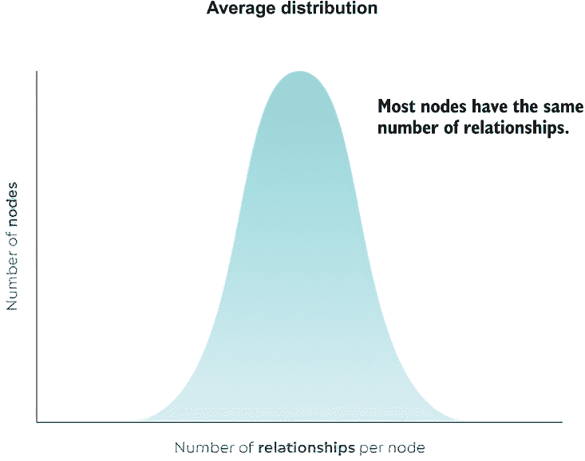

图 5.1 随机网络度分布

大多数节点大致具有相同数量的链接。不会有很多非常受欢迎的节点，但也不会有很多孤立的节点。然而，高斯分布通常用于独立观测。另一方面，一个图由高度相互连接的观测组成，这些观测不是独立的。结果发现，几乎没有任何现实世界的网络遵循随机网络度分布。这个主张背后的想法是网络有深刻的组织原则。大约在同一时间，Google 开发了其著名的图算法 PageRank（Brin & Page，1998 年），Albert Barabási 和他的同事检查了网络的架构（Albert et al. 1999 年）。网络由网页和指向其他网站的 URL 链接组成。这本质上是一个网络，其中节点代表网页，关系代表它们的 URL 链接。假设是，网络将变成一个随机网络，因为任何人都可以发布网页并选择他们想要链接的网站。他们发现，网络的度分布遵循不同的模式，如图 5.2 所示。

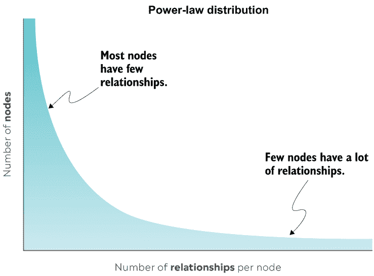

图 5.2 无标度网络度分布

这与预期的度分布非常不同。在互联网上，绝大多数网页很少被访问，甚至从未被访问；它们可能只有一个或两个链接指向它们。然后，有一些网页，如 Google、Amazon、Yahoo 和其他，有数亿个链接指向它们。这样的网络极其不均匀，今天被称为*无标度网络*。后来发现，大多数现实世界的网络都是无标度网络，其中一些大型枢纽节点连接了许多微小的节点。为什么会这样呢？事实是网络有深刻的组织原则。例如，考虑一群人。谁更有可能建立新的联系：只有几个朋友的个人，还是已经有很多朋友的个人？结果是，已经有很多朋友的个人更有可能建立新的关系。一个简单的解释是，他们更有可能被邀请参加更多活动，在这些活动中，他们可以与新人交往，因为他们现有的联系数量更多。此外，他们更有可能通过现有的联系人介绍给新人。这种网络组织原则被称为*优先连接模型*，这是 Barabási 和 Albert（1999 年）提出的术语。

传统分析工具通常被设计用于处理遵循高斯分布的独立观测数据。然而，这些工具在分析密集且不均匀连接的数据时可能会遇到麻烦。因此，设计了一套图分析工具来处理高度连接且遵循幂律分布的数据。

## 5.1 关注者网络

大多数图算法都是设计用于单部分网络的。如果你还记得，单部分网络包含一种类型的节点和关系。一个典型的例子是友谊网络，其中你只有人和他们的友谊关系。另一个经常提到的例子是网络网络，其中你处理网页和连接它们的超链接。即使处理多部分网络，也常见使用各种技术推断或投影单部分网络。下一章将更多地关注推断单部分网络。

在这里，你将在 Twitter 跟随者网络上执行你的第一个图算法。尽管 Twitter 社交图包含多种节点类型和关系，但你可以将你的图分析集中在特定的子图上。跟随者网络是单部分的，因为它只包含`User`节点和`FOLLOWS`关系。我选择它是因为你目前不需要处理单部分投影。

一个用户可以关注另一个用户，但他们不一定回关。这意味着你正在处理一个有向网络。此外，关系没有任何属性或属性可以量化它们的强度，这意味着你正在处理一个无权网络。

首先，你将学习如何从连通性和链接密度方面来描述跟随者网络。例如，斯坦福网络分析平台（SNAP）仓库（[`snap.stanford.edu/index.xhtml`](http://snap.stanford.edu/index.xhtml)）包含各种图数据集。如果你打开 Pokec 社交网络（[`snap.stanford.edu/data/soc-Pokec.xhtml`](http://snap.stanford.edu/data/soc-Pokec.xhtml)）数据集网页，你可以观察到网络的一些特征与数据本身一起给出：

+   节点数

+   关系数

+   最大的弱连接组件中的节点数

+   最大的强连接组件中的节点数

+   平均局部聚类系数

为了描述网络，你将使用 Cypher 查询语言和 Neo4j 图数据科学库中的图算法。具体来说，在本章中，你将学习如何使用一些*社区检测*和*中心性*图算法。社区检测算法将用于描述网络并找到紧密连接的用户组。在网络的背景下，社区指的是一个密集连接的节点组，其成员与其他网络中的社区相比具有较少的连接。例如，考虑一个友谊网络（图 5.3）。

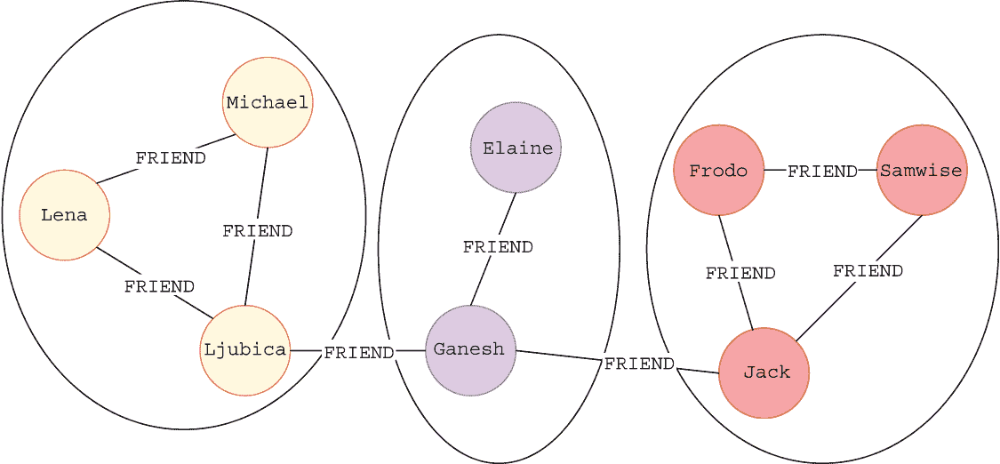

图 5.3 带有轮廓社区的友谊网络

图 5.3 可视化了一个八人的网络及其友谊联系。社区用圆圈标出。你可以观察到，在节点之间紧密相连的地方形成了社区。例如，图 5.3 中有三个社区；在右侧，弗罗多、山姆维兹和杰克形成一个社区。他们彼此之间都有联系，就像你预期的一群朋友一样。尽管杰克和甘尼许有联系，但他们不属于同一个社区，因为甘尼许与杰克组中的其他朋友没有任何联系。

如果从现实生活中的朋友圈的角度来考虑，这就有意义了。想象一下，你有一群喜欢一起去徒步或玩桌游的朋友。我们可以称他们为你的朋友圈。现在，尽管你可能在工作中交到朋友，但这并不意味着这个工作朋友自动成为你朋友圈的一部分。而且，很可能这个工作朋友也有一个他们一起参与爱好活动的独立朋友圈。只有当你的朋友圈和你的工作朋友的朋友圈一起，例如一起玩桌游或去徒步时，你才能考虑这两个朋友圈合并，形成一个紧密相连的单个朋友圈。在这种情况下，你将和你工作上的朋友属于同一个朋友圈，你们现在也会在空闲时间一起出去玩。

社区检测技术可以用来检测用户的不同部分，发现有共同兴趣的人，或在社区内推荐新的联系。假设你从社交网络中退一步。在这种情况下，你可以使用社区检测算法将具有相似角色的蛋白质分组（Pinkert 等人，2010 年）或根据处方数据识别医生的专业领域（Shirazi 等人，2020 年）。社区检测算法的另一个应用是检查科学合作网络的网络结构（Newman，2001 年；Piedra 等人，2017 年）。

现在，让我们思考一下什么使一个节点对网络有影响力。有几个程序可以确定一个节点是否具有影响力。用于识别图中重要或具有影响力的节点的度量标准被称为*中心性度量*，而计算它们的算法被称为*中心性算法*。例如，确定一个节点重要性的最基本度量是*度中心性*，它简单地计算一个节点有多少关系。关系的数量越多，节点在网络中的影响力就越大。另一个节点重要性的例子是检查一个节点对网络中信息流的影响量（图 5.4）。

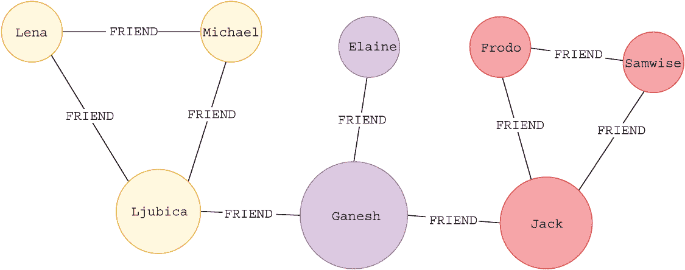

图 5.4 展示了具有节点大小对应其信息流影响程度的友谊网络

图 5.4 显示了与图 5.3 相同的网络。唯一的区别是，现在可视化中的节点大小对应于其对信息流的影响力。假设信息只能通过友谊关系流通。在这种情况下，Ganesh 是网络中最重要的节点，因为他连接了所有三个社区。Ganesh 可以被看作是社区之间信息守门人，允许他选择想要传递的数据以及何时传递。还有一点需要注意，如果 Ganesh 从网络中移除，它将分成三个部分。其他两个关键节点是 Ljubica 和 Jack，他们连接他们的社区与网络的其余部分。

在本章的最后部分，你将利用中心性算法来寻找最重要或最具影响力的用户。节点影响力度量有多种变体。为了计算网络中信息流的影响力，你可以使用*介数中心性*。如前所述，它在社交网络分析中有多种应用，但也可以用来预测道路网络中的拥堵（Kirkley 等人，2018 年）。最著名的节点中心性算法可能是*PageRank*，它被开发出来用于对网站进行排名，并使用排名信息来产生更好的搜索结果（Brin & Page，1998 年）。PageRank 算法的美丽之处在于它可以应用于其他领域。例如，它已经被用来根据引用来对研究论文作者进行排名（Ying Ding 等人，2010 年）。我还发现了一个例子，其中 PageRank 被用来评估 YouTube 上的用户声誉（Hanm Yo-Sub 等人，2009 年）。最后，它还可以用来分析蛋白质相互作用网络（Iván & Grolmusz，2011 年）。

现在，我们将完成一些实际例子，以学习如何利用 Cypher 查询语言和图算法来描述和评估 Twitter 关注者网络的社区结构，并随后识别最具影响力的节点。为了跟随本章中的示例，你必须拥有一个 Neo4j 数据库实例，并已按照第三章所述导入 Twitter 网络数据。

### 5.1.1 节点度分布

网络的一个基本特征是节点度分布。在有向网络中，你可以将度分布分为*入度*和*出度*分布。节点入度计算进入关系的数量，而出度计算每个节点的输出连接数量。

首先，你将检查关注者网络的出度分布。如果你想在 Neo4j 浏览器中快速评估任何分布，你可以使用来自 Awesome Procedures on Cypher（APOC）库的`apoc.agg.statistics`函数。

注意：APOC 库包含约 450 个过程和函数，可以帮助你完成各种任务，从数据集成到批处理等。虽然它不是自动与 Neo4j 集成，但我建议你在所有 Neo4j 项目中都包含它。你可以查看官方文档，了解它所提供的所有过程，网址为 [`neo4j.com/docs/apoc/current/`](https://neo4j.com/docs/apoc/current/)。

`apoc.agg.statistics` 函数返回统计值，如平均值、最大值和给定值的百分位数。由于你只计算每个节点的连接数，因此你可以通过使用 `count` `{}` 函数简化查询。

列表 5.1 使用 `apoc.agg.statistics` 函数评估节点出度分布

```
MATCH (u:User)
WITH u, count{ (u)-[:FOLLOWS]->() } AS outDegree
RETURN apoc.agg.statistics(outDegree)
```

表 5.1 显示了最终的分布。

表 5.1 随机网络出度分布

| `total` | 3,594 |
| --- | --- |
| `min` | 0 |
| `minNonZero` | 1.0 |
| `max` | 143 |
| `mean` | 6.924874791318865 |
| `0.5` | 2 |
| `0.99` | 57 |
| `0.75` | 8 |
| `0.9` | 21 |
| `0.95` | 32 |
| `stdev` | 11.94885358058576 |

分布中有 3,594 个样本或节点。用户节点平均有大约七个出度关系。`0.5` 键代表第 50 个百分位数，`0.9` 键代表第 90 个百分位数，依此类推。虽然出度关系的平均值接近 7，但中位数仅为 2，这表明 50% 的节点有两个或更少的出度连接。大约 10% 的用户有超过 21 个出度连接。

如果你更倾向于视觉化，你可以像我一樣，在你的可视化库中绘制出度分布的直方图。图 5.5 展示了一个示例。

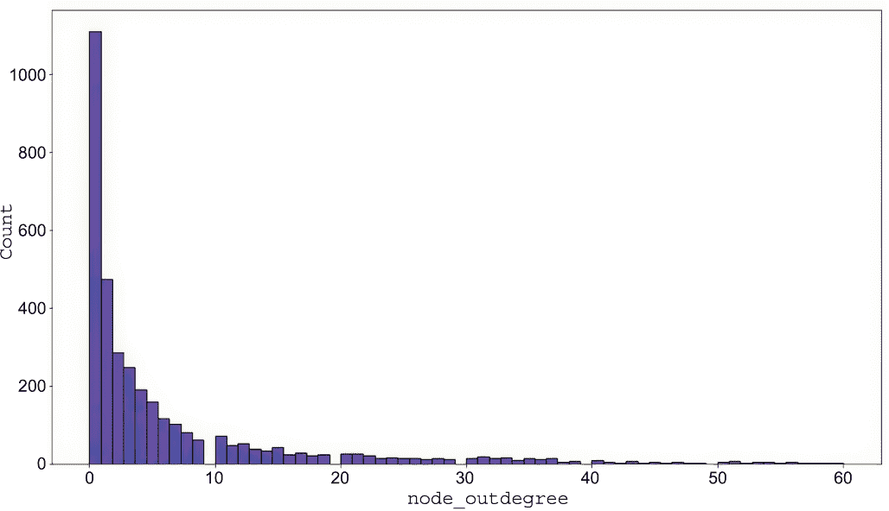

图 5.5 使用 seaborn 直方图可视化的出度分布图

可视化图表超出了本章的范围，因此我不会详细介绍我是如何生成图 5.5 的。然而，第九章和第十章的 Jupyter 笔记本中包含使用 Python seaborn 库绘制直方图的代码。

有趣的是，即使是 Twitter 网络的一个小子图也遵循幂律分布，这是现实世界网络的典型特征。为了使图表易于阅读，我已将箱范围限制在只有出度为 60 或更少的节点。超过 1,000 个节点没有出度连接，大多数节点的链接数少于 10。你之前观察到最高的出度为 143，只有 5% 的节点的出度大于 32。

练习 5.1

获取出度最高的前五个用户。使用 `count` `{}` 操作符。

现在，你将重复相同的步骤来评估入度分布。首先，你将使用 `apoc.agg.statistics` 函数在 Neo4j 浏览器中评估入度分布，如列表 5.2 所示。

列表 5.2 使用 `apoc.agg.statistics` 函数评估节点出度分布

```
MATCH (u:User)
WITH u, count{ (u)<-[:FOLLOWS]-() } AS inDegree
RETURN apoc.agg.statistics(inDegree)
```

表 5.2 显示了最终的分布。

表 5.2 关注者网络的出度分布

| `total` | 3594 |
| --- | --- |
| `min` | 0 |
| `minNonZero` | 1.0 |
| `max` | 540 |
| `mean` | 6.924874791318865 |
| `0.5` | 0 |
| `0.99` | 112 |
| `0.75` | 4 |
| `0.9` | 16 |
| `0.95` | 35 |
| `stdev` | 22.7640611678852 |

立刻吸引我注意的就是出度和入度的平均值是相同的。这可能对你来说是有道理的，因为节点和关系的总数是相同的，所以平均值应该相同。超过一半的用户没有入站连接。虽然我已经抓取了所有用户的 Twitter API 关注者关系，但我只包括在 12,000 条抓取推文中发布或被提及的用户之间的关系。看起来大约一半的用户在这个子图中没有任何关注者。有一个异常值有 540 个入站关系（关注者数量），这意味着七分之一的用户关注他们。

再次，我将使用 seaborn 库展示入度分布（图 5.6）。尽管我没有旨在获取节点入度和出度的幂律分布，但大多数现实世界的网络往往表现出这种分布。然而，当处理图的小子集时，节点度分布高度依赖于用于检索数据集的采样方法。随着数据样本的增长，其节点度分布将越来越接近整体图度分布（图 5.6）。

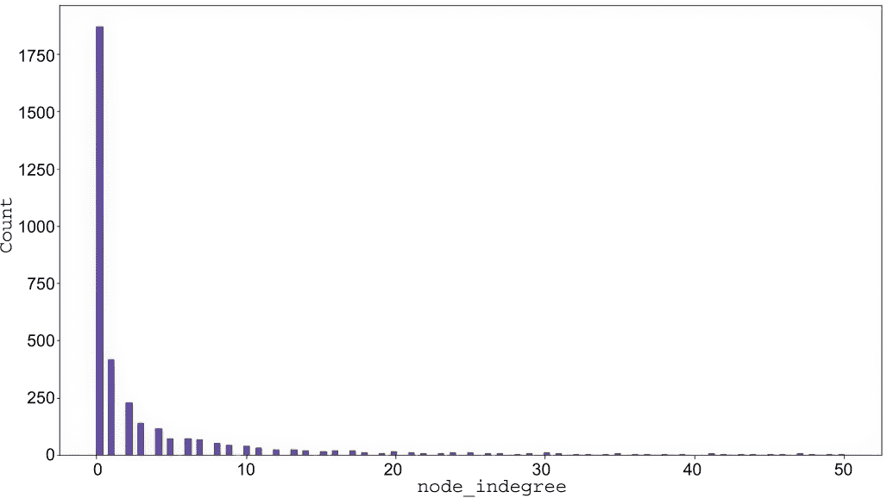

图 5.6 使用 seaborn 直方图可视化的入度分布图

练习 5.2

获取具有最高入度（关注者数量）的前五名用户。使用`count` `{}`运算符。

练习 5.2 的解决方案生成了表 5.3 所示的输出。

表 5.3 具有最高入度的前五名用户

| `user` | `inDegree` |
| --- | --- |
| "elonmusk" | 540 |
| "AndrewYNg" | 301 |
| "NASA" | 267 |
| "OpenAI" | 265 |
| "GoogleAI" | 264 |

具有最高入度的用户非常有趣。Elon Musk 位居榜首。看起来他在科技社区很受欢迎，或者至少在给定的 Twitter 子图中是这样。第二名是 Andrew Ng。如果你接触过任何机器学习，你可能听说过他，因为他是最著名的机器学习讲师之一。

练习 5.3

记住，我只包括发布推文或被提及的用户。选择具有最高入度的前五名用户之一，并检查他们发布的推文或被提及的推文。

练习 5.3 的解决方案 Cypher 语句显示在列表 5.3 中。

列表 5.3 检查 NASA 的提及和发布的帖子

```
MATCH (u:User)
WHERE u.username = "NASA"
OPTIONAL MATCH m=(u)<-[:MENTIONS]-()
OPTIONAL MATCH p=(u)-[:PUBLISH]->()
RETURN m,p
```

我选择探索 NASA 的 Twitter 账户。请注意，我使用了`OPTIONAL` `MATCH`，因为我事先不知道 NASA 是否发布了一条推文并被提及。再次强调，你可以使用 Cypher 语句的几个变体来产生相同的结果，所以如果你得到了正确的结果但使用了稍微不同的 Cypher 语句，请不要担心。列表 5.3 中的 Cypher 语句将在 Neo4j 浏览器中产生图 5.7 所示的可视化。在我们的数据集中，NASA 发布了一条推文，并被提及在两条其他推文中。

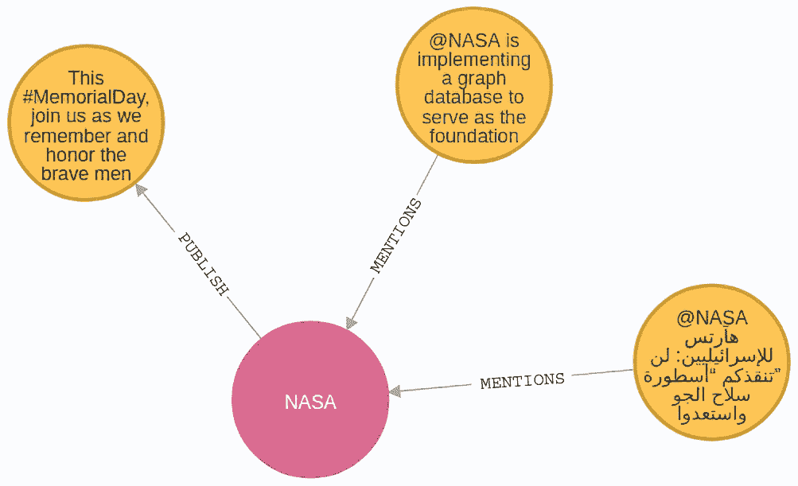

图 5.7 发布或提及 NASA 的推文网络可视化

## 5.2 Neo4j 图数据科学库简介

在继续进行网络特征化之前，你应该熟悉 Neo4j 图数据科学库（GDS）。GDS 是 Neo4j 的一个插件，它包含超过 50 个图算法，从社区检测和中心性到节点嵌入算法和链接预测管道，以及更多。你可以在官方文档中找到所有可用图算法的概述（[`neo4j.com/docs/graph-data-science/current/`](https://neo4j.com/docs/graph-data-science/current/))。

GDS 库中的图算法是在一个与数据库中存储的图结构分开的*投影内存图*结构上执行的（图 5.8）。要使用 GDS 库执行图算法，你必须首先投影一个内存图。投影图完全存储在内存中，使用优化的数据结构以实现可扩展和并行图算法执行。你可以使用*原生投影*或*Cypher 投影*来创建一个投影内存图。

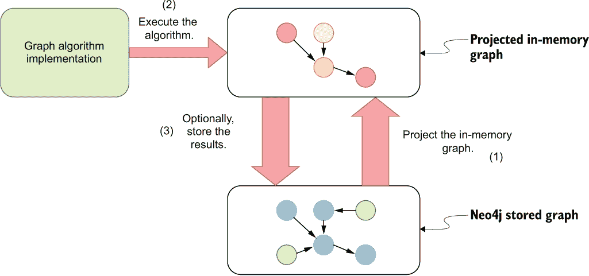

图 5.8 图数据科学库工作流程

原生投影在选择或过滤你想要投影的特定子图方面有限制，因为你只能根据节点标签和关系类型进行过滤。然而，它是推荐的方式来投影一个图，因为它由于直接从 Neo4j 存储中读取数据而具有高性能。

创建内存图的第二种可用选项是 Cypher 投影。使用它，你将获得 Cypher 查询语言的全部灵活性来选择或过滤任何你想要投影的特定子图。当然，Cypher 投影有一个缺点，即它比原生投影慢，通常只推荐用于项目的实验或探索阶段。

由于在处理大型图时，内存图投影可能成本较高，因此 GDS 库还提供了一种 *图目录* 功能。当您想要在同一个投影图上执行多个图算法时，图目录就派上用场了。您不需要为每个算法执行单独创建内存图，而是一次创建一个内存图，然后在该图上执行多个图算法。投影图可以通过其名称在执行图算法时访问，因此术语 *命名图* 就与存储在图目录中的投影图相关联。一旦创建了内存图，您就可以在其上执行图算法。

每个算法都有四种执行模式，具体取决于用例：

+   `stream`—以记录流的形式返回结果，但不存储结果。

+   `stats`—返回结果的摘要统计信息，但不存储结果。

+   `mutate`—将结果写回投影的内存图。此模式只能与存储在图目录中的命名图结合使用。当您想将一个图算法的输出用作另一个图算法的输入时，这非常有用。

+   `write`—将结果写回 Neo4j 数据库图。

### 5.2.1 图目录和本地投影

让我们从回顾一些涵盖网络特征化和 GDS 语法及算法用例的示例开始。首先，您需要投影一个内存图。您将使用本地投影来创建一个包含 `User` 节点和 `FOLLOWS` 关系的内存图。本地投影语法如下所示。

列表 5.4 在图目录中创建命名图的本地投影语法

```
CALL gds.graph.project(
    graphName,
    nodeProjection,
    relationshipProjection,
    optional configuration
)
```

使用 `CALL` 子句与过程名称结合执行 GDS 程序。使用本地投影将命名图存储在图目录中的过程称为 `gds.graph.project()`。它包含三个必填参数和一个可选参数。第一个参数用于命名图，在执行图算法时将通过该名称访问。第二个参数，称为 `nodeProjection`，定义了您想要投影的节点子集。同样，`relationshipProjection` 参数指定在创建内存图时应考虑哪些关系。需要注意的是，如果相邻节点在 `nodeProjection` 参数中未描述，则关系将在投影期间被跳过。在 GDS 术语中，关系的前一个节点称为 *源节点*，后一个节点称为 *目标节点*。

要投影关注者网络，你只需要包括`User`节点和`FOLLOWS`关系，无需额外配置。列表 5.5 中的 Cypher 语句使用原生投影来存储内存中的图。第一个参数指定其名称，当执行图算法时将使用该名称来访问它。第二个参数定义了你想包含在投影中的节点。当你只想投影一种类型的节点时，你可以将所需的节点标签定义为字符串。同样，当你只想在第三个参数中投影一种类型的关系时，你可以指定类型为字符串。

列表 5.5 将内存中的由`User`节点和`FOLLOWS`关系组成的图进行投影

```
CALL gds.graph.project('follower-network', 'User', 'FOLLOWS')
```

在后面的章节中，你将了解更多关于原生投影以及如何创建由多个节点标签和关系类型组成的内存图。GDS 库还支持投影节点和关系属性，这在处理加权网络时非常有用。

## 5.3 网络特征

接下来，你将使用 GDS 库来表征 Twitter 关注者网络。这些网络表征度量提供了对网络拓扑的全面视图，有助于理解整体结构、信息流效率以及网络中节点之间的互连程度。

### 5.3.1 弱连通分量算法

你将要执行的第一个图算法是*弱连通分量*（WCC）算法。WCC 是图内的一组节点，如果忽略关系的方向，则该组内的所有节点之间都存在路径。WCC 可以被认为是一个“岛屿”，无法从其他图组件中到达。虽然该算法识别了节点集的连通集，但其输出可以帮助你评估整体图的连通性程度。

以 WCC 算法开始任何图分析是有益的，因为它提供了对图结构的概述，包括连通性和孤立部分。通过识别这些不同的部分，你可以将进一步的分析集中在最相关的组件上，从而简化计算成本。了解连通性和整体图的连通性为更详细的调查奠定了基础，例如社区检测或中心性分析。

WCC 算法可能是一种图算法，应该在任何图分析的第一步执行，以评估图的连通性。图 5.9 显示了两个 WCC。一个组件包含 John、Alicia 和 Amulya，另一个包含 OpenAI、Google AI、NASA 和 Andrew Ng。

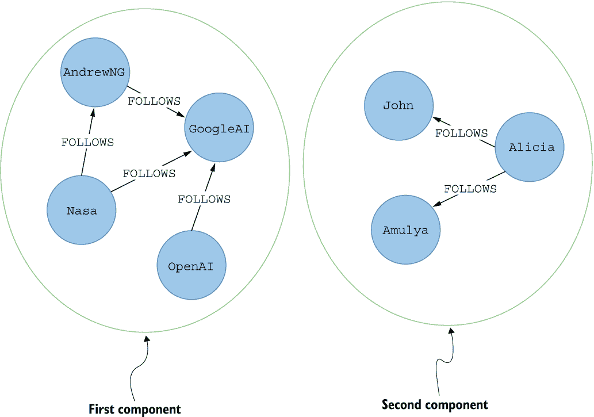

图 5.9 两个 WCC 的网络可视化

如果忽略关系方向，单个 WCC 内的节点可以到达所有其他节点。例如，John 可以到达 Alicia，即使关系方向相反。实际上，可以说关系被当作无向处理。算法将同一社区内的所有节点视为如果它们之间存在路径，则可以相互到达，而不考虑关系的方向。

你将使用`write`模式执行 WCC 算法。如前所述，`write`模式将结果存储回 Neo4j 数据库，同时也提供了算法结果的摘要统计信息。GDS 中图算法过程的语法在以下列表中显示。

列表 5.6 图算法过程语法

```
CALL gds.<algorithm>.<mode>(namedGraph, {optional configuration})
```

当使用算法的`write`模式时，你需要提供强制性的`writeProperty`参数，该参数指定了算法结果将存储到的节点属性名称。执行 WCC 算法的过程是`gds.wcc`。

你可以使用以下列表中的 Cypher 语句在跟随者网络上执行 WCC 算法并将结果存储到 Neo4j。

列表 5.7 在跟随者网络中执行 WCC 算法并将结果存储为`followerWcc`节点属性

```
CALL gds.wcc.write('follower-network', {writeProperty:'followerWcc'})
YIELD componentCount, componentDistribution
```

表 5.4 显示了结果统计信息。

表 5.4 在跟随者网络上执行 WCC 算法的摘要统计信息

| `componentCount` | `componentDistribution` |
| --- | --- |
| 547 | { "p99":”3","min":”1","max":”2997","mean":”6.570383912248629","p90":”1","p50":”1","p999":”5","p95":”2","p75":”1” } |

算法的`write`模式将结果存储到 Neo4j 数据库，并提供表 5.4 中所示的摘要统计信息。包含算法结果的节点属性标识了节点所属的组件 ID。

跟随者网络中有 547 个不连通的组件，其中最大的包含 2,997 个成员。大多数现实世界的网络都有一个包含网络中大多数节点的单个连通组件和一些不连通的边缘组件。由于你正在分析的只是更大网络的一部分，组件数量较多并不罕见，因为许多缺失的用户和关系如果包含在内，本应连接网络的各个部分。我发现了一项关于 Twitter 网络的（Myers 等人，2014）分析，其中作者分析了 2012 年 Twitter 网络的快照，包含 1.75 亿用户和 200 亿个关注关系。分析显示，大约 93%的用户属于最大的 WCC。另一项分析检查了 Facebook 图（Ugander 等人，2011），他们发现最大的 WCC 包含所有节点的 99%以上。

`p90`结果，或组件大小的第 90 百分位数，其值为 1，表示 90%的组件只有一个成员。当一个组件只有一个成员时，这意味着该节点没有关系。

练习 5.4

计算五个最大 WCC 的成员数量。组件 ID 存储在`User`节点的`followerWcc`属性下。使用`followerWcc`属性作为分组键，结合`count()`函数来按组件计算成员数量。

练习 5.4 的解决方案产生了表 5.5 所示的输出。

表 5.5 五个最大 WCC 的成员数量

| `componentId` | `countOfMembers` |
| --- | --- |
| 0 | 2997 |
| 1293 | 5 |
| 1049 | 3 |
| 269 | 3 |
| 335 | 3 |

您可以观察到存在一个单独的组件，它包含网络中 85%的节点。组件 ID 不是确定的，这意味着您可以为组件 ID 得到不同的值。然而，组件成员分布应该是相同的。

第二大的组件只包含五个成员。您可以使用以下列表中的 Cypher 语句在 Neo4j 浏览器中可视化第二大的组件（也请参阅图 5.10）。如果您有不同的组件 ID，请确保在`WHERE`子句中更改组件 ID。

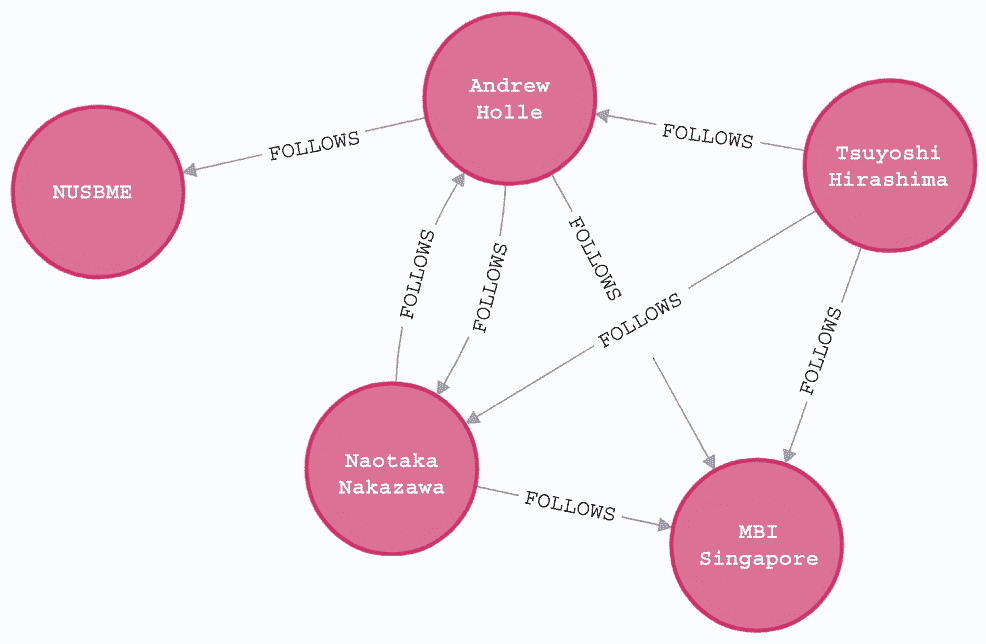

图 5.10 关注网络中第二大的 WCC 的网络可视化

列表 5.8 检索没有传出`FOLLOWS`关系的`User`节点

```
MATCH p=(u:User)-[:FOLLOWS]->()
WHERE u.followerWcc = 1293
RETURN p
```

我已经检查了图 5.10 中显示的用户名在 Twitter 上的情况，他们似乎是新加坡和京都大学的几位教授。他们相互关注，但与我们小型 Twitter 快照中的其他网络没有连接。

练习 5.5

确定只包含一个成员的 WCC 数量。记住，如果一个 WCC 只包含一个成员，这实际上意味着该节点没有传入或传出的关系。与其使用`followerWcc`属性来计数这些组件，您可以直接过滤没有`FOLLOWS`关系的`User`节点并计数。计数将与只有一个成员的 WCC 数量相同。

### 5.3.2 强连通分量算法

*强连通分量*（SCC）是有向图中所有节点之间都存在路径的子图。WCC 算法和 SCC 算法之间的唯一区别是 SCC 算法考虑关系方向。因此，SCC 算法仅适用于有向图。如果忽略关系方向，那么您正在处理 WCC。

图 5.11 显示了四个 SCC。第一个组件包含 NASA、Andrew Ng 和 Google AI。您会注意到，尽管 OpenAI 可以到达第一个组件中的所有节点，但 Google AI 到 OpenAI 的路径是不可能的，因为 SCC 算法不会忽略关系方向。同样，第三组件中的 Amulya 可以通过 Alicia 和 John 到达，但从 Amulya 到 John 或 Alicia 的定向路径不存在。

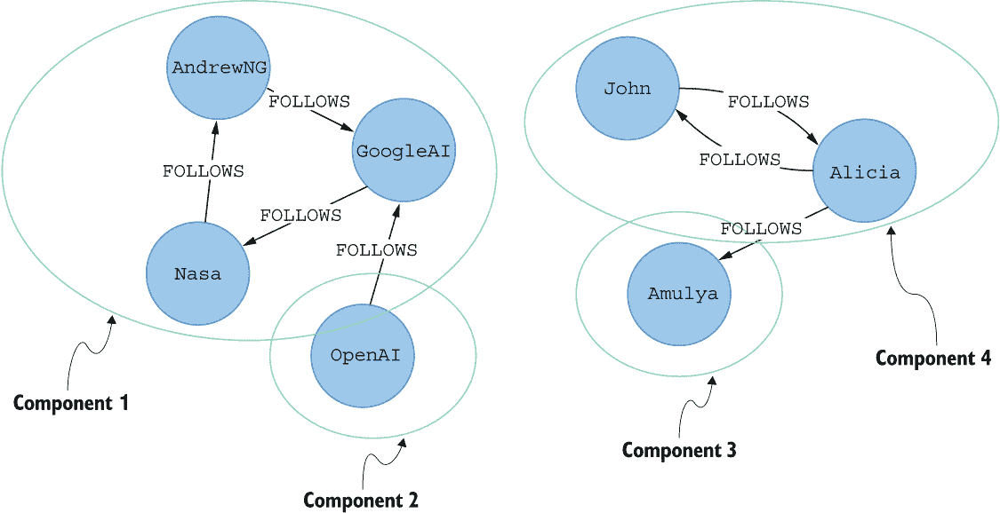

图 5.11 四个 SCC 的网络可视化

SCC 算法在有向路径和可达性起重要作用时很有用。例如，想象一个道路网络，其中节点代表交叉口，关系代表道路连接。例如，许多大城市中心有很多单向道路连接。使用 SCC 算法，你可以评估关闭一个或多个道路连接的后果以及它会如何影响城市内地点的可达性。

图 5.12 可视化了一个玩具道路网络，其中节点代表交叉口，它们之间的关系代表道路连接。例如，节点 A 和 B 两个方向都相连，而 B 和 E 之间的链接是单向的。使用 SCC 算法，你可以评估如果关闭特定的道路，节点的可达性。例如，如果由于维护而关闭交叉口 D 和 C 之间的道路，就无法从网络的右侧到达左侧。具体来说，你无法从节点 D、E、F 或 G 到达节点 A、B 或 C。因此，节点 A、B 和 C 将形成第一个 SCC，而 D、E、F 和 G 将形成第二个。

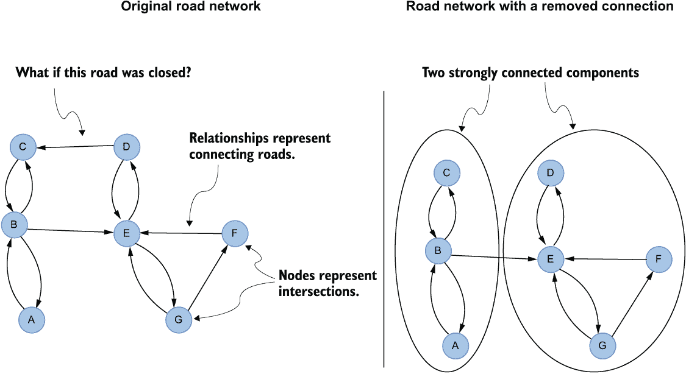

图 5.12 一个道路网络中的 SCC 用例示例

在 Twitter 的背景下，SCC 可以应用于识别更小的紧密连接的节点组。一篇研究论文（Swati 等人，2016）声称你可以使用 SCC 算法来识别用于更精确营销定位的用户组。另一篇文章（Efstathiades，2016）使用 SCC 算法建议用户只跟随受欢迎的用户，而不与其他不受欢迎的用户建立太多联系。结果是 SCC 数量随时间增加。

再次，你将使用算法的 `write` 模式将结果存储回 Neo4j 数据库。

列表 5.9 在跟随者网络上执行 SCC 算法并将结果存储为 `followerScc` 节点属性

```
CALL gds.scc.write('follower-network', {writeProperty:'followerScc'})
YIELD componentCount, componentDistribution
```

表 5.6 显示了生成的统计信息。

表 5.6 在跟随者网络上执行 SCC 算法后的摘要统计信息

| `componentCount` | `componentDistribution` |
| --- | --- |
| 2704 | (cf{ "min": 1,"p5": 1,"max": 796,"p999": 7,"p99": 2,"p1": 1,"p10": 1,"p90": 1,"p50": 1,"p25": 1,"p75": 1,"p95": 1,"mean": 1.3291420118343196 } |

如预期的那样，SCC 的数量高于 WCC 的数量。有 2,704 个 SCC，最大的一个包含 796 个成员。

练习 5.6

计算五个最大 SCC 的成员数量。组件 ID 存储在 `User` 节点的 `followerScc` 属性下。

练习 5.6 的解决方案生成了表 5.7 所示的输出。

表 5.7 五个最大 SCC 的成员数量

| `componentId` | `countOfMembers` |
| --- | --- |
| 0 | 796 |
| 380 | 20 |
| 407 | 7 |
| 36 | 6 |
| 212 | 4 |

类似于 WCC 算法，社区 ID 不是确定的。你可能会得到不同的社区 ID，但应该得到相同的计数。

练习 5.7

在 Neo4j 浏览器中可视化第二大 SCC。一个节点可以与其他 SCC 中的节点建立关系，因此你必须应用一个过滤器来确保所有节点都在第二大 SCC 中。

练习 5.4 的解决方案在 Neo4j 浏览器中显示了图 5.13 所示的网络可视化。你可以观察到这个社区非常紧密，因为组内节点之间存在许多连接。根据用户名判断，他们似乎都来自同一个地区。不幸的是，我不是语言专家，所以我不知道是哪个地区。

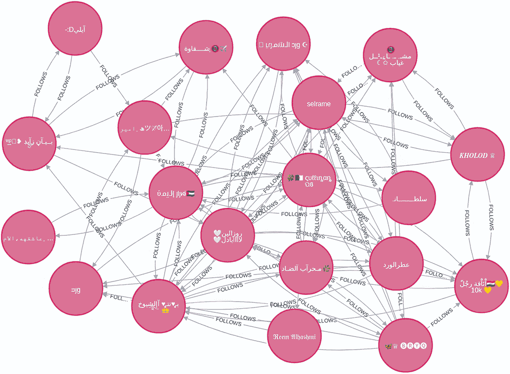

图 5.13 是跟随网络中第二大强连通分量（SCC）的网络可视化。

### 5.3.3 局部聚类系数

*局部聚类系数*（LCC）是一个衡量特定节点的邻居之间连接程度或接近程度的指标。LCC（图 5.14）衡量的是节点两个邻居之间连接的平均概率。因此，LCC 的值介于 0 到 1 之间。LCC 值为 0 表示相邻节点之间没有连接。另一方面，LCC 值为 1 表示邻居的网络形成一个完全图，其中所有邻居都相互连接。

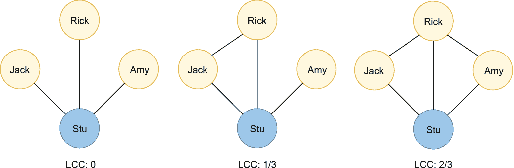

图 5.14 无向图的 LCC 值

在无向图上，LCC 更容易理解。例如，在图 5.14 中，Stu 有三个邻居。当这些邻居中的任何一个都没有与其他邻居建立连接时，LCC 值为 0。因此，图 5.14 左边的例子中，Stu 的 LCC 值为 0。在中间的例子中，Stu 的 LCC 值为 1/3 或 0.33。Stu 有三个邻居，所以从组合学的角度来看，他们之间有三种可能的关系。在图 5.14 中间的例子中，Stu 的邻居之间只有一个连接；因此，Stu 的 LCC 值为 1/3。右侧的例子中，Stu 的邻居之间有两个连接；因此，Stu 的 LCC 值为 2/3。如果 Jack 和 Amy 之间再建立另一个关系，那么 Stu 节点的所有邻居就会形成一个完全图，这将改变 Stu 的 LCC 值到 1。

LCC 算法提供了一个指标来评估节点邻居之间的连接强度。你可以通过将相邻节点之间现有链接的数量除以相邻节点之间可能链接的数量来计算单个节点的 LCC 值。你还可以使用图 5.15 中的公式来计算有向图上的 LCC。

对于有向图，第一个区别是，如果一个节点至少有一个连接到它，那么它就有相邻节点。尽管 Stu 在图 5.15 中有四个连接，但它们只有三个不同的邻居。一个节点的邻居可以有一个指向原始节点的入站或出站连接，或者两者都有。在有向图中，每一对邻居之间可以有最多两个关系，所以三个邻居之间的可能连接总数是六。再次强调，你只需要计算邻居之间的现有连接数量，并将其除以可能连接的数量。

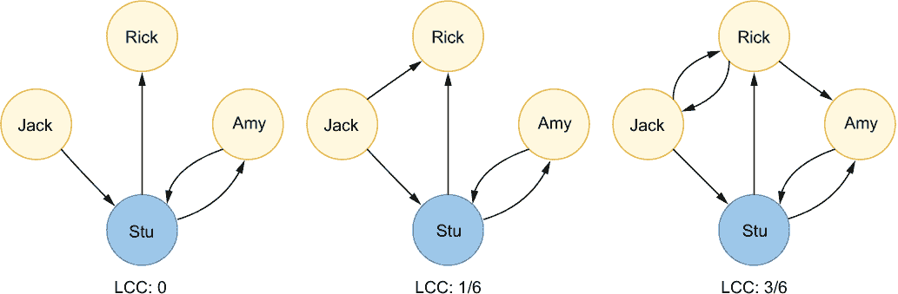

图 5.15 有向图的 LCC 值

不幸的是，GDS 库仅支持无向图的 LCC 算法。然而，由于有向 LCC 仅计算相邻节点及其链接的数量，你可以很容易地仅使用 Cypher 查询语言实现该算法。使用以下 Cypher 语句计算每个节点的有向 LCC 值，并将结果存储在`lcc`节点属性下。

列表 5.10 在有向跟随者网络中计算 LCC

```
MATCH (u:User)                                                           ❶
OPTIONAL MATCH (u)-[:FOLLOWS]-(n)
WITH u,count(distinct n) AS neighbors_count                              ❷
OPTIONAL MATCH (u)-[:FOLLOWS]-()-[r:FOLLOWS]-()-[:FOLLOWS]-(u)
WITH u, neighbors_count, count(distinct r) AS existing_links             ❸
WITH u,
     CASE WHEN neighbors_count < 2 THEN 0 ELSE
       toFloat(existing_links) / (neighbors_count * (neighbors_count - 1))
       END AS lcc                                                        ❹
SET u.lcc = lcc                                                          ❺
```

❶ 匹配所有用户节点

❷ 计算它们不同邻居的数量

❸ 计算邻居之间不同链接的数量

❹ 计算 LCC 值

❺ 在 lcc 节点属性下存储 LCC 值

你应该已经熟悉列表 5.10 中的大多数 Cypher 语法。你首先匹配数据库中的所有用户。接下来，计算不同邻居的数量。由于一些`User`节点没有任何`FOLLOWS`关系，你必须使用`OPTIONAL` `MATCH`子句。使用`MATCH`子句会减少基数并有效地过滤掉所有没有任何`FOLLOWS`关系的`User`节点。如果你还记得 WCCs 示例，大约有 500 个`User`节点没有任何`FOLLOWS`关系。另一个小细节是，`OPTIONAL` `MATCH`中的 Cypher 模式不提供关系方向。你想要计算不同邻居的数量，无论它们是否有指向原始节点的入站、出站或两者都有的关系。由于一些邻居可以与原始`User`节点同时有入站和出站连接，你需要在`count()`函数中使用`distinct`前缀来获取正确的结果。在计算 LCC 之前，唯一缺少的变量是邻居之间现有链接的数量。同样，你应该使用`OPTIONAL` `MATCH`子句，因为一些邻居可能有零连接，你不想过滤掉这些连接。我真的很喜欢 Cypher 语法的表达性，可以定义将计算相邻节点之间链接数量的图模式：

```
OPTIONAL MATCH (u)-[:FOLLOWS]-()-[r:FOLLOWS]-()-[:FOLLOWS]-(u)
```

您可以观察到在这个模式中我使用了引用变量`u`两次。实际上，这个图模式描述了`u`节点参与的所有三角形。


图 5.16 用于识别三角形的可视化 Cypher 模式

如图 5.16 所示，根据 Cypher 语法描述，两个节点都必须与节点`u`相邻。您只对计算邻居之间的`r`关系感兴趣，因此您结合`count()`函数和`distinct`前缀来获取邻居之间现有链接的数量。同样，正如之前一样，指定图模式中的`FOLLOWS`关系没有指定方向，因为您想考虑所有可能的关系方向变体。最后，您可以使用 LCC 算法公式来计算每个节点的 LCC 值。


上述方程可以用来计算有向 LCC 值。您需要计算现有链接的数量，并将其除以邻居之间可能连接的数量，即邻居数量乘以邻居数量减 1。当节点邻居数量为 0 或 1 时，该公式不适用，因为您最终会除以 0。根据定义，少于 2 个邻居的节点的 LCC 值是未定义的。然而，我遇到过一些实现，它们在少于 2 个邻居的节点上使用 0 代替未定义，这也是我在这个例子中决定使用的。我引入了`CASE`语句来自动为少于 2 个邻居的节点分配 LCC 值为 0。如果您对 SQL 查询语言有一些经验，您会注意到`CASE`语句在 Cypher 中是相同的。无论如何，`CASE`子句的 Cypher 语法如下：

```
CASE WHEN predicate THEN x ELSE y END
```

断言值应该是一个布尔值。然后，如果布尔值为真，则选择`x`值；如果断言为假，则选择`y`值。

最后，您需要将计算出的 LCC 值存储在`User`节点的`lcc`属性下。现在 LCC 值已经存储在数据库中，您可以继续计算平均 LCC。

列表 5.11 计算平均 LCC

```
MATCH (u:User)
RETURN avg(u.lcc) AS average_lcc
```

平均 LCC 为 0.06。这相当接近 0。如此小的 LCC 值的一个原因是，我们只有 Twitter 网络的微小快照，因此关于关注者的信息有限。对更大范围的 Twitter 网络的研究（Myers 等人，2014 年）表明，平均 LCC 值更接近于 0.15 到 0.20 之间。此外，似乎 Twitter 用户比 Facebook（Ugander 等人，2011 年）上的用户联系得更松散。这很合理，因为人们通常在 Facebook 上与他们的朋友和家人联系，这是一个联系更紧密的用户群体。另一方面，一项研究（Efstathiades 等人，2016 年）表明，Twitter 用户更喜欢关注精英用户或有影响力的人，而不是像经常与家人、现实生活中的朋友或邻居那样联系。

## 5.4 识别中心节点

在本章的最后部分，你将学习如何识别最中心的节点。用于识别最中心节点的图算法组被称为*中心性算法*，其中 PageRank 是最著名的一个。

### 5.4.1 PageRank 算法

PageRank 是由拉里·佩奇和谢尔盖·布林（1999 年）设计的，并帮助谷歌搜索成为今天的模样。PageRank 衡量节点的传递或方向性影响力。例如，节点度通过仅考虑其直接邻居来量化节点的影响力或重要性。相比之下，PageRank 还考虑了跨越多个跳转的图中其他节点的间接关系。以我们的 Twitter 子图为例，例如，如果埃隆·马斯克或安德鲁·吴关注你，你获得的影响力比如果我关注你时更多。PageRank 评估特定节点拥有的关注者数量以及这些关注者的影响力。

PageRank 最初是为排名网页重要性而开发的。该算法将每个关系视为一种影响力投票（图 5.17）。我喜欢这样想，如果一个节点指向另一个节点，它本质上表明另一个节点很重要或有影响力。

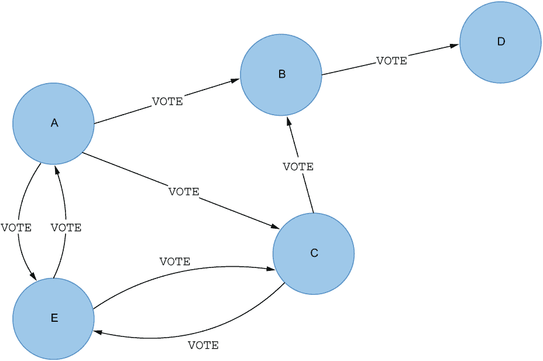

图 5.17 PageRank 将每个关系视为一种影响力投票。

你可以想象，通过有向关系，投票如何在网络中流动。每个节点初始化时，其分数等于节点总数的倒数。然后，它通过其出链传递其排名。每条关系中传递的影响力等于节点影响力除以出链数量。第一次迭代后，节点的排名等于来自其他节点的输入分数之和。然后，算法重复此过程，直到收敛或达到预定义的迭代次数（图 5.18）。

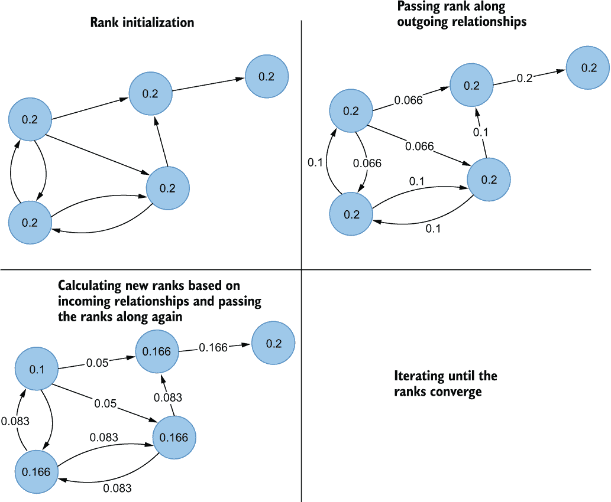

图 5.18 基于网络流简化的 PageRank 计算

然而，基于网络流的简化 PageRank 计算存在一个关键缺陷。图 5.17 中的节点 D 没有出链。没有任何出链的节点也被称为*死胡同*。死胡同的存在会导致网络中某些或所有节点的 PageRank 分数下降到零，因为它实际上将排名分数泄露出了网络。

PageRank 算法引入了*teleportation*能力以避免排名泄露。Teleportation 引入了跳转到随机节点的小概率，而不是跟随出链。在探索网页的上下文中，想象一个冲浪者穿越互联网。他们可能会跟随网页到网页的出链，或者感到无聊并跳转到随机页面。定义冲浪者跟随出链概率的常数称为*阻尼因子*。因此，他们跳转到随机页面的概率是 1 减去阻尼因子。阻尼因子的典型值是 0.85，这意味着冲浪者大约有 15%的时间会跳转到随机页面。

使用标准的 PageRank 算法，随机跳转到网络中任意节点的概率在所有节点之间均匀分布，这意味着一个无聊的冲浪者有同等的机会跳转到图中的任何节点，包括他们当前正在访问的节点。在这种情况下，中间节点在每次迭代后都会将出链的排名相加，如图 5.18 所示，并添加一个冲浪者随机跳转到该节点的概率。 teleportation 能力解决了死胡同节点泄露整个网络 PageRank 分数的情况，这实际上会导致所有节点的排名值为零。你可以使用以下 Cypher 语句在关注者网络上执行 PageRank。

列表 5.12 在关注者网络上执行 PageRank

```
CALL gds.pageRank.write('follower-network',
  {writeProperty:'followerPageRank'})
```

列表 5.12 中的 Cypher 语句在投影关注者网络上执行 PageRank 算法，并将结果存储回数据库作为`User`节点的`followerPageRank`属性。

练习 5.8

获取具有最高 PageRank 分数的前五个用户。PageRank 分数存储在`followerPageRank`节点属性下。

练习 5.8 的解决方案产生了表 5.8 所示的输出。

表 5.8 按 PageRank 分数排序的最重要节点

| `username` | `followerPageRank` |
| --- | --- |
| "elonmusk" | 20.381862706745217 |
| "NASA" | 8.653231888111382 |
| "wmktech" | 6.937989377788902 |
| "Twitter" | 6.937989377788902 |
| "Wajdialkayal1" | 6.551413750286345 |

伊隆·马斯克是我们 Twitter 子图中最有影响力的用户。有趣的是，安德鲁·吴、谷歌 AI 和 OpenAI 都曾在前五名，但在使用 PageRank 分数时失去了位置。记住，PageRank 评估的是进入连接的数量以及链接背后的节点的影响力。有时，具有高 PageRank 分数的节点只有少量有影响力的连接。你可以使用以下 Cypher 语句检查每个用户的顶级关注者，如表 5.8 所示。

列表 5.13 检查排名最高的用户的顶级关注者

```
MATCH (u:User)<-[:FOLLOWS]-(f)
WHERE u.username IN
  ["elonmusk", "NASA", "wmktech", "Twitter", "Wajdialkayal1"]  ❶
WITH u,f
ORDER BY f.followerPageRank DESC                               ❷
RETURN u.username AS user,
       round(u.followerPageRank, 2) AS pagerankScore,
       collect(f.username)[..5] AS topFiveFollowers            ❸
ORDER BY pagerankScore DESC
```

❶ 匹配使用 IN 子句的用户组

❷ 按关注者 PageRank 分数降序排列中间结果

❸ 按原始用户分组收集前五个关注者

列表 5.13 中的 Cypher 语句首先通过`username`属性匹配排名前五的用户。您可以使用`IN`运算符指定可能值的列表，而不是使用多个`OR`谓词。然后，您使用`WITH`语句按关注者的 PageRank 分数对结果进行排序。最后，您使用`collect()`函数生成按 PageRank 分数排序的关注者有序列表。`collect()`函数保持输入数据的顺序。因为您首先在`WITH`语句中按关注者的 PageRank 分数对结果进行排序，所以`collect()`函数的列表结果将包含按 PageRank 分数排序的关注者列表。通过*列表切片*实现了每个用户只返回前五名关注者。如果您曾经进行过任何编程或 SQL 分析，您可能已经遇到过列表或数组切片。Cypher 中的列表切片语法如下：

```
array[from..to]
```

方括号语法将从起始索引`from`提取数组元素，直到（但不包括）结束索引`to`。Cypher 有一个`round()`函数，允许您指定将任何数字四舍五入到指定的精度或小数点。列表 5.13 中 Cypher 语句的结果显示在表 5.9 中。

表 5.9 按 PageRank 分数排序的最重要节点

| `用户` | `PageRank 分数` | `前五名关注者` |
| --- | --- | --- |
| "elonmusk" | 20.38 | ["fchollet", "TheCuriousLuke", "DrLiMengYAN1", "douwekiela", "threadreaderapp"] |
| "NASA" | 8.65 | ["BIBBI02374449", "Lucian2drei", "NYTScience", "CmccClimate", "abhibisht89"] |
| "wmktech" | 6.94 | ["Wajdialkayal1", "alkayal_wajdi", "Websystemer", "AlkayalWajdi", "SwissCognitive"] |
| "Twitter" | 6.66 | ["Lucian2drei", "Chuck_Moeller", "Omkar_Raii", "SportsCenter", "philipvollet"] |
| "Wajdialkayal1" | 6.55 | ["wmktech", "Websystemer", "taylorwfarley", "RiM2ww", "saye2018"] |

我原本希望 Elon 或 NASA 会出现在前关注者中，但不幸的是，他们在我们子图中没有关注任何人。Elon 和 NASA 缺乏关注者关系并不令人惊讶，因为他们总共关注了约 500 个用户，但他们自己却有超过 2 亿的关注者。例如，如果 Elon 或 NASA 关注了一个用户，他们的 PageRank 分数将自动很高，因为他们将有一个最具影响力的节点在关注他们。一个现实生活中的类比可能是以下这样：想象你刚刚搬到瑞典，除了国家的总统外，你认识的人都不认识。尽管你只有一个联系，但这个联系非常有影响力，这会自动给你在网络中带来很多影响力。

表 5.9 中唯一令人兴奋的跟随模式是用户 wmktech 和 Wajdialkayal1 相互关注。他们两人都很有影响力，而且通过相互关注，彼此也增加了对方的重要性。

### 5.4.2 个性化 PageRank 算法

Neo4j GDS 库也支持*个性化 PageRank*变体。在 PageRank 定义中，网络冲浪者可能会感到无聊并随机跳转到其他节点。通过个性化 PageRank 算法，你可以定义当网络冲浪者感到无聊时应该跳转到哪些节点。可以说，通过定义冲浪者倾向于跳转的`sourceNodes`，你实际上是通过特定节点或多个节点的视角来检查节点的影响。

在本例中，你将使用个性化 PageRank 算法的`stream`模式。`stream`模式将算法的结果作为记录流返回。个性化 PageRank 算法的语法几乎与 PageRank 算法相同，只是你还提供了`sourceNodes`参数。

列表 5.14：从 2016 年注册的用户视角运行个性化 PageRank 算法

```
MATCH (u:User)
WHERE u.registeredAt.year = 2016
WITH collect(u) AS sourceNodes                             ❶
CALL gds.pageRank.stream('follower-network', {sourceNodes: sourceNodes})
YIELD nodeId, score                                        ❷
RETURN gds.util.asNode(nodeId).username AS user, score
ORDER BY score DESC
LIMIT 5;                                                   ❸
```

❶ 匹配用于个性化 PageRank 算法的源节点

❷ 执行个性化 PageRank 算法

❸ 使用 gds.util.asNode 函数通过其内部 ID 匹配特定节点

首先，你需要使用`MATCH`子句后跟`collect()`函数来生成所有 2016 年注册用户的列表。然后，你可以将收集到的用户作为`sourceNode`参数输入。通过定义`sourceNode`参数，你是在指示程序执行个性化 PageRank 算法，并在 teleport 时使用提供的节点作为重启节点。PageRank 算法的`stream`模式输出两列：`nodeId`和`score`。`nodeId`代表 Neo4j 的*内部节点 ID*，数据库会自动为数据库中的每个节点生成。你可以使用`gds.util.asNode()`函数将`nodeId`值映射到实际的节点实例。`score`列代表特定节点的 PageRank 分数。

从 2016 年注册的用户角度来看，最重要的用户是埃隆·马斯克，其次是安德鲁·吴、伊恩·古德费洛、Hugging Face 和 NASA。虽然埃隆·马斯克和 NASA 也出现在整体 PageRank 分数排名前五的用户中，但你也可以观察到，当从 2016 年注册的用户视角来确定 PageRank 分数时，安德鲁·吴、伊恩·古德费洛和 Hugging Face 的账户获得了重要性。

如果你运行个性化 PageRank 并使用没有出向连接的节点作为`sourceNodes`参数会发生什么？以下列表显示了此过程。

列表 5.15：从 NASA 视角运行个性化 PageRank 算法

```
MATCH (u:User)
WHERE u.username = "NASA"
WITH collect(u) AS sourceNodes
CALL gds.pageRank.stream('follower-network', {sourceNodes: sourceNodes})
YIELD nodeId, score
RETURN gds.util.asNode(nodeId).username AS user, score
ORDER BY score DESC
LIMIT 3;
```

表 5.10 显示了本例的 PageRank 分数。

表 5.10：按 PageRank 分数排序的最重要节点

| `user` | `score` |
| --- | --- |
| "NASA" | 0.15000000000000002 |
| "ServerlessFan" | 0 |
| "dr_sr_simpson" | 0 |

由于 `sourceNodes` 参数中指定的节点没有出链，PageRank 算法将不断在选定的源节点上重新启动，这反过来又会导致所有其他节点的 PageRank 评分为 0。当使用默认设置运行 PageRank 时，所有 PageRank 评分为 0.15 的节点都没有任何进入关系。它们只通过网络浏览者随机跳转到它们而获得重要性，但它们没有来自其他节点的显著投票。在个性化 PageRank 变体中，你也可以指定在无聊时跳转到哪些节点，这意味着一些节点甚至不会获得 0.15 的 PageRank 评分，因为浏览者不会随机跳转到它们。

练习 5.9

执行个性化 PageRank 算法，并使用 2019 年注册的 `User` 节点作为 `sourceNodes` 参数。

### 5.4.3 删除命名图

恭喜！你现在已经完成了你的第一次网络分析。在你完成计划的图算法执行序列后，建议删除投影图以节省内存。你可以通过使用 `gds.graph.drop()` 程序来释放内存中的图。

列表 5.16 从内存中释放 follower-network 图

```
CALL gds.graph.drop('follower-network')
```

在下一章中，你将学习如何根据间接关系推断单部分网络。你将运行本章中学到的许多图算法，以巩固执行它们和理解它们结果的能力。

## 5.5 练习解答

练习 5.1 的解答如下。

列表 5.17 获取具有最高五个出度的用户

```
MATCH (u:User)
RETURN u.username AS user,
       count { (u)-[:FOLLOWS]->() } AS outDegree
ORDER BY outDegree DESC
LIMIT 5
```

练习 5.2 的解答如下。

列表 5.18 获取具有最高五个入度的用户

```
MATCH (u:User)
RETURN u.username AS user,
       count{ (u)<-[:FOLLOWS]-() } AS inDegree
ORDER BY inDegree DESC
LIMIT 5
```

练习 5.3 的解答如下。

列表 5.19 检查 NASA 的提及和发布的帖子

```
MATCH (u:User)
WHERE u.username = "NASA"
OPTIONAL MATCH m=(u)<-[:MENTIONS]-()
OPTIONAL MATCH p=(u)-[:PUBLISH]->()
RETURN m,p
```

练习 5.4 的解答如下。

列表 5.20 计算五个最大 WCC 的用户数量

```
MATCH (u:User)
WITH u.followerWcc AS componentId, count(*) AS countOfMembers
ORDER BY countOfMembers DESC
RETURN componentId, countOfMembers
LIMIT 5
```

练习 5.5 的解答如下。

列表 5.21 计算仅包含一个成员的 WCC 数量

```
MATCH (u:User)
WHERE NOT EXISTS {(u)-[:FOLLOWS]-()}
RETURN count(*) AS countOfComponents
```

练习 5.6 的解答如下。

列表 5.22 计算五个最大 SCC 的成员数量

```
MATCH (u:User)
WITH u.followerScc AS componentId, count(*) AS countOfMembers
ORDER BY countOfMembers DESC
RETURN componentId, countOfMembers
LIMIT 5
```

练习 5.7 的解答如下。

列表 5.23 在 Neo4j 浏览器中可视化第二大 SCC

```
MATCH p=(u1:User)-[:FOLLOWS]->(u2:User)
WHERE u1.followerScc = 380 AND u2.followerScc = 380
RETURN p
```

确保在 `WHERE` 子句中根据需要更正 `followerScc` 值。

练习 5.8 的解答如下。

列表 5.24 获取具有最高 PageRank 评分的前五名用户

```
MATCH (u:User)
RETURN u.username AS username, u.followerPageRank AS followerPageRank
ORDER BY followerPageRank DESC
LIMIT 5
```

练习 5.9 的解答如下。

列表 5.25 执行个性化 PageRank 算法，并使用 2019 年注册的 `User` 节点作为 `sourceNodes` 参数

```
MATCH (u:User)
WHERE u.registeredAt.year = 2019
WITH collect(u) AS sourceNodes
CALL gds.pageRank.stream('follower-network', {sourceNodes: sourceNodes})
YIELD nodeId, score
RETURN gds.util.asNode(nodeId).username AS user, score
ORDER BY score DESC
LIMIT 5
```

## 摘要

+   实际网络遵循节点度数的幂律分布。

+   对于有向网络，节点度数可以分为入度，即进入连接的数量，和出度，即出链的数量。

+   图数据科学（GDS）库使用投影的内存图来执行图算法。

+   本地投影是内存中图投影性能更好的变体。

+   图算法的`stream`模式以记录流的形式返回结果，并不存储结果。

+   `stats`模式返回算法的摘要统计信息，并不存储结果。

+   图算法的`mutate`模式将算法的结果存储回投影的内存图。

+   `write`模式将算法的结果存储到数据库中。

+   弱连通分量（WCC）算法用于识别网络中的不连通部分或岛屿。

+   WCC 算法通常在分析早期使用，以评估图的连通性和结构。

+   强连通分量（SCC）是有向图中所有节点之间都存在路径的子图。

+   本地聚类系数（LCC）检查一个节点的邻居是如何紧密相连的。

+   可以使用`CASE`子句来指定通用条件表达式。

+   PageRank 将每个关系视为一个影响力投票，可以用来找到图中最有影响力的节点。

+   PageRank 有一个阻尼因子参数，指定随机网络冲浪者应该多频繁地跟随出站链接，而不是跳转到随机节点。

+   当使用默认的阻尼因子参数 0.85 运行 PageRank 算法时，没有传入关系的节点将具有 0.15 的 PageRank 得分。

+   使用个性化 PageRank 变体，您可以指定随机游走者应该跳转到的节点，这为您提供了一个从特定视角看网络的方式。

+   分析完成后，请确保使用`gds.graph.drop`过程从内存中释放投影图。
