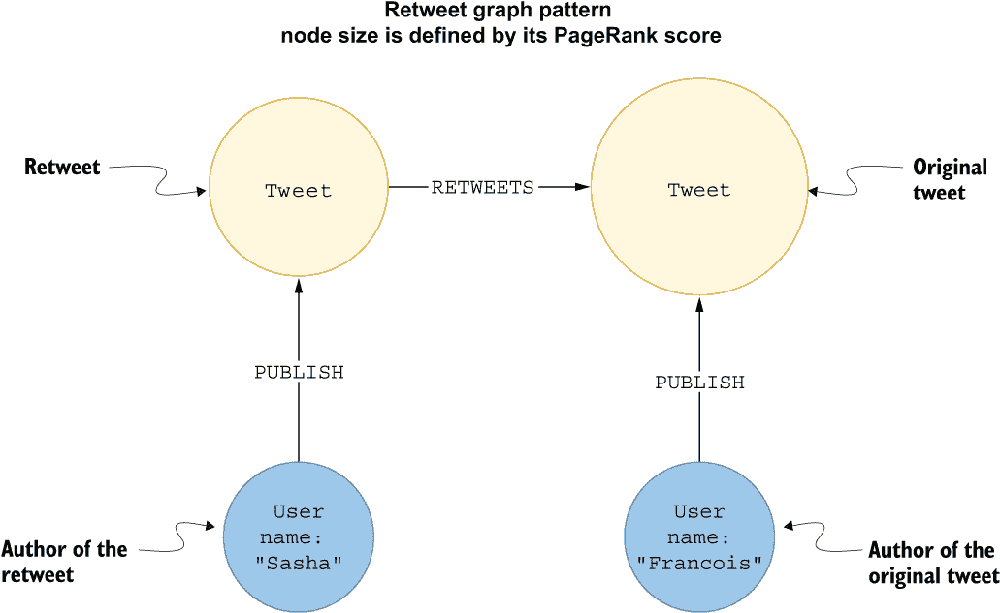
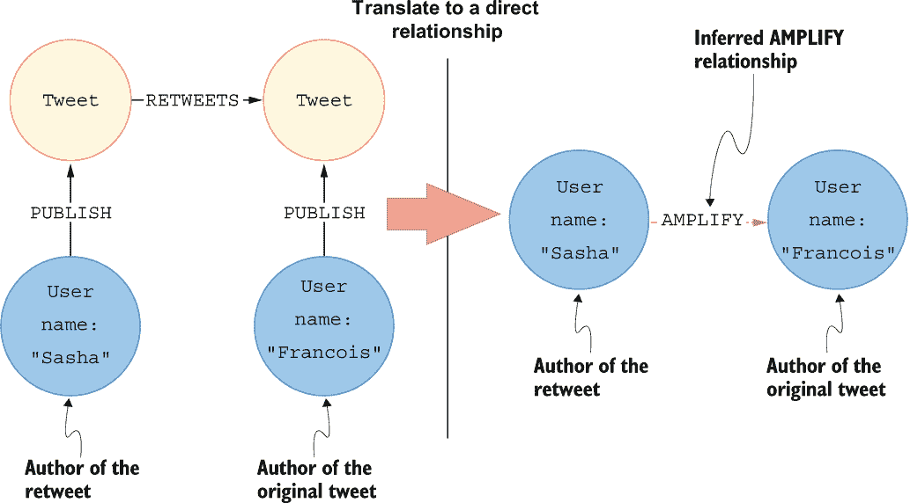
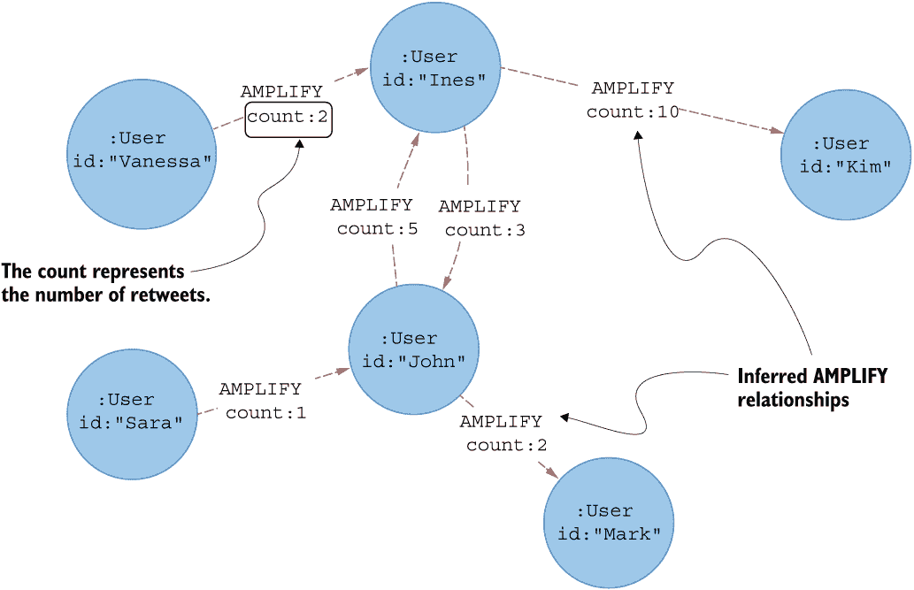
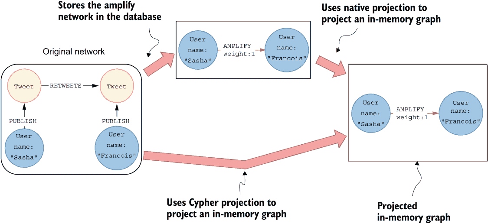
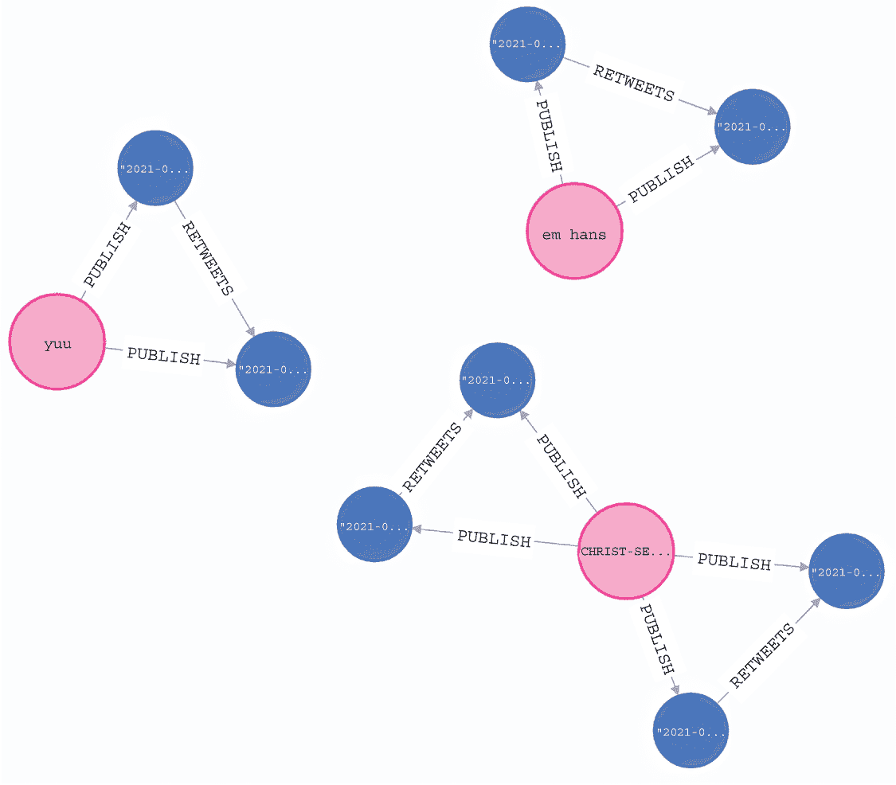
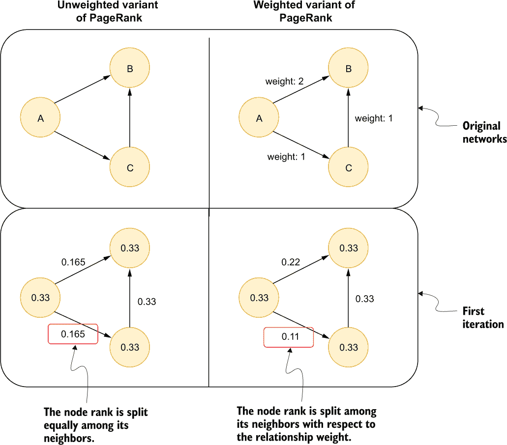

# 6 投影单部分网络

本章涵盖

+   将间接图模式转换为直接关系

+   使用 Cypher 投影将内存图投影出来

+   展示自环

+   介绍加权变体的度数和 PageRank 中心性算法

在上一章中，你对 Twitter 关注者网络进行了网络分析。决定从关注者网络开始是直截了当的。大多数图算法都是设计在单部分网络中执行的，其中只有一个节点和关系类型。然而，Twitter 社交网络模式包含多种节点类型和关系。而不是调整图算法以支持多部分网络（多个节点和关系类型），一般的方法是首先将单部分网络（单个节点和关系类型）投影出来。我在第二章中简要提到了这个概念，其中我介绍了一些如何在 Twitter 社交网络上进行单部分投影的选项。

假设你想分析内容在 Twitter 上的传播方式以及哪些用户是最有影响力的内容创作者。用户可以以推文的形式发布内容。然而，为了让推文触及更广泛的受众并可能成为病毒式传播，它必须被其他用户与他们的受众分享。在 Twitter 上，将他人的内容与你的受众分享称为转发。因此，为了了解哪些是最有影响力的内容创作者，你需要检查网络的转发行为。许多研究已经使用转发网络发表，从 2015 年关于欧洲议会的网络分析（Cherepnalkoski & Mozetič）到 COVID-19 大流行期间 Twitter 上与科学和健康相关的转发集群（Durazzi 等人，2021）。Twitter 上最有影响力的内容创作者可以定义为发布最多被转发的内容的用户。然而，你可以更进一步，假设不仅转发数量很重要，转发的人也很重要。例如，像 Andrew Ng 这样的用户，在机器学习领域享有盛誉，分享你的内容与一个刚刚加入平台且没有受众的人做同样的事情，这之间有很大的区别。因此，Andrew Ng 的转发给你的内容带来的影响力比一个没有受众的用户要大得多。

通常，中心性算法非常适合确定网络中最重要或最有影响力的节点。比如说，你决定使用 PageRank 算法，因为你已经在上一章中听说过它。PageRank 算法也是一个很好的选择，因为它既考虑了进入关系的数量，也考虑了这些关系来自哪些节点，以此来计算网络中一个节点的影响力。为了确定如何利用 PageRank 来识别最有影响力的内容创作者，你必须考虑你用来表示 Twitter 社交网络中转发模式的图模型。

在您的 Twitter 社交网络模式中，用户可以发布推文，如图 6.1 右侧所示。然而，当另一个用户重发一条推文时，会创建一个新的`Tweet`节点，并带有指向原始推文的`RETWEETS`关系。如果您要在图 6.1 的网络中执行 PageRank 算法，哪个节点最重要？请记住，PageRank 将每个关系视为信任或影响力的投票。然后，这种影响力在整个网络中流动。请花一两分钟思考一下，根据 PageRank 算法，图 6.1 网络中的哪个节点最重要。对我来说，从最不具影响力的节点开始，逐步向上到最重要的节点更容易。


图 6.1 表示重发模式图模型

图 6.2 可视化了重发模式，节点大小根据其 PageRank 分数进行缩放。节点越大，其 PageRank 分数越高。用户节点没有进入关系，因此它们的 PageRank 分数最低。原始推文和重发都有进入关系，因此它们比用户更重要。重发有一个进入关系，原始推文有两个进入连接。在 PageRank 算法中，计算 PageRank 分数时考虑了进入链接的数量以及链接到特定节点的节点的重要性。因此，并不总是说具有更多进入链接的节点会有更高的分数。然而，在图 6.2 的重发网络中，原始推文从其作者以及重发和重发的作者那里获得影响力。另一方面，重发节点只从重发的作者那里获得影响力，这意味着重发将比原始推文不那么重要。



图 6.2 表示节点大小代表其 PageRank 分数的重发模式

如图 6.2 所示，影响力从用户流向推文，并且可选地通过重发关系流向原始内容。理论上，重发次数最多的内容将具有最高的 PageRank 分数。有一些例外，因为推文和重发的数量随着用户发布的推文和重发数量的增加而降低其重要性；然而，这仍然是一个很好的近似，可以确定哪些推文被转发得最多。然后，您可以汇总用户推文的重要性，并识别最有影响力的用户。不幸的是，这种方法忽略了你定义有影响力内容创作者的一个主要项目。由于用户没有任何进入关系，所有用户的 PageRank 分数是相同的，算法无法区分重要用户和不重要用户。因此，PageRank 分数并不能反映有影响力的用户是否转发过内容。

有趣的是，在数据分析中，更常见的是根据算法调整数据集，而不是相反。为了确定哪些用户基于转发行为最具影响力，你必须以某种方式模拟用户之间的影响力流动。结果证明，在用户和推文都存在的网络中，将网络简化为只考虑用户的单部分网络是模拟用户之间影响力流动的最佳方式。由于单部分网络只包含一种类型的节点，你需要以某种方式排除 `Tweet` 节点，同时保留关于转发的信息。如果一个用户转发另一个用户的帖子，他们会增加或放大原始推文的覆盖范围，从而也增加了原始推文作者的覆盖范围。你可以用一个直接关系来表示用户如何放大其他用户的 内容覆盖范围。你想要给这个新的 *推断关系* 起什么名字取决于你的领域和用例。在这个例子中，我将这个新的关系类型命名为 `AMPLIFY`，因为它用来表示用户通过转发如何相互放大对方的覆盖范围。*推断关系* 这个术语意味着这种关系在数据中并没有明确定义，而是基于某些假设推断或创建的。

图 6.3 展示了将两个 `User` 节点之间跨越三个关系的图模式转换为两个节点之间直接链接的概念。在这个可视化的左侧是存储在数据库中的转发模式。然而，由于你想根据转发模式使用 PageRank 算法评估用户的影响力，你需要将两个用户之间的间接路径转换为直接关系，如图 6.3 的右侧所示。影响力将通过直接关系在用户之间流动，以模拟转发行为。因此，当在单部分网络中执行时，PageRank 算法将考虑转发次数以及谁转发了内容，在最终得分中都会考虑，其中转发模式被模拟为直接关系。



图 6.3 将间接转发模式转换为直接的 `AMPLIFY` 关系

你可以用 Cypher 语句轻松描述这种网络转换。

列表 6.1 描述将间接转发模式转换为直接 `AMPLIFY` 关系的翻译

```
MATCH (s:User)-[:PUBLISH]->()-[:RETWEETS]->()<-[:PUBLISH]-(t:User)
CREATE (s)-[:AMPLIFY]->(t);
```

在将所有转发模式转换为直接关系之后，你最终会得到一个只包含 `User` 节点和 `AMPLIFY` 关系的单部分网络（图 6.4）。

图 6.4 可视化了一个投影或推断的单部分网络子图，它代表了基于转发模式的`User`节点和`AMPLIFY`关系，构建了基于转发模式。由于一个用户可以从其他用户那里多次转发帖子，你可以将计数存储为关系属性。因此，你可以将图 6.4 中的网络描述为有向和加权的。许多研究人员（Evkoski 等，2020；Evkoski 等，2021；Priyanta & Prayana Trisna，2019）已经使用了表示只有用户节点和表示用户之间转发的关系的简化单部分网络的概念。



图 6.4 投影的单部分网络，包括`User`节点和`AMPLIFY`关系

基于假设转发意味着用户喜欢原始推文的内文，推断出的放大网络可以用来检查产生最佳（最具可分享性）内容的用户。我想象如果你想要表达对推文内容的反对意见，你会引用推文并描述你对推文的争议。你定义说，引用和转发应该存储在原始图模式的不同关系类型下。然而，由于数据集中没有引用，你可以假设所有转发都是积极的，这意味着用户同意原始推文的内容。

你将通过实际示例了解更多关于推断单部分网络的详细信息和注意事项。为了跟随本章的练习，你需要将 Twitter 网络导入到 Neo4j 数据库中，如第三章所述。

## 6.1 将间接多跳路径转换为直接关系

你将首先将多跳转发关系转换为直接的`AMPLIFY`关系（图 6.5）。使用 Neo4j 图数据科学（GDS），你可以采取两种不同的方法来完成这个任务。



图 6.5 在投影图中将间接多跳路径转换为直接关系的两种选项

要使用原生投影投影单部分转发网络，你必须首先在 Neo4j 数据库中实例化它。原生投影在图加载期间不提供自定义网络转换。另一方面，你可以使用 Cypher 投影将一个*虚拟图*加载到内存中。在这个上下文中，虚拟图是一个不在数据库中存储，仅在投影时构建的图。能够在不将自定义转换存储在数据库中的情况下进行投影是一个很好的特性，它让你可以探索各种图投影并在保持图数据库清洁的同时分析它们。Cypher 投影具有 Cypher 查询语言的全部表达能力，用于选择、过滤和转换要投影的图。在下面的子节中，你将学习如何使用 Cypher 投影来避免在数据库中存储单部分转发网络。

### 6.1.1 Cypher 投影

如下所示，Cypher 投影是一种更灵活和表达性的方法来投影内存图。如您从该功能的名称中推断出的那样，您可以使用 Cypher 语句来定义您想要加载到内存图中的节点和关系。Cypher 投影函数称为 `gds.graph.project`，有三个强制参数和两个可选参数。

列表 6.2 Cypher 投影语法

```
MATCH (sourceNode)-[relationship]->(targetNode)  ❶
RETURN gds.graph.project(
   'graph',                                      ❷
   sourceNode,                                   ❸
   targetNode,                                   ❹
   {dataConfig},                                 ❺
   {configuration}                               ❻
) YIELD
    graphName,
    nodeCount,
    relationshipCount
```

❶ 匹配所需图模式的 Cypher 语句

❷ 投影图名称

❸ 关系的源节点

❹ 关系的目标节点

❺ 可选的属性和类型配置映射

❻ 定义无向关系的可选参数映射

您可以将 Cypher 投影视为使用 Cypher 语句描述投影图的连接关系，其中每个连接都由其源节点和目标节点定义。首先，您必须使用 Cypher 语法匹配您想要投影的关系的源节点和目标节点。如前所述，您可以匹配数据库中的现有关系或定义数据库中未实体化的虚拟连接。一旦指定了所需关系的源节点和目标节点，您就可以在 `WITH` 或 `RETURN` 子句中使用 `gds.graph.project` 函数来投影图，而不是必须使用 `CALL` 子句。`gds.graph.project` 函数的第一个参数用于定义投影内存图的名称。另一方面，第二个和第三个参数描述了投影关系的源节点和目标节点。第四个参数是可选的，用于指定节点和关系属性及其标签或类型（如果需要）。通过定义节点标签和关系类型，您可以在算法运行时有效地过滤它们。

注意 Cypher 投影是描述您投影的图的一种更灵活和表达性的方法。本质上，它是一种使用节点和关系列表定义投影图的方式。由于关系列表是使用 Cypher 语句定义的，您可以利用 Cypher 查询语言的全部表达性来过滤或转换所需的图投影，而无需首先在数据库中将其实体化。然而，这种方法有一个缺点，即 Cypher 投影的性能不如原生投影。由于其性能较差，Cypher 投影不建议用于大型图或生产阶段。

接下来，您将使用 Cypher 投影来将重推放大网络加载为内存图。在使用 Cypher 投影加载内存图并执行图算法之前，您必须准备关系 Cypher 语句。

练习 6.1

在`MATCH`语句中描述重推模式。在`source`列下返回重推其他用户的用户，在`target`列下返回被重推的用户。由于一个用户可以多次重推另一个用户，因此计算重推次数并在`weight`列下返回重推次数。只返回结果的前五行。

现在您可以将练习 6.1 中使用的 Cypher 语句作为`gds.graph.project`函数的输入，以使用 Cypher 投影在内存中生成图。

列表 6.3 使用 Cypher 投影将放大重推网络加载为内存图

```
MATCH (source:User)-[:PUBLISH]->()-[:RETWEETS]->()<-[:PUBLISH]-(target:User)
WITH source, target, count(*) AS weight      ❶
WITH gds.graph.project(
    'amplify',
    source,
    target,                                  ❷
   {relationshipProperties:{weight:weight}}
) AS g
RETURN g.graphName AS graph,
       g.nodeCount AS nodes,
       g.relationshipCount AS rels   
```

❶ 匹配重推模式并计算一对用户之间的重推次数

❷ 使用 Cypher 投影在内存中生成图

列表 6.3 中的 Cypher 语句首先匹配重推模式。重推用户指定为`source`节点，而被重推的用户描述为`target`节点。接下来，您使用`count()`函数计算一对用户之间的重推次数。现在关系列表已准备就绪，您可以使用`gds.graph.project`函数进行投影。在这个例子中，您提供了`source`和`target`节点以及数据配置参数中指定的关系属性`weight`。请检查文档以获取可能的配置键的完整列表：[`mng.bz/GyJO`](http://mng.bz/GyJO)。Cypher 投影函数将返回表 6.1 所示的输出。

表 6.1 Cypher 投影函数输出

| `graphName` | `nodeCount` | `relationshipCount` |
| --- | --- | --- |
| "amplify" | 1828 | 2719 |

在投影的内存`amplify`图中，有 1,828 个节点和 2,719 个关系。重推放大网络可以被描述为一个有向、加权的网络。

## 6.2 重推网络特征描述

接下来，您将对重推放大网络进行简短的网络分析。这次分析旨在加强您执行图算法的经验。

### 6.2.1 度中心性

首先，您将评估推断网络的节点度分布。在前一章中，您使用了一个普通的 Cypher 语句来计算和可视化节点度分布。在这里，重推放大网络没有在数据库中实现，因此您没有使用普通 Cypher 语句来计算节点度分布的选项。相反，您可以使用 GDS 度中心性算法`gds.degree`来评估节点度分布

您可以使用算法的`stats`模式来检查节点度分布，如下所示。默认情况下，`gds.degree`中心性计算的是出度。请记住，出度是一个节点拥有的 outgoing 关系的计数，而入度是 incoming 链接的计数。

列表 6.4 评估推断重推放大网络的出度分布

```
CALL gds.degree.stats('amplify')
YIELD centralityDistribution
```

表 6.2 显示了结果分布。

表 6.2 重推放大网络的出度分布

| 度量 | 值 |
| --- | --- |
| `p99` | 18.00011444091797 |
| `min` | 0.0 |
| `max` | 146.00096893310547 |
| `mean` | 1.4874205599728507 |
| `p90` | 2.0000076293945312 |
| `p50` | 1.0 |
| `p999` | 61.00023651123047 |
| `p95` | 4.000022888183594 |
| `p75` | 1.0 |

在网络中，一个节点平均有大约 1.5 个出度关系。`p`*X* 值表示百分位数；例如，`p75` 表示 1.0 的 75 个百分位数，这意味着 75% 的节点有 1 或 0 个出度关系。你可以推断出推断的重推网络是稀疏的。

练习 6.2

使用度中心性算法计算并返回重推放大网络中出度最高的前五个节点。使用算法的 `stream` 模式来流式传输结果，而不将其存储在数据库或投影图中。`gds.degree` 算法的 `stream` 模式输出 `nodeId` 和 `score` 列。使用 `gds.util.asNode` 将节点 ID 映射到节点实例，并检索前五个节点的 `username` 属性。

练习 6.2 的解决方案生成了表 6.3 中所示的结果。

表 6.3 重推放大网络中按出度排名前五的用户

| `user` | `score` |
| --- | --- |
| "textsla" | 146.0 |
| "godfrey_G_" | 61.0 |
| "iPythonistaBot" | 48.0 |
| "Beka "Bexx" Modebade" | 36.0 |
| "chidambara09" | 33.0 |

用户 textsla 从 146 个不同的用户那里转发了帖子。如果这个列表上的大多数用户都为特定的标签设置了自动重推，我并不会感到惊讶。由于你处理的是一个加权网络，你也可以评估加权出度分布。大多数 GDS 库图算法通过使用 `relationshipWeightProperty` 配置参数支持算法的加权变体。你可以使用以下 Cypher 语句评估重推放大网络的加权出度分布。

列表 6.5 评估推断重推放大网络的加权出度分布

```
CALL gds.degree.stats('amplify', {relationshipWeightProperty:'weight'})
YIELD centralityDistribution
```

表 6.4 显示了结果分布。

表 6.4 重推放大网络的加权出度分布

| 度量 | 值 |
| --- | --- |
| `p99` | 65.00048065185547 |
| `min` | 0.0 |
| `max` | 2,006.0078048706055 |
| `mean` | 4.715000173456038 |
| `p90` | 3.0000076293945312 |
| `p50` | 1.0 |
| `p999` | 670.0038986206055 |
| `p95` | 7.000022888183594 |
| `p75` | 1.0 |

尽管平均加权出度为 4.7，但第 75 个百分位数仅为 1，第 90 个百分位数仅上升到 3。这似乎表明有一些异常值提高了整个群体的平均值。例如，一个用户有 2,006 次重推。鉴于这个数据集中大多数重推发生在三天窗口内，我敢猜测最高重推用户可能设置了一些重推自动化。

练习 6.3

使用度中心性算法计算并返回在转发放大网络中具有最高加权出度的前五个节点。解决方案几乎与练习 6.2 相同，只是你包括了`relationshipWeightProperty`参数来计算加权出度。

出度节点度可以帮助你评估和识别通过网络传播或分发内容最多的用户。另一方面，你可以使用入度分布来识别产生最多可分享（也许最好？）内容的用户。节点度中心性算法有一个`orientation`参数，允许你评估入度、出度或两者的组合。`orientation`参数有三个可能的输入：

+   `NATURAL`—评估出度（出关系数量）

+   `REVERSE`—评估入度（入关系数量）

+   `UNDIRECTED`—评估入度和出度的总和

因此，你可以通过将`orientation`参数设置为`REVERSE`来评估入度分布。

列表 6.6 返回具有最高入度的前五个用户

```
CALL gds.degree.stats('amplify', {orientation:'REVERSE'})
YIELD centralityDistribution
```

表 6.5 显示了结果分布。

表 6.5 转发放大网络的入度分布

| `度量` | `值` |
| --- | --- |
| `p99` | 29.00011444091797 |
| `min` | 0.0 |
| `max` | 117.00048065185547 |
| `mean` | 1.4874205599728507 |
| `p90` | 3.0000076293945312 |
| `p50` | 0.0 |
| `p999` | 96.00048065185547 |
| `p95` | 7.000022888183594 |
| `p75` | 1.0 |

超过 50%的用户甚至没有被转发过一次。从某种意义上说，转发内容的用户少于转发用户是有道理的。如果你还记得上一章，入度和出度的平均值总是相同的，因为连接数和用户数保持不变，只有关系方向相反。有趣的是，在这个例子中，第 75 百分位数和第 90 百分位数是相同的。这似乎表明入度分布比出度分布更偏向于顶部。这表明几个内容创作者持续产生被转发的内容。也许这意味着生产高质量的内容，但我们需要进一步调查。也许，只有他们的标签游戏很强大。

练习 6.4

使用度中心性算法计算并返回在转发放大网络中具有最高入度的前五个节点。使用算法的`stream`模式来流式传输结果，而不将其存储在数据库或投影图中。

练习 6.4 的解决方案产生了表 6.6 所示的结果。

表 6.6 转发放大网络中按入度排名前五的用户

| `user` | `score` |
| --- | --- |
| "Paula_Piccard" | 117.0 |
| "IainLJBrown" | 96.0 |
| "Eli_Krumova" | 90.0 |
| "Analytics_699" | 69.0 |
| "annargrs" | 65.0 |

共有 117 个不同的用户重推了 Paula_Piccard。第一名和第五名之间的差距不如出度分布大。您可能会认为他们产生相关且高质量的内容，因为他们经常被重推。为了获得更准确的结果，您可能需要抓取更多带有相关标签的推文。

练习 6.5

使用度中心性算法的 `stats` 模式评估加权入度分布。如果您需要一些帮助，可以查看加权出度的示例，并包括 `orientation` 参数。之后，使用算法的 `stream` 模式来识别具有最高五个加权入度的用户。

现在，您将执行第五章中学到的弱连接组件（WCC）算法，以巩固您的知识。

### 6.2.2 弱连接组件

WCC 算法应该是几乎所有网络分析的一部分。通过它，您可以评估网络的连接程度并识别断开连接的组件。

练习 6.6

使用 `gds.wcc` 的 `.stats` 程序评估弱连接组件大小的分布。

表 6.7 显示了 WCC 算法产生的统计数据。

表 6.7 在重推放大网络上执行 WCC 算法的摘要统计数据

| `componentCount` | `componentDistribution` |
| --- | --- |
| 207 | { "p99": 28,"min": 1,"max": 1082,"mean": 8.830917874396135,"p90": 6,"p50": 2,"p999": 1082,"p95": 13,"p75": 3 } |

最大的组件由 1,082 个成员组成，约占重推放大网络中总用户的 60%。如前所述，大多数现实世界的网络都有一个包含大多数网络节点的单个超级组件，旁边有几个较小的组件。对我来说奇怪的是，最小尺寸的组件只包含一个成员。使用 Cypher 投影，您已经过滤了重推或被重推的用户。我的第一个想法是，不应该有只包含一个成员的组件。由于这是一个意外的结果，值得探索。您可以使用以下 Cypher 语句来检查具有单个成员的样本组件。

列表 6.7 使用单个成员检查样本组件

```
CALL gds.wcc.stream('amplify')
YIELD nodeId, componentId                              ❶
WITH componentId, collect(nodeId) AS componentMembers,
     count(*) AS componentSize                         ❷
WHERE componentSize = 1                                ❸
WITH componentMembers[0] AS id
LIMIT 3                                                ❹
MATCH p=(n)-[:PUBLISH]->()-[:RETWEETS]-()              ❺
WHERE id(n)=id
RETURN p
```

❶ 执行 WCC 算法的流模式

❷ 按组件 ID 分组收集节点

❸ 过滤只包含单个成员的组件

❹ 从列表中提取三个样本组件的节点 ID

❺ 匹配他们的重推

列表 6.7 中的 Cypher 语句首先在转推放大网络上执行 WCC 算法的`stream`模式。WCC 算法的`stream`模式输出`nodeId`列，表示节点的内部节点 ID，以及`componentId`列，它描述节点属于哪个组件。在 Cypher 语句的下一步中，你通过`componentId`进行聚合，以计算组件大小并收集其成员的节点 ID。之后，你使用`WHERE`子句过滤出只有一个成员的组件。由于单个成员组件的`componentMembers`列表中应该只有一个元素，你可以很容易地使用方括号语法结合其索引位置提取唯一的节点 ID。为了不让结果可视化过于繁杂，你将只检查具有单个成员的三个组件。最后，你需要匹配三个特定节点 ID 的转推模式。列表 6.7 中的 Cypher 语句将在 Neo4j 浏览器中产生图 6.6 所示的可视化。



图 6.6 包含单个成员的组件，其中用户转发了自己的推文

在 Twitter 上，用户也可以转推自己的帖子。在图论中，*自环*是与相同起始和结束节点的关系。如前所述，WCC 算法有助于识别网络的连接程度以及识别各种意外的模式。

## 6.3 识别最有影响力的内容创作者

本章任务的主要目标是识别 Twitter 社交网络数据集可用子集中的最有影响力的内容创作者。你将通过以下两个步骤来确定最重要的内容创作者：

1.  在投影过程中忽略自环。

1.  执行 PageRank 算法的加权变体。

### 6.3.1 排除自环

我认为在执行加权 PageRank 算法之前排除网络中的所有自环是有意义的。自环可以被解释为节点声明它是有影响力的。我认为转发自己的推文不应该增加你在网络中的影响力。不幸的是，没有一键排除自环的魔法按钮，所以你必须使用 Cypher 投影在内存中投影另一个图。

练习 6.7

使用 Cypher 投影将转推放大网络加载到内存中并排除所有自环。本质上，你只需要更改关系 Cypher 语句以过滤出起始和结束节点相同的边。将新的投影图命名为`amplify-noselfloops`。

### 6.3.2 加权 PageRank 变体

接下来，你将执行加权 PageRank 算法以识别潜在的内容影响者。记住，PageRank 算法考虑了指向节点的连接数量和节点的重要性。你不仅分析哪个用户拥有最多的转发，还在评估网络中哪些其他有影响力的节点也转发了它们。

加权版本的 PageRank 算法在计算节点重要性时也考虑了关系权重。在未加权的 PageRank 版本中，节点的重要性在它的邻居之间平均分配。另一方面，在加权版本中，每个邻居都获得与关系权重相关的重要性份额（图 6.7）。



图 6.7 单次迭代中加权与无加权 PageRank 计算的差异

如前所述，加权版本的 PageRank 算法在计算影响如何在网络中传播时考虑了关系权重。图 6.7 可视化了一个由三个节点组成的简单网络。加权版本和无加权版本之间的区别在于节点 A 如何传播其影响。在无加权版本中，节点 B 和 C 从节点 A 那里获得相等的重要性份额。在加权网络中，节点 A 到 C 的关系权重为 1，节点 A 到 B 的连接值为 2。在加权 PageRank 算法的每一次迭代中，节点 B 将接收到节点 A 三分之二的影响，而节点 C 将只接收到三分之一。使用加权 PageRank 算法计算影响份额的方程只是将关系权重除以所有输出关系权重的总和。

现在，你可以在没有自环的转发放大网络上执行加权 PageRank 算法。同样，与度中心性一样，你只需要包含`relationshipWeightProperty`参数来执行算法的加权版本。你必须完成练习 6.7，然后才能执行以下 Cypher 语句。

列表 6.8 在没有自环的转发放大网络上执行 PageRank 算法

```
CALL gds.pageRank.stream('amplify-noselfloops',
  {relationshipWeightProperty:'weight'})
YIELD nodeId, score
RETURN gds.util.asNode(nodeId).username AS user, score
ORDER BY score DESC
LIMIT 5
```

表 6.8 显示了按 PageRank 分数排序的该示例的前五名用户。

表 6.8 无自环的转发放大网络中按加权 PageRank 分数排序的前五名用户

| `用户` | `分数` |
| --- | --- |
| "Paula_Piccard" | 8.270755243786214 |
| "annargrs" | 7.836125000000006 |
| "psb_dc" | 7.478576023152348 |
| "IainLJBrown" | 7.457764370226901 |
| "Eli_Krumova" | 6.95963977383344 |

按照加权 PageRank 排名前五的用户列表与按入度排名前五的用户列表相似。当然，你正在分析的 Twitter 子图相对较小。虽然你还没有分析推文主题或标签，但我提到我已经通过关注自然语言处理（NLP）和知识图谱主题来抓取数据集。因此，如果你对 NLP 或知识图谱主题更新感兴趣，表 6.8 中的用户可能是 Twitter 上值得关注的对象。此外，作为一种营销策略，你可以尝试联系这些用户，看看他们是否愿意分享你的内容。

### 6.3.3 删除投影的内存图

在分析完成后，记得释放投影的内存图以释放内存，以便进行其他分析。目前，你应该有两个图已加载到内存中。以下 Cypher 语句将删除所有当前投影图。

列表 6.9 从内存中释放所有投影图

```
CALL gds.graph.list() YIELD graphName           ❶
CALL gds.graph.drop(graphName) YIELD nodeCount
RETURN 'dropped ' + graphName AS result         ❷
```

❶ 列出所有投影图

❷ 从内存中释放每个投影图

## 6.4 练习解答

练习 6.1 的解答如下。

列表 6.10 计算用户之间转发模式的出现次数

```
MATCH (source:User)-[:PUBLISH]->()-[:RETWEETS]->()<-[:PUBLISH]-(target:User)
RETURN source, target, count(*) AS weight
LIMIT 5
```

练习 6.2 的解答如下。

列表 6.11 返回具有最高五个加权出度的用户

```
CALL gds.degree.stream('amplify')
YIELD nodeId, score
RETURN gds.util.asNode(nodeId).username AS user, score
ORDER BY score DESC
LIMIT 5
```

练习 6.3 的解答如下。

列表 6.12 返回具有最高五个加权出度的用户

```
CALL gds.degree.stream('amplify',
  {relationshipWeightProperty:'weight'})
YIELD nodeId, score
RETURN gds.util.asNode(nodeId).username AS user, score
ORDER BY score DESC
LIMIT 5
```

练习 6.4 的解答如下。

列表 6.13 返回具有最高五个加权入度的用户

```
CALL gds.degree.stream('amplify', {orientation:'REVERSE'})
YIELD nodeId, score
RETURN gds.util.asNode(nodeId).username as user, score
ORDER BY score DESC
LIMIT 5
```

练习 6.5 的解答如下。

列表 6.14 评估加权入度分布

```
CALL gds.degree.stats('amplify', {orientation:'REVERSE',
  relationshipWeightProperty:'weight'})
YIELD centralityDistribution
```

列表 6.15 返回具有最高五个加权入度的用户

```
CALL gds.degree.stream('amplify', {orientation:'REVERSE',
  relationshipWeightProperty:'weight'})
YIELD nodeId, score
RETURN gds.util.asNode(nodeId).username as user, score
ORDER BY score DESC
LIMIT 5
```

练习 6.6 的解答如下。

列表 6.16 评估弱连通组件的数量和大小

```
CALL gds.wcc.stats('amplify')
YIELD componentCount, componentDistribution
```

练习 6.7 的解答如下。

列表 6.17 使用 Cypher 投影将放大转发网络作为内存图加载，并排除自环

```
MATCH (source:User)-[:PUBLISH]->()-[:RETWEETS]->()<-[:PUBLISH]-(target:User)
WHERE NOT source = target
WITH source, target, count(*) AS weight
WITH gds.graph.project(
    'amplify-noselfloops',
    source,
    target,
    {relationshipProperties:{weight:weight}}
) AS g
RETURN g.graphName AS graph,
       g.nodeCount AS nodes,
       g.relationshipCount AS rels
```

## 摘要

+   推断单连通网络是图分析中常见的步骤。

+   Cypher 投影可用于投影虚拟图（数据库中不存在的关联）。

+   Cypher 投影是一种更灵活但性能较低的内存图投影选项。

+   Cypher 投影接受一个定义节点的 Cypher 语句，以及另一个指定应投影的关系的 Cypher 语句。

+   使用 Cypher 投影定义节点时，保留的列有 `id` 和 `labels`。

+   使用 Cypher 投影定义与关系时，保留的列有 `source`、`target` 和 `type`。

+   GDS 库使用两个方向相反的定向关系来表示无向关系。

+   在内存图投影期间，你可以更改关系方向或将它视为无向。

+   可以使用`gds.degree.stats`过程来评估度中心性分布。

+   PageRank 的加权变体在计算影响力如何在图中传播时考虑了关系权重。

+   通过定义`relationshipWeightProperty`参数，你可以使用度中心性和 PageRank 算法的加权变体。

+   可以使用`nodeLabels`和`relationshipTypes`参数来仅考虑投影图的子集作为图算法的输入。

+   自环是一种具有相同起始节点和结束节点的关系。
