# 7 基于二部网络推断共现网络

本章涵盖

+   使用 Cypher 查询语言从推文中提取标签

+   计算 Jaccard 相似系数

+   使用 Jaccard 相似系数构建和分析单部网络

+   使用标签传播算法评估网络的社区结构

+   使用 PageRank 在社区内找到最重要的节点

在上一章中，你学习了如何将自定义图模式转换为直接关系，以便将它们用作 PageRank 等图算法的输入。在本章中，你将专注于二部网络以及如何将它们投影到单部网络。让我们先快速回顾一下二部网络。

二部网络包含两个集合或类型的节点。例如，图 7.1 显示了左侧的推文二部网络和右侧的标签。正如你所观察到的，关系总是从一个类型的节点指向另一个类型的节点。推文或标签之间没有直接连接。

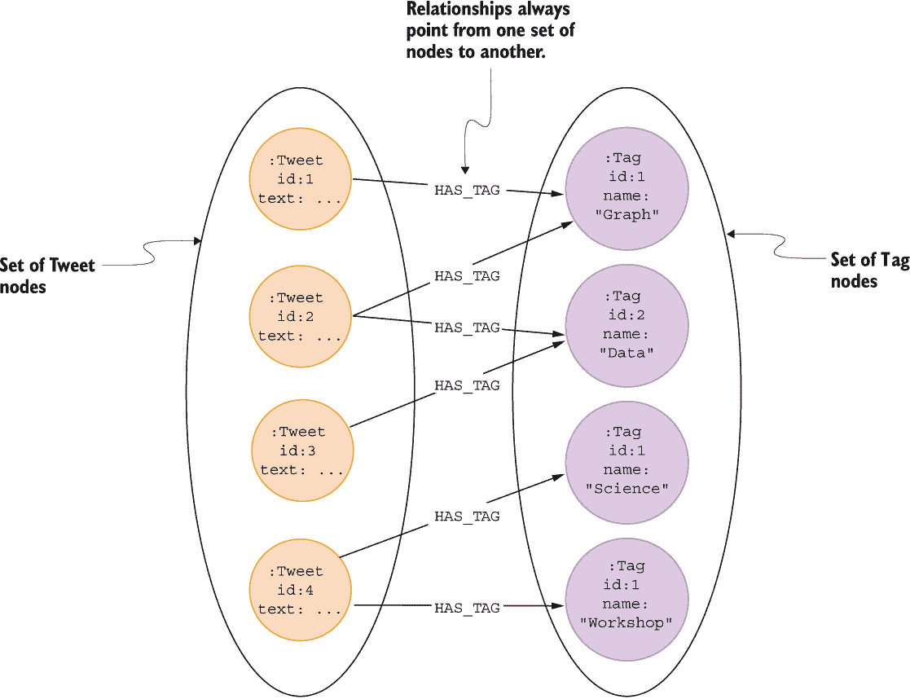

图 7.1 推文和标签的二部网络

假设你在一个处理自然语言处理（NLP）和知识图谱的公司担任市场分析角色。你的老板决定改进发布在 Twitter 上的内容标签策略可能是有价值的。你被分配了识别相关标签以尽可能好地定位公司理想客户的任务。由于你迄今为止使用的 Twitter 数据集包含关于 NLP 和知识图谱的推文，你可以分析数据集中的标签以确定公司应该定位哪些标签。

你的第一个想法可能是使用 PageRank 算法来识别最重要的标签。记住，像 PageRank 这样的图算法期望输入单部网络或至少是影响力可以贯穿连接的网络。对于二部网络，一种类型的节点只有入度关系，另一种类型的节点只有出度连接。如果你要对推文和标签的二部网络示例执行 PageRank，你认为哪些节点会排在最前面？

由于推文没有任何入度关系，它们的 PageRank 分数将等于网络冲浪者随机访问它们的概率。默认情况下，阻尼因子为 0.85，没有入度连接的节点的 PageRank 分数为 0.15。另一方面，标签只有入度关系。影响力从推文流向标签，但不会进一步流动，因为没有从标签出发的出度连接。在实践中，标签的 PageRank 排名将等于它们入度关系的数量。然而，由于不同的分数计算技术，PageRank 和入度的实际值会有所不同。

记住，目标是确定数据集中最重要的和相关的标签。如果标签重要性的定义仅仅是它们的频率，那么使用`Tag`节点的入度指标就足够了。

然而，数据集中的某些标签可能并不与营销目标相关。仅通过查看最常提到的标签，你可能会完全错过其他相关的标签，因为你不知道数据集是否偏向于特定主题。此外，战略性地组合标签可以通过针对更广泛的受众而不是仅使用最常提到的标签来显著提高内容的覆盖范围。因此，你的任务是找到重要的标签，以及可以组合使用以增加病毒性的其他标签。用于识别常用标签社区的一种常用技术是检查标签对在推文中共现的频率。通过分析标签对在相同推文中共现的频率，你构建了一个共现网络。术语“共现网络”指的是一种网络构建方法，它分析文本中各种实体之间的关系。在推文及其标签的情况下，你可以使用共现网络方法来分析推文文本中出现的标签之间的关系。

图 7.2 显示了医学文章中关键词的共现网络。共现网络是通过使用定义共现的一组标准将文本中的实体对连接起来构建的。共现的定义可能因场景而异。在这个例子中，共现被定义为两个关键词出现在同一篇文章中。一对关键词在同一篇文章中出现的次数越多，它们之间的联系就越强。类似的技巧被用来分析围绕 COVID-19 研究的科学文献（Al-Zaman，2021；Andersen 等人，2020）。此外，研究人员还使用生物医学文献共现网络来预测新的链接（Kastrin 等人，2014）。

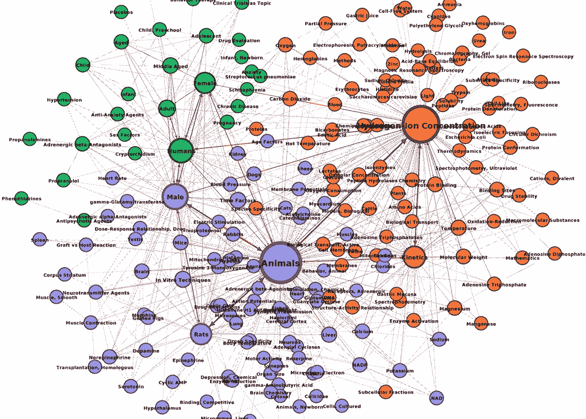

图 7.2 医学关键词共现网络

然而，你不仅限于分析给定文本中关键词的共现。在《权力的游戏》分析（Beveridge 等，2018）中，Andrew Beveridge 通过共现实体网络的角度普及了分析书籍的方法。《权力的游戏》书籍分析包括两个步骤。首先，Beveridge 确定了书中的所有角色。在下一步中，他定义了一对角色如果在彼此 15 个单词之内出现，则它们之间存在共现事件。在这种情况下，共现事件可以理解为角色之间的互动。在我之前的工作中，我使用这种技术构建了《哈利·波特与魔法石》书中角色之间的共现或互动网络。

只需看图 7.3，你就可以评估《哈利·波特》第一本书中的主要角色，并评估它们之间的互动。节点大小基于节点度，所以节点连接越多，节点大小就越大。哈利·波特与其他角色互动最多是合情合理的，因为这本书的叙述主要从他的视角来写。

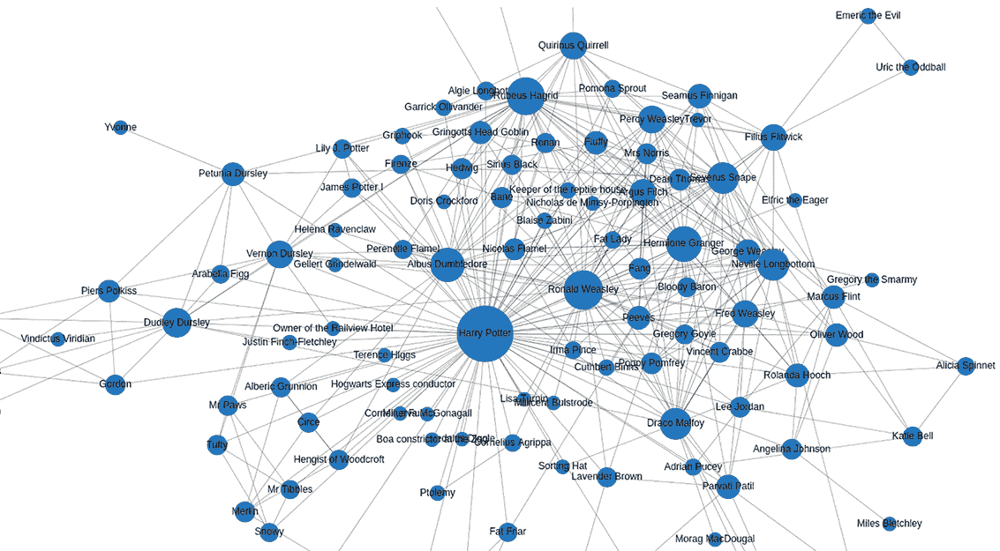

图 7.3 《哈利·波特》第一本书中字符共现网络

共现分析的前两个例子展示了从文本中提取关键词或实体，然后通过任意共现事件连接的情景。我准备的第三个例子是可视化各种菜肴或食谱中成分的共现情况。再次强调，图 7.4 中的节点大小基于其连接数。在左侧社区的中心，你可以观察到鸡蛋、面粉、糖和牛奶。我想象这些成分的菜肴大多属于面包、煎饼或甜点。出于某种原因，花生酱也频繁出现在这个社区中。在右侧，你可以观察到主菜类型的成分，包括洋葱、番茄酱、土豆和肉类。有趣的是，一篇研究论文（Cooper，2020）使用成分共现网络分析美国的包装食品。另一篇研究论文（Kular 等，2011）使用成分共现网络来研究菜系与各种文化之间的关系。

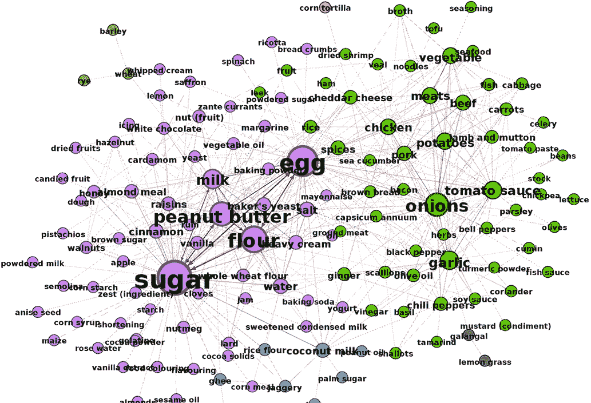

图 7.4 菜肴中成分的共现网络

现在让我们回到识别最优化策略的任务，结合使用知识图谱和 NLP 兴趣来找到能够触达用户的各种标签。你可以从一个假设开始，即如果两个标签在同一个推文中同时出现，它们可能在某种程度上相关或属于相似的主题。基于这个假设，共现网络方法会将可能具有相同或相似整体主题的标签连接起来。共现网络还可以帮助你产生可以一起使用的各种标签组合。

图 7.5 展示了基于原始推文和标签的二分网络构建标签共现网络的过程。在可视化的左侧是原始的二分网络。一条推文可以包含多个标签。例如，推文 A 包含#Growth 和#Startup 标签。在这个例子中，共现被定义为在同一个推文中同时出现的标签对。因此，在右侧的可视化中，即共现网络可视化的部分，#Finance 和#Startup 标签之间存在关系，因为它们出现在同一个推文中。如果你看推文 D，你会注意到它有三个标签：#Data、#ML 和#NLP。由于这些标签在同一个推文中共现，因此所有三个标签之间都有关系，如图 7.5 的右侧所示。

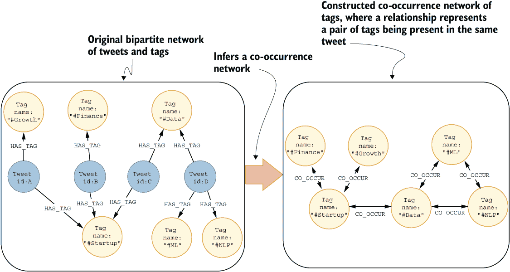

图 7.5 基于标签在同一个推文中是否共现构建标签共现网络

这项数据转换可以用以下 Cypher 语句来描述。

列表 7.1 使用 Cypher 语句描述构建标签共现网络的过程

```
MATCH (s:Tag)<-[:HAS_TAG]-(:Tweet)-[:HAS_TAG]->(t:Tag)
CREATE (s)-[:CO_OCCURRENCE]->(t);
```

标签用于索引或定义推文的主题。通过分析标签的共现网络，你可以了解哪些标签经常重叠，并可能属于相同的整体主题。构建 Twitter 标签共现网络已在多项研究中使用。例如，你可以分析标签如何帮助推动病毒式传播。一项研究（Pervin，2015）得出结论，当标签与相似标签共现时，其流行度会上升。另一方面，如果标签与不相似的标签一起出现，其流行度会下降。像 Twitter 这样的社交网络在传播有关当前社会运动或事件的信息方面变得越来越重要。研究人员已经确定了可以用来帮助从不同的社交圈中获得可见性的标签组合策略，从而增加某些社会运动的病毒性（Wang 等，2016；Gleason，2013）。另一篇论文研究了标签共现连接与它们的语义相似性之间的差异（Türker & Sulak，2018）。最后，一篇令人兴奋的文章（Vitale，2018）使用标签共现网络提供有关吸烟习惯的新信息和趋势。

为了在知识图谱和自然语言领域内找到最相关的标签组，你必须首先确定哪些标签经常一起使用，并且有可能形成一个针对特定用户群体的主题。在这里，你回到了之前的假设。如果两个标签在同一个推文中频繁共现，你可以假设它们是相关的，并属于同一主题。为了找到形成主题的标签社区或聚类，你可以利用社区检测算法，如*标签传播算法*（LPA）。LPA 是一种评估网络社区结构的算法。互联网上的大部分文献都将 LPA 介绍为一种半监督算法，其中你可以为网络中某些节点的初始社区输入。然而，在这里，你将使用 LPA 的无监督变体，因为你不会提供任何初始社区。LPA 的无监督变体工作如下。首先，它为每个节点分配一个唯一的社区标签。然后，它遍历网络，并将每个节点的标签更新为其大多数邻居所拥有的标签。这种迭代背后的想法是，单个社区标签可以迅速在紧密连接的节点组中占据主导地位。一旦 LPA 达到收敛，算法停止，结果节点标签代表它们的社区。

社区代表节点之间紧密连接的群体，群体之间则通过稀疏的链接相连。例如，图 7.6 展示了两个由标签组成的群体或社区。左侧的社区包含#Finance、#Growth 和#Startup 标签。你可以将左侧社区分配为一个更偏向商业化的主题。在图 7.6 的另一侧，右侧的社区由#ML、#Data 和#NLP 标签组成。同样，你可以尝试推断右侧社区的整体主题。在这个例子中，类似于计算机科学或数据科学导向的主题可能比较合适。


图 7.6 在标签共现网络中识别社区

在你确定了形成主题的标签社区之后，你可以使用 PageRank 算法来找到社区中最中心的节点。记住，我们假设一对标签之间的共现意味着它们在某种程度上是相关或相似的。如果你要在每个社区分别执行 PageRank 算法，你会识别出社区中最中心的节点。你可以假设社区中最中心的节点是其代表，因为 PageRank 算法将每条关系视为一次投票。在标签共现网络示例中，这是一次相似度或相关性的投票。所以，与社区中所有其他标签最相似的标签将排名最高，你可以将其解释为社区代表。为了跟随本章的练习，你需要将 Twitter 网络导入到第三章中描述的 Neo4j 数据库中。

## 7.1 从推文中提取标签

在您能够推断出标签共现网络之前，您首先必须从推文内容中提取标签。您只会从非转发推文中提取标签，因为转发推文与原始推文具有相同的标签，这只会扭曲结果。提取标签的过程，如列表 7.2 所示，是基本的文本处理。您通过空格或换行符分割推文文本，以创建一个单词列表。然后，您需要过滤掉以哈希符号（`#`）开头的单词。一旦完成这两个步骤，您就成功从推文中提取了标签，并且可以将它们存储在数据库中。

列表 7.2 从非转发推文中提取标签

```
MATCH (t:Tweet)
WHERE NOT EXISTS { (t)-[:RETWEETS]->() }                ❶
WITH t, replace(t.text, '\n', ' ') AS cleanText         ❷
WITH t, split(cleanText, ' ') AS tokens                 ❸
WITH t, [el IN tokens WHERE el STARTS WITH "#" |
            toLower(replace(el,",",""))] AS hashtags    ❹
WHERE size(hashtags) > 0                                 ❺
RETURN hashtags LIMIT 5
```

❶ 匹配所有非转发推文

❷ 将所有换行符替换为空格

❸ 使用空格字符分割每条推文的内容以提取单词

❹ 使用列表推导式过滤以哈希字符开头的单词，并从标签中删除逗号

❺ 过滤至少包含一个标签的推文

表 7.1 显示了提取的标签。

表 7.1 提取的标签

| 标签 |
| --- |
| ["#心态", "#自然语言处理", "#冥想", "#心算", "#生物共振", "#心智教练", "#焦虑", "#催眠", "#心理健康"] |
| ["#sql", "#代码", "#数据科学", "#人工智能", "#机器学习", "#机器学习", "#物联网", "#IIoT", "#物联网平台", "#python", "#rstats", "#云", "#网络安全"] |
| ["#教练", "#自然语言处理", "#进步而非完美", "#成长心态", "#训练你的大脑", "#先养育自己"] |
| ["#acl2021nlp"] |
| ["#medium", "#机器学习", "#自然语言处理", "#深度学习", "#自动纠正", "#拼写检查", "#人工智能", "#tds", "#python"] |

有趣的是，NLP 标签在技术社区中指的是**自然语言处理**，而个人发展社区则将 NLP 作为**神经语言程序学**的缩写。虽然我旨在抓取关于自然语言处理和知识图谱主题的推文，但似乎数据集中也有一些自我提升的推文。数据集中有更多不同的主题并不是问题。这使得您的分析更有趣，因为您将了解更多计算机科学导向主题背后的驱动标签，并且您可以稍后自行分析自我帮助主题。

大多数营销平台允许您指定关键词或标签，并排除不需要的标签。由于您作为营销分析师的目标是在 Twitter 上设计定位策略，您也可以准备一个要排除的标签列表。该公司从事 NLP 业务，因此您会想定位到`#nlp`标签。您已经了解到`#nlp`标签在自我帮助主题中也非常流行，由于自我帮助主题与公司无关，排除属于自我帮助主题的标签是有意义的。

列表 7.2 中的 Cypher 语句首先匹配所有没有出向`RETWEETS`关系的推文。为了为每条推文创建一个单词列表，你使用`replace`和`split`函数的组合。首先，你使用`replace`函数将所有换行符替换为空白字符。`replace`函数的语法如下。

列表 7.3 `replace`函数语法

```
replace(string, search, replace)
```

`replace`是大多数脚本语言和查询语言中的一个基本函数，因此我希望它不需要任何额外的解释。同样，`split`也是一个非常基本的函数，其语法如下。

列表 7.4 `split`函数语法

```
split(string, delimiter)
```

`split`函数的输入是一个字符串和一个分隔符字符，输出是一个元素列表；再次强调，这是大多数（如果不是所有）编程语言中可用的一项基本功能。最后要做的就是过滤以`#`字符开头的单词。你可以使用以下列表推导式语法来从单词列表中过滤掉标签。乍一看，似乎列表推导式函数从 Python 语法中汲取了一些灵感。

列表 7.5 列表推导式语法

```
[element in list WHERE predicate | element]
```

列表推导式语法被方括号包围。使用`element IN list`语法来定义一个变量以引用列表中的元素。与 Python 不同，元素操作和转换可以直接在管道`|`字符之后定义，而不是直接在变量赋值中。你在列表推导式语法的元素转换部分去除了逗号并将文本转换为小写，以避免区分#NLP 和#nlp 标签。你也可以使用`WHERE`子句来过滤列表中的项目。

最后，你使用`size()`函数来过滤至少包含一个标签的推文。`size()`函数返回列表中的项目数。在前一章中，你学习了如何以优化的方式使用`size()`函数来访问节点度，但它也可以用来计算列表的长度。

在继续进行共现分析之前，你将提取标签并将其存储在数据库中。每次你在数据库中添加一个新的节点标签时，建议识别节点的唯一属性并定义唯一约束。对于标签，每个节点应代表一个单独的标签，因此你可以在`Tag`节点的`id`属性上简单地定义唯一约束。

列表 7.6 在`id`属性上为`Tag`节点定义唯一约束

```
CREATE CONSTRAINT IF NOT EXISTS FOR (t:Tag) REQUIRE t.id IS UNIQUE;
```

最后，你可以执行以下 Cypher 语句来提取并存储标签到数据库中。

列表 7.7 提取标签并存储到数据库中

```
MATCH (t:Tweet)
WHERE NOT EXISTS { (t)-[:RETWEETS]->() }
WITH t, replace(t.text, '\n', ' ') AS cleanText
WITH t, split(cleanText, ' ') AS tokens
WITH t, [el IN tokens WHERE el STARTS WITH "#" |
            toLower(replace(el, ",", " "))] AS hashtags
WHERE size(hashtags) > 0
UNWIND hashtags AS tag_id       ❶
MERGE (tag:Tag {id: tag_id})
MERGE (t)-[:HAS_TAG]->(tag)
```

❶ 使用 UNWIND 子句将元素列表转换为单独的行

列表 7.7 中的 Cypher 语句引入了 `UNWIND` 子句。`UNWIND` 子句用于将元素列表转换为行，类似于各种脚本语言中的 `FOR` 循环。本质上，您会遍历列表中的每个元素，在这种情况下，合并一个 `Tag` 节点并将其连接到 `Tweet` 节点。`UNWIND` 子句始终跟随着 `AS` 操作符，以将生成的行中的元素值分配给引用变量。以下 Cypher 语句演示了 `UNWIND` 子句的简单用法。

列表 7.8 `UNWIND` 子句语法

```
UNWIND [1, 2, 3] AS i
RETURN i
```

表 7.2 显示了作为行显示的元素。

表 7.2 将元素列表转换为行的 UNWIND 子句

| `i` |
| --- |
| 1 |
| 2 |
| 3 |

练习 7.1

标签现在已存储并连接到数据库中的 `Tweet` 节点。在跳转到共现分析之前，调查哪些标签出现在最多的推文和转发中。记住，您只在数据库中存储了原始推文的标签（不是转发）。因此，首先匹配出现标签的原始推文。接下来，计算这些推文被转发的次数，然后返回原始推文和转发总计数之和最高的前五个标签。由于并非所有推文都被转发，使用 `OPTIONAL` `MATCH` 来计算转发次数。

表 7.3 显示了最受欢迎的标签。

表 7.3 推文和转发中最受欢迎的标签

| `hashtag` | `originalTweetsCount` | `retweetCount` |
| --- | --- | --- |
| #nlp | 1,848 | 7,532 |
| #ai | 1,554 | 7,169 |
| #machinelearning | 1,474 | 7,007 |
| #datascience | 1,455 | 6,736 |
| #bigdata | 1,358 | 6,577 |

最受欢迎的标签是 #nlp、#ai、#machinelearning 和 #datascience。根据转发计数，它们必须在同一推文中频繁共同出现，因为总共有 12,000 条推文和转发。接下来，您将进行标签分析的共现部分。

## 7.2 构建共现网络

您可以使用 Cypher 查询语言来评估哪些标签最频繁地共同出现。

练习 7.2

评估哪些标签最频繁地共同出现。使用 `MATCH` 子句定义一个图模式，其中两个标签出现在同一推文中，然后使用 `count()` 函数计算一对标签共同出现的推文数量。仅返回最常见的五个共同出现的标签对。

练习 7.2 的解决方案如下。

列表 7.9 检查最常见的五个共同出现的标签对

```
MATCH (h1:Tag)<-[:HAS_TAG]-()-[:HAS_TAG]->(h2:Tag)
WHERE id(h1) < id(h2)                              ❶
WITH h1,h2,count(*) AS cooccurrences
ORDER BY cooccurrences DESC LIMIT 5
RETURN h1.id AS tag1, h2.id AS tag2, cooccurrences 
```

❶ 从结果中删除重复项

表 7.4 显示了最常见的共同出现的标签对。

表 7.4 最常见的五个共同出现的标签对

| `tag1` | `tag2` | `cooccurrences` |
| --- | --- | --- |
| #ai | #nlp | 1,507 |
| #machinelearning | #nlp | 1,428 |
| #datascience | #nlp | 1,410 |
| #ai | #machinelearning | 1,410 |
| #datascience | #ai | 1,405 |

练习 7.2 没有提到理想情况下你应该从输出中移除重复项，因为你还没有学到如何做到这一点。由于每个标签号都将作为`h1`变量以及`h2`变量出现，结果将包含重复项。使用`id(h1)` `<` `id(h2)`来去重结果是最常见的策略，我在实践中也经常看到。

你可以使用类似的 Cypher 语句使用 Cypher 投影来投影共现网络。基于列表 7.9 中的 Cypher 语句生成的共现网络将类似于图 7.1。

图 7.7 展示了样本标签共现网络，其中关系权重代表共现次数。你可能会想知道为什么每个节点对之间有两个指向相反方向的关系。如果#NLP 与标签#AI 共现，这直接意味着标签#AI 也与标签#NLP 共现。在图论中，你可以认为`CO_OCCUR`关系是无向的，因为连接的方向并不重要。然而，图数据科学（GDS）库没有无向关系的概念。无向关系背后的一个关键概念是它允许双向遍历。你可以在有向网络中通过将单个无向连接转换为两个指向相反方向的定向链接来复制这种功能。

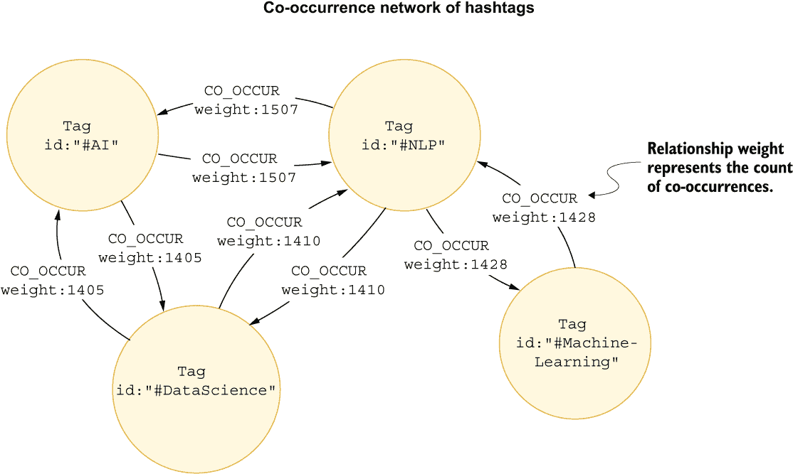

图 7.7 样本加权无向共现网络

注意：GDS 库没有无向关系的概念。当在 GDS 中处理无向网络时，你将网络中的每个关系表示为两个指向相反方向的定向关系。在节点相似度算法示例中，算法的输出是一个无向网络，其中每个无向关系都表示为两个定向关系，如图 7.8 所示。GDS 库还允许在投影时间将单个关系转换为两个指向相反方向的链接。

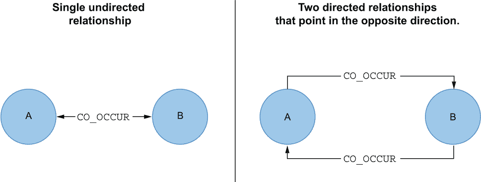

图 7.8 表示为两个指向相反方向的定向关系的单一无向关系

### 7.2.1 Jaccard 相似系数

虽然使用共现次数作为关系权重没有问题，但更常见的方法是使用*Jaccard 相似系数*来评估节点之间的相似度。Jaccard 相似系数很容易理解，因为它只涉及将两个集合的交集除以并集。

图 7.9 可视化两个篮子，其中每个篮子包含一组产品。例如，篮子 A 包括沙发、扬声器、手机和电视，而篮子 B 包含手机、电视和耳机。如果你想计算两个篮子之间的 Jaccard 相似系数，你首先计算两个产品集合的交集和并集。两个篮子都包含手机和电视，这是两个集合的交集。在两个篮子中分散着五种不同的产品，这是两个集合的并集。要计算 Jaccard 相似系数，你只需将两个集合的交集（2）除以并集（5），结果为 0.4。Jaccard 相似系数的附加好处是它提供了一个可以用来评估的指标——在这个例子中，基于产品评估两个篮子的相似程度。

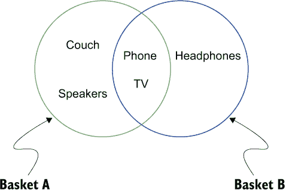

图 7.9 两个具有重叠产品的篮子的示例

Jaccard 相似系数的范围是 0 到 1。当两个集合的成员之间没有交集时，Jaccard 相似系数等于 0。例如，假设篮子 A 包含三明治和果汁，而篮子 B 包含电视。篮子 A 和 B 之间没有项目的交集，这进而表明两个篮子之间的 Jaccard 相似系数为 0。另一方面，具有相同成员的两个集合的 Jaccard 相似系数为 1。当两个集合的 Jaccard 相似系数为 1 时，这意味着两个集合具有相同数量的成员，且两个集合中的成员相同。在这个例子中，篮子 A 和 B 都包含三明治和果汁。然而，如果你在任一篮子中添加或删除任何项目，Jaccard 相似系数将不再为 1。使用 Jaccard 相似系数评估标签重叠的过程如图 7.10 所示。

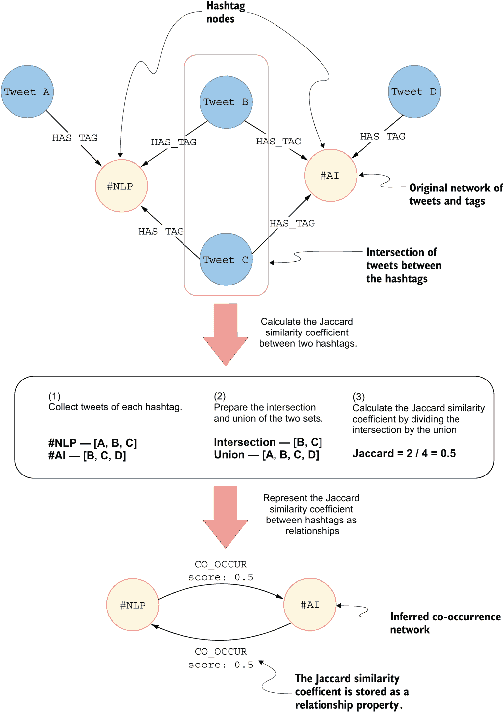

图 7.10 使用 Jaccard 相似系数检查标签重叠

在图论背景下，Jaccard 相似系数算法的典型输入是由两种类型或集合的节点组成的二分网络。使用 Jaccard 相似系数算法背后的想法是基于二分输入图投影一个单分图。图 7.10 显示了将包含推文和标签的网络转换为基于它们共同拥有的推文数量形成的单分标签网络的转换过程。这个过程如下：

1.  对于每个标签，你首先收集包含它的推文集合。

1.  在下一步中，你遍历每一对标签，通过将两个集合的交集除以它们的并集来计算 Jaccard 相似系数。

1.  最后，你可以选择将一对节点之间的相似系数以关系的形式存储。

推断关系的语义取决于领域。在标签示例中，你可以选择`CO_OCCUR`类型的关系。在篮子示例中，推断的关系可能具有`SIMILAR`类型。

Jaccard 相似度系数是一种对称相似度度量。如果节点 A 与节点 B 相似，这直接意味着节点 B 与节点 A 相似。就像前面的 Cypher 投影示例一样，生成的共现或相似度网络将是无向的。此外，你还可以将节点之间的 Jaccard 相似度系数存储为关系属性。

### 7.2.2 节点相似度算法

由于 Jaccard 相似度系数可以用来评估一对节点之间的相似程度，因此 GDS 开发者决定将其命名为*节点相似度算法*。节点相似度算法通过 Jaccard 相似度系数或重叠系数，根据节点的邻居来比较节点集合。一个典型的输入是由两种类型节点组成的二分网络。正在比较的是具有输出关系的节点，而它们的输出邻居被用来构建比较集。图 7.11 显示了用户和音乐类型的简单网络。

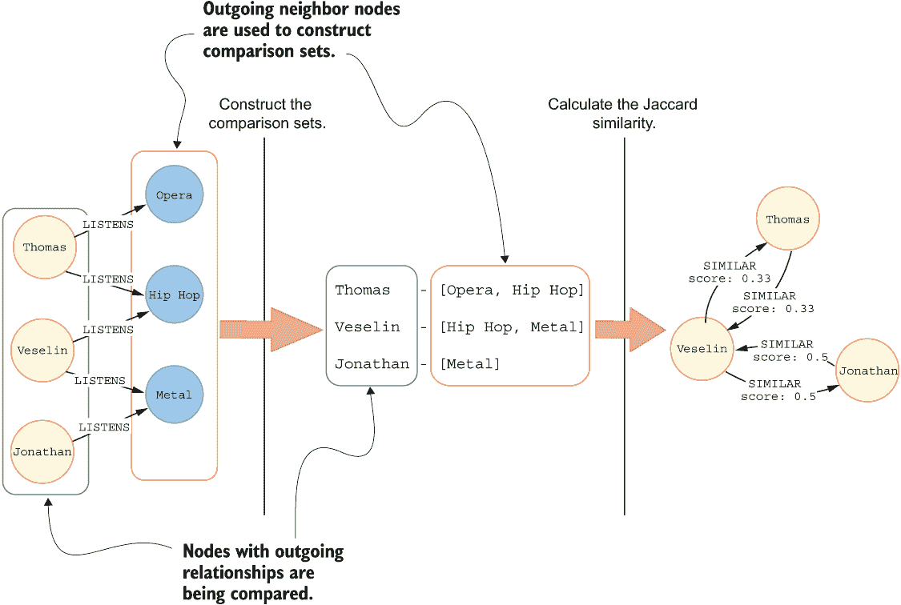

图 7.11 节点相似度算法如何构建比较集并评估相似度

`LISTENS`关系是从用户指向音乐类型的。在这种情况下，节点相似度算法将根据用户的输出邻居（即他们正在收听的音乐类型）来比较用户。意识到节点相似度算法正在比较哪些节点对于正确执行算法至关重要。在我们的 Twitter 社交网络中，`HAS_TAG`关系是从`Tweet`节点指向`Tag`节点。如果你避免反转关系方向，你实际上会根据它们有多少共同标签来比较推文。GDS 库允许在投影期间反转关系方向，因此你不需要转换底层存储的图。当你想在投影期间转换关系方向时，你需要使用配置映射语法来描述投影关系，如下所示。

列表 7.10 描述关系类型及其方向的配置映射

```
{ALIAS_OF_TYPE: {type:'RELATIONSHIP_TYPE',
                 orientation: 'NATURAL',
                 properties:['property1','property2']}
```

而不是简单地用字符串指定关系，你需要构建一个关系配置映射。`ALIAS_OF_TYPE`键指定了投影关系将在内存图中以哪个名称可用。别名不需要与数据库中存储的关系类型相同。每个别名键都有一个值，该值由一个映射描述，说明哪些关系类型应该被投影，它们的方向以及可选属性。你可以使用`orientation`键来操作和转换关系方向。它有三个可能的值：

+   `NATURAL`—每个关系以与在数据库中存储相同的方式被投影。

+   `REVERSE`—在图投影过程中，每个关系都被反转。

+   `UNDIRECTED`—每个关系在自然方向和反向方向都被投影。

使用`orientation`配置，你可以选择按原样投影关系、反转其方向，或将其视为无向的。如前所述，为了将关系视为无向的，引擎只需在相反方向上复制该关系。

接下来进行标签共现任务，你需要投影`Tweet`和`Tag`节点，并包括反向方向的`HAS_TAG`关系。

列表 7.11 投影`Tweet`和`Tag`节点并包含反向的`HAS_TAG`关系

```
CALL gds.graph.project(
    'tags',                                                        ❶
   ['Tweet', 'Tag'],                                               ❷
   {REVERSED_HAS_TAG: {orientation:'REVERSE', type:'HAS_TAG'}});   ❸
```

❶ 投影的图名称

❷ 使用列表语法投影多个节点标签

❸ 投影反向的 HAS_TAG 关系

列表 7.11 介绍了两种新的原生投影语法选项。首先，你可以使用列表指定要投影的多个节点标签。在列表 7.11 中，你描述了要投影的`Tweet`和`Tag`节点。其次，你使用了配置映射语法来描述投影的关系。投影的关系将在`REVERSED_HAS_TAG`别名下可用，并包含反向关系方向的`HAS_TAG`连接。

现在你已经将推文和标签的网络投影出来，你可以使用节点相似度算法来推断一个单部分网络。你可以通过节点相似度算法的`topK`和`similarityCutoff`参数来影响推断网络的密集程度或稀疏程度。`similarityCutoff`参数定义了被视为相似的一对节点之间的 Jaccard 相似系数的阈值值。例如，如果`similarityCutoff`是 0.5，那么只有 Jaccard 相似度分数为 0.5 或更高的节点对之间的关系将被考虑。另一方面，`topK`参数指定了每个节点相似关系的数量限制。由于你可以直接通过`topK`和`similarityCutoff`参数来影响应该存储多少关系，因此你相应地描述了推断的共现网络的稀疏程度或密集程度。

定义标签共现网络的稀疏程度或密集程度将直接关联到形成主题的标签社区的范围。例如，如果你使用`topK`值为 1，每个节点将只有一个指向其最相似邻居的出度关系。然而，如果你将`topK`值增加到 2，每个节点将有两个出度关系，指定了哪两个节点是最相似的。

图 7.12 展示了使用不同`topK`值时推断出的共现网络的比较。如前所述，节点相似度算法的输入通常是一个二分网络。在这个例子中，您有一个由推文和标签组成的二分网络。节点相似度算法将根据它们共同出现的推文数量来评估标签之间的相似度。一旦计算出标签对之间的 Jaccard 相似度系数，算法将输出标签之间的关系。您可以在图 7.12 的左侧观察到`topK`值为 1 的共现网络。使用`topK`值为 1，每个标签将有一个单一的输出关系，表示其最相似的标签。图 7.12 左侧的共现网络有八个节点和八个关系。例如，#data 标签与#datascience 标签最相似。尽管我之前提到 Jaccard 相似度系数是一个对称的相似度度量，但#datascience 标签并没有与#data 标签的逆向关系。为什么是这样呢？原因是，一旦您对节点相似度算法应用`topK`过滤器，您就会失去所有关系都是对称的保证。如果您将`topK`值设置为推断出的共现网络中的节点数量，所有关系都将是对称的。

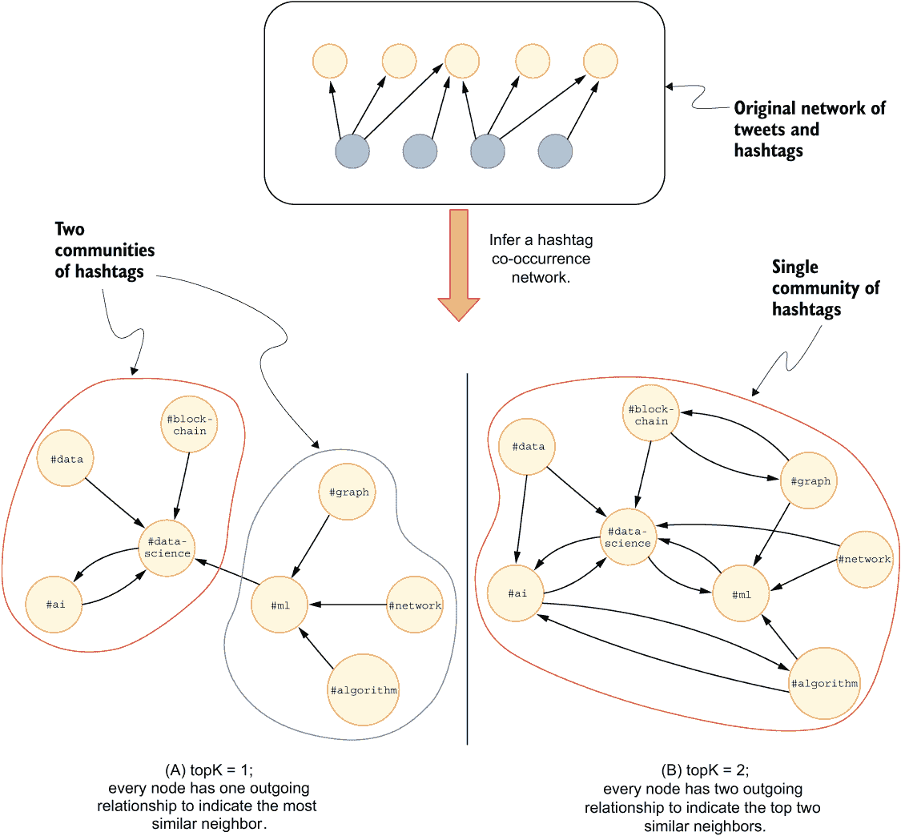

图 7.12 不同`topK`值对结果共现网络的密度影响比较

回到您的场景，一旦创建了共现网络，想法是使用标签传播算法等算法来找到紧密连接的标签社区。一个**社区**被定义为密集互联的节点群，这些节点群可能与其他群体有较稀疏的连接。当使用较低的`topK`值时，推断出的共现网络中的连接会更少。因此，社区的大小会变小，因为密集互联的节点会更少。由于社区会更小，整个网络中会有更多的社区。您定义了每个标签社区将被视为一个单一主题。因此，通过调整节点相似度算法的`topK`值，您实际上是在影响结果标签社区的大小。标签社区越大，结果主题就越广泛。当标签社区较大时，您可能会产生一个更粗粒度的定位策略。另一方面，使用较小的`topK`值将有助于您找到较小的标签社区，从而制定更窄的营销策略。

在图 7.12 中，你可以观察到当使用 `topK` 值为 1 时，社区检测算法在结果共现网络中识别出两个社区。一个社区包括 #ai、#datascience、#data 和 #blockchain 标签，而另一个社区包含 #ml、#graph、#network 和 #algorithm。当你使用更高的 `topK` 值时，结果共现网络将更加互联互通，因此社区检测算法将识别出更大的社区。在你的用例中，更大的标签社区将导致更广泛的话题。在图 7.12 的右侧，你可以观察到使用 `topK` 值为 2 产生了一个更密集连接的共现网络。由于节点连接更加密集，社区检测算法识别出更大且数量更少的社区。在图 7.12 中，当使用更高的 `topK` 值为 2 时，算法仅识别出一个标签社区。

定义 `topK` 参数和 `similarityCutoff` 参数是科学与艺术的结合，并且取决于你的用例。默认情况下，`topK` 参数值为 10，`similarityCutoff` 为 1E-42，略高于零。你可以使用节点相似度算法的 `stats` 模式评估默认参数值下推断网络的密集程度。

列表 7.12 使用默认参数评估 Jaccard 系数的分布

```
CALL gds.nodeSimilarity.stats('tags', {similarityMetric: 'JACCARD'})
YIELD nodesCompared, similarityPairs, similarityDistribution
```

表 7.5 展示了结果分布。

表 7.5 使用默认参数的节点相似度算法的相似度分布

| `nodesCompared` | `similarityPairs` | `similarityDistribution` |
| --- | --- | --- |
| 2,093 | 13,402 | { "p1": 0.0005411244928836823,"max": 1.000007625669241,"p50": 0.4400005303323269,"p10": 0.007575776427984238,"p75": 1.000007625669241,"p25": 0.11111116036772728,"mean": 0.4971548691088963,"stdDev": 0.39913025157864984 } |

使用默认参数执行节点相似度算法将在 2,093 个标签之间创建 13,402 个关系。这些关系的平均相似度得分为 0.49。请注意，此分布摘要不包括所有节点对之间的相似度得分，而仅包括节点的 top 10 个相似邻居的得分，因为这是默认的 `topK` 值。有趣的是，中位数值 (`p50`) 接近平均相似度值，大约 25% 的关系具有最大可能的相似度得分 1。当相似度得分为 1 时，一对标签总是在一条推文中一起出现。你可以使用 `similarityCutoff` 参数排除相似度得分低于阈值的标签对之间的关系。

列表 7.13 使用 `similarityCutoff` 参数定义相似度得分阈值

```
CALL gds.nodeSimilarity.stats('tags',
  {similarityMetric: 'JACCARD', similarityCutoff:0.33})
YIELD nodesCompared, similarityPairs, similarityDistribution
```

表 7.6 展示了结果分布。

表 7.6 使用 `similarityCutoff` 参数的节点相似度算法的相似度分布

| `nodesCompared` | `similarityPairs` | `similarityDistribution` |
| --- | --- | --- |
| 2,093 | 7,733 | { "p1": 0.3333320617675781,"max": 1.000007625669241,"p50": 1.0000057220458984,"p10": 0.3636360168457031,"p75": 1.0000057220458984,"p25": 0.5000019073486328,"mean": 0.7893913483135638,"stdDev": 0.2606311318508915 } |

你可以观察到，将`similarityCutoff`值设置为 0.33，只会创建 7,733 个关系，而不是默认参数值下的 13,402 个。第 25 百分位数是 0.5，有趣的是，中位数已经是最大分数 1.0。结果网络的平均节点度数大约为 4。根据相似度分布，关系将在非常相似或高度共现的标签对之间创建，因为中位数已经是 1.0。

练习 7.3

使用节点相似度算法的`stats`模式测试`topK`和`similarityCutoff`参数的各种组合，并评估它们值的变化如何影响推断网络的密度。

很遗憾，没有明确的解决方案来定义`topK`和`similarityCutoff`参数。这让我想起了金发女孩困境；它们必须恰到好处。如果你推断出一个过于密集的图，进一步分析推断出的网络可能不会产生有价值的见解。同样，如果你推断出一个过于稀疏的图，也是如此。作为初学者，建议你尝试各种参数配置并检查下游结果。在掌握底层数据结构和配置值如何影响结果之后，你可以应用自动超参数优化方法。

在标签共现示例中，你将使用`similarityCutoff`值为 0.25 和`topK`值为 50。由于你将在推断出的共现网络上执行其他图算法，你将使用节点相似度算法的`mutate`模式。`mutate`模式将推断出的网络存储到内存图中，这允许你将节点相似度算法的结果作为其他图算法的输入，如下面的列表所示。

列表 7.14 将标签共现网络转换为内存图

```
CALL gds.nodeSimilarity.mutate('tags',
  {topK:50, similarityCutoff:0.25,
    mutateRelationshipType:'CO_OCCURRENCE',
    mutateProperty:'score',
    similarityMetric: 'JACCARD'})
YIELD nodesCompared, relationshipsWritten
```

推断出的标签共现网络包含 2,093 个节点和 9,992 个关系。

## 7.3 标签共现网络的特性

在继续到社区检测部分之前，你需要巩固使用图算法来表征网络的知识。现在你正在处理一个单部分图，你可以应用与前面章节相同的算法来表征网络。

### 7.3.1 节点度中心性

你可以使用节点度算法进一步评估推断出的共现网络的节点度分布。问题是现在投影的 `tags` 图包含 `Tweet` 和 `Tag` 节点以及 `REVERSE_HAS_TAG` 和 `CO_OCCURRENCE` 关系。你可以在算法执行时使用 `nodeLabels` 和 `relationshipTypes` 参数来过滤算法应考虑的节点或关系。

列表 7.15 评估标签共现网络的节点度分布

```
CALL gds.degree.stats('tags',
  {nodeLabels:['Tag'], relationshipTypes:['CO_OCCURRENCE']})
YIELD centralityDistribution
```

表 7.7 显示了结果分布。

表 7.7 标签共现网络的节点度分布

| `p99` | 21.00011444091797 |
| --- | --- |
| `min` | 0.0 |
| `max` | 40.00023651123047 |
| `mean` | 5.351917056393738 |
| `p90` | 13.000053405761719 |
| `p50` | 3.0000076293945312 |
| `p999` | 29.00011444091797 |
| `p95` | 17.00011444091797 |
| `p75` | 8.000053405761719 |

`nodeLabels` 和 `relationshipTypes` 参数都期望输入一个列表。在算法执行时过滤节点和关系的能力是一个方便的特性，它允许你分析投影图的各个部分或分析一个新推断出的网络。

标签共现网络的平均节点度为 5.3。一些标签没有 `CO_OCCURRENCE` 关系，而至少有一个标签经常与 40 个其他标签共现。`topK` 参数值为 50 对结果网络没有影响，因为最高度数仅为 41。

### 7.3.2 弱连通分量

弱连通分量（WCC）算法无需过多介绍，因为它已在之前的章节中介绍过。然而，你应该完成本节中的两个练习，以巩固你对执行和解释 WCC 算法结果的知识。

练习 7.4

在标签共现网络上执行 WCC 算法，并将结果存储到数据库中的节点属性 `tcWcc` 中。提供 `nodeLabels` 和 `relationshipTypes` 参数，以便算法只考虑投影图的所需子集。使用算法的 `write` 模式将结果存储到数据库中。

表 7.8 显示了结果统计。

表 7.8 在标签共现网络上执行 WCC 算法的结果汇总统计

| `componentCount` | `componentDistribution` |
| --- | --- |
| 469 | { "p99": 19,"min": 1,"max": 491,"mean": 3.9808102345415777,"p90": 6,"p50": 2,"p999": 491,"p95": 11,"p75": 3 } |

WCC 算法的 `write` 模式也提供了结果的高级总结，类似于 `stats` 模式。标签共现网络中有 469 个组件，其中最大的包含 491 个成员，约占整个网络的 25%。你可以想象你正在处理一个非常不连通的网络，因为大多数组件的成员数在 10 个或以下。

练习 7.5

识别有多少组件的成员数不超过 10 人。首先，你需要根据它们的`tcWcc`属性计算每个组件的成员数。在第一次聚合后，你需要应用过滤器并忽略成员数超过 10 人的组件。在最后一步，你只需再次使用`count`函数来计算过滤后的组件数量。

通过完成 7.5 练习，你可以观察到 467 个组件中有 445 个组件成员数不超过 10 人。推断出的网络如此不连通的一个原因是你正在处理 Twitter 社交网络的一个非常小的子集。我认为添加更多数据将有助于连接一些组件。另一方面，像#meditation 或#selfhelp 这样的标签可能永远不会频繁地与 AI 或机器学习一起出现，即使偶尔发生，它们也不会达到相似度阈值，从而在它们之间创建共现关系。

## 7.4 使用标签传播算法进行社区检测

到目前为止，你只学习了如何使用 WCC 和强连通组件（SCC）算法来评估社区结构。在本章的最后部分，你将学习如何使用标签传播算法（LPA）来找到标签的非重叠社区。社区和组件之间的区别是什么？使用 WCC 算法时，组件由在图中忽略关系方向时可以相互到达的节点组成。另一方面，社区被定义为由密集连接的节点组成的组，这些节点可能与其他组有较稀疏的连接。图 7.13 显示了一个只包含单个 WCC 的网络。

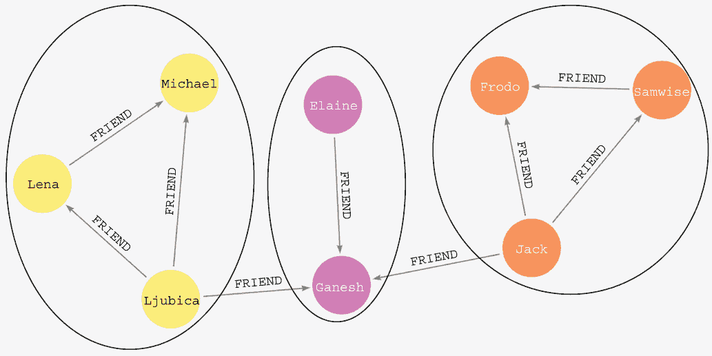

图 7.13 示例：网络社区结构的可视化

当你在网络上运行社区检测算法，如 LPA 时，该算法将识别高度连接的节点组。图 7.13 中有三个社区。例如，左侧有一个成员高度连接的社区。同样，在可视化的右侧还有一个由密集连接的节点组成的社区，而其中一个节点也与中心社区有连接。你可以使用以下 Cypher 语句执行标签传播算法的`mutate`模式。

列表 7.16 在标签共现网络上执行标签传播算法并将结果存储到内存图

```
CALL gds.labelPropagation.mutate('tags',
  {nodeLabels:['Tag'], relationshipTypes: ['CO_OCCURRENCE'],
   mutateProperty:'community'})
YIELD communityCount, communityDistribution;
```

如你所见，大多数图算法遵循相同的语法，这使得尝试各种图算法变得容易。再次强调，你必须使用`nodeLabels`和`relationshipTypes`参数来选择标签共现网络。

注意：标签传播算法是一个非确定性算法，这意味着它有可能产生不同的结果，即使多次应用于同一数据集。这种固有的非确定性源于算法在决定节点更新标签顺序时的随机性。因此，这种非确定性可能导致不同结果之间的差异。

如果您想使用 Cypher 评估结果，您需要将内存中图的突变`community`属性存储到 Neo4j 存储图中。您可以使用`gds.graph.writeNodeProperties`过程将内存中图的节点属性存储到数据库中。运行以下 Cypher 语句将内存中图的突变`community`属性存储到数据库中。

列表 7.17 将内存中图节点的突变属性写入数据库

```
CALL gds.graph.writeNodeProperties('tags', ['community'])
YIELD propertiesWritten
```

算法结果现在作为`Tag`节点的`community`属性可用。在下面的列表中，您将检查五个最大的社区并检查其中的一些成员。

列表 7.18 检查标签的五大社区

```
MATCH (t:Tag)
RETURN t.community AS community,
       count(*) AS communitySize,
       collect(t.id)[..7] AS exampleMembers
ORDER BY communitySize DESC
LIMIT 5
```

表 7.9 显示了标签的结果社区。

表 7.9 标签的五大最大社区

| `community` | `communitySize` | `exampleMembers` |
| --- | --- | --- |
| 15,809 | 43 | ["#mentalism", "#respect", "#special-needs", "#mondayvibes", "#goals", "#mindset", "#anxiety"] |
| 15,828 | 42 | ["#auto_tagging", "#data_entry", "#itrules", "#writingcommunity", "#feg", "#crypto", "#tsa"] |
| 17,537 | 35 | ["#programming", "#ml", "#iiot", "#iotpl", "#rstats", "#cybersecurity", "#serverless"] |
| 16,093 | 34 | ["#nlpimpulse", "#iserlohn", "#zoom", "#selbstbild", "#selbstwert", "#spiegelbild", "#werte"] |
| 16,271 | 31 | ["#artproject", "#nft", "#art", "#nfts", "#oculusquest", "#gaming", "#xrhub"] |

标签的最大的社区有 43 个成员。从表面上看，最大的社区的整体主题集中在心理健康和个人成长上。起初，我没有预料到数据集中会有这类推文，但现在我知道 NLP 可以指代**自然语言处理**和**神经语言编程**。第三和第四大的社区围绕着计算机科学和软件开发。另一方面，第五大的社区似乎围绕着非同质化代币（NFTs）以及有趣的是，还提到了 VR 主题，如 Oculus Quest。您还可以取消成员数量以及行数的限制，以进一步分析社区结构。

练习 7.6

识别包含以下标签的社区：

+   `#nlp`是成员之一

+   `#graph`是成员之一

表 7.10 显示了结果社区。

表 7.10 包含#nlp 或#graph 成员的社区

| 15,699 | ["#graphdatabases", "#hcm", "#peopleanalytics", "#hranalytics", "#graphdatascience", "#twitch", "#graph", "#neo4j"] |
| --- | --- |
| 17,533 | ["#datascience", "#ai", "#machinelearning", "#iot", "#python", "#nlp", "#100daysofcode", "#deeplearning", "#artificialintelligence", "#bigdata", "#robots"] |

练习 7.6 的结果为你提供了可以用来为公司制定营销策略的标签推荐。例如，假设你想要针对自然语言处理社区。在这种情况下，你应该尝试将 #nlp 标签与其他相关标签（如 #datascience、#deeplearning 或 #machinelearning）结合起来，以触及更广泛的受众。另一方面，你应该排除不相关的标签主题，例如本例中的自我帮助领域。你还可以探索其他社区并寻找可能对你公司相关的其他标签。

## 7.5 使用 PageRank 识别社区代表

有时你会从标签传播算法中得到更大的标签社区。在营销策略示例中，你可能想识别社区中几个最中心的标签，以便集中精力，因为在你内容中使用 50 个或更多的标签可能没有意义。

你可以运行 PageRank 算法来找到社区的代表。要使用 PageRank 算法找到代表，你需要分别对每个社区执行它。不幸的是，你无法在算法执行时根据突变节点属性进行过滤。但你可以使用以下列表中显示的 *图过滤* 功能，它允许你通过指定节点和关系过滤器来过滤现有的内存图。

列表 7.19 子图投影语法

```
CALL gds.graph.filter(
  graphName: String, -> name of the new projected graph
  fromGraphName: String, -> name of the existing projected graph
  nodeFilter: String, -> predicate used to filter nodes
  relationshipFilter: String -> predicate used to filter relationships
)
```

你可以使用 `nodeFilter` 参数根据节点属性或标签来过滤节点。同样，你也可以使用 `relationshipFilter` 参数根据其属性和类型来过滤关系。过滤谓词是针对节点或关系的 Cypher 谓词。过滤谓词始终需要评估为 `true` 或 `false`。谓词内的变量名不是任意选择的。节点谓词必须引用变量 `n`，而关系谓词必须引用变量 `r`。

你使用标签传播算法的 `mutate` 模式的原因是现在你可以使用突变属性进行子图投影。如果你直接使用 `write` 模式，标签传播算法的结果将不会在内存图中可用，因此你无法根据它们进行过滤。

例如，包含 #ml 标签的社区有 35 个成员。你不必手动评估组内哪些成员最重要，可以使用 PageRank 算法来识别该组的代表。以下 Cypher 语句投影了一个只包含 #ml 标签作为成员的标签社区子图。

列表 7.20 投影只包含最大标签社区子图

```
MATCH (h:Tag {id:"#ml"})
WITH h.community AS communityId
CALL gds.graph.filter(
  'ml-community',
  'tags',
  'n.community = $communityId',                  ❶
 '*',                                            ❷
{ parameters: { communityId: communityId } })    ❸
YIELD graphName, fromGraphName, nodeCount, relationshipCount
RETURN graphName, fromGraphName, nodeCount, relationshipCount
```

❶ 过滤特定社区的节点

❷ 当你不想应用任何过滤器时，可以使用通配符运算符。

❸ 在从外部操作到子图投影中使用的任何参数都需要通过参数配置值传递。

第五个参数是配置映射，其中你可以定义在子图投影过程之前计算的任何参数。在列表 7.20 中的 Cypher 语句中，你首先匹配 #ml 标签节点并检索其 `community` 属性。然后，`community` 属性作为参数传递给子图投影过程。最后，你可以在新投影的 `ml-community` 内存图上执行 PageRank 算法以识别其代表。

列表 7.21 使用 PageRank 算法识别最大社区的代表

```
CALL gds.pageRank.stream('ml-community')
YIELD nodeId, score
RETURN gds.util.asNode(nodeId).id AS tag, score
ORDER BY score DESC
LIMIT 5
```

表 7.11 显示了生成的社区。

表 7.11 最大的标签社区的前五个代表

| `标签` | `得分` |
| --- | --- |
| #serverless | 1.9529458990718058 |
| #iiot | 1.8179378938658664 |
| #usa? | 1.6916560123489326 |
| #coders | 1.4975137459724255 |
| #frenchtech | 1.4975137459724253 |

有趣的是，与 #ml 同社区的标签中，最中心的标签是 #serverless、#iiot 和出人意料的是 #usa。可能是在抓取推文的时间窗口内，美国发生了某些物联网（IoT）事件。另一方面，#ml 与关于无服务器或 IoT 技术的推文共现并不令人惊讶。你也必须意识到你正在处理一个很小的推文样本。如果你增加了分析中的推文数量，结果可能会改变，因为你不会那么依赖于大多数推文在创建的三天窗口期间发生的事情。由于社区检测算法的结果是非确定性的，你可能会得到与表 7.11 不同的结果。

练习 7.7

找到其他社区的代表。你需要使用子图投影功能来过滤相关节点，然后使用 PageRank 算法找到其代表。

恭喜！你已经学会了如何推断共现网络并分析其社区结构。分析标签共现网络中最关键的一步是定义节点相似性算法的 `topK` 和 `similarityCutoff` 参数。正如所讨论的，`topK` 和 `similarityCutoff` 参数将直接影响推断出的共现网络的密度。因此，共现网络的密度将与识别出的社区的大小相关，在标签共现的例子中意味着生成的主题将有多广泛。我建议你测试这两个参数的各种配置，并检查它们如何影响生成的标签社区。

### 7.5.1 丢弃投影的内存图

在分析完成后，记得释放投影的内存图以释放内存供其他分析使用。以下 Cypher 语句将删除所有当前投影图。

列表 7.22 从内存中释放所有投影图

```
CALL gds.graph.list() YIELD graphName          ❶
CALL gds.graph.drop(graphName) YIELD nodeCount
RETURN 'dropped ' + graphName                  ❷
```

❶ 列出所有投影图

❷ 从内存中释放每个投影图

## 7.6 练习题解答

练习题 7.1 的解答如下。

列表 7.23 通过合并推文和转发计数之和检索前五个热门标签

```
MATCH (h:Tag)<-[:HAS_TAG]-(t:Tweet)
OPTIONAL MATCH (t)<-[r:RETWEETS]-()
RETURN h.id AS hashtag,
       count(distinct t) AS originalTweetsCount,
       count(r) AS retweetCount
ORDER BY retweetCount + originalTweetsCount DESC
LIMIT 5
```

练习题 7.2 的解答如下。

列表 7.24 检查前五个最常共现的标签对

```
MATCH (h1:Tag)<-[:HAS_TAG]-()-[:HAS_TAG]->(h2:Tag)        ❶
WHERE id(h1) < id(h2)
WITH h1,h2,count(*) AS cooccurrences
ORDER BY cooccurrences DESC LIMIT 5
RETURN h1.id AS tag1, h2.id AS tag2, cooccurrences
```

❶ 从结果中移除重复项

练习题 7.4 的解答如下。

列表 7.25 在标签共现网络上执行 WCC 算法并将结果存储到数据库中

```
CALL gds.wcc.write('tags',
  {writeProperty:'tcWcc',
   nodeLabels: ['Tag'], relationshipTypes: ['CO_OCCURRENCE']})
YIELD componentCount, componentDistribution;
```

练习题 7.5 的解答如下。

列表 7.26 识别有多少个组件有 10 个或更少的成员

```
MATCH (t:Tag)
WITH t.tcWcc AS componentId, count(*) AS componentSize
WHERE componentSize <= 10
RETURN count(*) AS count
```

练习题 7.6 的解答如下。

列表 7.27 识别与 #nlp 标签处于同一社区中的成员

```
MATCH (t:Tag)
WHERE t.id IN ['#nlp', '#graph']
WITH distinct t.community AS target_community
MATCH (o:Tag)
WHERE o.community = target_community
RETURN target_community, collect(o.id) as members
```

## 摘要

+   推断单连通网络是图分析中常见的步骤。

+   Jaccard 相似系数可以通过将两个集合的交集除以并集来计算。

+   GDS 库使用两个指向相反方向的有向关系来表示无向关系。

+   在 GDS 中，可以使用 `gds.nodeSimilarity` 算法计算 Jaccard 相似系数。

+   节点相似度算法的 `similarityCutoff` 参数用于定义一对节点之间相似性的阈值值，仍被视为相似。

+   节点相似度算法的 `similarityCutoff` 参数用于指定每个节点相似关系的数量限制。

+   节点相似度算法的 `stats` 模式可以用来评估推断相似度网络的密度。

+   Cypher 实现了基本的文本函数，如 `replace` 和 `split` 函数。

+   Cypher 语法提供了一种列表推导语法，这对于过滤或转换列表中的元素非常有用。

+   `UNWIND` 子句用于将元素列表转换为行，类似于各种脚本语言中的 `for` 循环。

+   在内存图投影期间，您可以更改关系方向或将它视为无向的。

+   GDS 库使用两个指向相反方向的有向关系来表示无向关系。

+   参数 `nodeLabels` 和 `relationshipTypes` 可以用来考虑仅将投影图的一个子集作为图算法的输入。

+   标签传播算法用于评估网络的社区结构。

+   标签传播算法是非确定性的，这意味着算法的输出可能在不同的执行之间有所不同。

+   社区代表节点之间紧密连接的密集组，组与组之间的链接较为稀疏。

+   您可以使用图过滤功能来投影一个包含现有内存图中子集的新图。

+   PageRank 可以用来在共现网络中找到社区的代表。
