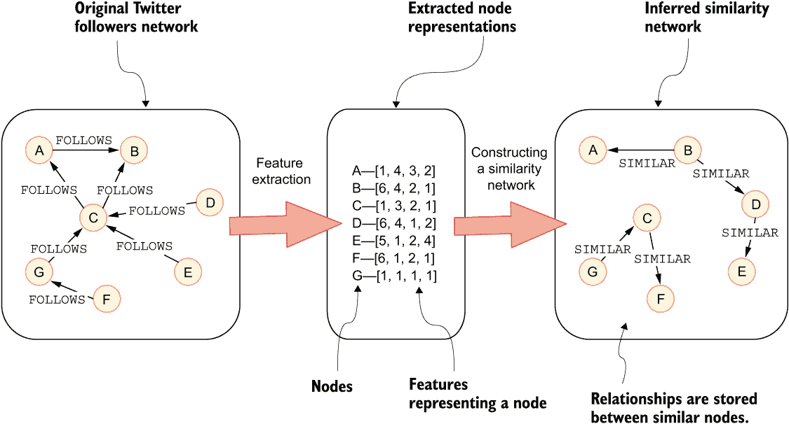
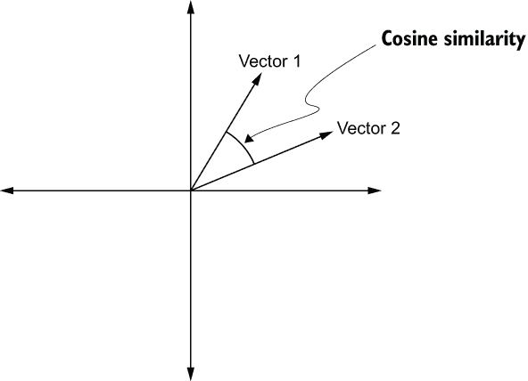
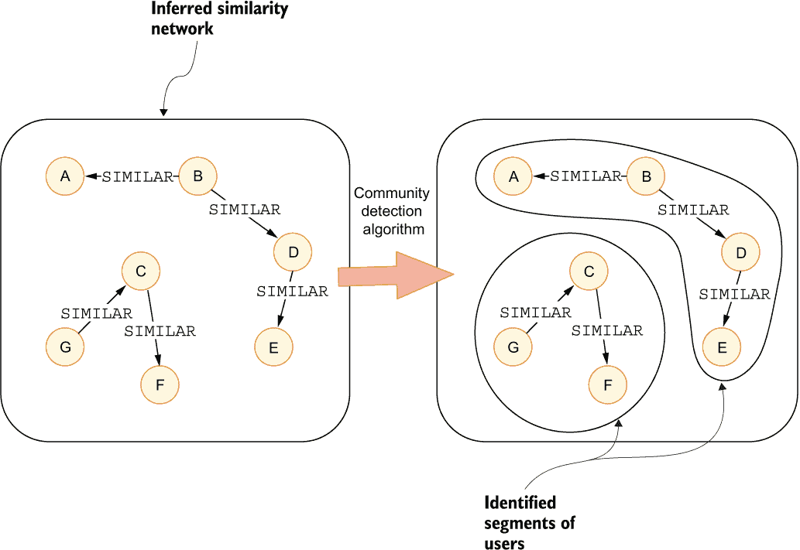
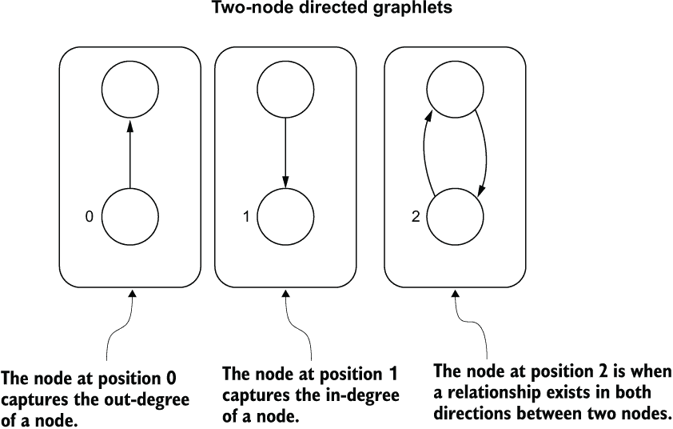
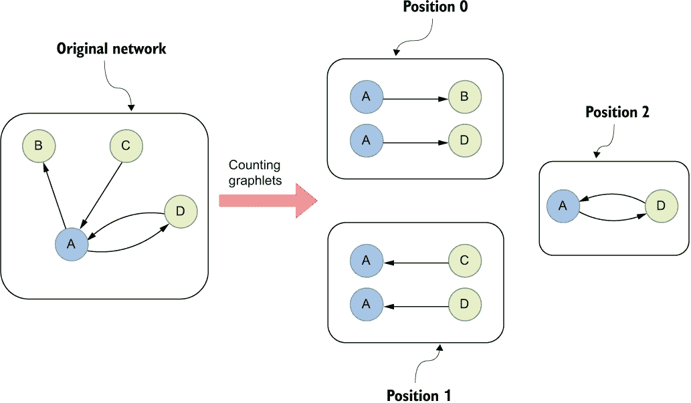
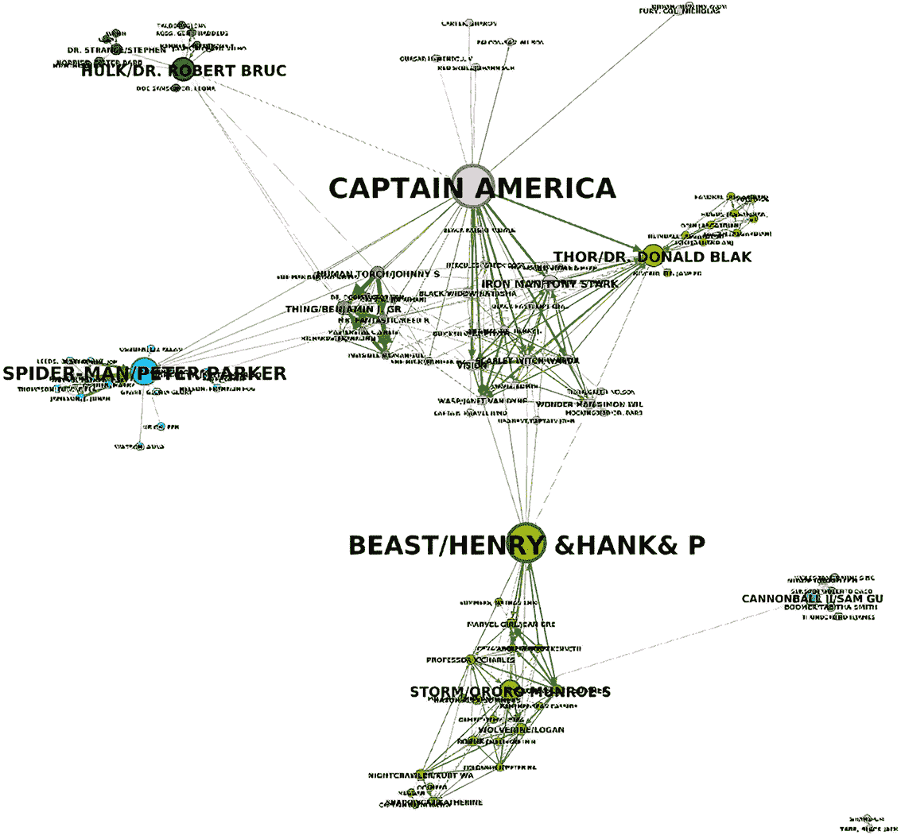
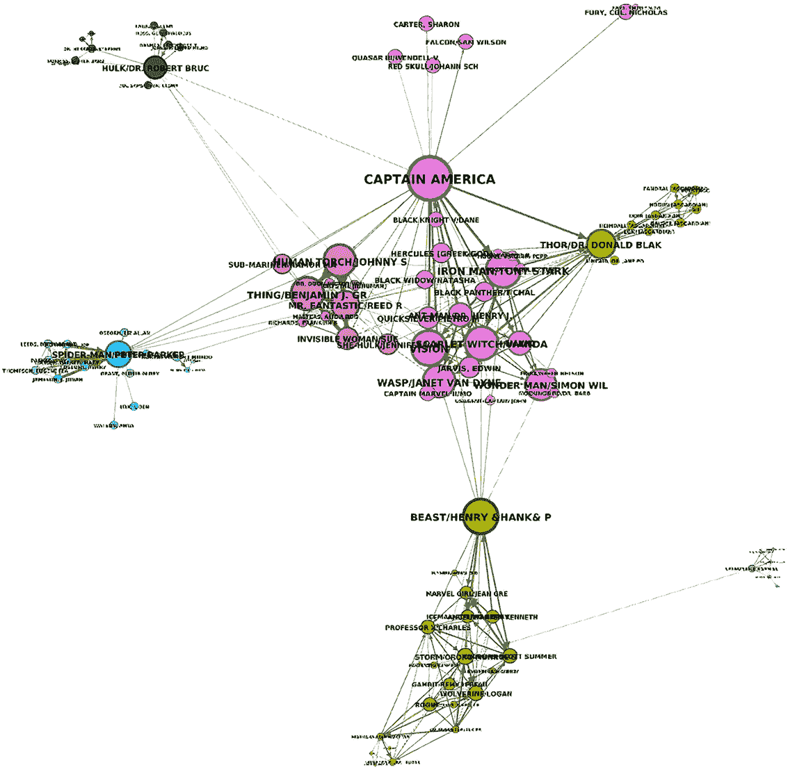

# 8 构建最近邻相似性网络

本章涵盖

+   手动提取节点特征

+   展示网络基元和图小类

+   介绍中介中心性和接近中心性

+   基于成对余弦相似度构建单部分网络

+   使用社区检测算法完成用户细分任务

本章将描述基于节点属性或特征的相似性网络的构建。类似于典型的机器学习预处理工作流程，每个数据点或节点都表示为一个向量。在机器学习环境中，向量是一组一个或多个数值的列表。处理图时，通常有两种方法可以用来描述一个节点为向量。你可以手动生成一组描述节点的特征，或者可以使用各种图算法生成表示网络中节点的向量。在本章中，你将手动创建节点的表示，以描述它们在网络中的角色，然后使用这些表示来构建一个推断的相似性网络。

图 8.1 展示了从关注者网络中提取节点特征的过程。描述一个节点为向量的方法有多种。在本章中，你将手动识别和提取用于构建相似性网络的相关特征。之后，你将根据提取的特征评估节点之间的相似度。评估两个向量之间相似度的最常见指标是**余弦相似度**。余弦相似度定义为两个向量之间角度的余弦值。你将计算节点对之间的余弦相似度，并存储被认为相似的节点之间的关系。与上一章类似，你将定义创建关系的相似度阈值。请注意，在原始网络中连接的节点在推断的相似性网络中不一定连接。



图 8.1 基于节点表示构建相似性网络的过程

余弦相似度定义为两个向量之间角度的余弦值，如图 8.2 所示。这个度量范围在-1 到 1 之间。当一对向量具有相同方向时，意味着向量之间的角度为 0，余弦相似度为 1。另一方面，当两个向量方向相反时，余弦相似度为-1。在实践中，当两个向量的余弦相似度接近 1 时，你认为这两个向量是相似的。

想象你是一名 Twitter 的分析师。你的上司给你分配了一个任务，即识别平台上的用户类型，但没有告诉你具体要寻找什么或如何分组用户。数据集中有几个特征可以用来描述一个用户。例如，你知道他们发推文或转发推文时使用哪些标签或标签组。你也很清楚他们关注或提及的人。



图 8.2 余弦相似度是通过测量两个向量之间角度的余弦值来衡量的。

此外，你还有一些关于用户或推文创建时间的时序信息。与所有手动特征工程一样，你首先必须决定你将使用哪些指标或特征来描述一个节点。由于你只有一小部分来自小时间窗口的推文，分析用户是否由于不再发布或转发而变得不活跃是没有意义的。另一方面，探索有助于你根据内容创作者与主要仅转发的人来划分用户的特征可能很有趣。例如，你可以将推文总数和转发与所有推文之间的比率作为前两个特征。

另一个有趣的指标可能是用户转发所需平均时间。你可以假设，如果平均转发时间是最低的，那么你很可能在处理一个机器人。另一个可以帮助你识别机器人的指标是检查多个用户是否在相似时间发布相同内容。由于你有关于关注者的信息，探索一些包含节点在关注者网络中位置和角色的指标可能值得考虑。你将学习如何描述节点的直接邻域以及调查它在整个网络中的作用。节点的*角色*是对它在网络中所扮演部分的主观解释。例如，你可以使用介数中心性算法来评估哪些节点充当不同社区或网络部分之间的桥梁。同样，你可以使用接近中心性来评估节点在网络中与其他所有节点的接近程度。假设大多数，如果不是所有，关于 Twitter 的信息都是通过关注者关系传播的，你可以识别出由于在网络中的位置，可以最快通过网络传播信息的节点。

在特征提取过程之后，你将根据用户特征向量之间的成对余弦相似度构建用户之间的相似性网络。然后，你将使用前一章中介绍的标签传播算法等社区检测算法来识别用户的各个部分。由于关系连接了相似节点，社区检测算法将识别在推断的相似性网络中紧密互联的节点组。识别出的用户组可以解释为基于手动提取特征的用户细分。在商业环境中，根据特定特征对个体进行分组的工作被称为*用户细分*，而在技术环境中，它被称为*无监督聚类*或*社区检测*。

图 8.3 展示了在推断相似性网络上使用社区检测算法的过程，以识别可以解释为段的用户组。推断相似性网络的密度将直接与社区的大小相关。您不能使用这种方法预先定义您想要识别的段或聚类的数量；然而，您可以通过调整推断相似性网络的密度来影响聚类的大小。



图 8.3 使用社区检测算法识别用户段

几篇研究论文（例如，Tinati & Carr，2012 年；Beguerisse-Díaz 等人，2014 年）专注于在 Twitter 网络上定义用户角色。尽管提取的特征因论文而异，并且可以使用多个社区检测或聚类技术将用户分组，但基本思想似乎是始终如一的。第一部分涉及识别和提取描述用户的有关特征。特征提取是手动完成的，允许分析师解释所有特征及其相关性。例如，如果您使用一个将节点自动转换为向量的模型，那么很难解释这些向量代表什么。最后，研究人员然后使用各种社区检测或聚类技术将用户分组到段中。

您可以使用构建最近邻图并评估其社区结构的方法，在许多其他领域识别特定的组或聚类。例如，您可以使用这种技术对用户进行细分以创建个性化服务（Voulodimos 等人，2011 年）或聚类客户以改善市场预测和规划研究（Kashwan & Velu，2013 年）。您还可以使用类似的方法通过检查其摘要中特定句子结构的相关性来聚类研究论文（Fukuda & Tomiura，2018 年）。虽然特征提取在不同的分析中可能看起来非常不同，从使用简单的统计到提取网络特征或甚至文档嵌入，分析输入始终是一个表示每个数据点的向量。接下来，有大量的算法可以根据数据点的向量表示对数据进行分组，我并不在这里争论哪个最好以及为什么。相反，我想给你一个使用基于图的方法进行无监督聚类的例子，其中最终聚类的数量或社区不是预先定义的。为了跟随本章的练习，您需要将 Twitter 网络导入到第三章中描述的 Neo4j 数据库中。

## 8.1 特征提取

如前所述，用户细分过程的第一步是特征提取。每个节点特征都将存储为其属性。首先，您将使用您的 Cypher 知识提取每个用户的推文数量以及转发与推文的比率。

练习 8.1

计算每个用户的推文数量，并将其存储为`tweetCount`属性。确保包括那些发布了零条推文的用户。此外，计算每个用户的转发与推文之间的比率。具体来说，将转发的数量除以转发和推文的总和，并将其存储为`retweetRatio`属性。当一个用户没有转发或推文时，使用默认值零。您可以使用一个或两个 Cypher 语句来计算这两个特征，您觉得哪个更容易。

接下来，您将评估用户在推文发布后平均需要多长时间转发推文的分布。您可以假设如果一个用户几乎立即转发很多推文，那么它很可能是机器人。以下列表介绍了`duration.between()`函数，该函数用于计算两个日期时间之间的持续时间。

列表 8.1 评估转发和创建推文日期之间的平均持续时间分布

```
MATCH (u:User)-[:PUBLISH]-(retweet)-[:RETWEETS]->(tweet)
WITH u, toInteger(duration.between(                             ❶
  tweet.createdAt, retweet.createdAt).minutes) AS retweetDelay
WITH u, avg(retweetDelay) AS averageRetweetDelay                ❷
RETURN apoc.agg.statistics(averageRetweetDelay,
  [0.05, 0.10, 0.25, 0.5, 0.9]) AS result
```

❶ 使用`duration.between()`函数计算两个日期时间之间的持续时间

❷ 按用户分组计算平均转发延迟

`duration`时间类型表现得像一个对象，并且有多个方法来提取年、天、分钟等持续时间。您可以在文档中查看所有可用的方法：[`mng.bz/NVnd`](http://mng.bz/NVnd)。

列表 8.1 中 Cypher 语句的结果显示在表 8.1 中。

表 8.1 每个用户转发和原始推文之间的平均时间分布

| `total` | 1,385 |
| --- | --- |
| `min` | 0.0 |
| `minNonZero` | 0.05769228935241699 |
| `0.1` | 2.583343267440796 |
| `max` | 1,439 |
| `0.05` | 1.0000073909759521 |
| `mean` | 372.21522092560997 |
| `0.25` | 22.00012183189392 |
| `0.5` | 206.00097632408142 |
| `0.9` | 1,057.0078122615814 |
| `stdev` | 410.56837279615803 |

您可以观察到，您只有 1,385 个用户的信息，略少于所有用户的 40%。5%的用户在 1 分钟内转发，10%的用户在 2.5 分钟内转发。您可以使用转发和平均转发时间来识别机器人。您可以观察到，否则，平均转发时间约为 6 小时，这对于一个不是一直在查看 Twitter 动态的正常人来说是有意义的。

练习 8.2

计算每个用户之间推文和转发的时间间隔（以分钟为单位）的平均值，并将其存储为`timeToRetweet`属性。对于从未转发过的用户（有缺失值），使用 372 分钟的平均值。

另一个可能表明是机器人的特征是多个用户是否发布相同的内容。

练习 8.3

检查内容相同但不是转发的推文对。内容可在`text`属性中找到。此外，忽略单个作者发布相同内容的多个推文的情况。

通过解决练习 8.3，你可以观察到只有五条推文内容完全相同。由于这个特征只出现在 5 个用户中，每 1000 个用户中只有 1 个，所以你会忽略它。

### 8.1.1 模式和图子

接下来，你将专注于编码用户在跟随网络中的角色。具有相似角色的节点在网络上不必相邻。例如，你可以这样说，拥有大量追随者的用户在产生某些类型的内容中扮演着角色。可能有多个拥有大量追随者的用户，他们不必相互跟随或在网络中接近，但他们仍然扮演着相似的角色。在这个例子中，你实际上只检查了一个节点的直接邻域。你可以通过计算节点的*图子*来编码一个节点的局部邻域。图子是一个节点在由*k*个节点组成的明显连通子图中的位置。你可能已经熟悉了两节点图子，尽管你可能从未听说过这个名字。

图 8.4 显示了所有两节点有向图子。一个两节点有向图子由两个节点组成，并具有有向关系。两个节点之间有三种可能的有向关系变体。当你计算图子时，你实际上是在计算一个节点在那个图模式中出现的次数。



图 8.4 两节点图子

图 8.5 展示了节点 A 的两节点图子计数可视化表示。如图 8.4 所示，位于位置 0 的图子有一个出向连接。所以如果你想计算节点 A 在位置零的图子，你计算出向连接的数量，在图 8.5 的例子中是 2。同样，通过评估其入度，你可以计算节点 A 在位置 1 的图子。最后，在有向图中，两个节点之间可以有两个方向的关系，如图 8.5 的右侧所示。在某些社交网络中，当两个用户相互关注时，可以认为他们是朋友。在图 8.5 中，只有节点 A 和 D 相互关注。



图 8.5 计算两节点图子

练习 8.4

计算跟随网络中所有用户的入度和出度，并将结果存储在`inDegree`和`outDegree`属性下。此外，计算每个用户存在的“朋友”（图子二）模式数量，并将输出存储为`friendCount`属性。

接下来，你将研究三节点图子，并计算其中一些来编码一个节点的局部邻域。图 8.6 显示了所有 30 种有向三节点图子的变体。在 Cypher 中进行所有这些计算将是一个很好的练习；然而，你将只计算图 8.6 中可视化的三个图子。


图 8.6 三节点图子

你可能还会注意到图 8.6 不仅显示了基序数量，还显示了图子数量。这两者之间有什么区别？一个 *基序* 是一个明显连接的子图，而一个 *图子* 描述了节点在基序中的位置。例如，如果你看基序 1，你可以观察到它由三个节点和两个关系组成。使用基序，你只计算这种模式在网络中出现的频率。另一方面，你可以观察到在这个基序 1 中，节点位置有三种选择；因此，有三种图子可用。基序用于表征网络结构（Kim 等人，2011），而图子在你想要描述节点的局部邻域时非常有用（Pržulj 等人，2004）。

虽然你可能不会经常遇到人们只专注于计算图子或基序计数的情况，但不容忽视它们的的重要性。实际上，许多算法将它们作为推导单个节点（Rossi 等人，2017）甚至整个图（Dutta 等人，2020；Gorrec 等人，2022）表示的关键组成部分。

练习 8.5

为跟随网络中的每个用户计算图 8.6 中显示的图子 5、8 和 11，并将它们存储为节点属性。将图子 5 存储在 `graphlet5` 节点属性下，依此类推。我建议你为每个图子计算使用单独的 Cypher 语句。

### 8.1.2 介数中心性

你已经使用图子来编码节点的局部邻域；然而，你还没有提取任何描述用户在全局网络中位置的特性。你将首先执行介数中心性算法来提取一个描述用户作为不同社区之间桥梁频率的特性。*介数中心性* 算法假设所有信息都沿着节点之间的最短路径传输。一个节点越频繁地位于这些最短路径上，它的介数中心性排名就越高。

图 8.7 可视化了一个超级英雄网络，其中关系出现在出现在同一漫画书中的角色之间。节点的大小和角色名称的大小都是使用介数中心性计算的。介数中心性排名越高，节点和标题的大小就越大。你可以观察到连接不同社区的角色节点是最大的。例如，美国队长位于网络的中心，在中央社区和其他所有社区之间充当桥梁。另一个介数中心性的优秀例子是野兽角色，他是图 8.7 中中央和底部社区之间的唯一联系。如果他被从网络中移除，网络将分裂成两个单独的部分。因此，野兽角色充当了底部社区和整个网络之间的桥梁。充当桥梁也使节点对两个社区之间的信息流有影响力。



图 8.7 示例：中间中心性排名的可视化（来源：Sanhueza。许可协议为 CC BY 3.0）

在对关注者网络执行中间中心性算法之前，你必须投影一个内存图，如图 8.2 所示。你将使用相同的投影图来执行图算法，然后构建最近邻图。因此，你还需要在投影中包含所有之前计算过的节点特征。完成 8.1 至 8.5 的练习是执行以下 Cypher 语句以投影内存图的必要条件。

列表 8.2 投影描述关注者网络并包含所有预计算节点特征的内存图

```
CALL gds.graph.project('knnExample','User', 'FOLLOWS',
 {nodeProperties:['tweetCount', 'retweetRatio', 'timeToRetweet', 'inDegree',
  'outDegree', 'friendCount', 'graphlet5', 'graphlet8', 'graphlet11']})
```

现在，你可以执行中间中心性算法。你将使用`mutate`模式将结果存储回以下列表中的投影图中。

列表 8.3 修改中间中心性算法

```
CALL gds.betweenness.mutate('knnExample', {mutateProperty:'betweenness'})
```

### 8.1.3 接近中心性

*接近中心性*是一种衡量指标，表示一个节点在网络中与其他所有节点的接近程度。算法首先计算从节点到网络中所有其他节点的最短路径。一旦计算出最短路径，算法将计算到所有其他节点的距离之和。默认情况下，它返回距离之和的倒数，因此分数越高意味着节点的接近中心性排名越高。可以将接近性解释为尽可能快地到达所有其他节点的潜在能力。

图 8.8 显示了与图 8.7 相同的漫威网络。不同之处在于，这里节点和标题的大小是通过接近中心性算法而不是中间中心性算法计算的。你可以观察到最大的节点位于网络的中心，这是有道理的，因为它们可以最快地到达所有其他节点。另一方面，网络外围的角色具有最小的接近中心性排名。美国队长处于如此有利的地位，他在中心性的两个类别中都领先。另一方面，例如，钢铁侠在中间中心性排名上落后于蜘蛛侠和野兽。然而，当查看接近中心性排名时，他由于在网络中的中心位置而领先于他们。



图 8.8 示例：网络中节点接近中心性排名的可视化

接近中心性的第一个变体在无连接图中可能不可靠。记住，该算法试图找到图中所有其他节点的最短路径。如果使用原始变体在无连接图中，最短路径可能不存在，因此，从节点到所有最短路径的总和可能是无限的。在实践中，存在几种处理无连接图的接近中心性公式的变体。在这个例子中，你将使用 Wasserman 和 Faust 公式的变体（Wasserman & Faust, 1994）。你可以使用以下 Cypher 语句执行接近中心性算法的 `mutate` 模式。

列表 8.4 修改接近中心性算法

```
CALL gds.closeness.mutate('knnExample',
  {mutateProperty:'closeness', useWassermanFaust: true})
```

## 8.2 构建最近邻图

你已经通过手动提取特征完成了用户细分过程的第一个步骤。第二个步骤是将用户分组或聚类成细分市场。如前所述，有几种不同的方法可以根据向量表示聚类数据点。在这里，你将基于向量表示之间的成对余弦相似性构建最近邻图。由于评估许多数据点之间的余弦相似性是一个相对频繁的过程，一些算法实现会进行智能搜索并避免比较所有数据点对，因为那样扩展性不好。Neo4j 图数据科学（GDS）库实现了一个基于余弦相似性度量的高效相似性搜索。在构建最近邻图之前，探索特征之间的分布和相关性是明智的。

### 8.2.1 评估特征

为了利用 Cypher 的完整表达性和灵活性来分析特征，你必须将投影到内存图中的 `closeness` 和 `betweenness` 属性存储回存储的图中。你可以使用 `gds.graph.writeNodeProperties` 将修改后的属性存储回数据库。

列表 8.5 将修改后的属性存储到数据库中

```
CALL gds.graph.writeNodeProperties('knnExample',
  ['betweenness', 'closeness'])
```

你将首先检查哪些节点特征相关性最高。GDS 库提供了一个 `gds.similarity.pearson(vector1, vector2)` 函数，用于计算两个向量之间的相关性。你将比较所有特征对并识别相关性最高的那些。许多聚类技术受特征共线性影响，这可能导致结果偏差。*特征共线性* 是一种现象，其中一个特征与另一个特征高度相关。你可以使用以下 Cypher 语句来识别最相关的特征。

列表 8.6 识别最频繁相关的特征对

```
WITH ['tweetCount', 'retweetRatio', 'timeToRetweet', 'friendCount',
      'inDegree', 'outDegree', 'graphlet5', 'graphlet8',
      'graphlet11', 'closeness', 'betweenness'] AS features
MATCH (u:User)
UNWIND features as feature1
UNWIND features as feature2                                      ❶
WITH feature1,
     feature2,
     collect(u[feature1]) as vector1,
     collect(u[feature2]) as vector2

WHERE feature1 < feature2                                        ❷
RETURN feature1,
       feature2,
       gds.similarity.pearson(vector1, vector2) AS correlation   ❸
ORDER BY correlation DESC LIMIT 5
```

❶ 使用两个 UNWIND 语句比较每个特征与其他所有特征

❷ 避免比较特征与其自身并移除重复项

❸ 计算相关性

表 8.2 显示了结果对。

表 8.2 特征的前五对相关性

| `feature1` | `feature2` | `correlation` |
| --- | --- | --- |
| friendCount | graphlet5 | 0.8173954540589915 |
| graphlet8 | outDegree | 0.7867637411832583 |
| graphlet11 | graphlet5 | 0.7795975711131173 |
| friendCount | graphlet11 | 0.6578582639591071 |
| betweenness | friendCount | 0.6370096424048863 |

看起来，一些特征高度相关。例如，`friendCount` 与 `graphlet5`、`graphlet11` 和 `betweenness` 特征高度相关。此外，`graphlet8` 变量与出度相关。为了消除一些高度相关的特征对，您将在分割过程中忽略 `friendCount`、`graphlet8` 和 `graphlet5` 特征。

接下来，您将快速评估剩余特征的分布。您可以使用以下 Cypher 语句来计算基本的分布统计信息。

列表 8.7 将 hashtag 共现网络转换为内存图

```
WITH ['tweetCount', 'retweetRatio', 'timeToRetweet','inDegree',
      'outDegree', 'graphlet11', 'closeness', 'betweenness'] AS features
MATCH (u:User)
UNWIND features as feature
WITH feature,
     apoc.agg.statistics(u[feature],
                        [0.5,0.75,0.9,0.95,0.99]) as stats
RETURN feature,
       round(stats.min,2) as min,
       round(stats.max,2) as max,
       round(stats.mean,2) as mean,
       round(stats.stdev,2) as stdev,
       round(stats.`0.5`,2) as p50,
       round(stats.`0.75`,2) as p75,
       round(stats.`0.9`,2) as p90,
       round(stats.`0.95`,2) as p95,
       round(stats.`0.99`,2) as p99
```

表 8.3 显示了结果分布。

表 8.3 特征分布

| `feature` | `min` | `max` | `mean` | `stdev` | `p50` | `p75` | `p90` | `p95` | `p99` |
| --- | --- | --- | --- | --- | --- | --- | --- | --- | --- |
| "tweetCount" | 0.0 | 754.0 | 0.96 | 13.74 | 0.0 | 1.0 | 1.0 | 2.0 | 6.0 |
| "retweetRatio" | 0.0 | 1.0 | 0.37 | 0.48 | 0.0 | 1.0 | 1.0 | 1.0 | 1.0 |
| "timeToRetweet" | 0.0 | 1439.0 | 372.08 | 254.87 | 372.0 | 372.0 | 613.0 | 944.0 | 1353.01 |
| "inDegree" | 0.0 | 540.0 | 6.92 | 22.76 | 0.0 | 4.0 | 16.0 | 35.0 | 112.0 |
| "outDegree" | 0.0 | 143.0 | 6.92 | 11.95 | 2.0 | 8.0 | 21.0 | 32.0 | 57.0 |
| "graphlet11" | 0.0 | 75.0 | 0.2 | 1.88 | 0.0 | 0.0 | 0.0 | 0.0 | 4.0 |
| "closeness" | 0.0 | 0.25 | 0.04 | 0.06 | 0.0 | 0.11 | 0.13 | 0.14 | 0.15 |
| "betweenness" | 0.0 | 199788.66 | 2385.97 | 10885.16 | 0.0 | 17.57 | 4075.66 | 11850.37 | 48312.5 |

有趣的是，我首先注意到的是，超过 95% 的用户 `graphlet11` 计数为 0。有些人可能会说，由于方差低，可以删除 `graphlet11` 特征；然而，在这个例子中，您将保留它。接近中心性分数的范围从 0.0 到 0.25，平均值为 0.04。另一方面，中介中心性没有归一化，因此分数要高得多，其范围从 0.0 到近 200,000。

在机器学习的背景下，*归一化*指的是将数据中特征或变量的范围进行转换的过程。它是许多机器学习算法中的关键预处理步骤。归一化通过将特征或变量的尺度转换为标准范围（通常在 0 到 1 或 -1 到 1 之间）来使特征更具有可比性。虽然如果您使用余弦相似度指标来推断相似性网络，则不需要对特征进行归一化，但如果您使用任何其他指标，则必须小心。例如，使用欧几里得距离（即两点之间的距离），归一化肯定会影响结果。

### 8.2.2 推断相似性网络

您已经预处理并评估了节点特征。一切准备就绪，可以继续用户细分过程。要运行社区检测算法并识别用户细分，您必须首先基于用户向量之间的成对余弦相似性度量推断一个相似性网络。Neo4j GDS 库提供了使用 `gds.knn` 算法的有效余弦相似性搜索。`gds.knn` 算法用于构建最近邻相似性图，不应与更主流的 kNN 分类或回归模型混淆。

同样，与上一章类似，您可以通过 `topK` 和 `similarityCutoff` 参数影响推断出的相似性网络的密集或稀疏程度。在本例中，如果您推断出一个更密集的网络，生成的社区将更大；因此，用户细分过程将输出更少的细分或用户组。另一方面，如果您推断出一个更稀疏的相似性网络，细分将更细粒度。定义 `topK` 和 `similarityCutoff` 参数没有对错之分——它始终取决于您的任务。在本例中，您将使用 `topK` 值为 65，并将 `similarityCutoff` 保持为默认值。

由于您需要在 `gds.knn` 算法的输出上执行社区检测算法，您将使用 `mutate` 模式将结果存储到投影图中。`gds.knn` 算法通过 `topK` 和 `similarityCutoff` 参数定义的相似性阈值创建了用户之间新的关系。运行以下 Cypher 语句以执行 `gds.knn` 算法的 `mutate` 模式。

列表 8.8 将用户相似性网络转换为内存图

```
CALL gds.knn.mutate('knnExample', {
   nodeProperties:['tweetCount', 'retweetRatio', 'timeToRetweet','inDegree',
      'outDegree', 'graphlet11', 'closeness', 'betweenness'],
   mutateRelationshipType:'SIMILAR',
   mutateProperty:'score',
   topK:65
})
```

## 8.3 使用社区检测算法进行用户细分

用户细分过程的最后一步是执行社区检测算法以识别用户组或细分。到目前为止，您已经使用标签传播算法评估了网络的社区结构。在本章中，您将改用 Louvain 算法。Louvain 算法有一个与标签传播算法相同的任务，即将密集连接的节点分组或社区化。然而，它使用略微不同的底层数学来实现这一点。如果您对数学感兴趣，可以阅读提出 Louvain 算法的文章（Blondel et al., 2008）。运行以下 Cypher 语句将 Louvain 算法的输出 `mutate` 到投影内存图中。

列表 8.9 将转换后的属性 `userSegmentation` 存储到数据库

```
CALL gds.louvain.mutate('knnExample',
  {relationshipTypes:['SIMILAR'], mutateProperty:'userSegmentation'})
```

在 `communityCount` 输出中，有 22 个已识别的社区。

注意：与标签传播类似，Louvain 方法不是确定性的。因此，由于算法的随机性质，每次运行都可能得到不同的结果。

要进一步调查，您必须将转换后的 `userSegmentation` 属性存储起来，以便使用 Cypher 分析细分。

列表 8.10 将标签共现网络转换为内存图

```
CALL gds.graph.writeNodeProperties('knnExample', ['userSegmentation'])
```

最后，您可以评估用户细分结果。使用以下 Cypher 语句来评估五个最大用户细分平均特征值。

列表 8.11 评估用户细分结果

```
MATCH (u:User)
RETURN u.userSegmentation as community,
       count(*) AS memberCount,
       round(avg(u.tweetCount), 2) AS tweetCount,
       round(avg(u.retweetRatio), 2) AS retweetRatio,
       round(avg(u.timeToRetweet), 2) AS timeToRetweet,
       round(avg(u.inDegree), 2) AS inDegree,
       round(avg(u.outDegree), 2) AS outDegree,
       round(avg(u.graphlet11), 2) AS graphlet11,
       round(avg(u.betweenness), 2) AS betweenness,
       round(avg(u.closeness), 2) AS closeness
ORDER BY memberCount DESC
LIMIT 5
```

表 8.4 显示了结果用户细分。

表 8.4 用户细分结果

| `community` | `memberCount` | `tweetCount` | `retweetRatio` | `timeToRetweet` | `inDegree` | `outDegree` | `graphlet11` | `betweenness` | `closeness` |
| --- | --- | --- | --- | --- | --- | --- | --- | --- | --- |
| 270 | 217 | 3.5 | 0.007 | 385.3 | 15.28 | 19.12 | 1.09 | 10283.99 | 0.08 |
| 84 | 197 | 1.0 | 0.001 | 375.43 | 0.0 | 0.0 | 0.0 | 0.0 | 0.0 |
| 725 | 179 | 0.92 | 0.2 | 376.72 | 19.13 | 7.82 | 0.78 | 4692.19 | 0.12 |
| 737 | 156 | 0.0 | 0.0 | 372.0 | 0.0 | 0.03 | 0.0 | 0.0 | 0.0 |
| 381 | 145 | 0.0 | 1.0 | 35.68 | 2.5 | 4.43 | 0.55 | 845.37 | 0.04 |

最大的细分包含 217 名成员，他们的平均推文数为 3.5 条。由于他们的转发率仅为 0.07，所以他们几乎不做转发。另一方面，他们平均有 15 个关注者，并关注了 19 个其他用户。根据他们较高的中介中心性得分，他们充当了不同社区之间的桥梁。另一方面，第四大社区似乎包含不活跃和孤立的用户，至少从我们的数据集角度来看。他们没有推文或转发，也没有关注任何人或拥有任何关注者。

您可以从列表 8.11 中的 Cypher 语句中移除`LIMIT`子句以评估所有 22 个细分。此外，您还可以尝试不同的`topK`和`similarityCutoff`值来评估`gds.knn`算法的值如何影响用户细分。

练习 8.6

在第七章中，您使用了 PageRank 算法来识别标签社区的代表。应用相同的技巧来识别细分代表。首先，使用图过滤过程仅过滤出最大细分中的用户。之后，在新过滤的投影上使用 PageRank 算法来识别其代表。

恭喜！您已经学会了如何手动提取节点特征，并在 k 近邻图和社区检测算法的帮助下，基于这些特征完成用户细分过程。

## 8.4 练习题解答

练习 8.1 的解答如下。

列表 8.12 计算每个用户的推文计数和转发率

```
MATCH (u:User)
OPTIONAL MATCH (u)-[:PUBLISH]->(tweet)
WHERE NOT EXISTS { (tweet)-[:RETWEETS]->() }
WITH u, count(tweet) AS tweetCount
OPTIONAL MATCH (u)-[:PUBLISH]->(retweet)
WHERE EXISTS { (retweet)-[:RETWEETS]->() }
WITH u, tweetCount, count(retweet) AS retweetCount
WITH u, tweetCount,
  CASE WHEN tweetCount + retweetCount = 0 THEN 0
    ELSE toFloat(retweetCount) / (tweetCount + retweetCount)
      END AS retweetRatio
SET u.tweetCount = tweetCount,
    u.retweetRatio = retweetRatio
```

练习 8.2 的解答如下。

列表 8.13 计算每个用户的平均转发时间和存储它

```
MATCH (u:User)
OPTIONAL MATCH (u)-[:PUBLISH]-(retweet)-[:RETWEETS]->(tweet)
WITH u, toInteger(duration.between(
  tweet.createdAt, retweet.createdAt).minutes) AS retweetDelay
WITH u, avg(retweetDelay) AS averageRetweetDelay
SET u.timeToRetweet = coalesce(averageRetweetDelay, 372)
```

练习 8.3 的解答如下。

列表 8.14 检查具有相同内容但不是转发的推文对

```
MATCH (t1:Tweet), (t2:Tweet)
WHERE NOT EXISTS { (t1)-[:RETWEETS]->() }
  AND NOT EXISTS { (t2)-[:RETWEETS]->() }
  AND id(t1) < id(t2)
  AND NOT EXISTS { (t1)<-[:PUBLISH]-()-[:PUBLISH]->(t2) }
  AND t1.text = t2.text
RETURN t1, t2 LIMIT 5
```

练习 8.4 的解答如下。

列表 8.15 计算两个节点的图元并将它们存储为节点属性

```
MATCH (u:User)
WITH u,
     count{ (u)<-[:FOLLOWS]-() } AS inDegree,
     count{ (u)-[:FOLLOWS]->() } AS outDegree,
     count{ (u)-[:FOLLOWS]->()-[:FOLLOWS]->(u) } AS friendCount
SET u.inDegree = inDegree,
    u.outDegree = outDegree,
    u.friendCount = friendCount
```

练习 8.5 的解答如下。

列表 8.16 计算并存储图元的计数 5

```
MATCH (u:User)
OPTIONAL MATCH p=(u)-[:FOLLOWS]->()-[:FOLLOWS]->()-[:FOLLOWS]->(u)
WITH u, count(p) AS graphlet5
SET u.graphlet5 = graphlet5
```

列表 8.17 计算并存储图元的计数 8

```
MATCH (u:User)
OPTIONAL MATCH p=(u)-[:FOLLOWS]->()-[:FOLLOWS]->()<-[:FOLLOWS]-(u)
WITH u, count(p) AS graphlet8
SET u.graphlet8 = graphlet8
```

列表 8.18 计算和存储图元的计数 11

```
MATCH (u:User)
OPTIONAL MATCH (u)-[:FOLLOWS]->(other1)-[:FOLLOWS]->(other2)-[:FOLLOWS]->(u),
               (u)<-[:FOLLOWS]-(other1)<-[:FOLLOWS]-(other2)<-[:FOLLOWS]-(u)
WHERE id(other1) < id(other2)
WITH u, count(other1) AS graphlet11
SET u.graphlet11 = graphlet11;
```

练习 8.6 的解决方案如下。

列表 8.19 过滤只包含最大标签社区子图

```
CALL gds.graph.filter('largestSegment', 'knnExample',
 'n.userSegmentation=270', '*')
```

列表 8.20 使用 PageRank 算法识别社区的代表

```
CALL gds.pageRank.stream('largestSegment',
  {relationshipTypes:['SIMILAR'], relationshipWeightProperty:'score'})
YIELD nodeId, score
RETURN gds.util.asNode(nodeId).username AS user, score
ORDER BY score DESC
LIMIT 5
```

## 摘要

+   一个节点在网络中的作用可以用各种局部邻域和全局特征来描述。

+   在网络中具有相似角色的节点不需要在网络中靠近。

+   模式被用来描述网络结构。

+   图元被用来编码一个节点的直接邻域。

+   介数中心性用于识别在各个社区之间充当桥梁作用的节点。

+   亲近中心性识别那些能够最快与其他所有节点共享信息的节点。

+   通过评估其中一个向量相似度度量来构建最近邻图。

+   最常用的向量相似度度量是余弦相似度。

+   余弦相似度是通过两个向量之间角度的余弦值来衡量的。

+   特征共线性是一种现象，当某个特征与另一个特征高度相关时发生。

+   可以使用`gds.graph.writeNodeProperties`过程将内存图中的节点属性存储到数据库中。

+   洛文算法与标签传播非常相似，但使用不同的底层数学。

+   洛文算法是非确定性的，这意味着它在每次执行中可能会产生不同的结果。

+   可以使用 PageRank 算法来找到推断相似网络中的代表性节点。
