# 9 节点嵌入和分类

本章节涵盖

+   介绍节点嵌入模型

+   展示归纳模型和归纳模型之间的区别

+   检查结构角色和基于同质性的嵌入之间的差异

+   介绍 node2vec 算法

+   在下游机器学习任务中使用 node2vec 嵌入

在上一章中，你使用向量来表示网络中的每个节点。这些向量是基于你认为重要的特征手工制作的。在本章中，你将学习如何使用*节点嵌入模型*自动生成节点表示向量。节点嵌入模型属于降维类别。

特征工程和降维的一个例子是体质指数（BMI）。BMI 通常用于定义肥胖。为了精确地描述肥胖，你可以查看一个人的身高和体重，并测量他们的体脂百分比、肌肉含量和腰围。在这种情况下，你需要处理五个输入特征来预测肥胖。而不是在做出观察之前必须测量所有五个特征，医生们提出了 BMI。

图 9.1 可视化了一个用于评估人体类型的 BMI 秤。例如，如果 BMI 为 35 或更高，BMI 秤会将该人视为极度肥胖。BMI 是通过将一个人的体重（千克）除以他们的身高（平方米）来计算的，并且是对体脂的粗略估计。与使用五个输入特征相比，单个嵌入特征是期望输出的良好表示。这是一个良好的近似，但绝不是肥胖的完美描述符。例如，一个橄榄球运动员根据 BMI 会被认为是肥胖的，但他们可能肌肉比脂肪多。嵌入模型在保持与给定问题强相关性的同时降低了输入特征的维度。使用嵌入模型的额外好处是，你可以收集更少的数据来训练和验证模型。在 BMI 的情况下，你可以通过仅比较身高和体重比来避免可能昂贵的测量。

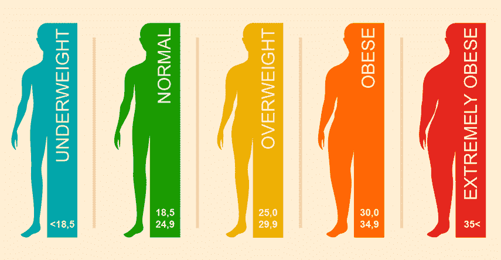

图 9.1 体质指数图表

每个图都可以表示为一个*邻接矩阵*。邻接矩阵是一个方阵，其中的元素表示节点对是否连接。这样的矩阵可以被视为网络的*高维表示*。

图 9.2 可视化了一个包含四个节点 A、B、C 和 D 的邻接矩阵。邻接矩阵中的每个元素表示节点对是否连接。例如，C 列和 D 行的元素值为 1，表示图中存在节点 C 和 D 之间的关系。如果矩阵中元素的值为 0，则表示节点对之间不存在关系。


图 9.2 邻接矩阵

现在，想象一下你有一个包含一百万个节点的图。在一个邻接矩阵中，每个节点都会在矩阵中以一行表示，该行包含一百万个元素。换句话说，每个节点可以用一个包含一百万个元素的向量来描述。因此，邻接矩阵被视为一个高维网络表示，因为它随着图中节点数量的增加而增长。

假设你想训练一个机器学习模型，并且以某种方式使用网络结构信息作为输入特征。比如说，你使用邻接矩阵作为输入。这种方法有几个问题：

+   输入特征太多。

+   机器学习模型依赖于图的大小。

+   过拟合可能成为一个问题。

如果你从图中添加或删除一个节点，邻接矩阵的大小会改变，你的模型就不再有效，因为输入特征的数量不同。使用邻接矩阵作为模型输入也可能导致过拟合。在实践中，你通常希望嵌入节点的局部表示来比较具有相似邻域拓扑结构的节点，而不是使用节点之间所有的关系作为特征输入。节点嵌入技术试图通过学习任何给定网络的低维节点表示来解决这些问题。学习到的节点表示或嵌入应该自动编码网络结构，以便嵌入空间中的相似性近似网络中的相似性。一个关键信息是，节点表示是通过学习得到的，而不是手动工程化的。在 BMI 示例中，医生通过手动公式降低了维度。节点嵌入技术旨在通过将嵌入过程视为一个独立的机器学习步骤来消除繁琐的手动特征工程，并提供最佳的节点表示。节点嵌入步骤是一个无监督过程，因为它学习表示节点而不使用标记的训练数据。节点嵌入模型使用基于深度学习和非线性降维的技术来实现这一点（Hamilton 等，2018）。

图 9.3 可视化了节点嵌入过程。节点嵌入模型将图的高维表示作为输入，并输出低维表示。在具有一百万个节点的图示例中，每个节点可以用包含一百万个元素的向量表示。假设你在该图上执行节点嵌入模型。对于大多数节点嵌入模型，你可以定义嵌入维度。**嵌入维度**是描述节点的嵌入矩阵中的元素数量。例如，你可以将嵌入维度设置为 256。在这种情况下，每个节点将用包含 256 个元素的向量来描述。将元素数量从一百万减少到 256 非常有益，因为它允许你使用低维向量有效地描述网络拓扑或图中节点的位置。低维向量可以用于下游机器学习工作流程，或者它们可以用于使用最近邻图算法推断相似性网络。

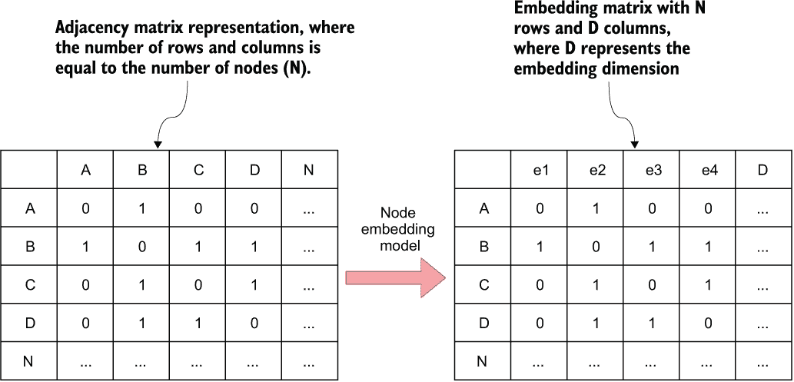

图 9.3 邻接矩阵

## 9.1 节点嵌入模型

节点嵌入模型旨在生成节点的低维表示，同时保留网络结构信息。这些低维表示可以随后用作各种机器学习任务的输入特征，例如节点分类、链接预测和社区检测，从而简化计算复杂度并可能提高模型的性能。

### 9.1.1 同质化与结构角色方法比较

“网络结构信息”究竟是什么意思？一种常见的方法是在嵌入空间中表示节点，使得图中相邻的节点在嵌入空间中彼此靠近。

图 9.4 展示了所谓的基于社区的节点嵌入方法。图中相邻的节点在嵌入空间中也彼此靠近。因此，属于同一社区的节点在嵌入空间中应该彼此靠近。这种方法是在节点**同质化**假设下设计的，即连接的节点在下游机器学习工作流程中往往相似或有相似的标签。

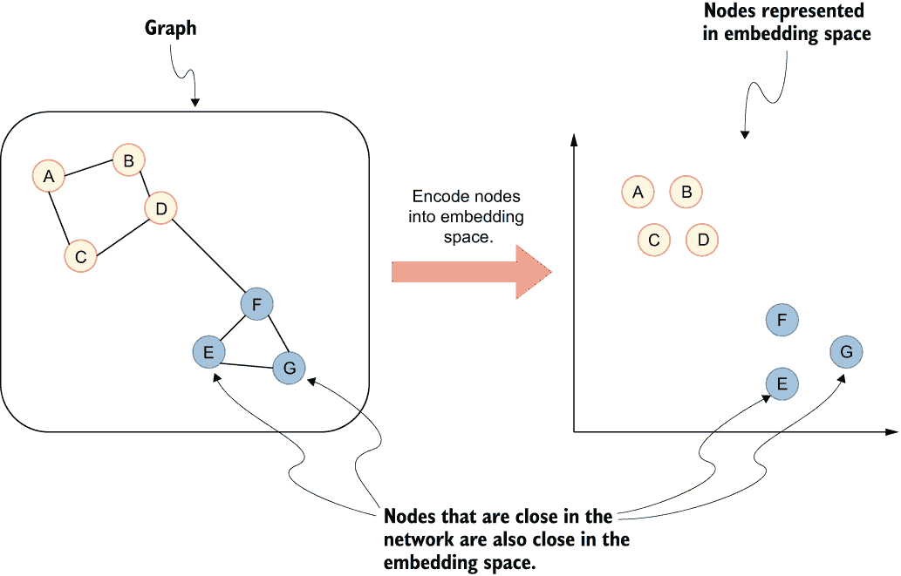

图 9.4 同质化方法进行节点嵌入

例如，您和您的朋友可能有着相似的兴趣。假设您想要预测一个朋友的新兴趣。在这种情况下，您可以使用基于同质性的节点嵌入模型来编码他们在友谊网络中的位置，并基于训练示例训练一个监督模型来预测或推荐他们的兴趣。如果一个人及其朋友具有相似兴趣的假设是有效的，那么训练好的模型应该表现相对较好。在这个例子中，您可以使用的节点嵌入算法之一是快速随机投影（FastRP）算法（Chen 等人，2019）。另一种方法是编码节点在嵌入空间中，使得具有相似网络角色的节点在嵌入空间中靠近。

在上一章中，您简要地介绍了节点角色。图 9.5 展示了节点嵌入过程，其中节点根据其网络**结构角色**在嵌入空间中编码得较为接近。在图 9.5 中，节点 D 和 F 都充当两个社区之间的桥梁。可以假设它们具有相似的网络角色，因此它们在嵌入空间中编码得较为接近。您可以使用结构角色嵌入方法来分析合作作者中研究者的角色。例如，您可以使用结构角色嵌入方法来分析合作作者网络中研究者的角色，或者，也许可以确定互联网网络中路由器的角色。例如，角色提取（RolX）算法（Henderson 等人，2012）是一种节点嵌入算法，它将具有网络结构角色的节点在嵌入空间中编码得较为接近。

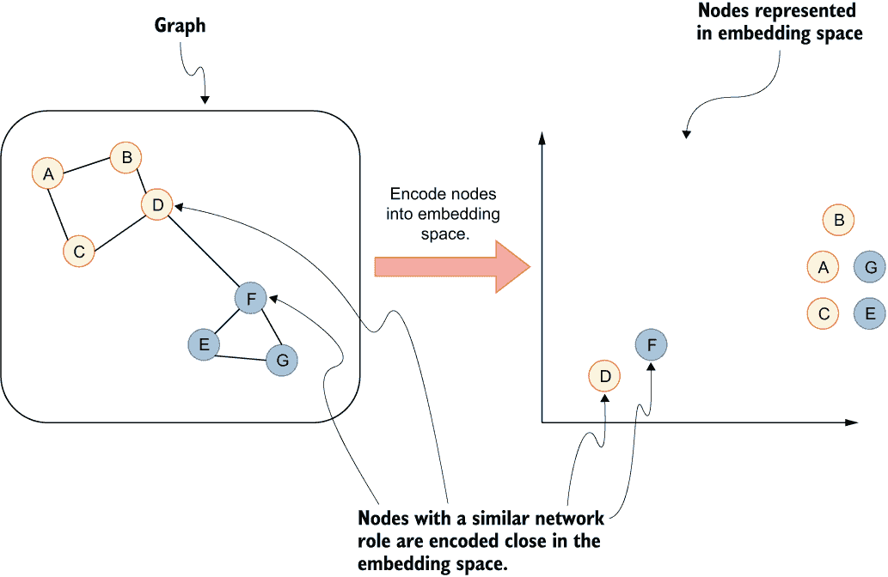

图 9.5 节点嵌入的结构角色方法

您想使用哪种节点嵌入模型的设计取决于您需要完成的下游任务。一些算法，如 node2vec（Grover & Leskovec，2016），也可以产生两种嵌入设计的组合作为输出。

### 9.1.2 归纳与演绎嵌入模型

一些节点嵌入模型存在一个显著的局限性。在机器学习工作流程中使用节点嵌入模型的典型过程包括计算嵌入并将它们输入到分类机器学习模型中，例如。然而，**归纳**和**演绎**节点嵌入模型之间的区别在于它们在训练过程中编码新未见节点的能力。

当处理一个**归纳**节点嵌入算法时，你无法计算在初始嵌入计算期间未看到的节点的嵌入。你可以将归纳模型视为在初始计算期间创建一个词汇表，其中词汇表的关键字代表一个节点，其值代表嵌入。如果一个节点在初始计算期间未被看到，它就不会出现在词汇表中；因此，你不能简单地检索新未见节点的嵌入。如果你想计算新节点的嵌入，你必须计算整个图的嵌入，这意味着所有先前观察到的节点以及新节点。由于现有节点的嵌入可能会发生变化，你还必须重新训练分类模型。

另一方面，**归纳**节点嵌入模型可以在初始计算期间计算未见节点的嵌入。例如，你可以基于节点嵌入的初始计算训练一个模型。当引入新节点时，你可以计算新节点的嵌入，而无需重新计算整个图的嵌入。同样，你也不必为每个新节点重新训练分类模型。在处理增长或多个分离的图时，对先前未见节点进行编码是一个巨大的优势。例如，你可以在单个图上训练一个分类模型，然后使用它来预测不同分离图的节点标签。要了解更多关于归纳模型的信息，我建议阅读 GraphSAGE 模型（Hamilton 等人，2017 年）。

## 9.2 节点分类任务

现在，是时候开始一个实际例子了。想象一下，你正在 Twitch 作为数据科学家工作。Twitch 是一个直播平台，它使任何人都能向全世界直播他们的内容。此外，其他用户可以通过聊天界面与直播者互动。

每天都有新用户加入平台，他们决定开始直播。你的经理希望你识别新流的语言。由于该平台是全球性的，直播者可能使用大约 30 到 50 种语言。假设由于某种原因，将音频转换为文本并运行语言检测算法是不可行的。其中一个原因可能是，许多 Twitch 上的直播者玩电子游戏，因此，电子游戏的声音可能会扭曲语言检测。

你还能用其他什么方法来预测新主播的语言呢？你拥有关于在特定流中聊天的用户的信息。可以假设用户主要使用单一语言聊天。因此，如果一个用户在两个流中聊天，那么这两个流很可能使用相同的语言。例如，如果一个用户在日语文流中聊天，然后切换流并与新主播通过聊天互动，那么新的流很可能也是日语。对于英语来说，可能会有一些例外，因为大部分情况下，互联网上的人至少对英语有基本的了解。记住，这只是一个需要验证的假设。

图 9.6 可视化了解析网络信息以预测新主播语言的过程。原始数据具有`(:User)-[:CHATTED]→ (:Stream)`二分图的结构。过程的第一步是将单分图投影出来，其中节点代表流，关系代表它们共享的观众。投影的单分图模式可以用以下 Cypher 语句表示：`(:Stream)-[:SHARED_AUDIENCE]-(:Stream)`。单分图是无向的，所以如果流 A 与流 B 共享观众，那么自动意味着流 B 也共享观众与流 A。此外，你还可以将主播之间共享观众的数量作为关系权重。假设提取原始数据并将其转换为单分图可以由你团队中的数据工程师完成。数据工程师可以采用与你在第七章中学到的方法类似的方法来投影单分图。你现在的工作是训练一个预测模型并评估其结果。

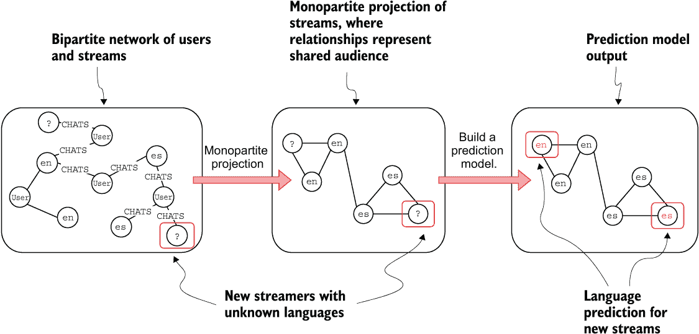

图 9.6 预测新流语言的过程

这个想法是准备一个 Jupyter 笔记本，每天使用一次来预测新主播的语言。记住，如果流在共享观众网络中很接近，它们很可能使用相同的语言。因此，你将使用一个基于同质性的方法在嵌入空间中对节点进行编码的节点嵌入模型。最简单且最广泛使用的节点嵌入模型之一是 node2vec，你将在本例中使用它。一旦计算出节点嵌入，你将使用它们来训练一个基于已知语言训练示例的随机森林分类模型。在过程的最后一步，你将使用标准的分类报告和混淆矩阵来评估预测结果。

为了跟随示例，您需要一个准备好的 Jupyter 笔记本环境和访问 Neo4j 数据库的权限。在开始本章之前，数据库应该是空的。您将使用 scikit-learn Python 库来分割数据、训练模型并评估结果，所以请确保您已经安装了它。本章中所有代码的笔记本也可在 GitHub 上找到（[`github.com/tomasonjo/graphs-network-science`](https://github.com/tomasonjo/graphs-network-science)）。

### 9.2.1 定义与 Neo4j 数据库的连接

首先，打开一个新的 Jupyter 笔记本，或者从上一段中的 GitHub 链接下载已填充的笔记本。为了跟随代码示例，您需要安装以下三个 Python 库：pandas、scikit-learn 和 matplotlib。您可以使用 pip 或 Conda 包管理器安装所有这三个库。

+   Neo4j

+   pandas

+   scikit-learn

您可以使用 pip 或 Conda 包管理器安装所有三个库。

首先，您需要定义与 Neo4j 数据库的连接。

列表 9.1 定义与 Neo4j 的连接

```
from neo4j import GraphDatabase

url = 'bolt://localhost:7687'
username = 'neo4j'
password = 'letmein'

driver = GraphDatabase.driver(url, auth=(username, password))
```

列表 9.1 从`neo4j`库中导入`GraphDatabase`对象。为了与 Neo4j 数据库建立连接，您需要填写并可选地更改凭据。一旦定义了凭据，就将它们传递给`GraphDatabase`对象的`driver`方法。驱动程序允许您在会话中执行任意的 Cypher 语句。

接下来，您将定义一个函数，该函数接受一个 Cypher 语句作为参数，并将结果作为 pandas 数据框返回，如下所示。pandas 数据框是一个方便的数据结构，可以用于过滤、转换或轻松与其他 Python 库集成。

列表 9.2 定义一个执行任意 Cypher 语句并返回 pandas 数据框的函数

```
def run_query(query):
    with driver.session() as session:
        result = session.run(query)
        return result.to_df()
```

### 9.2.2 导入 Twitch 数据集

环境准备就绪后，您可以回到指定的任务。记住，您的团队中的数据工程师足够友好，提取了有关流和聊天者的信息，并执行了单部分投影。他们准备了包含相关信息的两个 CSV 文件。第一个 CSV 文件包含网络中节点信息，如表 9.1 所示。

表 9.1 节点 CSV 结构

| `id` | `language` |
| --- | --- |
| 129004176 | en |
| 50597026 | fr |
| 102845970 | ko |

节点 CSV 包含有关流 ID 及其语言的信息。在本例中，您拥有所有流的语言信息，以便评估测试数据的分类模型准确率。定义节点唯一属性上的唯一约束以加快导入速度是良好的实践。您将首先定义`Stream`节点`id`属性上的唯一约束。

列表 9.3 在`Stream`节点上定义约束

```
run_query("""
CREATE CONSTRAINT IF NOT EXISTS FOR (s:Stream) REQUIRE s.id IS UNIQUE;
""")
```

由于你在一个 Python 环境中工作，你需要通过定义在列表 9.2 中的`run_query`函数执行 Cypher 语句。该函数以 pandas dataframe 格式返回输出。然而，你对此 Cypher 语句的结果不感兴趣，因此不需要将输出分配给新变量。

现在，你可以继续导入有关 Twitch 流及其语言的信息。CSV 文件可在 GitHub 上找到，因此你可以使用`LOAD` `CSV`子句检索并导入 CSV 信息到数据库，如下所示。

列表 9.4 导入节点

```
run_query("""
LOAD CSV WITH HEADERS FROM "https://bit.ly/3JjgKgZ" AS row
MERGE (s:Stream {id: row.id})
SET s.language = row.language
""")
```

关系 CSV 文件包含有关流之间共享受众及其数量的信息，如表 9.2 所示。

表 9.2 关系 CSV 结构

| `source` | `target` | `weight` |
| --- | --- | --- |
| 129004176 | 26490481 | 524 |
| 26490481 | 213749122 | 54 |
| 129004176 | 125387632 | 4591 |

关系 CSV 包含三个列。`source`和`target`列包含具有共享受众的流 ID，而`weight`列表示在两个流中聊天的共享用户数量。你可以使用以下 Cypher 语句导入关系信息。

列表 9.5 导入关系

```
run_query("""
LOAD CSV WITH HEADERS FROM "https://bit.ly/3S9Uyd8" AS row
CALL{
    WITH row
    MATCH (s:Stream {id:row.source})
    MATCH (t:Stream {id:row.target})
    MERGE (s)-[r:SHARED_AUDIENCE]->(t)
    SET r.weight = toInteger(row.weight)
} IN TRANSACTIONS
""")
```

练习 9.1

检查有多少（如果有）`Stream`节点没有进入或出去关系。

幸运的是，数据集中没有孤立节点。一个**孤立节点**是指没有进入或出去关系的节点。在从数据集中提取节点特征时，始终要特别注意孤立节点。例如，如果有一些没有关系的`Stream`节点，那将是一个缺失数据的情况。如果你等待几天，希望有人会在他们的流中聊天，你就可以为该流创建新的关系，这样它就不会再是孤立的。另一方面，孤立的`Stream`节点可以是任何语言。由于大多数节点嵌入算法对孤立节点进行相同的编码，包含孤立节点会向你的分类模型引入噪声。因此，你希望从训练和测试数据集中排除所有孤立节点。

另一方面，如果你正在处理孤立节点，并且关系没有缺失，这意味着未来不会形成新的关系，你可以将孤立节点包含在你的工作流程中。例如，想象一下，如果你要根据一个人的网络角色和位置预测其净资产。假设一个人没有关系，因此没有网络影响力。在这种情况下，对孤立节点进行编码可以为预测净资产的机器学习模型提供关键信号。始终记住，大多数节点嵌入模型对孤立节点进行相同的编码。所以如果孤立节点都属于单个类别，那么考虑它们是有意义的。然而，如果孤立节点属于各种类别，那么从模型中移除它们以消除噪声是有意义的。

## 9.3 节点 2vec 算法

现在图已经构建好了，你的任务是编码节点到嵌入空间中，以便能够根据节点的网络位置训练基于语言的预测模型。正如之前提到的，你将使用节点 2vec 算法（Grover & Leskovec, 2016）来完成这个任务。节点 2vec 算法是归纳性的，并且可以被微调以捕捉同质化或基于角色的嵌入。

### 9.3.1 word2vec 算法

节点 2vec 算法深受 word2vec（Mikolov et al., 2013）skip-gram 模型的影响。因此，为了正确理解节点 2vec，你必须首先了解 word2vec 算法是如何工作的。Word2vec 是一个浅层、两层的神经网络，经过训练以重建词的语用上下文。word2vec 模型的目标是给定一个文本语料库产生词表示（向量）。词表示在嵌入空间中定位，使得在文本语料库中共享相同上下文的词在嵌入空间中彼此靠近。在 word2vec 的背景下使用了两种主要模型：

+   连续词袋（CBOW）

+   Skip-gram 模型

Node2vec 受到 skip-gram 模型的影响，因此你将跳过 CBOW 实现说明。skip-gram 模型预测给定词的上下文。上下文定义为与输入项相邻的词。

图 9.7 展示了在 skip-gram 模型中如何收集训练词对。记住，skip-gram 模型的目标是预测上下文词或与目标词经常共现的词。算法通过将特定词与其相邻词结合为训练对，为文本语料库中的每个词创建训练对。例如，在图 9.7 的第三行中，你可以观察到单词*grey*被突出显示并定义为目标词。算法通过观察其相邻或邻近词来收集训练样本，代表该词出现的上下文。在这个例子中，当构建训练对样本时，考虑了突出词左右两侧的两个词。以目标词为中心的上下文窗口中词的最大距离定义为*窗口大小*。然后，训练对被输入到一个浅层、两层神经网络中。

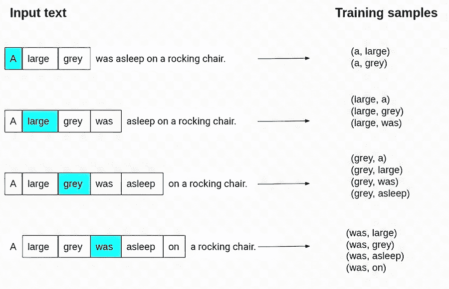

图 9.7 预测新流语言的过程

图 9.8 展示了 word2vec 神经网络的架构。如果你从未见过或使用过神经网络，请不要担心。你只需要知道，在训练这个神经网络的过程中，输入是一个表示输入词的*独热编码*向量，输出也是一个表示上下文词的独热编码向量。

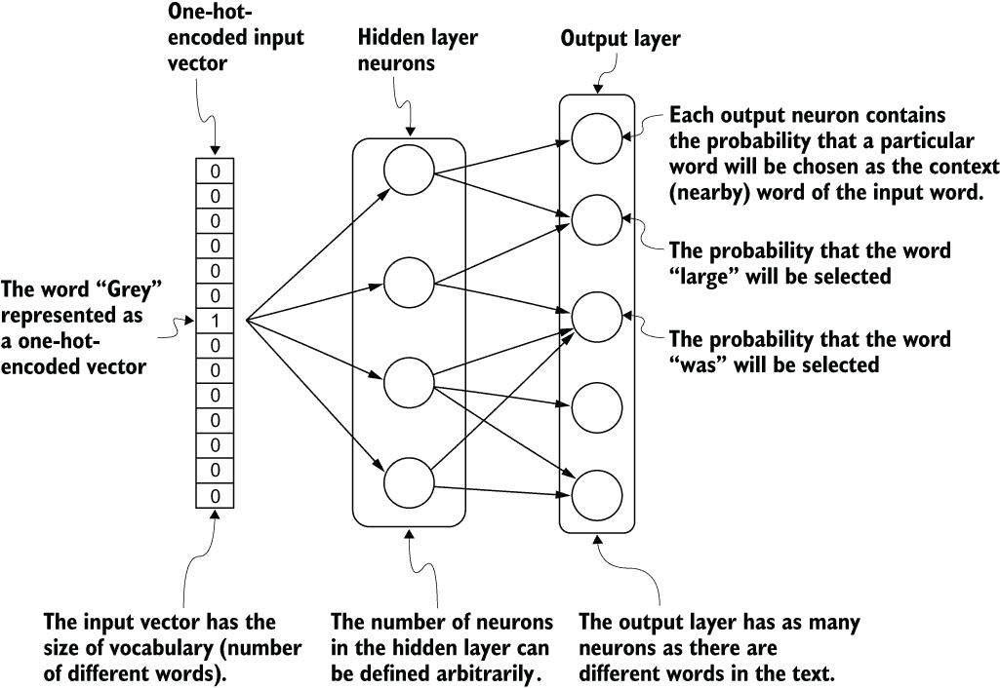

图 9.8 Word2vec 浅层神经网络架构

大多数机器学习模型不能直接处理分类值。因此，通常使用一热编码将分类值转换为数值。例如，您可以看到图 9.9 中所有不同的类别通过一热编码过程转换成了列。图 9.9 中只有三个不同的类别，所以一热编码输出中有三个列。然后，您可以看到类别“蓝色”在“蓝色”列下编码为 1，在其他所有列下编码为 0。本质上，类别“蓝色”的数值表示为[1,0,0]。同样，类别“黄色”的数值表示为[0,0,1]。如您所观察到的，一热编码向量将在它们所属类别的列下有一个单独的 1，而向量的其他元素都是 0。因此，一热编码技术确保了所有类别之间的欧几里得距离是相同的。虽然这是一个简单的技术，但它非常流行，因为它允许将分类值简单地转换为数值，这些数值然后可以被输入到机器学习模型中。

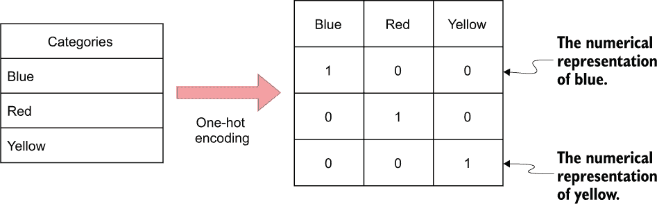

图 9.9 一热编码技术将分类值转换为数值

跳字模型训练步骤完成后，输出层的神经元代表一个词与目标词关联的概率。Word2vec 使用了一个技巧，我们并不关心神经网络的输出向量，而是希望学习隐藏层的权重。隐藏层的权重实际上是我们要学习的词嵌入。隐藏层中的神经元数量将决定*嵌入维度*或词汇表中每个词所表示的向量的大小。请注意，神经网络不考虑上下文词的偏移，因此它不会区分输入的直接相邻上下文词和上下文窗口中更远的上下文词，甚至不会区分上下文词在目标词之前还是之后。因此，窗口大小参数对词嵌入的结果有重大影响。例如，一项研究（Levy，2014）发现，较大的上下文窗口大小倾向于捕获更多的主题或领域信息。相比之下，较小的窗口倾向于捕获更多关于词本身的信息（例如，哪些其他词在功能上是相似的）。

### 9.3.2 随机游走

那么，word2vec 与节点嵌入有什么关系呢？node2vec 算法在底层使用 skip-gram 模型；然而，由于你在一个图中不是处理文本语料库，你怎么定义训练数据呢？答案是相当巧妙的。Node2vec 使用*random walks*从给定的网络中生成“句子”语料库。比喻来说，随机游走可以想象为一个醉酒的人遍历图。当然，你永远无法确定一个醉酒的人下一步会去哪里，但有一点是确定的。遍历图的醉酒的人只能跳到相邻的节点。

node2vec 算法使用随机游走来生成句子，这些句子可以用作 word2vec 模型的输入。在图 9.10 中，随机游走从节点 A 开始，通过节点 C、B 和 F 遍历到节点 H。随机游走的长度是任意决定的，并且可以用*walk length*参数来改变。随机游走中的每个节点被视为句子中的一个单词，句子的长度由游走长度参数定义。随机游走从图中的所有节点开始，以确保捕获句子中的所有节点。然后，这些句子被传递到 word2vec skip-gram 模型作为训练示例。这就是 node2vec 算法的核心。

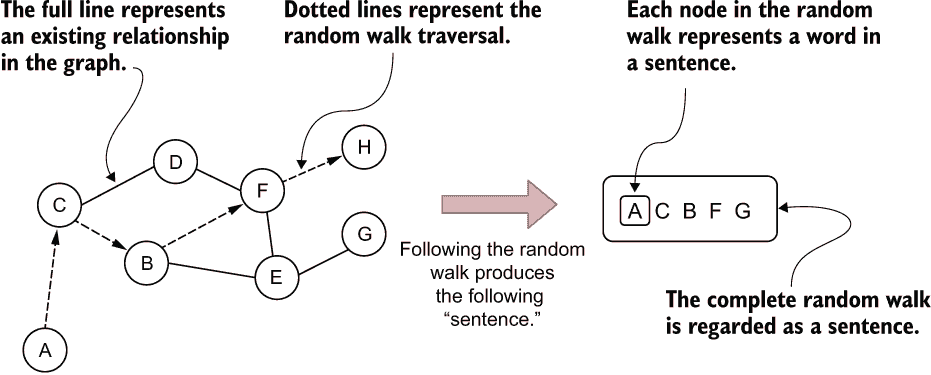

图 9.10 使用随机游走来生成句子

然而，node2vec 算法实现了二阶偏置随机游走。一阶随机游走的一步只依赖于其当前状态。

想象一下，你 somehow wound up at node A in figure 9.11\. 因为一阶随机游走只看它的当前状态，算法不知道它之前在哪个节点。因此，返回到之前节点或任何其他节点的概率是相等的。计算概率没有复杂的数学概念。节点 A 有四个邻居，所以遍历到任何一个的概率是 25%（1/4）。

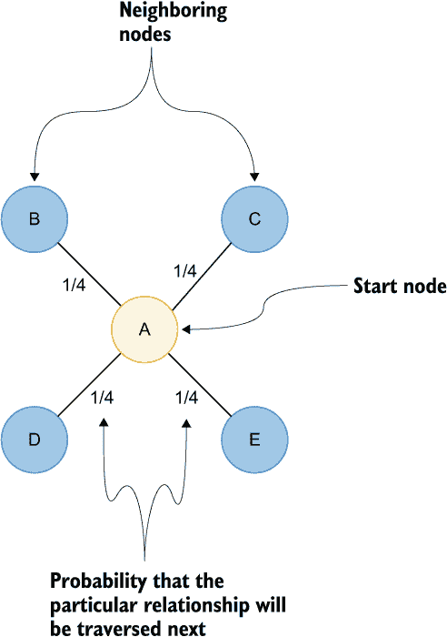

图 9.11 首阶随机游走

假设你的图是带权重的，这意味着每个关系都有一个属性来存储其权重。在这种情况下，这些权重将包含在遍历概率的计算中。

在带权重的图中，遍历特定连接的概率是其权重除以所有相邻权重之和。例如，在图 9.12 中从节点 A 遍历到节点 E 的概率是 2 除以 8（25%），从节点 A 遍历到节点 D 的概率是 37.5%。

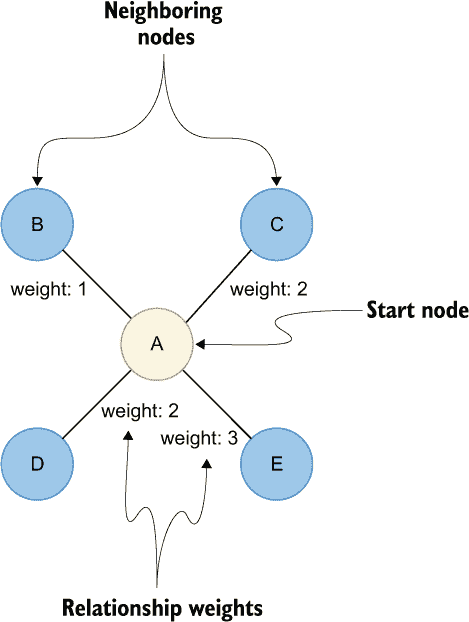

图 9.12 首阶加权随机游走

另一方面，二阶游走考虑了当前状态以及之前的状态。简单来说，当算法计算遍历概率时，它也会考虑之前一步的位置。

在图 9.13 中，游走刚刚从节点 D 游走到节点 A 的上一步，现在正在评估其下一步移动。回溯游走并立即重新访问游走中节点的可能性由回退参数 *p* 控制。如果回退参数 *p* 的值较低，那么重新访问节点 D 的可能性更高，使随机游走更接近游走的起始节点。相反，将参数 *p* 设置为高值确保重新访问节点 D 的可能性较低，并避免在采样中的两跳冗余。参数 *p* 的更高值也鼓励适度的图探索。

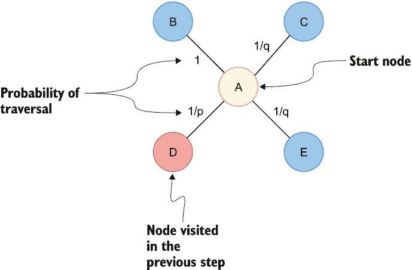

图 9.13 二阶随机游走

`inOut` 参数 *q* 允许遍历计算区分内向和向外节点。将参数 *q* 设置为高值（*q* > 1）会使随机游走偏向于移动到上一步节点附近的节点。查看图 9.13，如果你将参数 *q* 设置为高值，从节点 A 出发的随机游走会更偏向于节点 B。这样的游走可以获得相对于游走起始节点的底层图的一个局部视图，并近似广度优先搜索。相反，如果 *q* 的值较低（*q* < 1），游走更倾向于访问距离节点 D 更远的节点。在图 9.13 中，节点 C 和 E 更远，因为它们不是上一步节点邻居。这种策略鼓励向外探索，并近似深度优先搜索。

node2vec 算法的作者声称，近似深度优先搜索将产生更多基于社区或同质性的节点嵌入。另一方面，随机游走的广度优先搜索策略鼓励结构角色嵌入。

### 9.3.3 计算节点 2vec 嵌入

现在你已经对节点嵌入和 node2vec 算法有了理论上的理解，你将在一个实际例子中使用它。正如之前提到的，作为 Twitch 的数据科学家，你的任务是根据不同流之间的共享观众或聊天者来预测新主播的语言。图已经构建完成，你只需要执行 node2vec 算法并训练一个分类模型。一如既往，你首先必须投影一个内存图。关系代表流之间的共享观众。当流 A 与流 B 共享观众时，这直接意味着流 B 也与流 A 共享观众。因此，你可以将这些关系视为无向的。此外，你知道一对流之间共享了多少用户，你可以将这个关系表示为关系权重。执行以下查询以投影流之间共享观众的无向加权网络。

列表 9.6 在内存中投影流及其共享观众关系的内存图

```
run_query("""
CALL gds.graph.project("twitch", "Stream",
  {SHARED_AUDIENCE: {orientation: "UNDIRECTED", properties:["weight"]}})
""")
```

列表 9.6 中的 Cypher 语句投影了一个名为`twitch`的内存图。为了将关系视为无向的，你必须将`orientation`参数值设置为`UNDIRECTED`。关系`properties`参数可以用来定义要包含在投影中的关系属性。

最后，你可以执行 node2vec 算法。你可以调整多个参数以获得最佳结果。然而，超参数优化不在此章的范围内。你将使用 8 的`embeddingDimension`参数值，这意味着每个节点将用一个包含八个元素的向量来表示。接下来，你将定义`inOutFactor`参数为 0.5，这会鼓励更多的深度优先搜索遍历，并产生基于同质性的嵌入。在这个例子中，你对节点的结构角色不感兴趣，只想编码它们在图中的接近程度。所有其他参数都将保留默认值。执行以下 Cypher 语句以执行 node2vec 算法并将结果存储到数据库中。

列表 9.7 计算 node2vec 嵌入并将它们存储到数据库中

```
data = run_query("""
CALL gds.beta.node2vec.write('twitch',
  {embeddingDimension:8, relationshipWeightProperty:'weight',
   inOutFactor:0.5, writeProperty:'node2vec'})
""")
```

### 9.3.4 评估节点嵌入

在你训练语言分类模型之前，你将评估嵌入结果。你将首先检查存在关系的节点对的嵌入的余弦和欧几里得距离。余弦和欧几里得距离分布可以用 Cypher 计算，然后使用 seaborn 库进行可视化。

列表 9.8 评估连接节点的嵌入的余弦和欧几里得距离

```
import matplotlib.pyplot as plt
import seaborn as sns
plt.rcParams["figure.figsize"] = [16, 9]

df = run_query("""
MATCH (c1:Stream)-[:SHARED_AUDIENCE]->(c2:Stream)
RETURN gds.similarity.euclideanDistance(
    c1.node2vec, c2.node2vec) AS distance, 'Euclidean' as metric
UNION
MATCH (c1:Stream)-[:SHARED_AUDIENCE]->(c2:Stream)
RETURN gds.similarity.cosine(
    c1.node2vec, c2.node2vec) AS distance, 'cosine' as metric
"""
)

sns.displot(
    data=df,
    x="distance",
    col="metric",
    common_bins=False,
    facet_kws=dict(sharex=False),
    height=7,
)
```

列表 9.8 中的代码生成了图 9.14 中的可视化，它显示了存在关系的节点对之间的嵌入的余弦和欧几里得距离分布。对于欧几里得距离，值越低，节点在嵌入空间中的相似度或接近度越高。你可以观察到分布的顶部略低于 1。大多数节点基于欧几里得距离非常相似；然而，也有一些节点对，它们的距离略大。另一方面，对于余弦相似度，当值接近 1 时，两个节点在嵌入空间中非常接近。同样，大多数存在关系的节点对具有接近 1 的余弦相似度。那么当一对节点之间存在关系但它们的嵌入的余弦相似度，例如，小于 0.5 时会发生什么？使用以下代码，你可以调查基于它们的组合度值，连接节点对之间余弦相似度的依赖性。

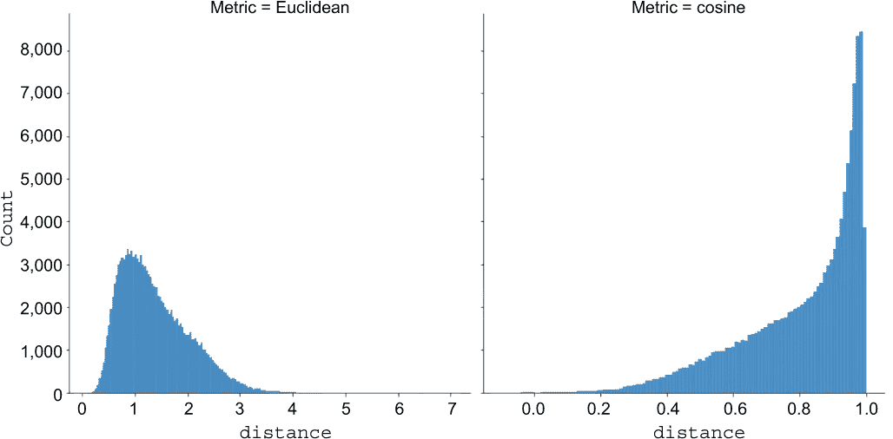

图 9.14 存在关系的节点对之间嵌入的余弦和欧几里得距离分布

列表 9.9 评估余弦相似度对组合节点度值的依赖性

```
df = run_query("""
MATCH (c1:Stream)-[:SHARED_AUDIENCE]->(c2:Stream)
WITH c1, c2, gds.similarity.cosine(
        c1.node2vec, c2.node2vec) AS cosineSimilarity,
     count{ (c1)-[:SHARED_AUDIENCE]-() } AS degree1,
     count{ (c2)-[:SHARED_AUDIENCE]-() } AS degree2
RETURN round(cosineSimilarity,1) AS cosineSimilarity,
       avg(degree1 + degree2) AS avgDegree
ORDER BY cosineSimilarity
"""
)

sns.barplot(data=df, x="cosineSimilarity", y="avgDegree", color="blue")
```

列表 9.9 中的代码生成了图 9.15 中的可视化，你可以清楚地看到，一个节点拥有的连接越多，平均来说，它与其邻居的相似度就越低。这在某种程度上是有道理的。想象一下，如果你只有一个朋友，你可能在几个重要的方面几乎与他们完全相同。然而，当你有 100 个朋友时，你不可能与他们都完全相同。你可以从每个朋友那里挑选一些你共有的属性，但要做到与所有朋友都完全相同实际上是不可能的，除非他们也都是相同的。

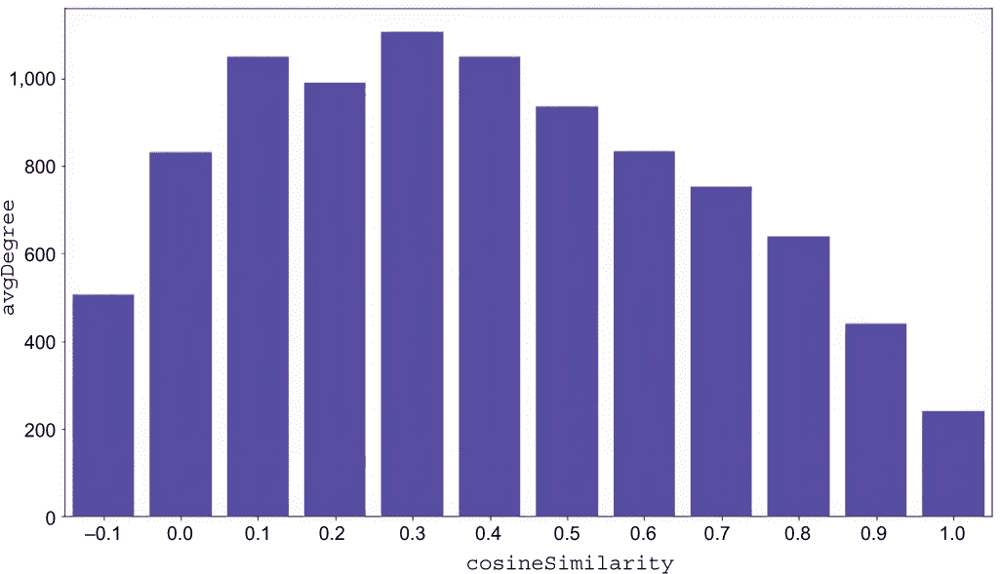

图 9.15 基于组合节点度值的连接节点平均余弦相似度的分布

你还指定了关系权重来计算 node2vec 嵌入。关系权重越高，随机游走越倾向于遍历它。你可以通过以下代码检查连接节点的余弦相似度如何依赖于关系权重。

列表 9.10 评估连接节点余弦相似度对关系权重的依赖

```
df = run_query("""
MATCH (c1:Stream)-[r:SHARED_AUDIENCE]->(c2:Stream)
WITH c1, c2, gds.similarity.cosine(
     c1.node2vec, c2.node2vec) AS cosineSimilarity,
     r.weight AS weight
RETURN round(cosineSimilarity,1) AS cosineSimilarity,
       avg(weight) AS avgWeight
ORDER BY cosineSimilarity
"""
)
sns.barplot(data=df, x="cosineSimilarity", y="avgWeight", color="blue")
```

列表 9.10 中的代码生成了图 9.16 中的可视化，它显示了连接节点对之间的欧几里得和余弦相似度的分布。

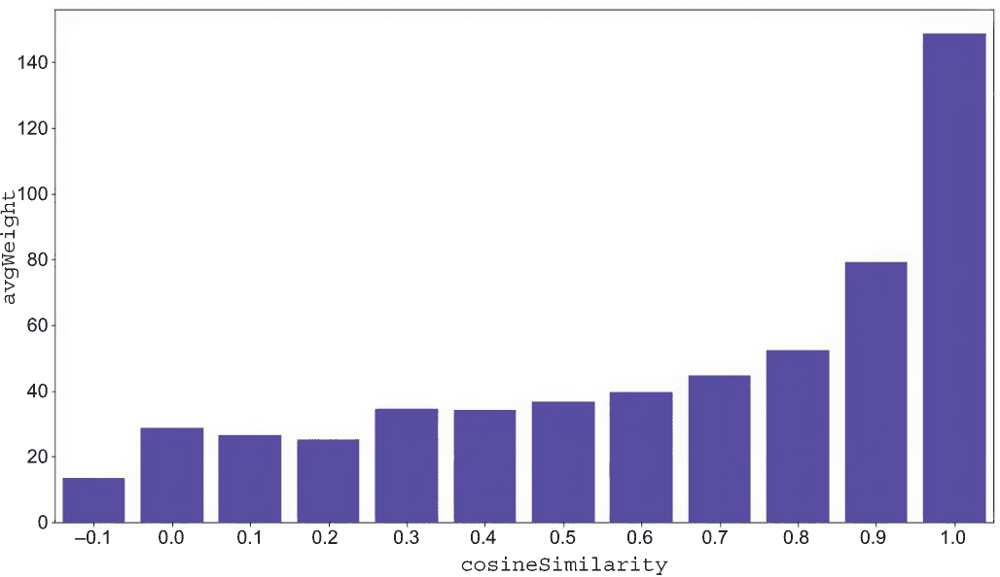

图 9.16 基于组合节点度值的连接节点平均余弦相似度的分布

再次，你可以清楚地观察到连接节点的余弦相似度与关系权重的依赖关系。关系权重越高，随机游走越有可能遍历它。因此，当一对节点在随机游走中频繁地紧密出现时，它们的嵌入越有可能更相似。当关系权重较低时，随机游走会倾向于不遍历它。因此，你可以观察到一些示例，即使一对节点之间存在关系，它们的嵌入也可能完全不相似。当一对节点的嵌入的余弦距离接近零时，人们可能会假设这对节点没有连接。然而，这可能是随机游走倾向于避免遍历这两个节点之间关系的一种偏见。

### 9.3.5 训练分类模型

在本章的最后部分，你将训练一个分类模型来预测新流式的语言。首先，你必须从数据库中检索相关数据并进行必要的预处理。

列表 9.11 为分类训练检索和预处理相关数据

```
data = run_query("""
MATCH (s:Stream)
RETURN s.id AS streamId, s.language AS language, s.node2vec AS embedding
"""
)
data['output'] = pd.factorize(data['language'])[0]    ❶
```

❶ 将要表示为整数的语言进行编码

列表 9.11 中的代码首先从数据库中检索数据。一个简单的 Cypher 语句返回流 ID、语言和节点嵌入。由于语言以字符串形式表示，你需要将它们映射或编码为整数。你可以使用 `pd.factorize` 方法轻松地将分类值，如语言，编码为整数。在此步骤之后，数据框的结构应如图 9.3 所示。

表 9.3 Pandas 数据框结构

| `streamId` | `language` | `embedding` | `output` |
| --- | --- | --- | --- |
| 129004176 | en | [-0.952458918094635,...] | 0 |
| 50597026 | fr | [-0.25458356738090515,...] | 1 |
| 102845970 | ko | [-1.3528306484222412,... ] | 2 |

在表 9.3 中，你可以观察到 `pd.factorize` 方法将英语语言编码为 0。法语语言映射为 1，依此类推。

`embedding` 列包含表示每个数据点的向量或列表。因此，分类模型的输入将是 `embedding` 模型，你将训练它来预测 `output` 列下的整数。在这个例子中，你将使用 scikit-learn 库中的随机森林分类器。与所有机器学习训练一样，你必须将你的数据分割成训练集和测试集。你将使用 `train_test_split` 来生成数据集的训练和测试部分。执行以下代码以训练一个随机森林分类模型来预测新流的语言。

列表 9.12 基于数据集的训练部分分割数据集并训练随机森林模型分类器

```
from sklearn.model_selection import train_test_split
from sklearn.ensemble import RandomForestClassifier

X = data['embedding'].to_list()
y = data['output'].to_list()

X_train, X_test, y_train, y_test = train_test_split(X, y, test_size = 0.2,
  random_state=0)

rfc = RandomForestClassifier()
rfc.fit(X_train, y_train)
```

### 9.3.6 评估预测

在本章中，你将做的最后一件事是在测试数据上评估模型。你将从检查*分类报告*开始。分类报告用于衡量机器学习模型预测的质量。执行以下代码以生成分类报告。

列表 9.13 生成分类报告

```
from sklearn.metrics import classification_report

y_pred = rfc.predict(X_test)
print(classification_report(y_test,y_pred))
```

列表 9.13 中的代码生成了图 9.17 中的报告，你可以观察到你正在处理一个不平衡的数据集，因为英语有 384 个测试数据点，而法语流只有 54 个示例。此外，编号 9 下映射的语言是意大利语，只有 19 个测试数据点。在处理不平衡数据集时，检查 F1 分数是有意义的。F1 分数和加权 F1 分数都是 0.91，这是一个很好的结果。假设聊天者通常在共享相同语言的流中进行聊天的假设是有效的。

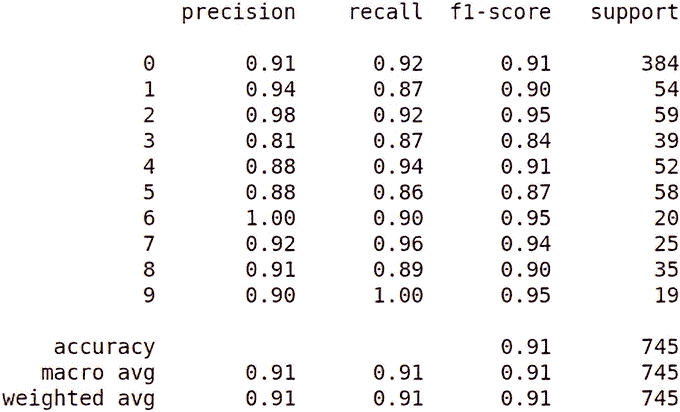

图 9.17 分类报告

最后，你将生成*混淆矩阵*。混淆矩阵可以帮助你评估数据点的实际与预测类别。执行以下代码以可视化混淆矩阵。

列表 9.14 计算每个用户的推文计数和转发率

```
from sklearn.metrics import ConfusionMatrixDisplay

ConfusionMatrixDisplay.from_predictions(y_test, y_pred,
  normalize="true", cmap="Greys")
```

列表 9.14 中的代码生成了图 9.18 中的可视化。记住，英语语言映射到 0。通过检查图 9.18 中的混淆矩阵，你可以观察到模型仅在英语和其他语言之间发生错误分类。例如，模型从未将韩语错误分类为葡萄牙语。这很有道理，因为英语是互联网上最常用的语言，所以除了他们的母语外，许多人至少会说一点英语。

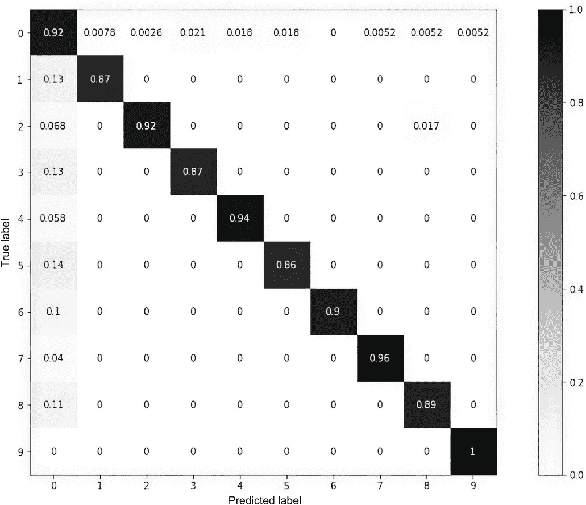

图 9.18 混淆矩阵

练习题 9.2

尝试不同的 node2vec 算法配置，以观察它如何影响连接节点嵌入之间的余弦距离和分类模型的准确性。你可以移除关系权重参数来观察 node2vec 算法的无权重版本的行为，或者微调 `embeddingDimension`、`inOutFactor` 和 `returnFactor` 参数。查看官方文档 ([`mng.bz/lVXo`](http://mng.bz/lVXo)) 以获取 node2vec 参数的完整列表。

恭喜！你已经成功训练了第一个基于 node2vec 嵌入的节点分类模型。记住，由于 node2vec 是一个归纳模型，当图中添加新节点时，你应该重新训练模型。因此，像 node2vec 这样的模型通常用于每天运行一次的批量处理管道中。

## 9.4 练习题解答

练习题 9.1 的解答如下。

列表 9.15 计算没有传入或传出关系的 `Stream` 节点

```
MATCH (n:Stream)
WHERE NOT EXISTS {(n)--()}
RETURN count(*) AS result
```

## 摘要

+   节点嵌入模型使用降维技术来生成任意大小的节点表示。

+   节点嵌入模型可以根据网络中的结构角色编码节点，或者可以采用更基于同质性的设计。

+   一些节点嵌入模型是归纳性的，这意味着它们不能为训练期间未看到的节点生成嵌入。

+   node2vec 算法受到 word2vec 跳字模型（skip-gram model）的启发。

+   node2vec 算法使用随机游走来生成句子，然后将其输入到 skip-gram 模型中。

+   二阶随机游走在计算下一个遍历可能性时会考虑随机游走的上一步。

+   Node2vec 可以微调以生成基于节点结构角色或同质性的嵌入。

+   嵌入维度参数定义了表示节点的向量的大小。

+   使用节点嵌入模型时，请特别注意孤立节点。大多数节点嵌入模型对孤立节点进行相同的编码，因此请确保它们符合你的任务要求。

+   节点分类是一个基于节点网络特征预测节点属性或标签的任务。
