# 10 链接预测

本章节涵盖

+   讨论链接预测工作流程

+   介绍链接预测数据集划分

+   基于节点对构建链接预测特征

+   训练和评估监督链接预测分类模型

大多数现实世界的网络都是动态的，并且随时间演变。以人们的友谊网络为例。人们的朋友会随时间变化。他们可能会遇到新的人或停止与某些人交往。你可能会认为在友谊网络中新的连接是随机形成的；然而，事实证明，大多数现实世界的网络都有一个深刻的组织原则。围绕链接预测的研究集中在识别和理解各种网络演变机制，并将它们应用于预测未来链接。

图 10.1 展示了一个小规模的人际网络，其中关系代表友谊。实线表示现有连接。正如之前提到的，友谊网络会随时间演变，人们会形成新的连接。直观地，你可能会认为图 10.1 中的 Luke 和 Rajiv 比 Jose 和 Alice 更有可能形成未来的连接，用虚线表示，因为他们在网络中更接近。不出所料，一对个体之间的共同朋友数量是他们未来是否可能相遇的好指标。简单来说，两个个体在网络中越接近，形成未来链接的概率就越高。预测网络中的未来链接是链接预测领域的主要目标。准确预测未来链接可以用于推荐系统，或者可以用来更好地理解网络的组织原则。想象一个由用户和产品组成的二分网络，其中连接代表他们购买的产品。在这个例子中，链接预测技术对于预测未来的用户-产品关系至关重要，这允许你实施个性化的产品推荐。

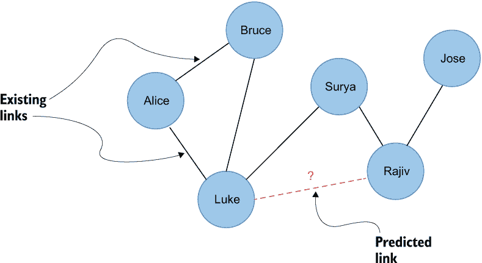

图 10.1 链接预测

另一方面，有些网络不一定随时间演变，但我们对其连接的了解有限。一个这样的例子是药物和疾病的生物网络。一种药物通常只能治疗有限种类的疾病。必须进行临床试验以确定药物是否可以治疗任何新的疾病；然而，临床试验成本非常高。药物再利用的另一个问题是，可以进行的药物和疾病组合临床试验数量庞大。链接预测技术可用于识别网络中的缺失链接。预测网络中缺失链接的过程可以被视为*链接完成*。

图 10.2 中可视化的生物医学网络由药物和疾病组成。实线表示哪些疾病可以使用药物。例如，阿司匹林可以用来治疗头痛、川崎病和冠状动脉疾病。另一方面，赖诺普利被用来治疗冠状动脉疾病和高血压。由于阿司匹林和赖诺普利都可以用来治疗冠状动脉疾病，因此探索赖诺普利是否可以治疗阿司匹林不能治疗的疾病是有意义的。再次强调，你只是在观察药物之间共同邻居的数量来基于预测。请注意，这是一个药物再利用场景的简化版本。在现实世界中，会考虑关于人类基因、通路和其他生物过程的大量信息。此外，你还需要在过程中包括生物医学领域的专家，以帮助构建图、评估结果等。

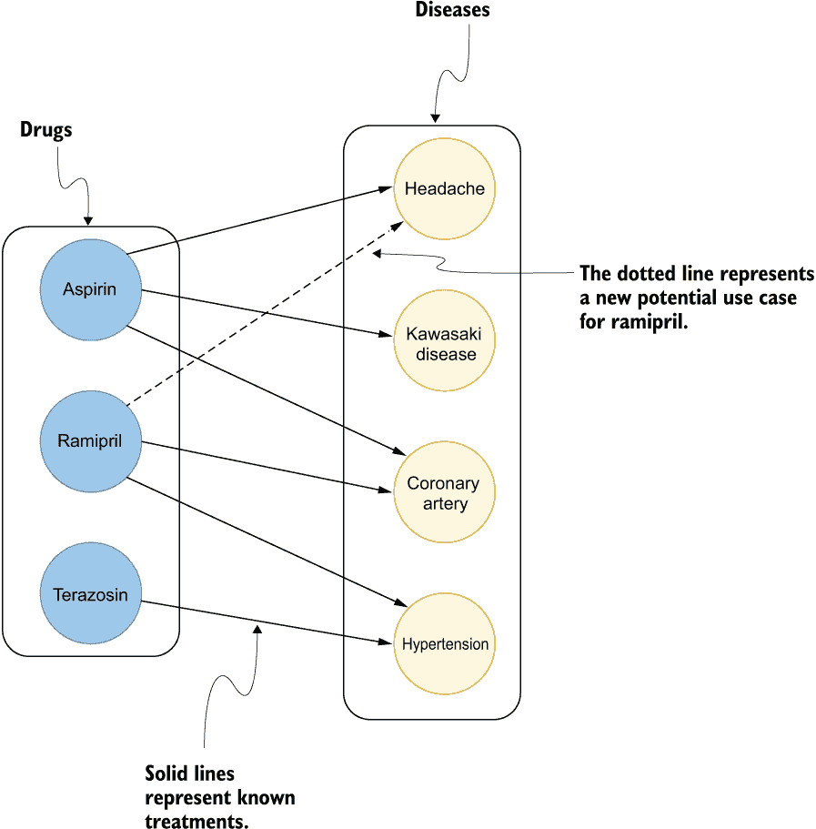

图 10.2 链接补全

### 10.1 链接预测工作流程

如前所述，大多数网络都遵循各种组织原则，无论是故意还是无意，你都可以在分析中使用这些原则来预测一对节点之间新链接的概率。例如，在一个社交网络中，你可能会假设如果两个人的年龄相似，他们更有可能成为朋友。然而，仅仅关注个人特征可能是不满意的，因为这种方法可能会丢失关于两个人之间关系的大量信息。两个人可能年龄相似，但他们并不在同一个社交群体中混，所以他们成为朋友的可能性较低。另一方面，如果两个人有很多共同的朋友，他们更有可能相遇并成为朋友。此外，如果一个人有很多朋友，他们形成新连接的可能性比朋友少的人要高。

当预测是否将建立新的连接时，你永远不会孤立地检查单个节点，而是检查图中的节点对。因此，链接预测的关键步骤是设计能够编码节点对的特征。

你可以采取几种方法来编码一对节点。我将它们分为三类，如图 10.3 所示。首先，你可以组合任何节点属性。例如，我在社交网络示例中使用了年龄差异。你也可以取节点度数的乘积或节点嵌入的余弦相似度。然而，你也可以简单地连接嵌入或任何其他属性，如果这可能会表现得更好。基于距离的度量标准是你在链接预测中可以使用的另一组特征。这一组的典型代表是节点对之间最短路径的长度。本质上，你计算从一个节点到另一个节点所需的跳数，并将其用作特征。其基本思想是，节点在网络中越接近，未来它们之间形成链接的可能性就越大。第三组特征专注于评估两个节点之间的邻域重叠。例如，共同朋友的数量越高，这对在未来某时相遇的可能性就越大。你也可以计算 Jaccard 相似度指数，它将简单地是共同朋友计数的归一化版本。还有其他度量标准，它们编码了局部邻域的重叠，你将在本章后面学到。

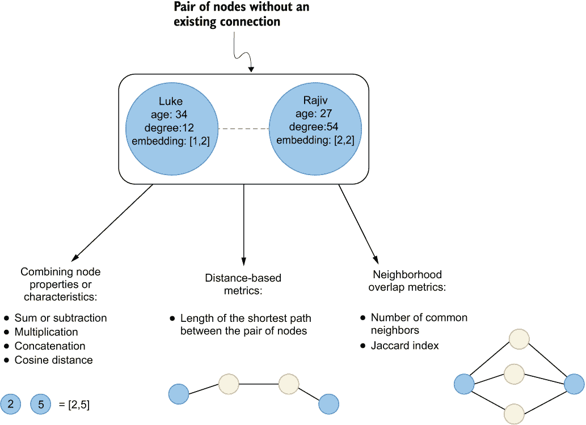

图 10.3 编码节点对

图 10.3 中展示的三种类别及其示例并不提供可能特征的完整列表。还有其他方法可以将度量标准组合成链接预测特征。然而，图 10.3 中展示的组别涵盖了你在链接预测任务中会遇到的大多数生成特征的方法。

预测链接的一种简单方法是在节点对之间计算链接预测度量，并简单地选取任意数量的它们作为未来可能发生的链接。另一方面，你也可以决定使用这些链接预测度量来训练分类模型。训练分类模型的一个附加价值是它可以学会识别你在采用无监督方法时可能错过的模式。例如，模型可以识别某些链接预测度量比其他度量更重要。此外，特定的度量组合可能对结果有显著的预测能力。如果只考虑单个相似度度量的最高分数，这些细节可能会被忽视。在本章中，你将学习如何计算几个链接预测度量，并基于这些度量训练和评估分类模型。

现在，假设你仍然在 Twitch 担任数据科学家。你被分配了寻找改进频道推荐方法的任务。到目前为止，你已经使用了基于不同频道之间共享观众群体的推荐系统。如果两个频道之间存在显著的观众重叠，你可以使用这些信息向用户提供推荐。作为用户，你将在“此频道用户也观看”部分看到这些推荐。你该如何尝试改进这些推荐呢？一个想法是预测哪些频道将在未来共享观众。然后，你可以将这些预测作为推荐提供给用户。这种方法可能会提高整体推荐的准确性，因为你会推荐既有观众重叠的频道，也有未来观众重叠概率高的频道。

图 10.4 显示了 Twitch 频道或流量的网络，其中关系表示观众重叠。实线代表现有的共享观众重叠，可以用来填充推荐系统的一部分。作为数据科学家，你可以使用现有关系的信息来预测未来的观众重叠。然后，可以使用未来的观众重叠预测来驱动你的推荐引擎。

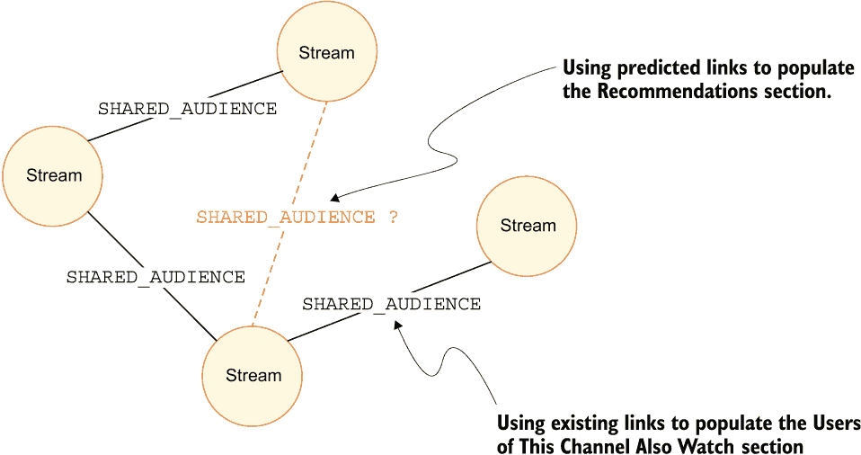

图 10.4 链接预测流程

有趣的是，使用未来链接预测作为推荐，反过来可以被视为自我实现的预测。类似的方法已经被用来推荐电影（Lakshmi & Bhavani, 2021）、产品（Darke et al., 2017），甚至医学概念之间的链接（Kastrin et al., 2014）。链接预测还可以与其他技术结合使用，构建混合推荐引擎（Çano & Morisio, 2017）。你将如何着手训练一个分类模型，用于预测频道之间未来观众的重叠？

链接预测分类模型的训练过程的高级概述在图 10.5 中展示。第一步是将关系分为三个不同的集合。一个集合用于生成网络特征，而其他两个集合用于训练和评估分类模型。如果你使用相同的关系来同时生成网络特征和训练分类模型，可能会遇到数据泄露问题。*数据泄露*发生在你的训练数据包含关于输出的信息，但在模型用于预测时，类似的数据将不可用。数据泄露通常会导致模型在训练和可能评估期间表现良好，但不幸的是，它对新预测的表现不佳。如果你在使用任何图特征与链接预测模型，你必须格外小心，以防止任何特征泄露。*特征泄露*指的是一个特征包含与输出相同或可比较的信息。例如，想象你正在使用两个节点之间的基于距离的最短路径特征。通过使用相同的关系来生成特征和训练模型，模型会简单地学会根据网络距离为 1 的所有节点对进行分类或预测连接。换句话说，当一对节点的网络距离为 1 时，这对节点之间存在关系。因此，网络距离特征和分类输出将包含相同的信息，导致特征泄露。本质上，你可以将特征泄露视为在训练期间偷看结果而对模型评估作弊。为了避免特征和数据泄露，你需要使用一个关系集合来计算网络特征，并使用另一个关系集合为训练和评估模型提供监督分类示例。

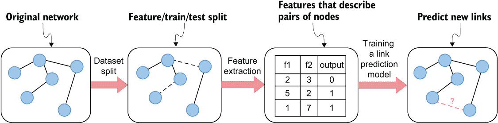

图 10.5 构建链接预测模型以推荐 Twitch 频道

一旦完成数据集的拆分，你需要计算用于训练模型的链接预测指标。如前所述，你可以计算网络距离，计算共同邻居的数量，或者简单地聚合节点属性。你需要计算网络中链接的正例和负例的特征。最后，使用这些链接预测特征来训练一个分类模型，以预测链接在未来是否可能发生。鉴于数据集被拆分为训练和测试关系集，你可以在数据集的测试集上评估你的模型。一旦确定分类模型的表现足够好，你就可以在生产中使用它为平台用户生成推荐。

为了完成本章的练习，你需要将 Twitch 网络导入到第九章中描述的 Neo4j 数据库中。本章中所有代码示例的 Jupyter 笔记本可在以下 GitHub 网页上找到：[`mng.bz/Y1JA`](http://mng.bz/Y1JA)。

### 10.2 数据集分割

你需要相应地分割数据集以评估训练好的分类模型。如果你的模型没有使用基于图的特征，如基于距离或基于邻居的度量，那么你可以遵循传统的测试/训练数据分割。假设你正在尝试根据人们的年龄和教育程度预测他们之间新的链接。由于这两个特征都是节点属性，而不是基于图的特征，你可以简单地取现有关系的 80%作为训练集，并在剩余的 20%的关系上评估你的模型。显然，你需要添加一些负例，因为否则模型无法学会区分两种输出，并可能产生不准确的预测。生成负例不是问题，因为有许多节点对没有连接。在实践中，正链接示例的规模与图中节点的数量成线性关系，而负例的规模成二次关系。这可能导致相当大的类别不平衡问题；然而，在链接预测过程中，通常需要从负分类样本中子采样到与正样本大致相同的数量。你将在下一节中了解更多关于负例子采样的内容。

一旦你添加了任何基于图的特征来捕捉图中节点之间的相似性或接近度，你就需要非常注意数据泄露问题。记住，当一个特征包含与输出变量相同或可比较的信息，但在进行预测时不可用，你就已经将数据泄露引入了工作流程。最明显的例子是图中节点之间的网络距离。如果网络特征和训练示例是在同一组关系上计算的，那么模型将简单地学习到只有一步之遥的节点之间存在关系。然而，网络中没有任何链接的节点对将不会被分类为可能形成连接，因为它们都不是一步之遥。即使基于第九章中介绍的亲社会性原则的节点嵌入也可能存在问题，如果你没有进行适当的数据集分割。总的来说，大多数基于图的特征可能会引入一些数据泄露问题。通常将关系分为三组以避免数据泄露问题：

+   用于生成特征的关联集

+   用于训练模型的关联集

+   用于评估模型的关联集

使用单独的关系集来生成网络特征，然后进行分类训练和评估，你可以避免基于图的特征泄漏问题。因此，计算出的网络特征将不会与输出变量有相同或非常相似的信息。以网络距离为例，监督分类示例将具有至少 2 的最小网络距离。正负分类示例都可以有 2 的网络距离。反过来，网络距离特征与输出变量不相同，你也就防止了任何特征泄漏。

在进行数据集分割方面有许多选择。在本节中，你将了解基于**时间**和**随机**的数据集分割技术。

### 10.2.1 基于时间的分割

理论上，链接预测是一种基于过去连接来预测未来连接的技术。如果你知道链接的创建时间，你可以根据时间成分产生数据集分割。

图 10.6 中的原始网络在 2020 年至 2021 年之间创建了关系。在这个简单的图示例中，你可以使用 2020 年的关系来生成网络特征。特征集中应该有相当数量的关系，因为你不希望网络过于分散或节点过于孤立。特征集中关系太少可能会产生较差的网络特征，这反过来可能无法预测未来的链接。图 10.6 中 2021 年创建的关系用于构建测试集和训练集。例如，你可以使用 80%的新关系作为训练集，剩余的 20%用于评估模型。记住，用于生成网络特征的关系不应用于训练集或测试集。如果你计划对分类模型进行任何超参数优化，你也可以选择从 2021 年创建的新关系中引入一个验证集。

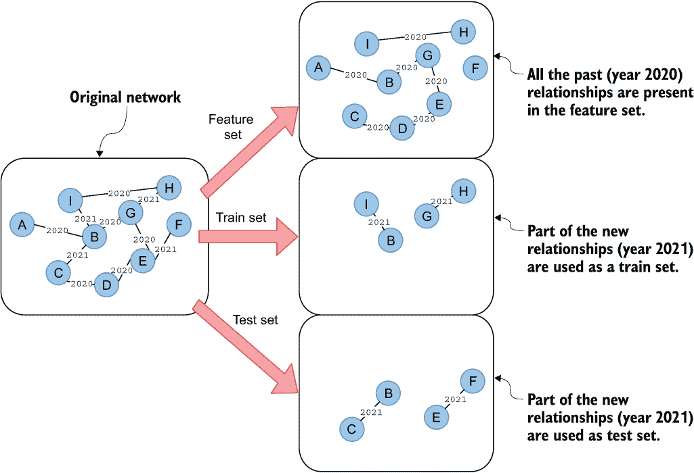

图 10.6 链接预测任务中关系分割的基于时间方法

如果可能的话，使用基于时间的分割，因为它准确地模拟了预测未来链接的场景。在图 10.6 的示例中，你使用 2020 年的现有关系知识来预测未来（2021 年）。额外的优势是，模型应该学会捕捉网络的潜在组织机制，因为基于时间的分割遵循网络演变，这反过来应该提供更好的预测。不幸的是，共享观众数据的 Twitch 数据集没有关系的时间成分，所以你将不得不求助于另一种方法。

### 10.2.2 随机分割

随机分割类似于基于时间分割，因为你需要生成训练集和测试集以及关系的特征集。由于没有时间信息可用，你无法区分过去和未来的关系。相反，你随机从图中选取关系子集作为训练集和测试集，用于训练和评估分类模型。随机分割对于链接补全任务也很有用，在这种任务中，你预测网络中的缺失链接，且没有时间组件可用。

你可以看到图 10.7 几乎与图 10.6 完全相同。唯一的区别在于如何选择哪些关系属于哪个集合。基于时间的方法，你可以根据时间属性选择关系所属的集合。然而，由于没有时间信息可用，你需要采取随机方法。因此，你随机选择关系属于哪个集合。

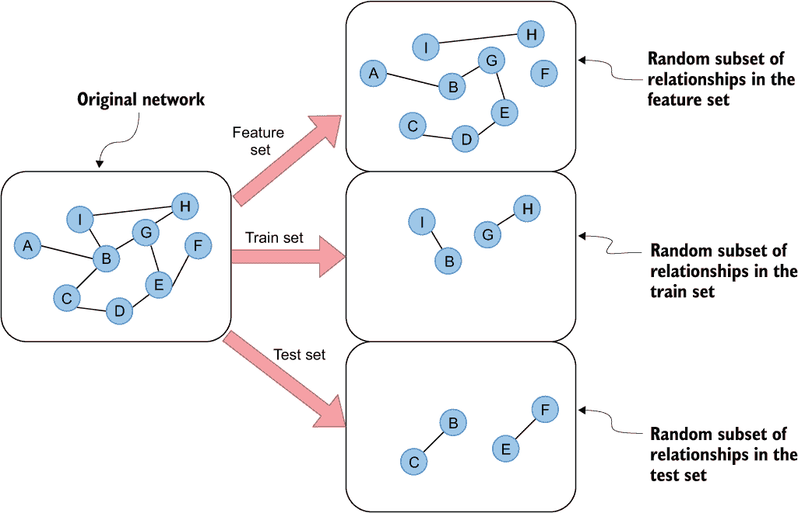

图 10.7 链接预测任务的关系分割随机方法

注意：在链接预测数据集分割中的关键概念是，为了避免数据泄露，用于计算网络特征所使用的链接应与用于训练和评估分类模型的监督链接样本不同。*特征泄露*发生在特征包含与输出变量相同或可比较信息的情况下。例如，如果你避免引入一个单独的特征集来计算网络特征，如网络距离，分类模型会学习到一对节点在一跳或遍历距离内形成或拥有链接的概率为 100%。因此，训练集和测试集上的模型准确率会达到 100%，因为网络距离包含与输出变量相同的信息。然而，模型在预测缺失或未来链接方面会非常糟糕。如果你计划进行任何超参数优化，可以选择引入验证集。

现在，你将对 Twitch 共享观众网络进行链接预测的随机分割。你需要确保 Neo4j 环境运行正常，并在第九章中定义的 Twitch 数据集已加载。接下来，你需要打开一个 Jupyter 笔记本来定义与 Neo4j 数据库的连接。

列表 10.1 定义与 Neo4j 的连接

```
from neo4j import GraphDatabase

url = "bolt://localhost:7687"
username = "neo4j"
password = "letmein"

# Connect to Neo4j
driver = GraphDatabase.driver(url, auth=(username, password))

def run_query(query, params={}):
  with driver.session() as session:
    result = session.run(query, params)
    return result.to_df()
```

列表 10.1 中的代码定义了与 Neo4j 数据库的连接以及用于执行任何 Cypher 语句的 `run_query` 函数。根据需要更改 `url`、`username` 和 `password` 变量。

练习 10.1

计算 Twitch 共享观众网络中的关系数量。

数据集中有 131,427 个关系。你将首先构建关系特征集。记住，特征集需要尽可能大，因为你希望保留尽可能多的连接网络，而不至于有太多孤立节点或断开的部分。在这种情况下，你可以在特征集中使用 90%的所有关系，为你留下大约 13,000 个正样本用于训练集和测试集。为了构建特征集，你将创建具有`FEATURE_REL`类型的新关系。Cypher 提供了一个`rand()`函数，它返回一个介于 0 到 1 之间的随机浮点数，并遵循近似均匀分布。为了选择关系特征集的随机子集，你将在 Cypher 语句中使用`rand()`函数。以下 Cypher 语句大约选取了 90%的现有`SHARED_AUDIENCE`关系，并在这些节点对之间创建了一个新的`FEATURE_REL`连接。

列表 10.2 构建关系特征集

```
run_query("""
MATCH (s1:Stream)-[:SHARED_AUDIENCE]->(s2:Stream)
WITH s1, s2
WHERE rand() <= 0.9
MERGE (s1)-[:FEATURE_REL]->(s2);
""")
```

列表 10.2 中的代码选择并创建了一个随机、非确定性的关系集。请确保只运行一次，因为否则关系分割将不可接受。如果你出于任何原因多次运行了查询，只需删除`FEATURE_REL`关系并重新运行列表 10.2 中的 Cypher 语句。请注意，由于使用了`rand()`函数，在重新运行查询时，你可能会得到`FEATURE_REL`关系的不同计数。

练习 10.2

现在，你将选择训练集和测试集中的关系。你将首先为分类模型生成正样本。正样本是在存在`SHARED_AUDIENCE`关系但不存在`FEATURE_REL`关系的节点对之间的关系。

匹配存在`SHARED_AUDIENCE`但不存在`FEATURE_REL`关系的节点对。接下来，使用`MERGE`子句在这些节点对之间创建具有`TEST_TRAIN`类型的新关系。最后，返回新创建的关系数。

我得到了 13,082 个创建的关系的结果。你可能得到一个不同的数字，但应该在大约 13,000 的同一范围内。你已经为分类模型准备好了正样本。现在，是时候选择一些不存在关系的负样本了。

### 10.2.3 负样本

当训练一个像链接预测模型这样的二元分类器时，你应该在训练集和测试集中包含正例和负例。没有负例，模型无法学会区分两种输出，可能会产生不准确的预测。

现实世界图的一个共同特征是它们是稀疏的。想象一下互联网上的任何大型社交平台。你可能在平台上拥有数百或数千个朋友；然而，平台上可能有数百万甚至数十亿用户。这意味着你只有十亿中可能的关系中的一千种。在机器学习环境中，每个用户可能有几千个正面示例，以及可能大约有十亿的负面示例。如果你使用了所有的负面示例，你将不得不处理相当大的类别不平衡，因为关系的正面示例与节点的数量成线性关系，而负面示例与节点的数量成平方关系。大多数机器学习模型在每一类样本数量大致相同的情况下表现最佳。然而，如果数据集严重不平衡，那么你可能会通过每次都预测多数类来获得很高的准确率。在链接预测中，如果你预测任何一对节点之间不存在链接，你可能会在大多数情况下获得大约 99% 的准确率。因此，对少数类进行错误分类的可能性很高，从而导致分类模型性能不佳。因此，在大多数链接预测工作流程中，通常会子采样负面示例，并使用大约相同数量的正面和负面样本。

练习 10.3

在这个练习中，你将选择节点对来构建分类模型的负面示例。你必须选择与练习 10.2 中产生的正面样本数量大致相同的负面样本。你可以使用 13,082 个正面示例的数量，或者你在练习 10.2 中得到的数量。负面示例应该以确保在特征、训练或测试集中节点对之间不存在关系的方式产生。 

首先，匹配一对节点，其中它们之间不存在 `SHARED_AUDIENCE` 关系。接下来，确保你匹配了两个不同的节点，并将避免遇到源节点和目标节点都相同的情况。过滤掉随机生成的值高于 0.9 (`rand()` `>` `0.9`) 的节点对，以保证负面示例在一定程度上是随机的，并且代表整个图。一旦正确匹配了节点对，使用 `LIMIT` 子句将负面示例的数量限制在大约 13,000 个左右。最后，使用 `NEGATIVE_TEST _TRAIN` 类型在选定的节点对之间创建关系。

### 10.3 网络特征工程

现在，你将生成网络特征，以捕捉网络中节点对之间的接近度或相似度。想法是，给定网络度量，节点对越接近或越相似，它们形成未来连接的可能性就越大。然后，将使用未来的连接为 Twitch 用户提供更好的推荐。

您可能已经注意到，训练集和测试集在`TEST_TRAIN`和`NEGATIVE_TEST_TRAIN`关系类型下被合并在一起。由于您需要为训练集和测试集都计算链接预测特征，目前没有必要区分这两者。记住，训练集和测试集的所有基于图的特征都将严格基于关系特征集进行计算，以防止任何数据泄露。

再次强调，您可以选择使用学习到的或手动定义的特征。例如，您可以使用 node2vec 算法计算节点嵌入，然后使用节点对之间的嵌入余弦相似度作为分类模型的特征。然而，由于您将使用归纳节点嵌入来计算链接预测特征，因此每当图中新添加一个节点时，您都需要重新训练分类模型。虽然这在某些场景中可能是令人满意的，但您可能不希望每次新流媒体主播出现在平台上时都重新训练模型。幸运的是，关于链接预测特征的研究已经做了很多，您可以从中借鉴一些关于特征工程的想法。从简单且不复杂的特征开始选择并评估其性能是合理的。如果需要，您以后总是可以使用更复杂的技术，比如归纳节点嵌入。在继续生成特征的代码示例之前，您必须完成 10.2 和 10.3 的练习。

### 10.3.1 网络距离

您将计算的第一个特征是*网络距离*。网络距离是通过找到一对节点之间的最短路径，然后计算最短路径中的关系数量来计算的。

图 10.8 展示了计算节点 A 和 E 之间网络距离的过程。在第一步，您需要计算这对节点之间的最短路径。在处理无权网络时，最短路径表示穿越最少关系从一节点到另一节点的路径。在图 10.8 的例子中，您必须穿越两个关系才能从节点 A 到达节点 E。换句话说，节点 A 和 E 之间的网络距离是 2。

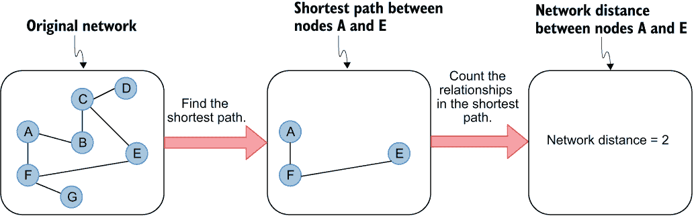

图 10.8 计算节点 A 和 E 之间的网络距离

网络距离背后的思想是，网络中两个节点越接近，它们形成未来连接的可能性就越大。例如，想象你正在处理社交网络中的链接预测。训练集或测试集中一对人员的网络距离永远不会是 1，因为这意味着你没有正确执行关系分割。然而，如果网络距离是 2，这意味着这对人员至少有一个共同的朋友。如果距离大于 2，那么这两个人没有共同的朋友，并且不太可能形成未来的连接。理论上，网络距离越高，未来连接的可能性就越小。在你的用例中，两个流在网络中越接近，未来出现显著观众重叠的可能性就越大。

使用 Cypher 查询语言，您可以使用`shortestPath()`函数找到最短无权路径。在无权路径中，每个关系的遍历具有相同的成本，因此两个节点之间的最短路径将始终是它们之间路径中总关系的数量。`shortestPath()`函数期望输入一个 Cypher 模式，该模式定义了源节点和目标节点以及路径中可选的允许关系类型。对于更高级的用例，您还可以定义路径中遍历的最小或最大次数或关系数。以下 Cypher 语句查找 Surya 和 Jim 之间的最短路径。

列表 10.3 使用 Cypher 查找最短无权路径

```
MATCH (source:Person {name:"Surya"}),
      (target:Person {name:"Jim"})                                   ❶
MATCH p = shortestPath((source)-[:FRIEND|COWORKER*1..10]->(target))  ❷
RETURN p
```

❶ 定义最短路径的源节点和目标节点

❷ 在 p 参考变量下确定源节点和目标节点之间的最短路径

列表 10.3 的第一部分是一个简单的`MATCH`子句，用于确定源节点和目标节点。接下来，您需要使用 Cypher 语法定义最短路径约束。列表 10.3 中定义的最短路径约束的图模式如下所示。

列表 10.4 定义最短路径约束的图模式

```
(source)-[:FRIEND|COWORKER*]->(target)
```

列表 10.4 中的 Cypher 语法定义了`source`和`target`节点之间的最短路径。最短路径的一个约束是它只能遍历`FRIEND`或`COWORKER`关系。该函数忽略所有其他关系类型。请注意，关系方向也是至关重要的。在列表 10.4 的示例中，最短路径算法只能遍历路径中的出向关系。最后，您需要添加`*`符号以允许算法遍历多个关系。如果缺少`*`符号，最短路径约束之一将是算法只能遍历单个关系。

现在，你将为关系（列表 10.5）的训练集和测试集中的所有节点对计算网络距离。节点对的测试和训练集被标记为`TEST_TRAIN`和`NEGATIVE_TEST_TRAIN`关系类型。然后，你必须找到两个集合中所有节点对之间的最短路径。在最后一步，你将使用`length()`函数计算最短路径的长度，这相当于关系的数量。

列表 10.5 计算训练集和测试集中节点对之间的网络距离

```
run_query("""
MATCH (s1)-[r:TEST_TRAIN|NEGATIVE_TEST_TRAIN]->(s2)    ❶
MATCH p = shortestPath((s1)-[:FEATURE_REL*]-(s2))      ❷
WITH r, length(p) AS networkDistance                   ❸
SET r.networkDistance = networkDistance                ❹
""")
```

❶ 匹配所有通过 TEST_TRAIN 或 NEGATIVE_TEST_TRAIN 关系连接的节点对

❷ 识别节点对之间的最短路径。最短路径仅限于允许通过 FEATURE_REL 关系进行遍历，以防止数据泄露。

❸ 使用 length()函数计算最短路径的长度

❹ 将网络距离结果存储为关系属性

你可能会注意到，列表 10.5 中最短路径图模式定义中没有方向指示符。因此，最短路径算法也可以沿着相反的方向遍历关系，有效地将关系视为无向的。

### 10.3.2 优先连接

在链接预测中使用的另一个流行指标是优先连接。*优先连接*是现实世界中网络的一个基本组织原则，其中具有更多关系的节点更有可能建立新的关系。在社会网络示例中，朋友更多的人更有可能建立新的联系。他们可能会被邀请参加更多的社交活动或被介绍给更多的人，因为他们的朋友众多。优先连接模型最初由巴拉巴西和艾伯特（1999 年）描述。

图 10.9 显示了两个位于中心的`Stream`节点，它们的节点度数相对较大。优先连接机制假设已经与许多其他流共享大量受众的流更有可能形成未来的连接。因此，根据图 10.9 中的虚线，可以假设这两个中心的`Stream`节点很可能有共享的受众重叠。

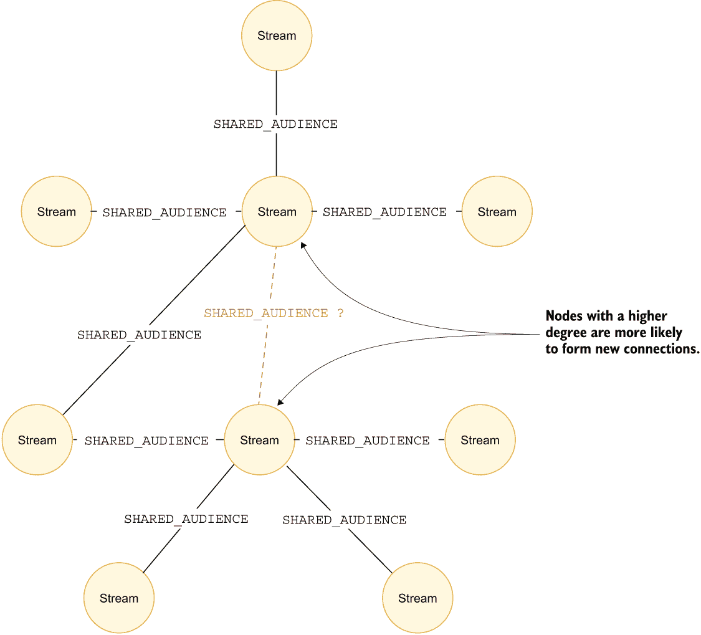

图 10.9 节点度数较高的节点更有可能形成新的连接。

要计算节点对之间的优先连接指标，你需要将它们的节点度数相乘。本质上，你取第一个节点的节点度数并乘以第二个节点的节点度数。当节点对具有高优先连接指标时，节点更有可能在将来形成连接。

练习 10.4

计算训练集和测试集中节点对的优先连接度指标。类似于网络距离度量的计算，你首先通过匹配与`TEST_TRAIN`或`NEGATIVE_TEST_TRAIN`关系连接的节点对。接下来，计算两个节点的节点度。确保将传入和传出的关系都计入节点度，并且只计算`FEATURE_REL`关系。最后，将两个节点度相乘，并将结果存储在关系的`preferentialAttachment`属性下。

### 10.3.3 常见邻居

你接下来要计算的链接预测特征指标是*共同邻居*指标。共同邻居指标背后的直觉很简单。两个节点共有的邻居越多，未来形成链接的可能性就越高。在社会网络的背景下，两个人共有的朋友越多，他们未来相遇或被介绍的可能性就越大。

记住，由于关系分割，训练集或测试集中的节点对之间没有直接连接。然而，许多节点可能有几个共同的朋友，如图 10.10 所示。想象一下，图 10.10 中的所有节点代表 Twitch 直播。如果直播 A 与直播 B 的观众有重叠，而直播 B 与直播 C 有重叠，那么未来直播 A 和 C 之间很可能有观众重叠。此外，两个直播之间的共同邻居数量越多，未来建立链接的概率就越高。为了在链接预测模型中使用共同邻居度量，你需要计算训练集和测试集中所有节点对的共同邻居数量。

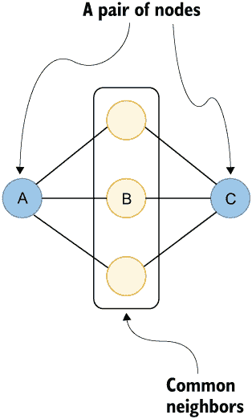

图 10.10 节点对之间的共同邻居

练习 10.5

计算训练集和测试集中节点对的共同邻居度指标。你与前一次类似，通过匹配与`TEST_TRAIN`或`NEGATIVE_TEST_TRAIN`关系连接的节点对。然后，你需要计算匹配节点对之间的不同共同邻居数量。确保使用`OPTIONAL` `MATCH`子句包括没有共同邻居的节点对的结果。最后，将节点对之间的共同邻居数量存储在关系的`commonNeighbor`属性下。

### 10.3.4 Adamic-Adar 指数

*Adamic-Adar 指数*是 Adamic 和 Adar（2003）首次描述的链接预测指标。Adamic-Adar 指数背后的想法是，一对节点之间共有的节点度越小，它们未来形成连接的可能性就越大。再次想象你正在处理一个社交网络。一对人有共同的一个朋友。如果这个共同朋友有 1,000 个其他朋友，他们不太可能介绍这对特定的人，如果他们总共只有两个朋友的话。

在图 10.11 的示例 A 中，节点 A 和 B 有两个共同邻居或朋友。共同的邻居是节点 C 和 D。节点 C 和 D 总共各有 1,000 个朋友。由于节点 A 和 B 的共同邻居本身有一个广泛的社交圈，因此共同邻居中的任何一个不太可能将节点 A 和 B 介绍给对方。另一方面，在图 10.11 的示例 B 中，节点 A 和 B 的共同邻居总共只有两个朋友。本质上，节点 C 和 D 只与节点 A 和 B 是朋友。因此，由于共同朋友的社交圈较小，例如，节点 A 和 B 更有可能被邀请参加节点 C 或 D 可能举办的社交活动。类似的逻辑也可以应用于 Twitch 重叠网络。

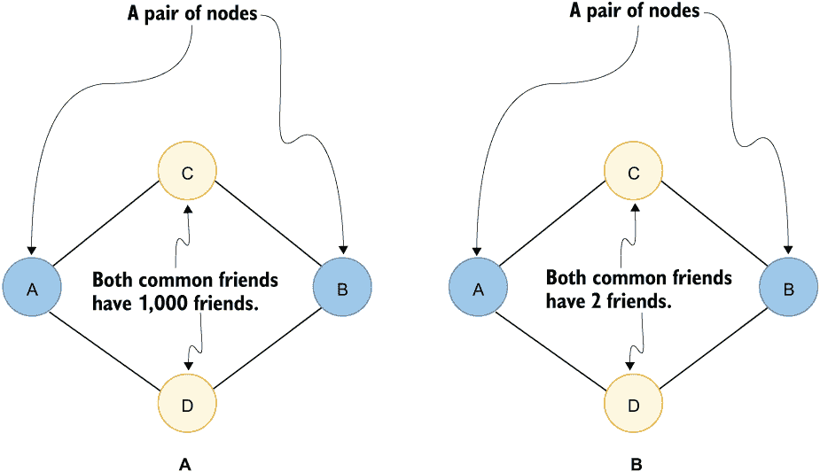

图 10.11 Adamic-Adar 指数的直觉

Adamic-Adar 指数是使用图 10.12 中所示的方程计算的。

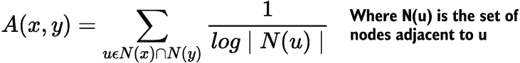

图 10.12 Adamic-Adar 指数公式

如果你不理解图 10.12 中的所有符号，请不要担心。Adamic-Adar 指数定义为节点对共享的共同邻居的逆对数节点度数之和。以下是 Adamic-Adar 指数计算的主要步骤：

1.  首先找出节点`x`和`y`的所有共同邻居。

1.  计算所有共同邻居的节点度数。

1.  求所有共同邻居节点度数逆对数的总和。

以下 Cypher 语句计算训练集和测试集中节点对的 Adamic-Adar 指数。

列表 10.6 计算训练集和测试集中节点对的 Adamic-Adar 指数

```
run_query("""
MATCH (s1:Stream)-[r:TEST_TRAIN|NEGATIVE_TEST_TRAIN]->(s2:Stream)
OPTIONAL MATCH (s1)-[:FEATURE_REL]-(neighbor)-[:FEATURE_REL]-(s2)
WITH r, collect(distinct neighbor) AS commonNeighbors             ❶
UNWIND commonNeighbors AS cn
WITH r, count{ (cn)-[:FEATURE_REL]-() } AS neighborDegree         ❷
WITH r, sum(1 / log(neighborDegree)) AS adamicAdar                ❸
SET r.adamicAdar = adamicAdar;                                    ❹
""")
```

❶ 识别节点 s1 和 s2 的所有共同邻居

❷ 计算每个共同邻居的节点度数，包括传入和传出关系

❸ 计算逆对数度数的总和

❹ 将结果存储为关系属性

### 10.3.5 共同邻居的聚类系数

你将要计算的最后一个链接预测是**共同邻居的聚类系数**。聚类系数衡量特定节点的邻居的连通性，其值介于 0 到 1 之间。0 的值表示相邻节点之间没有连接。另一方面，1 的值表示邻居的网络形成一个完全图，其中所有邻居都是连接的。

共同邻居的聚类系数是链接预测的一种变体，其中你只计算特定节点对共同邻居的连通性。研究人员已经证明（Wu 等，2015 年），共同邻居的聚类系数可以提高链接预测模型的准确性。

要计算一对节点之间共同邻居的局部聚类系数，你需要确定共同邻居的数量以及共同邻居之间的链接数量。一旦你有了这些数字，你只需要将邻居之间现有链接的数量除以潜在连接的数量。如果所有邻居都连接在一起，邻居之间的潜在连接数量等于链接数量。以下 Cypher 语句计算共同邻居的聚类系数并将结果存储为关系属性。

列表 10.7 计算训练和测试集中节点对之间共同邻居的聚类系数

```
run_query("""
MATCH (s1:Stream)-[r:TEST_TRAIN|NEGATIVE_TEST_TRAIN]->(s2:Stream)
OPTIONAL MATCH (s1)-[:FEATURE_REL]-(neighbor)-[:FEATURE_REL]-(s2)
WITH r, collect(distinct neighbor) AS commonNeighbors,
        count(distinct neighbor) AS commonNeighborCount             ❶
OPTIONAL MATCH (x)-[cr:FEATURE_REL]->(y)                            ❷
WHERE x IN commonNeighbors AND y IN commonNeighbors
WITH r, commonNeighborCount, count(cr) AS commonNeighborRels
WITH r, CASE WHEN commonNeighborCount < 2 THEN 0 ELSE               ❸
  toFloat(commonNeighborRels) / (commonNeighborCount *
                 (commonNeighborCount - 1) / 2) END as clusteringCoefficient
SET r.clusteringCoefficient = clusteringCoefficient                 ❹
“””)
```

❶ 识别并计算一对节点之间共同邻居的数量

❷ 识别共同邻居之间所有现有关系

❸ 通过将现有关系数量除以潜在关系数量来计算聚类系数

❹ 将结果存储为关系属性

你可能已经注意到，在本节的示例中，你在查询时将特征集中的关系视为无向的。列表 10.7 中的 Cypher 语句也不例外。最初，你在识别共同邻居时忽略关系方向。由于关系被视为无向的，潜在连接的数量也比有向网络少 50%。因此，列表 10.7 的第二行最后将潜在关系数量除以 2。

### 10.4 链接预测分类模型

剩下的唯一任务是训练和评估链接预测模型。*链接预测* 是一个二元分类问题，其中你预测一个链接是否可能在将来形成。你将基于你为关系训练和测试集计算的特征来训练一个随机森林分类模型以解决链接预测任务。在这里使用随机森林分类模型是因为它对特征缩放和共线性问题相对稳健。然而，你也可以选择其他分类模型，如逻辑回归或支持向量机。

使用以下 Cypher 语句从数据库中检索链接预测特征和输出。

列表 10.8 检索链接预测特征和分类输出

```
data = run_query("""
MATCH (s1)-[r:TEST_TRAIN|NEGATIVE_TEST_TRAIN]->(s2)
WITH r.networkDistance AS networkDistance,
     r.preferentialAttachment AS preferentialAttachment,
     r.commonNeighbor AS commonNeighbor,
     r.adamicAdar AS adamicAdar,
     r.clusteringCoefficient AS clusteringCoefficient,
     CASE WHEN r:TEST_TRAIN THEN 1 ELSE 0 END as output
RETURN networkDistance, preferentialAttachment, commonNeighbor,
       adamicAdar, clusteringCoefficient, output
""")
```

列表 10.8 中的 Cypher 语句检索存储在 `TEST_TRAIN` 和 `NEGATIVE_TEST_TRAIN` 关系上的特征。列表 10.8 的结果中的最后一列是 `output` 列，用于区分正负分类示例。正例用 `TEST_TRAIN` 关系类型标记，表示为 1，而负例用 `NEGATIVE_TEST_TRAIN` 标记，表示为 0。

检查相关特征的分布是建议的，就像任何其他机器学习任务一样。pandas 数据框有一个 `describe()` 方法，用于计算列中值的分布。

列表 10.9 定义与 Neo4j 的连接

```
data.describe()
```

图 10.13 展示了链接预测特征的分布。有趣的是，网络距离特征的范围从 2 到 4；然而，它主要是 2，因为平均网络距离仅为 2.055。此外，由于它的方差较低，它可能不是这个例子中最可预测的特征。优先连接的范围很广，从 0 到近 3,000,000。记住，优先连接是通过乘以一对节点中两个节点的度数来计算的。优先连接为 0 的唯一方式是某些节点没有连接。虽然所有节点在原始网络中都有关系，但在特征集中，由于数据拆分，某些连接可能缺失。有趣的是，聚类系数相对较高，平均来看。

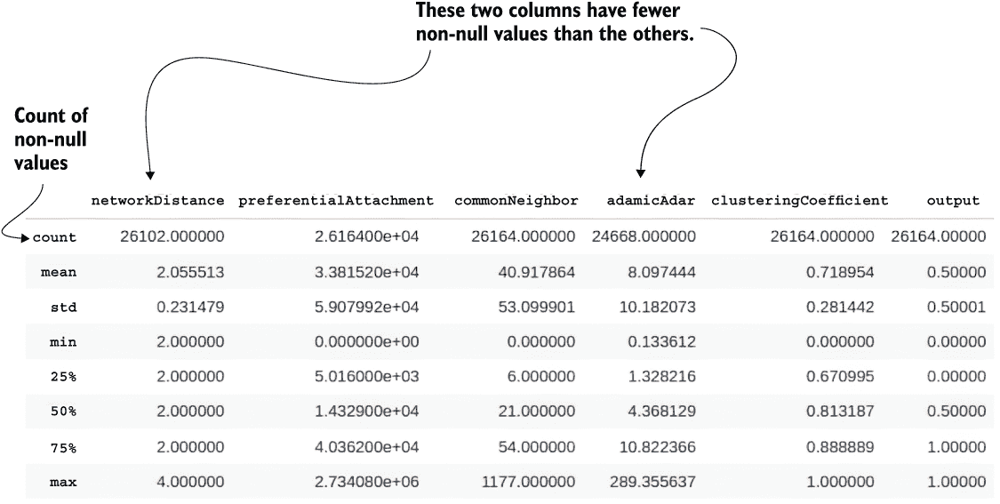

图 10.13 链接预测特征分布

### 10.4.1 缺失值

总共有 26,164 个训练和测试样本。然而，图 10.13 也表明 `networkDistance` 和 `adamicAdar` 列中存在一些缺失值。例如，在 `networkDistance` 特征下只有 26,102 个非空值。网络距离未定义，因为这两个节点不在同一个组件中。因此，它们之间不存在路径。正如之前提到的，网络中的孤立节点可能是导致网络距离值缺失的主要原因。你可以用最大距离值 4 来填充缺失值。记住，节点对之间的网络距离越高，它们之间形成链接的可能性就越小，至少在理论上是这样的。所以，如果一对节点不在同一个组件中，在这个例子中就是网络距离为空，你想要选择一个表示显著网络距离的值来填充缺失值。因此，你可能会决定选择数据集中网络距离的最大值（4）来填充缺失值。

另一列存在缺失值的列是 `adamicAdar`，这种情况可能发生在一对节点没有共同邻居时。你可以用大约 8 的平均 Adamic-Adar 值来填充 `adamicAdar` 列的缺失值。

列表 10.10 填充缺失值

```
data['networkDistance'].fillna(4, inplace=True)
data['adamicAdar'].fillna(8.097444, inplace=True)
```

### 10.4.2 训练模型

在完成所有预处理步骤后，你可以继续训练链接预测模型。`data` 数据框包含关系训练集和测试集。因此，你将首先使用 scikit-learn 库中的 `train_test_split` 函数来分割测试集和训练集。你将使用 80% 的样本作为训练示例，剩余的 20% 用于评估模型。如果你计划对分类模型进行超参数优化，你也可以生成一个验证集。然而，优化分类模型本身超出了本书的范围，所以你将跳过创建验证集。在数据集分割后，你将训练样本输入到随机森林模型中，该模型将学习预测未来是否存在链接的可能性。

列表 10.11 分割训练集和测试集并训练链接预测模型

```
from sklearn.model_selection import train_test_split
from sklearn.ensemble import RandomForestClassifier

X = data.drop("output", axis=1)
y = data["output"].to_list()

X_train, X_test, y_train, y_test = train_test_split(
  X, y, test_size=0.2, random_state=0)
rfc = RandomForestClassifier()
rfc.fit(X_train, y_train)
```

列表 10.11 中的代码首先定义了特征和目标列。`output` 列用作目标，而所有其他列都用作模型特征。接下来，你使用 `train_test_split` 函数进行测试/训练分割。最后，你实例化一个随机森林模型，并基于训练样本进行学习。

### 10.4.3 评估模型

与所有机器学习任务一样，你应该使用测试集来评估你的链接预测模型的表现。在以下列表中，你将使用内置的 scikit-learn 函数生成一个分类报告。

列表 10.12 生成分类报告

```
from sklearn.metrics import classification_report

y_pred = rfc.predict(X_test)
print(classification_report(y_test, y_pred))
```

列表 10.12 中的代码生成了图 10.14 所示的分类报告，可以用来评估模型。

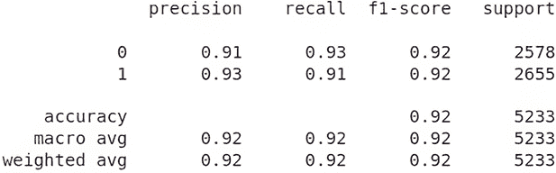

图 10.14 链接预测模型的分类报告

恭喜！你已经训练了一个准确率为 92% 的链接预测模型。准确率是一个很好的指标，因为负样本和正样本的比例是均衡的。

最后，你可以评估训练好的链接预测模型的特征重要性。以下代码将生成一个按特征重要性降序排列的有序数据框。

列表 10.13 评估特征重要性

```
def feature_importance(columns, classifier):
    features = list(zip(columns, classifier.feature_importances_))
    sorted_features = sorted(features, key = lambda x: x[1]*-1)

    keys = [value[0] for value in sorted_features]
    values = [value[1] for value in sorted_features]
    return pd.DataFrame(data={'feature': keys, 'value': values})

feature_importance(X.columns, rfc)
```

表 10.15 显示，网络距离是最不重要的特征，差距很大。这在某种程度上是可以预料的，因为网络距离特征的方差较低。有趣的是，最相关的特征是 Adamic-Adar 指数，其次是共同邻居和优先连接特征。请注意，由于本章开头使用随机数据集分割，你可能会得到略微不同的结果。

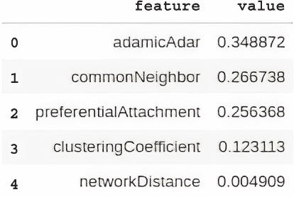

图 10.15 特征重要性

### 10.5 练习题解答

练习 10.1 的解答如下。

列表 10.14 计算关系数量

```
run_query("""
MATCH (n)-[:SHARED_AUDIENCE]->()
RETURN count(*) AS result
""")
```

练习 10.2 的解答如下。

列表 10.15 构建测试集和训练集的正例

```
# Create test/train rel
# Take the remaining 10%
train_test_size = run_query("""
MATCH (s1)-[:SHARED_AUDIENCE]->(s2)
WHERE NOT EXISTS {(s1)-[:FEATURE_REL]->(s2)}
MERGE (s1)-[r:TEST_TRAIN]->(s2)
RETURN count(r) AS result;
""")
print(train_test_size)
```

练习 10.3 的解答如下。

列表 10.16 构建测试集和训练集的负例

```
# Create negative test/train pairs
run_query("""
MATCH (s1:Stream),(s2:Stream)
WHERE NOT EXISTS {(s1)-[:SHARED_AUDIENCE]-(s2)}
      AND s1 < s2
      AND rand() > 0.9
WITH s1,s2
LIMIT 13082
MERGE (s1)-[:NEGATIVE_TEST_TRAIN]->(s2);
""")
```

练习 10.4 的解决方案如下。

列表 10.17 计算训练集和测试集中节点对的偏好连接特征

```
run_query("""
MATCH (s1:Stream)-[r:TEST_TRAIN|NEGATIVE_TEST_TRAIN]->(s2)
WITH r, count{ (s1)-[:FEATURE_REL]-() } *
        count{ (s2)-[:FEATURE_REL]-() } AS preferentialAttachment
SET r.preferentialAttachment = preferentialAttachment
""")
```

练习 10.5 的解决方案如下。

列表 10.18 计算训练集和测试集中节点对的共同邻居特征

```
run_query("""
MATCH (s1:Stream)-[r:TEST_TRAIN|NEGATIVE_TEST_TRAIN]->(s2)
OPTIONAL MATCH (s1)-[:FEATURE_REL]-(neighbor)-[:FEATURE_REL]-(s2)
WITH r, count(distinct neighbor) AS commonNeighbor
SET r.commonNeighbor = commonNeighbor
""")
```

## 摘要

+   链接预测是预测网络中未来或缺失链接的任务。

+   链接预测模型常用于推荐系统中。

+   链接预测特征旨在编码节点对之间的相似性或距离。

+   链接预测特征可以通过聚合节点属性、评估网络距离或检查局部或全局邻域重叠来构建。

+   如果你使用归纳节点嵌入在链接预测工作流程中，你无法在训练期间为新的未见节点生成节点嵌入，因此无法预测训练期间未出现的节点的未来链接。

+   当一个特征包含与输出变量相同或可比较的信息时，就会发生特征泄漏。如果你使用相同的关系来生成网络特征以及训练和评估分类模型，可能会遇到泄漏问题。因此，有必要将数据集分为特征、训练和测试集。如果你计划执行任何超参数优化，也可以引入验证集。

+   特征集用于计算网络特征，而测试集和训练集提供分类样本以训练和评估模型。如果你计划实现任何超参数优化技术，你也可以引入验证集。

+   在训练期间使用所有负例会导致相当大的类别不平衡。因此，通常会对负例进行子采样，并使用大约相同数量的正例和负例。

+   网络距离编码了节点对在网络中的接近程度。理论表明，节点对越接近，它们形成未来链接的可能性就越大。

+   偏好连接原则很好地捕捉了大多数现实世界网络如何演变。其基本思想是“富者愈富”。因此，具有更多现有链接的节点在未来更有可能形成新的链接。

+   本地邻域重叠特征可以简单到两个节点共有的邻居数量，也可以高级到 Adamic-Adar 指数，该指数假设一对节点之间共有邻居的度数越小，这对节点未来形成连接的可能性就越大。
